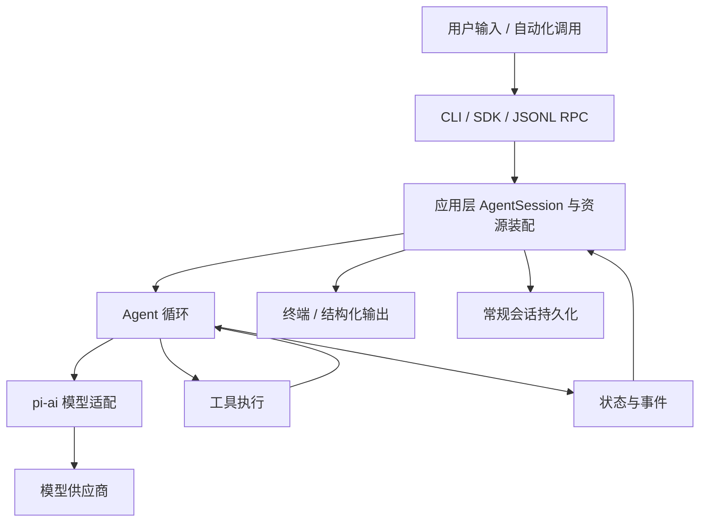

# pi 从零学习与开发手册：编写方案

> 状态：路线、跨平台范围、模型实践原则、TS 新手定位、一个月主线目标、精读深度与约 3 万行规模已确认；各平台实测条件仍需如实记录。
> 已确认目标：主要学习源码与架构，最终参与项目开发。
> 本文件是生成学习手册的方案，包含章节设计、内容重点、实验和验收标准；不是已经完成或验证过的全部教程。
> 仓库基线：`main`，提交 `200387122ca450d6387f033949423114a270b96c`；调研日期：2026-10-04。

## 1. 最终要达到什么程度

完成主线后，学习者应能够：

1. 从一条用户输入出发，找到 CLI、会话、Agent、模型适配和工具执行的代码入口。
2. 解释运行中的消息、事件、状态、持久化记录各自解决什么问题。
3. 用一次具体调用说明正常返回、工具失败、取消、续跑和上下文压缩。
4. 判断需求应该用配置、提示词模板、Skill、Extension、SDK，还是修改核心。
5. 在确定的模块内实现一个小改动，写有意义的回归测试，说明影响范围。
6. 按本仓库的规范检查代码、整理变更说明，并理解提交上游的准入规则。

读者对 TypeScript 不熟练，因此正文从 TS/Node 入门知识开始补课，再进入 pi 源码。学习目标为约一个月掌握主线并具备动手改源码的能力；手册整体目标约 30,000 行，重点是核心代码流程逐段讲解与注释。行数是内容完整度的参考，不作为灌水指标。

## 2. 已确认事项与待确认事项

### 2.1 已确认

| 项目 | 决定 | 对方案的影响 |
|---|---|---|
| 学习目标 | 源码与架构，参与开发 | 源码追踪、状态分析、测试和贡献流程为主线 |
| 本次产物 | 项目内 Markdown 规划 | 先形成可审阅方案，再按批次生成正文 |
| 沟通方式 | 需要确认时提供详细问题 | 说明选择、影响、推荐项和依赖该答案的工作 |
| 平台覆盖 | 同时完整覆盖 Windows、Linux、macOS | 每个环境相关实验给出三平台步骤和差异 |
| 进阶范围 | CLI、扩展、SDK、核心源码为主线，实验模块选修 | durable 和 client/server 不作为入门前置要求 |
| 模型实践 | 离线模拟为主，真实模型实验单独确认 | 不执行未经单独确认的真实模型调用 |
| 讲解顺序 | 每段核心代码前先给通俗导读、核心伪代码和作用说明；详细逻辑前也先给简单解释 | 按小节落实，不能只在章首提供一次总览 |

### 2.2 确认问卷

下面的推荐项只是规划建议，不代表用户已经同意。尚未答复的问题保留为待确认，不因等待时间过去而自动成为授权。

| 编号 | 请确认的问题 | 可选答案与推荐 | 为什么影响方案 |
|---|---|---|---|
| Q1 | TS 熟练度 | **已确认：TS 不熟练**；第 1 章作为新手补课，重点讲类型、联合类型收窄、泛型、Promise/async、事件流、Node API | 正文不能假设读者能直接读懂类型签名或异步代码 |
| Q2 | 三平台覆盖和实测系统 | **已确认完整覆盖 Windows/Linux/macOS**；当前编写环境为 Windows + PowerShell。Linux/macOS 操作只标静态核对，除非实际运行验证 | 区分“给出完整步骤”和“已经在该平台实测” |
| Q3 | 是否深入实验模块？ | 已确认：主线完整学习，实验模块放选修篇 | 不需要重复确认范围；具体选修实验执行时再选择 |
| Q4 | 真实模型如何安排？ | 已确认：离线模拟为主，真实实验单独确认；届时再问供应商、账号条件和预算，不索取密钥 | 离线模拟无法证明真实供应商行为，真实实验保持独立验证状态 |
| Q5 | 学习期限 | **已确认：一个月掌握主线**。当前索引按每天 3–5 小时、每周 6 天安排 | 四周主线优先，进阶篇选修；不把选修完成算作核心入门前置 |
| Q6 | 优先贡献方向 | **已确认：pi 源码与 Agent 整体，目标是能入手改源码** | 主线覆盖 CLI、会话、Agent、AI provider、工具、扩展和开发闭环 |
| Q7 | 手册存放形式 | **已采用：`docs/learning/zh-CN/` 分章 + README 索引** | 继续维护当前结构，不改成单一超长文件 |
| Q8 | 示例是否要独立落地为代码文件？ | 推荐正文保留片段，确定可运行的实验另附文件与验证说明；仅讲解也可 | 新增代码必须符合仓库规则并运行检查；不能把未测试示例标为可运行 |
| Q9 | 讲解粒度与规模 | **已确认：尽量详细、通俗易懂；核心代码流程必须讲到并有详细注释；整体约 30,000 行** | 逐行精读优先覆盖关键路径和高风险状态转换，外围模块按调用链与职责讲解 |

尚待决定的主要是 Q8（是否把教程实验独立落地为代码文件）及实际可运行的 Linux/macOS 验证环境；Q3、Q4 和 Q1、Q5–Q7、Q9 已由现有目标明确。

## 3. 编写原则与事实边界

### 3.1 先提出问题，再跟踪行为，最后解释设计

每个非平凡知识点固定采用：

1. **通俗导读**：用读者已经知道的概念说明这段逻辑要做什么、为什么需要它。
2. **具体例子**：用户输入什么，开始时有哪些数据，最后希望得到什么？
3. **核心伪代码**：先去掉类型和框架细节，保留输入、主要步骤、关键分支和输出。
4. **伪代码作用说明**：逐步说明每一步解决什么问题，用刚才的例子走一遍。
5. **真实实现**：给出伪代码与源码的对应关系，再逐段解释类型、状态、调用和错误路径。
6. **必要性与代价**：没有这个机制会怎样，哪些复杂性只在特定条件下需要？
7. **验证**：如何用测试、日志或本地实验确认？

例如讲“会话分支”，先画 `A → B → C` 与 `B → D`，说明当前叶节点决定模型看到的历史，再读会话管理代码；不先堆砌数据结构术语。

### 3.2 区分三类内容

- **当前实现**：由本仓库文档、源码和测试支撑，记录提交基线。
- **教学简化**：为理解抽出的简图或伪代码，明确省略了什么。
- **设计提议/实验功能**：标明实验性和验证范围，不描述成已经稳定发布的默认能力。

当前规划已阅读根目录规范、使用入口、工作原理、Windows 说明、SDK 最小示例和测试套件说明，并定位了主要源码入口。它不是全仓库源码审计；后续各章仍需要完整阅读涉及文件和测试。

### 3.3 版本差异必须写清楚

- 安装版与当前源码可能不同；记录 `pi --version` 和仓库 commit，不能混用接口。
- 当前 README 使用 `@earendil-works/*` 包名；引用旧资料时先核对包名与 API。
- 常规 CLI 会话文档描述 JSONL 会话树；实验 durable 模块有另一套持久执行机制。两者分章讲解。
- `packages/client`、`packages/server`、`packages/protocol` 文档明确描述实验性服务协议，不能和 CLI 的 stdin/stdout JSONL RPC 当作同一种协议。
- 当前 `pi-test.sh` 经过 source resolver 调用 experimental 目录下的 CLI 入口；路径含 experimental 不足以证明整个常规 CLI 都是实验模式。正文必须继续追踪分流条件。
- README 中对默认 CLI 的描述，不应外推到所有底层库。例如 durable 示例包含 subagent，不能因此认定默认 CLI 内置同样的功能。

### 3.4 每段都要搭建从直觉到源码的台阶

本规则同时适用于主线章节、核心代码精读篇和单文件版。落实单位是一个完整的核心逻辑小节，不只是整章。进入新的核心函数、状态转换、复杂分支或错误路径时，都需要重新给出局部导读；不能要求读者记住几十页之前的总览。

**详细逻辑前的导读**用 3–5 句话说清楚四件事：谁在什么情况下做这件事、接收什么、主要怎么处理、处理后谁使用结果。先解释概念，再引入函数名。例如先说“工具结果要放回对话，模型才能根据文件内容继续回答”，再引入相关消息类型和循环函数。

**核心代码前的伪代码**紧邻该代码的讲解区域。一个小节包含几个独立阶段时，每个阶段分别提供短伪代码与作用说明；连续展示同一段实现的若干片段，可以共享一个紧邻的伪代码，但要标明每个片段对应哪一步。

**不能用这些方式代替导读**：只写“下面分析源码”；把函数名翻译成中文；一开始堆叠泛型和接口名；只贴流程图；把真实 TypeScript 换几个变量名当作伪代码；在每一节复制同一句通用说明。

伪代码必须忠实保留会影响理解的顺序、条件和结果。能够省略日志、类型细节等外围内容，但要说明省略范围。错误、取消、重试、并发顺序恰好是该节主题时，不能把它们省略为“处理异常”或“执行任务”。

## 4. 项目地图与阅读分层

Monorepo 指一个仓库内维护多个包。不要按目录名称从头读到尾；先围绕一个请求追踪相关模块。

| 包/目录 | 学习角色 | 重点问题 | 阶段 |
|---|---|---|---|
| `packages/coding-agent` | CLI、应用层会话、资源与集成 | 如何把底层能力组合成可用产品？ | 主线 |
| `packages/agent` | Agent 循环、工具调度、事件与状态 | 为什么一次用户输入会触发多次模型调用？ | 主线 |
| `packages/ai` | 统一模型接口、供应商适配 | 不同供应商如何变成统一消息与事件？ | 主线 |
| `packages/tui` | 终端界面与渲染 | 流式输出和编辑器如何共享终端？ | 主线概览，UI 方向精读 |
| `packages/mcp` | 外部工具协议连接 | 工具发现、调用和连接生命周期如何处理？ | 进阶 |
| `packages/codemode` | 模型生成 JavaScript 的工具编排 | 和直接工具调用有什么行为差异？ | 进阶 |
| `packages/telemetry` | 观测契约与适配 | 如何把一次请求的各阶段关联起来？ | 进阶 |
| `packages/evals` | 行为评估 | 如何测量任务成功率，而不只是代码是否通过测试？ | 进阶 |
| `packages/chord` | 服务、状态复制、插件组合 | 模块依赖与运行生命周期如何组合？ | 架构选修 |
| `packages/durable` | 实验性持久 Agent 运行 | 进程中断后如何恢复已持久化工作？ | 架构选修 |
| `packages/protocol` | 实验协议封装、编码和分帧 | 字节流如何成为可路由消息？ | 架构选修 |
| `packages/client` / `packages/server` | 实验服务连接与会话路由 | 如何区分逻辑会话、连接和 attachment？ | 架构选修 |

教学用主线图，表达职责关系，不作为完整 import 依赖图：



第 0 章现有依赖图已按全部 `packages/*/package.json` 的 workspace dependencies 核对，并用代表性源码 import 确认关键边；图中明确区分常规 CLI 核心依赖与实验性协议/持久 Agent 包，不把包依赖关系当成单次运行时调用图。后续增加 workspace 包时，应按同一证据范围更新图。

## 5. 从方案到完整手册的生成步骤

### 第 0 步：确认学习契约

- 收集 Q1–Q4，确定预备知识、操作系统、实验范围和模型约束。
- 收集 Q5–Q9，确定节奏、深度、文件布局和毕业方向。
- 产出：学习者画像、主线/选修清单、明确标记的待定事项。
- 确认点：用户确认后才把“推荐”改成“已确定”；依赖未回答问题的环境实验暂不执行。

### 第 1 步：建立事实索引

- 固定 commit，记录工作区状态和版本。
- 阅读目标章节涉及的 README、文档、导出、实现和对应测试；大文件可分段完整阅读。
- 建立“结论 → 文件与符号 → 测试 → 验证状态”的证据表。
- 对文档与实现不一致处记录差异，查明后再写结论，不拼接成看似合理的新 API。
- 产出：源码地图、术语表草案、运行入口说明、版本差异清单。

### 第 2 步：生成两章样稿，校准深度

- 样稿 A：第 3 章，一次请求的完整旅程。
- 样稿 B：第 7 章，工具调用与错误处理。
- 两章覆盖架构图、源码解释、实验和验收题，足以判断表达方式是否合适。
- 确认点：请用户评价术语难度、源码粒度、示例复杂度，给出需要调整的具体部分。
- 产出：经过风格确认的章节模板，减少整本写完后返工。

### 第 3 步：生成基础与核心主线

- 按第 0–11 章顺序编写；TS 预备篇按 Q1 调整。
- 每章先解释一个真实行为，再增加类型和边界条件。
- 对每个核心小节先写通俗导读和伪代码，再写源码解释；正文写完后逐节检查，不能用章首总览替代。
- 每完成 3–4 章检查术语、跨章引用、实验前置条件和知识缺口。
- 产出：能把输入追踪到工具结果和持久化记录的第一版手册。

### 第 4 步：生成扩展与集成篇

- 编写第 12–17 章，围绕同一个小型“仓库检查助手”递进。
- 能用模板解决的需求先用模板；需要执行逻辑再引入扩展；需要宿主应用才引入 SDK/RPC。
- 验证示例是否使用当前公开类型，是否有资源释放、取消和错误路径。
- 产出：扩展示例、SDK 集成示例、交互与集成方式对照表。

### 第 5 步：生成开发与贡献篇

- 编写第 18–21 章，从复现、测试、修复到变更说明闭环。
- 选择一个不依赖真实模型的毕业课题，先确定预期行为与验收测试。
- 确认点：涉及核心行为变化的课题先解释影响；不以练习名义随意删除现有功能。
- 产出：最小改动练习、测试证据、可用于评审的说明草稿。

### 第 6 步：按选择生成进阶篇

- 编写第 22–25 章，先解释它与常规 CLI 主线的边界。
- 每章明确实验标记、源码基线、平台限制和未实现部分。
- 不预设实验协议在 Windows 上具备和 Unix 示例完全相同的运行方式。
- 产出：持久化恢复案例、服务路由轨迹、评估与可观测性练习。

### 第 7 步：统一校验并交付

- 检查文件链接、章节导航、术语、命令 shell 标记和源码符号。
- 检查每段核心代码之前是否有对应的导读、伪代码及作用说明；每段复杂逻辑前是否有局部简单解释。
- 对“可运行”示例执行相关检查；未执行或需要账号的实验明确标注。
- 只对新增/修改的代码应用代码验证要求；纯文档工作不额外触发构建或测试。
- 产出：首页、章节、附录、验证记录、未决问题和版本更新说明。

## 6. 每章统一结构

### 6.1 章节结构

每章按以下结构组织，短章可以合并相邻部分；核心小节仍遵循 6.2 的讲解顺序：

1. 学完能回答的 2–4 个问题。
2. 前置知识与预计学习时间。
3. 一个具体场景：输入、初始状态、预期结果。
4. 最少必要概念，首次出现解释中英文术语。
5. 全章通俗总览、核心伪代码、运行轨迹及必要的架构图。
6. 源码阅读路线：先入口、再调用方/被调用方、最后对应测试。
7. 逐个核心小节精读：通俗导读 → 输入输出例子 → 局部伪代码 → 作用说明 → 源码对应 → 真实代码详解。
8. 实验：所在目录、shell、前置条件、步骤、观察项和清理方法。
9. 常见错误：现象 → 原因 → 定位方式 → 修复。
10. 验收题、练习、参考答案或判断标准。
11. 来源、版本、验证状态和下一章。

源码引用以“文件路径 + 导出符号/方法”作为主要定位方式，行号仅辅助；避免行号变动导致整本失效。

### 6.2 核心小节固定模板

每个核心小节应让读者按下面顺序逐层理解；不要求所有小节机械使用相同的小标题，但内容不能缺失。

| 顺序 | 内容 | 必须回答的问题 |
|---|---|---|
| 1 | 先用简单话理解 | 这段逻辑做什么？为什么此时需要它？ |
| 2 | 一个最小例子 | 输入和初始状态是什么？预期得到什么？ |
| 3 | 核心伪代码 | 从输入到结果，关键步骤和分支怎样排列？ |
| 4 | 伪代码逐步解释 | 每一步起什么作用？省掉它会有什么问题？ |
| 5 | 对应真实源码 | 伪代码每一步落在哪个文件、函数或分支？ |
| 6 | 真实代码与详细注释 | 类型、条件、状态变化、等待与返回各是什么意思？ |
| 7 | 边界与反例 | 出错、取消、空输入、重入或乱序时会怎样？只选相关项 |
| 8 | 自测 | 能否离开源码，用这个例子复述过程并预测结果？ |

其中第 7 项出现新的复杂机制时，再按“通俗解释 → 局部伪代码 → 细节”展开。例如讲完正常执行后进入取消路径，先说明“取消后还有哪些已经开始的工作需要收尾”，再分析具体判断，不能突然进入一串异常分支。

### 6.3 伪代码的具体写法

- 使用 `text` 代码块，标注“教学伪代码，不可直接运行”。优先中文动作与普通条件句。
- 一个片段只说明一个问题，通常控制在 5–15 行；复杂流程先写总览，再拆成几个局部片段，不硬删重要步骤凑行数。
- 明确输入、输出或状态变化；如果函数没有返回值，说明它修改了什么或通知了谁。
- 需要等待的步骤写明“等待”；并发步骤写明启动、完成、收集的区别；循环写明继续和退出条件。
- 伪代码下说明保留了什么、省略了什么；教学抽象与真实函数名严格区分。
- 使用同一组示例数据串起伪代码、源码和结果，避免每换一层就换例子。
- 不在伪代码里提前塞入尚未讲过的 TypeScript 泛型、框架 API 或供应商字段。
- 对数据结构/类型声明，用“如何判断和使用这份数据”的短伪代码引导阅读；对纯命令、配置、输出样本不用强行制造算法，但仍先解释用途。

### 6.4 精读时怎样照顾 TypeScript 新手

真实代码出现新的 TS 语法时，先用一两句话解释读法，再讲业务。例如先说明“检查 `type` 的值后，TypeScript 就知道这一分支有哪些字段”，再分析某一种事件的处理。

注释重点回答“为什么判断”“为什么等待”“谁改变状态”“失败交给谁处理”，避免逐行复述赋值语法。一次只展开当前阶段涉及的类型；外围类型链接到预备篇或术语表。

阅读有两层：第一遍只读导读、伪代码和例子，应能复述正常主流程；第二遍再读真实代码与边界，理解实现约束。正常流程讲清楚后，再展开错误、取消和竞态；边界讲解仍有自己的局部导读。

### 6.5 已有正文的改写顺序与完成标准

1. 以分章文件和精读篇为源稿，为核心函数、类型和逻辑小节建立清单。
2. 完整阅读待改文件；保留已核实的源码结论、异常边界、来源与验证状态。
3. 逐节补齐导读、伪代码、作用说明和源码映射，避免把整章摘要重复粘到每个代码块前。
4. 重点复核循环、并发工具、会话分支、压缩、认证、扩展加载、资源释放等流程，检查简化后是否改变语义。
5. 更新单文件版对应内容，检查章节导航、图示、链接和分章一致性。
6. 按小节记录覆盖状态；只更新规划或几处样稿，不能描述为全书已改写完成。

普通安装命令、静态配置和输出示例不计入核心算法代码，但需要紧邻的用途说明。所有核心代码和详细逻辑小节都满足本模板，才算本次讲解方式优化完整覆盖。

## 7. 详细章节设计

### 第一篇：建立阅读源码的基础

#### 第 0 章：目标、环境与项目全景

- **目标**：知道 pi 是什么、哪些包组成项目、怎样选择阅读路线。
- **内容**：Agent harness（组织模型、工具和状态的运行框架）、monorepo、默认 CLI 与底层库、已发布接口与实验模块。
- **重点**：从职责理解模块，而不是背目录；用户可见能力与库能力分开。
- **例子**：把“解释一个本地文件”分解为输入、模型决策、读文件、工具结果、回答。
- **练习/验收**：画出四个核心包的职责图；解释为什么模型本身不直接执行本地文件 API。
- **来源**：[根 README](../README.md)、[工作原理](../packages/coding-agent/docs/how-pi-works.md)、各包 README。

#### 第 1 章：读懂本项目需要的 TypeScript 与 Node.js

- **目标**：能读事件类型、异步函数、模块导出和测试。
- **内容**：ESM、联合类型与类型收窄、泛型、回调、Promise、异步迭代、AbortSignal、文件/进程与标准流。
- **重点**：用项目中的事件判别字段解释类型收窄；区分取消信号与强制终止进程。
- **例子**：`event.type` 不同分支访问不同字段；订阅函数返回取消订阅函数。
- **练习/验收**：读懂一个现有事件监听器，解释何时触发、何时完成、何时释放。
- **来源**：[Agent 类型](../packages/agent/src/types.ts)、[SDK 最小例子](../packages/coding-agent/examples/sdk/01-minimal.ts)。

#### 第 2 章：开发环境与最小运行闭环

- **目标**：区分安装版、源码运行和测试环境，能够复现一个固定实验。
- **内容**：Node 要求、workspace、无 lifecycle scripts 的依赖安装、入口脚本、工作目录、终端与模型工具 shell。
- **重点**：README 当前要求 Node `>=22.19.0`；不把 Bash 命令原样当 PowerShell 命令。
- **例子**：从 PowerShell 启动 pi，默认模型工具仍可能是 Git Bash；选择 `powershell` 工具后，编辑器 `!` 命令仍走 Bash。
- **练习/验收**：记录版本和 commit，找到 `pi-test.sh` 的实际入口，能解释脚本保留调用者工作目录的作用。
- **来源**：[Windows](../packages/coding-agent/docs/windows.md)、[pi-test.sh](../pi-test.sh)、[package.json](../package.json)。

### 第二篇：沿一次请求理解核心架构

#### 第 3 章：从输入到最终回答的完整旅程

- **目标**：建立后续所有章节共享的调用链。
- **内容**：CLI 参数与运行模式、会话装配、请求准备、流式响应、工具回传、最终结束。
- **重点**：一次用户请求不等于一次模型请求；UI 显示与底层执行通过事件协调。
- **例子**：“读取 demo.txt 并总结”需要第一次模型调用提出工具请求、工具执行、第二次模型调用生成总结。
- **练习/验收**：标出每一步所属包；用没有工具的简单请求与有工具的请求作对比。
- **源码入口**：[cli.ts](../packages/coding-agent/src/cli.ts)、[main.ts](../packages/coding-agent/src/main.ts)、[sdk.ts](../packages/coding-agent/src/core/sdk.ts)、[agent-session.ts](../packages/coding-agent/src/core/agent-session.ts)。正文需完整追踪实际分支。

#### 第 4 章：消息、事件、状态与持久化条目

- **目标**：避免把“流式增量”“最终消息”“会话记录”混为一谈。
- **内容**：消息角色、文本/工具调用内容块、工具调用 ID、事件生命周期、运行态与存储态。
- **重点**：给每种对象说明生产者、消费者、生命周期与是否持久化。
- **例子**：文字先出现多个 `text_delta`，再形成完整 assistant 消息；工具返回必须关联相应调用。
- **练习/验收**：为一个工具调用填写四列表：对象、产生位置、用途、存储位置。
- **来源**：[message-types.md](../packages/coding-agent/docs/message-types.md)、[AI 类型](../packages/ai/src/types.ts)、[Agent 类型](../packages/agent/src/types.ts)。

#### 第 5 章：pi-ai 与模型供应商适配

- **目标**：理解统一接口如何隔离供应商差异。
- **内容**：Model/Provider、模型目录、认证解析、请求转换、流式事件、用量、结束原因和失败。
- **重点**：认证、模型发现、实际请求是不同阶段；“API 兼容”不代表全部能力等价。
- **例子**：同一工具定义进入两个供应商适配器，比较字段映射和工具参数增量处理；选择哪两个在 Q4 后确定。
- **练习/验收**：用 faux provider 观察确定的响应序列；选读一个真实适配器，列出至少三个需要转换的字段。
- **来源**：[pi-ai](../packages/ai/README.md)、[providers.md](../packages/coding-agent/docs/providers.md)、[faux.ts](../packages/ai/src/providers/faux.ts)。

#### 第 6 章：Agent 循环、轮次与结束条件

- **目标**：能解释循环继续或退出的依据。
- **内容**：prompt、continue、turn、工具结果、prepareRequest、finishTurn、steering、follow-up。
- **重点**：按照当前实现追踪队列检查时机；正常结束、错误和取消分开分析。
- **例子**：工具执行期间加入 steering，观察何时进入下一次请求；follow-up 在什么条件下被消费。
- **练习/验收**：写出无工具、有工具、排队消息、取消四条状态轨迹；解释无条件 continue 为什么可能造成无限运行。
- **来源**：[agent-loop.ts](../packages/agent/src/agent-loop.ts)、[agent.ts](../packages/agent/src/agent.ts)、[Agent README](../packages/agent/README.md)。

#### 第 7 章：工具定义、调度、结果与失败

- **目标**：知道工具从声明到执行的完整路径。
- **内容**：参数 schema、校验、工具查找、前后钩子、并发/顺序执行、异常转换、输出截断和取消。
- **重点**：并发完成顺序不必等于消息记录顺序；顺序约束要读调度实现，不能只看 UI。
- **例子**：两个只读工具耗时分别为 100 ms 和 10 ms，比较完成事件顺序和最终工具结果顺序。
- **练习/验收**：用可控 Promise 或测试设施验证顺序，避免依靠真实计时；覆盖合法参数、非法参数、抛错和取消。
- **来源**：[tools](../packages/coding-agent/src/core/tools)、[agent-loop.ts](../packages/agent/src/agent-loop.ts)、[扩展类型](../packages/coding-agent/src/core/extensions/types.ts)。

#### 第 8 章：AgentSession 与资源生命周期

- **目标**：理解应用会话为什么不能等同于底层 Agent。
- **内容**：会话创建、模型运行时、资源装配、事件订阅、运行时替换、工作目录变更、dispose。
- **重点**：画清资源的创建者、拥有者、使用者和释放者。
- **例子**：同一宿主切换工作目录时，哪些输入可复用，哪些服务需要重新创建？
- **练习/验收**：阅读最小 SDK 例子中的 try/finally；再分析 runtime 例子为什么需要 recreate 函数。
- **来源**：[agent-session.ts](../packages/coding-agent/src/core/agent-session.ts)、[agent-session-runtime.ts](../packages/coding-agent/src/core/agent-session-runtime.ts)、[SDK 示例索引](../packages/coding-agent/examples/sdk/README.md)。

#### 第 9 章：常规会话树、恢复与分支

- **目标**：能解释磁盘记录如何变成下一次模型上下文。
- **内容**：JSONL、entry ID/parent ID、活动分支、恢复、分支、fork/clone 与导出。
- **重点**：当前模型上下文只是会话历史的一种投影；磁盘所有条目不一定全部送入模型。
- **例子**：`A → B → C` 后从 B 继续得到 D，分别列出 C 分支和 D 分支的上下文。
- **练习/验收**：分析教学会话文件，构造分支图；不手工修改用户真实会话。
- **来源**：[session-manager.ts](../packages/coding-agent/src/core/session-manager.ts)、[session-format.md](../packages/coding-agent/docs/session-format.md)、[sessions.md](../packages/coding-agent/docs/sessions.md)。

#### 第 10 章：上下文构造、系统提示与压缩

- **目标**：解释模型为什么看到某些信息、看不到另一些信息。
- **内容**：系统提示、上下文文件、消息转换、技能描述、按需加载、压缩、分支摘要。
- **重点**：压缩改变后续请求的上下文表示，不等于删除原始会话条目；压缩也可能丢失细节。
- **例子**：多轮读文件后触发摘要，对比压缩前后输入和仍保留的原始历史。
- **练习/验收**：给定一段历史，指出必须保留的决策和文件信息；用确定性测试观察摘要接入位置。
- **来源**：[system-prompt.ts](../packages/coding-agent/src/core/system-prompt.ts)、[compaction](../packages/coding-agent/src/core/compaction)、[compaction.md](../packages/coding-agent/docs/compaction.md)。

#### 第 11 章：配置、资源发现与信任边界

- **目标**：遇到配置未生效时，能按解析流程排查。
- **内容**：全局/项目配置、CLI 覆盖、资源发现、AGENTS.md、项目信任、认证文件、诊断。
- **重点**：优先级从实现和测试核实；项目资源信任不等于操作系统沙箱。
- **例子**：全局和项目配置同一项但值不同，追踪最终值；比较项目资源加载前后的信任处理。
- **练习/验收**：为一个设置画来源链；解释 Extension 为什么能使用进程权限。
- **来源**：[settings-manager.ts](../packages/coding-agent/src/core/settings-manager.ts)、[resource-loader.ts](../packages/coding-agent/src/core/resource-loader.ts)、[configuration.md](../packages/coding-agent/docs/configuration.md)、[security.md](../packages/coding-agent/docs/security.md)。

### 第三篇：扩展、集成和终端

#### 第 12 章：选择最小合适的扩展机制

- **目标**：判断需求在哪一层实现，避免一开始改核心。
- **内容**：上下文指令、Prompt Template、Skill、Extension、主题、Pi package 的职责与发现方式。
- **重点**：指令资源与可执行代码不同；分发包与运行时插件不是同一个概念。
- **例子**：“统一代码评审格式”用模板；“按专项流程检查”用 Skill；“读取自定义数据并提供工具”用 Extension。
- **练习/验收**：对五个需求选择机制，并解释为什么更重的方案没有必要。
- **来源**：[quickstart.md](../packages/coding-agent/docs/quickstart.md)、[skills.md](../packages/coding-agent/docs/skills.md)、[prompt-templates.md](../packages/coding-agent/docs/prompt-templates.md)。

#### 第 13 章：Extension API、加载与事件

- **目标**：完成一个小扩展，并能解释它的运行生命周期。
- **内容**：factory、工具/命令注册、事件钩子、加载诊断、状态、重载、UI 能力边界。
- **重点**：读 ExtensionAPI 类型和仓库示例；事件钩子能力不能根据名字猜测。
- **例子**：从 hello 示例开始，扩展成输出当前练习状态的命令，再加入一个只读工具。
- **练习/验收**：验证加载、执行、失败提示和重载；确认不会重复注册或泄漏订阅。
- **来源**：[extensions.md](../packages/coding-agent/docs/extensions.md)、[hello.ts](../packages/coding-agent/examples/extensions/hello.ts)、[extensions](../packages/coding-agent/src/core/extensions)。

#### 第 14 章：工具型扩展与资源分发

- **目标**：把可维护的工具和说明组合成可复用资源。
- **内容**：参数 schema、模型可读结果、details、渲染、输出大小、取消、依赖与 Pi package 组织。
- **重点**：给模型的内容、程序处理的数据和 UI 展示可以承担不同职责；边界由实际类型约束。
- **例子**：`inspect_package` 读取练习目录的 package.json，返回包名、脚本数量和明确的缺失文件错误。
- **练习/验收**：覆盖不存在文件、非法 JSON、取消；解释分发后路径解析为何不能依赖作者机器的绝对路径。
- **来源**：[扩展示例](../packages/coding-agent/examples/extensions/README.md)、[packages.md](../packages/coding-agent/docs/packages.md)。

#### 第 15 章：SDK 嵌入与会话控制

- **目标**：在自己的 Node 程序中创建、观察和释放会话。
- **内容**：createAgentSession、模型运行时、资源加载器、工具选择、内存/磁盘会话、事件订阅。
- **重点**：先沿当前 `01-minimal.ts` 理解默认行为，再逐步替换默认组件；不一次复制全量配置。
- **例子**：一个输出流式文本和工具生命周期事件的终端宿主。
- **练习/验收**：成功与异常路径都释放 session；分清运行结束、事件回调结束和资源释放。
- **来源**：[sdk.md](../packages/coding-agent/docs/sdk.md)、[SDK 示例](../packages/coding-agent/examples/sdk/README.md)。

#### 第 16 章：Print、JSON 与 CLI RPC

- **目标**：根据集成需求选择进程接口。
- **内容**：一次性输出、JSONL 事件流、RPC 命令响应、请求关联、取消、stderr/stdout、进程退出。
- **重点**：流式管道可能分段到达；一个读取块不一定是完整 JSON 行。
- **例子**：宿主启动子进程、积累字节、按行解析、关联响应；命令与字段以当前 RPC 文档核对。
- **练习/验收**：设计分片输入、非正常退出和取消场景；解释为何不能把调试日志混入协议 stdout。
- **来源**：[cli.md](../packages/coding-agent/docs/cli.md)、[json.md](../packages/coding-agent/docs/json.md)、[rpc.md](../packages/coding-agent/docs/rpc.md)。

#### 第 17 章：终端 UI 与交互状态

- **目标**：知道流式消息如何变为终端内容，能定位一类 UI 问题。
- **内容**：组件、布局、输入焦点、键位配置、差分渲染、文本宽度、工具结果渲染。
- **重点**：字符长度不等于终端显示宽度；异步输出需要与编辑状态协调。
- **例子**：中文、emoji、长行和窗口缩放下的文本显示；例子是测试输入，不用于代码或提交中的装饰。
- **练习/验收**：为一个宽度或换行问题构造小输入；解释应在哪层测试，不把所有问题都交给端到端测试。
- **来源**：[pi-tui](../packages/tui/README.md)、[tui.md](../packages/coding-agent/docs/tui.md)、[keybindings.md](../packages/coding-agent/docs/keybindings.md)。交互测试前按仓库要求读取 `.pi/skills/interactive-testing.md`。

### 第四篇：成为能提交可靠改动的开发者

#### 第 18 章：测试分层与离线模拟

- **目标**：能选对测试层，并在无模型费用的条件下复现行为。
- **内容**：单元、组件/集成、交互、端到端、行为评估；Vitest 与 node:test；fixture、faux provider 和 harness。
- **重点**：新 `test/suite/` 测试使用 `test/suite/harness.ts` 与 faux provider；不接真实 API。
- **例子**：模拟一次文本回答、一次工具调用、一次错误；控制返回序列而不是等待真实模型碰巧重现。
- **练习/验收**：测试必须能在错误实现上失败、在修复后通过；说明它验证的是外部行为还是内部细节。
- **来源**：[suite README](../packages/coding-agent/test/suite/README.md)、[test.sh](../test.sh)、[AGENTS.md](../AGENTS.md)。

#### 第 19 章：调试、故障定位与回归修复

- **目标**：把“pi 不工作”缩小成可验证的具体问题。
- **内容**：最小复现、状态记录、事件轨迹、异常传播、资源释放、竞态与回归测试。
- **重点**：按阶段定位：启动 → 配置 → 模型请求 → 工具 → 持久化 → UI；不要凭最终错误文本直接改代码。
- **例子**：工具已经完成但界面仍显示运行中；逐层判断是循环未结束、订阅者未完成还是 UI 状态未更新。
- **练习/验收**：写一份复现说明，包含预期/实际结果、基线、必要输入与失败断言。
- **来源**：按选择的故障读取完整调用链与现有测试；不假设仓库当前存在某个未验证 bug。

#### 第 20 章：仓库规范、依赖与上游贡献

- **目标**：知道可靠改动从实现到评审需要哪些证据。
- **内容**：完整阅读目标文件、类型约束、可擦除 TS 语法、资产路径 helpers、依赖固定版本、安装锁、检查命令。
- **重点**：`npm run check` 包含自动写入格式化步骤，执行后必须审查 diff；它不替代测试。
- **例子**：新增可配置快捷键，沿默认键位和消费位置实现，避免硬编码按键检查。
- **练习/验收**：给出问题、行为变化、测试结果和影响边界；理解新贡献者 issue/PR 准入门槛。
- **来源**：[AGENTS.md](../AGENTS.md)、[CONTRIBUTING.md](../CONTRIBUTING.md)、[package.json](../package.json)。若规范冲突，例如 changelog 处理，执行相关操作前明确询问，不自行覆盖。

#### 第 21 章：毕业项目——一个可评审的小改动

- **目标**：独立完成需求理解、定位、实现、验证与说明。
- **候选 A**：只读仓库检查扩展，提供明确参数与结构化结果。
- **候选 B**：从确认过的问题中选择工具/会话边界行为，添加回归测试并最小修复。
- **候选 C**：简单 SDK 宿主，支持输出事件、取消和释放。
- **候选 D**：终端宽度/渲染问题的最小复现和测试，适合 UI 方向。
- **重点**：课题在 Q6 和前半程学习之后确认；不为了练习随意改变核心语义。
- **验收**：学习者能不用照读手册，解释入口、数据流、失败路径和测试为什么有效；提交/推送/创建 PR 是后续独立行动，规划不自动执行它们。

### 第五篇：进阶架构选修

#### 第 22 章：MCP 与 Codemode

- **目标**：理解外部工具接入与程序化工具编排。
- **内容**：MCP 连接和工具发现、生命周期、工具搜索、Codemode 执行与结果返回。
- **重点**：区分协议、连接实例、工具适配和执行环境；按实现说明限制，不把代码执行环境笼统称为完整安全沙箱。
- **例子**：本地演示工具提供两个只读查询，对比直接逐个调用和一段程序组合结果。
- **验收**：能定位连接失败、参数错误、调用取消发生在哪层；外部服务按 Q4/实验范围另行确认。
- **来源**：[pi-mcp](../packages/mcp/README.md)、[pi-codemode](../packages/codemode/README.md)、[mcp.md](../packages/coding-agent/docs/mcp.md)、[codemode.md](../packages/coding-agent/docs/codemode.md)。

#### 第 23 章：Chord 与 durable 持久执行

- **目标**：理解“存了聊天记录”和“能恢复执行”之间的设计差别。
- **内容**：服务组合、文档状态、任务图、提交、观察、恢复、扩展状态与生命周期。
- **重点**：实验 API 单独标记；从存储恢复不自动保证所有外部副作用恰好执行一次。
- **例子**：在持久化边界附近中断练习进程，再观察恢复轨迹；外部写操作用模拟替代，讨论幂等性。
- **验收**：列出已经提交、尚未提交、可能需要重试的状态；解释重试为何可能重复外部操作。
- **来源**：[Chord](../packages/chord/README.md)、[durable](../packages/durable/README.md)、[durable spec](../packages/durable/docs/spec.md)。

#### 第 24 章：实验性 client/server 与服务协议

- **目标**：理解跨进程调用、会话附着、状态同步和断连。
- **内容**：serverId/sessionId/attachmentId、服务路由、握手、CBOR 与长度分帧、订阅快照、连接释放。
- **重点**：不等同于第 16 章的 JSONL RPC；源码专用入口、平台能力和未实现认证边界要显式标明。
- **例子**：连接 A 附着某会话后重连，旧 attachment 的迟到请求为何不能路由到新附着。
- **验收**：绘制连接、会话、worker 三个生命周期；说明客户端断连不必意味着服务端已接受的工作立刻停止。
- **来源**：[client](../packages/client/README.md)、[server](../packages/server/README.md)、[protocol](../packages/protocol/README.md)、[实验服务说明](../packages/coding-agent/src/experimental/services/README.md)。

#### 第 25 章：Telemetry、行为评估与性能

- **目标**：区分代码正确性、任务成功率和运行效率。
- **内容**：trace/span、事件、耗时、用量、评估样本、固定评分规则、重复实验与结果解释。
- **重点**：单次模型成功不能证明稳定性；缺失测量不能当作零值；模型评估不等同于单元测试。
- **例子**：比较相同任务带/不带文档的评估设计，讨论样本与模型波动，不预设改动一定提升效果。
- **验收**：给出包含基线、样本、次数、预算、指标和失败分类的评估计划；真实评估运行待明确确认。
- **来源**：[telemetry](../packages/telemetry/README.md)、[evals](../packages/evals/README.md)。

## 8. 贯穿全书的案例与实验清单

主案例暂定“仓库检查助手”：读取一个独立教学目录中的 package.json，给出项目概览和脚本清单。它体量小、输入可控，能够贯穿工具、扩展、会话和 SDK；不需要接入业务系统。

以下是计划中的实验，不表示文件已经创建或命令已成功运行。

| 实验 | 对应章节 | 输入与任务 | 预期观察/产物 | 模型要求 |
|---|---|---|---|---|
| L01 | 0–2 | 版本、commit、入口脚本 | 环境记录与目录职责图 | 无 |
| L02 | 3–6 | 固定文本响应与一次工具调用 | 两条请求时序图 | faux |
| L03 | 7 | 两个可控完成顺序的工具 | 完成事件与记录顺序对照 | faux |
| L04 | 7–8 | 参数非法、工具抛错、取消 | 失败轨迹与资源释放说明 | faux |
| L05 | 9 | 教学 JSONL 分支数据 | 活动分支与模型上下文对照 | 无/模拟 |
| L06 | 10 | 足够长的固定历史与摘要结果 | 压缩前后上下文表 | faux，真实可选 |
| L07 | 11–12 | 配置与模板/Skill 样例 | 资源发现和最终设置说明 | 无，实际执行可选 |
| L08 | 13–14 | inspect_package 工具 | 可验证的只读扩展 | 工具直测无模型 |
| L09 | 15 | SDK 宿主 | 事件日志、取消与 dispose | faux/真实可选 |
| L10 | 16 | 分片 JSONL 与子进程结束 | 可解析的协议轨迹 | 模拟优先 |
| L11 | 17 | 中文、长行、缩放输入 | 终端问题最小复现 | 无 |
| L12 | 18–21 | 确认后的毕业课题 | 回归测试、改动和说明 | 离线优先 |
| L13 | 22 | 本地演示 MCP 工具 | 连接与工具组合轨迹 | 本地服务/模拟 |
| L14 | 23–24 | 中断恢复、断连重附着 | 持久化与路由时序图 | faux |
| L15 | 25 | 固定行为任务集 | 评估设计与结果解释 | 运行前确认预算 |

每个实验标注验证状态：`设计中`、`静态核对`、`本地已运行`、`需外部条件`。只有实际运行后才能记录环境、日期、结果和限制。

## 9. 样例讲解应该写到什么程度

### 9.1 “一次请求有多轮”的样稿骨架

**问题**：为什么已经收到一次模型响应，pi 还要继续请求模型？

**先用简单话理解**：模型第一次回答时，可能还不知道文件里的内容，所以它先提出“请帮我读文件”。pi 执行这个请求，把读到的内容交回模型。模型拿到内容后，才能完成总结。因此，这一节先关注“提出行动 → 执行动作 → 带着结果再问模型”的过程。

**场景**：用户输入“读取 demo.txt，总结三点”。

**核心伪代码（教学简化，不可直接运行）**：

```text
把用户的问题加入对话
重复：
    等待模型根据当前对话作答
    把模型的回答加入对话
    如果回答中没有工具调用：结束本例的运行
    执行回答中要求的工具
    把工具结果加入对话
    回到循环开头，让模型看到这些结果
```

**伪代码的作用**：加入用户问题，明确这次任务；保存模型回答，记住它要求执行什么；执行工具，取得模型尚不知道的数据；保存工具结果，让下一次模型请求有依据。循环用于完成“还需要行动”的回答，而不是反复发送同一个孤立问题。

**简化范围**：只描述正常、无排队消息、无调度钩子干预的场景。真实实现还要处理错误、取消、steering、follow-up 和 `finishTurn` 决策；不能把这里的“没有工具就结束”当作完整退出规则。正式讲解这些分支前，分别补上局部导读与伪代码。

**用同一个例子走一遍**：

```text
用户消息
  → 第 1 次模型请求
  → assistant 提出 read 工具调用
  → pi 校验参数并执行 read
  → 工具返回文件文本
  → 第 2 次模型请求携带工具结果
  → assistant 输出三点总结
  → 没有后续工具/队列需要处理，运行结束
```

**解释重点**：第一次模型响应提出行动，工具由本地运行时执行；第二次请求使模型能基于工具结果回答。正式正文还要补充错误、取消和队列怎样改变这条轨迹。

**进入源码前的桥接**：接下来沿 `packages/agent/src/agent-loop.ts` 定位“准备请求、取得回答、执行工具、判断继续”四个位置。每次只展示一个阶段的真实片段，并标注它对应上面的哪一步；完整函数名和分支条件在读源码后填写，不能用伪代码里的中文动作假冒 API。

**验收题**：文件不存在时，错误发生在哪个阶段？是否一定结束整个 Agent 运行？需要读取哪段错误处理和循环调度代码才能确定？

### 9.2 “并发顺序”的样稿骨架

**问题**：为什么界面中 B 先完成，最终工具结果却仍是 A、B？

**先用简单话理解**：同时安排两个工具执行时，后安排的工具可能先完成。界面希望马上显示已完成的工作，而下一阶段需要按原先的调用顺序取得结果。因此要分别理解“什么时候完成”和“结果放在哪个位置”。

**核心伪代码（教学简化，不可直接运行）**：

```text
输入：按 A、B 排列，已通过准备与校验的可并行工具
按调用顺序给每个工具分配结果位置
并行执行这些工具
    某工具完成收尾时：
        发出该工具的完成事件
        把结果放回它原来的位置
等待这一批工具全部完成
按原位置顺序生成工具结果消息
```

**伪代码的作用**：结果位置记住“原来排第几”；完成事件及时反馈“谁已经做完”；等待整批完成后按原位置收集，保证结果消息仍能对应原来的调用顺序。

**简化范围**：这里从已准备好的并行工具开始，只讲顺利完成的批次。工具准备、拦截、立即失败、顺序模式和取消各有额外规则，详细分析前要分别补充局部导读，不能用这段总览推断它们的事件顺序。

**用一个例子观察两种顺序**：

```text
模型声明：A，B
执行启动：A，B
完成事件：B，A
结果消息：A，B
```

**解释重点**：完成事件服务于及时反馈；结果消息顺序保持模型声明顺序。必须核对当前并行模式实现与测试，再说明何时会退回顺序执行。

**验收题**：如果一个工具要求 sequential，整个批次会怎样？测试如何在不依赖毫秒级定时器的情况下证明？

### 9.3 “会话与上下文”的样稿骨架

**问题**：会话文件里保留了两条分支，为什么这次模型只看到其中一条？

**先用简单话理解**：从旧消息继续讨论，会产生一条新的对话路线。pi 可以保留其他路线，但构造当前请求时，需要知道你正沿哪条路线往下走。沿当前消息向前找到它的父消息，就能还原这条路线；其他分支的消息不会因为还在文件里就自动加入当前上下文。

**核心伪代码（教学简化，不可直接运行）**：

```text
输入：会话条目索引、当前叶节点 ID
从当前叶节点开始，准备一个空路径
只要还能找到当前条目：
    把当前条目加入路径
    移到它的父条目
把路径反转，得到从早到晚的活动分支
把活动分支交给上下文构造阶段
```

**伪代码的作用**：父 ID 说明“这句话接在哪句话后面”；向前查找还原当前路线；反转后恢复正常对话顺序。这里只说明分支选择，后续上下文构造还会处理消息转换和压缩，不能直接把所有条目当作模型消息发送。

**用一组具体条目走一遍**：

```text
持久化历史：A → B → C
                  └→ D  ← 当前叶节点

当前活动分支：A → B → D
```

**解释重点**：持久化历史保留其他分支，当前请求沿活动分支重建上下文；压缩可能进一步改变送给模型的表示。该例属于常规 CLI 会话树，不用来解释 durable 的全部存储语义。

从 D 开始得到 `D、B、A`，反转后为 `A、B、D`；C 没有出现在 D 的父链上。下一段详细逻辑再说明索引如何查找、不同条目类型如何转换，以及摘要如何影响上下文。每引入一个新阶段，都先解释它要补上哪个问题。

### 9.4 “类型声明也要先讲用途”的样稿骨架

**先用简单话理解**：一个回调可能收到很多种事件，但当前代码只想处理新增文本。先看事件种类，再读取这一种事件才有的字段，就能避免把工具进度等其他事件当作文本。TypeScript 的类型检查帮助我们在写代码时发现这种误用。

**核心伪代码（教学简化，不可直接运行）**：

```text
收到事件
如果它不是消息更新：本段不处理
取出消息更新里的模型事件
如果模型事件不是新增文本：本段不处理
把新增的那一小段文字交给输出位置
```

**伪代码的作用**：第一层筛出消息更新，第二层筛出文本增量，最后才访问文本内容。正式正文先解释两层判断怎样缩小可用字段范围，再展示 SDK 最小示例中的 `message_update`、`text_delta` 和 `delta`，不从复杂的联合类型定义直接开始。

**验收题**：只看外层事件类型，为什么还不能断定里面一定有文本增量？这时应查看哪个嵌套类型？

## 10. 文件布局与附录设计

推荐布局（Q7 已确认采用；Q8 只影响独立实验代码文件）：

```text
docs/
  learning-plan.zh-CN.md
  learning/
    zh-CN/
      README.md                 # 阅读路线、进度、版本与章节索引
      00-orientation.md
      01-typescript-node.md
      ...                       # 依本方案生成第 02–25 章
      25-observability-evals.md
      appendices/
        glossary.md             # 中英术语、首次学习章节
        source-map.md           # 问题 → 文件 → 符号 → 测试
        commands.md             # 标明 shell、cwd 和前置条件
        troubleshooting.md      # 现象 → 定位步骤
        exercises-and-answers.md
        validation.md           # 示例运行证据与未验证事项
        version-notes.md        # commit 基线与更新记录
```

若需要代码实验，优先引用现有 examples；新增示例的位置在确认运行方式与检查覆盖范围后决定，避免创建一套脱离仓库检查的第二构建系统。图片以必要架构/时序图为主，优先使用 Markdown 内 Mermaid。

附录至少包含：

- 术语：Agent、turn、run、message、event、tool、provider、session、context、compaction、runtime、harness、RPC、MCP、facet、durable。
- 数据对照：模型消息、Agent 消息、会话条目、UI 事件、协议帧。
- 开发速查：安装、源码入口、指定测试、类型检查、编码规范。
- 决策表：需求应该修改哪个模块、应选择哪种扩展机制。
- 故障索引：模块找不到、认证失败、工具不可用、配置不生效、会话恢复异常、协议解析失败、终端显示异常。

## 11. 建议学习节奏与检查点

按每天 3–5 小时、每周 6 天估算，四周约 72–120 小时；TS/Node 补课包含在第 1 周，不另加到一个月之后。进阶篇另约 20–35 小时，放在主线完成后按需学习。

| 阶段 | 章节 | 建议时间 | 必须拿出的学习成果 |
|---|---|---|---|
| 基础与全景 | 0–4 | 第 1 周 | 环境记录、包职责图、一次请求调用链、消息/事件对照 |
| 模型与循环 | 5–8 | 第 2 周 | provider 映射、请求时序图、工具轨迹、会话生命周期图 |
| 会话与扩展 | 9–14 | 第 3 周 | 分支图、压缩前后上下文、配置来源链、一个只读扩展 |
| 集成与开发闭环 | 15–21 | 第 4 周 | SDK/RPC 方案、测试与排障、回归测试、最小改动、评审说明 |
| 进阶专题 | 22–25 | 一个月主线之后按需 | 持久恢复轨迹、服务路由图、评估方案 |

每个检查点都要求“能解释 + 能定位 + 能验证”。仅完成阅读不视为掌握。若某个前置知识阻塞后续章节，先补一个小练习，不靠增加抽象概念继续推进。

## 12. 校验规则与仓库约束

### 12.1 文档校验

- 每章有真实仓库来源，不以网上旧版本教程代替本地接口。
- 所有本地链接可解析；计划中的文件和实验明确标注尚未生成。
- 代码块区分 `powershell`、`bash`、`typescript`、`json` 和伪代码。
- 配置例子是合法 JSON，不混入注释或省略号；说明写入位置和生效方式。
- 声称可运行的代码必须包含必要 imports、前置条件和验证结果。
- 中文文件使用 UTF-8 无 BOM；不通过可能造成编码变化的默认写入方式批量覆盖文件。
- 每个核心小节都具有局部通俗导读；每段核心代码前都有适用的伪代码与作用说明，不能仅链接到章首总览。
- 伪代码与真实代码的输入、输出、顺序和关键分支一致；省略范围明确，不能把教学简化写成完整实现契约。
- 读者只看导读和伪代码，能说出正常流程；再看源码讲解，能把每一步定位到实现并解释边界。
- 图、伪代码、源码和演算采用一致的示例数据；多层解释不能互相矛盾。
- 单文件版和分章版使用同一套已修订内容，分别核对链接；记录实际覆盖范围，不用全书统一规则冒充全书已完成改写。

### 12.2 代码实验校验

- 安装依赖遵循 `npm install --ignore-scripts` 或 `npm ci --ignore-scripts`，不自动运行 lifecycle scripts。
- 修改代码后执行 `npm run check`，保留完整输出；该命令不运行测试。
- 创建或修改测试文件后，必须运行对应测试并修正失败。
- 指定 Vitest 测试从对应 package 根目录运行；TUI 使用该包的 node:test 方式。
- 非 e2e 全量测试按仓库要求使用根目录 `./test.sh`；不直接运行全量 Vitest。
- 不主动运行 `npm run build` 或 `npm test`；确需构建时解释原因，请用户按仓库规则明确授权。
- 本次规划不涉及安装、构建、模型调用或发布；后续实验按对应步骤和用户确认执行。
- 不自动提交，不暂存其他人的改动；不自动发布示例包或创建上游 PR。

### 12.3 三平台完整覆盖要求

| 主题 | Windows | Linux | macOS |
|---|---|---|---|
| 外部操作终端 | PowerShell 命令，Bash 脚本另标 Git Bash/WSL | Bash 命令及必要发行版差异 | zsh 交互环境与 Bash 脚本分开说明 |
| 路径与配置 | 盘符、反斜杠、用户目录、JSON 转义 | POSIX 路径、用户目录与权限 | POSIX 路径、用户目录及大小写差异 |
| 模型工具 shell | Git Bash 默认与可选 PowerShell；解释 `!` 的行为 | Bash 发现与配置 | Bash 发现与配置，不假定交互 shell 等于工具 shell |
| 开发和测试 | Node、依赖、脚本入口、原生终端模块 | Node、依赖、脚本入口、原生终端模块 | Node、依赖、脚本入口、原生终端模块 |
| 终端交互 | Windows Terminal、键位、宽度、进程取消 | 终端能力、键位、宽度、进程取消 | Terminal/iTerm 等差异、键位、宽度、进程取消 |
| 实验协议 | 先核实可用传输；必要时明确使用 WSL，不能声称原生支持 | 根据实际实现说明 Unix socket 等条件 | 根据实际实现说明 Unix socket 等条件 |
| 验证记录 | 单独记录操作系统、shell、Node 与结果 | 单独记录操作系统、shell、Node 与结果 | 单独记录操作系统、shell、Node 与结果 |

平台无关的 TypeScript 逻辑共用正文；所有环境相关操作都提供对应平台步骤。对于平台不支持的功能，说明限制和可行替代。未获得相应系统时，只能标注静态核对，不能把命令翻译等同于实测。

### 12.4 更新维护

触发更新的变化包括：包名/导出变化、入口变化、消息/事件类型变化、会话格式变化、工具调度变化、配置解析变化、实验协议变化。

每次更新：记录新 commit → 找受影响章节 → 重读涉及源码 → 重跑相应示例 → 更新验证记录。无须因一个局部变化重写全书。

## 13. 交付与确认节点

| 节点 | 提供给用户的具体材料 | 用户需要决定什么 | 可以继续推进的独立工作 |
|---|---|---|---|
| G0：路线确认 | 当前方案及 Q1–Q9 | 基础、环境、范围、模型条件 | 事实索引与术语整理 |
| G1：深度校准 | 已生成的主线与 D1–D28 精读篇 | 后续优先补充的源码模块 | 继续补足源码专题与验证证据 |
| G2：主线中期 | 0–11 章、调用链和会话图 | 是否补课、后半程优先方向 | 扩展/SDK 示例静态核对 |
| G3：毕业课题 | 问题、候选方案、行为变化、验收测试 | 选择要实现的具体课题 | 测试设施与现有行为调研 |
| G4：进阶范围 | 实验模块清单与必要环境 | 哪些实验实际执行、预算与平台条件 | 无外部依赖的解释与图示 |
| G5：最终审阅 | 完整索引、正文、验证记录、未决事项 | 是否需要单文件版或继续专题 | 链接与版本一致性校验 |

这些节点用于选择内容和实验条件，不要求用户逐条批准普通阅读或文档整理。任何需要确认的问题，都给出具体选项和影响，不只问“是否继续”。

## 14. 当前进度与交付记录

- 2026-10-05 讲解方式优化：明确每个核心小节采用“通俗导读 → 最小例子 → 核心伪代码 → 作用说明 → 源码映射 → 详细逻辑 → 边界与自测”。已优化本方案第 3、5、6、9、12 节；这条记录只表示规划与样稿规范完成，不表示已有正文全部改写。
- 已确认：源码与架构优先，目标是参与开发；读者 TS 不熟练；约一个月完成主线；完整覆盖 Windows/Linux/macOS；实验模块选修；离线模拟优先，真实模型实验单独确认；采用分章结构；关键路径要求详细注释；总体目标约 30,000 行。
- 已生成：主线 0–25 章、附录、D1–D30 核心代码精读篇。最近补充 D8 `message_end` handler 替换与 D14 串行扩展加载顺序、D10 压缩摘要素材过滤与 system checkpoint 重建边界、D11 Models 流和 provider 直调错误时机、D12 RpcClient 请求生命周期、D14 扩展加载 commit 顺序/事务边界与 warnings 来源、D16 JSONL 导出父链的重建边界、D17–D20 provider 专题、D21 faux Provider/测试 harness、D22 扩展加载失败与生命周期、D23 provider 适配器路线、D24 issue #9631 的历史源码改动解剖、D25 资源解析与 reload 生命周期、D26 SettingsManager 状态与写入生命周期、D27 AgentSession prompt 与收束边界、跨层 Promise/idle waiter 异常路径及 Agent/AgentSession listener await 契约、第 15 章 SDK listener 的异步错误处理、第 4 章修正 AgentEvent 联合成员数与嵌套事件类型说明、解释 AgentSessionEvent 对 agent_end 的替换类型、第 4、9、10、16 章、D3 和数据形状表校正 `entry_appended` 不是通用持久化通知、第 6 章补充 loop hook rejection 与正常终止事件的差别、第 28 章 AgentSessionRuntime 会话替换、D29 ModelRuntime 请求认证与凭据同步、D30 provider 组合与目录刷新、第 1 章 TypeBox 泛型与运行时校验桥接及 `any` / `unknown` / `never` 边界、第 7、14 章扩展工具注册至 ctx 创建轨迹、第 18 章 faux/harness 句柄、PowerShell 测试命令与 `retryAttempt` 弱断言示例校准、第 6 章与 D1 顺序/并行工具批次取消后的事件、转录和 provider 转换边界、第 6 章并行取消 A/B/C 时序轨迹、第 6 章验收答案同步、D1 低层 agentLoop 与 Agent lifecycle 异常收尾边界及两路径 Promise 对照、第 3 章补充 lifecycle listener 二次抛错的 Promise reject 边界、第 19 章事件轨迹排障、附录 A 输入/run 层级和附录 K 三平台验证指南、第 7 章并行工具准备与结果顺序边界；最近补充第 6 章硬退出下 `finishTurn` 决策被忽略及 hook rejection 边界，以及第 5 章 provider 流终态、共享 partial、模型类型与 capability 路由，并为模型能力增加验收问题。
- 当前规模：`docs/` 下共 32,768 行、70 个 Markdown 文件（含本学习计划；2026-10-05 按 Markdown 行统计）。已超过约 30,000 行参考规模，但行数不是完成标准；继续按核心流程和新手知识缺口复核，逐章事实与适用环境验证仍属于交付要求。
- 后续重点：逐章复核链接、类型名、基线事实和三平台说明；补齐实际环境验证记录，不把静态核对写成运行通过。
- 待确认：Q8 是否把教程实验另存为代码文件；Linux/macOS 是否有环境用于实际运行验证。
- 验证边界：本轮只新增/更新 Markdown；实际运行了只读的 Windows L01 源码 `--version` 命令（结果记于附录 F），未运行代码测试或 AWS 请求；第 4 章 `AgentEvent` 十成员及 `AgentSessionEvent` 替换 `agent_end` 类型、`entry_appended` 不覆盖所有条目写入的结论依据当前源码静态核对；第 6 章 loop hook rejection 的事件中断和 Agent/低层包装器差异依据调用链静态核对，未找到相应 hook rejection 专门测试；第 6 章 error/aborted 响应下 `finishTurn` 返回决策被忽略的路径另有既有专门测试，但本轮未运行；第 5 章 provider 流事件协议及 chat/image/classifier/deferred 能力路由依据类型、实现和相关测试源码静态核对，没有重新运行测试；D1 流式包装器 rejection 与 Agent lifecycle 异常收尾边界及两路径图、第 3 章失败事件 listener 二次抛错的 reject 边界、D27 AgentSession 跨层 Promise 与 idle waiter 异常路径及 `Agent`/`AgentSession` listener await 契约、第 15 章 SDK listener 异步副作用示例、第 6 章并行取消 A/B/C 事件与结果顺序轨迹、第 6 章与 D1 顺序/并行工具批次取消后的事件/转录/provider 转换边界、第 7 章并行工具准备、immediate end 事件、执行收尾顺序、结果消息顺序与取消边界、第 18 章弱断言示例、D8/D14 handler 与扩展加载顺序、D16 JSONL 导出父链边界、D14 扩展加载事务与 warnings 来源、D8 `message_end` 非法角色处理、附录 A 输入/run 层级、D10 压缩摘要过滤、D11 Models/provider 错误时机、第 7、14 章扩展工具注册与 ctx 生命周期、第 12 章 RPC 客户端边界、D24 历史 diff、第 18 章 harness 句柄与 PowerShell 测试命令、第 19 章事件轨迹表、第 21 章 run 术语答案、D25–D30 及第 1、3、4、6、7、9 章补充依据源码、历史提交和既有测试/类型签名静态核对，没有重新运行测试；D12 readline 分帧说法对照 Node v23.9.0 官方文档后标为未独立核实；本轮第 1.3.5–1.3.6 节也只做源码静态核对；Linux/macOS/Git Bash 尚未实测；Anthropic CRLF 跨 chunk 风险仍为源码推导，尚未通过运行测试复现。
