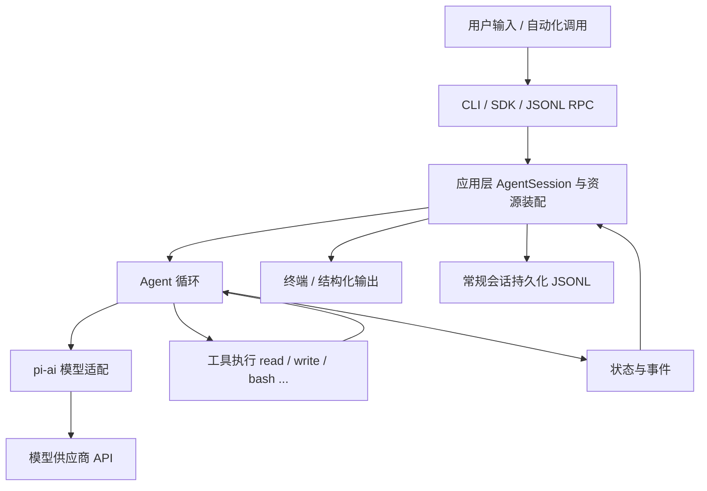
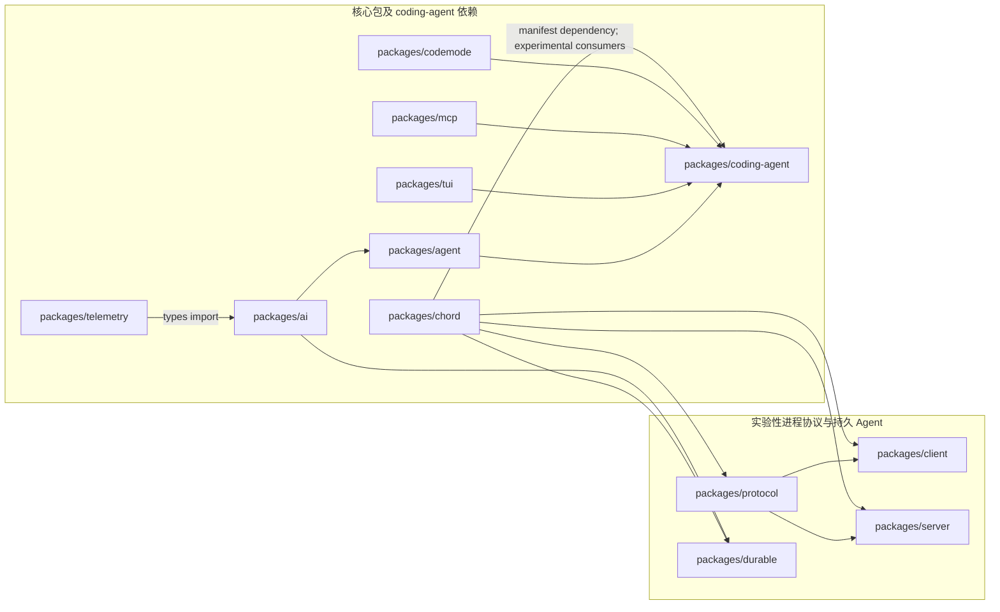

# 第 0 章：目标、环境与项目全景

> 学完本章你能回答：
>
> 1. pi 是什么？它和"直接调用大模型 API"有什么区别？
> 2. 这个仓库里十几个包各自负责什么？为什么这样拆分？
> 3. 用户能看到的几种使用方式（交互、print、JSON、RPC、SDK）在哪里汇合？
> 4. 想读源码，应该从哪里开始、按什么顺序读？

**前置知识**：无。只要会打开终端、切换目录。
**预计学习时间**：第一天 2-3 小时（阅读 + 画图），实验 L01 另需 1 小时。
**本章验证状态**：静态核对通过（所有源码引用已对照基线 commit 检查）；实验 L01 需要你在自己的环境里运行后记录。

---

## 0.1 先看问题：大模型很聪明，但它什么也做不了

假设你问一个纯聊天式的大模型："帮我读一下 demo.txt 并总结三点。"

模型只会返回一段文字，比如"抱歉，我无法访问你的文件系统"。原因是：

- **模型是一个无状态函数**。你给它一个消息数组，它返回一条新消息。它不记得"上一次会话"（记忆由调用方拼进消息数组），也没有本地文件、进程、网络的访问能力。
- **模型只能输出文本**（结构化后可以带"工具调用请求"，但仍只是文本形式的意图）。
- **模型没有权限**。真正的文件读写发生在你运行的进程里，由你的操作系统账号决定权限。

所以，一个能干活的编码助手必须有人来做这些事：

1. 把用户输入、历史记录、系统提示、工具说明组装成一次模型请求；
2. 解析模型返回的"我想调用 read 工具，参数是 demo.txt"；
3. 在本地真正执行读文件，把结果作为新消息再发给模型；
4. 如此循环，直到模型不再要求调用工具，输出最终回答；
5. 全程把消息、事件、状态保存下来，让界面能显示、下次能恢复。

**pi 就是做这五件事的框架。** 在 pi 的语境里，这类框架叫 **agent harness**（直译"智能体外壳"，也可以理解为"运行框架"）。harness 本身不"聪明"，它负责组织：模型、工具、状态、界面各就各位。

> 术语约定：本手册中的 **Agent**（智能体）指"模型 + 工具 + 循环"组成的执行体；**harness** 指承载它的运行框架；**turn**（轮次）指一次模型响应加上它引发的工具执行；**run**（运行）指从一次用户输入开始到 Agent 停下来为止的整个过程。第 4、6 章会把这些词落到具体代码上。

## 0.2 pi 的第一个全景图

下面这张图是全书的地标。现在看不懂每个方框没关系，读完全书再回来，你会发现每个方框你都能指出对应的文件和函数。



用一句话概括这张图：**用户输入从入口进来，由应用会话装配好一切，交给 Agent 循环反复跟模型和工具打交道，过程中产生的事件回流给界面，产生的记录落到磁盘。**

## 0.3 仓库全景：一个 monorepo，四层结构

这个仓库是一个 **monorepo**（单一仓库多包），用 npm workspaces 管理。所有包放在 `packages/` 下，根 `package.json` 的 `workspaces: ["packages/*", ...]` 把它们组织在一起。每个子目录是一个独立的 npm 包，有各自的 `package.json`、`README.md`、`src/`、`test/`。

先记住四个核心包（后面统称"核心四包"）：

| 包 | npm 名 | 一句话职责 | 上游依赖 |
|---|---|---|---|
| `packages/ai` | `@earendil-works/pi-ai` | 统一的多供应商 LLM 接口：同一套类型调 OpenAI、Anthropic、Google 等 | `pi-telemetry`（当前源码仅导入类型） |
| `packages/agent` | `@earendil-works/pi-agent-core` | Agent 运行时：消息循环、工具调用、状态与事件 | 依赖 `pi-ai` |
| `packages/tui` | `@earendil-works/pi-tui` | 终端 UI 框架：差分渲染、组件、键盘输入 | 无 pi 内部依赖 |
| `packages/coding-agent` | `@earendil-works/pi-coding-agent` | 面向用户的编码助手 CLI：会话、资源、工具、扩展、界面 | `pi-agent-core`、`pi-ai`、`pi-tui`、`pi-mcp`、`pi-codemode`、`chord` |

依赖关系是有方向的：`coding-agent` 依赖 `agent`，`agent` 依赖 `ai`，而 `ai` 的公开类型引用 `telemetry`。反过来不成立——`pi-ai` 不依赖 Agent；`pi-agent-core` 不依赖终端 UI 或 coding-agent 的文件工具。**这是理解整个项目的第一把钥匙：下层包通过接口提供机制，不绑定上层的具体用法。**



**读图方法**：箭头方向是“被依赖包 → 使用它的包”，不是运行时调用方向。图中内部边来自各包 `package.json` 的 `dependencies`；`packages/ai/src/types.ts` 对 `pi-telemetry` 的导入是 `import type`，因此运行时 JavaScript 不会加载 telemetry，但生成的类型声明引用了该类型，类型消费者仍需要解析这项公开依赖。实验性协议包被框在右侧，只表示它们的包依赖关系，不表示常规 CLI 自动通过 client/server 工作。

这张图与上面的全景流程图回答不同问题：依赖图说明“改这个包会受哪些包边界约束”；全景流程图说明“一个用户请求运行时经过哪些组件”。比如 `coding-agent` manifest 依赖 `chord`，而普通 CLI 的 `AgentSession` 主流程仍由第 3、8 章描述；不能只凭存在依赖就推断每条 CLI 请求都会经过 chord。

依赖清单核对范围是所有 `packages/*/package.json` 中 `@earendil-works/*` 的 `dependencies`，并以代表性源码 import 确认关键边：`agent-loop.ts` → `pi-ai`、`ai/src/types.ts` → `pi-telemetry`、`coding-agent` 的 client-tui / MCP / codemode 适配器 → 对应包、`client`/`server` → `protocol` 与 `chord`。不包括 devDependencies、第三方依赖，也不声称这是整个 monorepo 的完整构建图。

> 说明：`coding-agent` 还依赖若干第三方库（如终端颜色、文本差异和 YAML 解析）。本图只显示 pi workspace 包之间 manifest 声明的依赖，不展开第三方依赖。

### 0.3.1 四个核心包的具体内容

**`packages/ai`（模型层）**：定义模型、消息、事件、流式响应的统一类型；内置多个供应商适配器和模型目录；处理 API Key 解析、用量统计、成本计算。关键文件：

- `packages/ai/src/types.ts` —— 所有对外类型的定义（48KB，是全仓库最重要的类型文件之一）；
- `packages/ai/src/models.ts` —— `createModels()`、模型注册与查找、`streamSimple` 等入口；
- `packages/ai/src/providers/` —— 每个供应商一个适配器，例如 `anthropic.ts`、`openai.ts`、`faux.ts`（假模型，测试用）。

**`packages/agent`（运行时层）**：不关心终端、不关心文件工具，只做"模型 + 工具 + 消息"的循环。关键文件：

- `packages/agent/src/agent-loop.ts` —— 循环本体（29KB）：发请求、收流、执行工具、决定是否继续；
- `packages/agent/src/agent.ts` —— 有状态的 `Agent` 类：持有消息、订阅事件、串行化运行；
- `packages/agent/src/types.ts` —— `AgentEvent`、`AgentTool`、`AgentMessage` 等类型（21KB）。

**`packages/tui`（终端 UI 层）**：一套独立的终端界面库，提供组件模型和差分渲染（只重绘变化的部分，避免闪烁）。它不认识 pi 的业务逻辑，任何 Node 程序都能用。关键文件在 `packages/tui/src/`，第 17 章展开。

**`packages/coding-agent`（应用层）**：用户实际安装的 `pi` 命令就来自这里（`package.json` 的 `bin: { "pi": "dist/bundle/cli.js" }`）。它把前三层组装成完整产品：

- `packages/coding-agent/src/cli.ts` —— 命令行入口（139 字节，只是转发）；
- `packages/coding-agent/src/main.ts` —— 主流程（35KB）：解析参数、装配会话、选择运行模式；
- `packages/coding-agent/src/core/` —— 核心业务：会话（`agent-session.ts`，158KB，全仓库最大文件）、工具、配置、资源加载、扩展等 50 多个模块；
- `packages/coding-agent/src/modes/` —— 交互模式、RPC 模式的实现；
- `packages/coding-agent/src/extensions/` —— 扩展系统的运行时支持。

### 0.3.2 其他包：知道它们存在，暂时不用深入

| 包 | 职责 | 本手册章节 |
|---|---|---|
| `packages/chord` | 独立的"应用组合运行时"：服务、副本状态、RPC、插件。不依赖任何其他 pi 包 | 第 23 章（选修） |
| `packages/durable` | 实验性的"持久执行"harness：先落盘再显示，进程死了能接着跑 | 第 23 章（选修） |
| `packages/mcp` | 独立的 Model Context Protocol 客户端（stdio/HTTP 传输） | 第 22 章（选修） |
| `packages/codemode` | 在 QuickJS 沙箱里执行模型写的 JavaScript，用来组合工具调用 | 第 22 章（选修） |
| `packages/protocol` | 实验性 client/server 协议的帧格式与编码（CBOR） | 第 24 章（选修） |
| `packages/client` / `packages/server` | 上述协议的客户端与本地服务端实现 | 第 24 章（选修） |
| `packages/telemetry` | 厂商中立的遥测契约（trace/span） | 第 25 章（选修） |
| `packages/evals` | 行为评估：用固定任务集评测 coding agent 的效果 | 第 25 章（选修） |
| `packages/session-backends` | 会话存储后端抽象（供实验特性使用） | 用到时再查 |

这些包有一个共同点值得现在记住：**它们通过明确定义的接口与核心四包相连，而不是互相乱引用。** 例如 `mcp` 完全不依赖 `ai` 或 `agent`；`coding-agent` 再把它适配成工具。第 12 章会教你用同样思路判断"一个需求该不该开新包"。

## 0.4 用户可见的五种入口

pi 有五种主要使用方式，它们都汇聚到同一套 Agent 和会话机制（结论来自 `packages/coding-agent/docs/how-pi-works.md` 的 "Interfaces" 一节）：

| 入口 | 形态 | 典型场景 | 实现位置 |
|---|---|---|---|
| 交互模式 | 全屏终端 UI | 人类日常使用 | `packages/coding-agent/src/modes/interactive` |
| print 模式 | `pi -p "..."` 输出最终回答 | 脚本里一次性提问 | `main.ts` 的 print 分支 |
| JSON 模式 | 逐行输出 Agent 事件（JSONL） | 程序消费事件流 | `main.ts` 的 json 分支 |
| RPC 模式 | stdin 收 JSONL 命令，stdout 回响应 | 编辑器插件、其他语言宿主 | `packages/coding-agent/src/modes/rpc` |
| TypeScript SDK | `createAgentSession()` 进程内控制 | 自己写 Node 程序嵌入 | `packages/coding-agent/src/core/sdk.ts` |

各入口共享 Agent 与会话的核心能力，但外层适配器、输入来源和输出格式不同。读代码时先找到模式分流，再顺着共享的会话与 Agent 主线；不要假定五种入口在启动参数、事件输出或生命周期上完全相同。第 3 章走常规 CLI 的主路径，第 15、16 章分别讲 SDK 与进程级集成。

### 0.4.1 CLI 到底选哪一种模式？

表里的 `print`、`JSON` 和交互 UI 不是只看命令行参数。`main.ts` 把用户指定的 `Mode`（`text | json | rpc`）和 stdin/stdout 是否连接终端（TTY）合并成内部的 `AppMode`（`interactive | print | json | rpc`）：

```typescript
function resolveAppMode(parsed: Args, stdinIsTTY: boolean, stdoutIsTTY: boolean): AppMode {
	if (parsed.mode === "rpc") return "rpc";
	if (parsed.mode === "json") return "json";
	if (parsed.print || !stdinIsTTY || !stdoutIsTTY) return "print";
	return "interactive";
}
```

按分支顺序读这段：

1. 显式 `--mode rpc` 和 `--mode json` 优先，分别进入 RPC 和 JSON 运行模式；
2. 否则，`--print` 或 stdin/stdout 任一不是 TTY，就进入一次性 print 模式；
3. 只有没有上述条件时才进入交互 UI。

这也解释了一个常见误会：`--mode text` 只是选择 print 模式的文本输出格式，**不会单独强制 print**。终端输入输出都连接 TTY 时，`pi --mode text` 仍会启动交互 UI；而 `pi "请总结"` 若 stdin 或 stdout 被重定向，则会自动走 print。自动化脚本若要求 JSONL，明确传 `--mode json`，不要依赖 TTY 推断。

模式确定后，`main()` 仍会创建会话运行时，但最后分到不同适配器：RPC 调 `runRpcMode(runtime)`，交互模式创建 `InteractiveMode`，print/JSON 共用 `runPrintMode`，JSON 通过 `toPrintOutputMode()` 选择事件序列化输出。故意分清两层：`Mode` 是命令行声明的输出偏好，`AppMode` 是进程最后采用的运行形态。可从 `packages/coding-agent/src/main.ts` 的 `resolveAppMode`、`toPrintOutputMode` 和 `main` 末尾分支开始读；`parseArgs` 的字符串校验见 `packages/coding-agent/src/cli/args.ts`。

`--mode rpc` 还禁止 `@file` 参数（在进入会话创建前检查），因为 RPC 的输入由 stdin 上的 JSONL 命令驱动，不消费启动时的文件参数。RPC 协议细节留给第 16 章。

## 0.5 一个具体例子：读文件并总结（作业预告）

输入："读取 demo.txt 并总结三点。" 高层轨迹如下（细节全部留到第 3、6、7 章）：

```text
用户消息 "读取 demo.txt 并总结三点"
  → 第 1 次模型请求（携带系统提示、历史、可用工具列表）
  → 模型回答：我要调用 read 工具 { path: "demo.txt" }
  → pi 在本地执行 read，得到文件内容
  → 第 2 次模型请求（在上面的历史后追加"工具结果"消息）
  → 模型回答：三点总结（不再调用工具）
  → 运行结束，界面显示总结
```

请现在就用直觉回答两个问题，读完第 3 章回来核对：

1. 为什么需要**两次**模型请求？一次不行吗？
2. 文件不存在时，错误发生在第几步？整个运行会崩溃吗？

## 0.6 源码阅读路线：从外壳到内核

给新手的一个常见陷阱是"从最大的文件开始读"（比如 158KB 的 `agent-session.ts`），几分钟后就会迷失。正确的路线是按依赖方向、由外向内：

```text
第一步：读入口脚本        pi-test.sh / pi-test.ps1（怎么启动）
第二步：读 main.ts 的参数解析与模式选择（谁在什么时候被创建）
第三步：读 core/sdk.ts 的 createAgentSession（装配了哪些资源）
第四步：读 core/agent-session.ts 的 prompt 方法（应用会话如何驱动 Agent）
第五步：读 agent/src/agent.ts 与 agent-loop.ts（循环本体）
第六步：读 ai/src/models.ts 与 providers/faux.ts（模型层最小实现）
第七步：带着问题读你想要改的模块（工具、配置、扩展……）
```

这条路线与本书章节顺序一一对应（第 3、8、6 章），你现在只需要记住"由外向内、先跑通再深入"这个原则。

## 0.7 实验 L01：环境记录与职责图

**实验性质**：只读操作，不修改仓库；Node、npm、Git 查询相同，源码启动命令按实际 shell 选择。
**验证状态**：Windows + PowerShell 的环境探查和源码入口 `--version` 已在撰写环境运行；Linux、macOS、Git Bash 未运行。读者仍需记录自己的环境并亲手画职责图，不能把本机结果当作自己的实验记录。

### 目标

1. 记录你的环境版本和仓库基线；
2. 亲手画出"核心四包 + 依赖方向"的职责图（不要照抄，画完再对比 0.3 节）；
3. 找到 `pi` 命令真正指向的文件。

### 步骤

先在仓库根目录记录版本和基线（PowerShell、Bash 都可直接运行）：

```bash
node --version
npm --version
git log -1 --format="%H %s"
```

预期：Node 版本 >= 22.19.0；`git log` 输出的哈希应与本手册基线的 `200387122ca450d6387f033949423114a270b96c` 一致（若不一致，说明你读的是更新或更旧的版本，请以你的代码为准）。

接着运行源码入口，只请求版本号；该步骤不创建会话、不调用模型：

```powershell
# Windows PowerShell，在仓库根目录
.\pi-test.ps1 --version
```

```bash
# Linux / macOS / Git Bash，在仓库根目录
./pi-test.sh --version
```

预期输出是当前 coding-agent 版本。启动时若出现 Node Type Stripping 的 `ExperimentalWarning`，它表示 Node 对直接运行可擦除 TypeScript 的实验性提示，不等于命令失败；检查退出码是否为 `0`。源码启动器会导入 `packages/coding-agent/src/cli.ts`，与刚才读取的安装版 `bin` 构建产物路径是两条不同入口。

查看 `pi` 命令的入口声明（读取代码，不执行）：

```bash
node -e "const p=require('./packages/coding-agent/package.json'); console.log(p.name, p.version, JSON.stringify(p.bin))"
```

预期输出形如：`@earendil-works/pi-coding-agent 1.0.2 {"pi":"dist/bundle/cli.js"}`。这说明：**用户装的 `pi` 命令最终执行的是 `packages/coding-agent` 构建产物 `dist/bundle/cli.js` 的入口**。开发时我们用 `pi-test.sh`（第 2 章）从源码直接跑，避免每次构建。

### 观察与思考

- 用编辑器打开 `packages/coding-agent/src/cli.ts`（只有 139 字节，一行也能读），找到它转发给了谁；
- 打开 `packages/coding-agent/src/main.ts` 的前 50 行，找出 `#!/usr/bin/env node` 这样的 shebang 是否存在，理解 `bin` 的入口约定；
- 打开四个核心包的 `package.json`，对照 0.3 节的依赖方向表，验证 `dependencies` 字段；
- 将你的系统、shell、Node/npm、仓库 commit、实际源码启动命令和退出码写入附录 F 模板；Windows 与 POSIX 环境分别记录，不能互相代填。

### 清理

本实验只读，无清理项。

## 0.8 常见错误

| 现象 | 原因 | 处理 |
|---|---|---|
| `node --version` 低于 22.19.0 | 系统 Node 太旧 | 安装新版本（第 2 章给出三平台方法） |
| 在子目录里运行 `node -e "require('./packages/...')"` 报错找不到包 | 相对路径基于当前目录 | 先 `cd` 到仓库根目录 |
| 打开 `packages/coding-agent/src/core/agent-session.ts` 觉得完全看不懂 | 158KB 的大文件按顺序读必然迷失 | 先读类型与导出清单，再跳到指定符号；第 3、8 章会给路线 |
| 分不清 `packages/ai` 和 `packages/agent` | 名字都像"AI" | 记住一句话：`ai` 管"怎么跟模型说话"，`agent` 管"拿到模型回话后干什么" |

## 0.9 验收题

1. 用一句话解释：为什么模型自己不能读文件？pi 在中间做了什么？
2. `packages/tui` 能不能被一个与 pi 无关的项目使用？依据是什么？
3. 用户用 RPC 模式和 SDK 模式跑同一个任务，内部的 Agent 循环是两套实现吗？
4. 按"由外向内"原则，读 `agent-session.ts` 之前应该先读哪两个文件？

### 参考答案

1. 模型是无状态、无本地权限的文本函数；pi 在本地执行工具调用，把结果作为新消息回填，并把多轮请求串起来。
2. 能。`packages/tui/package.json` 的依赖只有 `get-east-asian-width` 和 `marked` 等通用库，不依赖任何 pi 包；它提供的是通用终端组件与差分渲染。
3. 不是。所有入口都使用同一套 Agent 与会话机制，入口只决定"输入输出如何呈现"。
4. `packages/coding-agent/src/main.ts`（谁创建它）和 `packages/coding-agent/src/core/sdk.ts`（装配了什么）。

## 0.10 来源与下一章

- `README.md`（仓库根）：包的总体介绍与开发命令；
- `packages/coding-agent/docs/how-pi-works.md`：一次请求、会话树、上下文、入口与信任模型的高层说明；
- `packages/ai/README.md`、`packages/agent/README.md`、`packages/tui/README.md`、`packages/coding-agent/package.json`；
- `packages/agent/src/types.ts`、`packages/agent/src/stream-fn.ts`。

下一章是全书唯一的"补课章"：用仓库里的真实代码，把读懂后面的章节所需要的 TypeScript 与 Node.js 知识补齐。如果你已经熟悉 TS，可以只做第 1 章的验收题，按结果决定是否跳过。
