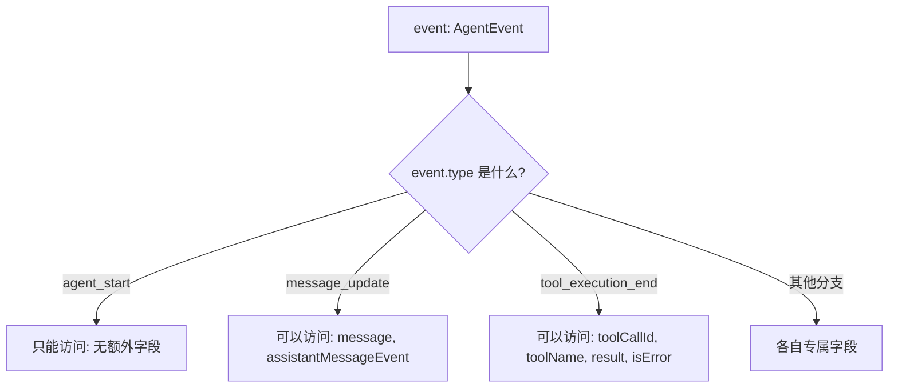

# 第 1 章：读懂本项目需要的 TypeScript 与 Node.js

> 学完本章你能回答：
>
> 1. 这个仓库里的 `.ts` 文件是怎么被直接执行和构建的？为什么不能用 `enum`？
> 2. `import` / `export`、`import type`、带 `.ts` 后缀的相对导入分别是什么意思？
> 3. 什么是"联合类型"和"类型收窄"？为什么 pi 的事件类型全都长成 `{ type: "...", ... }`？
> 4. 什么是 Promise、`async/await`、异步迭代和 `AbortSignal`？事件订阅函数为什么返回一个函数？

**前置知识**：会任何一门编程语言；不需要 TypeScript 经验。
**预计学习时间**：2-3 天（若你已熟悉 TS，做 1.11 的验收题决定是否跳过）。
**本章验证状态**：静态核对通过；其中"用 Node 直接运行 .ts"一节在本机（Windows, Node v23.9.0）实际运行验证。

---

## 1.1 先解决第一个困惑：为什么没有"编译"也能跑 TypeScript？

传统印象里，TypeScript 必须先编译成 JavaScript 才能运行。但这个仓库（以及现代 Node.js）采用了一种更轻的机制：**类型擦除执行**（type stripping）。

### 1.1.1 亲手验证

作者在本机实际做了这个实验。建一个文件 `ts-strip-test.ts`：

```typescript
const x: number = 41;
function add(a: number, b: number): number {
	return a + b;
}
console.log(add(x, 1));
```

直接运行，不编译：

```bash
node ts-strip-test.ts
```

输出：

```text
42
(node:35408) ExperimentalWarning: Type Stripping is an experimental feature and might change at any time
```

这个实验说明两件事：

1. **Node 会直接执行 `.ts` 文件**：它把类型注解（`: number`、`: number`、返回类型）当作"注释"删掉，剩下的就是普通 JavaScript。这叫作 *type stripping*（类型剥离）。
2. **它是实验性的**：Node 会打印一条 `ExperimentalWarning`。这不影响功能，但意味着语法支持范围有限。

### 1.1.2 限制一：只能使用"可擦除语法"

因为 Node 只是"删类型"而不做代码生成，所以**凡是需要生成额外 JavaScript 代码的语法都不能用**。仓库的 `tsconfig.base.json` 通过 `"erasableSyntaxOnly": true` 强制了这个限制，`AGENTS.md` 也把它写成了硬规则。你要避开这些语法：

| 不能用                                                        | 为什么             | 项目里的替代写法                                     |
| ------------------------------------------------------------- | ------------------ | ---------------------------------------------------- |
| `enum Color { Red }`                                        | 会生成一个真实对象 | 用字符串字面量联合：`type Color = "red" \| "green"` |
| `namespace X {}`                                            | 会生成包装对象     | 直接用模块文件组织代码                               |
| `class A { constructor(private x: number) {} }`（参数属性） | 会生成赋值代码     | 显式声明字段并在构造函数里赋值                       |
| `import x = require("y")` / `export =`                    | CommonJS 专用语法  | 用标准 ESM`import` / `export`                    |
| 装饰器（实验性旧语法）                                        | 需要代码生成       | 本项目不用装饰器                                     |

例如第 8 章你会读到的 `Agent` 类、`ModelRuntime` 类，全部采用"显式字段 + 构造函数赋值"的写法，看到时不要觉得啰嗦，那是为了兼容类型擦除执行。

对于 Java 转过来的读者，一句话总结：**没有 `enum`，用"字面量联合"代替；没有注解/装饰器，用普通函数和配置对象代替。**

### 1.1.3 限制二：相对导入必须写 `.ts` 后缀

打开任意源码文件，比如 `packages/agent/src/stream-fn.ts`：

```typescript
import type { StreamFn } from "./types.ts";
```

注意 `"./types.ts"` —— 后缀是 `.ts`，不是 `.js`，也不是省略后缀。这是刻意的：

- **运行时**（Node 直接执行）：Node 必须能找到真实存在的文件。源码树里只有 `types.ts`，所以导入路径写 `.ts`，Node 剥离类型后按原路径找文件，找得到。
- **构建时**（`tsc` 输出 `dist/`）：TypeScript 的 `"rewriteRelativeImportExtensions": true` 会把输出 JavaScript 里的 `./types.ts` 自动改写成 `./types.js`，保证构建产物之间互相引用正确。

所以你在本仓库写相对导入时的规则非常简单：**照着文件真实名字写后缀，`.ts` 就是 `.ts`**。

```typescript
// 对：文件真实存在
import { foo } from "./foo.ts";

// 错：本仓库不接受
import { foo } from "./foo";
import { foo } from "./foo.js";
```

### 1.1.4 包的导入：`@earendil-works/pi-ai` 和它的子路径

跨包导入用 npm 包名。比如 `packages/agent/src/types.ts` 的第一行：

```typescript
import type {
	Api,
	AssistantMessage,
	// ...
} from "@earendil-works/pi-ai";
```

`"@earendil-works/pi-ai"` 指向 `packages/ai`。有些包还暴露**子路径**（subpath exports），比如：

```typescript
import { anthropicProvider } from "@earendil-works/pi-ai/providers/anthropic";
```

它之所以能解析，是因为 `packages/ai/package.json` 里有这样的 `"exports"` 声明（已核对基线）：

```json
{
	"./providers/*": {
		"types": "./dist/providers/*.d.ts",
		"import": "./dist/providers/*.js"
	}
}
```

读法：`./providers/anthropic` 这个子路径，类型定义在 `dist/providers/anthropic.d.ts`，运行时在 `dist/providers/anthropic.js`。`"types"` 和 `"import"` 的分离是为了让编辑器和运行时各取所需。

> 注意：子路径导入指向的是 **dist（构建产物）**。如果你在源码之间跨包引用，直接用包名即可，npm workspaces 会把它链接到本仓库；但 `dist` 不存在时（还没构建）会报错。第 2 章会讲用 `pi-test.sh` 从源码直接运行的方法。

### 1.1.5 `tsconfig.base.json` 逐项解读

仓库根目录的 `tsconfig.base.json` 是所有包的共享配置。把它当作"这门语言的方言说明书"来读：

```json
{
	"compilerOptions": {
		"target": "ES2024",
		"module": "Node16",
		"lib": ["ES2024"],
		"strict": true,
		"erasableSyntaxOnly": true,
		"verbatimModuleSyntax": true,
		"esModuleInterop": true,
		"skipLibCheck": true,
		"forceConsistentCasingInFileNames": true,
		"declaration": true,
		"declarationMap": true,
		"sourceMap": true,
		"inlineSources": true,
		"inlineSourceMap": false,
		"moduleResolution": "Node16",
		"resolveJsonModule": true,
		"allowImportingTsExtensions": true,
		"rewriteRelativeImportExtensions": true,
		"types": ["node"]
	}
}
```

| 选项                                                                 | 含义                                       | 对你的影响                                                        |
| -------------------------------------------------------------------- | ------------------------------------------ | ----------------------------------------------------------------- |
| `target: ES2024`                                                   | 输出的 JS 语法级别                         | 可以用很新的语法，不用背老浏览器的兼容性                          |
| `module` / `moduleResolution: Node16`                            | 采用 Node 的 ESM/CJS 解析规则              | 导入路径规则严格，别自作聪明省略后缀或大小写                      |
| `strict: true`                                                     | 打开全部严格检查                           | `null`/`undefined` 必须处理；类型错误会拦住你                 |
| `erasableSyntaxOnly: true`                                         | 只允许"可擦除"语法                         | 见 1.1.2：不能用 enum 等                                          |
| `verbatimModuleSyntax: true`                                       | 导入/导出按你写的原样保留                  | **类型必须用 `import type` 导入**，否则可能有运行时副作用 |
| `resolveJsonModule`                                                | 允许`import data from "./x.json"`        | 配置文件、模型目录会用                                            |
| `allowImportingTsExtensions` + `rewriteRelativeImportExtensions` | 允许源码里写`.ts` 后缀并在构建时改写     | 见 1.1.3                                                          |
| `types: ["node"]`                                                  | 让`process`、`fs` 等 Node 全局类型可用 | 你能直接写`process.cwd()`                                       |

语言版本说明：TypeScript 有一个"**类型在运行时不存在**"的根本事实。后面的章节会反复利用这一点，比如判断"这个接口只是类型还是真实对象"、"这个 import 会不会在运行时被加载"。

## 1.2 模块系统：ESM 的五个模式

本仓库所有包都是 **ESM**（ECMAScript Modules）。判断依据：每个 `package.json` 都有 `"type": "module"`。对读代码来说，你只需要熟悉五种常见模式。

### 1.2.1 具名导出与默认导出

**具名导出**（named export）是主流：

```typescript
// packages/agent/src/stream-fn.ts（节选，真实代码）
let defaultStreamFn: StreamFn | undefined;

export function setDefaultStreamFn(streamFn: StreamFn | undefined): void {
	defaultStreamFn = streamFn;
}

export function getDefaultStreamFn(): StreamFn {
	if (!defaultStreamFn) {
		throw new Error("No default stream function configured. Pass streamFn explicitly or call setDefaultStreamFn().");
	}
	return defaultStreamFn;
}
```

导入时用花括号，名字必须与导出名一致：

```typescript
import { setDefaultStreamFn, getDefaultStreamFn } from "@earendil-works/pi-agent-core";
```

**默认导出**（default export）每个模块最多一个：

```typescript
export default function createThing() { /* ... */ }
// 导入时名字随便起：
import createThing from "./thing.ts";
```

读代码时的经验：看到 `import X from "..."` 且没有花括号，说明对方是默认导出；本仓库更偏爱具名导出，因为改名（重构）时更安全。

### 1.2.2 `import type`：只导入类型，不产生运行时加载

因为开了 `verbatimModuleSyntax`，**类型和值的导入必须区分**：

```typescript
// 这是类型，必须用 import type
import type { AgentEvent } from "./types.ts";

// 这是真实存在的函数/对象，用普通 import
import { getDefaultStreamFn } from "./stream-fn.ts";
```

为什么重要？

- 类型在运行时不存在。如果错把类型写成普通 `import`，代码在 Node 里执行时会真的去加载那个模块（并在找不到导出时报错），或者在"仅类型"的模块上白白付出加载成本。
- 编辑器里，你可以在键盘上对任何标识符"跳转到定义"，看到它是 `interface`/`type`（类型）还是 `function`/`const`（值）。**这是新手最重要的一个动作：分清类型和值。**

一个小技巧：很多文件顶端会出现成片的 `import type { ... }`，读完请把它们当作"目录页"，它告诉你这个文件要与哪些数据结构打交道。

### 1.2.3 `export *`：模块的公共门面

`packages/agent/src/index.ts` 只有五行：

```typescript
export * from "./agent.ts";
export * from "./agent-loop.ts";
export * from "./proxy.ts";
export { setDefaultStreamFn } from "./stream-fn.ts";
export * from "./types.ts";
```

这是**桶文件**（barrel file）写法：把包内各模块的导出重新导出，形成包的公共接口。外部代码只需要 `import { Agent } from "@earendil-works/pi-agent-core"`，不用关心内部文件结构。

读包时，**先从 `index.ts` 开始读**，它是这个包对外的"目录"。注意 `stream-fn.ts` 只导出了 `setDefaultStreamFn` 一个符号——说明 `getDefaultStreamFn` 是内部实现细节，虽然同文件但也刻意没有公开。这种"公开什么"的选择就是包的 API 设计。

### 1.2.4 重命名导入与导出

```typescript
import { createModels as createModelCollection } from "@earendil-works/pi-ai";
export { parseConfig as parseSettingsConfig };
```

当同名符号冲突或想让名字更清楚时使用。你在本仓库会偶尔看到，大部分时候名字是直接匹配的。

### 1.2.5 动态特性：只会看到少数几处

`await import("...")`（动态导入）在本仓库受到限制：`AGENTS.md` 明确要求"顶层导入，禁止 inline import"。你几乎看不到动态导入；个别地方（如 Node strip-only 场景下的可选依赖）例外。看到 `await import(` 时先想一想：为什么这里不能用静态导入？通常是因为该模块是可选的或平台相关。

## 1.3 类型系统速成：从 Java/Python 到 TypeScript

如果你是 Java 或 Python 背景，Section 1.3 会重点讲"与你想的不一样的地方"。

### 1.3.1 类型只是"检查期的约束"，不是运行时标签

Java 里 `new ArrayList<String>()` 的泛型信息在运行时还在（可反射）。TypeScript 的类型在运行时**全部消失**。这意味着：

- 不能写 `if (x instanceof MyInterface)` —— `interface` 在运行时不存在；
- 判断对象形状要用**运行时的值**：`typeof x === "string"`、`Array.isArray(x)`、"x.type === ..." 这样的字段检查；
- 后端收到 JSON 时，类型标注**不会自动校验**数据。pi 因此用 `typebox` 在运行时校验工具参数（第 7 章）。

### 1.3.2 `interface` 与 `type`：两种描述对象的方式

```typescript
// 描述"对象形状"的两种写法，读代码时视为等价
interface Usage {
	input: number;
	output: number;
	totalTokens: number;
}

type StopReason = "pending" | "stop" | "length" | "toolUse" | "error" | "aborted" | "deferred";
```

- `interface` 擅长**对象形状**，可以"扩展"（`extends`）和声明合并；
- `type` 擅长**联合、字面量、工具类型**，不能重复声明。

本仓库混用两者，规则大致是：对象结构用 `interface`，联合/别名用 `type`。你不用纠结取舍，能读即可。

再看一个真实例子（`packages/ai/src/types.ts`）：

```typescript
export interface Usage {
	input: number;
	output: number;
	cacheRead: number;
	cacheWrite: number;
	/** Subset of `cacheWrite` written with 1h retention. Only Anthropic reports this split. */
	cacheWrite1h?: number;
	reasoning?: number;
	totalTokens: number;
	cost: {
		input: number;
		output: number;
		cacheRead: number;
		cacheWrite: number;
		total: number;
	};
}
```

几个记号：

- `?`（`cacheWrite1h?: number`）表示**可选属性**，读取时类型是 `number | undefined`。`strict` 模式下你必须在用它之前处理 `undefined`。
- 注释 `/** ... */` 是"文档注释"，编辑器悬停时会显示。**这个仓库的源文件里注释非常详尽，请把读注释当作读代码的一部分。**
- 嵌套对象直接内联写（`cost: { ... }`），不需要单独命名。

### 1.3.3 联合类型与字面量类型

`StopReason` 的七个值全部是**字符串字面量类型**。含义是：这个类型的变量只允许取这七个字符串之一。模型响应的结束原因就是其中之一：

```text
"stop"    正常结束（模型说完了）
"length"  达到输出上限被截断
"toolUse" 模型要求调用工具（本轮结束、下一轮继续）
"error"   请求失败
"aborted" 被取消
"pending" 尚未结束（流式过程中）
"deferred" 延迟到后续处理（特殊供应商/长任务场景）
```

以后在代码里看到 `stopReason === "toolUse"` 这类判断，你就知道：**这是"模型想调用工具"的信号，是 Agent 循环继续的关键条件。**（第 6 章展开。）

### 1.3.4 判别联合与类型收窄（本章最重要的一节）

这是读懂 pi 事件系统的钥匙。

先看问题。Agent 运行过程中会发出很多种事件，它们携带的字段不同：

- "agent 开始" 事件没有额外字段；
- "文本增量" 事件有 `delta` 字符串；
- "工具执行结束" 事件有 `toolName`、`result`、`isError` 等字段。

如果类型系统只有一种"大而全"的事件类型，每个字段都得写成可选，读代码时根本无法确定某个字段什么时候存在。TypeScript 的解决方案是**判别联合**（discriminated union）：每个成员都带一个共同的字面量字段（这里是 `type`），类型系统就能在判断了这个字段后，**自动收窄**（narrow）类型。

真实例子，`packages/agent/src/types.ts` 的 `AgentEvent`（原文节选）：

```typescript
export type AgentEvent =
	// Agent lifecycle
	| { type: "agent_start" }
	| { type: "agent_end"; messages: AgentMessage[] }
	// Turn lifecycle - a turn is one assistant response + any tool calls/results
	| { type: "turn_start" }
	| { type: "turn_end"; message: AgentMessage; toolResults: ToolResultMessage[] }
	// Message lifecycle - emitted for system, user, assistant, and toolResult messages
	| { type: "message_start"; message: AgentMessage }
	// Only emitted for assistant messages during streaming
	| { type: "message_update"; message: AgentMessage; assistantMessageEvent: AssistantMessageEvent }
	| { type: "message_end"; message: AgentMessage }
	// Tool execution lifecycle
	| { type: "tool_execution_start"; toolCallId: string; toolName: string; args: any }
	| { type: "tool_execution_update"; toolCallId: string; toolName: string; args: any; partialResult: any }
	| { type: "tool_execution_end"; toolCallId: string; toolName: string; result: any; isError: boolean };
```

读法：

- 每个 `|` 分支是一个"事件种类"，格式是 `{ type: "名字"; 其他字段 }`；
- `type` 字段是**判别标志**（discriminant）；
- 订阅者写 `if (event.type === "tool_execution_end")` 后，TypeScript 立刻知道 `event` 一定带有 `result`、`isError` 字段，可以安全访问；写在别的分支里访问同样的字段会**编译报错**。

用一张图理解"收窄"：



你会在整个代码库里反复看到：

- `switch (event.type) { case "..." : ... }`；
- `if (assistantMessageEvent.type === "text_delta") { ... }`；
- `if (result.isError)` 等。

**读代码时，把"判断判别字段"当作分支的导航牌。** 每个 case 里能做的事情，都是类型系统精确保证过的。

再补充一个真实第二层例子（`packages/ai/src/types.ts` 的 `AssistantMessageEvent`）：

```typescript
export type AssistantMessageEvent =
	| { type: "start"; partial: AssistantMessage }
	| { type: "text_start"; contentIndex: number; partial: AssistantMessage }
	| { type: "text_delta"; contentIndex: number; delta: string; partial: AssistantMessage }
	| { type: "text_end"; contentIndex: number; content: string; partial: AssistantMessage }
	| { type: "thinking_start"; contentIndex: number; partial: AssistantMessage }
	| { type: "thinking_delta"; contentIndex: number; delta: string; partial: AssistantMessage }
	| { type: "thinking_end"; contentIndex: number; content: string; partial: AssistantMessage }
	| { type: "toolcall_start"; contentIndex: number; partial: AssistantMessage }
	| { type: "toolcall_delta"; contentIndex: number; delta: string; partial: AssistantMessage }
	| { type: "toolcall_end"; contentIndex: number; toolCall: ToolCall; partial: AssistantMessage }
	| {
			type: "done";
			reason: Extract<StopReason, "stop" | "length" | "toolUse" | "deferred">;
			message: AssistantMessage;
	  }
	| { type: "error"; reason: Extract<StopReason, "aborted" | "error">; error: AssistantMessage };
```

这段类型说明一次流式响应会经历这些阶段：

```text
start
  → text_start → text_delta（多次）→ text_end        ← 文本流
  → thinking_start → thinking_delta（多次）→ thinking_end  ← 思考流（部分模型有）
  → toolcall_start → toolcall_delta（多次）→ toolcall_end  ← 工具调用流
  → done（或 error）
```

而 `Extract<StopReason, "stop" | "length" | "toolUse" | "deferred">` 是**类型工具**：从 `StopReason` 里挑出子集，所以 `done` 的 `reason` 永远是四个"正常结束类"的原因，`error` 的 `reason` 永远只可能是 `"aborted"` 或 `"error"`。这种"用类型排除不可能状态"的写法是本仓库的常见风格。

### 1.3.5 泛型：让同一个结构适配不同数据

Java 的 `List<T>` 你已熟悉；TypeScript 泛型用得更多、更活泼。看三个真实场景。

**场景一：消息数组**。

```typescript
interface AgentContext {
	/** Transcript visible to the model. */
	messages: AgentMessage[];
	/** Tools available for execution in this run. */
	tools?: AgentTool<any>[];
}
```

`AgentMessage[]` 是"AgentMessage 的数组"。

**场景二：工具定义**（`packages/agent/src/types.ts`）：

```typescript
export interface AgentTool<TParameters extends TSchema = TSchema, TDetails = any> extends Tool<TParameters> {
	label: string;
	execute: (
		toolCallId: string,
		params: Static<TParameters>,
		signal?: AbortSignal,
		onUpdate?: AgentToolUpdateCallback<TDetails>,
	) => Promise<AgentToolResult<TDetails>>;
	executionMode?: ToolExecutionMode;
}
```

读法（先建立直觉，细节第 7 章）：

- `AgentTool<参数Schema, 详情类型>` 有两个泛型参数；
- `TParameters extends TSchema = TSchema`：参数必须是"schema 类型"，默认是 `TSchema`；
- `Static<TParameters>` 是关键魔法：它把"运行时 schema"翻译成"编译期的参数类型"。`typebox` 库提供这个工具。也就是说，工具作者写一份参数 schema，运行时用它校验、编译期用它给出 `params` 的字段类型；
- `Promise<AgentToolResult<TDetails>>`：`execute` 是异步函数，返回"结果对象"的 Promise。

**场景三：模型类型**。

```typescript
import type { Model, Api } from "@earendil-works/pi-ai";
// StreamFn 里出现的用法：
(model: Model<Api>, context: TranscriptContext, options?: SimpleStreamOptions) => ...
```

`Model<Api>` 表示"某种 API 类型的模型"。`Api` 本身是一个联合类型（各家协议的标识，如 `"anthropic-messages"`、`"openai-completions"` 等），泛型让"模型 + 适配器"保持类型关联。第 5 章会完整讲解。

**先记住三点即可**：`<...>`是参数列表；`extends` 是约束（必须满足什么）；`=` 是默认值。读懂调用处的类型实参（`AgentTool<ReadParams, ReadDetails>`）比会写泛型更重要。

#### 用 `read` 工具把泛型和运行时 schema 连起来

刚才的 `AgentTool<TParameters>` 看起来抽象，可以用真实的 `read` 工具把它拆开。它在 `packages/coding-agent/src/core/tools/read.ts` 里先定义一个**运行时对象**：

```typescript
const readSchema = Type.Object({
  path: Type.String({ description: "Path to the file to read (relative or absolute)" }),
  offset: Type.Optional(Type.Number({ description: "Line number to start reading from (1-indexed)" })),
  limit: Type.Optional(Type.Number({ description: "Maximum number of lines to read" })),
});

export type ReadToolInput = Static<typeof readSchema>;
```

逐行分开看：

1. `Type.Object(...)` 是 JavaScript 在运行时实际创建的 schema 对象；`Type.String`、`Type.Number` 描述接收值的形状。
2. `typeof readSchema` 是 TypeScript 的类型运算，意思是“取这个变量的类型”。它不是运行时函数 `typeof`，不会产生新对象。
3. `Static<typeof readSchema>` 是 typebox 提供的编译期映射：从 schema 描述推导参数类型，结果近似为 `{ path: string; offset?: number; limit?: number }`。

然后工厂把 schema 类型传给工具泛型：

```typescript
export function createReadTool(cwd: string, options?: ReadToolOptions): AgentTool<typeof readSchema> {
  return wrapToolDefinition(createReadToolDefinition(cwd, options));
}
```

`AgentTool<TParameters>` 的 `execute` 参数使用 `Static<TParameters>`。所以传入 `typeof readSchema` 后，编译器能把执行参数关联到 `ReadToolInput`。写工具实现时，字段名和必选/可选关系能得到编辑器提示；把 `path` 写成数字，或把必需字段标成可选，都会在源码检查阶段出错。

但 schema 类型和运行时验证是两件相连、不能互相替代的事：

```text
schema 对象 Type.Object(...) ──运行时──> 校验模型送来的真实 JSON
             │
             └──Static<typeof ...>──编译期──> 给 execute 参数提供静态类型
```

模型数据来自网络，不会因为 TypeScript 写了 `ReadToolInput` 就自动变安全。Agent 循环实际调用 `validateToolArguments(tool, toolCall)`，用工具的 schema 检查真实参数；校验过程还可能做归一和类型转换，细节见第 7.4 节。反过来，运行时校验也不会替你设计完整业务规则：这个 schema 把 `offset` 约束为 number，但没有声明必须是整数、必须大于零；若工具实现依赖这些限制，还需要显式 schema 约束或运行时业务检查。

**新手改工具时按这个顺序追**：

1. 找到 `const xxxSchema = Type.Object(...)`，确认每个字段的类型与 `Type.Optional`；
2. 找 `type XxxInput = Static<typeof xxxSchema>`，理解编译器会推导什么；
3. 找工厂的返回类型，如 `AgentTool<typeof xxxSchema>`，再跳到 `AgentTool.execute` 的 `params`；
4. 确认运行时入口用 schema 验证了不可信数据，再读具体副作用代码。

不要只改 `execute` 参数旁的手写类型来“修”类型错误。应先判断 schema 是否表达了真正需求，再让静态类型和运行时验证共享同一个 schema 来源。

### 1.3.6 `any`、`unknown`、`never` 与仓库规则

- `any`：关闭检查，想怎么用都行。**仓库规则是"非必要不用 any"**。源码里看到它时，先确认它出现在哪一层，不要照抄：
  - `AgentContext.tools?: AgentTool<any>[]` 表示“一个数组装着很多种参数 schema 不同的工具”。每个具体工具仍可有精确类型（例如 `AgentTool<typeof readSchema>`），但被放进这个通用集合时，参数类型被擦掉，数组层面的统一访问无法保留每项工具各自的 schema。当前实现选择在集合边界做这个折衷，不代表每个工具实现都不安全。
  - `AgentEvent` 的工具执行事件用 `args: any`、`result: any`，因为同一事件联合要承载不同工具的参数和结果形状。订阅方若要安全使用这些值，应按 `toolName` 找到对应的工具/renderer，并检查它能依赖的结构；不要把事件字段的 `any` 继续扩散到新 API。
  - `AgentTool<TDetails = any>` 的默认值让不关心详情类型的通用调用方仍可使用该接口。能确定具体详情类型时，应显式写 `AgentTool<typeof schema, Details>`。
- `unknown`：安全的"未知值"，任何属性都不能直接访问；先用 `typeof`、`Array.isArray`、`in` 等运行时检查缩小范围，或在有可靠依据时再作类型断言。
- `never`：不可能出现的类型。除抛错函数外，也常用于穷尽性检查：联合类型新增成员后，旧的 `switch` 若没处理它，可以在 `never` 赋值处报错。

一个 `unknown` 的收窄例子：

```typescript
function errorMessage(value: unknown): string {
  if (typeof value === "object" && value !== null && "message" in value) {
    const message = value.message; // 经过 in 检查后，属性仍是 unknown
    if (typeof message === "string") return message;
  }
  return String(value);
}
```

两个检查各自解决一件事：`"message" in value` 证明对象上有这个键；`typeof message === "string"` 才证明属性值能当字符串用。只做前者还不够。**不要为了让红线消失而直接写 `value as Error`**：类型断言不会检查运行时对象是不是 `Error`。

工具参数把这三个概念放在同一条路径上：具体工具用 TypeBox schema 推导 `Static<T>`；通用工具集合会擦掉单项泛型；模型送来的真实参数仍要由 `validateToolArguments()` 在运行时检查。详见本章 1.3.5 的 `read` 例子与第 7.4 节。泛型被擦掉不等于运行时验证也被擦掉。

### 1.3.7 结构化类型：长得像就算（与 Java 很不同）

TypeScript 是**结构化类型**：只要一个对象的形状满足接口，它就是这个类型，不需要显式 `implements`。

```typescript
interface Point { x: number; y: number }
const p = { x: 1, y: 2, extra: true }; // 赋给 Point 变量是合法的
```

这解释了为什么本仓库大量使用"小而专的接口 + 对象字面量"来组合功能（如各种 `Options`、`Result` 类型），而不是繁杂的类继承体系。读代码时看到函数接受一个对象参数，先去读那个 `interface`，再对调用处传入的字段即可。

## 1.4 异步编程：Promise、并发与流

pi 的核心几乎全是异步的：模型流式返回、工具执行、文件读写、事件派发。这一节把本仓库会用到的异步模式讲全。

### 1.4.1 从 Promise 与 async/await 说起

```typescript
// 调用方视角：await 等待异步结果
const { session } = await createAgentSession();
await session.prompt("What files are in the current directory?");
```

- 一个 `async` 函数内部可以 `await` 一个 Promise，语义是"暂停这里，等结果回来再继续"；
- `await` 只在 `async` 函数（或 ES 模块顶层）里可用。注意 `examples/sdk/01-minimal.ts` 直接在顶层用 `await`，这是**顶层 await**，ESM 的特性，CommonJS 里没有。

错误处理用普通的 `try/catch`：

```typescript
try {
	await session.prompt("...");
} finally {
	session.dispose(); // 无论成功、失败还是取消都要释放资源
}
```

`finally`（而不是只在成功分支释放）是仓库里反复出现的安全模式。第 8 章会解释"不 dispose 会泄漏什么"。

### 1.4.2 并发：`Promise.all` 与"完成顺序"

多个独立异步任务同时进行：

```typescript
const [a, b] = await Promise.all([taskA(), taskB()]);
```

注意两个概念（第 7 章的主角）：

- **完成顺序**：谁先完成谁先结束，可能乱序（耗时 10ms 的 B 先于 100ms 的 A 完成）；
- **结果顺序**：`Promise.all` 返回的数组永远按**传入顺序**排列，与完成顺序无关。

pi 的工具执行同时利用了这两个性质：完成事件按完成顺序发出（界面实时反馈），但工具结果消息按模型声明顺序记录（保持对话历史确定性）。第 7 章会用两个可控的假工具实验验证。

一个重要边界：`Promise.all` 只负责等待并收集结果，**不会因为其中一个 Promise 失败就自动取消其他任务**。它会以第一个拒绝作为 `await Promise.all(...)` 的拒绝原因，但其余任务仍可能继续运行。想让并行任务一起停止，程序还必须共享并触发取消信号，并且每个任务都要配合检查。

### 1.4.3 异步迭代：`for await...of`

模型响应是一条**事件流**，不是一个单个值。pi 用异步迭代器表示它：

```typescript
for await (const event of stream) {
	if (event.type === "text_delta") {
		process.stdout.write(event.delta);
	}
}
```

细分概念：

- **可迭代**（iterable）：`for...of` 能遍历的对象；
- **异步可迭代**（async iterable）：`for await...of` 能遍历的对象，元素在等待中逐个到来。`for await` 的效果是"每次循环都 await 下一个元素"。

`packages/agent/src/types.ts` 里 `StreamFn` 的返回类型 `AssistantMessageEventStream` 就是一个异步事件流。它的完整定义在 `packages/ai/src/types.ts`，你可以用编辑器跟进去看看它和 `AsyncIterable<AssistantMessageEvent>` 的关系（本节只要求建立直觉）。

### 1.4.4 `AbortSignal`：如何取消一个正在进行的操作

现实问题：用户按下 Esc / Ctrl+C，正在进行的模型请求或工具执行必须停下来。Node 的标准方案是 `AbortController` / `AbortSignal`：

```typescript
const controller = new AbortController();
// 把信号传给异步操作
someOperation({ signal: controller.signal });
// 需要取消时：
controller.abort();
```

本仓库中的用法：

- 工具执行的签名里有 `signal?: AbortSignal`（见 1.3.5 的 `AgentTool.execute`）——**工具作者有责任检查信号并尽快停止**；
- 取消不代表强杀进程。`AGENTS.md` 提醒过："区分取消信号与强制终止进程"。收到信号后，函数应该自行做清理（关文件、杀子进程）后返回；
- 取消之后的结果：assistant 消息的 `stopReason` 是 `"aborted"`，流会发出 `{ type: "error", reason: "aborted" }` 事件。

你可以用"搬运行李"类比：`abort()` 是"喊停"，不是"把东西扔了"；搬的人（异步函数）听到喊停后自己决定怎么放下手里的东西。

### 1.4.5 事件订阅：回调函数与"取消订阅"

`packages/agent/README.md` 展示的用法：

```typescript
agent.subscribe((event) => {
	if (event.type === "message_update" && event.assistantMessageEvent.type === "text_delta") {
		// Stream just the new text chunk
		process.stdout.write(event.assistantMessageEvent.delta);
	}
});
```

`subscribe`（订阅）接收一个**回调函数**（callback）：每当发生事件，运行时调用你传入的函数。这个模式在 pi 里到处都是（`session.subscribe`、扩展的 `on(...)` 等）。

两个关键细节：

1. **回调会被调用很多次**：参数 `event` 每次都不同。别在回调里写"只执行一次"的假设。
2. **取消订阅**：本仓库的 `subscribe` 约定通常返回一个"退订函数"：

```typescript
const unsubscribe = agent.subscribe(onEvent);
// 等不需要监听时：
unsubscribe();
```

忘了退订会怎样？旧的回调仍然会被每次事件调用：轻则重复渲染，重则访问已释放的资源。第 13 章（扩展）和第 8 章（会话释放）会反复强调"注册与释放成对出现"。

还有一个行为细节，`packages/agent/src/types.ts` 的文档注释写得很明确：

```text
`agent_end` is the last event emitted for a run, but awaited Agent.subscribe()
listeners for that event are still part of run settlement. The agent becomes
idle only after those listeners finish.
```

翻译：`agent_end` 是运行的最后一个事件，但**如果监听器是异步的，Agent 要等它们全部执行完才算"空闲"**。也就是说 `await agent.prompt(...)` 返回时，所有 `agent_end` 监听器都已经跑完了。这解释了后续章节里"运行结束、事件回调结束、资源释放是三件不同的事"（第 8、15 章）。

### 1.4.6 异常怎样穿过 `await`：从工具执行看真实调用链

初学时容易把 `async` 当作"自动在后台运行"，把 `await` 当作"只等待、不改变错误处理"。更准确的理解是：

- 调用 `async` 函数会得到 `Promise<T>`；函数里的 `return value` 会让 Promise 成功完成，`throw error` 会让 Promise 以该错误拒绝；
- `await promise` 等待它完成。Promise 成功时，`await` 表达式得到结果；Promise 拒绝时，错误会像当前行同步 `throw` 一样，在这一行抛出；
- 外层 `try/catch/finally` 因而可以处理 `await` 之后的失败。若没有匹配的 `catch`，当前 async 函数返回的 Promise 也会拒绝。

最小例子：

```typescript
async function readAnswer(): Promise<string> {
  try {
    const answer = await loadAnswer();
    return answer;
  } catch (error) {
    return `读取失败：${String(error)}`;
  } finally {
    releaseTemporaryResource();
  }
}
```

逐步读：`loadAnswer()` 先返回 Promise；`await` 等待它；若它拒绝，执行位置跳到 `catch`；无论成功还是失败，`finally` 都会执行；最后 `readAnswer()` 返回的仍是一个 Promise。若 `finally` 自己抛错，最终 Promise 会以 `finally` 的错误拒绝，所以清理代码也应谨慎。

现在看本仓库 `packages/agent/src/agent-loop.ts` 的真实路径：`executePreparedToolCall`。下面保留核心控制结构并省略了类型细节：

```typescript
const updateEvents: Promise<void>[] = [];
let acceptingUpdates = true;

try {
  const result = await prepared.tool.execute(id, args, signal, (partialResult) => {
    if (!acceptingUpdates) return;
    updateEvents.push(Promise.resolve(onUpdate(partialResult)));
  });
  acceptingUpdates = false;
  await Promise.all(updateEvents);
  return { result, isError: result.isError === true };
} catch (error) {
  acceptingUpdates = false;
  await Promise.all(updateEvents);
  return { result: createErrorToolResult(errorMessage(error)), isError: true };
} finally {
  acceptingUpdates = false;
}
```

这是教学节选，真实代码中的参数和错误转文本表达式以源码为准。各部分的责任不同：

1. **工具执行**：`prepared.tool.execute(...)` 返回一个 Promise；`await` 保证先拿到最终工具结果，才开始结算进度回调。
2. **进度回调**：工具可多次调用最后一个参数来报告 partial result。该 callback 本身没有要求工具 `await` 它，所以 Agent 把 `onUpdate(...)` 的返回值包装成 Promise，放入 `updateEvents`。
3. **关门标志**：`acceptingUpdates = false` 后，稍晚到达的 callback 不再排入新更新。它不能取消已经开始的更新。
4. **等待更新**：当更新都成功时，`await Promise.all(updateEvents)` 会等它们全部成功后才返回工具结果。如果任意更新 Promise 拒绝，`Promise.all` 会立刻拒绝；其他更新不会被取消，仍可能在后台完成。最终工具结果消息仍按工具调用原本的顺序发出（第 7 章）。
5. **工具错误转换**：工具本身抛错时进入 `catch`，代码把异常文本做成 `isError: true` 的工具结果。模型可以看见这条错误结果并决定下一步；它不是一次未处理异常。
6. **最外层清理**：`finally` 再关一次更新入口，保证无论成功或异常，都不会继续接收进度。

【重要边界】`Promise.all(updateEvents)` 如果拒绝，也会进入同一个 `catch`。但 catch 里再次等待 `Promise.all(updateEvents)` 时，已拒绝的 Promise 仍会拒绝；这次拒绝会从 catch 向上传播，而不会被这个 catch 自己再次捕获。读源码时要区分"工具 execute 的失败转换为结果"和"进度处理自身失败导致整个工具调度 Promise 拒绝"。不要因为两者都发生在一个 `try` 里，就认为所有错误都会变成工具结果。

### 1.4.7 异步调用链练习：标记谁等待谁

下面这条线只描述顺序，不代表多线程：

```text
runLoop
  -> await executeToolCalls(...)
  -> 依次发 start 事件并准备工具调用
       -> Promise.all 同时调用已准备好的工具
       -> 每个工具 await executePreparedToolCall(...)
            -> await tool.execute(...)
            -> await Promise.all(progressPromises)
       -> await Promise.all(每个工具的 finalized Promise)
       -> 按声明顺序发出工具结果消息
  -> 处理后续 turn
```

用一张纸把每个 `await` 左右各写一列：

| await 前在做什么 | await 后可以依赖什么 |
|---|---|
| 启动工具调用 | 不代表所有工具已结束 |
| 等待单个 `tool.execute` | 该工具的主结果已返回或抛错 |
| 等待进度 Promise | 已收集的进度通知均成功完成；若其中一项拒绝，则当前路径转入异常处理 |
| 等待工具 Promise 集合 | 集合成功时拿到按输入顺序排列的结果数组 |
| 等待 `emitToolResultMessage` | 这个结果消息的异步事件处理已完成 |

练习：假设工具 A 用 100ms 完成，工具 B 用 10ms 完成，B 的进度回调又需要 50ms 才结束。并行执行路径会先按声明顺序逐个发 start 事件并完成参数/权限准备，再把准备好的调用交给 `Promise.all` 执行。分别写下：（a）哪个工具的结束事件可能先出现；（b）哪个工具结果消息先写入；（c）`runLoop` 何时能继续。先根据源码推导，再对照第 7 章并行工具实验。不要只回答"用了 Promise.all，所以同时完成"；`Promise.all` 不会让耗时消失，也不规定事件的完成先后。

练习二：把 B 的 `execute` 改成抛错，再把 B 的进度回调改成拒绝，分别追踪错误会变成工具结果还是向上传播。答案的关键是指出每个错误具体在哪一个 `await` 被重新抛出，以及它落在哪个 `try/catch` 的范围里。

## 1.5 Node.js 必备 API：只学本仓库用到的部分

pi 是 Node 程序。你不需要成为 Node 专家，但这五组 API 会在源码里反复出现。

### 1.5.1 文件系统：优先用 `node:fs/promises`

```typescript
import { readFile, writeFile } from "node:fs/promises";

const text = await readFile("demo.txt", "utf8");
```

- 导入路径写 `node:fs/promises`（带 `node:` 前缀），这是 Node 官方的 ESM 惯例；
- 异步版本返回 Promise，配合 `await` 使用；
- 同步版本（`readFileSync`）只在启动阶段或测试里偶尔出现，原因是它会阻塞整个进程。

### 1.5.2 子进程：工具执行 `bash` 的本质

模型要求"运行 `npm test`"，pi 实际做的事就是启动一个子进程。Node 的 `node:child_process` 提供能力；本仓库还用了 `cross-spawn` 来解决 Windows 下 `.cmd`、引号、环境变量等兼容性问题（`packages/coding-agent` 的依赖里有它）。

读代码时看到 `spawn(...)`、`execFile(...)`，先找三样东西：**命令、参数数组、cwd**；再看**stdout/stderr 如何被收集**、**进程何时算结束**。第 7 章和第 17 章会展开。

### 1.5.3 标准流与进程

| API                  | 作用         | 在 pi 里的用途                           |
| -------------------- | ------------ | ---------------------------------------- |
| `process.stdin`    | 标准输入     | RPC 模式逐行读取命令（第 16 章）         |
| `process.stdout`   | 标准输出     | print 输出、流式文本、JSONL 协议帧       |
| `process.stderr`   | 标准错误     | 日志与诊断（**不能混进协议输出**） |
| `process.cwd()`    | 当前工作目录 | 决定默认会话目录与工具执行目录           |
| `process.env`      | 环境变量     | API Key、代理、平台判断                  |
| `process.exitCode` | 退出码       | 脚本集成判断成败                         |

一个新手常踩的坑：把调试日志写到 `stdout`。在 RPC/JSON 模式下，`stdout` 是机器解析的协议通道，多一行日志就会让宿主解析失败。所以本仓库的协议输出与日志严格分流（第 16 章）。

### 1.5.4 `process.argv`：命令行参数从哪来

`node script.ts a b` 时，`process.argv` 是 `["node路径", "script路径", "a", "b"]`。`packages/coding-agent/src/main.ts` 里解析 `-p`、`--json` 等参数的起点就在这里（第 3 章读这个文件的开头）。

### 1.5.5 目录与路径

- `path.join` / `path.resolve` 拼路径；
- `os.homedir()` 拿用户主目录（pi 的全局配置在 `~/.pi/agent`，Windows 上是 `C:\Users\<你>\.pi\agent`）；
- 平台差异：Windows 用反斜杠、盘符，Unix 用正斜杠。跨平台代码一律用 `path` 模块拼接，不手写分隔符。

## 1.6 本项目特有的工程约束（写代码前必读）

如果你只读不写，1.6 可以快速扫过；毕业项目之前务必回读。

1. **可擦除语法**：不能用 `enum`、`namespace`、参数属性、`import =`、`export =`（1.1.2）。
2. **顶层导入**：不许 `await import()` 或 `import("pkg").Type` 这类内联导入（`AGENTS.md`）。唯一例外是少数特殊场景，需要理解原因再用。
3. **类型与值分离**：提供类型的导入一律 `import type`（1.2.2）。
4. **相对导入带 `.ts`**：`./foo.ts`（1.1.3）。
5. **不用 `any`**：必要时优先 `unknown` + 收窄；确实需要 `any` 要在评审中说得清。
6. **依赖版本固定**：直接外部依赖写精确版本（如 `"typebox": "1.3.27"`，不带 `^`）。这是安全要求，不是你该改的东西。
7. **资源路径**：`packages/coding-agent` 里解析包内资源必须用 `src/config.ts` 的 helper，不许直接 `__dirname`（源码运行、npm 安装、独立二进制的路径布局不同）。
8. **格式**：仓库用 Biome（Tab 缩进、双引号等）；`npm run check` 会自动格式化并检查。

这些规则的目的都同一个：**代码要能在"源码运行 / 构建产物 / 独立二进制"三种形态下一致工作，并且类型能被安全地擦除。**

## 1.7 实战精读：逐行读 `01-minimal.ts`

现在把本章知识用在一个真实文件上。它是 pi SDK 的最小例子，完整内容如下（`packages/coding-agent/examples/sdk/01-minimal.ts`），我们在代码里插入编号注释，随后逐行解释。

```typescript
/**
 * Minimal SDK Usage
 *
 * Uses all defaults: discovers skills, extensions, tools, context files
 * from cwd and ~/.pi/agent. Model chosen from settings or first available.
 */

import { createAgentSession } from "@earendil-works/pi-coding-agent";

const { session } = await createAgentSession();

try {
	session.subscribe((event) => {
		if (event.type === "message_update" && event.assistantMessageEvent.type === "text_delta") {
			process.stdout.write(event.assistantMessageEvent.delta);
		}
	});

	await session.prompt("What files are in the current directory?");
	session.state.messages.forEach((msg) => {
		console.log(msg);
	});
	console.log();
} finally {
	session.dispose();
}
```

### 逐行解释

**顶部注释块的三个信息**（新手常跳过，实际非常重要）：

- "Uses all defaults"：不传任何配置，`createAgentSession()` 会自己找技能（skills）、扩展、工具、上下文文件；
- "discovers ... from cwd and ~/.pi/agent"：发现范围是"当前目录 + 用户全局配置目录"；
- "Model chosen from settings or first available"：模型不是你指定的，而是从设置里挑；没有设置则选第一个可用的。

**第 1 行导入**：`import { createAgentSession } from "@earendil-works/pi-coding-agent"`。不是 `import type`，因为它是**真实存在的函数**。包名对应 `packages/coding-agent`。

**`const { session } = await createAgentSession();`**：

- 这是**解构赋值**：函数返回一个对象，我们只取 `session` 字段，等价于 `const result = await createAgentSession(); const session = result.session;`；
- `await` 出现在顶层——这是 ES 模块的顶层 await；
- 函数是异步的，因为它要读取配置文件、扫描资源、初始化模型运行时——这些都需要时间。

**`session.subscribe((event) => { ... })`**：

- 传入箭头函数，参数 `event` 的类型由 `subscribe` 的签名决定（编辑器能提示，这是 `AgentEvent` 或它的应用层扩展类型）；
- 回调里的条件 `event.type === "message_update" && event.assistantMessageEvent.type === "text_delta"` 是**两层收窄**：
  1. 第一层：确认是消息更新事件；
  2. 第二层：确认更新内容是"文本增量"；
- `process.stdout.write(delta)`：只写新增的一小段文字，不换行。这就是"流式输出"的感觉来源。为什么用 `write` 而不是 `console.log`？因为 `console.log` 会自动加换行，而增量文本必须无缝拼接。

**`await session.prompt("...")`**：

- 驱动一次完整的运行：组装上下文、请求模型、执行工具、直到 Agent 空闲；
- "What files are in the current directory?" 会让模型调用 `ls` 类工具，所以这个例子内部实际上发生了**两次模型请求**（第 3 章详解）；
- `await` 期间，`subscribe` 的回调被反复触发，终端上逐步出现文字。

**`session.state.messages.forEach((msg) => { console.log(msg); })`**：运行结束后打印整个消息数组。`state` 是会话的公开状态，`messages` 是当前上下文里的消息（第 4、9 章解释它与磁盘记录的区别）。

**`finally { session.dispose(); }`**：`dispose`（释放）会关闭会话持有的资源（文件句柄、订阅、运行时）。放在 `finally` 里保证异常时也会执行。**读任何使用 `session` 的代码，先找它的 dispose——找不到就要警惕资源泄漏。**

### 这个例子牵出的问题清单

读完后应该能自己提出这些问题（答不出没关系，它们是后面章节的引子）：

1. `createAgentSession()` 内部到底创建了哪些对象？（第 8 章）
2. `session.prompt()` 怎么把一句话变成两次模型请求？（第 3、6 章）
3. `message_update` 事件是谁发出的，从供应商原始数据到 `text_delta` 中间经过了什么？（第 4、5 章）
4. `dispose()` 具体释放了什么？不调用会怎样？（第 8 章）

## 1.8 实验 L1-A：读懂并扩展一个监听器

**实验性质**：阅读 + 小改动，不修改仓库源码（把实验代码写到临时目录）。
**验证状态**：设计中。

### 目标

把 1.7 的事件回调改造成能同时观察**文本增量**和**工具执行**两种事件的监听器。

### 步骤

1. 重读 `01-minimal.ts` 的回调，回答：现在它关心哪些事件？忽略了哪些事件？
2. 在纸上（或编辑器里）改写回调，在 `tool_execution_start` 时打印 `toolName` 和 `toolCallId`，在 `tool_execution_end` 时打印 `isError`。提示：字段名以 1.3.4 的 `AgentEvent` 原文为准，不要猜。
3. 打开 `packages/agent/README.md`，对照"With Tool Calls"一节的事件序列图，标出你的回调会在第几步被调用。
4. 可选（需要能运行 SDK 的环境，第 2 章会搭好）：把改好的例子复制到临时目录运行，观察事件出现的先后顺序。

### 观察与思考

- 一次回答过程中 `text_delta` 大概会触发几次？`tool_execution_start/end` 各几次？
- 如果你在回调里打印 `event.message`（在 `message_update` 分支），看到的是**部分消息**还是**完整消息**？为什么。

### 清理

删除临时目录里的实验文件（或保留在笔记里）。

## 1.9 常见错误：TS 新手的十个坑

| 现象                                                             | 原因                                  | 修正                                |
| ---------------------------------------------------------------- | ------------------------------------- | ----------------------------------- |
| 写`if (event.delta)` 编译报错                                  | `event` 是联合类型，未收窄          | 先判断`event.type === "..."`      |
| `import { AgentEvent } from "./types.ts"` 报"运行时找不到导出" | 类型用了普通导入                      | 改为`import type { AgentEvent }`  |
| `import { foo } from "./foo"` 报错                             | 本题库要求`.ts` 后缀                | 写成`"./foo.ts"`                  |
| 用了`enum` 报语法错误                                          | 类型擦除不支持                        | 改用字符串字面量联合                |
| 忘记`await`，拿到 `Promise { <pending> }`                    | 异步结果没等待                        | 补`await`，或把函数标记 `async` |
| `Object is possibly 'undefined'`                               | `strict` 模式下可选值未检查         | 用`if` 判空或 `?.`、`??`      |
| 回调里`this` 不对                                              | 普通函数与箭头函数的`this` 语义不同 | 回调一般用箭头函数                  |
| 在 stdin 回调里写同步循环导致卡死                                | 事件驱动模型理解不足                  | 让回调尽快返回，复杂工作异步化      |
| 忘了调用`unsubscribe()`                                        | 订阅未释放                            | 保存退订函数并在 cleanup 中调用     |
| 把日志写到 stdout 导致协议解析失败                               | stdout 可能是协议通道                 | 日志走 stderr                       |

## 1.10 验收题

1. 为什么本仓库的相对导入要写 `.ts` 后缀？运行和构建两个阶段分别发生了什么？
2. 用自己的话解释：`AgentEvent` 为什么设计成很多小类型的联合，而不是一个大接口加一堆可选字段？
3. 一段代码读到了 `event.assistantMessageEvent.delta`，写出它前面必然存在的至少一个判断。
4. `const unsubscribe = agent.subscribe(fn)` 之后完全不调用 `unsubscribe()`，会发生什么？
5. `AbortSignal` 能"强制杀死"一个不配合的工具吗？为什么？

### 参考答案

1. 运行时 Node 直接执行源码、按字面路径找文件，源码里只有 `.ts`；构建时 `tsc` 通过 `rewriteRelativeImportExtensions` 把输出里的 `.ts` 改成 `.js`。
2. 为了类型安全与可读性：每种事件只有它真正拥有的字段，收窄后访问不存在的字段会编译报错；维护者也能一眼看出事件的完整清单。
3. `event.type === "message_update"`（且外层 `event` 已收窄），以及 `event.assistantMessageEvent.type === "text_delta"`。
4. 回调仍会在后续每次事件时被调用：可能重复处理、重复渲染，或访问已释放资源。订阅与退订必须成对。
5. 不能。它只是"请求取消"的一个信号，工具作者必须在实现里检查并主动退出；不检查信号的工具会继续运行。

## 1.11 来源与下一章

- `tsconfig.base.json`（根目录）、`AGENTS.md`（工程规则）；
- `packages/agent/src/types.ts`（`AgentEvent`、`AgentTool`、`StreamFn`）；
- `packages/ai/src/types.ts`（`AssistantMessageEvent`、`StopReason`、`Usage`、`AssistantMessage`、`Message`）；
- `packages/agent/src/stream-fn.ts`、`packages/agent/src/index.ts`；
- `packages/agent/src/agent-loop.ts`（`executePreparedToolCall`、`executeToolCallsParallel`、工具结果事件派发）；
- `packages/coding-agent/src/core/tools/read.ts`（`readSchema`、`ReadToolInput`、`createReadTool`）；
- `packages/coding-agent/examples/sdk/01-minimal.ts`、`packages/coding-agent/examples/sdk/README.md`；
- 本机实验：Node v23.9.0 运行 `.ts` 类型剥离（实验记录见 1.1.1）。

下一章把环境搭起来：安装依赖、用源码方式运行 pi、跑通第一个固定实验。那是你第一次亲手让这套系统动起来。
