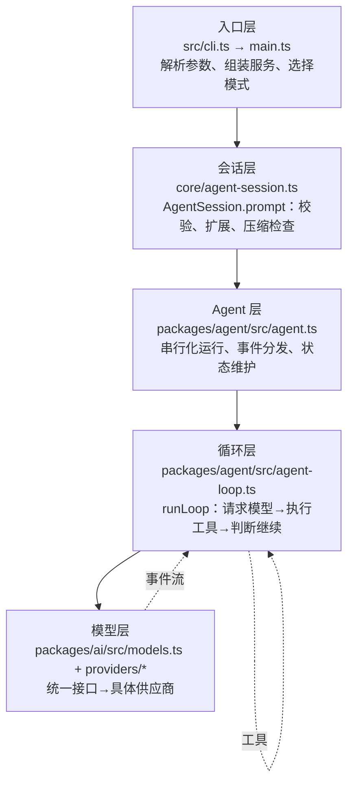
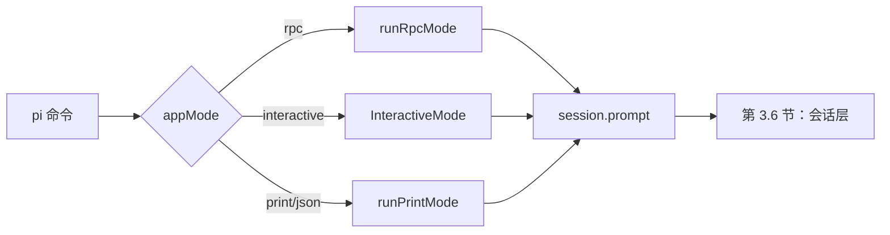
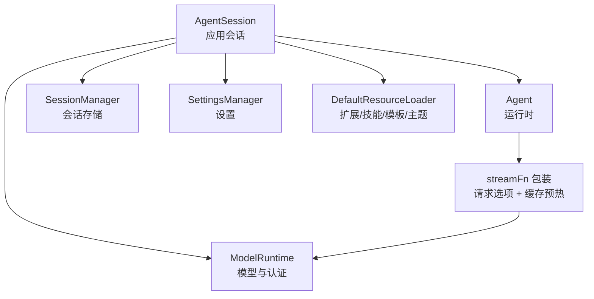
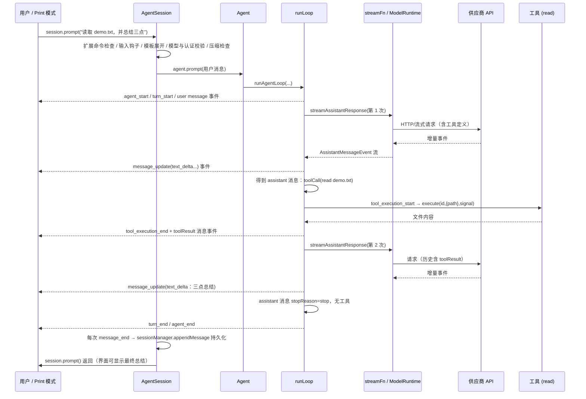
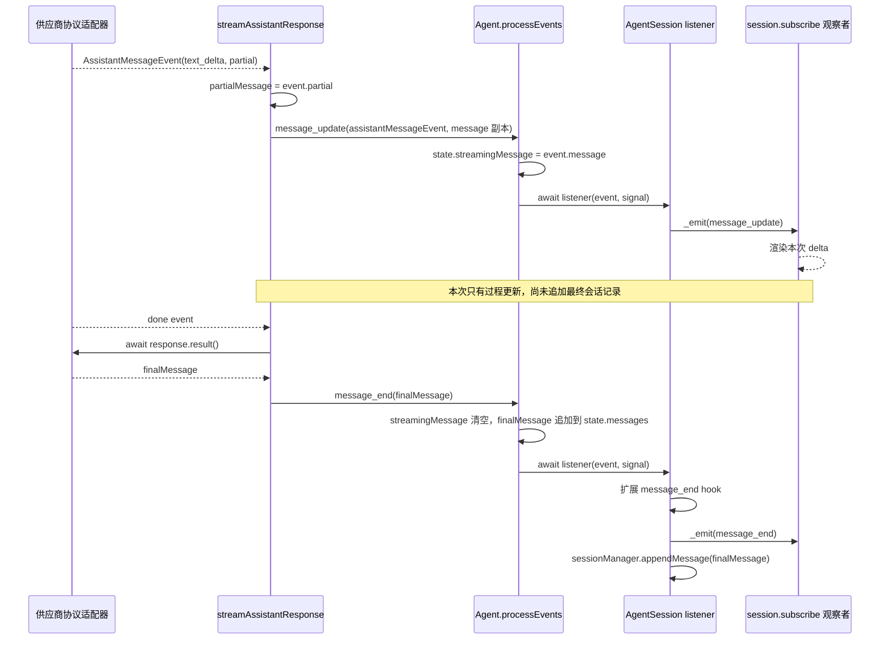

# 第 3 章：从输入到最终回答的完整旅程

> 学完本章你能回答：
>
> 1. 一条用户输入，从命令行到最终回答，中间经过哪些文件、哪些函数？
> 2. 为什么"读文件并总结"需要**两次**模型请求？两次分别发生在哪里？
> 3. "一次用户请求"、"一个 turn（轮次）"、"一次模型请求"这三个概念怎么区分？
> 4. 界面上的流式文字是从哪个环节产生的？它和最终的完整消息是什么关系？

**前置知识**：第 1 章（事件与异步）、第 2 章（源码运行）。
**预计学习时间**：2 天（本章是全书的地标章节，值得慢读）。
**本章验证状态**：静态核对通过（所有引用已对照基线 commit 的源码逐段检查）；实验留待第 5-6 章用 faux provider 落地。

---

## 3.1 本章要追踪的场景

固定输入（后文所有追踪都以它为准）：

```text
用户输入：读取 demo.txt，并总结三点。
```

假设 `demo.txt` 存在、模型也按预期工作。你要建立的直觉是下面这条轨迹（先看图，别急着看代码）：

```text
用户消息 "读取 demo.txt 并总结三点"
  │
  ├─ 第 1 次模型请求（携带系统提示、历史消息、工具清单）
  │    模型流式回答：我先调用 read 工具 { path: "demo.txt" }
  │
  ├─ pi 在本地执行 read 工具，得到文件内容
  │
  ├─ 第 2 次模型请求（在上面的历史后追加"工具结果"消息）
  │    模型流式回答：三点总结（不再调用工具）
  │
  └─ 运行结束，界面显示总结
```

两个常见误解先破掉：

- **误解一："一次用户请求 = 一次模型请求"**。不对。只要模型提出工具调用，pi 就要执行工具、把结果发回去、再问一次模型。上例是两次；如果模型连续调用三个工具，可能就是四次。
- **误解二："模型自己读文件"**。不对。模型只输出"我想调用 read，参数是 demo.txt"这种**意图**；真正读文件的是你本机上的 pi 进程。

## 3.2 五层地图：本章的目录

整个旅程可以分成五层。每层都有明确的职责、明确的文件、明确的"下一层入口"：



| 层       | 职责                                                 | 关键文件                                       | 深入章节        |
| -------- | ---------------------------------------------------- | ---------------------------------------------- | --------------- |
| 入口层   | 把命令行变成"可运行的会话运行时"                     | `src/cli.ts`、`src/main.ts`                | 本章 + 第 16 章 |
| 会话层   | 把"一条用户输入"变成"Agent 可以跑的提示消息"         | `src/core/agent-session.ts`                  | 第 8 章         |
| Agent 层 | 保证一次只跑一个 run、维护状态、派发事件             | `packages/agent/src/agent.ts`                | 第 6 章         |
| 循环层   | 真正决定"继续还是结束"的循环                         | `packages/agent/src/agent-loop.ts`           | 第 6、7 章      |
| 模型层   | 把统一请求转换成供应商请求，把供应商流转换成统一事件 | `packages/ai/src/models.ts`、`providers/*` | 第 5 章         |

**分层读法是本项目的核心读法**：遇到任何行为问题，先问"这是哪一层的问题"，再往下钻。

## 3.3 三个必须区分的概念

在进入代码之前，先把三个容易混淆的概念钉死（它们的代码证据在本章随文给出）。

### 3.3.1 概念一：AgentMessage（内部消息）vs Message（模型消息）

pi 内部流动的消息类型叫 `AgentMessage`。它比"模型能理解的消息"更宽：

- 标准角色：`system`、`user`、`assistant`、`toolResult`；
- 应用自定义消息：如 `custom`（扩展注入的内容），模型不需要看到。

在真正调用模型前，有一道"翻译关卡" `convertToLlm`（`packages/agent/src/agent.ts` 的默认实现）：

```typescript
function defaultConvertToLlm(messages: AgentMessage[]): Message[] {
	return messages.filter(
		(message) =>
			message.role === "system" ||
			message.role === "user" ||
			message.role === "assistant" ||
			message.role === "toolResult",
	);
}
```

注意它是"过滤 + 转换"：丢掉模型不该看的内容，把自定义类型翻译成标准类型。`coding-agent` 包的 `core/messages.ts` 提供了更完整的转换（第 4 章精读）。

### 3.3.2 概念二：消息（给模型/历史）vs 事件（给界面/订阅者）

- **消息**：会被记录、会被发给模型的"事实"（用户说了什么、模型回答了什么、工具返回了什么）；
- **事件**：运行过程中的"广播"（刚开始流式输出、工具开始执行、某个增量文本到达），给界面和订阅者看，**不等于**消息本身。

两者的关系：事件是过程，消息是结果。`text_delta` 事件来了五次，最终只形成**一条** assistant 消息。第 4 章会给出完整对照表。

### 3.3.3 概念三：用户请求、run、turn、模型请求

| 名称         | 定义                            | 在本例中的数量                            |
| ------------ | ------------------------------- | ----------------------------------------- |
| 用户请求     | 用户提交一次输入                | 1                                         |
| run（运行）  | 从开始处理到 Agent 空闲         | 1                                         |
| turn（轮次） | 一次助手响应 + 它引发的工具执行 | 2（第一次响应调用工具、第二次响应给总结） |
| 模型请求     | 真正发给供应商 API 的请求       | 2                                         |
| 工具执行     | 本地实际执行工具                | 1（read）                                 |

这张表是本章的骨架。现在开始逐层追踪。

## 3.4 入口层：从命令行到 `main()`

### 3.4.1 第一站：`src/cli.ts`（构建产物 `dist/bundle/cli.js` 的源码）

`packages/coding-agent/src/cli.ts` 只有 139 字节：

```typescript
#!/usr/bin/env node
import { setupCli } from "./cli/setup.ts";
import { main } from "./main.ts";

setupCli();
main(process.argv.slice(2));
```

三个信息：

1. `#!/usr/bin/env node`：shebang，让打包后的文件可以当作可执行命令运行（`bin` 入口约定）；
2. `setupCli()`：在任何业务代码前做进程级初始化；
3. `main(process.argv.slice(2))`：把命令行参数（去掉 node 路径和脚本路径）交给主函数。

`setupCli()` 在 `src/cli/setup.ts`：

```typescript
export function setupCli(): void {
	process.title = APP_NAME;
	process.env.PI_CODING_AGENT = "true";
	process.env.AI_AGENT = "pi";
	process.emitWarning = (() => {}) as typeof process.emitWarning;

	// Configure undici before provider SDKs issue requests. Settings are applied
	// once SettingsManager has loaded global/project configuration.
	configureHttpDispatcher();
}
```

- 设置进程标题和两个标记环境变量（其他工具/扩展靠它们识别"我在 pi 里运行"）；
- **静音 `process.emitWarning`**：因为第 1 章看到的 `ExperimentalWarning: Type Stripping` 之类警告会污染输出（尤其 print/json/rpc 模式的 stdout/stderr），源码运行体验更好；
- 提前配置 HTTP 调度器（代理、超时），保证后面所有供应商请求走同一套底层配置。

> 源码版 `pi-test.sh` 走的是 `src/experimental/cli.ts`（第 2 章 2.4.3），它先尝试 `runExperimentalCommand`（如 `pi client ...` 实验命令），没命中再调用同一个 `main(args)`。两条路最终合流。

### 3.4.2 第二站：`main()` 的前半段（启动与装配）

`packages/coding-agent/src/main.ts` 第 573 行开始是主函数。按顺序（节选 + 注释，省略与本章无关的分支）：

```typescript
export async function main(args: string[], options?: MainOptions) {
	resetTimings();                 // 启动耗时打点器归零
	const offlineMode = args.includes("--offline") || isTruthyEnvFlag(process.env.PI_OFFLINE);
	if (offlineMode) {
		process.env.PI_OFFLINE = "1";
		process.env.PI_SKIP_VERSION_CHECK = "1";
	}

	if (await runAuthCommand(args)) return;   // `pi auth ...` 子命令分流

	const cwd = process.cwd();                 // 【重要】后面一切"项目相关"行为都以它为准
	const agentDir = getAgentDir();            // 全局配置目录（默认 ~/.pi/agent）
	const bootstrapSettingsManager = SettingsManager.create(cwd, agentDir, { projectTrusted: false });
	applyHttpProxySettings(bootstrapSettingsManager.getGlobalSettings().httpProxy);
	configureHttpDispatcher();

	if (await handlePackageCommand(args, { extensionFactories })) { /* pi install/remove/... */ }
	if (await handleConfigCommand(args, { extensionFactories })) { /* pi config ... */ }
	// ... `pi mcp` 子命令分流

	const parsed = parseArgs(args);            // 参数解析（定义在 cli/args.ts）
	// ... 打印诊断；有 error 则退出

	if (parsed.version) { console.log(VERSION); process.exit(0); }   // --version 快速退出
	if (parsed.export) { /* 导出会话为 HTML 后退出 */ }

	let appMode = resolveAppMode(parsed, process.stdin.isTTY, process.stdout.isTTY);
	const shouldTakeOverStdout = appMode !== "interactive" && !isPlainRuntimeMetadataCommand(parsed);
	if (shouldTakeOverStdout) takeOverStdout();
	// ... RPC 模式拒绝 @file；校验 --fork/--session-id 组合
	runMigrations(cwd);                        // 配置迁移
	// ... 首次启动引导、主题覆盖
```

这里已经能读出四个设计点，写代码的直觉就是这么积累起来的：

1. **快速命令先分流**：`auth`、`install`、`config`、`mcp`、`--version`、`--export` 都在"创建会话"之前处理掉。跑一次 `pi --version` 不会加载模型、不会扫资源。
2. **`cwd` 显式落盘**：`process.cwd()` 只取一次。之后所有模块传的都是这个值，避免"运行中途有人改了工作目录"导致状态割裂。
3. **信任先于加载**：bootstrap 设置管理器用 `projectTrusted: false` 创建——项目资源是否可信还没判定，先不能执行项目里的代码（第 11 章展开）。
4. **stdout 接管**：非交互模式下调用 `takeOverStdout()`，把裸写 stdout 的日志重定向到 stderr，保证协议输出干净（第 16 章的伏笔）。

### 3.4.3 第三站：会话目录与运行时工厂

继续往下（这是 `main()` 中最关键的一段）：

```typescript
	const envSessionDir = process.env[ENV_SESSION_DIR];
	const sessionDir = (parsed.sessionDir ? normalizePath(parsed.sessionDir) : undefined)
		?? (envSessionDir ? expandTildePath(envSessionDir) : undefined)
		?? startupSettingsManager.getSessionDir();
	let sessionManager = await createSessionManager(parsed, cwd, sessionDir, startupSettingsManager);
	// ...（处理会话指向的 cwd 缺失等边界）

	const resolvedExtensionPaths = resolveCliPaths(cwd, parsed.extensions);
	// ... 同样的 skill / promptTemplate / theme 路径解析

	const createRuntime: CreateAgentSessionRuntimeFactory = async ({ cwd, agentDir, sessionManager, sessionStartEvent, projectTrustContext }) => {
		// ... 项目信任判定（首次运行可能弹交互询问）
		const runtimeSettingsManager = SettingsManager.create(cwd, agentDir, { projectTrusted });
		const services = await createAgentSessionServices({
			cwd, agentDir, settingsManager: runtimeSettingsManager,
			resourceLoaderOptions: { /* 扩展/技能/模板/主题/上下文文件等发现配置 */ },
		});
		// ... 诊断信息收集；--model/--models 作用域解析（resolveModelScope）
		const created = await createAgentSessionFromServices({
			services, sessionManager, sessionStartEvent,
			model: sessionOptions.model, thinkingLevel: sessionOptions.thinkingLevel,
			tools: sessionOptions.tools, excludeTools: sessionOptions.excludeTools, noTools: sessionOptions.noTools,
			customTools: sessionOptions.customTools,
		});
		return { ...created, services, diagnostics };
	};
	const runtime = await createAgentSessionRuntime(createRuntime, {
		cwd: sessionManager.getCwd(), agentDir, sessionManager,
	});
```

三个要点：

- **会话目录的三个来源，优先级从高到低**：`--session-dir` 参数 → 环境变量 `PI_CODING_AGENT_SESSION_DIR` → 设置里的 `sessionDir`。
- **`createRuntime` 是"工厂函数"，不是一次性的对象**。因为会话可能切换工作目录（或恢复别的项目的会话），"cwd 绑定"的东西（项目设置、资源、工具、会话）需要**能重建**。`createAgentSessionRuntime` 把它包成运行时，第 8 章讲透。
- **`createAgentSessionServices` / `createAgentSessionFromServices` 与 SDK 的 `createAgentSession` 是两套入口**：SDK 走"一步到位"的 `createAgentSession`（3.5 节读它）；CLI 为了支持运行时可重建，拆成"服务 + 会话"两步。**读代码时先确认你读的是哪一条路**，这是很多人第一次读 `sdk.ts` 会迷路的原因。

### 3.4.4 第四站：模式分发（本章旅程的岔路口）

`main()` 的结尾：

```typescript
	if (parsed.help) { /* 打印帮助后退出 */ }
	if (parsed.listModels !== undefined) { /* 列出模型后退出 */ }

	let stdinContent: string | undefined;
	if (appMode !== "rpc") {
		stdinContent = await readPipedStdin();          // 管道输入：`git diff | pi -p ...`
		if (stdinContent !== undefined && appMode === "interactive") appMode = "print";
	}

	const { initialMessage, initialImages } = await prepareInitialMessage(parsed, stdinContent);
	// ... 初始化主题

	if (appMode === "rpc") {
		await runRpcMode(runtime);                       // ① RPC：stdin 收 JSONL，stdout 回响应
	} else if (appMode === "interactive") {
		const interactiveMode = new InteractiveMode(runtime, { /* ... */ });
		await interactiveMode.run();                     // ② 交互：全屏 TUI
	} else {
		const exitCode = await runPrintMode(runtime, {   // ③ print/json：一次性运行
			mode: toPrintOutputMode(appMode),            //    "text" 或 "json"
			messages: parsed.messages, initialMessage, initialImages,
		});
		// ...
	}
```

`resolveAppMode` 的规则（依据 `cli.md` 与代码）：显式 `--print` 或 `--mode json|rpc` 直接定；否则看 stdin/stdout 是否都是终端（TTY）——都是终端进交互模式，任一被重定向则退化为 print 模式。

**三个模式最终都会调用同一个东西**：`session.prompt(...)`。这就是为什么本章只讲一条公共路径。



（提示：交互模式里，用户每次回车都会触发一次 `session.prompt`；print 模式在启动流程中触发一次；RPC 模式收到 `prompt` 命令时触发。三种触发时机不同，进入 3.5 节后就完全一样了。）

## 3.5 装配层：`createAgentSession` 到底组装了什么

在进入 `session.prompt` 之前，先花几分钟看清"会话里到底有什么"。SDK 的 `packages/coding-agent/src/core/sdk.ts` 是最好读的装配入口（CLI 走的是等价的两步式流程，见 3.4.3）。

以下按源码顺序（`sdk.ts` 第 175 行起）节选并注释：

```typescript
export async function createAgentSession(options: CreateAgentSessionOptions = {}): Promise<CreateAgentSessionResult> {
	const cwd = resolvePath(options.cwd ?? options.sessionManager?.getCwd() ?? process.cwd());
	const agentDir = options.agentDir ? resolvePath(options.agentDir) : getDefaultAgentDir();
	let resourceLoader = options.resourceLoader;

	// 1. 模型运行时：谁来发请求、怎么认证
	const authPath = options.agentDir ? join(agentDir, "auth.json") : undefined;
	const modelsPath = options.agentDir ? join(agentDir, "models.json") : undefined;
	const modelRuntime = options.modelRuntime ?? (await ModelRuntime.create({ authPath, modelsPath }));

	// 2. 三件套：设置、会话存储、资源加载器
	const settingsManager = options.settingsManager ?? SettingsManager.create(cwd, agentDir);
	const sessionManager = options.sessionManager ?? SessionManager.create(cwd, getDefaultSessionDir(cwd, agentDir));

	if (!resourceLoader) {
		resourceLoader = new DefaultResourceLoader({ cwd, agentDir, settingsManager });
		await resourceLoader.reload();   // 真正去磁盘上"发现"扩展/技能/模板/主题/上下文文件
		time("resourceLoader.reload");
	}
```

这段值得单独说三点：

- **一切皆可注入**：每个组件都是 `options.X ?? 默认实现`。测试通过注入假实现完成离线运行，SDK 用户也可以只替换其中一个（第 15 章逐个演示）。
- **默认行为不是"空"而是"发现"**：`DefaultResourceLoader.reload()` 会扫描工作目录与 `~/.pi/agent`，这正是 `01-minimal.ts` 注释里说的 "discovers skills, extensions, tools, context files from cwd and ~/.pi/agent"。
- **`ModelRuntime` 是认证与模型的统一门面**：具体认证逻辑（API Key / OAuth / 环境变量）都在它和 `model-resolver.ts` 里，第 5、11 章展开。

继续读"恢复"逻辑：

```typescript
	// 3. 会话恢复：如果这个会话文件里已有内容，尽量把模型也恢复回来
	const existingSession = sessionManager.buildSessionContext();
	const hasExistingSession = existingSession.messages.length > 0;
	const hasThinkingEntry = sessionManager.getBranch().some((entry) => entry.type === "thinking_level_change");

	let model = options.model;
	const sessionModel = getBranchSelection(sessionManager.getBranch(), (provider, modelId) =>
		modelRuntime.getModel(provider, modelId),
	);
	if (!model && hasExistingSession && sessionModel) {
		const restoredModel = modelRuntime.getModel(sessionModel.provider, sessionModel.modelId);
		if (restoredModel && modelRuntime.hasConfiguredAuth(restoredModel.provider)) {
			model = restoredModel;   // 之前的会话用哪个模型，继续用它
		}
		// ... 否则记录 modelFallbackMessage（恢复失败的原因）
	}

	// 4. 仍然没有模型：按"设置里的默认 → 各供应商默认"顺序找
	if (!model) {
		const result = await findInitialModel({ scopedModels: [], isContinuing: hasExistingSession, /* ... */ });
		model = result.model;
		if (!model) modelFallbackMessage = formatNoModelsAvailableMessage();
	}
```

然后是思考级别与工具白名单：

```typescript
	// 5. thinkingLevel（思考深度）：会话恢复值 → 每模型设置 → 全局默认，最后按模型能力钳制
	thinkingLevel = clampThinkingLevel(model, thinkingLevel) as ThinkingLevel;

	// 6. 工具选择：显式 tools > defaultTools 设置 > 内置默认（DEFAULT_TOOL_NAMES）
	const configuredDefaultToolNames = settingsManager.getDefaultTools();
	const allowedToolNames = options.tools ?? (options.noTools === "all" ? [] : undefined);
	const excludedToolNames = options.excludeTools;
	const initialActiveToolNames = (
		options.tools ?? (options.noTools ? [] : (configuredDefaultToolNames ?? DEFAULT_TOOL_NAMES))
	).filter((name) => !excludedToolNameSet?.has(name));
```

再往下是"图片屏蔽"包装、缓存预热器和请求选项构建（选中读，不需要背）：

```typescript
	// 7. 消息转换包装：如果设置里禁止读图，就把图片块替换为文字占位符（纵深防御）
	const convertToLlmWithBlockImages = (messages: AgentMessage[]): Message[] => { /* ... */ };

	const extensionRunnerRef: { current?: ExtensionRunner } = {};
	const cacheWarmer = new CacheWarmer(modelRuntime, sessionManager,
		() => settingsManager.getCacheWarmingMode(),
		async (event) => extensionRunnerRef.current?.emitCacheWarmingDecision(event) ?? event.action,
	);
	const buildRequestOptions = (requestModel: Model<any>, options: ModelsSimpleStreamOptions = {}):
		ModelsSimpleStreamOptions => {
		// 超时 / 重试参数来自设置；合并供应商归因请求头；给扩展留 before_provider_headers 钩子
	};
```

最后是本层的主角——创建 `Agent` 与 `AgentSession`：

```typescript
	const agent = new Agent({
		initialState: { systemPrompt: "", model, thinkingLevel, tools: [], messages: existingSession.messages },
		convertToLlm: convertToLlmWithBlockImages,
		streamFn: async (model, context, options) => {
			const requestOptions = buildRequestOptions(model, options);
			// 只有"会话请求"才更新缓存预热的水位：压缩、摘要有自己的 sessionId
			if (options?.sessionId === sessionManager.getSessionId()) {
				cacheWarmer.start({ model, context, options: requestOptions }, cacheContextIsCurrent(model));
			}
			return modelRuntime.streamSimple(model, context, requestOptions);
		},
		onPayload: transformProviderPayload,         // 扩展钩子：before_provider_request
		onResponse: handleProviderResponse,           // 扩展钩子：after_provider_response
		onProviderStreamEvent: handleProviderStreamEvent,
		sessionId: sessionManager.getSessionId(),
		transformContext: async (messages) => {
			const runner = extensionRunnerRef.current;
			if (!runner) return messages;
			return runner.emitContext(messages);      // 扩展钩子：context 变换（第 13 章）
		},
		steeringMode: settingsManager.getSteeringMode(),
		followUpMode: settingsManager.getFollowUpMode(),
		// ...
	});

	// 7.5 记录初始模型/思考级别，供下次恢复
	if (hasExistingSession) {
		if (!hasThinkingEntry) sessionManager.appendThinkingLevelChange(thinkingLevel);
	} else {
		if (model) sessionManager.appendModelChange(model.provider, model.id);
		sessionManager.appendThinkingLevelChange(thinkingLevel);
	}

	const session = new AgentSession({
		agent, sessionManager, settingsManager, cwd,
		scopedModels: options.scopedModels,
		resourceLoader, customTools: options.customTools, modelRuntime, cacheWarmer,
		initialActiveToolNames, usesDefaultTools: options.tools === undefined && !options.noTools,
		allowedToolNames, excludedToolNames, extensionRunnerRef,
		sessionStartEvent: options.sessionStartEvent,
	});

	return { session, extensionsResult: resourceLoader.getExtensions(), modelFallbackMessage };
}
```

请把这一段的"对象关系"画成图（第 8 章会逐项解释所有权与释放）：



注意两个"跨层"点：

- `Agent` 的 `systemPrompt` 初始是空字符串——真正的系统提示由 `AgentSession` 在每次 prompt 前组装（第 10 章）；
- `Agent` 是**纯运行时**，它不知道文件、扩展、设置；它拿到的 `streamFn` 是 `AgentSession`（实际上是 sdk.ts 装配处）包装过的版本。这就是第 0 章讲的"下层只提供机制、上层决定用法"的具体体现。

## 3.6 会话层：`AgentSession.prompt` 在进入循环前做了什么

入口找到 `packages/coding-agent/src/core/agent-session.ts` 第 1921 行（文件太大，请用"转到定义/搜索符号"定位，不要从头读）。方法很长，但结构是线性的。我们按分支顺序过一遍（节选 + 注释，删减了与本章无关的细节）：

```typescript
async prompt(text: string, options?: PromptOptions): Promise<void> {
	// ① 如果正在收尾（agent_settled 等收尾事件的处理过程中），先排队延后执行
	if (this._isEmittingAgentSettled) {
		this._deferredSettledActions.push(async () => await this.prompt(text, options));
		return;
	}

	// ② 以 "/" 开头且是扩展命令：立即执行，不发送给模型
	if (expandPromptTemplates && text.startsWith("/")) {
		const handled = await this._tryExecuteExtensionCommand(text);
		if (handled) { preflightResult?.("handled"); return; }
	}

	// ③ 压缩进行中不许提交（避免上下文在生成中变化）
	if (this._compactionAbortController !== undefined) {
		throw new Error("Cannot submit a prompt while compaction is in progress. ...");
	}

	// ④ 扩展的输入拦截钩子（可以改写文本、取消发送、决定入队行为）
	const processedInput = await this._runInputHandlers(text, options?.images,
		options?.source ?? "interactive", this.isStreaming ? options?.streamingBehavior : undefined);
	if (!processedInput) { preflightResult?.("handled"); return; }

	// ⑤ 展开 /skill:名称 与提示词模板
	let expandedText = currentText;
	if (expandPromptTemplates) {
		expandedText = this._expandSkillCommand(expandedText);
		expandedText = expandPromptTemplate(expandedText, [...this.promptTemplates]);
	}

	// ⑥ 正在流式输出时：不允许直接再发，必须明确行为（steer 或 followUp 入队）
	if (this.isStreaming) {
		if (!options?.streamingBehavior) throw new Error("Agent is already processing. ...");
		if (options.streamingBehavior === "followUp") await this._queueFollowUp(expandedText, currentImages);
		else await this._queueSteer(expandedText, currentImages);
		preflightResult?.("queued");
		return;
	}

	// ⑦ 冲刷之前积累的 bash 输出/自定义消息（它们要排在本次输入之前）
	this._flushPendingBashMessages();
	this._flushPendingCustomMessages();

	// ⑧ 必须已选择模型、且该供应商认证可用，否则立刻报错
	if (!this.model) throw new Error(formatNoModelSelectedMessage());
	const hasConfiguredAuth = this._modelRuntime.hasConfiguredAuth(this.model.provider)
		|| (await this._modelRuntime.checkAuth(this.model.provider)) !== undefined;
	if (!hasConfiguredAuth) { /* OAuth 过期提示 或 "没有 API Key" 提示 */ }

	// ⑨ 发送前检查是否需要先压缩上下文（例如上一次响应被取消留下了过长历史）
	const lastAssistant = this._findLastAssistantMessage();
	if (lastAssistant) await this._checkCompaction(lastAssistant, false);

	// ⑩ 扩展钩子 before_agent_start：可以改系统提示、选模型、注入消息
	const result = await this._extensionRunner.emitBeforeAgentStart(expandedText, currentImages, this._baseSystemPromptOptions);
	// ... 工具清单一致性处理（handler 显式改动优先，否则以当前激活工具为准）

	// ⑪ 图片归一化 + 组装本次要注入的消息数组
	const normalized = await this._normalizePromptImages(currentImages);
	const userText = normalized.hints.length > 0 ? `${expandedText}\n\n${normalized.hints.join("\n")}` : expandedText;
	const messages: AgentMessage[] = [];
	messages.push({ role: "user", content: [{ type: "text", text: userText }, ...normalized.images], timestamp: Date.now() });
	// ... 追加 pendingNextTurn 消息、扩展注入的 custom 消息

	// ⑫ 组装/更新系统提示选项（含工具载入变更的 system 消息），并入队
	const updateMessage = this._preparePromptAndToolLoadout(result.systemPromptOptions);
	this._runSystemPromptOptions = result.systemPromptOptions;
	if (updateMessage) messages.unshift(updateMessage);

	preflightResult?.("started");
	await this._runAgentPrompt(messages);   // 交给下一步：真正驱动 Agent
}
```

对本章的追踪来说，②③⑥⑧⑨ 是"守卫"（不合格就停下或入队），⑤⑩⑪ 是"改写"（把用户输入加工成一批待注入消息），最后 `_runAgentPrompt(messages)` 才是"运行"。

`_runAgentPrompt`（同一文件第 1775 行）是会话层与 Agent 层之间的桥梁：

```typescript
private async _runAgentPrompt(messages: AgentMessage | AgentMessage[]): Promise<void> {
	this._agentRunAbortRequested = false;
	this._failedResponse = undefined;          // 之前的失败响应记录先清除
	this._recordSelection();
	this._pendingToolNames.clear();
	this._isAgentRunActive = true;
	try {
		await this.agent.prompt(messages);     // ← 控制权交给 Agent（下一节）
		// 运行后循环：处理重试、自动压缩、队列里的新消息
		while (!this._agentRunAbortRequested) {
			if (await this._handlePostAgentRun()) {
				if (this._agentRunAbortRequested) break;
				await this.agent.continue();    // 同一会话里继续跑（不新增用户消息）
				continue;
			}
			if (this._agentRunAbortRequested || !(await this._runBeforeSettleBoundary())) break;
			if (this._agentRunAbortRequested) break;
			await this.agent.continue();
		}
	} finally {
		// ... 收尾：清理请求级状态、冲刷待发消息、发出 agent_settled
		await this._emitAgentSettled();
	}
}
```

为什么 `agent.prompt()` 回来之后还要循环？因为在这些情况下"工作还没完"：

- **重试**：可重试的错误（如网络抖动）由 `_handlePostAgentRun` 判断后触发 `agent.continue()`；
- **自动压缩**：发现上下文超限，先压缩再继续；
- **运行期间新排队的消息**：用户在流式输出中按了回车（steering / follow-up），它们会在合适时机被排进来再跑一轮；
- **扩展边界**：`agent_before_settle` 钩子允许扩展在"即将空闲"前再塞一轮。

这些细节属于第 6、8 章；本章只要记住：**`session.prompt()` 返回时，指的是"这一轮会话相关工作全都结束了"（包括上述循环），而不是"第一次模型响应结束了"。**

## 3.7 Agent 层：`Agent.prompt` 与"一次只跑一个 run"

控制权从会话层进入 `packages/agent/src/agent.ts`。第一站是 `Agent.prompt`（第 371 行）：

```typescript
async prompt(input: string | AgentMessage | AgentMessage[], images?: ImageContent[]): Promise<void> {
	if (this.activeRun) {
		throw new Error("Agent is already processing a prompt. Use steer() or followUp() to queue messages, or wait for completion.");
	}
	const messages = this.normalizePromptInput(input, images);
	await this.runPromptMessages(messages);
}
```

三个行为：

1. **同一时刻只允许一个 run**：`activeRun` 非空时直接抛错。想"边跑边插话"必须用 `steer()` / `followUp()` 排队，而不是再调一次 `prompt()`。这是有意的约束——避免同一份消息历史被两个 run 并发改写。
2. **输入归一化**：`normalizePromptInput` 把字符串包装成标准用户消息：

```typescript
private normalizePromptInput(input: string | AgentMessage | AgentMessage[], images?: ImageContent[]): AgentMessage[] {
	if (Array.isArray(input)) return input;
	if (typeof input !== "string") return [input];
	const content: Array<TextContent | ImageContent> = [{ type: "text", text: input }];
	if (images && images.length > 0) content.push(...images);
	return [{ role: "user", content, timestamp: Date.now() }];
}
```

3. **进入生命周期包装**：

```typescript
private async runPromptMessages(messages: AgentMessage[], options: { skipInitialSteeringPoll?: boolean } = {}): Promise<void> {
	await this.runWithLifecycle(async (signal) => {
		await runAgentLoop(
			messages,
			this.createContextSnapshot(),        // 当前消息 + 工具的浅拷贝快照
			this.createLoopConfig(options),      // 把 Agent 的回调整理成循环配置
			(event) => this.processEvents(event),// 循环发出的事件先进入 Agent 的状态归约
			signal,
			this.streamFunction,
		);
	});
}
```

`runWithLifecycle` 是"run 的边界"，也是状态位的唯一管理者：

```typescript
private async runWithLifecycle(executor: (signal: AbortSignal) => Promise<void>): Promise<void> {
	if (this.activeRun) throw new Error("Agent is already processing.");

	const abortController = new AbortController();
	let resolvePromise = () => {};
	const promise = new Promise<void>((resolve) => { resolvePromise = resolve; });
	this.activeRun = { promise, resolve: resolvePromise, abortController };

	this._state.isStreaming = true;
	this._state.streamingMessage = undefined;
	this._state.errorMessage = undefined;

	try {
		await executor(abortController.signal);
	} catch (error) {
		await this.handleRunFailure(error, abortController.signal.aborted);   // 把异常变成"错误消息 + 事件"
	} finally {
		this.finishRun();     // isStreaming=false；唤醒 waitForIdle()；清空 activeRun
	}
}
```

读这段要抓住一个设计：**executor 的运行异常通常会转成失败事件，而不是直接从 `prompt()` 抛出**。异常被 `handleRunFailure` 捕获后，会转成一条骨架 assistant 消息（`stopReason` 为 `"error"` 或 `"aborted"`），再走 `message_start → message_end → turn_end → agent_end` 事件序列；前提是这段失败事件派发顺利完成。若监听器在派发失败事件时再次抛错，`handleRunFailure` 的 Promise 会 reject，异常会继续从 `prompt()` 冒出。`finally` 仍会运行并清理 run 状态。比如 provider 抛错且监听器正常时，调用方可读 `agent.state.errorMessage`；若监听器也抛错，`await session.prompt(...)` 仍应由调用方捕获处理。这样：

- 订阅者（界面）用同一套逻辑处理成功与失败；
- 上层（`session.prompt`）可从 `agent.state.errorMessage` 或消息内容读取通常的运行失败；调用方仍应考虑监听器抛错等失败处理本身出错的路径。

`processEvents` 是"事件 → 状态"的归约器（第 4 章会有完整表格，这里先看主循环需要的部分）：

```typescript
private async processEvents(event: AgentEvent): Promise<void> {
	switch (event.type) {
		case "message_start":
		case "message_update":
			this._state.streamingMessage = event.message;   // 正在流式形成中的消息
			break;
		case "message_end":
			this._state.streamingMessage = undefined;
			this._state.messages.push(event.message);        // 完整消息进入历史
			break;
		case "tool_execution_start": /* pendingToolCalls.add(id) */ break;
		case "tool_execution_end":   /* pendingToolCalls.delete(id) */ break;
		case "turn_end":
			if (event.message.role === "assistant" && event.message.errorMessage) {
				this._state.errorMessage = event.message.errorMessage;
			}
			break;
		case "agent_end": this._state.streamingMessage = undefined; break;
	}

	const signal = this.activeRun?.abortController.signal;
	if (!signal) throw new Error("Agent listener invoked outside active run");
	for (const listener of this.listeners) {
		await listener(event, signal);   // 逐个 await：订阅顺序 = 处理顺序
	}
}
```

两个关键语义（第 1 章预告过，现在证据齐了）：

- **监听器被逐个 `await`**：一个订阅者处理慢，会拖慢后续订阅者和整个 run。所以订阅回调要快；慢活（网络、渲染大计算）要自己异步化并管理错误。
- **`isStreaming` 直到 `agent_end` 的所有监听器结束才变 false**：`await session.prompt(...)` 返回时，界面已收完最后一批事件。

## 3.8 循环层：`runLoop` 的完整决策过程

`packages/agent/src/agent-loop.ts` 是全书的"心脏"。先看入口，它很薄：

```typescript
export async function runAgentLoop(
	prompts: AgentMessage[],
	context: AgentContext,
	config: AgentLoopConfig,
	emit: AgentEventSink,
	signal: AbortSignal | undefined,
	streamFn: StreamFn,
): Promise<AgentMessage[]> {
	const initialMessages = declareToolChanges(context, prompts);
	const newMessages: AgentMessage[] = [...initialMessages];
	const currentContext: AgentContext = { ...context, messages: [...context.messages, ...initialMessages] };

	await emit({ type: "agent_start" });
	await emit({ type: "turn_start" });
	for (const message of initialMessages) {
		await emit({ type: "message_start", message });
		await emit({ type: "message_end", message });
	}

	await runLoop(currentContext, newMessages, config, signal, emit, streamFn ?? getDefaultStreamFn());
	return newMessages;
}
```

- `declareToolChanges`：如果这次请求涉及"工具清单变化"（比如扩展在运行中启用了新工具），它会**插入一条 system 消息**声明增删了哪些工具。这样模型看到的消息序列始终自洽，回放（第 9 章）也精确一致。
- `newMessages`：这次 run 新产生的消息（用户消息 + 助手消息 + 工具结果），最后作为 `agent_end.messages` 发出、也用于会话持久化（第 9 章）。
- 开头三条事件：`agent_start` → `turn_start` → 用户消息的 `message_start/message_end`。请对照 `packages/agent/README.md` 的事件序列图，一模一样。

真正的决策在 `runLoop`（同一文件）。它是**双层循环**，这段代码值得逐行读：

```typescript
async function runLoop(initialContext, newMessages, initialConfig, signal, emit, streamFunction): Promise<void> {
	let currentContext = initialContext;
	let config = initialConfig;
	let lastCompletedTurn: PrepareNextTurnContext | undefined;
	let explicitContinuation = false;
	// 用户在等待期间可能已经打了字：进入循环前先取一次 steering 消息
	let pendingMessages: AgentMessage[] = (await config.getSteeringMessages?.()) || [];

	// 外层循环：当"原本要停下来"时，还有 follow-up 消息就再跑一轮
	while (true) {
		let hasMoreToolCalls = true;

		// 内层循环：只要有工具要执行、或有排队的消息，就继续请求模型
		while (hasMoreToolCalls || pendingMessages.length > 0) {
			// ① 如果上一轮结束了，先给"下一轮开始"一个准备机会（prepareNextTurn）
			let preparedMessages: AgentMessage[] = [];
			if (lastCompletedTurn) {
				const nextTurnSnapshot = await config.prepareNextTurn?.(lastCompletedTurn);
				if (nextTurnSnapshot) {
					currentContext = nextTurnSnapshot.context ?? currentContext;
					preparedMessages = nextTurnSnapshot.messages ?? [];
					config = { ...config, model: nextTurnSnapshot.model ?? config.model, /* reasoning 更新 */ };
				}
				// 准备可能耗时（例如压缩）；这期间新排队的 steering 消息要补取
				if (pendingMessages.length === 0) {
					pendingMessages = (await config.getSteeringMessages?.()) || [];
				}
				await emit({ type: "turn_start" });
			}

			// ② 注入准备好的消息与排队消息（附工具变化声明），逐条发消息事件
			for (const message of declareToolChanges(currentContext, [...preparedMessages, ...pendingMessages])) {
				await emit({ type: "message_start", message });
				await emit({ type: "message_end", message });
				currentContext.messages.push(message);
				newMessages.push(message);
			}
			pendingMessages = [];

			// ③ 发请求前最后一次修改请求的机会（prepareRequest 钩子）
			const requestUpdate = await config.prepareRequest?.({ context: currentContext, model: config.model, thinkingLevel: config.reasoning ?? "off" }, signal);
			if (requestUpdate) { /* 更新 currentContext / model / reasoning */ }

			// ④ 请求模型并流式收集一条完整 assistant 消息（见 3.9 节）
			const message = await streamAssistantResponse(currentContext, config, signal, emit, streamFunction);
			newMessages.push(message);

			// ⑤ 失败/取消：收尾本轮并直接结束整个 run
			if (message.stopReason === "error" || message.stopReason === "aborted") {
				lastCompletedTurn = { message, toolResults: [], context: currentContext, newMessages };
				await config.finishTurn?.(lastCompletedTurn, signal);
				await emit({ type: "turn_end", message, toolResults: [] });
				await emit({ type: "agent_end", messages: newMessages });
				return;
			}

			// ⑥ 检查模型是否要求调用工具
			const toolCalls = message.content.filter((c) => c.type === "toolCall");
			const toolResults: ToolResultMessage[] = [];
			hasMoreToolCalls = false;
			if (toolCalls.length > 0) {
				// 输出被 max_tokens 截断时，工具参数可能"能解析但不完整"：全部拒绝执行
				const executedToolBatch = message.stopReason === "length"
					? await failToolCallsFromTruncatedMessage(toolCalls, emit)
					: await executeToolCalls(currentContext, message, config, signal, emit);
				toolResults.push(...executedToolBatch.messages);
				hasMoreToolCalls = !executedToolBatch.terminate;
				for (const result of toolResults) {
					currentContext.messages.push(result);
					newMessages.push(result);
				}
			}

			// ⑦ 本轮完成：交给 finishTurn 决策，然后发 turn_end
			lastCompletedTurn = { message, toolResults, context: currentContext, newMessages };
			const decision = await config.finishTurn?.(lastCompletedTurn, signal);
			await emit({ type: "turn_end", message, toolResults });

			if (decision?.action === "end") {
				await emit({ type: "agent_end", messages: newMessages });
				return;
			}
			explicitContinuation = decision?.action === "continue";
			pendingMessages = (await config.getSteeringMessages?.()) || [];
			if (hasMoreToolCalls || pendingMessages.length > 0) explicitContinuation = false;
		}

		// ⑧ 内层退出：Agent 本来要停了，检查 follow-up 队列
		const followUpMessages = (await config.getFollowUpMessages?.()) || [];
		if (followUpMessages.length > 0) {
			explicitContinuation = false;
			pendingMessages = followUpMessages;
			continue;                        // 回到外层开头，重新进入内层
		}
		if (explicitContinuation) {          // finishTurn 明确要求再来一轮（不新增消息）
			explicitContinuation = false;
			continue;
		}
		break;                               // 真的没活了
	}

	await emit({ type: "agent_end", messages: newMessages });
}
```

把"继续还是结束"整理成决策表（这是本章验收的核心）：

| 运行中的情况                                       | 判定 | 结果                                                                  |
| -------------------------------------------------- | ---- | --------------------------------------------------------------------- |
| 模型响应`stopReason` 为 `error`/`aborted`    | ⑤   | 收尾本轮后**直接结束**整个 run                                  |
| 有工具调用且批次未要求 terminate                   | ⑥   | 执行工具，`hasMoreToolCalls = true`，**再请求模型**           |
| 有工具调用但**全部**结果 `terminate: true` | ⑥   | 不再因工具继续                                                        |
| `finishTurn` 返回 `{ action: "end" }`          | ⑦   | 立即结束（扩展/上层主动叫停）                                         |
| `finishTurn` 返回 `{ action: "continue" }`     | ⑦   | 记下`explicitContinuation`，内层退出后空转一轮（context-only turn） |
| 有 steering 消息                                   | ⑦   | 下一轮注入后继续                                                      |
| 内层退出、有 follow-up 消息                        | ⑧   | 重新进入内层继续                                                      |
| 都没有                                             | ⑧   | `break` → `agent_end`，run 结束                                  |

回到我们的场景：

- 第一次 `streamAssistantResponse` 返回的 assistant 消息里有一个 `toolCall`（read）。⑥执行工具 → `hasMoreToolCalls = true`；
- 第二次请求返回纯文本（无工具调用）、也没有排队消息 → 内层 `while` 条件为 false，退出；
- 没有 follow-up → 外层 `break`；
- 发出 `agent_end`，run 结束。

### 3.8.1 并行工具的"两个顺序"

第 7 章会用实验证明，这里先把代码事实说清。`executeToolCallsParallel`（同文件）的执行顺序是：

```text
准备阶段：按模型声明顺序，逐个 emit tool_execution_start（A 开始、B 开始）
执行阶段：所有允许的工具并发执行（B 可能先完成）
完成阶段：谁先完成谁先 emit tool_execution_end（B 结束、A 结束）
记录阶段：await Promise.all(有序结果) → 按声明顺序生成 toolResult 消息（A、B）
```

对照代码：完成事件在各自 `finalized` 闭包里发出，而结果消息在 `Promise.all` 之后用 `orderedFinalizedCalls` 循环发出。**"界面反馈按完成顺序、历史记录按声明顺序"**，两个顺序各有用途。

## 3.9 模型层：一次请求如何变成一条完整消息

`streamAssistantResponse`（`agent-loop.ts`）是"循环层"与"模型层"的接缝。它做四件事：变换上下文 → 转换消息类型 → 发请求 → 把事件流折叠成一条完整消息。

```typescript
async function streamAssistantResponse(context, config, signal, emit, streamFunction): Promise<AssistantMessage> {
	// ① 扩展可先变换 Agent 消息（AgentMessage[] → AgentMessage[]）
	let messages = context.messages;
	if (config.transformContext) messages = await config.transformContext(messages, signal);

	// ② 翻译成模型消息（AgentMessage[] → Message[]）：过滤 + 转格式
	const llmMessages = await config.convertToLlm(messages);
	const llmContext = normalizeContext({ messages: llmMessages });

	// ③ 解析 API Key（每次请求都解析：OAuth 令牌可能过期刷新）
	const resolvedApiKey =
		(config.getApiKey ? await config.getApiKey(config.model.provider) : undefined) || config.apiKey;

	// ④ 交给 streamFn（这里指向 sdk.ts 的包装函数 → modelRuntime.streamSimple）
	const response = await streamFunction(config.model, llmContext, { ...config, apiKey: resolvedApiKey, signal });

	// ⑤ result() 只可调用一次：拿到最终消息，并记录本次请求的思考级别
	const result = async () => Object.assign(await response.result(), { thinkingLevel: config.reasoning ?? "off" });

	let partialMessage: AssistantMessage | null = null;
	let addedPartial = false;

	for await (const event of response) {
		switch (event.type) {
			case "start":
				// 流开始：把"部分消息"放进上下文并通知订阅者
				partialMessage = event.partial;
				context.messages.push(partialMessage);
				addedPartial = true;
				await emit({ type: "message_start", message: { ...partialMessage } });
				break;

			case "text_start": case "text_delta": case "text_end":
			case "thinking_start": case "thinking_delta": case "thinking_end":
			case "toolcall_start": case "toolcall_delta": case "toolcall_end":
				// 任何增量：更新上下文里那条部分消息，并广播 message_update
				if (partialMessage) {
					partialMessage = event.partial;
					context.messages[context.messages.length - 1] = partialMessage;
					await emit({ type: "message_update", assistantMessageEvent: event, message: { ...partialMessage } });
				}
				break;

			case "done": case "error": {
				// 流结束：以最终消息替换部分消息（或补齐缺失的 start）
				const finalMessage = await result();
				if (addedPartial) context.messages[context.messages.length - 1] = finalMessage;
				else { context.messages.push(finalMessage); await emit({ type: "message_start", message: { ...finalMessage } }); }
				await emit({ type: "message_end", message: finalMessage });
				return finalMessage;
			}
		}
	}
	// 流意外关闭（没有 done/error 事件）的兜底：同样产出最终消息
	// ...
}
```

逐点解释：

- **`message_update` 里携带两个东西**：`assistantMessageEvent`（刚发生的增量，如 `text_delta` 的 `delta` 文本）和 `message`（截至此刻累积出的部分消息快照）。界面两者都能用：前者决定"再写几个字"，后者用于"整段重绘"。
- **部分消息会临时进入 `context.messages`**：所以订阅者在运行中读 `agent.state.messages` 时，最后一条可能是"还没完成的助手消息"。`message_end` 之后它被**最终消息替换**（同一位置）。这解释了为什么消息数量在运行中会"保持不变"而内容在变。
- **`stopReason` 是外层循环的判据**：`done` 事件带 `reason`（`stop` / `length` / `toolUse` / `deferred`），最终消息里的 `stopReason` 决定 3.8 的 ⑤⑥ 分支。

接下来是模型层内部：`streamFunction` 指向 `sdk.ts` 里的包装（先缓存预热、再调 `modelRuntime.streamSimple`）。`ModelRuntime` → `pi-ai` 的 `streamSimple` → 找到对应 `Api` 的适配器（如 `providers/anthropic.ts`）→ 供应商 SDK → 返回统一事件流。**这一段的细节全部留到第 5 章**，本章你只需要记住接缝位置：

```text
agent-loop.ts streamAssistantResponse
  → streamFn（sdk.ts 包装：缓存预热 + 请求选项）
    → modelRuntime.streamSimple（coding-agent）
      → pi-ai compat.streamSimple（统一入口，处理重试/兼容）
        → providers/<供应商>.ts（请求转换、SSE 解析）
          → 供应商原生事件
        ← 统一为 AssistantMessageEvent（start/text_*/thinking_*/toolcall_*/done/error）
      ← AssistantMessageEventStream
  ← for await 折叠为一条 AssistantMessage
```

## 3.10 工具层：从 toolCall 到 toolResult 消息

回到 `agent-loop.ts` 的 ⑥：一旦模型消息里含 `toolCall`，就调用 `executeToolCalls`。调度规则很简单：

```typescript
const hasSequentialToolCall = toolCalls.some(
	(tc) => currentContext.tools?.find((t) => t.name === tc.name)?.executionMode === "sequential",
);
if (config.toolExecution === "sequential" || hasSequentialToolCall) {
	return executeToolCallsSequential(...);   // 顺序执行：准备、执行、收尾一个接一个
}
return executeToolCallsParallel(...);         // 并行执行：准备顺序进行，执行允许并发
```

一个批次里只要**有任何一个**工具被声明为 `executionMode: "sequential"`（或全局配置为顺序），整个批次就顺序执行。这是保证"有副作用的工具不乱序"的保守策略。

每个工具调用都经历**四步流水线**（`prepareToolCall` → `executePreparedToolCall` → `finalizeExecutedToolCall` → 记录），单独看 `prepareToolCall`：

```typescript
async function prepareToolCall(currentContext, assistantMessage, toolCall, config, signal, tools = ...) {
	const tool = tools.find((t) => t.name === toolCall.name);
	if (!tool) {
		return { kind: "immediate", result: createErrorToolResult(`Tool ${toolCall.name} not found`), isError: true };
	}
	try {
		const preparedToolCall = prepareToolCallArguments(tool, toolCall); // 可选兼容层：修正原始参数
		const validatedArgs = validateToolArguments(tool, preparedToolCall); // 运行时 schema 校验（typebox）
		if (config.beforeToolCall) {
			const beforeResult = await config.beforeToolCall({ assistantMessage, toolCall, args: validatedArgs, context: currentContext }, signal);
			if (signal?.aborted) return { kind: "immediate", result: createErrorToolResult("Operation aborted"), isError: true };
			if (beforeResult?.block) {
				const result = createErrorToolResult(beforeResult.reason || "Tool execution was blocked");
				if (beforeResult.terminate === true) result.terminate = true;
				return { kind: "immediate", result, isError: true };  // 被拦截：不执行，回一条错误结果
			}
		}
		if (signal?.aborted) return { kind: "immediate", result: createErrorToolResult("Operation aborted"), isError: true };
		return { kind: "prepared", toolCall, tool, args: validatedArgs };
	} catch (error) {
		return { kind: "immediate", result: createErrorToolResult(error instanceof Error ? error.message : String(error)), isError: true };
	}
}
```

四个"提前结束"分支——**工具不存在、参数非法、被钩子拦截、已取消**——全部返回 `isError: true` 的结果对象，而不是抛异常。这是本仓库贯穿性的错误哲学：

> **错误是一种结果，不是一种崩溃。** 出错信息要能返回给模型，让它自己决定下一步。

执行与收尾（简化注释）：

```typescript
async function executePreparedToolCall(prepared, signal, onUpdate) {
	try {
		// 工具自己的实现：read 工具在这里读文件（packages/coding-agent/src/core/tools/read.ts）
		const result = await prepared.tool.execute(prepared.toolCall.id, prepared.args, signal, (partialResult) => {
			// 工具的进度回调 → tool_execution_update 事件（界面即时反馈）
			updateEvents.push(Promise.resolve(onUpdate(partialResult)));
		});
		return { result, isError: result.isError === true };
	} catch (error) {
		// 抛出的异常被折叠成错误结果，run 继续
		return { result: createErrorToolResult(error instanceof Error ? error.message : String(error)), isError: true };
	}
}

async function finalizeExecutedToolCall(...) {
	// afterToolCall 钩子可以改写结果（字段级替换，见 types.ts 的 AfterToolCallResult 注释）
	// 注意：content 被替换而 structuredContent 未同时提供时，structuredContent 会被丢弃（可能不再匹配）
}
```

最后两步：`emitToolExecutionEnd` 发 `tool_execution_end` 事件；`createToolResultMessage` 生成**工具结果消息**（这条会进入历史、发给模型）：

```typescript
function createToolResultMessage(finalized) {
	return {
		role: "toolResult",
		toolCallId: finalized.toolCall.id,   // 与请求它的 toolCall 一一对应
		toolName: finalized.toolCall.name,
		content: finalized.result.content ?? [],
		details: finalized.result.details,
		usage: finalized.result.usage,
		isError: finalized.isError,
		timestamp: Date.now(),
	};
}
```

然后 `message_start` / `message_end` 两个事件把这条消息广播出去。**到这里，"read 工具的结果"正式成为对话历史的一部分**，下一轮模型请求就能看到它。

## 3.11 第二轮请求：循环如何自然结束

工具结果入队后，`hasMoreToolCalls = true`，内层循环再次执行。第二次迭代与第一次结构相同，四处不同：

1. `lastCompletedTurn` 已有值 → 先调 `prepareNextTurn`（在基础用法里是 `undefined`；`AgentSession` 会在这里挂接压缩等准备逻辑，第 10 章）。
2. 没有新的用户消息要注入（除非排队）。
3. 模型看到的上下文变成：`[system, user, assistant(read 工具调用), toolResult(文件内容)]`——这是它第一次能"看到"文件。
4. 这次响应通常没有 `toolCall`，`stopReason` 为 `"stop"`。

随后：`finishTurn` 返回空 → `turn_end` → 内层条件（无工具、无排队）为假 → 退出内层 → 无 follow-up → `break` → 发出 `agent_end`。

与此同时，会话层在背后做了两件事（都发生在事件流上）：

- **持久化**：`AgentSession` 订阅了 Agent 事件，在 `message_end` 时把消息写入会话文件。真实代码（`agent-session.ts` 约第 1113 行）：

```typescript
if (event.type === "message_end") {
	let entryId: string | undefined;
	if (event.message.role === "custom") {
		entryId = this.sessionManager.appendCustomMessageEntry(/* ... */);
	} else if (event.message.role === "system" || event.message.role === "user"
		|| event.message.role === "assistant" || event.message.role === "toolResult") {
		entryId = this.sessionManager.appendMessage(event.message);
	}
	if (entryId) this._entryIdsByMessage.set(event.message, entryId);
	// ...
}
```

  也就是说：**"发给模型的消息"和"写进会话文件的消息"来自同一个 `message_end` 事件**——但存储格式与发送格式可能不同（第 9 章）。

- **收尾循环**：`_runAgentPrompt` 里 `agent.prompt()` 返回后，还要检查重试/压缩/队列（3.6 节）。本例都没有，于是 `session.prompt()` 返回。

## 3.12 完整时序图

把本章所有结论合成一张图（参与者就是五个层）：



### 3.12.1 放大一段 `text_delta`：同一内容经过四层

时序图把整条路压在一页上，第一次阅读时容易把几个同名近似的对象混成一个。先只追一小段文本，例如供应商陆续返回 `"读取"`、`"完成"` 两个片段。它们会被拼进一条 assistant 消息，但事件流中仍是两个增量。



#### 第一层：协议适配器产出统一事件

供应商原始 SSE/HTTP chunk 不是 Agent 事件。Anthropic、OpenAI 等 adapter 先把供应商协议转换成 `AssistantMessageEvent`；例如 `{ type: "text_delta", delta, partial }`。这里的 `partial` 是 adapter 当前累积到的部分 assistant message。不同供应商的事件格式在 D17–D20 分别精读。

#### 第二层：`streamAssistantResponse` 折叠成 Agent 事件

阅读 `packages/agent/src/agent-loop.ts` → `streamAssistantResponse`。该函数用 `for await...of` 逐个取模型流事件：

```typescript
for await (const event of response) {
  switch (event.type) {
    case "start":
      partialMessage = event.partial;
      context.messages.push(partialMessage);
      await emit({ type: "message_start", message: { ...partialMessage } });
      break;
    case "text_delta":
      if (partialMessage) {
        partialMessage = event.partial;
        context.messages[context.messages.length - 1] = partialMessage;
        await emit({
          type: "message_update",
          assistantMessageEvent: event,
          message: { ...partialMessage },
        });
      }
      break;
    // 其他 thinking/tool-call 事件也更新同一条 partial message
  }
}
```

节选只展开了 `start` 和 `text_delta` 两种分支；真实 switch 还处理 thinking 与 tool-call 事件。注意两个对象：

- `assistantMessageEvent` 是本次细粒度增量，如 text delta；
- `message` 是到目前为止累积出的 assistant 消息快照。

如果模型发送两次 `text_delta`，`streamAssistantResponse` 就会发两次 `message_update`。不要把每次快照都当成独立 assistant 消息；它们服务于流式展示和状态观察。

#### 第三层：`Agent.processEvents` 先更新状态，再等待订阅者

阅读 `packages/agent/src/agent.ts` → `processEvents`。对于 `message_update`，它执行 `this._state.streamingMessage = event.message`，随后依次 `await listener(event, signal)`。

这里的状态分工是：

| 字段 | `message_update` 时 | `message_end` 时 |
|---|---|---|
| `state.streamingMessage` | 指向最新累积消息快照 | 清空为 `undefined` |
| `state.messages` | 尚不追加这条最终消息 | 追加最终 assistant message |
| listeners | 等待本事件的 listener 完成 | 等待结束事件的 listener 完成 |

由于先归约再派发，监听器处理 `message_update` 时读取 `agent.state.streamingMessage` 已能看到这次快照。`await listener` 又意味着慢 listener 会拖住事件源推进；这不是 UI 渲染“自动在旁边跑”。

#### 第四层：`AgentSession` 转发可观察事件，再持久化

`AgentSession` 作为 Agent listener 收到事件后，先执行会话层预处理，再 `await _emitExtensionEvent(event)`，接着通知公开 `session.subscribe(...)` 观察者。对 `message_end`，之后才调用 `sessionManager.appendMessage(event.message)` 或 `appendCustomMessageEntry(...)`。扩展的 message-end hook 可以返回替代消息；session 会先把替代内容写回当前消息对象，再公开派发和持久化，使 Agent 状态、后续事件与 transcript 看到同一对象内容。

所以同一个运行时的先后关系是：

```text
Agent state 归约
  → Agent listeners 按注册顺序 await
    → AgentSession listener:
        → 扩展事件/hook
        → 公开 session listeners（UI 通常订阅这里）
        → message_end 时写入 SessionManager
```

这不表示界面收到 `message_end` 就能单独证明磁盘已经落盘；公开事件在当前 handler 的持久化分支之前派发。若代码在 `session.subscribe` 回调里立刻查询会话记录，必须先检查具体的同步/异步边界，不能凭“事件名字叫 end”推断落盘顺序。

`message_end` 也不是“供应商给出 done 字段”的直接同义词。模型流的 `done` / `error` 事件后，`streamAssistantResponse` 还会调用 `response.result()` 取得最终消息，再发出 Agent 的 `message_end`；之后 `Agent` 更新最终状态，`AgentSession` 再做应用层扩展、公开通知和 transcript 写入。

#### 用四个观察点定位 bug

| 症状 | 先观察 | 可能所在层 |
|---|---|---|
| 增量文字缺字/重复 | adapter 输出的 `delta` 与 `partial` | provider adapter 或协议解码 |
| UI 没更新但最终回答正确 | `message_update` 是否到达 Agent listener | Agent event sink / subscriber |
| `streamingMessage` 与最终消息对不上 | `processEvents` 中的状态归约和 message_end | Agent 状态管理或扩展替换 |
| UI 有最终回答但 transcript 不含它 | `AgentSession` 的 message_end handler 是否完成 | session persistence / SessionManager |

排查时按层确认“输入对象是什么、输出对象是什么”，不要先在 UI 末端加字符串拼接补丁。否则可能只修了显示，却让 Agent state 或恢复后的历史继续错误。

## 3.13 对比：简单请求 vs 有工具的请求

| 维度           | "1+1 等于几？"                        | "读取 demo.txt 并总结三点" |
| -------------- | ------------------------------------- | -------------------------- |
| 用户请求       | 1                                     | 1                          |
| run            | 1                                     | 1                          |
| turn           | 1                                     | 2                          |
| 模型请求       | 1                                     | 2                          |
| 工具执行       | 0                                     | 1                          |
| assistant 消息 | 1                                     | 2                          |
| 循环继续的原因 | 无（一次响应即结束）                  | 第一次响应有 toolCall      |
| 结束原因       | `stopReason: "stop"` 且无工具无队列 | 同上（第二轮）             |

对照这个表自查：如果你把某次真实运行理解成了"1 个请求 1 个回合"，而模型用过工具，那说明你把 turn 和用户请求混了——这正是本章要防止的错误。

## 3.14 错误与取消的轨迹（先立直觉，细节见第 6、7 章）

**轨迹 A：工具失败（demo.txt 不存在）**。模型照样提出 `read` 调用；执行阶段读文件失败；异常被折叠为 `isError: true` 的工具结果消息（错误文本会发给模型）。模型看到错误后可能改用 `ls` 确认目录，或直接告诉你"找不到文件"。**关键结论：单个工具失败不等于 run 结束。** run 何时结束取决于循环的决策表（3.8），而不是某一次工具的结果。

**轨迹 B：用户取消（Esc / Ctrl+C）**。`abort()` → `activeRun.abortController.abort()` → 信号经过 `streamFn` 传给正在进行的供应商请求、传给正在执行的工具。供应商请求中止后在流中产生 `error` 事件（`reason: "aborted"`），最终消息的 `stopReason` 是 `"aborted"`；循环在 ⑤ 收尾并结束 run。`how-pi-works.md` 补充了一个交互行为：**取消会把排队中的消息还给编辑器**，避免用户的输入被静默吞掉。

**轨迹 C：模型请求失败（网络断开、认证失效）**。流以 `error` 事件结束，最终消息带 `errorMessage`；循环同样在 ⑤ 结束。此后 `_handlePostAgentRun` 可能触发**自动重试**（受设置与错误类型控制）——这就是"malformed 响应后 pi 又自己跑了一次"的现象来源（第 6 章）。

**轨迹 D：输出被 max_tokens 截断**。`stopReason` 为 `"length"`，此时消息里可能仍有"看似完整"的工具调用，但参数可能被截断。代码选择**全部拒绝执行**，并让模型重新发起：

```text
Tool call "X" was not executed: the response hit the output token limit, so its arguments may be truncated.
Re-issue the tool call with complete arguments.
```

## 3.15 练习：手绘三张图

1. **五层调用链**：从 `src/cli.ts` 到 `providers/faux.ts`，写出每一层的文件与入口函数名（不查手册，从记忆写；写完再对照 3.2 节的表）。
2. **事件序列图**：把 3.12 改成"事件名序列"（只写 `agent_start`、`turn_start`、`message_start(user)`、……），并与 `packages/agent/README.md` 的两张序列图对照。多出来的事件（比如两次 `turn_start`）想清楚为什么。
3. **消息时间线**：画出 `agent.state.messages` 数组从"空"到"最终"的每一步变化（哪些元素被临时插入、何时被替换、何时被追加）。

**自我判定标准**：三张图都能不看资料画出，且能解释每个箭头"为什么存在"，本章即过关。

## 3.16 常见错误

| 现象/误解                                         | 纠正                                           |
| ------------------------------------------------- | ---------------------------------------------- |
| 以为`session.prompt()` 在第一次模型响应后就返回 | 它要等整个 run（含工具、重试、压缩、队列）结束 |
| 把`message_update` 当成"消息"存起来             | 它是过程事件；消息以`message_end` 为准       |
| 在订阅回调里做耗时操作                            | 监听器被逐个`await`，会拖慢整个 run          |
| 用"完成顺序"理解工具结果消息顺序                  | 完成事件按完成顺序；结果消息按声明顺序         |
| 以为工具抛错会让 pi 崩溃                          | 异常被折叠成错误结果，模型可据此调整           |
| 认为`abort()` 会强杀一切                        | 它是信号；工具/请求需要自行响应并清理          |
| 修改工作目录后继续用旧的会话对象                  | 资源是 cwd 绑定的，需要重建（第 8、11 章）     |

## 3.17 验收题

1. 按顺序写出：从用户按下回车（print 模式）到发出第一个模型请求，经过的**文件与函数**（至少 6 个）。
2. 场景："读取 demo.txt 并总结三点"运行中，一共发生了几次 `turn_start`？几次 `message_end`？分别属于哪些角色？
3. `session.prompt()` 返回的前提是什么？列出至少两种"返回前还可能发生"的情况。
4. 工具执行被 `beforeToolCall` 钩子拦截时，模型会看到什么？run 会继续吗？
5. 用户按 Esc 取消时，为什么"当前正在执行的工具"可能还要运行一会儿才停？

### 参考答案（要点）

1. `src/cli.ts` → `setupCli`（`cli/setup.ts`）→ `main`（`main.ts`，parseArgs、建 runtime、模式分发）→ `runPrintMode` → `AgentSession.prompt`（`core/agent-session.ts`）→ `_runAgentPrompt` → `Agent.prompt`（`packages/agent/src/agent.ts`）→ `runAgentLoop`（`agent-loop.ts`）→ `streamAssistantResponse` → `streamFn` 包装（`core/sdk.ts`）→ `ModelRuntime.streamSimple` → `pi-ai streamSimple` → 供应商适配器。（答出主链即可。）
2. `turn_start` 2 次（两个 turn）；`message_end` 4 次：user、assistant#1（含工具调用）、toolResult、assistant#2。若有工具变化声明，可能多一条 system 消息（本例没有）。
3. 前提：整个 run 结束且会话收尾循环（重试、压缩、队列、before_settle 边界）都完成。返回前还可能发生：自动重试、自动压缩后再跑、注入排队消息再跑、扩展边界钩子触发继续。
4. 模型看到一条 `isError: true` 的工具结果，文本是拦截原因（或默认 "Tool execution was blocked"）；run 是否继续取决于该批次其余结果与循环决策——单次拦截本身不会结束 run（除非结果携带 terminate 且批次全部 terminate，或被上层 `finishTurn` 判定 end）。
5. `abort()` 只是"请求取消"；工具实现需要主动检查 `signal` 并自行退出。正在等待 I/O 或子进程的工具若没有检查信号，就会继续运行到自然结束。

## 3.18 来源与下一章

- `packages/coding-agent/src/cli.ts`、`src/cli/setup.ts`、`src/experimental/cli.ts`；
- `packages/coding-agent/src/main.ts`（启动、装配、模式分发）；
- `packages/coding-agent/src/core/sdk.ts`（`createAgentSession`）；
- `packages/coding-agent/src/core/agent-session.ts`（`prompt` 第 1921 行、`_runAgentPrompt` 第 1775 行、持久化分支约第 1113 行）；
- `packages/agent/src/agent.ts`（`prompt`、`runWithLifecycle`、`processEvents`）；
- `packages/agent/src/agent-loop.ts`（`runAgentLoop`、`runLoop`、`streamAssistantResponse`、工具执行四步流水线）；
- `packages/coding-agent/docs/how-pi-works.md`、`packages/agent/README.md`。

下一章拆解本章反复出现的四种对象：**消息、事件、状态、持久化条目**。你会拿到一张"谁产生、给谁用、活多久、存哪里"的完整对照表，它是后续读一切代码的地基。
