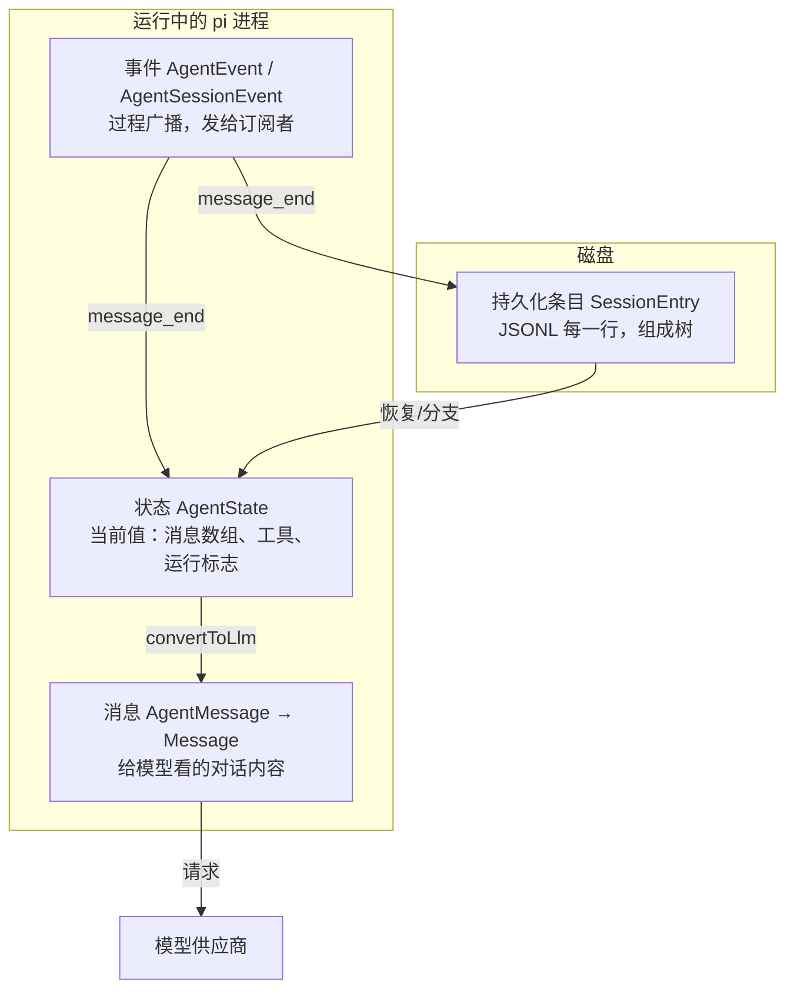
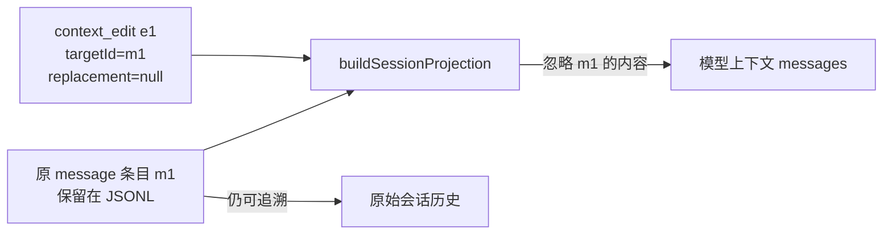

# 第 4 章：消息、事件、状态与持久化条目

> 学完本章你能回答：
>
> 1. "消息""事件""状态""持久化条目"这四种对象分别是什么？谁产生、给谁用、活多久、存哪里？
> 2. 为什么流式增量（`text_delta`）不算消息，而 `message_end` 才算？
> 3. `AgentMessage` 比模型消息多了什么？谁负责"翻译"？
> 4. 磁盘上的会话文件里都有哪些条目类型？为什么它是一棵树而不是一条线？

**前置知识**：第 1 章（判别联合、类型收窄）、第 3 章（一次请求的旅程）。
**预计学习时间**：1-1.5 天。
**本章验证状态**：静态核对通过（对照 `message-types.md`、`session-format.md` 与源码类型定义）；实验为"填表"，不需要运行模型。

---

## 4.1 四种对象：一张总图

第 3 章里这四种对象反复出现，现在把它们一次讲清。先看总图：



用一句口诀记住职责：

- **消息**：对模型说的事实；
- **事件**：对界面说的"正在发生什么"；
- **状态**：进程里的"现在"；
- **条目**：磁盘上的"曾经"。

### 4.1.1 四种对象的对照表

| 对象 | 类型名 | 生产者 | 消费者 | 生命周期 | 是否落盘 |
|---|---|---|---|---|---|
| 消息 | `AgentMessage` → `Message` | 会话层（用户输入）、模型层（助手）、工具层（结果） | 模型（经转换）、界面（经事件）、会话文件 | 随会话 | 是（`message` 条目） |
| 事件 | `AgentEvent`、`AgentSessionEvent` | Agent 循环、会话层 | 界面、扩展、SDK 宿主 | 瞬间；发完即弃 | 否（但会触发写入） |
| 状态 | `AgentState` | Agent 内部归约 | 界面读取、SDK 读取、循环自身 | 运行期内存 | 否（部分派生自消息） |
| 条目 | `SessionEntry` 家族 | `SessionManager` | 恢复、分支、导出、界面渲染 | 永久（直到删除会话） | 是（JSONL 文件） |

一个事件可以同时影响状态与磁盘（`message_end`），这就是"同一事实的三种视角"：过程（事件）、内存（状态）、持久化（条目）。

## 4.2 内容块：消息的最小积木

一条消息的内容（content）是一个**内容块数组**，常见的四种。它们定义在 `packages/ai/src/types.ts`：

### 4.2.1 `TextContent`：文本

```typescript
export interface TextContent {
	type: "text";
	text: string;
	textSignature?: string; // e.g., for OpenAI responses, message metadata (legacy id string or TextSignatureV1 JSON)
}
```

- `type: "text"` 是判别字段；
- `textSignature` 是**供应商专用元数据**，pi 把它当"不透明字符串"原样带回去，绝不解读内容。新手请把带 `Signature` 的字段一律视为"必须保留、不可修改的票据"——很多供应商要求多轮对话时把这些票据回传，否则报错。

### 4.2.2 `ImageContent`：图片

```typescript
export interface ImageContent {
	type: "image";
	data: string;     // base64 编码的图片数据
	mimeType: string; // e.g., "image/jpeg", "image/png"
}
```

图片以 base64 内联在消息里。这解释了第 3 章里 `normalizePromptImages` 的存在：大图会显著增加上下文体积，所以发送前要压缩/缩放（第 10 章）。

### 4.2.3 `ThinkingContent`：思考过程

```typescript
export interface ThinkingContent {
	type: "thinking";
	thinking: string;
	thinkingSignature?: string; // Provider-specific opaque or serialized reasoning replay data
	/** When true, the thinking content was redacted by safety filters. The opaque
	 *  encrypted payload is stored in `thinkingSignature` so it can be passed back
	 *  to the API for multi-turn continuity. */
	redacted?: boolean;
}
```

- 只有支持"思考"的模型会产生；
- `redacted: true`：出于安全/合规，思考正文被抹掉，但加密票据还在——**照原样回传**即可；
- 思考块**会进入下一轮请求**（这是某些模型的要求），但界面可以折叠显示。

### 4.2.4 `ToolCall`：工具调用

```typescript
export interface ToolCall {
	type: "toolCall";
	id: string;                       // 调用标识：模型生成，要求全局唯一
	name: string;                     // 工具名，如 "read"
	arguments: JsonObject;            // 参数对象（注意：是对象，不是 JSON 字符串）
	thoughtSignature?: string;        // Google 专用：复用思考上下文的不透明签名
	namespace?: string;               // OpenAI Responses 命名空间工具
}
```

三个关键点：

1. **`id` 是"调用"与"结果"之间的唯一桥梁**。模型可能一次提出多个调用（A、B），工具结果的 `toolCallId` 必须对应返回，否则对话历史不自洽；
2. `arguments` 在 pi 内部已经是**解析好的对象**（供应商原始流里它是 JSON 文本，适配器负责增量解析与拼装）；
3. `arguments` 的类型是 `JsonObject`，具体字段要靠工具自己的 schema 校验——这正是第 3 章 `validateToolArguments` 存在的原因。

## 4.3 模型消息：`Message` 家族

`packages/ai/src/types.ts` 里：

```typescript
export type Message = SystemMessage | UserMessage | AssistantMessage | ToolResultMessage;
```

四种角色的分工，一张表理清：

| 角色 | 谁产生 | 模型看到后的意义 |
|---|---|---|
| `system` | pi（提示词与工具声明） | 规则、身份、可用工具 |
| `user` | 用户输入 / 转换后的内部消息 | "人类在说话" |
| `assistant` | 模型 | "我之前说过/做过什么" |
| `toolResult` | 工具执行结果 | "工具的答案" |

### 4.3.1 `SystemMessage`：不只是"系统提示词"

```typescript
export interface SystemMessage {
	role: "system";
	/** Instruction text. On the leading message this is the base prompt; later, additional instructions. */
	content: string | TextContent[];
	/**
	 * Named, ordered prompt sections rendered verbatim after `content`. The leading message
	 * declares them; later messages replace sections by name, and `null` removes one.
	 */
	sections?: Record<string, string | null>;
	/** Complete definitions of tools that become available at this point. */
	toolsAdded?: Tool[];
	/** Tools that stop being available at this point. */
	toolsRemoved?: ToolReference[];
	timestamp: number; // Unix timestamp in milliseconds
}
```

这是本仓库最有特色的类型之一。要点：

- **提示词不是一整块，而是分节的**（`sections`：preamble、tools、cwd、skills……）。后续系统消息可以**按名字替换某一节**（值为 `null` 表示删除该节）。这带来两个好处：
  - 中途启用新技能/改变工具时，不用重发整个提示词，只发一个"补丁"；
  - 会话回放时，把历次系统消息依次叠加，就能精确重建"此刻的提示词"——这叫**可重放性**（replayability）。
- **工具声明也在系统消息里**（`toolsAdded` / `toolsRemoved`）。第 3 章 `declareToolChanges()` 生成的就是这种消息；
- 仓库文档（`docs/message-types.md`）还描述了 `replace: true` 的语义：丢弃此前状态、建立全新基线。请在你的本地类型定义里用编辑器确认该字段是否存在（版本间可能有差异）——**"以本地代码为准"是读本仓库的好习惯**。

### 4.3.2 `UserMessage`

```typescript
export interface UserMessage {
	role: "user";
	content: string | (TextContent | ImageContent)[];
	timestamp: number; // Unix timestamp in milliseconds
}
```

`content` 允许直接是字符串（简写）或内容块数组（需要图片时）。注意 `role: "user"` 不总代表"人类打的字"——第 4.4 节你会看到，bash 执行记录、扩展注入的上下文、压缩摘要都会被**转换成** `user` 消息发给模型（因为多数供应商只接受这四种角色，没有"系统注入"通道）。

### 4.3.3 `AssistantMessage`：信息最丰富的消息

```typescript
export interface AssistantMessage {
	role: "assistant";
	content: (TextContent | ThinkingContent | ToolCall)[];
	api: Api;
	provider: ProviderId;
	model: string;
	responseModel?: string;   // 供应商实际答复的模型（与请求的不同时记录）
	responseId?: string;      // 供应商侧的响应标识
	providerThinkingLevel?: string;
	thinkingLevel?: ModelThinkingLevel;  // 本次请求的 pi 思考级别
	diagnostics?: AssistantMessageDiagnostic[];
	usage: Usage;
	stopReason: StopReason;
	deferred?: DeferredHandle;
	errorMessage?: string;
	rawStopReason?: string;
	endTurn?: boolean;        // 供应商是否明确表示"我说完了"（仅调试用，不参与控制流）
	timestamp: number;
}
```

逐组理解：

- **身份组**（`api/provider/model/responseModel/responseId`）：这条消息是谁答的。会话恢复、成本统计、多模型切换都靠它；
- **内容组**（`content`）：文本、思考、工具调用的混合数组。**顺序有语义**：模型先思考、再说话、再调工具，数组顺序就是发生顺序；
- **用量组**（`usage`）：token 与成本（见 4.3.5）；
- **状态组**（`stopReason/errorMessage/rawStopReason`）：为什么结束。这是 Agent 循环的核心判据（第 6 章）；
- **调试组**（`diagnostics`）：经过脱敏的诊断信息。

`StopReason` 的七个值（`packages/ai/src/types.ts`）：

```typescript
export type StopReason = "pending" | "stop" | "length" | "toolUse" | "error" | "aborted" | "deferred";
```

| 值 | 含义 | 循环的反应 |
|---|---|---|
| `pending` | 流式过程中的临时值 | 不会持久化（`message_end` 时已是终态） |
| `stop` | 正常说完了 | 看有无工具调用/队列决定是否继续 |
| `length` | 达到输出上限被截断 | 工具调用全部拒绝执行（第 3.14 节） |
| `toolUse` | 模型要求调用工具 | 执行工具 → 继续下一轮 |
| `error` | 请求失败 | 结束 run（可能触发自动重试，第 6 章） |
| `aborted` | 被取消 | 结束 run |
| `deferred` | 延迟应答（供应商异步任务） | 通过 `DeferredHandle` 后续取回 |

> 新手最容易漏掉的一点：`stopReason` 为 `"toolUse"` 时，**消息里必然带有 toolCall 内容块**；但反过来，有 toolCall 时 `stopReason` 理论上可能是 `length`（截断场景）。所以循环的判据要"看内容 + 看原因"双重检查（第 3.8 节 ⑥ 的代码正是这么写的）。

### 4.3.4 `ToolResultMessage`

```typescript
export interface ToolResultMessage<TDetails = any> {
	role: "toolResult";
	toolCallId: string;                    // 对应哪个 ToolCall
	toolName: string;
	content: (TextContent | ImageContent)[]; // 给模型看的结果
	details?: TDetails;                    // 给界面/程序看的结构化细节（不发给模型）
	usage?: Usage;                         // 工具内部做了"嵌套模型调用"时的用量
	isError: boolean;
	timestamp: number;
}
```

两个重要区分：

- `content` 是**面向模型**的，"模型看到什么"由它决定；
- `details` 是**面向界面/代码**的，可以带文件行号、语法高亮信息、原始 JSON 等。它**不会**发给模型（省 token），但会落盘，界面渲染和扩展逻辑可以依赖它。

（另有一个 `structuredContent` 字段存在于工具执行结果 `AgentToolResult` 上，供程序化调用者使用；但它不进 `ToolResultMessage`，所以不具备"跨会话稳定"的保证。第 7 章展开。）

### 4.3.5 `Usage`：token 与成本

```typescript
export interface Usage {
	input: number;
	output: number;
	cacheRead: number;
	cacheWrite: number;
	cacheWrite1h?: number;   // cacheWrite 中 1 小时保留的部分（仅 Anthropic 上报）
	reasoning?: number;      // 思考 token：已包含在 output 里，不要重复相加
	totalTokens: number;
	cost: { input: number; output: number; cacheRead: number; cacheWrite: number; total: number };
}
```

要点：`reasoning` 是 `output` 的子集；缓存命中（cacheRead）通常比常规输入便宜得多——这解释了 pi 为什么要做"缓存预热"（`cache-warmer.ts`，第 15 章会看到它的调用点）。

## 4.4 `AgentMessage`：比模型消息更宽的内部类型

### 4.4.1 基础定义与声明合并

`packages/agent/src/types.ts`：

```typescript
export interface CustomAgentMessages {
	// Empty by default - apps extend via declaration merging
}

export type AgentMessage = Message | CustomAgentMessages[keyof CustomAgentMessages];
```

`CustomAgentMessages` 默认是空的。应用可以用 TypeScript 的**声明合并**（declaration merging）扩展它：

```typescript
// 文档注释里的示例（packages/agent/src/types.ts）
declare module "@earendil-works/pi-agent-core" {
	interface CustomAgentMessages {
		artifact: ArtifactMessage;
		notification: NotificationMessage;
	}
}
```

`coding-agent` 包正是这么做的。`packages/coding-agent/src/core/messages.ts` 里：

```typescript
declare module "@earendil-works/pi-agent-core" {
	interface CustomAgentMessages {
		bashExecution: BashExecutionMessage;
		custom: CustomMessage;
		branchSummary: BranchSummaryMessage;
		compactionSummary: CompactionSummaryMessage;
	}
}
```

所以在 coding-agent 里，`AgentMessage` 等价于八种角色的联合：

```typescript
type AgentMessage =
  | SystemMessage | UserMessage | AssistantMessage | ToolResultMessage   // 模型能懂的四种
  | BashExecutionMessage | CustomMessage | BranchSummaryMessage | CompactionSummaryMessage; // 应用扩展的四种
```

四个扩展角色的用途（详见 `docs/message-types.md`）：

| 角色 | 何时产生 | 是否进模型上下文 |
|---|---|---|
| `bashExecution` | 用户用 `!` 直接执行命令 | 默认转成 user 文本（`!!` 前缀则排除） |
| `custom` | 扩展调用 `sendMessage()` 注入 | 转成 user 消息 |
| `branchSummary` | 切换分支时对被放弃路径做摘要 | 转成 user 消息（带包装标签） |
| `compactionSummary` | 上下文压缩后 | 转成 user 消息（带包装标签） |

### 4.4.2 `convertToLlm`：桥梁的完整实现

模型只认识四种角色，扩展消息必须被"翻译"。翻译函数在 `core/messages.ts`（节选 + 注释）：

```typescript
export function convertToLlm(messages: AgentMessage[]): Message[] {
	return messages
		.map((m): Message | undefined => {
			switch (m.role) {
				case "bashExecution":
					if (m.excludeFromContext) return undefined;   // !! 前缀：只显示给用户看
					return { role: "user", content: [{ type: "text", text: bashExecutionToText(m) }], timestamp: m.timestamp };
				case "custom": {
					const content = typeof m.content === "string" ? [{ type: "text" as const, text: m.content }] : m.content;
					return { role: "user", content, timestamp: m.timestamp };
				}
				case "branchSummary":
					return { role: "user", content: [{ type: "text", text: BRANCH_SUMMARY_PREFIX + m.summary + BRANCH_SUMMARY_SUFFIX }], timestamp: m.timestamp };
				case "compactionSummary":
					return { role: "user", content: [{ type: "text", text: COMPACTION_SUMMARY_PREFIX + m.summary + COMPACTION_SUMMARY_SUFFIX }], timestamp: m.timestamp };
				case "system": case "user": case "assistant": case "toolResult":
					return m;   // 已经是模型消息，原样通过
				default: {
					const _exhaustiveCheck: never = m;   // 穷尽检查：将来新增角色时这里会编译报错
					return undefined;
				}
			}
		})
		.filter((m) => m !== undefined);
}
```

值得学的三个细节：

1. **包装标签**（前缀/后缀）。摘要类消息不是裸文本，而是：

```text
The conversation history before this point was compacted into the following summary:

<summary>
……摘要内容……
</summary>
```

   这样模型能分辨"这是历史信息的压缩"，而不是"用户新说了一段话"。

2. **穷尽检查**（`const _exhaustiveCheck: never = m`）。这是判别联合的经典用法：如果某天新增了消息角色而忘了处理，这一行会在**编译期**报错。你在本仓库会经常看到 `never` 出现在 switch 的 default 分支——那不是装饰，是防漏网工具。

3. **过滤型转换**：`bashExecution` 带 `excludeFromContext` 时直接丢弃；map + filter 的组合在类型上是干净的。

### 4.4.3 转换发生在哪里

回顾第 3 章 3.9 节的 `streamAssistantResponse`：

```typescript
const llmMessages = await config.convertToLlm(messages);
```

`convertToLlm` 是 `Agent` 的**构造参数**：`agent-core` 自带一个"只保留四种标准角色"的默认实现（`agent.ts` 的 `defaultConvertToLlm`）；`coding-agent` 在 `sdk.ts` 里注入完整版本（还包了一层图片屏蔽）。**下层提供默认，上层注入具体**——又一次看到第 0 章的架构原则。

另外一个用途：`convertToLlm` 也被"生成摘要"的压缩流程复用——因为摘要请求本身也是一次模型调用，需要把同一份历史翻译过去（第 10 章）。

## 4.5 事件：`AgentEvent` 与 `AgentSessionEvent`

### 4.5.1 `AgentEvent` 十种事件

完整定义在 `packages/agent/src/types.ts`（第 3 章 1.3.4 给过原文）。按生命周期的全景表：

| 事件 | 载荷 | 发出时机 | 典型消费者 |
|---|---|---|---|
| `agent_start` | 无 | run 开始 | 界面：进入"忙碌"状态 |
| `agent_end` | `messages` | run 结束（最后一个事件） | 界面：显示完成/错误；会话层判断重试 |
| `turn_start` | 无 | 每个 turn 开始 | 界面：显示"新一轮" |
| `turn_end` | `message, toolResults` | 每个 turn 结束 | 界面：收尾渲染；会话层记录失败信息 |
| `message_start` | `message` | 用户/助手/工具结果消息开始 | 界面：创建消息气泡 |
| `message_update` | `message, assistantMessageEvent` | 助手消息的每个增量 | 界面：流式文字/思考/工具调用预览 |
| `message_end` | `message` | 消息最终定型 | 状态归约、持久化、界面定稿 |
| `tool_execution_start` | `toolCallId, toolName, args` | 工具开始 | 界面：显示"正在执行" |
| `tool_execution_update` | `..., partialResult` | 工具上报进度 | 界面：局部结果（如命令输出滚动） |
| `tool_execution_end` | `..., result, isError` | 工具结束 | 界面：渲染结果/错误 |

当前基线里的 `AgentEvent` 联合**正好有 10 个成员**，与上表十行一一对应。读 TypeScript 联合类型时，一个 `|` 分支代表一种可取的对象形状；像 `message_update` 的 `assistantMessageEvent` 字段虽然又有自己的联合类型，但它是**事件载荷里的嵌套事件**，不是额外的 `AgentEvent` 成员。

可以自己打开 `packages/agent/src/types.ts` 数一遍 `AgentEvent` 的 `|` 分支来练习。自动重试和 `agent_settled` 等会话级通知属于后面的 `AgentSessionEvent`，不会因为它们和 Agent 运行有关就自动成为 core 的 `AgentEvent`。

### 4.5.2 `AgentSessionEvent`：复用并改写 core 事件

`coding-agent` 的 `AgentSession` 对外事件**基于** `AgentEvent`，但不是它的严格超集（`agent-session.ts` 的 `AgentSessionEvent`）：

```typescript
export type AgentSessionEvent =
| WithParentToolCallId<Exclude<AgentEvent, { type: "agent_end" }>>   // 复用其它事件；工具事件可多 parentToolCallId
	| { type: "agent_end"; messages: AgentMessage[]; willRetry: boolean } // 关键差异：多了 willRetry
	| { type: "agent_settled" }
	| { type: "queue_update"; steering: readonly string[]; followUp: readonly string[] }
	| { type: "compaction_start"; reason: "manual" | "threshold" | "overflow" }
	| { type: "entry_appended"; entry: SessionEntry }
	| { type: "session_info_changed"; name: string | undefined }
	| { type: "thinking_level_changed"; level: ThinkingLevel }
	| { type: "compaction_end"; reason; result; aborted; willRetry; errorMessage? }
	| { type: "auto_retry_start"; attempt; maxAttempts; delayMs; errorMessage }
	| { type: "auto_retry_end"; success; attempt; finalError? }
	| { type: "summarization_retry_scheduled"; /* ... */ }
	| { type: "summarization_retry_attempt_start"; /* source: branchSummary | compaction */ }
	| { type: "summarization_retry_finished" }
	| { type: "bash_execution_update"; id?: string; delta: string };
```

几个对读代码很重要的差异：

- **`agent_end` 被替换了，不只是加字段**：先用 `Exclude<AgentEvent, { type: "agent_end" }>` 从 core 联合中移除旧的 `agent_end` 形状，再加入带必需 `willRetry` 的会话版。即使 `willRetry` 为 `false`，这个字段也必须存在；所以一个只有 `type` 和 `messages` 的 core `agent_end` 不能直接当成 `AgentSessionEvent` 使用。
- **其它事件大多复用**：条件类型 `WithParentToolCallId<E>` 只在三种 `tool_execution_*` 事件上加可选的 `parentToolCallId`；其它 core 事件形状保持不变。它标识嵌套工具调用属于哪个外层调用（如 codemode，第 22 章）。
- **`agent_settled`**：整个会话层面的工作（含重试/压缩/边界）全部结束——第 3 章 `_runAgentPrompt` 的 finally 里发的就是它。注意它和 `agent_end` 不是一个东西：一次 `session.prompt()` 期间可能有**多次** `agent_end`（自动重试场景），但只有**一次** `agent_settled`；
- **`entry_appended`**：部分辅助条目写入路径会显式发出，例如扩展追加的自定义条目、提交的 boundary 条目和 context edit。它不是通用的“文件有新行”事件：普通 `message_end` 持久化和压缩条目写入都不会因此自动发出它；
- **`queue_update`**：排队消息变化（界面显示"还有 2 条消息在排队"）；

## 4.6 状态：`AgentState` 字段全表

`packages/agent/src/types.ts` 的 `AgentState`（结合 `Agent` 实现）：

| 字段 | 类型 | 含义 | 备注 |
|---|---|---|---|
| `systemPrompt` | `string`（只读） | 当前系统提示（从系统消息重放而来） | 想改提示词要**追加系统消息**，不能直接赋值 |
| `model` | `Model<any>` | 下一轮使用的模型 | 中途切换模型的入口 |
| `thinkingLevel` | `ThinkingLevel` | 下一轮的思考级别 | `off/minimal/low/medium/high/xhigh/max`（按模型能力钳制） |
| `tools` | `AgentTool[]`（get/set） | 可执行的工具 | 赋值会**复制顶层数组**；与转录中声明不同时，下一轮自动补系统消息 |
| `messages` | `AgentMessage[]`（get/set） | 对话转录 | 赋值同样复制顶层数组 |
| `isStreaming` | `boolean` | 是否在处理中 | **到 `agent_end` 的监听器全部结束才变 false** |
| `streamingMessage` | `AgentMessage \| undefined` | 当前正在形成的部分消息 | `message_start/update` 设置、`message_end` 清空 |
| `pendingToolCalls` | `ReadonlySet<string>` | 正在执行中的工具调用 id | 界面显示"还有工具在跑" |
| `errorMessage` | `string \| undefined` | 最近一次失败/取消的错误文本 | `turn_end` 时从助手消息提取 |

两个可访问性细节（`Agent` 实现里的 `createMutableAgentState`）：

- `systemPrompt` 是**推导值**（getter），由 `getCurrentSystemPrompt(messages)` 从系统消息重放而来；
- `tools`/`messages` 的 setter 会 `slice()` 复制数组，避免调用者后续改动外部数组导致状态漂移。

`AgentSession.state` 就是 `this.agent.state` 的直接返回（`agent-session.ts` 第 1396 行）——会话层没有另建一套状态。**"状态"只有一个数据源**，这是排障时的关键：界面显示异常，先看 `session.state`，再看事件有没有漏。

### 4.6.1 运行态 vs 存储态：同一事实的两种样子

以第一次模型响应为例：

| 时刻 | 状态（内存） | 磁盘 |
|---|---|---|
| 流式进行中 | `streamingMessage` = 最新部分消息；`messages` 还没有这条未完成消息 | 无记录（`pending` 不落盘） |
| `message_end` 到达 | `streamingMessage` 清空；终态消息追加到 `messages` | listener 尚在处理；还未走到 session 持久化分支 |
| `AgentSession` listener 完成 message-end hooks/public dispatch | `messages` 保持终态消息；hook 若替换内容，会原地改同一个 message 对象 | 追加该最终 message 的 `message` 条目 |
| 检查磁盘文件 | —— | 只有一条终态消息 |

注意有两个不同的数组/字段：`streamAssistantResponse` 持有并更新模型请求 context 里的 partial message；公开的 `AgentState` 则通过 `streamingMessage` 暴露当前快照。`Agent.processEvents(message_start/update)` 只更新 `streamingMessage`，不会把尚未完成的消息放入 `state.messages`；等 `message_end` 才清掉它并把 final message 追加到 `state.messages`。随后会话层 hook 可能原地替换这条已追加消息的字段，最终 `SessionManager` 再持久化它。

因此在流式期间观察 `state.messages.length`，通常不会因当前 assistant message 正在输出而先加一；应观察 `state.streamingMessage`。第 3 章 3.12.1 画出了 partial message 从模型流到 Agent state 和 session entry 的完整路径。

### 4.6.2 `message_end` 时的原地替换：同一个对象要保持一致

`Agent.processEvents` 处理 `message_end` 时，先把事件中的 message 追加进 `agent.state.messages`，然后才按顺序 `await` listeners。`AgentSession` 是其中一个 listener：它运行扩展的 message-end hook。hook 可以返回替代消息；session 会通过 `_replaceMessageInPlace(target, replacement)` 清掉目标对象的字段，再把替代字段复制回**同一个对象**。

```text
streamAssistantResponse 生成 finalMessage
  → Agent.processEvents(message_end)
      → agent.state.messages.push(finalMessage)
      → AgentSession listener 收到同一个 finalMessage 引用
          → message-end 扩展返回替代内容
          → _replaceMessageInPlace(finalMessage, replacement)
          → 公开 session listeners 收到已替换内容
          → SessionManager.appendMessage(finalMessage)
```

为什么要保留对象身份？因为 `agent.state.messages`、同一 run 后续产生的事件和最终写入会话的消息都可能引用它。若只让 `event.message` 指向新对象，Agent 状态数组仍留着旧对象，最终就可能出现“界面看见 A、状态持有 B、磁盘写入 C”的分叉。源码注释明确说原地修改用于同步 Agent state、后续 turn/agent events、listeners 与最终持久化。

```typescript
private _replaceMessageInPlace(target: AgentMessage, replacement: AgentMessage): void {
  if (target === replacement) return;
  const targetRecord = target as unknown as Record<string, unknown>;
  for (const key of Object.keys(targetRecord)) delete targetRecord[key];
  Object.assign(targetRecord, replacement);
}
```

逐行读：

- `target === replacement`：同一个对象无需处理；
- `Record<string, unknown>`：临时把对象看作可按键读写的记录。`unknown` 要求调用方别假定任意值都有特定字段；
- 先删旧键：避免替代对象没有的可选字段仍残留在 target 上；
- `Object.assign` 写回新键值：对象身份没换，内容变成 replacement。

这是一次**运行期对象同步**，发生在这条消息首次写入 transcript 之前。它和下面的 `context_edit` 不同：context edit 不回头改 JSONL 里的原消息，而是追加一条记录，在构造模型投影时应用。

## 4.7 持久化条目：会话文件的解剖

完整规范见 `packages/coding-agent/docs/session-format.md`，这里给你"读文件时的地图"。

### 4.7.1 文件与公共字段

```text
~/.pi/agent/sessions/--<路径编码>--/<时间戳>_<会话ID>.jsonl
```

每行是一个 JSON 对象。除第一行（`SessionHeader`）外，所有条目都有公共字段：

```typescript
interface SessionEntryBase {
	type: string;
	id: string;              // 通常是 8 位十六进制；必要时回退为完整 UUID
	parentId: string | null; // 父条目 ID；根条目为 null
	timestamp: string;       // ISO 8601 字符串（与消息内的毫秒时间戳不同！）
}
```

**两种时间戳**是新手重灾区：

- 条目外层 `timestamp`：ISO 字符串（如 `"2024-12-03T14:00:00.000Z"`）；
- 消息内层 `timestamp`：Unix 毫秒数（如 `1733234400000`）。

读会话文件时别把两者混用。

### 4.7.2 条目类型总表

| `type` | 作用 | 进模型上下文？ |
|---|---|---|
| `session` | 文件头：版本、id、cwd、可选 parentSession | 否 |
| `message` | 一条 `AgentMessage`（含系统消息补丁） | 是 |
| `model_change` | 中途切换模型 | 否（影响后续解释） |
| `thinking_level_change` | 中途切换思考级别 | 否 |
| `usage` | 非消息类用量（如缓存预热） | 否 |
| `compaction` | 压缩摘要 + 系统提示检查点 + `firstKeptEntryId` | 是（替换旧消息） |
| `context_edit` | 对早前条目的"仅上下文生效"编辑 | 间接（改写投影） |
| `branch_summary` | 分支切换时对被放弃路径的摘要 | 是 |
| `custom` | 扩展私有状态（不参与上下文） | 否 |
| `custom_message` | 扩展注入的消息（参与上下文） | 是 |
| `label` | 书签/标记（`targetId` 指向被标记条目） | 否 |
| `session_info` | 会话元数据（显示名） | 否 |

### 4.7.3 为什么是"树"而不是"线"

看 `session-format.md` 的示意图：

```text
[user msg] ─── [assistant] ─── [user msg] ─── [assistant] ─┬─ [user msg] ← current leaf
                                                            │
                                                            └─ [branch_summary] ─── [user msg] ← alternate branch
```

- 每个条目用 `parentId` 指向父节点；**"当前叶子"（leaf）标识你现在所处的分支**；
- 从 B 处分叉：老路径保留，新路径也是同一文件的一部分；
- `buildContextEntries()` 从叶向根回溯，产出"活动分支"的条目列表——这就是下一次请求的历史来源（细节第 9 章）。

### 4.7.4 系统消息的持久化形态（活例子）

会话文件里的第一条系统消息长这样（`session-format.md` 示例）：

```json
{"type":"message","id":"a0b1c2d3","parentId":null,"timestamp":"2024-12-03T14:00:00.000Z",
 "message":{"role":"system","content":"","sections":{"preamble":"You are an expert coding assistant...","tools":"<tools>\n- read: ...\n</tools>","cwd":"/project"},
 "toolsAdded":[{"name":"read","description":"...","parameters":{}}],"timestamp":1733234400000}}
```

后面某次技能启用时又追加：

```json
{"type":"message","id":"d4e5f6g7","parentId":"c3d4e5f6","timestamp":"...","message":{"role":"system","content":"","sections":{"skills":"<skills>...</skills>"},"toolsRemoved":[{"name":"write"}],"timestamp":1733234640000}}
```

对照 4.3.1：**"提示词分节补丁 + 工具增删"不是概念演示，而是磁盘上的真实格式**。恢复会话时按顺序重放，就得到当前的提示词与工具清单——没有单独的"提示词状态"条目。

### 4.7.5 原始条目与模型投影：`context_edit` 是追加规则

会话 JSONL 有两个值得区分的视图：

- **原始条目**（`getEntries()`）：文件中追加保存的事实，保留消息、编辑记录和它们的父子关系；
- **模型投影**（`buildSessionProjection()`）：沿当前叶子选出活动路径，应用压缩检查点和 context edits 后，得到这次请求真正使用的消息。

例如，原先有一条 assistant entry：

```json
{"type":"message","id":"m1","parentId":"u1","message":{"role":"assistant","content":[{"type":"text","text":"包含敏感细节的回答"}]}}
```

随后应用需要把它从模型后续上下文中隐藏。系统不会静默删除/改写 `m1`，而是追加一个 context edit：

```json
{"type":"context_edit","id":"e1","parentId":"m1","targetId":"m1","replacement":null}
```

此时：

| 读取方式 | 结果 |
|---|---|
| `getEntries()` / 原始 JSONL | 原 assistant entry 仍在，后面多了一条 `replacement: null` 的 context edit |
| `buildSessionProjection().entries` | 包含来源 entry 的投影记录，可追踪来源 |
| `buildSessionProjection().messages` | `m1` 不再贡献消息 |
| 当前分支的后续模型请求 | 不会看到被 omission 的回答 |

`appendContextEdit(targetId, replacement)` 会验证目标存在、位于当前分支，而且属于可编辑的模型可见内容。`replacement: null` 表示省略目标；`{ content: ... }` 表示只替换该条目的内容，保留其余消息字段。构造投影时，活动 context entries 中针对同一 target 的后续 edit 会覆盖 Map 中较早的 edit，因此当前分支采用最近一次规则。

图示这条数据关系：



这不是“把用户能看到的历史删除”，而是“保留审计/分支来源，调整后续模型看到的投影”。真实案例可读 `packages/coding-agent/test/suite/agent-session-boundaries.test.ts` 的 `omits a recoverable projected replacement by its source entry ID`：测试保留原 entry，追加 null edit，再断言投影不含替代内容。

【容易混淆】`_replaceMessageInPlace` 与 `context_edit` 的不同：

| 机制 | 修改对象 | 是否另追加 entry | 原始消息是否保留原样 | 目的 |
|---|---|---|---|---|
| `_replaceMessageInPlace` | 当前内存中的 message 对象 | 否；随后首次 append 该 message | 不一定；写入前会采用最终替代内容 | 让 state/listeners/transcript 对这次消息达成一致 |
| `appendContextEdit` | 不改 target message 对象 | 是，新增 `context_edit` | 是 | 为活动分支的模型投影追加省略/替换规则 |

读到“replace”时先问三个问题：改的是内存对象还是存储投影？原始 entry 是否仍存在？这次写入是不是新增了一条有 parentId 的记录？这三问能避免把状态更新错当成历史删除。

## 4.8 一个工具调用的四列清单

拿第 3 章的 `read` 调用填表（本章的核心作业模板）：

| 对象 | 产生位置（文件 → 函数） | 用途 | 存储位置 |
|---|---|---|---|
| 用户消息 `UserMessage` | `agent-session.ts` → `prompt()` | 模型理解任务；历史 | `message` 条目 |
| assistant 消息 #1（含 `ToolCall`） | `agent-loop.ts` → `streamAssistantResponse` | 模型表达"调用 read"；历史 | `message` 条目 |
| `tool_execution_start/update/end` 事件 | `agent-loop.ts` → `emitToolExecutionEnd` 等 | 界面展示执行过程 | 不落盘 |
| `ToolResultMessage` | `agent-loop.ts` → `createToolResultMessage` | 让模型看到文件内容；历史 | `message` 条目 |
| 状态 `pendingToolCalls` 变化 | `agent.ts` → `processEvents` | 界面"仍在执行"提示 | 内存，run 后重置 |
| `_entryIdsByMessage` 映射 | `agent-session.ts`（约 1133 行） | 消息对象 ↔ 条目 id 的关联 | 内存 |

## 4.9 实验 L04-A：为一次运行填满四列表

**实验性质**：读代码 + 填表；不需要模型。
**验证状态**：设计中。

### 步骤

1. 复制 4.8 的表，把对象换成"一次 bash 工具调用"（命令 `ls`），补齐六行；
2. 在 `packages/coding-agent/src/core/session-manager.ts` 里找到 `appendMessage` 的实现，写出它干了什么（3-5 行）；
3. 在 `packages/coding-agent/docs/session-format.md` 中找到 `buildContextEntries` 的说明，用三行话说清"恢复时如何把树变成线性历史"；
4. 加分题：找到一条真实会话文件（如果你已经用 pi 聊过天），打开前 5 行，识别每一行的 `type`。

### 判定标准

- 第 1 题能指出"哪些对象落盘、哪些不落"；
- 第 2 题能说出"写入的是哪一行 JSON、父节点是谁"；
- 第 3 题能指出"从叶子向根回溯、遇压缩检查点截断"两个要点。

## 4.10 常见错误

| 现象/误解 | 纠正 |
|---|---|
| 把 `message_update` 的 partial 当作历史消息 | 历史以 `message_end` 的终态消息为准 |
| 认为所有 `role: "user"` 都是人打的 | bash 记录、扩展注入、摘要在模型侧都是 user |
| 混淆两种时间戳 | 条目外层 ISO 字符串；消息内毫秒数 |
| 以为 `stopReason` 只在结束时有意义 | 流式期间是 `pending`；循环还看内容块判断 |
| 认为 `details` 会发给模型 | 只给界面/程序；模型只看 `content` |
| 修改 `systemPrompt` 期待生效 | 它只读；要追加系统消息（sections 补丁） |
| 把 `agent_end` 当作"会话彻底结束" | 之后还可能有重试、压缩（看 `willRetry` 与 `agent_settled`） |

## 4.11 验收题

1. 说出四种对象各自"会不会落盘"，并为每种举一个例子。
2. `ToolCall.id` 和 `ToolResultMessage.toolCallId` 的关系是什么？如果不匹配会发生什么？
3. `convertToLlm` 的输入和输出类型分别是什么？为什么压缩摘要要包 `<summary>` 标签？
4. `agent_end` 与 `agent_settled` 的区别？一个会话 run 里哪个只会出现一次？
5. 会话文件里为什么会有"同一父节点的多个子条目"？这对应什么用户操作？

### 参考答案（要点）

1. 消息：落盘（`message` 条目）；事件：不落盘（但触发写入）；状态：不落盘（内存）；条目：落盘（JSONL）。
2. 一一对应；缺失或不匹配会让历史不自洽——部分供应商会拒绝请求（toolResult 找不到对应 toolCall），或模型无法把结果与请求关联。
3. 输入 `AgentMessage[]`，输出 `Message[]`；摘要包标签是让模型能区分"这是历史压缩"而非用户新发言。
4. `agent_end` = 一次 run 的循环结束（可能因重试多次出现）；`agent_settled` = 会话层全部收尾（重试/压缩/边界）完成后一次，每次 `session.prompt()` 只出现一次（结束阶段）。
5. 从某个历史节点继续对话（分支/fork），或分支摘要后开新路。对应 `/tree` 切换、`--fork` 等操作。

## 4.12 来源与下一章

- `packages/ai/src/types.ts`（`TextContent`、`ImageContent`、`ThinkingContent`、`ToolCall`、`Usage`、`StopReason`、`Message` 四角色）；
- `packages/agent/src/types.ts`（`AgentMessage`、`CustomAgentMessages`、`AgentState`、`AgentEvent`）；
- `packages/coding-agent/src/core/messages.ts`（扩展角色与 `convertToLlm`）；
- `packages/coding-agent/src/core/agent-session.ts`（`AgentSessionEvent` 第 190 行、`state` 第 1396 行、持久化分支约 1113 行）；
- `packages/coding-agent/docs/message-types.md`、`docs/session-format.md`。

下一章进入模型层：`pi-ai` 如何用一套类型适配众多供应商、认证如何解析、`faux` 假模型如何让我们零成本复现实验。
