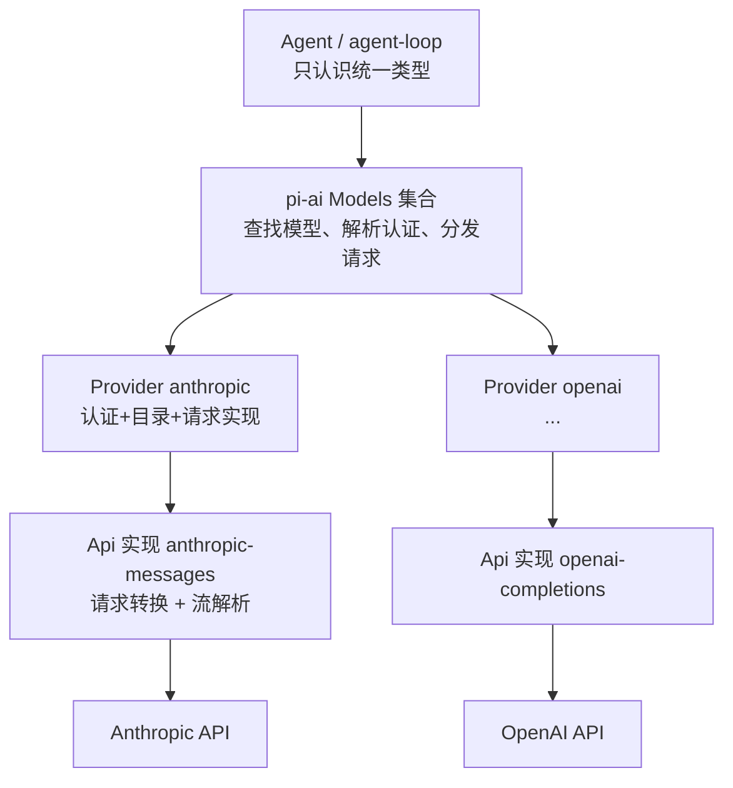
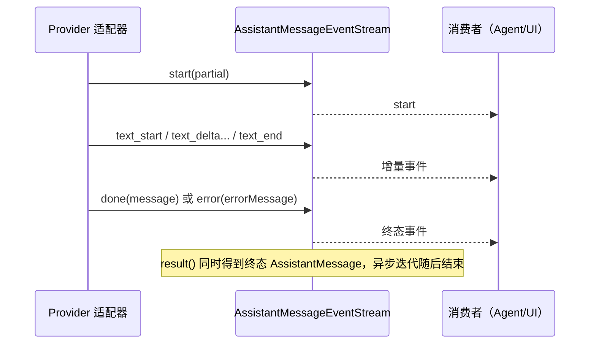
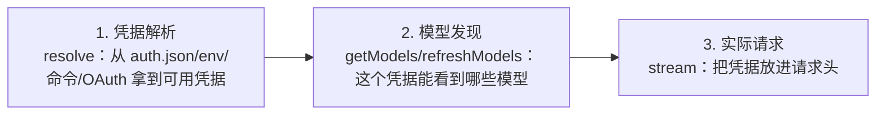

# 第 5 章：pi-ai 与模型供应商适配

> 学完本章你能回答：
>
> 1. `pi-ai` 用哪三个抽象（Model / Api / Provider）隔离不同供应商的差异？
> 2. `stream` 与 `streamSimple` 有什么区别？`compat.ts` 在中间做了什么？
> 3. 一个真实供应商适配器（以 Anthropic 为例）由哪些部分组成？请求转换要处理哪些字段？
> 4. 认证解析、模型发现、实际请求是三个不同阶段吗？为什么说"API 兼容不等于能力等价"？
> 5. faux provider 是什么？怎么用它零成本复现固定响应？
> 6. `Model.type`、`model.api` 与 Provider 可选能力分别决定什么？能力不存在时，各入口如何报告失败？

**前置知识**：第 3 章（请求旅程）、第 4 章（消息类型）。
**预计学习时间**：1.5-2 天（适配器细节按需精读）。
**本章验证状态**：静态核对通过（对照基线源码）；faux 实验为本手册设计，需你在本地执行（第 5.8 节）。

---

## 5.1 问题：同一个 pi，怎么跟几十家模型服务商说话

假设 pi 要支持这些供应商：Anthropic、OpenAI、Google、DeepSeek、Groq、xAI、OpenRouter……它们在至少八个维度上各不相同：

| 差异维度 | 典型的"不一致点" |
|---|---|
| 请求结构 | 消息字段名、角色命名、系统提示放哪 |
| 工具声明 | 工具定义的 JSON 结构、JSON Schema 方言 |
| 工具调用流 | 参数是"一次性给出"还是"分片拼装" |
| 思考（reasoning） | 有的用预算 token、有的用档位名、有的没有 |
| 流式格式 | SSE 事件类型、结束标记、心跳 |
| 结束原因 | 各家的 finish_reason / stop_reason 取值不同 |
| 用量上报 | token 字段名、缓存命中/写入的分账方式 |
| 认证 | API Key、OAuth、云厂商凭据链 |

如果 Agent 层直接写这些分支，`agent-loop.ts` 会变成一座巴别塔。pi 的解法是**三层抽象**：



一句话：**Agent 层永远只看到 `Model`、`Message`、`AssistantMessageEvent` 这套统一类型；供应商的差异全部收敛在 `pi-ai` 内部。**

### 5.1.1 一个具体对照（概念示意）

同一个 `read` 工具声明，进入不同适配器后要变成不同形状：

```text
pi 内部统一形状（Tool）：
  { name: "read", description: "...", parameters: { ...JSON Schema... } }

→ Anthropic 适配器转成：
  { name: "read", description: "...", input_schema: { ... } }

→ OpenAI 兼容适配器转成：
  { type: "function", function: { name: "read", description: "...", parameters: { ... } } }
```

两个"概念性事实"（读适配器代码时反复出现）：

1. **字段改名、结构包装**是最常见的转换工作；
2. **"兼容"是分级的**：OpenAI 兼容接口之间也有差异（是否支持 `store`、`reasoning_effort`、工具结果是否要求 `name`……），所以 pi 在 `Model` 上留了 `compat` 兼容开关与自动探测。第 5.5.4 节会看到真实的兼容配置类型。

## 5.2 三个抽象 + 一个集合

打开 `packages/ai/src/types.ts` 和 `models.ts`，先认识四个名字：

| 名字 | 类型/位置 | 一句话 |
|---|---|---|
| `Api` | `types.ts` | **协议标识**：一家（或一类）接口的"方言名"，如 `"anthropic-messages"` |
| `Model<TApi>` | `types.ts` | **模型描述**：静态元数据（谁家的、什么协议、限制、价格） |
| `Provider` | `models.ts` | **供应商实现**：认证方式 + 模型目录 + 请求函数 |
| `Models` | `models.ts` | **运行时集合**：注册/查找供应商与模型、解析认证、分发请求 |

### 5.2.1 `Api`：开放式的"方言名"

```typescript
export type Api = KnownApi | (string & {});
```

- `KnownApi` 是内置文档化的取值（如 `"anthropic-messages"`、`"openai-completions"`、`"openai-responses"`、`"bedrock-converse-stream"`……）；
- `(string & {})` 这个技巧表示"也接受任意字符串，但保留字面量自动补全"。第三方扩展可以注册自己的协议名。

`ProviderId` 同理：`KnownProvider | string`，内置清单包含 `anthropic`、`openai`、`google`、`deepseek`、`github-copilot`、`openrouter` 等几十个（完整清单以本地 `types.ts` 为准）。

### 5.2.2 `Model<TApi>`：一张"身份证"

以 `anthropic` 目录里的模型为例（字段含义见 5.3）。`Agent` 里还有一个"占位模型"的写法值得一读（`packages/agent/src/agent.ts`）：

```typescript
const DEFAULT_MODEL = {
	id: "unknown",
	name: "unknown",
	api: "unknown",
	provider: "unknown",
	baseUrl: "",
	reasoning: false,
	input: [],
	cost: { input: 0, output: 0, cacheRead: 0, cacheWrite: 0 },
	contextWindow: 0,
	maxTokens: 0,
} satisfies Model<any>;
```

`satisfies` 是"检查形状但不改变类型"的写法（第 1 章 1.3 的类型工具在实战里的样子）：它保证这个字面量满足 `Model<any>`，同时保留各字段的字面量类型。**Agent 在没配置模型时用它兜底**——这也是为什么源码里到处要判空。

### 5.2.3 `Provider` 与 `Models`：接口原文

`Provider`（`models.ts` 第 144 行，删减注释）：

```typescript
export interface Provider<TApi extends Api = Api> {
	readonly id: string;          // 供应商标识，如 "anthropic"
	readonly name: string;        // 展示名
	readonly baseUrl?: string;    // 默认 API 根地址
	readonly headers?: ProviderHeaders;
	readonly auth: ProviderAuth;  // 认证方式集合（至少一个 apiKey；可选 oauth）

	getModels(): readonly Model<TApi>[];                 // 当前已知的聊天模型（同步）
	getAllModels?(): readonly ProviderModel<TApi>[];     // 所有类型模型（含图像/分类）
	refreshModels?(context: RefreshModelsContext): Promise<void>;  // 动态目录刷新（可选）
	filterModels?(models, credential): readonly Model<TApi>[];    // 按凭据过滤可用模型（可选）

	stream<T extends TApi>(model: Model<T>, context: TranscriptContext, options?: ApiStreamOptions<T>): AssistantMessageEventStream;
	streamSimple(model: Model<TApi>, context: TranscriptContext, options?: SimpleStreamOptions): AssistantMessageEventStream;
	fetchDeferred?/cancelDeferred?(): ...;               // 延迟应答（可选）
	generateImages?/classify?(): ...;                    // 专用模型能力（可选）
}
```

记住两点：

- **认证是 Provider 的一等公民**：`auth` 不是"可选功能"，每个供应商都必须声明（哪怕是"本地无认证服务器"，也要用 apiKey 形式报告"是否已配置"）；
- **必须至少实现 stream 与 streamSimple 之一**（实际上都实现）。

`Models` 是门面（façade）：`getProviders()`、`getProvider(id)`、`getModel(provider, id)`、`setProvider(p)`、`getAuth(...)`、`stream/streamSimple(...)`。你已经在第 3 章见过它的实际调用：`modelRuntime.streamSimple(model, context, requestOptions)`。

### 5.2.4 供应商是怎么"造出来"的

入口是 `createProvider()`（`models.ts` 第 1034 行）。它做了一件很有代表性的工程处理：**支持"单实现"或"按 api 分派"两种形态**。

```typescript
export function createProvider<TApi extends Api = Api>(input: CreateProviderOptions<TApi>): Provider<TApi> {
	const single = input.api && typeof (input.api as ProviderStreams).stream === "function"
		? (input.api as ProviderStreams) : undefined;
	const byApi = single || !input.api ? undefined : (input.api as Partial<Record<string, ProviderStreams>>);
	// ...
	const apiFor = (model: Model<Api>): ProviderStreams | undefined => single ?? byApi?.[model.api];

	const dispatch = (model, run) => {
		const streams = apiFor(model);
		if (!streams) {
			return lazyStream(model, async () => {
				throw new ModelsError("stream", `Provider ${input.id} has no API implementation for "${model.api}"`);
			});
		}
		return run(streams);
	};

	const provider: Provider<TApi> = {
		id: input.id, name: input.name ?? input.id, baseUrl: input.baseUrl, headers: input.headers,
		auth: input.auth,
		getModels: () => currentModels().filter((model) => isModelType(model, "chat")),
		getAllModels: currentModels,
		refreshModels: fetchModels ? async (context) => { /* 恢复 stored → 网络刷新 → publish(persist+update) */ } : undefined,
		filterModels: input.filterModels, filterAllModels: input.filterAllModels,
		stream: (model, context, options) => dispatch(model, (streams) => streams.stream(model, context, options)),
		streamSimple: (model, context, options) => dispatch(model, (streams) => streams.streamSimple(model, context, options)),
	};
	// ... fetchDeferred / cancelDeferred / generateImages / classify 按需挂载
	return provider;
}
```

三个设计点：

1. **模型可以混用不同 api**：一个 Provider 下不同模型可以走不同协议（`byApi[model.api]` 分派）；找不到实现时返回"懒惰失败流"而不是立刻抛错（`lazyStream` 把错误编码进流——符合流契约）；
2. **静态目录 + 动态目录合并**（`currentModels()`）：静态清单来自生成的模型目录，动态刷新（有网络、有凭据时）覆盖同名条目；
3. **动态刷新是事务化的**：`context.publish({ update, persist })` 保证"内存更新"与"持久化"一起生效；`stored` 用于离线启动时恢复上次刷新结果。

内置供应商在 `packages/ai/src/providers/all.ts` 里集中注册，模型目录数据来自 `models.generated.ts`（**生成文件，永不手改**；改目录要走 `packages/ai/scripts/generate-models.ts`，见 `AGENTS.md` 规则与第 20 章）。

### 5.2.5 模型类型与 Provider 能力不是一回事

新手容易把“同一家 Provider”理解为“它列出的每个模型都能做同样的事”。源码把这两个问题分开：**模型的 `type` 决定允许调用哪种操作；Provider 对应的实现 map 决定该 API 是否真的可执行。**

```text
Model<TApi> (type 缺省或 chat) ── stream / complete
ImageModel<ImageApi>            ── generateImages
ClassifierModel<ClassifierApi>  ── classify

模型.provider → 找到 Provider
模型.api      → 找到 Provider 内对应的 API 实现
模型.type     → 校验当前操作是否接受该模型
```

| 模型类型 | 目录读取方式 | 操作入口 | 实现缺失时的典型结果 |
|---|---|---|---|
| chat（`type` 可省略） | `getModels()` / `getModel()` | `stream()` 使用 API 特有选项；`streamSimple()` 使用 provider-neutral 选项 | 返回流内的 `error` 终态，最终 assistant message 的 `stopReason` 为 `error` |
| image | `getModelsOfType("image")`、`getModelOfType("image", ...)` | `generateImages()` | Promise 正常 resolve 为带 `stopReason: "error"` 的 `AssistantImages`；该门面契约不 reject |
| classifier | `getModelsOfType("classifier")`、`getModelOfType("classifier", ...)` | `classify()` | Promise 正常 resolve 为带 `stopReason: "error"` 的 `ClassifierResult`；该门面契约不 reject |

`getModels()` 和 `getModel()` 是兼容旧调用的 chat-only 入口；需要遍历图像或分类模型，要用带类型的 accessors。`getAllModels()` 则返回所有类型。类型检查器能在正常代码里阻止把 `ImageModel` 传给 `stream()`；`ModelsImpl` 仍会在运行时用 `assertImageModel`、`assertClassifierModel`、`requireChatProvider` 检查边界，因为 JS 调用者、数据文件和 `as SomeType` 类型断言都可能绕过编译期保证。

`createProvider()` 可以把不同能力按 `model.api` 分开注册：`api` 是 chat stream 实现（单个实现或按 API 的 map），`images` 和 `classifiers` 分别是专用操作 map。它只要求这三类 map 至少有一种具体实现，因此 image-only Provider 合法，不必伪造一个 chat stream。即使 Provider 有 `generateImages` 方法，也只说明它至少支持某些图像 API；`images[model.api]` 缺项时仍会得到明确的“不支持该 API”错误结果。相同原则适用于 classifier 和按协议分派的 chat API。

Deferred response 是另一种能力：它附着在 chat Provider 的可选 `fetchDeferred` / `cancelDeferred` 方法上，不是新的 `Model.type`。`streamDeferred()` 对不支持的 provider 把错误编码成 assistant error stream；`cancelDeferred()` 的返回类型是 `Promise<void>`，缺少支持时会 reject。看到“可选方法”时要沿调用方检查错误形态，不能假设每个失败都能从 `AssistantMessage.stopReason` 读取。

这些差异在测试中有明确边界：`packages/ai/test/images-models.test.ts` 覆盖未知 Provider、未配置认证、取消、chat-only Provider 和缺少 API 映射；`classifier-models.test.ts` 检查跨模型类型调用；`providers.test.ts` 覆盖 deferred fetch/cancel。新增能力时，至少要为“正确类型 + 有实现”“正确类型 + 缺实现”“错误模型类型”三种情况找测试或补测试。

## 5.3 `Model` 字段详解：每个字段都有用途

根据 `types.ts` 与生成的目录条目，划重点的字段：

| 字段 | 含义 | 谁在用它 |
|---|---|---|
| `id` | 模型标识（如 `claude-opus-4-5`） | 选择模型、会话恢复、用量记录 |
| `name` | 展示名 | 模型选择 UI |
| `api` | 走哪套协议实现 | `Provider` 分派、适配器选择 |
| `provider` | 供应商标识 | 认证解析、请求头归因 |
| `baseUrl` | API 根地址 | 请求构建、兼容性自动探测 |
| `reasoning` | 是否支持思考 | 思考级别钳制（`clampThinkingLevel`） |
| `input` | 接受的输入类型（`"text"` / `"image"`） | 发图前检查（防止把图发给纯文本模型） |
| `cost` | 每百万 token 价格（输入/输出/缓存读/缓存写） | 成本统计（`usage.cost` 的计算基准） |
| `contextWindow` | 上下文窗口大小 | 压缩阈值判断（第 10 章） |
| `maxTokens` | 单次输出上限 | 请求参数；截断判定（`stopReason: "length"`） |
| `thinkingLevelMap` | pi 思考级别 → 供应商取值映射；`null` 表示不支持 | `clampThinkingLevel` 与请求转换 |
| `promptCache` | 缓存能力的元数据 | 缓存策略与缓存预热 |
| `compat` | 兼容开关（仅部分协议） | OpenAI 兼容适配器的行为微调 |
| `samplingParams` | 默认采样参数（透传） | 高级用户/本地模型（llama.cpp、vLLM 等） |

三个"隐性用途"值得先知道（后面章节会用到）：

- **`contextWindow` 决定"什么时候该压缩"**：不是硬编码的数字，而是模型元数据；
- **`cost` + `usage` 共同算出会话费用**：`Usage.cost` 的四个分项就是按 `Model.cost` 乘出来的；
- **`reasoning` + `thinkingLevelMap` 决定"思考档位如何降级"**：你在 CLI 传 `--thinking high`，不支持高强度的模型会被钳制到最近的可用档位（`clampThinkingLevel`，`pi-ai/compat` 导出）。

### 5.3.1 从"一个模型"到"一个模型作用域"

CLI 允许"多个模型循环"（如 `--models`、交互里 Ctrl+P 切换）。第 3 章 `main.ts` 里的 `resolveModelScope(modelPatterns, modelRuntime, ...)` 就是把**模式字符串**（精确 ID、模糊名、glob）解析成模型列表的地方（`core/model-resolver.ts`）。这也是"模型选择"与"模型请求"分离的又一个例子：先解析成 `Model` 对象，再在每次请求时使用。
## 5.4 `stream` 与 `streamSimple`：两条入口，一个终点

`pi-ai` 对外提供两套调用风格（都在 `compat.ts`）：

- **`stream(model, context, options)`**：完整控制。`options` 的类型随 `model.api` 变化（`ApiStreamOptions<TApi>`），可以直接调供应商特有的参数；
- **`streamSimple(model, context, options)`**：供应商无关的"简单选项"——pi 自己抽象出来的档位（思考级别、工具选择、延迟应答），由适配器负责翻译。

`streamSimple` 的实现（`compat.ts` 第 278 行，原样）：

```typescript
export function streamSimple<TApi extends Api>(
	model: Model<TApi>,
	context: Context,
	options?: SimpleStreamOptions,
): AssistantMessageEventStream {
	const transcript = normalizeContext(context);
	const builtinProvider = getBuiltinProviderForModel(model);
	if (builtinProvider) {
		if (model.provider.startsWith("cloudflare-") && !hasResolvedCloudflareAuth(options)) {
			return compatModels.streamSimple(model, transcript, options);
		}
		return builtinProvider.streamSimple(model, transcript, withEnvApiKey(model, options));
	}
	const provider = resolveApiProvider(model.api);
	return provider.streamSimple(model, transcript, withEnvApiKey(model, options) as StreamOptions);
}
```

四步读法：

1. **`normalizeContext(context)`**：把传进来的 `Context`（可能用 `systemPrompt`/`tools` 简写）折成"系统消息在最前"的规范转录。这也解释了下层循环的约定：*系统提示和工具声明一定在消息数组里*，不在 context 的旁路字段上（第 3 章 `StreamFn` 契约原话）。
2. **`getBuiltinProviderForModel(model)`**：内置目录里的模型（大多数情况）直接找到注册好的 Provider；
3. **Cloudflare 特例**：凭据未解析时改走 `compatModels`（动态模型路径），避免用错误的认证形态建连；
4. **兜底 `resolveApiProvider(model.api)`**：非内置的（扩展注册的自定义供应商）按 `api` 找实现。注册入口：`registerApiProvider()` / `registerBuiltInApiProviders()`（同一文件）。

`stream` 与 `streamSimple` 的差异只体现在**选项翻译**上：`SimpleStreamOptions` 里的 `reasoning`、`toolChoice`、`deferred`、`thinkingBudgets` 都会被适配器翻译成供应商的具体参数。两个包裹函数 `complete` / `completeSimple` 则是"只要最终消息"的便捷版：

```typescript
export async function completeSimple<TApi extends Api>(model, context, options): Promise<AssistantMessage> {
	const s = streamSimple(model, context, options);
	return s.result();   // 异步迭代流的"聚合结果"
}
```

### 5.4.1 流契约：错误去哪了

这是新手读代码最容易困惑的一点，源码注释写得非常明确（`types.ts` 的 `StreamFunction` 契约）：

- **直接调用 `streamSimple` 可能同步抛错**——当认证明显缺失等"请求之前就能判断"的问题发生时；
- **一旦返回了流，后续的请求/模型/运行时错误都要编码进流**：通过 `error` 事件，以及最终 `AssistantMessage` 的 `stopReason: "error" | "aborted"` 与 `errorMessage` 字段。

所以你会看到两种错误路径：

```text
路径 A（同步抛错）：调用方 try/catch 或直接失败
路径 B（流内错误）：循环层照常收到事件流，只是最后一个事件是 error
```

路径 B 可能在 `start` 前直接以 `error` 结束（例如请求建立阶段失败），也可能已经发出 `start` 和部分内容后再以 `error` 结束。第 3 章循环里 `message.stopReason === "error" || "aborted"` 的分支处理的就是路径 B。**设计动机**：界面和会话层只要处理"一种"结束形态，不用区分"抛错"和"正常返回错误消息"。

### 5.4.2 流事件协议：增量不是最终答案

`AssistantMessageEventStream` 同时提供两种读取方式：异步迭代逐个消费事件，`result()` 取得最终 `AssistantMessage`。底层 `AssistantMessageEventStream` 把 `done` 和 `error` 定义为完成事件：推入其中一个时，流的最终 Promise 被解析；后续再 `push` 的事件会被忽略。供应商适配器必须真正发出其中一个终态事件，不能只结束迭代器而不提供终态消息。



`AssistantMessageEvent` 是带 `type` 标签的联合类型（discriminated union）。读这类 TS 代码时，先看 `event.type`，再看该分支允许访问的字段：

```typescript
for await (const event of stream) {
  switch (event.type) {
    case "text_delta":
      // 只有此分支保证有 delta 字符串
      renderText(event.delta);
      break;
    case "toolcall_end":
      // 完整调用以 toolCall 字段给出
      scheduleTool(event.toolCall);
      break;
    case "done":
      // 成功终态携带完整 AssistantMessage
      saveFinalMessage(event.message);
      break;
    case "error":
      // 错误终态也携带 AssistantMessage，失败信息在 error.errorMessage
      showFailure(event.error.errorMessage);
      break;
  }
}
```

这里有四条实现规则：

1. **先有 `start`，再有更新，最后 `done`**。类型注释规定 `start` 前不能发增量或 `done`；但 setup 阶段失败可以直接发 `error`，所以消费者不能假定每个错误流都有 `start`。
2. **`partial` 是共享的“当前进展”，不是事件发生时的冻结快照**。后续增量会继续修改消息内容；想保存某个时间点的副本，必须自行复制。仅保存许多 `event.partial` 引用，最后可能看到它们都反映最终内容。
3. **增量和最终块各有职责**：`text_start` 时文本通常为空，后续 `text_delta` 提供增量，`text_end.content` 是该文本块的最终值；thinking 通常类似，但被隐藏/加密的思考块可能在 `thinking_start` 就完整出现而没有 delta。工具参数的 `toolcall_start` 初值由供应商决定，`toolcall_delta` 给后续 JSON 增量，`toolcall_end.toolCall` 才是最终完整调用。
4. **终态消息是权威结果**：`done.message` 或 `error.error` 负责提供完整的最终消息。若需要持久化、决定是否执行工具或判断 `stopReason`，应以终态消息为准，不要从屏幕上已显示的 delta 倒推。

适配器实现者可以按这个顺序检查：是否创建了完整的 assistant partial；是否先发 `start`；每种内容块的 `contentIndex` 是否指向正确块；是否在结束块事件后补齐最终字段；成功是否发 `done`；错误是否发带 `stopReason: "error" | "aborted"` 和 `errorMessage` 的 `error`；取消是否也能抵达终态。现有 `types.ts` 的协议注释是契约来源；`assistant-message-frame.test.ts` 覆盖帧编码边界，`faux-provider.test.ts` 覆盖脚本化事件序列。这里是静态源码/测试定位，不代表本轮运行了这些测试。

## 5.5 供应商适配器解剖：以 Anthropic 为例

打开 `packages/ai/src/providers/anthropic.ts`（全文只有约 100 行，非常适合当第一个适配器读）。它由三块组成：认证定义、目录引用、适配器装配。

### 5.5.1 认证定义：`anthropicApiKeyAuth()`

```typescript
function anthropicApiKeyAuth(): ApiKeyAuth {
	return {
		name: "Anthropic API key",
		login: async (interaction) => {
			interaction.signal.throwIfAborted();
			const key = await interaction.prompt({ type: "secret", message: "Enter Anthropic API key" });
			interaction.signal.throwIfAborted();
			return { type: "api_key", key };
		},
		resolve: async ({ ctx, credential, signal }) => {
			signal.throwIfAborted();
			// ① 已保存的凭据最优先
			if (credential?.key) {
				return { auth: { apiKey: credential.key }, env: credential.env, source: "stored credential" };
			}
			// ② 环境变量 ANTHROPIC_AUTH_TOKEN 作为 Bearer
			const authToken = await ctx.env(ANTHROPIC_AUTH_TOKEN_ENV);
			signal.throwIfAborted();
			if (authToken) {
				return { auth: { headers: { Authorization: `Bearer ${authToken}` } }, source: ANTHROPIC_AUTH_TOKEN_ENV };
			}
			// ③ 依次尝试 ANTHROPIC_OAUTH_TOKEN、ANTHROPIC_API_KEY
			for (const envVar of [ANTHROPIC_OAUTH_TOKEN_ENV, ANTHROPIC_API_KEY_ENV]) {
				const apiKey = await ctx.env(envVar);
				signal.throwIfAborted();
				if (apiKey) return { auth: { apiKey }, source: envVar };
			}
			// ④ 最后：工作负载身份联合（云环境里用短期令牌）
			//    ANTHROPIC_FEDERATION_RULE_ID + ANTHROPIC_ORGANIZATION_ID + ANTHROPIC_IDENTITY_TOKEN_FILE
			//    三者齐全才启用；SERVICE_ACCOUNT_ID / WORKSPACE_ID 可选透传
			// ...
			return { auth: {}, env: federation, source: "workload identity federation" };
		},
	};
}
```

请把这四层优先级**背下来**，它是排查"认证为什么不生效"的第一张地图（第 11 章系统展开）：

```text
已保存凭据（auth.json）
  → ANTHROPIC_AUTH_TOKEN（Bearer 形态）
    → ANTHROPIC_OAUTH_TOKEN / ANTHROPIC_API_KEY
      → 工作负载身份联合（K8s/CI 等云环境）
```

三个工程细节：

- **`interaction.signal.throwIfAborted()` 无处不在**：登录提示、环境变量读取都要能被取消。这是"全链路取消"在认证层的体现；
- **登录是交互式的**：`login()` 接收一个 `interaction` 对象（询问、secret 输入、取消信号），由宿主（TUI 或 RPC）实现具体交互——`pi-ai` 不依赖终端；
- **`resolve()` 返回 `source` 字段**：告诉你最终凭据从哪来。排查问题时就靠它。

### 5.5.2 装配：`anthropicProvider()`

```typescript
export function anthropicProvider(): Provider<"anthropic-messages"> {
	return createProvider({
		id: "anthropic",
		name: "Anthropic",
		baseUrl: "https://api.anthropic.com",
		auth: {
			apiKey: anthropicApiKeyAuth(),
			oauth: lazyOAuth({
				name: "Anthropic (Claude Pro/Max)",
				isSubscription: true,
				load: loadAnthropicOAuth,
			}),
		},
		models: Object.values(ANTHROPIC_MODELS),
		api: anthropicMessagesApi(),
	});
}
```

逐项：

- `models: Object.values(ANTHROPIC_MODELS)`：静态目录来自 `providers/anthropic.models.ts`（内容又是从生成目录里筛出来的）。**目录是数据，不是逻辑**；
- `api: anthropicMessagesApi()`：请求实现。名字里的 `lazy`（`api/anthropic-messages.lazy.ts`）意味着**按需加载**——只有真的要用 Anthropic 时才把适配器和 SDK 拉进内存，否则 CLI 启动要白白加载几十个供应商 SDK。这是启动速度的关键设计；
- `oauth: lazyOAuth({ isSubscription: true, load })`：OAuth 支持同样是懒加载的。`isSubscription: true` 表明这是"订阅账号"模式（和 API 计费不同）。

### 5.5.3 适配器实现要干什么：一份检查清单

`anthropicMessagesApi()` 的内部（`api/anthropic-messages.ts`）不在本章精读范围，但你要知道**任何适配器都要做这两大类工作**，读其他供应商时按这张清单对照：

**请求方向（统一 → 供应商）**：

| 转换对象 | 典型处理 |
|---|---|
| 系统消息 | 取出提示文本/分节，放到供应商的 system 位置 |
| 用户/助手/工具结果消息 | 角色映射；内容块结构转换 |
| 工具声明 | `parameters` JSON Schema → 供应商的工具字段（如 `input_schema`） |
| 思考级别 | `reasoning: "high"` → 供应商的预算/档位参数（查 `thinkingLevelMap`） |
| 缓存策略 | 按供应商能力加缓存标记 |
| 请求头 | 认证头 + 归因头（`provider-attribution.ts` 维护） |

**响应方向（供应商 → 统一）**：

| 转换对象 | 典型处理 |
|---|---|
| SSE/流式事件 | 逐事件解析 → `AssistantMessageEvent`（start/text/thinking/toolcall/done/error） |
| **工具参数增量** | 分片 JSON 增量拼装（仓库依赖里有 `partial-json`，专门做"不完整 JSON 的容错解析"） |
| 结束原因 | `finish_reason` / `stop_reason` → `StopReason` 枚举 |
| 用量 | 供应商字段 → `Usage`（含缓存读写与成本计算） |
| 错误 | HTTP 错误/流错误 → `error` 事件 + `errorMessage` |

**一句话总结适配器的价值：把 N 家供应商的"方言"翻译成一种"普通话"。** 统一的普通话就是第 4 章的类型。

### 5.5.4 "兼容"不是"等价"：`compat` 开关

OpenAI 兼容生态里，各家服务器对同一协议的支持程度参差不齐。`Model.compat` 就是为这些差异准备的开关（类型定义在 `types.ts`，约 1.3 万字节，节选字段）：

```typescript
export interface OpenAICompletionsCompat {
	supportsStore?: boolean;                    // 是否支持 store 字段
	supportsDeveloperRole?: boolean;            // developer 角色 or system
	supportsReasoningEffort?: boolean;          // reasoning_effort 参数
	supportsUsageInStreaming?: boolean;         // 流式里带 usage
	supportsFinishReason?: boolean;             // 流里带 finish_reason；没有则由 pi 推断
	maxTokensField?: "max_completion_tokens" | "max_tokens";
	requiresToolResultName?: boolean;           // 工具结果是否必须带 name 字段
	requiresAssistantAfterToolResult?: boolean; // 工具结果后是否必须插一条 assistant
	requiresThinkingAsText?: boolean;           // 思考块是否要转成 <thinking> 文本
}
```

读法：每个字段的注释都写了"默认从 baseUrl 自动探测"。所以一个自建 vLLM 服务器接进来的典型流程是：

1. 声明一个 `openai-completions` 协议的 `Model`，`baseUrl` 指向本地；
2. pi 按 URL 猜测默认兼容档；
3. 猜错了 → 在 `Model.compat`/`models.json` 里手动覆盖某个开关。

这背后是一个重要的产品判断：**"支持 OpenAI 协议"只能保证最基础的部分，pi 选择为"差异点"建可配置的开关，而不是假装大家一样。**

## 5.6 认证解析：三个阶段，别混在一起

结合 5.5.1 和 coding-agent 的用法，把"认证"拆成三个时间点：



为什么必须区分？

- "列表里能看到某个模型" ≠ "你有这个模型的权限"（`filterModels` 按凭据过滤，但供应商侧仍可能拒绝）；
- "认证配置存在" ≠ "认证仍然有效"（OAuth 过期、账号降级）；
- "请求发出去了" ≠ "模型真的被调用了"（延迟应答 deferred）。

coding-agent 侧的对应 API（回顾第 3 章的两处调用）：

```typescript
// AgentSession.prompt 的校验分支
const hasConfiguredAuth = this._modelRuntime.hasConfiguredAuth(this.model.provider)
	|| (await this._modelRuntime.checkAuth(this.model.provider)) !== undefined;
```

- `hasConfiguredAuth`：**本地判断**"这个供应商是否有凭据配置"（快，不访问网络）；
- `checkAuth`：**更严格的检查**（可能需要解析命令型 key、检查 OAuth 有效性）。

### 5.6.1 凭据的三种来源（provider 文档口径）

1. **交互登录**（`/login`）：OAuth 或 API Key，保存到 `~/.pi/agent/auth.json`（文件私密，会被 pi 读取但不应提交到仓库）；
2. **环境变量**：如表 `ANTHROPIC_API_KEY`、`OPENAI_API_KEY`、`GEMINI_API_KEY` 等（完整表见 `packages/coding-agent/docs/providers.md`；`pi-test.sh --no-env` 清空的就是这批变量，见第 2 章）；
3. **命令型 key**：`auth.json` 里允许 `"key": "!security find-generic-password -ws 'anthropic'"` 这种写法——**运行时执行命令、缓存 stdout**，适合接密钥管理器，避免把明文写盘。

### 5.6.2 模型目录：静态与动态

| 形态 | 例子 | 行为 |
|---|---|---|
| 静态目录 | 大多数内置供应商 | `getModels()` 直接返回生成目录中的列表 |
| 动态目录 | Radius 等网关 | `refreshModels()` 用当前凭据拉取新列表；`context.stored` 恢复上次结果；`publish({persist, update})` 事务式生效 |

对你读代码的意义：**不要假设"模型列表 = 常量"**。看到 `getModel()` 返回 `undefined` 时，先区分是"目录里没有"还是"刷新还没发生/凭据不足被过滤"。

## 5.7 faux provider：零成本实验的发动机

真实模型实验有成本、不稳定、还要求凭据。仓库为此内置了一个"假供应商"：`providers/faux.ts`（21KB），它**完全兼容真实的流式协议**——返回的是同一套 `AssistantMessageEvent`，只是内容按脚本演出。

### 5.7.1 它是什么

关键导出（`faux.ts` 与 `compat.ts`）：

```typescript
// 辅助构造器
export function fauxText(text: string): TextContent
export function fauxThinking(thinking: string): ThinkingContent
export function fauxToolCall(name, arguments_, options?): ToolCall
export function fauxAssistantMessage(content, options?): AssistantMessage   // 带 stopReason 等选项

// 注册入口
export function registerFauxProvider(options?: RegisterFauxProviderOptions): FauxProviderRegistration  // compat.ts
export function fauxProvider(options?): FauxProviderHandle                                             // faux.ts
export function createFauxCore(options): ...                                                           // 底层实现
```

`RegisterFauxProviderOptions` 可以定制：api 名、provider 名、模型定义列表、延迟应答行为（`deferred.pendingFetches` / `pollAfterMs`）、**流式速度**（`tokensPerSecond`）与分词粒度（`tokenSize`）——这让你能稳定复现"慢速流式"而不必真的等网络。

### 5.7.2 怎么"演出"一次对话

核心是**脚本化响应队列**（`faux.ts`）：

```typescript
export type FauxResponseFactory = (
	context: TranscriptContext,
	options: SimpleStreamOptions | undefined,
	state: FauxProviderState,
	model: Model<string>,
) => AssistantMessage | Promise<AssistantMessage>;

export type FauxResponseStep = AssistantMessage | FauxResponseFactory;

export interface FauxProviderRegistration {
	// ...
	state: FauxProviderState;                       // { callCount, deferredFetchCount, cancelledDeferred }
	setResponses: (responses: FauxResponseStep[]) => void;   // 重设整个队列
	appendResponses: (responses: FauxResponseStep[]) => void; // 追加
	getPendingResponseCount: () => number;                   // 还剩几条脚本
	unregister: () => void;
}
```

调度规则：**每次模型请求消费队列里的一项**（`callCount` 自增）。因此第 3 章的"两次模型请求"用例可以这样写：

```typescript
const faux = registerFauxProvider();
faux.setResponses([
	fauxAssistantMessage([fauxToolCall("read", { path: "demo.txt" })], { stopReason: "toolUse" }),
	fauxAssistantMessage("三点总结：……"),
]);

// 跑一次 prompt 后：
// faux.state.callCount === 2
// faux.getPendingResponseCount() === 0
```

（上面是"设计示意"，实际使用时模型注册与认证细节由 SDK/harness 处理；第 5.9 节的实验会给出可运行的完整版本。）

### 5.7.3 测试里的用法

仓库的测试套件已经把它包好了（`packages/coding-agent/test/suite/harness.ts`）：

```typescript
import { registerFauxProvider, streamSimple } from "@earendil-works/pi-ai/compat";
// ...
import { AgentSession } from "../../src/core/agent-session.ts";
```

这个 harness 会创建一个**真实结构的 AgentSession**，但模型换成 faux、会话换成内存存储——这就是第 18 章要教的"离线模拟"的核心设施。第 6 章的循环实验（steering、并行工具顺序）也全部基于它。

## 5.8 实验 L02：用 faux 观察两次请求

**实验性质**：本地运行；零模型费用；需要先完成第 2 章的依赖安装。
**验证状态**：设计中（步骤已对照源码设计；请在本地运行并记录结果到你的笔记）。

### 目标

亲手跑通"一次 prompt → 两次模型请求 → 一次工具执行"的完整轨迹，并观察 `callCount`。

### 步骤（在仓库根目录）

1. 找到测试套件里最近的例子（任选一个用 harness 的 suite 测试文件）：

```bash
ls packages/coding-agent/test/suite
```

2. 选一个包含工具调用的测试，读它的结构：如何注册 faux、如何 `setResponses([...])`、如何断言 `callCount` 与消息数组；
3. 运行它（在 `packages/coding-agent` 目录下；把文件名换成你选中的）：

```bash
node "$(git rev-parse --show-toplevel)/node_modules/vitest/dist/cli.js" --run test/suite/<你选的文件>.test.ts
```

4. 在测试里（临时改）加一行 `console.log(faux.state.callCount)`，确认：带工具的回答是 2，无工具的是 1。**改完记得还原**，或者把日志加到你自己的临时脚本里。

### 观察与思考

- `callCount` 与 `getPendingResponseCount()` 的关系是什么（脚本耗尽后请求会怎样——看 faux 找不到脚本时的默认行为）；
- 两次请求之间，`context.messages` 里多了哪两条消息？
- 如果把第一个响应改成"纯文本、无工具"，第二次请求还会发生吗？

### 清理

还原你对测试文件的临时修改；`git status` 应保持干净（除你自己的实验文件外）。

## 5.9 常见错误

| 现象 | 原因 | 处理 |
|---|---|---|
| `getModel()` 返回 `undefined` | 目录里没有该 ID，或拼写/大小写不对 | 用 `--list-models`（CLI）或 `getModels()` 核对 |

| 认证"配置了但不生效" | 看错了来源优先级 | 按 5.5.1 的四层顺序逐层检查（含 `source` 字段） |
| 自定义服务器请求 400 | 兼容开关不匹配 | 在 `Model.compat` 覆盖对应字段（如 `maxTokensField`） |
| 以为 `streamSimple` 永不抛错 | 认证缺失可能在调用时同步抛 | 外层 try/catch（或改用完整流契约处理） |
| 扩展注册的供应商不生效 | 未调用 `registerApiProvider` 或 api 名不匹配 | 检查 `model.api` 与注册名（见 `docs/custom-provider.md`） |
| 把模型元数据当成"运行时可变" | 目录有静态/动态两种 | 先 `refreshModels()` 再查；理解 `stored` 恢复 |

## 5.10 验收题

1. `Model`、`Api`、`Provider`、`Models` 各负责什么？用一句话分别概括。
2. `stream` 和 `streamSimple` 的差别是什么？为什么适配器要同时实现两套？
3. 以 Anthropic 为例，列出认证解析的四层优先级（从高到低）。
4. 说出至少三个"同一工具定义在不同供应商处需要转换"的字段/结构。
5. faux provider 的响应队列如何与"模型请求次数"对应？`state.callCount` 说明了什么？
6. 为什么说"API 兼容不等于能力等价"？举一个 `compat` 开关的例子。
7. 一个 Provider 列出了 image model，但没有对应 `images[model.api]` 实现，调用 `generateImages()` 会怎样？这和 `cancelDeferred()` 缺少实现的失败形态有何不同？

### 参考答案（要点）

1. `Api` 是协议方言名；`Model` 是模型静态元数据；`Provider` 是供应商实现（认证+目录+请求）；`Models` 是运行时集合与分发门面。
2. `stream` 提供协议特有选项的完整控制；`streamSimple` 提供供应商无关的档位并负责翻译。同时实现是为了：上层用简单接口（Agent 循环），高级场景/扩展用完整接口。
3. 已保存凭据 → `ANTHROPIC_AUTH_TOKEN`（Bearer）→ `ANTHROPIC_OAUTH_TOKEN`/`ANTHROPIC_API_KEY` → 工作负载身份联合。
4. 工具定义（`parameters`→`input_schema` 或 `function.parameters`）、系统提示位置、思考级别表示（预算/档位）、结束原因取值、用量字段名等（答出三个即可）。
5. 每次请求消费一项脚本；`callCount` 记录实际发生的请求次数——用它可以精确断言"两次请求"的轨迹。
6. 兼容只覆盖协议骨架；细节行为（是否支持 `store`、用法上报、工具结果要求）各家不同，通过 `compat` 显式配置。例如 `requiresAssistantAfterToolResult` 或 `maxTokensField`。
7. 图像能力按 `model.api` 在 Provider 的 `images` map 中分派；缺少对应实现时，`Models.generateImages()` 捕获问题并 resolve 为 `stopReason: "error"` 的结果。`cancelDeferred()` 没有这种结果对象契约，缺少 provider 方法时其 Promise 会 reject。

## 5.11 来源与下一章

- `packages/ai/src/types.ts`（`Api`、`ProviderId`、`Model`、`StreamOptions`、`SimpleStreamOptions`、`StreamFunction`、`OpenAICompletionsCompat`）；
- `packages/ai/src/models.ts`（`Provider` 接口第 144 行、`createProvider` 第 1034 行、`createModels` 第 985 行）；
- `packages/ai/src/compat.ts`（`stream` 第 252 行、`streamSimple` 第 278 行、`registerFauxProvider` 第 162 行）；
- `packages/ai/src/providers/anthropic.ts`、`providers/faux.ts`、`providers/all.ts`；
- `packages/coding-agent/docs/providers.md`、`test/suite/harness.ts`。

下一章深入 `agent-loop.ts`：轮次、steering、follow-up、终止条件与自动重试——把第 3 章的"决策表"从直觉变成能精确预测的行为。
