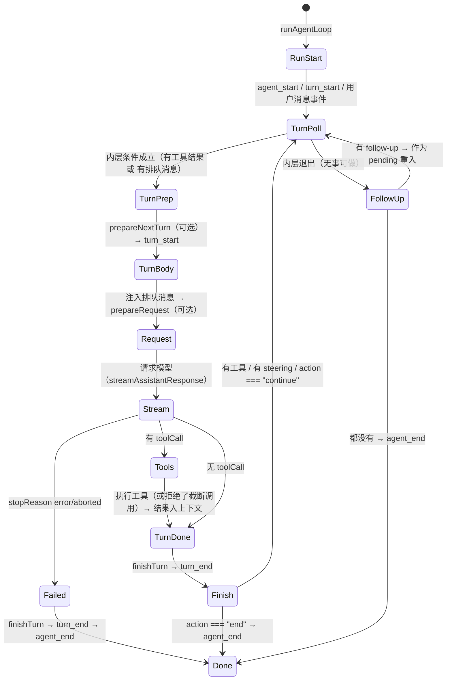

# 第 6 章：Agent 循环、轮次与结束条件

> 学完本章你能回答：
>
> 1. 循环由哪三种输入驱动（新提示、继续、排队消息）？它们的入口分别在哪？
> 2. `runLoop` 的三个钩子 `prepareNextTurn`、`prepareRequest`、`finishTurn` 各自在什么时刻执行？
> 3. steering 与 follow-up 的区别是什么？分别在什么时机被消费？
> 4. 循环"继续"与"退出"的全部条件有哪些？为什么可能"停不下来"？
> 5. 取消、失败、自动重试在循环里各自走什么路径？

**前置知识**：第 3 章（请求旅程）、第 4 章（消息与事件）、第 5 章（faux）。
**预计学习时间**：2 天（循环是全书的"心脏"，值得反复读）。
**本章验证状态**：静态核对通过（`runLoop`、`Agent`、`AgentSession` 相关段落逐段核对）；实验 L03 设计中，需用 faux 在本地执行。

---

## 6.1 三种驱动方式：prompt、continue 与排队

回忆第 3 章：会话层 `_runAgentPrompt` 先调 `agent.prompt(messages)`，然后在 while 循环里反复调 `agent.continue()`。为什么需要两个入口？

### 6.1.1 `Agent.prompt`：带入新消息

```typescript
async prompt(input: string | AgentMessage | AgentMessage[], images?: ImageContent[]): Promise<void> {
	if (this.activeRun) {
		throw new Error("Agent is already processing a prompt. Use steer() or followUp() to queue messages, or wait for completion.");
	}
	const messages = this.normalizePromptInput(input, images);
	await this.runPromptMessages(messages);
}
```

语义：**开启一次新 run，把一条或多条消息追加到上下文，然后进入循环。** 这就是用户按下回车走的路。

### 6.1.2 `Agent.continue`：从当前上下文继续

```typescript
async continue(): Promise<void> {
	if (this.activeRun) {
		throw new Error("Agent is already processing. Wait for completion before continuing.");
	}

	const lastMessage = this._state.messages[this._state.messages.length - 1];
	if (!lastMessage || this._state.messages.every((message) => message.role === "system")) {
		throw new Error("No messages to continue from");
	}

	if (lastMessage.role === "assistant") {
		// 特例：最后是 assistant 且队列里有东西 → 转为"用队列消息开新 run"
		const queuedSteering = this.steeringQueue.drain();
		if (queuedSteering.length > 0) {
			await this.runPromptMessages(queuedSteering, { skipInitialSteeringPoll: true });
			return;
		}
		const queuedFollowUps = this.followUpQueue.drain();
		if (queuedFollowUps.length > 0) {
			await this.runPromptMessages(queuedFollowUps);
			return;
		}
		throw new Error("Cannot continue from message role: assistant");
	}

	await this.runContinuation();
}
```

三条规则：

1. **上下文不能为空**（至少一条系统消息之外的记录）；
2. **最后一条不能是 assistant 消息**——否则供应商会拒绝（模型不能连说两句）。这是 `agent/README.md` 与 `agent-loop.ts` 注释里都强调的约束：

```text
**Important:** The last message in context must convert to a `user` or `toolResult` message
via `convertToLlm`. If it doesn't, the LLM provider will reject the request.
```

3. **特例补偿**：如果最后恰好是 assistant，但队列里有排队消息，就让队列消息"接管"，转为一次 `prompt`。

`continue` 的存在价值：**在"不新增用户输入"的前提下再问一次模型**。重试用它、压缩后用续跑用它、扩展想让模型"接着说"也用它。

### 6.1.3 排队：`steer` 与 `followUp`

运行中还能再输入吗？能，但要排队：

```typescript
/** Queue a message to be injected after the current assistant turn finishes. */
steer(message: AgentMessage): void { this.steeringQueue.enqueue(message); }

/** Queue a message to run only after the agent would otherwise stop. */
followUp(message: AgentMessage): void { this.followUpQueue.enqueue(message); }
```

两者的语义差别（`how-pi-works.md` 原话）：

```text
Steering messages enter after the current assistant turn. Follow-up messages enter after
the agent has finished its pending work. Aborting stops the current run and returns queued
messages to the editor.
```

- **steering（引导）**：模型正在做长任务，"插一句话让它改变方向"。注入点是**当前 turn 结束、下一次模型请求之前**；
- **follow-up（跟进）**：等 Agent"本来就要收工"的时候再说一句（比如"顺手把测试也跑了"）。注入点是**内层循环因无事可做而退出之后**。

配套 API（`Agent`）：

| 方法 | 作用 |
|---|---|
| `steer(msg)` / `followUp(msg)` | 入队 |
| `clearSteeringQueue()` / `clearFollowUpQueue()` / `clearAllQueues()` | 清空 |
| `hasQueuedMessages()` | 是否有排队 |
| `peekQueuedMessages()` | 预览"下一轮会被取走的消息"（不消费） |
| `steeringMode` / `followUpMode` | 取用模式：`"all"` 一次全取，`"one-at-a-time"` 一次只取一条 |

取用模式的实现是 `PendingMessageQueue`（`agent.ts`）：

```typescript
class PendingMessageQueue {
	private messages: AgentMessage[] = [];
	public mode: QueueMode;

	enqueue(message: AgentMessage): void { this.messages.push(message); }
	hasItems(): boolean { return this.messages.length > 0; }

	peek(): AgentMessage[] {
		if (this.mode === "all") return this.messages.slice();
		const first = this.messages[0];
		return first ? [first] : [];
	}

	drain(): AgentMessage[] {
		const drained = this.peek();
		this.messages = this.messages.slice(drained.length);
		return drained;
	}

	clear(): void { this.messages = []; }
}
```

`"one-at-a-time"` 的意义：用户连发三条 steering 时，不必让模型一次面对三句话——先处理一条，观察结果，再决定下一条是否还有意义（甚至可以中途清空队列）。

**排队与界面**：会话层把队列状态通过 `queue_update` 事件广播（`AgentSessionEvent`，第 4 章），交互界面据此显示"排队中：2 条"。取消时把未消费的消息**还回编辑器**。

## 6.2 `runLoop` 状态机：三个钩子与两层循环

现在把第 3 章读过的 `runLoop` 从"代码走读"升级为"状态机理解"。它是一台**两台嵌套的循环机**，由三个可选钩子定制：

### 6.2.1 三个钩子的职责与语义（`packages/agent/src/types.ts`）

| 钩子 | 执行时刻 | 能做什么 | 典型用途 |
|---|---|---|---|
| `prepareNextTurn(lastCompletedTurn, signal)` | 每个 turn 的**开始**（第一轮除外） | 返回 `AgentLoopTurnUpdate`：替换 context、注入 messages、换 model/thinkingLevel | 压缩（上下文太长先摘要）、动态换模型、注入"下一轮提示" |
| `prepareRequest(request, signal)` | **每次模型请求之前**（含第一次） | 返回 `AgentRequestUpdate`：更新 context/model/thinkingLevel | 工具清单变化、按请求切模型、最后时刻裁剪 |
| `finishTurn(turn, signal)` | 每个 turn **结束**（发出 `turn_end` 前） | 返回 `{ action: "end" | "continue" }` | 扩展叫停/续跑、预算控制、回合后审计 |

三个类型的原文（节选）：

```typescript
/** Replacement runtime state used by the agent loop before starting another provider request. */
export interface AgentLoopTurnUpdate {
	context?: AgentContext;      // 替换下一轮上下文
	messages?: AgentMessage[];   // 追加消息（会走正常生命周期事件）
	model?: Model<any>;          // 换模型
	thinkingLevel?: ThinkingLevel;
}

/** Runtime state available immediately before a conversational provider request. */
export interface PrepareRequestContext {
	context: AgentContext;
	model: Model<any>;
	thinkingLevel: ThinkingLevel;
}

export type FinishTurn = (
	turn: AgentTurnContext,
	signal?: AbortSignal,
) => AgentTurnDecision | void | Promise<AgentTurnDecision | undefined> | Promise<void>;
```

三个重要约定：

- **钩子可以返回 `void`（不改任何东西）**，实现方按需返回更新对象；
- `prepareRequest` 的注释写着 "including the first"（包括第一次请求）——所以"每轮循环 → 请求"这条链上，它一定被执行；
- 钩子的**契约写在注释里**：例如 `convertToLlm` 和 `transformContext` 都要求 "must not throw"（不许抛错，出错给安全回退值），因为"抛错会打断低层循环、产生不完整的事件序列"。第 13 章做扩展时你会依赖这条约定。

### 6.2.2 循环骨架：把事件序列画成状态机

把 3.8 的代码翻译成状态图（事件名加粗）：



对照这张图数一数：一次"读文件并总结"的 run 里，`TurnBody → ... → TurnDone` 走两遍（两次 turn），第二遍之后 `FollowUp → Done`。取消的 run 走 `Stream → Failed → Done`。带 steering 的 run 在 `Finish → TurnPoll` 处再进一次内层。

### 6.2.3 时序上的三个"容易搞错"的点

1. **`turn_start` 第一次由 `runAgentLoop` 发出**，之后每轮由内层循环发出（`await emit({ type: "turn_start" })`）——所以"事件数 = 轮次数"这条规律成立（每轮恰好一个 `turn_start` / `turn_end`）；
2. **排队消息在 `prepareRequest` 之前注入**：注释写得很明确（"Pending messages have already been appended and emitted when this callback runs"）。所以 `prepareRequest` 里能看到本轮真正会发给模型的消息；
3. **`prepareNextTurn` 可能"耗时很久"**（比如做压缩），而它**执行期间**新排队的 steering 会被补取（代码里那句 "Preparation can be long-running (for example, compaction). Pick up steering queued while it ran."）。这正是"压缩时用户还能打字，消息不会丢"的实现。
## 6.3 队列的精确消费时机：四个取数点

"排队消息什么时候被取走"是本章最需要精确的知识点。在 `runLoop` 里，取队列只发生在**四个固定位置**：

```text
T0：进入内层循环之前（run 开始时先补取一次 steering）
T1：prepareNextTurn 之后、注入消息之前（准备耗时期间用户可能又打字）
T2：finishTurn 之后、决定是否进入下一轮时
T3：内层循环退出之后（检查 follow-up）
```

用源码对准这四个位置：

```typescript
// T0：run 开始前的初始轮询
let pendingMessages: AgentMessage[] = (await config.getSteeringMessages?.()) || [];

while (true) {
	let hasMoreToolCalls = true;
	while (hasMoreToolCalls || pendingMessages.length > 0) {
		if (lastCompletedTurn) {
			const nextTurnSnapshot = await config.prepareNextTurn?.(lastCompletedTurn);
			// ... 应用 snapshot
			// T1：准备可能耗时，期间排队的 steering 要补取（仅当上一轮取到的为空）
			if (pendingMessages.length === 0) {
				pendingMessages = (await config.getSteeringMessages?.()) || [];
			}
			await emit({ type: "turn_start" });
		}
		// 注入 prepared + pending（declareToolChanges 包装）
		// ...
		pendingMessages = [];

		// ... prepareRequest → 请求 → 工具 ...

		// T2：本轮结束，决定是否继续；先取一次 steering
		explicitContinuation = decision?.action === "continue";
		pendingMessages = (await config.getSteeringMessages?.()) || [];
		if (hasMoreToolCalls || pendingMessages.length > 0) explicitContinuation = false;
	}

	// T3：内层退出，检查 follow-up
	const followUpMessages = (await config.getFollowUpMessages?.()) || [];
	if (followUpMessages.length > 0) {
		explicitContinuation = false;
		pendingMessages = followUpMessages;
		continue;   // 回到外层开头，重进内层
	}
	if (explicitContinuation) { explicitContinuation = false; continue; }
	break;
}
```

`Agent` 侧把这两个回调接到队列上（`createLoopConfig`）：

```typescript
getSteeringMessages: async () => {
	if (skipInitialSteeringPoll) {
		skipInitialSteeringPoll = false;
		return [];
	}
	return this.steeringQueue.drain();
},
getFollowUpMessages: async () => this.followUpQueue.drain(),
```

`skipInitialSteeringPoll` 的用途：`continue()` 的特例分支已经把队列消息取出来开新 run 了，所以第一次轮询要**故意返回空**，避免"刚取出的消息又被取一次"。

### 6.3.1 四种典型时序

| 用户动作 | 发生时点 | 消息进入模型请求的时机 |
|---|---|---|
| 输入后立刻回车（非流式） | Agent 空闲 | 立即成为 `prompt` 的新消息 |
| 流式输出中按回车（steer） | turn 进行中 | T2 取到 → 下一轮请求前注入 |
| 流式输出中按 Alt+Enter 之类（follow-up） | turn 进行中 | T3 取到 → 内层退出后作为 pending 重入 |
| 取消（Esc） | turn 进行中 | 不注入；队列消息**还给编辑器** |

至此，"一次用户请求 ≠ 一次模型请求 ≠ 一个 turn"彻底落到代码：**turn 是内层循环的一次迭代，排队消息是让内层多迭代几次的外部输入。**

## 6.4 终止条件全表与四条状态轨迹

### 6.4.1 终止条件总表

| # | 条件 | 代码位置 | 结果 |
|---|---|---|---|
| 1 | 模型响应 `stopReason` 为 `error` | ⑤ | `finishTurn` → `turn_end` → `agent_end`，结束 |
| 2 | 模型响应 `stopReason` 为 `aborted` | ⑤ | 同上（错误消息为取消） |
| 3 | `finishTurn` 返回 `action: "end"` | ⑦ | 立即 `agent_end`，结束 |
| 4 | 本批次所有工具结果 `terminate: true` | ⑥ 后 `hasMoreToolCalls=false` | 内层不再因工具继续 |
| 5 | 无工具调用、无 steering、无 follow-up、无 `continue` | 内层条件 + ⑧ | `break` → `agent_end`，结束 |
| 6 | 内层退出但是有 follow-up | ⑧ | 继续（不结束） |
| 7 | `finishTurn` 返回 `action: "continue"` | ⑦ | 空转一轮（context-only turn，仍会发一次请求） |
| 8 | 有 steering 消息 | ⑦ / T1 / T0 | 注入后继续 |
| 9 | 运行被取消（`abort()`） | 信号检查点 | 模型/工具尽快停止，按 #2 收尾 |
| 10 | 循环中被 `await` 的 hook 抛错或 reject | 例如 `prepareRequest` 在 `turn_end` 之前 | 这是异常退出，不走正常终止事件序列；外层入口决定如何处理 rejection |

表中的 #1–#9 描述的是正常调度结果：模型错误会变成 `stopReason: "error"` 的 assistant message，取消会变成 `"aborted"`，因此它们仍走 `turn_end` 和 `agent_end`。不要把这两种消息级失败与 **hook 的 Promise rejection** 混为一谈。后者不是一条“失败的模型回答”：`runLoop` 会直接 reject，尚未执行的后续事件也不会补发。例如 `prepareRequest` 是在注入消息之后、调用 provider 之前被 await；若它 reject，已发出的输入消息事件仍在，但本轮还没有 `turn_end` 或 `agent_end`。

这里还有一条容易漏掉的规则：**error/aborted 是硬退出**。源码仍会 `await finishTurn(...)`，给 hook 看见这条结束消息的机会；但这个分支不读取 hook 返回值。因此 hook 即使返回 `{ action: "continue" }` 或 `{ action: "end" }`，也不能覆盖模型错误或取消。hook 正常完成后，Agent loop 直接发 `turn_end` 和 `agent_end` 并返回，不再轮询 follow-up 队列。

| 响应类型 | 是否调用并等待 `finishTurn` | 是否采用其决策 | 后续调度 |
|---|---:|---:|---|
| 普通回答（`stopReason` 不是 `error`/`aborted`） | 是 | 是 | 按工具、steering、follow-up 与 `continue` 裁决 |
| error / aborted assistant message | 是 | 否 | 发 `turn_end`、`agent_end` 后返回；不消费 follow-up |
| `finishTurn` 自身 reject | 已开始 await，但未正常完成 | 无决策可采用 | Promise reject；这条路径不会补发后续 `turn_end` / `agent_end` |

短轨迹：provider 返回 `aborted` → `finishTurn` 返回 `continue` → Agent loop 忽略该决策 → `turn_end` → `agent_end`。这不是“取消后自动再问一次”。现有测试 `runs finishTurn for a %s assistant before turn_end without changing the hard exit` 分别用 `error` 与 `aborted` 验证：provider 只调用一次、steering 只做初始轮询、follow-up 从未轮询。

```text
Agent 类入口：prepareRequest reject
  -> runLoop / runAgentLoop Promise reject
  -> runWithLifecycle catch
  -> handleRunFailure 发失败消息与结束事件
  -> finishRun 清理

低层 agentLoop() 流包装器：runAgentLoop Promise reject
  -> fulfillment-only .then 的成功回调不执行
  -> 不会自动 stream.end()，也不会补 agent_end
```

上图第二条是 D1“低层 Promise 路径”讨论的异常边界；直接调用 `runAgentLoop()` 的宿主也必须自行接 rejection。`AgentLoopConfig` 的类型注释还明确要求 `convertToLlm`、`transformContext`、`getApiKey`、队列读取回调不要 throw/reject；应把可恢复错误转成合适的返回值。其他异步 hook 即使类型允许返回 Promise，也仍应按调用链确认 rejection 的归属与清理责任。

请特别注意两类"看起来该结束但不会结束"的情况：

- **`terminate: true` 只是"不因这批工具继续"**，如果模型在下一轮又调用了别的工具、或者有排队消息，循环照常继续。它不强制结束整个 run；
- **`action: "continue"` 会让循环多跑一轮真实的模型请求**（outer 循环第二轮会把 `hasMoreToolCalls` 重置为 `true`，于是内层再执行一遍完整流程，只是不新增消息）。所以"无条件返回 continue"= 无限请求 → 无限费用。这是第 6.4.4 节的主题。

### 6.4.2 轨迹 A：无工具的简单请求

```text
agent_start
turn_start
message_start(user) → message_end(user)
message_start(assistant) → message_update × N（text_delta）→ message_end(assistant)
turn_end(message, toolResults: [])
agent_end
```

循环路径：内层第一次迭代 → 无工具、无排队 → 内层条件 false → 无 follow-up → break → `agent_end`。

### 6.4.3 轨迹 B：带工具（第 3 章的场景）

```text
agent_start
turn_start
user message 事件
assistant 消息（toolCall）事件 = message_start + updates + message_end
tool_execution_start(args) → tool_execution_end(result)
message_start(toolResult) → message_end(toolResult)
turn_end
turn_start                       ← 第二轮
assistant 消息（纯文本总结）事件
turn_end
agent_end
```

关键点：**两个 `turn_start/turn_end` 对**，事件总数与轮次数严格对应；工具结果消息与助手消息一样有完整的 `message_start/message_end`。

### 6.4.4 轨迹 C：排队消息插队 —— 以及"为什么可能停不下来"

场景：第一轮正在执行工具时，用户插入一条 steering："顺便把 README 也看了。"

```text
turn 1：assistant(toolCall read demo.txt) → 工具执行（此时 steer 入队）
finishTurn → turn_end
T2 取到 steering → 非空 → explicitContinuation 归零
内层条件：hasMoreToolCalls true（因为还有工具结果要回传）→ 继续
turn 2：注入 steering 消息 + toolResult 一起发给模型
   → assistant(再调 read README) → 工具 → finishTurn → T2 无新消息
内层条件：false → 退出内层 → T3 无 follow-up → break → agent_end
```

**"停不下来"的两种情况**（这是本节的验收重点）：

1. **模型行为导致**：模型每一轮都要求调用工具（比如工具总是返回错误、模型不断重试）。循环的设计就是"只要模型要工具就满足它"，**没有内置的最大轮数**。防呆靠：工具实现要给出可恢复的错误信息、扩展可以 `finishTurn` 叫停、用户随时可以取消；
2. **钩子行为导致**：`finishTurn` 无条件返回 `{ action: "continue" }`。由于 outer 循环会重置 `hasMoreToolCalls = true` 并重跑内层，每一轮都产生一次**真实的模型请求**（context-only turn）。这就是"无条件 continue → 无限运行 + 无限费用"的机制。写扩展时的准则：**只有在你确信"再来一轮就能收敛"时才返回 continue，并且要有外部计数/预算兜底。**

（会话层的 `_runAgentPrompt` while 循环同理：如果 `_handlePostAgentRun` 永远返回 true——例如某扩展在每次 `agent_end` 都塞一条新消息——`session.prompt()` 也永远不返回。机制一致：**收敛性由参与者保证，框架不设魔法上限。**）

### 6.4.5 把三个布尔/数组变量分开追

读嵌套循环时，不要把“是否还要继续”压成一个脑内开关。源码里三个状态分工不同：

| 变量 | 类型 | 谁更新 | 它控制什么 |
|---|---|---|---|
| `hasMoreToolCalls` | `boolean` | 当前 assistant 消息的工具结果批次 | 是否因为工具调用尚需下一轮 |
| `pendingMessages` | `AgentMessage[]` | T0–T3 队列读取或 follow-up 分支 | 下一轮开始前要注入的消息 |
| `explicitContinuation` | `boolean` | `finishTurn` 返回值；follow-up/自然工作可清零 | 内层停止后，是否再发一次不带新输入的请求 |

最容易误读的是：`explicitContinuation` **不在内层 while 条件中**。它只在内层退出后决定要不要 `continue` 外层循环。下面逐步代入真实结构：

```typescript
while (true) {
  let hasMoreToolCalls = true;
  while (hasMoreToolCalls || pendingMessages.length > 0) {
    // 注入 pendingMessages，发起一次模型请求并处理工具
    // ...
    explicitContinuation = decision?.action === "continue";
    pendingMessages = await getSteeringMessages();
    if (hasMoreToolCalls || pendingMessages.length > 0) {
      explicitContinuation = false;
    }
  }

  const followUpMessages = await getFollowUpMessages();
  if (followUpMessages.length > 0) {
    explicitContinuation = false;
    pendingMessages = followUpMessages;
    continue;
  }
  if (explicitContinuation) {
    explicitContinuation = false;
    continue;
  }
  break;
}
```

节选省掉请求与事件处理，只保留状态裁决。对照源码时留意 `hasMoreToolCalls` 在每次 outer loop 开始被重置为 `true`；它不是“上一轮是否有工具调用”的永久记忆。

#### 轨迹一：普通回答

模型回答没有工具调用，`finishTurn` 未要求 continuation，也没有排队输入：

| 时刻 | `hasMoreToolCalls` | `pendingMessages.length` | `explicitContinuation` | 发生什么 |
|---|---:|---:|---:|---|
| inner loop 刚进入 | `true` | `0` | `false` | 初始用户消息已由 `Agent.prompt` 放入 context；条件为真，开始本轮 |
| 本轮请求发出 | `true` | `0` | `false` | 没有 pending 队列消息，直接用现有 context 请求 |
| assistant 无工具 | `false` | `0` | `false` | `finishTurn` 不要求继续 |
| inner 条件判断 | `false` | `0` | `false` | inner loop 退出 |
| 读取 follow-up 后 | `false` | `0` | `false` | 无 follow-up、无 continuation，发 `agent_end` |

这个例子里，空数组表示“没有新消息”，但不单独决定整个 run 是否结束；后面的 follow-up 与 continuation 裁决仍会执行。

#### 轨迹二：finish hook 单独要求继续

假设无工具、无 steering，但 `finishTurn` 返回 `{ action: "continue" }`：

| 时刻 | `hasMoreToolCalls` | `pendingMessages.length` | `explicitContinuation` | 发生什么 |
|---|---:|---:|---:|---|
| 本轮完成 | `false` | `0` | `true` | inner 条件为假，因此先退出 inner |
| 检查 follow-up | `false` | `0` | `true` | 无 follow-up |
| outer loop 重入 | 重置为 `true` | `0` | 重置为 `false` | inner 因 `hasMoreToolCalls` 为真，再做一次 context-only 请求 |

因此 continuation 并不是“原样重复这次请求”：下一轮仍会经过 `prepareNextTurn` / `prepareRequest`，配置可能变化，也可能由钩子注入消息；它只是没有普通 steering/follow-up 消息时，要求 Agent 再向模型请求一次。除非某个钩子改变行为，否则无条件 continue 会不断请求。

#### 轨迹三：follow-up 与 continuation 同时出现

若 `finishTurn` 要求继续，同时队列中有 follow-up，代码先取 follow-up，清除 `explicitContinuation`，将 follow-up 设为 `pendingMessages` 并重入 outer loop。新请求会带着 follow-up；它不是额外再多发一个 context-only 请求。

```text
finishTurn → explicitContinuation = true
检查 follow-up → ["再检查测试"]
follow-up 分支优先 → explicitContinuation = false
pendingMessages = followUpMessages
outer loop 重入 → 注入 follow-up → 正常请求
```

这里的“优先”是代码中的分支顺序和赋值结果，不是队列内部的抽象优先级。若在这段逻辑后加新条件，先回答：它应该清空、保留还是覆盖 `explicitContinuation`？否则很容易意外多打一轮请求或吞掉一次有意的 continuation。

#### 新手阅读法：每次赋值就更新表格

可以在纸上照着做：

1. 找出变量的**声明位置**，记下初始值；
2. 搜索该变量的**所有赋值位置**，不要只看第一次出现；
3. 每次遇到 `await`，标注等待期间哪些变量可能被回调/队列改变；
4. 把变量代入最近的 if/while 条件，写出 true/false；
5. 找到这一分支之后的第一个 `emit`，确认外部观察者会看到什么。

这是阅读命令式 TypeScript 状态机的通用方法：变量不是注释，而是程序真正做分支的输入。读完后，再回到 6.4.1 的终止条件表，应该能从赋值过程推导每一行，而不是死记八种情况。

## 6.5 取消：`abort()` 的全链路

取消是"用户按下 Esc"的代码路径，也是验证一个框架是否"全链路可取消"的试金石。

### 6.5.1 入口：一个 AbortController

```typescript
/** Abort the current run, if one is active. */
abort(): void {
	this.activeRun?.abortController.abort();
}

/** Active abort signal for the current run, if any. */
get signal(): AbortSignal | undefined {
	return this.activeRun?.abortController.signal;
}
```

`runWithLifecycle` 在 run 开始时创建一个 `AbortController` 并把它存进 `activeRun`。`abort()` 只需触发一次 `abort()`，信号沿三条线传播：

```text
Agent.abort()
  ├─→ streamFn(options.signal)：正在进行的供应商 HTTP 请求被中止
  ├─→ tool.execute(..., signal)：正在执行的工具应尽快退出并清理
  └─→ 循环内的检查点：signal?.aborted 为真时跳过尚未开始的工具
```

### 6.5.2 工具执行里的检查点（源码事实）

顺序模式（`executeToolCallsSequential`）：每个工具收尾后检查一次——

```typescript
		if (signal?.aborted) {
			break;   // 不再执行批次里剩余的工具
		}
```

并行模式（`executeToolCallsParallel`）有两层：

1. **准备阶段**：`prepareToolCall` 内部在 `beforeToolCall` 前后都检查信号，被取消就产出 `Operation aborted` 错误结果；
2. **执行阶段**：每个待执行闭包开头检查：

```typescript
		finalizedCalls.push(async () => {
			if (signal?.aborted) {
				const finalized = { toolCall, result: createErrorToolResult("Operation aborted"), isError: true };
				await emitToolExecutionEnd(finalized, emit);
				return finalized;
			}
			const executed = await executePreparedToolCall(preparation, signal, emitToolExecutionUpdate(toolCall, emit));
			// ...
		});
```

所以"取消后工具批次会怎样"要按执行模式和调用所处阶段回答：

| 状态 | 结果 |
|---|---|
| 顺序批次里尚未轮到的工具 | 当前工具收尾后循环 `break`；后续调用没有 start/end 事件，也没有 Agent 层的 `toolResult` 消息 |
| 并行批次里已准备、但闭包还未开始执行的工具 | 闭包看到已取消信号，生成 `Operation aborted` 错误结果、结束事件和结果消息 |
| 并行准备循环尚未到达的工具 | 准备循环在当前调用后 `break`；这些调用没有 start/end 事件，也没有 Agent 层结果消息 |
| 取消时已经在执行的工具 | 收到同一个 signal；会否立刻退出取决于工具是否检查并响应取消 |

看一条具体轨迹：模型声明 A、B、C；A 已准备好并被放进闭包队列，B 正在异步 `beforeToolCall`，此时收到 abort。

```text
tool_execution_start(A) → A 的执行闭包入队（尚未调用 execute）
tool_execution_start(B) → beforeToolCall 等待期间 signal.aborted = true
tool_execution_end(B)   → prepareToolCall 返回 immediate: Operation aborted
                          准备循环 break，C 没有 start/end 或结果
tool_execution_end(A)   → Promise.all 启动 A 的闭包；闭包看见 aborted，不调用 execute
message_start/end(A)    → message_start/end(B)（结果消息仍按原声明顺序）
```

这里 `tool_execution_end` 的顺序是 B、A，结果消息顺序却是 A、B：B 在准备阶段已结束，A 的取消闭包要等准备循环退出后才运行。A、B 虽然都有错误结果，但这不表示两个工具执行函数都启动过；C 则根本没有进入 Agent 层批次。该轨迹由 `executeToolCallsParallel` 与 `prepareToolCall` 的控制流推导，当前记录的既有测试没有直接覆盖这个精确的取消时序。

因此，**Agent loop 不保证取消时每个模型声明的工具调用都有结果消息**。转录可能暂时包含不完整的工具批次。之后若确实进入 `convertToLlm`，某些 provider 转换器会为孤立调用插入 `No result provided` 合成错误结果；这属于模型消息投影的特定行为，不是调度器生成的真实工具结果，也不能推断所有 provider 的处理相同。D1 第 22–23 节按源码细讲了准备、执行与转换三层。

### 6.5.3 取消之后：谁在收尾

- `streamAssistantResponse` 里的流如果是被中止结束的，最终消息 `stopReason: "aborted"`，循环走 ⑤ 分支正常收尾（`turn_end`、`agent_end` 一样发出）；
- `waitForIdle()` 在 `agent_end` 的监听器全部结束后 resolve；
- 会话层：`_runAgentPrompt` 的 finally 里调 `_finishCancelledRetry()`（如果在重试等待期被取消，补发 `auto_retry_end(success: false)`）、清请求级状态、`_emitAgentSettled()`；
- **排队消息还给编辑器**（`how-pi-works.md`）：交互层收到取消后把未消费的排队内容填回输入框，避免用户输入被吞。

取消相关 API 汇总（`Agent`/`AgentSession`）：

| API | 作用 |
|---|---|
| `agent.abort()` / `session.abort()` | 取消当前 run |
| `agent.signal` | 当前 run 的信号（订阅者可读取） |
| `agent.waitForIdle()` / `session.waitForIdle()` | 等 run 完全收尾 |
| `session.abortRetry()` | 只取消"重试等待的睡眠"（正在重试倒计时时） |
| `session.isRetrying` / `autoRetryEnabled` | 重试状态与开关 |

## 6.6 自动重试与恢复：会话层的补丁

循环本身不做重试；**重试发生在会话层的"运行后循环"**（第 3.6 节 `_runAgentPrompt` 的 while）。完整决策在 `_handlePostAgentRun`：

```typescript
private async _handlePostAgentRun(): Promise<boolean> {
	const message = this._lastAssistantMessage;      // 最近一次助手消息（turn_end 时记录）
	const toolResults = this._lastAssistantToolResults;
	// ...
	if (this._agentRunAbortRequested) { this._finishCancelledRetry(); return false; }
	if (!message) return this.agent.hasQueuedMessages();

	// ① 可重试错误 → 安排一次重试（退避等待后由调用方 agent.continue()）
	if (this._isRetryableError(message) && (await this._prepareRetry(message))) {
		// ...
		this._failedResponse = message;
		return !this._agentRunAbortRequested;
	}
	// ...（若重试预算耗尽且有重试历史：补发 auto_retry_end 失败事件）

	// ② 上下文问题 → 压缩（第 10 章）
	if (await this._checkCompaction(message, true, toolResults)) {
		return !this._agentRunAbortRequested;
	}

	// ③ 消费者等原因：队列里还有消息
	return !this._agentRunAbortRequested && this.agent.hasQueuedMessages();
}
```

### 6.6.1 什么错误可重试

```typescript
private _isRetryableError(message: AssistantMessage): boolean {
	// Context overflow is handled by compaction, not retry.
	if (isContextOverflow(message, (this._modelForMessage(message) ?? this.model)?.contextWindow ?? 0)) return false;
	return isRetryableAssistantError(message);
}
```

- **上下文溢出**（输入超窗）**不重试**——重试只会再超一次；它交给压缩（第 10 章）；
- 其余（常见如过载、限流、服务端 5xx）由 `isRetryableAssistantError` 判定可重试。

### 6.6.2 重试的执行（`_prepareRetry`）

```typescript
private async _prepareRetry(message: AssistantMessage): Promise<boolean> {
	const settings = this.settingsManager.getRetrySettings();
	if (!settings.enabled) return false;

	this._retryAttempt++;
	if (this._retryAttempt > settings.maxRetries) {
		this._retryAttempt--;     // 保留计数，供收尾事件报告
		return false;
	}

	const delayMs = retryDelayMs(settings, this._retryAttempt);   // 指数退避
	this._emit({ type: "auto_retry_start", attempt: this._retryAttempt, maxAttempts: settings.maxRetries, delayMs, errorMessage: message.errorMessage || "Unknown error" });

	// 关键：失败的一次尝试留在"原始历史"里，但持久地从模型投影中剔除
	this._omitRecoveryAttempt(message);

	// 可取消的退避等待
	this._retryAbortController = new AbortController();
	try { await sleep(delayMs, this._retryAbortController.signal); }
	catch { this._finishCancelledRetry(); return false; }
	finally { this._retryAbortController = undefined; }

	return true;   // 调用方随后 agent.continue()
}
```

四个值得理解的设计：

1. **退避等待可取消**：`abortRetry()` 会打断睡眠（用户不想等了）；
2. **`_omitRecoveryAttempt` 的持久化语义**：失败消息（+工具结果）通过追加 `context_edit` 条目（`replacement: null`）标记为"仅在上下文投影中省略"——

```typescript
for (const targetId of targetIds) {
	if (!targetId) continue;
	const editId = this.sessionManager.appendContextEdit(targetId, null);
	// ...
}
this._refreshFinalizedContext();
```

   这样**原始历史不丢**（审计/导出还能看到失败的尝试），但下一次模型请求不再包含它。第 9 章的 `buildSessionProjection` 会解释这条链；
3. **成功后自动复位**：`message_end` 处理里，一旦收到成功的助手消息（`stopReason` 非 `error`/`length`）就 `auto_retry_end(success: true)` 并清零计数——**重试预算是"连续失败预算"，一次成功就重置**；
4. **UI 的提前预告**：`agent_end` 事件在会话层被改写，带上 `willRetry`：

```typescript
private _willRetryAfterAgentEnd(event): boolean {
	if (this._agentRunAbortRequested) return false;
	const settings = this.settingsManager.getRetrySettings();
	if (!settings.enabled || this._retryAttempt >= settings.maxRetries) return false;
	// 从后向前找最近的 assistant 消息，判断是否可重试
	for (let i = event.messages.length - 1; i >= 0; i--) {
		const message = event.messages[i];
		if (message.role === "assistant") return this._isRetryableError(message as AssistantMessage);
	}
	return false;
}
```

   （所以你在界面上看到"agent 已结束但马上又动起来"时，事件流是这样的：`agent_end(willRetry: true)` → `auto_retry_start` → 新一轮 `agent_start`……）

### 6.6.3 摘要类操作也共享重试预算

压缩、分支摘要这些"内部模型调用"同样可能遇到瞬时错误。它们复用同一套 `settings.retry` 预算与退避策略，但发的是另一组事件（`summarization_retry_scheduled` / `summarization_retry_attempt_start` / `summarization_retry_finished`，见 `AgentSessionEvent`）。**读事件日志时按事件名区分"主对话重试"与"摘要重试"。**

## 6.7 实验 L03：排队时机与工具顺序（faux）

**实验性质**：本地运行；需要 faux（第 5 章）与测试 harness（第 18 章会系统讲）。
**验证状态**：设计中。本实验是第 6、7 两章共用的证据来源，建议整套做两遍（读完第 7 章后回访一遍）。

### Part A：steering 的注入时机

1. 准备脚本（伪代码示意）：

```typescript
faux.setResponses([
	fauxAssistantMessage([fauxToolCall("read", { path: "demo.txt" })], { stopReason: "toolUse" }),
	fauxAssistantMessage("已读取。"),
	fauxAssistantMessage("收到引导，继续处理。"),
	fauxAssistantMessage("完成。"),
]);
```

2. 在 `tool_execution_start` 事件触发时调用 `session.steer("顺便看看 README")`（或用 Agent 层的 `agent.steer`）；
3. 断言并记录：
   - `faux.state.callCount` 是 2 还是 3？（取决于 steering 是否在工具结果回传前入队并被 T2 取到）
   - 引导消息在消息数组里出现在哪两条消息之间？
4. 画出事件序列：`tool_execution_*`、`turn_end`、下一条 `turn_start` 的相对位置。

### Part B：并行工具的"两个顺序"

1. 注册两个假工具：`slow`（100ms 后完成）与 `fast`（10ms 后完成），**用可控 Promise/测试时钟而不是真实定时器**；
2. 脚本让模型一次调用两个工具；
3. 记录两类顺序：
   - `tool_execution_end` 事件顺序（预期：fast 先）；
   - 工具结果消息在 `session.messages` 里的顺序（预期：按模型声明顺序）。

### 判定标准

- Part A：能解释 steering 是从哪个取数点（T1/T2/T3）被消费的，并给出证据；
- Part B：能说出"完成顺序"与"记录顺序"分别由哪段代码保证（`finalizedCalls` 闭包 vs `Promise.all` + 有序循环）。

（说明：本手册写作时未运行这两个实验；步骤中的预期来自源码静态分析。运行结果若与预期不符，请优先检查你使用的 harness 版本与事件注册时机。）

## 6.8 常见错误

| 现象 | 原因 | 处理 |
|---|---|---|
| 流式输出中调用 `prompt()` 报"Agent is already processing" | 同一 Agent 同时只允许一个 run | 改用 `steer()`/`followUp()`（会话层用 `streamingBehavior` 选项） |
| `continue()` 报 "Cannot continue from message role: assistant" | 最后一条是助手消息 | 先 `prompt()` 新消息，或依赖 `continue()` 的队列特例分支 |
| 以为点了取消就"立刻什么都不跑" | 取消是信号，工具需自行响应 | 工具实现里检查 `signal?.aborted` 并清理 |
| 工具设了 `terminate: true` 但循环还在跑 | terminate 只是"不因本批工具继续" | 需要硬停就用 `finishTurn` 返回 `action: "end"` |
| 重试没有发生 | 上下文溢出/不可重试错误/预算耗尽/被取消 | 看 `auto_retry_*` 事件与设置里的 `retry` 配置 |
| 重试后模型"忘了"失败那轮 | `_omitRecoveryAttempt` 的预期行为 | 这是设计：失败尝试从上下文剔除但保留原始历史 |

## 6.9 验收题

1. 从零写出四条状态轨迹（事件名序列）：无工具、有工具、带 steering、被取消。
2. 为什么 `finishTurn` 无条件返回 `{ action: "continue" }` 可能导致无限运行？给出机制级解释（提示：outer 循环第一行与 `explicitContinuation`）。
3. steering 与 follow-up 分别在哪两个取数点被消费？`"one-at-a-time"` 模式改变了什么？
4. 一次重试的完整事件序列是什么？（从失败消息到重试成功，含 `willRetry` 的位置）
5. 取消发生在"工具批次准备阶段"与"流式请求进行中"，分别以什么错误/结果收场？

### 参考答案（要点）

1. 无工具：`agent_start, turn_start, user 事件, assistant 事件, turn_end, agent_end`；有工具：在两轮之间插入 `tool_execution_*` 与 toolResult 的 `message_start/end`；steering：在 `turn_end` 前 steer 入队，T2 取出，多一个 `turn_start` 轮次。取消要标明发生位置：请求流取消会得到 `stopReason: "aborted"` 的助手终态并走失败分支收尾；工具批次取消按 6.5.2 的模式/阶段表处理，可能留下没有 Agent 层结果消息的未开始调用。
2. outer 循环每轮开头把 `hasMoreToolCalls` 重置为 `true`，内层会完整执行"prepareNextTurn → 请求 → finishTurn"；若 finishTurn 又返回 continue，内层条件再次成立——每次都是真实模型请求，永不收敛。
3. steering 在 T0/T1/T2 取出（主要 T2：本轮结束、下轮请求前）；follow-up 在 T3（内层退出后）取出。one-at-a-time 让每次只有最旧的一条被取走，其余留到后续取数点。
4. `agent_end(willRetry: true)` → `auto_retry_start`（含 delayMs）→ （上下文投影剔除失败尝试）→ 退避等待 → 新一轮 `agent_start` → … → 成功消息的 `message_end` → `auto_retry_end(success: true)`。
5. 工具批次中：当前已进入准备的调用可能得到 `Operation aborted`；并行模式中已准备但尚未执行的闭包也会生成该结果；准备循环尚未到达的调用没有 start/end 或结果消息，顺序批次则在当前调用收尾后跳过剩余调用。请求流中：底层流以 abort 错误终止，助手消息的 `stopReason` 为 `aborted`，循环走失败分支收尾。详见 6.5.2，不要把工具批次取消与请求流取消合成一条轨迹。

## 6.10 来源与下一章

- `packages/agent/src/agent-loop.ts`（`runAgentLoop`、`runAgentLoopContinue`、`runLoop`、工具执行两模式、`runToolCall`）；
- `packages/agent/src/agent.ts`（`prompt`、`continue`、`steer`/`followUp`、`PendingMessageQueue`、`runWithLifecycle`、`abort`、`waitForIdle`）；
- `packages/agent/src/types.ts`（`AgentLoopConfig`、`FinishTurn`、`AgentLoopTurnUpdate`、`PrepareRequest`、`AgentToolCallOutcome`）；
- `packages/coding-agent/src/core/agent-session.ts`（`_runAgentPrompt`、`_handlePostAgentRun`、`_isRetryableError` 第 3660 行、`_prepareRetry` 第 3713 行、`_willRetryAfterAgentEnd` 第 1169 行、`_omitRecoveryAttempt` 第 1208 行）；
- `packages/coding-agent/docs/how-pi-works.md`。

下一章拆解工具的完整生命周期：声明、校验、并发调度、权限钩子、结果归一化、取消与错误——以及 `read`/`bash` 这些内置工具是怎么写的。
