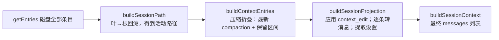

# 第 9 章：常规会话树、恢复与分支

> 学完本章你能回答：
>
> 1. 会话文件为什么是一棵树？"活动分支"是哪个概念？
> 2. 从磁盘条目到下一次模型请求的消息列表，中间经过哪三级投影？
> 3. 压缩（compaction）在恢复时如何"折叠"历史？`firstKeptEntryId` 精确指什么？
> 4. `context_edit` 是什么？为什么"编辑历史"却不修改原始条目？
> 5. `/tree` 切分支、`/fork` 分叉、`createBranchedSession` 各做了什么？

**前置知识**：第 4 章（持久化条目总览）、第 8 章（会话与 runtime）。
**预计学习时间**：1.5 天（本章代码集中在 `session-manager.ts`，可以按符号精读）。
**本章验证状态**：静态核对通过（`session-manager.ts` 的投影流水线与分支创建逐段核对）；实验 L06 设计中。

---

## 9.1 问题：为什么不是"一行一条消息"的线性日志

先看一个真实使用场景：

```text
第 1 轮：用户 A → 助手 B
第 2 轮：用户 C → 助手 D
第 3 轮：用户 E（不满意，想回到第 1 轮之后换个方向）
```

线性日志有三条路：

1. **覆盖**：删掉 C/D，写入新分支——**历史不可逆**，用户后悔就完了；
2. **新文件**：把 A/B 复制出去开新会话——文件会指数增殖，元数据（标签、用量）各存一份；
3. **同一文件、树形记录**：B 之后挂两个孩子（C 与 E），"当前走哪条"由一个"叶子指针"决定——**历史保留、切换 O(1)**。

pi 选第 3 种。`how-pi-works.md` 的原话：

```text
Messages and events in a session form a tree. Each path through that tree is a branch.
The branch ending at the current entry is the active branch and supplies the history for
the next model request.
```

"活动分支"（active branch）就是**从根到当前叶子**的那条路径。你下一轮的模型上下文，永远只来自它——**磁盘上有多少条目，与模型看到多少内容，是两件事**。

## 9.2 文件格式：字段、版本与两种时间戳

### 9.2.1 文件与公共字段（回顾）

```text
~/.pi/agent/sessions/--<路径编码>--/<时间戳>_<会话ID>.jsonl
```

路径编码的实现在 `session-manager.ts`：

```typescript
function getDefaultSessionDirPath(cwd: string, agentDir: string = getDefaultAgentDir()): string {
	const resolvedCwd = resolvePath(cwd);
	const resolvedAgentDir = resolvePath(agentDir);
	const safePath = `--${resolvedCwd.replace(/^[/\\]/, "").replace(/[/\\:]/g, "-")}--`;
	return join(resolvedAgentDir, "sessions", safePath);
}
```

`D:\my-project` 会变成 `--D-my-project--` 这样的目录名（去掉开头分隔符、把 `/`、`\`、`:` 替换为 `-`）。所以**同一个项目目录的会话总在一个文件夹里**；这也是 `/resume` 能按项目筛选会话的原因。

每行一个 JSON 对象，公共字段（第 4 章）：`type`、`id`、`parentId`、`timestamp`（ISO 字符串）。**消息内的 `timestamp` 是 Unix 毫秒数**——两种时间戳并存是格式的一部分，读文件时不要混。

### 9.2.2 版本演进：v1 → v2 → v3

`session-format.md`：

| 版本 | 变化 |
|---|---|
| v1 | 线性条目序列（legacy） |
| v2 | 引入 `id`/`parentId` 树结构 |
| v3 | `hookMessage` 角色更名为 `custom`（扩展体系统一） |

**旧版本在加载时自动迁移到当前版本**。这解释了你可能在代码里看到的一些兼容字段与迁移逻辑（`migrations.ts` 也有会话相关迁移）。

### 9.2.3 容错读取：坏行不致命

会话文件的读取（`loadEntriesFromFile`）做了两层保护：

```typescript
function parseSessionEntryLine(line: string): FileEntry | null {
	if (!line.trim()) return null;
	try {
		return JSON.parse(line) as FileEntry;
	} catch {
		// Skip malformed lines
		return null;
	}
}
```

- **坏行直接跳过**：会话文件是追加写的，中途断电可能留下半行；一个半行不该让整个会话打不开；
- **头扫描有上限**：`MAX_SESSION_HEADER_SCAN_BYTES = 1MB`——防止构造一个超大 Header 卡死启动扫描；
- 读取用 1MB 缓冲 + `StringDecoder` 流式解码：大文件不会一次性全进内存，且多字节字符不会被缓冲边界切断。

## 9.3 `SessionManager`：树的"句柄"

`SessionManager` 是会话文件的对象化包装。创建方式（三个静态工厂，第 9.4 节前先认识）：

| 工厂 | 用途 | 是否落盘 |
|---|---|---|
| `SessionManager.create(cwd, sessionDir?)` | 新会话（也给 `sdk.ts` 默认用） | 是 |
| `SessionManager.open(path, sessionDir?, cwdOverride?)` | 打开已有文件 | 是（读+追加） |
| `SessionManager.inMemory(cwd, options?, entries?)` | 内存会话（测试/`--no-session`） | 否 |

常用方法分组（第 250 行附近的表格列出了"可恢复钩子"等内部映射，这里按用途归类）：

**查询**：

| 方法 | 返回 |
|---|---|
| `getLeafId()` / `getLeafEntry()` | 当前叶子 |
| `getBranch(fromId?)` | 从根到该节点的**原始条目**（含 model_change、label 等所有类型） |
| `getEntry(id)` | 单条 |
| `getSessionFile()` / `isPersisted()` / `getSessionDir()` / `getCwd()` | 文件信息 |

**追加**（全部是"追加一行"的语义）：

| 方法 | 写入的条目 |
|---|---|
| `appendMessage(message)` | `message` |
| `appendCustomMessageEntry(...)` | `custom_message` |
| `appendModelChange(provider, modelId)` / `appendThinkingLevelChange(level)` | 设置变化 |
| `appendContextEdit(targetId, replacement)` | `context_edit` |
| `appendLabelChange(targetId, label)` | `label`（`undefined` 表示清除） |
| `appendSessionInfo(name)` | `session_info` |
| `appendBashMessage?` 等 | 各专用条目 |

**投影**（下一节的主角）：

```typescript
buildContextEntries(): SessionEntry[] {
	return buildContextEntries(this.getEntries(), this.leafId, this.byId);
}
buildSessionProjection(): SessionProjection { /* ... */ }
buildSessionContext(): SessionContext { /* ... */ }
```

**分支**：`createBranchedSession(leafId)`（9.6 节）。

一个模型层面的提醒：`getBranch` 返回的是**原始条目**（树路径），不是消息列表。模型要的是消息——中间隔着三级投影。
## 9.4 三级投影流水线：从磁盘到模型上下文

这是本章的核心。模型请求需要的消息列表，由三级函数接力产生：



对应三个导出函数（`session-manager.ts` 第 476、543、576 行）。逐级精读。

### 9.4.1 第一级：`buildSessionPath` —— 找到"活动路径"

```typescript
function buildSessionPath(entries, leafId?, byId?): SessionEntry[] {
	const index = buildEntryIndex(entries, byId);
	let leaf: SessionEntry | undefined;
	if (leafId === null) return [];
	if (leafId) leaf = index.get(leafId);
	leaf ??= entries[entries.length - 1];      // 默认取文件最后一条
	if (!leaf) return [];

	const path: SessionEntry[] = [];
	let current: SessionEntry | undefined = leaf;
	while (current) {                            // 从叶一路走到根
		path.push(current);
		current = current.parentId ? index.get(current.parentId) : undefined;
	}
	path.reverse();                              // 反转为根→叶顺序
	return path;
}
```

语义：

- **`leafId === null` → 空路径**（"没有活动分支"的显式表达，`resetLeaf` 之后会这样）；
- **`leafId` 未给 → 用文件最后一条**（打开会话的默认行为）；
- 输出顺序是**根→叶**（时间顺序），后续函数都假设这个顺序。

### 9.4.2 第二级：`buildContextEntries` —— 压缩折叠

```typescript
export function buildContextEntries(entries, leafId?, byId?): SessionEntry[] {
	const path = buildSessionPath(entries, leafId, byId);
	let compaction: CompactionEntry | null = null;

	for (const entry of path) {
		if (entry.type === "compaction") compaction = entry;   // 路径上"最新"的一次压缩
	}
	if (!compaction) return path;                              // 没压缩过：原样

	const compactionIdx = path.findIndex((entry) => entry.id === compaction.id);
	const contextEntries: SessionEntry[] = [compaction];
	let foundFirstKept = false;
	for (let i = 0; i < compactionIdx; i++) {
		const entry = path[i];
		if (entry.id === compaction.firstKeptEntryId) foundFirstKept = true;
		if (foundFirstKept && !(entry.type === "message" && entry.message.role === "system")) {
			contextEntries.push(entry);                        // 保留区间：跳过 system 消息
		}
	}
	contextEntries.push(...path.slice(compactionIdx + 1));     // 压缩之后的新条目
	return contextEntries;
}
```

三条精确规则：

1. **只认路径上最新的压缩**：更早的压缩若也在路径上，会被更晚的压缩"吞并"（它的结果早已在保留区间或摘要里）；
2. **保留区间的起点是 `firstKeptEntryId`**：压缩条目自己记录"从哪条开始保留"。注意 `session-format.md` 的边界说明——**retain-none 的压缩会把 `firstKeptEntryId` 指向自己**，于是前面全部被摘要替代；
3. **保留区间里的系统消息被丢弃**：压缩条目的 `systemMessage` 字段是"压缩边界处的完整提示词检查点"，它会成为压缩后上下文的**首个系统消息**；保留区间里的旧系统消息若还留着，会和检查点重复/冲突，所以这里跳过它们。

用图看一次折叠：

```text
磁盘路径（根→叶）：
  [a1 user] [a2 assistant] [a3 user] [a4 assistant] [c compaction] [a5 user]
                                            firstKeptEntryId = a3

buildContextEntries 输出：
  [c compaction] [a3 user] [a4 assistant] [a5 user]
  （a1、a2 被摘要替代；不再出现）
```

### 9.4.3 条目的"转消息"规则

`sessionEntryToContextMessages`（第 439 行）是条目到消息的翻译表：

```typescript
export function sessionEntryToContextMessages(entry: SessionEntry): AgentMessage[] {
	if (entry.type === "message") {
		const message = entry.message;
		// 会话文件不做校验解析；老版本/手改文件可能 content 为 null
		if (message.role === "system" && message.content == null) return [{ ...message, content: "" }];
		if ((message.role === "user" || message.role === "assistant" || message.role === "toolResult")
			&& message.content == null) {
			return [{ ...message, content: [] }];
		}
		return [message];
	}
	if (entry.type === "custom_message") {
		return [createCustomMessage(entry.customType, entry.content ?? [], entry.display, entry.details, entry.timestamp)];
	}
	if (entry.type === "branch_summary" && entry.summary) {
		return [createBranchSummaryMessage(entry.summary, entry.fromId, entry.timestamp)];
	}
	if (entry.type === "compaction") {
		const summary = createCompactionSummaryMessage(entry.summary, entry.tokensBefore, entry.timestamp);
		return entry.systemMessage ? [entry.systemMessage, summary] : [summary];
	}
	return [];   // model_change、thinking_level_change、usage、custom、label、session_info、context_edit 不产生消息
}
```

四类产消息、其余全部"静默跳过"。两个新细节：

- **空内容归一化**：再次强调"文件是不可信输入"——老版本或手改文件可能缺 `content`，这里兜底成 `""` 或 `[]`，防止下游崩溃；
- **压缩产生两条消息**：系统提示检查点（`systemMessage`，如果有）+ 压缩摘要消息（`compactionSummary`，模型会看到带 `<summary>` 包装的 user 消息，第 4.4.2 节）。

### 9.4.4 第三级：`buildSessionProjection` —— 编辑与来源

```typescript
export function buildSessionProjection(entries, leafId?, byId?): SessionProjection {
	const path = buildSessionPath(entries, leafId, byId);
	const { thinkingLevel, model } = getSessionContextSettings(path);   // 从整条路径取设置
	const contextEntries = buildContextEntries(entries, leafId, byId);
	const edits = new Map<string, ContextEditEntry>();
	for (const entry of contextEntries) {
		if (entry.type === "context_edit") edits.set(entry.targetId, entry);  // 后者覆盖前者
	}
	const projectedEntries = contextEntries.map((sourceEntry, index): ProjectedSessionEntry => ({
		sourceEntry,
		messages: sourceEntry.type === "compaction" && index > 0 ? [] : projectContextEntry(sourceEntry, edits.get(sourceEntry.id)),
	}));
	return { entries: projectedEntries, messages: projectedEntries.flatMap((entry) => entry.messages), thinkingLevel, model };
}
```

三个要点：

1. **`context_edit` 只影响"投影"，不改原始条目**。`edits` 用 Map 收集，**同一目标多条编辑时，靠后的（更新的）获胜**；而且"编辑是分支相对的"——切到编辑之前的分支点时，原内容又回来了（`session-format.md` 的说法）；
2. **`ProjectedSessionEntry` 保留"来源"**：每条投影消息都带 `sourceEntry`（消息来自哪个条目）。按活动投影渲染和重试时的 `_omitRecoveryAttempt`（第 6.6.2 节）会用到这份"消息 ↔ 条目"对应关系；`entry_appended` 则直接携带新写入的 `SessionEntry`，不依赖投影反查，而且它只由部分写入路径发出（见第 4.5.2 节）；
3. **`compaction` 在 index > 0 时不产消息**：`buildContextEntries` 可能保留一条"旧的压缩条目"（它的 id 落在新保留区间里），但只有 index 0 的最新压缩才贡献检查点与摘要——注释原话："Only the newest compaction at index zero contributes a checkpoint and summary."

`projectContextEntry` 是"编辑应用器"：

```typescript
function projectContextEntry(entry: SessionEntry, edit: ContextEditEntry | undefined): AgentMessage[] {
	const messages = sessionEntryToContextMessages(entry);
	if (!edit) return messages;
	const replacement = edit.replacement;
	if (replacement === null) return [];      // 从投影中整体省略

	return messages.map((message) => {
		if (message.role !== "user" && message.role !== "assistant" && message.role !== "toolResult" && message.role !== "custom") {
			return message;                    // 只允许编辑这四种角色的内容
		}
		const content =
			(message.role === "assistant" || message.role === "toolResult") && typeof replacement.content === "string"
				? [{ type: "text" as const, text: replacement.content }]     // 结构化角色：字符串归一为单个文本块
				: replacement.content;
		return { ...message, content } as AgentMessage;
	});
}
```

### 9.4.5 设置提取：`getSessionContextSettings`

```typescript
function getSessionContextSettings(path: SessionEntry[]): Pick<SessionContext, "thinkingLevel" | "model"> {
	let thinkingLevel = "off";
	let model: { provider: string; modelId: string } | null = null;

	for (const entry of path) {
		if (entry.type === "thinking_level_change") thinkingLevel = entry.thinkingLevel;
		else if (entry.type === "model_change") model = { provider: entry.provider, modelId: entry.modelId };
		else if (entry.type === "message" && entry.message.role === "assistant") {
			model = { provider: entry.message.provider, modelId: entry.message.model };   // 实物模型优先
		}
	}
	return { thinkingLevel, model };
}
```

"沿路径最后一次赋值获胜"，且**助手消息里的物理模型覆盖 `model_change` 的（可能是虚拟的）选择**——因为那条消息就是物理模型答的（第 3.5 节恢复逻辑 `getBranchSelection` 与这里呼应）。

### 9.4.6 完整走查：一次"继续对话"都发生了什么

把三级流水线放进第 3 章的恢复入口（`sdk.ts`）：

```typescript
const existingSession = sessionManager.buildSessionContext();   // ← 三级流水线
const hasExistingSession = existingSession.messages.length > 0;
// ...
const agent = new Agent({ initialState: { messages: existingSession.messages, /* ... */ } });
```

所以"恢复会话"不是"把文件读成数组"，而是**在树上求一次投影**：回溯路径 → 折叠压缩 → 应用编辑 → 翻译消息 → 提取设置。

## 9.5 分支操作：从 `/tree` 到新文件

### 9.5.1 同文件分支：`/tree` 导航

对话中执行 `/tree` 跳到历史某个条目（或标记），效果是：

- **设置新的叶子**（`leafId` 指向该条目）；
- 之后的新消息以它为父节点追加——**同一文件里长出新分支**；
- 从旧叶子"离开"时，pi 可生成 `branch_summary` 条目（可选）：`parentId` 指向"从哪继续"，`fromId` 指向被放弃的旧叶子，`summary` 是 LLM 生成的该分支摘要（`session-format.md`）。这样新分支的模型上下文里会带上"我刚才探索过什么"的用户消息（`BRANCH_SUMMARY_PREFIX` 包装，第 4.4.2 节）。

实现入口在 `AgentSession.navigateTree`（`agent-session.ts` 第 3915 行），细节留到需要改这块代码时再精读。

### 9.5.2 独立文件分支：`createBranchedSession`

`/fork`、`/clone` 会**另存一个文件**，只包含"根到目标叶子"的路径。这由 `SessionManager.createBranchedSession(leafId)` 完成：

```typescript
/**
 * Create a new session file containing only the path from root to the specified leaf.
 * Useful for extracting a single conversation path from a branched session.
 * Returns the new session file path, or undefined if not persisting.
 */
createBranchedSession(leafId: string): string | undefined {
	const previousSessionFile = this.sessionFile;
	const path = this.getBranch(leafId);
	if (path.length === 0) throw new Error(`Entry ${leafId} not found`);

	// Filter out LabelEntry from path - we'll recreate them from the resolved map.
	// Because labels are real tree entries, later entries can be children of labels;
	// removing labels requires re-chaining the retained path to avoid orphaned subtrees.
	// ...
}
```

注意注释里的两个"坑"与解法（这段代码是整个文件里最精细的部分之一）：

1. **label 也是树节点**：后续条目可能是 label 的子节点。导出路径时若简单地删掉 label，路径就断了。所以代码**重新串联 `parentId`**（保留路径上的实际条目直接挂到彼此），把 label 从树结构里"摘除"，再在文件末尾**重建 label 条目**（`labelsToWrite` 收集、`generateId` 分配新 id）；
2. **压缩条目的 `firstKeptEntryId` 要重映射**：如果它原本指向一个被摘除的 label，就替换为 label 之后的下一个保留条目（`replacementByLabelId`）。

新文件头写明血缘：`parentSession: previousSessionFile`（第 4.7 节的 SessionHeader 示例）——所以 fork 出来的会话**知道自己从哪来**。

### 9.5.3 `/fork` 的两种位置（回顾第 8.5.3 节）

| position | 含义 | 目标叶子 |
|---|---|---|
| `"at"` | 以选中条目为叶子继续 | 该条目本身 |
| `"before"` | 回到某条**用户消息之前**重新开始 | 该消息的 `parentId`（并把原文 `selectedText` 还给编辑器） |

`"before"` 只允许选用户消息；`"at"` 任意条目。分叉后的完整流程（teardown → createRuntime → apply → rebind）见第 8.5 节。

## 9.6 导出、命名、标记与删除

| 功能 | 机制 | 位置 |
|---|---|---|
| 导出 HTML | `AgentSession.exportToHtml`；CLI `--export <input> [output]` | `agent-session.ts` 第 4239 行 |
| 会话命名 | `session_info` 条目（`appendSessionInfo`）；`/name`、`--name` | 第 1304 行 |
| 书签/标记 | `label` 条目（`targetId` + `label`；`undefined` 清除） | `appendLabelChange` 第 1441 行 |
| 删除会话 | 直接删 `.jsonl` 文件；交互式 `/resume` 里 `Ctrl+D`（优先用 `trash` CLI 而非永久删除） | `session-format.md` |

`session_info` 的用途在文档里说得很具体：设置后，会话选择器（`/resume`）用**名字**而不是第一条消息来显示该会话——写测试或做工具时会经常碰到它。

## 9.7 实验 L05：构造一个分支会话

**实验性质**：本地运行一个临时脚本（不碰你的真实会话文件）；零模型费用。
**验证状态**：设计中。

### 目标

亲手构造 `A → B → C` 再从 B 分叉出 `D` 的树，观察"磁盘条目"与"活动分支消息"的差异。

### 步骤（临时目录里写脚本；用完删除）

```typescript
import { SessionManager } from "D:/Github/pi/packages/coding-agent/src/core/session-manager.ts";
```

（在仓库内跑时也可以用包名 `@earendil-works/pi-coding-agent` 的导出；第 15 章会讲 SDK 的正确导入方式。）

1. 用 `SessionManager.inMemory(cwd)` 建一个内存会话；
2. 依次追加：用户消息 A、助手消息 B（`appendMessage`），保存两次返回的 entry id；
3. 追加用户消息 C 作为 B 的孩子，保存 C 的 id；
4. 调用 `session.branch(bId)` 把叶子移回 B，再追加用户消息 D。`branch(id)` 是 `SessionManager` 的真实方法：它只移动叶子指针，不改写或删除条目；
5. 打印 `getBranch()` 与 `buildSessionContext().messages`，对照：

```text
期望：
  磁盘条目（getEntries）: [A, B, C, D]
  getBranch()（叶为 D）:  [A, B, D]
  buildSessionContext().messages: A'、B'、D' 三条模型消息（C 不在内）
```

6. 分支编辑实验：调用 `session.branch(cId)`，然后 `appendContextEdit(cId, null)`；打印原始 entries 与模型 projection，确认 C 仍在原始历史中、但不在该分支的模型 messages 中；
7. 返回 D 分支后尝试 `appendContextEdit(cId, null)`，确认会抛错，因为 C 不在当前 branch；再调用 `appendContextEdit(bId, { content: "edited B" })`，检查只有 D 分支的 projection 把 B 替换，C 分支内容仍按自己的 context edit 决定；
8. 独立的压缩变化实验：先调用 `session.branch(dId)` 回到尚未追加分支编辑的 D 叶子，再追加压缩记录 `appendCompaction("summary", dId, 1000)`，令 `firstKeptEntryId` 指向 D，观察 A/B 如何由 summary 取代、D 如何保留。再看 `buildContextEntries()` 与 `buildSessionProjection()`；这样压缩结果不会继承前一步追加的 B 编辑。

### 观察与思考

- `buildContextEntries()` 与 `getBranch()` 的输出在什么情况下第一次出现差异？
- 同一 target 先后追加两条 `context_edit` 时，哪条应用到当前 projection？切换叶子会不会改变答案？
- 为什么在 D 分支调用 `appendContextEdit(cId, null)` 会失败，但在 C 分支调用就能成功？
- 为什么实验要求"不手工修改用户真实会话"？（理解"文件是事实来源，手改易破坏树结构"）

### 清理

删除临时脚本/临时会话目录，并确认实验没有改动真实会话文件。

## 9.8 常见错误

| 现象 | 原因 | 处理 |
|---|---|---|
| 以为模型能看到磁盘上所有消息 | 只有活动分支 + 投影 | 用 `buildSessionContext()` 的心智模型读代码 |
| 手改会话 JSONL 后打不开/行为怪 | 树结构（id/parentId）被破坏 | 用 API 改；备份后再实验 |
| `context_edit` "没生效" | 它不在活动分支上，或目标不在投影条目里 | 检查编辑条目与目标是否都在当前路径 |
| 压缩后"系统提示重复/丢失" | 保留区间里的 system 消息会被跳过，检查点优先 | 这正是设计；别手工往保留区间塞 system 消息 |
| `getBranch()` 结果里混着非消息条目 | 它返回原始条目 | 要消息列表用 `buildSessionContext()` |
| fork 出来"少了东西" | 只复制根→叶路径；label 被重建、旧压缩被折叠 | 属预期；需要完整历史用 clone/复制文件 |
| 恢复旧会话报 cwd 不存在 | `assertSessionCwdExists` 拦截 | 换 `--session-dir` 或先恢复该目录 |

## 9.9 验收题

1. 画出三级流水线的数据形状（每一级的输入输出类型）。
2. `firstKeptEntryId` 的三个使用场景（正常压缩、retain-none、fork 重映射）分别是什么？
3. 为什么 `buildContextEntries` 在保留区间里跳过 system 消息？跳过之后系统提示从哪来？
4. `context_edit` 与"直接改 message 条目"的本质区别是什么（考虑分支与审计）？
5. `createBranchedSession` 为什么必须处理 label 条目？不处理会发生什么？
6. 给一个具体树（A→B→C，B→D，叶在 D），写出 `getBranch()` 与 `buildSessionContext().messages` 的元素。

### 参考答案（要点）

1. 条目数组（盘）→ 活动路径（根→叶）→ 压缩折叠后的条目 → `{entries: ProjectedSessionEntry[], messages, thinkingLevel, model}` → `{messages, thinkingLevel, model}`。
2. 正常压缩：保留区间起点；retain-none：指向自身（表示不保留旧条目）；fork：若原值是被摘除的 label，重映射到其后第一个保留条目。
3. 因为压缩条目的 `systemMessage` 是该边界的完整提示词检查点，若再保留旧 system 消息会重复/冲突；系统提示来自检查点（`entry.systemMessage`，作为首个系统消息）。
4. `context_edit` 是**追加条目**：不改原条目（原始事实、UI、导出、审计都保留），只改变"未来投影"；且是分支相对的（切到编辑前的分支点即恢复原样）。
5. 因为 label 是真实树节点，路径上后续条目可能以它为父；直接删除会造成孤儿子树；所以代码重连 `parentId` 并重建 label 条目。
6. `getBranch()` = [A, B, D]（原始条目，含非消息类型则一并列出）；`messages` = A、B、D 对应的模型消息（C 不在活动分支）。

## 9.10 来源与下一章

- `packages/coding-agent/src/core/session-manager.ts`（`buildSessionPath` 第 390 行、`getSessionContextSettings` 第 418 行、`sessionEntryToContextMessages` 第 439 行、`buildContextEntries` 第 476 行、`buildSessionProjection` 第 543 行、`buildSessionContext` 第 576 行、`getBranch` 第 1469 行、`createBranchedSession` 第 1632 行、静态工厂第 1755-1804 行）；
- `packages/coding-agent/docs/session-format.md`、`docs/sessions.md`、`docs/how-pi-works.md`；
- `packages/coding-agent/src/core/agent-session-runtime.ts`（fork/switch 流程，第 8 章）。

下一章进入"上下文的质量问题"：系统提示怎么组装、上下文窗口何时告急、压缩与分支摘要如何生成、为什么说"压缩改变表示，不删除事实"。
