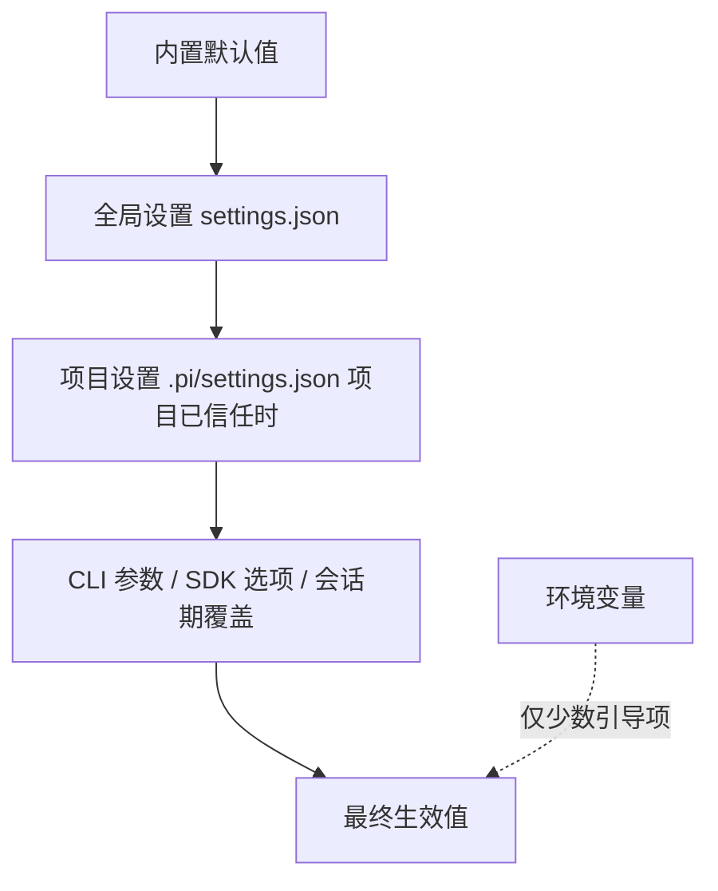

# 第 11 章：配置、资源发现与信任边界

> 学完本章你能回答：
>
> 1. 一个设置可能来自哪些地方？合并顺序是什么？
> 2. `SettingsManager` 怎么加载、合并、写回？为什么"项目未信任"时写项目设置会报错？
> 3. 资源发现都发现什么？上下文文件（AGENTS.md）和 `.pi` 资源有什么区别？
> 4. 项目信任保护什么、不保护什么？没有交互界面时怎么决策？
> 5. "配置没生效"的排查流程是什么？

**前置知识**：第 8 章（会话与 services）、第 10 章（系统提示中的项目上下文）。
**预计学习时间**：1.5 天。
**本章验证状态**：静态核对通过（`settings-manager.ts`、`resource-loader.ts`、`project-trust.ts` 与 `configuration.md`/`security.md` 核对）。

---

## 11.1 问题：同一个设置，可能来自五个地方

假设你要设置"默认工具"。它可能出现在：

1. **代码默认值**（`DEFAULT_TOOL_NAMES`、`DEFAULTS`）
2. **全局设置** `~/.pi/agent/settings.json`
3. **项目设置** `<项目>/.pi/settings.json`
4. **环境变量**（少数专用：如 `PI_CODING_AGENT_DIR`、`PI_CODING_AGENT_SESSION_DIR`）
5. **CLI 参数 / SDK 选项**（如 `--tools`、`createAgentSession({ tools })`）

pi 的合并规则（`settings-manager.ts` 构造函数）：

```typescript
this.settings = deepMergeSettings(this.globalSettings, this.projectSettings);
```

即：**项目覆盖全局**；CLI/SDK 的显式选项再覆盖上面合并的结果（各子系统在读取点处理，如第 3 章 `initialActiveToolNames` 的计算）；环境变量只在少数"引导级"路径上使用（目录定位等）。用一张图表示：



两个例外要单独记：

- **`defaultTools` 有加减语法**：`["-bash", "+powershell"]` 表示"禁用 bash、启用 powershell、其余保持"（`mergeDefaultTools` 专门处理它，第 2.7 节见过用法）；
- **项目设置只有在"项目已信任"时才加载**（本章 11.5），`sessionDir` 是唯一的引导期例外。

## 11.2 两个配置目录：全局与项目

`configuration.md` 的官方清单（`<agent-dir>` 默认为 `~/.pi/agent`，可用环境变量 `PI_CODING_AGENT_DIR` 或 SDK 的 `agentDir` 选项覆盖）：

| 路径（全局） | 职责 |
|---|---|
| `<agent-dir>/settings.json` | 用户级设置：偏好、默认值、资源路径、Pi package 声明 |
| `<agent-dir>/keybindings.json` | 键位 |
| `<agent-dir>/mcp.json` | 所有项目可用的 MCP 服务器 |
| `<agent-dir>/models.json` | 自定义端点、模型、模型覆盖 |
| `<agent-dir>/auth.json` | 保存的 API Key / OAuth 凭据（**私密文件**） |
| `<agent-dir>/AGENTS.override.md` / `AGENTS.md` / `AGENTS.MD` / `CLAUDE.md` / `CLAUDE.MD` | 跨目录生效的用户指令 |
| `<agent-dir>/SYSTEM.md` | 替换默认系统提示 |
| `<agent-dir>/APPEND_SYSTEM.md` | 追加系统提示 |
| `<agent-dir>/extensions/` `skills/` `prompts/` `themes/` | 用户资源 |

| 路径（项目 `.pi/`） | 职责 |
|---|---|
| `.pi/settings.json` | 项目设置、资源路径、Pi package 声明（**需要信任**） |
| `.pi/mcp.json` | 项目 MCP 服务器（需要信任） |
| `.pi/SYSTEM.md`、`.pi/APPEND_SYSTEM.md` | 项目级系统提示文件（需要信任） |
| `.pi/extensions/` `skills/` `prompts/` `themes/` | 项目资源（需要信任） |

`CONFIG_DIR_NAME` 并不硬编码为 `.pi`——它来自包的元数据（`pkg.piConfig?.configDir || ".pi"`，`config.ts` 第 542 行）。**读代码时用常量，不要假设目录名。**

优先级细节（`configuration.md`）：`SYSTEM.md`/`APPEND_SYSTEM.md` 若项目与全局同名，**已信任的项目文件优先，且不合并**。

## 11.3 `SettingsManager` 精读

### 11.3.1 对象结构与加载

```typescript
export class SettingsManager {
	private storage: SettingsStorage;
	private globalSettings: Settings;
	private projectSettings: Settings;
	private settings: Settings;                 // 合并后的"生效设置"
	private projectTrusted: boolean;
	// ... modifiedFields / writeQueue / errors / settingsPaths ...

	private constructor(/* ... */ projectTrusted = true /* ... */) {
		// ...
		this.settings = deepMergeSettings(this.globalSettings, this.projectSettings);
	}

	static create(cwd: string, agentDir: string = getAgentDir(), options: SettingsManagerCreateOptions = {}): SettingsManager {
		const resolvedCwd = resolvePath(cwd);
		const resolvedAgentDir = resolvePath(agentDir);
		const storage = new FileSettingsStorage(resolvedCwd, resolvedAgentDir);
		return SettingsManager.fromStorageWithPaths(storage, options, {
			global: join(resolvedAgentDir, "settings.json"),
			project: join(resolvedCwd, CONFIG_DIR_NAME, "settings.json"),   // "<cwd>/.pi/settings.json"
		});
	}
}
```

三个设计点：

1. **存储抽象**（`SettingsStorage`）：`FileSettingsStorage` 是文件实现，`InMemorySettingsStorage` 供测试；写入通过 `withLock` 串行化（避免并发写坏文件）；
2. **两份来源分开保存**（`globalSettings` / `projectSettings`），合并结果单独存 `settings`——这样"某个值来自哪一层"是可追溯的；
3. **写入有守卫**：

```typescript
private assertProjectTrustedForWrite(): void {
	if (!this.projectTrusted) {
		throw new Error(/* 项目未信任，不能写项目设置 */);
	}
}
```

   未信任项目不仅"不读"，也**不允许写**——防止一个未授权项目通过"诱导 pi 保存设置"落地持久化副作用。

### 11.3.2 加载：容错 + 迁移

```typescript
private static loadFromStorage(storage: SettingsStorage, scope: SettingsScope, projectTrusted = true): Settings {
	if (scope === "project" && !projectTrusted) {
		return {};      // 未信任：项目设置直接视为空
	}
	// 读取（withLock 内取内容）→ 空则 {} → stripBom → JSON.parse → migrateSettings
}
```

- **BOM 容错**：`stripBom` 剥掉 UTF-8 BOM（Windows 手工编辑常见）；
- **加载错误不崩溃**：`tryLoadFromStorage` 把异常变成 `{ settings: {}, error }`，错误进入 `errors` 诊断列表（与第 8 章的诊断模式一致）；
- **自动迁移**（`migrateSettings`）：例如 `queueMode → steeringMode`、旧的 `websockets: true → transport: "websocket"`。**读设置代码时看到的"奇怪兼容分支"，大多在这里。**

### 11.3.3 写入：字段级记账

`modifiedFields` / `modifiedProjectFields` 记录"本会话改过哪些字段"，保存时只回写这些字段（`markModified` + `save()` + `writeQueue` 串行写）。这避免了"把程序里默认值也写进用户文件"的污染。`applyOverrides(overrides)` 则用于**会话期覆盖**（例如启动参数 `--theme` 临时覆盖设置）——它们不落盘。

### 11.3.4 读取：一组有代表性的 getter

| getter | 含义 | 备注 |
|---|---|---|
| `getSessionDir()` | 会话目录设置 | **唯一在信任前被读取的项目项**（11.5 节） |
| `getDefaultTools()` | 工具默认选择 | 由 `mergeDefaultTools` 应用 `+/-` 语法 |
| `getEnabledModels()` | 模型作用域 | 第 5 章模型循环 |
| `getRetrySettings()` | 重试预算与退避参数 | `{ enabled, maxRetries, baseDelayMs, maxAgentDelayMs }` |
| `getTransport()` | 传输方式（sse/websocket...） | 迁移自旧字段 |
| `getDefaultProjectTrust()` | `"ask"` / `"always"` / `"never"` | 11.5 节决策链的一环 |
| `getProviderRetrySettings()` / `getHttpIdleTimeoutMs()` / `getWebSocketConnectTimeoutMs()` | 网络行为 | 第 3 章 `buildRequestOptions` 消费 |

**读代码经验**：想知道"这个设置从哪来、减到几层"，先看它的 getter 读的是 `this.settings`（合并后）还是 `this.globalSettings`（仅全局）。两者语义不同——例如 `save()` 系列通常写全局，`getDefaultProjectTrust` 属于"信任决策输入"。

## 11.4 资源发现：`DefaultResourceLoader`

第 3 章装配时我们见过一句 `await resourceLoader.reload()`；现在看它发现什么、按什么顺序。

### 11.4.1 发现清单

| 资源 | 访问器 | 用途 |
|---|---|---|
| 扩展（extensions） | `getExtensions()` | 可执行代码：工具、命令、钩子（第 13 章） |
| 技能（skills） | `getSkills()` | 按需加载的指令与文件（第 12 章） |
| 提示词模板（prompt templates） | `getPromptTemplates()` | `/模板名` 展开 |
| 主题（themes） | `getThemes()` | 终端配色（第 17 章） |
| 上下文文件（context files） | `getAgentsFiles()` | AGENTS.md 一类的**指令文本**（无执行） |

每个发现器都返回"条目 + 诊断"（`ResourceDiagnostic[]`）：坏文件不炸启动，只记录警告——又一次诊断模式。

### 11.4.2 上下文文件：与 `.pi` 资源不同的加载规则

```typescript
const candidates = ["AGENTS.override.md", "AGENTS.md", "AGENTS.MD", "CLAUDE.md", "CLAUDE.MD"];
```

- 从**全局 agent 目录 + 当前目录 + 各级祖先目录**收集；祖先的在前（根→近），当前目录的在后；
- 每个目录内**只取第一个命中的候选**（`AGENTS.override.md` 替换同目录的 `AGENTS.md`/`CLAUDE.md`，但**不**影响其他目录）；
- **不需要项目信任**（`configuration.md` 明确写着 "Context-file discovery does not require project trust"）。所以安全文档提醒：即使拒绝信任，也要把目录里的指令当**不可信输入**。

### 11.4.3 `reload()` 的两阶段与信任钩子

`reload` 的信任处理是一个"鸡与蛋"问题的解法：

```typescript
async reload(options?: ResourceLoaderReloadOptions): Promise<void> {
	// 阶段一：先加载"可用于信任决策"的扩展（用户级 + CLI 指定的）
	if (options?.resolveProjectTrust) {
		const preTrustExtensions = /* 只加载用户/全局与显式路径的扩展结果 */;
		const projectTrusted = await options.resolveProjectTrust({ extensionsResult: preTrustExtensions });
		// 阶段二：按信任结论加载全部（或跳过受保护资源）
	}
	// cliExtensionPaths / extensionPaths 组装（noExtensions 开关在此生效）
}
```

- **为什么先加载一部分扩展？** 因为信任决策本身需要扩展参与（`project_trust` 事件，见 11.5）——但只能让"用户级/CLI 指定"的扩展参与，**项目里的扩展在被信任前绝不能执行**；
- `additionalExtensionPaths` 等 CLI 路径在进入前已被 `resolveCliPaths` 转成**绝对路径**（`agent-session-services.ts` 的注释："so later cwd switches do not reinterpret them"）——防止切目录后相对路径指向别处；
- `noExtensions` / `noContextFiles` 等开关对应 CLI 的 `--no-extensions` 等参数。
## 11.5 项目信任：边界的三条规则

### 11.5.1 规则一：什么触发信任要求

`security.md` 列出的"受保护资源"——发现它们才需要信任决策：

```text
.pi/settings.json
.pi/mcp.json
.pi/extensions、.pi/skills、.pi/prompts、.pi/themes
.pi/SYSTEM.md、.pi/APPEND_SYSTEM.md
当前目录或祖先目录的 .agents/skills
```

**空 `.pi` 目录不触发**（没有实际资源）。这条清单的判定函数是 `hasTrustRequiringProjectResources(cwd)`（`trust-manager.ts`），第 3.4.3 节的 `shouldResolveProjectTrust` 计算用的就是它。

### 11.5.2 规则二：信任"给什么"与"不给什么"

**授予信任后允许加载**（`security.md`）：项目设置、项目 MCP 服务器、`.pi` 下的扩展/技能/模板/主题/系统提示文件、项目设置里声明的缺失包安装、项目本地与项目包扩展。

**信任不保证**（同样来自 `security.md`，这一条最容易被误解）：

- 它**不是完整的启动边界**：`sessionDir` 在信任前就会被读取（为了找到会话）；
- 它**不限制工具能访问什么**：启动之后，启用的工具用 Pi 进程的操作系统权限运行；
- 它**不阻止目录里的指令影响模型**（AGENTS.md 不需要信任也会加载）——安全文档的定性："即使拒绝信任，也要把文件夹里的指令当作不可信输入"。

用一句工程结论概括：**项目信任保护的是"执行"（扩展代码、MCP、包安装），不是"内容"与"权限"。**

### 11.5.3 规则三：决策链的顺序

`resolveProjectTrusted`（`project-trust.ts`）完整实现（节选 + 注释）：

```typescript
export async function resolveProjectTrusted(options): Promise<boolean> {
	if (options.trustOverride !== undefined) return options.trustOverride;   // ① --approve / --no-approve
	if (!hasTrustRequiringProjectResources(options.cwd)) return true;        // ② 没有受保护资源 → 无需信任

	// ③ 让"用户级/CLI 扩展"处理 project_trust 事件（第一个给出 yes/no 的扩展拥有决定权）
	if (options.extensionsResult) {
		const { result, errors } = await emitProjectTrustEvent(options.extensionsResult,
			{ type: "project_trust", cwd: options.cwd }, options.projectTrustContext);
		// ...错误上报...
		if (result) {
			const trusted = result.trusted === "yes";
			if (result.remember === true) options.trustStore.set(options.cwd, trusted);   // 记住决定
			return trusted;
		}
	}

	// ④ 已保存的决定（规范路径；最近的祖先决定生效）
	const decision = options.trustStore.get(options.cwd);
	if (decision !== null) return decision;

	// ⑤ 全局默认：always / never / ask
	switch (options.defaultProjectTrust ?? "ask") {
		case "always": return true;
		case "never": return false;
		case "ask": break;
	}

	// ⑥ ask 且没有交互界面 → 拒绝；有界面 → 弹选择框并保存
	if (!options.projectTrustContext.hasUI) return false;
	const selected = await selectProjectTrustOption(options.cwd, options.projectTrustContext);
	if (selected !== undefined) { saveProjectTrustPromptResult(options.trustStore, selected); return selected.trusted; }
	return false;
}
```

关键点：

- **扩展优先于保存的决定**：自动化场景（CI）可以用用户级扩展"声明式地"决定信任，而不是依赖每个人的本地记录；
- **保存的决定用规范路径**（`trust.json`，`~/.pi/agent/trust.json`）——所以符号链接、相对路径不会绕过它；"最近的祖先决定生效"意味着信任一个父目录即可覆盖其子目录（到最近记录为止）；
- **非交互模式的降级**（`security.md`）：print/json/rpc 没有内置信任弹窗——`defaultProjectTrust: "always"` 则加载，`"ask"`/`"never"` 则跳过；自动化要用 `--approve`/`--no-approve` 做一次显式决定；
- **`sessionDir` 的引导例外**：CLI 在创建 `startupSettingsManager` 时用默认值（信任）先读一次设置以定位会话目录；随后 `runtimeSettingsManager` 才按真实信任结论重建（第 3.4.3 节的 `createRuntime`）。读 `main.ts` 时看到两个 SettingsManager，不要以为重复。

## 11.6 排查工作流：设置为什么没生效

按这个顺序逐层排除（每步都能给出证据）：

```text
1. 定位：这个设置由哪个 getter 读取？读的是合并结果还是仅全局？
2. 找文件：你的 agentDir 真是 ~/.pi/agent 吗？（PI_CODING_AGENT_DIR / SDK agentDir 可能改了它）
3. 验语法：settings.json 是否是合法 JSON（注释、尾逗号都会解析失败）？
   看诊断列表（/settings 界面或启动报告）里的 settings 错误条目
4. 查信任：改的是项目 .pi/settings.json 吗？项目信任了吗？（/trust）
5. 查覆盖：CLI 参数（--tools 等）或 applyOverrides 是否覆盖了它？
6. 刷新：手工改文件后要 /reload（配置文件不会热监听）
7. 子系统特例：模型目录（refresh/stored）、缓存、传输升级等有自己的生效时机
```

一个具体案例：**"我把主题写在 `.pi/settings.json` 里但不生效"**。

可能的原因链：

- 项目未信任 → 项目设置整体没加载（换全局文件或先 `/trust`）；
- JSON 里有注释 → 解析错误 → 该文件被当作空（诊断里能查到）；
- 会话启动参数 `--theme` 覆盖了它（`applyOverrides` 在会话期生效）；
- 主题需要重启/重新初始化才应用（读第 17 章的加载时机）。

再一个案例：**"改了 `defaultTools` 但工具没变化"**。

- `defaultTools` 只在**新建会话**或重新计算 `initialActiveToolNames` 时生效（第 3 章装配流程）；
- 会话里已经运行过的工具状态由转录系统消息决定（第 7.3 节），中途改设置不会自动改当前会话的工具集；
- 用 `+/-` 语法时要确认没写错（`["-bash", "+powershell"]`）。

## 11.7 环境变量速查（引导类）

| 变量 | 作用 | 定义处 |
|---|---|---|
| `PI_CODING_AGENT_DIR` | 覆盖全局配置目录 | `config.ts` `ENV_AGENT_DIR` |
| `PI_CODING_AGENT_SESSION_DIR` | 覆盖会话目录（低于 `--session-dir`，高于设置） | `config.ts` `ENV_SESSION_DIR` |
| `PI_PACKAGE_DIR` | 覆盖包资源目录（Nix/Guix 等打包环境） | `getPackageDir()` |
| `PI_OFFLINE` / `--offline` | 离线模式（跳过版本检查与联网刷新） | `main.ts` |
| `PI_SKIP_VERSION_CHECK` | 跳过版本检查 | `main.ts` |
| `PI_NO_LOCAL_LLM` | 禁本地 LLM 探测（测试隔离用） | `test.sh` |
| `PI_CODING_AGENT` / `AI_AGENT` | 标记"运行在 Pi 内"（供工具/扩展识别） | `cli/setup.ts` |
| 供应商 API Key 变量（`ANTHROPIC_API_KEY` 等） | 认证（第 5 章） | `env-api-keys.ts` |

完整清单见 `packages/coding-agent/docs/environment-variables.md`——**要有"先查文档再猜变量名"的习惯**，这个仓库的文档和实现是同步的。

## 11.8 实验 L07：配置来源链

**实验性质**：只读 + 修改你自己的配置目录（不动仓库）；无需模型。
**验证状态**：设计中。

### 目标

给同一个设置（推荐 `sessionDir` 或 `defaultTools`）造出"全局 + 项目"两层不同的值，观察实际生效者与排查路径。

### 步骤

1. 在全局 `~/.pi/agent/settings.json` 写入一个显眼的值（如 `"sessionDir": "<你的临时目录 A>"`）；
2. 在某个临时项目目录 `<tmp>/proj/.pi/settings.json` 写入不同的值（目录 B）；在该目录启动 `pi-test`；
3. 观察会话文件实际落在哪个目录（A 还是 B），记录结论：**项目覆盖全局**（前提：信任了该项目）；
4. 重复实验但**拒绝信任**：观察回退到 A；
5. 再加一个 CLI 覆盖：`--session-dir <目录 C>`，观察 C 胜出；
6. 故意把项目 JSON 写坏（加注释），观察启动诊断里出现设置错误条目而 pi 照常启动。

### 判定标准

- 能画出"默认值 → 全局 → 项目 → CLI"的覆盖链并在每一步给出证据；
- 能解释第 4 步的机制（未信任 → 项目设置不加载）与第 6 步的机制（错误进诊断、不崩溃）。

### 清理

删除 A/B/C 实验目录与两处实验设置；恢复你的真实配置（如有改动）。

## 11.9 常见错误

| 现象 | 原因 | 处理 |
|---|---|---|
| 项目设置不生效 | 未授予信任 | `/trust` 或 `--approve`；或移到全局设置 |
| 全局设置"没生效" | agentDir 被环境变量/SDK 改了 | 检查 `PI_CODING_AGENT_DIR` 与实际路径 |
| 手改设置后无变化 | 没执行 `/reload`；或该设置在启动期只读一次 | `/reload`；必要时重启 |
| JSON 报错导致整文件被忽略 | 注释/尾逗号/拼写 | 用合法 JSON；看诊断 |
| 以为"信任=沙箱" | 混淆两类边界 | 记住 11.5.2：信任保护执行，不保护权限与内容 |
| 未信任时写设置报错 | `assertProjectTrustedForWrite` | 属预期；改用全局设置 |
| AGENTS.md 明明存在却没进提示词 | 禁用上下文（`--no-context-files`）或不在目录层级 | 检查发现路径与开关 |
| 扩展加载顺序/来源不明 | 用户级、CLI、项目三类来源混合 | 看 `getExtensions()` 的诊断与路径；`additionalExtensionPaths` 已是绝对路径 |

## 11.10 验收题

1. 画出一个设置从"文件"到"生效值"的完整优先级链；哪一层有 `+/-` 特例？
2. `SettingsManager` 为什么要分开保存 global/project，而不是只留合并结果？
3. 项目信任保护哪些资源？说出三类"不保护"的东西。
4. `resolveProjectTrusted` 的决策顺序是什么？扩展在其中扮演什么角色？
5. 上下文文件为什么**不需要**信任？这带来了什么安全提醒？
6. 用排查工作流解释："项目里的 SYSTEM.md 没生效"可能有哪些原因（至少三个）。

### 参考答案（要点）

1. 内置默认 → 全局 → 项目（可信时）→ CLI/SDK/会话覆盖；`defaultTools` 有 `+/-` 语法特例。
2. 可追溯（值来自哪层）、可安全写入（只回写被修改的那层）、可诊断（每层各自的加载错误）。
3. 保护：`.pi` 下设置/MCP/可执行资源与系统提示文件、项目 `.agents/skills`。不保护：工具运行的操作系统权限、无需信任的上下文指令（AGENTS.md）、以及 sessionDir 引导读取。
4. `--approve/--no-approve` → 无受保护资源则直接信任 → 扩展 `project_trust` 事件（可记住）→ 已保存决定（最近祖先）→ `defaultProjectTrust` → 交互弹窗。扩展可以让信任决策变成"可编程策略"。
5. 它们是纯文本指令、不执行代码；提醒：文本仍可能通过提示注入影响模型，所以要把目录内容当作不可信输入。
6. 项目未信任；文件在未信任时被跳过；SYSTEM.md 与全局同名时项目优先但要信任；`--no-context-files`/相关开关；文件路径/读取权限问题；需要 `/reload` 或重启。

## 11.11 来源与下一章

- `packages/coding-agent/src/core/settings-manager.ts`（类结构第 379 行、`create` 第 417 行、`loadFromStorage` 第 473 行、`applyOverrides` 第 636 行、`assertProjectTrustedForWrite` 第 662 行、`getSessionDir` 第 797 行、`getRetrySettings` 第 1000 行、`getDefaultProjectTrust` 第 1100 行、`getDefaultTools` 第 1434 行）；
- `packages/coding-agent/src/core/resource-loader.ts`（上下文文件候选第 185 行、`loadProjectContextFiles` 第 232 行、`DefaultResourceLoader` 第 309 行、`reload` 第 505 行）；
- `packages/coding-agent/src/core/project-trust.ts`、`trust-manager.ts`；
- `packages/coding-agent/src/config.ts`（`CONFIG_DIR_NAME` 第 542 行、`ENV_AGENT_DIR`、`getAgentDir` 第 566 行、`getPackageDir` 第 393 行）；
- `packages/coding-agent/docs/configuration.md`、`docs/security.md`、`docs/settings.md`、`docs/environment-variables.md`。

下一章开始"扩展篇"：面对一个需求，如何判断用上下文指令、Prompt Template、Skill、Extension、主题还是 Pi package——先用最轻的机制，不轻易改核心。