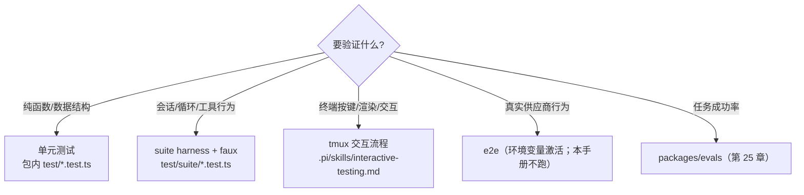

# 第 18 章：测试分层与离线模拟

> 学完本章你能回答：
>
> 1. 这个仓库有哪些测试层？每一层适合验证什么、不适合验证什么？
> 2. `test/suite/` 的 harness 提供了什么？怎么用 faux 写确定性的会话测试？
> 3. 怎么让测试"在坏实现上失败、在好实现上通过"？
> 4. 运行测试的正确命令是什么（为什么不能直接跑全量 vitest）？
> 5. 交互测试（tmux）什么时候用、怎么写？

**前置知识**：第 5 章（faux）、第 6 章（循环）、第 7 章（工具语义）、第 2 章（test.sh）。
**预计学习时间**：1.5 天（本章要求你亲手写并跑通一个测试）。
**本章验证状态**：静态核对通过（`test/suite/README.md`、`harness.ts`、`agent-session-tool-orchestration.test.ts` 等逐项核对）；实验 L12-A 设计中。

---

## 18.1 测试分层：每一层"配得上"的验证

从下到上分四层（外加行为评估）：

| 层 | 测什么 | 成本 | 稳定性 | 在本仓库的位置 |
|---|---|---|---|---|
| 单元 | 纯函数/小模块（token 估算、路径拼接、键位解析） | 极低 | 高 | 各包 `test/*.test.ts`（如 `packages/tui/test/*.test.ts`） |
| 组件/集成 | 会话装配、循环行为、工具编排（faux 驱动） | 中 | 高 | `packages/coding-agent/test/suite/`（harness + faux） |
| 交互 | 终端键位、渲染、真实按键序列 | 中高 | 中（涉及终端模拟） | tmux 流程（`.pi/skills/interactive-testing.md`） |
| 端到端 | 真模型、真供应商 | 最高（费用/凭据） | 低（模型随机性） | e2e 测试（有环境变量才激活；本手册不跑） |
| 行为评估 | "任务成功率"这类统计指标 | 高 | 低 | `packages/evals`（第 25 章） |

选择原则（与第 12 章同构）：**能在低层测的，不要上高层**。判断"多轮工具调度的顺序"用 suite harness（faux 可控）；判断"终端里中文有没有错位"才需要交互层；判断"供应商真实行为"才轮到 e2e。

## 18.2 运行器与命令：先记"正确入口"

| 包 | 运行器 | 依据 |
|---|---|---|
| `agent` / `ai` / `coding-agent` | Vitest（`vitest --run`） | 各包 `package.json` 的 `test` 脚本 |
| `tui` | Node 内置测试（`node --test --test-reporter=dot test/*.test.ts`） | 同上 |
| 全部（非 e2e） | `./test.sh`（隔离 HOME、无 API Key） | 第 2.6 节 |

**单文件测试**（仓库规则，从包根目录执行）：

```powershell
# PowerShell：先在对应 package 根目录
$repo = git rev-parse --show-toplevel
node "$repo/node_modules/vitest/dist/cli.js" --run test/specific.test.ts

# packages/tui 使用 node:test；命令在 packages/tui 根目录执行
node --test test/specific.test.ts
```

```bash
# Bash（Linux/macOS/WSL/Git Bash），在对应 package 根目录
node "$(git rev-parse --show-toplevel)/node_modules/vitest/dist/cli.js" --run test/specific.test.ts

# packages/tui 使用 node:test；命令在 packages/tui 根目录执行
node --test test/specific.test.ts
```

`./test.sh` 是仓库级 Bash 脚本，不是 PowerShell 脚本；Windows 原生环境应在 Git Bash 或 WSL 中运行。各平台的 cwd、命令和隔离范围见[平台验证附录 K.5](appendices/platform-validation.md#k5-安装依赖和测试命令)。

两条禁令（`AGENTS.md`）：

```text
Never run the full vitest suite directly: it includes e2e tests that activate when endpoint/auth
env vars are present. For all non-e2e tests, run ./test.sh from the repo root.
```

还有一个"隐形基础设施"值得一提：根目录的 `vitest.base.ts` 用**源码别名**把 `@earendil-works/*` 指到各包 `src/`——与第 2 章的 `source-resolver.ts` 是同一思路：**测试跑的是源码，不是构建产物**。所以你改了源码，测试立刻测到最新版本。

## 18.3 `test/suite/`：会话级测试的官方设施

`packages/coding-agent/test/suite/README.md` 的规则（照着念）：

```text
- Use `test/suite/harness.ts`
- Use the faux provider from `packages/ai/src/providers/faux.ts`
- Do not use real provider APIs, real API keys, network calls, or paid tokens
- Keep these tests CI-safe and deterministic
- Do not use or extend the legacy `test/test-harness.ts` path unless a missing capability forces it
```

### 18.3.1 harness 提供什么

`harness.ts` 导出 `createHarness` 与类型 `Harness`，并内置一批断言辅助。核心能力（对照源码）：

| 能力 | 说明 |
|---|---|
| `createHarness(options)` | 组装一个**真实结构的 `AgentSession`**，但模型换 faux、会话可换内存/落盘、资源可用最小集 |
| `HarnessOptions` | `models`、`settings`、`tools`、`initialActiveToolNames`、`allowedToolNames`、`excludedToolNames`、`resourceLoader`、`extensionFactories`、`withConfiguredAuth` 等 |
| `harness.setResponses([...])` | 直接设置 faux 的脚本序列（第 5 章） |
| `harness.session` / `harness.sessionManager` | 断言对象（消息、条目、工具集） |
| `harness.cleanup()` | 清理（测试的 `afterEach` 里统一调用） |
| 辅助函数 | `getMessageText`、`getUserTexts`、`getAssistantTexts`、`getToolResult(harness, toolName)`、`createTestUiContext(overrides)` |
| 扩展注入 | 直接传工厂函数（内联扩展），无需落盘文件 |

它把"测试基础设施"与"断言辅助"分开：**基础设施**在 harness 里，**断言写法**用 Vitest 的 `expect`。

### 18.3.2 骨架（从官方测试抄结构）

```typescript
import { describe, expect, it, afterEach } from "vitest";
import { fauxAssistantMessage, fauxToolCall } from "@earendil-works/pi-ai";
import { createHarness, type Harness } from "./harness.ts";

describe("我的行为", () => {
	const harnesses: Harness[] = [];
	afterEach(() => {
		while (harnesses.length > 0) harnesses.pop()?.cleanup();   // 每个测试都清理
	});

	it("描述外部行为，而不是实现细节", async () => {
		const harness = await createHarness({ initialActiveToolNames: ["read"] });
		harnesses.push(harness);

		harness.setResponses([
			fauxAssistantMessage([fauxToolCall("read", { path: "demo.txt" })], { stopReason: "toolUse" }),
			fauxAssistantMessage("总结完毕"),
		]);

		await harness.session.prompt("读取 demo.txt");
		expect(harness.session.messages.filter((m) => m.role === "assistant")).toHaveLength(2);
	});
});
```

## 18.4 精读官方测试：`agent-session-tool-orchestration.test.ts`

这个测试把"工具编排 + 嵌套调用 + 持久化"一次测全，是本章的样板。抽三段读。

### 18.4.1 用扩展注册"会调用其他工具的"工具

```typescript
function orchestratorExtension(pi: ExtensionAPI): void {
	pi.registerTool({ name: "echo", /* ... */ });
	pi.registerTool({ name: "helper", /* ... */, exposure: "codemode" });       // 只给脚本/嵌套调用
	pi.registerTool({
		name: "run_tools", /* ... */, exposure: "model-only",
		prepareLoadout: (loadout) => ({
			descriptions: { run_tools: `Runs tools: ${loadout.callable.map((t) => t.name).join(", ")}` },
			hiddenDeclarations: ["echo"],
		}),
		execute: async (_id, _params, _signal, _onUpdate, ctx) => {
			const helper = await ctx.executeTool("helper", {});
			const echo = await ctx.executeTool("echo", { text: "hi" });
			const self = await ctx.executeTool("run_tools", {});      // 递归调用自己 → 预期 error
			// ...
		},
	});
}
```

注意 `prepareLoadout`：**工具可以按"当前可调用集"动态改自己的描述与"隐藏声明"**——模型看到的声明被定制，而可执行集不变（第 7.3 节的"声明 vs 可执行"在扩展层的体现）。

### 18.4.2 断言"请求里看到的工具"与"嵌套调用记录"

```typescript
const requestTools: string[][] = [];
harness.setResponses([
	(context: TranscriptContext) => {
		requestTools.push(getCurrentTools(context.messages).map((t) => t.name));   // 在"请求时点"取声明
		return fauxAssistantMessage([fauxToolCall("run_tools", {})], { stopReason: "toolUse" });
	},
	fauxAssistantMessage("done"),
]);
await harness.session.prompt("go");

expect(requestTools[0]).toEqual(["run_tools"]);        // echo 被 hiddenDeclarations 隐藏
const result = harness.session.messages.find((m): m is ToolResultMessage => m.role === "toolResult");
expect(result.content).toEqual([{ type: "text", text: "helped | echo: hi | Tool run_tools not found" }]);
expect(toolCalls).toEqual(["run_tools:top", `helper:${parent}`, `echo:${parent}`]);
expect(result.nestedCalls?.calls.map((c) => [c.id, c.name, c.status])).toEqual([
	[`${parent}/1`, "helper", "ok"],
	[`${parent}/2`, "echo", "ok"],
	[`${parent}/3`, "run_tools", "error"],
]);
```

这段代码示范了三种高级断言技巧：

1. **faux 的 `FauxResponseFactory` 当"探针"**：在"即将发请求"时点读取 `getCurrentTools(context.messages)`——精确断言"模型当时看到的声明"；
2. **事件侧断言**：`pi.on("tool_call")` 收集 `toolName:parentToolCallId`，验证嵌套调用的父子关系与顺序；
3. **`nestedCalls` 记录**：嵌套调用会以结构化记录挂在工具结果上（第 14.4 节），可直接断言 id/名称/状态。

### 18.4.3 断言"持久化形态"

```typescript
const persisted = harness.sessionManager
	.getBranch()
	.find((entry) => entry.type === "message" && entry.message.role === "toolResult");
expect(persisted?.type === "message" && persisted.message).toMatchObject({ nestedCalls: result.nestedCalls });
```

这体现第 9 章的"投影 vs 持久化"：**内存里的结果与落盘条目要一致**——测试两处都断言。
## 18.5 怎么做到"坏实现会失败"

测试的价值 = **区分力**（mutation sensitivity）。一个永远通过的测试是负资产。三条做法：

### 18.5.1 对着"外部行为"写断言

对比：

```typescript
// 弱：只断言当前重试计数，没有证明调用方收到正确的生命周期事件
expect(harness.session.retryAttempt).toBe(1);

// 强：断言调用方可观察到的生命周期行为
expect(events.map((e) => e.type)).toEqual(["auto_retry_start", "auto_retry_end"]);
```

这里使用的 `retryAttempt` 是 `AgentSession` 明确公开的 getter；它避免了通过 `as any` 绕过类型检查去读私有字段。即使能读到这个计数，它仍只说明内部进度值为 1；如果契约要求通知订阅者重试何时开始和结束，事件断言才直接覆盖该契约。`events` 代表测试预先收集的事件数组。

本仓库的测试偏第二种：事件序列、消息形状、条目内容、错误文本——这些是"契约"，改了要有人察觉。

### 18.5.2 用"探针 + 对照"锚定关键时刻

样板测试在 **faux 工厂里读请求上下文**（18.4.2）就是"探针"：它把断言点精确放在"请求将发未发"的瞬间。同类技巧：

- 在 `pi.on("tool_call")` 里记录参数（断言"钩子看到什么"）；
- 在 `message_end` 时快照消息（断言"终态长什么样"）；
- 同一行为写两个用例（有工具/无工具、单条/批量），**差异本身就是断言**。

### 18.5.3 错误路径必须有专属用例

第 7 章的实验表已经示范了四类：**非法参数、抛错、取消、拦截**。每类的断言点：

| 用例 | 必须断言 |
|---|---|
| 非法参数 | `isError: true` + 错误文本包含关键字段名/路径 |
| 工具抛错 | 错误文本来自异常 message；循环继续（`callCount` 增加） |
| 取消 | `stopReason: "aborted"`（run 层）或 `Operation aborted`（工具层） |
| 钩子拦截 | 工具**未执行**（调用计数为 0）+ 模型收到 reason |

写完后做一次"自证测试"：**手动把实现改坏一小处**（删掉一个判断、换个字段名），确认测试真的红。红不了就重写断言——这是第 21 章毕业项目的验收习惯。

## 18.6 测试选择决策树



补充经验：

- **测试放对包**：tui 的按键解析放 `packages/tui/test/`（node:test）；会话行为放 `coding-agent/test/suite/`（vitest + harness）；
- **能用 harness 就别 tmux**：tmux 适合"只有真终端才能暴露"的问题（键位、IME、宽字符、渲染时序）；
- **e2e 只补"协议契约"**：比如"扁平 JSON 转供应商格式"这类**必须真请求**才能验证的东西——本手册默认不跑。

## 18.7 交互测试与 tmux

`AGENTS.md` 指定：交互测试前先读 `.pi/skills/interactive-testing.md`。核心流程（第 17.11 节已用过）：

```bash
tmux new-session -d -s pi-test -x 80 -y 24
tmux send-keys -t pi-test "./pi-test.sh" Enter
sleep 3 && tmux capture-pane -t pi-test -p     # 截屏（文本形式）
tmux send-keys -t pi-test "your prompt here" Enter
tmux send-keys -t pi-test Escape               # 特殊键：Escape、C-o（ctrl+o）等
tmux kill-session -t pi-test
```

写法的建议：

- **先断言启动态**（截屏里有编辑器/状态栏）再发输入；
- **等一个可观察条件**再截屏（如等待回复出现），而不是纯 sleep 猜时长；
- 特殊键映射：`Escape`、`C-o`（Ctrl+O）、`C-c` 等（见 skill 文档）；
- **release 冒烟**用 `-c /tmp` + 绝对路径二进制，且必须"发一条 prompt 并等到回复"才算通过——启动成功不算。

## 18.8 运行命令与 CI 纪律（速查）

```bash
./test.sh                                   # 全部非 e2e（隔离环境，仓库根）
# 单文件（在包根目录）：
node "$(git rev-parse --show-toplevel)/node_modules/vitest/dist/cli.js" --run test/suite/xxx.test.ts
node --test test/keys.test.ts               # packages/tui 专用
npm run check                               # 类型+lint（不跑测试，见第 20 章）
```

PowerShell 单文件命令：

```powershell
# 在 packages/coding-agent 根目录；Vitest 路径相对当前 package
$repo = git rev-parse --show-toplevel
node "$repo/node_modules/vitest/dist/cli.js" --run test/suite/xxx.test.ts

# 在 packages/tui 根目录
node --test test/keys.test.ts
```

全量隔离测试 `test.sh` 和单文件测试的 shell 要求不同：前者需要 Git Bash/WSL；后者可以直接从 PowerShell 调 `node`。不要为了方便在 PowerShell 里用 `npm test` 替代隔离脚本。

CI 纪律（`test/suite/README.md` + `AGENTS.md`）：

- suite 测试**禁止**真实 API/Key/网络/付费 token；
- 保持**确定性**：不依赖真实计时器（用可控 Promise）、不依赖网络、不依赖本机时区/语言（`test.sh` 已隔离 LANG/TZ）；
- **不要**为了让测试通过而绕过隔离（比如自己跑 `npm test`）。

## 18.9 实验 L12-A：写一个 faux 回归测试

**实验性质**：本地运行；题材任选其一（建议与毕业项目相关）。
**验证状态**：设计中。目标：亲手完成"写测试 → 自证失败 → 修实现 → 通过"闭环。

### 候选题材（挑一个）

1. **工具错误路径**：注册一个必抛错工具，断言 `isError: true` 且循环继续（`callCount === 2`）；
2. **队列语义**：运行中 `steer()`，断言注入点位于两次 `turn_start` 之间（第 6 章的 T2 取数点）；
3. **取消语义**：在 `tool_execution_start` 后 `abort()`，断言最终 `stopReason: "aborted"` 与工具结果文本 `Operation aborted`；
4. **截断语义**：工具返回 3MB 文本，断言结果被截断且 `details.truncation` 存在（或按你的工具设计断言 fullOutputPath）。

### 步骤（以题材 1 为例）

```typescript
import { describe, expect, it, afterEach } from "vitest";
import { fauxAssistantMessage, fauxToolCall } from "@earendil-works/pi-ai";
import { Type } from "typebox";
import { createHarness, type Harness } from "./harness.ts";

describe("工具错误路径（回归 #<issue>）", () => {
	const harnesses: Harness[] = [];
	afterEach(() => { while (harnesses.length) harnesses.pop()?.cleanup(); });

	it("工具抛错转为 isError 结果并继续循环", async () => {
		const harness = await createHarness({
			initialActiveToolNames: ["boom"],
			extensionFactories: [(pi) => pi.registerTool({
				name: "boom", label: "boom", description: "throws",
				parameters: Type.Object({}),
				execute: async () => { throw new Error("boom failed"); },
			})],
		});
		harnesses.push(harness);

		harness.setResponses([
			fauxAssistantMessage([fauxToolCall("boom", {})], { stopReason: "toolUse" }),
			fauxAssistantMessage("已收到错误"),
		]);
		await harness.session.prompt("go");

		const result = harness.session.messages.find((m) => m.role === "toolResult");
		expect(result?.isError).toBe(true);
		expect(JSON.stringify(result?.content)).toContain("boom failed");
		expect(harness.faux.state.callCount).toBe(2);       // 循环继续，模型被再问一次
	});
});
```

当前 `Harness` 明确暴露 `faux: FauxProviderRegistration`，所以示例中的 `harness.faux.state.callCount` 是可用的计数器；也可用 `harness.getPendingResponseCount()` 断言脚本队列是否清空。真实测试已采用前一种方式（如 `agent-session-retry-events.test.ts`）。如果后续 harness 改变，应以 `Harness` 接口和同目录测试为准，不要额外注册第二个 faux provider。

### 自证与运行

1. 从 `packages/coding-agent` 根目录跑单文件命令（PowerShell 与 Bash 版本见 18.2 和[附录 K.5](appendices/platform-validation.md#k5-安装依赖和测试命令)）；
2. 把实现改坏（比如让进程吃掉异常不产生结果）→ 测试必须失败；
3. 还原 → 通过；记录到你的学习笔记（第 20 章的变更说明会用上）。

### 清理

`git status` 只包含你新增的测试文件（不要动别人文件）；实验完成后按需要保留或删除。

## 18.10 常见错误

| 现象 | 原因 | 处理 |
|---|---|---|
| 测试偶尔失败 | 真实计时器/网络/顺序依赖 | 可控 Promise；faux；确定的事件序断言 |
| 测试永远通过 | 断言太弱或断言了常量 | 18.5 的"自证失败"流程 |
| suite 里用了真实 API | 违反 README 规则 | 改用 faux；检查环境变量（test.sh 会清空） |
| 直接 `npx vitest` 全量 | 激活 e2e、可能花真钱 | 用 `./test.sh` 或单文件命令 |
| tui 测试用了 vitest | tui 是 node:test | 按包脚本运行 |
| 改完源码测试没变化 | 走了 dist | 确认 vitest 别名（`vitest.base.ts`）在生效 |
| tmux 测试靠 sleep 猜 | 时序不稳定 | 等可观察条件再截屏 |
| 测试动了真实会话/配置 | 没隔离 | 用 harness 内存会话；tmux 用 `-c /tmp` |

## 18.11 验收题

1. 四层测试（单元/集成/交互/e2e）各适合验证什么？给各自一个本仓库的真实例子。
2. suite 测试的五条硬规则是什么？为什么它们能保证 CI 安全？
3. `vitest.base.ts` 的别名起什么作用？与 `pi-test.sh` 的 resolver 有何共同点？
4. 写"探索点断言"的两种手段（faux 工厂探针 / 事件钩子），各举一例。
5. 如何证明你的新测试有区分力？步骤是什么？
6. `test.sh` 与直接 `npm test` 的区别？为什么必须走前者？

### 参考答案（要点）

1. 单元：纯函数（tui 键位解析、token 估算）；集成：suite harness 的会话/循环/工具编排；交互：tmux 的键位/渲染/IME；e2e：真实供应商协议行为（受环境变量控制，默认不跑）。
2. harness + faux；禁真实 API/Key/网络/付费；CI 安全且确定；不要碰旧 test-harness。因为模型是脚本化的、无外部依赖，所以确定且无成本。
3. 把包名解析到各包 `src/`，让测试直接跑源码；与 `source-resolver.ts` 一样避免"悄悄用旧 dist"。
4. 探针：在 `setResponses` 工厂里读 `getCurrentTools(context.messages)`；钩子：`pi.on("tool_call"/"message_end")` 收集数据后断言。
5. 先跑通过 → 人为破坏实现（或断言常量）→ 必须失败 → 还原后通过；记录证据。
6. `test.sh` 清空环境（无 API Key）、隔离 HOME/TMP、固定语言时区后跑 `npm test`；直接 `npm test` 可能激活 e2e、读到真实凭据/配置。

## 18.12 来源与下一章

- `packages/coding-agent/test/suite/README.md`（五条规则）、`test/suite/harness.ts`（`createHarness`、`HarnessOptions`、辅助断言函数）；
- 样例：`test/suite/agent-session-tool-orchestration.test.ts`（本章精读）、`agent-session-queue.test.ts`、`agent-session-retry-events.test.ts`、`agent-session-runtime.test.ts`；
- `vitest.base.ts`（源码别名）、各包 `package.json` 的测试脚本、根 `test.sh`；
- `AGENTS.md`（运行纪律）、`.pi/skills/interactive-testing.md`（tmux 流程）；
- `packages/ai/src/providers/faux.ts` 与 `compat.ts` 的 `registerFauxProvider`（第 5 章）。

下一章把"测试"用到排障上：从"pi 不工作"到可验证的最小复现，再到回归修复——一套可以照着走的定位方法论。
