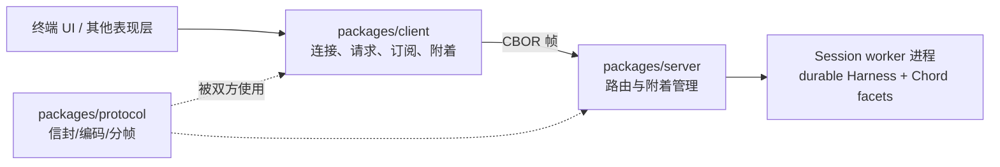

# 第 24 章：实验性 client/server 与服务协议（选修）

> 学完本章你能回答：
>
> 1. 这套 client/server 与第 16 章的 JSONL RPC 有什么本质区别？
> 2. `serverId` / `sessionId` / `attachmentId` 三个标识各解决什么问题？
> 3. 协议帧长什么样？分片/聚合如何处理？限制有哪些？
> 4. 连接断了，已经受理的请求会怎样？为什么客户端"从不自动重连/重放"？
> 5. 这套东西的边界：谁负责认证？谁负责会话生命周期？

**前置知识**：第 8 章（会话生命周期）、第 16 章（JSONL 协议对比）、第 23 章（durable 会话）。
**预计学习时间**：1 天（选修）。**本组模块全部是实验性的，无兼容性保证**——以当前源码为准。
**本章验证状态**：静态核对通过（`packages/protocol/README.md`、`packages/client/README.md`、`packages/server/README.md`、`coding-agent/src/experimental/services/README.md`）。

---

## 24.1 先定位：它不是"另一个 RPC 模式"

| 维度 | 第 16 章的 RPC 模式 | 本章的 client/server |
|---|---|---|
| 形态 | **同一个进程的 stdin/stdout** 上的 JSONL | 跨进程的**字节传输**（Unix socket/WebSocket…） |
| 语义 | 命令/响应 + 会话事件 | **服务路由**（service/member 调用）+ 订阅 + 附着管理 |
| 会话 | 进程内的 `AgentSession` | **应用托管的 durable Session**（worker 进程） |
| 表现层 | 一个客户端 | **多个表现层（presentation）可同时附着**一个会话 |
| 成熟度 | 产品功能 | **实验性**（协议无兼容保证、无认证） |

它在仓库中的位置是三包协作：



- **`protocol`**：帧、信封、握手、校验——**不知道业务**；
- **`server`**：把"连接 + 附着"路由到应用托管的会话；
- **`client`**：连接、请求、订阅、附着与断开语义；
- **服务语义（payload 语法）归 Chord**：`{ serviceId, instance?, member, args }`、`$chord.service` 控制词汇、目录、快照/更新、错误码、每个订阅的 Delta 路径编解码。

## 24.2 路由模型：三个标识定一次"调用该去哪"

| 标识 | 谁生成 | 作用 |
|---|---|---|
| `serverId` | 启动器（逻辑身份，**不是 socket 地址**） | 把调用围栏到一个**逻辑服务器**；客户端校验物理端点报告的 ID 是否匹配 |
| `sessionId` | 应用（会话元数据） | 选定一个 **durable 会话** |
| `attachmentId` | **服务器生成** | 选定一条**活的"表现层附着"**；只作为路由控制数据下发 |

两种目标信封（`protocol` README）：

```text
server target : { serverId }
session target: { serverId, sessionId, attachmentId }
```

关键规则：

- **`attach()`/`detach()` 不返回任何路由标识**——服务器在**带外**（out-of-band）的 `attachment` 消息里发布"当前活路由"；
- 一个会话**可以有多个表现层附着**；同一条连接重复 `attach` 是**幂等**的；
- **陈旧的 attachmentId 会被拒绝**：切换/重新附着后，迟到的帧带旧 ID → 服务器拒绝。这就是为什么"重连后不能用旧 attachment 继续发请求"；
- 断开连接**只释放该表现层的附着**，而且是在**已受理的服务调用 settle 之后**（见 24.4）。

## 24.3 `protocol`：帧、CBOR 与校验

### 24.3.1 版本与语义（v8）

```text
- 版本握手，标识逻辑 serverId；
- 显式的 server 与 Session 请求目标；
- 带相关 ID 的请求/响应，载荷是不透明 strict-JSON；
- 请求取消、不透明订阅更新、带外的附着变化；
- 非空的不透明错误码与有界的传输消息。
```

### 24.3.2 帧格式

```text
[4 字节无符号大端 payload 长度][一个 definite-length CBOR 项]
```

- `encodeClientMessage()` / `encodeServerMessage()` 校验并编码完整帧；
- `ClientMessageDecoder` / `ServerMessageDecoder` **接受任意流式分片与合并**（与第 16 章"按行重组"同思想，只是换成"按长度重组 + CBOR 解码"）：

```ts
const decoder = new ServerMessageDecoder({ maxFrameLength: 1024 * 1024 });
for (const message of decoder.push(incomingChunk)) handleServerMessage(message);
decoder.end();   // 结束时若仍有残帧会报错
```

### 24.3.3 校验与限制（安全相关）

- 所有信封 schema **拒绝未知对象属性**；
- 编解码器**递归拒绝非严格 JSON 的不透明载荷**：非有限数、字节数组、`undefined`、原型、循环引用；
- 信封违规、坏 CBOR、坏分帧 → `ProtocolValidationError`；
- **载荷的语义校验是适配器自己的责任**（协议只验证"是严格 JSON"，不导出 Chord 语法）；
- 默认限制：**每帧/载荷 16 MiB、数组/映射最多 1,000,000 项、最多 64 层嵌套**；
- **无兼容保证、无认证**（"Peer authentication and authenticated service contexts are not implemented"）。

## 24.4 `server`：路由与附着管理

服务器的职责可以概括成一句话（README）：

```text
Experimental local server that routes clients to application-hosted durable Sessions.
```

### 24.4.1 应用供三个东西，服务器只做路由

```ts
const host: ServerHost<StoredSession> = {
	serverServices,                                  // 服务器级服务宿主（RoutedServerServiceHost）
	async resolveSession(sessionId) { /* 从应用目录取元数据，找不到抛 SessionNotFoundError */ },
	openSession: (metadata) => openRoutedSession(metadata),   // 拿到 RoutedSessionHandle
};
const server = createUnixServer(host, { serverId, path: getUnixSocketPath(serverId, "/run/user/1000/pi") });
await server.start();
```

- **`SessionMetadata` 只要求 `id`**，应用可扩展自己的存储字段；
- **会话发现与管理是应用自己的服务**（`SessionDirectory` 把私有目录投影成"表现层安全"的复制状态；`SessionManagement` 负责创建/删除/附着/分离，**业务结果里不暴露 route ID**）；
- **服务器不加载 facet 契约**：`invokeService()` 把不透明的 `{serviceId, instance?, member, args}` 信封转发给目标会话端点，服务器只**校验附着路由**；
- **一个 JS `Session` 或 `Harness` 永远不会跨进程边界**——它们停在 worker 进程里。

### 24.4.2 附着的生命周期（时序）

```text
attach 请求 → 服务器安装活路由 → 带外发布 attachment 消息（含新 attachmentId）
业务调用（带 {serverId, sessionId, attachmentId}）→ 服务器验证路由 → 转发到会话 provider
连接断开 → 该连接的本地响应全部 reject
         → 但"已受理（admitted）的调用"先 settle，之后才释放附着
零表现需求 + worker 无本地 Harness 活动 → 由宿主决定 worker 是否退休
服务器关闭 → 释放所有 routed Session handle（含 worker 与 Session writer 所有权）
```

三个容易误解的点：

1. **"断开"不等于"远程工作停止"**：已受理的调用可能继续完成（这也决定了客户端的重连契约，24.5）；
2. **释放是"宽限式"的**：先等已受理调用 settle，避免半路砍掉正在写存储的操作；
3. **worker 退休是宿主决策**：协议层不替应用做"何时回收进程"的决定。

## 24.5 `client`：连接、请求与"不自动重放"

```ts
const client = await Client.connect({ serverId, transportFactory });
const result = await client.request(
	{ serverId: client.hello.serverId },
	{ serviceId: "example.service", member: "read", args: [] },
);
```

- **握手校验**：客户端确认物理端点报告的 `serverId` 与期望一致；
- **两个 API 层**：`request()` 与 `subscribeService()` 是低层原语；类型化的服务/会话 API 由**应用的 Chord 服务绑定**提供（`createClientServiceTransport()` 把惰性解析的 server/session 路由适配成 Chord 传输）；
- **订阅水合**：订阅先返回**完整 provider 快照**；绑定安装快照后调 `start()`，才释放"水合期间缓冲的更新"（与第 23.2.1 节的"快照/重置/更新顺序"呼应）；
- **客户端不解释应用契约**：像 coding agent 的 `Transcript` 这样的观察 API 只是普通 Chord 服务，客户端只搬运。

### 24.5.1 断连契约（本章最重要的一段）

```text
On disconnect or disposal, pending requests reject locally, but accepted work may still
complete remotely before the attachment is released. The client clears its live attachment route.
It never reconnects or replays requests automatically. After disconnection, call `reconnect()`,
attach through the application's management service again, and explicitly repeat only operations
known to be safe.
```

翻译成行动准则：

| 你观察到 | 正确反应 |
|---|---|
| 请求 reject 了 | 加在**本地**的失败；远端可能已经完成 |
| 想继续用 | `reconnect()` → **通过管理服务重新 attach**（拿新 attachmentId）→ 只重发**确认安全**的操作 |
| 想"自动重试一切" | 不行：协议**故意不提供**自动重放（副作用可能已发生） |

这条设计与第 23 章的 `replay: "safe" | "never"` 是同一哲学的两个层面：**框架从不替你决定"重放是否安全"。**

### 24.5.2 Unix 传输与发现

- Node/Bun 用独立子模块：`createUnixTransportFactory({ path })`；
- **发现**：`discoverUnixServers({ directory })` 扫描物理目录，**从文件名推 serverId 并通过握手验证**；坏文件/非 socket/陈旧/无响应/ID 不匹配都忽略；**只读**、最多 16 个并发探测；`timeoutMs` 可覆盖默认探测超时；
- 传输实现要遵守三回调：`handlers.onData(chunk)`（入站字节）、`onClose()`（有序关闭）、`onError(error)`（传输失败）；工厂每次尝试创建**全新的已认证连接**（认证由应用实现）；
- 限额两侧都要配：`maxFrameLength`（协议载荷上界）与 Unix 的 `maxPendingBytes`（排队输出上界）——**必须与对端匹配**。
## 24.6 coding-agent 的实验服务层：worker、facets 与 `/reload`

`packages/coding-agent/src/experimental/services/README.md` 描述了这套协议在 coding agent 里的落地形态（同样是实验性的）：

### 24.6.1 目录与所有权

```text
会话目录/
├── meta.json      # ID、创建时间、工作目录（服务器"只"从它列表/创建会话）
└── session.sqlite # @earendil-works/pi-durable 存储
```

- **Session worker 锁住目录**、打开存储，并拥有它直到退休；只要 Harness 任务图里还有活任务，worker 就活着；
- 服务器列出/创建会话**只看 `meta.json`**——业务数据的打开是 worker 的事。

### 24.6.2 插件与 facet 构建

- 前台服务器用可重复的 `-e` 选项建立"默认 Session 与 TUI facets"；本地客户端也可以**只为一个会话分支**选择插件包——该选择**随会话持久化**，不影响其他 worker 或服务器默认；
- 附着前，服务器请求 Chord 把约定的 `src/session.ts` 与 `src/tui.ts` 入口**分别构建**到 `plugin-builds/` 目录，把清单路径交给 Session worker，并把匹配的 TUI 产物返回给表现层；
- Session worker 加载内置 facets 与"独立拥有的插件代"，建立一个**活动的 `FacetHost`**；
- **`/reload` 是原子切换**：重建包 → 加载新候选 → `FacetHost.reload()` 切换 → 释放退休代（对应第 23.2.2 节的"候选—切换—退役"）。

### 24.6.3 依赖装配（Chord 的服务图）

- **Host-created 的实现依赖**（durable `Harness`、根 `Conversation`、`ModelRuntime`、`SettingsManager`）**直接传给内置 facet 工厂**——不作为服务暴露；
- 装配期用同步的 `env.provide()/provideMany()/use()/observe()` 构建依赖图；**声明不重复列依赖**；图完整校验前服务句柄保持未连接；provider 先于 consumer 激活；观察随消费它的 facet 连接；替换/关闭按依赖逆序释放；
- **server 与 session 的服务 token 是非本地的**，由提供宿主自动发布；**纯表现层的钩子点（如 `SlashCommands`）显式本地**，绝不进入 RPC 目录；
- facet 一律调**无限定的** `env.use()/observe()`，由宿主在"facet 提供的 + 连接的"服务里解析。

### 24.6.4 已知边界（README 的 TODO，读它会明白"实验性"意味着什么）

| 被推迟的能力 | 原因 |
|---|---|
| 树导航（`AgentController.navigate`） | durable 用 fork 新会话分支；需要"fork + 摘要条目 + 指向新会话的指针"三件套 |
| `nextRun()` / `resume()` | durable 只排队 steering/follow-up；worker 在打开会话时自动恢复中断工作 |
| 子代理 | 目前只覆盖根会话；需要"每会话一个 keyed 服务实例" |
| 转录历史分页 | `Transcript` 只持有"最近 reset/压缩以来"的活动上下文；更早条目需要 `Conversation.entries()` 上的分页方法 |

**这四行就是"实验性 API"的诚实声明**：不是"藏着不完善"，而是明确写出"哪几块还没接上"。

## 24.7 安全边界与运维注意

| 事项 | 现状/要求 |
|---|---|
| 认证 | **实验性 Unix 传输不实现**——对端认证是应用策略（客户端 README 也说 transport factory 每次创建"已认证连接"，认证由应用提供） |
| 传输 | Unix socket：用一个**短小、私有的运行时目录**（别用无界的主目录路径派生）；文件权限就是第一道防线 |
| 校验 | 信封拒绝未知属性；不透明载荷必须是严格 JSON（拒非有限数、字节数组、`undefined`、原型、环） |
| 限额 | 16 MiB/帧、1M 元素、64 层嵌套；客户端 `maxFrameLength` 与 `maxPendingBytes` **两侧匹配** |
| 生命周期 | 服务器/worker 生命周期**在公共协议之外**：协调器只提供稳定端点与中继；可替换的服务器进程自己管私有生命周期协议 |
| 数据面 | 目录状态、管理结果、转录、模型、插件……都是**不透明服务数据**；`pi-protocol` 不解释它们 |

## 24.8 选修实验 L14（后半）：断连重附着

**实验性质**：本地运行（Unix socket）；选修。前半（中断恢复）在第 23.9 节。
**验证状态**：设计中。规划文档 L14 的验收："连接 A 附着某会话后重连，旧 attachment 的迟到请求为何不能路由到新附着"。

### 步骤

1. 在**临时目录**起一个 server（`createUnixServer`，`path` 用短私有目录），注册一个**慢服务**（例如 2 秒后才 settle 的 member）；
2. 客户端 A `Client.connect` → 通过管理服务 `attach` 一个会话 → 记录服务器带外下发的 `attachmentId`；
3. 发一个慢请求后**立刻断开连接**：
   - 观察客户端：挂起请求**本地 reject**；
   - 观察服务器：该调用**继续 settle**（在释放附着之前）——用服务端日志或第二个客户端观察结果；
4. **重连**（`reconnect()`）→ 重新 attach（获得**新 attachmentId**）；
5. **用旧 attachmentId 构造请求**（若客户端不给你旧路由，就直接走低层 `request()` 手工带旧值）→ 断言服务器**拒绝陈旧路由**；
6. 画时序图：attach → 请求 → 断开 → settle → 释放 → 重连 → 新 attach → 旧路由被拒。

### 判定标准

- 能解释"为什么旧 attachment 的迟到请求不能路由到新附着"（路由围栏 + 代际隔离）；
- 能说出"断开时哪些请求本地失败、哪些远端仍可能完成"；
- 知道"重连后只重放**确认安全**的操作"的原因（24.5.1）。

### 清理

关闭 server 与所有 client；删除临时 socket 目录。

## 24.9 常见错误

| 现象 | 原因 | 处理 |
|---|---|---|
| 连接成功但请求被拒 | `serverId` 不匹配/陈旧 `attachmentId` | 校验握手 ID；重连后重新 attach，用新 ID |
| 断线后"丢结果" | 本地 reject、远端可能完成——没有自动重放 | `reconnect()` + 重新 attach + 只重放安全操作 |
| 重连后旧代码继续发旧路由 | 客户端清了活路由，但你的缓存没清 | 重新走管理服务拿新 attachmentId |
| socket 起不来/路径过长 | 用了长路径（如完整主目录拼接） | 用短、私有的运行时目录（README 明确建议） |
| 大消息被拒 | 超过 16 MiB/帧或元素/嵌套限制 | 拆分或改走资源/文件类服务 |
| 服务订阅收到更新但状态不对 | 没按"快照 → `start()` → 增量"的顺序接 | 先装快照，再 start 释放缓冲更新 |
| 把实验层当稳定 API | 无兼容保证 | 升级前读 README/变更；pinning 版本 |
| 指望协议做认证 | 未实现 | 在应用层做对端认证（传输工厂/文件权限/网关） |

## 24.10 验收题

1. 三包（protocol/client/server）与 Chord 各自负责哪部分语义？一句话各自概括。
2. 三个路由标识的作用；`attach()` 为什么不返回路由 ID？带外 `attachment` 消息解决什么？
3. 帧的物理结构与解码器契约（分片/聚合/结束）。
4. 连接断开时的完整时序（本地响应、已受理调用、附着释放、worker 退休的决策方）。
5. 为什么客户端"从不自动重连/重放"？这与 durable 的 `replay` 策略如何呼应？
6. 列出 `coding-agent` 实验服务层的四个"TODO 边界"。

### 参考答案（要点）

1. protocol：帧/信封/校验（不知业务）；server：路由与附着管理；client：连接/请求/订阅/断开语义；Chord：服务 payload 语法（调用、目录、快照/更新、错误码、Delta 编解码）。
2. serverId=逻辑服务器围栏；sessionId=durable 会话；attachmentId=一次表现层附着（服务器生成）。attach/detach 不返回 ID，由带外 attachment 消息发布活路由——让"路由控制"与"业务结果"分离，避免业务层泄露路由细节。
3. 4 字节大端长度 + definite-length CBOR；解码器接受任意分片/合并，`end()` 校验无残帧。
4. 断开 → 本地挂起请求 reject → 已受理调用 settle（完成后）→ 释放该附着 → 宿主结合"零表现需求 + worker 本地活动"决定 retire。
5. 因为远端副作用可能已完成，重放要由"知道语义"的一方决定；durable 的 `replay: "safe"/"never"` 就是同一决策的表单化。
6. 树导航（需 fork+摘要+指针）、`nextRun`/`resume`（durable 自动恢复）、子代理（keyed 实例）、转录历史分页（`Conversation.entries()`）。

## 24.11 来源与下一章

- `packages/protocol/README.md`（版本、目标、帧、解码器、校验、限制）；
- `packages/client/README.md`（连接、请求/订阅、断连契约、Unix 传输与发现、限额）；
- `packages/server/README.md`（`ServerHost`、会话解析/打开、附着与带外变更、释放时序、serverId/path）；
- `packages/coding-agent/src/experimental/services/README.md`（worker/tui、`meta.json` + `session.sqlite`、facet 构建与 `/reload`、服务图装配、TODO 边界）。

下一章是全书最后一章：Telemetry 与行为评估——如何用 trace/span 观察系统、如何设计一次"能得出可信结论"的模型评估。