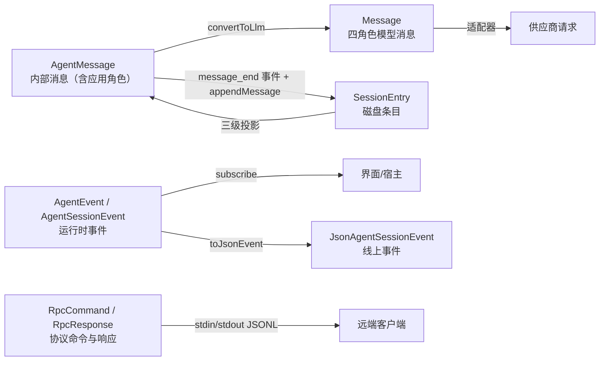

# 附录 H：数据形状对照表

> 用途：排查"某字段在哪个阶段存在/消失"时按表查。**列出的字段以基线 commit 的类型定义为准**（用编辑器转定义复核）；字段的完整语义参见对应章节。

---

## H.1 六种形状的总关系

一句话：**AgentMessage 是"活的水"，Message 是"发给模型的",SessionEntry 是"冻在磁盘的"，Event 是"流过的浪"，JsonEvent 是"拍成照片的浪"。**

---

## H.2 内容块（`packages/ai/src/types.ts`）

| 块 | 判别字段 | 字段 | 备注 |
|---|---|---|---|
| `TextContent` | `type: "text"` | `text`、`textSignature?` | signature 为不透明供应商元数据 |
| `ImageContent` | `type: "image"` | `data`（base64）、`mimeType` | 内联图片 |
| `ThinkingContent` | `type: "thinking"` | `thinking`、`thinkingSignature?`、`redacted?` | 思考块；签名照原样回传 |
| `ToolCall` | `type: "toolCall"` | `id`、`name`、`arguments`（对象）、`thoughtSignature?`、`namespace?` | id 是调用-结果桥梁 |

## H.3 消息族

### H.3.1 模型消息（`Message` 四角色）

| 角色 | 关键字段 | 备注 |
|---|---|---|
| `SystemMessage` | `content`（string 或 TextContent[]）、`sections?`、`toolsAdded?`、`toolsRemoved?`、`timestamp` | 分节补丁 + 工具声明；可回放 |
| `UserMessage` | `content`（string 或 (TextContent\|ImageContent)[]）、`timestamp` | |
| `AssistantMessage` | `content`（TextContent\|ThinkingContent\|ToolCall）[]、`api`、`provider`、`model`、`responseModel?`、`responseId?`、`providerThinkingLevel?`、`thinkingLevel?`、`diagnostics?`、`usage`、`stopReason`、`deferred?`、`errorMessage?`、`rawStopReason?`、`endTurn?`、`timestamp` | `stopReason` 七值（见 H.3.3） |
| `ToolResultMessage` | `toolCallId`、`toolName`、`content`（TextContent\|ImageContent）[]、`details?`、`usage?`、`isError`、`timestamp` | details 不进模型；usage 计工具内嵌套调用 |

### H.3.2 编码助手扩展的四角色（`core/messages.ts`）

| 角色 | 关键字段 | 转换为 |
|---|---|---|
| `BashExecutionMessage` | `command`、`output`、`exitCode`、`cancelled`、`truncated`、`fullOutputPath?`、`excludeFromContext?`、`timestamp` | user 文本（`!!` 前缀 → 排除） |
| `CustomMessage` | `customType`、`content`、`display`、`details?`、`timestamp` | user 消息 |
| `BranchSummaryMessage` | `summary`、`fromId`、`timestamp` | user 文本（`
` 包装） |
| `CompactionSummaryMessage` | `summary`、`tokensBefore`、`timestamp` | user 文本（带前缀） |

### H.3.3 `StopReason` 七值速查

| 值 | 含义 | 循环行为 |
|---|---|---|
| `pending` | 流式中 | 不持久化 |
| `stop` | 正常结束 | 看工具/队列 |
| `length` | 输出截断 | 工具全拒 + 可能溢出恢复 |
| `toolUse` | 要求工具 | 执行后继续 |
| `error` | 失败 | 结束 run（可重试） |
| `aborted` | 取消 | 结束 run |
| `deferred` | 延迟应答 | 凭 handle 取回 |

## H.4 事件族

### H.4.1 `AgentEvent`（core）

| 事件 | 载荷 |
|---|---|
| `agent_start` | — |
| `agent_end` | `messages` |
| `turn_start` | — |
| `turn_end` | `message`、`toolResults` |
| `message_start` | `message` |
| `message_update` | `message`、`assistantMessageEvent` |
| `message_end` | `message` |
| `tool_execution_start` | `toolCallId`、`toolName`、`args` |
| `tool_execution_update` | 同上 + `partialResult` |
| `tool_execution_end` | 同上 + `result`、`isError` |

### H.4.2 `AssistantMessageEvent`（嵌套在 message_update）

`start` / `text_start|text_delta|text_end` / `thinking_start|thinking_delta|thinking_end` / `toolcall_start|toolcall_delta|toolcall_end` / `done`（reason+message）/ `error`（reason+error）——各带 `partial`（快照）。

### H.4.3 `AgentSessionEvent` 相对 `AgentEvent` 的差异

| 差异 | 说明 |
|---|---|
| `agent_end` 多 `willRetry` | 会话层改写 |
| 新增 `agent_settled` | 自动工作清零 |
| 新增 `queue_update` | steering/followUp 队列快照 |
| 新增 `compaction_start/end` | 压缩过程 |
| 新增 `entry_appended` | 部分辅助写入路径主动发布已追加条目；不是通用的落盘通知 |
| 新增 `session_info_changed`、`thinking_level_changed` | 元数据变化 |
| 新增 `auto_retry_start/end`、`summarization_retry_*` | 两类重试 |
| 新增 `bash_execution_update` | RPC bash 流式输出 |
| 事件可带 `parentToolCallId` | 嵌套调用归属 |

### H.4.4 线上事件（`JsonAgentSessionEvent`）

| 差异点 | 规则 |
|---|---|
| `message_update` | 去掉累积 `partial`；顶层带 `usage`；`toolcall_start` 补 `id`/`toolName` |
| 其余事件 | 原样 |
| 记录边界 | LF 一行一条；可选前置 `\r` 剥离 |

## H.5 会话条目（`session-manager.ts`）

**公共字段（除 header）**：`type`、`id`、`parentId`（null=根）、`timestamp`（ISO 字符串）。

| 条目 type | 独有字段 | 进上下文？ |
|---|---|---|
| `session`（header，无 id/parentId） | `version`、`id`、`timestamp`、`cwd`、`parentSession?` | — |
| `message` | `message: AgentMessage` | ✅ |
| `model_change` | `provider`、`modelId` | ❌（影响解释） |
| `thinking_level_change` | `thinkingLevel` | ❌ |
| `usage` | `kind`、`provider`、`model`、`usage`、`note?` | ❌ |
| `compaction` | `summary`、`firstKeptEntryId`、`tokensBefore`、`usage?`、`fromHook?`、`details?`、`systemMessage?` | ✅（替代旧条目） |
| `context_edit` | `targetId`、`replacement`（null=省略） | 间接 |
| `branch_summary` | `summary`、`fromId`、`usage?`、`fromHook?`、`details?` | ✅ |
| `custom` | `customType`、`data?` | ❌ |
| `custom_message` | `customType`、`content`、`display`、`details?` | ✅ |
| `label` | `targetId`、`label?` | ❌ |
| `session_info` | `name` | ❌ |

【陷阱】条目时间戳是 ISO；消息内 `timestamp` 是毫秒——**两种时间戳**（第 4.7.1 节）。
---

## H.6 工具形状

### H.6.1 运行时契约 `AgentTool`（`agent/src/types.ts`）

| 字段 | 类型 | 说明 |
|---|---|---|
| `name` | string | 模型调用的名字 |
| `label` | string | 界面显示名 |
| `description` | string | 给模型的说明 |
| `parameters` | TSchema | 参数 schema（typebox/JSON Schema） |
| `prepareArguments?` | (args)=>params | 校验前垫片 |
| `outputSchema?` | TSchema | structuredContent 的形状声明 |
| `execute` | (id, params, signal?, onUpdate?)=>Promise<AgentToolResult> | 四参执行 |
| `replay?` | `"never"\|"safe"` | 持久执行重放策略 |
| `executionMode?` | `"sequential"\|"parallel"` | 个体调度约束 |

### H.6.2 注册形态 `ToolDefinition`（`core/extensions/types.ts`）额外字段

`promptSnippet?`、`promptGuidelines?`、`constrainedSampling?`、`renderCall?`/`renderResult?`/`renderShell?`（渲染）、`exposure?`（`"direct"|"model-only"|"codemode"|"deferred"|"hidden"`）、`namespace?`。

### H.6.3 结果与钩子

| 形状 | 字段 |
|---|---|
| `AgentToolResult<TDetails>` | `content`、`details`、`structuredContent?`、`usage?`、`isError?`、`terminate?` |
| `BeforeToolCallResult` | `block?`、`reason?`、`terminate?` |
| `AfterToolCallResult` | `content?`、`details?`、`structuredContent?`、`isError?`、`usage?`、`terminate?` |

【陷阱】`content`（模型可见）≠ `details`（界面/程序）≠ `structuredContent`（仅程序化）；后置钩子给 `content` 但不给 `structuredContent` 时，旧结构化数据会被丢弃（第 7.6.2 节）。

## H.7 实验协议形状（client/server，选修）

| 形状 | 内容 |
|---|---|
| 线帧 | `[4 字节无符号大端长度][definite-length CBOR]` |
| server target | `{ serverId }` |
| session target | `{ serverId, sessionId, attachmentId }` |
| 附着管理 | `attach()`/`detach()` **不返回路由 ID**；带外 `attachment` 消息发布活路由 |
| 服务信封（不透明） | `{ serviceId, instance?, member, args }`，严格 JSON；Chord 语义 |
| 限额 | 16 MiB/帧、1,000,000 元素、64 层嵌套 |

## H.8 CLI-RPC 形状（`rpc-types.ts`）

| 形状 | 内容 |
|---|---|
| `RpcCommand` | 约 30 条命令（prompting/state/model/thinking/queue modes/compaction/retry/bash/session/messages/commands），每条带可选 `id` |
| `RpcSessionState` | `model?`、`thinkingLevel`、`isStreaming`、`isCompacting`、`steeringMode`、`followUpMode`、`sessionFile?`、`sessionId`、`sessionName?`、`autoCompactionEnabled`、`messageCount`、`pendingMessageCount` |
| `RpcResponse` | `{ id?, type:"response", command, success:true, data }` 或 `{ ..., success:false, error }`；解析失败为无 id 的 `command:"parse"` |
| Extension UI | `extension_ui_request`（含 `id` 与方法/参数）→ `extension_ui_response`（用同一 id）；对话框=请求响应，通知=单向 |

## H.9 运行状态形状

### H.9.1 `AgentState`（对外）

`systemPrompt`（只读推导）、`model`、`thinkingLevel`、`tools`（get/set 复制）、`messages`（get/set 复制）、`isStreaming`、`streamingMessage?`、`pendingToolCalls`（只读 Set）、`errorMessage?`。

### H.9.2 会话侧运行标志（内部，排查用）

| 标志 | 含义 |
|---|---|
| `_isAgentRunActive` | 会话层认为 run 进行中 |
| `_agentRunAbortRequested` | 本 run 被请求取消 |
| `_retryAttempt` | 连续重试计数（成功清零） |
| `_failedResponse` | 最近失败响应（重试/报告用） |
| `_lastAssistantMessage` | turn_end 时记录的最近助手消息（收尾循环用） |
| `_entryIdsByMessage` | 消息对象 → 条目 id 映射 |
| `_isEmittingAgentSettled` | 收尾事件发送中（延后新 prompt） |

## H.10 转换矩阵：谁把谁变成谁

| 从 | 到 | 转换函数（位置） |
|---|---|---|
| `AgentMessage[]` | `Message[]` | `convertToLlm`（`core/messages.ts`；agent 默认版在 `agent.ts`） |
| `SessionEntry[]` | 活动路径 | `buildSessionPath`（内部） |
| 活动路径 | 折叠条目 | `buildContextEntries` |
| 折叠条目 | 投影消息 | `buildSessionProjection`（含 context_edit） |
| 条目 | 消息 | `sessionEntryToContextMessages` |
| 投影消息 | 请求上下文 | `normalizeContext`（含 `Content` 简写折叠） |
| `Message`/`Tool` | 供应商载荷 | 各 provider 适配器（`providers/*`） |
| 供应商增量 | `AssistantMessageEvent` | 各 API 实现（`api/*`） |
| `AgentToolResult` | `ToolResultMessage` | `createToolResultMessage`（`agent-loop.ts`） |
| `AgentSessionEvent` | 线上事件 | `toJsonEvent`（`modes/json-event.ts`） |
| 线上事件 | 字节流 | `serializeJsonLine` + `writeRawStdout` |
| `RpcCommand` | `RpcResponse` | `handleCommand`（`modes/rpc/rpc-mode.ts`） |
| `SessionEntry[]` | 新会话文件 | `createBranchedSession` / `forkFrom` |

## H.11 高频混淆字段速查

| 易混对 | 区分 |
|---|---|
| `message.timestamp`（毫秒） vs 条目 `timestamp`（ISO） | 两种时间口径 |
| `ToolCall.arguments`（对象） vs 适配器的分片 JSON 文本 | 内部已解析 |
| `ToolResultMessage.toolCallId` vs `toolCall.id` | 必须一一对应 |
| `SystemMessage.content` vs `SystemMessage.sections` | 前者基础文本；后者具名分节 |
| `content` vs `details` vs `structuredContent` | 模型 / 界面与程序 / 仅程序 |
| `sessionId` vs `attachmentId` | 会话 vs 一次表现层附着 |
| `stopReason:"length"` vs `"stop"` | 截断 vs 正常 |
| `agent_end` vs `agent_settled` | 低层 run 结束 vs 自动工作清零 |
| `replay:"safe"` vs `"never"` | 崩溃后重跑 vs 报 interrupted |

## H.12 使用建议

- 排查"字段在某阶段为 undefined"：对照 H.10 找**转换点**，再看该函数是否保留字段（如 `withToolChanges` 会重置工具字段、`createToolResultMessage` 不带 `structuredContent`）；
- 排查"事件里没有我需要的字段"：对照 H.4——**线上事件**（H.4.4）比内存事件更瘦（没有 partial）；
- 排查"磁盘上有但模型看不到"：对照 H.5 的"进上下文？"列 + H.10 的投影链。
