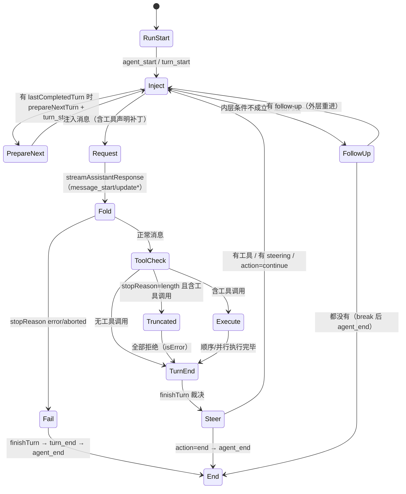

# D1：`agent-loop.ts` 逐段精读

> 精读对象：`packages/agent/src/agent-loop.ts`（约 940 行，Agent 循环的完整实现）。
> 对应主线：第 3 章（请求旅程）、第 6 章（循环语义）、第 7 章（工具调度）。
> 读法：按节顺序；每节先给真实源码，再给逐行注解；"【跳转】"表示下一站。

---

## 0. 文件地图（先记骨架）

这个文件只做一件事：**"模型 ↔ 工具"的循环**。全部导出如下：

| 导出 | 类型 | 用途 |
|---|---|---|
| `AgentEventSink` | 类型 | 事件发射器签名：`(event) => Promise<void> \| void` |
| `agentLoop` | 函数 | 以"新提示"启动循环，返回 `EventStream` |
| `agentLoopContinue` | 函数 | 以"现有上下文"继续（重试用），返回 `EventStream` |
| `runAgentLoop` | async 函数 | `agentLoop` 的无流版本（直接返回新消息数组） |
| `runAgentLoopContinue` | async 函数 | 同上（continue 版） |
| `runToolCall` | async 函数 | 让工具内部**再调用**其他工具（嵌套调用），走同一流水线 |
| `ToolCallHooks` | 类型 | `beforeToolCall`/`afterToolCall` 的打包类型 |
| `RunToolCallOptions` | 接口 | `runToolCall` 的选项 |

内部（未导出）的关键函数，按出现顺序：

```text
createAgentStream          构造 EventStream（判定 agent_end 为结束）
runLoop                    双层循环本体（本文件的心脏）
declareToolChanges         计算并注入"工具载入变化"的系统消息
withToolChanges            复制系统消息并替换工具字段
streamAssistantResponse    请求模型并把事件流折叠为一条消息
failToolCallsFromTruncatedMessage   截断响应里的工具调用全部拒绝
executeToolCalls           调度器：顺序 or 并行
executeToolCallsSequential / executeToolCallsParallel
prepareToolCallArguments   prepareArguments 垫片
prepareToolCall            查找/校验/前置钩子
emitToolExecutionUpdate    工具进度 → 事件
executePreparedToolCall    真正执行（异常折叠）
finalizeExecutedToolCall   后置钩子合并
createErrorToolResult      构造错误结果
emitToolExecutionEnd       广播结束事件
createToolResultMessage    结果 → 消息
emitToolResultMessage      广播消息开始/结束
```

【陷阱】注意三种"层级"的区别：

```text
流式接口（agentLoop/agentLoopContinue）——给上层 Agent 用，事件边跑边推
运行接口（runAgentLoop/runAgentLoopContinue）——可 await 得到"本次新增的消息"
嵌套接口（runToolCall）——给"工具里的工具调用"用，不发事件、不加消息
```

---

## 1. 头部注释与 imports

【源码】

```typescript
/**
 * Agent loop that works with AgentMessage throughout.
 * Transforms to Message[] only at the LLM call boundary.
 */

import {
	type AssistantMessage,
	EventStream,
	getCurrentTools,
	getToolStateChanges,
	normalizeContext,
	type SystemMessage,
	type ToolResultMessage,
	type ToolStateChanges,
	toToolDeclaration,
	validateToolArguments,
} from "@earendil-works/pi-ai";
import { getDefaultStreamFn } from "./stream-fn.ts";
import type {
	AgentContext,
	AgentEvent,
	AgentLoopConfig,
	AgentMessage,
	AgentTool,
	AgentToolCall,
	AgentToolCallOutcome,
	AgentToolResult,
	PrepareNextTurnContext,
	StreamFn,
} from "./types.ts";
```

【注解】

- 两行文档注释是**整个文件的设计声明**：循环内部**全程使用 `AgentMessage`**（第 4 章：可能带应用自定义角色）；只有在"要给 LLM 发请求"的边界（`streamAssistantResponse` 里）才转成 `Message[]`。这条"推迟转换"的规则避免了"在循环里到处处理两套消息类型"。
- `import ... from "@earendil-works/pi-ai"`：注意有一半是**值**（`EventStream`、`getCurrentTools`、`getToolStateChanges`、`normalizeContext`、`toToolDeclaration`、`validateToolArguments`），一半是**类型**（带 `type` 关键字）。这个分包告诉你循环依赖 ai 包的哪些能力：
  - `EventStream`：异步事件流容器（最后构造返回流用）；
  - `getCurrentTools` / `getToolStateChanges` / `toToolDeclaration`：工具声明与"声明差分"（第 7.3 节）；
  - `normalizeContext`：请求前把 `Context` 折成"系统消息在最前"的规范转录（第 5.4 节）；
  - `validateToolArguments`：工具参数运行时校验（第 7.4 节）。
- `import { getDefaultStreamFn } from "./stream-fn.ts"`：**唯一的本包值依赖**。它提供"没传 streamFn 时"的兜底（第 1.2.1 节读过 `stream-fn.ts`：默认实现由宿主通过 `setDefaultStreamFn` 安装——`coding-agent` 在 `sdk.ts` 顶部就装了 `streamSimple`）。
- 类型 imports 里最重要的三个：`AgentContext`（消息 + 工具）、`AgentLoopConfig`（全套回调与模型配置）、`StreamFn`（模型请求函数）。

【跳转】`setDefaultStreamFn` 的安装点：`packages/coding-agent/src/core/sdk.ts` 顶部（第 3.5 节的 `streamFn` 包装）。

---

## 2. `AgentEventSink`：事件怎么"发出去"

【源码】

```typescript
export type AgentEventSink = (event: AgentEvent) => Promise<void> | void;
```

【注解】

- 循环不"拥有"事件的目的地——它只拿到一个**函数**：`emit(event)`。谁来发、发给谁，由调用方决定：
  - 流式接口里是 `stream.push(event)`（推给订阅 `EventStream` 的消费者）；
  - `Agent` 的 `runPromptMessages` 里是 `(event) => this.processEvents(event)`（先归约状态，再 await 监听器，第 3.7 节）。
- 返回值允许 `Promise<void> | void` 且循环里**每次调用都 `await`**（你会在后面看到满屏的 `await emit(...)`）。这意味着：**sink 慢，循环就慢**；同时它天然支持"监听器是异步的"语义（第 3.7 节的"agent_end 监听器也计入 run 结算"）。
- 【陷阱】不要把它理解成"广播给多个订阅者"——那是 `Agent.processEvents` 的职责。循环只面向一个 sink；"一个事件 → 多个监听器"发生在 sink 内部。

---

## 3. `agentLoop`：流式入口

【源码】

```typescript
/**
 * Start an agent loop with a new prompt message.
 * The prompt is added to the context and events are emitted for it.
 */
export function agentLoop(
	prompts: AgentMessage[],
	context: AgentContext,
	config: AgentLoopConfig,
	signal: AbortSignal | undefined,
	streamFn: StreamFn,
): EventStream<AgentEvent, AgentMessage[]> {
	const stream = createAgentStream();

	void runAgentLoop(
		prompts,
		context,
		config,
		async (event) => {
			stream.push(event);
		},
		signal,
		streamFn,
	).then((messages) => {
		stream.end(messages);
	});

	return stream;
}
```

【注解】

- 参数五件套：`prompts`（新消息）、`context`（快照）、`config`（回调与模型）、`signal`（取消）、`streamFn`（模型请求实现）。**没有 `await`**——函数是同步返回的，立刻把"未完成的运行"包装成流交出去。
- `const stream = createAgentStream();`：先建流（见第 7 节：它用"agent_end 是结束事件"作为判定）。
- `void runAgentLoop(...)`：`void` 前缀是**故意的语法标记**——"我知道这是一个 Promise，但我故意不 await 它"（第 1 章的 `no-floating-promises` 风格）。运行在后台推进，事件通过闭包 `stream.push` 流入。
- `.then((messages) => stream.end(messages))`：当 `runAgentLoop` 完成（返回本次新增的消息数组），**关闭流并把消息数组作为流的结果**。所以消费者可以：
  - `for await (const event of stream)` 逐事件消费；
  - 之后 `await stream.result()` 拿到 `AgentMessage[]`（第 3.9 节 `streamAssistantResponse` 里 `response.result()` 的同款模式）。
- 【异常边界】`runAgentLoop` 是 async；运行中抛错会让它返回的 Promise reject。`Agent` 类**没有通过这个包装器运行**：`runPromptMessages` 直接 await `runAgentLoop`，外层 `runWithLifecycle` catch 后调用 `handleRunFailure`，把错误转成终态助手消息和 `agent_end`；既有 `agent.test.ts` 的 `provider exploded` 用例验证了这条路径。
- 低层 `agentLoop` 包装器处理方式不同：它的 `.then(...)` 只有成功分支，没有 rejection handler；`EventStream` 也没有 `fail/error` 通道。因此若 `streamFn` 违反其明确的“不抛错/不拒绝”契约，或任一被 `await` 的回调 reject，`.then` 的派生 Promise 会 reject 且未被处理，`stream.end()` 不会执行，消费者可能读完已排队事件后一直等，`stream.result()` 也不会 settle。`void` 只是不使用 Promise 的返回值，不会把 rejection 变成已处理状态。
- `StreamFn` 类型明确要求请求失败编码成事件流终态，而不是 throw/reject；`AgentLoopConfig` 对 `convertToLlm`、`transformContext` 等回调也有相同契约。低层流包装器仍没有异常关闭能力，阅读或改它时要把**类型契约**和**运行时兜底**区分开。现有测试验证了 `Agent` lifecycle 的异常收尾，没有覆盖 `agentLoop` 包装器收到 rejected Promise 的情形。

两条调用路径并排看：

```text
Agent.prompt
  → runWithLifecycle(async () => await runAgentLoop(...))
  → Promise reject 时 catch
  → handleRunFailure 发失败消息与 agent_end

agentLoop（低层流式包装器）
  → runAgentLoop(...).then(onFulfilled)
  → 只在 fulfill 时 stream.end(messages)
  → reject 时没有对应分支；EventStream 不会收到错误
```

读 Promise 链时要追**两条结果分支**：成功时谁结束流，失败时谁捕获异常。函数签名返回 `EventStream` 本身并不代表这个流具有错误通道。

---

## 4. `agentLoopContinue`：继续（重试）入口

【源码】

```typescript
/**
 * Continue an agent loop from the current context without adding a new message.
 * Used for retries - context already has user message or tool results.
 *
 * **Important:** The last message in context must convert to a `user` or `toolResult` message
 * via `convertToLlm`. If it doesn't, the LLM provider will reject the request.
 * This cannot be validated here since `convertToLlm` is only called once per turn.
 */
export function agentLoopContinue(
	context: AgentContext,
	config: AgentLoopConfig,
	signal: AbortSignal | undefined,
	streamFn: StreamFn,
): EventStream<AgentEvent, AgentMessage[]> {
	if (context.messages.length === 0) {
		throw new Error("Cannot continue: no messages in context");
	}

	if (context.messages[context.messages.length - 1].role === "assistant") {
		throw new Error("Cannot continue from message role: assistant");
	}

	const stream = createAgentStream();

	void runAgentLoopContinue(
		context,
		config,
		async (event) => {
			stream.push(event);
		},
		signal,
		streamFn,
	).then((messages) => {
		stream.end(messages);
	});

	return stream;
}
```

【注解】

- 与 `agentLoop` 的三处差别：没有 `prompts` 参数；**同步前置校验**；调用 `runAgentLoopContinue`。
- 校验一：上下文非空。校验二：最后一条不能是 `assistant`（否则供应商会拒绝"模型连说两句"）。
- 【陷阱】那个加粗的 "Important" 注释值得逐字读：它说的是**更深的一层契约**——"最后一条消息**转换后**必须是 `user` 或 `toolResult`"。因为 `convertToLlm` 只在每轮请求前调用一次，**这里无法验证**（此时还没转换）。于是：
  - 上层（`Agent.continue`）只能检查"原始角色不是 assistant"；
  - 真正的保证来自**调用方喂进来的上下文**（重试场景里，最后一条通常是 `toolResult` 或用户消息）。
- 【陷阱】两个错误的文案是**契约的一部分**：`agent-session.ts` 的 `continue()` 特例分支（第 6.1.2 节）就是围绕 `Cannot continue from message role: assistant` 这条例外设计的。

---

## 5. `runAgentLoop`：非流式运行入口

【源码】

```typescript
export async function runAgentLoop(
	prompts: AgentMessage[],
	context: AgentContext,
	config: AgentLoopConfig,
	emit: AgentEventSink,
	signal: AbortSignal | undefined,
	streamFn: StreamFn,
): Promise<AgentMessage[]> {
	const initialMessages = declareToolChanges(context, prompts);
	const newMessages: AgentMessage[] = [...initialMessages];
	const currentContext: AgentContext = {
		...context,
		messages: [...context.messages, ...initialMessages],
	};

	await emit({ type: "agent_start" });
	await emit({ type: "turn_start" });
	for (const message of initialMessages) {
		await emit({ type: "message_start", message });
		await emit({ type: "message_end", message });
	}

	await runLoop(currentContext, newMessages, config, signal, emit, streamFn ?? getDefaultStreamFn());
	return newMessages;
}
```

【注解】

- 第 1 行 `declareToolChanges(context, prompts)`：把"待注入的提示消息"过一遍**工具载入变化声明器**（第 7 节详解）。如果 `context.tools`（可执行集）与转录里已声明的工具集有差异，它会**在合适位置插入一条 system 消息**；返回值是"可能被插入过 system 消息的 prompts"。
- `newMessages` 初始化为 `[...initialMessages]`：**本地新消息记账**从"实际注入的消息"开始（可能包含那条工具变化 system 消息）。这个数组最后作为 `runLoop` 的返回值 → `agentLoop` 里 `stream.end(messages)` 的结果。
- `currentContext` 用**展开 + 新数组**构造：不修改调用方传入的 `context`（函数式不可变习惯）。注意 `messages` 是新数组（拼接 initialMessages），`tools` 等字段是浅拷贝引用。
- 事件序列：`agent_start` → `turn_start` → 对 initialMessages 逐条 `message_start` + `message_end`。**这就是 `Agent` 的 `prompt()` 场景里"用户消息"两个事件的来源**（第 3.8 节轨迹 A/B 里 user 消息的事件对）。
- 【陷阱】这些 `message_start`/`message_end` 是**同步连发**的（没有流式过程）——因为用户消息/系统补丁在注入时就是"已完成"的消息。
- `streamFn ?? getDefaultStreamFn()`：兜底逻辑只在**这里**出现一次；`getDefaultStreamFn` 没配置时抛错（第 1.2.1 节的实现）。
- 【跳转】`declareToolChanges` → 第 7 节（本文件）；`runLoop` → 下一节。

---

## 6. `runAgentLoopContinue`：非流式继续

【源码】

```typescript
export async function runAgentLoopContinue(
	context: AgentContext,
	config: AgentLoopConfig,
	emit: AgentEventSink,
	signal: AbortSignal | undefined,
	streamFn: StreamFn,
): Promise<AgentMessage[]> {
	if (context.messages.length === 0) {
		throw new Error("Cannot continue: no messages in context");
	}

	if (context.messages[context.messages.length - 1].role === "assistant") {
		throw new Error("Cannot continue from message role: assistant");
	}

	const newMessages: AgentMessage[] = [];
	const currentContext: AgentContext = { ...context };

	await emit({ type: "agent_start" });
	await emit({ type: "turn_start" });

	await runLoop(currentContext, newMessages, config, signal, emit, streamFn ?? getDefaultStreamFn());
	return newMessages;
}
```

【注解】

- 同样的两条校验**再写一遍**（而不是抽成一个 helper）：这是**边界函数显式防御**的风格——`runAgentLoopContinue` 是公开导出，可能被绕过流式入口直接调用（例如 `Agent.runContinuation`），所以校验不能只留在 `agentLoopContinue` 里。
- `newMessages = []`：没有初始消息（不新增提示），所以这次运行的新消息全部来自后续的 assistant/toolResult。
- `currentContext = { ...context }`：浅拷贝（`messages` 沿用调用方数组——注意与 `runAgentLoop` 里"新建数组"的差别：continue 不注入消息，所以不需要复制数组；后续循环内 push 的是新消息对象，但会**修改这个数组的引用目标**……【陷阱】实际上 `Agent.createContextSnapshot()` 已经给了 `messages: this._state.messages.slice()` 的快照，所以这里沿用的是那份**副本**。读代码时要把"快照从哪来"与"这里怎么处理"连起来看，第 18 章的测试可能正在断言语义）。
- 事件序列与 `runAgentLoop` 相同（除 initialMessages 循环为空）。

---

## 7. `createAgentStream`：把事件序列包装成流

【源码】

```typescript
function createAgentStream(): EventStream<AgentEvent, AgentMessage[]> {
	return new EventStream<AgentEvent, AgentMessage[]>(
		(event: AgentEvent) => event.type === "agent_end",
		(event: AgentEvent) => (event.type === "agent_end" ? event.messages : []),
	);
}
```

【注解】

- `EventStream<事件类型, 结果类型>` 的构造参数是两个函数：
  1. **isEnd**：哪个事件表示"流结束"——这里是 `agent_end`（与第 4/6 章的约定一致）；`agent_end` 之后不应再有事件，`stream.end()` 也正好在 `runAgentLoop` resolve 时被调用；
  2. **getResult**：结束时取出结果——`event.messages`（本次新增消息），其他事件返回空数组（其实只会在结束时调用，这里是对称写法）。
- 【陷阱】"流结束"与"会话收尾"仍不是一回事（`agent_settled` 在会话层，第 6 章）；`agentLoop` 的流在 `agent_end` 即结束，重试/压缩会由**外层再来一次新的 `runAgentLoop`**（这就是 `_runAgentPrompt` 的 while 循环存在的意义）。
- 【跳转】`EventStream` 的实现：`packages/ai/src/utils/event-stream.ts`——建议顺手读一遍 `push/end/result/asyncIterator` 四个方法，之后看任何"流出事件"的代码都不再神秘。

---

> D1 第一部分到此。后续部分（按源码顺序）：
>
> - 第二部分：`runLoop` 内层/外层循环逐行（本文件的心脏）
> - 第三部分：`declareToolChanges` / `withToolChanges` / `streamAssistantResponse`
> - 第四部分：工具调度（两种模式、`prepareToolCall`、钩子、`runToolCall`）
> - 第五部分：收尾函数（错误结果、结果消息、事件广播）
---

# 第二部分：`runLoop` 逐行精读（本文件的心脏）

> 对应主线：第 6 章（如果只想记结论，去读 6.2-6.4 的决策表；本部分回答"每一行为什么这么写"）。

## 8. 签名与初始状态

【源码】

```typescript
/**
 * Main loop logic shared by agentLoop and agentLoopContinue.
 */
async function runLoop(
	initialContext: AgentContext,
	newMessages: AgentMessage[],
	initialConfig: AgentLoopConfig,
	signal: AbortSignal | undefined,
	emit: AgentEventSink,
	streamFunction: StreamFn,
): Promise<void> {
	let currentContext = initialContext;
	let config = initialConfig;
	let lastCompletedTurn: PrepareNextTurnContext | undefined;
	let explicitContinuation = false;
	// Check for steering messages at start (user may have typed while waiting)
	let pendingMessages: AgentMessage[] = (await config.getSteeringMessages?.()) || [];

	// Outer loop: continues when queued follow-up messages arrive after agent would stop
	while (true) {
		let hasMoreToolCalls = true;
```

【注解】

- 六个参数：上下文、新消息记账数组、配置、取消信号、事件出口、模型请求函数。**注意 `newMessages` 是"外部传入的数组"**——循环往里 push，调用方最后拿到它；这意味着循环不是一个纯函数，而是"在调用方提供的账本上记账"。
- 五个局部变量，每个都有明确职责：

| 变量 | 作用 | 为什么需要 |
|---|---|---|
| `currentContext` | 可变的工作上下文 | 每轮都会追加消息/可能被钩子替换 |
| `config` | 可变配置 | `prepareNextTurn`/`prepareRequest` 可以换模型/级别 |
| `lastCompletedTurn` | 最近完成的 turn 快照 | 传给 `prepareNextTurn`（只有第二轮起才有值） |
| `explicitContinuation` | `finishTurn` 的续跑裁决 | 内层退出后兑现"空转一轮" |
| `pendingMessages` | 待注入的 steering 消息 | 四个取数点的载体（第 6.3 节） |

- 【陷阱】`hasMoreToolCalls` **在 outer 循环体内部**被初始化为 `true`。位置非常关键（第 6.4.4 节的"无限运行"分析）：**每次 outer 迭代都会重置为 true**，于是"被 follow-up 重新拉起的 outer 循环"会再次进入内层并**真正发一次模型请求**。
- 进入循环前的初始轮询（T0）：`(await config.getSteeringMessages?.()) || []`。可选链 + 兜底空数组：**没有回调 = 没有队列**（低层测试里可以完全不给队列相关回调）。
- 【跳转】`PrepareNextTurnContext` 的定义在 `types.ts`（第 6.2.1 节读过）：`{ message, toolResults, context, newMessages }` 四件套。

## 9. `prepareNextTurn` 块：每轮开始前的"准备窗口"

【源码】

```typescript
		// Inner loop: process tool calls and steering messages
		while (hasMoreToolCalls || pendingMessages.length > 0) {
			let preparedMessages: AgentMessage[] = [];
			if (lastCompletedTurn) {
				const nextTurnSnapshot = await config.prepareNextTurn?.(lastCompletedTurn);
				if (nextTurnSnapshot) {
					currentContext = nextTurnSnapshot.context ?? currentContext;
					preparedMessages = nextTurnSnapshot.messages ?? [];
					config = {
						...config,
						model: nextTurnSnapshot.model ?? config.model,
						reasoning:
							nextTurnSnapshot.thinkingLevel === undefined
								? config.reasoning
								: nextTurnSnapshot.thinkingLevel === "off"
									? undefined
									: nextTurnSnapshot.thinkingLevel,
					};
				}
				// Preparation can be long-running (for example, compaction). Pick up steering
				// queued while it ran. Only poll again if the earlier poll returned nothing;
				// otherwise one-at-a-time mode would deliver two messages in this turn.
				if (pendingMessages.length === 0) {
					pendingMessages = (await config.getSteeringMessages?.()) || [];
				}
				await emit({ type: "turn_start" });
			}
```

【注解】

- `lastCompletedTurn` 存在 = "这不是本次运行的第一轮"。所以 `prepareNextTurn` 与 `turn_start` 事件**只在第二轮起**触发（第一轮的 `turn_start` 由 `runAgentLoop` 发出，第 5 节）。
- 回调返回 `AgentLoopTurnUpdate | undefined`：`undefined` = "什么都不改"；返回对象则**按字段覆盖**：
  - `context` 整体替换（不合并！）；
  - `messages` 变成 `preparedMessages`（本轮要注入的消息）；
  - `model` 换模型；`thinkingLevel` 三态处理（`undefined` 保持、`"off"` 转成 `config.reasoning = undefined`、其他值直接设）。
- 【陷阱】`reasoning: undefined` 与 `thinkingLevel: "off"` 的**编码约定**：`AgentLoopConfig.reasoning` 的类型是"级别或 undefined"，而钩子的入参/返回值用 `"off"` 表示"关"。中间那个三元表达式就是两种表示之间的桥（`"off" → undefined`）。读别的字段时也要留意这类"两个词汇表"的转换点。
- **压缩插点**：注释点名的 "long-running (for example, compaction)"——`AgentSession` 正是把自动压缩挂在这里（第 10.2.3 节的"轮间检查"）。压缩要读大量消息、调一次模型生成摘要，可能几秒到几十秒；这段时间用户在编辑器里打的字会进 steering 队列。
- 补轮询的**条件与理由**（注释原文）：`pendingMessages.length === 0` 才再取一次。如果上一轮已经取到过消息（待注入），这里再取就会在 **one-at-a-time 模式**下一次交付两条（一次在 `pendingMessages`、一次刚取到）——破坏"一次只取一条"的契约。
- `await emit({ type: "turn_start" })` 放在这里而不是循环开头：保证"有准备窗口的轮次"的事件顺序是 **prepareNextTurn → turn_start → 注入消息 → 请求**。

## 10. 消息注入块：`declareToolChanges` 包装 + 逐条发事件

【源码】

```typescript
			// Process prepared and queued messages before the next assistant response.
			for (const message of declareToolChanges(currentContext, [...preparedMessages, ...pendingMessages])) {
				await emit({ type: "message_start", message });
				await emit({ type: "message_end", message });
				currentContext.messages.push(message);
				newMessages.push(message);
			}
			pendingMessages = [];
```

【注解】

- `[...preparedMessages, ...pendingMessages]`：**先 prepared 后 pending**（准备窗口注入的消息排在排队消息前面）。批次序在这里固定。
- 整个批次先过 `declareToolChanges`（第 7 节的精读）：返回的数组可能**多出/改写过系统消息**。所以"你可能注入 N 条，实际写入 N+1 条"——工具变化声明会插在第一条非 system 待注入消息之前。
- 三个动作按顺序：发 `message_start` → 发 `message_end` → **同时** push 进 `currentContext.messages` 与 `newMessages`。两条数组的区别：
  - `currentContext.messages`：下一轮请求的完整上下文（含历史）；
  - `newMessages`：**本次运行**新增的消息（不含历史）——最终作为 `agent_end.messages` 与 `runAgentLoop` 的返回值。
- 【陷阱】`pendingMessages = []` 的清空在 for 之后、而不是在循环体内：**整个批次处理完再清**；如果中途 `emit` 抛错（监听器抛错），这个清空不会执行——循环会被异常中断（这也是"监听器不抛错"这条隐性纪律的来源）。
- 【跳转】`declareToolChanges` 完整代码：第 7 节（第三部分会给全文）。

## 11. `prepareRequest` 块：请求前最后一次调整

【源码】

```typescript
			const requestUpdate = await config.prepareRequest?.(
				{
					context: currentContext,
					model: config.model,
					thinkingLevel: config.reasoning ?? "off",
				},
				signal,
			);
			if (requestUpdate) {
				currentContext = requestUpdate.context ?? currentContext;
				config = {
					...config,
					model: requestUpdate.model ?? config.model,
					reasoning:
						requestUpdate.thinkingLevel === undefined
							? config.reasoning
							: requestUpdate.thinkingLevel === "off"
								? undefined
								: requestUpdate.thinkingLevel,
				};
			}
```

【注解】

- 与 `prepareNextTurn` 的差别（第 6.2.1 节表格）：
  - **每次请求前都执行**（含本次运行的第一轮）——注释原文 "including the first"；
  - 入参是"请求三件套"（`context`/`model`/`thinkingLevel`）而不是"上一轮快照"；
  - 返回值类型 `AgentRequestUpdate` **不含 `messages`**（不能在这里注入消息——要注入只能改 `context` 或走队列）。
- 同样按字段覆盖，`"off" → undefined` 的转换逻辑是复制粘贴的（两次出现，说明这是一个稳定的约定）。
- 【跳转】谁在用 `prepareRequest`？`Agent.createLoopConfig` 把 `this.prepareRequest` 直接透传；`AgentSession` 侧的工具载入更新（`_preparePromptAndToolLoadout`，第 3.6 节）走的不是这里，而是 prompt 消息注入——读代码时注意区分。

## 12. 请求与"失败早退"

【源码】

```typescript
			// Stream assistant response
			const message = await streamAssistantResponse(currentContext, config, signal, emit, streamFunction);
			newMessages.push(message);

			if (message.stopReason === "error" || message.stopReason === "aborted") {
				lastCompletedTurn = {
					message,
					toolResults: [],
					context: currentContext,
					newMessages,
				};
				await config.finishTurn?.(lastCompletedTurn, signal);
				await emit({ type: "turn_end", message, toolResults: [] });
				await emit({ type: "agent_end", messages: newMessages });
				return;
			}
```

【注解】

- `streamAssistantResponse`（第三部分精读）返回**一条完整消息**：它内部完成请求、消费事件流、把流折叠成最终 `AssistantMessage`。到这里为止，事件已经被"流式转发"过（`message_start`/`message_update`），本行只是等最终结果。
- `newMessages.push(message)` 在失败检查**之前**：无论成功失败，这条助手消息都算"本次运行新增"（错误消息也要落进历史——第 6.6 节的重试/省略逻辑依赖它）。
- 失败早退块的三步收尾：`finishTurn()`（给扩展最后看一眼）→ `turn_end`（工具结果为空数组）→ `agent_end` → `return`。**这是唯一"提前 return"的正常路径**（另一处是 `decision.action === "end"`）。
- 【陷阱】`finishTurn` 在这里的返回值被**忽略**（没有像后面那样取 `decision`）——因为无论如何都要结束 run，没有再"续跑"的余地。
- 【陷阱】失败消息也会触发 `message_end` 事件吗？会——在 `streamAssistantResponse` 内部发（第三部分）。这里是"循环看的终态"，不是事件发生点。

## 13. 工具检查与批次执行

【源码】

```typescript
			// Check for tool calls
			const toolCalls = message.content.filter((c) => c.type === "toolCall");

			const toolResults: ToolResultMessage[] = [];
			hasMoreToolCalls = false;
			if (toolCalls.length > 0) {
				// A "length" stop means the output was cut off by the token limit, so
				// every tool call in the message may carry truncated arguments. Fail
				// them all instead of executing potentially borked calls.
				const executedToolBatch =
					message.stopReason === "length"
						? await failToolCallsFromTruncatedMessage(toolCalls, emit)
						: await executeToolCalls(currentContext, message, config, signal, emit);
				toolResults.push(...executedToolBatch.messages);
				hasMoreToolCalls = !executedToolBatch.terminate;

				for (const result of toolResults) {
					currentContext.messages.push(result);
					newMessages.push(result);
				}
			}
```

【注解】

- 从**内容块**里筛 `toolCall`（一个助手消息可以带多个）。注意判据是"内容"不是 `stopReason`——虽然正常情况二者一致（第 4.3.3 节的【陷阱】：`length` 时也可能带工具调用）。
- 默认 `hasMoreToolCalls = false`（没有工具就准备收尾）；有工具时由批次的 `terminate` 反向决定。
- **截断保护**：`stopReason === "length"` 时**不执行**任何工具调用，改走 `failToolCallsFromTruncatedMessage`——它给每个调用生成 `isError: true` 的结果并提示模型"重新发起"（第 3.14 节轨迹 D）。注释里的推理值得背下来："流式参数用容错 JSON 解析兜底，可能解析出'看起来合法但不完整'的参数——执行它比拒绝它更危险。"
- 结果的**记账顺序**：全部结束后才统一 push（对并行调度来说，`executeToolCalls` 内部已经把结果按声明顺序排好——第 7.5.3 节）。
- `hasMoreToolCalls = !executedToolBatch.terminate`：**整批**都同意 terminate 才停止"因工具继续"。注意它只影响内层条件，不代表结束 run（还有 steering/follow-up/`"end"` 裁决会否决收尾）。
- 【跳转】`executeToolCalls` 家族：第四部分；`failToolCallsFromTruncatedMessage`：第五部分。

## 14. 轮次收尾与裁决

【源码】

```typescript
			lastCompletedTurn = {
				message,
				toolResults,
				context: currentContext,
				newMessages,
			};
			const decision = await config.finishTurn?.(lastCompletedTurn, signal);
			await emit({ type: "turn_end", message, toolResults });

			if (decision?.action === "end") {
				await emit({ type: "agent_end", messages: newMessages });
				return;
			}

			explicitContinuation = decision?.action === "continue";
			pendingMessages = (await config.getSteeringMessages?.()) || [];
			if (hasMoreToolCalls || pendingMessages.length > 0) {
				explicitContinuation = false;
			}
		}
```

【注解】

- `lastCompletedTurn` 在 `finishTurn` **之前**更新：所以 `finishTurn` 看到的是"刚刚结束的这轮"的最新快照（含工具结果与上下文）。
- `decision` 三态：`undefined`（无意见）、`{action:"end"}`（立刻结束）、`{action:"continue"}`（要求空转续跑）。**`end` 优先于一切**：即使有排队消息也不再注入（这是"硬停"契约）。
- `turn_end` 在裁决**检查之前**发出：无论 end 与否，这一轮的结束事件都要发出——事件序列的完整性优先。
- 随后是 **T2 取数点**（第 6.3 节）：`pendingMessages = await getSteeringMessages()`；然后一个"否决"逻辑：

```text
if (hasMoreToolCalls || pendingMessages.length > 0) explicitContinuation = false;
```

  读法：**只要"有工具要回传"或"有排队消息要注入"，就不再需要那个空转的 continuation**——因为内层循环本来就会继续（条件已为真），再来个 explicitContinuation 会导致内层退出后还多空转一轮（逻辑重复）。`explicitContinuation` 只服务于"除此之外无事可做、但上层明确要求再来一轮"的场景。
- 【陷阱】`decision?.action === "continue"` 赋给 `explicitContinuation` 时**不做真值合并**（是覆盖，不是 `||=`）。如果本轮内层因为其它原因还要继续，上面那行会把它清掉——这是刻意的优先级设计：**"自然继续" > "显式续跑"**。

## 15. 外层循环收尾：follow-up 与空转

【源码】

```typescript
		// Agent would stop here. Check for follow-up messages.
		const followUpMessages = (await config.getFollowUpMessages?.()) || [];
		if (followUpMessages.length > 0) {
			// Set as pending so inner loop processes them
			explicitContinuation = false;
			pendingMessages = followUpMessages;
			continue;
		}

		// No natural request was selected, so fulfill the continuation decision with one context-only turn.
		if (explicitContinuation) {
			explicitContinuation = false;
			continue;
		}

		// No more messages, exit
		break;
	}

	await emit({ type: "agent_end", messages: newMessages });
}
```

【注解】

- 内层退出后的 **T3 取数点**：取 follow-up。有的话"降级为 pending"并 `continue` 外层——回到外层开头会**重置 `hasMoreToolCalls = true`**，于是内层再次运行、注入 follow-up 并发起新请求。这就是 follow-up 的完整兑现机制。
- 空转续跑（`explicitContinuation`）：同样 `continue` 外层 → 内层条件因重置的 `hasMoreToolCalls=true` 成立 → **不注入任何消息**，走到 `prepareRequest` → `streamAssistantResponse` → 一次"context-only turn"（注释原文）。所以第 6 章那句"`continue` 换来一次额外的模型请求"就是这么发生的。
- 【陷阱】两次 `continue` 都会经历 `prepareNextTurn`（因为 `lastCompletedTurn` 有值）——扩展在那一侧看到的"下一轮准备"次数会因此增加一次。
- 循环出口只有 `break`（或提前 `return`）；出口后统一 `await emit({ type: "agent_end", messages: newMessages })`。**大多数路径的 `agent_end` 在这里**；两处提前 return 的路径各自手发。
- 【陷阱】把三块拼起来读，可以得到"事件数"的精确公式：

```text
agent_end 恰好 1 次（三条路径之一）
turn_start = 这次运行的轮次数（第一轮由 runAgentLoop 发，之后每轮在 prepareNextTurn 块内发）
turn_end   = 每轮的收尾（失败轮也有）
```

---

> 第二部分到此。第三部分将精读：`declareToolChanges` / `withToolChanges` / `NO_CHANGES`（工具声明差分的完整实现），以及 `streamAssistantResponse`（请求 → 事件的折叠循环）。
---

# 第三部分：工具声明差分与"一次请求如何折叠成一条消息"

## 16. `declareToolChanges`：为什么"工具清单"要写进对话历史

先读完整源码（含文档注释）：

【源码】

```typescript
/**
 * Declare tool loadout changes to the model.
 *
 * `context.tools` is what the runtime can execute; the transcript's system messages declare
 * what the model may call. Before each request the difference becomes `toolsAdded` and
 * `toolsRemoved` on a system message. When a pending system message exists, its tool fields
 * are treated as intent and replaced with the delta between the committed transcript and
 * the executable set, so replay always yields exactly `context.tools`. Otherwise a new
 * system message is inserted before the first non-system pending message.
 */
function declareToolChanges(context: AgentContext, pendingMessages: AgentMessage[]): AgentMessage[] {
	let systemIndex = -1;
	for (let i = pendingMessages.length - 1; i >= 0; i--) {
		if (pendingMessages[i].role === "system") {
			systemIndex = i;
			break;
		}
	}
	const pending = pendingMessages[systemIndex] as SystemMessage | undefined;
	const baseline = pending
		? pendingMessages.map((message, index) =>
				index === systemIndex ? withToolChanges(pending, NO_CHANGES) : message,
			)
		: pendingMessages;
	const changes = getToolStateChanges(
		getCurrentTools([...context.messages, ...baseline]),
		(context.tools ?? []).map(toToolDeclaration),
	);
	const unchanged = changes.toolsAdded.length === 0 && changes.toolsRemoved.length === 0;

	if (pending) {
		// Keep the caller's message object when it already declares no tool changes.
		if (unchanged && !pending.toolsAdded?.length && !pending.toolsRemoved?.length) return pendingMessages;
		return baseline.map((message, index) => (index === systemIndex ? withToolChanges(pending, changes) : message));
	}
	if (unchanged) return pendingMessages;
	const update = withToolChanges({ role: "system", content: "", timestamp: Date.now() }, changes);
	const insertIndex = pendingMessages.findIndex((message) => message.role !== "system");
	const index = insertIndex === -1 ? pendingMessages.length : insertIndex;
	return [...pendingMessages.slice(0, index), update, ...pendingMessages.slice(index)];
}
```

【注解（逐段）】

**第一步：找"待注入批次里的最后一条 system 消息"**

```typescript
	let systemIndex = -1;
	for (let i = pendingMessages.length - 1; i >= 0; i--) {
		if (pendingMessages[i].role === "system") {
			systemIndex = i;
			break;
		}
	}
```

- **从后往前**找 → 拿到的是"最后一条"（批次里可能有多条 system 消息）。
- 【陷阱】为什么要找"最后一条 system"？因为这条消息就是**本次注入中负责声明运行状态的那条**（比如 `AgentSession._preparePromptAndToolLoadout` 生成的"工具载入更新"）。如果它已经带了工具字段，那些字段要被**视为"意图"重算**——见第 3 步。
- 找不到就是 `-1`（`pending` 为 `undefined`）：本次注入没有系统消息，走"新建一条"的分支。

**第二步：构造"基线"**

```typescript
	const baseline = pending
		? pendingMessages.map((message, index) =>
				index === systemIndex ? withToolChanges(pending, NO_CHANGES) : message,
			)
		: pendingMessages;
```

- 如果有 `pending`：把它的工具字段**清空**（用 `NO_CHANGES` 替换），得到"还没声明任何工具变化"的版本。其余消息原样。
- 为什么清空？因为第 3 步要算"**已提交转录 + 本批次其余消息**"与"可执行集"的差；那条 pending system 消息的工具字段属于"待修正的草稿"，不能参与差分（否则自己和自己较劲）。
- 无 `pending` 时基线就是原数组（引用共享，后面不做修改——都靠返回新数组）。

**第三步：算差分**

```typescript
	const changes = getToolStateChanges(
		getCurrentTools([...context.messages, ...baseline]),
		(context.tools ?? []).map(toToolDeclaration),
	);
```

- `getCurrentTools(...)`：**从消息数组回放**出"此刻模型已被声明可用的工具集"（第 7.3 节：回放一致性）；
- 第二个参数：**运行时真正可执行的工具集**（`context.tools`），经 `toToolDeclaration` 转成声明形状；
- `getToolStateChanges(已声明, 可执行)`：返回 `{ toolsAdded, toolsRemoved }`。之后记住：**转录里声明集 = 可执行集**，模型不会看到"不存在的工具"，回放也能精确重建。
- 【陷阱】`context.tools ?? []` 表示"不传工具 = 显式清空"。如果你希望"保持现有"，应该传 `undefined` 的语义就只能是空——读上层代码（`Agent.createContextSnapshot`）时注意它永远传数组副本，不会传 undefined。

**第四步：三条出口路径**

```typescript
	const unchanged = changes.toolsAdded.length === 0 && changes.toolsRemoved.length === 0;

	if (pending) {
		// Keep the caller's message object when it already declares no tool changes.
		if (unchanged && !pending.toolsAdded?.length && !pending.toolsRemoved?.length) return pendingMessages;
		return baseline.map((message, index) => (index === systemIndex ? withToolChanges(pending, changes) : message));
	}
	if (unchanged) return pendingMessages;
	const update = withToolChanges({ role: "system", content: "", timestamp: Date.now() }, changes);
	const insertIndex = pendingMessages.findIndex((message) => message.role !== "system");
	const index = insertIndex === -1 ? pendingMessages.length : insertIndex;
	return [...pendingMessages.slice(0, index), update, ...pendingMessages.slice(index)];
```

路径 A（有 pending、且无需变化）：

- 返回**原数组原对象**（注释："Keep the caller's message object when it already declares no tool changes."）。
- 【陷阱】"无需变化"的判定含两个条件：差分结果为空 **且** pending 自己没有工具字段。后者保证"上次批次残留的旧声明也被清掉"？不——这里 pending 自己带字段时走路径 B，用**重算后的 changes**（可能为空，即把旧字段清掉）。这条注释强调"没有变化就别复制对象"——**对象身份有意义**：`Agent.processEvents`/持久化用对象身份做映射（第 4.8 节的 `_entryIdsByMessage`），无谓的拷贝可能让"同一条消息"对不上。

路径 B（有 pending、需要修正）：

- 用 `withToolChanges(pending, changes)` 生成**新对象**替换那条 system 消息（其余消息保留原引用）。注意传的是 `pending`（原文，保留其 content/sections/timestamp），只换工具字段。

路径 C（没有 pending）：

- 变化为空 → 原样返回；
- 有变化 → **插入一条新 system 消息**：`{ role:"system", content:"", timestamp: Date.now() }` 加上 changes；
- 插入位置：**第一条非 system 消息之前**（`findIndex(m => m.role !== "system")`）；若全是 system（或空数组）则追加到末尾。
- 【陷阱】为什么插在"第一条非 system 消息之前"？因为系统消息应该在**这一批用户/队列消息之前**生效——模型读消息时按顺序理解"此刻的工具集"，声明必须先于任何可能触发工具调用的内容。

## 17. `NO_CHANGES` 与 `withToolChanges`

【源码】

```typescript
const NO_CHANGES: ToolStateChanges = { toolsAdded: [], toolsRemoved: [] };

/** Copy a system message with its tool fields replaced by `changes`; empty lists omit the field. */
function withToolChanges(message: SystemMessage, { toolsAdded, toolsRemoved }: ToolStateChanges): SystemMessage {
	const { toolsAdded: _added, toolsRemoved: _removed, ...rest } = message;
	return {
		...rest,
		...(toolsAdded.length > 0 ? { toolsAdded } : {}),
		...(toolsRemoved.length > 0 ? { toolsRemoved } : {}),
	};
}
```

【注解】

- `NO_CHANGES` 是**共享常量**：只读用途（只读 `length`、作为参数传入），不会被修改——所以安全共享，避免每次分配。
- `withToolChanges` 用"**解构丢弃 + 条件展开**"：
  - `const { toolsAdded: _added, toolsRemoved: _removed, ...rest } = message;` 把两个工具字段"摘出去"，`rest` 包含剩余全部字段（content、sections、timestamp……）；
  - 条件展开 `...(x.length > 0 ? { x } : {})`：**空列表就完全不写这个字段**（而不是写 `[]`）。
- 【陷阱】"空列表省略字段"不只是省字节：`SystemMessage` 的语义是"**声明变化量**"。写 `toolsAdded: []` 与"没有这个字段"在**回放器**（`getCurrentTools` 之类的实现）眼里可能都表示"无添加"，但历史里出现两种形态会让"重放是否一致"的排查变麻烦。保持"空即不写"是一种**规范化**（canonical form）——写序列化代码时经常要刻意做这种选择。
- 【跳转】`ToolStateChanges` 与 `getCurrentTools`/`getToolStateChanges` 的实现都在 `packages/ai/src/utils/`（搜符号即可）；它们处理"系统消息按时间顺序叠加"的细节。

## 18. `streamAssistantResponse`（上）：请求前的四处变换

【源码】

```typescript
/**
 * Stream an assistant response from the LLM.
 * This is where AgentMessage[] gets transformed to Message[] for the LLM.
 */
async function streamAssistantResponse(
	context: AgentContext,
	config: AgentLoopConfig,
	signal: AbortSignal | undefined,
	emit: AgentEventSink,
	streamFunction: StreamFn,
): Promise<AssistantMessage> {
	// Apply context transform if configured (AgentMessage[] → AgentMessage[])
	let messages = context.messages;
	if (config.transformContext) {
		messages = await config.transformContext(messages, signal);
	}

	// Convert to LLM-compatible messages (AgentMessage[] → Message[])
	const llmMessages = await config.convertToLlm(messages);

	const llmContext = normalizeContext({ messages: llmMessages });

	// Resolve API key (important for expiring tokens)
	const resolvedApiKey =
		(config.getApiKey ? await config.getApiKey(config.model.provider) : undefined) || config.apiKey;

	const response = await streamFunction(config.model, llmContext, {
		...config,
		apiKey: resolvedApiKey,
		signal,
	});
	// Record the requested level, whichever stream function answered.
	const result = async () => Object.assign(await response.result(), { thinkingLevel: config.reasoning ?? "off" });
```

【注解（按注释分组）】

1. **`transformContext`（可选，AgentMessage → AgentMessage）**：扩展在这里裁剪/注入上下文（第 13.3.4 节的 `context` 钩子）；契约要求"不许抛错"（`AgentLoopConfig` 注释）。
2. **`convertToLlm`（必需，AgentMessage → Message）**：把自定义角色过滤/翻译成四种标准角色（第 4.4.2 节的完整实现）。**这是全文件唯一一次"消息类型跨界"**——文件名下那句注释 "Transforms to Message[] only at the LLM call boundary" 就指这里。
3. **`normalizeContext({ messages })`**：把消息数组规范成"系统提示/工具声明在最前"的形式（第 5.4 节的 `normalizeContext`）。注意传入的是**裸 `Context` 对象**——不带 `systemPrompt`/`tools` 旁路字段；因为在本项目里两者都已在消息里（第 5.4 节的四步读法）。
4. **`getApiKey`**：注释 "important for expiring tokens"——OAuth 令牌可能过期，所以**每次请求都重新解析**（不在循环开始时取一次）；返回 `undefined` 时回退 `config.apiKey`（`||` 链）。
5. **`streamFunction(...)` 的选项**：`{ ...config, apiKey, signal }`——**整个 config 被摊开传进去**（`StreamOptions` 与 `AgentLoopConfig` 有大量同名字段，如 temperature、timeout、transport、onPayload……），再用解析结果覆盖 `apiKey`、`signal`。这就是"循环配置"与"流式选项"共用一层的实现方式；读 `config` 类型声明时你能看到它 `extends SimpleStreamOptions`（第 6.2.1 节）。
6. **`result` 是一个 thunk（惰性函数）**：

```typescript
const result = async () => Object.assign(await response.result(), { thinkingLevel: config.reasoning ?? "off" });
```

   - 调用它才会真正"结算"流（拿最终 `AssistantMessage`）；
   - `Object.assign(..., { thinkingLevel })`：给最终消息**补上"本次请求的思考级别"**——因为不是所有供应商都会回报它；这条记录让会话文件能还原"这条回答是用什么级别问出来的"（第 4.3.3 节的 `AssistantMessage.thinkingLevel` 字段）。
   - 【陷阱】`config.reasoning` 是**闭包捕获**的：`result` 在被调用时读的是**当前**的 `config`（如果中途被换过就会有差异）；不过在本函数内 `config` 不会再变，所以没问题——但你自己写类似闭包时要意识到这一点。

## 19. `streamAssistantResponse`（下）：事件折叠循环

【源码（接上）】

```typescript
	let partialMessage: AssistantMessage | null = null;
	let addedPartial = false;

	for await (const event of response) {
		switch (event.type) {
			case "start":
				partialMessage = event.partial;
				context.messages.push(partialMessage);
				addedPartial = true;
				await emit({ type: "message_start", message: { ...partialMessage } });
				break;

			case "text_start":
			case "text_delta":
			case "text_end":
			case "thinking_start":
			case "thinking_delta":
			case "thinking_end":
			case "toolcall_start":
			case "toolcall_delta":
			case "toolcall_end":
				if (partialMessage) {
					partialMessage = event.partial;
					context.messages[context.messages.length - 1] = partialMessage;
					await emit({
						type: "message_update",
						assistantMessageEvent: event,
						message: { ...partialMessage },
					});
				}
				break;

			case "done":
			case "error": {
				const finalMessage = await result();
				if (addedPartial) {
					context.messages[context.messages.length - 1] = finalMessage;
				} else {
					context.messages.push(finalMessage);
				}
				if (!addedPartial) {
					await emit({ type: "message_start", message: { ...finalMessage } });
				}
				await emit({ type: "message_end", message: finalMessage });
				return finalMessage;
			}
		}
	}

	const finalMessage = await result();
	if (addedPartial) {
		context.messages[context.messages.length - 1] = finalMessage;
	} else {
		context.messages.push(finalMessage);
		await emit({ type: "message_start", message: { ...finalMessage } });
	}
	await emit({ type: "message_end", message: finalMessage });
	return finalMessage;
}
```

【注解】

**状态位**

- `partialMessage`：当前"部分消息"引用（`start` 时取得，之后每个增量事件里被替换为新的 partial）；
- `addedPartial`：**是否已经把部分消息推进过 `context.messages`**（决定最后是"替换最后一个元素"还是"push 一个新元素"）。

**`start` 分支**

- `context.messages.push(partialMessage)`：**部分消息立刻进入上下文数组**——为什么？因为循环的其它部分（事件监听器、需要读"当前消息"的逻辑）在流式过程中就要能看到它（第 4.6.1 节的"运行态"解释）。这就是"运行中消息数不增加但内容在变"的由来。
- `emit` 的是**浅拷贝** `{ ...partialMessage }`：防止监听器拿到"活的"对象（后续会被替换/更新）。注意**浅**拷贝——content 数组仍是共享引用；这是性能与安全性的折中，监听器不应改它。
- 【陷阱】推入的是**原对象引用**（`partialMessage` 本身）而发事件时是拷贝——这两个选择不对称，别记混：**上下文要保持"活"的引用以方便就地替换；事件要快照以免被后续状态污染。**

**增量分支（九种事件共用一个 case）**

- 九种事件 = 三类内容（text/thinking/toolcall）× 三段（start/delta/end）。它们共用一个处理：更新 `partialMessage` → **就地替换** `context.messages` 的最后一个元素 → 发 `message_update`（带事件本体 + 部分消息拷贝）。
- 【陷阱】`context.messages[context.messages.length - 1] = partialMessage`：**假定最后一个元素就是本次的部分消息**。这个不变量由 `start` 建立（push 到末尾）；只要没有其它东西在流式过程中往 `context.messages` 追加，它就成立——**这解释了为什么整个循环在流式期间不会并发注入队列消息**（注入发生在流结束后、下一轮开始时）。
- `if (partialMessage)` 守卫：某些实现可能不发 `start` 直接给增量（防御性代码）；此时静默忽略——比崩溃好，但正常情况下永远不会走到。

**`done`/`error` 分支**

- `await result()`：**结算**——拿到最终消息（此时 `response.result()` 才真正 resolve；它内部就是"等流结束"的 Promise）。
- 替换或追加：`addedPartial ? 就地替换 : push`。**就地替换**保证"部分消息与最终消息是同一个数组位置"（第 4.6.1 节的表格：`message_end` 后末位替换为终态消息）。
- `if (!addedPartial)` 补发 `message_start`：有些流可能完全没有 `start`（或实现选择不发）——此时监听器还没见过这条消息，补一个开始事件，保证"**任何消息都有 start/end 成对事件**"的契约。
- `message_end` 发的是**最终消息本体**（不是拷贝）——这是"权威消息"约定：`Agent.processEvents` 会把它 push 进 `_state.messages`（历史定稿），持久化也用它。
- `return finalMessage`：函数在第一个 `done`/`error` 事件处结束——一个响应流只会有一个终结事件。

**循环外的兜底（流"干净地结束"但没发 done/error）**

- 某些实现可能直接关闭迭代器（没有终结事件）——兜底逻辑与 `done` 分支相同（结算 + 替换/追加 + 事件）。
- 【陷阱】`response.result()` 在被调用前**必须**保证流已结束；兜底路径里 `for await` 自然结束，所以安全；`done` 分支里调用也安全。若未来有人把这个函数改成"提前 break"，就会破坏这个前提——读改这段代码时要小心。

**把三条路径合成一张"消息形态变化表"**

| 时点 | `context.messages` 末位 | 已发事件 |
|---|---|---|
| `start` | 部分消息对象（活引用） | `message_start`（拷贝） |
| 每个增量 | 部分消息（新对象，替换旧引用） | `message_update`（事件 + 拷贝） |
| `done`/`error` | 最终消息（替换） | `message_end`（本体） |
| 无 start 的流 | 最终消息（push） | 补 `message_start` + `message_end` |
| 无终结事件的流 | 最终消息（替换/push） | 同 done 分支 |

---

> 第三部分到此。第四部分将精读工具调度：`failToolCallsFromTruncatedMessage`、`executeToolCalls`（顺序/并行两种实现）、`prepareToolCall` 全流程与两个钩子。
---

# 第四部分：工具调度与准备（四种结局、两种模式）

## 20. `failToolCallsFromTruncatedMessage`：截断响应的"全拒"策略

【源码】

```typescript
/**
 * Fail all tool calls from an assistant message that was truncated by the
 * output token limit. Streamed tool-call arguments are finalized with a
 * best-effort JSON salvage parser, so a truncated message can yield tool calls
 * whose arguments parse and validate but are silently incomplete. None of them
 * are safe to execute; report each as an error so the model can re-issue them.
 */
async function failToolCallsFromTruncatedMessage(
	toolCalls: AgentToolCall[],
	emit: AgentEventSink,
): Promise<ExecutedToolCallBatch> {
	const messages: ToolResultMessage[] = [];
	for (const toolCall of toolCalls) {
		await emit({
			type: "tool_execution_start",
			toolCallId: toolCall.id,
			toolName: toolCall.name,
			args: toolCall.arguments,
		});
		const finalized: FinalizedToolCallOutcome = {
			toolCall,
			result: createErrorToolResult(
				`Tool call "${toolCall.name}" was not executed: the response hit the output token limit, so its arguments may be truncated. Re-issue the tool call with complete arguments.`,
			),
			isError: true,
		};
		await emitToolExecutionEnd(finalized, emit);
		const toolResultMessage = createToolResultMessage(finalized);
		await emitToolResultMessage(toolResultMessage, emit);
		messages.push(toolResultMessage);
	}
	return { messages, terminate: false };
}
```

【注解（逐点）】

- **文档注释是一段"为什么不能执行"的论证**，值得当作范例学习怎么写工程注释：
  1. 流式的工具参数是"尽力解析"（salvage parser）出来的——**能解析成功 ≠ 完整**；
  2. 参数可能恰好通过 schema 校验（比如被截断的数组只剩前两个元素，依然是合法数组）；
  3. 因此"执行它"比"拒绝它"更危险（可能删除错误的文件、发错请求）；
  4. 拒绝时**必须让模型知道要重发**——错误文本里明确写了 "Re-issue the tool call with complete arguments."
- **它模仿了正常生命周期的三件事**，只是没有"执行"和"钩子"：
  - 每个调用发 `tool_execution_start`（保持事件配对完整——否则界面会卡在"未开始"状态）；
  - 直接构造 finalized 结局（错误结果）；
  - 发 `tool_execution_end` + 工具结果消息的 `message_start/end`。
- 【陷阱】它**不调用** `beforeToolCall`/`afterToolCall`：因为"没执行"本身就不是工具的执行路径；钩子是"执行批准与结果改写"，这里两个语义都不适用。
- 返回 `{ messages, terminate: false }`：`terminate` 恒为 `false`——拒绝一批工具之后，**恰恰应该继续循环**（让模型看到错误、重新发起），而不是收尾。
- 【跳转】`createErrorToolResult` / `createToolResultMessage` / `emitToolExecutionEnd` / `emitToolResultMessage`：第五部分（收尾函数族）。

## 21. `executeToolCalls`：调度器的分岔口

【源码】

```typescript
/**
 * Execute tool calls from an assistant message.
 */
async function executeToolCalls(
	currentContext: AgentContext,
	assistantMessage: AssistantMessage,
	config: AgentLoopConfig,
	signal: AbortSignal | undefined,
	emit: AgentEventSink,
): Promise<ExecutedToolCallBatch> {
	const toolCalls = assistantMessage.content.filter((c) => c.type === "toolCall");
	const hasSequentialToolCall = toolCalls.some(
		(tc) => currentContext.tools?.find((t) => t.name === tc.name)?.executionMode === "sequential",
	);
	if (config.toolExecution === "sequential" || hasSequentialToolCall) {
		return executeToolCallsSequential(currentContext, assistantMessage, toolCalls, config, signal, emit);
	}
	return executeToolCallsParallel(currentContext, assistantMessage, toolCalls, config, signal, emit);
}
```

【注解】

- 函数重新从消息里筛一遍 `toolCalls`（调用方 `runLoop` 也筛过；这里重新筛是为了"自包含"，防止直接调用者漏筛——两份筛选必须一致，这是隐性契约）。
- `hasSequentialToolCall`：**找"批次里任何一个是顺序工具"**。注意查找范围是 `currentContext.tools`（可执行集），不是声明集——**调度看运行时**。
- 判定："全局配置 `sequential` **或** 批次里有顺序工具" → 整批顺序。这就是第 7.5.2 节的保守策略：**一个强约束传染整批**。
- 【陷阱】`config.toolExecution` 的语义是"全局默认"，工具的 `executionMode` 是"个体约束"；**没有"强制并行"的选项**（如果全局 sequential，任何工具都不能把它降回并行）。设计上是"只能更保守，不能更激进"。
- 【跳转】两种实现：第 22、23 节。

## 22. `executeToolCallsSequential`：一步一个

【源码】

```typescript
async function executeToolCallsSequential(
	currentContext: AgentContext,
	assistantMessage: AssistantMessage,
	toolCalls: AgentToolCall[],
	config: AgentLoopConfig,
	signal: AbortSignal | undefined,
	emit: AgentEventSink,
): Promise<ExecutedToolCallBatch> {
	const finalizedCalls: FinalizedToolCallOutcome[] = [];
	const messages: ToolResultMessage[] = [];

	for (const toolCall of toolCalls) {
		await emit({
			type: "tool_execution_start",
			toolCallId: toolCall.id,
			toolName: toolCall.name,
			args: toolCall.arguments,
		});

		const preparation = await prepareToolCall(currentContext, assistantMessage, toolCall, config, signal);
		let finalized: FinalizedToolCallOutcome;
		if (preparation.kind === "immediate") {
			finalized = {
				toolCall,
				result: preparation.result,
				isError: preparation.isError,
			};
		} else {
			const executed = await executePreparedToolCall(preparation, signal, emitToolExecutionUpdate(toolCall, emit));
			finalized = await finalizeExecutedToolCall(
				currentContext,
				assistantMessage,
				preparation,
				executed,
				config,
				signal,
			);
		}

		await emitToolExecutionEnd(finalized, emit);
		const toolResultMessage = createToolResultMessage(finalized);
		await emitToolResultMessage(toolResultMessage, emit);
		finalizedCalls.push(finalized);
		messages.push(toolResultMessage);

		if (signal?.aborted) {
			break;
		}
	}

	return {
		messages,
		terminate: shouldTerminateToolBatch(finalizedCalls),
	};
}
```

【注解（按块）】

**循环体：一个调用的完整生命周期**

1. `tool_execution_start`（事件，带 args）；
2. `prepareToolCall` → 两种准备结局：
   - `immediate`：**没准备成功**（工具不存在/参数非法/被拦截/已取消），直接拿 `{ result, isError }` 作为终局；
   - `prepared`：继续执行 → `executePreparedToolCall`（真正 `execute()`）→ `finalizeExecutedToolCall`（后置钩子合并）；
3. `emitToolExecutionEnd`：**所有结局**都要发（界面才会解除"运行中"）；
4. 生成 `toolResultMessage` 并发 `message_start`/`message_end`（消息层面定稿）；
5. **双记账**：`finalizedCalls`（给 terminate 判定）与 `messages`（给调用方）；两者顺序一致（顺序执行没有乱序问题）。

**循环尾的取消检查**

```typescript
		if (signal?.aborted) {
			break;
		}
```

- 【陷阱】检查在**每个工具完成后**，而不是"每次开始时"。含义：取消后，**当前已经在跑的工具会跑完**（它自己应该检查 signal 提前退出），但**批次里后续工具直接跳过**（它们不会得到任何结局！）。
- 被跳过的工具没有 `tool_execution_start`，所以也没有对应的 `tool_execution_end` 事件；但这不等于消息历史完整：assistant 原消息仍声明了整个工具调用批次，只有已经处理的调用有 `toolResult`。因此应分别看**事件生命周期**和**转录完整性**，不能用前者推断后者。
- 【陷阱】不能据此说"供应商通常容忍缺少工具结果"。`runLoop` 会把实际返回的结果加入上下文，并按 `executedToolBatch.terminate` 决定是否继续；如果 `finishTurn` 没有要求结束且仍有工具调用，下一轮会进入 `streamAssistantResponse`。随后 `convertToLlm` 负责把 Agent 消息投影成模型消息，已取消的 `signal` 也会传给 `streamFunction`，因此调用路径走到这里不代表一定发出了网络请求。
- 某些 provider 转换会修补未配对调用。例如 `packages/ai/src/api/transform-messages.ts` 会为仍无结果的工具调用插入 `isError: true`、文本为 `No result provided` 的合成结果；`transform-messages-copilot-openai-to-anthropic.test.ts` 覆盖了尾部孤立调用及“只补缺少结果的调用”。这描述的是该转换器的明确行为，不能外推为所有 provider 都会容忍或采用同一修补方式。
- 【读法】复核取消轨迹时，按层追：顺序调度器决定哪些工具已开始；`runLoop` 决定是否再进入请求路径；`convertToLlm`/provider 转换决定孤立调用如何投影；`streamFunction` 与取消信号共同决定底层请求是否继续。手册只对已核实的层作结论。

**返回值**

- `terminate: shouldTerminateToolBatch(finalizedCalls)`——注意用的是 **finalizedCalls**（实际有结局的调用），不是原始 `toolCalls`。如果因取消提前 break，判定范围只覆盖"跑过的那些"。第 24 节细读判定函数。

## 23. `executeToolCallsParallel`：两个顺序的完整机制

【源码】

```typescript
async function executeToolCallsParallel(
	currentContext: AgentContext,
	assistantMessage: AssistantMessage,
	toolCalls: AgentToolCall[],
	config: AgentLoopConfig,
	signal: AbortSignal | undefined,
	emit: AgentEventSink,
): Promise<ExecutedToolCallBatch> {
	const finalizedCalls: FinalizedToolCallEntry[] = [];

	for (const toolCall of toolCalls) {
		await emit({
			type: "tool_execution_start",
			toolCallId: toolCall.id,
			toolName: toolCall.name,
			args: toolCall.arguments,
		});

		const preparation = await prepareToolCall(currentContext, assistantMessage, toolCall, config, signal);
		if (preparation.kind === "immediate") {
			const finalized = {
				toolCall,
				result: preparation.result,
				isError: preparation.isError,
			} satisfies FinalizedToolCallOutcome;
			await emitToolExecutionEnd(finalized, emit);
			finalizedCalls.push(finalized);
			if (signal?.aborted) {
				break;
			}
			continue;
		}

		finalizedCalls.push(async () => {
			if (signal?.aborted) {
				const finalized = {
					toolCall,
					result: createErrorToolResult("Operation aborted"),
					isError: true,
				} satisfies FinalizedToolCallOutcome;
				await emitToolExecutionEnd(finalized, emit);
				return finalized;
			}
			const executed = await executePreparedToolCall(preparation, signal, emitToolExecutionUpdate(toolCall, emit));
			const finalized = await finalizeExecutedToolCall(
				currentContext,
				assistantMessage,
				preparation,
				executed,
				config,
				signal,
			);
			await emitToolExecutionEnd(finalized, emit);
			return finalized;
		});
		if (signal?.aborted) {
			break;
		}
	}

	const orderedFinalizedCalls = await Promise.all(
		finalizedCalls.map((entry) => (typeof entry === "function" ? entry() : Promise.resolve(entry))),
	);
	const messages: ToolResultMessage[] = [];
	for (const finalized of orderedFinalizedCalls) {
		const toolResultMessage = createToolResultMessage(finalized);
		await emitToolResultMessage(toolResultMessage, emit);
		messages.push(toolResultMessage);
	}

	return {
		messages,
		terminate: shouldTerminateToolBatch(orderedFinalizedCalls),
	};
}
```

【注解（这段是"两个顺序"最集中的体现）】

**第一阶段：顺序准备 + 收集"执行闭包"**

- 循环按**声明顺序**逐个：发 `tool_execution_start` → `prepareToolCall`（准备本来就是顺序的，因为要读 `currentContext` 并可能触发钩子）。
- 结果分两路：
  - `immediate` 结局（未通过准备）：**立刻**生成 finalized、发 `tool_execution_end`、放进数组——这些"没得执行"的调用在准备阶段就完结；
  - `prepared` 结局：**不执行**，而是 push 一个**异步闭包**（`async () => { ... }`）进数组。闭包捕获了 `preparation`/`toolCall` 等局部量——执行推迟到下一阶段。
- 【陷阱】`finalizedCalls` 的类型是 `FinalizedToolCallEntry = FinalizedToolCallOutcome | (() => Promise<FinalizedToolCallOutcome>)`——一个**"结局或结局工厂"的联合**。初读很容易以为数组里都是对象；看到 `Promise.all` 里的 `typeof entry === "function" ? entry() : ...` 才明白它是"惰性执行队列"。
- 每次 push 之后检查 cancel；被取消则 break（此时后面连 start 都没发，同第 22 节的语义）。

**第二阶段：并发执行**

```typescript
	const orderedFinalizedCalls = await Promise.all(
		finalizedCalls.map((entry) => (typeof entry === "function" ? entry() : Promise.resolve(entry))),
	);
```

- `map` 把每一项"启动"：函数就调用（**发起执行**），对象就包成已解决的 Promise。
- `Promise.all` 等**全部完成**，并保证**输出顺序 = 输入顺序**（即声明顺序）。虽然完成顺序可能乱（B 先于 A），这里拿到的数组永远按声明排好。
- 闭包内部的取消守卫：执行**开始前**发现已取消 → 生成 `"Operation aborted"` 错误结果（第 6.5.2 节）。**这就是"并行模式下每个调用都有结局"的原因**：闭包为每个 prepared 调用兜底，即使没真正执行。
- 【陷阱】完成事件（闭包里的 `emitToolExecutionEnd`）按**完成顺序**发出（谁先跑完谁先发）；结果消息（合并后循环）按**声明顺序**发出。**同一次工具批次里，`tool_execution_end` 顺序与随后的 `message_start(toolResult)` 顺序可以不同**——UI 渲染要按 id 关联，不要按位置配对。

**第三阶段：按声明顺序生成结果消息**

- 循环 `orderedFinalizedCalls`（已按声明顺序）→ `createToolResultMessage` → 发消息事件 → push 进 `messages`。
- 【陷阱】这一阶段是**串行 await** 的（每条消息的事件都发完再下一条）。如果监听器很慢，这里会线性变慢——正确性优先的取舍。
- `terminate` 判定用 `orderedFinalizedCalls`（全部 prepared 闭包 + immediate 对象都在里面）。与顺序版的差别：顺序版可能在取消时少了"未开始调用"的条目；并行版通常每个 prepared 调用都会产生条目（取消也会产出 aborted 结果）。

**两个顺序的总表（背下来）**

| 阶段 / 顺序 | 声明顺序 | 完成顺序 |
|---|---|---|
| `tool_execution_start` | ✅（准备循环） | — |
| 实际执行 | — | ✅（并发，不可控） |
| `tool_execution_end` | — | ✅ |
| `toolResult` 消息 | ✅（Promise.all 后） | — |

## 24. `shouldTerminateToolBatch`：terminate 的精确条件

【源码】

```typescript
function shouldTerminateToolBatch(finalizedCalls: FinalizedToolCallOutcome[]): boolean {
	return finalizedCalls.length > 0 && finalizedCalls.every((finalized) => finalized.result.terminate === true);
}
```

【注解】

- **两条件**：非空 **且** 每一项 `terminate === true`。空数组（没有任何调用收尾）返回 false——"没有工具"不是终止信号，只是"无事可做"。
- `every` 在"任意一项不是 true"时短路返回 false——**一个不 terminate，整批就不 terminate**（第 7.5.4 节）。
- 【陷阱】`terminate` 存在两个层级：工具结果对象上的 `result.terminate`（工具作者或钩子设置）与 `BeforeToolCallResult.terminate`（拦截时设置，会被写进错误结果）。两者最终都落在 `finalized.result.terminate` 上被这里读取——读 `prepareToolCall` 时会看到具体转写。

## 25. `prepareToolCallArguments`：垫片的"无变化不复制"

【源码】

```typescript
function prepareToolCallArguments(tool: AgentTool<any>, toolCall: AgentToolCall): AgentToolCall {
	if (!tool.prepareArguments) {
		return toolCall;
	}
	const preparedArguments = tool.prepareArguments(toolCall.arguments);
	if (preparedArguments === toolCall.arguments) {
		return toolCall;
	}
	return {
		...toolCall,
		arguments: preparedArguments as Record<string, any>,
	};
}
```

【注解】

- 没垫片 → 原样返回（**同一引用**）。
- 有垫片 → 调用它；**如果返回值与输入是同一个对象引用**，也返回原样（"没改就别复制"——对象身份有意义，见第 16 节的同类讨论）。
- 改了才构造新调用对象（浅拷贝 + 新 arguments）。
- 【陷阱】`prepareArguments` 的契约是"返回一个满足 `TParameters` 的对象"（类型定义注释），但它发生在**校验之前**——所以它**不必**保证合法（校验器是下一道门）。写垫片时不要在这里做重逻辑（它每轮都会跑）。
- 【跳转】`prepareArguments` 的真实用例：兼容"老模型/别的客户端把 `file_path` 传成 `path`"之类的字段名差异；`truncated-tool.ts` 等示例没有用，但内置工具之外的项目常见。

## 26. `prepareToolCall`：五条出口的完整分支

【源码】

```typescript
async function prepareToolCall(
	currentContext: AgentContext,
	assistantMessage: AssistantMessage,
	toolCall: AgentToolCall,
	config: ToolCallHooks,
	signal: AbortSignal | undefined,
	tools: readonly AgentTool<any>[] = currentContext.tools ?? [],
): Promise<PreparedToolCall | ImmediateToolCallOutcome> {
	const tool = tools.find((t) => t.name === toolCall.name);
	if (!tool) {
		return {
			kind: "immediate",
			result: createErrorToolResult(`Tool ${toolCall.name} not found`),
			isError: true,
		};
	}

	try {
		const preparedToolCall = prepareToolCallArguments(tool, toolCall);
		const validatedArgs = validateToolArguments(tool, preparedToolCall);
		if (config.beforeToolCall) {
			const beforeResult = await config.beforeToolCall(
				{
					assistantMessage,
					toolCall,
					args: validatedArgs,
					context: currentContext,
				},
				signal,
			);
			if (signal?.aborted) {
				return {
					kind: "immediate",
					result: createErrorToolResult("Operation aborted"),
					isError: true,
				};
			}
			if (beforeResult?.block) {
				const result = createErrorToolResult(beforeResult.reason || "Tool execution was blocked");
				if (beforeResult.terminate === true) {
					result.terminate = true;
				}
				return {
					kind: "immediate",
					result,
					isError: true,
				};
			}
		}
		if (signal?.aborted) {
			return {
				kind: "immediate",
				result: createErrorToolResult("Operation aborted"),
				isError: true,
			};
		}
		return {
			kind: "prepared",
			toolCall,
			tool,
			args: validatedArgs,
		};
	} catch (error) {
		return {
			kind: "immediate",
			result: createErrorToolResult(error instanceof Error ? error.message : String(error)),
			isError: true,
		};
	}
}
```

【注解（按顺序）】

**出口 1：工具不存在**

- `tools.find(...)`；注意 `tools` 参数的**默认值**是 `currentContext.tools ?? []`——但也允许调用方显式传入（`runToolCall` 会传 `options.tools`，第 27 节）。
- 找不到 → 错误文本 `Tool <name> not found`。**不抛错**、不中断批次。

**成功路径的四步**

1. `prepareArgumentArguments`（垫片，可能改参数）；
2. `validateToolArguments(tool, preparedToolCall)`（第 7.4 节：克隆、归一、强转、校验、抛格式化的错误）——**注意传的是垫片处理后的调用对象**；
3. `beforeToolCall` 钩子（可选）：入参包含 `assistantMessage`（谁发起的）、`toolCall`（**原始**调用，不是垫片后的！）、`args`（**校验后的**参数）、`context`（当前上下文）；
4. 返回 `prepared` 结局：`{ kind:"prepared", toolCall, tool, args }`——注意这里携带的 `toolCall` 是**原始对象**（不含垫片修改）；**垫片只影响参数**，不改变"模型发了什么"的历史记录。
- 【陷阱】钩子拿到 `toolCall`（原始）与 `args`（校验后）两个不同来源的数据：断言/审计用前者，执行/决策用后者。第 13.7.1 节的 `permission-gate` 从 `event.input` 读参数——扩展层的事件里那是**校验后**的参数（对应这里的 `args`）；写钩子代码时小心"我看到的参数是哪个版本"。

**出口 2/3/4：取消**

- 钩子**返回后**检查一次 `signal?.aborted` → 取消优先于"放行"（即使钩子没拦截，取消也拦住）；
- 钩子**执行前**（调用之前）没有单独检查——进入函数时的取消由"钩子返回后"与"最终返回前"两处兜住；
- 返回 `"Operation aborted"` 错误结果。

**出口 5：拦截（block）**

- `beforeResult?.block` → 错误结果，文本用 `beforeResult.reason || "Tool execution was blocked"`；
- `beforeResult.terminate === true` → **把 terminate 转写到结果上**（这就是第 24 节说的"两层 terminate 的转写点"）；
- 【陷阱】被拦截也算 `isError: true`：模型会看到"工具出错/被阻止"的文本。这是设计——"被拒绝"对模型来说就是一种失败结果，它应当换策略或询问用户。

**兜底 catch**

- 上面任一步抛错（垫片抛、校验抛、钩子抛）→ 同一个 catch → `error.message` 或 `String(error)` 文本的错误结果。
- 【陷阱】catch 是**整个 try 块共享**的：不要在里面依赖"错误一定来自校验"——写错误文本的用户可见文案时，保持中性（这里的做法就是直接透传 message）。

---

> 第四部分到此。第五部分（收尾函数族）：`runToolCall`、`executePreparedToolCall`、`finalizeExecutedToolCall`、`createErrorToolResult`、`emitToolExecutionEnd`、`createToolResultMessage`、`emitToolResultMessage`，以及全文件总结（把 940 行压成一张状态机图）。
---

# 第五部分：收尾函数族与全文件总结

## 27. `emitToolExecutionUpdate`：进度回调 → 事件

【源码】

```typescript
function emitToolExecutionUpdate(toolCall: AgentToolCall, emit: AgentEventSink): ToolUpdateSink {
	return (partialResult) =>
		emit({
			type: "tool_execution_update",
			toolCallId: toolCall.id,
			toolName: toolCall.name,
			args: toolCall.arguments,
			partialResult,
		});
}
```

【注解】

- **工厂函数**：返回"给某个工具调用用"的 sink。类型 `ToolUpdateSink = (partialResult) => Promise<void> | void`。
- 每次 `execute()` 里调用 `onUpdate(...)`，都会转成一个带 `toolCallId` 的事件——**id 在这里被闭包固定**，工具不用自己传。
- 【陷阱】`emit` 是异步的，但 `ToolUpdateSink` 的返回被 `executePreparedToolCall` 收集成 Promise 数组（第 29 节）——**更新事件的发送是"尽力而为、结算前补齐"的**：工具跑得快、事件还在队列里也没关系，函数返回前会 `await Promise.all(updateEvents)`。
- `args` 用的是 `toolCall.arguments`（**原始参数**，不是校验后的）——事件里展示"模型说了什么"，与第 26 节的取舍一致。

## 28. `RunToolCallOptions` 与 `runToolCall`：工具内部的工具调用

【源码】

```typescript
/** Options for {@link runToolCall}. */
export interface RunToolCallOptions extends ToolCallHooks {
	/** Tools the call resolves against. */
	tools: readonly AgentTool<any>[];
	/** Passed to the hooks as the message that issued the call. */
	assistantMessage: AssistantMessage;
	/** Passed to the hooks as the current agent context. */
	context: AgentContext;
	signal?: AbortSignal;
	onUpdate?: ToolUpdateSink;
}

/**
 * Run one tool call through the same steps as a model-issued call: argument preparation, schema
 * validation, `beforeToolCall`, execution, and `afterToolCall`. Emits no events and adds no
 * messages. Tools that call other tools use this so the hooks (for example permission checks)
 * apply to those calls too.
 *
 * Never rejects for tool failures: unknown tools, validation errors, blocked calls, and thrown
 * errors come back as `isError: true`.
 */
export async function runToolCall(toolCall: AgentToolCall, options: RunToolCallOptions): Promise<AgentToolCallOutcome> {
	const { assistantMessage, context, signal } = options;
	const preparation = await prepareToolCall(context, assistantMessage, toolCall, options, signal, options.tools);
	if (preparation.kind === "immediate") {
		return { toolCall, result: preparation.result, isError: preparation.isError };
	}
	const executed = await executePreparedToolCall(preparation, signal, options.onUpdate ?? (() => {}));
	return finalizeExecutedToolCall(context, assistantMessage, preparation, executed, options, signal);
}
```

【注解】

- **文档注释三句话讲清了它的存在意义**：
  1. 走**完整的同一条流水线**（准备 → 校验 → beforeToolCall → 执行 → afterToolCall）；
  2. **不发事件、不加消息**——嵌套调用（第 14.4 节）只把结果交回外层工具，由外层的结果进入对话；
  3. 绝不因工具失败 reject——四类失败全部变成 `isError: true` 的结局对象。
- `options` 把"五件套"打包：钩子（继承 `ToolCallHooks`）、工具集、`assistantMessage`（钩子上下文用）、`context`、`signal`、`onUpdate`。
- 三步实现正好对应流水线的三段：`prepareToolCall`（含钩子）→ `executePreparedToolCall` → `finalizeExecutedToolCall`（含后置钩子）。**与顺序/并行调度器内部做的事完全相同**——区别只在"调度器负责事件与记账，这里什么都不发"。
- 【陷阱】`options.tools` 是**显式传入**的（不是 `currentContext.tools` 的默认值）：嵌套调用可以有自己的可调用工具集（比如 codemode 的 `ALL_TOOLS`、工具发现自己该用的子集）。传什么，就以什么为准。
- 【陷阱】`onUpdate ?? (() => {})`：嵌套调用也可以向外面转发进度（`mcp-codemode` 示例就转发了 MCP 的进度通知）；不传就静默吞掉。
- 【跳转】调用方：扩展的 `ctx.executeTool`（第 14.4 节）、`codemode` 的嵌套桥、`tools.ts` 示例里的 `run_tools`。测试样例：`test/suite/agent-session-tool-orchestration.test.ts`（第 18.4 节精读过）。

## 29. `executePreparedToolCall`：真正的执行与"异常折叠"

【源码】

```typescript
async function executePreparedToolCall(
	prepared: PreparedToolCall,
	signal: AbortSignal | undefined,
	onUpdate: ToolUpdateSink,
): Promise<ExecutedToolCallOutcome> {
	const updateEvents: Promise<void>[] = [];
	let acceptingUpdates = true;

	try {
		const result = await prepared.tool.execute(
			prepared.toolCall.id,
			prepared.args as never,
			signal,
			(partialResult) => {
				if (!acceptingUpdates) return;
				updateEvents.push(Promise.resolve(onUpdate(partialResult)));
			},
		);
		acceptingUpdates = false;
		await Promise.all(updateEvents);
		return { result, isError: result.isError === true };
	} catch (error) {
		acceptingUpdates = false;
		await Promise.all(updateEvents);
		return {
			result: createErrorToolResult(error instanceof Error ? error.message : String(error)),
			isError: true,
		};
	} finally {
		acceptingUpdates = false;
	}
}
```

【注解（刀口上的三行）】

- `updateEvents` 数组 + `acceptingUpdates` 布尔：
  - 工具调用 `onUpdate` 时，把 `Promise.resolve(onUpdate(...))` 推进数组（**不 await**——不在工具线程里等待事件消费）；
  - 工具返回/抛错后，`acceptingUpdates = false` **封口**：此后（延迟到达的）`onUpdate` 一律忽略（第 7.2 节注释："Calls made after the tool promise settles are ignored"）；
  - `await Promise.all(updateEvents)`：**结算前补齐所有更新事件**——这样"工具的进度事件"与"工具结束"的先后顺序稳定（进度一定先于结束）。
- `isError` 的判定：`result.isError === true`——**只认显式 true**（工具返回 `isError: undefined/false` 都是成功）。这防止"随便返回个对象就被当错误"。
- 异常折叠：`catch` 里把异常 message 变成错误结果（第 7.10 节的 `read.ts` 抛错路径就走这里——实际上 read 是 reject Promise，一样被 catch）。
- 【陷阱】`finally` 里再设一次 `acceptingUpdates = false` 是**冗余但正确**的防御（两条路径里都已置 false）。这类"看似重复"的写法在多分支异步代码里常见——比"漏一处"便宜。
- 【陷阱】`prepare.args as never`：`execute` 签名的第二参是 `Static<TParameters>`，这里是泛型擦除后的 `unknown`——`as never` 是"类型系统闭嘴"的惯用写法。**读源码时看到 `as never` 不要慌**，它通常只是"我知道这里类型是动态的"。
- 【陷阱】工具**执行中**抛错与**返回 isError:true** 都变成 `isError: true` 的结局，但 `details`/`structuredContent` 不同：抛错走 `createErrorToolResult`（没有详情）；返回对象则保留全部字段。写工具时按"失败要不要带数据"选路径（第 14.2 节）。

## 30. `finalizeExecutedToolCall`：后置钩子的字段级合并

【源码】

```typescript
async function finalizeExecutedToolCall(
	currentContext: AgentContext,
	assistantMessage: AssistantMessage,
	prepared: PreparedToolCall,
	executed: ExecutedToolCallOutcome,
	config: ToolCallHooks,
	signal: AbortSignal | undefined,
): Promise<FinalizedToolCallOutcome> {
	let result = executed.result;
	let isError = executed.isError;

	if (config.afterToolCall) {
		try {
			const afterResult = await config.afterToolCall(
				{
					assistantMessage,
					toolCall: prepared.toolCall,
					args: prepared.args,
					result,
					isError,
					context: currentContext,
				},
				signal,
			);
			if (afterResult) {
				// Structured content not replaced along with the content may no longer match it.
				const structuredContent =
					afterResult.structuredContent ?? (afterResult.content ? undefined : result.structuredContent);
				result = {
					...result,
					content: afterResult.content ?? result.content,
					details: afterResult.details ?? result.details,
					usage: afterResult.usage ?? result.usage,
					terminate: afterResult.terminate ?? result.terminate,
				};
				if (structuredContent === undefined) delete result.structuredContent;
				else result.structuredContent = structuredContent;
				isError = afterResult.isError ?? isError;
			}
		} catch (error) {
			result = createErrorToolResult(error instanceof Error ? error.message : String(error));
			isError = true;
		}
	}

	return {
		toolCall: prepared.toolCall,
		result,
		isError,
	};
}
```

【注解（逐条对照 `AfterToolCallResult` 的合并语义）】

- 钩子入参：`assistantMessage`、`toolCall`（原始）、`args`（校验后）、**`result` 与 `isError` 的当前值**（工具的执行结局）——钩子是"看过后再改"。
- 字段合并的**空值语义**：`afterResult.content ?? result.content` 这类写法意味着"**没给就不改**"——注意它用的是 `??`（nullish），所以：
  - 想"把内容清成空"要传 `content: []`（空数组不是 nullish，会生效）；
  - 想"不改"就省略字段。
- **`structuredContent` 的特殊一致性规则**（注释+三元）：

```typescript
const structuredContent =
	afterResult.structuredContent ?? (afterResult.content ? undefined : result.structuredContent);
```

  读法：钩子给了 `structuredContent` 就用它；否则**如果钩子改了 `content`**（说明内容变了），旧的结构化数据可能不再匹配 → 设为 `undefined`（随后被 delete）；如果没改 content，才保留旧值。
- `delete result.structuredContent`：**显式删除字段**而不是设 undefined——因为 `structuredContent` 是可选的 JSON 值，协议里"没有字段"与"字段为 undefined"在序列化时可能不同（第 4 章讲过的规范化习惯）。
- 【陷阱】这里对 `result` 的修改是**展开新对象**（`result = { ...result, ... }`），但 `delete`/赋值是**在最终对象上**做的——顺序是"先建副本、再补/删 structuredContent"。别把两步看成"改了原对象"。
- 钩子抛错：整段被替换为错误结果（`isError: true`）——**钩子出错按工具失败处理**（fail-safe）。
- 返回的 `toolCall` 是 `prepared.toolCall`（原始调用）；`isError` 取最终值。

## 31. `createErrorToolResult`：错误结果的统一形状

【源码】

```typescript
function createErrorToolResult(message: string): AgentToolResult<any> {
	return {
		content: [{ type: "text", text: message }],
		details: {},
	};
}
```

【注解】

- 形状极简：一个文本块 + 空 `details`。**没有 `isError` 字段**——错误标记由调用方在结局对象里另外携带（`{ result, isError: true }`）。
- 【陷阱】`details: {}` 而不是 `undefined`：`AgentToolResult` 的 `details` 是必需字段（第 7.1 节），给空对象是为了满足类型与渲染层的"总有个对象可读"。要"没有详情"的语义时，工具作者应显式返回 `details: undefined`（那是**工具的**选择）；这里是**框架的兜底**，给 `{}`。
- 【跳转】第 26 节的五个出口里三处用了它（工具不存在/取消/拦截 reason），另加执行异常与钩子异常——**全文件的"错误文本"来源汇总**。

## 32. `emitToolExecutionEnd`：结束事件的唯一出口

【源码】

```typescript
async function emitToolExecutionEnd(finalized: FinalizedToolCallOutcome, emit: AgentEventSink): Promise<void> {
	await emit({
		type: "tool_execution_end",
		toolCallId: finalized.toolCall.id,
		toolName: finalized.toolCall.name,
		result: finalized.result,
		isError: finalized.isError,
	});
}
```

【注解】

- 所有路径（顺序/并行/截断全拒/嵌套不算）最终都经过它发 `tool_execution_end`——**唯一出口**是好设计的标志：要改事件字段只需改一处。
- 载荷：id、name、**最终 result**（钩子合并后的）、最终 isError。UI 据此渲染"成功/失败 + 结果摘要"。
- 【陷阱】与 `tool_execution_start` 的载荷配对看：start 带 `args`（原始参数），end 带 `result`（最终结果）——**没有"最终参数"字段**。想知道"钩子/垫片把参数改成了什么"，要看工具结果里的 details 或自己打日志（这也是个可以贡献的改进点——注意别破坏事件契约）。

## 33. `createToolResultMessage`：结果 → 消息

【源码】

```typescript
function createToolResultMessage(finalized: FinalizedToolCallOutcome): ToolResultMessage {
	return {
		role: "toolResult",
		toolCallId: finalized.toolCall.id,
		toolName: finalized.toolCall.name,
		// Untyped tools (JS extensions) can return results without content; normalize
		// so the null never enters session history or provider payloads.
		content: finalized.result.content ?? [],
		details: finalized.result.details,
		usage: finalized.result.usage,
		isError: finalized.isError,
		timestamp: Date.now(),
	};
}
```

【注解】

- 六个字段的映射与第 7.7 节的表一一对应（`content ?? []` 归一化、`details`/`usage`/`isError` 透传）。
- **注意哪些字段没被带走**：`structuredContent` 与 `terminate` **不进入消息**——前者是给程序化调用者的（`runToolCall` 的返回值里才有），后者是调度信号。`ToolResultMessage` 是"给模型看的历史"，不是工具结果的完整镜像。
- 【陷阱】`usage` 会进入消息（第 4.3.4 节：工具做嵌套模型调用时把用量带上，计入会话统计）——它是**唯一一个从嵌套调用"穿透"到历史里的统计字段**。
- `timestamp: Date.now()`：消息时间戳（毫秒），与条目外层的 ISO 字符串时间戳不同（第 4.7.1 节）。

## 34. `emitToolResultMessage`：两事件成对

【源码】

```typescript
async function emitToolResultMessage(toolResultMessage: ToolResultMessage, emit: AgentEventSink): Promise<void> {
	await emit({ type: "message_start", message: toolResultMessage });
	await emit({ type: "message_end", message: toolResultMessage });
}
```

【注解】

- 工具结果消息**没有流式过程**：一次性 start+end（与用户消息、系统补丁同款）。
- 【陷阱】两行都是 `await`：监听器是异步的，逐条结算——这保证了"消息完全被消费"后再进入下一条/下一个流程（第 3.7 节的 await 语义）。**抱怨"工具结果很多时变慢"的根因往往在这**：慢的是订阅者，不是循环本身。

## 35. 全文件总结：把 940 行压成四张表

### 35.1 状态机（事件视角）



### 35.2 一次工具调用的四种结局

| 结局 | 触发条件 | 结果形态 | 事件 |
|---|---|---|---|
| prepared 成功 | 全部通过 | 工具返回值（或钩子改写后） | start → update* → end → 结果消息 |
| immediate 未通过 | 工具不存在/校验失败/拦截/取消 | `isError` 错误结果 | start → end → 结果消息 |
| 截断全拒 | `stopReason === "length"` | 每调用一条"重新发起"错误 | start → end → 结果消息 ×N |
| 执行异常 | `execute()` 抛错 | 异常文本错误结果 | start → end → 结果消息 |

### 35.3 事件序列公式（整文件）

```text
agent_start ×1
turn_start ×1（runAgentLoop/Continue 发）+ ×(轮次-1)（循环内的 prepareNextTurn 块）
每个注入消息：message_start + message_end
助手消息：message_start? + message_update* + message_end
每个工具调用：tool_execution_start + tool_execution_update* + tool_execution_end
每条工具结果消息：message_start + message_end
turn_end ×轮次
agent_end ×1（三处出口之一）
```

### 35.4 读改本文件的检查清单

改这个文件前，逐条自问：

- [ ] 我改的路径，`await emit` 的语义受影响吗？（监听器变慢/抛错会怎样）
- [ ] 新分支会破坏"`agent_end` 恰好一次"吗？
- [ ] 新分支的事件配对（start/end）完整吗？
- [ ] 失败路径是否仍然"错误变结果、不抛错、不打断事件序列"？
- [ ] 我改动的是"声明集"还是"可执行集"？差分逻辑（`declareToolChanges`）跟上了吗？
- [ ] 并行路径里"完成顺序 vs 声明顺序"是否被我搞混？
- [ ] 取消检查点是否覆盖新路径？（每个 await 边界）
- [ ] 返回值（`newMessages`）与事件（`agent_end.messages`）还是同一份数组吗？

---

> D1 完。下一篇（D2）精读 `packages/agent/src/agent.ts`：状态归约、生命周期守卫、队列实现与事件分发。
