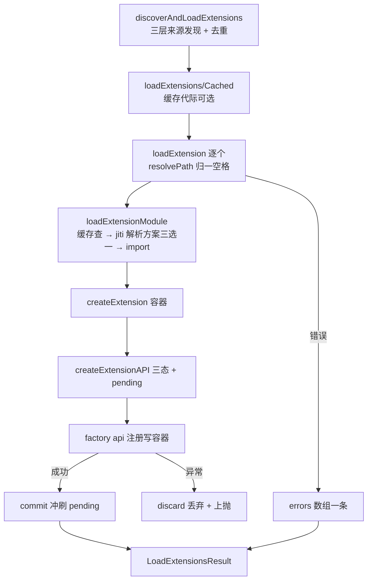

# D14：扩展加载器（`extensions/loader.ts`）精读

> 精读对象：`core/extensions/loader.ts`（28KB）与四个支持文件（`jiti-loader.ts`、`jiti-static-loader.ts`、`virtual-modules.ts`、`wrapper.ts`）。
> 对应主线：第 13 章（加载与生命周期）、第 12.3.4/14.9 节（扩展的形态与分发）。
> 读法：先读"四种运行时形态"（本文件最独特的地方），再读缓存/API/加载/发现四段。

---

## 0. 支持文件四件套

### 0.1 两个 jiti 入口：一段注释说明一切

【源码（完整）】

```typescript
// jiti-loader.ts
// Normal Node runtimes use jiti's lazy transform so Babel is loaded only when
// native loading fails and an extension needs transformation.
export { createJiti } from "jiti";

// jiti-static-loader.ts
// Compiled binaries need jiti's static entry so Bun and SEA bundlers embed the
// Babel transform. The module itself remains lazy until an extension is loaded.
export { createJiti } from "jiti/static";
```

【注解】

- **同一个 `createJiti` 的两个入口**：普通 Node 用 `jiti`（lazy transform——Babel 只在"原生加载失败且需要转换"时才被拉起）；**编译产物**（Bun/SEA）必须用 `jiti/static`（让打包器把 Babel **嵌入产物**——否则运行时没有文件系统可加载 Babel）。
- 【陷阱】这是"**源码形态与产物形态差异**"的典型处理：不是运行时代码分支，而是**模块解析分支**（两个十行文件，各自固定依赖）；loader 用 `import()` 动态选（第 1 节）。**读本仓库看到"xxx-loader 双子文件"时，先想"是不是在解决打包/运行形态差异"**。

### 0.2 `virtual-modules.ts`：给扩展的"宿主模块表"

【源码（节选）】

```typescript
import * as bundledPiAgentCore from "@earendil-works/pi-agent-core";
import * as bundledPiAiCompat from "@earendil-works/pi-ai/compat";
import * as bundledPiAiOauth from "@earendil-works/pi-ai/oauth";
import * as bundledPiAiProviders from "@earendil-works/pi-ai/providers/all";
import * as bundledPiTui from "@earendil-works/pi-tui";
import * as bundledTypebox from "typebox";
// ...
// This import is safe because loader.ts exports are not re-exported from index.ts.
// Extensions can therefore import from @earendil-works/pi-coding-agent.
import * as bundledPiCodingAgent from "../../index.ts";

/** Modules available to extensions in source and compiled binary runtimes. */
export const VIRTUAL_MODULES: Record<string, unknown> = {
	typebox: bundledTypebox,
	"@sinclair/typebox": bundledTypebox,
	// ...
	"@earendil-works/pi-agent-core": bundledPiAgentCore,
	"@earendil-works/pi-tui": bundledPiTui,
	// Extensions resolve the pi-ai root to the compat entrypoint (a strict
	// superset of the core entrypoint): existing extensions using the old
	// global API keep working at runtime until compat is removed.
	"@earendil-works/pi-ai": bundledPiAiCompat,
	"@earendil-works/pi-ai/compat": bundledPiAiCompat,
	// ...
	"@mariozechner/pi-agent-core": bundledPiAgentCore,
	// ...（@mariozechner/* 全套旧名映射）
};
```

【注解（四个要点）】

1. **虚拟模块 = "宿主替扩展解析的依赖"**：扩展代码里的 `import { ... } from "@earendil-works/pi-ai"` 会被 jiti 解析到**宿主进程里已加载的那份模块对象**（而不是扩展自己的 node_modules）。
   - 【陷阱】为什么必须这样？——第 12.3.6 节的"重复类/注册表"问题：如果扩展打进自己的一份 pi-ai，就会出现**两个 Registry、两个类身份**；虚拟模块保证"全世界只有一份"。**这也是 packages.md 要求 host 包放 `peerDependencies` 的运行时对应物**。
2. **`pi-ai` 根入口映射到 `compat`**（注释原文："a strict superset of the core entrypoint"）——**兼容策略**：老扩展从 `@earendil-works/pi-ai` 导入的是旧的全局 API（compat 层提供）；新核心入口是 `pi-ai/models` 等子路径。**"运行时兼容、直到 compat 移除"** 是一句有明确生命周期的承诺（读 changelog 时留意 compat 的移除）。
3. **旧包名 `@mariozechner/*`** 全套映射到同一批模块——**改名后的兼容层**（迁移完成的标志就是这组映射的删除；`legacy-api-aliases.ts` 在 ai 包也有同款）。
4. **`@earendil-works/pi-coding-agent` 能安全映射**的原因写在注释里："loader.ts exports are not re-exported from index.ts"——**循环依赖的预防靠导出纪律**（扩展 import 宿主包 → 宿主包 import loader？→ 若 loader 被 index 再导出就成环；设计上切断了它）。【陷阱】看到"为什么注释要解释 import 安全"时，说明作者在防一个具体的环——读 `packages/coding-agent/src/index.ts` 的导出清单可以验证。

### 0.3 `wrapper.ts`：扩展工具 → AgentTool 的最后一步

【源码（完整）】

```typescript
/**
 * Tool wrappers for extension-registered tools.
 *
 * These wrappers only adapt tool execution so extension tools receive the runner context.
 * Tool call and tool result interception is handled by AgentSession via agent-core hooks.
 */
import type { AgentTool } from "@earendil-works/pi-agent-core";
import { wrapToolDefinition } from "../tools/tool-definition-wrapper.ts";
import type { ExtensionRunner } from "./runner.ts";
import type { RegisteredTool } from "./types.ts";

/** Wrap a RegisteredTool into an AgentTool. Uses the runner's createToolContext(). */
export function wrapRegisteredTool(registeredTool: RegisteredTool, runner: ExtensionRunner): AgentTool {
	return wrapToolDefinition(registeredTool.definition, (toolCallId, signal) =>
		runner.createToolContext(toolCallId, signal),
	);
}

export function wrapRegisteredTools(registeredTools: RegisteredTool[], runner: ExtensionRunner): AgentTool[] {
	return registeredTools.map((tool) => wrapRegisteredTool(tool, runner));
}
```

【注解】

- 复用第 7.1.2 节的 `wrapToolDefinition`（ToolDefinition → AgentTool），**多传一个 `ctxFactory`**：运行时用 `runner.createToolContext(toolCallId, signal)` 造出扩展工具上下文（第 13.1.2 节的 `ctx`）。
- 文档注释划清职责：**wrapper 只做"上下文适配"**；拦截（tool_call/tool_result）由 `AgentSession` 经 agent-core 钩子处理（第 1 部分的 `beforeToolCall`/`afterToolCall` 与 runner 事件的组合点）。
- 【陷阱】`createToolContext` 需要 `toolCallId` 与 `signal`（**每次调用新建**）——ctx 是"调用域"对象而非长活对象；对比 `createExtensionAPI` 里 `on()` 的 handler 收到的 ctx（**每次派发新建**，第 D8 第 8 节）。**两种 ctx 都遵循"一次使用"原则**。

---

# 第一部分：环境检测、懒加载与缓存

## 1. 四种运行时形态

【源码（节选）】

```typescript
const isNodeSeaBinary =
	("sea" in process.features && process.features.sea === true) ||
	process.getBuiltinModule("node:sea")?.isSea() === true;
const isTypeScriptSourceRuntime = !isBunBinary && path.extname(fileURLToPath(import.meta.url)) === ".ts";
const usesEmbeddedModules = isBunBinary || isNodeSeaBinary || isBundledNode;
```

【注解（四个判定）】

| 判定 | 方法 | 含义 |
|---|---|---|
| Bun 二进制 | `isBunBinary`（来自 `config.ts`：`import.meta.url` 含 `$bunfs`/`~BUN`） | Bun 编译产物 |
| Node SEA | `process.features.sea` 或 `node:sea` 的 `isSea()` | Node 单可执行应用 |
| 源码 TS 运行 | `!isBunBinary && 本文件扩展名 === ".ts"` | `pi-test.sh` 的源码直跑 |
| 嵌入模块 | Bun 二进制 或 SEA 或 `isBundledNode` | 三种"没有 node_modules 可翻"的形态 |

- 【陷阱】**判定"当前处于哪种形态"用的是运行时的物理特征**（Babel 在不在、本文件是 .ts 还是 .js、进程特性），不是环境变量——**可靠性来自事实而非配置**。

## 2. 三份"解析方案"：`loadExtensionModule` 的核心分支

【源码（节选）】

```typescript
async function loadExtensionModule(extensionPath: string, cacheToken?: ExtensionCacheToken) {
	if (isCurrentCacheToken(cacheToken)) {
		const cachedFactory = extensionCache.get(extensionPath);
		if (cachedFactory) return cachedFactory;
	}

	const createJitiImpl = await getCreateJiti();
	// Compiled binaries and the bundled Node distribution use embedded modules.
	// Source TypeScript reuses host modules and root tsconfig paths. Unbundled
	// Node builds use dist aliases and do not need the bundled virtual modules.
	const resolutionOptions = usesEmbeddedModules
		? { virtualModules: await getVirtualModules(), tryNative: false }
		: isTypeScriptSourceRuntime
			? { virtualModules: await getVirtualModules(), tsconfigPaths: true }
			: { alias: getAliases() };
	const jiti = createJitiImpl(import.meta.url, { moduleCache: false, ...resolutionOptions });

	const module = await jiti.import(extensionPath, { default: true });
	const factory = module as ExtensionFactory;
	if (typeof factory !== "function") return undefined;
	if (isCurrentCacheToken(cacheToken)) extensionCache.set(extensionPath, factory);
	return factory;
}
```

【注解（三种解析方案 + 三个细节）】

1. **嵌入形态**（编译产物）：`virtualModules` + **`tryNative: false`**——【陷阱】为什么不试原生加载？因为编译产物里**没有真实的 node_modules 依赖树**（宿主模块都被嵌入了）；"试原生"必然失败还拖慢启动——直接走虚拟模块表。
2. **源码 TS 形态**：`virtualModules` + **`tsconfigPaths: true`**——源码环境复用宿主模块（同一份进程内模块）**并启用 tsconfig 路径映射**（第 2 章的 `source-resolver` 让内部导入走 `src/`；这里让**扩展**也能用同样的路径解析——比如扩展 import 宿主包的源码路径）。
3. **未打包的 Node 产物**（正常 `dist/` 安装）：`alias: getAliases()`——【陷阱】此时**不能用虚拟模块**（那些 import 指向源码/嵌入模块，构建产物里不存在）；用**别名表**把包名映射到**构建后的入口文件路径**（`getAliases` 里就是 `agent/dist/index.js`、`ai/dist/compat.js` 等——第 0 节的辅助）。
   - `getAliases` 的 `resolveWorkspaceOrImport`：**先找仓库内工作区路径**（`packages/xxx/dist/...`）——存在就用；否则退回 `import.meta.resolve(specifier)`（**安装形态**——从真实 node_modules 解析）。**"同一份代码在仓库里跑和从 npm 跑"** 的双路径解析。
4. **`moduleCache: false`**：jiti 自己的缓存关闭——**为什么？** 因为扩展有**自己的缓存机制**（`extensionCache` + 代际校验）；两份缓存会打架（jiti 的缓存无法按 cwd 代际失效）。**统一缓存入口**。
5. **缓存双查**：**进入时查**（`isCurrentCacheToken` + `extensionCache.get`）**返回时写**（再次校验 token——**加载可能耗时**，期间代际可能已变，第 D11 的"代际"思想）。【陷阱】`isCurrentCacheToken` 同时比 `cwd` 与 `generation`——**generation 变化（`clearExtensionCache`）或 cwd 变化都会命中失效**。
6. `jiti.import(extensionPath, { default: true })`：**只要默认导出**（`default: true`）；拿到的不是函数 → 返回 undefined → 上层报"does not export a valid factory function"（第 5 节）。

## 3. 缓存与代际：`clearExtensionCache` / `useExtensionCacheCwd`

【源码（完整）】

```typescript
let extensionCacheCwd: string | undefined;
let extensionCacheGeneration = 0;
const extensionCache = new Map<string, ExtensionFactory>();

interface ExtensionCacheToken {
	cwd: string;
	generation: number;
}

export function clearExtensionCache(): void {
	extensionCache.clear();
	extensionCacheCwd = undefined;
	extensionCacheGeneration++;
}

function useExtensionCacheCwd(cwd: string): ExtensionCacheToken {
	const resolvedCwd = resolvePath(cwd);
	if (extensionCacheCwd !== undefined && extensionCacheCwd !== resolvedCwd) {
		clearExtensionCache();
	}
	extensionCacheCwd = resolvedCwd;
	return { cwd: resolvedCwd, generation: extensionCacheGeneration };
}
```

【注解】

- 缓存是**模块级全局**（一个进程一份）；键是**扩展路径**，值是**工厂函数**。
- **cwd 变化即清空**（`useExtensionCacheCwd`）：为什么？因为**同一个相对路径在不同 cwd 下指向不同文件**（`resolvePath(extensionPath, cwd)`）；跨 cwd 复用工厂会把 A 项目的扩展带到 B 项目——**缓存键必须包含解析上下文**；这里的实现选择"**整个缓存按 cwd 代际失效**"（简单、正确）。
- `clearExtensionCache` 既清表又 `generation++`：**代际号给"进行中的加载"一个失效信号**（第 2 节的返回时校验）。
- 【陷阱】`useExtensionCacheCwd` 只在**启用缓存的路径**（`loadExtensionsCached`）里调用——普通 `loadExtensions` 不走缓存（每次真加载）。**两档 API 的动机**：启动路径/重载（缓存安全）、一次性加载（如测试，求新鲜）。

---

> D14 第一部分到此。第二部分：`createExtensionRuntime` 的 throwing stubs、`createExtensionAPI` 的三态与注册面、加载流程四函数（module/extension/initialize/load）、`discoverAndLoadExtensions` 的发现顺序与去重、总结与检查清单。
---

# 第二部分：API 构造、加载流程与发现

## 4. `createExtensionRuntime`：先"占位"，后绑定

【源码（头部，节选）】

```typescript
/**
 * Create a runtime with throwing stubs for action methods.
 * Runner.bindCore() replaces these with real implementations.
 */
export function createExtensionRuntime(): ExtensionRuntime {
	const notInitialized = () => {
		throw new Error("Extension runtime not initialized. Action methods cannot be called during extension loading.");
	};
	const state: { staleMessage?: string } = {};
	const eventBusUnsubscribers = new Set<() => void>();
	const assertActive = () => {
		if (state.staleMessage) {
			// ...（stale 时抛错）
```

【注解】

- **throwing stubs**：加载阶段（工厂执行前）调"动作方法"会**响亮报错**并说明原因（"cannot be called during extension loading"）——【陷阱】对比 D8 的 `ExtensionRunner` 字段默认值（**空操作**）：两层防御不同——runner 的字段是"绑定前不崩"，runtime 的 stub 是"加载期调用=明确错误"。**宽严的差异因为调用语义不同**（加载期不该有动作调用，出现即 bug）。
- `state.staleMessage`：失效后的一切调用抛"过期"错误（第 8 章的 invalidate 语义——runtime 面）。
- `eventBusUnsubscribers`：扩展间通信（`pi.events`）的订阅集合——**随运行时销毁统一退订**（第 13.4 节清理纪律的又一处）。

## 5. `createExtensionAPI`：三态生命周期

【源码（节选）】

```typescript
function createExtensionAPI(
	extension: Extension,
	runtime: ExtensionRuntime,
	cwd: string,
	eventBus: EventBus,
): { api: ExtensionAPI; commit: () => void; discard: () => void } {
	const pendingFlagValues = new Map<string, boolean | string>();
	const pendingRuntimeChanges: Array<() => void> = [];
	const loadingUnsubscribers: Array<() => void> = [];
	let state: "loading" | "active" | "failed" = "loading";
	const assertActive = () => {
		if (state === "failed") {
			throw new Error(`Extension "${extension.path}" failed to load and its API is no longer active.`);
		}
		runtime.assertActive();
	};
	const applyRuntimeChange = (change: () => void) => {
		if (state === "loading") pendingRuntimeChanges.push(change);
		else change();
	};
	const clearPending = () => {
		pendingFlagValues.clear();
		pendingRuntimeChanges.length = 0;
		loadingUnsubscribers.length = 0;
	};
```

【注解（"延迟应用"模式）】

- **三态**：`loading`（工厂正在执行）→ `active`（`commit()` 后）或 `failed`（`discard()` 后）。
- **`assertActive` 双检查**：本扩展 failed → 抛专属错误（带扩展路径，便于定位）；未 failed → 还要过 `runtime.assertActive()`（**整个运行时**被失效/替换的层面）。
- **延迟应用**：加载期把"需要改运行时/宿主的操作"攒在三个容器里：
  - `pendingFlagValues`（flag 默认值——避免加载半途就把值写进 runtime）；
  - `pendingRuntimeChanges`（注册 provider 之类的**动作**——闭包排队）；
  - `loadingUnsubscribers`（加载期建立的订阅——失败时要能全部退掉！）。
- **`commit()`/`discard()`**（返回给 `initializeExtension` 调用，第 6 节）：
  - commit 的实际顺序是：确认 runtime 有效 → 把尚不存在的 flag 默认值写入 `runtime.flagValues` → 按注册顺序逐个执行 pending runtime change → 状态切为 `active` → 清空暂存容器。flag 默认值先于 provider/MCP/virtual model 等 change 生效；这些 change 是依次应用，不是并行提交；
  - discard = 转 failed + `clearPending()`（**丢弃排队的一切**，包括加载期订阅的退订）。
- 【重要边界】pending 队列隔离的是 **factory 执行阶段**：factory 抛错时尚未执行的 runtime changes 会被丢弃，局部 extension 对象也不会返回；加载期 `pi.events.on` 的订阅会退订。但这不是 ACID 事务：commit 按顺序执行变更，如果某个 change 抛错，前面已经应用的变更没有通用回滚；外层会调用 `discard()`，它只能清空剩余 pending 并清理加载期订阅，无法自动撤销已生效的副作用。普通声明注册与宿主副作用也不是同一个容器。精细边界和失败案例见 [D22 第 3 节](D22-extension-loader-lifecycle.md#3-工厂初始化是一个小事务)。

## 6. 注册面：每个方法都校验，然后写进"扩展对象"

【源码（节选，注册方法逐个）】

```typescript
		on(event: string, handler: HandlerFn): () => void {
			assertActive();
			const registeredHandler: HandlerFn = (...args) => handler(...args);
			const list = extension.handlers.get(event) ?? [];
			list.push(registeredHandler);
			extension.handlers.set(event, list);

			return () => {
				const handlers = extension.handlers.get(event);
				if (!handlers) return;
				const handlerIndex = handlers.indexOf(registeredHandler);
				if (handlerIndex === -1) return;
				handlers.splice(handlerIndex, 1);
				if (handlers.length === 0) extension.handlers.delete(event);
			};
		},

		registerTool(tool: ToolDefinition): void {
			assertActive();
			if (typeof tool.parameters !== "object" || tool.parameters === null || Array.isArray(tool.parameters)) {
				throw new Error(`Tool "${tool.name}" registered by extension "${extension.path}" must define an object parameter schema.`);
			}
			extension.tools.set(tool.name, { definition: tool, sourceInfo: extension.sourceInfo });
			runtime.refreshTools();
		},

		registerCommand(name: string, options: Omit<RegisteredCommand, "name" | "sourceInfo">): void {
			assertActive();
			if (typeof name !== "string" || name.length === 0) { /* 抛：必须非空字符串名 */ }
			if (typeof options?.handler !== "function") { /* 抛：必须定义 handler() */ }
			extension.commands.set(name, { name, sourceInfo: extension.sourceInfo, ...options });
		},

		registerFlag(name: string, options: { description?: string; type: "boolean" | "string"; default?: boolean | string }): void {
			assertActive();
			if (options.default !== undefined && typeof options.default !== options.type) {
				throw new Error(`Invalid default for flag "${name}": expected ${options.type}, got ${typeof options.default}`);
			}
			extension.flags.set(name, { name, extensionPath: extension.path, ...options });
			if (options.default !== undefined && !runtime.flagValues.has(name)) {
				if (state === "loading") {
					if (!pendingFlagValues.has(name)) pendingFlagValues.set(name, options.default);
				} else {
					runtime.flagValues.set(name, options.default);
				}
			}
		},
```

【注解（注册面的三段式）】

1. **`on()`：包装 + 打标 + 可撤销**
   - `const registeredHandler = (...args) => handler(...args)`——**包一层**（`registeredHandler` 是"用于注销的稳定引用"：同一个函数可被 indexOf 找到；直接把原 handler 放进去在"同一函数注册多次"时会出错）。
   - 返回的退订器做了**三级清理**（找不到就返回；splice 一次；空表删键）——第 13.3.1 节的"可退订 + 不影响进行中的派发"在**注册数据结构**上的实现（D8 的 `snapshotEventHandlers` 是另一个侧面）。
   - 【陷阱】`extension.handlers` 是 **Map<event, HandlerFn[]>**（D8 的 runner `hasHandlers`/`snapshotEventHandlers` 读的就是它）——**加载器负责写、runner 负责读**（两个文件共同定义同一数据结构；读一侧时要回来看另一侧的写入约定）。
2. **`registerTool`：形状校验 + sourceInfo + 通知 runtime**
   - **参数 schema 必须是对象**（拒 null/数组）——**注册期就拦**（比"模型调用时才发现参数不是对象"早得多；错误信息带扩展路径与用法提示）。
   - 存成 `{ definition, sourceInfo }`（`RegisteredTool`）——**定义 + 来源**（诊断/`pi config` 展示用）。
   - `runtime.refreshTools()`：通知运行时"工具集变了"（触发后续的声明刷新/可用集重算——第 7.3 节的工具载入变化链的起点之一）。
3. **`registerCommand`/`registerFlags` 的校验哲学**：**能用类型表达的交给类型；类型管不到的（运行时值）当场检查**——command 名非空、handler 是函数、flag 默认值类型匹配（`typeof default !== options.type` 的**反向检查**——`type: "boolean"` 对应 `typeof "boolean"`，字符串匹配的巧妙写法）。
4. **flag 默认值的"不覆盖已有"**（`!runtime.flagValues.has(name)`）：**已有值优先**（命令行/设置里给过的值不被默认值覆盖）；加载期挂起（pending）→ commit 时落。
- 【陷阱】注册方法**不返回任何句柄**（除 `on()`）——**注册不可撤销**（除了运行时整体替换/失效）。对比 `on()` 的退订：**订阅可退、声明不可退**。设计含义：工具/命令/flag 是扩展的"身份构成"；运行中撤销它们需要更重的机制（就地替换整扩展——第 13.1.3 节的重载）。**读 API 时"返回值有无"直接告诉你可撤销性**。

## 7. 加载流程：四层函数

### 7.1 `createExtension` 与 `initializeExtension`

【源码（节选）】

```typescript
function createExtension(extensionPath: string, resolvedPath: string): Extension {
	const source = getSyntheticPathSource(extensionPath) ?? "local";
	const baseDir = isSyntheticPath(extensionPath) ? undefined : path.dirname(resolvedPath);
	return {
		path: extensionPath,
		resolvedPath,
		sourceInfo: createSyntheticSourceInfo(extensionPath, { source, baseDir }),
		handlers: new Map(), tools: new Map(), messageRenderers: new Map(), entryRenderers: new Map(),
		commands: new Map(), flags: new Map(), shortcuts: new Map(),
	};
}

async function initializeExtension(factory, extensionPath, resolvedPath, cwd, eventBus, runtime): Promise<Extension> {
	const extension = createExtension(extensionPath, resolvedPath);
	const load = createExtensionAPI(extension, runtime, cwd, eventBus);
	try {
		await factory(load.api);
		load.commit();
	} catch (error) {
		load.discard();
		throw error;
	}
	time(`${extensionPath} factory`, "extensions");
	return extension;
}
```

【注解】

- `createExtension`：**八个空集合**（handlers/tools/messageRenderers/entryRenderers/commands/flags/shortcuts + …）——**扩展对象 = 注册结果的容器**；`sourceInfo` 由路径推导（`source-info.ts` 的合成器；"synthetic path"= `<inline>` 之类的非真实路径——`baseDir` 取 undefined）。
- `initializeExtension`：**先建容器、再建 API（把容器包进注册面）、再跑工厂**——工厂的所有注册写进容器；**commit/discard 二选一**（异常时 discard 后 rethrow——**错误上抛给 `loadExtension` 统一转文本**）。
- `time(..., "extensions")`：耗时打点（第 19.2.2 节的打点体系，分类 "extensions"——`printTimings` 会把这组单独报）。

### 7.2 `loadExtension`：永不抛错的边界

【源码（节选）】

```typescript
async function loadExtension(extensionPath, cwd, eventBus, runtime, cacheToken?): Promise<{ extension: Extension | null; error: string | null }> {
	const resolvedPath = resolvePath(extensionPath, cwd, { normalizeUnicodeSpaces: true });

	try {
		const factory = await loadExtensionModule(resolvedPath, cacheToken);
		time(`${extensionPath} module import`, "extensions");
		if (!factory) {
			return { extension: null, error: `Extension does not export a valid factory function: ${extensionPath}` };
		}
		const extension = await initializeExtension(factory, extensionPath, resolvedPath, cwd, eventBus, runtime);
		return { extension, error: null };
	} catch (err) {
		const message = err instanceof Error ? err.message : String(err);
		return { extension: null, error: `Failed to load extension: ${message}` };
	}
}
```

【注解】

- **返回值而非抛错**（`{ extension, error }`）——**"坏扩展不炸启动"的实现边界**（第 13.1.1 节）：单个扩展的任何错误（找不到文件/语法错/工厂抛错）都变成**一条错误记录**，由调用方聚合进 `LoadExtensionsResult.errors`（第 7.3 节）。
- `resolvePath(..., { normalizeUnicodeSpaces: true })`：**路径里的"异体空格"归一**（Unicode 空格在路径/命令行里极难排查——比如从网页复制的命令带 NBSP；这个选项就是给这种坑的保险）。**读到这里可以回答"为什么有的路径要这么解析"**。
- 【陷阱】两种失败文案的区别：**"does not export a valid factory"**（模块加载成功但形状不对——最常见：忘了 `export default`）与 **"Failed to load extension: ..."**（加载/初始化抛错——带原始 message）。**排障时按文案分流**（第 19 章）。

### 7.3 `loadExtensionsInternal` 与两档公开 API

【源码（节选）】

```typescript
async function loadExtensionsInternal(paths, cwd, eventBus?, runtime?, useCache = false): Promise<LoadExtensionsResult> {
	const extensions: Extension[] = [];
	const errors: Array<{ path: string; error: string }> = [];
	const warnings: Array<{ path: string; warning: string }> = [];
	const cacheToken = useCache ? useExtensionCacheCwd(cwd) : undefined;
	const resolvedCwd = cacheToken?.cwd ?? resolvePath(cwd);
	const resolvedEventBus = eventBus ?? createEventBus();
	const resolvedRuntime = runtime ?? createExtensionRuntime();

	for (const extPath of paths) {
		const { extension, error } = await loadExtension(extPath, resolvedCwd, resolvedEventBus, resolvedRuntime, cacheToken);
		if (error) { errors.push({ path: extPath, error }); continue; }
		if (extension) extensions.push(extension);
	}
	return { extensions, errors, warnings, runtime: resolvedRuntime };
}

export async function loadExtensions(...) { return loadExtensionsInternal(paths, cwd, eventBus, runtime); }
export async function loadExtensionsCached(...) { return loadExtensionsInternal(paths, cwd, eventBus, runtime, true); }
```

【注解】

- **串行加载**（for+await）：每个扩展完整初始化并 commit 后才开始下一个；这会稳定 `extensions` 数组及后续 handler/资源遍历顺序。可观察的例子是同名工具冲突：`ExtensionRunner.getAllRegisteredTools()` 按扩展数组顺序遍历，并保留第一个注册；`extensions-runner.test.ts` 的 `keeps first tool when two extensions register the same name` 验证结果。因此顺序是行为契约，不能随意改成并行加载。加载期间的 provider API 操作先排队，runner 绑定后才进入模型注册表；不要把它描述成后一个工厂能立即使用前一个工厂刚注册的 provider。
- **可选注入** `eventBus`/`runtime`：不传则新建（**共享运行时**给"同一批加载"用——同一次加载的所有扩展共用 eventBus/runtime，保证它们能互相通信/共享 flag 值）。
- **结果 `{ extensions, errors, warnings, runtime }`**：`loadExtensionsInternal` 自己只写入 `errors`，并把 `warnings` 初始化为空数组；这是低层 loader 的结果形状。`DefaultResourceLoader` 会在其上合并两类 warning：扩展包把宿主提供的 pi 包错误地放在 `dependencies` 中（`collectExtensionPackageWarnings`），以及 replaceable 内置扩展被同名扩展替代（`omitReplacedExtensions`）。所以 warning 是否为空取决于调用层与资源，不应把低层实现外推到 SDK/CLI 最终结果。`extensions-discovery.test.ts` 验证直接发现加载的 warnings 为空；`resource-loader.test.ts` 验证资源加载阶段产生 package warning。

## 8. 发现：三段规则与三层来源

### 8.1 `resolveExtensionEntries`：目录 → 入口文件

【源码（节选）】

```typescript
/**
 * Resolve extension entry points from a directory.
 *
 * Checks for:
 * 1. package.json with "pi.extensions" field -> returns declared paths
 * 2. index.ts or index.js -> returns the index file
 *
 * Returns resolved paths or null if no entry points found.
 */
function resolveExtensionEntries(dir: string): string[] | null {
	const packageJsonPath = path.join(dir, "package.json");
	if (fs.existsSync(packageJsonPath)) {
		const manifest = readPiManifest(packageJsonPath);
		if (manifest?.extensions?.length) {
			const entries: string[] = [];
			for (const extPath of manifest.extensions) {
				const resolvedExtPath = path.resolve(dir, extPath);
				if (fs.existsSync(resolvedExtPath)) entries.push(resolvedExtPath);
			}
			if (entries.length > 0) return entries;
		}
	}
	const indexTs = path.join(dir, "index.ts");
	if (fs.existsSync(indexTs)) return [indexTs];
	const indexJs = path.join(dir, "index.js");
	if (fs.existsSync(indexJs)) return [indexJs];
	return null;
}
```

【注解】

- **优先级**：`pi.extensions`（清单声明——第 12.3.6 节的 manifest）→ `index.ts` → `index.js` → null。
- 【陷阱】**清单里声明的路径不存在时会被静默跳过**；若**全部**不存在（`entries.length === 0`）则**继续往 index 回退**——**"声明失败回退约定"**的顺序。想"只认声明"的场景（避免意外加载目录里别的文件）要依赖清单的有效性（或者等那句"清单为空报错"的改进——注意别把当前行为说错）。
- `readPiManifest`（`core/pi-manifest.ts`）：只读 `pi` 字段的轻量解析（manifest 的完整校验不在发现阶段——加载失败由后续环节报）。

### 8.2 `discoverExtensionsInDir`：三条规则，一层深度

【源码（节选）】

```typescript
/**
 * Discovery rules:
 * 1. Direct files: `extensions/*.ts` or `*.js` → load
 * 2. Subdirectory with index: `extensions/* /index.ts` or `index.js` → load
 * 3. Subdirectory with package.json: `extensions/* /package.json` with "pi" field → load what it declares
 *
 * No recursion beyond one level. Complex packages must use package.json manifest.
 */
function discoverExtensionsInDir(dir: string): string[] {
	if (!fs.existsSync(dir)) return [];
	const discovered: string[] = [];
	try {
		const entries = fs.readdirSync(dir, { withFileTypes: true });
		for (const entry of entries) {
			const entryPath = path.join(dir, entry.name);
			// 1. Direct files
			if ((entry.isFile() || entry.isSymbolicLink()) && isExtensionFile(entry.name)) {
				discovered.push(entryPath);
				continue;
			}
			// 2 & 3. Subdirectories
			if (entry.isDirectory() || entry.isSymbolicLink()) {
				const entries = resolveExtensionEntries(entryPath);
				if (entries) discovered.push(...entries);
			}
		}
	} catch { return []; }
	return discovered;
}
```

【注解】

- **恰好一层**（注释点明 "No recursion beyond one level"——复杂结构必须用清单声明）——**发现规则的可预测性**：用户能对"哪些文件会被加载"做心算。
- **符号链接被当作"文件或目录"**（`isSymbolicLink()` 与各自判断并列）——**支持 symlink 安装**（pnpm/开发时 link 扩展）。
- **整体 try/catch**（读目录失败 → 空数组 + 继续）——"发现不致命"（权限/竞态问题不会炸启动）。
- 【陷阱】`isExtensionFile` 只认 `.ts`/`.js` 后缀——**`.mjs`/`.cjs`/`.tsx` 不在此列？**（看实现：`name.endsWith(".ts") || name.endsWith(".js")`——**`.mts`/`.cts` 也不会命中**）。【陷阱】这是"约定边界"的实际形态；要加新后缀就改这一行（并补测试）。

### 8.3 `discoverAndLoadExtensions`：三层来源与去重

【源码（节选）】

```typescript
export async function discoverAndLoadExtensions(configuredPaths, cwd, agentDir = getAgentDir(), eventBus?): Promise<LoadExtensionsResult> {
	const resolvedCwd = resolvePath(cwd);
	const resolvedAgentDir = resolvePath(agentDir);
	const allPaths: string[] = [];
	const seen = new Set<string>();

	const addPaths = (paths: string[]) => {
		for (const p of paths) {
			const resolved = path.resolve(p);
			if (!seen.has(resolved)) { seen.add(resolved); allPaths.push(p); }
		}
	};

	// 1. Project-local extensions: cwd/${CONFIG_DIR_NAME}/extensions/
	addPaths(discoverExtensionsInDir(path.join(resolvedCwd, CONFIG_DIR_NAME, "extensions")));

	// 2. Global extensions: agentDir/extensions/
	addPaths(discoverExtensionsInDir(path.join(resolvedAgentDir, "extensions")));

	// 3. Explicitly configured paths
	for (const p of configuredPaths) {
		const resolved = resolvePath(p, resolvedCwd, { normalizeUnicodeSpaces: true });
		if (fs.existsSync(resolved) && fs.statSync(resolved).isDirectory()) {
			const entries = resolveExtensionEntries(resolved);
			if (entries) { addPaths(entries); continue; }
			addPaths(discoverExtensionsInDir(resolved));
			continue;
		}
		addPaths([resolved]);
	}

	return loadExtensions(allPaths, resolvedCwd, eventBus);
}
```

【注解（顺序即优先级）】

1. **项目本地**（`<cwd>/.pi/extensions/`——第 11.2 节的目录表；需要项目信任）。
2. **全局**（`<agentDir>/extensions/`——用户级）。
3. **显式配置**（设置/CLI 传入的路径——后面追加）。

- 【陷阱】**加载顺序 = 这个顺序**（先项目后全局再显式）——**后面加载的扩展在 handlers 列表更靠后**（D8 的"后注册后执行"）；**"谁覆盖谁"取决于具体机制**（工具同名=后者替换前者，第 14.1 节；事件=全部执行）。**别用笼统的"优先级"理解，按机制看**。
- **去重按绝对路径**（`seen` Set）——同一扩展从两个来源都被发现时只加载一次（第一次出现的顺序保留——`addPaths` 不改变已有项）。
- 【陷阱】**项目/全局目录的信任问题**：本函数**不做信任判定**（它只发现）；"未信任则不加载项目资源"由 **ResourceLoader 的调用方**（reload 的 `resolveProjectTrust` 流程，第 11.4.3 节）保证——**职责分层：发现者按需被发现，加载者按信任取用**。（读这段时不要以为漏了安全检查——它在上游。）

## 9. 总结

### 9.1 加载的一次完整旅程



### 9.2 五个设计要点

1. **四种运行时形态三种解析方案**（嵌入/源码/产物）——差异被压进一个三元表达式 + 两个十行 loader 文件。
2. **虚拟模块 = 宿主模块的"单例桥"**——防重复类/注册表（与 peerDependencies 规则配对）。
3. **三态 + pending/commit**：扩展加载是一个**小事务**（全成或全败）。
4. **`loadExtension` 永不抛错**——错误变成数据（坏扩展不炸启动）。
5. **发现只做发现**（信任/禁用在别处）——单层规则、路径去重、按绝对路径判重。

### 9.3 阅读检查清单

- [ ] 我能说出三种解析方案各自的适用形态与关键选项吗？
- [ ] 我知道两个 jiti 入口分别给谁用吗？（lazy vs static）
- [ ] 我能解释"虚拟模块"防的是什么具体问题吗？
- [ ] 我能复述 `createExtensionAPI` 的三态与 commit/discard 的语义吗？
- [ ] 我知道 `loadExtension` 两种错误文案的分流含义吗？
- [ ] 我能说出发现的三层顺序与"信任判定不在这一层"吗？

---

> D14 完。精读篇（D1-D14）覆盖：循环、Agent、会话（投影/本体）、提示与压缩（读/写）、SDK、CLI、工具、扩展（类型/派发/加载）、模型层、协议模式、交互模式。
