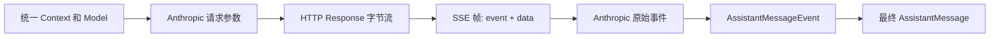

# D17：Anthropic 流式请求与 SSE 解码

> 精读对象：`packages/ai/src/providers/anthropic.ts`、`packages/ai/src/api/anthropic-messages.lazy.ts`、`packages/ai/src/api/anthropic-messages.ts` 中的 `stream`、`iterateSseMessages`、`iterateAnthropicEvents`、`buildParams`，以及 `packages/ai/src/utils/event-stream.ts` 的 `AssistantMessageEventStream`。
>
> 对应主线：第 4、5、6、7 章。本文把“一次模型请求”从 pi 的统一接口一路追到 Anthropic SSE，再追到 Agent 能消费的统一事件。
>
> 基线：仓库提交 `200387122ca450d6387f033949423114a270b96c`。代码摘录为节选；请以本地源码为准。

## 0. 先建立一张心智图

“模型流”不是一根直接从 API 传到屏幕的字符串。中间至少有四种不同的数据形状：



可以把它想成翻译流水线：pi 先把自己的对话翻成 Anthropic 的请求格式；网络返回的是按字节分段的数据；SSE 解码器把字节拼成协议帧；provider 适配器再把供应商事件翻译成 pi 的事件；最后 pi 的消息累积器保存完整回答。

| 形状 | 例子 | 谁负责产生 | 主要用途 |
|---|---|---|---|
| pi 上下文 | `TranscriptContext` | Agent / `normalizeContext` | 统一表达 system、user、assistant、tool result |
| Anthropic 请求 | `MessageCreateParamsStreaming` | `buildParams` | 符合 Anthropic Messages API 的 JSON |
| SSE 帧 | `{ event, data, raw }` | `iterateSseMessages` | 从任意网络分块中还原事件边界 |
| Anthropic 事件 | `message_start`、`content_block_delta` | JSON 解析 | 保留供应商协议语义 |
| pi 事件 | `text_delta`、`toolcall_start` | `stream` | 让上层不依赖 Anthropic 协议 |
| 最终消息 | `AssistantMessage` | 同一个 `stream` 累积 | Agent 决定结束、执行工具或报错 |

【陷阱】SSE 是一套文本协议，不是“每个网络 chunk 就是一个完整事件”。TCP、HTTP、ReadableStream 的分块点没有业务语义。一次 chunk 可能只有半个 UTF-8 字符；一个 chunk 可以包含多个 SSE 事件；一个事件也可能分散在很多 chunk 里。

## 1. 从 provider 定义走到真实实现

### 1.1 对外 provider 并不直接装载大实现

`providers/anthropic.ts` 的 `anthropicProvider()` 创建 `Provider`，其中 `api` 来自一个 lazy wrapper：

```typescript
// packages/ai/src/api/anthropic-messages.lazy.ts
import type { ProviderStreams } from "../types.ts";
import { lazyApi } from "./lazy.ts";

export const anthropicMessagesApi = (): ProviderStreams => lazyApi(() => import("./anthropic-messages.ts"));
```

逐行理解：

1. `ProviderStreams` 是类型，使用 `import type`，不会成为运行时模块依赖。
2. `lazyApi` 收到一个“需要时才加载实现”的函数。
3. `import("./anthropic-messages.ts")` 是动态导入；这里用它把 provider 实现留到首次使用时加载。它是仓库现有的显式 lazy-loading 实现，不是新代码应随意照抄的导入形式。
4. provider 注册时可以先拿到稳定的接口对象，不必立刻装入 Anthropic SDK 和这个较大的转换模块。

【跳转】读 `packages/ai/src/api/lazy.ts` 的 `lazyApi`，确认首个 `stream` 调用怎样触发模块加载，以及加载失败怎样传回调用方。读 lazy wrapper 时要跟踪所有方法，不要只看 `stream`：同一个 `ProviderStreams` 可能含 `streamSimple`、`fetchDeferred` 等能力。

### 1.2 provider 文件负责身份与认证，不负责逐事件转换

`anthropicProvider()` 提供 provider id、模型清单、API 实现和 auth 配置。认证 `resolve` 的优先级有存储凭据、环境变量 token/key，以及工作负载身份联合认证。它最后生成调用选项，真正发请求和解码响应的是 `api/anthropic-messages.ts`。

```text
createProvider({
  id: "anthropic",
  auth: { apiKey: ..., oauth: ... },
  models: ...,
  api: anthropicMessagesApi(),
})
```

【陷阱】看到 `anthropic.ts` 不要误以为整个 Anthropic 适配器都在这个文件里。这里是“provider 注册和认证入口”；请求体构造、SSE 解码、消息映射在 `api/anthropic-messages.ts`。

## 2. 请求方向：pi 的对话如何变成 Anthropic JSON

### 2.1 `stream` 同时拿到模型、上下文和调用选项

适配器导出的 `stream(model, context, options)` 实现 `StreamFunction<"anthropic-messages", AnthropicOptions>`。返回类型是 `AssistantMessageEventStream`，调用本身立即返回一个流对象；实际网络工作放在内部异步任务里执行。

```typescript
export const stream: StreamFunction<"anthropic-messages", AnthropicOptions> = (
  model,
  context,
  options,
): AssistantMessageEventStream => {
  const stream = new AssistantMessageEventStream();
  const normalizedContext = resolveTranscript(context, getAnthropicCompat(model).supportsMidConvoSystemMessages);
  const currentTools = getCurrentTools(normalizedContext.messages);

  (async () => {
    const output: AssistantMessage = {
      role: "assistant",
      content: [],
      api: model.api as Api,
      provider: model.provider,
      model: model.id,
      usage: /* 各计数先置 0 */,
      stopReason: "pending",
      timestamp: Date.now(),
    };
    try {
      // 创建客户端、构造 params、发请求、消费 SSE……
    } catch (error) {
      // 把异常变成 error 事件
    }
  })();

  return stream;
};
```

这是一个“返回流句柄 + 后台生产事件”的模式。消费者可以先得到流，再用 `for await` 逐事件消费，也可以调用 `.result()` 等待最终结果。

【新手词汇】

- `async` 函数调用返回 `Promise<T>`，不会同步拿到 `T`。
- `AsyncIterable<T>` 是可以用 `for await (const x of value)` 逐项读取的异步序列。
- 这里 `stream` 函数本身不是 `async`，所以它返回的是流句柄，不是 `Promise<流句柄>`。
- 内部 IIFE（立即调用的 async 函数）负责生产数据；它不会改变外层函数的返回类型。

### 2.2 `buildParams` 是请求翻译的中心

核心步骤包括：

1. 从 pi transcript 找初始 system message 与工具定义。
2. 调用 `transformMessages`，把 pi 的消息转换成 Anthropic 的 `messages`。
3. 将文本、图片、工具调用、工具结果等转换成供应商认可的 content block。
4. 添加 `model`、`max_tokens`、`stream: true`。
5. 按模型能力与选项添加 thinking、effort、tool choice、cache control、beta features。
6. OAuth 请求可能需要 Claude Code 身份 system block；普通 API key 请求不会添加这段身份声明。

简化后的结果形状：

```typescript
const params: MessageCreateParamsStreaming = {
  model: model.id,
  messages: convertedMessages,
  max_tokens: options?.maxTokens ?? model.maxTokens,
  stream: true,
  // 按需增加 system / tools / thinking / betas 等字段
};
```

`??` 是空值合并：只有左侧是 `null` 或 `undefined` 才用右侧。`||` 会把 `0`、空字符串也视为需要回退；读配置默认值时二者不总能互换。

`onPayload` 是发送前的宿主钩子。适配器先生成 params，再允许调用方修改。若钩子返回了新对象，代码会强制重新写入 `stream: true`，保证该入口的流式契约不被覆盖。

### 2.3 发请求之前还有认证、重试与取消

真实流程的关键顺序如下：

```text
拿到已解析的 apiKey / headers / env
  → 若不是注入 client，创建 Anthropic SDK client
  → buildParams(model, context, options)
  → await onPayload（如果存在）
  → client.beta.messages.create(params, requestOptions).asResponse()
  → retryProviderRequest(...)
  → await onResponse（如果存在）
  → push start 事件
  → 开始读取响应 body
```

`requestOptions` 带 `signal`、timeout，并把 SDK 自己的 `maxRetries` 设为 `0`。重试交由 `retryProviderRequest`，避免 SDK 重试和 pi 重试叠加。`AbortSignal` 是取消协作信号：网络层可据此停止请求；适配器在读流后也会检查取消状态。

【陷阱】`start` 事件是在 HTTP 请求成功并拿到响应后 push 的，不是在函数一进入就 push。连接或鉴权失败时，消费者可能首先只收到最终 `error`，没有 `start`。不要依赖“每次调用都一定有 start”。

## 3. SSE 解码：网络字节到协议帧

### 3.1 SSE 帧最小规则

SSE 以文本行表示。常见形式：

```text
event: content_block_delta
data: {"type":"content_block_delta","index":0,"delta":{"type":"text_delta","text":"Hi"}}

```

空行表示一个事件结束。`event:` 给事件名；一个或多个 `data:` 行拼接为数据文本。以冒号开头的行是注释/心跳，不是消息。行分隔可以是 LF、CRLF，或 CR。

这里的协议事件边界来自空行，不来自 HTTP chunk 边界。比如网络可能这样交付：

```text
chunk 1: "event: content_bl"
chunk 2: "ock_delta\ndata: {\"type\":"
chunk 3: "...}\n\n"
```

因此解析器需要保留尚未完整的尾部 buffer。

### 3.2 `decodeSseLine` 只解析一行

```typescript
function decodeSseLine(line: string, state: SseDecoderState): ServerSentEvent | null {
  if (line === "") return flushSseEvent(state);

  state.raw.push(line);
  if (line.startsWith(":")) return null;

  const delimiterIndex = line.indexOf(":");
  const fieldName = delimiterIndex === -1 ? line : line.slice(0, delimiterIndex);
  let value = delimiterIndex === -1 ? "" : line.slice(delimiterIndex + 1);
  if (value.startsWith(" ")) value = value.slice(1);

  if (fieldName === "event") state.event = value;
  else if (fieldName === "data") state.data.push(value);
  return null;
}
```

【注解】

- `state` 是跨行、跨 chunk 的累积状态：当前事件名、data 行数组、raw 原始行。
- 遇到空行时 `flushSseEvent` 才产出完整帧。
- `data` 是数组，因为 SSE 允许多行 data；flush 时用换行符合并。
- `raw` 用于报错诊断。解析失败时可以看到服务器实际送来的行，而不是只有一个不透明的 JSON parse 错误。
- 只移除冒号后面的**一个可选空格**，这是 SSE field value 规则的一部分。
- 未识别字段不影响 `event` / `data`；解析器只消费自己需要的字段。

【陷阱】`line.startsWith(":")` 必须在拆字段之前处理。若把 `: heartbeat` 当普通字段，它没有 `event`/`data`，虽最终可能被忽略，但会污染诊断原文或产生错误假设。

### 3.3 `consumeLine` 处理 CR、LF 与 CRLF

`nextLineBreakIndex` 找最靠前的 `\r` 或 `\n`。`consumeLine` 取出换行符之前的内容，并在 `\r\n` 时一次跳过两个字符。

为什么不能只用 `buffer.split("\n")`？因为：

- SSE 行允许 CR；
- CRLF 由两个字符表示，不应变成一个空行再多解析一次；
- 最后一个片段可能没有换行符，不能提前当成完整行；
- UTF-8 多字节字符可能被拆在相邻的字节 chunk 之间，必须由 `TextDecoder` 的流式模式保留不完整字节。

### 3.4 `iterateSseMessages` 的缓冲循环

主体逻辑可以缩写成：

```typescript
const reader = body.getReader();
const decoder = new TextDecoder();
let buffer = "";

try {
  while (true) {
    if (signal?.aborted) throw new Error("Request was aborted");
    const { value, done } = await reader.read();
    if (done) break;

    buffer += decoder.decode(value, { stream: true });
    let consumed = consumeLine(buffer);
    while (consumed) {
      buffer = consumed.rest;
      const event = decodeSseLine(consumed.line, state);
      if (event) yield event;
      consumed = consumeLine(buffer);
    }
  }

  buffer += decoder.decode(); // flush TextDecoder 里保留的尾部字节
  // 解析完整尾行，并 flush 未被空行结束的最后一个 SSE 帧
} finally {
  reader.releaseLock();
}
```

【源码推导出的边界问题】当前循环每次读到 chunk 后立刻调用 `consumeLine`。若一块以 `\r` 结束、下一块以 `\n` 开始，解析器会先把 `\r` 当作完整行结束符消费；下一块的开头 `\n` 又会被当作空行：

```text
chunk 1: "event: message_start\\r"
  → 保存 event=message_start
chunk 2: "\\ndata: {...}\\r\\n\\r\\n"
  → 开头的 LF flush 出 { event: message_start, data: "" }
  → 后续 data 行没有 event 名，最终无法还原原来的 message_start 帧
```

`iterateAnthropicEvents` 随后会尝试解析空 data，最终进入 error 终态。SSE 允许 CRLF；ReadableStream 可以在 CR 和 LF 之间分块，因此这是当前实现应重点验证的边界。一个常见修复方向是在 chunk 末尾暂存 `CR`，等下一字符到达后判断它是否与 `LF` 组成 `CRLF`；修复时需要同步处理 EOF 恰好结束在 `CR` 的情况。

【验证边界】在基线 `anthropic-sse-parsing.test.ts` 中没有找到 CRLF 跨 chunk 的针对性测试。上面的失败轨迹是由当前源码控制流推导出的，不是本篇实际运行测试得到的结果。修改前应先为“CRLF 同块 / 跨块、单独 CR、LF、EOF 尾行”分别编写确定性输入测试。

生成器的 `finally` 会释放 reader lock。它不是主动取消底层请求的充分保证；请求取消仍应通过 `AbortSignal` 传到底层 fetch/SDK。释放 lock 的职责是清理当前 reader 对流的独占读取权。

## 4. SSE 帧到 Anthropic 原始事件

`iterateAnthropicEvents(response, signal)` 是第二层边界：它不再关心字节切分，只负责把 SSE 帧校验、筛选、解析成 Anthropic 事件。

```typescript
const ANTHROPIC_MESSAGE_EVENTS = new Set([
  "message_start", "message_delta", "message_stop",
  "content_block_start", "content_block_delta", "content_block_stop",
]);

for await (const sse of iterateSseMessages(response.body, signal)) {
  if (sse.event === "error") throw new Error(sse.data);
  if (!ANTHROPIC_MESSAGE_EVENTS.has(sse.event ?? "")) continue;

  const event = parseJsonWithRepair<RawMessageStreamEvent>(sse.data);
  // 记录是否见到 message_start / message_stop
  yield event;
}
```

为什么筛选事件名？供应商可能增加非消息事件，适配器不要把不认识的东西强行当作 `RawMessageStreamEvent`。

为什么同时记录 `message_start` 与 `message_stop`？如果服务器已经开始一个消息，却在没有 `message_stop` 的情况下断流，调用方不能把它误认为正常完成。函数在流结束后检查这一不变量并抛错。

解析 JSON 失败时，错误会包含 event 名、原始 data 与原始行。这使问题能区分为“传输帧坏了”或“Anthropic payload 不是预期 JSON”。

【陷阱】SSE 的 `event:` 和 JSON 的 `type` 是两份信息。代码按 `event:` 筛选，再把 data JSON 解析成带 `type` 的对象。服务端两者若不一致，TypeScript 泛型本身不会在运行时替你校验；类型断言不是验证器。

## 5. 原始供应商事件到 pi 统一事件

### 5.1 一份累积消息配一张活动 block 表

适配器创建一个 `AssistantMessage output`，其 `content` 数组边消费边增长。为了把 Anthropic block index 转回 pi 内容数组下标，临时 block 上保存供应商 index：

```typescript
type Block = (ThinkingContent | TextContent | (ToolCall & { partialJson: string })) & { index: number };
const blocks = output.content as Block[];
```

临时的 `index` 和 `partialJson` 是适配器内部 scratch state，不应该持久化进最终消息。每个 block 结束时移除 `index`；错误收尾也会移除 `index` 与 `partialJson`。

### 5.2 `message_start`：建立回答身份与 usage 初值

Anthropic 的 `message_start` 更新：

- response id；
- 实际响应模型（供应商可能返回 fallback model）；
- 输入、输出、cache read/write token 初值；
- 按实际模型成本重新计算 usage cost。

初值很重要：即使回答中途被取消，至少已经知道的输入 token 不应丢失。之后 `message_delta` 如果带 usage，只更新不为 `null` 的字段。代理可能省略某些计数，直接覆盖成零会丢失 `message_start` 的有效值。

【新手词汇】`null` 和 `undefined` 不同。这里用 `!= null` 同时排除两者；字段存在但为 `0` 时仍会更新，不能写 `if (value)`，否则零会被当成“没提供”。

### 5.3 `content_block_start`：先创建块，再发 start

不同供应商 block 映射如下：

| Anthropic content block | pi content | 发出的统一事件 |
|---|---|---|
| `text` | `{ type: "text", text }` | `text_start` |
| `thinking` | `{ type: "thinking", thinking, thinkingSignature }` | `thinking_start` |
| `redacted_thinking` | thinking，带 redacted 标记 | `thinking_start` |
| `tool_use` | `{ type: "toolCall", id, name, arguments }` | `toolcall_start` |

事件里附带共享的 `partial: output`。消费者收到 start 时，可以从 `partial.content[contentIndex]` 读到刚创建的块。

OAuth 下工具名可能按 Claude Code 的命名规则转换；工具调用参数是部分输入时则先使用 `content_block_start` 提供的 input，后续 JSON delta 再补齐。

### 5.4 `content_block_delta`：更新累积值并发送增量

文本增量的核心顺序：

```typescript
block.text += event.delta.text;
stream.push({
  type: "text_delta",
  contentIndex: index,
  delta: event.delta.text,
  partial: output,
});
```

顺序不可随便调换。事件的 `partial` 是共享累积对象；先把 delta 加进去，再通知消费者，消费者看到的 `partial` 已包含当前增量。`delta` 则只包含本次新增片段，不是完整文本。

thinking 同理。工具参数比较特别：Anthropic 可能逐片发送 JSON 字符串 `partial_json`。适配器将片段追加到 `partialJson`，调用 `parseStreamingJson` 尝试解析一个暂时不完整的 JSON，再发 `toolcall_delta`。解析器需要允许“前缀还不完整”；真正调用工具前，Agent 会在其自己的参数校验与执行流水线里处理完整参数。

【陷阱】不要把一次 `toolcall_delta` 当成一个合法 JSON 对象。网络片段可能是 `{"path":"src/`，下一个才是 `main.ts"}`。增量用于展示进度，终态参数才是执行输入。

### 5.5 `content_block_stop`：结束内容块并清理临时字段

适配器根据对应 block 发出 `text_end`、`thinking_end` 或 `toolcall_end`。

工具块结束时重新从完整 `partialJson` 解析参数，删除 `partialJson`，然后把正式 `toolCall` 放进 `toolcall_end`。`toolcall_end` 不是工具已经执行的信号，它只是“模型输出了完整工具调用”。真正工具执行事件由 `packages/agent/src/agent-loop.ts` 在 provider 流结束并确认 stop reason 后产生。

### 5.6 `message_delta`：确定停止语义与最终计数

`mapStopReason` 把供应商停止原因映射到 pi 的 `StopReason`：

| Anthropic | pi | Agent 后续常见行为 |
|---|---|---|
| `end_turn` | `stop` | 这一轮结束 |
| `max_tokens` | `length` | 输出长度受限 |
| `tool_use` | `toolUse` | Agent 可执行 tool calls |
| `refusal` | `error` + 原因 | 作为错误处理 |
| `pause_turn` | `stop` | 需要时后续重新提交 |
| 未知值 | 抛错 | 进入适配器 error 终态 |

Anthropic 没有统一 `total_tokens` 字段，适配器根据 input/output/cache read/cache write 合计。reasoning token 是 output token 的子集，不能再加一次，否则会重复计数。

## 6. 正常终态、错误终态与取消

成功路径在完整读取响应后检查三件事：

1. signal 没有被 abort；
2. `stopReason` 已经离开初始的 `pending`；
3. stop reason 不是 `aborted` 或 `error`。

如有 input transformations，会附加诊断记录。最后 push `{ type: "done", reason, message: output }` 并 `end()`。

错误路径做清理，然后 push `{ type: "error", reason, error: output }` 并 `end()`。`output.stopReason` 根据 signal 是否已 abort 选 `aborted` 或 `error`；错误信息保存在 `errorMessage`。

```text
HTTP / SSE / JSON / 回调异常
  → catch
  → 移除临时 index 和 partialJson
  → stopReason = aborted 或 error
  → push error event
  → end stream
```

这就是“适配器把异常转成统一数据”的边界。上层不需要只靠 try/catch 捕获 provider 内部错误，还能通过统一事件流看到终态。

### 6.1 `.result()` 为什么能结束

`AssistantMessageEventStream` 继承 `EventStream<AssistantMessageEvent, AssistantMessage>`：

```typescript
constructor() {
  super(
    (event) => event.type === "done" || event.type === "error",
    (event) => event.type === "done" ? event.message : event.error,
  );
}
```

`EventStream.push` 检查事件是否终态；如果是，就 resolve 内部 `finalResultPromise`。于是：

- 迭代器消费者逐个处理 `start/delta/end/done/error`；
- `.result()` 消费者等待 `AssistantMessage`；
- 在这个实现里 `error` 的 `.result()` 也 resolve 为携带错误状态的 `AssistantMessage`，不是 reject。

【陷阱】不能凭“函数名叫 error”就推断 Promise reject。必须读 `EventStream` 的 `extractResult` 和 `resolveFinalResult`。这也是 pi 中“错误事件”和“JS 异常”两种通道的差异。

`end()` 负责通知所有等待中的 async iterator：后面不会再有事件。`done/error` 事件本身负责提供最终结果。两者职责不同。

## 7. 一次工具调用完整轨迹

用户：“读取 `notes.txt` 并总结。”初始请求没有文件内容：

```text
1. Agent 把用户消息和 read 工具定义传给 pi-ai
2. pi-ai 把上下文转为 Anthropic Messages API 请求
3. Anthropic 返回 message_start
4. 返回 content_block_start(type=tool_use)
5. 返回若干 content_block_delta(input_json_delta)
6. 返回 content_block_stop、message_delta(stop_reason=tool_use)、message_stop
7. Anthropic adapter 发出 toolcall_start / toolcall_delta / toolcall_end / done
8. Agent 检查最终 stopReason=toolUse，进入工具调度
9. 本地 read 工具运行并产生 tool result 消息
10. Agent 发起下一次模型请求，新的 transcript 带上 tool result
11. 模型基于读到的内容生成文本，adapter 发 text_* 和 done
```

注意 7 和 8 的责任边界：provider 只报告“模型要求调用这个工具”；Agent 才有能力把 tool call id 与本地工具实现匹配、验证参数、执行工具、记录结果并决定继续请求。

【跳转】回到 `packages/agent/src/agent-loop.ts` 的 `streamAssistantResponse`、`prepareToolCall`、`executePreparedToolCall`、`finalizeExecutedToolCall`，对照本篇第 5.5 节。provider 适配器和 Agent loop 两边都叫 tool call，但前者是模型输出，后者才是本地动作。

## 8. 常见误读

| 误读 | 正确读法 |
|---|---|
| 一个 HTTP chunk 就是一个 SSE event | chunk 是传输分段，事件由 SSE 空行界定 |
| `text_delta.delta` 是当前完整回答 | 它只含新增片段；完整文本在 `partial` 中持续累积 |
| `toolcall_end` 代表工具已执行 | 它代表模型的 tool call 参数已经结束 |
| `message_stop` 就等于 Agent run 结束 | 它只结束 provider 响应；Agent 可能执行工具并再次请求模型 |
| TS 的 `RawMessageStreamEvent` 能验证 JSON | 泛型只影响编译期；运行时还需要 parse 与形状/协议检查 |
| error 事件会让 `.result()` reject | 该流把 `event.error` resolve 为最终消息，需检查 `stopReason` |
| 收到 `message_start` 后没有 `message_stop` 也算成功 | `iterateAnthropicEvents` 将其作为不完整流报错 |
| reasoning tokens 要加到 total tokens | 这里 reasoning 是 output 的子集，不重复相加 |
| provider 发出了 tool use 就应该由 provider 执行 | provider 只做协议转换；通用 Agent 层负责工具匹配与执行 |

## 9. 读源码的推荐顺序

按以下顺序逐个打开定义：

1. `packages/ai/src/providers/anthropic.ts` → `anthropicProvider`：provider 身份、认证、模型清单。
2. `packages/ai/src/api/anthropic-messages.lazy.ts` → `anthropicMessagesApi`：懒加载边界。
3. `packages/ai/src/api/lazy.ts` → `lazyApi`：延迟加载的确切语义。
4. `packages/ai/src/api/anthropic-messages.ts` → `stream`：创建累积消息、发请求、转事件、终态。
5. 同文件 → `buildParams`、`convertMessages`、`convertTools`：请求转换。
6. 同文件 → `iterateSseMessages`、`decodeSseLine`、`flushSseEvent`：传输解析。
7. 同文件 → `iterateAnthropicEvents`：帧到 JSON 事件。
8. `packages/ai/src/utils/event-stream.ts` → `AssistantMessageEventStream`、`EventStream`：消费者看到的迭代和最终结果。
9. `packages/ai/test/anthropic-sse-parsing.test.ts`：测试构造出的 SSE 响应与断言。
10. `packages/agent/src/agent-loop.ts`：provider 终态之后的工具循环。

不要从 1,500 行的 provider 实现第一行一路读到最后一行。按“请求转换 → 传输 → 事件映射 → 终态”的行为切片阅读，遇到工具/schema 的细节再跳过去。

## 10. 测试应该证明什么

现有 `packages/ai/test/anthropic-sse-parsing.test.ts` 用构造出来的 `Response` 与假的 Anthropic client，不需要网络和真实 API key。测试把 SSE 字符串变成 `Response`，再断言统一消息、事件顺序或诊断行为。

读测试时至少找这些类别：

- 正常 `message_start → block → delta → block_stop → message_delta → message_stop`；
- text、thinking、redacted thinking、tool use 各种 block 映射；
- 原始 provider 事件回调是否按顺序等待；
- input/output/cache usage 是否按增量正确合并；
- provider fallback model 是否影响响应元数据与成本；
- SSE 错误、坏 JSON、意外断流是否成为 error 终态；
- 不完整工具 JSON 是否只用于流式预览、结束时再正式解析；
- SSE 行与网络 chunk 的边界是否有覆盖，包括 UTF-8、CRLF 跨块、多个 data 行、尾帧。当前测试中未找到 CRLF 跨块的针对性断言。

最后一项是读测试的审计清单：若看不到相应断言，不要因为 decoder 看起来处理了边界就宣称“全部边界已测试”。测试名字和 helper 只能提示意图，真正证明行为的是断言覆盖的输入与输出。

如果未来修 parser，先添加最小回归测试：固定字节 chunk 序列，说明预期 event 数、data 文本、终止行为。再改实现。不要用时间延迟去模拟网络分块；直接控制 `ReadableStream` 每次 enqueue 的字节即可。

## 11. 练习

### 练习 A：画出两条边界

从 `stream(...)` 开始，在纸上画一条箭头链，明确指出：

- `buildParams` 输入什么、输出什么；
- 哪个函数读 `ReadableStream<Uint8Array>`；
- 哪个函数将 SSE `data` 变成 Raw event；
- 哪个函数将 provider event 变成 pi event；
- 哪一层启动本地工具。

参考：本篇第 0、2、3、4、5、7 节。

### 练习 B：手工追踪文本 delta

供应商依次发送 `"Hel"`、`"lo"` 两个 text delta。写出每一步后的：

- `output.content[0].text`；
- 事件中的 `delta`；
- `contentIndex`；
- 最后 `text_end.content`。

答案：累积值依次是 `Hel`、`Hello`；delta 分别为 `Hel` 与 `lo`；通常同一块的下标为 0；结束内容为 `Hello`。

### 练习 C：错误在哪一层

分别判断以下错误最先在哪层发现：

1. HTTP 200 body 为 null；
2. `data:` 不是合法 JSON；
3. 看见 `message_start` 后 TCP 断开，没有 `message_stop`；
4. 流最终 `stop_reason` 是不认识的值；
5. 模型返回未知 tool name。

答案：1 在 `iterateAnthropicEvents` 入口；2 在 JSON parse；3 在 `iterateAnthropicEvents` 末尾完整性检查；4 在 `mapStopReason`；5 通常在 Agent 工具调度/校验边界，而不是 SSE 解码器。

### 练习 D：为什么两个事件流

用一句话分别解释 Anthropic Raw event 和 `AssistantMessageEvent` 的价值。

答案：Raw event 保留供应商协议信息，便于兼容和诊断；统一事件让 Agent 与 UI 不必为每个供应商写一套循环和渲染逻辑。

## 12. 本篇事实与验证边界

- **静态核对**：本篇引用的符号、请求/事件流转、最终消息处理均以给定基线源码为准。
- **未运行**：本篇撰写时没有运行 `anthropic-sse-parsing.test.ts`；因此不把测试状态标成“本地已运行”。
- **离线实验**：对应测试通过 fake client 与本地 `Response` 构造输入，不要求真实模型账号；运行命令按第 18 章的 package 测试说明执行。
- **平台**：provider 代码使用 Node/Fetch 的跨平台 API；本篇没有声称在 Windows/Linux/macOS 三个平台分别实测。

## 13. 小结

一条 Anthropic 模型流经过四个容易混淆的边界：

```text
pi transcript
  → Anthropic 请求 JSON
  → HTTP 字节流 / SSE 帧
  → Anthropic Raw event
  → pi AssistantMessageEvent / AssistantMessage
```

请求转换属于 provider；网络分块重组属于 SSE decoder；供应商协议转换属于 adapter；工具执行属于通用 Agent。读源码或定位 bug 时先确定数据卡在哪个边界，再跳对应模块，通常比在整份 provider 文件里全文搜索更快。

> D17 完。下一篇建议精读 OpenAI Responses provider，重点比较“事件类型不同，但输出契约相同”以及 continuation / response id 的恢复路径。
