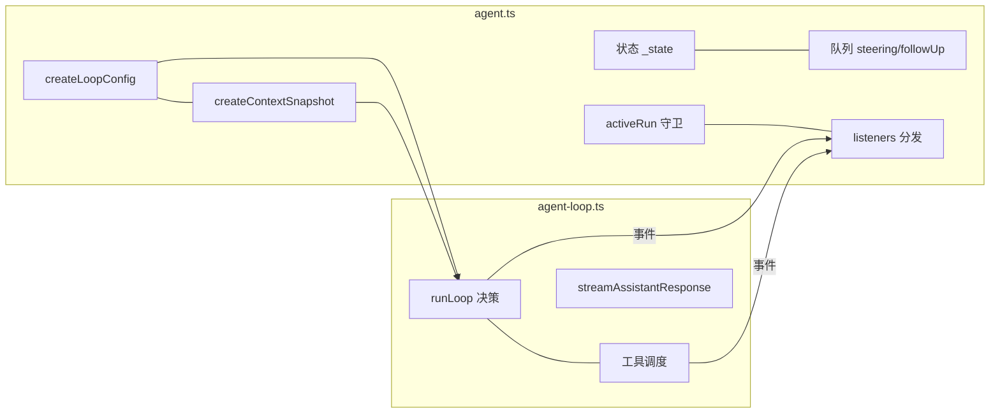

# D2：`agent.ts` 逐段精读

> 精读对象：`packages/agent/src/agent.ts`（约 613 行，有状态 `Agent` 类的完整实现）。
> 对应主线：第 3 章（prompt 生命周期）、第 6 章（队列与取消）、第 4 章（状态归约）。
> 关系：`agent-loop.ts` 是"无状态的循环函数"，`agent.ts` 是"把循环包装成对象"——状态、并发守卫、队列、事件订阅都在这里。

---

## 0. 文件地图

| 部分 | 内容 |
|---|---|
| 顶部工具 | `defaultConvertToLlm`、`EMPTY_USAGE`、`DEFAULT_MODEL`（模块级常量与兜底） |
| 类型 | `MutableAgentState`、`AgentInitialState`、`AgentOptions` |
| 内部类 | `PendingMessageQueue`（带模式的队列） |
| 主类 | `Agent`（状态 + 公开配置字段 + 生命周期方法） |

导出清单：`Agent`、`AgentOptions`、`AgentInitialState`、`QueueMode`（re-export 自 types）——注意**没有导出** `PendingMessageQueue`（内部实现）。

---

## 1. 顶部的三个"地基"

### 1.1 `defaultConvertToLlm`

【源码】

```typescript
function defaultConvertToLlm(messages: AgentMessage[]): Message[] {
	return messages.filter(
		(message) =>
			message.role === "system" ||
			message.role === "user" ||
			message.role === "assistant" ||
			message.role === "toolResult",
	);
}
```

【注解】

- "默认实现"只做**过滤**，不做翻译：留下四种标准角色，把自定义角色（第 4.4 节的 `custom`/`bashExecution` 等）**丢掉**。
- 这是给"直接用 agent-core、不引入 coding-agent"的用户的**安全底线**：宁可少发消息，也不把未知类型塞给供应商。
- coding-agent 在装配时用 `convertToLlmWithBlockImages` 覆盖它（第 3.5 节）——那个版本会做真正的翻译（第 4.4.2 节）。
- 【陷阱】这个函数用 `filter` 返回**新数组**但**元素是原引用**——后续流程不应修改消息内容。

### 1.2 `EMPTY_USAGE` 与 `DEFAULT_MODEL`

【源码】

```typescript
const EMPTY_USAGE = {
	input: 0,
	output: 0,
	cacheRead: 0,
	cacheWrite: 0,
	totalTokens: 0,
	cost: { input: 0, output: 0, cacheRead: 0, cacheWrite: 0, total: 0 },
};

const DEFAULT_MODEL = {
	id: "unknown",
	name: "unknown",
	api: "unknown",
	provider: "unknown",
	baseUrl: "",
	reasoning: false,
	input: [],
	cost: { input: 0, output: 0, cacheRead: 0, cacheWrite: 0 },
	contextWindow: 0,
	maxTokens: 0,
} satisfies Model<any>;
```

【注解】

- `EMPTY_USAGE`：失败消息/占位消息的"零用量"。形状必须与 `Usage` 完全一致（注意**嵌套的 cost 也有五个分项**）——否则统计代码会缺字段。
- `DEFAULT_MODEL`：**没配置模型时的占位**。所有身份字段是 `"unknown"`，限制是 0。
  - 【陷阱】`input: []` 表示"不接受任何输入类型"——工具里的图片判断（第 7.8.5 节的 `model.input.includes("image")`）因此在无模型时为 false，走"不支持图片"分支；这是"占位模型的保守行为"，不是 bug。
  - `satisfies Model<any>`（第 1.3.2 节讲过）：检查形状但保留字面量类型——所以 `id: "unknown"` 的类型仍是字面量 `"unknown"`，而不是被拓宽成 `string`。
- 【陷阱】这个常量**是共享对象**：代码里绝不应该改它（比如给 `DEFAULT_MODEL.id` 赋值）——所有"默认模型"共享同一引用，改一处全局生效。`createMutableAgentState` 里直接引用它。

## 2. 状态：可变内部形态与创建

### 2.1 `MutableAgentState`

【源码】

```typescript
type MutableAgentState = Omit<AgentState, "isStreaming" | "streamingMessage" | "pendingToolCalls" | "errorMessage"> & {
	isStreaming: boolean;
	streamingMessage?: AgentMessage;
	pendingToolCalls: Set<string>;
	errorMessage?: string;
};
```

【注解】

- 公开的 `AgentState`（第 4.6 节）里，`tools`/`messages` 是 get/set 访问器、`systemPrompt` 是只读 getter——那是"对外门面"。
- 内部实现需要的却是**可变的字段**：`isStreaming`（可写布尔）、`pendingToolCalls`（可变 Set）、`streamingMessage`/`errorMessage`（可赋值）。所以用 `Omit` 把四个字段"换成实现版本"，其余字段直接复用。
- 【陷阱】这份类型是"内外有别的桥梁"：读 `Agent` 的公开方法时看到 `this._state.isStreaming = true`（第 3 节会看到）——**内部直接改字段**，但外部拿到的 `state` getter 返回的是同一个对象（第 4.6 节的"状态只有一个数据源"）。所以外部读到的 `isStreaming` 会跟着变；但外部**不应**写它（类型上 `AgentState.isStreaming` 是 `readonly`）。

### 2.2 `createMutableAgentState`：系统消息的"种子"

【源码】

```typescript
function createMutableAgentState(initialState?: AgentInitialState): MutableAgentState {
	let tools = initialState?.tools?.slice() ?? [];
	let messages = initialState?.messages?.slice() ?? [];
	const initialMessage = createInitialSystemMessage(initialState?.systemPrompt, tools.map(toToolDeclaration));
	if (messages[0]?.role !== "system" && initialMessage) messages.unshift(initialMessage);

	return {
		get systemPrompt() {
			return getCurrentSystemPrompt(messages);
		},
		model: initialState?.model ?? DEFAULT_MODEL,
		thinkingLevel: initialState?.thinkingLevel ?? "off",
		get tools() {
			return tools;
		},
		set tools(nextTools: AgentTool<any>[]) {
			tools = nextTools.slice();
		},
		get messages() {
			return messages;
		},
		set messages(nextMessages: AgentMessage[]) {
			messages = nextMessages.slice();
		},
		isStreaming: false,
		streamingMessage: undefined,
		pendingToolCalls: new Set<string>(),
		errorMessage: undefined,
	};
}
```

【注解（逐块）】

- 两个局部 `let` 数组（`tools`/`messages`）+ 闭包 getter/setter = **私有可变数据 + 对外访问器**的经典写法（比 `#private` 字段更早、更易调试）。setter 里 `slice()`：**赋值总复制顶层数组**（第 4.6 节的行为注释）。
- **系统消息播种**：

```typescript
	const initialMessage = createInitialSystemMessage(initialState?.systemPrompt, tools.map(toToolDeclaration));
	if (messages[0]?.role !== "system" && initialMessage) messages.unshift(initialMessage);
```

  - `createInitialSystemMessage`（来自 pi-ai）把 `systemPrompt` + 工具声明**合成为一条系统消息**；
  - 只有当消息数组开头不是系统消息、且合成结果非空时才 `unshift`——这就是"传入历史已经带系统消息时不会被播种覆盖"的保护；
  - 【陷阱】`systemPrompt` 为空且没有工具时，`initialMessage` 可能是 falsy（空字符串 prompt + 空工具）——所以判断里同时检查了它。
- `get systemPrompt()`：**每次读都重放**（`getCurrentSystemPrompt(messages)`）——不是缓存的字段。所以"追加一条系统消息"后，`state.systemPrompt` 立刻反映新值（第 4.6 节的"读取即重放"）。
- `model: initialState?.model ?? DEFAULT_MODEL`、`thinkingLevel: ... ?? "off"`：默认值兜底。
- 【陷阱】`tools` 的 setter 复制、`messages` 的 setter 复制，但**getter 返回的是内部数组本身**（不是副本）！所以 `agent.state.messages.push(...)` 会真的改到内部数据（类型上数组是可变引用）。仓库代码自己都用内部方法（不通过 state 写入），但外部调用者要自觉：**读可以，改要走 api**。

### 2.3 `AgentInitialState`

【源码】

```typescript
/** Initial state for {@link Agent}. `systemPrompt` and `tools` become the leading system message unless `messages` already starts with one. */
export type AgentInitialState = Partial<
	Omit<AgentState, "pendingToolCalls" | "isStreaming" | "streamingMessage" | "errorMessage">
>;
```

【注解】

- **只暴露"可初始化的子集"**：四个运行时字段（工具调用集合、流式标志、部分消息、错误信息）被 `Omit` 掉——调用方不能"初始化一个正在流式的 Agent"。
- 文档注释重申播种规则（除非 messages 已以系统消息开头）。

## 3. `AgentOptions`：构造参数全景

【源码（节选 + 注释）】

```typescript
/** Options for constructing an {@link Agent}. */
export interface AgentOptions {
	initialState?: AgentInitialState;
	convertToLlm?: (messages: AgentMessage[]) => Message[] | Promise<Message[]>;
	transformContext?: (messages: AgentMessage[], signal?: AbortSignal) => Promise<AgentMessage[]>;
	streamFn: StreamFn;
	getApiKey?: (provider: string) => Promise<string | undefined> | string | undefined;
	onPayload?: SimpleStreamOptions["onPayload"];
	onResponse?: SimpleStreamOptions["onResponse"];
	onProviderStreamEvent?: SimpleStreamOptions["onProviderStreamEvent"];
	beforeToolCall?: (context: BeforeToolCallContext, signal?: AbortSignal) => Promise<BeforeToolCallResult | undefined>;
	afterToolCall?: (context: AfterToolCallContext, signal?: AbortSignal) => Promise<AfterToolCallResult | undefined>;
	finishTurn?: FinishTurn;
	prepareRequest?: PrepareRequest;
	prepareNextTurn?: (signal?: AbortSignal) => Promise<AgentLoopTurnUpdate | undefined> | AgentLoopTurnUpdate | undefined;
	prepareNextTurnWithContext?: (
		context: PrepareNextTurnContext,
		signal?: AbortSignal,
	) => Promise<AgentLoopTurnUpdate | undefined> | AgentLoopTurnUpdate | undefined;
	steeringMode?: QueueMode;
	followUpMode?: QueueMode;
	sessionId?: string;
	thinkingBudgets?: ThinkingBudgets;
	transport?: Transport;
	maxRetryDelayMs?: number;
	toolExecution?: ToolExecutionMode;
}
```

【注解】

- `streamFn` 是**唯一必需**的选项（类型上无 `?`）——"怎么请求模型"必须由调用方给出（或用 `setDefaultStreamFn` 兜底；构造器里两者都处理了，见下一节）。
- 选项分四组：
  1. **状态与流**：`initialState`、`streamFn`；
  2. **请求选项透传**：`onPayload`/`onResponse`/`onProviderStreamEvent`/`getApiKey`——直接来自 `SimpleStreamOptions`，会被原样放进 `AgentLoopConfig`（第 5 节）；
  3. **钩子**：`convertToLlm`/`transformContext`/`beforeToolCall`/`afterToolCall`/`finishTurn`/`prepareRequest`/`prepareNextTurn(+WithContext)`——第 6 章表格里的全家桶；
  4. **行为参数**：`steeringMode`/`followUpMode`（队列模式）、`sessionId`、`thinkingBudgets`、`transport`、`maxRetryDelayMs`、`toolExecution`。
- 【陷阱】**两个 `prepareNextTurn`**：`prepareNextTurn(signal)` 是"不带上下文"的旧形态；`prepareNextTurnWithContext(context, signal)` 是新形态。构造器把它们归一成循环只要的那一个（第 5 节的 `createLoopConfig` 里）。读调用方代码时先确认它在用哪一个。
- 【陷阱】`convertToLlm` 与 `transformContext` 的类型都**允许 Promise**——这是第 3.11 节那条"钩子可以是异步的"的类型依据。

## 4. `PendingMessageQueue`：14 行核心逻辑

【源码】

```typescript
class PendingMessageQueue {
	private messages: AgentMessage[] = [];
	public mode: QueueMode;

	constructor(mode: QueueMode) {
		this.mode = mode;
	}

	enqueue(message: AgentMessage): void {
		this.messages.push(message);
	}

	hasItems(): boolean {
		return this.messages.length > 0;
	}

	peek(): AgentMessage[] {
		if (this.mode === "all") return this.messages.slice();
		const first = this.messages[0];
		return first ? [first] : [];
	}

	drain(): AgentMessage[] {
		const drained = this.peek();
		this.messages = this.messages.slice(drained.length);
		return drained;
	}

	clear(): void {
		this.messages = [];
	}
}
```

【注解】

- **模式**（第 6.1.3 节）：`"all"` 一次全取；`"one-at-a-time"` 只取最旧一条。
- `peek()` 不做修改：
  - `"all"`：`slice()` 复制整个数组（返回的是**新数组**，元素引用共享）；
  - `"one-at-a-time"`：取 `messages[0]`，包成单元素数组；空队列返回 `[]`（`first ? ... : []` 处理 undefined）。
- `drain()`：先 peek 再"**按取走的数量切掉前缀**"——`this.messages = this.messages.slice(drained.length)` 同时完成"删除已取部分"与"复制剩余"（新数组，避免外部引用影响内部）。对 `"all"` 模式 `slice(length)` 返回空数组；对 one-at-a-time 模式返回去掉第一条的**新数组**。
- 【陷阱】`drain` 的语义是"取出并从队列移除"，而 `peekQueuedMessages()`（第 6.1.3 节）用 `peek` 实现"预览不消费"——两个方法都返回数组，别写混。
- 【陷阱】队列**不需要锁**：所有操作都在事件循环的单线程里同步完成（没有 `await` 插入 peek 与 slice 之间）——这是"同步小数据结构不需要并发控制"的例子。若未来有人在两者之间加 `await`，就会引入竞态。
- 【跳转】取用时机（四个取数点）在 `agent-loop.ts` 的 `runLoop`（D1 第二部分）。

---

> D2 第一部分到此。第二部分：`Agent` 类的字段与构造器、公开状态 API（subscribe/state/队列控制/prompt/continue/reset/abort/waitForIdle）。
---

# 第二部分：`Agent` 的字段、构造器与公开状态 API

## 5. 类字段：五组

【源码】

```typescript
export class Agent {
	private _state: MutableAgentState;
	private readonly listeners = new Set<(event: AgentEvent, signal: AbortSignal) => Promise<void> | void>();
	private readonly steeringQueue: PendingMessageQueue;
	private readonly followUpQueue: PendingMessageQueue;

	public convertToLlm: (messages: AgentMessage[]) => Message[] | Promise<Message[]>;
	public transformContext?: (messages: AgentMessage[], signal?: AbortSignal) => Promise<AgentMessage[]>;
	public streamFunction: StreamFn;
	public getApiKey?: (provider: string) => Promise<string | undefined> | string | undefined;
	public onPayload?: SimpleStreamOptions["onPayload"];
	public onResponse?: SimpleStreamOptions["onResponse"];
	public onProviderStreamEvent?: SimpleStreamOptions["onProviderStreamEvent"];
	public beforeToolCall?: (context: BeforeToolCallContext, signal?: AbortSignal) => Promise<BeforeToolCallResult | undefined>;
	public afterToolCall?: (context: AfterToolCallContext, signal?: AbortSignal) => Promise<AfterToolCallResult | undefined>;
	public finishTurn?: FinishTurn;
	public prepareRequest?: PrepareRequest;
	public prepareNextTurn?: (signal?: AbortSignal) => Promise<AgentLoopTurnUpdate | undefined> | AgentLoopTurnUpdate | undefined;
	public prepareNextTurnWithContext?: (
		context: PrepareNextTurnContext,
		signal?: AbortSignal,
	) => Promise<AgentLoopTurnUpdate | undefined> | AgentLoopTurnUpdate | undefined;
	private activeRun?: ActiveRun;
	/** Session identifier forwarded to providers for cache-aware backends. */
	public sessionId?: string;
	/** Optional per-level thinking token budgets forwarded to the stream function. */
	public thinkingBudgets?: ThinkingBudgets;
	/** Preferred transport forwarded to the stream function. */
	public transport: Transport;
	/** Optional cap for provider-requested retry delays. */
	public maxRetryDelayMs?: number;
	/** Tool execution strategy for assistant messages that contain multiple tool calls. */
	public toolExecution: ToolExecutionMode;
```

【注解（五组划分）】

1. **私有运行时**：`_state`（可变状态）、`listeners`（订阅集合，**Set** 保证同一函数只订阅一次、退订 O(1)）、`steeringQueue`/`followUpQueue`、`activeRun`（当前运行句柄）。
2. **可热替换的回调**（`public` 非 readonly）：`convertToLlm`、`transformContext`、`streamFunction`——它们可以在运行中途被外层改写（`AgentSession` 切换模型时会重建 `streamFn` 包装吗？看第 8 章的重建策略；但类型上允许）。
3. **请求透传选项**：`onPayload`/`onResponse`/`onProviderStreamEvent`/`getApiKey`——最终摊进 `streamFunction` 的选项（D1 第 18 节）。
4. **钩子**：`beforeToolCall`/`afterToolCall`/`finishTurn`/`prepareRequest`/`prepareNextTurn(+WithContext)`——原样进 `createLoopConfig`（第三部分）。
5. **行为参数**：`sessionId`/`thinkingBudgets`/`transport`/`maxRetryDelayMs`/`toolExecution`。

【陷阱】`listeners` 是 **Set 而不是数组**：重复订阅同一个函数会被去重（第二次 `add` 无效果），退订就是把函数从 Set 里删掉。这与"数组允许重复"的实现不同——写测试时"订阅两次同一个 handler 期望触发两次"会失败。

【跳转】`ActiveRun` 类型：

```typescript
type ActiveRun = {
	promise: Promise<void>;
	resolve: () => void;
	abortController: AbortController;
};
```

（在文件靠前位置定义，D2 第一部分漏提；`promise` 用于 `waitForIdle`，`resolve` 用于 `finishRun`，`abortController` 用于 `abort`。）

## 6. 构造器：兼容性子句与默认值

【源码】

```typescript
	constructor(options: AgentOptions) {
		// Older compiled consumers may omit options or streamFn even though the current API requires them.
		const runtimeOptions: Partial<AgentOptions> = options ?? {};
		this._state = createMutableAgentState(runtimeOptions.initialState);
		this.convertToLlm = runtimeOptions.convertToLlm ?? defaultConvertToLlm;
		this.transformContext = runtimeOptions.transformContext;
		this.streamFunction = runtimeOptions.streamFn ?? getDefaultStreamFn();
		this.getApiKey = runtimeOptions.getApiKey;
		this.onPayload = runtimeOptions.onPayload;
		this.onResponse = runtimeOptions.onResponse;
		this.onProviderStreamEvent = runtimeOptions.onProviderStreamEvent;
		this.beforeToolCall = runtimeOptions.beforeToolCall;
		this.afterToolCall = runtimeOptions.afterToolCall;
		this.finishTurn = runtimeOptions.finishTurn;
		this.prepareRequest = runtimeOptions.prepareRequest;
		this.prepareNextTurn = runtimeOptions.prepareNextTurn;
		this.prepareNextTurnWithContext = runtimeOptions.prepareNextTurnWithContext;
		this.steeringQueue = new PendingMessageQueue(runtimeOptions.steeringMode ?? "one-at-a-time");
		this.followUpQueue = new PendingMessageQueue(runtimeOptions.followUpMode ?? "one-at-a-time");
		this.sessionId = runtimeOptions.sessionId;
		this.thinkingBudgets = runtimeOptions.thinkingBudgets;
		this.transport = runtimeOptions.transport ?? "auto";
		this.maxRetryDelayMs = runtimeOptions.maxRetryDelayMs;
		this.toolExecution = runtimeOptions.toolExecution ?? "parallel";
	}
```

【注解（逐点）】

- **第一行的兼容注释**：`options ?? {}` 是为了"旧编译产物可能不传 options/streamFn"——虽然当前类型要求 `streamFn`，但**运行时兼容**保留。这是"发布过的库要照顾已编译调用方"的现实约束；写你自己的库时，是否做这种兼容是一个产品决策。
- `streamFunction` 的兜底 `getDefaultStreamFn()`：**构造时就调用**——如果既没传也没配置默认，构造器直接抛错（异常在构造点爆炸，而不是第一次 prompt 时才炸）。这是"尽早失败"的好例子。
- 两个队列的**默认模式都是 `"one-at-a-time"`**——与第 6.1.3 节一致；`AgentSession` 会用设置覆盖（`steeringMode`/`followUpMode` 设置，第 8.3 节）。
- `transport ?? "auto"`、`toolExecution ?? "parallel"`：两个非空默认。
- 【陷阱】`runtimeOptions` 声明为 `Partial<AgentOptions>`——**类型上把必需字段也变成可选**，配合 `??` 兜底。读构造器时注意"哪些字段其实可以缺省"。
- 【跳转】`"auto"` 传输的取值逻辑在 pi-ai（`Transport` 类型）；`"parallel"` 的调度在 D1 第 23 节。

## 7. 订阅与状态读取

### 7.1 `subscribe`

【源码】

```typescript
	/**
	 * Subscribe to agent lifecycle events.
	 *
	 * Listener promises are awaited in subscription order and are included in
	 * the current run's settlement. Listeners also receive the active abort
	 * signal for the current run.
	 *
	 * `agent_end` is the final emitted event for a run, but the agent does not
	 * become idle until all awaited listeners for that event have settled.
	 */
	subscribe(listener: (event: AgentEvent, signal: AbortSignal) => Promise<void> | void): () => void {
		this.listeners.add(listener);
		return () => this.listeners.delete(listener);
	}
```

【注解】

- 三行实现，但文档注释给出了**三条运行时契约**（第 3.7 节展开过）：按订阅顺序 await、计入本次运行结算、监听器拿得到当前运行的 abort signal。
- 返回"退订函数"：`() => this.listeners.delete(listener)` ——注意 `delete` 返回 boolean，但箭头函数把它吞了（函数类型是 `() => void`，返回值被忽略）——**退订幂等**（删不存在的也没事）。
- 【陷阱】监听器签名里的 `signal` 是**运行级信号**，与工具/请求各自的 signal 同源（`activeRun.abortController.signal`）——不是每个事件一个信号。

### 7.2 `state`、队列模式与入队 API

【源码（节选）】

```typescript
	get state(): AgentState {
		return this._state;
	}

	/** Controls how queued steering messages are drained. */
	set steeringMode(mode: QueueMode) {
		this.steeringQueue.mode = mode;
	}
	get steeringMode(): QueueMode {
		return this.steeringQueue.mode;
	}

	/** Queue a message to be injected after the current assistant turn finishes. */
	steer(message: AgentMessage): void {
		this.steeringQueue.enqueue(message);
	}

	/** Queue a message to run only after the agent would otherwise stop. */
	followUp(message: AgentMessage): void {
		this.followUpQueue.enqueue(message);
	}

	/** Remove all queued steering messages. */
	clearSteeringQueue(): void {
		this.steeringQueue.clear();
	}

	clearFollowUpQueue(): void { this.followUpQueue.clear(); }
	clearAllQueues(): void { this.clearSteeringQueue(); this.clearFollowUpQueue(); }
	hasQueuedMessages(): boolean { return this.steeringQueue.hasItems() || this.followUpQueue.hasItems(); }
	peekQueuedMessages(): AgentMessage[] {
		const steering = this.steeringQueue.peek();
		return steering.length > 0 ? steering : this.followUpQueue.peek();
	}
```

【注解】

- `state` getter 直接返回内部对象（第 2.2 节的【陷阱】）。
- **模式是"活的"**：`steeringMode` 的 setter 直接改队列对象的 `mode`——设置可以在运行中途生效（下一次 drain 就按新模式）。
- `steer`/`followUp` 只是入队：**没有任何事件**在这里发出。队列变化的通知是**上层**（`AgentSession`）在调用前后 emit `queue_update`（第 4.5.2 节）——这也解释了为什么 `Agent` 自己的事件类型里没有 queue 事件。
- `peekQueuedMessages` 的优先级：**先 steering 后 follow-up**——与运行时取数顺序一致（steering 在 T2，follow-up 在 T3）。
- 【陷阱】`hasQueuedMessages` 与 `peekQueuedMessages` 的空判定不同：前者是"任一队列非空"，后者"返回下一个会被取走的批次"（可能只返回 steering 的前一条，取决于模式）。界面提示用哪个？`hasQueuedMessages` 判断"还有没有"，`peek` 用于预览将要发出的内容。

### 7.3 `signal`、`abort`、`waitForIdle`

【源码】

```typescript
	/** Active abort signal for the current run, if any. */
	get signal(): AbortSignal | undefined {
		return this.activeRun?.abortController.signal;
	}

	/** Abort the current run, if one is active. */
	abort(): void {
		this.activeRun?.abortController.abort();
	}

	/**
	 * Resolve when the current run and all awaited event listeners have finished.
	 *
	 * This resolves after `agent_end` listeners settle.
	 */
	waitForIdle(): Promise<void> {
		return this.activeRun?.promise ?? Promise.resolve();
	}
```

【注解】

- `signal`/`abort` 都是 `activeRun?.` 可空调用：**空闲时是安全的空操作**（abort 空闲 Agent 不抛错）。
- `abort()` 只触发信号；真正的收尾（发事件、清状态）由运行中的循环走完（D1 的取消检查点）。
- `waitForIdle` 返回 `activeRun.promise`——这个 Promise 在 `finishRun()` 里被 resolve（第三部分）。**空闲时返回已 resolve 的 Promise**（`?? Promise.resolve()`），调用方不用判空。
- 【陷阱】`waitForIdle` **不等待**"下一次运行"——它快照了**当前**的 activeRun。如果你在空档期（两次 prompt 之间）调用，它立刻 resolve；想等"某个任务完成"要在调用前先确认已在运行（第 16.5.3 节的 RpcClient 纪律："call waitForIdle() only while a run is active"）。

### 7.4 `reset`：保留"重放基线"的清空

【源码】

```typescript
	/** Clear conversation state and queues while retaining the replayed prompt/tool baseline. */
	reset(): void {
		if (this.activeRun) {
			throw new Error("Agent is already processing. Wait for completion before resetting.");
		}

		const baseline = getCurrentSystemMessage(this._state.messages);
		this._state.messages = baseline ? [baseline] : [];
		this._state.isStreaming = false;
		this._state.streamingMessage = undefined;
		this._state.pendingToolCalls = new Set<string>();
		this._state.errorMessage = undefined;
		this.clearFollowUpQueue();
		this.clearSteeringQueue();
	}
```

【注解】

- 守卫：运行中不许 reset（否则会与循环的 `currentContext` 竞争）。
- **保留系统消息**：`getCurrentSystemMessage(messages)` 从消息里**重放**出当前系统消息（第 1.2.1 节用过同名函数——严格说这里用的是 `getCurrentSystemMessage`），然后 `messages = [baseline]`——即"只留系统消息，清空对话"。这就是"retaining the replayed prompt/tool baseline"：**工具声明也在系统消息里**，所以 reset 后工具集声明不丢。
- 四个运行时字段全部复位（含 `pendingToolCalls` 换新 Set——不是 clear，是**换新实例**：外面若持有旧 Set 的只读引用不会被清空变化影响？看 `pendingToolCalls` 的公开类型是 `ReadonlySet` 且 `processEvents` 每次都换新 Set（第 9 节的代码），所以这里是同一风格）。
- 清空两个队列。
- 【陷阱】`reset` 不发任何事件：它是"宿主主动清场"，不是运行的组成部分；UI 要靠调用方自己刷新。对比 `session_manager` 的"树导航"（第 9 章）——那是换叶子，不是清消息。

---

> D2 第二部分到此。第三部分：`prompt`/`continue`/`normalizePromptInput`、运行执行器（`runPromptMessages`/`runContinuation`）、`createLoopConfig` 归一化、生命周期（`runWithLifecycle`/`handleRunFailure`/`finishRun`）与状态归约（`processEvents`），最后是全文件总结。
---

# 第三部分：提示、执行器与生命周期

## 8. `prompt`：三个重载，一条路径

【源码】

```typescript
	/** Start a new prompt from text, a single message, or a batch of messages. */
	async prompt(message: AgentMessage | AgentMessage[]): Promise<void>;
	async prompt(input: string, images?: ImageContent[]): Promise<void>;
	async prompt(input: string | AgentMessage | AgentMessage[], images?: ImageContent[]): Promise<void> {
		if (this.activeRun) {
			throw new Error(
				"Agent is already processing a prompt. Use steer() or followUp() to queue messages, or wait for completion.",
			);
		}
		const messages = this.normalizePromptInput(input, images);
		await this.runPromptMessages(messages);
	}
```

【注解】

- **前两行是重载声明（overload signatures）**，第三行才是实现——它们只影响类型提示（方便调用方按字符串或消息数组两种方式调用），**运行时只有一个实现体**。
- 守卫：`activeRun` 非空 → 抛错，并在错误文本里**教你怎么做**（"Use steer() or followUp()"）——错误信息要包含"替代动作"，这是本仓库的风格（第 7.8.4 节的"可继续提示"同理）。
- 【陷阱】重载与实现之间没有 `async` 关键字差异：两个签名写 `async ... : Promise<void>`，实现也是 `async`。TypeScript 的重载声明可以出现在实现前，但只保留最后一个签名的实现体。
- 【陷阱】守卫检查的是 `activeRun`（整个运行），不是 `isStreaming`——`isStreaming` 在 `agent_end` 监听器结算完才转 false，`activeRun` 在 `finishRun` 里清空；两者**几乎同时**但理论上 `finishRun` 先清 `activeRun`…… 读 §11 的 `finishRun` 与 `runWithLifecycle` 的 finally 顺序再下结论。重点是：**一个新的 prompt 只有在前一个 run 的 finally 执行完之后才可能通过守卫**。

## 9. `normalizePromptInput`：输入的三种形态归一

【源码】

```typescript
	private normalizePromptInput(
		input: string | AgentMessage | AgentMessage[],
		images?: ImageContent[],
	): AgentMessage[] {
		if (Array.isArray(input)) {
			return input;
		}

		if (typeof input !== "string") {
			return [input];
		}

		const content: Array<TextContent | ImageContent> = [{ type: "text", text: input }];
		if (images && images.length > 0) {
			content.push(...images);
		}
		return [{ role: "user", content, timestamp: Date.now() }];
	}
```

【注解】

- 分支顺序：数组 → 单消息 → 字符串。**数组直接原样返回**（同一引用！调用方后续别改它——不过 `runPromptMessages` 把它交给 `runAgentLoop`，而 `runAgentLoop` 会 `[...context.messages, ...initialMessages]` 拼新数组，不会改这份输入）。
- 字符串 + 图片：构造一条 `user` 消息，内容块 = 文本 + 图片。**文本块永远在最前**（`[{text}, ...images]`）——顺序会影响供应商的解析与展示。
- `timestamp: Date.now()`：消息时间戳（毫秒）——本地生成。
- 【陷阱】单消息分支 `return [input]` 不做包装：调用方可以传**任何角色的 `AgentMessage`**（比如扩展构造的 `custom` 消息）。"prompt" 不强制是用户文本——这是低层 API 的灵活性，也是责任：**你传什么，历史里就有什么**。

## 10. `continue`：特例分支的艺术

【源码】

```typescript
	/** Continue from the current transcript. The last message must be a user or tool-result message. */
	async continue(): Promise<void> {
		if (this.activeRun) {
			throw new Error("Agent is already processing. Wait for completion before continuing.");
		}

		const lastMessage = this._state.messages[this._state.messages.length - 1];
		if (!lastMessage || this._state.messages.every((message) => message.role === "system")) {
			throw new Error("No messages to continue from");
		}

		if (lastMessage.role === "assistant") {
			const queuedSteering = this.steeringQueue.drain();
			if (queuedSteering.length > 0) {
				await this.runPromptMessages(queuedSteering, { skipInitialSteeringPoll: true });
				return;
			}

			const queuedFollowUps = this.followUpQueue.drain();
			if (queuedFollowUps.length > 0) {
				await this.runPromptMessages(queuedFollowUps);
				return;
			}

			throw new Error("Cannot continue from message role: assistant");
		}

		await this.runContinuation();
	}
```

【注解（三条校验 → 三个出口）】

- 校验 1：运行中不许 continue。
- 校验 2：`!lastMessage || every(role === "system")`——**空历史 / 只有系统消息**都不行（没有"人的话"可以接）。
- 校验 3（**特例分支**）：最后一条是 assistant 时，**不让供应商拒绝**成为默认结局——而是：
  1. 先试 steering 队列：**drain 后非空** → 用这些消息当"新的 prompt"（`skipInitialSteeringPoll: true`，因为已经取出来了，不能再让循环"开场再取一次"，否则 one-at-a-time 模式会多送一条——这是 D1 第 5/26 节提到的 `skipInitialSteeringPoll` 的消费方）；
  2. 再试 follow-up 队列：同样转成 prompt（注意**没有** `skipInitialSteeringPoll`——follow-up 从队列拿出来时，steering 队列可能是空的，让循环正常轮询无妨；这处不对称值得对照测试读）；
  3. 都没有 → 才抛 `Cannot continue from message role: assistant`。
- 正常路径：`runContinuation()`（不新增消息的继续）。
- 【陷阱】特例分支里两个队列的**消费顺序与 `peekQueuedMessages` 一致**（先 steering 后 follow-up），但语义不同：这里是真的 `drain`（消费掉）。如果两个队列都有消息，**steering 那批先变成一次 prompt 运行，follow-up 留到之后**（外层 `_runAgentPrompt`/循环自然处理）——但注意：这次 `continue()` 调用只处理了 steering 批；follow-up 批还在队列里，等待后续时机。
- 【跳转】`AgentSession._runAgentPrompt` 的 while 循环（第 3.6 节）就是在"重试/压缩之后"反复调 `agent.continue()`；而 `continue()` 的这三个分支决定了"当上下文末尾是 assistant 时，续跑如何自愈"。

## 11. 执行器：`runPromptMessages` 与 `runContinuation`

【源码】

```typescript
	private async runPromptMessages(
		messages: AgentMessage[],
		options: { skipInitialSteeringPoll?: boolean } = {},
	): Promise<void> {
		await this.runWithLifecycle(async (signal) => {
			await runAgentLoop(
				messages,
				this.createContextSnapshot(),
				this.createLoopConfig(options),
				(event) => this.processEvents(event),
				signal,
				this.streamFunction,
			);
		});
	}

	private async runContinuation(): Promise<void> {
		await this.runWithLifecycle(async (signal) => {
			await runAgentLoopContinue(
				this.createContextSnapshot(),
				this.createLoopConfig(),
				(event) => this.processEvents(event),
				signal,
				this.streamFunction,
			);
		});
	}
```

【注解】

- 两个执行器结构同构：**先做快照、再造配置、然后把"发事件"接到 `processEvents`**。
- `(event) => this.processEvents(event)`：**sink 是"Agent 的归约器"**——这就是 D1 开头 `AgentEventSink` 注释里说的"循环只面对一个 sink；多监听器在 sink 内部"。
- 【陷阱】注意参数顺序：`runAgentLoop(messages, context, config, emit, signal, streamFn)` vs `runAgentLoopContinue(context, config, emit, signal, streamFn)`——continue 少一个 `messages` 参数，别抄错。
- 【陷阱】`createContextSnapshot()` 在**每次运行开始时**调用一次：拿到 `messages`/`tools` 的**顶层浅拷贝**。运行期间外部对 `state.messages` 的 push（比如另一处代码）**不会**进入本次运行——这是隔离的边界。

## 12. `createContextSnapshot` 与 `createLoopConfig`

【源码（快照）】

```typescript
	private createContextSnapshot(): AgentContext {
		return {
			messages: this._state.messages.slice(),
			tools: this._state.tools.slice(),
		};
	}
```

【源码（配置，完整）】

```typescript
	private createLoopConfig(options: { skipInitialSteeringPoll?: boolean } = {}): AgentLoopConfig {
		let skipInitialSteeringPoll = options.skipInitialSteeringPoll === true;
		return {
			model: this._state.model,
			reasoning: this._state.thinkingLevel === "off" ? undefined : this._state.thinkingLevel,
			sessionId: this.sessionId,
			onPayload: this.onPayload,
			onResponse: this.onResponse,
			onProviderStreamEvent: this.onProviderStreamEvent,
			transport: this.transport,
			thinkingBudgets: this.thinkingBudgets,
			maxRetryDelayMs: this.maxRetryDelayMs,
			toolExecution: this.toolExecution,
			beforeToolCall: this.beforeToolCall,
			afterToolCall: this.afterToolCall,
			finishTurn: this.finishTurn,
			prepareRequest: this.prepareRequest,
			prepareNextTurn:
				this.prepareNextTurnWithContext || this.prepareNextTurn
					? async (context) => {
							if (this.prepareNextTurnWithContext) {
								return await this.prepareNextTurnWithContext(context, this.signal);
							}
							return await this.prepareNextTurn?.(this.signal);
						}
					: undefined,
			convertToLlm: this.convertToLlm,
			transformContext: this.transformContext,
			getApiKey: this.getApiKey,
			getSteeringMessages: async () => {
				if (skipInitialSteeringPoll) {
					skipInitialSteeringPoll = false;
					return [];
				}
				return this.steeringQueue.drain();
			},
			getFollowUpMessages: async () => this.followUpQueue.drain(),
		};
	}
```

【注解（五个重点）】

1. **快照用 slice**：messages 与 tools 都是顶层复制。注释里没写，但这是第 4.6 节的语义（"赋值会复制顶层数组"，这里是读快照也一样）。
2. **`reasoning` 的"关"表示**：`thinkingLevel === "off" ? undefined : thinkingLevel`——状态层用 `"off"`，循环层用 `undefined`，转换发生在**这一行**（D1 第 9/11 节的 `"off" ↔ undefined` 转换的源头/对应方）。
3. **两个 `prepareNextTurn` 的归一化**：优先 `prepareNextTurnWithContext`；两者的区别是"要不要 `lastCompletedTurn` 上下文"。包装闭包用 `this.signal`（当前运行的信号）而不是循环传入的 `signal`——【陷阱】这两者在这个时点其实指向同一个 AbortSignal（都在同一次运行内），但闭包捕获 `this.signal` 意味着**每次调用都会重新读 getter**——如果运行被切换（理论上不可能，因为 activeRun 未变），行为会不同。理解成"用运行级信号"即可。
4. **队列回调的闭包状态**：`skipInitialSteeringPoll` 是一个**每次 `createLoopConfig` 调用新建的局部变量**（用 `let`），被 `getSteeringMessages` 闭包捕获：
   - 第一次轮询（T0）返回 `[]` 并把它置 false；
   - 之后正常 drain。
   这就是"跳过开场轮询"的完整机制（第 6.3 节的 T0 说明）。
5. **配置是"点快照"**：model/reasoning 等字段在创建时读一次 `_state`——之后运行中改 `state.model` 不会影响**本次运行**（模型热切换要等下一次运行，或在钩子里改 `config`）。【陷阱】`AgentSession` 的"中途换模型"因此到底何时生效？——看它换的是 `state.model` 还是 `loopConfig`；这决定了"下一步请求"还是"下一次 prompt"生效。

## 13. `runWithLifecycle`：一个 Run 的边界

【源码】

```typescript
	private async runWithLifecycle(executor: (signal: AbortSignal) => Promise<void>): Promise<void> {
		if (this.activeRun) {
			throw new Error("Agent is already processing.");
		}

		const abortController = new AbortController();
		let resolvePromise = () => {};
		const promise = new Promise<void>((resolve) => {
			resolvePromise = resolve;
		});
		this.activeRun = { promise, resolve: resolvePromise, abortController };

		this._state.isStreaming = true;
		this._state.streamingMessage = undefined;
		this._state.errorMessage = undefined;

		try {
			await executor(abortController.signal);
		} catch (error) {
			await this.handleRunFailure(error, abortController.signal.aborted);
		} finally {
			this.finishRun();
		}
	}
```

【注解（逐行）】

- 守卫再检查一次 `activeRun`（`prompt`/`continue` 已经查过——这是**防御性重复**：`runWithLifecycle` 是两类运行的公共入口，将来可能有第三条调用路径）。
- 手动 Promise + `resolvePromise` 外提：这是"**可外部 resolve 的 Promise**"模式（构造函数里赋值捕获 resolve）。`waitForIdle()` 等的就是它。
- `activeRun` 三件套就位后**立刻**设置状态位：`isStreaming = true`、清 `streamingMessage`、清 `errorMessage`——注意清 `errorMessage`：一次新运行开始，旧的错误记录翻篇。
- `try/catch/finally` 三件套：
  - `catch` → `handleRunFailure(error, aborted)`：任何从 executor 冒出的异常都被转成"失败消息 + 事件序列"（下一节）；
  - `finally` → `finishRun()`：**无论如何**复位状态位、resolve waitForIdle、清 activeRun。
- 【陷阱】`catch` 里 `await this.handleRunFailure(...)`：失败处理本身也是异步的（要 await 监听器）；如果它抛错（监听器抛）……`finally` 仍会执行（`finishRun`），但异常会继续向上传播到 `runPromptMessages` 的调用方（`prompt()` 的调用方）。**即：监听器抛错可能让 `await agent.prompt(...)` reject**——而"normal 失败"不会。这是监听器代码必须 try/catch 的真正原因。
- 【陷阱】`isStreaming` 在 `finally` 的 `finishRun` 里转 false——所以**在 `agent_end` 的监听器里读 `state.isStreaming` 还是 true**（文档注释："the agent does not become idle until all awaited listeners ... settled"）。这个观察点是理解"结算"概念的试金石。

## 14. `handleRunFailure`：异常 → 一次完整的"失败事件序列"

【源码】

```typescript
	private async handleRunFailure(error: unknown, aborted: boolean): Promise<void> {
		const failureMessage = {
			role: "assistant",
			content: [{ type: "text", text: "" }],
			api: this._state.model.api,
			provider: this._state.model.provider,
			model: this._state.model.id,
			usage: EMPTY_USAGE,
			stopReason: aborted ? "aborted" : "error",
			errorMessage: error instanceof Error ? error.message : String(error),
			timestamp: Date.now(),
		} satisfies AgentMessage;
		await this.processEvents({ type: "message_start", message: failureMessage });
		await this.processEvents({ type: "message_end", message: failureMessage });
		await this.processEvents({ type: "turn_end", message: failureMessage, toolResults: [] });
		await this.processEvents({ type: "agent_end", messages: [failureMessage] });
	}
```

【注解】

- **合成一条"骨架 assistant 消息"**：
  - `content: [{ text: "" }]`：空文本块（内容块数组不能为空？——这里给一个空串块，满足形状）；
  - 身份三件套从 `_state.model` 取（**失败的也是这个模型**）；
  - `usage: EMPTY_USAGE`（第 1.2 节）；
  - `stopReason` 根据 `aborted` 标记二选一；
  - `errorMessage` 统一成字符串（非 Error 的未知值 `String()`）。
- 然后**手动播放一套最小事件序列**：`message_start` → `message_end` → `turn_end` → `agent_end`。
  - 为什么没有 `turn_start`/`agent_start`？因为这套序列可能发生在**循环已经发过它们之后**（比如循环中途抛错）——补发会重复。这里选择"只补收尾缺的那几个"。
  - 【陷阱】`agent_end.messages` 传的是 `[failureMessage]`（不是完整历史）——与正常路径不同（正常路径传 `newMessages` 全部）。读事件消费代码（比如会话层的持久化/重试判断）时要能容忍这种"最小集合"。
- `errorMessage` 落地到状态：`processEvents` 的 `message_end` 会把它 push 进 `_state.messages`；`turn_end` 分支再把它复制到 `_state.errorMessage`（下一节的 switch）。

## 15. `finishRun`：复位与唤醒

【源码】

```typescript
	private finishRun(): void {
		this._state.isStreaming = false;
		this._state.streamingMessage = undefined;
		this._state.pendingToolCalls = new Set<string>();
		this.activeRun?.resolve();
		this.activeRun = undefined;
	}
```

【注解】

- 四个状态位复位：`isStreaming=false`、清部分消息、`pendingToolCalls` **换新空 Set**、`errorMessage` **不清**——【陷阱】`errorMessage` 刻意保留（让调用方在运行结束后还能读到"最后失败原因"）；它在下一次运行开始时才被清（§13）。
- `activeRun?.resolve()`：唤醒所有 `waitForIdle()` 的等待者。**注意此时 `agent_end` 监听器已经跑完**（因为 `executor` 的 `await` 已经返回，或 `handleRunFailure` 已经 await 过监听器）——所以"idle"的语义=循环结束 + 监听器结算完成（第 3.7 节的契约）。
- `activeRun = undefined`：释放运行句柄；下一次 `prompt`/`continue` 可以开始。
- 【陷阱】`resolve()` 在 `activeRun = undefined` **之前**调用——Promise 的 resolve 只是把 then 回调排队（微任务），同步代码会继续执行到 `activeRun = undefined`；所以等待者被唤醒时通常能观察到"activeRun 已清"的状态。这类"顺序细节"在写并发测试时要意识到。

## 16. `processEvents`：状态归约 + 监听器分发

【源码】

```typescript
	/**
	 * Reduce internal state for a loop event, then await listeners.
	 *
	 * `agent_end` only means no further loop events will be emitted. The run is
	 * considered idle later, after all awaited listeners for `agent_end` finish
	 * and `finishRun()` clears runtime-owned state.
	 */
	private async processEvents(event: AgentEvent): Promise<void> {
		switch (event.type) {
			case "message_start":
				this._state.streamingMessage = event.message;
				break;

			case "message_update":
				this._state.streamingMessage = event.message;
				break;

			case "message_end":
				this._state.streamingMessage = undefined;
				this._state.messages.push(event.message);
				break;

			case "tool_execution_start": {
				const pendingToolCalls = new Set(this._state.pendingToolCalls);
				pendingToolCalls.add(event.toolCallId);
				this._state.pendingToolCalls = pendingToolCalls;
				break;
			}

			case "tool_execution_end": {
				const pendingToolCalls = new Set(this._state.pendingToolCalls);
				pendingToolCalls.delete(event.toolCallId);
				this._state.pendingToolCalls = pendingToolCalls;
				break;
			}

			case "turn_end":
				if (event.message.role === "assistant" && event.message.errorMessage) {
					this._state.errorMessage = event.message.errorMessage;
				}
				break;

			case "agent_end":
				this._state.streamingMessage = undefined;
				break;
		}

		const signal = this.activeRun?.abortController.signal;
		if (!signal) {
			throw new Error("Agent listener invoked outside active run");
		}
		for (const listener of this.listeners) {
			await listener(event, signal);
		}
	}
```

【注解（分两层读）】

**第一层：状态归约（switch）**

| 事件 | 状态动作 | 设计含义 |
|---|---|---|
| `message_start` | `streamingMessage = message` | 部分消息开始 |
| `message_update` | 同上（每次换成新 partial） | 流式推进 |
| `message_end` | 清 streamingMessage + **push 进 messages** | 定稿 |
| `tool_execution_start` | 复制 Set → add → 换引用 | **不可变更新风格**（外部持有旧 Set 不会被改） |
| `tool_execution_end` | 复制 Set → delete → 换引用 | 同上 |
| `turn_end` | 助手消息有 errorMessage 时记到状态 | 失败原因上浮 |
| `agent_end` | 清 streamingMessage | 收尾 |

- 【陷阱】`tool_execution_*` 用"复制 Set"而不是 `add`/`delete` 原地改——为了 `ReadonlySet` 的对外语义（外面拿到的 Set 快照永远不变）。这也是为什么 UI 层可以在渲染时安全遍历。
- 【陷阱】switch **没有 `default` 分支**：`AgentEvent` 联合只有这些成员（第 4.5.1 节），枚举是完备的——将来加事件时，这里没有编译错误提醒（因为 switch 不强制穷尽），要**手动检查**这个函数。可以补 `never` 检查（第 4.4.2 节的写法）作为改进点——注意这会影响编译，是真实可提的小贡献。

**第二层：监听器分发**

```typescript
		const signal = this.activeRun?.abortController.signal;
		if (!signal) {
			throw new Error("Agent listener invoked outside active run");
		}
		for (const listener of this.listeners) {
			await listener(event, signal);
		}
```

- `signal` 来自 activeRun；若拿不到（比如有人在运行外部手动调用了某个 processEvents？内部函数其实不会），抛错——**防御性断言**。
- `for...await`：**顺序 + 串行结算**（第 3.7 节）。Set 的迭代顺序 = 插入顺序（订阅顺序）。
- 【陷阱】监听器**在遍历过程中退订自己/别人**：`for...of` 遍历的是实时 Set——在遍历中 `delete` 一个尚未访问的元素会导致它被跳过；`add` 的元素则**可能**在本轮被访问到。规范说 Set 迭代器会反映删除/新增。写监听器时不要在回调里改订阅集合（除非你读过规范、想利用这个行为）。
- 【陷阱】监听器抛错会**中断后续监听器的派发**并向上冒泡（见 §13 的分析）——**一个坏监听器会让"同一次事件"的其他监听器收不到该事件**。仓库测试里的订阅者都写得很收敛；你自己写扩展时记得包 try/catch。

---

## 17. 全文件总结

### 17.1 与 `agent-loop.ts` 的分工



一句话：**loop 决定"做什么"，Agent 决定"谁能做、状态怎么记、消息给谁看"**。

### 17.2 一次 prompt 的完整调用栈（自上而下）

```text
agent.prompt(input)
  → normalizePromptInput
  → runPromptMessages
    → runWithLifecycle（守卫、activeRun、状态位）
      → runAgentLoop（声明工具变化、发 start 事件）
        → runLoop（D1）
          → streamAssistantResponse → streamFunction → 供应商
          → executeToolCalls（D1 第四部分）
          → 事件 → processEvents → 状态归约 + listeners
      → 失败则 handleRunFailure（骨架消息 + 事件）
      → finally finishRun（复位 + waitForIdle 唤醒）
```

### 17.3 状态位速查

| 状态 | 何时变 | 何时复位 |
|---|---|---|
| `isStreaming` | 运行开始（`runWithLifecycle`） | `finishRun`（含监听器结算后） |
| `streamingMessage` | `message_start/update` | `message_end`/`agent_end` |
| `pendingToolCalls` | `tool_execution_start`（换新 Set） | `tool_execution_end`；`finishRun` 换空 Set |
| `errorMessage` | `turn_end`（助手消息带错） | 下一次运行开始时清 |
| `activeRun` | 运行开始 | `finishRun` 末尾 |
| 两个队列 | `steer/followUp` 入队 | 四个取数点 drain；`clear*Queue`；`reset` |

### 17.4 阅读检查清单

- [ ] 我理解"事件 sink = processEvents = 状态归约 + 监听器"这条链了吗？
- [ ] 我知道 `prompt`/`continue` 的守卫和 `runWithLifecycle` 的守卫**各拦什么**吗？
- [ ] 我能说出"`agent_end` 监听器里读 `isStreaming` 还是 true"的原因吗？
- [ ] 我知道 `skipInitialSteeringPoll` 的消费方与目的吗？（`continue()` 特例 + T0 轮询）
- [ ] 我注意到 `createLoopConfig` 的"配置点快照"语义了吗？（运行中改 state 不影响本次运行）
- [ ] 我知道监听器抛错会怎样吗？（中断派发 + 可能让 prompt reject）
- [ ] 我能指出 `reset` 与"换会话"的区别吗？（前者原地清、保留系统基线；后者整对象替换，第 8 章）

---

> D2 完。下一篇（D3）精读 `session-manager.ts` 的投影与分支：`buildSessionPath`、`buildContextEntries`、`buildSessionProjection`、`sessionEntryToContextMessages`、`createBranchedSession`。