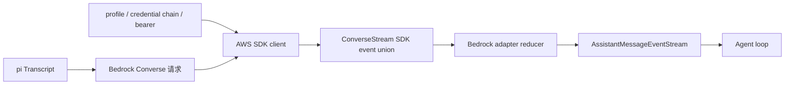

# D20：Amazon Bedrock Converse 流式适配器

> 精读对象：`packages/ai/src/providers/amazon-bedrock.ts`、`packages/ai/src/api/bedrock-converse-stream.lazy.ts`、`packages/ai/src/api/bedrock-converse-stream.ts` 的 `stream`、区域/凭据解析、`convertMessages`、内容块事件处理与错误诊断。
>
> 对应主线：第 4、5、7、11、18、19 章。本文强调 AWS credential chain 和 Bedrock Converse 协议的边界。
>
> 基线：`200387122ca450d6387f033949423114a270b96c`。代码节选用于解释行为；AWS 身份配置请以本机 AWS 配置为准，不要把示例凭据用于真实账户。

## 0. Bedrock 和直接调用供应商 API 的区别

Bedrock 是 AWS 的托管模型服务入口。即使底层模型来自 Anthropic、Amazon、Meta 或 OpenAI，pi 调用的也是 AWS Bedrock Converse API；请求格式、身份验证、区域、异常类型和事件结构都属于 AWS SDK/Bedrock。



一个很重要的分层：

- `amazon-bedrock.ts`：注册 provider、模型目录、auth onboarding/resolve；
- `bedrock-converse-stream.lazy.ts`：按需加载 Node 专用 AWS SDK 实现；
- `bedrock-converse-stream.ts`：转换 transcript、建 SDK client、发请求、折叠事件并转换错误；
- `@aws-sdk/client-bedrock-runtime`：实现 AWS 协议、签名、region/credential chain 和 event stream transport。

【新手词汇】AWS credential chain（凭据链）是 AWS SDK 按一组来源寻找可用身份的过程，可能包含环境变量、profile 文件、容器角色或 web identity。它不是 pi 自己读取所有 AWS 身份文件并复制到设置文件中。

## 1. Provider 注册与 Node-only 延迟加载

### 1.1 Provider 文件很薄

`amazonBedrockProvider()` 创建一个 provider，注册 id `amazon-bedrock`、模型目录、auth 配置和 lazy API：

```typescript
export function amazonBedrockProvider(): Provider<"bedrock-converse-stream"> {
  return createProvider({
    id: "amazon-bedrock",
    name: "Amazon Bedrock",
    auth: { apiKey: bedrockAuth },
    models: Object.values(AMAZON_BEDROCK_MODELS),
    api: bedrockConverseStreamApi(),
  });
}
```

所以要查“model id 为什么不存在”看 `amazon-bedrock.models.ts`；查“怎么认证”看 `bedrockAuth`；查“API 请求和流处理”看 `api/bedrock-converse-stream.ts`。

### 1.2 Lazy wrapper 防止浏览器构建追入 AWS SDK

```typescript
const importNodeOnlyApi = (specifier: string): Promise<unknown> => {
  const runtimeSpecifier = import.meta.url.endsWith(".js")
    ? specifier.replace(/\.ts$/, ".js")
    : specifier;
  return import(runtimeSpecifier);
};
```

`bedrock-converse-stream.ts` 静态导入 AWS SDK 和 Node proxy transport。若所有入口都直接静态引用它，某些浏览器 smoke/bundle 或 Bun compile 路径会把 Node-only 模块也纳入依赖图。

当前 wrapper 有两个运行形态：

1. 普通 Node 源码/构建运行时按需动态导入实现，并根据当前 module url 调整 `.ts`/`.js` 后缀；
2. Bun binary build 可调用 `setBedrockProviderModule` 注入静态打包好的模块，绕过变量动态导入。

【陷阱】这是一个有明确构建理由的 dynamic import，不代表新代码可以忽略仓库的顶层 import 规范。遇到此类例外要先找到对应构建链与测试。

## 2. Auth：登录保存什么，实际请求用什么

### 2.1 `login` 是选择来源，不一定收集密钥

Bedrock 的 auth UI 提供三种方式：

| 选择 | pi 保存或返回的内容 | 实际凭据来源 |
|---|---|---|
| Bearer token | token 作为 API key credential | token 直接进入 Bedrock client 的 bearer-token 设置 |
| AWS profile | 保存 `AWS_PROFILE` 名称 | AWS SDK 按 profile 读取 AWS 配置与凭据 |
| Credential chain | 不复制长期 AWS secret；完成外部配置提示后存空 key credential | AWS SDK 从当前进程/容器/身份环境解析 |

这避免 pi 把用户已有的 AWS access key 再复制到自己的 auth store。登录阶段提示用户配置外部 AWS identity，并不代表 pi 已验证该 identity 对目标 region/model 有调用权限。

### 2.2 `resolve` 返回认证上下文

解析顺序在 `bedrockAuth.resolve`：

1. 已存 token credential；
2. `AWS_BEARER_TOKEN_BEDROCK`；
3. credential 内或环境中的 `AWS_PROFILE`；
4. `AWS_ACCESS_KEY_ID` 与 `AWS_SECRET_ACCESS_KEY` 成对存在；
5. ECS task role 的 relative/full URI；
6. `AWS_WEB_IDENTITY_TOKEN_FILE`；
7. 都未发现则返回 `undefined`。

`signal.throwIfAborted()` 在读取环境变量前后执行，确保用户取消认证解析时不会继续访问后续来源。

注意：该 resolve 是“当前看起来有一种凭据配置”的判断，不会代替 AWS SDK 对签名、权限、STS role assume 或 Bedrock model access 的真实验证。

## 3. region、endpoint 和 credentials 如何组合

这是 Bedrock 最容易被读成“一行默认值”的部分。代码分别处理 region 与 endpoint；两者相关但不是同一个配置。

### 3.1 配置来源

`getConfiguredBedrockRegion(options)` 的顺序：

```text
options.region
  → options.env.AWS_REGION / process.env.AWS_REGION
  → options.env.AWS_DEFAULT_REGION / process.env.AWS_DEFAULT_REGION
  → undefined
```

模型 id 如果是 Bedrock inference profile ARN，还可以从 ARN 中提取 region；标准 Bedrock endpoint hostname 也可能包含 region，例如 `bedrock-runtime.eu-central-1.amazonaws.com`。

### 3.2 ARN 优先于显式 region

Node 环境中 region 的主要决定顺序是：

1. 从 model id 的 ARN 提取 region；
2. 使用 pi/AWS env 提供的 configured region；
3. 如果 endpoint 被明确 pin 到标准 Bedrock URL，从 endpoint 提取 region；
4. 没有 ambient `AWS_PROFILE` 时，回退 `us-east-1`；
5. 配置 ambient profile 时可不设 region，让 AWS SDK 自己从该 profile/default chain 决定。

例子：

```text
model id = arn:aws:bedrock:us-west-2:...:application-inference-profile/...
process.env.AWS_REGION = us-east-1
结果 region = us-west-2
```

这是为了避免另一个 AWS service 的全局 `AWS_REGION` 覆盖 inference profile 指定的 Bedrock region。

### 3.3 Endpoint pinning 的特殊规则

`shouldUseExplicitBedrockEndpoint` 的目的不是“永远使用模型目录中的 baseUrl”。大致规则：

- 非标准 AWS endpoint（例如用户配置的 VPC/proxy endpoint）：传给 SDK 的 `config.endpoint`；
- 标准 AWS Bedrock runtime endpoint：只有未配置 region、也无 ambient AWS_PROFILE 时才 pin endpoint；
- 若用户配置了 region/profile，则尽量让 AWS SDK 根据 region/profile 选择 endpoint，避免模型目录里的默认 `us-east-1` 覆盖用户配置。

这解决两类相反需求：

- 标准 AWS endpoint 要尊重 `AWS_REGION`/profile；
- 自定义网关/VPC endpoint 必须保留用户传入的 host，不能被标准区域 endpoint 替换。

### 3.4 两种 profile 和静态 access key 的优先关系

`optionsProfile` 是显式 `options.profile` 或 scoped `options.env.AWS_PROFILE`；它要优先于 ambient key 环境变量。若存在这个显式 profile，代码不把直接读取到的 access key pair 放进 `config.credentials`，否则显式 profile 可能被覆盖。

ambient `process.env.AWS_PROFILE` 的处理略不同：测试明确覆盖了“只有 ambient profile + access key 环境变量”时，把 profile 和直接 credentials 都传给 SDK 的情形。读这段逻辑要分清：

- `options.env.AWS_PROFILE`：本次调用的 scoped 设置；
- `process.env.AWS_PROFILE`：进程级 ambient 设置；
- `config.profile`：AWS SDK profile 选择；
- `config.credentials`：pi 检查到的静态 access key pair。

不要把它们粗暴整理成一条“profile 永远胜过 key”的通用结论。

### 3.5 Bearer token 与 skip-auth proxy

bearer token 的候选来源是显式 `options.bearerToken`、`options.apiKey`、`AWS_BEARER_TOKEN_BEDROCK`。`AWS_BEDROCK_SKIP_AUTH=1` 会关闭 bearer token 使用，并注入 dummy access/secret key，使需要签名形状但由本地 proxy 自己处理认证的场景可工作。

正常 bearer 模式会设置 `config.token` 和 `authSchemePreference: ["httpBearerAuth"]`。这条路径不同于 SigV4 access key credential chain。

## 4. 组装 `ConverseStreamCommand`

请求建立前会创建 `BedrockRuntimeClient(config)`，再按需装 middleware：

- `onResponse` middleware 捕获 raw Smithy HTTP response headers；
- custom headers middleware 在 build step 插入调用方 headers。

`commandInput` 主要包括：

```text
modelId
messages              # convertMessages 后的 user/assistant/toolResult
system                # 从最初 system prompt 单独转换而来
inferenceConfig       # maxTokens / temperature
toolConfig            # JSON schema tools + tool choice
additionalModelRequestFields  # provider/model reasoning 等特定字段
requestMetadata       # 调用方可选 metadata
```

之后 `onPayload` 可修改这个对象，封装成 `ConverseStreamCommand`，通过 `client.send(command, { abortSignal })` 请求。

【术语】Smithy 是 AWS SDK 使用的协议/中间件抽象。这里不用展开它的所有实现；只要知道 client 的 middleware 有明确阶段，如 build、deserialize，执行阶段决定“改出站请求”还是“读取原始响应”。

### 4.1 为什么 header middleware 要在 SigV4 签名前

自定义 headers 在 Smithy `build` step 注入。该阶段在序列化之后、SigV4 signing 之前，因此允许的 headers 会计入签名请求。`authorization`、`host`、所有 `x-amz-*` header 都由签名/协议管理，按大小写不敏感方式跳过。

这不是任意过滤：如果用户覆盖已签名的 host 或 `x-amz-*`，SDK 计算出的签名可能和最终请求不一致，服务器会拒绝认证。

### 4.2 onResponse 为什么有两条实现

优先使用 deserialize middleware，拿到完整的 Smithy raw HTTP response，包括 gateway 自定义 headers。若未安装/未观察到 raw response，则回退使用 `response.$metadata.httpStatusCode` 和 requestId 构造较小的 header set。

SDK 的 `$metadata` 只保留选定信息。只靠它会丢失自定义 response headers；所以 middleware 必须在 event stream 消费前抓到原始 Response。

## 5. Transcript 到 Bedrock Messages

Bedrock Converse 的 system prompt 不是普通 `messages` 数组中的任意 system role。适配器先 `collapseSystemMessages`，再把初始 system message 从 transcript 移除，交给 `buildSystemPrompt` 单独放到 request 的 `system` 字段。

这也解释了 `resolveTranscript(context, getCompat(...))` 之外的额外折叠步骤：Bedrock API 不支持对话中间插入新 system message，后续 system update 必须折进支持的消息文本表示，不能原样保留在中间。

### 5.1 User message

- 字符串变为 `ContentBlock.TextMember`；
- text/image 内容逐块转为 Bedrock content union；
- 空白或经过 Unicode surrogate 清理后为空的消息会使用 placeholder，避免 API 收到空 content；
- 不支持的 content block 会被跳过；如果整条 user 消息因此变空，则填 placeholder。

placeholder 不是模型回答内容，而是适配器为满足服务端非空 schema 的兼容文本。

### 5.2 Assistant message

- text：清理非法 Unicode surrogate，空白文本不放进请求；
- tool call：变为 `{ toolUse: { toolUseId, name, input } }`；
- thinking：区分普通 reasoning text、Anthropic 签名 reasoning、redacted/encrypted reasoning；
- 转换后为空的 assistant 消息整个跳过，Bedrock 不接受空 content array。

tool id 会先用 `normalizeToolCallId` 规范字符并限制到 64 字符；后续 tool result 必须继续引用相同的规范化 id。

### 5.3 Thinking signature 与模型差异

只有 Anthropic Claude 模型支持 `reasoningContent.reasoningText.signature`。Claude reasoning block 若缺少 signature，代码退回普通 text block，避免重放无效签名结构；其他 Bedrock 模型只发没有 signature 的 reasoningText。

redacted reasoning 是另一种形状：opaque payload 放在 `reasoningContent.redactedContent`，不应被解码成用户可见文本。回放时也必须继续走 redactedContent 分支。

### 5.4 Tool result 为什么连续合并成一条 user message

Bedrock Converse 要求同一 assistant turn 的多个 tool results 放在一个 user message 中。因此 `convertMessages` 碰到第一个 toolResult 时，向后收集所有相邻 toolResult：

```text
tool result A
tool result B
tool result C
  → 一个 Bedrock USER message
       content: [toolResult(A), toolResult(B), toolResult(C)]
```

每个 result 包括 `toolUseId`、内容以及 success/error status。空文本/空图片结果用 placeholder 保持 content 非空。

这是协议差异而不是 Agent 会话被合并：pi 会话仍可有独立 tool result 消息；只有发给 Bedrock 的 wire representation 合成一条 user message。

## 6. SDK event union 到统一 pi 事件

`response.stream` 的每个对象是 AWS SDK 事件 union：同一对象通常只带 `messageStart`、`contentBlockDelta`、`messageStop` 或一个异常字段中的一种。适配器按字段存在与否分派。

### 6.1 `messageStart`

只接受 assistant role。用户 role start 出现在模型响应中属于协议错误。通过检查后 push pi 的 `start`，此时输出消息初值仍是 pending、内容为空。

### 6.2 Text 没有 `contentBlockStart`

Bedrock text 流不一定先发 text content block start。收到第一段 `delta.text` 时，`handleContentBlockDelta` 查找 AWS contentBlockIndex：

1. 若没有 block，创建 text block，并将其内部 `index` 设为 provider index；
2. 先 push `text_start`；
3. 再把 delta append 到 text；
4. push `text_delta`。

因此不要要求所有 provider 必须有一一匹配的 `*_start` 协议事件。pi 的 start/end 是适配器提供的统一生命周期，供应商线上事件序列可以更松散。

### 6.3 ToolUse 有显式 start 和 JSON delta

若 `contentBlockStart.start.toolUse` 存在，创建 toolCall block：id、name、空 arguments、`partialJson` 和 provider content index；然后 push `toolcall_start`。

后续 `delta.toolUse.input` 是 JSON 文本片段，适配器累加到 `partialJson`，调用 `parseStreamingJson` 更新当前可解析 arguments，并发出 `toolcall_delta`。结束事件到达时再解析完整 JSON、移除 scratch field、push `toolcall_end`。

Agent 仍不会因为 Bedrock 发了 toolUse 就在此处运行工具。统一消息回到 Agent loop 后才进入工具参数校验与执行。

### 6.4 Reasoning 与 redacted content

第一次 `reasoningContent` delta 到达时创建 thinking block，push `thinking_start`。之后可能出现：

- `text`：加入用户可显示的 thinking 文本并发 thinking delta；
- `signature`：追加到 `thinkingSignature`，用于 Claude reasoning replay；
- `redactedContent`：切换到 redacted 状态，把统一 placeholder 作为 thinking 文本，仅用于状态展示；真实 opaque bytes 放入 `redactedChunks` 暂存。

redacted payload 可能拆成多片。全部结束时通过 `bytesToBase64` 组成一段 base64 放入 `thinkingSignature`，随后删除 `redactedChunks`。

为什么不能把 `Uint8Array[]` 原样存进 AssistantMessage？JSON 序列化会把 typed array 变成按索引枚举的对象，体积远大于 base64，并且不是下一轮请求期望的 redacted reasoning 格式。

### 6.5 `contentBlockStop` 和 terminal cleanup

停止某 block 时用 provider index 找 pi `contentIndex`，删除临时 `index`，按类型发 `text_end`、`thinking_end` 或 `toolcall_end`。若整个流没有逐个 stop 每个 block，success 和 catch 两条终态路径仍会调用 `finalizeStreamingBlock` 清理所有 scratch fields；但这个清理函数不会合成 block end event。

关键不变量：

```text
最终 AssistantMessage 不应含临时 index、partialJson、redactedChunks
redacted bytes 必须已转成 thinkingSignature
```

因此，若服务端在 `contentBlockStop` 前结束，终态 cleanup 会清理临时字段、保存 redacted bytes，但不会伪造一个 block end event。上层仍会收到整体 done/error；这个 block 不一定有单独的 `*_end`。

## 7. Usage 与 stop reason

`metadata.usage` 更新 input/output/cacheRead/cacheWrite/cacheWrite1h，计算 total 与 cost。Cache details 按 TTL 分类，一小时 cache write 只汇总 `CacheTTL.ONE_HOUR` 的条目。

Stop reason 转换：

| Bedrock stop reason | pi stop reason |
|---|---|
| `end_turn` / `stop_sequence` | `stop` |
| `max_tokens` / `model_context_window_exceeded` | `length` |
| `tool_use` | `toolUse` |
| 其他非空字符串 | `error`，保留 provider 原因 |
| 缺失 | `error` |

流 EOF 后仍为 `pending` 表示没有 `messageStop`，适配器会报错。随后 signal aborted 或 stop reason error 也走 catch；否则 finalize 所有内容 block，发 done。

`output.rawStopReason` 保存 AWS 原始名称，`output.stopReason` 保存 pi 的统一值。排障时前者帮助辨认 AWS/API 行为，Agent 的控制流则应消费后者。

## 8. 错误格式化与诊断分层

### 8.1 errorMessage 有运行时契约

`formatBedrockError` 把 SDK exception 名映射成人类可读前缀，例如 internal server、throttling、validation 和 service unavailable。下游 `agent-session` 会按稳定文本模式分类是否可重试，因此改前缀/正文会影响重试，不只是 CLI 展示。

如果 SDK error body 没有合并进 message、但 status 和 body 可用，适配器会组合成 `status: body`，避免 gateway 403 被压成 `UnknownError`。遇到 data retention mode 相关错误则附 AWS 文档提示。

### 8.2 structured diagnostic 不改原始 errorMessage

在 error terminal 路径，适配器把安全可用的元数据写入 assistant diagnostic：

- HTTP status；
- AWS error code；
- request id。

request id/错误名长度有上限；未知字段不猜。发生中途 SDK event error、对象可能没有常规 Error metadata 时，可用 stream 已获得的 request id 作为 fallback。

为什么 structured diagnostic 与 message 分开？因为重试判定匹配 `errorMessage`；将额外信息追加到该字符串会改变其字节内容，可能误伤已有 retry classification。结构化字段用于日志/排障，错误文本维持既有契约。

## 9. 三条完整轨迹

### 9.1 普通文字

```text
Bedrock messageStart(assistant)
  → pi start
contentBlockDelta(text="Hi")
  → 若无 block 则建 text block、pi text_start
  → 累积文本、pi text_delta
messageStop(end_turn)
  → stopReason=stop
stream end
  → 清理 block index、pi text_end（若 stop event 缺失则 terminal cleanup）
  → pi done
```

`text_end` 只在收到 `contentBlockStop` 时发出。若 AWS stream 在 block stop 前结束，terminal cleanup 仍能清理 scratch state，但不会合成 `text_end`；上层会收到整体终态，而该 block 没有单独 end event。

### 9.2 模型要求执行工具

```text
ConverseStream command 带 toolConfig
  → contentBlockStart(toolUse) 创建 toolCall
  → contentBlockDelta(toolUse.input) 累积 JSON
  → contentBlockStop 解析并发 toolcall_end
  → messageStop(tool_use) 映射成 pi toolUse
  → provider stream done
  → Agent loop 才开始本地工具执行
```

Bedrock adapter 负责表达模型请求的动作，Agent 才拥有本地工具实例、权限和执行策略。

### 9.3 中途节流异常

```text
成功收到 response metadata / requestId
  → event stream 发出 throttlingException
  → throw 到外层 catch
  → formatBedrockError 得到 retry 可识别的前缀
  → diagnostic 附 status/errorCode/requestId（若可用）
  → pi error event
  → AgentSession 根据稳定 errorMessage 决定是否重试
```

## 10. 离线测试能证明什么

Bedrock 测试通过 mock AWS SDK，不调用 AWS 账号：

| 测试 | 主要证明 |
|---|---|
| `bedrock-credentials.test.ts` | 显式/scoped profile 与 access key 配置优先级 |
| `bedrock-endpoint-resolution.test.ts` | ARN、标准 endpoint、自定义 endpoint、region/profile 组合 |
| `bedrock-convert-messages.test.ts` | 空文本、未知 block、tool args、strict schema 的转换边界 |
| `bedrock-raw-stop-reason.test.ts` | raw stop reason 保留和 provider event callback 顺序 |
| `bedrock-redacted-reasoning.test.ts` | redacted payload 聚合、终态缺 block stop 的 cleanup、下一轮 replay |
| `bedrock-error-metadata.test.ts` | status/error code/request id diagnostic，不改变 retry 文本 |
| `bedrock-custom-headers.test.ts` | 注入普通 header、跳过 SigV4 保留字段 |
| `bedrock-response-headers.test.ts` | 原始 HTTP headers 进入 `onResponse` |
| `bedrock-cache-write-1h-cost.test.ts` | 1h cache write usage/cost 统计 |

mock test 证明 pi 对给定输入对象的处理。它不证明真实 AWS IAM policy、模型 entitlement、AWS profile 文件或 endpoint 的线上行为；这些还需在目标 AWS account/region 条件下验证。

## 11. 推荐阅读路线

1. `packages/ai/src/providers/amazon-bedrock.ts` → `bedrockAuth`、`amazonBedrockProvider`。
2. `packages/ai/src/api/bedrock-converse-stream.lazy.ts` → `bedrockConverseStreamApi`、`setBedrockProviderModule`。
3. `packages/ai/src/api/bedrock-converse-stream.ts` → `stream`：client config、request、event loop、terminal paths。
4. 同文件 → `getConfiguredBedrockRegion`、`getConfiguredBedrockCredentials`、`shouldUseExplicitBedrockEndpoint`。
5. 同文件 → `convertMessages`、`convertToolConfig`、`buildSystemPrompt`。
6. 同文件 → `handleContentBlockStart`、`handleContentBlockDelta`、`handleContentBlockStop`、`finalizeStreamingBlock`。
7. 同文件 → `formatBedrockError`、`appendBedrockFailureDiagnostic`、`mapStopReason`。
8. 配对测试先看 credentials / endpoint，再看 convert messages / redacted reasoning / error metadata。
9. 回到 `packages/agent/src/agent-loop.ts`，确认 provider 产出的 toolCall 在哪一层执行。

## 12. 练习

### 练习 A：画区域决策树

给定 ARN region、`AWS_REGION`、endpoint hostname、ambient profile 四个值，画出 Node 下的 region 和 endpoint 决策顺序。分别考虑普通模型 id 与 inference profile ARN。

### 练习 B：追踪 tool results

手工输入两个连续 pi toolResult 和一个 user 消息。写出 `convertMessages` 会生成几条 Bedrock messages，每条 content 有哪些成员。

参考：两个连续 tool result 合并为一个 USER message；后面的普通 user message 仍是另一条消息。

### 练习 C：解释 redacted reasoning

把一个 redacted payload 切成两个 Uint8Array delta，写出累积、展示 placeholder、base64 保存、下一轮重新作为 `redactedContent` 发送的链。

### 练习 D：错误字符串为什么不能随便改

在 `formatBedrockError` 前缀里改名，会影响哪些下游行为？

参考：`isRetryableAssistantError` 等按 errorMessage 文本分类的逻辑；结构化 diagnostic 提供额外事实，应优先放在那里。

## 13. 本篇验证边界

- **静态核对**：依据 provider、SDK wrapper、adapter 和离线测试源码整理调用路径。
- **未运行**：本篇没有运行测试，也没有向 AWS 发请求。
- **权限限制**：mock 不能证明真实账户有 Bedrock 权限；真实云调用仍依账号、region、IAM 与模型访问配置。
- **平台范围**：已解释 Node 与 browser 分支；没有声称 Windows/Linux/macOS 分别运行过 AWS 调用。

## 14. 小结

Bedrock adapter 的工作可以概括为：

```text
provider auth intent
  → AWS SDK credential / region / endpoint config
  → pi transcript 转 Converse request
  → ConverseStream SDK union events
  → pi AssistantMessageEventStream
  → 稳定 errorMessage + structured diagnostic
```

与普通 API key provider 相比，Bedrock 的关键复杂度在 AWS 身份解析、区域路由和 AWS event union；与 D17–D19 相比，它还要适配 Bedrock 独有的 tool result message 形状与加密 reasoning replay。阅读时先把这几层分开，遇到“认证失败”不要先去改消息转换，遇到“历史不合法”也不要先去换 region。

> D20 完。接下来可以补充 OpenAI Completions、Responses、Anthropic、Bedrock 的协议对照总表，再转向测试 harness 与源码修改闭环。
