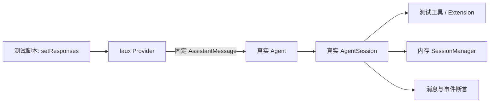

# D21：faux Provider 与 AgentSession 测试 Harness

> 精读对象：`packages/ai/src/providers/faux.ts` 的 response 工厂与流式实现、`packages/ai/src/compat.ts` 的 `registerFauxProvider`、`packages/coding-agent/test/suite/harness.ts` 的 `createHarness`，以及使用它们的 suite 测试。
>
> 对应主线：第 5、6、7、8、18、19、20、21 章。第 18 章告诉你怎样选测试层；本文拆开 session harness 的装配与清理。
>
> 基线：`200387122ca450d6387f033949423114a270b96c`。测试源码用于说明测试边界，不表示本篇已经执行测试。

## 0. 这类测试到底在测什么

目标通常是验证：一条输入经过真实 `AgentSession`、真实 Agent loop、真实工具调度与真实会话记录后，能不能产生正确的消息、事件和持久化条目。为了不依赖模型，它把最外面的模型服务替换成 faux provider：模型响应由测试脚本明确指定。



测试因此不是“把整个程序 mock 掉”，而是替换不可控的外部模型响应，保留要验证的应用代码路径。

| 保留为真实实现 | 通常由测试替代或隔离 |
|---|---|
| `Agent`、`AgentSession`、工具调度、扩展 runner、事件与消息归约 | 模型服务随机输出与网络 |
| 工具参数校验与工具执行管线 | 用户级设置/凭据文件 |
| 会话投影逻辑，默认使用内存 session manager | 工作目录使用临时目录 |
| 需要测试的扩展和 fake 工具 | 不相关资源加载改用轻量 resource loader |

【陷阱】faux 测试不能证明某个供应商真的会按脚本返回结果，也不能证明 HTTP/SSE 转换正确。它证明的是“pi 应用层收到这一条已规范化 assistant message 后，会怎样运行”。provider 协议转换要在 `packages/ai/test` 测；Agent/Session 行为才在这里测。

## 1. 四个层级，不要混成一个对象

先建立对象关系：

```text
registerFauxProvider
  ├─ 注册一个 api -> stream/streamSimple 实现
  ├─ 创建模型目录
  └─ 返回 faux handle（脚本队列、状态计数、unregister）

createHarness
  ├─ 创建 temp cwd、临时文件、内存设置和认证
  ├─ 取 faux model 与注册到测试 ModelRuntime
  ├─ 创建真实 Agent（streamFn=streamSimple）
  ├─ 创建真实 AgentSession
  ├─ 监听并缓存 AgentSessionEvent
  └─ 返回 session / faux / 断言辅助 / cleanup

测试用例
  ├─ 设置 response script
  ├─ 调 session.prompt()
  └─ 观察 messages / tool result / events / entries / faux state
```

四层各自的“真实程度”不同：faux 是假的模型，但不是假的 Agent；harness 是测试装配，不是正式 SDK 工厂；session manager 默认在内存中，但保存/投影算法仍是真实类；测试工具由用例提供，执行 pipeline 仍是真实实现。

## 2. faux provider：脚本化一次模型响应

### 2.1 关键类型

`FauxResponseStep` 是一个 assistant message，或者一个根据请求上下文动态返回 assistant message 的 factory：

```typescript
export type FauxResponseFactory = (
  context: TranscriptContext,
  options: SimpleStreamOptions | undefined,
  state: FauxProviderState,
  model: Model<string>,
) => AssistantMessage | Promise<AssistantMessage>;

export type FauxResponseStep = AssistantMessage | FauxResponseFactory;
```

初学者读法：

- 第一参数 `context`：这次请求准备发给模型的规范化 transcript；
- 第二参数 `options`：本次请求的 stream/simple options；
- 第三参数 `state`：faux 自己的调用计数等观测状态；
- 第四参数 `model`：这轮实际选中的模型；
- 返回值可同步也可异步，所以测试可以在工厂里检查上下文，再决定回答什么。

固定响应适合回答“拿到某种模型输出时会发生什么”；工厂响应适合回答“发请求那一刻上下文里到底有什么”。

### 2.2 常用消息构造器

```typescript
fauxAssistantMessage("hello")
fauxAssistantMessage([fauxThinking("reasoning"), fauxText("answer")])
fauxAssistantMessage(fauxToolCall("echo", { text: "hi" }), { stopReason: "toolUse" })
```

这些函数产生的是 pi-ai `AssistantMessage` 数据。`fauxAssistantMessage` 默认 stop reason 为 `stop`；若消息包含工具调用，脚本必须显式设置 `stopReason: "toolUse"`，否则 Agent 不会把它解释成要求执行工具的完成。

### 2.3 response 队列是 FIFO

`setResponses(responses)` 用新数组替换待处理队列；`appendResponses(responses)` 把步骤追加到末尾；`getPendingResponseCount()` 返回尚未消费的脚本数。

每次 faux `stream` 被调用时，会先同步执行：

```text
step = pendingResponses.shift()
state.callCount += 1
```

然后用 `queueMicrotask` 异步处理 response。结果是：

- response 队列顺序就是请求顺序；
- 若 Agent 工具循环会发两次模型请求，测试要提供两个 response step；
- response script 提前耗尽不会偷偷复用上一答案，而会产生 `No more faux responses queued` 错误；
- 调用数统计在 response 计算之前递增，可作为请求次数探针。

【陷阱】单个 `session.prompt()` 可能发出多轮请求。包含一个 tool call 的典型脚本需要“toolUse assistant message + 工具执行后的 follow-up assistant message”；只给一个 step 时，第二次请求会得到 faux exhaustion error。

### 2.4 工厂是“发请求前探针”

```typescript
harness.setResponses([
  (context) => {
    const user = context.messages.find((message) => message.role === "user");
    return fauxAssistantMessage(user ? "saw user input" : "missing user");
  },
]);
```

这段 factory 在 faux 收到 pi-ai 请求 context 后运行，适合断言：

- 当前有效分支里有哪些消息；
- system prompt 是否包含某个 section；
- 模型看到的是哪个工具清单；
- 工具结果是否已经进入下一轮上下文；
- extension context transform 是否生效。

它不是“模型内部在思考时的上下文”，而是 provider stream 函数实际收到的 transcript。要测更早的输入转换，需要在 `AgentSession.prompt`/extension hook 边界观察；要测供应商 JSON，则在具体 provider 的 `onPayload`/adapter test 观察。

## 3. faux 怎样把完整消息变成流事件

faux stream 不直接把最终 message 一次性返给 Agent。它调用 `streamWithDeltas`，把固定内容拆成 start/delta/end/done 事件。

### 3.1 部分 AssistantMessage

最初 partial message 会将 content 清空，`stopReason` 设为 `pending`，然后 push `start`。每个 content block 被顺序处理：

- thinking：`thinking_start → 一个或多个 thinking_delta → thinking_end`；
- text：`text_start → 一个或多个 text_delta → text_end`；
- tool call：`toolcall_start → 一个或多个 toolcall_delta → toolcall_end`。

累积器每次 delta 都会更新 partial content，因此测试可以订阅 AgentEvent，观察进行中的消息，而不用真实 provider。

### 3.2 token size 与时序

文本按估算 token size 分块：每个字符约折算 1/4 token；`tokenSize.min/max` 控制伪 token 长度；`tokensPerSecond` 大于零时每块按长度等待，缺省或小于等于零时通过 `queueMicrotask` 让出当前同步栈再继续。

这个模拟不是 tokenizer，也不模拟某家 provider 的 chunk 算法。默认 min/max 区间可使 delta 边界随机；若测试检查精确 delta 次数或事件序列，应将两者设成同一个固定值，或者只断言最终拼接文本。

示例：

```typescript
const faux = registerFauxProvider({
  tokenSize: { min: 1, max: 1 },
});
```

固定 chunk 大小控制形状；默认不加人工速度延时则避免测试等待长时间。测试 abort 时，若要保证中途取消发生在内容仍在发送，需要配置可控速率/等待，而不是依赖机器调度碰巧命中某个时刻。

### 3.3 终态语义

若脚本 message 的 stop reason 仍是 `pending`，faux 抛出错误；`error`/`aborted` 会 push error event；其他 stop reason push done event。异常会转成具有 `stopReason: "error"` 的 assistant message，流 `.result()` 得到终态 message。

所以 response factory 抛异常和 factory 返回 `fauxAssistantMessage(..., { stopReason: "error" })` 并不完全相同：前者走 faux 异步任务的 catch；后者由 `streamWithDeltas` 在输出内容之后按终态分支发 error。写测试时先确定自己要模拟“响应生成失败”还是“模型响应本身报告 error”。

## 4. `registerFauxProvider`：如何接入统一 pi-ai API

`registerFauxProvider` 把 `createFauxCore` 的 `api`、`stream`、`streamSimple` 注册到 `compat` 的 API provider registry，并返回：

- api id 与模型 tuple；
- `getModel()` / `getModel(id)`；
- 状态、响应队列操作；
- `unregister()`。

注册不是全局永久配置。测试结束必须 unregister，否则后续测试可能遇到冲突 API、误用旧 response queue，或受测试执行顺序影响。

有另一种 `fauxProvider()`：它返回一个正常的 `Provider` 对象，需要测试显式创建 `Models` 并调用 `models.setProvider(faux.provider)`。两种入口的用途不同：

| 工厂 | 注册位置 | 常见用途 |
|---|---|---|
| `registerFauxProvider` | 全局 api provider registry | compat/getModel 一类标准 API 路径 |
| `fauxProvider` | 返回 `Provider` 对象，由测试装入 Models | 测 Models/provider registry 的显式装配 |

不要在需要验证 `Models` registry 的单元测试里使用会绕过该层的入口。

## 5. `createHarness` 装了哪些真实部件

### 5.1 隔离文件系统与设置

每个 harness 创建唯一 temp directory，作为 session 的 cwd。默认 `SessionManager.inMemory()`、`SettingsManager.inMemory(...)` 与 `AuthStorage.inMemory()` 避免读写用户真实会话、设置和凭据。

若传入 `modelsJson`，harness 会把它序列化到 tempDir 下的 `models.json`，创建 disk-backed model registry；这让测试可覆盖 models.json 加载，而无需碰用户目录。

### 5.2 创建真实模型运行时

harness 先 register faux，再拿到 faux model。默认 `withConfiguredAuth=true` 时：

1. 向内存 `AuthStorage` 写入一个假的 `faux-key`；
2. 在 model registry 里注册同 provider/baseURL/API/model metadata；
3. 创建 `Agent`，`getApiKey` 返回该 fake key；
4. `streamFn` 使用 pi-ai `streamSimple` 路由到注册过的 faux API。

这使会话运行时走正常的 model/provider lookup 和 stream adapter，只把响应来源替换成脚本。`faux-key` 只是本地注册路径满足“存在认证”的测试值；fake provider 不会把它送到网络。

若设置 `withConfiguredAuth: false`，harness 不把 faux provider 注册进有 auth 的 model runtime 且 Agent 不返回 key，适合测试缺认证行为。

### 5.3 创建真实 Agent 和 AgentSession

`new Agent(...)` 传入：

- fake stream function；
- 初始 model、空 system prompt、空初始工具；
- coding-agent 的 `convertToLlm`；
- extensions 接入点：`onPayload`、`onResponse`、`transformContext` 经 `extensionRunnerRef.current` 转发。

随后 `new AgentSession(...)` 注入 Agent、session/settings managers、temp cwd、ModelRuntime、resource loader、工具覆盖与扩展引用。

这保留了真实 session→Agent→provider 调用方向。比如 `session.prompt()` 中的队列、session event、消息追加与 tool execution 都不是 harness 假实现。

### 5.4 工具和 extension factories

`tools` 选项先建成 name→tool map，再作为 `baseToolsOverride` 注入；在场景需要时也可用 `extensionFactories` 创建测试扩展。选择依据：

- 要测普通 AgentTool 的 schema 校验/执行，传 `tools`；
- 要测扩展注册、extension event、动态 loadout 或 `ctx.executeTool`，传 `extensionFactories`；
- 要测 CLI 资源扫描/真实文件发现，不应假设默认 test resource loader 覆盖了生产扫描行为。

`initialActiveToolNames`、`allowedToolNames`、`excludedToolNames` 分别控制初始活动集合、允许集合和排除集合，具体组合行为由 AgentSession 工具 loadout 实现。

### 5.5 测试事件缓存与辅助函数

harness 对 session 订阅，把事件保存进 `events`；`eventsOfType(type)` 使用 TypeScript `Extract` 把筛选结果收窄成该事件种类。

```typescript
eventsOfType<T extends AgentSessionEvent["type"]>(type: T) {
  return events.filter(
    (event): event is Extract<AgentSessionEvent, { type: T }> => event.type === type,
  );
}
```

泛型读法：`T` 必须是一个合法的事件 type 字面量；返回数组的元素类型被缩小为“type 等于 T 的那种 event”，所以调用者读字段时有正确提示。

`getMessageText` 先判断未知输入是不是对象、有无 content，再区分字符串和 block array；这是一种 `unknown` 类型的逐步收窄示例。对初学者来说，读这个 helper 比把数据强转成 `any` 更值得模仿。

## 6. cleanup 是测试隔离的一部分

`harness.cleanup()` 按顺序：

1. `session.dispose()` 释放会话持有的订阅、扩展与 runtime 资源；
2. `fauxProvider.unregister()` 从 compat registry 移除这个 provider registration；
3. 若 temp directory 仍存在，递归删除它。

测试通常在 `afterEach` 中循环所有已创建 harness 并调用 cleanup。一个测试创建多个 harness 时，需要登记每一个；中途断言失败也要能清理，不能只在成功路径手动 dispose。

【陷阱】`vi.clearAllMocks()` 不会帮你 unregister faux provider，不会 dispose AgentSession，也不会删除 temp directory。不同资源由不同 owner 清理。

## 7. 一个完整测试：一次工具调用，再跟进一轮回答

下面代码按当前 `test/suite/harness.ts` 的接口编写，结构对照 `agent-session-prompt.test.ts`：

```typescript
import { afterEach, describe, expect, it } from "vitest";
import { fauxAssistantMessage, fauxToolCall } from "@earendil-works/pi-ai";
import type { AgentTool } from "@earendil-works/pi-agent-core";
import { Type } from "typebox";
import { createHarness, type Harness } from "./harness.ts";

describe("工具运行后写入结果并继续请求", () => {
  const harnesses: Harness[] = [];

  afterEach(() => {
    while (harnesses.length > 0) harnesses.pop()?.cleanup();
  });

  it("把模型工具调用转换成 toolResult，再带结果继续", async () => {
    const calls: string[] = [];
    const echo: AgentTool = {
      name: "echo",
      label: "Echo",
      description: "Echo one string",
      parameters: Type.Object({ text: Type.String() }),
      execute: async (_id, params) => {
        const text =
          typeof params === "object" && params !== null && "text" in params
            ? String(params.text)
            : "";
        calls.push(text);
        return { content: [{ type: "text", text: `echo:${text}` }], details: {} };
      },
    };

    const harness = await createHarness({
      tools: [echo],
      initialActiveToolNames: ["echo"],
    });
    harnesses.push(harness);
    harness.setResponses([
      fauxAssistantMessage(fauxToolCall("echo", { text: "hello" }), { stopReason: "toolUse" }),
      (context) => {
        const result = context.messages.find((message) => message.role === "toolResult");
        return fauxAssistantMessage(result ? "tool result reached model" : "missing tool result");
      },
    ]);

    await harness.session.prompt("run echo");

    expect(calls).toEqual(["hello"]);
    expect(harness.session.messages.map((message) => message.role)).toEqual([
      "system", "user", "assistant", "toolResult", "assistant",
    ]);
    expect(harness.getPendingResponseCount()).toBe(0);
  });
});
```

### 逐段读测试

1. `AgentTool` 的 `parameters` 使用 TypeBox schema；运行时校验不依赖 TypeScript 编译器。
2. `execute` 的 `params` 是工具输入。示例先做 `typeof`/`in` 检查，再转成 string，没有用 `any`。
3. `initialActiveToolNames` 让 `echo` 出现在模型可用工具集合里；只把工具传进 `tools` 不一定等价于它已激活。
4. 第一 response 是模型请求工具；第二 response factory 检查下一次请求 transcript 是否已经包含 toolResult。
5. `session.messages` 断言用户可观察的会话顺序；响应队列 count 断言没有少用/多用脚本。
6. `afterEach` 负责无论测试通过或失败都释放 session、registry provider 和临时目录。

这一个测试同时跨了应用流程多个边界，但不测 OpenAI/Anthropic/Bedrock 的 tool-call JSON 协议。它收到的是已经构造好的 pi `ToolCall`。

## 8. 探针断言的三种位置

### 8.1 Provider 入参探针

用 faux factory 观察 `TranscriptContext`：适合断言“模型请求将要看到什么”。例如在有 tool result 后的第二个 factory 中检查结果消息。

### 8.2 AgentSession 事件探针

通过 `harness.eventsOfType("tool_execution_start")`、扩展 callback 或 `session.subscribe` 观察生命周期。适合断言事件次序、事件字段、session 边界和 extension hook 输入。

### 8.3 持久化/上下文双断言

`harness.session.messages` 是当前模型/会话上下文投影；`sessionManager.getBranch()` 是持久化条目。某些行为要求两者一致，另一些则故意不同（比如省略的历史、branch summary、custom metadata）。测试前要先回答需求约束的是哪一种。

```text
纯 UI 展示内容     → 查 event 或 session.messages
模型下一轮能看到的 → 在 faux factory 检查 context.messages
磁盘/会话树记录    → 查 sessionManager branch/entries
```

不要只断言内部私有字段。优先选择下游可观察值：模型请求、消息形状、事件序列、工具副作用计数、持久化条目。

## 9. 隔离与可重复性边界

### 9.1 测试内存对象不等于全局状态不存在

每个 `registerFauxProvider` 都向 compat registry 注册全局 API provider；它是唯一化 API id，并要求 cleanup unregister。测试并行、漏 cleanup 或手工复用 provider id 都可能引入全局冲突。

### 9.2 response 队列是有状态资源

`setResponses` 重置队列，`appendResponses` 在现有尾部追加。一个 case 内不要让两个并发 prompt 竞争同一个按顺序消费的队列，除非测试目的就是验证并发消费顺序，并且响应步骤本身足以区分两个请求。

### 9.3 Chunk 尺寸可能不固定

faux 默认 `tokenSize.min/max` 是一个区间，会随机切文本。最终 content 稳定，delta 列表长度/边界不一定稳定。

适合稳定断言：

- 所有 delta 拼接等于目标文本；
- 最终 assistant content 等于目标结构；
- tool start/end 各出现一次；
- response script 按预期消耗。

避免断言：

- 默认 tokenSize 下恰好有 N 次 `text_delta`；
- delta 恰好在某个自然语言词边界切开。

若确实测试 chunk sequencing，设置固定范围并验证该固定策略的意义。

### 9.4 微任务与真实计时器

无延迟 faux 也会用 `queueMicrotask` 让事件异步推进。不要把调用栈同步完成当作契约。若测试取消/steer 的竞态，用可控 Promise barrier 或受控速率明确暂停位置；别依赖“睡 20ms 应该刚好停在工具中间”。

## 10. Faux 测试不能证明什么

| 需求 | faux/session harness 能否证明 | 合适的测试层 |
|---|---|---|
| Agent 遇到 toolUse 是否调用工具 | 能 | `coding-agent/test/suite` |
| 工具输入 schema 错误是否变 error tool result | 能 | harness + faux |
| 某 provider 把 raw finish reason 映射成哪个 StopReason | 不能直接证明 | provider adapter test |
| SSE CRLF 跨网络 chunk 是否能正确解析 | 不能 | SSE decoder test，受控 ReadableStream chunk |
| TUI 宽字符布局/IME/按键 | 不能 | `packages/tui` unit 或 tmux interactive |
| 真实 AWS IAM 是否有 invoke 权限 | 不能 | 账户/region 下的专门验证 |
| 某任务在多个模型上的成功率 | 不能 | evals 或明确授权的模型实验 |

这是测试层选择的核心：把被测代码范围画出来，避免把“一个集成用例通过”扩大成“整个模型链都正确”。

## 11. 源码修改的最小测试闭环

把一个需求变成可审核行为，按这条路径走：

1. **描述前后行为**：输入是什么，旧实现产出什么，新实现要改变哪一点。
2. **找 owner**：Agent loop、AgentSession、provider adapter、TUI 或 extension loader；不要把断言写进错误层。
3. **选测试设施**：纯转换用 package unit test；跨 session/工具路径用 suite harness + faux；真终端问题才用 tmux。
4. **添加失败测试**：先让测试展示旧行为或缺陷，确认断言确实覆盖用户可观察的差别。
5. **修改最少的实现边界**：不要为了通过测试 mock 被测核心路径，也不要把故意错误的实现隐藏在 harness fixture 里。
6. **验证相关测试与工程检查**：按照仓库 AGENTS.md 规定命令；修改测试文件后运行该测试。不得为了方便直接启动完整 Vitest suite。
7. **检查变更集**：确认只包含本任务的源码/测试/文档，不提交其他工作区内容。

本手册不在这一章替读者执行测试；这里只说明如何形成证据。某个具体改动的测试结果必须来自当次命令输出，不能从测试名字或旧记录推断。

## 12. 阅读现有测试的路线

1. `packages/ai/src/providers/faux.ts` → `fauxAssistantMessage`、`fauxToolCall`、`createFauxCore`、`streamWithDeltas`。
2. `packages/ai/src/compat.ts` → `registerFauxProvider`，注意 registry 注册/注销。
3. `packages/coding-agent/test/suite/harness.ts` → `HarnessOptions`、`createHarness`、返回对象与 `cleanup`。
4. `packages/coding-agent/test/suite/README.md` → suite 的硬规则。
5. `agent-session-prompt.test.ts` → 单轮、工具调用、并发工具与 session role 序列。
6. `agent-session-tool-orchestration.test.ts` → extension tool loadout、nested calls、持久化记录。
7. `packages/agent/test/e2e.test.ts` → 不经过 AgentSession、直接测试底层 Agent 的 faux 集成。
8. `vitest.base.ts` → 测试 import alias 如何把 workspace package 指向 `src/`。
9. 根 `test.sh` → CI 跑非 e2e 测试前如何隔离凭据、HOME、locale 与 temp。

有一个命名陷阱：`packages/agent/test/e2e.test.ts` 名叫 e2e，但它使用 faux provider、没有真实模型请求；文件名描述该包的集成场景，不表示它等同于 coding-agent 中受环境变量激活的真实供应商 e2e 测试。判断测试风险要看 setup 与环境条件，不要只看文件名。

## 13. 练习

### 练习 A：列出 response 消费数量

脚本是 `[toolUse assistant, final assistant]`，tool function 执行一次。成功结束时预期：

- faux `callCount` 增量是多少？
- pending response 数是多少？
- session 中 assistant message 与 toolResult 数量是多少？

参考：通常 2 次 faux stream 调用、pending 0、assistant 两条、toolResult 一条；还要考虑 system/user 等其他消息，不要用 messages 总数代替角色计数。

### 练习 B：找错测试层

需求：“Bedrock 的 raw `tool_use` stop reason 必须变成 pi 的 `toolUse`。”为什么只写 `createHarness()` 测试不够？

参考：harness 的 faux 直接产生 pi `AssistantMessage`，绕过 Bedrock `mapStopReason`；应在 `packages/ai/test/bedrock-raw-stop-reason.test.ts` 覆盖 adapter，session harness 可另测映射结果对 Agent loop 的影响。

### 练习 C：写上下文探针

写一个 factory：首轮返回 tool call；第二轮确认 transcript 包含对应 tool result，然后返回 final text。列出你会断言的消息角色和 toolCallId 关联。

### 练习 D：让测试不受 delta 随机切分影响

一个断言检查 `text_delta` 次数等于 4，但默认 faux 偶尔有 3 次或 5 次。列出两种修正：测试最终文本/拼接值；或者将 token size 固定并明确该测试验证固定 chunk 行为。

## 14. 本篇验证边界

- **静态核对**：harness、faux、真实 session/agent 装配及引用测试已对照基线源码阅读。
- **未运行**：本篇没有执行 Vitest，也没有生成测试文件。
- **网络与凭据**：faux 没有真实模型 endpoint；`test.sh` 的环境隔离规则仍是独立保护层，不能因为 faux 而随意绕过。
- **范围**：本篇说明 coding-agent suite 的 AgentSession 集成 harness，也对比底层 Agent package 的 faux 测试；不声称覆盖所有测试层。

## 15. 小结

Harness 的价值不是“隐藏复杂性”，而是把每个测试需要的可变部分显式暴露：response 脚本、工具、extension、设置、会话 manager 和资源 loader。其余的 AgentSession/Agent 行为尽量保留真实实现。

```text
脚本化 provider 输出
  → 真实 streamSimple 与 Agent
  → 真实 AgentSession prompt / tools / events
  → 可观察的 message / entries / tool side effects
  → cleanup 移除全局注册和临时资源
```

当测试失败，先问三个问题：faux 是否脚本不足或 stopReason 写错？实际执行是否进入预期工具/session 分支？断言是否观察了正确层的结果？这比先加 mock 或延时更容易定位原因。

> D21 完。下一篇建议精读 ExtensionLoader 的发现、导入失败隔离、热重载和 dispose 生命周期，再继续整理可执行的源码修改练习。
