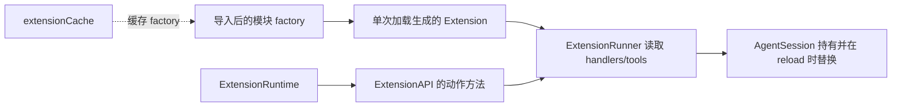
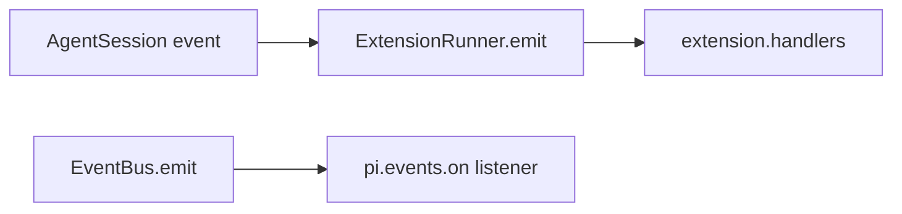
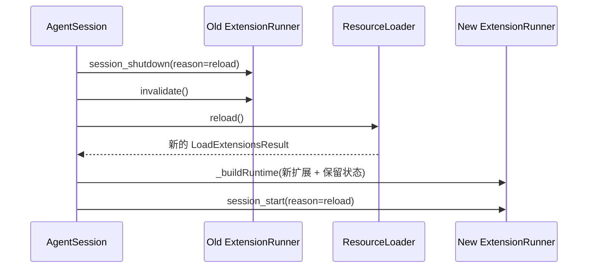

# D22：扩展加载失败、缓存与运行时生命周期

> 精读对象：`packages/coding-agent/src/core/extensions/loader.ts`、`runner.ts`、`resource-loader.ts`、`agent-session.ts` 中相连的错误与清理路径。
>
> 对应主线：第 11、12、13、18、19、20 章。D14 解释 loader 如何发现并装配扩展；本文回答“某一步失败了怎么办、旧扩展何时失效、缓存是否等于运行实例”。
>
> 基线：`200387122ca450d6387f033949423114a270b96c`。本文依据源码和现有测试静态核对，本轮未执行测试。

## 0. 为什么要单独读失败路径

一个扩展不是单一函数调用。它可能先被找到，再被模块加载器导入，运行默认工厂，注册工具和 provider，绑定到 session，收到事件，最后在 reload 或 dispose 时被替换。

```text
发现路径
  → 导入模块
  → 执行扩展工厂
  → 注册扩展资源与运行时能力
  → ExtensionRunner 派发事件
  → session reload / dispose
  → 旧上下文失效，旧监听器释放
```

若只看成功路径，容易误以为：

- 一个坏扩展会让整个启动失败；
- 工厂只要调用了注册 API，注册就已经不可逆地生效；
- loader 缓存的是完整的扩展运行实例；
- reload 只是再跑一次工厂；
- `session.dispose()` 只是解除 Agent 监听；
- 捕获旧 `pi` 对象的异步回调仍然可以安全操作当前 session。

这些理解都不准确。下面把每个结论落到状态、代码和可观察行为。

## 1. 先画清楚四个对象



| 对象 | 生命周期 | 里面主要是什么 | 会不会被模块缓存复用 |
|---|---|---|---|
| 模块 factory | 导入缓存的一个代际 | 扩展导出的函数 | 会，`loadExtensionsCached` 命中时 |
| `Extension` | 每次工厂初始化单独创建 | handlers、tools、commands、flags、renderers 等注册集合 | 不会，命中 factory 后仍重新创建 |
| `ExtensionRuntime` | 一次加载结果 / runner 装配周期 | action method、provider 注册队列、MCP registry、context 有效性 | 不会，按调用参数传入或新建 |
| `ExtensionRunner` | 与当前绑定的 session extension set 一致 | 事件分发、运行时绑定、扩展错误路由 | reload 时旧实例失效，新实例重建 |

初学者可以把它类比成：模块 factory 是“配方”，`Extension` 是按配方新做的一份“实例”，runtime 是这份实例能使用的“当前宿主服务”。缓存配方并不意味着把旧实例搬到新 session。

## 2. 错误在哪个边界变成数据

`loadExtension` 把路径解析、导入和工厂初始化包在 `try/catch` 里，返回 `{ extension, error }`。其调用方 `loadExtensionsInternal` 逐个处理路径，把失败追加到 `errors`，然后继续下一条。

```typescript
for (const extPath of paths) {
  const { extension, error } = await loadExtension(
    extPath,
    resolvedCwd,
    resolvedEventBus,
    resolvedRuntime,
    cacheToken,
  );

  if (error) {
    errors.push({ path: extPath, error });
    continue;
  }

  if (extension) {
    extensions.push(extension);
  }
}
```

### 2.1 `try/catch` 的含义

```text
扩展 A 成功 → extensions = [A]
扩展 B 抛错 → errors = [{ path: B, error: ... }]，继续
扩展 C 成功 → extensions = [A, C]
最终返回 A、C 和 B 的错误诊断
```

这是一种**按扩展隔离**：边界是一条路径，不是整批路径。返回 `LoadExtensionsResult` 的调用方可以把错误显示给用户，同时仍使用其他成功扩展。

它不代表所有错误都能安全吞掉。错误如果发生在 `loadExtensionsInternal` 外层的目录资源解析、设置读取或 session 重载流程，仍可能向上抛出。判断是否隔离，必须追到具体的 `try/catch` 包围范围。

### 2.2 两种失败文字不是两种恢复策略

`loadExtension` 中：

- 模块成功导入，但 default export 不是函数：返回 `Extension does not export a valid factory function: ...`；
- import、factory、API commit 等路径抛错：捕获并返回 `Failed to load extension: ...`。

这两种情况最后都作为一项 `{ path, error }` 进入 `LoadExtensionsResult.errors`。错误字符串分类有助于诊断，但不会自动重试，也不会自动禁用扩展目录中的其他条目。

### 2.3 注意 API 不同，抛错边界也不同

| 入口 | 调用者能观察到的失败形式 |
|---|---|
| `loadExtensions(paths, ...)` | 单路径错误通常进入结果的 `errors` 数组 |
| `discoverAndLoadExtensions(...)` | 发现路径后走 `loadExtensions`，单扩展失败仍在结果数组里 |
| `loadExtensionFromFactory(...)` | 工厂失败向调用者抛出；它不经过逐路径的 `loadExtension` 包装 |
| `DefaultResourceLoader.reload()` | 包含更多设置、包解析、信任和资源装配步骤；并非每步异常都被 `loadExtension` 捕获 |

【陷阱】不能因为 `loadExtension`“永不抛出”就推断“扩展系统不会抛错”。这个性质只适用于该函数包裹的路径加载操作；inline factory 的 API 明确会拒绝 Promise，resource reload 也有自身失败边界。

## 3. 工厂初始化是一个小事务

`initializeExtension` 的流程可以简化成：

```typescript
const extension = createExtension(extensionPath, resolvedPath);
const load = createExtensionAPI(extension, runtime, cwd, eventBus);
try {
  await factory(load.api);
  load.commit();
} catch (error) {
  load.discard();
  throw error;
}
return extension;
```

这里的 `try` 覆盖了整个异步 factory。也就是说，工厂在 `await` 前后的同步异常和 rejected Promise 都进入 `discard()`。

### 3.1 API 注册分成“实例内写入”和“宿主运行时变更”

`createExtensionAPI` 里不是所有 API 都用同一种存储方式：

- `registerTool`、`registerCommand`、`registerShortcut`、renderer 等先写到新建的 `extension` 对象；
- `registerFlag` 把默认值暂存到 `pendingFlagValues`；
- provider、MCP server、virtual model 变更在 factory 执行期暂存到 `pendingRuntimeChanges`；
- `pi.events.on` 立即向 event bus 订阅，但订阅释放函数暂存在 `loadingUnsubscribers`。

因此“事务”是一个帮助理解的模型，不是数据库事务，也不是把所有副作用都延迟到 commit。它有明确边界和特殊情况。

| 副作用 | factory 执行时 | 成功 `commit` | 失败 `discard` |
|---|---|---|---|
| extension 自有 tools/commands/handlers/renderers | 写入尚未对外返回的新对象 | 返回该 extension 供 runner 使用 | extension 不返回，局部对象不可达 |
| flag 默认值 | 暂存在局部 Map | 若 runtime 尚无同名值则写入 | 丢弃 pending 值 |
| provider/MCP/virtual model | 先排入 pending change | 逐个应用 | 清空队列，不应用 |
| event bus 订阅 | 立即建立，同时记录 unsubscribe | 保留订阅，转入 runtime 追踪 | 逐个 unsubscribe |
| 外部任意副作用 | factory 自己直接执行 | loader 不额外处理 | loader 无法自动回滚 |

【陷阱】若 factory 自己在文件系统写文件、启动不受 runtime 管理的 timer，或向任意全局对象写值，`discard()` 不知道这些动作。扩展作者应避免在 factory 中做不可逆的外部工作；需要收尾的资源，应使用相应生命周期事件和显式 cleanup 设计。

### 3.2 pending 的作用：隔离失败工厂对共享 runtime 的影响

考虑一个失败工厂：

```typescript
async (pi) => {
  pi.registerProvider("temporary", config);
  await prepareSomething();
  throw new Error("initialization failed");
}
```

若 `registerProvider` 立即改共享模型 registry，后续加载的扩展可能已经看见 `temporary`；失败时想要恢复就必须准确撤销，而且不能误删另一个并发扩展刚注册的同名或相关状态。

现在 factory 执行期间 provider 操作进入当前 API 自己的队列。失败时只清理自己的队列；成功后才 commit。因此并发加载中，失败扩展清理不会误删另一扩展的 provider。

`8423-extension-factory-failure.test.ts` 覆盖了两个重要事实：

1. 同步失败会丢弃 flag 默认值、provider 变更与 event subscription，捕获的 API 被标为 failed；
2. 一个 factory 等待时另一个 factory 注册 provider，之后前者失败，不应把后者注册删除。

这里说的“并发”是两个 `loadExtensionFromFactory` 的 Promise 生命周期交错，不表示 `loadExtensionsInternal` 会并行加载路径；后者当前使用 `for...of` 加 `await` 顺序加载。

### 3.3 `commit()` 的顺序

成功工厂返回后，`commit()`：

1. 检查 API 仍处于 loading；
2. 调用 `runtime.assertActive()`，防止宿主已使 runtime 失效；
3. 写入尚不存在的 flag 默认值；
4. 按注册顺序应用 pending runtime changes；
5. 将 API 状态从 `loading` 改成 `active`；
6. 清空暂存容器。

如果 factory 成功，但 pending change 应用过程中抛错，`initializeExtension` 的外层 catch 会调用 `discard()` 并重新抛错。注意已应用的前几个 change 不一定能被通用地逆转；代码这里提供的是对“factory 执行阶段”主要共享变更的暂存隔离，不是 ACID 式原子提交。需要判断具体注册方法本身是否可失败、是否有补偿路径。

## 4. loading / active / failed 三态

每个 `createExtensionAPI` 都保存一个局部 `state`：

```text
loading --commit--> active
loading --discard-> failed
```

没有从 `failed` 恢复到 `active` 的迁移，也没有在 `commit()` 后调用 `discard()` 的效果。

### 4.1 为什么动作 API 在 loading 时会抛错

创建 extension runtime 时，大部分“对 session 做事”的方法是 throwing stub：

```typescript
const notInitialized = () => {
  throw new Error("Extension runtime not initialized. Action methods cannot be called during extension loading.");
};
```

factory 阶段可以注册声明，但没有已经绑定到具体 `AgentSession` 的 `sendMessage`、`getSettings` 等宿主动作。这样的分离可以避免“扩展刚开始装载，就向一个还没创建完成的 session 发消息”。

接口大致分两组：

```text
声明 / 注册：建立 extension 自身的能力描述，加载期可以调用
动作 / 查询：依赖已绑定 runtime，加载期由 stub 阻止
```

`refreshTools` 是特殊的 no-op：工具可以在 loading 阶段注册，runner 后续 bind 时会统一整理工具，因此此刻无需刷新尚未就绪的工具视图。

### 4.2 failed API 被禁用

`discard()` 将状态设成 `failed`。后续再使用捕获的 API 时，`assertActive()` 会优先抛出带 extension path 的错误：

```text
Extension "<failing>" failed to load and its API is no longer active.
```

这样 factory 失败后，某个延迟回调即使还握有 `pi`，也不能继续向 runtime 注册资源或发动作。

一个边界：`pi.on()` 返回的 handler closure 本身不在每次派发时调用该 `assertActive`。失败时不会把 `Extension` 放进成功结果，而 event bus 订阅则通过 unsubscribe 清理。对已经成功加载的 handler，runner 的整体失效边界负责阻止旧运行时操作。

## 5. EventBus 订阅与 runner 事件是两条路径

扩展里有两种看起来相似、实际 owner 不同的“事件”：

1. `pi.on("input", handler)`：注册在某个 `Extension.handlers` map，之后由 `ExtensionRunner` 按扩展顺序派发。
2. `pi.events.on(channel, handler)`：直接订阅 `EventBus`，返回 unsubscribe；属于 event bus 订阅资源。



【陷阱】`pi.on` 注册的扩展生命周期 handler 不是 `pi.events.on` 的同一套 listener 集合。排查“reload 后仍然收到事件”，先确认事件从哪个入口发出，再查看相应 owner 如何失效。

### 5.1 loading 阶段的 EventBus 订阅为何提前发生

`pi.events.on` 必须返回一个真实 unsubscribe，调用者可能在 factory 里立刻保存它；因此 listener 当场挂到 event bus。为了防止 factory 失败后泄漏，API 同时把 unsubscribe 加到 `loadingUnsubscribers`。

- factory 成功：`commit()` 清空 loading 阶段的待清理表；订阅此前已由 runtime `trackEventBusSubscription` 登记，未来 runtime invalidate 时统一退订。
- factory 失败：`discard()` 逐个 unsubscribe，之后清空暂存表。
- 扩展代码主动调用 unsubscribe：wrapper 会幂等化，后续 cleanup 不会重复执行底层 unsubscribe。

这条 ownership 链是：

```text
EventBus.on 返回底层 unsubscribe
  → runtime.trackEventBusSubscription 包一层幂等 unsubscribe
  → API 持有 loading 阶段的 unsubscribe
  → commit 后由 runtime 持有
  → runtime.invalidate 时统一调用
```

`7193-event-bus-lifecycle.test.ts` 以 host listener 作为对照：session 连续 reload 后 extension listener 每次只触发一次；dispose 后 extension listener 不触发，但 host listener 仍触发。它证明的是 extension runtime 的订阅被释放，而不是整个 EventBus 被销毁。

## 6. Runtime invalidate：使旧 API 与旧订阅失效

`createExtensionRuntime()` 里的 `invalidate(message)` 做两件关键事：

1. 第一次调用时保存 stale message；后续调用不覆盖；
2. 调用已登记的 event bus unsubscribe 并清空集合。

runtime 的 `assertActive()` 会在保存 stale message 后抛错。`createExtensionAPI` 每个公开 API 入口都会先检查自己的 failed 状态，再调用 `runtime.assertActive()`。

```text
扩展 API 原本可用
  → runner/runtime invalidate("stale ...")
  → 捕获的 API 再被调用
  → assertActive() 抛 stale 错误
```

这不是把 JavaScript 对象从调用者内存中删除。用户代码仍可能保存旧的 `pi` 或 context；系统通过“使用时校验”使其失效。

### 6.1 `ExtensionRunner.invalidate()` 是入口

`ExtensionRunner.invalidate()` 只在第一次调用时保存 stale message，并把 invalidate 传递给 runtime。后面旧 runner 的方法会经过 `assertActive()`。

runner 是 session 运行时的一部分，所以应从 session 的替换 / reload / dispose 路径理解它，而不是只看 loader：

```text
AgentSession.reload
  → session_shutdown handler
  → oldRunner.invalidate
  → settings/resource reload
  → _buildRuntime 创建新绑定

AgentSession.dispose
  → 尽力 abort 活动任务
  → runner.invalidate
  → 断开 Agent listeners，清除 session-owned resources
```

`dispose()` 对 abort 包了 `try/catch`，因为释放流程不能被一个抛错的 abort hook 卡住；然后即使 abort hook 出错也继续 invalidate 和断开连接。

## 7. Reload 不是单一“重新导入”动作

session reload 横跨多个 owner：

1. 保存旧 runner 的 flag values；
2. 向旧 runner 发 `session_shutdown`，reason 为 `reload`；
3. 使旧 runner 失效；
4. 重载 SettingsManager；
5. 重置 API provider 注册状态；
6. 调用 ResourceLoader.reload；
7. 重建 runtime，恢复 flags 并纳入新默认工具；
8. 若已绑定扩展宿主能力，调用 session_start、报告未处理 MCP server 并扩展资源。



【陷阱】shutdown handler 是否真的释放某个扩展自己创建的 timer、socket 或 child process，取决于扩展实现和事件是否被调用；loader 的 invalidate 只会管自己追踪的 API 与 event bus subscriptions，不会自动找到任意进程资源。

### 7.1 stale context 的使用规则

session reload 后，旧 context 不再代表当前 runtime。扩展文档错误信息明确要求不要在 `await ctx.reload()` 后继续用旧 `ctx`；session replacement 也应通过 `withSession` 获取新 context。

错误写法：

```typescript
const oldContext = ctx;
await oldContext.reload();
oldContext.ui.notify("done"); // old context 已 stale
```

正确思路：把 reload 之后的动作放在宿主提供的新 session/context 路径里。具体可用 API 要以相应 context 类型为准，不能把示意片段直接当成可运行扩展。

## 8. 缓存：缓存 factory，不缓存本次运行状态

loader 的可选缓存是模块 factory map：

```typescript
const extensionCache = new Map<string, ExtensionFactory>();
```

`loadExtensionModule` 只有拿到有效的 cache token 才会查写该 map。`loadExtensionsCached` 会生成 token；普通 `loadExtensions` 不传 token，所以不查也不写这一缓存。

### 8.1 命中缓存仍重新执行 factory

命中步骤返回 `cachedFactory`，随后 `loadExtension` 仍然调用 `initializeExtension(...)`。因此：

```text
第 1 次：导入模块 + factory #1 + Extension #1 + Runtime #1
第 2 次：复用 factory + factory #2 + Extension #2 + Runtime #2
```

现有 `extension-factory-cache.test.ts` 断言：同 cwd 的两个 cached load 中，模块加载计数为 1，factory 计数为 2，两个 extension/runtime 均非同一对象。

### 8.2 cwd 与 generation token

缓存带两层有效性检查：

- `extensionCacheCwd` 与经过 `resolvePath` 的 cwd 一致；
- `extensionCacheGeneration` 与 token generation 一致。

切换 cwd 时，`useExtensionCacheCwd` 调 `clearExtensionCache()`；显式清理也会 generation 自增。某个并发导入即使之后完成，若它拿着旧 token，`isCurrentCacheToken` 会阻止其把旧 factory 写回新代缓存。

简化状态图：

```text
cwd=A, generation=7
  cached load 创建 token(A,7)
  import 异步等待……
clearExtensionCache()
  map 清空，cwd=undefined, generation=8
旧 import 完成
  token(A,7) 不再 current，不写回 cache
```

这是典型的 generation token（代际编号）：异步工作完成时，先比较“我开始时的代际”和“现在的代际”，避免过期结果污染新状态。

### 8.3 ResourceLoader.reload 会主动清缓存

`DefaultResourceLoader.reload()` 若此前已经 loaded，会先调用 `clearExtensionCache()`。这让后续加载可以重新读取扩展模块变更。之后 loader 使用 `loadExtensionsCached`，因此单次加载集中的重复 factory 导入仍可复用，但跨 resource reload 会换代。

缓存作用范围要区分：

| 机制 | 生命周期/作用 |
|---|---|
| 本文件的 `extensionCache` | extension path → factory，受 cwd 与 generation 控制 |
| Node/Jiti 自身模块加载语义 | 由 jiti 配置和运行形态控制；loader 为 jiti 设置 `moduleCache: false` |
| Extension 对象 | 一次 factory 初始化产生的新注册集合 |
| session/runtime | 当前 session 装配产生，不由 factory cache 复用 |

【陷阱】不要把 `loadExtensionsCached` 误解为“extension factory 只执行一次”。测试已经明确证明它每次执行 factory。

## 9. 跨扩展顺序与失败隔离

`loadExtensionsInternal` 用 `for...of` 顺序加载 paths，所以后一个 factory 开始前，前一个已经成功 commit 或失败返回。顺序会影响：

- 事件 handler 的扩展顺序；
- 同名资源按注册规则覆盖或冲突时的诊断；
- 哪些 runtime registrations 已先成功提交。

如果路径数组是 `[A, B, C]`，B 失败不会把 A 回滚，也不会阻止 C 加载：

```text
A commit
B discard，记录 error
C commit
result.extensions = [A, C]
result.errors = [B error]
```

所以“单个 factory 的 pending 变更”与“整批加载的成功结果”是两个事务层级：

- 单个工厂：对自己的一部分共享 runtime 变更暂存/丢弃；
- 整批路径：尽量收集每个路径的结果，不在某个扩展失败时回滚已成功扩展。

## 10. 从症状定位正确层

| 症状 | 先看 | 可验证的问题 |
|---|---|---|
| 扩展没有出现 | `discoverExtensionsInDir`、manifest、resource resolution | path 是否被发现、enabled、信任检查允许？ |
| 找得到但加载失败 | `loadExtensionModule`、`loadExtension` | 是 import 失败、export 形状错误还是 factory 拒绝？ |
| 一半注册生效后抛错 | `createExtensionAPI.commit/discard` | 注册是否 pending？是不是 factory 自己做了 loader 不管理的副作用？ |
| 失败扩展影响下一扩展 | factory runtime 队列、并发边界 | 是否有全局副作用绕过了 pending？ |
| 修改文件后 reload 仍跑旧代码 | `DefaultResourceLoader.reload`、cache generation、jiti import | cache 是否清除？路径是否同一规范化路径？运行形态加载了哪个模块？ |
| 旧 callback 在 reload 后报 stale | `ExtensionRuntime.invalidate`、runner/context capture | callback 是否闭包捕获旧 `pi`/context？ |
| reload 后事件处理重复 | `pi.events.on` ownership 与 invalidate | extension listener 是否释放？host listener 是否应该保留？ |
| dispose 后仍有外部进程 | 扩展自己的 shutdown handler | 该外部资源是否由扩展显式保存并释放？loader 不会自动杀任意进程 |

诊断时应保留完整 error message 和 extension path。不要先在 loader 里加“吞错”来消除日志；应先证明错误位于哪一层，以及用户实际希望继续还是中止。

## 11. 现有测试怎样构成证据

以下都是源码中现存的测试，不表示本轮执行过：

| 测试 | 覆盖的行为边界 |
|---|---|
| `test/suite/regressions/8423-extension-factory-failure.test.ts` | 失败 factory 的 pending 注册丢弃、API 失效、交错 factory 不互相误清理 |
| `test/suite/regressions/7193-event-bus-lifecycle.test.ts` | reload/dispose 时释放扩展 event bus listener，保留 host listener |
| `test/suite/regressions/extension-factory-cache.test.ts` | factory 缓存与 factory 重新执行的区别、cwd scope、resource reload 清缓存 |
| `test/suite/regressions/9540-extension-loader-lazy.test.ts` | 初始 import 不提前加载 jiti/virtual modules；加载扩展时再 lazy import |

若改动上述路径，按仓库规则在对应 package root 用 Vitest 跑受影响的单个测试文件；修改测试时必须执行该测试。不要用真实 provider/API，也不要直接跑完整 Vitest suite。

测试并不能自动覆盖所有承诺。例如 8423 能证明被断言的 provider 队列隔离，不代表任意第三方全局副作用都能回滚；7193 能证明 event bus 的对应 listener 生命周期，不代表任意 timer/socket 自动关闭。

## 12. 可复用的读码练习

### 练习 A：画出错误的边界

给定“模块 default export 是对象”与“factory 注册 MCP server 后 throw”两种输入：

1. 分别追踪是否创建 `Extension`；
2. 错误最终是 thrown Promise 还是 `LoadExtensionsResult.errors`；
3. 已注册 MCP server 会不会留在 runtime；
4. 调用方可否继续加载下一条路径。

检查答案时要区分 `loadExtension` 和 `loadExtensionFromFactory` 两个入口。

### 练习 B：找一个不会自动回滚的副作用

在扩展 factory 中写入全局计数器，再故意 throw。追踪 `discard()` 能访问哪些容器，解释为什么它不能恢复这个全局值。不要为练习实际改 repo 文件；可在纸上或临时测试 fixture 推演。

### 练习 C：用缓存测试反证误解

读 `extension-factory-cache.test.ts`，把 `moduleLoads`、`factoryRuns`、Extension identity、Runtime identity 做成两行表。若某次 reload 仍加载旧代码，依次检查 resource loader 是否 loaded、何时清缓存、路径是否一致、factory cache token generation 是否有效。

### 练习 D：闭包捕获旧 API

画出定时 callback 捕获 `pi`、session reload、callback 之后运行的顺序。指出 API 失效会在哪里抛错；再说明为什么 loader 不能替扩展取消任意 timer，以及扩展应把 cleanup 放在哪里。

## 13. 改源码时的闭环

把一个 lifecycle 缺陷改成可验证工作，按下面顺序：

1. 写明可观察的旧行为和期望行为，例如“reload 后旧扩展 listener 仍被调用”。
2. 找到 owner：factory pending state、runtime subscription registry、ExtensionRunner，或 AgentSession reload/dispose。
3. 复现时隔离模型网络；这些路径通常可由 inline factory、event bus 和 session harness 覆盖。
4. 先写针对用户可观察结果的回归测试，不依赖私有字段，除非私有状态就是契约。
5. 明确并发与失败位置：factory 在 `await` 前失败、`await` 后失败、commit 期间失败，语义可能不同。
6. 实现最小 owner 修复，检查幂等性；cleanup 可能被显式调用后又由 invalidate 再调用。
7. 按 `AGENTS.md` 运行目标测试；若动了源码，还运行 `npm run check` 并处理完整输出。
8. 审查测试范围：是否只证明该 listener/registration，而没有把证据扩大成“任意副作用都会回滚”。

本篇只说明源码与测试设计，没有执行这些命令。实际验证必须保存本次环境和命令输出，不能从测试名推导结果。

## 14. 阅读路线与结论

推荐从资源层往底层读一次，再从底层往宿主层回读：

1. `DefaultResourceLoader.reload`：为什么清 cache、何时决定 extension path；
2. `loadExtensionsInternal`：逐路径结果如何隔离；
3. `loadExtension` 与 `initializeExtension`：异常如何进入 error data、factory 如何 commit/discard；
4. `createExtensionAPI`：三态、pending 变更、subscription ownership；
5. `ExtensionRuntime.invalidate`：旧 API 如何 stale、EventBus listener 如何释放；
6. `ExtensionRunner.invalidate`；
7. `AgentSession.reload` 与 `dispose`：谁先 shutdown、谁后失效、何时重建；
8. 回读四个回归测试，给每条断言标注其覆盖的边界。

最重要的五点：

1. **错误隔离按单条扩展路径工作**；loader 会收集错误，不等于整个应用所有错误都被吞掉。
2. **factory 初始化有 loading/active/failed 状态**；provider/MCP/virtual model 等 runtime 变化先 pending，失败时丢弃。
3. **这不是通用事务系统**；扩展自己创建的外部副作用不受 loader 控制。
4. **缓存的是 factory**；每次 load 仍创建新的 Extension 和 runtime 运行状态并执行 factory。
5. **reload/dispose 通过 invalidate 让旧 API stale 并释放被追踪的 EventBus 订阅**；任意 timer/socket/process 仍需扩展自己管理。

### 验收题

- 哪个函数把单路径失败变成 `{ path, error }`？哪个入口会直接抛 factory error？
- factory 已注册 provider，等待后 throw，为什么不会清掉另一个 factory 在等待期间成功注册的 provider？
- `loadExtensionsCached` 第二次调用，哪些对象可复用，哪些必须重新创建？
- 为什么 `discard()` 可以退订 `pi.events.on`，但不能撤销扩展 factory 任意写的文件？
- session reload 后保存在 closure 的旧 `pi` 为什么会报 stale？
- dispose 后 host EventBus listener 还触发，为什么不表示 extension cleanup 失败？
- 改动“reload 仍重复触发扩展 listener”时，哪个测试边界最贴近问题？它不能证明什么？

> D22 完。下一步适合把跨 provider 的请求、流事件、错误与终态对照整理成一张可用于新增 provider 的实现检查表，再补毕业项目的改源码练习与逐步验收。
