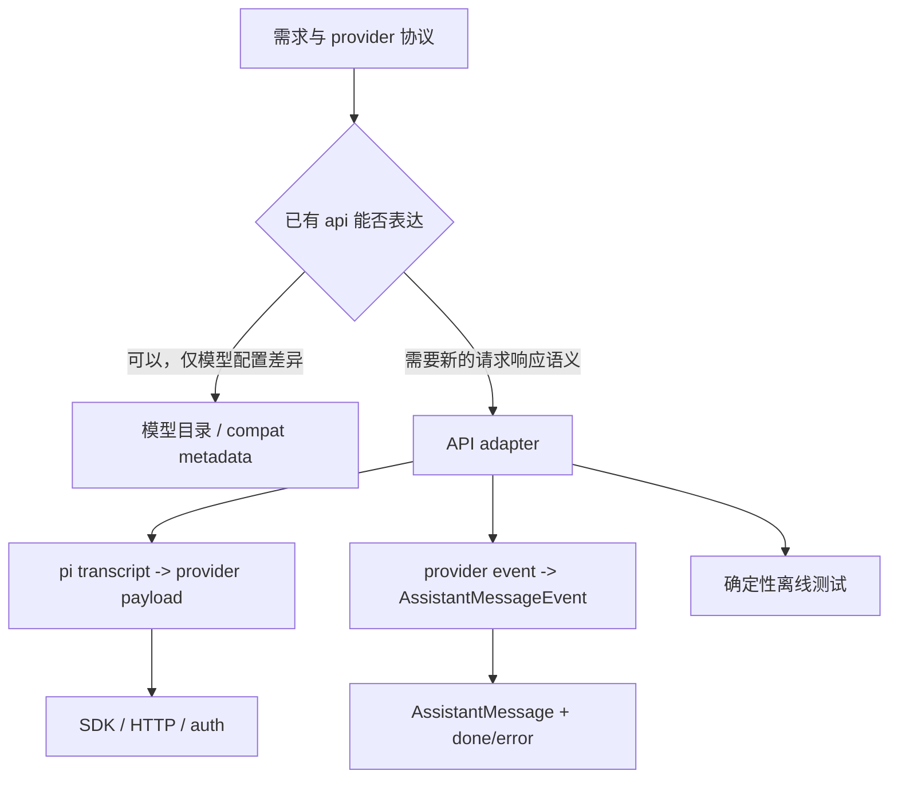

# D23：新增 Provider 的适配器对照与实现路线

> 精读对象：`packages/ai/src/types.ts`、四类现有 provider adapter，以及 D17 Anthropic、D18 OpenAI Responses、D19 Chat Completions、D20 Bedrock 和 D21 faux 的对照。
>
> 目标：读者能从一个协议需求出发，找到正确模块，规划请求转换、流事件归约、错误终态与离线测试；不是照抄某家 API 的实现。
>
> 基线：`200387122ca450d6387f033949423114a270b96c`。本文为静态源码路线，不代表新增了 provider 或运行了 provider 测试。

## 0. 什么时候需要新增 adapter

需求“支持 Provider X”常常包含多个不同任务：

1. 新增供应商身份、模型目录、认证入口；
2. 将 pi 的统一请求转成 X 的 HTTP/SDK 请求；
3. 将 X 的分块响应转换为 pi 的消息事件；
4. X 特有模型能力、参数、usage 与 stop reason 映射；
5. X 的错误、取消、重试与诊断；
6. 模型发现、文档、示例与测试。

这些任务分属不同层。已有 API 形状兼容时，可能只需配置模型或 provider metadata；否则才需要 adapter。不要从“有新的模型名”直接推导“要新建一个 API 实现”。



## 1. 统一层的契约先于 provider 文档

适配器不是随意的 JSON 翻译脚本。它接收 pi 已规范化的数据，并必须把异构响应还原成稳定的 pi 契约。

### 1.1 输入：Model、TranscriptContext、StreamOptions

`StreamFunction` 泛型的基本形状：

```typescript
type StreamFunction<TApi extends Api, TOptions extends StreamOptions> = (
  model: Model<TApi>,
  context: TranscriptContext,
  options?: TOptions,
) => AssistantMessageEventStream;
```

初学者读法：

- `TApi extends Api`：此实现只处理某一个 api id，编译器可据此检查 model 类型；
- `TOptions extends StreamOptions`：通用请求选项之外，可有这个 API 自己的选项；
- `context` 是已归一化的 transcript，不是原始 CLI 输入；
- 返回值是事件流对象，完成结果稍后通过流协议得到。

统一请求选项里有 `signal`、`apiKey`、`fetch`、`env`、`onPayload`、`onResponse`、`headers`、`timeoutMs`、`maxRetries` 等。它们是跨 adapter 的候选能力，不意味着每个 SDK 都支持每一项。某个 adapter 不支持时，需要由公共契约、具体代码和文档共同说明。

### 1.2 Transcript 里通常已经放了什么

`TranscriptContext` 把 messages 与 tools 作为请求上下文。公共的 `resolveTranscript`、`getCurrentTools`、`getInitialSystemMessage` 和 `resolveTranscriptTools` 帮助 adapter 解释历史，而 `transformMessages` 处理模型之间需要的历史转换。

不要假设：

- system prompt 一定有单独的 `context.system` 字段；
- tools 一定只在当前 `context.tools`；
- 旧 assistant/tool result 一定能原样发给另一个 provider；
- 所有模型支持图片、thinking、严格 schema 或中途新增 tools。

要沿当前 adapter 实际调用的 transcript helper 读，不要重新发明一份近似解析。

### 1.3 输出：AssistantMessageEventStream 与最终消息

统一 content block 主要包括 text、thinking、image 和 toolCall。AssistantMessage 还包括 `api`、`provider`、`model`、`usage`、`stopReason`、timestamp、可选 error/response metadata。

`StopReason` 是：

```text
pending | stop | length | toolUse | error | aborted | deferred
```

最核心的流契约：

- 创建 stream 后，运行时请求失败应由 stream 表达，不要让一半状态停在 pending；
- 失败终态必须有 `stopReason: "error"` 或 `"aborted"`，以及有意义的错误信息；
- 正常完成要发出终态事件，让 `.result()` resolve；
- 事件中的 partial message 必须随着 delta 同步累积；
- toolCall 最终参数必须完整且可解析，不能把未完成 JSON 当成可执行工具调用。

“构建 request payload 成功”不等于 adapter 完成。最终消息和终态也是实现契约。

## 2. 四类协议的形状不同

| Adapter | 输入协议边界 | 流事件边界 | 常见的归约状态 |
|---|---|---|---|
| Anthropic Messages | SDK payload + SSE 消息帧 | 原始 `message_*` / `content_block_*` | 当前 message、按 index 管理的 block、SSE decoder buffer |
| OpenAI Responses | SDK 输入项与 output item | 有类型的 response event union | output item 槽位、call/item id、response-level terminal |
| Chat Completions | messages + choices + tools | delta chunk 与 finish_reason | choices、tool index 累积器、当前 content block |
| Bedrock Converse | SDK Converse request | SDK event union | content block index、部分 JSON、reasoning/usage 元数据 |

协议本身决定了需要哪些状态。不能仅因为某 adapter 只有一个 `blocks` 数组，就要求另一个事件乱序或带多种 id 空间的协议也用同一种结构。

### 2.1 两条分离的转换方向

```text
请求方向：pi transcript/options/model → provider payload/client call
响应方向：provider raw response/events → pi partial message/events/final message
```

请求方向错误会造成模型看错上下文或不支持的参数；响应方向错误会造成 UI 内容错、tool call 错、计费统计错或 Agent loop 错。测试也应分别覆盖这两个方向。

## 3. 请求侧对照：先画数据转换表

为每个输入 message 和 content block 记录 provider 对应物、丢弃/降级规则、回放要求。

| pi 输入 | provider 可能的表示 | 需要明确的问题 |
|---|---|---|
| system message | 顶层 instruction、system/developer role，或折叠进首条 user | 中途 system 是否允许？顺序如何保留？ |
| user text | user message 的字符串或 text block | 空内容、多个 block、非法字符如何处理？ |
| image | URL、base64 source、SDK blob 或不支持 | 模型能力如何声明？不支持时有明确降级吗？ |
| assistant thinking | reasoning item、私有字段、签名内容或省略 | 是否需要原样回送才能维持多轮？ |
| assistant toolCall | function/tool-use item | call id 怎样回到 toolResult？JSON 如何编码？ |
| toolResult | tool-role message、user content block 或多个结果归并 | 工具错误和多模态内容怎样表现？ |
| tools/schema | function tools、toolSpec、内建 server tools | strict 模式由谁控制？支持哪些 schema 子集？ |

建议实现前先填“发什么、为什么”两张表：

```text
pi 字段 → provider 字段 → 需要的兼容分支 → 对应测试
provider 字段 → pi 字段 → 累积状态 → 缺失/不完整时的语义
```

这一步能揭示 API 的结构差异，减少边写边加临时 if 的机会。

## 4. Transcript 转换中的常见困难

### 4.1 供应商对 system 的限制

Bedrock adapter 会折叠 system messages，因为 Converse API 对 system prompt 的位置有限制；OpenAI adapter 依据 compat 决定是否支持中途 system；Anthropic 有自己的 system 参数和消息约束。

折叠不是无损操作。要记录：

- 原顺序是否重要；
- system 变化是否表达了策略边界；
- 工具、延续提示或摘要插入的 marker 是否会被挪动；
- 目标 adapter 是否有 capability flag 可说明限制。

不能悄悄 drop system 消息然后声称支持完整 transcript。

### 4.2 跨 provider 历史需要转换

Agent session 可以从 provider A 切到 provider B。历史 assistant 内容可能带 A 私有的 thinking signature、tool call id 或 provider metadata。B adapter 不能把这些字段一概视为自己的原生 continuation token。

读 OpenAI Responses 的 `convertResponsesMessages` 时，注意同 provider/API 的 Responses tool call id 可能保留特殊复合结构，foreign call id 会走另一套 normalization。这说明“id 字符串看起来一样”不代表协议语义一样。

转换设计应明确：

1. 哪些标记只有原 provider 能消费；
2. 哪些内容可以变成普通可读文字；
3. 哪些必须丢弃或替换成稳定占位；
4. tool result 仍然能否与原 call 正确配对。

### 4.3 图片和空工具结果

多模态支持要看 `model.input` 等模型能力，不要只看 SDK 类型能不能接受 image。某些 adapter 会在模型不支持图片时生成文字占位；某些会把纯 image tool result 包成多个 input content item。

空 tool result 也有真实语义。空字符串、无内容块和只有非文本块不能未经检查就 join 成同一种结果；目标 provider 可能要求非空内容。

### 4.4 Schema 转换是有损边界

pi tool schema 基于 TypeBox/JSON schema。provider 只实现其子集时，adapter 应使用现有的 `constrained-sampling.ts` helper / compat metadata，明确 strict、grammar tool 或 unsupported keyword 的策略。

不建议：

- 把完整 schema 原样发送给 SDK，之后才发现服务端不接受；
- 只把 schema 改成更松的版本，却未测试参数约束是否仍满足；
- 把 tool call 参数从 JSON string 直接 cast 成 `JsonObject`；
- 遇到 invalid JSON 时悄悄提供 `{}`，使 Agent 执行一个与模型输出无关的调用。

## 5. 流事件 reducer：把增量折叠成一条消息

Provider stream 通常不是一条完整对象，而是事件序列。adapter 需要维护累积消息和当前打开的内容块，再根据 raw event 发统一事件。

常见抽象轨迹：

```text
raw start
  → 创建 AssistantMessage(partial, stopReason=pending)
  → push start
raw content delta
  → 更新累积块
  → push 对应 delta
raw block stop
  → push block end
raw response terminal
  → 更新 usage / stopReason
  → push done
异常或取消
  → 清理临时状态
  → stopReason=error/aborted
  → push error terminal
```

### 5.1 各类状态分别回答什么问题

| 状态 | 例子 | 用途 |
|---|---|---|
| 累积最终消息 | `output` / `partial` | `.result()` 返回值和每个 event 的 snapshot |
| 当前活动 block | index → content block | 把 delta 加入正确块，避免混淆多个并发/交错 block |
| 原始 JSON 缓冲 | `partialJson` / `parseStreamingJson` state | 在完整之前展示 delta，终态时安全解析 arguments |
| 协议终态状态 | response completed / finish reason | 区分一个 block 完成与整个模型请求完成 |
| 传输 decoder 状态 | SSE 未完结的 byte/text buffer | 把网络分块拼回一行或帧 |

这几类 buffer 不要混为一个“current response”。它们的边界分别是网络 chunk、协议 frame、provider item、pi content block 和整轮 assistant message。

### 5.2 partial 必须与事件序列一致

例如 `text_delta` 到达后，partial message 内 text content 也要反映已经累积的文本。下游观察者可能只订阅事件而不调用 `.result()`。

tool JSON delta 更需要保持一致：

```text
累计字符串：{"command":"echo hi"
当前不能 parse 成完整对象
push toolcall_delta（partial JSON）
收到 item/tool terminal
确认完整且合法后，才构造 arguments 并完成 toolCall
```

【陷阱】delta 表示数据正在到达，不代表协议 item 已完成。D18 中“delta 不等于执行许可”是通用安全原则：工具执行发生在 Agent loop 收到完整规范化 toolCall 之后。

### 5.3 区分 block terminal 和 response terminal

响应协议可能包含：

- message content block 已结束；
- output item 已结束；
- choice 有 finish reason；
- 整个 response 已完成或 incomplete；
- stream transport 正常 EOF。

这些不是同一时刻。OpenAI Responses 的共享处理器会把 item 完结与 response 完结分开，终态阶段统一决定最后 stop reason；Anthropic 有 content block stop 与 message delta/message stop；Chat Completions 常从最后的 finish_reason 结算；Bedrock 则从 Converse 事件流的 metadata/end 边界总结。

新增 adapter 需要写出一条“哪个 raw event 是整轮完成的权威信号”的说明。否则正常 EOF 可能被错当成成功，或者最后 usage/stop reason 永远留在 pending。

## 6. Stop reason 映射不应由字面相似决定

目标不是找一个看起来同义的字符串，而是还原 Agent loop 需要的控制流：

| 统一 stop reason | Agent 下一步的含义（概念上） |
|---|---|
| `stop` | assistant 普通完成 |
| `toolUse` | assistant 提供了可执行的 tool call，loop 运行工具后可继续请求 |
| `length` | 输出预算/长度限制结束 |
| `error` | 请求失败，message 携带错误信息 |
| `aborted` | 请求被取消或中止 |
| `deferred` | provider 给了异步继续的句柄/语义 |
| `pending` | 仅进行中，不能作为已完成终态返回 |

危险映射例子：provider 返回 `tool_calls` 字段但所有工具参数 JSON 不完整，不能因为字段存在就无条件映射 `toolUse`；完成协议要求可能未满足。

维护一张映射表，并考虑未知值：

```text
原始值        → 统一值     → errorMessage/diagnostic     → 测试
stop          → stop       → 无                           → 普通文本
tool_use      → toolUse    → 无                           → 完整工具参数
max_tokens    → length     → 无或明确提示                 → 长度终止
cancelled     → aborted    → 可选取消原因                 → AbortSignal
unknown future → 保守策略  → 保留可诊断原值               → 未知 reason
```

具体 provider 的当前映射以对应 adapter 和其测试为准；表里的原始字符串只是示意，不能照搬给别家协议。

## 7. Usage 和成本：缺省值、零值、未知值

Usage 既用于显示，也参与成本估算和 session 汇总。pi 的统一对象有 input/output/cacheRead/cacheWrite/totalTokens/cost；可选 reasoning 与 Anthropic 1-hour cache write 等扩展字段。

设计要点：

1. **0 与 undefined 不同**：0 代表 provider 明确报告零；undefined 常代表没有报告。不要用 `value || fallback` 覆盖明确的 0。
2. **totalTokens 是否由 provider 给出**：明确选 provider 值或按 input+output 计算；不要混用两种来源。
3. **reasoning 是 output 子集**：不能再加到 output 上，否则 token 总量双计。
4. **cache 字段是分类的一部分**：不同 API 可能提供 read/write 或 TTL 拆分，不要把 cache read 和 input 重复计数。
5. **未知计价要可表达**：缺模型价格不能显示成已知零成本；检查 `calculateCost` 输入与现有模型 metadata 习惯。
6. **stream 增量 usage 与终态 usage**：要确认是累加、替换，还是最终事件覆盖早期 estimate。

Chat Completions 的 D19 特别说明零值 truthiness 的风险；Bedrock 和 Anthropic 的篇章给出各自 usage event 的处理位置。新增 adapter 要测试数值为 0、字段缺失、最终值替换和 total consistency。

## 8. 错误、取消、重试：请求的终态预算

在 adapter 中区分发生阶段：

```text
同步参数/认证错误
  → stream 尚未返回前的同步错误（仅契约允许的情形）

请求已启动后的认证/HTTP/解析/流中断错误
  → 已返回 stream；写 error message、停止 reason 并结束 stream

AbortSignal 取消
  → 停止 SDK/reader；发 aborted 语义并结束 stream

provider 的业务错误事件
  → 识别协议结构，格式化可诊断文本，结束为 error
```

不要对每种 catch 都只 `console.error`：那会让使用者拿不到统一的 AssistantMessage，也可能令 `.result()` 永远 pending。

### 8.1 transport retry 与 Agent retry 是不同层

- SDK transport retry：同一个 provider request 可能在 adapter/SDK 内部重新发送；需考虑重复计费和 idempotency。
- AgentSession retry：已经形成一条 error assistant message 后，上层按自己的 retry budget 再发起一轮。
- Tool retry：工具执行另有自己的失败策略。

要在同一处无限 retry 会掩盖可见尝试数，并与更高层 budget 互相乘积。读取 `retryProviderRequest`、SDK `maxRetries` 和 session retry 时，按所有权拆开。

### 8.2 cancel 要贯穿底层 reader

给 stream 设置 `AbortSignal`，不意味着 SDK 一定立即关掉 socket/response body。检查 adapter 是否把 signal 传进 SDK client/request、异步 reader 是否能观察 signal、异常处理是否把 aborted 与 error 分开。

测试应使用可控的 stream/controller，而不是 `sleep(20)` 猜测“现在刚好读到一半”。明确控制：已收到 start、已收到某 delta、调用 abort、随后不再有新 delta，最终 result 为 aborted。

### 8.3 错误诊断与用户文案分层

保存原始 error 信息、转换适合用户读的 `errorMessage`、附加结构化 diagnostic 是三个可区分决策。Bedrock 的篇章展示了格式化和 diagnostic 可以并存而不改原始主错误；Anthropic 也对一些特定状态提供额外诊断。

“把一切都包成 `Request failed`”会丢 endpoint、status、provider request id 等排错线索；“把所有原始 headers/body 都显示”又可能泄露秘密。新增 adapter 应沿用公共 sanitizer/diagnostic helper，并测试 key/token 不进入错误文案。

## 9. SDK wrapper 与动态依赖

### 9.1 wrapper 生命周期

SDK client 可能持有 keep-alive socket、websocket、event listener 或 transport。检查 adapter 在：

- 请求正常完成；
- HTTP 返回非成功；
- 请求中断；
- stream consumer 停止读取；
- response body 解码错误

时有没有释放资源。若 API 支持 `close()`/`abort()`，它应在正确的 finally/cancel 边界执行，而不是只在 happy path。

Responses 的 D18 聚焦 client 与共享 stream processor；Bedrock 还涉及 Smithy middleware 和 Node HTTP agent；Anthropic/Chat Completions 通过各自 SDK client 配置 timeout、retry、fetch 和 response callback。不能假定所有 SDK 的 `onResponse`、signal 和 close 语义完全一致。

### 9.2 Node-only SDK 的 lazy boundary

若依赖只支持 Node，避免顶层 import 使 browser bundle 意外加载 Node 内置模块。Bedrock provider 使用 lazy API wrapper，把实际 SDK 实现在运行时需要时再加载。Anthropic provider 也采用 lazy provider/API 结构；具体 bundle 行为要对照 package entrypoints 和 build config。

设计检查：

- 顶层 import 是否会把 Node SDK 拉进不支持的平台 bundle？
- provider catalogue 加载时是否就执行 SDK 初始化？
- lazy promise rejection 后是否可观察、重试语义是否预期？
- tree-shaken 子路径能否只加载需要的 adapter？

这里的“lazy”不是性能装饰：它决定 package 可否在不具备运行时依赖的平台导入。

## 10. Provider 对照总表

| 关注面 | Anthropic Messages | OpenAI Responses | Chat Completions | Bedrock Converse |
|---|---|---|---|---|
| 请求主体 | system + Messages API 专属字段 | input item 序列与 Responses 参数 | ChatCompletion messages | Converse system/messages/toolConfig |
| 主要流结构 | SSE event name/data | Responses event discriminant | choices[].delta + finish | SDK event union |
| block identity | `index` | output/item id 与槽位 | tool index/choice index | content block index |
| tool JSON | input_json_delta + block stop | arguments delta + item/response terminal | function.arguments chunk 聚合 | input JSON delta + block terminal |
| request history | role/message 转换与 cache marker | item 结构、foreign id 规范化 | message/role/tool 兼容转换 | messages/system/tool result regroup |
| reasoning | thinking/signature/redacted forms | reasoning item/text/signature | compat reasoning aliases/details | reasoning/redacted bytes/signature |
| 认证焦点 | API key、OAuth/federation 等 provider auth | SDK key/header 及兼容代理 | OpenAI-compatible key/header | AWS credential chain、profile/region、bearer/proxy |
| 外部依赖 | Anthropic SDK + SSE parser | OpenAI SDK + Responses event types | OpenAI SDK + completions types | AWS SDK + Smithy/Node transport |
| 读取专题 | D17 | D18 | D19 | D20 |

这张表是“去哪里继续追”的地图，不是 API 永久规格。模型能力、SDK 版本和 adapter 实现会变化，行为结论仍以当前源码与测试为准。

## 11. 实现顺序：由类型驱动，而非先写 fetch

### 阶段 A：确定模块 owner

1. 搜索已有 `KnownApi`、provider、model catalogue 与 `compat` 声明。
2. 判断新协议是否真的需要新 api id，还是已有 API 的参数差异。
3. 检查 exports、lazy entry、browser/node 条件和生成文件规则。
4. 读取同一协议中最接近的 adapter 与它的 tests，不从另一个协议复制状态机。

### 阶段 B：定义 capability 与 options

1. 将公共选项映射到 API 字段：sampling、reasoning、toolChoice、cache、transport、session affinity。
2. 将模型能力放在 model/compat metadata，不按 `model.id.includes(...)` 在任意函数里散落猜测。
3. 明确 api 专属 options 类型，并验证 `ApiOptionsMap` 等类型入口是否需要扩展。
4. 标出不支持字段：忽略、降级、报错或 diagnostic；每种策略都要有理由。

### 阶段 C：先设计 transcript 转换

1. 遍历所有 `Message` role 和 content variants；
2. 处理 system prompt / mid-conversation system；
3. 将图片按 `model.input` 能力编码；
4. 处理 tool history、call id、result、error result；
5. 处理 foreign-provider thinking/signature；
6. 处理空消息、空工具结果、未知 extension content。

先写输入输出表和纯转换函数测试，再接 SDK。这样不需要网络就能检查“模型将看到什么”。

### 阶段 D：设计 reducer 状态

1. 定义 assistant message 初值，检查字段满足 `AssistantMessage`；
2. 定义 block index/id 到 pi content block 的映射；
3. 定义哪些事件只更新状态、哪些事件发 delta；
4. 定义 JSON 参数 accumulator 和最终 parse/repair 策略；
5. 定义 item terminal 与 response terminal；
6. 定义 usage 累加/覆盖；
7. 定义 unknown event、EOF without terminal、duplicate terminal；
8. 定义 abort/error 的唯一收尾出口，避免重复 done/error。

### 阶段 E：请求和资源生命周期

1. 组装 client 和 provider request；
2. 调 `onPayload` 前后明确类型边界，避免 callback 返回对象绕过必要字段；
3. 传 signal、headers、env、fetch、timeout/retry 配置；
4. 接 `onResponse`；
5. 解析 HTTP/body/SDK 异常；
6. 结束时清理临时 state、reader/client resource；
7. 返回 stream 后所有异步错误必须完成 terminal，而不是变成 unhandled rejection。

### 阶段 F：模型与 provider 注册

1. provider 声明处理 api id 和认证逻辑；
2. API function 实现 wire protocol；
3. model catalogue 提供 model id/context/pricing/capabilities；
4. model resolver/model runtime 负责配置与选择；
5. examples/config docs 说明 endpoint、headers 和 credential precedence。

这四层不是同一对象；新增 model 不应顺手把 provider registry 做成特殊硬编码。

## 12. 新 adapter 的测试矩阵

### 12.1 请求转换测试

| 场景 | 最低断言 |
|---|---|
| 普通 system + user text | role、顺序、system 拼接结果 |
| 多条 assistant/tool history | tool call id 与 tool result 配对 |
| 图片输入 | mime type/data/detail，或明确的不支持行为 |
| schema/toolChoice | schema 转换和 tool selection 语义 |
| reasoning/history | provider signature 保留、降级或 drop 的规则 |
| onPayload override | 替换后的 payload 仍满足 adapter 约束 |
| provider env/header | 优先级正确，秘密不会进日志/diagnostic |

### 12.2 Reducer 测试

| 场景 | 最低断言 |
|---|---|
| 普通文本多个 delta | 每次 partial 累积正确，最终文本正确 |
| thinking/signature | block 类型、签名和 replay 形式正确 |
| 多个工具/交错 index | 各 call id/name/arguments 不串线 |
| JSON 跨多个 delta | 最终 parse 完整，未完成时不提前完成 tool call |
| usage 更新 | 零值、缺失值、最终覆盖规则正确 |
| finish reason | 每个已知 reason 语义映射正确 |
| 未知事件/reason | 不破坏 stream，诊断策略一致 |
| 缺少终止事件 | 不会成功地把 pending 返回给上游 |

### 12.3 Failure/cancel/resource 测试

- HTTP 非成功状态；
- SDK 在开始前拒绝；
- stream 中段 throw；
- abort 在首事件前和 delta 中途；
- consumer cancel/提前停止；
- terminal 后额外事件；
- `onResponse`/`onPayload` callback 抛错；
- cleanup 被正常结束和异常结束路径调用；
- error message 包含有用状态码但不泄漏 key/token。

构造可控 async iterable 或 ReadableStream，逐个 `enqueue` 事件；不要通过真实 HTTP 来证明 reducer 的细节。API 协议边缘如 SSE decoder，也应直接用可控 byte chunks 测试。

### 12.4 测试不变量

```text
start 次数：每次有效流一个
terminal 次数：done/error 只能有一个最终归宿
partial：已发出的 delta 与累积 message 一致
tool call：只有完成且合法的参数才成为最终 ToolCall
usage：字段缺失不伪造为确定零，provider 明确报零则保留零
abort：最终 stopReason=aborted，不被 catch 误报为 error
```

有些协议在错误时发出 error event 而不是 done。不要僵化成“只能有某一个 event type”；测试 adapter 对外满足 `AssistantMessageEventStream` 的实际消费契约即可。

## 13. 从新增测试到工程检查

仓库 `AGENTS.md` 的限制：

- 修改代码后运行 `npm run check`，查看完整输出并修复错误、warning、info；
- 修改测试文件后运行该测试；
- `packages/ai` 的 Vitest 测试从 package root 执行单个文件；
- 不直接运行全量 Vitest；非 e2e 全量测试使用仓库 `./test.sh`；
- 未经请求不运行 `npm run build` 或 `npm test`；
- 不使用真实模型 API、密钥或付费 token 进行 faux 可覆盖的回归验证。

这本手册没有执行上述命令。学习时执行的验证应另记 commit、OS、Node、shell、命令和结果；读懂旧测试不是测试已通过的证据。

## 14. 练习：设计一个假想的 SSE provider

以下为设计练习，不要求改仓库。

### 14.1 假设协议

```text
event: message.start
data: {"id":"r1"}

event: text.delta
data: {"text":"hello"}

event: tool.start
data: {"index":0,"id":"c1","name":"read"}

event: tool.arguments.delta
data: {"index":0,"json":"{\"path\":"}

event: tool.arguments.delta
data: {"index":0,"json":"\"a.txt\"}"}

event: tool.done
data: {"index":0}

event: response.done
data: {"reason":"tool_call","usage":{"input":7,"output":5}}
```

### 14.2 先写状态表

| 收到 | 更新哪些状态 | 发哪个 pi event | 是否可最终调用工具 |
|---|---|---|---|
| message.start | response id / message 初值 | start | 否 |
| text.delta | 当前 text block | text_delta | 不适用 |
| tool.start | index → tool block，id/name | toolcall_start | 否 |
| arguments.delta | partial JSON buffer | toolcall_delta | 否 |
| tool.done | parse 完整 JSON，关闭 block | toolcall_end | 仍等 response terminal 与整体校验 |
| response.done | usage、stop reason | done | 由最终 message 确认 |

再补负例：arguments 不完整、index 不存在、response.done 两次、EOF 前没有 response.done、message.start 丢失、AbortSignal 已触发、reason 未知。每个负例都说明是忽略、修复、发 diagnostic 还是 error terminal。

### 14.3 对照现有实现

- SSE byte/frame 拆分：参考 D17 的 `iterateSseMessages` 与 decoder 测试；
- item/block reducer 和终态：参考 D18 shared reducer；
- chunk/index 累积：参考 D19 tool chunk map；
- SDK event union 与资源配置：参考 D20；
- 确定性的脚本化完整 assistant message：参考 D21 faux，但 faux 不替代协议 decoder 测试。

同一个协议不需要重用四套实现。只复用抽象责任和测试思路；decoder、block mapping、SDK lifecycle 都要由新协议本身决定。

## 15. 案例推演：把同一模型回答转换两次

假定统一 transcript 包含：system、user “读文件”、assistant toolCall `{path:"a.txt"}`、toolResult “hello”。

### 15.1 Provider A 以工具结果角色表达

```text
system: ...
user: 读文件
assistant: tool call id=c1 name=read arguments={path:a.txt}
tool: call_id=c1 content=hello
```

要保证 provider 的 function call id 与结果引用相配。

### 15.2 Provider B 把工具结果并入 user message

```text
system: ...
user: 读文件
assistant: toolUse block
user: toolResult block(content=hello)
```

这种角色序列对该协议可能是必要的，但它说明为什么 transcript conversion 必须是 provider-specific。若把所有 provider 统一压成 `role: tool`，B 可能请求无效；若把 B 的规约套给 A，A 也可能失去调用关系。

### 15.3 检查上下文证明

纯转换测试直接断言 payload；provider harness 测 adapter stream/final message；coding-agent faux 测 Agent 收到规范化 `toolCall` 后的行为。三种测试层能组合，但不能互相冒充。

## 16. 实际改动的 owner 决策树

```text
需求是增加一个模型 id / 价格 / context window？
  └─先检查模型目录与生成脚本，不直接改 adapter

需求是 endpoint/auth/profile/header 解析？
  └─定位 provider auth 或共享 provider-env / headers helper

需求是 pi message 如何变成 wire request？
  └─API adapter 的 convert/buildParams

需求是 response event 如何变成 text/tool/thinking？
  └─adapter reducer / decoder

需求是 Agent 收到 stopReason 后是否继续 tool loop？
  └─packages/agent 的 loop，不在 provider 私自跑工具

需求是错误重试 UI 或 retry budget？
  └─区分 provider SDK retry 与 AgentSession retry owner

需求是模型流式输出怎样显示？
  └─先检查统一事件契约，再检查 TUI consumer；不在 adapter 特判 UI
```

职责边界是行为边界。若 adapter 发现 provider tool call 后直接执行 coding-agent 工具，会绕过 Agent 的校验、审批、事件、持久化和错误处理链。

## 17. 代码审阅清单

### 类型与模块

- [ ] `Api` / `Model<Api>` / provider stream 类型约束正确；
- [ ] API options 进入正确映射，不把 provider-specific 参数塞进 `any`；
- [ ] Node-only dependencies 在合适边界 lazy load；
- [ ] export/model/provider registration 与 package entrypoint 同步；
- [ ] 如果模型清单由脚本生成，修改生成输入而非直接改 generated output。

### 请求

- [ ] system 与 transcript 次序明确；
- [ ] role/content/tool history 都有转换；
- [ ]图片、thinking、signature、schema 的支持和降级明确；
- [ ] model capability 控制行为，不靠任意 substring 猜测；
- [ ] `onPayload` callback 后仍执行必要校验；
- [ ] headers、env、auth precedence 和 secret redaction 有测试。

### 流

- [ ] partial message 与每条 delta 同步；
- [ ] 多内容块/多工具的 identity 稳定；
- [ ] JSON 参数缓冲不跨工具串线；
- [ ] block/item end 与 response end 分清；
- [ ] 未知 event 和 terminal 缺失不会挂在 pending；
- [ ] usage 保留零值及未知值语义。

### 终态与资源

- [ ] 正常 stop、toolUse、length、deferred 各自映射正确；
- [ ] error 与 aborted 可区分，错误有诊断信息；
- [ ] stream result 在所有路径都可 settle；
- [ ] reader/client resources 在取消、失败、消费结束时释放；
- [ ] 重试层次清晰，避免 SDK 与 session retry 意外叠乘。

### 证据

- [ ] 纯转换单测覆盖代表性 transcript；
- [ ] 协议 decoder/reducer 测试使用脚本化 bytes/events；
- [ ] 回归测试断言外部可观察结果；
- [ ] 测试命令按仓库规则执行，输出与环境记录；
- [ ] 结论没有超出该测试实际覆盖范围。

## 18. 学习路线与验收

推荐闭卷讲一遍后再查源码：

1. `StreamFunction` 收到什么、返回什么？
2. 为什么协议 decoder、provider reducer、Agent loop 是三层？
3. tool call arguments 为什么不能在收到第一片 delta 时就执行？
4. 为什么 response end 和 content block end 不能混为一谈？
5. provider 用量没报告时，为什么不能静默填 0？
6. cancel、error、stop 三个终态对 session/Agent 的后续动作有什么不同？
7. 如何让一条 transcript conversion test 完全离线？
8. 新增模型配置与新增 adapter 的证据分别是什么？

达到能改源码的标准，不是记住四个 SDK 的类型名，而是能把一个 wire protocol 的不确定性定位在明确边界，并写测试固定其转换语义。

> D23 完。建议最后一篇落在源码修改毕业练习：给出一个范围明确的行为缺陷，从复现、选 owner、回归测试、实现、检查到评审摘要完整走通，不预设模型调用。
