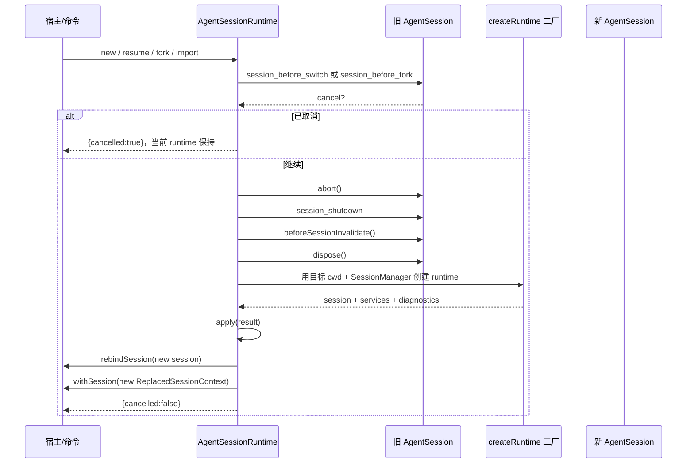

# D28：AgentSessionRuntime 的会话替换生命周期

> 本篇追踪 `/new`、恢复会话、fork 和 JSONL 导入如何替换一个运行时。重点不是命令长什么样，而是旧 `AgentSession`、会话文件、cwd 绑定服务、扩展上下文和宿主 UI 如何交接。
>
> 验证状态：静态核对 `agent-session-runtime.ts`、`agent-session-services.ts`、`session-manager.ts` 及列出的测试源码；未运行测试。

## 1. 先看问题：换会话不只是换一组消息

如果一个进程只持有消息数组，恢复会话似乎只需把数组替换掉。但 `AgentSession` 还持有 Agent、工具、扩展 runner、设置、模型运行时、资源加载器和事件订阅。部分对象依赖工作目录（cwd）；切到另一个项目后，旧的工具和扩展上下文不能继续使用。

因此宿主需要同时更换一组相互关联的对象：

```text
旧 runtime                         新 runtime
  AgentSession                       AgentSession
  SessionManager                     SessionManager
  cwd-bound services                 cwd-bound services
  扩展 API / command context          新扩展 API / command context
  UI 对旧 session 的订阅              UI 重新绑定新 session
```

`AgentSessionRuntime` 是这组对象的协调者。它不亲自实现 Agent 循环，也不解析每一种资源；它保存当前 session/services 和一个可重复调用的工厂，并编排“准备目标 → 收尾旧对象 → 创建并应用新对象 → 让宿主重绑”。

## 2. 类型先读懂：工厂为何保存在 runtime 里

源码：`packages/coding-agent/src/core/agent-session-runtime.ts`。

```typescript
export type CreateAgentSessionRuntimeFactory = (options: {
  cwd: string;
  agentDir: string;
  sessionManager: SessionManager;
  sessionStartEvent?: SessionStartEvent;
  projectTrustContext?: ProjectTrustContext;
}) => Promise<CreateAgentSessionRuntimeResult>;
```

`CreateAgentSessionRuntimeFactory` 是“函数的类型”：调用时给它目标 cwd、目标会话管理器等输入，它异步返回一套完整 runtime 创建结果。工厂由 `createAgentSessionRuntime(...)` 收到，然后存入实例字段 `private readonly createRuntime`，以便以后 `/new`、resume、fork、import 都能用同一套装配规则。

返回值包含三块：

| 字段 | 作用 |
|---|---|
| `session` | 已装配好的 `AgentSession` |
| `services` | cwd、`ModelRuntime`、`SettingsManager`、`ResourceLoader` 等协作服务 |
| `diagnostics` / `modelFallbackMessage` | 创建期间收集的诊断和模型回退说明 |

这让“实例”与“制造实例的规则”同时存在。替换 cwd 时不能只把 `session.cwd` 改成新路径；要调用工厂，重建与目标 cwd 对应的设置和资源，再构造 AgentSession。

`agent-session-services.ts` 中的 `createAgentSessionServices()` 先规范化 cwd 和 agentDir，创建或复用 `ModelRuntime`、`SettingsManager`，建立 `DefaultResourceLoader` 并执行 `reload()`，处理扩展注册的 provider、刷新模型清单，最后返回 services。`createAgentSessionFromServices()` 才把这些 services 和 `SessionManager` 传给 `createAgentSession()`。此拆分允许宿主在创建 AgentSession 之前先基于 services 解析模型、工具等会话选项。

## 3. 替换总时序



这张图是成功替换路径。工厂或回调若抛错，异常会向调用者传播；该流程没有一个统一的事务回滚步骤。

## 4. 前置钩子：允许扩展阻止替换

`emitBeforeSwitch(reason, targetSessionFile?)` 和 `emitBeforeFork(entryId, {position})` 先检查 runner 是否注册了 handler。没有 handler 就直接返回 `{ cancelled: false }`，不创建一个多余事件。

存在 handler 时，runner 派发事件，并把结果中的 `cancel === true` 归一化为 `{cancelled: true}`。调用者紧接着返回。因此取消发生在 `abort()`、`session_shutdown` 和 dispose 之前：旧 session 仍然有效，当前文件和 UI 绑定都还未换掉。

源码节选：

```typescript
const beforeResult = await this.emitBeforeSwitch("new");
if (beforeResult.cancelled) {
  return beforeResult;
}
// 直到这里之后，才准备新会话并拆除旧 runtime。
```

这是一个真正的“替换前否决点”，不是回滚机制。扩展可在确认框中取消，不必重建旧 runtime。

## 5. 停机顺序：先完成正在发生的工作

```typescript
private async teardownCurrent(reason, targetSessionFile?): Promise<void> {
  await this.session.abort();
  await emitSessionShutdownEvent(this.session.extensionRunner, {
    type: "session_shutdown",
    reason,
    targetSessionFile,
  });
  this.beforeSessionInvalidate?.();
  this.session.dispose();
}
```

按顺序读：

1. `abort()` 请求当前操作取消，并等待 session 收束。注释指出，已中止 turn 的结果（包括工具结果）应先持久化到即将离开的会话。
2. 发 `session_shutdown`，让旧扩展在旧上下文仍可用时清理资源。`reason` 说明离开的原因，`targetSessionFile` 是将前往的目标文件（若有）。
3. 同步调用 `beforeSessionInvalidate`。这是宿主给 UI 的窄回调，例如在旧扩展上下文失效前，立即摘除扩展提供的 TUI 组件；此处刻意不 `await`，避免让事件循环插入其他操作。
4. `dispose()` 释放旧 session 持有的资源。

不要把顺序改成“先 dispose，再发 shutdown”：扩展清理可能要访问其 runner/context。也不要把 abort 当作简单设置布尔值；这里 `await` 它是为了让退出中的工作先到达可交接边界。

## 6. `apply` 与 `finishSessionReplacement`：替换分成两个阶段

```typescript
private apply(result: CreateAgentSessionRuntimeResult): void {
  this._session = result.session;
  this._services = result.services;
  this._diagnostics = result.diagnostics;
  this._modelFallbackMessage = result.modelFallbackMessage;
}

private async finishSessionReplacement(withSession?): Promise<void> {
  if (this.rebindSession) await this.rebindSession(this.session);
  if (withSession) await withSession(this.session.createReplacedSessionContext());
}
```

`apply` 更新 runtime 对外可见的当前状态；`finishSessionReplacement` 再把新 session 交给宿主重绑，最后调用可选的 `withSession`。先 rebind 的保证很实用：`withSession` 中可以通过新上下文发送消息、注册 listener 或操作新会话，宿主早已把命令/API 路由绑定到新 session。

`ReplacedSessionContext` 是新 session 的上下文，不是旧 extension command handler 捕获的 `ctx`。会话替换后旧 context/API 会失效；扩展若在 `await ctx.newSession()` 之后继续使用旧 `ctx`，会触发 stale-context 错误。替换后的工作应放进 `withSession`，并只使用传入的新 context。

现有回归测试 `test/suite/regressions/2860-replaced-session-context.test.ts` 证明这点：测试记录 `shutdown:旧实例 → start:新实例 → with:旧命令的替换回调`，确认回调收到不同的新 session file，旧 `ctx`/`pi` 不能再操作，并让新 context 发消息后检查消息落在新会话中。

## 7. `/new`：先创建目标 SessionManager，再关旧会话

`newSession()` 的核心顺序：

1. `session_before_switch(reason: "new")`，允许取消。
2. 记录旧 session file；沿用当前 session directory。旧会话持久化时用 `SessionManager.create(this.cwd, sessionDir)` 建新管理器，否则用 `SessionManager.inMemory(this.cwd)`。
3. 若传入 `parentSession`，先给新 SessionManager 写入新 session header/血缘。
4. `teardownCurrent("new", newFile)` 收尾旧 session。
5. 工厂创建新 runtime，`apply` 切换当前对象。
6. 可选的 `setup(sessionManager)` 在新 runtime 上执行；之后 `refreshContext()` 使 Agent 消息上下文反映 setup 写入。
7. rebind，然后执行 `withSession`。

注意 setup 位于新 session 已 apply 之后，因此它不是“只读校验目标”的回调。如果 setup 抛错，会留下已经切换到新 runtime、但还没完成 rebind/withSession 的状态；调用方负责处理错误。

## 8. Resume 与 JSONL import：相似入口，不同文件语义

### 8.1 `switchSession(path)`

`switchSession()` 先发 `session_before_switch("resume", path)`。获准后 `SessionManager.open()` 读取目标会话，再调用 `assertSessionCwdExists(sessionManager, this.cwd)`，以目标会话 cwd（或显式 override）作为运行目录；cwd 不存在会在 teardown 之前失败，旧 runtime 仍在。

随后 teardown 旧会话，调用工厂创建新 runtime，传入 `session_start`（`reason: "resume"`、`previousSessionFile`）与可选的 `projectTrustContext`，再 apply/rebind/withSession。工厂创建的服务会读取目标 cwd 的配置和资源；目标会话保存的模型与 thinking 状态也由 AgentSession/session 初始化逻辑恢复。

### 8.2 `importFromJsonl(inputPath)`

import 的目标是先把外部 JSONL 放入当前 session directory，再按新路径打开：

1. `resolvePath(inputPath)`；不存在时抛 `SessionImportFileNotFoundError`。
2. 确保 session directory 存在；以源文件 basename 作为目标名，若冲突则加 `-1`、`-2` 等后缀。
3. 对目标路径派发 `session_before_switch("resume", destinationPath)`；取消就返回，不复制、不 teardown。
4. 若源文件本来就在目标位置则不复制；否则用 `copyFileSync(..., COPYFILE_EXCL)`，防止覆盖已有文件。
5. 打开新副本、校验 cwd，再 teardown 旧会话并创建新 runtime。

由此可见，导入与 switch 的差异不仅是入口名称：import 会复制外部文件，且复制发生在 cwd 校验之前。如果复制后 cwd 校验失败，导入副本可能已留在目标目录；代码没有在失败分支删除它。阅读错误处理时要追踪副作用发生点，不能只看最后的 `throw`。

## 9. Fork：选择“从哪里继续”与“选中内容”

`fork(entryId, {position})` 默认 position 为 `"before"`。它先发 `session_before_fork`，然后读取 entry 并决定 `targetLeafId`：

| 位置 | 要求 | 新分支起点 | 返回给编辑器的内容 |
|---|---|---|---|
| `"at"` | 选中任意存在的 entry | entry 自身 | 无 |
| `"before"` | 选中 user message | 该消息的 `parentId` | 把选中的文本作为 `selectedText` 返回 |

“before”适合重写一条用户输入：新分支停在该 user message 之前，原文交还 UI 编辑。多模态内容的 `extractUserMessageText()` 只串接 text part；图片等非文本 part 不会出现在这个返回字符串里。

持久化 session 的一般路径会先确认旧文件存在，打开它并调用 `createBranchedSession(targetLeafId)` 生成只含目标路径的新文件；到目标为空（在第一个消息前 fork）的特殊路径，则建立新的 session 文件并记录 parentSession。内存 session 则在 teardown 后直接在原 SessionManager 上裁剪/重建目标路径。三条路径最后都创建新 runtime 并 rebind。

这里连接第 9 章的会话树：`fork` 不等于把当前消息数组浅拷贝一份。持久化路径会把树上的目标路径写成一份新会话，并让 fork 文件记录来源；具体 label 重串联与 compaction ID 调整见 D3/D9。

## 10. 失败不是事务回滚：按阶段看当前状态

替换代码没有统一的 try/catch 回滚。读代码或新增错误处理时，应画出每一步可能产生的持久化副作用：

| 失败阶段 | 旧 session 是否已拆除 | 可能留下的影响 |
|---|---|---|
| before hook 抛错或返回 cancel | 否 | cancel 正常返回；抛错向上传播 |
| 打开目标 / cwd 校验失败（switch） | 否 | 旧 runtime 仍在；目标文件未修改 |
| import 复制之后 cwd 校验失败 | 否 | 导入副本可能已存在于目标 session directory |
| `teardownCurrent` 内 abort/shutdown 抛错 | 不确定 | 取决于失败发生在 abort、扩展 shutdown 或 dispose 的哪一步 |
| teardown 完成后 runtime factory 失败 | 是 | runtime 字段仍指向已 dispose 的旧 session；新对象没有 apply |
| apply 后 rebind 或 withSession 失败 | 是 | runtime 已指向新对象，但宿主绑定或后续动作可能未完成 |

最容易漏掉的是工厂失败：顺序是 `await teardownCurrent()`，接着 `this.apply(await this.createRuntime(...))`。JavaScript 会先等待工厂；只有工厂成功返回才执行 `apply`。所以失败时 runtime 容器仍存着旧引用，但那个 session 已经 dispose。它不是“旧会话自动恢复”。

这也说明取消钩子和失败回滚作用不同：前者保证在破坏性替换前可拒绝；后者没有承诺把已经 teardown 的运行时复原。新增替换阶段时，先决定失败应传播、保留副本、清理目标文件还是提供恢复 UI，再用测试固定行为，不要暗中假设事务语义。

## 11. 事件与测试如何读

`agent-session-runtime.test.ts` 覆盖：

- new/resume 的 `session_before_switch → session_shutdown → session_start` 顺序及取消后 session file 不变；
- fork 的 `session_before_fork`、`session_shutdown`、`session_start` 顺序，返回 selectedText，以及取消时只发生 before 事件；
- 从另一个 cwd 恢复时 runtime cwd 跟随目标；
- 目标会话的 model/thinking 设置被恢复；
- 未 flush 的持久化会话不能被 fork。

`regressions/2860-replaced-session-context.test.ts` 覆盖替换回调拿到新上下文、旧 `pi` 与 `ctx` 失效，以及 fork/switch 的 `withSession` 能在新会话中继续工作。

测试所断言的事件顺序，是公开生命周期契约的一部分。若修改 teardown 和 factory 的相对位置，即使最终消息列表相同，也可能让扩展在错误的生命周期里读写资源。

## 12. 动手追踪练习

不用真实模型。先读 `test/suite/agent-session-runtime.test.ts` 的 `createRuntimeForTest`，再结合 faux provider 理解 fixture；本篇本身不声称已运行实验。

1. 给普通 `newSession()` 画状态轨迹：旧文件、新文件、旧 session 对象、新 session 对象、事件顺序各写一栏。
2. 找出 `switchSession()` 中 cwd 缺失的失败点。解释为什么它发生在旧 session abort 之前。
3. 以“JSONL 已复制、但目标 cwd 不存在”为例，分别写出磁盘和内存状态；指出哪个方法负责 copy，哪个方法负责 cwd assertion。
4. 在纸上追踪工厂 reject：`_session`、`_services` 是否已经更新？旧 session 是否仍可用？答案必须按 await/apply 顺序推导。
5. 解释为什么 `withSession` 必须在 rebind 之后执行；引用回归测试中“新 context 发送消息落到新 session”的断言。
6. 设计一个“目标资源加载失败时，旧会话仍可继续”的需求。当前顺序是否满足？若不满足，先写出期望状态和副作用，再提出改造方案与测试，不要先直接搬动 teardown。

## 13. 一张表记住替换边界

| 阶段 | 主要对象 | 可以取消吗 | 已有副作用 |
|---|---|---|---|
| 前置事件 | 旧 ExtensionRunner | 可以 | 通常无目标 runtime 副作用 |
| 目标准备 | SessionManager / 导入文件 | hook 后继续；具体校验可能抛错 | import 可能先复制文件 |
| 旧运行时 teardown | 旧 AgentSession | 此后不再走 before cancel | abort、shutdown、UI invalidate、dispose |
| 创建并 apply | 工厂结果 | 不提供自动回滚 | 新服务可能已读配置、加载扩展 |
| 重绑与 withSession | 宿主 + 新 context | 异常传播 | runtime 已指向新对象 |

修改 `AgentSessionRuntime` 时，至少同时检查：新旧对象的所有权、事件时序、会话文件副作用、cwd 绑定服务、扩展 context 失效，以及 factory/rebind 失败时调用者看到的状态。
