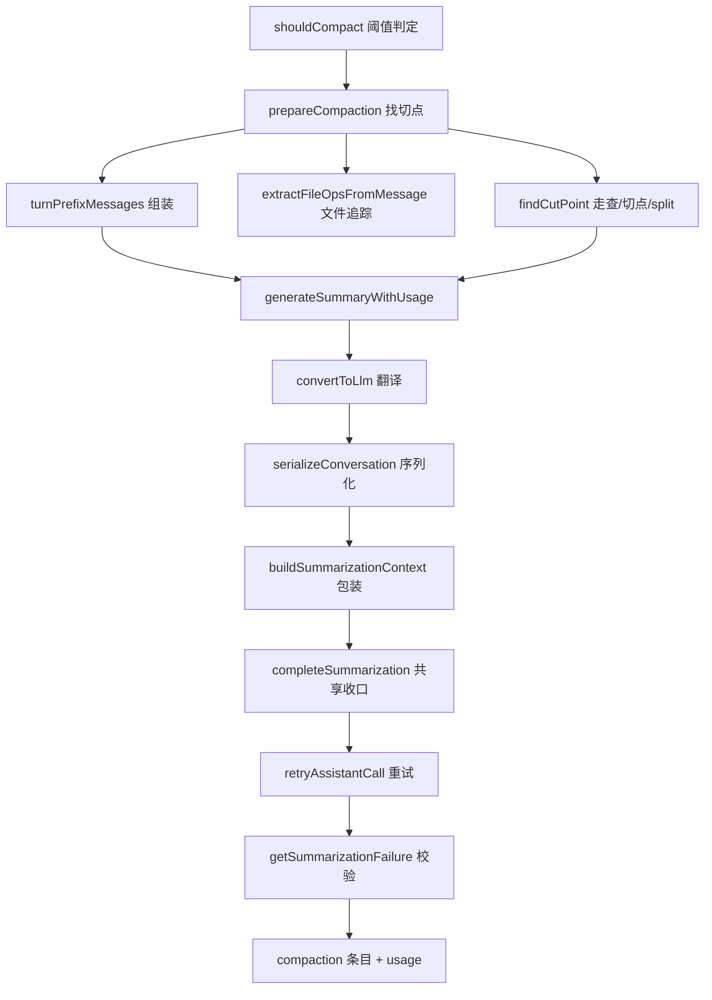

# D4：系统提示与压缩逐段精读

> 精读对象：`packages/coding-agent/src/core/system-prompt.ts`（约 200 行）与 `core/compaction/compaction.ts`、`core/compaction/utils.ts` 的关键函数。
> 对应主线：第 10 章（上下文构造、系统提示与压缩）。
> 读法：先读第一部分（提示如何分节），再读第二部分（何时压缩、如何切分与摘要）。

---

# 第一部分：`system-prompt.ts` 精读

## 0. 文件地图

```text
常量    SYSTEM_PROMPT_SECTION_NAME   合法 section 名正则
函数    normalizeBuildSystemPromptOptions  归一化输入（防御性拷贝 + 默认值）
        renderProjectContext               上下文文件 → <project_instructions> 文本
        buildRules                         生成"规则"分节（去重 + 条件规则）
        buildSystemPromptSections          十步组装（本文件主体）
        buildSystemPromptState             force 覆盖 vs 结构化两态
        buildSystemPrompt                  渲染成与转录回放一致的文本
        diffSystemPromptSections           计算分节补丁（增量更新）
类型    BuildSystemPromptOptions / Normalized... / SystemPromptSections
```

## 1. 输入类型与与归一化

【源码（节选）】

```typescript
export interface BuildSystemPromptOptions {
	/** Custom system prompt (replaces the default prefix). */
	customPrompt?: string;
	/** Exact full prompt replacement set by a before_agent_start handler. */
	forceSystemPrompt?: string;
	/** Tools to include in prompt. Default: [read, bash, edit, write]. */
	selectedTools?: string[];
	/** Optional one-line tool snippets keyed by tool name. */
	toolSnippets?: Record<string, string>;
	/** Guideline bullets contributed by each tool, keyed by tool name. */
	toolGuidelines?: Record<string, string[]>;
	/** Additional guideline bullets appended to the default system prompt rules. */
	promptGuidelines?: string[];
	/** Text appended from user configuration before project context, skills, and cwd. */
	appendSystemPrompt?: string;
	/** Additional XML-wrapped prompt sections keyed by tag name. */
	sections?: Record<string, string>;
	/** Working directory. */
	cwd: string;
	/** Pre-loaded context files. */
	contextFiles?: Array<{ path: string; content: string }>;
	/** Pre-loaded skills. */
	skills?: Skill[];
}
```

【注解】

- 字段分五类：**替换类**（`customPrompt`/`forceSystemPrompt`）、**工具相关**（`selectedTools`/`toolSnippets`/`toolGuidelines`）、**追加类**（`promptGuidelines`/`appendSystemPrompt`/`sections`）、**环境**（`cwd`）、**已加载资源**（`contextFiles`/`skills`）。
- 【陷阱】`toolSnippets`/`toolGuidelines` 是"按工具名索引"的字典——**调用方负责从工具定义里提取**（第 10.1.1 节：提示词是工具定义的投影）。`read.ts` 的 `readToolSystemPromptContribution` 就是提取源。
- `contextFiles` 与 `skills` 是**已加载**的（"Pre-loaded"）——本文件不做磁盘发现（那是 `resource-loader.ts` 的事，第 11 章）。**分层清晰：发现归发现，组装归组装。**

【源码（归一化）】

```typescript
export function normalizeBuildSystemPromptOptions(input: BuildSystemPromptOptions): NormalizedBuildSystemPromptOptions {
	return {
		customPrompt: input.customPrompt,
		forceSystemPrompt: input.forceSystemPrompt,
		selectedTools: [...(input.selectedTools ?? ["read", "bash", "edit", "write"])],
		toolSnippets: { ...(input.toolSnippets ?? {}) },
		toolGuidelines: Object.fromEntries(
			Object.entries(input.toolGuidelines ?? {}).map(([name, guidelines]) => [name, [...guidelines]]),
		),
		promptGuidelines: [...(input.promptGuidelines ?? [])],
		appendSystemPrompt: input.appendSystemPrompt ?? "",
		sections: { ...(input.sections ?? {}) },
		cwd: input.cwd,
		contextFiles: (input.contextFiles ?? []).map((file) => ({ ...file })),
		skills: (input.skills ?? []).map((skill) => ({ ...skill })),
	};
}
```

【注解】

- **每个数组/对象都做拷贝**（展开、`map` 到新对象、二级数组也拷贝）：这是"交给扩展的可变形状"（类型注释原文："mutable, collection-complete shape exposed to extensions"）——`before_agent_start` 的处理器可以改这些集合，**不能**影响调用方传进来的原对象。
- 三级拷贝的差异要看清：
  - `selectedTools: [...default]`——默认工具列表**在这里硬编码** `["read","bash","edit","write"]`（与 `DEFAULT_TOOL_NAMES` 的关系？第 3 章的 sdk 用 `DEFAULT_TOOL_NAMES` 计算工具集；这里是**提示词侧**的默认。两处默认若不同步会怎样？【陷阱】读代码时留意这个"双默认"——正常流程里 `selectedTools` 总是被显式传入（第 10.1 节的装配），默认值只是低层调用的兜底）；
  - `toolGuidelines` 的**二级拷贝**（`[...guidelines]`）——值数组里的字符串本身不可变，够用；
  - `contextFiles`/`skills` 的**浅拷贝元素**（`{ ...file }`）——内容字段（字符串）共享引用。
- `appendSystemPrompt ?? ""`、`cwd` 直通。

## 2. `renderProjectContext` 与 `buildRules`

【源码（上下文文件渲染）】

```typescript
function renderProjectContext(contextFiles: Array<{ path: string; content: string }>): string {
	return [
		"Project-specific instructions and guidelines:",
		...contextFiles.map(
			({ path, content }) => `<project_instructions path="${path}">\n${content}\n</project_instructions>`,
		),
	].join("\n\n");
}
```

【注解】

- 固定开场句 + 每个文件一个 `<project_instructions path="...">` 标签块，块间空行分隔。
- **path 放在属性里**：模型能区分不同来源文件的指令（多目录 AGENTS.md 累加时很重要，第 11.4.2 节）。
- 【陷阱】`content` 原样嵌入，不做转义——若文件内容里写了 `</project_instructions>`，标签会被"提前闭合"。这是文本注入的经典面；对**项目文件**的信任等级适用于此（它们本来就能写任意指令，加标签只是组织手段，不是安全边界）。理解这一点能帮你回答"为什么这不是漏洞"——**标签不是防护，是提示结构**。

【源码（规则生成）】

```typescript
function buildRules(
	selectedTools: string[],
	toolGuidelines: Record<string, string[]>,
	promptGuidelines: string[],
): string {
	const rules: string[] = [];
	const seen = new Set<string>();
	const addRule = (rule: string): void => {
		const normalized = rule.trim();
		if (!normalized || seen.has(normalized)) return;
		seen.add(normalized);
		rules.push(normalized);
	};

	const hasBash = selectedTools.includes("bash");
	const hasPowerShell = selectedTools.includes("powershell");
	const hasGrep = selectedTools.includes("grep");
	const hasFind = selectedTools.includes("find");
	const hasLs = selectedTools.includes("ls");

	if ((hasBash || hasPowerShell) && !hasGrep && !hasFind && !hasLs) {
		if (hasBash && hasPowerShell) {
			addRule("Use bash or PowerShell for file operations like listing, searching, and finding files");
		} else if (hasPowerShell) {
			addRule("Use PowerShell for file operations like listing, searching, and finding files");
		} else {
			addRule("Use bash for file operations like ls, rg, find");
		}
	}

	for (const name of selectedTools) {
		for (const rule of toolGuidelines[name] ?? []) addRule(rule);
	}
	for (const rule of promptGuidelines) addRule(rule);
	addRule("Be concise in your responses");
	addRule("Show file paths clearly when working with files");
	return rules.map((rule) => `- ${rule}`).join("\n");
}
```

【注解】

- **去重器**：`addRule` 用 `Set` 保证同一条规则只加一次（对比原文 `seen.has(normalized)`——注意是 **trim 后**比较，前后空白的重复也会被去重）。空字符串直接跳过。
- **条件规则**：当有 shell 工具（bash/powershell）但**没有**专用文件工具（grep/find/ls）时，提示"用 shell 做文件操作"——并按具体可用的 shell 分三种措辞（both/PowerShell-only/bash-only）。
  - 【陷阱】规则里同时点名 `grep`/`find`/`ls` 三个工具——也就是说只要**有其中任何一个**，这条条件规则就不再添加。工具集与提示的耦合在这里具体可见（第 7.3 节的"声明投影"）。这解释了"为什么禁用 grep 后提示词变了"——**是规则组合变了，不是 bug**。
- **规则来源的三段合并**：条件规则 → 各工具的 guidelines（按 `selectedTools` 顺序）→ 调用方 promptGuidelines；最后两条通用规则（简洁、路径清晰）总是追加。
- 【陷阱】"总是追加"的通用规则也可能被去重（如果某工具 guideline 恰好写了同样一句）——`addRule` 对它们同样生效。**顺序决定保留哪一种写法**（先到先得）。
- 输出带 `- ` 前缀、换行连接——markdown 列表。

## 3. `buildSystemPromptSections`：十步组装（主体）

【源码（完整，含上一章引用的十步）】

```typescript
/** Build the ordered, independently replaceable sections of the structured system prompt. */
export function buildSystemPromptSections(input: BuildSystemPromptOptions): SystemPromptSections {
	const options = normalizeBuildSystemPromptOptions(input);
	const {
		customPrompt, selectedTools, toolSnippets, toolGuidelines, promptGuidelines,
		appendSystemPrompt, sections: customSections, cwd, contextFiles, skills,
	} = options;

	for (const name of Object.keys(customSections)) {
		if (!SYSTEM_PROMPT_SECTION_NAME.test(name) || name === "preamble") {
			throw new Error(`Invalid system prompt section name: ${name}`);
		}
	}

	const promptSections: Record<string, string> = {};
	if (customPrompt) {
		promptSections.preamble = customPrompt;
	} else {
		promptSections.preamble =
			"You are an expert coding assistant operating inside pi, a coding agent harness. ...";
		const visibleTools = selectedTools.filter((name) => !!toolSnippets[name]);
		const tools = visibleTools.length > 0
			? visibleTools.map((name) => `- ${name}: ${toolSnippets[name]}`).join("\n")
			: "(none)";
		promptSections.tools = `${tools}\n\nIn addition to the tools above, you may have access to other custom tools depending on the project.`;
		promptSections.rules = buildRules(selectedTools, toolGuidelines, promptGuidelines);
		promptSections.docs = `Pi documentation (read only when the user asks about pi itself, its SDK, extensions, themes, skills, or TUI): ...`;
	}

	if (appendSystemPrompt) promptSections.addendum = appendSystemPrompt;
	if (contextFiles.length > 0) promptSections.project_context = renderProjectContext(contextFiles);
	const skillFileReadTool = (["read", "bash"] as const).find((tool) => selectedTools.includes(tool));
	if (skillFileReadTool && skills.length > 0) {
		const skillsPrompt = formatSkillsForPrompt(skills, skillFileReadTool).trim();
		if (skillsPrompt) promptSections.skills = skillsPrompt;
	}
	promptSections.cwd = cwd.replace(/\\/g, "/");
	for (const [name, content] of Object.entries(customSections)) {
		if (content) promptSections[name] = content;
	}

	const sections: SystemPromptSections = { preamble: promptSections.preamble };
	for (const [name, content] of Object.entries(promptSections)) {
		if (name !== "preamble") sections[name] = `<${name}>\n${content}\n</${name}>`;
	}
	return sections;
}
```

【注解（按十步标注）】

1. **归一化**（第 1 节）。
2. **校验自定义 section 名**：必须匹配 `SYSTEM_PROMPT_SECTION_NAME`（`/^[a-z][a-z0-9_-]*$/`）且**不能叫 `preamble`**（保留名）。【陷阱】校验只针对**调用方传入的 `customSections`**，不看内置名；内置名（tools/rules/docs/...）由代码保证合法。
3. **preamble 二选一**：有 `customPrompt` 就整体替换 preamble（仍是**分节形态**）；否则用内置开场白。注意"替换 preamble"≠"force 覆盖"（后者在 `buildSystemPromptState` 处理，第 4 节）。
4. **tools 分节**：只列**有 snippet 的工具**（`visibleTools`）；没有则 `(none)`；末尾固定加一句"可能还有自定义工具"——**为扩展工具留预期**。`.map(...).join("\n")` 每行 `- name: snippet`。
5. **rules 分节**：调用第 2 节的 `buildRules`。
6. **docs 分节**：pi 自身文档的定位说明（路径来自 `config.ts` 的 `getReadmePath`/`getDocsPath`/`getExamplesPath`）——**提示模型"去哪里读 pi 文档"**，并给出"按主题找哪个文件"的对照表。这是"让模型回答 pi 自身问题"的关键上下文（第 12 章提过"pi 的自我文档"）。
7. **addendum**：`appendSystemPrompt` 非空才加。
8. **project_context**：有上下文文件才加（第 2 节渲染器）。
9. **skills 分节**：**条件 = 已选工具里有 `read` 或 `bash`**（`skillFileReadTool` 二选一，按 `["read","bash"]` 先后）——因为技能"按需加载"要靠文件读取；没有读取工具时列了也读不到。【陷阱】这个选择逻辑决定了"技能提示里写的是 read 还是 bash 的用法"（`formatSkillsForPrompt(skills, skillFileReadTool)` 的第二个参数）；参数变了，技能说明里的加载命令也变。
10. **cwd**：反斜杠统一转正斜杠（跨平台一致性——模型看到的路径风格统一）。
11. **自定义 sections 覆盖**：非空才设置；可以**覆盖内置名**（比如传 `{ rules: "..." }` 就替换掉规则分节）——【陷阱】这是"扩展点"也是"风险点"：自定义内容能顶掉内置分节。`buildSystemPromptSections` 不做保护，靠调用方自律。
12. **包装标签**：`preamble` 唯一不加标签；其余全部 `<name>\n...\n</name>`——**自定界**（第 10.1.2 节的原因：按名字打补丁 + 模型能对应更新）。

【陷阱】输出对象 `sections` 的**键顺序**：先 `preamble`，然后按 `promptSections` 的插入顺序（preamble/tools/rules/docs/addendum/project_context/skills/cwd/自定义）。顺序影响模型阅读与"分节补丁 diff"的遍历顺序——插入顺序在这里是**有意义的契约**。

## 4. 两态输出：`buildSystemPromptState` 与 `buildSystemPrompt`

【源码】

```typescript
/**
 * The complete prompt state for `input`. A forced prompt is opaque and lives in `content`
 * with no sections; otherwise `content` is empty and the structured sections carry the prompt.
 */
export function buildSystemPromptState(input: BuildSystemPromptOptions): {
	content: string;
	sections?: SystemPromptSections;
} {
	if (input.forceSystemPrompt !== undefined) return { content: input.forceSystemPrompt };
	return { content: "", sections: buildSystemPromptSections(input) };
}

/** Build the system prompt text, rendered exactly as the transcript's system message replays it. */
export function buildSystemPrompt(input: BuildSystemPromptOptions): string {
	return getSystemMessageText({ role: "system", ...buildSystemPromptState(input), timestamp: 0 });
}
```

【注解】

- **两态互斥**：
  - force 态：`content` = 完整文本、**无 sections**（不可补丁，第 10.1.3 节）；
  - 普通态：`content = ""`、全部在 sections。
- 【陷阱】`forceSystemPrompt !== undefined` 用**严格判等 undefined**（而不是 `if (input.forceSystemPrompt)`）：空字符串 force 也算"强制覆盖为空提示词"——一个极端但有意义的区别。写自己的判断时注意这种"falsy vs undefined"的选择。
- `buildSystemPrompt`：把状态**渲染成与转录回放一致的文本**（`getSystemMessageText` 是 pi-ai 里"把 SystemMessage 按回放规则铺开"的函数：content + 各分节按序拼接）。"exactly as the transcript replays it" 是契约：**这个函数产出的字符串 = 模型最终看到的系统提示**（当没有 force 时）。
- 【陷阱】`timestamp: 0` 的占位对象——`getSystemMessageText` 只读内容字段，时间戳无关；给 0 是为了满足类型。渲染函数不该依赖时间戳（否则"同一输入不同输出"）。

## 5. `diffSystemPromptSections`：增量补丁

【源码】

```typescript
export function diffSystemPromptSections(
	previous: Record<string, string | null>,
	current: SystemPromptSections,
): Record<string, string | null> | undefined {
	const patch: Record<string, string | null> = {};
	for (const [name, text] of Object.entries(current)) {
		if (previous[name] !== text) patch[name] = text;
	}
	for (const name of Object.keys(previous)) {
		if (current[name] === undefined) patch[name] = null;
	}
	return Object.keys(patch).length > 0 ? patch : undefined;
}
```

【注解】

- 入参 `previous` 的类型是 `Record<string, string | null>`——**模型当前持有的分节**（从转录回放得来；注释说 "replayed from the transcript, so never null"——那是说"值不会是 null"？类型上的 `| null` 是给"删除标记"的兼容？【陷阱】按签名与实现读：`previous[name] !== text` 的比较里若 previous 值是 null，则任何文本都算"变化"（会进补丁）——正常流程不会出现 null 值（回放保证），类型的 null 是防御/历史兼容。读这段时不要被类型误导）。
- 两个循环：
  1. 遍历 current：与 previous 不同 → 进补丁（包括"previous 没有"的情况，`undefined !== text`）；
  2. 遍历 previous 的键：current 里没有 → 进补丁值 `null`（**删除标记**）。
- 空补丁返回 `undefined`（"没变化就别写历史"——与 D1 的 `declareToolChanges` 的 `unchanged` 返回同款）。
- 【陷阱】比较是**字符串全等**——分节内容里任何一个字符变化都会产生整节的替换补丁（没有 diff 到行）。这是"分节粒度"的设计选择：分节应该足够小（所以内置分节按功能切分），内容大的分节（如 project_context）会整块重发。扩展写动态分节（如"当前时间"）时要注意：**每次都变 = 每次整节重发**（`extensions.md` 提醒过这会破坏提示缓存）。
- 【跳转】消费方：`AgentSession` 的 prompt 准备（`_preparePromptAndToolLoadout`，第 3.6 节）把补丁变成系统消息追加进转录（第 10.2 节）。

---

> D4 第一部分到此。第二部分：`compaction.ts` 与 `compaction/utils.ts` 精读（阈值、估算、切点、文件追踪、序列化、摘要调用链）与总结。
---

# 第二部分：`compaction` 与 `utils` 精读

## 6. 阈值与估算：什么时候"该压了"

【源码（设置）】

```typescript
export interface CompactionSettings {
	enabled: boolean;
	reserveTokens: number;
	keepRecentTokens: number;
}

export const DEFAULT_COMPACTION_SETTINGS: CompactionSettings = {
	enabled: true,
	reserveTokens: 16384,
	keepRecentTokens: 20000,
};

/**
 * Check if compaction should trigger based on context usage.
 */
export function shouldCompact(contextTokens: number, contextWindow: number, settings: CompactionSettings): boolean {
	if (!settings.enabled) return false;
	return contextTokens > contextWindow - settings.reserveTokens;
}
```

【注解】

- 三个字段的职责：开关、给回复预留的窗口、压缩后仍保留的近期上下文（第 10.2.1 节的不等式）。
- 【陷阱】判定是**严格大于**（`>`）而不是 `>=`：恰好等于阈值**不**触发。写边界测试时要注意；差异看似无关紧要，但当上游计算是估算时，"等号归谁"可能影响"这一轮压不压"的确定性。改这里要谨慎（会改变触发时机）。
- `shouldCompact` 把"读设置"与"算差值"结合，但**不读模型元数据**——`contextWindow` 由调用方传入（来自 `Model.contextWindow`，第 5.3 节）。

【源码（用量）】

```typescript
/**
 * Calculate total context tokens from usage.
 * Uses the native totalTokens field when available, falls back to computing from components.
 */
export function calculateContextTokens(usage: Usage): number {
	return usage.totalTokens || usage.input + usage.output + usage.cacheRead + usage.cacheWrite;
}
```

【注解】

- 优先 `totalTokens`；为 0/缺失时用四个分项相加。
- 【陷阱】`||` 的语义：`totalTokens === 0` 也会走 fallback（不是"仅 undefined"）——对"真实的 0 用量"来说 fallback 结果也是 0（四分量都 0），所以无害；但如果某供应商只报分项、`totalTokens` 报了 0 而分项非 0，fallback 就正确生效。这种"用 `||` 处理 0 与缺失"的写法在本仓库常见——读数值逻辑时留意。

【源码（估算器，节选）】

```typescript
const ESTIMATED_IMAGE_CHARS = 4800;

function estimateTextAndImageContentChars(content: string | Array<{ type: string; text?: string }>): number {
	if (typeof content === "string") {
		return content.length;
	}

	let chars = 0;
	for (const block of content) {
		if (block.type === "text" && block.text) {
			chars += block.text.length;
		} else if (block.type === "image") {
			chars += ESTIMATED_IMAGE_CHARS;
		}
	}
	return chars;
}

/**
 * Estimate token count for a message using chars/4 heuristic.
 * This is conservative (overestimates tokens).
 */
export function estimateTokens(message: AgentMessage): number {
	// ...（按角色分别估算；详情见源码）
}
```

【注解】

- **图片按固定字符数折算**（4800 字符 ≈ 1200 token）：无法知道真实图片 token（取决于供应商），取一个保守的常量。
- `chars/4` 是保守启发式（英文约 4 字符/token；中文会低估 token？——【陷阱】注释说 "conservative (overestimates tokens)"，但严格说对 CJK 文本 chars/4 是**低估**（一个汉字可能 1-2 token，而 4 字符换 1 token 的假设不成立）。这条注释反映的是作者对英文语料的经验；对我们中文用户，**估算可能偏乐观**——所以更要留足 `reserveTokens`。这也是一个"文档与直觉的差异"示例：读注释要结合实际语料验证。
- `estimateTextAndImageContentChars` 对**字符串内容**直接用 `.length`（UTF-16 代码单元数；中文、emoji 的计数与"字符数"又有差异）——估算层的精度到此为止，够粗用即可。

## 7. `findCutPoint`：切点算法逐段

【源码（完整）】

```typescript
export function findCutPoint(
	entries: SessionEntry[],
	startIndex: number,
	endIndex: number,
	keepRecentTokens: number,
): CutPointResult {
	const cutPoints = findValidCutPoints(entries, startIndex, endIndex);

	if (cutPoints.length === 0) {
		return { firstKeptEntryIndex: startIndex, turnStartIndex: -1, isSplitTurn: false };
	}

	// Walk backwards from newest, accumulating estimated message sizes
	let accumulatedTokens = 0;
	let cutIndex = cutPoints[0]; // Default: keep from first message (not header)

	for (let i = endIndex - 1; i >= startIndex; i--) {
		const entry = entries[i];
		const messageTokens = sessionEntryToContextMessages(entry).reduce(
			(sum, message) => sum + estimateTokens(message),
			0,
		);
		if (messageTokens === 0) continue;
		accumulatedTokens += messageTokens;

		// Check if we've exceeded the budget
		if (accumulatedTokens >= keepRecentTokens) {
			// Prefer the closest valid cut point at or after this entry. If trailing
			// tool results exceed the budget by themselves, keep their preceding
			// assistant tool call instead of falling back to the first message.
			cutIndex = cutPoints.find((candidate) => candidate >= i) ?? cutPoints[cutPoints.length - 1];
			break;
		}
	}

	// Scan backwards from cutIndex to include adjacent metadata entries that do not affect context.
	while (cutIndex > startIndex) {
		const prevEntry = entries[cutIndex - 1];
		// Stop at compaction boundaries or context-visible entries.
		if (prevEntry.type === "compaction" || sessionEntryToContextMessages(prevEntry).length > 0) {
			break;
		}
		cutIndex--;
	}

	// Determine if this is a split turn
	const cutEntry = entries[cutIndex];
	const startsTurn = isTurnStartEntry(cutEntry);
	const turnStartIndex = startsTurn ? -1 : findTurnStartIndex(entries, cutIndex, startIndex);

	return {
		firstKeptEntryIndex: cutIndex,
		turnStartIndex,
		isSplitTurn: !startsTurn && turnStartIndex !== -1,
	};
}
```

【注解（按块）】

**前置：`findValidCutPoints`**

- 未展开（只给概念）：返回"合法切点的**索引数组**"（升序），合法 = 用户/助手/bashExecution/自定义消息（第 10.3.1 节），且**永不切在工具结果上**。
- 【陷阱】它接收 `[startIndex, endIndex)` 的**范围**：切点只在"待摘要区间"里找；每轮的起点由上一轮的保留边界决定（`prepareCompaction` 里计算，第 8 节）。
- 无合法切点 → 返回 `{ firstKeptEntryIndex: startIndex, ... }`：**保持从区间起点开始保留**（即"这次不切/保住全部"，让调用方决定后续）——注意这不是"报错"，而是"保守结果"。

**累加循环：从新往旧**

```typescript
	let accumulatedTokens = 0;
	let cutIndex = cutPoints[0]; // Default: keep from first message (not header)
	for (let i = endIndex - 1; i >= startIndex; i--) {
		const entry = entries[i];
		const messageTokens = sessionEntryToContextMessages(entry).reduce(
			(sum, message) => sum + estimateTokens(message), 0);
		if (messageTokens === 0) continue;      // ← 不产消息的条目直接跳过（不累加、不切）
		accumulatedTokens += messageTokens;
		if (accumulatedTokens >= keepRecentTokens) {
			cutIndex = cutPoints.find((candidate) => candidate >= i) ?? cutPoints[cutPoints.length - 1];
			break;
		}
	}
```

- 超预算的**第一次**出现就停止累加（累加到"至少 keepRecentTokens"为止）——保留的会是"从 cutIndex 到末尾"的部分，其规模≈预算或略多。
- `cutPoints.find((candidate) => candidate >= i)`：在**合法切点**里找"不早于当前位置"的第一个——即找"离 i 最近（在 i 或其后）的合法切点"。
  - **方向直觉**：i 是"超预算的那条"；我们想在这里附近切；但必须在合法切点；`>= i` 从 i 往新区方向找——【陷阱】为什么不是往旧区方向（`<= i`）找更近的？注释给了理由："尾部工具结果自身超预算时，保留它们前面的助手工具调用"——即宁可切点落在 i **之后**（多保留一条助手调用），也不要落到 i **之前**把工具结果后面留下"孤儿参数"的缺口。用 `>= i` 保证"保留区间包含 i 处的这个触发条目"（比如那条超预算的工具结果）。
  - 找不到（i 大于所有切点）→ `?? cutPoints[cutPoints.length - 1]`：落到最后一个切点——保底"仍然保留一部分"，而不是回退到第一条消息。
- `cutIndex = cutPoints[0]` 的初始默认："从第一条可切消息开始保留"（如果整个区间都没到预算）——即"不切"的形态（切点=区间内第一条合法点，之后所有内容都保留）。
- 【陷阱】`continue` 跳过 `messageTokens === 0` 的条目：那是"不产消息"的条目（设置、元数据、被编辑为空的内容）——它们**不算预算**但也**不成为切点候选**；它们会被下面的"元数据吞并"处理。

**元数据吞并**

```typescript
	while (cutIndex > startIndex) {
		const prevEntry = entries[cutIndex - 1];
		if (prevEntry.type === "compaction" || sessionEntryToContextMessages(prevEntry).length > 0) {
			break;
		}
		cutIndex--;
	}
```

- 向前看一条：如果它是**压缩条目**或"产消息"的条目 → 停；否则（不产消息的元数据）`cutIndex--` 把它并入保留区间。
- 【陷阱】为什么"压缩条目要停"：压缩条目虽产消息（检查点+摘要），但它是边界标记——再往前吞会跨过压缩边界（逻辑上属于更早的折叠段），所以显式排除（类型判断放在"产消息"判断**之前**）。
- 结果：保留区不会以"一串 setting/label"开头，而是尽量从"有语义的条目"开始。

**切点半判定：split turn**

```typescript
	const cutEntry = entries[cutIndex];
	const startsTurn = isTurnStartEntry(cutEntry);
	const turnStartIndex = startsTurn ? -1 : findTurnStartIndex(entries, cutIndex, startIndex);
	return {
		firstKeptEntryIndex: cutIndex,
		turnStartIndex,
		isSplitTurn: !startsTurn && turnStartIndex !== -1,
	};
```

- `startsTurn`：切点处恰好是"turn 起点"（用户消息/bash/自定义消息这类"跨度的开始"）→ 不需要 split 处理（`turnStartIndex = -1`）。
- 否则（切在跨度中间，比如一条助手消息上）：`findTurnStartIndex(entries, cutIndex, startIndex)` **向前找到该跨度的起点**（第 10.3.3 节的 `turnStartIndex`）。
- 【陷阱】`isSplitTurn = !startsTurn && turnStartIndex !== -1`：只有"不是起点 **且** 找得到起点"才算 split；找不到（-1）时为 false（防御性：数据怪时不制造伪 split）。
- 【跳转】`prepareCompaction` 消费这个结果，把"切点之前开头的部分"变成 `turnPrefixMessages`（第 10.3.3 节的两份摘要合并逻辑就在那里）。

## 8. `utils.ts`：文件追踪与序列化

**文件追踪的操作提取（两种来源）**

【源码（节选）】

```typescript
export interface FileOperations {
	read: Set<string>;
	written: Set<string>;
	edited: Set<string>;
}

export function createFileOps(): FileOperations { /* 三个空 Set */ }

export function extractFileOpsFromMessage(message: AgentMessage, fileOps: FileOperations): void {
	if (message.role === "toolResult") {
		// Calls made from codemode scripts are recorded on the script's result.
		for (const call of message.nestedCalls?.calls ?? []) addFileOp(call.name, call.arguments, fileOps);
		return;
	}
	if (message.role !== "assistant") return;
	if (!("content" in message) || !Array.isArray(message.content)) return;

	for (const block of message.content) {
		if (typeof block !== "object" || block === null) continue;
		if (!("type" in block) || block.type !== "toolCall") continue;
		if (!("arguments" in block) || !("name" in block)) continue;
		addFileOp(block.name, block.arguments as Record<string, unknown> | undefined, fileOps);
	}
}

function addFileOp(toolName: string, args: Record<string, unknown> | undefined, fileOps: FileOperations): void {
	const path = typeof args?.path === "string" ? args.path : undefined;
	if (!path) return;
	switch (toolName) {
		case "read": fileOps.read.add(path); break;
		case "write": fileOps.written.add(path); break;
		case "edit": fileOps.edited.add(path); break;
	}
}
```

【注解】

- **两类扫描对象**：
  1. **助手消息的 `toolCall` 块**（模型发起的调用，正常路径）；
  2. **`toolResult.nestedCalls`**（脚本/嵌套调用产生——第 14.4 节、第 22 章 codemode；这些调用没有自己的助手消息，只记录在外层结果上）。
- 【陷阱】两种来源的返回路径不同：`toolResult` 分支处理完**直接 return**（不会再去扫 assistant 逻辑，角色本来就不同）；assistant 分支有**四层结构守卫**（typeof object、非 null、有 type、type 是 toolCall、有 arguments/name）——因为 `content` 是"未校验解析"的数据（第 4 节 D3 的同类防御）。**逐字段检查代替类型断言**。
- `addFileOp`：
  - 只认参数里有**字符串 `path`** 的调用（其它参数名/形态忽略——比如 `bash` 的 `command` 不追踪）；
  - 只认 `read`/`write`/`edit` 三个工具名；【陷阱】这是**按名字硬编码**：自定义工具的 `read`（比如 MCP 读取类）不会被追踪，名字改写（`edit` 改名）会失去追踪。这是"内置工具语义"的假设，扩展想参与追踪需要自己维护（或未来加钩子）。
  - 同一路径多次操作：Set 去重（只关心"是否发生过"）。

**汇总与格式化**

【源码】

```typescript
export function computeFileLists(fileOps: FileOperations): { readFiles: string[]; modifiedFiles: string[] } {
	const modified = new Set([...fileOps.edited, ...fileOps.written]);
	const readOnly = [...fileOps.read].filter((f) => !modified.has(f)).sort();
	const modifiedFiles = [...modified].sort();
	return { readFiles: readOnly, modifiedFiles };
}

export function formatFileOperations(readFiles: string[], modifiedFiles: string[]): string {
	const sections: string[] = [];
	if (readFiles.length > 0) {
		sections.push(`<read-files>\n${readFiles.join("\n")}\n</read-files>`);
	}
	if (modifiedFiles.length > 0) {
		sections.push(`<modified-files>\n${modifiedFiles.join("\n")}\n</modified-files>`);
	}
	if (sections.length === 0) return "";
	return `\n\n${sections.join("\n\n")}`;
}
```

【注解】

- **互斥分类**：`readOnly = read ∩ ¬modified`——被读过又被改过的文件只出现在 `modifiedFiles`。【陷阱】为什么？因为摘要的用途是"告诉下一个模型：哪些文件有最新内容、哪些文件只是看过"。改过的文件内容已变，列在"读过的文件"里会误导（模型以为文件里是它读到的旧内容）。这个**信息设计**值得学习。
- 两个列表都**排序**（`sort()`）：输出确定性（同一批操作产生同一摘要文本）——便于测试与缓存。
- `formatFileOperations`：标签块 + 空行分隔；**都为空时返回空字符串**（调用方据此决定"不加文件列表"）。注意它返回时**前置两个换行**（`\n\n${...}`）——方便直接拼接在摘要正文后面。
- 【陷阱】`readFiles` 的语义是"**只读文件**"（read-only），不是"所有被读的文件"。字段命名与实现的差异容易被误读——读任何 `readFiles` 消费方时记住这点。

**序列化**

【源码（完整）】

```typescript
/** Maximum characters for a tool result in serialized summaries. */
const TOOL_RESULT_MAX_CHARS = 2000;

/**
 * Truncate text to a maximum character length for summarization.
 * Keeps the beginning and appends a truncation marker.
 */
function truncateForSummary(text: string, maxChars: number): string {
	if (text.length <= maxChars) return text;
	const truncatedChars = text.length - maxChars;
	return `${text.slice(0, maxChars)}\n\n[... ${truncatedChars} more characters truncated]`;
}

export function serializeConversation(messages: Message[]): string {
	const parts: string[] = [];

	for (const msg of messages) {
		if (msg.role === "user") {
			const content = contentText(msg.content, "");
			if (content) parts.push(`[User]: ${content}`);
		} else if (msg.role === "assistant") {
			const thinkingParts: string[] = [];
			const toolCalls: string[] = [];

			for (const block of msg.content) {
				if (block.type === "thinking") {
					thinkingParts.push(block.thinking);
				} else if (block.type === "toolCall") {
					const args = block.arguments as Record<string, unknown>;
					const argsStr = Object.entries(args)
						.map(([k, v]) => `${k}=${JSON.stringify(v)}`)
						.join(", ");
					toolCalls.push(`${block.name}(${argsStr})`);
				}
			}

			if (thinkingParts.length > 0) {
				parts.push(`[Assistant thinking]: ${thinkingParts.join("\n")}`);
			}
			if (msg.content.some((block) => block.type === "text")) {
				parts.push(`[Assistant]: ${contentText(msg.content)}`);
			}
			if (toolCalls.length > 0) {
				parts.push(`[Assistant tool calls]: ${toolCalls.join("; ")}`);
			}
		} else if (msg.role === "toolResult") {
			const content = contentText(msg.content, "");
			if (content) {
				parts.push(`[Tool result]: ${truncateForSummary(content, TOOL_RESULT_MAX_CHARS)}`);
			}
		}
	}

	return parts.join("\n\n");
}
```

【注解（按角色）】

- **user**：`contentText(msg.content, "")` 把内容块拼成文本（`contentText` 来自 pi-ai；第二个参数是"没有内容时的默认值"）；空内容跳过。**前缀 `[User]:`**。
- **assistant**：按内容块**分类收集**（不按原顺序输出！）：
  - thinking 块 → 收集 thinking 文本；
  - toolCall 块 → 序列化为 `name(k=v, k2="v2")` 形式（参数的**每个值 JSON.stringify**——字符串带引号、对象带结构；键用 `=`）；
  - 文本块 → 用 `contentText`（它会拼接所有 text 块）。
  - 输出顺序固定：`[Assistant thinking]:` → `[Assistant]:` → `[Assistant tool calls]:`（各部分非空才输出）。
  - 【陷阱】**这打乱了内容块的原始交错顺序**（模型原本可能"思考→文本→工具→思考→文本"）。对**摘要**任务来说，"归类概要"比"逐步重放"更有用——这是有意的取舍（也提醒我们：`serializeConversation` 不是"忠实转写"，是"喂给摘要模型的加工文本"）。
  - `[Assistant]:` 的条件用 `msg.content.some(text)` 判断——用"是否存在文本块"而不是"拼出的字符串非空"（空字符串的文本块也会命中）——【陷阱】一个空的 text 块会输出 `[Assistant]: `（冒号后空）——小瑕疵，影响可以忽略；但读代码时这种"判断依据与被判断内容不完全一致"的地方值得留意。
- **toolResult**：`contentText` + **截断到 2000 字符** + `[Tool result]:` 前缀。截断**保留开头**并附 `[... N more characters truncated]` 标记。
- 段落间用 `\n\n` 连接——所有部分汇成一个大字符串。
- 【陷阱】函数头的注释解释了最关键的意图："This prevents the model from treating it as a conversation to continue."——**前缀格式就是防"对话惯性"的机制**（第 10.4.3 节）。如果你自己写摘要功能，别忘了这一步。
- 【陷阱】入参是 `Message[]`（已经是 LLM 形态）——调用方要先 `convertToLlm`（`generateSummaryWithUsage` 里就是先转换，见第 10 节）。**序列化不管自定义消息**。

## 9. 摘要提示词与调用链

【源码（哨兵与模板）】

```typescript
export const SUMMARIZATION_SYSTEM_PROMPT = `You are a context summarization assistant. Your task is to read a conversation between a user and an AI assistant, then produce a structured summary following the exact format specified.

Do NOT continue the conversation. Do NOT respond to any questions in the conversation. ONLY output the structured summary.`;
```

```typescript
const SUMMARIZATION_PROMPT = `The messages above are a conversation to summarize. Create a structured context checkpoint summary that another LLM will use to continue the work.
// ...（省略其余格式说明）
`;

const UPDATE_SUMMARIZATION_PROMPT = `The messages above are NEW conversation messages to incorporate into the existing summary provided in <previous-summary> tags.
// ...（省略其余格式说明）
`;
```

【注解】

- **系统提示**：限定角色 + 两条禁令（不要继续对话、不要回答问题）——与序列化格式是双重保险。
- **两条模板**：初次摘要（`SUMMARIZATION_PROMPT`）与增量更新（`UPDATE_SUMMARIZATION_PROMPT`，把新消息**合并进**已有摘要）。`generateSummaryWithUsage` 按 `previousSummary` 是否存在二选一。
- 【陷阱】字符串前缀"**The messages above**"——模板假设对话文本放在它**前面**（`<conversation>` 块）。读模板时要把"它在 prompt 里的位置"一起读（第 10 节组装顺序），不然会疑惑"messages above"指什么。

【源码（上下文与选项）】

```typescript
function buildSummarizationContext(promptText: string): TranscriptContext {
	return normalizeContext({
		systemPrompt: SUMMARIZATION_SYSTEM_PROMPT,
		messages: [
			{
				role: "user",
				content: [{ type: "text", text: promptText }],
				timestamp: Date.now(),
			},
		],
	});
}

function createSummarizationOptions(
	model: Model<any>, maxTokens: number, apiKey: string | undefined,
	headers: Record<string, string> | undefined, env: Record<string, string> | undefined,
	signal: AbortSignal | undefined, thinkingLevel: ThinkingLevel | undefined,
	sessionId: string | undefined,
): SimpleStreamOptions {
	const options: SimpleStreamOptions = { maxTokens, signal, apiKey, headers, env, sessionId };
	if (model.reasoning && thinkingLevel && thinkingLevel !== "off") {
		options.reasoning = thinkingLevel;
	}
	return options;
}
```

【注解】

- `buildSummarizationContext`：用 **`systemPrompt` 字段**（旁路形态）+ 单条 user 消息，然后 `normalizeContext` **折成"系统消息在最前"的标准转录**（第 5.4 节）——这就是"旁路字段只在入口用一次"的实例。
- 【陷阱】整个对话被塞进**一条 user 消息**（promptText），而不是作为多轮消息——刻意为之：摘要请求要的是"材料+指令"，不是"对话继续"（与序列化格式同一目的）。
- `createSummarizationOptions`：把选项打包；思考级别的映射是**条件**的：`model.reasoning && thinkingLevel && !== "off"` 才带 `reasoning`——【陷阱】`"off"` 的判断在这里也与循环层的 `undefined` 表示不同（第 D1/D2 节反复出现的"两套词汇表"）：这个函数接受 `ThinkingLevel | undefined`（**不含 off**？——类型上 `ThinkingLevel` 是 pi-ai 的级别联合，`"off"` 不在其中；但调用方可能传 `"off"` 字符串，所以这里仍防御）。读同一字段在不同函数的类型/命名，是理解这套代码库的关键习惯。

【源码（分享的调用汇点）】

```typescript
/**
 * Shared choke point for every compaction/branch-summary summarization call. Wraps the
 * single LLM call in {@link retryAssistantCall} so transient stream drops (e.g.
 * `terminated`, socket close) honor the configured retry policy instead of failing
 * the whole compaction on the first attempt. Deterministic errors and aborts return
 * immediately (see {@link retryAssistantCall}).
 */
export async function completeSummarization(
	model: Model<any>,
	context: TranscriptContext,
	options: SimpleStreamOptions,
	streamFn?: StreamFn,
	retry?: RetryPolicy,
	callbacks?: RetryCallbacks,
): Promise<AssistantMessage> {
	// Avoid cache writes for one-off summaries. Reuse caller-supplied routing when available;
	// callers without a session ID, including branch summaries, receive a fresh routing ID.
	const requestOptions: SimpleStreamOptions = {
		...options,
		cacheRetention: "none",
		sessionId: options.sessionId ?? uuidv7(),
	};
	const produce = async (): Promise<AssistantMessage> =>
		streamFn
			? (await streamFn(model, context, requestOptions)).result()
			: completeSimple(model, context, requestOptions);
	return retryAssistantCall(produce, retry, requestOptions.signal, callbacks);
}
```

【注解】

- "**共享收口点**"（choke point）：压缩与分支摘要都经过它——所以"重试策略、缓存关闭、路由 id"只需在这里维护一份。
- **两个关键设置**：
  1. `cacheRetention: "none"`——一次性摘要不值得写提示缓存（第 10.4.3 节）；
  2. `sessionId: options.sessionId ?? uuidv7()`——**没有会话 id 就给一个新的**（独立路由），注释点名"branch summaries"这种情况。为什么不用同一个？摘要请求与主对话的缓存/亲和互不干扰（也避免主会话的缓存被摘要请求污染）。
- `produce` 里二选一：注入的 `streamFn`（测试/faux 路径）或 `completeSimple`（真实路径）——**可注入**的又一次体现。
- `retryAssistantCall(produce, retry, ...)`：把"引导一次的调用"包上重试策略（第 6.6.3 节的"摘要重试共享同一套预算"）；注释说明"瞬态流断开会被重试，确定性错误与取消立即返回"。
- 【陷阱】`(await streamFn(...)).result()`：先拿到**流**，再等**结果**——两步都在这一个表达式里。读别的 `streamFn` 调用点（D1 第 18 节的 `streamFunction(...)` 后 `response.result()`）是同一模式。

【源码（generateSummaryWithUsage 的组装段，完整）】

```typescript
/** Generate or update a conversation summary and return its provider usage. */
export async function generateSummaryWithUsage(...): Promise<{ text: string; usage: Usage }> {
	const maxTokens = Math.min(
		Math.floor(0.8 * reserveTokens),
		model.maxTokens > 0 ? model.maxTokens : Number.POSITIVE_INFINITY,
	);

	// Use update prompt if we have a previous summary, otherwise initial prompt
	let basePrompt = previousSummary ? UPDATE_SUMMARIZATION_PROMPT : SUMMARIZATION_PROMPT;
	if (customInstructions) {
		basePrompt = `${basePrompt}\n\nAdditional focus: ${customInstructions}`;
	}

	// Serialize conversation to text so model doesn't try to continue it
	// Convert to LLM messages first (handles custom types like bashExecution, custom, etc.)
	const llmMessages = convertToLlm(currentMessages);
	const conversationText = serializeConversation(llmMessages);

	// Build the prompt with conversation wrapped in tags
	let promptText = `<conversation>\n${conversationText}\n</conversation>\n\n`;
	if (previousSummary) {
		promptText += `<previous-summary>\n${previousSummary}\n</previous-summary>\n\n`;
	}
	promptText += basePrompt;

	const completionOptions = createSummarizationOptions(model, maxTokens, apiKey, headers, env, signal, thinkingLevel, sessionId);

	const response = await completeSummarization(model, buildSummarizationContext(promptText), completionOptions, streamFn, retry, callbacks);

	const failure = getSummarizationFailure(response, "Summarization");
	if (failure) {
		throw new Error(failure);
	}
	if (response.content.some((block) => block.type === "toolCall")) {
		throw new Error("Summarization attempted to call a tool");
	}

	const textContent = contentText(response.content);

	return { text: textContent, usage: response.usage };
}
```

【注解（六步）】

1. **maxTokens 双上限**：`min(80% 的 reserveTokens, 模型上限)`——摘要本身就占用上下文，所以比 reserve 再保守 20%；模型上限为 0（未知）时用 `Infinity`（只受 reserve 限制）。
2. **模板选择 + 自定义聚焦**：`Additional focus: ...` 追加在模板后（`/compact [[instructions]]` 的用户指令从这条路径进来）。
3. **先 `convertToLlm` 再 `serializeConversation`**：注释明确说"handles custom types like bashExecution, custom, etc."——自定义角色先翻译成四种标准角色（第 4.4.2 节），再进入序列化器（后者只认 `Message[]`）。**两个函数的调用顺序是硬性依赖。**
4. **prompt 组装顺序**（重要，模板里的 "above" 指的就是它）：

```text
<conversation>
（序列化文本）
</conversation>

<previous-summary>
（旧摘要，若有）
</previous-summary>

（basePrompt：初次或更新模板 + 自定义聚焦）
```

5. **调用与失败检查**：
   - `getSummarizationFailure(response, "Summarization")`：把 `error`/`length` 两种停止原因翻译成人话错误（`stopReason` 是 `"length"` 时的文案："generation hit the token cap and the summary is incomplete"——**截断的摘要视为失败**，宁可不压缩）；
   - **拒绝工具调用**：`response.content.some(block.type === "toolCall")` → 抛 "Summarization attempted to call a tool"——【陷阱】为什么？摘要请求**没有声明任何工具**（上下文里只有系统提示+一条 user 消息），模型要是"幻觉出"工具调用，说明输出不可信；而且工具调用会打乱"文本摘要"的预期。这是一条**输出形状校验**。
6. **取文本与用量**：`contentText(response.content)` 拼接文本块；返回 `{ text, usage }`——`usage` 让上层把摘要消耗计入会话统计（第 10.4.1 节的"摘要用量"落点）。

## 10. 总结

### 10.1 压缩的完整函数调用图



### 10.2 五个最值得记的点

1. **压缩 = 表示替换**：原条目不动，投影折叠（D3）+ 检查点（本节）。
2. **切点只落在合法边界**：用户/助手/bash/自定义消息；工具结果永不单独切。
3. **"能解析 ≠ 完整"**：截断的场景宁可全部拒绝（D1）——摘要侧同理，"截断的摘要=失败"。
4. **序列化是加工不是转录**：分类收集、`[User]:` 前缀、工具结果 2000 字符截断。
5. **摘要请求是受控调用**：无工具、关缓存、独立路由 id、可重试、可注入 streamFn。

### 10.3 阅读检查清单

- [ ] 我能说出 `shouldCompact` 的三个默认值与严格大于的边界吗？
- [ ] 我能解释 `findCutPoint` 为什么用 `candidate >= i` 吗？（孤儿工具结果的防护）
- [ ] 我知道 `readFiles` 其实是"只读文件（排除已修改）"吗？
- [ ] 我能背出摘要 prompt 的三段组装顺序吗？
- [ ] 我知道 `cacheRetention: "none"` 与独立 `sessionId` 的原因吗？
- [ ] 我能说出"摘要截断视为失败"的位置与文案吗？

---

> D4 完。下一篇（D5）精读 `sdk.ts` 的 `createAgentSession` 与 `agent-session.ts` 的 prompt 主路径（选段）。