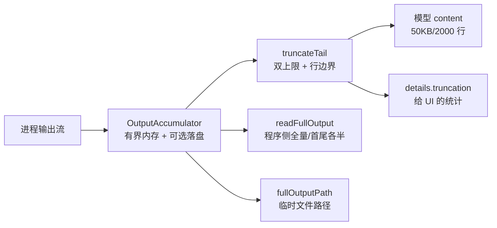

# D7：内置工具四件套精读（截断、累积、进程）

> 精读对象：`core/tools/truncate.ts`（9.3KB）、`core/tools/output-accumulator.ts`（7.8KB）、`core/tools/bash.ts`（15.7KB）——外加对 `read.ts`/`write.ts` 的复习性对照。
> 对应主线：第 7 章（工具系统）。
> 读法：这三个文件回答同一个问题的三个侧面——**"工具的输出如何安全地穿过上下文与内存边界"**。

---

## 0. 三者的分工

```text
truncate.ts          纯函数：字符串 → 受限字符串（行数/字节双上限，保头或保尾）
output-accumulator.ts 有状态：流式字节 → 有界内存的"尾巴" + 可选全量落盘
bash.ts              流程：把"外部进程"接进工具契约（Operations 注入、进程树、退出码）
read.ts / write.ts   范例：如何用"检查点式取消"与文件变更队列（第 7.8/7.10 节已精读）
```

【陷阱】它们**互不依赖**（truncate 不知道 accumulator，accumulator 不知道 bash）——组合发生在 bash 的工具定义里。这是"小模块 + 显式组合"的仓库风格又一次出现。

---

# 第一部分：`truncate.ts`

## 1. 常量与结果形状

【源码】

```typescript
/**
 * Shared truncation utilities for tool outputs.
 *
 * Truncation is based on two independent limits - whichever is hit first wins:
 * - Line limit (default: 2000 lines)
 * - Byte limit (default: 50KB)
 *
 * Never returns partial lines (except bash tail truncation edge case).
 */

export const DEFAULT_MAX_LINES = 2000;
export const DEFAULT_MAX_BYTES = 50 * 1024; // 50KB
export const GREP_MAX_LINE_LENGTH = 500; // Max chars per grep match line

export interface TruncationResult {
	/** The truncated content */
	content: string;
	/** Whether truncation occurred */
	truncated: boolean;
	/** Which limit was hit: "lines", "bytes", or null if not truncated */
	truncatedBy: "lines" | "bytes" | null;
	/** Total number of lines in the original content */
	totalLines: number;
	/** Total number of bytes in the original content */
	totalBytes: number;
	/** Number of complete lines in the truncated output */
	outputLines: number;
	/** Number of bytes in the truncated output */
	outputBytes: number;
	/** Whether the last line was partially truncated (only for tail truncation edge case) */
	lastLinePartial: boolean;
	/** Whether the first line exceeded the byte limit (for head truncation) */
	firstLineExceedsLimit: boolean;
	/** The max lines limit that was applied */
	maxLines: number;
	/** The max bytes limit that was applied */
	maxBytes: number;
}
```

【注解（三个设计决策）】

1. **双上限"先到先赢"**（行数 OR 字节）：单看行数会让"一行 10MB"通过；单看字节会让"百万行短行"贡献巨大行数。两个都要。
2. **结果携带"怎么被截的"**：`truncatedBy`（哪个限制先触发）、`totalLines/Bytes`（原始规模）、`outputLines/Bytes`（保留规模）——让**调用方能拼出"可操作的提示"**（第 7.8.4 节的 `[Showing lines a-b of n...]` 全靠这些数）。
3. **两个布尔给两种边界**：`firstLineExceedsLimit`（head 的极端：第一行就超字节，无法给任何完整行）；`lastLinePartial`（tail 的极端：最后一行超字节，只能给"行尾的部分"）。
- 【陷阱】"Never returns partial lines"是**总原则**，注释同时点明唯一例外（tail 的 lastLinePartial）——读这类"总则+例外"注释时把例外记在脑子里，测试用例往往就围绕例外设计。
- `GREP_MAX_LINE_LENGTH = 500`：grep 命中行的**单行字符上限**（与全局双上限是不同层：先按行截断每条命中，再按整体截断）——第 7 章 grep 工具的行为来源。

## 2. `splitLinesForCounting` 与 `formatSize`

【源码】

```typescript
function splitLinesForCounting(content: string): string[] {
	if (content.length === 0) {
		return [];
	}
	const lines = content.split("\n");
	if (content.endsWith("\n")) {
		lines.pop();
	}
	return lines;
}

export function formatSize(bytes: number): string {
	if (bytes < 1024) {
		return `${bytes}B`;
	} else if (bytes < 1024 * 1024) {
		return `${(bytes / 1024).toFixed(1)}KB`;
	} else {
		return `${(bytes / (1024 * 1024)).toFixed(1)}MB`;
	}
}
```

【注解】

- `splitLinesForCounting`：空串 → `[]`（0 行）；**结尾换行不算新行**（`"a\n"` 是 1 行而不是 2——`pop()` 掉 split 产生的末尾空串）。【陷阱】这个"行数口径"与很多编辑器的"最后一行"哲学一致（行尾换行不产生空行），但它与"`content.split("\n")` 的直觉"不同——所有"显示 a-b of n 行"的提示都基于这个口径；如果你的外部工具要复算行数，必须复刻这个函数。
- `formatSize`：三段阈值（B/KB/MB），保留一位小数。【陷阱】它是**二进制单位**（1024）但写作 "KB/MB"（不是 KiB/MiB）——与第 7.8.4 节提示文本里的 `50KB` 一致。不追求严格单位学，追求"与人对话的简洁"。

## 3. `truncateHead`：保头，三步判定

【源码（完整逻辑，节选分段）】

```typescript
export function truncateHead(content: string, options: TruncationOptions = {}): TruncationResult {
	const maxLines = options.maxLines ?? DEFAULT_MAX_LINES;
	const maxBytes = options.maxBytes ?? DEFAULT_MAX_BYTES;

	const totalBytes = Buffer.byteLength(content, "utf-8");
	const lines = splitLinesForCounting(content);
	const totalLines = lines.length;

	// Check if no truncation needed
	if (totalLines <= maxLines && totalBytes <= maxBytes) {
		return { content, truncated: false, truncatedBy: null, totalLines, totalBytes,
			outputLines: totalLines, outputBytes: totalBytes,
			lastLinePartial: false, firstLineExceedsLimit: false, maxLines, maxBytes };
	}

	// Check if first line alone exceeds byte limit
	const firstLineBytes = Buffer.byteLength(lines[0], "utf-8");
	if (firstLineBytes > maxBytes) {
		return { content: "", truncated: true, truncatedBy: "bytes", totalLines, totalBytes,
			outputLines: 0, outputBytes: 0, lastLinePartial: false, firstLineExceedsLimit: true, maxLines, maxBytes };
	}
```

```typescript
	// Collect complete lines that fit
	const outputLinesArr: string[] = [];
	let outputBytesCount = 0;
	let truncatedBy: "lines" | "bytes" = "lines";

	for (let i = 0; i < lines.length && i < maxLines; i++) {
		const line = lines[i];
		const lineBytes = Buffer.byteLength(line, "utf-8") + (i > 0 ? 1 : 0); // +1 for newline

		if (outputBytesCount + lineBytes > maxBytes) {
			truncatedBy = "bytes";
			break;
		}

		outputLinesArr.push(line);
		outputBytesCount += lineBytes;
	}

	// If we exited due to line limit
	if (outputLinesArr.length >= maxLines && outputBytesCount <= maxBytes) {
		truncatedBy = "lines";
	}

	const outputContent = outputLinesArr.join("\n");
	const finalOutputBytes = Buffer.byteLength(outputContent, "utf-8");
	return { content: outputContent, truncated: true, truncatedBy, ... };
}
```

【注解（逐步）】

- **总字节用 `Buffer.byteLength(content, "utf-8")`**：不是 `content.length`（UTF-16 单元）——**字节口径**贯穿全文件（与"50KB"的字面一致）。
- 第一步"无需截断"：两个上限都没碰 → 原样返回（连字符串都是同一引用）。
- 第二步"第一行就超"：`firstLineBytes > maxBytes` → **返回空内容** + `firstLineExceedsLimit: true`——【陷阱】空内容不是"忘了处理"，而是显式的信号：调用方（`read.ts`）据此**改走 bash 提示**（`sed -n 'Np' | head -c`，第 7.8.4 节），而不是给模型一个错误的"空文件"。
- 第三步逐行累加：
  - **每行字节 = 行内容 + 换行**（`+ (i > 0 ? 1 : 0)`——第一行前面没有换行。注意这里只算"行尾换行"的一字节；末尾行是否带换行由 join 后再算 `finalOutputBytes` 修正）。
  - 超字节 → `break`，`truncatedBy = "bytes"`；
  - 行循环同时受 `i < maxLines` 约束；**循环后**再判断"是不是因为行数满而退出"（`outputLinesArr.length >= maxLines && 字节没超`）→ `truncatedBy = "lines"`。
- 【陷阱】**"两个都要修"的顺序语义**：先按行加到上限或字节先爆——`truncatedBy` 记录**首先**卡住的那个维度。中间的"行满且字节正好没超"判断是必要的：`i < maxLines` 让循环自然结束，此时没有 break，必须显式改写 `truncatedBy`（初始值虽也是 "lines"，但那是"默认"而不是"判定"——代码用显式判断表达意图）。
- `join("\n")` 后再算一次字节（`finalOutputBytes`）——为什么不用累加值？因为**行间的换行加入**会让实际输出与"累加时的估算"差一（尤其最后一行带不带换行）；重算一次得到**真实值**。这类"算两遍"（预览 + 权威）在输出构建里很常见：宁可多一次 O(n) 也要准。

## 4. `truncateTail`：保尾与"部分行"例外

【源码（节选）】

```typescript
export function truncateTail(content: string, options: TruncationOptions = {}): TruncationResult {
	const maxLines = options.maxLines ?? DEFAULT_MAX_LINES;
	const maxBytes = options.maxBytes ?? DEFAULT_MAX_BYTES;
	const totalBytes = Buffer.byteLength(content, "utf-8");
	const lines = splitLinesForCounting(content);
	const totalLines = lines.length;

	if (totalLines <= maxLines && totalBytes <= maxBytes) { /* 与 head 相同的"无需截断"返回 */ }

	// Work backwards from the end
	const outputLinesArr: string[] = [];
	let outputBytesCount = 0;
	let truncatedBy: "lines" | "bytes" = "lines";
	let lastLinePartial = false;

	for (let i = lines.length - 1; i >= 0 && outputLinesArr.length < maxLines; i--) {
		const line = lines[i];
		const lineBytes = Buffer.byteLength(line, "utf-8") + (outputLinesArr.length > 0 ? 1 : 0); // +1 for newline

		if (outputBytesCount + lineBytes > maxBytes) {
			truncatedBy = "bytes";
			// Edge case: if we haven't added ANY lines yet and this line exceeds maxBytes,
			// take the end of the line (partial)
			if (outputLinesArr.length === 0) {
				const truncatedLine = truncateStringToBytesFromEnd(line, maxBytes);
				outputLinesArr.unshift(truncatedLine);
				outputBytesCount = Buffer.byteLength(truncatedLine, "utf-8");
				lastLinePartial = true;
			}
			break;
		}

		outputLinesArr.unshift(line);
		outputBytesCount += lineBytes;
	}
	// ...（行数判定 + join + 返回，与 head 同构，lastLinePartial 回传）
}
```

【注解】

- **从最后一行往前**遍历（`i--`），`unshift` 到数组头——最终数组仍是**正序**（尾段的正序）。这样与 head 的输出格式（正序文本）一致。
- 换行计数的条件换成 `outputLinesArr.length > 0`：指"已有行时，新行前要算一个换行"。仔细看：**从尾部往前看**，"行间换行"属于**前面**那行的尾巴——计数策略与 head 镜像对称，总量正确。
- **"没有任何整行能装下"的例外**：最后一行自身就超 `maxBytes`（`outputBytesCount === 0` 时第一次尝试就爆）→ 调 `truncateStringToBytesFromEnd(line, maxBytes)` **取该行的末尾部分**，标记 `lastLinePartial = true`。
  - 为什么 tail 允许部分行而 head 不允许？场景驱动：**bash 的报错往往就在最后一行**——宁可给半个（尾部），也好过 `firstLineExceedsLimit` 式的"什么都没有"。（对应 head 侧的第一行也可能是"一行 10MB 的压缩 JS"，那时给"半行"毫无意义——所以两边的例外策略不同。）
- `truncateStringToBytesFromEnd`（下一节）保证**多字节 UTF-8 不被切坏**。
- 与 head 相同的"先 break 后显式改写 truncatedBy"结尾逻辑（行满且字节恰好没超）。

## 5. `truncateStringToBytesFromEnd`：UTF-8 边界的正确处理

【源码】

```typescript
/**
 * Truncate a string to fit within a byte limit (from the end).
 * Handles multi-byte UTF-8 characters correctly.
 */
function truncateStringToBytesFromEnd(str: string, maxBytes: number): string {
	const buf = Buffer.from(str, "utf-8");
	if (buf.length <= maxBytes) {
		return str;
	}

	// Start from the end, skip maxBytes back
	let start = buf.length - maxBytes;

	// Find a valid UTF-8 boundary (start of a character)
	while (start < buf.length && (buf[start] & 0xc0) === 0x80) {
		start++;
	}

	return buf.slice(start).toString("utf-8");
}
```

【注解】

- `Buffer.from(str, "utf-8")`：**转成字节数组**再处理——字符串切片（`slice`）按 UTF-16 单元，切在多字节字符中间会产生"半个代理对/半个汉字"，输出乱码。
- 从"目标起点"（`buf.length - maxBytes`）**向后挪**：UTF-8 的**续字节**（10xxxxxx 格式，`(b & 0xc0) === 0x80`）不能作为字符开头；只要当前字节是续字节就 `start++`，直到落在字符边界（或到末尾）。
- 【陷阱】**代价**：起点右移 = 保留的字节**少于** maxBytes（最多让出 3 字节/一个字符）——"宁少勿坏"。方向选择也重要：**从尾部取**（保留 `buf.slice(start)`），所以左边界修正；如果是"从头部取"，修正的也是左边界但逻辑不同（丢弃不完整的**尾部**）。写自己的字节级截断时，这个"修正哪一端"必须跟着"保留哪一端"走。
- 返回值 `toString("utf-8")` 后**实际字节数可能小于 maxBytes**——调用方（`truncateTail`）在紧接的 `outputBytesCount = Buffer.byteLength(truncatedLine, "utf-8")` 里**重算**，一致性得以保证。
- 【跳转】另一个"UTF-8 跨块"的问题在 `output-accumulator.ts`（`TextDecoder` 的 `{ stream: true }`，第 D7 第二部分）——**字节边界问题在本仓库有三处处理**：截断（本函数）、流式解码（accumulator）、协议分帧（第 24 章）。同一类问题、三个场景，读到位就能举一反三。

## 6. `truncateLine`：grep 的单行限制

【源码（节选）】

```typescript
/**
 * Truncate a single line to max characters, adding [truncated] suffix.
 * Used for grep match lines.
 */
export function truncateLine(line: string, maxChars: number = GREP_MAX_LINE_LENGTH): { text: string; wasTruncated: boolean } {
	if (line.length <= maxChars) {
		return { text: line, wasTruncated: false };
	}
	// ...（切到 maxChars，追加 [truncated] 后缀）
}
```

【注解】

- **这是唯一按"字符数"（`line.length`）而不是字节的截断**——因为 grep 命中是"给人/模型看的代码行"，按字符更符合直觉。【陷阱】`length` 是 UTF-16 单元：中文 1 字符 = 1 单元，emoji 可能 2 单元——与"可见宽度"（第 17 章）又不是一回事。这里的粗粒度可以接受（有 500 的额度余量）。
- 返回 `{ text, wasTruncated }` 而不是 `TruncationResult`：**按需最小形状**——单行场景不需要十来项统计。仓库里"小函数返回小形状"的倾向一致（对比 `truncateHead/Tail` 的完整结果）。
- 【陷阱】它与前面两个函数**不共享实现**（一个按字节保头、一个按字节保尾、这个是按字符中截）——如果你要统一它们，先想清楚三种场景的语义差异（第 1 节的"三侧面"）。

---

> D7 第一部分到此。第二部分：`output-accumulator.ts`（流式累积、临时文件阈值、快照与全量读）与 `bash.ts`（Operations 契约、本地执行、进程树杀灭、退出码映射），以及对 `read.ts`/`write.ts` 的复习对照与总结。
---

# 第二部分：`output-accumulator.ts` 与 `bash.ts`

## 7. `OutputAccumulator`：内存有界，全量可选

【源码（头部与常量）】

```typescript
import { randomBytes } from "node:crypto";
import { createWriteStream, type WriteStream } from "node:fs";
import { open } from "node:fs/promises";
import { tmpdir } from "node:os";
import { join } from "node:path";
import { DEFAULT_MAX_BYTES, DEFAULT_MAX_LINES, type TruncationResult, truncateTail } from "./truncate.ts";

export interface OutputAccumulatorOptions {
	maxLines?: number;
	maxBytes?: number;
	tempFilePrefix?: string;
}

export interface OutputSnapshot {
	content: string;
	truncation: TruncationResult;
	fullOutputPath?: string;
}

export interface FullOutput {
	content: string;
	/** Whether `content` omits part of the output. */
	truncated: boolean;
}

function defaultTempFilePath(prefix: string): string {
	const id = randomBytes(8).toString("hex");
	return join(tmpdir(), `${prefix}-${id}.log`);
}
```

【注解】

- 三个接口就是它的三个出口：选项、**显示快照**（给模型/UI 的截断版本）、**全量输出**（给能吞下更多的调用者——如 codemode 脚本，第 22.6 节的 bash 解析值）。
- 临时文件命名：**随机 16 个十六进制字符**（`randomBytes(8)`）+ 前缀——防止并发工具写同一文件互相覆盖（第 7.10 节的"并发安全"在另一个尺度的体现）。
- 【陷阱】`truncateTail` 在**本文件的 import 里**——accumulator 与 truncate 的组合点在"快照"：**内存里留尾巴，快照时再按双上限截**。两层限制叠加（"尾巴"是策略、"截断"是终点），读代码时别把它们当同一个机制。

【源码（类字段与构造器）】

```typescript
export class OutputAccumulator {
	private readonly maxLines: number;
	private readonly maxBytes: number;
	private readonly maxRollingBytes: number;
	private readonly tempFilePrefix: string;
	private readonly decoder = new TextDecoder();

	private rawChunks: Buffer[] = [];
	private tailText = "";
	private tailBytes = 0;
	private tailStartsAtLineBoundary = true;
	private totalRawBytes = 0;
	private totalDecodedBytes = 0;
	private completedLines = 0;
	private totalLines = 0;
	private currentLineBytes = 0;
	private hasOpenLine = false;
	private finished = false;

	private tempFilePath: string | undefined;
	private tempFileStream: WriteStream | undefined;

	constructor(options: OutputAccumulatorOptions = {}) {
		this.maxLines = options.maxLines ?? DEFAULT_MAX_LINES;
		this.maxBytes = options.maxBytes ?? DEFAULT_MAX_BYTES;
		this.maxRollingBytes = Math.max(this.maxBytes * 2, 1);
		this.tempFilePrefix = options.tempFilePrefix ?? "pi-output";
	}
```

【注解（字段分组）】

- **限制**：`maxLines`/`maxBytes`（与 truncate 同源）+ `maxRollingBytes`（`maxBytes*2`——"滚动窗口"的两倍，给"判定是否值得开临时文件"留余量）。
- **解码**：`decoder`（`TextDecoder` 实例，流式 `{stream:true}` 用）。
- **内存侧**：`rawChunks`（**未截断的原始字节**，直到决定开临时文件）、`tailText`/`tailBytes`（解码后的尾巴）、`tailStartsAtLineBoundary`（尾巴是否从行边界开始——决定要不要丢弃"半个开头的行"）。
- **统计**：`totalRawBytes`（原始字节累计）、`totalDecodedBytes`（解码后**字节**累计——注意命名）、`completedLines`/`totalLines`/`currentLineBytes`/`hasOpenLine`（行维度统计，含"最后一行还没结束"状态）。
- **生命周期**：`finished`、临时文件两件套（路径 + 流）。
- 【陷阱】字段多但职责清晰——**同一个流的四种投影**（原始字节、解码尾巴、行统计、全量文件）。读这种类先画"数据流经过哪些字段"，再进入方法。

【源码（append / finish）】

```typescript
	append(data: Buffer): void {
		if (this.finished) {
			throw new Error("Cannot append to a finished output accumulator");
		}

		this.totalRawBytes += data.length;
		this.appendDecodedText(this.decoder.decode(data, { stream: true }));

		if (this.tempFileStream || this.shouldUseTempFile()) {
			this.ensureTempFile();
			this.tempFileStream?.write(data);
		} else if (data.length > 0) {
			this.rawChunks.push(data);
		}
	}

	finish(): void {
		if (this.finished) {
			return;
		}
		this.finished = true;
		this.appendDecodedText(this.decoder.decode());
		if (this.shouldUseTempFile()) {
			this.ensureTempFile();
		}
	}
```

【注解】

- `append` 三分支（**存储策略的决策点**）：
  1. 已经开临时文件 → 直接写文件（原始字节）；
  2. 还没开但"该开了"（`shouldUseTempFile()`，基于 `maxRollingBytes` 等判定）→ 开（`ensureTempFile` 内部会把 `rawChunks` 里攒的**先补写**进文件）再写当前块；
  3. 否则 → 攒进 `rawChunks`（内存）。
- 【陷阱】`decoder.decode(data, { stream: true })`：**流式解码**——跨块的半个 UTF-8 字符会被解码器**缓住**，等下一块补齐再吐出。这就是"增量处理也不能出乱码"的机制（对比第 24 章的"帧重组"：协议层按字节长度切，这一层按 UTF-8 边界切——**两层各自处理自己的边界**）。
- `finish` **幂等**（`finished` 双检查）；**必须调用**（它做两件事）：
  1. `this.decoder.decode()`（**无 `stream`**）→ 冲刷解码器里最后残留的字节/不完整序列；
  2. 收尾的"该开文件就开"判定（可能有定稿时才达到阈值的输出）。
- 【陷阱】`append` 对 `finished` 之后的追加**抛错**（而不是忽略）——语义是"生命周期错误"，调用方 bug；而 `finish` 重复调用是**允许**的（收尾天然可能被多次触发：进程退出、取消、正常结束多条路径汇聚——第 13.4 节的"清理幂等"思想在数据结构的体现）。

【源码（snapshot）】

```typescript
	snapshot(options: { persistIfTruncated?: boolean } = {}): OutputSnapshot {
		const tailTruncation = truncateTail(this.getSnapshotText(), {
			maxLines: this.maxLines,
			maxBytes: this.maxBytes,
		});
		const truncated = this.totalLines > this.maxLines || this.totalDecodedBytes > this.maxBytes;
		const truncatedBy = truncated
			? (tailTruncation.truncatedBy ?? (this.totalDecodedBytes > this.maxBytes ? "bytes" : "lines"))
			: null;
		const truncation: TruncationResult = {
			...tailTruncation,
			truncated,
			truncatedBy,
			totalLines: this.totalLines,
			totalBytes: this.totalDecodedBytes,
			maxLines: this.maxLines,
			maxBytes: this.maxBytes,
		};

		if (options.persistIfTruncated && truncation.truncated) {
			this.ensureTempFile();
		}

		return {
			content: truncation.content,
			truncation,
			fullOutputPath: this.tempFilePath,
		};
	}
```

【注解】

- **为什么快照还要再 truncate 一次？**（与"内存里已只留尾巴"重复吗？）——`truncateTail` 在这里的职责是**把尾巴修成"合法形状"**：确保双上限、确保行边界、算出 `totalLines/Bytes` 之外的 `outputLines/Bytes` 等统计。accumulator 的"留尾巴"是为了**内存**；snapshot 的 truncate 是为了**结果的规范性**。两者目标不同。
- 【陷阱】`truncated` 的判定用的是**全量统计**（`totalLines`/`totalDecodedBytes`）而不是 `tailTruncation.truncated`——因为尾巴可能"恰好没有超出双上限"（比如超出的内容已被滚动丢弃，但全量确实超了）。**"显示的内容是否截断"必须看全量**。
- `truncatedBy` 的三级兜底：`tailTruncation.truncatedBy ?? (全量字节超了 ? "bytes" : "lines")`——修正在"tail 内没触发截断但全量超了"的情况。
- `persistIfTruncated`：**惰性开文件**的额外入口（调用方可以"只在真的要展示截断时才落全量"）；返回的 `fullOutputPath` 读的是当前字段（可能 undefined——文件还没开）。
- 【陷阱】`OutputSnapshot.fullOutputPath` 与 `TruncationResult` **都不承诺"文件一定存在"**：路径的语义是"如果你要全量，看这里（可能为空）"。消费方（`bash.ts` 的 details）要按"可选"处理。读 `BashToolDetails.fullOutputPath?: string` 的 `?` 就是它。

【源码（closeTempFile 与 readFullOutput 开头）】

```typescript
	async closeTempFile(): Promise<void> {
		if (!this.tempFileStream) return;
		const stream = this.tempFileStream;
		this.tempFileStream = undefined;
		await new Promise<void>((resolve, reject) => {
			const onError = (error: Error) => { stream.off("finish", onFinish); reject(error); };
			const onFinish = () => { stream.off("error", onError); resolve(); };
			stream.once("error", onError);
			stream.once("finish", onFinish);
			stream.end();
		});
	}

	/**
	 * The complete output, for callers that can take more than the display snapshot. Call after
	 * `finish()` and `closeTempFile()`. Output longer than `maxBytes` raw bytes keeps its first and
	 * last `maxBytes / 2` bytes around an omission marker.
	 */
	async readFullOutput(maxBytes: number): Promise<FullOutput> {
		if (!this.tempFilePath) {
			return { content: new TextDecoder().decode(Buffer.concat(this.rawChunks)), truncated: false };
		}
		const file = await open(this.tempFilePath, "r");
		try {
			const size = (await file.stat()).size;
			if (size <= maxBytes) return { content: new TextDecoder().decode(await file.readFile()), truncated: false };
			// ...（首尾各半 + 省略标记，见文档注释）
		}
	}
```

【注解】

- `closeTempFile`：**手动 Promise 包裹流结束**（`finish`/`error` 两个 once 监听 + 互相摘除）——这是 Node 流"等它真的关完"的标准写法（`stream.end()` 只是请求关闭，完成要等事件）。
- 【陷阱】`closeTempFile` 不在 `finish()` 里自动做：**写入是流式的、可能还没 flush**；把"关文件"拆成独立异步步骤，调用方显式 await（bash 工具在工具结束前会做）。命名"call after finish() and closeTempFile()"（`readFullOutput` 的注释）把调用顺序写成了契约。
- `readFullOutput`：两条路径——没文件 → 解 `rawChunks`（内存全量，未截断）；有文件 → 读文件并按 `maxBytes` 决定"全给/给首尾各半 + 省略标记"。
  - 【陷阱】注意参数 `maxBytes` 与实例字段 `maxBytes` **不是一回事**：前者是**这次读取调用者愿意吞的量**（如 codemode 的 1MiB 上限，第 22.6 节），后者是**显示快照的上限**（50KB）。同名不同义，"读某方法时先看参数表"的又一示例。
- 【跳转】bash 工具在工具结束处的组合（从第 7.11 节与 bash.ts 的结构）：`snapshot({ persistIfTruncated: true })` 拿"给模型的内容 + 截断详情 + 全量路径"，写进 `BashToolDetails`；codemode 路径则调 `readFullOutput(1MiB)` 拿"程序侧全量"。

## 8. `bash.ts`：Operations 契约与本地执行

【源码（tool schema 与两个 output 形状）】

```typescript
const bashSchema = Type.Object({
	command: Type.String({ description: "Shell command to execute" }),
	timeout: Type.Optional(Type.Number({ description: "Timeout in seconds (optional, no default timeout)" })),
});

export const bashToolSystemPromptContribution = {
	snippet: "Execute bash commands (ls, grep, find, etc.)",
	guidelines: ["You can inspect PI_* environment variables for current model and session details."],
} as const;

/**
 * Result for programmatic callers such as codemode scripts. A non-zero exit code is an error result for the model, but scripts still resolve to this value.
 * `output` is not limited like the model-facing output: callers decide how much of it reaches the model.
 */
const bashOutputSchema = Type.Object({
	output: Type.String({ description: "Combined stdout and stderr, possibly truncated" }),
	truncated: Type.Boolean(),
	full_output_path: Type.Optional(Type.String({ description: "Full output, when truncated" })),
	exit_code: Type.Number(),
	wall_time_seconds: Type.Number(),
});
```

【注解】

- **输入三个字段**：`command`、可选 `timeout`（秒；注释点明"没有默认超时"——**不设默认让长命令能跑**，超时由模型/用户显式给）。【陷阱】"没有默认"是安全与实用的取舍：默认超时会杀长任务（构建/下载），不设则可能挂住——选择交给调用场景（工具层另有取消信号兜底）。
- **两个输出形状**：
  - **面向模型**：`content` 文本（拼接 stdout+stderr 的截断版）+ `details`（`BashToolDetails`：截断结果 + 全量路径）。
  - **面向程序**（`bashOutputSchema`，装配到 `outputSchema`，第 14.3 节）：结构化五字段。注释把两条契约写得很清楚：**非零退出码对模型是错误结果，但脚本仍然 resolve 到这个值**；`output` 的上限比模型侧宽（"callers decide"）。
- 【陷阱】同一工具"两种消费者两套输出"在本仓库的第一次完整登场（第 14.2 节的矩阵在这里最具体）。注意 `exit_code` 是 **Number** 而不是 `Number | null`——`null` 退出码（见 Operations 注释"null 视为失败"）在组装结构化输出时会被映射成某个数字（失败约定），读 bash.ts 的执行段能确认具体值（`?? 1`）。**类型是契约：schema 说 Number，就意味着 null 在进入输出前已被消解。**
- `promptGuidelines` 里那句 "You can inspect PI_* environment variables"——**提示词教模型用环境变量**（`PI_*` 提供当前模型/会话信息，第 11.7 节）；一个"把运行时能力写进提示"的实例。

【源码（Operations 契约）】

```typescript
/**
 * Pluggable operations for the bash tool.
 * Override these to delegate command execution to remote systems (for example SSH).
 */
export interface BashOperations {
	/**
	 * Execute a command and stream output.
	 * @param command The command to execute
	 * @param cwd Working directory
	 * @param options Execution options
	 * @returns Promise resolving to the exit code. Report signal terminations as 128 + signal number;
	 * a null exit code is treated as a failed command.
	 */
	exec: (
		command: string,
		cwd: string,
		options: {
			onData: (data: Buffer) => void;
			signal?: AbortSignal;
			timeout?: number;
			env?: NodeJS.ProcessEnv;
		},
	) => Promise<{ exitCode: number | null }>;
}
```

【注解】

- 三个"契约句子"背下来：
  1. **信号终止 → 128 + 信号号**（shell 惯例，第 7.11 节）；
  2. **`null` 退出码 = 失败命令**（调用方见到 null 要当失败处理，不要让"null"漏进模型层）；
  3. `onData` 是**流式回调**（Buffer）——accumulator 的 `append` 直接接它（这就是"流到有界内存"的接口点）。
- 【陷阱】`env?: NodeJS.ProcessEnv` 的**可选注入**与"默认 `getShellEnv()`"（本地实现里 `env ?? getShellEnv()`）——不同 Operations 实现（SSH/容器）可以有完全不同的环境策略；接口只规定形状。**扩展作者实现自己的 Operations 时，从这份契约抄起。**

【源码（本地执行：前置检查与 spawn）】

```typescript
export function createLocalShellOperations(shellName: string, resolveShellConfig: () => ShellConfig): BashOperations {
	return {
		exec: async (command, cwd, { onData, signal, timeout, env }) => {
			const timeoutMs = resolveTimeoutMs(timeout);
			if (signal?.aborted) throw new Error("aborted");
			const shellConfig = resolveShellConfig();
			try {
				await fsAccess(cwd, constants.F_OK);
			} catch {
				throw new Error(`Working directory does not exist: ${cwd}\nCannot execute ${shellName} commands.`);
			}

			const commandFromStdin = shellConfig.commandTransport === "stdin";
			const child = spawn(shellConfig.shell, commandFromStdin ? shellConfig.args : [...shellConfig.args, command], {
				cwd,
				detached: process.platform !== "win32",
				env: env ?? getShellEnv(),
				stdio: [commandFromStdin ? "pipe" : "ignore", "pipe", "pipe"],
				windowsHide: true,
			});
			if (commandFromStdin) {
				child.stdin?.on("error", () => {});
				child.stdin?.end(command);
			}
			if (child.pid) trackDetachedChildPid(child.pid);
```

【注解（每行都有信息）】

- 前置三步：算超时；**预先的取消检查**（`throw new Error("aborted")`——与工具契约里其他地方的 `"Operation aborted"` 文案不同，见【陷阱】）；**cwd 存在性检查**（错误文本给 cwd 与 shell 名——"Working directory does not exist: ... Cannot execute bash commands." 正是第 9 章排障项的来源）。
- 【陷阱】两处取消文案不同：本文件是 `"aborted"`，工具层其他处是 `"Operation aborted"`。**不要写断言时假定统一文案**——各自是各自模块的选择（这也是"文案漂移"风险的例子；改统一时要跨越多个测试）。
- **spawn 五参数**六个字段的实际选择：
  - `detached: process.platform !== "win32"`——**非 Windows 上建独立进程组**（这样 `killProcessTree` 能对**整组**发信号；Windows 用别的机制，第 7.11 节）；`windowsHide: true`（不弹控制台窗口——shell 工具在后台跑的体验）；
  - `env: env ?? getShellEnv()`（各自函数提供）；
  - **stdio 的第一个流**：`commandFromStdin ? "pipe" : "ignore"`——命令走 stdin 时开管道，否则第一个流**直接 ignore**（命令在 argv 里，不需要 stdin；这也避免子进程从终端偷读输入！【陷阱】"ignore"防"命令等待输入挂住"这类事故，配合第 16 章"没有默认超时"的取舍形成防御）。
- **stdin 传输模式**：命令可能太长（超 argv 上限）时用 `shellConfig.commandTransport === "stdin"` 的策略（shell 参数里带 `-s` 之类 + 命令从 stdin 灌入）；`child.stdin?.end(command)` 写完后**关流**（EOF 让 shell 开始执行）。错误监听吞掉（`() => {}`）是为了**避免 EPIPE 崩溃**（命令秒退时写 stdin 会报错——这类"预期内错误"不该炸工具）。
- `trackDetachedChildPid(child.pid)`：**登记进程**——供"进程退出清理"时统一杀灭（孤儿进程防护：工具提前返回/进程退出时别留下还在跑的 shell）。

【源码（超时、流、杀灭与退出码）】

```typescript
			let timedOut = false;
			let timeoutHandle: NodeJS.Timeout | undefined;
			const onAbort = () => { if (child.pid) killProcessTree(child.pid); };

			try {
				if (timeoutMs !== undefined) {
					timeoutHandle = setTimeout(() => {
						timedOut = true;
						if (child.pid) killProcessTree(child.pid);
					}, timeoutMs);
				}
				child.stdout?.on("data", onData);
				child.stderr?.on("data", onData);
				if (signal) {
					if (signal.aborted) onAbort();
					else signal.addEventListener("abort", onAbort, { once: true });
				}
				const exitCode = await waitForChildProcess(child);
				if (signal?.aborted) {
					// ...（按信号终止处理）
				}
				// ...
				const signalCode = child.signalCode;
				return { exitCode: exitCode ?? (signalCode ? 128 + (osConstants.signals[signalCode] ?? 0) : 1) };
			} finally {
				if (signal) signal.removeEventListener("abort", onAbort);
				// ...（清定时器等）
			}
```

【注解（三条线）】

1. **超时线**：`setTimeout` → 标 `timedOut` + **杀进程树**（不是只 kill 直接子进程——shell 里起的后代也要清）；
2. **取消线**：`onAbort` → 杀树；注册用 `{ once: true }`，**finally 里摘除**（跑完的监听不留）；
3. **输出线**：stdout 与 stderr **都接同一个 `onData`**（合并流——"Combined stdout and stderr"的 schema 描述）；合流顺序天然按到达时间（不保序保证，工具契约也不承诺）。
- 退出码最终映射：`exitCode ?? (signalCode ? 128 + (osConstants.signals[signalCode] ?? 0) : 1)`——**三级**：正常退出码 → 信号惯例（128+N，信号名查表失败按 0 → 128）→ 都没有按 1。对照 Operations 注释的"128 + signal number"与"null 视为失败"：**这里永不返回 null**（本地实现把 null 消解掉），null 是给"别的实现（如远程执行框架）表达失败"的通道。
- 【陷阱】`timedOut` 被设置但最终返回值没直接用到（从给出的片段看）——它可能用于**后续的错误文案/细节**（如 details 里标注"超时"）。读完整函数尾部的组装段确认；这也是"字段/标志先声明、在别处消费"的常见模式——**读一个变量要追踪它的全部读写点**。
- `finally` 的双清理（摘监听、清定时器）：**资源释放的成对出现**——本仓库从第 1 章的 read.ts 到第 24 章的连接管理，一致的模式。

## 9. 复习对照：read.ts 与 write.ts 的取消策略

（详细精读在第 7.8、7.10 节；这里把它与 D7 的三个文件连成一张"取消策略"表。）

| 工具/模块 | 取消机制 | 关键理由 |
|---|---|---|
| `read.ts` | `signal.addEventListener("abort", reject)` + `aborted` 标志 + 每个 await 后检查 + **收尾 removeEventListener** | 读操作无写入锁；立即 reject 无副作用 |
| `write.ts` | **不用** abort 监听；`throwIfAborted()` 在**每个 await 后**检查 | 在文件变更队列的锁内——从监听器 reject 会**提前释放锁**（第 7.10 节注释原文） |
| `bash.ts`（本地） | 监听 → `killProcessTree`（**杀**而不是 reject）；执行段的 await 结束后统一处理 | 子进程需要主动杀；"取消信号 ≠ 强杀"在本文件里被**翻译**成强杀动作 |
| `output-accumulator` | 无取消概念（纯粹的数据结构）；`finished` 状态防误用 | 状态机只认生命周期 |

队列时序的测试边界见 `packages/coding-agent/test/file-mutation-queue.test.ts`：其中两个取消用例让注入的 `writeFile` 暂停，触发 abort 后确认第二个同文件操作尚未开始；释放暂停后，第一个工具在 await 后观察到 abort 并拒绝，第二个操作才开始。这里证明的是**锁等到底层 Promise settle**，不是文件系统写入可被中断，也没有测试缺失路径的符号链接别名。

【陷阱】四行四种策略——**"取消"没有统一实现，只有统一**契约**（尽快停止、保持状态自洽）**。判断一个模块的取消写法是否"正确"，要看它**持有什么资源**与**并发关系**（锁、进程、监听）。

## 10. 总结

### 10.1 输出穿越边界的三层防线



### 10.2 五个值得记住的细节

1. **双上限判定要求"行满且字节未超"显式改写 `truncatedBy`**（两处截断函数同构）。
2. **tail 的"部分行"是唯一例外**，且用 `truncateStringToBytesFromEnd` 修正 UTF-8 边界（宁少勿坏）。
3. **`decoder.decode(data, {stream:true})` 与 `finish()` 的无参 `decode()`** 是一对（冲刷残留）。
4. **`snapshot` 的 `truncated` 看全量统计**，不是尾巴自身的截断结果。
5. **退出码三级映射 + 128+N 惯例 + null 语义**——Operations 契约的硬约定。

### 10.3 阅读检查清单

- [ ] 我能说出 `truncateHead` 与 `truncateTail` 各自的"极端例外"吗？（空内容 vs 部分行）
- [ ] 我知道 `readFullOutput` 的参数 `maxBytes` 与实例字段 `maxBytes` 的区别吗？
- [ ] 我能解释 `append` 的三分支存储策略吗？
- [ ] 我知道 `finish()` 为什么必须调用、且为什么幂等吗？
- [ ] 我能背出 Operations 契约的三句约定（128+N、null、onData）吗？
- [ ] 我能说出"取消"四种实现策略的分歧理由吗？

---

> D7 完。下一篇（D8）精读扩展系统：`extensions/types.ts` 的关键类型与 `runner.ts` 的派发实现（选段）。
