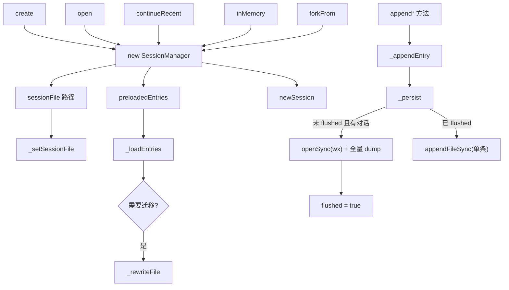

# D9：`SessionManager` 类内部机制精读

> 精读对象：`core/session-manager.ts` 的 `SessionManager` **类本体**（字段、生命周期、持久化、append 家族、静态工厂）。
> 对应主线：第 9 章（会话树、恢复与分支）。
> 与 D3 的关系：D3 精读**模块级投影函数**（读怎么算）；D9 精读**类怎么存与怎么变**（写怎么落）。两者合起来才是完整的 session-manager。

---

## 0. 类的自我描述（文档注释）

【源码】

```typescript
/**
 * Manages conversation sessions as append-only trees stored in JSONL files.
 *
 * Each session entry has an id and parentId forming a tree structure. The "leaf"
 * pointer tracks the current position. Appending creates a child of the current leaf.
 * Branching moves the leaf to an earlier entry, allowing new branches without
 * modifying history.
 *
 * Use buildSessionContext() to get the resolved message list for the LLM, which
 * handles compaction summaries and follows the path from root to current leaf.
 */
export class SessionManager {
```

【注解】

- 四句话 = 四个核心机制：**append-only 树**（写只追加）、**leaf 指针**（当前位置）、**分支 = 移 leaf**（不改历史）、**`buildSessionContext()` 才是模型视图**（投影与存储分离）。
- 【陷阱】"append-only"是**文件层面**的承诺（新的内容只追加）；但类内部有 `_rewriteFile()`（重写整个文件）——用于迁移、fork 等"结构性变化"。**承诺的粒度**：日常对话只追加；版本迁移/分支导出这类"一次性手术"允许重写。"append-only"不要理解成"文件永不重写"。

## 1. 九个私有字段：状态的完整清单

【源码】

```typescript
export class SessionManager {
	private sessionId: string = "";
	private sessionFile: string | undefined;
	private sessionDir: string;
	private cwd: string;
	private persist: boolean;
	private flushed: boolean = false;
	private fileEntries: FileEntry[] = [];
	private byId: Map<string, SessionEntry> = new Map();
	private labelsById: Map<string, string> = new Map();
	private labelTimestampsById: Map<string, string> = new Map();
	private leafId: string | null = null;
```

【注解（三组）】

1. **身份与位置**：`sessionId`、`sessionFile`、`sessionDir`、`cwd`、`persist`（是否落盘——内存会话为 false）。
2. **数据**：`fileEntries`（**全量条目数组**，含 header）、`byId`（索引）、`leafId`（当前位置；`null` 表示"无叶子"——与第 D3 节的三态呼应）。
3. **标签的两张表**：`labelsById`（targetId → label）与 `labelTimestampsById`（targetId → 时间戳）——**成对维护**（D3 第 9 节曾依赖这个不变量做非空断言）。
- 【陷阱】`flushed`（是否已把"内存中的结构"写进文件）是**惰性建文件**的核心状态位（第 4 节详解）。名字字面是"已冲洗"，语义是"文件已存在且内容同步"。
- 【陷阱】`fileEntries` 里**包含 header**（`session` 条目）——遍历条目时要么跳过它（`_buildIndex` 里 `if (entry.type === "session") continue`），要么处理它；这是"首个元素特殊"的又一例。

## 2. 构造器与"三条初始化路径"

【源码】

```typescript
	private constructor(
		cwd: string,
		sessionDir: string,
		sessionFile: string | undefined,
		persist: boolean,
		newSessionOptions?: NewSessionOptions,
		preloadedFileEntries?: FileEntry[],
	) {
		this.cwd = resolvePath(cwd);
		this.sessionDir = normalizePath(sessionDir);
		this.persist = persist;
		if (persist && this.sessionDir && !existsSync(this.sessionDir)) {
			mkdirSync(this.sessionDir, { recursive: true });
		}

		if (sessionFile) {
			this._setSessionFile(sessionFile, preloadedFileEntries);
		} else if (preloadedFileEntries?.length) {
			this._loadEntries(preloadedFileEntries, newSessionOptions);
		} else {
			this.newSession(newSessionOptions);
		}
	}
```

【注解】

- **构造函数是私有的**（`private constructor`）：实例只能通过静态工厂（`create/open/continueRecent/inMemory/forkFrom`）产生——**受控构造**（保证进入时的状态一致，比如目录已建）。
- 目录准备：`persist && sessionDir 非空 && 不存在` → `mkdirSync(recursive: true)`——**先建目录**再谈文件；内存会话（persist false）或自定义 sessionDir 为空时跳过。
- 三条初始化路径（对应三种来源）：
  1. `sessionFile` 给了 → `_setSessionFile`（打开已有/创建指定路径）；
  2. `preloadedFileEntries` 有（且没有文件）→ `_loadEntries`（**预加载条目**——`open()` 的 header-scan-limit 回退路径与 `inMemory(entries)` 用它）；
  3. 都没有 → `newSession()`（全新会话）。
- 【陷阱】路径 2 与路径 1 的区别：路径 1 从**文件**读；路径 2 用**调用方给的条目数组**（可能来自内存或外部解析）。`inMemory(cwd, options, entries)` 走的正是路径 2——"从已有条目建内存会话"的 API（第 15.3 节的"恢复外部历史"。）

## 3. `_setSessionFile`：打开一个文件的三种结局

【源码（节选）】

```typescript
	private _setSessionFile(sessionFile: string, preloadedFileEntries?: FileEntry[]): void {
		this.sessionFile = resolvePath(sessionFile);
		if (existsSync(this.sessionFile)) {
			const entries = preloadedFileEntries ?? loadEntriesFromFile(this.sessionFile);

			// If file was empty, initialize it with a valid session header. If it was
			// non-empty but did not parse as a pi session, fail without modifying it.
			if (entries.length === 0) {
				const explicitPath = this.sessionFile;
				if (statSync(explicitPath).size > 0) {
					throw new Error(`Session file is not a valid ${APP_NAME} session: ${explicitPath}`);
				}
				this.newSession();
				this.sessionFile = explicitPath;
				this._rewriteFile();
				this.flushed = true;
				return;
			}

			this._loadEntries(entries);
			this.flushed = true;
		} else {
			const explicitPath = this.sessionFile;
			this.newSession();
			this.sessionFile = explicitPath; // preserve explicit path from --session flag
		}
	}
```

【注解（三种结局）】

1. **文件存在且有条目** → `_loadEntries` + `flushed = true`（文件与内存同步——刚读的）。
2. **文件存在但零条目**：
   - **真·空文件**（size 为 0）→ 就地初始化一个新会话头，**重写**到该路径（`newSession` 会生成新 id/文件名的字段，但这里把 `sessionFile` 恢复成调用方指定的显式路径——注释 `preserve explicit path` 的意图）；`flushed = true`；
   - **文件非空但解析不出条目**（坏文件/不是 pi 会话）→ **抛错且不修改文件**（注释原文："fail without modifying it"）——**数据安全优先**：宁可拒绝打开，也不毁掉用户的文件。
   - 【陷阱】"解析不出条目"怎么发生？`loadEntriesFromFile` 会**跳过坏行**（第 9.2.3 节）；如果**所有行都坏**（或整个文件不是 JSONL），条目为空但 size > 0——命中第二种。**容错读取 + 严格判定**的组合。
3. **文件不存在** → `newSession()` 初始化内存态；然后**把 `sessionFile` 覆盖回显式路径**（否则 `newSession` 会按默认规则生成随机文件名）——"`--session path` 指定未来文件位置"的语义。
   - 【陷阱】注意此处**不 `_rewriteFile()`**：文件要等"真有对话"才创建（`flushed` 仍是 false，第 4 节）。

## 4. `newSession` 与 `_loadEntries`：初始化与迁移

【源码（newSession）】

```typescript
	newSession(options?: NewSessionOptions): string | undefined {
		if (options?.id !== undefined) {
			assertValidSessionId(options.id);
		}
		this.sessionId = options?.id ?? createSessionId();
		const timestamp = new Date().toISOString();
		const header: SessionHeader = {
			type: "session",
			version: CURRENT_SESSION_VERSION,
			id: this.sessionId,
			timestamp,
			cwd: this.cwd,
			parentSession: options?.parentSession,
		};
		this.fileEntries = [header];
		this.byId.clear();
		this.labelsById.clear();
		this.labelTimestampsById.clear();
		this.leafId = null;
		this.flushed = false;

		if (this.persist) {
			const fileTimestamp = timestamp.replace(/[:.]/g, "-");
			this.sessionFile = join(this.getSessionDir(), `${fileTimestamp}_${this.sessionId}.jsonl`);
		}
		return this.sessionFile;
	}
```

【注解】

- id 校验（`assertValidSessionId`——第 16 章 CLI 的"字母数字点下划线连字符"约束的落点）+ 生成（`createSessionId`，默认 UUID）。
- Header 六字段全在这里组装（含 `parentSession`——fork/子会话血缘）。
- **五个状态全部复位**（含三张 Map 与 `leafId = null`、`flushed = false`）——"新会话"= 彻底重置。**注意 `leafId = null`**：空会话没有叶子（第一个 append 时 `parentId` 就是 null——`_buildIndex` 之后才会指向第一条）。
- 文件名 = `时间戳（去冒号点）_id.jsonl`，join 会话目录；**返回文件路径**（未落盘时也返回"将使用的路径"——调用方可以展示）。
- 【陷阱】`newSession` 是 **public** 方法（不是内部）：第 8.5 节的 `newSession` 流程与扩展的会话替换都可能直接调它（`SessionManager` 的 API 面包含"换新会话"）。

【源码（_loadEntries，节选）】

```typescript
	private _loadEntries(entries: FileEntry[], options?: NewSessionOptions): void {
		const header = entries.find((e) => e.type === "session") as SessionHeader | undefined;

		if (header) {
			this.fileEntries = entries;
			this.sessionId = header.id;

			if (migrateToCurrentVersion(this.fileEntries)) {
				this._rewriteFile();
			}
		} else {
			this.newSession(options);
			this.fileEntries = this.fileEntries.concat(entries);
		}

		// ...（继续：恢复标签、重建索引等）
```

【注解】

- **找 header**（不一定在第一条？用 `find` 而不是 `[0]`——防御；正常文件第一行是 header）。
- 有 header：采用条目、恢复 id；**版本迁移**（`migrateToCurrentVersion`）返回 true（真的迁移了）→ **立即重写文件**（把迁移结果落盘——"加载即升级"）。
- **无 header**：把这个文件当"裸条目序列"——先 `newSession(options)` 造一个新头，再 `concat(entries)` 拼上去。（对"老版本/实验格式"的兼容路径；与 D3 的"v1 线性日志"迁移相关。）
- 【跳转】迁移函数 `migrateToCurrentVersion` 与 `CURRENT_SESSION_VERSION`：v1→v2→v3 的演变（第 9.2.2 节的表）。

## 5. `_buildIndex`：一次遍历，五件事

【源码】

```typescript
	private _buildIndex(): void {
		this.byId.clear();
		this.labelsById.clear();
		this.labelTimestampsById.clear();
		this.leafId = null;
		for (const entry of this.fileEntries) {
			if (entry.type === "session") continue;
			this.byId.set(entry.id, entry);
			this.leafId = entry.id;
			if (entry.type === "label") {
				if (entry.label) {
					this.labelsById.set(entry.targetId, entry.label);
					this.labelTimestampsById.set(entry.targetId, entry.timestamp);
				} else {
					this.labelsById.delete(entry.targetId);
					this.labelTimestampsById.delete(entry.targetId);
				}
			}
		}
	}
```

【注解】

- 三清（索引 + 两标签表）一复位（leafId）。
- 顺序遍历 fileEntries：
  - 跳过 header；
  - `byId.set`；
  - **`leafId = entry.id` 每步覆盖** → 循环结束后 leafId 是**最后一条条目的 id**——【陷阱】"文件最后一条 = 当前叶子"的默认假设（打开一个分支文件时的正确性：文件是按追加顺序写的，所以最后一条确实是当时的叶子）。
  - `label` 条目：**设置或清除**（`entry.label` 为空/undefined 时从两张表删除）——标签的"最后写入生效"在这里实现（第 9.5.2 节的 label 语义）。
- 【陷阱】`_buildIndex` **不恢复"当前叶子到某一分支点"**——它永远选最后一条。要"打开在特定叶子"（第 9 章的 `navigateTree` 场景），调用方在加载后**显式设置 leafId**（找到对应 API：`setLeaf`/导航方法——搜索类方法清单确认）。读代码时发现"打开总是落在最后"，不要以为分支功能坏了——是加载与导航的职责分离。

---

> D9 第一部分到此。第二部分：持久化三件套（`_rewriteFile`/`_hasConversation`/`_persist`/`_appendEntry`）、append 家族逐个读（含 `#10000` 注释与标签维护）、查询方法、静态工厂（`create/open/continueRecent/inMemory/forkFrom`），最后是总结。
---

# 第二部分：持久化三件套与 append 家族

## 6. `_rewriteFile`：全量重写（结构性手术）

【源码】

```typescript
	private _rewriteFile(): void {
		if (!this.persist || !this.sessionFile) return;
		const fd = openSync(this.sessionFile, "w");
		try {
			for (const entry of this.fileEntries) {
				writeFileSync(fd, `${JSON.stringify(entry)}\n`);
			}
		} finally {
			closeSync(fd);
		}
	}
```

【注解】

- 打开模式 `"w"`：**截断重写**（会覆盖已有内容）——所以它只用于"内存态已经权威"的时刻：版本迁移刚完成、分支文件刚生成、指定路径的空文件初始化。
- 逐行 `JSON.stringify` + `\n`——**与 append 的写格式完全一致**（`JSONL` 一行一条）；读它时可以复刻行格式。
- `try/finally` 关 fd：**同步 I/O 的异常安全**（第 7.8 节的异步版用 removeEventListener，这里用 finally 关句柄——同一个"释放成对"原则）。
- 【陷阱】为什么不用 `writeFileSync(path, bigString)`？因为这里**逐条写**（避免拼接一个超大字符串的内存峰值，也保持"一行一条"的显式结构）；对特别大的会话文件，内存里只有逐条的序列化结果。
- 【陷阱】它**不做原子写**（没有临时文件 + rename）：重写中途崩溃可能留下半个文件。这与"append-only 是常态"的设计一致——重写只发生在低风险的"手术"时刻；真正的日常写入走 `_persist` 的追加（追加的中间崩溃最多丢半行，而坏行会被**读取容错**跳过——第 9.2.3 节）。**两套写入策略各有对应的容错假设**——这是读持久化代码时要建立的"风险模型"。

## 7. 只读访问器与 `usesDefaultSessionDir`

【源码（节选）】

```typescript
	isPersisted(): boolean { return this.persist; }
	getCwd(): string { return this.cwd; }
	getSessionDir(): string { return this.sessionDir; }
	usesDefaultSessionDir(): boolean { return this.sessionDir === getDefaultSessionDirPath(this.cwd); }
	getSessionId(): string { return this.sessionId; }
	getSessionFile(): string | undefined { return this.sessionFile; }
```

【注解】

- 六个平凡 getter——**但 `usesDefaultSessionDir` 有一个隐性用途**：`continueRecent` 的"是否按 cwd 过滤"判定（第 12 节）依赖"当前目录是不是默认目录"——**自定义 sessionDir 意味着会话可能来自别的项目**，需要按 cwd 过滤。
- 【陷阱】跨平台路径比较用 `===`：`sessionDir` 与 `getDefaultSessionDirPath(cwd)` 都经过 `normalizePath`（大小写/分隔符规范化）——所以在 Windows 上也成立（对比第 1 章关于"路径字符串不可靠"的提醒：这里的前提是**都规范化过**）。

## 8. `_hasConversation`：惰性建文件的判定（含 #10000）

【源码】

```typescript
	/**
	 * A new session file is created only once the session contains a user or assistant message.
	 * Setup entries alone (model, thinking level, system prompt) stay in memory so opening and
	 * closing pi without chatting leaves no file behind. Starting at the user message (not the
	 * first assistant reply) keeps the prompt on disk if the first turn never completes (#10000).
	 */
	private _hasConversation(): boolean {
		return this.fileEntries.some(
			(e) => e.type === "message" && (e.message.role === "user" || e.message.role === "assistant"),
		);
	}
```

【注解（四层信息）】

1. **规则**：只有当存在 `user` 或 `assistant` 的**消息条目**时，文件才值得创建。
2. **理由一**：只写设置类条目（model_change/thinking_level_change/系统提示）就开文件，会让"打开又关闭、一句话没说"留下**空会话垃圾文件**。
3. **理由二（#10000）**：边界选在**用户消息**（而不是第一条助手回复）——因为"第一轮还没完成就进程崩溃/退出"时，磁盘上已存有**用户的 prompt**——有了它，崩溃恢复/用户回来时至少能看到"我提过什么"。【陷阱】这是"issue 号写进注释"的范例（`AGENTS.md` 对回归测试的同样要求）：**行为看起来奇怪（为什么用户消息就能开文件？）时，注释里的 issue 号就是考古入口**。
4. 实现：`.some(...)` 线性扫描——调用频率不高（`_persist` 内部），可以接受；**不要**优化成缓存（会话条目会变，缓存的失效逻辑比扫描更贵）。

## 9. `_persist`：惰性创建 + 追加

【源码】

```typescript
	_persist(entry: SessionEntry): void {
		if (!this.persist || !this.sessionFile) return;

		if (!this.flushed) {
			if (!this._hasConversation()) return;
			const fd = openSync(this.sessionFile, "wx");
			try {
				for (const e of this.fileEntries) {
					writeFileSync(fd, `${JSON.stringify(e)}\n`);
				}
			} finally {
				closeSync(fd);
			}
			this.flushed = true;
		} else {
			appendFileSync(this.sessionFile, `${JSON.stringify(entry)}\n`);
		}
	}
```

【注解（两个阶段）】

- **阶段一（首次 flush）**：还没 `flushed` 时：
  1. 若 `_hasConversation()` 为假 → **直接返回**（什么都不写，连文件都不建）；
  2. 条件满足 → 用 `"wx"`（**独占创建**，文件已存在会抛错——防止意外覆盖）+ **全量 dump 当前 fileEntries**——为什么是全量？因为此前可能有若干条"内存里的设置条目"从未写过（惰性策略下它们是攒着的）；首次建立文件必须把**已有的全部状态**一次写全。
  3. `flushed = true`。
- **阶段二（追加）**：文件已建立 → `appendFileSync` **只追加当前这一条**（O(1)）。
- 【陷阱】**首次 dump 写的是"全部 fileEntries"而不是"只有当前 entry"**——这是"惰性攒批"的关键：从"newSession"到"第一条用户消息"之间可能积累 model_change、thinking_level_change、system 消息等；它们此刻**一起兑现**。顺序由 `fileEntries` 数组保证（与内存一致）。
- 【陷阱】`openSync(path, "wx")` 的失败（文件已存在）会**抛出**——什么时候会撞上？既然 `flushed` 为 false 且路径已存在……`_setSessionFile` 的空文件路径已经手动处理过（第 3 节）；正常流程不会撞。这个 `"wx"` 更多是**不变量守卫**（宁抛错也不覆盖已有文件）。读到异常处理缺失时（这里没有 catch），想"什么情况下会到这里"比"加个 try"更重要。
- 【陷阱】方法名 `_persist` **没有 `private`**（对比 `_rewriteFile` 是 private）——它是**半公开**的：`createBranchedSession` 等内部调用，也可能被测试直接驱动；命名前缀 `_` 表示"内部约定"（第 13 章会看到同款：`_` 前缀 = 内部但同包可见）。**TypeScript 的可见性修饰符与命名约定在这里是两套并行制度**——读老代码时注意区分。
- 【跳转】`_persist` 与 `_rewriteFile` 的关系：前者"追加/首次全量"，后者"无条件全量"（迁移场景）；`_setSessionFile` 与 `createBranchedSession` 会直接调 `_rewriteFile` + 手动设 `flushed`（第 D3 节第 9 节）——**绕开 `_persist` 的路径要自己负责 `flushed` 的正确性**。

## 10. `_appendEntry`：唯一写入口

【源码】

```typescript
	private _appendEntry(entry: SessionEntry): void {
		this.fileEntries.push(entry);
		this.byId.set(entry.id, entry);
		this.leafId = entry.id;
		this._persist(entry);
	}
```

【注解（四步 = 不变量）】

1. `fileEntries.push`（真相序列追加）；
2. `byId.set`（索引同步）；
3. **`leafId = entry.id`**（"追加即推进叶子"——D3 第 9 节分支语义的运行时保证）；
4. `_persist(entry)`（落盘策略）。

- 【陷阱】四步**没有回滚**：若 `_persist` 抛错（如磁盘满/权限），内存状态已改而磁盘没写——调用方拿到异常，但 manager 的内存/磁盘**不一致**。这种"先改内存后写盘、失败不回滚"的取舍在本仓库常见（交互式工具里"报错让用户重试"比"复杂的事务回滚"实际）。**读任何 `_appendEntry` 的调用链时，把"持久化失败"当作可能的异常出口**。
- 【陷阱】所有 append 方法最终都经过这**唯一入口**——所以"叶子推进/索引维护/落盘"三件事不可能被某条 append 路径漏掉。**单一写入口是好设计的信号**（对比 D1 的 `emitToolExecutionEnd`）。

## 11. append 家族：十种条目，一个形状

### 11.1 `appendMessage`：消息条目（附重要禁令）

【源码（节选）】

```typescript
	/** Append a message as child of current leaf, then advance leaf. Returns entry id.
	 * Does not allow writing CompactionSummaryMessage and BranchSummaryMessage directly.
	 * Reason: we want these to be top-level entries in the session, not message session entries,
	 * so it is easier to find them.
	 * These need to be appended via appendCompaction() and appendBranchSummary() methods.
	 */
	appendMessage(message: Message | CustomMessage | BashExecutionMessage): string {
		const entry: SessionMessageEntry = {
			type: "message",
			id: generateId(this.byId),
			parentId: this.leafId,
			timestamp: new Date().toISOString(),
			message,
		};
		this._appendEntry(entry);
		return entry.id;
	}
```

【注解】

- **参数类型禁止了两种"摘要消息"**（`CompactionSummaryMessage`/`BranchSummaryMessage` 不在联合里）——它们必须走 `appendCompaction`/`appendBranchSummary` 成为**顶层条目**（`compaction`/`branch_summary` 类型），而不是包在 `message` 条目里。
  - 【陷阱】为什么要"顶层"？注释给了理由："更容易找到"——还记 D3 的翻译表吗？两种摘要的**消息形态**是从它们的**条目形态**生成的（`sessionEntryToContextMessages`）；如果允许重复以 `message` 条目存在，投影时会**双份摘要**（一个来自顶层条目、一个来自消息条目），且"回放设置/找压缩边界"的逻辑也要处理两种藏法。**类型系统直接把非法写入关在门外**——这是"让错误不可表达"的实例。
- `id: generateId(this.byId)`：id 生成**看现有索引**避免碰撞（第 9.2.1 节的"通常 8 位十六进制"——`generateId` 的实现细节值得一读：通常基于随机短 id + 碰撞重试）。
- 四个公共字段（type/id/parentId/timestamp）+ 载荷（message）——**所有 append 方法同构**（下表）。
- `parentId: this.leafId`：**取当前叶子作为父**——这一行是"树如何生长"的全部秘密。

### 11.2 家族总表（按源码顺序）

| 方法 | 条目 type | 载荷 | 备注 |
|---|---|---|---|
| `appendMessage` | `message` | `message` | 禁止两种摘要（见上） |
| `appendThinkingLevelChange` | `thinking_level_change` | `thinkingLevel` | |
| `appendModelChange` | `model_change` | `provider`/`modelId` | |
| `appendUsage` | `usage` | `kind`/`provider`/`model`/`usage`/`note?` | 不进上下文；计入统计；`note` 可选 |
| `appendCompaction` | `compaction` | summary/firstKeptEntryId/tokensBefore/details?/usage?/fromHook?/systemMessage? | 见 11.3 |
| `appendCustomEntry` | `custom` | `customType`/`data?` | 扩展状态；不进上下文 |
| `appendSessionInfo` | `session_info` | `name`（**清洗过**） | 见 11.4 |
| `appendCustomMessageEntry` | `custom_message` | customType/content/display/details? | 进上下文（转 user） |
| `appendLabelChange` | `label` | `targetId`/`label?` | 见 11.5 |
| `appendContextEdit` | `context_edit` | targetId/replacement | 第 9.4.4 节 |
| `appendBranchSummary`（同名族） | `branch_summary` | summary/fromId/... | 分支摘要（第 10.6 节） |

### 11.3 `appendCompaction`：写入时就算好检查点

【源码（节选）】

```typescript
	appendCompaction<T = unknown>(
		summary: string,
		firstKeptEntryId: string | null,
		tokensBefore: number,
		details?: T,
		fromHook?: boolean,
		usage?: Usage,
	): string {
		const timestamp = new Date().toISOString();
		const systemMessage = getCurrentSystemMessage(this.buildSessionProjection().messages);
		const id = generateId(this.byId);
		const entry: CompactionEntry<T> = {
			type: "compaction",
			id,
			parentId: this.leafId,
			timestamp,
			summary,
			firstKeptEntryId: firstKeptEntryId ?? id,
			tokensBefore,
			details,
			usage,
			fromHook,
			...(systemMessage ? { systemMessage: { ...systemMessage, timestamp: new Date(timestamp).getTime() } } : {}),
		};
		this._appendEntry(entry);
		return entry.id;
	}
```

【注解（三个"写入时"决策）】

1. **检查点在写入时计算**：`getCurrentSystemMessage(this.buildSessionProjection().messages)`——**调用投影**（D3 的流水线）取"此刻的系统提示"（含所有分节补丁与工具声明），把它冻结进 `systemMessage` 字段。为什么不在读取时现算？因为**回放语义**：压缩条目必须保存"该边界时的提示词快照"（第 9.4.2 节的检查点概念），事后系统提示变了也不影响历史解释。
2. **`firstKeptEntryId ?? id`**：参数传 null 时**自指**（retain-none 的压缩——第 10.3.2 节；调用方也可以显式传自己的 id？不行，此时 id 还没生成——所以"null → 自指"是唯一正确写法）。【陷阱】注意时序：id 在 systemMessage 计算**之后**生成，然后 `firstKeptEntryId` 用 `?? id` 引用它——**读这段要按执行顺序看**（先读依赖再看赋值）。
3. **时间戳双形态**：条目外层 ISO 字符串；检查点（消息）内层毫秒数——`new Date(timestamp).getTime()` 就是"同一时刻的两种表示"的转换点（第 4.7.1 节的坑在这里有代码级对照）。

### 11.4 `appendSessionInfo` 与 `getSessionName`：小函数里的两个讲究

【源码（节选）】

```typescript
	/** Append a session info entry (e.g., display name). Returns entry id. */
	appendSessionInfo(name: string): string {
		const sanitizedName = name.replace(/[\r\n]+/g, " ").trim();
		const entry: SessionInfoEntry = { type: "session_info", id: generateId(this.byId), parentId: this.leafId, timestamp: new Date().toISOString(), name: sanitizedName };
		this._appendEntry(entry);
		return entry.id;
	}

	/** Get the current session name from the latest session_info entry, if any. */
	getSessionName(): string | undefined {
		// Walk entries in reverse to find the latest session_info entry.
		// Empty names explicitly clear the session title. Reads fileEntries directly: the footer
		// calls this on every frame, and getEntries() copies the whole session.
		for (let i = this.fileEntries.length - 1; i >= 0; i--) {
			const entry = this.fileEntries[i];
			if (entry.type === "session_info") return entry.name?.trim() || undefined;
		}
		return undefined;
	}
```

【注解】

- **写入侧**清洗：换行折叠成空格 + trim（显示名不能破坏列表布局；空名 = 清除标题——**用条目表达"清除"**而不是删旧条目）。
- **读取侧**注释给了两个**性能/语义**要点：
  1. **逆序找最后一条**（最新名字生效——"最后写入赢"的又一实例）；
  2. **直接读 `fileEntries`**（不走 `getEntries()`——后者会**复制整个会话**）：因为 **UI 的 footer 每帧都调它**。【陷阱】性能需求**写在注释里**（"footer calls this on every frame"）——读这种注释能理解"为什么这里不用公共 getter 的优雅写法"。**"优雅"要为调用频率让路**。
- 空名（`entry.name?.trim()` 为假）→ 返回 undefined（"显式清除"的消费语义）。

### 11.5 `appendLabelChange`：校验 + 双表维护

【源码】

```typescript
	appendLabelChange(targetId: string, label: string | undefined): string {
		if (!this.byId.has(targetId)) {
			throw new Error(`Entry ${targetId} not found`);
		}
		const entry: LabelEntry = {
			type: "label",
			id: generateId(this.byId),
			parentId: this.leafId,
			timestamp: new Date().toISOString(),
			targetId,
			label,
		};
		this._appendEntry(entry);
		if (label) {
			this.labelsById.set(targetId, label);
			this.labelTimestampsById.set(targetId, entry.timestamp);
		} else {
			this.labelsById.delete(targetId);
			this.labelTimestampsById.delete(targetId);
		}
		return entry.id;
	}
```

【注解】

- **前置校验**：目标条目必须存在（`byId.has`）——`label` 是"指向别的条目"的条目，悬空指向必须**当场报错**（对比 `getBranch` 的"找不到就空数组"的宽松——**写操作严格、读操作宽松**）。
- 写入后**同步两张表**（设置或删除）——这就是 `_buildIndex` 的"单条版"（增量维护 vs 全量重建的一致逻辑）；【陷阱】两处逻辑必须保持同步，将来加字段（比如标签颜色）时要记得改三处（`_buildIndex`、`appendLabelChange`、`createBranchedSession` 的收集/重建）。
- `label` 为 undefined/空串 → 从表中删（"清除"语义，与 `getSessionName` 的空名清除对齐）。

## 12. 查询方法与静态工厂

### 12.1 查询（树遍历族）

【源码（节选）】

```typescript
	getLeafId(): string | null { return this.leafId; }
	getLeafEntry(): SessionEntry | undefined { return this.leafId ? this.byId.get(this.leafId) : undefined; }
	getEntry(id: string): SessionEntry | undefined { return this.byId.get(id); }

	/** Get all direct children of an entry. */
	getChildren(parentId: string): SessionEntry[] {
		const children: SessionEntry[] = [];
		for (const entry of this.byId.values()) {
			if (entry.parentId === parentId) children.push(entry);
		}
		return children;
	}

	getLabel(id: string): string | undefined { return this.labelsById.get(id); }
```

【注解】

- `getLeafEntry` 的三元：`leafId ? ... : undefined`——空会话（leafId null）时返回 undefined（不查索引）。
- `getChildren`：**线性扫全部**（O(n)）——没有"父→子"的反向索引。【陷阱】谁在调它？`/tree` 类 UI（浏览分支）——低频、且要一次拿全子树信息，O(n) 可接受；**如果将来做"高频渲染的树视图"，这里是第一个要加索引的点**（读代码时留意这类"目前够用的算法"）。
- 【陷阱】`getEntry` 返回的是**条目对象引用**（非拷贝）——调用方别改它（改了会与文件不一致）。

### 12.2 静态工厂五连

【源码（create / inMemory）】

```typescript
	static create(cwd: string, sessionDir?: string, options?: NewSessionOptions): SessionManager {
		const dir = sessionDir ? normalizePath(sessionDir) : getDefaultSessionDir(cwd);
		return new SessionManager(cwd, dir, undefined, true, options);
	}

	/** Create an in-memory session (no file persistence), optionally from entries held outside the filesystem. */
	static inMemory(cwd: string = process.cwd(), options?: NewSessionOptions, entries?: FileEntry[]): SessionManager {
		return new SessionManager(cwd, "", undefined, false, options, entries);
	}
```

【注解】

- `create`：目录缺省时**惰性创建**（`getDefaultSessionDir` 内部 `mkdirSync recursive`，第 9.2.1 节）——"新会话时确保目录存在"。
- `inMemory`：**三个细节**：
  1. `cwd` 默认 `process.cwd()`（可省）；
  2. `sessionDir` 传**空字符串**（内存会话没有目录——所以 D9 第 7 节的路径 getter 会返回 ""）；
  3. `persist = false` + 可选 `entries`（**从给定条目建会话**——第 15.3 节的"外部历史注入"与测试用）。
- 【陷阱】`inMemory(entries)` 的路径：构造器里 `sessionFile` 为空 → 走 `preloadedFileEntries?.length` 分支 → `_loadEntries(entries)`——**没有 header 也能建**（`_loadEntries` 的"无 header"分支会补一个）。所以你可以只给一批消息条目。**读 `_loadEntries` 的无 header 分支时（第 4 节）要把它和这个工厂连起来理解**。

【源码（open：header 扫描与回退）】

```typescript
	static open(path: string, sessionDir?: string, cwdOverride?: string): SessionManager {
		const resolvedPath = resolvePath(path);
		let header: SessionHeader | null = null;
		let preloadedFileEntries: FileEntry[] | undefined;
		if (cwdOverride === undefined && existsSync(resolvedPath)) {
			try {
				header = readSessionHeader(resolvedPath);
			} catch (error) {
				if (!(error instanceof SessionHeaderScanLimitError)) throw error;
				// The bounded scan is only a discovery optimization. A full load remains
				// authoritative for legacy files with very large headers or prefixes.
				preloadedFileEntries = loadEntriesFromFile(resolvedPath);
				const firstEntry = preloadedFileEntries[0];
				header = firstEntry?.type === "session" ? firstEntry : null;
			}
		}
		const cwd = cwdOverride ?? (header ? getSessionHeaderCwd(header) : undefined) ?? process.cwd();
		const dir = sessionDir ? normalizePath(sessionDir) : resolve(resolvedPath, "..");
		return new SessionManager(cwd, dir, resolvedPath, true, undefined, preloadedFileEntries);
	}
```

【注解（四步）】

1. **有界 header 扫描**（`readSessionHeader`——第 9.2.3 节的 1MB 上限优化）：
   - 一般文件：直接读 header（快，不必加载全文）；
   - **超过扫描上限**（`SessionHeaderScanLimitError`）→ 回退**全量加载**（注释原文："有界扫描只是发现优化；对超大 header/前缀的旧文件，全量加载仍是权威"）。【陷阱】这是"优化路径 + 权威路径"的双轨设计：优化可以失败，但**必须能回退**——写性能优化时的标准形态。
2. **`cwdOverride` 会跳过 header 扫描**（`if (cwdOverride === undefined ...)`）：既然调用方已经说了 cwd，就不必读文件头找它——**跳过不必要的 I/O**。
3. **cwd 三级**：显式覆盖 → header 记录 → 进程目录；`getSessionHeaderCwd(header)` 读 header（可能在 scan-limit 回退后为 null → 落进程目录）。
4. `dir` 缺省 = **文件所在目录**（`resolve(resolvedPath, "..")`）——"打开别处的会话时，它的 /new、/branch 也默认落在那边的目录"。【陷阱】与 `create` 的"cwd 编码目录"不同——因为打开的是**已知文件**，就地取材更直觉。
- 【陷阱】最后一个参数 `preloadedFileEntries`：回退路径里已经**把文件读了一遍**——把它传给构造器**避免二次读取**（构造器的路径 2 用预加载条目）。**"已经算过的别重算"贯穿整个函数**。

【源码（continueRecent 与 forkFrom 的要点）】

```typescript
	static continueRecent(cwd: string, sessionDir?: string): SessionManager {
		const dir = sessionDir ? normalizePath(sessionDir) : getDefaultSessionDir(cwd);
		const filterCwd = sessionDir !== undefined && dir !== getDefaultSessionDirPath(cwd);
		const mostRecent = findMostRecentSession(dir, filterCwd ? cwd : undefined);
		if (mostRecent) return new SessionManager(cwd, dir, mostRecent, true);
		return new SessionManager(cwd, dir, undefined, true);
	}
```

```typescript
	static forkFrom(sourcePath, targetCwd, sessionDir?, options?): SessionManager {
		// 读到 sourceEntries；要求有 header（否则抛）；
		// 目标目录（缺省按 targetCwd 编码）；新 id（options.id 校验）；
		// 写新 header（parentSession = 源文件路径、cwd = 目标 cwd，"wx"）；
		// 复制源的全部非 header 条目……
	}
```

【注解】

- `continueRecent`：`filterCwd` 的判定 = "**显式给了 sessionDir 且它不是该 cwd 的默认目录**"——此时该目录可能混着多个项目的会话，**必须按 cwd 过滤**；默认目录天然按 cwd 编码，无需过滤。【陷阱】布尔表达式里的两个条件都有用：`sessionDir !== undefined`（用户指定了）**且** `dir !== 默认路径`（指定的不是默认）——如果用户指定 == 默认（相同字符串），过滤就是多余的。这类"精确到冗余检查"的写法，读时多花十秒、写时少一个 bug。
- `forkFrom`：**跨项目 fork**（第 8.5.3 节 `--fork` 的底层）：新 header 的 `parentSession` 指向**源文件绝对路径**（血缘）+ **cwd 换成目标**（新家）；正文条目原样复制（含全部历史与分支——与 D3 的 `createBranchedSession`"只取路径"不同！【陷阱】**两个"fork"语义不同**：`createBranchedSession` 是同会话内"取一条路径"另存；`forkFrom` 是"整体搬到另一个项目"。读第 8 章 fork 流程时把两者分清——第 8.5.3 节的 runtime.fork 用的是前者）。

## 13. 总结

### 13.1 生命周期与写入路径



### 13.2 五个不变量（改类时要检查的）

1. **`_appendEntry` 是唯一写入口**（push + 索引 + 叶子 + 持久化四件套不可分割）；
2. **leafId 永远指向"最后写入的条目"**（除非有显式导航 API 移动它）；
3. **`flushed` 的语义 = "文件与内存同步"**；绕过 `_persist` 的代码要自己维护它；
4. **两张标签表成对更新**（`_buildIndex` 与 `appendLabelChange` 与 `createBranchedSession` 三处逻辑一致）；
5. **摘要类消息只能以顶层条目存在**（`appendMessage` 的类型禁令）。

### 13.3 阅读检查清单

- [ ] 我能说出构造器的三条初始化路径与各自的来源吗？
- [ ] 我知道 `_persist` "首次全量、之后追加"的原因吗？
- [ ] 我能解释 `#10000` 注释里的边界选择吗？（用户消息 vs 助手回复）
- [ ] 我知道 `_buildIndex` 为什么把 leafId 设成"最后一条"吗？显式导航从哪里进来？
- [ ] 我能分辨 `createBranchedSession` 与 `forkFrom` 两种 fork 的差别吗？
- [ ] 我能在 `appendCompaction` 里指出"检查点快照"的计算时机吗？

---

> D9 完。精读篇现已覆盖：循环、Agent、会话投影、提示与压缩、SDK、CLI、工具、扩展、SessionManager 本体。