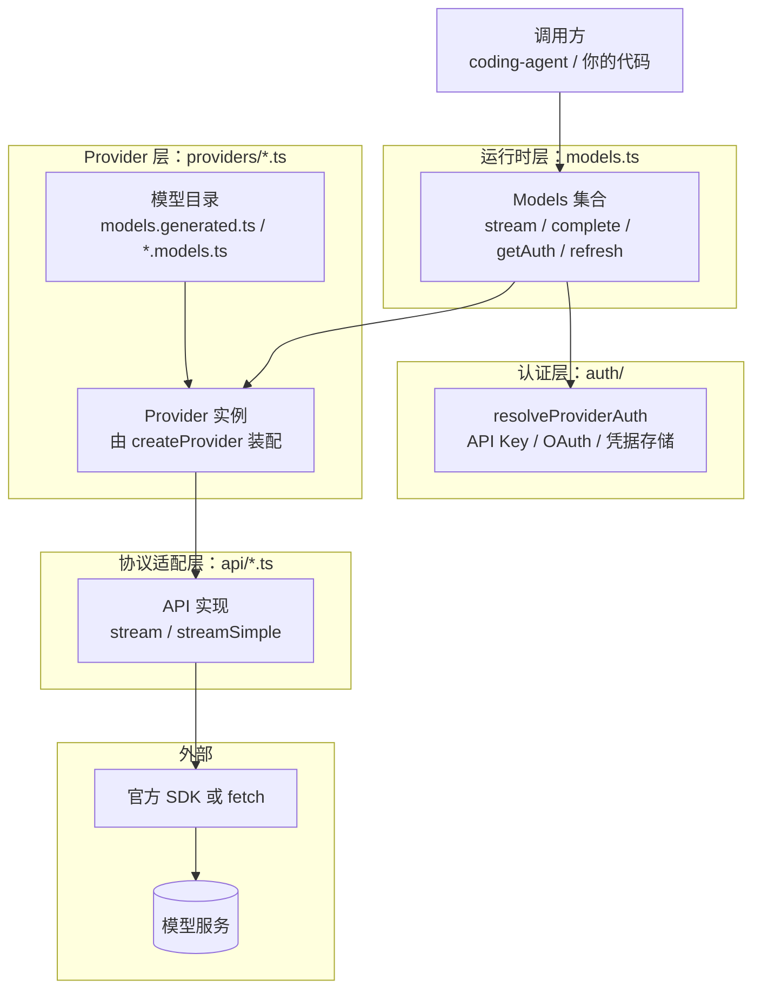
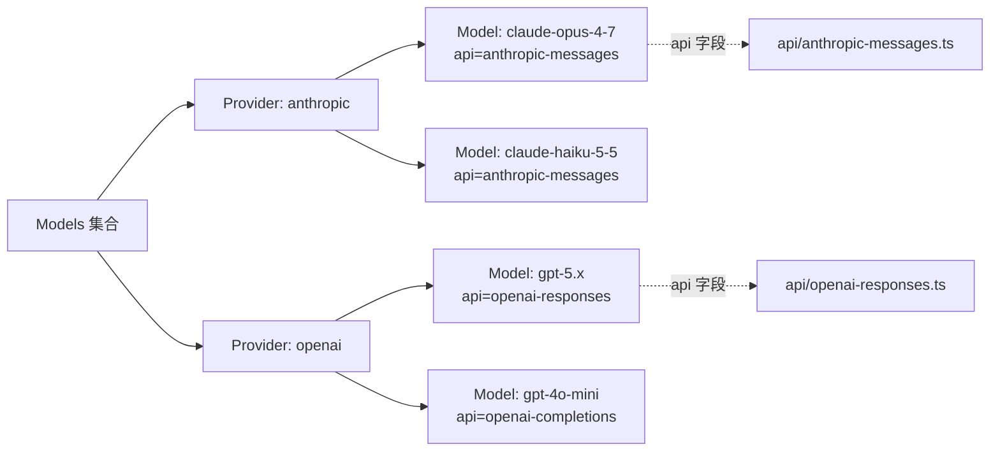

# pi-ai 源码学习指南（packages/ai）

> 本文面向第一次读 `packages/ai` 的开发者。目标是：先看清整体结构，再沿着一次真实请求逐层读到细节，最后能独立定位和修改代码。
>
> 基线：分支 `my_learning`，HEAD `c81f988b2`；`@earendil-works/pi-ai` 版本 `1.0.2`；`packages/ai/src` 最近一次源码改动为 `76dfb88f6`（per-thinking-level sampling parameters）。
>
> 本文所有结论都以 `packages/ai/src` 为准，不以 `dist/` 为准。`dist/` 只在第 14 章的实验中使用，并在那里注明。

---

## 0. 怎么用这份文档

**阅读顺序**（建议 3 轮）：

1. **第一轮（约 1 小时）**：读第 1–2 章和第 3 章的流程图。目标是能回答"一次请求经过哪几层"。
2. **第二轮（约 4–6 小时）**：打开源码，按第 3、4、5、6、7 章的 `文件:符号` 顺序读。每读完一节，合上书，用自己的话复述。
3. **第三轮（约 2 小时）**：做第 14 章的实验，再完成第 15 章的验收题。做不出来，说明第二轮漏了某一节。

**如何读源码引用**：格式为 `路径:符号`，路径相对于 `packages/ai/src/`。例如 `api/anthropic-messages.ts:stream` 表示 `packages/ai/src/api/anthropic-messages.ts` 中的 `stream` 函数。行号会随版本漂移，文中只在必要时给出行号，并以符号名为准。

**术语**：第一次出现的缩写和概念会在括号里解释；完整术语表见附录 B。

---

## 1. 全貌

### 1.1 pi-ai 解决什么问题

不同模型服务的 HTTP 接口、消息格式、流式事件、工具调用格式都不同。下面是同一件事（"模型调用了 `get_time` 工具"）在两家服务中的样子，只示意结构：

```text
Anthropic 流式事件：content_block_start { type: "tool_use", name: "get_time" }
                    content_block_delta { type: "input_json_delta", partial_json: "{\"tz\"" }
OpenAI Chat 流式：  choices[0].delta.tool_calls[0] = { function: { name: "get_time", arguments: "{\"tz\"" } }
```

如果上层应用（例如 `coding-agent`）直接处理这些差异，每接入一家服务都要改应用代码。`pi-ai` 的职责就是把这些差异收敛到一种统一的数据结构和事件协议里：

- 输入：统一的 `Context`（系统提示、消息、工具）和统一的 `Model`。
- 输出：统一的 `AssistantMessageEventStream`（一串标准事件，最后得到一条 `AssistantMessage`）。

### 1.2 分层架构



每一层只做一件事：

| 层 | 文件 | 回答的问题 | 不负责什么 |
|---|---|---|---|
| 运行时 | `models.ts`（`createModels`、`Models`） | 请求该交给哪个 Provider？认证怎么套进去？ | 不知道任何协议细节 |
| 认证 | `auth/*.ts` | 这次请求用哪个 Key / Token / 环境变量？过期了怎么刷新？ | 不发请求 |
| Provider | `providers/*.ts`（`createProvider`） | 这家服务有哪些模型？每个模型由哪个协议实现处理？ | 不解析协议帧 |
| 协议适配 | `api/*.ts` | 如何把请求转成该协议的 JSON，并把返回的流转成标准事件？ | 不关心用户用哪个 Provider |
| 工具与公共 | `utils/*.ts` | 消息如何回放、参数如何校验、错误如何分类？ | 不属于某一家服务 |

**为什么要分这么多层？** 因为有三种"一对多"关系：

- 一个**协议**可以被多个**服务**复用。例如 `openai-completions` 协议同时服务 OpenAI、DeepSeek、Groq、OpenRouter 等。协议代码只写一份，差异通过 `compat`（兼容性配置）和 `baseUrl` 处理。
- 一个**服务**可以提供多个**模型**，且模型之间可能用不同协议。
- 一个**模型**的能力（是否支持图片、思考强度）只在模型目录里声明，协议代码按声明行事。

### 1.3 目录地图

下面按"你最可能先打开"的顺序列出。文件数和行数来自当前版本，仅用于估算阅读量。

| 目录 / 文件 | 行数（约） | 作用 | 首读优先级 |
|---|---|---|---|
| `index.ts` | 48 | 核心入口，导出类型、`Models`、事件流、工具函数 | ★★★ |
| `types.ts` | 1172 | 全部公共类型：`Model`、消息、事件、选项、兼容性配置 | ★★★ |
| `models.ts` | 1256 | `Provider` 接口、`createProvider`、`createModels`、`Models` 运行时、成本计算、思考强度 | ★★★ |
| `utils/event-stream.ts` | 110 | `EventStream` 与 `AssistantMessageEventStream` | ★★★ |
| `api/lazy.ts` | 98 | `lazyStream` 与 `lazyApi`：同步返回流、异步加载协议模块 | ★★★ |
| `providers/all.ts` | 190 | 装配所有内置 Provider：`builtinModels()` | ★★ |
| `providers/anthropic.ts` | 90 | 一个典型 Provider 工厂，适合作为"模板" | ★★ |
| `providers/faux.ts` | 710 | 假 Provider：按脚本返回结果，用于测试与实验 | ★★ |
| `auth/types.ts` | 250 | 认证与凭据类型 | ★★ |
| `auth/resolve.ts` | 188 | 认证解析顺序与 OAuth 刷新锁 | ★★ |
| `auth/credential-store.ts` | 67 | 内存凭据存储（默认实现） | ★ |
| `utils/transcript.ts` | 237 | 系统消息回放、工具声明的比较与分流 | ★★ |
| `api/transform-messages.ts` | 235 | 跨模型回放前的消息改写 | ★★ |
| `api/anthropic-messages.ts` | 1639 | Anthropic 协议适配器（本文的深读样例） | ★★ |
| `api/openai-completions.ts` | 1734 | OpenAI Chat Completions 协议适配器（兼容面最广） | ★ |
| `api/openai-responses*.ts` | 约 1200 | OpenAI Responses 协议适配器 | ★ |
| `api/google-*.ts` | 约 1500（含 Vertex） | Gemini 与 Vertex 协议适配器 | ★ |
| `api/bedrock-converse-stream.ts` | 1373 | Amazon Bedrock Converse 协议适配器 | ★ |
| `utils/validation.ts` | 350 | 工具参数的 TypeBox 校验与类型强制转换 | ★★ |
| `utils/json-parse.ts` | 124 | 流式工具参数的部分 JSON 解析 | ★★ |
| `utils/retry.ts` | 252 | 重试分类与重试循环 | ★★ |
| `utils/overflow.ts` | 188 | 上下文溢出识别 | ★ |
| `models.generated.ts` | 309 | 生成的模型目录入口（不要手改） | ★ |
| `providers/data/*.json` | 42 个文件 | 模型目录的原始数据 | ★ |
| `cli.ts` | 124 | `pi-ai` 命令行工具 | ★ |
| `compat.ts` | 302 | 旧版全局 API（`getModel`、`stream`、`registerApiProvider` 等）的兼容层 | ★ |

### 1.4 包的对外入口

`package.json` 的 `exports` 字段决定了外部代码能 `import` 什么。关键入口如下：

| 入口 | 指向 | 用途 |
|---|---|---|
| `@earendil-works/pi-ai` | `dist/index.js` | 核心：类型、`Models`、事件流、校验工具，**无副作用**（不加载任何 Provider SDK） |
| `@earendil-works/pi-ai/providers/all` | `providers/all.ts` | 注册全部内置 Provider（`builtinModels()`） |
| `@earendil-works/pi-ai/providers/<id>` | `providers/<id>.ts` | 只要某一家 Provider，用于减小打包体积 |
| `@earendil-works/pi-ai/api/<name>` | `api/<name>.ts` | 直接调用某个协议实现 |
| `@earendil-works/pi-ai/models` | `models.ts` | `Models`、`createProvider` 等运行时 API |
| `@earendil-works/pi-ai/compat` | `compat.ts` | 旧版全局 API，为迁移保留 |
| `@earendil-works/pi-ai/oauth` | `oauth.ts` | 仅导出 OAuth 相关的**类型**（实现位于 `auth/oauth/`，按需加载） |
| `@earendil-works/pi-ai/utils/*` | `utils/*.ts` | 公共工具（如 `parseStreamingJson`） |

> 注意：`index.ts` 的注释写明"core only, side-effect free"。这是一条设计约束：只要改动 `index.ts` 引入的模块，就要确认它不会在导入时加载 SDK。`test/lazy-module-load.test.ts` 专门验证这一点。

### 1.5 三种模型类型

同一个 `Models` 集合里可以放三类模型，各自有一组操作：

| 类型 | TypeScript 类型 | 操作 | 典型用途 |
|---|---|---|---|
| 聊天模型 `chat` | `Model<TApi>` | `stream`、`complete`、`streamSimple`、`completeSimple` | 编码助手的主要对话 |
| 图像模型 `image` | `ImageModel<ImageApi>` | `generateImages` | 文生图 |
| 分类模型 `classifier` | `ClassifierModel<ClassifierApi>` | `classify` | 按结构化问题返回概率（例如安全分类） |

`chat` 是默认类型：没有 `type` 字段的模型就是聊天模型（`types.ts` 中 `Model.type?: "chat"`）。判断类型请用 `isModelType()`，不要直接比较字段。

---

## 2. 核心概念

先建立词汇。后面的章节会反复用到这些名字。

### 2.1 四个容易混淆的词：Model、Api、Provider、Models

| 词 | 是什么 | 例子 | 定义位置 |
|---|---|---|---|
| **Model** | 一条目录记录：某个服务上的某个模型，附带能力和价格 | `{ id: "claude-opus-4-7", provider: "anthropic", api: "anthropic-messages", contextWindow, cost, ... }` | `types.ts:Model` |
| **Api** | 协议名：决定用哪段代码发请求、解析响应 | `"anthropic-messages"`、`"openai-completions"` | `types.ts:KnownApi` |
| **Provider** | 运行时单元：一家服务的认证方式、模型列表、以及每种 `Api` 对应的实现 | `anthropicProvider()` | `models.ts:Provider` |
| **Models** | 集合：持有多个 Provider，对外提供统一的 `stream`、`getAuth`、`refresh` | `builtinModels()` | `models.ts:Models` |

用一句话串起来：**`Models` 集合里有多个 `Provider`；一个 `Provider` 持有多个 `Model`；每个 `Model` 通过 `api` 字段指向一个协议实现。**



> 注意：模型 ID 只在同一个 Provider 内唯一。跨 Provider 比较模型时，要同时比较 `provider` 和 `id`。`modelsAreEqual()`（`models.ts`）就是这么做的。

### 2.2 消息：四种 Message 与内容块

`types.ts` 定义了四种消息。它们是 `pi-ai` 对话记录的基本单位。

```text
SystemMessage      role: "system"      系统指令（可在对话中途出现，见第 7 章）
UserMessage        role: "user"        用户输入：文本，或文本 + 图片
AssistantMessage   role: "assistant"   模型输出：思考 + 文本 + 工具调用，附带 usage、stopReason
ToolResultMessage  role: "toolResult"  工具执行结果，通过 toolCallId 对应到某次工具调用
```

`AssistantMessage.content` 是内容块数组，块的种类有 3 种：

| 块类型 | 字段 | 含义 |
|---|---|---|
| `TextContent` | `type: "text"`、`text`、可选 `textSignature` | 普通文本。`textSignature` 保存服务端的消息 ID 等元数据 |
| `ThinkingContent` | `type: "thinking"`、`thinking`、可选 `thinkingSignature`、可选 `redacted` | 推理过程。`thinkingSignature` 是服务端的加密或签名数据，回放给同一个模型时需要原样带回 |
| `ToolCall` | `type: "toolCall"`、`id`、`name`、`arguments` | 工具调用。`arguments` 是已解析的 JSON 对象 |

用户消息和工具结果里还可以出现 `ImageContent`（`type: "image"`、`data` 为 base64、`mimeType`）。

**为什么 `AssistantMessage` 要带这么多字段？** 因为它既是"给用户看的回答"，又是"下一轮要回放给模型的历史"。例如：

- `thinkingSignature` 是服务端签名的思考内容。回放时缺少它，服务端通常会拒绝请求（具体行为取决于服务）。所以不能只保存思考文本。
- `api`、`provider`、`model` 记录了这条消息由谁生成。下一轮如果换了模型，`transform-messages.ts`（第 9 章）要据此决定是否改写。
- `stopReason` 决定消息是否可以安全回放。`error` 或 `aborted` 的消息通常会被跳过。

### 2.3 流式事件协议

流式调用的返回值是 `AssistantMessageEventStream`。它推送的事件类型定义在 `types.ts:AssistantMessageEvent`：

```text
start                              流开始，携带 partial（当前消息快照）
text_start / text_delta / text_end        文本块：开始 / 增量 / 结束
thinking_start / thinking_delta / thinking_end   思考块：同上
toolcall_start / toolcall_delta / toolcall_end   工具调用：同上（delta 是 JSON 片段）
done                               正常结束，携带 reason 与完整 message
error                              失败或中止，携带 reason（aborted 或 error）与 error 消息
```

协议有三条硬约束（来自 `types.ts` 中的注释）：

1. **成功的流一定以 `start` 开始，以 `done` 结束。** `start` 之前不能有任何内容事件。
2. **失败的流以 `error` 结束**，且 `error.stopReason` 只能是 `"aborted"` 或 `"error"`。
3. **`partial` 是"当前快照"，不是"事件发生时的历史快照"。** 同一个对象会被不断修改，消费者需要在事件到达时立即读取或复制。

这些约束的意义是：**消费者只需要处理一个事件循环，就能覆盖成功、失败、取消三种结局。** 不需要用 try/catch 包住每一次迭代。

### 2.4 Usage、成本与 StopReason

`Usage` 记录一次请求的 token 数和费用：

```text
input        本次输入的非缓存 token
output       本次输出 token（包括推理 token）
cacheRead    从提示词缓存读取的 token
cacheWrite   写入提示词缓存的 token（cacheWrite1h 是其中 1 小时档的部分）
reasoning    推理 token，是 output 的子集（仅部分服务提供）
totalTokens  总数，由 pi-ai 自行计算
cost         按模型价格算出的美元费用
```

`cost` 不由服务端返回，而是由 `models.ts:calculateCost` 按 `model.cost` 计算。该函数有两个要点：

- **阶梯价格**：`model.cost.tiers` 中，输入 token 数超过某个阈值的最高档适用于整个请求。
- **1 小时缓存写入按 2 倍输入价计费**（Anthropic 的规则，代码注释中有说明）。

`StopReason` 表示"模型为什么停下"：

| 值 | 含义 | 上层应该怎么做 |
|---|---|---|
| `stop` | 模型正常结束 | 结束本轮 |
| `toolUse` | 模型请求调用工具 | 执行工具，再发起下一轮 |
| `length` | 达到输出上限 | 可能需要压缩上下文或提高 `maxTokens` |
| `error` | 出错 | 按第 12 章分类，决定是否重试 |
| `aborted` | 调用方取消 | 不重试 |
| `deferred` | 服务端异步处理中，返回了一个句柄 | 之后用 `fetchDeferred` 取回结果 |
| `pending` | 只在流进行中使用，不会出现在最终消息上 | — |

### 2.5 思考强度 ThinkingLevel

"思考强度"是 pi 的统一概念，取值为：

```text
ModelThinkingLevel = "off" | "minimal" | "low" | "medium" | "high" | "xhigh" | "max"
```

不同服务的表示完全不同：Anthropic 用 `effort` 字符串，OpenAI 用 `reasoning_effort`，Gemini 用 `thinkingLevel` 或 token 预算。模型目录通过 `thinkingLevelMap` 做映射：

```text
thinkingLevelMap: {
  high: "xhigh",     // pi 的 high 映射为服务端的 "xhigh"
  xhigh: null,       // null 表示该模型不支持这个强度
  // 未写的键 = 使用协议默认映射
}
```

`models.ts` 中的两个函数决定"UI 上能选哪些强度"与"用户选了不支持的强度怎么办"：

- `getSupportedThinkingLevels(model)`：`reasoning: false` 时只返回 `["off"]`；映射为 `null` 的级别被剔除；`xhigh` 和 `max` 只有显式映射了才出现。
- `clampThinkingLevel(model, level)`：请求的级别不支持时，先向更高的级别找，再向更低的级别找。例如模型不支持 `xhigh`，就退到 `high`。

---

## 3. 一次请求的完整旅程（主线）

这一章是全文的主线。读完后，你应该能在源码中逐步走完一次 `stream` 调用。

### 3.1 调用示例

以下代码来自 `README.md` 的思路，但使用 faux（假）Provider，不需要真实 API Key（第 14 章会真正运行它）：

```ts
import { createModels, fauxProvider, fauxAssistantMessage, fauxText } from "@earendil-works/pi-ai";

const faux = fauxProvider();                       // 假 Provider：按脚本回答
faux.setResponses([fauxAssistantMessage([fauxText("你好")])]);

const models = createModels();                     // 空的 Models 集合
models.setProvider(faux.provider);

const s = models.stream(faux.getModel(), {         // 第 1 步：发起调用，同步返回流
  systemPrompt: "你是助手",
  messages: [{ role: "user", content: "hi", timestamp: Date.now() }],
});
for await (const event of s) console.log(event.type);   // 第 2 步：消费事件
const message = await s.result();                        // 第 3 步：取最终消息
```

### 3.2 十步走

下面的步骤对应真实代码。左边是调用栈的深度，缩进越多越靠内层。

```text
models.stream(model, context, options)                    models.ts:ModelsImpl.stream
├─ normalizeContext(context)                              utils/transcript.ts:normalizeContext
├─ lazyStream(model, setup)  ── 立即返回 outer 流          api/lazy.ts:lazyStream
│   └─ (异步) setup():
│       ├─ requireChatProvider(model)                     models.ts:requireChatProvider
│       ├─ applyAuth(model, options)                      models.ts:applyAuth
│       │   └─ getAuth → resolveProviderAuth              auth/resolve.ts:resolveProviderAuth
│       ├─ provider.stream(requestModel, transcript, requestOptions)
│       │   └─ dispatch(model) 按 model.api 选实现        models.ts:createProvider 内的 dispatch
│       │       └─ lazyApi 的 load()：首次 import 协议模块  api/lazy.ts:lazyApi
│       │           └─ anthropic-messages.ts:stream       （协议实现）
│       │               ├─ createClient / buildParams
│       │               ├─ retryProviderRequest(create)   （HTTP 请求）
│       │               ├─ push start
│       │               ├─ 逐个解析 SSE 事件 → push text_*/thinking_*/toolcall_*
│       │               └─ push done 或 error
│       └─ forwardStream(outer, inner)                    api/lazy.ts:forwardStream
│           把 inner 的每个事件 push 给 outer；inner 结束后调用 outer.end()
└─ return outer                                           调用方拿到的是 outer
```

逐步解释：

**第 1 步：`models.stream` 做什么？** `ModelsImpl.stream`（`models.ts`）只做两件事：把调用方的 `Context` 归一化成 `TranscriptContext`，然后把真正的工作交给 `lazyStream`。它**不会 `await`**，因此调用方立即拿到一个流对象。

**第 2 步：为什么要 `normalizeContext`？** 调用方的 `Context` 有 `systemPrompt` 和 `tools` 两个顶层字段，但协议层需要统一的"系统消息"形式。`normalizeContext` 把它们折成首条 `SystemMessage`，并返回一个带品牌标记（`unique symbol`）的类型 `TranscriptContext`。类型系统因此保证：**协议层拿到的一定是归一化后的上下文。** 详见第 7 章。

**第 3 步：为什么要 `lazyStream`？** 认证解析和模块加载都是异步的，但调用方需要立即拿到流。`lazyStream`（`api/lazy.ts`）先创建一个外层流 `outer` 并返回，再在后台执行 `setup()`。`setup()` 的结果如果是一个内层流 `inner`，就由 `forwardStream` 把 `inner` 的事件转发到 `outer`。

**第 4–5 步：认证。** `applyAuth` 调用 `getAuth`，进而调用 `resolveProviderAuth`。它决定这次请求用哪个 Key、哪个 Header、哪个 `baseUrl`。第 5 章详述。

**第 6 步：Provider 分派。** 一个 Provider 可以服务多种协议（例如 `openai` 同时有 `openai-responses` 和 `openai-completions`），所以 Provider 内部有一个分派：按 `model.api` 找到对应的 `ProviderStreams` 实现。找不到时，返回一个 `error` 事件，而不是抛异常（第 4 章）。

**第 7 步：懒加载协议模块。** Provider 工厂里写的是 `api: anthropicMessagesApi()`，它返回的是 `lazyApi(() => import("./anthropic-messages.ts"))`。这意味着：**只有第一次真正发请求时，才会加载 Anthropic SDK 和协议代码。** 这是包体积与启动速度的关键设计，第 4 章详述。

**第 8 步：协议实现。** `anthropic-messages.ts:stream` 的骨架是：

1. 创建 `AssistantMessageEventStream`，**立即返回**，然后在一个后台 `async` 立即执行函数里干活。
2. 创建 HTTP 客户端、构造请求体（`buildParams`）。
3. 调用 `onPayload` 钩子（允许调用方查看或替换请求体）。
4. 用 `retryProviderRequest` 发出请求。
5. 调用 `onResponse` 钩子，推送 `start` 事件。
6. 逐个读取 SSE 事件，把 Anthropic 的 `content_block_*`、`message_delta` 翻译成 pi 的事件。
7. 结束时推送 `done`；任何异常都被 `catch` 转成 `error` 事件。

**第 9 步：内层流到外层流。** `forwardStream` 把 `inner` 的每个事件 `push` 给 `outer`，结束后调用 `outer.end(await inner.result())`。调用方一直只和 `outer` 打交道。

**第 10 步：取结果。** `s.result()` 返回一个 Promise，在流收到 `done` 或 `error` 事件时 resolve。`models.complete()` 只是 `stream().result()` 的简写。

### 3.3 为什么是"两层流"？

看上面的第 3 步和第 9 步，你会发现调用链里有两个 `AssistantMessageEventStream`：`outer`（由 `lazyStream` 创建）和 `inner`（由协议实现创建）。这看起来多余，但它解决了一个问题：

- **问题**：调用方必须在调用 `stream()` 的那一刻拿到流对象。但协议实现要等认证和模块加载完成才能创建它自己的流。
- **解决**：先创建一个"占位"的 `outer`，等 `inner` 准备好后再转发。

代价是多一次事件转发，但事件数量很少（通常几十到几百个），开销可以忽略。

### 3.4 失败路径

同一个调用可能在三个地方失败。它们的处理方式不同：

| 失败位置 | 例子 | 结果 |
|---|---|---|
| 异步 setup 阶段 | 未知 Provider、认证失败、模块加载失败 | `lazyStream` 捕获，推送 `error` 事件，`stopReason: "error"`，**不抛异常** |
| 协议阶段 | HTTP 500、SSE 中断、用户取消 | 协议实现的 `catch` 推送 `error` 事件；取消时 `stopReason: "aborted"` |
| 直接调用协议实现的 `streamSimple`（绕过 `Models`） | 认证缺失 | **同步抛异常**（`anthropic-messages.ts:streamSimple` 先调用 `assertRequestAuth`，还没进入后台流程） |

**这意味着：经过 `Models` 调用时，调用方只需要检查最终 `stopReason`。** 只有绕过 `Models` 直接调用协议实现时，才需要额外处理同步异常。`types.ts:StreamFunction` 的注释对这一约定有完整说明。

> 实验验证：第 14 章的实验 1 会故意使用一个不存在的 Provider，观察到的确是 `start` 之前的 `error` 事件，而不是异常。

---

## 4. 运行时：models.ts

`models.ts` 是 pi-ai 最核心的文件，约 1250 行，包含五个部分：`Provider` 接口、`createProvider` 工厂、`Models` 接口与 `ModelsImpl` 实现、成本与思考强度函数，以及刷新逻辑。

### 4.1 Provider 接口

`Provider` 是一家服务在运行时的样子（`models.ts:Provider`）。它的字段可以按用途分成四组：

```text
身份        id、name、baseUrl、headers
认证        auth: { apiKey?, oauth? }          至少有一个
模型列表    getModels()、getAllModels()、refreshModels?()、filterModels?()、filterAllModels?()
操作        stream()、streamSimple()          必有（聊天模型）
            fetchDeferred()、cancelDeferred() 可选（异步/延迟响应）
            generateImages()                  可选（图像模型）
            classify()                        可选（分类模型）
```

设计要点：

- **`getModels()` 必须同步、不能抛异常。** `Models` 在汇总时会捕获异常并把它当作"没有模型"，这样一家服务出错不会影响其他服务的列表。
- **`auth` 是必填的。** 即使是纯本地服务（例如 llama.cpp）或只依赖环境变量的服务，也必须声明 `auth.apiKey`，用它的 `resolve()` 报告"是否已配置"。没有这一项，`Models` 就无法判断该 Provider 能不能用。
- **`stream` 接收的是归一化后的 `TranscriptContext`**，不是调用方原始的 `Context`。Provider 的实现无需再处理 `systemPrompt`。

### 4.2 createProvider：从零件装配 Provider

内置 Provider 和 `models.json` 中的自定义 Provider 都通过 `createProvider` 生成（`models.ts:createProvider`）。它接收一组"零件"：

```text
id, name, baseUrl, headers           身份
auth                                 认证方法
models                               静态模型目录（类型为 ProviderModel 数组）
fetchModels?                         动态模型目录的拉取函数
filterModels? / filterAllModels?     按凭据过滤可用模型
api                                  聊天实现：单个 ProviderStreams，或按 model.api 分派的映射
images? / classifiers?               图像与分类实现的映射
```

`createProvider` 做了三件事：

1. **校验**：至少提供一种实现（`api`、`images` 或 `classifiers`），否则抛错。
2. **分派**：`dispatch(model, run)` 根据 `model.api` 找实现。找不到就返回一个 `error` 事件（错误类型为 `ModelsError("stream", ...)`）。
3. **合并动态模型**：`currentModels()` 把静态的 `models` 与 `fetchModels` 拉到的动态结果合并。同一个 `(type, id)` 的动态条目会覆盖静态条目。

**示例**：`providers/anthropic.ts:anthropicProvider` 的结构：

```ts
createProvider({
  id: "anthropic",
  name: "Anthropic",
  baseUrl: "https://api.anthropic.com",
  auth: {
    apiKey: anthropicApiKeyAuth(),                 // API Key 与环境变量
    oauth: lazyOAuth({ name: "...", load: ... }),  // Claude Pro/Max 订阅登录（按需加载）
  },
  models: Object.values(ANTHROPIC_MODELS),         // 来自 anthropic.models.ts（生成的目录）
  api: anthropicMessagesApi(),                     // 懒加载的协议实现
});
```

这个文件很短，却包含了一个 Provider 的全部信息。读懂它，就读懂了"如何新增 Provider"的骨架（第 16 章）。

### 4.3 Models 集合：统一入口

`createModels()` 返回一个 `MutableModels`，即可增删 Provider 的集合（`models.ts:ModelsImpl`）。`builtinModels()`（`providers/all.ts`）是它的一个预装版本，注册了全部内置 Provider。

`Models` 接口的方法可以分为五组：

| 组 | 方法 | 说明 |
|---|---|---|
| 目录（同步） | `getModels`、`getModel`、`getAllModels`、`getModelsOfType` | 读取最近一次已知的模型列表，不发网络请求 |
| 刷新（异步） | `refresh` | 对动态 Provider 拉取最新模型列表 |
| 认证 | `getAuth`、`checkAuth`、`login`、`logout`、`getAvailable` | 解析、检查、登录、登出、过滤已配置的模型 |
| 请求 | `stream`、`complete`、`streamSimple`、`completeSimple` | 聊天请求 |
| 延迟响应与其他类型 | `streamDeferred`、`fetchDeferred`、`cancelDeferred`、`generateImages`、`classify` | 异步句柄与非聊天操作 |

请求类方法的共同步骤在 `applyAuth` 中完成（`models.ts:applyAuth`）。它的合并规则是：

1. 先解析认证（`getAuth`）。未配置时抛 `ModelsError("auth", "Provider is not configured")`。
2. 合并 Header：认证给出的 Header 与调用方的 `headers` 合并，**调用方的值优先**，且 Header 名不区分大小写。
3. 如果认证给出了 `baseUrl`，用它覆盖模型的 `baseUrl`。
4. 合并环境变量：认证给出的 `env` 与调用方的 `env` 合并，调用方优先。
5. 最后执行 `transformHeaders`（如果调用方提供）。它是 `Models` 独有的钩子，在所有合并之后运行，因此能看到最终的 Header。

### 4.4 懒加载：lazyStream 与 lazyApi

这两个函数位于 `api/lazy.ts`，是理解"为什么包能做到按需加载"的关键。

**`lazyStream(model, setup)`**：同步返回一个流，异步执行 `setup`。

```ts
export function lazyStream(model, setup) {
  const outer = new AssistantMessageEventStream();
  setup()
    .then((inner) => forwardStream(outer, inner))
    .catch((error) => {
      const message = createSetupErrorMessage(model, error);
      outer.push({ type: "error", reason: "error", error: message });
      outer.end(message);
    });
  return outer;
}
```

它把"任何 setup 阶段的异常"都变成一个 `error` 事件，并保证 `result()` 能拿到一条带 `errorMessage` 的消息。

**`lazyApi(load)`**：返回一个 `ProviderStreams`，其 `stream` 方法在被调用时才执行 `load()`。`load` 通常是 `() => import("./xxx.ts")`。

```ts
export const anthropicMessagesApi = (): ProviderStreams =>
  lazyApi(() => import("./anthropic-messages.ts"));
```

- 动态 `import()` 在 Node 和打包器中都会产生一个独立的代码块，首次调用时才下载或加载。
- 模块由运行时的 import 缓存去重，因此多次调用只加载一次。
- `lazyApi` 的 `capabilities` 参数声明实现是否支持 `fetchDeferred` / `cancelDeferred`。这样即使模块还没加载，`createProvider` 也能正确判断 Provider 支持哪些操作。

> 注意：`providers/*.ts` 中凡是需要 Node 专属能力（例如读取 AWS 凭据文件）的，都用了"打包器不可见的动态 import"（变量形式的模块名），避免把 Node 代码打进浏览器包。`auth/helpers.ts:lazyOAuth` 的注释有说明。

### 4.5 刷新与动态目录

有些服务的模型列表会变（例如 OpenRouter、Radius 网关），pi-ai 用 `refresh()` 处理它。它的核心思想是**先恢复缓存，再联网更新**：

```text
refresh():
  对每个有 refreshModels 的 Provider（可按 providers 参数过滤）：
    1. 读取凭据（失败不致命，记下错误）
    2. 调用 refreshModels，允许网络 = false：从本地存储恢复上次的模型列表
    3. 若允许网络且凭据有效：
         a. 必要时刷新 OAuth 令牌
         b. 调用 refreshModels，允许网络 = true：拉取新列表并发布
  返回 { aborted, errors }，单个 Provider 的失败不会导致整个 refresh 抛异常
```

**为什么要"先恢复"？** 启动时如果网络很慢，用户要等到拉取完成才能看到模型列表。先用本地缓存恢复，界面立即可用，后台再更新。

**为什么发布要带"代数"检查？** 同一个 Provider 可能被并发刷新（例如用户切换了凭据）。`publishProviderModels` 只接受当前代数的结果，旧结果到达时直接丢弃。`supersedeProviderRefresh` 负责递增代数并中止旧的刷新。这是典型的"防止过期结果覆盖新状态"模式。

---

## 5. 认证层：auth/

认证回答三个问题：**用什么凭据？凭据过期了怎么办？凭据存在哪里？** 对应三个概念：

| 概念 | 类型 | 文件 |
|---|---|---|
| 认证方法（怎么拿到凭据） | `ProviderAuth` = `ApiKeyAuth` 和/或 `OAuthAuth` | `auth/types.ts` |
| 凭据（拿到后存的数据） | `Credential` = `ApiKeyCredential` 或 `OAuthCredential` | `auth/types.ts` |
| 凭据存储（存在哪里） | `CredentialStore` 接口；默认 `InMemoryCredentialStore` | `auth/credential-store.ts` |

### 5.1 两种认证方法

```text
ApiKeyAuth
  name            显示名，例如 "Anthropic API key"
  login?()        交互式录入（可选；纯环境变量的服务没有）
  check?()        无副作用的可用性检查（可选）
  resolve()       解析：凭据优先，其次环境变量等环境来源

OAuthAuth
  login()         完整登录流程（浏览器、设备码等）
  refresh()       用 refresh token 换新的 access token（需要网络）
  toAuth()        从凭据派生请求认证（无副作用）
```

`refresh` 与 `toAuth` 的拆分是一个重要设计：**刷新会改变存储中的凭据，派生认证则不会。** `Models` 只在锁内调用 `refresh`，然后把结果写回存储；`toAuth` 可以随时调用。GitHub Copilot 就利用了这一点：它的 `toAuth` 会根据凭据里的地址派生 `baseUrl`。

### 5.2 认证解析顺序

`auth/resolve.ts:resolveProviderAuth` 决定"这次请求用哪份认证"。顺序如下：

```text
1. 调用方显式传入 apiKey（options.apiKey）
      → 直接用 ApiKeyAuth.resolve，凭据使用调用方的 key
2. 存储中有凭据（credentials.read）
      → 类型是 oauth 且 provider 有 oauth：走 OAuth 解析（过期则刷新）
      → 类型是 api_key 且 provider 有 apiKey：走 API Key 解析
      → 类型不匹配：返回 undefined（不会悄悄回退到环境变量）
3. 没有存储的凭据
      → 环境来源（ambient）：环境变量、AWS 配置文件、ADC 文件等
```

源码注释写明了一条规则："**A stored credential owns the provider: ambient/env is consulted only when nothing is stored.**" 这条规则的理由是：

- **问题**：用户在应用里登录了 A 账号，但 shell 里还设着 B 账号的环境变量。如果先看环境变量，请求会悄悄用 B 账号，用户完全不知道。
- **解决**：一旦有存储的凭据，就只用它。环境变量只在"什么都没存"时才生效。

同样，OAuth 刷新失败时不会回退到环境变量，而是抛出 `ModelsError("oauth", ...)`，并保留存储中的凭据，等用户重新登录或网络恢复后重试。

### 5.3 OAuth 刷新：双重检查加锁

OAuth 的 access token 有效期很短（通常几十分钟到几小时）。问题是：**如果同时有 10 个请求发现 token 快过期，它们都去刷新，refresh token 可能被服务端轮换（旧的立即失效），后面的请求就会失败。**

`resolveStoredOAuth`（`auth/resolve.ts`）的做法是"双重检查加锁"：

```text
1. 乐观检查：token 距过期不足 5 分钟（DEFAULT_OAUTH_MINIMUM_VALIDITY_MS）？否则直接用
2. 进入 credentials.modify(providerId, fn)  ← 锁，同一 Provider 串行
3. 在锁内再检查一次：如果别的请求已经刷新过了（expiresSoon 为假），直接返回新凭据
4. 调用 oauth.refresh(current, signal)，超时 15 秒
5. modify 把新凭据写回存储，然后释放锁
6. 调用 oauth.toAuth(credential) 派生请求认证
```

**关键点**：第 3 步的"锁内重查"是必须的。没有它，就会出现"两个请求都通过了第 1 步，然后先后刷新两次"的问题。

`CredentialStore.modify` 是唯一的写入路径，它保证对同一个 `providerId` 的修改串行执行。`InMemoryCredentialStore` 的实现是一个 Promise 链：每个任务等待前一个任务结束（`enqueue`）。跨进程的互斥需要持久化存储自己实现（例如文件锁），接口注释里提到了这一点。

### 5.4 懒加载 OAuth 实现

OAuth 实现通常需要 Node 专属代码（本地回调服务器、PKCE 计算、打开浏览器）。为了不把这些代码打进浏览器包，`auth/helpers.ts:lazyOAuth` 把实现包装成按需加载的形式：

```ts
oauth: lazyOAuth({
  name: "Anthropic (Claude Pro/Max)",
  isSubscription: true,
  load: loadAnthropicOAuth,   // 第一次 login/refresh/toAuth 时才执行
});
```

`load` 只在首次需要时执行，结果被缓存在闭包的 `promise` 中。

### 5.5 环境变量与 API Key 的默认规则

`auth/helpers.ts:envApiKeyAuth(name, envVars)` 是最常见的 API Key 实现：

```text
resolve():
  1. 凭据里有 key → 直接用（来源 "stored credential"）
  2. 依次检查 envVars 中的变量，第一个非空的生效（来源为变量名）
  3. 都没有 → undefined（表示未配置）
```

Anthropic 的实现（`providers/anthropic.ts:anthropicApiKeyAuth`）在此基础上多了几层：`ANTHROPIC_AUTH_TOKEN` 作为 `Authorization: Bearer` 头发送（而不是 `x-api-key`）；最后还有"工作负载身份联合"（federation）：如果配置了身份令牌文件等变量，就返回空的 `auth`，由 Anthropic SDK 自己换取短期令牌。这里的注释解释了顺序的理由："Last in line so keys and ANTHROPIC_AUTH_TOKEN keep winning, as in the SDK."

---

## 6. 事件流：EventStream

所有流式调用都返回 `EventStream`（`utils/event-stream.ts`）或它的子类 `AssistantMessageEventStream`。它是一个**生产者–消费者队列**，同时支持 `for await` 和 `result()` 两种读取方式。

### 6.1 它要解决的问题

假设协议实现在一个后台任务里不停 `push` 事件，而消费者在另一个任务里用 `for await` 读取。两种速度不一致：

- **生产快、消费慢**：事件需要排队，否则会丢失。
- **消费快、生产慢**：消费者需要等待，不能忙轮询。

`EventStream` 用两个队列解决这个问题：

```text
queue    尚未被读取的事件（生产快时积累）
waiting  正在等待事件的消费者（消费快时积累）

push(event):
  若 done → 忽略
  若 event 是终止事件 → done = true，resolve 最终结果
  若有等待的消费者 → 直接交给它
  否则 → 放入 queue

[Symbol.asyncIterator]:
  循环：
    queue 非空 → yield 队首
    done      → 结束
    否则      → 登记为 waiting，挂起直到 push 或 end 唤醒
```

`FifoQueue` 是一个双栈实现的队列：入队压 `incoming`，出队时若 `outgoing` 为空则把 `incoming` 整体倒过来。这样入队和出队都是摊还 O(1)。

### 6.2 终止条件

`AssistantMessageEventStream` 的终止条件是 `done` 或 `error` 事件（`utils/event-stream.ts`）。终止时：

- `done` 的最终结果是 `event.message`；
- `error` 的最终结果是 `event.error`。

两者都会 resolve `result()` 返回的 Promise。之后的 `push` 被忽略（`if (this.done) return`），所以**同一个流不会出现两个结局**。

`end(result?)` 是另一条结束路径，通常在协议实现已经推送了终止事件之后调用。它会唤醒所有还在等待的消费者，让它们结束循环。

### 6.3 消费的两种方式

```ts
// 方式一：边读边处理（适合展示进度）
for await (const event of s) { /* 逐个处理 */ }

// 方式二：只要最终结果（适合后台任务）
const message = await s.result();
```

两种方式可以同时用：先 `for await` 消费完所有事件，`result()` 仍然可以取到最终消息，因为它的 Promise 在终止事件时已经 resolve。

> 常见误区：只调用 `result()` 而不消费事件。这是允许的，流会在内部排队所有事件直到结束。但如果事件很多，内存占用会随之增长。长对话里更推荐边消费边处理。

---

## 7. 请求上下文：transcript 与系统消息回放

这一章讲一个容易被忽视、却影响很大的设计：**系统提示和工具列表不是一次性的，它们可以在对话中途变化。**

### 7.1 问题：对话中途改变工具

假设 coding-agent 在第 5 轮后加载了一个新的 MCP 工具。如果系统提示和工具列表只能在开头设置一次，就有两种坏选择：

- 重建整个对话，把所有历史重新发送（浪费缓存，且历史可能已被压缩）；
- 忽略新工具（模型不知道它存在）。

pi-ai 的解法是：**允许在对话中间插入 `SystemMessage`，它可以追加指令、替换或删除命名的提示段、增加或移除工具。**

```text
SystemMessage {
  role: "system",
  content: "追加的指令文本",          // 追加到当前提示之后
  sections: { "git-rules": "..." },   // 按名字替换；值为 null 则删除
  toolsAdded: [Tool...],              // 新增工具（完整定义）
  toolsRemoved: [{ name }],           // 移除工具
  timestamp
}
```

### 7.2 回放规则

`utils/transcript.ts` 实现了"回放"：从头到尾读所有系统消息，得出当前状态。

- `content`：按顺序追加，用空行连接。
- `sections`：按名字覆盖；值为 `null` 表示删除该段。
- 工具：先处理 `toolsRemoved`，再处理 `toolsAdded`。同名工具后来的定义覆盖先前的。

`getCurrentSystemMessage` 把整个历史折叠成一条"当前的"系统消息。

### 7.3 两种发送方式

不同服务对中途系统消息的支持不同，因此协议实现有两种选择，由 `resolveTranscript` 决定：

| 方式 | 条件 | 做法 |
|---|---|---|
| 原位发送 | 模型声明 `supportsMidConvoSystemMessages: true` | 中途的系统消息原样保留在对话中 |
| 折叠发送 | 不支持 | `collapseSystemMessages`：丢弃中途的系统消息，把回放后的结果放在最前面 |

折叠的代价是：**修改之前的对话历史发送给服务时，系统提示已经被"改写"成最终状态。** 折叠会改变发送给服务端的前缀，可能影响提示缓存（第 13 章）。因此兼容性配置里的 `supportsMidConvoSystemMessages` 默认为 `false`，只有确认支持的模型才打开。

### 7.4 工具的声明与分流

工具定义有两条路径（`utils/transcript.ts:resolveTranscriptTools`）：

- **顶层发送**：请求的 `tools` 字段包含当前完整的工具列表。这是最通用的方式。
- **原位追加**：初始工具放在顶层，之后新增的工具作为 `toolsAdded` 出现在对话中间。这需要服务支持（例如 Anthropic 的 `inline-tools` 测试版）。

只有在"没有删除、没有同名重定义"的历史下才能使用原位追加。`hasNonAdditiveToolChanges` 负责这个判断：只要历史里出现过删除或重定义，就退回到顶层发送完整列表。

`getToolStateChanges(previous, current)` 比较两个工具状态，输出 `toolsAdded` 和 `toolsRemoved`。注意：**工具定义变了，等价于"先删除再添加"。** 比较使用 `toToolDeclaration` 的 JSON 序列化结果，而不是深比较对象，这样可以避免引入额外依赖（源码注释中有说明）。

### 7.5 思考：为什么不直接用 `messages[0]` 当系统提示？

因为 `messages[0]` 只是"最初的"系统提示，而不是"当前的"。如果你直接读它，就会忽略之后所有的追加与替换。正确做法是调用 `getCurrentSystemMessage`（回放全部）或 `getCurrentSystemPrompt`（只取文本）。

---

## 8. 工具：定义、调用与参数校验

### 8.1 定义一个工具

工具用 TypeBox 声明参数（TypeBox 是一个把 JSON Schema 写成 TypeScript 代码的库，`Type.Object`、`Type.String` 等函数返回 JSON Schema 对象）：

```ts
const tool: Tool = {
  name: "get_time",
  description: "获取当前时间",
  parameters: Type.Object({
    timezone: Type.Optional(Type.String({ description: "IANA 时区名" })),
  }),
};
```

`Tool` 在 `types.ts` 中只有四个字段：`name`、`description`、`parameters`（一个 `TSchema`）、可选的 `constrainedSampling`（要求服务端按 schema 约束生成，见 `types.ts:ConstrainedSamplingConfig`）。

**注意**：`Tool` 只是"声明"，pi-ai 不会执行工具。执行由上层（coding-agent）负责。pi-ai 只负责：把声明发给模型、把模型返回的 `ToolCall` 解析出来、并在需要时校验参数。

### 8.2 流式参数的解析：partial JSON

模型返回工具参数时是一段一段的 JSON 文本（例如 `{"tz"` → `{"timezone": "UT` → `{"timezone": "UTC"}`）。在完成之前，pi-ai 必须给出一个"当前能解析的"对象，供 UI 展示。

`utils/json-parse.ts:parseStreamingJson` 处理这个问题：

```text
parseStreamingJson(partial):
  空字符串       → {}
  能完整解析     → 结果
  能修复后解析   → 结果（修复如未转义的控制字符、非法反斜杠）
  能按"部分 JSON"解析 → 结果（用 partial-json 库补全未闭合的结构）
  以上都失败     → {}
```

协议实现在每个 `input_json_delta` 到达时都调用它（`api/anthropic-messages.ts:stream`，`block.arguments = parseStreamingJson(block.partialJson)`）。`toolcall_end` 时再解析一次完整文本，并删除临时缓冲区 `partialJson`，确保持久化的消息里只有解析结果。

### 8.3 参数校验：validateToolArguments

模型返回的参数不一定符合 schema（类型错误、字符串形式的数字等）。`utils/validation.ts:validateToolArguments` 负责检查和修正。它的步骤是：

```text
1. structuredClone 参数：不修改原始对象
2. normalizeOptionalNulls：可选且不可为 null 的字段，值为 null 时删除
3. Value.Convert（TypeBox）：按 schema 做类型转换，例如 "5" → 5
4. 如果 schema 不是 TypeBox 生成的（纯 JSON Schema），再做一轮 coerceWithJsonSchema：
   字符串与数字/布尔互转、null 转为空值，递归处理对象、数组、anyOf/oneOf/allOf
5. validator.Check(args)：通过则返回修正后的参数
6. 不通过：抛出 Error，列出每个出错路径和模型返回的原始参数
```

**为什么要先转换再检查？** 因为很多模型会把数字写成字符串（`"5"`），严格检查会误判。转换让我们接受"语义正确但类型略有偏差"的输入，同时仍然拒绝真正错误的输入。`test/validation.test.ts` 锁定了这些规则的边界。

`validateToolCall(tools, toolCall)` 是便捷入口：按名字找到工具，再调用 `validateToolArguments`。找不到工具时抛出 `Tool "xxx" not found`。

> 注意：校验只在上层调用。pi-ai 的协议实现不会自动校验，它把解析结果原样放进 `ToolCall.arguments`。这一点在阅读 coding-agent 的工具执行代码时很容易误解。

### 8.4 Schema 的小技巧：StringEnum

`utils/typebox-helpers.ts:StringEnum` 生成 `{ type: "string", enum: [...] }`，而不是 TypeBox 默认的 `anyOf` + `const`。原因是部分服务（主要是 Google）不接受 `anyOf` 形式的枚举。这是一个"为了兼容性改写 schema 形状"的典型例子，阅读时注意区分"逻辑相同、形状不同"的两种写法。

---

## 9. 跨模型回放：transform-messages

### 9.1 问题

用户先用 Claude 对话，中途切换到 GPT。此时历史里有 Claude 生成的消息：它的思考块带有 Anthropic 的签名，工具调用 ID 格式是 `toolu_xxx`。直接把这些发给 GPT，会出现什么？

- **思考块的签名**：GPT 无法验证，报错或被拒绝；
- **工具调用 ID**：OpenAI Responses 的 ID 可能超过 450 个字符并包含 `|`，而 Anthropic 要求 `^[a-zA-Z0-9_-]+$` 且最多 64 个字符；
- **中途出错的消息**：`stopReason: "error"` 的消息可能只有部分内容，回放会让服务端困惑；
- **孤儿工具调用**：工具调用没有对应的结果，多数服务会拒绝。

`api/transform-messages.ts:transformMessages` 在发送前处理这些问题。

### 9.2 第一遍：逐块改写

`transformMessages` 分两遍处理。第一遍逐条消息、逐个内容块判断"同一个模型还是不同模型"：

```text
isSameModel = (provider, api, model.id 三者都相同)

思考块 thinking：
  redacted（加密的安全过滤内容）：同模型保留，跨模型丢弃（只对同一模型有效）
  同模型且有 thinkingSignature：保留（回放需要签名）
  内容为空：丢弃
  同模型：保留
  跨模型：降级为普通文本块

文本块 text：
  跨模型：只保留 text 字段，去掉 textSignature

工具调用 toolCall：
  跨模型：去掉 thoughtSignature（Google 特有）
  跨模型且提供了 normalizeToolCallId：把 ID 改写为目标服务要求的格式，并记入映射表
```

第一遍结束后，工具结果的 `toolCallId` 也会按映射表同步改写（`toolCallIdMap`）。这样"调用"和"结果"的 ID 保持一致。

此外，如果模型不支持图片，`downgradeUnsupportedImages` 会把图片替换为一段占位文字，避免请求因图片而失败。

### 9.3 第二遍：补齐孤儿工具调用，丢弃不完整的回合

第二遍维护一个"待回答的工具调用"列表：

```text
遇到 assistant 消息：
  先关闭上一批待回答的工具调用（补齐）
  若该消息 stopReason 是 error 或 aborted：整条跳过（它是不完整的回合，不回放）
  否则记录它的工具调用为待回答

遇到 toolResult：标记对应 ID 已回答

遇到 user 消息：
  用户开启了新一轮，说明之前的工具调用不会再有结果
  关闭待回答列表：为每个未回答的调用补一条 "No result provided" 的错误结果

遇到 system 消息：
  若有待回答的工具调用，先暂存；等工具结果都补齐后再放出
  （避免系统消息夹在调用与结果之间）

结束时：仍有待回答的调用，同样补齐。
```

**为什么要补一条假结果？** 因为很多服务的协议要求"每个工具调用后面必须紧跟对应的结果"。缺失会导致 400 错误。补一条明确标记为 `isError: true` 的结果，既满足协议，又让模型知道"这次调用没有得到结果"。

### 9.4 这一章的启示

`transformMessages` 的核心思想是：**持久化的历史保持原样（完整、可审计），只在发送前做一次"面向目标服务"的改写。** 所以同一份会话文件，可以被发给任何模型。

跨模型的兼容性问题还有另一个出口：`model.compat` 上的各种开关（例如 `requiresToolResultName`、`requiresThinkingAsText`），它们由协议实现读取，在构造请求时生效。

---

## 10. 协议适配器：packages/ai/src/api/

### 10.1 统一契约

`api/` 下每个模块都导出两个函数（`types.ts:ProviderStreams`）：

```text
stream(model, transcript, options)        完整选项（协议专属选项，如 Anthropic 的 effort）
streamSimple(model, transcript, options)  统一选项（reasoning 等级、toolChoice），内部换算成 stream 的选项
```

模块可选地导出 `fetchDeferred` / `cancelDeferred`（异步句柄），图像模块导出 `generateImages`，分类模块导出 `classify`。图像和分类不返回事件流，而是直接返回结果对象。

所有流式实现共享同一个骨架。以 `anthropic-messages.ts:stream` 为例：

```text
1. 同步创建 AssistantMessageEventStream，立即 return
2. 后台 async IIFE：
   a. 生成 output（一条 stopReason = "pending" 的部分消息）
   b. 创建 SDK 客户端，构造请求体
   c. onPayload 钩子 → 发请求 → onResponse 钩子
   d. push { type: "start" }
   e. 逐个读取原生事件，翻译为 pi 事件，并同步更新 output
   f. 检查：是否 aborted？是否仍是 pending？
   g. push { type: "done" } 并 end()
   h. catch：stopReason = signal.aborted ? "aborted" : "error"，push { type: "error" } 并 end()
```

这个骨架有三条规则，读任何一个适配器都应该先找到它们：

- **错误文本统一经过 `normalizeProviderError` + `formatProviderError`**（`utils/error-body.ts`），保证 SDK 的状态码和响应体不丢失。
- **请求前先 `transformMessages`（第 9 章）和 `resolveTranscript`（第 7 章）**，把历史改写成目标服务能接受的形状。
- **工具参数每收到一个增量就重新解析一次**（`parseStreamingJson`，第 8 章），并在块结束时做最终解析。

### 10.2 各协议速览

下表列出 `api/` 中的主要模块。"重试"列指请求层的重试方式，第 12 章详述。

| 模块 | Api 名 | 原生协议 | 客户端 | 请求层重试 | 值得注意的点 |
|---|---|---|---|---|---|
| `anthropic-messages.ts`（1639 行） | `anthropic-messages` | Anthropic Messages 事件流 | `@anthropic-ai/sdk`，手写 SSE 解码 | `retryProviderRequest` | 思考用 `effort` 或 budget 两种格式；OAuth 令牌下工具名做 Claude Code 风格映射 |
| `openai-completions.ts`（1734 行） | `openai-completions` | Chat Completions 流 | `openai` SDK | `retryProviderRequest` | 覆盖面最广，大量行为由 `compat` 决定（思考格式、缓存格式、角色名等） |
| `openai-responses.ts` + `openai-responses-shared.ts` | `openai-responses` | Responses 事件流 | `openai` SDK | `retryProviderRequest` | 事件处理集中在 `shared`；`store: false` |
| `azure-openai-responses.ts` | `azure-openai-responses` | 同 Responses | `AzureOpenAI` | `retryProviderRequest` | 复用 `shared` 的事件处理，只换客户端与部署名 |
| `openai-codex-responses.ts`（1697 行） | `openai-codex-responses` | Responses，经 WebSocket 或 SSE | 自定义 `fetch` | 自带循环 | `transport: "auto"` 先试 WebSocket，失败回退 SSE；请求体用 zstd 压缩；注册了会话清理 |
| `google-generative-ai.ts` + `google-shared.ts` | `google-generative-ai` | Gemini `generateContentStream` | `@google/genai` | `retryGoogleRequest` | 函数调用整块到达，**没有增量 JSON**；缺失的工具调用 ID 自动生成 |
| `google-vertex.ts`（554 行） | `google-vertex` | Vertex AI（Gemini 形状） | Google 客户端 | — | 本文未深入分析 |
| `bedrock-converse-stream.ts`（1373 行） | `bedrock-converse-stream` | Bedrock ConverseStream | `@aws-sdk/client-bedrock-runtime` | 未在本文件核实 | 用 `cachePoint` 标记缓存；Claude 模型用 adaptive 思考 |
| `mistral-conversations.ts`（937 行） | `mistral-conversations` | Chat 流 | 原始 `fetch` | 无 | 单次请求，默认 60 秒超时 |
| `pi-messages.ts`（444 行） | `pi-messages` | pi 自有的远端协议 | 原始 `fetch` | 无 | 服务端直接发送近似 `AssistantMessageEvent` 的事件，客户端只负责重建消息 |
| `llama-cpp-classify.ts` | 分类 `llama-cpp-classify` | llama.cpp 服务的 logprobs | 原始 `fetch` | `retryProviderRequest` | 不生成回答：读取下一个 token 的概率分布 |
| `system-one-shared.ts` 及其 provider | 分类 | JSON 请求与响应 | 原始 `fetch` | `retryProviderRequest`（默认 2 次） | 返回 `ClassifierResult`，错误不抛出 |
| `openrouter-images.ts` | 图像 `openrouter-images` | Chat Completions 的图像输出 | `openai` SDK | `retryProviderRequest` | 返回 `AssistantImages`；成本在本地按价格计算 |

共享辅助模块：

- `transform-messages.ts`：跨模型回放（第 9 章）。
- `simple-options.ts`：`streamSimple` 的选项换算（第 11 章）。
- `constrained-sampling.ts`：约束采样（工具参数按 JSON Schema 或语法生成）的配置与增量转换。
- `lazy.ts`：懒加载（第 4 章）。

### 10.3 Anthropic 深读：一次完整的事件翻译

Anthropic 的原生事件与 pi 事件的对应关系如下。这张表是读 `anthropic-messages.ts:stream` 的地图（约第 663–859 行的 `for await` 循环）。

| Anthropic 原生事件 | 处理 | pi 事件 |
|---|---|---|
| `message_start` | 记录响应 ID、实际模型、初始 usage（用于即使中途取消也有输入 token 计数） | 无 |
| `content_block_start`，`type: "text"` | 新增文本块 | `text_start` |
| `content_block_start`，`type: "thinking"` | 新增思考块，带初始签名 | `thinking_start` |
| `content_block_start`，`type: "redacted_thinking"` | 加密思考块：内容用占位文字，签名保存加密数据，`redacted: true` | `thinking_start`（无后续 delta） |
| `content_block_start`，`type: "tool_use"` | 新增工具调用块，参数初值为空 | `toolcall_start` |
| `content_block_delta`，`text_delta` | 追加文本 | `text_delta` |
| `content_block_delta`，`thinking_delta` | 追加思考文本 | `thinking_delta` |
| `content_block_delta`，`input_json_delta` | 追加到 `partialJson`，并重解析 `arguments` | `toolcall_delta` |
| `content_block_delta`，`signature_delta` | 追加思考签名 | 无（只更新状态） |
| `content_block_stop` | 结束块；工具参数做最终解析，并删除临时缓冲区 `partialJson` | `text_end` / `thinking_end` / `toolcall_end` |
| `message_delta` | 更新 `stopReason`（经 `mapStopReason`）与 usage，计算成本 | 无 |
| 循环结束 | 检查是否仍是 `pending`，或已 `aborted` | `done`，或在 `catch` 中 `error` |

**停止原因映射**（`anthropic-messages.ts:mapStopReason`）：`end_turn`、`stop_sequence`、`pause_turn` → `stop`；`max_tokens` → `length`；`tool_use` → `toolUse`；`refusal`、`sensitive` → `error`；未知值直接抛错。

**思考参数的两条路径**（`anthropic-messages.ts:streamSimple`）：

```text
reasoning 未设置                    → thinkingEnabled: false
model.compat.forceAdaptiveThinking  → effort 格式：thinking.type = "adaptive" + output_config.effort
                                       effort 由 mapThinkingLevelToEffort 决定：
                                       先看 thinkingLevelMap，否则 minimal/low→low，medium→medium，其余→high
其他模型                             → budget 格式：thinking.budget_tokens
                                       预算由 adjustMaxTokensForThinking 算出（见第 11 章）
```

**一个容易忽略的细节**：源码注释写道 "Do not coerce to 0 here, or the thinking budget would become the entire max_tokens value."。如果调用方没有设置 `maxTokens`，必须传 `undefined`，让函数使用模型上限；若传 `0`，思考预算会吃掉全部输出上限。

**OAuth 令牌下的工具名映射**：`isOAuthToken` 检查令牌是否包含 `sk-ant-oat`。这类令牌走 Claude Code 订阅通道，服务端要求工具名与 Claude Code 完全一致，因此发送前改名、接收后用 `fromClaudeCodeName` 还原（源码注释 "Stealth mode: Mimic Claude Code's tool naming exactly"）。这是一个"协议兼容性补丁"的典型例子：它不改变 pi 的内部模型，只改变线上的字符串。

### 10.4 OpenAI Chat Completions：兼容性由 `compat` 驱动

`openai-completions.ts` 服务于大量"自称兼容 OpenAI"的服务（OpenAI 本身、DeepSeek、Groq、Together、OpenRouter、vLLM、llama.cpp 等）。它们的差异集中在几个字段上，全部由 `Model.compat`（`types.ts:OpenAICompletionsCompat`）描述。常用字段：

| 字段 | 解决的差异 |
|---|---|
| `thinkingFormat` | 思考开关的写法：`reasoning_effort`、`reasoning: { effort }`、`thinking: { type }`、`enable_thinking`、`chat_template_kwargs` 等 12 种 |
| `maxTokensField` | 用 `max_completion_tokens` 还是 `max_tokens` |
| `supportsDeveloperRole` | 用 `developer` 还是 `system` 角色 |
| `supportsUsageInStreaming` | 流式是否带 usage |
| `requiresThinkingAsText` | 回放思考时是否改写为带标签的文本 |
| `cacheControlFormat: "anthropic"` | 是否在系统提示与消息上加 Anthropic 风格的缓存标记 |

这些字段的默认值由 `baseUrl` 推断（`types.ts` 中每个字段的 `Default` 注释）。这样，同一份代码能服务多家服务，而新增一家兼容服务通常只需要配置 `compat`，不需要新代码。

**停止原因**（`openai-completions.ts:mapStopReason`）：`stop`/`end`/`null` → `stop`；`length` → `length`；`tool_calls`/`function_call` → `toolUse`；`content_filter` 等 → `error`。

**缺少 `finish_reason` 的处理**：如果 `compat.supportsFinishReason` 为 `false`（有些服务不发这个字段），适配器根据是否收到工具调用推断 `toolUse` 或 `stop`；否则抛出 "Stream ended without finish_reason"。

### 10.5 OpenAI Responses 与 Codex：共享的事件处理

`openai-responses-shared.ts:processResponsesStream` 处理 Responses 协议的全部事件，Responses、Azure、Codex 三者复用它。核心映射：

| Responses 事件 | pi 事件 |
|---|---|
| `response.output_item.added` | 为新输出项创建"槽位"（slot） |
| `response.reasoning_summary_text.delta` | `thinking_delta` |
| `response.output_text.delta` | `text_delta` |
| `response.function_call_arguments.delta` | `toolcall_delta` |
| `response.output_item.done` | 对应的 `*_end`；**若工具调用的 `output_item.done` 从未到达，拒绝交出该调用** |
| `response.completed` / `response.incomplete` | 最终化消息（`finalizeResponse`） |
| `error` / `response.failed` | 抛错，进入 `catch` |

Codex 适配器（`openai-codex-responses.ts`）有两条传输路径：默认先尝试 WebSocket；失败时记录原因并回退到 SSE。SSE 路径自带重试循环，而不是使用 `retryProviderRequest`，它还会把请求体用 zstd 压缩。读这个文件时要区分：**事件语义相同，传输与重试不同。**

### 10.6 Google：工具调用整块到达

Gemini 的 `functionCall` 不是增量的：一个 `part` 里就包含完整的名字和参数。因此 `google-generative-ai.ts` 对每个函数调用直接发出 `toolcall_start`、`toolcall_delta`、`toolcall_end` 三个事件，`delta` 就是完整的参数 JSON。

另一个细节是 `thoughtSignature`：`google-shared.ts:retainThoughtSignature` 保存每个块中最后一个非空签名，注释解释了原因："Some backends only send thoughtSignature on the first delta for a given part/block."（有些后端只在第一个 delta 里发签名，后续 delta 为空。）

### 10.7 Bedrock 与 Mistral：两种极端

- **Bedrock**（`bedrock-converse-stream.ts`）使用 AWS SDK 的 `ConverseStream`。流中的异常（限流、校验错误、内部错误）以 "stream event" 的形式抛出，适配器需要重新抛出，让外层的分类逻辑（第 12 章）识别。思考预算表是固定的：`minimal` 1024、`low` 2048、`medium` 8192、`high` 与 `xhigh`、`max` 为 16384。
- **Mistral**（`mistral-conversations.ts`）不用 SDK，直接 `fetch` 并手动解析 SSE。它**没有重试**：一次失败就是失败。读它的代码时，可以对比 OpenAI 适配器，看同样的"流"如何用更少的依赖实现。

### 10.8 分类与图像：不是事件流

分类模块（`llama-cpp-classify.ts`、`system-one-shared.ts`）和图像模块（`openrouter-images.ts`）不返回 `AssistantMessageEventStream`，而是返回一个 Promise，内容是 `ClassifierResult` 或 `AssistantImages`。它们的错误同样不抛出，而是放进 `stopReason: "error" | "aborted"`，与流式协议保持一致的失败约定。

`llama-cpp-classify.ts` 的做法很有意思：模型并不生成答案。它把每个问题改写成一个带选项标签（A、B、C…）的提示，只请求**下一个 token 的概率分布**（`n_predict: 1`，`temperature: 0`），再用 softmax 把 logprob 转成概率。源码注释说明了为什么一次只问一个问题："each prompt starts with the same text up to its final question, which the server's prompt cache then evaluates only once."（同一批问题共享前缀，服务端的提示缓存只需计算一次。）

---

## 11. 参数的统一：从 SimpleStreamOptions 到协议选项

`streamSimple` 接收的是与协议无关的选项（`types.ts:SimpleStreamOptions`），例如 `reasoning: "high"` 与 `maxTokens`。每个协议实现都要把它们换算成自己的参数，换算逻辑集中在 `api/simple-options.ts`。

### 11.1 输出上限与上下文

`clampMaxTokensToContext` 保证输出上限不会超出上下文窗口：

```text
可用 = contextWindow - 估算的输入 token - CONTEXT_SAFETY_TOKENS(4096)
maxTokens = min(请求的 maxTokens, max(1, 可用))
```

输入 token 数由 `utils/estimate.ts` 估算（约每 4 个字符 1 个 token）。这是一个**保守的估算**，目的不是精确计费，而是避免明显超出窗口的请求。

### 11.2 思考预算：adjustMaxTokensForThinking

以下是 budget 格式的换算规则。默认预算：`minimal` 1024、`low` 2048、`medium` 8192、`high` 16384（`DEFAULT_THINKING_BUDGETS`），调用方可用 `thinkingBudgets` 覆盖。

```text
budget = 对应强度的预算（xhigh、max 按 high 处理）
若调用方给了 base maxTokens：  maxTokens = min(base + budget, 模型上限)
否则：                         maxTokens = 模型上限
若 maxTokens <= budget：       budget = max(0, maxTokens - MIN_ANSWER_TOKENS(1024))
```

用三个例子看它的效果（模型上限 64000，默认预算）：

| 调用参数 | maxTokens | 思考预算 | 说明 |
|---|---|---|---|
| `reasoning: "high"`，无 maxTokens | 64000 | 16384 | 思考用预算，回答用剩余空间 |
| `reasoning: "high"`，`maxTokens: 4096` | 20480 | 16384 | 上限 = 4096 + 16384，保证回答仍有 4096 |
| `reasoning: "high"`，模型上限改为 8000 | 8000 | 6976 | 预算被压缩，保证至少 1024 个 token 给回答 |

**为什么需要 `MIN_ANSWER_TOKENS`？** 如果预算等于整个输出上限，模型会把全部 token 用于思考，最后没有任何可见回答。这在 `openai-completions` 中尤其常见，因为推理和回答共享 `max_tokens`。`types.ts:thinkingTokenBudgetField` 的注释对此有说明。

### 11.3 采样参数的合并顺序

`resolveSamplingParams` 按以下顺序合并（后者覆盖前者）：

```text
model.samplingParams                    模型的默认采样参数
model.samplingParamsByThinkingLevel[级别]  按思考强度的覆盖（先用 clampThinkingLevel 修正级别）
requestParams                           调用方的选项
```

这一设计让同一个模型在"思考开"和"思考关"时可以有不同的温度等参数，而调用方仍然拥有最终决定权。

---

## 12. 错误、重试与溢出

### 12.1 错误是数据，不是异常

在流式协议中，错误被编码为 `AssistantMessage`（`stopReason: "error"` 或 `"aborted"`，外加 `errorMessage`）。这种设计让错误可以被持久化、展示、再分类，而不会打断事件循环。

`Models` 运行时的错误用 `ModelsError` 表示，它有一个 `code` 字段（`utils/models-error.ts`）：

| code | 含义 | 常见来源 |
|---|---|---|
| `provider` | Provider 不存在，或不支持该操作 | `Models.stream` 找不到 provider |
| `auth` | 凭据存储或 API Key 解析失败；未配置 | `applyAuth` |
| `oauth` | OAuth 刷新失败（保留存储中的凭据，等待重新登录） | `resolveStoredOAuth` |
| `stream` | 协议分派失败（该 `api` 没有实现） | `createProvider` 的 `dispatch` |
| `model_source` | 动态模型列表拉取失败 | `refresh` |
| `model_validation` | 模型数据校验失败 | 目录校验 |

`ModelsError` 会把原因的 `message` 拼进自己的 `message`（`models-error.ts` 的构造函数），这样只打印 `.message` 的调用方也能看到根因。

### 12.2 两层重试

重试在两个层面发生，**不要混淆**：

| 层 | 位置 | 触发 | 策略 |
|---|---|---|---|
| 请求层 | 协议实现内部，`utils/provider-retry.ts:retryProviderRequest` | 单次 HTTP 请求失败 | 只对 408、409、429、5xx 和无状态码的网络错误重试；尊重 `x-should-retry`、`retry-after-ms`、`Retry-After`；无 `Retry-After` 时退避 `min(0.5 × 2^i, 8)` 秒并加最多 25% 抖动 |
| 轮次层 | 调用方，`utils/retry.ts:retryAssistantCall` | 一整轮 assistant 消息以 `error` 结束 | 由 `isRetryableAssistantError` 分类；指数退避 `baseDelayMs × 2^(attempt-1)`，上限 `maxAgentDelayMs`（默认 60 秒） |

以一次 503 为例：

```text
第 1 次 HTTP 请求 → 503
  请求层：可重试 → 等待约 0.5 秒 → 第 2 次 HTTP 请求 → 503 → 等待约 1 秒 → …
  请求层用尽次数 → 协议实现 push { type: "error", error.stopReason: "error" }

轮次层（coding-agent 调用 retryAssistantCall）：
  isRetryableAssistantError → "503 …" 命中可重试模式 → 等待 baseDelayMs × 2^(n-1) → 重新调用 produce()
```

**注意**：轮次层重新调用的是整个 `produce()`，也就是重新发送整个请求。`retryAssistantCall` 本身不知道 HTTP 细节，它只看消息的 `stopReason` 和 `errorMessage`。

`coding-agent` 中有两处使用这套机制：`agent-session.ts` 直接调用 `isRetryableAssistantError` 判断是否重试；`compaction/compaction.ts` 用 `retryAssistantCall` 包裹压缩时的单次模型调用，使流中断等瞬时错误不会让整次压缩失败。

**不可重试的情况**（`NON_RETRYABLE_PROVIDER_LIMIT_ERROR_PATTERN`）：配额用尽（`insufficient_quota`）、账单问题、订阅用量上限等。它们与"限流"看似相似，但等待几秒不会恢复，所以不应重试。源码注释区分了两者：限流是瞬时的，订阅上限可能要等几个小时。

### 12.3 上下文溢出

溢出（prompt 超过模型上下文窗口）**不是**可重试错误：重试同一个请求只会得到同样的结果。`utils/overflow.ts:isContextOverflow(message, contextWindow?)` 用三条规则识别它：

1. **错误文本匹配**：各家服务的溢出报错文本（如 Anthropic 的 "prompt is too long"、OpenAI 的 "exceeds the context window"）。`OVERFLOW_PATTERNS` 列出了约 20 家的写法，`NON_OVERFLOW_PATTERNS` 排除限流等误判。
2. **静默溢出**：消息以 `stop` 结束，但 `input + cacheRead` 超过了窗口（某些服务不报错而是截断）。
3. **长度截断且无输出**：以 `length` 结束、输出为 0，且输入已达窗口的 99% 以上。

`isRecoverableLength(message, desiredMaxOutput)` 处理另一种情况：以 `length` 结束但产生的输出不足。它提示调用方可以压缩上下文后重试一次。

### 12.4 一个真实的分类缺陷（本地已验证）

`utils/retry.ts` 的可重试模式中包含 `"500"`、`"502"` 等纯数字，且**没有单词边界**。这意味着任何包含这些数字串的错误文本都会被误判为可重试。

**实验**（第 16.6 节实验 4，Node v23.9.0，基于 `dist/`）：

```text
"Invalid request: max_tokens 25000 exceeds limit"   -> retryable: true   （25000 含 "500"）
"request id 4500123 rejected: invalid argument"     -> retryable: true   （4500123 含 "500"）
"400 Bad Request: tokens=1500 invalid"              -> retryable: true   （1500 含 "500"）
"prompt is too long: 250000 tokens > 200000"        -> retryable: true   （250000 含 "500"）
```

这些都是确定性的 400 错误，重试只会浪费时间。**学习要点**：正则分类器必须考虑子串误匹配，数字要加边界（例如 `\b(429|500|502|503|504)\b`）。这里只记录问题，没有修改源码；修复应单独提交并补充回归测试。

---

## 13. 提示缓存（prompt cache）

提示缓存让服务端复用相同前缀的计算结果，显著降低延迟和费用。pi-ai 把它抽象为三个选项：

| 选项 | 取值 | 含义 |
|---|---|---|
| `cacheRetention` | `none` / `short` / `long`（默认 `short`） | 缓存保留时长的偏好 |
| `sessionId` | 字符串 | 会话标识，用于会话亲和（把同一会话路由到同一副本，提高缓存命中） |
| `model.promptCache` | 每档的秒数 | 元数据：某档的缓存寿命；缺失表示未知，pi 不会主动预热 |

各协议如何落地：

- **Anthropic**：`cache_control` 标记；`long` 时加 `ttl: "1h"`，且需要 `compat.supportsLongCacheRetention`。环境变量 `PI_CACHE_RETENTION=long` 可全局改为长缓存。`cacheRetention: "none"` 时不发送会话 ID。
- **OpenAI 与 Azure**：`prompt_cache_key`（由会话 ID 派生，长度限制为 64 字符，见 `openai-prompt-cache.ts`）；`long` 时加 `prompt_cache_retention: "24h"`。
- **Bedrock**：在系统提示与最后一条用户消息后插入 `cachePoint`；`long` 时 TTL 为 1 小时。
- **Mistral**：只有在 `cacheRetention !== "none"` 且有会话 ID 时才发送 `promptCacheKey`，没有 TTL 控制。

**计费影响**：`Usage.cacheRead` 按缓存价格计费，`cacheWrite` 按写入价格计费，1 小时写入（`cacheWrite1h`）按 2 倍输入价计费（`models.ts:calculateCost`）。读源码时，看到 `cacheWrite` 不要只当作"统计字段"。

---

## 14. Provider 目录、模型数据与生成流程

### 14.1 数据是怎么组织的

```text
src/providers/data/<provider>.json     原始数据（42 个文件 + .manifest.json）
          │  scripts/generate-models.ts（抓取上游 + 手写补充）
          ▼
src/providers/<provider>.models.ts     生成的分片：导出 X_MODELS、X_IMAGE_MODELS、X_CLASSIFIER_MODELS
          │
          ▼
src/models.generated.ts                汇总：MODELS、IMAGE_MODELS、CLASSIFIER_MODELS（按 provider id 索引）
          │
          ▼
src/providers/<provider>.ts            Provider 工厂引用对应的分片（例如 anthropic.ts 引用 anthropic.models.ts）
```

JSON 文件的结构是 `{ "<api>": { "chat:<id>" | "image:<id>" | "classifier:<id>": Model } }`。以 `anthropic.json` 为例，键形如 `chat:claude-fable-5`，分组是 `anthropic-messages`。

`providers/all.ts:builtinProviders()` 是一个**手写的列表**，包含 42 个工厂。新增 Provider 时，必须手动把它加入这里，生成器不会替你做。

### 14.2 命令与网络访问

| 命令（`packages/ai/package.json`） | 访问网络 | 写入什么 |
|---|---|---|
| `npm run generate-models` | **是**（抓取 models.dev、OpenRouter、AI Gateway、NVIDIA、Radius 等） | `data/`、所有 `*.models.ts`、`models.generated.ts` |
| `npm run hydrate-model-data` | **是**（同样的抓取） | 只写 `data/` |
| `npm run generate-model-catalog` | **是** | 把 JSON 写到仓库外的 `.artifacts/` |
| `npm run check:model-data` | 否 | 无（只校验 manifest、哈希、字段） |
| `npm run build:offline` | 否 | 先校验，再 `tsc`，再复制 `data/` 到 `dist/` |
| `npm run build` | **是**（先 `generate-models`，因此会抓取上游） | 同上 |

两个注意点：

- `--strict` 模式下，任何上游抓取失败都会抛错；不加 `--strict` 时会记录并跳过。生成器在写入前会先完成全部抓取，因此失败不会留下半成品。
- `check-model-data.ts` 的错误提示写的是 `npm run hydrate:model-data`，但这个别名只存在于仓库根目录的 `package.json`，在 `packages/ai` 里运行会失败。这是一个小的文档与脚本不一致。

**运行时的网络访问**只有一处：Radius Provider 的 `refreshModels` 会请求网关的 `/v1/config`，并且只有在 `allowNetwork` 为真时才会发生。

### 14.3 修改规则（来自 `AGENTS.md`）

- **永远不要手改 `src/models.generated.ts`**。应修改 `scripts/generate-models.ts`，然后重新生成。
- 生成结果的 diff（包括上游无关的模型元数据变化）可以随提交一起提交。
- 新增 Provider 的 `*.models.ts` 与 JSON 需要重新生成，而不是手写。

---

## 15. 测试体系与 faux provider

### 15.1 目录与分类

`packages/ai/test/` 有约 160 个 `*.test.ts` 文件，外加少量辅助文件。它们大致分为四类：

| 类别 | 例子 | 特点 |
|---|---|---|
| 纯逻辑 | `system-message-replay.test.ts`、`validation.test.ts`、`retry.test.ts` | 无网络，最适合入门 |
| 假 Provider 集成 | `faux-provider.test.ts`、`providers.test.ts`、`models-runtime.test.ts` | 使用 `fauxProvider`，无网络 |
| 协议专项 | `anthropic-*.test.ts`、`openai-completions-*.test.ts`、`bedrock-*.test.ts` | 通常构造模拟的 SSE 或 SDK 响应 |
| 真实服务（e2e） | `stream.test.ts` 中的 `describe.skipIf(!process.env.X_API_KEY)` 分块 | 需要密钥，没有密钥时跳过 |

**关于 e2e 的运行规则**：`AGENTS.md` 明确规定，不要直接运行完整的 vitest，因为只要设置了端点或认证环境变量，e2e 测试就会启动，并消耗付费额度。应使用仓库根目录的 `./test.sh`（它清空环境变量，因此 e2e 会跳过），或者只运行单个文件。

### 15.2 faux provider 怎么用

`providers/faux.ts` 是本包最有用的学习工具。它是一个**按脚本返回结果的假模型**，行为与真实 Provider 完全相同：同样走 `Models`、同样产生事件流、同样计算 usage。

```ts
const faux = fauxProvider();
faux.setResponses([
  fauxAssistantMessage([fauxThinking("先想一下")]),
  fauxAssistantMessage([fauxToolCall("get_time", {})], { stopReason: "toolUse" }),
  fauxAssistantMessage([fauxText("现在是 UTC 12:00")]),
]);
```

关键接口（`providers/faux.ts`）：

| 导出 | 作用 |
|---|---|
| `fauxText` / `fauxThinking` / `fauxToolCall` | 构造内容块 |
| `fauxAssistantMessage(content, options)` | 构造一条完整的 assistant 消息，可指定 `stopReason`、`errorMessage` |
| `fauxProvider(options)` | 返回 `{ provider, getModel, setResponses, appendResponses, getPendingResponseCount, state }` |
| `setResponses` / `appendResponses` | 设置或追加脚本；脚本可以是消息，也可以是函数（能看到上下文并动态返回） |
| `state.callCount` | 已调用次数，用于断言 |

脚本耗尽后再次调用会抛出 "No more faux responses queued"。这让测试能发现"调用次数比预期多"的问题。

### 15.3 值得读的测试

| 测试文件 | 锁定的行为 |
|---|---|
| `test/faux-provider.test.ts` | 脚本按顺序消费、耗尽报错、中止时的行为 |
| `test/lazy-module-load.test.ts` | 导入核心入口不会加载任何 SDK；只用某个 Provider 时只加载它的 SDK |
| `test/models-runtime.test.ts` | `Models` 的并发 OAuth 刷新只刷新一次；动态目录可以在无网络时恢复 |
| `test/system-message-replay.test.ts` | 系统消息的回放规则（sections 替换、null 删除、工具增删） |
| `test/validation.test.ts` | 参数强制转换的边界（字符串数字、可选 null、非法值被拒绝） |
| `test/provider-retry.test.ts` | 请求层重试：`x-should-retry`、服务端延迟超过上限、退避期间中止 |
| `test/assistant-message-frame.test.ts` | 消息帧的编码与回放往返一致，拒绝 start 之前的帧 |
| `test/node-http-proxy.test.ts` | `NO_PROXY` 规则、作用域环境变量的优先级、不支持的代理协议被拒绝 |
| `test/cross-provider-handoff.test.ts` | 真实服务之间切换模型的历史回放（需要密钥） |

### 15.4 新增测试时的规则

- 测试文件要写在 `packages/ai/test/`，命名与被测模块对应。
- 只运行单个文件：在 `packages/ai` 目录下执行 `node "$(git rev-parse --show-toplevel)/node_modules/vitest/dist/cli.js" --run test/<file>.test.ts`（Windows 下请在 Git Bash 中执行）。
- 非 e2e 的全部测试用仓库根目录的 `./test.sh`。
- 修复 GitHub issue 时，回归测试必须在旁边注明 issue 编号（`AGENTS.md`）。

---

## 16. 动手实验（本地已运行）

### 16.1 实验环境与边界

- 系统：Windows 11；Node.js `v23.9.0`（满足 `>=22.19.0`）。
- 使用的代码：`packages/ai/dist/`（构建产物，生成于 2026-10-04）。`dist` 与当前 `src` 理论上可能不一致；要对齐源码，需要先构建，但本次按 `AGENTS.md` 没有执行构建。
- 脚本放在仓库外的临时目录，运行后已删除，不影响仓库。
- 所有实验都离线运行：不需要 API Key，不访问网络。

### 16.2 实验 1：一次文本回复与一次工具调用的事件序列

```text
turn1 events: start -> text_start#0 -> text_delta#0 -> text_delta#0 -> text_end#0 -> done
turn1 stopReason: stop content types: text
turn2 events: start -> toolcall_start#0 -> toolcall_delta#0 -> toolcall_delta#0 -> toolcall_end#0 -> done
turn2 stopReason: toolUse content types: toolCall
pending responses: 0
unknown provider events: error:error | errorMessage: Unknown provider: nope
```

**观察到的规律**：

- 文本以多个 `text_delta` 到达。faux 按"估算 token"切分，每段 3–5 个 token（`estimateTokens` 为字符数除以 4，即约 12–20 个字符），因此 27 个字符的回复只产生两段增量。最后是 `text_end` 和 `done`。
- 工具调用的 `stopReason` 是 `toolUse`，这是上层执行工具的信号。
- 未知 Provider 没有抛异常，而是得到一个只有 `error` 事件的流（对应第 3.4 节的失败路径）。

### 16.3 实验 2：系统消息回放、跨模型转换、参数校验

```text
== 1. system message replay ==
content: "base\n\nextra rule" | sections: null
tools: [ 'grep' ]
keeps mid-convo system msgs when supported: system,user,system,system
collapses when unsupported:                system,user

== 2. transformMessages cross-model ==
user | assistant[text,text,toolCall] | toolResult | user
synthetic result: {"toolCallId":"toolu|bad id","isError":true,"text":"No result provided"}
thinking became text: true

== 3. validateToolArguments coercion ==
{"count":5}
error head: Validation failed for tool "n": |   - count: must be number
```

**观察到的规律**：

- 第二条系统消息把 `git` 段设为 `null`，回放后该段消失（`sections: null`）。`toolsRemoved` 删除了 `read`，`toolsAdded` 加入了 `grep`。
- 不支持中途系统消息时，只保留最前面的系统消息，历史中的两条系统消息被折叠。
- 跨模型时，思考块变成普通文本；工具调用没有结果，于是补上一条 `isError: true` 的 "No result provided"。
- 字符串 `"5"` 被转换为数字 `5`，`null` 的可选字段被删除；非法值 `"abc"` 给出带路径的错误。

### 16.4 实验 3：重试与溢出的分类

```text
"503 service unavailable"                          retryable: true  | overflow: false
"429 rate limit exceeded"                          retryable: true  | overflow: false
"insufficient_quota: billing issue"                retryable: false | overflow: false
"Anthropic stream ended without a stop reason"     retryable: true  | overflow: false
"prompt is too long: 250000 tokens > 200000 maximum"  retryable: true  | overflow: true
```

最后一行暴露了第 12.4 节的问题：文本正确地被判为溢出，但 `retryable` 也为真。调用方必须**先判断溢出、再判断重试**，否则会错误地重试。

### 16.5 实验的复现方法

把下面的骨架存为 `exp.mjs`，放在临时目录，然后用 `node exp.mjs` 运行。路径指向你本地的 `packages/ai/dist`：

```js
import { pathToFileURL } from "node:url";
const root = "D:/Github/pi/packages/ai/dist";             // 改成你的路径
const { createModels } = await import(pathToFileURL(`${root}/models.js`).href);
const { fauxProvider, fauxText, fauxAssistantMessage } = await import(pathToFileURL(`${root}/providers/faux.js`).href);

const faux = fauxProvider();
faux.setResponses([fauxAssistantMessage([fauxText("hello")])]);
const models = createModels();
models.setProvider(faux.provider);
const s = models.stream(faux.getModel(), { messages: [{ role: "user", content: "hi", timestamp: Date.now() }] });
for await (const e of s) console.log(e.type);
```

> 注意：在 Windows 上 `import()` 必须使用 `pathToFileURL` 包装绝对路径，直接传 `D:/...` 会报协议错误。

### 16.6 实验 4：数字子串误判（第 12.4 节的复现）

```text
"Invalid request: max_tokens 25000 exceeds limit" -> true
"request id 4500123 rejected: invalid argument" -> true
"400 Bad Request: tokens=1500 invalid" -> true
```

调用的是 `isRetryableAssistantError`（`dist/utils/retry.js`），三条消息都是确定性的 400 错误，结果却为可重试。复现时，只需把错误文本换成任意包含 `500`、`502` 等子串的字符串。

---

## 17. 扩展：新增一个 Provider 的步骤

这一章是"如何接入新服务"的路线图。它不是完整教程，而是告诉你每一步要读哪段代码。

**场景 A：新服务兼容 OpenAI Chat Completions**（最常见）

1. 在 `providers/` 新建 `<id>.ts`，参照 `providers/groq.ts` 或 `providers/deepseek.ts` 的写法：`createProvider({ id, baseUrl, auth, models, api: openAICompletionsApi() })`。
2. 在 `auth` 中选择 `envApiKeyAuth("<NAME>_API_KEY", [...])`。
3. 模型来源有两种：静态写入 `models`，或通过 `fetchModels` 动态拉取。
4. 在 `compat` 中声明与标准的差异（`thinkingFormat`、`maxTokensField`、`supportsDeveloperRole` 等）。
5. 把工厂加入 `providers/all.ts:builtinProviders()`。
6. 更新模型数据的生成流程（`scripts/generate-models.ts`），不要手写 `*.models.ts`。
7. 用 faux 或模拟 SSE 写测试；运行 `test/lazy-module-load.test.ts` 确认没有引入顶层副作用。

**场景 B：新服务使用全新协议**

除上面的步骤外，还需要在 `api/` 新建协议模块，实现 `ProviderStreams`：

1. 参照 10.1 的骨架写 `stream`；先实现纯文本路径，再加工具与思考。
2. 把原生事件映射到 pi 事件（参照 10.3 的表格）。
3. 在 `types.ts:ApiOptionsMap` 中注册选项类型，在 `KnownApi` 中加入名字。
4. 用 `lazyApi(() => import(...))` 包装，避免增加启动时间。

**无论哪种场景**，都要检查：凭据是否只在 `auth` 中读取；`stopReason` 是否覆盖 `stop`、`toolUse`、`length`、`error`、`aborted`；取消是否正确传递到 SDK 与 `fetch`。

---

## 18. 阅读路线与验收题

### 18.1 五个阶段

| 阶段 | 读哪些文件（按顺序） | 目标 |
|---|---|---|
| 1. 词汇 | `types.ts`（Model、Message、AssistantMessageEvent、StreamOptions）→ `utils/event-stream.ts` | 能不看文档说出四种消息和事件协议 |
| 2. 入口与装配 | `index.ts` → `models.ts`（`createProvider`、`ModelsImpl.stream`、`applyAuth`）→ `api/lazy.ts` → `providers/anthropic.ts` | 能画出第 3 章的调用链 |
| 3. 认证 | `auth/types.ts` → `auth/resolve.ts` → `auth/helpers.ts` → `auth/credential-store.ts` | 能解释"存储的凭据为什么优先于环境变量" |
| 4. 协议 | `utils/transcript.ts` → `api/transform-messages.ts` → `api/anthropic-messages.ts`（stream、mapStopReason、事件 switch）→ `api/openai-completions.ts`（只读 compat 分支） | 能解释一个工具调用从 SSE 到 `toolcall_end` 的全过程 |
| 5. 工具与错误 | `utils/validation.ts` → `utils/json-parse.ts` → `utils/retry.ts` → `utils/provider-retry.ts` → `utils/overflow.ts` | 能在不运行代码的情况下判断一条错误消息的分类 |

### 18.2 验收题

完成阅读后，尝试不查资料回答。括号里是答案所在的章节。

1. `models.stream()` 为什么不是 `async` 函数，却能在认证完成前返回？（第 3.2、3.3 节）
2. 一个请求的 `apiKey` 同时出现在调用参数和环境变量中，哪个生效？如果存储中有 OAuth 凭据呢？（第 5.2 节）
3. 两个请求同时发现 token 快过期，会发生几次刷新？为什么锁内还要再检查一次？（第 5.3 节）
4. 为什么 `EventStream` 的 `push` 在终止后要忽略新事件？（第 6.2 节）
5. 系统消息 `sections` 中的值为 `null` 表示什么？如果不支持中途系统消息，历史会如何变化？（第 7.2、7.3 节）
6. 模型调用 `get_time` 时只给了字符串形式的数字，`validateToolArguments` 会如何处理？（第 8.3 节）
7. 把一条 Anthropic 的思考块（带签名）发给 OpenAI，会发生什么？（第 9.2 节）
8. `reasoning: "high"` 且 `maxTokens: 4096` 时，思考预算为何不是 16384 的全部？（第 11.2 节）
9. 为什么溢出错误不应该重试？实验 3 中哪条消息暴露了分类顺序的重要性？（第 12.3、12.4 节）
10. 修改 `models.generated.ts` 的正确方式是什么？（第 14.3 节）

### 18.3 动手任务（建议顺序）

1. 在 `packages/ai` 中找出 `Models.getAuth` 的全部调用方，并说明每个调用方为什么需要它。
2. 为一个不存在的 Provider 写一个测试，断言它的流以 `error` 事件结束（参照 `test/providers.test.ts`）。
3. 阅读 `test/retry.test.ts`，然后用实验 4 的方法为 `"25000"` 这类数字补一条反例，**不修改源码**，只记录结果。
4. 选一个协议（推荐 `api/mistral-conversations.ts`，因为它没有 SDK 与重试），画出从 `stream` 到 `done` 的完整事件序列图。

---

## 19. 常见误区

| 误区 | 实际情况 | 参考 |
|---|---|---|
| "`messages[0]` 就是当前的系统提示" | 它只是最初的提示；要用 `getCurrentSystemMessage` 回放 | 第 7.5 节 |
| "认证失败会抛异常" | 经 `Models` 调用时，失败变成 `error` 事件；只有直接调用协议的 `streamSimple` 会同步抛出 | 第 3.4 节 |
| "pi-ai 会自动校验工具参数" | 校验只在调用 `validateToolArguments` 时发生；协议层只负责解析 | 第 8.3 节 |
| "`stopReason: "stop"` 表示工具也执行完了" | `stop` 表示模型结束生成；工具调用时是 `toolUse` | 第 2.4 节 |
| "环境变量优先于存储的凭据" | 相反：存储的凭据拥有 Provider，环境变量只在无存储时生效 | 第 5.2 节 |
| "`dist/` 就是当前源码" | `dist/` 是构建产物，可能滞后；阅读和修改都以 `src/` 为准 | 第 16.1 节 |
| "改 `models.generated.ts` 就能加模型" | 该文件由生成器产出，应修改生成脚本 | 第 14.3 节 |
| "可重试的错误就应该重试" | 溢出和配额错误不应重试；分类要先看溢出，再看配额 | 第 12.2、12.3 节 |
| "`cacheWrite` 只是统计" | 它直接参与计费，1 小时写入是 2 倍输入价 | 第 13 章 |
| "Google 的工具调用也是增量 JSON" | 它是整块到达的，没有 partial JSON | 第 10.6 节 |

---

## 附录 A：源码地图（问题 → 文件 → 符号 → 测试）

| 问题 | 文件 | 符号 | 相关测试 |
|---|---|---|---|
| 调用方从哪里进入？ | `models.ts` | `ModelsImpl.stream`、`streamSimple` | `models-runtime.test.ts` |
| 一个 Provider 怎么装配？ | `models.ts`、`providers/anthropic.ts` | `createProvider`、`anthropicProvider` | `providers.test.ts` |
| 模型分派到哪个协议？ | `models.ts` | `createProvider` 内的 `dispatch` | `providers.test.ts` |
| 协议模块何时加载？ | `api/lazy.ts`、`api/*.lazy.ts` | `lazyApi`、`lazyStream` | `lazy-module-load.test.ts` |
| 请求前认证怎么套？ | `models.ts` | `applyAuth`、`mergeHeaders` | `models-runtime.test.ts` |
| 认证顺序是什么？ | `auth/resolve.ts` | `resolveProviderAuth` | `oauth-auth.test.ts` |
| OAuth 如何防止重复刷新？ | `auth/resolve.ts` | `resolveStoredOAuth` | `models-runtime.test.ts` |
| 凭据如何存储？ | `auth/credential-store.ts` | `InMemoryCredentialStore.modify` | `models-runtime.test.ts` |
| 事件流如何排队？ | `utils/event-stream.ts` | `EventStream.push`、`[Symbol.asyncIterator]` | `event-stream.test.ts` |
| 用户消息如何变成 transcript？ | `utils/transcript.ts` | `normalizeContext` | `system-message-replay.test.ts` |
| 系统消息如何回放？ | `utils/transcript.ts` | `getCurrentSystemMessage`、`resolveTranscript` | `system-message-replay.test.ts` |
| 跨模型历史如何改写？ | `api/transform-messages.ts` | `transformMessages` | `tool-call-without-result.test.ts`、`cross-provider-handoff.test.ts` |
| Anthropic 事件如何翻译？ | `api/anthropic-messages.ts` | `stream`、`mapStopReason` | `anthropic-sse-parsing.test.ts` |
| OpenAI Chat 如何兼容多家服务？ | `api/openai-completions.ts` | `buildParams`、`mapStopReason` | `openai-completions-*.test.ts` |
| Responses 事件如何处理？ | `api/openai-responses-shared.ts` | `processResponsesStream` | `openai-responses-*.test.ts` |
| 思考参数如何换算？ | `api/simple-options.ts` | `adjustMaxTokensForThinking`、`resolveSamplingParams` | `max-thinking.test.ts`、`reasoning-options.test.ts` |
| 流式工具参数如何解析？ | `utils/json-parse.ts` | `parseStreamingJson` | 暂无专门的测试文件（可作为第 18.3 节之外的补测练习） |
| 工具参数如何校验？ | `utils/validation.ts` | `validateToolArguments` | `validation.test.ts` |
| 请求层如何重试？ | `utils/provider-retry.ts` | `retryProviderRequest` | `provider-retry.test.ts` |
| 轮次层如何重试？ | `utils/retry.ts` | `retryAssistantCall`、`isRetryableAssistantError` | `retry.test.ts` |
| 上下文溢出如何识别？ | `utils/overflow.ts` | `isContextOverflow`、`isRecoverableLength` | `overflow.test.ts`、`context-overflow.test.ts` |
| 模型目录从哪来？ | `providers/data/*.json`、`models.generated.ts` | `MODELS`、`IMAGE_MODELS` | `model-data-validation.test.ts` |
| 假 Provider 怎么工作？ | `providers/faux.ts` | `fauxProvider`、`createFauxCore` | `faux-provider.test.ts` |
| 包的导出边界在哪？ | `package.json`、`index.ts` | `exports` 字段 | `models-entry.test.ts` |

## 附录 B：术语表

| 术语 | 英文 | 解释 |
|---|---|---|
| 协议适配器 | adapter / API implementation | `api/*.ts` 中把某种原生协议翻译为 pi 事件的模块 |
| 提供方 | Provider | 一家服务在运行时的单元，持有认证、模型列表和实现 |
| 集合 | Models | 持有多个 Provider 并对外提供统一操作的对象 |
| 事件流 | EventStream | 可 `for await` 读取、也可 `result()` 取最终值的生产者–消费者队列 |
| 部分 JSON | partial JSON | 流式过程中尚未完整的 JSON 文本，需要容错解析 |
| 转录 | transcript | 归一化后、可以直接交给协议实现的消息列表（带品牌类型 `TranscriptContext`） |
| 系统消息回放 | system replay | 从历史中按顺序折叠出当前系统提示与工具集合 |
| 兼容性配置 | compat | 同一协议下各家服务的差异开关（`Model.compat`） |
| 思考强度 | thinking level | 统一的推理强度：`off` 到 `max` |
| 思考预算 | thinking budget | 以 token 数表示的推理上限，只在 budget 格式的协议中使用 |
| 停止原因 | stopReason | 一次 assistant 消息结束的统一原因 |
| 提示缓存 | prompt cache | 服务端复用相同前缀计算结果的机制，直接影响费用 |
| 会话亲和 | session affinity | 把同一会话的请求路由到同一副本以提高缓存命中 |
| 延迟响应 | deferred | 服务端异步处理，调用方持有句柄稍后取回结果 |
| 约束采样 | constrained sampling | 让服务端按 JSON Schema 或语法生成工具参数 |
| 假 Provider | faux provider | 按脚本返回结果的测试用 Provider |
| 懒加载 | lazy loading | 首次使用时才 `import()` 协议模块或 OAuth 实现 |
| 品牌类型 | branded type | 用 `unique symbol` 区分的类型，使"归一化后的上下文"在类型上不可伪造 |

