# pi 源码学习手册：通勤 7 天，从一次请求读懂整个项目

<a id="readme-h1"></a>

> **通勤版（7 天 / 约 14 小时）**：面向每天约 2 小时、计划一周掌握核心逻辑的初学者。
> 源码基线：分支 `main`，提交 `200387122ca450d6387f033949423114a270b96c`，`@earendil-works/pi-coding-agent` 版本 `1.0.2`。结论以该版本源码为准；升级后按[附录 G](#appendices-version-notes-h1)的方法核对差异。
> 本文件是**完整单文件版**：核心主线、源码精读（D1–D30）、选修章和附录都在同一份文件里。**通勤时只读主线**；源码精读属于"车下"内容。

## 这份手册是什么

pi 是一个 **agent harness**（智能体运行框架）：它把大语言模型（LLM，Large Language Model）、本地工具、会话记录和终端界面连接起来，形成能读写项目文件、持续处理任务的编码助手。

这本手册带你沿一次"读取 `demo.txt` 并总结三点"的请求，从最外层行为读到底层实现：

- 一条用户输入如何变成若干次模型请求、若干次工具执行，最终变成屏幕上的一段回答；
- 模型、消息、事件、工具、会话、上下文、压缩这些名词，各自对应什么数据结构、哪个文件、哪个函数；
- 每一层为什么这样设计，改动它会影响哪些代码；
- 最后，你能独立完成一个小改动：定位代码、写测试、跑检查、说明影响范围。

## 阅读边界

手册解释源码的行为与设计，不代替当前源码的 API 定义。实验标明验证状态；"设计中"或"静态核对"不等于已在本机运行。章节里出现的版本号、行号和默认配置，以开头标出的源码基线为准；在较新版本上动手时，先核对对应符号。

## 读者画像与前置知识

| 项目       | 要求                                                                           |
| ---------- | ------------------------------------------------------------------------------ |
| 编程经验   | 至少熟悉一门编程语言（Java、Python、C#、Go 等均可）                            |
| TypeScript | **不要求**。第 1 章用仓库真实代码补课：类型收窄、泛型、ESM、异步、事件流 |
| 操作系统   | Windows / Linux / macOS 均可。每处环境操作给出三平台命令                       |
| 终端       | 会打开终端、切换目录、运行命令即可                                             |
| 模型       | 不需要付费账号；第 5 章的实验用 faux provider 离线完成                         |

## 7 天 14 小时通关路线

每天约 2 小时（可上下浮动半小时）。目标不是"读完"，而是"能说出、能画出、能解释为什么"。源码精读（D1–D30）需要打开源码，属于车下，不在车上安排。


| 天 | 车上读（约 2 小时） | 读完成果（自我判定） | 车下可选 |
| --- | --- | --- | --- |
| 第 1 天 | 15 分钟主线；第 0 章 | 说出 pi 是什么、四个核心包各负责哪一段 | 第 2 章环境搭建 |
| 第 2 天 | 第 1 章（重点 1.1、1.2、1.4、1.7） | 读懂一个真实的事件监听器 | 第 2 章实验 L01 |
| 第 3 天 | 第 3 章主线（3.1–3.15） | 手绘一次请求的五层调用链 | D6 |
| 第 4 天 | 第 4 章；第 5 章主线（5.1–5.8） | 填"消息/事件/状态/条目"四列表；讲清模型适配的三个抽象 | D11、D17 |
| 第 5 天 | 第 6 章主线；第 7 章主线 | 写出无工具/有工具/排队/取消四条状态轨迹；讲清工具四步流水线 | D1、D2、D7 |
| 第 6 天 | 第 8 章主线；第 9 章主线 | 画出会话资源生命周期图；构造分支并解释活动分支 | D5、D3、D9 |
| 第 7 天 | 第 10 章主线；七天验收清单 | 对比压缩前后的模型输入；能解释正常/失败/分支/压缩四条路径 | D4、D10、D15 |

> 说明：每天列的是一次通勤能读完的**主线小节**。2 小时是近似值，卡住时优先完成"读完成果"那一项再前进。第 11–25 章是进阶与选修内容，留作通关后的回查资料。

## 通勤读法：车上读什么，车下做什么

同一本书，两类内容分开处理，通勤效率最高：

| 场景 | 读什么 | 为什么 |
| --- | --- | --- |
| **车上**（不用电脑） | 每章的"先懂这一章"、故事与例子、表格、`mermaid` 图、教学伪代码、"常见错误"、"验收题" | 建立直觉；能复述、能画图即可 |
| **车下**（需要电脑） | `## 本章源码精读`（D1–D30）、第 2 章环境搭建、全部实验、`npm run check` | 要对照真实源码、跑命令才能验证 |

一周内，**车上只读第 0–10 章的主线**。第 11–25 章和全部源码精读属于"通关后按需回查"，不影响这次 7 天目标。

## 由简入深：同一段核心逻辑读三遍

不要一上来就啃源码。按下面的梯子上行，每层读懂再进入下一层：

1. **问题与直觉** —— 它要解决什么问题？给一个具体输入，例如"读取 `demo.txt` 并总结三点"。
2. **教学伪代码** —— 只看步骤、判断和顺序，先不管类型和变量名。
3. **真实源码** —— 把伪代码每一步对应到函数、分支和消息变化上。
4. **边界** —— 正常流程明白之后，再看失败、取消、重试、释放和并发。

### 每段核心代码的阅读约定

1. **先懂**：用日常语言说明谁在什么时机做事，输入和结果是什么。
2. **伪代码**：只保留步骤、重要判断和顺序；并发、取消是主题时必须写出这些分支。
3. **对照源码**：标出伪代码每一步落在哪个函数，不要求一开始记住全部变量。
4. **边界**：正常流程明白后再读失败、重试、释放和竞态；每个新的复杂分支先给局部解释。

同一阶段可能连续展示几段真实代码，它们共用该阶段开头的伪代码。读到第二段时，先指出它对应伪代码的哪一步；若转入新的阶段，就先读新的“先懂”与伪代码。纯类型表、命令示例和输出样本主要用于查形状，不必当成算法来背。


## 怎样读懂源码：本仓库读码法

读源码卡住，通常不是"看不懂语法"，而是不知道**看哪里、按什么顺序看、怎么确认自己看对了**。先固定四件事（详细检索模板与惯用法见[附录 L](#appendices-read-code-h1)）：

1. **先定位，不先通读**。按"符号"而不是行号定位：从手册的 `包 → 文件 → 符号` 出发，再找**谁调用它**，最后画一条最小调用链，只保留这次请求真正走过的函数。
2. **先读形状，再读逻辑**。先看导出表、函数签名、输入/输出类型，弄清"进什么、出什么"；再读主分支。
3. **先跑一遍，再静态读**。能用 faux provider 离线跑的部分就真跑一次（第 18 章），或在关键函数打断点、打日志。并发、重试、取消等复杂分支，等主路径走通再看。
4. **用五格笔记落纸**（见"卡住时从哪里重新进入"）：输入、影响结果的状态、步骤顺序、谁能看到、失败走哪。

在仓库根用下面任一命令按符号检索（`<符号>` 换成函数/类/常量名）：

```bash
# 已安装 ripgrep（推荐）
rg -n "<符号>" packages/agent/src

# 没有 rg 时用 git grep（无需额外安装）
git grep -n "<符号>" -- packages/agent/src
```

编辑器里，"转到定义"（F12 / Ctrl+Click）和"查找所有引用"（Shift+F12）通常比全文搜索更快；手册的 `包 → 文件 → 符号` 写法就是为这套操作准备的。

## 怎样使用本手册

这本书很长，不需要一口气读完。先读下面的"15 分钟主线"，能说出 pi 怎样完成一次"读文件并总结"；再按上面的 7 天路线走。每章先读**先懂这一章**和正常流程，源码细节留到车下。

### 15 分钟主线：pi 怎样完成一件事

假设用户输入“读取 demo.txt，并总结三点”。模型自己不能读取你电脑里的文件。pi 把用户问题和可用工具告诉模型；模型提出 `read` 调用；pi 在本地执行；模型拿到文件内容后才生成总结。这就是全书反复使用的同一个例子。

**先看不带 TypeScript 细节的主流程（教学伪代码）：**

```text
收到用户输入，把它加入当前会话
重复：
    用当前上下文向模型发起请求
    收集模型的回答并把过程通知界面
    如果回答要求执行工具：
        校验参数，在本地执行工具，记录结果
        继续循环，让模型看到工具结果
    否则，检查是否还有排队输入或明确的继续决定
    如果都没有：结束本次运行
```

第一行确定这次任务和已有历史。模型请求只负责生成回答或提出工具调用。工具校验与执行由 pi 负责，结果回到对话后才可能有下一轮模型请求。界面接收运行事件，历史保存完成的消息；它们都与“模型请求”有关，但不是同一种数据。真实实现还处理工具并发、错误、取消、重试和压缩，后面分别讲。

**先分清四对容易混淆的词：**

| 两个词                | 直观区别                                           | 在“读文件并总结”中的例子                   |
| --------------------- | -------------------------------------------------- | -------------------------------------------- |
| 模型请求 / 用户输入   | 用户只说一次话，pi 可以多次询问模型                | 先请模型选择工具，读完文件后再请模型总结     |
| 事件 / 消息           | 事件告诉界面过程；消息承载一次完整的对话内容       | “正在输出第几个字”是事件；完成的总结是消息 |
| 工具调用 / 工具结果   | 调用提出想做什么；结果记录本地执行所得             | `read("demo.txt")` 是调用；文件文字是结果  |
| 会话历史 / 模型上下文 | 历史保留记录；上下文是这一次请求实际送给模型的内容 | 分支 C 仍在文件里，沿分支 D 继续时不必送 C   |

第一次读到不懂的名词，先回到这张表。需要精确字段时再去第 4、9 章查类型和投影规则。

```text
一次用户输入
  → 第一次模型请求：请调用 read("demo.txt")
  → 本地工具执行：读出文件文本
  → 第二次模型请求：根据工具结果总结三点
  → 没有后续工作：结束
```

用这条轨迹记住六个位置。入口和会话装配见[第 3 章](#03-request-journey-h1)；消息与事件见[第 4 章](#04-messages-events-state-h1)；模型适配见[第 5 章](#05-pi-ai-providers-h1)；继续/退出由[第 6 章](#06-agent-loop-h1)解释；工具由[第 7 章](#07-tools-execution-h1)解释；会话历史与上下文见[第 8–10 章](#08-agent-session-h1)。如果这些术语还是陌生的，先读第 0、1 章。


### 按你现在的问题阅读

| 现在想弄清楚什么                      | 先读                          | 再深入                   |
| ------------------------------------- | ----------------------------- | ------------------------ |
| 我不熟 TypeScript，源码里的类型看不懂 | 第 1 章的联合类型、异步和事件 | 第 4 章消息与事件        |
| 一条输入到底走过哪些文件              | 第 3 章的场景和五层地图       | 第 3 章源码精读 D6       |
| 为什么会再次请求模型、何时结束        | 第 6 章正常轨迹               | D1、D2 与取消边界        |
| 工具失败或两个工具完成顺序不同        | 第 7 章四步流水线             | D7 与 D1 的工具调度      |
| 恢复会话后模型看到什么                | 第 9 章活动分支               | D3、D9，再读第 10 章压缩 |
| 想给 pi 增加能力                      | 第 12 章机制选择              | 第 13–15 章扩展与 SDK   |
| 想修一个源码问题                      | 第 19 章定位、第 18 章测试    | 第 20–21 章改动与评审   |

**碎片时间读法**：只有 10 分钟，就读一个小节的“先懂”“伪代码”“用例”；有 30 分钟，再对照真实函数走一遍；有整块时间，再做错误路径、测试和练习。看不懂一个类型时，先确认它在例子中代表什么，再回到第 1、4 章查类型定义。

读完这一页后，可以先试着不用术语回答三个问题：谁真正读取 `demo.txt`？模型为什么要被请求第二次？对话恢复时是重放工具，还是从历史构造下一次输入？能回答后再进入第 0 章。


### 卡住时从哪里重新进入

不必从当前页倒回章首。先找到自己卡住的**具体问题**，只读对应小节的通俗解释和例子；能预测结果后，再读它后面的真实代码。下表的“最小例子”都是教学情境，不代表必须调用真实模型。

| 卡住的问题 | 先在脑中运行的最小例子 | 回看位置 | 读完应能回答 |
| --- | --- | --- | --- |
| 消息、事件、状态、条目像是一回事 | `read("demo.txt")` 完成后，界面显示结果，内存保留结果，会话文件写入记录 | [4.1 四种对象](#04-messages-events-state-h2) | 哪个对象只是通知，哪个能用于恢复？ |
| run、turn、模型请求数不清 | 一次输入先调 `read`，再请求模型总结 | [6.4 结束轨迹](#06-agent-loop-h13) | 为什么一次 run 可以有两个 turn？ |
| 并行工具的输出顺序反直觉 | `read("demo.txt")` 慢，`read("README.md")` 快 | [7.5.3 并行调度](#07-tools-execution-h17) | 为什么结束事件和结果消息的顺序可能不同？ |
| `Agent` 与 `AgentSession` 分不清 | 底层循环会调用工具，应用会话负责装配工作目录、历史和扩展 | [8.1 两层职责](#08-agent-session-h2) | 要修改会话恢复时，应先找哪层？ |
| 会话文件与模型实际看到的内容不一致 | 回到旧节点，从 `demo.txt` 总结后另开一条分支 | [9.4 三级投影](#09-session-tree-h8) | 另一条分支为何还在磁盘上，却不进入这次请求？ |
| 压缩是不是删除历史 | 为早期对话写摘要，最近的工具调用和结果继续保留 | [10.3 压缩流水线](#10-context-compaction-h11) | 为什么不能把工具结果单独留在摘要之后？ |
| 扩展何时执行、返回值是否生效 | 两个 `tool_result` 处理器依次改同一个结果 | [13.3 事件系统](#13-extension-api-h9) | 后一个处理器看到的是原结果还是前一个改过的结果？ |

**读复杂源码的五格笔记**：遇到一个长函数或调用链，只填下面五格。先拿 `read("demo.txt")` 走一遍；读别的功能时，替换最后一列即可。

| 只问一件事 | `read("demo.txt")` 的答案 |
| --- | --- |
| 输入是什么？ | 模型提出工具名 `read` 和参数 `path: "demo.txt"`。 |
| 哪些状态会影响结果？ | 当前可执行的工具集合、工具绑定的工作目录、模型给的原始参数。 |
| 按什么顺序变化？ | `prepareToolCall` 找工具并校验参数 → `executePreparedToolCall` 读取文件 → 收尾逻辑生成结果。 |
| 谁能看到结果？ | 界面收到工具事件；下一次模型请求收到 `ToolResultMessage`。 |
| 失败时走哪里？ | `path` 参数类型不符时，准备阶段产生错误工具结果；文件不存在时，执行阶段产生错误工具结果。模型在下一轮有机会修正调用。 |

先读[7.5 四步流水线](#07-tools-execution-h14)核对这五格，再进入 D1/D7。这个最小例子省略了取消、钩子和并行批次；读到相应分支时再补入，不要预先假定所有失败都会发生在准备阶段。

每读到一个长函数，只画当前案例实际经过的分支，再问“如果这一行失败，接下来出现的是异常、错误结果，还是一次新请求？”答不出来时查对应的边界小节，不必同时记住文件里所有分支。


## 怎么读：三轮法

每章建议读三轮，不要一遍求全：

1. **第一轮（约 20 分钟）**：只读“先懂”、例子、伪代码和轨迹，试着自己复述步骤。
2. **第二轮（可分多次）**：打开源码，把伪代码的每一步对应到函数、分支和消息变化；弄清正常路径后再读边界。
3. **第三轮（按实验安排）**：做实验和验收题。做不出来就回到对应小节，不必重读整章。


### 章节怎样接起来

| 阶段 | 章节 | 贯穿问题 | 完成后能做什么 |
| --- | --- | --- | --- |
| 认识系统 | 0–4 | 输入怎样穿过入口、模型与工具？消息和事件各去了哪里？ | 画出一次请求的调用链和四种数据对象。 |
| 理解执行与历史 | 5–10 | 模型为何再次被请求？工具如何执行？恢复时模型看见什么？ | 解释正常、失败、分支和压缩四条路径。 |
| 定制与集成 | 11–17 | 配置从哪来？如何选扩展机制并接入自己的程序或界面？ | 做一个扩展或 SDK 宿主，并说清资源边界。 |
| 参与开发 | 18–21 | 怎样复现问题、写离线测试、完成可评审的改动？ | 用测试和源码证据说明一个小改动。 |
| 选修研究 | 22–25 | 外部工具、持久执行、服务协议与评估解决什么额外问题？ | 按需求选读，不影响前四阶段。 |

每章先读主线小节；遇到 D1–D30 源码精读，可以先跳到本章“常见错误”和“验收题”，需要追对应函数时再回来。下列目录保留全部入口，供回查使用，不要求按 D 编号顺序阅读。

<a id="deep-dives-readme-h1"></a>


### 章节目录

- [第 0 章：目标、环境与项目全景](#00-orientation-h1)
- [第 1 章：读懂本项目需要的 TypeScript 与 Node.js](#01-typescript-node-h1)
- [第 2 章：开发环境与最小运行闭环](#02-environment-h1)
- [第 3 章：从输入到最终回答的完整旅程](#03-request-journey-h1)
  - [D6：`main.ts` 启动与装配选段精读](#deep-dives-d6-main-h1)
- [第 4 章：消息、事件、状态与持久化条目](#04-messages-events-state-h1)
- [第 5 章：pi-ai 与模型供应商适配](#05-pi-ai-providers-h1)
  - [D11：模型层精读（`pi-ai` 与 coding-agent 的模型运行时）](#deep-dives-d11-model-layer-h1)
  - [D29：ModelRuntime 的请求准备与凭据同步](#deep-dives-d29-model-runtime-request-and-credentials-h1)
  - [D30：Provider 组合、模型覆盖与动态刷新](#deep-dives-d30-provider-composition-and-refresh-h1)
  - [D17：Anthropic 流式请求与 SSE 解码](#deep-dives-d17-anthropic-stream-h1)
  - [D18：OpenAI Responses 事件流与输出槽位](#deep-dives-d18-openai-responses-h1)
  - [D19：OpenAI Chat Completions 流式适配器](#deep-dives-d19-openai-completions-h1)
  - [D20：Amazon Bedrock Converse 流式适配器](#deep-dives-d20-bedrock-converse-h1)
  - [D23：新增 Provider 的适配器对照与实现路线](#deep-dives-d23-provider-adapter-field-guide-h1)
- [第 6 章：Agent 循环、轮次与结束条件](#06-agent-loop-h1)
  - [D2：`agent.ts` 逐段精读](#deep-dives-d2-agent-h1)
  - [D1：`agent-loop.ts` 逐段精读](#deep-dives-d1-agent-loop-h1)
- [第 7 章：工具定义、调度、结果与失败](#07-tools-execution-h1)
  - [D7：内置工具四件套精读（截断、累积、进程）](#deep-dives-d7-tools-h1)
- [第 8 章：AgentSession 与资源生命周期](#08-agent-session-h1)
  - [D5：`sdk.ts` 装配与 `agent-session.ts` 主路径精读](#deep-dives-d5-sdk-session-h1)
  - [D27：AgentSession.prompt() 与 run 收束边界](#deep-dives-d27-agent-session-prompt-settlement-h1)
  - [D28：AgentSessionRuntime 的会话替换生命周期](#deep-dives-d28-agent-session-runtime-replacement-h1)
- [第 9 章：常规会话树、恢复与分支](#09-session-tree-h1)
  - [D9：`SessionManager` 类内部机制精读](#deep-dives-d9-session-manager-class-h1)
  - [D3：`session-manager.ts` 投影与分支精读](#deep-dives-d3-session-manager-h1)
  - [D16：导出、分享与报告精读](#deep-dives-d16-export-share-h1)
- [第 10 章：上下文构造、系统提示与压缩](#10-context-compaction-h1)
  - [D4：系统提示与压缩逐段精读](#deep-dives-d4-prompt-compaction-h1)
  - [D15：压缩的&#34;触发端&#34;精读（`_checkCompaction` + `_runAutoCompaction`）](#deep-dives-d15-compaction-session-glue-h1)
  - [D10：压缩的&#34;写入路径&#34;精读（`prepareCompaction` + `compact`）](#deep-dives-d10-compaction-write-path-h1)
- [第 11 章：配置、资源发现与信任边界](#11-config-resources-trust-h1)
  - [D26：`SettingsManager` 的配置状态与写入生命周期](#deep-dives-d26-settings-manager-state-h1)
  - [D25：资源解析与 `reload()` 生命周期](#deep-dives-d25-resource-loader-reload-h1)
- [第 12 章：选择最小合适的扩展机制](#12-extension-mechanisms-h1)
- [第 13 章：Extension API、加载与事件](#13-extension-api-h1)
  - [D8：扩展系统逐段精读](#deep-dives-d8-extensions-h1)
  - [D14：扩展加载器（`extensions/loader.ts`）精读](#deep-dives-d14-extension-loader-h1)
  - [D22：扩展加载失败、缓存与运行时生命周期](#deep-dives-d22-extension-loader-lifecycle-h1)
- [第 14 章：工具型扩展与资源分发](#14-tool-extensions-h1)
- [第 15 章：SDK 嵌入与会话控制](#15-sdk-embedding-h1)
- [第 16 章：Print、JSON 与 CLI RPC](#16-print-json-rpc-h1)
  - [D12：三种输出模式的协议层精读（JSON 事件整形、JSONL、print/RPC）](#deep-dives-d12-protocol-modes-h1)
- [第 17 章：终端 UI](#17-terminal-ui-h1)
  - [D13：交互模式（TUI 装配与启动序列）精读](#deep-dives-d13-interactive-h1)
- [第 18 章：测试分层与离线模拟](#18-testing-h1)
  - [D21：faux Provider 与 AgentSession 测试 Harness](#deep-dives-d21-faux-test-harness-h1)
- [第 19 章：调试、故障定位与回归修复](#19-debugging-h1)
- [第 20 章：仓库规范、依赖与上游贡献](#20-repo-rules-contributing-h1)
- [第 21 章：毕业项目——一个可评审的小改动](#21-capstone-h1)
  - [D24：真实 issue 的源码改动演练](#deep-dives-d24-worked-source-change-h1)
- [第 22 章：MCP 与 Codemode（选修）](#22-mcp-codemode-h1)
- [第 23 章：Chord 与 durable 持久执行（选修）](#23-chord-durable-h1)
- [第 24 章：实验性 client/server 与服务协议（选修）](#24-client-server-h1)
- [第 25 章：Telemetry、行为评估与性能（选修）](#25-observability-evals-h1)


### 附录目录

- [附录 A：术语表](#appendices-glossary-h1)
- [附录 B：源码地图](#appendices-source-map-h1)
- [附录 C：命令速查](#appendices-commands-h1)
- [附录 D：故障索引](#appendices-troubleshooting-h1)
- [附录 E：练习与参考答案索引](#appendices-exercises-and-answers-h1)
- [附录 F：验证记录](#appendices-validation-h1)
- [附录 G：版本与维护](#appendices-version-notes-h1)
- [附录 H：数据形状对照表](#appendices-data-shapes-h1)
- [附录 I：任务配方（动手改源码的常用流程）](#appendices-recipes-h1)
- [附录 J：API 速查（按包）](#appendices-api-cheatsheet-h1)
- [附录 K：三平台命令与验证边界](#appendices-platform-validation-h1)
- [附录 L：读源码速查（惯用法 · 检索 · 动态观察）](#appendices-read-code-h1)


## 手册使用的约定

**代码定位**。所有源码引用格式为 `包路径` → `文件` → `符号（函数/类型/常量名）`，例如：

```text
packages/agent/src/types.ts → AgentEvent
```

不依赖行号，因为行号会随版本漂移。"符号"指 TypeScript 里的 `export function`、`export type`、`export interface`、`const` 等具名声明，用编辑器搜索就能秒定位。

**命令行标注**。所有命令都用代码块语言标注区分：

```powershell
# powershell：Windows 默认终端
node --version
```

```bash
# bash：Linux / macOS / Git Bash
node --version
```

没有标注的命令在三个平台通用。

**验证状态**。实验中出现的结论分四档，手册会在实验小结处显式标注：

| 状态       | 含义                                                   |
| ---------- | ------------------------------------------------------ |
| 设计中     | 步骤设计完成，尚未静态核对源码或运行                   |
| 静态核对   | 已对照当前 commit 的源码验证结论，但未运行             |
| 本地已运行 | 在撰写时实际运行过，记录了系统、Node 版本与输出        |
| 需外部条件 | 需要真实模型、账号或特定系统才能完成，正文给出替代方案 |

**实验编号**。L01、L05、L07、L08、L12、L14 等可能横跨两章，表示同一学习阶段的不同练习，并非全文唯一的实验 ID。做笔记时同时写章节号和编号，例如“9.7 / L05”；每一小节的“验证状态”分别判断，不因同号实验在别章运行过就视为已验证。


## 你需要准备的软件

- **Node.js >= 22.19.0**（仓库根 `package.json` 的 `engines` 字段要求，见第 2 章）。
- **Git**。
- 一个编辑器，推荐 VS Code（对 TypeScript 跳转定义支持好）。
- 终端：Windows 推荐 Windows Terminal（PowerShell 7 或自带的 Windows PowerShell 5.1 都可）；Linux/macOS 用系统终端。
- 可选：Git Bash（Windows 上很多 Bash 脚本实验需要它，第 2 章详述）。


## 进度清单（7 天版）

复制到自己的笔记里，每完成一项打勾：

- [ ] 第 1 天：画出四个核心包的职责图
- [ ] 第 2 天：读懂一个真实的事件监听器
- [ ] 第 3 天：手绘一次请求的调用链
- [ ] 第 4 天：填写"消息/事件/状态/持久化"四列表
- [ ] 第 5 天：写出无工具/有工具/排队/取消四条状态轨迹；讲清工具四步流水线
- [ ] 第 6 天：画出会话资源生命周期图；构造一个分支会话并解释活动分支
- [ ] 第 7 天：对比压缩前后的模型输入；能解释正常/失败/分支/压缩四条路径

车下跟进（不占用通勤时间），通关后按需完成：

- [ ] 第 2 章：用源码方式跑起 pi，复现实验 L01
- [ ] 第 18 章：写一个 faux provider 回归测试
- [ ] 第 21 章：完成毕业项目——一个可评审的小改动
- [ ] 第 11–25 章（选修）：完成 1–2 个进阶实验
- [ ] 源码精读 D1–D30：需要修改哪段代码时再回来读

## 免责与维护

本手册中的每个结论都尽量给出源码出处。如果你发现手册与当前代码不一致：

1. 以代码为准，手册是辅助材料；
2. 按 [`appendices/version-notes.md`](#appendices-version-notes-h1) 记录差异；
3. 优先检查对应章节的"验证状态"标注，是否本来就是"设计中/静态核对"。


## 进入正文前：区分运行与恢复

前面的 `demo.txt` 例子讲的是**正在运行的一次请求**。第 9–10 章讲的是**下次打开会话时，怎样从记录构造模型输入**。两条线都经过“消息”，但步骤不同：

```text
运行：用户输入 → 模型要求 read → 本地读取文件 → 工具结果回给模型 → 输出总结
恢复：读取会话条目 → 选择当前分支 → 应用摘要和编辑规则 → 构造下一次模型请求
```

事件让界面观察运行过程；持久化条目让会话以后还能恢复。恢复会话不意味着重新执行之前的 `read`。带着这两个问题进入第 0 章即可：此刻我追的是“这次怎样执行”，还是“下次怎样还原上下文”？


---

# 第一部分 · 核心主线（第 0–10 章）：一次请求怎样跑完

<!-- 来源：00-orientation.md。 -->

<a id="00-orientation-h1"></a>

# 第 0 章：目标、环境与项目全景

> 通勤导航：第 1 天 · 车上读本章主线（不用电脑），读完能“说出 pi 是什么、四个核心包各负责哪一段”。本章源码精读属车下，通勤时跳过。

**先懂这一章**：把 pi 想成把模型、本地工具、会话记录和终端连接起来的程序。先认清四个主要包分别负责哪一段；这一章只要求画出路线，不需要记住所有文件。

> 学完本章你能回答：
>
> 1. pi 是什么？它和"直接调用大模型 API"有什么区别？
> 2. 这个仓库里十几个包各自负责什么？为什么这样拆分？
> 3. 用户能看到的几种使用方式（交互、print、JSON、RPC、SDK）在哪里汇合？
> 4. 想读源码，应该从哪里开始、按什么顺序读？

**前置知识**：无。只要会打开终端、切换目录。
**预计学习时间**：第一天 2-3 小时（阅读 + 画图），实验 L01 另需 1 小时。
**本章验证状态**：静态核对通过（所有源码引用已对照基线 commit 检查）；实验 L01 需要你在自己的环境里运行后记录。

---

<a id="00-orientation-h2"></a>

## 0.1 先看问题：大模型很聪明，但它什么也做不了

假设你问一个纯聊天式的大模型："帮我读一下 demo.txt 并总结三点。"

纯聊天模型无法知道本地文件内容；它可能说明自己无法访问，也可能给出不可靠的猜测。原因是：

- **在 pi 的调用链里，模型不会自行管理本地会话**。pi 为每次请求组装消息和历史；本地文件、进程与终端的访问也由 pi 的工具完成。
- **模型只能提出意图**。响应可以包含文本或结构化的工具调用请求；请求本身不会读取文件，必须由调用它的程序执行。
- **模型没有权限**。真正的文件读写发生在你运行的进程里，由你的操作系统账号决定权限。

所以，一个能干活的编码助手必须有人来做这些事：

1. 把用户输入、历史记录、系统提示、工具说明组装成一次模型请求；
2. 解析模型返回的"我想调用 read 工具，参数是 demo.txt"；
3. 在本地真正执行读文件，把结果作为新消息再发给模型；
4. 如此循环，直到模型不再要求调用工具，输出最终回答；
5. 运行时发出事件、更新内存状态，并把需要恢复的信息写入会话记录。

**pi 就是做这五件事的框架。** 在 pi 的语境里，这类框架叫 **agent harness**（直译"智能体外壳"，也可以理解为"运行框架"）。harness 本身不"聪明"，它负责组织：模型、工具、状态、界面各就各位。

> 术语约定：本手册中的 **Agent**（智能体）指"模型 + 工具 + 循环"组成的执行体；**harness** 指承载它的运行框架；**turn**（轮次）指一次模型响应加上它引发的工具执行；**run**（运行）指从一次用户输入开始到 Agent 停下来为止的整个过程。第 4、6 章会把这些词落到具体代码上。

<a id="00-orientation-h3"></a>

## 0.2 pi 的第一个全景图

下面这张图是全书的地标。现在看不懂每个方框没关系，读完全书再回来，你会发现每个方框你都能指出对应的文件和函数。

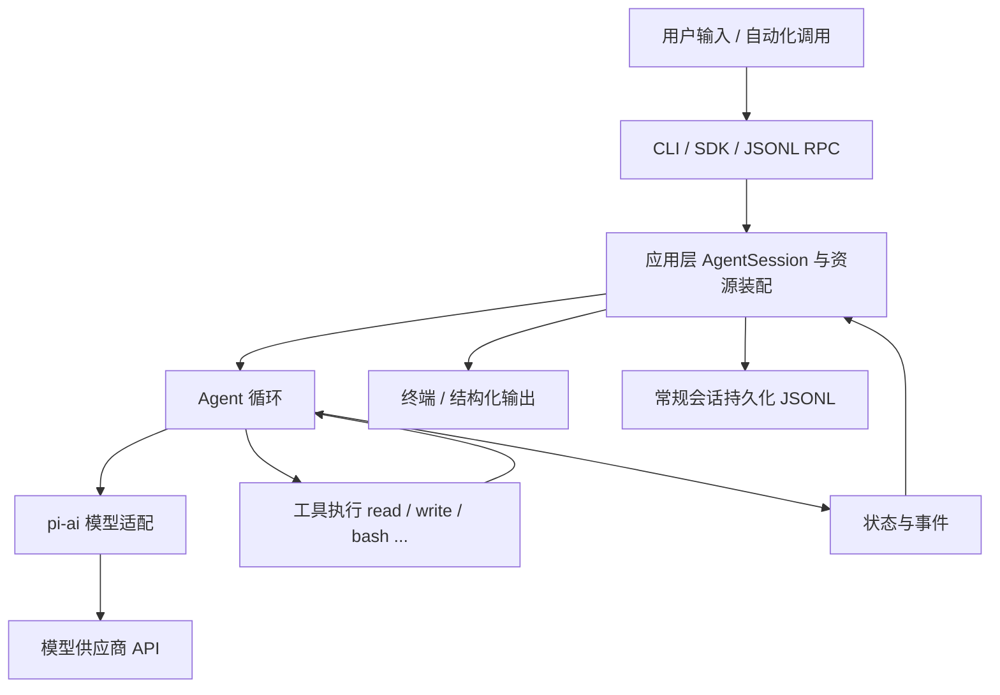

用一句话概括这张图：**用户输入从入口进来，由应用会话装配好一切，交给 Agent 循环反复跟模型和工具打交道，过程中产生的事件回流给界面，产生的记录落到磁盘。**

<a id="00-orientation-h4"></a>

## 0.3 仓库全景：一个 monorepo，四层结构

这个仓库是一个 **monorepo**（单一仓库多包），用 npm workspaces 管理。所有包放在 `packages/` 下，根 `package.json` 的 `workspaces: ["packages/*", ...]` 把它们组织在一起。每个子目录是一个独立的 npm 包，有各自的 `package.json`、`README.md`、`src/`、`test/`。

先记住四个核心包（后面统称"核心四包"）：

| 包                        | npm 名                              | 一句话职责                                                         | 上游依赖                                                                         |
| ------------------------- | ----------------------------------- | ------------------------------------------------------------------ | -------------------------------------------------------------------------------- |
| `packages/ai`           | `@earendil-works/pi-ai`           | 统一的多供应商 LLM 接口：同一套类型调 OpenAI、Anthropic、Google 等 | `pi-telemetry`（当前源码仅导入类型）                                           |
| `packages/agent`        | `@earendil-works/pi-agent-core`   | Agent 运行时：消息循环、工具调用、状态与事件                       | 依赖`pi-ai`                                                                    |
| `packages/tui`          | `@earendil-works/pi-tui`          | 终端 UI 框架：差分渲染、组件、键盘输入                             | 无 pi 内部依赖                                                                   |
| `packages/coding-agent` | `@earendil-works/pi-coding-agent` | 面向用户的编码助手 CLI：会话、资源、工具、扩展、界面               | `pi-agent-core`、`pi-ai`、`pi-tui`、`pi-mcp`、`pi-codemode`、`chord` |

依赖关系是有方向的：`coding-agent` 依赖 `agent`，`agent` 依赖 `ai`，而 `ai` 的公开类型引用 `telemetry`。反过来不成立——`pi-ai` 不依赖 Agent；`pi-agent-core` 不依赖终端 UI 或 coding-agent 的文件工具。**这是理解整个项目的第一把钥匙：下层包通过接口提供机制，不绑定上层的具体用法。**

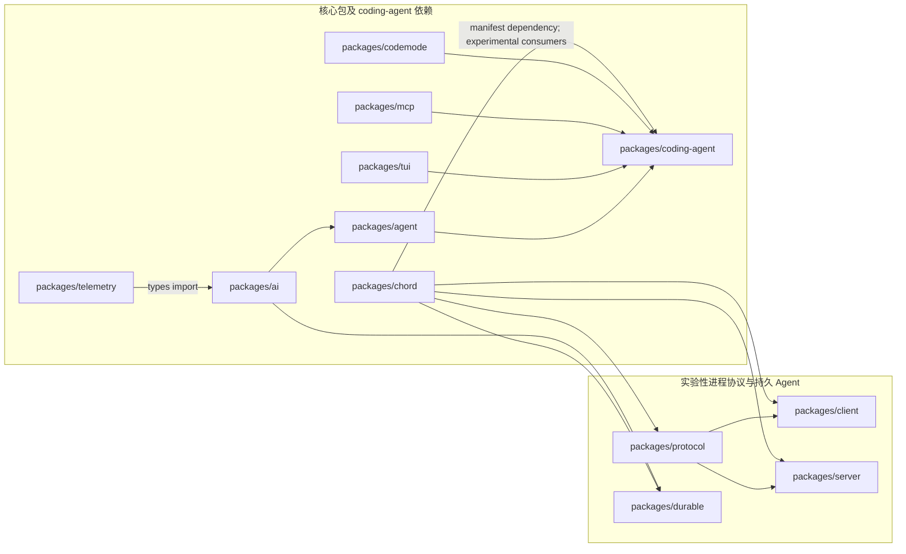

**读图方法**：箭头方向是“被依赖包 → 使用它的包”，不是运行时调用方向。图中内部边来自各包 `package.json` 的 `dependencies`；`packages/ai/src/types.ts` 对 `pi-telemetry` 的导入是 `import type`，因此运行时 JavaScript 不会加载 telemetry，但生成的类型声明引用了该类型，类型消费者仍需要解析这项公开依赖。实验性协议包被框在右侧，只表示它们的包依赖关系，不表示常规 CLI 自动通过 client/server 工作。

这张图与上面的全景流程图回答不同问题：依赖图说明“改这个包会受哪些包边界约束”；全景流程图说明“一个用户请求运行时经过哪些组件”。比如 `coding-agent` manifest 依赖 `chord`，而普通 CLI 的 `AgentSession` 主流程仍由第 3、8 章描述；不能只凭存在依赖就推断每条 CLI 请求都会经过 chord。

依赖清单核对范围是所有 `packages/*/package.json` 中 `@earendil-works/*` 的 `dependencies`，并以代表性源码 import 确认关键边：`agent-loop.ts` → `pi-ai`、`ai/src/types.ts` → `pi-telemetry`、`coding-agent` 的 client-tui / MCP / codemode 适配器 → 对应包、`client`/`server` → `protocol` 与 `chord`。不包括 devDependencies、第三方依赖，也不声称这是整个 monorepo 的完整构建图。

> 说明：`coding-agent` 还依赖若干第三方库（如终端颜色、文本差异和 YAML 解析）。本图只显示 pi workspace 包之间 manifest 声明的依赖，不展开第三方依赖。

<a id="00-orientation-h5"></a>

### 0.3.1 四个核心包的具体内容

**`packages/ai`（模型层）**：定义模型、消息、事件、流式响应的统一类型；内置多个供应商适配器和模型目录；处理 API Key 解析、用量统计、成本计算。关键文件：

- `packages/ai/src/types.ts` —— 所有对外类型的定义（48KB，是全仓库最重要的类型文件之一）；
- `packages/ai/src/models.ts` —— `createModels()`、模型注册与查找、`streamSimple` 等入口；
- `packages/ai/src/providers/` —— 每个供应商一个适配器，例如 `anthropic.ts`、`openai.ts`、`faux.ts`（假模型，测试用）。

**`packages/agent`（运行时层）**：不关心终端、不关心文件工具，只做"模型 + 工具 + 消息"的循环。关键文件：

- `packages/agent/src/agent-loop.ts` —— 循环本体（29KB）：发请求、收流、执行工具、决定是否继续；
- `packages/agent/src/agent.ts` —— 有状态的 `Agent` 类：持有消息、订阅事件、串行化运行；
- `packages/agent/src/types.ts` —— `AgentEvent`、`AgentTool`、`AgentMessage` 等类型（21KB）。

**`packages/tui`（终端 UI 层）**：一套独立的终端界面库，提供组件模型和差分渲染（只重绘变化的部分，避免闪烁）。它不认识 pi 的业务逻辑，任何 Node 程序都能用。关键文件在 `packages/tui/src/`，第 17 章展开。

**`packages/coding-agent`（应用层）**：用户实际安装的 `pi` 命令就来自这里（`package.json` 的 `bin: { "pi": "dist/bundle/cli.js" }`）。它把前三层组装成完整产品：

- `packages/coding-agent/src/cli.ts` —— 命令行入口（139 字节，只是转发）；
- `packages/coding-agent/src/main.ts` —— 主流程（35KB）：解析参数、装配会话、选择运行模式；
- `packages/coding-agent/src/core/` —— 核心业务：会话（`agent-session.ts`，158KB，全仓库最大文件）、工具、配置、资源加载、扩展等 50 多个模块；
- `packages/coding-agent/src/modes/` —— 交互模式、RPC 模式的实现；
- `packages/coding-agent/src/extensions/` —— 扩展系统的运行时支持。

<a id="00-orientation-h6"></a>

### 0.3.2 其他包：知道它们存在，暂时不用深入

| 包                                        | 职责                                                                    | 本手册章节       |
| ----------------------------------------- | ----------------------------------------------------------------------- | ---------------- |
| `packages/chord`                        | 独立的"应用组合运行时"：服务、副本状态、RPC、插件。不依赖任何其他 pi 包 | 第 23 章（选修） |
| `packages/durable`                      | 实验性的"持久执行"harness：先落盘再显示，进程死了能接着跑               | 第 23 章（选修） |
| `packages/mcp`                          | 独立的 Model Context Protocol 客户端（stdio/HTTP 传输）                 | 第 22 章（选修） |
| `packages/codemode`                     | 在 QuickJS 沙箱里执行模型写的 JavaScript，用来组合工具调用              | 第 22 章（选修） |
| `packages/protocol`                     | 实验性 client/server 协议的帧格式与编码（CBOR）                         | 第 24 章（选修） |
| `packages/client` / `packages/server` | 上述协议的客户端与本地服务端实现                                        | 第 24 章（选修） |
| `packages/telemetry`                    | 厂商中立的遥测契约（trace/span）                                        | 第 25 章（选修） |
| `packages/evals`                        | 行为评估：用固定任务集评测 coding agent 的效果                          | 第 25 章（选修） |
| `packages/session-backends`             | 会话存储后端抽象（供实验特性使用）                                      | 用到时再查       |

这些包有一个共同点值得现在记住：**它们通过明确定义的接口与核心四包相连，而不是互相乱引用。** 例如 `mcp` 完全不依赖 `ai` 或 `agent`；`coding-agent` 再把它适配成工具。第 12 章会教你用同样思路判断"一个需求该不该开新包"。

<a id="00-orientation-h7"></a>

## 0.4 用户可见的五种入口

pi 有五种主要使用方式，它们都汇聚到同一套 Agent 和会话机制（结论来自 `packages/coding-agent/docs/how-pi-works.md` 的 "Interfaces" 一节）：

| 入口           | 形态                                | 典型场景                 | 实现位置                                        |
| -------------- | ----------------------------------- | ------------------------ | ----------------------------------------------- |
| 交互模式       | 全屏终端 UI                         | 人类日常使用             | `packages/coding-agent/src/modes/interactive` |
| print 模式     | `pi -p "..."` 输出最终回答        | 脚本里一次性提问         | `main.ts` 的 print 分支                       |
| JSON 模式      | 逐行输出 Agent 事件（JSONL）        | 程序消费事件流           | `main.ts` 的 json 分支                        |
| RPC 模式       | stdin 收 JSONL 命令，stdout 回响应  | 编辑器插件、其他语言宿主 | `packages/coding-agent/src/modes/rpc`         |
| TypeScript SDK | `createAgentSession()` 进程内控制 | 自己写 Node 程序嵌入     | `packages/coding-agent/src/core/sdk.ts`       |

各入口共享 Agent 与会话的核心能力，但外层适配器、输入来源和输出格式不同。读代码时先找到模式分流，再顺着共享的会话与 Agent 主线；不要假定五种入口在启动参数、事件输出或生命周期上完全相同。第 3 章走常规 CLI 的主路径，第 15、16 章分别讲 SDK 与进程级集成。

<a id="00-orientation-h8"></a>

### 0.4.1 CLI 到底选哪一种模式？

表里的 `print`、`JSON` 和交互 UI 不是只看命令行参数。`main.ts` 把用户指定的 `Mode`（`text | json | rpc`）和 stdin/stdout 是否连接终端（TTY）合并成内部的 `AppMode`（`interactive | print | json | rpc`）：

```typescript
function resolveAppMode(parsed: Args, stdinIsTTY: boolean, stdoutIsTTY: boolean): AppMode {
	if (parsed.mode === "rpc") return "rpc";
	if (parsed.mode === "json") return "json";
	if (parsed.print || !stdinIsTTY || !stdoutIsTTY) return "print";
	return "interactive";
}
```

按分支顺序读这段：

1. 显式 `--mode rpc` 和 `--mode json` 优先，分别进入 RPC 和 JSON 运行模式；
2. 否则，`--print` 或 stdin/stdout 任一不是 TTY，就进入一次性 print 模式；
3. 只有没有上述条件时才进入交互 UI。

这也解释了一个常见误会：`--mode text` 只是选择 print 模式的文本输出格式，**不会单独强制 print**。终端输入输出都连接 TTY 时，`pi --mode text` 仍会启动交互 UI；而 `pi "请总结"` 若 stdin 或 stdout 被重定向，则会自动走 print。自动化脚本若要求 JSONL，明确传 `--mode json`，不要依赖 TTY 推断。

模式确定后，`main()` 仍会创建会话运行时，但最后分到不同适配器：RPC 调 `runRpcMode(runtime)`，交互模式创建 `InteractiveMode`，print/JSON 共用 `runPrintMode`，JSON 通过 `toPrintOutputMode()` 选择事件序列化输出。故意分清两层：`Mode` 是命令行声明的输出偏好，`AppMode` 是进程最后采用的运行形态。可从 `packages/coding-agent/src/main.ts` 的 `resolveAppMode`、`toPrintOutputMode` 和 `main` 末尾分支开始读；`parseArgs` 的字符串校验见 `packages/coding-agent/src/cli/args.ts`。

`--mode rpc` 还禁止 `@file` 参数（在进入会话创建前检查），因为 RPC 的输入由 stdin 上的 JSONL 命令驱动，不消费启动时的文件参数。RPC 协议细节留给第 16 章。

<a id="00-orientation-h9"></a>

## 0.5 一个具体例子：读文件并总结（作业预告）

输入："读取 demo.txt 并总结三点。" 高层轨迹如下（细节全部留到第 3、6、7 章）：

```text
用户消息 "读取 demo.txt 并总结三点"
  → 第 1 次模型请求（携带系统提示、历史、可用工具列表）
  → 模型回答：我要调用 read 工具 { path: "demo.txt" }
  → pi 在本地执行 read，得到文件内容
  → 第 2 次模型请求（在上面的历史后追加"工具结果"消息）
  → 模型回答：三点总结（不再调用工具）
  → 运行结束，界面显示总结
```

请现在就用直觉回答两个问题，读完第 3 章回来核对：

1. 为什么需要**两次**模型请求？一次不行吗？
2. 文件不存在时，错误发生在第几步？整个运行会崩溃吗？

<a id="00-orientation-h10"></a>

## 0.6 源码阅读路线：从外壳到内核

给新手的一个常见陷阱是"从最大的文件开始读"（比如 158KB 的 `agent-session.ts`），几分钟后就会迷失。正确的路线是按依赖方向、由外向内：

```text
第一步：读入口脚本        pi-test.sh / pi-test.ps1（怎么启动）
第二步：读 main.ts 的参数解析与模式选择（谁在什么时候被创建）
第三步：读 core/sdk.ts 的 createAgentSession（装配了哪些资源）
第四步：读 core/agent-session.ts 的 prompt 方法（应用会话如何驱动 Agent）
第五步：读 agent/src/agent.ts 与 agent-loop.ts（循环本体）
第六步：读 ai/src/models.ts 与 providers/faux.ts（模型层最小实现）
第七步：带着问题读你想要改的模块（工具、配置、扩展……）
```

这条路线与本书章节顺序一一对应（第 3、8、6 章），你现在只需要记住"由外向内、先跑通再深入"这个原则。

<a id="00-orientation-h11"></a>

## 0.7 实验 L01：环境记录与职责图

**实验性质**：只读操作，不修改仓库；Node、npm、Git 查询相同，源码启动命令按实际 shell 选择。
**验证状态**：Windows + PowerShell 的环境探查和源码入口 `--version` 已在撰写环境运行；Linux、macOS、Git Bash 未运行。读者仍需记录自己的环境并亲手画职责图，不能把本机结果当作自己的实验记录。

<a id="00-orientation-h12"></a>

### 目标

1. 记录你的环境版本和仓库基线；
2. 亲手画出"核心四包 + 依赖方向"的职责图（不要照抄，画完再对比 0.3 节）；
3. 找到 `pi` 命令真正指向的文件。

<a id="00-orientation-h13"></a>

### 步骤

先在仓库根目录记录版本和基线（PowerShell、Bash 都可直接运行）：

```bash
node --version
npm --version
git log -1 --format="%H %s"
```

预期：Node 版本 >= 22.19.0；`git log` 输出的哈希应与本手册基线的 `200387122ca450d6387f033949423114a270b96c` 一致（若不一致，说明你读的是更新或更旧的版本，请以你的代码为准）。

接着运行源码入口，只请求版本号；该步骤不创建会话、不调用模型：

```powershell
# Windows PowerShell，在仓库根目录
.\pi-test.ps1 --version
```

```bash
# Linux / macOS / Git Bash，在仓库根目录
./pi-test.sh --version
```

预期输出是当前 coding-agent 版本。启动时若出现 Node Type Stripping 的 `ExperimentalWarning`，它表示 Node 对直接运行可擦除 TypeScript 的实验性提示，不等于命令失败；检查退出码是否为 `0`。源码启动器会导入 `packages/coding-agent/src/cli.ts`，与刚才读取的安装版 `bin` 构建产物路径是两条不同入口。

查看 `pi` 命令的入口声明（读取代码，不执行）：

```bash
node -e "const p=require('./packages/coding-agent/package.json'); console.log(p.name, p.version, JSON.stringify(p.bin))"
```

预期输出形如：`@earendil-works/pi-coding-agent 1.0.2 {"pi":"dist/bundle/cli.js"}`。这说明：**用户装的 `pi` 命令最终执行的是 `packages/coding-agent` 构建产物 `dist/bundle/cli.js` 的入口**。开发时我们用 `pi-test.sh`（第 2 章）从源码直接跑，避免每次构建。

<a id="00-orientation-h14"></a>

### 观察与思考

- 用编辑器打开 `packages/coding-agent/src/cli.ts`（只有 139 字节，一行也能读），找到它转发给了谁；
- 打开 `packages/coding-agent/src/main.ts` 的前 50 行，找出 `#!/usr/bin/env node` 这样的 shebang 是否存在，理解 `bin` 的入口约定；
- 打开四个核心包的 `package.json`，对照 0.3 节的依赖方向表，验证 `dependencies` 字段；
- 将你的系统、shell、Node/npm、仓库 commit、实际源码启动命令和退出码写入附录 F 模板；Windows 与 POSIX 环境分别记录，不能互相代填。

<a id="00-orientation-h15"></a>

### 清理

本实验只读，无清理项。

<a id="00-orientation-h16"></a>

## 0.8 常见错误

| 现象                                                                   | 原因                           | 处理                                                                      |
| ---------------------------------------------------------------------- | ------------------------------ | ------------------------------------------------------------------------- |
| `node --version` 低于 22.19.0                                        | 系统 Node 太旧                 | 安装新版本（第 2 章给出三平台方法）                                       |
| 在子目录里运行`node -e "require('./packages/...')"` 报错找不到包     | 相对路径基于当前目录           | 先`cd` 到仓库根目录                                                     |
| 打开`packages/coding-agent/src/core/agent-session.ts` 觉得完全看不懂 | 158KB 的大文件按顺序读必然迷失 | 先读类型与导出清单，再跳到指定符号；第 3、8 章会给路线                    |
| 分不清`packages/ai` 和 `packages/agent`                            | 名字都像"AI"                   | 记住一句话：`ai` 管"怎么跟模型说话"，`agent` 管"拿到模型回话后干什么" |

<a id="00-orientation-h17"></a>

## 0.9 验收题

1. 用一句话解释：为什么模型自己不能读文件？pi 在中间做了什么？
2. `packages/tui` 能不能被一个与 pi 无关的项目使用？依据是什么？
3. 用户用 RPC 模式和 SDK 模式跑同一个任务，内部的 Agent 循环是两套实现吗？
4. 按"由外向内"原则，读 `agent-session.ts` 之前应该先读哪两个文件？

<a id="00-orientation-h18"></a>

### 参考答案

1. 模型是无状态、无本地权限的文本函数；pi 在本地执行工具调用，把结果作为新消息回填，并把多轮请求串起来。
2. 能。`packages/tui/package.json` 的依赖只有 `get-east-asian-width` 和 `marked` 等通用库，不依赖任何 pi 包；它提供的是通用终端组件与差分渲染。
3. 不是。所有入口都使用同一套 Agent 与会话机制，入口只决定"输入输出如何呈现"。
4. `packages/coding-agent/src/main.ts`（谁创建它）和 `packages/coding-agent/src/core/sdk.ts`（装配了什么）。

<a id="00-orientation-h19"></a>

## 0.10 来源与下一章

- `README.md`（仓库根）：包的总体介绍与开发命令；
- `packages/coding-agent/docs/how-pi-works.md`：一次请求、会话树、上下文、入口与信任模型的高层说明；
- `packages/ai/README.md`、`packages/agent/README.md`、`packages/tui/README.md`、`packages/coding-agent/package.json`；
- `packages/agent/src/types.ts`、`packages/agent/src/stream-fn.ts`。

下一章是全书唯一的"补课章"：用仓库里的真实代码，把读懂后面的章节所需要的 TypeScript 与 Node.js 知识补齐。如果你已经熟悉 TS，可以只做第 1 章的验收题，按结果决定是否跳过。

---

<!-- 来源：01-typescript-node.md。 -->

<a id="01-typescript-node-h1"></a>

# 第 1 章：读懂本项目需要的 TypeScript 与 Node.js

> 通勤导航：第 2 天 · 车上读本章（重点 1.1、1.2、1.4、1.7），读完能“读懂一个真实的事件监听器”。跟着敲代码属于车下。

**先懂这一章**：读 pi 源码最常遇到的是“这是什么事件”“这个异步操作何时完成”“取消信号传到哪里”。本章只学回答这些问题所需的 TypeScript 和 Node.js，用实际项目代码练习，不需要先学完整语言规范。

> 学完本章你能回答：
>
> 1. 这个仓库里的 `.ts` 文件是怎么被直接执行和构建的？为什么不能用 `enum`？
> 2. `import` / `export`、`import type`、带 `.ts` 后缀的相对导入分别是什么意思？
> 3. 什么是"联合类型"和"类型收窄"？为什么 pi 的事件类型全都长成 `{ type: "...", ... }`？
> 4. 什么是 Promise、`async/await`、异步迭代和 `AbortSignal`？事件订阅函数为什么返回一个函数？

**前置知识**：会任何一门编程语言；不需要 TypeScript 经验。
**预计学习时间**：2-3 天（若你已熟悉 TS，做 1.10 的验收题决定是否跳过）。
**本章验证状态**：静态核对通过；其中"用 Node 直接运行 .ts"一节在本机（Windows, Node v23.9.0）实际运行验证。

---

<a id="01-typescript-node-h2"></a>

## 1.1 先解决第一个困惑：为什么没有"编译"也能跑 TypeScript？

传统印象里，TypeScript 必须先编译成 JavaScript 才能运行。但这个仓库（以及现代 Node.js）采用了一种更轻的机制：**类型擦除执行**（type stripping）。

<a id="01-typescript-node-h3"></a>

### 1.1.1 亲手验证

作者在本机实际做了这个实验。建一个文件 `ts-strip-test.ts`：

```typescript
const x: number = 41;
function add(a: number, b: number): number {
	return a + b;
}
console.log(add(x, 1));
```

直接运行，不编译：

```bash
node ts-strip-test.ts
```

输出：

```text
42
(node:35408) ExperimentalWarning: Type Stripping is an experimental feature and might change at any time
```

这个实验说明两件事：

1. **Node 会直接执行 `.ts` 文件**：它把类型注解（`: number`、`: number`、返回类型）当作"注释"删掉，剩下的就是普通 JavaScript。这叫作 *type stripping*（类型剥离）。
2. **它是实验性的**：Node 会打印一条 `ExperimentalWarning`。这不影响功能，但意味着语法支持范围有限。

<a id="01-typescript-node-h4"></a>

### 1.1.2 限制一：只能使用"可擦除语法"

因为 Node 只是"删类型"而不做代码生成，所以**凡是需要生成额外 JavaScript 代码的语法都不能用**。仓库的 `tsconfig.base.json` 通过 `"erasableSyntaxOnly": true` 强制了这个限制，`AGENTS.md` 也把它写成了硬规则。你要避开这些语法：

| 不能用                                                        | 为什么             | 项目里的替代写法                                     |
| ------------------------------------------------------------- | ------------------ | ---------------------------------------------------- |
| `enum Color { Red }`                                        | 会生成一个真实对象 | 用字符串字面量联合：`type Color = "red" \| "green"` |
| `namespace X {}`                                            | 会生成包装对象     | 直接用模块文件组织代码                               |
| `class A { constructor(private x: number) {} }`（参数属性） | 会生成赋值代码     | 显式声明字段并在构造函数里赋值                       |
| `import x = require("y")` / `export =`                    | CommonJS 专用语法  | 用标准 ESM`import` / `export`                    |
| 装饰器（实验性旧语法）                                        | 需要代码生成       | 本项目不用装饰器                                     |

例如第 8 章你会读到的 `Agent` 类、`ModelRuntime` 类，全部采用"显式字段 + 构造函数赋值"的写法，看到时不要觉得啰嗦，那是为了兼容类型擦除执行。

对于 Java 转过来的读者，一句话总结：**没有 `enum`，用"字面量联合"代替；没有注解/装饰器，用普通函数和配置对象代替。**

<a id="01-typescript-node-h5"></a>

### 1.1.3 限制二：相对导入必须写 `.ts` 后缀

打开任意源码文件，比如 `packages/agent/src/stream-fn.ts`：

```typescript
import type { StreamFn } from "./types.ts";
```

注意 `"./types.ts"` —— 后缀是 `.ts`，不是 `.js`，也不是省略后缀。这是刻意的：

- **运行时**（Node 直接执行）：Node 必须能找到真实存在的文件。源码树里只有 `types.ts`，所以导入路径写 `.ts`，Node 剥离类型后按原路径找文件，找得到。
- **构建时**（`tsc` 输出 `dist/`）：TypeScript 的 `"rewriteRelativeImportExtensions": true` 会把输出 JavaScript 里的 `./types.ts` 自动改写成 `./types.js`，保证构建产物之间互相引用正确。

所以你在本仓库写相对导入时的规则非常简单：**照着文件真实名字写后缀，`.ts` 就是 `.ts`**。

```typescript
// 对：文件真实存在
import { foo } from "./foo.ts";

// 错：本仓库不接受
import { foo } from "./foo";
import { foo } from "./foo.js";
```

<a id="01-typescript-node-h6"></a>

### 1.1.4 包的导入：`@earendil-works/pi-ai` 和它的子路径

跨包导入用 npm 包名。比如 `packages/agent/src/types.ts` 的第一行：

```typescript
import type {
	Api,
	AssistantMessage,
	// ...
} from "@earendil-works/pi-ai";
```

`"@earendil-works/pi-ai"` 指向 `packages/ai`。有些包还暴露**子路径**（subpath exports），比如：

```typescript
import { anthropicProvider } from "@earendil-works/pi-ai/providers/anthropic";
```

它之所以能解析，是因为 `packages/ai/package.json` 里有这样的 `"exports"` 声明（已核对基线）：

```json
{
	"./providers/*": {
		"types": "./dist/providers/*.d.ts",
		"import": "./dist/providers/*.js"
	}
}
```

读法：`./providers/anthropic` 这个子路径，类型定义在 `dist/providers/anthropic.d.ts`，运行时在 `dist/providers/anthropic.js`。`"types"` 和 `"import"` 的分离是为了让编辑器和运行时各取所需。

> 注意：子路径导入指向的是 **dist（构建产物）**。如果你在源码之间跨包引用，直接用包名即可，npm workspaces 会把它链接到本仓库；但 `dist` 不存在时（还没构建）会报错。第 2 章会讲用 `pi-test.sh` 从源码直接运行的方法。

<a id="01-typescript-node-h7"></a>

### 1.1.5 `tsconfig.base.json` 逐项解读

仓库根目录的 `tsconfig.base.json` 是所有包的共享配置。把它当作"这门语言的方言说明书"来读：

```json
{
	"compilerOptions": {
		"target": "ES2024",
		"module": "Node16",
		"lib": ["ES2024"],
		"strict": true,
		"erasableSyntaxOnly": true,
		"verbatimModuleSyntax": true,
		"esModuleInterop": true,
		"skipLibCheck": true,
		"forceConsistentCasingInFileNames": true,
		"declaration": true,
		"declarationMap": true,
		"sourceMap": true,
		"inlineSources": true,
		"inlineSourceMap": false,
		"moduleResolution": "Node16",
		"resolveJsonModule": true,
		"allowImportingTsExtensions": true,
		"rewriteRelativeImportExtensions": true,
		"types": ["node"]
	}
}
```

| 选项                                                                 | 含义                                       | 对你的影响                                                        |
| -------------------------------------------------------------------- | ------------------------------------------ | ----------------------------------------------------------------- |
| `target: ES2024`                                                   | 输出的 JS 语法级别                         | 可以用很新的语法，不用背老浏览器的兼容性                          |
| `module` / `moduleResolution: Node16`                            | 采用 Node 的 ESM/CJS 解析规则              | 导入路径规则严格，别自作聪明省略后缀或大小写                      |
| `strict: true`                                                     | 打开全部严格检查                           | `null`/`undefined` 必须处理；类型错误会拦住你                 |
| `erasableSyntaxOnly: true`                                         | 只允许"可擦除"语法                         | 见 1.1.2：不能用 enum 等                                          |
| `verbatimModuleSyntax: true`                                       | 导入/导出按你写的原样保留                  | **类型必须用 `import type` 导入**，否则可能有运行时副作用 |
| `resolveJsonModule`                                                | 允许`import data from "./x.json"`        | 配置文件、模型目录会用                                            |
| `allowImportingTsExtensions` + `rewriteRelativeImportExtensions` | 允许源码里写`.ts` 后缀并在构建时改写     | 见 1.1.3                                                          |
| `types: ["node"]`                                                  | 让`process`、`fs` 等 Node 全局类型可用 | 你能直接写`process.cwd()`                                       |

语言版本说明：TypeScript 有一个"**类型在运行时不存在**"的根本事实。后面的章节会反复利用这一点，比如判断"这个接口只是类型还是真实对象"、"这个 import 会不会在运行时被加载"。

<a id="01-typescript-node-h8"></a>

## 1.2 模块系统：ESM 的五个模式

本仓库所有包都是 **ESM**（ECMAScript Modules）。判断依据：每个 `package.json` 都有 `"type": "module"`。对读代码来说，你只需要熟悉五种常见模式。

<a id="01-typescript-node-h9"></a>

### 1.2.1 具名导出与默认导出

**具名导出**（named export）是主流：

```typescript
// packages/agent/src/stream-fn.ts（节选，真实代码）
let defaultStreamFn: StreamFn | undefined;

export function setDefaultStreamFn(streamFn: StreamFn | undefined): void {
	defaultStreamFn = streamFn;
}

export function getDefaultStreamFn(): StreamFn {
	if (!defaultStreamFn) {
		throw new Error("No default stream function configured. Pass streamFn explicitly or call setDefaultStreamFn().");
	}
	return defaultStreamFn;
}
```

导入时用花括号，名字必须与导出名一致：

```typescript
import { setDefaultStreamFn, getDefaultStreamFn } from "@earendil-works/pi-agent-core";
```

**默认导出**（default export）每个模块最多一个：

```typescript
export default function createThing() { /* ... */ }
// 导入时名字随便起：
import createThing from "./thing.ts";
```

读代码时的经验：看到 `import X from "..."` 且没有花括号，说明对方是默认导出；本仓库更偏爱具名导出，因为改名（重构）时更安全。

<a id="01-typescript-node-h10"></a>

### 1.2.2 `import type`：只导入类型，不产生运行时加载

因为开了 `verbatimModuleSyntax`，**类型和值的导入必须区分**：

```typescript
// 这是类型，必须用 import type
import type { AgentEvent } from "./types.ts";

// 这是真实存在的函数/对象，用普通 import
import { getDefaultStreamFn } from "./stream-fn.ts";
```

为什么重要？

- 类型在运行时不存在。如果错把类型写成普通 `import`，代码在 Node 里执行时会真的去加载那个模块（并在找不到导出时报错），或者在"仅类型"的模块上白白付出加载成本。
- 编辑器里，你可以在键盘上对任何标识符"跳转到定义"，看到它是 `interface`/`type`（类型）还是 `function`/`const`（值）。**这是新手最重要的一个动作：分清类型和值。**

一个小技巧：很多文件顶端会出现成片的 `import type { ... }`，读完请把它们当作"目录页"，它告诉你这个文件要与哪些数据结构打交道。

<a id="01-typescript-node-h11"></a>

### 1.2.3 `export *`：模块的公共门面

`packages/agent/src/index.ts` 只有五行：

```typescript
export * from "./agent.ts";
export * from "./agent-loop.ts";
export * from "./proxy.ts";
export { setDefaultStreamFn } from "./stream-fn.ts";
export * from "./types.ts";
```

这是**桶文件**（barrel file）写法：把包内各模块的导出重新导出，形成包的公共接口。外部代码只需要 `import { Agent } from "@earendil-works/pi-agent-core"`，不用关心内部文件结构。

读包时，**先从 `index.ts` 开始读**，它是这个包对外的"目录"。注意 `stream-fn.ts` 只导出了 `setDefaultStreamFn` 一个符号——说明 `getDefaultStreamFn` 是内部实现细节，虽然同文件但也刻意没有公开。这种"公开什么"的选择就是包的 API 设计。

<a id="01-typescript-node-h12"></a>

### 1.2.4 重命名导入与导出

```typescript
import { createModels as createModelCollection } from "@earendil-works/pi-ai";
export { parseConfig as parseSettingsConfig };
```

当同名符号冲突或想让名字更清楚时使用。你在本仓库会偶尔看到，大部分时候名字是直接匹配的。

<a id="01-typescript-node-h13"></a>

### 1.2.5 动态特性：只会看到少数几处

`await import("...")`（动态导入）在本仓库受到限制：`AGENTS.md` 明确要求"顶层导入，禁止 inline import"。你几乎看不到动态导入；个别地方（如 Node strip-only 场景下的可选依赖）例外。看到 `await import(` 时先想一想：为什么这里不能用静态导入？通常是因为该模块是可选的或平台相关。

<a id="01-typescript-node-h14"></a>

## 1.3 类型系统速成：从 Java/Python 到 TypeScript

如果你是 Java 或 Python 背景，Section 1.3 会重点讲"与你想的不一样的地方"。

<a id="01-typescript-node-h15"></a>

### 1.3.1 类型只是"检查期的约束"，不是运行时标签

Java 里 `new ArrayList<String>()` 的泛型信息在运行时还在（可反射）。TypeScript 的类型在运行时**全部消失**。这意味着：

- 不能写 `if (x instanceof MyInterface)` —— `interface` 在运行时不存在；
- 判断对象形状要用**运行时的值**：`typeof x === "string"`、`Array.isArray(x)`、"x.type === ..." 这样的字段检查；
- 后端收到 JSON 时，类型标注**不会自动校验**数据。pi 因此用 `typebox` 在运行时校验工具参数（第 7 章）。

<a id="01-typescript-node-h16"></a>

### 1.3.2 `interface` 与 `type`：两种描述对象的方式

```typescript
// 描述"对象形状"的两种写法，读代码时视为等价
interface Usage {
	input: number;
	output: number;
	totalTokens: number;
}

type StopReason = "pending" | "stop" | "length" | "toolUse" | "error" | "aborted" | "deferred";
```

- `interface` 擅长**对象形状**，可以"扩展"（`extends`）和声明合并；
- `type` 擅长**联合、字面量、工具类型**，不能重复声明。

本仓库混用两者，规则大致是：对象结构用 `interface`，联合/别名用 `type`。你不用纠结取舍，能读即可。

再看一个真实例子（`packages/ai/src/types.ts`）：

```typescript
export interface Usage {
	input: number;
	output: number;
	cacheRead: number;
	cacheWrite: number;
	/** Subset of `cacheWrite` written with 1h retention. Only Anthropic reports this split. */
	cacheWrite1h?: number;
	reasoning?: number;
	totalTokens: number;
	cost: {
		input: number;
		output: number;
		cacheRead: number;
		cacheWrite: number;
		total: number;
	};
}
```

几个记号：

- `?`（`cacheWrite1h?: number`）表示**可选属性**，读取时类型是 `number | undefined`。`strict` 模式下你必须在用它之前处理 `undefined`。
- 注释 `/** ... */` 是"文档注释"，编辑器悬停时会显示。**这个仓库的源文件里注释非常详尽，请把读注释当作读代码的一部分。**
- 嵌套对象直接内联写（`cost: { ... }`），不需要单独命名。

<a id="01-typescript-node-h17"></a>

### 1.3.3 联合类型与字面量类型

`StopReason` 的七个值全部是**字符串字面量类型**。含义是：这个类型的变量只允许取这七个字符串之一。模型响应的结束原因就是其中之一：

```text
"stop"    正常结束（模型说完了）
"length"  达到输出上限被截断
"toolUse" 模型要求调用工具（本轮结束、下一轮继续）
"error"   请求失败
"aborted" 被取消
"pending" 尚未结束（流式过程中）
"deferred" 延迟到后续处理（特殊供应商/长任务场景）
```

以后在代码里看到 `stopReason === "toolUse"` 这类判断，你就知道：**这是"模型想调用工具"的信号，是 Agent 循环继续的关键条件。**（第 6 章展开。）

<a id="01-typescript-node-h18"></a>

### 1.3.4 判别联合与类型收窄（本章最重要的一节）

这是读懂 pi 事件系统的钥匙。

先看问题。Agent 运行过程中会发出很多种事件，它们携带的字段不同：

- "agent 开始" 事件没有额外字段；
- "文本增量" 事件有 `delta` 字符串；
- "工具执行结束" 事件有 `toolName`、`result`、`isError` 等字段。

如果类型系统只有一种"大而全"的事件类型，每个字段都得写成可选，读代码时根本无法确定某个字段什么时候存在。TypeScript 的解决方案是**判别联合**（discriminated union）：每个成员都带一个共同的字面量字段（这里是 `type`），类型系统就能在判断了这个字段后，**自动收窄**（narrow）类型。

真实例子，`packages/agent/src/types.ts` 的 `AgentEvent`（原文节选）：

```typescript
export type AgentEvent =
	// Agent lifecycle
	| { type: "agent_start" }
	| { type: "agent_end"; messages: AgentMessage[] }
	// Turn lifecycle - a turn is one assistant response + any tool calls/results
	| { type: "turn_start" }
	| { type: "turn_end"; message: AgentMessage; toolResults: ToolResultMessage[] }
	// Message lifecycle - emitted for system, user, assistant, and toolResult messages
	| { type: "message_start"; message: AgentMessage }
	// Only emitted for assistant messages during streaming
	| { type: "message_update"; message: AgentMessage; assistantMessageEvent: AssistantMessageEvent }
	| { type: "message_end"; message: AgentMessage }
	// Tool execution lifecycle
	| { type: "tool_execution_start"; toolCallId: string; toolName: string; args: any }
	| { type: "tool_execution_update"; toolCallId: string; toolName: string; args: any; partialResult: any }
	| { type: "tool_execution_end"; toolCallId: string; toolName: string; result: any; isError: boolean };
```

读法：

- 每个 `|` 分支是一个"事件种类"，格式是 `{ type: "名字"; 其他字段 }`；
- `type` 字段是**判别标志**（discriminant）；
- 订阅者写 `if (event.type === "tool_execution_end")` 后，TypeScript 立刻知道 `event` 一定带有 `result`、`isError` 字段，可以安全访问；写在别的分支里访问同样的字段会**编译报错**。

用一张图理解"收窄"：

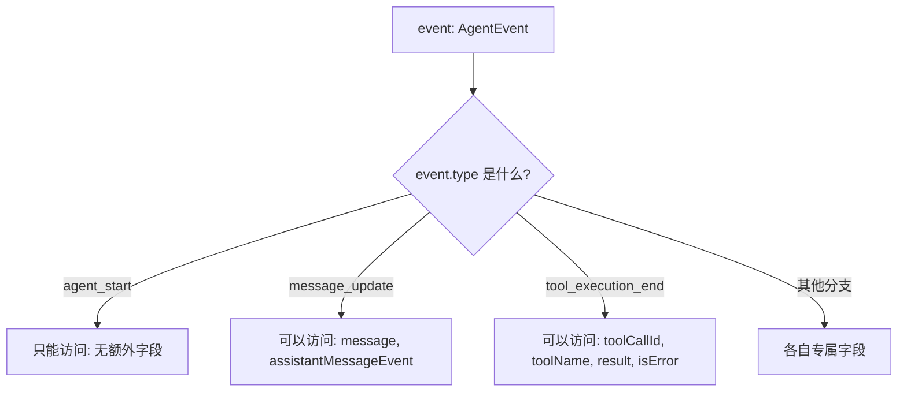

你会在整个代码库里反复看到：

- `switch (event.type) { case "..." : ... }`；
- `if (assistantMessageEvent.type === "text_delta") { ... }`；
- `if (result.isError)` 等。

**读代码时，把"判断判别字段"当作分支的导航牌。** 每个 case 里能做的事情，都是类型系统精确保证过的。

再补充一个真实第二层例子（`packages/ai/src/types.ts` 的 `AssistantMessageEvent`）：

```typescript
export type AssistantMessageEvent =
	| { type: "start"; partial: AssistantMessage }
	| { type: "text_start"; contentIndex: number; partial: AssistantMessage }
	| { type: "text_delta"; contentIndex: number; delta: string; partial: AssistantMessage }
	| { type: "text_end"; contentIndex: number; content: string; partial: AssistantMessage }
	| { type: "thinking_start"; contentIndex: number; partial: AssistantMessage }
	| { type: "thinking_delta"; contentIndex: number; delta: string; partial: AssistantMessage }
	| { type: "thinking_end"; contentIndex: number; content: string; partial: AssistantMessage }
	| { type: "toolcall_start"; contentIndex: number; partial: AssistantMessage }
	| { type: "toolcall_delta"; contentIndex: number; delta: string; partial: AssistantMessage }
	| { type: "toolcall_end"; contentIndex: number; toolCall: ToolCall; partial: AssistantMessage }
	| {
			type: "done";
			reason: Extract<StopReason, "stop" | "length" | "toolUse" | "deferred">;
			message: AssistantMessage;
	  }
	| { type: "error"; reason: Extract<StopReason, "aborted" | "error">; error: AssistantMessage };
```

这段类型说明一次流式响应会经历这些阶段：

```text
start
  → text_start → text_delta（多次）→ text_end        ← 文本流
  → thinking_start → thinking_delta（多次）→ thinking_end  ← 思考流（部分模型有）
  → toolcall_start → toolcall_delta（多次）→ toolcall_end  ← 工具调用流
  → done（或 error）
```

而 `Extract<StopReason, "stop" | "length" | "toolUse" | "deferred">` 是**类型工具**：从 `StopReason` 里挑出子集，所以 `done` 的 `reason` 永远是四个"正常结束类"的原因，`error` 的 `reason` 永远只可能是 `"aborted"` 或 `"error"`。这种"用类型排除不可能状态"的写法是本仓库的常见风格。

<a id="01-typescript-node-h19"></a>

### 1.3.5 泛型：让同一个结构适配不同数据

Java 的 `List<T>` 你已熟悉；TypeScript 泛型用得更多、更活泼。看三个真实场景。

**场景一：消息数组**。

```typescript
interface AgentContext {
	/** Transcript visible to the model. */
	messages: AgentMessage[];
	/** Tools available for execution in this run. */
	tools?: AgentTool<any>[];
}
```

`AgentMessage[]` 是"AgentMessage 的数组"。

**场景二：工具定义**（`packages/agent/src/types.ts`）：

```typescript
export interface AgentTool<TParameters extends TSchema = TSchema, TDetails = any> extends Tool<TParameters> {
	label: string;
	execute: (
		toolCallId: string,
		params: Static<TParameters>,
		signal?: AbortSignal,
		onUpdate?: AgentToolUpdateCallback<TDetails>,
	) => Promise<AgentToolResult<TDetails>>;
	executionMode?: ToolExecutionMode;
}
```

读法（先建立直觉，细节第 7 章）：

- `AgentTool<参数Schema, 详情类型>` 有两个泛型参数；
- `TParameters extends TSchema = TSchema`：参数必须是"schema 类型"，默认是 `TSchema`；
- `Static<TParameters>` 是关键魔法：它把"运行时 schema"翻译成"编译期的参数类型"。`typebox` 库提供这个工具。也就是说，工具作者写一份参数 schema，运行时用它校验、编译期用它给出 `params` 的字段类型；
- `Promise<AgentToolResult<TDetails>>`：`execute` 是异步函数，返回"结果对象"的 Promise。

**场景三：模型类型**。

```typescript
import type { Model, Api } from "@earendil-works/pi-ai";
// StreamFn 里出现的用法：
(model: Model<Api>, context: TranscriptContext, options?: SimpleStreamOptions) => ...
```

`Model<Api>` 表示"某种 API 类型的模型"。`Api` 本身是一个联合类型（各家协议的标识，如 `"anthropic-messages"`、`"openai-completions"` 等），泛型让"模型 + 适配器"保持类型关联。第 5 章会完整讲解。

**先记住三点即可**：`<...>`是参数列表；`extends` 是约束（必须满足什么）；`=` 是默认值。读懂调用处的类型实参（`AgentTool<ReadParams, ReadDetails>`）比会写泛型更重要。

<a id="01-typescript-node-h20"></a>

#### 用 `read` 工具把泛型和运行时 schema 连起来

刚才的 `AgentTool<TParameters>` 看起来抽象，可以用真实的 `read` 工具把它拆开。它在 `packages/coding-agent/src/core/tools/read.ts` 里先定义一个**运行时对象**：

```typescript
const readSchema = Type.Object({
  path: Type.String({ description: "Path to the file to read (relative or absolute)" }),
  offset: Type.Optional(Type.Number({ description: "Line number to start reading from (1-indexed)" })),
  limit: Type.Optional(Type.Number({ description: "Maximum number of lines to read" })),
});

export type ReadToolInput = Static<typeof readSchema>;
```

逐行分开看：

1. `Type.Object(...)` 是 JavaScript 在运行时实际创建的 schema 对象；`Type.String`、`Type.Number` 描述接收值的形状。
2. `typeof readSchema` 是 TypeScript 的类型运算，意思是“取这个变量的类型”。它不是运行时函数 `typeof`，不会产生新对象。
3. `Static<typeof readSchema>` 是 typebox 提供的编译期映射：从 schema 描述推导参数类型，结果近似为 `{ path: string; offset?: number; limit?: number }`。

然后工厂把 schema 类型传给工具泛型：

```typescript
export function createReadTool(cwd: string, options?: ReadToolOptions): AgentTool<typeof readSchema> {
  return wrapToolDefinition(createReadToolDefinition(cwd, options));
}
```

`AgentTool<TParameters>` 的 `execute` 参数使用 `Static<TParameters>`。所以传入 `typeof readSchema` 后，编译器能把执行参数关联到 `ReadToolInput`。写工具实现时，字段名和必选/可选关系能得到编辑器提示；把 `path` 写成数字，或把必需字段标成可选，都会在源码检查阶段出错。

但 schema 类型和运行时验证是两件相连、不能互相替代的事：

```text
schema 对象 Type.Object(...) ──运行时──> 校验模型送来的真实 JSON
             │
             └──Static<typeof ...>──编译期──> 给 execute 参数提供静态类型
```

模型数据来自网络，不会因为 TypeScript 写了 `ReadToolInput` 就自动变安全。Agent 循环实际调用 `validateToolArguments(tool, toolCall)`，用工具的 schema 检查真实参数；校验过程还可能做归一和类型转换，细节见第 7.4 节。反过来，运行时校验也不会替你设计完整业务规则：这个 schema 把 `offset` 约束为 number，但没有声明必须是整数、必须大于零；若工具实现依赖这些限制，还需要显式 schema 约束或运行时业务检查。

**新手改工具时按这个顺序追**：

1. 找到 `const xxxSchema = Type.Object(...)`，确认每个字段的类型与 `Type.Optional`；
2. 找 `type XxxInput = Static<typeof xxxSchema>`，理解编译器会推导什么；
3. 找工厂的返回类型，如 `AgentTool<typeof xxxSchema>`，再跳到 `AgentTool.execute` 的 `params`；
4. 确认运行时入口用 schema 验证了不可信数据，再读具体副作用代码。

不要只改 `execute` 参数旁的手写类型来“修”类型错误。应先判断 schema 是否表达了真正需求，再让静态类型和运行时验证共享同一个 schema 来源。

<a id="01-typescript-node-h21"></a>

### 1.3.6 `any`、`unknown`、`never` 与仓库规则

- `any`：关闭检查，想怎么用都行。**仓库规则是"非必要不用 any"**。源码里看到它时，先确认它出现在哪一层，不要照抄：
  - `AgentContext.tools?: AgentTool<any>[]` 表示“一个数组装着很多种参数 schema 不同的工具”。每个具体工具仍可有精确类型（例如 `AgentTool<typeof readSchema>`），但被放进这个通用集合时，参数类型被擦掉，数组层面的统一访问无法保留每项工具各自的 schema。当前实现选择在集合边界做这个折衷，不代表每个工具实现都不安全。
  - `AgentEvent` 的工具执行事件用 `args: any`、`result: any`，因为同一事件联合要承载不同工具的参数和结果形状。订阅方若要安全使用这些值，应按 `toolName` 找到对应的工具/renderer，并检查它能依赖的结构；不要把事件字段的 `any` 继续扩散到新 API。
  - `AgentTool<TDetails = any>` 的默认值让不关心详情类型的通用调用方仍可使用该接口。能确定具体详情类型时，应显式写 `AgentTool<typeof schema, Details>`。
- `unknown`：安全的"未知值"，任何属性都不能直接访问；先用 `typeof`、`Array.isArray`、`in` 等运行时检查缩小范围，或在有可靠依据时再作类型断言。
- `never`：不可能出现的类型。除抛错函数外，也常用于穷尽性检查：联合类型新增成员后，旧的 `switch` 若没处理它，可以在 `never` 赋值处报错。

一个 `unknown` 的收窄例子：

```typescript
function errorMessage(value: unknown): string {
  if (typeof value === "object" && value !== null && "message" in value) {
    const message = value.message; // 经过 in 检查后，属性仍是 unknown
    if (typeof message === "string") return message;
  }
  return String(value);
}
```

两个检查各自解决一件事：`"message" in value` 证明对象上有这个键；`typeof message === "string"` 才证明属性值能当字符串用。只做前者还不够。**不要为了让红线消失而直接写 `value as Error`**：类型断言不会检查运行时对象是不是 `Error`。

工具参数把这三个概念放在同一条路径上：具体工具用 TypeBox schema 推导 `Static<T>`；通用工具集合会擦掉单项泛型；模型送来的真实参数仍要由 `validateToolArguments()` 在运行时检查。详见本章 1.3.5 的 `read` 例子与第 7.4 节。泛型被擦掉不等于运行时验证也被擦掉。

<a id="01-typescript-node-h22"></a>

### 1.3.7 结构化类型：长得像就算（与 Java 很不同）

TypeScript 是**结构化类型**：只要一个对象的形状满足接口，它就是这个类型，不需要显式 `implements`。

```typescript
interface Point { x: number; y: number }
const p = { x: 1, y: 2, extra: true }; // 赋给 Point 变量是合法的
```

这解释了为什么本仓库大量使用"小而专的接口 + 对象字面量"来组合功能（如各种 `Options`、`Result` 类型），而不是繁杂的类继承体系。读代码时看到函数接受一个对象参数，先去读那个 `interface`，再对调用处传入的字段即可。

<a id="01-typescript-node-h23"></a>

## 1.4 异步编程：Promise、并发与流

pi 的核心几乎全是异步的：模型流式返回、工具执行、文件读写、事件派发。这一节把本仓库会用到的异步模式讲全。

<a id="01-typescript-node-h24"></a>

### 1.4.1 从 Promise 与 async/await 说起

```typescript
// 调用方视角：await 等待异步结果
const { session } = await createAgentSession();
await session.prompt("What files are in the current directory?");
```

- 一个 `async` 函数内部可以 `await` 一个 Promise，语义是"暂停这里，等结果回来再继续"；
- `await` 只在 `async` 函数（或 ES 模块顶层）里可用。注意 `examples/sdk/01-minimal.ts` 直接在顶层用 `await`，这是**顶层 await**，ESM 的特性，CommonJS 里没有。

错误处理用普通的 `try/catch`：

```typescript
try {
	await session.prompt("...");
} finally {
	session.dispose(); // 无论成功、失败还是取消都要释放资源
}
```

`finally`（而不是只在成功分支释放）是仓库里反复出现的安全模式。第 8 章会解释"不 dispose 会泄漏什么"。

<a id="01-typescript-node-h25"></a>

### 1.4.2 并发：`Promise.all` 与"完成顺序"

多个独立异步任务同时进行：

```typescript
const [a, b] = await Promise.all([taskA(), taskB()]);
```

注意两个概念（第 7 章的主角）：

- **完成顺序**：谁先完成谁先结束，可能乱序（耗时 10ms 的 B 先于 100ms 的 A 完成）；
- **结果顺序**：`Promise.all` 返回的数组永远按**传入顺序**排列，与完成顺序无关。

pi 的工具执行同时利用了这两个性质：完成事件按完成顺序发出（界面实时反馈），但工具结果消息按模型声明顺序记录（保持对话历史确定性）。第 7 章会用两个可控的假工具实验验证。

一个重要边界：`Promise.all` 只负责等待并收集结果，**不会因为其中一个 Promise 失败就自动取消其他任务**。它会以第一个拒绝作为 `await Promise.all(...)` 的拒绝原因，但其余任务仍可能继续运行。想让并行任务一起停止，程序还必须共享并触发取消信号，并且每个任务都要配合检查。

<a id="01-typescript-node-h26"></a>

### 1.4.3 异步迭代：`for await...of`

模型响应是一条**事件流**，不是一个单个值。pi 用异步迭代器表示它：

```typescript
for await (const event of stream) {
	if (event.type === "text_delta") {
		process.stdout.write(event.delta);
	}
}
```

细分概念：

- **可迭代**（iterable）：`for...of` 能遍历的对象；
- **异步可迭代**（async iterable）：`for await...of` 能遍历的对象，元素在等待中逐个到来。`for await` 的效果是"每次循环都 await 下一个元素"。

`packages/agent/src/types.ts` 里 `StreamFn` 的返回类型 `AssistantMessageEventStream` 就是一个异步事件流。它的完整定义在 `packages/ai/src/types.ts`，你可以用编辑器跟进去看看它和 `AsyncIterable<AssistantMessageEvent>` 的关系（本节只要求建立直觉）。

<a id="01-typescript-node-h27"></a>

### 1.4.4 `AbortSignal`：如何取消一个正在进行的操作

现实问题：用户按下 Esc / Ctrl+C，正在进行的模型请求或工具执行必须停下来。Node 的标准方案是 `AbortController` / `AbortSignal`：

```typescript
const controller = new AbortController();
// 把信号传给异步操作
someOperation({ signal: controller.signal });
// 需要取消时：
controller.abort();
```

本仓库中的用法：

- 工具执行的签名里有 `signal?: AbortSignal`（见 1.3.5 的 `AgentTool.execute`）——**工具作者有责任检查信号并尽快停止**；
- 取消不代表强杀进程。`AGENTS.md` 提醒过："区分取消信号与强制终止进程"。收到信号后，函数应该自行做清理（关文件、杀子进程）后返回；
- 取消之后的结果：assistant 消息的 `stopReason` 是 `"aborted"`，流会发出 `{ type: "error", reason: "aborted" }` 事件。

你可以用"搬运行李"类比：`abort()` 是"喊停"，不是"把东西扔了"；搬的人（异步函数）听到喊停后自己决定怎么放下手里的东西。

<a id="01-typescript-node-h28"></a>

### 1.4.5 事件订阅：回调函数与"取消订阅"

`packages/agent/README.md` 展示的用法：

```typescript
agent.subscribe((event) => {
	if (event.type === "message_update" && event.assistantMessageEvent.type === "text_delta") {
		// Stream just the new text chunk
		process.stdout.write(event.assistantMessageEvent.delta);
	}
});
```

`subscribe`（订阅）接收一个**回调函数**（callback）：每当发生事件，运行时调用你传入的函数。这个模式在 pi 里到处都是（`session.subscribe`、扩展的 `on(...)` 等）。

两个关键细节：

1. **回调会被调用很多次**：参数 `event` 每次都不同。别在回调里写"只执行一次"的假设。
2. **取消订阅**：本仓库的 `subscribe` 约定通常返回一个"退订函数"：

```typescript
const unsubscribe = agent.subscribe(onEvent);
// 等不需要监听时：
unsubscribe();
```

忘了退订会怎样？旧的回调仍然会被每次事件调用：轻则重复渲染，重则访问已释放的资源。第 13 章（扩展）和第 8 章（会话释放）会反复强调"注册与释放成对出现"。

还有一个行为细节，`packages/agent/src/types.ts` 的文档注释写得很明确：

```text
`agent_end` is the last event emitted for a run, but awaited Agent.subscribe()
listeners for that event are still part of run settlement. The agent becomes
idle only after those listeners finish.
```

翻译：`agent_end` 是运行的最后一个事件，但**如果监听器是异步的，Agent 要等它们全部执行完才算"空闲"**。也就是说 `await agent.prompt(...)` 返回时，所有 `agent_end` 监听器都已经跑完了。这解释了后续章节里"运行结束、事件回调结束、资源释放是三件不同的事"（第 8、15 章）。

<a id="01-typescript-node-h29"></a>

### 1.4.6 异常怎样穿过 `await`：从工具执行看真实调用链

初学时容易把 `async` 当作"自动在后台运行"，把 `await` 当作"只等待、不改变错误处理"。更准确的理解是：

- 调用 `async` 函数会得到 `Promise<T>`；函数里的 `return value` 会让 Promise 成功完成，`throw error` 会让 Promise 以该错误拒绝；
- `await promise` 等待它完成。Promise 成功时，`await` 表达式得到结果；Promise 拒绝时，错误会像当前行同步 `throw` 一样，在这一行抛出；
- 外层 `try/catch/finally` 因而可以处理 `await` 之后的失败。若没有匹配的 `catch`，当前 async 函数返回的 Promise 也会拒绝。

最小例子：

```typescript
async function readAnswer(): Promise<string> {
  try {
    const answer = await loadAnswer();
    return answer;
  } catch (error) {
    return `读取失败：${String(error)}`;
  } finally {
    releaseTemporaryResource();
  }
}
```

逐步读：`loadAnswer()` 先返回 Promise；`await` 等待它；若它拒绝，执行位置跳到 `catch`；无论成功还是失败，`finally` 都会执行；最后 `readAnswer()` 返回的仍是一个 Promise。若 `finally` 自己抛错，最终 Promise 会以 `finally` 的错误拒绝，所以清理代码也应谨慎。

现在看本仓库 `packages/agent/src/agent-loop.ts` 的真实路径：`executePreparedToolCall`。下面保留核心控制结构并省略了类型细节：

```typescript
const updateEvents: Promise<void>[] = [];
let acceptingUpdates = true;

try {
  const result = await prepared.tool.execute(id, args, signal, (partialResult) => {
    if (!acceptingUpdates) return;
    updateEvents.push(Promise.resolve(onUpdate(partialResult)));
  });
  acceptingUpdates = false;
  await Promise.all(updateEvents);
  return { result, isError: result.isError === true };
} catch (error) {
  acceptingUpdates = false;
  await Promise.all(updateEvents);
  return { result: createErrorToolResult(errorMessage(error)), isError: true };
} finally {
  acceptingUpdates = false;
}
```

这是教学节选，真实代码中的参数和错误转文本表达式以源码为准。各部分的责任不同：

1. **工具执行**：`prepared.tool.execute(...)` 返回一个 Promise；`await` 保证先拿到最终工具结果，才开始结算进度回调。
2. **进度回调**：工具可多次调用最后一个参数来报告 partial result。该 callback 本身没有要求工具 `await` 它，所以 Agent 把 `onUpdate(...)` 的返回值包装成 Promise，放入 `updateEvents`。
3. **关门标志**：`acceptingUpdates = false` 后，稍晚到达的 callback 不再排入新更新。它不能取消已经开始的更新。
4. **等待更新**：当更新都成功时，`await Promise.all(updateEvents)` 会等它们全部成功后才返回工具结果。如果任意更新 Promise 拒绝，`Promise.all` 会立刻拒绝；其他更新不会被取消，仍可能在后台完成。最终工具结果消息仍按工具调用原本的顺序发出（第 7 章）。
5. **工具错误转换**：工具本身抛错时进入 `catch`，代码把异常文本做成 `isError: true` 的工具结果。模型可以看见这条错误结果并决定下一步；它不是一次未处理异常。
6. **最外层清理**：`finally` 再关一次更新入口，保证无论成功或异常，都不会继续接收进度。

【重要边界】`Promise.all(updateEvents)` 如果拒绝，也会进入同一个 `catch`。但 catch 里再次等待 `Promise.all(updateEvents)` 时，已拒绝的 Promise 仍会拒绝；这次拒绝会从 catch 向上传播，而不会被这个 catch 自己再次捕获。读源码时要区分"工具 execute 的失败转换为结果"和"进度处理自身失败导致整个工具调度 Promise 拒绝"。不要因为两者都发生在一个 `try` 里，就认为所有错误都会变成工具结果。

<a id="01-typescript-node-h30"></a>

### 1.4.7 异步调用链练习：标记谁等待谁

下面这条线只描述顺序，不代表多线程：

```text
runLoop
  -> await executeToolCalls(...)
  -> 依次发 start 事件并准备工具调用
       -> Promise.all 同时调用已准备好的工具
       -> 每个工具 await executePreparedToolCall(...)
            -> await tool.execute(...)
            -> await Promise.all(progressPromises)
       -> await Promise.all(每个工具的 finalized Promise)
       -> 按声明顺序发出工具结果消息
  -> 处理后续 turn
```

用一张纸把每个 `await` 左右各写一列：

| await 前在做什么              | await 后可以依赖什么                                               |
| ----------------------------- | ------------------------------------------------------------------ |
| 启动工具调用                  | 不代表所有工具已结束                                               |
| 等待单个`tool.execute`      | 该工具的主结果已返回或抛错                                         |
| 等待进度 Promise              | 已收集的进度通知均成功完成；若其中一项拒绝，则当前路径转入异常处理 |
| 等待工具 Promise 集合         | 集合成功时拿到按输入顺序排列的结果数组                             |
| 等待`emitToolResultMessage` | 这个结果消息的异步事件处理已完成                                   |

练习：假设工具 A 用 100ms 完成，工具 B 用 10ms 完成，B 的进度回调又需要 50ms 才结束。并行执行路径会先按声明顺序逐个发 start 事件并完成参数/权限准备，再把准备好的调用交给 `Promise.all` 执行。分别写下：（a）哪个工具的结束事件可能先出现；（b）哪个工具结果消息先写入；（c）`runLoop` 何时能继续。先根据源码推导，再对照第 7 章并行工具实验。不要只回答"用了 Promise.all，所以同时完成"；`Promise.all` 不会让耗时消失，也不规定事件的完成先后。

练习二：把 B 的 `execute` 改成抛错，再把 B 的进度回调改成拒绝，分别追踪错误会变成工具结果还是向上传播。答案的关键是指出每个错误具体在哪一个 `await` 被重新抛出，以及它落在哪个 `try/catch` 的范围里。

<a id="01-typescript-node-h31"></a>

## 1.5 Node.js 必备 API：只学本仓库用到的部分

pi 是 Node 程序。你不需要成为 Node 专家，但这五组 API 会在源码里反复出现。

<a id="01-typescript-node-h32"></a>

### 1.5.1 文件系统：优先用 `node:fs/promises`

```typescript
import { readFile, writeFile } from "node:fs/promises";

const text = await readFile("demo.txt", "utf8");
```

- 导入路径写 `node:fs/promises`（带 `node:` 前缀），这是 Node 官方的 ESM 惯例；
- 异步版本返回 Promise，配合 `await` 使用；
- 同步版本（`readFileSync`）只在启动阶段或测试里偶尔出现，原因是它会阻塞整个进程。

<a id="01-typescript-node-h33"></a>

### 1.5.2 子进程：工具执行 `bash` 的本质

模型要求"运行 `npm test`"，pi 实际做的事就是启动一个子进程。Node 的 `node:child_process` 提供能力；本仓库还用了 `cross-spawn` 来解决 Windows 下 `.cmd`、引号、环境变量等兼容性问题（`packages/coding-agent` 的依赖里有它）。

读代码时看到 `spawn(...)`、`execFile(...)`，先找三样东西：**命令、参数数组、cwd**；再看**stdout/stderr 如何被收集**、**进程何时算结束**。第 7 章和第 17 章会展开。

<a id="01-typescript-node-h34"></a>

### 1.5.3 标准流与进程

| API                  | 作用         | 在 pi 里的用途                           |
| -------------------- | ------------ | ---------------------------------------- |
| `process.stdin`    | 标准输入     | RPC 模式逐行读取命令（第 16 章）         |
| `process.stdout`   | 标准输出     | print 输出、流式文本、JSONL 协议帧       |
| `process.stderr`   | 标准错误     | 日志与诊断（**不能混进协议输出**） |
| `process.cwd()`    | 当前工作目录 | 决定默认会话目录与工具执行目录           |
| `process.env`      | 环境变量     | API Key、代理、平台判断                  |
| `process.exitCode` | 退出码       | 脚本集成判断成败                         |

一个新手常踩的坑：把调试日志写到 `stdout`。在 RPC/JSON 模式下，`stdout` 是机器解析的协议通道，多一行日志就会让宿主解析失败。所以本仓库的协议输出与日志严格分流（第 16 章）。

<a id="01-typescript-node-h35"></a>

### 1.5.4 `process.argv`：命令行参数从哪来

`node script.ts a b` 时，`process.argv` 是 `["node路径", "script路径", "a", "b"]`。`packages/coding-agent/src/main.ts` 里解析 `-p`、`--json` 等参数的起点就在这里（第 3 章读这个文件的开头）。

<a id="01-typescript-node-h36"></a>

### 1.5.5 目录与路径

- `path.join` / `path.resolve` 拼路径；
- `os.homedir()` 拿用户主目录（pi 的全局配置在 `~/.pi/agent`，Windows 上是 `C:\Users\<你>\.pi\agent`）；
- 平台差异：Windows 用反斜杠、盘符，Unix 用正斜杠。跨平台代码一律用 `path` 模块拼接，不手写分隔符。

<a id="01-typescript-node-h37"></a>

## 1.6 本项目特有的工程约束（写代码前必读）

如果你只读不写，1.6 可以快速扫过；毕业项目之前务必回读。

1. **可擦除语法**：不能用 `enum`、`namespace`、参数属性、`import =`、`export =`（1.1.2）。
2. **顶层导入**：不许 `await import()` 或 `import("pkg").Type` 这类内联导入（`AGENTS.md`）。唯一例外是少数特殊场景，需要理解原因再用。
3. **类型与值分离**：提供类型的导入一律 `import type`（1.2.2）。
4. **相对导入带 `.ts`**：`./foo.ts`（1.1.3）。
5. **不用 `any`**：必要时优先 `unknown` + 收窄；确实需要 `any` 要在评审中说得清。
6. **依赖版本固定**：直接外部依赖写精确版本（如 `"typebox": "1.3.27"`，不带 `^`）。这是安全要求，不是你该改的东西。
7. **资源路径**：`packages/coding-agent` 里解析包内资源必须用 `src/config.ts` 的 helper，不许直接 `__dirname`（源码运行、npm 安装、独立二进制的路径布局不同）。
8. **格式**：仓库用 Biome（Tab 缩进、双引号等）；`npm run check` 会自动格式化并检查。

这些规则的目的都同一个：**代码要能在"源码运行 / 构建产物 / 独立二进制"三种形态下一致工作，并且类型能被安全地擦除。**

<a id="01-typescript-node-h38"></a>

## 1.7 实战精读：逐行读 `01-minimal.ts`

现在把本章知识用在一个真实文件上。它是 pi SDK 的最小例子，完整内容如下（`packages/coding-agent/examples/sdk/01-minimal.ts`），我们在代码里插入编号注释，随后逐行解释。

```typescript
/**
 * Minimal SDK Usage
 *
 * Uses all defaults: discovers skills, extensions, tools, context files
 * from cwd and ~/.pi/agent. Model chosen from settings or first available.
 */

import { createAgentSession } from "@earendil-works/pi-coding-agent";

const { session } = await createAgentSession();

try {
	session.subscribe((event) => {
		if (event.type === "message_update" && event.assistantMessageEvent.type === "text_delta") {
			process.stdout.write(event.assistantMessageEvent.delta);
		}
	});

	await session.prompt("What files are in the current directory?");
	session.state.messages.forEach((msg) => {
		console.log(msg);
	});
	console.log();
} finally {
	session.dispose();
}
```

<a id="01-typescript-node-h39"></a>

### 逐行解释

**顶部注释块的三个信息**（新手常跳过，实际非常重要）：

- "Uses all defaults"：不传任何配置，`createAgentSession()` 会自己找技能（skills）、扩展、工具、上下文文件；
- "discovers ... from cwd and ~/.pi/agent"：发现范围是"当前目录 + 用户全局配置目录"；
- "Model chosen from settings or first available"：模型不是你指定的，而是从设置里挑；没有设置则选第一个可用的。

**第 1 行导入**：`import { createAgentSession } from "@earendil-works/pi-coding-agent"`。不是 `import type`，因为它是**真实存在的函数**。包名对应 `packages/coding-agent`。

**`const { session } = await createAgentSession();`**：

- 这是**解构赋值**：函数返回一个对象，我们只取 `session` 字段，等价于 `const result = await createAgentSession(); const session = result.session;`；
- `await` 出现在顶层——这是 ES 模块的顶层 await；
- 函数是异步的，因为它要读取配置文件、扫描资源、初始化模型运行时——这些都需要时间。

**`session.subscribe((event) => { ... })`**：

- 传入箭头函数，参数 `event` 的类型由 `subscribe` 的签名决定（编辑器能提示，这是 `AgentEvent` 或它的应用层扩展类型）；
- 回调里的条件 `event.type === "message_update" && event.assistantMessageEvent.type === "text_delta"` 是**两层收窄**：
  1. 第一层：确认是消息更新事件；
  2. 第二层：确认更新内容是"文本增量"；
- `process.stdout.write(delta)`：只写新增的一小段文字，不换行。这就是"流式输出"的感觉来源。为什么用 `write` 而不是 `console.log`？因为 `console.log` 会自动加换行，而增量文本必须无缝拼接。

**`await session.prompt("...")`**：

- 驱动一次完整的运行：组装上下文、请求模型、执行工具、直到 Agent 空闲；
- "What files are in the current directory?" 会让模型调用 `ls` 类工具，所以这个例子内部实际上发生了**两次模型请求**（第 3 章详解）；
- `await` 期间，`subscribe` 的回调被反复触发，终端上逐步出现文字。

**`session.state.messages.forEach((msg) => { console.log(msg); })`**：运行结束后打印整个消息数组。`state` 是会话的公开状态，`messages` 是当前上下文里的消息（第 4、9 章解释它与磁盘记录的区别）。

**`finally { session.dispose(); }`**：`dispose`（释放）会关闭会话持有的资源（文件句柄、订阅、运行时）。放在 `finally` 里保证异常时也会执行。**读任何使用 `session` 的代码，先找它的 dispose——找不到就要警惕资源泄漏。**

<a id="01-typescript-node-h40"></a>

### 这个例子牵出的问题清单

读完后应该能自己提出这些问题（答不出没关系，它们是后面章节的引子）：

1. `createAgentSession()` 内部到底创建了哪些对象？（第 8 章）
2. `session.prompt()` 怎么把一句话变成两次模型请求？（第 3、6 章）
3. `message_update` 事件是谁发出的，从供应商原始数据到 `text_delta` 中间经过了什么？（第 4、5 章）
4. `dispose()` 具体释放了什么？不调用会怎样？（第 8 章）

<a id="01-typescript-node-h41"></a>

## 1.8 实验 L1-A：读懂并扩展一个监听器

**实验性质**：阅读 + 小改动，不修改仓库源码（把实验代码写到临时目录）。
**验证状态**：设计中。

<a id="01-typescript-node-h42"></a>

### 目标

把 1.7 的事件回调改造成能同时观察**文本增量**和**工具执行**两种事件的监听器。

<a id="01-typescript-node-h43"></a>

### 步骤

1. 重读 `01-minimal.ts` 的回调，回答：现在它关心哪些事件？忽略了哪些事件？
2. 在纸上（或编辑器里）改写回调，在 `tool_execution_start` 时打印 `toolName` 和 `toolCallId`，在 `tool_execution_end` 时打印 `isError`。提示：字段名以 1.3.4 的 `AgentEvent` 原文为准，不要猜。
3. 打开 `packages/agent/README.md`，对照"With Tool Calls"一节的事件序列图，标出你的回调会在第几步被调用。
4. 可选（需要能运行 SDK 的环境，第 2 章会搭好）：把改好的例子复制到临时目录运行，观察事件出现的先后顺序。

<a id="01-typescript-node-h44"></a>

### 观察与思考

- 一次回答过程中 `text_delta` 大概会触发几次？`tool_execution_start/end` 各几次？
- 如果你在回调里打印 `event.message`（在 `message_update` 分支），看到的是**部分消息**还是**完整消息**？为什么。

<a id="01-typescript-node-h45"></a>

### 清理

删除临时目录里的实验文件（或保留在笔记里）。

<a id="01-typescript-node-h46"></a>

## 1.9 常见错误：TS 新手的十个坑

| 现象                                                             | 原因                                  | 修正                                |
| ---------------------------------------------------------------- | ------------------------------------- | ----------------------------------- |
| 写`if (event.delta)` 编译报错                                  | `event` 是联合类型，未收窄          | 先判断`event.type === "..."`      |
| `import { AgentEvent } from "./types.ts"` 报"运行时找不到导出" | 类型用了普通导入                      | 改为`import type { AgentEvent }`  |
| `import { foo } from "./foo"` 报错                             | 本题库要求`.ts` 后缀                | 写成`"./foo.ts"`                  |
| 用了`enum` 报语法错误                                          | 类型擦除不支持                        | 改用字符串字面量联合                |
| 忘记`await`，拿到 `Promise { <pending> }`                    | 异步结果没等待                        | 补`await`，或把函数标记 `async` |
| `Object is possibly 'undefined'`                               | `strict` 模式下可选值未检查         | 用`if` 判空或 `?.`、`??`      |
| 回调里`this` 不对                                              | 普通函数与箭头函数的`this` 语义不同 | 回调一般用箭头函数                  |
| 在 stdin 回调里写同步循环导致卡死                                | 事件驱动模型理解不足                  | 让回调尽快返回，复杂工作异步化      |
| 忘了调用`unsubscribe()`                                        | 订阅未释放                            | 保存退订函数并在 cleanup 中调用     |
| 把日志写到 stdout 导致协议解析失败                               | stdout 可能是协议通道                 | 日志走 stderr                       |

<a id="01-typescript-node-h47"></a>

## 1.10 验收题

1. 为什么本仓库的相对导入要写 `.ts` 后缀？运行和构建两个阶段分别发生了什么？
2. 用自己的话解释：`AgentEvent` 为什么设计成很多小类型的联合，而不是一个大接口加一堆可选字段？
3. 一段代码读到了 `event.assistantMessageEvent.delta`，写出它前面必然存在的至少一个判断。
4. `const unsubscribe = agent.subscribe(fn)` 之后完全不调用 `unsubscribe()`，会发生什么？
5. `AbortSignal` 能"强制杀死"一个不配合的工具吗？为什么？

<a id="01-typescript-node-h48"></a>

### 参考答案

1. 运行时 Node 直接执行源码、按字面路径找文件，源码里只有 `.ts`；构建时 `tsc` 通过 `rewriteRelativeImportExtensions` 把输出里的 `.ts` 改成 `.js`。
2. 为了类型安全与可读性：每种事件只有它真正拥有的字段，收窄后访问不存在的字段会编译报错；维护者也能一眼看出事件的完整清单。
3. `event.type === "message_update"`（且外层 `event` 已收窄），以及 `event.assistantMessageEvent.type === "text_delta"`。
4. 回调仍会在后续每次事件时被调用：可能重复处理、重复渲染，或访问已释放资源。订阅与退订必须成对。
5. 不能。它只是"请求取消"的一个信号，工具作者必须在实现里检查并主动退出；不检查信号的工具会继续运行。

<a id="01-typescript-node-h49"></a>

## 1.11 来源与下一章

- `tsconfig.base.json`（根目录）、`AGENTS.md`（工程规则）；
- `packages/agent/src/types.ts`（`AgentEvent`、`AgentTool`、`StreamFn`）；
- `packages/ai/src/types.ts`（`AssistantMessageEvent`、`StopReason`、`Usage`、`AssistantMessage`、`Message`）；
- `packages/agent/src/stream-fn.ts`、`packages/agent/src/index.ts`；
- `packages/agent/src/agent-loop.ts`（`executePreparedToolCall`、`executeToolCallsParallel`、工具结果事件派发）；
- `packages/coding-agent/src/core/tools/read.ts`（`readSchema`、`ReadToolInput`、`createReadTool`）；
- `packages/coding-agent/examples/sdk/01-minimal.ts`、`packages/coding-agent/examples/sdk/README.md`；
- 本机实验：Node v23.9.0 运行 `.ts` 类型剥离（实验记录见 1.1.1）。

下一章把环境搭起来：安装依赖、用源码方式运行 pi、跑通第一个固定实验。那是你第一次亲手让这套系统动起来。

---

<!-- 来源：02-environment.md。 -->

<a id="02-environment-h1"></a>

# 第 2 章：开发环境与最小运行闭环

> 通勤导航：车下内容（需要电脑）· 本章要跑命令搭建环境，通勤时先列成待办清单，回家再动手。

**先懂这一章**：同一台机器上可能有安装版 pi、源码版 pi 和测试进程。先确认你究竟运行了哪一个，再讨论源码是否生效。Windows 的外部 PowerShell 与 pi 使用的工具 shell 也要分别确认。

> 学完本章你能回答：
>
> 1. 安装版、源码运行、测试环境有什么区别？各自适合什么场景？
> 2. `pi-test.sh` / `pi-test.ps1` 到底做了什么？为什么它不切换目录？
> 3. `test.sh` 为什么要在"隔离环境"里跑测试？隔离了什么？
> 4. 遇到"改了源码没生效"时，第一时间应该检查什么？

**前置知识**：第 1 章（Node/TypeScript 基本概念）；会使用终端。
**预计学习时间**：半天（安装 + 跑通实验 L01）。
**本章验证状态**：静态核对通过；本机（Windows + Node v23.9.0）实际执行了依赖安装状态检查和脚本阅读，启动实验留给读者执行。

---

<a id="02-environment-h2"></a>

## 2.1 三种运行形态：先想清楚"我在跑哪一种"

同一个 pi，在你的机器上可能以三种形态存在。区分它们是排查一切环境问题的前提。

| 形态     | 来源                        | 命令                                 | 代码版本                                       | 适用场景                     |
| -------- | --------------------------- | ------------------------------------ | ---------------------------------------------- | ---------------------------- |
| 安装版   | 官网安装脚本或 npm 全局安装 | `pi`                               | 已发布的构建产物（`dist/`）                  | 日常使用                     |
| 源码运行 | 你 clone 的仓库             | `./pi-test.sh`（三平台的对应脚本） | **工作区源码**（`src/`），改了立刻生效 | 学习、调试、开发             |
| 测试环境 | 仓库 +`test.sh`           | `./test.sh`                        | 源码，但运行在隔离的假 HOME 里                 | 跑测试，避免污染你的真实配置 |

**新手最容易混的点**：安装版的 `pi` 和源码版的 `./pi-test.sh` 是两个进程、两套代码。你改了源码后运行 `pi` 发现没变化——不是改错了，而是你运行的还是安装版。

> 本手册所有实验默认使用**源码运行**。等你能改代码了，再考虑要不要重新安装。

<a id="02-environment-h3"></a>

## 2.2 准备阶段：Node、Git、编辑器

<a id="02-environment-h4"></a>

### 2.2.1 版本要求

仓库根 `package.json` 写明了要求（已核对基线）：

```json
"engines": {
	"node": ">=22.19.0"
}
```

检查你符合条件：

```bash
node --version
npm --version
git --version
```

只要 Node 的 major 版本 >= 22 且完整版本 >= 22.19.0 即可。作者撰写本手册时使用的版本是 Node v23.9.0。

为什么要求这么新的 Node？两个直接原因：

1. **原生类型擦除**（第 1 章 1.1）：源码里的 `.ts` 要能直接执行；
2. **较新的标准库与运行时能力**：仓库使用了较新的 Node API（如 `registerHooks` 模块钩子、`node:test` 等）。

低于要求的版本会出现各种奇怪错误（语法不识别、API 不存在），**遇到无法解释的启动错误，先回去确认 Node 版本**。

<a id="02-environment-h5"></a>

### 2.2.2 三平台安装 Node（如果你还没有）

Windows（推荐使用官方安装包或 winget）：

```powershell
winget install OpenJS.NodeJS.LTS
# 安装后重开终端
node --version
```

如果 winget 不方便，也可以从 nodejs.org 下载 LTS 安装包；或者使用 nvm-windows 管理多版本。

Linux（以 nvm 为例）：

```bash
curl -o- https://raw.githubusercontent.com/nvm-sh/nvm/v0.40.1/install.sh | bash
nvm install 22
nvm use 22
```

macOS（Homebrew）：

```bash
brew install node@22
```

> 说明：以上安装命令指向"至少 22 的大版本"；如果你的发行版仓库提供更新的 LTS，也可以用更新版本。安装命令属于外部环境操作，作者未在本机对三平台逐一执行，请以各官方文档为准。

<a id="02-environment-h6"></a>

### 2.2.3 Git 与编辑器

- Git：用于克隆仓库、查看历史、运行 `git log` 确认基线；
- 编辑器：推荐 VS Code。三个必会操作：**转到定义**（F12 / Ctrl+点击）、**工作区搜索**（Ctrl+Shift+F / Cmd+Shift+F）、**悬停看类型**。本手册大量使用"符号名"引用，靠这几个功能定位。

Windows 用户注意：安装 [Git for Windows](https://git-scm.com/download/win) 会附带 **Git Bash**，pi 的 `bash` 工具和编辑器 `!` 命令默认需要它（详见 `packages/coding-agent/docs/windows.md`，本章 2.8 节会再讲）。

<a id="02-environment-h7"></a>

## 2.3 获取源码与安装依赖

<a id="02-environment-h8"></a>

### 2.3.1 克隆并确认基线

```bash
git clone https://github.com/earendil-works/pi.git
cd pi
git log -1 --format="%H %s"
```

本手册基线是 `200387122ca450d6387f033949423114a270b96c`（提交 `200387122`）。如果你的提交不同，阅读时以你手头的代码为准（方法与第 0 章相同）。

<a id="02-environment-h9"></a>

### 2.3.2 安装依赖：一条带 `--ignore-scripts` 的命令

```bash
npm install --ignore-scripts
```

两个要点：

**要点一：这是 monorepo（多包仓库）**。根 `package.json` 的 `workspaces` 字段声明了所有子包：

```json
"workspaces": [
	"packages/*",
	"packages/coding-agent/examples/extensions/with-deps",
	...
]
```

`npm install` 在根目录执行一次，会把所有工作区包的依赖一起装好，并建立互相链接。验证方法（作者已在本机核对）：

```powershell
Get-Item node_modules\@earendil-works\pi-ai | Select-Object Name, LinkType, Target
```

输出类似：

```text
Name     : pi-ai
LinkType : Junction
Target   : D:\Github\pi\packages\ai
```

也就是说 `node_modules/@earendil-works/pi-ai` 是一个**指向 `packages/ai` 的链接**（Windows 上是 Junction，Unix 上是符号链接）。所以：

- 用包名 `@earendil-works/pi-ai` 导入时，Node 解析到的是链接后的真实目录；
- 子包之间共享同一份根 `node_modules`，没有 N 份重复依赖。

**要点二：`--ignore-scripts` 是刻意加上去的**。npm 的依赖在安装时可能执行"生命周期脚本"（postinstall 等），这是供应链攻击的常见载体。仓库规则（`AGENTS.md`）要求：

- 日常补充安装用 `npm install --ignore-scripts`；
- CI/干净复现用 `npm ci --ignore-scripts`；
- **不主动运行生命周期脚本**（除非用户明确要求）。

如果某个依赖真的必须有安装脚本才能工作，那会体现在"安装锁"（`packages/coding-agent/install-lock/`）的审查清单里——这是维护者的事，新手不用操心。

<a id="02-environment-h10"></a>

### 2.3.3 安装后有什么、没有什么

安装完成后：

- **有**：`node_modules/`（依赖 + 工作区链接）、`package-lock.json` 记录的精确版本；
- **没有**：各包的 `dist/`。`dist` 是构建产物，只有运行 `npm run build` 才会出现。

等等——那没有 `dist`，源码运行能不能跑？能。这正是下一节的主角：**源码解析器**（source resolver）让内部导入直接走 `src/*.ts`，绕开 `dist`。

> 提示：本机（作者环境）此前执行过构建，所以 `packages/coding-agent/dist` 是存在的。你可以用 `Test-Path packages\coding-agent\dist`（PowerShell）或 `ls packages/coding-agent/dist`（Bash）检查自己的状态。

<a id="02-environment-h11"></a>

## 2.4 源码运行：三个脚本逐行读

源码运行的入口不是 `pi`，而是仓库根目录的三个脚本：

```text
pi-test.sh    # Bash（Linux / macOS / Windows 的 Git Bash）
pi-test.ps1   # PowerShell（Windows）
pi-test.bat   # 命令提示符转发器（Windows，转发给 .ps1）
```

以下逐行讲解（这三个脚本都不长，读完整）。先看 `pi-test.sh`：

```bash
#!/usr/bin/env bash
set -euo pipefail

SCRIPT_DIR="$(cd "$(dirname "${BASH_SOURCE[0]}")" && pwd)"
```

- `#!/usr/bin/env bash`：用环境里的 bash 执行；
- `set -euo pipefail`：三件安全设置——出错立刻退出（`-e`）、引用未定义变量报错（`-u`）、管道中任一环失败整体失败（`pipefail`）；
- `SCRIPT_DIR`：根据脚本自身位置算出仓库根目录。这使得**你可以在任何目录调用它**（照抄路径即可）。

接下来的参数预处理：

```bash
NO_ENV=false
ARGS=()
for arg in "$@"; do
  if [[ "$arg" == "--no-env" ]]; then
    NO_ENV=true
  else
    ARGS+=("$arg")
  fi
done
```

它把 `--no-env` 这个自定义参数"吃掉"，其余参数放进 `ARGS` 原样转发。`--no-env` 的作用是**临时清空所有模型供应商的 API Key 环境变量**，让你在"没有凭据"的干净状态下启动（列表见下，来源是 `packages/ai/src/env-api-keys.ts` 对应的变量名）：

```text
ANTHROPIC_API_KEY, ANTHROPIC_OAUTH_TOKEN, OPENAI_API_KEY, GEMINI_API_KEY,
GROQ_API_KEY, CEREBRAS_API_KEY, XAI_API_KEY, OPENROUTER_API_KEY, ZAI_API_KEY,
MISTRAL_API_KEY, MINIMAX_API_KEY, MINIMAX_CN_API_KEY, AI_GATEWAY_API_KEY,
OPENCODE_API_KEY, COPILOT_GITHUB_TOKEN, GH_TOKEN, GITHUB_TOKEN, HF_TOKEN,
GOOGLE_APPLICATION_CREDENTIALS, GOOGLE_CLOUD_PROJECT, GCLOUD_PROJECT,
GOOGLE_CLOUD_LOCATION, AWS_PROFILE, AWS_ACCESS_KEY_ID, AWS_SECRET_ACCESS_KEY,
AWS_SESSION_TOKEN, AWS_REGION, AWS_DEFAULT_REGION, AWS_BEARER_TOKEN_BEDROCK,
AWS_CONTAINER_CREDENTIALS_RELATIVE_URI, AWS_CONTAINER_CREDENTIALS_FULL_URI,
AWS_WEB_IDENTITY_TOKEN_FILE, AZURE_OPENAI_API_KEY, AZURE_OPENAI_BASE_URL,
AZURE_OPENAI_RESOURCE_NAME
```

这个开关对学习非常有用：它让你**确定性的知道"当前没有凭据"**，从而观察 pi 在无凭据时的行为，而不是被某台机器上遗留的环境变量干扰。

最后是真正的启动行：

```bash
RESOLVER_URL="$(node -p 'require("node:url").pathToFileURL(process.argv[1]).href' "$SCRIPT_DIR/packages/coding-agent/src/experimental/source-resolver.ts")"
node --import "$RESOLVER_URL" "$SCRIPT_DIR/packages/coding-agent/src/experimental/cli.ts" ${ARGS[@]+"${ARGS[@]}"}
```

拆开看：

1. **先算解析器的 file:// URL**。注释写明了原因："`--import` 接收模块说明符，原始 Windows 路径在包含 `#`、`?`、`%` 时会出错"。`node -p` 调用 Node 把本地路径转成标准 URL（如 `file:///D:/Github/pi/...`）。这是一个很好的工程细节：**路径里有特殊字符时，拼字符串是错误做法，转成 URL 才安全**。
2. **用 `--import` 预载解析器**：`packages/coding-agent/src/experimental/source-resolver.ts`。它注册 Node 模块解析钩子，把 `@earendil-works/*` 这类包名解析到本仓库的 `src/*.ts`（依据根目录 `tsconfig.json` 的 `paths` 映射）。
3. **启动入口**：`packages/coding-agent/src/experimental/cli.ts`——一个薄壳，先调用 `setupCli()`，再判断是否走实验性命令，否则交给 `main()`（第 3 章细读）。
4. **`${ARGS[@]+"${ARGS[@]}"}`**：bash 的"数组非空才展开"写法。当没有任何参数时避免一个空字符串参数被传进去（配合 `set -u` 使用的小技巧）。

<a id="02-environment-h12"></a>

### 2.4.1 `source-resolver.ts`：为什么要这么麻烦

打开 `packages/coding-agent/src/experimental/source-resolver.ts`，文件顶部的注释直接回答了：

```text
Node strips TypeScript natively, but it does not apply the workspace source
aliases from tsconfig.json. Internal source processes preload this resolver so
they cannot silently fall through to stale package dist files.
```

翻译：Node 能擦除类型，但**不认识 tsconfig 里的路径别名**。如果不管，`import "@earendil-works/pi-ai"` 会走 npm 解析，落在 `packages/ai` 包的 `"exports"` 字段声明的 `dist/index.js` 上——那是**构建产物，可能是旧的**。解析器让内部导入强制走 `src`，保证"你改的源码就是你在跑的代码"。

它的工作方式（读懂这四步就够）：

1. 读取根 `tsconfig.json`，取出所有 `@earendil-works/` 开头的 `paths` 映射；
2. 按模式长度排序（长模式优先匹配，避免短模式抢匹配）；
3. 对每个导入说明符找到映射，再把目标路径解析到真实存在的文件（尝试 `.ts` 等候选后缀）；
4. 如果**匹配上了别名却找不到文件**，直接抛错——注释说得很清楚：不允许"悄悄回退到旧的 dist"。

这句话值得单独记住，它是本项目的一个重要设计原则：

> **宁可大声失败，也不悄悄使用过期产物。**

<a id="02-environment-h13"></a>

### 2.4.2 保留调用者工作目录：为什么脚本不 `cd`

你可能注意到：三个脚本都**没有** `cd "$SCRIPT_DIR"`。它们算出仓库位置后，只用绝对路径调用 Node。为什么？

因为 pi 的行为强依赖"你在哪个目录启动它"。`packages/coding-agent/docs/cli.md` 写道：

```text
Pi resolves @path from the current working directory. The working directory
also controls project configuration, resource discovery, and session grouping.
```

翻译：`@文件` 的解析、项目配置、资源发现、会话归类，全部基于**当前工作目录**。如果脚本擅自 `cd` 到仓库目录：

- 你在 `D:\my-project` 下运行 `D:\Github\pi\pi-test.ps1`，pi 会把 `D:\Github\pi` 当成项目目录；
- 项目配置、AGENTS.md、会话记录全都会认错地方。

所以脚本的设计是："**脚本可以躺在任何地方，但你启动它的目录必须被原样保留。**"这是你验收时要能解释的一个点。

<a id="02-environment-h14"></a>

### 2.4.3 PowerShell 与 BAT 版本

`pi-test.ps1` 与 bash 版逻辑对应：

```powershell
$ErrorActionPreference = "Stop"
$scriptDir = Split-Path -Parent $MyInvocation.MyCommand.Path
```

- `$ErrorActionPreference = "Stop"`：让非终止错误也当异常处理（对应 bash 的 `set -e`）；
- 同样的 `--no-env` 收集逻辑，只是用 PowerShell 的数组语法；
- 用 `[System.Uri]` 把路径转成 URL（原因同 2.4 的注释："Windows 路径不是模块说明符"）；
- 启动命令是 `& node --import $resolverUrl $cliPath @forwardArgs`，其中 `@forwardArgs` 是 PowerShell 的"数组展开成参数"写法；
- 末尾检查 `$LASTEXITCODE` 并传递退出码，保证上层脚本能感知失败。

一个与 bash 版**不同**的细节（读代码时不要被绊倒）：`pi-test.ps1` 启动的是 `packages/coding-agent/src/cli.ts`，而 `pi-test.sh` 启动的是 `packages/coding-agent/src/experimental/cli.ts`。两者的差异只在"是否支持实验性命令"（bash 版额外挂载了 `client` 等实验命令的分发）；日常使用没有区别。

`pi-test.bat` 是最薄的一层：找到 `powershell.exe`，把参数原样转发给 `pi-test.ps1`。它存在的意义是让习惯 `cmd` 或从某些工具（如非交互式任务计划）调用的人也能一键运行。

<a id="02-environment-h15"></a>

## 2.5 实验 L01：第一次把 pi 从源码跑起来

**实验性质**：只读启动实验，不需要任何模型凭据。
**验证状态**：设计中（脚本逻辑已静态核对；请在本地执行并记录结果）。

<a id="02-environment-h16"></a>

### 目标

1. 验证依赖安装正确；
2. 用源码方式启动 pi 并观察启动行为；
3. 记录你的环境信息，作为后续所有实验的基线。

<a id="02-environment-h17"></a>

### 步骤

**第 1 步：确认环境**（三平台通用，在仓库根执行）：

```bash
node --version
git log -1 --format="%H %s"
```

把输出抄到你的学习笔记（或 `appendices/validation.md` 模板）里。

**第 2 步：看版本号（不启动完整界面）**。

Windows PowerShell：

```powershell
.\pi-test.ps1 --version
```

Linux / macOS / Git Bash：

```bash
./pi-test.sh --version
```

预期：打印形如 `1.0.2` 的版本号后退出。源码里的依据：`packages/coding-agent/src/main.ts` 在参数解析后有一行 `if (parsed.version) { console.log(VERSION); ... }`——解析到 `-v` / `--version` 就直接输出并退出，不会连接任何模型。（`-v` / `--version` 的文档见 `packages/coding-agent/docs/cli.md`。）

**第 3 步：看帮助文本**：

```powershell
.\pi-test.ps1 --help
```

预期：打印完整的选项列表，包括五类内容——运行模式（`--print`、`--mode json`、`--mode rpc`）、模型选项（`--model`、`--thinking`）、会话选项（`--continue`、`--session`）、工具选项（`--tools`）、以及内置命令。帮助文本由参数解析器动态生成，**以你本地输出为准**。

**第 4 步：观察"无凭据启动"**：

```powershell
.\pi-test.ps1 --no-env
```

预期：pi 以交互模式启动，但由于没有凭据，会引导你登录或提示没有可用模型。**看到提示后直接退出（Ctrl+C 或 Esc 退出界面）**，不要输入真实凭据。这个观察点的意义：认清"没有凭据时系统停在哪一步"——这是第 11 章排查认证问题的起点。

**第 5 步：验证"改源码立刻生效"**。

这次实验不修改任何文件，改为**观察确认**：用编辑器打开 `packages/coding-agent/src/main.ts`，找到公式化的版本处理分支（搜索 `parsed.version`），对照你第 2 步看到的输出，确认"你运行的确实就是这份源码"。原理就是 2.4.1 的 source-resolver。

<a id="02-environment-h18"></a>

### 观察与思考

- `pi-test.ps1 --version` 的输出与 `packages/coding-agent/package.json` 里的 `"version"` 一致吗？（`main.ts` 的 `VERSION` 来自 `src/config.ts`，第 3 章会读）
- 运行 `--no-env` 时，先出现的提示是什么？据此推断"启动顺序：先加载什么、后加载什么"。
- 如果把 `pi-test.ps1` 复制到别的目录还能运行吗？为什么？（提示：`$scriptDir` 的计算方式与 `Join-Path`）

<a id="02-environment-h19"></a>

### 清理

无需清理。如果你在真实 HOME 里生成了 `~/.pi/agent/` 配置目录，可以保留；它不会影响后续实验（测试用 `test.sh` 会隔离）。

<a id="02-environment-h20"></a>

## 2.6 测试环境：`test.sh` 的隔离哲学

跑测试不能碰你的真实配置，也不能把测试生成的文件留在系统里。根目录的 `test.sh` 用一个很干净的办法实现"隔离"：

```bash
temp_parent="${TMPDIR:-/tmp}"
test_root="$(mktemp -d "$temp_parent/pi-test.XXXXXX")"
```

它在临时目录创建一个全新的测试根，然后**用最小环境变量清单**启动子进程：

```bash
test_env=(
	"PATH=$PATH"
	"PWD=$PWD"
	"HOME=$test_root/home"
	"USERPROFILE=$test_root/home"
	"TMPDIR=$test_root/tmp"
	...
	"NPM_CONFIG_CACHE=$test_root/cache/npm"
	"PI_NO_LOCAL_LLM=1"
	"AWS_EC2_METADATA_DISABLED=true"
)

...

env -i "${test_env[@]}" npm test
```

逐项读：

| 项                                       | 作用                                                                               |
| ---------------------------------------- | ---------------------------------------------------------------------------------- |
| `HOME` / `USERPROFILE`               | 指向测试目录：测试里读写`~/.pi/agent` 都落在测试根里，**不碰你的真实配置** |
| `TMPDIR` / `TMP` / `TEMP`          | 临时文件也隔离                                                                     |
| `XDG_CONFIG_HOME` / `XDG_CACHE_HOME` | Linux 应用的配置/缓存路径隔离                                                      |
| `LANG=C`、`LC_ALL=C`、`TZ=UTC`     | 固定语言与时区，避免本机设置影响断言                                               |
| `GIT_*` 系列                           | 禁用交互式凭据提示（`GIT_TERMINAL_PROMPT=0`）、禁用系统/全局 git 配置            |
| `NPM_CONFIG_*`                         | npm 的配置、缓存隔离                                                               |
| `PI_NO_LOCAL_LLM=1`                    | 禁用本地 LLM 探测（避免测试试图加载本机模型）                                      |
| `AWS_EC2_METADATA_DISABLED=true`       | 禁止 AWS SDK 探测云元数据服务                                                      |
| `env -i`                               | **清空全部环境变量**，只保留上面清单里的                                     |

而 `npm test`（根 `package.json` 的 script）会依次运行 `test:scripts` 和所有工作区的测试。这就是本仓库的标准测试入口。

**待你验证**：在仓库根运行 `./test.sh` 需要 Bash；Windows 上请在 Git Bash 中运行（WSL 也可）。第一次运行时间较长，属正常现象。作者的规划文档要求"不直接运行全量 vitest"（有 e2e 场景会被环境变量激活），一律走 `test.sh`。学习期间你不需要频繁跑全量测试，第 18 章会教你只跑指定测试。

<a id="02-environment-h21"></a>

### 2.6.1 单测定位速查（第 18 章会展开）

先记住"不要全量跑"的原则和两个字面命令（来自 `AGENTS.md`）：

```bash
# Vitest 单文件（在对应 package 目录下执行）
node "$(git rev-parse --show-toplevel)/node_modules/vitest/dist/cli.js" --run test/some.test.ts

# packages/tui 用 Node 自带测试运行器（在 packages/tui 下执行）
node --test test/some.test.ts
```

<a id="02-environment-h22"></a>

## 2.7 三平台差异速查

同样的目标，三个平台的操作差异如下（内容与 `packages/coding-agent/docs/windows.md` 及平台常识核对过；表中"未实测"项请谨慎对待）。

| 主题                        | Windows                                                                                                        | Linux            | macOS                 |
| --------------------------- | -------------------------------------------------------------------------------------------------------------- | ---------------- | --------------------- |
| 源码运行入口                | `.\pi-test.ps1`（或 `pi-test.bat`）；Git Bash 里也可 `./pi-test.sh`                                      | `./pi-test.sh` | `./pi-test.sh`      |
| 模型`bash` 工具用的 shell | 默认**Git Bash**（按 `shellPath` 设置 → Program Files 下的 Git Bash → PATH 上的 bash.exe 顺序查找）  | 系统 Bash        | 系统 Bash             |
| 可选`powershell` 工具     | 有：优先`pwsh.exe`，回退 Windows PowerShell；启动参数 `-NoProfile -NonInteractive -ExecutionPolicy Bypass` | 无               | 无                    |
| 编辑器`!` 命令            | 仍使用 Bash（即使模型工具换成了 powershell）                                                                   | Bash             | Bash                  |
| 全局配置目录                | `C:\Users\<你>\.pi\agent`                                                                                    | `~/.pi/agent`  | `~/.pi/agent`       |
| 路径写法                    | 反斜杠；JSON 里写`\\` 或 `/`                                                                               | 正斜杠           | 正斜杠                |
| 终端建议                    | Windows Terminal；注意`Shift+Enter` 等键位需配置                                                             | 常规终端均可     | Terminal / iTerm 均可 |

两个交叉信息：

- **WSL 用户**：在 WSL 里运行 Linux 版的一切（含 `./pi-test.sh`），pi 使用 WSL 内的 Bash 与工具链；
- **想改用 PowerShell 作为模型工具**（仅原生 Windows）：在 `~/.pi/agent/settings.json` 写：

```json
{
  "defaultTools": ["read", "powershell", "edit", "write"]
}
```

或 `["-bash", "+powershell"]`（保持其他默认工具不变的前提下替换）。改完重启 pi。文档特别提醒：**`!` 和 `!!` 编辑器命令不受此设置影响，仍然使用 Bash。**

<a id="02-environment-h23"></a>

## 2.8 构建与检查命令：什么时候用哪个

根 `package.json` 里与本手册相关的主要命令（已核对）：

| 命令                             | 作用                                              | 什么时候用                                             |
| -------------------------------- | ------------------------------------------------- | ------------------------------------------------------ |
| `npm install --ignore-scripts` | 安装依赖（不跑生命周期脚本）                      | 首次获取、更新依赖                                     |
| `npm run check`                | Biome 检查+格式化+多种仓库级检查+`tsc --noEmit` | **改完代码后**（`AGENTS.md` 要求）             |
| `./test.sh`                    | 隔离环境跑全部非 e2e 测试                         | 需要全量测试时                                         |
| `npm run build`                | 刷新模型数据 + 构建全部包                         | **不要主动运行**（本书读者不需要，除非用户要求） |
| `npm run build:offline`        | 不联网、用现有模型数据构建                        | 同上                                                   |

`npm run check` 的一个关键细节：它的第一个子命令带 `--write`（自动改写格式），也就是说**它是"边修边查"的**。运行之后必须 `git diff` 审查它改了什么，别把无关的格式变更混进你的改动里。这一点在 `AGENTS.md` 和规划文档里都被特别强调，第 20 章再展开。

<a id="02-environment-h24"></a>

## 2.9 常见错误

| 现象                                                         | 可能原因                                  | 定位方式                                                                                               |
| ------------------------------------------------------------ | ----------------------------------------- | ------------------------------------------------------------------------------------------------------ |
| `pi-test.ps1` 报"无法加载文件，因为在此系统上禁止运行脚本" | PowerShell 执行策略限制                   | 用`powershell -ExecutionPolicy Bypass -File .\pi-test.ps1 ...`，或调整执行策略（了解安全影响后再做） |
| 启动时报找不到模块 / 类型错误                                | 依赖没装，或 Node 版本太低                | 重跑`npm install --ignore-scripts`；核对 `node --version`                                          |
| 改了源码没生效                                               | 你跑的是安装版`pi` 而不是 `pi-test`   | 用`.\pi-test.ps1` / `./pi-test.sh` 运行                                                            |
| 运行结果像是旧版本                                           | 有第三方工具在直接加载`dist`            | 确认走的是`pi-test` 脚本（source-resolver 只作用于它启动的进程）                                     |
| Windows 下`bash` 工具不可用                                | 没装 Git for Windows，且 PATH 里没有 bash | 看 pi 报出的"查找过的位置"清单；装 Git for Windows 或设置`shellPath`                                 |
| `./test.sh` 提示 permission denied                         | 没有执行位（Windows 克隆常见）            | `bash test.sh` 直接调用，或在 Git Bash 中 `chmod +x test.sh`                                       |
| `npm test` 触发联网或加载本地模型                          | 直接跑了 npm 脚本而非`test.sh`          | 回到`./test.sh`（它设置了 `PI_NO_LOCAL_LLM=1` 等隔离项）                                           |

<a id="02-environment-h25"></a>

## 2.10 验收题

1. 说出三种运行形态各自"代码从哪来"，以及你日常学习该用哪一种。
2. `pi-test.sh` 为什么特意不 `cd` 到自己所在的目录？如果它 `cd` 了，会发生什么具体问题？
3. `source-resolver.ts` 解决的是什么问题？它宁可抛错也不做什么？
4. `test.sh` 至少隔离了哪三类东西？各自防止了什么后果？
5. 你不小心用 `pi`（安装版）测试自己修改的源码，发现"没变化"，正确的下一步是什么？

<a id="02-environment-h26"></a>

### 参考答案

1. 安装版来自发布产物（dist）；源码运行来自工作区源码（src，经 source-resolver）；测试环境来自源码但运行在隔离 HOME 中。日常学习用源码运行（`pi-test`）。
2. 因为 pi 的一切（`@文件` 解析、项目配置、资源发现、会话归类）都以"启动时的工作目录"为基准。若 `cd` 到仓库目录，会认错项目、读错配置、把会话记到错误的项目分组下。
3. 解决 Node 不认识 tsconfig 路径别名、内部导入可能落到过期 `dist` 的问题。它宁可抛错（匹配到别名却解析不到文件时报错），也不回退到旧产物。
4. 隔离了用户目录（HOME/USERPROFILE，防污染真实配置）、临时目录（TMPDIR 等，防残留）、凭据与网络探测（环境变量清空、云端元数据禁用，防测试意外联网或用真实密钥）。另加语言/时区隔离（防本机设置影响断言）。
5. 换用源码运行入口：`.\pi-test.ps1`（Windows）或 `./pi-test.sh`（Linux/macOS/Git Bash），它跑的是你修改的源码。

<a id="02-environment-h27"></a>

## 2.11 来源与下一章

- 根目录：`package.json`（engines、workspaces、scripts）、`tsconfig.json`（paths 映射）、`pi-test.sh`、`pi-test.ps1`、`pi-test.bat`、`test.sh`、`README.md`；
- `packages/coding-agent/src/experimental/cli.ts`、`packages/coding-agent/src/experimental/source-resolver.ts`；
- `packages/coding-agent/src/main.ts`（版本分支）、`packages/coding-agent/docs/cli.md`、`packages/coding-agent/docs/windows.md`；
- 本机核对：`node_modules/@earendil-works/pi-ai` 是指向 `packages/ai` 的 Junction。

下一章正式进入主线：追踪"一条用户输入变成最终回答"的完整旅程。你会第一次把 `main.ts`、`sdk.ts`、`agent-session.ts`、`agent-loop.ts`、`models.ts` 串成一条线。

---

<!-- 来源：03-request-journey.md。 -->

<a id="03-request-journey-h1"></a>

# 第 3 章：从输入到最终回答的完整旅程

> 通勤导航：第 3 天 · 车上读本章主线 3.1–3.15，读完能“手绘一次请求的五层调用链”。本章源码精读（D6）属车下，通勤时跳过。

**先懂这一章**：用户输入“读文件并总结”，模型先要求调用工具，pi 执行后把结果交回模型，模型再总结。本章沿这件事从入口走到结束，先找到每层负责什么，再看函数细节。

```text
教学伪代码：输入消息 → 创建或取得会话 → 启动 Agent 运行
           → 模型提出工具调用 → 本地执行并回填结果
           → 再次请求模型 → 显示回答并保存记录
```

这里省略了配置、排队、失败和取消。先用这条线区分“进入程序”“请求模型”“执行工具”“更新界面”，再逐节对照真实源码。

第 0–2 章让你能找到包、读懂 TypeScript 并运行源码；从本章开始，把这些知识连成一次真实请求。第 4 章会把本章沿途遇到的消息、事件和会话条目分开定义。

> 学完本章你能回答：
>
> 1. 一条用户输入，从命令行到最终回答，中间经过哪些文件、哪些函数？
> 2. 为什么"读文件并总结"需要**两次**模型请求？两次分别发生在哪里？
> 3. "一次用户请求"、"一个 turn（轮次）"、"一次模型请求"这三个概念怎么区分？
> 4. 界面上的流式文字是从哪个环节产生的？它和最终的完整消息是什么关系？

**前置知识**：第 1 章（事件与异步）、第 2 章（源码运行）。
**预计学习时间**：2 天（本章是全书的地标章节，值得慢读）。
**本章验证状态**：静态核对通过（所有引用已对照基线 commit 的源码逐段检查）；实验留待第 5-6 章用 faux provider 落地。

---

<a id="03-request-journey-h2"></a>

## 3.1 本章要追踪的场景

固定输入（后文所有追踪都以它为准）：

```text
用户输入：读取 demo.txt，并总结三点。
```

假设 `demo.txt` 存在、模型也按预期工作。你要建立的直觉是下面这条轨迹（先看图，别急着看代码）：

```text
用户消息 "读取 demo.txt 并总结三点"
  │
  ├─ 第 1 次模型请求（携带系统提示、历史消息、工具清单）
  │    模型流式回答：我先调用 read 工具 { path: "demo.txt" }
  │
  ├─ pi 在本地执行 read 工具，得到文件内容
  │
  ├─ 第 2 次模型请求（在上面的历史后追加"工具结果"消息）
  │    模型流式回答：三点总结（不再调用工具）
  │
  └─ 运行结束，界面显示总结
```

两个常见误解先破掉：

- **误解一："一次用户请求 = 一次模型请求"**。不对。只要模型提出工具调用，pi 就要执行工具、把结果发回去、再问一次模型。上例是两次；如果模型连续调用三个工具，可能就是四次。
- **误解二："模型自己读文件"**。不对。模型只输出"我想调用 read，参数是 demo.txt"这种**意图**；真正读文件的是你本机上的 pi 进程。

<a id="03-request-journey-h3"></a>

## 3.2 五层地图：本章的目录

整个旅程可以分成五层。每层都有明确的职责、明确的文件、明确的"下一层入口"：

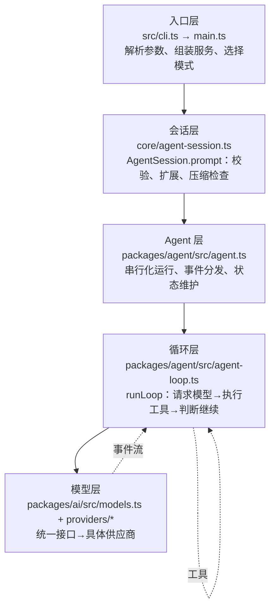

| 层       | 职责                                                 | 关键文件                                       | 深入章节        |
| -------- | ---------------------------------------------------- | ---------------------------------------------- | --------------- |
| 入口层   | 把命令行变成"可运行的会话运行时"                     | `src/cli.ts`、`src/main.ts`                | 本章 + 第 16 章 |
| 会话层   | 把"一条用户输入"变成"Agent 可以跑的提示消息"         | `src/core/agent-session.ts`                  | 第 8 章         |
| Agent 层 | 保证一次只跑一个 run、维护状态、派发事件             | `packages/agent/src/agent.ts`                | 第 6 章         |
| 循环层   | 真正决定"继续还是结束"的循环                         | `packages/agent/src/agent-loop.ts`           | 第 6、7 章      |
| 模型层   | 把统一请求转换成供应商请求，把供应商流转换成统一事件 | `packages/ai/src/models.ts`、`providers/*` | 第 5 章         |

**分层读法是本项目的核心读法**：遇到任何行为问题，先问"这是哪一层的问题"，再往下钻。

<a id="03-request-journey-h4"></a>

## 3.3 三个必须区分的概念

在进入代码之前，先把三个容易混淆的概念钉死（它们的代码证据在本章随文给出）。

<a id="03-request-journey-h5"></a>

### 3.3.1 概念一：AgentMessage（内部消息）vs Message（模型消息）

pi 内部流动的消息类型叫 `AgentMessage`。它比"模型能理解的消息"更宽：

- 标准角色：`system`、`user`、`assistant`、`toolResult`；
- 应用自定义消息：如 `custom`（扩展注入的内容），模型不需要看到。

在真正调用模型前，有一道"翻译关卡" `convertToLlm`（`packages/agent/src/agent.ts` 的默认实现）：

**先想它的作用**：内部历史可能包含模型不认识的自定义消息。默认实现先筛掉这些消息，让模型只接收标准角色；应用层还可以定义更完整的转换。下面的伪代码只描述这里的默认筛选。

```text
教学伪代码：遍历内部消息
           → 是 system/user/assistant/toolResult 就保留
           → 其他角色交给上层转换规则或从本次模型输入中排除
```

```typescript
function defaultConvertToLlm(messages: AgentMessage[]): Message[] {
	return messages.filter(
		(message) =>
			message.role === "system" ||
			message.role === "user" ||
			message.role === "assistant" ||
			message.role === "toolResult",
	);
}
```

注意它是"过滤 + 转换"：丢掉模型不该看的内容，把自定义类型翻译成标准类型。`coding-agent` 包的 `core/messages.ts` 提供了更完整的转换（第 4 章精读）。

<a id="03-request-journey-h6"></a>

### 3.3.2 概念二：消息（给模型/历史）vs 事件（给界面/订阅者）

- **消息**：会被记录、会被发给模型的"事实"（用户说了什么、模型回答了什么、工具返回了什么）；
- **事件**：运行过程中的"广播"（刚开始流式输出、工具开始执行、某个增量文本到达），给界面和订阅者看，**不等于**消息本身。

两者的关系：事件是过程，消息是结果。`text_delta` 事件来了五次，最终只形成**一条** assistant 消息。第 4 章会给出完整对照表。

<a id="03-request-journey-h7"></a>

### 3.3.3 概念三：用户请求、run、turn、模型请求

| 名称         | 定义                            | 在本例中的数量                            |
| ------------ | ------------------------------- | ----------------------------------------- |
| 用户请求     | 用户提交一次输入                | 1                                         |
| run（运行）  | 从开始处理到 Agent 空闲         | 1                                         |
| turn（轮次） | 一次助手响应 + 它引发的工具执行 | 2（第一次响应调用工具、第二次响应给总结） |
| 模型请求     | 真正发给供应商 API 的请求       | 2                                         |
| 工具执行     | 本地实际执行工具                | 1（read）                                 |

这张表是本章的骨架。现在开始逐层追踪。

<a id="03-request-journey-h8"></a>

## 3.4 入口层：从命令行到 `main()`

<a id="03-request-journey-h9"></a>

### 3.4.1 第一站：`src/cli.ts`（构建产物 `dist/bundle/cli.js` 的源码）

`packages/coding-agent/src/cli.ts` 只有 139 字节：

**先想它的作用**：这是进程入口，只负责做启动准备，再把命令行参数交给 `main()`；这里还没有向模型提问。

```text
教学伪代码：启动 Node 进程 → 设置 CLI 运行环境
           → 去掉 Node 自带的两个 argv 项 → 调用 main
```

```typescript
#!/usr/bin/env node
import { setupCli } from "./cli/setup.ts";
import { main } from "./main.ts";

setupCli();
main(process.argv.slice(2));
```

三个信息：

1. `#!/usr/bin/env node`：shebang，让打包后的文件可以当作可执行命令运行（`bin` 入口约定）；
2. `setupCli()`：在任何业务代码前做进程级初始化；
3. `main(process.argv.slice(2))`：把命令行参数（去掉 node 路径和脚本路径）交给主函数。

`setupCli()` 在 `src/cli/setup.ts`：

**先想它的作用**：后面的模型请求和输出模式依赖进程级设置，因此启动时先统一处理进程标记、告警输出和 HTTP 连接配置。

```text
教学伪代码：标记当前进程为 pi → 调整进程输出行为
           → 在供应商请求前准备 HTTP 调度器
```

```typescript
export function setupCli(): void {
	process.title = APP_NAME;
	process.env.PI_CODING_AGENT = "true";
	process.env.AI_AGENT = "pi";
	process.emitWarning = (() => {}) as typeof process.emitWarning;

	// Configure undici before provider SDKs issue requests. Settings are applied
	// once SettingsManager has loaded global/project configuration.
	configureHttpDispatcher();
}
```

- 设置进程标题和两个标记环境变量（其他工具/扩展靠它们识别"我在 pi 里运行"）；
- **静音 `process.emitWarning`**：因为第 1 章看到的 `ExperimentalWarning: Type Stripping` 之类警告会污染输出（尤其 print/json/rpc 模式的 stdout/stderr），源码运行体验更好；
- 提前配置 HTTP 调度器（代理、超时），保证后面所有供应商请求走同一套底层配置。

> 源码版 `pi-test.sh` 走的是 `src/experimental/cli.ts`（第 2 章 2.4.3），它先尝试 `runExperimentalCommand`（如 `pi client ...` 实验命令），没命中再调用同一个 `main(args)`。两条路最终合流。

<a id="03-request-journey-h10"></a>

### 3.4.2 第二站：`main()` 的前半段（启动与装配）

`packages/coding-agent/src/main.ts` 第 573 行开始是主函数。按顺序（节选 + 注释，省略与本章无关的分支）：

**先想它的作用**：不是每个命令都需要创建 Agent。`main()` 先处理能够立即完成的命令，再确定工作目录、配置和运行模式。这样 `--version` 之类的调用不必走完整启动流程。

```text
教学伪代码：检查离线等启动选项 → 处理可提前完成的子命令
           → 固定工作目录 → 读取安全的初始配置
           → 解析参数与模式 → 为后续会话装配做准备
```

```typescript
export async function main(args: string[], options?: MainOptions) {
	resetTimings();                 // 启动耗时打点器归零
	const offlineMode = args.includes("--offline") || isTruthyEnvFlag(process.env.PI_OFFLINE);
	if (offlineMode) {
		process.env.PI_OFFLINE = "1";
		process.env.PI_SKIP_VERSION_CHECK = "1";
	}

	if (await runAuthCommand(args)) return;   // `pi auth ...` 子命令分流

	const cwd = process.cwd();                 // 【重要】后面一切"项目相关"行为都以它为准
	const agentDir = getAgentDir();            // 全局配置目录（默认 ~/.pi/agent）
	const bootstrapSettingsManager = SettingsManager.create(cwd, agentDir, { projectTrusted: false });
	applyHttpProxySettings(bootstrapSettingsManager.getGlobalSettings().httpProxy);
	configureHttpDispatcher();

	if (await handlePackageCommand(args, { extensionFactories })) { /* pi install/remove/... */ }
	if (await handleConfigCommand(args, { extensionFactories })) { /* pi config ... */ }
	// ... `pi mcp` 子命令分流

	const parsed = parseArgs(args);            // 参数解析（定义在 cli/args.ts）
	// ... 打印诊断；有 error 则退出

	if (parsed.version) { console.log(VERSION); process.exit(0); }   // --version 快速退出
	if (parsed.export) { /* 导出会话为 HTML 后退出 */ }

	let appMode = resolveAppMode(parsed, process.stdin.isTTY, process.stdout.isTTY);
	const shouldTakeOverStdout = appMode !== "interactive" && !isPlainRuntimeMetadataCommand(parsed);
	if (shouldTakeOverStdout) takeOverStdout();
	// ... RPC 模式拒绝 @file；校验 --fork/--session-id 组合
	runMigrations(cwd);                        // 配置迁移
	// ... 首次启动引导、主题覆盖
```

这里已经能读出四个设计点，写代码的直觉就是这么积累起来的：

1. **快速命令先分流**：`auth`、`install`、`config`、`mcp`、`--version`、`--export` 都在"创建会话"之前处理掉。跑一次 `pi --version` 不会加载模型、不会扫资源。
2. **`cwd` 显式落盘**：`process.cwd()` 只取一次。之后所有模块传的都是这个值，避免"运行中途有人改了工作目录"导致状态割裂。
3. **信任先于加载**：bootstrap 设置管理器用 `projectTrusted: false` 创建——项目资源是否可信还没判定，先不能执行项目里的代码（第 11 章展开）。
4. **stdout 接管**：非交互模式下调用 `takeOverStdout()`，把裸写 stdout 的日志重定向到 stderr，保证协议输出干净（第 16 章的伏笔）。

<a id="03-request-journey-h11"></a>

### 3.4.3 第三站：会话目录与运行时工厂

继续往下（这是 `main()` 中最关键的一段）：

**先想它的作用**：用户可能指定会话目录，也可能恢复一个与当前目录不同的会话。运行时工厂保存“如何按目标工作目录重新建会话”的办法，所以会话切换后不会继续沿用旧目录的资源。

```text
教学伪代码：按参数/环境/设置确定会话目录 → 创建会话管理器
           → 定义运行时工厂：判断项目信任、加载资源、创建会话
           → 用工厂建立当前运行时
```

```typescript
	const envSessionDir = process.env[ENV_SESSION_DIR];
	const sessionDir = (parsed.sessionDir ? normalizePath(parsed.sessionDir) : undefined)
		?? (envSessionDir ? expandTildePath(envSessionDir) : undefined)
		?? startupSettingsManager.getSessionDir();
	let sessionManager = await createSessionManager(parsed, cwd, sessionDir, startupSettingsManager);
	// ...（处理会话指向的 cwd 缺失等边界）

	const resolvedExtensionPaths = resolveCliPaths(cwd, parsed.extensions);
	// ... 同样的 skill / promptTemplate / theme 路径解析

	const createRuntime: CreateAgentSessionRuntimeFactory = async ({ cwd, agentDir, sessionManager, sessionStartEvent, projectTrustContext }) => {
		// ... 项目信任判定（首次运行可能弹交互询问）
		const runtimeSettingsManager = SettingsManager.create(cwd, agentDir, { projectTrusted });
		const services = await createAgentSessionServices({
			cwd, agentDir, settingsManager: runtimeSettingsManager,
			resourceLoaderOptions: { /* 扩展/技能/模板/主题/上下文文件等发现配置 */ },
		});
		// ... 诊断信息收集；--model/--models 作用域解析（resolveModelScope）
		const created = await createAgentSessionFromServices({
			services, sessionManager, sessionStartEvent,
			model: sessionOptions.model, thinkingLevel: sessionOptions.thinkingLevel,
			tools: sessionOptions.tools, excludeTools: sessionOptions.excludeTools, noTools: sessionOptions.noTools,
			customTools: sessionOptions.customTools,
		});
		return { ...created, services, diagnostics };
	};
	const runtime = await createAgentSessionRuntime(createRuntime, {
		cwd: sessionManager.getCwd(), agentDir, sessionManager,
	});
```

三个要点：

- **会话目录的三个来源，优先级从高到低**：`--session-dir` 参数 → 环境变量 `PI_CODING_AGENT_SESSION_DIR` → 设置里的 `sessionDir`。
- **`createRuntime` 是"工厂函数"，不是一次性的对象**。因为会话可能切换工作目录（或恢复别的项目的会话），"cwd 绑定"的东西（项目设置、资源、工具、会话）需要**能重建**。`createAgentSessionRuntime` 把它包成运行时，第 8 章讲透。
- **`createAgentSessionServices` / `createAgentSessionFromServices` 与 SDK 的 `createAgentSession` 是两套入口**：SDK 走"一步到位"的 `createAgentSession`（3.5 节读它）；CLI 为了支持运行时可重建，拆成"服务 + 会话"两步。**读代码时先确认你读的是哪一条路**，这是很多人第一次读 `sdk.ts` 会迷路的原因。

<a id="03-request-journey-h12"></a>

### 3.4.4 第四站：模式分发（本章旅程的岔路口）

`main()` 的结尾：

**先想它的作用**：启动准备完成后，按模式交给不同界面；这些界面接收输入的方式不同，但最终都会使用同一套会话处理能力。

```text
教学伪代码：准备初始输入 → 如果是 RPC，持续读取命令
           → 否则如果是交互模式，打开终端界面
           → 否则执行一次 print/JSON 任务
```

```typescript
	if (parsed.help) { /* 打印帮助后退出 */ }
	if (parsed.listModels !== undefined) { /* 列出模型后退出 */ }

	let stdinContent: string | undefined;
	if (appMode !== "rpc") {
		stdinContent = await readPipedStdin();          // 管道输入：`git diff | pi -p ...`
		if (stdinContent !== undefined && appMode === "interactive") appMode = "print";
	}

	const { initialMessage, initialImages } = await prepareInitialMessage(parsed, stdinContent);
	// ... 初始化主题

	if (appMode === "rpc") {
		await runRpcMode(runtime);                       // ① RPC：stdin 收 JSONL，stdout 回响应
	} else if (appMode === "interactive") {
		const interactiveMode = new InteractiveMode(runtime, { /* ... */ });
		await interactiveMode.run();                     // ② 交互：全屏 TUI
	} else {
		const exitCode = await runPrintMode(runtime, {   // ③ print/json：一次性运行
			mode: toPrintOutputMode(appMode),            //    "text" 或 "json"
			messages: parsed.messages, initialMessage, initialImages,
		});
		// ...
	}
```

`resolveAppMode` 的规则（依据 `cli.md` 与代码）：显式 `--print` 或 `--mode json|rpc` 直接定；否则看 stdin/stdout 是否都是终端（TTY）——都是终端进交互模式，任一被重定向则退化为 print 模式。

**三个模式最终都会调用同一个东西**：`session.prompt(...)`。这就是为什么本章只讲一条公共路径。

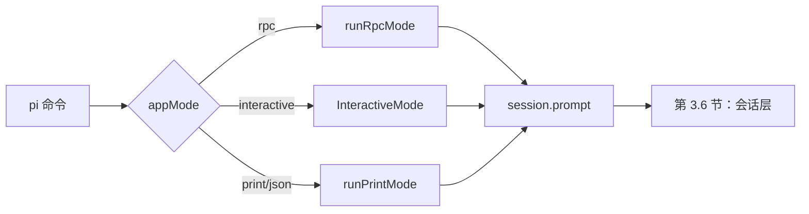

（提示：交互模式里，用户每次回车都会触发一次 `session.prompt`；print 模式在启动流程中触发一次；RPC 模式收到 `prompt` 命令时触发。三种触发时机不同，进入 3.5 节后就完全一样了。）

<a id="03-request-journey-h13"></a>

## 3.5 装配层：`createAgentSession` 到底组装了什么

在进入 `session.prompt` 之前，先花几分钟看清"会话里到底有什么"。SDK 的 `packages/coding-agent/src/core/sdk.ts` 是最好读的装配入口（CLI 走的是等价的两步式流程，见 3.4.3）。

以下按源码顺序（`sdk.ts` 第 175 行起）节选并注释：

**先想它的作用**：`createAgentSession` 不直接回答问题，它准备回答问题所需的模型、设置、历史和资源。调用者提供某个部件时使用它，否则创建默认部件。

```text
教学伪代码：确定 cwd 和配置目录
           → 取得或创建模型运行时、设置、会话存储
           → 如果没有自定义资源加载器，就创建并加载默认资源
           → 继续选择工具并创建 AgentSession
```

```typescript
export async function createAgentSession(options: CreateAgentSessionOptions = {}): Promise<CreateAgentSessionResult> {
	const cwd = resolvePath(options.cwd ?? options.sessionManager?.getCwd() ?? process.cwd());
	const agentDir = options.agentDir ? resolvePath(options.agentDir) : getDefaultAgentDir();
	let resourceLoader = options.resourceLoader;

	// 1. 模型运行时：谁来发请求、怎么认证
	const authPath = options.agentDir ? join(agentDir, "auth.json") : undefined;
	const modelsPath = options.agentDir ? join(agentDir, "models.json") : undefined;
	const modelRuntime = options.modelRuntime ?? (await ModelRuntime.create({ authPath, modelsPath }));

	// 2. 三件套：设置、会话存储、资源加载器
	const settingsManager = options.settingsManager ?? SettingsManager.create(cwd, agentDir);
	const sessionManager = options.sessionManager ?? SessionManager.create(cwd, getDefaultSessionDir(cwd, agentDir));

	if (!resourceLoader) {
		resourceLoader = new DefaultResourceLoader({ cwd, agentDir, settingsManager });
		await resourceLoader.reload();   // 真正去磁盘上"发现"扩展/技能/模板/主题/上下文文件
		time("resourceLoader.reload");
	}
```

这段值得单独说三点：

- **一切皆可注入**：每个组件都是 `options.X ?? 默认实现`。测试通过注入假实现完成离线运行，SDK 用户也可以只替换其中一个（第 15 章逐个演示）。
- **默认行为不是"空"而是"发现"**：`DefaultResourceLoader.reload()` 会扫描工作目录与 `~/.pi/agent`，这正是 `01-minimal.ts` 注释里说的 "discovers skills, extensions, tools, context files from cwd and ~/.pi/agent"。
- **`ModelRuntime` 是认证与模型的统一门面**：具体认证逻辑（API Key / OAuth / 环境变量）都在它和 `model-resolver.ts` 里，第 5、11 章展开。

继续读"恢复"逻辑：

```typescript
	// 3. 会话恢复：如果这个会话文件里已有内容，尽量把模型也恢复回来
	const existingSession = sessionManager.buildSessionContext();
	const hasExistingSession = existingSession.messages.length > 0;
	const hasThinkingEntry = sessionManager.getBranch().some((entry) => entry.type === "thinking_level_change");

	let model = options.model;
	const sessionModel = getBranchSelection(sessionManager.getBranch(), (provider, modelId) =>
		modelRuntime.getModel(provider, modelId),
	);
	if (!model && hasExistingSession && sessionModel) {
		const restoredModel = modelRuntime.getModel(sessionModel.provider, sessionModel.modelId);
		if (restoredModel && modelRuntime.hasConfiguredAuth(restoredModel.provider)) {
			model = restoredModel;   // 之前的会话用哪个模型，继续用它
		}
		// ... 否则记录 modelFallbackMessage（恢复失败的原因）
	}

	// 4. 仍然没有模型：按"设置里的默认 → 各供应商默认"顺序找
	if (!model) {
		const result = await findInitialModel({ scopedModels: [], isContinuing: hasExistingSession, /* ... */ });
		model = result.model;
		if (!model) modelFallbackMessage = formatNoModelsAvailableMessage();
	}
```

然后是思考级别与工具白名单：

```typescript
	// 5. thinkingLevel（思考深度）：会话恢复值 → 每模型设置 → 全局默认，最后按模型能力钳制
	thinkingLevel = clampThinkingLevel(model, thinkingLevel) as ThinkingLevel;

	// 6. 工具选择：显式 tools > defaultTools 设置 > 内置默认（DEFAULT_TOOL_NAMES）
	const configuredDefaultToolNames = settingsManager.getDefaultTools();
	const allowedToolNames = options.tools ?? (options.noTools === "all" ? [] : undefined);
	const excludedToolNames = options.excludeTools;
	const initialActiveToolNames = (
		options.tools ?? (options.noTools ? [] : (configuredDefaultToolNames ?? DEFAULT_TOOL_NAMES))
	).filter((name) => !excludedToolNameSet?.has(name));
```

再往下是"图片屏蔽"包装、缓存预热器和请求选项构建（选中读，不需要背）：

```typescript
	// 7. 消息转换包装：如果设置里禁止读图，就把图片块替换为文字占位符（纵深防御）
	const convertToLlmWithBlockImages = (messages: AgentMessage[]): Message[] => { /* ... */ };

	const extensionRunnerRef: { current?: ExtensionRunner } = {};
	const cacheWarmer = new CacheWarmer(modelRuntime, sessionManager,
		() => settingsManager.getCacheWarmingMode(),
		async (event) => extensionRunnerRef.current?.emitCacheWarmingDecision(event) ?? event.action,
	);
	const buildRequestOptions = (requestModel: Model<any>, options: ModelsSimpleStreamOptions = {}):
		ModelsSimpleStreamOptions => {
		// 超时 / 重试参数来自设置；合并供应商归因请求头；给扩展留 before_provider_headers 钩子
	};
```

最后是本层的主角——创建 `Agent` 与 `AgentSession`：

```typescript
	const agent = new Agent({
		initialState: { systemPrompt: "", model, thinkingLevel, tools: [], messages: existingSession.messages },
		convertToLlm: convertToLlmWithBlockImages,
		streamFn: async (model, context, options) => {
			const requestOptions = buildRequestOptions(model, options);
			// 只有"会话请求"才更新缓存预热的水位：压缩、摘要有自己的 sessionId
			if (options?.sessionId === sessionManager.getSessionId()) {
				cacheWarmer.start({ model, context, options: requestOptions }, cacheContextIsCurrent(model));
			}
			return modelRuntime.streamSimple(model, context, requestOptions);
		},
		onPayload: transformProviderPayload,         // 扩展钩子：before_provider_request
		onResponse: handleProviderResponse,           // 扩展钩子：after_provider_response
		onProviderStreamEvent: handleProviderStreamEvent,
		sessionId: sessionManager.getSessionId(),
		transformContext: async (messages) => {
			const runner = extensionRunnerRef.current;
			if (!runner) return messages;
			return runner.emitContext(messages);      // 扩展钩子：context 变换（第 13 章）
		},
		steeringMode: settingsManager.getSteeringMode(),
		followUpMode: settingsManager.getFollowUpMode(),
		// ...
	});

	// 7.5 记录初始模型/思考级别，供下次恢复
	if (hasExistingSession) {
		if (!hasThinkingEntry) sessionManager.appendThinkingLevelChange(thinkingLevel);
	} else {
		if (model) sessionManager.appendModelChange(model.provider, model.id);
		sessionManager.appendThinkingLevelChange(thinkingLevel);
	}

	const session = new AgentSession({
		agent, sessionManager, settingsManager, cwd,
		scopedModels: options.scopedModels,
		resourceLoader, customTools: options.customTools, modelRuntime, cacheWarmer,
		initialActiveToolNames, usesDefaultTools: options.tools === undefined && !options.noTools,
		allowedToolNames, excludedToolNames, extensionRunnerRef,
		sessionStartEvent: options.sessionStartEvent,
	});

	return { session, extensionsResult: resourceLoader.getExtensions(), modelFallbackMessage };
}
```

请把这一段的"对象关系"画成图（第 8 章会逐项解释所有权与释放）：

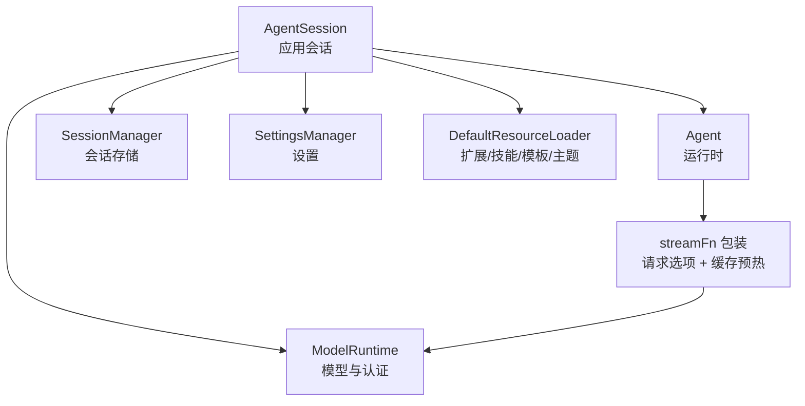

注意两个"跨层"点：

- `Agent` 的 `systemPrompt` 初始是空字符串——真正的系统提示由 `AgentSession` 在每次 prompt 前组装（第 10 章）；
- `Agent` 是**纯运行时**，它不知道文件、扩展、设置；它拿到的 `streamFn` 是 `AgentSession`（实际上是 sdk.ts 装配处）包装过的版本。这就是第 0 章讲的"下层只提供机制、上层决定用法"的具体体现。

<a id="03-request-journey-h14"></a>

## 3.6 会话层：`AgentSession.prompt` 在进入循环前做了什么

**先懂**：`prompt()` 先判断这段输入是不是扩展命令、是否要排队、是否允许在当前压缩状态下提交。只有真正要交给模型的输入，才会组装成消息并启动 Agent。

```text
教学伪代码：收到输入 → 若处于收束阶段则延后
           → 若是扩展命令则执行命令并结束这条输入
           → 检查当前能否提交或需要排队
           → 准备消息和资源 → 启动 Agent
```

同样的文字输入，在不同会话状态下走的路径不同；以下按分支顺序看源码。

入口找到 `packages/coding-agent/src/core/agent-session.ts` 第 1921 行（文件太大，请用"转到定义/搜索符号"定位，不要从头读）。方法很长，但结构是线性的。我们按分支顺序过一遍（节选 + 注释，删减了与本章无关的细节）：

```typescript
async prompt(text: string, options?: PromptOptions): Promise<void> {
	// ① 如果正在收尾（agent_settled 等收尾事件的处理过程中），先排队延后执行
	if (this._isEmittingAgentSettled) {
		this._deferredSettledActions.push(async () => await this.prompt(text, options));
		return;
	}

	// ② 以 "/" 开头且是扩展命令：立即执行，不发送给模型
	if (expandPromptTemplates && text.startsWith("/")) {
		const handled = await this._tryExecuteExtensionCommand(text);
		if (handled) { preflightResult?.("handled"); return; }
	}

	// ③ 压缩进行中不许提交（避免上下文在生成中变化）
	if (this._compactionAbortController !== undefined) {
		throw new Error("Cannot submit a prompt while compaction is in progress. ...");
	}

	// ④ 扩展的输入拦截钩子（可以改写文本、取消发送、决定入队行为）
	const processedInput = await this._runInputHandlers(text, options?.images,
		options?.source ?? "interactive", this.isStreaming ? options?.streamingBehavior : undefined);
	if (!processedInput) { preflightResult?.("handled"); return; }

	// ⑤ 展开 /skill:名称 与提示词模板
	let expandedText = currentText;
	if (expandPromptTemplates) {
		expandedText = this._expandSkillCommand(expandedText);
		expandedText = expandPromptTemplate(expandedText, [...this.promptTemplates]);
	}

	// ⑥ 正在流式输出时：不允许直接再发，必须明确行为（steer 或 followUp 入队）
	if (this.isStreaming) {
		if (!options?.streamingBehavior) throw new Error("Agent is already processing. ...");
		if (options.streamingBehavior === "followUp") await this._queueFollowUp(expandedText, currentImages);
		else await this._queueSteer(expandedText, currentImages);
		preflightResult?.("queued");
		return;
	}

	// ⑦ 冲刷之前积累的 bash 输出/自定义消息（它们要排在本次输入之前）
	this._flushPendingBashMessages();
	this._flushPendingCustomMessages();

	// ⑧ 必须已选择模型、且该供应商认证可用，否则立刻报错
	if (!this.model) throw new Error(formatNoModelSelectedMessage());
	const hasConfiguredAuth = this._modelRuntime.hasConfiguredAuth(this.model.provider)
		|| (await this._modelRuntime.checkAuth(this.model.provider)) !== undefined;
	if (!hasConfiguredAuth) { /* OAuth 过期提示 或 "没有 API Key" 提示 */ }

	// ⑨ 发送前检查是否需要先压缩上下文（例如上一次响应被取消留下了过长历史）
	const lastAssistant = this._findLastAssistantMessage();
	if (lastAssistant) await this._checkCompaction(lastAssistant, false);

	// ⑩ 扩展钩子 before_agent_start：可以改系统提示、选模型、注入消息
	const result = await this._extensionRunner.emitBeforeAgentStart(expandedText, currentImages, this._baseSystemPromptOptions);
	// ... 工具清单一致性处理（handler 显式改动优先，否则以当前激活工具为准）

	// ⑪ 图片归一化 + 组装本次要注入的消息数组
	const normalized = await this._normalizePromptImages(currentImages);
	const userText = normalized.hints.length > 0 ? `${expandedText}\n\n${normalized.hints.join("\n")}` : expandedText;
	const messages: AgentMessage[] = [];
	messages.push({ role: "user", content: [{ type: "text", text: userText }, ...normalized.images], timestamp: Date.now() });
	// ... 追加 pendingNextTurn 消息、扩展注入的 custom 消息

	// ⑫ 组装/更新系统提示选项（含工具载入变更的 system 消息），并入队
	const updateMessage = this._preparePromptAndToolLoadout(result.systemPromptOptions);
	this._runSystemPromptOptions = result.systemPromptOptions;
	if (updateMessage) messages.unshift(updateMessage);

	preflightResult?.("started");
	await this._runAgentPrompt(messages);   // 交给下一步：真正驱动 Agent
}
```

对本章的追踪来说，②③⑥⑧⑨ 是"守卫"（不合格就停下或入队），⑤⑩⑪ 是"改写"（把用户输入加工成一批待注入消息），最后 `_runAgentPrompt(messages)` 才是"运行"。

`_runAgentPrompt`（同一文件第 1775 行）是会话层与 Agent 层之间的桥梁：

```typescript
private async _runAgentPrompt(messages: AgentMessage | AgentMessage[]): Promise<void> {
	this._agentRunAbortRequested = false;
	this._failedResponse = undefined;          // 之前的失败响应记录先清除
	this._recordSelection();
	this._pendingToolNames.clear();
	this._isAgentRunActive = true;
	try {
		await this.agent.prompt(messages);     // ← 控制权交给 Agent（下一节）
		// 运行后循环：处理重试、自动压缩、队列里的新消息
		while (!this._agentRunAbortRequested) {
			if (await this._handlePostAgentRun()) {
				if (this._agentRunAbortRequested) break;
				await this.agent.continue();    // 同一会话里继续跑（不新增用户消息）
				continue;
			}
			if (this._agentRunAbortRequested || !(await this._runBeforeSettleBoundary())) break;
			if (this._agentRunAbortRequested) break;
			await this.agent.continue();
		}
	} finally {
		// ... 收尾：清理请求级状态、冲刷待发消息、发出 agent_settled
		await this._emitAgentSettled();
	}
}
```

为什么 `agent.prompt()` 回来之后还要循环？因为在这些情况下"工作还没完"：

- **重试**：可重试的错误（如网络抖动）由 `_handlePostAgentRun` 判断后触发 `agent.continue()`；
- **自动压缩**：发现上下文超限，先压缩再继续；
- **运行期间新排队的消息**：用户在流式输出中按了回车（steering / follow-up），它们会在合适时机被排进来再跑一轮；
- **扩展边界**：`agent_before_settle` 钩子允许扩展在"即将空闲"前再塞一轮。

这些细节属于第 6、8 章；本章只要记住：**`session.prompt()` 返回时，指的是"这一轮会话相关工作全都结束了"（包括上述循环），而不是"第一次模型响应结束了"。**

<a id="03-request-journey-h15"></a>

## 3.7 Agent 层：`Agent.prompt` 与"一次只跑一个 run"

**先懂**：会话已经准备好一条输入，但同一个 Agent 不能让两次运行同时修改历史。因此先检查是否正在运行，再规范输入的形状，最后开始执行。

```text
教学伪代码：如果已有运行，就拒绝新的 prompt
           → 把字符串/消息统一成消息数组
           → 等待这一批消息的运行结束
```

控制权从会话层进入 `packages/agent/src/agent.ts`。第一站是 `Agent.prompt`（第 371 行）：

```typescript
async prompt(input: string | AgentMessage | AgentMessage[], images?: ImageContent[]): Promise<void> {
	if (this.activeRun) {
		throw new Error("Agent is already processing a prompt. Use steer() or followUp() to queue messages, or wait for completion.");
	}
	const messages = this.normalizePromptInput(input, images);
	await this.runPromptMessages(messages);
}
```

三个行为：

1. **同一时刻只允许一个 run**：`activeRun` 非空时直接抛错。想"边跑边插话"必须用 `steer()` / `followUp()` 排队，而不是再调一次 `prompt()`。这是有意的约束——避免同一份消息历史被两个 run 并发改写。
2. **输入归一化**：`normalizePromptInput` 把字符串包装成标准用户消息：

```typescript
private normalizePromptInput(input: string | AgentMessage | AgentMessage[], images?: ImageContent[]): AgentMessage[] {
	if (Array.isArray(input)) return input;
	if (typeof input !== "string") return [input];
	const content: Array<TextContent | ImageContent> = [{ type: "text", text: input }];
	if (images && images.length > 0) content.push(...images);
	return [{ role: "user", content, timestamp: Date.now() }];
}
```

3. **进入生命周期包装**：

```typescript
private async runPromptMessages(messages: AgentMessage[], options: { skipInitialSteeringPoll?: boolean } = {}): Promise<void> {
	await this.runWithLifecycle(async (signal) => {
		await runAgentLoop(
			messages,
			this.createContextSnapshot(),        // 当前消息 + 工具的浅拷贝快照
			this.createLoopConfig(options),      // 把 Agent 的回调整理成循环配置
			(event) => this.processEvents(event),// 循环发出的事件先进入 Agent 的状态归约
			signal,
			this.streamFunction,
		);
	});
}
```

`runWithLifecycle` 是"run 的边界"，也是状态位的唯一管理者：

```typescript
private async runWithLifecycle(executor: (signal: AbortSignal) => Promise<void>): Promise<void> {
	if (this.activeRun) throw new Error("Agent is already processing.");

	const abortController = new AbortController();
	let resolvePromise = () => {};
	const promise = new Promise<void>((resolve) => { resolvePromise = resolve; });
	this.activeRun = { promise, resolve: resolvePromise, abortController };

	this._state.isStreaming = true;
	this._state.streamingMessage = undefined;
	this._state.errorMessage = undefined;

	try {
		await executor(abortController.signal);
	} catch (error) {
		await this.handleRunFailure(error, abortController.signal.aborted);   // 把异常变成"错误消息 + 事件"
	} finally {
		this.finishRun();     // isStreaming=false；唤醒 waitForIdle()；清空 activeRun
	}
}
```

读这段要抓住一个设计：**executor 的运行异常通常会转成失败事件，而不是直接从 `prompt()` 抛出**。异常被 `handleRunFailure` 捕获后，会转成一条骨架 assistant 消息（`stopReason` 为 `"error"` 或 `"aborted"`），再走 `message_start → message_end → turn_end → agent_end` 事件序列；前提是这段失败事件派发顺利完成。若监听器在派发失败事件时再次抛错，`handleRunFailure` 的 Promise 会 reject，异常会继续从 `prompt()` 冒出。`finally` 仍会运行并清理 run 状态。比如 provider 抛错且监听器正常时，调用方可读 `agent.state.errorMessage`；若监听器也抛错，`await session.prompt(...)` 仍应由调用方捕获处理。这样：

- 订阅者（界面）用同一套逻辑处理成功与失败；
- 上层（`session.prompt`）可从 `agent.state.errorMessage` 或消息内容读取通常的运行失败；调用方仍应考虑监听器抛错等失败处理本身出错的路径。

`processEvents` 是"事件 → 状态"的归约器（第 4 章会有完整表格，这里先看主循环需要的部分）：

```typescript
private async processEvents(event: AgentEvent): Promise<void> {
	switch (event.type) {
		case "message_start":
		case "message_update":
			this._state.streamingMessage = event.message;   // 正在流式形成中的消息
			break;
		case "message_end":
			this._state.streamingMessage = undefined;
			this._state.messages.push(event.message);        // 完整消息进入历史
			break;
		case "tool_execution_start": /* pendingToolCalls.add(id) */ break;
		case "tool_execution_end":   /* pendingToolCalls.delete(id) */ break;
		case "turn_end":
			if (event.message.role === "assistant" && event.message.errorMessage) {
				this._state.errorMessage = event.message.errorMessage;
			}
			break;
		case "agent_end": this._state.streamingMessage = undefined; break;
	}

	const signal = this.activeRun?.abortController.signal;
	if (!signal) throw new Error("Agent listener invoked outside active run");
	for (const listener of this.listeners) {
		await listener(event, signal);   // 逐个 await：订阅顺序 = 处理顺序
	}
}
```

两个关键语义（第 1 章预告过，现在证据齐了）：

- **监听器被逐个 `await`**：一个订阅者处理慢，会拖慢后续订阅者和整个 run。所以订阅回调要快；慢活（网络、渲染大计算）要自己异步化并管理错误。
- **`isStreaming` 直到 `agent_end` 的所有监听器结束才变 false**：`await session.prompt(...)` 返回时，界面已收完最后一批事件。

<a id="03-request-journey-h16"></a>

## 3.8 循环层：`runLoop` 的完整决策过程

**先懂**：循环重复“让模型回答、处理工具、判断是否继续”。每次重复叫一个 turn。先看正常的两轮例子，再阅读钩子、排队和取消如何插入。

```text
教学伪代码：发起本轮模型请求 → 收到回答
           → 如有工具，执行并加入结果
           → 完成本轮 → 有后续工作则再来一轮，否则结束
```

`packages/agent/src/agent-loop.ts` 是全书的"心脏"。先看入口，它很薄：

```typescript
export async function runAgentLoop(
	prompts: AgentMessage[],
	context: AgentContext,
	config: AgentLoopConfig,
	emit: AgentEventSink,
	signal: AbortSignal | undefined,
	streamFn: StreamFn,
): Promise<AgentMessage[]> {
	const initialMessages = declareToolChanges(context, prompts);
	const newMessages: AgentMessage[] = [...initialMessages];
	const currentContext: AgentContext = { ...context, messages: [...context.messages, ...initialMessages] };

	await emit({ type: "agent_start" });
	await emit({ type: "turn_start" });
	for (const message of initialMessages) {
		await emit({ type: "message_start", message });
		await emit({ type: "message_end", message });
	}

	await runLoop(currentContext, newMessages, config, signal, emit, streamFn ?? getDefaultStreamFn());
	return newMessages;
}
```

- `declareToolChanges`：如果这次请求涉及"工具清单变化"（比如扩展在运行中启用了新工具），它会**插入一条 system 消息**声明增删了哪些工具。这样模型看到的消息序列始终自洽，回放（第 9 章）也精确一致。
- `newMessages`：这次 run 新产生的消息（用户消息 + 助手消息 + 工具结果），最后作为 `agent_end.messages` 发出、也用于会话持久化（第 9 章）。
- 开头三条事件：`agent_start` → `turn_start` → 用户消息的 `message_start/message_end`。请对照 `packages/agent/README.md` 的事件序列图，一模一样。

真正的决策在 `runLoop`（同一文件）。它是**双层循环**，这段代码值得逐行读：

```typescript
async function runLoop(initialContext, newMessages, initialConfig, signal, emit, streamFunction): Promise<void> {
	let currentContext = initialContext;
	let config = initialConfig;
	let lastCompletedTurn: PrepareNextTurnContext | undefined;
	let explicitContinuation = false;
	// 用户在等待期间可能已经打了字：进入循环前先取一次 steering 消息
	let pendingMessages: AgentMessage[] = (await config.getSteeringMessages?.()) || [];

	// 外层循环：当"原本要停下来"时，还有 follow-up 消息就再跑一轮
	while (true) {
		let hasMoreToolCalls = true;

		// 内层循环：只要有工具要执行、或有排队的消息，就继续请求模型
		while (hasMoreToolCalls || pendingMessages.length > 0) {
			// ① 如果上一轮结束了，先给"下一轮开始"一个准备机会（prepareNextTurn）
			let preparedMessages: AgentMessage[] = [];
			if (lastCompletedTurn) {
				const nextTurnSnapshot = await config.prepareNextTurn?.(lastCompletedTurn);
				if (nextTurnSnapshot) {
					currentContext = nextTurnSnapshot.context ?? currentContext;
					preparedMessages = nextTurnSnapshot.messages ?? [];
					config = { ...config, model: nextTurnSnapshot.model ?? config.model, /* reasoning 更新 */ };
				}
				// 准备可能耗时（例如压缩）；这期间新排队的 steering 消息要补取
				if (pendingMessages.length === 0) {
					pendingMessages = (await config.getSteeringMessages?.()) || [];
				}
				await emit({ type: "turn_start" });
			}

			// ② 注入准备好的消息与排队消息（附工具变化声明），逐条发消息事件
			for (const message of declareToolChanges(currentContext, [...preparedMessages, ...pendingMessages])) {
				await emit({ type: "message_start", message });
				await emit({ type: "message_end", message });
				currentContext.messages.push(message);
				newMessages.push(message);
			}
			pendingMessages = [];

			// ③ 发请求前最后一次修改请求的机会（prepareRequest 钩子）
			const requestUpdate = await config.prepareRequest?.({ context: currentContext, model: config.model, thinkingLevel: config.reasoning ?? "off" }, signal);
			if (requestUpdate) { /* 更新 currentContext / model / reasoning */ }

			// ④ 请求模型并流式收集一条完整 assistant 消息（见 3.9 节）
			const message = await streamAssistantResponse(currentContext, config, signal, emit, streamFunction);
			newMessages.push(message);

			// ⑤ 失败/取消：收尾本轮并直接结束整个 run
			if (message.stopReason === "error" || message.stopReason === "aborted") {
				lastCompletedTurn = { message, toolResults: [], context: currentContext, newMessages };
				await config.finishTurn?.(lastCompletedTurn, signal);
				await emit({ type: "turn_end", message, toolResults: [] });
				await emit({ type: "agent_end", messages: newMessages });
				return;
			}

			// ⑥ 检查模型是否要求调用工具
			const toolCalls = message.content.filter((c) => c.type === "toolCall");
			const toolResults: ToolResultMessage[] = [];
			hasMoreToolCalls = false;
			if (toolCalls.length > 0) {
				// 输出被 max_tokens 截断时，工具参数可能"能解析但不完整"：全部拒绝执行
				const executedToolBatch = message.stopReason === "length"
					? await failToolCallsFromTruncatedMessage(toolCalls, emit)
					: await executeToolCalls(currentContext, message, config, signal, emit);
				toolResults.push(...executedToolBatch.messages);
				hasMoreToolCalls = !executedToolBatch.terminate;
				for (const result of toolResults) {
					currentContext.messages.push(result);
					newMessages.push(result);
				}
			}

			// ⑦ 本轮完成：交给 finishTurn 决策，然后发 turn_end
			lastCompletedTurn = { message, toolResults, context: currentContext, newMessages };
			const decision = await config.finishTurn?.(lastCompletedTurn, signal);
			await emit({ type: "turn_end", message, toolResults });

			if (decision?.action === "end") {
				await emit({ type: "agent_end", messages: newMessages });
				return;
			}
			explicitContinuation = decision?.action === "continue";
			pendingMessages = (await config.getSteeringMessages?.()) || [];
			if (hasMoreToolCalls || pendingMessages.length > 0) explicitContinuation = false;
		}

		// ⑧ 内层退出：Agent 本来要停了，检查 follow-up 队列
		const followUpMessages = (await config.getFollowUpMessages?.()) || [];
		if (followUpMessages.length > 0) {
			explicitContinuation = false;
			pendingMessages = followUpMessages;
			continue;                        // 回到外层开头，重新进入内层
		}
		if (explicitContinuation) {          // finishTurn 明确要求再来一轮（不新增消息）
			explicitContinuation = false;
			continue;
		}
		break;                               // 真的没活了
	}

	await emit({ type: "agent_end", messages: newMessages });
}
```

把"继续还是结束"整理成决策表（这是本章验收的核心）：

| 运行中的情况                                       | 判定 | 结果                                                                  |
| -------------------------------------------------- | ---- | --------------------------------------------------------------------- |
| 模型响应`stopReason` 为 `error`/`aborted`    | ⑤   | 收尾本轮后**直接结束**整个 run                                  |
| 有工具调用且批次未要求 terminate                   | ⑥   | 执行工具，`hasMoreToolCalls = true`，**再请求模型**           |
| 有工具调用但**全部**结果 `terminate: true` | ⑥   | 不再因工具继续                                                        |
| `finishTurn` 返回 `{ action: "end" }`          | ⑦   | 立即结束（扩展/上层主动叫停）                                         |
| `finishTurn` 返回 `{ action: "continue" }`     | ⑦   | 记下`explicitContinuation`，内层退出后空转一轮（context-only turn） |
| 有 steering 消息                                   | ⑦   | 下一轮注入后继续                                                      |
| 内层退出、有 follow-up 消息                        | ⑧   | 重新进入内层继续                                                      |
| 都没有                                             | ⑧   | `break` → `agent_end`，run 结束                                  |

回到我们的场景：

- 第一次 `streamAssistantResponse` 返回的 assistant 消息里有一个 `toolCall`（read）。⑥执行工具 → `hasMoreToolCalls = true`；
- 第二次请求返回纯文本（无工具调用）、也没有排队消息 → 内层 `while` 条件为 false，退出；
- 没有 follow-up → 外层 `break`；
- 发出 `agent_end`，run 结束。

<a id="03-request-journey-h17"></a>

### 3.8.1 并行工具的"两个顺序"

第 7 章会用实验证明，这里先把代码事实说清。`executeToolCallsParallel`（同文件）的执行顺序是：

```text
准备阶段：按模型声明顺序，逐个 emit tool_execution_start（A 开始、B 开始）
执行阶段：所有允许的工具并发执行（B 可能先完成）
完成阶段：谁先完成谁先 emit tool_execution_end（B 结束、A 结束）
记录阶段：await Promise.all(有序结果) → 按声明顺序生成 toolResult 消息（A、B）
```

对照代码：完成事件在各自 `finalized` 闭包里发出，而结果消息在 `Promise.all` 之后用 `orderedFinalizedCalls` 循环发出。**"界面反馈按完成顺序、历史记录按声明顺序"**，两个顺序各有用途。

<a id="03-request-journey-h18"></a>

## 3.9 模型层：一次请求如何变成一条完整消息

**先懂**：发送请求前，内部消息要变成供应商能够理解的消息；返回时，多个增量事件要合成一条最终回答。先抓住这两个转换方向。

```text
教学伪代码：取当前上下文 → 转为模型消息并准备认证
           → 调用流式模型接口 → 每个增量发给订阅者
           → 在流结束时得到完整回答
```

`streamAssistantResponse`（`agent-loop.ts`）是"循环层"与"模型层"的接缝。它做四件事：变换上下文 → 转换消息类型 → 发请求 → 把事件流折叠成一条完整消息。

```typescript
async function streamAssistantResponse(context, config, signal, emit, streamFunction): Promise<AssistantMessage> {
	// ① 扩展可先变换 Agent 消息（AgentMessage[] → AgentMessage[]）
	let messages = context.messages;
	if (config.transformContext) messages = await config.transformContext(messages, signal);

	// ② 翻译成模型消息（AgentMessage[] → Message[]）：过滤 + 转格式
	const llmMessages = await config.convertToLlm(messages);
	const llmContext = normalizeContext({ messages: llmMessages });

	// ③ 解析 API Key（每次请求都解析：OAuth 令牌可能过期刷新）
	const resolvedApiKey =
		(config.getApiKey ? await config.getApiKey(config.model.provider) : undefined) || config.apiKey;

	// ④ 交给 streamFn（这里指向 sdk.ts 的包装函数 → modelRuntime.streamSimple）
	const response = await streamFunction(config.model, llmContext, { ...config, apiKey: resolvedApiKey, signal });

	// ⑤ result() 只可调用一次：拿到最终消息，并记录本次请求的思考级别
	const result = async () => Object.assign(await response.result(), { thinkingLevel: config.reasoning ?? "off" });

	let partialMessage: AssistantMessage | null = null;
	let addedPartial = false;

	for await (const event of response) {
		switch (event.type) {
			case "start":
				// 流开始：把"部分消息"放进上下文并通知订阅者
				partialMessage = event.partial;
				context.messages.push(partialMessage);
				addedPartial = true;
				await emit({ type: "message_start", message: { ...partialMessage } });
				break;

			case "text_start": case "text_delta": case "text_end":
			case "thinking_start": case "thinking_delta": case "thinking_end":
			case "toolcall_start": case "toolcall_delta": case "toolcall_end":
				// 任何增量：更新上下文里那条部分消息，并广播 message_update
				if (partialMessage) {
					partialMessage = event.partial;
					context.messages[context.messages.length - 1] = partialMessage;
					await emit({ type: "message_update", assistantMessageEvent: event, message: { ...partialMessage } });
				}
				break;

			case "done": case "error": {
				// 流结束：以最终消息替换部分消息（或补齐缺失的 start）
				const finalMessage = await result();
				if (addedPartial) context.messages[context.messages.length - 1] = finalMessage;
				else { context.messages.push(finalMessage); await emit({ type: "message_start", message: { ...finalMessage } }); }
				await emit({ type: "message_end", message: finalMessage });
				return finalMessage;
			}
		}
	}
	// 流意外关闭（没有 done/error 事件）的兜底：同样产出最终消息
	// ...
}
```

逐点解释：

- **`message_update` 里携带两个东西**：`assistantMessageEvent`（刚发生的增量，如 `text_delta` 的 `delta` 文本）和 `message`（截至此刻累积出的部分消息快照）。界面两者都能用：前者决定"再写几个字"，后者用于"整段重绘"。
- **部分消息会临时进入 `context.messages`**：所以订阅者在运行中读 `agent.state.messages` 时，最后一条可能是"还没完成的助手消息"。`message_end` 之后它被**最终消息替换**（同一位置）。这解释了为什么消息数量在运行中会"保持不变"而内容在变。
- **`stopReason` 是外层循环的判据**：`done` 事件带 `reason`（`stop` / `length` / `toolUse` / `deferred`），最终消息里的 `stopReason` 决定 3.8 的 ⑤⑥ 分支。

接下来是模型层内部：`streamFunction` 指向 `sdk.ts` 里的包装（先缓存预热、再调 `modelRuntime.streamSimple`）。`ModelRuntime` → `pi-ai` 的 `streamSimple` → 找到对应 `Api` 的适配器（如 `providers/anthropic.ts`）→ 供应商 SDK → 返回统一事件流。**这一段的细节全部留到第 5 章**，本章你只需要记住接缝位置：

```text
agent-loop.ts streamAssistantResponse
  → streamFn（sdk.ts 包装：缓存预热 + 请求选项）
    → modelRuntime.streamSimple（coding-agent）
      → pi-ai compat.streamSimple（统一入口，处理重试/兼容）
        → providers/<供应商>.ts（请求转换、SSE 解析）
          → 供应商原生事件
        ← 统一为 AssistantMessageEvent（start/text_*/thinking_*/toolcall_*/done/error）
      ← AssistantMessageEventStream
  ← for await 折叠为一条 AssistantMessage
```

<a id="03-request-journey-h19"></a>

## 3.10 工具层：从 toolCall 到 toolResult 消息

**先懂**：模型一次可以提出多个工具调用。执行前先决定这一批能否并行；每个调用再经过准备、执行、后置处理和生成结果消息。

```text
教学伪代码：查看全局模式与每个工具的顺序要求
           → 选择整批顺序或允许并行的调度
           → 分别取得最终结果 → 回填到对话
```

并行时完成事件可先后到达，但回填顺序按模型提出调用的顺序处理；第 7 章会展开准备和取消边界。

回到 `agent-loop.ts` 的 ⑥：一旦模型消息里含 `toolCall`，就调用 `executeToolCalls`。调度规则很简单：

```typescript
const hasSequentialToolCall = toolCalls.some(
	(tc) => currentContext.tools?.find((t) => t.name === tc.name)?.executionMode === "sequential",
);
if (config.toolExecution === "sequential" || hasSequentialToolCall) {
	return executeToolCallsSequential(...);   // 顺序执行：准备、执行、收尾一个接一个
}
return executeToolCallsParallel(...);         // 并行执行：准备顺序进行，执行允许并发
```

一个批次里只要**有任何一个**工具被声明为 `executionMode: "sequential"`（或全局配置为顺序），整个批次就顺序执行。这是保证"有副作用的工具不乱序"的保守策略。

每个工具调用都经历**四步流水线**（`prepareToolCall` → `executePreparedToolCall` → `finalizeExecutedToolCall` → 记录），单独看 `prepareToolCall`：

```typescript
async function prepareToolCall(currentContext, assistantMessage, toolCall, config, signal, tools = ...) {
	const tool = tools.find((t) => t.name === toolCall.name);
	if (!tool) {
		return { kind: "immediate", result: createErrorToolResult(`Tool ${toolCall.name} not found`), isError: true };
	}
	try {
		const preparedToolCall = prepareToolCallArguments(tool, toolCall); // 可选兼容层：修正原始参数
		const validatedArgs = validateToolArguments(tool, preparedToolCall); // 运行时 schema 校验（typebox）
		if (config.beforeToolCall) {
			const beforeResult = await config.beforeToolCall({ assistantMessage, toolCall, args: validatedArgs, context: currentContext }, signal);
			if (signal?.aborted) return { kind: "immediate", result: createErrorToolResult("Operation aborted"), isError: true };
			if (beforeResult?.block) {
				const result = createErrorToolResult(beforeResult.reason || "Tool execution was blocked");
				if (beforeResult.terminate === true) result.terminate = true;
				return { kind: "immediate", result, isError: true };  // 被拦截：不执行，回一条错误结果
			}
		}
		if (signal?.aborted) return { kind: "immediate", result: createErrorToolResult("Operation aborted"), isError: true };
		return { kind: "prepared", toolCall, tool, args: validatedArgs };
	} catch (error) {
		return { kind: "immediate", result: createErrorToolResult(error instanceof Error ? error.message : String(error)), isError: true };
	}
}
```

四个"提前结束"分支——**工具不存在、参数非法、被钩子拦截、已取消**——全部返回 `isError: true` 的结果对象，而不是抛异常。这是本仓库贯穿性的错误哲学：

> **错误是一种结果，不是一种崩溃。** 出错信息要能返回给模型，让它自己决定下一步。

执行与收尾（简化注释）：

```typescript
async function executePreparedToolCall(prepared, signal, onUpdate) {
	try {
		// 工具自己的实现：read 工具在这里读文件（packages/coding-agent/src/core/tools/read.ts）
		const result = await prepared.tool.execute(prepared.toolCall.id, prepared.args, signal, (partialResult) => {
			// 工具的进度回调 → tool_execution_update 事件（界面即时反馈）
			updateEvents.push(Promise.resolve(onUpdate(partialResult)));
		});
		return { result, isError: result.isError === true };
	} catch (error) {
		// 抛出的异常被折叠成错误结果，run 继续
		return { result: createErrorToolResult(error instanceof Error ? error.message : String(error)), isError: true };
	}
}

async function finalizeExecutedToolCall(...) {
	// afterToolCall 钩子可以改写结果（字段级替换，见 types.ts 的 AfterToolCallResult 注释）
	// 注意：content 被替换而 structuredContent 未同时提供时，structuredContent 会被丢弃（可能不再匹配）
}
```

最后两步：`emitToolExecutionEnd` 发 `tool_execution_end` 事件；`createToolResultMessage` 生成**工具结果消息**（这条会进入历史、发给模型）：

```typescript
function createToolResultMessage(finalized) {
	return {
		role: "toolResult",
		toolCallId: finalized.toolCall.id,   // 与请求它的 toolCall 一一对应
		toolName: finalized.toolCall.name,
		content: finalized.result.content ?? [],
		details: finalized.result.details,
		usage: finalized.result.usage,
		isError: finalized.isError,
		timestamp: Date.now(),
	};
}
```

然后 `message_start` / `message_end` 两个事件把这条消息广播出去。**到这里，"read 工具的结果"正式成为对话历史的一部分**，下一轮模型请求就能看到它。

<a id="03-request-journey-h20"></a>

## 3.11 第二轮请求：循环如何自然结束

**先懂**：工具结果已经加入历史，模型这次终于能看到文件内容。如果它直接给出总结，而且没有排队输入或续跑决定，运行就会结束。

```text
教学伪代码：把 read 的结果放入上下文 → 再请求模型
           → 得到无工具调用的总结 → 检查续跑与队列
           → 发结束事件并等待会话收束
```

工具结果入队后，`hasMoreToolCalls = true`，内层循环再次执行。第二次迭代与第一次结构相同，四处不同：

1. `lastCompletedTurn` 已有值 → 先调 `prepareNextTurn`（在基础用法里是 `undefined`；`AgentSession` 会在这里挂接压缩等准备逻辑，第 10 章）。
2. 没有新的用户消息要注入（除非排队）。
3. 模型看到的上下文变成：`[system, user, assistant(read 工具调用), toolResult(文件内容)]`——这是它第一次能"看到"文件。
4. 这次响应通常没有 `toolCall`，`stopReason` 为 `"stop"`。

随后：`finishTurn` 返回空 → `turn_end` → 内层条件（无工具、无排队）为假 → 退出内层 → 无 follow-up → `break` → 发出 `agent_end`。

与此同时，会话层在背后做了两件事（都发生在事件流上）：

- **持久化**：`AgentSession` 订阅了 Agent 事件，在 `message_end` 时把消息写入会话文件。真实代码（`agent-session.ts` 约第 1113 行）：

```typescript
if (event.type === "message_end") {
	let entryId: string | undefined;
	if (event.message.role === "custom") {
		entryId = this.sessionManager.appendCustomMessageEntry(/* ... */);
	} else if (event.message.role === "system" || event.message.role === "user"
		|| event.message.role === "assistant" || event.message.role === "toolResult") {
		entryId = this.sessionManager.appendMessage(event.message);
	}
	if (entryId) this._entryIdsByMessage.set(event.message, entryId);
	// ...
}
```

  也就是说：**"发给模型的消息"和"写进会话文件的消息"来自同一个 `message_end` 事件**——但存储格式与发送格式可能不同（第 9 章）。

- **收尾循环**：`_runAgentPrompt` 里 `agent.prompt()` 返回后，还要检查重试/压缩/队列（3.6 节）。本例都没有，于是 `session.prompt()` 返回。

<a id="03-request-journey-h21"></a>

## 3.12 完整时序图

把本章所有结论合成一张图（参与者就是五个层）：

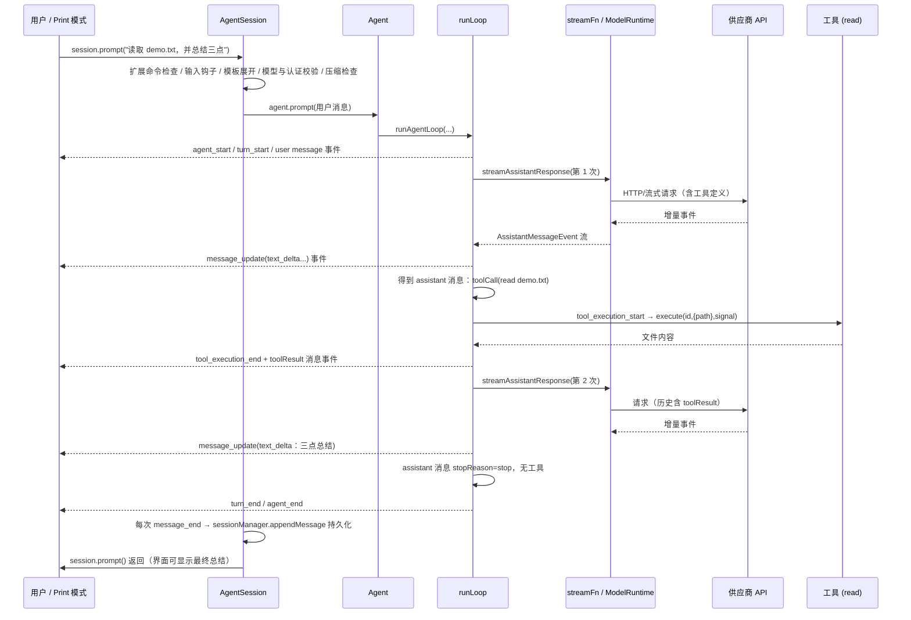

<a id="03-request-journey-h22"></a>

### 3.12.1 放大一段 `text_delta`：同一内容经过四层

时序图把整条路压在一页上，第一次阅读时容易把几个同名近似的对象混成一个。先只追一小段文本，例如供应商陆续返回 `"读取"`、`"完成"` 两个片段。它们会被拼进一条 assistant 消息，但事件流中仍是两个增量。

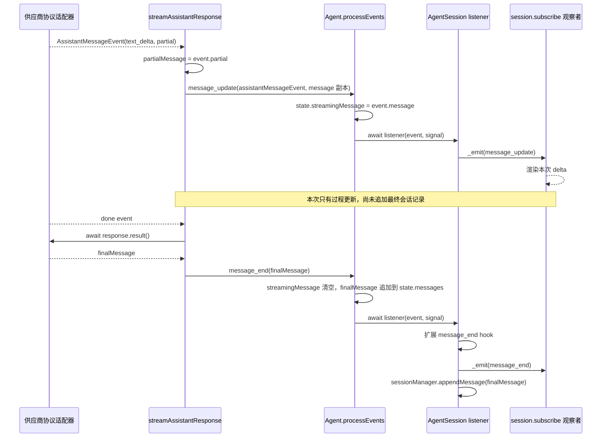

<a id="03-request-journey-h23"></a>

#### 第一层：协议适配器产出统一事件

供应商原始 SSE/HTTP chunk 不是 Agent 事件。Anthropic、OpenAI 等 adapter 先把供应商协议转换成 `AssistantMessageEvent`；例如 `{ type: "text_delta", delta, partial }`。这里的 `partial` 是 adapter 当前累积到的部分 assistant message。不同供应商的事件格式在 D17–D20 分别精读。

<a id="03-request-journey-h24"></a>

#### 第二层：`streamAssistantResponse` 折叠成 Agent 事件

阅读 `packages/agent/src/agent-loop.ts` → `streamAssistantResponse`。该函数用 `for await...of` 逐个取模型流事件：

```typescript
for await (const event of response) {
  switch (event.type) {
    case "start":
      partialMessage = event.partial;
      context.messages.push(partialMessage);
      await emit({ type: "message_start", message: { ...partialMessage } });
      break;
    case "text_delta":
      if (partialMessage) {
        partialMessage = event.partial;
        context.messages[context.messages.length - 1] = partialMessage;
        await emit({
          type: "message_update",
          assistantMessageEvent: event,
          message: { ...partialMessage },
        });
      }
      break;
    // 其他 thinking/tool-call 事件也更新同一条 partial message
  }
}
```

节选只展开了 `start` 和 `text_delta` 两种分支；真实 switch 还处理 thinking 与 tool-call 事件。注意两个对象：

- `assistantMessageEvent` 是本次细粒度增量，如 text delta；
- `message` 是到目前为止累积出的 assistant 消息快照。

如果模型发送两次 `text_delta`，`streamAssistantResponse` 就会发两次 `message_update`。不要把每次快照都当成独立 assistant 消息；它们服务于流式展示和状态观察。

<a id="03-request-journey-h25"></a>

#### 第三层：`Agent.processEvents` 先更新状态，再等待订阅者

阅读 `packages/agent/src/agent.ts` → `processEvents`。对于 `message_update`，它执行 `this._state.streamingMessage = event.message`，随后依次 `await listener(event, signal)`。

这里的状态分工是：

| 字段                       | `message_update` 时      | `message_end` 时           |
| -------------------------- | -------------------------- | ---------------------------- |
| `state.streamingMessage` | 指向最新累积消息快照       | 清空为`undefined`          |
| `state.messages`         | 尚不追加这条最终消息       | 追加最终 assistant message   |
| listeners                  | 等待本事件的 listener 完成 | 等待结束事件的 listener 完成 |

由于先归约再派发，监听器处理 `message_update` 时读取 `agent.state.streamingMessage` 已能看到这次快照。`await listener` 又意味着慢 listener 会拖住事件源推进；这不是 UI 渲染“自动在旁边跑”。

<a id="03-request-journey-h26"></a>

#### 第四层：`AgentSession` 转发可观察事件，再持久化

`AgentSession` 作为 Agent listener 收到事件后，先执行会话层预处理，再 `await _emitExtensionEvent(event)`，接着通知公开 `session.subscribe(...)` 观察者。对 `message_end`，之后才调用 `sessionManager.appendMessage(event.message)` 或 `appendCustomMessageEntry(...)`。扩展的 message-end hook 可以返回替代消息；session 会先把替代内容写回当前消息对象，再公开派发和持久化，使 Agent 状态、后续事件与 transcript 看到同一对象内容。

所以同一个运行时的先后关系是：

```text
Agent state 归约
  → Agent listeners 按注册顺序 await
    → AgentSession listener:
        → 扩展事件/hook
        → 公开 session listeners（UI 通常订阅这里）
        → message_end 时写入 SessionManager
```

这不表示界面收到 `message_end` 就能单独证明磁盘已经落盘；公开事件在当前 handler 的持久化分支之前派发。若代码在 `session.subscribe` 回调里立刻查询会话记录，必须先检查具体的同步/异步边界，不能凭“事件名字叫 end”推断落盘顺序。

`message_end` 也不是“供应商给出 done 字段”的直接同义词。模型流的 `done` / `error` 事件后，`streamAssistantResponse` 还会调用 `response.result()` 取得最终消息，再发出 Agent 的 `message_end`；之后 `Agent` 更新最终状态，`AgentSession` 再做应用层扩展、公开通知和 transcript 写入。

<a id="03-request-journey-h27"></a>

#### 用四个观察点定位 bug

| 症状                                  | 先观察                                           | 可能所在层                           |
| ------------------------------------- | ------------------------------------------------ | ------------------------------------ |
| 增量文字缺字/重复                     | adapter 输出的`delta` 与 `partial`           | provider adapter 或协议解码          |
| UI 没更新但最终回答正确               | `message_update` 是否到达 Agent listener       | Agent event sink / subscriber        |
| `streamingMessage` 与最终消息对不上 | `processEvents` 中的状态归约和 message_end     | Agent 状态管理或扩展替换             |
| UI 有最终回答但 transcript 不含它     | `AgentSession` 的 message_end handler 是否完成 | session persistence / SessionManager |

排查时按层确认“输入对象是什么、输出对象是什么”，不要先在 UI 末端加字符串拼接补丁。否则可能只修了显示，却让 Agent state 或恢复后的历史继续错误。

<a id="03-request-journey-h28"></a>

## 3.13 对比：简单请求 vs 有工具的请求

| 维度           | "1+1 等于几？"                        | "读取 demo.txt 并总结三点" |
| -------------- | ------------------------------------- | -------------------------- |
| 用户请求       | 1                                     | 1                          |
| run            | 1                                     | 1                          |
| turn           | 1                                     | 2                          |
| 模型请求       | 1                                     | 2                          |
| 工具执行       | 0                                     | 1                          |
| assistant 消息 | 1                                     | 2                          |
| 循环继续的原因 | 无（一次响应即结束）                  | 第一次响应有 toolCall      |
| 结束原因       | `stopReason: "stop"` 且无工具无队列 | 同上（第二轮）             |

对照这个表自查：如果你把某次真实运行理解成了"1 个请求 1 个回合"，而模型用过工具，那说明你把 turn 和用户请求混了——这正是本章要防止的错误。

<a id="03-request-journey-h29"></a>

## 3.14 错误与取消的轨迹（先立直觉，细节见第 6、7 章）

**轨迹 A：工具失败（demo.txt 不存在）**。模型照样提出 `read` 调用；执行阶段读文件失败；异常被折叠为 `isError: true` 的工具结果消息（错误文本会发给模型）。模型看到错误后可能改用 `ls` 确认目录，或直接告诉你"找不到文件"。**关键结论：单个工具失败不等于 run 结束。** run 何时结束取决于循环的决策表（3.8），而不是某一次工具的结果。

**轨迹 B：用户取消（Esc / Ctrl+C）**。`abort()` → `activeRun.abortController.abort()` → 信号经过 `streamFn` 传给正在进行的供应商请求、传给正在执行的工具。供应商请求中止后在流中产生 `error` 事件（`reason: "aborted"`），最终消息的 `stopReason` 是 `"aborted"`；循环在 ⑤ 收尾并结束 run。`how-pi-works.md` 补充了一个交互行为：**取消会把排队中的消息还给编辑器**，避免用户的输入被静默吞掉。

**轨迹 C：模型请求失败（网络断开、认证失效）**。流以 `error` 事件结束，最终消息带 `errorMessage`；循环同样在 ⑤ 结束。此后 `_handlePostAgentRun` 可能触发**自动重试**（受设置与错误类型控制）——这就是"malformed 响应后 pi 又自己跑了一次"的现象来源（第 6 章）。

**轨迹 D：输出被 max_tokens 截断**。`stopReason` 为 `"length"`，此时消息里可能仍有"看似完整"的工具调用，但参数可能被截断。代码选择**全部拒绝执行**，并让模型重新发起：

```text
Tool call "X" was not executed: the response hit the output token limit, so its arguments may be truncated.
Re-issue the tool call with complete arguments.
```

<a id="03-request-journey-h30"></a>

## 3.15 练习：手绘三张图

1. **五层调用链**：从 `src/cli.ts` 到 `providers/faux.ts`，写出每一层的文件与入口函数名（不查手册，从记忆写；写完再对照 3.2 节的表）。
2. **事件序列图**：把 3.12 改成"事件名序列"（只写 `agent_start`、`turn_start`、`message_start(user)`、……），并与 `packages/agent/README.md` 的两张序列图对照。多出来的事件（比如两次 `turn_start`）想清楚为什么。
3. **消息时间线**：画出 `agent.state.messages` 数组从"空"到"最终"的每一步变化（哪些元素被临时插入、何时被替换、何时被追加）。

**自我判定标准**：三张图都能不看资料画出，且能解释每个箭头"为什么存在"，本章即过关。

<a id="03-request-journey-h31"></a>

## 本章源码精读

> **车下内容**：本节要打开源码逐段对照，通勤（车上）时可以先跳过，直接读本章的“常见错误”和“验收题”；需要修改对应代码时再回来。 读法见[附录 L](#appendices-read-code-h1)。

先把第 3 章的五层调用链记牢，再精读启动装配。D6 负责解释 `main.ts` 如何把命令行选择变成可运行会话；遇到 Agent 与工具细节时，继续读第 6、7 章。

<!-- 来源：deep-dives/D6-main.md；融合于第 3 章。 -->

<a id="deep-dives-d6-main-h1"></a>

### D6：`main.ts` 启动与装配选段精读

**先懂**：`main()` 像一次开工前的准备：认出命令、确定工作目录、读取允许的配置、建立会话，最后把控制交给交互、print 或 RPC。快速命令可能在创建会话前直接结束。

```text
教学伪代码：识别快速命令 → 读取启动配置 → 解析模式与会话
           → 创建可重建的运行时 → 交给相应模式处理输入
```

后文每段源码都对应一个阶段；先问“这段是在准备资源，还是在执行一次输入”，再读具体参数。

> 精读对象：`packages/coding-agent/src/main.ts`（约 1000 行）的 `main()` 主函数——从进程参数到"三种模式分发"的完整启动装配。
> 对应主线：第 3 章（入口与装配）。
> 读法：顺着 `main()` 的执行顺序读；先用本篇导读和伪代码认清阶段，再读每段源码及注解。

---

<a id="deep-dives-d6-main-h2"></a>

#### 0. 为什么 `main.ts` 值得读

`main.ts` 是"**产品决策的沉积层**"：哪些命令要在装配前短路、什么顺序建对象、出错时退出码是什么、哪些东西要动态重算——全在这里。对照 D5（`sdk.ts` 是"给嵌入方的最干净装配"），`main.ts` 是"给 CLI 的完整装配 + 模式分发"。

【陷阱】`main.ts` 里同一件事常出现**两次**（比如 SettingsManager），因为"信息不足时先粗略建、信息足够后精确重建"。读时给每个对象标注"第几次创建、为什么"。

---

<a id="deep-dives-d6-main-h3"></a>

#### 1. 段落零：打点、离线与扩展工厂

【源码】

```typescript
export async function main(args: string[], options?: MainOptions) {
	resetTimings();
	const extensionFactories = [...builtInExtensions, ...(options?.extensionFactories ?? [])];
	const offlineMode = args.includes("--offline") || isTruthyEnvFlag(process.env.PI_OFFLINE);
	if (offlineMode) {
		process.env.PI_OFFLINE = "1";
		process.env.PI_SKIP_VERSION_CHECK = "1";
	}
```

【注解】

- `resetTimings()`：把启动打点表归零（第 19.2.2 节的 `time()`/`printTimings()` 同一体系）。
- **内置扩展**（`builtInExtensions`，来自 `src/core/experimental.ts` 或类似模块）+ 宿主注入的扩展 → 统一进 `extensionFactories`，之后随 ResourceLoader 一起向会话传递。
- 离线模式的两个来源：**命令行参数**或**环境变量**（`isTruthyEnvFlag`——"truthy 解析"：`1`/`true`/`yes` 之类；第 11.7 节的变量表）。
- 离线模式的副作用：写两个环境变量——**`PI_OFFLINE` 与 `PI_SKIP_VERSION_CHECK`**。【陷阱】为什么要"写入环境变量"而不是就地用布尔？因为后面更深层的代码（模型目录刷新、版本检查）**也读环境变量**——用"环境变量作为进程级广播"能让分散的模块共享这个决定，而不用把布尔一层层传下去。这是"进程级开关"与"参数级开关"的分工示例。
- 【陷阱】`options?.extensionFactories ?? []`：`MainOptions` 是给测试/嵌入的注入点（`main(args, options)`）——CLI 从 `cli.ts` 调用时不传第二参。

<a id="deep-dives-d6-main-h4"></a>

#### 2. 短路命令：`auth`、Windows 清理、包/配置/mcp

【源码（节选）】

```typescript
	if (await runAuthCommand(args)) {
		return;
	}

	if (process.platform === "win32") {
		cleanupWindowsSelfUpdateQuarantine(getPackageDir());
	}
	cleanupManagedInstall();

	const cwd = process.cwd();
	const agentDir = getAgentDir();
	const bootstrapSettingsManager = SettingsManager.create(cwd, agentDir, { projectTrusted: false });
	applyHttpProxySettings(bootstrapSettingsManager.getGlobalSettings().httpProxy);
	configureHttpDispatcher();

	if (await handlePackageCommand(args, { extensionFactories })) {
		const exitCode = process.exitCode ?? 0;
		if (process.platform === "win32" && exitCode === 0 && args[0] === "update") {
			// We normally prefer process.exit(0) for package commands so bad extensions cannot keep
			// one-shot commands alive. On Windows, Node can assert after fetch() if process.exit(0)
			// runs during teardown; let successful `pi update` drain naturally instead.
			// https://github.com/nodejs/node/issues/56645
			return;
		}
		process.exit(exitCode);
		return;
	}

	if (await handleConfigCommand(args, { extensionFactories })) {
		return;
	}

	if (args[0] === "mcp") {
		const { runMcpCommand } = await loadMcpCommand();
		process.exitCode = await runMcpCommand(args.slice(1), { cwd, agentDir });
		return;
	}
```

【注解（顺序即优先级）】

- **`auth` 最先**：`pi auth ...` 连 cwd/agentDir 都不需要（它自己解析凭据路径）。短路 return。
- Windows 自更新隔离清理 + 托管安装清理：**平台杂务**（被杀毒/更新流程打扰后的残骸处理）；只在 win32 跑（另一个平台也不会有那些文件）。
- `cwd`/`agentDir` **只取一次**（第 3.4.2 节的"显式落盘"）；bootstrap 设置管理器用 **`projectTrusted: false`**——此刻还没做信任判定，**先不允许任何项目设置生效**；只读它的**全局**设置（`getGlobalSettings().httpProxy`）来配置代理与 HTTP 调度器。【陷阱】注意读的是 `getGlobalSettings()` 而不是合并后的 `getSettings()`——**在信任前只信全局**，这是第 11.5 节"信任边界"在启动期的体现。
- 四个子命令按序短路：包管理（`install/remove/list/update`）→ 配置（`pi config`）→ MCP（`pi mcp`）。要点：
  - 包管理**依赖扩展工厂**（`{ extensionFactories }`）——因为安装/更新会触发扩展 reconcile；
  - Windows + `pi update` + 成功退出码的**特例注释**：正常情况下"包命令跑完就 `process.exit`"（防止坏扩展挂住进程），但 Windows 上 Node 在 `fetch()` 之后 teardown 里退出会触发断言（引用了 nodejs/node#56645），所以**成功时改为自然返回**（让事件循环自己 drain）。
  - 【陷阱】这段是"**平台特定 workaround + 引用上游 issue**"的范例：注释写清"Why + 链接"，而不是"magic return"。读到时能理解，而不是当成可疑代码删掉。
  - `mcp` 用**动态导入**（`await loadMcpCommand()`）——一个真实的"按需加载"（MCP 支持不在所有启动路径都需要；这也是入口成本预算（第 20.2.4 节）允许的少数动态导入之一。【陷阱】为什么这里可以而其它地方不许？因为它是**命令分发层的懒加载**，不改变模块依赖图（`main.ts` 仍静态可知它可能加载 mcp 包的哪个入口——通过 helper）。

<a id="deep-dives-d6-main-h5"></a>

#### 3. 参数解析与"早退"命令

【源码（节选）】

```typescript
	const parsed = parseArgs(args);
	if (parsed.diagnostics.length > 0) {
		for (const d of parsed.diagnostics) {
			const color = d.type === "error" ? chalk.red : chalk.yellow;
			console.error(color(`${d.type === "error" ? "Error" : "Warning"}: ${d.message}`));
		}
		if (parsed.diagnostics.some((d) => d.type === "error")) {
			process.exit(1);
		}
	}
	time("parseArgs");

	if (parsed.version) {
		console.log(VERSION);
		process.exit(0);
	}

	if (parsed.export) {
		let result: string;
		try {
			const outputPath = parsed.messages.length > 0 ? parsed.messages[0] : undefined;
			result = await exportFromFile(parsed.export, outputPath);
		} catch (error: unknown) {
			const message = error instanceof Error ? error.message : "Failed to export session";
			console.error(chalk.red(`Error: ${message}`));
			process.exit(1);
		}
		console.log(`Exported to: ${result}`);
		process.exit(0);
	}
```

【注解】

- 诊断三态（info/warning/error）：**warning 写入 stderr 但继续**；任何 error → `process.exit(1)`。这就是"参数解析器把校验问题收集起来、调用方统一裁决"的模式（第 8.3.2 节的 diagnostics 同族）。
- **`--version` 极速路径**：只打印 `VERSION`（来自 `config.ts`，第 0.7 节的实验就是它）——**不建任何服务、不加载扩展**（注意此刻 `extensionFactories` 只存在于数组里，还没有实例化）。
- **`--export` 路径**：导出会话为 HTML 后退出；`parsed.messages[0]` 当输出路径（位置参数复用——第 16 章的 CLI 文档里 `--export <input> [output]` 的 "output" 走的其实是非选项参数）；错误统一格式化 + 退出码 1。
- 【陷阱】这两条路径都在**任何会话装配之前**——"快速命令不建会话"的实例（第 3.4.2 节的设计点之一）。也解释了为什么"改扩展 bug 后 `pi --version` 还慢"会令人困惑——扩展工厂此刻确实没跑，但如果慢就说明慢在别处（模块加载等）。

<a id="deep-dives-d6-main-h6"></a>

#### 4. 模式解析与 stdout 接管

【源码】

```typescript
	let appMode = resolveAppMode(parsed, process.stdin.isTTY, process.stdout.isTTY);
	const shouldTakeOverStdout = appMode !== "interactive" && !isPlainRuntimeMetadataCommand(parsed);
	if (shouldTakeOverStdout) {
		takeOverStdout();
	}

	if (parsed.mode === "rpc" && parsed.fileArgs.length > 0) {
		console.error(chalk.red("Error: @file arguments are not supported in RPC mode"));
		process.exit(1);
	}

	validateForkFlags(parsed);
```

【注解】

- `resolveAppMode(parsed, stdin.isTTY, stdout.isTTY)`：三态输入——显式模式（`--print`/`--mode json|rpc`）优先；否则"两个流都是 TTY → interactive，否则 print"（第 3.4.4 节）。
- **`takeOverStdout()`**：非交互模式下把"直接写 stdout"重定向到 stderr，**保护协议通道**（JSON/RPC 的 stdout 只许放协议记录；第 16.3.1 节的"stdout 专用于 JSONL"）。
  - `isPlainRuntimeMetadataCommand(parsed)` 的例外：某些命令（如纯元数据输出，比如 list-models？）**需要**真正的 stdout——它们不做接管。【陷阱】这个例外函数的名字与语义要合起来读："平凡的运行时元数据命令"输出的是人/机共读的短信息，不算协议流。
- RPC 的 `@file` 拒绝：在**任何装配之前**报错退出（比"装配完再发现"省时间，也避免产生副作用）。
- `validateForkFlags`：组合校验（`--fork` 与 `--session/--continue/--resume/--no-session` 互斥；第 16 章的 CLI 文档列了约束）。

<a id="deep-dives-d6-main-h7"></a>

#### 5. 迁移、启动设置与首次引导

【源码（节选）】

```typescript
	// Run migrations (pass cwd for project-local migrations)
	const { migratedAuthProviders: migratedProviders, deprecationWarnings } = runMigrations(cwd);
	time("runMigrations");

	const startupSettingsManager = SettingsManager.create(cwd, agentDir);
	const startupSettingsDiagnostics = collectSettingsDiagnostics(startupSettingsManager);

	// Experimental first-time setup: theme choice and analytics opt-in.
	// Runs before any runtime services are created so the chosen settings apply everywhere.
	if (appMode === "interactive" && !parsed.help && parsed.listModels === undefined && shouldRunFirstTimeSetup()) {
		await showFirstTimeSetup(startupSettingsManager);
		time("firstTimeSetup");
	}

	if (appMode === "interactive" && parsed.useTheme !== undefined) {
		startupSettingsManager.applyOverrides({ theme: parsed.useTheme });
	}
```

【注解】

- **迁移**（`runMigrations(cwd)`）：配置文件/凭据的版本迁移（第 11.3.2 节的 settings 迁移是另一处）。返回"迁移过的认证供应商"（给交互层提示）与**弃用警告**（后面在交互模式展示）。
- **第二个 SettingsManager**（`startupSettingsManager`）：注意这次**没有** `projectTrusted: false` → **按默认信任加载项目设置**。为什么？因为下一步的"会话目录解析"需要读 `sessionDir` 设置——而 `sessionDir` 是文档明确允许"信任前读取"的**引导期例外**（第 11.5 节）。
  - 【陷阱】所以进程里会有三个设置管理器阶段：bootstrap（trusted:false，只读全局）→ startup（默认信任，用于会话目录/首次引导）→ runtime（真实信任结论，第 7 节工厂里创建）。读 `main.ts` 时必须把这三者的**职责与信任级别**分开，否则会以为"项目设置没信任却生效了"。
- **首次引导**（主题选择 + 遥测同意）：`shouldRunFirstTimeSetup()` 守卫（只在交互、非 help、非 list-models 时跑）；注释说明为什么**必须最早跑**——"让选定的设置在所有地方生效"（晚了的话，runtime 服务已按旧设置创建）。
- `--theme` 的会话覆盖：`applyOverrides({ theme })`——**不落盘**的会话期覆盖（第 11.3.3 节）。

<a id="deep-dives-d6-main-h8"></a>

#### 6. 会话目录与会话管理器

【源码（节选）】

```typescript
	// Decide the final runtime cwd before creating cwd-bound runtime services.
	// --session and --resume may select a session from another project, so project-local
	// settings, resources, provider registrations, and models must be resolved only after the
	// target session cwd is known. ...
	const envSessionDir = process.env[ENV_SESSION_DIR];
	const sessionDir =
		(parsed.sessionDir ? normalizePath(parsed.sessionDir) : undefined) ??
		(envSessionDir ? expandTildePath(envSessionDir) : undefined) ??
		startupSettingsManager.getSessionDir();
	let sessionManager = await createSessionManager(parsed, cwd, sessionDir, startupSettingsManager);
	const missingSessionCwdIssue = getMissingSessionCwdIssue(sessionManager, cwd);
	// ...（缺 cwd 时的交互询问/非交互报错）
```

【注解】

- **会话目录三级优先**：`--session-dir` → 环境变量（`PI_CODING_AGENT_SESSION_DIR`）→ 设置里的 `sessionDir`（第 3.4.3 节）。
- `createSessionManager(parsed, cwd, sessionDir, startupSettingsManager)`：处理 `--continue`/`--resume`/`--session`/`--session-id`/`--fork`/`--no-session` 等组合（`cli/session-picker.ts` 等模块配合）——它可能**打开别的项目的会话**，所以紧接着要处理"目标会话的 cwd 与当前进程 cwd 不同"的问题。
- `getMissingSessionCwdIssue`：目标会话的 cwd **不存在**（目录被删/换机器）时的处理——交互模式询问新目录；非交互报错退出（第 9 章的"恢复报错"排障项）。**这就是"cwd 必须在建 runtime 服务之前定下来"的实践**：注释原文说"项目本地设置、资源、provider 注册、模型都必须等目标 cwd 确定后再解析"。

---

> D6 第一部分到此。第二部分：`createRuntime` 工厂（信任解析、服务创建、模型作用域、会话选项、会话创建）、`createAgentSessionRuntime`、help/list-models、管道输入与初始消息、主题、诊断输出与三种模式分发，最后是总结。

---

<a id="deep-dives-d6-main-h9"></a>

#### 第二部分：运行时工厂与模式分发

<a id="deep-dives-d6-main-h10"></a>

##### 7. `createRuntime` 工厂：可重建装配的完整实现

先看它的"闭包捕获"部分（函数外，装配一次）：

【源码（节选）】

```typescript
	const resolvedExtensionPaths = resolveCliPaths(cwd, parsed.extensions);
	const resolvedSkillPaths = resolveCliPaths(cwd, parsed.skills);
	const resolvedPromptTemplatePaths = resolveCliPaths(cwd, parsed.promptTemplates);
	const resolvedThemePaths = resolveCliPaths(cwd, parsed.themes);
```

【注解】

- 四类 CLI 路径**在工厂外解析一次**（相对 cwd → 绝对路径）——第 11.4.3 节的注释："so later cwd switches do not reinterpret them"（切目录后不会被重新解释）。**相对路径转绝对 = 冻结语义**，这是"可重建装配"能正确工作的前提之一。

<a id="deep-dives-d6-main-h11"></a>

###### 7.1 信任解析：三重判定

【源码】

```typescript
	const createRuntime: CreateAgentSessionRuntimeFactory = async ({
		cwd, agentDir, sessionManager, sessionStartEvent, projectTrustContext,
	}) => {
		const isInitialRuntime = sessionStartEvent === undefined;
		const projectTrustDiagnostics: AgentSessionRuntimeDiagnostic[] = [];
		const cachedProjectTrust = projectTrustByCwd.get(cwd);
		const hasTrustRequiringResources = hasTrustRequiringProjectResources(cwd);
		const shouldResolveProjectTrust =
			parsed.projectTrustOverride === undefined && cachedProjectTrust === undefined && hasTrustRequiringResources;
		const projectTrusted = shouldResolveProjectTrust
			? false
			: (cachedProjectTrust ??
				parsed.projectTrustOverride ??
				(!hasTrustRequiringResources || trustStore.get(cwd) === true));
		const runtimeSettingsManager = SettingsManager.create(cwd, agentDir, { projectTrusted });
```

【注解（三重）：**

1. **CLI 覆盖**（`parsed.projectTrustOverride`，来自 `--approve`/`--no-approve`）最高；
2. **本次进程的缓存**（`projectTrustByCwd`——同一 cwd 只判定一次，见下）；
3. **资源存在性 + 存储的决定**：没有受保护资源 → 信任（不需要判定）；否则查 `trustStore`（第 11.5.3 节）。

- `shouldResolveProjectTrust` 为真 = "**还没有结论且确实需要判定**" → 先置 `false`（安全默认），把真正的判定推迟到 ResourceLoader 的 `resolveProjectTrust` 回调里（第 7.2 节）——因为**判定需要先加载一部分扩展**（`project_trust` 事件只能由用户级/CLI 扩展处理，第 11.4.3 节）。
- 【陷阱】`createRuntime` 的**参数由 runtime 调用方提供**（`{ cwd, agentDir, sessionManager, sessionStartEvent, projectTrustContext }`）而不是直接用外部闭包里的 `cwd`——这就是"重建"的关键：每次替换会话时传入新 cwd。**但四类资源路径是闭包（第一次的 cwd 解析结果）**——所以"切目录后自定义扩展路径仍指向老位置"这种语义是**刻意的**（用户传入的路径不该被切目录悄悄改变）。两套"cwd 相关"的处理不同，读时注意区分。
- `isInitialRuntime`（`sessionStartEvent === undefined`）用于后续决定信任提示的 UI 形态（启动时可用交互弹窗；替换时用当前 appMode）。

<a id="deep-dives-d6-main-h12"></a>

###### 7.2 服务创建与信任回调的接线

【源码（节选）】

```typescript
		const services = await createAgentSessionServices({
			cwd,
			agentDir,
			settingsManager: runtimeSettingsManager,
			modelRuntimeSignal: AbortSignal.timeout(15_000),
			extensionFlagValues: parsed.unknownFlags,
			resourceLoaderReloadOptions: shouldResolveProjectTrust
				? {
						resolveProjectTrust: async ({ extensionsResult }) => {
							const trusted = await resolveProjectTrusted({
								cwd, trustStore,
								trustOverride: parsed.projectTrustOverride,
								defaultProjectTrust: startupSettingsManager.getDefaultProjectTrust(),
								extensionsResult,
								projectTrustContext:
									projectTrustContext ??
									createProjectTrustContext({
										cwd,
										mode: isInitialRuntime ? trustPromptMode : appMode,
										settingsManager: startupSettingsManager,
										hasUI: isInitialRuntime && trustPromptMode === "interactive",
									}),
								onExtensionError: (message) => projectTrustDiagnostics.push({ type: "warning", message }),
							});
							projectTrustByCwd.set(cwd, trusted);
							return trusted;
						},
					}
				: undefined,
			resourceLoaderOptions: {
				additionalExtensionPaths: resolvedExtensionPaths,
				additionalSkillPaths: resolvedSkillPaths,
				additionalPromptTemplatePaths: resolvedPromptTemplatePaths,
				additionalThemePaths: resolvedThemePaths,
				noExtensions: parsed.noExtensions,
				noSkills: parsed.noSkills,
				noPromptTemplates: parsed.noPromptTemplates,
				noThemes: parsed.noThemes,
				noContextFiles: parsed.noContextFiles,
				systemPrompt: parsed.systemPrompt,
				appendSystemPrompt: parsed.appendSystemPrompt,
				extensionFactories,
			},
		});
```

【注解】

- `extensionFlagValues: parsed.unknownFlags`：未识别的 CLI flag 传给服务层——由它对照扩展注册的 flag 做校验（第 8.3.2 节：不认识的报 error 诊断）。
- **信任回调的四个要点**：
  1. 它接收 `{ extensionsResult }`（预加载的扩展结果）——正是"先加载用户级/CLI 扩展、再判定"的机制接口；
  2. `trustPromptMode` 的来源没在这段显示（`main.ts` 前面按模式算好：交互=可弹窗、非交互=自动）；`hasUI: isInitialRuntime && trustPromptMode === "interactive"`——**只有启动期且交互**才给 UI，重建时不给（替换场景不弹信任窗）；
  3. 判定结果写进 `projectTrustByCwd` 缓存（同 cwd 的重建不再判定——**避免每次切会话都重新问用户**）；
  4. `onExtensionError` 把扩展错误收成 warning 诊断（不中断信任流程）。
- `modelRuntimeSignal: AbortSignal.timeout(15_000)`：模型运行时创建带**15 秒超时**（目录刷新/凭据读取不能无限等——第 5.6.2 节的动态目录在启动期受限）。
- `resourceLoaderOptions` 十项：四个路径 + 五个 no* 开关 + 两个提示注入——**CLI 的全部资源控制面**都在这里（对照第 11.4 节的发现器）。

<a id="deep-dives-d6-main-h13"></a>

###### 7.3 诊断收集与模型作用域

【源码（节选）】

```typescript
		const diagnostics: AgentSessionRuntimeDiagnostic[] = [
			...projectTrustDiagnostics,
			...services.diagnostics,
			...collectSettingsDiagnostics(settingsManager),
			...resourceLoader.getExtensions().errors.map(({ path, error }) => ({ type: "error", message: `Failed to load extension "${path}": ${error}` })),
			...(resourceLoader.getExtensions().warnings ?? []).map(({ path, warning }) => ({ type: "warning", message: `Extension package "${path}": ${warning}` })),
		];

		const modelPatterns = parsed.models ?? settingsManager.getEnabledModels();
		const scopedModels = modelPatterns && modelPatterns.length > 0
			? await resolveModelScope(modelPatterns, modelRuntime, { signal: AbortSignal.timeout(15_000) })
			: [];
		const { options: sessionOptions, cliThinkingFromModel, diagnostics: sessionOptionDiagnostics } =
			buildSessionOptions(parsed, scopedModels, sessionManager.buildSessionContext().messages.length > 0, modelRuntime, settingsManager);
		diagnostics.push(...sessionOptionDiagnostics);
```

【注解】

- **五类诊断来源合并**：信任诊断、服务诊断、设置诊断、扩展加载错误、扩展包警告——全部变成 `AgentSessionRuntimeDiagnostic`（第 8.3.2 节的"只收集不打印"）。**运行时把它交给 main 层统一展示/裁决**（第 7.5 节）。
- 模型作用域：`parsed.models`（CLI）或设置里的 `enabledModels`；`resolveModelScope(..., { signal: 15s })` 把模式解析成模型列表（第 5.3.1 节）——**又一次 15 秒超时**（启动期的网络操作有统一预算）。
- `buildSessionOptions(parsed, scopedModels, isContinuing, modelRuntime, settingsManager)`：把 CLI 选项 + 作用域解析成"会话创建选项"（`sessionOptions`），还返回 `cliThinkingFromModel`（"思考级别来自模型后缀 `provider/model:high`"这种来源标记）与诊断。**这是 CLI 与 SDK 的最后一个接缝**：再往下就是 D5 的 `createAgentSessionFromServices`。

<a id="deep-dives-d6-main-h14"></a>

###### 7.4 运行时 API Key 与"从服务建会话"

【源码（节选）】

```typescript
		if (parsed.apiKey) {
			if (!sessionOptions.model) {
				diagnostics.push({ type: "error", message: "--api-key requires a model to be specified via --model, --provider/--model, or --models" });
			} else {
				await modelRuntime.setRuntimeApiKey(sessionOptions.model.provider, parsed.apiKey);
			}
		}

		const created = await createAgentSessionFromServices({
			services, sessionManager, sessionStartEvent,
			model: sessionOptions.model, thinkingLevel: sessionOptions.thinkingLevel, scopedModels: sessionOptions.scopedModels,
			tools: sessionOptions.tools, excludeTools: sessionOptions.excludeTools, noTools: sessionOptions.noTools, customTools: sessionOptions.customTools,
		});
		const cliThinkingOverride = parsed.thinking !== undefined || cliThinkingFromModel;
		if (created.session.model && cliThinkingOverride) {
			created.session.setThinkingLevel(created.session.thinkingLevel);
		}

		return { ...created, services, diagnostics };
	};
```

【注解】

- `--api-key` 的**前置校验**：必须有明确模型（因为 key 要绑定到 provider）——否则报 error 诊断（最终会阻止启动，见第 7.5 节）；有模型时 `setRuntimeApiKey`（第 5 章的"运行时覆盖"）。
- `createAgentSessionFromServices(...)`：**D5 的 `createAgentSession` 的服务注入版**（第 8.3.2 节）——把装配好的服务原样传给会话创建。
- 【陷阱】`cliThinkingOverride` 与 `created.session.setThinkingLevel(created.session.thinkingLevel)` 这一对：**重新应用一次思考级别**。为什么？注释没写，但结合 D5 第 4 节：`createAgentSession` 内部按"恢复/设置"逻辑算出级别并 clamp；CLI 显式指定（`--thinking` 或模型后缀）时，要**覆盖回去并触发 setter 的副作用**（setter 可能会同步相关状态/写条目，第 13 章）。读这种"调用自己的 getter 再 set 回去"的写法时要**找出 setter 的副作用**才知道为什么需要——否则会觉得是 no-op。
- 返回 `{ ...created, services, diagnostics }`：`CreateAgentSessionRuntimeResult` 的三件套（D5 §0 的返回 + services + diagnostics）。

<a id="deep-dives-d6-main-h15"></a>

##### 8. `createAgentSessionRuntime` 与运行时取值

【源码（节选）】

```typescript
	time("createRuntime");
	const runtime = await createAgentSessionRuntime(createRuntime, {
		cwd: sessionManager.getCwd(),
		agentDir,
		sessionManager,
	});
	time("createAgentSessionRuntime");
	const { services, session, modelFallbackMessage } = runtime;
	const { settingsManager, modelRuntime, resourceLoader } = services;
	setCapabilityOverrides(settingsManager.getTerminalCapabilityOverrides());
	applyHttpProxySettings(settingsManager.getGlobalSettings().httpProxy);
	configureHttpDispatcher(settingsManager.getHttpIdleTimeoutMs());
```

【注解】

- `createAgentSessionRuntime`（第 8.4 节）内部：`assertSessionCwdExists` → 调用工厂 → 包成 `AgentSessionRuntime`。注意传的 cwd 是 **`sessionManager.getCwd()`**（会话的目标 cwd，可能是别的项目）而不是进程 cwd。
- 拿到 runtime 后：解构服务与会话、**重设终端能力覆盖**（`setCapabilityOverrides`——终端能力探测的覆盖项，第 17 章）、**再次应用代理与 HTTP 调度器**（这次用 runtime 的**合并设置**——【陷阱】全局代理在 bootstrap 时已应用过一次，这里用"合并后"的设置再应用：即"项目设置里的代理也能生效"；这正是"必须等 cwd 确定"的价值）。

<a id="deep-dives-d6-main-h16"></a>

##### 9. help / list-models / 管道输入与初始消息

【源码（节选）】

```typescript
	if (parsed.help) {
		reportDiagnostics(startupSettingsDiagnostics);
		const extensionFlags = resourceLoader.getExtensions().extensions.flatMap((extension) => Array.from(extension.flags.values()));
		printHelp(extensionFlags);
		process.exit(0);
	}

	if (parsed.listModels !== undefined) {
		reportDiagnostics(startupSettingsDiagnostics);
		const searchPattern = typeof parsed.listModels === "string" ? parsed.listModels : undefined;
		await listModels(modelRuntime, searchPattern, AbortSignal.timeout(15_000));
		process.exit(0);
	}

	let stdinContent: string | undefined;
	if (appMode !== "rpc") {
		stdinContent = await readPipedStdin();
		if (stdinContent !== undefined && appMode === "interactive") {
			appMode = "print";
		}
	}
	time("readPipedStdin");

	const { initialMessage, initialImages } = await prepareInitialMessage(parsed, stdinContent);
	time("prepareInitialMessage");
```

【注解】

- **help**：先报启动设置诊断（帮助也要能看到配置问题），再**合并扩展注册的 flag** 后打印帮助（`extensionFlags`——扩展可以通过 `pi.registerFlag` 增加 CLI 选项，第 13.2 节）。
- **list-models**：15 秒超时的列表（含搜索）；同样先报诊断。
- **管道输入**：RPC 模式**不读** stdin（它是协议通道！）；其他模式读；读到内容且当前是 interactive → **降级为 print**（第 16.2 节的"管道自动降级"）。`readPipedStdin` 读的是"非 TTY stdin 的全部内容"（`git diff | pi ...` 的场景）。
- `prepareInitialMessage(parsed, stdinContent)`：把位置参数消息、`@file` 附件、stdin 文本、图片整理成 `initialMessage`/`initialImages`（第 16 章的 CLI 文档："Piped stdin 内容前置到第一个 prompt"）。

<a id="deep-dives-d6-main-h17"></a>

##### 10. 主题、诊断与三种模式分发

【源码（节选）】

```typescript
	setThemeJsonValidator(validateThemeJson);
	initTheme(settingsManager.getTheme(), appMode === "interactive");
	time("initTheme");

	if (appMode === "interactive" && deprecationWarnings.length > 0) {
		await showDeprecationWarnings(deprecationWarnings);
	}

	time("resolveModelScope");
	const startupDiagnostics = deduplicateDiagnostics([...startupSettingsDiagnostics, ...runtime.diagnostics]);
	const hasRuntimeErrors = runtime.diagnostics.some((diagnostic) => diagnostic.type === "error");
	if (appMode !== "interactive" || hasRuntimeErrors) {
		reportDiagnostics(startupDiagnostics);
	}
	if (hasRuntimeErrors) {
		if (runtime.diagnostics.some((diagnostic) => diagnostic.message.includes("Failed to load extension"))) {
			console.error(chalk.yellow(EXTENSION_LOAD_FAILURE_HINT));
		}
		process.exit(1);
	}
	time("createAgentSession");

	if (appMode !== "interactive" && !session.model) {
		console.error(chalk.red(formatNoModelsAvailableMessage()));
		process.exit(1);
	}

	const startupBenchmark = isTruthyEnvFlag(process.env.PI_STARTUP_BENCHMARK);
	if (startupBenchmark && appMode !== "interactive") {
		console.error(chalk.red("Error: PI_STARTUP_BENCHMARK only supports interactive mode"));
		process.exit(1);
	}

	if (!offlineMode && appMode === "rpc") {
		const controller = new AbortController();
		const timeout = setTimeout(() => controller.abort(), 15_000);
		void modelRuntime.refresh({ signal: controller.signal }).catch(() => {}).finally(() => clearTimeout(timeout));
	}

	if (appMode === "rpc") {
		printTimings();
		await runRpcMode(runtime);
	} else if (appMode === "interactive") {
		const interactiveMode = new InteractiveMode(runtime, { /* migratedProviders, startupDiagnostics, modelFallbackMessage, autoTrustOnReloadCwd, initialMessage, initialImages, initialMessages, verbose, tuiMode, initialThemeSetting */ });
		if (startupBenchmark) { /* 初始化后立刻退出并打印耗时 */ }
		printTimings();
		await interactiveMode.run();
	} else {
		printTimings();
		const exitCode = await runPrintMode(runtime, { mode: toPrintOutputMode(appMode), messages: parsed.messages, initialMessage, initialImages });
		stopThemeWatcher();
		restoreStdout();
		if (exitCode !== 0) {
			process.exitCode = exitCode;
		}
		return;
	}
```

【注解（收尾的六个决定）】

1. **主题初始化**：先设置 JSON 校验器（用户主题全量校验，第 17 章的"主题是用户数据"），再按模式初始化（`appMode === "interactive"` 决定要不要真的动终端）。
2. **弃用警告**：只在交互模式弹（非交互会污染协议输出）。
3. **诊断裁决**：交互且无错 → 不打印（TUI 会展示）；非交互或**有 error** → 打印；有 error → 追加"扩展加载失败提示"（针对性建议）→ **退出码 1**。这就是"收集-裁决"闭环的终点（第 8.3.2 节）。
4. **非交互无模型 → 报错退出**（print/json 没法"进界面再选"）。
5. **`PI_STARTUP_BENCHMARK` 仅交互**：非交互直接报错（它依赖 TUI 的初始化路径才有意义，第 19.2 节）。交互模式下：初始化 TUI → 给 150ms 让 stdin 处理器消费终端查询应答（Kitty 协议、设备属性、单元格尺寸）→ 停 → 打印耗时 → **等待 stdout/stderr drain** → return（不进入主循环）。这段"等 drain"是"退出前不丢输出"的细节（第 17 章的终端查询主题）。
6. **RPC 的后台目录刷新**：非离线 + RPC → 20 秒超时的 `modelRuntime.refresh()`，**不 await**（fire-and-forget，`.catch(() => {})` 吞错、`.finally` 清定时器）——注释说"interactive 模式在 TUI 初始化后再刷新"（时机不同）。
7. **三模式分发**：`runRpcMode(runtime)` / `new InteractiveMode(runtime, {...})` + `run()` / `runPrintMode(runtime, { mode: toPrintOutputMode(appMode), ... })`。print 分支的收尾：`stopThemeWatcher()` + `restoreStdout()`（把第 4 节接管的 stdout 还回去）+ 退出码传递（`process.exitCode = exitCode`——**不强制 process.exit**，让进程自然退出，避免截断输出）。

<a id="deep-dives-d6-main-h18"></a>

##### 11. 总结

<a id="deep-dives-d6-main-h19"></a>

###### 11.1 `main()` 的阶段表（背下来）

```text
① 打点/离线/扩展工厂
② auth 短路 → Windows 清理 → bootstrap 设置（只全局）→ 包/配置/mcp 短路
③ parseArgs → 诊断裁决 → version/export 短路
④ appMode 解析 → takeOverStdout → RPC @file 拒绝 → fork 校验
⑤ 迁移 → startup 设置（默认信任）→ 首次引导 → 主题覆盖
⑥ 会话目录三级 → 会话管理器 → 缺 cwd 处理
⑦ createRuntime 工厂（信任解析/服务/诊断/作用域/会话选项/运行时 key/建会话）
⑧ createAgentSessionRuntime → 能力/代理/调度器
⑨ help / list-models → stdin → 初始消息 → 主题
⑩ 诊断裁决（error 退出）→ 无模型（非交互）退出 → benchmark 校验
⑪ RPC 后台刷新 → 三模式分发
```

<a id="deep-dives-d6-main-h20"></a>

###### 11.2 与 D5 的关系

```text
main.ts        = 环境/命令行 → 决定"往哪儿装配"（模式、会话、信任、路径）
sdk.ts         = 决定"装配什么"（服务、Agent、AgentSession 的连线）
agent-session  = 决定"运行起来后怎么活"（prompt 主路径、压缩、重试）
```

<a id="deep-dives-d6-main-h21"></a>

###### 11.3 阅读检查清单

- [ ] 我能说出"三个 SettingsManager 阶段"的信任级别与用途吗？
- [ ] 我知道 `sessionDir` 为什么在信任前可读吗？（引导期例外）
- [ ] 我能解释 `takeOverStdout` 与它的例外吗？
- [ ] 我知道信任回调为什么接收 `extensionsResult` 吗？（预加载用户级扩展）
- [ ] 我能说出 `createRuntime` 哪些输入是闭包（冻结）、哪些是参数（随替换变化）吗？
- [ ] 我知道 print 分支为什么不 `process.exit` 吗？（自然退出、避免截断）

---

> D6 完。下一篇（D7）精读内置工具：`read.ts`、`write.ts`、`truncate.ts`、`output-accumulator.ts`、`bash.ts` 的关键段。

## 3.16 常见错误

| 现象/误解                                         | 纠正                                           |
| ------------------------------------------------- | ---------------------------------------------- |
| 以为`session.prompt()` 在第一次模型响应后就返回 | 它要等整个 run（含工具、重试、压缩、队列）结束 |
| 把`message_update` 当成"消息"存起来             | 它是过程事件；消息以`message_end` 为准       |
| 在订阅回调里做耗时操作                            | 监听器被逐个`await`，会拖慢整个 run          |
| 用"完成顺序"理解工具结果消息顺序                  | 完成事件按完成顺序；结果消息按声明顺序         |
| 以为工具抛错会让 pi 崩溃                          | 异常被折叠成错误结果，模型可据此调整           |
| 认为`abort()` 会强杀一切                        | 它是信号；工具/请求需要自行响应并清理          |
| 修改工作目录后继续用旧的会话对象                  | 资源是 cwd 绑定的，需要重建（第 8、11 章）     |

<a id="03-request-journey-h32"></a>

## 3.17 验收题

1. 按顺序写出：从用户按下回车（print 模式）到发出第一个模型请求，经过的**文件与函数**（至少 6 个）。
2. 场景："读取 demo.txt 并总结三点"运行中，一共发生了几次 `turn_start`？几次 `message_end`？分别属于哪些角色？
3. `session.prompt()` 返回的前提是什么？列出至少两种"返回前还可能发生"的情况。
4. 工具执行被 `beforeToolCall` 钩子拦截时，模型会看到什么？run 会继续吗？
5. 用户按 Esc 取消时，为什么"当前正在执行的工具"可能还要运行一会儿才停？

<a id="03-request-journey-h33"></a>

### 参考答案（要点）

1. `src/cli.ts` → `setupCli`（`cli/setup.ts`）→ `main`（`main.ts`，parseArgs、建 runtime、模式分发）→ `runPrintMode` → `AgentSession.prompt`（`core/agent-session.ts`）→ `_runAgentPrompt` → `Agent.prompt`（`packages/agent/src/agent.ts`）→ `runAgentLoop`（`agent-loop.ts`）→ `streamAssistantResponse` → `streamFn` 包装（`core/sdk.ts`）→ `ModelRuntime.streamSimple` → `pi-ai streamSimple` → 供应商适配器。（答出主链即可。）
2. `turn_start` 2 次（两个 turn）；`message_end` 4 次：user、assistant#1（含工具调用）、toolResult、assistant#2。若有工具变化声明，可能多一条 system 消息（本例没有）。
3. 前提：整个 run 结束且会话收尾循环（重试、压缩、队列、before_settle 边界）都完成。返回前还可能发生：自动重试、自动压缩后再跑、注入排队消息再跑、扩展边界钩子触发继续。
4. 模型看到一条 `isError: true` 的工具结果，文本是拦截原因（或默认 "Tool execution was blocked"）；run 是否继续取决于该批次其余结果与循环决策——单次拦截本身不会结束 run（除非结果携带 terminate 且批次全部 terminate，或被上层 `finishTurn` 判定 end）。
5. `abort()` 只是"请求取消"；工具实现需要主动检查 `signal` 并自行退出。正在等待 I/O 或子进程的工具若没有检查信号，就会继续运行到自然结束。

<a id="03-request-journey-h34"></a>

## 3.18 来源与下一章

- `packages/coding-agent/src/cli.ts`、`src/cli/setup.ts`、`src/experimental/cli.ts`；
- `packages/coding-agent/src/main.ts`（启动、装配、模式分发）；
- `packages/coding-agent/src/core/sdk.ts`（`createAgentSession`）；
- `packages/coding-agent/src/core/agent-session.ts`（`prompt` 第 1921 行、`_runAgentPrompt` 第 1775 行、持久化分支约第 1113 行）；
- `packages/agent/src/agent.ts`（`prompt`、`runWithLifecycle`、`processEvents`）；
- `packages/agent/src/agent-loop.ts`（`runAgentLoop`、`runLoop`、`streamAssistantResponse`、工具执行四步流水线）；
- `packages/coding-agent/docs/how-pi-works.md`、`packages/agent/README.md`。

下一章拆解本章反复出现的四种对象：**消息、事件、状态、持久化条目**。你会拿到一张"谁产生、给谁用、活多久、存哪里"的完整对照表，它是后续读一切代码的地基。

---

<!-- 来源：04-messages-events-state.md。 -->

<a id="04-messages-events-state-h1"></a>

# 第 4 章：消息、事件、状态与持久化条目

> 通勤导航：第 4 天 · 车上读本章，读完能“填写消息/事件/状态/持久化四列表”。

**先懂这一章**：把“发生过什么”和“现在正在发生什么”分开。消息承载对话内容；事件通知过程；状态记录运行中的当前值；会话条目用于以后恢复。它们可能描述同一件事，但用途和保存时间不同。

```text
教学伪代码：收到模型的文本增量 → 发出更新事件供界面显示
           → 模型完成一条回答 → 形成完整消息
           → 会话层决定把需要保留的内容写入历史
```

这只是文本回答的例子；工具调用、系统消息和特殊条目在后面分别说明。先认清数据的去向，再读类型定义。

第 3 章按时间顺序追“一次请求发生了什么”；本章改按数据类型追“产生的东西分别给谁用”。读完后，第 5 章的供应商事件转换和第 6 章的循环事件就有了共同词汇。

> 学完本章你能回答：
>
> 1. "消息""事件""状态""持久化条目"这四种对象分别是什么？谁产生、给谁用、活多久、存哪里？
> 2. 为什么流式增量（`text_delta`）不是完整消息，而 `message_end` 才标记消息定稿？
> 3. `AgentMessage` 比模型消息多了什么？谁负责"翻译"？
> 4. 磁盘上的会话文件里都有哪些条目类型？为什么它是一棵树而不是一条线？

**前置知识**：第 1 章（判别联合、类型收窄）、第 3 章（一次请求的旅程）。
**预计学习时间**：1-1.5 天。
**本章验证状态**：静态核对通过（对照 `message-types.md`、`session-format.md` 与源码类型定义）；实验为"填表"，不需要运行模型。

---

<a id="04-messages-events-state-h2"></a>

## 4.1 四种对象：一张总图

第 3 章里这四种对象反复出现，现在把它们一次讲清。先看总图：

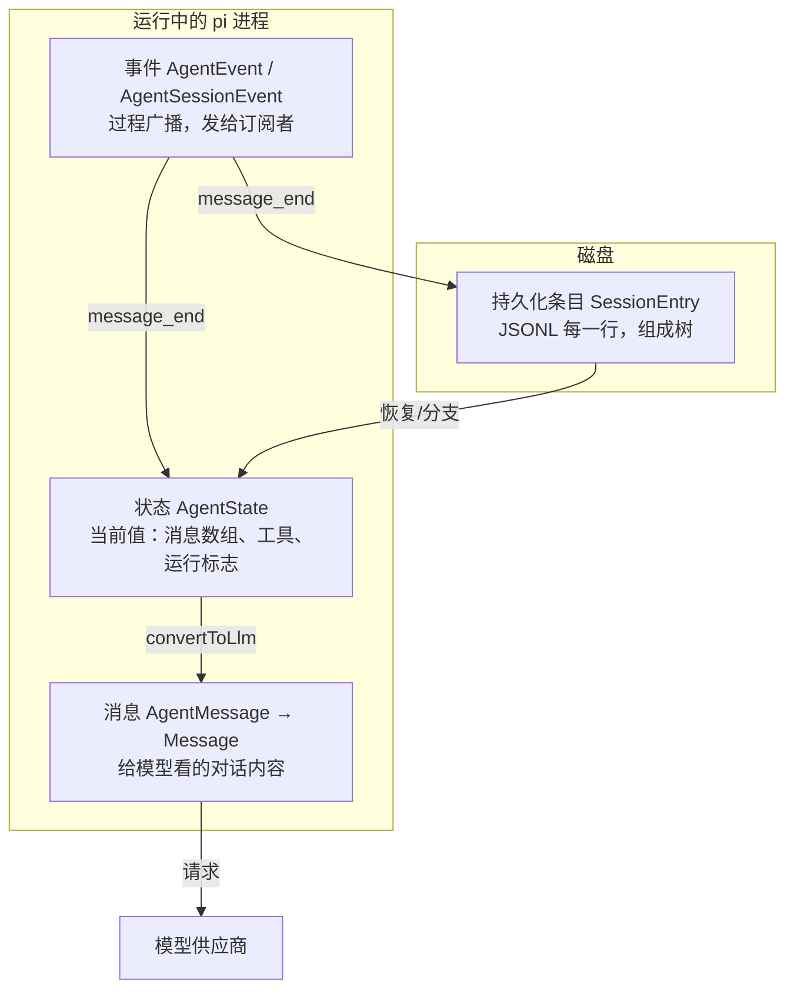

用一句口诀记住职责：

- **消息**：对模型说的事实；
- **事件**：对界面说的"正在发生什么"；
- **状态**：进程里的"现在"；
- **条目**：磁盘上的"曾经"。

<a id="04-messages-events-state-h3"></a>

### 4.1.1 四种对象的对照表

| 对象 | 类型名                                | 生产者                                             | 消费者                                   | 生命周期             | 是否落盘               |
| ---- | ------------------------------------- | -------------------------------------------------- | ---------------------------------------- | -------------------- | ---------------------- |
| 消息 | `AgentMessage` → `Message`       | 会话层（用户输入）、模型层（助手）、工具层（结果） | 模型（经转换）、界面（经事件）、会话文件 | 随会话               | 是（`message` 条目） |
| 事件 | `AgentEvent`、`AgentSessionEvent` | Agent 循环、会话层                                 | 界面、扩展、SDK 宿主                     | 瞬间；发完即弃       | 否（但会触发写入）     |
| 状态 | `AgentState`                        | Agent 内部归约                                     | 界面读取、SDK 读取、循环自身             | 运行期内存           | 否（部分派生自消息）   |
| 条目 | `SessionEntry` 家族                 | `SessionManager`                                 | 恢复、分支、导出、界面渲染               | 永久（直到删除会话） | 是（JSONL 文件）       |

一个事件可以同时影响状态与磁盘（`message_end`），这就是"同一事实的三种视角"：过程（事件）、内存（状态）、持久化（条目）。

**暂停预测：** `read("demo.txt")` 已经返回文件内容，界面刚收到 `message_end(toolResult)`。如果现在关闭进程，下次恢复对话时需要重放这个事件，还是读取会话条目？先只按“四种对象”的职责判断。

**对照答案：** 事件已经发完，不能靠它恢复。`AgentState` 中的消息数组是本次进程的当前值；正常启用持久化的会话把完成的工具结果写成消息条目，恢复时再从活动分支构造上下文。一个 `message_end` 可以触发状态更新与保存，但事件本身不是会话文件中的一行。具体的活动分支选择与投影规则留到[第 9 章](#09-session-tree-h1)。

<a id="04-messages-events-state-h4"></a>

## 4.2 内容块：消息的最小积木

一条消息的内容（content）是一个**内容块数组**，常见的四种。它们定义在 `packages/ai/src/types.ts`：

<a id="04-messages-events-state-h5"></a>

### 4.2.1 `TextContent`：文本

```typescript
export interface TextContent {
	type: "text";
	text: string;
	textSignature?: string; // e.g., for OpenAI responses, message metadata (legacy id string or TextSignatureV1 JSON)
}
```

- `type: "text"` 是判别字段；
- `textSignature` 是**供应商专用元数据**，pi 把它当"不透明字符串"原样带回去，绝不解读内容。新手请把带 `Signature` 的字段一律视为"必须保留、不可修改的票据"——很多供应商要求多轮对话时把这些票据回传，否则报错。

<a id="04-messages-events-state-h6"></a>

### 4.2.2 `ImageContent`：图片

```typescript
export interface ImageContent {
	type: "image";
	data: string;     // base64 编码的图片数据
	mimeType: string; // e.g., "image/jpeg", "image/png"
}
```

图片以 base64 内联在消息里。这解释了第 3 章里 `normalizePromptImages` 的存在：大图会显著增加上下文体积，所以发送前要压缩/缩放（第 10 章）。

<a id="04-messages-events-state-h7"></a>

### 4.2.3 `ThinkingContent`：思考过程

```typescript
export interface ThinkingContent {
	type: "thinking";
	thinking: string;
	thinkingSignature?: string; // Provider-specific opaque or serialized reasoning replay data
	/** When true, the thinking content was redacted by safety filters. The opaque
	 *  encrypted payload is stored in `thinkingSignature` so it can be passed back
	 *  to the API for multi-turn continuity. */
	redacted?: boolean;
}
```

- 只有支持"思考"的模型会产生；
- `redacted: true`：出于安全/合规，思考正文被抹掉，但加密票据还在——**照原样回传**即可；
- 思考块**会进入下一轮请求**（这是某些模型的要求），但界面可以折叠显示。

<a id="04-messages-events-state-h8"></a>

### 4.2.4 `ToolCall`：工具调用

```typescript
export interface ToolCall {
	type: "toolCall";
	id: string;                       // 调用标识：模型生成，要求全局唯一
	name: string;                     // 工具名，如 "read"
	arguments: JsonObject;            // 参数对象（注意：是对象，不是 JSON 字符串）
	thoughtSignature?: string;        // Google 专用：复用思考上下文的不透明签名
	namespace?: string;               // OpenAI Responses 命名空间工具
}
```

三个关键点：

1. **`id` 是"调用"与"结果"之间的唯一桥梁**。模型可能一次提出多个调用（A、B），工具结果的 `toolCallId` 必须对应返回，否则对话历史不自洽；
2. `arguments` 在 pi 内部已经是**解析好的对象**（供应商原始流里它是 JSON 文本，适配器负责增量解析与拼装）；
3. `arguments` 的类型是 `JsonObject`，具体字段要靠工具自己的 schema 校验——这正是第 3 章 `validateToolArguments` 存在的原因。

<a id="04-messages-events-state-h9"></a>

## 4.3 模型消息：`Message` 家族

`packages/ai/src/types.ts` 里：

```typescript
export type Message = SystemMessage | UserMessage | AssistantMessage | ToolResultMessage;
```

四种角色的分工，一张表理清：

| 角色           | 谁产生                      | 模型看到后的意义      |
| -------------- | --------------------------- | --------------------- |
| `system`     | pi（提示词与工具声明）      | 规则、身份、可用工具  |
| `user`       | 用户输入 / 转换后的内部消息 | "人类在说话"          |
| `assistant`  | 模型                        | "我之前说过/做过什么" |
| `toolResult` | 工具执行结果                | "工具的答案"          |

<a id="04-messages-events-state-h10"></a>

### 4.3.1 `SystemMessage`：不只是"系统提示词"

```typescript
export interface SystemMessage {
	role: "system";
	/** Instruction text. On the leading message this is the base prompt; later, additional instructions. */
	content: string | TextContent[];
	/**
	 * Named, ordered prompt sections rendered verbatim after `content`. The leading message
	 * declares them; later messages replace sections by name, and `null` removes one.
	 */
	sections?: Record<string, string | null>;
	/** Complete definitions of tools that become available at this point. */
	toolsAdded?: Tool[];
	/** Tools that stop being available at this point. */
	toolsRemoved?: ToolReference[];
	timestamp: number; // Unix timestamp in milliseconds
}
```

这是本仓库最有特色的类型之一。要点：

- **提示词不是一整块，而是分节的**（`sections`：preamble、tools、cwd、skills……）。后续系统消息可以**按名字替换某一节**（值为 `null` 表示删除该节）。这带来两个好处：
  - 中途启用新技能/改变工具时，不用重发整个提示词，只发一个"补丁"；
  - 会话回放时，把历次系统消息依次叠加，就能精确重建"此刻的提示词"——这叫**可重放性**（replayability）。
- **工具声明也在系统消息里**（`toolsAdded` / `toolsRemoved`）。第 3 章 `declareToolChanges()` 生成的就是这种消息；
- 仓库文档（`docs/message-types.md`）还描述了 `replace: true` 的语义：丢弃此前状态、建立全新基线。请在你的本地类型定义里用编辑器确认该字段是否存在（版本间可能有差异）——**"以本地代码为准"是读本仓库的好习惯**。

<a id="04-messages-events-state-h11"></a>

### 4.3.2 `UserMessage`

```typescript
export interface UserMessage {
	role: "user";
	content: string | (TextContent | ImageContent)[];
	timestamp: number; // Unix timestamp in milliseconds
}
```

`content` 允许直接是字符串（简写）或内容块数组（需要图片时）。注意 `role: "user"` 不总代表"人类打的字"——第 4.4 节你会看到，bash 执行记录、扩展注入的上下文、压缩摘要都会被**转换成** `user` 消息发给模型（因为多数供应商只接受这四种角色，没有"系统注入"通道）。

<a id="04-messages-events-state-h12"></a>

### 4.3.3 `AssistantMessage`：信息最丰富的消息

```typescript
export interface AssistantMessage {
	role: "assistant";
	content: (TextContent | ThinkingContent | ToolCall)[];
	api: Api;
	provider: ProviderId;
	model: string;
	responseModel?: string;   // 供应商实际答复的模型（与请求的不同时记录）
	responseId?: string;      // 供应商侧的响应标识
	providerThinkingLevel?: string;
	thinkingLevel?: ModelThinkingLevel;  // 本次请求的 pi 思考级别
	diagnostics?: AssistantMessageDiagnostic[];
	usage: Usage;
	stopReason: StopReason;
	deferred?: DeferredHandle;
	errorMessage?: string;
	rawStopReason?: string;
	endTurn?: boolean;        // 供应商是否明确表示"我说完了"（仅调试用，不参与控制流）
	timestamp: number;
}
```

逐组理解：

- **身份组**（`api/provider/model/responseModel/responseId`）：这条消息是谁答的。会话恢复、成本统计、多模型切换都靠它；
- **内容组**（`content`）：文本、思考、工具调用的混合数组。**顺序有语义**：模型先思考、再说话、再调工具，数组顺序就是发生顺序；
- **用量组**（`usage`）：token 与成本（见 4.3.5）；
- **状态组**（`stopReason/errorMessage/rawStopReason`）：为什么结束。这是 Agent 循环的核心判据（第 6 章）；
- **调试组**（`diagnostics`）：经过脱敏的诊断信息。

`StopReason` 的七个值（`packages/ai/src/types.ts`）：

```typescript
export type StopReason = "pending" | "stop" | "length" | "toolUse" | "error" | "aborted" | "deferred";
```

| 值           | 含义                       | 循环的反应                               |
| ------------ | -------------------------- | ---------------------------------------- |
| `pending`  | 流式过程中的临时值         | 不会持久化（`message_end` 时已是终态） |
| `stop`     | 正常说完了                 | 看有无工具调用/队列决定是否继续          |
| `length`   | 达到输出上限被截断         | 工具调用全部拒绝执行（第 3.14 节）       |
| `toolUse`  | 模型要求调用工具           | 执行工具 → 继续下一轮                   |
| `error`    | 请求失败                   | 结束 run（可能触发自动重试，第 6 章）    |
| `aborted`  | 被取消                     | 结束 run                                 |
| `deferred` | 延迟应答（供应商异步任务） | 通过`DeferredHandle` 后续取回          |

> 新手最容易漏掉的一点：`stopReason` 为 `"toolUse"` 时，**消息里必然带有 toolCall 内容块**；但反过来，有 toolCall 时 `stopReason` 理论上可能是 `length`（截断场景）。所以循环的判据要"看内容 + 看原因"双重检查（第 3.8 节 ⑥ 的代码正是这么写的）。

<a id="04-messages-events-state-h13"></a>

### 4.3.4 `ToolResultMessage`

```typescript
export interface ToolResultMessage<TDetails = any> {
	role: "toolResult";
	toolCallId: string;                    // 对应哪个 ToolCall
	toolName: string;
	content: (TextContent | ImageContent)[]; // 给模型看的结果
	details?: TDetails;                    // 给界面/程序看的结构化细节（不发给模型）
	usage?: Usage;                         // 工具内部做了"嵌套模型调用"时的用量
	isError: boolean;
	timestamp: number;
}
```

两个重要区分：

- `content` 是**面向模型**的，"模型看到什么"由它决定；
- `details` 是**面向界面/代码**的，可以带文件行号、语法高亮信息、原始 JSON 等。它**不会**发给模型（省 token），但会落盘，界面渲染和扩展逻辑可以依赖它。

（另有一个 `structuredContent` 字段存在于工具执行结果 `AgentToolResult` 上，供程序化调用者使用；但它不进 `ToolResultMessage`，所以不具备"跨会话稳定"的保证。第 7 章展开。）

<a id="04-messages-events-state-h14"></a>

### 4.3.5 `Usage`：token 与成本

```typescript
export interface Usage {
	input: number;
	output: number;
	cacheRead: number;
	cacheWrite: number;
	cacheWrite1h?: number;   // cacheWrite 中 1 小时保留的部分（仅 Anthropic 上报）
	reasoning?: number;      // 思考 token：已包含在 output 里，不要重复相加
	totalTokens: number;
	cost: { input: number; output: number; cacheRead: number; cacheWrite: number; total: number };
}
```

要点：`reasoning` 是 `output` 的子集；缓存命中（cacheRead）通常比常规输入便宜得多——这解释了 pi 为什么要做"缓存预热"（`cache-warmer.ts`，第 15 章会看到它的调用点）。

<a id="04-messages-events-state-h15"></a>

## 4.4 `AgentMessage`：比模型消息更宽的内部类型

<a id="04-messages-events-state-h16"></a>

### 4.4.1 基础定义与声明合并

`packages/agent/src/types.ts`：

```typescript
export interface CustomAgentMessages {
	// Empty by default - apps extend via declaration merging
}

export type AgentMessage = Message | CustomAgentMessages[keyof CustomAgentMessages];
```

`CustomAgentMessages` 默认是空的。应用可以用 TypeScript 的**声明合并**（declaration merging）扩展它：

```typescript
// 文档注释里的示例（packages/agent/src/types.ts）
declare module "@earendil-works/pi-agent-core" {
	interface CustomAgentMessages {
		artifact: ArtifactMessage;
		notification: NotificationMessage;
	}
}
```

`coding-agent` 包正是这么做的。`packages/coding-agent/src/core/messages.ts` 里：

```typescript
declare module "@earendil-works/pi-agent-core" {
	interface CustomAgentMessages {
		bashExecution: BashExecutionMessage;
		custom: CustomMessage;
		branchSummary: BranchSummaryMessage;
		compactionSummary: CompactionSummaryMessage;
	}
}
```

所以在 coding-agent 里，`AgentMessage` 等价于八种角色的联合：

```typescript
type AgentMessage =
  | SystemMessage | UserMessage | AssistantMessage | ToolResultMessage   // 模型能懂的四种
  | BashExecutionMessage | CustomMessage | BranchSummaryMessage | CompactionSummaryMessage; // 应用扩展的四种
```

四个扩展角色的用途（详见 `docs/message-types.md`）：

| 角色                  | 何时产生                       | 是否进模型上下文                        |
| --------------------- | ------------------------------ | --------------------------------------- |
| `bashExecution`     | 用户用`!` 直接执行命令       | 默认转成 user 文本（`!!` 前缀则排除） |
| `custom`            | 扩展调用`sendMessage()` 注入 | 转成 user 消息                          |
| `branchSummary`     | 切换分支时对被放弃路径做摘要   | 转成 user 消息（带包装标签）            |
| `compactionSummary` | 上下文压缩后                   | 转成 user 消息（带包装标签）            |

<a id="04-messages-events-state-h17"></a>

### 4.4.2 `convertToLlm`：桥梁的完整实现

模型只认识四种角色，扩展消息必须被"翻译"。翻译函数在 `core/messages.ts`（节选 + 注释）：

```typescript
export function convertToLlm(messages: AgentMessage[]): Message[] {
	return messages
		.map((m): Message | undefined => {
			switch (m.role) {
				case "bashExecution":
					if (m.excludeFromContext) return undefined;   // !! 前缀：只显示给用户看
					return { role: "user", content: [{ type: "text", text: bashExecutionToText(m) }], timestamp: m.timestamp };
				case "custom": {
					const content = typeof m.content === "string" ? [{ type: "text" as const, text: m.content }] : m.content;
					return { role: "user", content, timestamp: m.timestamp };
				}
				case "branchSummary":
					return { role: "user", content: [{ type: "text", text: BRANCH_SUMMARY_PREFIX + m.summary + BRANCH_SUMMARY_SUFFIX }], timestamp: m.timestamp };
				case "compactionSummary":
					return { role: "user", content: [{ type: "text", text: COMPACTION_SUMMARY_PREFIX + m.summary + COMPACTION_SUMMARY_SUFFIX }], timestamp: m.timestamp };
				case "system": case "user": case "assistant": case "toolResult":
					return m;   // 已经是模型消息，原样通过
				default: {
					const _exhaustiveCheck: never = m;   // 穷尽检查：将来新增角色时这里会编译报错
					return undefined;
				}
			}
		})
		.filter((m) => m !== undefined);
}
```

值得学的三个细节：

1. **包装标签**（前缀/后缀）。摘要类消息不是裸文本，而是：

```text
The conversation history before this point was compacted into the following summary:

<summary>
……摘要内容……
</summary>
```

   这样模型能分辨"这是历史信息的压缩"，而不是"用户新说了一段话"。

2. **穷尽检查**（`const _exhaustiveCheck: never = m`）。这是判别联合的经典用法：如果某天新增了消息角色而忘了处理，这一行会在**编译期**报错。你在本仓库会经常看到 `never` 出现在 switch 的 default 分支——那不是装饰，是防漏网工具。
3. **过滤型转换**：`bashExecution` 带 `excludeFromContext` 时直接丢弃；map + filter 的组合在类型上是干净的。

<a id="04-messages-events-state-h18"></a>

### 4.4.3 转换发生在哪里

回顾第 3 章 3.9 节的 `streamAssistantResponse`：

```typescript
const llmMessages = await config.convertToLlm(messages);
```

`convertToLlm` 是 `Agent` 的**构造参数**：`agent-core` 自带一个"只保留四种标准角色"的默认实现（`agent.ts` 的 `defaultConvertToLlm`）；`coding-agent` 在 `sdk.ts` 里注入完整版本（还包了一层图片屏蔽）。**下层提供默认，上层注入具体**——又一次看到第 0 章的架构原则。

另外一个用途：`convertToLlm` 也被"生成摘要"的压缩流程复用——因为摘要请求本身也是一次模型调用，需要把同一份历史翻译过去（第 10 章）。

<a id="04-messages-events-state-h19"></a>

## 4.5 事件：`AgentEvent` 与 `AgentSessionEvent`

<a id="04-messages-events-state-h20"></a>

### 4.5.1 `AgentEvent` 十种事件

完整定义在 `packages/agent/src/types.ts`（第 3 章 1.3.4 给过原文）。按生命周期的全景表：

| 事件                      | 载荷                               | 发出时机                   | 典型消费者                          |
| ------------------------- | ---------------------------------- | -------------------------- | ----------------------------------- |
| `agent_start`           | 无                                 | run 开始                   | 界面：进入"忙碌"状态                |
| `agent_end`             | `messages`                       | run 结束（最后一个事件）   | 界面：显示完成/错误；会话层判断重试 |
| `turn_start`            | 无                                 | 每个 turn 开始             | 界面：显示"新一轮"                  |
| `turn_end`              | `message, toolResults`           | 每个 turn 结束             | 界面：收尾渲染；会话层记录失败信息  |
| `message_start`         | `message`                        | 用户/助手/工具结果消息开始 | 界面：创建消息气泡                  |
| `message_update`        | `message, assistantMessageEvent` | 助手消息的每个增量         | 界面：流式文字/思考/工具调用预览    |
| `message_end`           | `message`                        | 消息最终定型               | 状态归约、持久化、界面定稿          |
| `tool_execution_start`  | `toolCallId, toolName, args`     | 工具开始                   | 界面：显示"正在执行"                |
| `tool_execution_update` | `..., partialResult`             | 工具上报进度               | 界面：局部结果（如命令输出滚动）    |
| `tool_execution_end`    | `..., result, isError`           | 工具结束                   | 界面：渲染结果/错误                 |

当前基线里的 `AgentEvent` 联合**正好有 10 个成员**，与上表十行一一对应。读 TypeScript 联合类型时，一个 `|` 分支代表一种可取的对象形状；像 `message_update` 的 `assistantMessageEvent` 字段虽然又有自己的联合类型，但它是**事件载荷里的嵌套事件**，不是额外的 `AgentEvent` 成员。

可以自己打开 `packages/agent/src/types.ts` 数一遍 `AgentEvent` 的 `|` 分支来练习。自动重试和 `agent_settled` 等会话级通知属于后面的 `AgentSessionEvent`，不会因为它们和 Agent 运行有关就自动成为 core 的 `AgentEvent`。

<a id="04-messages-events-state-h21"></a>

### 4.5.2 `AgentSessionEvent`：复用并改写 core 事件

`coding-agent` 的 `AgentSession` 对外事件**基于** `AgentEvent`，但不是它的严格超集（`agent-session.ts` 的 `AgentSessionEvent`）：

```typescript
export type AgentSessionEvent =
| WithParentToolCallId<Exclude<AgentEvent, { type: "agent_end" }>>   // 复用其它事件；工具事件可多 parentToolCallId
	| { type: "agent_end"; messages: AgentMessage[]; willRetry: boolean } // 关键差异：多了 willRetry
	| { type: "agent_settled" }
	| { type: "queue_update"; steering: readonly string[]; followUp: readonly string[] }
	| { type: "compaction_start"; reason: "manual" | "threshold" | "overflow" }
	| { type: "entry_appended"; entry: SessionEntry }
	| { type: "session_info_changed"; name: string | undefined }
	| { type: "thinking_level_changed"; level: ThinkingLevel }
	| { type: "compaction_end"; reason; result; aborted; willRetry; errorMessage? }
	| { type: "auto_retry_start"; attempt; maxAttempts; delayMs; errorMessage }
	| { type: "auto_retry_end"; success; attempt; finalError? }
	| { type: "summarization_retry_scheduled"; /* ... */ }
	| { type: "summarization_retry_attempt_start"; /* source: branchSummary | compaction */ }
	| { type: "summarization_retry_finished" }
	| { type: "bash_execution_update"; id?: string; delta: string };
```

几个对读代码很重要的差异：

- **`agent_end` 被替换了，不只是加字段**：先用 `Exclude<AgentEvent, { type: "agent_end" }>` 从 core 联合中移除旧的 `agent_end` 形状，再加入带必需 `willRetry` 的会话版。即使 `willRetry` 为 `false`，这个字段也必须存在；所以一个只有 `type` 和 `messages` 的 core `agent_end` 不能直接当成 `AgentSessionEvent` 使用。
- **其它事件大多复用**：条件类型 `WithParentToolCallId<E>` 只在三种 `tool_execution_*` 事件上加可选的 `parentToolCallId`；其它 core 事件形状保持不变。它标识嵌套工具调用属于哪个外层调用（如 codemode，第 22 章）。
- **`agent_settled`**：整个会话层面的工作（含重试/压缩/边界）全部结束——第 3 章 `_runAgentPrompt` 的 finally 里发的就是它。注意它和 `agent_end` 不是一个东西：一次 `session.prompt()` 期间可能有**多次** `agent_end`（自动重试场景），但只有**一次** `agent_settled`；
- **`entry_appended`**：部分辅助条目写入路径会显式发出，例如扩展追加的自定义条目、提交的 boundary 条目和 context edit。它不是通用的“文件有新行”事件：普通 `message_end` 持久化和压缩条目写入都不会因此自动发出它；
- **`queue_update`**：排队消息变化（界面显示"还有 2 条消息在排队"）；

<a id="04-messages-events-state-h22"></a>

## 4.6 状态：`AgentState` 字段全表

`packages/agent/src/types.ts` 的 `AgentState`（结合 `Agent` 实现）：

| 字段                 | 类型                          | 含义                               | 备注                                                                   |
| -------------------- | ----------------------------- | ---------------------------------- | ---------------------------------------------------------------------- |
| `systemPrompt`     | `string`（只读）            | 当前系统提示（从系统消息重放而来） | 想改提示词要**追加系统消息**，不能直接赋值                       |
| `model`            | `Model<any>`                | 下一轮使用的模型                   | 中途切换模型的入口                                                     |
| `thinkingLevel`    | `ThinkingLevel`             | 下一轮的思考级别                   | `off/minimal/low/medium/high/xhigh/max`（按模型能力钳制）            |
| `tools`            | `AgentTool[]`（get/set）    | 可执行的工具                       | 赋值会**复制顶层数组**；与转录中声明不同时，下一轮自动补系统消息 |
| `messages`         | `AgentMessage[]`（get/set） | 对话转录                           | 赋值同样复制顶层数组                                                   |
| `isStreaming`      | `boolean`                   | 是否在处理中                       | **到 `agent_end` 的监听器全部结束才变 false**                  |
| `streamingMessage` | `AgentMessage \| undefined`  | 当前正在形成的部分消息             | `message_start/update` 设置、`message_end` 清空                    |
| `pendingToolCalls` | `ReadonlySet<string>`       | 正在执行中的工具调用 id            | 界面显示"还有工具在跑"                                                 |
| `errorMessage`     | `string \| undefined`        | 最近一次失败/取消的错误文本        | `turn_end` 时从助手消息提取                                          |

两个可访问性细节（`Agent` 实现里的 `createMutableAgentState`）：

- `systemPrompt` 是**推导值**（getter），由 `getCurrentSystemPrompt(messages)` 从系统消息重放而来；
- `tools`/`messages` 的 setter 会 `slice()` 复制数组，避免调用者后续改动外部数组导致状态漂移。

`AgentSession.state` 就是 `this.agent.state` 的直接返回（`agent-session.ts` 第 1396 行）——会话层没有另建一套状态。**"状态"只有一个数据源**，这是排障时的关键：界面显示异常，先看 `session.state`，再看事件有没有漏。

<a id="04-messages-events-state-h23"></a>

### 4.6.1 运行态 vs 存储态：同一事实的两种样子

以第一次模型响应为例：

| 时刻                                                             | 状态（内存）                                                            | 磁盘                                           |
| ---------------------------------------------------------------- | ----------------------------------------------------------------------- | ---------------------------------------------- |
| 流式进行中                                                       | `streamingMessage` = 最新部分消息；`messages` 还没有这条未完成消息  | 无记录（`pending` 不落盘）                   |
| `message_end` 到达                                             | `streamingMessage` 清空；终态消息追加到 `messages`                  | listener 尚在处理；还未走到 session 持久化分支 |
| `AgentSession` listener 完成 message-end hooks/public dispatch | `messages` 保持终态消息；hook 若替换内容，会原地改同一个 message 对象 | 追加该最终 message 的`message` 条目          |
| 检查磁盘文件                                                     | ——                                                                    | 只有一条终态消息                               |

注意有两个不同的数组/字段：`streamAssistantResponse` 持有并更新模型请求 context 里的 partial message；公开的 `AgentState` 则通过 `streamingMessage` 暴露当前快照。`Agent.processEvents(message_start/update)` 只更新 `streamingMessage`，不会把尚未完成的消息放入 `state.messages`；等 `message_end` 才清掉它并把 final message 追加到 `state.messages`。随后会话层 hook 可能原地替换这条已追加消息的字段，最终 `SessionManager` 再持久化它。

因此在流式期间观察 `state.messages.length`，通常不会因当前 assistant message 正在输出而先加一；应观察 `state.streamingMessage`。第 3 章 3.12.1 画出了 partial message 从模型流到 Agent state 和 session entry 的完整路径。

<a id="04-messages-events-state-h24"></a>

### 4.6.2 `message_end` 时的原地替换：同一个对象要保持一致

`Agent.processEvents` 处理 `message_end` 时，先把事件中的 message 追加进 `agent.state.messages`，然后才按顺序 `await` listeners。`AgentSession` 是其中一个 listener：它运行扩展的 message-end hook。hook 可以返回替代消息；session 会通过 `_replaceMessageInPlace(target, replacement)` 清掉目标对象的字段，再把替代字段复制回**同一个对象**。

```text
streamAssistantResponse 生成 finalMessage
  → Agent.processEvents(message_end)
      → agent.state.messages.push(finalMessage)
      → AgentSession listener 收到同一个 finalMessage 引用
          → message-end 扩展返回替代内容
          → _replaceMessageInPlace(finalMessage, replacement)
          → 公开 session listeners 收到已替换内容
          → SessionManager.appendMessage(finalMessage)
```

为什么要保留对象身份？因为 `agent.state.messages`、同一 run 后续产生的事件和最终写入会话的消息都可能引用它。若只让 `event.message` 指向新对象，Agent 状态数组仍留着旧对象，最终就可能出现“界面看见 A、状态持有 B、磁盘写入 C”的分叉。源码注释明确说原地修改用于同步 Agent state、后续 turn/agent events、listeners 与最终持久化。

```typescript
private _replaceMessageInPlace(target: AgentMessage, replacement: AgentMessage): void {
  if (target === replacement) return;
  const targetRecord = target as unknown as Record<string, unknown>;
  for (const key of Object.keys(targetRecord)) delete targetRecord[key];
  Object.assign(targetRecord, replacement);
}
```

逐行读：

- `target === replacement`：同一个对象无需处理；
- `Record<string, unknown>`：临时把对象看作可按键读写的记录。`unknown` 要求调用方别假定任意值都有特定字段；
- 先删旧键：避免替代对象没有的可选字段仍残留在 target 上；
- `Object.assign` 写回新键值：对象身份没换，内容变成 replacement。

这是一次**运行期对象同步**，发生在这条消息首次写入 transcript 之前。它和下面的 `context_edit` 不同：context edit 不回头改 JSONL 里的原消息，而是追加一条记录，在构造模型投影时应用。

<a id="04-messages-events-state-h25"></a>

## 4.7 持久化条目：会话文件的解剖

完整规范见 `packages/coding-agent/docs/session-format.md`，这里给你"读文件时的地图"。

<a id="04-messages-events-state-h26"></a>

### 4.7.1 文件与公共字段

```text
~/.pi/agent/sessions/--<路径编码>--/<时间戳>_<会话ID>.jsonl
```

每行是一个 JSON 对象。除第一行（`SessionHeader`）外，所有条目都有公共字段：

```typescript
interface SessionEntryBase {
	type: string;
	id: string;              // 通常是 8 位十六进制；必要时回退为完整 UUID
	parentId: string | null; // 父条目 ID；根条目为 null
	timestamp: string;       // ISO 8601 字符串（与消息内的毫秒时间戳不同！）
}
```

**两种时间戳**是新手重灾区：

- 条目外层 `timestamp`：ISO 字符串（如 `"2024-12-03T14:00:00.000Z"`）；
- 消息内层 `timestamp`：Unix 毫秒数（如 `1733234400000`）。

读会话文件时别把两者混用。

<a id="04-messages-events-state-h27"></a>

### 4.7.2 条目类型总表

| `type`                  | 作用                                            | 进模型上下文？     |
| ------------------------- | ----------------------------------------------- | ------------------ |
| `session`               | 文件头：版本、id、cwd、可选 parentSession       | 否                 |
| `message`               | 一条`AgentMessage`（含系统消息补丁）          | 是                 |
| `model_change`          | 中途切换模型                                    | 否（影响后续解释） |
| `thinking_level_change` | 中途切换思考级别                                | 否                 |
| `usage`                 | 非消息类用量（如缓存预热）                      | 否                 |
| `compaction`            | 压缩摘要 + 系统提示检查点 +`firstKeptEntryId` | 是（替换旧消息）   |
| `context_edit`          | 对早前条目的"仅上下文生效"编辑                  | 间接（改写投影）   |
| `branch_summary`        | 分支切换时对被放弃路径的摘要                    | 是                 |
| `custom`                | 扩展私有状态（不参与上下文）                    | 否                 |
| `custom_message`        | 扩展注入的消息（参与上下文）                    | 是                 |
| `label`                 | 书签/标记（`targetId` 指向被标记条目）        | 否                 |
| `session_info`          | 会话元数据（显示名）                            | 否                 |

<a id="04-messages-events-state-h28"></a>

### 4.7.3 为什么是"树"而不是"线"

看 `session-format.md` 的示意图：

```text
[user msg] ─── [assistant] ─── [user msg] ─── [assistant] ─┬─ [user msg] ← current leaf
                                                            │
                                                            └─ [branch_summary] ─── [user msg] ← alternate branch
```

- 每个条目用 `parentId` 指向父节点；**"当前叶子"（leaf）标识你现在所处的分支**；
- 从 B 处分叉：老路径保留，新路径也是同一文件的一部分；
- `buildContextEntries()` 从叶向根回溯，产出"活动分支"的条目列表——这就是下一次请求的历史来源（细节第 9 章）。

<a id="04-messages-events-state-h29"></a>

### 4.7.4 系统消息的持久化形态（活例子）

会话文件里的第一条系统消息长这样（`session-format.md` 示例）：

```json
{"type":"message","id":"a0b1c2d3","parentId":null,"timestamp":"2024-12-03T14:00:00.000Z",
 "message":{"role":"system","content":"","sections":{"preamble":"You are an expert coding assistant...","tools":"<tools>\n- read: ...\n</tools>","cwd":"/project"},
 "toolsAdded":[{"name":"read","description":"...","parameters":{}}],"timestamp":1733234400000}}
```

后面某次技能启用时又追加：

```json
{"type":"message","id":"d4e5f6g7","parentId":"c3d4e5f6","timestamp":"...","message":{"role":"system","content":"","sections":{"skills":"<skills>...</skills>"},"toolsRemoved":[{"name":"write"}],"timestamp":1733234640000}}
```

对照 4.3.1：**"提示词分节补丁 + 工具增删"不是概念演示，而是磁盘上的真实格式**。恢复会话时按顺序重放，就得到当前的提示词与工具清单——没有单独的"提示词状态"条目。

<a id="04-messages-events-state-h30"></a>

### 4.7.5 原始条目与模型投影：`context_edit` 是追加规则

会话 JSONL 有两个值得区分的视图：

- **原始条目**（`getEntries()`）：文件中追加保存的事实，保留消息、编辑记录和它们的父子关系；
- **模型投影**（`buildSessionProjection()`）：沿当前叶子选出活动路径，应用压缩检查点和 context edits 后，得到这次请求真正使用的消息。

例如，原先有一条 assistant entry：

```json
{"type":"message","id":"m1","parentId":"u1","message":{"role":"assistant","content":[{"type":"text","text":"包含敏感细节的回答"}]}}
```

随后应用需要把它从模型后续上下文中隐藏。系统不会静默删除/改写 `m1`，而是追加一个 context edit：

```json
{"type":"context_edit","id":"e1","parentId":"m1","targetId":"m1","replacement":null}
```

此时：

| 读取方式                              | 结果                                                                       |
| ------------------------------------- | -------------------------------------------------------------------------- |
| `getEntries()` / 原始 JSONL         | 原 assistant entry 仍在，后面多了一条`replacement: null` 的 context edit |
| `buildSessionProjection().entries`  | 包含来源 entry 的投影记录，可追踪来源                                      |
| `buildSessionProjection().messages` | `m1` 不再贡献消息                                                        |
| 当前分支的后续模型请求                | 不会看到被 omission 的回答                                                 |

`appendContextEdit(targetId, replacement)` 会验证目标存在、位于当前分支，而且属于可编辑的模型可见内容。`replacement: null` 表示省略目标；`{ content: ... }` 表示只替换该条目的内容，保留其余消息字段。构造投影时，活动 context entries 中针对同一 target 的后续 edit 会覆盖 Map 中较早的 edit，因此当前分支采用最近一次规则。

图示这条数据关系：

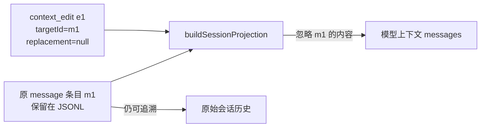

这不是“把用户能看到的历史删除”，而是“保留审计/分支来源，调整后续模型看到的投影”。真实案例可读 `packages/coding-agent/test/suite/agent-session-boundaries.test.ts` 的 `omits a recoverable projected replacement by its source entry ID`：测试保留原 entry，追加 null edit，再断言投影不含替代内容。

【容易混淆】`_replaceMessageInPlace` 与 `context_edit` 的不同：

| 机制                       | 修改对象                  | 是否另追加 entry               | 原始消息是否保留原样             | 目的                                             |
| -------------------------- | ------------------------- | ------------------------------ | -------------------------------- | ------------------------------------------------ |
| `_replaceMessageInPlace` | 当前内存中的 message 对象 | 否；随后首次 append 该 message | 不一定；写入前会采用最终替代内容 | 让 state/listeners/transcript 对这次消息达成一致 |
| `appendContextEdit`      | 不改 target message 对象  | 是，新增`context_edit`       | 是                               | 为活动分支的模型投影追加省略/替换规则            |

读到“replace”时先问三个问题：改的是内存对象还是存储投影？原始 entry 是否仍存在？这次写入是不是新增了一条有 parentId 的记录？这三问能避免把状态更新错当成历史删除。

<a id="04-messages-events-state-h31"></a>

## 4.8 一个工具调用的四列清单

拿第 3 章的 `read` 调用填表（本章的核心作业模板）：

| 对象                                     | 产生位置（文件 → 函数）                         | 用途                       | 存储位置         |
| ---------------------------------------- | ------------------------------------------------ | -------------------------- | ---------------- |
| 用户消息`UserMessage`                  | `agent-session.ts` → `prompt()`             | 模型理解任务；历史         | `message` 条目 |
| assistant 消息#1（含 `ToolCall`）      | `agent-loop.ts` → `streamAssistantResponse` | 模型表达"调用 read"；历史  | `message` 条目 |
| `tool_execution_start/update/end` 事件 | `agent-loop.ts` → `emitToolExecutionEnd` 等 | 界面展示执行过程           | 不落盘           |
| `ToolResultMessage`                    | `agent-loop.ts` → `createToolResultMessage` | 让模型看到文件内容；历史   | `message` 条目 |
| 状态`pendingToolCalls` 变化            | `agent.ts` → `processEvents`                | 界面"仍在执行"提示         | 内存，run 后重置 |
| `_entryIdsByMessage` 映射              | `agent-session.ts`（约 1133 行）               | 消息对象 ↔ 条目 id 的关联 | 内存             |

<a id="04-messages-events-state-h32"></a>

## 4.9 实验 L04-A：为一次运行填满四列表

**实验性质**：读代码 + 填表；不需要模型。
**验证状态**：设计中。

<a id="04-messages-events-state-h33"></a>

### 步骤

1. 复制 4.8 的表，把对象换成"一次 bash 工具调用"（命令 `ls`），补齐六行；
2. 在 `packages/coding-agent/src/core/session-manager.ts` 里找到 `appendMessage` 的实现，写出它干了什么（3-5 行）；
3. 在 `packages/coding-agent/docs/session-format.md` 中找到 `buildContextEntries` 的说明，用三行话说清"恢复时如何把树变成线性历史"；
4. 加分题：找到一条真实会话文件（如果你已经用 pi 聊过天），打开前 5 行，识别每一行的 `type`。

<a id="04-messages-events-state-h34"></a>

### 判定标准

- 第 1 题能指出"哪些对象落盘、哪些不落"；
- 第 2 题能说出"写入的是哪一行 JSON、父节点是谁"；
- 第 3 题能指出"从叶子向根回溯、遇压缩检查点截断"两个要点。

<a id="04-messages-events-state-h35"></a>

## 4.10 常见错误

| 现象/误解                                    | 纠正                                                           |
| -------------------------------------------- | -------------------------------------------------------------- |
| 把`message_update` 的 partial 当作历史消息 | 历史以`message_end` 的终态消息为准                           |
| 认为所有`role: "user"` 都是人打的          | bash 记录、扩展注入、摘要在模型侧都是 user                     |
| 混淆两种时间戳                               | 条目外层 ISO 字符串；消息内毫秒数                              |
| 以为`stopReason` 只在结束时有意义          | 流式期间是`pending`；循环还看内容块判断                      |
| 认为`details` 会发给模型                   | 只给界面/程序；模型只看`content`                             |
| 修改`systemPrompt` 期待生效                | 它只读；要追加系统消息（sections 补丁）                        |
| 把`agent_end` 当作"会话彻底结束"           | 之后还可能有重试、压缩（看`willRetry` 与 `agent_settled`） |

<a id="04-messages-events-state-h36"></a>

## 4.11 验收题

1. 说出四种对象各自"会不会落盘"，并为每种举一个例子。
2. `ToolCall.id` 和 `ToolResultMessage.toolCallId` 的关系是什么？如果不匹配会发生什么？
3. `convertToLlm` 的输入和输出类型分别是什么？为什么压缩摘要要包 `<summary>` 标签？
4. `agent_end` 与 `agent_settled` 的区别？一个会话 run 里哪个只会出现一次？
5. 会话文件里为什么会有"同一父节点的多个子条目"？这对应什么用户操作？

<a id="04-messages-events-state-h37"></a>

### 参考答案（要点）

1. 消息：落盘（`message` 条目）；事件：不落盘（但触发写入）；状态：不落盘（内存）；条目：落盘（JSONL）。
2. 一一对应；缺失或不匹配会让历史不自洽——部分供应商会拒绝请求（toolResult 找不到对应 toolCall），或模型无法把结果与请求关联。
3. 输入 `AgentMessage[]`，输出 `Message[]`；摘要包标签是让模型能区分"这是历史压缩"而非用户新发言。
4. `agent_end` = 一次 run 的循环结束（可能因重试多次出现）；`agent_settled` = 会话层全部收尾（重试/压缩/边界）完成后一次，每次 `session.prompt()` 只出现一次（结束阶段）。
5. 从某个历史节点继续对话（分支/fork），或分支摘要后开新路。对应 `/tree` 切换、`--fork` 等操作。

<a id="04-messages-events-state-h38"></a>

## 4.12 来源与下一章

- `packages/ai/src/types.ts`（`TextContent`、`ImageContent`、`ThinkingContent`、`ToolCall`、`Usage`、`StopReason`、`Message` 四角色）；
- `packages/agent/src/types.ts`（`AgentMessage`、`CustomAgentMessages`、`AgentState`、`AgentEvent`）；
- `packages/coding-agent/src/core/messages.ts`（扩展角色与 `convertToLlm`）；
- `packages/coding-agent/src/core/agent-session.ts`（`AgentSessionEvent` 第 190 行、`state` 第 1396 行、持久化分支约 1113 行）；
- `packages/coding-agent/docs/message-types.md`、`docs/session-format.md`。

下一章进入模型层：`pi-ai` 如何用一套类型适配众多供应商、认证如何解析、`faux` 假模型如何让我们零成本复现实验。

---

<!-- 来源：05-pi-ai-providers.md。 -->

<a id="05-pi-ai-providers-h1"></a>

# 第 5 章：pi-ai 与模型供应商适配

> 通勤导航：第 4 天 · 车上读本章主线 5.1–5.8，读完能“讲清模型适配的三个抽象”。本章源码精读（D11、D17 等）属车下。

**先懂这一章**：pi 的上层只想问“给这个模型发送这些消息，并逐步收到回答”。不同供应商使用不同的请求和事件格式，`pi-ai` 把它们翻译成统一形式。先看翻译的输入与输出，再看某一家服务的字段。

```text
教学伪代码：选择模型与供应商 → 准备认证和请求
           → 把统一消息转换为供应商格式
           → 接收供应商的流式数据
           → 转成 pi 的统一事件和最终消息
```

真实适配器还处理取消、错误、用量和工具参数增量；这些分支在正常流转清楚之后再读。

前四章已经固定了消息和事件的形状。本章只回答模型供应商如何产生这些统一数据；何时再次请求模型由第 6 章决定，工具是否执行由第 7 章决定。先分清职责，再读各家适配器的字段差异。

> 学完本章你能回答：
>
> 1. `pi-ai` 用哪三个抽象（Model / Api / Provider）隔离不同供应商的差异？
> 2. `stream` 与 `streamSimple` 有什么区别？`compat.ts` 在中间做了什么？
> 3. 一个真实供应商适配器（以 Anthropic 为例）由哪些部分组成？请求转换要处理哪些字段？
> 4. 认证解析、模型发现、实际请求是三个不同阶段吗？为什么说"API 兼容不等于能力等价"？
> 5. faux provider 是什么？怎么用它零成本复现固定响应？
> 6. `Model.type`、`model.api` 与 Provider 可选能力分别决定什么？能力不存在时，各入口如何报告失败？

**前置知识**：第 3 章（请求旅程）、第 4 章（消息类型）。
**预计学习时间**：1.5-2 天（适配器细节按需精读）。
**本章验证状态**：静态核对通过（对照基线源码）；faux 实验为本手册设计，需你在本地执行（第 5.8 节）。

---

<a id="05-pi-ai-providers-h2"></a>

## 5.1 问题：同一个 pi，怎么跟几十家模型服务商说话

假设 pi 要支持这些供应商：Anthropic、OpenAI、Google、DeepSeek、Groq、xAI、OpenRouter……它们在至少八个维度上各不相同：

| 差异维度          | 典型的"不一致点"                            |
| ----------------- | ------------------------------------------- |
| 请求结构          | 消息字段名、角色命名、系统提示放哪          |
| 工具声明          | 工具定义的 JSON 结构、JSON Schema 方言      |
| 工具调用流        | 参数是"一次性给出"还是"分片拼装"            |
| 思考（reasoning） | 有的用预算 token、有的用档位名、有的没有    |
| 流式格式          | SSE 事件类型、结束标记、心跳                |
| 结束原因          | 各家的 finish_reason / stop_reason 取值不同 |
| 用量上报          | token 字段名、缓存命中/写入的分账方式       |
| 认证              | API Key、OAuth、云厂商凭据链                |

如果 Agent 层直接写这些分支，`agent-loop.ts` 会变成一座巴别塔。pi 的解法是**三层抽象**：

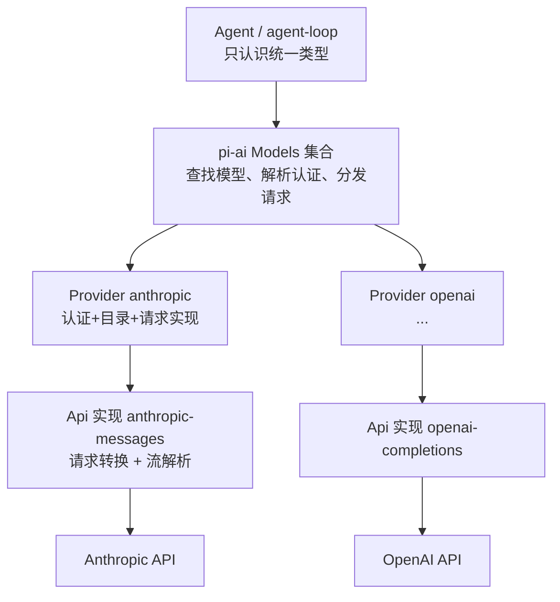

一句话：**Agent 层永远只看到 `Model`、`Message`、`AssistantMessageEvent` 这套统一类型；供应商的差异全部收敛在 `pi-ai` 内部。**

<a id="05-pi-ai-providers-h3"></a>

### 5.1.1 一个具体对照（概念示意）

同一个 `read` 工具声明，进入不同适配器后要变成不同形状：

```text
pi 内部统一形状（Tool）：
  { name: "read", description: "...", parameters: { ...JSON Schema... } }

→ Anthropic 适配器转成：
  { name: "read", description: "...", input_schema: { ... } }

→ OpenAI 兼容适配器转成：
  { type: "function", function: { name: "read", description: "...", parameters: { ... } } }
```

两个"概念性事实"（读适配器代码时反复出现）：

1. **字段改名、结构包装**是最常见的转换工作；
2. **"兼容"是分级的**：OpenAI 兼容接口之间也有差异（是否支持 `store`、`reasoning_effort`、工具结果是否要求 `name`……），所以 pi 在 `Model` 上留了 `compat` 兼容开关与自动探测。第 5.5.4 节会看到真实的兼容配置类型。

<a id="05-pi-ai-providers-h4"></a>

## 5.2 三个抽象 + 一个集合

打开 `packages/ai/src/types.ts` 和 `models.ts`，先认识四个名字：

| 名字            | 类型/位置     | 一句话                                                                        |
| --------------- | ------------- | ----------------------------------------------------------------------------- |
| `Api`         | `types.ts`  | **协议标识**：一家（或一类）接口的"方言名"，如 `"anthropic-messages"` |
| `Model<TApi>` | `types.ts`  | **模型描述**：静态元数据（谁家的、什么协议、限制、价格）                |
| `Provider`    | `models.ts` | **供应商实现**：认证方式 + 模型目录 + 请求函数                          |
| `Models`      | `models.ts` | **运行时集合**：注册/查找供应商与模型、解析认证、分发请求               |

<a id="05-pi-ai-providers-h5"></a>

### 5.2.1 `Api`：开放式的"方言名"

```typescript
export type Api = KnownApi | (string & {});
```

- `KnownApi` 是内置文档化的取值（如 `"anthropic-messages"`、`"openai-completions"`、`"openai-responses"`、`"bedrock-converse-stream"`……）；
- `(string & {})` 这个技巧表示"也接受任意字符串，但保留字面量自动补全"。第三方扩展可以注册自己的协议名。

`ProviderId` 同理：`KnownProvider | string`，内置清单包含 `anthropic`、`openai`、`google`、`deepseek`、`github-copilot`、`openrouter` 等几十个（完整清单以本地 `types.ts` 为准）。

<a id="05-pi-ai-providers-h6"></a>

### 5.2.2 `Model<TApi>`：一张"身份证"

以 `anthropic` 目录里的模型为例（字段含义见 5.3）。`Agent` 里还有一个"占位模型"的写法值得一读（`packages/agent/src/agent.ts`）：

```typescript
const DEFAULT_MODEL = {
	id: "unknown",
	name: "unknown",
	api: "unknown",
	provider: "unknown",
	baseUrl: "",
	reasoning: false,
	input: [],
	cost: { input: 0, output: 0, cacheRead: 0, cacheWrite: 0 },
	contextWindow: 0,
	maxTokens: 0,
} satisfies Model<any>;
```

`satisfies` 是"检查形状但不改变类型"的写法（第 1 章 1.3 的类型工具在实战里的样子）：它保证这个字面量满足 `Model<any>`，同时保留各字段的字面量类型。**Agent 在没配置模型时用它兜底**——这也是为什么源码里到处要判空。

<a id="05-pi-ai-providers-h7"></a>

### 5.2.3 `Provider` 与 `Models`：接口原文

`Provider`（`models.ts` 第 144 行，删减注释）：

```typescript
export interface Provider<TApi extends Api = Api> {
	readonly id: string;          // 供应商标识，如 "anthropic"
	readonly name: string;        // 展示名
	readonly baseUrl?: string;    // 默认 API 根地址
	readonly headers?: ProviderHeaders;
	readonly auth: ProviderAuth;  // 认证方式集合（至少一个 apiKey；可选 oauth）

	getModels(): readonly Model<TApi>[];                 // 当前已知的聊天模型（同步）
	getAllModels?(): readonly ProviderModel<TApi>[];     // 所有类型模型（含图像/分类）
	refreshModels?(context: RefreshModelsContext): Promise<void>;  // 动态目录刷新（可选）
	filterModels?(models, credential): readonly Model<TApi>[];    // 按凭据过滤可用模型（可选）

	stream<T extends TApi>(model: Model<T>, context: TranscriptContext, options?: ApiStreamOptions<T>): AssistantMessageEventStream;
	streamSimple(model: Model<TApi>, context: TranscriptContext, options?: SimpleStreamOptions): AssistantMessageEventStream;
	fetchDeferred?/cancelDeferred?(): ...;               // 延迟应答（可选）
	generateImages?/classify?(): ...;                    // 专用模型能力（可选）
}
```

记住两点：

- **认证是 Provider 的一等公民**：`auth` 不是"可选功能"，每个供应商都必须声明（哪怕是"本地无认证服务器"，也要用 apiKey 形式报告"是否已配置"）；
- **必须至少实现 stream 与 streamSimple 之一**（实际上都实现）。

`Models` 是门面（façade）：`getProviders()`、`getProvider(id)`、`getModel(provider, id)`、`setProvider(p)`、`getAuth(...)`、`stream/streamSimple(...)`。你已经在第 3 章见过它的实际调用：`modelRuntime.streamSimple(model, context, requestOptions)`。

<a id="05-pi-ai-providers-h8"></a>

### 5.2.4 供应商是怎么"造出来"的

入口是 `createProvider()`（`models.ts` 第 1034 行）。它做了一件很有代表性的工程处理：**支持"单实现"或"按 api 分派"两种形态**。

```typescript
export function createProvider<TApi extends Api = Api>(input: CreateProviderOptions<TApi>): Provider<TApi> {
	const single = input.api && typeof (input.api as ProviderStreams).stream === "function"
		? (input.api as ProviderStreams) : undefined;
	const byApi = single || !input.api ? undefined : (input.api as Partial<Record<string, ProviderStreams>>);
	// ...
	const apiFor = (model: Model<Api>): ProviderStreams | undefined => single ?? byApi?.[model.api];

	const dispatch = (model, run) => {
		const streams = apiFor(model);
		if (!streams) {
			return lazyStream(model, async () => {
				throw new ModelsError("stream", `Provider ${input.id} has no API implementation for "${model.api}"`);
			});
		}
		return run(streams);
	};

	const provider: Provider<TApi> = {
		id: input.id, name: input.name ?? input.id, baseUrl: input.baseUrl, headers: input.headers,
		auth: input.auth,
		getModels: () => currentModels().filter((model) => isModelType(model, "chat")),
		getAllModels: currentModels,
		refreshModels: fetchModels ? async (context) => { /* 恢复 stored → 网络刷新 → publish(persist+update) */ } : undefined,
		filterModels: input.filterModels, filterAllModels: input.filterAllModels,
		stream: (model, context, options) => dispatch(model, (streams) => streams.stream(model, context, options)),
		streamSimple: (model, context, options) => dispatch(model, (streams) => streams.streamSimple(model, context, options)),
	};
	// ... fetchDeferred / cancelDeferred / generateImages / classify 按需挂载
	return provider;
}
```

三个设计点：

1. **模型可以混用不同 api**：一个 Provider 下不同模型可以走不同协议（`byApi[model.api]` 分派）；找不到实现时返回"懒惰失败流"而不是立刻抛错（`lazyStream` 把错误编码进流——符合流契约）；
2. **静态目录 + 动态目录合并**（`currentModels()`）：静态清单来自生成的模型目录，动态刷新（有网络、有凭据时）覆盖同名条目；
3. **动态刷新是事务化的**：`context.publish({ update, persist })` 保证"内存更新"与"持久化"一起生效；`stored` 用于离线启动时恢复上次刷新结果。

内置供应商在 `packages/ai/src/providers/all.ts` 里集中注册，模型目录数据来自 `models.generated.ts`（**生成文件，永不手改**；改目录要走 `packages/ai/scripts/generate-models.ts`，见 `AGENTS.md` 规则与第 20 章）。

<a id="05-pi-ai-providers-h9"></a>

### 5.2.5 模型类型与 Provider 能力不是一回事

新手容易把“同一家 Provider”理解为“它列出的每个模型都能做同样的事”。源码把这两个问题分开：**模型的 `type` 决定允许调用哪种操作；Provider 对应的实现 map 决定该 API 是否真的可执行。**

```text
Model<TApi> (type 缺省或 chat) ── stream / complete
ImageModel<ImageApi>            ── generateImages
ClassifierModel<ClassifierApi>  ── classify

模型.provider → 找到 Provider
模型.api      → 找到 Provider 内对应的 API 实现
模型.type     → 校验当前操作是否接受该模型
```

| 模型类型                | 目录读取方式                                                             | 操作入口                                                                      | 实现缺失时的典型结果                                                                          |
| ----------------------- | ------------------------------------------------------------------------ | ----------------------------------------------------------------------------- | --------------------------------------------------------------------------------------------- |
| chat（`type` 可省略） | `getModels()` / `getModel()`                                         | `stream()` 使用 API 特有选项；`streamSimple()` 使用 provider-neutral 选项 | 返回流内的`error` 终态，最终 assistant message 的 `stopReason` 为 `error`               |
| image                   | `getModelsOfType("image")`、`getModelOfType("image", ...)`           | `generateImages()`                                                          | Promise 正常 resolve 为带`stopReason: "error"` 的 `AssistantImages`；该门面契约不 reject  |
| classifier              | `getModelsOfType("classifier")`、`getModelOfType("classifier", ...)` | `classify()`                                                                | Promise 正常 resolve 为带`stopReason: "error"` 的 `ClassifierResult`；该门面契约不 reject |

`getModels()` 和 `getModel()` 是兼容旧调用的 chat-only 入口；需要遍历图像或分类模型，要用带类型的 accessors。`getAllModels()` 则返回所有类型。类型检查器能在正常代码里阻止把 `ImageModel` 传给 `stream()`；`ModelsImpl` 仍会在运行时用 `assertImageModel`、`assertClassifierModel`、`requireChatProvider` 检查边界，因为 JS 调用者、数据文件和 `as SomeType` 类型断言都可能绕过编译期保证。

`createProvider()` 可以把不同能力按 `model.api` 分开注册：`api` 是 chat stream 实现（单个实现或按 API 的 map），`images` 和 `classifiers` 分别是专用操作 map。它只要求这三类 map 至少有一种具体实现，因此 image-only Provider 合法，不必伪造一个 chat stream。即使 Provider 有 `generateImages` 方法，也只说明它至少支持某些图像 API；`images[model.api]` 缺项时仍会得到明确的“不支持该 API”错误结果。相同原则适用于 classifier 和按协议分派的 chat API。

Deferred response 是另一种能力：它附着在 chat Provider 的可选 `fetchDeferred` / `cancelDeferred` 方法上，不是新的 `Model.type`。`streamDeferred()` 对不支持的 provider 把错误编码成 assistant error stream；`cancelDeferred()` 的返回类型是 `Promise<void>`，缺少支持时会 reject。看到“可选方法”时要沿调用方检查错误形态，不能假设每个失败都能从 `AssistantMessage.stopReason` 读取。

这些差异在测试中有明确边界：`packages/ai/test/images-models.test.ts` 覆盖未知 Provider、未配置认证、取消、chat-only Provider 和缺少 API 映射；`classifier-models.test.ts` 检查跨模型类型调用；`providers.test.ts` 覆盖 deferred fetch/cancel。新增能力时，至少要为“正确类型 + 有实现”“正确类型 + 缺实现”“错误模型类型”三种情况找测试或补测试。

<a id="05-pi-ai-providers-h10"></a>

## 5.3 `Model` 字段详解：每个字段都有用途

根据 `types.ts` 与生成的目录条目，划重点的字段：

| 字段                 | 含义                                               | 谁在用它                                       |
| -------------------- | -------------------------------------------------- | ---------------------------------------------- |
| `id`               | 模型标识（如`claude-opus-4-5`）                  | 选择模型、会话恢复、用量记录                   |
| `name`             | 展示名                                             | 模型选择 UI                                    |
| `api`              | 走哪套协议实现                                     | `Provider` 分派、适配器选择                  |
| `provider`         | 供应商标识                                         | 认证解析、请求头归因                           |
| `baseUrl`          | API 根地址                                         | 请求构建、兼容性自动探测                       |
| `reasoning`        | 是否支持思考                                       | 思考级别钳制（`clampThinkingLevel`）         |
| `input`            | 接受的输入类型（`"text"` / `"image"`）         | 发图前检查（防止把图发给纯文本模型）           |
| `cost`             | 每百万 token 价格（输入/输出/缓存读/缓存写）       | 成本统计（`usage.cost` 的计算基准）          |
| `contextWindow`    | 上下文窗口大小                                     | 压缩阈值判断（第 10 章）                       |
| `maxTokens`        | 单次输出上限                                       | 请求参数；截断判定（`stopReason: "length"`） |
| `thinkingLevelMap` | pi 思考级别 → 供应商取值映射；`null` 表示不支持 | `clampThinkingLevel` 与请求转换              |
| `promptCache`      | 缓存能力的元数据                                   | 缓存策略与缓存预热                             |
| `compat`           | 兼容开关（仅部分协议）                             | OpenAI 兼容适配器的行为微调                    |
| `samplingParams`   | 默认采样参数（透传）                               | 高级用户/本地模型（llama.cpp、vLLM 等）        |

三个"隐性用途"值得先知道（后面章节会用到）：

- **`contextWindow` 决定"什么时候该压缩"**：不是硬编码的数字，而是模型元数据；
- **`cost` + `usage` 共同算出会话费用**：`Usage.cost` 的四个分项就是按 `Model.cost` 乘出来的；
- **`reasoning` + `thinkingLevelMap` 决定"思考档位如何降级"**：你在 CLI 传 `--thinking high`，不支持高强度的模型会被钳制到最近的可用档位（`clampThinkingLevel`，`pi-ai/compat` 导出）。

<a id="05-pi-ai-providers-h11"></a>

### 5.3.1 从"一个模型"到"一个模型作用域"

CLI 允许"多个模型循环"（如 `--models`、交互里 Ctrl+P 切换）。第 3 章 `main.ts` 里的 `resolveModelScope(modelPatterns, modelRuntime, ...)` 就是把**模式字符串**（精确 ID、模糊名、glob）解析成模型列表的地方（`core/model-resolver.ts`）。这也是"模型选择"与"模型请求"分离的又一个例子：先解析成 `Model` 对象，再在每次请求时使用。
<a id="05-pi-ai-providers-h12"></a>

## 5.4 `stream` 与 `streamSimple`：两条入口，一个终点

`pi-ai` 对外提供两套调用风格（都在 `compat.ts`）：

- **`stream(model, context, options)`**：完整控制。`options` 的类型随 `model.api` 变化（`ApiStreamOptions<TApi>`），可以直接调供应商特有的参数；
- **`streamSimple(model, context, options)`**：供应商无关的"简单选项"——pi 自己抽象出来的档位（思考级别、工具选择、延迟应答），由适配器负责翻译。

`streamSimple` 的实现（`compat.ts` 第 278 行，原样）：

```typescript
export function streamSimple<TApi extends Api>(
	model: Model<TApi>,
	context: Context,
	options?: SimpleStreamOptions,
): AssistantMessageEventStream {
	const transcript = normalizeContext(context);
	const builtinProvider = getBuiltinProviderForModel(model);
	if (builtinProvider) {
		if (model.provider.startsWith("cloudflare-") && !hasResolvedCloudflareAuth(options)) {
			return compatModels.streamSimple(model, transcript, options);
		}
		return builtinProvider.streamSimple(model, transcript, withEnvApiKey(model, options));
	}
	const provider = resolveApiProvider(model.api);
	return provider.streamSimple(model, transcript, withEnvApiKey(model, options) as StreamOptions);
}
```

四步读法：

1. **`normalizeContext(context)`**：把传进来的 `Context`（可能用 `systemPrompt`/`tools` 简写）折成"系统消息在最前"的规范转录。这也解释了下层循环的约定：*系统提示和工具声明一定在消息数组里*，不在 context 的旁路字段上（第 3 章 `StreamFn` 契约原话）。
2. **`getBuiltinProviderForModel(model)`**：内置目录里的模型（大多数情况）直接找到注册好的 Provider；
3. **Cloudflare 特例**：凭据未解析时改走 `compatModels`（动态模型路径），避免用错误的认证形态建连；
4. **兜底 `resolveApiProvider(model.api)`**：非内置的（扩展注册的自定义供应商）按 `api` 找实现。注册入口：`registerApiProvider()` / `registerBuiltInApiProviders()`（同一文件）。

`stream` 与 `streamSimple` 的差异只体现在**选项翻译**上：`SimpleStreamOptions` 里的 `reasoning`、`toolChoice`、`deferred`、`thinkingBudgets` 都会被适配器翻译成供应商的具体参数。两个包裹函数 `complete` / `completeSimple` 则是"只要最终消息"的便捷版：

```typescript
export async function completeSimple<TApi extends Api>(model, context, options): Promise<AssistantMessage> {
	const s = streamSimple(model, context, options);
	return s.result();   // 异步迭代流的"聚合结果"
}
```

<a id="05-pi-ai-providers-h13"></a>

### 5.4.1 流契约：错误去哪了

这是新手读代码最容易困惑的一点，源码注释写得非常明确（`types.ts` 的 `StreamFunction` 契约）：

- **直接调用 `streamSimple` 可能同步抛错**——当认证明显缺失等"请求之前就能判断"的问题发生时；
- **一旦返回了流，后续的请求/模型/运行时错误都要编码进流**：通过 `error` 事件，以及最终 `AssistantMessage` 的 `stopReason: "error" | "aborted"` 与 `errorMessage` 字段。

所以你会看到两种错误路径：

```text
路径 A（同步抛错）：调用方 try/catch 或直接失败
路径 B（流内错误）：循环层照常收到事件流，只是最后一个事件是 error
```

路径 B 可能在 `start` 前直接以 `error` 结束（例如请求建立阶段失败），也可能已经发出 `start` 和部分内容后再以 `error` 结束。第 3 章循环里 `message.stopReason === "error" || "aborted"` 的分支处理的就是路径 B。**设计动机**：界面和会话层只要处理"一种"结束形态，不用区分"抛错"和"正常返回错误消息"。

<a id="05-pi-ai-providers-h14"></a>

### 5.4.2 流事件协议：增量不是最终答案

`AssistantMessageEventStream` 同时提供两种读取方式：异步迭代逐个消费事件，`result()` 取得最终 `AssistantMessage`。底层 `AssistantMessageEventStream` 把 `done` 和 `error` 定义为完成事件：推入其中一个时，流的最终 Promise 被解析；后续再 `push` 的事件会被忽略。供应商适配器必须真正发出其中一个终态事件，不能只结束迭代器而不提供终态消息。

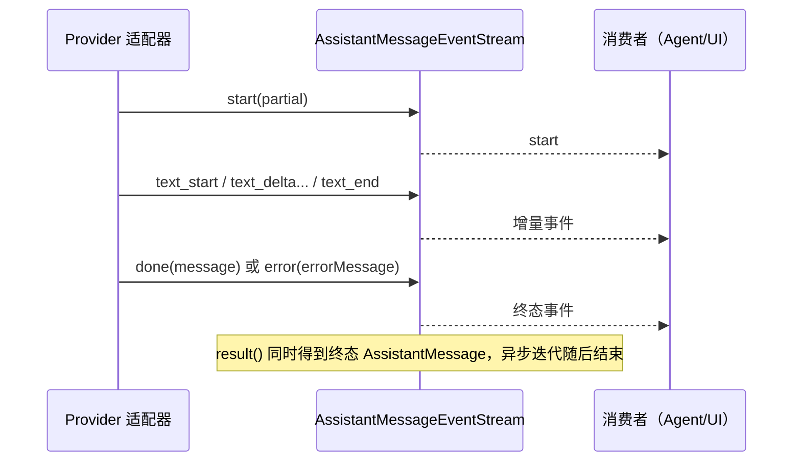

`AssistantMessageEvent` 是带 `type` 标签的联合类型（discriminated union）。读这类 TS 代码时，先看 `event.type`，再看该分支允许访问的字段：

```typescript
for await (const event of stream) {
  switch (event.type) {
    case "text_delta":
      // 只有此分支保证有 delta 字符串
      renderText(event.delta);
      break;
    case "toolcall_end":
      // 完整调用以 toolCall 字段给出
      scheduleTool(event.toolCall);
      break;
    case "done":
      // 成功终态携带完整 AssistantMessage
      saveFinalMessage(event.message);
      break;
    case "error":
      // 错误终态也携带 AssistantMessage，失败信息在 error.errorMessage
      showFailure(event.error.errorMessage);
      break;
  }
}
```

这里有四条实现规则：

1. **先有 `start`，再有更新，最后 `done`**。类型注释规定 `start` 前不能发增量或 `done`；但 setup 阶段失败可以直接发 `error`，所以消费者不能假定每个错误流都有 `start`。
2. **`partial` 是共享的“当前进展”，不是事件发生时的冻结快照**。后续增量会继续修改消息内容；想保存某个时间点的副本，必须自行复制。仅保存许多 `event.partial` 引用，最后可能看到它们都反映最终内容。
3. **增量和最终块各有职责**：`text_start` 时文本通常为空，后续 `text_delta` 提供增量，`text_end.content` 是该文本块的最终值；thinking 通常类似，但被隐藏/加密的思考块可能在 `thinking_start` 就完整出现而没有 delta。工具参数的 `toolcall_start` 初值由供应商决定，`toolcall_delta` 给后续 JSON 增量，`toolcall_end.toolCall` 才是最终完整调用。
4. **终态消息是权威结果**：`done.message` 或 `error.error` 负责提供完整的最终消息。若需要持久化、决定是否执行工具或判断 `stopReason`，应以终态消息为准，不要从屏幕上已显示的 delta 倒推。

适配器实现者可以按这个顺序检查：是否创建了完整的 assistant partial；是否先发 `start`；每种内容块的 `contentIndex` 是否指向正确块；是否在结束块事件后补齐最终字段；成功是否发 `done`；错误是否发带 `stopReason: "error" | "aborted"` 和 `errorMessage` 的 `error`；取消是否也能抵达终态。现有 `types.ts` 的协议注释是契约来源；`assistant-message-frame.test.ts` 覆盖帧编码边界，`faux-provider.test.ts` 覆盖脚本化事件序列。这里是静态源码/测试定位，不代表本轮运行了这些测试。

<a id="05-pi-ai-providers-h15"></a>

## 5.5 供应商适配器解剖：以 Anthropic 为例

打开 `packages/ai/src/providers/anthropic.ts`（全文只有约 100 行，非常适合当第一个适配器读）。它由三块组成：认证定义、目录引用、适配器装配。

<a id="05-pi-ai-providers-h16"></a>

### 5.5.1 认证定义：`anthropicApiKeyAuth()`

```typescript
function anthropicApiKeyAuth(): ApiKeyAuth {
	return {
		name: "Anthropic API key",
		login: async (interaction) => {
			interaction.signal.throwIfAborted();
			const key = await interaction.prompt({ type: "secret", message: "Enter Anthropic API key" });
			interaction.signal.throwIfAborted();
			return { type: "api_key", key };
		},
		resolve: async ({ ctx, credential, signal }) => {
			signal.throwIfAborted();
			// ① 已保存的凭据最优先
			if (credential?.key) {
				return { auth: { apiKey: credential.key }, env: credential.env, source: "stored credential" };
			}
			// ② 环境变量 ANTHROPIC_AUTH_TOKEN 作为 Bearer
			const authToken = await ctx.env(ANTHROPIC_AUTH_TOKEN_ENV);
			signal.throwIfAborted();
			if (authToken) {
				return { auth: { headers: { Authorization: `Bearer ${authToken}` } }, source: ANTHROPIC_AUTH_TOKEN_ENV };
			}
			// ③ 依次尝试 ANTHROPIC_OAUTH_TOKEN、ANTHROPIC_API_KEY
			for (const envVar of [ANTHROPIC_OAUTH_TOKEN_ENV, ANTHROPIC_API_KEY_ENV]) {
				const apiKey = await ctx.env(envVar);
				signal.throwIfAborted();
				if (apiKey) return { auth: { apiKey }, source: envVar };
			}
			// ④ 最后：工作负载身份联合（云环境里用短期令牌）
			//    ANTHROPIC_FEDERATION_RULE_ID + ANTHROPIC_ORGANIZATION_ID + ANTHROPIC_IDENTITY_TOKEN_FILE
			//    三者齐全才启用；SERVICE_ACCOUNT_ID / WORKSPACE_ID 可选透传
			// ...
			return { auth: {}, env: federation, source: "workload identity federation" };
		},
	};
}
```

请把这四层优先级**背下来**，它是排查"认证为什么不生效"的第一张地图（第 11 章系统展开）：

```text
已保存凭据（auth.json）
  → ANTHROPIC_AUTH_TOKEN（Bearer 形态）
    → ANTHROPIC_OAUTH_TOKEN / ANTHROPIC_API_KEY
      → 工作负载身份联合（K8s/CI 等云环境）
```

三个工程细节：

- **`interaction.signal.throwIfAborted()` 无处不在**：登录提示、环境变量读取都要能被取消。这是"全链路取消"在认证层的体现；
- **登录是交互式的**：`login()` 接收一个 `interaction` 对象（询问、secret 输入、取消信号），由宿主（TUI 或 RPC）实现具体交互——`pi-ai` 不依赖终端；
- **`resolve()` 返回 `source` 字段**：告诉你最终凭据从哪来。排查问题时就靠它。

<a id="05-pi-ai-providers-h17"></a>

### 5.5.2 装配：`anthropicProvider()`

```typescript
export function anthropicProvider(): Provider<"anthropic-messages"> {
	return createProvider({
		id: "anthropic",
		name: "Anthropic",
		baseUrl: "https://api.anthropic.com",
		auth: {
			apiKey: anthropicApiKeyAuth(),
			oauth: lazyOAuth({
				name: "Anthropic (Claude Pro/Max)",
				isSubscription: true,
				load: loadAnthropicOAuth,
			}),
		},
		models: Object.values(ANTHROPIC_MODELS),
		api: anthropicMessagesApi(),
	});
}
```

逐项：

- `models: Object.values(ANTHROPIC_MODELS)`：静态目录来自 `providers/anthropic.models.ts`（内容又是从生成目录里筛出来的）。**目录是数据，不是逻辑**；
- `api: anthropicMessagesApi()`：请求实现。名字里的 `lazy`（`api/anthropic-messages.lazy.ts`）意味着**按需加载**——只有真的要用 Anthropic 时才把适配器和 SDK 拉进内存，否则 CLI 启动要白白加载几十个供应商 SDK。这是启动速度的关键设计；
- `oauth: lazyOAuth({ isSubscription: true, load })`：OAuth 支持同样是懒加载的。`isSubscription: true` 表明这是"订阅账号"模式（和 API 计费不同）。

<a id="05-pi-ai-providers-h18"></a>

### 5.5.3 适配器实现要干什么：一份检查清单

`anthropicMessagesApi()` 的内部（`api/anthropic-messages.ts`）不在本章精读范围，但你要知道**任何适配器都要做这两大类工作**，读其他供应商时按这张清单对照：

**请求方向（统一 → 供应商）**：

| 转换对象               | 典型处理                                                                  |
| ---------------------- | ------------------------------------------------------------------------- |
| 系统消息               | 取出提示文本/分节，放到供应商的 system 位置                               |
| 用户/助手/工具结果消息 | 角色映射；内容块结构转换                                                  |
| 工具声明               | `parameters` JSON Schema → 供应商的工具字段（如 `input_schema`）     |
| 思考级别               | `reasoning: "high"` → 供应商的预算/档位参数（查 `thinkingLevelMap`） |
| 缓存策略               | 按供应商能力加缓存标记                                                    |
| 请求头                 | 认证头 + 归因头（`provider-attribution.ts` 维护）                       |

**响应方向（供应商 → 统一）**：

| 转换对象               | 典型处理                                                                           |
| ---------------------- | ---------------------------------------------------------------------------------- |
| SSE/流式事件           | 逐事件解析 →`AssistantMessageEvent`（start/text/thinking/toolcall/done/error）  |
| **工具参数增量** | 分片 JSON 增量拼装（仓库依赖里有`partial-json`，专门做"不完整 JSON 的容错解析"） |
| 结束原因               | `finish_reason` / `stop_reason` → `StopReason` 枚举                         |
| 用量                   | 供应商字段 →`Usage`（含缓存读写与成本计算）                                     |
| 错误                   | HTTP 错误/流错误 →`error` 事件 + `errorMessage`                               |

**一句话总结适配器的价值：把 N 家供应商的"方言"翻译成一种"普通话"。** 统一的普通话就是第 4 章的类型。

<a id="05-pi-ai-providers-h19"></a>

### 5.5.4 "兼容"不是"等价"：`compat` 开关

OpenAI 兼容生态里，各家服务器对同一协议的支持程度参差不齐。`Model.compat` 就是为这些差异准备的开关（类型定义在 `types.ts`，约 1.3 万字节，节选字段）：

```typescript
export interface OpenAICompletionsCompat {
	supportsStore?: boolean;                    // 是否支持 store 字段
	supportsDeveloperRole?: boolean;            // developer 角色 or system
	supportsReasoningEffort?: boolean;          // reasoning_effort 参数
	supportsUsageInStreaming?: boolean;         // 流式里带 usage
	supportsFinishReason?: boolean;             // 流里带 finish_reason；没有则由 pi 推断
	maxTokensField?: "max_completion_tokens" | "max_tokens";
	requiresToolResultName?: boolean;           // 工具结果是否必须带 name 字段
	requiresAssistantAfterToolResult?: boolean; // 工具结果后是否必须插一条 assistant
	requiresThinkingAsText?: boolean;           // 思考块是否要转成 <thinking> 文本
}
```

读法：每个字段的注释都写了"默认从 baseUrl 自动探测"。所以一个自建 vLLM 服务器接进来的典型流程是：

1. 声明一个 `openai-completions` 协议的 `Model`，`baseUrl` 指向本地；
2. pi 按 URL 猜测默认兼容档；
3. 猜错了 → 在 `Model.compat`/`models.json` 里手动覆盖某个开关。

这背后是一个重要的产品判断：**"支持 OpenAI 协议"只能保证最基础的部分，pi 选择为"差异点"建可配置的开关，而不是假装大家一样。**

<a id="05-pi-ai-providers-h20"></a>

## 5.6 认证解析：三个阶段，别混在一起

结合 5.5.1 和 coding-agent 的用法，把"认证"拆成三个时间点：

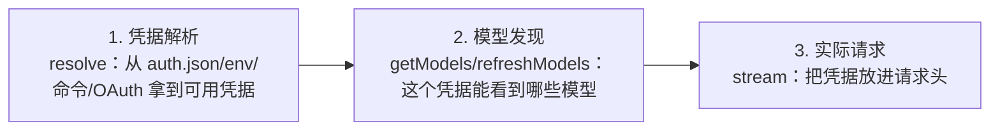

为什么必须区分？

- "列表里能看到某个模型" ≠ "你有这个模型的权限"（`filterModels` 按凭据过滤，但供应商侧仍可能拒绝）；
- "认证配置存在" ≠ "认证仍然有效"（OAuth 过期、账号降级）；
- "请求发出去了" ≠ "模型真的被调用了"（延迟应答 deferred）。

coding-agent 侧的对应 API（回顾第 3 章的两处调用）：

```typescript
// AgentSession.prompt 的校验分支
const hasConfiguredAuth = this._modelRuntime.hasConfiguredAuth(this.model.provider)
	|| (await this._modelRuntime.checkAuth(this.model.provider)) !== undefined;
```

- `hasConfiguredAuth`：**本地判断**"这个供应商是否有凭据配置"（快，不访问网络）；
- `checkAuth`：**更严格的检查**（可能需要解析命令型 key、检查 OAuth 有效性）。

<a id="05-pi-ai-providers-h21"></a>

### 5.6.1 凭据的三种来源（provider 文档口径）

1. **交互登录**（`/login`）：OAuth 或 API Key，保存到 `~/.pi/agent/auth.json`（文件私密，会被 pi 读取但不应提交到仓库）；
2. **环境变量**：如表 `ANTHROPIC_API_KEY`、`OPENAI_API_KEY`、`GEMINI_API_KEY` 等（完整表见 `packages/coding-agent/docs/providers.md`；`pi-test.sh --no-env` 清空的就是这批变量，见第 2 章）；
3. **命令型 key**：`auth.json` 里允许 `"key": "!security find-generic-password -ws 'anthropic'"` 这种写法——**运行时执行命令、缓存 stdout**，适合接密钥管理器，避免把明文写盘。

<a id="05-pi-ai-providers-h22"></a>

### 5.6.2 模型目录：静态与动态

| 形态     | 例子             | 行为                                                                                                                 |
| -------- | ---------------- | -------------------------------------------------------------------------------------------------------------------- |
| 静态目录 | 大多数内置供应商 | `getModels()` 直接返回生成目录中的列表                                                                             |
| 动态目录 | Radius 等网关    | `refreshModels()` 用当前凭据拉取新列表；`context.stored` 恢复上次结果；`publish({persist, update})` 事务式生效 |

对你读代码的意义：**不要假设"模型列表 = 常量"**。看到 `getModel()` 返回 `undefined` 时，先区分是"目录里没有"还是"刷新还没发生/凭据不足被过滤"。

<a id="05-pi-ai-providers-h23"></a>

## 5.7 faux provider：零成本实验的发动机

真实模型实验有成本、不稳定、还要求凭据。仓库为此内置了一个"假供应商"：`providers/faux.ts`（21KB），它**完全兼容真实的流式协议**——返回的是同一套 `AssistantMessageEvent`，只是内容按脚本演出。

<a id="05-pi-ai-providers-h24"></a>

### 5.7.1 它是什么

关键导出（`faux.ts` 与 `compat.ts`）：

```typescript
// 辅助构造器
export function fauxText(text: string): TextContent
export function fauxThinking(thinking: string): ThinkingContent
export function fauxToolCall(name, arguments_, options?): ToolCall
export function fauxAssistantMessage(content, options?): AssistantMessage   // 带 stopReason 等选项

// 注册入口
export function registerFauxProvider(options?: RegisterFauxProviderOptions): FauxProviderRegistration  // compat.ts
export function fauxProvider(options?): FauxProviderHandle                                             // faux.ts
export function createFauxCore(options): ...                                                           // 底层实现
```

`RegisterFauxProviderOptions` 可以定制：api 名、provider 名、模型定义列表、延迟应答行为（`deferred.pendingFetches` / `pollAfterMs`）、**流式速度**（`tokensPerSecond`）与分词粒度（`tokenSize`）——这让你能稳定复现"慢速流式"而不必真的等网络。

<a id="05-pi-ai-providers-h25"></a>

### 5.7.2 怎么"演出"一次对话

核心是**脚本化响应队列**（`faux.ts`）：

```typescript
export type FauxResponseFactory = (
	context: TranscriptContext,
	options: SimpleStreamOptions | undefined,
	state: FauxProviderState,
	model: Model<string>,
) => AssistantMessage | Promise<AssistantMessage>;

export type FauxResponseStep = AssistantMessage | FauxResponseFactory;

export interface FauxProviderRegistration {
	// ...
	state: FauxProviderState;                       // { callCount, deferredFetchCount, cancelledDeferred }
	setResponses: (responses: FauxResponseStep[]) => void;   // 重设整个队列
	appendResponses: (responses: FauxResponseStep[]) => void; // 追加
	getPendingResponseCount: () => number;                   // 还剩几条脚本
	unregister: () => void;
}
```

调度规则：**每次模型请求消费队列里的一项**（`callCount` 自增）。因此第 3 章的"两次模型请求"用例可以这样写：

```typescript
const faux = registerFauxProvider();
faux.setResponses([
	fauxAssistantMessage([fauxToolCall("read", { path: "demo.txt" })], { stopReason: "toolUse" }),
	fauxAssistantMessage("三点总结：……"),
]);

// 跑一次 prompt 后：
// faux.state.callCount === 2
// faux.getPendingResponseCount() === 0
```

（上面是"设计示意"，实际使用时模型注册与认证细节由 SDK/harness 处理；第 5.9 节的实验会给出可运行的完整版本。）

<a id="05-pi-ai-providers-h26"></a>

### 5.7.3 测试里的用法

仓库的测试套件已经把它包好了（`packages/coding-agent/test/suite/harness.ts`）：

```typescript
import { registerFauxProvider, streamSimple } from "@earendil-works/pi-ai/compat";
// ...
import { AgentSession } from "../../src/core/agent-session.ts";
```

这个 harness 会创建一个**真实结构的 AgentSession**，但模型换成 faux、会话换成内存存储——这就是第 18 章要教的"离线模拟"的核心设施。第 6 章的循环实验（steering、并行工具顺序）也全部基于它。

<a id="05-pi-ai-providers-h27"></a>

## 5.8 实验 L02：用 faux 观察两次请求

**实验性质**：本地运行；零模型费用；需要先完成第 2 章的依赖安装。
**验证状态**：设计中（步骤已对照源码设计；请在本地运行并记录结果到你的笔记）。

<a id="05-pi-ai-providers-h28"></a>

### 目标

亲手跑通"一次 prompt → 两次模型请求 → 一次工具执行"的完整轨迹，并观察 `callCount`。

<a id="05-pi-ai-providers-h29"></a>

### 步骤（在仓库根目录）

1. 找到测试套件里最近的例子（任选一个用 harness 的 suite 测试文件）：

```bash
ls packages/coding-agent/test/suite
```

2. 选一个包含工具调用的测试，读它的结构：如何注册 faux、如何 `setResponses([...])`、如何断言 `callCount` 与消息数组；
3. 运行它（在 `packages/coding-agent` 目录下；把文件名换成你选中的）：

```bash
node "$(git rev-parse --show-toplevel)/node_modules/vitest/dist/cli.js" --run test/suite/<你选的文件>.test.ts
```

4. 在测试里（临时改）加一行 `console.log(faux.state.callCount)`，确认：带工具的回答是 2，无工具的是 1。**改完记得还原**，或者把日志加到你自己的临时脚本里。

<a id="05-pi-ai-providers-h30"></a>

### 观察与思考

- `callCount` 与 `getPendingResponseCount()` 的关系是什么（脚本耗尽后请求会怎样——看 faux 找不到脚本时的默认行为）；
- 两次请求之间，`context.messages` 里多了哪两条消息？
- 如果把第一个响应改成"纯文本、无工具"，第二次请求还会发生吗？

<a id="05-pi-ai-providers-h31"></a>

### 清理

还原你对测试文件的临时修改；`git status` 应保持干净（除你自己的实验文件外）。

<a id="05-pi-ai-providers-h32"></a>

## 本章源码精读

> **车下内容**：本节要打开源码逐段对照，通勤（车上）时可以先跳过，直接读本章的“常见错误”和“验收题”；需要修改对应代码时再回来。 读法见[附录 L](#appendices-read-code-h1)。

模型层分两步读：D11/D29/D30 先说明模型目录、凭据与配置合成；D17–D20 再逐个观察供应商流式协议如何变成统一事件。最后用 D23 把这些差异整理成新增 Provider 的实现检查表。真实供应商实验仍受本章验证状态限制。

<!-- 来源：deep-dives/D11-model-layer.md；融合于第 5 章。 -->

<a id="deep-dives-d11-model-layer-h1"></a>

### D11：模型层精读（`pi-ai` 与 coding-agent 的模型运行时）

**先懂**：通用模型接口负责“如何发请求”；coding-agent 还要解决“从哪里取得模型和凭据”。两层先分开，才能判断一个错误发生在模型选择还是网络请求。

```text
教学伪代码：读取模型目录 → 按选择规则取得 Model
           → 解析本次请求的认证和选项 → 交给统一流接口
           → 接收规范化事件
```

这省略动态刷新、扩展覆盖和供应商差异；D29、D30 分别展开这两类问题。

> 精读对象：`packages/ai/src/models.ts`（Models 实现）、`packages/ai/src/compat.ts`（统一入口与注册表）、`packages/coding-agent/src/core/model-runtime.ts`（ModelRuntime）、`core/model-resolver.ts`（模型解析）。
> 对应主线：第 5 章（pi-ai 与供应商适配）、第 3.5 节（装配时的模型解析）。
> 读法：两层分开读——**通用层**（ai：任何宿主可用）与**应用层**（coding-agent：认证存储、目录刷新、虚拟模型、别名解析）。

---

<a id="deep-dives-d11-model-layer-h2"></a>

#### 第一部分：`pi-ai` 的 Models 实现（通用层）

<a id="deep-dives-d11-model-layer-h3"></a>

##### 0. 三个文件的角色

```text
models.ts   Models 接口的实现（ModelsImpl）：provider 注册表、模型查询、stream 分发、动态刷新事务
compat.ts   统一入口：stream/streamSimple/complete、API 实现注册表、内置 API 列表、faux 注册
providers/* 具体供应商（每个导出一个工厂；数据在 *.models.ts）
```

【陷阱】`models.ts` 的类名是 **`ModelsImpl`**（不是 `Models`）——`Models` 是接口（D1 第 18 节提过它的字段）。`createModels()` 返回 `MutableModels`（带 `setProvider` 等变更方法）。**接口/实现/Mutable 视图三层命名**在仓库里一致出现（对比 `SessionManager` 只有一个类，但接口面与内部方法也是分开的）。

<a id="deep-dives-d11-model-layer-h4"></a>

##### 1. `ModelsImpl` 的字段与构造器

【源码（节选）】

```typescript
	private refreshControllers = new Map<string, AbortController>();
	private publicationChains = new Map<string, Promise<unknown>>();

	constructor(options?: CreateModelsOptions) {
		this.credentials = options?.credentials ?? new InMemoryCredentialStore();
		this.modelsStore = options?.modelsStore ?? new InMemoryModelsStore();
		this.authContext = options?.authContext ?? defaultAuthContext();
	}
```

【注解（三件注入的依赖）】

1. `credentials`：凭据存储（默认**内存**——通用层不假设文件位置；coding-agent 注入文件版）；
2. `modelsStore`：动态模型目录的持久化存储（刷新结果的落点）；
3. `authContext`：认证交互环境（`ctx.env(...)` 等——第 5.5.1 节 `anthropicApiKeyAuth.resolve` 里用的就是它）。

- 【陷阱】三个默认值全是**内存/无持久**：`pi-ai` 裸用时"重启即忘"——**持久化由宿主决定**（coding-agent 在 `ModelRuntime.create` 里换成文件/存储实现，见第二部分）。这是"库不越权"的又一例。

<a id="deep-dives-d11-model-layer-h5"></a>

##### 2. `setProvider` 与"刷新覆盖"（`supersedeProviderRefresh`）

【源码（节选）】

```typescript
	setProvider(provider: Provider): void {
		this.supersedeProviderRefresh(provider.id);
		this.providers.set(provider.id, provider);
	}

	deleteProvider(id: string): void {
		this.supersedeProviderRefresh(id);
		this.providers.delete(id);
	}

	clearProviders(): void {
		for (const id of new Set([...this.providers.keys(), ...this.refreshControllers.keys()])) {
			this.supersedeProviderRefresh(id);
		}
		this.providers.clear();
	}

	private supersedeProviderRefresh(providerId: string): number {
		const generation = (this.refreshGenerations.get(providerId) ?? 0) + 1;
		this.refreshGenerations.set(providerId, generation);
		const previous = this.refreshControllers.get(providerId);
		if (previous) {
			this.refreshControllers.delete(providerId);
			previous.abort();
		}
		return generation;
	}
```

【注解（"代际"模式）】

- **每次注册/删除都 +1 代**（`refreshGenerations`）：旧的刷新任务拿到的是旧代际号，**发布时对不上就不再写入**（`beginProviderRefresh`/`publishProviderModels` 会比对）。
- 旧的刷新**控制器被 abort**（如果还在跑）——"替换 provider"意味着"它的在途刷新作废"。
- 【陷阱】**代际 + abort 双重防护**：abort 让旧任务**尽快停**（省资源）；代际号保证即使它"停不下来/已经跑到发布点"也**写不进去**（正确性）。**"取消是尽力而为、代际是硬保证"**——分布式/异步系统里的经典组合（对比第 6 章的"取消信号"与"循环检查点"的双保险）。
- `clearProviders` 的遍历集合是 **providers ∪ refreshControllers**：有些刷新任务的 provider 已被删（控制器还在）——清空时也要把它们作废。**"清理要覆盖所有持有态的集合"**的实例。

<a id="deep-dives-d11-model-layer-h6"></a>

##### 3. 查询：best-effort 与" 线性查找"

【源码（节选）】

```typescript
	getModels(provider?: string): readonly Model<Api>[] {
		if (provider !== undefined) {
			const entry = this.providers.get(provider);
			if (!entry) return [];
			try { return entry.getModels(); } catch { return []; }
		}
		const models: Model<Api>[] = [];
		for (const entry of this.providers.values()) {
			try { models.push(...entry.getModels()); } catch {
				// Best-effort: ill-behaved providers yield no models.
			}
		}
		return models;
	}

	getModel(provider: string, id: string): Model<Api> | undefined {
		return this.getModels(provider).find((model) => model.id === id);
	}
```

【注解】

- **`Provider.getModels()` 的契约是"不许抛"**（第 5.2.3 节的注释："Must not throw; `Models` treats a throwing implementation as having no models"）——这里的 try/catch 是**对契约的兜底执行**（不信任 provider 的守约）。两层防御：契约写在文档里，代码再包一层。
- 跨 provider 聚合遍历时**单个 provider 抛错不影响其他**（局部 catch）。
- 【陷阱】`getModel` **每次都在数组里线性找**（没有按 id 建索引）——当前模型数量（几百）下无碍；**读代码时注意它是 O(模型数) 的**（热路径上别反复调用；仓库里的缓存策略见 `getAvailableSnapshot` 之类的快照 API）。
- `getAllModels`/`getModelsOfType` 同构（`getAllModels?.() ?? getModels()` 的回退——只提供聊天模型的 provider 不必实现 `getAllModels`）。

<a id="deep-dives-d11-model-layer-h7"></a>

##### 4. `streamSimple`：鉴权解析 + 分发的"懒惰"包装

【源码】

```typescript
	streamSimple(model: Model<Api>, context: Context, options?: ModelsSimpleStreamOptions): AssistantMessageEventStream {
		const transcript = normalizeContext(context);
		return lazyStream(model, async () => {
			const provider = this.requireChatProvider(model);
			const { requestModel, requestOptions } = await this.applyAuth(model, options);
			return provider.streamSimple(requestModel, transcript, requestOptions as SimpleStreamOptions);
		});
	}
```

【注解（四步）】

1. `normalizeContext`：**同步**折规范（第 5.4 节）——在 `lazyStream` 外调用；如果这一步发生异常，它不会经过 `lazyStream` 的错误流转换，而是从 `streamSimple()` 调用处同步抛出；
2. `lazyStream(model, async () => ...)`：先同步创建并返回外层流，同时**立刻调用** `setup()` 开始异步准备，并不是等消费者第一次读取才开始。`setup` 回调是 async 函数，因此其中同步抛错（例如找不到 provider）会变成 rejected Promise；`lazyStream` 的 `.catch()` 把它转换成 `{ type: "error", reason: "error", error }` 事件，并以同一条 `stopReason: "error"` 消息结束流。异步认证失败也沿同一 catch 路径处理。调用者可立即拿到流对象；`stream.result()` 最终解析为错误消息，而非因 setup 失败而 reject。
3. `requireChatProvider`：查不到 provider 时抛 `ModelsError("provider", ...)`；因为它运行在传给 `lazyStream` 的 async setup 中，外层观察到的是错误流，而不是调用点同步异常。`models-runtime.test.ts` 的 `produces an error stream for unknown providers instead of throwing` 验证此边界；
4. `applyAuth`：解析凭据（可能异步：命令型 key、OAuth 刷新）→ 返回 `{ requestModel, requestOptions }`——**auth 被"应用"到请求选项上**（apiKey/headers/env），provider 拿到的是"已带凭据形状"的选项。

```text
ModelsImpl.streamSimple(model, context)
  ├─ normalizeContext(context)        同步；失败可直接抛出
  └─ lazyStream(model, setup)
       ├─ new 外层 AssistantMessageEventStream
       ├─ 立即执行 setup()            查 provider → await applyAuth → 建 provider stream
       ├─ setup 成功                  forwardStream 转发事件与终态
       └─ setup 失败                  error 事件 + stopReason="error" 终态
```

注意还有一个不同入口：直接调用低层 `packages/ai/src/api/*` 的 provider `streamSimple()`，不经过 `ModelsImpl` 的 `lazyStream` 包装时，缺少 API key 可能同步抛出。`pre-generation-error.test.ts` 明确对多个 provider API 断言此行为；`types.ts` 的 `StreamFunction` 注释也保留了这个接口契约。因而不要把“直接 API 调用”和“经 `Models` 注册表调用”的错误时机合并成一句话。

- `complete`/`completeSimple`：`.result()` 包装（把流汇聚成消息——第 5.4 节）。
- `streamDeferred`：先查 `provider.fetchDeferred` 是否存在，缺则抛 `ModelsError("provider", ...)`——**能力检测前置**（不做无意义的 auth 解析）。
- 【陷阱】三个流式方法的**结构完全同构**（normalize → lazyStream → require → applyAuth → 委托）——将来加新"流种类"时照抄这套骨架即可；**差异只在委托的方法名与能力检查**。

<a id="deep-dives-d11-model-layer-h8"></a>

##### 5. `createProvider` 与注册表（含 faux）

【源码（节选，第 5.2.4 节已读过主体）】

```typescript
export function createProvider<TApi extends Api = Api>(input: CreateProviderOptions<TApi>): Provider<TApi> {
	const single = input.api && typeof (input.api as ProviderStreams).stream === "function"
		? (input.api as ProviderStreams) : undefined;
	const byApi = single || !input.api ? undefined : (input.api as Partial<Record<string, ProviderStreams>>);
	// ...（images/classifiers 同款处理）
	if (streams.length === 0 && imageImplementations.length === 0 && classifierImplementations.length === 0) {
		throw new Error(`Provider ${input.id}: at least one of "api", "images", or "classifiers" is required.`);
	}
```

【注解】

- **空实现直接拒绝**（构造期响亮失败——"注册一个什么都干不了的 provider"是调用方 bug）。
- `single` vs `byApi` 的判定用 **`typeof ...stream === "function"`**（鸭子类型）：对象要么"就是一个流实现"、要么"是 api→实现的字典"——**类型系统的区分不了这两者时，运行时的形状检查顶上**（`input.api` 的类型是联合，无法单靠类型分流）。【陷阱】读这类"同字段两种形状"的 API 时，优先找**构造期的校验**（这里就是），它把模糊留给实现、把清晰还给调用错误。

【源码（compat 的 faux 注册）】

```typescript
export function registerFauxProvider(options: RegisterFauxProviderOptions = {}): FauxProviderRegistration {
	const core = createFauxCore(options);
	const sourceId = `faux-provider-${Math.random().toString(36).slice(2, 10)}`;
	registerApiProvider({ api: core.api, stream: core.stream, streamSimple: core.streamSimple }, sourceId);
	return {
		api: core.api, models: core.models, getModel: core.getModel, state: core.state,
		setResponses: core.setResponses, appendResponses: core.appendResponses,
		getPendingResponseCount: core.getPendingResponseCount,
		unregister() { unregisterApiProviders(sourceId); },
	};
}
```

【注解】

- **random sourceId**：同一进程可以注册**多个 faux**（不同测试各自注册/注销互不干扰）——`unregisterApiProviders(sourceId)` 只删这个 id 注册的那些 api。
- 返回的注册对象把 core 的**八个方法/字段**透出（`state` 句柄是断言 `callCount` 的关键，第 5.7.2 节）。
- 【陷阱】faux 走 `registerApiProvider`（**api 级**注册），不走 `setProvider`（provider 级）——所以它**不占用 provider id**，而是注册了一批"api 实现"；`resolveApiProvider(model.api)` 按 api 找它（compat 的 fallback 路径，第 5.4 节）。**两种注册粒度**（api vs provider）在这里各有用例：内置供应商用 provider（有目录/认证），测试替身用 api（更轻、可多重注册）。

【源码（内置 API 注册的"不覆盖"策略）】

```typescript
const BUILTIN_APIS: [Api, ProviderStreams][] = [
	["anthropic-messages", anthropicMessagesApi()],
	["openai-completions", openAICompletionsApi()],
	// ...（共 10 个）
];

/**
 * Registers the builtin API implementations into the api-registry without
 * clobbering existing entries: compat may load after a test or extension has
 * already registered an override for a builtin api id.
 */
export function registerBuiltInApiProviders(): void {
	for (const [api, streams] of BUILTIN_APIS) {
		if (!getApiProvider(api)) {
			registerApiProvider({ api, stream: streams.stream, streamSimple: streams.streamSimple });
		}
		builtinApiProviderInstances.set(api, getApiProvider(api));
	}
}
```

【注解】

- **顺序不敏感**的注册：先注过自定义实现的（测试/扩展），内置就**让位**（`if (!getApiProvider(api))`）。注释给出理由："compat 可能在测试或扩展注册覆盖之后才加载"——**模块加载顺序不该决定行为**，这是"幂等注册"的设计。
- `builtinApiProviderInstances`：记下每个 api 最终生效的实现（可能是覆盖版）——供 `resetApiProviders` 等操作使用。
- 【陷阱】`BUILTIN_APIS` 在**模块顶层就 `xxxApi()` 创建**（10 个实现对象）——这些是轻量工厂产物（真正的 SDK import 在 `.lazy.ts` 里按需加载，第 5.5.2 节）；**"顶层对象 ≠ 顶层重依赖"**，阅读时别把它们当重型初始化。

---

> D11 第一部分到此。第二部分：coding-agent 侧——`ModelRuntime.create` 的六件装配、provider 组合（builtins/native/config/extension/virtual）、虚拟模型路由（凭据隔离与 maxTokens 钳制）、认证快照（`hasConfiguredAuth`/`checkAuth`/`getAvailable`）、`model-resolver` 的两条解析链（`parseModelPattern` 与 `findInitialModel`/`restoreModelFromSession`）与总结。

---

<a id="deep-dives-d11-model-layer-h9"></a>

#### 第二部分：coding-agent 的模型运行时（应用层）

<a id="deep-dives-d11-model-layer-h10"></a>

##### 6. `ModelRuntime.create`：六件装配

【源码】

```typescript
	static async create(options: CreateModelRuntimeOptions = {}): Promise<ModelRuntime> {
		const credentials = new RuntimeCredentials(options.credentials ?? DefaultAuthStorage.create(options.authPath));
		const modelsPath =
			options.modelsPath === null ? undefined : (options.modelsPath ?? join(getAgentDir(), "models.json"));
		const config = await ModelConfig.load(modelsPath);
		const modelsStore =
			options.modelsStore ??
			(modelsPath
				? new FileModelsStore(options.modelsStorePath ?? join(dirname(modelsPath), "models-store.json"))
				: new InMemoryCodingAgentModelsStore());
		const builtinModelDataGeneratedAt = builtinProviderCatalog.getBuiltinModelDataGeneratedAt();
		const providers = builtinProviderCatalog
			.builtinProviders()
			.map((provider) =>
				provider.id === "radius"
					? provider
					: withRemoteCatalog(provider, options.catalogBaseUrl, builtinModelDataGeneratedAt),
			);
		const runtime = new ModelRuntime(
			credentials,
			config,
			modelsPath,
			modelsStore,
			providers,
			process.env.PI_OFFLINE === undefined,
		);
		runtime.configureRadiusProviders();
		runtime.rebuildProviders();
		const refreshFromNetwork = runtime.modelNetworkEnabled && options.allowModelNetwork === true;
		// ...（超时控制器与 signal 组合）
		try {
			if (options.refreshOnCreate !== false) {
				await runtime.refresh({ allowNetwork: refreshFromNetwork, signal });
			}
		} finally {
			if (timeout) clearTimeout(timeout);
		}
		return runtime;
	}
```

【注解（六件）】

1. **凭据**：`RuntimeCredentials`（包装）`DefaultAuthStorage.create(options.authPath)`——`authPath` 缺省时由 `DefaultAuthStorage` 自己找默认位置（**又一个"默认知识留在实现里"**：调用方只在需要覆盖时传路径）。
2. **配置目录文件**：`modelsPath` 三态——**`null` 显式禁用**（不加载 models.json，用于"纯内置"场景，如 SDK 全控制示例）；缺省 `~/.pi/agent/models.json`；`ModelConfig.load(modelsPath)` 读它（第 11.2 节的目录）。
3. **动态目录存储**：有 modelsPath → `FileModelsStore(models-store.json)`（**刷新结果持久化到同目录**——第 5.6.2 节的 `stored`）；没有 → 内存版。注意 `modelsStorePath` 可单独覆盖（文件与配置可以分家）。
4. **内置 provider 工厂**：`builtinProviderCatalog.builtinProviders()` 拿到全部内置 provider 对象；**除 radius 外**都包一层 `withRemoteCatalog(provider, catalogBaseUrl, generatedAt)`——远程目录覆盖（pi.dev 的模型目录，含时间血缘 `generatedAt`；第 5.6.2 节的"静态 + 远程"）。radius 的目录天生动态（自带 gateway 拉取），不需要包。
5. **构造 + 两个初始化动作**：`configureRadiusProviders()`（按 settings 里的 `oauth: "radius"` 配置**自定义 gateway** 的 radius provider——第 5.6.2 节 Radius 段）与 `rebuildProviders()`（把内置 + 配置 + 扩展 + 虚拟模型**组合进内部 Models**）。
6. **创建后刷新**：`refreshFromNetwork = modelNetworkEnabled && allowModelNetwork === true`——**默认不联网**（`allowModelNetwork` 默认 false；`refreshOnCreate !== false` 时才跑一次 `refresh({ allowNetwork })`）；超时如上（`AbortController` + `AbortSignal.any` 组合调用方 signal；`finally` 清定时器）。【陷阱】离线判定在构造时为 `process.env.PI_OFFLINE === undefined`（存在即离线）——**离线是"创建时快照"**，中途改环境变量不影响本实例。

- 【陷阱】`options.modelsPath === null ? undefined : ...` 的三态（null=禁用、undefined=默认、字符串=指定）与 `authPath` 的"缺省即内置"不同——**同一函数里两种"默认策略"**：modelsPath 有"显式禁用"需求（null），authPath 没有。读参数默认时逐个确认。

<a id="deep-dives-d11-model-layer-h11"></a>

##### 7. provider 的组合：五路来源

【源码（节选）】

```typescript
	private providerIds(): Set<string> {
		return new Set([
			...this.builtins.keys(),
			...this.nativeExtensionProviders.keys(),
			...this.config.getProviderIds(),
			...this.extensionProviders.keys(),
			...this.virtualModels.keys(),
		]);
	}

	/** Returns the provider without virtual models, or undefined when only virtual models define it. */
	private recomposeProvider(providerId: string): Provider | undefined {
		const provider = this.composeProvider(providerId);
		const virtualModels = [...(this.virtualModels.get(providerId)?.values() ?? [])].map((entry) => entry.model);
		if (virtualModels.length > 0) this.models.setProvider(withVirtualModels(providerId, provider, virtualModels));
		else if (provider) this.models.setProvider(provider);
		else this.models.deleteProvider(providerId);
		return provider;
	}
```

【注解（五路来源）】

| 来源                         | 内容                                                                 | 注册方式        |
| ---------------------------- | -------------------------------------------------------------------- | --------------- |
| `builtins`                 | 内置目录（`builtinProviders()` + radius 定制）                     | 构造时装入      |
| `nativeExtensionProviders` | 扩展注册的**原生 Provider 对象**（`registerNativeProvider`） | 运行时          |
| `config`                   | `models.json` 里声明的兼容端点（第 11.2 节）                       | `ModelConfig` |
| `extensionProviders`       | 扩展注册的**配置对象**（`pi.registerProvider`，第 13.2 节）  | 运行时          |
| `virtualModels`            | 虚拟模型（按请求路由，第 5 章）                                      | 运行时          |

- `recomposeProvider`：**组合逻辑**——先 `composeProvider`（基础 provider：内置/配置/扩展谁定义了算谁的），再决定向 `this.models`（内部的 `Models` 实例）**注册什么**：
  - 有虚拟模型 → 包一层 `withVirtualModels`（**虚拟模型挂在哪个 provider id 上由注册者声明**——同 id 的物理 provider 与虚拟模型共存，路由在 `streamSimple` 里发生）；
  - 只有基础 → 直接注册；
  - 都没有 → `deleteProvider`（**声明退出**——组合结果为空时同步删除，避免残留旧 provider）。
- 【陷阱】"**重建组合**"（recompose/rebuild）是 ModelRuntime 的核心不变式：任何来源变化（扩展注册、配置重载、radius 配置）后都要走一遍——**"派生状态不手改、只重算"**（跟第 4 章的"系统提示重放"是同一种思想：**权威输入 → 重算派生**）。
- 【跳转】`composeProvider` 的具体合并顺序（内置 vs 配置 vs 扩展的覆盖规则）——读它时关注"谁的字段赢"（local provider 覆盖的粒度：整个模型列表替换还是逐字段？`registerProvider` 的文档注释给了语义：`models` 提供=替换全部；只给 `baseUrl`=只改 URL，第 13.2 节）。

<a id="deep-dives-d11-model-layer-h12"></a>

##### 8. 虚拟模型路由：凭据隔离与预算钳制

【源码】

```typescript
	streamSimple(model: Model<Api>, context: Context, options?: ModelsSimpleStreamOptions): AssistantMessageEventStream {
		const transcript = normalizeContext(context);
		if (isVirtualModel(model)) {
			// Requests outside the agent loop are routed here. Callers sized them before routing, so
			// cap the output budget to the routed model.
			return lazyStream(model, async () => {
				const route = await this.resolveModel(model, transcript.messages, {
					reason: "direct",
					thinkingLevel: options?.reasoning ?? "off",
					signal: options?.signal,
				});
				const { maxTokens: limit } = route.model;
				const maxTokens = options?.maxTokens && limit > 0 ? Math.min(options.maxTokens, limit) : options?.maxTokens;
				const reasoning = route.thinkingLevel === "off" ? undefined : route.thinkingLevel;
				// Caller credentials were resolved for the virtual model's provider. Another provider
				// resolves its own, so they are not sent to the wrong vendor.
				const { apiKey, headers, env, ...rest } = options ?? {};
				const auth = route.model.provider === model.provider ? { apiKey, headers, env } : {};
				return this.streamSimple(route.model, context, { ...rest, ...auth, maxTokens, reasoning });
			});
		}
		return lazyStream(model, async () => {
			assertChatModel(model);
			const prepared = await this.prepareRequest(model, options);
			return prepared.provider.streamSimple(prepared.model, transcript, prepared.options as SimpleStreamOptions);
		});
	}
```

【注解（虚拟模型分支的四个决策）】

1. **只在"agent 循环之外"的请求到这里**（注释："Requests outside the agent loop are routed here"）——循环内的路由走 `resolveModel` 别的 reason（`_prepare`/钩子路径）；这里是**直接调用者**（SDK/codemode）的兜底。
2. **`maxTokens` 钳制到路由后的模型上限**："callers sized them before routing"——调用方按**虚拟模型**的元数据算了预算，路由到的物理模型可能更小 → 取 `min`（`limit > 0` 才钳——0 表示未知，不钳）。
3. **`reasoning` 归一**：路由出的 `"off"` → `undefined`（第 D1/D2 节的"两套词汇表"第三次出现——到这里你应该已经条件反射）。
4. **凭据隔离**（最精妙的一行）：

```typescript
				const { apiKey, headers, env, ...rest } = options ?? {};
				const auth = route.model.provider === model.provider ? { apiKey, headers, env } : {};
```

- 调用方传的 `apiKey`/`headers`/`env` 是**为虚拟模型所属 provider 解析的**；
- 如果路由到了**别的 provider**，这些凭据**不带过去**（`auth = {}`）——新 provider 会走自己的 `prepareRequest`/auth 解析；
- 同一 provider 时保留（减少重复解析）。
- 【陷阱】**"凭据不见得是给谁用的"**——多 provider 系统里，凭据与"它属于哪家"必须绑在一起流转；这一行是"凭据泄漏到错误供应商"防御的实现点。**读任何"转发请求"的代码，都要问"转发时哪些凭据/上下文被带过去了、该不该带"**。

5. 递归调用 `this.streamSimple(route.model, context, ...)`——**用物理模型再走一遍**（不是递归死循环：物理模型不是虚拟模型，走 else 分支）。

- else 分支：`assertChatModel`（**能力断言**：图片/分类模型不能从聊天入口调用）+ `prepareRequest`（"准备请求"——auth/路由变换的汇点）+ 委托 `prepared.provider.streamSimple`。**通用层（第一部分）与这里的结构同构**，多了一步"prepareRequest"（应用的请求变换：headers/attribution/配置的头——第 3.5 节的 `buildRequestOptions` 在另一个维度）。

<a id="deep-dives-d11-model-layer-h13"></a>

##### 9. 认证状态：快照、可用性与错误

【源码（节选）】

```typescript
	hasConfiguredAuth(providerId: string): boolean {
		return this.snapshot.configuredProviders.has(providerId);
	}

	async getAvailable(providerId?: string, options?: AuthOperationOptions): Promise<readonly Model<Api>[]> {
		if (providerId) {
			const errorSeq = ++this.availabilityErrorSeq;
			try {
				const available = await this.models.getAvailable(providerId, options);
				if (errorSeq === this.availabilityErrorSeq) this.availabilityError = undefined;
				return available;
			} catch (error) {
				if (errorSeq === this.availabilityErrorSeq && !options?.signal?.aborted) {
					this.availabilityError = error instanceof Error ? error.message : String(error);
				}
				throw error;
			}
		}
		await this.queueAvailabilityRefresh(options?.signal);
		return this.snapshot.available;
	}
```

【注解】

- **`hasConfiguredAuth` 是同步的快照查询**（`snapshot.configuredProviders`）——不访问网络/不跑命令，所以装配期（第 3.5 节）可以频繁调用。**"配置了认证" ≠ "认证有效"**（第 5.6 节的阶段分离）——快照由刷新任务异步更新。
- `getAvailable(provider)`：**带序号的错误清理**（`availabilityErrorSeq`）——并发调用的旧结果不覆盖新状态（"代际"模式在小尺度上的复刻）；取消（aborted）不记错误（**取消不是故障**——第 6 章的语义一致）。
- `getAvailable()`（无参）：`queueAvailabilityRefresh` + 返回 `snapshot.available`（**快照读**——不阻塞等刷新；"可用性"的最终一致）。
- `isUsingOAuth`/`isUsingSubscription`：从快照的凭据类型 + provider 的 oauth 元数据判断（登录引导/订阅区分用——第 5.5.1 节）。
- `getAuth(model, overrides)`：在通用层结果上**再合并"已配置的模型头"**（`resolveConfiguredModelHeaders`——models.json 里 per-model headers 的落点）。
- `getError()`：**错误汇总器**（配置错误 + 组合错误 + 可用性刷新错误）——"诊断收集、调用方裁决"模式在模型层的又一实例（第 8.3.2 节的血统）。

<a id="deep-dives-d11-model-layer-h14"></a>

##### 10. `model-resolver`：两条解析链

<a id="deep-dives-d11-model-layer-h15"></a>

###### 10.1 `parseModelPattern`：`"provider/model:level"` 的解析

【源码（节选，含递归）】

```typescript
export function parseModelPattern(pattern, availableModels, options?): ParsedModelResult {
	// Try exact match first
	const exactMatch = tryMatchModel(pattern, availableModels);
	if (exactMatch) return { model: exactMatch, thinkingLevel: undefined, warning: undefined };

	// No match - try splitting on last colon if present
	const lastColonIndex = pattern.lastIndexOf(":");
	if (lastColonIndex === -1) return { model: undefined, thinkingLevel: undefined, warning: undefined };

	const prefix = pattern.substring(0, lastColonIndex);
	const suffix = pattern.substring(lastColonIndex + 1);

	if (isValidThinkingLevel(suffix)) {
		const result = parseModelPattern(prefix, availableModels, options);
		if (result.model) {
			return { model: result.model, thinkingLevel: result.warning ? undefined : suffix, warning: result.warning };
		}
		return result;
	} else {
		const allowFallback = options?.allowInvalidThinkingLevelFallback ?? true;
		if (!allowFallback) return { model: undefined, thinkingLevel: undefined, warning: undefined };
		const result = parseModelPattern(prefix, availableModels, options);
		if (result.model) {
			return { model: result.model, thinkingLevel: undefined, warning: `Invalid thinking level "${suffix}" in pattern "${pattern}". Using default instead.` };
		}
		return result;
	}
}
```

【注解】

- **先整串精确匹配**（`tryMatchModel`——含别名/模糊逻辑在它内部），再考虑"最后一段冒号后缀是不是思考级别"。
- 递归结构：每次剥掉**最后一段**后缀再试——**支持模型 id 里本身带冒号**（文档注释点名 OpenRouter 的 `model:exacto`）：`a:b:c` 先试整串、再试 `a:b`（suffix=c）、再试 `a`（suffix=b:c？）——【陷阱】每层只剥一段，所以带冒号的 id 需要"整串精确匹配"命中，否则会一层层剥到失败；**注释里的算法描述可以对照这个递归验证**（"tries to match the full pattern first, then progressively strips colon-suffixes"）。
- **两种模式**（`allowInvalidThinkingLevelFallback`）：
  - **严格模式**（CLI `--model` 解析，false）：无效后缀视为 id 的一部分 → 整体不匹配（**避免悄悄解析成另一个模型**——"宁报错不猜"）；
  - **宽容模式**（scope/设置里，默认 true）：递归前缀 + **warning**（"Invalid thinking level ... Using default instead."）——诊断交给调用方（`resolveModelScopeWithDiagnostics` 收集成 `ModelScopeDiagnostic`）。
- 【陷阱】"有效思考级别时也要看内层 warning"：`thinkingLevel: result.warning ? undefined : suffix`——**内层已经警告（比如前缀是模糊匹配）时，不采用本层后缀**（避免"模糊匹配 + 级别"的双重不确定叠加）。**警告传播抑制**的实例。
- 解析结果三件套 `{ model, thinkingLevel, warning }`——第 3 章 `resolveModelScope` 与 CLI 的 `--model` 都消费它。

<a id="deep-dives-d11-model-layer-h16"></a>

###### 10.2 `findInitialModel`：五步优先级

【源码（分支目录）】

```typescript
	// 1. CLI args take priority
	if (cliProvider && cliModel) { /* resolveCliModel；error → 打印并 exit(1)；成功直接返回 */ }

	// 2. Use first model from scoped models (skip if continuing/resuming)
	if (scopedModels.length > 0 && !isContinuing) { /* scoped[0] + 每模型级别 ?? 默认 */ }

	// 3. Try saved default from settings if auth is configured.
	if (defaultProvider && defaultModelId) { /* getModel + hasConfiguredAuth 才用 */ }

	// 4. Try first available model with valid API key
	const availableModels = [...modelRuntime.getAvailableSnapshot()];
	if (availableModels.length > 0) {
		for (const provider of Object.keys(defaultModelPerProvider)) {
			const match = availableModels.find((m) => m.provider === provider && m.id === defaultModelPerProvider[provider]);
			if (match) return { model: match, ... };
		}
		return { model: availableModels[0], ... };
	}

	// 5. No model found
	return { model: undefined, ... };
```

【注解（五步各自的"为什么"）】

1. **CLI 显式参数最高**：`cliProvider && cliModel` 都给才走；解析失败**直接 `exit(1)`**（【陷阱】这个函数在"装配核心"里却会退出进程——它是**CLI 专用路径**，SDK 调用时不传这两个参数；读函数的副作用时先看调用方）。
2. **作用域的第一个**（`--models`/`enabledModels` 解析出的列表）：**`!isContinuing` 才用**——恢复会话时优先让"会话记录"决定（第 3.5 节的顺序）；这里体现了"作用域只是启动偏好，历史选择优先"。
3. **设置里的默认**：**双重条件**（模型存在 + 有认证）——否则跳过（与第 3.5 节恢复逻辑同款校验）。
4. **可用快照**：先按 `defaultModelPerProvider` 表找"已知好模型"（每个 provider 一个人气默认），找不到用**第一个可用**；【陷阱】这一步**没有任何认证二次校验**（快照本身已经过滤过可用性——`getAvailableSnapshot` 的语义）。
5. 全空 → `model: undefined`（调用方据此发 `formatNoModelsAvailableMessage`——第 3.5 节）。

【陷阱】五步的**返回对象形状不同**：第 1、4（首分支）、5 步返回 `thinkingLevel: DEFAULT_THINKING_LEVEL`；第 2 步返回"scoped/每模型/默认"三级计算；第 3 步返回"每模型/默认"两级。**同一函数的返回里级别来源不一致**——消费方（`createAgentSession`）在更外层还有自己的恢复链（D5 第 4 节），两级链条叠加时要按实际传参追（`scopedModels` 在 SDK 装配里传空数组——D5 已经点过）。

<a id="deep-dives-d11-model-layer-h17"></a>

###### 10.3 `restoreModelFromSession`：恢复的完整决策

【源码（节选）】

```typescript
export async function restoreModelFromSession(savedProvider, savedModelId, currentModel, shouldPrintMessages, modelRuntime) {
	const restoredModel = modelRuntime.getModel(savedProvider, savedModelId);
	const hasConfiguredAuth = restoredModel ? modelRuntime.hasConfiguredAuth(restoredModel.provider) : false;

	if (restoredModel && hasConfiguredAuth) {
		if (shouldPrintMessages) console.log(chalk.dim(`Restored model: ${savedProvider}/${savedModelId}`));
		return { model: restoredModel, fallbackMessage: undefined };
	}

	const reason = !restoredModel ? "model no longer exists" : "no auth configured";
	if (shouldPrintMessages) console.error(chalk.yellow(`Warning: Could not restore model ${savedProvider}/${savedModelId} (${reason}).`));

	if (currentModel) { /* 用当前模型兜底 + fallbackMessage */ }
	const availableModels = [...modelRuntime.getAvailableSnapshot()];
	if (availableModels.length > 0) { /* 先找 defaultModelPerProvider 的匹配，再取第一个 */ }
	// ...（都失败：返回 undefined + 不适用消息）
}
```

【注解】

- **恢复三态原因**：模型不存在 / 无认证 / 成功——原因字符串进警告与 `fallbackMessage`（用户能看到"为什么换了模型"）。
- 两条兜底顺序：**当前模型**（调用方已经有一个在用的）→ **可用快照的人气默认** → 空。
- 【陷阱】`shouldPrintMessages` 参数：**同一函数既能"打日志"也能"静默返回消息"**——SDK/RPC 场景传 false（自己渲染 `fallbackMessage`），CLI 传 true（直接打印）。**"输出"与"判断"分离**的又一种做法（对比诊断模式）。
- 【陷阱】它与 `findInitialModel` 的重叠：两者都会"从可用快照里挑默认"。差异在**入口条件**（findInitialModel 管"没有恢复值的启动"；restore 管"有恢复值但不可用"）与**输出形态**（`InitialModelResult` vs `{model, fallbackMessage}`）。**改"默认选择"逻辑时两处都要看**——这是潜在的重复源（好读法：grep `defaultModelPerProvider` 找到所有使用点，仓库马上告诉你全部三处）。

<a id="deep-dives-d11-model-layer-h18"></a>

##### 11. 总结

<a id="deep-dives-d11-model-layer-h19"></a>

###### 11.1 优先级链总表（背这张表，排障时省半小时）

| 场景                     | 优先级（从高到低）                                                                                                 |
| ------------------------ | ------------------------------------------------------------------------------------------------------------------ |
| 模型选择（启动）         | CLI`--provider/--model` → 作用域首个（非恢复时）→ 设置默认（有认证）→ 可用快照的人气默认 → 首个可用 → 无    |
| 模型恢复（有历史）       | 会话记录值（有认证）→ 当前模型 → 可用快照默认 → 无                                                              |
| 模式（pattern）解析      | 整串精确 → 从右到左逐段剥冒号（有效级别才采用）→ 严格模式失败 / 宽容模式警告+前缀结果                            |
| 流式分发（通用层）       | 内置 provider（按 model.provider）→ api 注册表（resolveApiProvider(model.api)）                                   |
| 流式分发（应用层）       | 虚拟模型 →`resolveModel` 路由（凭据按 provider 隔离、maxTokens 钳制）→ 物理模型 `prepareRequest` → provider |
| 认证来源（Anthropic 例） | 已存凭据 → AUTH_TOKEN(Bearer) → OAUTH_TOKEN/API_KEY → 联合身份（第 5.5.1 节）                                   |

<a id="deep-dives-d11-model-layer-h20"></a>

###### 11.2 阅读检查清单

- [ ] 我能说出 `ModelsImpl` 三种注入依赖的"默认全内存"策略吗？
- [ ] 我能解释"代际 + abort"双重防护各防什么吗？
- [ ] 我知道 `lazyStream` 把准备工作推迟的原因与代价吗？
- [ ] 我能复述虚拟模型路由的四个决策（尤其是凭据隔离那三行）吗？
- [ ] 我能画出 `findInitialModel` 的五步吗？第 2 步为什么有 `!isContinuing`？
- [ ] 我能说出 `parseModelPattern` 两种模式在"怕什么"上的差别吗？

---

> D11 完。精读篇（D1-D11）覆盖：循环、Agent、会话（投影/本体）、提示与压缩（读/写）、SDK、CLI、工具、扩展、模型层。

<!-- 来源：deep-dives/D29-model-runtime-request-and-credentials.md；融合于第 5 章。 -->

<a id="deep-dives-d29-model-runtime-request-and-credentials-h1"></a>

### D29：ModelRuntime 的请求准备与凭据同步

**先懂**：登录、环境变量和一次请求专用的覆盖值可能给出不同的凭据。请求开始时必须得到一组确定的认证参数；凭据变化后，本地可用模型状态也要同步更新。

```text
教学伪代码：取得当前凭据快照 → 按本次请求规则选择凭据
           → 构造请求选项 → 凭据发生变化时刷新可用状态
```

这里不承诺所有供应商使用同一优先级；真实合并规则看后面的对应代码。

> 本篇接着 D11，追踪 coding-agent 应用层的两条路径：一次模型请求如何得到最终认证参数；一次凭据变更如何更新模型目录与可用性快照。
>
> 验证状态：静态核对 `model-runtime.ts`、`runtime-credentials.ts` 与列出的测试源码；未运行测试。

<a id="deep-dives-d29-model-runtime-request-and-credentials-h2"></a>

#### 1. 两个时序问题

`ModelRuntime` 不只是把模型交给 `pi-ai`。它还要把应用配置、凭据存储、每请求覆盖值和扩展提供的转换组合起来。凭据变更也不止是写存储：调用方通常紧接着要读 `hasConfiguredAuth()` 或 `getAvailableSnapshot()`，因此返回前需要尽量完成本地状态同步。

```text
请求：模型 + 调用选项 → auth resolve → 头/环境合并 → provider
凭据：同 provider 排队 → 写凭据 → 重组 provider → 本地刷新 → 发布 auth/available 快照
```

<a id="deep-dives-d29-model-runtime-request-and-credentials-h3"></a>

#### 2. 请求准备：`prepareRequest`

`stream`、非虚拟模型的 `streamSimple`、deferred 请求、图片生成与分类最终都经过 `prepareRequest`。它是 coding-agent 层的请求准备汇点。

```typescript
const provider = this.models.getProvider(model.provider);
if (!provider) throw new ModelsError("provider", `Unknown provider: ${model.provider}`);
const resolution = await this.getAuth(model, {
  apiKey: options?.apiKey,
  env: options?.env,
  signal: options?.signal,
});
if (!resolution) throw new ModelsError("auth", `Provider is not configured: ${model.provider}`);

const { transformHeaders, ...rawProviderOptions } = options ?? {};
const providerOptions = rawProviderOptions as ProviderRequestOptions<TModel>;
let headers = mergeHeaders(resolution.auth.headers, providerOptions.headers);
if (transformHeaders) headers = await transformHeaders(headers ?? {});
const env = resolution.env || providerOptions.env
  ? { ...(resolution.env ?? {}), ...(providerOptions.env ?? {}) }
  : undefined;
const requestModel = resolution.auth.baseUrl ? { ...model, baseUrl: resolution.auth.baseUrl } : model;
```

执行顺序很关键：

1. **先查 provider**。未知 provider 直接给 `ModelsError("provider")`，不做认证解析。
2. **再解析认证**。`getAuth(model, overrides)` 让 `pi-ai` 按 provider 的认证实现解析凭据；`apiKey`、`env` 和 `signal` 是这次请求的覆盖输入。没有解析结果时抛认证错误。
3. **合并 headers**。认证生成的头是底值，请求显式传入的头覆盖同名项；名称按大小写不敏感替换，因此 `authorization` 可以覆盖 `Authorization`。
4. **最后执行 `transformHeaders`**。转换器看到的是前两层合并后的完整头。它不会继续传给 provider，避免把宿主回调暴露成供应商选项。
5. **合并 env 并生成请求模型**。provider auth 的 env 在前、请求 env 在后；若认证解析返回专用 `baseUrl`，只克隆本次请求模型并覆盖 URL，不改目录中的模型对象。

一个具体例子：provider auth 生成 `Authorization: Bearer generated` 和 `x-provider: p`，模型配置再带 `x-model: m`，调用方给 `authorization: Explicit` 与 `x-call: c`。大小写不敏感合并会保留显式 Authorization，并把其他头一起交给 transform；provider 收到的是 transform 的返回值，而不是 transform 函数本身。

<a id="deep-dives-d29-model-runtime-request-and-credentials-h4"></a>

#### 3. 虚拟模型与认证归属

虚拟模型的直接 `streamSimple` 会先调用 `resolveModel`，再递归调用物理模型的 `streamSimple`。D11 已解释路由校验与 `maxTokens` 限制；这里补充认证归属：调用者传来的 `apiKey`、`headers`、`env` 是针对虚拟模型 provider 解析的。目标仍属于同一个 provider 时可复用；跨 provider 时这些字段被剥离，让目标 provider 自己解析认证。

```text
virtual/A + caller auth(A) → route physical/A → 保留 auth(A)
virtual/A + caller auth(A) → route physical/B → 丢弃 auth(A)，改解析 auth(B)
```

这条边界避免把某供应商的密钥或认证头发送给另一供应商。模型调用的完整路径是：虚拟路由（若有）→ 物理模型认证准备 → provider stream。

<a id="deep-dives-d29-model-runtime-request-and-credentials-h5"></a>

#### 4. 凭据是覆盖层，不是第二份持久存储

`RuntimeCredentials` 包装传入的 `CredentialStore`，只在内存里保存 runtime API key 覆盖：

- `read(provider)`：有 runtime 覆盖时返回 API key credential，否则委托持久 store。
- `list()`：先读取持久凭据，再按 provider 用 runtime 覆盖替换列表项。
- `modify()`：直接委托持久 store；运行时覆盖不参与持久修改器。
- `delete(provider)`：先等待持久删除成功，再移除 runtime 覆盖。

因此 `setRuntimeApiKey` 的密钥不会因 runtime 覆盖本身写入磁盘；而 logout/delete 需要处理持久值与内存覆盖两处。读取和列举的结果视角不同于只看底层 store，这也是认证状态快照需要分别保留 `configuredProviders` 与 `storedProviders` 的原因。

<a id="deep-dives-d29-model-runtime-request-and-credentials-h6"></a>

#### 5. 凭据操作队列与提交边界

`login`、`logout`、`setRuntimeApiKey`、`removeRuntimeApiKey` 都经 `enqueueCredentialOperation(providerId, ...)`。队列按 provider 分开：同一家凭据操作按顺序执行，不同 provider 不相互等待。

```text
provider A: login ── synchronize ── set key ── synchronize
provider B: logout ── synchronize              (可与 A 并行)
```

队列的尾 Promise 会吸收错误，只用于让下一项等前一项结束；原始 operation 仍把自己的成功或失败返回给调用者。排队期间取消会让任务在开始前检查 signal 并退出。operation 开始后，凭据写入和同步使用同一 signal；一旦凭据变更已经提交，取消不能假装回滚它。

同步步骤是：

1. 检查取消信号并重新组合该 provider。
2. 对该 provider 执行 `models.refresh({ allowNetwork: false })`，不会因凭据操作触发目录网络请求。
3. 更新全部模型快照，再只刷新这个 provider 的认证检查、已存凭据和可用模型。
4. 让该 provider 的新快照在操作 Promise 成功前可读。

如果第 2 或第 3 步失败，`CredentialSynchronizationError` 会带上 provider、操作类型、credential 和原始 cause。它的消息明确表示**凭据操作已提交，但本地同步失败**。调用方不能把它当作“凭据没写进去”并盲目重试；应检查实际凭据，再重试同步或刷新。

<a id="deep-dives-d29-model-runtime-request-and-credentials-h7"></a>

#### 6. 快照并发：序号决定谁能发布

全量可用性刷新并行收集可用模型、每个 provider 的 `checkAuth` 和凭据列表。开始时递增 `availabilityRefreshSeq`；完成时只有仍是最新序号的任务才能替换整份快照。provider 单项刷新另有 `providerAvailabilitySeq`，只更新该 provider 的部分，并使更早启动的全量刷新失效。

```text
全量刷新 #4 开始
provider A 凭据变更，A 单项刷新开始并使 #4 失效
#4 较晚完成 → 序号不匹配，不发布
A 单项刷新完成 → 合并 A 的结果到当前快照
```

这与 D11 中 `pi-ai Models` 的 provider refresh generation 是类似防线，但作用层不同：`pi-ai` 防止旧目录刷新发布；`ModelRuntime` 防止旧认证/可用性读取覆盖新快照。Abort 用于尽早停止工作，序号检查负责阻止过期结果写入。

`hasConfiguredAuth()` 和 `getAvailableSnapshot()` 是同步快照读取，不会临时执行 auth check。新 provider 注册时 `markProvisionallyConfigured()` 可按已存凭据或显式配置暂时标记，避免异步刷新完成前启动模型选择看不到它；后续 availability pass 会用真实检查结果替换这个临时判断。

<a id="deep-dives-d29-model-runtime-request-and-credentials-h8"></a>

#### 7. 静态证据与阅读入口

| 行为                                                 | 实现                                             | 可对照测试                                     |
| ---------------------------------------------------- | ------------------------------------------------ | ---------------------------------------------- |
| 同 provider 排队、不同 provider 并发、提交后同步失败 | `model-runtime.ts`、`runtime-credentials.ts` | `model-runtime-credential-sync.test.ts`      |
| auth/env 覆盖、header 大小写合并与转换器边界         | `prepareRequest`、`getAuth`                  | `model-runtime-auth-options.test.ts`         |
| native provider 注册后的可用性与 overlay             | `registerNativeProvider`、`composeProvider`  | `model-runtime-modify-models-compat.test.ts` |
| 虚拟路由校验、预算与跨 provider 凭据隔离             | `resolveModel`、`streamSimple`               | `virtual-models.test.ts`                     |

以上是源码与测试断言的静态对照，不表示这些测试已经运行通过。若改动认证顺序，先追 `prepareRequest → getAuth → pi-ai auth resolver → provider`；若改动凭据写入，追 operation 是否已提交，再检查同步失败时快照是否仍旧。

---

> D29 完。与 D11 合读：D11 解释模型层构造、解析和路由；本篇解释 coding-agent 如何为单次请求准备认证，以及认证状态如何随凭据操作更新。

<!-- 来源：deep-dives/D30-provider-composition-and-refresh.md；融合于第 5 章。 -->

<a id="deep-dives-d30-provider-composition-and-refresh-h1"></a>

### D30：Provider 组合、模型覆盖与动态刷新

**先懂**：内置目录、`models.json` 和扩展都可能描述同一个 provider。先弄清每个来源能“新增一条、替换一条，还是替换整表”，再看最终发布的模型集合。

```text
教学伪代码：收集内置来源 → 应用配置覆盖 → 应用扩展贡献
           → 建立最终 provider 与模型视图 → 发布刷新结果
```

这是阅读顺序，不是简单对象展开；具体覆盖规则在下文逐层核对。

> 本篇继续 D11/D29 的模型层阅读，聚焦 `models.json`、内置/native provider、extension 配置和动态模型刷新如何合成一个最终 provider。目标是修改某一层时，能判断其他层是否会覆盖它。
>
> 验证状态：静态核对 `provider-composer.ts`、`model-config.ts`、`model-runtime.ts` 与列出的测试源码；未运行测试。

<a id="deep-dives-d30-provider-composition-and-refresh-h2"></a>

#### 1. 为什么要分清 provider 的几层

一个 provider 可能同时来自内置目录、`models.json` 和 extension。它们不是简单地把三个对象用 `{ ...a, ...b, ...c }` 拼起来：模型列表有“加一条/替换一条/整表替换”三种语义；认证需要保留 provider 自己的 OAuth/API key 行为；流实现还要按 API 类型决定委托给谁。

```text
native 或 builtin Provider
          │
          ▼
  models.json provider 配置
          │
          ▼
  extension provider 配置
          │
          ▼
OAuth modifyModels（旧式投影）
          │
          ▼
models.json modelOverrides（最后应用）
```

这张图表达模型目录处理次序。最终 `Provider` 的名称、认证、stream 和可选能力也各有自己的合并规则，不能从模型列表顺序直接推断。

<a id="deep-dives-d30-provider-composition-and-refresh-h3"></a>

#### 2. `models.json`：覆盖目录，upsert 自定义模型

`ModelConfig.load(path)` 只负责读、解析、校验并冻结配置。找不到文件按空配置处理；读取、JSON 或 schema 错误记录为可查询的 error，同时返回空 provider map。它不会在加载时半应用一份无效配置。

`applyModelsJson(providerId, baseModels, config)` 的工作分三步：

1. 先从 base provider 的所有模型复制一份。provider `baseUrl` 覆盖每个模型 URL，chat 模型还合并 provider `compat`。
2. 再处理 `config.models`。每个定义都生成一个模型；如果同 ID 已有 chat model 就替换，否则追加。
3. 创建模型时逐字段选值：模型定义优先，其次 provider 配置，最后从已有 chat 模型挑出的默认值。默认值先找同 ID，再找指定 API，再找 `openai-completions`，最后才取首个 chat model。

例如已有目录为 `sonnet`、`haiku`，配置增加 `local-test`，三者都保留；配置重新定义 `sonnet` 则替换同 ID 项。此时 provider 级 `baseUrl` 会成为模型级 URL 的默认值，而模型定义自己的 `baseUrl` 可以覆盖它。

一个易忽略的边界：`modelOverrides` 不在 `applyModelsJson` 的 upsert 循环中应用。它会在整个 provider 组合的最后阶段应用，所以也能改写 extension 新增模型的 chat 元数据。

<a id="deep-dives-d30-provider-composition-and-refresh-h4"></a>

#### 3. Extension `models` 是整表替换

`applyExtension` 的分支直接决定语义：

```typescript
if (!config) return [...models];
if (!config.models) {
  return config.baseUrl ? models.map((model) => ({ ...model, baseUrl: config.baseUrl! })) : [...models];
}
return config.models.map((definition) => extensionModelFromDefinition(providerId, models, config, definition));
```

- 没有 `models`：保留上一步整个模型列表；若给了 `baseUrl`，只克隆并覆盖每个模型的 URL。
- 给了 `models`（包括空数组）：输出列表由 extension 定义生成，不会隐式把其他模型拼回来。
- extension 定义的 API 与 URL 默认值来自：模型自身 → extension provider 配置 → 上一步模型中匹配的默认模型。

因此，“只想调整 endpoint”时不应顺手加一个 `models` 数组，否则列表语义从“覆盖 URL”变成“替换模型清单”。

<a id="deep-dives-d30-provider-composition-and-refresh-h5"></a>

#### 4. 总模型列表：最后覆盖与来源顺序

`composeModelProvider` 内部的 `getAllModels()` 每次按这个顺序重新计算：

1. `base.getAllModels()`（若无则 `getModels()`）。
2. 应用 `models.json` provider 设置与自定义模型。
3. 应用 extension 配置；extension 有 `models` 时在此替换列表。
4. 若 OAuth 凭据已由刷新流程提供，运行 extension 的 `oauth.modifyModels`。该旧式钩子只处理 chat 模型，图片和 classifier 模型原样保留。
5. 对最终 chat 模型应用 `modelOverrides`。

同一个模型字段的具体覆盖粒度要看实现：例如 `name`、`reasoning`、`contextWindow` 是给出值才覆盖；`cost`、sampling params、prompt cache 和 compatibility 对象按字段合并；`inputLimits.images.resize` 还有一层嵌套合并。未提供的字段保持基础值。

例子：base 的 `contextWindow=100000`、extension 新模型设 `50000`、`modelOverrides.local.contextWindow=42000`，最终是 `42000`。但若 extension 声明了 models，它不会保留 base 里的其他模型；最后覆盖只针对实际留在列表中的 chat 模型。

<a id="deep-dives-d30-provider-composition-and-refresh-h6"></a>

#### 5. Provider 本身不是同一个“字段全覆盖表”

`composeModelProvider` 最后创建统一 `Provider` 对象，关键字段规则如下：

| 字段/能力           | 选择规则                                                                                                    |
| ------------------- | ----------------------------------------------------------------------------------------------------------- |
| `name`            | extension →`models.json` → base → extension OAuth name → provider id                                  |
| provider`baseUrl` | extension →`models.json` → base                                                                         |
| API key / OAuth     | 各自单独组合；保留 base auth 的 login/check/resolve 等行为，并注入已配置的 key、headers 或 extension OAuth  |
| stream              | 同 API 时 extension`streamSimple` 优先；否则若 base 声明支持该 API 就交给 base；其余查 pi-ai API registry |
| deferred response   | 只从 base provider 投影`fetchDeferred` / `cancelDeferred`                                               |
| image / classifier  | extension 按 API 的实现优先；没有时才用 base 实现                                                           |

Provider 级 headers 不直接把所有来源拼到 provider 顶层字段；配置 headers 在 auth 解析时注入认证结果，模型级 headers 则在 `resolveConfiguredModelHeaders()` 单独按模型查找。不要只看 `provider.headers` 就判断请求最终会带哪些头；请求实际合并路径见 D29。

认证合成也有值得单独记住的分支：配置 API key 优先使用 extension 的值，否则 `models.json` 的值；若 base 有 API-key auth，就沿用其解析逻辑，并把配置 key 作为 credential 交给它；没有 inherited auth 时才由组合器直接解析 key。OAuth-only provider 不会凭空生成 API key 登录方法。

<a id="deep-dives-d30-provider-composition-and-refresh-h7"></a>

#### 6. 动态刷新：先计算候选，再发布状态

`ModelRuntime.refresh()` 会重新加载 `models.json`、配置 Radius provider，然后按需重组全部 provider 或指定 provider，接着调用 `pi-ai Models.refresh()`。是否联网由调用参数优先决定，否则回退到 runtime 的 `modelNetworkEnabled`。

对于 extension `refreshModels`，组合器先 await 回调拿到候选模型，再检查 signal；仍有效时通过 `context.publish({ update })` 发布。`update` 回调中会先用 `applyModelsJson` 和新模型列表做结构校验，成功后才替换闭包中的 `refreshedExtensionModels`。后续 `getAllModels()` 因而读到新列表。校验抛错时新值不会写入闭包。

`pi-ai Models.refresh` 管 provider 刷新代际与 ModelsStore 发布；ModelRuntime 刷新后再重算本地模型/auth 可用性快照（详见 D29）。extension 的 `refreshModels` 候选本身不会自动持久化进 ModelsStore；测试 `publishes refreshModels results without forcing ModelsStore persistence` 明确覆盖了这一点。目录快照可在运行时更新，但重启后来源仍是配置/extension 重新生成。

<a id="deep-dives-d30-provider-composition-and-refresh-h8"></a>

#### 7. 注册和验证边界

`registerProvider()` 先验证新输入能否独立应用，再合并到已注册 extension 配置：输入中 `undefined` 的字段不会抹掉之前值；有效字段才更新。此处使用的是“重注册字段合并”语义，不同于 provider 的 `models` 列表在组合时整表替换。

`composeModelProvider()` 会立即调用一次 `getAllModels()` 做 eager validation，所以模型定义缺 API、缺 baseUrl 或配置非法时，注册/重载阶段就能发现，而不是等到第一次请求。ModelRuntime 捕获组合错误并回退到 base provider（如果存在），将错误放进 composition diagnostics；单纯失败不意味着旧组合自动完整回滚到任意旧 extension 配置，具体输入 map 是否已更新取决于注册/重载入口，排查时要读调用方写入顺序。

```text
extension 输入验证 → 存入 extensionProviders → recomposeProvider
                                      ├─ compose 成功：注册新组合
                                      └─ compose 失败：记录错误，回退 base
```

若要改变失败时保留旧 extension provider 的行为，需要先明确状态契约并为失败重注册写测试；不能仅凭“回退 base”推断之前有效的 extension 组合会保留。

<a id="deep-dives-d30-provider-composition-and-refresh-h9"></a>

#### 8. 对照源码与测试

| 问题                                        | 入口                                                        | 静态证据                                                                                                                                                        |
| ------------------------------------------- | ----------------------------------------------------------- | --------------------------------------------------------------------------------------------------------------------------------------------------------------- |
| models.json 对 native provider 的覆盖顺序   | `composeModelProvider`、`applyModelsJson`               | `model-runtime-modify-models-compat.test.ts` 的 `applies models.json overrides above native providers`                                                      |
| 动态模型是否写入 ModelsStore                | `composeModelProvider.refreshModels`、`context.publish` | 同文件的`publishes refreshModels results without forcing ModelsStore persistence`                                                                             |
| OAuth modifyModels 是否跟随凭据变化         | `extensionOAuthCredential`、`logout` 后刷新             | 同文件的`applies legacy OAuth modifyModels after async credential initialization`                                                                             |
| models.json 的 baseUrl 覆盖与自定义模型合并 | `applyModelsJson`                                         | `model-registry.test.ts` 的 `overriding baseUrl keeps all built-in models`、`can mix baseUrl override and models merge`；该文件覆盖兼容 registry 对应行为 |

上表为实现与断言的静态核对，不表示测试已执行。动模型字段时先查合并函数；动模型列表时先确定是 upsert 还是 replacement；动刷新时追 `refreshModels → publish → getAllModels → snapshot` 的完整路径。`ModelConfig` 解析错误的当前专门单测入口本轮未确认，因此该错误路径只按实现静态核对。

---

> D30 完。D11 给模型层地图，D29 讲单次请求认证与快照，D30 讲目录/配置如何组合成可运行 provider。

<!-- 来源：deep-dives/D17-anthropic-stream.md；融合于第 5 章。 -->

<a id="deep-dives-d17-anthropic-stream-h1"></a>

### D17：Anthropic 流式请求与 SSE 解码

**先懂**：Anthropic 逐块返回数据；pi 需要把这些块拼成“文本增加了多少、工具参数增加了多少、最终消息是什么”。先跟踪同一条文本增量，再扩展到工具和终态。

```text
教学伪代码：构造 Anthropic 请求 → 读取 SSE 消息
           → 根据事件更新当前内容块 → 发出统一增量事件
           → 收尾为一条完整消息
```

网络分片不等于协议事件；解析器会先处理分片边界。异常和取消另按对应路径阅读。

> 精读对象：`packages/ai/src/providers/anthropic.ts`、`packages/ai/src/api/anthropic-messages.lazy.ts`、`packages/ai/src/api/anthropic-messages.ts` 中的 `stream`、`iterateSseMessages`、`iterateAnthropicEvents`、`buildParams`，以及 `packages/ai/src/utils/event-stream.ts` 的 `AssistantMessageEventStream`。
>
> 对应主线：第 4、5、6、7 章。本文把“一次模型请求”从 pi 的统一接口一路追到 Anthropic SSE，再追到 Agent 能消费的统一事件。
>
> 基线：仓库提交 `200387122ca450d6387f033949423114a270b96c`。代码摘录为节选；请以本地源码为准。

<a id="deep-dives-d17-anthropic-stream-h2"></a>

#### 0. 先建立一张心智图

“模型流”不是一根直接从 API 传到屏幕的字符串。中间至少有四种不同的数据形状：


可以把它想成翻译流水线：pi 先把自己的对话翻成 Anthropic 的请求格式；网络返回的是按字节分段的数据；SSE 解码器把字节拼成协议帧；provider 适配器再把供应商事件翻译成 pi 的事件；最后 pi 的消息累积器保存完整回答。

| 形状           | 例子                                       | 谁负责产生                  | 主要用途                                      |
| -------------- | ------------------------------------------ | --------------------------- | --------------------------------------------- |
| pi 上下文      | `TranscriptContext`                      | Agent /`normalizeContext` | 统一表达 system、user、assistant、tool result |
| Anthropic 请求 | `MessageCreateParamsStreaming`           | `buildParams`             | 符合 Anthropic Messages API 的 JSON           |
| SSE 帧         | `{ event, data, raw }`                   | `iterateSseMessages`      | 从任意网络分块中还原事件边界                  |
| Anthropic 事件 | `message_start`、`content_block_delta` | JSON 解析                   | 保留供应商协议语义                            |
| pi 事件        | `text_delta`、`toolcall_start`         | `stream`                  | 让上层不依赖 Anthropic 协议                   |
| 最终消息       | `AssistantMessage`                       | 同一个`stream` 累积       | Agent 决定结束、执行工具或报错                |

【陷阱】SSE 是一套文本协议，不是“每个网络 chunk 就是一个完整事件”。TCP、HTTP、ReadableStream 的分块点没有业务语义。一次 chunk 可能只有半个 UTF-8 字符；一个 chunk 可以包含多个 SSE 事件；一个事件也可能分散在很多 chunk 里。

<a id="deep-dives-d17-anthropic-stream-h3"></a>

#### 1. 从 provider 定义走到真实实现

<a id="deep-dives-d17-anthropic-stream-h4"></a>

##### 1.1 对外 provider 并不直接装载大实现

`providers/anthropic.ts` 的 `anthropicProvider()` 创建 `Provider`，其中 `api` 来自一个 lazy wrapper：

```typescript
// packages/ai/src/api/anthropic-messages.lazy.ts
import type { ProviderStreams } from "../types.ts";
import { lazyApi } from "./lazy.ts";

export const anthropicMessagesApi = (): ProviderStreams => lazyApi(() => import("./anthropic-messages.ts"));
```

逐行理解：

1. `ProviderStreams` 是类型，使用 `import type`，不会成为运行时模块依赖。
2. `lazyApi` 收到一个“需要时才加载实现”的函数。
3. `import("./anthropic-messages.ts")` 是动态导入；这里用它把 provider 实现留到首次使用时加载。它是仓库现有的显式 lazy-loading 实现，不是新代码应随意照抄的导入形式。
4. provider 注册时可以先拿到稳定的接口对象，不必立刻装入 Anthropic SDK 和这个较大的转换模块。

【跳转】读 `packages/ai/src/api/lazy.ts` 的 `lazyApi`，确认首个 `stream` 调用怎样触发模块加载，以及加载失败怎样传回调用方。读 lazy wrapper 时要跟踪所有方法，不要只看 `stream`：同一个 `ProviderStreams` 可能含 `streamSimple`、`fetchDeferred` 等能力。

<a id="deep-dives-d17-anthropic-stream-h5"></a>

##### 1.2 provider 文件负责身份与认证，不负责逐事件转换

`anthropicProvider()` 提供 provider id、模型清单、API 实现和 auth 配置。认证 `resolve` 的优先级有存储凭据、环境变量 token/key，以及工作负载身份联合认证。它最后生成调用选项，真正发请求和解码响应的是 `api/anthropic-messages.ts`。

```text
createProvider({
  id: "anthropic",
  auth: { apiKey: ..., oauth: ... },
  models: ...,
  api: anthropicMessagesApi(),
})
```

【陷阱】看到 `anthropic.ts` 不要误以为整个 Anthropic 适配器都在这个文件里。这里是“provider 注册和认证入口”；请求体构造、SSE 解码、消息映射在 `api/anthropic-messages.ts`。

<a id="deep-dives-d17-anthropic-stream-h6"></a>

#### 2. 请求方向：pi 的对话如何变成 Anthropic JSON

<a id="deep-dives-d17-anthropic-stream-h7"></a>

##### 2.1 `stream` 同时拿到模型、上下文和调用选项

适配器导出的 `stream(model, context, options)` 实现 `StreamFunction<"anthropic-messages", AnthropicOptions>`。返回类型是 `AssistantMessageEventStream`，调用本身立即返回一个流对象；实际网络工作放在内部异步任务里执行。

```typescript
export const stream: StreamFunction<"anthropic-messages", AnthropicOptions> = (
  model,
  context,
  options,
): AssistantMessageEventStream => {
  const stream = new AssistantMessageEventStream();
  const normalizedContext = resolveTranscript(context, getAnthropicCompat(model).supportsMidConvoSystemMessages);
  const currentTools = getCurrentTools(normalizedContext.messages);

  (async () => {
    const output: AssistantMessage = {
      role: "assistant",
      content: [],
      api: model.api as Api,
      provider: model.provider,
      model: model.id,
      usage: /* 各计数先置 0 */,
      stopReason: "pending",
      timestamp: Date.now(),
    };
    try {
      // 创建客户端、构造 params、发请求、消费 SSE……
    } catch (error) {
      // 把异常变成 error 事件
    }
  })();

  return stream;
};
```

这是一个“返回流句柄 + 后台生产事件”的模式。消费者可以先得到流，再用 `for await` 逐事件消费，也可以调用 `.result()` 等待最终结果。

【新手词汇】

- `async` 函数调用返回 `Promise<T>`，不会同步拿到 `T`。
- `AsyncIterable<T>` 是可以用 `for await (const x of value)` 逐项读取的异步序列。
- 这里 `stream` 函数本身不是 `async`，所以它返回的是流句柄，不是 `Promise<流句柄>`。
- 内部 IIFE（立即调用的 async 函数）负责生产数据；它不会改变外层函数的返回类型。

<a id="deep-dives-d17-anthropic-stream-h8"></a>

##### 2.2 `buildParams` 是请求翻译的中心

核心步骤包括：

1. 从 pi transcript 找初始 system message 与工具定义。
2. 调用 `transformMessages`，把 pi 的消息转换成 Anthropic 的 `messages`。
3. 将文本、图片、工具调用、工具结果等转换成供应商认可的 content block。
4. 添加 `model`、`max_tokens`、`stream: true`。
5. 按模型能力与选项添加 thinking、effort、tool choice、cache control、beta features。
6. OAuth 请求可能需要 Claude Code 身份 system block；普通 API key 请求不会添加这段身份声明。

简化后的结果形状：

```typescript
const params: MessageCreateParamsStreaming = {
  model: model.id,
  messages: convertedMessages,
  max_tokens: options?.maxTokens ?? model.maxTokens,
  stream: true,
  // 按需增加 system / tools / thinking / betas 等字段
};
```

`??` 是空值合并：只有左侧是 `null` 或 `undefined` 才用右侧。`||` 会把 `0`、空字符串也视为需要回退；读配置默认值时二者不总能互换。

`onPayload` 是发送前的宿主钩子。适配器先生成 params，再允许调用方修改。若钩子返回了新对象，代码会强制重新写入 `stream: true`，保证该入口的流式契约不被覆盖。

<a id="deep-dives-d17-anthropic-stream-h9"></a>

##### 2.3 发请求之前还有认证、重试与取消

真实流程的关键顺序如下：

```text
拿到已解析的 apiKey / headers / env
  → 若不是注入 client，创建 Anthropic SDK client
  → buildParams(model, context, options)
  → await onPayload（如果存在）
  → client.beta.messages.create(params, requestOptions).asResponse()
  → retryProviderRequest(...)
  → await onResponse（如果存在）
  → push start 事件
  → 开始读取响应 body
```

`requestOptions` 带 `signal`、timeout，并把 SDK 自己的 `maxRetries` 设为 `0`。重试交由 `retryProviderRequest`，避免 SDK 重试和 pi 重试叠加。`AbortSignal` 是取消协作信号：网络层可据此停止请求；适配器在读流后也会检查取消状态。

【陷阱】`start` 事件是在 HTTP 请求成功并拿到响应后 push 的，不是在函数一进入就 push。连接或鉴权失败时，消费者可能首先只收到最终 `error`，没有 `start`。不要依赖“每次调用都一定有 start”。

<a id="deep-dives-d17-anthropic-stream-h10"></a>

#### 3. SSE 解码：网络字节到协议帧

**先懂**：网络字节可能只是一行的一半，也可能含多个事件。解码器先拼出完整 SSE 帧，之后才能理解供应商事件。

```text
教学伪代码：收到字节片段 → 拼接未完成内容
           → 取出完整 SSE 帧 → 留下未完成尾部
```

<a id="deep-dives-d17-anthropic-stream-h11"></a>

##### 3.1 SSE 帧最小规则

SSE 以文本行表示。常见形式：

```text
event: content_block_delta
data: {"type":"content_block_delta","index":0,"delta":{"type":"text_delta","text":"Hi"}}

```

空行表示一个事件结束。`event:` 给事件名；一个或多个 `data:` 行拼接为数据文本。以冒号开头的行是注释/心跳，不是消息。行分隔可以是 LF、CRLF，或 CR。

这里的协议事件边界来自空行，不来自 HTTP chunk 边界。比如网络可能这样交付：

```text
chunk 1: "event: content_bl"
chunk 2: "ock_delta\ndata: {\"type\":"
chunk 3: "...}\n\n"
```

因此解析器需要保留尚未完整的尾部 buffer。

<a id="deep-dives-d17-anthropic-stream-h12"></a>

##### 3.2 `decodeSseLine` 只解析一行

```typescript
function decodeSseLine(line: string, state: SseDecoderState): ServerSentEvent | null {
  if (line === "") return flushSseEvent(state);

  state.raw.push(line);
  if (line.startsWith(":")) return null;

  const delimiterIndex = line.indexOf(":");
  const fieldName = delimiterIndex === -1 ? line : line.slice(0, delimiterIndex);
  let value = delimiterIndex === -1 ? "" : line.slice(delimiterIndex + 1);
  if (value.startsWith(" ")) value = value.slice(1);

  if (fieldName === "event") state.event = value;
  else if (fieldName === "data") state.data.push(value);
  return null;
}
```

【注解】

- `state` 是跨行、跨 chunk 的累积状态：当前事件名、data 行数组、raw 原始行。
- 遇到空行时 `flushSseEvent` 才产出完整帧。
- `data` 是数组，因为 SSE 允许多行 data；flush 时用换行符合并。
- `raw` 用于报错诊断。解析失败时可以看到服务器实际送来的行，而不是只有一个不透明的 JSON parse 错误。
- 只移除冒号后面的**一个可选空格**，这是 SSE field value 规则的一部分。
- 未识别字段不影响 `event` / `data`；解析器只消费自己需要的字段。

【陷阱】`line.startsWith(":")` 必须在拆字段之前处理。若把 `: heartbeat` 当普通字段，它没有 `event`/`data`，虽最终可能被忽略，但会污染诊断原文或产生错误假设。

<a id="deep-dives-d17-anthropic-stream-h13"></a>

##### 3.3 `consumeLine` 处理 CR、LF 与 CRLF

`nextLineBreakIndex` 找最靠前的 `\r` 或 `\n`。`consumeLine` 取出换行符之前的内容，并在 `\r\n` 时一次跳过两个字符。

为什么不能只用 `buffer.split("\n")`？因为：

- SSE 行允许 CR；
- CRLF 由两个字符表示，不应变成一个空行再多解析一次；
- 最后一个片段可能没有换行符，不能提前当成完整行；
- UTF-8 多字节字符可能被拆在相邻的字节 chunk 之间，必须由 `TextDecoder` 的流式模式保留不完整字节。

<a id="deep-dives-d17-anthropic-stream-h14"></a>

##### 3.4 `iterateSseMessages` 的缓冲循环

主体逻辑可以缩写成：

```typescript
const reader = body.getReader();
const decoder = new TextDecoder();
let buffer = "";

try {
  while (true) {
    if (signal?.aborted) throw new Error("Request was aborted");
    const { value, done } = await reader.read();
    if (done) break;

    buffer += decoder.decode(value, { stream: true });
    let consumed = consumeLine(buffer);
    while (consumed) {
      buffer = consumed.rest;
      const event = decodeSseLine(consumed.line, state);
      if (event) yield event;
      consumed = consumeLine(buffer);
    }
  }

  buffer += decoder.decode(); // flush TextDecoder 里保留的尾部字节
  // 解析完整尾行，并 flush 未被空行结束的最后一个 SSE 帧
} finally {
  reader.releaseLock();
}
```

【源码推导出的边界问题】当前循环每次读到 chunk 后立刻调用 `consumeLine`。若一块以 `\r` 结束、下一块以 `\n` 开始，解析器会先把 `\r` 当作完整行结束符消费；下一块的开头 `\n` 又会被当作空行：

```text
chunk 1: "event: message_start\\r"
  → 保存 event=message_start
chunk 2: "\\ndata: {...}\\r\\n\\r\\n"
  → 开头的 LF flush 出 { event: message_start, data: "" }
  → 后续 data 行没有 event 名，最终无法还原原来的 message_start 帧
```

`iterateAnthropicEvents` 随后会尝试解析空 data，最终进入 error 终态。SSE 允许 CRLF；ReadableStream 可以在 CR 和 LF 之间分块，因此这是当前实现应重点验证的边界。一个常见修复方向是在 chunk 末尾暂存 `CR`，等下一字符到达后判断它是否与 `LF` 组成 `CRLF`；修复时需要同步处理 EOF 恰好结束在 `CR` 的情况。

【验证边界】在基线 `anthropic-sse-parsing.test.ts` 中没有找到 CRLF 跨 chunk 的针对性测试。上面的失败轨迹是由当前源码控制流推导出的，不是本篇实际运行测试得到的结果。修改前应先为“CRLF 同块 / 跨块、单独 CR、LF、EOF 尾行”分别编写确定性输入测试。

生成器的 `finally` 会释放 reader lock。它不是主动取消底层请求的充分保证；请求取消仍应通过 `AbortSignal` 传到底层 fetch/SDK。释放 lock 的职责是清理当前 reader 对流的独占读取权。

<a id="deep-dives-d17-anthropic-stream-h15"></a>

#### 4. SSE 帧到 Anthropic 原始事件

`iterateAnthropicEvents(response, signal)` 是第二层边界：它不再关心字节切分，只负责把 SSE 帧校验、筛选、解析成 Anthropic 事件。

```typescript
const ANTHROPIC_MESSAGE_EVENTS = new Set([
  "message_start", "message_delta", "message_stop",
  "content_block_start", "content_block_delta", "content_block_stop",
]);

for await (const sse of iterateSseMessages(response.body, signal)) {
  if (sse.event === "error") throw new Error(sse.data);
  if (!ANTHROPIC_MESSAGE_EVENTS.has(sse.event ?? "")) continue;

  const event = parseJsonWithRepair<RawMessageStreamEvent>(sse.data);
  // 记录是否见到 message_start / message_stop
  yield event;
}
```

为什么筛选事件名？供应商可能增加非消息事件，适配器不要把不认识的东西强行当作 `RawMessageStreamEvent`。

为什么同时记录 `message_start` 与 `message_stop`？如果服务器已经开始一个消息，却在没有 `message_stop` 的情况下断流，调用方不能把它误认为正常完成。函数在流结束后检查这一不变量并抛错。

解析 JSON 失败时，错误会包含 event 名、原始 data 与原始行。这使问题能区分为“传输帧坏了”或“Anthropic payload 不是预期 JSON”。

【陷阱】SSE 的 `event:` 和 JSON 的 `type` 是两份信息。代码按 `event:` 筛选，再把 data JSON 解析成带 `type` 的对象。服务端两者若不一致，TypeScript 泛型本身不会在运行时替你校验；类型断言不是验证器。

<a id="deep-dives-d17-anthropic-stream-h16"></a>

#### 5. 原始供应商事件到 pi 统一事件

**先懂**：Anthropic 的事件名是它自己的协议。这里把文本、工具参数、用量和结束信号转成 pi 上层认识的事件。

```text
教学伪代码：读取供应商事件 → 更新当前消息片段
           → 发相应的 pi 增量或终态事件
```

<a id="deep-dives-d17-anthropic-stream-h17"></a>

##### 5.1 一份累积消息配一张活动 block 表

适配器创建一个 `AssistantMessage output`，其 `content` 数组边消费边增长。为了把 Anthropic block index 转回 pi 内容数组下标，临时 block 上保存供应商 index：

```typescript
type Block = (ThinkingContent | TextContent | (ToolCall & { partialJson: string })) & { index: number };
const blocks = output.content as Block[];
```

临时的 `index` 和 `partialJson` 是适配器内部 scratch state，不应该持久化进最终消息。每个 block 结束时移除 `index`；错误收尾也会移除 `index` 与 `partialJson`。

<a id="deep-dives-d17-anthropic-stream-h18"></a>

##### 5.2 `message_start`：建立回答身份与 usage 初值

Anthropic 的 `message_start` 更新：

- response id；
- 实际响应模型（供应商可能返回 fallback model）；
- 输入、输出、cache read/write token 初值；
- 按实际模型成本重新计算 usage cost。

初值很重要：即使回答中途被取消，至少已经知道的输入 token 不应丢失。之后 `message_delta` 如果带 usage，只更新不为 `null` 的字段。代理可能省略某些计数，直接覆盖成零会丢失 `message_start` 的有效值。

【新手词汇】`null` 和 `undefined` 不同。这里用 `!= null` 同时排除两者；字段存在但为 `0` 时仍会更新，不能写 `if (value)`，否则零会被当成“没提供”。

<a id="deep-dives-d17-anthropic-stream-h19"></a>

##### 5.3 `content_block_start`：先创建块，再发 start

不同供应商 block 映射如下：

| Anthropic content block | pi content                                            | 发出的统一事件     |
| ----------------------- | ----------------------------------------------------- | ------------------ |
| `text`                | `{ type: "text", text }`                            | `text_start`     |
| `thinking`            | `{ type: "thinking", thinking, thinkingSignature }` | `thinking_start` |
| `redacted_thinking`   | thinking，带 redacted 标记                            | `thinking_start` |
| `tool_use`            | `{ type: "toolCall", id, name, arguments }`         | `toolcall_start` |

事件里附带共享的 `partial: output`。消费者收到 start 时，可以从 `partial.content[contentIndex]` 读到刚创建的块。

OAuth 下工具名可能按 Claude Code 的命名规则转换；工具调用参数是部分输入时则先使用 `content_block_start` 提供的 input，后续 JSON delta 再补齐。

<a id="deep-dives-d17-anthropic-stream-h20"></a>

##### 5.4 `content_block_delta`：更新累积值并发送增量

文本增量的核心顺序：

```typescript
block.text += event.delta.text;
stream.push({
  type: "text_delta",
  contentIndex: index,
  delta: event.delta.text,
  partial: output,
});
```

顺序不可随便调换。事件的 `partial` 是共享累积对象；先把 delta 加进去，再通知消费者，消费者看到的 `partial` 已包含当前增量。`delta` 则只包含本次新增片段，不是完整文本。

thinking 同理。工具参数比较特别：Anthropic 可能逐片发送 JSON 字符串 `partial_json`。适配器将片段追加到 `partialJson`，调用 `parseStreamingJson` 尝试解析一个暂时不完整的 JSON，再发 `toolcall_delta`。解析器需要允许“前缀还不完整”；真正调用工具前，Agent 会在其自己的参数校验与执行流水线里处理完整参数。

【陷阱】不要把一次 `toolcall_delta` 当成一个合法 JSON 对象。网络片段可能是 `{"path":"src/`，下一个才是 `main.ts"}`。增量用于展示进度，终态参数才是执行输入。

<a id="deep-dives-d17-anthropic-stream-h21"></a>

##### 5.5 `content_block_stop`：结束内容块并清理临时字段

适配器根据对应 block 发出 `text_end`、`thinking_end` 或 `toolcall_end`。

工具块结束时重新从完整 `partialJson` 解析参数，删除 `partialJson`，然后把正式 `toolCall` 放进 `toolcall_end`。`toolcall_end` 不是工具已经执行的信号，它只是“模型输出了完整工具调用”。真正工具执行事件由 `packages/agent/src/agent-loop.ts` 在 provider 流结束并确认 stop reason 后产生。

<a id="deep-dives-d17-anthropic-stream-h22"></a>

##### 5.6 `message_delta`：确定停止语义与最终计数

`mapStopReason` 把供应商停止原因映射到 pi 的 `StopReason`：

| Anthropic      | pi               | Agent 后续常见行为      |
| -------------- | ---------------- | ----------------------- |
| `end_turn`   | `stop`         | 这一轮结束              |
| `max_tokens` | `length`       | 输出长度受限            |
| `tool_use`   | `toolUse`      | Agent 可执行 tool calls |
| `refusal`    | `error` + 原因 | 作为错误处理            |
| `pause_turn` | `stop`         | 需要时后续重新提交      |
| 未知值         | 抛错             | 进入适配器 error 终态   |

Anthropic 没有统一 `total_tokens` 字段，适配器根据 input/output/cache read/cache write 合计。reasoning token 是 output token 的子集，不能再加一次，否则会重复计数。

<a id="deep-dives-d17-anthropic-stream-h23"></a>

#### 6. 正常终态、错误终态与取消

成功路径在完整读取响应后检查三件事：

1. signal 没有被 abort；
2. `stopReason` 已经离开初始的 `pending`；
3. stop reason 不是 `aborted` 或 `error`。

如有 input transformations，会附加诊断记录。最后 push `{ type: "done", reason, message: output }` 并 `end()`。

错误路径做清理，然后 push `{ type: "error", reason, error: output }` 并 `end()`。`output.stopReason` 根据 signal 是否已 abort 选 `aborted` 或 `error`；错误信息保存在 `errorMessage`。

```text
HTTP / SSE / JSON / 回调异常
  → catch
  → 移除临时 index 和 partialJson
  → stopReason = aborted 或 error
  → push error event
  → end stream
```

这就是“适配器把异常转成统一数据”的边界。上层不需要只靠 try/catch 捕获 provider 内部错误，还能通过统一事件流看到终态。

<a id="deep-dives-d17-anthropic-stream-h24"></a>

##### 6.1 `.result()` 为什么能结束

`AssistantMessageEventStream` 继承 `EventStream<AssistantMessageEvent, AssistantMessage>`：

```typescript
constructor() {
  super(
    (event) => event.type === "done" || event.type === "error",
    (event) => event.type === "done" ? event.message : event.error,
  );
}
```

`EventStream.push` 检查事件是否终态；如果是，就 resolve 内部 `finalResultPromise`。于是：

- 迭代器消费者逐个处理 `start/delta/end/done/error`；
- `.result()` 消费者等待 `AssistantMessage`；
- 在这个实现里 `error` 的 `.result()` 也 resolve 为携带错误状态的 `AssistantMessage`，不是 reject。

【陷阱】不能凭“函数名叫 error”就推断 Promise reject。必须读 `EventStream` 的 `extractResult` 和 `resolveFinalResult`。这也是 pi 中“错误事件”和“JS 异常”两种通道的差异。

`end()` 负责通知所有等待中的 async iterator：后面不会再有事件。`done/error` 事件本身负责提供最终结果。两者职责不同。

<a id="deep-dives-d17-anthropic-stream-h25"></a>

#### 7. 一次工具调用完整轨迹

用户：“读取 `notes.txt` 并总结。”初始请求没有文件内容：

```text
1. Agent 把用户消息和 read 工具定义传给 pi-ai
2. pi-ai 把上下文转为 Anthropic Messages API 请求
3. Anthropic 返回 message_start
4. 返回 content_block_start(type=tool_use)
5. 返回若干 content_block_delta(input_json_delta)
6. 返回 content_block_stop、message_delta(stop_reason=tool_use)、message_stop
7. Anthropic adapter 发出 toolcall_start / toolcall_delta / toolcall_end / done
8. Agent 检查最终 stopReason=toolUse，进入工具调度
9. 本地 read 工具运行并产生 tool result 消息
10. Agent 发起下一次模型请求，新的 transcript 带上 tool result
11. 模型基于读到的内容生成文本，adapter 发 text_* 和 done
```

注意 7 和 8 的责任边界：provider 只报告“模型要求调用这个工具”；Agent 才有能力把 tool call id 与本地工具实现匹配、验证参数、执行工具、记录结果并决定继续请求。

【跳转】回到 `packages/agent/src/agent-loop.ts` 的 `streamAssistantResponse`、`prepareToolCall`、`executePreparedToolCall`、`finalizeExecutedToolCall`，对照本篇第 5.5 节。provider 适配器和 Agent loop 两边都叫 tool call，但前者是模型输出，后者才是本地动作。

<a id="deep-dives-d17-anthropic-stream-h26"></a>

#### 8. 常见误读

| 误读                                                   | 正确读法                                                        |
| ------------------------------------------------------ | --------------------------------------------------------------- |
| 一个 HTTP chunk 就是一个 SSE event                     | chunk 是传输分段，事件由 SSE 空行界定                           |
| `text_delta.delta` 是当前完整回答                    | 它只含新增片段；完整文本在`partial` 中持续累积                |
| `toolcall_end` 代表工具已执行                        | 它代表模型的 tool call 参数已经结束                             |
| `message_stop` 就等于 Agent run 结束                 | 它只结束 provider 响应；Agent 可能执行工具并再次请求模型        |
| TS 的`RawMessageStreamEvent` 能验证 JSON             | 泛型只影响编译期；运行时还需要 parse 与形状/协议检查            |
| error 事件会让`.result()` reject                     | 该流把`event.error` resolve 为最终消息，需检查 `stopReason` |
| 收到`message_start` 后没有 `message_stop` 也算成功 | `iterateAnthropicEvents` 将其作为不完整流报错                 |
| reasoning tokens 要加到 total tokens                   | 这里 reasoning 是 output 的子集，不重复相加                     |
| provider 发出了 tool use 就应该由 provider 执行        | provider 只做协议转换；通用 Agent 层负责工具匹配与执行          |

<a id="deep-dives-d17-anthropic-stream-h27"></a>

#### 9. 读源码的推荐顺序

按以下顺序逐个打开定义：

1. `packages/ai/src/providers/anthropic.ts` → `anthropicProvider`：provider 身份、认证、模型清单。
2. `packages/ai/src/api/anthropic-messages.lazy.ts` → `anthropicMessagesApi`：懒加载边界。
3. `packages/ai/src/api/lazy.ts` → `lazyApi`：延迟加载的确切语义。
4. `packages/ai/src/api/anthropic-messages.ts` → `stream`：创建累积消息、发请求、转事件、终态。
5. 同文件 → `buildParams`、`convertMessages`、`convertTools`：请求转换。
6. 同文件 → `iterateSseMessages`、`decodeSseLine`、`flushSseEvent`：传输解析。
7. 同文件 → `iterateAnthropicEvents`：帧到 JSON 事件。
8. `packages/ai/src/utils/event-stream.ts` → `AssistantMessageEventStream`、`EventStream`：消费者看到的迭代和最终结果。
9. `packages/ai/test/anthropic-sse-parsing.test.ts`：测试构造出的 SSE 响应与断言。
10. `packages/agent/src/agent-loop.ts`：provider 终态之后的工具循环。

不要从 1,500 行的 provider 实现第一行一路读到最后一行。按“请求转换 → 传输 → 事件映射 → 终态”的行为切片阅读，遇到工具/schema 的细节再跳过去。

<a id="deep-dives-d17-anthropic-stream-h28"></a>

#### 10. 测试应该证明什么

现有 `packages/ai/test/anthropic-sse-parsing.test.ts` 用构造出来的 `Response` 与假的 Anthropic client，不需要网络和真实 API key。测试把 SSE 字符串变成 `Response`，再断言统一消息、事件顺序或诊断行为。

读测试时至少找这些类别：

- 正常 `message_start → block → delta → block_stop → message_delta → message_stop`；
- text、thinking、redacted thinking、tool use 各种 block 映射；
- 原始 provider 事件回调是否按顺序等待；
- input/output/cache usage 是否按增量正确合并；
- provider fallback model 是否影响响应元数据与成本；
- SSE 错误、坏 JSON、意外断流是否成为 error 终态；
- 不完整工具 JSON 是否只用于流式预览、结束时再正式解析；
- SSE 行与网络 chunk 的边界是否有覆盖，包括 UTF-8、CRLF 跨块、多个 data 行、尾帧。当前测试中未找到 CRLF 跨块的针对性断言。

最后一项是读测试的审计清单：若看不到相应断言，不要因为 decoder 看起来处理了边界就宣称“全部边界已测试”。测试名字和 helper 只能提示意图，真正证明行为的是断言覆盖的输入与输出。

如果未来修 parser，先添加最小回归测试：固定字节 chunk 序列，说明预期 event 数、data 文本、终止行为。再改实现。不要用时间延迟去模拟网络分块；直接控制 `ReadableStream` 每次 enqueue 的字节即可。

<a id="deep-dives-d17-anthropic-stream-h29"></a>

#### 11. 练习

<a id="deep-dives-d17-anthropic-stream-h30"></a>

##### 练习 A：画出两条边界

从 `stream(...)` 开始，在纸上画一条箭头链，明确指出：

- `buildParams` 输入什么、输出什么；
- 哪个函数读 `ReadableStream<Uint8Array>`；
- 哪个函数将 SSE `data` 变成 Raw event；
- 哪个函数将 provider event 变成 pi event；
- 哪一层启动本地工具。

参考：本篇第 0、2、3、4、5、7 节。

<a id="deep-dives-d17-anthropic-stream-h31"></a>

##### 练习 B：手工追踪文本 delta

供应商依次发送 `"Hel"`、`"lo"` 两个 text delta。写出每一步后的：

- `output.content[0].text`；
- 事件中的 `delta`；
- `contentIndex`；
- 最后 `text_end.content`。

答案：累积值依次是 `Hel`、`Hello`；delta 分别为 `Hel` 与 `lo`；通常同一块的下标为 0；结束内容为 `Hello`。

<a id="deep-dives-d17-anthropic-stream-h32"></a>

##### 练习 C：错误在哪一层

分别判断以下错误最先在哪层发现：

1. HTTP 200 body 为 null；
2. `data:` 不是合法 JSON；
3. 看见 `message_start` 后 TCP 断开，没有 `message_stop`；
4. 流最终 `stop_reason` 是不认识的值；
5. 模型返回未知 tool name。

答案：1 在 `iterateAnthropicEvents` 入口；2 在 JSON parse；3 在 `iterateAnthropicEvents` 末尾完整性检查；4 在 `mapStopReason`；5 通常在 Agent 工具调度/校验边界，而不是 SSE 解码器。

<a id="deep-dives-d17-anthropic-stream-h33"></a>

##### 练习 D：为什么两个事件流

用一句话分别解释 Anthropic Raw event 和 `AssistantMessageEvent` 的价值。

答案：Raw event 保留供应商协议信息，便于兼容和诊断；统一事件让 Agent 与 UI 不必为每个供应商写一套循环和渲染逻辑。

<a id="deep-dives-d17-anthropic-stream-h34"></a>

#### 12. 本篇事实与验证边界

- **静态核对**：本篇引用的符号、请求/事件流转、最终消息处理均以给定基线源码为准。
- **未运行**：本篇撰写时没有运行 `anthropic-sse-parsing.test.ts`；因此不把测试状态标成“本地已运行”。
- **离线实验**：对应测试通过 fake client 与本地 `Response` 构造输入，不要求真实模型账号；运行命令按第 18 章的 package 测试说明执行。
- **平台**：provider 代码使用 Node/Fetch 的跨平台 API；本篇没有声称在 Windows/Linux/macOS 三个平台分别实测。

<a id="deep-dives-d17-anthropic-stream-h35"></a>

#### 13. 小结

一条 Anthropic 模型流经过四个容易混淆的边界：

```text
pi transcript
  → Anthropic 请求 JSON
  → HTTP 字节流 / SSE 帧
  → Anthropic Raw event
  → pi AssistantMessageEvent / AssistantMessage
```

请求转换属于 provider；网络分块重组属于 SSE decoder；供应商协议转换属于 adapter；工具执行属于通用 Agent。读源码或定位 bug 时先确定数据卡在哪个边界，再跳对应模块，通常比在整份 provider 文件里全文搜索更快。

> D17 完。下一篇建议精读 OpenAI Responses provider，重点比较“事件类型不同，但输出契约相同”以及 continuation / response id 的恢复路径。

<!-- 来源：deep-dives/D18-openai-responses.md；融合于第 5 章。 -->

<a id="deep-dives-d18-openai-responses-h1"></a>

### D18：OpenAI Responses 事件流与输出槽位

**先懂**：一个响应里可能有多段输出，文本和工具调用交错出现。适配器用位置标记记住“当前增量属于哪一段”，最后把各段组成完整消息。

```text
教学伪代码：建立请求 → 收到新输出段时登记位置
           → 按位置累积文本或工具参数 → 转发统一增量
           → 整轮结束时校验并组装最终消息
```

输出段可能不按简单的一段文本结束；下文的槽位和终态代码解释具体约束。

> 精读对象：`packages/ai/src/api/openai-responses.ts` 的 `stream`、`buildParams`、`createClient`；`packages/ai/src/api/openai-responses-shared.ts` 的 `processResponsesStream`、输出槽位、终态与 stop reason 映射。
>
> 对应主线：第 4、5、6、7 章；与 D17 Anthropic SSE provider 对照阅读。
>
> 基线：`200387122ca450d6387f033949423114a270b96c`。本文围绕关键状态与边界解释，不重复请求参数中每个兼容开关。

<a id="deep-dives-d18-openai-responses-h2"></a>

#### 0. 与 D17 的关系

Anthropic provider 自己实现了 SSE 行解码；OpenAI Responses provider 使用 OpenAI SDK 的异步事件流。两者传输细节不同，最终都要实现相同的 pi 契约：`AssistantMessageEventStream` 中产生统一事件，并在结束时填好一个 `AssistantMessage`。

| 问题                | Anthropic（D17）                           | OpenAI Responses（本文）                          |
| ------------------- | ------------------------------------------ | ------------------------------------------------- |
| 谁解析 SSE 字节和行 | pi 的`iterateSseMessages`                | OpenAI SDK                                        |
| provider 收到什么   | `{ event, data }` 再 parse JSON          | 已解析的`ResponseStreamEvent`                   |
| 活跃内容定位方式    | provider block`index`                    | `output_index`                                  |
| 整轮终态事件        | `message_stop`，并检查 start/stop 完整性 | `response.completed` 或 `response.incomplete` |
| 工具参数结束信号    | `content_block_stop`                     | `response.output_item.done`                     |
| 统一层职责          | 翻译成 pi 事件、维护累积消息               | 翻译成 pi 事件、维护输出槽位和最终态              |

【术语】这里的“输出槽位”（slot）是一个很小的索引表：Responses API 的事件用数字 `output_index` 指明是哪一项输出；pi 消息则把内容按数组顺序放进 `output.content`。槽位保存二者之间的对应关系。

<a id="deep-dives-d18-openai-responses-h3"></a>

#### 1. 从 API provider 进入共享处理器

<a id="deep-dives-d18-openai-responses-h4"></a>

##### 1.1 外层 `stream` 管请求生命周期

`openai-responses.ts` 的 `stream` 和 Anthropic 外层结构相似：同步创建 `AssistantMessageEventStream`，异步创建请求并消费 provider stream，然后返回流对象。

```text
resolveTranscript
  → 初始化 output（stopReason=pending）
  → 解析 key / cache / compatibility
  → createClient
  → buildParams
  → onPayload
  → responses.create(...).withResponse() + retryProviderRequest
  → onResponse
  → push start
  → processResponsesStream(openaiStream, output, stream, model)
  → 检查取消和 stopReason
  → push done；异常则 push error
```

`withResponse()` 同时给出 SDK 的异步事件流和原始 HTTP response metadata，所以 `onResponse` 能先看到 HTTP status/headers，再开始消费 provider 事件。

与 Anthropic 一样，SDK 的重试设为 `maxRetries: 0`，实际重试统一由 `retryProviderRequest` 处理。这样不会把 SDK 内部重试与 pi 层重试叠加。

<a id="deep-dives-d18-openai-responses-h5"></a>

##### 1.2 API key 占位值不是认证凭据

`getClientApiKey` 的规则是：

1. 有 `apiKey` 就用它；
2. 没 key，但请求 headers 已经带 `authorization` 或 `cf-aig-authorization`，给 SDK 一个占位 key，避免 SDK 在客户端构造时拒绝；
3. 两者都没有则立即抛出 `No API key for provider`。

占位字符串 `"unused"` 不能被解释成真正发给服务器的 credential。调用方显式提供的 headers 才是请求认证来源。

`createClient` 先设置 User-Agent、model headers、Copilot 动态 headers 和 session affinity headers，最后合并调用选项 headers，因此调用选项可覆盖默认值。OpenRouter 与 OpenAI-compatible gateway 使用不同的 session header 格式。

<a id="deep-dives-d18-openai-responses-h6"></a>

##### 1.3 `buildParams` 翻译 transcript

响应 API 的请求主干很短：

```typescript
// 结构示意：buildParams 还会按兼容能力增加可选字段。
const params: ResponseCreateParamsStreaming = {
  model: model.id,
  input: messages,
  stream: true,
  store: false,
};
```

其余字段根据模型兼容能力和选项添加：tools、reasoning、service tier、max output tokens、sampling 参数等。

几个对读码有帮助的设计点：

- `convertResponsesMessages` 把 pi transcript 转成 Responses 的 `input` 项；它与 D17 的 `convertMessages` 目标结构不同。
- `resolveTranscriptTools` 可能把“当前请求直接提供的工具”和“动态追加/搜索的工具能力”分开处理。
- ChatGPT Sign In 某些调用不接受的字段会被显式省略；这属于 credential/mode 差异，不是一般 OpenAI API 的默认行为。
- `max_output_tokens` 最小值钳制到 16，因为接口拒绝低于该值。钳制是 API 约束的实现，不表示模型一定会输出 16 个 token。
- reasoning effort 通过 `model.thinkingLevelMap` 映射供应商级别；适配器最终要保留统一的调用选项，但线上字段服从 provider 的词表。
- `samplingParams` 最后合并，因此模型定义和显式采样参数可以覆盖之前生成的命名参数。

【陷阱】配置对象的“默认”“兼容默认”“供应商参数”分散在 `getCompat`、`buildParams`、`resolveSamplingParams`。定位字段不生效时，沿这三处追踪最终 `params`，不要只看 CLI option 是否解析到了。

<a id="deep-dives-d18-openai-responses-h7"></a>

#### 2. 为什么共享处理器需要输出槽位

Responses 事件的 `output_index` 指明事件属于哪个 response output item。文本、reasoning、多个 function call 可以交错到达。pi 侧每个 block 则被追加进 `output.content`，以数组下标作为 `contentIndex`。

```typescript
type ResponsesOutputSlot =
  | { type: "thinking"; block: ThinkingContent; contentIndex: number }
  | { type: "text"; block: TextContent; contentIndex: number }
  | { type: "toolCall"; block: StreamingToolCall; contentIndex: number };

const outputSlots = new Map<number, ResponsesOutputSlot>();
```

例子：

```text
provider output_index 4 -> pi contentIndex 0 -> text block
provider output_index 7 -> pi contentIndex 1 -> toolCall block
provider output_index 9 -> pi contentIndex 2 -> thinking block
```

`getSlot(output_index, "toolCall")` 还会核对槽位类型。若事件类型说“这是工具参数增量”，但该 index 的槽不是工具调用，就忽略不匹配输入，而不是把 delta 塞入错误内容块。

【新手 TS 提示】`ResponsesOutputSlot` 是判别联合类型。`slot.type === "toolCall"` 后，TypeScript 才允许访问工具块需要的字段；`Map<number, ResponsesOutputSlot>` 表示 map 的 key 是数字、value 是上述三种对象之一。

<a id="deep-dives-d18-openai-responses-h8"></a>

##### 2.1 `response.output_item.added` 建立 pi block

`createSlot(outputIndex, item)` 根据 item 类型做第一次转换：

- `reasoning` 创建空的 `ThinkingContent`，保存槽位，push `thinking_start`；
- `message` 创建空 `TextContent`，push `text_start`；
- `function_call` 创建 `ToolCall`，并保存 `partialJson` scratch string，push `toolcall_start`；
- `custom_tool_call` 创建特殊参数收集状态，并同样映射成统一 `toolCall`。

响应项不是“先完整收完再一次性创建”。start 事件先创建部分 block，随后的 delta 不断更新同一对象，消费者可以实时显示进度。

<a id="deep-dives-d18-openai-responses-h9"></a>

##### 2.2 为什么工具调用 ID 拼接两部分

函数调用块 id 是 `` `${item.call_id}|${item.id}` ``：`call_id` 标识对话中的调用，`item.id` 标识 Responses 输出项。把二者保留下来，能在同一消息里维持 provider 需要的关联信息；转换回请求时再按协议还原。

后续 `convertResponsesMessages` 会在竖线处分回 `call_id` 与 item id，并按当前模型与工具类型决定是否保留 item id。工具调用 ID 会进入会话记录与后续 message conversion，变化属于跨轮协议行为；不要擅自删除分隔符或只留一半。

<a id="deep-dives-d18-openai-responses-h10"></a>

#### 3. delta：多个事件名汇入统一消息块

<a id="deep-dives-d18-openai-responses-h11"></a>

##### 3.1 文本与拒绝文本

`response.output_text.delta` 与 `response.refusal.delta` 都追加到当前 text slot，并发出 `text_delta`。上层 UI 和 Agent 只需要处理统一文本事件，不需要为了拒绝内容增加新的字符串渲染协议。

事件处理顺序通常是：

```text
找 slot → 修改 slot.block.text → push 统一增量（contentIndex + delta + partial）
```

这与 D17 相同：先更新共享 accumulator，再 push 事件，保证监听器读取 `partial` 时看到当前增量。

<a id="deep-dives-d18-openai-responses-h12"></a>

##### 3.2 Reasoning summary 和 reasoning text

Responses 有 `response.reasoning_summary_text.delta`、`response.reasoning_summary_part.done`、`response.reasoning_text.delta` 等事件。它们都映射成 pi 的 `thinking_delta`。

`reasoning_summary_part.done` 会额外追加两个换行符作为段落分隔。这是把 Responses 的分段语义展平到 pi thinking string 的选择。若移除，会改变 UI/持久化内容的分段可读性。

最终 `response.output_item.done` 会用完整 item 里的 summary 或 content 覆盖累积文本，并保存完整 reasoning item 的 JSON 到 `thinkingSignature`。签名是后续请求重放的重要供应商元数据，不等同于屏幕展示的思考文本。

<a id="deep-dives-d18-openai-responses-h13"></a>

#### 4. 工具 JSON：delta 不是执行许可

<a id="deep-dives-d18-openai-responses-h14"></a>

##### 4.1 函数参数的增量与 done

`response.function_call_arguments.delta` 到达时：

1. 通过 `output_index` 找到工具 slot；
2. 把字符串片段追加到 `partialJson`；
3. 调 `parseStreamingJson` 尽量得到当时可解析的 arguments；
4. 发 `toolcall_delta` 给观察者。

`response.function_call_arguments.done` 会收到完整 arguments 字符串。实现先记下以前的前缀，再用完整文本替换 scratch buffer。如果最终文本以已观察前缀开头，只把缺少的尾段作为额外 delta 推出；如果两者不是前缀关系，不伪造一个拼接增量。

但 `function_call_arguments.done` 仍不是整个 output item 的终点。真正 finalize 在 `response.output_item.done`：此时解析最终 item.arguments、去掉 `partialJson`、发 `toolcall_end`、删除该 index 的活动 slot。

<a id="deep-dives-d18-openai-responses-h15"></a>

##### 4.2 自定义工具 input

Responses custom tool call 的输入是文本，不一定是 JSON object。pi 仍要交给统一 Agent 工具系统一个 arguments 对象，因此处理器使用 `grammarToolInputProperties` 确定承载字段名（默认 `input`），再通过 `appendGrammarToolInputJsonDelta` 生成满足结构的 JSON 增量。

也就是说 `customInput` 是转换过程的 scratch state；它不应出现在最终保存消息中。`output_item.done` 时处理器补齐 input、删除 scratch 字段、发 `toolcall_end`。

【陷阱】不能假定所有 Responses tool call 参数都是一个逐片 JSON object。custom tool 的协议输入与 function call arguments 不同，共享处理器需要两个解析分支。

<a id="deep-dives-d18-openai-responses-h16"></a>

##### 4.3 为什么必须拒绝未完成的工具调用

provider stream 结束后，如果最终 stop reason 是 `toolUse`，处理器会检查每个工具块：

```typescript
if (toolCall.partialJson !== undefined || toolCall.customInput !== undefined) {
  throw new Error(`... unfinished tool call ...`);
}
```

原因是 Agent 会对最终消息里的每个 toolCall 执行本地工具。若 `output_item.done` 缺失，arguments 可能被截断，或者在缺失 `output_index` 的非合规服务端响应里串到另一调用。把这种调用交给 Agent 就会把不完整协议数据变成真实文件读写/命令执行。

因此这是行为安全边界，不是为了让流“更严格好看”。测试 `openai-responses-terminal-event.test.ts` 覆盖未完成调用与并行调用缺 index 的拒绝行为。

<a id="deep-dives-d18-openai-responses-h17"></a>

#### 5. 多层终态：item 结束与 response 结束不同

这套协议至少有两种结束：

1. `response.output_item.done`：一个 text/reasoning/tool item 完成。
2. `response.completed` 或 `response.incomplete`：整个 response 进入终态。

还有 `response.failed`，它直接带失败详情并转成异常。整个事件流如果只是 EOF、没有 response terminal event，处理器抛出 `OpenAI Responses stream ended before a terminal response event`。

```text
response.output_item.added
  → ... item delta ...
  → response.output_item.done      # 单项完成
  → 其他 output items...
  → response.completed             # 整个回答完成
```

【陷阱】不能把 SDK async iterator 正常结束等同于 API response 成功。iterator 只是“没有更多事件”，业务协议仍可能缺少终态。处理器用 `sawTerminalResponseEvent` 检查这个差别。

<a id="deep-dives-d18-openai-responses-h18"></a>

##### 5.1 message phase 会先给临时 stopReason

当 `response.output_item.added/done` 上的 message phase 是 `final_answer`，`applyMessagePhaseStopReason` 会暂时把 `output.stopReason` 设成 `stop`。后续 `response.incomplete` 仍可把它覆盖成 `length` 或 `error`。

这表示增量监听器观察到的 `partial.stopReason` 可能是暂定值；最终决定由 response terminal event 再次裁决。`openai-responses-terminal-event.test.ts` 中有“provisional final answer 被 incomplete 原因替换”的测试。

<a id="deep-dives-d18-openai-responses-h19"></a>

##### 5.2 `response.completed` / `response.incomplete` 统一结算

`finalizeResponse` 最终处理：

- response id；
- reasoning signature 的 terminal backfill；
- usage 字段与 cache token 拆分；
- 模型成本与 service tier 倍率；
- status 与 incomplete reason 到 pi stop reason 的映射；
- 如果 stop status 是 stop 但内容含 tool call，则更正成 `toolUse`。

OpenAI 的 `input_tokens` 包含 cached 和 cache-write token，因此 pi 的普通 input 要做减法：

```text
pi input = max(0, provider input_tokens - cached_tokens - cache_write_tokens)
pi cacheRead = cached_tokens
pi cacheWrite = cache_write_tokens
```

`reasoning_tokens` 是 output 的子集，不应再叠加到 output 上。`total_tokens` 直接取 provider 的总值。

<a id="deep-dives-d18-openai-responses-h20"></a>

##### 5.3 stop reason 映射

| Responses status           | incomplete reason     | pi stopReason                       |
| -------------------------- | --------------------- | ----------------------------------- |
| `completed`              | 任意/无               | `stop`                            |
| `incomplete`             | `max_output_tokens` | `length`                          |
| `incomplete`             | 其他已知或未知字符串  | `error`，保留原因                 |
| `failed` / `cancelled` | -                     | `error`                           |
| 无 status                  | -                     | `stop`（函数的 best-effort 缺省） |

这里 `queued`、`in_progress` 也映射为 `stop`，代码注释称其为特殊情况。注意：外层还要求 terminal event，而共享函数中的 status 映射只决定结果字段；不要把这张表误读成这些状态就一定代表整次请求正常完成。

<a id="deep-dives-d18-openai-responses-h21"></a>

#### 6. reasoning signature 的补齐

Azure OpenAI 可能在 `response.output_item.done` 的 reasoning item 中省略 `encrypted_content`，但在 terminal response 的 `response.output` 中才提供。处理器先按 reasoning item id 保存 thinking block：

```typescript
const reasoningBlocksById = new Map<string, ThinkingContent>();
```

最终 response 到达时，`backfillReasoningSignatures` 遍历 terminal output：

1. 只处理带 `encrypted_content` 的 reasoning item；
2. 按 id 找到此前已经结束的 thinking block；
3. 解析已有 signature；
4. 若已有内容没有 encrypted value，把 terminal value 补入并重新序列化。

为什么要在最终事件修补已结束 block？Responses 请求常用 `store: false`，后续对话不能简单依赖服务器保存上一轮 response；pi 必须保留可重放所需的 reasoning signature。否则界面看到回答结束了，但下一轮发回供应商的 reasoning history 可能不完整。

【陷阱】signature 是 provider replay metadata，不是用户可见的 thinking 文本。改写 `thinkingSignature` 不能只做 UI 层快照测试，还要考虑下一轮 `convertResponsesMessages` 如何重放。

<a id="deep-dives-d18-openai-responses-h22"></a>

#### 7. 错误清理与终态统一

`processResponsesStream` 抛错后回到外层 `stream` 的 `catch`。外层清理 output 中的 `index`、`partialJson`、`customInput`，设置 `stopReason` 为 `aborted` 或 `error`，格式化 provider error，再 push 统一 error event 并 end。

这与正常 `output_item.done` 路径的清理形成双保险：

- 正常完成：在 item 完成处清理对应 block；
- 请求失败、取消、断流：在外层 catch 清理所有剩余 scratch state。

`normalizeProviderError` 与 `formatProviderError` 负责把 SDK 错误变成可读、相对稳定的错误文本；ChatGPT Sign In 的 subscription usage limit 错误会补充 usage URL。

【陷阱】不要在共享处理器 catch 并静默继续。缺失终态、坏工具参数或 provider failure 应传播到外层统一错误出口；吞掉错误会让 Agent 误以为 response 正常完成。

<a id="deep-dives-d18-openai-responses-h23"></a>

#### 8. 端到端工具轨迹

```text
OpenAI Responses stream:
  response.created(response id)
  response.output_item.added(output_index=2, function_call)
  response.function_call_arguments.delta(...)
  response.function_call_arguments.done(...)
  response.output_item.done(output_index=2, function_call)
  response.completed(response.status=completed)

pi shared processor:
  保存 response id
  创建 toolCall block 与 slot
  累积 partialJson / arguments
  确认完整 item，清 scratch buffer，发 toolcall_end
  根据 terminal response 填 usage 与 stopReason
  将含 toolCall 的 stop 修正为 toolUse

Agent loop:
  收到最终 assistant message
  匹配本地工具，验证参数，执行工具
  把工具结果加进 transcript
  发起下一次模型请求
```

Responses 的 API 可能把 message 和 tool call 作为不同 output item 并行排列。`contentIndex` 按 pi block 创建顺序分配；`output_index` 负责把后续 delta 路由回正确的 item。

<a id="deep-dives-d18-openai-responses-h24"></a>

#### 9. 推荐源码阅读路线

1. `packages/ai/src/api/openai-responses.lazy.ts` → `openaiResponsesApi`：provider lazy wrapper。
2. `packages/ai/src/api/openai-responses.ts` → `stream`：认证、client、HTTP、重试、终态出口。
3. 同文件 → `buildParams`：请求消息、tools、reasoning、cache 和 sampling。
4. `packages/ai/src/api/openai-responses-shared.ts` → `processResponsesStream`：事件 reducer 主体。
5. 同文件 → `createSlot`、`getSlot`、`getOrCreateSlot`：output_index 与 contentIndex 对照。
6. 同文件 → `finalizeResponse`、`backfillReasoningSignatures`、`mapStopReason`：终态结算。
7. `packages/ai/test/openai-responses-terminal-event.test.ts`：EOF、未完成工具、终态、phase、usage。
8. `packages/ai/test/openai-responses-partial-json-cleanup.test.ts`：参数增量与 scratch 清理。
9. 回到 `packages/agent/src/agent-loop.ts`：统一 toolcall_end 之后的执行边界。

<a id="deep-dives-d18-openai-responses-h25"></a>

#### 10. 测试证据怎么读

这组测试直接把 `ResponseStreamEvent` 作为 async iterable 交给 `processResponsesStream`，并用 mock OpenAI SDK 测外层 wrapper。核心覆盖包括：

- provider iterator 结束但没有 terminal response event；
- terminal response 有未结束的 function call；
- 并行工具事件缺少 `output_index`，不应混合或误执行；
- provider callback 按顺序被 await；
- `final_answer` phase 暂时改变 stopReason；
- `response.incomplete` 覆盖 provisional stop；
- completed/incomplete usage 与 cache token 账目；
- failed event 将 provider error 传播到外层 error event；
- `partialJson` 在 output item 完成后被移除。

这些测试不要求真实模型。它们测试的是协议 reducer 与 wrapper 行为；不能据此推断所有真实供应商 gateway 都严格遵守 Responses event order。

<a id="deep-dives-d18-openai-responses-h26"></a>

#### 11. 练习

<a id="deep-dives-d18-openai-responses-h27"></a>

##### 练习 A：手算槽位映射

事件依次创建 `output_index=3` 的 reasoning、`output_index=8` 的 function call、`output_index=10` 的 text。假设按此顺序 push 到 pi content：写出各自 `contentIndex`。

答案：3→0、8→1、10→2。provider index 与数组下标不是同一个编号。

<a id="deep-dives-d18-openai-responses-h28"></a>

##### 练习 B：识别两种终止

若收到 `response.output_item.done`，但没有 `response.completed/incomplete` 后 iterator EOF，结果是什么？

答案：共享处理器看到没有 terminal response event 会抛错，外层将结果转换成统一 error event。item 完成不代表整次 response 完成。

<a id="deep-dives-d18-openai-responses-h29"></a>

##### 练习 C：为何不运行半截工具参数

一个 function call 有 `toolcall_start` 和多次 delta，却没有 `output_item.done`；最终 response 表明有 tool call。解释为何必须失败。

答案：参数是否完整不可证明；Agent 会把最终 toolCall 交给本地工具执行，继续运行可能把损坏的 provider 流变成错误的文件或命令操作。

<a id="deep-dives-d18-openai-responses-h30"></a>

##### 练习 D：写出最小新增回归

要修复并行调用缺 index 的问题，测试输入应该包含几个 call？应断言什么？

答案：至少两个 call 共用缺失/冲突的索引条件；断言 reducer 抛出未完成调用错误或外层得到 error 终态，并确认没有构造出可被执行的混合参数。测试应固定 event sequence，不依赖真实网络时序。

<a id="deep-dives-d18-openai-responses-h31"></a>

#### 12. 本篇事实与验证边界

- **静态核对**：符号、状态流转、参数清理与测试类别均依据当前源码和测试文件阅读。
- **未运行**：本篇没有运行相关 Vitest 文件，因此没有声称测试通过。
- **离线条件**：协议 reducer 测试可使用 async generator 和 SDK mock，不需要 API key 或模型调用。
- **平台**：代码使用 Node/Fetch 与 SDK；本篇没有声称三平台分别实测。

<a id="deep-dives-d18-openai-responses-h32"></a>

#### 13. 小结

OpenAI Responses provider 的主要难点不是自己拆 SSE 行，而是将 SDK 解码出的异步事件安全地折叠成一条 pi 消息：

```text
ResponseStreamEvent
  → output_index 槽位
  → 增量更新 content block
  → output_item.done 清理单项状态
  → response.completed/incomplete 结算整轮
  → AssistantMessageEventStream done/error
```

与 D17 对照：provider-specific wire protocol 可以完全不同，但 provider adapter 对上层承诺的 pi event/message 契约保持一致。修复这类代码时，先区分传输解析、单项生命周期、整轮终态、Agent 工具执行四层。

> D18 完。下一篇可以转向扩展 loader 的失败隔离和 reload 生命周期，或继续补齐 AI 包中其他 API 的对照表。

<!-- 来源：deep-dives/D19-openai-completions.md；融合于第 5 章。 -->

<a id="deep-dives-d19-openai-completions-h1"></a>

### D19：OpenAI Chat Completions 流式适配器

**先懂**：这里拿到的通常是一个个 chunk，而不是已经完成的消息。适配器要把属于同一文本或工具调用的增量累积起来，并把服务端的结束原因映射到 pi 的统一结果。

```text
教学伪代码：发送统一消息转换后的请求 → 逐个读取 chunk
           → 把增量归到对应内容块 → 完成块与整条消息
           → 映射结束原因和用量
```

先看一个纯文本例子，再看多个工具参数和兼容字段的边界。

> 精读对象：`packages/ai/src/api/openai-completions.ts` 的 `stream`、`buildParams`、流式 block 累积、`finishBlock`、`mapStopReason`；对应消息转换函数 `convertMessages` 与测试。
>
> 对应主线：第 4、5、6、7 章。先读 D17 和 D18，再读本篇，可以比较三种协议如何被统一成 pi 的消息与事件。
>
> 基线：`200387122ca450d6387f033949423114a270b96c`。代码片段均为说明性的节选。

<a id="deep-dives-d19-openai-completions-h2"></a>

#### 0. Chat Completions 与 Responses 有什么不同

Chat Completions 的历史形状是 `messages`，流中的数据通常是 `ChatCompletionChunk`。每个 chunk 的 `choices[0].delta` 携带当前轮次新来的片段；最后用 choice 的 `finish_reason` 表示完成方式。与 Responses 对照：

| 维度           | Chat Completions（本篇）                                      | Responses（D18）                                 |
| -------------- | ------------------------------------------------------------- | ------------------------------------------------ |
| 请求历史字段   | `messages`                                                  | `input`                                        |
| 流的增量单位   | chunk 中的`choice.delta`                                    | 有明确`type` 的 ResponseStreamEvent            |
| 内容定位       | 单 choice 下的活动 text/thinking block，工具另按 index/id map | 每个 output item 有`output_index`              |
| 正常结束信号   | `choice.finish_reason`                                      | `response.completed` / `response.incomplete` |
| usage 所在位置 | 常见为末尾 chunk 的`usage`，兼容其他位置                    | response terminal event 的 usage                 |
| 接口差异       | 许多 OpenAI-compatible 服务自定义字段较多                     | Responses event 通常更明确地区分 item 生命周期   |

此适配器要支持大量 OpenAI-compatible provider。代码里因此有 `getCompat(model)`、`detectCompat(model)` 等兼容能力，而不只是向 OpenAI 官方发同一种 JSON。

<a id="deep-dives-d19-openai-completions-h3"></a>

#### 1. 外层 stream：请求生命周期

外层 `stream(model, context, options)` 的骨架与 D17/D18 接近：

```text
resolveTranscript
  → 创建 pending AssistantMessage
  → 创建 OpenAI client（apiKey/baseURL/headers/fetch）
  → buildParams（messages/tools/reasoning/cache 等）
  → onPayload 可修改请求
  → chat.completions.create(...).withResponse()，统一 retry
  → onResponse
  → push start
  → 逐 chunk 处理
  → finalize 所有活动 block
  → 校验 finish_reason / 取消状态
  → push done；catch 时清临时字段并 push error
```

响应流是 `AsyncIterable<ChatCompletionChunk>`，SDK 已经完成 HTTP/SSE framing；本适配器不再解析 SSE 文本，而直接折叠带类型的 chunk 对象。

与 D18 不同，Chat Completions 适配器把单个 provider chunk 通过 `onProviderStreamEvent` 传给观察者。OpenRouter 等 gateway 可以把 usage/cost/router metadata 放在额外字段；观察者可以看到原始 provider chunk，同时普通 UI 仍消费 pi 的统一事件。

<a id="deep-dives-d19-openai-completions-h4"></a>

#### 2. 请求侧：`buildParams` 与兼容能力

请求主体包含 `model`、`messages`、`stream: true`。再按 provider 能力设置：

- `stream_options.include_usage`；
- `max_completion_tokens` 或旧字段 `max_tokens`；
- tools 与 tool choice；
- cache retention、prompt cache key；
- reasoning/thinking 格式；
- temperature、priority、service-specific fields。

<a id="deep-dives-d19-openai-completions-h5"></a>

##### 2.1 为什么同一 API 要有兼容矩阵

模型声明的 API 可能都叫 `openai-completions`，但服务端行为并不完全一致。`ResolvedOpenAICompletionsCompat` 会聚合模型显式声明和 provider/baseUrl 自动检测的能力，例如：

- 能否报告 finish reason；
- 能否在流末提供 usage；
- 使用哪种 reasoning 字段/格式；
- max token 参数名；
- 工具 schema 是否支持 strict；
- 是否要求工具结果带 name；
- 是否支持某种 prompt cache/control 格式。

这不是“给每家 provider 写一份复制的 API 实现”，而是保留共享转换路径、用有限能力开关适配差异。坏处是组合会增加复杂度，所以读某项行为时需要确认：显式 compat、自动 detect、最终 resolved compat 三层的优先级。

<a id="deep-dives-d19-openai-completions-h6"></a>

##### 2.2 tool history 下可能要传空 tools 数组

当本轮没有可用工具定义、但历史消息里存在 assistant tool call 和 tool result，部分代理会要求请求中仍包含 `tools` 字段。`buildParams` 会在特定 compat 下显式传 `tools: []`。

空数组和字段缺席不是一回事：

- 缺席：请求没有提供 tools 字段；
- 空数组：明确声明当前没有工具，但历史里可能出现工具消息。

这类兼容逻辑说明，供应商协议不仅由一条请求独立决定，还可能受 transcript 历史形状影响。

<a id="deep-dives-d19-openai-completions-h7"></a>

#### 3. 一个 delta chunk 如何累积成完整内容

<a id="deep-dives-d19-openai-completions-h8"></a>

##### 3.1 text 与 thinking block 是惰性创建的

流开始后 `textBlock`、`thinkingBlock` 都先是 `null`。第一次收到非空文本/推理增量时，`ensureTextBlock` 或 `ensureThinkingBlock` 才：

1. 创建空内容 block；
2. append 到 `output.content`；
3. push 对应 `text_start` / `thinking_start`；
4. 将 block 引用保存在局部变量中。

随后每个 chunk 只做两件事：先追加 delta 到完整 block，再 push 对应 pi `*_delta`。某些 provider 只返回 tool call、没有文字，因此不会产生空的 text block。

<a id="deep-dives-d19-openai-completions-h9"></a>

##### 3.2 provider 的 reasoning 字段有多个别名

适配器按顺序检查 `reasoning_content`、`reasoning`、`reasoning_text`，使用第一个非空字符串。某些 gateway 会把相同内容同时放在 `reasoning_content` 和 `reasoning`；取第一个避免把相同 reasoning 显示两遍。

选中的字段名放在 `thinkingSignature` 里，用于后续识别如何把该 thinking block 序列化回 provider 对话历史。它是重放元数据，不是用户可见内容。

OpenRouter 的 `reasoning_details` 则是结构化数据：流式期间保存在 `streamedReasoningDetails` 中，块结束时统一 JSON 序列化进 `thinkingSignature`。不要把这些对象拼进 `thinking` 字符串，否则会把协议数据显示给用户，也会破坏回放。

<a id="deep-dives-d19-openai-completions-h10"></a>

##### 3.3 tool call 的 index 与 id 都可能分块到达

不同 chunk 可能逐步给出工具调用的 index、id、name、arguments。适配器用两张 map 找回相同调用：

```typescript
const toolCallBlocksByIndex = new Map<number, StreamingToolCallBlock>();
const toolCallBlocksById = new Map<string, StreamingToolCallBlock>();
```

优先通过 `index` 查找；若本 chunk 没有 index，则尝试 `id`。第一次遇到时创建 block；之后若 id 或 name 才到，再补到已有 block 上。

这解决“字段并非首个 chunk 同时齐全”的情况。若实现假定 first chunk 必然含完整 id 和 name，就会错误拆出多个 tool call，或者把后续 arguments 放进错误 block。

`function.arguments` 按字符串片段累积到 `partialArgs`，并用 `parseStreamingJson` 更新尽可能可解析的 `arguments`。这是流式快照，不等于 JSON 已完整。

<a id="deep-dives-d19-openai-completions-h11"></a>

#### 4. 工具参数和 custom tool 的两条路径

<a id="deep-dives-d19-openai-completions-h12"></a>

##### 4.1 JSON function arguments

收到 function arguments delta 时：

```text
partialArgs = partialArgs + delta
arguments = parseStreamingJson(partialArgs)
push toolcall_delta(delta)
```

`parseStreamingJson` 要容忍 JSON 暂时不完整；真正完成时 `finishBlock` 再按完整 `partialArgs` 解析并赋值。

<a id="deep-dives-d19-openai-completions-h13"></a>

##### 4.2 custom input 不是普通 function JSON

部分 OpenAI-compatible API 提供 custom tool input 字段。适配器通过 schema/grammar 生成的 `grammarToolInputProperties` 决定输入放在哪个参数属性里，再通过 JSON 增量 helper 构造展示给 pi 的 `toolcall_delta`。

```text
provider custom.input 字符串增量
  → 拼接为完整 input 文本
  → appendGrammarToolInputJsonDelta 维护合法 JSON 外壳
  → toolCall.arguments[property] 持有当前文本
```

`finishBlock` 结束 custom input 时关闭 JSON 增量状态；普通 function call 则 parse 完整 `partialArgs`。两种分支最终都发统一 `toolcall_end`，并清除 `partialArgs`、`customInput`、`streamIndex` 等 scratch 字段。

【陷阱】不要为了减少分支而把 custom tool input 直接当作普通 function.arguments。provider 输入字段、pi 工具 schema 参数、UI 显示的 JSON delta 是三个相关但不同的表示。

<a id="deep-dives-d19-openai-completions-h14"></a>

#### 5. 消息结束与 finish_reason

流结束时，适配器会对 `output.content` 里尚在活动状态的 block 调 `finishBlock`。然后依次检查：

1. signal 是否取消；
2. stop reason 是否已经变成 `aborted`；
3. provider compat 是否声称会提供 finish reason；
4. stop reason 是否是错误；
5. 在要求 finish reason 的 provider 上是否真的收到它。

映射表：

| Chat Completions`finish_reason`  | pi stop reason                 |
| ---------------------------------- | ------------------------------ |
| `stop` / `end`                 | `stop`                       |
| `length`                         | `length`                     |
| `tool_calls` / `function_call` | `toolUse`                    |
| `content_filter`                 | `error`，含明确 errorMessage |
| `network_error`                  | `error`，含明确 errorMessage |
| 未知字符串                         | `error`，保留原始原因        |

若 provider 明确 `supportsFinishReason: false`，流正常 EOF 时适配器会按是否存在 tool call 推断 `toolUse` 或 `stop`。若 provider 宣称支持 finish reason 却没发，视为协议不完整并报错。

【陷阱】“没有 finish_reason”不能一概报错，也不能一概视为正常完成。要结合 provider compat 声明：这是明确的能力差异，不是同一个 API 所有端点都保证一致。

<a id="deep-dives-d19-openai-completions-h15"></a>

#### 6. usage 与 response model

每个 chunk 都可能带 completion id、model、usage：

- `responseId` 取流中出现的 completion id；
- 若返回 model 和请求 model 不一致，记录 `responseModel`；
- `chunk.usage` 到达时解析并更新 usage；
- 某些兼容端点把 usage 放在 `choice.usage`，提供 fallback 读取。

chunk 中 usage 可能比普通字段更多，例如 OpenRouter 的 cost、BYOK/router metadata。provider 原始 chunk 通过 hook 暴露给调用方；统一 `Usage` 只记录 pi 约定的 token/cost 字段。

<a id="deep-dives-d19-openai-completions-h16"></a>

##### 6.1 数值为零时不能用 truthiness 判断

usage 解析需区分“计数为 0”和“字段不存在”。TypeScript/JavaScript 中 `if (0)` 为 false。读 usage parser 时注意它是否按字段存在性读取，不能只看是否有 truthy 值。

<a id="deep-dives-d19-openai-completions-h17"></a>

##### 6.2 当前只处理第一个 choice

chunk reducer 使用 `chunk.choices[0]`，不会把同一 chunk 中的多个 choices 合并进一个 `AssistantMessage`。这是重要的行为边界：Chat Completions 的 `n > 1` 多候选响应不是此消息 reducer 当前表达的目标形状。不要为了“支持更多输出”简单循环全部 choices 并把文本拼在一起，因为每个 choice 是独立候选回答，应该定义独立消息或明确选择策略。

<a id="deep-dives-d19-openai-completions-h18"></a>

#### 7. 中断和错误清理

provider stream 在 chunk 中断开时，外层 catch 会：

- 把 reasoning detail 合并进已有 thinking block signature；
- 清除所有 block 上的临时 index、partial args、custom input、stream index；
- 根据 AbortSignal 设 `aborted` 或 `error`；
- 规范化错误文本，并避免重复拼接 gateway raw metadata；
- push 统一 error event 并 end。

这和正常 `finishBlock` 的清理有不同边界：成功时逐 block 完成；失败时扫描所有已创建 block 全局清理。只在成功分支删 scratch field 会让半截流的临时属性进入持久化消息。

<a id="deep-dives-d19-openai-completions-h19"></a>

#### 8. `convertMessages`：pi 历史如何变回 Chat Completions

`buildParams` 调用 `convertMessages`，它要把 pi 的统一历史重新转换为 chat `messages` 数组。

关键步骤包括：

- system message 转成 system/developer role 或特定兼容格式；
- user 的 text/image block 转成 provider 认可的 content；
- assistant 侧把 text block 合并为标准字符串，避免某些服务将内容块数组再次原样嵌套回输出；
- thinking block 按 `thinkingSignature` 识别来源字段/结构化 reasoning data；
- toolCall 转成 `tool_calls`，arguments 序列化成 JSON string；
- toolResult 转成 tool role 消息，必要时带 tool name；
- 相邻 tool result 的图片在支持时并入 user message。

这就是为什么 provider output 中的 thinking signature、工具 id 和 tool result id 不能只当 UI 元数据。它们参与下一轮请求的重建。

【建议】读 `convertMessages` 时用一段只有 user + assistant toolCall + 两条 toolResult 的 transcript 手动追踪数组顺序。tool result 必须与前面的 call id 对上，否则 server 可能拒绝历史或错误关联结果。

<a id="deep-dives-d19-openai-completions-h20"></a>

#### 9. 与 Agent loop 的边界

Chat Completions provider 在 `tool_calls` finish reason 时产出 `AssistantMessage`，其中包括完整的 toolCall blocks。它不会在此处执行 `read`、`bash` 等本地工具。

后续由 `packages/agent/src/agent-loop.ts`：

1. 读取 assistant 的 stop reason 与 tool call 列表；
2. 根据 tool name 找到本地 AgentTool；
3. 校验 arguments；
4. 执行并发/顺序策略；
5. 将成功或错误结果写成 tool result 消息；
6. 再请求模型。

同样的分层在 D17 与 D18 都成立。provider 测试不等于 Agent 工具调度测试；反过来，Agent faux provider 测试也不能证明 Chat Completions 某个兼容字段转换正确。

<a id="deep-dives-d19-openai-completions-h21"></a>

#### 10. 测试如何组织

按行为定位测试，而不是把 1,600 行适配器整体当成一个不可分整体：

| 行为                                    | 可读测试                                                                                               |
| --------------------------------------- | ------------------------------------------------------------------------------------------------------ |
| 原始 chunk hook 与 OpenRouter metadata  | `openai-completions-provider-stream-event.test.ts`                                                   |
| finish reason 保存与错误转换            | `openai-completions-raw-stop-reason.test.ts`                                                         |
| retries 与请求错误                      | `openai-completions-retry.test.ts`                                                                   |
| usage/cost/cache                        | `openai-completions-prompt-cache.test.ts` 与 usage 相关测试                                          |
| tool choice 与空 tools                  | `openai-completions-tool-choice.test.ts`、`openai-completions-empty-tools.test.ts`                 |
| thinking token budget 与 reasoning 格式 | `openai-completions-thinking-token-budget.test.ts`、`openai-completions-reasoning-details.test.ts` |
| tool result image                       | `openai-completions-tool-result-images.test.ts`                                                      |
| response model                          | `openai-completions-response-model.test.ts`                                                          |

这些大多通过 mock SDK chunk 测确定性转换，不需要外网和真实 key。写新测试时先选一个行为边界，固定 chunk 序列，再断言最终 message 和事件。对于 tool streaming，至少覆盖 id/name/index 延迟到达，以及两个并行调用交错追加参数的情况。

<a id="deep-dives-d19-openai-completions-h22"></a>

#### 11. 三种 provider 路径的总对照

```text
Anthropic Messages:
  HTTP bytes → pi SSE decoder → RawMessageStreamEvent → pi events

OpenAI Responses:
  SDK async ResponseStreamEvent → output_index slot reducer → pi events

OpenAI Chat Completions:
  SDK async ChatCompletionChunk → activity block + tool index/id maps → pi events
```

它们最后都回到 Agent 层同一组概念：assistant text/thinking/tool call、usage、stop reason、done/error。差异被限制在 provider adapter；若某个差异已经影响 Agent loop，就要确认是否应该先在 pi-ai 转换层收敛。

<a id="deep-dives-d19-openai-completions-h23"></a>

#### 12. 练习

<a id="deep-dives-d19-openai-completions-h24"></a>

##### 练习 A：拆一组交错 tool chunks

给两个 tool call，chunk 1 只含 index/name，chunk 2 含另一个 call 的 id/index/name，chunk 3 分别含参数 delta。解释两张 map 怎样避免把参数写到同一 block。

参考：每个 index/id 都映射到同一个 block 对象；后到字段补回对象；`getContentIndex` 使用 block 对象在 content array 的位置。

<a id="deep-dives-d19-openai-completions-h25"></a>

##### 练习 B：兼容 finish reason

provider 未发 finish reason。分别令 compat 的 `supportsFinishReason` 为 true/false，并说明最终行为。

参考：true 时 stream 不完整，产生 error；false 时可按内容中是否有 toolCall 推断 stop 或 toolUse。

<a id="deep-dives-d19-openai-completions-h26"></a>

##### 练习 C：区分三种数据

解释 `partialArgs`、`arguments`、`toolcall_delta.delta` 的不同。

参考：`partialArgs` 是尚未完成的 JSON 原文 scratch buffer；`arguments` 是当前尽可能解析出的对象快照；事件 delta 是本次新增的原文片段。

<a id="deep-dives-d19-openai-completions-h27"></a>

##### 练习 D：为什么 catch 清临时字段

构造流在 tool JSON 中途失败的轨迹。说明若 catch 不删 `partialArgs`，可能污染哪两类下游数据。

参考：最终会话序列化数据，以及下一轮 `convertMessages` 产生的 provider 请求。

<a id="deep-dives-d19-openai-completions-h28"></a>

#### 13. 本篇事实与验证边界

- **静态核对**：主函数、compat 行为、chunk reducer、convertMessages 和测试分工基于当前源码与测试文件阅读。
- **未运行**：本篇没有运行任何 Vitest；不声称测试通过。
- **离线条件**：测试大多 mock OpenAI client 与 chunk stream，不依赖真实模型账号。
- **平台**：本篇没有声称 Windows/Linux/macOS 分别运行验证。

<a id="deep-dives-d19-openai-completions-h29"></a>

#### 14. 小结

Chat Completions 适配器要把“很多形状不完全一致的 chunk”还原为稳定的一条消息：

```text
ChatCompletionChunk
  → 收集 id/model/usage/finish_reason
  → 累积 text/reasoning/tool-call blocks
  → 清理 scratch buffers
  → 校验 stream completion
  → AssistantMessageEventStream done/error
```

相较 Responses，Chat Completions 兼容面更广、块生命周期信息更弱，因此适配器需要更多基于兼容能力的推断；相较 Anthropic，它不需要自己解 SSE 行，但仍要处理任意字段可能分散到多个 chunk 的事实。

> D19 完。下一篇适合精读 Bedrock Converse：重点看 AWS 事件 union、凭据/region 配置和 Bedrock token usage 如何映射到统一 pi 类型。

<!-- 来源：deep-dives/D20-bedrock-converse.md；融合于第 5 章。 -->

<a id="deep-dives-d20-bedrock-converse-h1"></a>

### D20：Amazon Bedrock Converse 流式适配器

**先懂**：Bedrock 需要先确定 AWS 区域与凭据，再用 Converse 协议发送消息。返回的事件也要翻译成 pi 的文本、工具调用、用量和结束原因。

```text
教学伪代码：解析区域与凭据 → 构造 Converse 请求
           → 读取 Bedrock 事件流 → 累积内容块并发统一事件
           → 完成消息或报告分层错误
```

认证错误、网络错误和协议内容错误发生在不同阶段，后文分别定位。

> 精读对象：`packages/ai/src/providers/amazon-bedrock.ts`、`packages/ai/src/api/bedrock-converse-stream.lazy.ts`、`packages/ai/src/api/bedrock-converse-stream.ts` 的 `stream`、区域/凭据解析、`convertMessages`、内容块事件处理与错误诊断。
>
> 对应主线：第 4、5、7、11、18、19 章。本文强调 AWS credential chain 和 Bedrock Converse 协议的边界。
>
> 基线：`200387122ca450d6387f033949423114a270b96c`。代码节选用于解释行为；AWS 身份配置请以本机 AWS 配置为准，不要把示例凭据用于真实账户。

<a id="deep-dives-d20-bedrock-converse-h2"></a>

#### 0. Bedrock 和直接调用供应商 API 的区别

Bedrock 是 AWS 的托管模型服务入口。即使底层模型来自 Anthropic、Amazon、Meta 或 OpenAI，pi 调用的也是 AWS Bedrock Converse API；请求格式、身份验证、区域、异常类型和事件结构都属于 AWS SDK/Bedrock。

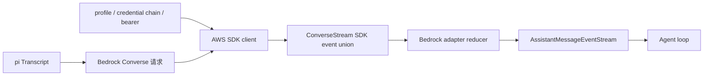

一个很重要的分层：

- `amazon-bedrock.ts`：注册 provider、模型目录、auth onboarding/resolve；
- `bedrock-converse-stream.lazy.ts`：按需加载 Node 专用 AWS SDK 实现；
- `bedrock-converse-stream.ts`：转换 transcript、建 SDK client、发请求、折叠事件并转换错误；
- `@aws-sdk/client-bedrock-runtime`：实现 AWS 协议、签名、region/credential chain 和 event stream transport。

【新手词汇】AWS credential chain（凭据链）是 AWS SDK 按一组来源寻找可用身份的过程，可能包含环境变量、profile 文件、容器角色或 web identity。它不是 pi 自己读取所有 AWS 身份文件并复制到设置文件中。

<a id="deep-dives-d20-bedrock-converse-h3"></a>

#### 1. Provider 注册与 Node-only 延迟加载

<a id="deep-dives-d20-bedrock-converse-h4"></a>

##### 1.1 Provider 文件很薄

`amazonBedrockProvider()` 创建一个 provider，注册 id `amazon-bedrock`、模型目录、auth 配置和 lazy API：

```typescript
export function amazonBedrockProvider(): Provider<"bedrock-converse-stream"> {
  return createProvider({
    id: "amazon-bedrock",
    name: "Amazon Bedrock",
    auth: { apiKey: bedrockAuth },
    models: Object.values(AMAZON_BEDROCK_MODELS),
    api: bedrockConverseStreamApi(),
  });
}
```

所以要查“model id 为什么不存在”看 `amazon-bedrock.models.ts`；查“怎么认证”看 `bedrockAuth`；查“API 请求和流处理”看 `api/bedrock-converse-stream.ts`。

<a id="deep-dives-d20-bedrock-converse-h5"></a>

##### 1.2 Lazy wrapper 防止浏览器构建追入 AWS SDK

```typescript
const importNodeOnlyApi = (specifier: string): Promise<unknown> => {
  const runtimeSpecifier = import.meta.url.endsWith(".js")
    ? specifier.replace(/\.ts$/, ".js")
    : specifier;
  return import(runtimeSpecifier);
};
```

`bedrock-converse-stream.ts` 静态导入 AWS SDK 和 Node proxy transport。若所有入口都直接静态引用它，某些浏览器 smoke/bundle 或 Bun compile 路径会把 Node-only 模块也纳入依赖图。

当前 wrapper 有两个运行形态：

1. 普通 Node 源码/构建运行时按需动态导入实现，并根据当前 module url 调整 `.ts`/`.js` 后缀；
2. Bun binary build 可调用 `setBedrockProviderModule` 注入静态打包好的模块，绕过变量动态导入。

【陷阱】这是一个有明确构建理由的 dynamic import，不代表新代码可以忽略仓库的顶层 import 规范。遇到此类例外要先找到对应构建链与测试。

<a id="deep-dives-d20-bedrock-converse-h6"></a>

#### 2. Auth：登录保存什么，实际请求用什么

<a id="deep-dives-d20-bedrock-converse-h7"></a>

##### 2.1 `login` 是选择来源，不一定收集密钥

Bedrock 的 auth UI 提供三种方式：

| 选择             | pi 保存或返回的内容                                          | 实际凭据来源                                       |
| ---------------- | ------------------------------------------------------------ | -------------------------------------------------- |
| Bearer token     | token 作为 API key credential                                | token 直接进入 Bedrock client 的 bearer-token 设置 |
| AWS profile      | 保存`AWS_PROFILE` 名称                                     | AWS SDK 按 profile 读取 AWS 配置与凭据             |
| Credential chain | 不复制长期 AWS secret；完成外部配置提示后存空 key credential | AWS SDK 从当前进程/容器/身份环境解析               |

这避免 pi 把用户已有的 AWS access key 再复制到自己的 auth store。登录阶段提示用户配置外部 AWS identity，并不代表 pi 已验证该 identity 对目标 region/model 有调用权限。

<a id="deep-dives-d20-bedrock-converse-h8"></a>

##### 2.2 `resolve` 返回认证上下文

解析顺序在 `bedrockAuth.resolve`：

1. 已存 token credential；
2. `AWS_BEARER_TOKEN_BEDROCK`；
3. credential 内或环境中的 `AWS_PROFILE`；
4. `AWS_ACCESS_KEY_ID` 与 `AWS_SECRET_ACCESS_KEY` 成对存在；
5. ECS task role 的 relative/full URI；
6. `AWS_WEB_IDENTITY_TOKEN_FILE`；
7. 都未发现则返回 `undefined`。

`signal.throwIfAborted()` 在读取环境变量前后执行，确保用户取消认证解析时不会继续访问后续来源。

注意：该 resolve 是“当前看起来有一种凭据配置”的判断，不会代替 AWS SDK 对签名、权限、STS role assume 或 Bedrock model access 的真实验证。

<a id="deep-dives-d20-bedrock-converse-h9"></a>

#### 3. region、endpoint 和 credentials 如何组合

这是 Bedrock 最容易被读成“一行默认值”的部分。代码分别处理 region 与 endpoint；两者相关但不是同一个配置。

<a id="deep-dives-d20-bedrock-converse-h10"></a>

##### 3.1 配置来源

`getConfiguredBedrockRegion(options)` 的顺序：

```text
options.region
  → options.env.AWS_REGION / process.env.AWS_REGION
  → options.env.AWS_DEFAULT_REGION / process.env.AWS_DEFAULT_REGION
  → undefined
```

模型 id 如果是 Bedrock inference profile ARN，还可以从 ARN 中提取 region；标准 Bedrock endpoint hostname 也可能包含 region，例如 `bedrock-runtime.eu-central-1.amazonaws.com`。

<a id="deep-dives-d20-bedrock-converse-h11"></a>

##### 3.2 ARN 优先于显式 region

Node 环境中 region 的主要决定顺序是：

1. 从 model id 的 ARN 提取 region；
2. 使用 pi/AWS env 提供的 configured region；
3. 如果 endpoint 被明确 pin 到标准 Bedrock URL，从 endpoint 提取 region；
4. 没有 ambient `AWS_PROFILE` 时，回退 `us-east-1`；
5. 配置 ambient profile 时可不设 region，让 AWS SDK 自己从该 profile/default chain 决定。

例子：

```text
model id = arn:aws:bedrock:us-west-2:...:application-inference-profile/...
process.env.AWS_REGION = us-east-1
结果 region = us-west-2
```

这是为了避免另一个 AWS service 的全局 `AWS_REGION` 覆盖 inference profile 指定的 Bedrock region。

<a id="deep-dives-d20-bedrock-converse-h12"></a>

##### 3.3 Endpoint pinning 的特殊规则

`shouldUseExplicitBedrockEndpoint` 的目的不是“永远使用模型目录中的 baseUrl”。大致规则：

- 非标准 AWS endpoint（例如用户配置的 VPC/proxy endpoint）：传给 SDK 的 `config.endpoint`；
- 标准 AWS Bedrock runtime endpoint：只有未配置 region、也无 ambient AWS_PROFILE 时才 pin endpoint；
- 若用户配置了 region/profile，则尽量让 AWS SDK 根据 region/profile 选择 endpoint，避免模型目录里的默认 `us-east-1` 覆盖用户配置。

这解决两类相反需求：

- 标准 AWS endpoint 要尊重 `AWS_REGION`/profile；
- 自定义网关/VPC endpoint 必须保留用户传入的 host，不能被标准区域 endpoint 替换。

<a id="deep-dives-d20-bedrock-converse-h13"></a>

##### 3.4 两种 profile 和静态 access key 的优先关系

`optionsProfile` 是显式 `options.profile` 或 scoped `options.env.AWS_PROFILE`；它要优先于 ambient key 环境变量。若存在这个显式 profile，代码不把直接读取到的 access key pair 放进 `config.credentials`，否则显式 profile 可能被覆盖。

ambient `process.env.AWS_PROFILE` 的处理略不同：测试明确覆盖了“只有 ambient profile + access key 环境变量”时，把 profile 和直接 credentials 都传给 SDK 的情形。读这段逻辑要分清：

- `options.env.AWS_PROFILE`：本次调用的 scoped 设置；
- `process.env.AWS_PROFILE`：进程级 ambient 设置；
- `config.profile`：AWS SDK profile 选择；
- `config.credentials`：pi 检查到的静态 access key pair。

不要把它们粗暴整理成一条“profile 永远胜过 key”的通用结论。

<a id="deep-dives-d20-bedrock-converse-h14"></a>

##### 3.5 Bearer token 与 skip-auth proxy

bearer token 的候选来源是显式 `options.bearerToken`、`options.apiKey`、`AWS_BEARER_TOKEN_BEDROCK`。`AWS_BEDROCK_SKIP_AUTH=1` 会关闭 bearer token 使用，并注入 dummy access/secret key，使需要签名形状但由本地 proxy 自己处理认证的场景可工作。

正常 bearer 模式会设置 `config.token` 和 `authSchemePreference: ["httpBearerAuth"]`。这条路径不同于 SigV4 access key credential chain。

<a id="deep-dives-d20-bedrock-converse-h15"></a>

#### 4. 组装 `ConverseStreamCommand`

请求建立前会创建 `BedrockRuntimeClient(config)`，再按需装 middleware：

- `onResponse` middleware 捕获 raw Smithy HTTP response headers；
- custom headers middleware 在 build step 插入调用方 headers。

`commandInput` 主要包括：

```text
modelId
messages              # convertMessages 后的 user/assistant/toolResult
system                # 从最初 system prompt 单独转换而来
inferenceConfig       # maxTokens / temperature
toolConfig            # JSON schema tools + tool choice
additionalModelRequestFields  # provider/model reasoning 等特定字段
requestMetadata       # 调用方可选 metadata
```

之后 `onPayload` 可修改这个对象，封装成 `ConverseStreamCommand`，通过 `client.send(command, { abortSignal })` 请求。

【术语】Smithy 是 AWS SDK 使用的协议/中间件抽象。这里不用展开它的所有实现；只要知道 client 的 middleware 有明确阶段，如 build、deserialize，执行阶段决定“改出站请求”还是“读取原始响应”。

<a id="deep-dives-d20-bedrock-converse-h16"></a>

##### 4.1 为什么 header middleware 要在 SigV4 签名前

自定义 headers 在 Smithy `build` step 注入。该阶段在序列化之后、SigV4 signing 之前，因此允许的 headers 会计入签名请求。`authorization`、`host`、所有 `x-amz-*` header 都由签名/协议管理，按大小写不敏感方式跳过。

这不是任意过滤：如果用户覆盖已签名的 host 或 `x-amz-*`，SDK 计算出的签名可能和最终请求不一致，服务器会拒绝认证。

<a id="deep-dives-d20-bedrock-converse-h17"></a>

##### 4.2 onResponse 为什么有两条实现

优先使用 deserialize middleware，拿到完整的 Smithy raw HTTP response，包括 gateway 自定义 headers。若未安装/未观察到 raw response，则回退使用 `response.$metadata.httpStatusCode` 和 requestId 构造较小的 header set。

SDK 的 `$metadata` 只保留选定信息。只靠它会丢失自定义 response headers；所以 middleware 必须在 event stream 消费前抓到原始 Response。

<a id="deep-dives-d20-bedrock-converse-h18"></a>

#### 5. Transcript 到 Bedrock Messages

Bedrock Converse 的 system prompt 不是普通 `messages` 数组中的任意 system role。适配器先 `collapseSystemMessages`，再把初始 system message 从 transcript 移除，交给 `buildSystemPrompt` 单独放到 request 的 `system` 字段。

这也解释了 `resolveTranscript(context, getCompat(...))` 之外的额外折叠步骤：Bedrock API 不支持对话中间插入新 system message，后续 system update 必须折进支持的消息文本表示，不能原样保留在中间。

<a id="deep-dives-d20-bedrock-converse-h19"></a>

##### 5.1 User message

- 字符串变为 `ContentBlock.TextMember`；
- text/image 内容逐块转为 Bedrock content union；
- 空白或经过 Unicode surrogate 清理后为空的消息会使用 placeholder，避免 API 收到空 content；
- 不支持的 content block 会被跳过；如果整条 user 消息因此变空，则填 placeholder。

placeholder 不是模型回答内容，而是适配器为满足服务端非空 schema 的兼容文本。

<a id="deep-dives-d20-bedrock-converse-h20"></a>

##### 5.2 Assistant message

- text：清理非法 Unicode surrogate，空白文本不放进请求；
- tool call：变为 `{ toolUse: { toolUseId, name, input } }`；
- thinking：区分普通 reasoning text、Anthropic 签名 reasoning、redacted/encrypted reasoning；
- 转换后为空的 assistant 消息整个跳过，Bedrock 不接受空 content array。

tool id 会先用 `normalizeToolCallId` 规范字符并限制到 64 字符；后续 tool result 必须继续引用相同的规范化 id。

<a id="deep-dives-d20-bedrock-converse-h21"></a>

##### 5.3 Thinking signature 与模型差异

只有 Anthropic Claude 模型支持 `reasoningContent.reasoningText.signature`。Claude reasoning block 若缺少 signature，代码退回普通 text block，避免重放无效签名结构；其他 Bedrock 模型只发没有 signature 的 reasoningText。

redacted reasoning 是另一种形状：opaque payload 放在 `reasoningContent.redactedContent`，不应被解码成用户可见文本。回放时也必须继续走 redactedContent 分支。

<a id="deep-dives-d20-bedrock-converse-h22"></a>

##### 5.4 Tool result 为什么连续合并成一条 user message

Bedrock Converse 要求同一 assistant turn 的多个 tool results 放在一个 user message 中。因此 `convertMessages` 碰到第一个 toolResult 时，向后收集所有相邻 toolResult：

```text
tool result A
tool result B
tool result C
  → 一个 Bedrock USER message
       content: [toolResult(A), toolResult(B), toolResult(C)]
```

每个 result 包括 `toolUseId`、内容以及 success/error status。空文本/空图片结果用 placeholder 保持 content 非空。

这是协议差异而不是 Agent 会话被合并：pi 会话仍可有独立 tool result 消息；只有发给 Bedrock 的 wire representation 合成一条 user message。

<a id="deep-dives-d20-bedrock-converse-h23"></a>

#### 6. SDK event union 到统一 pi 事件

`response.stream` 的每个对象是 AWS SDK 事件 union：同一对象通常只带 `messageStart`、`contentBlockDelta`、`messageStop` 或一个异常字段中的一种。适配器按字段存在与否分派。

<a id="deep-dives-d20-bedrock-converse-h24"></a>

##### 6.1 `messageStart`

只接受 assistant role。用户 role start 出现在模型响应中属于协议错误。通过检查后 push pi 的 `start`，此时输出消息初值仍是 pending、内容为空。

<a id="deep-dives-d20-bedrock-converse-h25"></a>

##### 6.2 Text 没有 `contentBlockStart`

Bedrock text 流不一定先发 text content block start。收到第一段 `delta.text` 时，`handleContentBlockDelta` 查找 AWS contentBlockIndex：

1. 若没有 block，创建 text block，并将其内部 `index` 设为 provider index；
2. 先 push `text_start`；
3. 再把 delta append 到 text；
4. push `text_delta`。

因此不要要求所有 provider 必须有一一匹配的 `*_start` 协议事件。pi 的 start/end 是适配器提供的统一生命周期，供应商线上事件序列可以更松散。

<a id="deep-dives-d20-bedrock-converse-h26"></a>

##### 6.3 ToolUse 有显式 start 和 JSON delta

若 `contentBlockStart.start.toolUse` 存在，创建 toolCall block：id、name、空 arguments、`partialJson` 和 provider content index；然后 push `toolcall_start`。

后续 `delta.toolUse.input` 是 JSON 文本片段，适配器累加到 `partialJson`，调用 `parseStreamingJson` 更新当前可解析 arguments，并发出 `toolcall_delta`。结束事件到达时再解析完整 JSON、移除 scratch field、push `toolcall_end`。

Agent 仍不会因为 Bedrock 发了 toolUse 就在此处运行工具。统一消息回到 Agent loop 后才进入工具参数校验与执行。

<a id="deep-dives-d20-bedrock-converse-h27"></a>

##### 6.4 Reasoning 与 redacted content

第一次 `reasoningContent` delta 到达时创建 thinking block，push `thinking_start`。之后可能出现：

- `text`：加入用户可显示的 thinking 文本并发 thinking delta；
- `signature`：追加到 `thinkingSignature`，用于 Claude reasoning replay；
- `redactedContent`：切换到 redacted 状态，把统一 placeholder 作为 thinking 文本，仅用于状态展示；真实 opaque bytes 放入 `redactedChunks` 暂存。

redacted payload 可能拆成多片。全部结束时通过 `bytesToBase64` 组成一段 base64 放入 `thinkingSignature`，随后删除 `redactedChunks`。

为什么不能把 `Uint8Array[]` 原样存进 AssistantMessage？JSON 序列化会把 typed array 变成按索引枚举的对象，体积远大于 base64，并且不是下一轮请求期望的 redacted reasoning 格式。

<a id="deep-dives-d20-bedrock-converse-h28"></a>

##### 6.5 `contentBlockStop` 和 terminal cleanup

停止某 block 时用 provider index 找 pi `contentIndex`，删除临时 `index`，按类型发 `text_end`、`thinking_end` 或 `toolcall_end`。若整个流没有逐个 stop 每个 block，success 和 catch 两条终态路径仍会调用 `finalizeStreamingBlock` 清理所有 scratch fields；但这个清理函数不会合成 block end event。

关键不变量：

```text
最终 AssistantMessage 不应含临时 index、partialJson、redactedChunks
redacted bytes 必须已转成 thinkingSignature
```

因此，若服务端在 `contentBlockStop` 前结束，终态 cleanup 会清理临时字段、保存 redacted bytes，但不会伪造一个 block end event。上层仍会收到整体 done/error；这个 block 不一定有单独的 `*_end`。

<a id="deep-dives-d20-bedrock-converse-h29"></a>

#### 7. Usage 与 stop reason

`metadata.usage` 更新 input/output/cacheRead/cacheWrite/cacheWrite1h，计算 total 与 cost。Cache details 按 TTL 分类，一小时 cache write 只汇总 `CacheTTL.ONE_HOUR` 的条目。

Stop reason 转换：

| Bedrock stop reason                                | pi stop reason                |
| -------------------------------------------------- | ----------------------------- |
| `end_turn` / `stop_sequence`                   | `stop`                      |
| `max_tokens` / `model_context_window_exceeded` | `length`                    |
| `tool_use`                                       | `toolUse`                   |
| 其他非空字符串                                     | `error`，保留 provider 原因 |
| 缺失                                               | `error`                     |

流 EOF 后仍为 `pending` 表示没有 `messageStop`，适配器会报错。随后 signal aborted 或 stop reason error 也走 catch；否则 finalize 所有内容 block，发 done。

`output.rawStopReason` 保存 AWS 原始名称，`output.stopReason` 保存 pi 的统一值。排障时前者帮助辨认 AWS/API 行为，Agent 的控制流则应消费后者。

<a id="deep-dives-d20-bedrock-converse-h30"></a>

#### 8. 错误格式化与诊断分层

<a id="deep-dives-d20-bedrock-converse-h31"></a>

##### 8.1 errorMessage 有运行时契约

`formatBedrockError` 把 SDK exception 名映射成人类可读前缀，例如 internal server、throttling、validation 和 service unavailable。下游 `agent-session` 会按稳定文本模式分类是否可重试，因此改前缀/正文会影响重试，不只是 CLI 展示。

如果 SDK error body 没有合并进 message、但 status 和 body 可用，适配器会组合成 `status: body`，避免 gateway 403 被压成 `UnknownError`。遇到 data retention mode 相关错误则附 AWS 文档提示。

<a id="deep-dives-d20-bedrock-converse-h32"></a>

##### 8.2 structured diagnostic 不改原始 errorMessage

在 error terminal 路径，适配器把安全可用的元数据写入 assistant diagnostic：

- HTTP status；
- AWS error code；
- request id。

request id/错误名长度有上限；未知字段不猜。发生中途 SDK event error、对象可能没有常规 Error metadata 时，可用 stream 已获得的 request id 作为 fallback。

为什么 structured diagnostic 与 message 分开？因为重试判定匹配 `errorMessage`；将额外信息追加到该字符串会改变其字节内容，可能误伤已有 retry classification。结构化字段用于日志/排障，错误文本维持既有契约。

<a id="deep-dives-d20-bedrock-converse-h33"></a>

#### 9. 三条完整轨迹

<a id="deep-dives-d20-bedrock-converse-h34"></a>

##### 9.1 普通文字

```text
Bedrock messageStart(assistant)
  → pi start
contentBlockDelta(text="Hi")
  → 若无 block 则建 text block、pi text_start
  → 累积文本、pi text_delta
messageStop(end_turn)
  → stopReason=stop
stream end
  → 清理 block index、pi text_end（若 stop event 缺失则 terminal cleanup）
  → pi done
```

`text_end` 只在收到 `contentBlockStop` 时发出。若 AWS stream 在 block stop 前结束，terminal cleanup 仍能清理 scratch state，但不会合成 `text_end`；上层会收到整体终态，而该 block 没有单独 end event。

<a id="deep-dives-d20-bedrock-converse-h35"></a>

##### 9.2 模型要求执行工具

```text
ConverseStream command 带 toolConfig
  → contentBlockStart(toolUse) 创建 toolCall
  → contentBlockDelta(toolUse.input) 累积 JSON
  → contentBlockStop 解析并发 toolcall_end
  → messageStop(tool_use) 映射成 pi toolUse
  → provider stream done
  → Agent loop 才开始本地工具执行
```

Bedrock adapter 负责表达模型请求的动作，Agent 才拥有本地工具实例、权限和执行策略。

<a id="deep-dives-d20-bedrock-converse-h36"></a>

##### 9.3 中途节流异常

```text
成功收到 response metadata / requestId
  → event stream 发出 throttlingException
  → throw 到外层 catch
  → formatBedrockError 得到 retry 可识别的前缀
  → diagnostic 附 status/errorCode/requestId（若可用）
  → pi error event
  → AgentSession 根据稳定 errorMessage 决定是否重试
```

<a id="deep-dives-d20-bedrock-converse-h37"></a>

#### 10. 离线测试能证明什么

Bedrock 测试通过 mock AWS SDK，不调用 AWS 账号：

| 测试                                    | 主要证明                                                           |
| --------------------------------------- | ------------------------------------------------------------------ |
| `bedrock-credentials.test.ts`         | 显式/scoped profile 与 access key 配置优先级                       |
| `bedrock-endpoint-resolution.test.ts` | ARN、标准 endpoint、自定义 endpoint、region/profile 组合           |
| `bedrock-convert-messages.test.ts`    | 空文本、未知 block、tool args、strict schema 的转换边界            |
| `bedrock-raw-stop-reason.test.ts`     | raw stop reason 保留和 provider event callback 顺序                |
| `bedrock-redacted-reasoning.test.ts`  | redacted payload 聚合、终态缺 block stop 的 cleanup、下一轮 replay |
| `bedrock-error-metadata.test.ts`      | status/error code/request id diagnostic，不改变 retry 文本         |
| `bedrock-custom-headers.test.ts`      | 注入普通 header、跳过 SigV4 保留字段                               |
| `bedrock-response-headers.test.ts`    | 原始 HTTP headers 进入`onResponse`                               |
| `bedrock-cache-write-1h-cost.test.ts` | 1h cache write usage/cost 统计                                     |

mock test 证明 pi 对给定输入对象的处理。它不证明真实 AWS IAM policy、模型 entitlement、AWS profile 文件或 endpoint 的线上行为；这些还需在目标 AWS account/region 条件下验证。

<a id="deep-dives-d20-bedrock-converse-h38"></a>

#### 11. 推荐阅读路线

1. `packages/ai/src/providers/amazon-bedrock.ts` → `bedrockAuth`、`amazonBedrockProvider`。
2. `packages/ai/src/api/bedrock-converse-stream.lazy.ts` → `bedrockConverseStreamApi`、`setBedrockProviderModule`。
3. `packages/ai/src/api/bedrock-converse-stream.ts` → `stream`：client config、request、event loop、terminal paths。
4. 同文件 → `getConfiguredBedrockRegion`、`getConfiguredBedrockCredentials`、`shouldUseExplicitBedrockEndpoint`。
5. 同文件 → `convertMessages`、`convertToolConfig`、`buildSystemPrompt`。
6. 同文件 → `handleContentBlockStart`、`handleContentBlockDelta`、`handleContentBlockStop`、`finalizeStreamingBlock`。
7. 同文件 → `formatBedrockError`、`appendBedrockFailureDiagnostic`、`mapStopReason`。
8. 配对测试先看 credentials / endpoint，再看 convert messages / redacted reasoning / error metadata。
9. 回到 `packages/agent/src/agent-loop.ts`，确认 provider 产出的 toolCall 在哪一层执行。

<a id="deep-dives-d20-bedrock-converse-h39"></a>

#### 12. 练习

<a id="deep-dives-d20-bedrock-converse-h40"></a>

##### 练习 A：画区域决策树

给定 ARN region、`AWS_REGION`、endpoint hostname、ambient profile 四个值，画出 Node 下的 region 和 endpoint 决策顺序。分别考虑普通模型 id 与 inference profile ARN。

<a id="deep-dives-d20-bedrock-converse-h41"></a>

##### 练习 B：追踪 tool results

手工输入两个连续 pi toolResult 和一个 user 消息。写出 `convertMessages` 会生成几条 Bedrock messages，每条 content 有哪些成员。

参考：两个连续 tool result 合并为一个 USER message；后面的普通 user message 仍是另一条消息。

<a id="deep-dives-d20-bedrock-converse-h42"></a>

##### 练习 C：解释 redacted reasoning

把一个 redacted payload 切成两个 Uint8Array delta，写出累积、展示 placeholder、base64 保存、下一轮重新作为 `redactedContent` 发送的链。

<a id="deep-dives-d20-bedrock-converse-h43"></a>

##### 练习 D：错误字符串为什么不能随便改

在 `formatBedrockError` 前缀里改名，会影响哪些下游行为？

参考：`isRetryableAssistantError` 等按 errorMessage 文本分类的逻辑；结构化 diagnostic 提供额外事实，应优先放在那里。

<a id="deep-dives-d20-bedrock-converse-h44"></a>

#### 13. 本篇验证边界

- **静态核对**：依据 provider、SDK wrapper、adapter 和离线测试源码整理调用路径。
- **未运行**：本篇没有运行测试，也没有向 AWS 发请求。
- **权限限制**：mock 不能证明真实账户有 Bedrock 权限；真实云调用仍依账号、region、IAM 与模型访问配置。
- **平台范围**：已解释 Node 与 browser 分支；没有声称 Windows/Linux/macOS 分别运行过 AWS 调用。

<a id="deep-dives-d20-bedrock-converse-h45"></a>

#### 14. 小结

Bedrock adapter 的工作可以概括为：

```text
provider auth intent
  → AWS SDK credential / region / endpoint config
  → pi transcript 转 Converse request
  → ConverseStream SDK union events
  → pi AssistantMessageEventStream
  → 稳定 errorMessage + structured diagnostic
```

与普通 API key provider 相比，Bedrock 的关键复杂度在 AWS 身份解析、区域路由和 AWS event union；与 D17–D19 相比，它还要适配 Bedrock 独有的 tool result message 形状与加密 reasoning replay。阅读时先把这几层分开，遇到“认证失败”不要先去改消息转换，遇到“历史不合法”也不要先去换 region。

> D20 完。接下来可以补充 OpenAI Completions、Responses、Anthropic、Bedrock 的协议对照总表，再转向测试 harness 与源码修改闭环。

<!-- 来源：deep-dives/D23-provider-adapter-field-guide.md；融合于第 5 章。 -->

<a id="deep-dives-d23-provider-adapter-field-guide-h1"></a>

### D23：新增 Provider 的适配器对照与实现路线

**先懂**：新增适配器是把一种外部协议接到 pi 的共同消息与事件契约。先列清外部协议给什么、pi 需要什么，再实现转换和测试；只打通一次网络请求还不够。

```text
教学伪代码：确认统一契约 → 写请求字段对照表
           → 处理流式增量与终态 → 覆盖失败和取消
           → 用离线测试验证每条映射
```

这是开发路线，不是某家 provider 的运行时函数。

> 精读对象：`packages/ai/src/types.ts`、四类现有 provider adapter，以及 D17 Anthropic、D18 OpenAI Responses、D19 Chat Completions、D20 Bedrock 和 D21 faux 的对照。
>
> 目标：读者能从一个协议需求出发，找到正确模块，规划请求转换、流事件归约、错误终态与离线测试；不是照抄某家 API 的实现。
>
> 基线：`200387122ca450d6387f033949423114a270b96c`。本文为静态源码路线，不代表新增了 provider 或运行了 provider 测试。

<a id="deep-dives-d23-provider-adapter-field-guide-h2"></a>

#### 0. 什么时候需要新增 adapter

需求“支持 Provider X”常常包含多个不同任务：

1. 新增供应商身份、模型目录、认证入口；
2. 将 pi 的统一请求转成 X 的 HTTP/SDK 请求；
3. 将 X 的分块响应转换为 pi 的消息事件；
4. X 特有模型能力、参数、usage 与 stop reason 映射；
5. X 的错误、取消、重试与诊断；
6. 模型发现、文档、示例与测试。

这些任务分属不同层。已有 API 形状兼容时，可能只需配置模型或 provider metadata；否则才需要 adapter。不要从“有新的模型名”直接推导“要新建一个 API 实现”。

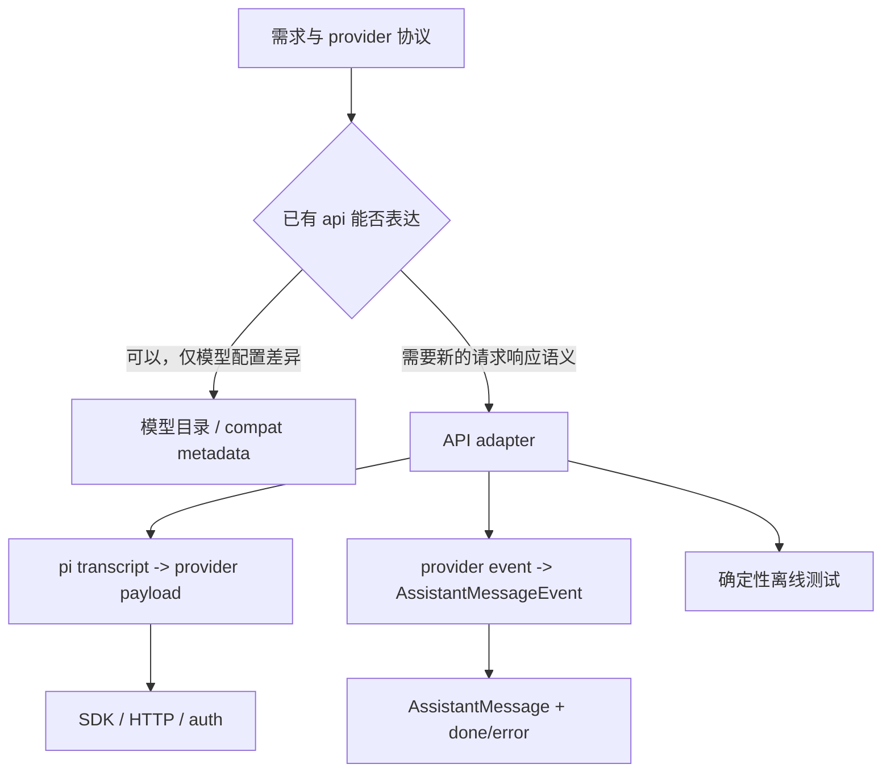

<a id="deep-dives-d23-provider-adapter-field-guide-h3"></a>

#### 1. 统一层的契约先于 provider 文档

适配器不是随意的 JSON 翻译脚本。它接收 pi 已规范化的数据，并必须把异构响应还原成稳定的 pi 契约。

<a id="deep-dives-d23-provider-adapter-field-guide-h4"></a>

##### 1.1 输入：Model、TranscriptContext、StreamOptions

`StreamFunction` 泛型的基本形状：

```typescript
type StreamFunction<TApi extends Api, TOptions extends StreamOptions> = (
  model: Model<TApi>,
  context: TranscriptContext,
  options?: TOptions,
) => AssistantMessageEventStream;
```

初学者读法：

- `TApi extends Api`：此实现只处理某一个 api id，编译器可据此检查 model 类型；
- `TOptions extends StreamOptions`：通用请求选项之外，可有这个 API 自己的选项；
- `context` 是已归一化的 transcript，不是原始 CLI 输入；
- 返回值是事件流对象，完成结果稍后通过流协议得到。

统一请求选项里有 `signal`、`apiKey`、`fetch`、`env`、`onPayload`、`onResponse`、`headers`、`timeoutMs`、`maxRetries` 等。它们是跨 adapter 的候选能力，不意味着每个 SDK 都支持每一项。某个 adapter 不支持时，需要由公共契约、具体代码和文档共同说明。

<a id="deep-dives-d23-provider-adapter-field-guide-h5"></a>

##### 1.2 Transcript 里通常已经放了什么

`TranscriptContext` 把 messages 与 tools 作为请求上下文。公共的 `resolveTranscript`、`getCurrentTools`、`getInitialSystemMessage` 和 `resolveTranscriptTools` 帮助 adapter 解释历史，而 `transformMessages` 处理模型之间需要的历史转换。

不要假设：

- system prompt 一定有单独的 `context.system` 字段；
- tools 一定只在当前 `context.tools`；
- 旧 assistant/tool result 一定能原样发给另一个 provider；
- 所有模型支持图片、thinking、严格 schema 或中途新增 tools。

要沿当前 adapter 实际调用的 transcript helper 读，不要重新发明一份近似解析。

<a id="deep-dives-d23-provider-adapter-field-guide-h6"></a>

##### 1.3 输出：AssistantMessageEventStream 与最终消息

统一 content block 主要包括 text、thinking、image 和 toolCall。AssistantMessage 还包括 `api`、`provider`、`model`、`usage`、`stopReason`、timestamp、可选 error/response metadata。

`StopReason` 是：

```text
pending | stop | length | toolUse | error | aborted | deferred
```

最核心的流契约：

- 创建 stream 后，运行时请求失败应由 stream 表达，不要让一半状态停在 pending；
- 失败终态必须有 `stopReason: "error"` 或 `"aborted"`，以及有意义的错误信息；
- 正常完成要发出终态事件，让 `.result()` resolve；
- 事件中的 partial message 必须随着 delta 同步累积；
- toolCall 最终参数必须完整且可解析，不能把未完成 JSON 当成可执行工具调用。

“构建 request payload 成功”不等于 adapter 完成。最终消息和终态也是实现契约。

<a id="deep-dives-d23-provider-adapter-field-guide-h7"></a>

#### 2. 四类协议的形状不同

| Adapter            | 输入协议边界               | 流事件边界                              | 常见的归约状态                                          |
| ------------------ | -------------------------- | --------------------------------------- | ------------------------------------------------------- |
| Anthropic Messages | SDK payload + SSE 消息帧   | 原始`message_*` / `content_block_*` | 当前 message、按 index 管理的 block、SSE decoder buffer |
| OpenAI Responses   | SDK 输入项与 output item   | 有类型的 response event union           | output item 槽位、call/item id、response-level terminal |
| Chat Completions   | messages + choices + tools | delta chunk 与 finish_reason            | choices、tool index 累积器、当前 content block          |
| Bedrock Converse   | SDK Converse request       | SDK event union                         | content block index、部分 JSON、reasoning/usage 元数据  |

协议本身决定了需要哪些状态。不能仅因为某 adapter 只有一个 `blocks` 数组，就要求另一个事件乱序或带多种 id 空间的协议也用同一种结构。

<a id="deep-dives-d23-provider-adapter-field-guide-h8"></a>

##### 2.1 两条分离的转换方向

```text
请求方向：pi transcript/options/model → provider payload/client call
响应方向：provider raw response/events → pi partial message/events/final message
```

请求方向错误会造成模型看错上下文或不支持的参数；响应方向错误会造成 UI 内容错、tool call 错、计费统计错或 Agent loop 错。测试也应分别覆盖这两个方向。

<a id="deep-dives-d23-provider-adapter-field-guide-h9"></a>

#### 3. 请求侧对照：先画数据转换表

为每个输入 message 和 content block 记录 provider 对应物、丢弃/降级规则、回放要求。

| pi 输入            | provider 可能的表示                                        | 需要明确的问题                               |
| ------------------ | ---------------------------------------------------------- | -------------------------------------------- |
| system message     | 顶层 instruction、system/developer role，或折叠进首条 user | 中途 system 是否允许？顺序如何保留？         |
| user text          | user message 的字符串或 text block                         | 空内容、多个 block、非法字符如何处理？       |
| image              | URL、base64 source、SDK blob 或不支持                      | 模型能力如何声明？不支持时有明确降级吗？     |
| assistant thinking | reasoning item、私有字段、签名内容或省略                   | 是否需要原样回送才能维持多轮？               |
| assistant toolCall | function/tool-use item                                     | call id 怎样回到 toolResult？JSON 如何编码？ |
| toolResult         | tool-role message、user content block 或多个结果归并       | 工具错误和多模态内容怎样表现？               |
| tools/schema       | function tools、toolSpec、内建 server tools                | strict 模式由谁控制？支持哪些 schema 子集？  |

建议实现前先填“发什么、为什么”两张表：

```text
pi 字段 → provider 字段 → 需要的兼容分支 → 对应测试
provider 字段 → pi 字段 → 累积状态 → 缺失/不完整时的语义
```

这一步能揭示 API 的结构差异，减少边写边加临时 if 的机会。

<a id="deep-dives-d23-provider-adapter-field-guide-h10"></a>

#### 4. Transcript 转换中的常见困难

<a id="deep-dives-d23-provider-adapter-field-guide-h11"></a>

##### 4.1 供应商对 system 的限制

Bedrock adapter 会折叠 system messages，因为 Converse API 对 system prompt 的位置有限制；OpenAI adapter 依据 compat 决定是否支持中途 system；Anthropic 有自己的 system 参数和消息约束。

折叠不是无损操作。要记录：

- 原顺序是否重要；
- system 变化是否表达了策略边界；
- 工具、延续提示或摘要插入的 marker 是否会被挪动；
- 目标 adapter 是否有 capability flag 可说明限制。

不能悄悄 drop system 消息然后声称支持完整 transcript。

<a id="deep-dives-d23-provider-adapter-field-guide-h12"></a>

##### 4.2 跨 provider 历史需要转换

Agent session 可以从 provider A 切到 provider B。历史 assistant 内容可能带 A 私有的 thinking signature、tool call id 或 provider metadata。B adapter 不能把这些字段一概视为自己的原生 continuation token。

读 OpenAI Responses 的 `convertResponsesMessages` 时，注意同 provider/API 的 Responses tool call id 可能保留特殊复合结构，foreign call id 会走另一套 normalization。这说明“id 字符串看起来一样”不代表协议语义一样。

转换设计应明确：

1. 哪些标记只有原 provider 能消费；
2. 哪些内容可以变成普通可读文字；
3. 哪些必须丢弃或替换成稳定占位；
4. tool result 仍然能否与原 call 正确配对。

<a id="deep-dives-d23-provider-adapter-field-guide-h13"></a>

##### 4.3 图片和空工具结果

多模态支持要看 `model.input` 等模型能力，不要只看 SDK 类型能不能接受 image。某些 adapter 会在模型不支持图片时生成文字占位；某些会把纯 image tool result 包成多个 input content item。

空 tool result 也有真实语义。空字符串、无内容块和只有非文本块不能未经检查就 join 成同一种结果；目标 provider 可能要求非空内容。

<a id="deep-dives-d23-provider-adapter-field-guide-h14"></a>

##### 4.4 Schema 转换是有损边界

pi tool schema 基于 TypeBox/JSON schema。provider 只实现其子集时，adapter 应使用现有的 `constrained-sampling.ts` helper / compat metadata，明确 strict、grammar tool 或 unsupported keyword 的策略。

不建议：

- 把完整 schema 原样发送给 SDK，之后才发现服务端不接受；
- 只把 schema 改成更松的版本，却未测试参数约束是否仍满足；
- 把 tool call 参数从 JSON string 直接 cast 成 `JsonObject`；
- 遇到 invalid JSON 时悄悄提供 `{}`，使 Agent 执行一个与模型输出无关的调用。

<a id="deep-dives-d23-provider-adapter-field-guide-h15"></a>

#### 5. 流事件 reducer：把增量折叠成一条消息

Provider stream 通常不是一条完整对象，而是事件序列。adapter 需要维护累积消息和当前打开的内容块，再根据 raw event 发统一事件。

常见抽象轨迹：

```text
raw start
  → 创建 AssistantMessage(partial, stopReason=pending)
  → push start
raw content delta
  → 更新累积块
  → push 对应 delta
raw block stop
  → push block end
raw response terminal
  → 更新 usage / stopReason
  → push done
异常或取消
  → 清理临时状态
  → stopReason=error/aborted
  → push error terminal
```

<a id="deep-dives-d23-provider-adapter-field-guide-h16"></a>

##### 5.1 各类状态分别回答什么问题

| 状态              | 例子                                           | 用途                                             |
| ----------------- | ---------------------------------------------- | ------------------------------------------------ |
| 累积最终消息      | `output` / `partial`                       | `.result()` 返回值和每个 event 的 snapshot     |
| 当前活动 block    | index → content block                         | 把 delta 加入正确块，避免混淆多个并发/交错 block |
| 原始 JSON 缓冲    | `partialJson` / `parseStreamingJson` state | 在完整之前展示 delta，终态时安全解析 arguments   |
| 协议终态状态      | response completed / finish reason             | 区分一个 block 完成与整个模型请求完成            |
| 传输 decoder 状态 | SSE 未完结的 byte/text buffer                  | 把网络分块拼回一行或帧                           |

这几类 buffer 不要混为一个“current response”。它们的边界分别是网络 chunk、协议 frame、provider item、pi content block 和整轮 assistant message。

<a id="deep-dives-d23-provider-adapter-field-guide-h17"></a>

##### 5.2 partial 必须与事件序列一致

例如 `text_delta` 到达后，partial message 内 text content 也要反映已经累积的文本。下游观察者可能只订阅事件而不调用 `.result()`。

tool JSON delta 更需要保持一致：

```text
累计字符串：{"command":"echo hi"
当前不能 parse 成完整对象
push toolcall_delta（partial JSON）
收到 item/tool terminal
确认完整且合法后，才构造 arguments 并完成 toolCall
```

【陷阱】delta 表示数据正在到达，不代表协议 item 已完成。D18 中“delta 不等于执行许可”是通用安全原则：工具执行发生在 Agent loop 收到完整规范化 toolCall 之后。

<a id="deep-dives-d23-provider-adapter-field-guide-h18"></a>

##### 5.3 区分 block terminal 和 response terminal

响应协议可能包含：

- message content block 已结束；
- output item 已结束；
- choice 有 finish reason；
- 整个 response 已完成或 incomplete；
- stream transport 正常 EOF。

这些不是同一时刻。OpenAI Responses 的共享处理器会把 item 完结与 response 完结分开，终态阶段统一决定最后 stop reason；Anthropic 有 content block stop 与 message delta/message stop；Chat Completions 常从最后的 finish_reason 结算；Bedrock 则从 Converse 事件流的 metadata/end 边界总结。

新增 adapter 需要写出一条“哪个 raw event 是整轮完成的权威信号”的说明。否则正常 EOF 可能被错当成成功，或者最后 usage/stop reason 永远留在 pending。

<a id="deep-dives-d23-provider-adapter-field-guide-h19"></a>

#### 6. Stop reason 映射不应由字面相似决定

目标不是找一个看起来同义的字符串，而是还原 Agent loop 需要的控制流：

| 统一 stop reason | Agent 下一步的含义（概念上）                                  |
| ---------------- | ------------------------------------------------------------- |
| `stop`         | assistant 普通完成                                            |
| `toolUse`      | assistant 提供了可执行的 tool call，loop 运行工具后可继续请求 |
| `length`       | 输出预算/长度限制结束                                         |
| `error`        | 请求失败，message 携带错误信息                                |
| `aborted`      | 请求被取消或中止                                              |
| `deferred`     | provider 给了异步继续的句柄/语义                              |
| `pending`      | 仅进行中，不能作为已完成终态返回                              |

危险映射例子：provider 返回 `tool_calls` 字段但所有工具参数 JSON 不完整，不能因为字段存在就无条件映射 `toolUse`；完成协议要求可能未满足。

维护一张映射表，并考虑未知值：

```text
原始值        → 统一值     → errorMessage/diagnostic     → 测试
stop          → stop       → 无                           → 普通文本
tool_use      → toolUse    → 无                           → 完整工具参数
max_tokens    → length     → 无或明确提示                 → 长度终止
cancelled     → aborted    → 可选取消原因                 → AbortSignal
unknown future → 保守策略  → 保留可诊断原值               → 未知 reason
```

具体 provider 的当前映射以对应 adapter 和其测试为准；表里的原始字符串只是示意，不能照搬给别家协议。

<a id="deep-dives-d23-provider-adapter-field-guide-h20"></a>

#### 7. Usage 和成本：缺省值、零值、未知值

Usage 既用于显示，也参与成本估算和 session 汇总。pi 的统一对象有 input/output/cacheRead/cacheWrite/totalTokens/cost；可选 reasoning 与 Anthropic 1-hour cache write 等扩展字段。

设计要点：

1. **0 与 undefined 不同**：0 代表 provider 明确报告零；undefined 常代表没有报告。不要用 `value || fallback` 覆盖明确的 0。
2. **totalTokens 是否由 provider 给出**：明确选 provider 值或按 input+output 计算；不要混用两种来源。
3. **reasoning 是 output 子集**：不能再加到 output 上，否则 token 总量双计。
4. **cache 字段是分类的一部分**：不同 API 可能提供 read/write 或 TTL 拆分，不要把 cache read 和 input 重复计数。
5. **未知计价要可表达**：缺模型价格不能显示成已知零成本；检查 `calculateCost` 输入与现有模型 metadata 习惯。
6. **stream 增量 usage 与终态 usage**：要确认是累加、替换，还是最终事件覆盖早期 estimate。

Chat Completions 的 D19 特别说明零值 truthiness 的风险；Bedrock 和 Anthropic 的篇章给出各自 usage event 的处理位置。新增 adapter 要测试数值为 0、字段缺失、最终值替换和 total consistency。

<a id="deep-dives-d23-provider-adapter-field-guide-h21"></a>

#### 8. 错误、取消、重试：请求的终态预算

在 adapter 中区分发生阶段：

```text
同步参数/认证错误
  → stream 尚未返回前的同步错误（仅契约允许的情形）

请求已启动后的认证/HTTP/解析/流中断错误
  → 已返回 stream；写 error message、停止 reason 并结束 stream

AbortSignal 取消
  → 停止 SDK/reader；发 aborted 语义并结束 stream

provider 的业务错误事件
  → 识别协议结构，格式化可诊断文本，结束为 error
```

不要对每种 catch 都只 `console.error`：那会让使用者拿不到统一的 AssistantMessage，也可能令 `.result()` 永远 pending。

<a id="deep-dives-d23-provider-adapter-field-guide-h22"></a>

##### 8.1 transport retry 与 Agent retry 是不同层

- SDK transport retry：同一个 provider request 可能在 adapter/SDK 内部重新发送；需考虑重复计费和 idempotency。
- AgentSession retry：已经形成一条 error assistant message 后，上层按自己的 retry budget 再发起一轮。
- Tool retry：工具执行另有自己的失败策略。

要在同一处无限 retry 会掩盖可见尝试数，并与更高层 budget 互相乘积。读取 `retryProviderRequest`、SDK `maxRetries` 和 session retry 时，按所有权拆开。

<a id="deep-dives-d23-provider-adapter-field-guide-h23"></a>

##### 8.2 cancel 要贯穿底层 reader

给 stream 设置 `AbortSignal`，不意味着 SDK 一定立即关掉 socket/response body。检查 adapter 是否把 signal 传进 SDK client/request、异步 reader 是否能观察 signal、异常处理是否把 aborted 与 error 分开。

测试应使用可控的 stream/controller，而不是 `sleep(20)` 猜测“现在刚好读到一半”。明确控制：已收到 start、已收到某 delta、调用 abort、随后不再有新 delta，最终 result 为 aborted。

<a id="deep-dives-d23-provider-adapter-field-guide-h24"></a>

##### 8.3 错误诊断与用户文案分层

保存原始 error 信息、转换适合用户读的 `errorMessage`、附加结构化 diagnostic 是三个可区分决策。Bedrock 的篇章展示了格式化和 diagnostic 可以并存而不改原始主错误；Anthropic 也对一些特定状态提供额外诊断。

“把一切都包成 `Request failed`”会丢 endpoint、status、provider request id 等排错线索；“把所有原始 headers/body 都显示”又可能泄露秘密。新增 adapter 应沿用公共 sanitizer/diagnostic helper，并测试 key/token 不进入错误文案。

<a id="deep-dives-d23-provider-adapter-field-guide-h25"></a>

#### 9. SDK wrapper 与动态依赖

<a id="deep-dives-d23-provider-adapter-field-guide-h26"></a>

##### 9.1 wrapper 生命周期

SDK client 可能持有 keep-alive socket、websocket、event listener 或 transport。检查 adapter 在：

- 请求正常完成；
- HTTP 返回非成功；
- 请求中断；
- stream consumer 停止读取；
- response body 解码错误

时有没有释放资源。若 API 支持 `close()`/`abort()`，它应在正确的 finally/cancel 边界执行，而不是只在 happy path。

Responses 的 D18 聚焦 client 与共享 stream processor；Bedrock 还涉及 Smithy middleware 和 Node HTTP agent；Anthropic/Chat Completions 通过各自 SDK client 配置 timeout、retry、fetch 和 response callback。不能假定所有 SDK 的 `onResponse`、signal 和 close 语义完全一致。

<a id="deep-dives-d23-provider-adapter-field-guide-h27"></a>

##### 9.2 Node-only SDK 的 lazy boundary

若依赖只支持 Node，避免顶层 import 使 browser bundle 意外加载 Node 内置模块。Bedrock provider 使用 lazy API wrapper，把实际 SDK 实现在运行时需要时再加载。Anthropic provider 也采用 lazy provider/API 结构；具体 bundle 行为要对照 package entrypoints 和 build config。

设计检查：

- 顶层 import 是否会把 Node SDK 拉进不支持的平台 bundle？
- provider catalogue 加载时是否就执行 SDK 初始化？
- lazy promise rejection 后是否可观察、重试语义是否预期？
- tree-shaken 子路径能否只加载需要的 adapter？

这里的“lazy”不是性能装饰：它决定 package 可否在不具备运行时依赖的平台导入。

<a id="deep-dives-d23-provider-adapter-field-guide-h28"></a>

#### 10. Provider 对照总表

| 关注面          | Anthropic Messages                         | OpenAI Responses                         | Chat Completions                 | Bedrock Converse                                   |
| --------------- | ------------------------------------------ | ---------------------------------------- | -------------------------------- | -------------------------------------------------- |
| 请求主体        | system + Messages API 专属字段             | input item 序列与 Responses 参数         | ChatCompletion messages          | Converse system/messages/toolConfig                |
| 主要流结构      | SSE event name/data                        | Responses event discriminant             | choices[].delta + finish         | SDK event union                                    |
| block identity  | `index`                                  | output/item id 与槽位                    | tool index/choice index          | content block index                                |
| tool JSON       | input_json_delta + block stop              | arguments delta + item/response terminal | function.arguments chunk 聚合    | input JSON delta + block terminal                  |
| request history | role/message 转换与 cache marker           | item 结构、foreign id 规范化             | message/role/tool 兼容转换       | messages/system/tool result regroup                |
| reasoning       | thinking/signature/redacted forms          | reasoning item/text/signature            | compat reasoning aliases/details | reasoning/redacted bytes/signature                 |
| 认证焦点        | API key、OAuth/federation 等 provider auth | SDK key/header 及兼容代理                | OpenAI-compatible key/header     | AWS credential chain、profile/region、bearer/proxy |
| 外部依赖        | Anthropic SDK + SSE parser                 | OpenAI SDK + Responses event types       | OpenAI SDK + completions types   | AWS SDK + Smithy/Node transport                    |
| 读取专题        | D17                                        | D18                                      | D19                              | D20                                                |

这张表是“去哪里继续追”的地图，不是 API 永久规格。模型能力、SDK 版本和 adapter 实现会变化，行为结论仍以当前源码与测试为准。

<a id="deep-dives-d23-provider-adapter-field-guide-h29"></a>

#### 11. 实现顺序：由类型驱动，而非先写 fetch

<a id="deep-dives-d23-provider-adapter-field-guide-h30"></a>

##### 阶段 A：确定模块 owner

1. 搜索已有 `KnownApi`、provider、model catalogue 与 `compat` 声明。
2. 判断新协议是否真的需要新 api id，还是已有 API 的参数差异。
3. 检查 exports、lazy entry、browser/node 条件和生成文件规则。
4. 读取同一协议中最接近的 adapter 与它的 tests，不从另一个协议复制状态机。

<a id="deep-dives-d23-provider-adapter-field-guide-h31"></a>

##### 阶段 B：定义 capability 与 options

1. 将公共选项映射到 API 字段：sampling、reasoning、toolChoice、cache、transport、session affinity。
2. 将模型能力放在 model/compat metadata，不按 `model.id.includes(...)` 在任意函数里散落猜测。
3. 明确 api 专属 options 类型，并验证 `ApiOptionsMap` 等类型入口是否需要扩展。
4. 标出不支持字段：忽略、降级、报错或 diagnostic；每种策略都要有理由。

<a id="deep-dives-d23-provider-adapter-field-guide-h32"></a>

##### 阶段 C：先设计 transcript 转换

1. 遍历所有 `Message` role 和 content variants；
2. 处理 system prompt / mid-conversation system；
3. 将图片按 `model.input` 能力编码；
4. 处理 tool history、call id、result、error result；
5. 处理 foreign-provider thinking/signature；
6. 处理空消息、空工具结果、未知 extension content。

先写输入输出表和纯转换函数测试，再接 SDK。这样不需要网络就能检查“模型将看到什么”。

<a id="deep-dives-d23-provider-adapter-field-guide-h33"></a>

##### 阶段 D：设计 reducer 状态

1. 定义 assistant message 初值，检查字段满足 `AssistantMessage`；
2. 定义 block index/id 到 pi content block 的映射；
3. 定义哪些事件只更新状态、哪些事件发 delta；
4. 定义 JSON 参数 accumulator 和最终 parse/repair 策略；
5. 定义 item terminal 与 response terminal；
6. 定义 usage 累加/覆盖；
7. 定义 unknown event、EOF without terminal、duplicate terminal；
8. 定义 abort/error 的唯一收尾出口，避免重复 done/error。

<a id="deep-dives-d23-provider-adapter-field-guide-h34"></a>

##### 阶段 E：请求和资源生命周期

1. 组装 client 和 provider request；
2. 调 `onPayload` 前后明确类型边界，避免 callback 返回对象绕过必要字段；
3. 传 signal、headers、env、fetch、timeout/retry 配置；
4. 接 `onResponse`；
5. 解析 HTTP/body/SDK 异常；
6. 结束时清理临时 state、reader/client resource；
7. 返回 stream 后所有异步错误必须完成 terminal，而不是变成 unhandled rejection。

<a id="deep-dives-d23-provider-adapter-field-guide-h35"></a>

##### 阶段 F：模型与 provider 注册

1. provider 声明处理 api id 和认证逻辑；
2. API function 实现 wire protocol；
3. model catalogue 提供 model id/context/pricing/capabilities；
4. model resolver/model runtime 负责配置与选择；
5. examples/config docs 说明 endpoint、headers 和 credential precedence。

这四层不是同一对象；新增 model 不应顺手把 provider registry 做成特殊硬编码。

<a id="deep-dives-d23-provider-adapter-field-guide-h36"></a>

#### 12. 新 adapter 的测试矩阵

<a id="deep-dives-d23-provider-adapter-field-guide-h37"></a>

##### 12.1 请求转换测试

| 场景                        | 最低断言                                    |
| --------------------------- | ------------------------------------------- |
| 普通 system + user text     | role、顺序、system 拼接结果                 |
| 多条 assistant/tool history | tool call id 与 tool result 配对            |
| 图片输入                    | mime type/data/detail，或明确的不支持行为   |
| schema/toolChoice           | schema 转换和 tool selection 语义           |
| reasoning/history           | provider signature 保留、降级或 drop 的规则 |
| onPayload override          | 替换后的 payload 仍满足 adapter 约束        |
| provider env/header         | 优先级正确，秘密不会进日志/diagnostic       |

<a id="deep-dives-d23-provider-adapter-field-guide-h38"></a>

##### 12.2 Reducer 测试

| 场景                | 最低断言                                      |
| ------------------- | --------------------------------------------- |
| 普通文本多个 delta  | 每次 partial 累积正确，最终文本正确           |
| thinking/signature  | block 类型、签名和 replay 形式正确            |
| 多个工具/交错 index | 各 call id/name/arguments 不串线              |
| JSON 跨多个 delta   | 最终 parse 完整，未完成时不提前完成 tool call |
| usage 更新          | 零值、缺失值、最终覆盖规则正确                |
| finish reason       | 每个已知 reason 语义映射正确                  |
| 未知事件/reason     | 不破坏 stream，诊断策略一致                   |
| 缺少终止事件        | 不会成功地把 pending 返回给上游               |

<a id="deep-dives-d23-provider-adapter-field-guide-h39"></a>

##### 12.3 Failure/cancel/resource 测试

- HTTP 非成功状态；
- SDK 在开始前拒绝；
- stream 中段 throw；
- abort 在首事件前和 delta 中途；
- consumer cancel/提前停止；
- terminal 后额外事件；
- `onResponse`/`onPayload` callback 抛错；
- cleanup 被正常结束和异常结束路径调用；
- error message 包含有用状态码但不泄漏 key/token。

构造可控 async iterable 或 ReadableStream，逐个 `enqueue` 事件；不要通过真实 HTTP 来证明 reducer 的细节。API 协议边缘如 SSE decoder，也应直接用可控 byte chunks 测试。

<a id="deep-dives-d23-provider-adapter-field-guide-h40"></a>

##### 12.4 测试不变量

```text
start 次数：每次有效流一个
terminal 次数：done/error 只能有一个最终归宿
partial：已发出的 delta 与累积 message 一致
tool call：只有完成且合法的参数才成为最终 ToolCall
usage：字段缺失不伪造为确定零，provider 明确报零则保留零
abort：最终 stopReason=aborted，不被 catch 误报为 error
```

有些协议在错误时发出 error event 而不是 done。不要僵化成“只能有某一个 event type”；测试 adapter 对外满足 `AssistantMessageEventStream` 的实际消费契约即可。

<a id="deep-dives-d23-provider-adapter-field-guide-h41"></a>

#### 13. 从新增测试到工程检查

仓库 `AGENTS.md` 的限制：

- 修改代码后运行 `npm run check`，查看完整输出并修复错误、warning、info；
- 修改测试文件后运行该测试；
- `packages/ai` 的 Vitest 测试从 package root 执行单个文件；
- 不直接运行全量 Vitest；非 e2e 全量测试使用仓库 `./test.sh`；
- 未经请求不运行 `npm run build` 或 `npm test`；
- 不使用真实模型 API、密钥或付费 token 进行 faux 可覆盖的回归验证。

这本手册没有执行上述命令。学习时执行的验证应另记 commit、OS、Node、shell、命令和结果；读懂旧测试不是测试已通过的证据。

<a id="deep-dives-d23-provider-adapter-field-guide-h42"></a>

#### 14. 练习：设计一个假想的 SSE provider

以下为设计练习，不要求改仓库。

<a id="deep-dives-d23-provider-adapter-field-guide-h43"></a>

##### 14.1 假设协议

```text
event: message.start
data: {"id":"r1"}

event: text.delta
data: {"text":"hello"}

event: tool.start
data: {"index":0,"id":"c1","name":"read"}

event: tool.arguments.delta
data: {"index":0,"json":"{\"path\":"}

event: tool.arguments.delta
data: {"index":0,"json":"\"a.txt\"}"}

event: tool.done
data: {"index":0}

event: response.done
data: {"reason":"tool_call","usage":{"input":7,"output":5}}
```

<a id="deep-dives-d23-provider-adapter-field-guide-h44"></a>

##### 14.2 先写状态表

| 收到            | 更新哪些状态                 | 发哪个 pi event | 是否可最终调用工具                |
| --------------- | ---------------------------- | --------------- | --------------------------------- |
| message.start   | response id / message 初值   | start           | 否                                |
| text.delta      | 当前 text block              | text_delta      | 不适用                            |
| tool.start      | index → tool block，id/name | toolcall_start  | 否                                |
| arguments.delta | partial JSON buffer          | toolcall_delta  | 否                                |
| tool.done       | parse 完整 JSON，关闭 block  | toolcall_end    | 仍等 response terminal 与整体校验 |
| response.done   | usage、stop reason           | done            | 由最终 message 确认               |

再补负例：arguments 不完整、index 不存在、response.done 两次、EOF 前没有 response.done、message.start 丢失、AbortSignal 已触发、reason 未知。每个负例都说明是忽略、修复、发 diagnostic 还是 error terminal。

<a id="deep-dives-d23-provider-adapter-field-guide-h45"></a>

##### 14.3 对照现有实现

- SSE byte/frame 拆分：参考 D17 的 `iterateSseMessages` 与 decoder 测试；
- item/block reducer 和终态：参考 D18 shared reducer；
- chunk/index 累积：参考 D19 tool chunk map；
- SDK event union 与资源配置：参考 D20；
- 确定性的脚本化完整 assistant message：参考 D21 faux，但 faux 不替代协议 decoder 测试。

同一个协议不需要重用四套实现。只复用抽象责任和测试思路；decoder、block mapping、SDK lifecycle 都要由新协议本身决定。

<a id="deep-dives-d23-provider-adapter-field-guide-h46"></a>

#### 15. 案例推演：把同一模型回答转换两次

假定统一 transcript 包含：system、user “读文件”、assistant toolCall `{path:"a.txt"}`、toolResult “hello”。

<a id="deep-dives-d23-provider-adapter-field-guide-h47"></a>

##### 15.1 Provider A 以工具结果角色表达

```text
system: ...
user: 读文件
assistant: tool call id=c1 name=read arguments={path:a.txt}
tool: call_id=c1 content=hello
```

要保证 provider 的 function call id 与结果引用相配。

<a id="deep-dives-d23-provider-adapter-field-guide-h48"></a>

##### 15.2 Provider B 把工具结果并入 user message

```text
system: ...
user: 读文件
assistant: toolUse block
user: toolResult block(content=hello)
```

这种角色序列对该协议可能是必要的，但它说明为什么 transcript conversion 必须是 provider-specific。若把所有 provider 统一压成 `role: tool`，B 可能请求无效；若把 B 的规约套给 A，A 也可能失去调用关系。

<a id="deep-dives-d23-provider-adapter-field-guide-h49"></a>

##### 15.3 检查上下文证明

纯转换测试直接断言 payload；provider harness 测 adapter stream/final message；coding-agent faux 测 Agent 收到规范化 `toolCall` 后的行为。三种测试层能组合，但不能互相冒充。

<a id="deep-dives-d23-provider-adapter-field-guide-h50"></a>

#### 16. 实际改动的 owner 决策树

```text
需求是增加一个模型 id / 价格 / context window？
  └─先检查模型目录与生成脚本，不直接改 adapter

需求是 endpoint/auth/profile/header 解析？
  └─定位 provider auth 或共享 provider-env / headers helper

需求是 pi message 如何变成 wire request？
  └─API adapter 的 convert/buildParams

需求是 response event 如何变成 text/tool/thinking？
  └─adapter reducer / decoder

需求是 Agent 收到 stopReason 后是否继续 tool loop？
  └─packages/agent 的 loop，不在 provider 私自跑工具

需求是错误重试 UI 或 retry budget？
  └─区分 provider SDK retry 与 AgentSession retry owner

需求是模型流式输出怎样显示？
  └─先检查统一事件契约，再检查 TUI consumer；不在 adapter 特判 UI
```

职责边界是行为边界。若 adapter 发现 provider tool call 后直接执行 coding-agent 工具，会绕过 Agent 的校验、审批、事件、持久化和错误处理链。

<a id="deep-dives-d23-provider-adapter-field-guide-h51"></a>

#### 17. 代码审阅清单

<a id="deep-dives-d23-provider-adapter-field-guide-h52"></a>

##### 类型与模块

- [ ] `Api` / `Model<Api>` / provider stream 类型约束正确；
- [ ] API options 进入正确映射，不把 provider-specific 参数塞进 `any`；
- [ ] Node-only dependencies 在合适边界 lazy load；
- [ ] export/model/provider registration 与 package entrypoint 同步；
- [ ] 如果模型清单由脚本生成，修改生成输入而非直接改 generated output。

<a id="deep-dives-d23-provider-adapter-field-guide-h53"></a>

##### 请求

- [ ] system 与 transcript 次序明确；
- [ ] role/content/tool history 都有转换；
- [ ]图片、thinking、signature、schema 的支持和降级明确；
- [ ] model capability 控制行为，不靠任意 substring 猜测；
- [ ] `onPayload` callback 后仍执行必要校验；
- [ ] headers、env、auth precedence 和 secret redaction 有测试。

<a id="deep-dives-d23-provider-adapter-field-guide-h54"></a>

##### 流

- [ ] partial message 与每条 delta 同步；
- [ ] 多内容块/多工具的 identity 稳定；
- [ ] JSON 参数缓冲不跨工具串线；
- [ ] block/item end 与 response end 分清；
- [ ] 未知 event 和 terminal 缺失不会挂在 pending；
- [ ] usage 保留零值及未知值语义。

<a id="deep-dives-d23-provider-adapter-field-guide-h55"></a>

##### 终态与资源

- [ ] 正常 stop、toolUse、length、deferred 各自映射正确；
- [ ] error 与 aborted 可区分，错误有诊断信息；
- [ ] stream result 在所有路径都可 settle；
- [ ] reader/client resources 在取消、失败、消费结束时释放；
- [ ] 重试层次清晰，避免 SDK 与 session retry 意外叠乘。

<a id="deep-dives-d23-provider-adapter-field-guide-h56"></a>

##### 证据

- [ ] 纯转换单测覆盖代表性 transcript；
- [ ] 协议 decoder/reducer 测试使用脚本化 bytes/events；
- [ ] 回归测试断言外部可观察结果；
- [ ] 测试命令按仓库规则执行，输出与环境记录；
- [ ] 结论没有超出该测试实际覆盖范围。

<a id="deep-dives-d23-provider-adapter-field-guide-h57"></a>

#### 18. 学习路线与验收

推荐闭卷讲一遍后再查源码：

1. `StreamFunction` 收到什么、返回什么？
2. 为什么协议 decoder、provider reducer、Agent loop 是三层？
3. tool call arguments 为什么不能在收到第一片 delta 时就执行？
4. 为什么 response end 和 content block end 不能混为一谈？
5. provider 用量没报告时，为什么不能静默填 0？
6. cancel、error、stop 三个终态对 session/Agent 的后续动作有什么不同？
7. 如何让一条 transcript conversion test 完全离线？
8. 新增模型配置与新增 adapter 的证据分别是什么？

达到能改源码的标准，不是记住四个 SDK 的类型名，而是能把一个 wire protocol 的不确定性定位在明确边界，并写测试固定其转换语义。

> D23 完。建议最后一篇落在源码修改毕业练习：给出一个范围明确的行为缺陷，从复现、选 owner、回归测试、实现、检查到评审摘要完整走通，不预设模型调用。

## 5.9 常见错误

| 现象                              | 原因                               | 处理                                              |
| --------------------------------- | ---------------------------------- | ------------------------------------------------- |
| `getModel()` 返回 `undefined` | 目录里没有该 ID，或拼写/大小写不对 | 用`--list-models`（CLI）或 `getModels()` 核对 |

| 认证"配置了但不生效" | 看错了来源优先级 | 按 5.5.1 的四层顺序逐层检查（含 `source` 字段） |
| 自定义服务器请求 400 | 兼容开关不匹配 | 在 `Model.compat` 覆盖对应字段（如 `maxTokensField`） |
| 以为 `streamSimple` 永不抛错 | 认证缺失可能在调用时同步抛 | 外层 try/catch（或改用完整流契约处理） |
| 扩展注册的供应商不生效 | 未调用 `registerApiProvider` 或 api 名不匹配 | 检查 `model.api` 与注册名（见 `docs/custom-provider.md`） |
| 把模型元数据当成"运行时可变" | 目录有静态/动态两种 | 先 `refreshModels()` 再查；理解 `stored` 恢复 |

<a id="05-pi-ai-providers-h33"></a>

## 5.10 验收题

1. `Model`、`Api`、`Provider`、`Models` 各负责什么？用一句话分别概括。
2. `stream` 和 `streamSimple` 的差别是什么？为什么适配器要同时实现两套？
3. 以 Anthropic 为例，列出认证解析的四层优先级（从高到低）。
4. 说出至少三个"同一工具定义在不同供应商处需要转换"的字段/结构。
5. faux provider 的响应队列如何与"模型请求次数"对应？`state.callCount` 说明了什么？
6. 为什么说"API 兼容不等于能力等价"？举一个 `compat` 开关的例子。
7. 一个 Provider 列出了 image model，但没有对应 `images[model.api]` 实现，调用 `generateImages()` 会怎样？这和 `cancelDeferred()` 缺少实现的失败形态有何不同？

<a id="05-pi-ai-providers-h34"></a>

### 参考答案（要点）

1. `Api` 是协议方言名；`Model` 是模型静态元数据；`Provider` 是供应商实现（认证+目录+请求）；`Models` 是运行时集合与分发门面。
2. `stream` 提供协议特有选项的完整控制；`streamSimple` 提供供应商无关的档位并负责翻译。同时实现是为了：上层用简单接口（Agent 循环），高级场景/扩展用完整接口。
3. 已保存凭据 → `ANTHROPIC_AUTH_TOKEN`（Bearer）→ `ANTHROPIC_OAUTH_TOKEN`/`ANTHROPIC_API_KEY` → 工作负载身份联合。
4. 工具定义（`parameters`→`input_schema` 或 `function.parameters`）、系统提示位置、思考级别表示（预算/档位）、结束原因取值、用量字段名等（答出三个即可）。
5. 每次请求消费一项脚本；`callCount` 记录实际发生的请求次数——用它可以精确断言"两次请求"的轨迹。
6. 兼容只覆盖协议骨架；细节行为（是否支持 `store`、用法上报、工具结果要求）各家不同，通过 `compat` 显式配置。例如 `requiresAssistantAfterToolResult` 或 `maxTokensField`。
7. 图像能力按 `model.api` 在 Provider 的 `images` map 中分派；缺少对应实现时，`Models.generateImages()` 捕获问题并 resolve 为 `stopReason: "error"` 的结果。`cancelDeferred()` 没有这种结果对象契约，缺少 provider 方法时其 Promise 会 reject。

<a id="05-pi-ai-providers-h35"></a>

## 5.11 来源与下一章

- `packages/ai/src/types.ts`（`Api`、`ProviderId`、`Model`、`StreamOptions`、`SimpleStreamOptions`、`StreamFunction`、`OpenAICompletionsCompat`）；
- `packages/ai/src/models.ts`（`Provider` 接口第 144 行、`createProvider` 第 1034 行、`createModels` 第 985 行）；
- `packages/ai/src/compat.ts`（`stream` 第 252 行、`streamSimple` 第 278 行、`registerFauxProvider` 第 162 行）；
- `packages/ai/src/providers/anthropic.ts`、`providers/faux.ts`、`providers/all.ts`；
- `packages/coding-agent/docs/providers.md`、`test/suite/harness.ts`。

下一章深入 `agent-loop.ts`：轮次、steering、follow-up、终止条件与自动重试——把第 3 章的"决策表"从直觉变成能精确预测的行为。

---

<!-- 来源：06-agent-loop.md。 -->

<a id="06-agent-loop-h1"></a>

# 第 6 章：Agent 循环、轮次与结束条件

> 通勤导航：第 5 天 · 车上读本章主线，读完能“写出无工具/有工具/排队/取消四条状态轨迹”。本章源码精读（D1、D2）属车下。

**先懂这一章**：一次用户输入可能触发多次模型请求。循环负责判断“继续请求模型、先处理排队消息，还是结束”。不要先背所有钩子；先把每轮的输入、结果和退出条件画出来。

```text
教学伪代码：准备当前对话 → 请求模型 → 处理回答和工具结果
           → 如果本轮需要继续，就准备下一轮
           → 否则检查排队输入；有则继续，没有则结束
```

错误、取消和 `finishTurn` 决策会改变这条简化路线。第 6.4–6.5 节单独分析，不能用上面两行推断所有退出情况。

第 5 章解决“模型的一次响应怎样到达 pi”；本章解决“拿到响应后还要不要继续”。工具调用是最常见的继续原因，第 7 章再把它的执行过程拆开。

> 学完本章你能回答：
>
> 1. 循环由哪三种输入驱动（新提示、继续、排队消息）？它们的入口分别在哪？
> 2. `runLoop` 的三个钩子 `prepareNextTurn`、`prepareRequest`、`finishTurn` 各自在什么时刻执行？
> 3. steering 与 follow-up 的区别是什么？分别在什么时机被消费？
> 4. 循环"继续"与"退出"的全部条件有哪些？为什么可能"停不下来"？
> 5. 取消、失败、自动重试在循环里各自走什么路径？

**前置知识**：第 3 章（请求旅程）、第 4 章（消息与事件）、第 5 章（faux）。
**预计学习时间**：2 天（循环是全书的"心脏"，值得反复读）。
**本章验证状态**：静态核对通过（`runLoop`、`Agent`、`AgentSession` 相关段落逐段核对）；实验 L03 设计中，需用 faux 在本地执行。

---

<a id="06-agent-loop-h2"></a>

## 6.1 三种驱动方式：prompt、continue 与排队

**先懂**：有新用户消息时用 `prompt`；已有上下文需要接着跑时用 `continue`；Agent 正忙时先通过 steering 或 follow-up 排队。三个动作进入循环的时机不同。

```text
教学伪代码：新输入且空闲 → prompt
           → 需要从现有上下文续跑 → continue
           → 正在运行又有新指令 → 按需要排进 steering/follow-up
```

回忆第 3 章：会话层 `_runAgentPrompt` 先调 `agent.prompt(messages)`，然后在 while 循环里反复调 `agent.continue()`。为什么需要两个入口？

<a id="06-agent-loop-h3"></a>

### 6.1.1 `Agent.prompt`：带入新消息

```typescript
async prompt(input: string | AgentMessage | AgentMessage[], images?: ImageContent[]): Promise<void> {
	if (this.activeRun) {
		throw new Error("Agent is already processing a prompt. Use steer() or followUp() to queue messages, or wait for completion.");
	}
	const messages = this.normalizePromptInput(input, images);
	await this.runPromptMessages(messages);
}
```

语义：**开启一次新 run，把一条或多条消息追加到上下文，然后进入循环。** 这就是用户按下回车走的路。

<a id="06-agent-loop-h4"></a>

### 6.1.2 `Agent.continue`：从当前上下文继续

```typescript
async continue(): Promise<void> {
	if (this.activeRun) {
		throw new Error("Agent is already processing. Wait for completion before continuing.");
	}

	const lastMessage = this._state.messages[this._state.messages.length - 1];
	if (!lastMessage || this._state.messages.every((message) => message.role === "system")) {
		throw new Error("No messages to continue from");
	}

	if (lastMessage.role === "assistant") {
		// 特例：最后是 assistant 且队列里有东西 → 转为"用队列消息开新 run"
		const queuedSteering = this.steeringQueue.drain();
		if (queuedSteering.length > 0) {
			await this.runPromptMessages(queuedSteering, { skipInitialSteeringPoll: true });
			return;
		}
		const queuedFollowUps = this.followUpQueue.drain();
		if (queuedFollowUps.length > 0) {
			await this.runPromptMessages(queuedFollowUps);
			return;
		}
		throw new Error("Cannot continue from message role: assistant");
	}

	await this.runContinuation();
}
```

三条规则：

1. **上下文不能为空**（至少一条系统消息之外的记录）；
2. **最后一条不能是 assistant 消息**——否则供应商会拒绝（模型不能连说两句）。这是 `agent/README.md` 与 `agent-loop.ts` 注释里都强调的约束：

```text
**Important:** The last message in context must convert to a `user` or `toolResult` message
via `convertToLlm`. If it doesn't, the LLM provider will reject the request.
```

3. **特例补偿**：如果最后恰好是 assistant，但队列里有排队消息，就让队列消息"接管"，转为一次 `prompt`。

`continue` 的存在价值：**在"不新增用户输入"的前提下再问一次模型**。重试用它、压缩后用续跑用它、扩展想让模型"接着说"也用它。

<a id="06-agent-loop-h5"></a>

### 6.1.3 排队：`steer` 与 `followUp`

运行中还能再输入吗？能，但要排队：

```typescript
/** Queue a message to be injected after the current assistant turn finishes. */
steer(message: AgentMessage): void { this.steeringQueue.enqueue(message); }

/** Queue a message to run only after the agent would otherwise stop. */
followUp(message: AgentMessage): void { this.followUpQueue.enqueue(message); }
```

两者的语义差别（`how-pi-works.md` 原话）：

```text
Steering messages enter after the current assistant turn. Follow-up messages enter after
the agent has finished its pending work. Aborting stops the current run and returns queued
messages to the editor.
```

- **steering（引导）**：模型正在做长任务，"插一句话让它改变方向"。注入点是**当前 turn 结束、下一次模型请求之前**；
- **follow-up（跟进）**：等 Agent"本来就要收工"的时候再说一句（比如"顺手把测试也跑了"）。注入点是**内层循环因无事可做而退出之后**。

配套 API（`Agent`）：

| 方法                                                                       | 作用                                                           |
| -------------------------------------------------------------------------- | -------------------------------------------------------------- |
| `steer(msg)` / `followUp(msg)`                                         | 入队                                                           |
| `clearSteeringQueue()` / `clearFollowUpQueue()` / `clearAllQueues()` | 清空                                                           |
| `hasQueuedMessages()`                                                    | 是否有排队                                                     |
| `peekQueuedMessages()`                                                   | 预览"下一轮会被取走的消息"（不消费）                           |
| `steeringMode` / `followUpMode`                                        | 取用模式：`"all"` 一次全取，`"one-at-a-time"` 一次只取一条 |

取用模式的实现是 `PendingMessageQueue`（`agent.ts`）：

```typescript
class PendingMessageQueue {
	private messages: AgentMessage[] = [];
	public mode: QueueMode;

	enqueue(message: AgentMessage): void { this.messages.push(message); }
	hasItems(): boolean { return this.messages.length > 0; }

	peek(): AgentMessage[] {
		if (this.mode === "all") return this.messages.slice();
		const first = this.messages[0];
		return first ? [first] : [];
	}

	drain(): AgentMessage[] {
		const drained = this.peek();
		this.messages = this.messages.slice(drained.length);
		return drained;
	}

	clear(): void { this.messages = []; }
}
```

`"one-at-a-time"` 的意义：用户连发三条 steering 时，不必让模型一次面对三句话——先处理一条，观察结果，再决定下一条是否还有意义（甚至可以中途清空队列）。

**排队与界面**：会话层把队列状态通过 `queue_update` 事件广播（`AgentSessionEvent`，第 4 章），交互界面据此显示"排队中：2 条"。取消时把未消费的消息**还回编辑器**。

<a id="06-agent-loop-h6"></a>

## 6.2 `runLoop` 状态机：三个钩子与两层循环

**先懂**：把钩子看成三个可插入的时间点：下一轮开始前、模型请求前、本轮结束前。它们可以修改接下来模型看到的内容，也可以决定继续或结束。

```text
教学伪代码：上一轮结束后先准备下一轮
           → 每次请求前准备当前请求 → 等待模型与工具
           → 本轮结束前询问是否继续 → 根据结果和队列决定去向
```

现在把第 3 章读过的 `runLoop` 从"代码走读"升级为"状态机理解"。它是一台**两台嵌套的循环机**，由三个可选钩子定制：

<a id="06-agent-loop-h7"></a>

### 6.2.1 三个钩子的职责与语义（`packages/agent/src/types.ts`）

| 钩子                                           | 执行时刻                                        | 能做什么                                                                         | 典型用途                                               |
| ---------------------------------------------- | ----------------------------------------------- | -------------------------------------------------------------------------------- | ------------------------------------------------------ |
| `prepareNextTurn(lastCompletedTurn, signal)` | 每个 turn 的**开始**（第一轮除外）        | 返回`AgentLoopTurnUpdate`：替换 context、注入 messages、换 model/thinkingLevel | 压缩（上下文太长先摘要）、动态换模型、注入"下一轮提示" |
| `prepareRequest(request, signal)`            | **每次模型请求之前**（含第一次）          | 返回`AgentRequestUpdate`：更新 context/model/thinkingLevel                     | 工具清单变化、按请求切模型、最后时刻裁剪               |
| `finishTurn(turn, signal)`                   | 每个 turn**结束**（发出 `turn_end` 前） | 返回 `{ action: "end"                                                            | "continue" }`                                          |

三个类型的原文（节选）：

```typescript
/** Replacement runtime state used by the agent loop before starting another provider request. */
export interface AgentLoopTurnUpdate {
	context?: AgentContext;      // 替换下一轮上下文
	messages?: AgentMessage[];   // 追加消息（会走正常生命周期事件）
	model?: Model<any>;          // 换模型
	thinkingLevel?: ThinkingLevel;
}

/** Runtime state available immediately before a conversational provider request. */
export interface PrepareRequestContext {
	context: AgentContext;
	model: Model<any>;
	thinkingLevel: ThinkingLevel;
}

export type FinishTurn = (
	turn: AgentTurnContext,
	signal?: AbortSignal,
) => AgentTurnDecision | void | Promise<AgentTurnDecision | undefined> | Promise<void>;
```

三个重要约定：

- **钩子可以返回 `void`（不改任何东西）**，实现方按需返回更新对象；
- `prepareRequest` 的注释写着 "including the first"（包括第一次请求）——所以"每轮循环 → 请求"这条链上，它一定被执行；
- 钩子的**契约写在注释里**：例如 `convertToLlm` 和 `transformContext` 都要求 "must not throw"（不许抛错，出错给安全回退值），因为"抛错会打断低层循环、产生不完整的事件序列"。第 13 章做扩展时你会依赖这条约定。

<a id="06-agent-loop-h8"></a>

### 6.2.2 循环骨架：把事件序列画成状态机

把 3.8 的代码翻译成状态图（事件名加粗）：

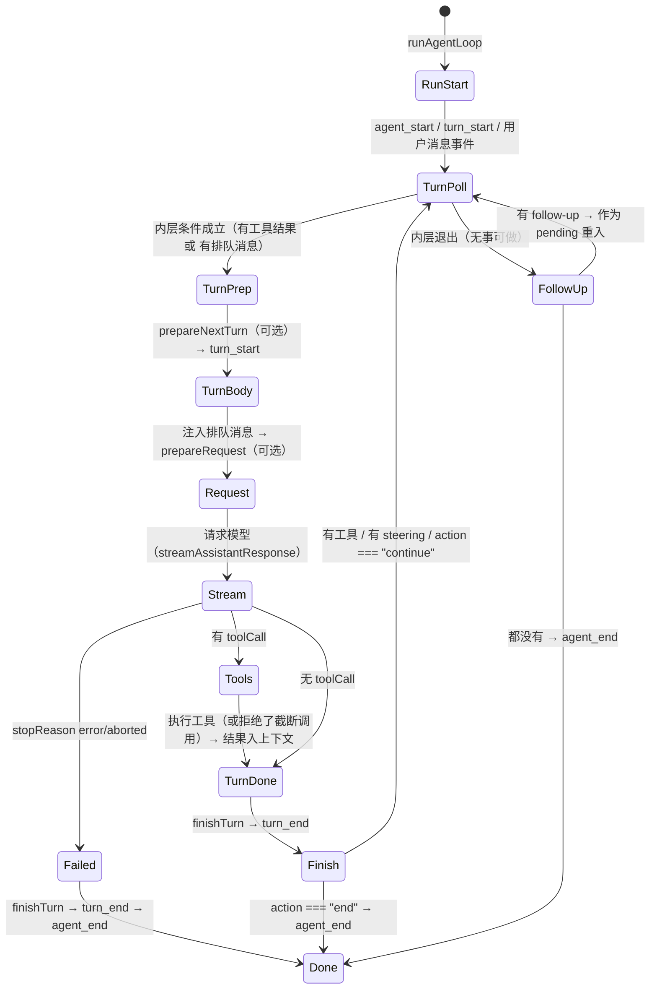

对照这张图数一数：一次"读文件并总结"的 run 里，`TurnBody → ... → TurnDone` 走两遍（两次 turn），第二遍之后 `FollowUp → Done`。取消的 run 走 `Stream → Failed → Done`。带 steering 的 run 在 `Finish → TurnPoll` 处再进一次内层。

<a id="06-agent-loop-h9"></a>

### 6.2.3 时序上的三个"容易搞错"的点

1. **`turn_start` 第一次由 `runAgentLoop` 发出**，之后每轮由内层循环发出（`await emit({ type: "turn_start" })`）——所以"事件数 = 轮次数"这条规律成立（每轮恰好一个 `turn_start` / `turn_end`）；
2. **排队消息在 `prepareRequest` 之前注入**：注释写得很明确（"Pending messages have already been appended and emitted when this callback runs"）。所以 `prepareRequest` 里能看到本轮真正会发给模型的消息；
3. **`prepareNextTurn` 可能"耗时很久"**（比如做压缩），而它**执行期间**新排队的 steering 会被补取（代码里那句 "Preparation can be long-running (for example, compaction). Pick up steering queued while it ran."）。这正是"压缩时用户还能打字，消息不会丢"的实现。
   <a id="06-agent-loop-h10"></a>

## 6.3 队列的精确消费时机：四个取数点

**先懂**：用户在模型思考、工具执行或压缩期间都可能继续输入。队列不会随时插进正在进行的步骤；循环只在固定检查点取消息。先记“什么时候取”，再看“取到后如何排进下一轮”。

```text
教学伪代码：开始时看一次 steering
           → 下一轮准备完成后补看一次
           → 本轮结束后再看一次
           → 主循环空了才检查 follow-up
```

"排队消息什么时候被取走"是本章最需要精确的知识点。在 `runLoop` 里，取队列只发生在**四个固定位置**：

```text
T0：进入内层循环之前（run 开始时先补取一次 steering）
T1：prepareNextTurn 之后、注入消息之前（准备耗时期间用户可能又打字）
T2：finishTurn 之后、决定是否进入下一轮时
T3：内层循环退出之后（检查 follow-up）
```

用源码对准这四个位置：

```typescript
// T0：run 开始前的初始轮询
let pendingMessages: AgentMessage[] = (await config.getSteeringMessages?.()) || [];

while (true) {
	let hasMoreToolCalls = true;
	while (hasMoreToolCalls || pendingMessages.length > 0) {
		if (lastCompletedTurn) {
			const nextTurnSnapshot = await config.prepareNextTurn?.(lastCompletedTurn);
			// ... 应用 snapshot
			// T1：准备可能耗时，期间排队的 steering 要补取（仅当上一轮取到的为空）
			if (pendingMessages.length === 0) {
				pendingMessages = (await config.getSteeringMessages?.()) || [];
			}
			await emit({ type: "turn_start" });
		}
		// 注入 prepared + pending（declareToolChanges 包装）
		// ...
		pendingMessages = [];

		// ... prepareRequest → 请求 → 工具 ...

		// T2：本轮结束，决定是否继续；先取一次 steering
		explicitContinuation = decision?.action === "continue";
		pendingMessages = (await config.getSteeringMessages?.()) || [];
		if (hasMoreToolCalls || pendingMessages.length > 0) explicitContinuation = false;
	}

	// T3：内层退出，检查 follow-up
	const followUpMessages = (await config.getFollowUpMessages?.()) || [];
	if (followUpMessages.length > 0) {
		explicitContinuation = false;
		pendingMessages = followUpMessages;
		continue;   // 回到外层开头，重进内层
	}
	if (explicitContinuation) { explicitContinuation = false; continue; }
	break;
}
```

`Agent` 侧把这两个回调接到队列上（`createLoopConfig`）：

```typescript
getSteeringMessages: async () => {
	if (skipInitialSteeringPoll) {
		skipInitialSteeringPoll = false;
		return [];
	}
	return this.steeringQueue.drain();
},
getFollowUpMessages: async () => this.followUpQueue.drain(),
```

`skipInitialSteeringPoll` 的用途：`continue()` 的特例分支已经把队列消息取出来开新 run 了，所以第一次轮询要**故意返回空**，避免"刚取出的消息又被取一次"。

<a id="06-agent-loop-h11"></a>

### 6.3.1 四种典型时序

| 用户动作                                 | 发生时点    | 消息进入模型请求的时机                 |
| ---------------------------------------- | ----------- | -------------------------------------- |
| 输入后立刻回车（非流式）                 | Agent 空闲  | 立即成为`prompt` 的新消息            |
| 流式输出中按回车（steer）                | turn 进行中 | T2 取到 → 下一轮请求前注入            |
| 流式输出中按 Alt+Enter 之类（follow-up） | turn 进行中 | T3 取到 → 内层退出后作为 pending 重入 |
| 取消（Esc）                              | turn 进行中 | 不注入；队列消息**还给编辑器**   |

至此，"一次用户请求 ≠ 一次模型请求 ≠ 一个 turn"彻底落到代码：**turn 是内层循环的一次迭代，排队消息是让内层多迭代几次的外部输入。**

<a id="06-agent-loop-h12"></a>

## 6.4 终止条件全表与四条状态轨迹

**先懂**：结束不是简单的“模型没调工具”。还要看队列、钩子的继续/结束决定，以及是否出错或被取消。先把正常结束和异常退出分开，再读下面的表。

```text
教学伪代码：模型给出本轮结果 → 先处理工具与 finishTurn 决定
           → 需要继续就启动下一轮
           → 没有后续工作才正常结束
           → 抛错的 hook 另走异常传播路径
```

<a id="06-agent-loop-h13"></a>

### 6.4.1 终止条件总表

| #  | 条件                                                  | 代码位置                                    | 结果                                                               |
| -- | ----------------------------------------------------- | ------------------------------------------- | ------------------------------------------------------------------ |
| 1  | 模型响应`stopReason` 为 `error`                   | ⑤                                          | `finishTurn` → `turn_end` → `agent_end`，结束              |
| 2  | 模型响应`stopReason` 为 `aborted`                 | ⑤                                          | 同上（错误消息为取消）                                             |
| 3  | `finishTurn` 返回 `action: "end"`                 | ⑦                                          | 立即`agent_end`，结束                                            |
| 4  | 本批次所有工具结果`terminate: true`                 | ⑥ 后`hasMoreToolCalls=false`             | 内层不再因工具继续                                                 |
| 5  | 无工具调用、无 steering、无 follow-up、无`continue` | 内层条件 + ⑧                               | `break` → `agent_end`，结束                                   |
| 6  | 内层退出但是有 follow-up                              | ⑧                                          | 继续（不结束）                                                     |
| 7  | `finishTurn` 返回 `action: "continue"`            | ⑦                                          | 空转一轮（context-only turn，仍会发一次请求）                      |
| 8  | 有 steering 消息                                      | ⑦ / T1 / T0                                | 注入后继续                                                         |
| 9  | 运行被取消（`abort()`）                             | 信号检查点                                  | 模型/工具尽快停止，按#2 收尾                                       |
| 10 | 循环中被`await` 的 hook 抛错或 reject               | 例如`prepareRequest` 在 `turn_end` 之前 | 这是异常退出，不走正常终止事件序列；外层入口决定如何处理 rejection |

表中的 #1–#9 描述的是正常调度结果：模型错误会变成 `stopReason: "error"` 的 assistant message，取消会变成 `"aborted"`，因此它们仍走 `turn_end` 和 `agent_end`。不要把这两种消息级失败与 **hook 的 Promise rejection** 混为一谈。后者不是一条“失败的模型回答”：`runLoop` 会直接 reject，尚未执行的后续事件也不会补发。例如 `prepareRequest` 是在注入消息之后、调用 provider 之前被 await；若它 reject，已发出的输入消息事件仍在，但本轮还没有 `turn_end` 或 `agent_end`。

这里还有一条容易漏掉的规则：**error/aborted 是硬退出**。源码仍会 `await finishTurn(...)`，给 hook 看见这条结束消息的机会；但这个分支不读取 hook 返回值。因此 hook 即使返回 `{ action: "continue" }` 或 `{ action: "end" }`，也不能覆盖模型错误或取消。hook 正常完成后，Agent loop 直接发 `turn_end` 和 `agent_end` 并返回，不再轮询 follow-up 队列。

| 响应类型                                              | 是否调用并等待`finishTurn` | 是否采用其决策 | 后续调度                                                         |
| ----------------------------------------------------- | ---------------------------: | -------------: | ---------------------------------------------------------------- |
| 普通回答（`stopReason` 不是 `error`/`aborted`） |                           是 |             是 | 按工具、steering、follow-up 与`continue` 裁决                  |
| error / aborted assistant message                     |                           是 |             否 | 发`turn_end`、`agent_end` 后返回；不消费 follow-up           |
| `finishTurn` 自身 reject                            |   已开始 await，但未正常完成 |   无决策可采用 | Promise reject；这条路径不会补发后续`turn_end` / `agent_end` |

短轨迹：provider 返回 `aborted` → `finishTurn` 返回 `continue` → Agent loop 忽略该决策 → `turn_end` → `agent_end`。这不是“取消后自动再问一次”。现有测试 `runs finishTurn for a %s assistant before turn_end without changing the hard exit` 分别用 `error` 与 `aborted` 验证：provider 只调用一次、steering 只做初始轮询、follow-up 从未轮询。

```text
Agent 类入口：prepareRequest reject
  -> runLoop / runAgentLoop Promise reject
  -> runWithLifecycle catch
  -> handleRunFailure 发失败消息与结束事件
  -> finishRun 清理

低层 agentLoop() 流包装器：runAgentLoop Promise reject
  -> fulfillment-only .then 的成功回调不执行
  -> 不会自动 stream.end()，也不会补 agent_end
```

上图第二条是 D1“低层 Promise 路径”讨论的异常边界；直接调用 `runAgentLoop()` 的宿主也必须自行接 rejection。`AgentLoopConfig` 的类型注释还明确要求 `convertToLlm`、`transformContext`、`getApiKey`、队列读取回调不要 throw/reject；应把可恢复错误转成合适的返回值。其他异步 hook 即使类型允许返回 Promise，也仍应按调用链确认 rejection 的归属与清理责任。

请特别注意两类"看起来该结束但不会结束"的情况：

- **`terminate: true` 只是"不因这批工具继续"**，如果模型在下一轮又调用了别的工具、或者有排队消息，循环照常继续。它不强制结束整个 run；
- **`action: "continue"` 会让循环多跑一轮真实的模型请求**（outer 循环第二轮会把 `hasMoreToolCalls` 重置为 `true`，于是内层再执行一遍完整流程，只是不新增消息）。所以"无条件返回 continue"= 无限请求 → 无限费用。这是第 6.4.4 节的主题。

<a id="06-agent-loop-h14"></a>

### 6.4.2 轨迹 A：无工具的简单请求

```text
agent_start
turn_start
message_start(user) → message_end(user)
message_start(assistant) → message_update × N（text_delta）→ message_end(assistant)
turn_end(message, toolResults: [])
agent_end
```

循环路径：内层第一次迭代 → 无工具、无排队 → 内层条件 false → 无 follow-up → break → `agent_end`。

<a id="06-agent-loop-h15"></a>

### 6.4.3 轨迹 B：带工具（第 3 章的场景）

```text
agent_start
turn_start
user message 事件
assistant 消息（toolCall）事件 = message_start + updates + message_end
tool_execution_start(args) → tool_execution_end(result)
message_start(toolResult) → message_end(toolResult)
turn_end
turn_start                       ← 第二轮
assistant 消息（纯文本总结）事件
turn_end
agent_end
```

关键点：**两个 `turn_start/turn_end` 对**，事件总数与轮次数严格对应；工具结果消息与助手消息一样有完整的 `message_start/message_end`。

**暂停预测：** 用户只输入一次“读 `demo.txt` 并总结”，模型第一轮提出 `read`，工具成功返回，第二轮只给出总结。没有重试、排队消息或额外继续决定时，请数一数 run、turn、模型请求各有几个。

**对照答案：** 一个 run、两个 turn、两次普通模型请求。第一轮模型决定调用工具；工具结果交回后，第二轮模型才能依据内容总结。`tool_execution_start/end` 和工具结果消息是这次运行中的事件与数据，不会各自再增加一个 turn。若出现重试或压缩恢复，请另数外层会话层触发的模型请求，不能把这个最小例子的计数当成通用上限。

<a id="06-agent-loop-h16"></a>

### 6.4.4 轨迹 C：排队消息插队 —— 以及"为什么可能停不下来"

场景：第一轮正在执行工具时，用户插入一条 steering："顺便把 README 也看了。"

```text
turn 1：assistant(toolCall read demo.txt) → 工具执行（此时 steer 入队）
finishTurn → turn_end
T2 取到 steering → 非空 → explicitContinuation 归零
内层条件：hasMoreToolCalls true（因为还有工具结果要回传）→ 继续
turn 2：注入 steering 消息 + toolResult 一起发给模型
   → assistant(再调 read README) → 工具 → finishTurn → T2 无新消息
内层条件：false → 退出内层 → T3 无 follow-up → break → agent_end
```

**"停不下来"的两种情况**（这是本节的验收重点）：

1. **模型行为导致**：模型每一轮都要求调用工具（比如工具总是返回错误、模型不断重试）。循环的设计就是"只要模型要工具就满足它"，**没有内置的最大轮数**。防呆靠：工具实现要给出可恢复的错误信息、扩展可以 `finishTurn` 叫停、用户随时可以取消；
2. **钩子行为导致**：`finishTurn` 无条件返回 `{ action: "continue" }`。由于 outer 循环会重置 `hasMoreToolCalls = true` 并重跑内层，每一轮都产生一次**真实的模型请求**（context-only turn）。这就是"无条件 continue → 无限运行 + 无限费用"的机制。写扩展时的准则：**只有在你确信"再来一轮就能收敛"时才返回 continue，并且要有外部计数/预算兜底。**

（会话层的 `_runAgentPrompt` while 循环同理：如果 `_handlePostAgentRun` 永远返回 true——例如某扩展在每次 `agent_end` 都塞一条新消息——`session.prompt()` 也永远不返回。机制一致：**收敛性由参与者保证，框架不设魔法上限。**）

<a id="06-agent-loop-h17"></a>

### 6.4.5 把三个布尔/数组变量分开追

读嵌套循环时，不要把“是否还要继续”压成一个脑内开关。源码里三个状态分工不同：

| 变量                     | 类型               | 谁更新                                          | 它控制什么                               |
| ------------------------ | ------------------ | ----------------------------------------------- | ---------------------------------------- |
| `hasMoreToolCalls`     | `boolean`        | 当前 assistant 消息的工具结果批次               | 是否因为工具调用尚需下一轮               |
| `pendingMessages`      | `AgentMessage[]` | T0–T3 队列读取或 follow-up 分支                | 下一轮开始前要注入的消息                 |
| `explicitContinuation` | `boolean`        | `finishTurn` 返回值；follow-up/自然工作可清零 | 内层停止后，是否再发一次不带新输入的请求 |

最容易误读的是：`explicitContinuation` **不在内层 while 条件中**。它只在内层退出后决定要不要 `continue` 外层循环。下面逐步代入真实结构：

```typescript
while (true) {
  let hasMoreToolCalls = true;
  while (hasMoreToolCalls || pendingMessages.length > 0) {
    // 注入 pendingMessages，发起一次模型请求并处理工具
    // ...
    explicitContinuation = decision?.action === "continue";
    pendingMessages = await getSteeringMessages();
    if (hasMoreToolCalls || pendingMessages.length > 0) {
      explicitContinuation = false;
    }
  }

  const followUpMessages = await getFollowUpMessages();
  if (followUpMessages.length > 0) {
    explicitContinuation = false;
    pendingMessages = followUpMessages;
    continue;
  }
  if (explicitContinuation) {
    explicitContinuation = false;
    continue;
  }
  break;
}
```

节选省掉请求与事件处理，只保留状态裁决。对照源码时留意 `hasMoreToolCalls` 在每次 outer loop 开始被重置为 `true`；它不是“上一轮是否有工具调用”的永久记忆。

<a id="06-agent-loop-h18"></a>

#### 轨迹一：普通回答

模型回答没有工具调用，`finishTurn` 未要求 continuation，也没有排队输入：

| 时刻              | `hasMoreToolCalls` | `pendingMessages.length` | `explicitContinuation` | 发生什么                                                          |
| ----------------- | -------------------: | -------------------------: | -----------------------: | ----------------------------------------------------------------- |
| inner loop 刚进入 |             `true` |                      `0` |                `false` | 初始用户消息已由`Agent.prompt` 放入 context；条件为真，开始本轮 |
| 本轮请求发出      |             `true` |                      `0` |                `false` | 没有 pending 队列消息，直接用现有 context 请求                    |
| assistant 无工具  |            `false` |                      `0` |                `false` | `finishTurn` 不要求继续                                         |
| inner 条件判断    |            `false` |                      `0` |                `false` | inner loop 退出                                                   |
| 读取 follow-up 后 |            `false` |                      `0` |                `false` | 无 follow-up、无 continuation，发`agent_end`                    |

这个例子里，空数组表示“没有新消息”，但不单独决定整个 run 是否结束；后面的 follow-up 与 continuation 裁决仍会执行。

<a id="06-agent-loop-h19"></a>

#### 轨迹二：finish hook 单独要求继续

假设无工具、无 steering，但 `finishTurn` 返回 `{ action: "continue" }`：

| 时刻            | `hasMoreToolCalls` | `pendingMessages.length` | `explicitContinuation` | 发生什么                                                      |
| --------------- | -------------------: | -------------------------: | -----------------------: | ------------------------------------------------------------- |
| 本轮完成        |            `false` |                      `0` |                 `true` | inner 条件为假，因此先退出 inner                              |
| 检查 follow-up  |            `false` |                      `0` |                 `true` | 无 follow-up                                                  |
| outer loop 重入 |       重置为`true` |                      `0` |          重置为`false` | inner 因`hasMoreToolCalls` 为真，再做一次 context-only 请求 |

因此 continuation 并不是“原样重复这次请求”：下一轮仍会经过 `prepareNextTurn` / `prepareRequest`，配置可能变化，也可能由钩子注入消息；它只是没有普通 steering/follow-up 消息时，要求 Agent 再向模型请求一次。除非某个钩子改变行为，否则无条件 continue 会不断请求。

<a id="06-agent-loop-h20"></a>

#### 轨迹三：follow-up 与 continuation 同时出现

若 `finishTurn` 要求继续，同时队列中有 follow-up，代码先取 follow-up，清除 `explicitContinuation`，将 follow-up 设为 `pendingMessages` 并重入 outer loop。新请求会带着 follow-up；它不是额外再多发一个 context-only 请求。

```text
finishTurn → explicitContinuation = true
检查 follow-up → ["再检查测试"]
follow-up 分支优先 → explicitContinuation = false
pendingMessages = followUpMessages
outer loop 重入 → 注入 follow-up → 正常请求
```

这里的“优先”是代码中的分支顺序和赋值结果，不是队列内部的抽象优先级。若在这段逻辑后加新条件，先回答：它应该清空、保留还是覆盖 `explicitContinuation`？否则很容易意外多打一轮请求或吞掉一次有意的 continuation。

<a id="06-agent-loop-h21"></a>

#### 新手阅读法：每次赋值就更新表格

可以在纸上照着做：

1. 找出变量的**声明位置**，记下初始值；
2. 搜索该变量的**所有赋值位置**，不要只看第一次出现；
3. 每次遇到 `await`，标注等待期间哪些变量可能被回调/队列改变；
4. 把变量代入最近的 if/while 条件，写出 true/false；
5. 找到这一分支之后的第一个 `emit`，确认外部观察者会看到什么。

这是阅读命令式 TypeScript 状态机的通用方法：变量不是注释，而是程序真正做分支的输入。读完后，再回到 6.4.1 的终止条件表，应该能从赋值过程推导每一行，而不是死记八种情况。

<a id="06-agent-loop-h22"></a>

## 6.5 取消：`abort()` 的全链路

**先懂**：`abort()` 发出一个取消信号，不能让已经开始的异步代码瞬间消失。模型请求、工具和后续调度在各自检查点观察信号，然后尽量收尾。先追信号从哪里发出，再追谁会检查它。

```text
教学伪代码：用户要求取消 → 当前 run 的 AbortController 发信号
           → 模型/工具在支持的检查点响应
           → 运行按已完成与未完成工作的状态收尾
```

取消是"用户按下 Esc"的代码路径，也是验证一个框架是否"全链路可取消"的试金石。

<a id="06-agent-loop-h23"></a>

### 6.5.1 入口：一个 AbortController

```typescript
/** Abort the current run, if one is active. */
abort(): void {
	this.activeRun?.abortController.abort();
}

/** Active abort signal for the current run, if any. */
get signal(): AbortSignal | undefined {
	return this.activeRun?.abortController.signal;
}
```

`runWithLifecycle` 在 run 开始时创建一个 `AbortController` 并把它存进 `activeRun`。`abort()` 只需触发一次 `abort()`，信号沿三条线传播：

```text
Agent.abort()
  ├─→ streamFn(options.signal)：正在进行的供应商 HTTP 请求被中止
  ├─→ tool.execute(..., signal)：正在执行的工具应尽快退出并清理
  └─→ 循环内的检查点：signal?.aborted 为真时跳过尚未开始的工具
```

<a id="06-agent-loop-h24"></a>

### 6.5.2 工具执行里的检查点（源码事实）

顺序模式（`executeToolCallsSequential`）：每个工具收尾后检查一次——

```typescript
		if (signal?.aborted) {
			break;   // 不再执行批次里剩余的工具
		}
```

并行模式（`executeToolCallsParallel`）有两层：

1. **准备阶段**：`prepareToolCall` 内部在 `beforeToolCall` 前后都检查信号，被取消就产出 `Operation aborted` 错误结果；
2. **执行阶段**：每个待执行闭包开头检查：

```typescript
		finalizedCalls.push(async () => {
			if (signal?.aborted) {
				const finalized = { toolCall, result: createErrorToolResult("Operation aborted"), isError: true };
				await emitToolExecutionEnd(finalized, emit);
				return finalized;
			}
			const executed = await executePreparedToolCall(preparation, signal, emitToolExecutionUpdate(toolCall, emit));
			// ...
		});
```

所以"取消后工具批次会怎样"要按执行模式和调用所处阶段回答：

| 状态                                       | 结果                                                                                            |
| ------------------------------------------ | ----------------------------------------------------------------------------------------------- |
| 顺序批次里尚未轮到的工具                   | 当前工具收尾后循环`break`；后续调用没有 start/end 事件，也没有 Agent 层的 `toolResult` 消息 |
| 并行批次里已准备、但闭包还未开始执行的工具 | 闭包看到已取消信号，生成`Operation aborted` 错误结果、结束事件和结果消息                      |
| 并行准备循环尚未到达的工具                 | 准备循环在当前调用后`break`；这些调用没有 start/end 事件，也没有 Agent 层结果消息             |
| 取消时已经在执行的工具                     | 收到同一个 signal；会否立刻退出取决于工具是否检查并响应取消                                     |

看一条具体轨迹：模型声明 A、B、C；A 已准备好并被放进闭包队列，B 正在异步 `beforeToolCall`，此时收到 abort。

```text
tool_execution_start(A) → A 的执行闭包入队（尚未调用 execute）
tool_execution_start(B) → beforeToolCall 等待期间 signal.aborted = true
tool_execution_end(B)   → prepareToolCall 返回 immediate: Operation aborted
                          准备循环 break，C 没有 start/end 或结果
tool_execution_end(A)   → Promise.all 启动 A 的闭包；闭包看见 aborted，不调用 execute
message_start/end(A)    → message_start/end(B)（结果消息仍按原声明顺序）
```

这里 `tool_execution_end` 的顺序是 B、A，结果消息顺序却是 A、B：B 在准备阶段已结束，A 的取消闭包要等准备循环退出后才运行。A、B 虽然都有错误结果，但这不表示两个工具执行函数都启动过；C 则根本没有进入 Agent 层批次。该轨迹由 `executeToolCallsParallel` 与 `prepareToolCall` 的控制流推导，当前记录的既有测试没有直接覆盖这个精确的取消时序。

因此，**Agent loop 不保证取消时每个模型声明的工具调用都有结果消息**。转录可能暂时包含不完整的工具批次。之后若确实进入 `convertToLlm`，某些 provider 转换器会为孤立调用插入 `No result provided` 合成错误结果；这属于模型消息投影的特定行为，不是调度器生成的真实工具结果，也不能推断所有 provider 的处理相同。D1 第 22–23 节按源码细讲了准备、执行与转换三层。

<a id="06-agent-loop-h25"></a>

### 6.5.3 取消之后：谁在收尾

- `streamAssistantResponse` 里的流如果是被中止结束的，最终消息 `stopReason: "aborted"`，循环走 ⑤ 分支正常收尾（`turn_end`、`agent_end` 一样发出）；
- `waitForIdle()` 在 `agent_end` 的监听器全部结束后 resolve；
- 会话层：`_runAgentPrompt` 的 finally 里调 `_finishCancelledRetry()`（如果在重试等待期被取消，补发 `auto_retry_end(success: false)`）、清请求级状态、`_emitAgentSettled()`；
- **排队消息还给编辑器**（`how-pi-works.md`）：交互层收到取消后把未消费的排队内容填回输入框，避免用户输入被吞。

取消相关 API 汇总（`Agent`/`AgentSession`）：

| API                                                 | 作用                                       |
| --------------------------------------------------- | ------------------------------------------ |
| `agent.abort()` / `session.abort()`             | 取消当前 run                               |
| `agent.signal`                                    | 当前 run 的信号（订阅者可读取）            |
| `agent.waitForIdle()` / `session.waitForIdle()` | 等 run 完全收尾                            |
| `session.abortRetry()`                            | 只取消"重试等待的睡眠"（正在重试倒计时时） |
| `session.isRetrying` / `autoRetryEnabled`       | 重试状态与开关                             |

<a id="06-agent-loop-h26"></a>

## 6.6 自动重试与恢复：会话层的补丁

循环本身不做重试；**重试发生在会话层的"运行后循环"**（第 3.6 节 `_runAgentPrompt` 的 while）。完整决策在 `_handlePostAgentRun`：

```typescript
private async _handlePostAgentRun(): Promise<boolean> {
	const message = this._lastAssistantMessage;      // 最近一次助手消息（turn_end 时记录）
	const toolResults = this._lastAssistantToolResults;
	// ...
	if (this._agentRunAbortRequested) { this._finishCancelledRetry(); return false; }
	if (!message) return this.agent.hasQueuedMessages();

	// ① 可重试错误 → 安排一次重试（退避等待后由调用方 agent.continue()）
	if (this._isRetryableError(message) && (await this._prepareRetry(message))) {
		// ...
		this._failedResponse = message;
		return !this._agentRunAbortRequested;
	}
	// ...（若重试预算耗尽且有重试历史：补发 auto_retry_end 失败事件）

	// ② 上下文问题 → 压缩（第 10 章）
	if (await this._checkCompaction(message, true, toolResults)) {
		return !this._agentRunAbortRequested;
	}

	// ③ 消费者等原因：队列里还有消息
	return !this._agentRunAbortRequested && this.agent.hasQueuedMessages();
}
```

<a id="06-agent-loop-h27"></a>

### 6.6.1 什么错误可重试

```typescript
private _isRetryableError(message: AssistantMessage): boolean {
	// Context overflow is handled by compaction, not retry.
	if (isContextOverflow(message, (this._modelForMessage(message) ?? this.model)?.contextWindow ?? 0)) return false;
	return isRetryableAssistantError(message);
}
```

- **上下文溢出**（输入超窗）**不重试**——重试只会再超一次；它交给压缩（第 10 章）；
- 其余（常见如过载、限流、服务端 5xx）由 `isRetryableAssistantError` 判定可重试。

<a id="06-agent-loop-h28"></a>

### 6.6.2 重试的执行（`_prepareRetry`）

```typescript
private async _prepareRetry(message: AssistantMessage): Promise<boolean> {
	const settings = this.settingsManager.getRetrySettings();
	if (!settings.enabled) return false;

	this._retryAttempt++;
	if (this._retryAttempt > settings.maxRetries) {
		this._retryAttempt--;     // 保留计数，供收尾事件报告
		return false;
	}

	const delayMs = retryDelayMs(settings, this._retryAttempt);   // 指数退避
	this._emit({ type: "auto_retry_start", attempt: this._retryAttempt, maxAttempts: settings.maxRetries, delayMs, errorMessage: message.errorMessage || "Unknown error" });

	// 关键：失败的一次尝试留在"原始历史"里，但持久地从模型投影中剔除
	this._omitRecoveryAttempt(message);

	// 可取消的退避等待
	this._retryAbortController = new AbortController();
	try { await sleep(delayMs, this._retryAbortController.signal); }
	catch { this._finishCancelledRetry(); return false; }
	finally { this._retryAbortController = undefined; }

	return true;   // 调用方随后 agent.continue()
}
```

四个值得理解的设计：

1. **退避等待可取消**：`abortRetry()` 会打断睡眠（用户不想等了）；
2. **`_omitRecoveryAttempt` 的持久化语义**：失败消息（+工具结果）通过追加 `context_edit` 条目（`replacement: null`）标记为"仅在上下文投影中省略"——

```typescript
for (const targetId of targetIds) {
	if (!targetId) continue;
	const editId = this.sessionManager.appendContextEdit(targetId, null);
	// ...
}
this._refreshFinalizedContext();
```

   这样**原始历史不丢**（审计/导出还能看到失败的尝试），但下一次模型请求不再包含它。第 9 章的 `buildSessionProjection` 会解释这条链；
3. **成功后自动复位**：`message_end` 处理里，一旦收到成功的助手消息（`stopReason` 非 `error`/`length`）就 `auto_retry_end(success: true)` 并清零计数——**重试预算是"连续失败预算"，一次成功就重置**；
4. **UI 的提前预告**：`agent_end` 事件在会话层被改写，带上 `willRetry`：

```typescript
private _willRetryAfterAgentEnd(event): boolean {
	if (this._agentRunAbortRequested) return false;
	const settings = this.settingsManager.getRetrySettings();
	if (!settings.enabled || this._retryAttempt >= settings.maxRetries) return false;
	// 从后向前找最近的 assistant 消息，判断是否可重试
	for (let i = event.messages.length - 1; i >= 0; i--) {
		const message = event.messages[i];
		if (message.role === "assistant") return this._isRetryableError(message as AssistantMessage);
	}
	return false;
}
```

   （所以你在界面上看到"agent 已结束但马上又动起来"时，事件流是这样的：`agent_end(willRetry: true)` → `auto_retry_start` → 新一轮 `agent_start`……）

<a id="06-agent-loop-h29"></a>

### 6.6.3 摘要类操作也共享重试预算

压缩、分支摘要这些"内部模型调用"同样可能遇到瞬时错误。它们复用同一套 `settings.retry` 预算与退避策略，但发的是另一组事件（`summarization_retry_scheduled` / `summarization_retry_attempt_start` / `summarization_retry_finished`，见 `AgentSessionEvent`）。**读事件日志时按事件名区分"主对话重试"与"摘要重试"。**

<a id="06-agent-loop-h30"></a>

## 6.7 实验 L03：排队时机与工具顺序（faux）

**实验性质**：本地运行；需要 faux（第 5 章）与测试 harness（第 18 章会系统讲）。
**验证状态**：设计中。本实验是第 6、7 两章共用的证据来源，建议整套做两遍（读完第 7 章后回访一遍）。

<a id="06-agent-loop-h31"></a>

### Part A：steering 的注入时机

1. 准备脚本（伪代码示意）：

```typescript
faux.setResponses([
	fauxAssistantMessage([fauxToolCall("read", { path: "demo.txt" })], { stopReason: "toolUse" }),
	fauxAssistantMessage("已读取。"),
	fauxAssistantMessage("收到引导，继续处理。"),
	fauxAssistantMessage("完成。"),
]);
```

2. 在 `tool_execution_start` 事件触发时调用 `session.steer("顺便看看 README")`（或用 Agent 层的 `agent.steer`）；
3. 断言并记录：
   - `faux.state.callCount` 是 2 还是 3？（取决于 steering 是否在工具结果回传前入队并被 T2 取到）
   - 引导消息在消息数组里出现在哪两条消息之间？
4. 画出事件序列：`tool_execution_*`、`turn_end`、下一条 `turn_start` 的相对位置。

<a id="06-agent-loop-h32"></a>

### Part B：并行工具的"两个顺序"

1. 注册两个假工具：`slow`（100ms 后完成）与 `fast`（10ms 后完成），**用可控 Promise/测试时钟而不是真实定时器**；
2. 脚本让模型一次调用两个工具；
3. 记录两类顺序：
   - `tool_execution_end` 事件顺序（预期：fast 先）；
   - 工具结果消息在 `session.messages` 里的顺序（预期：按模型声明顺序）。

<a id="06-agent-loop-h33"></a>

### 判定标准

- Part A：能解释 steering 是从哪个取数点（T1/T2/T3）被消费的，并给出证据；
- Part B：能说出"完成顺序"与"记录顺序"分别由哪段代码保证（`finalizedCalls` 闭包 vs `Promise.all` + 有序循环）。

（说明：本手册写作时未运行这两个实验；步骤中的预期来自源码静态分析。运行结果若与预期不符，请优先检查你使用的 harness 版本与事件注册时机。）

<a id="06-agent-loop-h34"></a>

## 本章源码精读

> **车下内容**：本节要打开源码逐段对照，通勤（车上）时可以先跳过，直接读本章的“常见错误”和“验收题”；需要修改对应代码时再回来。 读法见[附录 L](#appendices-read-code-h1)。

先读 D2 的 `Agent` 生命周期，再读 D1 的 `runLoop`。这样可以先分清谁维护状态、谁发事件、谁决定下一轮，随后再处理取消和工具批次边界。D1 后半的工具调度也与第 7 章相连。

<!-- 来源：deep-dives/D2-agent.md；融合于第 6 章。 -->

<a id="deep-dives-d2-agent-h1"></a>

### D2：`agent.ts` 逐段精读

**先懂**：`agent-loop.ts` 负责一轮轮处理模型与工具；`Agent` 把它包装成一个有状态对象，保证一次只运行一个任务，并把事件交给订阅者。先读状态怎么变化，再读队列和异常收尾。

```text
教学伪代码：接收输入 → 检查是否正在运行 → 启动循环
           → 依事件更新状态并通知订阅者
           → 处理排队、取消与结束 → 回到空闲
```

这里概括正常对象生命周期；监听器抛错等失败路径在后文单独分析。

> 精读对象：`packages/agent/src/agent.ts`（约 613 行，有状态 `Agent` 类的完整实现）。
> 对应主线：第 3 章（prompt 生命周期）、第 6 章（队列与取消）、第 4 章（状态归约）。
> 关系：`agent-loop.ts` 是"无状态的循环函数"，`agent.ts` 是"把循环包装成对象"——状态、并发守卫、队列、事件订阅都在这里。

---

<a id="deep-dives-d2-agent-h2"></a>

#### 0. 文件地图

| 部分     | 内容                                                                            |
| -------- | ------------------------------------------------------------------------------- |
| 顶部工具 | `defaultConvertToLlm`、`EMPTY_USAGE`、`DEFAULT_MODEL`（模块级常量与兜底） |
| 类型     | `MutableAgentState`、`AgentInitialState`、`AgentOptions`                  |
| 内部类   | `PendingMessageQueue`（带模式的队列）                                         |
| 主类     | `Agent`（状态 + 公开配置字段 + 生命周期方法）                                 |

导出清单：`Agent`、`AgentOptions`、`AgentInitialState`、`QueueMode`（re-export 自 types）——注意**没有导出** `PendingMessageQueue`（内部实现）。

---

<a id="deep-dives-d2-agent-h3"></a>

#### 1. 顶部的三个"地基"

<a id="deep-dives-d2-agent-h4"></a>

##### 1.1 `defaultConvertToLlm`

【源码】

```typescript
function defaultConvertToLlm(messages: AgentMessage[]): Message[] {
	return messages.filter(
		(message) =>
			message.role === "system" ||
			message.role === "user" ||
			message.role === "assistant" ||
			message.role === "toolResult",
	);
}
```

【注解】

- "默认实现"只做**过滤**，不做翻译：留下四种标准角色，把自定义角色（第 4.4 节的 `custom`/`bashExecution` 等）**丢掉**。
- 这是给"直接用 agent-core、不引入 coding-agent"的用户的**安全底线**：宁可少发消息，也不把未知类型塞给供应商。
- coding-agent 在装配时用 `convertToLlmWithBlockImages` 覆盖它（第 3.5 节）——那个版本会做真正的翻译（第 4.4.2 节）。
- 【陷阱】这个函数用 `filter` 返回**新数组**但**元素是原引用**——后续流程不应修改消息内容。

<a id="deep-dives-d2-agent-h5"></a>

##### 1.2 `EMPTY_USAGE` 与 `DEFAULT_MODEL`

【源码】

```typescript
const EMPTY_USAGE = {
	input: 0,
	output: 0,
	cacheRead: 0,
	cacheWrite: 0,
	totalTokens: 0,
	cost: { input: 0, output: 0, cacheRead: 0, cacheWrite: 0, total: 0 },
};

const DEFAULT_MODEL = {
	id: "unknown",
	name: "unknown",
	api: "unknown",
	provider: "unknown",
	baseUrl: "",
	reasoning: false,
	input: [],
	cost: { input: 0, output: 0, cacheRead: 0, cacheWrite: 0 },
	contextWindow: 0,
	maxTokens: 0,
} satisfies Model<any>;
```

【注解】

- `EMPTY_USAGE`：失败消息/占位消息的"零用量"。形状必须与 `Usage` 完全一致（注意**嵌套的 cost 也有五个分项**）——否则统计代码会缺字段。
- `DEFAULT_MODEL`：**没配置模型时的占位**。所有身份字段是 `"unknown"`，限制是 0。
  - 【陷阱】`input: []` 表示"不接受任何输入类型"——工具里的图片判断（第 7.8.5 节的 `model.input.includes("image")`）因此在无模型时为 false，走"不支持图片"分支；这是"占位模型的保守行为"，不是 bug。
  - `satisfies Model<any>`（第 1.3.2 节讲过）：检查形状但保留字面量类型——所以 `id: "unknown"` 的类型仍是字面量 `"unknown"`，而不是被拓宽成 `string`。
- 【陷阱】这个常量**是共享对象**：代码里绝不应该改它（比如给 `DEFAULT_MODEL.id` 赋值）——所有"默认模型"共享同一引用，改一处全局生效。`createMutableAgentState` 里直接引用它。

<a id="deep-dives-d2-agent-h6"></a>

#### 2. 状态：可变内部形态与创建

<a id="deep-dives-d2-agent-h7"></a>

##### 2.1 `MutableAgentState`

【源码】

```typescript
type MutableAgentState = Omit<AgentState, "isStreaming" | "streamingMessage" | "pendingToolCalls" | "errorMessage"> & {
	isStreaming: boolean;
	streamingMessage?: AgentMessage;
	pendingToolCalls: Set<string>;
	errorMessage?: string;
};
```

【注解】

- 公开的 `AgentState`（第 4.6 节）里，`tools`/`messages` 是 get/set 访问器、`systemPrompt` 是只读 getter——那是"对外门面"。
- 内部实现需要的却是**可变的字段**：`isStreaming`（可写布尔）、`pendingToolCalls`（可变 Set）、`streamingMessage`/`errorMessage`（可赋值）。所以用 `Omit` 把四个字段"换成实现版本"，其余字段直接复用。
- 【陷阱】这份类型是"内外有别的桥梁"：读 `Agent` 的公开方法时看到 `this._state.isStreaming = true`（第 3 节会看到）——**内部直接改字段**，但外部拿到的 `state` getter 返回的是同一个对象（第 4.6 节的"状态只有一个数据源"）。所以外部读到的 `isStreaming` 会跟着变；但外部**不应**写它（类型上 `AgentState.isStreaming` 是 `readonly`）。

<a id="deep-dives-d2-agent-h8"></a>

##### 2.2 `createMutableAgentState`：系统消息的"种子"

【源码】

```typescript
function createMutableAgentState(initialState?: AgentInitialState): MutableAgentState {
	let tools = initialState?.tools?.slice() ?? [];
	let messages = initialState?.messages?.slice() ?? [];
	const initialMessage = createInitialSystemMessage(initialState?.systemPrompt, tools.map(toToolDeclaration));
	if (messages[0]?.role !== "system" && initialMessage) messages.unshift(initialMessage);

	return {
		get systemPrompt() {
			return getCurrentSystemPrompt(messages);
		},
		model: initialState?.model ?? DEFAULT_MODEL,
		thinkingLevel: initialState?.thinkingLevel ?? "off",
		get tools() {
			return tools;
		},
		set tools(nextTools: AgentTool<any>[]) {
			tools = nextTools.slice();
		},
		get messages() {
			return messages;
		},
		set messages(nextMessages: AgentMessage[]) {
			messages = nextMessages.slice();
		},
		isStreaming: false,
		streamingMessage: undefined,
		pendingToolCalls: new Set<string>(),
		errorMessage: undefined,
	};
}
```

【注解（逐块）】

- 两个局部 `let` 数组（`tools`/`messages`）+ 闭包 getter/setter = **私有可变数据 + 对外访问器**的经典写法（比 `#private` 字段更早、更易调试）。setter 里 `slice()`：**赋值总复制顶层数组**（第 4.6 节的行为注释）。
- **系统消息播种**：

```typescript
	const initialMessage = createInitialSystemMessage(initialState?.systemPrompt, tools.map(toToolDeclaration));
	if (messages[0]?.role !== "system" && initialMessage) messages.unshift(initialMessage);
```

- `createInitialSystemMessage`（来自 pi-ai）把 `systemPrompt` + 工具声明**合成为一条系统消息**；
- 只有当消息数组开头不是系统消息、且合成结果非空时才 `unshift`——这就是"传入历史已经带系统消息时不会被播种覆盖"的保护；
- 【陷阱】`systemPrompt` 为空且没有工具时，`initialMessage` 可能是 falsy（空字符串 prompt + 空工具）——所以判断里同时检查了它。
- `get systemPrompt()`：**每次读都重放**（`getCurrentSystemPrompt(messages)`）——不是缓存的字段。所以"追加一条系统消息"后，`state.systemPrompt` 立刻反映新值（第 4.6 节的"读取即重放"）。
- `model: initialState?.model ?? DEFAULT_MODEL`、`thinkingLevel: ... ?? "off"`：默认值兜底。
- 【陷阱】`tools` 的 setter 复制、`messages` 的 setter 复制，但**getter 返回的是内部数组本身**（不是副本）！所以 `agent.state.messages.push(...)` 会真的改到内部数据（类型上数组是可变引用）。仓库代码自己都用内部方法（不通过 state 写入），但外部调用者要自觉：**读可以，改要走 api**。

<a id="deep-dives-d2-agent-h9"></a>

##### 2.3 `AgentInitialState`

【源码】

```typescript
/** Initial state for {@link Agent}. `systemPrompt` and `tools` become the leading system message unless `messages` already starts with one. */
export type AgentInitialState = Partial<
	Omit<AgentState, "pendingToolCalls" | "isStreaming" | "streamingMessage" | "errorMessage">
>;
```

【注解】

- **只暴露"可初始化的子集"**：四个运行时字段（工具调用集合、流式标志、部分消息、错误信息）被 `Omit` 掉——调用方不能"初始化一个正在流式的 Agent"。
- 文档注释重申播种规则（除非 messages 已以系统消息开头）。

<a id="deep-dives-d2-agent-h10"></a>

#### 3. `AgentOptions`：构造参数全景

【源码（节选 + 注释）】

```typescript
/** Options for constructing an {@link Agent}. */
export interface AgentOptions {
	initialState?: AgentInitialState;
	convertToLlm?: (messages: AgentMessage[]) => Message[] | Promise<Message[]>;
	transformContext?: (messages: AgentMessage[], signal?: AbortSignal) => Promise<AgentMessage[]>;
	streamFn: StreamFn;
	getApiKey?: (provider: string) => Promise<string | undefined> | string | undefined;
	onPayload?: SimpleStreamOptions["onPayload"];
	onResponse?: SimpleStreamOptions["onResponse"];
	onProviderStreamEvent?: SimpleStreamOptions["onProviderStreamEvent"];
	beforeToolCall?: (context: BeforeToolCallContext, signal?: AbortSignal) => Promise<BeforeToolCallResult | undefined>;
	afterToolCall?: (context: AfterToolCallContext, signal?: AbortSignal) => Promise<AfterToolCallResult | undefined>;
	finishTurn?: FinishTurn;
	prepareRequest?: PrepareRequest;
	prepareNextTurn?: (signal?: AbortSignal) => Promise<AgentLoopTurnUpdate | undefined> | AgentLoopTurnUpdate | undefined;
	prepareNextTurnWithContext?: (
		context: PrepareNextTurnContext,
		signal?: AbortSignal,
	) => Promise<AgentLoopTurnUpdate | undefined> | AgentLoopTurnUpdate | undefined;
	steeringMode?: QueueMode;
	followUpMode?: QueueMode;
	sessionId?: string;
	thinkingBudgets?: ThinkingBudgets;
	transport?: Transport;
	maxRetryDelayMs?: number;
	toolExecution?: ToolExecutionMode;
}
```

【注解】

- `streamFn` 是**唯一必需**的选项（类型上无 `?`）——"怎么请求模型"必须由调用方给出（或用 `setDefaultStreamFn` 兜底；构造器里两者都处理了，见下一节）。
- 选项分四组：
  1. **状态与流**：`initialState`、`streamFn`；
  2. **请求选项透传**：`onPayload`/`onResponse`/`onProviderStreamEvent`/`getApiKey`——直接来自 `SimpleStreamOptions`，会被原样放进 `AgentLoopConfig`（第 5 节）；
  3. **钩子**：`convertToLlm`/`transformContext`/`beforeToolCall`/`afterToolCall`/`finishTurn`/`prepareRequest`/`prepareNextTurn(+WithContext)`——第 6 章表格里的全家桶；
  4. **行为参数**：`steeringMode`/`followUpMode`（队列模式）、`sessionId`、`thinkingBudgets`、`transport`、`maxRetryDelayMs`、`toolExecution`。
- 【陷阱】**两个 `prepareNextTurn`**：`prepareNextTurn(signal)` 是"不带上下文"的旧形态；`prepareNextTurnWithContext(context, signal)` 是新形态。构造器把它们归一成循环只要的那一个（第 5 节的 `createLoopConfig` 里）。读调用方代码时先确认它在用哪一个。
- 【陷阱】`convertToLlm` 与 `transformContext` 的类型都**允许 Promise**——这是第 3.11 节那条"钩子可以是异步的"的类型依据。

<a id="deep-dives-d2-agent-h11"></a>

#### 4. `PendingMessageQueue`：14 行核心逻辑

**先懂**：忙碌时的新消息先存在队列里；每次可以取一条或全部。先理解“看一眼”与“真正取走”的差别。

```text
教学伪代码：enqueue 把消息放到尾部
           → peek 按模式查看待处理项但不删除
           → drain 取走本次要处理的项
```

【源码】

```typescript
class PendingMessageQueue {
	private messages: AgentMessage[] = [];
	public mode: QueueMode;

	constructor(mode: QueueMode) {
		this.mode = mode;
	}

	enqueue(message: AgentMessage): void {
		this.messages.push(message);
	}

	hasItems(): boolean {
		return this.messages.length > 0;
	}

	peek(): AgentMessage[] {
		if (this.mode === "all") return this.messages.slice();
		const first = this.messages[0];
		return first ? [first] : [];
	}

	drain(): AgentMessage[] {
		const drained = this.peek();
		this.messages = this.messages.slice(drained.length);
		return drained;
	}

	clear(): void {
		this.messages = [];
	}
}
```

【注解】

- **模式**（第 6.1.3 节）：`"all"` 一次全取；`"one-at-a-time"` 只取最旧一条。
- `peek()` 不做修改：
  - `"all"`：`slice()` 复制整个数组（返回的是**新数组**，元素引用共享）；
  - `"one-at-a-time"`：取 `messages[0]`，包成单元素数组；空队列返回 `[]`（`first ? ... : []` 处理 undefined）。
- `drain()`：先 peek 再"**按取走的数量切掉前缀**"——`this.messages = this.messages.slice(drained.length)` 同时完成"删除已取部分"与"复制剩余"（新数组，避免外部引用影响内部）。对 `"all"` 模式 `slice(length)` 返回空数组；对 one-at-a-time 模式返回去掉第一条的**新数组**。
- 【陷阱】`drain` 的语义是"取出并从队列移除"，而 `peekQueuedMessages()`（第 6.1.3 节）用 `peek` 实现"预览不消费"——两个方法都返回数组，别写混。
- 【陷阱】队列**不需要锁**：所有操作都在事件循环的单线程里同步完成（没有 `await` 插入 peek 与 slice 之间）——这是"同步小数据结构不需要并发控制"的例子。若未来有人在两者之间加 `await`，就会引入竞态。
- 【跳转】取用时机（四个取数点）在 `agent-loop.ts` 的 `runLoop`（D1 第二部分）。

---

> D2 第一部分到此。第二部分：`Agent` 类的字段与构造器、公开状态 API（subscribe/state/队列控制/prompt/continue/reset/abort/waitForIdle）。

---

<a id="deep-dives-d2-agent-h12"></a>

#### 第二部分：`Agent` 的字段、构造器与公开状态 API

<a id="deep-dives-d2-agent-h13"></a>

##### 5. 类字段：五组

【源码】

```typescript
export class Agent {
	private _state: MutableAgentState;
	private readonly listeners = new Set<(event: AgentEvent, signal: AbortSignal) => Promise<void> | void>();
	private readonly steeringQueue: PendingMessageQueue;
	private readonly followUpQueue: PendingMessageQueue;

	public convertToLlm: (messages: AgentMessage[]) => Message[] | Promise<Message[]>;
	public transformContext?: (messages: AgentMessage[], signal?: AbortSignal) => Promise<AgentMessage[]>;
	public streamFunction: StreamFn;
	public getApiKey?: (provider: string) => Promise<string | undefined> | string | undefined;
	public onPayload?: SimpleStreamOptions["onPayload"];
	public onResponse?: SimpleStreamOptions["onResponse"];
	public onProviderStreamEvent?: SimpleStreamOptions["onProviderStreamEvent"];
	public beforeToolCall?: (context: BeforeToolCallContext, signal?: AbortSignal) => Promise<BeforeToolCallResult | undefined>;
	public afterToolCall?: (context: AfterToolCallContext, signal?: AbortSignal) => Promise<AfterToolCallResult | undefined>;
	public finishTurn?: FinishTurn;
	public prepareRequest?: PrepareRequest;
	public prepareNextTurn?: (signal?: AbortSignal) => Promise<AgentLoopTurnUpdate | undefined> | AgentLoopTurnUpdate | undefined;
	public prepareNextTurnWithContext?: (
		context: PrepareNextTurnContext,
		signal?: AbortSignal,
	) => Promise<AgentLoopTurnUpdate | undefined> | AgentLoopTurnUpdate | undefined;
	private activeRun?: ActiveRun;
	/** Session identifier forwarded to providers for cache-aware backends. */
	public sessionId?: string;
	/** Optional per-level thinking token budgets forwarded to the stream function. */
	public thinkingBudgets?: ThinkingBudgets;
	/** Preferred transport forwarded to the stream function. */
	public transport: Transport;
	/** Optional cap for provider-requested retry delays. */
	public maxRetryDelayMs?: number;
	/** Tool execution strategy for assistant messages that contain multiple tool calls. */
	public toolExecution: ToolExecutionMode;
```

【注解（五组划分）】

1. **私有运行时**：`_state`（可变状态）、`listeners`（订阅集合，**Set** 保证同一函数只订阅一次、退订 O(1)）、`steeringQueue`/`followUpQueue`、`activeRun`（当前运行句柄）。
2. **可热替换的回调**（`public` 非 readonly）：`convertToLlm`、`transformContext`、`streamFunction`——它们可以在运行中途被外层改写（`AgentSession` 切换模型时会重建 `streamFn` 包装吗？看第 8 章的重建策略；但类型上允许）。
3. **请求透传选项**：`onPayload`/`onResponse`/`onProviderStreamEvent`/`getApiKey`——最终摊进 `streamFunction` 的选项（D1 第 18 节）。
4. **钩子**：`beforeToolCall`/`afterToolCall`/`finishTurn`/`prepareRequest`/`prepareNextTurn(+WithContext)`——原样进 `createLoopConfig`（第三部分）。
5. **行为参数**：`sessionId`/`thinkingBudgets`/`transport`/`maxRetryDelayMs`/`toolExecution`。

【陷阱】`listeners` 是 **Set 而不是数组**：重复订阅同一个函数会被去重（第二次 `add` 无效果），退订就是把函数从 Set 里删掉。这与"数组允许重复"的实现不同——写测试时"订阅两次同一个 handler 期望触发两次"会失败。

【跳转】`ActiveRun` 类型：

```typescript
type ActiveRun = {
	promise: Promise<void>;
	resolve: () => void;
	abortController: AbortController;
};
```

（在文件靠前位置定义，D2 第一部分漏提；`promise` 用于 `waitForIdle`，`resolve` 用于 `finishRun`，`abortController` 用于 `abort`。）

<a id="deep-dives-d2-agent-h14"></a>

##### 6. 构造器：兼容性子句与默认值

【源码】

```typescript
	constructor(options: AgentOptions) {
		// Older compiled consumers may omit options or streamFn even though the current API requires them.
		const runtimeOptions: Partial<AgentOptions> = options ?? {};
		this._state = createMutableAgentState(runtimeOptions.initialState);
		this.convertToLlm = runtimeOptions.convertToLlm ?? defaultConvertToLlm;
		this.transformContext = runtimeOptions.transformContext;
		this.streamFunction = runtimeOptions.streamFn ?? getDefaultStreamFn();
		this.getApiKey = runtimeOptions.getApiKey;
		this.onPayload = runtimeOptions.onPayload;
		this.onResponse = runtimeOptions.onResponse;
		this.onProviderStreamEvent = runtimeOptions.onProviderStreamEvent;
		this.beforeToolCall = runtimeOptions.beforeToolCall;
		this.afterToolCall = runtimeOptions.afterToolCall;
		this.finishTurn = runtimeOptions.finishTurn;
		this.prepareRequest = runtimeOptions.prepareRequest;
		this.prepareNextTurn = runtimeOptions.prepareNextTurn;
		this.prepareNextTurnWithContext = runtimeOptions.prepareNextTurnWithContext;
		this.steeringQueue = new PendingMessageQueue(runtimeOptions.steeringMode ?? "one-at-a-time");
		this.followUpQueue = new PendingMessageQueue(runtimeOptions.followUpMode ?? "one-at-a-time");
		this.sessionId = runtimeOptions.sessionId;
		this.thinkingBudgets = runtimeOptions.thinkingBudgets;
		this.transport = runtimeOptions.transport ?? "auto";
		this.maxRetryDelayMs = runtimeOptions.maxRetryDelayMs;
		this.toolExecution = runtimeOptions.toolExecution ?? "parallel";
	}
```

【注解（逐点）】

- **第一行的兼容注释**：`options ?? {}` 是为了"旧编译产物可能不传 options/streamFn"——虽然当前类型要求 `streamFn`，但**运行时兼容**保留。这是"发布过的库要照顾已编译调用方"的现实约束；写你自己的库时，是否做这种兼容是一个产品决策。
- `streamFunction` 的兜底 `getDefaultStreamFn()`：**构造时就调用**——如果既没传也没配置默认，构造器直接抛错（异常在构造点爆炸，而不是第一次 prompt 时才炸）。这是"尽早失败"的好例子。
- 两个队列的**默认模式都是 `"one-at-a-time"`**——与第 6.1.3 节一致；`AgentSession` 会用设置覆盖（`steeringMode`/`followUpMode` 设置，第 8.3 节）。
- `transport ?? "auto"`、`toolExecution ?? "parallel"`：两个非空默认。
- 【陷阱】`runtimeOptions` 声明为 `Partial<AgentOptions>`——**类型上把必需字段也变成可选**，配合 `??` 兜底。读构造器时注意"哪些字段其实可以缺省"。
- 【跳转】`"auto"` 传输的取值逻辑在 pi-ai（`Transport` 类型）；`"parallel"` 的调度在 D1 第 23 节。

<a id="deep-dives-d2-agent-h15"></a>

##### 7. 订阅与状态读取

<a id="deep-dives-d2-agent-h16"></a>

###### 7.1 `subscribe`

【源码】

```typescript
	/**
	 * Subscribe to agent lifecycle events.
	 *
	 * Listener promises are awaited in subscription order and are included in
	 * the current run's settlement. Listeners also receive the active abort
	 * signal for the current run.
	 *
	 * `agent_end` is the final emitted event for a run, but the agent does not
	 * become idle until all awaited listeners for that event have settled.
	 */
	subscribe(listener: (event: AgentEvent, signal: AbortSignal) => Promise<void> | void): () => void {
		this.listeners.add(listener);
		return () => this.listeners.delete(listener);
	}
```

【注解】

- 三行实现，但文档注释给出了**三条运行时契约**（第 3.7 节展开过）：按订阅顺序 await、计入本次运行结算、监听器拿得到当前运行的 abort signal。
- 返回"退订函数"：`() => this.listeners.delete(listener)` ——注意 `delete` 返回 boolean，但箭头函数把它吞了（函数类型是 `() => void`，返回值被忽略）——**退订幂等**（删不存在的也没事）。
- 【陷阱】监听器签名里的 `signal` 是**运行级信号**，与工具/请求各自的 signal 同源（`activeRun.abortController.signal`）——不是每个事件一个信号。

<a id="deep-dives-d2-agent-h17"></a>

###### 7.2 `state`、队列模式与入队 API

【源码（节选）】

```typescript
	get state(): AgentState {
		return this._state;
	}

	/** Controls how queued steering messages are drained. */
	set steeringMode(mode: QueueMode) {
		this.steeringQueue.mode = mode;
	}
	get steeringMode(): QueueMode {
		return this.steeringQueue.mode;
	}

	/** Queue a message to be injected after the current assistant turn finishes. */
	steer(message: AgentMessage): void {
		this.steeringQueue.enqueue(message);
	}

	/** Queue a message to run only after the agent would otherwise stop. */
	followUp(message: AgentMessage): void {
		this.followUpQueue.enqueue(message);
	}

	/** Remove all queued steering messages. */
	clearSteeringQueue(): void {
		this.steeringQueue.clear();
	}

	clearFollowUpQueue(): void { this.followUpQueue.clear(); }
	clearAllQueues(): void { this.clearSteeringQueue(); this.clearFollowUpQueue(); }
	hasQueuedMessages(): boolean { return this.steeringQueue.hasItems() || this.followUpQueue.hasItems(); }
	peekQueuedMessages(): AgentMessage[] {
		const steering = this.steeringQueue.peek();
		return steering.length > 0 ? steering : this.followUpQueue.peek();
	}
```

【注解】

- `state` getter 直接返回内部对象（第 2.2 节的【陷阱】）。
- **模式是"活的"**：`steeringMode` 的 setter 直接改队列对象的 `mode`——设置可以在运行中途生效（下一次 drain 就按新模式）。
- `steer`/`followUp` 只是入队：**没有任何事件**在这里发出。队列变化的通知是**上层**（`AgentSession`）在调用前后 emit `queue_update`（第 4.5.2 节）——这也解释了为什么 `Agent` 自己的事件类型里没有 queue 事件。
- `peekQueuedMessages` 的优先级：**先 steering 后 follow-up**——与运行时取数顺序一致（steering 在 T2，follow-up 在 T3）。
- 【陷阱】`hasQueuedMessages` 与 `peekQueuedMessages` 的空判定不同：前者是"任一队列非空"，后者"返回下一个会被取走的批次"（可能只返回 steering 的前一条，取决于模式）。界面提示用哪个？`hasQueuedMessages` 判断"还有没有"，`peek` 用于预览将要发出的内容。

<a id="deep-dives-d2-agent-h18"></a>

###### 7.3 `signal`、`abort`、`waitForIdle`

【源码】

```typescript
	/** Active abort signal for the current run, if any. */
	get signal(): AbortSignal | undefined {
		return this.activeRun?.abortController.signal;
	}

	/** Abort the current run, if one is active. */
	abort(): void {
		this.activeRun?.abortController.abort();
	}

	/**
	 * Resolve when the current run and all awaited event listeners have finished.
	 *
	 * This resolves after `agent_end` listeners settle.
	 */
	waitForIdle(): Promise<void> {
		return this.activeRun?.promise ?? Promise.resolve();
	}
```

【注解】

- `signal`/`abort` 都是 `activeRun?.` 可空调用：**空闲时是安全的空操作**（abort 空闲 Agent 不抛错）。
- `abort()` 只触发信号；真正的收尾（发事件、清状态）由运行中的循环走完（D1 的取消检查点）。
- `waitForIdle` 返回 `activeRun.promise`——这个 Promise 在 `finishRun()` 里被 resolve（第三部分）。**空闲时返回已 resolve 的 Promise**（`?? Promise.resolve()`），调用方不用判空。
- 【陷阱】`waitForIdle` **不等待**"下一次运行"——它快照了**当前**的 activeRun。如果你在空档期（两次 prompt 之间）调用，它立刻 resolve；想等"某个任务完成"要在调用前先确认已在运行（第 16.5.3 节的 RpcClient 纪律："call waitForIdle() only while a run is active"）。

<a id="deep-dives-d2-agent-h19"></a>

###### 7.4 `reset`：保留"重放基线"的清空

【源码】

```typescript
	/** Clear conversation state and queues while retaining the replayed prompt/tool baseline. */
	reset(): void {
		if (this.activeRun) {
			throw new Error("Agent is already processing. Wait for completion before resetting.");
		}

		const baseline = getCurrentSystemMessage(this._state.messages);
		this._state.messages = baseline ? [baseline] : [];
		this._state.isStreaming = false;
		this._state.streamingMessage = undefined;
		this._state.pendingToolCalls = new Set<string>();
		this._state.errorMessage = undefined;
		this.clearFollowUpQueue();
		this.clearSteeringQueue();
	}
```

【注解】

- 守卫：运行中不许 reset（否则会与循环的 `currentContext` 竞争）。
- **保留系统消息**：`getCurrentSystemMessage(messages)` 从消息里**重放**出当前系统消息（第 1.2.1 节用过同名函数——严格说这里用的是 `getCurrentSystemMessage`），然后 `messages = [baseline]`——即"只留系统消息，清空对话"。这就是"retaining the replayed prompt/tool baseline"：**工具声明也在系统消息里**，所以 reset 后工具集声明不丢。
- 四个运行时字段全部复位（含 `pendingToolCalls` 换新 Set——不是 clear，是**换新实例**：外面若持有旧 Set 的只读引用不会被清空变化影响？看 `pendingToolCalls` 的公开类型是 `ReadonlySet` 且 `processEvents` 每次都换新 Set（第 9 节的代码），所以这里是同一风格）。
- 清空两个队列。
- 【陷阱】`reset` 不发任何事件：它是"宿主主动清场"，不是运行的组成部分；UI 要靠调用方自己刷新。对比 `session_manager` 的"树导航"（第 9 章）——那是换叶子，不是清消息。

---

> D2 第二部分到此。第三部分：`prompt`/`continue`/`normalizePromptInput`、运行执行器（`runPromptMessages`/`runContinuation`）、`createLoopConfig` 归一化、生命周期（`runWithLifecycle`/`handleRunFailure`/`finishRun`）与状态归约（`processEvents`），最后是全文件总结。

---

<a id="deep-dives-d2-agent-h20"></a>

#### 第三部分：提示、执行器与生命周期

<a id="deep-dives-d2-agent-h21"></a>

##### 8. `prompt`：三个重载，一条路径

**先懂**：无论调用方给字符串、单条消息还是消息数组，最终都进入同一条运行路径；已有运行时应拒绝新的 prompt。

```text
教学伪代码：检查当前是否空闲 → 统一输入形状
           → 交给运行器 → 等待完成
```

【源码】

```typescript
	/** Start a new prompt from text, a single message, or a batch of messages. */
	async prompt(message: AgentMessage | AgentMessage[]): Promise<void>;
	async prompt(input: string, images?: ImageContent[]): Promise<void>;
	async prompt(input: string | AgentMessage | AgentMessage[], images?: ImageContent[]): Promise<void> {
		if (this.activeRun) {
			throw new Error(
				"Agent is already processing a prompt. Use steer() or followUp() to queue messages, or wait for completion.",
			);
		}
		const messages = this.normalizePromptInput(input, images);
		await this.runPromptMessages(messages);
	}
```

【注解】

- **前两行是重载声明（overload signatures）**，第三行才是实现——它们只影响类型提示（方便调用方按字符串或消息数组两种方式调用），**运行时只有一个实现体**。
- 守卫：`activeRun` 非空 → 抛错，并在错误文本里**教你怎么做**（"Use steer() or followUp()"）——错误信息要包含"替代动作"，这是本仓库的风格（第 7.8.4 节的"可继续提示"同理）。
- 【陷阱】重载与实现之间没有 `async` 关键字差异：两个签名写 `async ... : Promise<void>`，实现也是 `async`。TypeScript 的重载声明可以出现在实现前，但只保留最后一个签名的实现体。
- 【陷阱】守卫检查的是 `activeRun`（整个运行），不是 `isStreaming`——`isStreaming` 在 `agent_end` 监听器结算完才转 false，`activeRun` 在 `finishRun` 里清空；两者**几乎同时**但理论上 `finishRun` 先清 `activeRun`…… 读 §11 的 `finishRun` 与 `runWithLifecycle` 的 finally 顺序再下结论。重点是：**一个新的 prompt 只有在前一个 run 的 finally 执行完之后才可能通过守卫**。

<a id="deep-dives-d2-agent-h22"></a>

##### 9. `normalizePromptInput`：输入的三种形态归一

**先懂**：运行器希望拿到统一的消息数组，这个函数把调用方的不同输入变成那一种形状。

```text
教学伪代码：字符串则构造用户消息
           → 单条消息则包成数组 → 数组直接沿用
           → 返回待注入的消息数组
```

【源码】

```typescript
	private normalizePromptInput(
		input: string | AgentMessage | AgentMessage[],
		images?: ImageContent[],
	): AgentMessage[] {
		if (Array.isArray(input)) {
			return input;
		}

		if (typeof input !== "string") {
			return [input];
		}

		const content: Array<TextContent | ImageContent> = [{ type: "text", text: input }];
		if (images && images.length > 0) {
			content.push(...images);
		}
		return [{ role: "user", content, timestamp: Date.now() }];
	}
```

【注解】

- 分支顺序：数组 → 单消息 → 字符串。**数组直接原样返回**（同一引用！调用方后续别改它——不过 `runPromptMessages` 把它交给 `runAgentLoop`，而 `runAgentLoop` 会 `[...context.messages, ...initialMessages]` 拼新数组，不会改这份输入）。
- 字符串 + 图片：构造一条 `user` 消息，内容块 = 文本 + 图片。**文本块永远在最前**（`[{text}, ...images]`）——顺序会影响供应商的解析与展示。
- `timestamp: Date.now()`：消息时间戳（毫秒）——本地生成。
- 【陷阱】单消息分支 `return [input]` 不做包装：调用方可以传**任何角色的 `AgentMessage`**（比如扩展构造的 `custom` 消息）。"prompt" 不强制是用户文本——这是低层 API 的灵活性，也是责任：**你传什么，历史里就有什么**。

<a id="deep-dives-d2-agent-h23"></a>

##### 10. `continue`：特例分支的艺术

**先懂**：续跑没有新的普通 prompt；它要根据历史尾部和队列决定从哪里继续。先判断尾部是否能直接作为下一次请求的输入。

```text
教学伪代码：检查当前是否可继续 → 查看历史尾部
           → 选择原上下文或队列里的输入
           → 进入同一套 Agent 循环
```

【源码】

```typescript
	/** Continue from the current transcript. The last message must be a user or tool-result message. */
	async continue(): Promise<void> {
		if (this.activeRun) {
			throw new Error("Agent is already processing. Wait for completion before continuing.");
		}

		const lastMessage = this._state.messages[this._state.messages.length - 1];
		if (!lastMessage || this._state.messages.every((message) => message.role === "system")) {
			throw new Error("No messages to continue from");
		}

		if (lastMessage.role === "assistant") {
			const queuedSteering = this.steeringQueue.drain();
			if (queuedSteering.length > 0) {
				await this.runPromptMessages(queuedSteering, { skipInitialSteeringPoll: true });
				return;
			}

			const queuedFollowUps = this.followUpQueue.drain();
			if (queuedFollowUps.length > 0) {
				await this.runPromptMessages(queuedFollowUps);
				return;
			}

			throw new Error("Cannot continue from message role: assistant");
		}

		await this.runContinuation();
	}
```

【注解（三条校验 → 三个出口）】

- 校验 1：运行中不许 continue。
- 校验 2：`!lastMessage || every(role === "system")`——**空历史 / 只有系统消息**都不行（没有"人的话"可以接）。
- 校验 3（**特例分支**）：最后一条是 assistant 时，**不让供应商拒绝**成为默认结局——而是：
  1. 先试 steering 队列：**drain 后非空** → 用这些消息当"新的 prompt"（`skipInitialSteeringPoll: true`，因为已经取出来了，不能再让循环"开场再取一次"，否则 one-at-a-time 模式会多送一条——这是 D1 第 5/26 节提到的 `skipInitialSteeringPoll` 的消费方）；
  2. 再试 follow-up 队列：同样转成 prompt（注意**没有** `skipInitialSteeringPoll`——follow-up 从队列拿出来时，steering 队列可能是空的，让循环正常轮询无妨；这处不对称值得对照测试读）；
  3. 都没有 → 才抛 `Cannot continue from message role: assistant`。
- 正常路径：`runContinuation()`（不新增消息的继续）。
- 【陷阱】特例分支里两个队列的**消费顺序与 `peekQueuedMessages` 一致**（先 steering 后 follow-up），但语义不同：这里是真的 `drain`（消费掉）。如果两个队列都有消息，**steering 那批先变成一次 prompt 运行，follow-up 留到之后**（外层 `_runAgentPrompt`/循环自然处理）——但注意：这次 `continue()` 调用只处理了 steering 批；follow-up 批还在队列里，等待后续时机。
- 【跳转】`AgentSession._runAgentPrompt` 的 while 循环（第 3.6 节）就是在"重试/压缩之后"反复调 `agent.continue()`；而 `continue()` 的这三个分支决定了"当上下文末尾是 assistant 时，续跑如何自愈"。

<a id="deep-dives-d2-agent-h24"></a>

##### 11. 执行器：`runPromptMessages` 与 `runContinuation`

**先懂**：新输入和续跑的准备方式不同，但最终都交给一个受生命周期保护的运行过程。

```text
教学伪代码：选择新输入或续跑的起点
           → 建立本次 run 的配置 → 执行并转发事件
```

【源码】

```typescript
	private async runPromptMessages(
		messages: AgentMessage[],
		options: { skipInitialSteeringPoll?: boolean } = {},
	): Promise<void> {
		await this.runWithLifecycle(async (signal) => {
			await runAgentLoop(
				messages,
				this.createContextSnapshot(),
				this.createLoopConfig(options),
				(event) => this.processEvents(event),
				signal,
				this.streamFunction,
			);
		});
	}

	private async runContinuation(): Promise<void> {
		await this.runWithLifecycle(async (signal) => {
			await runAgentLoopContinue(
				this.createContextSnapshot(),
				this.createLoopConfig(),
				(event) => this.processEvents(event),
				signal,
				this.streamFunction,
			);
		});
	}
```

【注解】

- 两个执行器结构同构：**先做快照、再造配置、然后把"发事件"接到 `processEvents`**。
- `(event) => this.processEvents(event)`：**sink 是"Agent 的归约器"**——这就是 D1 开头 `AgentEventSink` 注释里说的"循环只面对一个 sink；多监听器在 sink 内部"。
- 【陷阱】注意参数顺序：`runAgentLoop(messages, context, config, emit, signal, streamFn)` vs `runAgentLoopContinue(context, config, emit, signal, streamFn)`——continue 少一个 `messages` 参数，别抄错。
- 【陷阱】`createContextSnapshot()` 在**每次运行开始时**调用一次：拿到 `messages`/`tools` 的**顶层浅拷贝**。运行期间外部对 `state.messages` 的 push（比如另一处代码）**不会**进入本次运行——这是隔离的边界。

<a id="deep-dives-d2-agent-h25"></a>

##### 12. `createContextSnapshot` 与 `createLoopConfig`

**先懂**：发请求前需要一份当前上下文快照和一组循环回调。把它们装配好，循环才知道用哪个模型、工具和队列。

```text
教学伪代码：读取 Agent 当前状态 → 建上下文快照
           → 把模型、工具、钩子和队列回调装成循环配置
```

【源码（快照）】

```typescript
	private createContextSnapshot(): AgentContext {
		return {
			messages: this._state.messages.slice(),
			tools: this._state.tools.slice(),
		};
	}
```

【源码（配置，完整）】

```typescript
	private createLoopConfig(options: { skipInitialSteeringPoll?: boolean } = {}): AgentLoopConfig {
		let skipInitialSteeringPoll = options.skipInitialSteeringPoll === true;
		return {
			model: this._state.model,
			reasoning: this._state.thinkingLevel === "off" ? undefined : this._state.thinkingLevel,
			sessionId: this.sessionId,
			onPayload: this.onPayload,
			onResponse: this.onResponse,
			onProviderStreamEvent: this.onProviderStreamEvent,
			transport: this.transport,
			thinkingBudgets: this.thinkingBudgets,
			maxRetryDelayMs: this.maxRetryDelayMs,
			toolExecution: this.toolExecution,
			beforeToolCall: this.beforeToolCall,
			afterToolCall: this.afterToolCall,
			finishTurn: this.finishTurn,
			prepareRequest: this.prepareRequest,
			prepareNextTurn:
				this.prepareNextTurnWithContext || this.prepareNextTurn
					? async (context) => {
							if (this.prepareNextTurnWithContext) {
								return await this.prepareNextTurnWithContext(context, this.signal);
							}
							return await this.prepareNextTurn?.(this.signal);
						}
					: undefined,
			convertToLlm: this.convertToLlm,
			transformContext: this.transformContext,
			getApiKey: this.getApiKey,
			getSteeringMessages: async () => {
				if (skipInitialSteeringPoll) {
					skipInitialSteeringPoll = false;
					return [];
				}
				return this.steeringQueue.drain();
			},
			getFollowUpMessages: async () => this.followUpQueue.drain(),
		};
	}
```

【注解（五个重点）】

1. **快照用 slice**：messages 与 tools 都是顶层复制。注释里没写，但这是第 4.6 节的语义（"赋值会复制顶层数组"，这里是读快照也一样）。
2. **`reasoning` 的"关"表示**：`thinkingLevel === "off" ? undefined : thinkingLevel`——状态层用 `"off"`，循环层用 `undefined`，转换发生在**这一行**（D1 第 9/11 节的 `"off" ↔ undefined` 转换的源头/对应方）。
3. **两个 `prepareNextTurn` 的归一化**：优先 `prepareNextTurnWithContext`；两者的区别是"要不要 `lastCompletedTurn` 上下文"。包装闭包用 `this.signal`（当前运行的信号）而不是循环传入的 `signal`——【陷阱】这两者在这个时点其实指向同一个 AbortSignal（都在同一次运行内），但闭包捕获 `this.signal` 意味着**每次调用都会重新读 getter**——如果运行被切换（理论上不可能，因为 activeRun 未变），行为会不同。理解成"用运行级信号"即可。
4. **队列回调的闭包状态**：`skipInitialSteeringPoll` 是一个**每次 `createLoopConfig` 调用新建的局部变量**（用 `let`），被 `getSteeringMessages` 闭包捕获：
   - 第一次轮询（T0）返回 `[]` 并把它置 false；
   - 之后正常 drain。
     这就是"跳过开场轮询"的完整机制（第 6.3 节的 T0 说明）。
5. **配置是"点快照"**：model/reasoning 等字段在创建时读一次 `_state`——之后运行中改 `state.model` 不会影响**本次运行**（模型热切换要等下一次运行，或在钩子里改 `config`）。【陷阱】`AgentSession` 的"中途换模型"因此到底何时生效？——看它换的是 `state.model` 还是 `loopConfig`；这决定了"下一步请求"还是"下一次 prompt"生效。

<a id="deep-dives-d2-agent-h26"></a>

##### 13. `runWithLifecycle`：一个 Run 的边界

**先懂**：一次运行需要统一的开始、执行和最终清理边界。即使中途出错，也要处理活动状态。

```text
教学伪代码：标记本次运行 → 等待执行器
           → 成功时返回结果，失败时处理异常
           → 最后清理运行状态
```

【源码】

```typescript
	private async runWithLifecycle(executor: (signal: AbortSignal) => Promise<void>): Promise<void> {
		if (this.activeRun) {
			throw new Error("Agent is already processing.");
		}

		const abortController = new AbortController();
		let resolvePromise = () => {};
		const promise = new Promise<void>((resolve) => {
			resolvePromise = resolve;
		});
		this.activeRun = { promise, resolve: resolvePromise, abortController };

		this._state.isStreaming = true;
		this._state.streamingMessage = undefined;
		this._state.errorMessage = undefined;

		try {
			await executor(abortController.signal);
		} catch (error) {
			await this.handleRunFailure(error, abortController.signal.aborted);
		} finally {
			this.finishRun();
		}
	}
```

【注解（逐行）】

- 守卫再检查一次 `activeRun`（`prompt`/`continue` 已经查过——这是**防御性重复**：`runWithLifecycle` 是两类运行的公共入口，将来可能有第三条调用路径）。
- 手动 Promise + `resolvePromise` 外提：这是"**可外部 resolve 的 Promise**"模式（构造函数里赋值捕获 resolve）。`waitForIdle()` 等的就是它。
- `activeRun` 三件套就位后**立刻**设置状态位：`isStreaming = true`、清 `streamingMessage`、清 `errorMessage`——注意清 `errorMessage`：一次新运行开始，旧的错误记录翻篇。
- `try/catch/finally` 三件套：
  - `catch` → `handleRunFailure(error, aborted)`：任何从 executor 冒出的异常都被转成"失败消息 + 事件序列"（下一节）；
  - `finally` → `finishRun()`：**无论如何**复位状态位、resolve waitForIdle、清 activeRun。
- 【陷阱】`catch` 里 `await this.handleRunFailure(...)`：失败处理本身也是异步的（要 await 监听器）；如果它抛错（监听器抛）……`finally` 仍会执行（`finishRun`），但异常会继续向上传播到 `runPromptMessages` 的调用方（`prompt()` 的调用方）。**即：监听器抛错可能让 `await agent.prompt(...)` reject**——而"normal 失败"不会。这是监听器代码必须 try/catch 的真正原因。
- 【陷阱】`isStreaming` 在 `finally` 的 `finishRun` 里转 false——所以**在 `agent_end` 的监听器里读 `state.isStreaming` 还是 true**（文档注释："the agent does not become idle until all awaited listeners ... settled"）。这个观察点是理解"结算"概念的试金石。

<a id="deep-dives-d2-agent-h27"></a>

##### 14. `handleRunFailure`：异常 → 一次完整的"失败事件序列"

**先懂**：执行器抛错时，调用方需要看到“失败在哪里”，而不是留下一个永远显示运行中的 Agent。该函数把可处理的异常转成失败消息和事件。

```text
教学伪代码：接住运行异常 → 构造失败的助手消息
           → 发相应生命周期事件 → 将失败交给调用方
```

订阅者自己再次抛错会影响这条路径；后文按异常来源说明。

【源码】

```typescript
	private async handleRunFailure(error: unknown, aborted: boolean): Promise<void> {
		const failureMessage = {
			role: "assistant",
			content: [{ type: "text", text: "" }],
			api: this._state.model.api,
			provider: this._state.model.provider,
			model: this._state.model.id,
			usage: EMPTY_USAGE,
			stopReason: aborted ? "aborted" : "error",
			errorMessage: error instanceof Error ? error.message : String(error),
			timestamp: Date.now(),
		} satisfies AgentMessage;
		await this.processEvents({ type: "message_start", message: failureMessage });
		await this.processEvents({ type: "message_end", message: failureMessage });
		await this.processEvents({ type: "turn_end", message: failureMessage, toolResults: [] });
		await this.processEvents({ type: "agent_end", messages: [failureMessage] });
	}
```

【注解】

- **合成一条"骨架 assistant 消息"**：
  - `content: [{ text: "" }]`：空文本块（内容块数组不能为空？——这里给一个空串块，满足形状）；
  - 身份三件套从 `_state.model` 取（**失败的也是这个模型**）；
  - `usage: EMPTY_USAGE`（第 1.2 节）；
  - `stopReason` 根据 `aborted` 标记二选一；
  - `errorMessage` 统一成字符串（非 Error 的未知值 `String()`）。
- 然后**手动播放一套最小事件序列**：`message_start` → `message_end` → `turn_end` → `agent_end`。
  - 为什么没有 `turn_start`/`agent_start`？因为这套序列可能发生在**循环已经发过它们之后**（比如循环中途抛错）——补发会重复。这里选择"只补收尾缺的那几个"。
  - 【陷阱】`agent_end.messages` 传的是 `[failureMessage]`（不是完整历史）——与正常路径不同（正常路径传 `newMessages` 全部）。读事件消费代码（比如会话层的持久化/重试判断）时要能容忍这种"最小集合"。
- `errorMessage` 落地到状态：`processEvents` 的 `message_end` 会把它 push 进 `_state.messages`；`turn_end` 分支再把它复制到 `_state.errorMessage`（下一节的 switch）。

<a id="deep-dives-d2-agent-h28"></a>

##### 15. `finishRun`：复位与唤醒

**先懂**：运行结束后，要清除“正在运行”的标记，并唤醒等待 Agent 空闲的调用方。

```text
教学伪代码：取得当前 run → 清理活动状态
           → 通知等待者：现在可以继续
```

【源码】

```typescript
	private finishRun(): void {
		this._state.isStreaming = false;
		this._state.streamingMessage = undefined;
		this._state.pendingToolCalls = new Set<string>();
		this.activeRun?.resolve();
		this.activeRun = undefined;
	}
```

【注解】

- 四个状态位复位：`isStreaming=false`、清部分消息、`pendingToolCalls` **换新空 Set**、`errorMessage` **不清**——【陷阱】`errorMessage` 刻意保留（让调用方在运行结束后还能读到"最后失败原因"）；它在下一次运行开始时才被清（§13）。
- `activeRun?.resolve()`：唤醒所有 `waitForIdle()` 的等待者。**注意此时 `agent_end` 监听器已经跑完**（因为 `executor` 的 `await` 已经返回，或 `handleRunFailure` 已经 await 过监听器）——所以"idle"的语义=循环结束 + 监听器结算完成（第 3.7 节的契约）。
- `activeRun = undefined`：释放运行句柄；下一次 `prompt`/`continue` 可以开始。
- 【陷阱】`resolve()` 在 `activeRun = undefined` **之前**调用——Promise 的 resolve 只是把 then 回调排队（微任务），同步代码会继续执行到 `activeRun = undefined`；所以等待者被唤醒时通常能观察到"activeRun 已清"的状态。这类"顺序细节"在写并发测试时要意识到。

<a id="deep-dives-d2-agent-h29"></a>

##### 16. `processEvents`：状态归约 + 监听器分发

**先懂**：事件进来时，Agent 先用它更新自身状态，再通知订阅者。这样订阅者读取状态时看到的是这次事件之后的值。

```text
教学伪代码：接收循环事件 → 按事件类型更新 Agent 状态
           → 按注册顺序通知并等待监听器
```

【源码】

```typescript
	/**
	 * Reduce internal state for a loop event, then await listeners.
	 *
	 * `agent_end` only means no further loop events will be emitted. The run is
	 * considered idle later, after all awaited listeners for `agent_end` finish
	 * and `finishRun()` clears runtime-owned state.
	 */
	private async processEvents(event: AgentEvent): Promise<void> {
		switch (event.type) {
			case "message_start":
				this._state.streamingMessage = event.message;
				break;

			case "message_update":
				this._state.streamingMessage = event.message;
				break;

			case "message_end":
				this._state.streamingMessage = undefined;
				this._state.messages.push(event.message);
				break;

			case "tool_execution_start": {
				const pendingToolCalls = new Set(this._state.pendingToolCalls);
				pendingToolCalls.add(event.toolCallId);
				this._state.pendingToolCalls = pendingToolCalls;
				break;
			}

			case "tool_execution_end": {
				const pendingToolCalls = new Set(this._state.pendingToolCalls);
				pendingToolCalls.delete(event.toolCallId);
				this._state.pendingToolCalls = pendingToolCalls;
				break;
			}

			case "turn_end":
				if (event.message.role === "assistant" && event.message.errorMessage) {
					this._state.errorMessage = event.message.errorMessage;
				}
				break;

			case "agent_end":
				this._state.streamingMessage = undefined;
				break;
		}

		const signal = this.activeRun?.abortController.signal;
		if (!signal) {
			throw new Error("Agent listener invoked outside active run");
		}
		for (const listener of this.listeners) {
			await listener(event, signal);
		}
	}
```

【注解（分两层读）】

**第一层：状态归约（switch）**

| 事件                     | 状态动作                                        | 设计含义                                            |
| ------------------------ | ----------------------------------------------- | --------------------------------------------------- |
| `message_start`        | `streamingMessage = message`                  | 部分消息开始                                        |
| `message_update`       | 同上（每次换成新 partial）                      | 流式推进                                            |
| `message_end`          | 清 streamingMessage +**push 进 messages** | 定稿                                                |
| `tool_execution_start` | 复制 Set → add → 换引用                       | **不可变更新风格**（外部持有旧 Set 不会被改） |
| `tool_execution_end`   | 复制 Set → delete → 换引用                    | 同上                                                |
| `turn_end`             | 助手消息有 errorMessage 时记到状态              | 失败原因上浮                                        |
| `agent_end`            | 清 streamingMessage                             | 收尾                                                |

- 【陷阱】`tool_execution_*` 用"复制 Set"而不是 `add`/`delete` 原地改——为了 `ReadonlySet` 的对外语义（外面拿到的 Set 快照永远不变）。这也是为什么 UI 层可以在渲染时安全遍历。
- 【陷阱】switch **没有 `default` 分支**：`AgentEvent` 联合只有这些成员（第 4.5.1 节），枚举是完备的——将来加事件时，这里没有编译错误提醒（因为 switch 不强制穷尽），要**手动检查**这个函数。可以补 `never` 检查（第 4.4.2 节的写法）作为改进点——注意这会影响编译，是真实可提的小贡献。

**第二层：监听器分发**

```typescript
		const signal = this.activeRun?.abortController.signal;
		if (!signal) {
			throw new Error("Agent listener invoked outside active run");
		}
		for (const listener of this.listeners) {
			await listener(event, signal);
		}
```

- `signal` 来自 activeRun；若拿不到（比如有人在运行外部手动调用了某个 processEvents？内部函数其实不会），抛错——**防御性断言**。
- `for...await`：**顺序 + 串行结算**（第 3.7 节）。Set 的迭代顺序 = 插入顺序（订阅顺序）。
- 【陷阱】监听器**在遍历过程中退订自己/别人**：`for...of` 遍历的是实时 Set——在遍历中 `delete` 一个尚未访问的元素会导致它被跳过；`add` 的元素则**可能**在本轮被访问到。规范说 Set 迭代器会反映删除/新增。写监听器时不要在回调里改订阅集合（除非你读过规范、想利用这个行为）。
- 【陷阱】监听器抛错会**中断后续监听器的派发**并向上冒泡（见 §13 的分析）——**一个坏监听器会让"同一次事件"的其他监听器收不到该事件**。仓库测试里的订阅者都写得很收敛；你自己写扩展时记得包 try/catch。

---

<a id="deep-dives-d2-agent-h30"></a>

##### 17. 全文件总结

<a id="deep-dives-d2-agent-h31"></a>

###### 17.1 与 `agent-loop.ts` 的分工

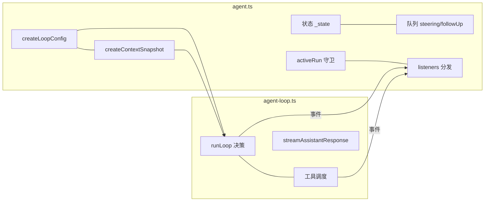

一句话：**loop 决定"做什么"，Agent 决定"谁能做、状态怎么记、消息给谁看"**。

<a id="deep-dives-d2-agent-h32"></a>

###### 17.2 一次 prompt 的完整调用栈（自上而下）

```text
agent.prompt(input)
  → normalizePromptInput
  → runPromptMessages
    → runWithLifecycle（守卫、activeRun、状态位）
      → runAgentLoop（声明工具变化、发 start 事件）
        → runLoop（D1）
          → streamAssistantResponse → streamFunction → 供应商
          → executeToolCalls（D1 第四部分）
          → 事件 → processEvents → 状态归约 + listeners
      → 失败则 handleRunFailure（骨架消息 + 事件）
      → finally finishRun（复位 + waitForIdle 唤醒）
```

<a id="deep-dives-d2-agent-h33"></a>

###### 17.3 状态位速查

| 状态                 | 何时变                               | 何时复位                                       |
| -------------------- | ------------------------------------ | ---------------------------------------------- |
| `isStreaming`      | 运行开始（`runWithLifecycle`）     | `finishRun`（含监听器结算后）                |
| `streamingMessage` | `message_start/update`             | `message_end`/`agent_end`                  |
| `pendingToolCalls` | `tool_execution_start`（换新 Set） | `tool_execution_end`；`finishRun` 换空 Set |
| `errorMessage`     | `turn_end`（助手消息带错）         | 下一次运行开始时清                             |
| `activeRun`        | 运行开始                             | `finishRun` 末尾                             |
| 两个队列             | `steer/followUp` 入队              | 四个取数点 drain；`clear*Queue`；`reset`   |

<a id="deep-dives-d2-agent-h34"></a>

###### 17.4 阅读检查清单

- [ ] 我理解"事件 sink = processEvents = 状态归约 + 监听器"这条链了吗？
- [ ] 我知道 `prompt`/`continue` 的守卫和 `runWithLifecycle` 的守卫**各拦什么**吗？
- [ ] 我能说出"`agent_end` 监听器里读 `isStreaming` 还是 true"的原因吗？
- [ ] 我知道 `skipInitialSteeringPoll` 的消费方与目的吗？（`continue()` 特例 + T0 轮询）
- [ ] 我注意到 `createLoopConfig` 的"配置点快照"语义了吗？（运行中改 state 不影响本次运行）
- [ ] 我知道监听器抛错会怎样吗？（中断派发 + 可能让 prompt reject）
- [ ] 我能指出 `reset` 与"换会话"的区别吗？（前者原地清、保留系统基线；后者整对象替换，第 8 章）

---

> D2 完。下一篇（D3）精读 `session-manager.ts` 的投影与分支：`buildSessionPath`、`buildContextEntries`、`buildSessionProjection`、`sessionEntryToContextMessages`、`createBranchedSession`。

<!-- 来源：deep-dives/D1-agent-loop.md；融合于第 6 章。 -->

<a id="deep-dives-d1-agent-loop-h1"></a>

### D1：`agent-loop.ts` 逐段精读

**先懂**：这一文件决定下一步是问模型、执行工具、处理排队消息，还是结束。先把每一轮看成“取得回答 → 处理回答 → 决定是否再来一轮”，再看具体钩子。

```text
教学伪代码：准备请求 → 等待模型回答
           → 若有工具调用，准备并执行工具、记录结果
           → 完成本轮 → 检查继续条件
           → 继续则进入下一轮，否则结束运行
```

硬错误、取消、顺序/并行工具和 `finishTurn` 可能改变路线；后文分段介绍，不能用这五行推断所有事件都成对出现。

> 精读对象：`packages/agent/src/agent-loop.ts`（约 940 行，Agent 循环的完整实现）。
> 对应主线：第 3 章（请求旅程）、第 6 章（循环语义）、第 7 章（工具调度）。
> 读法：先看本篇导读和伪代码，再按节对照源码与逐行注解；"【跳转】"表示下一站。进入新的复杂分支时，先读该段的作用说明。

---

<a id="deep-dives-d1-agent-loop-h2"></a>

#### 0. 文件地图（先记骨架）

这个文件只做一件事：**"模型 ↔ 工具"的循环**。全部导出如下：

| 导出                     | 类型       | 用途                                                         |
| ------------------------ | ---------- | ------------------------------------------------------------ |
| `AgentEventSink`       | 类型       | 事件发射器签名：`(event) => Promise<void> \| void`          |
| `agentLoop`            | 函数       | 以"新提示"启动循环，返回`EventStream`                      |
| `agentLoopContinue`    | 函数       | 以"现有上下文"继续（重试用），返回`EventStream`            |
| `runAgentLoop`         | async 函数 | `agentLoop` 的无流版本（直接返回新消息数组）               |
| `runAgentLoopContinue` | async 函数 | 同上（continue 版）                                          |
| `runToolCall`          | async 函数 | 让工具内部**再调用**其他工具（嵌套调用），走同一流水线 |
| `ToolCallHooks`        | 类型       | `beforeToolCall`/`afterToolCall` 的打包类型              |
| `RunToolCallOptions`   | 接口       | `runToolCall` 的选项                                       |

内部（未导出）的关键函数，按出现顺序：

```text
createAgentStream          构造 EventStream（判定 agent_end 为结束）
runLoop                    双层循环本体（本文件的心脏）
declareToolChanges         计算并注入"工具载入变化"的系统消息
withToolChanges            复制系统消息并替换工具字段
streamAssistantResponse    请求模型并把事件流折叠为一条消息
failToolCallsFromTruncatedMessage   截断响应里的工具调用全部拒绝
executeToolCalls           调度器：顺序 or 并行
executeToolCallsSequential / executeToolCallsParallel
prepareToolCallArguments   prepareArguments 垫片
prepareToolCall            查找/校验/前置钩子
emitToolExecutionUpdate    工具进度 → 事件
executePreparedToolCall    真正执行（异常折叠）
finalizeExecutedToolCall   后置钩子合并
createErrorToolResult      构造错误结果
emitToolExecutionEnd       广播结束事件
createToolResultMessage    结果 → 消息
emitToolResultMessage      广播消息开始/结束
```

【陷阱】注意三种"层级"的区别：

```text
流式接口（agentLoop/agentLoopContinue）——给上层 Agent 用，事件边跑边推
运行接口（runAgentLoop/runAgentLoopContinue）——可 await 得到"本次新增的消息"
嵌套接口（runToolCall）——给"工具里的工具调用"用，不发事件、不加消息
```

---

<a id="deep-dives-d1-agent-loop-h3"></a>

#### 1. 头部注释与 imports

**先懂**：先看这个文件依赖哪些消息类型、流和工具接口，知道循环连接的是哪些模块。这里主要建立地图，不需要记住每个导入。

【源码】

```typescript
/**
 * Agent loop that works with AgentMessage throughout.
 * Transforms to Message[] only at the LLM call boundary.
 */

import {
	type AssistantMessage,
	EventStream,
	getCurrentTools,
	getToolStateChanges,
	normalizeContext,
	type SystemMessage,
	type ToolResultMessage,
	type ToolStateChanges,
	toToolDeclaration,
	validateToolArguments,
} from "@earendil-works/pi-ai";
import { getDefaultStreamFn } from "./stream-fn.ts";
import type {
	AgentContext,
	AgentEvent,
	AgentLoopConfig,
	AgentMessage,
	AgentTool,
	AgentToolCall,
	AgentToolCallOutcome,
	AgentToolResult,
	PrepareNextTurnContext,
	StreamFn,
} from "./types.ts";
```

【注解】

- 两行文档注释是**整个文件的设计声明**：循环内部**全程使用 `AgentMessage`**（第 4 章：可能带应用自定义角色）；只有在"要给 LLM 发请求"的边界（`streamAssistantResponse` 里）才转成 `Message[]`。这条"推迟转换"的规则避免了"在循环里到处处理两套消息类型"。
- `import ... from "@earendil-works/pi-ai"`：注意有一半是**值**（`EventStream`、`getCurrentTools`、`getToolStateChanges`、`normalizeContext`、`toToolDeclaration`、`validateToolArguments`），一半是**类型**（带 `type` 关键字）。这个分包告诉你循环依赖 ai 包的哪些能力：
  - `EventStream`：异步事件流容器（最后构造返回流用）；
  - `getCurrentTools` / `getToolStateChanges` / `toToolDeclaration`：工具声明与"声明差分"（第 7.3 节）；
  - `normalizeContext`：请求前把 `Context` 折成"系统消息在最前"的规范转录（第 5.4 节）；
  - `validateToolArguments`：工具参数运行时校验（第 7.4 节）。
- `import { getDefaultStreamFn } from "./stream-fn.ts"`：**唯一的本包值依赖**。它提供"没传 streamFn 时"的兜底（第 1.2.1 节读过 `stream-fn.ts`：默认实现由宿主通过 `setDefaultStreamFn` 安装——`coding-agent` 在 `sdk.ts` 顶部就装了 `streamSimple`）。
- 类型 imports 里最重要的三个：`AgentContext`（消息 + 工具）、`AgentLoopConfig`（全套回调与模型配置）、`StreamFn`（模型请求函数）。

【跳转】`setDefaultStreamFn` 的安装点：`packages/coding-agent/src/core/sdk.ts` 顶部（第 3.5 节的 `streamFn` 包装）。

---

<a id="deep-dives-d1-agent-loop-h4"></a>

#### 2. `AgentEventSink`：事件怎么"发出去"

**先懂**：循环只负责发事件，具体由 Agent、会话和界面怎样处理交给订阅者。先看“发出一条事件会不会被等待”。

```text
教学伪代码：构造当前事件 → 交给事件接收器
           → 按约定等待或继续 → 再处理下一步
```

【源码】

```typescript
export type AgentEventSink = (event: AgentEvent) => Promise<void> | void;
```

【注解】

- 循环不"拥有"事件的目的地——它只拿到一个**函数**：`emit(event)`。谁来发、发给谁，由调用方决定：
  - 流式接口里是 `stream.push(event)`（推给订阅 `EventStream` 的消费者）；
  - `Agent` 的 `runPromptMessages` 里是 `(event) => this.processEvents(event)`（先归约状态，再 await 监听器，第 3.7 节）。
- 返回值允许 `Promise<void> | void` 且循环里**每次调用都 `await`**（你会在后面看到满屏的 `await emit(...)`）。这意味着：**sink 慢，循环就慢**；同时它天然支持"监听器是异步的"语义（第 3.7 节的"agent_end 监听器也计入 run 结算"）。
- 【陷阱】不要把它理解成"广播给多个订阅者"——那是 `Agent.processEvents` 的职责。循环只面向一个 sink；"一个事件 → 多个监听器"发生在 sink 内部。

---

<a id="deep-dives-d1-agent-loop-h5"></a>

#### 3. `agentLoop`：流式入口

**先懂**：有些调用方想边运行边读取事件，流式入口把底层循环包成可消费的事件流。

```text
教学伪代码：创建事件流 → 启动底层循环
           → 把循环事件写入流 → 交给调用方逐条读取
```

【源码】

```typescript
/**
 * Start an agent loop with a new prompt message.
 * The prompt is added to the context and events are emitted for it.
 */
export function agentLoop(
	prompts: AgentMessage[],
	context: AgentContext,
	config: AgentLoopConfig,
	signal: AbortSignal | undefined,
	streamFn: StreamFn,
): EventStream<AgentEvent, AgentMessage[]> {
	const stream = createAgentStream();

	void runAgentLoop(
		prompts,
		context,
		config,
		async (event) => {
			stream.push(event);
		},
		signal,
		streamFn,
	).then((messages) => {
		stream.end(messages);
	});

	return stream;
}
```

【注解】

- 参数五件套：`prompts`（新消息）、`context`（快照）、`config`（回调与模型）、`signal`（取消）、`streamFn`（模型请求实现）。**没有 `await`**——函数是同步返回的，立刻把"未完成的运行"包装成流交出去。
- `const stream = createAgentStream();`：先建流（见第 7 节：它用"agent_end 是结束事件"作为判定）。
- `void runAgentLoop(...)`：`void` 前缀是**故意的语法标记**——"我知道这是一个 Promise，但我故意不 await 它"（第 1 章的 `no-floating-promises` 风格）。运行在后台推进，事件通过闭包 `stream.push` 流入。
- `.then((messages) => stream.end(messages))`：当 `runAgentLoop` 完成（返回本次新增的消息数组），**关闭流并把消息数组作为流的结果**。所以消费者可以：
  - `for await (const event of stream)` 逐事件消费；
  - 之后 `await stream.result()` 拿到 `AgentMessage[]`（第 3.9 节 `streamAssistantResponse` 里 `response.result()` 的同款模式）。
- 【异常边界】`runAgentLoop` 是 async；运行中抛错会让它返回的 Promise reject。`Agent` 类**没有通过这个包装器运行**：`runPromptMessages` 直接 await `runAgentLoop`，外层 `runWithLifecycle` catch 后调用 `handleRunFailure`，把错误转成终态助手消息和 `agent_end`；既有 `agent.test.ts` 的 `provider exploded` 用例验证了这条路径。
- 低层 `agentLoop` 包装器处理方式不同：它的 `.then(...)` 只有成功分支，没有 rejection handler；`EventStream` 也没有 `fail/error` 通道。因此若 `streamFn` 违反其明确的“不抛错/不拒绝”契约，或任一被 `await` 的回调 reject，`.then` 的派生 Promise 会 reject 且未被处理，`stream.end()` 不会执行，消费者可能读完已排队事件后一直等，`stream.result()` 也不会 settle。`void` 只是不使用 Promise 的返回值，不会把 rejection 变成已处理状态。
- `StreamFn` 类型明确要求请求失败编码成事件流终态，而不是 throw/reject；`AgentLoopConfig` 对 `convertToLlm`、`transformContext` 等回调也有相同契约。低层流包装器仍没有异常关闭能力，阅读或改它时要把**类型契约**和**运行时兜底**区分开。现有测试验证了 `Agent` lifecycle 的异常收尾，没有覆盖 `agentLoop` 包装器收到 rejected Promise 的情形。

两条调用路径并排看：

```text
Agent.prompt
  → runWithLifecycle(async () => await runAgentLoop(...))
  → Promise reject 时 catch
  → handleRunFailure 发失败消息与 agent_end

agentLoop（低层流式包装器）
  → runAgentLoop(...).then(onFulfilled)
  → 只在 fulfill 时 stream.end(messages)
  → reject 时没有对应分支；EventStream 不会收到错误
```

读 Promise 链时要追**两条结果分支**：成功时谁结束流，失败时谁捕获异常。函数签名返回 `EventStream` 本身并不代表这个流具有错误通道。

---

<a id="deep-dives-d1-agent-loop-h6"></a>

#### 4. `agentLoopContinue`：继续（重试）入口

**先懂**：续跑使用已有上下文继续工作，不凭空创建一个新的用户消息。先看它从当前尾部状态怎样进入循环。

```text
教学伪代码：检查已有上下文是否可继续
           → 选择待处理输入或队列消息 → 启动同一套循环
```

【源码】

```typescript
/**
 * Continue an agent loop from the current context without adding a new message.
 * Used for retries - context already has user message or tool results.
 *
 * **Important:** The last message in context must convert to a `user` or `toolResult` message
 * via `convertToLlm`. If it doesn't, the LLM provider will reject the request.
 * This cannot be validated here since `convertToLlm` is only called once per turn.
 */
export function agentLoopContinue(
	context: AgentContext,
	config: AgentLoopConfig,
	signal: AbortSignal | undefined,
	streamFn: StreamFn,
): EventStream<AgentEvent, AgentMessage[]> {
	if (context.messages.length === 0) {
		throw new Error("Cannot continue: no messages in context");
	}

	if (context.messages[context.messages.length - 1].role === "assistant") {
		throw new Error("Cannot continue from message role: assistant");
	}

	const stream = createAgentStream();

	void runAgentLoopContinue(
		context,
		config,
		async (event) => {
			stream.push(event);
		},
		signal,
		streamFn,
	).then((messages) => {
		stream.end(messages);
	});

	return stream;
}
```

【注解】

- 与 `agentLoop` 的三处差别：没有 `prompts` 参数；**同步前置校验**；调用 `runAgentLoopContinue`。
- 校验一：上下文非空。校验二：最后一条不能是 `assistant`（否则供应商会拒绝"模型连说两句"）。
- 【陷阱】那个加粗的 "Important" 注释值得逐字读：它说的是**更深的一层契约**——"最后一条消息**转换后**必须是 `user` 或 `toolResult`"。因为 `convertToLlm` 只在每轮请求前调用一次，**这里无法验证**（此时还没转换）。于是：
  - 上层（`Agent.continue`）只能检查"原始角色不是 assistant"；
  - 真正的保证来自**调用方喂进来的上下文**（重试场景里，最后一条通常是 `toolResult` 或用户消息）。
- 【陷阱】两个错误的文案是**契约的一部分**：`agent-session.ts` 的 `continue()` 特例分支（第 6.1.2 节）就是围绕 `Cannot continue from message role: assistant` 这条例外设计的。

---

<a id="deep-dives-d1-agent-loop-h7"></a>

#### 5. `runAgentLoop`：非流式运行入口

**先懂**：不需要逐条消费事件时，这个入口等整次运行结束，拿到新增消息列表。

```text
教学伪代码：建立运行上下文 → 启动底层循环
           → 等待完成 → 返回本次新增消息
```

【源码】

```typescript
export async function runAgentLoop(
	prompts: AgentMessage[],
	context: AgentContext,
	config: AgentLoopConfig,
	emit: AgentEventSink,
	signal: AbortSignal | undefined,
	streamFn: StreamFn,
): Promise<AgentMessage[]> {
	const initialMessages = declareToolChanges(context, prompts);
	const newMessages: AgentMessage[] = [...initialMessages];
	const currentContext: AgentContext = {
		...context,
		messages: [...context.messages, ...initialMessages],
	};

	await emit({ type: "agent_start" });
	await emit({ type: "turn_start" });
	for (const message of initialMessages) {
		await emit({ type: "message_start", message });
		await emit({ type: "message_end", message });
	}

	await runLoop(currentContext, newMessages, config, signal, emit, streamFn ?? getDefaultStreamFn());
	return newMessages;
}
```

【注解】

- 第 1 行 `declareToolChanges(context, prompts)`：把"待注入的提示消息"过一遍**工具载入变化声明器**（第 7 节详解）。如果 `context.tools`（可执行集）与转录里已声明的工具集有差异，它会**在合适位置插入一条 system 消息**；返回值是"可能被插入过 system 消息的 prompts"。
- `newMessages` 初始化为 `[...initialMessages]`：**本地新消息记账**从"实际注入的消息"开始（可能包含那条工具变化 system 消息）。这个数组最后作为 `runLoop` 的返回值 → `agentLoop` 里 `stream.end(messages)` 的结果。
- `currentContext` 用**展开 + 新数组**构造：不修改调用方传入的 `context`（函数式不可变习惯）。注意 `messages` 是新数组（拼接 initialMessages），`tools` 等字段是浅拷贝引用。
- 事件序列：`agent_start` → `turn_start` → 对 initialMessages 逐条 `message_start` + `message_end`。**这就是 `Agent` 的 `prompt()` 场景里"用户消息"两个事件的来源**（第 3.8 节轨迹 A/B 里 user 消息的事件对）。
- 【陷阱】这些 `message_start`/`message_end` 是**同步连发**的（没有流式过程）——因为用户消息/系统补丁在注入时就是"已完成"的消息。
- `streamFn ?? getDefaultStreamFn()`：兜底逻辑只在**这里**出现一次；`getDefaultStreamFn` 没配置时抛错（第 1.2.1 节的实现）。
- 【跳转】`declareToolChanges` → 第 7 节（本文件）；`runLoop` → 下一节。

---

<a id="deep-dives-d1-agent-loop-h8"></a>

#### 6. `runAgentLoopContinue`：非流式继续

**先懂**：这是“继续执行”与“等最终结果”的组合；输入来自已有上下文和队列，而不是新写一条 prompt。

```text
教学伪代码：检查可续跑状态 → 启动继续路径
           → 等待运行结束 → 返回新增消息
```

【源码】

```typescript
export async function runAgentLoopContinue(
	context: AgentContext,
	config: AgentLoopConfig,
	emit: AgentEventSink,
	signal: AbortSignal | undefined,
	streamFn: StreamFn,
): Promise<AgentMessage[]> {
	if (context.messages.length === 0) {
		throw new Error("Cannot continue: no messages in context");
	}

	if (context.messages[context.messages.length - 1].role === "assistant") {
		throw new Error("Cannot continue from message role: assistant");
	}

	const newMessages: AgentMessage[] = [];
	const currentContext: AgentContext = { ...context };

	await emit({ type: "agent_start" });
	await emit({ type: "turn_start" });

	await runLoop(currentContext, newMessages, config, signal, emit, streamFn ?? getDefaultStreamFn());
	return newMessages;
}
```

【注解】

- 同样的两条校验**再写一遍**（而不是抽成一个 helper）：这是**边界函数显式防御**的风格——`runAgentLoopContinue` 是公开导出，可能被绕过流式入口直接调用（例如 `Agent.runContinuation`），所以校验不能只留在 `agentLoopContinue` 里。
- `newMessages = []`：没有初始消息（不新增提示），所以这次运行的新消息全部来自后续的 assistant/toolResult。
- `currentContext = { ...context }`：浅拷贝（`messages` 沿用调用方数组——注意与 `runAgentLoop` 里"新建数组"的差别：continue 不注入消息，所以不需要复制数组；后续循环内 push 的是新消息对象，但会**修改这个数组的引用目标**……【陷阱】实际上 `Agent.createContextSnapshot()` 已经给了 `messages: this._state.messages.slice()` 的快照，所以这里沿用的是那份**副本**。读代码时要把"快照从哪来"与"这里怎么处理"连起来看，第 18 章的测试可能正在断言语义）。
- 事件序列与 `runAgentLoop` 相同（除 initialMessages 循环为空）。

---

<a id="deep-dives-d1-agent-loop-h9"></a>

#### 7. `createAgentStream`：把事件序列包装成流

**先懂**：调用方需要事件流时，底层 Promise 的成功和失败怎样影响流的结束，是本节的核心。先沿成功路径读，再单独看 rejection 边界。

```text
教学伪代码：创建流容器 → 让循环把事件写进去
           → 正常完成时关闭流并保留最终结果
           → 异常路径按源码实际处理
```

【源码】

```typescript
function createAgentStream(): EventStream<AgentEvent, AgentMessage[]> {
	return new EventStream<AgentEvent, AgentMessage[]>(
		(event: AgentEvent) => event.type === "agent_end",
		(event: AgentEvent) => (event.type === "agent_end" ? event.messages : []),
	);
}
```

【注解】

- `EventStream<事件类型, 结果类型>` 的构造参数是两个函数：
  1. **isEnd**：哪个事件表示"流结束"——这里是 `agent_end`（与第 4/6 章的约定一致）；`agent_end` 之后不应再有事件，`stream.end()` 也正好在 `runAgentLoop` resolve 时被调用；
  2. **getResult**：结束时取出结果——`event.messages`（本次新增消息），其他事件返回空数组（其实只会在结束时调用，这里是对称写法）。
- 【陷阱】"流结束"与"会话收尾"仍不是一回事（`agent_settled` 在会话层，第 6 章）；`agentLoop` 的流在 `agent_end` 即结束，重试/压缩会由**外层再来一次新的 `runAgentLoop`**（这就是 `_runAgentPrompt` 的 while 循环存在的意义）。
- 【跳转】`EventStream` 的实现：`packages/ai/src/utils/event-stream.ts`——建议顺手读一遍 `push/end/result/asyncIterator` 四个方法，之后看任何"流出事件"的代码都不再神秘。

---

> D1 第一部分到此。后续部分（按源码顺序）：
>
> - 第二部分：`runLoop` 内层/外层循环逐行（本文件的心脏）
> - 第三部分：`declareToolChanges` / `withToolChanges` / `streamAssistantResponse`
> - 第四部分：工具调度（两种模式、`prepareToolCall`、钩子、`runToolCall`）
> - 第五部分：收尾函数（错误结果、结果消息、事件广播）

---

<a id="deep-dives-d1-agent-loop-h10"></a>

#### 第二部分：`runLoop` 逐行精读（本文件的心脏）

> 对应主线：第 6 章（如果只想记结论，去读 6.2-6.4 的决策表；本部分回答"每一行为什么这么写"）。

<a id="deep-dives-d1-agent-loop-h11"></a>

##### 8. 签名与初始状态

**先懂**：循环开始时建立“本次新增消息”和“当前可见上下文”两份数据，之后每轮在此基础上前进。

```text
教学伪代码：接收输入与旧上下文 → 加入本次消息清单
           → 组成当前上下文 → 发运行开始事件
```

【源码】

```typescript
/**
 * Main loop logic shared by agentLoop and agentLoopContinue.
 */
async function runLoop(
	initialContext: AgentContext,
	newMessages: AgentMessage[],
	initialConfig: AgentLoopConfig,
	signal: AbortSignal | undefined,
	emit: AgentEventSink,
	streamFunction: StreamFn,
): Promise<void> {
	let currentContext = initialContext;
	let config = initialConfig;
	let lastCompletedTurn: PrepareNextTurnContext | undefined;
	let explicitContinuation = false;
	// Check for steering messages at start (user may have typed while waiting)
	let pendingMessages: AgentMessage[] = (await config.getSteeringMessages?.()) || [];

	// Outer loop: continues when queued follow-up messages arrive after agent would stop
	while (true) {
		let hasMoreToolCalls = true;
```

【注解】

- 六个参数：上下文、新消息记账数组、配置、取消信号、事件出口、模型请求函数。**注意 `newMessages` 是"外部传入的数组"**——循环往里 push，调用方最后拿到它；这意味着循环不是一个纯函数，而是"在调用方提供的账本上记账"。
- 五个局部变量，每个都有明确职责：

| 变量                     | 作用                      | 为什么需要                                             |
| ------------------------ | ------------------------- | ------------------------------------------------------ |
| `currentContext`       | 可变的工作上下文          | 每轮都会追加消息/可能被钩子替换                        |
| `config`               | 可变配置                  | `prepareNextTurn`/`prepareRequest` 可以换模型/级别 |
| `lastCompletedTurn`    | 最近完成的 turn 快照      | 传给`prepareNextTurn`（只有第二轮起才有值）          |
| `explicitContinuation` | `finishTurn` 的续跑裁决 | 内层退出后兑现"空转一轮"                               |
| `pendingMessages`      | 待注入的 steering 消息    | 四个取数点的载体（第 6.3 节）                          |

- 【陷阱】`hasMoreToolCalls` **在 outer 循环体内部**被初始化为 `true`。位置非常关键（第 6.4.4 节的"无限运行"分析）：**每次 outer 迭代都会重置为 true**，于是"被 follow-up 重新拉起的 outer 循环"会再次进入内层并**真正发一次模型请求**。
- 进入循环前的初始轮询（T0）：`(await config.getSteeringMessages?.()) || []`。可选链 + 兜底空数组：**没有回调 = 没有队列**（低层测试里可以完全不给队列相关回调）。
- 【跳转】`PrepareNextTurnContext` 的定义在 `types.ts`（第 6.2.1 节读过）：`{ message, toolResults, context, newMessages }` 四件套。

<a id="deep-dives-d1-agent-loop-h12"></a>

##### 9. `prepareNextTurn` 块：每轮开始前的"准备窗口"

**先懂**：上一轮结束后，应用可能需要先压缩历史或换模型，再进入下一轮。

```text
教学伪代码：若已有上一轮 → 等待下一轮准备钩子
           → 应用上下文/模型/消息更新 → 再开始新轮
```

【源码】

```typescript
		// Inner loop: process tool calls and steering messages
		while (hasMoreToolCalls || pendingMessages.length > 0) {
			let preparedMessages: AgentMessage[] = [];
			if (lastCompletedTurn) {
				const nextTurnSnapshot = await config.prepareNextTurn?.(lastCompletedTurn);
				if (nextTurnSnapshot) {
					currentContext = nextTurnSnapshot.context ?? currentContext;
					preparedMessages = nextTurnSnapshot.messages ?? [];
					config = {
						...config,
						model: nextTurnSnapshot.model ?? config.model,
						reasoning:
							nextTurnSnapshot.thinkingLevel === undefined
								? config.reasoning
								: nextTurnSnapshot.thinkingLevel === "off"
									? undefined
									: nextTurnSnapshot.thinkingLevel,
					};
				}
				// Preparation can be long-running (for example, compaction). Pick up steering
				// queued while it ran. Only poll again if the earlier poll returned nothing;
				// otherwise one-at-a-time mode would deliver two messages in this turn.
				if (pendingMessages.length === 0) {
					pendingMessages = (await config.getSteeringMessages?.()) || [];
				}
				await emit({ type: "turn_start" });
			}
```

【注解】

- `lastCompletedTurn` 存在 = "这不是本次运行的第一轮"。所以 `prepareNextTurn` 与 `turn_start` 事件**只在第二轮起**触发（第一轮的 `turn_start` 由 `runAgentLoop` 发出，第 5 节）。
- 回调返回 `AgentLoopTurnUpdate | undefined`：`undefined` = "什么都不改"；返回对象则**按字段覆盖**：
  - `context` 整体替换（不合并！）；
  - `messages` 变成 `preparedMessages`（本轮要注入的消息）；
  - `model` 换模型；`thinkingLevel` 三态处理（`undefined` 保持、`"off"` 转成 `config.reasoning = undefined`、其他值直接设）。
- 【陷阱】`reasoning: undefined` 与 `thinkingLevel: "off"` 的**编码约定**：`AgentLoopConfig.reasoning` 的类型是"级别或 undefined"，而钩子的入参/返回值用 `"off"` 表示"关"。中间那个三元表达式就是两种表示之间的桥（`"off" → undefined`）。读别的字段时也要留意这类"两个词汇表"的转换点。
- **压缩插点**：注释点名的 "long-running (for example, compaction)"——`AgentSession` 正是把自动压缩挂在这里（第 10.2.3 节的"轮间检查"）。压缩要读大量消息、调一次模型生成摘要，可能几秒到几十秒；这段时间用户在编辑器里打的字会进 steering 队列。
- 补轮询的**条件与理由**（注释原文）：`pendingMessages.length === 0` 才再取一次。如果上一轮已经取到过消息（待注入），这里再取就会在 **one-at-a-time 模式**下一次交付两条（一次在 `pendingMessages`、一次刚取到）——破坏"一次只取一条"的契约。
- `await emit({ type: "turn_start" })` 放在这里而不是循环开头：保证"有准备窗口的轮次"的事件顺序是 **prepareNextTurn → turn_start → 注入消息 → 请求**。

<a id="deep-dives-d1-agent-loop-h13"></a>

##### 10. 消息注入块：`declareToolChanges` 包装 + 逐条发事件

**先懂**：待处理消息和工具清单变化进入当前对话；事件让订阅者看到这些消息已经注入。

```text
教学伪代码：检查工具声明变化 → 准备注入的消息
           → 逐条更新上下文并发消息事件
```

【源码】

```typescript
			// Process prepared and queued messages before the next assistant response.
			for (const message of declareToolChanges(currentContext, [...preparedMessages, ...pendingMessages])) {
				await emit({ type: "message_start", message });
				await emit({ type: "message_end", message });
				currentContext.messages.push(message);
				newMessages.push(message);
			}
			pendingMessages = [];
```

【注解】

- `[...preparedMessages, ...pendingMessages]`：**先 prepared 后 pending**（准备窗口注入的消息排在排队消息前面）。批次序在这里固定。
- 整个批次先过 `declareToolChanges`（第 7 节的精读）：返回的数组可能**多出/改写过系统消息**。所以"你可能注入 N 条，实际写入 N+1 条"——工具变化声明会插在第一条非 system 待注入消息之前。
- 三个动作按顺序：发 `message_start` → 发 `message_end` → **同时** push 进 `currentContext.messages` 与 `newMessages`。两条数组的区别：
  - `currentContext.messages`：下一轮请求的完整上下文（含历史）；
  - `newMessages`：**本次运行**新增的消息（不含历史）——最终作为 `agent_end.messages` 与 `runAgentLoop` 的返回值。
- 【陷阱】`pendingMessages = []` 的清空在 for 之后、而不是在循环体内：**整个批次处理完再清**；如果中途 `emit` 抛错（监听器抛错），这个清空不会执行——循环会被异常中断（这也是"监听器不抛错"这条隐性纪律的来源）。
- 【跳转】`declareToolChanges` 完整代码：第 7 节（第三部分会给全文）。

<a id="deep-dives-d1-agent-loop-h14"></a>

##### 11. `prepareRequest` 块：请求前最后一次调整

**先懂**：真正发往模型前，宿主还能按当前消息调整请求；本轮待注入的输入此时已经可见。

```text
教学伪代码：取得当前上下文与模型 → 等待请求准备钩子
           → 用返回的更新发起本次请求
```

【源码】

```typescript
			const requestUpdate = await config.prepareRequest?.(
				{
					context: currentContext,
					model: config.model,
					thinkingLevel: config.reasoning ?? "off",
				},
				signal,
			);
			if (requestUpdate) {
				currentContext = requestUpdate.context ?? currentContext;
				config = {
					...config,
					model: requestUpdate.model ?? config.model,
					reasoning:
						requestUpdate.thinkingLevel === undefined
							? config.reasoning
							: requestUpdate.thinkingLevel === "off"
								? undefined
								: requestUpdate.thinkingLevel,
				};
			}
```

【注解】

- 与 `prepareNextTurn` 的差别（第 6.2.1 节表格）：
  - **每次请求前都执行**（含本次运行的第一轮）——注释原文 "including the first"；
  - 入参是"请求三件套"（`context`/`model`/`thinkingLevel`）而不是"上一轮快照"；
  - 返回值类型 `AgentRequestUpdate` **不含 `messages`**（不能在这里注入消息——要注入只能改 `context` 或走队列）。
- 同样按字段覆盖，`"off" → undefined` 的转换逻辑是复制粘贴的（两次出现，说明这是一个稳定的约定）。
- 【跳转】谁在用 `prepareRequest`？`Agent.createLoopConfig` 把 `this.prepareRequest` 直接透传；`AgentSession` 侧的工具载入更新（`_preparePromptAndToolLoadout`，第 3.6 节）走的不是这里，而是 prompt 消息注入——读代码时注意区分。

<a id="deep-dives-d1-agent-loop-h15"></a>

##### 12. 请求与"失败早退"

**先懂**：模型可能正常回答，也可能以错误或取消结束。硬失败不继续执行工具调用。

```text
教学伪代码：等待模型回答 → 检查结束原因
           → 若是错误/取消，完成本轮并结束运行
           → 否则继续检查工具
```

【源码】

```typescript
			// Stream assistant response
			const message = await streamAssistantResponse(currentContext, config, signal, emit, streamFunction);
			newMessages.push(message);

			if (message.stopReason === "error" || message.stopReason === "aborted") {
				lastCompletedTurn = {
					message,
					toolResults: [],
					context: currentContext,
					newMessages,
				};
				await config.finishTurn?.(lastCompletedTurn, signal);
				await emit({ type: "turn_end", message, toolResults: [] });
				await emit({ type: "agent_end", messages: newMessages });
				return;
			}
```

【注解】

- `streamAssistantResponse`（第三部分精读）返回**一条完整消息**：它内部完成请求、消费事件流、把流折叠成最终 `AssistantMessage`。到这里为止，事件已经被"流式转发"过（`message_start`/`message_update`），本行只是等最终结果。
- `newMessages.push(message)` 在失败检查**之前**：无论成功失败，这条助手消息都算"本次运行新增"（错误消息也要落进历史——第 6.6 节的重试/省略逻辑依赖它）。
- 失败早退块的三步收尾：`finishTurn()`（给扩展最后看一眼）→ `turn_end`（工具结果为空数组）→ `agent_end` → `return`。**这是唯一"提前 return"的正常路径**（另一处是 `decision.action === "end"`）。
- 【陷阱】`finishTurn` 在这里的返回值被**忽略**（没有像后面那样取 `decision`）——因为无论如何都要结束 run，没有再"续跑"的余地。
- 【陷阱】失败消息也会触发 `message_end` 事件吗？会——在 `streamAssistantResponse` 内部发（第三部分）。这里是"循环看的终态"，不是事件发生点。

<a id="deep-dives-d1-agent-loop-h16"></a>

##### 13. 工具检查与批次执行

**先懂**：正常回答中可能没有工具、只有一个工具或有一批工具。先判断调用能否执行，再决定整批调度。

```text
教学伪代码：取回答里的工具调用 → 截断响应按规则拒绝
           → 其他调用按顺序或并行执行 → 收集结果
```

【源码】

```typescript
			// Check for tool calls
			const toolCalls = message.content.filter((c) => c.type === "toolCall");

			const toolResults: ToolResultMessage[] = [];
			hasMoreToolCalls = false;
			if (toolCalls.length > 0) {
				// A "length" stop means the output was cut off by the token limit, so
				// every tool call in the message may carry truncated arguments. Fail
				// them all instead of executing potentially borked calls.
				const executedToolBatch =
					message.stopReason === "length"
						? await failToolCallsFromTruncatedMessage(toolCalls, emit)
						: await executeToolCalls(currentContext, message, config, signal, emit);
				toolResults.push(...executedToolBatch.messages);
				hasMoreToolCalls = !executedToolBatch.terminate;

				for (const result of toolResults) {
					currentContext.messages.push(result);
					newMessages.push(result);
				}
			}
```

【注解】

- 从**内容块**里筛 `toolCall`（一个助手消息可以带多个）。注意判据是"内容"不是 `stopReason`——虽然正常情况二者一致（第 4.3.3 节的【陷阱】：`length` 时也可能带工具调用）。
- 默认 `hasMoreToolCalls = false`（没有工具就准备收尾）；有工具时由批次的 `terminate` 反向决定。
- **截断保护**：`stopReason === "length"` 时**不执行**任何工具调用，改走 `failToolCallsFromTruncatedMessage`——它给每个调用生成 `isError: true` 的结果并提示模型"重新发起"（第 3.14 节轨迹 D）。注释里的推理值得背下来："流式参数用容错 JSON 解析兜底，可能解析出'看起来合法但不完整'的参数——执行它比拒绝它更危险。"
- 结果的**记账顺序**：全部结束后才统一 push（对并行调度来说，`executeToolCalls` 内部已经把结果按声明顺序排好——第 7.5.3 节）。
- `hasMoreToolCalls = !executedToolBatch.terminate`：**整批**都同意 terminate 才停止"因工具继续"。注意它只影响内层条件，不代表结束 run（还有 steering/follow-up/`"end"` 裁决会否决收尾）。
- 【跳转】`executeToolCalls` 家族：第四部分；`failToolCallsFromTruncatedMessage`：第五部分。

<a id="deep-dives-d1-agent-loop-h17"></a>

##### 14. 轮次收尾与裁决

**先懂**：工具处理完之后，一轮才算结束。钩子可以提出续跑或终止决定，再通知订阅者本轮结果。

```text
教学伪代码：得到助手消息与工具结果 → 等待收尾钩子
           → 发本轮结束事件 → 判断是否进入下一轮
```

【源码】

```typescript
			lastCompletedTurn = {
				message,
				toolResults,
				context: currentContext,
				newMessages,
			};
			const decision = await config.finishTurn?.(lastCompletedTurn, signal);
			await emit({ type: "turn_end", message, toolResults });

			if (decision?.action === "end") {
				await emit({ type: "agent_end", messages: newMessages });
				return;
			}

			explicitContinuation = decision?.action === "continue";
			pendingMessages = (await config.getSteeringMessages?.()) || [];
			if (hasMoreToolCalls || pendingMessages.length > 0) {
				explicitContinuation = false;
			}
		}
```

【注解】

- `lastCompletedTurn` 在 `finishTurn` **之前**更新：所以 `finishTurn` 看到的是"刚刚结束的这轮"的最新快照（含工具结果与上下文）。
- `decision` 三态：`undefined`（无意见）、`{action:"end"}`（立刻结束）、`{action:"continue"}`（要求空转续跑）。**`end` 优先于一切**：即使有排队消息也不再注入（这是"硬停"契约）。
- `turn_end` 在裁决**检查之前**发出：无论 end 与否，这一轮的结束事件都要发出——事件序列的完整性优先。
- 随后是 **T2 取数点**（第 6.3 节）：`pendingMessages = await getSteeringMessages()`；然后一个"否决"逻辑：

```text
if (hasMoreToolCalls || pendingMessages.length > 0) explicitContinuation = false;
```

  读法：**只要"有工具要回传"或"有排队消息要注入"，就不再需要那个空转的 continuation**——因为内层循环本来就会继续（条件已为真），再来个 explicitContinuation 会导致内层退出后还多空转一轮（逻辑重复）。`explicitContinuation` 只服务于"除此之外无事可做、但上层明确要求再来一轮"的场景。

- 【陷阱】`decision?.action === "continue"` 赋给 `explicitContinuation` 时**不做真值合并**（是覆盖，不是 `||=`）。如果本轮内层因为其它原因还要继续，上面那行会把它清掉——这是刻意的优先级设计：**"自然继续" > "显式续跑"**。

<a id="deep-dives-d1-agent-loop-h18"></a>

##### 15. 外层循环收尾：follow-up 与空转

**先懂**：本轮没事做时还要检查后续队列。有 follow-up 就进入下一段输入；队列也为空才结束。

```text
教学伪代码：内层不再继续 → 检查 follow-up
           → 有输入则重进循环，没有则发运行结束事件
```

【源码】

```typescript
		// Agent would stop here. Check for follow-up messages.
		const followUpMessages = (await config.getFollowUpMessages?.()) || [];
		if (followUpMessages.length > 0) {
			// Set as pending so inner loop processes them
			explicitContinuation = false;
			pendingMessages = followUpMessages;
			continue;
		}

		// No natural request was selected, so fulfill the continuation decision with one context-only turn.
		if (explicitContinuation) {
			explicitContinuation = false;
			continue;
		}

		// No more messages, exit
		break;
	}

	await emit({ type: "agent_end", messages: newMessages });
}
```

【注解】

- 内层退出后的 **T3 取数点**：取 follow-up。有的话"降级为 pending"并 `continue` 外层——回到外层开头会**重置 `hasMoreToolCalls = true`**，于是内层再次运行、注入 follow-up 并发起新请求。这就是 follow-up 的完整兑现机制。
- 空转续跑（`explicitContinuation`）：同样 `continue` 外层 → 内层条件因重置的 `hasMoreToolCalls=true` 成立 → **不注入任何消息**，走到 `prepareRequest` → `streamAssistantResponse` → 一次"context-only turn"（注释原文）。所以第 6 章那句"`continue` 换来一次额外的模型请求"就是这么发生的。
- 【陷阱】两次 `continue` 都会经历 `prepareNextTurn`（因为 `lastCompletedTurn` 有值）——扩展在那一侧看到的"下一轮准备"次数会因此增加一次。
- 循环出口只有 `break`（或提前 `return`）；出口后统一 `await emit({ type: "agent_end", messages: newMessages })`。**大多数路径的 `agent_end` 在这里**；两处提前 return 的路径各自手发。
- 【陷阱】把三块拼起来读，可以得到"事件数"的精确公式：

```text
agent_end 恰好 1 次（三条路径之一）
turn_start = 这次运行的轮次数（第一轮由 runAgentLoop 发，之后每轮在 prepareNextTurn 块内发）
turn_end   = 每轮的收尾（失败轮也有）
```

---

> 第二部分到此。第三部分将精读：`declareToolChanges` / `withToolChanges` / `NO_CHANGES`（工具声明差分的完整实现），以及 `streamAssistantResponse`（请求 → 事件的折叠循环）。

---

<a id="deep-dives-d1-agent-loop-h19"></a>

#### 第三部分：工具声明差分与"一次请求如何折叠成一条消息"

<a id="deep-dives-d1-agent-loop-h20"></a>

##### 16. `declareToolChanges`：为什么"工具清单"要写进对话历史

**先懂**：可调用工具中途可能变化。把变化写进对话，让后续请求知道目前有哪些工具。

```text
教学伪代码：比较可执行工具与已声明工具
           → 相同则不加消息 → 不同则生成声明变化消息
```

先读完整源码（含文档注释）：

【源码】

```typescript
/**
 * Declare tool loadout changes to the model.
 *
 * `context.tools` is what the runtime can execute; the transcript's system messages declare
 * what the model may call. Before each request the difference becomes `toolsAdded` and
 * `toolsRemoved` on a system message. When a pending system message exists, its tool fields
 * are treated as intent and replaced with the delta between the committed transcript and
 * the executable set, so replay always yields exactly `context.tools`. Otherwise a new
 * system message is inserted before the first non-system pending message.
 */
function declareToolChanges(context: AgentContext, pendingMessages: AgentMessage[]): AgentMessage[] {
	let systemIndex = -1;
	for (let i = pendingMessages.length - 1; i >= 0; i--) {
		if (pendingMessages[i].role === "system") {
			systemIndex = i;
			break;
		}
	}
	const pending = pendingMessages[systemIndex] as SystemMessage | undefined;
	const baseline = pending
		? pendingMessages.map((message, index) =>
				index === systemIndex ? withToolChanges(pending, NO_CHANGES) : message,
			)
		: pendingMessages;
	const changes = getToolStateChanges(
		getCurrentTools([...context.messages, ...baseline]),
		(context.tools ?? []).map(toToolDeclaration),
	);
	const unchanged = changes.toolsAdded.length === 0 && changes.toolsRemoved.length === 0;

	if (pending) {
		// Keep the caller's message object when it already declares no tool changes.
		if (unchanged && !pending.toolsAdded?.length && !pending.toolsRemoved?.length) return pendingMessages;
		return baseline.map((message, index) => (index === systemIndex ? withToolChanges(pending, changes) : message));
	}
	if (unchanged) return pendingMessages;
	const update = withToolChanges({ role: "system", content: "", timestamp: Date.now() }, changes);
	const insertIndex = pendingMessages.findIndex((message) => message.role !== "system");
	const index = insertIndex === -1 ? pendingMessages.length : insertIndex;
	return [...pendingMessages.slice(0, index), update, ...pendingMessages.slice(index)];
}
```

【注解（逐段）】

**第一步：找"待注入批次里的最后一条 system 消息"**

```typescript
	let systemIndex = -1;
	for (let i = pendingMessages.length - 1; i >= 0; i--) {
		if (pendingMessages[i].role === "system") {
			systemIndex = i;
			break;
		}
	}
```

- **从后往前**找 → 拿到的是"最后一条"（批次里可能有多条 system 消息）。
- 【陷阱】为什么要找"最后一条 system"？因为这条消息就是**本次注入中负责声明运行状态的那条**（比如 `AgentSession._preparePromptAndToolLoadout` 生成的"工具载入更新"）。如果它已经带了工具字段，那些字段要被**视为"意图"重算**——见第 3 步。
- 找不到就是 `-1`（`pending` 为 `undefined`）：本次注入没有系统消息，走"新建一条"的分支。

**第二步：构造"基线"**

```typescript
	const baseline = pending
		? pendingMessages.map((message, index) =>
				index === systemIndex ? withToolChanges(pending, NO_CHANGES) : message,
			)
		: pendingMessages;
```

- 如果有 `pending`：把它的工具字段**清空**（用 `NO_CHANGES` 替换），得到"还没声明任何工具变化"的版本。其余消息原样。
- 为什么清空？因为第 3 步要算"**已提交转录 + 本批次其余消息**"与"可执行集"的差；那条 pending system 消息的工具字段属于"待修正的草稿"，不能参与差分（否则自己和自己较劲）。
- 无 `pending` 时基线就是原数组（引用共享，后面不做修改——都靠返回新数组）。

**第三步：算差分**

```typescript
	const changes = getToolStateChanges(
		getCurrentTools([...context.messages, ...baseline]),
		(context.tools ?? []).map(toToolDeclaration),
	);
```

- `getCurrentTools(...)`：**从消息数组回放**出"此刻模型已被声明可用的工具集"（第 7.3 节：回放一致性）；
- 第二个参数：**运行时真正可执行的工具集**（`context.tools`），经 `toToolDeclaration` 转成声明形状；
- `getToolStateChanges(已声明, 可执行)`：返回 `{ toolsAdded, toolsRemoved }`。之后记住：**转录里声明集 = 可执行集**，模型不会看到"不存在的工具"，回放也能精确重建。
- 【陷阱】`context.tools ?? []` 表示"不传工具 = 显式清空"。如果你希望"保持现有"，应该传 `undefined` 的语义就只能是空——读上层代码（`Agent.createContextSnapshot`）时注意它永远传数组副本，不会传 undefined。

**第四步：三条出口路径**

```typescript
	const unchanged = changes.toolsAdded.length === 0 && changes.toolsRemoved.length === 0;

	if (pending) {
		// Keep the caller's message object when it already declares no tool changes.
		if (unchanged && !pending.toolsAdded?.length && !pending.toolsRemoved?.length) return pendingMessages;
		return baseline.map((message, index) => (index === systemIndex ? withToolChanges(pending, changes) : message));
	}
	if (unchanged) return pendingMessages;
	const update = withToolChanges({ role: "system", content: "", timestamp: Date.now() }, changes);
	const insertIndex = pendingMessages.findIndex((message) => message.role !== "system");
	const index = insertIndex === -1 ? pendingMessages.length : insertIndex;
	return [...pendingMessages.slice(0, index), update, ...pendingMessages.slice(index)];
```

路径 A（有 pending、且无需变化）：

- 返回**原数组原对象**（注释："Keep the caller's message object when it already declares no tool changes."）。
- 【陷阱】"无需变化"的判定含两个条件：差分结果为空 **且** pending 自己没有工具字段。后者保证"上次批次残留的旧声明也被清掉"？不——这里 pending 自己带字段时走路径 B，用**重算后的 changes**（可能为空，即把旧字段清掉）。这条注释强调"没有变化就别复制对象"——**对象身份有意义**：`Agent.processEvents`/持久化用对象身份做映射（第 4.8 节的 `_entryIdsByMessage`），无谓的拷贝可能让"同一条消息"对不上。

路径 B（有 pending、需要修正）：

- 用 `withToolChanges(pending, changes)` 生成**新对象**替换那条 system 消息（其余消息保留原引用）。注意传的是 `pending`（原文，保留其 content/sections/timestamp），只换工具字段。

路径 C（没有 pending）：

- 变化为空 → 原样返回；
- 有变化 → **插入一条新 system 消息**：`{ role:"system", content:"", timestamp: Date.now() }` 加上 changes；
- 插入位置：**第一条非 system 消息之前**（`findIndex(m => m.role !== "system")`）；若全是 system（或空数组）则追加到末尾。
- 【陷阱】为什么插在"第一条非 system 消息之前"？因为系统消息应该在**这一批用户/队列消息之前**生效——模型读消息时按顺序理解"此刻的工具集"，声明必须先于任何可能触发工具调用的内容。

<a id="deep-dives-d1-agent-loop-h21"></a>

##### 17. `NO_CHANGES` 与 `withToolChanges`

**先懂**：工具声明没变时，不必制造一条多余的消息；有变化时才把它附在正确位置。

```text
教学伪代码：检查差异结果 → 无变化则原样返回
           → 有变化则把工具声明附到待发送消息
```

【源码】

```typescript
const NO_CHANGES: ToolStateChanges = { toolsAdded: [], toolsRemoved: [] };

/** Copy a system message with its tool fields replaced by `changes`; empty lists omit the field. */
function withToolChanges(message: SystemMessage, { toolsAdded, toolsRemoved }: ToolStateChanges): SystemMessage {
	const { toolsAdded: _added, toolsRemoved: _removed, ...rest } = message;
	return {
		...rest,
		...(toolsAdded.length > 0 ? { toolsAdded } : {}),
		...(toolsRemoved.length > 0 ? { toolsRemoved } : {}),
	};
}
```

【注解】

- `NO_CHANGES` 是**共享常量**：只读用途（只读 `length`、作为参数传入），不会被修改——所以安全共享，避免每次分配。
- `withToolChanges` 用"**解构丢弃 + 条件展开**"：
  - `const { toolsAdded: _added, toolsRemoved: _removed, ...rest } = message;` 把两个工具字段"摘出去"，`rest` 包含剩余全部字段（content、sections、timestamp……）；
  - 条件展开 `...(x.length > 0 ? { x } : {})`：**空列表就完全不写这个字段**（而不是写 `[]`）。
- 【陷阱】"空列表省略字段"不只是省字节：`SystemMessage` 的语义是"**声明变化量**"。写 `toolsAdded: []` 与"没有这个字段"在**回放器**（`getCurrentTools` 之类的实现）眼里可能都表示"无添加"，但历史里出现两种形态会让"重放是否一致"的排查变麻烦。保持"空即不写"是一种**规范化**（canonical form）——写序列化代码时经常要刻意做这种选择。
- 【跳转】`ToolStateChanges` 与 `getCurrentTools`/`getToolStateChanges` 的实现都在 `packages/ai/src/utils/`（搜符号即可）；它们处理"系统消息按时间顺序叠加"的细节。

<a id="deep-dives-d1-agent-loop-h22"></a>

##### 18. `streamAssistantResponse`（上）：请求前的四处变换

**先懂**：内部历史要经过整理、类型转换和认证准备，才成为一次可发送的模型请求。

```text
教学伪代码：变换内部上下文 → 转成模型消息
           → 解析本次认证 → 建立流式请求
```

【源码】

```typescript
/**
 * Stream an assistant response from the LLM.
 * This is where AgentMessage[] gets transformed to Message[] for the LLM.
 */
async function streamAssistantResponse(
	context: AgentContext,
	config: AgentLoopConfig,
	signal: AbortSignal | undefined,
	emit: AgentEventSink,
	streamFunction: StreamFn,
): Promise<AssistantMessage> {
	// Apply context transform if configured (AgentMessage[] → AgentMessage[])
	let messages = context.messages;
	if (config.transformContext) {
		messages = await config.transformContext(messages, signal);
	}

	// Convert to LLM-compatible messages (AgentMessage[] → Message[])
	const llmMessages = await config.convertToLlm(messages);

	const llmContext = normalizeContext({ messages: llmMessages });

	// Resolve API key (important for expiring tokens)
	const resolvedApiKey =
		(config.getApiKey ? await config.getApiKey(config.model.provider) : undefined) || config.apiKey;

	const response = await streamFunction(config.model, llmContext, {
		...config,
		apiKey: resolvedApiKey,
		signal,
	});
	// Record the requested level, whichever stream function answered.
	const result = async () => Object.assign(await response.result(), { thinkingLevel: config.reasoning ?? "off" });
```

【注解（按注释分组）】

1. **`transformContext`（可选，AgentMessage → AgentMessage）**：扩展在这里裁剪/注入上下文（第 13.3.4 节的 `context` 钩子）；契约要求"不许抛错"（`AgentLoopConfig` 注释）。
2. **`convertToLlm`（必需，AgentMessage → Message）**：把自定义角色过滤/翻译成四种标准角色（第 4.4.2 节的完整实现）。**这是全文件唯一一次"消息类型跨界"**——文件名下那句注释 "Transforms to Message[] only at the LLM call boundary" 就指这里。
3. **`normalizeContext({ messages })`**：把消息数组规范成"系统提示/工具声明在最前"的形式（第 5.4 节的 `normalizeContext`）。注意传入的是**裸 `Context` 对象**——不带 `systemPrompt`/`tools` 旁路字段；因为在本项目里两者都已在消息里（第 5.4 节的四步读法）。
4. **`getApiKey`**：注释 "important for expiring tokens"——OAuth 令牌可能过期，所以**每次请求都重新解析**（不在循环开始时取一次）；返回 `undefined` 时回退 `config.apiKey`（`||` 链）。
5. **`streamFunction(...)` 的选项**：`{ ...config, apiKey, signal }`——**整个 config 被摊开传进去**（`StreamOptions` 与 `AgentLoopConfig` 有大量同名字段，如 temperature、timeout、transport、onPayload……），再用解析结果覆盖 `apiKey`、`signal`。这就是"循环配置"与"流式选项"共用一层的实现方式；读 `config` 类型声明时你能看到它 `extends SimpleStreamOptions`（第 6.2.1 节）。
6. **`result` 是一个 thunk（惰性函数）**：

```typescript
const result = async () => Object.assign(await response.result(), { thinkingLevel: config.reasoning ?? "off" });
```

- 调用它才会真正"结算"流（拿最终 `AssistantMessage`）；
- `Object.assign(..., { thinkingLevel })`：给最终消息**补上"本次请求的思考级别"**——因为不是所有供应商都会回报它；这条记录让会话文件能还原"这条回答是用什么级别问出来的"（第 4.3.3 节的 `AssistantMessage.thinkingLevel` 字段）。
- 【陷阱】`config.reasoning` 是**闭包捕获**的：`result` 在被调用时读的是**当前**的 `config`（如果中途被换过就会有差异）；不过在本函数内 `config` 不会再变，所以没问题——但你自己写类似闭包时要意识到这一点。

<a id="deep-dives-d1-agent-loop-h23"></a>

##### 19. `streamAssistantResponse`（下）：事件折叠循环

**先懂**：供应商发来的是一串增量事件；循环要逐个转发，同时保留完整回答以便入历史。

```text
教学伪代码：遍历模型事件 → 转发文本/工具增量
           → 维护当前回答 → 收到终态后完成消息
```

【源码（接上）】

```typescript
	let partialMessage: AssistantMessage | null = null;
	let addedPartial = false;

	for await (const event of response) {
		switch (event.type) {
			case "start":
				partialMessage = event.partial;
				context.messages.push(partialMessage);
				addedPartial = true;
				await emit({ type: "message_start", message: { ...partialMessage } });
				break;

			case "text_start":
			case "text_delta":
			case "text_end":
			case "thinking_start":
			case "thinking_delta":
			case "thinking_end":
			case "toolcall_start":
			case "toolcall_delta":
			case "toolcall_end":
				if (partialMessage) {
					partialMessage = event.partial;
					context.messages[context.messages.length - 1] = partialMessage;
					await emit({
						type: "message_update",
						assistantMessageEvent: event,
						message: { ...partialMessage },
					});
				}
				break;

			case "done":
			case "error": {
				const finalMessage = await result();
				if (addedPartial) {
					context.messages[context.messages.length - 1] = finalMessage;
				} else {
					context.messages.push(finalMessage);
				}
				if (!addedPartial) {
					await emit({ type: "message_start", message: { ...finalMessage } });
				}
				await emit({ type: "message_end", message: finalMessage });
				return finalMessage;
			}
		}
	}

	const finalMessage = await result();
	if (addedPartial) {
		context.messages[context.messages.length - 1] = finalMessage;
	} else {
		context.messages.push(finalMessage);
		await emit({ type: "message_start", message: { ...finalMessage } });
	}
	await emit({ type: "message_end", message: finalMessage });
	return finalMessage;
}
```

【注解】

**状态位**

- `partialMessage`：当前"部分消息"引用（`start` 时取得，之后每个增量事件里被替换为新的 partial）；
- `addedPartial`：**是否已经把部分消息推进过 `context.messages`**（决定最后是"替换最后一个元素"还是"push 一个新元素"）。

**`start` 分支**

- `context.messages.push(partialMessage)`：**部分消息立刻进入上下文数组**——为什么？因为循环的其它部分（事件监听器、需要读"当前消息"的逻辑）在流式过程中就要能看到它（第 4.6.1 节的"运行态"解释）。这就是"运行中消息数不增加但内容在变"的由来。
- `emit` 的是**浅拷贝** `{ ...partialMessage }`：防止监听器拿到"活的"对象（后续会被替换/更新）。注意**浅**拷贝——content 数组仍是共享引用；这是性能与安全性的折中，监听器不应改它。
- 【陷阱】推入的是**原对象引用**（`partialMessage` 本身）而发事件时是拷贝——这两个选择不对称，别记混：**上下文要保持"活"的引用以方便就地替换；事件要快照以免被后续状态污染。**

**增量分支（九种事件共用一个 case）**

- 九种事件 = 三类内容（text/thinking/toolcall）× 三段（start/delta/end）。它们共用一个处理：更新 `partialMessage` → **就地替换** `context.messages` 的最后一个元素 → 发 `message_update`（带事件本体 + 部分消息拷贝）。
- 【陷阱】`context.messages[context.messages.length - 1] = partialMessage`：**假定最后一个元素就是本次的部分消息**。这个不变量由 `start` 建立（push 到末尾）；只要没有其它东西在流式过程中往 `context.messages` 追加，它就成立——**这解释了为什么整个循环在流式期间不会并发注入队列消息**（注入发生在流结束后、下一轮开始时）。
- `if (partialMessage)` 守卫：某些实现可能不发 `start` 直接给增量（防御性代码）；此时静默忽略——比崩溃好，但正常情况下永远不会走到。

**`done`/`error` 分支**

- `await result()`：**结算**——拿到最终消息（此时 `response.result()` 才真正 resolve；它内部就是"等流结束"的 Promise）。
- 替换或追加：`addedPartial ? 就地替换 : push`。**就地替换**保证"部分消息与最终消息是同一个数组位置"（第 4.6.1 节的表格：`message_end` 后末位替换为终态消息）。
- `if (!addedPartial)` 补发 `message_start`：有些流可能完全没有 `start`（或实现选择不发）——此时监听器还没见过这条消息，补一个开始事件，保证"**任何消息都有 start/end 成对事件**"的契约。
- `message_end` 发的是**最终消息本体**（不是拷贝）——这是"权威消息"约定：`Agent.processEvents` 会把它 push 进 `_state.messages`（历史定稿），持久化也用它。
- `return finalMessage`：函数在第一个 `done`/`error` 事件处结束——一个响应流只会有一个终结事件。

**循环外的兜底（流"干净地结束"但没发 done/error）**

- 某些实现可能直接关闭迭代器（没有终结事件）——兜底逻辑与 `done` 分支相同（结算 + 替换/追加 + 事件）。
- 【陷阱】`response.result()` 在被调用前**必须**保证流已结束；兜底路径里 `for await` 自然结束，所以安全；`done` 分支里调用也安全。若未来有人把这个函数改成"提前 break"，就会破坏这个前提——读改这段代码时要小心。

**把三条路径合成一张"消息形态变化表"**

| 时点               | `context.messages` 末位      | 已发事件                              |
| ------------------ | ------------------------------ | ------------------------------------- |
| `start`          | 部分消息对象（活引用）         | `message_start`（拷贝）             |
| 每个增量           | 部分消息（新对象，替换旧引用） | `message_update`（事件 + 拷贝）     |
| `done`/`error` | 最终消息（替换）               | `message_end`（本体）               |
| 无 start 的流      | 最终消息（push）               | 补`message_start` + `message_end` |
| 无终结事件的流     | 最终消息（替换/push）          | 同 done 分支                          |

---

> 第三部分到此。第四部分将精读工具调度：`failToolCallsFromTruncatedMessage`、`executeToolCalls`（顺序/并行两种实现）、`prepareToolCall` 全流程与两个钩子。

---

<a id="deep-dives-d1-agent-loop-h24"></a>

#### 第四部分：工具调度与准备（四种结局、两种模式）

<a id="deep-dives-d1-agent-loop-h25"></a>

##### 20. `failToolCallsFromTruncatedMessage`：截断响应的"全拒"策略

**先懂**：响应在工具参数写完前被截断，就不能猜测缺失参数并执行。本节解释如何把这些调用变为可见的失败结果。

```text
教学伪代码：识别截断的工具调用 → 对每个调用产生错误结果
           → 发对应事件与消息 → 不执行工具正文
```

【源码】

```typescript
/**
 * Fail all tool calls from an assistant message that was truncated by the
 * output token limit. Streamed tool-call arguments are finalized with a
 * best-effort JSON salvage parser, so a truncated message can yield tool calls
 * whose arguments parse and validate but are silently incomplete. None of them
 * are safe to execute; report each as an error so the model can re-issue them.
 */
async function failToolCallsFromTruncatedMessage(
	toolCalls: AgentToolCall[],
	emit: AgentEventSink,
): Promise<ExecutedToolCallBatch> {
	const messages: ToolResultMessage[] = [];
	for (const toolCall of toolCalls) {
		await emit({
			type: "tool_execution_start",
			toolCallId: toolCall.id,
			toolName: toolCall.name,
			args: toolCall.arguments,
		});
		const finalized: FinalizedToolCallOutcome = {
			toolCall,
			result: createErrorToolResult(
				`Tool call "${toolCall.name}" was not executed: the response hit the output token limit, so its arguments may be truncated. Re-issue the tool call with complete arguments.`,
			),
			isError: true,
		};
		await emitToolExecutionEnd(finalized, emit);
		const toolResultMessage = createToolResultMessage(finalized);
		await emitToolResultMessage(toolResultMessage, emit);
		messages.push(toolResultMessage);
	}
	return { messages, terminate: false };
}
```

【注解（逐点）】

- **文档注释是一段"为什么不能执行"的论证**，值得当作范例学习怎么写工程注释：
  1. 流式的工具参数是"尽力解析"（salvage parser）出来的——**能解析成功 ≠ 完整**；
  2. 参数可能恰好通过 schema 校验（比如被截断的数组只剩前两个元素，依然是合法数组）；
  3. 因此"执行它"比"拒绝它"更危险（可能删除错误的文件、发错请求）；
  4. 拒绝时**必须让模型知道要重发**——错误文本里明确写了 "Re-issue the tool call with complete arguments."
- **它模仿了正常生命周期的三件事**，只是没有"执行"和"钩子"：
  - 每个调用发 `tool_execution_start`（保持事件配对完整——否则界面会卡在"未开始"状态）；
  - 直接构造 finalized 结局（错误结果）；
  - 发 `tool_execution_end` + 工具结果消息的 `message_start/end`。
- 【陷阱】它**不调用** `beforeToolCall`/`afterToolCall`：因为"没执行"本身就不是工具的执行路径；钩子是"执行批准与结果改写"，这里两个语义都不适用。
- 返回 `{ messages, terminate: false }`：`terminate` 恒为 `false`——拒绝一批工具之后，**恰恰应该继续循环**（让模型看到错误、重新发起），而不是收尾。
- 【跳转】`createErrorToolResult` / `createToolResultMessage` / `emitToolExecutionEnd` / `emitToolResultMessage`：第五部分（收尾函数族）。

<a id="deep-dives-d1-agent-loop-h26"></a>

##### 21. `executeToolCalls`：调度器的分岔口

**先懂**：一批调用中只要有工具要求顺序执行，就不能让它与同批其他工具并发；先做选择，再进入相应实现。

```text
教学伪代码：检查全局模式和每个工具的执行要求
           → 有顺序要求就整批顺序执行 → 否则走并行路径
```

【源码】

```typescript
/**
 * Execute tool calls from an assistant message.
 */
async function executeToolCalls(
	currentContext: AgentContext,
	assistantMessage: AssistantMessage,
	config: AgentLoopConfig,
	signal: AbortSignal | undefined,
	emit: AgentEventSink,
): Promise<ExecutedToolCallBatch> {
	const toolCalls = assistantMessage.content.filter((c) => c.type === "toolCall");
	const hasSequentialToolCall = toolCalls.some(
		(tc) => currentContext.tools?.find((t) => t.name === tc.name)?.executionMode === "sequential",
	);
	if (config.toolExecution === "sequential" || hasSequentialToolCall) {
		return executeToolCallsSequential(currentContext, assistantMessage, toolCalls, config, signal, emit);
	}
	return executeToolCallsParallel(currentContext, assistantMessage, toolCalls, config, signal, emit);
}
```

【注解】

- 函数重新从消息里筛一遍 `toolCalls`（调用方 `runLoop` 也筛过；这里重新筛是为了"自包含"，防止直接调用者漏筛——两份筛选必须一致，这是隐性契约）。
- `hasSequentialToolCall`：**找"批次里任何一个是顺序工具"**。注意查找范围是 `currentContext.tools`（可执行集），不是声明集——**调度看运行时**。
- 判定："全局配置 `sequential` **或** 批次里有顺序工具" → 整批顺序。这就是第 7.5.2 节的保守策略：**一个强约束传染整批**。
- 【陷阱】`config.toolExecution` 的语义是"全局默认"，工具的 `executionMode` 是"个体约束"；**没有"强制并行"的选项**（如果全局 sequential，任何工具都不能把它降回并行）。设计上是"只能更保守，不能更激进"。
- 【跳转】两种实现：第 22、23 节。

<a id="deep-dives-d1-agent-loop-h27"></a>

##### 22. `executeToolCallsSequential`：一步一个

**先懂**：顺序模式完成一个调用的准备、执行和收尾后，才处理下一个。这样当前调用的结果与副作用先落定。

```text
教学伪代码：对每个调用按顺序：准备 → 执行或取得立即结果
           → 收尾并发事件 → 记录结果消息
```

【源码】

```typescript
async function executeToolCallsSequential(
	currentContext: AgentContext,
	assistantMessage: AssistantMessage,
	toolCalls: AgentToolCall[],
	config: AgentLoopConfig,
	signal: AbortSignal | undefined,
	emit: AgentEventSink,
): Promise<ExecutedToolCallBatch> {
	const finalizedCalls: FinalizedToolCallOutcome[] = [];
	const messages: ToolResultMessage[] = [];

	for (const toolCall of toolCalls) {
		await emit({
			type: "tool_execution_start",
			toolCallId: toolCall.id,
			toolName: toolCall.name,
			args: toolCall.arguments,
		});

		const preparation = await prepareToolCall(currentContext, assistantMessage, toolCall, config, signal);
		let finalized: FinalizedToolCallOutcome;
		if (preparation.kind === "immediate") {
			finalized = {
				toolCall,
				result: preparation.result,
				isError: preparation.isError,
			};
		} else {
			const executed = await executePreparedToolCall(preparation, signal, emitToolExecutionUpdate(toolCall, emit));
			finalized = await finalizeExecutedToolCall(
				currentContext,
				assistantMessage,
				preparation,
				executed,
				config,
				signal,
			);
		}

		await emitToolExecutionEnd(finalized, emit);
		const toolResultMessage = createToolResultMessage(finalized);
		await emitToolResultMessage(toolResultMessage, emit);
		finalizedCalls.push(finalized);
		messages.push(toolResultMessage);

		if (signal?.aborted) {
			break;
		}
	}

	return {
		messages,
		terminate: shouldTerminateToolBatch(finalizedCalls),
	};
}
```

【注解（按块）】

**循环体：一个调用的完整生命周期**

1. `tool_execution_start`（事件，带 args）；
2. `prepareToolCall` → 两种准备结局：
   - `immediate`：**没准备成功**（工具不存在/参数非法/被拦截/已取消），直接拿 `{ result, isError }` 作为终局；
   - `prepared`：继续执行 → `executePreparedToolCall`（真正 `execute()`）→ `finalizeExecutedToolCall`（后置钩子合并）；
3. `emitToolExecutionEnd`：**所有结局**都要发（界面才会解除"运行中"）；
4. 生成 `toolResultMessage` 并发 `message_start`/`message_end`（消息层面定稿）；
5. **双记账**：`finalizedCalls`（给 terminate 判定）与 `messages`（给调用方）；两者顺序一致（顺序执行没有乱序问题）。

**循环尾的取消检查**

```typescript
		if (signal?.aborted) {
			break;
		}
```

- 【陷阱】检查在**每个工具完成后**，而不是"每次开始时"。含义：取消后，**当前已经在跑的工具会跑完**（它自己应该检查 signal 提前退出），但**批次里后续工具直接跳过**（它们不会得到任何结局！）。
- 被跳过的工具没有 `tool_execution_start`，所以也没有对应的 `tool_execution_end` 事件；但这不等于消息历史完整：assistant 原消息仍声明了整个工具调用批次，只有已经处理的调用有 `toolResult`。因此应分别看**事件生命周期**和**转录完整性**，不能用前者推断后者。
- 【陷阱】不能据此说"供应商通常容忍缺少工具结果"。`runLoop` 会把实际返回的结果加入上下文，并按 `executedToolBatch.terminate` 决定是否继续；如果 `finishTurn` 没有要求结束且仍有工具调用，下一轮会进入 `streamAssistantResponse`。随后 `convertToLlm` 负责把 Agent 消息投影成模型消息，已取消的 `signal` 也会传给 `streamFunction`，因此调用路径走到这里不代表一定发出了网络请求。
- 某些 provider 转换会修补未配对调用。例如 `packages/ai/src/api/transform-messages.ts` 会为仍无结果的工具调用插入 `isError: true`、文本为 `No result provided` 的合成结果；`transform-messages-copilot-openai-to-anthropic.test.ts` 覆盖了尾部孤立调用及“只补缺少结果的调用”。这描述的是该转换器的明确行为，不能外推为所有 provider 都会容忍或采用同一修补方式。
- 【读法】复核取消轨迹时，按层追：顺序调度器决定哪些工具已开始；`runLoop` 决定是否再进入请求路径；`convertToLlm`/provider 转换决定孤立调用如何投影；`streamFunction` 与取消信号共同决定底层请求是否继续。手册只对已核实的层作结论。

**返回值**

- `terminate: shouldTerminateToolBatch(finalizedCalls)`——注意用的是 **finalizedCalls**（实际有结局的调用），不是原始 `toolCalls`。如果因取消提前 break，判定范围只覆盖"跑过的那些"。第 24 节细读判定函数。

<a id="deep-dives-d1-agent-loop-h28"></a>

##### 23. `executeToolCallsParallel`：两个顺序的完整机制

**先懂**：并行模式仍需逐个准备调用，之后可让允许的工具同时运行。完成事件按实际完成顺序出现，结果消息按原调用顺序收集。

```text
教学伪代码：按声明顺序准备调用 → 启动可并行的执行
           → 每个完成时即时发结束事件
           → 全部收尾后按声明顺序写结果消息
```

【源码】

```typescript
async function executeToolCallsParallel(
	currentContext: AgentContext,
	assistantMessage: AssistantMessage,
	toolCalls: AgentToolCall[],
	config: AgentLoopConfig,
	signal: AbortSignal | undefined,
	emit: AgentEventSink,
): Promise<ExecutedToolCallBatch> {
	const finalizedCalls: FinalizedToolCallEntry[] = [];

	for (const toolCall of toolCalls) {
		await emit({
			type: "tool_execution_start",
			toolCallId: toolCall.id,
			toolName: toolCall.name,
			args: toolCall.arguments,
		});

		const preparation = await prepareToolCall(currentContext, assistantMessage, toolCall, config, signal);
		if (preparation.kind === "immediate") {
			const finalized = {
				toolCall,
				result: preparation.result,
				isError: preparation.isError,
			} satisfies FinalizedToolCallOutcome;
			await emitToolExecutionEnd(finalized, emit);
			finalizedCalls.push(finalized);
			if (signal?.aborted) {
				break;
			}
			continue;
		}

		finalizedCalls.push(async () => {
			if (signal?.aborted) {
				const finalized = {
					toolCall,
					result: createErrorToolResult("Operation aborted"),
					isError: true,
				} satisfies FinalizedToolCallOutcome;
				await emitToolExecutionEnd(finalized, emit);
				return finalized;
			}
			const executed = await executePreparedToolCall(preparation, signal, emitToolExecutionUpdate(toolCall, emit));
			const finalized = await finalizeExecutedToolCall(
				currentContext,
				assistantMessage,
				preparation,
				executed,
				config,
				signal,
			);
			await emitToolExecutionEnd(finalized, emit);
			return finalized;
		});
		if (signal?.aborted) {
			break;
		}
	}

	const orderedFinalizedCalls = await Promise.all(
		finalizedCalls.map((entry) => (typeof entry === "function" ? entry() : Promise.resolve(entry))),
	);
	const messages: ToolResultMessage[] = [];
	for (const finalized of orderedFinalizedCalls) {
		const toolResultMessage = createToolResultMessage(finalized);
		await emitToolResultMessage(toolResultMessage, emit);
		messages.push(toolResultMessage);
	}

	return {
		messages,
		terminate: shouldTerminateToolBatch(orderedFinalizedCalls),
	};
}
```

【注解（这段是"两个顺序"最集中的体现）】

**第一阶段：顺序准备 + 收集"执行闭包"**

- 循环按**声明顺序**逐个：发 `tool_execution_start` → `prepareToolCall`（准备本来就是顺序的，因为要读 `currentContext` 并可能触发钩子）。
- 结果分两路：
  - `immediate` 结局（未通过准备）：**立刻**生成 finalized、发 `tool_execution_end`、放进数组——这些"没得执行"的调用在准备阶段就完结；
  - `prepared` 结局：**不执行**，而是 push 一个**异步闭包**（`async () => { ... }`）进数组。闭包捕获了 `preparation`/`toolCall` 等局部量——执行推迟到下一阶段。
- 【陷阱】`finalizedCalls` 的类型是 `FinalizedToolCallEntry = FinalizedToolCallOutcome | (() => Promise<FinalizedToolCallOutcome>)`——一个**"结局或结局工厂"的联合**。初读很容易以为数组里都是对象；看到 `Promise.all` 里的 `typeof entry === "function" ? entry() : ...` 才明白它是"惰性执行队列"。
- 每次 push 之后检查 cancel；被取消则 break（此时后面连 start 都没发，同第 22 节的语义）。

**第二阶段：并发执行**

```typescript
	const orderedFinalizedCalls = await Promise.all(
		finalizedCalls.map((entry) => (typeof entry === "function" ? entry() : Promise.resolve(entry))),
	);
```

- `map` 把每一项"启动"：函数就调用（**发起执行**），对象就包成已解决的 Promise。
- `Promise.all` 等**全部完成**，并保证**输出顺序 = 输入顺序**（即声明顺序）。虽然完成顺序可能乱（B 先于 A），这里拿到的数组永远按声明排好。
- 闭包内部的取消守卫：执行**开始前**发现已取消 → 生成 `"Operation aborted"` 错误结果（第 6.5.2 节）。**这就是"并行模式下每个调用都有结局"的原因**：闭包为每个 prepared 调用兜底，即使没真正执行。
- 【陷阱】完成事件（闭包里的 `emitToolExecutionEnd`）按**完成顺序**发出（谁先跑完谁先发）；结果消息（合并后循环）按**声明顺序**发出。**同一次工具批次里，`tool_execution_end` 顺序与随后的 `message_start(toolResult)` 顺序可以不同**——UI 渲染要按 id 关联，不要按位置配对。

**第三阶段：按声明顺序生成结果消息**

- 循环 `orderedFinalizedCalls`（已按声明顺序）→ `createToolResultMessage` → 发消息事件 → push 进 `messages`。
- 【陷阱】这一阶段是**串行 await** 的（每条消息的事件都发完再下一条）。如果监听器很慢，这里会线性变慢——正确性优先的取舍。
- `terminate` 判定用 `orderedFinalizedCalls`（全部 prepared 闭包 + immediate 对象都在里面）。与顺序版的差别：顺序版可能在取消时少了"未开始调用"的条目；并行版通常每个 prepared 调用都会产生条目（取消也会产出 aborted 结果）。

**两个顺序的总表（背下来）**

| 阶段 / 顺序              | 声明顺序             | 完成顺序           |
| ------------------------ | -------------------- | ------------------ |
| `tool_execution_start` | ✅（准备循环）       | —                 |
| 实际执行                 | —                   | ✅（并发，不可控） |
| `tool_execution_end`   | —                   | ✅                 |
| `toolResult` 消息      | ✅（Promise.all 后） | —                 |

<a id="deep-dives-d1-agent-loop-h29"></a>

##### 24. `shouldTerminateToolBatch`：terminate 的精确条件

**先懂**：单个工具希望停止后续模型请求，并不足以代表整批都已结束。这里在所有结局已确定后统一判断。

```text
教学伪代码：查看本批每个最终结果的 terminate
           → 全部明确终止才停止自动续跑 → 否则继续
```

【源码】

```typescript
function shouldTerminateToolBatch(finalizedCalls: FinalizedToolCallOutcome[]): boolean {
	return finalizedCalls.length > 0 && finalizedCalls.every((finalized) => finalized.result.terminate === true);
}
```

【注解】

- **两条件**：非空 **且** 每一项 `terminate === true`。空数组（没有任何调用收尾）返回 false——"没有工具"不是终止信号，只是"无事可做"。
- `every` 在"任意一项不是 true"时短路返回 false——**一个不 terminate，整批就不 terminate**（第 7.5.4 节）。
- 【陷阱】`terminate` 存在两个层级：工具结果对象上的 `result.terminate`（工具作者或钩子设置）与 `BeforeToolCallResult.terminate`（拦截时设置，会被写进错误结果）。两者最终都落在 `finalized.result.terminate` 上被这里读取——读 `prepareToolCall` 时会看到具体转写。

<a id="deep-dives-d1-agent-loop-h30"></a>

##### 25. `prepareToolCallArguments`：垫片的"无变化不复制"

**先懂**：某些工具会在校验前修正模型参数。没有修正时继续使用原调用，有修正时才创建新调用对象。

```text
教学伪代码：如果没有参数准备函数，返回原调用
           → 执行准备函数 → 参数没变就返回原调用
           → 参数变了就返回带新参数的调用
```

【源码】

```typescript
function prepareToolCallArguments(tool: AgentTool<any>, toolCall: AgentToolCall): AgentToolCall {
	if (!tool.prepareArguments) {
		return toolCall;
	}
	const preparedArguments = tool.prepareArguments(toolCall.arguments);
	if (preparedArguments === toolCall.arguments) {
		return toolCall;
	}
	return {
		...toolCall,
		arguments: preparedArguments as Record<string, any>,
	};
}
```

【注解】

- 没垫片 → 原样返回（**同一引用**）。
- 有垫片 → 调用它；**如果返回值与输入是同一个对象引用**，也返回原样（"没改就别复制"——对象身份有意义，见第 16 节的同类讨论）。
- 改了才构造新调用对象（浅拷贝 + 新 arguments）。
- 【陷阱】`prepareArguments` 的契约是"返回一个满足 `TParameters` 的对象"（类型定义注释），但它发生在**校验之前**——所以它**不必**保证合法（校验器是下一道门）。写垫片时不要在这里做重逻辑（它每轮都会跑）。
- 【跳转】`prepareArguments` 的真实用例：兼容"老模型/别的客户端把 `file_path` 传成 `path`"之类的字段名差异；`truncated-tool.ts` 等示例没有用，但内置工具之外的项目常见。

<a id="deep-dives-d1-agent-loop-h31"></a>

##### 26. `prepareToolCall`：五条出口的完整分支

**先懂**：进入执行前，调用可能因工具不存在、参数错误、取消或拦截而提前结束；只有通过全部检查才真的执行工具。

```text
教学伪代码：找工具 → 修正并校验参数 → 等待前置钩子
           → 若失败/取消/拦截，产生立即错误结果
           → 否则交给执行阶段
```

【源码】

```typescript
async function prepareToolCall(
	currentContext: AgentContext,
	assistantMessage: AssistantMessage,
	toolCall: AgentToolCall,
	config: ToolCallHooks,
	signal: AbortSignal | undefined,
	tools: readonly AgentTool<any>[] = currentContext.tools ?? [],
): Promise<PreparedToolCall | ImmediateToolCallOutcome> {
	const tool = tools.find((t) => t.name === toolCall.name);
	if (!tool) {
		return {
			kind: "immediate",
			result: createErrorToolResult(`Tool ${toolCall.name} not found`),
			isError: true,
		};
	}

	try {
		const preparedToolCall = prepareToolCallArguments(tool, toolCall);
		const validatedArgs = validateToolArguments(tool, preparedToolCall);
		if (config.beforeToolCall) {
			const beforeResult = await config.beforeToolCall(
				{
					assistantMessage,
					toolCall,
					args: validatedArgs,
					context: currentContext,
				},
				signal,
			);
			if (signal?.aborted) {
				return {
					kind: "immediate",
					result: createErrorToolResult("Operation aborted"),
					isError: true,
				};
			}
			if (beforeResult?.block) {
				const result = createErrorToolResult(beforeResult.reason || "Tool execution was blocked");
				if (beforeResult.terminate === true) {
					result.terminate = true;
				}
				return {
					kind: "immediate",
					result,
					isError: true,
				};
			}
		}
		if (signal?.aborted) {
			return {
				kind: "immediate",
				result: createErrorToolResult("Operation aborted"),
				isError: true,
			};
		}
		return {
			kind: "prepared",
			toolCall,
			tool,
			args: validatedArgs,
		};
	} catch (error) {
		return {
			kind: "immediate",
			result: createErrorToolResult(error instanceof Error ? error.message : String(error)),
			isError: true,
		};
	}
}
```

【注解（按顺序）】

**出口 1：工具不存在**

- `tools.find(...)`；注意 `tools` 参数的**默认值**是 `currentContext.tools ?? []`——但也允许调用方显式传入（`runToolCall` 会传 `options.tools`，第 27 节）。
- 找不到 → 错误文本 `Tool <name> not found`。**不抛错**、不中断批次。

**成功路径的四步**

1. `prepareArgumentArguments`（垫片，可能改参数）；
2. `validateToolArguments(tool, preparedToolCall)`（第 7.4 节：克隆、归一、强转、校验、抛格式化的错误）——**注意传的是垫片处理后的调用对象**；
3. `beforeToolCall` 钩子（可选）：入参包含 `assistantMessage`（谁发起的）、`toolCall`（**原始**调用，不是垫片后的！）、`args`（**校验后的**参数）、`context`（当前上下文）；
4. 返回 `prepared` 结局：`{ kind:"prepared", toolCall, tool, args }`——注意这里携带的 `toolCall` 是**原始对象**（不含垫片修改）；**垫片只影响参数**，不改变"模型发了什么"的历史记录。

- 【陷阱】钩子拿到 `toolCall`（原始）与 `args`（校验后）两个不同来源的数据：断言/审计用前者，执行/决策用后者。第 13.7.1 节的 `permission-gate` 从 `event.input` 读参数——扩展层的事件里那是**校验后**的参数（对应这里的 `args`）；写钩子代码时小心"我看到的参数是哪个版本"。

**出口 2/3/4：取消**

- 钩子**返回后**检查一次 `signal?.aborted` → 取消优先于"放行"（即使钩子没拦截，取消也拦住）；
- 钩子**执行前**（调用之前）没有单独检查——进入函数时的取消由"钩子返回后"与"最终返回前"两处兜住；
- 返回 `"Operation aborted"` 错误结果。

**出口 5：拦截（block）**

- `beforeResult?.block` → 错误结果，文本用 `beforeResult.reason || "Tool execution was blocked"`；
- `beforeResult.terminate === true` → **把 terminate 转写到结果上**（这就是第 24 节说的"两层 terminate 的转写点"）；
- 【陷阱】被拦截也算 `isError: true`：模型会看到"工具出错/被阻止"的文本。这是设计——"被拒绝"对模型来说就是一种失败结果，它应当换策略或询问用户。

**兜底 catch**

- 上面任一步抛错（垫片抛、校验抛、钩子抛）→ 同一个 catch → `error.message` 或 `String(error)` 文本的错误结果。
- 【陷阱】catch 是**整个 try 块共享**的：不要在里面依赖"错误一定来自校验"——写错误文本的用户可见文案时，保持中性（这里的做法就是直接透传 message）。

---

> 第四部分到此。第五部分（收尾函数族）：`runToolCall`、`executePreparedToolCall`、`finalizeExecutedToolCall`、`createErrorToolResult`、`emitToolExecutionEnd`、`createToolResultMessage`、`emitToolResultMessage`，以及全文件总结（把 940 行压成一张状态机图）。

---

<a id="deep-dives-d1-agent-loop-h32"></a>

#### 第五部分：收尾函数族与全文件总结

<a id="deep-dives-d1-agent-loop-h33"></a>

##### 27. `emitToolExecutionUpdate`：进度回调 → 事件

**先懂**：工具报告的一小段进度，需要带上调用 ID 才能被界面归到正确工具。

```text
教学伪代码：绑定当前工具调用 ID → 收到进度片段
           → 发带 ID、名称和片段的进度事件
```

【源码】

```typescript
function emitToolExecutionUpdate(toolCall: AgentToolCall, emit: AgentEventSink): ToolUpdateSink {
	return (partialResult) =>
		emit({
			type: "tool_execution_update",
			toolCallId: toolCall.id,
			toolName: toolCall.name,
			args: toolCall.arguments,
			partialResult,
		});
}
```

【注解】

- **工厂函数**：返回"给某个工具调用用"的 sink。类型 `ToolUpdateSink = (partialResult) => Promise<void> | void`。
- 每次 `execute()` 里调用 `onUpdate(...)`，都会转成一个带 `toolCallId` 的事件——**id 在这里被闭包固定**，工具不用自己传。
- 【陷阱】`emit` 是异步的，但 `ToolUpdateSink` 的返回被 `executePreparedToolCall` 收集成 Promise 数组（第 29 节）——**更新事件的发送是"尽力而为、结算前补齐"的**：工具跑得快、事件还在队列里也没关系，函数返回前会 `await Promise.all(updateEvents)`。
- `args` 用的是 `toolCall.arguments`（**原始参数**，不是校验后的）——事件里展示"模型说了什么"，与第 26 节的取舍一致。

<a id="deep-dives-d1-agent-loop-h34"></a>

##### 28. `RunToolCallOptions` 与 `runToolCall`：工具内部的工具调用

**先懂**：工具内部再调用其他工具，也需要同样的参数校验和钩子；这个入口复用执行流水线，但不替外层写对话消息。

```text
教学伪代码：准备并校验内部调用 → 执行或取得立即结果
           → 应用后置钩子 → 把结局交回外层工具
```

【源码】

```typescript
/** Options for {@link runToolCall}. */
export interface RunToolCallOptions extends ToolCallHooks {
	/** Tools the call resolves against. */
	tools: readonly AgentTool<any>[];
	/** Passed to the hooks as the message that issued the call. */
	assistantMessage: AssistantMessage;
	/** Passed to the hooks as the current agent context. */
	context: AgentContext;
	signal?: AbortSignal;
	onUpdate?: ToolUpdateSink;
}

/**
 * Run one tool call through the same steps as a model-issued call: argument preparation, schema
 * validation, `beforeToolCall`, execution, and `afterToolCall`. Emits no events and adds no
 * messages. Tools that call other tools use this so the hooks (for example permission checks)
 * apply to those calls too.
 *
 * Never rejects for tool failures: unknown tools, validation errors, blocked calls, and thrown
 * errors come back as `isError: true`.
 */
export async function runToolCall(toolCall: AgentToolCall, options: RunToolCallOptions): Promise<AgentToolCallOutcome> {
	const { assistantMessage, context, signal } = options;
	const preparation = await prepareToolCall(context, assistantMessage, toolCall, options, signal, options.tools);
	if (preparation.kind === "immediate") {
		return { toolCall, result: preparation.result, isError: preparation.isError };
	}
	const executed = await executePreparedToolCall(preparation, signal, options.onUpdate ?? (() => {}));
	return finalizeExecutedToolCall(context, assistantMessage, preparation, executed, options, signal);
}
```

【注解】

- **文档注释三句话讲清了它的存在意义**：
  1. 走**完整的同一条流水线**（准备 → 校验 → beforeToolCall → 执行 → afterToolCall）；
  2. **不发事件、不加消息**——嵌套调用（第 14.4 节）只把结果交回外层工具，由外层的结果进入对话；
  3. 绝不因工具失败 reject——四类失败全部变成 `isError: true` 的结局对象。
- `options` 把"五件套"打包：钩子（继承 `ToolCallHooks`）、工具集、`assistantMessage`（钩子上下文用）、`context`、`signal`、`onUpdate`。
- 三步实现正好对应流水线的三段：`prepareToolCall`（含钩子）→ `executePreparedToolCall` → `finalizeExecutedToolCall`（含后置钩子）。**与顺序/并行调度器内部做的事完全相同**——区别只在"调度器负责事件与记账，这里什么都不发"。
- 【陷阱】`options.tools` 是**显式传入**的（不是 `currentContext.tools` 的默认值）：嵌套调用可以有自己的可调用工具集（比如 codemode 的 `ALL_TOOLS`、工具发现自己该用的子集）。传什么，就以什么为准。
- 【陷阱】`onUpdate ?? (() => {})`：嵌套调用也可以向外面转发进度（`mcp-codemode` 示例就转发了 MCP 的进度通知）；不传就静默吞掉。
- 【跳转】调用方：扩展的 `ctx.executeTool`（第 14.4 节）、`codemode` 的嵌套桥、`tools.ts` 示例里的 `run_tools`。测试样例：`test/suite/agent-session-tool-orchestration.test.ts`（第 18.4 节精读过）。

<a id="deep-dives-d1-agent-loop-h35"></a>

##### 29. `executePreparedToolCall`：真正的执行与"异常折叠"

**先懂**：工具执行可能持续报告进度、正常返回或抛错。执行函数要等已有进度通知处理完，再把结局统一交给下一阶段。

```text
教学伪代码：执行工具并收集进度通知
           → 停止接受迟到的更新 → 等已有更新结束
           → 成功返回结果，异常转成错误结果
```

【源码】

```typescript
async function executePreparedToolCall(
	prepared: PreparedToolCall,
	signal: AbortSignal | undefined,
	onUpdate: ToolUpdateSink,
): Promise<ExecutedToolCallOutcome> {
	const updateEvents: Promise<void>[] = [];
	let acceptingUpdates = true;

	try {
		const result = await prepared.tool.execute(
			prepared.toolCall.id,
			prepared.args as never,
			signal,
			(partialResult) => {
				if (!acceptingUpdates) return;
				updateEvents.push(Promise.resolve(onUpdate(partialResult)));
			},
		);
		acceptingUpdates = false;
		await Promise.all(updateEvents);
		return { result, isError: result.isError === true };
	} catch (error) {
		acceptingUpdates = false;
		await Promise.all(updateEvents);
		return {
			result: createErrorToolResult(error instanceof Error ? error.message : String(error)),
			isError: true,
		};
	} finally {
		acceptingUpdates = false;
	}
}
```

【注解（刀口上的三行）】

- `updateEvents` 数组 + `acceptingUpdates` 布尔：
  - 工具调用 `onUpdate` 时，把 `Promise.resolve(onUpdate(...))` 推进数组（**不 await**——不在工具线程里等待事件消费）；
  - 工具返回/抛错后，`acceptingUpdates = false` **封口**：此后（延迟到达的）`onUpdate` 一律忽略（第 7.2 节注释："Calls made after the tool promise settles are ignored"）；
  - `await Promise.all(updateEvents)`：**结算前补齐所有更新事件**——这样"工具的进度事件"与"工具结束"的先后顺序稳定（进度一定先于结束）。
- `isError` 的判定：`result.isError === true`——**只认显式 true**（工具返回 `isError: undefined/false` 都是成功）。这防止"随便返回个对象就被当错误"。
- 异常折叠：`catch` 里把异常 message 变成错误结果（第 7.10 节的 `read.ts` 抛错路径就走这里——实际上 read 是 reject Promise，一样被 catch）。
- 【陷阱】`finally` 里再设一次 `acceptingUpdates = false` 是**冗余但正确**的防御（两条路径里都已置 false）。这类"看似重复"的写法在多分支异步代码里常见——比"漏一处"便宜。
- 【陷阱】`prepare.args as never`：`execute` 签名的第二参是 `Static<TParameters>`，这里是泛型擦除后的 `unknown`——`as never` 是"类型系统闭嘴"的惯用写法。**读源码时看到 `as never` 不要慌**，它通常只是"我知道这里类型是动态的"。
- 【陷阱】工具**执行中**抛错与**返回 isError:true** 都变成 `isError: true` 的结局，但 `details`/`structuredContent` 不同：抛错走 `createErrorToolResult`（没有详情）；返回对象则保留全部字段。写工具时按"失败要不要带数据"选路径（第 14.2 节）。

<a id="deep-dives-d1-agent-loop-h36"></a>

##### 30. `finalizeExecutedToolCall`：后置钩子的字段级合并

**先懂**：工具已经给出结果，后置钩子可以改内容或错误标记。只覆盖它明确提供的字段，并保证结构化内容与文本一致。

```text
教学伪代码：取得执行结果 → 等待后置钩子
           → 按字段合并钩子修改 → 处理结构化内容一致性
           → 返回最终结局
```

【源码】

```typescript
async function finalizeExecutedToolCall(
	currentContext: AgentContext,
	assistantMessage: AssistantMessage,
	prepared: PreparedToolCall,
	executed: ExecutedToolCallOutcome,
	config: ToolCallHooks,
	signal: AbortSignal | undefined,
): Promise<FinalizedToolCallOutcome> {
	let result = executed.result;
	let isError = executed.isError;

	if (config.afterToolCall) {
		try {
			const afterResult = await config.afterToolCall(
				{
					assistantMessage,
					toolCall: prepared.toolCall,
					args: prepared.args,
					result,
					isError,
					context: currentContext,
				},
				signal,
			);
			if (afterResult) {
				// Structured content not replaced along with the content may no longer match it.
				const structuredContent =
					afterResult.structuredContent ?? (afterResult.content ? undefined : result.structuredContent);
				result = {
					...result,
					content: afterResult.content ?? result.content,
					details: afterResult.details ?? result.details,
					usage: afterResult.usage ?? result.usage,
					terminate: afterResult.terminate ?? result.terminate,
				};
				if (structuredContent === undefined) delete result.structuredContent;
				else result.structuredContent = structuredContent;
				isError = afterResult.isError ?? isError;
			}
		} catch (error) {
			result = createErrorToolResult(error instanceof Error ? error.message : String(error));
			isError = true;
		}
	}

	return {
		toolCall: prepared.toolCall,
		result,
		isError,
	};
}
```

【注解（逐条对照 `AfterToolCallResult` 的合并语义）】

- 钩子入参：`assistantMessage`、`toolCall`（原始）、`args`（校验后）、**`result` 与 `isError` 的当前值**（工具的执行结局）——钩子是"看过后再改"。
- 字段合并的**空值语义**：`afterResult.content ?? result.content` 这类写法意味着"**没给就不改**"——注意它用的是 `??`（nullish），所以：
  - 想"把内容清成空"要传 `content: []`（空数组不是 nullish，会生效）；
  - 想"不改"就省略字段。
- **`structuredContent` 的特殊一致性规则**（注释+三元）：

```typescript
const structuredContent =
	afterResult.structuredContent ?? (afterResult.content ? undefined : result.structuredContent);
```

  读法：钩子给了 `structuredContent` 就用它；否则**如果钩子改了 `content`**（说明内容变了），旧的结构化数据可能不再匹配 → 设为 `undefined`（随后被 delete）；如果没改 content，才保留旧值。

- `delete result.structuredContent`：**显式删除字段**而不是设 undefined——因为 `structuredContent` 是可选的 JSON 值，协议里"没有字段"与"字段为 undefined"在序列化时可能不同（第 4 章讲过的规范化习惯）。
- 【陷阱】这里对 `result` 的修改是**展开新对象**（`result = { ...result, ... }`），但 `delete`/赋值是**在最终对象上**做的——顺序是"先建副本、再补/删 structuredContent"。别把两步看成"改了原对象"。
- 钩子抛错：整段被替换为错误结果（`isError: true`）——**钩子出错按工具失败处理**（fail-safe）。
- 返回的 `toolCall` 是 `prepared.toolCall`（原始调用）；`isError` 取最终值。

<a id="deep-dives-d1-agent-loop-h37"></a>

##### 31. `createErrorToolResult`：错误结果的统一形状

**先懂**：多种失败都需要给模型一段可读说明。这个小函数只构造结果内容，错误标记由外层结局携带。

```text
教学伪代码：收到错误文字 → 建一个文本内容块
           → 附空 details → 返回工具结果
```

【源码】

```typescript
function createErrorToolResult(message: string): AgentToolResult<any> {
	return {
		content: [{ type: "text", text: message }],
		details: {},
	};
}
```

【注解】

- 形状极简：一个文本块 + 空 `details`。**没有 `isError` 字段**——错误标记由调用方在结局对象里另外携带（`{ result, isError: true }`）。
- 【陷阱】`details: {}` 而不是 `undefined`：`AgentToolResult` 的 `details` 是必需字段（第 7.1 节），给空对象是为了满足类型与渲染层的"总有个对象可读"。要"没有详情"的语义时，工具作者应显式返回 `details: undefined`（那是**工具的**选择）；这里是**框架的兜底**，给 `{}`。
- 【跳转】第 26 节的五个出口里三处用了它（工具不存在/取消/拦截 reason），另加执行异常与钩子异常——**全文件的"错误文本"来源汇总**。

<a id="deep-dives-d1-agent-loop-h38"></a>

##### 32. `emitToolExecutionEnd`：结束事件的唯一出口

**先懂**：界面需要知道哪个调用结束、最终成功还是失败。把所有路径收敛到一个结束事件形状，便于订阅者处理。

```text
教学伪代码：取得最终调用 ID、名称、结果与错误标记
           → 发一条工具结束事件
```

【源码】

```typescript
async function emitToolExecutionEnd(finalized: FinalizedToolCallOutcome, emit: AgentEventSink): Promise<void> {
	await emit({
		type: "tool_execution_end",
		toolCallId: finalized.toolCall.id,
		toolName: finalized.toolCall.name,
		result: finalized.result,
		isError: finalized.isError,
	});
}
```

【注解】

- 所有路径（顺序/并行/截断全拒/嵌套不算）最终都经过它发 `tool_execution_end`——**唯一出口**是好设计的标志：要改事件字段只需改一处。
- 载荷：id、name、**最终 result**（钩子合并后的）、最终 isError。UI 据此渲染"成功/失败 + 结果摘要"。
- 【陷阱】与 `tool_execution_start` 的载荷配对看：start 带 `args`（原始参数），end 带 `result`（最终结果）——**没有"最终参数"字段**。想知道"钩子/垫片把参数改成了什么"，要看工具结果里的 details 或自己打日志（这也是个可以贡献的改进点——注意别破坏事件契约）。

<a id="deep-dives-d1-agent-loop-h39"></a>

##### 33. `createToolResultMessage`：结果 → 消息

**先懂**：运行时的工具结果不等于发给模型的历史消息。这里只选模型后续需要看到的字段，并补上调用 ID 与时间。

```text
教学伪代码：读取最终工具结局 → 归一化文本内容
           → 加入调用身份、错误标记与时间 → 返回消息
```

【源码】

```typescript
function createToolResultMessage(finalized: FinalizedToolCallOutcome): ToolResultMessage {
	return {
		role: "toolResult",
		toolCallId: finalized.toolCall.id,
		toolName: finalized.toolCall.name,
		// Untyped tools (JS extensions) can return results without content; normalize
		// so the null never enters session history or provider payloads.
		content: finalized.result.content ?? [],
		details: finalized.result.details,
		usage: finalized.result.usage,
		isError: finalized.isError,
		timestamp: Date.now(),
	};
}
```

【注解】

- 六个字段的映射与第 7.7 节的表一一对应（`content ?? []` 归一化、`details`/`usage`/`isError` 透传）。
- **注意哪些字段没被带走**：`structuredContent` 与 `terminate` **不进入消息**——前者是给程序化调用者的（`runToolCall` 的返回值里才有），后者是调度信号。`ToolResultMessage` 是"给模型看的历史"，不是工具结果的完整镜像。
- 【陷阱】`usage` 会进入消息（第 4.3.4 节：工具做嵌套模型调用时把用量带上，计入会话统计）——它是**唯一一个从嵌套调用"穿透"到历史里的统计字段**。
- `timestamp: Date.now()`：消息时间戳（毫秒），与条目外层的 ISO 字符串时间戳不同（第 4.7.1 节）。

<a id="deep-dives-d1-agent-loop-h40"></a>

##### 34. `emitToolResultMessage`：两事件成对

**先懂**：工具结果消息一次性产生，没有逐字流出过程；仍然用消息开始和结束事件通知订阅者。

```text
教学伪代码：发工具结果消息的开始事件
           → 等待订阅者处理 → 发结束事件
```

【源码】

```typescript
async function emitToolResultMessage(toolResultMessage: ToolResultMessage, emit: AgentEventSink): Promise<void> {
	await emit({ type: "message_start", message: toolResultMessage });
	await emit({ type: "message_end", message: toolResultMessage });
}
```

【注解】

- 工具结果消息**没有流式过程**：一次性 start+end（与用户消息、系统补丁同款）。
- 【陷阱】两行都是 `await`：监听器是异步的，逐条结算——这保证了"消息完全被消费"后再进入下一条/下一个流程（第 3.7 节的 await 语义）。**抱怨"工具结果很多时变慢"的根因往往在这**：慢的是订阅者，不是循环本身。

<a id="deep-dives-d1-agent-loop-h41"></a>

##### 35. 全文件总结：把 940 行压成四张表

<a id="deep-dives-d1-agent-loop-h42"></a>

###### 35.1 状态机（事件视角）

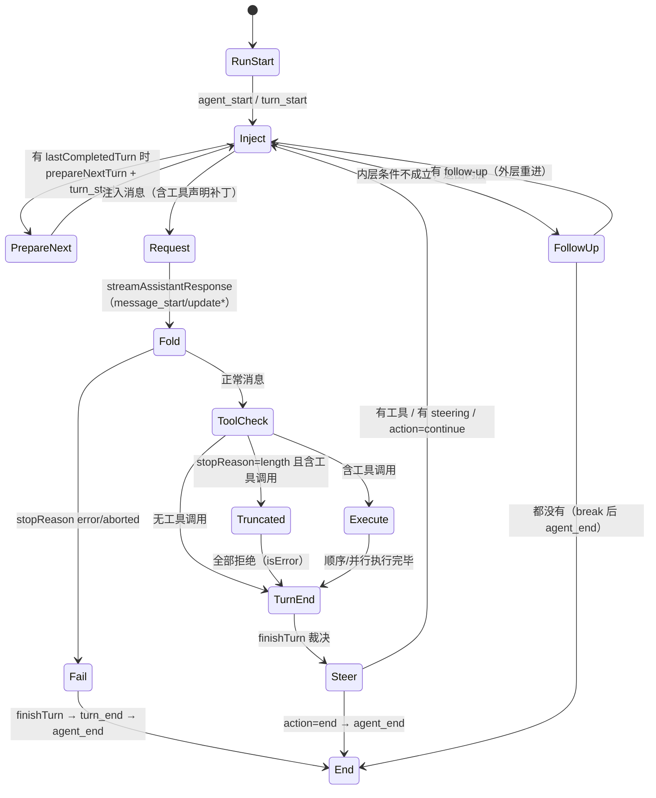

<a id="deep-dives-d1-agent-loop-h43"></a>

###### 35.2 一次工具调用的四种结局

| 结局             | 触发条件                      | 结果形态                   | 事件                                |
| ---------------- | ----------------------------- | -------------------------- | ----------------------------------- |
| prepared 成功    | 全部通过                      | 工具返回值（或钩子改写后） | start → update* → end → 结果消息 |
| immediate 未通过 | 工具不存在/校验失败/拦截/取消 | `isError` 错误结果       | start → end → 结果消息            |
| 截断全拒         | `stopReason === "length"`   | 每调用一条"重新发起"错误   | start → end → 结果消息 ×N        |
| 执行异常         | `execute()` 抛错            | 异常文本错误结果           | start → end → 结果消息            |

<a id="deep-dives-d1-agent-loop-h44"></a>

###### 35.3 事件序列公式（整文件）

```text
agent_start ×1
turn_start ×1（runAgentLoop/Continue 发）+ ×(轮次-1)（循环内的 prepareNextTurn 块）
每个注入消息：message_start + message_end
助手消息：message_start? + message_update* + message_end
每个工具调用：tool_execution_start + tool_execution_update* + tool_execution_end
每条工具结果消息：message_start + message_end
turn_end ×轮次
agent_end ×1（三处出口之一）
```

<a id="deep-dives-d1-agent-loop-h45"></a>

###### 35.4 读改本文件的检查清单

改这个文件前，逐条自问：

- [ ] 我改的路径，`await emit` 的语义受影响吗？（监听器变慢/抛错会怎样）
- [ ] 新分支会破坏"`agent_end` 恰好一次"吗？
- [ ] 新分支的事件配对（start/end）完整吗？
- [ ] 失败路径是否仍然"错误变结果、不抛错、不打断事件序列"？
- [ ] 我改动的是"声明集"还是"可执行集"？差分逻辑（`declareToolChanges`）跟上了吗？
- [ ] 并行路径里"完成顺序 vs 声明顺序"是否被我搞混？
- [ ] 取消检查点是否覆盖新路径？（每个 await 边界）
- [ ] 返回值（`newMessages`）与事件（`agent_end.messages`）还是同一份数组吗？

---

> D1 完。下一篇（D2）精读 `packages/agent/src/agent.ts`：状态归约、生命周期守卫、队列实现与事件分发。

## 6.8 常见错误

| 现象                                                             | 原因                                    | 处理                                                                  |
| ---------------------------------------------------------------- | --------------------------------------- | --------------------------------------------------------------------- |
| 流式输出中调用`prompt()` 报"Agent is already processing"       | 同一 Agent 同时只允许一个 run           | 改用`steer()`/`followUp()`（会话层用 `streamingBehavior` 选项） |
| `continue()` 报 "Cannot continue from message role: assistant" | 最后一条是助手消息                      | 先`prompt()` 新消息，或依赖 `continue()` 的队列特例分支           |
| 以为点了取消就"立刻什么都不跑"                                   | 取消是信号，工具需自行响应              | 工具实现里检查`signal?.aborted` 并清理                              |
| 工具设了`terminate: true` 但循环还在跑                         | terminate 只是"不因本批工具继续"        | 需要硬停就用`finishTurn` 返回 `action: "end"`                     |
| 重试没有发生                                                     | 上下文溢出/不可重试错误/预算耗尽/被取消 | 看`auto_retry_*` 事件与设置里的 `retry` 配置                      |
| 重试后模型"忘了"失败那轮                                         | `_omitRecoveryAttempt` 的预期行为     | 这是设计：失败尝试从上下文剔除但保留原始历史                          |

<a id="06-agent-loop-h35"></a>

## 6.9 验收题

1. 从零写出四条状态轨迹（事件名序列）：无工具、有工具、带 steering、被取消。
2. 为什么 `finishTurn` 无条件返回 `{ action: "continue" }` 可能导致无限运行？给出机制级解释（提示：outer 循环第一行与 `explicitContinuation`）。
3. steering 与 follow-up 分别在哪两个取数点被消费？`"one-at-a-time"` 模式改变了什么？
4. 一次重试的完整事件序列是什么？（从失败消息到重试成功，含 `willRetry` 的位置）
5. 取消发生在"工具批次准备阶段"与"流式请求进行中"，分别以什么错误/结果收场？

<a id="06-agent-loop-h36"></a>

### 参考答案（要点）

1. 无工具：`agent_start, turn_start, user 事件, assistant 事件, turn_end, agent_end`；有工具：在两轮之间插入 `tool_execution_*` 与 toolResult 的 `message_start/end`；steering：在 `turn_end` 前 steer 入队，T2 取出，多一个 `turn_start` 轮次。取消要标明发生位置：请求流取消会得到 `stopReason: "aborted"` 的助手终态并走失败分支收尾；工具批次取消按 6.5.2 的模式/阶段表处理，可能留下没有 Agent 层结果消息的未开始调用。
2. outer 循环每轮开头把 `hasMoreToolCalls` 重置为 `true`，内层会完整执行"prepareNextTurn → 请求 → finishTurn"；若 finishTurn 又返回 continue，内层条件再次成立——每次都是真实模型请求，永不收敛。
3. steering 在 T0/T1/T2 取出（主要 T2：本轮结束、下轮请求前）；follow-up 在 T3（内层退出后）取出。one-at-a-time 让每次只有最旧的一条被取走，其余留到后续取数点。
4. `agent_end(willRetry: true)` → `auto_retry_start`（含 delayMs）→ （上下文投影剔除失败尝试）→ 退避等待 → 新一轮 `agent_start` → … → 成功消息的 `message_end` → `auto_retry_end(success: true)`。
5. 工具批次中：当前已进入准备的调用可能得到 `Operation aborted`；并行模式中已准备但尚未执行的闭包也会生成该结果；准备循环尚未到达的调用没有 start/end 或结果消息，顺序批次则在当前调用收尾后跳过剩余调用。请求流中：底层流以 abort 错误终止，助手消息的 `stopReason` 为 `aborted`，循环走失败分支收尾。详见 6.5.2，不要把工具批次取消与请求流取消合成一条轨迹。

<a id="06-agent-loop-h37"></a>

## 6.10 来源与下一章

- `packages/agent/src/agent-loop.ts`（`runAgentLoop`、`runAgentLoopContinue`、`runLoop`、工具执行两模式、`runToolCall`）；
- `packages/agent/src/agent.ts`（`prompt`、`continue`、`steer`/`followUp`、`PendingMessageQueue`、`runWithLifecycle`、`abort`、`waitForIdle`）；
- `packages/agent/src/types.ts`（`AgentLoopConfig`、`FinishTurn`、`AgentLoopTurnUpdate`、`PrepareRequest`、`AgentToolCallOutcome`）；
- `packages/coding-agent/src/core/agent-session.ts`（`_runAgentPrompt`、`_handlePostAgentRun`、`_isRetryableError` 第 3660 行、`_prepareRetry` 第 3713 行、`_willRetryAfterAgentEnd` 第 1169 行、`_omitRecoveryAttempt` 第 1208 行）；
- `packages/coding-agent/docs/how-pi-works.md`。

下一章拆解工具的完整生命周期：声明、校验、并发调度、权限钩子、结果归一化、取消与错误——以及 `read`/`bash` 这些内置工具是怎么写的。

---

<!-- 来源：07-tools-execution.md。 -->

<a id="07-tools-execution-h1"></a>

# 第 7 章：工具定义、调度、结果与失败

> 通勤导航：第 5 天 · 车上读本章主线，读完能“讲清工具四步流水线”。本章源码精读（D7）属车下。

**先懂这一章**：模型给的是工具名称和参数，不是已经完成的动作。pi 必须找到工具、校验参数、决定是否允许执行、取得结果，再把结果交回模型。每一步失败时，模型看到的内容可能不同。

```text
教学伪代码：收到工具调用 → 找工具并准备参数 → 校验与前置检查
           → 执行工具 → 后置处理 → 发完成事件和结果消息
```

这是一条单工具的正常路径。多个工具还涉及逐个准备、并行或顺序执行，以及“完成事件”和“结果消息”顺序不同的问题，见第 7.5 节。

循环在第 6 章决定何时调用工具，本章只追工具从声明到结果的路径。看清单次执行与整批调度后，第 8 章再解释这些工具和会话资源从哪里来、何时释放。

> 学完本章你能回答：
>
> 1. 一个工具由哪些字段定义？`AgentTool` 和 `ToolDefinition` 有什么区别？
> 2. 模型怎么知道有哪些工具可用？工具清单中途变化时会发生什么？
> 3. 参数校验是怎么做的？校验失败、工具抛错、被拦截、被取消，各自变成什么？
> 4. 顺序执行与并行执行怎么选？"完成顺序"和"记录顺序"分别由哪段代码保证？
> 5. 内置工具（`read`/`write`/`bash`）是怎么写的？输出截断保护了什么？

**前置知识**：第 3 章（工具流水线概览）、第 4 章（消息与结果类型）、第 6 章（循环与取消）。
**预计学习时间**：2 天（建议把 `read.ts`、`write.ts` 两个小文件完整读一遍）。
**本章验证状态**：静态核对通过；实验 L04 需本地运行（faux 驱动）。

---

<a id="07-tools-execution-h2"></a>

## 7.1 工具的两个形态：`AgentTool` 与 `ToolDefinition`

<a id="07-tools-execution-h3"></a>

### 7.1.1 运行时契约：`AgentTool`

Agent 循环只认识这个接口（`packages/agent/src/types.ts`，第 1 章看过，这次逐字段精读）：

```typescript
export interface AgentTool<TParameters extends TSchema = TSchema, TDetails = any> extends Tool<TParameters> {
	/** Human-readable label for UI display. */
	label: string;
	/**
	 * Optional compatibility shim for raw tool-call arguments before schema validation.
	 * Must return an object that matches `TParameters`.
	 */
	prepareArguments?: (args: unknown) => Static<TParameters>;
	/**
	 * JSON Schema of `structuredContent` in successful results. Tools that declare it should always
	 * set `structuredContent`.
	 */
	outputSchema?: TSchema;
	/**
	 * Execute the tool call. Throw on failure, or return a result with `isError: true`; do not only
	 * describe the failure in `content`.
	 */
	execute: (
		toolCallId: string,
		params: Static<TParameters>,
		signal?: AbortSignal,
		onUpdate?: AgentToolUpdateCallback<TDetails>,
	) => Promise<AgentToolResult<TDetails>>;
	/** Recovery policy for an effect whose durable intent exists but whose outcome is unknown. */
	replay?: "never" | "safe";
	/**
	 * Per-tool execution mode override.
	 * - "sequential": this tool must execute one at a time with other tool calls.
	 * - "parallel": this tool can execute concurrently with other tool calls.
	 */
	executionMode?: ToolExecutionMode;
}
```

要点：

- **四参数执行签名**：调用 id、校验后的参数、取消信号、进度回调。工具作者要处理后三者；
- `replay` 是给"持久执行"场景（第 23 章 durable）用的：打算重放一个"意图已持久化但结果未知"的操作时，`"never"` 表示不要重放（如发邮件），`"safe"` 表示可重放（如纯读）；
- `executionMode` 是**工具自己声明**的并发限制（第 7.5 节展开）。

`execute` 的注释把错误处理规则钉死了：**"抛错，或返回 `isError: true` 的结果；不要把失败只写在 content 里。"** 为什么？因为上层的判断（是否计入失败统计、界面是否标红、重试策略）依赖 `isError` 这个布尔字段，而不是反解文本。

<a id="07-tools-execution-h4"></a>

### 7.1.2 注册形态：`ToolDefinition`

`coding-agent` 内部用更丰富的 `ToolDefinition`（`core/extensions/types.ts`）。它比 `AgentTool` 多了"给模型看的提示元数据"和"给界面看的渲染器"：

```typescript
// 概念节选（真实定义见 extensions/types.ts）
interface ToolDefinition<TParameters, TDetails> {
	name: string;
	label: string;
	description: string;               // 模型读到的工具说明
	parameters: TParameters;           // typebox schema
	promptSnippet?: string;            // 系统提示里的"工具速览"一行
	promptGuidelines?: string[];       // 系统提示里的使用准则
	constrainedSampling?: ...;         // 请求层约束（如 json_schema strict）
	prepareArguments?: ...;
	outputSchema?: ...;
	executionMode?: ...;
	execute: (toolCallId, params, signal, onUpdate, ctx?: ExtensionContext) => ...;
	renderers?: ...;                   // 界面渲染
}
```

两个形态之间可以双向转换（`core/tools/tool-definition-wrapper.ts`）：

```typescript
/** Wrap a ToolDefinition into an AgentTool for the core runtime. */
export function wrapToolDefinition<TDetails = unknown>(
	definition: ToolDefinition<any, TDetails>,
	ctxFactory?: ToolContextFactory,
): AgentTool<any, TDetails> {
	return {
		name: definition.name,
		label: definition.label,
		description: definition.description,
		parameters: definition.parameters,
		outputSchema: definition.outputSchema,
		constrainedSampling: definition.constrainedSampling,
		prepareArguments: definition.prepareArguments,
		executionMode: definition.executionMode,
		execute: (toolCallId, params, signal, onUpdate, ctx?) =>
			definition.execute(toolCallId, params, signal, onUpdate,
				ctx ?? (ctxFactory?.(toolCallId, signal) as ExtensionToolContext)),
	};
}
```

以及反向：

```typescript
export function createToolDefinitionFromAgentTool(tool: AgentTool<any>): ToolDefinition<any, unknown> {
	return { name: tool.name, label: tool.label, description: tool.description, /* ... */ };
}
```

**为什么要两个形态？** 因为"运行时循环需要什么"和"应用注册/渲染需要什么"不同：

| 需求                               | AgentTool                | ToolDefinition |
| ---------------------------------- | ------------------------ | -------------- |
| 循环执行                           | 需要                     | ——           |
| 生成系统提示（速览/准则）          | ——                     | 需要           |
| 终端渲染（不同工具不同样式）       | ——                     | 需要           |
| 扩展上下文（`ctx`：cwd、模型等） | ——                     | 需要           |
| 第三方直接传`AgentTool`          | 兼容（自动合成最小定义） | ——           |

读代码时注意：**`Agent` 只见到 `AgentTool`；`AgentSession` 内部维护"definition 优先"的注册表**，用 `wrapToolDefinition` 往下层喂。

扩展工具的注册、上下文创建和会话刷新之间还有一层生命周期；见[第 14 章 14.1.1 节](#14-tool-extensions-h3)。这里先记住一个边界：`ToolDefinition.execute` 的类型把 `ctx` 写成必填，但直接调用或没有传 `ctxFactory` 的适配路径不会凭空生成上下文，运行时可能收到 `undefined`。扩展通过会话注册并由 `wrapRegisteredTool` 包装时，才会在每次调用时用 `ExtensionRunner.createToolContext()` 提供它。

<a id="07-tools-execution-h5"></a>

## 7.2 工具从哪来：工厂、组合与命名

`packages/coding-agent/src/core/tools/index.ts` 是整个内置工具库的门面。命名约定：

```typescript
export type ToolName = "read" | "bash" | "powershell" | "edit" | "write" | "grep" | "find" | "ls";
export const allToolNames: Set<ToolName> = new Set([...]);
```

工厂分两家：`createXxxTool(cwd, options)` 返回 `AgentTool`；`createXxxToolDefinition(cwd, options)` 返回 `ToolDefinition`。再往上，是**组合函数**：

| 组合                         | 包含                    | 场景                                      |
| ---------------------------- | ----------------------- | ----------------------------------------- |
| `createCodingTools(cwd)`   | read, bash, edit, write | 标准编码模式（默认）                      |
| `createReadOnlyTools(cwd)` | read, grep, find, ls    | 只读审查（`--tools read,grep,find,ls`） |
| `createAllTools(cwd)`      | 全部八个                | 需要完整能力时                            |
| `createTool(name, cwd)`    | 单个                    | 精细控制                                  |

`AGENTS.md` 风格的对应关系：**"默认工具集"由 `DEFAULT_TOOL_NAMES` 与设置 `defaultTools` 决定**（第 3 章 sdk.ts 的 `initialActiveToolNames` 计算）；`--tools` 白名单和 `--exclude-tools` 再叠加。工具的**执行能力**与**声明**是两码事，下一节展开。

（扩展注册自定义工具的路径（`pi.registerTool`）在第 13、14 章；MCP 工具在 22 章。）

<a id="07-tools-execution-h6"></a>

## 7.3 声明与"工具载入变化"：模型怎么知道你能做什么

<a id="07-tools-execution-h7"></a>

### 7.3.1 声明进系统消息

模型不知道"进程里注册了什么"，它只知道**消息里声明了什么**。工具声明被编入系统消息（第 4 章 `SystemMessage.toolsAdded`）；`AgentContext.tools` 则是"当前进程真正可执行的集合"。两者由 `declareToolChanges` 保持同步（`agent-loop.ts`）：

```typescript
/**
 * Declare tool loadout changes to the model.
 *
 * `context.tools` is what the runtime can execute; the transcript's system messages declare
 * what the model may call. Before each request the difference becomes `toolsAdded` and
 * `toolsRemoved` on a system message. ...
 */
function declareToolChanges(context: AgentContext, pendingMessages: AgentMessage[]): AgentMessage[] {
	// 找到待注入消息里的最后一条 system 消息（若有），以它为基线
	// 计算：已声明集合（getCurrentTools）与可执行集合（context.tools）的差
	const changes = getToolStateChanges(
		getCurrentTools([...context.messages, ...baseline]),
		(context.tools ?? []).map(toToolDeclaration),
	);
	const unchanged = changes.toolsAdded.length === 0 && changes.toolsRemoved.length === 0;
	if (unchanged) return pendingMessages;
	// 有变化：在第一条非 system 待注入消息之前插入一条"工具变化"系统消息
	const update = withToolChanges({ role: "system", content: "", timestamp: Date.now() }, changes);
	// ...
}
```

三个可观察的行为：

1. **首次请求**：转录里还没有系统消息声明工具 → 生成一条 `toolsAdded: [全部工具]` 的系统消息（会话文件里你能看到它，第 4.7.4 节示例）；
2. **中途启用/禁用工具**（扩展调用 `setActiveTools`、或 `finishTurn` 改了 `state.tools`）→ 下一次请求前生成一条只含增删差异的系统消息；
3. **不变则不写**：`unchanged` 直接返回，避免历史里塞满无意义的补丁。

<a id="07-tools-execution-h8"></a>

### 7.3.2 为什么"可执行"与"已声明"要分开

因为二者承担不同职责：

- **已声明**：模型可以调用什么（写进对话历史，可回放）；
- **可执行**：运行时真的有什么（可能是动态的、依赖当前的扩展状态）。

如果只保留一份，就不可能做到"会话回放时精确重建当时模型看到的工具清单"。**可回放性是本仓库的底层设计目标之一**，你在第 4、9 章反复看到它的影子。

<a id="07-tools-execution-h9"></a>

### 7.3.3 模型侧的形状：`toToolDeclaration`

`toToolDeclaration`（`pi-ai`）把内部 `Tool` 转成"转录里的声明形状"（name/description/parameters）。再往下，供应商适配器把它转成各家格式（第 5.5.3 节）。所以一个工具定义从代码到模型，走了三站：

```text
ToolDefinition（应用注册，含提示元数据）
  → AgentTool（运行时）
    → toToolDeclaration（转录系统消息里的声明）
      → 供应商格式（input_schema / function.parameters ...）
```

<a id="07-tools-execution-h10"></a>

## 7.4 参数校验：模型给的参数可信吗？

**先懂**：TypeScript 能检查开发者写的代码，不能在运行时保证模型生成的 JSON 正确。pi 先复制参数，做有限的归一化与转换，再按工具 schema 校验。通过后的值才交给工具执行。

```text
教学伪代码：复制模型参数 → 处理可选空值和可转换值
           → 按 schema 检查 → 合法则返回副本
           → 非法则给出字段位置与收到的原值
```

不可信。模型可能传错类型、漏字段、把数字写成字符串。pi 在工具执行前做一层**运行时校验**（`packages/ai/src/utils/validation.ts`）：

```typescript
/**
 * Validates tool call arguments against the tool's TypeBox schema
 * @returns The validated (and potentially coerced) arguments
 * @throws Error with formatted message if validation fails
 */
export function validateToolArguments(tool: Tool, toolCall: ToolCall): any {
	const args = structuredClone(toolCall.arguments);        // ① 克隆：绝不改模型给的原对象
	normalizeOptionalNulls(args, tool.parameters);           // ② 把"可选字段传了 null"归一化
	Value.Convert(tool.parameters, args);                    // ③ 类型强转（如 "42" → 42）

	const validator = getValidator(tool.parameters);
	if (!Object.getOwnPropertySymbols(tool.parameters).includes(TYPEBOX_KIND)) {
		// ④ 非 typebox 的 schema：做一轮 JSON Schema 兼容强转
		const coerced = coerceWithJsonSchema(args, tool.parameters);
		if (coerced !== args) { /* 合并结果 */ }
	}

	if (validator.Check(args)) {
		return args;                                          // ⑤ 通过：返回校验后的参数
	}

	// ⑥ 失败：拼出"路径 + 原因 + 收到的参数"的错误文本
	const errors = validator.Errors(args)
		.map((error) => `  - ${formatValidationPath(error)}: ${error.message}`)
		.join("\n") || "Unknown validation error";
	throw new Error(`Validation failed for tool "${toolCall.name}":\n${errors}\n\nReceived arguments:\n${JSON.stringify(toolCall.arguments, null, 2)}`);
}
```

六个步骤的设计动机，逐个说：

1. **`structuredClone`**：参数对象会被后续强转/归一化**就地修改**，必须先克隆。模型的消息对象要保持原样（历史回放需要原始值）；
2. **`normalizeOptionalNulls`**：模型常把"不填的可选字段"写成 `null`。schema 里 `Type.Optional` 只接受"缺失或正确类型"，这里先把 `null` 处理掉；
3. **`Value.Convert`**：typebox 的类型强转，例如 `"3"` → `3`、`"true"` → `true`。这是对模型小失误的宽容；
4. **非 typebox schema 兼容**：工具可能声明的是纯 JSON Schema（扩展作者手写），用辅助强转兜底；
5. **通过则返回**：返回的是"校验后的副本"，`execute` 收到的一定满足 schema；
6. **失败拼详细错误**：错误里包含**收到的原始参数**（pretty JSON）。这条错误文本会作为工具结果发给模型——模型据此自我纠正（比如"哦，path 不是数组，是字符串"）。

<a id="07-tools-execution-h11"></a>

### 7.4.1 校验失败的完整去向

```text
validateToolArguments 抛错
  → prepareToolCall 的 catch 捕获
    → 返回 { kind: "immediate", result: createErrorToolResult(错误文本), isError: true }
      → 照样走 emitToolExecutionEnd + 生成 ToolResultMessage
        → 模型下一轮看到 "Validation failed for tool ..." 并重新尝试
```

**没有一步会中断整个循环。** "错误是一种结果"在这里第二次出现。

<a id="07-tools-execution-h12"></a>

### 7.4.2 `prepareArguments`：校验前的最后修补

有些工具需要一个"兼容垫片"，在**校验之前**修正原始参数（比如老模型把 `file_path` 写成 `path`）：

```typescript
function prepareToolCallArguments(tool: AgentTool<any>, toolCall: AgentToolCall): AgentToolCall {
	if (!tool.prepareArguments) return toolCall;
	const preparedArguments = tool.prepareArguments(toolCall.arguments);
	if (preparedArguments === toolCall.arguments) return toolCall;   // 未修改则保持原对象
	return { ...toolCall, arguments: preparedArguments as Record<string, any> };
}
```

顺序是：**`prepareArguments`（修补）→ `validateToolArguments`（校验）→ `beforeToolCall`（也许拦截）→ `execute`（执行）**。

<a id="07-tools-execution-h13"></a>

### 7.4.3 `unknown` 与 `as`：类型检查不能替代运行时校验

这一段同时跨过了 TypeScript 类型系统和运行时数据边界。初学者要把三件事拆开：

| 动作                           | 发生时机              | 能保证什么                                           |
| ------------------------------ | --------------------- | ---------------------------------------------------- |
| `Static<typeof schema>`      | TypeScript 检查源码时 | 编辑器知道符合 schema 的对象应有哪些字段/类型        |
| `validateToolArguments(...)` | 程序运行时            | 对模型给出的实际数据做转换和 schema 检查；失败就抛错 |
| `value as SomeType`          | TypeScript 检查源码时 | 告诉编译器“按这个类型看”；不会检查或修改实际值     |

为什么需要运行时校验？模型响应从网络流中解析而来，TypeScript 编译器不会在运行时替你检查 JSON。即使模型供应商声明支持 JSON Schema，仍然需要把本地实际收到的值当作不可信数据。

真实准备路径（`packages/agent/src/agent-loop.ts` → `prepareToolCall`）可缩写为：

```typescript
const preparedToolCall = prepareToolCallArguments(tool, toolCall);
const validatedArgs = validateToolArguments(tool, preparedToolCall);

if (config.beforeToolCall) {
  const beforeResult = await config.beforeToolCall(
    { assistantMessage, toolCall, args: validatedArgs, context: currentContext },
    signal,
  );
  if (beforeResult?.block) {
    return {
      kind: "immediate",
      result: createErrorToolResult(beforeResult.reason || "Tool execution was blocked"),
      isError: true,
    };
  }
}

return { kind: "prepared", toolCall, tool, args: validatedArgs };
```

节选省略 abort 检查和错误分支。按时间读：

1. `toolCall.arguments` 是模型给的原始参数；
2. `prepareToolCallArguments` 可做兼容转换；
3. `validateToolArguments` 克隆、转换并检查；
4. `beforeToolCall` 收到校验后的参数，但上下文类型把 `args` 定义成 `unknown`；
5. 没被拦截就把当前这个参数对象放进 `PreparedToolCall`；
6. 后续 `executePreparedToolCall` 把它传给工具 `execute`。

这里没有第二次 schema validation。hook 收到的是共享的对象引用，可以原地改它。已有回归测试 `packages/agent/test/agent-loop.test.ts` 中的 `should execute mutated beforeToolCall args without revalidation` 正是这样验证的：schema 要求 `value: string`，hook 将 `value` 改成数字 `123`，工具实际收到数字。

```typescript
beforeToolCall: async ({ args }) => {
  const mutableArgs = args as { value: string | number };
  mutableArgs.value = 123;
  return undefined;
}
```

`as { value: string | number }` 只放宽 TypeScript 对这段代码的静态看法；真正改变对象的是下一行赋值。`as` 不会复制对象、不运行 TypeBox，也不会验证这个数字是否仍符合工具 schema。

【改代码时的意义】`execute(params)` 在没有 hook 的常规路径上收到的是已校验对象；启用可修改参数的 hook 后，工具可能收到 schema 不接受的值。若工具的安全性依赖更窄的运行时条件（例如路径必须位于工作目录、数值必须在范围内），不要只依赖入口 schema；在执行副作用之前验证该条件。若需求是让核心在 hook 修改后再次执行通用 schema 校验，那属于行为/API 变化，应先设计如何向模型报告 hook 改坏参数，再补回归测试，不能把当前实现误读成“自动二次校验”。

【关于 `unknown`】在 `BeforeToolCallContext` 里，`args: unknown` 是刻意的边界：hook 是通用的，它可能面对任何工具 schema。使用者需要先检查形状或在确认依据后写类型守卫。直接写 `any` 会让编译器放弃追问“这个值到底是什么”，因此本仓库规则要求尽量不用 `any`。部分旧的通用库类型仍出现 `any`，读者应理解为现有 API 的类型写法，不应照抄到新代码。

<a id="07-tools-execution-h14"></a>

## 7.5 调度：从声明到执行的四步流水线

**先懂**：同一批工具要先决定能否并行，但无论顺序还是并行，每个调用都要经过同样的准备、执行和结果收尾。先看单个工具的四步，再比较整批调度。

<a id="07-tools-execution-h15"></a>

### 7.5.1 四步流水线（快照 + 完整视图）

回忆第 3.10 节，正常执行路径分四步。查无工具、准备校验失败或被 `beforeToolCall` 拦截时会得到 immediate 结果，跳过工具执行和 `afterToolCall`：

```text
① prepareToolCall        找工具 → prepareArguments → 校验 → beforeToolCall 钩子
   任何一步失败 → 直接产出 isError 结果（"immediate" 结局）
② executePreparedToolCall 调用 tool.execute(id, args, signal, onUpdate)
   抛错 → 折叠为 isError 结果；进度回调 → tool_execution_update 事件
③ finalizeExecutedToolCall afterToolCall 钩子做字段级改写
④ 记录与广播             tool_execution_end 事件 + ToolResultMessage 消息
```

用一个真实工具对照（`read` 的 `execute`）：准备阶段校验 `path/offset/limit`；执行阶段读文件；收尾阶段无钩子改动；记录阶段生成含文件内容的 `toolResult`。

<a id="07-tools-execution-h16"></a>

### 7.5.2 顺序还是并行？

```typescript
const hasSequentialToolCall = toolCalls.some(
	(tc) => currentContext.tools?.find((t) => t.name === tc.name)?.executionMode === "sequential",
);
if (config.toolExecution === "sequential" || hasSequentialToolCall) {
	return executeToolCallsSequential(...);
}
return executeToolCallsParallel(...);
```

判定规则：**全局配置为 sequential，或批次里任意一个工具声明 `executionMode: "sequential"`，整批顺序执行。** 这是保守策略——有副作用的工具（如 edit 同一文件）不该和别的并发。

`executionMode` 的两个来源：

- 工具定义里声明（`AgentTool.executionMode` / `ToolDefinition.executionMode`）；
- 全局 `AgentOptions.toolExecution`（会话设置可覆盖）。

<a id="07-tools-execution-h17"></a>

### 7.5.3 并行模式的准备、执行与记录顺序

```typescript
// 准备阶段：按声明顺序逐个发 start 并 await prepareToolCall
for (const toolCall of toolCalls) {
	await emit({ type: "tool_execution_start", ... });
	const preparation = await prepareToolCall(...);
	if (preparation.kind === "immediate") {
		// 查无工具、校验失败、hook 拦截等：准备期间立即发 end
		await emitToolExecutionEnd(...);
		finalizedCalls.push(...);
		continue;
	}
	finalizedCalls.push(async () => {           // ② 执行被推迟为"闭包"，稍后并发调用
		// ... executePreparedToolCall / finalize / emit end
	});
	if (signal?.aborted) break;
}

// 准备循环结束后才启动闭包；各闭包并发，end 在各自收尾后发出
const orderedFinalizedCalls = await Promise.all(
	finalizedCalls.map((entry) => (typeof entry === "function" ? entry() : Promise.resolve(entry))),
);

// 记录阶段：按已收集调用的声明顺序生成结果消息
for (const finalized of orderedFinalizedCalls) {
	const toolResultMessage = createToolResultMessage(finalized);
	await emitToolResultMessage(toolResultMessage, emit);
	messages.push(toolResultMessage);
}
```

这里有三个边界要一起读：所有调用的准备过程仍按声明顺序串行；只有准备成功的调用才会进入后面的并发执行闭包；准备立即失败/被拦截的调用会在准备循环内直接发 `tool_execution_end`。因此 `tool_execution_end` 不能笼统说成“完成顺序”：immediate 结果先于执行闭包发出，成功准备的调用则按各自执行和收尾完成次序发出。若取消信号在准备循环中变为 aborted，循环会停止，尚未准备的后续调用不会进入结果列表；已准备的闭包启动时还会再次检查 signal，已取消的调用会生成 `Operation aborted` 结果。最终结果消息按收集到的调用顺序生成，也就是模型声明顺序的已处理部分，不保证每个声明调用都有结果。

对照第 3.8.1 的结论：

| 顺序                          | 由谁决定                                                   | 代码位置                     |
| ----------------------------- | ---------------------------------------------------------- | ---------------------------- |
| `tool_execution_start` 顺序 | 模型声明顺序（准备是顺序的）                               | for 循环                     |
| `tool_execution_end` 顺序   | immediate 结果在准备循环内发出；执行结果按闭包收尾顺序发出 | 准备循环与每个闭包内部       |
| 工具结果消息顺序              | 收集到调用的声明顺序；取消可使其成为声明序列的前缀         | `Promise.all` 后的有序循环 |
| `terminate` 判定            | 全部结果都`terminate: true` 才生效                       | `shouldTerminateToolBatch` |

**暂停预测：** 模型在同一批中先声明 `read("demo.txt")`，再声明 `read("README.md")`。两次准备都成功，允许并行；前者执行较慢。写下 `tool_execution_start`、成功执行的 `tool_execution_end`、`ToolResultMessage` 三列各自的先后顺序。

**对照答案：** start 是 `demo.txt → README.md`；两个成功执行的 end 可以是 `README.md → demo.txt`；结果消息仍是 `demo.txt → README.md`。准备循环按声明顺序运行，闭包并行完成，`Promise.all` 的结果数组按输入位置排列。这个答案只覆盖“两次都准备成功、没有取消”的条件；校验失败或拦截会在准备时立即发 end，取消也可能让后续调用根本没有结果。

<a id="07-tools-execution-h18"></a>

### 7.5.4 `terminate` 的精确语义

```typescript
function shouldTerminateToolBatch(finalizedCalls: FinalizedToolCallOutcome[]): boolean {
	return finalizedCalls.length > 0 && finalizedCalls.every((finalized) => finalized.result.terminate === true);
}
```

- 它是"**不要因为本批工具继续循环**"的提示，不是"结束 run"；
- 一批里只要有一个结果没设 `terminate`，整批就不触发终止；
- 被 `beforeToolCall` 拦截（block）时也可以带 `terminate: true`（第 3 章代码里见过）。

<a id="07-tools-execution-h19"></a>

## 7.6 前后钩子：beforeToolCall / afterToolCall

**先懂**：前置钩子在执行前检查或阻止调用；后置钩子在执行后检查或改写结果。读两者时先问“现在工具执行了吗”，就不会把阻止结果与工具失败混淆。

```text
教学伪代码：参数通过校验 → beforeToolCall 决定放行或阻止
           → 放行后执行工具 → afterToolCall 处理最终结果
```

<a id="07-tools-execution-h20"></a>

### 7.6.1 `beforeToolCall`：执行前的准入控制

```typescript
export interface BeforeToolCallResult {
	block?: boolean;      // 阻止执行；循环会发出错误工具结果
	reason?: string;      // 阻止原因（作为错误文本给模型）
	terminate?: boolean;  // 提示"本批结束后停止"（仍需整批都 terminate）
}
```

收到的上下文（`BeforeToolCallContext`）：`assistantMessage`（哪条消息提出的调用）、`toolCall`（原始调用块）、`args`（**已校验**的参数）、`context`（当时的 Agent 上下文）。

典型用途：权限确认（"要写文件？先问用户"）、审计日志、危险命令拦截。注意它是**异步**的，可以等待用户输入。

<a id="07-tools-execution-h21"></a>

### 7.6.2 `afterToolCall`：结果的最终改写

字段合并语义（`AfterToolCallResult` 的注释是权威说明）：

| 字段                  | 提供时                     | 不提供时                                                       |
| --------------------- | -------------------------- | -------------------------------------------------------------- |
| `content`           | **整体替换**结果内容 | 保留原值                                                       |
| `details`           | 整体替换                   | 保留                                                           |
| `structuredContent` | 替换                       | 若`content` 被替换而它没给 → **丢弃**（可能不再匹配） |
| `isError`           | 替换                       | 保留                                                           |
| `usage`             | 替换                       | 保留                                                           |
| `terminate`         | 替换                       | 保留                                                           |

"content 换了但 structuredContent 没跟上就丢弃"这条规则很细，但体现了数据一致性优先：**宁可没有结构化数据，也不留互相矛盾的两份。**

<a id="07-tools-execution-h22"></a>

## 7.7 结果归一化：`AgentToolResult` → `ToolResultMessage`

工具返回 `AgentToolResult`，循环把它折成消息：

```typescript
function createToolResultMessage(finalized: FinalizedToolCallOutcome): ToolResultMessage {
	return {
		role: "toolResult",
		toolCallId: finalized.toolCall.id,
		toolName: finalized.toolCall.name,
		// Untyped tools (JS extensions) can return results without content; normalize
		// so the null never enters session history or provider payloads.
		content: finalized.result.content ?? [],
		details: finalized.result.details,
		usage: finalized.result.usage,
		isError: finalized.isError,
		timestamp: Date.now(),
	};
}
```

字段去向表（对照第 4.3.4）：

| 字段                  | 进消息？（发给模型）           | 进会话文件？                   | 给谁用                                 |
| --------------------- | ------------------------------ | ------------------------------ | -------------------------------------- |
| `content`           | 是                             | 是                             | 模型 + 界面                            |
| `details`           | 否                             | 是                             | 界面渲染、扩展逻辑                     |
| `structuredContent` | 否（**不在消息类型里**） | 否（除非工具自己塞进 details） | 程序化调用者（`runToolCall` 返回值） |
| `usage`             | 是（消息字段）                 | 是                             | 统计工具内部模型开销                   |
| `isError`           | 是                             | 是                             | 界面标红、重试策略                     |
| `terminate`         | 否                             | 否                             | 仅循环控制                             |

> `content ?? []` 的兜底是给 JS 扩展的：动态语言写的工具可能忘返回 `content`，直接透传 `null` 会污染历史与供应商请求。**归一化发生在边界上**——这是边界代码该负的责任。
> <a id="07-tools-execution-h23"></a>

## 7.8 内置工具精读：`read`

`packages/coding-agent/src/core/tools/read.ts` 约 300 行，是"一个成熟工具应该长什么样"的范本。

<a id="07-tools-execution-h24"></a>

### 7.8.1 声明部分

```typescript
const readSchema = Type.Object({
	path: Type.String({ description: "Path to the file to read (relative or absolute)" }),
	offset: Type.Optional(Type.Number({ description: "Line number to start reading from (1-indexed)" })),
	limit: Type.Optional(Type.Number({ description: "Maximum number of lines to read" })),
});

export const readToolSystemPromptContribution = {
	snippet: "Read file contents",
	guidelines: ["Use read to examine files instead of cat or sed."],
} as const;
```

- **schema 的 description 是写给模型看的**。每个字段的说明都会进入供应商请求的工具定义；
- `snippet` 与 `guidelines` 进入系统提示（工具速览与使用准则）。"用 read 而不是 cat/sed" 这种行为引导，靠的就是这一行文本；
- `export const` 让系统提示装配处可以引用同一份文本（单一来源，不会说两套话）。

工具描述里写明了截断规则：

```text
Read the contents of a file. Supports text files and images (jpg, png, gif, webp, bmp).
Images are sent as attachments. For text files, output is truncated to 2000 lines or
50KB (whichever is hit first). Use offset/limit for large files. When you need the full
file, continue with offset until complete.
```

**模型能预判工具行为**（会截断、怎么续读），就不会因为"输出突然断了"而困惑。这是"面向模型写文档"的实践。

<a id="07-tools-execution-h25"></a>

### 7.8.2 可插拔操作（Operations 注入）

```typescript
export interface ReadOperations {
	readFile: (absolutePath: string) => Promise<Buffer>;
	access: (absolutePath: string) => Promise<void>;
	detectImageMimeType?: (absolutePath: string) => Promise<string | null | undefined>;
}

const defaultReadOperations: ReadOperations = {
	readFile: (path) => fsReadFile(path),                       // 本地文件系统
	access: (path) => fsAccess(path, constants.R_OK),
	detectImageMimeType: detectSupportedImageMimeTypeFromFile,
};
```

注释写明动机：**"Override these to delegate file reading to remote systems (for example SSH)."** 工具逻辑与 I/O 实现分离——第 23 章 Gondolin 扩展（把工具执行搬进微虚机）正是靠这层注入实现的。

<a id="07-tools-execution-h26"></a>

### 7.8.3 执行部分：取消 + 文本路径

执行函数用了一个"手动 Promise"结构来精确处理取消：

```typescript
return new Promise((resolve, reject) => {
	if (signal?.aborted) { reject(new Error("Operation aborted")); return; }
	let aborted = false;
	const onAbort = () => { aborted = true; reject(new Error("Operation aborted")); };
	signal?.addEventListener("abort", onAbort, { once: true });

	(async () => {
		try {
			const absolutePath = await resolveReadPathAsync(path, ctx?.cwd || cwd);
			if (aborted) return;                       // 取消后不再继续
			await ops.access(absolutePath);            // 可读性检查（不存在会抛错）
			// ... 读内容 ...
			if (aborted) return;
			signal?.removeEventListener("abort", onAbort);   // 收尾：解除监听
			resolve({ content, details });
		} catch (error) {
			signal?.removeEventListener("abort", onAbort);
			if (!aborted) reject(error);
		}
	})();
});
```

三个模式值得学：

1. **`{ once: true }`**：abort 事件只监听一次，天然防重复；
2. **`aborted` 标志 + 每个 `await` 后检查**：取消后不再做无谓的后续步骤；
3. **收尾时 `removeEventListener`**：不留悬挂监听器（长会话里这是一个真实的泄漏点）。

文本路径的核心逻辑：

```typescript
const textContent = buffer.toString("utf-8");
const allLines = textContent.split("\n");
const totalFileLines = allLines.length;
// 1-indexed 入参 → 0-indexed 访问
const startLine = offset ? Math.max(0, offset - 1) : 0;
if (startLine >= allLines.length) {
	throw new Error(`Offset ${offset} is beyond end of file (${allLines.length} lines total)`);
}
// limit 优先裁剪，再交给 truncateHead 做全局截断
const truncation = truncateHead(selectedContent);
```

<a id="07-tools-execution-h27"></a>

### 7.8.4 "可继续的截断提示"（本节的精华）

截断发生时，工具不是简单地在末尾写"……"了事，而是给出**可操作的续读指令**：

```typescript
if (truncation.firstLineExceedsLimit) {
	// 单行就超过 50KB：告诉模型绕过 read，直接用 bash 精准取一行
	const firstLineSize = formatSize(Buffer.byteLength(allLines[startLine], "utf-8"));
	outputText = `[Line ${startLineDisplay} is ${firstLineSize}, exceeds ${formatSize(DEFAULT_MAX_BYTES)} limit. Use bash: sed -n '${startLineDisplay}p' ${path} | head -c ${DEFAULT_MAX_BYTES}]`;
	details = { truncation };
} else if (truncation.truncated) {
	const endLineDisplay = startLineDisplay + truncation.outputLines - 1;
	const nextOffset = endLineDisplay + 1;
	outputText = truncation.content;
	outputText += `\n\n[Showing lines ${startLineDisplay}-${endLineDisplay} of ${totalFileLines}. Use offset=${nextOffset} to continue.]`;
	details = { truncation };
} else if (userLimitedLines !== undefined && startLine + userLimitedLines < allLines.length) {
	const remaining = allLines.length - (startLine + userLimitedLines);
	const nextOffset = startLine + userLimitedLines + 1;
	outputText = `${truncation.content}\n\n[${remaining} more lines in file. Use offset=${nextOffset} to continue.]`;
}
```

三种提示分别对应三种"截断"：

| 情况                        | 提示                                                      |
| --------------------------- | --------------------------------------------------------- |
| 单行超限（比如压缩过的 JS） | 给出`sed` + `head -c` 的替代命令                      |
| 达到 2000 行/50KB 上限      | `[Showing lines a-b of n. Use offset=b+1 to continue.]` |
| 用户 limit 提前停下         | `[x more lines in file. Use offset=y to continue.]`     |

**这就是"工具输出为模型而设计"**：模型看到提示就能自己继续读，不用人干预。

<a id="07-tools-execution-h28"></a>

### 7.8.5 图片路径

```typescript
const processed = await processImage(buffer, mimeType, {
	autoResizeImages,
	resizeOptions: ctx?.model?.inputLimits?.images?.resize ?? fallbackResizeOptions,
});
```

- 图片按**当前模型的 inputLimits** 缩放（不同模型允许的分辨率/体积不同）；
- 缩放失败时降级为文字说明（`processed.message`）；成功时返回 `[文字说明, {type:"image",...}]` 两个内容块；
- 如果模型不支持图片（`model.input` 不含 `"image"`），附上提示"图片将在本次请求中省略"（`getNonVisionImageNote`）。发送层的 `convertToLlmWithBlockImages`（第 3 章）还会做最终屏蔽——**两道防线。**

<a id="07-tools-execution-h29"></a>

## 7.9 截断系统：保护上下文也保护内存

<a id="07-tools-execution-h30"></a>

### 7.9.1 三个截断函数与两个常量

`core/tools/truncate.ts`：

```typescript
export const DEFAULT_MAX_LINES = 2000;
export const DEFAULT_MAX_BYTES = 50 * 1024; // 50KB

export function truncateHead(content, options): TruncationResult   // 保头（文件阅读）
export function truncateTail(content, options): TruncationResult   // 保尾（命令输出）
export function truncateLine(...)                                  // 单行截断
```

选用哪种取决于"哪里最重要"：

- **`read` 用 `truncateHead`**：文件开头是概述/导入，先看头；
- **命令输出用 `truncateTail`**：报错和结果通常在最后几行。

`TruncationResult` 携带结构化信息（`content`、`truncated`、`truncatedBy: "lines" | "bytes"`、`outputLines`、`firstLineExceedsLimit` 等），所以工具能把"怎么被截的"写进 `details`，给界面用。

<a id="07-tools-execution-h31"></a>

### 7.9.2 流式输出的内存保护：`OutputAccumulator`

`bash` 这类工具的输出可能**持续流出且无限增长**。`core/tools/output-accumulator.ts` 的注释说明了一切：

```typescript
/**
 * Incrementally tracks streaming output with bounded memory.
 *
 * Appends decode chunks with a streaming UTF-8 decoder, keeps only a decoded
 * tail for display snapshots, and opens a temp file when the full output needs
 * to be preserved.
 */
```

机制（读接口即可）：

```typescript
export interface OutputSnapshot {
	content: string;             // 界面上要显示的部分（截断后的尾巴）
	truncation: TruncationResult;
	fullOutputPath?: string;     // 全量输出被写入的临时文件路径（若有）
}
```

- 内存里只保留**受限的尾巴**（`maxLines`/`maxBytes`）；
- 全量输出落到临时文件；`BashExecutionMessage` 的 `fullOutputPath`/`truncated` 字段（第 4.4 节）就是它的消费方；
- 用**流式 UTF-8 解码器**（`TextDecoder`，`stream: true` 语义）——避免多字节字符被块边界切断成乱码。这对中文输出尤其重要。

<a id="07-tools-execution-h32"></a>

## 7.10 写类工具与文件变更队列

<a id="07-tools-execution-h33"></a>

### 7.10.1 `write`：串行化同名文件的修改

`write.ts` 的执行部分：

```typescript
const absolutePath = resolveToCwd(path, ctx?.cwd || cwd);
const dir = dirname(absolutePath);
return withFileMutationQueue(absolutePath, async () => {
	// Do not reject from an abort event listener here: that would release the
	// mutation queue while an in-flight filesystem operation may still finish.
	// Checking signal.aborted after each await observes the same aborts while
	// keeping the queue locked until the current operation has settled.
	const throwIfAborted = (): void => {
		if (signal?.aborted) throw new Error("Operation aborted");
	};

	throwIfAborted();
	await ops.mkdir(dir);          // 自动建父目录
	throwIfAborted();
	await ops.writeFile(absolutePath, content);
	throwIfAborted();

	return { content: [{ type: "text", text: `Successfully wrote to ${path}` }], details: undefined };
});
```

**与 read 的取消模式对比**：write 故意**不用** `signal.addEventListener("abort", reject)`，原因写在注释里——如果在"队列锁内"的一个文件系统操作还没结束时就从 abort 监听器 reject，锁会被提前释放，另一个写操作可能插进来，造成竞态。改成"每个 await 之后检查标志"：取消依然及时（在操作边界生效），但不破坏锁的语义。

<a id="07-tools-execution-h34"></a>

### 7.10.2 `withFileMutationQueue`：按文件键的互斥

`file-mutation-queue.ts` 的目标：**同一个文件的操作串行；不同文件并行。**

```typescript
const fileMutationQueues = new Map<string, Promise<void>>();
let registrationQueue = Promise.resolve();

async function getMutationQueueKey(filePath: string): Promise<string> {
	const resolvedPath = resolve(filePath);
	try {
		return await realpath(resolvedPath);       // 用真实路径做键
	} catch (error) {
		if (isMissingPathError(error)) return resolvedPath;   // 还不存在则用解析路径
		throw error;
	}
}

export async function withFileMutationQueue<T>(filePath: string, fn: () => Promise<T>): Promise<T> {
	// 注册阶段串行（registrationQueue），保证"算键 + 挂链"是原子的
	// 取出当前队列尾 → 挂上自己的"闸门" → await 前驱 → 执行 fn → 放行后继
}
```

用 `realpath` 做键的原因：`./a.txt`、`../dir/a.txt`、符号链接指向同一文件时，路径字符串不同但**真实文件是同一个**。键必须基于真实身份。

这里的保证有边界：现有目标可由 `realpath` 解析时，符号链接别名会归到同一键；目标不存在（或路径组件不存在）时，`ENOENT`/`ENOTDIR` 会回退为 `resolve()` 后的路径字符串。此时不同别名未必归到同一队列，测试只验证了**已存在文件**的符号链接别名。队列也只是当前进程内的协调，不是文件系统锁。

`registrationQueue` 仅串行“解析键并把本次操作接到该键队尾”的注册阶段，避免两个同时到达的调用漏掉彼此；拿到前驱 Promise 后，不同键的 `fn()` 可以并行。测试分别验证同一路径串行、不同路径并行。取消用例进一步验证 `write`/`edit` 在底层写操作尚未 settle 时仍占有队列，待写操作结束、随后检查到 abort 才释放锁；它不代表底层 I/O 能被强制取消。

一个具体场景：模型一轮里提交了"编辑 A 文件"和"重写 A 文件"两个调用（并行批次）。如果没有这个队列，两个操作可能交错读写——有了它，第二个必须等第一个完成后才执行。

<a id="07-tools-execution-h35"></a>

## 7.11 `bash` 工具概览：外部进程是另一类问题

`bash.ts`（15KB）比 read/write 复杂一个量级，因为它面对的是**外部进程**：启动、流式输出、超时、取消（杀进程树）、退出码。要点先建立，细节留给第 17、19 章：

```typescript
export interface BashOperations {
	exec: (
		command: string,
		cwd: string,
		options: { onData: (chunk: Buffer) => void; signal?: AbortSignal; timeout?: number; env?: Record<string, string> },
	) => Promise<{ exitCode: number | null }>;
}

export type BashSpawnHook = (context: BashSpawnContext) => BashSpawnContext;
```

四个设计点：

1. **Operations 注入**：本地执行是默认实现（`createLocalBashOperations`），远程/容器执行可替换（与 read 的注入同理）；
2. **spawn 钩子**：启动前改写命令/环境/cwd（沙箱、前缀命令、环境变量注入都靠它）；
3. **取消 = 杀掉整棵进程树**：源码里明确处理 abort 信号并 kill 子进程；退出码按 shell 惯例映射（被信号杀死 → `128 + signal`）；
4. **输出双轨**：实时块回调（`onData`）驱动界面流式显示；`OutputAccumulator` 负责截断与全量落盘。

**退出码的语义**：工具把退出码与输出一起返回（`BashExecutionMessage.exitCode`）；非零退出通常标记为错误结果（`isError: true`），但**是否终止循环仍由模型/循环决定**——模型看到错误输出可以自行修正命令。
<a id="07-tools-execution-h36"></a>

## 7.12 实验 L04：参数非法、工具抛错、取消、拦截

**实验性质**：本地运行（faux + 测试 harness）；四组对照实验。
**验证状态**：设计中。每组都要求"错误实现会失败、正确实现才通过"的断言（第 18 章展开测试方法论）。

<a id="07-tools-execution-h37"></a>

### 四个用例

| # | 场景     | 构造方式                                                                             | 期望观察                                                                                                    |
| - | -------- | ------------------------------------------------------------------------------------ | ----------------------------------------------------------------------------------------------------------- |
| 1 | 参数非法 | 脚本响应里`fauxToolCall("read", { path: 123 })`（错误类型）                        | 模型收到`Validation failed for tool "read"`；结果 `isError: true`；`callCount` 增加（模型被再问一次） |
| 2 | 工具抛错 | 注册一个必抛错的自定义工具                                                           | 结果`isError: true`，错误文本来自异常 message；循环继续                                                   |
| 3 | 取消     | 注册一个"等待信号"的工具（收到 abort 才退出）                                        | 取消后结果文本`Operation aborted`；run 收尾为 `aborted`                                                 |
| 4 | 钩子拦截 | 注册`beforeToolCall` 对某工具返回 `{ block: true, reason: "blocked by policy" }` | 模型收到`blocked by policy`；工具**未执行**（可用计数验证）                                         |

<a id="07-tools-execution-h38"></a>

### 步骤（以用例 1 为例）

1. 在 suite 测试里注册 faux，脚本第一步返回非法参数的工具调用，第二步返回普通文本；
2. 断言：
   - 转录里存在 `role: "toolResult"` 且 `isError === true`；
   - 其 `content[0].text` 包含 `Validation failed` 与字段路径；
   - 断言"错误文本里有收到的参数"（`Received arguments` 段）。
3. 把 schema 改成宽松类型再跑一遍，确认测试会失败——证明断言有效。

<a id="07-tools-execution-h39"></a>

### 观察与思考

- 四类错误的**结果消息**都进入历史了吗？下一轮模型看到的是哪一种措辞？
- 用例 3 中，如果工具不检查 `signal`，结果会怎样？（提示：工具照常跑完，取消只影响"还能不能发新请求"）

<a id="07-tools-execution-h40"></a>

### 清理

删除临时测试或还原改动；`git status` 干净。

<a id="07-tools-execution-h41"></a>

## 本章源码精读

> **车下内容**：本节要打开源码逐段对照，通勤（车上）时可以先跳过，直接读本章的“常见错误”和“验收题”；需要修改对应代码时再回来。 读法见[附录 L](#appendices-read-code-h1)。

第 7 章已经解释工具的声明、校验与结果；D7 沿内置工具的截断、输出累积和进程调用继续下钻。Agent loop 中的批次调度详见第 6 章的 D1。

<!-- 来源：deep-dives/D7-tools.md；融合于第 7 章。 -->

<a id="deep-dives-d7-tools-h1"></a>

### D7：内置工具四件套精读（截断、累积、进程）

**先懂**：工具输出可能太长、持续到来或来自外部进程。这里的三个部件分别限制交给模型的内容、限制进程内缓存、控制命令的运行与收尾。

```text
教学伪代码：启动工具 → 边接收边限制内存占用
           → 生成有限的可读结果 → 必要时告诉模型如何取得完整输出
           → 关闭进程和相关资源
```

三种工具的截断位置不同，下文分别说明；不要把输出截断当成终止子进程。

> 精读对象：`core/tools/truncate.ts`（9.3KB）、`core/tools/output-accumulator.ts`（7.8KB）、`core/tools/bash.ts`（15.7KB）——外加对 `read.ts`/`write.ts` 的复习性对照。
> 对应主线：第 7 章（工具系统）。
> 读法：这三个文件回答同一个问题的三个侧面——**"工具的输出如何安全地穿过上下文与内存边界"**。

---

<a id="deep-dives-d7-tools-h2"></a>

#### 0. 三者的分工

```text
truncate.ts          纯函数：字符串 → 受限字符串（行数/字节双上限，保头或保尾）
output-accumulator.ts 有状态：流式字节 → 有界内存的"尾巴" + 可选全量落盘
bash.ts              流程：把"外部进程"接进工具契约（Operations 注入、进程树、退出码）
read.ts / write.ts   范例：如何用"检查点式取消"与文件变更队列（第 7.8/7.10 节已精读）
```

【陷阱】它们**互不依赖**（truncate 不知道 accumulator，accumulator 不知道 bash）——组合发生在 bash 的工具定义里。这是"小模块 + 显式组合"的仓库风格又一次出现。

---

<a id="deep-dives-d7-tools-h3"></a>

#### 第一部分：`truncate.ts`

<a id="deep-dives-d7-tools-h4"></a>

##### 1. 常量与结果形状

【源码】

```typescript
/**
 * Shared truncation utilities for tool outputs.
 *
 * Truncation is based on two independent limits - whichever is hit first wins:
 * - Line limit (default: 2000 lines)
 * - Byte limit (default: 50KB)
 *
 * Never returns partial lines (except bash tail truncation edge case).
 */

export const DEFAULT_MAX_LINES = 2000;
export const DEFAULT_MAX_BYTES = 50 * 1024; // 50KB
export const GREP_MAX_LINE_LENGTH = 500; // Max chars per grep match line

export interface TruncationResult {
	/** The truncated content */
	content: string;
	/** Whether truncation occurred */
	truncated: boolean;
	/** Which limit was hit: "lines", "bytes", or null if not truncated */
	truncatedBy: "lines" | "bytes" | null;
	/** Total number of lines in the original content */
	totalLines: number;
	/** Total number of bytes in the original content */
	totalBytes: number;
	/** Number of complete lines in the truncated output */
	outputLines: number;
	/** Number of bytes in the truncated output */
	outputBytes: number;
	/** Whether the last line was partially truncated (only for tail truncation edge case) */
	lastLinePartial: boolean;
	/** Whether the first line exceeded the byte limit (for head truncation) */
	firstLineExceedsLimit: boolean;
	/** The max lines limit that was applied */
	maxLines: number;
	/** The max bytes limit that was applied */
	maxBytes: number;
}
```

【注解（三个设计决策）】

1. **双上限"先到先赢"**（行数 OR 字节）：单看行数会让"一行 10MB"通过；单看字节会让"百万行短行"贡献巨大行数。两个都要。
2. **结果携带"怎么被截的"**：`truncatedBy`（哪个限制先触发）、`totalLines/Bytes`（原始规模）、`outputLines/Bytes`（保留规模）——让**调用方能拼出"可操作的提示"**（第 7.8.4 节的 `[Showing lines a-b of n...]` 全靠这些数）。
3. **两个布尔给两种边界**：`firstLineExceedsLimit`（head 的极端：第一行就超字节，无法给任何完整行）；`lastLinePartial`（tail 的极端：最后一行超字节，只能给"行尾的部分"）。

- 【陷阱】"Never returns partial lines"是**总原则**，注释同时点明唯一例外（tail 的 lastLinePartial）——读这类"总则+例外"注释时把例外记在脑子里，测试用例往往就围绕例外设计。
- `GREP_MAX_LINE_LENGTH = 500`：grep 命中行的**单行字符上限**（与全局双上限是不同层：先按行截断每条命中，再按整体截断）——第 7 章 grep 工具的行为来源。

<a id="deep-dives-d7-tools-h5"></a>

##### 2. `splitLinesForCounting` 与 `formatSize`

【源码】

```typescript
function splitLinesForCounting(content: string): string[] {
	if (content.length === 0) {
		return [];
	}
	const lines = content.split("\n");
	if (content.endsWith("\n")) {
		lines.pop();
	}
	return lines;
}

export function formatSize(bytes: number): string {
	if (bytes < 1024) {
		return `${bytes}B`;
	} else if (bytes < 1024 * 1024) {
		return `${(bytes / 1024).toFixed(1)}KB`;
	} else {
		return `${(bytes / (1024 * 1024)).toFixed(1)}MB`;
	}
}
```

【注解】

- `splitLinesForCounting`：空串 → `[]`（0 行）；**结尾换行不算新行**（`"a\n"` 是 1 行而不是 2——`pop()` 掉 split 产生的末尾空串）。【陷阱】这个"行数口径"与很多编辑器的"最后一行"哲学一致（行尾换行不产生空行），但它与"`content.split("\n")` 的直觉"不同——所有"显示 a-b of n 行"的提示都基于这个口径；如果你的外部工具要复算行数，必须复刻这个函数。
- `formatSize`：三段阈值（B/KB/MB），保留一位小数。【陷阱】它是**二进制单位**（1024）但写作 "KB/MB"（不是 KiB/MiB）——与第 7.8.4 节提示文本里的 `50KB` 一致。不追求严格单位学，追求"与人对话的简洁"。

<a id="deep-dives-d7-tools-h6"></a>

##### 3. `truncateHead`：保头，三步判定

【源码（完整逻辑，节选分段）】

```typescript
export function truncateHead(content: string, options: TruncationOptions = {}): TruncationResult {
	const maxLines = options.maxLines ?? DEFAULT_MAX_LINES;
	const maxBytes = options.maxBytes ?? DEFAULT_MAX_BYTES;

	const totalBytes = Buffer.byteLength(content, "utf-8");
	const lines = splitLinesForCounting(content);
	const totalLines = lines.length;

	// Check if no truncation needed
	if (totalLines <= maxLines && totalBytes <= maxBytes) {
		return { content, truncated: false, truncatedBy: null, totalLines, totalBytes,
			outputLines: totalLines, outputBytes: totalBytes,
			lastLinePartial: false, firstLineExceedsLimit: false, maxLines, maxBytes };
	}

	// Check if first line alone exceeds byte limit
	const firstLineBytes = Buffer.byteLength(lines[0], "utf-8");
	if (firstLineBytes > maxBytes) {
		return { content: "", truncated: true, truncatedBy: "bytes", totalLines, totalBytes,
			outputLines: 0, outputBytes: 0, lastLinePartial: false, firstLineExceedsLimit: true, maxLines, maxBytes };
	}
```

```typescript
	// Collect complete lines that fit
	const outputLinesArr: string[] = [];
	let outputBytesCount = 0;
	let truncatedBy: "lines" | "bytes" = "lines";

	for (let i = 0; i < lines.length && i < maxLines; i++) {
		const line = lines[i];
		const lineBytes = Buffer.byteLength(line, "utf-8") + (i > 0 ? 1 : 0); // +1 for newline

		if (outputBytesCount + lineBytes > maxBytes) {
			truncatedBy = "bytes";
			break;
		}

		outputLinesArr.push(line);
		outputBytesCount += lineBytes;
	}

	// If we exited due to line limit
	if (outputLinesArr.length >= maxLines && outputBytesCount <= maxBytes) {
		truncatedBy = "lines";
	}

	const outputContent = outputLinesArr.join("\n");
	const finalOutputBytes = Buffer.byteLength(outputContent, "utf-8");
	return { content: outputContent, truncated: true, truncatedBy, ... };
}
```

【注解（逐步）】

- **总字节用 `Buffer.byteLength(content, "utf-8")`**：不是 `content.length`（UTF-16 单元）——**字节口径**贯穿全文件（与"50KB"的字面一致）。
- 第一步"无需截断"：两个上限都没碰 → 原样返回（连字符串都是同一引用）。
- 第二步"第一行就超"：`firstLineBytes > maxBytes` → **返回空内容** + `firstLineExceedsLimit: true`——【陷阱】空内容不是"忘了处理"，而是显式的信号：调用方（`read.ts`）据此**改走 bash 提示**（`sed -n 'Np' | head -c`，第 7.8.4 节），而不是给模型一个错误的"空文件"。
- 第三步逐行累加：
  - **每行字节 = 行内容 + 换行**（`+ (i > 0 ? 1 : 0)`——第一行前面没有换行。注意这里只算"行尾换行"的一字节；末尾行是否带换行由 join 后再算 `finalOutputBytes` 修正）。
  - 超字节 → `break`，`truncatedBy = "bytes"`；
  - 行循环同时受 `i < maxLines` 约束；**循环后**再判断"是不是因为行数满而退出"（`outputLinesArr.length >= maxLines && 字节没超`）→ `truncatedBy = "lines"`。
- 【陷阱】**"两个都要修"的顺序语义**：先按行加到上限或字节先爆——`truncatedBy` 记录**首先**卡住的那个维度。中间的"行满且字节正好没超"判断是必要的：`i < maxLines` 让循环自然结束，此时没有 break，必须显式改写 `truncatedBy`（初始值虽也是 "lines"，但那是"默认"而不是"判定"——代码用显式判断表达意图）。
- `join("\n")` 后再算一次字节（`finalOutputBytes`）——为什么不用累加值？因为**行间的换行加入**会让实际输出与"累加时的估算"差一（尤其最后一行带不带换行）；重算一次得到**真实值**。这类"算两遍"（预览 + 权威）在输出构建里很常见：宁可多一次 O(n) 也要准。

<a id="deep-dives-d7-tools-h7"></a>

##### 4. `truncateTail`：保尾与"部分行"例外

【源码（节选）】

```typescript
export function truncateTail(content: string, options: TruncationOptions = {}): TruncationResult {
	const maxLines = options.maxLines ?? DEFAULT_MAX_LINES;
	const maxBytes = options.maxBytes ?? DEFAULT_MAX_BYTES;
	const totalBytes = Buffer.byteLength(content, "utf-8");
	const lines = splitLinesForCounting(content);
	const totalLines = lines.length;

	if (totalLines <= maxLines && totalBytes <= maxBytes) { /* 与 head 相同的"无需截断"返回 */ }

	// Work backwards from the end
	const outputLinesArr: string[] = [];
	let outputBytesCount = 0;
	let truncatedBy: "lines" | "bytes" = "lines";
	let lastLinePartial = false;

	for (let i = lines.length - 1; i >= 0 && outputLinesArr.length < maxLines; i--) {
		const line = lines[i];
		const lineBytes = Buffer.byteLength(line, "utf-8") + (outputLinesArr.length > 0 ? 1 : 0); // +1 for newline

		if (outputBytesCount + lineBytes > maxBytes) {
			truncatedBy = "bytes";
			// Edge case: if we haven't added ANY lines yet and this line exceeds maxBytes,
			// take the end of the line (partial)
			if (outputLinesArr.length === 0) {
				const truncatedLine = truncateStringToBytesFromEnd(line, maxBytes);
				outputLinesArr.unshift(truncatedLine);
				outputBytesCount = Buffer.byteLength(truncatedLine, "utf-8");
				lastLinePartial = true;
			}
			break;
		}

		outputLinesArr.unshift(line);
		outputBytesCount += lineBytes;
	}
	// ...（行数判定 + join + 返回，与 head 同构，lastLinePartial 回传）
}
```

【注解】

- **从最后一行往前**遍历（`i--`），`unshift` 到数组头——最终数组仍是**正序**（尾段的正序）。这样与 head 的输出格式（正序文本）一致。
- 换行计数的条件换成 `outputLinesArr.length > 0`：指"已有行时，新行前要算一个换行"。仔细看：**从尾部往前看**，"行间换行"属于**前面**那行的尾巴——计数策略与 head 镜像对称，总量正确。
- **"没有任何整行能装下"的例外**：最后一行自身就超 `maxBytes`（`outputBytesCount === 0` 时第一次尝试就爆）→ 调 `truncateStringToBytesFromEnd(line, maxBytes)` **取该行的末尾部分**，标记 `lastLinePartial = true`。
  - 为什么 tail 允许部分行而 head 不允许？场景驱动：**bash 的报错往往就在最后一行**——宁可给半个（尾部），也好过 `firstLineExceedsLimit` 式的"什么都没有"。（对应 head 侧的第一行也可能是"一行 10MB 的压缩 JS"，那时给"半行"毫无意义——所以两边的例外策略不同。）
- `truncateStringToBytesFromEnd`（下一节）保证**多字节 UTF-8 不被切坏**。
- 与 head 相同的"先 break 后显式改写 truncatedBy"结尾逻辑（行满且字节恰好没超）。

<a id="deep-dives-d7-tools-h8"></a>

##### 5. `truncateStringToBytesFromEnd`：UTF-8 边界的正确处理

【源码】

```typescript
/**
 * Truncate a string to fit within a byte limit (from the end).
 * Handles multi-byte UTF-8 characters correctly.
 */
function truncateStringToBytesFromEnd(str: string, maxBytes: number): string {
	const buf = Buffer.from(str, "utf-8");
	if (buf.length <= maxBytes) {
		return str;
	}

	// Start from the end, skip maxBytes back
	let start = buf.length - maxBytes;

	// Find a valid UTF-8 boundary (start of a character)
	while (start < buf.length && (buf[start] & 0xc0) === 0x80) {
		start++;
	}

	return buf.slice(start).toString("utf-8");
}
```

【注解】

- `Buffer.from(str, "utf-8")`：**转成字节数组**再处理——字符串切片（`slice`）按 UTF-16 单元，切在多字节字符中间会产生"半个代理对/半个汉字"，输出乱码。
- 从"目标起点"（`buf.length - maxBytes`）**向后挪**：UTF-8 的**续字节**（10xxxxxx 格式，`(b & 0xc0) === 0x80`）不能作为字符开头；只要当前字节是续字节就 `start++`，直到落在字符边界（或到末尾）。
- 【陷阱】**代价**：起点右移 = 保留的字节**少于** maxBytes（最多让出 3 字节/一个字符）——"宁少勿坏"。方向选择也重要：**从尾部取**（保留 `buf.slice(start)`），所以左边界修正；如果是"从头部取"，修正的也是左边界但逻辑不同（丢弃不完整的**尾部**）。写自己的字节级截断时，这个"修正哪一端"必须跟着"保留哪一端"走。
- 返回值 `toString("utf-8")` 后**实际字节数可能小于 maxBytes**——调用方（`truncateTail`）在紧接的 `outputBytesCount = Buffer.byteLength(truncatedLine, "utf-8")` 里**重算**，一致性得以保证。
- 【跳转】另一个"UTF-8 跨块"的问题在 `output-accumulator.ts`（`TextDecoder` 的 `{ stream: true }`，第 D7 第二部分）——**字节边界问题在本仓库有三处处理**：截断（本函数）、流式解码（accumulator）、协议分帧（第 24 章）。同一类问题、三个场景，读到位就能举一反三。

<a id="deep-dives-d7-tools-h9"></a>

##### 6. `truncateLine`：grep 的单行限制

【源码（节选）】

```typescript
/**
 * Truncate a single line to max characters, adding [truncated] suffix.
 * Used for grep match lines.
 */
export function truncateLine(line: string, maxChars: number = GREP_MAX_LINE_LENGTH): { text: string; wasTruncated: boolean } {
	if (line.length <= maxChars) {
		return { text: line, wasTruncated: false };
	}
	// ...（切到 maxChars，追加 [truncated] 后缀）
}
```

【注解】

- **这是唯一按"字符数"（`line.length`）而不是字节的截断**——因为 grep 命中是"给人/模型看的代码行"，按字符更符合直觉。【陷阱】`length` 是 UTF-16 单元：中文 1 字符 = 1 单元，emoji 可能 2 单元——与"可见宽度"（第 17 章）又不是一回事。这里的粗粒度可以接受（有 500 的额度余量）。
- 返回 `{ text, wasTruncated }` 而不是 `TruncationResult`：**按需最小形状**——单行场景不需要十来项统计。仓库里"小函数返回小形状"的倾向一致（对比 `truncateHead/Tail` 的完整结果）。
- 【陷阱】它与前面两个函数**不共享实现**（一个按字节保头、一个按字节保尾、这个是按字符中截）——如果你要统一它们，先想清楚三种场景的语义差异（第 1 节的"三侧面"）。

---

> D7 第一部分到此。第二部分：`output-accumulator.ts`（流式累积、临时文件阈值、快照与全量读）与 `bash.ts`（Operations 契约、本地执行、进程树杀灭、退出码映射），以及对 `read.ts`/`write.ts` 的复习对照与总结。

---

<a id="deep-dives-d7-tools-h10"></a>

#### 第二部分：`output-accumulator.ts` 与 `bash.ts`

<a id="deep-dives-d7-tools-h11"></a>

##### 7. `OutputAccumulator`：内存有界，全量可选

【源码（头部与常量）】

```typescript
import { randomBytes } from "node:crypto";
import { createWriteStream, type WriteStream } from "node:fs";
import { open } from "node:fs/promises";
import { tmpdir } from "node:os";
import { join } from "node:path";
import { DEFAULT_MAX_BYTES, DEFAULT_MAX_LINES, type TruncationResult, truncateTail } from "./truncate.ts";

export interface OutputAccumulatorOptions {
	maxLines?: number;
	maxBytes?: number;
	tempFilePrefix?: string;
}

export interface OutputSnapshot {
	content: string;
	truncation: TruncationResult;
	fullOutputPath?: string;
}

export interface FullOutput {
	content: string;
	/** Whether `content` omits part of the output. */
	truncated: boolean;
}

function defaultTempFilePath(prefix: string): string {
	const id = randomBytes(8).toString("hex");
	return join(tmpdir(), `${prefix}-${id}.log`);
}
```

【注解】

- 三个接口就是它的三个出口：选项、**显示快照**（给模型/UI 的截断版本）、**全量输出**（给能吞下更多的调用者——如 codemode 脚本，第 22.6 节的 bash 解析值）。
- 临时文件命名：**随机 16 个十六进制字符**（`randomBytes(8)`）+ 前缀——防止并发工具写同一文件互相覆盖（第 7.10 节的"并发安全"在另一个尺度的体现）。
- 【陷阱】`truncateTail` 在**本文件的 import 里**——accumulator 与 truncate 的组合点在"快照"：**内存里留尾巴，快照时再按双上限截**。两层限制叠加（"尾巴"是策略、"截断"是终点），读代码时别把它们当同一个机制。

【源码（类字段与构造器）】

```typescript
export class OutputAccumulator {
	private readonly maxLines: number;
	private readonly maxBytes: number;
	private readonly maxRollingBytes: number;
	private readonly tempFilePrefix: string;
	private readonly decoder = new TextDecoder();

	private rawChunks: Buffer[] = [];
	private tailText = "";
	private tailBytes = 0;
	private tailStartsAtLineBoundary = true;
	private totalRawBytes = 0;
	private totalDecodedBytes = 0;
	private completedLines = 0;
	private totalLines = 0;
	private currentLineBytes = 0;
	private hasOpenLine = false;
	private finished = false;

	private tempFilePath: string | undefined;
	private tempFileStream: WriteStream | undefined;

	constructor(options: OutputAccumulatorOptions = {}) {
		this.maxLines = options.maxLines ?? DEFAULT_MAX_LINES;
		this.maxBytes = options.maxBytes ?? DEFAULT_MAX_BYTES;
		this.maxRollingBytes = Math.max(this.maxBytes * 2, 1);
		this.tempFilePrefix = options.tempFilePrefix ?? "pi-output";
	}
```

【注解（字段分组）】

- **限制**：`maxLines`/`maxBytes`（与 truncate 同源）+ `maxRollingBytes`（`maxBytes*2`——"滚动窗口"的两倍，给"判定是否值得开临时文件"留余量）。
- **解码**：`decoder`（`TextDecoder` 实例，流式 `{stream:true}` 用）。
- **内存侧**：`rawChunks`（**未截断的原始字节**，直到决定开临时文件）、`tailText`/`tailBytes`（解码后的尾巴）、`tailStartsAtLineBoundary`（尾巴是否从行边界开始——决定要不要丢弃"半个开头的行"）。
- **统计**：`totalRawBytes`（原始字节累计）、`totalDecodedBytes`（解码后**字节**累计——注意命名）、`completedLines`/`totalLines`/`currentLineBytes`/`hasOpenLine`（行维度统计，含"最后一行还没结束"状态）。
- **生命周期**：`finished`、临时文件两件套（路径 + 流）。
- 【陷阱】字段多但职责清晰——**同一个流的四种投影**（原始字节、解码尾巴、行统计、全量文件）。读这种类先画"数据流经过哪些字段"，再进入方法。

【源码（append / finish）】

```typescript
	append(data: Buffer): void {
		if (this.finished) {
			throw new Error("Cannot append to a finished output accumulator");
		}

		this.totalRawBytes += data.length;
		this.appendDecodedText(this.decoder.decode(data, { stream: true }));

		if (this.tempFileStream || this.shouldUseTempFile()) {
			this.ensureTempFile();
			this.tempFileStream?.write(data);
		} else if (data.length > 0) {
			this.rawChunks.push(data);
		}
	}

	finish(): void {
		if (this.finished) {
			return;
		}
		this.finished = true;
		this.appendDecodedText(this.decoder.decode());
		if (this.shouldUseTempFile()) {
			this.ensureTempFile();
		}
	}
```

【注解】

- `append` 三分支（**存储策略的决策点**）：
  1. 已经开临时文件 → 直接写文件（原始字节）；
  2. 还没开但"该开了"（`shouldUseTempFile()`，基于 `maxRollingBytes` 等判定）→ 开（`ensureTempFile` 内部会把 `rawChunks` 里攒的**先补写**进文件）再写当前块；
  3. 否则 → 攒进 `rawChunks`（内存）。
- 【陷阱】`decoder.decode(data, { stream: true })`：**流式解码**——跨块的半个 UTF-8 字符会被解码器**缓住**，等下一块补齐再吐出。这就是"增量处理也不能出乱码"的机制（对比第 24 章的"帧重组"：协议层按字节长度切，这一层按 UTF-8 边界切——**两层各自处理自己的边界**）。
- `finish` **幂等**（`finished` 双检查）；**必须调用**（它做两件事）：
  1. `this.decoder.decode()`（**无 `stream`**）→ 冲刷解码器里最后残留的字节/不完整序列；
  2. 收尾的"该开文件就开"判定（可能有定稿时才达到阈值的输出）。
- 【陷阱】`append` 对 `finished` 之后的追加**抛错**（而不是忽略）——语义是"生命周期错误"，调用方 bug；而 `finish` 重复调用是**允许**的（收尾天然可能被多次触发：进程退出、取消、正常结束多条路径汇聚——第 13.4 节的"清理幂等"思想在数据结构的体现）。

【源码（snapshot）】

```typescript
	snapshot(options: { persistIfTruncated?: boolean } = {}): OutputSnapshot {
		const tailTruncation = truncateTail(this.getSnapshotText(), {
			maxLines: this.maxLines,
			maxBytes: this.maxBytes,
		});
		const truncated = this.totalLines > this.maxLines || this.totalDecodedBytes > this.maxBytes;
		const truncatedBy = truncated
			? (tailTruncation.truncatedBy ?? (this.totalDecodedBytes > this.maxBytes ? "bytes" : "lines"))
			: null;
		const truncation: TruncationResult = {
			...tailTruncation,
			truncated,
			truncatedBy,
			totalLines: this.totalLines,
			totalBytes: this.totalDecodedBytes,
			maxLines: this.maxLines,
			maxBytes: this.maxBytes,
		};

		if (options.persistIfTruncated && truncation.truncated) {
			this.ensureTempFile();
		}

		return {
			content: truncation.content,
			truncation,
			fullOutputPath: this.tempFilePath,
		};
	}
```

【注解】

- **为什么快照还要再 truncate 一次？**（与"内存里已只留尾巴"重复吗？）——`truncateTail` 在这里的职责是**把尾巴修成"合法形状"**：确保双上限、确保行边界、算出 `totalLines/Bytes` 之外的 `outputLines/Bytes` 等统计。accumulator 的"留尾巴"是为了**内存**；snapshot 的 truncate 是为了**结果的规范性**。两者目标不同。
- 【陷阱】`truncated` 的判定用的是**全量统计**（`totalLines`/`totalDecodedBytes`）而不是 `tailTruncation.truncated`——因为尾巴可能"恰好没有超出双上限"（比如超出的内容已被滚动丢弃，但全量确实超了）。**"显示的内容是否截断"必须看全量**。
- `truncatedBy` 的三级兜底：`tailTruncation.truncatedBy ?? (全量字节超了 ? "bytes" : "lines")`——修正在"tail 内没触发截断但全量超了"的情况。
- `persistIfTruncated`：**惰性开文件**的额外入口（调用方可以"只在真的要展示截断时才落全量"）；返回的 `fullOutputPath` 读的是当前字段（可能 undefined——文件还没开）。
- 【陷阱】`OutputSnapshot.fullOutputPath` 与 `TruncationResult` **都不承诺"文件一定存在"**：路径的语义是"如果你要全量，看这里（可能为空）"。消费方（`bash.ts` 的 details）要按"可选"处理。读 `BashToolDetails.fullOutputPath?: string` 的 `?` 就是它。

【源码（closeTempFile 与 readFullOutput 开头）】

```typescript
	async closeTempFile(): Promise<void> {
		if (!this.tempFileStream) return;
		const stream = this.tempFileStream;
		this.tempFileStream = undefined;
		await new Promise<void>((resolve, reject) => {
			const onError = (error: Error) => { stream.off("finish", onFinish); reject(error); };
			const onFinish = () => { stream.off("error", onError); resolve(); };
			stream.once("error", onError);
			stream.once("finish", onFinish);
			stream.end();
		});
	}

	/**
	 * The complete output, for callers that can take more than the display snapshot. Call after
	 * `finish()` and `closeTempFile()`. Output longer than `maxBytes` raw bytes keeps its first and
	 * last `maxBytes / 2` bytes around an omission marker.
	 */
	async readFullOutput(maxBytes: number): Promise<FullOutput> {
		if (!this.tempFilePath) {
			return { content: new TextDecoder().decode(Buffer.concat(this.rawChunks)), truncated: false };
		}
		const file = await open(this.tempFilePath, "r");
		try {
			const size = (await file.stat()).size;
			if (size <= maxBytes) return { content: new TextDecoder().decode(await file.readFile()), truncated: false };
			// ...（首尾各半 + 省略标记，见文档注释）
		}
	}
```

【注解】

- `closeTempFile`：**手动 Promise 包裹流结束**（`finish`/`error` 两个 once 监听 + 互相摘除）——这是 Node 流"等它真的关完"的标准写法（`stream.end()` 只是请求关闭，完成要等事件）。
- 【陷阱】`closeTempFile` 不在 `finish()` 里自动做：**写入是流式的、可能还没 flush**；把"关文件"拆成独立异步步骤，调用方显式 await（bash 工具在工具结束前会做）。命名"call after finish() and closeTempFile()"（`readFullOutput` 的注释）把调用顺序写成了契约。
- `readFullOutput`：两条路径——没文件 → 解 `rawChunks`（内存全量，未截断）；有文件 → 读文件并按 `maxBytes` 决定"全给/给首尾各半 + 省略标记"。
  - 【陷阱】注意参数 `maxBytes` 与实例字段 `maxBytes` **不是一回事**：前者是**这次读取调用者愿意吞的量**（如 codemode 的 1MiB 上限，第 22.6 节），后者是**显示快照的上限**（50KB）。同名不同义，"读某方法时先看参数表"的又一示例。
- 【跳转】bash 工具在工具结束处的组合（从第 7.11 节与 bash.ts 的结构）：`snapshot({ persistIfTruncated: true })` 拿"给模型的内容 + 截断详情 + 全量路径"，写进 `BashToolDetails`；codemode 路径则调 `readFullOutput(1MiB)` 拿"程序侧全量"。

<a id="deep-dives-d7-tools-h12"></a>

##### 8. `bash.ts`：Operations 契约与本地执行

【源码（tool schema 与两个 output 形状）】

```typescript
const bashSchema = Type.Object({
	command: Type.String({ description: "Shell command to execute" }),
	timeout: Type.Optional(Type.Number({ description: "Timeout in seconds (optional, no default timeout)" })),
});

export const bashToolSystemPromptContribution = {
	snippet: "Execute bash commands (ls, grep, find, etc.)",
	guidelines: ["You can inspect PI_* environment variables for current model and session details."],
} as const;

/**
 * Result for programmatic callers such as codemode scripts. A non-zero exit code is an error result for the model, but scripts still resolve to this value.
 * `output` is not limited like the model-facing output: callers decide how much of it reaches the model.
 */
const bashOutputSchema = Type.Object({
	output: Type.String({ description: "Combined stdout and stderr, possibly truncated" }),
	truncated: Type.Boolean(),
	full_output_path: Type.Optional(Type.String({ description: "Full output, when truncated" })),
	exit_code: Type.Number(),
	wall_time_seconds: Type.Number(),
});
```

【注解】

- **输入三个字段**：`command`、可选 `timeout`（秒；注释点明"没有默认超时"——**不设默认让长命令能跑**，超时由模型/用户显式给）。【陷阱】"没有默认"是安全与实用的取舍：默认超时会杀长任务（构建/下载），不设则可能挂住——选择交给调用场景（工具层另有取消信号兜底）。
- **两个输出形状**：
  - **面向模型**：`content` 文本（拼接 stdout+stderr 的截断版）+ `details`（`BashToolDetails`：截断结果 + 全量路径）。
  - **面向程序**（`bashOutputSchema`，装配到 `outputSchema`，第 14.3 节）：结构化五字段。注释把两条契约写得很清楚：**非零退出码对模型是错误结果，但脚本仍然 resolve 到这个值**；`output` 的上限比模型侧宽（"callers decide"）。
- 【陷阱】同一工具"两种消费者两套输出"在本仓库的第一次完整登场（第 14.2 节的矩阵在这里最具体）。注意 `exit_code` 是 **Number** 而不是 `Number | null`——`null` 退出码（见 Operations 注释"null 视为失败"）在组装结构化输出时会被映射成某个数字（失败约定），读 bash.ts 的执行段能确认具体值（`?? 1`）。**类型是契约：schema 说 Number，就意味着 null 在进入输出前已被消解。**
- `promptGuidelines` 里那句 "You can inspect PI_* environment variables"——**提示词教模型用环境变量**（`PI_*` 提供当前模型/会话信息，第 11.7 节）；一个"把运行时能力写进提示"的实例。

【源码（Operations 契约）】

```typescript
/**
 * Pluggable operations for the bash tool.
 * Override these to delegate command execution to remote systems (for example SSH).
 */
export interface BashOperations {
	/**
	 * Execute a command and stream output.
	 * @param command The command to execute
	 * @param cwd Working directory
	 * @param options Execution options
	 * @returns Promise resolving to the exit code. Report signal terminations as 128 + signal number;
	 * a null exit code is treated as a failed command.
	 */
	exec: (
		command: string,
		cwd: string,
		options: {
			onData: (data: Buffer) => void;
			signal?: AbortSignal;
			timeout?: number;
			env?: NodeJS.ProcessEnv;
		},
	) => Promise<{ exitCode: number | null }>;
}
```

【注解】

- 三个"契约句子"背下来：
  1. **信号终止 → 128 + 信号号**（shell 惯例，第 7.11 节）；
  2. **`null` 退出码 = 失败命令**（调用方见到 null 要当失败处理，不要让"null"漏进模型层）；
  3. `onData` 是**流式回调**（Buffer）——accumulator 的 `append` 直接接它（这就是"流到有界内存"的接口点）。
- 【陷阱】`env?: NodeJS.ProcessEnv` 的**可选注入**与"默认 `getShellEnv()`"（本地实现里 `env ?? getShellEnv()`）——不同 Operations 实现（SSH/容器）可以有完全不同的环境策略；接口只规定形状。**扩展作者实现自己的 Operations 时，从这份契约抄起。**

【源码（本地执行：前置检查与 spawn）】

```typescript
export function createLocalShellOperations(shellName: string, resolveShellConfig: () => ShellConfig): BashOperations {
	return {
		exec: async (command, cwd, { onData, signal, timeout, env }) => {
			const timeoutMs = resolveTimeoutMs(timeout);
			if (signal?.aborted) throw new Error("aborted");
			const shellConfig = resolveShellConfig();
			try {
				await fsAccess(cwd, constants.F_OK);
			} catch {
				throw new Error(`Working directory does not exist: ${cwd}\nCannot execute ${shellName} commands.`);
			}

			const commandFromStdin = shellConfig.commandTransport === "stdin";
			const child = spawn(shellConfig.shell, commandFromStdin ? shellConfig.args : [...shellConfig.args, command], {
				cwd,
				detached: process.platform !== "win32",
				env: env ?? getShellEnv(),
				stdio: [commandFromStdin ? "pipe" : "ignore", "pipe", "pipe"],
				windowsHide: true,
			});
			if (commandFromStdin) {
				child.stdin?.on("error", () => {});
				child.stdin?.end(command);
			}
			if (child.pid) trackDetachedChildPid(child.pid);
```

【注解（每行都有信息）】

- 前置三步：算超时；**预先的取消检查**（`throw new Error("aborted")`——与工具契约里其他地方的 `"Operation aborted"` 文案不同，见【陷阱】）；**cwd 存在性检查**（错误文本给 cwd 与 shell 名——"Working directory does not exist: ... Cannot execute bash commands." 正是第 9 章排障项的来源）。
- 【陷阱】两处取消文案不同：本文件是 `"aborted"`，工具层其他处是 `"Operation aborted"`。**不要写断言时假定统一文案**——各自是各自模块的选择（这也是"文案漂移"风险的例子；改统一时要跨越多个测试）。
- **spawn 五参数**六个字段的实际选择：
  - `detached: process.platform !== "win32"`——**非 Windows 上建独立进程组**（这样 `killProcessTree` 能对**整组**发信号；Windows 用别的机制，第 7.11 节）；`windowsHide: true`（不弹控制台窗口——shell 工具在后台跑的体验）；
  - `env: env ?? getShellEnv()`（各自函数提供）；
  - **stdio 的第一个流**：`commandFromStdin ? "pipe" : "ignore"`——命令走 stdin 时开管道，否则第一个流**直接 ignore**（命令在 argv 里，不需要 stdin；这也避免子进程从终端偷读输入！【陷阱】"ignore"防"命令等待输入挂住"这类事故，配合第 16 章"没有默认超时"的取舍形成防御）。
- **stdin 传输模式**：命令可能太长（超 argv 上限）时用 `shellConfig.commandTransport === "stdin"` 的策略（shell 参数里带 `-s` 之类 + 命令从 stdin 灌入）；`child.stdin?.end(command)` 写完后**关流**（EOF 让 shell 开始执行）。错误监听吞掉（`() => {}`）是为了**避免 EPIPE 崩溃**（命令秒退时写 stdin 会报错——这类"预期内错误"不该炸工具）。
- `trackDetachedChildPid(child.pid)`：**登记进程**——供"进程退出清理"时统一杀灭（孤儿进程防护：工具提前返回/进程退出时别留下还在跑的 shell）。

【源码（超时、流、杀灭与退出码）】

```typescript
			let timedOut = false;
			let timeoutHandle: NodeJS.Timeout | undefined;
			const onAbort = () => { if (child.pid) killProcessTree(child.pid); };

			try {
				if (timeoutMs !== undefined) {
					timeoutHandle = setTimeout(() => {
						timedOut = true;
						if (child.pid) killProcessTree(child.pid);
					}, timeoutMs);
				}
				child.stdout?.on("data", onData);
				child.stderr?.on("data", onData);
				if (signal) {
					if (signal.aborted) onAbort();
					else signal.addEventListener("abort", onAbort, { once: true });
				}
				const exitCode = await waitForChildProcess(child);
				if (signal?.aborted) {
					// ...（按信号终止处理）
				}
				// ...
				const signalCode = child.signalCode;
				return { exitCode: exitCode ?? (signalCode ? 128 + (osConstants.signals[signalCode] ?? 0) : 1) };
			} finally {
				if (signal) signal.removeEventListener("abort", onAbort);
				// ...（清定时器等）
			}
```

【注解（三条线）】

1. **超时线**：`setTimeout` → 标 `timedOut` + **杀进程树**（不是只 kill 直接子进程——shell 里起的后代也要清）；
2. **取消线**：`onAbort` → 杀树；注册用 `{ once: true }`，**finally 里摘除**（跑完的监听不留）；
3. **输出线**：stdout 与 stderr **都接同一个 `onData`**（合并流——"Combined stdout and stderr"的 schema 描述）；合流顺序天然按到达时间（不保序保证，工具契约也不承诺）。

- 退出码最终映射：`exitCode ?? (signalCode ? 128 + (osConstants.signals[signalCode] ?? 0) : 1)`——**三级**：正常退出码 → 信号惯例（128+N，信号名查表失败按 0 → 128）→ 都没有按 1。对照 Operations 注释的"128 + signal number"与"null 视为失败"：**这里永不返回 null**（本地实现把 null 消解掉），null 是给"别的实现（如远程执行框架）表达失败"的通道。
- 【陷阱】`timedOut` 被设置但最终返回值没直接用到（从给出的片段看）——它可能用于**后续的错误文案/细节**（如 details 里标注"超时"）。读完整函数尾部的组装段确认；这也是"字段/标志先声明、在别处消费"的常见模式——**读一个变量要追踪它的全部读写点**。
- `finally` 的双清理（摘监听、清定时器）：**资源释放的成对出现**——本仓库从第 1 章的 read.ts 到第 24 章的连接管理，一致的模式。

<a id="deep-dives-d7-tools-h13"></a>

##### 9. 复习对照：read.ts 与 write.ts 的取消策略

（详细精读在第 7.8、7.10 节；这里把它与 D7 的三个文件连成一张"取消策略"表。）

| 工具/模块              | 取消机制                                                                                                                 | 关键理由                                                                             |
| ---------------------- | ------------------------------------------------------------------------------------------------------------------------ | ------------------------------------------------------------------------------------ |
| `read.ts`            | `signal.addEventListener("abort", reject)` + `aborted` 标志 + 每个 await 后检查 + **收尾 removeEventListener** | 读操作无写入锁；立即 reject 无副作用                                                 |
| `write.ts`           | **不用** abort 监听；`throwIfAborted()` 在**每个 await 后**检查                                            | 在文件变更队列的锁内——从监听器 reject 会**提前释放锁**（第 7.10 节注释原文） |
| `bash.ts`（本地）    | 监听 →`killProcessTree`（**杀**而不是 reject）；执行段的 await 结束后统一处理                                   | 子进程需要主动杀；"取消信号 ≠ 强杀"在本文件里被**翻译**成强杀动作             |
| `output-accumulator` | 无取消概念（纯粹的数据结构）；`finished` 状态防误用                                                                    | 状态机只认生命周期                                                                   |

队列时序的测试边界见 `packages/coding-agent/test/file-mutation-queue.test.ts`：其中两个取消用例让注入的 `writeFile` 暂停，触发 abort 后确认第二个同文件操作尚未开始；释放暂停后，第一个工具在 await 后观察到 abort 并拒绝，第二个操作才开始。这里证明的是**锁等到底层 Promise settle**，不是文件系统写入可被中断，也没有测试缺失路径的符号链接别名。

【陷阱】四行四种策略——**"取消"没有统一实现，只有统一**契约**（尽快停止、保持状态自洽）**。判断一个模块的取消写法是否"正确"，要看它**持有什么资源**与**并发关系**（锁、进程、监听）。

<a id="deep-dives-d7-tools-h14"></a>

##### 10. 总结

<a id="deep-dives-d7-tools-h15"></a>

###### 10.1 输出穿越边界的三层防线

```mermaid
flowchart LR
  P[进程输出流] --> A[OutputAccumulator<br/>有界内存 + 可选落盘]
  A --> T[truncateTail<br/>双上限 + 行边界]
  T --> M[模型 content<br/>50KB/2000 行]
  A --> F[readFullOutput<br/>程序侧全量/首尾各半]
  T --> D[details.truncation<br/>给 UI 的统计]
  A --> FP[fullOutputPath<br/>临时文件路径]
```

<a id="deep-dives-d7-tools-h16"></a>

###### 10.2 五个值得记住的细节

1. **双上限判定要求"行满且字节未超"显式改写 `truncatedBy`**（两处截断函数同构）。
2. **tail 的"部分行"是唯一例外**，且用 `truncateStringToBytesFromEnd` 修正 UTF-8 边界（宁少勿坏）。
3. **`decoder.decode(data, {stream:true})` 与 `finish()` 的无参 `decode()`** 是一对（冲刷残留）。
4. **`snapshot` 的 `truncated` 看全量统计**，不是尾巴自身的截断结果。
5. **退出码三级映射 + 128+N 惯例 + null 语义**——Operations 契约的硬约定。

<a id="deep-dives-d7-tools-h17"></a>

###### 10.3 阅读检查清单

- [ ] 我能说出 `truncateHead` 与 `truncateTail` 各自的"极端例外"吗？（空内容 vs 部分行）
- [ ] 我知道 `readFullOutput` 的参数 `maxBytes` 与实例字段 `maxBytes` 的区别吗？
- [ ] 我能解释 `append` 的三分支存储策略吗？
- [ ] 我知道 `finish()` 为什么必须调用、且为什么幂等吗？
- [ ] 我能背出 Operations 契约的三句约定（128+N、null、onData）吗？
- [ ] 我能说出"取消"四种实现策略的分歧理由吗？

---

> D7 完。下一篇（D8）精读扩展系统：`extensions/types.ts` 的关键类型与 `runner.ts` 的派发实现（选段）。

## 7.13 常见错误

| 现象                               | 原因                                     | 处理                                                                         |
| ---------------------------------- | ---------------------------------------- | ---------------------------------------------------------------------------- |
| 工具没被调用，模型说"没有这个工具" | 声明与可执行不一致（第 7.3 节）          | 检查`state.tools` 与白名单设置；看系统消息里的 `toolsAdded/toolsRemoved` |
| 校验明明该失败却通过               | schema 过宽（如`Type.Any`）或强转兜底  | 收紧 schema；用测试确证失败路径                                              |
| 工具报错但界面不标红               | 失败只写进`content`，没设 `isError`  | 按契约返回`isError: true` 或抛错                                           |
| 大输出把上下文撑爆                 | 自己拼输出时没截断                       | 用`truncate.ts` 的默认常量与函数                                           |
| `details` 被模型看到了           | 误以为`details` 会发送                 | `details` 只给界面/程序；模型只看 `content`                              |
| 同一文件两个写操作互相覆盖         | 绕过`withFileMutationQueue`            | 写工具统一走队列；相同 realpath 串行                                         |
| 取消后队列锁没有释放（或提前释放） | 在 abort 监听器里直接 reject             | 学习 write.ts 的`throwIfAborted` 模式                                      |
| 并行工具顺序不符合预期             | 混淆准备顺序、end 事件顺序与结果消息顺序 | 按 7.5.3 分别追踪 immediate 结果、执行闭包与有序消息                         |

<a id="07-tools-execution-h42"></a>

## 7.14 验收题

1. `AgentTool` 与 `ToolDefinition` 的差异是什么？谁向谁转换？
2. 模型是怎么"知道"有哪些工具的？工具清单变化时会发生什么？
3. 参数校验的六个步骤分别解决什么问题？校验失败后错误文本去哪里？
4. 一批工具里有一个声明 `executionMode: "sequential"`，会发生什么？`terminate: true` 与"结束 run"的区别？
5. `read` 的单行超限情况如何处理？为什么给出 bash 的 `sed` 提示而不是直接报错？
6. `withFileMutationQueue` 为什么用 `realpath` 做键？它保证了什么、不保证什么？
7. 写出四个用例（非法参数/抛错/取消/拦截）的预期结果字段（`isError`、结果文本来源、循环是否继续）。

<a id="07-tools-execution-h43"></a>

### 参考答案（要点）

1. `AgentTool` 是运行时契约（循环执行用）；`ToolDefinition` 是注册形态（含提示元数据/渲染器/扩展上下文）。`wrapToolDefinition` 向下转换；`createToolDefinitionFromAgentTool` 反向兼容。
2. 工具定义被编进系统消息（`toolsAdded`/`toolsRemoved`），转录里的声明与 `context.tools` 的差异在每次请求前生成补丁系统消息；不变则不写。
3. 克隆（不可变）、可选 null 归一化、类型强转、非 typebox 兼容、检查、格式化错误。错误文本作为 `isError` 工具结果发给模型。
4. 整批顺序执行；`terminate` 只在"整批结果都为 true"时阻止"因本批工具继续"，不结束 run。
5. 提示模型改用 `bash: sed -n 'Np' file | head -c 50KB` 精准取行——因为 read 的 50KB 硬上限无法容纳这一行，报错做不到"让模型继续干活"。
6. 现有文件的不同路径写法/符号链接别名通过 `realpath` 归一；同一队列键串行、不同键可并行。目标缺失时退回解析路径，别名归一不保证；也不保证跨进程互斥或事务性（中途失败可能留下部分结果）。
7. 非法参数：`isError: true`、文本来自校验器（含路径与接收参数）、循环继续；抛错：同上但文本来自异常；取消：`isError: true`、文本 `Operation aborted`、run 以 aborted 收尾；拦截：`isError: true`、文本为 block reason、工具未执行、循环继续。

<a id="07-tools-execution-h44"></a>

## 7.15 来源与下一章

- `packages/agent/src/types.ts`（`AgentTool`、`BeforeToolCallResult`、`AfterToolCallResult`、`AgentToolResult`）；
- `packages/agent/src/agent-loop.ts`（`prepareToolCall`、`executePreparedToolCall`、`finalizeExecutedToolCall`、两种调度、`runToolCall`）；
- `packages/ai/src/utils/validation.ts`（`validateToolArguments`）；
- `packages/coding-agent/src/core/tools/`（`index.ts`、`tool-definition-wrapper.ts`、`read.ts`、`write.ts`、`truncate.ts`、`output-accumulator.ts`、`file-mutation-queue.ts`、`bash.ts`）。

下一章回到应用层：`AgentSession` 为什么比 `Agent` 厚这么多？它拥有哪些资源、谁负责释放、工作目录变化时为什么必须重建。

---

<!-- 来源：08-agent-session.md。 -->

<a id="08-agent-session-h1"></a>

# 第 8 章：AgentSession 与资源生命周期

> 通勤导航：第 6 天 · 车上读本章主线，读完能“画出会话资源生命周期图”。本章源码精读（D5、D27、D28）属车下。

**先懂这一章**：底层 Agent 负责运行循环；应用会话还要选择模型、加载资源、保存历史、管理订阅并在结束时释放它们。先列清楚谁创建、谁持有、谁释放，再读会话替换的代码。

```text
教学伪代码：确定工作目录与会话 → 准备模型、设置和资源
           → 创建 AgentSession → 处理输入并观察事件
           → 切换会话时重建与目录绑定的部分 → 最后释放资源
```

切换失败时并非每一步都能自动回滚；第 8.5 节和 D28 按阶段说明。

前面读的是一次运行中的模型与工具；本章把它们放进长期存在的应用会话。会话一旦能切换和恢复，第 9 章就需要解释磁盘上的历史到底如何变成下一次模型请求。

> 学完本章你能回答：
>
> 1. `AgentSession` 比 `Agent` 多了什么？为什么它有 158KB？
> 2. `createAgentSession` 与 `createAgentSessionServices` + `createAgentSessionFromServices` 两条路径有什么区别？
> 3. `AgentSessionRuntime` 解决什么问题？"替换会话"的完整流程经过哪些步骤？
> 4. `dispose()` 释放了什么、按什么顺序？不调用会怎样？
> 5. 工作目录变化时，哪些资源必须重建、哪些可以复用？

**前置知识**：第 3 章（装配与请求旅程）、第 6 章（运行收尾）、第 7 章（工具）。
**预计学习时间**：1.5 天。
**本章验证状态**：静态核对通过（`agent-session-runtime.ts`、`agent-session-services.ts`、`dispose` 逐段核对）。

---

<a id="08-agent-session-h2"></a>

## 8.1 为什么需要"应用会话"这一层

回顾对比：

| 维度       | `Agent`（packages/agent）                   | `AgentSession`（coding-agent）                           |
| ---------- | --------------------------------------------- | ---------------------------------------------------------- |
| 定位       | **运行时**：消息、工具、循环、事件      | **应用会话**：把运行时接上真实的文件、配置、扩展     |
| 认识什么   | `AgentMessage`、`AgentTool`、`streamFn` | 会话文件、设置、资源发现、扩展、压缩、重试、模型切换、权限 |
| 不认识什么 | 文件系统、终端、扩展系统、设置                | ——（它认识全部，所以大）                                 |
| 代码量     | 约 20KB + 29KB（agent.ts + agent-loop.ts）    | `agent-session.ts` 约 158KB                              |
| 可复用性   | 任何"模型+工具"应用都能用                     | 面向编码助手这一具体产品                                   |

一个类比：`Agent` 是发动机与传动轴；`AgentSession` 是**整辆车的电控系统**——油量检测（token 统计）、自动换挡（模型切换）、行车记录仪（会话文件）、安全气囊（权限钩子）全在这里。"158KB"不是设计缺陷，而是它真的统筹着几十个关注点。**读它的正确姿势是"按符号跳转"**（第 0 章阅读路线），而不是从头读。

本章聚焦其中一条主线：**资源的创建、替换与释放**。其它主线（压缩、重试、扩展）分别在 10、6、13 章。

**暂停预测：** 用 `read("demo.txt")` 做例子：模型说“调用 read”之后，谁决定这次调用能不能在当前项目目录执行？之后用户切换到另一个会话，谁负责重新接上历史与扩展？

**对照答案：** `Agent` 执行被交给它的工具并运行循环；工具及其工作目录、会话管理器、资源和扩展由应用层装配。切换会话涉及 `AgentSessionRuntime` 的替换与重绑，不是让一个旧 `Agent` 自行读取新会话文件。记住职责即可；第 8.4–8.6 节再看哪些对象被重建、哪些由宿主继续持有。

<a id="08-agent-session-h3"></a>

## 8.2 资源清单：谁创建、谁拥有、谁使用、谁释放

`createAgentSession` 会创建会话对象及部分默认依赖；若调用方通过 options 注入 `modelRuntime`、`resourceLoader`、`settingsManager` 或 `sessionManager`，这些对象可能由调用方创建并与别处共享。读资源表时，把“本函数使用它”与“本对象拥有它的完整生命周期”分开：

> **API 所有权规则**：选项允许注入一个对象，只能证明会话会使用它，不能据此推断 `session.dispose()` 会销毁它。当前 `CreateAgentSessionOptions` 没有一般性的“关闭所有依赖”契约；自建宿主应分别阅读被注入类型的清理 API，并显式管理自己创建的长生命周期资源。

| 资源                          | 默认创建位置                                | 注入时的边界           | 会话结束时实际做什么                                                              |  |
| ----------------------------- | ------------------------------------------- | ---------------------- | --------------------------------------------------------------------------------- | - |
| `Agent`                     | `sdk.ts` 新建                             | SDK 不接收现成 Agent   | `AgentSession.dispose()` 发出 abort，并断开事件连接；不会销毁 JS 对象           |  |
| `SessionManager`            | `sdk.ts` 按默认配置新建                   | 可由调用方传入         | 不关闭/删除；会话记录仍由它持有并写在原位置                                       |  |
| `SettingsManager`           | `sdk.ts` 按默认配置新建                   | 可由调用方传入         | 不执行 dispose；文件变化由设置管理器自己的写入方法处理                            |  |
| `ModelRuntime`              | `sdk.ts` 默认创建                         | 可由调用方传入并复用   | `AgentSession.dispose()` 不释放它；当前类没有 `dispose()` 方法                |  |
| `ResourceLoader`            | 默认创建`DefaultResourceLoader` 并 reload | 可由调用方传入         | 不统一关闭 loader；session 会 invalidate 当前 extension runner/context            |  |
| `CacheWarmer`               | 每个 SDK session 在`sdk.ts` 创建          | 不作为 SDK 参数注入    | 清除`onWarmed` 回调并调用 `cancel()`                                          |  |
| 扩展运行时`ExtensionRunner` | 会话绑定/重载时                             | 由加载结果进入 session | `invalidate()` 使旧扩展上下文失效；扩展持有的外部资源应由扩展自己的清理逻辑处理 |  |

加上会话自身的**请求级状态**（无需外部释放，但要知道它们存在）：

`_agentRunAbortRequested`、`_isAgentRunActive`、`_retryAttempt`、`_failedResponse`、`_lastAssistantMessage`、`_entryIdsByMessage`（消息对象 ↔ 会话条目 id 的映射，第 4.8 节）、`_deferredSettledActions`……

**读代码时的实用结论**：看到"这个字段是干什么的"，先问"它是请求级、会话级还是进程级？"——生命周期不同，创建/释放位置就不同。

<a id="08-agent-session-h4"></a>

## 8.3 两条创建路径：一步到位 vs 两步式

<a id="08-agent-session-h5"></a>

### 8.3.1 路径一：`createAgentSession`（SDK 用户常用）

第 3.5 节逐行读过：解析 cwd/agentDir → 建 ModelRuntime/SettingsManager/SessionManager → 资源发现 → 恢复模型与思考级别 → 计算工具白名单 → `new Agent` → `new AgentSession`。特点：**一步到位，适合进程内一次创建**（`01-minimal.ts`）。

<a id="08-agent-session-h6"></a>

### 8.3.2 路径二：services + session 两步式（CLI/运行时用）

`core/agent-session-services.ts` 把"与 cwd 绑定的服务"独立出来：

```typescript
export interface AgentSessionServices {
	cwd: string;
	agentDir: string;
	modelRuntime: ModelRuntime;
	settingsManager: SettingsManager;
	resourceLoader: ResourceLoader;
	diagnostics: AgentSessionRuntimeDiagnostic[];
}

export async function createAgentSessionServices(options): Promise<AgentSessionServices> {
	const cwd = resolvePath(options.cwd);
	const agentDir = options.agentDir ? resolvePath(options.agentDir) : getAgentDir();
	const modelRuntime = options.modelRuntime ?? (await ModelRuntime.create({ authPath, modelsPath, signal }));
	const settingsManager = options.settingsManager ?? SettingsManager.create(cwd, agentDir);
	const resourceLoader = new DefaultResourceLoader({ ...options.resourceLoaderOptions, cwd, agentDir, settingsManager });
	await resourceLoader.reload(options.resourceLoaderReloadOptions);

	// 把扩展"待注册"的供应商/虚拟模型真正注册进 modelRuntime
	for (const { name, config, extensionPath } of extensionsResult.runtime.pendingProviderRegistrations) {
		try { modelRuntime.registerProvider(name, config); }
		catch (error) { diagnostics.push({ type: "error", message: `Extension "${extensionPath}" error: ${message}` }); }
	}
	// ...（native provider、virtual model 同理）
	await modelRuntime.refresh({ allowNetwork: false });
	diagnostics.push(...applyExtensionFlagValues(resourceLoader, options.extensionFlagValues));

	return { cwd, agentDir, modelRuntime, settingsManager, resourceLoader, diagnostics };
}

export async function createAgentSessionFromServices(options): Promise<CreateAgentSessionResult> {
	return createAgentSession({ /* 把 services 的成员原样注入 */ });
}
```

对比一步式，多了三件"应用层的事"：

1. **扩展供应商注册**：扩展可以在加载时声明新供应商，这里统一注册；失败不抛出，转成**诊断**；
2. **离线刷新**：`refresh({ allowNetwork: false })`——启动阶段不联网（联网刷新由调用方在合适时机另行发起，见第 3.4.4 节 RPC 分支）；
3. **扩展 flag 校验**：`--some-ext-flag` 不认识就报 error 诊断。

**诊断（diagnostics）模式**是本仓库反复出现的边界设计：核心层**只收集、不打印**；界面/CLI 决定怎么呈现、是否致命：

```typescript
const hasRuntimeErrors = runtime.diagnostics.some((diagnostic) => diagnostic.type === "error");
if (hasRuntimeErrors) { /* 打印并退出（main.ts 的做法） */ }
```

<a id="08-agent-session-h7"></a>

### 8.3.3 为什么要有两步式

调用处的注释给出了答案：

```text
This keeps session creation separate from service creation so callers can
resolve model, thinking, tools, and other session inputs against the target
cwd before constructing the session.
```

**因为会话选项（模型作用域、工具白名单、设置）是 cwd 相关的**，而 CLI 可能在启动后切换会话（连带切换 cwd）。先建服务、解析选项、再建会话，才能保证"这一组服务 + 这个会话"是一致的快照。
<a id="08-agent-session-h8"></a>

## 8.4 `AgentSessionRuntime`：会"重生"的会话

<a id="08-agent-session-h9"></a>

### 8.4.1 问题：`/new`、`/resume`、`/fork` 之后，原来的对象还能用吗

CLI 支持这些操作：

- `/new`：开一个全新会话；
- `/resume`（`--continue`、`--resume`）：打开历史会话；
- `/fork`、`/clone`：从历史节点分叉；
- `/import`：导入一个会话 JSONL 文件。

这些操作的共同点：**工作目录可能变化**（历史会话属于别的项目）。而第 8.3 节说过，服务与选项是 cwd 绑定的。所以不能"在旧会话对象上打补丁"，必须**重建**。

`AgentSessionRuntime` 就是"拥有当前会话 + 负责替换"的容器。类的文档注释：

```text
Owns the current AgentSession plus its cwd-bound services.

Session replacement methods tear down the current runtime first, then create
and apply the next runtime. If creation fails, the error is propagated to the
caller. The caller is responsible for user-facing error handling.
```

<a id="08-agent-session-h10"></a>

### 8.4.2 工厂契约：什么叫"可重建"

替换时不能靠魔法——得有人把"如何从零建出一个会话"写下来。这就是工厂函数：

```typescript
/**
 * Creates a full runtime for a target cwd and session manager.
 *
 * The factory closes over process-global fixed inputs, recreates cwd-bound
 * services for the effective cwd, resolves session options against those
 * services, and finally creates the AgentSession.
 */
export type CreateAgentSessionRuntimeFactory = (options: {
	cwd: string;
	agentDir: string;
	sessionManager: SessionManager;
	sessionStartEvent?: SessionStartEvent;
	projectTrustContext?: ProjectTrustContext;
}) => Promise<CreateAgentSessionRuntimeResult>;

export interface CreateAgentSessionRuntimeResult extends CreateAgentSessionResult {
	services: AgentSessionServices;
	diagnostics: AgentSessionRuntimeDiagnostic[];
}
```

三个关键词：

- **"closes over process-global fixed inputs"**：模型运行时之外的进程级常量（比如 `--tools` 白名单、`--no-extensions` 等 CLI 决定）**闭包捕获**，不随 cwd 变化；
- **"recreates cwd-bound services"**：设置、资源发现、工具、会话管理**按新的 cwd 重建**；
- **"resolves session options against those services"**：模型作用域、思考级别等在新服务上解析（不能拿旧 cwd 的解析结果用）。

第 3.4.3 节看到的 `main.ts` 里的 `createRuntime` 就是这个类型的实现；SDK 例子 `13-session-runtime.ts` 给了一个最小版本（第 8.6 节读它）。

<a id="08-agent-session-h11"></a>

### 8.4.3 类结构：持有、重绑、收尾

```typescript
export class AgentSessionRuntime {
	private rebindSession?: (session: AgentSession) => Promise<void>;
	private beforeSessionInvalidate?: () => void;
	private _session: AgentSession;
	private _services: AgentSessionServices;
	private readonly createRuntime: CreateAgentSessionRuntimeFactory;
	private _diagnostics: AgentSessionRuntimeDiagnostic[];
	private _modelFallbackMessage?: string;

	get services() / get session() / get cwd() / get diagnostics() / get modelFallbackMessage()

	setRebindSession(fn)                     // 宿主声明"会话换了之后如何重新绑定"
	setBeforeSessionInvalidate(fn)            // 旧会话失效前的同步清理
}
```

两个 setter 都是给**宿主**（比如交互模式 TUI）用的：

- `setRebindSession`：替换完成后，runtime 会调用它，让宿主把订阅、扩展绑定、UI 组件挂到新会话上（第 8.6 节）；
- `setBeforeSessionInvalidate`：注释解释了为什么必须**同步**：

```text
This is for host-owned UI teardown that must not yield to the event loop,
such as detaching extension-provided TUI components before the old extension
context becomes stale.
```

   ——不能 `await`，因为一让出事件循环，旧扩展上下文就可能先被作废，清理逻辑再访问就晚了。

<a id="08-agent-session-h12"></a>

### 8.4.4 三个私有生命周期原语（替换流程的零件）

```typescript
private async teardownCurrent(reason: SessionShutdownEvent["reason"], targetSessionFile?: string): Promise<void> {
	// Settle any active response first so the aborted turn (including tool
	// results) is persisted to the outgoing session before it is replaced.
	await this.session.abort();
	await emitSessionShutdownEvent(this.session.extensionRunner, {
		type: "session_shutdown",
		reason,
		targetSessionFile,
	});
	this.beforeSessionInvalidate?.();
	this.session.dispose();
}

private apply(result: CreateAgentSessionRuntimeResult): void {
	this._session = result.session;
	this._services = result.services;
	this._diagnostics = result.diagnostics;
	this._modelFallbackMessage = result.modelFallbackMessage;
}

private async finishSessionReplacement(withSession?: (ctx: ReplacedSessionContext) => Promise<void>): Promise<void> {
	if (this.rebindSession) {
		await this.rebindSession(this.session);
	}
	if (withSession) {
		await withSession(this.session.createReplacedSessionContext());
	}
}
```

`teardownCurrent` 的**第一步是 `abort()`**，注释说明了原因：先把进行中的响应"落定"（连同工具结果写进**旧会话**文件），再替换。否则用户最后一条消息可能丢在内存里。

顺序设计（替换的完整节奏）：

```text
abort（落定进行中的工作，持久化到旧会话）
  → session_shutdown 扩展事件（reason: new/resume/fork/quit，带目标文件）
    → beforeSessionInvalidate（宿主同步清理 UI）
      → session.dispose()（旧会话释放）
        → createRuntime（新 cwd 重建服务+会话）
          → apply（切换引用）
            → finishSessionReplacement（rebindSession 重绑 + withSession 回调）
```

<a id="08-agent-session-h13"></a>

## 8.5 替换流程精读：四种用户操作

四种操作的代码骨架完全同构，先记口诀：

```text
① 发"即将切换"扩展事件（可取消） → ② 解析目标 SessionManager → ③ 校验目标 cwd 存在
  → ④ teardownCurrent（旧） → ⑤ createRuntime（新） → ⑥ apply + finishSessionReplacement
```

<a id="08-agent-session-h14"></a>

### 8.5.1 `switchSession`（/resume、--session）

```typescript
async switchSession(sessionPath: string, options?): Promise<{ cancelled: boolean }> {
	const beforeResult = await this.emitBeforeSwitch("resume", sessionPath);
	if (beforeResult.cancelled) return beforeResult;          // 扩展可以说"别切"

	const previousSessionFile = this.session.sessionFile;
	const sessionManager = SessionManager.open(sessionPath, undefined, options?.cwdOverride);
	assertSessionCwdExists(sessionManager, this.cwd);         // 会话记录的 cwd 必须还能访问

	await this.teardownCurrent("resume", sessionManager.getSessionFile());
	this.apply(await this.createRuntime({
		cwd: sessionManager.getCwd(),
		agentDir: this.services.agentDir,
		sessionManager,
		sessionStartEvent: { type: "session_start", reason: "resume", previousSessionFile },
		projectTrustContext: options?.projectTrustContextFactory?.(sessionManager.getCwd()),
	}));
	await this.finishSessionReplacement(options?.withSession);
	return { cancelled: false };
}
```

注意 `createRuntime` 收到的是**新会话的 cwd**（`sessionManager.getCwd()`），不是当前 cwd——因此 `--resume` 一个别的项目的会话时，设置、资源、工具全部按那个项目重建（第 3 章注释里 "may select a session from another project" 的落地）。

<a id="08-agent-session-h15"></a>

### 8.5.2 `newSession`（/new）

```typescript
async newSession(options?): Promise<{ cancelled: boolean }> {
	const beforeResult = await this.emitBeforeSwitch("new");
	if (beforeResult.cancelled) return beforeResult;

	const previousSessionFile = this.session.sessionFile;
	const sessionDir = this.session.sessionManager.getSessionDir();
	const sessionManager = this.session.sessionManager.isPersisted()
		? SessionManager.create(this.cwd, sessionDir)     // 磁盘会话
		: SessionManager.inMemory(this.cwd);              // 内存会话保持内存
	if (options?.parentSession) sessionManager.newSession({ parentSession: options.parentSession });

	await this.teardownCurrent("new", sessionManager.getSessionFile());
	this.apply(await this.createRuntime({ cwd: this.cwd, agentDir, sessionManager,
		sessionStartEvent: { type: "session_start", reason: "new", previousSessionFile } }));
	if (options?.setup) {                                  // 会话初始化钩子（SDK/RPC 用）
		await options.setup(this.session.sessionManager);
		this.session.refreshContext();
	}
	await this.finishSessionReplacement(options?.withSession);
	return { cancelled: false };
}
```

细节：**内存/磁盘形态保持不变**（你用的是 `--no-session` 或 `SessionManager.inMemory()` 开的会话，新建也还是内存的）。

<a id="08-agent-session-h16"></a>

### 8.5.3 `fork`（/tree 分叉、/clone）

```typescript
async fork(entryId, options?: { position?: "before" | "at"; withSession? }): Promise<{ cancelled; selectedText? }> {
	const position = options?.position ?? "before";
	const beforeResult = await this.emitBeforeFork(entryId, { position });   // session_before_fork 可取消
	if (beforeResult.cancelled) return { cancelled: true };

	const selectedEntry = this.session.sessionManager.getEntry(entryId);
	if (!selectedEntry) throw new Error("Invalid entry ID for forking");
	let targetLeafId: string | null;
	if (position === "at") targetLeafId = selectedEntry.id;
	else {
		if (selectedEntry.type !== "message" || selectedEntry.message.role !== "user")
			throw new Error("Invalid entry ID for forking");
		targetLeafId = selectedEntry.parentId;                               // 在该消息"之前"分叉
		selectedText = extractUserMessageText(selectedEntry.message.content); // 把用户原文还回编辑器
	}
	// ...（磁盘会话：createBranchedSession(targetLeafId) 生成新文件；内存会话：直接 newSession/分叉）
	await this.teardownCurrent("fork", sessionManager.getSessionFile());
	this.apply(await this.createRuntime({ cwd, agentDir, sessionManager,
		sessionStartEvent: { type: "session_start", reason: "fork", previousSessionFile } }));
	await this.finishSessionReplacement(options?.withSession);
	return { cancelled: false, selectedText };
}
```

`position` 的两种语义值得注意：

- `"at"`：以选中条目为叶子继续（保留它）；
- `"before"`：**回到那条用户消息之前**重新开始——所以要求选中条目必须是**用户消息**，并把它的文本 `selectedText` 返回给宿主（交互模式会把它填回输入框，用户改一改再发）。

<a id="08-agent-session-h17"></a>

### 8.5.4 `importFromJsonl`（/import）

流程多了"把外部文件收进会话目录"的一步：

```typescript
async importFromJsonl(inputPath, cwdOverride?): Promise<{ cancelled: boolean }> {
	const resolvedPath = resolvePath(inputPath);
	if (!existsSync(resolvedPath)) throw new SessionImportFileNotFoundError(resolvedPath);

	const sessionDir = this.session.sessionManager.getSessionDir();
	// 目标名冲突时追加 -1、-2……后缀；若源文件本来就在会话目录，则原地使用
	const beforeResult = await this.emitBeforeSwitch("resume", destinationPath);
	if (beforeResult.cancelled) return beforeResult;
	if (!sourceAlreadyStored) copyFileSync(resolvedPath, destinationPath, constants.COPYFILE_EXCL);
	const sessionManager = SessionManager.open(destinationPath, sessionDir, cwdOverride);
	assertSessionCwdExists(sessionManager, this.cwd);
	await this.teardownCurrent("resume", sessionManager.getSessionFile());
	this.apply(await this.createRuntime({ /* reason: "resume" */ }));
	await this.finishSessionReplacement();
	return { cancelled: false };
}
```

<a id="08-agent-session-h18"></a>

## 8.6 `withSession` 与重绑：宿主怎么"跟上"新会话

替换之后，**旧会话上的一切订阅都失效了**（扩展上下文被 invalidation，见 8.7）。宿主必须重新绑定。这正是 SDK 例子 `13-session-runtime.ts` 演示的模式：

```typescript
const runtime = await createAgentSessionRuntime(createRuntime, { cwd, agentDir, sessionManager });

let unsubscribe: (() => void) | undefined;

async function bindSession() {
	unsubscribe?.();                              // 先退订旧的
	const session = runtime.session;              // 再绑新的
	await session.bindExtensions({});
	unsubscribe = session.subscribe((event) => {
		if (event.type === "queue_update") {
			console.log("Queued:", event.steering.length + event.followUp.length);
		}
	});
	return session;
}

let session = await bindSession();
await runtime.newSession();
session = await bindSession();                    // 换会话 → 重新绑定
if (originalSessionFile) {
	await runtime.switchSession(originalSessionFile);
	session = await bindSession();
}
unsubscribe?.();
await runtime.dispose();
```

三种绑定出口，用途区分：

| 机制                              | 谁用                         | 时机                                               |
| --------------------------------- | ---------------------------- | -------------------------------------------------- |
| 手动重绑（示例的`bindSession`） | SDK 用户自己管理             | 每次替换后自己记得调用                             |
| `runtime.setRebindSession(fn)`  | 宿主（交互模式）             | runtime 在`finishSessionReplacement` 里自动调用  |
| `withSession` 回调              | 某一次替换的"一次性后续动作" | 替换完成后执行一次，拿到`ReplacedSessionContext` |

`withSession` 与 `rebindSession` 的差别：前者是**这一次操作**的收尾（比如"fork 后立刻把选中的文本发给模型"），后者是**长期绑定**（每次替换都要做）。RPC 模式的 `newSession` 命令会把"替换后的首条消息"放进 `withSession` 里执行——这正是它存在的意义。
<a id="08-agent-session-h19"></a>

## 8.7 `dispose()`：释放的顺序与语义

<a id="08-agent-session-h20"></a>

### 8.7.1 会话级：先"止血"，再"销户"

`AgentSession.dispose`（`agent-session.ts` 第 1363 行，原样）：

```typescript
dispose(): void {
	try {
		this.abortRetry();
		this.abortCompaction();
		this.abortBranchSummary();
		this.abortBash();
		this.agent.abort();
	} catch {
		// Dispose must succeed even if an abort hook throws.
	}

	this._extensionRunner.invalidate(
		"This extension ctx is stale after session replacement or reload. Do not use a captured pi or command ctx after " +
		"ctx.newSession(), ctx.fork(), ctx.switchSession(), or ctx.reload(). For newSession, fork, and switchSession, " +
		"move post-replacement work into withSession and use the ctx passed to withSession. For reload, do not use the old ctx after await ctx.reload().",
	);
	this._disconnectFromAgent();
	this._eventListeners = [];
	if (this._cacheWarmer) {
		this._cacheWarmer.onWarmed = undefined;
		this._cacheWarmer.cancel();
	}
	cleanupSessionResources(this.sessionId);
}
```

五段结构，各有讲究：

1. **发出取消信号**：重试等待、压缩、分支摘要、bash 子进程、Agent run。此处的 `dispose()` 是同步方法，不等待 Agent run 收尾；若需要等待，先 `await session.abort()`，它会调用 Agent abort 并等待 `waitForIdle()`。runtime 的替换路径就是先 `await this.session.abort()`，再通知 shutdown 并 dispose；
2. **`try/catch` 包住但吞掉异常**：注释一句话道破——"**释放必须成功，哪怕某个 abort 钩子抛错**"。资源释放代码的可靠性优先级高于错误透明性（一个泄漏的下午比一条被吞的异常更糟）；
3. **`invalidate` 扩展上下文**：把"旧 ctx 已失效"从一句口头约定变成**强制失败**——旧扩展上下文后续任何使用都会报错，并且错误信息本身就是一份使用说明（该用 `withSession` 的就用 `withSession`）；
4. **断开与 Agent 的连接、清空监听器列表**：此后事件不再流向这个会话；
5. **停掉缓存预热器**（清回调 + cancel）、清理会话级资源（`cleanupSessionResources(sessionId)`）。

<a id="08-agent-session-h21"></a>

### 8.7.2 运行时级：先告别，再释放

```typescript
async dispose(): Promise<void> {
	await emitSessionShutdownEvent(this.session.extensionRunner, {
		type: "session_shutdown",
		reason: "quit",
	});
	this.beforeSessionInvalidate?.();
	this.session.dispose();
}
```

- **退出也是一种 `session_shutdown` 事件**（reason: `"quit"`），与替换（new/resume/fork）共用同一套扩展协议——扩展只需实现一种清理逻辑；
- 先给宿主同步清理机会（`beforeSessionInvalidate`），再真正 dispose。

有一条容易漏掉的差异：`AgentSessionRuntime.dispose()` 的顺序是**先等 `session_shutdown` handlers 完成，再调用 `session.dispose()` 发取消信号**；它本身没有先 `abort()`、也没有等待 Agent idle。内置的会话替换会走 `teardownCurrent()`，其中明确先 `await session.abort()`，所以替换路径和最终退出路径的等待保证不同。

自建宿主若可能在 prompt 仍运行时关闭 runtime，应显式等待：

```typescript
await runtime.session.abort(); // 发出取消并等 Agent run / end listeners 收尾
unsubscribe?.();               // 解除宿主自己的订阅
await runtime.dispose();       // 再发 session_shutdown 并让上下文失效
```

若程序结构已经保证所有 `prompt()` 都 await 完成，才可以直接 `await runtime.dispose()`。SDK 示例 `13-session-runtime.ts` 没有启动 prompt，因此它的直接 dispose 示例不覆盖“活动请求时关闭”的情形。当前实现没有对应的直接测试；此结论来自两个方法的源码顺序。

<a id="08-agent-session-h22"></a>

### 8.7.3 "忘记 dispose"会发生什么

| 忘记释放           | 后果                                         |
| ------------------ | -------------------------------------------- |
| `agent` 还在运行 | 事件继续流向旧回调（很多指向已卸载的 UI）    |
| 缓存预热器         | 后台继续发请求（真实费用）                   |
| 扩展上下文         | 扩展持有的资源不清（文件监视器等，第 13 章） |
| 事件监听器数组     | 内存与回调泄漏                               |

对 SDK 用户的最低要求：**照抄 `01-minimal.ts` 的 `try/finally` 结构**，保证普通异常也会释放订阅、缓存预热与扩展上下文。该例在 `finally` 执行时已 await 完 `session.prompt()`；如果需要从外部停止仍在运行的 prompt 并等它收尾，顺序应为 `await session.abort(); session.dispose();`。对用运行时的宿主：只有确认会话已 idle 时才直接 `await runtime.dispose()`；活动运行先 `await runtime.session.abort()`。替换会话则由 `teardownCurrent()` 自动先 abort 并等待。

<a id="08-agent-session-h23"></a>

## 8.8 工作目录变化时，什么必须重建

把资源按"绑定对象"分类，这张表是本章的最终结论：

| 资源                                      | 绑定级别       | 换 cwd 时的行为      | 依据                                                                  |
| ----------------------------------------- | -------------- | -------------------- | --------------------------------------------------------------------- |
| `agentDir`（全局配置目录）              | 进程级         | 复用                 | `getAgentDir()` 不依赖 cwd                                          |
| CLI 参数解析结果、`extensionFactories`  | 进程级         | 闭包捕获复用         | `createRuntime` 工厂注释："closes over process-global fixed inputs" |
| 全局设置（用户级）                        | 进程级（存在） | 复用（同一文件）     | `SettingsManager.create(cwd, agentDir)` 读两个来源；用户级部分不变  |
| 项目设置、项目信任                        | cwd            | **重建**       | bootstrap 时`projectTrusted: false`，切换后需按新 cwd 判定          |
| 资源发现（扩展/技能/模板/主题/AGENTS.md） | cwd            | **重建**       | `DefaultResourceLoader` 以 cwd 为根                                 |
| 内置工具（read/edit/...）                 | cwd            | **重建**       | 工厂函数都接收`cwd` 参数                                            |
| 会话目录归类                              | cwd            | **重新计算**   | 会话路径包含 cwd 编码（第 4.7.1 节）                                  |
| `SessionManager`                        | 目标会话       | **替换**       | 每个会话一个管理器                                                    |
| `ModelRuntime`（认证）                  | agentDir       | 复用（同一实例传入） | services 里显式传入                                                   |
| `CacheWarmer` / `ExtensionRunner`     | 会话           | **随会话重建** | 与会话强相关                                                          |

一个自测方法：**"如果 cwd 从 A 变成 B，这个对象的含义会变吗？会 → cwd 绑定 → 必须重建。"**

<a id="08-agent-session-h24"></a>

## 8.9 实验 L05：生命周期审计

**实验性质**：代码阅读 + 可选本地运行。
**验证状态**：设计中。

<a id="08-agent-session-h25"></a>

### 步骤

1. 重读 `packages/coding-agent/examples/sdk/01-minimal.ts`，画出 `try { ... } finally { session.dispose(); }` 的保护范围：哪些代码在 try 内、为什么 `dispose` 放 finally；
2. 打开 `13-session-runtime.ts`，回答：
   - `createRuntime` 工厂闭包捕获了哪些"进程级固定输入"？（对照例子里的参数与注释）
   - 每次 `bindSession()` 都重新做了哪两件事？不做的后果是什么？
   - 结尾为什么先 `unsubscribe?.()` 再 `await runtime.dispose()`？
3. 制作一张"资源 × 生命周期"表：对 8.2 节清单里的每个资源，标注它由谁创建、在 `newSession()` 后是"重建"还是"复用"；
4. （可选）本地运行 `node examples/sdk/13-session-runtime.ts`（需要能启动的环境；faux/默认模型行为可能不同），观察每个 `console.log` 的顺序。

<a id="08-agent-session-h26"></a>

### 判定标准

- 能解释 `createRuntime` 为什么是"函数"而不是"对象"；
- 能说出至少两种"忘记重绑"的故障现象；
- 资源表与 8.8 节的一致（可能有下列几行不同，以你的代码为准）。

<a id="08-agent-session-h27"></a>

## 本章源码精读

> **车下内容**：本节要打开源码逐段对照，通勤（车上）时可以先跳过，直接读本章的“常见错误”和“验收题”；需要修改对应代码时再回来。 读法见[附录 L](#appendices-read-code-h1)。

先看 D5 如何创建 `AgentSession`，再用 D27 跟完一次 `prompt()` 到 settled，最后看 D28 的 new/resume/fork/import 如何替换运行时。三篇依次回答“从哪里来、怎样运行、如何换会话”。

<!-- 来源：deep-dives/D5-sdk-session.md；融合于第 8 章。 -->

<a id="deep-dives-d5-sdk-session-h1"></a>

### D5：`sdk.ts` 装配与 `agent-session.ts` 主路径精读

**先懂**：SDK 入口做的是“把若干可以替换的零件组装成一个会话”。`AgentSession.prompt()` 才开始处理某条输入。先分清创建对象和使用对象，再看每个默认值。

```text
教学伪代码：确定 cwd 与配置目录 → 创建/复用模型、设置、历史、资源
           → 选择工具与模型 → 建立 AgentSession
           → 收到 prompt 后启动运行
```

显式传入的零件会覆盖相应默认值；释放责任与错误路径见后文。

> 精读对象：`packages/coding-agent/src/core/sdk.ts` 的 `createAgentSession`（约 300 行，全书的"装配总装线"）与 `core/agent-session.ts` 中 `prompt` 主路径的关键段。
> 对应主线：第 3 章（请求旅程）、第 8 章（生命周期）。
> 说明：`agent-session.ts` 有 158KB，本篇不复读它的一切——只译注与装配直接相接的入径段（完整行为已在第 3、8 章讲清）。

---

<a id="deep-dives-d5-sdk-session-h2"></a>

#### 第一部分：`createAgentSession` 的八个阶段

<a id="deep-dives-d5-sdk-session-h3"></a>

##### 0. 函数签名与选项

【源码】

```typescript
export async function createAgentSession(options: CreateAgentSessionOptions = {}): Promise<CreateAgentSessionResult> {
```

【注解】

- `options = {}` 默认空对象：**全部可选**——一切未给都可发现/默认（第 15.2 节的"uses all defaults"由此而来）。
- 返回 `CreateAgentSessionResult`：`{ session, extensionsResult, modelFallbackMessage }`（第三个在恢复模型失败时给出提示）。

<a id="deep-dives-d5-sdk-session-h4"></a>

##### 1. 路径与核心服务（前 20 行）

【源码】

```typescript
	const cwd = resolvePath(options.cwd ?? options.sessionManager?.getCwd() ?? process.cwd());
	const agentDir = options.agentDir ? resolvePath(options.agentDir) : getDefaultAgentDir();
	let resourceLoader = options.resourceLoader;

	const authPath = options.agentDir ? join(agentDir, "auth.json") : undefined;
	const modelsPath = options.agentDir ? join(agentDir, "models.json") : undefined;
	const modelRuntime = options.modelRuntime ?? (await ModelRuntime.create({ authPath, modelsPath }));

	const settingsManager = options.settingsManager ?? SettingsManager.create(cwd, agentDir);
	const sessionManager = options.sessionManager ?? SessionManager.create(cwd, getDefaultSessionDir(cwd, agentDir));

	if (!resourceLoader) {
		resourceLoader = new DefaultResourceLoader({ cwd, agentDir, settingsManager });
		await resourceLoader.reload();
		time("resourceLoader.reload");
	}
```

【注解（逐行）】

- **cwd 三级回落**：显式 `options.cwd` → 会话管理器已有的 cwd → `process.cwd()`。**为什么会话管理器优先于进程目录？** 因为恢复的会话可能属于别的目录（第 8.5.1 节），此时"会话的 cwd"才是正确目标。【陷阱】注意这里用的是**空值合并**（`??`）：空字符串 cwd 会继续回落——而不是"用空字符串"。
- `agentDir`：显式给了才 `resolvePath`，否则用 `getDefaultAgentDir()`（默认 `~/.pi/agent`，第 11.2 节）。
- **authPath/modelsPath 的"仅在显式 agentDir 时构造"**：这两个路径是给"自定义 agentDir"场景的显式指向；没有显式 agentDir 时传 `undefined`，让 `ModelRuntime.create` 走它自己的默认解析（避免这里替它做主）。【陷阱】这是个微妙的"不越权"设计——默认路径的知识留在 ModelRuntime 内，装配层只在需要覆盖时出手。
- 四个"`options.X ?? 默认`"：
  - `modelRuntime`：`ModelRuntime.create({ authPath, modelsPath })` **异步**（要读凭据/目录）；
  - `settingsManager`：`SettingsManager.create(cwd, agentDir)`（第 11.3 节）；
  - `sessionManager`：`SessionManager.create(cwd, getDefaultSessionDir(cwd, agentDir))`——**会话目录由 cwd 编码而来**（第 9.2.1 节）；
  - `resourceLoader`：仅当没给时才**构造 + reload**（发现扩展/技能/模板/主题）。
- `time("resourceLoader.reload")`：启动打点（第 19.2.2 节的 `printTimings` 会读它）。
- 【陷阱】注意 `resourceLoader` 声明为 `let` 且先取 `options.resourceLoader`——**"没给才创建"** 意味着注入的 loader 由调用方负责 reload（对比 `03-custom-prompt.ts`：构造 `new DefaultResourceLoader(...)` 后显式 `await loader1.reload()` 再传入。如果忘性 reload，扩展/技能不会在会话里出现——这是 SDK 新手最常见的坑之一）。

<a id="deep-dives-d5-sdk-session-h5"></a>

##### 2. 会话恢复的前置读取

【源码】

```typescript
	// Check if session has existing data to restore
	const existingSession = sessionManager.buildSessionContext();
	const hasExistingSession = existingSession.messages.length > 0;
	const hasThinkingEntry = sessionManager.getBranch().some((entry) => entry.type === "thinking_level_change");
```

【注解】

- `buildSessionContext()`：**三级投影的最终产物**（D3 精读）——恢复要用的消息与设置都在这里。
- `hasExistingSession`：判断"是否有历史"（消息数 > 0）。【陷阱】这里的 `messages` 是**投影**结果：如果历史全被上下文编辑省略，可能"有条目但消息为 0"——此时按"无历史"处理（有意的：对模型而言确实没内容可恢复）。
- `hasThinkingEntry`：单独扫**原始条目**（`getBranch()`）找"思考级别变更"——为什么不像模型那样用投影的设置？因为需要区分"**真的是 off**"与"**什么都没记录（老会话）**"。第 11 章的同类问题（`hasThinkingEntry` 在 sdk 和会话里被用两次：装配时与追加元数据时）。【陷阱】`buildSessionContext()` 里的 `thinkingLevel` 默认就是 `"off"`——无法表达"未记录"；所以查原始条目是唯一可靠的办法。

<a id="deep-dives-d5-sdk-session-h6"></a>

##### 3. 模型解析：四步降级

【源码】

```typescript
	let model = options.model;
	let modelFallbackMessage: string | undefined;

	// Assistant messages name the physical model that answered, so a virtual selection is only in
	// model_change entries.
	const sessionModel = getBranchSelection(sessionManager.getBranch(), (provider, modelId) =>
		modelRuntime.getModel(provider, modelId),
	);

	// If session has data, try to restore model from it
	if (!model && hasExistingSession && sessionModel) {
		const restoredModel = modelRuntime.getModel(sessionModel.provider, sessionModel.modelId);
		if (restoredModel && modelRuntime.hasConfiguredAuth(restoredModel.provider)) {
			model = restoredModel;
		}
		if (!model) {
			modelFallbackMessage = `Could not restore model ${sessionModel.provider}/${sessionModel.modelId}`;
		}
	}

	// If still no model, use findInitialModel (checks settings default, then provider defaults)
	if (!model) {
		const result = await findInitialModel({
			scopedModels: [],
			isContinuing: hasExistingSession,
			defaultProvider: settingsManager.getDefaultProvider(),
			defaultModelId: settingsManager.getDefaultModel(),
			defaultThinkingLevel: settingsManager.getDefaultThinkingLevel(),
			modelThinkingLevels: settingsManager.getAllModelThinkingLevels(),
			modelRuntime,
		});
		model = result.model;
		if (!model) {
			modelFallbackMessage = formatNoModelsAvailableMessage();
		} else if (modelFallbackMessage) {
			modelFallbackMessage += `. Using ${model.provider}/${model.id}`;
		}
	}
```

【注解（四步优先级）】

1. **显式 `options.model`**：调用方说了算（最高）。
2. **会话恢复**（仅当"有历史且没显式给"）：`getBranchSelection(branch, lookup)` 从条目里找出"该会话应恢复的模型选择"（虚拟模型路由/`model_change`/物理模型的后手——注释说明"虚拟选择只在 `model_change` 里，助手消息写的是物理模型"）。
   - 恢复还要**双重校验**：模型仍在目录中（`getModel`）**且**该供应商有配置好的认证（`hasConfiguredAuth`）。【陷阱】两个条件缺一不可——目录里有但没凭据时会走"恢复失败"分支，给出 `Could not restore model ...` 提示，然后继续降级。
3. **`findInitialModel`**：按"设置里的默认 provider/model → 各供应商默认"找第一个可用（`model-resolver.ts`，第 3.5 节）。
4. 都没有：`modelFallbackMessage = formatNoModelsAvailableMessage()`。

- 【陷阱】`modelFallbackMessage` 是**字符串拼接**的：先可能写"恢复失败"，再在找到替代模型时追加 `". Using provider/id"`——所以最终提示是"原模型没恢复，改用 X"的完整信息。**拼接式提示**在仓库里常见，读消息文案要按整句理解。
- 【陷阱】`scopedModels: []` 硬编码空数组：装配阶段不做模型作用域（那是 CLI/`buildSessionOptions` 的事，第 3.4 章）；SDK 调用者要作用域就通过 `options.scopedModels` 在别处处理……等等，`options.scopedModels` 在下面 `new AgentSession` 时才用（第 8 节）——这里传空数组表示"找初始模型时不考虑作用域"。**同一个选项在流程的不同阶段有不同消费点**。

<a id="deep-dives-d5-sdk-session-h7"></a>

##### 4. 思考级别：五级降级与钳制

【源码】

```typescript
	let thinkingLevel = options.thinkingLevel;

	// If session has data, restore thinking level from it
	if (thinkingLevel === undefined && hasExistingSession) {
		thinkingLevel = hasThinkingEntry
			? (existingSession.thinkingLevel as ThinkingLevel)
			: (settingsManager.getDefaultThinkingLevel() ?? DEFAULT_THINKING_LEVEL);
	}

	// Fall back to per-model override, then global default
	if (thinkingLevel === undefined && model) {
		const perModel = settingsManager.getModelThinkingLevel(model.provider, model.id);
		if (perModel) thinkingLevel = perModel;
	}
	if (thinkingLevel === undefined) {
		thinkingLevel = settingsManager.getDefaultThinkingLevel() ?? DEFAULT_THINKING_LEVEL;
	}

	// Clamp to model capabilities
	if (!model) {
		thinkingLevel = "off";
	} else {
		thinkingLevel = clampThinkingLevel(model, thinkingLevel) as ThinkingLevel;
	}
```

【注解（优先级链）】

1. 显式 `options.thinkingLevel`；
2. 会话恢复：有"思考级别条目"→ 用投影里的值；**没有条目但已存在会话**（老会话）→ 用设置默认（而不是 `"off"`）——【陷阱】这就是 `hasThinkingEntry` 的第二处用途：老会话补一个"合理默认"而不是"最低级"；
3. 每模型覆盖（`getModelThinkingLevel(provider, id)`）；
4. 全局默认（`?? DEFAULT_THINKING_LEVEL`）。

- 最后一步 **clamp**：没有模型 → 强制 `"off"`；有模型 → `clampThinkingLevel(model, level)`（第 5.3 节的"按能力钳制"）。
- 【陷阱】`as ThinkingLevel` 断言：`clampThinkingLevel` 的返回类型可能更宽（含 `"off"` 的联合），这里收窄——执行时它返回的确实是合法级别（含 off）。理解这一类断言要看函数契约，不要只信 `as`。
- 【陷阱】四级降级的顺序不能看错：**"每模型覆盖"在"全局默认"之前**，但**"会话恢复"在两者之前**。也就是说：恢复一个老会话时，即便设置里后来改了默认，也优先用该会话记录值（会话一致性 > 全局新偏好）。

<a id="deep-dives-d5-sdk-session-h8"></a>

##### 5. 工具集计算：allowlist / denylist / 默认

【源码】

```typescript
	const configuredDefaultToolNames = settingsManager.getDefaultTools();
	const allowedToolNames = options.tools ?? (options.noTools === "all" ? [] : undefined);
	const excludedToolNames = options.excludeTools;
	const excludedToolNameSet = excludedToolNames ? new Set(excludedToolNames) : undefined;
	const initialActiveToolNames = (
		options.tools ?? (options.noTools ? [] : (configuredDefaultToolNames ?? DEFAULT_TOOL_NAMES))
	).filter((name) => !excludedToolNameSet?.has(name));
```

【注解（三个变量的分工）】

- `allowedToolNames`（**最终白名单的"上限"语义**）：
  - 传了 `options.tools` → 就是它；
  - `noTools === "all"` → `[]`（空数组=全禁）；
  - 否则 `undefined`（"没有上限"——由默认集决定）。
- `excludedToolNames` / Set：**黑名单**（在初始激活集里过滤掉）。
- `initialActiveToolNames`（**初始激活**）：
  - 优先级：显式 tools → `noTools`（任何值都变空）→ 设置里的 `defaultTools` → 内置 `DEFAULT_TOOL_NAMES`；
  - 最后 `.filter` 掉黑名单。
- 【陷阱】三个概念不同：**上限**（allowed，用于"能启用什么"）、**初始激活**（initialActive，会话开始时开哪些）、**黑名单**（exclude，任何情况下都不开）。扩展注册的工具可以"存在于注册表但不在激活集"（第 7.3 节的声明 vs 可执行；第 14.7 节的 `tools.ts` 动态开关）。
- 【陷阱】`options.noTools` 的取值语义（类型是 `"all" | "builtin"`）："all" 全禁（包括扩展工具）；"builtin" 只禁内置（保留扩展工具）——但**这段代码里两者都变成 `[]`**？看仔细：`options.noTools ? [] : ...` 对任何真值都取空——**"builtin" 的差异不在这里处理**，而是通过 `usesDefaultTools: options.tools === undefined && !options.noTools`（第 8 节传入会话）与 ResourceLoader 里的扩展加载策略实现（扩展工具仍注册，但初始激活为空的区别由会话侧逻辑决定）。【陷阱】读装配代码时要意识到"选项的完整语义可能分散在多个消费点"——这正是"只读一个函数会误判行为"的典型。

<a id="deep-dives-d5-sdk-session-h9"></a>

##### 6. 图像屏蔽包装（防御纵深）

【源码（节选）】

```typescript
	const convertToLlmWithBlockImages = (messages: AgentMessage[]): Message[] => {
		const converted = convertToLlm(messages);
		// Check setting dynamically so mid-session changes take effect
		if (!settingsManager.getBlockImages()) {
			return converted;
		}
		// Filter out ImageContent from all messages, replacing with text placeholder
		return converted.map((msg) => {
			if (msg.role === "user" || msg.role === "toolResult") {
				const content = msg.content;
				if (Array.isArray(content)) {
					const hasImages = content.some((c) => c.type === "image");
					if (hasImages) {
						const filteredContent = content
							.map((c) => (c.type === "image" ? { type: "text" as const, text: "Image reading is disabled." } : c))
							.filter(/* 去掉连续重复的占位文本 */);
						return { ...msg, content: filteredContent };
					}
				}
			}
			return msg;
		});
	};
```

【注解】

- **包装而非替换**：先调真实 `convertToLlm`（第 4.4.2 节的翻译），再按设置做**图片屏蔽**。
- **动态读设置**：注释 "Check setting dynamically so mid-session changes take effect"——闭包每次调用都 `getBlockImages()`，所以用户在会话中途改设置、下一请求即生效。**这是"设置读取点"的教科书案例**：能动态读就别在装配时快照。
- 屏蔽范围：user 与 toolResult 两类消息（模型与工具结果都可能带图）；assistant 内容里的图？——助手消息没有 ImageContent（类型里是 text/thinking/toolCall），所以不用处理。
- 占位符 `"Image reading is disabled."` + **去重连续重复**（同一消息里多张图被换成多段相同文本时，只留一段）——细节见被省略的 filter（条件比较 `i > 0 && arr[i-1]` 是相同文本块）。【陷阱】这是"用户体验细节"进入内核转换层的例子：为什么不让下游 UI 去重？因为**占位文本会发给模型**，重复浪费 token；所以去重必须在**消息构建时**完成。
- 返回**新消息对象**（`{ ...msg, content: ... }`）只对有图的消息；无图消息原样（保持对象身份——第 4.8 节的映射依赖）。

---

> D5 第一部分到此。第二部分：扩展管线（`extensionRunnerRef` 与三处 provider 钩子）、缓存预热与请求选项、`Agent` 装配、会话元数据、`AgentSession` 装配与返回，以及对 `agent-session.ts` prompt 主路径的对照注。

---

<a id="deep-dives-d5-sdk-session-h10"></a>

#### 第二部分：扩展管线、缓存预热与两层装配

<a id="deep-dives-d5-sdk-session-h11"></a>

##### 7. `extensionRunnerRef`：一个"空盒子"和它的填装时机

【源码】

```typescript
	const extensionRunnerRef: { current?: ExtensionRunner } = {};
	const cacheWarmer = new CacheWarmer(
		modelRuntime,
		sessionManager,
		() => settingsManager.getCacheWarmingMode(),
		async (event) => extensionRunnerRef.current?.emitCacheWarmingDecision(event) ?? event.action,
	);
```

【注解（顺序问题）】

- `ExtensionRunner` 的**创建在会话层**（`AgentSession` 构造/绑定时，第 13 章），但 `Agent` 的 `streamFn`/钩子在**装配当下**就需要能"转发给扩展"——于是用一个**可变盒子**（`{ current?: ExtensionRunner }`）先占位：
  - 装配阶段创建盒子并闭包捕获；
  - 会话创建/绑定后把 runner 填进去（`extensionRunnerRef.current = runner`）；
  - 所有钩子通过 `extensionRunnerRef.current?.` 可空访问——**runner 未装时静默跳过**。
- 【陷阱】这是一个典型的"**打破创建顺序依赖**"手法（别名"holder/ref pattern"）。读代码时看到 `xxxRef.current` 就要找"谁给它赋值"；这里赋值方是 `AgentSession`（构造参数 `extensionRunnerRef`，见第 9 节）。
- `CacheWarmer` 构造参数四件套：`modelRuntime`（谁来预热）、`sessionManager`（读会话 id/条目）、**模式 getter**（`() => settingsManager.getCacheWarmingMode()`——动态读）、**决策回调**（先问扩展、扩展无意见就用 `event.action`）。
- 【陷阱】第四参的 `?? event.action`：`emitCacheWarmingDecision` 返回 undefined（没扩展处理/没给出动作）时用事件里建议的动作。这里就是第 13.3.6 节 `cache_warming_decision` 的消费方。

<a id="deep-dives-d5-sdk-session-h12"></a>

##### 8. `buildRequestOptions`：每次请求的"选项拼装"

【源码】

```typescript
	const buildRequestOptions = (
		requestModel: Model<any>,
		options: ModelsSimpleStreamOptions = {},
	): ModelsSimpleStreamOptions => {
		const providerRetrySettings = settingsManager.getProviderRetrySettings();
		const httpIdleTimeoutMs = settingsManager.getHttpIdleTimeoutMs();
		const effectiveTimeoutMs = httpIdleTimeoutMs === 0 ? 2147483647 : httpIdleTimeoutMs;
		const headerRunner = extensionRunnerRef.current;
		return {
			...options,
			timeoutMs: options.timeoutMs ?? providerRetrySettings.timeoutMs ?? effectiveTimeoutMs,
			websocketConnectTimeoutMs: options.websocketConnectTimeoutMs ?? settingsManager.getWebSocketConnectTimeoutMs(),
			maxRetries: options.maxRetries ?? providerRetrySettings.maxRetries,
			maxRetryDelayMs: options.maxRetryDelayMs ?? providerRetrySettings.maxRetryDelayMs,
			transformHeaders: async (requestHeaders) => {
				const headers = mergeProviderAttributionHeaders(
					requestModel,
					settingsManager,
					options.sessionId,
					requestHeaders,
				);
				return headerRunner?.hasHandlers("before_provider_headers")
					? headerRunner.emitBeforeProviderHeaders(headers ?? {})
					: (headers ?? {});
			},
		};
	};
```

【注解（四层选项合并）】

- 合并顺序（每项各自）：**调用方传入的 options**（来自循环的 config 摊开，D1 第 18 节）→ `?? providerRetrySettings.X`（设置）→ `?? 生效兜底`。
- `httpIdleTimeoutMs === 0 → 2147483647`：把"0 = 永不超时"翻译成**int32 最大值**（约 24.8 天）——因为下游（undici/供应商 SDK）要求一个具体数字而不是 0/Infinity。【陷阱】这是"设置语义 → 传输层语义"的桥，读"0 是什么含义"要看这类转换点（第 11.3.4 节 getter 的语义在消费处才有完整定义）。
- `transformHeaders`：**函数式选项**——先合并供应商归因头（`mergeProviderAttributionHeaders`：第 5 章"请求头归因"），再（若有扩展）过 `before_provider_headers` 钩子。【陷阱】它每次请求**被调用时才执行**（不是装配时算好），所以 headers 是"请求时点"的——这是供应商 SDK 提供的钩子能力。
- 【陷阱】`headerRunner` 在**调用 buildRequestOptions 时**快照（`const headerRunner = extensionRunnerRef.current`），而 `transformHeaders` 闭包引用它——如果请求发出前 runner 被替换？这个函数是**每次请求前**调用的（`streamFn` 包装里），所以快照新鲜度是"每次请求"级别，够用。读闭包变量时永远问"它捕获的是哪个时点的值"。

<a id="deep-dives-d5-sdk-session-h13"></a>

##### 9. `cacheContextIsCurrent`：预热结果的"过期判定"

【源码】

```typescript
	// Warm only requests for the selected model. Requests a virtual selection routed, or that an
	// extension redirected, may not be repeated by the next request, so warming them could be wasted.
	const cacheContextIsCurrent = (requestModel: Model<any>) => {
		const messages = agent.state.messages;
		return () => {
			const currentModel = agent.state.model;
			const currentMessages = agent.state.messages;
			return (
				currentModel.provider === requestModel.provider &&
				currentModel.id === requestModel.id &&
				messages.length <= currentMessages.length &&
				messages.every((message, index) => currentMessages[index] === message)
			);
		};
	};
```

【注解】

- 返回一个**判定闭包**给 `cacheWarmer.start(..., cacheContextIsCurrent(model))`（第 7 节的 streamFn 包装里用）。
- 判定逻辑（"这次预热的上下文还有效吗"）：
  1. 模型未变（provider + id）；
  2. 预热时的消息数组是当前数组的**前缀**（`messages.length <= currentMessages.length` 且逐项**引用相等** `===`）。
- 【陷阱】**引用相等**（`===`）：只比较每个位置的**对象身份**。为什么不用深比较？因为预热条件本来就是"同一条消息序列的前缀一致"——对象被替换（哪怕内容相同）就意味着上下文变过，预热可能不命中（宁可不命中也不误判）。注释原文也讲了"Agent state may shallow-copy the messages array or refresh the model object ... so top-level object identity is not a valid cache key"——**数组/模型的顶层身份不可靠，但消息元素的身份可靠**（消息对象在定稿后不再被替换，除 D1 第 19 节的"部分消息→最终消息"替换点——替换发生在 `message_end`，预热发起时用的是定稿后快照，安全）。
- 【陷阱】`const messages = agent.state.messages` 在**工厂调用时**读取（不是判定时）——所以闭包里的 `messages` 是"发起预热那一刻"的数组；判定时再取 `currentMessages` 比较。两个时点的对照就是这道检查的全部意义。

<a id="deep-dives-d5-sdk-session-h14"></a>

##### 10. 三处 provider 钩子

【源码】

```typescript
	const transformProviderPayload = async (payload: unknown) => {
		const runner = extensionRunnerRef.current;
		if (!runner?.hasHandlers("before_provider_request")) return payload;
		return runner.emitBeforeProviderRequest(payload);
	};
	const handleProviderResponse: NonNullable<ModelsSimpleStreamOptions["onResponse"]> = async (response) => {
		const runner = extensionRunnerRef.current;
		if (!runner?.hasHandlers("after_provider_response")) return;
		await runner.emit({ type: "after_provider_response", status: response.status, headers: response.headers });
	};
	const handleProviderStreamEvent: NonNullable<ModelsSimpleStreamOptions["onProviderStreamEvent"]> = async (data, model) => {
		const runner = extensionRunnerRef.current;
		if (!runner?.hasHandlers("provider_stream_event")) return;
		await runner.emit({ data, type: "provider_stream_event", provider: model.provider, api: model.api, model: model.id });
	};
```

【注解】

- 三个都是"**先查有没有处理器，再发**"：`hasHandlers(name)` 是快速门（避免空转），没处理器就直接返回/透传。
- `transformProviderPayload`（`onPayload`）：**可以改 payload**（`return runner.emitBeforeProviderRequest(payload)`——返回的是变换后的对象）——注意前两个是"通知"（无返回值消费），这个是"变换"。【陷阱】三处语义不同，看钩子名与返回值：`before_provider_request`（变换）vs `after_provider_response`/`provider_stream_event`（通知）。
- 【陷阱】`handleProviderResponse` 里 `return;`（早退）而不是 `return 某个值`——它是通知型钩子；类型 `NonNullable<...["onResponse"]>` 提醒我们它的签名来自 pi-ai 的选项类型（返回 `void | Promise<void>`），**装配层必须匹配那个契约**。
- `provider_stream_event` 把自己的身份信息（provider/api/model）打包进事件——扩展能据此区分来源（第 13.3.6 节的 read-only 通知）。

<a id="deep-dives-d5-sdk-session-h15"></a>

##### 11. `Agent` 装配：把一切接起来

【源码】

```typescript
	const agent = new Agent({
		initialState: {
			systemPrompt: "",
			model,
			thinkingLevel,
			tools: [],
			messages: existingSession.messages,
		},
		convertToLlm: convertToLlmWithBlockImages,
		streamFn: async (model, context, options) => {
			const requestOptions = buildRequestOptions(model, options);
			// Compaction and summaries use their own routing ids; only session requests
			// replace the cache entry, so warming restarts from them. Keep warming while
			// the current transcript still extends the request's prefix. ...
			if (options?.sessionId === sessionManager.getSessionId()) {
				cacheWarmer.start({ model, context, options: requestOptions }, cacheContextIsCurrent(model));
			}
			return modelRuntime.streamSimple(model, context, requestOptions);
		},
		onPayload: transformProviderPayload,
		onResponse: handleProviderResponse,
		onProviderStreamEvent: handleProviderStreamEvent,
		sessionId: sessionManager.getSessionId(),
		transformContext: async (messages) => {
			const runner = extensionRunnerRef.current;
			if (!runner) return messages;
			return runner.emitContext(messages);
		},
		steeringMode: settingsManager.getSteeringMode(),
		followUpMode: settingsManager.getFollowUpMode(),
		transport: settingsManager.getTransport(),
		thinkingBudgets: settingsManager.getThinkingBudgets(),
		maxRetryDelayMs: settingsManager.getProviderRetrySettings().maxRetryDelayMs,
	});
```

【注解（四组）】

**initialState（第 D2 节精读过 Agent 构造）**

- `systemPrompt: ""`：**空字符串**——真正的系统提示由会话层在每次 prompt 前组装（第 10 章）。为什么是空而不是默认文本？因为真实提示依赖"当次请求的上下文"（工具集、技能、项目文件），装配期没有这些。
- `tools: []`：初始空——工具注册由 `AgentSession`/扩展系统后填（第 13.2 节）。这是一个"先造空壳、后注入内容"的两段式装配。
- `messages: existingSession.messages`：**直接引用**投影消息数组——`createMutableAgentState` 里会 `slice()` 复制顶层（第 D2 节 §2.2）。

**streamFn（本书最重要的一个包装函数）**

- 三步：构造请求选项 → **条件性**启动缓存预热 → 调 `modelRuntime.streamSimple`。
- 预热条件 `options?.sessionId === sessionManager.getSessionId()`：只有"**会话请求**"才预热（压缩/摘要用自己的 id——注释原文："Compaction and summaries use their own routing ids; only session requests replace the cache entry"）。【陷阱】比较的两个 id 来源不同：`options.sessionId` 是**循环 config 里传下来的**（`Agent.sessionId` = `sessionManager.getSessionId()`，第 11 节下面）；但压缩路径构造的 `SimpleStreamOptions` 里可能有别的 id（D4 第 9 节：`options.sessionId ?? uuidv7()`）——所以这个条件实际是"**是不是主会话那条链**"的判定。
- 【陷阱】`cacheWarmer.start(...)` 不 await（它只是启动后台预热）；错误在预热器内部处理（不阻塞主请求）。

**透传钩子**：`onPayload`/`onResponse`/`onProviderStreamEvent` 三个 + `sessionId`（供应商会话亲和/缓存） + `transformContext`（扩展的 `context` 钩子——runner 未装时透传原消息）。

**行为参数**：steeringMode/followUpMode/transport/thinkingBudgets/maxRetryDelayMs——从设置动态读（注意这些是**装配时快照**：会话中途改设置对它们**本轮会话不生效**？【陷阱】不对——`steeringMode` 等进入 `Agent` 字段，而 `Agent.createLoopConfig` 每次运行时读字段（D2 第 12 节）；`AgentSession` 有 setter 会同步改 `agent.steeringMode`（第 13 章）。装配时的读取只是"初始值"）。

<a id="deep-dives-d5-sdk-session-h16"></a>

##### 12. 会话元数据：为恢复写"铭牌"

【源码】

```typescript
	// Restore missing settings metadata for older sessions.
	if (hasExistingSession) {
		if (!hasThinkingEntry) {
			sessionManager.appendThinkingLevelChange(thinkingLevel);
		}
	} else {
		// Save initial model and thinking level for new sessions so they can be restored on resume
		if (model) {
			sessionManager.appendModelChange(model.provider, model.id);
		}
		sessionManager.appendThinkingLevelChange(thinkingLevel);
	}
```

【注解】

- 老会话补"思考级别条目"（因为第 4 节给它算了一个默认值，现在把这个决定**持久化**，下次恢复就有据可依——`hasThinkingEntry` 的第三处用途）。
- 新会话：写 `model_change`（有模型时）与 `thinking_level_change`——这就是第 9.4.5 节"沿路径取设置"的数据来源。**【陷阱】注意写的是 `model.provider/id`（选择的模型），而不是物理回复模型——与 D3 的"物理模型优先"形成配合：选择记录用 `model_change`，实际回答用助手消息。**
- 【陷阱】这些追加发生在**Agent 创建之后、会话创建之前**——`sessionManager` 的写与 `AgentSession` 无关；即使后续构造抛错，元数据已经写进文件（"追加即持久"的语义）。这种"写顺序"对崩溃分析有意义（老手会检查"为什么文件里有 model_change 但没有像样的会话"）。

<a id="deep-dives-d5-sdk-session-h17"></a>

##### 13. `AgentSession` 装配与返回

【源码】

```typescript
	const session = new AgentSession({
		agent,
		sessionManager,
		settingsManager,
		cwd,
		scopedModels: options.scopedModels,
		resourceLoader,
		customTools: options.customTools,
		modelRuntime,
		cacheWarmer,
		initialActiveToolNames,
		usesDefaultTools: options.tools === undefined && !options.noTools,
		allowedToolNames,
		excludedToolNames,
		extensionRunnerRef,
		sessionStartEvent: options.sessionStartEvent,
	});

	const extensionsResult = resourceLoader.getExtensions();

	return {
		session,
		extensionsResult,
		modelFallbackMessage,
	};
}
```

【注解】

- 传入的 15 项正是第 8.2 节"资源清单"的实例化：agent、三个 manager、cwd、模型作用域、资源加载器、自定义工具、模型运行时、缓存预热器、三个工具集变量、**扩展盒子**（第 7 节的赋值方在这里）、会话启动事件。
- `usesDefaultTools: options.tools === undefined && !options.noTools`：把"是否使用默认工具集"的判定**下推给会话**（第 5 节的【陷阱】——`noTools: "builtin"` 与 `"all"` 的区别由会话侧消费这个布尔来区分扩展工具与内置工具）。
- `extensionsResult = resourceLoader.getExtensions()`：返回值里带上扩展加载结果（供 UI 初始化用——交互模式需要扩展的 flags/命令清单，第 3.4.4 节）。
- 返回三件套：`session`、`extensionsResult`、`modelFallbackMessage`。

<a id="deep-dives-d5-sdk-session-h18"></a>

##### 14. 对照：`agent-session.ts` 的 prompt 主路径（选段）

`sdk.ts` 装配完成后，日常行为从 `AgentSession.prompt` 开始（完整走查见第 3.6 节）。这里只标出与装配**直接相接**的四个点：

**（1）`_preparePromptAndToolLoadout` 的产物就是"系统补丁"**

第 3.6 节节选过：

```typescript
	const updateMessage = this._preparePromptAndToolLoadout(result.systemPromptOptions);
	this._runSystemPromptOptions = result.systemPromptOptions;
	if (updateMessage) messages.unshift(updateMessage);
```

- `updateMessage` 是**要注入的消息列表**（可能含一条系统消息——由 `diffSystemPromptSections` 与工具差分生成，D4 第 5 节 / D1 第 16 节）。
- 它在**用户消息之前** `unshift`——所以模型读到的顺序是"先声明状态变化，再读用户输入"。

**（2）`_runAgentPrompt` 的双层循环**

```typescript
	private async _runAgentPrompt(messages: AgentMessage | AgentMessage[]): Promise<void> {
		this._agentRunAbortRequested = false;
		this._failedResponse = undefined;
		this._recordSelection();
		this._pendingToolNames.clear();
		this._isAgentRunActive = true;
		try {
			await this.agent.prompt(messages);
			while (!this._agentRunAbortRequested) {
				if (await this._handlePostAgentRun()) {
					if (this._agentRunAbortRequested) break;
					await this.agent.continue();
					continue;
				}
				if (this._agentRunAbortRequested || !(await this._runBeforeSettleBoundary())) break;
				if (this._agentRunAbortRequested) break;
				await this.agent.continue();
			}
		} finally { /* ... 收尾 ... */ }
	}
```

- 与 D2 的 `Agent` 层对照：**`agent.prompt` 管"一次运行"，`_runAgentPrompt` 的 while 管"一组运行"**（重试/压缩后继续/边界续跑）。两层各自的守卫也要分清：`Agent.activeRun` 防并发；`_agentRunAbortRequested`/`_isAgentRunActive` 是会话级状态位。
- 【陷阱】两次 `agent.continue()` 所在的路径含义不同：第一次是 `_handlePostAgentRun` **要求**继续（重试/压缩/队列）；第二次是**边界钩子**要求继续（`_runBeforeSettleBoundary`）。同一动作出现在两处，别以为是重复代码。

**（3）流式守卫的时机**（第 7.8 节 `read.ts` 同款）

```typescript
		if (this.isStreaming) {
			if (!options?.streamingBehavior) throw new Error("Agent is already processing. Specify streamingBehavior ...");
			...
		}
```

- `isStreaming` 读的是 `Agent` 的状态（D2 第 17 节）；「必须显式选 steer/followUp」的契约因此是**跨两层的**：D2 的类型/错误 + D5 的装配 + 第 6 章的队列语义。
- 【陷阱】这个守卫在 `prompt` 里、`agent.prompt` 之前——所以"运行中调用"根本到不了 `Agent` 的守卫（那里还有一道，D2 §8）。**两道守卫，各自面向不同调用路径**（SDK 直接调 `agent.prompt` 绕过会话层）。

**（4）`command`/模板展开的输入管线**

第 3.6 节的 ④⑤：`_runInputHandlers`（扩展 input 事件）→ 扩展命令 → `_expandSkillCommand` → `expandPromptTemplate`。这四步产出最终 `expandedText`——对照 D2 的 `normalizePromptInput`：**会话层的人物是"文本加工"，Agent 层的人物是"文本→消息"**。分工明确，改输入行为不要写错层。

<a id="deep-dives-d5-sdk-session-h19"></a>

##### 15. 总结

<a id="deep-dives-d5-sdk-session-h20"></a>

###### 15.1 装配的依赖顺序（改了谁要先想清）

```text
cwd/agentDir → ModelRuntime → SettingsManager → SessionManager → ResourceLoader.reload
  → 恢复读取（buildSessionContext / getBranch）
  → model 四步降级 → thinkingLevel 四级降级+钳制
  → 工具集三变量
  → convertToLlm 包装（动态设置）
  → 扩展盒子 + CacheWarmer + buildRequestOptions（动态设置）
  → Agent（streamFn 包装 = 选项 + 预热 + modelRuntime）
  → 会话元数据追加（model_change / thinking_level_change）
  → AgentSession（15 项注入）→ 返回三件套
```

<a id="deep-dives-d5-sdk-session-h21"></a>

###### 15.2 五个"读 sdk.ts 容易错"的点

1. **cwd 优先级**：options → 会话管理器 → 进程目录（不是简单的 options ?? process.cwd()）。
2. **恢复的双重校验**：模型在目录 **且** 有认证，缺一走 fallback。
3. **两级"noTools"**：装配层只算初始集；"builtin vs all"的差异由会话消费 `usesDefaultTools`。
4. **动态 vs 快照**：`getBlockImages()` 动态读；`steeringMode` 等装配时读初始值（后续由会话同步）。
5. **扩展盒子**：所有 provider 钩子都经 `extensionRunnerRef.current`，注入了 runner 才生效——"钩子没被调用"常因 runner 未装/未绑（第 13 章）。

<a id="deep-dives-d5-sdk-session-h22"></a>

###### 15.3 阅读检查清单

- [ ] 我能画出"四步模型降级"与"四级思考级别降级"的链条吗？
- [ ] 我知道 `hasThinkingEntry` 的三处用途吗？（恢复、追加元数据、会话侧判断）
- [ ] 我能解释 streamFn 里"预热条件"比较的两个 sessionId 各来自哪里吗？
- [ ] 我知道 `2035 天`（2147483647）的转换点吗？
- [ ] 我能说出 `cacheContextIsCurrent` 为什么用引用相等而不是深比较吗？
- [ ] 我能分清 `_runAgentPrompt` 两处 `agent.continue()` 的不同触发源吗？

---

> D5 完。下一篇（D6）精读 `main.ts` 的启动与装配选段：参数解析、运行时工厂、模式分发。

<!-- 来源：deep-dives/D27-agent-session-prompt-settlement.md；融合于第 8 章。 -->

<a id="deep-dives-d27-agent-session-prompt-settlement-h1"></a>

### D27：AgentSession.prompt() 与 run 收束边界

**先懂**：模型的一次回答结束，不代表会话的这次任务已经结束。工具、排队输入、重试和扩展的收束动作可能继续工作。读这一篇时，每遇到一个“结束”就问它结束的是哪一层。

```text
教学伪代码：接收输入并决定立即运行或排队
           → 驱动 Agent，必要时重试或压缩后续跑
           → 让扩展提交收束前的动作 → 发 settled 通知
           → 等待相关工作结束后进入空闲
```

这是正常收束的路线；异常可能影响通知与等待者，后文按抛错位置解释。

> 本篇沿一条输入追踪到会话变为空闲，重点看 `prompt()` 的分流、重试/压缩后的续跑、扩展收束钩子和取消。它补充 D5 的 SDK 装配、D15 的压缩编排、D24 的图片归一化，不重复讲这些机制本身。
>
> 验证状态：静态核对 `agent-session.ts` 与列出的测试源码；没有运行测试。

<a id="deep-dives-d27-agent-session-prompt-settlement-h2"></a>

#### 1. 先区分三个“结束”

读 `AgentSession` 时容易把一次模型响应、Agent 一轮和整个 prompt 操作当成同一件事。实际上：

| 名称               | 发生点                | 意义                                                               |
| ------------------ | --------------------- | ------------------------------------------------------------------ |
| assistant 消息结束 | `message_end`       | 一条消息完成并写入会话记录；后续仍可能有工具或新请求               |
| Agent run 结束     | 底层`agent_end`     | 当前低层循环结束；session 包装层还可能 retry、压缩或继续           |
| session settled    | `_emitAgentSettled` | 包装层决定不再继续，发出`agent_settled` 并处理收束期间延迟的动作 |

因此 `await session.prompt(...)` 等待的并非“第一个回答 token”，也不是单次 `streamSimple()`。它会等 `_runAgentPrompt()` 所管理的循环收束。

<a id="deep-dives-d27-agent-session-prompt-settlement-h3"></a>

#### 2. 总体路线

```mermaid
flowchart TD
  A[prompt(text, options)] --> B{正在发 agent_settled?}
  B -- 是 --> B1[延迟 action，立即返回]
  B -- 否 --> C{扩展命令命中?}
  C -- 是 --> C1[执行命令并返回]
  C -- 否 --> D[输入 hooks 与文本展开]
  D --> E{当前 streaming?}
  E -- 是 --> E1[按 steer/followUp 入队并返回]
  E -- 否 --> F[flush、校验 model/auth、压缩检查]
  F --> G[before_agent_start、图片归一化、组装消息]
  G --> H[_runAgentPrompt]
  H --> I[agent.prompt]
  I --> J[处理 run 结束: retry / compaction / queued work]
  J --> K{需要继续?}
  K -- 是 --> I
  K -- 否 --> L[agent_before_settle 边界]
  L --> M{继续或队列非空?}
  M -- 是 --> I
  M -- 否 --> N[finally: flush 并 agent_settled]
```

图中的“立即返回”是 `prompt()` 这个调用不启动自己的 Agent run；例如流式期间它只安排输入。原先那个 run 仍在进行。

<a id="deep-dives-d27-agent-session-prompt-settlement-h4"></a>

#### 3. `prompt()` 前半段：输入可能被消费、转换或排队

阅读入口：`packages/coding-agent/src/core/agent-session.ts` → `AgentSession.prompt`。

【源码节选】

```ts
if (this._isEmittingAgentSettled) {
  this._deferredSettledActions.push(async () => await this.prompt(text, options));
  return;
}
const expandPromptTemplates = options?.expandPromptTemplates ?? true;
const preflightResult = options?.preflightResult;
```

【注解】扩展收到 `agent_settled` 时，`isStreaming` 已可能是 false，但收束事件尚未派发完。这里将新 prompt 延后，避免它插进“正在通知 settled”的过程中。`?? true` 表示只有选项为 `undefined` 或 `null` 时才采用默认展开。

入口接下来按顺序处理：

1. 默认允许展开时，先检查 `/...` 是否是扩展命令。命中就由命令处理器执行，标记 `preflightResult("handled")` 后返回。
2. 正在手动压缩时拒绝新 prompt，避免输入与压缩改写的上下文竞争。
3. `_runInputHandlers` 可返回 `handled`（消费输入）、`transform`（替换文本/图片）或继续原输入。
4. 展开 `/skill:name` 与 prompt template。未知 skill 会原样通过。
5. 如果仍在 streaming，必须显式给 `streamingBehavior`；`followUp` 等当前工作自然结束后再处理，`steer` 尽快进入循环下一次模型调用。两者均入队后返回。

`preflightResult` 是调用方观察入口处理结果的回调：可能是 `handled`、`queued` 或 `started`。不要把它当成模型结果回调。

【陷阱】扩展命令检测发生在 input handler 之前，只有 `expandPromptTemplates` 为真才尝试；输入 handler 返回 handled 则不会进入模型路径。

<a id="deep-dives-d27-agent-session-prompt-settlement-h5"></a>

#### 4. 空闲时组装输入，再启动 run

没有排队返回时，入口先 flush 延迟的 bash/custom 消息，再验证 model 与认证。失败会在 `_runAgentPrompt` 前抛出，所以不会进入该 run 的 `finally`，也不会由这次调用发出 `agent_settled`。

后续顺序有意安排：

1. `_checkCompaction(lastAssistant, false)` 检查之前留下的回答是否需要压缩；`false` 表示新 prompt 将马上发送，不在这里额外调用 `agent.continue()`。
2. `emitBeforeAgentStart` 让扩展调整系统提示选项、工具集或模型相关状态。
3. `_normalizePromptImages` 按当前限制模型处理图片；因此先执行 hook，hook 所选模型可以决定图片缩放配置。
4. 组装 user message、pending next-turn custom messages、hook 返回的 custom messages，以及可能更新过的 system message。
5. `preflightResult("started")`，调用 `_runAgentPrompt(messages)`。

消息数组是底层 Agent 的输入，而不是会话文件的一行。消息在后续 `message_end` 事件中持久化；pending next-turn 队列此处被取出并清空。

<a id="deep-dives-d27-agent-session-prompt-settlement-h6"></a>

#### 5. run 包装循环：底层结束不等于 settled

【源码节选】

```ts
this._isAgentRunActive = true;
try {
  await this.agent.prompt(messages);
  while (!this._agentRunAbortRequested) {
    if (await this._handlePostAgentRun()) {
      await this.agent.continue();
      continue;
    }
    if (!(await this._runBeforeSettleBoundary())) break;
    await this.agent.continue();
  }
} finally {
  // 清理与 settled 派发
}
```

【注解】为便于初学者阅读，节选省略了每个 await 后的 abort 再检查。实际代码会在续跑前检查取消标志。`await` 表示暂停当前 async 函数，等待这一阶段完成；不是创建一个新的线程。

`_handlePostAgentRun()` 依次消费最近的 assistant 与工具结果：

- 遇到可重试错误时，按配置退避，持久化 context omission，再让 Agent 续跑。重试记录保留在原始历史中，但从模型投影中排除。
- 遇到适合恢复的长度/上下文问题时，可以执行压缩恢复；压缩具体策略见 D15。
- 最后检查底层 Agent 是否仍有队列消息。队列不空就继续，follow-up 不会被错误重试抢先处理。

`_handleAgentEvent` 在 `message_end` 时追加 session entry，并记录最后 assistant；在 `turn_end` 保存工具结果、flush pending custom messages。扩展事件先于公开订阅者派发，这让扩展能在公开观察者读取前完成它的同步影响。

<a id="deep-dives-d27-agent-session-prompt-settlement-h7"></a>

#### 6. `agent_before_settle` 是可提交的边界

当 post-run 阶段无需继续时，session 才调用 `_runBeforeSettleBoundary()`。没有对应扩展处理器时，只看 Agent 是否有队列。

有处理器时，扩展可返回 boundary entries，并通过 `continue: true` 请求继续。entries 提交后，代码重新构造 context 检查是否允许继续：例如只有 system message 的上下文不能执行 continuation。扩展请求不合法时会报告错误；已有的自然工具/排队续跑不应被这个错误请求抑制。

示例轨迹：

```text
assistant 回答 first
  -> agent_before_settle 扩展提交 custom_message("continue now") + continue=true
  -> 新上下文包含该 custom message
  -> agent.continue()
  -> assistant 回答 second
  -> 下次边界不再要求继续
  -> agent_settled
```

边界 handler 执行期间若收到 abort，`_abortDuringBeforeSettle` 会抑制续跑。已提交的 drafts 仍按边界逻辑处理；取消的含义是不要继续生成，不是回滚已提交会话记录。

<a id="deep-dives-d27-agent-session-prompt-settlement-h8"></a>

#### 7. `finally`、取消与 idle

无论 Agent 正常结束还是 run 内抛错，`_runAgentPrompt` 的 `finally` 都会清理 retry 状态、临时 system prompt options，并 flush pending bash/custom messages，然后 await `_emitAgentSettled()`。

`abort()` 设置 run abort 标志（若 run active），取消 retry sleep 与压缩/分支摘要，并调用底层 `agent.abort()`，最后等待 `waitForIdle()`。因此取消是协作式的：当前 await 的 handler/IO 需要返回或响应 signal，包装层才能走到清理边界。

`_emitAgentSettled()` 的关键次序：

1. 先把 `_isAgentRunActive` 设为 false，并标记正在派发 settled。
2. 扩展先收到 `agent_settled`，再通知公开 listeners。
3. 派发期间产生的新 prompt/custom run 放进 deferred actions。
4. 两类 settled listener 都完成后，顺序执行延迟动作；有新 run 时 idle waiter 不会过早醒来。
5. 没有延迟动作，或延迟动作也结束后，检查 idle 并唤醒 `waitForIdle()`。

这解释了为什么 `_isEmittingAgentSettled` 单独存在：仅看 `isStreaming` 不够，它表示 run 已停止但生命周期通知仍在进行。

<a id="deep-dives-d27-agent-session-prompt-settlement-h9"></a>

##### 7.1 异常在哪一层发生，决定 Promise 怎么结束

`prompt()` 返回 `Promise<void>`，但不是所有失败都会以同一种方式结束。读调用方的错误处理时，要先找出失败发生在启动前、Agent run 内，还是 session 收束事件中：

| 失败位置                                                  | `prompt()` 的结果 | 收尾行为                                                                                                               |
| --------------------------------------------------------- | ------------------- | ---------------------------------------------------------------------------------------------------------------------- |
| 模型/认证校验、输入处理等`_runAgentPrompt()` 之前的步骤 | reject              | 本次调用未进入`_runAgentPrompt()`，因此没有对应的 `agent_settled`                                                  |
| provider/Agent loop 的普通异常，失败事件监听器正常返回    | 通常 resolve        | `Agent` 把异常转成错误消息和事件；session 随后执行 `_runAgentPrompt()` 的 `finally` 并派发 `agent_settled`     |
| `Agent` 正在派发失败事件时，Agent listener 再次同步抛错 | reject              | `Agent.runWithLifecycle()` 的 `finally` 仍执行；session 的 `finally` 仍尝试清理并派发 `agent_settled`          |
| `agent_settled` 的公开 session listener 同步抛错        | reject              | `_emitAgentSettled()` 会重置 `_isEmittingAgentSettled`，但抛错会跳过后面的 deferred actions 和 idle waiter resolve |

第三行是 D2 §13–14 的异常边界：`runWithLifecycle` 捕获 executor 的 rejection，但不会再捕获 `handleRunFailure` 自身的 rejection。第四行则发生在另一层：`AgentSession._emit()` 同步逐个调用公开 listener，`_emitAgentSettled()` 的 `finally` 只复位标志；listener 抛错后，后续唤醒逻辑不会执行。若此前已有 `waitForIdle()` 调用在等待，源码轨迹显示该 Promise 可能无法由这条收尾路径解除。另一个 Promise 规则也在这里生效：若 `_runAgentPrompt()` 原本因 Agent 异常而 reject，但 `finally` 中的 settled listener 又抛错，调用方观察到的是后抛出的收尾异常，原始异常会被它遮住。

```text
provider / Agent loop 出错
  -> Agent 转成失败事件
  -> 失败事件的 Agent listener 再抛错？
     -> 是：Agent.prompt reject；Agent finally 仍 finishRun
     -> 否：Agent.prompt resolve
  -> AgentSession._runAgentPrompt finally
  -> 发 agent_settled
  -> session listener 同步抛错？
     -> 是：session.prompt reject；本次 idle waiter resolve 被跳过
     -> 否：处理 deferred actions，再检查并唤醒 idle waiter
```

因此，“运行异常已变成失败消息”不等于“整个 `session.prompt()` 不会 reject”。作为扩展作者，`agent_settled` 的同步订阅回调应自行捕获预期错误；不要把返回 Promise 的异步函数当成受支持的等待式 listener，公开 listener 类型是 `(event) => void`，`_emit()` 也不会 await 它。

<a id="deep-dives-d27-agent-session-prompt-settlement-h10"></a>

###### 容易混淆的两个 `subscribe`

名字一样不代表回调契约一样。读类型签名时，重点看回调的返回类型；再追到调用点，看调用者有没有 `await`：

| API                        | listener 返回类型        | 调用时是否等待       | `async` listener 的含义                                                 |
| -------------------------- | ------------------------ | -------------------- | ------------------------------------------------------------------------- |
| `Agent.subscribe`        | `void \| Promise<void>` | 是，按订阅顺序 await | Agent run 会等 listener 完成；listener rejection 会进入 Agent 的失败路径  |
| `AgentSession.subscribe` | `void`                 | 否，同步调用         | 返回的 Promise 不会纳入`session.prompt()`；拒绝可能成为未处理 rejection |

所以 `Agent.subscribe(async (...) => { await save(...); })` 是受等待的；把相同写法传给 `session.subscribe`，并不会让 session 等 `save()`。需要在 session listener 中启动异步工作时，应显式处理它自己的失败：

```typescript
session.subscribe((event) => {
	if (event.type !== "agent_settled") return;
	void saveDiagnostics().catch((error: unknown) => {
		console.error("Could not save diagnostics", error);
	});
});
```

这里 `.catch(...)` 负责接住保存失败；`void` 只是告诉读者“有意不等待这个 Promise”，**它本身不会处理 rejection**。如果诊断写入必须在 prompt 完成前结束，不能把它藏在这个同步通知里；应在宿主自己的 async 流程中显式 `await`。

【验证边界】`agent.test.ts` 的 `emits full lifecycle events for thrown run failures` 覆盖普通 run 异常和 listener 正常返回；D27 列出的 settled 测试覆盖 deferred action 的正常顺序。没有找到 Agent listener 在失败事件中二次抛错、也没有找到公开 session listener 在 `agent_settled` 同步抛错的专门测试。上表后两条及 idle waiter 被跳过的结论是按 `try/catch/finally` 和同步调用顺序作的源码推导，不是运行实验结果。

<a id="deep-dives-d27-agent-session-prompt-settlement-h11"></a>

#### 8. 常见轨迹速查

| 情形                                 | 入口结果               | run 收束行为                                         |
| ------------------------------------ | ---------------------- | ---------------------------------------------------- |
| 普通回答                             | `started`            | 一次底层 prompt → post-run → 边界 → settled       |
| 工具调用                             | `started`            | 工具结果入历史 → Agent 自然继续 → 最终边界/settled |
| 流式时`followUp`                   | `queued`             | 当前回复/工具循环完后再消费队列                      |
| 可重试错误                           | 已`started`          | `agent_end` 后 retry；成功/耗尽/取消后才收束       |
| `agent_before_settle` continuation | 已`started`          | 提交边界记录后再`agent.continue()`                 |
| settled handler 中 prompt            | 新调用立即排 deferred  | 当前 settled 派发完成后启动下一 run                  |
| abort                                | 已启动操作完成取消传播 | 不再继续，清理、settled、idle waiter 收尾            |

<a id="deep-dives-d27-agent-session-prompt-settlement-h12"></a>

#### 9. 对照测试

以下是测试源码中可定位的断言场景；本篇没有运行这些测试。

| 文件                                              | 测试名称                                                                                   | 它验证什么                          |
| ------------------------------------------------- | ------------------------------------------------------------------------------------------ | ----------------------------------- |
| `test/suite/agent-session-prompt.test.ts`       | `uses the model selected by before_agent_start for image normalization`                  | hook 发生在图片处理之前             |
| 同上                                              | `throws when prompted during streaming without a streamingBehavior`                      | streaming 输入必须明确队列语义      |
| 同上                                              | `dispatches extension commands without consuming a provider response`                    | 扩展命令可短路模型调用              |
| `test/suite/agent-session-retry-events.test.ts` | `emits the expected event order for a single prompt`                                     | 普通 prompt 的事件次序              |
| 同上                                              | `prompt waits for retry completion even when assistant message_end handling is delayed`  | prompt 等待完整异步事件处理与 retry |
| 同上                                              | `keeps follow-up work behind an automatic error retry`（在 boundaries 文件）             | retry 成功前不消费后续输入          |
| `test/suite/agent-session-boundaries.test.ts`   | `continues from an agent_before_settle custom message before final settlement`           | boundary entries 能进入下一次上下文 |
| 同上                                              | `defers runs started by agent_settled handlers until every settled handler completes`    | settled 通知期间新 run 延后         |
| 同上                                              | `commits pre-settlement drafts but suppresses continuation when aborted during the hook` | hook 内取消阻止 continuation        |

<a id="deep-dives-d27-agent-session-prompt-settlement-h13"></a>

#### 10. 阅读路线与修改练习

按下面顺序在编辑器搜索符号：

1. `AgentSession.prompt` → 画出短路、队列和 started 三类出口。
2. `_runAgentPrompt` → 标记每个 `await` 前后哪些状态可能变化。
3. `_handleAgentEvent` → 找出事件派发与 session 持久化发生的先后。
4. `_handlePostAgentRun` → 对 retry、compaction、queued messages 分支分别画轨迹。
5. `_runBeforeSettleBoundary` → 找 continue 决策与取消守卫。
6. `_emitAgentSettled`、`abort`、`waitForIdle` → 验证延迟 run 是否会让 idle waiter 过早返回。

修改练习：若要增加一个“run 收束前记录诊断消息”的行为，先确定它是普通扩展事件、boundary draft 还是 custom message；再追踪它应在哪个阶段写入 transcript。用 `agent-session-boundaries.test.ts` 的 faux harness 固定模型回应，并断言消息顺序、公开事件顺序及最终 idle。不要只断言一个 handler 被调用。

<a id="deep-dives-d27-agent-session-prompt-settlement-h14"></a>

#### 11. 小结

`prompt()` 负责从输入入口分流并构造消息；`_runAgentPrompt()` 负责把多个低层 Agent run、重试、压缩和扩展边界串成一次完整操作；`agent_settled` 则是该操作进入空闲通知阶段的边界。修改其中任一处，都要同时检查事件顺序、session 投影和取消后的收尾。

<!-- 来源：deep-dives/D28-agent-session-runtime-replacement.md；融合于第 8 章。 -->

<a id="deep-dives-d28-agent-session-runtime-replacement-h1"></a>

### D28：AgentSessionRuntime 的会话替换生命周期

**先懂**：切换会话时，要换的不只是消息数组。设置、工具和扩展可能依赖旧目录；宿主界面也需要重新绑定新会话。先看旧对象如何停下，再看新对象如何建立。

```text
教学伪代码：确定目标会话 → 完成或中止旧运行
           → 释放旧会话相关资源 → 创建新目录绑定服务
           → 让宿主与扩展接入新会话
```

不同操作创建目标的顺序不同，失败也不保证回到原状态；后文逐种操作分析。

> 本篇追踪 `/new`、恢复会话、fork 和 JSONL 导入如何替换一个运行时。重点不是命令长什么样，而是旧 `AgentSession`、会话文件、cwd 绑定服务、扩展上下文和宿主 UI 如何交接。
>
> 验证状态：静态核对 `agent-session-runtime.ts`、`agent-session-services.ts`、`session-manager.ts` 及列出的测试源码；未运行测试。

<a id="deep-dives-d28-agent-session-runtime-replacement-h2"></a>

#### 1. 先看问题：换会话不只是换一组消息

如果一个进程只持有消息数组，恢复会话似乎只需把数组替换掉。但 `AgentSession` 还持有 Agent、工具、扩展 runner、设置、模型运行时、资源加载器和事件订阅。部分对象依赖工作目录（cwd）；切到另一个项目后，旧的工具和扩展上下文不能继续使用。

因此宿主需要同时更换一组相互关联的对象：

```text
旧 runtime                         新 runtime
  AgentSession                       AgentSession
  SessionManager                     SessionManager
  cwd-bound services                 cwd-bound services
  扩展 API / command context          新扩展 API / command context
  UI 对旧 session 的订阅              UI 重新绑定新 session
```

`AgentSessionRuntime` 是这组对象的协调者。它不亲自实现 Agent 循环，也不解析每一种资源；它保存当前 session/services 和一个可重复调用的工厂，并编排“准备目标 → 收尾旧对象 → 创建并应用新对象 → 让宿主重绑”。

<a id="deep-dives-d28-agent-session-runtime-replacement-h3"></a>

#### 2. 类型先读懂：工厂为何保存在 runtime 里

源码：`packages/coding-agent/src/core/agent-session-runtime.ts`。

```typescript
export type CreateAgentSessionRuntimeFactory = (options: {
  cwd: string;
  agentDir: string;
  sessionManager: SessionManager;
  sessionStartEvent?: SessionStartEvent;
  projectTrustContext?: ProjectTrustContext;
}) => Promise<CreateAgentSessionRuntimeResult>;
```

`CreateAgentSessionRuntimeFactory` 是“函数的类型”：调用时给它目标 cwd、目标会话管理器等输入，它异步返回一套完整 runtime 创建结果。工厂由 `createAgentSessionRuntime(...)` 收到，然后存入实例字段 `private readonly createRuntime`，以便以后 `/new`、resume、fork、import 都能用同一套装配规则。

返回值包含三块：

| 字段                                       | 作用                                                                      |
| ------------------------------------------ | ------------------------------------------------------------------------- |
| `session`                                | 已装配好的`AgentSession`                                                |
| `services`                               | cwd、`ModelRuntime`、`SettingsManager`、`ResourceLoader` 等协作服务 |
| `diagnostics` / `modelFallbackMessage` | 创建期间收集的诊断和模型回退说明                                          |

这让“实例”与“制造实例的规则”同时存在。替换 cwd 时不能只把 `session.cwd` 改成新路径；要调用工厂，重建与目标 cwd 对应的设置和资源，再构造 AgentSession。

`agent-session-services.ts` 中的 `createAgentSessionServices()` 先规范化 cwd 和 agentDir，创建或复用 `ModelRuntime`、`SettingsManager`，建立 `DefaultResourceLoader` 并执行 `reload()`，处理扩展注册的 provider、刷新模型清单，最后返回 services。`createAgentSessionFromServices()` 才把这些 services 和 `SessionManager` 传给 `createAgentSession()`。此拆分允许宿主在创建 AgentSession 之前先基于 services 解析模型、工具等会话选项。

<a id="deep-dives-d28-agent-session-runtime-replacement-h4"></a>

#### 3. 替换总时序

```mermaid
sequenceDiagram
  participant H as 宿主/命令
  participant R as AgentSessionRuntime
  participant O as 旧 AgentSession
  participant F as createRuntime 工厂
  participant N as 新 AgentSession
  H->>R: new / resume / fork / import
  R->>O: session_before_switch 或 session_before_fork
  O-->>R: cancel?
  alt 已取消
    R-->>H: {cancelled:true}，当前 runtime 保持
  else 继续
    R->>O: abort()
    R->>O: session_shutdown
    R->>O: beforeSessionInvalidate()
    R->>O: dispose()
    R->>F: 用目标 cwd + SessionManager 创建 runtime
    F-->>R: session + services + diagnostics
    R->>R: apply(result)
    R->>H: rebindSession(new session)
    R->>H: withSession(new ReplacedSessionContext)
    R-->>H: {cancelled:false}
  end
```

这张图是成功替换路径。工厂或回调若抛错，异常会向调用者传播；该流程没有一个统一的事务回滚步骤。

<a id="deep-dives-d28-agent-session-runtime-replacement-h5"></a>

#### 4. 前置钩子：允许扩展阻止替换

`emitBeforeSwitch(reason, targetSessionFile?)` 和 `emitBeforeFork(entryId, {position})` 先检查 runner 是否注册了 handler。没有 handler 就直接返回 `{ cancelled: false }`，不创建一个多余事件。

存在 handler 时，runner 派发事件，并把结果中的 `cancel === true` 归一化为 `{cancelled: true}`。调用者紧接着返回。因此取消发生在 `abort()`、`session_shutdown` 和 dispose 之前：旧 session 仍然有效，当前文件和 UI 绑定都还未换掉。

源码节选：

```typescript
const beforeResult = await this.emitBeforeSwitch("new");
if (beforeResult.cancelled) {
  return beforeResult;
}
// 直到这里之后，才准备新会话并拆除旧 runtime。
```

这是一个真正的“替换前否决点”，不是回滚机制。扩展可在确认框中取消，不必重建旧 runtime。

<a id="deep-dives-d28-agent-session-runtime-replacement-h6"></a>

#### 5. 停机顺序：先完成正在发生的工作

```typescript
private async teardownCurrent(reason, targetSessionFile?): Promise<void> {
  await this.session.abort();
  await emitSessionShutdownEvent(this.session.extensionRunner, {
    type: "session_shutdown",
    reason,
    targetSessionFile,
  });
  this.beforeSessionInvalidate?.();
  this.session.dispose();
}
```

按顺序读：

1. `abort()` 请求当前操作取消，并等待 session 收束。注释指出，已中止 turn 的结果（包括工具结果）应先持久化到即将离开的会话。
2. 发 `session_shutdown`，让旧扩展在旧上下文仍可用时清理资源。`reason` 说明离开的原因，`targetSessionFile` 是将前往的目标文件（若有）。
3. 同步调用 `beforeSessionInvalidate`。这是宿主给 UI 的窄回调，例如在旧扩展上下文失效前，立即摘除扩展提供的 TUI 组件；此处刻意不 `await`，避免让事件循环插入其他操作。
4. `dispose()` 释放旧 session 持有的资源。

不要把顺序改成“先 dispose，再发 shutdown”：扩展清理可能要访问其 runner/context。也不要把 abort 当作简单设置布尔值；这里 `await` 它是为了让退出中的工作先到达可交接边界。

<a id="deep-dives-d28-agent-session-runtime-replacement-h7"></a>

#### 6. `apply` 与 `finishSessionReplacement`：替换分成两个阶段

```typescript
private apply(result: CreateAgentSessionRuntimeResult): void {
  this._session = result.session;
  this._services = result.services;
  this._diagnostics = result.diagnostics;
  this._modelFallbackMessage = result.modelFallbackMessage;
}

private async finishSessionReplacement(withSession?): Promise<void> {
  if (this.rebindSession) await this.rebindSession(this.session);
  if (withSession) await withSession(this.session.createReplacedSessionContext());
}
```

`apply` 更新 runtime 对外可见的当前状态；`finishSessionReplacement` 再把新 session 交给宿主重绑，最后调用可选的 `withSession`。先 rebind 的保证很实用：`withSession` 中可以通过新上下文发送消息、注册 listener 或操作新会话，宿主早已把命令/API 路由绑定到新 session。

`ReplacedSessionContext` 是新 session 的上下文，不是旧 extension command handler 捕获的 `ctx`。会话替换后旧 context/API 会失效；扩展若在 `await ctx.newSession()` 之后继续使用旧 `ctx`，会触发 stale-context 错误。替换后的工作应放进 `withSession`，并只使用传入的新 context。

现有回归测试 `test/suite/regressions/2860-replaced-session-context.test.ts` 证明这点：测试记录 `shutdown:旧实例 → start:新实例 → with:旧命令的替换回调`，确认回调收到不同的新 session file，旧 `ctx`/`pi` 不能再操作，并让新 context 发消息后检查消息落在新会话中。

<a id="deep-dives-d28-agent-session-runtime-replacement-h8"></a>

#### 7. `/new`：先创建目标 SessionManager，再关旧会话

`newSession()` 的核心顺序：

1. `session_before_switch(reason: "new")`，允许取消。
2. 记录旧 session file；沿用当前 session directory。旧会话持久化时用 `SessionManager.create(this.cwd, sessionDir)` 建新管理器，否则用 `SessionManager.inMemory(this.cwd)`。
3. 若传入 `parentSession`，先给新 SessionManager 写入新 session header/血缘。
4. `teardownCurrent("new", newFile)` 收尾旧 session。
5. 工厂创建新 runtime，`apply` 切换当前对象。
6. 可选的 `setup(sessionManager)` 在新 runtime 上执行；之后 `refreshContext()` 使 Agent 消息上下文反映 setup 写入。
7. rebind，然后执行 `withSession`。

注意 setup 位于新 session 已 apply 之后，因此它不是“只读校验目标”的回调。如果 setup 抛错，会留下已经切换到新 runtime、但还没完成 rebind/withSession 的状态；调用方负责处理错误。

<a id="deep-dives-d28-agent-session-runtime-replacement-h9"></a>

#### 8. Resume 与 JSONL import：相似入口，不同文件语义

<a id="deep-dives-d28-agent-session-runtime-replacement-h10"></a>

##### 8.1 `switchSession(path)`

`switchSession()` 先发 `session_before_switch("resume", path)`。获准后 `SessionManager.open()` 读取目标会话，再调用 `assertSessionCwdExists(sessionManager, this.cwd)`，以目标会话 cwd（或显式 override）作为运行目录；cwd 不存在会在 teardown 之前失败，旧 runtime 仍在。

随后 teardown 旧会话，调用工厂创建新 runtime，传入 `session_start`（`reason: "resume"`、`previousSessionFile`）与可选的 `projectTrustContext`，再 apply/rebind/withSession。工厂创建的服务会读取目标 cwd 的配置和资源；目标会话保存的模型与 thinking 状态也由 AgentSession/session 初始化逻辑恢复。

<a id="deep-dives-d28-agent-session-runtime-replacement-h11"></a>

##### 8.2 `importFromJsonl(inputPath)`

import 的目标是先把外部 JSONL 放入当前 session directory，再按新路径打开：

1. `resolvePath(inputPath)`；不存在时抛 `SessionImportFileNotFoundError`。
2. 确保 session directory 存在；以源文件 basename 作为目标名，若冲突则加 `-1`、`-2` 等后缀。
3. 对目标路径派发 `session_before_switch("resume", destinationPath)`；取消就返回，不复制、不 teardown。
4. 若源文件本来就在目标位置则不复制；否则用 `copyFileSync(..., COPYFILE_EXCL)`，防止覆盖已有文件。
5. 打开新副本、校验 cwd，再 teardown 旧会话并创建新 runtime。

由此可见，导入与 switch 的差异不仅是入口名称：import 会复制外部文件，且复制发生在 cwd 校验之前。如果复制后 cwd 校验失败，导入副本可能已留在目标目录；代码没有在失败分支删除它。阅读错误处理时要追踪副作用发生点，不能只看最后的 `throw`。

<a id="deep-dives-d28-agent-session-runtime-replacement-h12"></a>

#### 9. Fork：选择“从哪里继续”与“选中内容”

`fork(entryId, {position})` 默认 position 为 `"before"`。它先发 `session_before_fork`，然后读取 entry 并决定 `targetLeafId`：

| 位置         | 要求                 | 新分支起点           | 返回给编辑器的内容                    |
| ------------ | -------------------- | -------------------- | ------------------------------------- |
| `"at"`     | 选中任意存在的 entry | entry 自身           | 无                                    |
| `"before"` | 选中 user message    | 该消息的`parentId` | 把选中的文本作为`selectedText` 返回 |

“before”适合重写一条用户输入：新分支停在该 user message 之前，原文交还 UI 编辑。多模态内容的 `extractUserMessageText()` 只串接 text part；图片等非文本 part 不会出现在这个返回字符串里。

持久化 session 的一般路径会先确认旧文件存在，打开它并调用 `createBranchedSession(targetLeafId)` 生成只含目标路径的新文件；到目标为空（在第一个消息前 fork）的特殊路径，则建立新的 session 文件并记录 parentSession。内存 session 则在 teardown 后直接在原 SessionManager 上裁剪/重建目标路径。三条路径最后都创建新 runtime 并 rebind。

这里连接第 9 章的会话树：`fork` 不等于把当前消息数组浅拷贝一份。持久化路径会把树上的目标路径写成一份新会话，并让 fork 文件记录来源；具体 label 重串联与 compaction ID 调整见 D3/D9。

<a id="deep-dives-d28-agent-session-runtime-replacement-h13"></a>

#### 10. 失败不是事务回滚：按阶段看当前状态

替换代码没有统一的 try/catch 回滚。读代码或新增错误处理时，应画出每一步可能产生的持久化副作用：

| 失败阶段                                   | 旧 session 是否已拆除 | 可能留下的影响                                              |
| ------------------------------------------ | --------------------- | ----------------------------------------------------------- |
| before hook 抛错或返回 cancel              | 否                    | cancel 正常返回；抛错向上传播                               |
| 打开目标 / cwd 校验失败（switch）          | 否                    | 旧 runtime 仍在；目标文件未修改                             |
| import 复制之后 cwd 校验失败               | 否                    | 导入副本可能已存在于目标 session directory                  |
| `teardownCurrent` 内 abort/shutdown 抛错 | 不确定                | 取决于失败发生在 abort、扩展 shutdown 或 dispose 的哪一步   |
| teardown 完成后 runtime factory 失败       | 是                    | runtime 字段仍指向已 dispose 的旧 session；新对象没有 apply |
| apply 后 rebind 或 withSession 失败        | 是                    | runtime 已指向新对象，但宿主绑定或后续动作可能未完成        |

最容易漏掉的是工厂失败：顺序是 `await teardownCurrent()`，接着 `this.apply(await this.createRuntime(...))`。JavaScript 会先等待工厂；只有工厂成功返回才执行 `apply`。所以失败时 runtime 容器仍存着旧引用，但那个 session 已经 dispose。它不是“旧会话自动恢复”。

这也说明取消钩子和失败回滚作用不同：前者保证在破坏性替换前可拒绝；后者没有承诺把已经 teardown 的运行时复原。新增替换阶段时，先决定失败应传播、保留副本、清理目标文件还是提供恢复 UI，再用测试固定行为，不要暗中假设事务语义。

<a id="deep-dives-d28-agent-session-runtime-replacement-h14"></a>

#### 11. 事件与测试如何读

`agent-session-runtime.test.ts` 覆盖：

- new/resume 的 `session_before_switch → session_shutdown → session_start` 顺序及取消后 session file 不变；
- fork 的 `session_before_fork`、`session_shutdown`、`session_start` 顺序，返回 selectedText，以及取消时只发生 before 事件；
- 从另一个 cwd 恢复时 runtime cwd 跟随目标；
- 目标会话的 model/thinking 设置被恢复；
- 未 flush 的持久化会话不能被 fork。

`regressions/2860-replaced-session-context.test.ts` 覆盖替换回调拿到新上下文、旧 `pi` 与 `ctx` 失效，以及 fork/switch 的 `withSession` 能在新会话中继续工作。

测试所断言的事件顺序，是公开生命周期契约的一部分。若修改 teardown 和 factory 的相对位置，即使最终消息列表相同，也可能让扩展在错误的生命周期里读写资源。

<a id="deep-dives-d28-agent-session-runtime-replacement-h15"></a>

#### 12. 动手追踪练习

不用真实模型。先读 `test/suite/agent-session-runtime.test.ts` 的 `createRuntimeForTest`，再结合 faux provider 理解 fixture；本篇本身不声称已运行实验。

1. 给普通 `newSession()` 画状态轨迹：旧文件、新文件、旧 session 对象、新 session 对象、事件顺序各写一栏。
2. 找出 `switchSession()` 中 cwd 缺失的失败点。解释为什么它发生在旧 session abort 之前。
3. 以“JSONL 已复制、但目标 cwd 不存在”为例，分别写出磁盘和内存状态；指出哪个方法负责 copy，哪个方法负责 cwd assertion。
4. 在纸上追踪工厂 reject：`_session`、`_services` 是否已经更新？旧 session 是否仍可用？答案必须按 await/apply 顺序推导。
5. 解释为什么 `withSession` 必须在 rebind 之后执行；引用回归测试中“新 context 发送消息落到新 session”的断言。
6. 设计一个“目标资源加载失败时，旧会话仍可继续”的需求。当前顺序是否满足？若不满足，先写出期望状态和副作用，再提出改造方案与测试，不要先直接搬动 teardown。

<a id="deep-dives-d28-agent-session-runtime-replacement-h16"></a>

#### 13. 一张表记住替换边界

| 阶段               | 主要对象                  | 可以取消吗                    | 已有副作用                              |
| ------------------ | ------------------------- | ----------------------------- | --------------------------------------- |
| 前置事件           | 旧 ExtensionRunner        | 可以                          | 通常无目标 runtime 副作用               |
| 目标准备           | SessionManager / 导入文件 | hook 后继续；具体校验可能抛错 | import 可能先复制文件                   |
| 旧运行时 teardown  | 旧 AgentSession           | 此后不再走 before cancel      | abort、shutdown、UI invalidate、dispose |
| 创建并 apply       | 工厂结果                  | 不提供自动回滚                | 新服务可能已读配置、加载扩展            |
| 重绑与 withSession | 宿主 + 新 context         | 异常传播                      | runtime 已指向新对象                    |

修改 `AgentSessionRuntime` 时，至少同时检查：新旧对象的所有权、事件时序、会话文件副作用、cwd 绑定服务、扩展 context 失效，以及 factory/rebind 失败时调用者看到的状态。

## 8.10 常见错误

| 现象                                               | 原因                                                | 处理                                                |
| -------------------------------------------------- | --------------------------------------------------- | --------------------------------------------------- |
| 替换会话后事件不再触发                             | 旧订阅指向旧会话                                    | 重绑（`setRebindSession` 或手动 `bindSession`） |
| 操作旧 ctx 报 "This extension ctx is stale..."     | `dispose()` 的 invalidate 生效                    | 改用`withSession` 回调里传入的新 ctx              |
| `dispose()` 后仍在发请求                         | 某在途操作未取消、预热器未停                        | 用 runtime/会话提供的 dispose，别只断订阅           |
| 切换到一个"别的项目"的会话后配置不对               | 用了旧 cwd 的解析结果                               | 让`createRuntime` 接手新 cwd（不要自己拼选项）    |
| fork 后用户输入丢了                                | `position: "before"` 的 `selectedText` 没被使用 | 把`selectedText` 填回编辑器/传给 `withSession`  |
| 以为`newSession()` 会保留内存/磁盘形态之外的设置 | 重建会走完整工厂                                    | 一次性初始化放`options.setup` 回调                |
| 直接改`runtime.session` 的字段                   | 运行时值由 apply/replace 管理                       | 通过替换流程改变；只读取`runtime.session`         |

<a id="08-agent-session-h28"></a>

## 8.11 验收题

1. 用一句话说明 `AgentSessionRuntime` 解决的问题，并给出一个它必须存在（不能靠打补丁）的场景。
2. 按顺序写出 `switchSession` 的六个阶段（含可取消点）。
3. `dispose()` 第一段为什么用 `try/catch` 吞掉异常？`invalidate` 的错误信息为什么写得像使用文档？
4. 把下列资源分类为"进程级 / cwd 绑定 / 会话级"：`agentDir`、项目设置、内置工具、`SessionManager`、`extensionFactories`、缓存预热器。
5. SDK 用户与交互模式宿主在"重绑"上各自的义务是什么？

<a id="08-agent-session-h29"></a>

### 参考答案（要点）

1. 解决"会话及其 cwd 绑定服务需要整体替换"的问题；场景如 `--resume` 一个属于其他项目的历史会话（cwd 变化 → 设置/资源/工具全部要换）。
2. ① `session_before_switch`（可取消）→ ② `SessionManager.open` 目标文件 → ③ 校验目标 cwd → ④ `teardownCurrent`（abort → session_shutdown → beforeSessionInvalidate → dispose）→ ⑤ `createRuntime`（新 cwd）→ ⑥ `apply` + `finishSessionReplacement`（重绑 + withSession）。
3. 释放路径必须绝对可靠（杀进程前的最后机会）；invalidate 的文本在"错误发生处"直接告诉调用者正确迁移路径（用 withSession、别用旧 ctx）。
4. 进程级：`agentDir`、`extensionFactories`；cwd 绑定：项目设置、内置工具；会话级：`SessionManager`、缓存预热器。
5. SDK 用户：自己保证重绑（或显式 `setRebindSession`）；宿主：应通过 `setRebindSession`/`withSession` 声明重绑与一次性收尾，runtime 会在替换时自动调用。

<a id="08-agent-session-h30"></a>

## 8.12 来源与下一章

- `packages/coding-agent/src/core/agent-session-runtime.ts`（工厂契约、`teardownCurrent`/`apply`/`finishSessionReplacement`、`switchSession`/`newSession`/`fork`/`importFromJsonl`/`dispose`、`createAgentSessionRuntime`）；
- `packages/coding-agent/src/core/agent-session-services.ts`（services 定义与两步式创建）；
- `packages/coding-agent/src/core/agent-session.ts`（`dispose` 第 1363 行、`state` 第 1396 行）；
- `packages/coding-agent/examples/sdk/01-minimal.ts`、`13-session-runtime.ts`、`examples/sdk/README.md`。

下一章回到"记录"本身：会话文件如何组成一棵树、恢复与分支如何把树投影成模型上下文、`buildContextEntries`/`buildSessionProjection`/`buildSessionContext` 三级流水线各做什么。

---

<!-- 来源：09-session-tree.md。 -->

<a id="09-session-tree-h1"></a>

# 第 9 章：常规会话树、恢复与分支

> 通勤导航：第 6 天 · 车上读本章主线，读完能“构造一个分支会话并解释活动分支”。本章源码精读（D3、D9、D16）属车下。

**先懂这一章**：会话文件保留很多历史条目，包括另一条分支的内容。当前模型请求只需要沿“正在继续的这条路”重建历史。先理解父子关系，再读索引、投影和压缩折叠。

```text
教学伪代码：读取条目 → 从当前叶节点沿 parentId 找到根
           → 还原活动分支顺序 → 按规则转换为上下文消息
```

“活动分支”并非把磁盘里其他分支删除；后续投影还会处理摘要、编辑和设置条目。

第 8 章说明谁持有会话；本章说明会话持有什么、恢复时选哪条历史。第 10 章再解释历史太长时如何生成摘要，并在这里的投影路径上使用它。

> 学完本章你能回答：
>
> 1. 会话文件为什么是一棵树？"活动分支"是哪个概念？
> 2. 从磁盘条目到下一次模型请求的消息列表，中间经过哪三级投影？
> 3. 压缩（compaction）在恢复时如何"折叠"历史？`firstKeptEntryId` 精确指什么？
> 4. `context_edit` 是什么？为什么"编辑历史"却不修改原始条目？
> 5. `/tree` 切分支、`/fork` 分叉、`createBranchedSession` 各做了什么？

**前置知识**：第 4 章（持久化条目总览）、第 8 章（会话与 runtime）。
**预计学习时间**：1.5 天（本章代码集中在 `session-manager.ts`，可以按符号精读）。
**本章验证状态**：静态核对通过（`session-manager.ts` 的投影流水线与分支创建逐段核对）；实验 L05 设计中。

---

<a id="09-session-tree-h2"></a>

## 9.1 问题：为什么不是"一行一条消息"的线性日志

先看一个真实使用场景：

```text
第 1 轮：用户 A → 助手 B
第 2 轮：用户 C → 助手 D
第 3 轮：用户 E（不满意，想回到第 1 轮之后换个方向）
```

线性日志有三条路：

1. **覆盖**：删掉 C/D，写入新分支——**历史不可逆**，用户后悔就完了；
2. **新文件**：把 A/B 复制出去开新会话——文件会指数增殖，元数据（标签、用量）各存一份；
3. **同一文件、树形记录**：B 之后挂两个孩子（C 与 E），"当前走哪条"由一个"叶子指针"决定——**历史保留、切换 O(1)**。

pi 选第 3 种。`how-pi-works.md` 的原话：

```text
Messages and events in a session form a tree. Each path through that tree is a branch.
The branch ending at the current entry is the active branch and supplies the history for
the next model request.
```

"活动分支"（active branch）就是**从根到当前叶子**的那条路径。你下一轮的模型上下文，永远只来自它——**磁盘上有多少条目，与模型看到多少内容，是两件事**。

<a id="09-session-tree-h3"></a>

## 9.2 文件格式：字段、版本与两种时间戳

<a id="09-session-tree-h4"></a>

### 9.2.1 文件与公共字段（回顾）

```text
~/.pi/agent/sessions/--<路径编码>--/<时间戳>_<会话ID>.jsonl
```

路径编码的实现在 `session-manager.ts`：

```typescript
function getDefaultSessionDirPath(cwd: string, agentDir: string = getDefaultAgentDir()): string {
	const resolvedCwd = resolvePath(cwd);
	const resolvedAgentDir = resolvePath(agentDir);
	const safePath = `--${resolvedCwd.replace(/^[/\\]/, "").replace(/[/\\:]/g, "-")}--`;
	return join(resolvedAgentDir, "sessions", safePath);
}
```

`D:\my-project` 会变成 `--D-my-project--` 这样的目录名（去掉开头分隔符、把 `/`、`\`、`:` 替换为 `-`）。所以**同一个项目目录的会话总在一个文件夹里**；这也是 `/resume` 能按项目筛选会话的原因。

每行一个 JSON 对象，公共字段（第 4 章）：`type`、`id`、`parentId`、`timestamp`（ISO 字符串）。**消息内的 `timestamp` 是 Unix 毫秒数**——两种时间戳并存是格式的一部分，读文件时不要混。

<a id="09-session-tree-h5"></a>

### 9.2.2 版本演进：v1 → v2 → v3

`session-format.md`：

| 版本 | 变化                                                  |
| ---- | ----------------------------------------------------- |
| v1   | 线性条目序列（legacy）                                |
| v2   | 引入`id`/`parentId` 树结构                        |
| v3   | `hookMessage` 角色更名为 `custom`（扩展体系统一） |

**旧版本在加载时自动迁移到当前版本**。这解释了你可能在代码里看到的一些兼容字段与迁移逻辑（`migrations.ts` 也有会话相关迁移）。

<a id="09-session-tree-h6"></a>

### 9.2.3 容错读取：坏行不致命

会话文件的读取（`loadEntriesFromFile`）做了两层保护：

```typescript
function parseSessionEntryLine(line: string): FileEntry | null {
	if (!line.trim()) return null;
	try {
		return JSON.parse(line) as FileEntry;
	} catch {
		// Skip malformed lines
		return null;
	}
}
```

- **坏行直接跳过**：会话文件是追加写的，中途断电可能留下半行；一个半行不该让整个会话打不开；
- **头扫描有上限**：`MAX_SESSION_HEADER_SCAN_BYTES = 1MB`——防止构造一个超大 Header 卡死启动扫描；
- 读取用 1MB 缓冲 + `StringDecoder` 流式解码：大文件不会一次性全进内存，且多字节字符不会被缓冲边界切断。

<a id="09-session-tree-h7"></a>

## 9.3 `SessionManager`：树的"句柄"

`SessionManager` 是会话文件的对象化包装。创建方式（三个静态工厂，第 9.4 节前先认识）：

| 工厂                                                     | 用途                              | 是否落盘      |
| -------------------------------------------------------- | --------------------------------- | ------------- |
| `SessionManager.create(cwd, sessionDir?)`              | 新会话（也给`sdk.ts` 默认用）   | 是            |
| `SessionManager.open(path, sessionDir?, cwdOverride?)` | 打开已有文件                      | 是（读+追加） |
| `SessionManager.inMemory(cwd, options?, entries?)`     | 内存会话（测试/`--no-session`） | 否            |

常用方法分组（第 250 行附近的表格列出了"可恢复钩子"等内部映射，这里按用途归类）：

**查询**：

| 方法                                                                          | 返回                                                                  |
| ----------------------------------------------------------------------------- | --------------------------------------------------------------------- |
| `getLeafId()` / `getLeafEntry()`                                          | 当前叶子                                                              |
| `getBranch(fromId?)`                                                        | 从根到该节点的**原始条目**（含 model_change、label 等所有类型） |
| `getEntry(id)`                                                              | 单条                                                                  |
| `getSessionFile()` / `isPersisted()` / `getSessionDir()` / `getCwd()` | 文件信息                                                              |

**追加**（全部是"追加一行"的语义）：

| 方法                                                                            | 写入的条目                          |
| ------------------------------------------------------------------------------- | ----------------------------------- |
| `appendMessage(message)`                                                      | `message`                         |
| `appendCustomMessageEntry(...)`                                               | `custom_message`                  |
| `appendModelChange(provider, modelId)` / `appendThinkingLevelChange(level)` | 设置变化                            |
| `appendContextEdit(targetId, replacement)`                                    | `context_edit`                    |
| `appendLabelChange(targetId, label)`                                          | `label`（`undefined` 表示清除） |
| `appendSessionInfo(name)`                                                     | `session_info`                    |
| `appendBashMessage?` 等                                                       | 各专用条目                          |

**投影**（下一节的主角）：

```typescript
buildContextEntries(): SessionEntry[] {
	return buildContextEntries(this.getEntries(), this.leafId, this.byId);
}
buildSessionProjection(): SessionProjection { /* ... */ }
buildSessionContext(): SessionContext { /* ... */ }
```

**分支**：`createBranchedSession(leafId)`（9.6 节）。

一个模型层面的提醒：`getBranch` 返回的是**原始条目**（树路径），不是消息列表。模型要的是消息——中间隔着三级投影。
<a id="09-session-tree-h8"></a>

## 9.4 三级投影流水线：从磁盘到模型上下文

**先懂**：会话文件是完整档案，模型请求只需要当前分支里的有效内容。三级投影依次回答“选哪条路、哪些旧内容被摘要替代、每条怎样变成模型消息”。

```text
教学伪代码：从当前叶节点回溯活动分支
           → 按压缩规则决定保留的条目
           → 应用编辑并转换消息 → 得到本次请求上下文
```

**暂停预测：** 只看历史对话消息。原先的链是 A（问 `demo.txt`）→ B（总结）→ C（要求改写）→ D（改写结果）。现在从 B 分叉，新增 E（问另一种分析）→ F（回答），当前叶是 F。下一次请求会同时带上 C、D 和 E、F 吗？

**对照答案：** 不会。第一级沿 F 的父链只选 A、B、E、F；C、D 仍在会话文件中。假定这条路径还没有压缩或 `context_edit`，第二级不折叠，第三级把可见消息转成模型上下文。真实请求还可能带系统提示与工具声明，这里只比较历史对话消息。读下面三个函数时，先在纸上画这条父链，别把“文件里存在”和“本次送给模型”画成同一条线。

这是本章的核心。模型请求需要的消息列表，由三级函数接力产生：

```mermaid
flowchart LR
  A[getEntries 磁盘全部条目] --> B[buildSessionPath<br/>叶→根回溯，得到活动路径]
  B --> C[buildContextEntries<br/>压缩折叠：最新 compaction + 保留区间]
  C --> D[buildSessionProjection<br/>应用 context_edit；逐条转消息；提取设置]
  D --> E[buildSessionContext<br/>最终 messages 列表]
```

对应三个导出函数（`session-manager.ts` 第 476、543、576 行）。逐级精读。

<a id="09-session-tree-h9"></a>

### 9.4.1 第一级：`buildSessionPath` —— 找到"活动路径"

```typescript
function buildSessionPath(entries, leafId?, byId?): SessionEntry[] {
	const index = buildEntryIndex(entries, byId);
	let leaf: SessionEntry | undefined;
	if (leafId === null) return [];
	if (leafId) leaf = index.get(leafId);
	leaf ??= entries[entries.length - 1];      // 默认取文件最后一条
	if (!leaf) return [];

	const path: SessionEntry[] = [];
	let current: SessionEntry | undefined = leaf;
	while (current) {                            // 从叶一路走到根
		path.push(current);
		current = current.parentId ? index.get(current.parentId) : undefined;
	}
	path.reverse();                              // 反转为根→叶顺序
	return path;
}
```

语义：

- **`leafId === null` → 空路径**（"没有活动分支"的显式表达，`resetLeaf` 之后会这样）；
- **`leafId` 未给 → 用文件最后一条**（打开会话的默认行为）；
- 输出顺序是**根→叶**（时间顺序），后续函数都假设这个顺序。

<a id="09-session-tree-h10"></a>

### 9.4.2 第二级：`buildContextEntries` —— 压缩折叠

```typescript
export function buildContextEntries(entries, leafId?, byId?): SessionEntry[] {
	const path = buildSessionPath(entries, leafId, byId);
	let compaction: CompactionEntry | null = null;

	for (const entry of path) {
		if (entry.type === "compaction") compaction = entry;   // 路径上"最新"的一次压缩
	}
	if (!compaction) return path;                              // 没压缩过：原样

	const compactionIdx = path.findIndex((entry) => entry.id === compaction.id);
	const contextEntries: SessionEntry[] = [compaction];
	let foundFirstKept = false;
	for (let i = 0; i < compactionIdx; i++) {
		const entry = path[i];
		if (entry.id === compaction.firstKeptEntryId) foundFirstKept = true;
		if (foundFirstKept && !(entry.type === "message" && entry.message.role === "system")) {
			contextEntries.push(entry);                        // 保留区间：跳过 system 消息
		}
	}
	contextEntries.push(...path.slice(compactionIdx + 1));     // 压缩之后的新条目
	return contextEntries;
}
```

三条精确规则：

1. **只认路径上最新的压缩**：更早的压缩若也在路径上，会被更晚的压缩"吞并"（它的结果早已在保留区间或摘要里）；
2. **保留区间的起点是 `firstKeptEntryId`**：压缩条目自己记录"从哪条开始保留"。注意 `session-format.md` 的边界说明——**retain-none 的压缩会把 `firstKeptEntryId` 指向自己**，于是前面全部被摘要替代；
3. **保留区间里的系统消息被丢弃**：压缩条目的 `systemMessage` 字段是"压缩边界处的完整提示词检查点"，它会成为压缩后上下文的**首个系统消息**；保留区间里的旧系统消息若还留着，会和检查点重复/冲突，所以这里跳过它们。

用图看一次折叠：

```text
磁盘路径（根→叶）：
  [a1 user] [a2 assistant] [a3 user] [a4 assistant] [c compaction] [a5 user]
                                            firstKeptEntryId = a3

buildContextEntries 输出：
  [c compaction] [a3 user] [a4 assistant] [a5 user]
  （a1、a2 被摘要替代；不再出现）
```

<a id="09-session-tree-h11"></a>

### 9.4.3 条目的"转消息"规则

`sessionEntryToContextMessages`（第 439 行）是条目到消息的翻译表：

```typescript
export function sessionEntryToContextMessages(entry: SessionEntry): AgentMessage[] {
	if (entry.type === "message") {
		const message = entry.message;
		// 会话文件不做校验解析；老版本/手改文件可能 content 为 null
		if (message.role === "system" && message.content == null) return [{ ...message, content: "" }];
		if ((message.role === "user" || message.role === "assistant" || message.role === "toolResult")
			&& message.content == null) {
			return [{ ...message, content: [] }];
		}
		return [message];
	}
	if (entry.type === "custom_message") {
		return [createCustomMessage(entry.customType, entry.content ?? [], entry.display, entry.details, entry.timestamp)];
	}
	if (entry.type === "branch_summary" && entry.summary) {
		return [createBranchSummaryMessage(entry.summary, entry.fromId, entry.timestamp)];
	}
	if (entry.type === "compaction") {
		const summary = createCompactionSummaryMessage(entry.summary, entry.tokensBefore, entry.timestamp);
		return entry.systemMessage ? [entry.systemMessage, summary] : [summary];
	}
	return [];   // model_change、thinking_level_change、usage、custom、label、session_info、context_edit 不产生消息
}
```

四类产消息、其余全部"静默跳过"。两个新细节：

- **空内容归一化**：再次强调"文件是不可信输入"——老版本或手改文件可能缺 `content`，这里兜底成 `""` 或 `[]`，防止下游崩溃；
- **压缩产生两条消息**：系统提示检查点（`systemMessage`，如果有）+ 压缩摘要消息（`compactionSummary`，模型会看到带 `<summary>` 包装的 user 消息，第 4.4.2 节）。

<a id="09-session-tree-h12"></a>

### 9.4.4 第三级：`buildSessionProjection` —— 编辑与来源

```typescript
export function buildSessionProjection(entries, leafId?, byId?): SessionProjection {
	const path = buildSessionPath(entries, leafId, byId);
	const { thinkingLevel, model } = getSessionContextSettings(path);   // 从整条路径取设置
	const contextEntries = buildContextEntries(entries, leafId, byId);
	const edits = new Map<string, ContextEditEntry>();
	for (const entry of contextEntries) {
		if (entry.type === "context_edit") edits.set(entry.targetId, entry);  // 后者覆盖前者
	}
	const projectedEntries = contextEntries.map((sourceEntry, index): ProjectedSessionEntry => ({
		sourceEntry,
		messages: sourceEntry.type === "compaction" && index > 0 ? [] : projectContextEntry(sourceEntry, edits.get(sourceEntry.id)),
	}));
	return { entries: projectedEntries, messages: projectedEntries.flatMap((entry) => entry.messages), thinkingLevel, model };
}
```

三个要点：

1. **`context_edit` 只影响"投影"，不改原始条目**。`edits` 用 Map 收集，**同一目标多条编辑时，靠后的（更新的）获胜**；而且"编辑是分支相对的"——切到编辑之前的分支点时，原内容又回来了（`session-format.md` 的说法）；
2. **`ProjectedSessionEntry` 保留"来源"**：每条投影消息都带 `sourceEntry`（消息来自哪个条目）。按活动投影渲染和重试时的 `_omitRecoveryAttempt`（第 6.6.2 节）会用到这份"消息 ↔ 条目"对应关系；`entry_appended` 则直接携带新写入的 `SessionEntry`，不依赖投影反查，而且它只由部分写入路径发出（见第 4.5.2 节）；
3. **`compaction` 在 index > 0 时不产消息**：`buildContextEntries` 可能保留一条"旧的压缩条目"（它的 id 落在新保留区间里），但只有 index 0 的最新压缩才贡献检查点与摘要——注释原话："Only the newest compaction at index zero contributes a checkpoint and summary."

`projectContextEntry` 是"编辑应用器"：

```typescript
function projectContextEntry(entry: SessionEntry, edit: ContextEditEntry | undefined): AgentMessage[] {
	const messages = sessionEntryToContextMessages(entry);
	if (!edit) return messages;
	const replacement = edit.replacement;
	if (replacement === null) return [];      // 从投影中整体省略

	return messages.map((message) => {
		if (message.role !== "user" && message.role !== "assistant" && message.role !== "toolResult" && message.role !== "custom") {
			return message;                    // 只允许编辑这四种角色的内容
		}
		const content =
			(message.role === "assistant" || message.role === "toolResult") && typeof replacement.content === "string"
				? [{ type: "text" as const, text: replacement.content }]     // 结构化角色：字符串归一为单个文本块
				: replacement.content;
		return { ...message, content } as AgentMessage;
	});
}
```

<a id="09-session-tree-h13"></a>

### 9.4.5 设置提取：`getSessionContextSettings`

```typescript
function getSessionContextSettings(path: SessionEntry[]): Pick<SessionContext, "thinkingLevel" | "model"> {
	let thinkingLevel = "off";
	let model: { provider: string; modelId: string } | null = null;

	for (const entry of path) {
		if (entry.type === "thinking_level_change") thinkingLevel = entry.thinkingLevel;
		else if (entry.type === "model_change") model = { provider: entry.provider, modelId: entry.modelId };
		else if (entry.type === "message" && entry.message.role === "assistant") {
			model = { provider: entry.message.provider, modelId: entry.message.model };   // 实物模型优先
		}
	}
	return { thinkingLevel, model };
}
```

"沿路径最后一次赋值获胜"，且**助手消息里的物理模型覆盖 `model_change` 的（可能是虚拟的）选择**——因为那条消息就是物理模型答的（第 3.5 节恢复逻辑 `getBranchSelection` 与这里呼应）。

<a id="09-session-tree-h14"></a>

### 9.4.6 完整走查：一次"继续对话"都发生了什么

把三级流水线放进第 3 章的恢复入口（`sdk.ts`）：

```typescript
const existingSession = sessionManager.buildSessionContext();   // ← 三级流水线
const hasExistingSession = existingSession.messages.length > 0;
// ...
const agent = new Agent({ initialState: { messages: existingSession.messages, /* ... */ } });
```

所以"恢复会话"不是"把文件读成数组"，而是**在树上求一次投影**：回溯路径 → 折叠压缩 → 应用编辑 → 翻译消息 → 提取设置。

<a id="09-session-tree-h15"></a>

## 9.5 分支操作：从 `/tree` 到新文件

<a id="09-session-tree-h16"></a>

### 9.5.1 同文件分支：`/tree` 导航

对话中执行 `/tree` 跳到历史某个条目（或标记），效果是：

- **设置新的叶子**（`leafId` 指向该条目）；
- 之后的新消息以它为父节点追加——**同一文件里长出新分支**；
- 从旧叶子"离开"时，pi 可生成 `branch_summary` 条目（可选）：`parentId` 指向"从哪继续"，`fromId` 指向被放弃的旧叶子，`summary` 是 LLM 生成的该分支摘要（`session-format.md`）。这样新分支的模型上下文里会带上"我刚才探索过什么"的用户消息（`BRANCH_SUMMARY_PREFIX` 包装，第 4.4.2 节）。

实现入口在 `AgentSession.navigateTree`（`agent-session.ts` 第 3915 行），细节留到需要改这块代码时再精读。

<a id="09-session-tree-h17"></a>

### 9.5.2 独立文件分支：`createBranchedSession`

`/fork`、`/clone` 会**另存一个文件**，只包含"根到目标叶子"的路径。这由 `SessionManager.createBranchedSession(leafId)` 完成：

```typescript
/**
 * Create a new session file containing only the path from root to the specified leaf.
 * Useful for extracting a single conversation path from a branched session.
 * Returns the new session file path, or undefined if not persisting.
 */
createBranchedSession(leafId: string): string | undefined {
	const previousSessionFile = this.sessionFile;
	const path = this.getBranch(leafId);
	if (path.length === 0) throw new Error(`Entry ${leafId} not found`);

	// Filter out LabelEntry from path - we'll recreate them from the resolved map.
	// Because labels are real tree entries, later entries can be children of labels;
	// removing labels requires re-chaining the retained path to avoid orphaned subtrees.
	// ...
}
```

注意注释里的两个"坑"与解法（这段代码是整个文件里最精细的部分之一）：

1. **label 也是树节点**：后续条目可能是 label 的子节点。导出路径时若简单地删掉 label，路径就断了。所以代码**重新串联 `parentId`**（保留路径上的实际条目直接挂到彼此），把 label 从树结构里"摘除"，再在文件末尾**重建 label 条目**（`labelsToWrite` 收集、`generateId` 分配新 id）；
2. **压缩条目的 `firstKeptEntryId` 要重映射**：如果它原本指向一个被摘除的 label，就替换为 label 之后的下一个保留条目（`replacementByLabelId`）。

新文件头写明血缘：`parentSession: previousSessionFile`（第 4.7 节的 SessionHeader 示例）——所以 fork 出来的会话**知道自己从哪来**。

<a id="09-session-tree-h18"></a>

### 9.5.3 `/fork` 的两种位置（回顾第 8.5.3 节）

| position     | 含义                                   | 目标叶子                                                     |
| ------------ | -------------------------------------- | ------------------------------------------------------------ |
| `"at"`     | 以选中条目为叶子继续                   | 该条目本身                                                   |
| `"before"` | 回到某条**用户消息之前**重新开始 | 该消息的`parentId`（并把原文 `selectedText` 还给编辑器） |

`"before"` 只允许选用户消息；`"at"` 任意条目。分叉后的完整流程（teardown → createRuntime → apply → rebind）见第 8.5 节。

<a id="09-session-tree-h19"></a>

## 9.6 导出、命名、标记与删除

| 功能      | 机制                                                                                         | 位置                             |
| --------- | -------------------------------------------------------------------------------------------- | -------------------------------- |
| 导出 HTML | `AgentSession.exportToHtml`；CLI `--export <input> [output]`                             | `agent-session.ts` 第 4239 行  |
| 会话命名  | `session_info` 条目（`appendSessionInfo`）；`/name`、`--name`                        | 第 1304 行                       |
| 书签/标记 | `label` 条目（`targetId` + `label`；`undefined` 清除）                               | `appendLabelChange` 第 1441 行 |
| 删除会话  | 直接删`.jsonl` 文件；交互式 `/resume` 里 `Ctrl+D`（优先用 `trash` CLI 而非永久删除） | `session-format.md`            |

`session_info` 的用途在文档里说得很具体：设置后，会话选择器（`/resume`）用**名字**而不是第一条消息来显示该会话——写测试或做工具时会经常碰到它。

<a id="09-session-tree-h20"></a>

## 9.7 实验 L05：构造一个分支会话

**实验性质**：本地运行一个临时脚本（不碰你的真实会话文件）；零模型费用。
**验证状态**：设计中。

<a id="09-session-tree-h21"></a>

### 目标

亲手构造 `A → B → C` 再从 B 分叉出 `D` 的树，观察“全部原始条目”与“活动分支消息”的差异。

<a id="09-session-tree-h22"></a>

### 步骤（临时目录里写脚本；用完删除）

```typescript
import { SessionManager } from "D:/Github/pi/packages/coding-agent/src/core/session-manager.ts";
```

（在仓库内跑时也可以用包名 `@earendil-works/pi-coding-agent` 的导出；第 15 章会讲 SDK 的正确导入方式。）

1. 用 `SessionManager.inMemory(cwd)` 建一个内存会话；
2. 依次追加：用户消息 A、助手消息 B（`appendMessage`），保存两次返回的 entry id；
3. 追加用户消息 C 作为 B 的孩子，保存 C 的 id；
4. 调用 `session.branch(bId)` 把叶子移回 B，再追加用户消息 D。`branch(id)` 是 `SessionManager` 的真实方法：它只移动叶子指针，不改写或删除条目；
5. 打印 `getBranch()` 与 `buildSessionContext().messages`，对照：

```text
期望：
  原始条目（getEntries）: [A, B, C, D]
  getBranch()（叶为 D）:  [A, B, D]
  buildSessionContext().messages: A'、B'、D' 三条模型消息（C 不在内）
```

6. 分支编辑实验：调用 `session.branch(cId)`，然后 `appendContextEdit(cId, null)`；打印原始 entries 与模型 projection，确认 C 仍在原始历史中、但不在该分支的模型 messages 中；
7. 返回 D 分支后尝试 `appendContextEdit(cId, null)`，确认会抛错，因为 C 不在当前 branch；再调用 `appendContextEdit(bId, { content: "edited B" })`，检查只有 D 分支的 projection 把 B 替换，C 分支内容仍按自己的 context edit 决定；
8. 独立的压缩变化实验：先调用 `session.branch(dId)` 回到尚未追加分支编辑的 D 叶子，再追加压缩记录 `appendCompaction("summary", dId, 1000)`，令 `firstKeptEntryId` 指向 D，观察 A/B 如何由 summary 取代、D 如何保留。再看 `buildContextEntries()` 与 `buildSessionProjection()`；这样压缩结果不会继承前一步追加的 B 编辑。

<a id="09-session-tree-h23"></a>

### 观察与思考

- `buildContextEntries()` 与 `getBranch()` 的输出在什么情况下第一次出现差异？
- 同一 target 先后追加两条 `context_edit` 时，哪条应用到当前 projection？切换叶子会不会改变答案？
- 为什么在 D 分支调用 `appendContextEdit(cId, null)` 会失败，但在 C 分支调用就能成功？
- 为什么实验要求"不手工修改用户真实会话"？（理解"文件是事实来源，手改易破坏树结构"）

<a id="09-session-tree-h24"></a>

### 清理

删除临时脚本/临时会话目录，并确认实验没有改动真实会话文件。

<a id="09-session-tree-h25"></a>

## 本章源码精读

> **车下内容**：本节要打开源码逐段对照，通勤（车上）时可以先跳过，直接读本章的“常见错误”和“验收题”；需要修改对应代码时再回来。 读法见[附录 L](#appendices-read-code-h1)。

D9 先解释 `SessionManager` 的记录与生命周期；D3 再把持久化条目投影为活动分支；D16 最后说明导出、分享和报告如何使用这些数据。磁盘记录与模型上下文仍须区分。

<!-- 来源：deep-dives/D9-session-manager-class.md；融合于第 9 章。 -->

<a id="deep-dives-d9-session-manager-class-h1"></a>

### D9：`SessionManager` 类内部机制精读

**先懂**：这个类保存“当前会话是哪一个、当前走到树的哪个节点”，并负责把新条目写到正确位置。先理解它持有的状态，再看写入和加载怎样更新索引。

```text
教学伪代码：打开会话 → 读取条目并建立索引
           → 选择活动叶节点 → 追加新条目并更新索引
           → 按当前叶节点读取活动分支
```

文件锁、容错和迁移是这条主线的边界，后文分开解释。

> 精读对象：`core/session-manager.ts` 的 `SessionManager` **类本体**（字段、生命周期、持久化、append 家族、静态工厂）。
> 对应主线：第 9 章（会话树、恢复与分支）。
> 与 D3 的关系：D3 精读**模块级投影函数**（读怎么算）；D9 精读**类怎么存与怎么变**（写怎么落）。两者合起来才是完整的 session-manager。

---

<a id="deep-dives-d9-session-manager-class-h2"></a>

#### 0. 类的自我描述（文档注释）

【源码】

```typescript
/**
 * Manages conversation sessions as append-only trees stored in JSONL files.
 *
 * Each session entry has an id and parentId forming a tree structure. The "leaf"
 * pointer tracks the current position. Appending creates a child of the current leaf.
 * Branching moves the leaf to an earlier entry, allowing new branches without
 * modifying history.
 *
 * Use buildSessionContext() to get the resolved message list for the LLM, which
 * handles compaction summaries and follows the path from root to current leaf.
 */
export class SessionManager {
```

【注解】

- 四句话 = 四个核心机制：**append-only 树**（写只追加）、**leaf 指针**（当前位置）、**分支 = 移 leaf**（不改历史）、**`buildSessionContext()` 才是模型视图**（投影与存储分离）。
- 【陷阱】"append-only"是**文件层面**的承诺（新的内容只追加）；但类内部有 `_rewriteFile()`（重写整个文件）——用于迁移、fork 等"结构性变化"。**承诺的粒度**：日常对话只追加；版本迁移/分支导出这类"一次性手术"允许重写。"append-only"不要理解成"文件永不重写"。

<a id="deep-dives-d9-session-manager-class-h3"></a>

#### 1. 九个私有字段：状态的完整清单

【源码】

```typescript
export class SessionManager {
	private sessionId: string = "";
	private sessionFile: string | undefined;
	private sessionDir: string;
	private cwd: string;
	private persist: boolean;
	private flushed: boolean = false;
	private fileEntries: FileEntry[] = [];
	private byId: Map<string, SessionEntry> = new Map();
	private labelsById: Map<string, string> = new Map();
	private labelTimestampsById: Map<string, string> = new Map();
	private leafId: string | null = null;
```

【注解（三组）】

1. **身份与位置**：`sessionId`、`sessionFile`、`sessionDir`、`cwd`、`persist`（是否落盘——内存会话为 false）。
2. **数据**：`fileEntries`（**全量条目数组**，含 header）、`byId`（索引）、`leafId`（当前位置；`null` 表示"无叶子"——与第 D3 节的三态呼应）。
3. **标签的两张表**：`labelsById`（targetId → label）与 `labelTimestampsById`（targetId → 时间戳）——**成对维护**（D3 第 9 节曾依赖这个不变量做非空断言）。

- 【陷阱】`flushed`（是否已把"内存中的结构"写进文件）是**惰性建文件**的核心状态位（第 4 节详解）。名字字面是"已冲洗"，语义是"文件已存在且内容同步"。
- 【陷阱】`fileEntries` 里**包含 header**（`session` 条目）——遍历条目时要么跳过它（`_buildIndex` 里 `if (entry.type === "session") continue`），要么处理它；这是"首个元素特殊"的又一例。

<a id="deep-dives-d9-session-manager-class-h4"></a>

#### 2. 构造器与"三条初始化路径"

【源码】

```typescript
	private constructor(
		cwd: string,
		sessionDir: string,
		sessionFile: string | undefined,
		persist: boolean,
		newSessionOptions?: NewSessionOptions,
		preloadedFileEntries?: FileEntry[],
	) {
		this.cwd = resolvePath(cwd);
		this.sessionDir = normalizePath(sessionDir);
		this.persist = persist;
		if (persist && this.sessionDir && !existsSync(this.sessionDir)) {
			mkdirSync(this.sessionDir, { recursive: true });
		}

		if (sessionFile) {
			this._setSessionFile(sessionFile, preloadedFileEntries);
		} else if (preloadedFileEntries?.length) {
			this._loadEntries(preloadedFileEntries, newSessionOptions);
		} else {
			this.newSession(newSessionOptions);
		}
	}
```

【注解】

- **构造函数是私有的**（`private constructor`）：实例只能通过静态工厂（`create/open/continueRecent/inMemory/forkFrom`）产生——**受控构造**（保证进入时的状态一致，比如目录已建）。
- 目录准备：`persist && sessionDir 非空 && 不存在` → `mkdirSync(recursive: true)`——**先建目录**再谈文件；内存会话（persist false）或自定义 sessionDir 为空时跳过。
- 三条初始化路径（对应三种来源）：
  1. `sessionFile` 给了 → `_setSessionFile`（打开已有/创建指定路径）；
  2. `preloadedFileEntries` 有（且没有文件）→ `_loadEntries`（**预加载条目**——`open()` 的 header-scan-limit 回退路径与 `inMemory(entries)` 用它）；
  3. 都没有 → `newSession()`（全新会话）。
- 【陷阱】路径 2 与路径 1 的区别：路径 1 从**文件**读；路径 2 用**调用方给的条目数组**（可能来自内存或外部解析）。`inMemory(cwd, options, entries)` 走的正是路径 2——"从已有条目建内存会话"的 API（第 15.3 节的"恢复外部历史"。）

<a id="deep-dives-d9-session-manager-class-h5"></a>

#### 3. `_setSessionFile`：打开一个文件的三种结局

【源码（节选）】

```typescript
	private _setSessionFile(sessionFile: string, preloadedFileEntries?: FileEntry[]): void {
		this.sessionFile = resolvePath(sessionFile);
		if (existsSync(this.sessionFile)) {
			const entries = preloadedFileEntries ?? loadEntriesFromFile(this.sessionFile);

			// If file was empty, initialize it with a valid session header. If it was
			// non-empty but did not parse as a pi session, fail without modifying it.
			if (entries.length === 0) {
				const explicitPath = this.sessionFile;
				if (statSync(explicitPath).size > 0) {
					throw new Error(`Session file is not a valid ${APP_NAME} session: ${explicitPath}`);
				}
				this.newSession();
				this.sessionFile = explicitPath;
				this._rewriteFile();
				this.flushed = true;
				return;
			}

			this._loadEntries(entries);
			this.flushed = true;
		} else {
			const explicitPath = this.sessionFile;
			this.newSession();
			this.sessionFile = explicitPath; // preserve explicit path from --session flag
		}
	}
```

【注解（三种结局）】

1. **文件存在且有条目** → `_loadEntries` + `flushed = true`（文件与内存同步——刚读的）。
2. **文件存在但零条目**：
   - **真·空文件**（size 为 0）→ 就地初始化一个新会话头，**重写**到该路径（`newSession` 会生成新 id/文件名的字段，但这里把 `sessionFile` 恢复成调用方指定的显式路径——注释 `preserve explicit path` 的意图）；`flushed = true`；
   - **文件非空但解析不出条目**（坏文件/不是 pi 会话）→ **抛错且不修改文件**（注释原文："fail without modifying it"）——**数据安全优先**：宁可拒绝打开，也不毁掉用户的文件。
   - 【陷阱】"解析不出条目"怎么发生？`loadEntriesFromFile` 会**跳过坏行**（第 9.2.3 节）；如果**所有行都坏**（或整个文件不是 JSONL），条目为空但 size > 0——命中第二种。**容错读取 + 严格判定**的组合。
3. **文件不存在** → `newSession()` 初始化内存态；然后**把 `sessionFile` 覆盖回显式路径**（否则 `newSession` 会按默认规则生成随机文件名）——"`--session path` 指定未来文件位置"的语义。
   - 【陷阱】注意此处**不 `_rewriteFile()`**：文件要等"真有对话"才创建（`flushed` 仍是 false，第 4 节）。

<a id="deep-dives-d9-session-manager-class-h6"></a>

#### 4. `newSession` 与 `_loadEntries`：初始化与迁移

【源码（newSession）】

```typescript
	newSession(options?: NewSessionOptions): string | undefined {
		if (options?.id !== undefined) {
			assertValidSessionId(options.id);
		}
		this.sessionId = options?.id ?? createSessionId();
		const timestamp = new Date().toISOString();
		const header: SessionHeader = {
			type: "session",
			version: CURRENT_SESSION_VERSION,
			id: this.sessionId,
			timestamp,
			cwd: this.cwd,
			parentSession: options?.parentSession,
		};
		this.fileEntries = [header];
		this.byId.clear();
		this.labelsById.clear();
		this.labelTimestampsById.clear();
		this.leafId = null;
		this.flushed = false;

		if (this.persist) {
			const fileTimestamp = timestamp.replace(/[:.]/g, "-");
			this.sessionFile = join(this.getSessionDir(), `${fileTimestamp}_${this.sessionId}.jsonl`);
		}
		return this.sessionFile;
	}
```

【注解】

- id 校验（`assertValidSessionId`——第 16 章 CLI 的"字母数字点下划线连字符"约束的落点）+ 生成（`createSessionId`，默认 UUID）。
- Header 六字段全在这里组装（含 `parentSession`——fork/子会话血缘）。
- **五个状态全部复位**（含三张 Map 与 `leafId = null`、`flushed = false`）——"新会话"= 彻底重置。**注意 `leafId = null`**：空会话没有叶子（第一个 append 时 `parentId` 就是 null——`_buildIndex` 之后才会指向第一条）。
- 文件名 = `时间戳（去冒号点）_id.jsonl`，join 会话目录；**返回文件路径**（未落盘时也返回"将使用的路径"——调用方可以展示）。
- 【陷阱】`newSession` 是 **public** 方法（不是内部）：第 8.5 节的 `newSession` 流程与扩展的会话替换都可能直接调它（`SessionManager` 的 API 面包含"换新会话"）。

【源码（_loadEntries，节选）】

```typescript
	private _loadEntries(entries: FileEntry[], options?: NewSessionOptions): void {
		const header = entries.find((e) => e.type === "session") as SessionHeader | undefined;

		if (header) {
			this.fileEntries = entries;
			this.sessionId = header.id;

			if (migrateToCurrentVersion(this.fileEntries)) {
				this._rewriteFile();
			}
		} else {
			this.newSession(options);
			this.fileEntries = this.fileEntries.concat(entries);
		}

		// ...（继续：恢复标签、重建索引等）
```

【注解】

- **找 header**（不一定在第一条？用 `find` 而不是 `[0]`——防御；正常文件第一行是 header）。
- 有 header：采用条目、恢复 id；**版本迁移**（`migrateToCurrentVersion`）返回 true（真的迁移了）→ **立即重写文件**（把迁移结果落盘——"加载即升级"）。
- **无 header**：把这个文件当"裸条目序列"——先 `newSession(options)` 造一个新头，再 `concat(entries)` 拼上去。（对"老版本/实验格式"的兼容路径；与 D3 的"v1 线性日志"迁移相关。）
- 【跳转】迁移函数 `migrateToCurrentVersion` 与 `CURRENT_SESSION_VERSION`：v1→v2→v3 的演变（第 9.2.2 节的表）。

<a id="deep-dives-d9-session-manager-class-h7"></a>

#### 5. `_buildIndex`：一次遍历，五件事

【源码】

```typescript
	private _buildIndex(): void {
		this.byId.clear();
		this.labelsById.clear();
		this.labelTimestampsById.clear();
		this.leafId = null;
		for (const entry of this.fileEntries) {
			if (entry.type === "session") continue;
			this.byId.set(entry.id, entry);
			this.leafId = entry.id;
			if (entry.type === "label") {
				if (entry.label) {
					this.labelsById.set(entry.targetId, entry.label);
					this.labelTimestampsById.set(entry.targetId, entry.timestamp);
				} else {
					this.labelsById.delete(entry.targetId);
					this.labelTimestampsById.delete(entry.targetId);
				}
			}
		}
	}
```

【注解】

- 三清（索引 + 两标签表）一复位（leafId）。
- 顺序遍历 fileEntries：
  - 跳过 header；
  - `byId.set`；
  - **`leafId = entry.id` 每步覆盖** → 循环结束后 leafId 是**最后一条条目的 id**——【陷阱】"文件最后一条 = 当前叶子"的默认假设（打开一个分支文件时的正确性：文件是按追加顺序写的，所以最后一条确实是当时的叶子）。
  - `label` 条目：**设置或清除**（`entry.label` 为空/undefined 时从两张表删除）——标签的"最后写入生效"在这里实现（第 9.5.2 节的 label 语义）。
- 【陷阱】`_buildIndex` **不恢复"当前叶子到某一分支点"**——它永远选最后一条。要"打开在特定叶子"（第 9 章的 `navigateTree` 场景），调用方在加载后**显式设置 leafId**（找到对应 API：`setLeaf`/导航方法——搜索类方法清单确认）。读代码时发现"打开总是落在最后"，不要以为分支功能坏了——是加载与导航的职责分离。

---

> D9 第一部分到此。第二部分：持久化三件套（`_rewriteFile`/`_hasConversation`/`_persist`/`_appendEntry`）、append 家族逐个读（含 `#10000` 注释与标签维护）、查询方法、静态工厂（`create/open/continueRecent/inMemory/forkFrom`），最后是总结。

---

<a id="deep-dives-d9-session-manager-class-h8"></a>

#### 第二部分：持久化三件套与 append 家族

<a id="deep-dives-d9-session-manager-class-h9"></a>

##### 6. `_rewriteFile`：全量重写（结构性手术）

【源码】

```typescript
	private _rewriteFile(): void {
		if (!this.persist || !this.sessionFile) return;
		const fd = openSync(this.sessionFile, "w");
		try {
			for (const entry of this.fileEntries) {
				writeFileSync(fd, `${JSON.stringify(entry)}\n`);
			}
		} finally {
			closeSync(fd);
		}
	}
```

【注解】

- 打开模式 `"w"`：**截断重写**（会覆盖已有内容）——所以它只用于"内存态已经权威"的时刻：版本迁移刚完成、分支文件刚生成、指定路径的空文件初始化。
- 逐行 `JSON.stringify` + `\n`——**与 append 的写格式完全一致**（`JSONL` 一行一条）；读它时可以复刻行格式。
- `try/finally` 关 fd：**同步 I/O 的异常安全**（第 7.8 节的异步版用 removeEventListener，这里用 finally 关句柄——同一个"释放成对"原则）。
- 【陷阱】为什么不用 `writeFileSync(path, bigString)`？因为这里**逐条写**（避免拼接一个超大字符串的内存峰值，也保持"一行一条"的显式结构）；对特别大的会话文件，内存里只有逐条的序列化结果。
- 【陷阱】它**不做原子写**（没有临时文件 + rename）：重写中途崩溃可能留下半个文件。这与"append-only 是常态"的设计一致——重写只发生在低风险的"手术"时刻；真正的日常写入走 `_persist` 的追加（追加的中间崩溃最多丢半行，而坏行会被**读取容错**跳过——第 9.2.3 节）。**两套写入策略各有对应的容错假设**——这是读持久化代码时要建立的"风险模型"。

<a id="deep-dives-d9-session-manager-class-h10"></a>

##### 7. 只读访问器与 `usesDefaultSessionDir`

【源码（节选）】

```typescript
	isPersisted(): boolean { return this.persist; }
	getCwd(): string { return this.cwd; }
	getSessionDir(): string { return this.sessionDir; }
	usesDefaultSessionDir(): boolean { return this.sessionDir === getDefaultSessionDirPath(this.cwd); }
	getSessionId(): string { return this.sessionId; }
	getSessionFile(): string | undefined { return this.sessionFile; }
```

【注解】

- 六个平凡 getter——**但 `usesDefaultSessionDir` 有一个隐性用途**：`continueRecent` 的"是否按 cwd 过滤"判定（第 12 节）依赖"当前目录是不是默认目录"——**自定义 sessionDir 意味着会话可能来自别的项目**，需要按 cwd 过滤。
- 【陷阱】跨平台路径比较用 `===`：`sessionDir` 与 `getDefaultSessionDirPath(cwd)` 都经过 `normalizePath`（大小写/分隔符规范化）——所以在 Windows 上也成立（对比第 1 章关于"路径字符串不可靠"的提醒：这里的前提是**都规范化过**）。

<a id="deep-dives-d9-session-manager-class-h11"></a>

##### 8. `_hasConversation`：惰性建文件的判定（含 #10000）

【源码】

```typescript
	/**
	 * A new session file is created only once the session contains a user or assistant message.
	 * Setup entries alone (model, thinking level, system prompt) stay in memory so opening and
	 * closing pi without chatting leaves no file behind. Starting at the user message (not the
	 * first assistant reply) keeps the prompt on disk if the first turn never completes (#10000).
	 */
	private _hasConversation(): boolean {
		return this.fileEntries.some(
			(e) => e.type === "message" && (e.message.role === "user" || e.message.role === "assistant"),
		);
	}
```

【注解（四层信息）】

1. **规则**：只有当存在 `user` 或 `assistant` 的**消息条目**时，文件才值得创建。
2. **理由一**：只写设置类条目（model_change/thinking_level_change/系统提示）就开文件，会让"打开又关闭、一句话没说"留下**空会话垃圾文件**。
3. **理由二（#10000）**：边界选在**用户消息**（而不是第一条助手回复）——因为"第一轮还没完成就进程崩溃/退出"时，磁盘上已存有**用户的 prompt**——有了它，崩溃恢复/用户回来时至少能看到"我提过什么"。【陷阱】这是"issue 号写进注释"的范例（`AGENTS.md` 对回归测试的同样要求）：**行为看起来奇怪（为什么用户消息就能开文件？）时，注释里的 issue 号就是考古入口**。
4. 实现：`.some(...)` 线性扫描——调用频率不高（`_persist` 内部），可以接受；**不要**优化成缓存（会话条目会变，缓存的失效逻辑比扫描更贵）。

<a id="deep-dives-d9-session-manager-class-h12"></a>

##### 9. `_persist`：惰性创建 + 追加

**先懂**：空会话不一定立刻建文件；有值得保存的条目时才创建并追加。

```text
教学伪代码：收到待保存条目 → 必要时创建会话文件
           → 追加条目
```

【源码】

```typescript
	_persist(entry: SessionEntry): void {
		if (!this.persist || !this.sessionFile) return;

		if (!this.flushed) {
			if (!this._hasConversation()) return;
			const fd = openSync(this.sessionFile, "wx");
			try {
				for (const e of this.fileEntries) {
					writeFileSync(fd, `${JSON.stringify(e)}\n`);
				}
			} finally {
				closeSync(fd);
			}
			this.flushed = true;
		} else {
			appendFileSync(this.sessionFile, `${JSON.stringify(entry)}\n`);
		}
	}
```

【注解（两个阶段）】

- **阶段一（首次 flush）**：还没 `flushed` 时：
  1. 若 `_hasConversation()` 为假 → **直接返回**（什么都不写，连文件都不建）；
  2. 条件满足 → 用 `"wx"`（**独占创建**，文件已存在会抛错——防止意外覆盖）+ **全量 dump 当前 fileEntries**——为什么是全量？因为此前可能有若干条"内存里的设置条目"从未写过（惰性策略下它们是攒着的）；首次建立文件必须把**已有的全部状态**一次写全。
  3. `flushed = true`。
- **阶段二（追加）**：文件已建立 → `appendFileSync` **只追加当前这一条**（O(1)）。
- 【陷阱】**首次 dump 写的是"全部 fileEntries"而不是"只有当前 entry"**——这是"惰性攒批"的关键：从"newSession"到"第一条用户消息"之间可能积累 model_change、thinking_level_change、system 消息等；它们此刻**一起兑现**。顺序由 `fileEntries` 数组保证（与内存一致）。
- 【陷阱】`openSync(path, "wx")` 的失败（文件已存在）会**抛出**——什么时候会撞上？既然 `flushed` 为 false 且路径已存在……`_setSessionFile` 的空文件路径已经手动处理过（第 3 节）；正常流程不会撞。这个 `"wx"` 更多是**不变量守卫**（宁抛错也不覆盖已有文件）。读到异常处理缺失时（这里没有 catch），想"什么情况下会到这里"比"加个 try"更重要。
- 【陷阱】方法名 `_persist` **没有 `private`**（对比 `_rewriteFile` 是 private）——它是**半公开**的：`createBranchedSession` 等内部调用，也可能被测试直接驱动；命名前缀 `_` 表示"内部约定"（第 13 章会看到同款：`_` 前缀 = 内部但同包可见）。**TypeScript 的可见性修饰符与命名约定在这里是两套并行制度**——读老代码时注意区分。
- 【跳转】`_persist` 与 `_rewriteFile` 的关系：前者"追加/首次全量"，后者"无条件全量"（迁移场景）；`_setSessionFile` 与 `createBranchedSession` 会直接调 `_rewriteFile` + 手动设 `flushed`（第 D3 节第 9 节）——**绕开 `_persist` 的路径要自己负责 `flushed` 的正确性**。

<a id="deep-dives-d9-session-manager-class-h13"></a>

##### 10. `_appendEntry`：唯一写入口

**先懂**：不同类型条目都要确定 ID、父节点和写入顺序，统一入口减少分散写入造成的不一致。

```text
教学伪代码：准备公共字段 → 连接当前父节点
           → 更新内存索引与当前位置 → 按规则持久化
```

【源码】

```typescript
	private _appendEntry(entry: SessionEntry): void {
		this.fileEntries.push(entry);
		this.byId.set(entry.id, entry);
		this.leafId = entry.id;
		this._persist(entry);
	}
```

【注解（四步 = 不变量）】

1. `fileEntries.push`（真相序列追加）；
2. `byId.set`（索引同步）；
3. **`leafId = entry.id`**（"追加即推进叶子"——D3 第 9 节分支语义的运行时保证）；
4. `_persist(entry)`（落盘策略）。

- 【陷阱】四步**没有回滚**：若 `_persist` 抛错（如磁盘满/权限），内存状态已改而磁盘没写——调用方拿到异常，但 manager 的内存/磁盘**不一致**。这种"先改内存后写盘、失败不回滚"的取舍在本仓库常见（交互式工具里"报错让用户重试"比"复杂的事务回滚"实际）。**读任何 `_appendEntry` 的调用链时，把"持久化失败"当作可能的异常出口**。
- 【陷阱】所有 append 方法最终都经过这**唯一入口**——所以"叶子推进/索引维护/落盘"三件事不可能被某条 append 路径漏掉。**单一写入口是好设计的信号**（对比 D1 的 `emitToolExecutionEnd`）。

<a id="deep-dives-d9-session-manager-class-h14"></a>

##### 11. append 家族：十种条目，一个形状

<a id="deep-dives-d9-session-manager-class-h15"></a>

###### 11.1 `appendMessage`：消息条目（附重要禁令）

【源码（节选）】

```typescript
	/** Append a message as child of current leaf, then advance leaf. Returns entry id.
	 * Does not allow writing CompactionSummaryMessage and BranchSummaryMessage directly.
	 * Reason: we want these to be top-level entries in the session, not message session entries,
	 * so it is easier to find them.
	 * These need to be appended via appendCompaction() and appendBranchSummary() methods.
	 */
	appendMessage(message: Message | CustomMessage | BashExecutionMessage): string {
		const entry: SessionMessageEntry = {
			type: "message",
			id: generateId(this.byId),
			parentId: this.leafId,
			timestamp: new Date().toISOString(),
			message,
		};
		this._appendEntry(entry);
		return entry.id;
	}
```

【注解】

- **参数类型禁止了两种"摘要消息"**（`CompactionSummaryMessage`/`BranchSummaryMessage` 不在联合里）——它们必须走 `appendCompaction`/`appendBranchSummary` 成为**顶层条目**（`compaction`/`branch_summary` 类型），而不是包在 `message` 条目里。
  - 【陷阱】为什么要"顶层"？注释给了理由："更容易找到"——还记 D3 的翻译表吗？两种摘要的**消息形态**是从它们的**条目形态**生成的（`sessionEntryToContextMessages`）；如果允许重复以 `message` 条目存在，投影时会**双份摘要**（一个来自顶层条目、一个来自消息条目），且"回放设置/找压缩边界"的逻辑也要处理两种藏法。**类型系统直接把非法写入关在门外**——这是"让错误不可表达"的实例。
- `id: generateId(this.byId)`：id 生成**看现有索引**避免碰撞（第 9.2.1 节的"通常 8 位十六进制"——`generateId` 的实现细节值得一读：通常基于随机短 id + 碰撞重试）。
- 四个公共字段（type/id/parentId/timestamp）+ 载荷（message）——**所有 append 方法同构**（下表）。
- `parentId: this.leafId`：**取当前叶子作为父**——这一行是"树如何生长"的全部秘密。

<a id="deep-dives-d9-session-manager-class-h16"></a>

###### 11.2 家族总表（按源码顺序）

| 方法                              | 条目 type                 | 载荷                                                                           | 备注                                |
| --------------------------------- | ------------------------- | ------------------------------------------------------------------------------ | ----------------------------------- |
| `appendMessage`                 | `message`               | `message`                                                                    | 禁止两种摘要（见上）                |
| `appendThinkingLevelChange`     | `thinking_level_change` | `thinkingLevel`                                                              |                                     |
| `appendModelChange`             | `model_change`          | `provider`/`modelId`                                                       |                                     |
| `appendUsage`                   | `usage`                 | `kind`/`provider`/`model`/`usage`/`note?`                            | 不进上下文；计入统计；`note` 可选 |
| `appendCompaction`              | `compaction`            | summary/firstKeptEntryId/tokensBefore/details?/usage?/fromHook?/systemMessage? | 见 11.3                             |
| `appendCustomEntry`             | `custom`                | `customType`/`data?`                                                       | 扩展状态；不进上下文                |
| `appendSessionInfo`             | `session_info`          | `name`（**清洗过**）                                                   | 见 11.4                             |
| `appendCustomMessageEntry`      | `custom_message`        | customType/content/display/details?                                            | 进上下文（转 user）                 |
| `appendLabelChange`             | `label`                 | `targetId`/`label?`                                                        | 见 11.5                             |
| `appendContextEdit`             | `context_edit`          | targetId/replacement                                                           | 第 9.4.4 节                         |
| `appendBranchSummary`（同名族） | `branch_summary`        | summary/fromId/...                                                             | 分支摘要（第 10.6 节）              |

<a id="deep-dives-d9-session-manager-class-h17"></a>

###### 11.3 `appendCompaction`：写入时就算好检查点

【源码（节选）】

```typescript
	appendCompaction<T = unknown>(
		summary: string,
		firstKeptEntryId: string | null,
		tokensBefore: number,
		details?: T,
		fromHook?: boolean,
		usage?: Usage,
	): string {
		const timestamp = new Date().toISOString();
		const systemMessage = getCurrentSystemMessage(this.buildSessionProjection().messages);
		const id = generateId(this.byId);
		const entry: CompactionEntry<T> = {
			type: "compaction",
			id,
			parentId: this.leafId,
			timestamp,
			summary,
			firstKeptEntryId: firstKeptEntryId ?? id,
			tokensBefore,
			details,
			usage,
			fromHook,
			...(systemMessage ? { systemMessage: { ...systemMessage, timestamp: new Date(timestamp).getTime() } } : {}),
		};
		this._appendEntry(entry);
		return entry.id;
	}
```

【注解（三个"写入时"决策）】

1. **检查点在写入时计算**：`getCurrentSystemMessage(this.buildSessionProjection().messages)`——**调用投影**（D3 的流水线）取"此刻的系统提示"（含所有分节补丁与工具声明），把它冻结进 `systemMessage` 字段。为什么不在读取时现算？因为**回放语义**：压缩条目必须保存"该边界时的提示词快照"（第 9.4.2 节的检查点概念），事后系统提示变了也不影响历史解释。
2. **`firstKeptEntryId ?? id`**：参数传 null 时**自指**（retain-none 的压缩——第 10.3.2 节；调用方也可以显式传自己的 id？不行，此时 id 还没生成——所以"null → 自指"是唯一正确写法）。【陷阱】注意时序：id 在 systemMessage 计算**之后**生成，然后 `firstKeptEntryId` 用 `?? id` 引用它——**读这段要按执行顺序看**（先读依赖再看赋值）。
3. **时间戳双形态**：条目外层 ISO 字符串；检查点（消息）内层毫秒数——`new Date(timestamp).getTime()` 就是"同一时刻的两种表示"的转换点（第 4.7.1 节的坑在这里有代码级对照）。

<a id="deep-dives-d9-session-manager-class-h18"></a>

###### 11.4 `appendSessionInfo` 与 `getSessionName`：小函数里的两个讲究

【源码（节选）】

```typescript
	/** Append a session info entry (e.g., display name). Returns entry id. */
	appendSessionInfo(name: string): string {
		const sanitizedName = name.replace(/[\r\n]+/g, " ").trim();
		const entry: SessionInfoEntry = { type: "session_info", id: generateId(this.byId), parentId: this.leafId, timestamp: new Date().toISOString(), name: sanitizedName };
		this._appendEntry(entry);
		return entry.id;
	}

	/** Get the current session name from the latest session_info entry, if any. */
	getSessionName(): string | undefined {
		// Walk entries in reverse to find the latest session_info entry.
		// Empty names explicitly clear the session title. Reads fileEntries directly: the footer
		// calls this on every frame, and getEntries() copies the whole session.
		for (let i = this.fileEntries.length - 1; i >= 0; i--) {
			const entry = this.fileEntries[i];
			if (entry.type === "session_info") return entry.name?.trim() || undefined;
		}
		return undefined;
	}
```

【注解】

- **写入侧**清洗：换行折叠成空格 + trim（显示名不能破坏列表布局；空名 = 清除标题——**用条目表达"清除"**而不是删旧条目）。
- **读取侧**注释给了两个**性能/语义**要点：
  1. **逆序找最后一条**（最新名字生效——"最后写入赢"的又一实例）；
  2. **直接读 `fileEntries`**（不走 `getEntries()`——后者会**复制整个会话**）：因为 **UI 的 footer 每帧都调它**。【陷阱】性能需求**写在注释里**（"footer calls this on every frame"）——读这种注释能理解"为什么这里不用公共 getter 的优雅写法"。**"优雅"要为调用频率让路**。
- 空名（`entry.name?.trim()` 为假）→ 返回 undefined（"显式清除"的消费语义）。

<a id="deep-dives-d9-session-manager-class-h19"></a>

###### 11.5 `appendLabelChange`：校验 + 双表维护

【源码】

```typescript
	appendLabelChange(targetId: string, label: string | undefined): string {
		if (!this.byId.has(targetId)) {
			throw new Error(`Entry ${targetId} not found`);
		}
		const entry: LabelEntry = {
			type: "label",
			id: generateId(this.byId),
			parentId: this.leafId,
			timestamp: new Date().toISOString(),
			targetId,
			label,
		};
		this._appendEntry(entry);
		if (label) {
			this.labelsById.set(targetId, label);
			this.labelTimestampsById.set(targetId, entry.timestamp);
		} else {
			this.labelsById.delete(targetId);
			this.labelTimestampsById.delete(targetId);
		}
		return entry.id;
	}
```

【注解】

- **前置校验**：目标条目必须存在（`byId.has`）——`label` 是"指向别的条目"的条目，悬空指向必须**当场报错**（对比 `getBranch` 的"找不到就空数组"的宽松——**写操作严格、读操作宽松**）。
- 写入后**同步两张表**（设置或删除）——这就是 `_buildIndex` 的"单条版"（增量维护 vs 全量重建的一致逻辑）；【陷阱】两处逻辑必须保持同步，将来加字段（比如标签颜色）时要记得改三处（`_buildIndex`、`appendLabelChange`、`createBranchedSession` 的收集/重建）。
- `label` 为 undefined/空串 → 从表中删（"清除"语义，与 `getSessionName` 的空名清除对齐）。

<a id="deep-dives-d9-session-manager-class-h20"></a>

##### 12. 查询方法与静态工厂

<a id="deep-dives-d9-session-manager-class-h21"></a>

###### 12.1 查询（树遍历族）

【源码（节选）】

```typescript
	getLeafId(): string | null { return this.leafId; }
	getLeafEntry(): SessionEntry | undefined { return this.leafId ? this.byId.get(this.leafId) : undefined; }
	getEntry(id: string): SessionEntry | undefined { return this.byId.get(id); }

	/** Get all direct children of an entry. */
	getChildren(parentId: string): SessionEntry[] {
		const children: SessionEntry[] = [];
		for (const entry of this.byId.values()) {
			if (entry.parentId === parentId) children.push(entry);
		}
		return children;
	}

	getLabel(id: string): string | undefined { return this.labelsById.get(id); }
```

【注解】

- `getLeafEntry` 的三元：`leafId ? ... : undefined`——空会话（leafId null）时返回 undefined（不查索引）。
- `getChildren`：**线性扫全部**（O(n)）——没有"父→子"的反向索引。【陷阱】谁在调它？`/tree` 类 UI（浏览分支）——低频、且要一次拿全子树信息，O(n) 可接受；**如果将来做"高频渲染的树视图"，这里是第一个要加索引的点**（读代码时留意这类"目前够用的算法"）。
- 【陷阱】`getEntry` 返回的是**条目对象引用**（非拷贝）——调用方别改它（改了会与文件不一致）。

<a id="deep-dives-d9-session-manager-class-h22"></a>

###### 12.2 静态工厂五连

【源码（create / inMemory）】

```typescript
	static create(cwd: string, sessionDir?: string, options?: NewSessionOptions): SessionManager {
		const dir = sessionDir ? normalizePath(sessionDir) : getDefaultSessionDir(cwd);
		return new SessionManager(cwd, dir, undefined, true, options);
	}

	/** Create an in-memory session (no file persistence), optionally from entries held outside the filesystem. */
	static inMemory(cwd: string = process.cwd(), options?: NewSessionOptions, entries?: FileEntry[]): SessionManager {
		return new SessionManager(cwd, "", undefined, false, options, entries);
	}
```

【注解】

- `create`：目录缺省时**惰性创建**（`getDefaultSessionDir` 内部 `mkdirSync recursive`，第 9.2.1 节）——"新会话时确保目录存在"。
- `inMemory`：**三个细节**：
  1. `cwd` 默认 `process.cwd()`（可省）；
  2. `sessionDir` 传**空字符串**（内存会话没有目录——所以 D9 第 7 节的路径 getter 会返回 ""）；
  3. `persist = false` + 可选 `entries`（**从给定条目建会话**——第 15.3 节的"外部历史注入"与测试用）。
- 【陷阱】`inMemory(entries)` 的路径：构造器里 `sessionFile` 为空 → 走 `preloadedFileEntries?.length` 分支 → `_loadEntries(entries)`——**没有 header 也能建**（`_loadEntries` 的"无 header"分支会补一个）。所以你可以只给一批消息条目。**读 `_loadEntries` 的无 header 分支时（第 4 节）要把它和这个工厂连起来理解**。

【源码（open：header 扫描与回退）】

```typescript
	static open(path: string, sessionDir?: string, cwdOverride?: string): SessionManager {
		const resolvedPath = resolvePath(path);
		let header: SessionHeader | null = null;
		let preloadedFileEntries: FileEntry[] | undefined;
		if (cwdOverride === undefined && existsSync(resolvedPath)) {
			try {
				header = readSessionHeader(resolvedPath);
			} catch (error) {
				if (!(error instanceof SessionHeaderScanLimitError)) throw error;
				// The bounded scan is only a discovery optimization. A full load remains
				// authoritative for legacy files with very large headers or prefixes.
				preloadedFileEntries = loadEntriesFromFile(resolvedPath);
				const firstEntry = preloadedFileEntries[0];
				header = firstEntry?.type === "session" ? firstEntry : null;
			}
		}
		const cwd = cwdOverride ?? (header ? getSessionHeaderCwd(header) : undefined) ?? process.cwd();
		const dir = sessionDir ? normalizePath(sessionDir) : resolve(resolvedPath, "..");
		return new SessionManager(cwd, dir, resolvedPath, true, undefined, preloadedFileEntries);
	}
```

【注解（四步）】

1. **有界 header 扫描**（`readSessionHeader`——第 9.2.3 节的 1MB 上限优化）：
   - 一般文件：直接读 header（快，不必加载全文）；
   - **超过扫描上限**（`SessionHeaderScanLimitError`）→ 回退**全量加载**（注释原文："有界扫描只是发现优化；对超大 header/前缀的旧文件，全量加载仍是权威"）。【陷阱】这是"优化路径 + 权威路径"的双轨设计：优化可以失败，但**必须能回退**——写性能优化时的标准形态。
2. **`cwdOverride` 会跳过 header 扫描**（`if (cwdOverride === undefined ...)`）：既然调用方已经说了 cwd，就不必读文件头找它——**跳过不必要的 I/O**。
3. **cwd 三级**：显式覆盖 → header 记录 → 进程目录；`getSessionHeaderCwd(header)` 读 header（可能在 scan-limit 回退后为 null → 落进程目录）。
4. `dir` 缺省 = **文件所在目录**（`resolve(resolvedPath, "..")`）——"打开别处的会话时，它的 /new、/branch 也默认落在那边的目录"。【陷阱】与 `create` 的"cwd 编码目录"不同——因为打开的是**已知文件**，就地取材更直觉。

- 【陷阱】最后一个参数 `preloadedFileEntries`：回退路径里已经**把文件读了一遍**——把它传给构造器**避免二次读取**（构造器的路径 2 用预加载条目）。**"已经算过的别重算"贯穿整个函数**。

【源码（continueRecent 与 forkFrom 的要点）】

```typescript
	static continueRecent(cwd: string, sessionDir?: string): SessionManager {
		const dir = sessionDir ? normalizePath(sessionDir) : getDefaultSessionDir(cwd);
		const filterCwd = sessionDir !== undefined && dir !== getDefaultSessionDirPath(cwd);
		const mostRecent = findMostRecentSession(dir, filterCwd ? cwd : undefined);
		if (mostRecent) return new SessionManager(cwd, dir, mostRecent, true);
		return new SessionManager(cwd, dir, undefined, true);
	}
```

```typescript
	static forkFrom(sourcePath, targetCwd, sessionDir?, options?): SessionManager {
		// 读到 sourceEntries；要求有 header（否则抛）；
		// 目标目录（缺省按 targetCwd 编码）；新 id（options.id 校验）；
		// 写新 header（parentSession = 源文件路径、cwd = 目标 cwd，"wx"）；
		// 复制源的全部非 header 条目……
	}
```

【注解】

- `continueRecent`：`filterCwd` 的判定 = "**显式给了 sessionDir 且它不是该 cwd 的默认目录**"——此时该目录可能混着多个项目的会话，**必须按 cwd 过滤**；默认目录天然按 cwd 编码，无需过滤。【陷阱】布尔表达式里的两个条件都有用：`sessionDir !== undefined`（用户指定了）**且** `dir !== 默认路径`（指定的不是默认）——如果用户指定 == 默认（相同字符串），过滤就是多余的。这类"精确到冗余检查"的写法，读时多花十秒、写时少一个 bug。
- `forkFrom`：**跨项目 fork**（第 8.5.3 节 `--fork` 的底层）：新 header 的 `parentSession` 指向**源文件绝对路径**（血缘）+ **cwd 换成目标**（新家）；正文条目原样复制（含全部历史与分支——与 D3 的 `createBranchedSession`"只取路径"不同！【陷阱】**两个"fork"语义不同**：`createBranchedSession` 是同会话内"取一条路径"另存；`forkFrom` 是"整体搬到另一个项目"。读第 8 章 fork 流程时把两者分清——第 8.5.3 节的 runtime.fork 用的是前者）。

<a id="deep-dives-d9-session-manager-class-h23"></a>

##### 13. 总结

<a id="deep-dives-d9-session-manager-class-h24"></a>

###### 13.1 生命周期与写入路径

```mermaid
flowchart TD
  F1[create] --> C[new SessionManager]
  F2[open] --> C
  F3[continueRecent] --> C
  F4[inMemory] --> C
  F5[forkFrom] --> C
  C --> P1[sessionFile 路径] --> S[_setSessionFile]
  C --> P2[preloadedEntries] --> L[_loadEntries]
  C --> P3[newSession]
  L --> M{需要迁移?} -->|是| RW[_rewriteFile]
  A[append* 方法] --> AE[_appendEntry]
  AE --> PS[_persist]
  PS -->|未 flushed 且有对话| W1["openSync(wx) + 全量 dump"] --> FL[flushed = true]
  PS -->|已 flushed| W2["appendFileSync(单条)"]
```

<a id="deep-dives-d9-session-manager-class-h25"></a>

###### 13.2 五个不变量（改类时要检查的）

1. **`_appendEntry` 是唯一写入口**（push + 索引 + 叶子 + 持久化四件套不可分割）；
2. **leafId 永远指向"最后写入的条目"**（除非有显式导航 API 移动它）；
3. **`flushed` 的语义 = "文件与内存同步"**；绕过 `_persist` 的代码要自己维护它；
4. **两张标签表成对更新**（`_buildIndex` 与 `appendLabelChange` 与 `createBranchedSession` 三处逻辑一致）；
5. **摘要类消息只能以顶层条目存在**（`appendMessage` 的类型禁令）。

<a id="deep-dives-d9-session-manager-class-h26"></a>

###### 13.3 阅读检查清单

- [ ] 我能说出构造器的三条初始化路径与各自的来源吗？
- [ ] 我知道 `_persist` "首次全量、之后追加"的原因吗？
- [ ] 我能解释 `#10000` 注释里的边界选择吗？（用户消息 vs 助手回复）
- [ ] 我知道 `_buildIndex` 为什么把 leafId 设成"最后一条"吗？显式导航从哪里进来？
- [ ] 我能分辨 `createBranchedSession` 与 `forkFrom` 两种 fork 的差别吗？
- [ ] 我能在 `appendCompaction` 里指出"检查点快照"的计算时机吗？

---

> D9 完。精读篇现已覆盖：循环、Agent、会话投影、提示与压缩、SDK、CLI、工具、扩展、SessionManager 本体。

<!-- 来源：deep-dives/D3-session-manager.md；融合于第 9 章。 -->

<a id="deep-dives-d3-session-manager-h1"></a>

### D3：`session-manager.ts` 投影与分支精读

**先懂**：磁盘里的条目不是可以直接发给模型的消息。要先找出活动分支，再应用压缩和编辑规则，最后转换为模型上下文。把“找哪条路”和“怎样翻译这条路”分开读。

```text
教学伪代码：以当前叶节点回溯父链 → 得到活动条目
           → 应用压缩与编辑规则 → 转为上下文消息
           → 同时保留来源信息供会话继续使用
```

投影不会修改原始条目；摘要和设置条目按自己的规则处理。

> 精读对象：`packages/coding-agent/src/core/session-manager.ts`（63KB）中"**从磁盘条目到模型上下文**"与"**导出分支**"两部分。
> 对应主线：第 9 章（会话树、恢复与分支）。
> 范围说明：`SessionManager` 类还有大量文件 I/O、锁、索引、标签管理等代码；本篇只精读与"投影/分支"直接相关的函数——它们决定了"模型看到什么"。

---

<a id="deep-dives-d3-session-manager-h2"></a>

#### 0. 精读对象的清单

```text
buildEntryIndex              条目 id → 条目 的索引（可复用传入的）
buildSessionPath             从叶子回溯到根（根→叶顺序输出）
getSessionContextSettings    沿路径取最新的 thinkingLevel / model
sessionEntryToContextMessages 单条目 → 消息数组（翻译表）
buildContextEntries          压缩折叠：最新压缩 + 保留区间
projectContextEntry          应用 context_edit 的"投影器"
buildSessionProjection       投影总装（entries + messages + settings）
buildSessionContext          投影的最终形态（messages + settings）
getBranch(fromId?)           SessionManager 方法：原始条目路径
createBranchedSession(leafId) 导出"根→叶"为新会话文件
```

【陷阱】文件中还有**同名不同物**的两个层次：

- 模块级**纯函数**（`buildContextEntries(entries, leafId, byId)` 等）——输入全是参数，易于单测；
- 类上的**方法**（`buildContextEntries()` 无参）——把 `this.getEntries()`/`this.leafId`/`this.byId` 喂给纯函数。
  读代码时先看清楚在调哪一层；改逻辑优先改纯函数（可测试性更好）。

---

<a id="deep-dives-d3-session-manager-h3"></a>

#### 1. `buildEntryIndex`：索引的"可注入"设计

【源码】

```typescript
function buildEntryIndex(entries: SessionEntry[], byId?: Map<string, SessionEntry>): Map<string, SessionEntry> {
	if (byId) return byId;
	const index = new Map<string, SessionEntry>();
	for (const entry of entries) {
		index.set(entry.id, entry);
	}
	return index;
}
```

【注解】

- **可注入 `byId`**：`SessionManager` 内部维护常驻索引（`this.byId`），投影函数接受它以免每次重建（O(n) 变 O(1)）。
- 传入的索引**直接返回**（不复制、不校验）——纯函数信任调用方给的索引与数组一致。类方法那一层保证了这个不变量（`_buildIndex()` 在加载/追加后维护）。
- 【陷阱】如果你自己调用纯函数（比如写测试）只传 `entries` 不传 `byId`，会现场建索引——**但如果你传了一个过期的 `byId`，函数会按旧索引解析 parentId**（可能找到错误条目或找不到）。索引的"新鲜度"是调用方的责任。
- 【跳转】`this._buildIndex()` 的调用时机：`SessionManager` 的加载、追加、`createBranchedSession`（本篇第 7 节）等——读类代码时把这些点连起来看。

<a id="deep-dives-d3-session-manager-h4"></a>

#### 2. `buildSessionPath`：叶子回溯到根

**先懂**：当前叶节点指出“正在走哪条对话”。沿父 ID 往前找，再反转，就得到从最早到现在的活动分支。

```text
教学伪代码：从叶节点开始 → 反复沿 parentId 找父条目
           → 把倒序结果反转 → 得到根到叶的路径
```

【源码】

```typescript
function buildSessionPath(
	entries: SessionEntry[],
	leafId?: string | null,
	byId?: Map<string, SessionEntry>,
): SessionEntry[] {
	const index = buildEntryIndex(entries, byId);
	let leaf: SessionEntry | undefined;
	if (leafId === null) {
		return [];
	}
	if (leafId) {
		leaf = index.get(leafId);
	}
	leaf ??= entries[entries.length - 1];
	if (!leaf) {
		return [];
	}

	const path: SessionEntry[] = [];
	let current: SessionEntry | undefined = leaf;
	while (current) {
		path.push(current);
		current = current.parentId ? index.get(current.parentId) : undefined;
	}
	path.reverse();
	return path;
}
```

【注解（逐分支）】

- `leafId === null` → **显式空路径**：这是"没有活动叶子"的表达（`resetLeaf` 之后的状态）；与"没传 leafId"（undefined，走默认）语义不同。三态（null/undefined/具体 id）在这个仓库里很常见——**读参数时先看类型里的 `| null`**。
- `leafId` 给了但索引里找不到 → `leaf` 仍是 undefined → **回落到最后一条**（`leaf ??= entries[entries.length - 1]`）。【陷阱】这等于"悄悄忽略无效的 leafId"；调试点在于"为什么我传的 id 没生效"——答案往往是 id 拼错/条目已被删。
- 回溯循环：`current.parentId ? index.get(...) : undefined`——`parentId` 为 `null`（根）时结束循环。
- `path.reverse()`：内部是"叶→根"，**输出统一为"根→叶"**。之后所有函数（投影、压缩、分支导出）都假设时间顺序。
- 【陷阱】如果索引中**存在环**（手改文件造成的 A→B→A），这个 while 会**死循环**（没有 visited 集合）。会话文件是追加写入的正常情况下不可能成环，但"文件是不可信输入"的教训（第 9 章）在这里有一个真实的边界——阅读时意识到它即可。

<a id="deep-dives-d3-session-manager-h5"></a>

#### 3. `getSessionContextSettings`：设置也是"最后一笔赢"

【源码】

```typescript
function getSessionContextSettings(path: SessionEntry[]): Pick<SessionContext, "thinkingLevel" | "model"> {
	let thinkingLevel = "off";
	let model: { provider: string; modelId: string } | null = null;

	for (const entry of path) {
		if (entry.type === "thinking_level_change") {
			thinkingLevel = entry.thinkingLevel;
		} else if (entry.type === "model_change") {
			model = { provider: entry.provider, modelId: entry.modelId };
		} else if (entry.type === "message" && entry.message.role === "assistant") {
			model = { provider: entry.message.provider, modelId: entry.message.model };
		}
	}

	return { thinkingLevel, model };
}
```

【注解】

- 沿**根→叶**顺序遍历，"后来的覆盖先前的"。
- 三种条目影响 model：
  1. `model_change`（用户显式切换）：记录**选择**（可能是虚拟模型，第 5 章）；
  2. **助手消息**：记录**实际回答的物理模型**（`message.provider`/`message.model`）。
- 因此最终值通常是"**最后一条助手消息的物理模型**"——因为助手消息一般出现在 `model_change` 之后。为什么以物理模型优先？因为恢复会话时要用"真的能用的模型"（第 3.5 节的 `getBranchSelection` 逻辑：先取会话模型，再核对认证）。
- 【陷阱】没有任何设置条目时：`thinkingLevel = "off"`、`model = null`——注意"off"是**默认值**而不是"条目里的值"；消费方（`createAgentSession`）要用"会话里有值才恢复，否则走默认设置"的逻辑（第 3.5 节 `hasThinkingEntry` 的存在就是为了区分"真的是 off"与"什么都没记录"）。
- 【陷阱】这个函数**只读消息里的两个字段**，不关心内容——所以即使助手消息是错误消息（`stopReason: "error"`，model 字段仍是失败的模型），也会被当作"最后使用的模型"。这在恢复失败会话时是有意为之（继续用刚才那个模型重试），但也解释了某些"恢复后用的模型和我最后选的虚拟模型不一样"的现象。

<a id="deep-dives-d3-session-manager-h6"></a>

#### 4. `sessionEntryToContextMessages`：翻译表

**先懂**：会话条目不一定是模型消息；这里按条目类型决定哪些能进入模型上下文。

```text
教学伪代码：查看条目类型 → 可投影内容转成模型消息
           → 控制类条目按自己的规则处理
```

【源码】

```typescript
export function sessionEntryToContextMessages(entry: SessionEntry): AgentMessage[] {
	if (entry.type === "message") {
		const message = entry.message;
		// Session files are parsed without validation; old versions, forks, or
		// hand-edited files can contain messages with null/missing content.
		if (message.role === "system" && message.content == null) return [{ ...message, content: "" }];
		if (
			(message.role === "user" || message.role === "assistant" || message.role === "toolResult") &&
			message.content == null
		) {
			return [{ ...message, content: [] }];
		}
		return [message];
	}
	if (entry.type === "custom_message") {
		return [
			createCustomMessage(entry.customType, entry.content ?? [], entry.display, entry.details, entry.timestamp),
		];
	}
	if (entry.type === "branch_summary" && entry.summary) {
		return [createBranchSummaryMessage(entry.summary, entry.fromId, entry.timestamp)];
	}
	if (entry.type === "compaction") {
		const summary = createCompactionSummaryMessage(entry.summary, entry.tokensBefore, entry.timestamp);
		return entry.systemMessage ? [entry.systemMessage, summary] : [summary];
	}
	return [];
}
```

【注解（按 entry.type）】

**`message`（普通消息）**

- 正常情况下**原样返回 `[message]`**（引用同一个消息对象）——投影不会为每条消息复制内容（性能）。
- 两个 `content == null` 兜底：**文件是不可信输入**（注释原文：老版本、fork、手改都可能缺字段）：
  - system → `""`；
  - user/assistant/toolResult → `[]`；
  - 返回**新对象**（`{ ...message, content: ... }`）而不是改原对象——【陷阱】这意味着"坏数据条目"在投影里得到修复后的副本，但**磁盘上的条目没有变**；如果你用对象身份去比对"投影消息 vs 条目消息"，坏数据条目会匹配不上（仓库的 `_entryIdsByMessage` 映射不依赖坏数据场景，但写测试时要知道这个差异）。
- 其余 roles（`toolResult` 之外的 `custom` 等）——注意 `message` 条目里的角色如果不在四种里（比如 `bashExecution` 作为消息存进 `message` 条目）会**原样返回**，由下游 `convertToLlm` 处理（第 4.4.2 节的扩展角色）。这个函数的任务只是"条目→消息"，不做 LLM 适配。

**`custom_message`（扩展注入）**

- 转成 `CustomMessage`（构造器 `createCustomMessage` 在 `core/messages.ts`）——**恢复时间戳**从 ISO 字符串解析回毫秒（构造器里 `new Date(timestamp).getTime()`）。
- `entry.content ?? []`：与 message 条目同样防御空内容。

**`branch_summary`（分支摘要）**

- `entry.summary` 非空才产出（`entry.summary &&`——摘要为空就跳过，不产半成品消息）。
- 转成 `BranchSummaryMessage`（`fromId` 也带上）——具体转 user 文本发生在 `convertToLlm` 阶段（第 4.4.2 节，带 `<summary>` 包装）。

**`compaction`（压缩）**

- 产**两条**（有系统检查点时）：`[entry.systemMessage, summary]`——顺序很重要：系统消息（检查点）在前，摘要（user 文本）在后。
- `entry.systemMessage` 就是压缩时保存的"完整提示词/工具声明检查点"（第 9.4.2/10.3 节）。
- 没有检查点（老版本）时只产摘要一条。

**其余条目**（`model_change`、`thinking_level_change`、`usage`、`context_edit`、`custom`、`label`、`session_info`、`session` 头部）：

- `return []`——**静默跳过**。这是"投影"的关键：设置/元数据/扩展私有数据**不产生上下文消息**（它们或以其他方式被消费，如设置提取；或完全不进模型）。

---

> D3 第一部分到此。第二部分：`buildContextEntries`（压缩折叠的完整算法）、`projectContextEntry`（编辑应用）、`buildSessionProjection`/`buildSessionContext`（总装）、`getBranch`、`createBranchedSession`（分支导出，含标签重连与内存分支）与总结。

---

<a id="deep-dives-d3-session-manager-h7"></a>

#### 第二部分：压缩折叠、编辑应用与分支导出

<a id="deep-dives-d3-session-manager-h8"></a>

##### 5. `buildContextEntries`：压缩折叠的完整算法

**先懂**：模型应看到摘要和其后的保留消息，不应无条件重放所有旧内容。

```text
教学伪代码：检查活动路径的压缩边界
           → 用适用摘要替代旧消息段 → 保留边界后的条目
```

【源码】

```typescript
/**
 * Build the active, compaction-aware session entry list.
 *
 * This follows the current leaf path. If the path contains compaction entries,
 * the latest compaction is represented by the compaction entry itself, followed
 * by the kept entries starting at firstKeptEntryId and all entries after the
 * compaction entry. Older summarized entries are omitted.
 */
export function buildContextEntries(
	entries: SessionEntry[],
	leafId?: string | null,
	byId?: Map<string, SessionEntry>,
): SessionEntry[] {
	const path = buildSessionPath(entries, leafId, byId);
	let compaction: CompactionEntry | null = null;

	for (const entry of path) {
		if (entry.type === "compaction") {
			compaction = entry;
		}
	}

	if (!compaction) {
		return path;
	}

	const compactionIdx = path.findIndex((entry) => entry.id === compaction.id);
	if (compactionIdx < 0) {
		return path;
	}

	const contextEntries: SessionEntry[] = [compaction];
	let foundFirstKept = false;
	for (let i = 0; i < compactionIdx; i++) {
		const entry = path[i];
		if (entry.id === compaction.firstKeptEntryId) {
			foundFirstKept = true;
		}
		if (foundFirstKept && !(entry.type === "message" && entry.message.role === "system")) {
			contextEntries.push(entry);
		}
	}
	contextEntries.push(...path.slice(compactionIdx + 1));
	return contextEntries;
}
```

【注解（分四步）】

**第一步：找"最新压缩"**

```typescript
	let compaction: CompactionEntry | null = null;
	for (const entry of path) {
		if (entry.type === "compaction") {
			compaction = entry;
		}
	}
```

- 正序遍历、持续覆盖 → 得到**路径上最后一条**压缩。路径是"根→叶"，所以这就是时间上最新的。
- 【陷阱】为什么"只要最新"？之前的压缩结果已经体现在最新压缩的"保留区间"与摘要里了（第 10.3.4 节的"重复压缩从上一个保留边界开始"）；把更早的压缩条目也带上会造成双重折叠的错觉。

**第二步：无压缩 → 原样返回**

```typescript
	if (!compaction) return path;
```

- 没有压缩时，`buildContextEntries` 就是 `buildSessionPath` 的转手——**投影的"折叠"部分对未压缩会话是零成本的**。

**第三步：从压缩位置分两段**

```typescript
	const compactionIdx = path.findIndex((entry) => entry.id === compaction.id);
	if (compactionIdx < 0) return path;   // 理论不可达（compaction 来自 path），防御

	const contextEntries: SessionEntry[] = [compaction];
	let foundFirstKept = false;
	for (let i = 0; i < compactionIdx; i++) {
		const entry = path[i];
		if (entry.id === compaction.firstKeptEntryId) {
			foundFirstKept = true;
		}
		if (foundFirstKept && !(entry.type === "message" && entry.message.role === "system")) {
			contextEntries.push(entry);
		}
	}
```

- 输出的**第一项是压缩条目本身**（它会贡献"检查点系统消息 + 摘要消息"，见第 4 节）。
- 循环"压缩之前的路径"：在遇到 `firstKeptEntryId` 之前**全部丢弃**（被摘要替代）；从它开始（含自己）才保留。
- **保留区间里跳过 system 消息**：`!(entry.type === "message" && entry.message.role === "system")`——因为压缩条目自带 `systemMessage` 检查点（它是该边界的完整提示词/工具声明），保留旧系统消息会重复/矛盾（第 9.4.2 节的三条规则之一）。
- 【陷阱】跳过只针对"保留区间"（`i < compactionIdx` 的部分）；**压缩之后**的系统消息（`path.slice(compactionIdx + 1)`）不跳过——因为它们是压缩之后新增的（新的提示词补丁），必须保留。
- 【陷阱】`foundFirstKept` 用一个布尔量做"区间开关"：如果 `firstKeptEntryId` **不在路径上**（条目被删/指向别的分支），循环从头到尾 `foundFirstKept` 都是 false → **前面的所有条目全被丢弃**，只剩压缩条目 + 之后的条目。这是"保留边界丢失"时的保守行为（宁少不多）；而 retain-none 的压缩会把 `firstKeptEntryId` 指向自己（第 10.3.2 节的边界情况），此时"压缩条目自己"在第二段里本来就会被处理，前面同样全丢——语义一致。

**第四步：接上压缩之后的路径**

```typescript
	contextEntries.push(...path.slice(compactionIdx + 1));
```

- 压缩条目**之后**的所有条目照单全收（它们没被摘要覆盖）。
- 输出顺序 = 时间顺序（压缩条目虚拟地"站在"被摘要的位置上）。

**走查示例**

```text
磁盘路径（根→叶）：
  a1(user) a2(assistant) a3(user) a4(assistant) c(compaction) a5(user)
                                    firstKeptEntryId = a3

输出：
  [c, a3, a4, a5]
  （a1、a2 被摘要替代；保留区间里的 system 消息若有则跳过）

随后 sessionEntryToContextMessages 展开为：
  [检查点 system?, 压缩摘要] + [a3 消息, a4 消息, a5 消息]
```

<a id="deep-dives-d3-session-manager-h9"></a>

##### 6. `projectContextEntry`：编辑应用器的四条规则

【源码】

```typescript
function projectContextEntry(entry: SessionEntry, edit: ContextEditEntry | undefined): AgentMessage[] {
	const messages = sessionEntryToContextMessages(entry);
	if (!edit) return messages;
	const replacement = edit.replacement;
	if (replacement === null) return [];

	return messages.map((message) => {
		if (
			message.role !== "user" &&
			message.role !== "assistant" &&
			message.role !== "toolResult" &&
			message.role !== "custom"
		) {
			return message;
		}
		const content =
			(message.role === "assistant" || message.role === "toolResult") && typeof replacement.content === "string"
				? [{ type: "text" as const, text: replacement.content }]
				: replacement.content;
		return { ...message, content } as AgentMessage;
	});
}
```

【注解（四条规则）】

1. **无编辑 → 直通**：不与翻译层纠缠（性能与对象身份都保持）。
2. **`replacement === null` → 整体省略**（返回空数组，即"从投影里删掉这条"）。这是重试省略（`_omitRecoveryAttempt`，第 6.6.2 节）的机制落点。
3. **只有四种角色的内容可被替换**：user/assistant/toolResult/custom。system 消息**不受** context_edit 影响——【陷阱】为什么？因为系统消息在压缩后由检查点管；允许单独编辑某条系统消息会破坏"提示词可回放"的不变量。想改提示词要用系统补丁（第 10 章），不是 context_edit。
4. **assistant/toolResult 的字符串替换被归一为单个文本块**：这两类角色的 `content` 在类型上是**数组**（`ToolResultMessage.content` 必须数组；`AssistantMessage.content` 必须数组）——JSON 里写字符串会类型不符，所以归一化。user/custom 则允许字符串与数组两种形态（它们的类型本来就允许 `string | 数组`）。

- 返回**新对象**（展开拷贝）：原消息/原条目不变——"编辑只改投影"的又一体现。
- 【陷阱】`replacement.content` 的类型是"字符串或块数组"，这里对"对象但非字符串"的情况直接赋值给 `content`——如果 JSON 里写了个数字/对象，**类型上就被信任了**（会话文件是"未校验解析"，第 4 节）。这类信任边界在仓库里普遍存在：**内部生成的数据可信，外部/手改数据靠防御性代码兜**，但不可能兜住所有形状错误。读代码时要能分辨"哪些是契约、哪些是兜底"。

<a id="deep-dives-d3-session-manager-h10"></a>

##### 7. `buildSessionProjection` 与 `buildSessionContext`：总装

**先懂**：前几步选好了有效条目，这里把编辑、消息转换和设置汇合成一次请求需要的结果。

```text
教学伪代码：取得有效条目 → 应用编辑与来源规则
           → 转成消息并提取设置 → 返回上下文
```

【源码】

```typescript
/** Build provenance-preserving, compaction-aware model context. */
export function buildSessionProjection(
	entries: SessionEntry[],
	leafId?: string | null,
	byId?: Map<string, SessionEntry>,
): SessionProjection {
	const path = buildSessionPath(entries, leafId, byId);
	const { thinkingLevel, model } = getSessionContextSettings(path);
	const contextEntries = buildContextEntries(entries, leafId, byId);
	const edits = new Map<string, ContextEditEntry>();
	for (const entry of contextEntries) {
		if (entry.type === "context_edit") edits.set(entry.targetId, entry);
	}
	const projectedEntries = contextEntries.map(
		(sourceEntry, index): ProjectedSessionEntry => ({
			sourceEntry,
			// buildContextEntries() may retain an older compaction entry because its
			// raw ID lies inside the newest retained range. Only the newest compaction
			// at index zero contributes a checkpoint and summary.
			messages:
				sourceEntry.type === "compaction" && index > 0
					? []
					: projectContextEntry(sourceEntry, edits.get(sourceEntry.id)),
		}),
	);
	return {
		entries: projectedEntries,
		messages: projectedEntries.flatMap((entry) => entry.messages),
		thinkingLevel,
		model,
	};
}

/** Build the finalized model context from the canonical session projection. */
export function buildSessionContext(
	entries: SessionEntry[],
	leafId?: string | null,
	byId?: Map<string, SessionEntry>,
): SessionContext {
	const { messages, thinkingLevel, model } = buildSessionProjection(entries, leafId, byId);
	return { messages, thinkingLevel, model };
}
```

【注解（六步）】

1. **设置从完整路径取**（`getSessionContextSettings(path)`）——注意用的是 `path`（未折叠），所以"被摘要掉的设置条目"也会被尊重？【陷阱】实际上设置条目只能出现在路径上、且通常不被摘要掉（compaction 的保留区间会从 firstKeptEntryId 起保留一切非 system 条目，包括设置）——但**被摘要掉的旧 `model_change` 对新上下文仍有影响**（因为它影响"当前用什么模型"这一**全局会话状态**，而不是某条消息）。这就是"折叠用于消息、设置看全路径"的分工。
2. **消息从折叠结果取**（`buildContextEntries`）——两套输入，正是 `SessionContext` 接口同时含 messages 与 settings 的原因。
3. **收集编辑**：

```typescript
	const edits = new Map<string, ContextEditEntry>();
	for (const entry of contextEntries) {
		if (entry.type === "context_edit") edits.set(entry.targetId, entry);
	}
```

- 只收集**在折叠结果里**的编辑条目——【陷阱】这意味着"编辑必须与目标在同一个可见区间"。如果编辑条目本身被压缩摘要掉了，它的效果也就不在了（符合"摘要替代一切旧表示"的直觉）。
- `Map.set` 的覆盖语义：**同一目标多条编辑，后面的（更新的）赢**（第 9.4.4 节的规则）。

4. **逐条投影并保留来源**：

```typescript
		({
			sourceEntry,
			messages: sourceEntry.type === "compaction" && index > 0
				? []
				: projectContextEntry(sourceEntry, edits.get(sourceEntry.id)),
		}),
```

- `ProjectedSessionEntry` = `{ sourceEntry, messages }`——**provenance（来源）保留**：每条投影消息都能回溯到磁盘条目。这是沿活动投影理解界面消息、以及重试省略（`_findPersistedMessageEntryId`）的基础。`entry_appended` 则直接携带新条目，不通过投影反查；它也只由部分写入路径发出（第 4.5.2 节）。
- `compaction && index > 0 → []`：**旧的压缩条目不再产消息**（注释给了原因：折叠结果里可能保留一条较早的压缩条目，因为它的 id 落在最新保留区间里；但只有 index 0 的最新压缩贡献检查点+摘要）。【陷阱】这是投影里唯一"按位置"而不是"按类型"判定的规则——读它时不要以为"所有 compaction 都不产消息"。

5. **扁平化 messages**：`flatMap`——`SessionProjection` 同时提供"逐条带来源"与"扁平消息数组"两种视图。
6. `buildSessionContext` 只是投影的**浅层再包装**：`{ messages, thinkingLevel, model }`。它存在的意义是给"只想要最终消息列表"的调用者一个更窄的返回类型（`SessionContext`），避免他们依赖 `entries` 的细节。

<a id="deep-dives-d3-session-manager-h11"></a>

##### 8. `getBranch`（类方法）：原始条目 vs 投影

【源码】

```typescript
	/**
	 * Includes all entry types (messages, compaction, model changes, etc.).
	 * Use buildSessionContext() to get the resolved messages for the LLM.
	 */
	getBranch(fromId?: string): SessionEntry[] {
		const path: SessionEntry[] = [];
		const startId = fromId ?? this.leafId;
		let current = startId ? this.byId.get(startId) : undefined;
		while (current) {
			path.push(current);
			current = current.parentId ? this.byId.get(current.parentId) : undefined;
		}
		path.reverse();
		return path;
	}
```

【注解】

- 与 `buildSessionPath` 同构，但：起点默认 `this.leafId`（类的当前叶子）；用 `this.byId`（常驻索引）；**不做压缩折叠、不做编辑应用、不做翻译**。
- 文档注释一句话划清了它与投影的界限："Includes all entry types. Use buildSessionContext() to get the resolved messages."
- 【陷阱】扩展在 `session_start` 里重建状态时用的就是它（第 13.5/14.7 节）：比如 `tools.ts` 逆序找最后一条 `custom` 条目。**别用 `buildSessionContext` 干这事**——它已经把 `custom` 条目过滤掉了（翻译表里 return []）。
- 【陷阱】`fromId` 给了但不存在 → `current` undefined → 返回 `[]`（空路径），而不是回落到默认叶子。与 `buildSessionPath` 的"回落最后一条"行为**不同**——同一个仓库里两种风格，读调用点时注意。

<a id="deep-dives-d3-session-manager-h12"></a>

##### 9. `createBranchedSession`：把"根→叶"导成一个新会话

【源码（完整，分两段）】

```typescript
	/**
	 * Create a new session file containing only the path from root to the specified leaf.
	 * Useful for extracting a single conversation path from a branched session.
	 * Returns the new session file path, or undefined if not persisting.
	 */
	createBranchedSession(leafId: string): string | undefined {
		const previousSessionFile = this.sessionFile;
		const path = this.getBranch(leafId);
		if (path.length === 0) {
			throw new Error(`Entry ${leafId} not found`);
		}

		// Filter out LabelEntry from path - we'll recreate them from the resolved map.
		// Because labels are real tree entries, later entries can be children of labels;
		// removing labels requires re-chaining the retained path to avoid orphaned subtrees.
		const pathWithoutLabels: SessionEntry[] = [];
		const replacementByLabelId = new Map<string, string>();
		const pendingLabelIds: string[] = [];
		let pathParentId: string | null = null;
		for (const entry of path) {
			if (entry.type === "label") {
				pendingLabelIds.push(entry.id);
				continue;
			}
			for (const labelId of pendingLabelIds) {
				replacementByLabelId.set(labelId, entry.id);
			}
			pendingLabelIds.length = 0;
			pathWithoutLabels.push(
				entry.type === "compaction"
					? {
							...entry,
							parentId: pathParentId,
							firstKeptEntryId:
								entry.firstKeptEntryId === entry.id
									? entry.id
									: (replacementByLabelId.get(entry.firstKeptEntryId) ?? entry.firstKeptEntryId),
						}
					: { ...entry, parentId: pathParentId },
			);
			pathParentId = entry.id;
		}

		const newSessionId = createSessionId();
		const timestamp = new Date().toISOString();
		const fileTimestamp = timestamp.replace(/[:.]/g, "-");
		const newSessionFile = join(this.getSessionDir(), `${fileTimestamp}_${newSessionId}.jsonl`);

		const header: SessionHeader = {
			type: "session",
			version: CURRENT_SESSION_VERSION,
			id: newSessionId,
			timestamp,
			cwd: this.cwd,
			parentSession: this.persist ? previousSessionFile : undefined,
		};

		// Collect labels for entries in the path
		const pathEntryIds = new Set(pathWithoutLabels.map((e) => e.id));
		const labelsToWrite: Array<{ targetId: string; label: string; timestamp: string }> = [];
		for (const [targetId, label] of this.labelsById) {
			if (pathEntryIds.has(targetId)) {
				labelsToWrite.push({ targetId, label, timestamp: this.labelTimestampsById.get(targetId)! });
			}
		}
```

```typescript
		if (this.persist) {
			// Build label entries
			const lastEntryId = pathWithoutLabels[pathWithoutLabels.length - 1]?.id || null;
			let parentId = lastEntryId;
			const labelEntries: LabelEntry[] = [];
			for (const { targetId, label, timestamp: labelTimestamp } of labelsToWrite) {
				const labelEntry: LabelEntry = {
					type: "label",
					id: generateId(new Set(pathEntryIds)),
					parentId,
					timestamp: labelTimestamp,
					targetId,
					label,
				};
				pathEntryIds.add(labelEntry.id);
				labelEntries.push(labelEntry);
				parentId = labelEntry.id;
			}

			this.fileEntries = [header, ...pathWithoutLabels, ...labelEntries];
			this.sessionId = newSessionId;
			this.sessionFile = newSessionFile;
			this._buildIndex();

			// Use the same rule as _persist(): write now if the branched path already
			// has a conversation, otherwise let _persist() create the file later.
			if (this._hasConversation()) {
				this._rewriteFile();
				this.flushed = true;
			} else {
				this.flushed = false;
			}

			return newSessionFile;
		}

		// In-memory mode: replace current session with the path + labels
		const labelEntries: LabelEntry[] = [];
		let parentId = pathWithoutLabels[pathWithoutLabels.length - 1]?.id || null;
		for (const { targetId, label, timestamp: labelTimestamp } of labelsToWrite) {
			const labelEntry: LabelEntry = {
				type: "label",
				id: generateId(new Set([...pathEntryIds, ...labelEntries.map((e) => e.id)])),
				parentId,
				timestamp: labelTimestamp,
				targetId,
				label,
			};
			labelEntries.push(labelEntry);
			parentId = labelEntry.id;
		}
		this.fileEntries = [header, ...pathWithoutLabels, ...labelEntries];
		this.sessionId = newSessionId;
		this._buildIndex();
		return undefined;
	}
```

【注解（分五个主题）】

**主题 A：取路径与前置校验**

- `this.getBranch(leafId)` 拿原始路径（含标签、含设置等一切类型）。
- 路径空 → 抛 `Entry ${leafId} not found`（与 `getBranch` 的"静默空数组"不同——这里是**写操作**，必须响亮失败）。

**主题 B：标签的"摘除与重连"（本函数最精妙的部分）**

- **问题**：标签（`label`）是**真实树节点**（第 9.5.2 节）。路径上可能有 `[a1, label1, a2, ...]` 这样的形状——`a2` 的 `parentId` 是 `label1`。如果直接删掉标签，`a2` 就指向了不存在的父节点。
- **解法**：重建 `parentId` 链：
  - 遍历路径，遇到标签先记进 `pendingLabelIds`（不写入输出）；
  - 遇到下一个**非标签**条目时，把之前攒下的所有标签 id 都映射到**这个条目**（`replacementByLabelId.set(labelId, entry.id)`）——语义："原来指向标签后面的位置，现在直接指向这个条目"；
  - 输出条目时把 `parentId` 换成**上一个非标签条目**（`pathParentId`）——重连链条。
  - 【陷阱】`pendingLabelIds` 在每次遇到非标签条目时清空（`length = 0`）——如果标签出现在路径**末尾**（最后一条就是标签），它们永远等不到"下一个非标签条目"，于是**不会**被映射、也必然不在 `pathWithoutLabels` 里——这些标签被丢弃（合理：新文件的叶子不可能是标签本身，`getBranch` 以标签为叶子的情况在导航语义下不太出现；即使出现，丢弃标签也不破坏路径连通性）。
- **压缩条目的 `firstKeptEntryId` 重映射**：

```typescript
			entry.type === "compaction"
				? {
						...entry,
						parentId: pathParentId,
						firstKeptEntryId:
							entry.firstKeptEntryId === entry.id
								? entry.id
								: (replacementByLabelId.get(entry.firstKeptEntryId) ?? entry.firstKeptEntryId),
					}
				: { ...entry, parentId: pathParentId },
```

- `firstKeptEntryId === entry.id`（retain-none 的自指）保持自指；
- 否则尝试通过 `replacementByLabelId` 重映射（保留边界原本落在某个被摘除的标签上时，改指其后第一个非标签条目）；映射不到就原样保留。
- 【陷阱】普通条目（非压缩）**只改 `parentId`**，其余字段（`timestamp`、`message` 内容等）原样——这是"复制路径"而不是"重新生成历史"。

**主题 C：新会话的身份与文件头**

- 新 id（`createSessionId()`）、新时间戳、文件名 = `join(会话目录, <时间戳去冒号点>_<id>.jsonl)`。
- Header：版本、id、timestamp、`cwd: this.cwd`、`parentSession: this.persist ? previousSessionFile : undefined`——**血缘只在持久模式写**（内存会话没有文件路径可指）。
- 【陷阱】`this.cwd` 是**当前** SessionManager 的 cwd——分支会话继承当前目录，而不是"某个历史条目的目录"（目录从来不是条目字段）。

**主题 D：标签的"收集与重建"**

- 收集：遍历 `this.labelsById`（类维护的"目标条目 → 标签文本"映射），**只保留目标在新路径上的标签**（`pathEntryIds.has(targetId)`）——路径外的标签不带进新会话（它们的目标没被导出）。
- 重建（持久模式）：新标签条目**挂在路径末尾**（`parentId = 最后一个非标签条目`），依次链接彼此；id 用 `generateId(new Set(pathEntryIds))` 生成（避开已用 id）。
- 【陷阱】重建的标签与原来的标签**不是同一批对象**：时间戳沿用（`labelTimestampsById`），但 id 全新、位置从"路径中间"变成"路径末尾"。语义上（"某条目的书签"）保持，结构上（树位置）重组。理解这一点才能解释"fork 后 `/tree` 里标签的位置看起来变了"。
- 【陷阱】`this.labelTimestampsById.get(targetId)!` 的**非空断言**：收集循环保证该 target 有标签（`labelsById` 与 `labelTimestampsById` 应该同键）——这是对"两个 Map 同步维护"的信任。读类里标签相关方法（`appendLabelChange` 等）时验证这个不变量。

**主题 E：两种模式的收尾（持久 vs 内存）**

- 持久模式：
  - `this.fileEntries = [header, ...pathWithoutLabels, ...labelEntries]`——**整个 SessionManager 被"改造成"新会话**（注意：不是"另开一个 manager"，而是**当前对象原地变身**！）；
  - 更新 `sessionId`/`sessionFile`、重建索引；
  - **写盘策略**：`this._hasConversation()`（分支路径里有没有"真正的对话内容"）决定：
    - 有 → `_rewriteFile()` 立即写、`flushed = true`；
    - 无 → 不写、`flushed = false`（让后续的 `_persist()` 在第一次真正追加时创建文件）。
    - 注释点名了"与 `_persist()` 同一规则"——这种"延迟创建空文件"的细节是为了避免"fork 出空对话留下垃圾文件"。
  - 返回**新文件路径**（调用方——`AgentSessionRuntime.fork`——据此打开新会话，第 8.5.3 节）。
- 内存模式：结构与持久模式相同（header + 路径 + 重建标签），但**不落盘、返回 `undefined`**；注意内存模式的标签 id 生成用了 `[...pathEntryIds, ...labelEntries.map(e => e.id)]`（把已生成的标签 id 也纳入避让集合）——【陷阱】持久模式的 `generateId(new Set(pathEntryIds))` 里也**在循环内 `pathEntryIds.add(labelEntry.id)`**（下一轮自然避开）；两种模式殊途同归，但写法略有差异。
- 【陷阱】"当前对象原地变身"是理解 `fork` 流程的关键：`runtime.fork()` 在内存分支里其实是**同一个 SessionManager 换了一棵树**（第 8.5.3 节读过它调用 `sessionManager.open(...)` 或直接用当前对象）。这也解释了为什么 `createBranchedSession` 需要 `previousSessionFile`（变身前的文件路径）来写 `parentSession`。

<a id="deep-dives-d3-session-manager-h13"></a>

##### 10. 总结

<a id="deep-dives-d3-session-manager-h14"></a>

###### 10.1 三级流水线的输入输出（精确版）

| 阶段                       | 输入                  | 输出                                                                       | 做了什么                                     | 不做什么                                    |
| -------------------------- | --------------------- | -------------------------------------------------------------------------- | -------------------------------------------- | ------------------------------------------- |
| `buildSessionPath`       | entries、leafId、索引 | 条目数组（根→叶）                                                         | 回溯 + 反转                                  | 不折叠、不翻译                              |
| `buildContextEntries`    | 同上                  | 条目数组（含压缩折叠）                                                     | 找最新压缩、切保留区间、跳 system            | 不应用编辑、不翻译                          |
| `buildSessionProjection` | 同上                  | `{ entries: {sourceEntry, messages}[], messages, thinkingLevel, model }` | 收集编辑、逐条翻译、跳旧压缩、扁平化、取设置 | 不产出最终 LLM 形态（那要`convertToLlm`） |
| `buildSessionContext`    | 同上                  | `{ messages, thinkingLevel, model }`                                     | 投影的窄包装                                 | 同上                                        |

【陷阱】`SessionProjection` 里的 messages 仍是 **`AgentMessage[]`**（自定义角色还在）——真正的 `Message[]` 转换发生在请求前的 `convertToLlm`（D1 第 18 节）。**三级流水线 ≠ 全部翻译**。

<a id="deep-dives-d3-session-manager-h15"></a>

###### 10.2 一个分支场景的完整走查

```text
磁盘条目（乱序展示，实际追加顺序在文件里）：
  a1 user "做 A"        a2 assistant "B"        a3 user "C（旧方向）"
  a4 user "D（新方向）"  a4.parentId = a2       （从 B 分叉）
  c1 compaction（c1.parentId = a4，firstKeptEntryId = a1）
  a5 user "E"（a5.parentId = c1）
  leaf = a5

getBranch()        → [a1, a2, a4, c1, a5]（含全部类型）
buildSessionPath() → 同上（本例 leaf 与前同）
buildContextEntries() → [c1, a1, a2, a4, a5]（保留 a1 起；假设无 system 消息可跳）
buildSessionProjection().messages
  → [c1 的检查点 system?, c1 摘要, a1 消息, a2 消息, a4 消息, a5 消息]
  →（若 a3 不在路径上，它从不出现在任何结果里）
```

<a id="deep-dives-d3-session-manager-h16"></a>

###### 10.3 阅读检查清单

- [ ] 我能说出三态 leafId（null / undefined / 具体值）在 `buildSessionPath` 里的三种行为吗？
- [ ] 我知道"保留区间跳过 system 消息"的原因吗？（检查点优先）
- [ ] 我能解释"旧压缩条目 index>0 不产消息"吗？
- [ ] 我知道 `context_edit` 的收集范围（折叠结果内）与"后者覆盖"规则吗？
- [ ] 我能区分 `getBranch` 与 `buildSessionContext` 的用途吗？（原始 vs 投影）
- [ ] 我能复述标签重连的两个映射（`replacementByLabelId` 与 `pathParentId`）吗？
- [ ] 我知道 `createBranchedSession` 是"当前对象原地变身"而不是"新开对象"吗？
- [ ] 我知道 `flushed` 的两种取值分别意味着什么吗？

---

> D3 完。下一篇（D4）精读系统提示与压缩：`buildSystemPromptSections`、`diffSystemPromptSections`、`shouldCompact`、`findCutPoint`、`serializeConversation`。

<!-- 来源：deep-dives/D16-export-share.md；融合于第 9 章。 -->

<a id="deep-dives-d16-export-share-h1"></a>

### D16：导出、分享与报告精读

**先懂**：同一份会话可以导出给机器读、给人浏览，或者用于故障报告。先问目标读者是谁，再决定保留什么、怎样呈现和需要脱敏什么。

```text
教学伪代码：选定会话与活动分支 → 提取所需条目
           → 按目标格式转换 → 检查分享/报告的敏感信息
           → 输出 JSONL、HTML 或报告
```

三种输出的具体过滤和父链重建规则不同，后文分别核对。

> 精读对象：`core/session-export.ts`、`core/export-html/`（生成器与模板）、`modes/interactive/session-share.ts`、`core/bug-report.ts` 与 `/bug` 流程。
> 对应主线：第 9 章（会话导出）、第 16 章（`--export`）、第 19 章（故障报告）。
> 读法：按"三种输出"读——**JSONL（给机器）**、**HTML（给人看）**、**报告（给维护者）**；三者都建立在同一份会话数据上，但**脱敏与呈现策略完全不同**。

---

<a id="deep-dives-d16-export-share-h2"></a>

#### 0. 三种输出的对照组

| 输出       | 入口                                                             | 数据源                     | 关键处理                                | 敏感度                       |
| ---------- | ---------------------------------------------------------------- | -------------------------- | --------------------------------------- | ---------------------------- |
| JSONL 导出 | `exportSessionToJsonl`（/export、--export 的底层之一）         | 活动分支条目               | **重链 parentId** + 补尾条目      | 原样（含工具输出/文件内容）  |
| HTML 导出  | `AgentSession.exportToHtml`；CLI `--export <input> [output]` | 同上 + 主题                | ANSI→HTML、主题色推导、自包含模板      | 原样（**分享前自查**） |
| Bug 报告   | `/bug`（交互）/ `summarizeForBugReport`（会话层）            | 会话摘录 + 崩溃记录 + 环境 | **递归脱敏**（凭据/URL 查询参数） | 经脱敏                       |

【陷阱】JSONL/HTML 的敏感度是"**原样**"——安全文档的提醒适用：**分享会话前先审阅**（第 11 章的安全节）。Bug 报告是唯一带脱敏的输出（下一部分）。

---

<a id="deep-dives-d16-export-share-h3"></a>

#### 第一部分：JSONL 导出与 HTML 导出

<a id="deep-dives-d16-export-share-h4"></a>

##### 1. `session-export.ts`：把"活动分支"导成一个新 JSONL

【源码（完整）】

```typescript
type TrailingEntries = (parentId: string | null, timestamp: string) => readonly object[];

/** Serialize the current branch and optional export-only entries as JSONL. */
export function serializeSessionBranch(
	sessionManager: SessionManager,
	createTrailingEntries?: TrailingEntries,
): string {
	const timestamp = new Date().toISOString();
	const header: SessionHeader = {
		type: "session",
		version: CURRENT_SESSION_VERSION,
		id: sessionManager.getSessionId(),
		timestamp,
		cwd: sessionManager.getCwd(),
	};
	const entries: object[] = [header];
	let parentId: string | null = null;
	for (const entry of sessionManager.getBranch()) {
		entries.push({ ...entry, parentId });
		parentId = entry.id;
	}
	entries.push(...(createTrailingEntries?.(parentId, timestamp) ?? []));
	return `${entries.map((entry) => JSON.stringify(entry)).join("\n")}\n`;
}
```

【注解（四个动作）】

1. **新 header，旧 id**：`id` 沿用 `sessionManager.getSessionId()`（**同一次会话的身份**），`timestamp` 用**导出时刻**（新文件的诞生时间），`cwd` 原样——**导出文件"看起来是同一个会话，但血缘起点是现在"**。
2. **遍历的是 `getBranch()`**（活动分支，**根→叶**——第 D3 第 8 节）；也就是**只导出当前这条线**，其他分支不带走（对比 `forkFrom` 的"全部复制"与 `createBranchedSession` 的"路径复制到新文件"——这是第三种"分支导出"形态：**纯序列化**，不碰 SessionManager 自身）。
3. **重链 `parentId`**：`entries.push({ ...entry, parentId }); parentId = entry.id;`——导出器按 `getBranch()` 返回的根→叶顺序，把每条记录的父节点规范成前一条记录；第一条从 `null` 开始。这样导出的当前分支成为一份**独立的线性 JSONL 链**，后续的分享元数据也能接在当前叶子后面。`getBranch()` 自己是沿原始 `parentId` 从叶回溯到根，所以这一步**不是损坏树结构的修复器**：若原始父链断裂，断点上游的条目不会进入 `getBranch()`，导出时也无从恢复。`export-jsonl-share.test.ts` 断言会话记录 ID 不变、父 ID 形成线性链，且附加的 `pi.share` 记录指向原叶子。
4. **可选"尾条目"**（`createTrailingEntries`）：传 `(parentId, timestamp)` 回调，把额外条目接到链尾——`pi.share` 的分享元数据用它（第 3 节）。**"导出格式可扩展"的钩子**（不污染核心导出逻辑）。

【源码（写盘）】

```typescript
export function exportSessionToJsonl(sessionManager, outputPath?, createTrailingEntries?): string {
	const filePath = resolvePath(
		outputPath ?? `session-${new Date().toISOString().replace(/[:.]/g, "-")}.jsonl`,
		process.cwd(),
	);
	const dir = dirname(filePath);
	if (!existsSync(dir)) mkdirSync(dir, { recursive: true });
	writeFileSync(filePath, serializeSessionBranch(sessionManager, createTrailingEntries));
	return filePath;
}
```

【注解】

- 缺省文件名 = `session-<时间戳>.jsonl`（冒号点替换为连字符——**跨平台文件名安全**，与 D9 的会话文件命名同款）。
- **相对路径基于 `process.cwd()`**（用户在哪个目录运行 `/export`，文件落在哪）；父目录不存在则创建。
- **同步写**（`writeFileSync`）：导出是显式的一次性动作，同步更简单（错误直接抛给调用方——CLI 会 catch 并 `exit(1)`，D6 第 3 节）。

<a id="deep-dives-d16-export-share-h5"></a>

##### 2. `export-html/`：自包含 HTML 的生成器

<a id="deep-dives-d16-export-share-h6"></a>

###### 2.1 目录结构与"自包含"策略

```text
core/export-html/
├── index.ts        生成器（读模板 + 序列化会话 + 注入数据）
├── ansi-to-html.ts 把终端 ANSI 颜色序列转换为 HTML（导出里的彩色代码/输出还原）
├── tool-renderer.ts 工具调用的 HTML 渲染适配（对接扩展的自定义渲染器）
├── template.html   页面骨架（占位符）
├── template.css    样式（22KB——暗/亮主题变量、消息卡片、工具块……）
└── template.js     80KB 前端逻辑（渲染转录、折叠、搜索等；导出是"可交互文档"）
```

【注解】

- **自包含**：一个 `.html` = 模板 + 样式 + 脚本 + 数据（会话 JSON 内联）——**双击即看、离线可用、方便发送**。
- 【陷阱】`template.js` 有 80KB——导出不是"静态快照"，而是一个小的前端应用（折叠工具输出、切换展开状态等）。读导出相关问题时（"导出的文件里为什么这段看不到"）**要同时怀疑模板 JS 的渲染逻辑**，而不只是后端生成逻辑。

<a id="deep-dives-d16-export-share-h7"></a>

###### 2.2 主题 → CSS 变量的推导

【源码（节选）】

```typescript
function parseColor(color: string): { r; g; b } | undefined { /* #RRGGBB 与 rgb(r,g,b) 两种格式 */ }

function getLuminance(r, g, b): number {
	const toLinear = (c: number) => {
		const s = c / 255;
		return s <= 0.03928 ? s / 12.92 : ((s + 0.055) / 1.055) ** 2.4;
	};
	return 0.2126 * toLinear(r) + 0.7152 * toLinear(g) + 0.0722 * toLinear(b);
}

function adjustBrightness(color: string, factor: number): string { /* 每通道乘法 + 夹取 0-255 */ }

/** Derive export background colors from a base color (e.g., userMessageBg). */
function deriveExportColors(baseColor: string): { pageBg; cardBg; infoBg } {
	const parsed = parseColor(baseColor);
	if (!parsed) return { pageBg: "rgb(24, 24, 30)", cardBg: "rgb(30, 30, 36)", infoBg: "rgb(60, 55, 40)" };
	const luminance = getLuminance(parsed.r, parsed.g, parsed.b);
	const isLight = luminance > 0.5;
	// 亮色主题：页面比卡片略亮；暗色主题：页面比卡片更暗
	// ...
}
```

【注解（三个知识点）】

1. **相对亮度公式**（WCAG 的 `L = 0.2126R + 0.7152G + 0.0722B`，通道先做 sRGB→线性的转换）——判断"这个主题色算亮还是暗"。
2. **`adjustBrightness`**：每通道乘以系数再夹到 [0,255]——**快速明暗调整**（不是 OKLab 之类的感知均匀空间；够用即可，第 17 章的 `mixColors` 是更讲究的工具，这里是导出的一次性推导）。
3. **两种主题各推三个背景色**（page/card/info）：亮色主题"页面比卡片亮一档"、暗色"页面比卡片暗一档"——**可读性规则写成了代码**（导出页面不要求与终端完全一致，要求"在任何主题下都可读"）。

- 【陷阱】这是"**主题色到网页配色的桥**"：导出复用的是**终端主题的语义色**（`getResolvedThemeColors`/`getThemeExportColors`），再推导出网页需要的衍生色。读这段时你会看到"一个设计系统如何跨媒介复用语义 token"的微型案例。

<a id="deep-dives-d16-export-share-h8"></a>

###### 2.3 自定义工具的 HTML 渲染

【源码（接口）】

```typescript
/** Interface for rendering custom tools to HTML. Used by agent-session to pre-render extension tool output. */
export interface ToolHtmlRenderer {
	renderCall(toolCallId: string, toolName: string, args: unknown): string | undefined;
	renderResult(
		toolCallId: string, toolName: string,
		result: Array<{ type: string; text?: string; data?: string; mimeType?: string }>,
		details: unknown, isError: boolean,
	): { collapsed?: string; expanded?: string } | undefined;
}

export interface ExportOptions {
	outputPath?: string;
	themeName?: string;
	/** Optional tool renderer for custom tools */
	toolRenderer?: ToolHtmlRenderer;
}
```

【注解】

- **"预渲染"模式**：扩展的工具渲染器（第 14.5 节，终端里画 tool 的同一批函数）在导出时**把 HTML 片段提前算好**，交给生成器**内联**进模板——导出的 HTML 不需要运行扩展代码（**导出是静态化**）。
- `renderResult` 返回 `{ collapsed, expanded }` 两版——对应前端模板里的"折叠/展开"交互（第 2.1 节的 template.js）。
- 【陷阱】渲染失败的约定是 **返回 undefined**（"没有自定义渲染器/渲染不了"）→ 生成器回退到默认渲染——**"可选能力"的接口设计**（对比第 13 章 `hasHandlers` 的快速门）。

<a id="deep-dives-d16-export-share-h9"></a>

###### 2.4 导出入口与 CLI

- 会话层：`AgentSession.exportToHtml(outputPath?, { themeName? })`（第 8 章提过它的位置：`agent-session.ts` 第 4239 行）。
- CLI：`pi --export <input> [output]`（D6 第 3 节的快速路径——**不建会话**，直接读文件导出？）；主流程里 `exportFromFile` 走的具体链路（读会话 → 生成 HTML）——**排障时记住"两条导出路径"**（会话内 `/export` 与 CLI `--export`）。
- 【陷阱】`themeName` 的传递（第 8.5 节 `/share` 用 `theme.name`）：导出会**沿用当前主题**（导出时刻的语义色快照）——主题变了要重新导出才反映。

---

> D16 第一部分到此。第二部分：`session-share.ts` 的分享链路（temp 导出 → Radius → gh gist → 清理）、`bug-report.ts` 的脱敏与报告形态、`/bug` 流程与总结。

---

<a id="deep-dives-d16-export-share-h10"></a>

#### 第二部分：分享链路与故障报告

<a id="deep-dives-d16-export-share-h11"></a>

##### 3. `session-share.ts`：`/share` 的完整链路

<a id="deep-dives-d16-export-share-h12"></a>

###### 3.1 上下文与"尾条目"：给查看器补元数据

【源码（节选）】

```typescript
interface SessionShareContext {
	session: AgentSession;
	ui: TUI;
	editorContainer: Container;
	editor: EditorComponent;
	showStatus: (message: string) => void;
	showError: (message: string) => void;
}

/** Trailing `pi.share` entry carrying the system prompt and tool schemas for the session viewer. */
export function createShareTrailingEntries(session, parentId, timestamp): object[] {
	return [{
		type: "custom",
		customType: "pi.share",
		id: crypto.randomUUID().slice(0, 8),
		parentId,
		timestamp,
		data: {
			systemPrompt: session.state.systemPrompt,
			tools: session.state.tools.map((tool) => ({ name: tool.name, description: tool.description, parameters: tool.parameters })),
		},
	}];
}

/** Export the current branch with presentation metadata for Radius. */
export function exportSessionForShare(filePath: string, session: AgentSession): void {
	exportSessionToJsonl(session.sessionManager, filePath, (parentId, timestamp) =>
		createShareTrailingEntries(session, parentId, timestamp));
}
```

【注解】

- `SessionShareContext`：分享是**交互功能的实现**，需要 UI 句柄（TUI/编辑器容器）来"用加载器替换编辑器"（下一节）——**依赖都是注入的**（测试可替）。
- **`pi.share` 尾条目**（`custom` 类型——第 4.7.2 节的"扩展私有数据"，**不进模型上下文**）：带**系统提示与工具 schema**——查看器（Radius 的 session viewer）需要它们才能完整还原"这次会话当时的工作环境"。**这是"导出不只是消息，还要带上下文元数据"的实例**。
- 【陷阱】`id: crypto.randomUUID().slice(0, 8)`——只用前 8 位（与仓库的 8 位短 id 惯例一致）；碰撞概率低且仅在文件内要求唯一。
- `exportSessionForShare` 就是对第 1 节 `exportSessionToJsonl` 的**用法示范**：尾条目回调把 session 元数据封进导出。

<a id="deep-dives-d16-export-share-h13"></a>

###### 3.2 `shareSession` 主流程：三段落 + 兜底

【源码（节选）】

```typescript
export async function shareSession(context: SessionShareContext): Promise<void> {
	const tempDir = fs.mkdtempSync(path.join(os.tmpdir(), "pi-share-"));
	const jsonlFile = path.join(tempDir, "session.jsonl");
	const htmlFile = path.join(tempDir, "session.html");

	try {
		try {
			exportSessionForShare(jsonlFile, context.session);
		} catch (error) {
			context.showError(`Failed to export session: ...`);
			return;
		}
		if (await tryShareViaRadius(jsonlFile, context)) return;

		try {
			const authResult = spawnSync("gh", ["auth", "status"], { encoding: "utf-8" });
			if (authResult.status !== 0) {
				context.showError("GitHub CLI is not logged in. Run 'gh auth login' first.");
				return;
			}
		} catch {
			context.showError("GitHub CLI (gh) is not installed. ...");
			return;
		}

		try {
			await context.session.exportToHtml(htmlFile, { themeName: theme.name });
		} catch (error) { context.showError(`Failed to export session: ...`); return; }

		await shareViaGist(htmlFile, context);
	} finally {
		try { fs.rmSync(tempDir, { recursive: true, force: true }); } catch { /* Ignore cleanup errors */ }
	}
}
```

【注解（主链路五步）】

1. **临时目录**（`mkdtempSync(os.tmpdir() + "pi-share-")`）——分享的中间产物（JSONL/HTML）都放临时目录，**最后统一清理**（finally 里的 `rmSync`；清理失败吞掉——**导出文件不该因清理失败而报错**）。
2. **先导 JSONL**（Radius 的格式——带 `pi.share` 元数据）；失败 → 显示错误并结束。
3. **优先 Radius**（`tryShareViaRadius` 返回 true 表示"这条路已经处理完"——无论成功失败；返回 false 表示"没有 Radius 条件，走兜底"——**"优先级 + 是否已处理"的布尔约定**）。
4. **兜底前先检查 `gh`**：`spawnSync("gh", ["auth", "status"])`——**命令不存在会抛**（catch → "not installed"）；**存在但未登录**（status ≠ 0）→ "not logged in" 提示。**两种失败两种文案**——用户能立刻对症。
5. **导出 HTML → `shareViaGist`**——兜底路径分享的是**HTML 文件**（给人看的），而 Radius 分享的是 **JSONL**（给查看器渲染的）——【陷阱】**两条路线的产物不同**（同一份会话，两种介质）。

- 【陷阱】`spawnSync`（同步）用于**快速能力探测**（等待时间可忽略）；真正的长操作（上传/gist）用**异步 `spawn` + 事件**（下一节）——**同步/异步的选择按操作时长**。

<a id="deep-dives-d16-export-share-h14"></a>

###### 3.3 `tryShareViaRadius`：带加载器的上传

【源码（节选）】

```typescript
async function tryShareViaRadius(tmpFile: string, context: SessionShareContext): Promise<boolean> {
	const provider = context.session.modelRuntime.getProvider("radius");
	if (!provider) return false;

	const token = getAuthCredential(
		await context.session.modelRuntime.getAuth("radius", { minOAuthValidityMs: 5 * 60_000 }),
	);
	if (!token) return false;

	const loader = new BorderedLoader(context.ui, theme, "Uploading to Radius...");
	context.editorContainer.clear();
	context.editorContainer.addChild(loader);
	context.ui.setFocus(loader);
	context.ui.requestRender();
	loader.onAbort = () => { restoreEditor(loader, context); context.showStatus("Share cancelled"); };

	try {
		const body = fs.readFileSync(tmpFile);
		const url = new URL("/v1/artifacts", DEFAULT_RADIUS_GATEWAY);
		url.searchParams.set("visibility", "organization");
		url.searchParams.set("title", "Pi session");
		const response = await fetch(url, {
			method: "POST",
			headers: { Authorization: `Bearer ${token}`, "Content-Type": "application/x-ndjson", "Content-Length": String(body.byteLength) },
			body,
			signal: loader.signal,
		});
		if (loader.signal.aborted) return true;
		const json = await response.json().catch(() => null);
		if (loader.signal.aborted) return true;
		restoreEditor(loader, context);
		if (!response.ok || !json?.artifact) { context.showError(`Failed to upload Radius artifact: ...`); return true; }
		const shareUrl = json.artifact.canonical_url;
		context.showStatus(`Share URL: ${hyperlink(shareUrl, shareUrl)}`);
		return true;
	} catch (error) {
		if (!loader.signal.aborted) { restoreEditor(loader, context); context.showError(`Failed to upload Radius artifact: ...`); }
		return true;
	}
}
```

【注解（五个模式）】

1. **前置条件**（两查）：provider 是否存在（未登录 Radius 的人没有它）→ 返回 false 走兜底；token 是否可得（`getAuth("radius", { minOAuthValidityMs: 5*60_000 })`——**至少还要 5 分钟有效期**的 OAuth 令牌；`getAuthCredential` 抽取出凭据）→ 无则兜底。**"选择路线"在发出任何 UI 之前完成**（用户不会看到"上传中"才发现没登录）。
2. **编辑器换装**：`editorContainer.clear()` → `addChild(new BorderedLoader(...))` → `setFocus` → `requestRender`——**用加载器临时顶替输入框**（第 13.6 节的 `ctx.ui` 之外，这是内部 UI 的直接操作——**应用内部代码可以绕扩展层**）。
3. **`loader.onAbort`**：**取消的语义**——恢复编辑器 + 状态"Share cancelled"（上传用 `loader.signal` 传入 fetch——**取消信号直达网络请求**）。
4. **上传**：`POST /v1/artifacts?visibility=organization&title=Pi session`，`Content-Type: application/x-ndjson`（**JSONL 是 ndjson**——"newline-delimited"，第 9 章的会话格式在 HTTP 上传里的 MIME 名），`signal: loader.signal`。
5. **响应处理的三态**：中止（检查两处 `signal.aborted` 后**静默返回**——取消不是错误）；不 OK/无 artifact → `showError`（但**返回 true**——"已处理，别再走兜底"？【陷阱】失败也返回 true：**用户选了 Radius、凭据也有，就不该悄悄改用 gist 上传**——错误要呈现给用户，而不是另找一个可能也不合适的通道）；成功 → `showStatus("Share URL: ...")` + `hyperlink` 可点击链接。

- 【陷阱】catch 里的 `if (!loader.signal.aborted)` 条件：**取消导致的异常静默**（不弹错误）——"取消是结果"（第 D12 第 6 节同款语义在网络的复刻）。

<a id="deep-dives-d16-export-share-h15"></a>

###### 3.4 `shareViaGist`：异步子进程 + 取消杀进程

【源码（节选）】

```typescript
async function shareViaGist(tmpFile: string, context: SessionShareContext): Promise<void> {
	const loader = new BorderedLoader(context.ui, theme, "Creating gist...");
	context.editorContainer.clear();
	context.editorContainer.addChild(loader);
	context.ui.setFocus(loader);
	context.ui.requestRender();

	let proc: ReturnType<typeof spawn> | null = null;
	loader.onAbort = () => { proc?.kill(); restoreEditor(loader, context); context.showStatus("Share cancelled"); };

	try {
		const result = await new Promise<{ stdout: string; stderr: string; code: number | null }>((resolve) => {
			proc = spawn("gh", ["gist", "create", "--public=false", tmpFile]);
			let stdout = "", stderr = "";
			proc.stdout?.on("data", (data) => { stdout += data.toString(); });
			proc.stderr?.on("data", (data) => { stderr += data.toString(); });
			proc.on("close", (code) => resolve({ stdout, stderr, code }));
		});
		if (loader.signal.aborted) return;
		restoreEditor(loader, context);
		if (result.code !== 0) { context.showError(`Failed to create gist: ...`); return; }
		const gistUrl = result.stdout?.trim();
		const gistId = gistUrl?.split("/").pop();
		if (!gistId) { context.showError("Failed to parse gist ID from gh output"); return; }
		// ...（后续：用 gistId 组织展示/访问信息——以剩余实现为准）
```

【注解】

- **异步 `spawn` + 手动 Promise**：收集 stdout/stderr，`close` 时 resolve `{ code }`——**"子进程三件套"的又一次出现**（对比 D7 的 bash：这里是短命令、无超时要求，所以实现更简单）。
- **取消 → `proc.kill()`**（杀掉 gh 进程）——**取消要作用到子进程**（第 7.11 节的"取消不是强杀、由实现翻译"在这里的应用侧翻译）。
- `--public=false`：**私有 gist**（跨两层的隐私默认：报告/分享的默认都是"不公开"）。
- 输出解析：`stdout` 是 gist URL；`split("/").pop()` 取 id；解析失败显式报错（**不猜**）。
- 【陷阱】与 Radius 分支对称的三处：加载器换装、onAbort、aborted 静默——**两条分享路线共享同一套交互骨架**（读一份就懂另一份）。

<a id="deep-dives-d16-export-share-h16"></a>

##### 4. `bug-report.ts`：脱敏是核心功能

<a id="deep-dives-d16-export-share-h17"></a>

###### 4.1 三个脱敏工具（第 19.2.6 节见过，这里给全）

【源码（节选）】

```typescript
export const BUG_REPORT_CUSTOM_ENTRY_TYPE = "pi.bug-report";
const BUG_REPORT_SCHEMA_VERSION = 1;
const REDACTED = "<redacted>";
const SENSITIVE_KEY = /(?:^|[-_])(api[-_]?key|secret|token|password|passwd|credential|authorization|cookie)(?:$|[-_])/i;

function isSensitiveKey(key: string): boolean {
	return SENSITIVE_KEY.test(key.replace(/([a-z0-9])([A-Z])/g, "$1_$2"));
}

/** Strip credentials and secret-looking query parameters from a URL. */
export function redactUrl(value: string): string {
	const nested = /^([a-z][a-z0-9+.-]*:)([a-z][a-z0-9+.-]*:\/\/.*)$/i.exec(value);
	if (nested) return `${nested[1]}${redactUrl(nested[2])}`;   // 处理 "scheme:" 前缀包裹的 URL
	try {
		const url = new URL(value);
		let changed = false;
		if (url.username || url.password) { url.username = ""; url.password = ""; changed = true; }
		for (const key of url.searchParams.keys()) {
			if (isSensitiveKey(key)) { url.searchParams.set(key, REDACTED); changed = true; }
		}
		return changed ? url.toString() : value;
	} catch { return value; }
}

/** Copy a JSON value while removing values that may contain credentials. */
export function redactJsonValue(value: unknown): unknown {
	if (value === undefined) return undefined;
	return JSON.parse(JSON.stringify(value, (key, child: unknown) => {
		if (child !== null && child !== undefined && isSensitiveKey(key)) return REDACTED;
		return typeof child === "string" ? redactUrl(child) : child;
	}));
}
```

【注解（三个层次）】

1. **键名匹配**（`SENSITIVE_KEY`）：**先做 camelCase → snake_case 归一**（`key.replace(/([a-z0-9])([A-Z])/g, "$1_$2")`——把 `apiKey` 变成 `api_Key`？准确说 `apiKey` → `api_Key` 再被 `[-_]` 匹配……读正则：`(?:^|[-_])` + `api[-_]?key` —— 归一后 `api_Key` 里的 `_K` 大写——不匹配 `api[-_]?key`（大小写不敏感 `/i`，`_Key` vs `_key` 匹配！）。**结论：归一化让"驼峰/蛇形/中划线"三种命名都能命中同一张敏感词表**——写法上有点绕（可以简化），但目的清楚）。
2. **URL 脱敏**（`redactUrl`）：剥 basic-auth 的用户名/密码；遍历查询参数把敏感键的值置为 `<redacted>`；`nested` 正则处理"双层 scheme"（比如 `git+https://...` 或 `proxy:http://...`——先剥外层）。
3. **JSON 递归脱敏**（`redactJsonValue`）：`JSON.stringify` 的 **replacer** 按**键名**替换值、按**字符串内容**做 URL 脱敏（字符串可能是完整 URL/内嵌 URL 的片段），再 `JSON.parse` 回来——**纯函数、不改原对象**。

- 【陷阱】脱敏是**尽力而为**（best-effort）：只覆盖"已知敏感模式"（键名表 + URL 参数）；**自由文本里的密钥不会被发现**（比如模型在回答里复述了密钥）。所以文档口径是"报告可能仍含敏感信息，提交前自查"——**不要把它当合规级脱敏**。

<a id="deep-dives-d16-export-share-h18"></a>

###### 4.2 报告的组装与上传（结构）

【说明（结合已见片段与文件结构）】

- `core/bug-report.ts`（13KB）：组装报告工件——**收集**会话摘录（`summarizeForBugReport` 在会话层，第 8 章文件里的第 4273 行）、崩溃记录（`CrashRecord`）、扩展清单、环境与版本（`VERSION`/`getPiUserAgent`）；**打包**成 zip（`writeZipArchive`——`utils/zip.ts`）；**摘要**用 `completeSummarization`/`serializeConversation`（与压缩共享的摘要链，D4/D10——**报告也请模型写摘要**）。
- `modes/interactive/bug-report.ts`（10.5KB）+ `core/bug-report-upload.ts`（1.4KB）：`/bug [描述]` 的交互流程（收集描述、确认、上传）——**以这两个文件的实现为准**（本篇未逐行读）。
- 报告在会话里以 `custom` 条目（`customType: "pi.bug-report"`）+ schema 版本号携带——**条目是报告的结构化载体**（第 4.7.2 节的 custom 用例）。

<a id="deep-dives-d16-export-share-h19"></a>

##### 5. 总结

<a id="deep-dives-d16-export-share-h20"></a>

###### 5.1 四个可以带走的模式

| 模式                               | 出处                                       | 一句话               |
| ---------------------------------- | ------------------------------------------ | -------------------- |
| 导出器产出"合法文件"而非"输入回显" | `serializeSessionBranch` 重链 parentId   | 责任边界在导出器     |
| 尾条目钩子                         | `createTrailingEntries`                  | 扩展导出格式不动核心 |
| 取消贯穿到 I/O                     | `loader.signal` → fetch/`proc.kill()` | 取消不是 UI 层的表演 |
| 脱敏 = 键名表 + URL 规则 + 递归    | `redact*` 三件                           | 尽力而为，不承诺完美 |

<a id="deep-dives-d16-export-share-h21"></a>

###### 5.2 阅读检查清单

- [ ] 我能说出 JSONL 导出与 forkFrom/createBranchedSession 的三种"分支导出"差别吗？
- [ ] 我知道导出 HTML "自包含"的含义与代价吗？（模板 JS 也是真相的一部分）
- [ ] 我能复述 `/share` 的优先级与两种失败文案吗？
- [ ] 我能解释"失败也返回 true"的分享路由语义吗？
- [ ] 我知道脱敏三层各覆盖什么、漏什么吗？
- [ ] 我能说出 `pi.share` 与 `pi.bug-report` 两个 customType 各自的作用吗？

---

> D16 完。精读篇 D1-D16 覆盖：循环、Agent、会话（投影/本体/压缩触发/导出分享）、提示与压缩（读/写/触发）、SDK、CLI、工具、扩展（类型/派发/加载）、模型层、协议模式、交互模式、报告链路。D17 继续精读 Anthropic provider 的请求与流式响应路径。

## 9.8 常见错误

| 现象                                 | 原因                                         | 处理                                         |
| ------------------------------------ | -------------------------------------------- | -------------------------------------------- |
| 以为模型能看到磁盘上所有消息         | 只有活动分支 + 投影                          | 用`buildSessionContext()` 的心智模型读代码 |
| 手改会话 JSONL 后打不开/行为怪       | 树结构（id/parentId）被破坏                  | 用 API 改；备份后再实验                      |
| `context_edit` "没生效"            | 它不在活动分支上，或目标不在投影条目里       | 检查编辑条目与目标是否都在当前路径           |
| 压缩后"系统提示重复/丢失"            | 保留区间里的 system 消息会被跳过，检查点优先 | 这正是设计；别手工往保留区间塞 system 消息   |
| `getBranch()` 结果里混着非消息条目 | 它返回原始条目                               | 要消息列表用`buildSessionContext()`        |
| fork 出来"少了东西"                  | 只复制根→叶路径；label 被重建、旧压缩被折叠 | 属预期；需要完整历史用 clone/复制文件        |
| 恢复旧会话报 cwd 不存在              | `assertSessionCwdExists` 拦截              | 换`--session-dir` 或先恢复该目录           |

<a id="09-session-tree-h26"></a>

## 9.9 验收题

1. 画出三级流水线的数据形状（每一级的输入输出类型）。
2. `firstKeptEntryId` 的三个使用场景（正常压缩、retain-none、fork 重映射）分别是什么？
3. 为什么 `buildContextEntries` 在保留区间里跳过 system 消息？跳过之后系统提示从哪来？
4. `context_edit` 与"直接改 message 条目"的本质区别是什么（考虑分支与审计）？
5. `createBranchedSession` 为什么必须处理 label 条目？不处理会发生什么？
6. 给一个具体树（A→B→C，B→D，叶在 D），写出 `getBranch()` 与 `buildSessionContext().messages` 的元素。

<a id="09-session-tree-h27"></a>

### 参考答案（要点）

1. 条目数组（盘）→ 活动路径（根→叶）→ 压缩折叠后的条目 → `{entries: ProjectedSessionEntry[], messages, thinkingLevel, model}` → `{messages, thinkingLevel, model}`。
2. 正常压缩：保留区间起点；retain-none：指向自身（表示不保留旧条目）；fork：若原值是被摘除的 label，重映射到其后第一个保留条目。
3. 因为压缩条目的 `systemMessage` 是该边界的完整提示词检查点，若再保留旧 system 消息会重复/冲突；系统提示来自检查点（`entry.systemMessage`，作为首个系统消息）。
4. `context_edit` 是**追加条目**：不改原条目（原始事实、UI、导出、审计都保留），只改变"未来投影"；且是分支相对的（切到编辑前的分支点即恢复原样）。
5. 因为 label 是真实树节点，路径上后续条目可能以它为父；直接删除会造成孤儿子树；所以代码重连 `parentId` 并重建 label 条目。
6. `getBranch()` = [A, B, D]（原始条目，含非消息类型则一并列出）；`messages` = A、B、D 对应的模型消息（C 不在活动分支）。

<a id="09-session-tree-h28"></a>

## 9.10 来源与下一章

- `packages/coding-agent/src/core/session-manager.ts`（`buildSessionPath` 第 390 行、`getSessionContextSettings` 第 418 行、`sessionEntryToContextMessages` 第 439 行、`buildContextEntries` 第 476 行、`buildSessionProjection` 第 543 行、`buildSessionContext` 第 576 行、`getBranch` 第 1469 行、`createBranchedSession` 第 1632 行、静态工厂第 1755-1804 行）；
- `packages/coding-agent/docs/session-format.md`、`docs/sessions.md`、`docs/how-pi-works.md`；
- `packages/coding-agent/src/core/agent-session-runtime.ts`（fork/switch 流程，第 8 章）。

下一章进入"上下文的质量问题"：系统提示怎么组装、上下文窗口何时告急、压缩与分支摘要如何生成、为什么说"压缩改变表示，不删除事实"。

---

<!-- 来源：10-context-compaction.md。 -->

<a id="10-context-compaction-h1"></a>

# 第 10 章：上下文构造、系统提示与压缩

> 通勤导航：第 7 天 · 车上读本章主线，读完能“对比压缩前后的模型输入”。本章源码精读（D4、D10、D15）属车下。

**先懂这一章**：模型能接收的上下文有限。pi 要决定本次请求放入哪些指令和历史；历史过长时生成摘要，让后续请求仍能继续。摘要改变模型接下来看到的内容，原始会话记录仍可保留。

```text
教学伪代码：组装系统提示与活动历史 → 估算可用空间
           → 空间足够则正常请求模型
           → 空间紧张则选取旧历史、生成摘要、写入压缩条目
           → 用新的上下文继续
```

“何时检查”“切点怎样选择”“失败后怎样恢复”各有条件，正文逐段解释，不能把伪代码当作精确算法。

第 9 章解决“从会话树取哪条历史”；本章解决“这条历史怎样装进有限的模型上下文”。两章都在构造请求输入，但压缩增加了摘要和保留边界，不改变原始条目的存在。

> 学完本章你能回答：
>
> 1. 系统提示是怎么"分节组装"的？为什么它能被增量补丁修改？
> 2. 上下文什么时候算"告急"？触发条件用哪个公式、哪个默认值？
> 3. 一次压缩的完整流程是什么？"切点"如何选、`firstKeptEntryId` 如何定？
> 4. 摘要请求长什么样？为什么它不会被模型当成"对话继续"？
> 5. 溢出恢复与自动重试的顺序是什么？失败了会怎样？

**前置知识**：第 4 章（系统消息与 sections）、第 6 章（重试）、第 9 章（投影流水线）。
**预计学习时间**：2 天（压缩是"长会话可用性"的核心机制，值得精读）。
**本章验证状态**：静态核对通过（`system-prompt.ts`、`compaction/compaction.ts` 关键函数与 `compaction.md` 核对）；实验 L06 设计中。

---

<a id="10-context-compaction-h2"></a>

## 10.1 系统提示：分节组装，而不是"一个大字符串"

模型请求里的系统提示不是常量，而是每次按"输入状态"现算的**分节结构**。入口在 `packages/coding-agent/src/core/system-prompt.ts`。

<a id="10-context-compaction-h3"></a>

### 10.1.1 输入：`BuildSystemPromptOptions`

```typescript
export interface BuildSystemPromptOptions {
	/** Custom system prompt (replaces the default prefix). */
	customPrompt?: string;
	/** Exact full prompt replacement set by a before_agent_start handler. */
	forceSystemPrompt?: string;
	/** Tools to include in prompt. Default: [read, bash, edit, write]. */
	selectedTools?: string[];
	/** Optional one-line tool snippets keyed by tool name. */
	toolSnippets?: Record<string, string>;
	/** Guideline bullets contributed by each tool, keyed by tool name. */
	toolGuidelines?: Record<string, string[]>;
	/** Additional guideline bullets appended to the default system prompt rules. */
	promptGuidelines?: string[];
	/** Text appended from user configuration before project context, skills, and cwd. */
	appendSystemPrompt?: string;
	/** Additional XML-wrapped prompt sections keyed by tag name. */
	sections?: Record<string, string>;
	/** Working directory. */
	cwd: string;
	/** Pre-loaded context files. */
	contextFiles?: Array<{ path: string; content: string }>;
	/** Pre-loaded skills. */
	skills?: Skill[];
}
```

注意 `toolSnippets` 与 `toolGuidelines`**按工具名索引**——第 7 章 `read.ts` 里的 `readToolSystemPromptContribution` 就是数据来源。**提示词是工具定义的投影**：工具写得好，提示词自然到位；这是"单一来源"的又一例。

<a id="10-context-compaction-h4"></a>

### 10.1.2 组装：`buildSystemPromptSections`

核心函数逐段读（节选 + 注释）：

```typescript
const SYSTEM_PROMPT_SECTION_NAME = /^[a-z][a-z0-9_-]*$/;

export function buildSystemPromptSections(input: BuildSystemPromptOptions): SystemPromptSections {
	const options = normalizeBuildSystemPromptOptions(input);
	// ... 解构 ...

	// ① 自定义 section 名必须合法（小写字母开头，字母数字下划线连字符）；preamble 是保留名
	for (const name of Object.keys(customSections)) {
		if (!SYSTEM_PROMPT_SECTION_NAME.test(name) || name === "preamble") {
			throw new Error(`Invalid system prompt section name: ${name}`);
		}
	}

	const promptSections: Record<string, string> = {};
	if (customPrompt) {
		promptSections.preamble = customPrompt;      // 用户完全替换开头段
	} else {
		// ② 默认 preamble：身份与总体职责
		promptSections.preamble =
			"You are an expert coding assistant operating inside pi, a coding agent harness. You help users by reading files, executing commands, editing code, and writing new files.";
		// ③ 工具速览：只列出"有 snippet"的工具
		const visibleTools = selectedTools.filter((name) => !!toolSnippets[name]);
		const tools = visibleTools.length > 0
			? visibleTools.map((name) => `- ${name}: ${toolSnippets[name]}`).join("\n")
			: "(none)";
		promptSections.tools = `${tools}\n\nIn addition to the tools above, you may have access to other custom tools depending on the project.`;
		// ④ 规则：按已选工具生成（含一些"没有 grep 时用 bash 找文件"的条件规则）
		promptSections.rules = buildRules(selectedTools, toolGuidelines, promptGuidelines);
		// ⑤ pi 自身文档的索引（让模型能回答"pi 怎么用"）
		promptSections.docs = `Pi documentation (read only when the user asks about pi itself, ...): ...`;
	}

	if (appendSystemPrompt) promptSections.addendum = appendSystemPrompt;
	// ⑥ 项目上下文文件（AGENTS.md 等）包在 <project_instructions path="..."> 标签里
	if (contextFiles.length > 0) promptSections.project_context = renderProjectContext(contextFiles);
	// ⑦ 技能：按"有 read 或 bash 可读技能文件"为条件生成
	const skillFileReadTool = (["read", "bash"] as const).find((tool) => selectedTools.includes(tool));
	if (skillFileReadTool && skills.length > 0) {
		const skillsPrompt = formatSkillsForPrompt(skills, skillFileReadTool).trim();
		if (skillsPrompt) promptSections.skills = skillsPrompt;
	}
	// ⑧ 工作目录（统一用正斜杠）
	promptSections.cwd = cwd.replace(/\\/g, "/");
	// ⑨ 自定义 sections 最后覆盖
	for (const [name, content] of Object.entries(customSections)) {
		if (content) promptSections[name] = content;
	}

	// ⑩ 除 preamble 外，每个 section 都包一层与名字相同的标签
	const sections: SystemPromptSections = { preamble: promptSections.preamble };
	for (const [name, content] of Object.entries(promptSections)) {
		if (name !== "preamble") sections[name] = `<${name}>\n${content}\n</${name}>`;
	}
	return sections;
}
```

七种内置 section 一览：

| section             | 内容                 | 关键点                                       |
| ------------------- | -------------------- | -------------------------------------------- |
| `preamble`        | 身份与总职责         | **唯一不加标签**的 section             |
| `tools`           | 工具速览             | 只列有 snippet 的；提示"可能还有自定义工具"  |
| `rules`           | 行为准则             | 由工具 guidelines + 通用规则去重生成         |
| `docs`            | pi 文档索引          | 让模型知道去哪里读 pi 自己的文档             |
| `addendum`        | 用户追加文本         | 来自设置                                     |
| `project_context` | AGENTS.md 等项目指令 | 包`<project_instructions path="...">` 标签 |
| `skills`          | 技能清单             | 条件：已选 read 或 bash 工具                 |
| `cwd`             | 工作目录             | 反斜杠统一转正斜杠                           |

**为什么每个 section 都包标签？** 因为第 4 章的补丁机制靠"按名字替换"工作：`<skills>...</skills>` 这样的自定界标签让模型能把"后来的更新"与"原来的内容"对应起来（`message-types.md` 的注释也提醒过：section 要自定界，避免用纯数字名）。

<a id="10-context-compaction-h5"></a>

### 10.1.3 两种形态：结构化 vs 强制覆盖

```typescript
export function buildSystemPromptState(input: BuildSystemPromptOptions): { content: string; sections?: SystemPromptSections } {
	if (input.forceSystemPrompt !== undefined) return { content: input.forceSystemPrompt };  // 整体覆盖，无 sections
	return { content: "", sections: buildSystemPromptSections(input) };
}
```

- **普通形态**：`content` 为空，prompt 全部在 `sections` 里 → 可以增量打补丁；
- **强制形态**（`forceSystemPrompt`，扩展在 `before_agent_start` 里设置）：`content` 是完整提示词、没有 sections → **不可分节补丁**，每次变化都是整段替换。这是"扩展想要完全控制"的逃生门。

`buildSystemPrompt` 则把状态渲染成与转录回放完全一致的文本（`getSystemMessageText`）——保证"你看到的就是模型看到的"。

<a id="10-context-compaction-h6"></a>

### 10.1.4 增量演化：`diffSystemPromptSections`

系统提示随会话演化（技能启用、工具变化、追加指令……）。会话不需要重发全部，而是算补丁：

```typescript
export function diffSystemPromptSections(
	previous: Record<string, string | null>,
	current: SystemPromptSections,
): Record<string, string | null> | undefined {
	const patch: Record<string, string | null> = {};
	for (const [name, text] of Object.entries(current)) {
		if (previous[name] !== text) patch[name] = text;          // 变了的：新内容
	}
	for (const name of Object.keys(previous)) {
		if (current[name] === undefined) patch[name] = null;      // 消失的：null 表示删除
	}
	return Object.keys(patch).length > 0 ? patch : undefined;      // 没变：undefined（不写历史）
}
```

这与第 3 章 `declareToolChanges` 对工具做的是同一件事，只是对象换成提示词分节。**"可回放 + 增量补丁"是本仓库贯穿一致的模式。**

<a id="10-context-compaction-h7"></a>

## 10.2 上下文什么时候"告急"

<a id="10-context-compaction-h8"></a>

### 10.2.1 判定公式与默认值

`core/compaction/compaction.ts`：

```typescript
export interface CompactionSettings {
	enabled: boolean;
	reserveTokens: number;
	keepRecentTokens: number;
}

export const DEFAULT_COMPACTION_SETTINGS: CompactionSettings = {
	enabled: true,
	reserveTokens: 16384,     // 给模型回复预留的空间
	keepRecentTokens: 20000,  // 压缩后至少保留的近期上下文
};

export function shouldCompact(contextTokens: number, contextWindow: number, settings: CompactionSettings): boolean {
	if (!settings.enabled) return false;
	return contextTokens > contextWindow - settings.reserveTokens;
}
```

记住这个不等式：

```text
上下文 token 数 > 模型上下文窗口 - 16384  → 触发自动压缩
```

`contextWindow` 来自 `Model` 元数据（第 5.3 节），`reserveTokens`/`keepRecentTokens` 可在设置里覆盖（全局或项目级，`settings.json`）。

<a id="10-context-compaction-h9"></a>

### 10.2.2 token 数怎么估

两个来源，优先级不同：

1. **真实用量**（`calculateContextTokens`）：

```typescript
export function calculateContextTokens(usage: Usage): number {
	return usage.totalTokens || usage.input + usage.output + usage.cacheRead + usage.cacheWrite;
}
```

   来自**上一次助手消息的 `usage`**——这是供应商报的真实数字，最可信；

2. **字符估算**（`estimateTokens`，注释明确说 "conservative (overestimates tokens)"）：按 `chars / 4` 的启发式；图片按固定字符数（`ESTIMATED_IMAGE_CHARS = 4800`）折算。

对新手的重要提醒：**压缩判定是"估算 + 真实值"的混合**，所以你会看到"明明感觉没超也触发了"。要精调就调设置，而不是怀疑代码。

<a id="10-context-compaction-h10"></a>

### 10.2.3 四个检查时机（`compaction.md` 官方口径）

```text
1. 每次新用户 prompt 之前
2. 多轮运行的轮间：工具结果追加后、下一次模型请求前（发生在 prepareNextTurn）
3. 低层 run 结束后的"最后补救"（overflow recovery）
4. 手动：/compact [instructions]
```

第 2 条有个细节**值得画星号**：轮间检查发生在 `prepareNextTurn` 里（第 6.2 节读过这个钩子），而且"这批工具结果将终止 run 且没有排队消息"时**跳过**——因为不会再发请求，压缩纯属浪费。

还有两类"事后补救"：

- **供应商报上下文溢出错误**：可以选择"压缩一次再重试"的单次恢复；
- **`stopReason: "length"`（截断）**：同样可能触发恢复；带工具调用的 length 响应保留"合成的失败工具结果"，然后按普通调度继续（第 3.14 节的轨迹 D）。

<a id="10-context-compaction-h11"></a>

## 10.3 压缩流水线：五个步骤与"切点"算法

**先懂**：旧历史太长时，不能任意砍掉一半。pi 先决定最近哪些消息必须原样保留，再把更早的内容提炼成摘要；下一次请求把摘要和保留段接起来。

```text
教学伪代码：估算当前历史 → 找到最近消息的保留边界
           → 提取更早的摘要素材 → 生成摘要
           → 记录摘要和首个保留条目 → 重建上下文
```

“切点”是保留和摘要之间的边界，不能随意切断一组有关联的工具消息；具体约束由后文的源码决定。

`compaction.md` 给出的五步流程：

```text
1. Find cut point       在"最终投影"上从最新往回走，累计 token 估算，直到 keepRecentTokens
2. Extract messages     收集"上一个保留边界（或会话开头）→ 切点"之间的投影消息
3. Generate summary     调 LLM 生成结构化摘要（有旧摘要时作为迭代上下文传入）
4. Append entry         写入 CompactionEntry（含 summary 与 firstKeptEntryId）
5. Rebuilds context     下一次请求用"摘要 + firstKeptEntryId 起的消息"重建
```

第 5 步的视觉效果（官方示意图翻译）：

```text
压缩前（条目序）：
  hdr  usr  ass  tool | usr  ass  tool  tool  ass  tool
      └── 将被摘要 ──┘ └──────── 保留 ────────┘
                          ↑ firstKeptEntryId

压缩后（追加 cmp 条目）：
  ...                                       cmp

模型看到：
  system  summary  usr  ass  tool  tool  ass  tool
     ↑       ↑      └──────── firstKeptEntryId 起 ────────┘
   提示词   压缩摘要
```

**暂停预测：** `demo.txt` 的旧问答已经很长，最近一轮助手刚调用 `read` 并收到工具结果。压缩完成后，原始会话文件里的旧问答是否被删？如果要保留这次工具调用，能只保留工具结果、把对应的助手调用放进摘要吗？

**对照答案：** 压缩是追加 `CompactionEntry`，旧条目仍在文件里；下一次模型请求才通过投影用摘要替代较早的内容。工具结果不能成为孤立的保留起点，否则模型只看见“文件内容”，看不见它回应了哪个调用。切点只能落在合法条目上，必要时会多保留一点；下面的 `findCutPoint` 就是在确定这个边界。这里不假定具体切在哪条消息，实际位置还取决于 token 估算和 `keepRecentTokens`。

<a id="10-context-compaction-h12"></a>

### 10.3.1 切点（cut point）规则

**合法切点**（从 `compaction.md` 的 "Cut Point Rules"）：

- 用户消息；
- 助手消息；
- `bashExecution` 消息；
- 自定义消息（`custom_message`、`branch_summary`）。

**永不切在工具结果上**——工具结果必须跟它的工具调用在一起（否则模型看到"孤儿结果"）。从"投影后"而非"原始文件"上找切点也很关键：**被 `context_edit` 省略的条目不影响切点与摘要**（`compaction.md` 原话："Omitted raw entries remain stored but do not affect cut selection, summaries, checkpoints, or token estimates."）。

<a id="10-context-compaction-h13"></a>

### 10.3.2 `findCutPoint` 精读

```typescript
export function findCutPoint(entries, startIndex, endIndex, keepRecentTokens): CutPointResult {
	const cutPoints = findValidCutPoints(entries, startIndex, endIndex);
	if (cutPoints.length === 0) {
		return { firstKeptEntryIndex: startIndex, turnStartIndex: -1, isSplitTurn: false };
	}

	// 从最新往回走，累计"投影消息"的 token 估算
	let accumulatedTokens = 0;
	let cutIndex = cutPoints[0];      // 默认：从最早的消息保留
	for (let i = endIndex - 1; i >= startIndex; i--) {
		const entry = entries[i];
		const messageTokens = sessionEntryToContextMessages(entry).reduce(
			(sum, message) => sum + estimateTokens(message), 0);
		if (messageTokens === 0) continue;
		accumulatedTokens += messageTokens;

		if (accumulatedTokens >= keepRecentTokens) {
			// 取"不早于当前位置"的最近合法切点；若尾部工具结果自身就超预算，
			// 就保留它们前面的助手工具调用，而不是退回到第一条消息
			cutIndex = cutPoints.find((candidate) => candidate >= i) ?? cutPoints[cutPoints.length - 1];
			break;
		}
	}

	// 再往前吞掉"不产生上下文"的元数据条目（model_change 等）
	while (cutIndex > startIndex) {
		const prevEntry = entries[cutIndex - 1];
		if (prevEntry.type === "compaction" || sessionEntryToContextMessages(prevEntry).length > 0) break;
		cutIndex--;
	}

	// 判断是否"切进了用户消息跨度"（split turn）
	const cutEntry = entries[cutIndex];
	const startsTurn = isTurnStartEntry(cutEntry);
	const turnStartIndex = startsTurn ? -1 : findTurnStartIndex(entries, cutIndex, startIndex);
	return { firstKeptEntryIndex: cutIndex, turnStartIndex, isSplitTurn: !startsTurn && turnStartIndex !== -1 };
}
```

三个设计细节：

1. **"从新往旧"累计**：保证保留的是**最近** `keepRecentTokens` 量级的内容——最新上下文最重要；
2. **倾向合法切点**：宁可多保留一点，也不切出"半截工具对"；
3. **元数据前吞**：`model_change` 这类不产生消息的条目会被并入保留区间（它影响解释但不占 token），避免"保留区从一条设置变更开始"的怪异边界。

<a id="10-context-compaction-h14"></a>

### 10.3.3 切进用户消息跨度（split user-message span）

用户的一个请求可能引发很多轮工具往返（一次"跨度"）。如果**单个跨度本身就超过 `keepRecentTokens`**，切点只能落在跨度中间——此时生成**两份摘要再合并**（官方文档）：

1. **历史摘要**：更早的上下文（如果有）；
2. **跨度前缀摘要**：这个跨度前半段（从它的用户消息到切点之前）。

图解（`compaction.md` 示意）：

```text
usr │ ass tool ass tool tool ass tool
 ↑                                    ↑
turnStartIndex = 切点所在跨度的起点    firstKeptEntryId
 └──── turnPrefixMessages（前缀）────┘ └── kept ──┘
```

<a id="10-context-compaction-h15"></a>

### 10.3.4 重复压缩与 `tokensBefore` 的"重算"

会话被压缩多次时，第二次摘要的起点是**上一次压缩的保留边界**（`firstKeptEntryId`），而不是压缩条目本身——注释原话：

```text
On repeated compactions, the summarized span starts at the previous compaction's kept boundary
(firstKeptEntryId), not at the compaction entry itself ... This preserves messages that survived
the earlier compaction by including them in the next summarization pass as well.
```

并且 `tokensBefore` 会**在写入前重算**：从"重建后的、应用过 context_edit 的投影"计算，而不是照抄某个旧数字——保证"本次替换掉的上下文规模"是真实的。

<a id="10-context-compaction-h16"></a>

## 10.4 摘要请求：一次"特殊的模型调用"

<a id="10-context-compaction-h17"></a>

### 10.4.1 结构化格式

摘要不是自由发挥，而是固定骨架（`compaction.md`）。压缩摘要：

```markdown
## Goal
[用户想达成什么]

## Constraints & Preferences
- [用户提出的要求]

## Progress
### Done
- [x] [已完成]
### In Progress
- [ ] [进行中]
### Blocked
- [阻塞项]

## Key Decisions
- **[决策]**：[理由]

## Next Steps
1. [接下来该做什么]

## Critical Context
- [继续工作所需的数据]

<read-files>
path/to/file1.ts
</read-files>

<modified-files>
path/to/changed.ts
</modified-files>
```

分支摘要同骨架，但**停在 Next Steps**（没有 Critical Context）。文件列表在需要时附加。

为什么要有固定骨架？因为摘要要给**后续的模型**看：结构化让"目标、决策、进度"不随叙述风格丢失；`<read-files>`/`<modified-files>` 标签让文件轨迹可机读、可累计。

<a id="10-context-compaction-h18"></a>

### 10.4.2 文件跟踪是"累积"的

默认压缩与分支摘要都会从被摘要消息的**工具调用**中提取文件操作，并且：

- 压缩会**继承上一次 pi 生成压缩**的文件列表；
- 分支摘要会继承被摘要条目里**pi 生成的分支摘要**的列表；
- 因此列表跨多轮压缩不断累计；
- **扩展生成的摘要（`fromHook: true`）不自动继承**——扩展自己管理 `details`（`compaction.md` 明确说明）。

文件列表的消费方：`details: { readFiles, modifiedFiles }`（`CompactionDetails` / `BranchSummaryDetails`）——界面、扩展、以及"摘要质量"的调试都靠它。

<a id="10-context-compaction-h19"></a>

### 10.4.3 序列化：让模型"看访谈记录"，而不是"接着聊"

生成摘要前，消息被 `serializeConversation`（`compaction/utils.ts`）转成一种**第三人称速记文本**：

```text
[User]: What they said
[Assistant thinking]: Internal reasoning
[Assistant]: Response text
[Assistant tool calls]: read(path="foo.ts"); edit(path="bar.ts", ...)
[Tool result]: Output from tool
```

两个设计点：

1. **防止"对话惯性"**：如果直接把历史原样发给模型并要求总结，模型可能把总结任务当作"继续聊天"。加 `[User]:` 这类前缀，明确这是**待处理的材料**；
2. **工具结果截断到 2000 字符**（超出部分替换为截断标记）——因为 `read`/`bash` 的输出通常是上下文体积的最大来源，摘要请求本身也要控制成本。

另外 `compaction.md` 提到：**摘要请求会禁用 prompt 缓存写入**——这种一次性请求不太可能被复用，写缓存纯属浪费。

<a id="10-context-compaction-h20"></a>

## 10.5 溢出恢复的执行顺序

把第 6 章的"重试"与本章的"压缩"拼接起来，官方给出的完整顺序（`compaction.md`）：

```text
persist final assistant response          # 最终助手响应先落盘
→ extension/public turn_end               # 对外事件照常
→ extension/public agent_end
→ append context_edit omissions for the selected attempt   # 把失败的尝试从投影中剔除
→ for overflow/length: run session_before_compact and append compaction on success
→ start the retry as a fresh run          # 以"全新 run"重试
```

对照代码（第 6.6 节）：`_handlePostAgentRun` 里先试重试（`_prepareRetry` → `_omitRecoveryAttempt` 追加省略编辑），再试压缩（`_checkCompaction(message, true, toolResults)`）。两类恢复共享同一套"先修上下文、再重跑"的骨架。

**失败时的语义**（重要）：

```text
If recovery compaction fails or is cancelled, Pi keeps the omission edits, appends no
compaction, and schedules no internal retry.
```

- 省略编辑**保留**（坏的那次尝试仍不进上下文）；
- 不写压缩条目、不再自动重试；
- `agent_before_settle`（第 6.2 节的边界钩子）看到的是**修复后的投影**；
- 但**原始历史、导出、计费、历史检索仍能看到被省略的尝试**——"修上下文"不等于"抹掉事实"。

<a id="10-context-compaction-h21"></a>

## 10.6 分支摘要：切换分支时的"访客报告"

`/tree` 导航到另一条分支时，pi 会**询问用户是否总结**被放弃的路径。选择总结则：

```text
① 找共同祖先（old 与 new 位置的最深公共节点）
② 从旧叶子往回收集到共同祖先的条目
③ 按 token 预算准备（从新到旧纳入）
④ 调 LLM 生成结构化摘要
⑤ 在导航点追加 BranchSummaryEntry
```

官方示意图：

```text
导航前：
         ┌─ B ─ C ─ D（旧叶子，将放弃）
    A ───┤
         └─ E ─ F（目标）

导航后（带摘要）：
         ┌─ B ─ C ─ D
    A ───┤
         └─ E ─ F ─ [B、C、D 的摘要]（新叶子）
```

`BranchSummaryEntry` 的字段（`session-format.md`）：

```typescript
interface BranchSummaryEntry<T = unknown> {
	type: "branch_summary";
	id: string; parentId: string | null; timestamp: string;
	summary: string;
	fromId: string;        // 从哪个旧叶子离开
	usage?: Usage;         // 生成摘要的用量（计入会话总计）
	fromHook?: boolean;    // 是否扩展提供
	details?: T;           // 默认：{ readFiles, modifiedFiles }
}
```

在投影里，它变成一条带包装前缀的 **user 消息**（第 4.4.2 节的 `BRANCH_SUMMARY_PREFIX`）——新分支的模型因此知道"刚才在另一条路上试过什么"。

<a id="10-context-compaction-h22"></a>

## 10.7 扩展钩子：把压缩"接管"过来

三个事件（`core/extensions/types.ts`，用法见 `compaction.md`）：

<a id="10-context-compaction-h23"></a>

### 10.7.1 `session_before_compact`

每次自动压缩或 `/compact` 前触发，可以取消或提供自定义摘要：

```typescript
pi.on("session_before_compact", async (event, ctx) => {
	const { preparation, branchEntries, customInstructions, reason, willRetry, signal } = event;

	// preparation.messagesToSummarize  待摘要消息
	// preparation.turnPrefixMessages   分裂跨度的前缀（isSplitTurn 时）
	// preparation.previousSummary      上一次压缩摘要（迭代上下文）
	// preparation.fileOps              提取出的文件操作
	// preparation.tokensBefore         压缩前上下文 token 数
	// preparation.firstKeptEntryId     保留边界
	// preparation.settings             有效设置（含模型覆盖）
	// reason - "manual" | "threshold" | "overflow"
	// willRetry - 溢出恢复是否会重试（决定摘要要不要"接得上"）

	return { cancel: true };                       // 取消

	return {                                       // 自定义摘要
		compaction: {
			summary: "Your summary...",
			firstKeptEntryId: preparation.firstKeptEntryId,
			tokensBefore: preparation.tokensBefore,
			// usage: ...,  // 可选：计入会话总计
			details: { /* 自定义数据 */ },
		},
	};
});
```

想用**自己的模型**做摘要时，文档给出的标准路径是：`convertToLlm(preparation.messagesToSummarize)` → `serializeConversation(...)` → 自己的模型 → 返回 `compaction` 对象。仓库里有完整示例 `examples/extensions/custom-compaction.ts`。

<a id="10-context-compaction-h24"></a>

### 10.7.2 `session_compact_failed`

压缩失败或被取消时触发（给遥测/重试逻辑配对用）：载荷含 `reason`、`errorMessage`、`aborted`、`willRetry`、`fromExtension`。

<a id="10-context-compaction-h25"></a>

### 10.7.3 `session_before_tree`

`/tree` 导航前**总是**触发（无论用户选不选摘要）：可以取消导航，或在 `preparation.userWantsSummary` 为真时提供自定义摘要。

三个钩子合起来意味着：**压缩策略是一个开放的扩展点**，而不只是硬编码逻辑。读 `compaction.ts` 时你会看到默认实现与扩展覆盖如何合并（`fromHook` 字段、"preparation" 对象就是给钩子用的数据协议）。

<a id="10-context-compaction-h26"></a>

## 10.8 实验 L06：压缩前后对照

**实验性质**：本地运行（faux 驱动）；零模型费用。
**验证状态**：设计中。

<a id="10-context-compaction-h27"></a>

### 目标

用可控的假数据触发一次自动压缩，对照"压缩前后模型上下文"与"磁盘条目"，验证本章结论。

<a id="10-context-compaction-h28"></a>

### 步骤

1. **调小阈值**：在测试 harness 的 settings 里覆盖压缩设置（等价于在 `settings.json` 里写）：

```json
{
  "compaction": {
    "enabled": true,
    "reserveTokens": 200,
    "keepRecentTokens": 100
  }
}
```

   （字段名以 `CompactionSettings` 与设置的读取实现为准；测试里通常用 `settings: { ... }` 直接注入。）

2. **编脚本**：让 faux 返回若干条长文本响应（每次响应几百字，迅速推高估算 token），随后到达阈值；
3. **观察会话事件与磁盘分开看**：会话事件主线是 `compaction_start`（reason: `"threshold"`）→ `compaction_end`（result / aborted / willRetry）；扩展钩子另有自己的派发。成功时源码会调用 `appendCompaction()` 写入新 `compaction` 条目，但不会为它发 `entry_appended`。用 `sessionManager.getEntries()` 检查磁盘条目，不要把 `entry_appended` 当成所有写入的日志；
4. **对照上下文**：

```text
压缩前：buildSessionContext().messages 的长度与首元素
压缩后：同一次调用的结果
期望：首部被替换为“检查点系统消息 + 压缩摘要消息”，随后是 firstKeptEntryId 起的消息
```

5. **验证"事实不删"**：读 `sessionManager.getEntries()`，确认被摘要的原始条目**仍在文件里**（只是不再投影）；
6. **变体实验**：把摘要脚本改成"模型抛错"（faux 返回 `{ stopReason: "error" }`），观察 `session_compact_failed` 与"不重试"的行为（对照 10.5 节）。

<a id="10-context-compaction-h29"></a>

### 观察与思考

- 压缩的 `tokensBefore` 与你自己估算的值差多少？（体会"估算 + 真实值"的混合）
- 摘要请求在 faux 的 `callCount` 里占几次？（提示：`generateSummary` 走的是同一条 streamSimple 链路）
- 若压缩后上下文仍超阈值，下一次检查会发生什么？（重复压缩，起点是上一个保留边界）

<a id="10-context-compaction-h30"></a>

### 清理

还原测试文件；删除临时脚本；`git status` 干净。

<a id="10-context-compaction-h31"></a>

## 本章源码精读

> **车下内容**：本节要打开源码逐段对照，通勤（车上）时可以先跳过，直接读本章的“常见错误”和“验收题”；需要修改对应代码时再回来。 读法见[附录 L](#appendices-read-code-h1)。

先用 D4 理解系统提示与压缩所需的上下文，再读 D15 的会话侧触发，最后读 D10 的压缩准备与写入。按“输入是什么 → 何时触发 → 写了什么”的顺序读，避免把摘要误认为原始记录被删除。

<!-- 来源：deep-dives/D4-prompt-compaction.md；融合于第 10 章。 -->

<a id="deep-dives-d4-prompt-compaction-h1"></a>

### D4：系统提示与压缩逐段精读

**先懂**：系统提示由多类指令组成，长会话还要为模型腾出空间。先看“这次模型请求的指令从哪来”，再看“历史过长时哪些内容被摘要、哪些被保留”。

```text
教学伪代码：收集基础与项目指令 → 组成系统提示
           → 估算上下文空间 → 选择历史切点
           → 用旧历史生成摘要 → 把摘要用于后续请求
```

这两个过程相关但不是同一函数；后文分成提示组装和压缩两部分。

> 精读对象：`packages/coding-agent/src/core/system-prompt.ts`（约 200 行）与 `core/compaction/compaction.ts`、`core/compaction/utils.ts` 的关键函数。
> 对应主线：第 10 章（上下文构造、系统提示与压缩）。
> 读法：先读第一部分（提示如何分节），再读第二部分（何时压缩、如何切分与摘要）。

---

<a id="deep-dives-d4-prompt-compaction-h2"></a>

#### 第一部分：`system-prompt.ts` 精读

<a id="deep-dives-d4-prompt-compaction-h3"></a>

##### 0. 文件地图

```text
常量    SYSTEM_PROMPT_SECTION_NAME   合法 section 名正则
函数    normalizeBuildSystemPromptOptions  归一化输入（防御性拷贝 + 默认值）
        renderProjectContext               上下文文件 → <project_instructions> 文本
        buildRules                         生成"规则"分节（去重 + 条件规则）
        buildSystemPromptSections          十步组装（本文件主体）
        buildSystemPromptState             force 覆盖 vs 结构化两态
        buildSystemPrompt                  渲染成与转录回放一致的文本
        diffSystemPromptSections           计算分节补丁（增量更新）
类型    BuildSystemPromptOptions / Normalized... / SystemPromptSections
```

<a id="deep-dives-d4-prompt-compaction-h4"></a>

##### 1. 输入类型与与归一化

【源码（节选）】

```typescript
export interface BuildSystemPromptOptions {
	/** Custom system prompt (replaces the default prefix). */
	customPrompt?: string;
	/** Exact full prompt replacement set by a before_agent_start handler. */
	forceSystemPrompt?: string;
	/** Tools to include in prompt. Default: [read, bash, edit, write]. */
	selectedTools?: string[];
	/** Optional one-line tool snippets keyed by tool name. */
	toolSnippets?: Record<string, string>;
	/** Guideline bullets contributed by each tool, keyed by tool name. */
	toolGuidelines?: Record<string, string[]>;
	/** Additional guideline bullets appended to the default system prompt rules. */
	promptGuidelines?: string[];
	/** Text appended from user configuration before project context, skills, and cwd. */
	appendSystemPrompt?: string;
	/** Additional XML-wrapped prompt sections keyed by tag name. */
	sections?: Record<string, string>;
	/** Working directory. */
	cwd: string;
	/** Pre-loaded context files. */
	contextFiles?: Array<{ path: string; content: string }>;
	/** Pre-loaded skills. */
	skills?: Skill[];
}
```

【注解】

- 字段分五类：**替换类**（`customPrompt`/`forceSystemPrompt`）、**工具相关**（`selectedTools`/`toolSnippets`/`toolGuidelines`）、**追加类**（`promptGuidelines`/`appendSystemPrompt`/`sections`）、**环境**（`cwd`）、**已加载资源**（`contextFiles`/`skills`）。
- 【陷阱】`toolSnippets`/`toolGuidelines` 是"按工具名索引"的字典——**调用方负责从工具定义里提取**（第 10.1.1 节：提示词是工具定义的投影）。`read.ts` 的 `readToolSystemPromptContribution` 就是提取源。
- `contextFiles` 与 `skills` 是**已加载**的（"Pre-loaded"）——本文件不做磁盘发现（那是 `resource-loader.ts` 的事，第 11 章）。**分层清晰：发现归发现，组装归组装。**

【源码（归一化）】

```typescript
export function normalizeBuildSystemPromptOptions(input: BuildSystemPromptOptions): NormalizedBuildSystemPromptOptions {
	return {
		customPrompt: input.customPrompt,
		forceSystemPrompt: input.forceSystemPrompt,
		selectedTools: [...(input.selectedTools ?? ["read", "bash", "edit", "write"])],
		toolSnippets: { ...(input.toolSnippets ?? {}) },
		toolGuidelines: Object.fromEntries(
			Object.entries(input.toolGuidelines ?? {}).map(([name, guidelines]) => [name, [...guidelines]]),
		),
		promptGuidelines: [...(input.promptGuidelines ?? [])],
		appendSystemPrompt: input.appendSystemPrompt ?? "",
		sections: { ...(input.sections ?? {}) },
		cwd: input.cwd,
		contextFiles: (input.contextFiles ?? []).map((file) => ({ ...file })),
		skills: (input.skills ?? []).map((skill) => ({ ...skill })),
	};
}
```

【注解】

- **每个数组/对象都做拷贝**（展开、`map` 到新对象、二级数组也拷贝）：这是"交给扩展的可变形状"（类型注释原文："mutable, collection-complete shape exposed to extensions"）——`before_agent_start` 的处理器可以改这些集合，**不能**影响调用方传进来的原对象。
- 三级拷贝的差异要看清：
  - `selectedTools: [...default]`——默认工具列表**在这里硬编码** `["read","bash","edit","write"]`（与 `DEFAULT_TOOL_NAMES` 的关系？第 3 章的 sdk 用 `DEFAULT_TOOL_NAMES` 计算工具集；这里是**提示词侧**的默认。两处默认若不同步会怎样？【陷阱】读代码时留意这个"双默认"——正常流程里 `selectedTools` 总是被显式传入（第 10.1 节的装配），默认值只是低层调用的兜底）；
  - `toolGuidelines` 的**二级拷贝**（`[...guidelines]`）——值数组里的字符串本身不可变，够用；
  - `contextFiles`/`skills` 的**浅拷贝元素**（`{ ...file }`）——内容字段（字符串）共享引用。
- `appendSystemPrompt ?? ""`、`cwd` 直通。

<a id="deep-dives-d4-prompt-compaction-h5"></a>

##### 2. `renderProjectContext` 与 `buildRules`

【源码（上下文文件渲染）】

```typescript
function renderProjectContext(contextFiles: Array<{ path: string; content: string }>): string {
	return [
		"Project-specific instructions and guidelines:",
		...contextFiles.map(
			({ path, content }) => `<project_instructions path="${path}">\n${content}\n</project_instructions>`,
		),
	].join("\n\n");
}
```

【注解】

- 固定开场句 + 每个文件一个 `<project_instructions path="...">` 标签块，块间空行分隔。
- **path 放在属性里**：模型能区分不同来源文件的指令（多目录 AGENTS.md 累加时很重要，第 11.4.2 节）。
- 【陷阱】`content` 原样嵌入，不做转义——若文件内容里写了 `</project_instructions>`，标签会被"提前闭合"。这是文本注入的经典面；对**项目文件**的信任等级适用于此（它们本来就能写任意指令，加标签只是组织手段，不是安全边界）。理解这一点能帮你回答"为什么这不是漏洞"——**标签不是防护，是提示结构**。

【源码（规则生成）】

```typescript
function buildRules(
	selectedTools: string[],
	toolGuidelines: Record<string, string[]>,
	promptGuidelines: string[],
): string {
	const rules: string[] = [];
	const seen = new Set<string>();
	const addRule = (rule: string): void => {
		const normalized = rule.trim();
		if (!normalized || seen.has(normalized)) return;
		seen.add(normalized);
		rules.push(normalized);
	};

	const hasBash = selectedTools.includes("bash");
	const hasPowerShell = selectedTools.includes("powershell");
	const hasGrep = selectedTools.includes("grep");
	const hasFind = selectedTools.includes("find");
	const hasLs = selectedTools.includes("ls");

	if ((hasBash || hasPowerShell) && !hasGrep && !hasFind && !hasLs) {
		if (hasBash && hasPowerShell) {
			addRule("Use bash or PowerShell for file operations like listing, searching, and finding files");
		} else if (hasPowerShell) {
			addRule("Use PowerShell for file operations like listing, searching, and finding files");
		} else {
			addRule("Use bash for file operations like ls, rg, find");
		}
	}

	for (const name of selectedTools) {
		for (const rule of toolGuidelines[name] ?? []) addRule(rule);
	}
	for (const rule of promptGuidelines) addRule(rule);
	addRule("Be concise in your responses");
	addRule("Show file paths clearly when working with files");
	return rules.map((rule) => `- ${rule}`).join("\n");
}
```

【注解】

- **去重器**：`addRule` 用 `Set` 保证同一条规则只加一次（对比原文 `seen.has(normalized)`——注意是 **trim 后**比较，前后空白的重复也会被去重）。空字符串直接跳过。
- **条件规则**：当有 shell 工具（bash/powershell）但**没有**专用文件工具（grep/find/ls）时，提示"用 shell 做文件操作"——并按具体可用的 shell 分三种措辞（both/PowerShell-only/bash-only）。
  - 【陷阱】规则里同时点名 `grep`/`find`/`ls` 三个工具——也就是说只要**有其中任何一个**，这条条件规则就不再添加。工具集与提示的耦合在这里具体可见（第 7.3 节的"声明投影"）。这解释了"为什么禁用 grep 后提示词变了"——**是规则组合变了，不是 bug**。
- **规则来源的三段合并**：条件规则 → 各工具的 guidelines（按 `selectedTools` 顺序）→ 调用方 promptGuidelines；最后两条通用规则（简洁、路径清晰）总是追加。
- 【陷阱】"总是追加"的通用规则也可能被去重（如果某工具 guideline 恰好写了同样一句）——`addRule` 对它们同样生效。**顺序决定保留哪一种写法**（先到先得）。
- 输出带 `- ` 前缀、换行连接——markdown 列表。

<a id="deep-dives-d4-prompt-compaction-h6"></a>

##### 3. `buildSystemPromptSections`：十步组装（主体）

【源码（完整，含上一章引用的十步）】

```typescript
/** Build the ordered, independently replaceable sections of the structured system prompt. */
export function buildSystemPromptSections(input: BuildSystemPromptOptions): SystemPromptSections {
	const options = normalizeBuildSystemPromptOptions(input);
	const {
		customPrompt, selectedTools, toolSnippets, toolGuidelines, promptGuidelines,
		appendSystemPrompt, sections: customSections, cwd, contextFiles, skills,
	} = options;

	for (const name of Object.keys(customSections)) {
		if (!SYSTEM_PROMPT_SECTION_NAME.test(name) || name === "preamble") {
			throw new Error(`Invalid system prompt section name: ${name}`);
		}
	}

	const promptSections: Record<string, string> = {};
	if (customPrompt) {
		promptSections.preamble = customPrompt;
	} else {
		promptSections.preamble =
			"You are an expert coding assistant operating inside pi, a coding agent harness. ...";
		const visibleTools = selectedTools.filter((name) => !!toolSnippets[name]);
		const tools = visibleTools.length > 0
			? visibleTools.map((name) => `- ${name}: ${toolSnippets[name]}`).join("\n")
			: "(none)";
		promptSections.tools = `${tools}\n\nIn addition to the tools above, you may have access to other custom tools depending on the project.`;
		promptSections.rules = buildRules(selectedTools, toolGuidelines, promptGuidelines);
		promptSections.docs = `Pi documentation (read only when the user asks about pi itself, its SDK, extensions, themes, skills, or TUI): ...`;
	}

	if (appendSystemPrompt) promptSections.addendum = appendSystemPrompt;
	if (contextFiles.length > 0) promptSections.project_context = renderProjectContext(contextFiles);
	const skillFileReadTool = (["read", "bash"] as const).find((tool) => selectedTools.includes(tool));
	if (skillFileReadTool && skills.length > 0) {
		const skillsPrompt = formatSkillsForPrompt(skills, skillFileReadTool).trim();
		if (skillsPrompt) promptSections.skills = skillsPrompt;
	}
	promptSections.cwd = cwd.replace(/\\/g, "/");
	for (const [name, content] of Object.entries(customSections)) {
		if (content) promptSections[name] = content;
	}

	const sections: SystemPromptSections = { preamble: promptSections.preamble };
	for (const [name, content] of Object.entries(promptSections)) {
		if (name !== "preamble") sections[name] = `<${name}>\n${content}\n</${name}>`;
	}
	return sections;
}
```

【注解（按十步标注）】

1. **归一化**（第 1 节）。
2. **校验自定义 section 名**：必须匹配 `SYSTEM_PROMPT_SECTION_NAME`（`/^[a-z][a-z0-9_-]*$/`）且**不能叫 `preamble`**（保留名）。【陷阱】校验只针对**调用方传入的 `customSections`**，不看内置名；内置名（tools/rules/docs/...）由代码保证合法。
3. **preamble 二选一**：有 `customPrompt` 就整体替换 preamble（仍是**分节形态**）；否则用内置开场白。注意"替换 preamble"≠"force 覆盖"（后者在 `buildSystemPromptState` 处理，第 4 节）。
4. **tools 分节**：只列**有 snippet 的工具**（`visibleTools`）；没有则 `(none)`；末尾固定加一句"可能还有自定义工具"——**为扩展工具留预期**。`.map(...).join("\n")` 每行 `- name: snippet`。
5. **rules 分节**：调用第 2 节的 `buildRules`。
6. **docs 分节**：pi 自身文档的定位说明（路径来自 `config.ts` 的 `getReadmePath`/`getDocsPath`/`getExamplesPath`）——**提示模型"去哪里读 pi 文档"**，并给出"按主题找哪个文件"的对照表。这是"让模型回答 pi 自身问题"的关键上下文（第 12 章提过"pi 的自我文档"）。
7. **addendum**：`appendSystemPrompt` 非空才加。
8. **project_context**：有上下文文件才加（第 2 节渲染器）。
9. **skills 分节**：**条件 = 已选工具里有 `read` 或 `bash`**（`skillFileReadTool` 二选一，按 `["read","bash"]` 先后）——因为技能"按需加载"要靠文件读取；没有读取工具时列了也读不到。【陷阱】这个选择逻辑决定了"技能提示里写的是 read 还是 bash 的用法"（`formatSkillsForPrompt(skills, skillFileReadTool)` 的第二个参数）；参数变了，技能说明里的加载命令也变。
10. **cwd**：反斜杠统一转正斜杠（跨平台一致性——模型看到的路径风格统一）。
11. **自定义 sections 覆盖**：非空才设置；可以**覆盖内置名**（比如传 `{ rules: "..." }` 就替换掉规则分节）——【陷阱】这是"扩展点"也是"风险点"：自定义内容能顶掉内置分节。`buildSystemPromptSections` 不做保护，靠调用方自律。
12. **包装标签**：`preamble` 唯一不加标签；其余全部 `<name>\n...\n</name>`——**自定界**（第 10.1.2 节的原因：按名字打补丁 + 模型能对应更新）。

【陷阱】输出对象 `sections` 的**键顺序**：先 `preamble`，然后按 `promptSections` 的插入顺序（preamble/tools/rules/docs/addendum/project_context/skills/cwd/自定义）。顺序影响模型阅读与"分节补丁 diff"的遍历顺序——插入顺序在这里是**有意义的契约**。

<a id="deep-dives-d4-prompt-compaction-h7"></a>

##### 4. 两态输出：`buildSystemPromptState` 与 `buildSystemPrompt`

【源码】

```typescript
/**
 * The complete prompt state for `input`. A forced prompt is opaque and lives in `content`
 * with no sections; otherwise `content` is empty and the structured sections carry the prompt.
 */
export function buildSystemPromptState(input: BuildSystemPromptOptions): {
	content: string;
	sections?: SystemPromptSections;
} {
	if (input.forceSystemPrompt !== undefined) return { content: input.forceSystemPrompt };
	return { content: "", sections: buildSystemPromptSections(input) };
}

/** Build the system prompt text, rendered exactly as the transcript's system message replays it. */
export function buildSystemPrompt(input: BuildSystemPromptOptions): string {
	return getSystemMessageText({ role: "system", ...buildSystemPromptState(input), timestamp: 0 });
}
```

【注解】

- **两态互斥**：
  - force 态：`content` = 完整文本、**无 sections**（不可补丁，第 10.1.3 节）；
  - 普通态：`content = ""`、全部在 sections。
- 【陷阱】`forceSystemPrompt !== undefined` 用**严格判等 undefined**（而不是 `if (input.forceSystemPrompt)`）：空字符串 force 也算"强制覆盖为空提示词"——一个极端但有意义的区别。写自己的判断时注意这种"falsy vs undefined"的选择。
- `buildSystemPrompt`：把状态**渲染成与转录回放一致的文本**（`getSystemMessageText` 是 pi-ai 里"把 SystemMessage 按回放规则铺开"的函数：content + 各分节按序拼接）。"exactly as the transcript replays it" 是契约：**这个函数产出的字符串 = 模型最终看到的系统提示**（当没有 force 时）。
- 【陷阱】`timestamp: 0` 的占位对象——`getSystemMessageText` 只读内容字段，时间戳无关；给 0 是为了满足类型。渲染函数不该依赖时间戳（否则"同一输入不同输出"）。

<a id="deep-dives-d4-prompt-compaction-h8"></a>

##### 5. `diffSystemPromptSections`：增量补丁

【源码】

```typescript
export function diffSystemPromptSections(
	previous: Record<string, string | null>,
	current: SystemPromptSections,
): Record<string, string | null> | undefined {
	const patch: Record<string, string | null> = {};
	for (const [name, text] of Object.entries(current)) {
		if (previous[name] !== text) patch[name] = text;
	}
	for (const name of Object.keys(previous)) {
		if (current[name] === undefined) patch[name] = null;
	}
	return Object.keys(patch).length > 0 ? patch : undefined;
}
```

【注解】

- 入参 `previous` 的类型是 `Record<string, string | null>`——**模型当前持有的分节**（从转录回放得来；注释说 "replayed from the transcript, so never null"——那是说"值不会是 null"？类型上的 `| null` 是给"删除标记"的兼容？【陷阱】按签名与实现读：`previous[name] !== text` 的比较里若 previous 值是 null，则任何文本都算"变化"（会进补丁）——正常流程不会出现 null 值（回放保证），类型的 null 是防御/历史兼容。读这段时不要被类型误导）。
- 两个循环：
  1. 遍历 current：与 previous 不同 → 进补丁（包括"previous 没有"的情况，`undefined !== text`）；
  2. 遍历 previous 的键：current 里没有 → 进补丁值 `null`（**删除标记**）。
- 空补丁返回 `undefined`（"没变化就别写历史"——与 D1 的 `declareToolChanges` 的 `unchanged` 返回同款）。
- 【陷阱】比较是**字符串全等**——分节内容里任何一个字符变化都会产生整节的替换补丁（没有 diff 到行）。这是"分节粒度"的设计选择：分节应该足够小（所以内置分节按功能切分），内容大的分节（如 project_context）会整块重发。扩展写动态分节（如"当前时间"）时要注意：**每次都变 = 每次整节重发**（`extensions.md` 提醒过这会破坏提示缓存）。
- 【跳转】消费方：`AgentSession` 的 prompt 准备（`_preparePromptAndToolLoadout`，第 3.6 节）把补丁变成系统消息追加进转录（第 10.2 节）。

---

> D4 第一部分到此。第二部分：`compaction.ts` 与 `compaction/utils.ts` 精读（阈值、估算、切点、文件追踪、序列化、摘要调用链）与总结。

---

<a id="deep-dives-d4-prompt-compaction-h9"></a>

#### 第二部分：`compaction` 与 `utils` 精读

<a id="deep-dives-d4-prompt-compaction-h10"></a>

##### 6. 阈值与估算：什么时候"该压了"

【源码（设置）】

```typescript
export interface CompactionSettings {
	enabled: boolean;
	reserveTokens: number;
	keepRecentTokens: number;
}

export const DEFAULT_COMPACTION_SETTINGS: CompactionSettings = {
	enabled: true,
	reserveTokens: 16384,
	keepRecentTokens: 20000,
};

/**
 * Check if compaction should trigger based on context usage.
 */
export function shouldCompact(contextTokens: number, contextWindow: number, settings: CompactionSettings): boolean {
	if (!settings.enabled) return false;
	return contextTokens > contextWindow - settings.reserveTokens;
}
```

【注解】

- 三个字段的职责：开关、给回复预留的窗口、压缩后仍保留的近期上下文（第 10.2.1 节的不等式）。
- 【陷阱】判定是**严格大于**（`>`）而不是 `>=`：恰好等于阈值**不**触发。写边界测试时要注意；差异看似无关紧要，但当上游计算是估算时，"等号归谁"可能影响"这一轮压不压"的确定性。改这里要谨慎（会改变触发时机）。
- `shouldCompact` 把"读设置"与"算差值"结合，但**不读模型元数据**——`contextWindow` 由调用方传入（来自 `Model.contextWindow`，第 5.3 节）。

【源码（用量）】

```typescript
/**
 * Calculate total context tokens from usage.
 * Uses the native totalTokens field when available, falls back to computing from components.
 */
export function calculateContextTokens(usage: Usage): number {
	return usage.totalTokens || usage.input + usage.output + usage.cacheRead + usage.cacheWrite;
}
```

【注解】

- 优先 `totalTokens`；为 0/缺失时用四个分项相加。
- 【陷阱】`||` 的语义：`totalTokens === 0` 也会走 fallback（不是"仅 undefined"）——对"真实的 0 用量"来说 fallback 结果也是 0（四分量都 0），所以无害；但如果某供应商只报分项、`totalTokens` 报了 0 而分项非 0，fallback 就正确生效。这种"用 `||` 处理 0 与缺失"的写法在本仓库常见——读数值逻辑时留意。

【源码（估算器，节选）】

```typescript
const ESTIMATED_IMAGE_CHARS = 4800;

function estimateTextAndImageContentChars(content: string | Array<{ type: string; text?: string }>): number {
	if (typeof content === "string") {
		return content.length;
	}

	let chars = 0;
	for (const block of content) {
		if (block.type === "text" && block.text) {
			chars += block.text.length;
		} else if (block.type === "image") {
			chars += ESTIMATED_IMAGE_CHARS;
		}
	}
	return chars;
}

/**
 * Estimate token count for a message using chars/4 heuristic.
 * This is conservative (overestimates tokens).
 */
export function estimateTokens(message: AgentMessage): number {
	// ...（按角色分别估算；详情见源码）
}
```

【注解】

- **图片按固定字符数折算**（4800 字符 ≈ 1200 token）：无法知道真实图片 token（取决于供应商），取一个保守的常量。
- `chars/4` 是保守启发式（英文约 4 字符/token；中文会低估 token？——【陷阱】注释说 "conservative (overestimates tokens)"，但严格说对 CJK 文本 chars/4 是**低估**（一个汉字可能 1-2 token，而 4 字符换 1 token 的假设不成立）。这条注释反映的是作者对英文语料的经验；对我们中文用户，**估算可能偏乐观**——所以更要留足 `reserveTokens`。这也是一个"文档与直觉的差异"示例：读注释要结合实际语料验证。
- `estimateTextAndImageContentChars` 对**字符串内容**直接用 `.length`（UTF-16 代码单元数；中文、emoji 的计数与"字符数"又有差异）——估算层的精度到此为止，够粗用即可。

<a id="deep-dives-d4-prompt-compaction-h11"></a>

##### 7. `findCutPoint`：切点算法逐段

【源码（完整）】

```typescript
export function findCutPoint(
	entries: SessionEntry[],
	startIndex: number,
	endIndex: number,
	keepRecentTokens: number,
): CutPointResult {
	const cutPoints = findValidCutPoints(entries, startIndex, endIndex);

	if (cutPoints.length === 0) {
		return { firstKeptEntryIndex: startIndex, turnStartIndex: -1, isSplitTurn: false };
	}

	// Walk backwards from newest, accumulating estimated message sizes
	let accumulatedTokens = 0;
	let cutIndex = cutPoints[0]; // Default: keep from first message (not header)

	for (let i = endIndex - 1; i >= startIndex; i--) {
		const entry = entries[i];
		const messageTokens = sessionEntryToContextMessages(entry).reduce(
			(sum, message) => sum + estimateTokens(message),
			0,
		);
		if (messageTokens === 0) continue;
		accumulatedTokens += messageTokens;

		// Check if we've exceeded the budget
		if (accumulatedTokens >= keepRecentTokens) {
			// Prefer the closest valid cut point at or after this entry. If trailing
			// tool results exceed the budget by themselves, keep their preceding
			// assistant tool call instead of falling back to the first message.
			cutIndex = cutPoints.find((candidate) => candidate >= i) ?? cutPoints[cutPoints.length - 1];
			break;
		}
	}

	// Scan backwards from cutIndex to include adjacent metadata entries that do not affect context.
	while (cutIndex > startIndex) {
		const prevEntry = entries[cutIndex - 1];
		// Stop at compaction boundaries or context-visible entries.
		if (prevEntry.type === "compaction" || sessionEntryToContextMessages(prevEntry).length > 0) {
			break;
		}
		cutIndex--;
	}

	// Determine if this is a split turn
	const cutEntry = entries[cutIndex];
	const startsTurn = isTurnStartEntry(cutEntry);
	const turnStartIndex = startsTurn ? -1 : findTurnStartIndex(entries, cutIndex, startIndex);

	return {
		firstKeptEntryIndex: cutIndex,
		turnStartIndex,
		isSplitTurn: !startsTurn && turnStartIndex !== -1,
	};
}
```

【注解（按块）】

**前置：`findValidCutPoints`**

- 未展开（只给概念）：返回"合法切点的**索引数组**"（升序），合法 = 用户/助手/bashExecution/自定义消息（第 10.3.1 节），且**永不切在工具结果上**。
- 【陷阱】它接收 `[startIndex, endIndex)` 的**范围**：切点只在"待摘要区间"里找；每轮的起点由上一轮的保留边界决定（`prepareCompaction` 里计算，第 8 节）。
- 无合法切点 → 返回 `{ firstKeptEntryIndex: startIndex, ... }`：**保持从区间起点开始保留**（即"这次不切/保住全部"，让调用方决定后续）——注意这不是"报错"，而是"保守结果"。

**累加循环：从新往旧**

```typescript
	let accumulatedTokens = 0;
	let cutIndex = cutPoints[0]; // Default: keep from first message (not header)
	for (let i = endIndex - 1; i >= startIndex; i--) {
		const entry = entries[i];
		const messageTokens = sessionEntryToContextMessages(entry).reduce(
			(sum, message) => sum + estimateTokens(message), 0);
		if (messageTokens === 0) continue;      // ← 不产消息的条目直接跳过（不累加、不切）
		accumulatedTokens += messageTokens;
		if (accumulatedTokens >= keepRecentTokens) {
			cutIndex = cutPoints.find((candidate) => candidate >= i) ?? cutPoints[cutPoints.length - 1];
			break;
		}
	}
```

- 超预算的**第一次**出现就停止累加（累加到"至少 keepRecentTokens"为止）——保留的会是"从 cutIndex 到末尾"的部分，其规模≈预算或略多。
- `cutPoints.find((candidate) => candidate >= i)`：在**合法切点**里找"不早于当前位置"的第一个——即找"离 i 最近（在 i 或其后）的合法切点"。
  - **方向直觉**：i 是"超预算的那条"；我们想在这里附近切；但必须在合法切点；`>= i` 从 i 往新区方向找——【陷阱】为什么不是往旧区方向（`<= i`）找更近的？注释给了理由："尾部工具结果自身超预算时，保留它们前面的助手工具调用"——即宁可切点落在 i **之后**（多保留一条助手调用），也不要落到 i **之前**把工具结果后面留下"孤儿参数"的缺口。用 `>= i` 保证"保留区间包含 i 处的这个触发条目"（比如那条超预算的工具结果）。
  - 找不到（i 大于所有切点）→ `?? cutPoints[cutPoints.length - 1]`：落到最后一个切点——保底"仍然保留一部分"，而不是回退到第一条消息。
- `cutIndex = cutPoints[0]` 的初始默认："从第一条可切消息开始保留"（如果整个区间都没到预算）——即"不切"的形态（切点=区间内第一条合法点，之后所有内容都保留）。
- 【陷阱】`continue` 跳过 `messageTokens === 0` 的条目：那是"不产消息"的条目（设置、元数据、被编辑为空的内容）——它们**不算预算**但也**不成为切点候选**；它们会被下面的"元数据吞并"处理。

**元数据吞并**

```typescript
	while (cutIndex > startIndex) {
		const prevEntry = entries[cutIndex - 1];
		if (prevEntry.type === "compaction" || sessionEntryToContextMessages(prevEntry).length > 0) {
			break;
		}
		cutIndex--;
	}
```

- 向前看一条：如果它是**压缩条目**或"产消息"的条目 → 停；否则（不产消息的元数据）`cutIndex--` 把它并入保留区间。
- 【陷阱】为什么"压缩条目要停"：压缩条目虽产消息（检查点+摘要），但它是边界标记——再往前吞会跨过压缩边界（逻辑上属于更早的折叠段），所以显式排除（类型判断放在"产消息"判断**之前**）。
- 结果：保留区不会以"一串 setting/label"开头，而是尽量从"有语义的条目"开始。

**切点半判定：split turn**

```typescript
	const cutEntry = entries[cutIndex];
	const startsTurn = isTurnStartEntry(cutEntry);
	const turnStartIndex = startsTurn ? -1 : findTurnStartIndex(entries, cutIndex, startIndex);
	return {
		firstKeptEntryIndex: cutIndex,
		turnStartIndex,
		isSplitTurn: !startsTurn && turnStartIndex !== -1,
	};
```

- `startsTurn`：切点处恰好是"turn 起点"（用户消息/bash/自定义消息这类"跨度的开始"）→ 不需要 split 处理（`turnStartIndex = -1`）。
- 否则（切在跨度中间，比如一条助手消息上）：`findTurnStartIndex(entries, cutIndex, startIndex)` **向前找到该跨度的起点**（第 10.3.3 节的 `turnStartIndex`）。
- 【陷阱】`isSplitTurn = !startsTurn && turnStartIndex !== -1`：只有"不是起点 **且** 找得到起点"才算 split；找不到（-1）时为 false（防御性：数据怪时不制造伪 split）。
- 【跳转】`prepareCompaction` 消费这个结果，把"切点之前开头的部分"变成 `turnPrefixMessages`（第 10.3.3 节的两份摘要合并逻辑就在那里）。

<a id="deep-dives-d4-prompt-compaction-h12"></a>

##### 8. `utils.ts`：文件追踪与序列化

**文件追踪的操作提取（两种来源）**

【源码（节选）】

```typescript
export interface FileOperations {
	read: Set<string>;
	written: Set<string>;
	edited: Set<string>;
}

export function createFileOps(): FileOperations { /* 三个空 Set */ }

export function extractFileOpsFromMessage(message: AgentMessage, fileOps: FileOperations): void {
	if (message.role === "toolResult") {
		// Calls made from codemode scripts are recorded on the script's result.
		for (const call of message.nestedCalls?.calls ?? []) addFileOp(call.name, call.arguments, fileOps);
		return;
	}
	if (message.role !== "assistant") return;
	if (!("content" in message) || !Array.isArray(message.content)) return;

	for (const block of message.content) {
		if (typeof block !== "object" || block === null) continue;
		if (!("type" in block) || block.type !== "toolCall") continue;
		if (!("arguments" in block) || !("name" in block)) continue;
		addFileOp(block.name, block.arguments as Record<string, unknown> | undefined, fileOps);
	}
}

function addFileOp(toolName: string, args: Record<string, unknown> | undefined, fileOps: FileOperations): void {
	const path = typeof args?.path === "string" ? args.path : undefined;
	if (!path) return;
	switch (toolName) {
		case "read": fileOps.read.add(path); break;
		case "write": fileOps.written.add(path); break;
		case "edit": fileOps.edited.add(path); break;
	}
}
```

【注解】

- **两类扫描对象**：
  1. **助手消息的 `toolCall` 块**（模型发起的调用，正常路径）；
  2. **`toolResult.nestedCalls`**（脚本/嵌套调用产生——第 14.4 节、第 22 章 codemode；这些调用没有自己的助手消息，只记录在外层结果上）。
- 【陷阱】两种来源的返回路径不同：`toolResult` 分支处理完**直接 return**（不会再去扫 assistant 逻辑，角色本来就不同）；assistant 分支有**四层结构守卫**（typeof object、非 null、有 type、type 是 toolCall、有 arguments/name）——因为 `content` 是"未校验解析"的数据（第 4 节 D3 的同类防御）。**逐字段检查代替类型断言**。
- `addFileOp`：
  - 只认参数里有**字符串 `path`** 的调用（其它参数名/形态忽略——比如 `bash` 的 `command` 不追踪）；
  - 只认 `read`/`write`/`edit` 三个工具名；【陷阱】这是**按名字硬编码**：自定义工具的 `read`（比如 MCP 读取类）不会被追踪，名字改写（`edit` 改名）会失去追踪。这是"内置工具语义"的假设，扩展想参与追踪需要自己维护（或未来加钩子）。
  - 同一路径多次操作：Set 去重（只关心"是否发生过"）。

**汇总与格式化**

【源码】

```typescript
export function computeFileLists(fileOps: FileOperations): { readFiles: string[]; modifiedFiles: string[] } {
	const modified = new Set([...fileOps.edited, ...fileOps.written]);
	const readOnly = [...fileOps.read].filter((f) => !modified.has(f)).sort();
	const modifiedFiles = [...modified].sort();
	return { readFiles: readOnly, modifiedFiles };
}

export function formatFileOperations(readFiles: string[], modifiedFiles: string[]): string {
	const sections: string[] = [];
	if (readFiles.length > 0) {
		sections.push(`<read-files>\n${readFiles.join("\n")}\n</read-files>`);
	}
	if (modifiedFiles.length > 0) {
		sections.push(`<modified-files>\n${modifiedFiles.join("\n")}\n</modified-files>`);
	}
	if (sections.length === 0) return "";
	return `\n\n${sections.join("\n\n")}`;
}
```

【注解】

- **互斥分类**：`readOnly = read ∩ ¬modified`——被读过又被改过的文件只出现在 `modifiedFiles`。【陷阱】为什么？因为摘要的用途是"告诉下一个模型：哪些文件有最新内容、哪些文件只是看过"。改过的文件内容已变，列在"读过的文件"里会误导（模型以为文件里是它读到的旧内容）。这个**信息设计**值得学习。
- 两个列表都**排序**（`sort()`）：输出确定性（同一批操作产生同一摘要文本）——便于测试与缓存。
- `formatFileOperations`：标签块 + 空行分隔；**都为空时返回空字符串**（调用方据此决定"不加文件列表"）。注意它返回时**前置两个换行**（`\n\n${...}`）——方便直接拼接在摘要正文后面。
- 【陷阱】`readFiles` 的语义是"**只读文件**"（read-only），不是"所有被读的文件"。字段命名与实现的差异容易被误读——读任何 `readFiles` 消费方时记住这点。

**序列化**

【源码（完整）】

```typescript
/** Maximum characters for a tool result in serialized summaries. */
const TOOL_RESULT_MAX_CHARS = 2000;

/**
 * Truncate text to a maximum character length for summarization.
 * Keeps the beginning and appends a truncation marker.
 */
function truncateForSummary(text: string, maxChars: number): string {
	if (text.length <= maxChars) return text;
	const truncatedChars = text.length - maxChars;
	return `${text.slice(0, maxChars)}\n\n[... ${truncatedChars} more characters truncated]`;
}

export function serializeConversation(messages: Message[]): string {
	const parts: string[] = [];

	for (const msg of messages) {
		if (msg.role === "user") {
			const content = contentText(msg.content, "");
			if (content) parts.push(`[User]: ${content}`);
		} else if (msg.role === "assistant") {
			const thinkingParts: string[] = [];
			const toolCalls: string[] = [];

			for (const block of msg.content) {
				if (block.type === "thinking") {
					thinkingParts.push(block.thinking);
				} else if (block.type === "toolCall") {
					const args = block.arguments as Record<string, unknown>;
					const argsStr = Object.entries(args)
						.map(([k, v]) => `${k}=${JSON.stringify(v)}`)
						.join(", ");
					toolCalls.push(`${block.name}(${argsStr})`);
				}
			}

			if (thinkingParts.length > 0) {
				parts.push(`[Assistant thinking]: ${thinkingParts.join("\n")}`);
			}
			if (msg.content.some((block) => block.type === "text")) {
				parts.push(`[Assistant]: ${contentText(msg.content)}`);
			}
			if (toolCalls.length > 0) {
				parts.push(`[Assistant tool calls]: ${toolCalls.join("; ")}`);
			}
		} else if (msg.role === "toolResult") {
			const content = contentText(msg.content, "");
			if (content) {
				parts.push(`[Tool result]: ${truncateForSummary(content, TOOL_RESULT_MAX_CHARS)}`);
			}
		}
	}

	return parts.join("\n\n");
}
```

【注解（按角色）】

- **user**：`contentText(msg.content, "")` 把内容块拼成文本（`contentText` 来自 pi-ai；第二个参数是"没有内容时的默认值"）；空内容跳过。**前缀 `[User]:`**。
- **assistant**：按内容块**分类收集**（不按原顺序输出！）：
  - thinking 块 → 收集 thinking 文本；
  - toolCall 块 → 序列化为 `name(k=v, k2="v2")` 形式（参数的**每个值 JSON.stringify**——字符串带引号、对象带结构；键用 `=`）；
  - 文本块 → 用 `contentText`（它会拼接所有 text 块）。
  - 输出顺序固定：`[Assistant thinking]:` → `[Assistant]:` → `[Assistant tool calls]:`（各部分非空才输出）。
  - 【陷阱】**这打乱了内容块的原始交错顺序**（模型原本可能"思考→文本→工具→思考→文本"）。对**摘要**任务来说，"归类概要"比"逐步重放"更有用——这是有意的取舍（也提醒我们：`serializeConversation` 不是"忠实转写"，是"喂给摘要模型的加工文本"）。
  - `[Assistant]:` 的条件用 `msg.content.some(text)` 判断——用"是否存在文本块"而不是"拼出的字符串非空"（空字符串的文本块也会命中）——【陷阱】一个空的 text 块会输出 `[Assistant]: `（冒号后空）——小瑕疵，影响可以忽略；但读代码时这种"判断依据与被判断内容不完全一致"的地方值得留意。
- **toolResult**：`contentText` + **截断到 2000 字符** + `[Tool result]:` 前缀。截断**保留开头**并附 `[... N more characters truncated]` 标记。
- 段落间用 `\n\n` 连接——所有部分汇成一个大字符串。
- 【陷阱】函数头的注释解释了最关键的意图："This prevents the model from treating it as a conversation to continue."——**前缀格式就是防"对话惯性"的机制**（第 10.4.3 节）。如果你自己写摘要功能，别忘了这一步。
- 【陷阱】入参是 `Message[]`（已经是 LLM 形态）——调用方要先 `convertToLlm`（`generateSummaryWithUsage` 里就是先转换，见第 10 节）。**序列化不管自定义消息**。

<a id="deep-dives-d4-prompt-compaction-h13"></a>

##### 9. 摘要提示词与调用链

【源码（哨兵与模板）】

```typescript
export const SUMMARIZATION_SYSTEM_PROMPT = `You are a context summarization assistant. Your task is to read a conversation between a user and an AI assistant, then produce a structured summary following the exact format specified.

Do NOT continue the conversation. Do NOT respond to any questions in the conversation. ONLY output the structured summary.`;
```

```typescript
const SUMMARIZATION_PROMPT = `The messages above are a conversation to summarize. Create a structured context checkpoint summary that another LLM will use to continue the work.
// ...（省略其余格式说明）
`;

const UPDATE_SUMMARIZATION_PROMPT = `The messages above are NEW conversation messages to incorporate into the existing summary provided in <previous-summary> tags.
// ...（省略其余格式说明）
`;
```

【注解】

- **系统提示**：限定角色 + 两条禁令（不要继续对话、不要回答问题）——与序列化格式是双重保险。
- **两条模板**：初次摘要（`SUMMARIZATION_PROMPT`）与增量更新（`UPDATE_SUMMARIZATION_PROMPT`，把新消息**合并进**已有摘要）。`generateSummaryWithUsage` 按 `previousSummary` 是否存在二选一。
- 【陷阱】字符串前缀"**The messages above**"——模板假设对话文本放在它**前面**（`<conversation>` 块）。读模板时要把"它在 prompt 里的位置"一起读（第 10 节组装顺序），不然会疑惑"messages above"指什么。

【源码（上下文与选项）】

```typescript
function buildSummarizationContext(promptText: string): TranscriptContext {
	return normalizeContext({
		systemPrompt: SUMMARIZATION_SYSTEM_PROMPT,
		messages: [
			{
				role: "user",
				content: [{ type: "text", text: promptText }],
				timestamp: Date.now(),
			},
		],
	});
}

function createSummarizationOptions(
	model: Model<any>, maxTokens: number, apiKey: string | undefined,
	headers: Record<string, string> | undefined, env: Record<string, string> | undefined,
	signal: AbortSignal | undefined, thinkingLevel: ThinkingLevel | undefined,
	sessionId: string | undefined,
): SimpleStreamOptions {
	const options: SimpleStreamOptions = { maxTokens, signal, apiKey, headers, env, sessionId };
	if (model.reasoning && thinkingLevel && thinkingLevel !== "off") {
		options.reasoning = thinkingLevel;
	}
	return options;
}
```

【注解】

- `buildSummarizationContext`：用 **`systemPrompt` 字段**（旁路形态）+ 单条 user 消息，然后 `normalizeContext` **折成"系统消息在最前"的标准转录**（第 5.4 节）——这就是"旁路字段只在入口用一次"的实例。
- 【陷阱】整个对话被塞进**一条 user 消息**（promptText），而不是作为多轮消息——刻意为之：摘要请求要的是"材料+指令"，不是"对话继续"（与序列化格式同一目的）。
- `createSummarizationOptions`：把选项打包；思考级别的映射是**条件**的：`model.reasoning && thinkingLevel && !== "off"` 才带 `reasoning`——【陷阱】`"off"` 的判断在这里也与循环层的 `undefined` 表示不同（第 D1/D2 节反复出现的"两套词汇表"）：这个函数接受 `ThinkingLevel | undefined`（**不含 off**？——类型上 `ThinkingLevel` 是 pi-ai 的级别联合，`"off"` 不在其中；但调用方可能传 `"off"` 字符串，所以这里仍防御）。读同一字段在不同函数的类型/命名，是理解这套代码库的关键习惯。

【源码（分享的调用汇点）】

```typescript
/**
 * Shared choke point for every compaction/branch-summary summarization call. Wraps the
 * single LLM call in {@link retryAssistantCall} so transient stream drops (e.g.
 * `terminated`, socket close) honor the configured retry policy instead of failing
 * the whole compaction on the first attempt. Deterministic errors and aborts return
 * immediately (see {@link retryAssistantCall}).
 */
export async function completeSummarization(
	model: Model<any>,
	context: TranscriptContext,
	options: SimpleStreamOptions,
	streamFn?: StreamFn,
	retry?: RetryPolicy,
	callbacks?: RetryCallbacks,
): Promise<AssistantMessage> {
	// Avoid cache writes for one-off summaries. Reuse caller-supplied routing when available;
	// callers without a session ID, including branch summaries, receive a fresh routing ID.
	const requestOptions: SimpleStreamOptions = {
		...options,
		cacheRetention: "none",
		sessionId: options.sessionId ?? uuidv7(),
	};
	const produce = async (): Promise<AssistantMessage> =>
		streamFn
			? (await streamFn(model, context, requestOptions)).result()
			: completeSimple(model, context, requestOptions);
	return retryAssistantCall(produce, retry, requestOptions.signal, callbacks);
}
```

【注解】

- "**共享收口点**"（choke point）：压缩与分支摘要都经过它——所以"重试策略、缓存关闭、路由 id"只需在这里维护一份。
- **两个关键设置**：
  1. `cacheRetention: "none"`——一次性摘要不值得写提示缓存（第 10.4.3 节）；
  2. `sessionId: options.sessionId ?? uuidv7()`——**没有会话 id 就给一个新的**（独立路由），注释点名"branch summaries"这种情况。为什么不用同一个？摘要请求与主对话的缓存/亲和互不干扰（也避免主会话的缓存被摘要请求污染）。
- `produce` 里二选一：注入的 `streamFn`（测试/faux 路径）或 `completeSimple`（真实路径）——**可注入**的又一次体现。
- `retryAssistantCall(produce, retry, ...)`：把"引导一次的调用"包上重试策略（第 6.6.3 节的"摘要重试共享同一套预算"）；注释说明"瞬态流断开会被重试，确定性错误与取消立即返回"。
- 【陷阱】`(await streamFn(...)).result()`：先拿到**流**，再等**结果**——两步都在这一个表达式里。读别的 `streamFn` 调用点（D1 第 18 节的 `streamFunction(...)` 后 `response.result()`）是同一模式。

【源码（generateSummaryWithUsage 的组装段，完整）】

```typescript
/** Generate or update a conversation summary and return its provider usage. */
export async function generateSummaryWithUsage(...): Promise<{ text: string; usage: Usage }> {
	const maxTokens = Math.min(
		Math.floor(0.8 * reserveTokens),
		model.maxTokens > 0 ? model.maxTokens : Number.POSITIVE_INFINITY,
	);

	// Use update prompt if we have a previous summary, otherwise initial prompt
	let basePrompt = previousSummary ? UPDATE_SUMMARIZATION_PROMPT : SUMMARIZATION_PROMPT;
	if (customInstructions) {
		basePrompt = `${basePrompt}\n\nAdditional focus: ${customInstructions}`;
	}

	// Serialize conversation to text so model doesn't try to continue it
	// Convert to LLM messages first (handles custom types like bashExecution, custom, etc.)
	const llmMessages = convertToLlm(currentMessages);
	const conversationText = serializeConversation(llmMessages);

	// Build the prompt with conversation wrapped in tags
	let promptText = `<conversation>\n${conversationText}\n</conversation>\n\n`;
	if (previousSummary) {
		promptText += `<previous-summary>\n${previousSummary}\n</previous-summary>\n\n`;
	}
	promptText += basePrompt;

	const completionOptions = createSummarizationOptions(model, maxTokens, apiKey, headers, env, signal, thinkingLevel, sessionId);

	const response = await completeSummarization(model, buildSummarizationContext(promptText), completionOptions, streamFn, retry, callbacks);

	const failure = getSummarizationFailure(response, "Summarization");
	if (failure) {
		throw new Error(failure);
	}
	if (response.content.some((block) => block.type === "toolCall")) {
		throw new Error("Summarization attempted to call a tool");
	}

	const textContent = contentText(response.content);

	return { text: textContent, usage: response.usage };
}
```

【注解（六步）】

1. **maxTokens 双上限**：`min(80% 的 reserveTokens, 模型上限)`——摘要本身就占用上下文，所以比 reserve 再保守 20%；模型上限为 0（未知）时用 `Infinity`（只受 reserve 限制）。
2. **模板选择 + 自定义聚焦**：`Additional focus: ...` 追加在模板后（`/compact [[instructions]]` 的用户指令从这条路径进来）。
3. **先 `convertToLlm` 再 `serializeConversation`**：注释明确说"handles custom types like bashExecution, custom, etc."——自定义角色先翻译成四种标准角色（第 4.4.2 节），再进入序列化器（后者只认 `Message[]`）。**两个函数的调用顺序是硬性依赖。**
4. **prompt 组装顺序**（重要，模板里的 "above" 指的就是它）：

```text
<conversation>
（序列化文本）
</conversation>

<previous-summary>
（旧摘要，若有）
</previous-summary>

（basePrompt：初次或更新模板 + 自定义聚焦）
```

5. **调用与失败检查**：
   - `getSummarizationFailure(response, "Summarization")`：把 `error`/`length` 两种停止原因翻译成人话错误（`stopReason` 是 `"length"` 时的文案："generation hit the token cap and the summary is incomplete"——**截断的摘要视为失败**，宁可不压缩）；
   - **拒绝工具调用**：`response.content.some(block.type === "toolCall")` → 抛 "Summarization attempted to call a tool"——【陷阱】为什么？摘要请求**没有声明任何工具**（上下文里只有系统提示+一条 user 消息），模型要是"幻觉出"工具调用，说明输出不可信；而且工具调用会打乱"文本摘要"的预期。这是一条**输出形状校验**。
6. **取文本与用量**：`contentText(response.content)` 拼接文本块；返回 `{ text, usage }`——`usage` 让上层把摘要消耗计入会话统计（第 10.4.1 节的"摘要用量"落点）。

<a id="deep-dives-d4-prompt-compaction-h14"></a>

##### 10. 总结

<a id="deep-dives-d4-prompt-compaction-h15"></a>

###### 10.1 压缩的完整函数调用图

```mermaid
flowchart TD
  A[shouldCompact 阈值判定] --> B[prepareCompaction 找切点]
  B --> C[findCutPoint 走查/切点/split]
  B --> D[extractFileOpsFromMessage 文件追踪]
  B --> E[turnPrefixMessages 组装]
  E --> F[generateSummaryWithUsage]
  C --> F
  F --> G[convertToLlm 翻译]
  G --> H[serializeConversation 序列化]
  H --> I[buildSummarizationContext 包装]
  I --> J[completeSummarization 共享收口]
  J --> K[retryAssistantCall 重试]
  K --> L[getSummarizationFailure 校验]
  L --> M[compaction 条目 + usage]
```

<a id="deep-dives-d4-prompt-compaction-h16"></a>

###### 10.2 五个最值得记的点

1. **压缩 = 表示替换**：原条目不动，投影折叠（D3）+ 检查点（本节）。
2. **切点只落在合法边界**：用户/助手/bash/自定义消息；工具结果永不单独切。
3. **"能解析 ≠ 完整"**：截断的场景宁可全部拒绝（D1）——摘要侧同理，"截断的摘要=失败"。
4. **序列化是加工不是转录**：分类收集、`[User]:` 前缀、工具结果 2000 字符截断。
5. **摘要请求是受控调用**：无工具、关缓存、独立路由 id、可重试、可注入 streamFn。

<a id="deep-dives-d4-prompt-compaction-h17"></a>

###### 10.3 阅读检查清单

- [ ] 我能说出 `shouldCompact` 的三个默认值与严格大于的边界吗？
- [ ] 我能解释 `findCutPoint` 为什么用 `candidate >= i` 吗？（孤儿工具结果的防护）
- [ ] 我知道 `readFiles` 其实是"只读文件（排除已修改）"吗？
- [ ] 我能背出摘要 prompt 的三段组装顺序吗？
- [ ] 我知道 `cacheRetention: "none"` 与独立 `sessionId` 的原因吗？
- [ ] 我能说出"摘要截断视为失败"的位置与文案吗？

---

> D4 完。下一篇（D5）精读 `sdk.ts` 的 `createAgentSession` 与 `agent-session.ts` 的 prompt 主路径（选段）。

<!-- 来源：deep-dives/D15-compaction-session-glue.md；融合于第 10 章。 -->

<a id="deep-dives-d15-compaction-session-glue-h1"></a>

### D15：压缩的"触发端"精读（`_checkCompaction` + `_runAutoCompaction`）

**先懂**：会话层先判断是否需要压缩，再安排执行。它还要处理扩展是否接管、压缩失败和接下来是否重试。先看“是否触发”，再看“触发后如何收尾”。

```text
教学伪代码：检查当前上下文与本次结果 → 判断是否达到压缩条件
           → 通知相关扩展 → 执行压缩或采用扩展结果
           → 记录成功/失败 → 决定是否继续运行
```

自动压缩和手动压缩的入口不同；完整判断条件以后面的决策树为准。

> 精读对象：`core/agent-session.ts` 的压缩触发与编排段（`_checkCompaction` 第 2900 行、`_runAutoCompaction` 第 3050 行、`_runDefaultCompaction` 与手动 `compact()` 的共享点）。
> 对应主线：第 10 章；与 D4/D10 的关系：D4 精读"读侧素材"（阈值/估算/切点/序列化），D10 精读"纯函数写路径"（prepare → compact），**D15 精读"会话侧的触发与编排"**（何时查、查什么、失败怎么记）。
> 读法：先读 `_checkCompaction` 的**决策树**（这是一份"什么时候压、什么时候不压"的判例集），再读 `_runAutoCompaction` 的**执行事务**（事件、扩展拦截、写盘、重试信号）。

---

<a id="deep-dives-d15-compaction-session-glue-h2"></a>

#### 0. 三段职责的分工图

```mermaid
flowchart TD
  T1[prompt 前检查<br/>_checkCompaction(lastAssistant, false)] --> C
  T2[turn 后检查<br/>_handlePostAgentRun → _checkCompaction(message, true, toolResults)] --> C
  T3[手动 /compact<br/>AgentSession.compact] --> M[手动路径]
  C[_checkCompaction 决策树] -->|overflow / recoverableLength| A1[_runAutoCompaction 'overflow']
  C -->|threshold| A2[_runAutoCompaction 'threshold']
  A1 --> P[prepareCompaction D10]
  A2 --> P
  M --> P2[prepareCompaction 同款 + _runDefaultCompaction]
  P --> X{session_before_compact 扩展钩子}
  P2 --> X
  X -->|cancel| F
  X -->|自定义 compaction| W[appendCompaction]
  X -->|默认| D[_runDefaultCompaction → compact D10] --> W
  W --> E[compaction_end / session_compact 事件]
  F[compaction_end aborted + session_compact_failed]
```

【陷阱】**同一个 `prepareCompaction`/`compact` 被三条路径复用**（自动-阈值、自动-溢出、手动）——会话侧只决定"何时触发、失败如何记账、要不要续跑"；**纯函数边界（D10）是三条路径的公因子**。

---

<a id="deep-dives-d15-compaction-session-glue-h3"></a>

#### 第一部分：`_checkCompaction` 决策树（十二个判定）

<a id="deep-dives-d15-compaction-session-glue-h4"></a>

##### 1. 函数签名与两道前置门

【源码（节选）】

```typescript
	private async _checkCompaction(
		assistantMessage: AssistantMessage,
		skipAbortedCheck = true,
		toolResults: AgentMessage[] = [],
	): Promise<boolean> {
		const settings = this.settingsManager.getCompactionSettings(this.model);
		if (!settings.enabled) return false;

		// Skip if message was aborted (user cancelled) - unless skipAbortedCheck is false
		if (skipAbortedCheck && assistantMessage.stopReason === "aborted") return false;
```

【注解】

- **参数三件套**：`assistantMessage`（要检查的那条助手消息）、`skipAbortedCheck`（**默认 true**）、`toolResults`（溢出恢复时要一起省略的证据）。
- 【陷阱】`skipAbortedCheck` 的**两种调用点语义**（第 0 节的 T1/T2）：
  - **turn 后检查**（1837 行）：`true`——刚被取消的消息不触发压缩（取消是用户意图，不要顺手压缩）；
  - **prompt 前检查**（2009 行）：`false`——"上一次响应被取消后留下的历史"仍可能超限；**新输入即将发出，必须检查**（否则下一条请求直接撞溢出）。**同一个布尔在两个场景的默认值相反**——这是读调用点时最容易看漏的地方。
- `getCompactionSettings(this.model)`：**按当前模型取设置**（可能含 per-model 覆盖——`reserveTokens`/`keepRecentTokens` 可因模型而异）。
- `settings.enabled` 是**第一道门**（关掉自动压缩就什么都不查）。

<a id="deep-dives-d15-compaction-session-glue-h5"></a>

##### 2. 三道"数据一致性"守卫

【源码（节选）】

```typescript
		// Skip overflow check if the message came from a different model. ...
		const messageModel = this._modelForMessage(assistantMessage);
		const sameModel = messageModel !== undefined;
		const contextWindow = (messageModel ?? this.model)?.contextWindow ?? 0;

		// Skip compaction checks if this assistant message is older than the latest
		// compaction boundary. ...
		const compactionEntry = getLatestCompactionEntry(this.sessionManager.getBranch());
		const assistantIsFromBeforeCompaction =
			compactionEntry !== null && assistantMessage.timestamp <= new Date(compactionEntry.timestamp).getTime();
		if (assistantIsFromBeforeCompaction) {
			return false;
		}
```

【注解】

1. **同模型守卫**（`sameModel`）：把"哪条消息、哪个模型的窗口"绑在一起——注释举的例子极具体：从 opus（小窗口）切到 codex（大窗口）后，**旧模型留下的溢出错误不该触发新模型的压缩**（新窗口大得多，那个错误过时了）。
   - `_modelForMessage(assistantMessage)`：从消息里解析出**实际回答的物理模型**（虚拟选择下"物理模型提供限制"——注释原文）——与 D3 的 `getSessionContextSettings`"物理模型优先"同源。
2. **压缩边界守卫**（`assistantIsFromBeforeCompaction`）：**时间戳比较**（消息毫秒 vs 条目 ISO → `new Date(...).getTime()` 转换——第 4.7.1 节的两种时间戳在此相遇）。作用：**压缩刚完成时，第一条"旧消息"不该把压缩再触发一遍**（老 usage 反映的是压缩前的更大上下文）。
   - 【陷阱】用时间戳而不是 id/引用——因为调用方拿到的可能是**同一条消息的不同副本**（状态与投影的对象身份不完全稳定，第 D5 的引用比较教训）；时间戳是"语义相同"的可行代理。

<a id="deep-dives-d15-compaction-session-glue-h6"></a>

##### 3. 投影与分支上的一串布尔判定

【源码（完整）】

```typescript
		// Automatic cases 1 and 2: context overflow.
		// A length stop is recoverable when output ended below the model's original desired limit,
		// independent of the configured context size or any context-clamped provider request limit.
		const currentProjection = this.sessionManager.buildSessionProjection();
		const assistantEntryId = this._findPersistedMessageEntryId(assistantMessage);
		const assistantIsProjected =
			assistantEntryId === undefined ||
			currentProjection.entries.some(
				(entry) =>
					entry.sourceEntry.id === assistantEntryId &&
					entry.messages.some((message) => message.role === "assistant"),
			);
		const branch = this.sessionManager.getBranch();
		const assistantIndex = assistantEntryId ? branch.findIndex((entry) => entry.id === assistantEntryId) : -1;
		const entriesAfterAssistant = assistantIndex >= 0 ? branch.slice(assistantIndex + 1) : [];
		const hasPostAssistantContextEdit = entriesAfterAssistant.some((entry) => entry.type === "context_edit");
		const latestAssistantEdit = entriesAfterAssistant
			.filter(
				(entry): entry is ContextEditEntry => entry.type === "context_edit" && entry.targetId === assistantEntryId,
			)
			.at(-1);
		const assistantRetainedForExplicitRecovery =
			assistantEntryId === undefined ||
			(!entriesAfterAssistant.some((entry) => entry.type === "compaction") &&
				latestAssistantEdit?.replacement !== null);
		const assistantUsageMatchesProjection = assistantIsProjected && !hasPostAssistantContextEdit;
		const explicitOverflow = assistantMessage.stopReason === "error" && isContextOverflow(assistantMessage);
		const contextOverflow =
			sameModel &&
			((explicitOverflow && assistantRetainedForExplicitRecovery) ||
				(assistantUsageMatchesProjection && isContextOverflow(assistantMessage, contextWindow)));
		const recoverableLength =
			sameModel && assistantIsProjected && isRecoverableLength(assistantMessage, messageModel.maxTokens);
```

【注解（按依赖顺序）】

1. **`currentProjection`**（D3 的投影）与 **`assistantEntryId`**（消息对象 → 条目 id 的反查，`_entryIdsByMessage` 那条链）——先建立"这条消息在磁盘与投影中的落点"。
2. **`assistantIsProjected`**：消息**仍在模型可见投影里**（条目 id 找不到时**按可见处理**——`undefined ||` 的宽松分支：非持久化消息（测试/内存）不该被排除）。作用：**已被 `context_edit` 省略的消息不该再触发压缩**（它不在上下文里，没有"上下文超限"可言）。
3. **`assistantIndex`/`entriesAfterAssistant`**：在**原始分支**上找位置与后续条目——为下面两个"事后状态"判定提供范围。
4. **`hasPostAssistantContextEdit`**：这条消息产生**之后**发生过任何上下文编辑——若有，**usage 与投影可能不一致**（usage 是"编辑前"的）→ 相关的溢出判定要降级。
5. **`latestAssistantEdit`**：针对**这条消息本身**的最后一条编辑——`replacement !== null` 表示"没被省略"（被替换或原样）。
6. **`assistantRetainedForExplicitRecovery`**：显式溢出恢复的**保留判定**——`有后续压缩 → 不保留`；`被编辑省略（replacement === null）→ 不保留`；否则保留。用途：**显式报错的溢出**只有在"这条失败消息还会进入下一轮"时才值得压缩重试（否则压缩对象都不在上下文里）。
7. **`assistantUsageMatchesProjection`**：投影可见 **且** 无事后编辑——usage 数字与当前投影匹配（估计才可信）。
8. **`explicitOverflow`**：`stopReason === "error"` 且 `isContextOverflow(assistantMessage)`——**供应商明确报的溢出错误**。
9. **`contextOverflow`** 的**双分支**：
   - 显式溢出 **且** 消息会被保留（`assistantRetainedForExplicitRecovery`）→ 算溢出；
   - 或者 usage 与投影匹配 **且** `isContextOverflow(assistantMessage, contextWindow)`（用窗口数字做**推断溢出**——messages 本身没报错，但用量已超窗）。
   - 两者都要求 `sameModel`。
10. **`recoverableLength`**：`stopReason === "length"` 且 `isRecoverableLength(assistantMessage, model.maxTokens)`——**"可恢复的截断"**：注释给了定义（"output ended below the model's original desired limit"**独立于**配置的上下文大小与供应商的钳制请求限制——即**截断不是因为我们要求的 maxTokens 小，而是撞了别的壁**）。**这是 D4/D10 里 `"length"` 场景在触发端的入口**。

- 【陷阱】这一串布尔的**共同主题是"防误判"**：模型不对别压、消息被编辑/省略别压、过期 usage 别信、明确截断但可恢复才压。**任何一条读错，压缩就会在错误的时机触发或漏触发**——第 10 章的"反复压缩/不压缩"类故障大多落在这几行。

<a id="deep-dives-d15-compaction-session-glue-h7"></a>

##### 4. 溢出/可恢复截断分支：一击制（compact-and-retry 一次）

【源码（节选）】

```typescript
		if (contextOverflow || recoverableLength) {
			const willRetry = assistantMessage.stopReason !== "stop";

			// Case 2: the response completed successfully. Compact, but do not retry because
			// agent.continue() cannot continue from a completed assistant response.
			if (!willRetry) {
				return await this._runAutoCompaction("overflow", false);
			}

			if (this._overflowRecoveryAttempted) {
				const errorMessage = contextOverflow
					? "Context overflow recovery failed after one compact-and-retry attempt. ..."
					: "Truncated response recovery failed after one compact-and-retry attempt.";
				this._emit({ type: "compaction_end", reason: "overflow", result: undefined, aborted: false, willRetry: false, errorMessage });
				await this._emitSessionCompactFailed({ reason: "overflow", errorMessage, aborted: false, willRetry: false, fromExtension: false });
				return false;
			}

			this._overflowRecoveryAttempted = true;
			this._omitRecoveryAttempt(assistantMessage, toolResults);
			const retry = await this._runAutoCompaction("overflow", willRetry);
			if (retry) this._failedResponse = assistantMessage;
			return retry;
		}
```

【注解（四步）】

1. **`willRetry` 的判定** = `stopReason !== "stop"`：
   - **正常完成**（`stop`）但已超窗 → **只压缩、不重试**（注释原文："agent.continue() cannot continue from a completed assistant response"——上下文末尾是完成态助手消息，`continue()` 的守卫会拒（第 6.1.2 节））；
   - 出错（`error`/`length`）→ 压缩后**重试**（失败消息会被省略，续跑从更前面的合法位置开始）。
2. **`_overflowRecoveryAttempted` 一击制**：**整个会话只允许一次溢出恢复**（不是"每次溢出一次"——标志位没有按轮重置？【陷阱】读它的重置点：成功响应后清零（message_end 处理里 `stopReason !== "error" && !== "length"` 时 `_overflowRecoveryAttempted = false`——第 3.13 节的读段）。所以是"**连续溢出**只救一次；一旦有正常响应，资格恢复"。）
   - 第二次溢出 → **双事件**（`compaction_end` 失败版 + `session_compact_failed`）并返回 false——**明确放弃**（错误文案给出行动建议："reduce context or switch to a larger-context model"）。
3. **先省略、再压缩**：`_omitRecoveryAttempt(assistantMessage, toolResults)`（第 6.6.2 节）——把失败的尝试从投影剔除（连同工具结果）；**然后**才压缩（`prepareCompaction` 基于修好的投影）。
4. **`_failedResponse = assistantMessage`**：重试成功后供上报/展示（失败响应引用）；`retry` 返回 true → 调用方的收尾循环会 `agent.continue()`（第 6.6 节）。

<a id="deep-dives-d15-compaction-session-glue-h8"></a>

##### 5. 阈值分支：三种 token 口径

【源码（节选）】

```typescript
		let contextTokens: number;
		const projection = currentProjection;
		const hasContextEdits = projection.entries.some((entry) => entry.sourceEntry.type === "context_edit");
		const directContextTokens = assistantMessage.usage ? calculateContextTokens(assistantMessage.usage) : 0;
		if (hasContextEdits) {
			contextTokens = estimateProjectedContextTokens(projection, branch).tokens;
		} else if (assistantMessage.stopReason === "error" || directContextTokens === 0) {
			const messages = this.agent.state.messages;
			const estimate = estimateContextTokens(messages);
			if (estimate.lastUsageIndex !== null) {
				// Verify the usage source is post-compaction. ...
				const usageMsg = messages[estimate.lastUsageIndex];
				if (compactionEntry && usageMsg.role === "assistant" && (usageMsg as AssistantMessage).timestamp <= new Date(compactionEntry.timestamp).getTime()) {
					return false;
				}
			}
			contextTokens = estimate.tokens;
		} else {
			contextTokens = directContextTokens;
		}
		if (shouldCompact(contextTokens, contextWindow, settings)) {
			return await this._runAutoCompaction("threshold", false);
		}
		return false;
	}
```

【注解（三级选择）】

1. **有 context_edit** → 用**投影估算**（`estimateProjectedContextTokens`——D10 同款；编辑改变了实际输入，只有投影估算反映"编辑后"）。
2. **出错或零用量** → 用 `estimateContextTokens(messages)`（纯消息估算），并且：
   - 若估算找到了"最后一次有效 usage"的来源消息，**校验它不是压缩前的旧消息**（同样的 stale 时间戳检查）——旧 usage 会给出过大的数字（压缩前的上下文），导致**刚压完又压**（注释原文）。**不满足就直接返回 false**（这轮不压——下次有新鲜数据再说）。
3. **其余** → 直接用 `calculateContextTokens(usage)`（供应商报的真实数字，最可信）。

- 最后统一进 `shouldCompact(contextTokens, contextWindow, settings)`（第 10.2.1 节的不等式）。
- 【陷阱】三个口径的**选择条件**要背下来：**编辑 → 投影估；错误/零用量 → 消息估（带 stale 校验）；正常 → usage 实数**。

---

> D15 第一部分到此。第二部分：`_runAutoCompaction` 的执行事务（abortController、扩展拦截、默认/自定义摘要、写盘与事件、重试信号、失败记账）、触发点总表与总结。

---

<a id="deep-dives-d15-compaction-session-glue-h9"></a>

#### 第二部分：`_runAutoCompaction` 的执行事务

<a id="deep-dives-d15-compaction-session-glue-h10"></a>

##### 6. 签名与文档注释（先看契约）

【源码（节选）】

```typescript
	/**
	 * Execute threshold or overflow compaction. Manual compaction uses
	 * `AgentSession.compact()` instead. Both paths call the lower-level `compact()`
	 * function imported from `./compaction/index.ts` after preparation and extension
	 * interception.
	 *
	 * @param reason Automatic trigger selected by `_checkCompaction()`
	 * @param willRetry Whether to continue the interrupted turn after overflow compaction
	 * @returns Whether the post-run loop should call `agent.continue()`
	 */
	private async _runAutoCompaction(reason: "overflow" | "threshold", willRetry: boolean): Promise<boolean> {
```

【注解】

- **返回值是一个"要不要续跑"的信号**（`@returns Whether the post-run loop should call agent.continue()`）——调用方（`_handlePostAgentRun`）据此决定 `agent.continue()`（第 6.6 节）。**压缩函数不只是"做完事"，还承担"调度建议"**。
- 两个 reason：`"overflow"`（溢出恢复）与 `"threshold"`（常规阈值）；手动路径不走这里（走 `AgentSession.compact()`）——**但两者都经过扩展拦截与同一个默认摘要器**（注释原文）。

<a id="deep-dives-d15-compaction-session-glue-h11"></a>

##### 7. 准备段：守卫、控制器、起始事件

【源码（节选）】

```typescript
		const model = this.model;
		const settings = this.settingsManager.getCompactionSettings(model);
		let abortController: AbortController | undefined;
		let started = false;
		let fromExtension = false;
		let cancelledByExtension = false;

		try {
			if (!model) return false;

			const pathEntries = this.sessionManager.getBranch();
			const preparation = prepareCompaction(pathEntries, settings);
			if (!preparation) return false;

			abortController = new AbortController();
			this._autoCompactionAbortController = abortController;
			started = true;
			this._emit({ type: "compaction_start", reason });
			abortController.signal.throwIfAborted();
```

【注解（四个状态位各司其职）】

- `abortController`：本次压缩的取消信号（与全局的 `_autoCompactionAbortController` 同一对象——`abortCompaction()` 方法据此取消）。
- `started`：**"已经发过 `compaction_start`"**——失败路径据此决定是否补发 `compaction_end`（没开始过就别说结束）。
- `fromExtension`：最终摘要是否来自扩展（进 `appendCompaction` 的字段 + `session_compact` 事件）。
- `cancelledByExtension`：钩子取消的标记（最后在 catch 里并入 `aborted` 判定）。
- 【陷阱】**准备失败不算"开始"**（`started` 仍 false）：`prepareCompaction` 返回 undefined（幂等守卫/无事可做）→ 直接 false 返回、**零事件**——"没有可压的东西"不是失败，别报事件。
- `throwIfAborted()` 在**发事件之后**立刻检查——**取消优先于一切后续**（包括扩展钩子）。

<a id="deep-dives-d15-compaction-session-glue-h12"></a>

##### 8. 扩展拦截：可取消点与自定义摘要

【源码（节选）】

```typescript
			let extensionCompaction: CompactionResult | undefined;

			if (this._extensionRunner.hasHandlers("session_before_compact")) {
				const extensionResult = (await this._extensionRunner.emit({
					type: "session_before_compact",
					preparation,
					branchEntries: pathEntries,
					customInstructions: undefined,
					reason,
					willRetry,
					signal: abortController.signal,
				})) as SessionBeforeCompactResult | undefined;

				if (extensionResult?.cancel) {
					cancelledByExtension = true;
					throw new Error("Compaction cancelled");
				}

				if (extensionResult?.compaction) {
					extensionCompaction = extensionResult.compaction;
					fromExtension = true;
				}
			}
			abortController.signal.throwIfAborted();
```

【注解】

- 事件载荷**六件套**：`preparation`（D10 的施工图——扩展拿得到待摘要消息/保留边界/文件操作/设置）、`branchEntries`（原始分支——自定义逻辑可能要全量看）、`customInstructions`（自动路径为 undefined；手动路径才有）、`reason`、`willRetry`、`signal`（**扩展的模型调用也要可取消**——第 10.7.1 节的示例里显式把 signal 传给了自己的调用）。
- **cancel 用"标记 + throw"**（而不是 return false）：统一的 catch 处理会做"aborted 记账"（事件 + `session_compact_failed`）——**取消与失败共用收尾通道，但结果字段不同**（`aborted: true` vs `errorMessage`）。
- 自定义摘要（`extensionResult.compaction`）：直接给出 `CompactionResult`——**跳过默认摘要器**（不花 token），但保留边界的 `firstKeptEntryId`/`tokensBefore` **由扩展负责正确**（契约在 `SessionBeforeCompactResult` 类型与 compaction.md 的示例里）。
- 【陷阱】`hasHandlers` 前置检查：没有扩展处理时**连事件对象都不构造**（第 D8 第 7 节的快速门）；构造 `emit` 的载荷本身要读 `pathEntries` 等——省掉。

<a id="deep-dives-d15-compaction-session-glue-h13"></a>

##### 9. 生成与写盘：默认摘要器与"共享收口"

【源码（节选）】

```typescript
			if (extensionCompaction) {
				summary = extensionCompaction.summary;
				firstKeptEntryId = extensionCompaction.firstKeptEntryId;
				tokensBefore = extensionCompaction.tokensBefore;
				usage = extensionCompaction.usage;
				details = extensionCompaction.details;
			} else {
				// Shared default summary generator, also used by manual compaction.
				const compactResult = await this._runDefaultCompaction(preparation, model, undefined, abortController.signal, reason);
				summary = compactResult.summary;
				firstKeptEntryId = compactResult.firstKeptEntryId;
				tokensBefore = compactResult.tokensBefore;
				usage = compactResult.usage;
				details = compactResult.details;
			}
			abortController.signal.throwIfAborted();

			this.sessionManager.appendCompaction(summary, firstKeptEntryId, tokensBefore, details, fromExtension, usage);
			const newEntries = this.sessionManager.getEntries();
			this._refreshFinalizedContext();
			const estimatedTokensAfter = estimateMessagesTokens(this.sessionManager.buildSessionProjection().messages);

			// Get the saved compaction entry for the extension event
			const savedCompactionEntry = newEntries.find((e) => e.type === "compaction" && e.summary === summary) as CompactionEntry | undefined;

			if (this._extensionRunner && savedCompactionEntry) {
				await this._extensionRunner.emit({ type: "session_compact", compactionEntry: savedCompactionEntry, fromExtension, reason, willRetry });
			}

			const result: CompactionResult = { summary, firstKeptEntryId, tokensBefore, estimatedTokensAfter, usage, details };
			this._emit({ type: "compaction_end", reason, result, aborted: false, willRetry });

			if (willRetry) return true;
			// Auto-compaction can complete while follow-up/steering/custom messages are waiting.
			// Continue once so queued messages are delivered.
			return this.agent.hasQueuedMessages();
```

【注解（六个动作）】

1. **两条摘要来源归一**成五个局部量（summary/firstKeptEntryId/tokensBefore/usage/details）——**下游代码不关心摘要从哪来**（扩展 or 默认）。
2. `_runDefaultCompaction(...)`：**共享默认摘要器**（注释点名"also used by manual compaction"）——把 D10 的 `compact()` 包成"会话语境版"（注入 key/headers/retry/streamFn 之类的会话资产——具体参数以函数实现为准）。**找到它就读懂了"手动与自动的唯一差异"**。
3. **写盘**：`appendCompaction`（D9 第 11.3 节）——一次性事务的"提交点"。
4. **刷新与估算**：`getEntries` + `_refreshFinalizedContext()`（把投影刷给 `state.messages` 等消费方）+ `estimateMessagesTokens(projection.messages)`（压缩**后**的估算——进 `compaction_end` 的 `estimatedTokensAfter`，事件消费者能看到"省了多少"）。
5. **回找条目**：`find(e => e.type === "compaction" && e.summary === summary)`——**按 summary 匹配**（【陷阱】没有更稳的关联？`appendCompaction` 返回 id，但这里用 summary 匹配——如果两条摘要文本完全相同会匹配到第一条；实践里摘要几乎不可能同文，但这是一个"可改进点"式的观察。读代码时识别这类"概率上没问题"的写法，是审阅能力的一部分）。
6. **两个事件的顺序**：先 `session_compact`（**扩展视角**——带条目对象）→ 后 `compaction_end`（**UI/通用视角**——带 result 摘要）。【陷阱】顺序有含义：扩展可以**在界面前**看到/改后处理？不——事件都是通知；但"谁先收到"仍影响扩展的数据可见性（比如扩展在 `session_compact` 里又 append 了条目——会排在 `compaction_end` 之前被观察）。
7. **返回信号**（两条）：
   - `willRetry` → true（溢出恢复：调用方续跑）；
   - 否则 **`agent.hasQueuedMessages()`**——注释原文解释：压缩期间可能有 follow-up/steering/自定义消息在排队，**续跑一次把队列交付**（第 6.3 节的取数点语义——压缩占住运行，队列攒着）。
   - 【陷阱】这条返回值回答了"**压缩自身为什么可能带来一次额外模型请求**"——不只是恢复，也可能是"把排队消息送出去"。

<a id="deep-dives-d15-compaction-session-glue-h14"></a>

##### 10. 失败记账：`catch` 与 `finally`

【源码（节选）】

```typescript
		} catch (error) {
			const message = error instanceof Error ? error.message : "compaction failed";
			const aborted = abortController?.signal.aborted === true || cancelledByExtension;
			if (started) {
				const errorMessage = aborted
					? undefined
					: reason === "overflow"
						? `Context overflow recovery failed: ${message}`
						: `Auto-compaction failed: ${message}`;
				this._emit({ type: "compaction_end", reason, result: undefined, aborted, willRetry: false, errorMessage });
				await this._emitSessionCompactFailed({ reason, errorMessage, aborted, willRetry: false, fromExtension });
			}
			return false;
		} finally {
			if (this._autoCompactionAbortController === abortController) {
				this._autoCompactionAbortController = undefined;
			}
			this._resolveIdleWaitIfIdle();
		}
```

【注解】

- **aborted 的双来源**：`signal.aborted`（用户取消/`abortCompaction()`）**或** `cancelledByExtension`（钩子取消）——两者语义合并（"不是失败，是被中止"）；**取消时 `errorMessage` 为 undefined**（`aborted` 分支）——事件消费者据此区分"取消"与"失败"。
- **失败文案按 reason 分流**（"Context overflow recovery failed" vs "Auto-compaction failed"）——排障时按文案定位触发路径。
- 双事件（`compaction_end` + `session_compact_failed`）——与成功路径的"两视角"对称。
- **finally 两件事**：
  - 清 `_autoCompactionAbortController`（**身份比对**：只有还是"我"的控制器才清——防更晚的压缩覆盖时的错清；第 D11/D12 的"代际"守卫在单字段版）；
  - `_resolveIdleWaitIfIdle()`：**如果一切空闲，唤醒 `waitForIdle` 的等待者**——压缩也是"工作"，压缩期间"会话不空闲"（`isCompacting` 状态、`get_state` 的字段——H.8）。**收尾的统一"重新判定空闲"**。

<a id="deep-dives-d15-compaction-session-glue-h15"></a>

##### 11. 三条路径的对照总结

| 维度     | 自动-阈值                                                   | 自动-溢出                                      | 手动`/compact`                         |
| -------- | ----------------------------------------------------------- | ---------------------------------------------- | ---------------------------------------- |
| 触发     | `shouldCompact` 判定                                      | 溢出错误/可恢复截断                            | 用户命令                                 |
| 入口     | `_checkCompaction` → `_runAutoCompaction("threshold")` | 同上（"overflow"）+ 先`_omitRecoveryAttempt` | `AgentSession.compact()`               |
| 重试     | 否（除非有队列消息）                                        | 是（一击制；`willRetry`）                    | 否                                       |
| 扩展钩子 | `session_before_compact`（reason/threshold）              | 同（reason/overflow）                          | 同（reason/manual + customInstructions） |
| 摘要器   | `_runDefaultCompaction`                                   | 同                                             | 同（共享）                               |
| 写盘     | `appendCompaction`                                        | 同                                             | 同                                       |
| 事件     | `compaction_start/end` + `session_compact`              | 同                                             | 同                                       |

【陷阱】"共享"是理解这段代码的钥匙：**五件事（钩子、摘要、写盘、事件、空闲唤醒）在三条路径上完全一致**；差异集中在"触发条件、重试信号、自定义指令"。**读会话侧压缩不要重读三遍——读一遍共享段 + 三条触发段即可。**

<a id="deep-dives-d15-compaction-session-glue-h16"></a>

##### 12. 阅读检查清单

- [ ] 我能说出 `skipAbortedCheck` 在 T1/T2 两个调用点的相反语义吗？
- [ ] 我能解释三道一致性守卫（同模型/压缩边界/投影与编辑）各自防的误判吗？
- [ ] 我知道 `contextOverflow` 的两个分支与 `recoverableLength` 的定义吗？
- [ ] 我能复述溢出恢复的"一击制"与标志位重置点吗？
- [ ] 我能背出阈值分支的三种 token 口径与选择条件吗？
- [ ] 我知道 `_runAutoCompaction` 返回值两种 `true` 的含义吗？（恢复续跑 vs 队列交付）
- [ ] 我能说出成功/取消/失败三种收尾的事件组合吗？

---

> D15 完。精读篇（D1-D15）覆盖：循环、Agent、会话（投影/本体/压缩触发）、提示与压缩（读/写/触发）、SDK、CLI、工具、扩展（类型/派发/加载）、模型层、协议模式、交互模式。

<!-- 来源：deep-dives/D10-compaction-write-path.md；融合于第 10 章。 -->

<a id="deep-dives-d10-compaction-write-path-h1"></a>

### D10：压缩的"写入路径"精读（`prepareCompaction` + `compact`）

**先懂**：决定压缩之后，还要选择保留哪些最近消息、用哪些旧消息生成摘要，并把新的摘要条目写入会话。先跟踪一段短历史的切分，再读计算细节。

```text
教学伪代码：读取活动历史 → 选保留区间与摘要区间
           → 序列化摘要素材并请求模型生成摘要
           → 合并需要保留的信息 → 写入压缩结果
```

system 消息与历史摘要素材不完全相同；后文说明哪些条目被过滤、哪些状态要重建。

> 精读对象：`core/compaction/compaction.ts` 的**后半段**——`CompactionPreparation`、`findProjectedCutPoint`、`prepareCompaction`、`compact`（生成摘要并产出结果）。
> 对应主线：第 10 章；与 D4 的关系：D4 精读"阈值/估算/切点/序列化/摘要调用"（读侧素材），D10 精读"从当前会话到 `CompactionEntry` 的完整写路径"。
> 读法：先读 `prepareCompaction`（决定"摘要什么、保留什么"），再读 `compact`（决定"怎么摘要、怎么合并"）。

---

<a id="deep-dives-d10-compaction-write-path-h2"></a>

#### 0. 写路径全景

```text
AgentSession._checkCompaction（触发端：阈值/溢出/手动）
  → prepareCompaction(pathEntries, settings)          ← 本篇第一部分：算出"预备方案"
      · buildSessionProjection（D3 的投影）
      · findProjectedCutPoint（投影版切点算法）
      · messagesToSummarize / turnPrefixMessages / firstKeptEntryId / fileOps
  → compact(preparation, ...)                          ← 本篇第二部分：真正生成摘要
      · generateSummaryWithUsage（历史摘要；D4 第 9 节）
      · generateTurnPrefixSummary（分裂跨度前缀摘要）
      · 合并 + 文件列表 + 用量
      · 返回 CompactionResult
  → sessionManager.appendCompaction(...)（D9 第 11.3 节：写检查点条目）
```

【陷阱】三层职责**不要混**：`prepareCompaction` 不调模型（纯计算）；`compact` 调模型但**不写会话**（只返回结果）；写入由 `SessionManager.appendCompaction` 完成（D9）。**"算 → 生成 → 落盘"三段分离**——哪段失败、哪段可重试、哪段是纯函数，一目了然。

---

<a id="deep-dives-d10-compaction-write-path-h3"></a>

#### 第一部分：`prepareCompaction`（预备方案）

<a id="deep-dives-d10-compaction-write-path-h4"></a>

##### 1. `CompactionPreparation`：一份"施工图"

【源码】

```typescript
export interface CompactionPreparation {
	/** UUID of first entry to keep */
	firstKeptEntryId: string;
	/** Messages that will be summarized and discarded */
	messagesToSummarize: AgentMessage[];
	/** Messages that will be turned into turn prefix summary (if splitting) */
	turnPrefixMessages: AgentMessage[];
	/** Whether this is a split turn (cut point in middle of turn) */
	isSplitTurn: boolean;
	tokensBefore: number;
	/** Summary from previous compaction, for iterative update */
	previousSummary?: string;
	/** File operations extracted from messagesToSummarize */
	fileOps: FileOperations;
	/** Compaction settions from settings.jsonl	*/
	settings: CompactionSettings;
}
```

【注解（八个字段就是全部决策）】

1. `firstKeptEntryId`：**保留边界**（D3 折叠算法的输入，也是最终写入 `CompactionEntry` 的字段）；
2. `messagesToSummarize`：要**被摘要替代**的历史消息（投影后）；
3. `turnPrefixMessages`：分裂跨度的前缀消息（可能要**第二份摘要**）；
4. `isSplitTurn`：是否分裂（决定走不走两段摘要路径）；
5. `tokensBefore`：压缩前的 token 数（用于 `CompactionEntry` 与报告）；
6. `previousSummary`：上一次压缩的摘要（作为**迭代更新的输入**——第 10.3.4 节）；
7. `fileOps`：从被摘要消息里提取的文件操作（第 D4 第 8 节的追踪器）；
8. `settings`：生效的设置（`reserveTokens`/`keepRecentTokens`——可能含模型覆盖）。

- 【陷阱】注释里有个拼写错误（"Compaction settions from settings.jsonl"——`settings.json` 拼成 `jsonl`、`settions` 拼成 `sections` 的兄弟？）。**读注释不要被笔误带偏**；以字段名与实现为准。

<a id="deep-dives-d10-compaction-write-path-h5"></a>

##### 2. `findProjectedCutPoint`：投影版切点（与 D4 的差别）

**先懂**：切点针对模型实际看到的投影历史查找；原始条目中可能有控制信息，不适合直接按条目数切。

```text
教学伪代码：从投影历史末尾往前估算保留量
           → 遵守相关消息的边界 → 返回摘要与保留分界
```

【源码（核心段）】

```typescript
function findProjectedCutPoint(
	entries: ProjectedSessionEntry[],
	startIndex: number,
	endIndex: number,
	keepRecentTokens: number,
): CutPointResult {
	const cutPoints: number[] = [];
	for (let i = startIndex; i < endIndex; i++) {
		const entry = entries[i];
		if (entry.sourceEntry.type !== "compaction" && entry.messages.some(isCutPointMessage)) cutPoints.push(i);
	}
	if (cutPoints.length === 0) {
		return { firstKeptEntryIndex: startIndex, turnStartIndex: -1, isSplitTurn: false };
	}

	let accumulatedTokens = 0;
	let exceededBudget = false;
	let cutIndex = cutPoints[0];
	for (let i = endIndex - 1; i >= startIndex; i--) {
		const messageTokens = entries[i].messages.reduce((sum, message) => sum + estimateTokens(message), 0);
		if (messageTokens === 0) continue;
		accumulatedTokens += messageTokens;
		if (accumulatedTokens >= keepRecentTokens) {
			exceededBudget = true;
			cutIndex = cutPoints.find((candidate) => candidate >= i) ?? cutPoints[cutPoints.length - 1];
			break;
		}
	}

	// A recovery attempt and its omission edits are context-invisible after the last
	// visible input. Advance only for a closed suffix containing an omitted assistant
	// attempt; ...
	const suffix = entries.slice(cutIndex + 1, endIndex);
	const isIntrinsicallyVisible = (entry: ProjectedSessionEntry): boolean =>
		entry.sourceEntry.type !== "context_edit" && sessionEntryToContextMessages(entry.sourceEntry).length > 0;
	const isOmitted = (entry: ProjectedSessionEntry): boolean =>
		isIntrinsicallyVisible(entry) && entry.messages.length === 0;
	const omittedSuffixIds = new Set(suffix.filter(isOmitted).map((entry) => entry.sourceEntry.id));
	const hasExternalReplacement = suffix.some(
		(entry) =>
			entry.sourceEntry.type === "context_edit" &&
			entry.sourceEntry.replacement !== null &&
			!omittedSuffixIds.has(entry.sourceEntry.targetId),
	);
	const isRecoveryOmissionSuffix =
		exceededBudget &&
		!hasExternalReplacement &&
		suffix.some(
			(entry) =>
				entry.sourceEntry.type === "message" && entry.sourceEntry.message.role === "assistant" && isOmitted(entry),
		) &&
		suffix.every(
			(entry) => entry.sourceEntry.type !== "compaction" && (!isIntrinsicallyVisible(entry) || isOmitted(entry)),
		);
	if (isRecoveryOmissionSuffix) cutIndex++;

	while (cutIndex > startIndex) {
		const previous = entries[cutIndex - 1];
		if (previous.sourceEntry.type === "compaction" || previous.messages.length > 0) break;
		cutIndex--;
	}
	const startsTurn = isProjectedTurnStart(entries[cutIndex]);
	const turnStartIndex = startsTurn ? -1 : findProjectedTurnStartIndex(entries, cutIndex, startIndex);
	return {
		firstKeptEntryIndex: cutIndex,
		turnStartIndex,
		isSplitTurn: !startsTurn && turnStartIndex !== -1,
	};
}
```

【注解（与 D4 的 `findCutPoint` 逐点对照）】

| 维度                    | D4 的`findCutPoint`（原始条目）               | 本函数（投影条目）                                                                                                                               |
| ----------------------- | ----------------------------------------------- | ------------------------------------------------------------------------------------------------------------------------------------------------ |
| 输入                    | `SessionEntry[]` + 索引起止                   | `ProjectedSessionEntry[]`（每项含 `sourceEntry` 与 `messages`）                                                                            |
| 切点判定                | `findValidCutPoints`（内部实现）              | 内联：`sourceEntry.type !== "compaction" && messages.some(isCutPointMessage)`（**注意 `isCutPointMessage` 判的是"消息"而不是"条目"**） |
| 预算累加                | `sessionEntryToContextMessages(entry)` 再估算 | 直接用`entry.messages`（投影已经翻译好——**不再重复翻译**）                                                                             |
| 恢复省略的特殊处理      | 无                                              | **有**（见下）                                                                                                                             |
| 元数据吞并 / split 判定 | 同构                                            | 同构（用投影版判定函数）                                                                                                                         |

**核心差异：recursive 省略后缀的处理**（注释与那段五连逻辑）：

- 场景：**溢出恢复**把失败的尝试用 `context_edit`（replacement=null）抹掉后，投影里那些条目 **`messages` 为空**——它们"在上下文里不可见"，但仍占 `entries` 的位置。
- 问题：切点如果落在"最后一个可见输入"之后（即后缀全是"不可见条目"），会白保留一段"什么都看不见"的尾巴，让下一次压缩早触发/晚触发得莫名其妙。
- 解法（**只在严格条件下**前进一位）：

```text
isIntrinsicallyVisible(entry) = 不是 context_edit 且 原始条目能转出消息
isOmitted(entry)              = 本来可见（源条目有消息）但投影后 messages 为空（被省略）

isRecoveryOmissionSuffix =
  exceededBudget                                  ← 确实超预算了
  && !hasExternalReplacement                      ← 后缀里的 context_edit 不是"替换内容"（可能改变语义）
  && 后缀里至少有一条"被省略的 assistant 消息"        ← 是"恢复省略"而不是别的删除
  && 后缀里没有 compaction 且每条都"不可见或本来就不可见" ← 后缀是"闭合的不可见段"

满足 → cutIndex++（把切点前移一格，把这段不可见尾巴留在"待摘要"侧）
```

- 【陷阱】四个条件的**防守对象**不同：`exceededBudget` 防"没超预算也乱切"；`!hasExternalReplacement` 防"把用户主动的编辑（替换文本）当垃圾吞掉"；"含被省略的 assistant"防"误判无关的隐身条目"；"后缀闭合"防"跨过还有可见内容的条目"。**注释原文**（"Advance only for a closed suffix containing an omitted assistant attempt; arbitrary metadata must not move the cut past unsent input."）就是这四条的白话版——这种"复杂判定只前进一位"的保守设计，是"宁可不优化也不能切错"的又一次体现。
- 【陷阱】`cutPoints` 收集时**排除 compaction 源条目**：不能拿压缩条目当切点（它是边界标记，D3 同款处理）。
- 【陷阱】`estimateTokens`/`isCutPointMessage` 等判定**只传消息**——如果未来加"条目级"的切点规则（比如"设置条目也可以切"），这些内联条件要改；D4 的版本有独立的 `findValidCutPoints` 函数（更易扩展），版本之间**没有共享**（两套算法各自演化——读时别以为一个改另一个也变）。

<a id="deep-dives-d10-compaction-write-path-h6"></a>

##### 3. `prepareCompaction`：从路径到施工图

**先懂**：生成摘要前先算好素材、保留段和旧摘要，形成一份后续可用的准备数据。

```text
教学伪代码：读取活动路径和投影 → 算切点
           → 分出摘要素材与保留消息 → 返回准备结果
```

【源码（完整，分段注解）】

```typescript
export function prepareCompaction(
	pathEntries: SessionEntry[],
	settings: CompactionSettings,
): CompactionPreparation | undefined {
	if (pathEntries.length > 0 && pathEntries[pathEntries.length - 1].type === "compaction") {
		return undefined;
	}

	const projection = buildSessionProjection(pathEntries);
	const projectedEntries = projection.entries;
	const sourceEntries = projectedEntries.map((entry) => entry.sourceEntry);
	// The newest compaction is projected first. Older compaction entries can still
	// occur in its retained raw range, but their projected contribution is empty.
	const prevCompactionIndex = projectedEntries.findIndex(
		(entry) => entry.sourceEntry.type === "compaction" && entry.messages.length > 0,
	);

	let previousSummary: string | undefined;
	let boundaryStart = 0;
	if (prevCompactionIndex >= 0) {
		previousSummary = (projectedEntries[prevCompactionIndex].sourceEntry as CompactionEntry).summary;
		// The canonical projection has already selected the previous compaction's retained tail.
		boundaryStart = prevCompactionIndex + 1;
	}
	const boundaryEnd = projectedEntries.length;
	const tokensBefore = estimateProjectedContextTokens(projection, pathEntries).tokens;
	const cutPoint = findProjectedCutPoint(projectedEntries, boundaryStart, boundaryEnd, settings.keepRecentTokens);

	const firstKeptEntry = projectedEntries[cutPoint.firstKeptEntryIndex]?.sourceEntry;
	if (!firstKeptEntry?.id) return undefined;
	const firstKeptEntryId = firstKeptEntry.id;
	const historyEnd = cutPoint.isSplitTurn ? cutPoint.turnStartIndex : cutPoint.firstKeptEntryIndex;

	const messagesToSummarize = projectedEntries
		.slice(boundaryStart, historyEnd)
		.flatMap(getMessagesFromProjectedEntryForCompaction);
	const turnPrefixMessages = cutPoint.isSplitTurn
		? projectedEntries
				.slice(cutPoint.turnStartIndex, cutPoint.firstKeptEntryIndex)
				.flatMap(getMessagesFromProjectedEntryForCompaction)
		: [];

	if (messagesToSummarize.length === 0 && turnPrefixMessages.length === 0) return undefined;

	// Extract file operations from edited model-visible messages and the previous compaction.
	const fileOps = extractFileOperations(messagesToSummarize, sourceEntries, prevCompactionIndex);

	if (cutPoint.isSplitTurn) {
		for (const msg of turnPrefixMessages) extractFileOpsFromMessage(msg, fileOps);
	}

	return {
		firstKeptEntryId, messagesToSummarize, turnPrefixMessages,
		isSplitTurn: cutPoint.isSplitTurn, tokensBefore, previousSummary, fileOps, settings,
	};
}
```

【注解（七步）】

1. **幂等守卫**：路径的最后一条已经是 `compaction` → 返回 undefined（"刚压过就别再压"——防止连续触发重复压缩；对应第 10.2.3 节的检查时机）。
2. **构建投影**（D3 的 `buildSessionProjection`）——**一切基于投影而非原始条目**（被省略/被编辑的内容不参与摘要；这正是第 10.3.1 节"从投影找切点"的依据）。
3. **找上一次压缩**：
   - 投影里**只有最新压缩**贡献消息（D3 的 `index > 0 → []` 规则），所以"messages 非空的 compaction"就是**最新那次**；`findIndex` 找它；
   - `previousSummary` 取它的 `summary`——**用于迭代更新**（第 10.3.4 节）；
   - `boundaryStart = prevCompactionIndex + 1`——【陷阱】注释点明："投影已经选好了上一次压缩的保留尾巴"，所以**本轮摘要的起点是它的下一个条目**（不是从会话开头！）——这就是"重复压缩从上一个保留边界开始"的实现位置（第 10.3.4 节的另一处表述）。
4. **`boundaryEnd`** = 投影长度；`tokensBefore` 用 `estimateProjectedContextTokens(projection, pathEntries)`（**投影后的估算**——第 10.3.4 节的"重算 tokensBefore"）；切点用 `findProjectedCutPoint(projectedEntries, boundaryStart, boundaryEnd, keepRecentTokens)`。
5. **取保留边界与历史终点**：
   - `firstKeptEntry` 必须存在且有 id，否则返回 undefined（防御）；
   - `historyEnd`：分裂时是 **turnStartIndex**（跨度的起点——"历史"只到前缀之前），否则是切点本身。
6. **切出两段消息**：
   - `messagesToSummarize = [boundaryStart, historyEnd)`（历史摘要素材）；
   - `turnPrefixMessages = 分裂时 [turnStartIndex, firstKeptEntryIndex)`（前缀摘要素材）；
   - 都空 → undefined（**无事可做**，不生成空压缩）。
7. **文件追踪**：`extractFileOperations(messagesToSummarize, sourceEntries, prevCompactionIndex)`（注意三个参数：被摘要消息、**源条目数组**、上一次压缩的位置——说明这个提取器还会从"源条目"和"旧压缩的文件列表"里累计，第 10.4.2 节的"累积"）；分裂时**再**从 `turnPrefixMessages` 提取一遍（两段都要计入）。

- 【陷阱】`projectedEntries.slice(...).flatMap(getMessagesFromProjectedEntryForCompaction)`：不能直接沿用投影的扁平 `messages`，因为压缩切点定义在**条目索引**上；先切条目区间，才能保持 `firstKeptEntryId` 与摘要边界一致。提取函数还有两条明确过滤规则：源条目是 `compaction` 时返回空数组，避免把旧 checkpoint/summary 再摘要；投影消息中的 `system` 消息也被排除，因为它们表示 prompt 状态，不是对话历史。压缩后，会话投影用最新 compaction checkpoint 加上保留区间内的 system patch 重建模型所需的 system state。`packages/coding-agent/test/compaction.test.ts` 的 `does not treat system messages as conversation history` 验证 system 消息不进入 `messagesToSummarize`；`test/suite/agent-session-compaction.test.ts` 的 `checkpoints the replayed system state and folds summarized and retained system patches into it` 验证 checkpoint 与两侧 patch 的重建结果。所以“投影给模型看的消息”与“交给摘要模型的消息”不是同一集合。
- 【陷阱】`sourceEntries` 是 `projectedEntries` 的映射——条目数一致，索引可对齐（第 7 步的 `prevCompactionIndex` 同时用于两个数组）。

---

> D10 第一部分到此。第二部分：`findProjectedCutPoint` 的姊妹函数（`isProjectedTurnStart`/`findProjectedTurnStartIndex`）、`TURN_PREFIX_SUMMARIZATION_PROMPT`、`compact()` 的完整流程（两段摘要合并、用量合并、文件列表追加、结果形状），以及与"触发端"的衔接、总结。

---

<a id="deep-dives-d10-compaction-write-path-h7"></a>

#### 第二部分：`compact()` 与结果组装

<a id="deep-dives-d10-compaction-write-path-h8"></a>

##### 4. 两个投影版 turn 判定（切点算法的零件）

【源码】

```typescript
function isProjectedTurnStart(entry: ProjectedSessionEntry): boolean {
	if (entry.sourceEntry.type === "compaction") return false;
	return entry.messages.some(isTurnStartMessage);
}

function findProjectedTurnStartIndex(entries: ProjectedSessionEntry[], entryIndex: number, startIndex: number): number {
	for (let i = entryIndex; i >= startIndex; i--) {
		if (isProjectedTurnStart(entries[i])) return i;
	}
	return -1;
}
```

【注解】

- `isProjectedTurnStart`：
  - **压缩条目永远不是 turn 起点**（第一行显式排除）——即便它的投影消息（检查点+摘要）里可能含"看起来像"的消息；这是语义规则，不是内容推断。
  - 其余条目看**投影消息**里有没有 `isTurnStartMessage`（turn 起点消息的定义——用户消息/bash/自定义消息一族，与 D4 的 `isTurnStartEntry` 对应但作用于**消息**层）。
- `findProjectedTurnStartIndex`：从切点往前**找最近的 turn 起点**；返回 -1 表示"找不到"（`isSplitTurn` 据此为 false——防御性）。
- 【陷阱】与 D4 的函数关系：**同一个概念的两套实现**（原始条目版 vs 投影版）。D4 的 `findTurnStartIndex(entries, cutIndex, startIndex)`（条目数组）与这里的 `findProjectedTurnStartIndex(entries /*投影*/, ...)` 参数形状不同、包在不同函数里。**读压缩两段代码时，先看函数名里的 `Projected` 前缀**——这是本文件区分两套算法的唯一标记。

<a id="deep-dives-d10-compaction-write-path-h9"></a>

##### 5. `TURN_PREFIX_SUMMARIZATION_PROMPT`：前缀摘要的专用提示

【源码】

```typescript
const TURN_PREFIX_SUMMARIZATION_PROMPT = `The messages above are earlier context from an ongoing conversation. Later messages are stored separately and do not need to be reconstructed.

Create a concise checkpoint of the user's request and the progress shown above. This checkpoint will be placed before the later messages so the conversation can continue with the necessary context.

## Original Request
[What did the user ask for?]

## Progress So Far
- [Key decisions and work completed in these messages]

## Context Needed to Continue
- [Information from these messages needed to understand the later work]

Only summarize information explicitly present above. Do not infer or recreate later messages.`;
```

【注解】

- **与主摘要模板的三处差别**（对照 D4 第 9 节的两条模板）：
  1. 开场强调"**后面还有消息，且它们被单独存放**"——防止模型"把后面的补出来"；
  2. 模板更短（三节：Original Request / Progress So Far / Context Needed）——因为它的目标是"**让后段能被理解**"，不是完整复盘；
  3. 结尾双重禁令："**只总结上面明确出现的信息；不要推断或重造后面的消息**"。
- 【陷阱】为什么这么强调"不要重造"？因为前缀摘要会**插在后段消息之前**（合并摘要的前半段）——如果模型凭"对话直觉"补出后段内容，恢复后的上下文会出现**幻觉重复**（摘要里说了一遍、真实消息里又有一遍）。**提示词的每一句都在防一个具体的失效模式**——读压缩/摘要这类提示词模板时，把"这句话要防什么"问出来，才算真的读懂。
- 【陷阱】它没有 `UPDATE_` 版本（不像主摘要）：前缀摘要不做"迭代更新"（前缀是即时切出来的、一次性的）。

<a id="deep-dives-d10-compaction-write-path-h10"></a>

##### 6. `compact()`：生成与合并的完整流程

**先懂**：准备阶段选好素材，`compact()` 再生成摘要，并按规则合并旧摘要中的重要信息。

```text
教学伪代码：取得准备数据 → 生成新摘要
           → 与旧摘要合并 → 产出压缩结果
```

【源码（按分支）】

```typescript
export async function compact(
	preparation: CompactionPreparation,
	model: Model<any>,
	apiKey: string | undefined,
	headers?: Record<string, string>,
	customInstructions?: string,
	signal?: AbortSignal,
	thinkingLevel?: ThinkingLevel,
	streamFn?: StreamFn,
	env?: Record<string, string>,
	retry?: RetryPolicy,
	callbacks?: RetryCallbacks,
	sessionId?: string,
): Promise<CompactionResult> {
	const {
		firstKeptEntryId, messagesToSummarize, turnPrefixMessages, isSplitTurn,
		tokensBefore, previousSummary, fileOps, settings,
	} = preparation;

	let summary: string;
	let summaryUsage: Usage;

	if (isSplitTurn && turnPrefixMessages.length > 0) {
		let historyText = previousSummary ?? "No prior history.";
		let historyUsage: Usage | undefined;
		if (messagesToSummarize.length > 0) {
			const historyResult = await generateSummaryWithUsage(
				messagesToSummarize, model, settings.reserveTokens, apiKey, headers, signal,
				customInstructions, previousSummary, thinkingLevel, streamFn, env, retry, callbacks, sessionId,
			);
			historyText = historyResult.text;
			historyUsage = historyResult.usage;
		}
		const turnPrefixResult = await generateTurnPrefixSummary(
			turnPrefixMessages, model, settings.reserveTokens, apiKey, headers, env, signal,
			thinkingLevel, streamFn, retry, callbacks, sessionId,
		);
		// Merge into single summary
		summary = `${historyText}\n\n---\n\n**Turn Context (split turn):**\n\n${turnPrefixResult.text}`;
		summaryUsage = historyUsage ? combineUsage(historyUsage, turnPrefixResult.usage) : turnPrefixResult.usage;
	} else {
		const result = await generateSummaryWithUsage(
			messagesToSummarize, model, settings.reserveTokens, apiKey, headers, signal,
			customInstructions, previousSummary, thinkingLevel, streamFn, env, retry, callbacks, sessionId,
		);
		summary = result.text;
		summaryUsage = result.usage;
	}

	// Compute file lists and append to summary
	const { readFiles, modifiedFiles } = computeFileLists(fileOps);
	summary += formatFileOperations(readFiles, modifiedFiles);

	if (!firstKeptEntryId) {
		throw new Error("First kept entry has no UUID - session may need migration");
	}

	return { summary, firstKeptEntryId, tokensBefore, usage: summaryUsage, /* ... */ };
}
```

【注解（六个决策点）】

1. **分裂分支的两段逻辑**：
   - `historyText` 的默认值是 **`"No prior history."`**——不是空串！这个默认值会在"没有更早历史"时**显式写进合并摘要**（告诉未来的模型"这段是新的"）。
   - `messagesToSummarize.length > 0` 才调历史摘要——**空历史跳过模型调用**（省一次请求）；此时 `historyText` 保持"No prior history."或 `previousSummary`（**有旧摘要时用旧的整段**——它也属于"历史"）。
   - 前缀摘要**总是生成**（前置条件 `turnPrefixMessages.length > 0`）。
2. **合并格式固定**：

```text
{historyText}

---

**Turn Context (split turn):**

{turnPrefixResult.text}
```

- 分隔线 + 粗体标题——**结构标记让未来的模型/人**能看出"这前半段是分裂跨度的前缀摘要"（`**Turn Context (split turn):**` 同时也是给"读摘要的人"的信号）。

3. **用量合并**：`historyUsage ? combineUsage(historyUsage, turnPrefixResult.usage) : turnPrefixResult.usage`——两次模型调用的用量相加（哪个分支没有就取另一个）。`combineUsage` 来自 pi-ai（用量分项相加的正确实现——不要手写，避免漏字段）。
4. **非分裂分支**：单次 `generateSummaryWithUsage`（**必须成功**——`messagesToSummarize` 一定非空，因为 `prepareCompaction` 的空守卫）。
5. **文件列表追加**（`computeFileLists` + `formatFileOperations`，D4 第 8 节的两个函数）：
   - 【陷阱】**追加发生在摘要文本的最后**——说明格式化函数返回的"前置换行"（`\n\n...`）就是为这种直接拼接设计的（D4 里看到的那个细节在这里闭环）。
   - 【陷阱】即使两个列表都空（`formatFileOperations` 返回 `""`），拼接也无害（`summary += ""`）——不需要分支。
6. **`firstKeptEntryId` 非空断言**（否则抛"session may need migration"——**指针缺失指向老会话**）：这是"结果完整性"的最后一道闸（类型上 `CompactionPreparation.firstKeptEntryId` 是 string，理论上不该为空——这个 throw 防的是类型系统管不到的历史数据路径）。

【陷阱】`customInstructions`（用户 `/compact 指令`）**只在两处透传给 `generateSummaryWithUsage`**：分裂分支的历史摘要、非分裂分支的单次摘要——**前缀摘要的 `generateTurnPrefixSummary` 调用里没有它**（前缀的性质决定"聚焦指令"不适用）。读参数流动时要逐调用点核对，不要假设"一个参数全程都在"。

【陷阱】`sessionId` 同样只透传主摘要路径（前缀摘要的调用里也传了……看代码：`generateTurnPrefixSummary(..., sessionId)` 有传）。等等——两处确认：历史摘要传了 `sessionId`；前缀摘要的调用末尾也有 `sessionId`。所以差异**只在 `customInstructions`**。（这类"读到一半觉得有差异、再核对发现只差一个参数"的反复，正是逐调用点核对的必要性。）

<a id="deep-dives-d10-compaction-write-path-h11"></a>

##### 7. 与触发端的衔接（会话侧）

`compact()` 的输入全部来自 `prepareCompaction`，而**触发时机**由会话层决定（第 10.2.3 节的四个检查点）。会话侧的基本流程（以主线第 10 章与第 8.3.2 节为准，具体函数以 `agent-session.ts` 的实现为准）：

```text
检查点触发（阈值/溢出/手动）
  → session_before_compact 扩展钩子（可 cancel 或提供自定义 compaction）
      · 取消 → 不写条目、不重试（区分"失败"与"拒绝"）
      · 自定义 → 直接得到 CompactionEntry 草稿（fromHook）
  → prepareCompaction + compact（本 D10）
  → sessionManager.appendCompaction(summary, firstKeptEntryId, tokensBefore, details?, usage?)
      · details 默认是 { readFiles, modifiedFiles }——但注意 compact() 已经把列表拼进 summary 文本；
        details 的来源见会话侧对 fileOps 的消费（以实现为准，别凭文档猜）
  → compaction 事件（start/end、failed）+ 可能的重试（willRetry）
```

【陷阱】**不要把 `details` 与"摘要里的文件标签"混为一谈**：两者都源自 `fileOps`，但一个是**给界面/扩展的结构化数据**、一个是**给模型的文本**（第 10.4.2 节的 `CompactionDetails`）。会话侧如何填充 `details`（是否复用 preparation.fileOps、是否加别的字段）**以 `agent-session.ts` 的 `_checkCompaction` 实现为准**——本 D10 只负责 `prepareCompaction`/`compact` 两个纯函数边界的准确性。

<a id="deep-dives-d10-compaction-write-path-h12"></a>

##### 8. 总结

<a id="deep-dives-d10-compaction-write-path-h13"></a>

###### 8.1 三阶段职责再强调

| 阶段 | 函数                       | 是否调用模型              | 是否写磁盘   | 纯函数？                               |
| ---- | -------------------------- | ------------------------- | ------------ | -------------------------------------- |
| 预备 | `prepareCompaction`      | 否                        | 否           | **是**（给定输入必得同输出）     |
| 生成 | `compact`                | **是**（1 或 2 次） | 否           | 否（但无副作用：不写会话，仅返回结果） |
| 落盘 | `appendCompaction`（D9） | 否                        | **是** | 否                                     |

- 【陷阱】"`compact` 不写盘"这个事实让**失败重试**变得简单：失败就重跑（幂等安全，因为还没写）；而 `appendCompaction` 是单次写（重复调用会写两条压缩条目——**所以重试逻辑必须挂在 `compact` 而非它之后**）。**副作用的边界决定重试策略**——这是本 D10 最实用的一个结论。

<a id="deep-dives-d10-compaction-write-path-h14"></a>

###### 8.2 阅读检查清单

- [ ] 我能说出 `prepareCompaction` 的七步，以及 `boundaryStart` 为什么从"上一次压缩之后"开始吗？
- [ ] 我能解释恢复省略后缀的四个守卫条件各防什么吗？
- [ ] 我知道前缀摘要提示词的"三节 + 双重禁令"吗？
- [ ] 我能背出分裂合并的文本格式吗？（`---` + `**Turn Context (split turn):**`）
- [ ] 我知道 `combineUsage` 在哪个分支被用吗？为什么不手动相加？
- [ ] 我能说清"三阶段"哪个可重跑、哪个必须只跑一次吗？

---

> D10 完。精读篇（D1-D10）至此覆盖：循环、Agent、会话投影与类本体、提示与压缩（读侧 + 写侧）、SDK、CLI、工具、扩展。

## 10.9 常见错误

| 现象                                                                           | 原因                          | 处理                                                              |
| ------------------------------------------------------------------------------ | ----------------------------- | ----------------------------------------------------------------- |
| "没超窗口也压缩了"                                                             | 估算保守 + reserveTokens 预留 | 调`reserveTokens`/`keepRecentTokens`；不要改判定代码          |
| 压缩后模型"失忆"                                                               | 摘要信息损失是压缩的固有属性  | 在摘要格式里加"必须保留"的栏目；重要事实落在文件/文档里而非对话里 |
| 摘要响应被当成对话继续                                                         | 序列化没加`[User]:` 前缀    | 用仓库的`serializeConversation`，别自己拼                       |
| 工具结果孤零零出现                                                             | 切点切在工具结果上            | 只允许在合法切点切（用户/助手/bash/自定义消息）                   |
| `session_before_compact` 里直接用 `preparation.messagesToSummarize` 发模型 | 忘了转文本                    | 先`convertToLlm` + `serializeConversation`                    |
| 溢出恢复失败后系统还在循环                                                     | 期望"自动重试"                | 按 10.5 节：失败时不排重试；队列消息仍按 steer/follow-up 规则处理 |
| 扩展摘要的文件列表没有累计                                                     | 扩展摘要不自动继承列表        | 在自定义`details` 里自行管理                                    |

<a id="10-context-compaction-h32"></a>

## 10.10 验收题

1. 写出触发自动压缩的不等式与三个默认值（enabled/reserve/keepRecent）。
2. 系统提示分节模型解决了什么问题？`forceSystemPrompt` 与 `customPrompt` 的差别？
3. `findCutPoint` 为什么"从新往旧"累计？遇到"尾部工具结果自身超预算"时它做了什么特殊处理？
4. 压缩中的 split turn 是什么？为什么要生成两份摘要？
5. 给定一段历史（含一次读文件、一次改文件、一个关键决策），写出压缩摘要里"必须保留"的信息，并指出它们分别落在模板的哪一节。
6. 溢出恢复的完整顺序是什么？压缩失败时保留了什么、不保留什么？

<a id="10-context-compaction-h33"></a>

### 参考答案（要点）

1. `contextTokens > contextWindow - reserveTokens`；默认 `enabled: true`、`reserveTokens: 16384`、`keepRecentTokens: 20000`。
2. 分节让系统提示可以"按名字增量打补丁 + 可回放"；`customPrompt` 替换默认 preamble 但仍分节；`forceSystemPrompt` 整体覆盖且不分节（不可补丁）。
3. 最新上下文最重要，从新往旧累计保证保留"最近的 keepRecentTokens"；尾部工具结果自身超预算时，倾向保留其前面的助手工具调用（合法切点），而不是退回第一条。
4. 单个用户消息跨度超过保留预算时，切点落在跨度中间；前半段生成"跨度前缀摘要"，加上更早的"历史摘要"，两者合并。
5. 读过的文件 → `<read-files>`；改过的文件 → `<modified-files>`；关键决策 → `## Key Decisions`（含理由）；用户约束 → `## Constraints & Preferences`；下一步 → `## Next Steps`；继续所需数据 → `## Critical Context`。目标 → `## Goal`。
6. 顺序：落盘最终响应 → `turn_end` → `agent_end` → 追加省略编辑 → `session_before_compact`（溢出/长度场景）→ 成功则写压缩条目 → 以全新 run 重试。失败/取消时：保留省略编辑；不写压缩条目；不安排内部重试；`agent_before_settle` 看到修复后的投影；原始历史与导出不受影响。

<a id="10-context-compaction-h34"></a>

## 10.11 来源与下一章

- `packages/coding-agent/src/core/system-prompt.ts`（`buildSystemPromptSections`、`buildSystemPromptState`、`buildSystemPrompt`、`diffSystemPromptSections`、`normalizeBuildSystemPromptOptions`）；
- `packages/coding-agent/src/core/compaction/compaction.ts`（`CompactionSettings`、`DEFAULT_COMPACTION_SETTINGS`、`shouldCompact`、`estimateTokens`、`calculateContextTokens`、`findCutPoint`、`prepareCompaction`、`compact`）、`compaction/branch-summarization.ts`、`compaction/utils.ts`；
- `packages/coding-agent/docs/compaction.md`、`docs/settings.md`、`docs/sessions.md`；
- `packages/coding-agent/src/core/extensions/types.ts`（`session_before_compact`、`session_compact_failed`、`session_before_tree` 事件）。

下一章把"输入从哪来"讲完整：全局/项目/环境/CLI 的配置优先级、资源发现顺序、项目信任边界——以及"配置没生效"该怎么一步步定位。

---

# 第二部分 · 定制与集成（第 11–18 章）：配置、扩展与集成

<!-- 来源：11-config-resources-trust.md。 -->

<a id="11-config-resources-trust-h1"></a>

# 第 11 章：配置、资源发现与信任边界

**先懂这一章**：同一个设置可能来自命令行、全局配置或项目配置。项目扩展又可能执行代码，所以加载前还要判断项目是否可信。先追一个设置的来源，再看资源加载顺序。

```text
教学伪代码：读全局设置 → 判断项目资源能否加载
           → 合并被允许的项目设置 → 应用命令行选择
           → 加载技能、扩展、主题和上下文文件
```

具体优先级取决于设置项和实现，不用这段总览推断所有字段；本章会用真实 getter 验证。

到第 10 章为止，主线已经能解释一次运行和一次恢复。本章转向“行为由什么配置决定”；第 12–14 章再讨论在这些配置与信任边界内如何扩展 pi。

> 学完本章你能回答：
>
> 1. 一个设置可能来自哪些地方？合并顺序是什么？
> 2. `SettingsManager` 怎么加载、合并、写回？为什么"项目未信任"时写项目设置会报错？
> 3. 资源发现都发现什么？上下文文件（AGENTS.md）和 `.pi` 资源有什么区别？
> 4. 项目信任保护什么、不保护什么？没有交互界面时怎么决策？
> 5. "配置没生效"的排查流程是什么？

**前置知识**：第 8 章（会话与 services）、第 10 章（系统提示中的项目上下文）。
**预计学习时间**：1.5 天。
**本章验证状态**：静态核对通过（`settings-manager.ts`、`resource-loader.ts`、`project-trust.ts` 与 `configuration.md`/`security.md` 核对）。

---

<a id="11-config-resources-trust-h2"></a>

## 11.1 问题：同一个设置，可能来自五个地方

假设你要设置"默认工具"。它可能出现在：

1. **代码默认值**（`DEFAULT_TOOL_NAMES`、`DEFAULTS`）
2. **全局设置** `~/.pi/agent/settings.json`
3. **项目设置** `<项目>/.pi/settings.json`
4. **环境变量**（少数专用：如 `PI_CODING_AGENT_DIR`、`PI_CODING_AGENT_SESSION_DIR`）
5. **CLI 参数 / SDK 选项**（如 `--tools`、`createAgentSession({ tools })`）

pi 的合并规则（`settings-manager.ts` 构造函数）：

```typescript
this.settings = deepMergeSettings(this.globalSettings, this.projectSettings);
```

即：**项目覆盖全局**；CLI/SDK 的显式选项再覆盖上面合并的结果（各子系统在读取点处理，如第 3 章 `initialActiveToolNames` 的计算）；环境变量只在少数"引导级"路径上使用（目录定位等）。用一张图表示：

```mermaid
flowchart TD
  D[内置默认值] --> G[全局设置 settings.json]
  G --> P[项目设置 .pi/settings.json 项目已信任时]
  P --> C[CLI 参数 / SDK 选项 / 会话期覆盖]
  C --> R[最终生效值]
  E[环境变量] -.仅少数引导项.-> R
```

两个例外要单独记：

- **`defaultTools` 有加减语法**：`["-bash", "+powershell"]` 表示"禁用 bash、启用 powershell、其余保持"（`mergeDefaultTools` 专门处理它，第 2.7 节见过用法）；
- **项目设置只有在"项目已信任"时才加载**（本章 11.5），`sessionDir` 是唯一的引导期例外。

<a id="11-config-resources-trust-h3"></a>

## 11.2 两个配置目录：全局与项目

`configuration.md` 的官方清单（`<agent-dir>` 默认为 `~/.pi/agent`，可用环境变量 `PI_CODING_AGENT_DIR` 或 SDK 的 `agentDir` 选项覆盖）：

| 路径（全局）                                                                                       | 职责                                                |
| -------------------------------------------------------------------------------------------------- | --------------------------------------------------- |
| `<agent-dir>/settings.json`                                                                      | 用户级设置：偏好、默认值、资源路径、Pi package 声明 |
| `<agent-dir>/keybindings.json`                                                                   | 键位                                                |
| `<agent-dir>/mcp.json`                                                                           | 所有项目可用的 MCP 服务器                           |
| `<agent-dir>/models.json`                                                                        | 自定义端点、模型、模型覆盖                          |
| `<agent-dir>/auth.json`                                                                          | 保存的 API Key / OAuth 凭据（**私密文件**）   |
| `<agent-dir>/AGENTS.override.md` / `AGENTS.md` / `AGENTS.MD` / `CLAUDE.md` / `CLAUDE.MD` | 跨目录生效的用户指令                                |
| `<agent-dir>/SYSTEM.md`                                                                          | 替换默认系统提示                                    |
| `<agent-dir>/APPEND_SYSTEM.md`                                                                   | 追加系统提示                                        |
| `<agent-dir>/extensions/` `skills/` `prompts/` `themes/`                                   | 用户资源                                            |

| 路径（项目`.pi/`）                                     | 职责                                                      |
| -------------------------------------------------------- | --------------------------------------------------------- |
| `.pi/settings.json`                                    | 项目设置、资源路径、Pi package 声明（**需要信任**） |
| `.pi/mcp.json`                                         | 项目 MCP 服务器（需要信任）                               |
| `.pi/SYSTEM.md`、`.pi/APPEND_SYSTEM.md`              | 项目级系统提示文件（需要信任）                            |
| `.pi/extensions/` `skills/` `prompts/` `themes/` | 项目资源（需要信任）                                      |

`CONFIG_DIR_NAME` 并不硬编码为 `.pi`——它来自包的元数据（`pkg.piConfig?.configDir || ".pi"`，`config.ts` 第 542 行）。**读代码时用常量，不要假设目录名。**

优先级细节（`configuration.md`）：`SYSTEM.md`/`APPEND_SYSTEM.md` 若项目与全局同名，**已信任的项目文件优先，且不合并**。

<a id="11-config-resources-trust-h4"></a>

## 11.3 `SettingsManager` 精读

<a id="11-config-resources-trust-h5"></a>

### 11.3.1 对象结构与加载

```typescript
export class SettingsManager {
	private storage: SettingsStorage;
	private globalSettings: Settings;
	private projectSettings: Settings;
	private settings: Settings;                 // 合并后的"生效设置"
	private projectTrusted: boolean;
	// ... modifiedFields / writeQueue / errors / settingsPaths ...

	private constructor(/* ... */ projectTrusted = true /* ... */) {
		// ...
		this.settings = deepMergeSettings(this.globalSettings, this.projectSettings);
	}

	static create(cwd: string, agentDir: string = getAgentDir(), options: SettingsManagerCreateOptions = {}): SettingsManager {
		const resolvedCwd = resolvePath(cwd);
		const resolvedAgentDir = resolvePath(agentDir);
		const storage = new FileSettingsStorage(resolvedCwd, resolvedAgentDir);
		return SettingsManager.fromStorageWithPaths(storage, options, {
			global: join(resolvedAgentDir, "settings.json"),
			project: join(resolvedCwd, CONFIG_DIR_NAME, "settings.json"),   // "<cwd>/.pi/settings.json"
		});
	}
}
```

三个设计点：

1. **存储抽象**（`SettingsStorage`）：`FileSettingsStorage` 是文件实现，`InMemorySettingsStorage` 供测试；写入通过 `withLock` 串行化（避免并发写坏文件）；
2. **两份来源分开保存**（`globalSettings` / `projectSettings`），合并结果单独存 `settings`——这样"某个值来自哪一层"是可追溯的；
3. **写入有守卫**：

```typescript
private assertProjectTrustedForWrite(): void {
	if (!this.projectTrusted) {
		throw new Error(/* 项目未信任，不能写项目设置 */);
	}
}
```

   未信任项目不仅"不读"，也**不允许写**——防止一个未授权项目通过"诱导 pi 保存设置"落地持久化副作用。

<a id="11-config-resources-trust-h6"></a>

### 11.3.2 加载：容错 + 迁移

```typescript
private static loadFromStorage(storage: SettingsStorage, scope: SettingsScope, projectTrusted = true): Settings {
	if (scope === "project" && !projectTrusted) {
		return {};      // 未信任：项目设置直接视为空
	}
	// 读取（withLock 内取内容）→ 空则 {} → stripBom → JSON.parse → migrateSettings
}
```

- **BOM 容错**：`stripBom` 剥掉 UTF-8 BOM（Windows 手工编辑常见）；
- **加载错误不崩溃**：`tryLoadFromStorage` 把异常变成 `{ settings: {}, error }`，错误进入 `errors` 诊断列表（与第 8 章的诊断模式一致）；
- **自动迁移**（`migrateSettings`）：例如 `queueMode → steeringMode`、旧的 `websockets: true → transport: "websocket"`。**读设置代码时看到的"奇怪兼容分支"，大多在这里。**

<a id="11-config-resources-trust-h7"></a>

### 11.3.3 写入：字段级记账

`modifiedFields` / `modifiedProjectFields` 记录"本会话改过哪些字段"，保存时只回写这些字段（`markModified` + `save()` + `writeQueue` 串行写）。这避免了"把程序里默认值也写进用户文件"的污染。`applyOverrides(overrides)` 则用于**会话期覆盖**（例如启动参数 `--theme` 临时覆盖设置）——它们不落盘。

<a id="11-config-resources-trust-h8"></a>

### 11.3.4 读取：一组有代表性的 getter

| getter                                                                                           | 含义                                   | 备注                                                      |
| ------------------------------------------------------------------------------------------------ | -------------------------------------- | --------------------------------------------------------- |
| `getSessionDir()`                                                                              | 会话目录设置                           | **唯一在信任前被读取的项目项**（11.5 节）           |
| `getDefaultTools()`                                                                            | 工具默认选择                           | 由`mergeDefaultTools` 应用 `+/-` 语法                 |
| `getEnabledModels()`                                                                           | 模型作用域                             | 第 5 章模型循环                                           |
| `getRetrySettings()`                                                                           | 重试预算与退避参数                     | `{ enabled, maxRetries, baseDelayMs, maxAgentDelayMs }` |
| `getTransport()`                                                                               | 传输方式（sse/websocket...）           | 迁移自旧字段                                              |
| `getDefaultProjectTrust()`                                                                     | `"ask"` / `"always"` / `"never"` | 11.5 节决策链的一环                                       |
| `getProviderRetrySettings()` / `getHttpIdleTimeoutMs()` / `getWebSocketConnectTimeoutMs()` | 网络行为                               | 第 3 章`buildRequestOptions` 消费                       |

**读代码经验**：想知道"这个设置从哪来、减到几层"，先看它的 getter 读的是 `this.settings`（合并后）还是 `this.globalSettings`（仅全局）。两者语义不同——例如 `save()` 系列通常写全局，`getDefaultProjectTrust` 属于"信任决策输入"。

<a id="11-config-resources-trust-h9"></a>

## 11.4 资源发现：`DefaultResourceLoader`

第 3 章装配时我们见过一句 `await resourceLoader.reload()`；现在看它发现什么、按什么顺序。

<a id="11-config-resources-trust-h10"></a>

### 11.4.1 发现清单

| 资源                           | 访问器                   | 用途                                         |
| ------------------------------ | ------------------------ | -------------------------------------------- |
| 扩展（extensions）             | `getExtensions()`      | 可执行代码：工具、命令、钩子（第 13 章）     |
| 技能（skills）                 | `getSkills()`          | 按需加载的指令与文件（第 12 章）             |
| 提示词模板（prompt templates） | `getPromptTemplates()` | `/模板名` 展开                             |
| 主题（themes）                 | `getThemes()`          | 终端配色（第 17 章）                         |
| 上下文文件（context files）    | `getAgentsFiles()`     | AGENTS.md 一类的**指令文本**（无执行） |

每个发现器都返回"条目 + 诊断"（`ResourceDiagnostic[]`）：坏文件不炸启动，只记录警告——又一次诊断模式。

<a id="11-config-resources-trust-h11"></a>

### 11.4.2 上下文文件：与 `.pi` 资源不同的加载规则

```typescript
const candidates = ["AGENTS.override.md", "AGENTS.md", "AGENTS.MD", "CLAUDE.md", "CLAUDE.MD"];
```

- 从**全局 agent 目录 + 当前目录 + 各级祖先目录**收集；祖先的在前（根→近），当前目录的在后；
- 每个目录内**只取第一个命中的候选**（`AGENTS.override.md` 替换同目录的 `AGENTS.md`/`CLAUDE.md`，但**不**影响其他目录）；
- **不需要项目信任**（`configuration.md` 明确写着 "Context-file discovery does not require project trust"）。所以安全文档提醒：即使拒绝信任，也要把目录里的指令当**不可信输入**。

<a id="11-config-resources-trust-h12"></a>

### 11.4.3 `reload()` 的两阶段与信任钩子

`reload` 的信任处理是一个"鸡与蛋"问题的解法：

```typescript
async reload(options?: ResourceLoaderReloadOptions): Promise<void> {
	// 阶段一：先加载"可用于信任决策"的扩展（用户级 + CLI 指定的）
	if (options?.resolveProjectTrust) {
		const preTrustExtensions = /* 只加载用户/全局与显式路径的扩展结果 */;
		const projectTrusted = await options.resolveProjectTrust({ extensionsResult: preTrustExtensions });
		// 阶段二：按信任结论加载全部（或跳过受保护资源）
	}
	// cliExtensionPaths / extensionPaths 组装（noExtensions 开关在此生效）
}
```

- **为什么先加载一部分扩展？** 因为信任决策本身需要扩展参与（`project_trust` 事件，见 11.5）——但只能让"用户级/CLI 指定"的扩展参与，**项目里的扩展在被信任前绝不能执行**；
- `additionalExtensionPaths` 等 CLI 路径在进入前已被 `resolveCliPaths` 转成**绝对路径**（`agent-session-services.ts` 的注释："so later cwd switches do not reinterpret them"）——防止切目录后相对路径指向别处；
- `noExtensions` / `noContextFiles` 等开关对应 CLI 的 `--no-extensions` 等参数。
  <a id="11-config-resources-trust-h13"></a>

## 11.5 项目信任：边界的三条规则

<a id="11-config-resources-trust-h14"></a>

### 11.5.1 规则一：什么触发信任要求

`security.md` 列出的"受保护资源"——发现它们才需要信任决策：

```text
.pi/settings.json
.pi/mcp.json
.pi/extensions、.pi/skills、.pi/prompts、.pi/themes
.pi/SYSTEM.md、.pi/APPEND_SYSTEM.md
当前目录或祖先目录的 .agents/skills
```

**空 `.pi` 目录不触发**（没有实际资源）。这条清单的判定函数是 `hasTrustRequiringProjectResources(cwd)`（`trust-manager.ts`），第 3.4.3 节的 `shouldResolveProjectTrust` 计算用的就是它。

<a id="11-config-resources-trust-h15"></a>

### 11.5.2 规则二：信任"给什么"与"不给什么"

**授予信任后允许加载**（`security.md`）：项目设置、项目 MCP 服务器、`.pi` 下的扩展/技能/模板/主题/系统提示文件、项目设置里声明的缺失包安装、项目本地与项目包扩展。

**信任不保证**（同样来自 `security.md`，这一条最容易被误解）：

- 它**不是完整的启动边界**：`sessionDir` 在信任前就会被读取（为了找到会话）；
- 它**不限制工具能访问什么**：启动之后，启用的工具用 Pi 进程的操作系统权限运行；
- 它**不阻止目录里的指令影响模型**（AGENTS.md 不需要信任也会加载）——安全文档的定性："即使拒绝信任，也要把文件夹里的指令当作不可信输入"。

用一句工程结论概括：**项目信任保护的是"执行"（扩展代码、MCP、包安装），不是"内容"与"权限"。**

<a id="11-config-resources-trust-h16"></a>

### 11.5.3 规则三：决策链的顺序

`resolveProjectTrusted`（`project-trust.ts`）完整实现（节选 + 注释）：

```typescript
export async function resolveProjectTrusted(options): Promise<boolean> {
	if (options.trustOverride !== undefined) return options.trustOverride;   // ① --approve / --no-approve
	if (!hasTrustRequiringProjectResources(options.cwd)) return true;        // ② 没有受保护资源 → 无需信任

	// ③ 让"用户级/CLI 扩展"处理 project_trust 事件（第一个给出 yes/no 的扩展拥有决定权）
	if (options.extensionsResult) {
		const { result, errors } = await emitProjectTrustEvent(options.extensionsResult,
			{ type: "project_trust", cwd: options.cwd }, options.projectTrustContext);
		// ...错误上报...
		if (result) {
			const trusted = result.trusted === "yes";
			if (result.remember === true) options.trustStore.set(options.cwd, trusted);   // 记住决定
			return trusted;
		}
	}

	// ④ 已保存的决定（规范路径；最近的祖先决定生效）
	const decision = options.trustStore.get(options.cwd);
	if (decision !== null) return decision;

	// ⑤ 全局默认：always / never / ask
	switch (options.defaultProjectTrust ?? "ask") {
		case "always": return true;
		case "never": return false;
		case "ask": break;
	}

	// ⑥ ask 且没有交互界面 → 拒绝；有界面 → 弹选择框并保存
	if (!options.projectTrustContext.hasUI) return false;
	const selected = await selectProjectTrustOption(options.cwd, options.projectTrustContext);
	if (selected !== undefined) { saveProjectTrustPromptResult(options.trustStore, selected); return selected.trusted; }
	return false;
}
```

关键点：

- **扩展优先于保存的决定**：自动化场景（CI）可以用用户级扩展"声明式地"决定信任，而不是依赖每个人的本地记录；
- **保存的决定用规范路径**（`trust.json`，`~/.pi/agent/trust.json`）——所以符号链接、相对路径不会绕过它；"最近的祖先决定生效"意味着信任一个父目录即可覆盖其子目录（到最近记录为止）；
- **非交互模式的降级**（`security.md`）：print/json/rpc 没有内置信任弹窗——`defaultProjectTrust: "always"` 则加载，`"ask"`/`"never"` 则跳过；自动化要用 `--approve`/`--no-approve` 做一次显式决定；
- **`sessionDir` 的引导例外**：CLI 在创建 `startupSettingsManager` 时用默认值（信任）先读一次设置以定位会话目录；随后 `runtimeSettingsManager` 才按真实信任结论重建（第 3.4.3 节的 `createRuntime`）。读 `main.ts` 时看到两个 SettingsManager，不要以为重复。

<a id="11-config-resources-trust-h17"></a>

## 11.6 排查工作流：设置为什么没生效

按这个顺序逐层排除（每步都能给出证据）：

```text
1. 定位：这个设置由哪个 getter 读取？读的是合并结果还是仅全局？
2. 找文件：你的 agentDir 真是 ~/.pi/agent 吗？（PI_CODING_AGENT_DIR / SDK agentDir 可能改了它）
3. 验语法：settings.json 是否是合法 JSON（注释、尾逗号都会解析失败）？
   看诊断列表（/settings 界面或启动报告）里的 settings 错误条目
4. 查信任：改的是项目 .pi/settings.json 吗？项目信任了吗？（/trust）
5. 查覆盖：CLI 参数（--tools 等）或 applyOverrides 是否覆盖了它？
6. 刷新：手工改文件后要 /reload（配置文件不会热监听）
7. 子系统特例：模型目录（refresh/stored）、缓存、传输升级等有自己的生效时机
```

一个具体案例：**"我把主题写在 `.pi/settings.json` 里但不生效"**。

可能的原因链：

- 项目未信任 → 项目设置整体没加载（换全局文件或先 `/trust`）；
- JSON 里有注释 → 解析错误 → 该文件被当作空（诊断里能查到）；
- 会话启动参数 `--theme` 覆盖了它（`applyOverrides` 在会话期生效）；
- 主题需要重启/重新初始化才应用（读第 17 章的加载时机）。

再一个案例：**"改了 `defaultTools` 但工具没变化"**。

- `defaultTools` 只在**新建会话**或重新计算 `initialActiveToolNames` 时生效（第 3 章装配流程）；
- 会话里已经运行过的工具状态由转录系统消息决定（第 7.3 节），中途改设置不会自动改当前会话的工具集；
- 用 `+/-` 语法时要确认没写错（`["-bash", "+powershell"]`）。

<a id="11-config-resources-trust-h18"></a>

## 11.7 环境变量速查（引导类）

| 变量                                            | 作用                                            | 定义处                            |
| ----------------------------------------------- | ----------------------------------------------- | --------------------------------- |
| `PI_CODING_AGENT_DIR`                         | 覆盖全局配置目录                                | `config.ts` `ENV_AGENT_DIR`   |
| `PI_CODING_AGENT_SESSION_DIR`                 | 覆盖会话目录（低于`--session-dir`，高于设置） | `config.ts` `ENV_SESSION_DIR` |
| `PI_PACKAGE_DIR`                              | 覆盖包资源目录（Nix/Guix 等打包环境）           | `getPackageDir()`               |
| `PI_OFFLINE` / `--offline`                  | 离线模式（跳过版本检查与联网刷新）              | `main.ts`                       |
| `PI_SKIP_VERSION_CHECK`                       | 跳过版本检查                                    | `main.ts`                       |
| `PI_NO_LOCAL_LLM`                             | 禁本地 LLM 探测（测试隔离用）                   | `test.sh`                       |
| `PI_CODING_AGENT` / `AI_AGENT`              | 标记"运行在 Pi 内"（供工具/扩展识别）           | `cli/setup.ts`                  |
| 供应商 API Key 变量（`ANTHROPIC_API_KEY` 等） | 认证（第 5 章）                                 | `env-api-keys.ts`               |

完整清单见 `packages/coding-agent/docs/environment-variables.md`——**要有"先查文档再猜变量名"的习惯**，这个仓库的文档和实现是同步的。

<a id="11-config-resources-trust-h19"></a>

## 11.8 实验 L07：配置来源链

**实验性质**：只读 + 修改你自己的配置目录（不动仓库）；无需模型。
**验证状态**：设计中。

<a id="11-config-resources-trust-h20"></a>

### 目标

给同一个设置（推荐 `sessionDir` 或 `defaultTools`）造出"全局 + 项目"两层不同的值，观察实际生效者与排查路径。

<a id="11-config-resources-trust-h21"></a>

### 步骤

1. 在全局 `~/.pi/agent/settings.json` 写入一个显眼的值（如 `"sessionDir": "<你的临时目录 A>"`）；
2. 在某个临时项目目录 `<tmp>/proj/.pi/settings.json` 写入不同的值（目录 B）；在该目录启动 `pi-test`；
3. 观察会话文件实际落在哪个目录（A 还是 B），记录结论：**项目覆盖全局**（前提：信任了该项目）；
4. 重复实验但**拒绝信任**：观察回退到 A；
5. 再加一个 CLI 覆盖：`--session-dir <目录 C>`，观察 C 胜出；
6. 故意把项目 JSON 写坏（加注释），观察启动诊断里出现设置错误条目而 pi 照常启动。

<a id="11-config-resources-trust-h22"></a>

### 判定标准

- 能画出"默认值 → 全局 → 项目 → CLI"的覆盖链并在每一步给出证据；
- 能解释第 4 步的机制（未信任 → 项目设置不加载）与第 6 步的机制（错误进诊断、不崩溃）。

<a id="11-config-resources-trust-h23"></a>

### 清理

删除 A/B/C 实验目录与两处实验设置；恢复你的真实配置（如有改动）。

<a id="11-config-resources-trust-h24"></a>

## 本章源码精读

> **车下内容**：本节要打开源码逐段对照，通勤（车上）时可以先跳过，直接读本章的“常见错误”和“验收题”；需要修改对应代码时再回来。 读法见[附录 L](#appendices-read-code-h1)。

D26 从设置的来源与写入讲起；D25 接着解释资源发现、信任判断和 reload。排查“配置没生效”时，先确认设置合并，再确认资源是否进入最终加载集合。

<!-- 来源：deep-dives/D26-settings-manager-state.md；融合于第 11 章。 -->

<a id="deep-dives-d26-settings-manager-state-h1"></a>

### D26：`SettingsManager` 的配置状态与写入生命周期

**先懂**：配置不只是“读一个 JSON”。它可能来自全局、项目和运行中覆盖值；写入又可能排队，随后从磁盘重新加载。先分清几份状态各归谁管。

```text
教学伪代码：读取全局配置 → 在允许时读取项目配置
           → 合并为当前有效值 → setter 修改目标层
           → 排队写盘并在 reload 时重新计算
```

不同字段可能有不同保存位置；项目未信任时的读写边界在后面逐项解释。

> 精读对象：`packages/coding-agent/src/core/settings-manager.ts` 中的 `deepMergeSettings`、`FileSettingsStorage`、`InMemorySettingsStorage`、`SettingsManager`。
>
> D25 追踪的是配置如何变成资源路径并被加载；本文向上游追一层：设置值如何进入内存、项目不信任时如何被隔离、setter 怎样排队写回，以及 reload 为什么不一定等于“丢弃旧状态再读文件”。
>
> 基线：`200387122ca450d6387f033949423114a270b96c`。本文按源码和既有测试作静态核对；未运行设置测试。

<a id="deep-dives-d26-settings-manager-state-h2"></a>

#### D26.1 先画出五份状态

`SettingsManager` 里至少要分清这几类数据：

```text
SettingsStorage     持久化后端（文件 / 内存）
globalSettings      已解析的用户级设置
projectSettings     已解析的项目级设置（未信任时为空对象）
settings            合并后的当前有效设置
modifiedFields      当前会话里明确改过、需要保存的字段集合
```

构造函数建立前四者的关系：

```text
globalSettings + projectSettings
             │
             └─ deepMergeSettings(global, project)
                    ↓
                 settings
```

`settings` 是读 getter 时通常看到的快照；两个来源对象则保留来源边界，供指定作用域 setter 和写盘逻辑使用。把它们都叫“配置”会让问题难定位：文件里有值，不代表当前 `settings` 一定已经读到；当前有效值存在，也不代表它已写回文件。

<a id="deep-dives-d26-settings-manager-state-h3"></a>

#### D26.2 TypeScript 类型与运行时 JSON

`Settings` 是 TypeScript 类型，帮助源码调用者理解字段；`settings.json` 则是运行时文本，来自用户编辑，不能因为类型声明就假设内容有效。加载过程大致是：

```text
storage.withLock(scope, read)
  → 空内容映射成 {}
  → stripBom(text)
  → JSON.parse(text)
  → migrateSettings(parsedObject)
  → 交给 SettingsManager
```

这条路径里有两个容易混淆的概念：

- **JSON 语法正确**：`JSON.parse` 能把文本转成 JavaScript 值；
- **设置值语义正确**：例如 `transport` 是否是支持的选项，要由具体 getter/使用点进一步处理。

当前 `migrateSettings` 明确做格式迁移，例如 `queueMode → steeringMode`、旧 `websockets` 布尔值转成 `transport`、旧 `retry.maxDelayMs` 移到 `retry.provider.maxRetryDelayMs`。迁移是在内存对象上进行；只有后续 setter/save 将字段写回时，才会把迁移后的内容持久化。

若 `JSON.parse` 或迁移抛错，`tryLoadFromStorage` 返回空设置和错误对象，而不是让创建 manager 直接崩溃。创建路径会把 `{scope, path, error}` 放进 `errors`；调用方可用 `drainErrors()` 一次取走并清空。**默认值、空配置、读取失败后的空对象是三种不同情况**，诊断存在与否能帮助区分。

<a id="deep-dives-d26-settings-manager-state-h4"></a>

#### D26.3 全局和项目设置怎样合并

`deepMergeObjects(base, overrides)` 递归处理双方都是普通对象的字段；其他值直接由右侧覆盖。数组不属于可递归合并对象，因此通常由项目数组整体替换全局数组。

```text
global.retry.provider = { timeoutMs: 30000, maxRetryDelayMs: 45000 }
project.retry.provider = { maxRetries: 2 }

merged.retry.provider = {
  timeoutMs: 30000,
  maxRetryDelayMs: 45000,
  maxRetries: 2
}
```

但不要把“数组整体替换”套用到所有字段：`defaultTools` 有单独规则。`mergeDefaultTools` 判断覆盖列表是否全由 `+name` / `-name` 组成；如果是，就把操作追加到继承列表；如果含普通名称，就把它当作新的工具选择列表。

随后 `resolveDefaultTools` 从普通名称或内置默认工具集合开始，按列表顺序应用加减操作：

```text
起始内置值：read, bash, edit, write
项目覆盖：-write, +grep
结果：read, bash, edit, grep
```

特殊边界要按它所在的层理解：最终有效列表为空时表示明确禁用所有默认内置工具；字段不存在表示“没有覆盖意见”。但当前 `mergeDefaultTools` 把项目层 `[]` 当成“全是 modifier 的列表”（空数组的 `every(...)` 为真），所以当全局层已有列表时，项目空数组追加零个操作，结果仍继承全局列表。例子：全局 `['read', 'bash']` + 项目 `[]` 得到 `['read', 'bash']`；单独的 `defaultTools: []`（例如仅全局配置）得到空选择。不要只凭配置文件的空数组外观推断合并结果，要看它覆盖哪一层。测试 `settings-manager.test.ts` 的 `defaultTools` 组覆盖空有效列表、全局替换、项目增量和默认集合，但没有把“项目空数组 + 非空全局列表”单独列成用例；上面这个组合由当前实现的条件推导。

还有一条重要分流：资源数组 `extensions`、`skills`、`prompts`、`themes` 最终不是简单读取合并后数组。`PackageManager.resolve()` 分别读取 global/project settings，并结合包资源与自动发现。也就是说，`SettingsManager` 的对象合并规则不能单独说明资源最终顺序；完整路径见 [D25](#deep-dives-d25-resource-loader-reload-h1)。

<a id="deep-dives-d26-settings-manager-state-h5"></a>

#### D26.4 三种构造方式代表不同边界

| 创建方法                                           | 后端                        | 路径/用途                                          |
| -------------------------------------------------- | --------------------------- | -------------------------------------------------- |
| `SettingsManager.create(cwd, agentDir, options)` | `FileSettingsStorage`     | 正常应用设置；错误诊断能附文件路径                 |
| `SettingsManager.fromStorage(storage, options)`  | 调用者提供                  | 可替换后端；常用于测试或集成                       |
| `SettingsManager.inMemory(settings, options)`    | `InMemorySettingsStorage` | 无文件 I/O；把初始对象迁移后序列化进内存后端再构造 |

`InMemorySettingsStorage` 不是“manager 只在 RAM 里保存一次”。它仍有一个遵循 `SettingsStorage` 接口的存储值，所以 `reload()` 可以重新从这个内存后端读取。这个细节解释了回归 #3616：若 `inMemory()` 只把字段放在 manager 属性里、没有放进 backend，reload 就会把初始设置读成空对象。

<a id="deep-dives-d26-settings-manager-state-h6"></a>

#### D26.5 项目不信任时的读写状态

构造 manager 时，`options.projectTrusted` 默认 `true`。若为 `false`，`loadFromStorage` 对 project scope 直接返回 `{}`，不读取 `.pi/settings.json`；全局设置仍然照常加载。有效状态因此是：

```text
trusted=false:
  globalSettings = read(global)
  projectSettings = {}
  settings = merge(globalSettings, {})
```

`setProjectTrusted(false)` 会将当前项目对象清空、清除项目修改记账，并重新计算有效设置。改为 `true` 时会重新从 project storage 加载，然后再合并。这个 setter 是同步状态切换；调用者不应以为它会触发资源 loader 也完成 reload。资源的最终重解析仍由 `DefaultResourceLoader.reload()` 负责。

写入方向有对称守卫：`updateProjectSettings` 和 `saveProjectSettings` 会同步调用 `assertProjectTrustedForWrite`；排队任务执行时还会再次检查，避免状态在 setter 与异步队列执行之间改变后仍写入项目配置。项目未信任时，尝试写项目设置会抛出明确错误，磁盘文件应保持原样。

现有 `settings-manager.test.ts` 的 `project trust` 组检查：未信任时项目覆盖不生效、变为信任后重新加载项目设置、未信任写入失败，以及 `defaultProjectTrust` 只能来自全局设置。请把这个边界和 D25 的资源 bootstrap 一起理解：设置 manager 管值的读写门，resource loader 管哪些资源最终被加载。

<a id="deep-dives-d26-settings-manager-state-h7"></a>

#### D26.6 普通 setter 如何变成文件更新

以 `setTheme("light")` 为例，它并不是直接把当前生效值 JSON.stringify 后覆盖整个文件：

```text
globalSettings.theme = "light"
  → markModified("theme")
  → save()
      ├─ 重算有效 settings
      ├─ structuredClone(globalSettings) 形成快照
      ├─ 复制 modifiedFields / nested-field 记账
      └─ enqueueWrite("global", task)
            → persistScopedSettings()
            → storage.withLock("global", read-modify-write)
```

setter 先同步更新内存，所以紧随其后的 getter 通常立刻看到新值；文件 I/O 在写队列中稍后发生。`flush()` 的职责是 `await this.writeQueue`，也就是等已排入的写任务处理完。它不是“强制写成功”的同义词：`enqueueWrite` 捕获写错误并记入 `errors`，因此调用 `flush()` 后还应按调用场景检查诊断。

写入时，`persistScopedSettings` 会在锁内重新读取文件当前内容，再把**本次明确修改的字段**覆盖上去。这样有两种并发变化时的预期：

```text
Pi 启动时内存：{ theme: "dark", packages: ["old"] }
用户外部编辑：{ theme: "dark", packages: [] }
Pi 只改 theme：setTheme("light")
保存结果：{ theme: "light", packages: [] }
```

如果不是字段级记账，而是把旧的整个 `globalSettings` 快照覆盖到文件，外部刚改的 `packages: []` 会被旧数组改回 `["old"]`。`settings-manager-bug.test.ts` 专门覆盖“外部改数组、应用只改无关字段”这一回归。若 Pi 和用户都改了同一个字段，则本次 manager 显式 setter 的值胜出；`settings-manager.test.ts` 对这条规则也有断言。

嵌套字段还会记录子字段，例如 `compaction.enabled`。落盘时保留磁盘对象中未被修改的兄弟字段，只替换明确改过的 nested key。这避免“切换 compaction.enabled 顺便清掉 modelOverrides”。

<a id="deep-dives-d26-settings-manager-state-h8"></a>

#### D26.7 异步写队列与错误不是一回事

`writeQueue` 初始为已完成的 `Promise<void>`。每次写操作都接到前一个 promise 后面，因此同一 manager 的写入按排队顺序执行：

```text
writeQueue₀
  → 写 theme
  → 写 modelThinkingLevels
  → 写 defaultTools
```

把它想成单车道队列：同一时间只有前面的任务先走完，后一个才开始。`Promise.then` 链让同步 `SettingsStorage.withLock` 拥有统一的异步调用接口，也让 `flush()` 能等待整条队列。

注意 `.catch(...)` 把失败转换成“记录错误后继续完成的队列 promise”。因此：

- `await flush()` 表示之前的队列已经处理到尾；
- 不表示每个任务都成功；
- 检查 `drainErrors()` 才能看到是否有写入失败；
- manager 不会自动重试任意写错误，避免不明确的重复副作用。

文件 backend 的 `withLock` 负责同一 scope 的锁内读-改-写；global 与 project 是不同 scope。当前内容不存在时，读取不会为了“看一眼”就创建目录；只有回调返回要写入的文本时才创建目录并取锁。这也是测试会分别断言“单纯读取不创建 `.pi`”与“写项目设置创建目录”的原因。

<a id="deep-dives-d26-settings-manager-state-h9"></a>

#### D26.8 `reload()` 的真实语义

`reload()` 首先等待已排队写操作，再读 global 和 project storage。对每个 scope：

- 读取成功：用新对象替换对应内存状态，并清除该 scope 的 load error；
- 读取失败：保留该 scope 上次成功的对象，记录新的错误；
- 完成后清掉 modified-field 记账，再按当前 `projectTrusted` 重算有效设置。

```text
外部改文件 → manager.reload() → getter 看到新设置
坏 JSON    → manager.reload() → getter 保留上次有效设置 + drainErrors 有错误
```

因此 reload 的错误恢复是“last known good”：坏文件不会把当前运行中设置整体变成空，也不会被当作空文件覆盖掉。测试 `settings-manager.test.ts` 的 reload 组检查外部修改刷新和非法 JSON 保留旧值。

对 `inMemory()`，reload 的来源是内存 storage，所以初始配置应保留；若已排队 setter，reload 会先等它们写入 backend，再把更新后的值读回。回归 #3616 覆盖 manager 单独 reload、ResourceLoader 间接 reload，以及 setter + flush + reload 三条轨迹。

`applyOverrides()` 则只是对当前 `settings` 再做一次内存合并，不改 `globalSettings` 或 `projectSettings`，也不把 override 放入持久化字段账本。调用者应把它视为当前 manager 生命周期内的临时覆盖；之后 `reload()` 从两份存储重建有效值时不会保留这层临时覆盖。CLI 的 `--theme` 示例见 `packages/coding-agent/src/main.ts` 启动装配。

<a id="deep-dives-d26-settings-manager-state-h10"></a>

#### D26.9 用测试定位常见误读

| 你要确认的行为                       | 测试                                                               | 测试如何区分正确与错误实现                                                 |
| ------------------------------------ | ------------------------------------------------------------------ | -------------------------------------------------------------------------- |
| 嵌套对象保留未覆盖字段               | `regressions/7572-provider-retry-settings-merge.test.ts`         | 项目只覆盖`maxRetries`，断言全局 `timeoutMs`、`maxRetryDelayMs` 还在 |
| 外部数组编辑不被旧内存回写           | `settings-manager-bug.test.ts`                                   | Pi 改 theme 后，断言外部新数组仍保留                                       |
| 相同字段的内存 setter 有优先权       | `settings-manager.test.ts` 的 preserve externally added settings | 外部与 setter 改同 key，断言 setter 值落盘                                 |
| 非法文件 reload 保留 last known good | 同文件的 reload 组                                                 | 文件损坏后 getter 仍是旧值，且错误带路径                                   |
| 不可信项目设置不读/不写              | 同文件的 project trust 组                                          | 检查有效值、project getter、抛错与磁盘原文                                 |
| in-memory backend 可 reload          | `regressions/3616-settings-inmemory-reload.test.ts`              | 检查初始设置和更新 setter 跨 reload 保留                                   |
| `defaultTools` 的增量语义          | `settings-manager.test.ts` 的 `defaultTools` 组                | 检查列表替换、空列表与`+/-` 操作                                         |

测试阅读时分三步：先读 `it(...)` 名称找行为，再读 setup 找状态，再读 assertion 判断什么坏实现会失败。只看测试名字不能证明覆盖了内部原因；要找到能区分预期与错误实现的断言。

<a id="deep-dives-d26-settings-manager-state-h11"></a>

#### D26.10 故障定位清单

当“改了设置但没生效”时，用下面的检查顺序：

1. 先看 JSON 是否能解析；加载诊断是否在 `drainErrors()` 里；
2. 看值在哪个 scope：`getGlobalSettings()`、`getProjectSettings()`、还是有效值 `getSettings()`；
3. 项目设置是否在 `projectTrusted=false` 时被有意屏蔽；
4. getter 是否给了代码默认值，或在具体使用点做了验证/转换；
5. 数组是直接替换、特殊 `defaultTools` 修饰，还是资源路径由 PackageManager 分层组合；
6. setter 是否写到你预期的 scope，`flush()` 后是否还有写错误；
7. 是不是 CLI/SDK `applyOverrides()` 覆盖了设置；
8. 最后才追最终消费者，例如 `DefaultResourceLoader.reload()` 或 `createAgentSession`。

这个次序从原始文本到最终行为逐层缩小问题，不会把“文件里有值”误当成“下游一定消费了这个值”。

<a id="deep-dives-d26-settings-manager-state-h12"></a>

#### D26.11 阅读路线与练习

建议按这一顺序实际跳源码：

1. `deepMergeObjects`：指出数组为什么不会递归合并；
2. `mergeDefaultTools`、`resolveDefaultTools`：手算全局 `['read','bash']`、项目 `['-bash','+grep']` 的结果；
3. `fromStorageWithPaths`、`tryLoadFromStorage`：画“成功/坏 JSON/未信任”三条初始化轨迹；
4. `setProjectTrusted`：对照 getter 说明 false → true 时 project settings 何时进入有效值；
5. `setTheme`、`save`、`enqueueWrite`、`persistScopedSettings`：画出同步更新、异步写入、磁盘再读和字段覆盖的时序；
6. `reload`：解释为什么错误时保留旧对象，以及为什么 `applyOverrides` 不属于两个存储层。

练习答案检查：

- 若你的工具列表算出 `read, grep`，必须能说明 `-bash` 是对继承列表操作；
- 若你认为 `flush()` 保证文件写成功，回到 `.catch(recordError)` 并指出错误最终存在哪里；
- 若你认为项目未信任时只是“不显示扩展”，回到 `loadFromStorage` 和 `assertProjectTrustedForWrite`，分别说明读门与写门；
- 若你认为 reload 失败会清空设置，找出 `if (!load.error)` 的条件赋值，并指出失败分支只记录 error。

<a id="deep-dives-d26-settings-manager-state-h13"></a>

#### D26.12 验证边界

本篇静态核对的主要测试是 `settings-manager.test.ts`、`settings-manager-bug.test.ts`、`settings-manager-compaction.test.ts`、`default-tools-setting.test.ts`、`regressions/7572-provider-retry-settings-merge.test.ts` 与 `regressions/3616-settings-inmemory-reload.test.ts`。本轮没有运行这些测试，也没有宣称读者实验已完成。

若实际修改 `SettingsManager`：优先添加能证明错误实现会失败的测试；修改代码后依仓库要求运行 `npm run check`，修改测试后运行对应测试。若改资源设置到 loader 的连接，还要对照 D25 和 `resource-loader.test.ts`，因为 SettingsManager 合并正确不代表资源最终加载正确。

<!-- 来源：deep-dives/D25-resource-loader-reload.md；融合于第 11 章。 -->

<a id="deep-dives-d25-resource-loader-reload-h1"></a>

### D25：资源解析与 `reload()` 生命周期

**先懂**：设置中写了一个资源路径，不等于资源已经被加载并启用。它还要经过路径解析、信任检查、同名资源选择和运行时刷新。按阶段找“丢在哪一步”，比从最终列表猜原因更快。

```text
教学伪代码：读取资源配置 → 解析本地与包路径
           → 应用信任与优先级规则 → 加载对应资源
           → 更新会话可见的资源状态
```

扩展、Skill、主题的细节不同；这段只表示共同的排查路径。

> 对照源码：`packages/coding-agent/src/core/resource-loader.ts` 的 `DefaultResourceLoader.reload`、`loadFinalExtensionSet`、`update*FromPaths`；`packages/coding-agent/src/core/package-manager.ts` 的 `resolve`、`resourcePrecedenceRank`、`toResolvedPaths`。
>
> 本篇解释一条常见故障链：配置里明明写了资源，为什么没加载、被别的资源盖过、项目扩展没出现在信任提示里，或者 reload 后行为没变？先分清设置读取、路径解析、信任过滤、具体资源解析和最终公开状态这几个阶段。

<a id="deep-dives-d25-resource-loader-reload-h2"></a>

#### D25.1 先有一张状态图

```text
ResourceLoader.reload(options)
  ├─ 已加载过？清 extension factory cache
  ├─ 要询问项目信任？
  │    ├─ projectTrusted=false；reload settings
  │    ├─ 解析当前可用资源，排除 builtin，加载预信任扩展
  │    └─ callback 决定 projectTrusted
  ├─ 按最终信任状态 reload settings
  ├─ PackageManager.resolve()
  │    ├─ package resources
  │    ├─ 项目/用户显式资源
  │    ├─ 自动发现资源
  │    └─ builtin extensions
  ├─ 合并临时 CLI 资源，记录 PathMetadata，过滤 enabled=false
  ├─ 加载最终扩展集合（复用预加载项、装载剩余项、处理 inline factory）
  ├─ 加载 Skills → Prompts → Themes，并附加来源信息/诊断
  ├─ 加载上下文文件、system prompt、append system prompt
  └─ loaded=true
```

【注解】`reload` 是 `async` 函数。每个 `await` 都表示当前步骤可能等待 I/O 或扩展初始化；后一步只有在前一步完成后才开始。不要把整条流程理解成“读一次 settings.json”。它会协调设置、包管理、扩展运行时以及四类资源状态。

【陷阱】`loaded=true` 在正常流程末尾设置。若中途抛错，不能假定 loader 已完成本轮更新；排查时同时看调用方是否捕获错误、界面是否仍在展示上一次状态。

<a id="deep-dives-d25-resource-loader-reload-h3"></a>

#### D25.2 两种路径解析：预信任与最终加载

如果 `reload` 收到 `resolveProjectTrust`，它先调用 `loadProjectTrustExtensions()`。这个方法显式执行 `setProjectTrusted(false)`，重新载入设置，再调用 `loadCurrentExtensionSet()`。因此项目设置中的资源不会因为项目还没获信任就先执行。

预信任阶段只用来呈现可供决策的扩展集合。`loadCurrentExtensionSet` 把 `builtin:` 路径留到最终阶段，因为项目设置仍可能禁用内置扩展；它也把 inline factory 纳入预信任结果。`resolveProjectTrust` 回调拿到 `extensionsResult` 后返回布尔值，随后 loader 保存决定。

之后 `reload` 再执行 `settingsManager.reload()`，这次保留刚确定的信任状态；然后重新解析完整路径。最终扩展集合中，预信任 pass 已成功加载且最终仍启用的磁盘扩展按 `resolvedPath` 复用，不会初始化第二次。预加载失败的路径也不会在同一轮最终 pass 里盲目重试；错误会进入最终结果。内置扩展这时才加载。

```text
项目不可信时：
  bootstrap: user/global + temporary CLI extensions
  trust callback: 读取这些扩展提供的 project_trust 决策
  final pass: 按决策重新读 settings，再决定是否包含 project resources
```

现有测试 `test/resource-loader.test.ts` 检查了回调阶段只看到用户扩展，以及批准后项目扩展进入最终集合；还检查预信任扩展初始化计数为 1。可用它理解“复用”而非“加载两次”的语义。

<a id="deep-dives-d25-resource-loader-reload-h4"></a>

#### D25.3 包管理器如何收集资源

`PackageManager.resolve()` 先读全局和项目 settings。包源先按项目、再按用户加入候选，并按包身份去重，项目来源胜出。之后解析包资源，再分别处理每种资源类型的项目显式条目、用户显式条目，最后执行自动发现。内置扩展在末尾加入，并应用项目对 builtin 的覆盖规则。

包资源的发现方式取决于包配置：

- 有用户 package filter 时，`autoload: false` 表示不默认加载；其资源类型 pattern 是增量启停规则；否则明确列出的 pattern 筛选文件，空数组会禁用该类型全部资源。
- 没有用户 filter 时，优先采用 `package.json` 中 `pi` manifest 的资源条目。
- 无 manifest 时，从 `extensions/`、`skills/`、`prompts/`、`themes/` 目录收集符合资源类型的文件。

这里的“自动发现”指项目 `.pi` 或用户 agent 目录下的资源目录扫描；它和 package manager 对包内部目录的发现是两条来源不同的路径。排查时查看 `PathMetadata.source`、`scope`、`origin`，不要只看文件名。

<a id="deep-dives-d25-resource-loader-reload-h5"></a>

#### D25.4 优先级排序和去重不是同一件事

`resourcePrecedenceRank` 对资源排序，顺序是：

| rank | 来源             | 例子                                      |
| ---: | ---------------- | ----------------------------------------- |
|    0 | 项目显式本地配置 | 项目 settings 中列出的 Skill              |
|    1 | 项目自动发现     | 项目`.pi/skills/` 中扫描出的 Skill      |
|    2 | 用户显式本地配置 | 用户 settings 中列出的 Skill              |
|    3 | 用户自动发现     | 用户 agent 目录自动发现的 Skill           |
|    4 | package 资源     | 安装包提供的 Skill/Prompt/Theme/Extension |
|    5 | builtin          | `builtin:mcp` 等内置扩展                |

`toResolvedPaths` 先按 rank 稳定排序，再按 `canonicalizePath(path)` 去重。路径去重只会删除同一实际路径的重复引用，不会因为两个文件名字相同就删掉其中一个。

不同资源类型之后还会应用自己的语义：Skill loader 按 Skill 名称解决冲突并产生 collision diagnostic；Prompt 和 Theme 分别经过自己的 dedupe 逻辑；Extension 同名工具/命令冲突会被报告，但扩展仍都保留，具体注册顺序影响最终命令或工具映射。因此不要把“路径排序”“Skill 名称冲突”和“扩展工具名冲突”叫成同一种覆盖。

例如用户自动发现的 `web-fetch/SKILL.md` 与 package 内同名 Skill 同时存在：两者 canonical path 不同，所以 PackageManager 都交给 loader；用户来源 rank 更靠前，Skill loader 选用户版本，并把 package 版本作为 collision loser 报告。回归测试 `regressions/2781-skill-collision-precedence.test.ts` 明确断言了这一行为。

<a id="deep-dives-d25-resource-loader-reload-h6"></a>

#### D25.5 `enabled`、路径合并和 `no*` 选项

PackageManager 返回的是 `{ path, enabled, metadata }`，路径存在不等于资源启用。`reload` 会先为解析到的每个路径保存 metadata，再只把 `enabled` 为真的资源放进加载列表；这样禁用项仍可参与配置诊断，但不会被加载。

临时 CLI 源由 `resolveExtensionSources(..., { temporary: true })` 单独解析，metadata 标为 `source: "cli"`、`scope: "temporary"`。`mergePaths` 保留输入顺序并按路径去重。扩展通常将 CLI 路径放在设置解析路径之前；Skills、Prompts、Themes 则将额外显式路径放在列表末尾。这些顺序是后续加载器优先级的重要输入，不能从命令行参数名推断最终胜者。

`noExtensions`、`noSkills`、`noPromptTemplates`、`noThemes` 只改变对应类别的最终路径选择；在这些选项下仍保留明确的 CLI 或 additional 路径。`noContextFiles` 则直接让 `agentsFiles` 为空。它们是不同开关，不是一个总的“禁止所有资源”标志。

<a id="deep-dives-d25-resource-loader-reload-h7"></a>

#### D25.6 四类资源如何进入 loader 状态

扩展由 `loadFinalExtensionSet` 产生 `extensionsResult`，之后 `applyExtensionSourceInfo` 把来源信息附到扩展以及其命令、工具。扩展加载错误和冲突诊断留在 `extensionsResult` 中。

Skills、Prompts、Themes 分别经过 `updateSkillsFromPaths`、`updatePromptsFromPaths`、`updateThemesFromPaths`：

1. 调用对应的加载函数，且 `includeDefaults: false`，因为默认目录已由 PackageManager 路径解析提供；
2. Prompt 与 Theme 还会执行各自 dedupe；
3. 可选 override hook 可以替换结果；
4. 以路径和 metadata 查找来源，把 `sourceInfo` 加回结果对象；
5. 将诊断存入 loader 对应的诊断字段。

目录资源可能需要到内部文件才有来源信息。例如自动发现或 package 来源的 Skill 若路径是目录且有 `SKILL.md`，`mapSkillPath` 会把目录映射到文件，并把同一 metadata 记录到文件路径。否则之后只拿到 `SKILL.md` 文件名时，无法判断它来自项目、用户还是 package。

<a id="deep-dives-d25-resource-loader-reload-h8"></a>

#### D25.7 system prompt 和上下文文件是另一条支路

扩展和资源更新完成后，reload 还会重新载入 `AGENTS.md` 等项目上下文文件（除非 `noContextFiles`），解析 system prompt 输入，并解析 append system prompt 输入。显式传入的 source 优先；未传入时才发现约定文件。路径存在时 loader 会保留其绝对来源路径，便于 UI/诊断展示。

这说明“Skill 没进入模型提示”可能发生在多个位置：路径没解析到、资源被禁用、文件解析失败、名称冲突输掉，或最终 prompt 组装没有引用它。先看 `getSkills()` 与诊断，再看 `formatSkillsForPrompt` 和系统提示组装，不要直接修改 system prompt 文本。

<a id="deep-dives-d25-resource-loader-reload-h9"></a>

#### D25.8 按现象定位

| 现象                                | 先检查                                                              | 证据/测试                                               |
| ----------------------------------- | ------------------------------------------------------------------- | ------------------------------------------------------- |
| 项目扩展没出现在信任询问中          | 是否处于 pre-trust pass；项目是否仍不可信                           | `resource-loader.test.ts` 的 project trust 测试       |
| trust callback 批准后扩展没有运行   | 最终 project settings 是否启用；扩展是否预加载失败；最终结果 errors | 同文件的 trust resolution 测试                          |
| 同名 Skill 选错版本                 | 每条资源的 source/scope/origin 和 rank；loader collision diagnostic | `regressions/2781-skill-collision-precedence.test.ts` |
| 禁用的资源仍可见于配置诊断          | 区分解析列表和 enabled 加载列表                                     | `ResolvedResource.enabled` 与 `reload` 的筛选       |
| reload 后 inline factory 状态像旧的 | 是否`loaded`；cache 是否清除；factory 是不是通过最终 pass 注册    | `regressions/extension-factory-cache.test.ts`         |
| 内存 settings reload 后值丢失       | `SettingsManager.reload` 是否保留 in-memory 初始值                | `regressions/3616-settings-inmemory-reload.test.ts`   |
| 资源存在但找不到来源                | metadata 是否在目录路径与实际文件路径之间传递                       | `mapSkillPath`、`findSourceInfoForPath`             |

建议调试时按这条链逐项记值：

```text
raw settings
  → PackageManager ResolvedResource[] (path, enabled, metadata)
  → reload 选出的路径数组
  → loader 解析结果与 diagnostics
  → sourceInfo / UI 可见状态
```

每一步都能回答“输入是什么、过滤掉什么、输出是什么”，问题通常就会落在一个明确边界上。

<a id="deep-dives-d25-resource-loader-reload-h10"></a>

#### D25.9 修改时的验证边界

若只修改说明文字或索引，不需要代码测试。若改资源优先级、信任阶段、路径过滤、缓存或冲突处理，先选最近的具体测试：

- `packages/coding-agent/test/resource-loader.test.ts`：trust、builtin、extension 顺序与 loader 行为；
- `packages/coding-agent/test/suite/regressions/2781-skill-collision-precedence.test.ts`：Skill 同名胜者；
- `packages/coding-agent/test/suite/regressions/3616-settings-inmemory-reload.test.ts`：内存设置 reload；
- `packages/coding-agent/test/suite/regressions/extension-factory-cache.test.ts`：扩展 factory 缓存。

按仓库根 `AGENTS.md`，代码变更后还要执行 `npm run check`；修改测试后必须运行对应测试。本文只做静态源码和既有测试核对，没有声称这些测试在本轮重新运行通过。

<a id="deep-dives-d25-resource-loader-reload-h11"></a>

#### D25.10 阅读路线

1. 读 `resource-loader.ts` 的 `reload`，把每个局部变量的来源标在纸上：`resolvedPaths`、`metadataByPath`、`enabledExtensions`、`extensionPaths`。
2. 跳到 `PackageManager.resolve`，核对资源收集顺序以及 project/user 两份设置的作用域。
3. 跳到 `resourcePrecedenceRank` 和 `toResolvedPaths`，区分排序与 canonical path 去重。
4. 对照 Skill collision 测试，确认“两个路径都在”和“最终只选一个 Skill”可以同时成立。
5. 对照 trust 测试，追踪同一个扩展从 bootstrap 到 final pass 的加载次数。

读完后应能解释：资源为什么没被执行、哪个来源胜出、loader 是否复用预加载扩展，以及诊断应该从哪个 getter 取。

## 11.9 常见错误

| 现象                           | 原因                                               | 处理                                                                          |
| ------------------------------ | -------------------------------------------------- | ----------------------------------------------------------------------------- |
| 项目设置不生效                 | 未授予信任                                         | `/trust` 或 `--approve`；或移到全局设置                                   |
| 全局设置"没生效"               | agentDir 被环境变量/SDK 改了                       | 检查`PI_CODING_AGENT_DIR` 与实际路径                                        |
| 手改设置后无变化               | 没执行`/reload`；或该设置在启动期只读一次        | `/reload`；必要时重启                                                       |
| JSON 报错导致整文件被忽略      | 注释/尾逗号/拼写                                   | 用合法 JSON；看诊断                                                           |
| 以为"信任=沙箱"                | 混淆两类边界                                       | 记住 11.5.2：信任保护执行，不保护权限与内容                                   |
| 未信任时写设置报错             | `assertProjectTrustedForWrite`                   | 属预期；改用全局设置                                                          |
| AGENTS.md 明明存在却没进提示词 | 禁用上下文（`--no-context-files`）或不在目录层级 | 检查发现路径与开关                                                            |
| 扩展加载顺序/来源不明          | 用户级、CLI、项目三类来源混合                      | 看`getExtensions()` 的诊断与路径；`additionalExtensionPaths` 已是绝对路径 |

<a id="11-config-resources-trust-h25"></a>

## 11.10 验收题

1. 画出一个设置从"文件"到"生效值"的完整优先级链；哪一层有 `+/-` 特例？
2. `SettingsManager` 为什么要分开保存 global/project，而不是只留合并结果？
3. 项目信任保护哪些资源？说出三类"不保护"的东西。
4. `resolveProjectTrusted` 的决策顺序是什么？扩展在其中扮演什么角色？
5. 上下文文件为什么**不需要**信任？这带来了什么安全提醒？
6. 用排查工作流解释："项目里的 SYSTEM.md 没生效"可能有哪些原因（至少三个）。

<a id="11-config-resources-trust-h26"></a>

### 参考答案（要点）

1. 内置默认 → 全局 → 项目（可信时）→ CLI/SDK/会话覆盖；`defaultTools` 有 `+/-` 语法特例。
2. 可追溯（值来自哪层）、可安全写入（只回写被修改的那层）、可诊断（每层各自的加载错误）。
3. 保护：`.pi` 下设置/MCP/可执行资源与系统提示文件、项目 `.agents/skills`。不保护：工具运行的操作系统权限、无需信任的上下文指令（AGENTS.md）、以及 sessionDir 引导读取。
4. `--approve/--no-approve` → 无受保护资源则直接信任 → 扩展 `project_trust` 事件（可记住）→ 已保存决定（最近祖先）→ `defaultProjectTrust` → 交互弹窗。扩展可以让信任决策变成"可编程策略"。
5. 它们是纯文本指令、不执行代码；提醒：文本仍可能通过提示注入影响模型，所以要把目录内容当作不可信输入。
6. 项目未信任；文件在未信任时被跳过；SYSTEM.md 与全局同名时项目优先但要信任；`--no-context-files`/相关开关；文件路径/读取权限问题；需要 `/reload` 或重启。

<a id="11-config-resources-trust-h27"></a>

## 11.11 来源与下一章

- `packages/coding-agent/src/core/settings-manager.ts`（类结构第 379 行、`create` 第 417 行、`loadFromStorage` 第 473 行、`applyOverrides` 第 636 行、`assertProjectTrustedForWrite` 第 662 行、`getSessionDir` 第 797 行、`getRetrySettings` 第 1000 行、`getDefaultProjectTrust` 第 1100 行、`getDefaultTools` 第 1434 行）；
- `packages/coding-agent/src/core/resource-loader.ts`（上下文文件候选第 185 行、`loadProjectContextFiles` 第 232 行、`DefaultResourceLoader` 第 309 行、`reload` 第 505 行）；
- `packages/coding-agent/src/core/project-trust.ts`、`trust-manager.ts`；
- `packages/coding-agent/src/config.ts`（`CONFIG_DIR_NAME` 第 542 行、`ENV_AGENT_DIR`、`getAgentDir` 第 566 行、`getPackageDir` 第 393 行）；
- `packages/coding-agent/docs/configuration.md`、`docs/security.md`、`docs/settings.md`、`docs/environment-variables.md`。

下一章开始"扩展篇"：面对一个需求，如何判断用上下文指令、Prompt Template、Skill、Extension、主题还是 Pi package——先用最轻的机制，不轻易改核心。

---

<!-- 来源：12-extension-mechanisms.md。 -->

<a id="12-extension-mechanisms-h1"></a>

# 第 12 章：选择最小合适的扩展机制

**先懂这一章**：先把需求说成一个具体行为。例如“每次代码评审按固定格式输出”需要文字约束；“读取外部系统数据”需要可执行工具。先根据行为选机制，再看文件格式与加载位置。

第 11 章说明资源从哪里加载、何时可信。本章先做机制选择；选定 Extension 后，再到第 13 章学习事件与生命周期、第 14 章完成一个工具型扩展。

> 学完本章你能回答：
>
> 1. 给 pi 加能力有哪几种机制？从"最轻"到"最重"怎么排序？
> 2. 上下文指令、Prompt Template、Skill、Extension、主题、Pi package 各自解决什么问题？
> 3. 一个具体需求该选哪一种？判断标准是什么？
> 4. 这些机制的文件放哪里、什么时候被发现、要不要项目信任？

**前置知识**：第 11 章（配置与信任）、第 7 章（工具是什么）。
**预计学习时间**：1 天（重实践：每个机制都动手试一次）。
**本章验证状态**：静态核对通过（对照 `quickstart.md`、`prompt-templates.md`、`skills.md`、`extensions.md`、`packages.md`）；实验为本地操作。

---

<a id="12-extension-mechanisms-h2"></a>

## 12.1 核心原则：从最轻的机制开始

`quickstart.md` 里有一张 "Choose how to customize Pi" 表，它就是这个原则的官方版本：

| 需求                               | 先用什么                              |
| ---------------------------------- | ------------------------------------- |
| 给某个文件夹设定长期生效的指令     | `AGENTS.md`（上下文文件）           |
| 复用一段提示词                     | Prompt Template                       |
| 添加"某类任务"的专项指令与配套文件 | Skill                                 |
| 加可执行工具、命令或事件处理器     | Extension                             |
| 构建自定义终端组件                 | Terminal UI（扩展的一部分，第 17 章） |
| 接入不支持的模型服务               | Custom Provider（第 5、13 章）        |
| 安装/分发多个资源                  | Pi package                            |

为什么强调"最轻"？因为每往上一级，代价都在增加：

```text
指令 < 模板 < 技能 < 扩展 < 内核修改
轻 ──────────────────────────────────────→ 重
影响面小                                 影响面大
无代码                                   可执行代码（进程权限）
易改易删                                 需要测试与评审
```

**"能用指令解决的，别写代码；能用模板解决的，别做技能；能用技能解决的，别写扩展；能写扩展解决的，别改内核。"** 这条链是本章的骨架，也是毕业项目选题（第 21 章）的判断标准。

<a id="12-extension-mechanisms-h3"></a>

### 12.1.1 决策树

```mermaid
flowchart TD
  N[需求] --> Q1{需要模型"自己决定何时执行"吗?}
  Q1 -->|否，一段文本就够| A1[AGENTS.md 指令]
  Q1 -->|是我手动触发的一段提示| A2[Prompt Template]
  Q1 -->|否，但需要配套文件/多步流程说明| A3[Skill]
  Q1 -->|是，需要执行代码| Q2{需要读/写外部系统或拦截事件吗?}
  Q2 -->|是| A4[Extension]
  Q2 -->|只是换配色| A5[Theme]
  N --> Q3{要分发给别人/多个资源成套?}
  Q3 -->|是| A6[Pi package（打包上述任一）]
```

<a id="12-extension-mechanisms-h4"></a>

## 12.2 六种机制总览

| 机制            | 形态                    | 能执行代码？               | 发现位置（用户/项目）                                                                     | 信任要求         | 生效时机                             |
| --------------- | ----------------------- | -------------------------- | ----------------------------------------------------------------------------------------- | ---------------- | ------------------------------------ |
| 上下文指令      | Markdown 文本           | 否                         | `~/.pi/agent/AGENTS.md` 等；项目 `<dir>/AGENTS.md`（各级祖先）                        | **不要求** | 启动/`/reload`；每次请求进系统提示 |
| Prompt Template | Markdown（frontmatter） | 否                         | `~/.pi/agent/prompts/`；`<项目>/.pi/prompts/`                                         | 项目模板需信任   | `/reload` 或重启                   |
| Skill           | 目录 +`SKILL.md`      | 否（但可指导模型执行脚本） | `~/.pi/agent/skills/`、`~/.agents/skills/`、项目 `.pi/skills/`、`.agents/skills/` | 项目技能需信任   | 名称进提示词；正文按需加载           |
| Extension       | TypeScript/JS 模块      | **是**（进程权限）   | `~/.pi/agent/extensions/`、`<项目>/.pi/extensions/`、CLI `--extension`              | 项目扩展需信任   | 启动时加载 factory                   |
| Theme           | JSON                    | 否                         | `~/.pi/agent/themes/`、项目 `.pi/themes/`                                             | 项目主题需信任   | 主题初始化/`/reload`               |
| Pi package      | npm/git/本地包          | 视内容而定                 | 由设置声明                                                                                | 项目声明需信任   | `pi install` 后加载                |

注意几个反直觉点：

- **上下文指令不要求信任**：它是文本不是代码——但正因如此，它也是提示注入的载体（第 11 章的安全提醒）；
- **Skill 可以"有脚本"但不执行脚本**：脚本只有被模型（或你）通过工具调用时才会跑；Skill 本身只是"给模型的说明书 + 附带文件"；
- **Extension 是唯一"加载即执行"的机制**：所以它也是信任机制存在的理由。

<a id="12-extension-mechanisms-h5"></a>

## 12.3 逐机制精讲

<a id="12-extension-mechanisms-h6"></a>

### 12.3.1 上下文指令：文件夹里的"长期原则"

**是什么**：放在 agent 目录或工作目录（及其祖先）里的 Markdown 指令文件，每次请求都会进入系统提示的 `project_context` 分节（第 10 章）。

**文件与优先级**（`configuration.md`）：

```text
<agent-dir>/AGENTS.override.md > AGENTS.md > AGENTS.MD > CLAUDE.md > CLAUDE.MD
（每个目录内只取第一个命中；AGENTS.override.md 只替换同目录的其它候选）
```

发现范围：agent 目录 + 工作目录 + 各级祖先目录；祖先在前、当前在后（第 11.4.2 节）。

**与其它的区别**：它没有 frontmatter、没有命令、没有按需加载——**每次请求都在**。所以：

- 适合：编码规范、项目约定、常用命令、目录结构说明；
- 不适合：长流程（放 Skill）、偶尔才用的知识（放 Skill）、需要参数化的文本（放模板）。

**写法建议**（结合第 10 章的渲染方式）：

- 它是被包进 `<project_instructions path="...">` 的文本——**写得像给新同事的交接文档**：短句、可执行、有例子；
- 目录层级会累加：根目录放"全仓库通用"，子目录放"本模块特有"；
- 修改后 `/reload`（或重启）才生效。

<a id="12-extension-mechanisms-h7"></a>

### 12.3.2 Prompt Template：一个人人可用的"快捷键提示词"

**是什么**：一个 Markdown 文件变成 `/命令`。适合"我经常要说同一段话，只是参数不同"。

**创建**（`prompt-templates.md` 的原例）：

```markdown
---
description: Review staged git changes
argument-hint: "[focus]"
---
Review the staged changes. Focus on ${1:-correctness, security, and error handling}.
```

放到 `~/.pi/agent/prompts/review.md` 后即成为 `/review`；`description` 显示在补全菜单（省略时取第一行非空文本）。

**替换语法**：

| 语法                    | 结果                       |
| ----------------------- | -------------------------- |
| `$1`、`$2`…        | 第 N 个位置参数            |
| `$@` / `$ARGUMENTS` | 全部参数（空格连接）       |
| `${1:-default}`       | 第一个参数，缺省则用默认值 |
| `${@:-default}`       | 全部参数或默认值           |
| `${@:N}`              | 从第 N 个开始的参数        |
| `${@:N:L}`            | 从第 N 个开始的 L 个参数   |

参数遵循类 shell 的引号规则：`/review "API compatibility"` 是一个含空格的参数。

**展开时机**（读代码时的顺序）：

```text
编辑器输入 "/review xxx"
  → 扩展的 input 事件先看到"原始输入"（可拦截/改写）
    → 模板展开（skill 命令同层）
      → 结果作为用户消息进入 Agent（第 3 章的 prompt 流程）
```

`prompt-templates.md` 原文："Extensions receive the raw input first through the `input` event unless an extension command with the same name handles it."——**扩展命令 > 模板展开**的优先级要记住。

**位置**：用户/项目的 `prompts/` 目录（只加载**直接子文件** `.md`；嵌套文件要靠设置或 Pi package 声明）。项目模板**需要信任**。改完 `/reload`。

<a id="12-extension-mechanisms-h8"></a>

### 12.3.3 Skill：按需加载的"专项说明书"

**是什么**：一个目录 + `SKILL.md`，可以带脚本、参考资料、资产。pi 把"名称 + 描述 + 路径"放进系统提示；**只有任务匹配时，模型才去读 `SKILL.md` 全文**。

**创建**（`skills.md` 原例）：

```text
pdf-tools/
├── SKILL.md
├── scripts/extract.sh
├── references/formats.md
└── assets/template.json
```

```markdown
---
name: pdf-tools
description: Extract text and tables from PDF files. Use when reading, converting, or inspecting PDFs.
---

# PDF tools

Read `references/formats.md` before converting a document. Run scripts relative to this skill directory.
```

**描述怎么写**（决定模型能否"路由"到它）：

- 说清**做什么 + 什么时候用**；
- 反例："Helps with PDFs."（信息不足）；
- 正例见上（动作 + 触发场景都有）。

**加载机制**（源码层面的三步）：

1. 启动扫描：每个技能取 `name/description/path` → 系统提示的 `skills` 分节（第 10 章 `formatSkillsForPrompt`）；
2. 任务匹配：模型读 `SKILL.md`（通过 read 工具）并照做；
3. 强制加载：`/skill:命令名 参数`——参数会作为用户请求追加到加载的指令后。

失败模式：模型可能"没想到"该用某个技能——这是设计取舍（省 token vs 保证加载）；需要确定性时用 `/skill:name`；也可以设置 `disable-model-invocation: true` 让它**只能**被显式命令触发。

**frontmatter 字段**（Agent Skills 规范，`skills.md` 表格）：

| 字段                         | 用途                                                                 |
| ---------------------------- | -------------------------------------------------------------------- |
| `name`                     | 命令名与显示名（小写字母/数字/连字符；≤64 字符；无首尾/连续连字符） |
| `description`              | 给模型的路由描述（≤1024 字符）                                      |
| `license`                  | 许可证                                                               |
| `compatibility`            | 环境要求                                                             |
| `metadata`                 | 附加键值                                                             |
| `allowed-tools`            | 实验性预批准工具清单                                                 |
| `disable-model-invocation` | 禁止模型自动触发                                                     |

**位置与规则**：

- `~/.pi/agent/skills/`、`~/.agents/skills/`、项目 `.pi/skills/`、项目 `.agents/skills/`（后者从工作目录向上到仓库根）；
- 含 `SKILL.md` 的目录递归发现；也接受个别独立 Markdown，但"目录 + SKILL.md"是**可移植形态**；
- 语法坏的 `SKILL.md` 与无描述的技能**不加载**；重名保留先发现的并告警（诊断里查）；
- 项目技能可以指导模型运行脚本——**给信任前先审查内容**；
- 改完 `/reload`。

**与模板的分界**：模板是"一段话"；技能是"一套流程 + 附带文件 + 按需加载"。当提示词超过一屏、或需要引用脚本/参考文档时，升级为技能。

<a id="12-extension-mechanisms-h9"></a>

### 12.3.4 Extension：唯一能"执行"的机制

**是什么**：TypeScript 模块，导出默认工厂函数，接收 `ExtensionAPI`：

```typescript
import type { ExtensionAPI } from "@earendil-works/pi-coding-agent";

export default function (pi: ExtensionAPI) {
	pi.registerCommand("hello", {
		description: "Show a greeting",
		handler: async (name, ctx) => {
			ctx.ui.notify(`Hello, ${name || "world"}!`, "info");
		},
	});
}
```

**能力清单**（`extensions.md` 的集成点表，读全它）：

| 能力                      | 主要 API                                          |
| ------------------------- | ------------------------------------------------- |
| 观察/修改生命周期行为     | `pi.on()`                                       |
| 增加模型可调用的操作      | `pi.registerTool()`                             |
| 增加`/` 命令            | `pi.registerCommand()`                          |
| 快捷键 / CLI flag         | `pi.registerShortcut()` / `pi.registerFlag()` |
| 发送用户消息 / 自定义消息 | `pi.sendUserMessage()` / `pi.sendMessage()`   |
| 持久化非上下文数据        | `pi.appendEntry()`                              |
| 改工具集/模型/思考级别    | `pi` 上的会话控制方法                           |
| 注册模型供应商            | `pi.registerProvider()`                         |
| 注册 MCP 服务器           | `pi.registerMcpServer()`                        |
| 按请求路由到模型          | `pi.registerVirtualModel()`                     |
| 终端渲染                  | renderer +`ctx.ui`                              |
| 扩展之间通信              | `pi.events`                                     |

**生命周期规则**（原文照抄，极其重要）：

```text
Do not start processes, sockets, watchers, or timers in the factory because some invocations
load extensions without starting a session.
Start long-lived resources from `session_start` or from the command or tool that needs them.
Close session-scoped resources from an idempotent `session_shutdown` handler.
```

翻译：**工厂函数只做"注册"**；重资源在 `session_start`（或用到时）创建；`session_shutdown` 里幂等地清理。否则 `--version` 这类"只加载不建会话"的调用会白白启动一堆进程。

另外两条：

- `ctx.reload()` 会**替换整个扩展运行时**——reload 之后的代码不能再碰旧运行时的状态；
- 只有**用户级与 CLI 显式加载**的扩展能参与 `project_trust` 事件（第 11.4.3 节的"先加载一部分"就是它们）。

**位置**：用户/项目的 `extensions/` 目录（直接文件或含 `index.ts` 的子目录）；开发时用 `pi --extension ./hello.ts` 直接加载（基于 `jiti`，本地 TS 无需编译）。项目的扩展**需要信任**。

（第 13 章系统讲 Extension API 与事件；第 14 章讲工具型扩展与打包。）

<a id="12-extension-mechanisms-h10"></a>

### 12.3.5 主题：限定范围的定制

JSON 主题文件放在用户/项目的 `themes/` 目录，控制终端配色（`themes.md`，第 17 章细读）。`quickstart` 把它与 TUI 组件分开列：换配色=主题；改**组件结构**=扩展里的渲染器/TUI 能力。

<a id="12-extension-mechanisms-h11"></a>

### 12.3.6 Pi package：分发单元

**是什么**：一个普通目录或 npm 包，按约定目录或 `pi` manifest 暴露资源：

```text
my-pi-package/
├── package.json
├── extensions/
├── skills/
├── prompts/
└── themes/
```

```json
{
  "name": "my-pi-package",
  "keywords": ["pi-package"],
  "pi": {
    "extensions": ["./src/extension.ts"],
    "skills": ["./resources/skills"],
    "prompts": ["./resources/prompts/*.md"],
    "themes": ["./resources/themes/*.json"]
  }
}
```

**安装与管理**：

```bash
pi install npm:@example/pi-tools@1.0.0
pi install git:github.com/example/pi-tools@v1
pi install ./local-package
pi list
pi remove <source>
pi update --extensions
```

`--local`/`-l` 写入项目 `.pi/settings.json`（未信任不读）；`-e`/`--extension` 单次试用不写设置。

**依赖规则**（`packages.md` 的硬要求）：

- 扩展 import 的运行时依赖放 `dependencies`；
- **host 提供的包**（`@earendil-works/pi-ai`、`pi-agent-core`、`pi-coding-agent`、`pi-tui`、`typebox`）放 `peerDependencies`（`"*"`）且**不要打包**——打包会造成重复的类/注册表实例；
- 版本固定的 npm 规格、git tag/commit 会被"钉住"，更新只重放不改 ref。

**过滤与身份**：设置里可用对象形式筛选资源（`[]` 全不加载、`!pattern` 排除、`+path`/`-path` 精确增删）；同一包在个人与项目设置同时出现时，项目条目通常整体替换个人条目（`autoload: false` 时变成"过滤增量"）；身份识别分别用包名/仓库 URL（不含 ref）/绝对路径——**防止同一个包被加载两次**。
<a id="12-extension-mechanisms-h12"></a>

## 12.4 五个需求，五次选择

练习方式：先自己想"用哪个"，再看答案与理由。核心不是背结论，而是**判断"是否需要执行 / 是否需要按需 / 是否需要分发"**。

<a id="12-extension-mechanisms-h13"></a>

### 需求 1：团队要求"代码评审按固定格式输出"

**选择：Prompt Template**。理由：

- 需求本质是一段**参数化的固定文本**（标题结构、检查项、输出格式）；
- 没有执行逻辑、没有外部系统、不需要模型自动触发（人来发 `/review`）；
- 放 `prompts/review.md`，全团队各自安装或随项目模板分发即可。

**为什么不用更重的**：写扩展=为一段文本付出可执行代码的信任与维护成本；做 Skill=它的价值在按需加载长内容，这里文本很短、每次都用。

<a id="12-extension-mechanisms-h14"></a>

### 需求 2："给仓库加一套'发布前检查'的完整流程（含脚本、清单、参考文档）"

**选择：Skill**。理由：

- 内容是**一套多步流程 + 配套文件**（`scripts/check.sh`、`references/checklist.md`）；
- 只在"发布"场景用——按需加载正合适（平时不占上下文）；
- 描述里写清"什么时候用"，模型能自动路由；也可以 `/skill:release-check` 强制触发。

**为什么不用更重的**：脚本由模型用 bash/read 执行，Skill 本身**不需要**是扩展；写扩展会把"说明书"和"执行逻辑"耦合，且失去按需加载的优势。

<a id="12-extension-mechanisms-h15"></a>

### 需求 3："读取内部工单系统，提供一个查询工具"

**选择：Extension**。理由：

- 需要**执行代码**（HTTP 调用内部系统）、**注册工具**（`pi.registerTool()`）、处理凭据与错误；
- 可能还要缓存、限流、进度上报——这些都是扩展的领域。

**为什么必须更重**：模板/技能只能"指导模型去做"，而"做一个新工具"是能力扩展，只有扩展 API 能完成（第 14 章实战）。

<a id="12-extension-mechanisms-h16"></a>

### 需求 4："把配色换成公司品牌色"

**选择：Theme**。理由：纯 JSON 数据，改颜色不碰逻辑。

**为什么不用扩展**：除非要**自定义组件结构**（那是 TUI 渲染器，属于扩展能力），单改配色用主题最合适；主题还能进 package 一起分发。

<a id="12-extension-mechanisms-h17"></a>

### 需求 5："把需求 1 和 2 打包分享给全公司"

**选择：Pi package**。理由：

- 分发是独立关注点：`npm`/`git` 安装、版本钉住、资源过滤、依赖规则；
- 一个 package 可以同时含 prompts + skills（+ extensions/themes）；
- 推送更新后，同事 `pi update --extensions` 即可。

<a id="12-extension-mechanisms-h18"></a>

### 12.4.1 反例集：常见"过度设计"

| 需求               | 常见错误选择         | 更轻的正确答案                       | 教训                                 |
| ------------------ | -------------------- | ------------------------------------ | ------------------------------------ |
| 统一回答语气       | 写扩展改提示词       | AGENTS.md 里一句话                   | 文本能解决的别写代码                 |
| 固定格式的日报     | 写工具               | Prompt Template                      | 工具是给模型"能力"，不是给模板"文本" |
| 偶尔用的长检查清单 | 每次都塞进 AGENTS.md | Skill                                | 长内容按需加载，别占常规上下文       |
| 换配色             | 改内核渲染代码       | Theme                                | 数据问题用数据解决                   |
| 单人用一个扩展     | 直接发 npm 包        | `--extension ./my.ts` 或放本地目录 | 分发是最后一步，不是第一步           |

<a id="12-extension-mechanisms-h19"></a>

## 12.5 实验 L07（第二部分）：创建模板与 Skill

**实验性质**：本地操作（改你自己的配置目录）；无需模型（验证发现与展开即可）。
**验证状态**：设计中。实验与第 11 章 L07 配套，合起来覆盖"配置 + 模板/Skill 样例"。

<a id="12-extension-mechanisms-h20"></a>

### 步骤

1. **模板**：

```text
~/.pi/agent/prompts/check.md
---
description: Run a structured self-check
argument-hint: "<area>"
---
请对 ${1:-当前改动} 做一次自查，按以下格式输出：
1. 结论（一句话）
2. 依据（3 条以内）
3. 风险与未验证项
```

   启动 pi（源码运行），输入 `/` 看补全里是否出现 `check`；运行 `/check API 层`，观察展开文本里的 `${1:-...}` 被替换为什么。

2. **技能**：

```text
~/.pi/agent/skills/team-report/SKILL.md
---
name: team-report
description: Generate the team weekly report template. Use when the user asks for a weekly or status report.
---
# Team report
按以下小节输出：本周进展 / 风险 / 下周计划。读取 references/format.md 了解详细格式。
```

   再放一个 `references/format.md`。重启/`/reload` 后：

- 在系统提示的 `skills` 分节里找到它（用第 10 章的方法验证：读会话文件里的系统消息，或看扩展诊断）；
- 用 `/skill:team-report` 强制加载，观察参数如何追加。

3. **验证规则**：故意把 `description` 删掉，重启后确认它**不被加载**（并出现在诊断里）——这就是 12.3.3 的"无描述不加载"。

<a id="12-extension-mechanisms-h21"></a>

### 观察与思考

- 模板展开发生在扩展 `input` 事件**之后**还是之前？用第 13 章的日志扩展验证（TEMPLATE 先记下这个问题）；
- Skill 的 `description` 出现在系统提示的哪个 section？`name` 与目录名不一致会怎样（本仓库不告警，别的实现可能要求一致）？

<a id="12-extension-mechanisms-h22"></a>

### 清理

删除两个实验资源，`/reload`；确认不再出现在命令列表与提示里。

<a id="12-extension-mechanisms-h23"></a>

## 12.6 常见错误

| 现象                        | 原因                                        | 处理                                                    |
| --------------------------- | ------------------------------------------- | ------------------------------------------------------- |
| 模板在补全里不出现          | 放错目录 / 非直接子文件`.md` / 项目未信任 | 对照 12.3.2 的位置与信任规则；`/reload`               |
| `/review` 被扩展命令抢走  | 扩展命令优先于模板                          | 改名或检查扩展；见`prompt-templates.md` 的顺序说明    |
| Skill 不触发                | description 太模糊 / 被模型忽略             | 改写 description"做什么+何时用"；或`/skill:name` 强制 |
| Skill 改了没反应            | 没`/reload`                               | 重载后重新验证                                          |
| 项目资源全都不生效          | 未信任项目                                  | `/trust` 或 `--approve`（第 11 章）                 |
| 扩展"启动就崩"或拖慢启动    | 在 factory 里起了长驻资源                   | 移到`session_start`；工厂只注册                       |
| 打包后类实例重复/报重复注册 | 把 host 提供的包打进了 dependencies         | 改为`peerDependencies`（12.3.6）                      |
| 同一个包被加载两次          | 用了不同来源声明同一包                      | 用`pi list` 检查；按包名/URL/路径的身份规则理解       |

<a id="12-extension-mechanisms-h24"></a>

## 12.7 验收题

1. 按"最轻到最重"排出六种机制，并各用一句话说明它们的适用边界。
2. 什么机制**不需要**项目信任？为什么？它带来的风险是什么？
3. 模板展开与扩展命令的优先级？从代码流程角度说明为什么。
4. 给出三个需求，分别选模板、技能、扩展，并说明"更重的方案为什么没必要"。
5. Pi package 为什么要求 host 提供的包放 `peerDependencies` 且不能打包？
6. Skill 的"两段式加载"是什么？它省了什么、放弃了什么？

<a id="12-extension-mechanisms-h25"></a>

### 参考答案（要点）

1. 指令（长期文本）< 模板（参数化提示）< 技能（按需流程+文件）< 扩展（可执行）< 主题（数据配置，可轻可中）< package（分发容器）。准确排序可按"是否有代码/是否影响全局"讨论，只要理由成立。
2. 上下文指令（AGENTS.md 等）。它是纯文本、不执行代码，所以无需审批；风险是提示注入——内容可能影响模型行为。
3. 扩展命令优先。流程：编辑器输入 → 扩展 `input` 事件（可拦截）→ 若扩展命令同名则先执行；否则才进入模板/技能展开 → 形成用户消息。
4. 示例：统一格式输出→模板（纯文本）；发布检查流程→技能（按需+文件，无需代码）；内部工单查询工具→扩展（需要执行+注册工具）。更重的方案各自引入信任/维护/耦合成本。
5. 打包会造成多个副本：类身份、注册表、初始化都会重复；宿主模块映射失效（`packages.md` 明确警告并会报扩展警告）。
6. 启动只把 name/description/path 放进系统提示；任务匹配时才加载全文。省 token/上下文；放弃的是"保证模型一定会加载"（因此有 `/skill:name` 强制通道）。

<a id="12-extension-mechanisms-h26"></a>

## 12.8 来源与下一章

- `packages/coding-agent/docs/quickstart.md`（"Choose how to customize Pi" 表）、`docs/prompt-templates.md`、`docs/skills.md`、`docs/extensions.md`、`docs/packages.md`、`docs/themes.md`、`docs/configuration.md`；
- `packages/coding-agent/src/core/skills.ts`（`formatSkillsForPrompt`）、`core/prompt-templates.ts`（`expandPromptTemplate`）、`core/resource-loader.ts`（发现与诊断）。

下一章进入 Extension 的世界：类型与契约、加载过程、事件钩子、状态与重载——你会写第一个真正"能执行"的扩展。

---

<!-- 来源：13-extension-api.md。 -->

<a id="13-extension-api-h1"></a>

# 第 13 章：Extension API、加载与事件

**先懂这一章**：扩展是装入 pi 进程的一段 TypeScript。它先注册工具和事件处理器；运行中 pi 在相应时机调用它们。读扩展源码时先分清注册期、执行期和释放期。

```text
教学伪代码：发现扩展 → 调用工厂并收集注册项
           → 有事件或工具调用时执行相应处理器
           → 重载或退出时清理旧运行时持有的资源
```

失败隔离、加载顺序和缓存代际是进阶边界，先完成一个只读扩展，再读 D14、D22。

上一章选定了何时需要 Extension。本章先看它如何加载、注册和响应事件；具体工具的输入输出、渲染与分发留到下一章，避免同时学习两套契约。

> 学完本章你能回答：
>
> 1. 扩展的加载过程是怎样的？`ExtensionAPI` 提供哪些能力？
> 2. 事件处理器怎么注册、按什么顺序执行？`pi.on()` 的返回值有什么用？
> 3. `before_agent_start`、`tool_call`、`input`、`turn_end` 等关键钩子的返回语义是什么？
> 4. 扩展的资源（进程、定时器、订阅）应该在哪创建、哪里释放？
> 5. 交互/print/json/rpc 四种模式下，扩展的行为有什么差异？

**前置知识**：第 12 章（何时用扩展）、第 6、7 章（事件与工具语义）。
**预计学习时间**：2 天（边读边写：本章实验要求你完成第一个扩展）。
**本章验证状态**：静态核对通过（`extensions.md` 全文与 4 个官方示例核对）；实验 L08 前半部分设计中。

---

<a id="13-extension-api-h2"></a>

## 13.1 扩展的形态与加载

<a id="13-extension-api-h3"></a>

### 13.1.1 最小扩展

一个扩展就是一个模块，**默认导出工厂函数**：

```typescript
import type { ExtensionAPI } from "@earendil-works/pi-coding-agent";

export default function (pi: ExtensionAPI) {
	pi.registerCommand("hello", {
		description: "Show a greeting",
		handler: async (name, ctx) => {
			ctx.ui.notify(`Hello, ${name || "world"}!`, "info");
		},
	});
}
```

配套的事实（`extensions.md`）：

- **工厂可同步可异步**：异步工厂会被 **await**——启动流程等它完成（这是"启动期注册 provider/配置"能工作的原因）；
- **本地 TS 无需编译**：pi 用 `jiti` 即时加载（`jiti-loader.ts` 只有 177 字节——薄包装）；
- **开发期直接加载**：`pi --extension ./hello.ts` 或 `-e`；
- **位置**：用户 `extensions/` / 项目 `.pi/extensions/`（直接文件，或含 `index.ts`/`index.js` 的子目录）；项目扩展**需要信任**（第 11 章）。

<a id="13-extension-api-h4"></a>

### 13.1.2 加载顺序与"谁先执行"

`extensions.md` 的一句话是很多调试问题的答案：

```text
Handlers run in extension load and registration order.
```

- 扩展按**加载顺序**排列（用户级、CLI、项目的先后由资源加载决定，第 11.4 节）；
- 同一扩展内按**注册顺序**；
- 多处理器事件里"后一个能看到前一个的修改"（如 `tool_result` 是**组合式**的），但"最后一个返回动作的生效"（如 `cache_warming_decision`）。

<a id="13-extension-api-h5"></a>

### 13.1.3 重载语义：`ctx.reload()`

`reload-runtime.ts` 示例展示了正确姿势：

```typescript
pi.registerCommand("reload-runtime", {
	description: "Reload extensions, skills, prompts, themes, and context files",
	handler: async (_args, ctx) => {
		await ctx.reload();
		return;      // reload 之后不要再碰旧运行时状态
	},
});
```

三条规则：

1. **`ctx.reload()` 之后旧运行时整体作废**：`extensions.md` 原话 "Reload replaces the extension runtime, so code after `await ctx.reload()` must not reuse state from the old runtime."；
2. **工具里不能直接 reload**（工具拿到的是 `ExtensionContext`，不是命令专用的 `ExtensionCommandContext`）——示例用了一个巧妙办法：工具 `sendUserMessage("/reload-runtime", { deliverAs: "followUp" })` 把命令排成跟进消息；
3. **命令上下文多出来的能力**（`waitForIdle`、`reload`、`navigateTree`、会话替换类操作）**只能在命令里用**——从生命周期钩子里调用可能死锁运行时（`extensions.md` 的警告）。

<a id="13-extension-api-h6"></a>

## 13.2 `ExtensionAPI` 能力全景

`extensions.md` 的集成点表（照着读 `types.ts` 能一一对应）：

| 能力                             | API                                               |
| -------------------------------- | ------------------------------------------------- |
| 观察/修改生命周期                | `pi.on(eventName, handler)`                     |
| 注册模型可调用工具               | `pi.registerTool(definition)`                   |
| 注册`/` 命令                   | `pi.registerCommand(name, options)`             |
| 注册快捷键 / CLI flag            | `pi.registerShortcut()` / `pi.registerFlag()` |
| 发送用户消息 / 自定义消息        | `pi.sendUserMessage()` / `pi.sendMessage()`   |
| 持久化非上下文数据               | `pi.appendEntry(customType, data)`              |
| 会话控制（工具集/模型/思考级别） | `pi` 上的控制方法（setActiveTools 等）          |
| 注册模型供应商                   | `pi.registerProvider()`                         |
| 注册 MCP 服务器                  | `pi.registerMcpServer(name, config)`            |
| 请求级模型路由                   | `pi.registerVirtualModel()`                     |
| 终端渲染                         | renderer 注册 +`ctx.ui`                         |
| 扩展间通信                       | `pi.events`                                     |

先建立三组概念，细节章节分配如下：

- **工具**：第 14 章（`defineTool`、结果与渲染、`ctx.executeTool` 嵌套调用）；
- **事件**：本章 13.3；
- **UI/模式**：本章 13.6 + 第 17 章。

<a id="13-extension-api-h7"></a>

### 13.2.1 注册工具的两行版

官方最小示例 `examples/extensions/hello.ts`：

```typescript
const helloTool = defineTool({
	name: "hello",
	label: "Hello",
	description: "A simple greeting tool",
	parameters: Type.Object({ name: Type.String({ description: "Name to greet" }) }),
	async execute(_toolCallId, params, _signal, _onUpdate, _ctx) {
		return {
			content: [{ type: "text", text: `Hello, ${params.name}!` }],
			details: { greeted: params.name },
		};
	},
});

export default function (pi: ExtensionAPI) {
	pi.registerTool(helloTool);
}
```

对照第 7 章：`defineTool` = 第 7 章 `ToolDefinition` 的工厂；`registerTool` 把它接入会话的工具注册表。

<a id="13-extension-api-h8"></a>

### 13.2.2 ExtensionContext：钩子里的"世界入口"

事件处理器的第二个参数是 `ctx`（`ExtensionContext`），提供：

| 字段/方法                            | 作用                                                         |
| ------------------------------------ | ------------------------------------------------------------ |
| `ctx.cwd`                          | 当前工作目录                                                 |
| `ctx.mode`                         | `"tui"` / `"rpc"` / `"json"` / `"print"`（模式判断） |
| `ctx.hasUI`                        | 交互模式或支持 UI 转发时可用                                 |
| `ctx.ui`                           | 弹窗、通知、状态、组件（13.6）                               |
| `ctx.sessionManager`               | 会话读取（状态重建用）                                       |
| `ctx.modelRegistry.streamSimple()` | **供应商中立的嵌套模型调用**                           |
| `ctx.signal`                       | 当前操作信号（有活动 turn 时）                               |
| `ctx.contextUsage()` 等            | 上下文用量与控制（压缩、shutdown）                           |

`CommandContext` 在此基础上加命令专属操作（前面 13.1.3 的三条规则）。**读扩展代码第一步：看它拿到的 ctx 是哪种、在哪个钩子里。**
<a id="13-extension-api-h9"></a>

## 13.3 事件系统精读

**先懂**：扩展通过事件在特定时刻介入 Agent；有些事件只通知，有些允许改写结果。先看事件发生的时机与返回值是否生效，再讨论处理器顺序和退订。

```text
教学伪代码：注册处理器 → 事件发生时按顺序调用
           → 按该事件的契约使用或忽略返回值
           → 不再需要时取消订阅
```

<a id="13-extension-api-h10"></a>

### 13.3.1 三条全局规则

`extensions.md` 的 "Events and concurrency" 开篇就给了三条规则，先记它们：

1. **顺序**：处理器按"扩展加载顺序 + 注册顺序"执行；
2. **可退订**：`pi.on()` 返回一个函数，调用它取消注册；**已经在派发中的事件不受影响**（改的是下一次派发）；
3. **语义按事件区分**：有的只是"通知"（返回值无效），有的能"变换数据 / 替换结果 / 取消操作"。**不要假设返回值都有用——以每个事件的类型声明为准。**

一个写法示例（读别人扩展时最常见不过的模式）：

```typescript
const unsubscribe = pi.on("tool_call", async (event, ctx) => { /* ... */ });

export function dispose() {
	unsubscribe();     // 会话结束/重载前的清理
}
```

<a id="13-extension-api-h11"></a>

### 13.3.2 `before_agent_start`：改提示词的正确姿势

> `before_agent_start` exposes both the current prompt and its structured `systemPromptOptions`.
> Prefer changing prompt sections, selected tools, or guidelines so Pi can append a transcript
> delta. Returning `systemPrompt`, or setting `forceSystemPrompt`, replaces the whole prompt
> for that run while the transcript continues recording the structured sections. Providers
> receive the forced text as their leading system prompt.

翻译成两个选项：

| 做法                                                               | 后果                                                                                            |
| ------------------------------------------------------------------ | ----------------------------------------------------------------------------------------------- |
| 改`systemPromptOptions`（sections / selectedTools / guidelines） | **增量补丁**：转录里追加"系统消息分节更新"，可回放、缓存友好                              |
| 返回`systemPrompt` / 设置 `forceSystemPrompt`                  | **整体替换**（本次 run 内）：不可补丁；转录里记录的结构分节继续存在，但供应商收到强制文本 |

选择标准与第 10 章一致：**能分节就分节**。仓库示例 `prompt-customizer.ts`、`system-prompt-header.ts` 可以对照读。

<a id="13-extension-api-h12"></a>

### 13.3.3 消息与工具钩子：`message_end`、`tool_call`、`tool_result`

- **`message_end`**：可以**替换已定稿的消息**（保持 role 不变）。典型用途：脱敏、注入签名、改写文本；
- **`tool_call`**：在工具执行前的拦截点——**可以修改 `event.input`（参数）或返回 `{ block: true, reason }` 阻止执行**。这是权限系统的挂载点（13.7 的两个官方示例都在这）；
- **`tool_result`**：**组合式**——多个处理器依次执行，**后一个看到前一个的修改**。典型用途：结果脱敏、补充 `details`。

**暂停预测：** 扩展 A 的 `tool_result` 处理器把 `read("demo.txt")` 的结果脱敏，扩展 B 随后给结果添加说明。B 读到的是原始文件内容，还是脱敏后的内容？如果把 A 改成仅监听的事件，返回修改还会生效吗？

**对照答案：** 在 `tool_result` 这类组合式事件里，B 看到 A 已改过的结果；处理器的顺序由加载和注册顺序决定。换成别的事件不能照搬这个结论：是否接受返回值、怎样合并都由那个事件自己的契约决定。先查第 13.3.1 节的三条规则，再查具体事件类型，避免把“收到了通知”误读成“修改已生效”。

与第 7 章对照：`tool_call` 钩子对应 `beforeToolCall` 的语义（`block`/`reason`），`tool_result` 对应 `afterToolCall`。扩展系统把它们暴露成事件，同时支持"多扩展接力"。

<a id="13-extension-api-h13"></a>

### 13.3.4 `context` 与 `context_with_system`：变换对话的两种强度

> `context` transforms conversation messages without prompt and tool system messages;
> Pi restores that state afterward. Use `context_with_system` only when a request-local
> transformation must own the complete transcript, and keep a system message at index zero.

- **`context`（推荐）**：只能动"对话消息"，不能动系统提示/工具声明部分——Pi 事后会恢复状态，所以它是**请求局部**变换（典型的"给模型补充临时材料"场景）；
- **`context_with_system`（慎用）**：拿整个转录（含系统消息），你负责保持"索引 0 是系统消息"这个不变量。用它的人通常是深度定制上下文的扩展。

<a id="13-extension-api-h14"></a>

### 13.3.5 两个"可行动边界"：`turn_end` 与 `agent_before_settle`

> `turn_end` and `agent_before_settle` are actionable boundaries. Their handlers can chain
> proposed `custom`, `custom_message`, `context_edit`, or `compaction` entries and return
> `continue: true` for one next model request. Guard continuation conditions because an
> unconditional continuation can loop.

对照第 6 章：这就是 `finishTurn` 与"settle 前边界"的扩展接口。两个细节：

- 可以"链式提议条目"：自定义消息、上下文编辑、压缩——它们会**按提议顺序**进入下一轮；
- **`continue: true` 只换来"一次"额外的模型请求**；而且**必须自带收敛条件**——无条件 continue 会无限循环（第 6.4.4 节已经证明过这一点）。

<a id="13-extension-api-h15"></a>

### 13.3.6 其它高频钩子速览

| 事件                                                                              | 语义                                                                                                                                                                           |
| --------------------------------------------------------------------------------- | ------------------------------------------------------------------------------------------------------------------------------------------------------------------------------ |
| `input`                                                                         | 用户输入进入系统前的第一站：可`transform`（改写）、`handled`（接管，不发给模型）、`continue`（放行）。**扩展命令优先于模板展开**的原因就在这                       |
| `provider_stream_event`                                                         | 每个供应商流事件（归一化前）的**只读通知**：给调试/观测用；**被 await**，慢处理器会拖慢流；错误不影响供应商响应；**不持久化**（示例：`debug-provider.ts`） |
| `cache_warming_decision`                                                        | 覆盖空闲缓存预热：`{ action: "warm" / "stop" }`；**最后一个返回动作的处理器获胜**                                                                                      |
| `user_bash`                                                                     | 拦截用户`!` 命令：返回 `undefined` 放行（下一个处理器→本地执行）；返回 `operations` 或 `result` 停止传播；**处理器抛错会直接阻止命令**（不会回落本地执行）      |
| `session_start` / `session_shutdown`                                          | 会话生命周期（13.4）                                                                                                                                                           |
| `session_before_switch` / `session_before_fork`                               | 替换/分叉前的可取消点（第 8 章）                                                                                                                                               |
| `project_trust`                                                                 | 信任决策（第 11 章；仅用户级/CLI 扩展可参与）                                                                                                                                  |
| `session_before_compact` / `session_compact_failed` / `session_before_tree` | 摘要系统（第 10 章）                                                                                                                                                           |

<a id="13-extension-api-h16"></a>

### 13.3.7 并发下的两条纪律

> Tool calls from one assistant message can run in parallel. Do not assume a sibling call or
> result exists when another tool event runs.

也就是说：在 `tool_call` A 的处理器里，**不要假设**同批次的 B 已经/尚未执行——只能依赖你自己维护的状态与锁。第二条：

> Use `ctx.signal` for nested work owned by an active turn; commands and idle session events often have no operation signal.

嵌套模型调用/子任务要传 `ctx.signal`（可取消）；但**命令与空闲期事件往往没有信号**——这类代码要自己处理"无法取消"的情况。

<a id="13-extension-api-h17"></a>

## 13.4 生命周期与资源：工厂只注册，资源随会话

`extensions.md` 的 "Respect the runtime lifecycle" 是本节的权威来源，原文照抄 + 解读：

```text
Do not start processes, sockets, watchers, or timers in the factory because some invocations
load extensions without starting a session.
```

**为什么？** `pi --version` / `--list-models` 这类调用也会加载扩展（第 3.4.2 节：版本检查发生在建会话之前），但并不进入会话。工厂里启动的资源没有任何"会话"可依附，只会白占。

```text
Start long-lived resources from `session_start` or from the command or tool that needs them.
Close session-scoped resources from an idempotent `session_shutdown` handler.
```

正确模式（心智模板）：

```typescript
export default function (pi: ExtensionAPI) {
	let watcher: FSWatcher | undefined;       // 会话级资源
	let unsubscribe: (() => void) | undefined;

	pi.on("session_start", async (_event, ctx) => {
		watcher = fs.watch(ctx.cwd, () => { /* ... */ });
		unsubscribe = someEventBus.subscribe(/* ... */);
	});

	pi.on("session_shutdown", async () => {
		watcher?.close(); watcher = undefined;      // 幂等：重复调用无害
		unsubscribe?.(); unsubscribe = undefined;
	});
}
```

最后两条纪律（"Errors and cleanup"）：

- **清理必须幂等**：取消、重载、会话替换、进程退出可能**汇聚到同一路径**——`session_shutdown` 可能被多次以不同原因触发（第 8 章：`why` 有 `new`/`resume`/`fork`/`quit`）；
- `ctx.shutdown()` 请求**有序退出进程**（用于"扩展决定该退出"的场景，如 CLI 交互收尾）。

<a id="13-extension-api-h18"></a>

### 13.4.1 run 的事件全景（放进第 4、6 章的图里）

```text
input → before_agent_start
  → agent_start
    → turn_start → message_*（user/assistant）→ tool_call → tool 执行 → tool_result
      → turn_end
    （retry / recovery / compaction / 排队可能在期间或之后发生）
  → agent_end →（agent_before_settle → agent_settled）
```

`agent_before_settle` 是**最后一个可行动点**（能追加条目、请求一次继续）；`agent_settled` 是**最终通知**（只读）——集成方靠它判断"pi 真的不会再自动继续了"。
<a id="13-extension-api-h19"></a>

## 13.5 状态管理：四种存储，四种语义

`extensions.md` 的 "State" 表格是"状态该放哪"的决策表：

| 状态类型                       | 存储方式                             | 特点                                         |
| ------------------------------ | ------------------------------------ | -------------------------------------------- |
| 跟随活动分支的工具状态         | 工具结果的`details`                | 随树走：切分支即切换状态（第 9 章）          |
| 持久但不进模型上下文的扩展数据 | `pi.appendEntry(customType, data)` | 写`custom` 条目；UI/导出可见，模型不见     |
| 要保存且要发给模型的自定义内容 | `pi.sendMessage(...)`              | 写`custom_message`；转成 user 消息进上下文 |
| 跨会话/跨机器的数据            | 外部存储（文件、数据库、服务）       | 扩展自己管理                                 |

与之配对的两条实现纪律：

- **重建分支敏感状态，从 `ctx.sessionManager.getBranch()` 开始**（在 `session_start` 里）；

> Reconstruct branch-sensitive state from `ctx.sessionManager.getBranch()` during `session_start`.
> Do not rebuild it from every file entry because abandoned branches represent alternative histories.

  最后一句话是本仓库的核心世界观之一：**磁盘上的被放弃分支不是"历史"而是"另一条时间线"**。全量重放会把它们错误地合并进来。

- **自定义条目要能渲染**：注册 entry/message renderer，否则界面里看不见（第 17 章的渲染机制）。

<a id="13-extension-api-h20"></a>

## 13.6 UI 与模式：扩展要在四种模式下都活着

扩展会加载到**四种模式**：interactive（完整终端 UI）、RPC、JSON、print（后两者**没有 UI**）。能力矩阵（`extensions.md`）：

| 能力                                  | interactive | RPC                                               | JSON / print |
| ------------------------------------- | ----------- | ------------------------------------------------- | ------------ |
| 弹窗/通知                             | 完整        | 可转发支持的对话框与通知（RPC Extension UI 协议） | 无           |
| 自定义终端组件（`ctx.ui.custom()`） | 有          | **不**支持                                  | 无           |
| 事件/工具逻辑                         | 有          | 有                                                | 有           |

写扩展的两条纪律：

```typescript
// 1. 终端专属行为要显式设防
if (ctx.mode === "tui") { /* 自定义组件 */ }

// 2. 交互与 RPC 都支持的交互用 hasUI 判断
if (ctx.hasUI) { const ok = await ctx.ui.select(...); }
else { /* 非交互：默认拒绝/跳过 */ }
```

`permission-gate.ts` 的处理是标准答案：

```typescript
if (isDangerous) {
	if (!ctx.hasUI) {
		// In non-interactive mode, block by default
		return { block: true, reason: "Dangerous command blocked (no UI for confirmation)" };
	}
	const choice = await ctx.ui.select(`⚠️ Dangerous command:\n\n  ${command}\n\nAllow?`, ["Yes", "No"]);
	if (choice !== "Yes") return { block: true, reason: "Blocked by user" };
}
```

**没有 UI 时"默认阻止"（fail-safe）**——安全功能在无交互环境不能降级成"默认放行"。

最后一条设计准则（"Keep tool and event behavior independent from rendering so non-interactive modes remain functional."）：**把逻辑与渲染分开**——工具在 print 模式下也要能跑。

<a id="13-extension-api-h21"></a>

## 13.7 官方示例精读（挑四个最能说明问题的）

<a id="13-extension-api-h22"></a>

### 13.7.1 `permission-gate.ts`：危险命令确认

- 危险模式用正则枚举（`rm -rf`、`sudo`、`chmod/chown 777`）；
- 挂 `tool_call`、只关心 `bash`；
- 无 UI → 阻止并给出原因；有 UI → 询问；用户拒绝 → 阻止；
- 放行时返回 `undefined`（下一个处理器继续）。

对照第 7 章：返回值最终落到 `BeforeToolCallResult`（`block`/`reason`），模型会收到"被阻止"的错误结果——**整条链闭合**。

<a id="13-extension-api-h23"></a>

### 13.7.2 `protected-paths.ts`：写保护

- 需要保护的是 `.env`、`.git/`、`node_modules/`；
- 挂 `tool_call`、只关心 `write`/`edit`；
- 命中即阻止（顺带 `notify` 提醒）；
- 简单直接，无需任何 UI。

这两个示例合起来就是"权限门"的最小实现——你毕业项目的候选 A（只读扩展）可以先从它们的模式里抄。

<a id="13-extension-api-h24"></a>

### 13.7.3 `input-transform.ts`：输入拦截的三种动作

```typescript
pi.on("input", async (event, ctx) => {
	// 扩展自己注入的消息不再处理（防止递归）
	if (event.source === "extension") return { action: "continue" };

	// ① 变换：?quick 前缀 → 改写为"简短回答"的指令
	if (event.text.startsWith("?quick ")) {
		return { action: "transform", text: `Respond briefly in 1-2 sentences: ${event.text.slice(7).trim()}` };
	}
	// ② 接管：ping/time 直接本地响应，不调用模型
	if (event.text.toLowerCase() === "ping") {
		ctx.ui.notify("pong", "info");
		return { action: "handled" };
	}
	// ③ 放行
	return { action: "continue" };
});
```

三种动作对应三种语义：**transform（改写后继续走流程）/ handled（到此为止）/ continue（放行给后面的处理器）**。这也是"扩展命令优先于模板"的实现处——输入先经过这里，才轮到技能/模板展开（第 12.3.2 节）。

<a id="13-extension-api-h25"></a>

### 13.7.4 `reload-runtime.ts`：命令才能 reload

```typescript
export default function (pi: ExtensionAPI) {
	pi.registerCommand("reload-runtime", {
		description: "Reload extensions, skills, prompts, themes, and context files",
		handler: async (_args, ctx) => {
			await ctx.reload();
			return;                      // reload 之后视作终止
		},
	});

	pi.registerTool({
		name: "reload_runtime",
		label: "Reload Runtime",
		description: "Reload extensions, skills, prompts, themes, and context files",
		parameters: Type.Object({}),
		async execute() {
			// 工具拿不到 CommandContext：把命令排成 follow-up
			pi.sendUserMessage("/reload-runtime", { deliverAs: "followUp" });
			return { content: [{ type: "text", text: "Queued /reload-runtime as a follow-up command." }], details: {} };
		},
	});
}
```

它同时演示了三件事：**命令上下文的特权**（`ctx.reload()` 只能从命令调）、**工具上下文的限制**、以及**用 `sendUserMessage(deliverAs: "followUp")` 做"回合间调度"**（第 6 章的队列语义）。

<a id="13-extension-api-h26"></a>

## 13.8 实验 L08（第一部分）：完成第一个扩展

**实验性质**：本地运行；用 faux 或纯命令路径验证（不需要真实模型）。
**验证状态**：设计中。第 14 章会做下半部分（工具型扩展 + 打包）。

<a id="13-extension-api-h27"></a>

### 目标

做一个 `practice-status` 扩展：一个命令 + 一个只读工具 + 会话状态，并验证加载、失败提示与重载行为。

<a id="13-extension-api-h28"></a>

### 步骤

1. 建文件（临时目录）`practice-status.ts`，先照抄 hello 结构：
   - 命令 `/practice-status`：`ctx.ui.notify` 输出"当前计数 + 提示"；
   - 工具 `practice_note`：参数 `{ note: string }`，把 note 存入 `pi.appendEntry("practice-note", { note })`，并返回文本结果；
   - `session_start`：从 `ctx.sessionManager.getBranch()` 读出所有 `custom` 条目里 `customType === "practice-note"` 的 note，恢复计数；顺便演示"不用全量 entries、只看活动分支"。
2. 用源码方式加载：`pi-test.ps1 -e ./practice-status.ts`（或 `pi --extension`）；
3. 触发失败：让工具在 `note` 为空时 `throw new Error("empty note")`，观察模型侧收到的是 `isError` 结果（用 faux 测试或直接肉眼观察界面）；
4. 重载验证：改一下命令输出文案，执行 `/reload`（或第 13.7.4 的 `/reload-runtime`），确认行为更新；
5. 泄漏验证：在事件处理器里打计数日志，**连续 reload 两次**再触发一次事件，确认每次事件只打印一次（而不是叠加三次）。

<a id="13-extension-api-h29"></a>

### 观察与思考

- 两次 reload 后旧订阅如果没有退订，日志会怎样异常？
- `session_shutdown` 在该实验里需要清理什么？为什么要求幂等？
- 非交互模式（`pi -p "..."`）里执行你的命令会发生什么？（提示：命令只在交互/RPC 有入口，但工具在任何模式都会加载）

<a id="13-extension-api-h30"></a>

### 清理

删除实验扩展文件；确认没有把 `custom` 数据写进你重要的会话（实验会话可删除）。

<a id="13-extension-api-h31"></a>

## 本章源码精读

> **车下内容**：本节要打开源码逐段对照，通勤（车上）时可以先跳过，直接读本章的“常见错误”和“验收题”；需要修改对应代码时再回来。 读法见[附录 L](#appendices-read-code-h1)。

D8 讲扩展事件与 API，D14 讲加载过程，D22 讲失败隔离、缓存和重载。按照“扩展能做什么 → 怎样加载 → 失败或重载时怎样收尾”的顺序读。工具型扩展的可运行骨架仍见第 14 章。

<!-- 来源：deep-dives/D8-extensions.md；融合于第 13 章。 -->

<a id="deep-dives-d8-extensions-h1"></a>

### D8：扩展系统逐段精读

**先懂**：扩展先声明它能提供什么，运行中才在事件发生时被调用。先看作者能注册的几类能力，再看 runner 如何找到并执行处理器。

```text
教学伪代码：工厂注册工具/命令/事件处理器
           → runner 按事件找到处理器 → 逐个执行并处理返回值
           → 把最终变化交回 AgentSession
```

并非所有事件都能改写结果；具体返回语义以后面的类型和派发代码为准。

> 精读对象：`core/extensions/types.ts`（82KB，类型总集）与 `core/extensions/runner.ts`（51KB，派发实现）的**关键段**。
> 对应主线：第 13 章（Extension API、加载与事件）、第 14 章（工具型扩展）。
> 说明：`types.ts` 有几百个类型——本篇不复述全部，只精读"扩展作者每天用的那一圈"与"runner 的派发语义"。查全量定义请直接搜 `types.ts` 的符号。

---

<a id="deep-dives-d8-extensions-h2"></a>

#### 第一部分：类型总集（扩展作者视角）

<a id="deep-dives-d8-extensions-h3"></a>

##### 0. 文件地图

```text
types.ts 里的五圈东西：
① 上下文       ExtensionContext / ExtensionToolContext / ExtensionCommandContext / ReplacedSessionContext
② 能力面       ExtensionAPI（50+ 个 on() 重载 + 注册方法 + 会话控制动作）
③ 工具与渲染   ToolDefinition / defineTool / ToolExposure / ToolLoadout / 各 renderer 类型
④ 事件族       每个事件一个 interface（Session*/Context*/Provider*/Agent*/Message*/Tool*/Input 等）
⑤ 结果类型     与事件配对的 *Result（改数据/拦截/续跑的形状）
runner.ts 里的四件事：
构造与绑定（bindCore）→ 查表（hasHandlers/getXxx）→ 派发（emit/emitXxx 家族）→ 错误与诊断
```

【陷阱】类型文件名"types"，但它同时导出**值**（`defineTool`、若干 type guard、`normalizeBuildSystemPromptOptions` 的 re-export）——**这个仓库不以文件名区分"类型文件/值文件"**，以导出内容为准（第 1.2.2 节的 `import type` 判断法在这里最有用）。

<a id="deep-dives-d8-extensions-h4"></a>

##### 1. 四个"上下文"

<a id="deep-dives-d8-extensions-h5"></a>

###### 1.1 `ExtensionContext`：钩子里的世界入口

【源码（完整）】

```typescript
export interface ExtensionContext {
	/** UI methods for user interaction */
	ui: ExtensionUIContext;
	/** Current run mode. Use "tui" to guard terminal-only UI such as custom components. */
	mode: ExtensionMode;
	/** Whether dialog-capable UI is available (true in TUI and RPC modes) */
	hasUI: boolean;
	/** Current working directory */
	cwd: string;
	/** Session manager (read-only) */
	sessionManager: ReadonlySessionManager;
	/** Model registry for API key resolution */
	modelRegistry: ModelRegistry;
	/** Current model (may be undefined) */
	model: Model<any> | undefined;
	/** Models scoped to this session (...). Read-only snapshot. */
	scopedModels: readonly ScopedModel[];
	/** Current thinking level, when provided by the session runtime. */
	thinkingLevel?: ThinkingLevel;
	/** Whether the agent is idle (not streaming) */
	isIdle(): boolean;
	/** Whether project-local trust is active for this context. */
	isProjectTrusted(): boolean;
	/** The current abort signal, or undefined when the agent is not streaming. */
	signal: AbortSignal | undefined;
	/** Abort the current agent operation */
	abort(): void;
	/** Whether there are queued messages waiting */
	hasPendingMessages(): boolean;
	/** Gracefully shutdown pi and exit. Available in all contexts. */
	shutdown(): void;
	/** Get current context usage for the active model. */
	getContextUsage(): ContextUsage | undefined;
	/** Trigger compaction without awaiting completion. */
	compact(options?: CompactOptions): void;
	/** Get the current effective system prompt. */
	getSystemPrompt(): string;
}
```

【注解（五组）】

1. **UI**：`ui`（第 13.6 节的能力集）、`mode`（`"tui" | "rpc" | "json" | "print"`）、`hasUI`（TUI/RPC 为真）——三者的关系：**能用什么**看 `ui` 的实现与 `hasUI`，**能不能用终端组件**看 `mode === "tui"`。
2. **会话数据（只读）**：`sessionManager`（`ReadonlySessionManager` 类型——**类型层面禁止你写会话**）、`cwd`。
3. **模型元信息（只读快照）**：`modelRegistry`（解析 key 用）、`model`（可 undefined）、`scopedModels`（本会话的模型作用域快照）、`thinkingLevel?`。注释点名"Read-only snapshot"——**不要把它当作能随会话变化的实时列表**（要变更走 `pi.setModel` 等动作）。
4. **状态查询（函数形式）**：`isIdle()`、`isProjectTrusted()`、`hasPendingMessages()`、`getContextUsage()`、`getSystemPrompt()`、`signal`——【陷阱】为什么是**函数**而不是字段？因为要**读取当下值**：字段快照会把"钩子捕获时"的状态冻结；函数调用保证"你调用那一刻"的状态。这与 D2 的"配置点快照 vs 动态读设置"是同一权衡的两端。
5. **动作（有副作用）**：`abort()`、`shutdown()`、`compact()`（注释："Trigger compaction without awaiting completion"——**不 await**，想等结果就监听 `compaction_end` 事件）。

<a id="deep-dives-d8-extensions-h6"></a>

###### 1.2 三个派生上下文

【源码（节选）】

```typescript
export interface ExtensionToolContext extends ExtensionContext {
	/** Tools {@link executeTool} can call. */
	readonly tools: readonly AgentTool[];
	/**
	 * Run another tool. The call gets the id `<calling id>/<n>`, and the `tool_call`, `tool_result`,
	 * and `tool_execution_*` events carry `parentToolCallId`. It does not appear in the transcript;
	 * a bounded record of it is kept as `nestedCalls` on the calling tool's result message.
	 * Never rejects for tool failures: ...
	 */
	executeTool(name: string, args: unknown, options?: ExecuteToolOptions): Promise<AgentToolCallOutcome>;
}
```

【注解】

- **工具上下文 = 基础上下文 + 嵌套调用能力**（第 14.4 节精读过 `runToolCall`——这里是它的暴露面）。
- 文档注释把嵌套调用的四条事实一次说全：**id 规则**（`<calling id>/<n>`）、**事件带 `parentToolCallId`**、**不进转录**（"It does not appear in the transcript"）、**`nestedCalls` 有界记录**（第 18.4.2 节的断言对象）。
- 【陷阱】"不进转录"与"nestedCalls 在结果消息上"不矛盾：转录里只有**外层工具的结果消息**；嵌套记录**挂在它的字段里**（所以恢复会话也能看到嵌套调用史）。
- `ExtensionCommandContext`（命令专用）：在基础上下文上**加命令专属动作**（`waitForIdle`、`reload`、树导航、会话替换——第 13.1.3 节的"特权"）；`ReplacedSessionContext` 是"替换完成回调"里给的新上下文（第 8.6 节）。

<a id="deep-dives-d8-extensions-h7"></a>

##### 2. `ExtensionHandler` 与 `ExtensionAPI`

<a id="deep-dives-d8-extensions-h8"></a>

###### 2.1 处理器的统一签名

【源码】

```typescript
export type ExtensionHandler<E, R = undefined> = (event: E, ctx: ExtensionContext) => Promise<R | void> | R | void;
```

【注解】

- 泛型两参：**事件类型 `E` 与返回值类型 `R`**。返回 `R | void`——"可以改数据（R），也可以只是看看（void）"；同步或异步均可。
- 【陷阱】`R` 的默认值是 `undefined`——**不是所有事件都能改东西**（第 13.3.1 节的三分法：通知/变换/拦截）。读 `on()` 重载时，**看第二个泛型参数**就知道该事件"有没有返回值效果"：
  - `ExtensionHandler<SessionStartEvent>`（无 R）→ 纯通知；
  - `ExtensionHandler<SessionBeforeSwitchEvent, SessionBeforeSwitchResult>` → 有 `{cancel}` 结果；
  - `ExtensionHandler<ToolCallEvent, ToolCallEventResult>` → 有拦截/改参结果。

<a id="deep-dives-d8-extensions-h9"></a>

###### 2.2 `on()` 重载清单：一页纸看全事件面

【源码（重载的"目录"，按族整理）】

```typescript
// 资源与信任
on(event: "project_trust", handler: ProjectTrustHandler): () => void;
on(event: "resources_discover", handler: ExtensionHandler<ResourcesDiscoverEvent, ResourcesDiscoverResult>): () => void;

// 会话生命周期
on(event: "session_start", ...): () => void;
on(event: "session_info_changed", ...): () => void;
on(event: "session_before_switch", ... SessionBeforeSwitchResult): () => void;
on(event: "session_before_fork", ... SessionBeforeForkResult): () => void;
on(event: "session_before_compact", ... SessionBeforeCompactResult): () => void;
on(event: "session_compact", ...): () => void;
on(event: "session_compact_failed", ...): () => void;
on(event: "session_shutdown", ...): () => void;
on(event: "mcp_servers_change", ...): () => void;
on(event: "session_before_tree", ... SessionBeforeTreeResult): () => void;
on(event: "session_tree", ...): () => void;

// 上下文变换
on(event: "context", ... ContextEventResult): () => void;
on(event: "context_with_system", ... ContextEventResult): () => void;
on(event: "cache_warming_decision", ... CacheWarmingDecisionEventResult): () => void;

// 供应商
on(event: "before_provider_request", ... BeforeProviderRequestEventResult): () => void;
on(event: "before_provider_headers", ...): () => void;
on(event: "after_provider_response", ...): () => void;
on(event: "provider_stream_event", ...): () => void;

// Agent / 轮次 / 消息
on(event: "before_agent_start", ... BeforeAgentStartEventResult): () => void;
on(event: "agent_start" / "agent_end" / "agent_settled", ...): () => void;
on(event: "agent_before_settle", ... AgentBeforeSettleEventResult): () => void;
on(event: "ui_prompt_start" / "ui_prompt_end", ...): () => void;
on(event: "turn_start", ...): () => void;
on(event: "turn_end", ... TurnEndEventResult): () => void;
on(event: "message_start" / "message_update", ...): () => void;
on(event: "message_end", ... MessageEndEventResult): () => void;

// 工具
on(event: "tool_execution_start" / "tool_execution_update" / "tool_execution_end", ...): () => void;
on(event: "model_select" / "thinking_level_select", ...): () => void;
on(event: "tool_call", ... ToolCallEventResult): () => void;
on(event: "tool_result", ... ToolResultEventResult): () => void;

// 用户输入
on(event: "user_bash", ... UserBashEventResult): () => void;
on(event: "input", ... InputEventResult): () => void;
```

【注解（按族对照前文）】

- **带 `Result` 的都是"可行动"事件**（变换/拦截/续跑）；不带的是通知。这是本文件最有信息量的"元规律"。
- 族与章节的对应：资源/信任（第 11 章）、会话生命周期（第 8 章）、上下文（第 10、13 章）、供应商（第 5 章）、Agent/轮次/消息（第 4、6 章）、工具（第 7、14 章）、输入（第 13.7.3 节）。
- 【陷阱】`on()` 的**返回类型永远是 `() => void`**（退订函数）——因为 `registerTool` 等**注册**类方法返回 void（一次性），而 `on` 是**订阅**（可撤销）。**"注册 vs 订阅"的差别只看返回值**。
- `project_trust` 用专门的 `ProjectTrustHandler`（不是泛型 `ExtensionHandler`）——因为它的**上下文参数不同**（`ProjectTrustContext`，第 11.5 节：只有受限 UI/模式字段）。**参数类型也是契约的一部分**。

<a id="deep-dives-d8-extensions-h10"></a>

###### 2.3 注册与动作：`ExtensionAPI` 的其余能力（速览表）

| 方法                                                               | 返回               | 关键语义                                                                                                                                                                     |
| ------------------------------------------------------------------ | ------------------ | ---------------------------------------------------------------------------------------------------------------------------------------------------------------------------- |
| `registerTool(tool)`                                             | void               | 注册工具（第 14 章）                                                                                                                                                         |
| `registerCommand(name, {description, handler})`                  | void               | 注册`/` 命令（`sourceInfo` 由 runner 填）                                                                                                                                |
| `registerShortcut(keyId, {description, handler})`                | void               | 注册快捷键（`KeyId`——与第 17.9 节的键位系统衔接）                                                                                                                        |
| `registerFlag(name, {type, default})`                            | void               | 注册 CLI 选项（`getFlag` 读值；帮助里出现）                                                                                                                                |
| `registerMessageRenderer(customType, renderer)`                  | void               | 给自定义消息条目渲染                                                                                                                                                         |
| `registerMarkdownTransformer(transformer)`                       | void               | 渲染前改写 Markdown（终端展示用，**不改发给模型的内容**）                                                                                                              |
| `registerEntryRenderer(customType, renderer)`                    | void               | 自定义条目（`custom` 条目）的渲染                                                                                                                                          |
| `registerToolRenderer(resolver)`                                 | void               | 工具渲染决议器（第 14.5.1 节的`next()` 链）                                                                                                                                |
| `sendMessage(msg, {triggerTurn?, deliverAs?})`                   | void               | 注入自定义消息（`nextTurn` 是第三种排队语义！）                                                                                                                            |
| `sendUserMessage(content, {deliverAs?, expandPromptTemplates?})` | void               | 注入用户消息；`expandPromptTemplates: true` 会走命令/技能/模板展开（第 13.7.4 节的 reload 工具就靠它）                                                                     |
| `appendEntry(customType, data?)`                                 | void               | 追加`custom` 条目（不进上下文，第 13.5 节）                                                                                                                                |
| `setSessionName(name)` / `getSessionName()`                    | void / string?     | 会话命名（`session_info` 条目）                                                                                                                                            |
| `setLabel(entryId, label?)`                                      | void               | 书签（`label` 条目）                                                                                                                                                       |
| `exec(command, args, options?)`                                  | Promise            | 执行外部命令（`ExecOptions`/`ExecResult` 在 `core/exec.ts`）                                                                                                           |
| `getActiveTools()` / `setActiveTools(names)`                   | string[] / void    | 活动工具集（声明侧）；`hidden` 工具被忽略、codemode/deferred 工具照样可从脚本调用（注释原文）                                                                              |
| `getAllTools()`                                                  | ToolInfo[]         | 全部工具元信息（含参数 schema/指引/exposure/来源）                                                                                                                           |
| `getSettings()`                                                  | Settings           | 合并后的设置**副本**                                                                                                                                                   |
| `getCommands()`                                                  | SlashCommandInfo[] | 当前会话的斜杠命令清单                                                                                                                                                       |
| `setModel(model)`                                                | Promise\<boolean\> | 会话模型（**不动默认**；认证缺失返回 false）                                                                                                                           |
| `getThinkingLevel()` / `setThinkingLevel(level)`               | ……               | 会话思考级别（钳制到模型能力）                                                                                                                                               |
| `registerProvider(name, config)`                                 | void               | 注册供应商（注释讲清了`models`/`baseUrl`/`oauth`/`streamSimple` 的四种用法；**初始加载期排队、绑定后即时生效**——第 8.3.2 节的 pendingProviderRegistrations） |
| `registerMcpServer(name, config)` / `unregisterMcpServer`      | void               | MCP 服务器注册（第 22.2 节）                                                                                                                                                 |
| `registerVirtualModel(definition)`                               | void               | 虚拟模型（按请求路由，第 5 章）                                                                                                                                              |

【陷阱】表格里藏着三个"排队语义"的扩展点：

1. `sendMessage` 的 `deliverAs: "nextTurn"`——**第三种**入队行为（不同于 steer/followUp；读第 6 章时没讲过它，因为它只从扩展侧产生）；
2. `sendUserMessage` 的 `expandPromptTemplates`——**把文本再走一遍输入管线**（命令/技能/模板）；
3. `registerProvider` 的"初始加载期排队"——**加载器与 runner 的时序协商**（下面的 runner 段会看到 queue 的实现）。

<a id="deep-dives-d8-extensions-h11"></a>

###### 2.4 `defineTool` 的类型视角（第 14 章已精读实现）

【源码（签名）】

```typescript
export function defineTool<TParams extends TSchema, TDetails = unknown, TState = any>(
	tool: ToolDefinition<TParams, TDetails, TState>,
): ToolDefinition<TParams, TDetails, TState> & AnyToolDefinition;
```

【注解】

- **泛型三参**：`TParams`（参数 schema）、`TDetails`（结果的 details 类型）、`TState`（**渲染状态**——第 14.5 节 `ToolRenderContext.TState`；渲染器可以在多次渲染间保存状态）。
- 返回 `ToolDefinition & AnyToolDefinition`——**"保留精确类型 + 满足通配注册形状"的交叉**：注册表按 `AnyToolDefinition` 收，作者拿到精确类型（`execute` 的 params/details 都有类型）。
- 【陷阱】`defineTool` 是**恒等函数**（运行时不做任何事，可能仅返回原对象）——它的全部价值在类型推断。这类"类型工具函数"在本仓库还有 `defineTelemetrySchema`（D4/第 25 章）——**读到时不要找运行时代码，它不存在**。

<a id="deep-dives-d8-extensions-h12"></a>

##### 3. 事件族与结果类型：命名规律

```text
事件名                 → 事件接口                        → 结果接口（若有）
session_before_*       → SessionBefore*Event            → SessionBefore*Result（[]含 cancel/自定义）
session_start/...      → SessionStartEvent ...          → （无）
context/context_with_system → ContextEvent/...          → ContextEventResult
before_provider_request→ BeforeProviderRequestEvent     → BeforeProviderRequestEventResult
tool_call              → ToolCallEvent                   → ToolCallEventResult
tool_result            → ToolResultEvent                 → ToolResultEventResult
message_end            → MessageEndEvent                 → MessageEndEventResult
input                  → InputEvent                      → InputEventResult
```

【注解】

- **命名三件套**（`XxxEvent` / `XxxEventResult` / `XxxHandler`）= 事件协议的标准形状。找任何一个事件的语义，就去看它的**文档注释 + 结果类型字段**（比读实现快）。
- 【跳转】结果类型的字段语义已在第 13.3 节逐条讲过（`block`/`reason`、`content` 替换、`continue`、`action`、`cancel` 等）；这里只提醒**查阅路径**：`types.ts` 搜事件名 → 读接口注释。

---

> D8 第一部分到此。第二部分：`runner.ts`——类的依赖注入（`bindCore`）、`hasHandlers`、`snapshotEventHandlers`、`emit`（错误隔离与 cancel 短路）、`emitCacheWarmingDecision`（last-wins）、`emitMessageEnd`（角色保持校验）、`resolveToolRenderers`（next 链）与总结。

---

<a id="deep-dives-d8-extensions-h13"></a>

#### 第二部分：`runner.ts` 的派发实现

<a id="deep-dives-d8-extensions-h14"></a>

##### 4. 类字段：默认值是"全空操作"

【源码（节选）】

```typescript
export class ExtensionRunner {
	private extensions: Extension[];
	private runtime: ExtensionRuntime;
	private uiContext: ExtensionUIContext;
	private mode: ExtensionMode = "print";
	private cwd: string;
	private sessionManager: SessionManager;
	private modelRegistry: ModelRegistry;
	private errorListeners: Set<ExtensionErrorListener> = new Set();
	private getModel: () => Model<any> | undefined = () => undefined;
	private getScopedModels: () => readonly ScopedModel[] = () => [];
	private isIdleFn: () => boolean = () => true;
	private isProjectTrustedFn: () => boolean = () => true;
	private getSignalFn: () => AbortSignal | undefined = () => undefined;
	private waitForIdleFn: () => Promise<void> = async () => {};
	private abortFn: () => void = () => {};
	private hasPendingMessagesFn: () => boolean = () => false;
	private getContextUsageFn: () => ContextUsage | undefined = () => undefined;
	private compactFn: (options?: CompactOptions) => void = () => {};
	private getSystemPromptFn: () => string = () => "";
	private getSystemPromptOptionsFn: () => BuildSystemPromptOptions = () => normalizeBuildSystemPromptOptions({ cwd: this.cwd });
	private executeToolFn: ExtensionContextActions["executeTool"];
	private getCallableToolsFn: () => readonly AgentTool[] = () => [];
	/** Registered MCP servers already reported as unhandled. */
	private readonly reportedMcpServers = new Set<string>();
	private newSessionHandler: NewSessionHandler = async () => ({ cancelled: false });
	private forkHandler: ForkHandler = async () => ({ cancelled: false });
	private navigateTreeHandler: NavigateTreeHandler = async () => ({ cancelled: false });
	private switchSessionHandler: SwitchSessionHandler = async () => ({ cancelled: false });
	private reloadHandler: ReloadHandler = async () => {};
	private shutdownHandler: ShutdownHandler = () => {};
	// ...（诊断、stale 消息、UI 提示计数等）
```

【注解（两类字段）】

- **直接持有的依赖**：`extensions`（扩展数组）、`runtime`（运行时状态：flag 值、注册队列等）、`uiContext`/`mode`/`cwd`/`sessionManager`/`modelRegistry`——构造器里从参数赋值。
- **"待注入"的函数指针**（`bindCore` 填）：注意**每个都有安全的默认值**：
  - 查询类默认"最保守诚实"：`getModel → undefined`、`getScopedModels → []`、`isIdleFn → true`、`isProjectTrustedFn → true`（未绑定时"视为已信任"？【陷阱】这是"绑定前没有人会问它"的假设——绑定前的调用是内部错误，但用宽松默认避免崩）、`getSignalFn → undefined`；
  - 动作类默认全空：`abortFn → () => {}`、`compactFn → () => {}`、`shutdownHandler → () => {}`；
  - 会话替换类默认"未取消的空结果"：`async () => ({ cancelled: false })`——**"没绑定 = 操作成功但没做事"**？——这防止"未绑定时调用替换会崩"，但语义上是有争议的；实际流程里绑定总是先于这些调用（读 `AgentSession` 的初始化和 `bindExtensions` 时序时验证）。
  - `getSystemPromptOptionsFn` 的默认**就地构造**一个"只有 cwd 的归一化选项"——比返回 undefined 更友好（调用方能拿到一个合法形状）。
- 【陷阱】**"默认全空操作 + 启动时统一绑定"**是本仓库的另一个高频模式（对比 `stream-fn.ts` 的 defaultStreamFn、缓存预热器的回调）。读到 `xxxFn` 字段时，找 `bindCore` 看它被换成什么，以及**绑定发生在哪个生命周期点**（太早/太晚会读出"钩子不生效"的 bug）。
- `reportedMcpServers`：去重集合（同一 MCP 没被任何扩展接管的警告只报一次——第 22.2 节的"报告一次"语义的小实现）。

<a id="deep-dives-d8-extensions-h15"></a>

##### 5. `bindCore`：把"动作"注入进来

【源码（签名）】

```typescript
	bindCore(
		actions: ExtensionActions,
		contextActions: ExtensionContextActions,
		providerActions?: {
			registerProvider?: (name: string, config: ProviderConfig) => void;
			registerNativeProvider?: (provider: Provider) => void;
			unregisterProvider?: (name: string) => void;
			registerVirtualModel?: (definition: VirtualModelDefinition) => void;
			unregisterVirtualModel?: (provider: string, id: string) => void;
		},
	): void {
```

【注解】

- **三组动作**：
  1. `actions`（`ExtensionActions`）——会话级动作（发送消息、设置模型、append 条目等，第 2.3 节的表）；
  2. `contextActions`（`ExtensionContextActions`）——上下文级动作（`executeTool`、`getCallableTools`、会话替换等）；
  3. `providerActions`（**可选**）——供应商注册（第 5 章；作为可选组是因为"不带模型运行时的宿主"不需要它）。
- 【陷阱】把"谁需要谁"变成**分组参数**：runner 本身不 import 会话/模型实现（避免循环依赖，第 0 章的分层原则——`extensions` 目录被 `agent-session` 用，不能让 extensions 反向依赖会话）。**依赖注入在这里是解环的手段，不只是测试性**。
- 绑定后，`pi.registerProvider(...)` 的"加载期排队"被 flush（第 2.3 节注释说的 `pendingProviderRegistrations`——`createAgentSessionServices` 里消费它，第 8.3.2 节）。

<a id="deep-dives-d8-extensions-h16"></a>

##### 6. `snapshotEventHandlers`：派发前先拍快照

【源码】

```typescript
function snapshotEventHandlers(extensions: Extension[], event: ExtensionEvent["type"]) {
	return extensions.map((ext) => ({ ext, handlers: ext.handlers.get(event)?.slice() ?? [] }));
}
```

【注解】

- 每次派发时构造 `[{ext, handlers}]` 数组：**扩展顺序保持**（load 顺序）；每个扩展的 handler 列表 `slice()` 复制。
- 复制解决两件事（第 13.3.1 节的契约）：
  1. 派发中途的注册/退订**不影响本轮**（遍历的是快照）；
  2. 循环里不担心迭代器失效（对比 D2 的"Set 实时遍历"【陷阱】——那里我们说过 Set 遍历能反映改动；**两个系统两种选择**，读代码时要分别记住）。
- 【陷阱】复制的只是**数组**（handler 函数的引用不变）——它不能保护"handler 内部状态被并发改"这类问题；快照解决的是**集合结构**的一致。

<a id="deep-dives-d8-extensions-h17"></a>

##### 7. `hasHandlers`：快速门

【源码】

```typescript
	hasHandlers(eventType: string): boolean {
		for (const ext of this.extensions) {
			const handlers = ext.handlers.get(eventType);
			if (handlers && handlers.length > 0) {
				return true;
			}
		}
		return false;
	}
```

【注解】

- 线性扫描（扩展数×Map 查找），在**每个钩子点**被调用（比如 D5 的 `transformProviderPayload`：`runner?.hasHandlers("before_provider_request")`）——先用它短路，避免为"没人监听的事件"构造事件对象/上下文。
- 【陷阱】`eventType: string`（不是事件名联合）——运行时字符串；这与 `on()` 重载的强类型形成对比：**注册端强类型，查询端宽松**（内部实现不想被类型系统拖慢/复杂化）。这类"边界宽松、入口严格"的组合在性能敏感处常见。

<a id="deep-dives-d8-extensions-h18"></a>

##### 8. `emit`：通用派发（含取消短路与错误隔离）

【源码】

```typescript
	async emit<TEvent extends RunnerEmitEvent>(event: TEvent): Promise<RunnerEmitResult<TEvent>> {
		const ctx = this.createContext();
		let result: SessionBeforeEventResult | undefined;

		for (const { ext, handlers } of snapshotEventHandlers(this.extensions, event.type)) {
			for (const handler of handlers) {
				try {
					const handlerResult = await handler(event, ctx);

					if (this.isSessionBeforeEvent(event) && handlerResult) {
						result = handlerResult as SessionBeforeEventResult;
						if (result.cancel) {
							return result as RunnerEmitResult<TEvent>;
						}
					}
				} catch (err) {
					const message = err instanceof Error ? err.message : String(err);
					const stack = err instanceof Error ? err.stack : undefined;
					this.emitError({ extensionPath: ext.path, event: event.type, error: message, stack });
				}
			}
		}

		return result as RunnerEmitResult<TEvent>;
	}
```

【注解（四件事）】

1. **上下文只创建一次**（`const ctx = this.createContext()`）——该事件的所有 handler 共享一个 ctx 实例。这与 `ExtensionContext.isIdle()` 等**函数形式**呼应：ctx 可复用，因为查询走函数读"当下值"。
2. **逐 handler `await`**（顺序 = 扩展加载顺序 + 注册顺序）；同步 handler 的返回值直接拿到（await 一个非 Promise 立刻返回）。
3. **session_before_* 的取消短路**（`isSessionBeforeEvent` 列表：switch/fork/compact/tree 四种）：只要某个 handler 返回 `{cancel: true}`，**立即 return**——后面的 handler 不再跑。【陷阱】`result` 会被**后来的 handler 覆盖**（`result = handlerResult`），但 `cancel` 立即短路；如果没人 cancel，返回的是**最后一个**返回结果的 handler 的 result（"last-wins"合并）。这两条要分开记。
4. **错误隔离**：handler 抛错 → `emitError({extensionPath, event, error, stack})`（第 13.4 节的"报告并继续"）→ **循环继续**（不会让一个坏扩展阻断大家）。对照第 13.3.3 节：`tool_call` 的失败会阻止工具（在更专门的 emit 里处理），而通用 `emit` 只是"记录并继续"。

<a id="deep-dives-d8-extensions-h19"></a>

##### 9. 三个专门 emitter：合并语义各不同

<a id="deep-dives-d8-extensions-h20"></a>

###### 9.1 `emitCacheWarmingDecision`：最后一个动作获胜

【源码（节选）】

```typescript
	/** Returns the event's own action unless a handler overrides it; the last override wins. */
	async emitCacheWarmingDecision(event: CacheWarmingDecisionEvent): Promise<CacheWarmingAction> {
		const ctx = this.createContext();
		let action = event.action;

		for (const { ext, handlers } of snapshotEventHandlers(this.extensions, event.type)) {
			for (const handler of handlers) {
				try {
					const result = (await handler(event, ctx)) as CacheWarmingDecisionEventResult | undefined;
					if (result?.action !== undefined) action = result.action;
				} catch (err) { this.emitError({ ... }); }
			}
		}
		return action;
	}
```

【注解】

- 初始值 = **事件自带的建议动作**（`event.action`——第 5 章缓存预热器的建议）；每个返回 `action` 的 handler **覆盖**它（last-wins，注释原文）。
- 【陷阱】判定用 `result?.action !== undefined`（而不是 falsy）——动作值是 `"warm" | "stop"`，**都 truthy**，但显式判 undefined 更稳（防未来加入空串/0 类值）；且"没返回动作"与"返回未定义动作"被正确区分。

<a id="deep-dives-d8-extensions-h21"></a>

###### 9.2 `emitMessageEnd`：替换消息 + 角色校验

【源码（节选）】

```typescript
	async emitMessageEnd(event: MessageEndEvent): Promise<AgentMessage | undefined> {
		const ctx = this.createContext();
		// ...
		for (const { ext, handlers } of snapshotEventHandlers(this.extensions, "message_end")) {
			for (const handler of handlers) {
				try {
					const handlerResult = await handler(currentEvent, ctx);
					// ...
				} catch (err) {
					this.emitError({ extensionPath: ext.path, event: "message_end", error: err.message });
				}
			}
		}
		// ... validation error path:
		this.emitError({ ..., error: "message_end handlers must return a message with the same role" });
	}
```

【注解（要点与陷阱）】

- **组合语义**：每个 handler 看到的是**上一位已接受修改后的消息**（第 13.3.3 节）。实现是在内层循环每次迭代时重建 `currentEvent = { ...event, message: currentMessage }`；handler 返回同角色的新 message 后更新 `currentMessage`，下一位 handler 因此读到更新后的对象。抛错或角色不匹配的返回值不会覆盖它。
- **角色校验失败的精确行为**：若某 handler 返回的 message.role 与当前消息不同，runner 调用 `emitError()` 报告错误，然后 `continue` 到下一个 handler；非法替换不采纳，也不会抛出中断派发。若前面已有合法替换，`currentMessage` 保持那份最新合法消息；若没有，最后 `modified` 仍为 false，runner 返回 `undefined`，会话保留 Agent 原消息。有效替换则由 `AgentSession._handleAgentEvent` 归一化缺失 content 后，原地写回 Agent 状态，再由既有 `message_end` 持久化路径保存。现有 `agent-session-runtime.test.ts` 的 `persists message_end assistant replacements to the session manager` 覆盖合法替换；本仓库未定位到专门断言“角色不一致后继续派发”的用例，因此该错误路径是源码静态核对结论。
- 返回值 `AgentMessage | undefined`：**无 handler/无人修改时返回 undefined**（调用方保持原消息）；有修改时返回新消息。第 3.7 节的 `Agent.processEvents` 并不直接调它——`message_end` 的消费在**会话层**（`_handleAgentEvent`，第 4 章的点表），因为"替换定稿消息"是应用行为。

<a id="deep-dives-d8-extensions-h22"></a>

###### 9.3 `resolveToolRenderers`：`next()` 链

【源码】

```typescript
	/** Renderers of calls to `toolName`: extension resolvers in load order, then `base`. */
	resolveToolRenderers(toolName: string, base: () => ToolRenderers | undefined): ToolRenderers | undefined {
		const resolvers = this.extensions.flatMap((ext) => ext.toolRenderers ?? []);
		const resolve = (index: number): ToolRenderers | undefined =>
			index < resolvers.length ? resolvers[index](toolName, () => resolve(index + 1)) : base();
		return resolve(0);
	}
```

【注解】

- 把"决议器数组"变成**递归链**：第 0 个 resolver 收到 `next = () => resolve(1)`，第 1 个收到 `next = () => resolve(2)`……最后一个之后是 `base()`（工具自身/注册表）。
- 这就是第 14.5.1 节 `next() ?? mine` 的运行时本体：**填充式**渲染（只在没人提供时用你的），而不是覆盖式。
- 【陷阱】递归而非循环：`next()` 必须能**被调用多次/被延迟调用**（resolver 内部可以选择先调 next 再决定包装与否）——递归闭包天然支持"调用方决定何时继续链条"；循环实现做不到这种"延续式"语义。读高阶函数进阶例子时（第 1 章的"回调返回回调"），这就是现实版。

<a id="deep-dives-d8-extensions-h23"></a>

##### 10. 总结

<a id="deep-dives-d8-extensions-h24"></a>

###### 10.1 派发语义速查表

| 事件族                     | 顺序                | 结果合并                                  | 短路                      | 错误                                              |
| -------------------------- | ------------------- | ----------------------------------------- | ------------------------- | ------------------------------------------------- |
| 通用`emit`（通知类）     | load+注册序         | 无                                        | 无                        | 记录并继续                                        |
| `session_before_*`       | load+注册序         | last-wins（兜底）                         | **cancel 立即返回** | 记录并继续                                        |
| `cache_warming_decision` | load+注册序         | **last action wins**                | 无                        | 记录并继续                                        |
| `message_end`            | load+注册序         | **组合（后见前者结果）** + 角色校验 | 无                        | 记录并继续（非法替换被拒/报告）                   |
| `tool_result`            | load+注册序         | **组合（compose）**                 | 无                        | 记录并继续                                        |
| `tool_call`              | load+注册序         | 可改参数/block（专门实现）                | block 生效于该工具        | **失败阻止工具**（fail-safe，第 13.3.3 节） |
| `resolveToolRenderers`   | load 序 + base 兜底 | **填充式（next() ?? mine）**        | 无                        | —                                                |

**一句总结**：`on()` 是同一个入口，但每个事件的**结果语义**（通知/变换/替换/取消/组合）由各自的 emit 实现决定——**"名字像"不代表"行为像"**（本表就是防呆）。

<a id="deep-dives-d8-extensions-h25"></a>

###### 10.2 阅读检查清单

- [ ] 我能说出 `ExtensionHandler` 的两个泛型参数如何提示"事件是否有返回值效果"吗？
- [ ] 我知道 `on()` 与 `registerTool()` 在返回值上的区别（订阅 vs 注册）吗？
- [ ] 我能列出四个 `session_before_*` 事件与它们的取消语义吗？
- [ ] 我知道 `snapshotEventHandlers` 防的是什么、不防什么吗？
- [ ] 我能复述 `resolveToolRenderers` 的递归链与 `next() ?? mine` 的关系吗？
- [ ] 我能在 `bindCore` 的三组动作里找到"会话动作 / 上下文动作 / 供应商动作"的分界吗？

---

> D8 完。至此精读篇覆盖了：循环、Agent 对象、会话投影、提示与压缩、SDK 装配、CLI 启动、工具三件套、扩展系统——所有"核心代码流程"都至少有一处逐段注解。

<!-- 来源：deep-dives/D14-extension-loader.md；融合于第 13 章。 -->

<a id="deep-dives-d14-extension-loader-h1"></a>

### D14：扩展加载器（`extensions/loader.ts`）精读

**先懂**：扩展可能是本地文件、包或不同运行时中的模块。加载器先把它变成可调用工厂，再收集注册项。加载失败时应能指出是哪个阶段失败，且不把旧实例和新实例混淆。

```text
教学伪代码：解析扩展来源 → 选择加载方式并取得工厂
           → 执行工厂、收集注册项 → 接受或丢弃本次加载结果
           → 交给运行时使用
```

“接受”并不意味着所有副作用都能回滚；后文精确解释提交和失败边界。

> 精读对象：`core/extensions/loader.ts`（28KB）与四个支持文件（`jiti-loader.ts`、`jiti-static-loader.ts`、`virtual-modules.ts`、`wrapper.ts`）。
> 对应主线：第 13 章（加载与生命周期）、第 12.3.4/14.9 节（扩展的形态与分发）。
> 读法：先读"四种运行时形态"（本文件最独特的地方），再读缓存/API/加载/发现四段。

---

<a id="deep-dives-d14-extension-loader-h2"></a>

#### 0. 支持文件四件套

<a id="deep-dives-d14-extension-loader-h3"></a>

##### 0.1 两个 jiti 入口：一段注释说明一切

【源码（完整）】

```typescript
// jiti-loader.ts
// Normal Node runtimes use jiti's lazy transform so Babel is loaded only when
// native loading fails and an extension needs transformation.
export { createJiti } from "jiti";

// jiti-static-loader.ts
// Compiled binaries need jiti's static entry so Bun and SEA bundlers embed the
// Babel transform. The module itself remains lazy until an extension is loaded.
export { createJiti } from "jiti/static";
```

【注解】

- **同一个 `createJiti` 的两个入口**：普通 Node 用 `jiti`（lazy transform——Babel 只在"原生加载失败且需要转换"时才被拉起）；**编译产物**（Bun/SEA）必须用 `jiti/static`（让打包器把 Babel **嵌入产物**——否则运行时没有文件系统可加载 Babel）。
- 【陷阱】这是"**源码形态与产物形态差异**"的典型处理：不是运行时代码分支，而是**模块解析分支**（两个十行文件，各自固定依赖）；loader 用 `import()` 动态选（第 1 节）。**读本仓库看到"xxx-loader 双子文件"时，先想"是不是在解决打包/运行形态差异"**。

<a id="deep-dives-d14-extension-loader-h4"></a>

##### 0.2 `virtual-modules.ts`：给扩展的"宿主模块表"

【源码（节选）】

```typescript
import * as bundledPiAgentCore from "@earendil-works/pi-agent-core";
import * as bundledPiAiCompat from "@earendil-works/pi-ai/compat";
import * as bundledPiAiOauth from "@earendil-works/pi-ai/oauth";
import * as bundledPiAiProviders from "@earendil-works/pi-ai/providers/all";
import * as bundledPiTui from "@earendil-works/pi-tui";
import * as bundledTypebox from "typebox";
// ...
// This import is safe because loader.ts exports are not re-exported from index.ts.
// Extensions can therefore import from @earendil-works/pi-coding-agent.
import * as bundledPiCodingAgent from "../../index.ts";

/** Modules available to extensions in source and compiled binary runtimes. */
export const VIRTUAL_MODULES: Record<string, unknown> = {
	typebox: bundledTypebox,
	"@sinclair/typebox": bundledTypebox,
	// ...
	"@earendil-works/pi-agent-core": bundledPiAgentCore,
	"@earendil-works/pi-tui": bundledPiTui,
	// Extensions resolve the pi-ai root to the compat entrypoint (a strict
	// superset of the core entrypoint): existing extensions using the old
	// global API keep working at runtime until compat is removed.
	"@earendil-works/pi-ai": bundledPiAiCompat,
	"@earendil-works/pi-ai/compat": bundledPiAiCompat,
	// ...
	"@mariozechner/pi-agent-core": bundledPiAgentCore,
	// ...（@mariozechner/* 全套旧名映射）
};
```

【注解（四个要点）】

1. **虚拟模块 = "宿主替扩展解析的依赖"**：扩展代码里的 `import { ... } from "@earendil-works/pi-ai"` 会被 jiti 解析到**宿主进程里已加载的那份模块对象**（而不是扩展自己的 node_modules）。
   - 【陷阱】为什么必须这样？——第 12.3.6 节的"重复类/注册表"问题：如果扩展打进自己的一份 pi-ai，就会出现**两个 Registry、两个类身份**；虚拟模块保证"全世界只有一份"。**这也是 packages.md 要求 host 包放 `peerDependencies` 的运行时对应物**。
2. **`pi-ai` 根入口映射到 `compat`**（注释原文："a strict superset of the core entrypoint"）——**兼容策略**：老扩展从 `@earendil-works/pi-ai` 导入的是旧的全局 API（compat 层提供）；新核心入口是 `pi-ai/models` 等子路径。**"运行时兼容、直到 compat 移除"** 是一句有明确生命周期的承诺（读 changelog 时留意 compat 的移除）。
3. **旧包名 `@mariozechner/*`** 全套映射到同一批模块——**改名后的兼容层**（迁移完成的标志就是这组映射的删除；`legacy-api-aliases.ts` 在 ai 包也有同款）。
4. **`@earendil-works/pi-coding-agent` 能安全映射**的原因写在注释里："loader.ts exports are not re-exported from index.ts"——**循环依赖的预防靠导出纪律**（扩展 import 宿主包 → 宿主包 import loader？→ 若 loader 被 index 再导出就成环；设计上切断了它）。【陷阱】看到"为什么注释要解释 import 安全"时，说明作者在防一个具体的环——读 `packages/coding-agent/src/index.ts` 的导出清单可以验证。

<a id="deep-dives-d14-extension-loader-h5"></a>

##### 0.3 `wrapper.ts`：扩展工具 → AgentTool 的最后一步

【源码（完整）】

```typescript
/**
 * Tool wrappers for extension-registered tools.
 *
 * These wrappers only adapt tool execution so extension tools receive the runner context.
 * Tool call and tool result interception is handled by AgentSession via agent-core hooks.
 */
import type { AgentTool } from "@earendil-works/pi-agent-core";
import { wrapToolDefinition } from "../tools/tool-definition-wrapper.ts";
import type { ExtensionRunner } from "./runner.ts";
import type { RegisteredTool } from "./types.ts";

/** Wrap a RegisteredTool into an AgentTool. Uses the runner's createToolContext(). */
export function wrapRegisteredTool(registeredTool: RegisteredTool, runner: ExtensionRunner): AgentTool {
	return wrapToolDefinition(registeredTool.definition, (toolCallId, signal) =>
		runner.createToolContext(toolCallId, signal),
	);
}

export function wrapRegisteredTools(registeredTools: RegisteredTool[], runner: ExtensionRunner): AgentTool[] {
	return registeredTools.map((tool) => wrapRegisteredTool(tool, runner));
}
```

【注解】

- 复用第 7.1.2 节的 `wrapToolDefinition`（ToolDefinition → AgentTool），**多传一个 `ctxFactory`**：运行时用 `runner.createToolContext(toolCallId, signal)` 造出扩展工具上下文（第 13.1.2 节的 `ctx`）。
- 文档注释划清职责：**wrapper 只做"上下文适配"**；拦截（tool_call/tool_result）由 `AgentSession` 经 agent-core 钩子处理（第 1 部分的 `beforeToolCall`/`afterToolCall` 与 runner 事件的组合点）。
- 【陷阱】`createToolContext` 需要 `toolCallId` 与 `signal`（**每次调用新建**）——ctx 是"调用域"对象而非长活对象；对比 `createExtensionAPI` 里 `on()` 的 handler 收到的 ctx（**每次派发新建**，第 D8 第 8 节）。**两种 ctx 都遵循"一次使用"原则**。

---

<a id="deep-dives-d14-extension-loader-h6"></a>

#### 第一部分：环境检测、懒加载与缓存

<a id="deep-dives-d14-extension-loader-h7"></a>

##### 1. 四种运行时形态

【源码（节选）】

```typescript
const isNodeSeaBinary =
	("sea" in process.features && process.features.sea === true) ||
	process.getBuiltinModule("node:sea")?.isSea() === true;
const isTypeScriptSourceRuntime = !isBunBinary && path.extname(fileURLToPath(import.meta.url)) === ".ts";
const usesEmbeddedModules = isBunBinary || isNodeSeaBinary || isBundledNode;
```

【注解（四个判定）】

| 判定         | 方法                                                                              | 含义                               |
| ------------ | --------------------------------------------------------------------------------- | ---------------------------------- |
| Bun 二进制   | `isBunBinary`（来自 `config.ts`：`import.meta.url` 含 `$bunfs`/`~BUN`） | Bun 编译产物                       |
| Node SEA     | `process.features.sea` 或 `node:sea` 的 `isSea()`                           | Node 单可执行应用                  |
| 源码 TS 运行 | `!isBunBinary && 本文件扩展名 === ".ts"`                                        | `pi-test.sh` 的源码直跑          |
| 嵌入模块     | Bun 二进制 或 SEA 或`isBundledNode`                                             | 三种"没有 node_modules 可翻"的形态 |

- 【陷阱】**判定"当前处于哪种形态"用的是运行时的物理特征**（Babel 在不在、本文件是 .ts 还是 .js、进程特性），不是环境变量——**可靠性来自事实而非配置**。

<a id="deep-dives-d14-extension-loader-h8"></a>

##### 2. 三份"解析方案"：`loadExtensionModule` 的核心分支

**先懂**：扩展来源和运行时不同，加载方式也不同。先选解析路径，最终都要取得可调用工厂。

```text
教学伪代码：检查扩展来源与运行时条件
           → 选择模块解析方法 → 返回工厂或加载错误
```

【源码（节选）】

```typescript
async function loadExtensionModule(extensionPath: string, cacheToken?: ExtensionCacheToken) {
	if (isCurrentCacheToken(cacheToken)) {
		const cachedFactory = extensionCache.get(extensionPath);
		if (cachedFactory) return cachedFactory;
	}

	const createJitiImpl = await getCreateJiti();
	// Compiled binaries and the bundled Node distribution use embedded modules.
	// Source TypeScript reuses host modules and root tsconfig paths. Unbundled
	// Node builds use dist aliases and do not need the bundled virtual modules.
	const resolutionOptions = usesEmbeddedModules
		? { virtualModules: await getVirtualModules(), tryNative: false }
		: isTypeScriptSourceRuntime
			? { virtualModules: await getVirtualModules(), tsconfigPaths: true }
			: { alias: getAliases() };
	const jiti = createJitiImpl(import.meta.url, { moduleCache: false, ...resolutionOptions });

	const module = await jiti.import(extensionPath, { default: true });
	const factory = module as ExtensionFactory;
	if (typeof factory !== "function") return undefined;
	if (isCurrentCacheToken(cacheToken)) extensionCache.set(extensionPath, factory);
	return factory;
}
```

【注解（三种解析方案 + 三个细节）】

1. **嵌入形态**（编译产物）：`virtualModules` + **`tryNative: false`**——【陷阱】为什么不试原生加载？因为编译产物里**没有真实的 node_modules 依赖树**（宿主模块都被嵌入了）；"试原生"必然失败还拖慢启动——直接走虚拟模块表。
2. **源码 TS 形态**：`virtualModules` + **`tsconfigPaths: true`**——源码环境复用宿主模块（同一份进程内模块）**并启用 tsconfig 路径映射**（第 2 章的 `source-resolver` 让内部导入走 `src/`；这里让**扩展**也能用同样的路径解析——比如扩展 import 宿主包的源码路径）。
3. **未打包的 Node 产物**（正常 `dist/` 安装）：`alias: getAliases()`——【陷阱】此时**不能用虚拟模块**（那些 import 指向源码/嵌入模块，构建产物里不存在）；用**别名表**把包名映射到**构建后的入口文件路径**（`getAliases` 里就是 `agent/dist/index.js`、`ai/dist/compat.js` 等——第 0 节的辅助）。
   - `getAliases` 的 `resolveWorkspaceOrImport`：**先找仓库内工作区路径**（`packages/xxx/dist/...`）——存在就用；否则退回 `import.meta.resolve(specifier)`（**安装形态**——从真实 node_modules 解析）。**"同一份代码在仓库里跑和从 npm 跑"** 的双路径解析。
4. **`moduleCache: false`**：jiti 自己的缓存关闭——**为什么？** 因为扩展有**自己的缓存机制**（`extensionCache` + 代际校验）；两份缓存会打架（jiti 的缓存无法按 cwd 代际失效）。**统一缓存入口**。
5. **缓存双查**：**进入时查**（`isCurrentCacheToken` + `extensionCache.get`）**返回时写**（再次校验 token——**加载可能耗时**，期间代际可能已变，第 D11 的"代际"思想）。【陷阱】`isCurrentCacheToken` 同时比 `cwd` 与 `generation`——**generation 变化（`clearExtensionCache`）或 cwd 变化都会命中失效**。
6. `jiti.import(extensionPath, { default: true })`：**只要默认导出**（`default: true`）；拿到的不是函数 → 返回 undefined → 上层报"does not export a valid factory function"（第 5 节）。

<a id="deep-dives-d14-extension-loader-h9"></a>

##### 3. 缓存与代际：`clearExtensionCache` / `useExtensionCacheCwd`

【源码（完整）】

```typescript
let extensionCacheCwd: string | undefined;
let extensionCacheGeneration = 0;
const extensionCache = new Map<string, ExtensionFactory>();

interface ExtensionCacheToken {
	cwd: string;
	generation: number;
}

export function clearExtensionCache(): void {
	extensionCache.clear();
	extensionCacheCwd = undefined;
	extensionCacheGeneration++;
}

function useExtensionCacheCwd(cwd: string): ExtensionCacheToken {
	const resolvedCwd = resolvePath(cwd);
	if (extensionCacheCwd !== undefined && extensionCacheCwd !== resolvedCwd) {
		clearExtensionCache();
	}
	extensionCacheCwd = resolvedCwd;
	return { cwd: resolvedCwd, generation: extensionCacheGeneration };
}
```

【注解】

- 缓存是**模块级全局**（一个进程一份）；键是**扩展路径**，值是**工厂函数**。
- **cwd 变化即清空**（`useExtensionCacheCwd`）：为什么？因为**同一个相对路径在不同 cwd 下指向不同文件**（`resolvePath(extensionPath, cwd)`）；跨 cwd 复用工厂会把 A 项目的扩展带到 B 项目——**缓存键必须包含解析上下文**；这里的实现选择"**整个缓存按 cwd 代际失效**"（简单、正确）。
- `clearExtensionCache` 既清表又 `generation++`：**代际号给"进行中的加载"一个失效信号**（第 2 节的返回时校验）。
- 【陷阱】`useExtensionCacheCwd` 只在**启用缓存的路径**（`loadExtensionsCached`）里调用——普通 `loadExtensions` 不走缓存（每次真加载）。**两档 API 的动机**：启动路径/重载（缓存安全）、一次性加载（如测试，求新鲜）。

---

> D14 第一部分到此。第二部分：`createExtensionRuntime` 的 throwing stubs、`createExtensionAPI` 的三态与注册面、加载流程四函数（module/extension/initialize/load）、`discoverAndLoadExtensions` 的发现顺序与去重、总结与检查清单。

---

<a id="deep-dives-d14-extension-loader-h10"></a>

#### 第二部分：API 构造、加载流程与发现

<a id="deep-dives-d14-extension-loader-h11"></a>

##### 4. `createExtensionRuntime`：先"占位"，后绑定

【源码（头部，节选）】

```typescript
/**
 * Create a runtime with throwing stubs for action methods.
 * Runner.bindCore() replaces these with real implementations.
 */
export function createExtensionRuntime(): ExtensionRuntime {
	const notInitialized = () => {
		throw new Error("Extension runtime not initialized. Action methods cannot be called during extension loading.");
	};
	const state: { staleMessage?: string } = {};
	const eventBusUnsubscribers = new Set<() => void>();
	const assertActive = () => {
		if (state.staleMessage) {
			// ...（stale 时抛错）
```

【注解】

- **throwing stubs**：加载阶段（工厂执行前）调"动作方法"会**响亮报错**并说明原因（"cannot be called during extension loading"）——【陷阱】对比 D8 的 `ExtensionRunner` 字段默认值（**空操作**）：两层防御不同——runner 的字段是"绑定前不崩"，runtime 的 stub 是"加载期调用=明确错误"。**宽严的差异因为调用语义不同**（加载期不该有动作调用，出现即 bug）。
- `state.staleMessage`：失效后的一切调用抛"过期"错误（第 8 章的 invalidate 语义——runtime 面）。
- `eventBusUnsubscribers`：扩展间通信（`pi.events`）的订阅集合——**随运行时销毁统一退订**（第 13.4 节清理纪律的又一处）。

<a id="deep-dives-d14-extension-loader-h12"></a>

##### 5. `createExtensionAPI`：三态生命周期

**先懂**：扩展 API 在加载、激活和失效阶段允许的操作不同。先记当前是哪一态，再理解被拒绝的调用。

```text
教学伪代码：创建待注册 API → 加载时收集声明
           → 激活后处理运行期调用 → 失效后拒绝旧引用
```

【源码（节选）】

```typescript
function createExtensionAPI(
	extension: Extension,
	runtime: ExtensionRuntime,
	cwd: string,
	eventBus: EventBus,
): { api: ExtensionAPI; commit: () => void; discard: () => void } {
	const pendingFlagValues = new Map<string, boolean | string>();
	const pendingRuntimeChanges: Array<() => void> = [];
	const loadingUnsubscribers: Array<() => void> = [];
	let state: "loading" | "active" | "failed" = "loading";
	const assertActive = () => {
		if (state === "failed") {
			throw new Error(`Extension "${extension.path}" failed to load and its API is no longer active.`);
		}
		runtime.assertActive();
	};
	const applyRuntimeChange = (change: () => void) => {
		if (state === "loading") pendingRuntimeChanges.push(change);
		else change();
	};
	const clearPending = () => {
		pendingFlagValues.clear();
		pendingRuntimeChanges.length = 0;
		loadingUnsubscribers.length = 0;
	};
```

【注解（"延迟应用"模式）】

- **三态**：`loading`（工厂正在执行）→ `active`（`commit()` 后）或 `failed`（`discard()` 后）。
- **`assertActive` 双检查**：本扩展 failed → 抛专属错误（带扩展路径，便于定位）；未 failed → 还要过 `runtime.assertActive()`（**整个运行时**被失效/替换的层面）。
- **延迟应用**：加载期把"需要改运行时/宿主的操作"攒在三个容器里：
  - `pendingFlagValues`（flag 默认值——避免加载半途就把值写进 runtime）；
  - `pendingRuntimeChanges`（注册 provider 之类的**动作**——闭包排队）；
  - `loadingUnsubscribers`（加载期建立的订阅——失败时要能全部退掉！）。
- **`commit()`/`discard()`**（返回给 `initializeExtension` 调用，第 6 节）：
  - commit 的实际顺序是：确认 runtime 有效 → 把尚不存在的 flag 默认值写入 `runtime.flagValues` → 按注册顺序逐个执行 pending runtime change → 状态切为 `active` → 清空暂存容器。flag 默认值先于 provider/MCP/virtual model 等 change 生效；这些 change 是依次应用，不是并行提交；
  - discard = 转 failed + `clearPending()`（**丢弃排队的一切**，包括加载期订阅的退订）。
- 【重要边界】pending 队列隔离的是 **factory 执行阶段**：factory 抛错时尚未执行的 runtime changes 会被丢弃，局部 extension 对象也不会返回；加载期 `pi.events.on` 的订阅会退订。但这不是 ACID 事务：commit 按顺序执行变更，如果某个 change 抛错，前面已经应用的变更没有通用回滚；外层会调用 `discard()`，它只能清空剩余 pending 并清理加载期订阅，无法自动撤销已生效的副作用。普通声明注册与宿主副作用也不是同一个容器。精细边界和失败案例见 [D22 第 3 节](#deep-dives-d22-extension-loader-lifecycle-h8)。

<a id="deep-dives-d14-extension-loader-h13"></a>

##### 6. 注册面：每个方法都校验，然后写进"扩展对象"

【源码（节选，注册方法逐个）】

```typescript
		on(event: string, handler: HandlerFn): () => void {
			assertActive();
			const registeredHandler: HandlerFn = (...args) => handler(...args);
			const list = extension.handlers.get(event) ?? [];
			list.push(registeredHandler);
			extension.handlers.set(event, list);

			return () => {
				const handlers = extension.handlers.get(event);
				if (!handlers) return;
				const handlerIndex = handlers.indexOf(registeredHandler);
				if (handlerIndex === -1) return;
				handlers.splice(handlerIndex, 1);
				if (handlers.length === 0) extension.handlers.delete(event);
			};
		},

		registerTool(tool: ToolDefinition): void {
			assertActive();
			if (typeof tool.parameters !== "object" || tool.parameters === null || Array.isArray(tool.parameters)) {
				throw new Error(`Tool "${tool.name}" registered by extension "${extension.path}" must define an object parameter schema.`);
			}
			extension.tools.set(tool.name, { definition: tool, sourceInfo: extension.sourceInfo });
			runtime.refreshTools();
		},

		registerCommand(name: string, options: Omit<RegisteredCommand, "name" | "sourceInfo">): void {
			assertActive();
			if (typeof name !== "string" || name.length === 0) { /* 抛：必须非空字符串名 */ }
			if (typeof options?.handler !== "function") { /* 抛：必须定义 handler() */ }
			extension.commands.set(name, { name, sourceInfo: extension.sourceInfo, ...options });
		},

		registerFlag(name: string, options: { description?: string; type: "boolean" | "string"; default?: boolean | string }): void {
			assertActive();
			if (options.default !== undefined && typeof options.default !== options.type) {
				throw new Error(`Invalid default for flag "${name}": expected ${options.type}, got ${typeof options.default}`);
			}
			extension.flags.set(name, { name, extensionPath: extension.path, ...options });
			if (options.default !== undefined && !runtime.flagValues.has(name)) {
				if (state === "loading") {
					if (!pendingFlagValues.has(name)) pendingFlagValues.set(name, options.default);
				} else {
					runtime.flagValues.set(name, options.default);
				}
			}
		},
```

【注解（注册面的三段式）】

1. **`on()`：包装 + 打标 + 可撤销**
   - `const registeredHandler = (...args) => handler(...args)`——**包一层**（`registeredHandler` 是"用于注销的稳定引用"：同一个函数可被 indexOf 找到；直接把原 handler 放进去在"同一函数注册多次"时会出错）。
   - 返回的退订器做了**三级清理**（找不到就返回；splice 一次；空表删键）——第 13.3.1 节的"可退订 + 不影响进行中的派发"在**注册数据结构**上的实现（D8 的 `snapshotEventHandlers` 是另一个侧面）。
   - 【陷阱】`extension.handlers` 是 **Map<event, HandlerFn[]>**（D8 的 runner `hasHandlers`/`snapshotEventHandlers` 读的就是它）——**加载器负责写、runner 负责读**（两个文件共同定义同一数据结构；读一侧时要回来看另一侧的写入约定）。
2. **`registerTool`：形状校验 + sourceInfo + 通知 runtime**
   - **参数 schema 必须是对象**（拒 null/数组）——**注册期就拦**（比"模型调用时才发现参数不是对象"早得多；错误信息带扩展路径与用法提示）。
   - 存成 `{ definition, sourceInfo }`（`RegisteredTool`）——**定义 + 来源**（诊断/`pi config` 展示用）。
   - `runtime.refreshTools()`：通知运行时"工具集变了"（触发后续的声明刷新/可用集重算——第 7.3 节的工具载入变化链的起点之一）。
3. **`registerCommand`/`registerFlags` 的校验哲学**：**能用类型表达的交给类型；类型管不到的（运行时值）当场检查**——command 名非空、handler 是函数、flag 默认值类型匹配（`typeof default !== options.type` 的**反向检查**——`type: "boolean"` 对应 `typeof "boolean"`，字符串匹配的巧妙写法）。
4. **flag 默认值的"不覆盖已有"**（`!runtime.flagValues.has(name)`）：**已有值优先**（命令行/设置里给过的值不被默认值覆盖）；加载期挂起（pending）→ commit 时落。

- 【陷阱】注册方法**不返回任何句柄**（除 `on()`）——**注册不可撤销**（除了运行时整体替换/失效）。对比 `on()` 的退订：**订阅可退、声明不可退**。设计含义：工具/命令/flag 是扩展的"身份构成"；运行中撤销它们需要更重的机制（就地替换整扩展——第 13.1.3 节的重载）。**读 API 时"返回值有无"直接告诉你可撤销性**。

<a id="deep-dives-d14-extension-loader-h14"></a>

##### 7. 加载流程：四层函数

**先懂**：加载由定位来源、导入模块、执行工厂和提交注册项组成。失败位置决定哪些待提交内容要丢弃。

```text
教学伪代码：定位扩展 → 导入工厂 → 收集注册项
           → 成功则提交；失败则记录诊断并丢弃待提交项
```

<a id="deep-dives-d14-extension-loader-h15"></a>

###### 7.1 `createExtension` 与 `initializeExtension`

【源码（节选）】

```typescript
function createExtension(extensionPath: string, resolvedPath: string): Extension {
	const source = getSyntheticPathSource(extensionPath) ?? "local";
	const baseDir = isSyntheticPath(extensionPath) ? undefined : path.dirname(resolvedPath);
	return {
		path: extensionPath,
		resolvedPath,
		sourceInfo: createSyntheticSourceInfo(extensionPath, { source, baseDir }),
		handlers: new Map(), tools: new Map(), messageRenderers: new Map(), entryRenderers: new Map(),
		commands: new Map(), flags: new Map(), shortcuts: new Map(),
	};
}

async function initializeExtension(factory, extensionPath, resolvedPath, cwd, eventBus, runtime): Promise<Extension> {
	const extension = createExtension(extensionPath, resolvedPath);
	const load = createExtensionAPI(extension, runtime, cwd, eventBus);
	try {
		await factory(load.api);
		load.commit();
	} catch (error) {
		load.discard();
		throw error;
	}
	time(`${extensionPath} factory`, "extensions");
	return extension;
}
```

【注解】

- `createExtension`：**八个空集合**（handlers/tools/messageRenderers/entryRenderers/commands/flags/shortcuts + …）——**扩展对象 = 注册结果的容器**；`sourceInfo` 由路径推导（`source-info.ts` 的合成器；"synthetic path"= `<inline>` 之类的非真实路径——`baseDir` 取 undefined）。
- `initializeExtension`：**先建容器、再建 API（把容器包进注册面）、再跑工厂**——工厂的所有注册写进容器；**commit/discard 二选一**（异常时 discard 后 rethrow——**错误上抛给 `loadExtension` 统一转文本**）。
- `time(..., "extensions")`：耗时打点（第 19.2.2 节的打点体系，分类 "extensions"——`printTimings` 会把这组单独报）。

<a id="deep-dives-d14-extension-loader-h16"></a>

###### 7.2 `loadExtension`：永不抛错的边界

【源码（节选）】

```typescript
async function loadExtension(extensionPath, cwd, eventBus, runtime, cacheToken?): Promise<{ extension: Extension | null; error: string | null }> {
	const resolvedPath = resolvePath(extensionPath, cwd, { normalizeUnicodeSpaces: true });

	try {
		const factory = await loadExtensionModule(resolvedPath, cacheToken);
		time(`${extensionPath} module import`, "extensions");
		if (!factory) {
			return { extension: null, error: `Extension does not export a valid factory function: ${extensionPath}` };
		}
		const extension = await initializeExtension(factory, extensionPath, resolvedPath, cwd, eventBus, runtime);
		return { extension, error: null };
	} catch (err) {
		const message = err instanceof Error ? err.message : String(err);
		return { extension: null, error: `Failed to load extension: ${message}` };
	}
}
```

【注解】

- **返回值而非抛错**（`{ extension, error }`）——**"坏扩展不炸启动"的实现边界**（第 13.1.1 节）：单个扩展的任何错误（找不到文件/语法错/工厂抛错）都变成**一条错误记录**，由调用方聚合进 `LoadExtensionsResult.errors`（第 7.3 节）。
- `resolvePath(..., { normalizeUnicodeSpaces: true })`：**路径里的"异体空格"归一**（Unicode 空格在路径/命令行里极难排查——比如从网页复制的命令带 NBSP；这个选项就是给这种坑的保险）。**读到这里可以回答"为什么有的路径要这么解析"**。
- 【陷阱】两种失败文案的区别：**"does not export a valid factory"**（模块加载成功但形状不对——最常见：忘了 `export default`）与 **"Failed to load extension: ..."**（加载/初始化抛错——带原始 message）。**排障时按文案分流**（第 19 章）。

<a id="deep-dives-d14-extension-loader-h17"></a>

###### 7.3 `loadExtensionsInternal` 与两档公开 API

【源码（节选）】

```typescript
async function loadExtensionsInternal(paths, cwd, eventBus?, runtime?, useCache = false): Promise<LoadExtensionsResult> {
	const extensions: Extension[] = [];
	const errors: Array<{ path: string; error: string }> = [];
	const warnings: Array<{ path: string; warning: string }> = [];
	const cacheToken = useCache ? useExtensionCacheCwd(cwd) : undefined;
	const resolvedCwd = cacheToken?.cwd ?? resolvePath(cwd);
	const resolvedEventBus = eventBus ?? createEventBus();
	const resolvedRuntime = runtime ?? createExtensionRuntime();

	for (const extPath of paths) {
		const { extension, error } = await loadExtension(extPath, resolvedCwd, resolvedEventBus, resolvedRuntime, cacheToken);
		if (error) { errors.push({ path: extPath, error }); continue; }
		if (extension) extensions.push(extension);
	}
	return { extensions, errors, warnings, runtime: resolvedRuntime };
}

export async function loadExtensions(...) { return loadExtensionsInternal(paths, cwd, eventBus, runtime); }
export async function loadExtensionsCached(...) { return loadExtensionsInternal(paths, cwd, eventBus, runtime, true); }
```

【注解】

- **串行加载**（for+await）：每个扩展完整初始化并 commit 后才开始下一个；这会稳定 `extensions` 数组及后续 handler/资源遍历顺序。可观察的例子是同名工具冲突：`ExtensionRunner.getAllRegisteredTools()` 按扩展数组顺序遍历，并保留第一个注册；`extensions-runner.test.ts` 的 `keeps first tool when two extensions register the same name` 验证结果。因此顺序是行为契约，不能随意改成并行加载。加载期间的 provider API 操作先排队，runner 绑定后才进入模型注册表；不要把它描述成后一个工厂能立即使用前一个工厂刚注册的 provider。
- **可选注入** `eventBus`/`runtime`：不传则新建（**共享运行时**给"同一批加载"用——同一次加载的所有扩展共用 eventBus/runtime，保证它们能互相通信/共享 flag 值）。
- **结果 `{ extensions, errors, warnings, runtime }`**：`loadExtensionsInternal` 自己只写入 `errors`，并把 `warnings` 初始化为空数组；这是低层 loader 的结果形状。`DefaultResourceLoader` 会在其上合并两类 warning：扩展包把宿主提供的 pi 包错误地放在 `dependencies` 中（`collectExtensionPackageWarnings`），以及 replaceable 内置扩展被同名扩展替代（`omitReplacedExtensions`）。所以 warning 是否为空取决于调用层与资源，不应把低层实现外推到 SDK/CLI 最终结果。`extensions-discovery.test.ts` 验证直接发现加载的 warnings 为空；`resource-loader.test.ts` 验证资源加载阶段产生 package warning。

<a id="deep-dives-d14-extension-loader-h18"></a>

##### 8. 发现：三段规则与三层来源

<a id="deep-dives-d14-extension-loader-h19"></a>

###### 8.1 `resolveExtensionEntries`：目录 → 入口文件

【源码（节选）】

```typescript
/**
 * Resolve extension entry points from a directory.
 *
 * Checks for:
 * 1. package.json with "pi.extensions" field -> returns declared paths
 * 2. index.ts or index.js -> returns the index file
 *
 * Returns resolved paths or null if no entry points found.
 */
function resolveExtensionEntries(dir: string): string[] | null {
	const packageJsonPath = path.join(dir, "package.json");
	if (fs.existsSync(packageJsonPath)) {
		const manifest = readPiManifest(packageJsonPath);
		if (manifest?.extensions?.length) {
			const entries: string[] = [];
			for (const extPath of manifest.extensions) {
				const resolvedExtPath = path.resolve(dir, extPath);
				if (fs.existsSync(resolvedExtPath)) entries.push(resolvedExtPath);
			}
			if (entries.length > 0) return entries;
		}
	}
	const indexTs = path.join(dir, "index.ts");
	if (fs.existsSync(indexTs)) return [indexTs];
	const indexJs = path.join(dir, "index.js");
	if (fs.existsSync(indexJs)) return [indexJs];
	return null;
}
```

【注解】

- **优先级**：`pi.extensions`（清单声明——第 12.3.6 节的 manifest）→ `index.ts` → `index.js` → null。
- 【陷阱】**清单里声明的路径不存在时会被静默跳过**；若**全部**不存在（`entries.length === 0`）则**继续往 index 回退**——**"声明失败回退约定"**的顺序。想"只认声明"的场景（避免意外加载目录里别的文件）要依赖清单的有效性（或者等那句"清单为空报错"的改进——注意别把当前行为说错）。
- `readPiManifest`（`core/pi-manifest.ts`）：只读 `pi` 字段的轻量解析（manifest 的完整校验不在发现阶段——加载失败由后续环节报）。

<a id="deep-dives-d14-extension-loader-h20"></a>

###### 8.2 `discoverExtensionsInDir`：三条规则，一层深度

【源码（节选）】

```typescript
/**
 * Discovery rules:
 * 1. Direct files: `extensions/*.ts` or `*.js` → load
 * 2. Subdirectory with index: `extensions/* /index.ts` or `index.js` → load
 * 3. Subdirectory with package.json: `extensions/* /package.json` with "pi" field → load what it declares
 *
 * No recursion beyond one level. Complex packages must use package.json manifest.
 */
function discoverExtensionsInDir(dir: string): string[] {
	if (!fs.existsSync(dir)) return [];
	const discovered: string[] = [];
	try {
		const entries = fs.readdirSync(dir, { withFileTypes: true });
		for (const entry of entries) {
			const entryPath = path.join(dir, entry.name);
			// 1. Direct files
			if ((entry.isFile() || entry.isSymbolicLink()) && isExtensionFile(entry.name)) {
				discovered.push(entryPath);
				continue;
			}
			// 2 & 3. Subdirectories
			if (entry.isDirectory() || entry.isSymbolicLink()) {
				const entries = resolveExtensionEntries(entryPath);
				if (entries) discovered.push(...entries);
			}
		}
	} catch { return []; }
	return discovered;
}
```

【注解】

- **恰好一层**（注释点明 "No recursion beyond one level"——复杂结构必须用清单声明）——**发现规则的可预测性**：用户能对"哪些文件会被加载"做心算。
- **符号链接被当作"文件或目录"**（`isSymbolicLink()` 与各自判断并列）——**支持 symlink 安装**（pnpm/开发时 link 扩展）。
- **整体 try/catch**（读目录失败 → 空数组 + 继续）——"发现不致命"（权限/竞态问题不会炸启动）。
- 【陷阱】`isExtensionFile` 只认 `.ts`/`.js` 后缀——**`.mjs`/`.cjs`/`.tsx` 不在此列？**（看实现：`name.endsWith(".ts") || name.endsWith(".js")`——**`.mts`/`.cts` 也不会命中**）。【陷阱】这是"约定边界"的实际形态；要加新后缀就改这一行（并补测试）。

<a id="deep-dives-d14-extension-loader-h21"></a>

###### 8.3 `discoverAndLoadExtensions`：三层来源与去重

【源码（节选）】

```typescript
export async function discoverAndLoadExtensions(configuredPaths, cwd, agentDir = getAgentDir(), eventBus?): Promise<LoadExtensionsResult> {
	const resolvedCwd = resolvePath(cwd);
	const resolvedAgentDir = resolvePath(agentDir);
	const allPaths: string[] = [];
	const seen = new Set<string>();

	const addPaths = (paths: string[]) => {
		for (const p of paths) {
			const resolved = path.resolve(p);
			if (!seen.has(resolved)) { seen.add(resolved); allPaths.push(p); }
		}
	};

	// 1. Project-local extensions: cwd/${CONFIG_DIR_NAME}/extensions/
	addPaths(discoverExtensionsInDir(path.join(resolvedCwd, CONFIG_DIR_NAME, "extensions")));

	// 2. Global extensions: agentDir/extensions/
	addPaths(discoverExtensionsInDir(path.join(resolvedAgentDir, "extensions")));

	// 3. Explicitly configured paths
	for (const p of configuredPaths) {
		const resolved = resolvePath(p, resolvedCwd, { normalizeUnicodeSpaces: true });
		if (fs.existsSync(resolved) && fs.statSync(resolved).isDirectory()) {
			const entries = resolveExtensionEntries(resolved);
			if (entries) { addPaths(entries); continue; }
			addPaths(discoverExtensionsInDir(resolved));
			continue;
		}
		addPaths([resolved]);
	}

	return loadExtensions(allPaths, resolvedCwd, eventBus);
}
```

【注解（顺序即优先级）】

1. **项目本地**（`<cwd>/.pi/extensions/`——第 11.2 节的目录表；需要项目信任）。
2. **全局**（`<agentDir>/extensions/`——用户级）。
3. **显式配置**（设置/CLI 传入的路径——后面追加）。

- 【陷阱】**加载顺序 = 这个顺序**（先项目后全局再显式）——**后面加载的扩展在 handlers 列表更靠后**（D8 的"后注册后执行"）；**"谁覆盖谁"取决于具体机制**（工具同名=后者替换前者，第 14.1 节；事件=全部执行）。**别用笼统的"优先级"理解，按机制看**。
- **去重按绝对路径**（`seen` Set）——同一扩展从两个来源都被发现时只加载一次（第一次出现的顺序保留——`addPaths` 不改变已有项）。
- 【陷阱】**项目/全局目录的信任问题**：本函数**不做信任判定**（它只发现）；"未信任则不加载项目资源"由 **ResourceLoader 的调用方**（reload 的 `resolveProjectTrust` 流程，第 11.4.3 节）保证——**职责分层：发现者按需被发现，加载者按信任取用**。（读这段时不要以为漏了安全检查——它在上游。）

<a id="deep-dives-d14-extension-loader-h22"></a>

##### 9. 总结

<a id="deep-dives-d14-extension-loader-h23"></a>

###### 9.1 加载的一次完整旅程

```mermaid
flowchart TD
  A[discoverAndLoadExtensions<br/>三层来源发现 + 去重] --> B[loadExtensions/Cached<br/>缓存代际可选]
  B --> C[loadExtension 逐个<br/>resolvePath 归一空格]
  C --> D[loadExtensionModule<br/>缓存查 → jiti 解析方案三选一 → import]
  D --> E[createExtension 容器]
  E --> F[createExtensionAPI 三态 + pending]
  F --> G[factory api 注册写容器]
  G -->|成功| H[commit 冲刷 pending]
  G -->|异常| I[discard 丢弃 + 上抛]
  C -->|错误| J[errors 数组一条]
  H --> K[LoadExtensionsResult]
  J --> K
```

<a id="deep-dives-d14-extension-loader-h24"></a>

###### 9.2 五个设计要点

1. **四种运行时形态三种解析方案**（嵌入/源码/产物）——差异被压进一个三元表达式 + 两个十行 loader 文件。
2. **虚拟模块 = 宿主模块的"单例桥"**——防重复类/注册表（与 peerDependencies 规则配对）。
3. **三态 + pending/commit**：扩展加载是一个**小事务**（全成或全败）。
4. **`loadExtension` 永不抛错**——错误变成数据（坏扩展不炸启动）。
5. **发现只做发现**（信任/禁用在别处）——单层规则、路径去重、按绝对路径判重。

<a id="deep-dives-d14-extension-loader-h25"></a>

###### 9.3 阅读检查清单

- [ ] 我能说出三种解析方案各自的适用形态与关键选项吗？
- [ ] 我知道两个 jiti 入口分别给谁用吗？（lazy vs static）
- [ ] 我能解释"虚拟模块"防的是什么具体问题吗？
- [ ] 我能复述 `createExtensionAPI` 的三态与 commit/discard 的语义吗？
- [ ] 我知道 `loadExtension` 两种错误文案的分流含义吗？
- [ ] 我能说出发现的三层顺序与"信任判定不在这一层"吗？

---

> D14 完。精读篇（D1-D14）覆盖：循环、Agent、会话（投影/本体）、提示与压缩（读/写）、SDK、CLI、工具、扩展（类型/派发/加载）、模型层、协议模式、交互模式。

<!-- 来源：deep-dives/D22-extension-loader-lifecycle.md；融合于第 13 章。 -->

<a id="deep-dives-d22-extension-loader-lifecycle-h1"></a>

### D22：扩展加载失败、缓存与运行时生命周期

**先懂**：重载扩展会产生“旧实例是否还活着、新实例是否已经生效”的问题。按加载、激活、失效和清理四个阶段追踪，比只看缓存命中更容易判断故障。

```text
教学伪代码：加载候选扩展 → 成功则注册并激活
           → 失败则记录诊断并清理候选
           → 重载时使旧运行时失效，再接入新一代
```

缓存的是哪些工厂、何时执行旧订阅者，必须对照下文代码，不能只凭“reload”一词推断。

> 精读对象：`packages/coding-agent/src/core/extensions/loader.ts`、`runner.ts`、`resource-loader.ts`、`agent-session.ts` 中相连的错误与清理路径。
>
> 对应主线：第 11、12、13、18、19、20 章。D14 解释 loader 如何发现并装配扩展；本文回答“某一步失败了怎么办、旧扩展何时失效、缓存是否等于运行实例”。
>
> 基线：`200387122ca450d6387f033949423114a270b96c`。本文依据源码和现有测试静态核对，本轮未执行测试。

<a id="deep-dives-d22-extension-loader-lifecycle-h2"></a>

#### 0. 为什么要单独读失败路径

一个扩展不是单一函数调用。它可能先被找到，再被模块加载器导入，运行默认工厂，注册工具和 provider，绑定到 session，收到事件，最后在 reload 或 dispose 时被替换。

```text
发现路径
  → 导入模块
  → 执行扩展工厂
  → 注册扩展资源与运行时能力
  → ExtensionRunner 派发事件
  → session reload / dispose
  → 旧上下文失效，旧监听器释放
```

若只看成功路径，容易误以为：

- 一个坏扩展会让整个启动失败；
- 工厂只要调用了注册 API，注册就已经不可逆地生效；
- loader 缓存的是完整的扩展运行实例；
- reload 只是再跑一次工厂；
- `session.dispose()` 只是解除 Agent 监听；
- 捕获旧 `pi` 对象的异步回调仍然可以安全操作当前 session。

这些理解都不准确。下面把每个结论落到状态、代码和可观察行为。

<a id="deep-dives-d22-extension-loader-lifecycle-h3"></a>

#### 1. 先画清楚四个对象

```mermaid
flowchart LR
  M[导入后的模块 factory] --> E[单次加载生成的 Extension]
  E --> R[ExtensionRunner 读取 handlers/tools]
  R --> S[AgentSession 持有并在 reload 时替换]
  C[extensionCache] -.缓存 factory.-> M
  X[ExtensionRuntime] --> A[ExtensionAPI 的动作方法]
  A --> R
```

| 对象                 | 生命周期                                | 里面主要是什么                                                 | 会不会被模块缓存复用                |
| -------------------- | --------------------------------------- | -------------------------------------------------------------- | ----------------------------------- |
| 模块 factory         | 导入缓存的一个代际                      | 扩展导出的函数                                                 | 会，`loadExtensionsCached` 命中时 |
| `Extension`        | 每次工厂初始化单独创建                  | handlers、tools、commands、flags、renderers 等注册集合         | 不会，命中 factory 后仍重新创建     |
| `ExtensionRuntime` | 一次加载结果 / runner 装配周期          | action method、provider 注册队列、MCP registry、context 有效性 | 不会，按调用参数传入或新建          |
| `ExtensionRunner`  | 与当前绑定的 session extension set 一致 | 事件分发、运行时绑定、扩展错误路由                             | reload 时旧实例失效，新实例重建     |

初学者可以把它类比成：模块 factory 是“配方”，`Extension` 是按配方新做的一份“实例”，runtime 是这份实例能使用的“当前宿主服务”。缓存配方并不意味着把旧实例搬到新 session。

<a id="deep-dives-d22-extension-loader-lifecycle-h4"></a>

#### 2. 错误在哪个边界变成数据

`loadExtension` 把路径解析、导入和工厂初始化包在 `try/catch` 里，返回 `{ extension, error }`。其调用方 `loadExtensionsInternal` 逐个处理路径，把失败追加到 `errors`，然后继续下一条。

```typescript
for (const extPath of paths) {
  const { extension, error } = await loadExtension(
    extPath,
    resolvedCwd,
    resolvedEventBus,
    resolvedRuntime,
    cacheToken,
  );

  if (error) {
    errors.push({ path: extPath, error });
    continue;
  }

  if (extension) {
    extensions.push(extension);
  }
}
```

<a id="deep-dives-d22-extension-loader-lifecycle-h5"></a>

##### 2.1 `try/catch` 的含义

```text
扩展 A 成功 → extensions = [A]
扩展 B 抛错 → errors = [{ path: B, error: ... }]，继续
扩展 C 成功 → extensions = [A, C]
最终返回 A、C 和 B 的错误诊断
```

这是一种**按扩展隔离**：边界是一条路径，不是整批路径。返回 `LoadExtensionsResult` 的调用方可以把错误显示给用户，同时仍使用其他成功扩展。

它不代表所有错误都能安全吞掉。错误如果发生在 `loadExtensionsInternal` 外层的目录资源解析、设置读取或 session 重载流程，仍可能向上抛出。判断是否隔离，必须追到具体的 `try/catch` 包围范围。

<a id="deep-dives-d22-extension-loader-lifecycle-h6"></a>

##### 2.2 两种失败文字不是两种恢复策略

`loadExtension` 中：

- 模块成功导入，但 default export 不是函数：返回 `Extension does not export a valid factory function: ...`；
- import、factory、API commit 等路径抛错：捕获并返回 `Failed to load extension: ...`。

这两种情况最后都作为一项 `{ path, error }` 进入 `LoadExtensionsResult.errors`。错误字符串分类有助于诊断，但不会自动重试，也不会自动禁用扩展目录中的其他条目。

<a id="deep-dives-d22-extension-loader-lifecycle-h7"></a>

##### 2.3 注意 API 不同，抛错边界也不同

| 入口                               | 调用者能观察到的失败形式                                                         |
| ---------------------------------- | -------------------------------------------------------------------------------- |
| `loadExtensions(paths, ...)`     | 单路径错误通常进入结果的`errors` 数组                                          |
| `discoverAndLoadExtensions(...)` | 发现路径后走`loadExtensions`，单扩展失败仍在结果数组里                         |
| `loadExtensionFromFactory(...)`  | 工厂失败向调用者抛出；它不经过逐路径的`loadExtension` 包装                     |
| `DefaultResourceLoader.reload()` | 包含更多设置、包解析、信任和资源装配步骤；并非每步异常都被`loadExtension` 捕获 |

【陷阱】不能因为 `loadExtension`“永不抛出”就推断“扩展系统不会抛错”。这个性质只适用于该函数包裹的路径加载操作；inline factory 的 API 明确会拒绝 Promise，resource reload 也有自身失败边界。

<a id="deep-dives-d22-extension-loader-lifecycle-h8"></a>

#### 3. 工厂初始化是一个小事务

`initializeExtension` 的流程可以简化成：

```typescript
const extension = createExtension(extensionPath, resolvedPath);
const load = createExtensionAPI(extension, runtime, cwd, eventBus);
try {
  await factory(load.api);
  load.commit();
} catch (error) {
  load.discard();
  throw error;
}
return extension;
```

这里的 `try` 覆盖了整个异步 factory。也就是说，工厂在 `await` 前后的同步异常和 rejected Promise 都进入 `discard()`。

<a id="deep-dives-d22-extension-loader-lifecycle-h9"></a>

##### 3.1 API 注册分成“实例内写入”和“宿主运行时变更”

`createExtensionAPI` 里不是所有 API 都用同一种存储方式：

- `registerTool`、`registerCommand`、`registerShortcut`、renderer 等先写到新建的 `extension` 对象；
- `registerFlag` 把默认值暂存到 `pendingFlagValues`；
- provider、MCP server、virtual model 变更在 factory 执行期暂存到 `pendingRuntimeChanges`；
- `pi.events.on` 立即向 event bus 订阅，但订阅释放函数暂存在 `loadingUnsubscribers`。

因此“事务”是一个帮助理解的模型，不是数据库事务，也不是把所有副作用都延迟到 commit。它有明确边界和特殊情况。

| 副作用                                           | factory 执行时                 | 成功`commit`                  | 失败`discard`                  |
| ------------------------------------------------ | ------------------------------ | ------------------------------- | -------------------------------- |
| extension 自有 tools/commands/handlers/renderers | 写入尚未对外返回的新对象       | 返回该 extension 供 runner 使用 | extension 不返回，局部对象不可达 |
| flag 默认值                                      | 暂存在局部 Map                 | 若 runtime 尚无同名值则写入     | 丢弃 pending 值                  |
| provider/MCP/virtual model                       | 先排入 pending change          | 逐个应用                        | 清空队列，不应用                 |
| event bus 订阅                                   | 立即建立，同时记录 unsubscribe | 保留订阅，转入 runtime 追踪     | 逐个 unsubscribe                 |
| 外部任意副作用                                   | factory 自己直接执行           | loader 不额外处理               | loader 无法自动回滚              |

【陷阱】若 factory 自己在文件系统写文件、启动不受 runtime 管理的 timer，或向任意全局对象写值，`discard()` 不知道这些动作。扩展作者应避免在 factory 中做不可逆的外部工作；需要收尾的资源，应使用相应生命周期事件和显式 cleanup 设计。

<a id="deep-dives-d22-extension-loader-lifecycle-h10"></a>

##### 3.2 pending 的作用：隔离失败工厂对共享 runtime 的影响

考虑一个失败工厂：

```typescript
async (pi) => {
  pi.registerProvider("temporary", config);
  await prepareSomething();
  throw new Error("initialization failed");
}
```

若 `registerProvider` 立即改共享模型 registry，后续加载的扩展可能已经看见 `temporary`；失败时想要恢复就必须准确撤销，而且不能误删另一个并发扩展刚注册的同名或相关状态。

现在 factory 执行期间 provider 操作进入当前 API 自己的队列。失败时只清理自己的队列；成功后才 commit。因此并发加载中，失败扩展清理不会误删另一扩展的 provider。

`8423-extension-factory-failure.test.ts` 覆盖了两个重要事实：

1. 同步失败会丢弃 flag 默认值、provider 变更与 event subscription，捕获的 API 被标为 failed；
2. 一个 factory 等待时另一个 factory 注册 provider，之后前者失败，不应把后者注册删除。

这里说的“并发”是两个 `loadExtensionFromFactory` 的 Promise 生命周期交错，不表示 `loadExtensionsInternal` 会并行加载路径；后者当前使用 `for...of` 加 `await` 顺序加载。

<a id="deep-dives-d22-extension-loader-lifecycle-h11"></a>

##### 3.3 `commit()` 的顺序

成功工厂返回后，`commit()`：

1. 检查 API 仍处于 loading；
2. 调用 `runtime.assertActive()`，防止宿主已使 runtime 失效；
3. 写入尚不存在的 flag 默认值；
4. 按注册顺序应用 pending runtime changes；
5. 将 API 状态从 `loading` 改成 `active`；
6. 清空暂存容器。

如果 factory 成功，但 pending change 应用过程中抛错，`initializeExtension` 的外层 catch 会调用 `discard()` 并重新抛错。注意已应用的前几个 change 不一定能被通用地逆转；代码这里提供的是对“factory 执行阶段”主要共享变更的暂存隔离，不是 ACID 式原子提交。需要判断具体注册方法本身是否可失败、是否有补偿路径。

<a id="deep-dives-d22-extension-loader-lifecycle-h12"></a>

#### 4. loading / active / failed 三态

每个 `createExtensionAPI` 都保存一个局部 `state`：

```text
loading --commit--> active
loading --discard-> failed
```

没有从 `failed` 恢复到 `active` 的迁移，也没有在 `commit()` 后调用 `discard()` 的效果。

<a id="deep-dives-d22-extension-loader-lifecycle-h13"></a>

##### 4.1 为什么动作 API 在 loading 时会抛错

创建 extension runtime 时，大部分“对 session 做事”的方法是 throwing stub：

```typescript
const notInitialized = () => {
  throw new Error("Extension runtime not initialized. Action methods cannot be called during extension loading.");
};
```

factory 阶段可以注册声明，但没有已经绑定到具体 `AgentSession` 的 `sendMessage`、`getSettings` 等宿主动作。这样的分离可以避免“扩展刚开始装载，就向一个还没创建完成的 session 发消息”。

接口大致分两组：

```text
声明 / 注册：建立 extension 自身的能力描述，加载期可以调用
动作 / 查询：依赖已绑定 runtime，加载期由 stub 阻止
```

`refreshTools` 是特殊的 no-op：工具可以在 loading 阶段注册，runner 后续 bind 时会统一整理工具，因此此刻无需刷新尚未就绪的工具视图。

<a id="deep-dives-d22-extension-loader-lifecycle-h14"></a>

##### 4.2 failed API 被禁用

`discard()` 将状态设成 `failed`。后续再使用捕获的 API 时，`assertActive()` 会优先抛出带 extension path 的错误：

```text
Extension "<failing>" failed to load and its API is no longer active.
```

这样 factory 失败后，某个延迟回调即使还握有 `pi`，也不能继续向 runtime 注册资源或发动作。

一个边界：`pi.on()` 返回的 handler closure 本身不在每次派发时调用该 `assertActive`。失败时不会把 `Extension` 放进成功结果，而 event bus 订阅则通过 unsubscribe 清理。对已经成功加载的 handler，runner 的整体失效边界负责阻止旧运行时操作。

<a id="deep-dives-d22-extension-loader-lifecycle-h15"></a>

#### 5. EventBus 订阅与 runner 事件是两条路径

扩展里有两种看起来相似、实际 owner 不同的“事件”：

1. `pi.on("input", handler)`：注册在某个 `Extension.handlers` map，之后由 `ExtensionRunner` 按扩展顺序派发。
2. `pi.events.on(channel, handler)`：直接订阅 `EventBus`，返回 unsubscribe；属于 event bus 订阅资源。

```mermaid
flowchart LR
  SESSION[AgentSession event] --> RUNNER[ExtensionRunner.emit]
  RUNNER --> MAP[extension.handlers]
  BUS[EventBus.emit] --> SUB[pi.events.on listener]
```

【陷阱】`pi.on` 注册的扩展生命周期 handler 不是 `pi.events.on` 的同一套 listener 集合。排查“reload 后仍然收到事件”，先确认事件从哪个入口发出，再查看相应 owner 如何失效。

<a id="deep-dives-d22-extension-loader-lifecycle-h16"></a>

##### 5.1 loading 阶段的 EventBus 订阅为何提前发生

`pi.events.on` 必须返回一个真实 unsubscribe，调用者可能在 factory 里立刻保存它；因此 listener 当场挂到 event bus。为了防止 factory 失败后泄漏，API 同时把 unsubscribe 加到 `loadingUnsubscribers`。

- factory 成功：`commit()` 清空 loading 阶段的待清理表；订阅此前已由 runtime `trackEventBusSubscription` 登记，未来 runtime invalidate 时统一退订。
- factory 失败：`discard()` 逐个 unsubscribe，之后清空暂存表。
- 扩展代码主动调用 unsubscribe：wrapper 会幂等化，后续 cleanup 不会重复执行底层 unsubscribe。

这条 ownership 链是：

```text
EventBus.on 返回底层 unsubscribe
  → runtime.trackEventBusSubscription 包一层幂等 unsubscribe
  → API 持有 loading 阶段的 unsubscribe
  → commit 后由 runtime 持有
  → runtime.invalidate 时统一调用
```

`7193-event-bus-lifecycle.test.ts` 以 host listener 作为对照：session 连续 reload 后 extension listener 每次只触发一次；dispose 后 extension listener 不触发，但 host listener 仍触发。它证明的是 extension runtime 的订阅被释放，而不是整个 EventBus 被销毁。

<a id="deep-dives-d22-extension-loader-lifecycle-h17"></a>

#### 6. Runtime invalidate：使旧 API 与旧订阅失效

`createExtensionRuntime()` 里的 `invalidate(message)` 做两件关键事：

1. 第一次调用时保存 stale message；后续调用不覆盖；
2. 调用已登记的 event bus unsubscribe 并清空集合。

runtime 的 `assertActive()` 会在保存 stale message 后抛错。`createExtensionAPI` 每个公开 API 入口都会先检查自己的 failed 状态，再调用 `runtime.assertActive()`。

```text
扩展 API 原本可用
  → runner/runtime invalidate("stale ...")
  → 捕获的 API 再被调用
  → assertActive() 抛 stale 错误
```

这不是把 JavaScript 对象从调用者内存中删除。用户代码仍可能保存旧的 `pi` 或 context；系统通过“使用时校验”使其失效。

<a id="deep-dives-d22-extension-loader-lifecycle-h18"></a>

##### 6.1 `ExtensionRunner.invalidate()` 是入口

`ExtensionRunner.invalidate()` 只在第一次调用时保存 stale message，并把 invalidate 传递给 runtime。后面旧 runner 的方法会经过 `assertActive()`。

runner 是 session 运行时的一部分，所以应从 session 的替换 / reload / dispose 路径理解它，而不是只看 loader：

```text
AgentSession.reload
  → session_shutdown handler
  → oldRunner.invalidate
  → settings/resource reload
  → _buildRuntime 创建新绑定

AgentSession.dispose
  → 尽力 abort 活动任务
  → runner.invalidate
  → 断开 Agent listeners，清除 session-owned resources
```

`dispose()` 对 abort 包了 `try/catch`，因为释放流程不能被一个抛错的 abort hook 卡住；然后即使 abort hook 出错也继续 invalidate 和断开连接。

<a id="deep-dives-d22-extension-loader-lifecycle-h19"></a>

#### 7. Reload 不是单一“重新导入”动作

session reload 横跨多个 owner：

1. 保存旧 runner 的 flag values；
2. 向旧 runner 发 `session_shutdown`，reason 为 `reload`；
3. 使旧 runner 失效；
4. 重载 SettingsManager；
5. 重置 API provider 注册状态；
6. 调用 ResourceLoader.reload；
7. 重建 runtime，恢复 flags 并纳入新默认工具；
8. 若已绑定扩展宿主能力，调用 session_start、报告未处理 MCP server 并扩展资源。

```mermaid
sequenceDiagram
  participant S as AgentSession
  participant O as Old ExtensionRunner
  participant R as ResourceLoader
  participant N as New ExtensionRunner
  S->>O: session_shutdown(reason=reload)
  S->>O: invalidate()
  S->>R: reload()
  R-->>S: 新的 LoadExtensionsResult
  S->>N: _buildRuntime(新扩展 + 保留状态)
  S->>N: session_start(reason=reload)
```

【陷阱】shutdown handler 是否真的释放某个扩展自己创建的 timer、socket 或 child process，取决于扩展实现和事件是否被调用；loader 的 invalidate 只会管自己追踪的 API 与 event bus subscriptions，不会自动找到任意进程资源。

<a id="deep-dives-d22-extension-loader-lifecycle-h20"></a>

##### 7.1 stale context 的使用规则

session reload 后，旧 context 不再代表当前 runtime。扩展文档错误信息明确要求不要在 `await ctx.reload()` 后继续用旧 `ctx`；session replacement 也应通过 `withSession` 获取新 context。

错误写法：

```typescript
const oldContext = ctx;
await oldContext.reload();
oldContext.ui.notify("done"); // old context 已 stale
```

正确思路：把 reload 之后的动作放在宿主提供的新 session/context 路径里。具体可用 API 要以相应 context 类型为准，不能把示意片段直接当成可运行扩展。

<a id="deep-dives-d22-extension-loader-lifecycle-h21"></a>

#### 8. 缓存：缓存 factory，不缓存本次运行状态

loader 的可选缓存是模块 factory map：

```typescript
const extensionCache = new Map<string, ExtensionFactory>();
```

`loadExtensionModule` 只有拿到有效的 cache token 才会查写该 map。`loadExtensionsCached` 会生成 token；普通 `loadExtensions` 不传 token，所以不查也不写这一缓存。

<a id="deep-dives-d22-extension-loader-lifecycle-h22"></a>

##### 8.1 命中缓存仍重新执行 factory

命中步骤返回 `cachedFactory`，随后 `loadExtension` 仍然调用 `initializeExtension(...)`。因此：

```text
第 1 次：导入模块 + factory #1 + Extension #1 + Runtime #1
第 2 次：复用 factory + factory #2 + Extension #2 + Runtime #2
```

现有 `extension-factory-cache.test.ts` 断言：同 cwd 的两个 cached load 中，模块加载计数为 1，factory 计数为 2，两个 extension/runtime 均非同一对象。

<a id="deep-dives-d22-extension-loader-lifecycle-h23"></a>

##### 8.2 cwd 与 generation token

缓存带两层有效性检查：

- `extensionCacheCwd` 与经过 `resolvePath` 的 cwd 一致；
- `extensionCacheGeneration` 与 token generation 一致。

切换 cwd 时，`useExtensionCacheCwd` 调 `clearExtensionCache()`；显式清理也会 generation 自增。某个并发导入即使之后完成，若它拿着旧 token，`isCurrentCacheToken` 会阻止其把旧 factory 写回新代缓存。

简化状态图：

```text
cwd=A, generation=7
  cached load 创建 token(A,7)
  import 异步等待……
clearExtensionCache()
  map 清空，cwd=undefined, generation=8
旧 import 完成
  token(A,7) 不再 current，不写回 cache
```

这是典型的 generation token（代际编号）：异步工作完成时，先比较“我开始时的代际”和“现在的代际”，避免过期结果污染新状态。

<a id="deep-dives-d22-extension-loader-lifecycle-h24"></a>

##### 8.3 ResourceLoader.reload 会主动清缓存

`DefaultResourceLoader.reload()` 若此前已经 loaded，会先调用 `clearExtensionCache()`。这让后续加载可以重新读取扩展模块变更。之后 loader 使用 `loadExtensionsCached`，因此单次加载集中的重复 factory 导入仍可复用，但跨 resource reload 会换代。

缓存作用范围要区分：

| 机制                       | 生命周期/作用                                                         |
| -------------------------- | --------------------------------------------------------------------- |
| 本文件的`extensionCache` | extension path → factory，受 cwd 与 generation 控制                  |
| Node/Jiti 自身模块加载语义 | 由 jiti 配置和运行形态控制；loader 为 jiti 设置`moduleCache: false` |
| Extension 对象             | 一次 factory 初始化产生的新注册集合                                   |
| session/runtime            | 当前 session 装配产生，不由 factory cache 复用                        |

【陷阱】不要把 `loadExtensionsCached` 误解为“extension factory 只执行一次”。测试已经明确证明它每次执行 factory。

<a id="deep-dives-d22-extension-loader-lifecycle-h25"></a>

#### 9. 跨扩展顺序与失败隔离

`loadExtensionsInternal` 用 `for...of` 顺序加载 paths，所以后一个 factory 开始前，前一个已经成功 commit 或失败返回。顺序会影响：

- 事件 handler 的扩展顺序；
- 同名资源按注册规则覆盖或冲突时的诊断；
- 哪些 runtime registrations 已先成功提交。

如果路径数组是 `[A, B, C]`，B 失败不会把 A 回滚，也不会阻止 C 加载：

```text
A commit
B discard，记录 error
C commit
result.extensions = [A, C]
result.errors = [B error]
```

所以“单个 factory 的 pending 变更”与“整批加载的成功结果”是两个事务层级：

- 单个工厂：对自己的一部分共享 runtime 变更暂存/丢弃；
- 整批路径：尽量收集每个路径的结果，不在某个扩展失败时回滚已成功扩展。

<a id="deep-dives-d22-extension-loader-lifecycle-h26"></a>

#### 10. 从症状定位正确层

| 症状                             | 先看                                                            | 可验证的问题                                                      |
| -------------------------------- | --------------------------------------------------------------- | ----------------------------------------------------------------- |
| 扩展没有出现                     | `discoverExtensionsInDir`、manifest、resource resolution      | path 是否被发现、enabled、信任检查允许？                          |
| 找得到但加载失败                 | `loadExtensionModule`、`loadExtension`                      | 是 import 失败、export 形状错误还是 factory 拒绝？                |
| 一半注册生效后抛错               | `createExtensionAPI.commit/discard`                           | 注册是否 pending？是不是 factory 自己做了 loader 不管理的副作用？ |
| 失败扩展影响下一扩展             | factory runtime 队列、并发边界                                  | 是否有全局副作用绕过了 pending？                                  |
| 修改文件后 reload 仍跑旧代码     | `DefaultResourceLoader.reload`、cache generation、jiti import | cache 是否清除？路径是否同一规范化路径？运行形态加载了哪个模块？  |
| 旧 callback 在 reload 后报 stale | `ExtensionRuntime.invalidate`、runner/context capture         | callback 是否闭包捕获旧`pi`/context？                           |
| reload 后事件处理重复            | `pi.events.on` ownership 与 invalidate                        | extension listener 是否释放？host listener 是否应该保留？         |
| dispose 后仍有外部进程           | 扩展自己的 shutdown handler                                     | 该外部资源是否由扩展显式保存并释放？loader 不会自动杀任意进程     |

诊断时应保留完整 error message 和 extension path。不要先在 loader 里加“吞错”来消除日志；应先证明错误位于哪一层，以及用户实际希望继续还是中止。

<a id="deep-dives-d22-extension-loader-lifecycle-h27"></a>

#### 11. 现有测试怎样构成证据

以下都是源码中现存的测试，不表示本轮执行过：

| 测试                                                              | 覆盖的行为边界                                                           |
| ----------------------------------------------------------------- | ------------------------------------------------------------------------ |
| `test/suite/regressions/8423-extension-factory-failure.test.ts` | 失败 factory 的 pending 注册丢弃、API 失效、交错 factory 不互相误清理    |
| `test/suite/regressions/7193-event-bus-lifecycle.test.ts`       | reload/dispose 时释放扩展 event bus listener，保留 host listener         |
| `test/suite/regressions/extension-factory-cache.test.ts`        | factory 缓存与 factory 重新执行的区别、cwd scope、resource reload 清缓存 |
| `test/suite/regressions/9540-extension-loader-lazy.test.ts`     | 初始 import 不提前加载 jiti/virtual modules；加载扩展时再 lazy import    |

若改动上述路径，按仓库规则在对应 package root 用 Vitest 跑受影响的单个测试文件；修改测试时必须执行该测试。不要用真实 provider/API，也不要直接跑完整 Vitest suite。

测试并不能自动覆盖所有承诺。例如 8423 能证明被断言的 provider 队列隔离，不代表任意第三方全局副作用都能回滚；7193 能证明 event bus 的对应 listener 生命周期，不代表任意 timer/socket 自动关闭。

<a id="deep-dives-d22-extension-loader-lifecycle-h28"></a>

#### 12. 可复用的读码练习

<a id="deep-dives-d22-extension-loader-lifecycle-h29"></a>

##### 练习 A：画出错误的边界

给定“模块 default export 是对象”与“factory 注册 MCP server 后 throw”两种输入：

1. 分别追踪是否创建 `Extension`；
2. 错误最终是 thrown Promise 还是 `LoadExtensionsResult.errors`；
3. 已注册 MCP server 会不会留在 runtime；
4. 调用方可否继续加载下一条路径。

检查答案时要区分 `loadExtension` 和 `loadExtensionFromFactory` 两个入口。

<a id="deep-dives-d22-extension-loader-lifecycle-h30"></a>

##### 练习 B：找一个不会自动回滚的副作用

在扩展 factory 中写入全局计数器，再故意 throw。追踪 `discard()` 能访问哪些容器，解释为什么它不能恢复这个全局值。不要为练习实际改 repo 文件；可在纸上或临时测试 fixture 推演。

<a id="deep-dives-d22-extension-loader-lifecycle-h31"></a>

##### 练习 C：用缓存测试反证误解

读 `extension-factory-cache.test.ts`，把 `moduleLoads`、`factoryRuns`、Extension identity、Runtime identity 做成两行表。若某次 reload 仍加载旧代码，依次检查 resource loader 是否 loaded、何时清缓存、路径是否一致、factory cache token generation 是否有效。

<a id="deep-dives-d22-extension-loader-lifecycle-h32"></a>

##### 练习 D：闭包捕获旧 API

画出定时 callback 捕获 `pi`、session reload、callback 之后运行的顺序。指出 API 失效会在哪里抛错；再说明为什么 loader 不能替扩展取消任意 timer，以及扩展应把 cleanup 放在哪里。

<a id="deep-dives-d22-extension-loader-lifecycle-h33"></a>

#### 13. 改源码时的闭环

把一个 lifecycle 缺陷改成可验证工作，按下面顺序：

1. 写明可观察的旧行为和期望行为，例如“reload 后旧扩展 listener 仍被调用”。
2. 找到 owner：factory pending state、runtime subscription registry、ExtensionRunner，或 AgentSession reload/dispose。
3. 复现时隔离模型网络；这些路径通常可由 inline factory、event bus 和 session harness 覆盖。
4. 先写针对用户可观察结果的回归测试，不依赖私有字段，除非私有状态就是契约。
5. 明确并发与失败位置：factory 在 `await` 前失败、`await` 后失败、commit 期间失败，语义可能不同。
6. 实现最小 owner 修复，检查幂等性；cleanup 可能被显式调用后又由 invalidate 再调用。
7. 按 `AGENTS.md` 运行目标测试；若动了源码，还运行 `npm run check` 并处理完整输出。
8. 审查测试范围：是否只证明该 listener/registration，而没有把证据扩大成“任意副作用都会回滚”。

本篇只说明源码与测试设计，没有执行这些命令。实际验证必须保存本次环境和命令输出，不能从测试名推导结果。

<a id="deep-dives-d22-extension-loader-lifecycle-h34"></a>

#### 14. 阅读路线与结论

推荐从资源层往底层读一次，再从底层往宿主层回读：

1. `DefaultResourceLoader.reload`：为什么清 cache、何时决定 extension path；
2. `loadExtensionsInternal`：逐路径结果如何隔离；
3. `loadExtension` 与 `initializeExtension`：异常如何进入 error data、factory 如何 commit/discard；
4. `createExtensionAPI`：三态、pending 变更、subscription ownership；
5. `ExtensionRuntime.invalidate`：旧 API 如何 stale、EventBus listener 如何释放；
6. `ExtensionRunner.invalidate`；
7. `AgentSession.reload` 与 `dispose`：谁先 shutdown、谁后失效、何时重建；
8. 回读四个回归测试，给每条断言标注其覆盖的边界。

最重要的五点：

1. **错误隔离按单条扩展路径工作**；loader 会收集错误，不等于整个应用所有错误都被吞掉。
2. **factory 初始化有 loading/active/failed 状态**；provider/MCP/virtual model 等 runtime 变化先 pending，失败时丢弃。
3. **这不是通用事务系统**；扩展自己创建的外部副作用不受 loader 控制。
4. **缓存的是 factory**；每次 load 仍创建新的 Extension 和 runtime 运行状态并执行 factory。
5. **reload/dispose 通过 invalidate 让旧 API stale 并释放被追踪的 EventBus 订阅**；任意 timer/socket/process 仍需扩展自己管理。

<a id="deep-dives-d22-extension-loader-lifecycle-h35"></a>

##### 验收题

- 哪个函数把单路径失败变成 `{ path, error }`？哪个入口会直接抛 factory error？
- factory 已注册 provider，等待后 throw，为什么不会清掉另一个 factory 在等待期间成功注册的 provider？
- `loadExtensionsCached` 第二次调用，哪些对象可复用，哪些必须重新创建？
- 为什么 `discard()` 可以退订 `pi.events.on`，但不能撤销扩展 factory 任意写的文件？
- session reload 后保存在 closure 的旧 `pi` 为什么会报 stale？
- dispose 后 host EventBus listener 还触发，为什么不表示 extension cleanup 失败？
- 改动“reload 仍重复触发扩展 listener”时，哪个测试边界最贴近问题？它不能证明什么？

> D22 完。下一步适合把跨 provider 的请求、流事件、错误与终态对照整理成一张可用于新增 provider 的实现检查表，再补毕业项目的改源码练习与逐步验收。

## 13.9 常见错误

| 现象                               | 原因                                                 | 处理                                                             |
| ---------------------------------- | ---------------------------------------------------- | ---------------------------------------------------------------- |
| 启动变慢/莫名多出后台进程          | 工厂里启动了长驻资源                                 | 移到`session_start` 或首次使用处                               |
| 重载后事件处理两次/三次            | 旧订阅没退订                                         | 保存`pi.on()` 返回值，在 shutdown/reload 时调用                |
| 工具里调`ctx.reload()` 报错      | 工具只有`ExtensionContext`                         | 用命令，或`sendUserMessage` 排 follow-up（13.7.4）             |
| `tool_result` 的修改"丢了"       | 处理器顺序理解错/前一个覆盖后一个                    | 记住组合语义：按注册顺序传递，最后一个改动生效                   |
| 全体阻塞：`tool_call` 处理器抛错 | 失败按 fail-safe 阻止工具                            | 处理器内部 try/catch；把"拒绝"用`{ block: true, reason }` 表达 |
| continue 后无限循环                | `turn_end`/`agent_before_settle` 无条件 continue | 加收敛条件/计数上限                                              |
| print 模式下扩展行为异常           | 依赖了 UI 或终端能力                                 | `ctx.mode`/`ctx.hasUI` 分支；逻辑与渲染分离                  |
| 缓存预热莫名触发/不触发            | `cache_warming_decision` 是"最后一个动作获胜"      | 明确返回值语义；不处理就返回 undefined                           |
| 并行工具下状态竞态                 | 假设同批 sibling 已执行                              | 用自维护状态与显式队列（`withFileMutationQueue` 同理）         |
| 扩展注入的消息被自己再次拦截       | 没检查`event.source === "extension"`               | 参见`input-transform.ts` 的防递归写法                          |

<a id="13-extension-api-h32"></a>

## 13.10 验收题

1. `pi.on()` 的返回值是什么？"改动不影响进行中的派发"意味着什么？
2. 同样是改系统提示，`before_agent_start` 里"改 sections"与"forceSystemPrompt"有什么区别与代价？
3. `tool_call` 与 `tool_result` 的语义差异？各自能做什么、不能做什么？
4. `context` 与 `context_with_system` 的使用边界？后者的硬性不变量是什么？
5. `turn_end` 里返回 `continue: true` 的行为边界是什么？为什么必须自带收敛条件？
6. 一个扩展要读一个文件监视器（fs.watch），应在哪创建、哪里释放？为什么清理必须幂等？
7. 四种模式里，扩展的哪些能力可用性不同？用哪两个字段判断？

<a id="13-extension-api-h33"></a>

### 参考答案（要点）

1. 返回"退订函数"；正在进行的派发使用"派发开始时的处理器快照"，因此新增/移除处理器只影响后续事件。
2. 改 sections：增量补丁（可回放、缓存友好）；forceSystemPrompt/systemPrompt 返回：本次 run 整体替换（不可补丁，供应商直接收到强制文本）。
3. `tool_call` 在**执行前**：可改参数、可 `block`（fail-safe）；`tool_result` 在**执行后**：组合式改写，后处理者看到前处理者的修改。取消/重写结果不适用于执行前，阻止执行不适用于执行后。
4. `context`：只动对话消息（系统部分由 Pi 保护，事后恢复）；`context_with_system`：必须自己保证完整转录且 index 0 是系统消息。
5. 只换来**一次**额外的模型请求；无条件 continue 会形成"每次请求又要求继续"的循环（第 6 章已论证）。
6. `session_start` 创建（或首次使用处惰性创建）；`session_shutdown` 释放；因为 `session_shutdown` 可能因取消/重载/替换/退出以不同原因多次到达同一路径。
7. 差异在 UI：interactive 完整；RPC 可转发支持的对话框/通知但不能自定义组件；JSON/print 无 UI。用 `ctx.mode`（终端专属）与 `ctx.hasUI`（交互可用性）判断。

<a id="13-extension-api-h34"></a>

## 13.11 来源与下一章

- `packages/coding-agent/docs/extensions.md`（创建、位置、生命周期、事件与并发、工具、渲染、MCP、上下文、状态、UI、错误清理）；
- 示例：`examples/extensions/hello.ts`、`permission-gate.ts`、`protected-paths.ts`、`input-transform.ts`、`reload-runtime.ts`、`debug-provider.ts`、`prompt-customizer.ts`；
- 源码：`packages/coding-agent/src/core/extensions/`（`types.ts` 82KB 类型、`runner.ts` 派发实现、`loader.ts` 加载、`jiti-loader.ts`）；
- 相关章节：第 6 章（finishTurn/settle）、第 7 章（工具钩子）、第 10 章（压缩钩子）、第 11 章（信任钩子）。

下一章把"工具型扩展"做成可交付的形态：`defineTool` 的完整字段、结构化输出、渲染、嵌套调用、依赖与 Pi package 组织——并完成 `inspect_package` 工具。

---

<!-- 来源：14-tool-extensions.md。 -->

<a id="14-tool-extensions-h1"></a>

# 第 14 章：工具型扩展与资源分发

**先懂这一章**：一个好的工具要让模型知道何时调用，让程序知道怎么处理结果，也让用户看懂执行情况。先把输入、成功结果和三种失败结果写成例子，再设计字段与渲染。

第 13 章回答“扩展在什么时候被调用”；本章回答“一个工具调用应该返回什么、怎样让人看懂”。完成工具型扩展后，第 15 章把 pi 作为库接入你自己的 Node 程序。

> 学完本章你能回答：
>
> 1. `defineTool` / `registerTool` 的完整字段有哪些？各自面向谁（模型/界面/程序）？
> 2. 工具结果的 `content`、`details`、`structuredContent`、`usage` 分别给谁用？
> 3. 工具怎么调用另一个工具（嵌套调用）？它和模型发起的调用有何异同？
> 4. 渲染器怎么写？为什么截断与"告诉模型完整输出在哪"是强制纪律？
> 5. 一个工具型扩展怎么打包、分发、复用？

**前置知识**：第 7 章（工具系统内核）、第 13 章（扩展 API）。
**预计学习时间**：1.5 天（含动手：完成 `inspect_package`）。
**本章验证状态**：静态核对通过（对照 `extensions.md` 的 Tools/Rendering 章节与四个官方示例）；实验 L08 下半部分设计中。

---

<a id="14-tool-extensions-h2"></a>

## 14.1 `defineTool`：工具型扩展的字段全景

`hello.ts` 已经给了最小形态；把字段展开成完整地图（对照 `core/extensions/types.ts` 的 `ToolDefinition`）：

```typescript
const myTool = defineTool({
	// ① 身份
	name: "inspect_package",
	label: "Inspect Package",

	// ② 面向模型的说明（进供应商请求的工具定义）
	description: "Read a package.json and report name, scripts, and dependencies.",

	// ③ 进系统提示的元数据（第 10 章 tools/rules 分节）
	promptSnippet: "Inspect package.json metadata",
	promptGuidelines: ["Use inspect_package before suggesting npm scripts."],

	// ④ 参数 schema（运行时校验 + 编译期类型来源）
	parameters: Type.Object({
		path: Type.Optional(Type.String({ description: "Directory or package.json path" })),
	}),

	// ⑤ 结构化输出的声明（14.3）
	outputSchema: Type.Object({ /* ... */ }),

	// ⑥ 调度与兼容
	executionMode: "sequential",          // 有共享状态时
	prepareArguments: (args) => args,     // 老模型参数兼容垫片

	// ⑦ 执行：注意第五个参数 ctx
	async execute(toolCallId, params, signal, onUpdate, ctx) { /* ... */ },

	// ⑧ 渲染（14.5）
	renderCall(args, theme, context) { /* ... */ },
	renderResult(result, options, theme, context) { /* ... */ },
});

export default function (pi: ExtensionAPI) {
	pi.registerTool(myTool);
}
```

三组字段对应三个受众，这是本章的主线：

| 组   | 字段                                                     | 受众                             |
| ---- | -------------------------------------------------------- | -------------------------------- |
| 说明 | `description`、`promptSnippet`、`promptGuidelines` | 模型（请求定义 + 系统提示）      |
| 契约 | `parameters`、`outputSchema`、`executionMode`      | 运行时（校验、调度、程序化调用） |
| 呈现 | `renderCall`、`renderResult`                         | 终端与 HTML 导出                 |

`execute` 的第五参 `ctx` 是 `ExtensionContext`（第 13 章）：能读 `ctx.cwd`、`ctx.mode`、`ctx.sessionManager`，也能做嵌套模型调用（`ctx.modelRegistry.streamSimple`）。

<a id="14-tool-extensions-h3"></a>

### 14.1.1 从注册到执行的端到端轨迹

只看 `pi.registerTool(tool)` 容易误以为它会直接把定义放进 Agent。实际有两个阶段：扩展加载时先把定义存入扩展对象；会话把 runner 绑定到核心后，再把定义整理成注册表并包装为 `AgentTool`。工具执行时 wrapper 才创建本次调用的 `ctx`。

```text
扩展工厂调用 pi.registerTool(definition)
  → loader 校验 parameters 是对象 schema，写入 extension.tools
  → 加载阶段调用 runtime.refreshTools，但此时它是 no-op
  → AgentSession 绑定核心操作，refreshTools 接到 _refreshToolRegistry
  → 刷新 definition registry，并用 wrapRegisteredTools 生成 AgentTool
  → Agent 循环调用 AgentTool.execute(toolCallId, params, signal, onUpdate)
  → wrapToolDefinition 调用 ctxFactory(toolCallId, signal)
  → ExtensionRunner.createToolContext 创建本次调用的上下文
  → 原始 ToolDefinition.execute(..., ctx)
```

这里的刷新并不表示工具必然已经暴露给模型。`_refreshToolRegistry` 先重建完整定义/执行注册表，再依据 allowlist、`exposure`、活动工具集和默认激活规则决定哪些工具进入 Agent 当前 loadout；第 7.3 节继续解释运行时可执行集合与模型声明集合的差别。

这条顺序解释了两个看似矛盾的事实：加载扩展期间注册工具时 `refreshTools` 可以暂时不做事，因为稍后的会话绑定会建立完整注册表；而会话启动后（例如 `session_start` 处理器中）再注册工具时，已经绑定的回调会立即刷新注册表。`agent-session-dynamic-tools.test.ts` 的动态注册用例覆盖了后一个路径。

**`ctx` 的类型与运行时边界**：`ToolDefinition.execute` 把第五参声明为必填，但 TypeScript 签名不能保证每个调用方都经过同一个 wrapper。`wrapToolDefinition` 的工厂参数可选；没有 `ctx` 且没有工厂时，实际传入值就是 `undefined`。因此直接测试 `definition.execute(...)` 的调用者应传入假的上下文，或让工具逻辑不依赖上下文。扩展注册工具的标准会话路径由 `wrapRegisteredTool` 提供工厂，`createToolContext` 每次新建上下文，并把该工具的调用 id 与 abort signal 绑定到 `executeTool()` 嵌套调用。

与 ctx 生命周期有关的源码定位：`extensions/loader.ts` 的 `registerTool`、`agent-session.ts` 的 `_bindExtensionCore` / `_refreshToolRegistry`、`extensions/wrapper.ts` 的 `wrapRegisteredTool`、`tools/tool-definition-wrapper.ts` 的 `wrapToolDefinition`、`extensions/runner.ts` 的 `createToolContext`。类型注释也明确说，缺少 context factory 的普通 `Agent` 或直接调用可能没有 ctx（`extensions/types.ts` 的 `ExtensionToolContext`）。

<a id="14-tool-extensions-h4"></a>

## 14.2 结果设计：四个字段，四种用途

`extensions.md` 的 Tools 一节把"结果怎么设计"讲成了纪律（原文要点 + 对照第 4、7 章）：

```text
Its result requires model-facing `content` and a `details` field for rendering or state reconstruction.
Use `details: undefined` when there are no structured details.
If the tool makes nested model calls, include their `usage` in the result so session totals remain accurate.

Throw from `execute()` to produce a failed tool result.
Returning an object does not mark it as an error.
Return `terminate: true` only when the agent should skip its automatic follow-up after every
completed tool in that batch agrees to terminate.
```

四个字段的去向（综合第 4、7 章的表格）：

| 字段                  | 模型看到   | 界面/状态 | 程序化调用者                        | 备注                                   |
| --------------------- | ---------- | --------- | ----------------------------------- | -------------------------------------- |
| `content`           | ✅         | ✅        | （没有 structuredContent 时退化用） | **必须**给模型看的内容           |
| `details`           | ❌         | ✅        | ✅                                  | 渲染与"状态重建"；可以`undefined`    |
| `structuredContent` | ❌         | ❌        | ✅（codemode 脚本等）               | 需与`outputSchema` 配套              |
| `usage`             | 进消息统计 | ✅        | ✅                                  | 嵌套模型调用必须带上，否则会话计费失真 |

失败的两条通道，语义不同：

```typescript
// 通道一：抛错 → 模型收到 isError 工具结果（details 拿不到）
throw new Error("package.json not found");

// 通道二：带数据的失败 → 模型看到错误，同时程序化调用者拿到结构化数据
return { content: [{ type: "text", text: "not found" }], details: {}, structuredContent: {...}, isError: true };
```

第二条正是 `extensions.md` 强调的场景："To report a failure that still carries data, return the result with `isError: true` instead of throwing: the model sees an error, and scripts still receive `structuredContent`."

`terminate: true` 的规则与第 7 章完全一致：**整批工具都同意终止**才免除自动跟进；不要用它表达"这个工具有错"。

<a id="14-tool-extensions-h5"></a>

## 14.3 结构化输出：`structured-output.ts` 精读

官方示例展示了一个"**终结型工具**"模式：

```typescript
const structuredOutputTool = defineTool({
	name: "structured_output",
	label: "Structured Output",
	description: "Return a final structured answer. Use this as your last action when the user asks for structured output or a machine-readable summary.",
	promptSnippet: "Emit a final structured answer as a terminating tool result",
	promptGuidelines: [
		"Use structured_output as your final action when the user asks for structured output, JSON-like output, or a machine-readable summary.",
		"After calling structured_output, do not emit another assistant response in the same turn.",
	],
	parameters: Type.Object({
		headline: Type.String({ description: "Short title for the result" }),
		summary: Type.String({ description: "One-paragraph summary" }),
		actionItems: Type.Array(Type.String(), { description: "Concrete next steps or key bullets" }),
	}),
	async execute(_toolCallId, params) {
		return {
			content: [{ type: "text", text: `Saved structured output: ${params.headline}` }],
			details: { headline: params.headline, summary: params.summary, actionItems: params.actionItems },
			terminate: true,
		};
	},
	renderResult(result, _options, theme) { /* 用 details 画出标题/摘要/清单 */ },
});
```

三个教学点：

1. **`terminate: true` 省一轮模型请求**：工具已经给出了"最终答案"，不需要模型再总结一次——**省钱也省时**；
2. **`promptGuidelines` 是行为约束**：告诉模型"这是最后一步、之后不要再产出"；
3. **`renderResult` 用 `details` 渲染**：模型侧只看到一行"Saved..."，用户在终端看到完整的结构化展示——**两个受众，两种呈现**（14.5 展开）。

<a id="14-tool-extensions-h6"></a>

## 14.4 嵌套工具调用：工具内部再调工具

`extensions.md` Tools 一节的原文（节选）：

```text
A tool can run other tools with `ctx.executeTool(name, args, { signal, onUpdate })`.
Nested calls go through argument validation and the `tool_call` and `tool_result` handlers
like model-issued calls, and emit `tool_...`（事件携带 parentToolCallId）
```

与第 7 章的 `runToolCall` 对照：嵌套调用**复用同一条流水线**（prepare → beforeToolCall → execute → afterToolCall），所以：

- 权限扩展（`permission-gate`）对嵌套调用同样生效；
- 审计/日志扩展能看到它们；
- 会话事件里通过 `parentToolCallId` 标明"我属于哪个外层调用"（`AgentSessionEvent` 的 `WithParentToolCallId`，第 4.5.2 节）。

**什么时候用**：组合型工具（"先 grep 再 read 指定行"）、批处理工具（对多个目标执行同一动作）、以及 codemode 这类"程序化编排"场景（第 22 章）。**注意**：嵌套调用会上报事件但**不会**生成新的模型消息——只有最外层工具的结果进入对话。

<a id="14-tool-extensions-h7"></a>

## 14.5 渲染定制：`renderCall` / `renderResult`

工具在终端里的样子，由这对函数决定（HTML 导出复用同一套渲染，`extensions.md`）：

```typescript
	renderCall(args, theme, _context) {
		let text = theme.fg("toolTitle", theme.bold("rg "));
		text += theme.fg("accent", `"${args.pattern}"`);
		if (args.path) text += theme.fg("muted", ` in ${args.path}`);
		return new Text(text, 0, 0);
	},

	renderResult(result, { expanded, isPartial }, theme, _context) {
		if (isPartial) return new Text(theme.fg("warning", "Searching..."), 0, 0);
		const details = result.details as RgDetails | undefined;
		if (!details || details.matchCount === 0) return new Text(theme.fg("dim", "No matches found"), 0, 0);
		/* ...用 details 拼出多行展示... */
	},
```

要点：

- **`isPartial`**：流式执行中的中间态（配合 `onUpdate` 上报的 partial result）；给"正在执行"的视觉反馈；
- **`expanded`**：用户是否展开了结果（折叠/展开两种布局）；
- **渲染的输入是 `details`，不是 `content`**：所以"给模型的内容"和"给人看的内容"可以完全不同（14.2 的表）；
- 不写渲染器也有默认渲染（按内容文本显示）——**渲染是增强，不是必需**。

<a id="14-tool-extensions-h8"></a>

### 14.5.1 `registerToolRenderer`：给"别人的工具"换皮

```text
`pi.registerToolRenderer((toolName, next) => renderers)` chooses renderers for calls to any tool,
including tools that are not registered yet, such as MCP tools in a resumed session before their
server connected. `next()` returns what the remaining resolvers (in extension load order), then
the registered tool, would use, so `next() ?? mine` only fills in.
```

两个使用场景：

- **还没注册的工具**：恢复的会话里有 MCP 工具调用，但服务器还没连上——此刻没有工具定义，渲染器依然能工作；
- **"只是补缺"**：`next() ?? mine` 表示"如果别人（或工具自己）已经提供了渲染器就用别人的，否则用我的"——**尊重既有定义，做叠加而不是覆盖**。

<a id="14-tool-extensions-h9"></a>

## 14.6 输出截断纪律：`truncated-tool.ts` 精读

自定义工具**必须**控制面向模型的输出大小（为什么：第 7.9 节的上下文与内存保护）。官方示例把完整套路拆给读者：

**第一步：把限制写进 description**（让模型提前知道）：

```typescript
	description: `Search file contents using ripgrep. Output is truncated to ${DEFAULT_MAX_LINES} lines or ${formatSize(DEFAULT_MAX_BYTES)} (whichever is hit first). If truncated, full output is saved to a temp file.`,
```

**第二步：用内置工具截断**：

```typescript
	const truncation = truncateHead(output, { maxLines: DEFAULT_MAX_LINES, maxBytes: DEFAULT_MAX_BYTES });
```

注释把选择讲清了："truncateHead keeps the first N lines/bytes (good for search results)；truncateTail keeps the last N (good for logs/command output)."

**第三步：全量输出落盘 + 把路径告诉模型**：

```typescript
	if (truncation.truncated) {
		const tempDir = await mkdtemp(join(tmpdir(), "pi-rg-"));
		const tempFile = join(tempDir, "output.txt");
		await withFileMutationQueue(tempFile, async () => { await writeFile(tempFile, output, "utf8"); });

		details.truncation = truncation;
		details.fullOutputPath = tempFile;

		resultText += `\n\n[Output truncated: showing ${truncation.outputLines} of ${truncation.totalLines} lines`;
		resultText += ` (${formatSize(truncation.outputBytes)} of ${formatSize(truncation.totalBytes)}).`;
		resultText += ` ${truncatedLines} lines (${formatSize(truncatedBytes)}) omitted.`;
		resultText += ` Full output saved to: ${tempFile}]`;
	}
```

**第四步（隐含）：`details` 里保留 `truncation` 与 `fullOutputPath`**——界面可以显示"已截断"，用户/扩展能顺着路径拿到全部。

这四步与内置 `read` 的"可继续提示"是同一哲学（第 7.8.4 节）：**截断不是丢数据，而是换一种访问方式。**

<a id="14-tool-extensions-h10"></a>

## 14.7 会话状态的持久化：`tools.ts` 精读

`tools.ts` 示例把"扩展状态"的完整生命周期演示了一遍：

```typescript
interface ToolsState { enabledTools: string[]; }

export default function toolsExtension(pi: ExtensionAPI) {
	let enabledTools: Set<string> = new Set();
	let allTools: ToolInfo[] = [];

	function persistState() {
		pi.appendEntry<ToolsState>("tools-config", { enabledTools: Array.from(enabledTools) });
	}
	function applyTools() { pi.setActiveTools(Array.from(enabledTools)); }

	function restoreFromBranch(ctx: ExtensionContext) {
		allTools = pi.getAllTools();
		const branchEntries = ctx.sessionManager.getBranch();     // 只读活动分支
		let savedTools: string[] | undefined;
		for (const entry of branchEntries) {
			if (entry.type === "custom" && entry.customType === "tools-config") {
				const data = entry.data as ToolsState | undefined;
				if (data?.enabledTools) savedTools = data.enabledTools;
			}
		}
		if (savedTools) {
			const allToolNames = allTools.map((t) => t.name);
			enabledTools = new Set(savedTools.filter((t: string) => allToolNames.includes(t)));
			applyTools();
		} else {
			enabledTools = new Set(pi.getActiveTools());
		}
	}

	pi.registerCommand("tools", { /* TUI 选择器：ctx.ui.custom + SettingsList；改动即 applyTools + persistState */ });
	pi.on("session_start", async (_event, ctx) => { restoreFromBranch(ctx); });
	pi.on("session_tree", async (_event, ctx) => { restoreFromBranch(ctx); });   // 树导航后重新恢复
}
```

记住这个骨架，因为它是**所有"带状态的扩展"的通用模式**：

```text
状态变化 → appendEntry（只追加，不改写）
会话开始/树导航 → 从 getBranch() 逆序找最后一个 custom 条目 → 恢复
过滤已不存在的工具/资源 → 应用
```

对照第 9 章：`getBranch()` 沿活动分支回溯，所以"工具状态"天然是**分支相对**的——在分支 A 禁用了某工具，切到分支 B 时按 B 的历史恢复。这正是 `extensions.md` 表格里"Tool state that follows the active branch"的含义。
<a id="14-tool-extensions-h11"></a>

## 14.8 实验 L08（下半部分）：`inspect_package` 工具

**实验性质**：本地运行；先直测工具（无模型），再用 faux 走一遍模型调用。
**验证状态**：设计中。这是规划文档里 L08 的正题：一个"读取练习目录 package.json，给出项目概览和脚本清单"的只读工具。

<a id="14-tool-extensions-h12"></a>

### 14.8.1 规格（先写验收条件，再写代码）

- 参数：`{ path?: string }`——目录路径，默认当前工作目录；
- 成功输出（给模型）：包名与版本、脚本**数量与名称**、依赖计数——**保持小体积**；
- 失败必须明确：文件不存在 / JSON 非法 / 内容不是对象，分别给出可定位的错误文本；
- 支持取消：`signal` 在关键等待点前后检查；
- 只读：不做任何写操作（毕业项目的安全边界）。

<a id="14-tool-extensions-h13"></a>

### 14.8.2 参考实现（可运行骨架，含逐行注释）

```typescript
/**
 * inspect_package - read-only tool that summarizes a package.json.
 * 实验用工具；教学目录里的 package.json 是唯一输入。
 */
import { readFile } from "node:fs/promises";
import { join, resolve } from "node:path";
import { defineTool, type ExtensionAPI } from "@earendil-works/pi-coding-agent";
import { Type } from "typebox";

const parameters = Type.Object({
	path: Type.Optional(Type.String({ description: "Directory containing package.json (default: current directory)" })),
});

export default function (pi: ExtensionAPI) {
	pi.registerTool(
		defineTool({
			name: "inspect_package",
			label: "Inspect Package",
			description:
				"Read a package.json from a directory and report the package name, version, script names, and dependency counts. Read-only.",
			parameters,

			async execute(_toolCallId, params, signal, _onUpdate, ctx) {
				// 1. 路径解析：一律相对 ctx.cwd（当前会话工作目录），而不是进程启动目录或作者机器
				const dir = resolve(ctx.cwd, params.path ?? ".");
				const file = join(dir, "package.json");

				// 2. 取消检查点（模式同第 7 章 read.ts：每个 await 之间检查）
				if (signal?.aborted) throw new Error("Operation aborted");

				let text: string;
				try {
					text = await readFile(file, "utf8");
				} catch (error) {
					// 3. 缺失文件：错误信息里带上完整路径，模型/用户能直接定位
					throw new Error(
						`package.json not found in ${dir}: ${error instanceof Error ? error.message : String(error)}`,
					);
				}
				if (signal?.aborted) throw new Error("Operation aborted");

				// 4. JSON 解析：独立捕获，错误文本带文件路径
				let data: unknown;
				try {
					data = JSON.parse(text);
				} catch {
					throw new Error(`Invalid JSON in ${file}`);
				}
				if (typeof data !== "object" || data === null || Array.isArray(data)) {
					throw new Error(`Unexpected package.json content in ${file}: expected a JSON object`);
				}

				// 5. 汇总：只输出摘要（小体积），细节放 details
				const pkg = data as {
					name?: string;
					version?: string;
					scripts?: Record<string, string>;
					dependencies?: Record<string, string>;
					devDependencies?: Record<string, string>;
				};
				const scripts = Object.keys(pkg.scripts ?? {});
				const deps = Object.keys(pkg.dependencies ?? {});
				const devDeps = Object.keys(pkg.devDependencies ?? {});

				return {
					content: [
						{
							type: "text",
							text: [
								`package: ${pkg.name ?? "(unnamed)"}${pkg.version ? `@${pkg.version}` : ""}`,
								`scripts (${scripts.length}): ${scripts.join(", ") || "(none)"}`,
								`dependencies: ${deps.length}, devDependencies: ${devDeps.length}`,
							].join("\n"),
						},
					],
					details: { file, scripts, deps, devDeps },
				};
			},
		}),
	);
}
```

<a id="14-tool-extensions-h14"></a>

### 14.8.3 用例表（"错误实现会失败"的断言）

| 用例       | 构造                        | 断言                                                                |
| ---------- | --------------------------- | ------------------------------------------------------------------- |
| 正常       | 教学目录放合法 package.json | 文本含包名、脚本数；`details.file` 是绝对路径                     |
| 文件缺失   | 指向空目录                  | 抛出`package.json not found in <dir>`；模型侧是 `isError: true` |
| JSON 非法  | 写入`{ bad`               | 抛出`Invalid JSON in <file>`                                      |
| 内容非对象 | 写入`[1,2]`               | 抛出`expected a JSON object`                                      |
| 取消       | 在`readFile` 前 abort     | 抛`Operation aborted`；run 以 aborted 收尾                        |
| 路径默认值 | 不传`path`                | 使用`ctx.cwd`（换工作目录后结果跟着变）                           |

<a id="14-tool-extensions-h15"></a>

### 14.8.4 为什么"路径不能依赖作者机器"

分发之后，别人的机器上不存在你写代码时的绝对路径（比如 `D:\tutorial\demo`）。正确做法：

- 参数用**相对路径**语义，基准是 `ctx.cwd`（会话工作目录）；
- 需要包内资源时走包自身解析（`import.meta.url` 或 Pi 的资源路径 helper），而不是硬编码；
- 测试用例覆盖"默认路径"与"相对路径"两种输入——它们证明工具**不依赖运行环境**。

<a id="14-tool-extensions-h16"></a>

### 14.8.5 从直测到模型调用

1. **直测**（无模型）：写临时脚本直接 `import` 你的实现并调用 `execute`（或写 vitest）；断言四类错误文本；
2. **模型链路**（faux）：注册 faux，第一步脚本返回 `fauxToolCall("inspect_package", {})`，第二步返回文本；断言 `callCount === 2` 且工具结果进入消息数组（第 5、18 章的设施）；
3. **打包（可选）**：把目录放到 `extensions/inspect-package/`，加 `package.json`（`pi` manifest 或约定目录），用 `pi --extension ./extensions/inspect-package` 验证加载。

<a id="14-tool-extensions-h17"></a>

## 14.9 分发之前：打包与依赖（回顾 + 落地）

第 12.3.6 节讲过 Pi package 的规则；做工具型扩展时，把这三条当成**发布前检查**：

1. **host 提供的包放 `peerDependencies`**（`@earendil-works/pi-ai`、`pi-agent-core`、`pi-coding-agent`、`pi-tui`、`typebox`，`"*"` 范围）——**绝不放进 `dependencies`、绝不打包**（会导致类/注册表重复与初始化冲突；`packages.md` 明确警告，pi 也会报扩展警告）；
2. **自己的运行时依赖**（如你用的 HTTP 客户端）放 `dependencies`；npm 规格钉版本；
3. **资源路径**：扩展里引用自带文件一律相对"扩展/包自身"解析；用 Pi 包的 manifest 声明资源（`pi.extensions`/`pi.skills`/...），支持 glob 与排除。

分发流程速查：

```bash
pi install ./my-package            # 本地开发：不复制、直接加载
pi install npm:@you/my-package@1.0.0
pi -e npm:@you/my-package          # 单次试用，不写设置
pi list / pi remove <source> / pi update --extensions
```

<a id="14-tool-extensions-h18"></a>

## 14.10 常见错误

| 现象                              | 原因                                                     | 处理                                                                |
| --------------------------------- | -------------------------------------------------------- | ------------------------------------------------------------------- |
| 模型看不到工具/报"not found"      | 没`registerTool`、加载失败（诊断里有错）、或工具被禁用 | 查`getAllTools()`/活动工具集与启动诊断                            |
| `details` 渲染不出来            | 忘了`renderResult` 或 details 结构不符                 | 对照`structured-output.ts`；渲染只读 details                      |
| 大输出把上下文撑爆                | 没截断                                                   | 用`truncateHead/Tail` + 临时文件 + 提示（14.6）                   |
| 嵌套调用绕过权限检查              | 以为工具内部调用不触发钩子                               | 记忆：`ctx.executeTool` 走同一流水线；用 `runToolCall` 语义理解 |
| 运行别人的机器上路径全错          | 硬编码绝对路径                                           | 相对`ctx.cwd`；包内资源相对自身解析                               |
| 失败时"只写文本不算错"            | 没抛错也没`isError: true`                              | 按 14.2 两条通道处理；要带数据用`isError: true`                   |
| `structuredContent` 缺失/不匹配 | 声明了`outputSchema` 却没给或形状不符                  | 让二者同源（同一 schema 生成/校验）                                 |
| 打包后宿主模块重复                | host 包进了 dependencies                                 | 改 peerDependencies（14.9）                                         |
| 工具状态跨分支串了                | 全量读 entries 而不是活动分支                            | 学`tools.ts`：`getBranch()` + 逆序找最后一条 custom             |

<a id="14-tool-extensions-h19"></a>

## 14.11 验收题

1. `defineTool` 的字段分哪三组？各组字段的受众是谁？
2. `content`/`details`/`structuredContent` 的可见性矩阵？`usage` 为什么必须带回嵌套调用？
3. "失败但带数据"与"直接抛错"的差异？各自的接收方分别看到什么？
4. `terminate: true` 生效的完整条件？为什么不能拿它表达错误？
5. 写一个"给尚未注册的工具补渲染器"的场景，并说明 `next() ?? mine` 的含义。
6. `inspect_package` 的四类失败用例，错误文本各自应包含什么（为了可定位）？
7. 为什么扩展的包内资源不能用作者机器的绝对路径引用？给出两条可行替代。

<a id="14-tool-extensions-h20"></a>

### 参考答案（要点）

1. 说明（description/promptSnippet/promptGuidelines）→模型；契约（parameters/outputSchema/executionMode）→运行时；呈现（renderCall/renderResult）→终端与导出。
2. content：模型+界面；details：界面/程序（模型不可见）；structuredContent：仅程序化调用者；usage 计入会话统计，缺了会让计费与用量失真。
3. 抛错：模型收到错误结果，程序化调用者拿不到结构化数据；`isError: true` + `structuredContent`：模型看到错误文本，脚本仍拿到数据。
4. 整批工具的结果都为 `terminate: true`，且没有排队消息/显式续跑等其它继续理由；它是"调度建议"，不是错误标记。
5. 恢复的会话里出现 MCP 工具调用但服务器未连接；`next()` 给出"后续解析器或工具自身"的渲染器，`next() ?? mine` 表示仅在无人提供时使用你的渲染器。
6. 缺失：完整路径 + 底层原因；非法 JSON：文件路径；非对象：路径 + "expected a JSON object"；取消：`Operation aborted`。
7. 分发后路径不存在/不同。替代：相对 `ctx.cwd` 解析输入；包内资源相对包自身（manifest/`import.meta.url`）解析。

<a id="14-tool-extensions-h21"></a>

## 14.12 来源与下一章

- `packages/coding-agent/docs/extensions.md`（Tools、Tool rendering 章节）；
- 示例：`examples/extensions/hello.ts`、`structured-output.ts`、`truncated-tool.ts`、`tools.ts`、`tool-override.ts`、`todo.ts`、`qna.ts`；
- 源码：`packages/coding-agent/src/core/extensions/types.ts`（`defineTool`、`ToolDefinition`、`ExtensionToolContext`）、`core/tools/truncate.ts`、`core/tools/file-mutation-queue.ts`；
- `packages/coding-agent/docs/packages.md`（分发规则）。

下一章进入 SDK：在自己的 Node 程序里创建、观察、替换、释放会话——把第 3、8 章的装配流程变成你可以编程控制的 API。

---

<!-- 来源：15-sdk-embedding.md。 -->

<a id="15-sdk-embedding-h1"></a>

# 第 15 章：SDK 嵌入与会话控制

**先懂这一章**：SDK 适合在自己的 Node 程序里直接创建 pi 会话。你负责选择配置、订阅事件、提交输入，并在结束后释放资源。先跑通最小宿主，再逐项替换默认行为。

```text
教学伪代码：创建会话 → 订阅需要的事件 → 提交用户输入
           → 等待处理完成 → 取消订阅并释放会话
```

排队消息、取消与 `agent_settled` 会改变“完成”的判断，第 15.5–15.6 节展开。

第 13–14 章是在 pi 内部增加能力；本章从外部程序控制 pi。下一章介绍进程级接口，两章都能集成 pi，但前者直接持有会话对象，后者通过文本或协议通信。

> 学完本章你能回答：
>
> 1. 什么时候用进程内 SDK、什么时候用第 16 章的进程级集成（print/JSON/RPC）？
> 2. `createAgentSession` 的每个选项分别替换哪一层默认实现？
> 3. 会话状态怎么读？为什么 `session.messages` 不是"事实来源"？
> 4. 事件订阅、取消、排队（steer/followUp）在 SDK 里怎么用？
> 5. 完整的释放顺序是什么？成功与异常路径分别怎么保证？

**前置知识**：第 3 章（装配）、第 8 章（生命周期与 runtime）、第 13 章（扩展）。
**预计学习时间**：1.5 天（面对的是"写宿主程序"，建议边写边跑）。
**本章验证状态**：静态核对通过（`sdk.md` 与 8 个 SDK 示例逐步核对）；实验 L09 设计中。

---

<a id="15-sdk-embedding-h2"></a>

## 15.1 先选集成形态：SDK 还是进程级接口

`sdk.md` 开篇就把边界划清了：

```text
`@earendil-works/pi-coding-agent` embeds Pi in a Node.js or Bun process. It provides direct
TypeScript access to the agent, sessions, tools, models, and resources used by the
command-line application.

Use the SDK for in-process TypeScript integration. For a language-independent or isolated
subprocess, see CLI Integration.
```

| 维度     | SDK（本章）                    | CLI 集成（第 16 章）        |
| -------- | ------------------------------ | --------------------------- |
| 语言     | TypeScript / JavaScript        | 任意（JSONL / 文本协议）    |
| 进程     | 与宿主同进程                   | 子进程                      |
| 隔离     | 无（共享权限与内存）           | 有进程边界（可加容器/沙箱） |
| 控制粒度 | 最细（可注入一切组件）         | 受协议命令集限制            |
| 事件     | 直接订阅`session.subscribe`  | 解析 stdout JSONL           |
| 适用     | 编辑器插件、自研工具、测试宿主 | 其他语言、需要隔离的自动化  |

**判断标准**：需要"读写宿主内部状态、注入自定义实现"选 SDK；需要"语言无关或隔离"选 CLI 集成。两者可以混用（例如 Node 宿主内部用 SDK，对外暴露 RPC 给别的工具）。

<a id="15-sdk-embedding-h3"></a>

## 15.2 最小宿主的完整骨架

`sdk.md` 的门面示例：

```typescript
import { createAgentSession } from "@earendil-works/pi-coding-agent";

const { session } = await createAgentSession();

try {
	await session.prompt("What files are in the current directory?");
	console.log(session.getLastAssistantText());
} finally {
	session.dispose();
}
```

三个必须理解的语义：

1. **`prompt()` 在"整个 run 结束"后 resolve**——包括自动重试（第 6 章）与队列处理；不是"第一次模型响应结束"；
2. **`session` 拥有什么**（`sdk.md` 原话）：一次对话、它的模型与工具、排队消息、压缩状态、扩展运行时；
3. **`dispose()` 必做**，它做四件事：

```text
abort active work
invalidate extension contexts
disconnect from the agent
remove event listeners
```

`01-minimal.ts` 的 `try/finally` 就是为此存在的（第 1 章逐行读过）。

<a id="15-sdk-embedding-h4"></a>

## 15.3 读会话状态：五个官方入口 + 一个警告

`sdk.md` 点名的读取入口：

| 读取                                          | 含义                                                                                                              |
| --------------------------------------------- | ----------------------------------------------------------------------------------------------------------------- |
| `session.messages`                          | 当前最终化的转录（含投影后的消息）                                                                                |
| `session.model` / `session.thinkingLevel` | 当前模型与思考级别                                                                                                |
| `session.systemPrompt`                      | **当前生效的系统提示（只读）**；包含"改了但还没发给模型"的变化；工具的变更会在下一次请求前声明（第 7.3 节） |
| `session.getActiveToolNames()`              | 当前激活工具集                                                                                                    |

警告（很多人第一次接 SDK 会踩）：

```text
`SessionManager` is authoritative for finalized model context. Restore external history by
constructing the session with a manager containing those entries. Assigning
`session.agent.state.messages` does not replace persisted context.
```

翻译：**"历史"的事实来源是 `SessionManager`**；`session.messages` 只是它的一次投影（第 9 章的三级流水线）。想恢复外部历史，正确做法是**用包含条目的 manager 构造会话**；直接给 `agent.state.messages` 赋值不会改写持久化上下文，还会让两边失同步。

如果宿主根本不想要文件：

```typescript
const { session } = await createAgentSession({
	sessionManager: SessionManager.inMemory(),
});
```

<a id="15-sdk-embedding-h5"></a>

## 15.4 逐项配置：每个开关替换哪一层

`sdk.md` 的"Configuring a session"一节给出了完整边界清单。默认情况下工厂会创建：`ModelRuntime`、文件版 `SettingsManager`、持久 `SessionManager`、`DefaultResourceLoader`、以及配置好的默认工具。每一层都可以显式提供：

| 选项                                                                | 替换的层                               | 示例出处                                   |
| ------------------------------------------------------------------- | -------------------------------------- | ------------------------------------------ |
| `modelRuntime` / `model` / `thinkingLevel` / `scopedModels` | 模型访问与选择                         | `02-custom-model.ts`                     |
| `settingsManager`                                                 | 设置来源（文件或内存）                 | `10-settings.ts`、`12-full-control.ts` |
| `sessionManager`                                                  | 会话存储（持久/内存）                  | `11-sessions.ts`                         |
| `resourceLoader`                                                  | 资源发现（扩展/技能/模板/主题/上下文） | `03`、`04`、`06`、`07`、`08`     |
| `tools` / `noTools` / `excludeTools` / `customTools`        | 工具集                                 | `05-tools.ts`                            |

原则：**要"常规发现 + 局部覆盖"用 `DefaultResourceLoader` 的 override 选项；要"完全自己管"就实现自定义 `ResourceLoader`**（`12-full-control.ts` 给了完整接口清单）。

<a id="15-sdk-embedding-h6"></a>

### 15.4.1 模型与思考级别（02）

```typescript
const modelRuntime = await ModelRuntime.create();
const opus = modelRuntime.getModel("anthropic", "claude-opus-4-5");   // 内置目录
// 也可以查 models.json 里的自定义模型：modelRuntime.getModel("my-provider", "my-model")
const available = await modelRuntime.getAvailable();                  // 有有效凭据的模型
const { session } = await createAgentSession({ model: available[0], thinkingLevel: "medium", modelRuntime });
```

要点：`ModelRuntime` **显式创建并复用**——这样宿主可以先查模型/配凭据，再建会话；也避免每个会话重复初始化（第 5 章）。

<a id="15-sdk-embedding-h7"></a>

### 15.4.2 系统提示（03）

两种改法，差异要记牢：

```typescript
// 改法一：整体替换（连同丢弃默认 preamble）
const loader1 = new DefaultResourceLoader({
	cwd, agentDir,
	systemPromptOverride: () => `You are a helpful assistant that speaks like a pirate. ...`,
	// Needed to avoid DefaultResourceLoader appending APPEND_SYSTEM.md from ~/.pi/agent or <cwd>/.pi.
	appendSystemPromptOverride: () => [],
});

// 改法二：在默认提示基础上追加
const loader2 = new DefaultResourceLoader({
	cwd, agentDir,
	appendSystemPromptOverride: (base) => [...base, "## Additional Instructions\n- Always be concise ..."],
});
```

对照第 10 章：`systemPromptOverride` 对应"换掉 preamble"；`appendSystemPromptOverride` 对应 `addendum` 分节。第一个例子里 `appendSystemPromptOverride: () => []` 的作用注释写得很清楚：**防止默认发现流程把 `~/.pi/agent/APPEND_SYSTEM.md` 与项目版又追加进来**——只替换不兜底，会出现"pirate 提示词后面跟着系统文件内容"的意外组合。

<a id="15-sdk-embedding-h8"></a>

### 15.4.3 技能、工具、扩展、上下文、模板（04-08）

四个例子的共同模式：**先构造 `DefaultResourceLoader`（带 override/附加参数），reload 后注入会话**：

```typescript
const loader = new DefaultResourceLoader({
	cwd,
	agentDir,
	// 技能：过滤/替换 discovery 结果
	skillsOverride: (base) => ({ skills: [...base.skills.filter(/* ... */)], diagnostics: [] }),
	// 上下文文件：附加或替换
	agentsFilesOverride: (base) => ({ agentsFiles: [...base.agentsFiles, { path: "...", content: "..." }] }),
	// 扩展：文件路径 + 内联工厂
	additionalExtensionPaths: ["./my-extension.ts"],
	extensionFactories: [myInlineExtension],
});
await loader.reload();
const { session } = await createAgentSession({ resourceLoader: loader, sessionManager: SessionManager.inMemory() });
```

（具体 override 名以 `DefaultResourceLoaderOptions` 与各示例为准；`04-skills.ts`、`06-extensions.ts`、`07-context-files.ts`、`08-prompt-templates.ts` 各演示一项。）

<a id="15-sdk-embedding-h9"></a>

### 15.4.4 凭据与设置（09、10）

- `09-api-keys-and-oauth.ts`：自定义 `auth.json`/`models.json` 路径、运行时注入 API Key（`modelRuntime.setRuntimeApiKey(...)`，第 12 章示例同款）；
- `10-settings.ts`：文件版或**内存版**设置。测试与自动化里最常用：

```typescript
const settingsManager = SettingsManager.inMemory({
	compaction: { enabled: false },
	retry: { enabled: true, maxRetries: 2 },
});
```

<a id="15-sdk-embedding-h10"></a>

### 15.4.5 会话管理（11）

`SessionManager` 的静态工厂/查询一次性给全：

| API                                    | 用途                            |
| -------------------------------------- | ------------------------------- |
| `SessionManager.inMemory()`          | 不落盘的临时会话                |
| `SessionManager.create(cwd)`         | 新建持久会话                    |
| `SessionManager.continueRecent(cwd)` | 延续最近会话（没有则新建）      |
| `SessionManager.list(cwd)`           | 列出会话（用于选择器）          |
| `SessionManager.open(path)`          | 打开指定文件                    |
| 第二个参数`sessionDir`               | 自定义会话目录（不做 cwd 编码） |

`modelFallbackMessage` 在"恢复的模型不可用"时给出提示（第 3.5 节的恢复逻辑）——宿主应该展示它，而不是静默换模型。

<a id="15-sdk-embedding-h11"></a>

### 15.4.6 全控制（12）

`12-full-control.ts` 展示了"关闭所有发现"的极限形态：

```typescript
const resourceLoader: ResourceLoader = {
	getExtensions: () => ({ extensions: [], errors: [], runtime: createExtensionRuntime() }),
	getSkills: () => ({ skills: [], diagnostics: [] }),
	getPrompts: () => ({ prompts: [], diagnostics: [] }),
	getThemes: () => ({ themes: [], diagnostics: [] }),
	getAgentsFiles: () => ({ agentsFiles: [] }),
	getSystemPrompt: () => `You are a minimal assistant. ...`,
	getSystemPromptSource: () => undefined,
	getAppendSystemPrompt: () => [],
	getAppendSystemPromptSources: () => [],
	extendResources: () => {},
	reload: async () => {},
};

const { session } = await createAgentSession({
	cwd, agentDir: "/tmp/my-agent",
	model, thinkingLevel: "off",
	modelRuntime, resourceLoader,
	tools: ["read", "bash"],
	sessionManager: SessionManager.inMemory(cwd),
	settingsManager,
});
```

这份接口清单值得收藏：**它就是"资源层"的完整契约**。做纯函数测试、嵌入到别人的应用时，照这个写一个"空资源加载器"就能把 pi 变成一棵可完全预测的组件树。

<a id="15-sdk-embedding-h12"></a>

### 15.4.7 内联扩展与 builtin（13 的补充）

`sdk.md` 对扩展注入有两组细节：

- **内联扩展**（`InlineExtension`）：直接给 `extensionFactories`。只有需要"诊断与启动输出里出现稳定名字"时才命名；命名且 `replaceable: true` 的内联扩展，在**加载期**被别的扩展注册了同名工具/命令/flag 时**让位不加载**（而不是双份冲突）。CLI 内置的 codemode、tool_search、MCP 都是 replaceable；
- **`builtin: true` 的命名条目**：不是内联扩展，而是提供 `builtin:<name>` 扩展的代码；默认加载、`pi config` 可见、可用 `-builtin:<name>` 或 `noExtensions` 禁用；它在**项目信任之后**加载，因此**不能**处理 `project_trust` 事件。CLI 内置扩展用的就是它。

<a id="15-sdk-embedding-h13"></a>

### 15.4.8 codemode 与 MCP：SDK 默认没有

```text
The CLI loads `codemode`, `tool_search`, and MCP as built-in extensions. SDK sessions do not;
add `createCodemodeExtension()`, `createToolSearchExtension()`, and `createMcpExtension()` to the
`extensionFactories` of `DefaultResourceLoader`. `codemode` and `tool_search` are registered inactive:
enable them through the `defaultTools` setting (`["+codemode", "+tool_search"]` keeps the other
default tools), or let the MCP extension activate them. The MCP extension connects its servers on
`session_start`, so call `session.bindExtensions()`.
```

四步照抄：加工厂 → 用 `defaultTools` 的 `+` 语法启用 → `bindExtensions()`（让 MCP 在 `session_start` 连接服务器）→ 完整示例 `14-codemode-mcp.ts`（第 22 章展开 codemode 本身）。
<a id="15-sdk-embedding-h14"></a>

## 15.5 事件订阅、排队与取消

<a id="15-sdk-embedding-h15"></a>

### 15.5.1 订阅的正确姿势

`sdk.md` 的示例把顺序讲清了：**先订阅、再 prompt、finally 里退订**：

```typescript
const unsubscribe = session.subscribe((event) => {
	if (event.type === "message_update" && event.assistantMessageEvent.type === "text_delta") {
		process.stdout.write(event.assistantMessageEvent.delta);
	}
});

try {
	await session.prompt("Explain this repository");
} finally {
	unsubscribe();
}
```

会话事件覆盖：消息更新、工具执行、队列变化、压缩、重试……（完整清单就是第 4.5.2 节的 `AgentSessionEvent`）。两个行为细节回顾：

- `AgentSession.subscribe` 的回调类型是 `(event) => void`，派发时同步调用；不会等待 async listener 返回的 Promise。回调启动异步副作用时，要显式接 rejection；不要假设 `await session.prompt(...)` 会等待该副作用。示例见 D27 §7.1。
- 底层 `Agent.subscribe` 是另一份契约：listener 可返回 `Promise<void>`，Agent 会逐个等待。`AgentSession` 内部依靠这层等待完成事件处理和持久化，但不会把等待能力传给 SDK 公开的 `session.subscribe`。
- `message_update` 携带"增量 + 部分消息快照"：流式渲染用增量，整段重绘用快照。

<a id="15-sdk-embedding-h16"></a>

### 15.5.2 流式中再输入：必须"表态"

```text
A prompt sent while the session is already streaming must specify whether it should steer
the current run or follow it. Calling `prompt()` without that choice rejects rather than guessing.
```

对应代码：

```typescript
await session.prompt("补充一句", { streamingBehavior: "steer" });     // 当前轮后注入
await session.prompt("顺便再跑测试", { streamingBehavior: "followUp" }); // 收工前注入
```

不想用 `prompt()` 的话，直接调排队 API：

```typescript
const result = await session.steer("...");     // 或 session.followUp("...")
// "queued"  → 已入队（可能经过扩展改写）
// "handled" → 被扩展消费（不会进模型）
```

返回值语义很重要：`"handled"` 意味着扩展已经处理（第 13.7.3 节的 `input` 事件），宿主不要假设消息一定会到模型。

<a id="15-sdk-embedding-h17"></a>

### 15.5.3 取消与等待

| API                       | 语义                                                             |
| ------------------------- | ---------------------------------------------------------------- |
| `session.abort()`       | 停止当前操作**并等待**会话空闲（等于 abort + waitForIdle） |
| `session.waitForIdle()` | 只等待，不打断                                                   |
| `session.abortRetry()`  | 仅取消"重试等待"（第 6.6 节）                                    |

对照第 6 章：`abort()` 是信号（工具/请求要自行响应）；`waitForIdle()` resolve 的时点 = `agent_settled`（所有收尾完成）。

<a id="15-sdk-embedding-h18"></a>

## 15.6 释放矩阵：谁在什么时候释放什么

把第 8 章的释放逻辑压缩成宿主视角的清单：

| 步骤 | 动作                                                          | 谁做                                                                                 |
| ---- | ------------------------------------------------------------- | ------------------------------------------------------------------------------------ |
| 1    | 退订你自己的`unsubscribe()`                                 | 宿主（示例都显式做）                                                                 |
| 2    | 停止在途工作                                                  | `session.dispose()` 内部的 abort 系列（retry/compaction/branchSummary/bash/agent） |
| 3    | 失效扩展上下文                                                | `dispose()` 的 `extensionRunner.invalidate(...)`                                 |
| 4    | 断开 Agent 连接、清空监听器                                   | `dispose()`                                                                        |
| 5    | 取消缓存预热器                                                | `dispose()`                                                                        |
| 6    | （用 runtime 时）发`session_shutdown`、通知宿主、再 dispose | `runtime.dispose()` 内部完成                                                       |

两个常见误区：

- **`dispose()` 不删除会话文件**：磁盘历史归用户管理（第 9 章）；dispose 只处理"进程内资源"；
- **用 runtime 的宿主别"手动 dispose 再 dispose"**：`await runtime.dispose()` 已经包含会话释放；重复调用会话级 API 会命中"旧上下文已失效"的防御。

<a id="15-sdk-embedding-h19"></a>

## 15.7 实验 L09：写一个 SDK 宿主

**实验性质**：本地运行；建议先用 faux（第 5、18 章）跑无费用版本。
**验证状态**：设计中。任务目标（规划文档 L09）："一个输出流式文本和工具生命周期事件的终端宿主；成功与异常路径都释放 session；分清运行结束、事件回调结束和资源释放。"

<a id="15-sdk-embedding-h20"></a>

### 规格

一个好宿主应该按顺序打印：

```text
[event] agent_start
[text]  （流式文本，无换行拼接到标准输出）
[tool ]  start read {"path":"..."}
[tool ]  end   read ok
[event] turn_end / agent_end(willRetry=false)
[event] agent_settled
[host ]  disposed
```

<a id="15-sdk-embedding-h21"></a>

### 步骤

1. 建 `host.ts`（用 `01-minimal` 结构 + 13 章的事件清单）：

```typescript
import { createAgentSession, SessionManager } from "@earendil-works/pi-coding-agent";

const { session } = await createAgentSession({ sessionManager: SessionManager.inMemory() });
const log = (tag: string, text: string) => console.log(`[${tag}] ${text}`);
const unsubscribe = session.subscribe((event) => {
	switch (event.type) {
		case "agent_start": log("event", "agent_start"); break;
		case "message_update":
			if (event.assistantMessageEvent.type === "text_delta") process.stdout.write(event.assistantMessageEvent.delta);
			break;
		case "tool_execution_start": log("tool ", `start ${event.toolName} ${JSON.stringify(event.args)}`); break;
		case "tool_execution_end": log("tool ", `end   ${event.toolName} ${event.isError ? "ERROR" : "ok"}`); break;
		case "agent_end": log("event", `agent_end(willRetry=${event.willRetry})`); break;
		case "agent_settled": log("event", "agent_settled"); break;
	}
});

try {
	await session.prompt("读取 README.md 的第一段并总结");
} catch (error) {
	log("host ", `prompt failed: ${error instanceof Error ? error.message : String(error)}`);
} finally {
	unsubscribe();
	session.dispose();
	log("host ", "disposed");
}
```

2. **成功路径**：运行并核对顺序（`agent_end` 在 `agent_settled` 之前；`disposed` 最后）；
3. **异常路径**：把 prompt 换成"调用一个必然失败的工具"（或用不存在的模型/取消），确认 catch/finally 都执行、`disposed` 一定出现；
4. **取消路径**：在 `tool_execution_start` 后调用 `session.abort()`（用 setTimeout 或事件内触发），确认 run 以 `aborted` 收尾且 finally 生效；
5. **三个"结束"对号入座**：
   - **运行结束** = `agent_end`（可能因重试出现多次）；
   - **事件回调结束** = `agent_settled`（所有 await 的监听器与收尾完成）；
   - **资源释放** = `dispose()` 之后（`disposed` 日志）。

<a id="15-sdk-embedding-h22"></a>

### 观察与思考

- 如果监听器是 `async` 且很慢，`agent_settled` 会被推迟到什么位置？（提示：监听器被 await）
- 取消实验中，工具侧收到 `signal` 了吗？把它传给一个"等待信号"的工具验证。
- 不用 `SessionManager.inMemory()` 时，dispose 之后磁盘上留下了什么？（对照第 9 章）

<a id="15-sdk-embedding-h23"></a>

### 清理

删除临时宿主脚本与实验会话；`git status` 干净。

<a id="15-sdk-embedding-h24"></a>

## 15.8 常见错误

| 现象                                              | 原因                                                         | 处理                                                                                    |
| ------------------------------------------------- | ------------------------------------------------------------ | --------------------------------------------------------------------------------------- |
| 流式中`prompt()` 抛 "specify streamingBehavior" | 没表态 steer/followUp                                        | 传`streamingBehavior` 或改用 `steer()/followUp()`                                   |
| 宿主退出后进程不结束                              | 会话/预热器未释放                                            | `finally { session.dispose(); }`（runtime 用 `runtime.dispose()`）                  |
| 恢复历史后模型"看不见"旧消息                      | 用赋值`agent.state.messages` 而不是带条目的 SessionManager | 按`sdk.md` 警告：用 SessionManager 构造会话                                           |
| `session.messages` 与文件不一致                 | 前者是投影，后者（条目树）才是事实来源                       | 用`SessionManager`/`buildSessionContext` 的概念读状态（第 9 章）                    |
| 改了系统提示没生效                                | 用的是"只读读取"或没 reload loader                           | 通过`DefaultResourceLoader` 的 override 构造，并 `await loader.reload()`            |
| 内联扩展与文件扩展重名冲突                        | 两个都注册了同名工具                                         | 给内联扩展命名 +`replaceable: true`（15.4.7）                                         |
| SDK 里 codemode/MCP 工具不存在                    | SDK 不默认加载它们                                           | 加`createCodemodeExtension()` 等 + `defaultTools` `+` 语法 + `bindExtensions()` |
| 监听器重复触发                                    | 换会话/替换后没重绑或没退订                                  | 订阅与退订成对；runtime 场景按第 8.6 节重绑                                             |

<a id="15-sdk-embedding-h25"></a>

## 15.9 验收题

1. 什么时候该用 SDK、什么时候用第 16 章的 CLI 集成？各举一个场景。
2. 说出 `dispose()` 的四件事；为什么它不删除会话文件？
3. `session.messages` 与 `SessionManager` 的关系？"恢复外部历史"的正确做法？
4. 流式期间发送新输入的两种方式与返回值语义？
5. `agent_end`、`agent_settled`、`dispose()` 完成，三者分别代表什么？顺序如何？
6. 写出一个"完全关闭资源发现"的 `ResourceLoader` 需要实现哪些方法（按 15.4.6 的清单）？
7. SDK 里要启用 codemode/MCP 需要哪四步？

<a id="15-sdk-embedding-h26"></a>

### 参考答案（要点）

1. 需要进程内细粒度控制/注入组件（编辑器插件、测试宿主、自研工具）用 SDK；语言无关或需要进程隔离（Python 调用、容器化自动化）用 print/JSON/RPC。
2. abort 在途工作（重试/压缩/分支摘要/bash/agent）、失效扩展上下文、断开 Agent 连接、移除事件监听器。它只管进程内资源；会话文件属于用户数据。
3. `session.messages` 是 `SessionManager` 条目树的一次投影；恢复外部历史应构造包含这些条目的 SessionManager 再建会话，赋值 `agent.state.messages` 不会替换持久化上下文。
4. `prompt(..., {streamingBehavior})` 或 `steer()/followUp()`；返回 `"queued"`（已入队，可能被扩展改写）或 `"handled"`（被扩展消费）。
5. `agent_end` = 循环结束（可多次，重试场景）；`agent_settled` = 会话级收尾完成（监听器被 await 完）；`dispose()` 完成 = 进程内资源释放。顺序：agent_end → agent_settled → dispose。
6. `getExtensions`、`getSkills`、`getPrompts`、`getThemes`、`getAgentsFiles`、`getSystemPrompt`、`getSystemPromptSource`、`getAppendSystemPrompt`、`getAppendSystemPromptSources`、`extendResources`、`reload`。
7. ① 把 `createCodemodeExtension()`/`createToolSearchExtension()`/`createMcpExtension()` 加进 `DefaultResourceLoader` 的 `extensionFactories`；② 用 `defaultTools` 的 `+codemode`/`+tool_search` 启用（或交给 MCP 扩展激活）；③ 调 `session.bindExtensions()` 让 MCP 在 `session_start` 连接；④ 参考 `14-codemode-mcp.ts`。

<a id="15-sdk-embedding-h27"></a>

## 15.10 来源与下一章

- `packages/coding-agent/docs/sdk.md`（生命周期、存储、提示、订阅、配置、内联与 builtin、codemode/MCP、示例索引）；
- SDK 示例：`01-minimal.ts`、`02-custom-model.ts`、`03-custom-prompt.ts`、`04-skills.ts`、`05-tools.ts`、`06-extensions.ts`、`07-context-files.ts`、`08-prompt-templates.ts`、`09-api-keys-and-oauth.ts`、`10-settings.ts`、`11-sessions.ts`、`12-full-control.ts`、`13-session-runtime.ts`、`14-codemode-mcp.ts`（`examples/sdk/`，全部随仓库做类型检查）。

下一章换一条路线：不用 SDK，让别的语言或隔离进程也能驱动 pi——print、JSON 事件流与 CLI RPC 协议，以及"流式管道必须按行重组"这类硬知识。

---

<!-- 来源：16-print-json-rpc.md。 -->

<a id="16-print-json-rpc-h1"></a>

# 第 16 章：Print、JSON 与 CLI RPC

**先懂这一章**：当另一个程序调用 pi 时，先选“只要最终文本”“要事件流”还是“要持续双向控制”。JSONL 是按行发送的记录；读管道时先攒到完整的一行，再解析记录和请求 ID。

```text
教学伪代码：读入字节片段 → 缓存未完成的一行
           → 每拿到完整行就解析一条 JSON 记录
           → 按记录类型与请求 ID 分发给等待者
```

这是协议读取器的概念图；print 模式不用解析 JSONL，RPC 还要处理关闭、取消和异步完成通知。

第 15 章的 SDK 宿主与 pi 处于同一 Node 进程；本章的调用者隔着进程边界。先选模式，再讨论 JSONL 的逐行解析与 RPC 的请求关联；第 17 章回到交互模式的终端界面。

> 学完本章你能回答：
>
> 1. 四种前端模式（interactive/print/json/rpc）各自适合什么场景？
> 2. print 模式的成功/失败如何判定？退出码的规则是什么？
> 3. JSON 事件流的"严格 JSONL"具体严格在哪？为什么不能用 `readline`？
> 4. RPC 协议的四类记录是什么？`id` 相关、`prompt` 响应语义、完成信号分别怎么用？
> 5. 流式管道为什么要"按行重组"？分片、背压、Unicode 分隔符各有什么坑？

**前置知识**：第 4 章（事件类型）、第 6 章（agent_end/settled）、第 15 章（SDK 对比）。
**预计学习时间**：1.5 天。
**本章验证状态**：静态核对通过（`cli-integration.md`、`json.md`、`rpc.md`、`rpc-client.ts` 逐个核对）；实验 L10 设计中。

---

<a id="16-print-json-rpc-h2"></a>

## 16.1 四种模式：选哪个

`cli-integration.md` 的总表（原文翻译）：

| 模式        | 输入/输出接口          | 生命周期     | 适用               |
| ----------- | ---------------------- | ------------ | ------------------ |
| Interactive | 终端 UI                | 直到用户退出 | 人类直接使用       |
| Print       | stdout 输出最终文本    | 一次性       | 脚本只要最终回答   |
| JSON        | stdout 输出 JSONL 事件 | 一次性       | 程序需要结构化进度 |
| RPC         | JSONL 命令/响应/事件   | 长驻         | 程序需要双向控制   |

**四种模式共用同一套 agent、会话、资源与工具**（`cli-integration.md` 原话）——模式只决定"输入如何进入、输出如何暴露、进程是否继续存活"。这条与第 3 章的"入口不同、内核相同"完全呼应。

三条选择经验：

- 只要"答案"→ print；要"过程"→ JSON；要"边跑边聊"→ RPC；要进程内细粒度 → SDK（第 15 章）；
- 语言无关或需要进程隔离 → JSON/RPC；
- Node/TS 且不需隔离 → SDK（`RpcClient` 是"子进程 + TypeScript 类型"的折中，16.6 节）。

<a id="16-print-json-rpc-h3"></a>

## 16.2 Print 模式：一次性，最终文本

```bash
pi --print "Summarize the changes in this repository"
```

规则（`cli-integration.md`）：

- **只暴露最终助手文本**：中间事件不可见；
- **错误写 stderr**：stdout 只留最终文本，可安全用于命令替换与管道；
- **退出码**：最终响应 `stopReason` 为 `error` 或 `aborted` → **非零退出**；其他错误（抛异常等）也会非零；
- **管道自动降级**：没有显式选模式时，stdin 或 stdout 非 TTY → 自动 print 模式（第 2.8 节的 `resolveAppMode`）。所以 `git diff | pi "review"` 这类用法不需要 `--print`。

一个组合示例（把答案直接喂给下一步）：

```bash
ANSWER=$(pi --print "List the npm scripts in this repo, comma separated")
echo "$ANSWER"
```

<a id="16-print-json-rpc-h4"></a>

## 16.3 JSON 模式：一次性事件流

```bash
pi --mode json "Review this repository" > events.jsonl
```

**它不是"一个 JSON 结果"**，而是**事件流**（`json.md` 开头的强调）；流的第一行是**会话头**（与第 4.7 节的 `SessionHeader` 相同）：

```json
{"type":"session","version":3,"id":"uuid","timestamp":"2024-12-03T14:00:00.000Z","cwd":"/path"}
```

完整的一次运行长这样（`json.md` 示例）：

```json
{"type":"agent_start"}
{"type":"turn_start"}
{"type":"message_start","message":{"role":"user","content":"Review this repository","timestamp":1733234401000}}
{"type":"message_end","message":{"role":"user","content":"Review this repository","timestamp":1733234401000}}
{"type":"message_start","message":{"role":"assistant","content":[],"stopReason":"pending"}}
{"type":"message_update","assistantMessageEvent":{"type":"text_delta","contentIndex":0,"delta":"Hello"}}
{"type":"message_end","message":{"role":"assistant","stopReason":"stop"}}
{"type":"turn_end","message":{"role":"assistant"},"toolResults":[]}
{"type":"agent_end","messages":[...],"willRetry":false}
{"type":"agent_settled"}
```

三个关键语义：

1. **进程在 prompt 跑完后就退出**，不再接受新命令（`cli-integration.md`：All prompts are supplied when the process starts）；
2. **失败的响应会出现在事件流里，但不自动导致非零退出**——只有"调用本身抛错"才非零。**要判断成败，读事件**（比如看 `message_end` 的 `stopReason`）；
3. **`agent_end` 不是终点**：重试/溢出恢复/压缩/排队可能继续；**`agent_settled` 才是**"不会再自动继续"的信号。

<a id="16-print-json-rpc-h5"></a>

### 16.3.1 严格 JSONL：五条硬规则

`json.md` 的 "Framing and process I/O" 是必须背下来的规格：

```text
1. 每条记录是一个 JSON 对象，以 LF（\n）结尾；
2. 只在 LF 上拆记录，允许剥掉前面的可选 CR（兼容 CRLF）；
3. Unicode 行分隔符（U+2028）与段分隔符（U+2029）在 JSON 字符串里合法，不是记录边界；
4. 使用字节流/UTF-8 解码器并只在 LF 处切分；仓库 `json.md` 声称 Node.js readline 还识别 U+2028/U+2029，
   但 Node v23.9.0 官方 readline 文档只列出 `\n`、`\r`、`\r\n`，未证实这一额外行为；
5. stdout 持续读——不读会让管道缓冲填满，卡死 Pi；stdout 专用于 JSONL，诊断与日志走 stderr。
```

第 4、5 条是"听起来小题大做、踩过就懂"的坑：

- U+2028/U+2029 是 JSON 字符串中合法的字符，因此协议仍要求只按 LF 分帧；不要仅凭仓库注释断言 Node `readline` 会在这两个字符处拆行。
- "读得慢"不是小问题：操作系统管道缓冲区有限，客户端停止消费，Pi 的写就会阻塞（背压），表现为"Pi 卡住了"。

<a id="16-print-json-rpc-h6"></a>

### 16.3.2 `message_update` 的线上格式：只有增量

这是 JSON/RPC 与 SDK 的**唯一序列化差异**（`json.md`）：

```text
Wire `message_update` records are delta-only. They omit the SDK event's cumulative `message`
field and every `assistantMessageEvent.partial` snapshot so stream size remains linear.
```

也就是说：

- SDK 事件里每条 `message_update` 都带"整条部分消息"（第 3.9 节）；
- **线上格式删掉了累积字段**，只留增量（`delta`）与元数据——否则流的大小会随消息长度**平方级**增长；
- 附带一个小扩展：`toolcall_start` 在线上**多了 `id` 与 `toolName`**（`JsonAssistantMessageEvent` 类型里能看到）：

```typescript
type JsonAgentSessionEvent =
  | Exclude<AgentSessionEvent, { type: "message_update" }>
  | {
      type: "message_update";
      usage: Usage;
      assistantMessageEvent: JsonAssistantMessageEvent<AssistantMessageEvent>;
    };
```

<a id="16-print-json-rpc-h7"></a>

### 16.3.3 重建规则（客户端必读）

`json.md` 给了权威重建指南：

- **用 `contentIndex` 定位内容块**（同一条消息可能有多个块：文本、思考、工具调用）；
- `delta` 缓冲起来做**实时显示**；到了 `text_end` / `thinking_end` / `toolcall_end`，用它们的**权威内容**替换你的拼装结果；
- `message_end.message` 到达时，**整条部分消息被它替换**（它是最终事实）；
- `usage` 是"目前为止的最新累计值"；有些供应商流式期间不给用量，完成前一直是 0；
- `toolcall_delta` 里是**序列化参数的分片**（拼装后才能得到完整 `ToolCall`；`toolcall_end` 直接给完整对象）。

一句话：**流是给"快速显示"的，终态消息是给"正确性"的**——两者都要，别只信其一。

<a id="16-print-json-rpc-h8"></a>

## 16.4 事件参考合订（JSON 与 RPC 共用）

`json.md` 是两种模式共用的规范；把需要的表集中到此（与第 4 章的 SDK 事件对照读）。

<a id="16-print-json-rpc-h9"></a>

### 16.4.1 Agent / Turn / Message

| 事件                                | 字段                                 | 含义                                        |
| ----------------------------------- | ------------------------------------ | ------------------------------------------- |
| `agent_start`                     | 无                                   | 低层 run 开始                               |
| `agent_end`                       | `messages`、`willRetry`          | 低层 run 结束（可能还有后续）               |
| `agent_settled`                   | 无                                   | 不会再有自动继续（重试/恢复/队列都空了）    |
| `turn_start` / `turn_end`       | `message`、`toolResults`         | 一个轮次开始/结束                           |
| `message_start` / `message_end` | `message`                          | 消息开始/完成（`message_end` 是权威终态） |
| `message_update`                  | `usage`、`assistantMessageEvent` | 见 16.3.2/16.3.3                            |

<a id="16-print-json-rpc-h10"></a>

### 16.4.2 工具与队列/状态

| 事件                       | 字段                                   | 含义                                                 |
| -------------------------- | -------------------------------------- | ---------------------------------------------------- |
| `tool_execution_start`   | `toolCallId`、`toolName`、`args` | 工具开始（用`toolCallId` 关联整个生命周期）        |
| `tool_execution_update`  | 同上 +`partialResult`                | 部分结果（替换还是追加取决于工具契约）               |
| `tool_execution_end`     | 同上 +`result`、`isError`          | 工具结束                                             |
| `queue_update`           | `steering`、`followUp`             | 排队变化（字段是**完整当前队列**）             |
| `entry_appended`         | `entry`                              | 部分辅助写入路径主动发布条目；不是所有落盘记录的通知 |
| `session_info_changed`   | `name`（缺省=被清除）                | 会话名变化                                           |
| `thinking_level_changed` | `level`                              | 思考级别变化                                         |

<a id="16-print-json-rpc-h11"></a>

### 16.4.3 压缩与重试

```json
{"type":"compaction_start","reason":"threshold"}
{"type":"compaction_end","reason":"threshold","result":{"summary":"...","firstKeptEntryId":"abc123","tokensBefore":150000,"estimatedTokensAfter":32000,"usage":{...},"details":{}},"aborted":false,"willRetry":false}
{"type":"auto_retry_start","attempt":1,"maxAttempts":3,"delayMs":2000,"errorMessage":"529 overloaded"}
{"type":"auto_retry_end","success":true,"attempt":2}
{"type":"summarization_retry_scheduled","attempt":1,"maxAttempts":3,"delayMs":2000,"errorMessage":"terminated"}
{"type":"summarization_retry_attempt_start","source":"compaction","reason":"threshold"}
{"type":"summarization_retry_finished"}
```

- `compaction_end`：`aborted: true` → 无 `result`；失败 → 无 `result` 且有 `errorMessage`；**溢出恢复成功后 `willRetry: true`**（第 10.5 节）；
- 重试事件直接对应第 6.6 节的状态机——客户端可以直接把它们渲染成"正在重试（第 N 次）"。

<a id="16-print-json-rpc-h12"></a>

### 16.4.4 RPC 专属事件

| 事件                      | 含义                                                                                                 |
| ------------------------- | ---------------------------------------------------------------------------------------------------- |
| `bash_execution_update` | RPC`bash` 命令的每次输出块（`id` 对应命令 id；**流式全量**，而最终响应里的输出可能被截断） |
| `extension_error`       | 扩展处理器抛错（含`extensionPath`、`event`、`error`）                                          |
| Extension UI 记录         | 独立子协议（16.5.5），**不是** `AgentSessionEvent`                                           |

TypeScript 侧用导出的 `JsonAgentSessionEvent` 类型（`json.md` 给出定义）；实现位于 `modes/json-event.ts`。
<a id="16-print-json-rpc-h13"></a>

## 16.5 RPC 模式：长驻双向协议

```bash
pi --mode rpc --no-session
```

适用（`rpc.md` 开篇）：语言无关集成、进程隔离、IDE、自定义 UI。它与 SDK 的对照表：

| 接口 | 进程边界 | 控制模型                   | 最适合                                |
| ---- | -------- | -------------------------- | ------------------------------------- |
| SDK  | 同进程   | 直接 TypeScript 方法与事件 | 想要完整 API 的 Node/Bun 宿主         |
| RPC  | 子进程   | JSONL 命令/响应/事件       | 其他语言、隔离进程、IDE、自定义客户端 |

启动选项与普通 CLI 相同（`--provider`、`--model`、`--session-dir` 等照常生效）；**唯一硬限制：拒绝 `@file` 参数**——提示词请走 `prompt` 命令。

<a id="16-print-json-rpc-h14"></a>

### 16.5.1 四类记录

| 方向   | 记录                | 用途                                         |
| ------ | ------------------- | -------------------------------------------- |
| stdin  | Command             | 要求 pi 执行一次提示、查状态、改配置、管会话 |
| stdout | `response`        | 某条命令是否成功、带什么数据                 |
| stdout | Session event       | 运行/消息/工具/队列/压缩/重试的动态流        |
| 双向   | Extension UI record | 扩展交互的独立子协议（16.5.5）               |

<a id="16-print-json-rpc-h15"></a>

### 16.5.2 `id` 关联：别用"响应顺序"配命令

```json
{"id":"req-1","type":"get_state"}
{"id":"req-1","type":"response","command":"get_state","success":true,"data":{"...":"..."}}
```

规则（`rpc.md`）：

- 命令可带**可选字符串 `id`**；对应响应**原样带回**；
- **命令处理是异步的**——只要可能有多个命令并行，就必须按 `id` 关联，不要假设响应按发送顺序返回；
- **会话事件一般没有命令 id**（它们描述会话活动）；唯一的例外是 `bash_execution_update`（对应 `bash` 命令的 id）；
- `extension_ui_response` 用它收到的请求 id，**不是**普通命令响应。

<a id="16-print-json-rpc-h16"></a>

### 16.5.3 `prompt` 响应的语义：接受 ≠ 完成

```json
{"id":"req-2","type":"prompt","message":"Review this repository"}
{"id":"req-2","type":"response","command":"prompt","success":true,"data":{"disposition":"started"}}
```

`data.disposition` 说明这条提示词的去向；关键分支：

- `"started"`：新的 run 已开始；
- `"queued"`：已入队（steering/follow-up）；
- `"handled"`：被扩展/命令消费——**不会启动 run，别等 `agent_settled`**。

完成信号仍是第 6 章的约定：`agent_end` 只是一个低层 run 结束；**要等 `agent_settled`**（重试、恢复、压缩、队列都清零）。

**订阅先于发送**：客户端的"完成等待"如果靠事件实现，必须在**发送 prompt 之前**装好监听器，否则快速完成会丢事件。`rpc.md` 专门点名 `RpcClient.promptAndWait()` 在内部就是这么做的；手写客户端若分两步调用，"先订阅、且只在 run 活动期间 `waitForIdle()`"。

<a id="16-print-json-rpc-h17"></a>

### 16.5.4 错误：三种来源分开处理

| 来源                          | 表现                                                                                       | 处理                                                       |
| ----------------------------- | ------------------------------------------------------------------------------------------ | ---------------------------------------------------------- |
| 命令级失败                    | 一条`success: false` + `error` 的响应                                                  | 按 id 关联后向用户报错                                     |
| JSON 解析失败                 | **没有 request id** 的 `{"type":"response","command":"parse","success":false,...}` | 记录并跳过（说明写坏了协议）                               |
| 运行期失败（供应商错误/取消） | 出现在 message/event 流里                                                                  | 解析事件（如`message_end.stopReason`、`auto_retry_*`） |

还要自理的（协议之外的工程问题）：**子进程启动失败、意外退出、stderr 诊断、取消、以及你自己的超时/截止时间**。一条铁律：**不要把 stderr 当协议解析**——它是给人看的日志。

<a id="16-print-json-rpc-h18"></a>

### 16.5.5 扩展 UI 子协议（一句话版）

扩展的对话框/通知在 RPC 下走独立的请求-响应子协议（`rpc-extension-ui.md`）：对话框是"请求→等待响应"，其它通知是"可显示可忽略"。终端专属能力（自定义组件）在 RPC 下不可用或降级——这与第 13.6 节的模式能力矩阵一致。

<a id="16-print-json-rpc-h19"></a>

### 16.5.6 关停：关 stdin

```text
Close the child's stdin to request an orderly shutdown. Pi disposes the active runtime before
exiting. Clients should still handle process signals and unexpected exits.
```

- **优雅关停 = 关 stdin**；pi 会先 dispose 运行时（第 8 章）再退出；
- 扩展也可以请求 shutdown；pi 会在"当前命令完成"或"活动 run 发出 `agent_settled`"后执行；
- 客户端仍要处理信号与意外退出（别假设每次都能优雅）。

<a id="16-print-json-rpc-h20"></a>

### 16.5.7 命令面一览（以 `rpc-commands.md` 为准）

从锚点清单能看出 RPC 的控制面（读全表在 `rpc-commands.md`）：

```text
提示与运行：prompt、steer、follow_up、abort、clear_queue
会话：new_session、switch_session、fork、clone、get_fork_messages、get_entries、get_tree
状态：get_state、get_messages、get_session_stats、get_last_assistant_text、get_commands
模型：set_model、cycle_model、get_available_models
思考：set_thinking_level、cycle_thinking_level、get_available_thinking_levels
队列策略：set_steering_mode、set_follow_up_mode
压缩与重试：compact、set_auto_compaction、set_auto_retry、abort_retry
命令执行：bash、abort_bash
导出与命名：export_html、set_session_name
```

**该表就是你写 IDE 插件时的全部"遥控器"**——每一项都能在第 3、6、8、9、10 章找到对应实现。

<a id="16-print-json-rpc-h21"></a>

## 16.6 `RpcClient`：TypeScript 世界的推荐入口

自己处理子进程、分帧、关联与关停很容易出坑。仓库为 Node/TS 提供了带类型的客户端（`rpc.md` 与 `examples/rpc-client.ts`）：

```typescript
import { dirname, join } from "node:path";
import { fileURLToPath } from "node:url";
import { RpcClient } from "@earendil-works/pi-coding-agent";

const exampleDirectory = dirname(fileURLToPath(import.meta.url));
const prompt = process.argv.slice(2).join(" ") || "Explain this repository in one paragraph.";

const client = new RpcClient({
	cliPath: join(exampleDirectory, "../dist/cli.js"),   // 必须指向"可运行的 CLI"
	args: ["--no-session"],
});

const unsubscribe = client.onEvent((event) => {
	if (event.type === "message_update" && event.assistantMessageEvent.type === "text_delta") {
		process.stdout.write(event.assistantMessageEvent.delta);
	} else if (event.type === "tool_execution_start") {
		process.stderr.write(`\n[tool: ${event.toolName}]\n`);
	}
});

try {
	await client.start();
	await client.promptAndWait(prompt);       // 内部先装监听、再发 prompt、等到 settled
	process.stdout.write("\n");
} finally {
	unsubscribe();
	await client.stop();                      // 关子进程
}
```

三个使用要点：

1. **`cliPath` 指向构建产物**：示例指向 `dist/cli.js`，所以"从源码仓库直接跑这个示例"前要先构建（`examples/README.md` 也提醒了）；分发场景通常指向 npm 安装后的路径或 `pi` 可执行包装；
2. **`promptAndWait` 消灭竞态**：它先装监听器再发命令（16.5.3 的纪律被封装];
3. **退订 + `stop()` 成对**：与第 15 章的释放纪律一致。

使用边界：`promptAndWait()` 适用于会启动 Agent run 的普通 prompt。它先订阅 `agent_settled`，再调用 `prompt()`，避免快速完成时漏事件；但若扩展命令或 input hook 返回 `handled`，就不会有新的 `agent_settled`，该 helper 仍会等到 timeout。若输入可能被消费，请直接 `await client.prompt(...)` 并检查 `disposition`，只对 `started`（或确定会产生已有 run 收束的 `queued`）等待完成。preflight reject 时，当前 helper 也不会主动取消它已经建立的事件等待；精确实现边界见 [D12 客户端生命周期](#deep-dives-d12-protocol-modes-h1)。

<a id="16-print-json-rpc-h22"></a>

## 16.7 协议硬知识：按行重组与背压

无论你用什么语言写客户端，"读 stdout"都必须按下面的伪代码做：

```text
buffer = ""
loop:
	chunk = read()                 # 任意长度：可能是半行、几行、甚至半个 UTF-8 字符
	buffer += decode(chunk)        # 用流式解码器（UTF-8 跨 chunk 的字节要缓住）
	while LF in buffer:
		line, buffer = split_at_first_LF(buffer)
		line = strip_trailing_CR(line)
		record = JSON.parse(line)  # 单条必须是完整 JSON
		handle(record)
# 进程退出时 buffer 必须为空（否则最后一条记录被截断）
```

对照四类常见错误：

| 错误做法                             | 后果                                        |
| ------------------------------------ | ------------------------------------------- |
| 每个 chunk 直接`JSON.parse(chunk)` | 分片/多行都会失败                           |
| 用`readline` / `splitlines()`    | U+2028/U+2029 被当行边界，偶尔炸            |
| 忽略残留在 buffer 的最后一段         | 最后一条记录（可能是`agent_settled`）丢失 |
| 用文本模式转换换行（CRLF→LF）       | 破坏协议字节；应二进制读、只剥行尾 CR       |

**背压（backpressure）双向成立**：

- **读端**：不持续读 stdout → pi 的写阻塞（表现为"卡住"）——`json.md`/`rpc.md` 都点名；
- **写端**：发命令太多太快也要尊重 stdin 背压（等 `write` 的回调/`drain`）。

**stdout/stderr 严格分流**：stdout 只放协议；所有日志、警告、诊断看 stderr。你调试自己的客户端时，也把日志写 stderr——否则会污染自己的解析。

<a id="16-print-json-rpc-h23"></a>

## 16.8 实验 L10：分片输入与子进程结束

**实验性质**：本地运行；可用 faux/--no-env 控制成本；不要求真实模型。
**验证状态**：设计中。目标（规划文档 L10）："分片 JSONL 与子进程结束 → 可解析的协议轨迹"。

<a id="16-print-json-rpc-h24"></a>

### 步骤

1. **起一个 RPC 子进程**。源码运行：

   - Windows PowerShell：`.\pi-test.ps1 --mode rpc --no-session`
   - Linux/macOS/Git Bash：`./pi-test.sh --mode rpc --no-session`

   （你的宿主程序负责 spawn；命令行先手动验证启动输出是否只有一行行 JSON。）
2. **写最小宿主**（Node 或 Python 均可）：按 16.7 的伪代码实现"缓冲 + 只在 LF 切分"，**故意用 64 字节读取**让分片真实发生；
3. **发命令并等完成**：

```json
{"id":"p1","type":"prompt","message":"列出当前目录的前三个文件"}
```

   记录并核对轨迹：`response(id=p1, success=true)` → `message_update(text_delta...)` → …… → `agent_end` → `agent_settled`；

4. **模拟慢读者**：解析到第一个 `text_delta` 后 `sleep 2s` 再继续读，观察是否仍能跑完（小输出通常没事；理解"卡住"发生的条件即可）；
5. **异常退出**：中途 `kill` 子进程，确认宿主能捕获退出并报告（而不是永远等）；
6. **优雅关停**：关闭子进程 stdin，确认 pi 正常退出（退出码 0），且最后 `buffer` 为空；
7. **验证解析器**：把 16.7 的四类错误各犯一次（改用 `readline`、按 chunk 解析等），观察失败方式——亲手见过才会在真实项目里避开。

<a id="16-print-json-rpc-h25"></a>

### 观察与思考

- 你的实现里，`agent_end` 之后是否仍可能收到记录？（重试/恢复场景）
- `prompt` 响应 `disposition: "handled"` 时，你为什么不该等 `agent_settled`？
- 如果把日志 `console.log` 混进 stdout 会发生什么？（对照第 2 章的 `takeOverStdout`）

<a id="16-print-json-rpc-h26"></a>

### 清理

终止所有实验子进程；删除宿主脚本；`git status` 干净。

<a id="16-print-json-rpc-h27"></a>

## 本章源码精读

> **车下内容**：本节要打开源码逐段对照，通勤（车上）时可以先跳过，直接读本章的“常见错误”和“验收题”；需要修改对应代码时再回来。 读法见[附录 L](#appendices-read-code-h1)。

D12 把本章的 print、JSON、RPC 模式追到事件整形、JSONL 分帧、客户端等待与关停。先比较协议的数据形状，再跟踪一个输入和一个响应，不要把 CLI RPC 与第 24 章的实验服务协议混为一谈。

<!-- 来源：deep-dives/D12-protocol-modes.md；融合于第 16 章。 -->

<a id="deep-dives-d12-protocol-modes-h1"></a>

### D12：三种输出模式的协议层精读（JSON 事件整形、JSONL、print/RPC）

**先懂**：同一运行事件可以显示给人，也可以写成机器可读的 JSON 行。先理解“内部事件怎样变成外部记录”，再看 print、JSON 与 RPC 各自怎样使用这些记录。

```text
教学伪代码：收到内部事件 → 选出可公开的字段
           → 编码为一条 JSONL 记录
           → 按运行模式写出、等待命令或只返回最终文本
```

print 文本输出不等于 JSONL；RPC 还要关联请求、响应和异步事件。

> 精读对象：`modes/json-event.ts`、`modes/rpc/jsonl.ts`、`modes/print-mode.ts`、`modes/rpc/rpc-types.ts`、`modes/rpc/rpc-mode.ts`、`modes/rpc/rpc-client.ts`。
> 对应主线：第 16 章（Print、JSON 与 CLI RPC）。
> 读法：先读"整形三件套"（事件 → JSON 事件 → JSONL 行），再读三个模式怎么用它（print/json/rpc），最后读客户端。

---

<a id="deep-dives-d12-protocol-modes-h2"></a>

#### 0. 整形流水线：同一事件，两种去向

```mermaid
flowchart LR
  S[AgentSessionEvent<br/>内存里的富事件] --> J[toJsonEvent<br/>去掉累积快照]
  J --> W[serializeJsonLine<br/>JSON + \n]
  W --> O[writeRawStdout<br/>raw 写 + 背压等待]
  O --> P[print/json 进程的 stdout / RPC 的 stdout]
```

【陷阱】整形发生在**每一个订阅回调里**（`session.subscribe((event) => writeRawStdout(serializeJsonLine(toJsonEvent(event))))`）——**同步、单条、逐事件**；没有批量缓冲（正确性优先；背压靠独立的等待机制，见第 4 节）。

---

<a id="deep-dives-d12-protocol-modes-h3"></a>

#### 第一部分：`json-event.ts` 与 `jsonl.ts`

<a id="deep-dives-d12-protocol-modes-h4"></a>

##### 1. `json-event.ts`：把"富事件"压成"瘦事件"

<a id="deep-dives-d12-protocol-modes-h5"></a>

###### 1.1 类型层的三个变换

【源码（完整）】

```typescript
type WithoutPartial<T> = T extends { partial: unknown } ? Omit<T, "partial"> : T;

type ToJsonAssistantMessageEvent<T> = T extends { type: "toolcall_start"; partial: unknown }
	? WithoutPartial<T> & { id: string; toolName: string }
	: WithoutPartial<T>;

type MessageUpdateEvent = Extract<AgentSessionEvent, { type: "message_update" }>;
type JsonMessageUpdateEvent = {
	type: "message_update";
	usage: Usage;
	assistantMessageEvent: ToJsonAssistantMessageEvent<MessageUpdateEvent["assistantMessageEvent"]>;
};

/** Session event shape emitted by the JSON and RPC stdout protocols. */
export type JsonAgentSessionEvent = Exclude<AgentSessionEvent, { type: "message_update" }> | JsonMessageUpdateEvent;
```

【注解】

- `WithoutPartial<T>`：**条件类型**——"如果 T 有 `partial` 字段，就 Omit 掉它；否则保持原样"。`AssistantMessageEvent` 家族里**每个成员都带 `partial`**（第 4.2 节），所以实际效果=统一去掉快照。
- `ToJsonAssistantMessageEvent`：在去快照的基础上，**`toolcall_start` 额外加 `id` 与 `toolName`**——【陷阱】为什么单独给它？因为线上格式删掉了 `partial`，而流式消费方在 `toolcall_start` 时**需要知道"这是哪个工具调用"**（后续 `toolcall_delta` 只带 `contentIndex` 与分片参数）；id/name 是**常量大小**的补偿信息（下面函数注释原话："Cumulative usage, tool-call ids, and tool names remain available because their size is constant."）。
- `JsonAgentSessionEvent = Exclude<AgentSessionEvent, {message_update}> | JsonMessageUpdateEvent`：**只有 `message_update` 被替换成瘦版本**，其余事件原样（通知类事件的载荷都不大）。
- 【陷阱】这三个类型是**纯类型层**（`type` 声明）——运行时只体现在下面的函数里。读第 16 章的 `JsonAgentSessionEvent` 时别去运行时找"哪一步 Omit 了 partial"——是**编码函数逐事件构造**的结果，类型只是对同一事实的静态描述。

<a id="deep-dives-d12-protocol-modes-h6"></a>

###### 1.2 运行时：`toJsonAssistantMessageEvent` 与 `toJsonEvent`

【源码（完整）】

```typescript
function toJsonAssistantMessageEvent(
	event: MessageUpdateEvent["assistantMessageEvent"],
): JsonMessageUpdateEvent["assistantMessageEvent"] {
	if (event.type === "toolcall_start") {
		const toolCall = event.partial.content[event.contentIndex];
		if (toolCall?.type !== "toolCall") {
			throw new Error(`toolcall_start content at index ${event.contentIndex} is not a tool call`);
		}
		const { partial: _partial, ...deltaEvent } = event;
		return { ...deltaEvent, id: toolCall.id, toolName: toolCall.name };
	}

	if (!("partial" in event)) {
		return event;
	}

	const { partial: _partial, ...deltaEvent } = event;
	return deltaEvent;
}
```

```typescript
/**
 * Remove cumulative assistant snapshots from streaming wire events.
 * `message_start` provides the initial message, deltas build it, and
 * `message_end` provides the final authoritative message. Cumulative usage,
 * tool-call ids, and tool names remain available because their size is constant.
 */
export function toJsonEvent(event: MessageUpdateEvent): JsonMessageUpdateEvent;
export function toJsonEvent(event: AgentSessionEvent): JsonAgentSessionEvent;
export function toJsonEvent(event: AgentSessionEvent): JsonAgentSessionEvent {
	if (event.type !== "message_update") {
		return event;
	}
	if (event.message.role !== "assistant") {
		throw new Error("message_update message is not an assistant message");
	}

	return {
		type: "message_update",
		usage: event.message.usage,
		assistantMessageEvent: toJsonAssistantMessageEvent(event.assistantMessageEvent),
	};
}
```

【注解（四个决策）】

1. **`toolcall_start` 的校验 + 提取**：
   - 从 `event.partial.content[event.contentIndex]` 拿"该内容块"——**假设内容索引对齐**（partial 是累积快照，索引就是块位置）；
   - 不是 `toolCall` 块 → **抛错**（"不该发生"的内部不变量：`toolcall_start` 事件必须对应一个 toolCall 块）；【陷阱】这个 throw 发生在**事件编码层**——它会怎样冒泡？看调用方（subscribe 回调 → 编码 → 写 stdout）；**一个坏事件会打断整条输出**（而非静默输出坏数据）——符合"宁可大声失败"（对比第 2.4.1 节）。正常流程不会触发（供应商适配器的契约）。
   - 解构 `const { partial: _partial, ...deltaEvent } = event;`——**用解构做"剔除字段"**（第 D3 的 `withToolChanges` 同款手法）；`_partial` 命名以 `_` 开头表示"故意不用"（本仓库惯例）。
   - 返回 `{ ...deltaEvent, id, toolName }`——**补偿两个常量字段**。
2. **没有 `partial` 字段的事件**：直接原样返回（`if (!("partial" in event)) return event;`）——【陷阱】类型上说所有成员都有 `partial`，运行时却检查"in"——这是对**跨版本/构造来源不确定**的防御（事件可能由扩展手工构造？至少类型层允许）；多一行检查换稳健。
3. **`toJsonEvent` 的守卫**：`message_update` 的消息必须`role === "assistant"`（否则 throw）——同款内部不变量。
4. **`usage` 从哪来**：`event.message.usage`（**部分消息的累积用量**）——线上 `message_update` 的顶层 `usage` 字段（第 16.3.3 节的"最新的累积用量"）。注意它**不在瘦事件里重复 assistantMessageEvent 的字段**，而是**提到事件顶层**——结构化后"恒定的统计"与"变动的增量"分层（设计意图与注释一致）。

- 【陷阱】**重载签名**：两个 `toJsonEvent` 重载让"传 `message_update` 精确类型 → 返回精确瘦类型"成为类型事实；调用方（print-mode 的 subscribe）拿到的是**窄化后的联合**——写客户端消费代码时可以据此做穷尽收窄。

---

<a id="deep-dives-d12-protocol-modes-h7"></a>

##### 2. `jsonl.ts`：LF-only 的分帧（服务端与客户端共用）

<a id="deep-dives-d12-protocol-modes-h8"></a>

###### 2.1 `serializeJsonLine`

【源码】

```typescript
/**
 * Serialize a single strict JSONL record.
 *
 * Framing is LF-only. Payload strings may contain other Unicode separators such as
 * U+2028 and U+2029. Clients must split records on `\n` only.
 */
export function serializeJsonLine(value: unknown): string {
	return `${JSON.stringify(value)}\n`;
}
```

【注解】

- 一行 = `JSON.stringify` + **LF**（绝不用 `\r\n`）。
- 注释把"为什么强调 LF-only"写给了客户端（第 16.3.1 节的五条硬规则之一在**生产端**的复述）；U+2028/U+2029 可出现在 JSON 字符串中，协议分帧仍只认 `\n`。Node v23.9.0 官方 `readline` 文档只列出 `\n`、`\r`、`\r\n`，未证实源码注释所说的额外 Unicode 分隔符行为。

<a id="deep-dives-d12-protocol-modes-h9"></a>

###### 2.2 `attachJsonlLineReader`：跨块的"按行重组"服务端实现

【源码（完整）】

```typescript
/**
 * Attach an LF-only JSONL reader to a stream.
 *
 * This intentionally does not use Node readline. Readline splits on additional
 * Unicode separators that are valid inside JSON strings and therefore does not
 * implement strict JSONL framing.
 */
export function attachJsonlLineReader(stream: Readable, onLine: (line: string) => void): () => void {
	const decoder = new StringDecoder("utf8");
	let buffer = "";

	const emitLine = (line: string) => {
		onLine(line.endsWith("\r") ? line.slice(0, -1) : line);
	};

	const onData = (chunk: string | Buffer) => {
		buffer += typeof chunk === "string" ? chunk : decoder.write(chunk);

		while (true) {
			const newlineIndex = buffer.indexOf("\n");
			if (newlineIndex === -1) {
				return;
			}

			emitLine(buffer.slice(0, newlineIndex));
			buffer = buffer.slice(newlineIndex + 1);
		}
	};

	const onEnd = () => {
		buffer += decoder.end();
		if (buffer.length > 0) {
			emitLine(buffer);
			buffer = "";
		}
	};

	stream.on("data", onData);
	stream.on("end", onEnd);

	return () => {
		stream.off("data", onData);
		stream.off("end", onEnd);
	};
}
```

【注解（逐行）】

- **`StringDecoder("utf8")`**：跨块 UTF-8 解码（半个字符缓存在 decoder 里）——与 `OutputAccumulator` 的流式解码同族（D7 第 7 节）；**协议层与工具输出层各自解决了同一类问题**。
- `emitLine`：**剥掉行尾可选 `\r`**（兼容 CRLF 输入——第 16 章"strip an optional preceding carriage return"的实现处）。
- `onData` 的 while 循环：**一次块里可能有多行/半行**——buffer 找 `\n`、切出、继续；找不到就退出等下一块。**同步循环**（无 await）保证"事件触发后缓冲一致"。
- `onEnd` **flush 残帧**（`decoder.end()` + 非空 buffer 也 emit）——第 16.7 节的"退出时 buffer 必须为空"在实现里的对应：**最后一条没有 `\n` 的行也会被交付**。【陷阱】许多客户端实现会漏这一步（最后一条记录丢失）——pi 的内建实现做对了，可作为对照标尺。
- 返回**解绑函数**（off data/end）——与第 13 章的"订阅返回退订"同构。
- 注释里的 **"intentionally does not use Node readline"** 与第 16 章文档呼应，说明生产端与消费端共同定义了分帧契约。具体到 readline 是否会在 U+2028/U+2029 上多切，官方文档与仓库注释的证据不一致；当前手册不把该实现行为写成已核实事实。

---

> D12 第一部分到此。第二部分：`print-mode.ts`（单发运行的完整骨架与信号处理）、`rpc-types.ts`（命令/响应的联合组织）、`rpc-mode.ts`（分发、扩展 UI 子协议、关停）、`rpc-client.ts`（连接、相关、停止）与总结。

---

<a id="deep-dives-d12-protocol-modes-h10"></a>

#### 第二部分：print / RPC 两个模式与客户端

<a id="deep-dives-d12-protocol-modes-h11"></a>

##### 3. `print-mode.ts`：单发运行的完整骨架

<a id="deep-dives-d12-protocol-modes-h12"></a>

###### 3.1 资源与信号：先"清场"，再干活

【源码（节选）】

```typescript
export async function runPrintMode(runtimeHost: AgentSessionRuntime, options: PrintModeOptions): Promise<number> {
	const { mode, messages = [], initialMessage, initialImages } = options;
	let exitCode = 0;
	let session = runtimeHost.session;
	let unsubscribe: (() => void) | undefined;
	let unsubscribeBackpressure: (() => void) | undefined;
	let disposed = false;
	const signalCleanupHandlers: Array<() => void> = [];

	const disposeRuntime = async (): Promise<void> => {
		if (disposed) return;
		disposed = true;
		unsubscribe?.();
		unsubscribeBackpressure?.();
		await runtimeHost.dispose();
	};

	const registerSignalHandlers = (): void => {
		const signals: NodeJS.Signals[] = ["SIGTERM"];
		if (process.platform !== "win32") signals.push("SIGHUP");

		for (const signal of signals) {
			const handler = () => {
				killTrackedDetachedChildren();
				void disposeRuntime().finally(() => {
					process.exit(signal === "SIGHUP" ? 129 : 143);
				});
			};
			process.on(signal, handler);
			signalCleanupHandlers.push(() => process.off(signal, handler));
		}
	};

	registerSignalHandlers();
```

【注解（四个要素）】

1. **`disposed` 幂等闸**：`disposeRuntime` 可能被"正常收尾"与"信号处理"两条路径触发（第 13.4 节的"清理汇聚"）——第一次真的清、之后直接返回。
2. **信号处理器**：`SIGTERM` 全平台 + `SIGHUP` 仅非 Windows（Windows 没有 SIGHUP）；处理动作 = **杀追踪的分离子进程**（`killTrackedDetachedChildren`——D7 第 8 节 `trackDetachedChildPid` 的消费方！）+ 释放运行时 + **按惯例退出码**（SIGHUP→129、SIGTERM→143，即 128+信号号——与 D7 的 bash 退出码映射同一惯例）。
3. **清理注册表**（`signalCleanupHandlers`）：正常结束时要把信号处理器**摘掉**（finally 里遍历调用）——**"注册即登记、结束即注销"**（从第 1 章的 read.ts 到这里的进程信号，同一条纪律贯穿全书）。
4. 【陷阱】`session` 是一个 `let` 变量（不是 const）——因为**重绑**会换对象（下一节）；所有对 session 的引用都走这个变量，保证"绑定后（替换会话）自动指向新 session"。

<a id="deep-dives-d12-protocol-modes-h13"></a>

###### 3.2 重绑：把"扩展上下文"接到当前会话

【源码（节选）】

```typescript
	runtimeHost.setRebindSession(async () => {
		await rebindSession();
	});

	const rebindSession = async (): Promise<void> => {
		session = runtimeHost.session;
		await session.bindExtensions({
			mode: mode === "json" ? "json" : "print",
			commandContextActions: {
				waitForIdle: () => session.waitForIdle(),
				newSession: async (newSessionOptions) => runtimeHost.newSession(newSessionOptions),
				fork: async (entryId, forkOptions) => {
					const result = await runtimeHost.fork(entryId, forkOptions);
					return { cancelled: result.cancelled };
				},
				navigateTree: async (targetId, navigateOptions) => {
					const result = await session.navigateTree(targetId, {
						summarize: navigateOptions?.summarize,
						customInstructions: navigateOptions?.customInstructions,
						replaceInstructions: navigateOptions?.replaceInstructions,
						label: navigateOptions?.label,
					});
					return { cancelled: result.cancelled };
				},
				switchSession: async (sessionPath, switchOptions) => {
					return runtimeHost.switchSession(sessionPath, switchOptions);
				},
				reload: async () => {
					await session.reload();
				},
			},
			onError: (err) => {
				console.error(`Extension error (${err.extensionPath}): ${err.error}`);
			},
		});

		unsubscribe?.();
		unsubscribeBackpressure?.();
		unsubscribe = session.subscribe((event) => {
			if (mode === "json") {
				writeRawStdout(`${JSON.stringify(toJsonEvent(event))}\n`);
			}
		});
		unsubscribeBackpressure =
			mode === "json"
				? session.agent.subscribe(async () => {
						await waitForRawStdoutBackpressure();
					})
				: undefined;
	};
```

【注解（五件事）】

1. **`setRebindSession` 的接线**：宿主把"重绑动作"告诉 runtime（第 8.6 节的机制），替换会话时 runtime 回调它——**print/json 模式也需要重绑**（不只交互模式）。
2. **`session = runtimeHost.session`**：先换本地引用（所有下游闭包经它拿新对象）。
3. **`bindExtensions({ mode, commandContextActions })`**：
   - `mode` 用 `"json" | "print"`——扩展的 `ctx.mode` 由此而来（第 13.6 节的模式判断）；
   - `commandContextActions` 把**命令专用动作**接到 runtime/session（第 13.1.3 节的特权集）：`waitForIdle`/`newSession`/`fork`/`navigateTree`/`switchSession`/`reload`——【陷阱】**print 模式下扩展命令依然可用**（无 UI 但可以有命令；`navigateTree`/`fork` 等操作仍能被执行——这让"脚本化使用扩展命令"成为可能）。
4. **事件订阅**：JSON 模式订阅 session 事件 → `toJsonEvent` → `writeRawStdout`（**同步编码**）；text 模式**不订阅**（只要最终文本——第 16.2 节）。
5. **背压订阅**（JSON 模式）：`session.agent.subscribe(async () => await waitForRawStdoutBackpressure())`——【陷阱】**在 Agent 层再挂一个"什么都不做、只等背压"的订阅**：因为 session 订阅的回调是**被 await 的**（第 3.7 节），这个额外的 await 会**拖住事件派发**直到 stdout 可写——**用"监听器串行 await"机制实现输出背压**。聪明且依赖前文语义（如果你只看本文件，会觉得这个订阅莫名其妙）。

- 【陷阱】两个 unsubscribe 分开管理（session 与 agent 各一个），重绑时**先全退**再重建——避免旧订阅指向旧 session（第 8.6 节的纪律在模式层的落实）。

<a id="deep-dives-d12-protocol-modes-h14"></a>

###### 3.3 主体：三次 prompt、两种输出、统一兜底

【源码（节选）】

```typescript
	try {
		if (mode === "json") {
			const header = session.sessionManager.getHeader();
			if (header) writeRawStdout(`${JSON.stringify(header)}\n`);
		}

		await rebindSession();

		if (initialMessage) await session.prompt(initialMessage, { images: initialImages });
		for (const message of messages) await session.prompt(message);

		if (mode === "text") {
			const state = session.state;
			const lastMessage = state.messages[state.messages.length - 1];
			if (lastMessage?.role === "assistant") {
				const assistantMsg = lastMessage as AssistantMessage;
				if (assistantMsg.stopReason === "error" || assistantMsg.stopReason === "aborted") {
					console.error(assistantMsg.errorMessage || `Request ${assistantMsg.stopReason}`);
					exitCode = 1;
				} else {
					for (const content of assistantMsg.content) {
						if (content.type === "text") writeRawStdout(`${content.text}\n`);
					}
				}
			}
		}
		return exitCode;
	} catch (error: unknown) {
		console.error(error instanceof Error ? error.message : String(error));
		return 1;
	} finally {
		for (const cleanup of signalCleanupHandlers) cleanup();
		await disposeRuntime();
		await flushRawStdout();
	}
}
```

【注解】

- **JSON 头**：在**任何 prompt 之前**写会话头（第 16.3 节的第一条记录）——`session.sessionManager.getHeader()`（D9 的类新增 getter 的消费方）。
- **prompt 顺序**：先 `initialMessage`（带图片），再逐条 `messages`——**串行 await**（每个 prompt 完整跑完再下一个：一次调用多条提词是**先后**而非并发）。
- **text 模式的输出规则**：
  - 只看**最后一条**消息；不是 assistant → 什么都不输出（退出码保持 0？——【陷阱】input 为空等边界下，print 输出空、退出 0；脚本要自己判空）；
  - `error`/`aborted` → **stderr 写错误 + 退出码 1**（第 16.2 节的规则）；
  - 正常 → **逐 content 块写文本**（跳过 thinking/toolCall 块——只要"最终回答的文字"）；每条文本后加 `\n`。【陷阱】多个文本块时**每块一行**（文本块之间本来就有语义分隔）。
- **catch**：调用层异常 → stderr + 1（"协议内失败"与"协议外异常"都收敛到退出码——第 16.2 节）。
- **finally**：摘信号处理器 → dispose（幂等）→ **`flushRawStdout`**（第 4 节的 raw 写机制的收尾——**保证退出前输出落地**，对应 main.ts 的 drain 逻辑，D6 第 10 节）。
- 【陷阱】整个函数**从不开订阅就 return 的路径**（比如 text 模式）：`disposeRuntime` 在 finally 里照样跑（unsubscribe 为 undefined 则 `?.()` 无害）——**统一收口**；这正是"所有路径都释放"的实现（第 15 章 L09 的验收点）。

<a id="deep-dives-d12-protocol-modes-h15"></a>

##### 4. 顺带认识 `output-guard.ts` 的三件套

print/json/rpc 都使用 `writeRawStdout`/`waitForRawStdoutBackpressure`/`flushRawStdout`（来自 `core/output-guard.ts`）：

```text
writeRawStdout(value)              把字符串写入"被接管的 stdout"（绕过 console 的格式化）
waitForRawStdoutBackpressure()     等写缓冲降到水位线（可 await 的背压）
flushRawStdout()                   退出前等待全部落地
```

- 【陷阱】为什么叫 "raw"？因为 `main.ts` 在非交互模式 `takeOverStdout()`（D6 第 4 节）——**把 `process.stdout.write` 换成了带背压追踪的受控写入**；普通 `console.log` 会被重定向到 stderr（保护协议通道）。**"谁在写 stdout、怎么写"是一套被接管的机制**，读模式代码前先知道这一点，就不会困惑"这些 write 从哪来"。
- 【跳转】`core/output-guard.ts` 的实现本身很短（第 16.8 节的实验里会验证背压行为）——建议顺手读一遍（搜索 `takeOverStdout`/`writeRawStdout`/`restoreStdout` 三个符号）。

<a id="deep-dives-d12-protocol-modes-h16"></a>

##### 5. `rpc-types.ts`：协议面的类型学

<a id="deep-dives-d12-protocol-modes-h17"></a>

###### 5.1 命令：一个大联合（按域分组）

【源码（节选，完整分组）】

```typescript
export type RpcCommand =
	// Prompting
	| { id?: string; type: "prompt"; message: string; images?: ImageContent[]; streamingBehavior?: "steer" | "followUp" }
	| { id?: string; type: "steer"; message: string; images?: ImageContent[] }
	| { id?: string; type: "follow_up"; message: string; images?: ImageContent[] }
	| { id?: string; type: "abort" }
	| { id?: string; type: "clear_queue" }
	| { id?: string; type: "new_session"; parentSession?: string }
	// State
	| { id?: string; type: "get_state" }
	// Model
	| { id?: string; type: "set_model"; provider: string; modelId: string }
	| { id?: string; type: "cycle_model" }
	| { id?: string; type: "get_available_models" }
	// Thinking
	| { id?: string; type: "set_thinking_level"; level: ThinkingLevel }
	| { id?: string; type: "cycle_thinking_level" }
	| { id?: string; type: "get_available_thinking_levels" }
	// Queue modes
	| { id?: string; type: "set_steering_mode"; mode: "all" | "one-at-a-time" }
	| { id?: string; type: "set_follow_up_mode"; mode: "all" | "one-at-a-time" }
	// Compaction
	| { id?: string; type: "compact"; customInstructions?: string }
	| { id?: string; type: "set_auto_compaction"; enabled: boolean }
	// Retry
	| { id?: string; type: "set_auto_retry"; enabled: boolean }
	| { id?: string; type: "abort_retry" }
	// Bash
	| { id?: string; type: "bash"; command: string; excludeFromContext?: boolean }
	| { id?: string; type: "abort_bash" }
	// Session
	| { id?: string; type: "get_session_stats" }
	| { id?: string; type: "export_html"; outputPath?: string }
	| { id?: string; type: "switch_session"; sessionPath: string }
	| { id?: string; type: "fork"; entryId: string }
	| { id?: string; type: "clone" }
	| { id?: string; type: "get_fork_messages" }
	| { id?: string; type: "get_entries"; since?: string }
	| { id?: string; type: "get_tree" }
	| { id?: string; type: "get_last_assistant_text" }
	| { id?: string; type: "set_session_name"; name: string }
	// Messages
	| { id?: string; type: "get_messages" }
	// Commands (available for invocation via prompt)
	| { id?: string; type: "get_commands" };
```

【注解（三个观察）】

1. **每个成员都带可选 `id`**（第 16.5.2 节的关联机制）——**类型层强制**"每条命令都可被相关"。
2. **域分组注释**（Prompting/State/Model/…）就是第 16.5.7 节命令表的来源——**读类型文件比读文档快**（文档可能落后；类型是被编译器盯着的）。
3. **命令形态极简**：`type` + 少量字段——**参数校验在服务端**（handleCommand 内）；类型只保证"客户端能构造出形状正确的东西"。

- 【陷阱】注意 `new_session` 带 `parentSession?`（血缘）、`bash` 带 `excludeFromContext?`（`!!` 语义——第 4.4.1 节）——**命令字段与核心概念一一对应**；读 RPC 命令参考时，每个字段都能回溯到某个章节（`get_entries` 带 `since?` = 增量拉取）。

<a id="deep-dives-d12-protocol-modes-h18"></a>

###### 5.2 状态快照与响应

【源码（节选）】

```typescript
export interface RpcSessionState {
	model?: Model<any>;
	thinkingLevel: ThinkingLevel;
	isStreaming: boolean;
	isCompacting: boolean;
	steeringMode: "all" | "one-at-a-time";
	followUpMode: "all" | "one-at-a-time";
	sessionFile?: string;
	sessionId: string;
	sessionName?: string;
	autoCompactionEnabled: boolean;
	messageCount: number;
	pendingMessageCount: number;
}
```

【注解】

- **12 个字段=客户端面板的全部数据源**（模型/思考/流态/压缩态/队列模式/会话身份/计数）。`messageCount` 与 `pendingMessageCount` 是**摘要数字**（不是消息本体——本体要 `get_messages`）——**"状态查询轻、数据查询重"的分工**。
- 【陷阱】没有 `isRetrying` 字段？重试状态靠**事件**（`auto_retry_*`）传播——快照只包含"持续可查询"的状态；瞬时过程用事件。**状态 vs 事件的边界**在协议设计里再次出现（第 4 章）。
- `RpcResponse` 是一个**按命令一一对应的成功/失败联合**（success: true + data 形状 / success: false + error 字符串，都带 `command` 字段便于校验）——【陷阱】读响应类型时注意"同一 command 的 data 形状由联合成员决定"（例如 `prompt` 是 `{ disposition }`）；客户端 `getData<T>()` 的解包（下一节）依赖它。

<a id="deep-dives-d12-protocol-modes-h19"></a>

##### 6. `rpc-mode.ts`：分发、扩展 UI 与关停

<a id="deep-dives-d12-protocol-modes-h20"></a>

###### 6.1 骨架：三个小工具与一个等待表

【源码（节选）】

```typescript
export async function runRpcMode(runtimeHost: AgentSessionRuntime): Promise<never> {
	takeOverStdout();
	let session = runtimeHost.session;
	// ...
	const output = (obj: RpcResponse | RpcExtensionUIRequest | object) => {
		writeRawStdout(serializeJsonLine(obj));
	};
	const success = <T extends RpcCommand["type"]>(id, command: T, data?) => {
		if (data === undefined) return { id, type: "response", command, success: true } as RpcResponse;
		return { id, type: "response", command, success: true, data } as RpcResponse;
	};
	const error = (id, command, message): RpcResponse => {
		return { id, type: "response", command, success: false, error: message };
	};

	const pendingExtensionRequests = new Map<string, { resolve; reject }>();
	let shutdownRequested = false;
	let shuttingDown = false;
```

【注解】

- `takeOverStdout()`：**RPC 也接管**（同 print/json）——协议纯净的第一道保障。
- `output` = `writeRawStdout(serializeJsonLine(obj))`——**单一行写**（整形与序列化的组合；第 0 节流水线的落点）。
- `success`/`error` 两个构造器把"响应形状"集中一处（**避免手写对象散落各处**——类型断言 `as RpcResponse` 因为泛型 `command` 无法自动匹配联合成员；【陷阱】这类 `as` 是"构造函数签名比 TS 能表达的形状更精确"的妥协——读时确认它不改变运行时行为）。
- `pendingExtensionRequests`：**扩展对话框的等待表**（id → resolve/reject）；`shutdownRequested`/`shuttingDown`：两个标志位（请求关停 vs 正在关停——**幂等/重入防护**第 N 次出现）。

<a id="deep-dives-d12-protocol-modes-h21"></a>

###### 6.2 扩展 UI 子协议：`createDialogPromise` 与降级

【源码（节选）】

```typescript
	function createDialogPromise<T>(opts, defaultValue: T, request: Record<string, unknown>, parseResponse): Promise<T> {
		if (opts?.signal?.aborted) return Promise.resolve(defaultValue);

		const id = crypto.randomUUID();
		return new Promise((resolve, reject) => {
			let timeoutId: ReturnType<typeof setTimeout> | undefined;

			const cleanup = () => {
				if (timeoutId) clearTimeout(timeoutId);
				opts?.signal?.removeEventListener("abort", onAbort);
				pendingExtensionRequests.delete(id);
			};
			const onAbort = () => { cleanup(); resolve(defaultValue); };
			opts?.signal?.addEventListener("abort", onAbort, { once: true });

			if (opts?.timeout) {
				timeoutId = setTimeout(() => { cleanup(); resolve(defaultValue); }, opts.timeout);
			}

			pendingExtensionRequests.set(id, {
				resolve: (response) => { cleanup(); resolve(parseResponse(response)); },
				reject,
			});
			output({ type: "extension_ui_request", id, ...request } as RpcExtensionUIRequest);
		});
	}
```

【注解（一个 Promise 的三种结局）】

1. **取消**（已中止或途中 abort）→ resolve **默认值**（不 reject——"取消是结果"）；
2. **超时** → resolve 默认值（**对话框不能永远挂着**——时间上限保护）；
3. **收到响应**（`pendingExtensionRequests` 里的 resolve）→ `parseResponse` 提取值。

- `cleanup` 是"三件事的合体"（清定时器 + 摘 abort 监听 + 删除等待表项）——**任何结局都必须走它**（资源不漏）；这也是为什么 resolve 的包装里先 `cleanup` 再 resolve。
- 【陷阱】默认值的语义由调用点决定（select 用 `undefined`、confirm 用 `false`——**"取消=否"的安全默认**，第 13.7.1 节的 fail-safe 在此呼应）。
- 降级原则（`createExtensionUIContext` 的实现读起来是**一张"支持/不支持"清单**）：
  - 支持：select/confirm/input/editor（请求-响应）、notify/setStatus/setTitle/setEditorText（fire-and-forget，注释 "no response needed"）；
  - **明确降级**：`onTerminalInput` 返回空函数、`setWorkingMessage/Visible/Indicator`、`setHiddenThinkingLabel`、`setFooter/setHeader`、`custom()` 返回 undefined——**每条都有注释说明"为什么不支持"**（"requires TUI access"/"requires TUI loader access"）；
  - `getEditorText()` 返回 `""` + 注释 "Synchronous method can't wait for RPC response"——**同步接口无法等异步响应**的诚实降级；
  - `setWidget`：**只支持字符串数组**（工厂函数被忽略）+ 注释说明；`pasteToEditor` **回退**到 setEditorText。
- 【陷阱】这张"降级清单"就是第 13.6 节模式能力矩阵的**实现真相**：文档说"RPC 不能自定义终端组件"——具体到代码是"`custom()` 直接返回 undefined、`setFooter` 是空函数"。**读 RPC 扩展兼容性问题时，先来这张清单里找对应方法**。

<a id="deep-dives-d12-protocol-modes-h22"></a>

###### 6.3 输入分发：`handleInputLine`

【源码（完整）】

```typescript
	const handleInputLine = async (line: string) => {
		let parsed: unknown;
		try {
			parsed = JSON.parse(line);
		} catch (parseError: unknown) {
			output(error(undefined, "parse", `Failed to parse command: ${...}`));
			await waitForRawStdoutBackpressure();
			return;
		}

		// Handle extension UI responses
		if (typeof parsed === "object" && parsed !== null && "type" in parsed && parsed.type === "extension_ui_response") {
			const response = parsed as RpcExtensionUIResponse;
			const pending = pendingExtensionRequests.get(response.id);
			if (pending) {
				pendingExtensionRequests.delete(response.id);
				pending.resolve(response);
			}
			return;
		}

		const command = parsed as RpcCommand;
		try {
			const response = await handleCommand(command);
			if (response) {
				output(response);
				await waitForRawStdoutBackpressure();
			}
			await checkShutdownRequested();
		} catch (commandError: unknown) {
			output(error(command.id, command.type, commandError instanceof Error ? commandError.message : String(commandError)));
			await waitForRawStdoutBackpressure();
		}
	};
```

【注解（四条路径）】

1. **坏行**：解析失败 → `error(undefined, "parse", ...)`（**无 id** 的解析错误响应——第 16.5.4 节；`command: "parse"` 是个"伪命令名"）；然后**等背压**（每次 output 后都等——写不进去就暂停处理下一行）。
2. **扩展 UI 响应**：路由到等待表（**不进 handleCommand**）——UI 子协议与命令协议在**入口处分流**（第 16.5.2 节的"`extension_ui_response` 不产生普通命令响应"）。
3. **普通命令**：`handleCommand(command)` → 有响应就 `output` + 等背压 → `checkShutdownRequested()`（**每条命令处理后检查关停请求**——让"扩展请求的 shutdown"在合适的边界执行）。
4. **命令异常**：`error(command.id, command.type, message)`——**带 id 的失败响应**（客户端能关联）。

- 【陷阱】三处 `await waitForRawStdoutBackpressure()`——**背压纪律贯穿每条输出路径**（连错误响应也不放过）。这是"stdout 可能堵"的严肃对待（第 16.3.1 节的规则在服务端的执行）。
- 【陷阱】`handleInputLine` 是 **async 但 attachJsonlLineReader 的回调用 `void` 调用它**（`void handleInputLine(line)`）——**行读取（同步逐行）与行处理（异步）解耦**；处理不阻塞后续行的**读取**（但它们会并发处理！）。【陷阱】如果两条命令并发处理，它们的响应顺序**可能乱**——这正是"客户端必须按 id 关联、不能按顺序配对"的**服务端根源**（第 16.5.2 节的规则在这里找到证据）。

<a id="deep-dives-d12-protocol-modes-h23"></a>

###### 6.4 关停与"永不返回"

【源码（节选）】

```typescript
	const onInputEnd = () => { void shutdown(); };
	process.stdin.on("end", onInputEnd);

	detachInput = (() => {
		const detachJsonl = attachJsonlLineReader(process.stdin, (line) => { void handleInputLine(line); });
		return () => { detachJsonl(); process.stdin.off("end", onInputEnd); };
	})();

	// Keep process alive forever
	return new Promise(() => {});
}
```

【注解】

- **stdin 的 `end` = 关停信号**（第 16.5.6 节"关 stdin 请求有序关停"的服务端实现）。
- `attachJsonlLineReader(process.stdin, ...)`：**复用与客户端同一个分帧实现**（第 2 节）——服务端读命令、客户端读事件，**同一把尺子**。
- `return new Promise(() => {})`：**永不 resolve 的 Promise**（函数签名 `Promise<never>`）——注释直白："Keep process alive forever"。进程的寿命由 stdin 结束/信号决定，不由函数返回决定。【陷阱】这是"顶层常驻循环"在 async 世界的写法——`await runRpcMode(runtime)` 在 main 里会永远挂着（D6 第 10 节的分发点）。

<a id="deep-dives-d12-protocol-modes-h24"></a>

##### 7. `rpc-client.ts`：客户端七件套

<a id="deep-dives-d12-protocol-modes-h25"></a>

###### 7.1 字段与启动：子进程 + 收集器

【源码（节选）】

```typescript
export class RpcClient {
	private process: ChildProcess | null = null;
	private stopReadingStdout: (() => void) | null = null;
	private eventListeners: RpcEventListener[] = [];
	private pendingRequests: Map<string, { resolve: (response: RpcResponse) => void; reject: (error: Error) => void }> = new Map();
	private requestId = 0;
	private stderr = "";
	private exitError: Error | null = null;
```

【注解（五个状态桶）】

1. `process`（子进程句柄）、`stopReadingStdout`（解绑器）；
2. `eventListeners`（**数组**——允许重复订阅/顺序遍历，与 `Agent` 的 Set 不同！【陷阱】跨模块记住各自的集合类型）；
3. `pendingRequests`（id → resolve/reject——与 rpc-mode 的等待表镜像）；
4. `requestId`（自增计数器——**客户端生成 id 的简单策略**："1"、"2"…【陷阱】跨进程唯一只需在本连接内唯一——自增够用且可调试）；
5. `stderr`（**累积**字节串）+ `exitError`（最近一次退出/错误——供 stop/失败时报告）。

【源码（start 的关键段）】

```typescript
	async start(): Promise<void> {
		if (this.process) throw new Error("Client already started");
		this.exitError = null;
		const cliPath = this.options.cliPath ?? "dist/cli.js";
		const args = ["--mode", "rpc"];
		if (this.options.provider) args.push("--provider", this.options.provider);
		if (this.options.model) args.push("--model", this.options.model);
		if (this.options.args) args.push(...this.options.args);

		const childProcess = spawn("node", [cliPath, ...args], {
			cwd: this.options.cwd,
			env: { ...process.env, ...this.options.env },
			stdio: ["pipe", "pipe", "pipe"],
		});
		this.process = childProcess;

		childProcess.stderr?.on("data", (data) => { this.stderr += data.toString(); process.stderr.write(data); });
		childProcess.once("exit", (code, signal) => { /* 记录 exitError + rejectPendingRequests */ });
		childProcess.once("error", (error) => { /* 同上（带 stderr 上下文） */ });
		childProcess.stdin?.on("error", (error) => { /* 同上（stdin 写失败） */ });

		this.stopReadingStdout = attachJsonlLineReader(childProcess.stdout!, (line) => { this.handleLine(line); });

		await new Promise((resolve) => setTimeout(resolve, 100));
		if (this.process.exitCode !== null) {
			const error = this.exitError ?? this.createProcessExitError(...);
			this.exitError = error;
			throw error;
		}
	}
```

【注解（四个决策）】

1. **`cliPath` 默认 `"dist/cli.js"`**——第 16.6 节的"示例指向构建产物"的代码来源；分发场景可以覆盖。
2. **参数拼装**：固定 `--mode rpc` + 可选的 provider/model/args——**client 是"带默认的启动器"**，不是配置系统（复杂参数走 `args` 透传）。
3. **stderr 双通道**：**累积**（自己的诊断）**且转发**（`process.stderr.write`——用户的进程仍能看到子进程日志；【陷阱】这与第 16 章的"stderr 是给人看的"一致——客户端**不解析**它，只是搬运+存档）。
4. **三类进程失败**（exit/error/stdin error）→ 统一 `rejectPendingRequests(error)`——**挂起请求全部失败**（"进程死了别等"）；`exitError` 存下原因（**之后 start/stop 的报错引用它**）。
5. **100ms 初始化等待 + 启动检查**：拉长一点等子进程进入 RPC 循环，再检查 `exitCode !== null`（**启动就挂**的情况当场抛错——比"发第一条命令时才发现"更快失败）。`this.process.exitCode !== null`（不是 `this.process`——进程对象还在，但已退出）。

- 【陷阱】`once("exit")` 里的 `if (this.process !== childProcess) return;`（在 stop 处也有同款守卫）：**防止旧进程的事件影响新进程状态**（stop→start 重启后，旧 exit 事件迟到）——"代际"思想在**客户端生命周期**的复刻（第 D11 的 provider 刷新同款）。

<a id="deep-dives-d12-protocol-modes-h26"></a>

###### 7.2 `handleLine`：响应和事件如何分流

【源码（完整核心逻辑）】

```typescript
private handleLine(line: string): void {
  try {
    const data = JSON.parse(line);
    if (data.type === "response" && data.id && this.pendingRequests.has(data.id)) {
      const pending = this.pendingRequests.get(data.id)!;
      this.pendingRequests.delete(data.id);
      pending.resolve(data as RpcResponse);
      return;
    }
    for (const listener of [...this.eventListeners]) {
      listener(data as JsonAgentSessionEvent);
    }
  } catch {
    // Ignore non-JSON lines
  }
}
```

【注解】

1. **先 parse，再按待处理 id 查响应**。只有 `type === "response"`、有 truthy `id`，而且该 id 仍在 Map 里，才 resolve 对应 Promise 并 return。
2. 其余所有合法 JSON 值都被广播给 `eventListeners`。客户端没有单独的 Extension UI handler；如果收到了 `extension_ui_request`，它也会落到这里，靠事件类型断言传给 listener。具体 UI 对话协议由宿主自行处理。
3. `[...]` 快照让 listener 可以在本次派发中 unsubscribe，而不改变当前遍历序列；重复订阅仍会得到重复回调，因为容器是数组。
4. `try/catch` 也包住 listener 调用。某个 listener 抛错会被这个空 catch 吞掉，并停止本次 for 循环后续 listener；JSON 解析错误同样静默忽略。`RpcClient` 不提供 parse/dispatch error 回调。

【陷阱】如果一个 response 的 id 已不在 `pendingRequests`，它不会被丢弃或报“孤儿响应”，而会作为普通事件广播。这会在请求超时后收到迟到响应时发生：`send()` 超时时先删掉 id 并 reject；响应晚到时就找不到等待者。

<a id="deep-dives-d12-protocol-modes-h27"></a>

###### 7.3 `send`：建立一次请求的生命周期

核心顺序如下：

```typescript
const id = `req_${++this.requestId}`;
const fullCommand = { ...command, id } as RpcCommand;
return new Promise((resolve, reject) => {
  const timeout = setTimeout(() => {
    this.pendingRequests.delete(id);
    reject(new Error(`Timeout waiting for response to ${command.type}. Stderr: ${this.stderr}`));
  }, 30000);

  this.pendingRequests.set(id, {
    resolve: (response) => { clearTimeout(timeout); resolve(response); },
    reject: (error) => { clearTimeout(timeout); reject(error); },
  });

  try {
    stdin.write(serializeJsonLine(fullCommand));
  } catch (error) {
    // Remove this request and reject if write throws synchronously.
  }
});
```

读法：

- `requestId` 是单调递增数字，前缀 `req_` 方便日志识别；请求先放进 Map，再写管道，因此极快返回的响应也能找到 waiter。
- Promise 的 resolve/reject 包装都会清理 30 秒 timer。进程 exit/error/stdin error 会由 `rejectPendingRequests()` 拒绝所有在途请求。
- 写入抛同步异常时，当前实现从 Map 删除这一项并 reject。**但它不检查 `stdin.write()` 的布尔返回值，也不等待 `drain`**；请求密集且输入管道拥塞时，客户端没有显式的写端背压处理。不要把服务端 `waitForRawStdoutBackpressure()` 误认为客户端已经限制 stdin 写入。
- timeout 只表示客户端停止等待并删除关联 id，不会取消服务端正在执行的命令。超时后命令可能仍运行并改变会话；应用若需要取消，应另发协议支持的 abort 命令，并考虑它与原请求之间的竞态。

方法如 `getState()`、`bash()`、`switchSession()` 是薄包装：先 `send()`，再用 `getData<T>()` 拆成功数据。`getData()` 在 `success: false` 时抛普通 Error；成功分支的 `T` 是调用者给的类型断言，并非运行时 schema 校验。协议另一端和双方版本必须匹配。

<a id="deep-dives-d12-protocol-modes-h28"></a>

###### 7.4 `promptAndWait`：先订阅可以避免漏掉事件，但不是所有输入都能等待

实际实现：

```typescript
async promptAndWait(message, images, timeout): Promise<JsonAgentSessionEvent[]> {
  const eventsPromise = this.collectEvents(timeout); // 先装 agent_settled listener
  await this.prompt(message, images);                 // 再发 prompt 并等 preflight 响应
  return eventsPromise;                               // 最后等 settled
}
```

这个先后顺序确实避免“prompt 很快完成，之后才开始监听”的漏事件竞态；`collectEvents()` 看见 `agent_settled` 后清 timer、退订并返回包含该终止事件的数组。

但有两个重要限制：

1. `prompt()` 的文档说 `disposition === "handled"` 表示没有启动 run；`promptAndWait()` 丢弃 prompt 的返回值，仍等待 `agent_settled`，因此扩展命令/输入 hook 消费 prompt 时会等到 timeout。普通 started prompt 是它的预期用法；需要支持 handled 时，应分开调用 `prompt()` 并检查 disposition。
2. 如果 `prompt()` 因 preflight 错误 reject，`promptAndWait()` 会直接 reject，不会 await 或取消已创建的 `eventsPromise`。该 promise 内的 listener/timer 会留到 settled 或 timeout 才清理。长 timeout 下这会暂时占用 listener 和 timer。

另外 `waitForIdle()` 只是监听**未来**的 `agent_settled`，不会先查询当前 idle 状态。若 Agent 已经 idle，再调用它不会立刻 resolve。需要“发送一个 prompt 并收集它导致的事件”时，订阅必须先于发送；但调用者仍要处理 handled、reject 和 timeout 语义。

`test/rpc.test.ts` 中多处调用 `promptAndWait()` 的集成测试由 Anthropic API key/OAuth 环境变量门控；它们不能作为无外部条件、覆盖 handled/error 路径的离线证据。`rpc-prompt-response-semantics.test.ts` 测的是服务端 `prompt` response，不是 `RpcClient.promptAndWait()` 的这些客户端边界。本文没有运行测试。

<a id="deep-dives-d12-protocol-modes-h29"></a>

###### 7.5 停止进程和在途请求

`stop()` 会先停止 stdout reader，再向子进程发 `SIGTERM`；最多等待 1 秒，超时则发 `SIGKILL`，随后设 `process = null` 并清空 pending Map。通常子进程退出事件会触发 `rejectPendingRequests()`，并让所有等待命令拒绝。

【陷阱】若 1 秒后 Promise 的退出等待分支先 resolve、而 SIGKILL 子进程的 `exit` 事件尚未送达，`stop()` 可能先清空 Map；随后 exit handler 的 `rejectPendingRequests()` 已看不到那些 waiter。不要假定 `stop()` 对每个用户请求都提供了强制 reject 保证。上层应在 stop 前结束/取消工作，并给自己的操作设截止时间。

<a id="deep-dives-d12-protocol-modes-h30"></a>

##### 8. 总结

<a id="deep-dives-d12-protocol-modes-h31"></a>

###### 8.1 三个模式共用/独有件一览

| 组件                       | print(text)         | json                    | rpc                     |
| -------------------------- | ------------------- | ----------------------- | ----------------------- |
| `takeOverStdout`         | ✅（main 里）       | ✅                      | ✅                      |
| `writeRawStdout` 家族    | ✅（最终文本）      | ✅（事件流）            | ✅（响应+事件）         |
| `toJsonEvent`            | ❌                  | ✅                      | ✅                      |
| `serializeJsonLine`      | ❌                  | ✅                      | ✅                      |
| `attachJsonlLineReader`  | ❌                  | ❌（产出端）            | ✅（读命令）            |
| 扩展绑定（bindExtensions） | ✅                  | ✅                      | ✅                      |
| 事件订阅                   | ❌                  | ✅                      | ✅                      |
| 背压                       | flush               | ✅（订阅 + 每次写后等） | ✅（每次写后等）        |
| 退出码                     | 0/1（最后消息状态） | 0（异常才非 0）         | 常驻（信号/stdin 决定） |

<a id="deep-dives-d12-protocol-modes-h32"></a>

###### 8.2 五条"协议工程"经验（可迁移到任何 JSONL 协议实现）

1. **分帧只认 LF**，实现里连 readline 都换掉（换掉它还要在注释里写明为什么）；
2. **移除累积快照**让流式体积线性化，把"常量字段"（id/name/usage）留在协议里；
3. **id 关联是唯一可靠的配对方式**——因为服务端逐行并发处理（`void handleInputLine`）；
4. **背压要贯穿每条写出路径**（包括错误响应）；
5. **关停路径穷尽**（stdin end、信号、SIGKILL 超时、pending 清理、解绑器、flush）——**任何一条漏掉，长跑进程就会以某种方式泄漏**。

<a id="deep-dives-d12-protocol-modes-h33"></a>

###### 8.3 阅读检查清单

- [ ] 我能说出 `toJsonEvent` 对 `toolcall_start` 的两个补偿字段及其理由吗？
- [ ] 我知道 `attachJsonlLineReader` 的 onEnd flush 在防什么吗？
- [ ] 我能复述 print-mode 的信号处理（信号列表、退出码、清理顺序）吗？
- [ ] 我知道"背压订阅"为什么挂在 `session.agent.subscribe` 上吗？
- [ ] 我能列出 `createDialogPromise` 的三种结局与默认值策略吗？
- [ ] 我知道 RPC 命令响应可能乱序的服务端根源吗？
- [ ] 我能说出 `RpcClient.stop` 的两段式关停吗？

---

> D12 完。精读篇（D1-D12）覆盖：循环、Agent、会话（投影/本体）、提示与压缩（读/写）、SDK、CLI、工具、扩展、模型层、协议模式。

## 16.9 常见错误

| 现象                   | 原因                                          | 处理                                                        |
| ---------------------- | --------------------------------------------- | ----------------------------------------------------------- |
| 解析偶尔失败，日常没事 | 用了 readline / Unicode 分隔符                | 换字节流 + 只在 LF 切分（16.7）                             |
| 最后一条记录丢了       | 退出时没处理 buffer 残留                      | flush 残留；或长度校验                                      |
| Pi "卡住"不输出        | 客户端停止读 stdout（背压）                   | 持续消费；或按需暂停的是"处理"而不是"读"                    |
| 命令响应配错           | 按顺序而不是按`id` 关联                     | 一律用唯一 id 相关                                          |
| 等不到完成信号         | 拿`agent_end` 当完成 / `handled` 后仍等待 | 等`agent_settled`；先看 `disposition`                   |
| 把日志当协议           | stdout 里混入非 JSON                          | 日志走 stderr；校验每条记录都是 JSON 对象                   |
| 子进程死了客户端不知道 | 没监听 exit/error                             | 处理启动失败、意外退出与超时                                |
| `RpcClient` 起不来   | `cliPath` 指向未构建的 `dist/cli.js`      | 先构建或指向已安装的可执行入口（examples/README.md 的提示） |

<a id="16-print-json-rpc-h28"></a>

## 16.10 验收题

1. 四种模式的选择标准各一句话；什么情况下"非 TTY 自动 print"会生效？
2. print 模式的退出码规则？"错误写 stderr"对脚本意味着什么？
3. JSON 流里 `message_update` 为什么不能带累积快照？客户端重建的正确顺序（delta/end/message_end）？
4. RPC 里 `id` 的作用域与例外？为什么"响应的顺序"不能用来配对？
5. `prompt` 的 `disposition` 三种值各代表什么？何时不该等 `agent_settled`？
6. 写出"按行重组"的核心循环，并列出必须避免的四类错误。
7. 优雅关停的动作是什么？客户端还应当防御哪些"不优雅"情况？

<a id="16-print-json-rpc-h29"></a>

### 参考答案（要点）

1. 人类交互→interactive；只取最终文本→print；要结构化进度→JSON；要双向控制→RPC；无显式模式且 stdin/stdout 有任一非 TTY → print。
2. 终止响应为 error/aborted 或调用抛错 → 非零；stderr 与 stdout 分离，脚本可安全把 stdout 当作"答案"。
3. 累积快照会令流体积随消息长度超线性增长；delta 缓冲显示 → text_end/thinking_end/toolcall_end 用权威内容替换 → message_end 整体替换。
4. 字符串 id 用于命令-响应关联（会话事件一般没有，`bash_execution_update` 例外；`extension_ui_response` 用自己的请求 id）；处理是异步的，顺序无保证。
5. `started`（已开始）/`queued`（已入队）/`handled`（被消费，无 run）；`handled` 不应等 settled。
6. 循环：读 chunk → 流式解码并入缓冲 → 找 LF → 切行、剥 CR、解析 → 处理；错误：按 chunk 解析、readline、丢弃残留、文本模式换行转换。
7. 关 stdin；防御启动失败、意外退出、stderr 诊断、取消、超时。

<a id="16-print-json-rpc-h30"></a>

## 16.11 来源与下一章

- `packages/coding-agent/docs/cli-integration.md`（模式选择、print/JSON/RPC 行为、fork 品牌化）；
- `packages/coding-agent/docs/json.md`（严格 JSONL、事件参考、重建规则、`JsonAgentSessionEvent`）；
- `packages/coding-agent/docs/rpc.md`（记录族、id 关联、生命周期、错误、关停、Python 最小客户端）；
- `packages/coding-agent/docs/rpc-commands.md`、`docs/rpc-extension-ui.md`；
- `packages/coding-agent/examples/rpc-client.ts`、`examples/rpc-extension-ui.ts`；
- 源码：`packages/coding-agent/src/modes/json-event.ts`、`src/modes/rpc/rpc-types.ts`、`src/modes/rpc/rpc-client.ts`。

下一章是终端 UI 的世界：差分渲染、组件模型、文本宽度、键位配置——以及"为什么字符数不等于显示宽度"。

---

<!-- 来源：17-terminal-ui.md。 -->

<a id="17-terminal-ui-h1"></a>

# 第 17 章：终端 UI

**先懂这一章**：终端屏幕会不断收到模型的新文字，也要保留用户正在编辑的输入。界面组件按照可用宽度渲染；更新时只改变必要的屏幕内容。先用一个中文长行的例子认识显示宽度，再读组件接口。

第 15–16 章分别讲程序内和进程间的入口；本章讲人直接使用 pi 时看到的界面。入口到界面的主线到此完整，后面转向测试、排障与实际开发。

> 学完本章你能回答：
>
> 1. `pi-tui` 的组件模型是什么？"差分渲染"与"同步输出"各解决什么问题？
> 2. 为什么"字符长度 ≠ 终端显示宽度"？该用哪些工具函数？
> 3. 输入、焦点与 IME（中文输入法）之间的坑在哪？
> 4. 键位系统怎么工作？为什么不能硬编码按键判断？
> 5. 自定义界面（widget/overlay/自定义编辑器）应该怎么做、不该怎么做？

**前置知识**：第 13 章（`ctx.ui`）、第 14 章（工具渲染）。
**预计学习时间**：1.5 天（偏实践：用 tmux 做交互实验）。
**本章验证状态**：静态核对通过（`packages/coding-agent/docs/tui.md`、`keybindings.md`、`packages/tui/README.md` 与键位代码结构核对）；实验 L11 设计中。

---

<a id="17-terminal-ui-h2"></a>

## 17.1 `pi-tui`：一套独立的终端 UI 框架

`packages/tui` 是**与业务无关**的终端 UI 库（第 0 章的"核心四包"之一），`coding-agent` 的交互模式建立在它之上。它的特性清单（`packages/tui/README.md`）几乎就是"终端应用的难题列表"及其答案：

| 特性                                                                        | 解决的问题                                                  |
| --------------------------------------------------------------------------- | ----------------------------------------------------------- |
| **可互换渲染器**（main-screen / alternate-screen，共享 `TUI` 接口） | 有的场景要保留回滚缓冲（main），有的要全屏自管（alternate） |
| **差分渲染**（只更新变化的行/视口行）                                 | 每次全量重绘会闪烁、且浪费带宽                              |
| **同步输出**（CSI 2026 原子更新）                                     | 帧内多行更新对用户"同时出现"，不闪                          |
| **括号粘贴模式**（bracketed paste）                                   | 大段粘贴（>10 行）需要标记起止，避免被逐字符解释            |
| **组件模型**（`Component.render()`）                                | 界面由可组合单元构成                                        |
| **应用自管滚动**（alt-screen 视口支持鼠标/触控板/键盘）               | 全屏模式下回滚缓冲归应用所有                                |
| **内联图片**（Kitty / iTerm2 图形协议）                               | 终端里显示图片                                              |
| **自动补全**（文件路径、斜杠命令）                                    | 编辑器体验                                                  |

一个最小程序（README 的 Quick Start 改写 + 注释）：

```typescript
import { ProcessTerminal, Text, TuiMainScreen, matchesKey } from "@earendil-works/pi-tui";

const terminal = new ProcessTerminal();
const tui = new TuiMainScreen(terminal);          // 具体渲染器只在这里出现
tui.addChild(new Text("Welcome to my app!"));
tui.setFocus(/* 某个组件 */);
tui.addInputListener((data) => {
	// 原始模式下 Ctrl+C 不会送 SIGINT，需要自己拦截
	if (matchesKey(data, "ctrl+c")) { tui.stop(); process.exit(0); }
});
tui.start();
```

三个要点：

1. **`TUI` 是共享接口**（组件管理、焦点、overlay、输入、生命周期、终端查询、渲染）；只有"构造应用"时才选具体渲染器——业务代码不绑死 main/alternate；
2. **raw 模式下没有 SIGINT**：Ctrl+C 只是普通按键数据，必须自己拦截（这是所有终端框架的共性，不是 pi 特有）；
3. **不要自己造第二套渲染器**（`tui.md` 原文：Do not create a second terminal renderer inside an extension）——直接画 ANSI 会与差分渲染打架。

<a id="17-terminal-ui-h3"></a>

## 17.2 组件模型：`render(width)` 的契约

`tui.md` 的组件定义（ paraphrase + 原文要点）：

- 组件为**给定宽度**渲染一个**行数组**（每行一个字符串）；
- 可选处理键盘/鼠标输入；
- **状态或主题变化时，必须让缓存输出失效**（`invalidate()`）。

三条硬规则：

```text
1. 每一行都必须适配传入的宽度；
2. 测量"可见终端列数"，而不是字符串长度——ANSI 转义、宽字符（CJK）、emoji、
   组合字符都会改变显示宽度；
3. 每一行末尾 pi 会重置样式与超链接，所以每行都要重新施加样式。
```

对应工具函数（**不要自己实现宽度处理**）：

| 函数                                | 用途                                     |
| ----------------------------------- | ---------------------------------------- |
| `visibleWidth(text)`              | 可见列数（忽略 ANSI、按 Unicode 宽度算） |
| `truncateToWidth(text, width)`    | 按可见宽度截断                           |
| `sliceByColumn(text, start, end)` | 按列区间切片                             |
| `wrapTextWithAnsi(text, width)`   | 保留 ANSI 的换行                         |

渲染刷新流程：

```text
改状态 → 相关组件 invalidate() → tui.requestRender()
（TUI 会合并多次请求，统一更新终端——不用自己防抖）
```

<a id="17-terminal-ui-h4"></a>

## 17.3 内置组件库：先组合，再自造

`tui.md` 点名的组件（写扩展 UI 的"标准件"）：

| 分类   | 组件                                                       |
| ------ | ---------------------------------------------------------- |
| 内容   | `Text`、`Markdown`、`Image`、`TruncatedText`       |
| 布局   | `Container`、`VStack`、`HStack`、`Box`、`Spacer` |
| 输入   | `Input`、`Editor`                                      |
| 选择   | `SelectList`（可搜索）、`SettingsList`（设置流）       |
| 视口   | `ScrollView`（有界可滚动）                               |
| 进行中 | `Loader`、`CancellableLoader`                          |
| 指针   | `MouseRegion`                                            |

原则：**选择、滚动、文本编辑、宽度处理都优先复用**——这些正是"看起来简单、边界极多"的模块（第 14.7 节的 `tools.ts` 示例就是 `SettingsList` + `Container` 的组合）。

<a id="17-terminal-ui-h5"></a>

## 17.4 输入、焦点与 IME：中文用户最关心的一节

<a id="17-terminal-ui-h6"></a>

### 17.4.1 按键解析与可配置键位

- 用 `matchesKey()` / `Key` 解析键盘输入；解析器考虑了终端协议差异与修饰键；
- **扩展组件应使用注入的 `KeybindingsManager`** 处理"可配置的应用动作"——而不是写死按键。

<a id="17-terminal-ui-h7"></a>

### 17.4.2 光标与 IME（中文输入法的正确位置）

两条原文要求：

```text
A component that displays a text cursor should implement `Focusable` and place
`CURSOR_MARKER` immediately before its visual cursor. The TUI uses that marker to position
the hardware cursor for input method editors.

Containers that wrap an `Input` or `Editor` must propagate their `focused` state to that child.
Without propagation, Chinese, Japanese, Korean, and other IME candidate windows can appear at
the wrong screen position.
```

翻译成场景：你自定义了一个"带边框的输入区"，把 `Input` 包在 `Box` 里。如果 `Box` 没有把"聚焦状态"传给孩子，**输入法候选框会飘到屏幕中间或左上角**——因为系统不知道真实光标在哪。修法就是两条：实现 `Focusable` + 放 `CURSOR_MARKER`；容器**传递 focused 状态**。

<a id="17-terminal-ui-h8"></a>

### 17.4.3 替换主编辑器：扩展 `CustomEditor`

要换掉主输入框时：

- **继承 `CustomEditor`**（不要从零写），它会保留应用快捷键与 agent 控制；
- **不认识的键要转发给基类**（否则用户熟悉的快捷键失灵）；
- 想恢复默认：清掉自定义编辑器工厂。

<a id="17-terminal-ui-h9"></a>

## 17.5 鼠标：全屏模式才是"应用处理"

两种模式的行为差异（`tui.md`）：

| 模式                     | 鼠标归属                                                    |
| ------------------------ | ----------------------------------------------------------- |
| 全屏（alternate screen） | 归一化事件路由到组件：可标记已处理、捕获拖拽、请求焦点/渲染 |
| 常规模式                 | **留给终端**（终端拥有回滚缓冲），应用不要抢          |

全屏内的默认路由规则：

- **未处理的滚轮事件** → 滚动最近的 `ScrollView`；
- **未处理的主键拖拽** → 保留给"转录区选择"；
- **OSC 8 链接优先于包围它的点击区域**（点链接打开链接，不是命中父区域）。

最后一条设计纪律（与你写的任何扩展交互相关）：

```text
Design every interaction with a keyboard path even when fullscreen mouse input is available.
```

**鼠标是增强，键盘是基线**——在 print/RPC/不支持鼠标的环境里，功能不能丢。
<a id="17-terminal-ui-h10"></a>

## 17.6 自定义屏幕与 overlay

当内置对话框不够用时，才轮到 `ctx.ui.custom()`。它的契约（`tui.md` 原文要点）：

```text
`ctx.ui.custom()` temporarily gives one component control of the interactive area and resolves
when that component calls the supplied completion callback.
```

一个最小形态：

```typescript
await ctx.ui.custom((tui, theme, keybindings, done) => {
	const component = {
		render(width: number) { return [theme.fg("accent", "按 Esc 关闭")]; },
		invalidate() {},
		handleInput(data: string) {
			if (matchesKey(data, "escape")) done(undefined);   // 结束交互 → Promise resolve
		},
	};
	return component;
});
```

规则清单（全部来自官方文档，逐条重要）：

| 规则                          | 说明                                                                                                       |
| ----------------------------- | ---------------------------------------------------------------------------------------------------------- |
| `overlay: true`             | 画在既有内容**之上**；选项控制尺寸、锚点、偏移、边距、响应式可见性                                   |
| `OverlayHandle.setHidden()` | 临时隐藏/显示，**交互仍然活跃**（不是结束）                                                          |
| 焦点所有权                    | 已聚焦的 overlay 会在普通渲染中**保持输入所有权**；要让别的组件收输入，必须**显式**释放/改焦点 |
| 一实例一交互                  | 每次开始交互都**新建**组件实例；不要复用                                                             |
| 完成方式                      | 调工厂收到的**完成回调**（它 resolve Promise 并销毁组件）                                            |
| 禁止                          | 对`ctx.ui.custom()` 创建的 overlay 调 `OverlayHandle.hide()`                                           |

定位/堆叠/焦点/响应式/动画的完整行为参考 `examples/extensions/overlay-qa-tests.ts`（仓库里最大的示例之一，专门做 QA 矩阵）——**要写复杂 overlay 前先读它**。

<a id="17-terminal-ui-h11"></a>

## 17.7 主题：语义色与具体色的分工

<a id="17-terminal-ui-h12"></a>

### 17.7.1 用传进来的 theme

```typescript
return new Text(
	theme.style("Done!", { fg: "success", bg: "toolSuccessBg", bold: true }),
	0, 0,
);
```

- `theme.style()`：前景/背景 + 属性（粗体等）组合；
- 颜色值可以是**语义 token**（accent、muted、success、warnings、errors、tool 输出、Markdown 等）或**具体 `Color`**；
- **位置有讲究**：前景 token 放 `fg`、背景 token 放 `bg`；要"把背景色当文字色"，取具体值：`{ fg: theme.colors.userMessageBg }`；
- 需要颜色运算用 `mixColors()`；
- token 被主题设为"终端默认色"时，用终端自己的颜色；`theme.colors` 报"终端宣告的颜色"（没宣告则给猜测值）；`theme.appearance`（`"dark"`/`"light"`）用于决定"提亮还是压暗"；
- pi 按终端能力把结果转成 truecolor 或 256 色；**token 每主题只转换一次**——能预算的具体色就别放进 render 路径。

<a id="17-terminal-ui-h13"></a>

### 17.7.2 两个"存储陷阱"

```text
Do not permanently store strings with theme colors unless invalidate() rebuilds them.
A theme change clears render caches, but it cannot remove old ANSI colors embedded in
application state.
```

翻译：**不要把带颜色的字符串长期存在你的状态里**——主题切换清的是渲染缓存，清不掉你状态里已固化的 ANSI 序列。要么每次渲染现算（无状态组件完全没问题），要么在 `invalidate()` 里重建。

Markdown 渲染用 `getMarkdownTheme()`，保证与应用主题一致。

<a id="17-terminal-ui-h14"></a>

## 17.8 渲染性能与调试

<a id="17-terminal-ui-h15"></a>

### 17.8.1 性能纪律（`tui.md`）

```text
1. 渲染跑在交互关键路径上——把昂贵的布局/高亮按"宽度 + 内容"缓存，
   并在 invalidate() 里清掉；
2. 默认视图保持紧凑，细节用展开或独立屏幕呈现；
3. 自定义工具渲染要处理 partial results，并在能安全更新时复用上一个组件。
```

<a id="17-terminal-ui-h16"></a>

### 17.8.2 调试渲染问题

- **`PI_TUI_WRITE_LOG` 环境变量**：捕获发给终端的原始 ANSI 流——"看得见的乱码"背后到底发了什么字节，一目了然；
- 必测矩阵（写/改组件时）：**窄宽度、宽字符、resize 事件、主题切换、焦点迁移、常规与全屏两种模式**。

<a id="17-terminal-ui-h17"></a>

## 17.9 键位系统：从配置文件到代码表

<a id="17-terminal-ui-h18"></a>

### 17.9.1 用户视角

- pi 的快捷键由**命名动作**（如 `app.session.new`）到按键的映射组成；
- 用户在 `<agent-dir>/keybindings.json` 里覆盖：

```json
{
  "app.session.new": "ctrl+shift+n",
  "app.session.tree": ["ctrl+shift+t", "alt+shift+t"],
  "tui.altScreen.pageUp": []
}
```

- 配置值**替换**该动作的默认键位；**空数组 = 禁用**；
- `/hotkeys` 查看当前生效键位；改文件后 `/reload` 生效。

<a id="17-terminal-ui-h19"></a>

### 17.9.2 键语法

```text
modifier+key：修饰键 ctrl / shift / alt / super（可组合）
字母 a-z；数字 0-9；
特殊键：escape(esc) enter(return) tab space backspace delete insert clear
        home end pageUp pageDown up down left right
功能键 f1-f12；符号（` - = [ ] \ ; ' , . / ! @ # $ % ^ & * ( ) _ + | ~ { } : < > ?）
示例：ctrl+shift+x、alt+ctrl+x、super+k、ctrl+1
```

`super` 需要终端单独上报修饰键（通常是 Kitty 键盘协议）——不支持的终端里可能无效（第 2 章 Windows 键位配置一节也提过）。

<a id="17-terminal-ui-h20"></a>

### 17.9.3 代码视角：默认表怎么组织

- `pi-tui` 提供基础表（`TUI_KEYBINDINGS`）与 `Keybindings` 接口；
- `coding-agent` 的 `core/keybindings.ts` 合并出应用总表（`KEYBINDINGS`），其中 `app.*` 动作带 `defaultKeys` 与 `description`；
- **平台差异**在同一处处理：`useWindowsKeybindings()` 判断 Windows 与 WSL，并调整默认值。例如：

```typescript
export const KEYBINDINGS = {
	...TUI_KEYBINDINGS,
	"tui.editor.undo": {
		...TUI_KEYBINDINGS["tui.editor.undo"],
		defaultKeys: process.platform === "win32" ? "ctrl+z" : windowsKeybindings ? "alt+z" : "ctrl+-",
	},
	"app.suspend": {
		defaultKeys: process.platform === "win32" ? [] : "ctrl+z",   // Windows 上禁用挂起
		description: "Suspend to background",
	},
	// ...
};
```

<a id="17-terminal-ui-h21"></a>

### 17.9.4 开发规则（来自 `AGENTS.md`）

```text
Never hardcode key checks (e.g. matchesKey(keyData, "ctrl+x")).
Add defaults to DEFAULT_EDITOR_KEYBINDINGS or DEFAULT_APP_KEYBINDINGS so they stay configurable.
```

注意：仓库规则给的是历史名称；当前代码里的实际结构是 `pi-tui` 的 `TUI_KEYBINDINGS` 与 `coding-agent` 的 `KEYBINDINGS`（见 17.9.3）。**原则不变**：新增快捷键要进默认键位表（保持可配置），代码里通过键位系统查询动作，而不是写死按键字符串。查代码时以当前表为准。

Windows Terminal 的键位限制（Shift+Enter、Alt+Enter 被保留/改写）见 `docs/terminal-setup.md`；键位参考全表见 `docs/keybindings.md`。

<a id="17-terminal-ui-h22"></a>

## 17.10 宽度问题的本质：为什么"字符数"是错的

把一段中英文混排文本按"字符数"对齐，常见三种错：

| 元素                        | 字符数   | 实际列数            |
| --------------------------- | -------- | ------------------- |
| ASCII`abc`                | 3        | 3                   |
| 中文`你好`                | 2        | **4**（全角） |
| ANSI 颜色序列`\x1b[31m`   | 5 个字符 | **0 列**      |
| emoji`👨👩👧`（ZWJ 序列） | 多个码点 | 2 列                |
| 组合音标`é`（e + ́）    | 2        | 1                   |

所以：

- `text.length` 只该用于"码点数量"这类场景，**不能用于布局**；
- `slice(0, width)` 可能把 ANSI 序列或 emoji 序列**切一半**——终端显示直接坏掉；
- 正确工具：`visibleWidth` / `truncateToWidth` / `sliceByColumn` / `wrapTextWithAnsi`（17.2 节）。

**测试输入清单**（写组件时固定用它们验收）：`中文标题`、`👨👩👧 家庭 emoji`、`\x1b[31m彩色\x1b[0m`、超长单行、窄宽度（如 20 列）、窗口 resize。

<a id="17-terminal-ui-h23"></a>

## 17.11 实验 L11：中文与宽度的最小复现

**实验性质**：交互实验（tmux）+ 组件级验证；不依赖真实模型。
**验证状态**：设计中。目标（规划文档 L11）："中文、长行、缩放输入 → 终端问题最小复现"。

<a id="17-terminal-ui-h24"></a>

### 材料

仓库自带的交互测试指引 `.pi/skills/interactive-testing.md`（AGENTS.md 要求交互测试前先读它）：

```bash
tmux new-session -d -s pi-test -x 80 -y 24
tmux send-keys -t pi-test "./pi-test.sh" Enter
sleep 3 && tmux capture-pane -t pi-test -p
tmux send-keys -t pi-test "输入一段中文：你好，世界 🌏" Enter
tmux resize-window -t pi-test -x 40 -y 24   # 模拟缩放
tmux capture-pane -t pi-test -p
tmux kill-session -t pi-test
```

<a id="17-terminal-ui-h25"></a>

### 步骤

1. 按上面流程启动、输入含中文与 emoji 的文本，观察 80 列下的换行位置；
2. **缩放到 40 列**，再观察：文本是否重排？边框是否错位？输入光标在字中/行尾位置是否正确？
3. 写一个**最小组件实验**（不接模型）：一个扩展，用 `visibleWidth`/`truncateToWidth` 渲染固定文本，分别用"正确工具"和"`slice` 硬切"两版对比，在 40/80 列下截图；
4. 用 `PI_TUI_WRITE_LOG=1` 启动，找出两种实现的原始输出差异；
5. 产出：一份"最小复现说明"——**输入文本 + 宽度 + 操作序列 + 期望/实际**（第 19 章会把这套格式用于故障报告）。

<a id="17-terminal-ui-h26"></a>

### 判定标准

- 复现不依赖模型调用，可在组件层稳定重现；
- 能解释错位发生在哪一层（渲染字符串生成 vs 终端显示），并给出正确工具的选择理由；
- 缩放操作不破坏"每行必须适配宽度"的契约。

<a id="17-terminal-ui-h27"></a>

### 清理

`tmux kill-session`；删除临时扩展；`git status` 干净。

<a id="17-terminal-ui-h28"></a>

## 本章源码精读

> **车下内容**：本节要打开源码逐段对照，通勤（车上）时可以先跳过，直接读本章的“常见错误”和“验收题”；需要修改对应代码时再回来。 读法见[附录 L](#appendices-read-code-h1)。

D13 沿渲染器、视口和交互模式启动顺序读源码。读到终端宽度或输入区刷新时，再回到本章的最小复现，观察到底是布局、渲染还是键位状态发生了变化。

<!-- 来源：deep-dives/D13-interactive.md；融合于第 17 章。 -->

<a id="deep-dives-d13-interactive-h1"></a>

### D13：交互模式（TUI 装配与启动序列）精读

**先懂**：交互界面启动时先创建终端组件、编辑器和会话事件订阅，然后把收到的运行事件变成屏幕更新。先找装配点和订阅点，大文件的其他渲染细节按问题定位。

```text
教学伪代码：准备终端与主题 → 创建消息视口和输入编辑器
           → 绑定当前会话事件 → 接收输入并发起 prompt
           → 用事件更新组件 → 退出时解除绑定
```

这只是启动与运行的骨架；重绘、焦点和宽度问题在第 17 章及后文独立展开。

> 精读对象：`modes/interactive/tui-renderer.ts`、`modes/interactive/chat-viewport.ts` 与 `modes/interactive/interactive-mode.ts`（247KB！）的**装配与启动段**（`init`/`run`）与整体结构。
> 对应主线：第 17 章（终端 UI）、第 3 章（入口）。
> 读法：`interactive-mode.ts` 太大，**不要通读**。本篇给"结构地图 + 启动序列逐段"；其余部分（大量 selector/渲染组件）按需从地图定位。

---

<a id="deep-dives-d13-interactive-h2"></a>

#### 0. 目录地图：交互模式由什么组成

```text
modes/interactive/
├── interactive-mode.ts        主类（247KB）：装配、启动、编辑提交、渲染派发、选择器管理、停止
├── tui-renderer.ts            渲染器组合根（main/alt screen + 主题样式注入 + Proxy 引用）
├── chat-viewport.ts           布局：ScrollView 转录区 + 固定输入坞（VStack）
├── footer-data-provider.ts    页脚数据（分支、上下文用量等）的提供者/订阅
├── model-catalog-refresh.ts   启动时的目录刷新
├── session-share.ts           会话分享（/share）
├── external-editor.ts         外部编辑器（$EDITOR）
├── components/                40+ 个 UI 组件（消息、工具、选择器、页脚、头图、主题等）
└── theme/                     主题系统（dark/light/system、schema、控制器）
```

【陷阱】"交互模式"的代码量远大于核心会话——但**职责边界很清晰**（第 17 章反复强调的"逻辑与渲染分离"）：它**只消费** `AgentSession` 的公开面（事件/状态/方法），不反向修改核心。本 D13 关注的正是这条边界的**装配方式**。

---

<a id="deep-dives-d13-interactive-h3"></a>

#### 第一部分：两个组合根与一个巨型类

<a id="deep-dives-d13-interactive-h4"></a>

##### 1. `tui-renderer.ts`：渲染器的"选择"与"注入"

【源码（完整，含重载）】

```typescript
export interface InteractiveTuiOptions {
	readonly tuiMode: "regular" | "fullscreen";
	readonly showHardwareCursor: boolean;
	readonly logDirectory: string;
	readonly terminal?: Terminal;
	readonly onRightClickPaste?: () => void;
	readonly fullscreenCopyOnSelect?: boolean;
	readonly fullscreenWheelScrollLines?: WheelScrollLines;
}

/** Composition root shared by coding-agent presentations. */
export function createInteractiveTui(options: InteractiveTuiOptions & { readonly tuiMode: "fullscreen" }): TuiAltScreen;
export function createInteractiveTui(options: InteractiveTuiOptions & { readonly tuiMode: "regular" }): TuiMainScreen;
export function createInteractiveTui(options: InteractiveTuiOptions): TuiMainScreen | TuiAltScreen;
export function createInteractiveTui(options: InteractiveTuiOptions): TuiMainScreen | TuiAltScreen {
	const terminal = options.terminal ?? new ProcessTerminal();
	if (options.tuiMode === "fullscreen") {
		const styleSearchMatch = (text: string) => theme.bg("searchMatchBg", theme.fg("searchMatchText", text));
		return new TuiAltScreen(terminal, options.showHardwareCursor, options.logDirectory, {
			searchMatchStyle: (text) => theme.underline(styleSearchMatch(text)),
			searchCurrentMatchStyle: (text) => theme.bold(theme.inverse(styleSearchMatch(text))),
			searchNavigationButtonStyle: (text, hovered) => (hovered ? theme.underline(text) : text),
			scrollToEndIndicator: () => {
				const shortcut = keyDisplayText("tui.altScreen.bottom");
				const label = ` ↓ Jump to latest message${shortcut ? ` · ${shortcut}` : ""} `;
				return theme.bg("selectedBg", theme.fg("text", label));
			},
			openUrl: openBrowser,
			onRightClickPaste: options.onRightClickPaste,
			copyOnSelect: options.fullscreenCopyOnSelect,
			wheelScrollLines: options.fullscreenWheelScrollLines ?? "auto",
			copySelection: async (text) => {
				try { await copyToClipboard(text); return true; }
				catch (error) { return error instanceof Error ? error.message : String(error); }
			},
		});
	}
	return new TuiMainScreen(terminal, options.showHardwareCursor, options.logDirectory);
}
```

【注解（三个设计点）】

1. **重载把"模式→具体渲染器类型"变成编译期事实**：传 `tuiMode: "fullscreen"` 的调用方拿到的类型就是 `TuiAltScreen`（能调它的特有方法）；`"regular"` 拿 `TuiMainScreen`。**联合返回类型让调用方各自收窄**——比"返回基接口 + 运行时断言"更安全。
2. **全屏渲染器的行为全部"依赖注入"**：搜索高亮样式（用了主题的语义色 + 下划线/反显修饰）、"跳到最新"的指示器（`keyDisplayText` 生成快捷键提示——**键位系统进 UI 文案**）、**打开 URL**（`openBrowser` 平台工具）、右键粘贴、选择复制、滚轮行数、"复制成功/失败消息"的回传。
   - 【陷阱】`copySelection` 返回 **`true` 或错误字符串**（成功/失败两种类型并存的返回值）——调用方（renderer 内部）据此决定提示什么。**"布尔 + 原因"的合并形态**在小接口里很常见；如果你写类似 API，注意消费端要能区分。
3. **主题通过闭包而非参数**：样式函数直接引用模块级 `theme` 单例（`theme.bg(...)`）——**主题是渲染期读取的全局状态**（第 17.7 节"不要在渲染路径外缓存带色字符串"的实践背景：`theme` 单例在切换时整体替换/失效）。

<a id="deep-dives-d13-interactive-h5"></a>

###### 1.1 `createInteractiveTuiReference`：可替换渲染器的稳定引用

【源码（节选）】

```typescript
/** Stable reference for components while InteractiveMode replaces the active renderer. */
export function createInteractiveTuiReference(getTui: () => TUI): TUI {
	return new Proxy({} as TUI, {
		get: (_target, property) => {
			const tui = getTui();
			const value = Reflect.get(tui, property, tui);
			if (typeof value !== "function") return value;
			let methodTui = tui;
			let method = value;
			return (...args: unknown[]) => {
				const currentTui = getTui();
				if (currentTui !== methodTui) {
					// 重新取方法并换绑
					const currentMethod = Reflect.get(currentTui, property, currentTui);
					if (typeof currentMethod !== "function") throw new TypeError(...);
					methodTui = currentTui;
					method = currentMethod;
				}
				return Reflect.apply(method, methodTui, args);
			};
		},
		set: (_target, property, value) => Reflect.set(getTui(), property, value, getTui()),
		has: (_target, property) => Reflect.has(getTui(), property),
		getPrototypeOf: () => Reflect.getPrototypeOf(getTui()),
	});
}
```

【注解】

- **要解决的问题**：组件在构造时拿到 `TUI` 引用；但**用户可以在运行时切换模式（regular ↔ fullscreen）**——渲染器对象被整体替换，旧引用会调用到"死对象"。
- **解法**：Proxy 包装"动态取当前渲染器"的 getter：
  - **方法**：返回一个闭包，每次调用时检查"渲染器是否被替换"（`currentTui !== methodTui`）——被替换则**重新取方法并换绑 `this`**（`Reflect.apply(method, methodTui, args)`）；未替换则复用上次的方法引用（**少一次 Reflect.get** 的微优化）。
  - **非函数属性**：每次读时实时取（`Reflect.get`）。
  - `set`/`has`/`getPrototypeOf` 全部透传给当前渲染器（保持对象语义完整）。
- 【陷阱】这是**"稳定句柄 + 可变实现"**模式的又一实现（对比第 23 章 Chord 的服务 facade、D5 的 `extensionRunnerRef`）：组件永远持有 Proxy，实现随便换。**代价**：每次属性访问多一层（热路径上的属性读会被放大——所以方法路径做了缓存）。读这一段你要能回答："为什么不能直接让组件每次去 `getTui()`？"——【答】组件是**第三方（扩展）写的**，只能收一个 TUI 对象；Proxy 让它们"不用改代码"就获得动态性。

<a id="deep-dives-d13-interactive-h6"></a>

##### 2. `chat-viewport.ts`：转录区 + 输入坞的固定布局

【源码（完整）】

```typescript
export interface ChatViewport {
	readonly root: Component;
	readonly transcript: ScrollView;
}

/** Shared fullscreen transcript and fixed input-dock layout. */
export function createChatViewport(options: ChatViewportOptions): ChatViewport {
	const transcript = new ScrollView(options.document, {
		follow: "end",
		primary: true,
		overscroll: "chain",
		scrollbar: options.scrollbar ?? "auto",
		...(options.scrollbarTrackStyle === undefined ? {} : { scrollbarTrackStyle: options.scrollbarTrackStyle }),
		...(options.scrollbarThumbStyle === undefined ? {} : { scrollbarThumbStyle: options.scrollbarThumbStyle }),
	});
	const dock = new VStack([
		{ component: options.pendingMessages, shrink: 1, minSize: 0 },
		{ component: options.status, shrink: 1, minSize: 0 },
		...(options.widgetsAbove === undefined ? [] : [{ component: options.widgetsAbove, shrink: 1, minSize: 0 }]),
		{ component: options.editor, shrink: 1, minSize: 3 },
		...(options.widgetsBelow === undefined ? [] : [{ component: options.widgetsBelow, shrink: 1, minSize: 0 }]),
		{ component: options.footer, shrink: 1, minSize: 0 },
	]);
	return {
		transcript,
		root: new VStack([
			{ component: transcript, basis: 0, grow: 1, shrink: 1, minSize: 1 },
			{ component: dock, basis: "auto", grow: 0, shrink: 1, minSize: 1 },
		]),
	};
}
```

【注解（布局的四个声明）】

1. **顶部 = ScrollView（转录区）**，`follow: "end"`（**自动跟随尾部**——流式输出时滚到底）、`primary: true`（主视口——键盘翻页/搜索的默认目标）、`overscroll: "chain"`（到边界后把滚动"链"给外层——第 17.5 节的滚动语义）。
2. **底部 = VStack（固定输入坞）**，顺序从上有：待发消息区 → 状态行 → 用户 widget（上）→ **编辑器（`minSize: 3`——至少三行）** → 用户 widget（下）→ 页脚。
   - 【陷阱】`minSize: 3` 是编辑器的"不可压缩底线"（别人 shrink 到 0 时它也要保住三行——收缩优先级通过 minSize 表达）。
   - 【陷阱】widget 的插入用**条件展开**（`...(x === undefined ? [] : [...])`）——undefined 时不占布局（不是"渲染空组件"）；**布局数组由"存在的组件"构成**。
3. **根 = 垂直两段**：转录区 `grow: 1`（吃掉剩余空间）+ 输入坞 `basis: "auto"`（按内容需要）。**"上面弹性、下面自适应"**是聊天类 TUI 的经典骨架。
4. 滚动条样式**由调用方注入**（track/thumb 两个可选函数——主题语义色在组合根组装，第 1 节同款）。

【跳转】`ScrollView` 与 `VStack` 的完整语义（follow/primary/overscroll/个字段）在 `packages/tui`（第 17 章 + tui README）；这里只需读懂"谁在上、谁弹性、谁保底"。

---

> D13 第一部分到此。第二部分：`InteractiveMode` 的字段总览、`init()` 的启动序列（12 步逐段）、`run()` 的主循环与异步检查、与核心的边界总结。

---

<a id="deep-dives-d13-interactive-h7"></a>

#### 第二部分：`InteractiveMode` 的字段、启动序列与主循环

<a id="deep-dives-d13-interactive-h8"></a>

##### 3. 字段总览：一个 TUI 应用的全部状态

`InteractiveMode` 的字段（源码 447-501 行，按职责分组）：

| 组        | 字段（节选）                                                                                                                                                                                                            | 说明                                                           |
| --------- | ----------------------------------------------------------------------------------------------------------------------------------------------------------------------------------------------------------------------- | -------------------------------------------------------------- |
| 运行时    | `runtimeHost`、`renderer`、`ui`、`mainScreenRenderState`                                                                                                                                                        | 会话运行时 + 当前渲染器 + TUI 接口 + main-screen 渲染态        |
| 组件树    | `loadedResourcesContainer`、`chatContainer`、`documentContainer`、`transcriptScrollView`、`fullscreenLayoutRoot`、`pendingMessagesContainer`、`statusContainer`、`editorContainer`、`footerContainer` | **每个区域一个容器**（第 2 节的输入坞就是这些容器拼的）  |
| 编辑器    | `defaultEditor`（`CustomEditor`）、`editor`（`ActiveEditor`）、`editorComponentFactory`、`autocompleteProvider(+Wrappers)`、`fdPath`                                                                      | 默认编辑器与"当前活动编辑器"分离（扩展可替换——第 17.4.3 节） |
| 选择器    | `activeSelectorToken`、`activeSelectorDispose`                                                                                                                                                                      | "同一时刻只能有一个选择器"的令牌与释放器                       |
| 键位/版本 | `keybindings`、`version`                                                                                                                                                                                            | 键位管理器与版本号（头部/通知用）                              |
| 生命周期  | `isInitialized`、`onInputCallback`、`pendingUserInputs`                                                                                                                                                           | 初始化幂等 +**输入 Promise 的 resolver** + 排队输入      |
| 状态指示  | `idleStatus`、`activeStatusIndicator`、`activeWorkingIndicatorEmbedded`、`workingMessage/Visible/IndicatorOptions`、`hiddenThinkingLabel`                                                                     | 忙碌/空闲指示器族                                              |
| 交互计时  | `lastSigintTime`、`lastEscapeTime`                                                                                                                                                                                  | **双击检测**（Ctrl+C 两次退出、Esc 两次…）              |
| 展示开关  | `changelogMarkdown`、`startupNoticesShown`、`anthropicSubscriptionWarningShown`、`managedToolStatusStarted`                                                                                                     | "只提示一次"的旗标族                                           |
| 流式渲染  | `streamingComponent`、`entriesRenderedByBoundaryCompaction`（Set）                                                                                                                                                  | 当前流式组件引用 +**压缩边界已渲染条目的去重集**         |

- 【陷阱】`entriesRenderedByBoundaryCompaction` 的命名与类型（Set<string></string>）暗示一个真实需求：**压缩后同一批"保留条目"可能被重复渲染**（压缩事件 + 投影刷新两条路径）——用条目 id 去重。读 UI 问题时这是"消息重复显示"类 bug 的第一嫌疑点。
- 【陷阱】`pendingUserInputs` + `onInputCallback`：**交互循环的"输入侧"是一个 Promise 的 resolver 对**（`getUserInput` 返回新 Promise 并保存 resolve；编辑器提交时 resolve）——**把"事件驱动的提交"桥接成"顺序的 await 循环"**。这是 TUI 与异步主循环结合的经典写法（下面 `run()` 的 while 直接读它）。
- 【陷阱】大量"只提示一次"旗标：**状态机式的 UI 一致性**（避免重复通知）；它们都是布尔/时间戳的平凡类型，但**每个都对应一个"重复触发"的坑**。

<a id="deep-dives-d13-interactive-h9"></a>

##### 4. `init()`：十二步启动序列

`init()`（932-1134 行）是全书**最长的单一函数之一**。按执行顺序拆成十二步（每步都有"为什么必须是这个顺序"）：

<a id="deep-dives-d13-interactive-h10"></a>

###### 步骤 1-2：幂等守卫与信号处理

```typescript
	async init(): Promise<void> {
		if (this.isInitialized) return;
		this.registerSignalHandlers();
```

- **幂等**（`run()` 与手动初始化可能都调）；信号处理**最早注册**（初始化中途被 Ctrl+C/SIGTERM 也要能优雅退——覆盖"启动一半"的窗口）。

<a id="deep-dives-d13-interactive-h11"></a>

###### 步骤 3-4：变更日志与模型作用域提示

```typescript
		this.changelogMarkdown = this.getChangelogForDisplay();
		if (this.session.scopedModels.length > 0 && this.shouldShowStartupDetails()) {
			// ...（拼模型列表 + 循环键提示 → console.log 到"启动前"的终端）
```

- changelog 先拿（后面头部的"新版本提示"用）；模型作用域提示**用 `console.log` 直接打印**——【陷阱】此刻 TUI 还没 `start()`，**stdout 还是普通终端**（这行输出会留在终端回滚区，成为启动日志的一部分）；之后进入全屏就看不到了。
- 提示文案**用键位系统生成**（`this.keybindings.getKeys("app.model.cycleForward")` + `formatKeyText`）——**按键提示永远从键位表来**（第 17.9.4 节的"不硬编码"）。

<a id="deep-dives-d13-interactive-h12"></a>

###### 步骤 5：一次建树、可重挂

```typescript
		// Keep one component tree and remount it when changing renderers.
		this.renderWidgets(); // Initialize with default spacer
		const viewport = createChatViewport({ /* ... 各容器 ... */ });
		this.transcriptScrollView = viewport.transcript;
		this.fullscreenLayoutRoot = viewport.root;
		this.mountInteractiveTui(this.renderer, [ /* 七个容器 */ ]);
```

- 注释就是设计：**组件树只建一次**（所有容器/编辑器/页脚都在树上），切换 regular/fullscreen 时**重挂**（`mountInteractiveTui` 把树挂到新渲染器）——配合第 1 节的 Proxy 引用，组件无需感知切换。
- `renderWidgets()` 先跑一次（默认 spacer）——**保证布局数组里"widget 位置"始终存在**（后续更新只是替换内容）。

<a id="deep-dives-d13-interactive-h13"></a>

###### 步骤 6-7：先用"启动期编辑器"，UI 先于扩展

```typescript
		// Accept text while startup completes, but only enable interrupt, exit, and submission feedback.
		this.defaultEditor.onAction("app.clear", () => this.handleCtrlC());
		this.defaultEditor.onCtrlD = () => this.handleCtrlD();
		this.defaultEditor.onSubmit = (text) => this.handleStartupSubmit(text);
		this.ui.setFocus(this.editor);

		// Start the UI before initializing extensions so session_start handlers can use interactive dialogs
		this.ui.start();
		this.isInitialized = true;
```

- **启动期只绑三个动作**（清屏/退出/提交）——其余键位要等"工具与处理器就绪"（步骤 11）再启用；**启动期间允许打字但不允许乱触发**。
- 【陷阱】**`ui.start()` 必须在扩展初始化之前**——注释原文："so session_start handlers can use interactive dialogs"。扩展的 `session_start` 可以弹选择框（第 13 章），而对话框需要已启动的 TUI。**顺序 = 能力**的又一实例。
- `isInitialized = true` 紧跟在 `ui.start()` 后——后续异步步骤失败也不会重复初始化（但组件可能没齐……读代码时注意这个"早设旗标"的取舍）。

<a id="deep-dives-d13-interactive-h14"></a>

###### 步骤 8：主题先于"烘烤颜色"的内容

```typescript
		this.ensurePngTranscoder();
		this.themeController.applyFromSettings();
		// The header and startup notices bake theme colors into their text, so build them once the terminal
		// reported its colors. This ends at the terminal's DA1 reply, or after 100 ms if it answers nothing.
		await this.themeController.waitForTerminalColors();
```

- `ensurePngTranscoder()`：图片转码器（内联图片，第 17.1 节）**惰性准备**。
- **注释解释了一个纯技术依赖**：头部与启动提示会把主题色**烘进字符串**（第 17.7 节的【陷阱】：带色字符串不能事后跟随主题变化）——所以必须等**终端上报自身颜色**（DA1 查询的答复）之后才构建；终端不应答则 100ms 超时（**不让慢终端卡死启动**）。**"配色感知的 100ms 等待"**是终端 UI 的独特工程点。

<a id="deep-dives-d13-interactive-h15"></a>

###### 步骤 9：头部构建（有 logo / 无 logo 两种）

```typescript
		if (this.shouldShowStartupHeader()) {
			const showDetails = this.shouldShowStartupDetails();
			const showLogo = supportsPiLogo();
			const withLogo = (hints: string) => { /* logo 两行 + 版本 + hints；无 logo 用 piWordmark + vX */ };
			const expandedInstructions = () => [ /* 完整快捷键清单（20 条） */ ].join("\n");
			const compactInstructions = () => [ /* 5 条精简 */ ].join(theme.fg("muted", " · "));
			const compactOnboarding = () => theme.fg("dim", `Press ... to show full startup help...`);
			const onboarding = () => theme.fg("dim", `Pi can explain its own features...`);
			const header = new BuiltInHeader(
				() => `${withLogo(compactInstructions())}\n${compactOnboarding()}\n\n${onboarding()}`,
				() => `${withLogo(expandedInstructions())}\n\n${onboarding()}`,
				this.getStartupExpansionState(), 1, 0,
			);
			if (showLogo) header.onLogoClick = (column, row) => playPiLogo3d(this.renderer, column, row);
			// ...（Spacer + header + Spacer 入 headerContainer）
		} else { this.builtInHeader = new Text("", 0, 0); /* ... */ }
		this.ui.requestRender();
```

【注解（四个要点）】

1. **"按需构建"**（两个函数而不是两个字符串）：注释说 "Built on demand so the header follows theme changes"——**头部内容在渲染时求值**（主题切换后重新取色）；`BuiltInHeader(compactFn, expandedFn, expansionState, ...)` 接收的是**函数**。
2. **指令集两档**：`compactInstructions`（5 条常用）与 `expandedInstructions`（20 条全量）——**按展开状态切换**（`app.tools.expand` 键）；快捷键提示全部来自 `hint()`/`keyHint()` 辅助（键位表驱动）。
3. **onboarding 文案**："Pi can explain its own features... Ask it how to use or extend Pi."——**教用户"用模型回答 pi 的问题"**（第 10 章的 docs 分节为它提供知识）。
4. **彩蛋**：`header.onLogoClick = playPiLogo3d`——点击 logo 放 3D 动画（`interactive/components/easter-egg-3d.ts` 48KB！）。【陷阱】读大仓库时遇到这类"无关正式功能"的代码——**跳过即可**，但要认出它（否则会浪费半天猜"这个 3D 模块在主链路哪里用"）。

<a id="deep-dives-d13-interactive-h16"></a>

###### 步骤 10：先挂 UI，再下载外部工具

```typescript
		// Ensure fd and rg are available after mounting the TUI (downloads if missing, adds to PATH via getBinDir)
		// so slow downloads do not make startup appear frozen.
		// Both are needed: fd for autocomplete, rg for grep tool and bash commands.
		const [fdPath] = await Promise.all([
			ensureTool("fd", (status) => this.showManagedToolStatus(status)),
			ensureTool("rg", (status) => this.showManagedToolStatus(status)),
		]);
		this.fdPath = fdPath;
```

- **托管二进制**（`fd` 用于自动补全、`rg` 用于 grep 工具与 bash）——缺失时**下载**。
- 【陷阱】注释点明顺序原因："slow downloads do not make startup appear frozen"——**UI 先挂载**（用户立刻看到界面与下载状态——`showManagedToolStatus` 把进度显示在状态行），再等下载。**"先反馈、后等待"**的启动体验铁律。
- 两个工具**并行下载**（`Promise.all`）。

<a id="deep-dives-d13-interactive-h17"></a>

###### 步骤 11-12：启用完整输入、重绑、渲染、挂后台观察者

```typescript
		this.setupKeyHandlers();
		this.setupEditorSubmitHandler();
		this.ui.requestRender();

		// Initialize extensions first so resources are shown before messages
		await this.rebindCurrentSession();
		this.renderInitialMessages();

		onThemeChange(() => { this.ui.invalidate(); this.updateEditorBorderColor(); this.ui.requestRender(); });
		this.footerDataProvider.onBranchChange(() => { this.ui.requestRender(); });
		await this.updateAvailableProviderCount();
		this.ui.renderNow();
		void loadAllHighlightLanguages().then(() => { if (!this.isInitialized) return; this.ui.invalidate(); this.ui.requestRender(); });
	}
```

- **输入处理在工具就绪后才全量启用**（`setupKeyHandlers`/`setupEditorSubmitHandler`）——**"编辑器可用的前提是它依赖的能力已就绪"**。
- `rebindCurrentSession()`：把扩展绑到会话（`session_start` 在此触发——**在消息渲染之前**，注释："resources are shown before messages"）。
- `renderInitialMessages()`：处理恢复会话的历史渲染（第 9 章的条目树 → 组件）。
- **两类观察者**：主题变更（invalidate + 边框色 + 重渲染）与 git 分支变更（仅重渲染——数据由 `footerDataProvider` 提供，第 0 节文件）。
- `await this.updateAvailableProviderCount()`（页脚显示可用供应商数）；`ui.renderNow()` **同步渲染一帧**（把完成态先落屏）；**语法高亮语言包异步加载**（`void ... .then`）——**重任务后台化**（加载完只 invalidate + 重渲染）。
- 【陷阱】`loadAllHighlightLanguages` 的回调里再查 `isInitialized`（**异步回调可能发生在 stop 之后**——防御"已经关了还在刷 UI"）。

<a id="deep-dives-d13-interactive-h18"></a>

##### 5. `run()`：启动检查 + 主循环

```typescript
	async run(): Promise<void> {
		await this.init();

		if (!process.env.PI_OFFLINE) {
			const controller = new AbortController();
			const timeout = setTimeout(() => controller.abort(), 15_000);
			void refreshModelCatalogs(this.session.modelRuntime, controller.signal)
				.then(() => this.updateAvailableProviderCount())
				.catch(() => {})
				.finally(() => clearTimeout(timeout));
		}

		checkForNewPiVersion(this.version).then((newRelease) => { if (newRelease) this.showNewVersionNotification(newRelease); });
		this.checkForPackageUpdates().then((updates) => { if (updates.length > 0) this.showPackageUpdateNotification(updates); })
			.finally(() => { if (process.platform === "win32" && this.isInitialized) this.updateTerminalTitle(); });
		this.checkTmuxKeyboardSetup().then((warning) => { if (warning) this.showWarning(warning); });

		// ...（启动警告分发：diagnostics / migratedProviders / models.json error / modelFallbackMessage / crash / anthropic 订阅）
		void this.maybeWarnAboutAnthropicSubscriptionAuth();

		if (initialMessage) { try { await this.session.prompt(initialMessage, { images: initialImages }); } catch (e) { this.showError(...); } }
		if (initialMessages) { for (const message of initialMessages) { try { await this.session.prompt(message); } catch (e) { this.showError(...); } } }

		while (true) {
			const userInput = await this.getUserInput();
			try { await this.session.prompt(userInput); } catch (error) { this.showError(...); }
		}
	}
```

【注解（三段结构）】

1. **四个后台检查**（全部 `void`/`.then`——**不阻塞主循环**）：
   - 目录刷新（非离线；15 秒超时；成功后更新供应商计数；`.catch(() => {})` **吞掉刷新错误**——启动体验优先，错误已经由 `getError()` 在别处呈现）；
   - 版本检查 → 新版通知；
   - 包更新检查 → 通知；`.finally` 里有个 **Windows 专属修复**（注释："npm can overwrite the shared console title while checking extension package versions"——检查时 npm 可能改了控制台标题，恢复 pi 的标题）；
   - tmux 键盘配置检查 → 警告。
   - 【陷阱】四个都是"**发现什么就通知**"模式（`.then(if (x) show)`）——**启动路径零阻塞**；任何"启动时必须等待"的诱惑都被拒绝了（除了 init 里明确需要顺序的步骤）。
2. **启动警告的统一分发**：`startupDiagnostics` 按级别推给 `showError`/`showWarning`/`showStatus`；`migratedProviders`（迁移过的凭据）；`models.json` 错误；`modelFallbackMessage`（模型回退）；**崩溃记录**（`takeUnnotifiedCrash()`——取一条"未通知过"的崩溃，显示时间与消息 + "Run /bug to report it"）；Anthropic 订阅鉴权提示（`maybeWarnAboutAnthropicSubscriptionAuth`——只提示一次，旗标在字段里）。**第 8.3.2 节的"诊断收集、边界裁决"在交互层的最终呈现**。
3. **初始消息 + 主循环**：初始消息（来自 CLI 参数/管道）逐条 `prompt`（**错误就地显示、不退出**——交互模式下"报错后还能继续打字"）；主循环 `while (true)`：`getUserInput()`（等编辑器提交）→ `session.prompt`（**串行**——一次运行完再收下一个输入）→ 出错 `showError`。
   - 【陷阱】主循环**不处理"运行中再提交"**？——那是 `getUserInput` 与编辑器/队列的领域（流式期间的回车走 steer/followUp 的交互路径，第 6 章）；**主循环只负责"空闲时的下一次提交"**。读交互输入行为时要沿着 `getUserInput` 与编辑器事件继续往组件层读（本篇止于结构与顺序，具体提交分支以源码为准）。

<a id="deep-dives-d13-interactive-h19"></a>

##### 6. 交互模式与核心的边界（本节是结论）

| 维度 | 核心（AgentSession）负责             | 交互模式负责                                                                            |
| ---- | ------------------------------------ | --------------------------------------------------------------------------------------- |
| 运行 | prompt 循环、工具、压缩、重试        | **触发 prompt 的时机**（编辑器/初始消息）                                         |
| 状态 | 唯一数据源（`session.state`/事件） | 把事件变成组件更新、把状态变成页脚数字                                                  |
| 资源 | 会话/扩展/设置的拥有与释放           | 终端的启动、恢复、`stop()`                                                            |
| 扩展 | 扩展的运行与钩子                     | **提供交互上下文**（对话框/状态/widget/自定义编辑器）                             |
| 失败 | 错误成"结果"、事件携带原因           | 把原因显示成`showError/showWarning/showStatus`                                        |
| 顺序 | 不感知 UI                            | **承接全部启动顺序问题**（UI 先于扩展、颜色先于头部、工具后于挂载、消息后于资源） |

【核心结论】交互模式的复杂度全在**"顺序与体验"**：把 200 行的启动序列拆成十二步后，你会发现**每一步的注释都在回答"为什么不能更早/更晚"**——这正是 247KB 文件里最应该被精读的部分（其余是大量组件的重复模式）。

<a id="deep-dives-d13-interactive-h20"></a>

##### 7. 阅读检查清单

- [ ] 我能说出 `createInteractiveTuiReference` 这个 Proxy 解决的问题与代价吗？
- [ ] 我知道 `chat-viewport` 里 `minSize: 3` 与 `grow/basis` 的分工吗？
- [ ] 我能背出 init 十二步里"为什么 UI 必须先于扩展""颜色必须先于头部""工具必须后于挂载"的原因吗？
- [ ] 我知道启动期编辑器只绑了哪三个动作、为什么吗？
- [ ] 我能说出 `run()` 的四个后台检查与"零阻塞"原则吗？
- [ ] 我知道主循环的 `while(true)` 与流式排队（steer/follow-up）的分工吗？

---

> D13 完。精读篇（D1-D13）覆盖：循环、Agent、会话（投影/本体）、提示与压缩（读/写）、SDK、CLI、工具、扩展、模型层、协议模式、交互模式。

## 17.12 常见错误

| 现象                     | 原因                                                              | 处理                                        |
| ------------------------ | ----------------------------------------------------------------- | ------------------------------------------- |
| 中文/emoji 行错位        | 用`length`/`slice` 处理宽度                                   | 一律用 pi-tui 宽度工具（17.10）             |
| 界面闪烁/撕裂            | 绕过差分渲染自己画 ANSI                                           | 只通过组件与`requestRender`               |
| UI 不更新                | 改了状态没`invalidate()`                                        | 状态变化的组件必须失效缓存                  |
| 切换主题后旧颜色残留     | 把带色字符串存进了状态                                            | 渲染现算，或在`invalidate()` 重建         |
| 输入法候选框位置飘       | 容器没把`focused` 传给 `Input/Editor`，或缺 `CURSOR_MARKER` | 17.4.2 两条要求                             |
| overlay 关了但交互没结束 | 调了`hide()` 而不是完成回调                                     | `ctx.ui.custom` 的 overlay 用完成回调结束 |
| overlay 复用导致状态串   | 一个实例跑了多次交互                                              | 一交互一实例                                |
| 新增快捷键改键位文件无效 | 代码写死了`matchesKey`                                          | 进默认键位表 + 通过键位系统查询（17.9.4）   |
| 常规模式下鼠标不生效     | 常规模式鼠标归终端                                                | 设计键盘路径；只有全屏才路由组件            |
| Windows 下某些键不工作   | 终端保留/改写了组合键（super 需 Kitty 协议）                      | 查`terminal-setup.md` 与平台默认键位表    |

<a id="17-terminal-ui-h29"></a>

## 17.13 验收题

1. 差分渲染与同步输出（CSI 2026）分别解决什么问题？两者为什么互补？
2. 列出"每行适配宽度"的四个工具函数，并解释为什么不能按字符数算。
3. 自定义带边框输入区时，为了中文输入法位置正确，必须做哪三件事？
4. `ctx.ui.custom()` overlay 的结束方式？为什么不能对 Hide 调用 `hide()`？焦点如何交还？
5. `theme.style()` 中"前景 token 与背景 token"的互换怎么做？为什么不能长期存储带色字符串？
6. 新增一个快捷键的完整步骤（用户配置、代码默认表、平台差异、验证命令）？
7. 复现一个宽度问题的实验流程（tmux 会话、缩放、最小组件、原始日志）？

<a id="17-terminal-ui-h30"></a>

### 参考答案（要点）

1. 差分渲染减少更新量、避免重绘闪烁；同步输出让"一帧的多次写"在终端上原子呈现；两者结合=只写变化且写到一半不会被看到。
2. `visibleWidth`、`truncateToWidth`、`sliceByColumn`、`wrapTextWithAnsi`；ANSI 零宽、CJK 双宽、emoji/组合字符长度不定，字符数不等于列数。
3. 组件实现 `Focusable` 并在视觉光标前放 `CURSOR_MARKER`；容器把 `focused` 状态传给子组件；使用内置 `Input/Editor`（而非自绘光标）。
4. 调工厂给的完成回调（resolve Promise 并销毁）；`hide()` 只是临时隐藏、交互仍活跃；焦点通过 overlay handle 显式释放/改焦点。
5. `{ fg: theme.colors.someBgToken }`（取具体色值放另一位置）；主题切换只能清渲染缓存，清不掉状态里固化的 ANSI。
6. 在 `keybindings.json` 支持覆盖（无需改代码即可生效）→ 代码里把默认值加进默认键位表（`TUI_KEYBINDINGS`/`KEYBINDINGS` 对应条目，含平台差异）→ `/reload` 或重启 → `/hotkeys` 验证；不要硬编码按键判断。
7. tmux 起 80x24 → 输入中文/emoji/长行 → `resize-window` 到 40 → 组件级最小复现（两版实现对照）→ `PI_TUI_WRITE_LOG` 看原始字节 → 产出"输入+宽度+序列+期望/实际"说明。

<a id="17-terminal-ui-h31"></a>

## 17.14 来源与下一章

- `packages/coding-agent/docs/tui.md`（集成点、组件模型、宽度、键盘/IME、鼠标、overlay、主题、性能）；
- `packages/coding-agent/docs/keybindings.md`、`docs/themes.md`、`docs/terminal-setup.md`、`docs/windows.md`；
- `packages/tui/README.md` 与 `packages/tui/src/index.ts`（组件与工具导出）；
- `packages/coding-agent/src/core/keybindings.ts`（`KEYBINDINGS`、`useWindowsKeybindings`、`AppKeybinding`）；
- 示例：`examples/extensions/preset.ts`、`tools.ts`、`qna.ts`、`modal-editor.ts`、`custom-footer.ts`、`widget-placement.ts`、`overlay-qa-tests.ts`、`doom-overlay/`；
- `.pi/skills/interactive-testing.md`（tmux 交互测试指引）。

下一章开始"成为能提交可靠改动的开发者"：测试分层、faux provider 与 harness、如何写出"坏实现会失败"的测试。

---

<!-- 来源：18-testing.md。 -->

<a id="18-testing-h1"></a>

# 第 18 章：测试分层与离线模拟

**先懂这一章**：测试 Agent 行为不必每次调用真实模型。faux provider 按预先写好的响应工作；测试可以确定下一轮会出现什么。先写一个能在错误实现上失败的观察点，再选择合适的测试层。

```text
教学伪代码：安排固定模型响应 → 创建隔离的会话
           → 提交输入 → 观察事件、结果和历史
           → 断言预期行为 → 清理资源
```

这只验证在固定响应下的程序行为；供应商兼容性需要另有证据。

前 17 章说明系统怎样运行和扩展。从本章开始换成开发者视角：先证明一个行为，再在第 19 章定位失败，最后按第 20 章规则组织改动。

> 学完本章你能回答：
>
> 1. 这个仓库有哪些测试层？每一层适合验证什么、不适合验证什么？
> 2. `test/suite/` 的 harness 提供了什么？怎么用 faux 写确定性的会话测试？
> 3. 怎么让测试"在坏实现上失败、在好实现上通过"？
> 4. 运行测试的正确命令是什么（为什么不能直接跑全量 vitest）？
> 5. 交互测试（tmux）什么时候用、怎么写？

**前置知识**：第 5 章（faux）、第 6 章（循环）、第 7 章（工具语义）、第 2 章（test.sh）。
**预计学习时间**：1.5 天（本章要求你亲手写并跑通一个测试）。
**本章验证状态**：静态核对通过（`test/suite/README.md`、`harness.ts`、`agent-session-tool-orchestration.test.ts` 等逐项核对）；实验 L12-A 设计中。

---

<a id="18-testing-h2"></a>

## 18.1 测试分层：每一层"配得上"的验证

从下到上分四层（外加行为评估）：

| 层        | 测什么                                          | 成本              | 稳定性             | 在本仓库的位置                                               |
| --------- | ----------------------------------------------- | ----------------- | ------------------ | ------------------------------------------------------------ |
| 单元      | 纯函数/小模块（token 估算、路径拼接、键位解析） | 极低              | 高                 | 各包`test/*.test.ts`（如 `packages/tui/test/*.test.ts`） |
| 组件/集成 | 会话装配、循环行为、工具编排（faux 驱动）       | 中                | 高                 | `packages/coding-agent/test/suite/`（harness + faux）      |
| 交互      | 终端键位、渲染、真实按键序列                    | 中高              | 中（涉及终端模拟） | tmux 流程（`.pi/skills/interactive-testing.md`）           |
| 端到端    | 真模型、真供应商                                | 最高（费用/凭据） | 低（模型随机性）   | e2e 测试（有环境变量才激活；本手册不跑）                     |
| 行为评估  | "任务成功率"这类统计指标                        | 高                | 低                 | `packages/evals`（第 25 章）                               |

选择原则（与第 12 章同构）：**能在低层测的，不要上高层**。判断"多轮工具调度的顺序"用 suite harness（faux 可控）；判断"终端里中文有没有错位"才需要交互层；判断"供应商真实行为"才轮到 e2e。

<a id="18-testing-h3"></a>

## 18.2 运行器与命令：先记"正确入口"

| 包                                    | 运行器                                                              | 依据                                  |
| ------------------------------------- | ------------------------------------------------------------------- | ------------------------------------- |
| `agent` / `ai` / `coding-agent` | Vitest（`vitest --run`）                                          | 各包`package.json` 的 `test` 脚本 |
| `tui`                               | Node 内置测试（`node --test --test-reporter=dot test/*.test.ts`） | 同上                                  |
| 全部（非 e2e）                        | `./test.sh`（隔离 HOME、无 API Key）                              | 第 2.6 节                             |

**单文件测试**（仓库规则，从包根目录执行）：

```powershell
# PowerShell：先在对应 package 根目录
$repo = git rev-parse --show-toplevel
node "$repo/node_modules/vitest/dist/cli.js" --run test/specific.test.ts

# packages/tui 使用 node:test；命令在 packages/tui 根目录执行
node --test test/specific.test.ts
```

```bash
# Bash（Linux/macOS/WSL/Git Bash），在对应 package 根目录
node "$(git rev-parse --show-toplevel)/node_modules/vitest/dist/cli.js" --run test/specific.test.ts

# packages/tui 使用 node:test；命令在 packages/tui 根目录执行
node --test test/specific.test.ts
```

`./test.sh` 是仓库级 Bash 脚本，不是 PowerShell 脚本；Windows 原生环境应在 Git Bash 或 WSL 中运行。各平台的 cwd、命令和隔离范围见[平台验证附录 K.5](#appendices-platform-validation-h13)。

两条禁令（`AGENTS.md`）：

```text
Never run the full vitest suite directly: it includes e2e tests that activate when endpoint/auth
env vars are present. For all non-e2e tests, run ./test.sh from the repo root.
```

还有一个"隐形基础设施"值得一提：根目录的 `vitest.base.ts` 用**源码别名**把 `@earendil-works/*` 指到各包 `src/`——与第 2 章的 `source-resolver.ts` 是同一思路：**测试跑的是源码，不是构建产物**。所以你改了源码，测试立刻测到最新版本。

<a id="18-testing-h4"></a>

## 18.3 `test/suite/`：会话级测试的官方设施

`packages/coding-agent/test/suite/README.md` 的规则（照着念）：

```text
- Use `test/suite/harness.ts`
- Use the faux provider from `packages/ai/src/providers/faux.ts`
- Do not use real provider APIs, real API keys, network calls, or paid tokens
- Keep these tests CI-safe and deterministic
- Do not use or extend the legacy `test/test-harness.ts` path unless a missing capability forces it
```

<a id="18-testing-h5"></a>

### 18.3.1 harness 提供什么

`harness.ts` 导出 `createHarness` 与类型 `Harness`，并内置一批断言辅助。核心能力（对照源码）：

| 能力                                             | 说明                                                                                                                                                                                |
| ------------------------------------------------ | ----------------------------------------------------------------------------------------------------------------------------------------------------------------------------------- |
| `createHarness(options)`                       | 组装一个**真实结构的 `AgentSession`**，但模型换 faux、会话可换内存/落盘、资源可用最小集                                                                                     |
| `HarnessOptions`                               | `models`、`settings`、`tools`、`initialActiveToolNames`、`allowedToolNames`、`excludedToolNames`、`resourceLoader`、`extensionFactories`、`withConfiguredAuth` 等 |
| `harness.setResponses([...])`                  | 直接设置 faux 的脚本序列（第 5 章）                                                                                                                                                 |
| `harness.session` / `harness.sessionManager` | 断言对象（消息、条目、工具集）                                                                                                                                                      |
| `harness.cleanup()`                            | 清理（测试的`afterEach` 里统一调用）                                                                                                                                              |
| 辅助函数                                         | `getMessageText`、`getUserTexts`、`getAssistantTexts`、`getToolResult(harness, toolName)`、`createTestUiContext(overrides)`                                               |
| 扩展注入                                         | 直接传工厂函数（内联扩展），无需落盘文件                                                                                                                                            |

它把"测试基础设施"与"断言辅助"分开：**基础设施**在 harness 里，**断言写法**用 Vitest 的 `expect`。

<a id="18-testing-h6"></a>

### 18.3.2 骨架（从官方测试抄结构）

```typescript
import { describe, expect, it, afterEach } from "vitest";
import { fauxAssistantMessage, fauxToolCall } from "@earendil-works/pi-ai";
import { createHarness, type Harness } from "./harness.ts";

describe("我的行为", () => {
	const harnesses: Harness[] = [];
	afterEach(() => {
		while (harnesses.length > 0) harnesses.pop()?.cleanup();   // 每个测试都清理
	});

	it("描述外部行为，而不是实现细节", async () => {
		const harness = await createHarness({ initialActiveToolNames: ["read"] });
		harnesses.push(harness);

		harness.setResponses([
			fauxAssistantMessage([fauxToolCall("read", { path: "demo.txt" })], { stopReason: "toolUse" }),
			fauxAssistantMessage("总结完毕"),
		]);

		await harness.session.prompt("读取 demo.txt");
		expect(harness.session.messages.filter((m) => m.role === "assistant")).toHaveLength(2);
	});
});
```

<a id="18-testing-h7"></a>

## 18.4 精读官方测试：`agent-session-tool-orchestration.test.ts`

这个测试把"工具编排 + 嵌套调用 + 持久化"一次测全，是本章的样板。抽三段读。

<a id="18-testing-h8"></a>

### 18.4.1 用扩展注册"会调用其他工具的"工具

```typescript
function orchestratorExtension(pi: ExtensionAPI): void {
	pi.registerTool({ name: "echo", /* ... */ });
	pi.registerTool({ name: "helper", /* ... */, exposure: "codemode" });       // 只给脚本/嵌套调用
	pi.registerTool({
		name: "run_tools", /* ... */, exposure: "model-only",
		prepareLoadout: (loadout) => ({
			descriptions: { run_tools: `Runs tools: ${loadout.callable.map((t) => t.name).join(", ")}` },
			hiddenDeclarations: ["echo"],
		}),
		execute: async (_id, _params, _signal, _onUpdate, ctx) => {
			const helper = await ctx.executeTool("helper", {});
			const echo = await ctx.executeTool("echo", { text: "hi" });
			const self = await ctx.executeTool("run_tools", {});      // 递归调用自己 → 预期 error
			// ...
		},
	});
}
```

注意 `prepareLoadout`：**工具可以按"当前可调用集"动态改自己的描述与"隐藏声明"**——模型看到的声明被定制，而可执行集不变（第 7.3 节的"声明 vs 可执行"在扩展层的体现）。

<a id="18-testing-h9"></a>

### 18.4.2 断言"请求里看到的工具"与"嵌套调用记录"

```typescript
const requestTools: string[][] = [];
harness.setResponses([
	(context: TranscriptContext) => {
		requestTools.push(getCurrentTools(context.messages).map((t) => t.name));   // 在"请求时点"取声明
		return fauxAssistantMessage([fauxToolCall("run_tools", {})], { stopReason: "toolUse" });
	},
	fauxAssistantMessage("done"),
]);
await harness.session.prompt("go");

expect(requestTools[0]).toEqual(["run_tools"]);        // echo 被 hiddenDeclarations 隐藏
const result = harness.session.messages.find((m): m is ToolResultMessage => m.role === "toolResult");
expect(result.content).toEqual([{ type: "text", text: "helped | echo: hi | Tool run_tools not found" }]);
expect(toolCalls).toEqual(["run_tools:top", `helper:${parent}`, `echo:${parent}`]);
expect(result.nestedCalls?.calls.map((c) => [c.id, c.name, c.status])).toEqual([
	[`${parent}/1`, "helper", "ok"],
	[`${parent}/2`, "echo", "ok"],
	[`${parent}/3`, "run_tools", "error"],
]);
```

这段代码示范了三种高级断言技巧：

1. **faux 的 `FauxResponseFactory` 当"探针"**：在"即将发请求"时点读取 `getCurrentTools(context.messages)`——精确断言"模型当时看到的声明"；
2. **事件侧断言**：`pi.on("tool_call")` 收集 `toolName:parentToolCallId`，验证嵌套调用的父子关系与顺序；
3. **`nestedCalls` 记录**：嵌套调用会以结构化记录挂在工具结果上（第 14.4 节），可直接断言 id/名称/状态。

<a id="18-testing-h10"></a>

### 18.4.3 断言"持久化形态"

```typescript
const persisted = harness.sessionManager
	.getBranch()
	.find((entry) => entry.type === "message" && entry.message.role === "toolResult");
expect(persisted?.type === "message" && persisted.message).toMatchObject({ nestedCalls: result.nestedCalls });
```

这体现第 9 章的"投影 vs 持久化"：**内存里的结果与落盘条目要一致**——测试两处都断言。
<a id="18-testing-h11"></a>

## 18.5 怎么做到"坏实现会失败"

测试的价值 = **区分力**（mutation sensitivity）。一个永远通过的测试是负资产。三条做法：

<a id="18-testing-h12"></a>

### 18.5.1 对着"外部行为"写断言

对比：

```typescript
// 弱：只断言当前重试计数，没有证明调用方收到正确的生命周期事件
expect(harness.session.retryAttempt).toBe(1);

// 强：断言调用方可观察到的生命周期行为
expect(events.map((e) => e.type)).toEqual(["auto_retry_start", "auto_retry_end"]);
```

这里使用的 `retryAttempt` 是 `AgentSession` 明确公开的 getter；它避免了通过 `as any` 绕过类型检查去读私有字段。即使能读到这个计数，它仍只说明内部进度值为 1；如果契约要求通知订阅者重试何时开始和结束，事件断言才直接覆盖该契约。`events` 代表测试预先收集的事件数组。

本仓库的测试偏第二种：事件序列、消息形状、条目内容、错误文本——这些是"契约"，改了要有人察觉。

<a id="18-testing-h13"></a>

### 18.5.2 用"探针 + 对照"锚定关键时刻

样板测试在 **faux 工厂里读请求上下文**（18.4.2）就是"探针"：它把断言点精确放在"请求将发未发"的瞬间。同类技巧：

- 在 `pi.on("tool_call")` 里记录参数（断言"钩子看到什么"）；
- 在 `message_end` 时快照消息（断言"终态长什么样"）；
- 同一行为写两个用例（有工具/无工具、单条/批量），**差异本身就是断言**。

<a id="18-testing-h14"></a>

### 18.5.3 错误路径必须有专属用例

第 7 章的实验表已经示范了四类：**非法参数、抛错、取消、拦截**。每类的断言点：

| 用例     | 必须断言                                                              |
| -------- | --------------------------------------------------------------------- |
| 非法参数 | `isError: true` + 错误文本包含关键字段名/路径                       |
| 工具抛错 | 错误文本来自异常 message；循环继续（`callCount` 增加）              |
| 取消     | `stopReason: "aborted"`（run 层）或 `Operation aborted`（工具层） |
| 钩子拦截 | 工具**未执行**（调用计数为 0）+ 模型收到 reason                 |

写完后做一次"自证测试"：**手动把实现改坏一小处**（删掉一个判断、换个字段名），确认测试真的红。红不了就重写断言——这是第 21 章毕业项目的验收习惯。

<a id="18-testing-h15"></a>

## 18.6 测试选择决策树

```mermaid
flowchart TD
  Q{要验证什么?} -->|纯函数/数据结构| U[单元测试<br/>包内 test/*.test.ts]
  Q -->|会话/循环/工具行为| S[suite harness + faux<br/>test/suite/*.test.ts]
  Q -->|终端按键/渲染/交互| T[tmux 交互流程<br/>.pi/skills/interactive-testing.md]
  Q -->|真实供应商行为| E[e2e（环境变量激活；本手册不跑）]
  Q -->|任务成功率| V[packages/evals（第 25 章）]
```

补充经验：

- **测试放对包**：tui 的按键解析放 `packages/tui/test/`（node:test）；会话行为放 `coding-agent/test/suite/`（vitest + harness）；
- **能用 harness 就别 tmux**：tmux 适合"只有真终端才能暴露"的问题（键位、IME、宽字符、渲染时序）；
- **e2e 只补"协议契约"**：比如"扁平 JSON 转供应商格式"这类**必须真请求**才能验证的东西——本手册默认不跑。

<a id="18-testing-h16"></a>

## 18.7 交互测试与 tmux

`AGENTS.md` 指定：交互测试前先读 `.pi/skills/interactive-testing.md`。核心流程（第 17.11 节已用过）：

```bash
tmux new-session -d -s pi-test -x 80 -y 24
tmux send-keys -t pi-test "./pi-test.sh" Enter
sleep 3 && tmux capture-pane -t pi-test -p     # 截屏（文本形式）
tmux send-keys -t pi-test "your prompt here" Enter
tmux send-keys -t pi-test Escape               # 特殊键：Escape、C-o（ctrl+o）等
tmux kill-session -t pi-test
```

写法的建议：

- **先断言启动态**（截屏里有编辑器/状态栏）再发输入；
- **等一个可观察条件**再截屏（如等待回复出现），而不是纯 sleep 猜时长；
- 特殊键映射：`Escape`、`C-o`（Ctrl+O）、`C-c` 等（见 skill 文档）；
- **release 冒烟**用 `-c /tmp` + 绝对路径二进制，且必须"发一条 prompt 并等到回复"才算通过——启动成功不算。

<a id="18-testing-h17"></a>

## 18.8 运行命令与 CI 纪律（速查）

```bash
./test.sh                                   # 全部非 e2e（隔离环境，仓库根）
# 单文件（在包根目录）：
node "$(git rev-parse --show-toplevel)/node_modules/vitest/dist/cli.js" --run test/suite/xxx.test.ts
node --test test/keys.test.ts               # packages/tui 专用
npm run check                               # 类型+lint（不跑测试，见第 20 章）
```

PowerShell 单文件命令：

```powershell
# 在 packages/coding-agent 根目录；Vitest 路径相对当前 package
$repo = git rev-parse --show-toplevel
node "$repo/node_modules/vitest/dist/cli.js" --run test/suite/xxx.test.ts

# 在 packages/tui 根目录
node --test test/keys.test.ts
```

全量隔离测试 `test.sh` 和单文件测试的 shell 要求不同：前者需要 Git Bash/WSL；后者可以直接从 PowerShell 调 `node`。不要为了方便在 PowerShell 里用 `npm test` 替代隔离脚本。

CI 纪律（`test/suite/README.md` + `AGENTS.md`）：

- suite 测试**禁止**真实 API/Key/网络/付费 token；
- 保持**确定性**：不依赖真实计时器（用可控 Promise）、不依赖网络、不依赖本机时区/语言（`test.sh` 已隔离 LANG/TZ）；
- **不要**为了让测试通过而绕过隔离（比如自己跑 `npm test`）。

<a id="18-testing-h18"></a>

## 18.9 实验 L12-A：写一个 faux 回归测试

**实验性质**：本地运行；题材任选其一（建议与毕业项目相关）。
**验证状态**：设计中。目标：亲手完成"写测试 → 自证失败 → 修实现 → 通过"闭环。

<a id="18-testing-h19"></a>

### 候选题材（挑一个）

1. **工具错误路径**：注册一个必抛错工具，断言 `isError: true` 且循环继续（`callCount === 2`）；
2. **队列语义**：运行中 `steer()`，断言注入点位于两次 `turn_start` 之间（第 6 章的 T2 取数点）；
3. **取消语义**：在 `tool_execution_start` 后 `abort()`，断言最终 `stopReason: "aborted"` 与工具结果文本 `Operation aborted`；
4. **截断语义**：工具返回 3MB 文本，断言结果被截断且 `details.truncation` 存在（或按你的工具设计断言 fullOutputPath）。

<a id="18-testing-h20"></a>

### 步骤（以题材 1 为例）

```typescript
import { describe, expect, it, afterEach } from "vitest";
import { fauxAssistantMessage, fauxToolCall } from "@earendil-works/pi-ai";
import { Type } from "typebox";
import { createHarness, type Harness } from "./harness.ts";

describe("工具错误路径（回归 #<issue>）", () => {
	const harnesses: Harness[] = [];
	afterEach(() => { while (harnesses.length) harnesses.pop()?.cleanup(); });

	it("工具抛错转为 isError 结果并继续循环", async () => {
		const harness = await createHarness({
			initialActiveToolNames: ["boom"],
			extensionFactories: [(pi) => pi.registerTool({
				name: "boom", label: "boom", description: "throws",
				parameters: Type.Object({}),
				execute: async () => { throw new Error("boom failed"); },
			})],
		});
		harnesses.push(harness);

		harness.setResponses([
			fauxAssistantMessage([fauxToolCall("boom", {})], { stopReason: "toolUse" }),
			fauxAssistantMessage("已收到错误"),
		]);
		await harness.session.prompt("go");

		const result = harness.session.messages.find((m) => m.role === "toolResult");
		expect(result?.isError).toBe(true);
		expect(JSON.stringify(result?.content)).toContain("boom failed");
		expect(harness.faux.state.callCount).toBe(2);       // 循环继续，模型被再问一次
	});
});
```

当前 `Harness` 明确暴露 `faux: FauxProviderRegistration`，所以示例中的 `harness.faux.state.callCount` 是可用的计数器；也可用 `harness.getPendingResponseCount()` 断言脚本队列是否清空。真实测试已采用前一种方式（如 `agent-session-retry-events.test.ts`）。如果后续 harness 改变，应以 `Harness` 接口和同目录测试为准，不要额外注册第二个 faux provider。

<a id="18-testing-h21"></a>

### 自证与运行

1. 从 `packages/coding-agent` 根目录跑单文件命令（PowerShell 与 Bash 版本见 18.2 和[附录 K.5](#appendices-platform-validation-h13)）；
2. 把实现改坏（比如让进程吃掉异常不产生结果）→ 测试必须失败；
3. 还原 → 通过；记录到你的学习笔记（第 20 章的变更说明会用上）。

<a id="18-testing-h22"></a>

### 清理

`git status` 只包含你新增的测试文件（不要动别人文件）；实验完成后按需要保留或删除。

<a id="18-testing-h23"></a>

## 本章源码精读

> **车下内容**：本节要打开源码逐段对照，通勤（车上）时可以先跳过，直接读本章的“常见错误”和“验收题”；需要修改对应代码时再回来。 读法见[附录 L](#appendices-read-code-h1)。

D21 把 faux Provider 的脚本化响应与 `AgentSession` 测试 harness 连起来。先观察固定事件，再编写能区分正确与错误实现的断言；本篇的历史验证状态不代表此次重新运行了测试。

<!-- 来源：deep-dives/D21-faux-test-harness.md；融合于第 18 章。 -->

<a id="deep-dives-d21-faux-test-harness-h1"></a>

### D21：faux Provider 与 AgentSession 测试 Harness

**先懂**：faux provider 按预定脚本扮演模型；harness 仍创建真实的会话和工具装配。这样能稳定复现“模型要求调工具后又回答”的行为，避免依赖真实模型的随机输出。

```text
教学伪代码：写好模型的两次响应 → 创建隔离 harness
           → 启动 AgentSession 并提交输入
           → 检查请求、事件与会话历史
           → 释放 harness
```

脚本响应可证明程序在这些输入下的行为，不能证明真实服务的兼容性或质量。

> 精读对象：`packages/ai/src/providers/faux.ts` 的 response 工厂与流式实现、`packages/ai/src/compat.ts` 的 `registerFauxProvider`、`packages/coding-agent/test/suite/harness.ts` 的 `createHarness`，以及使用它们的 suite 测试。
>
> 对应主线：第 5、6、7、8、18、19、20、21 章。第 18 章告诉你怎样选测试层；本文拆开 session harness 的装配与清理。
>
> 基线：`200387122ca450d6387f033949423114a270b96c`。测试源码用于说明测试边界，不表示本篇已经执行测试。

<a id="deep-dives-d21-faux-test-harness-h2"></a>

#### 0. 这类测试到底在测什么

目标通常是验证：一条输入经过真实 `AgentSession`、真实 Agent loop、真实工具调度与真实会话记录后，能不能产生正确的消息、事件和持久化条目。为了不依赖模型，它把最外面的模型服务替换成 faux provider：模型响应由测试脚本明确指定。

```mermaid
flowchart LR
  T[测试脚本: setResponses] --> F[faux Provider]
  F -->|固定 AssistantMessage| A[真实 Agent]
  A --> S[真实 AgentSession]
  S --> TOOLS[测试工具 / Extension]
  S --> STORE[内存 SessionManager]
  S --> OBS[消息与事件断言]
```

测试因此不是“把整个程序 mock 掉”，而是替换不可控的外部模型响应，保留要验证的应用代码路径。

| 保留为真实实现                                                     | 通常由测试替代或隔离                   |
| ------------------------------------------------------------------ | -------------------------------------- |
| `Agent`、`AgentSession`、工具调度、扩展 runner、事件与消息归约 | 模型服务随机输出与网络                 |
| 工具参数校验与工具执行管线                                         | 用户级设置/凭据文件                    |
| 会话投影逻辑，默认使用内存 session manager                         | 工作目录使用临时目录                   |
| 需要测试的扩展和 fake 工具                                         | 不相关资源加载改用轻量 resource loader |

【陷阱】faux 测试不能证明某个供应商真的会按脚本返回结果，也不能证明 HTTP/SSE 转换正确。它证明的是“pi 应用层收到这一条已规范化 assistant message 后，会怎样运行”。provider 协议转换要在 `packages/ai/test` 测；Agent/Session 行为才在这里测。

<a id="deep-dives-d21-faux-test-harness-h3"></a>

#### 1. 四个层级，不要混成一个对象

先建立对象关系：

```text
registerFauxProvider
  ├─ 注册一个 api -> stream/streamSimple 实现
  ├─ 创建模型目录
  └─ 返回 faux handle（脚本队列、状态计数、unregister）

createHarness
  ├─ 创建 temp cwd、临时文件、内存设置和认证
  ├─ 取 faux model 与注册到测试 ModelRuntime
  ├─ 创建真实 Agent（streamFn=streamSimple）
  ├─ 创建真实 AgentSession
  ├─ 监听并缓存 AgentSessionEvent
  └─ 返回 session / faux / 断言辅助 / cleanup

测试用例
  ├─ 设置 response script
  ├─ 调 session.prompt()
  └─ 观察 messages / tool result / events / entries / faux state
```

四层各自的“真实程度”不同：faux 是假的模型，但不是假的 Agent；harness 是测试装配，不是正式 SDK 工厂；session manager 默认在内存中，但保存/投影算法仍是真实类；测试工具由用例提供，执行 pipeline 仍是真实实现。

<a id="deep-dives-d21-faux-test-harness-h4"></a>

#### 2. faux provider：脚本化一次模型响应

**先懂**：测试预先写好“模型第几次请求答什么”，再让真实 Agent 消费这组固定回答。

```text
教学伪代码：第 1 次请求安排工具调用
           → 第 2 次请求安排文本回答 → 按请求顺序交出
```

<a id="deep-dives-d21-faux-test-harness-h5"></a>

##### 2.1 关键类型

`FauxResponseStep` 是一个 assistant message，或者一个根据请求上下文动态返回 assistant message 的 factory：

```typescript
export type FauxResponseFactory = (
  context: TranscriptContext,
  options: SimpleStreamOptions | undefined,
  state: FauxProviderState,
  model: Model<string>,
) => AssistantMessage | Promise<AssistantMessage>;

export type FauxResponseStep = AssistantMessage | FauxResponseFactory;
```

初学者读法：

- 第一参数 `context`：这次请求准备发给模型的规范化 transcript；
- 第二参数 `options`：本次请求的 stream/simple options；
- 第三参数 `state`：faux 自己的调用计数等观测状态；
- 第四参数 `model`：这轮实际选中的模型；
- 返回值可同步也可异步，所以测试可以在工厂里检查上下文，再决定回答什么。

固定响应适合回答“拿到某种模型输出时会发生什么”；工厂响应适合回答“发请求那一刻上下文里到底有什么”。

<a id="deep-dives-d21-faux-test-harness-h6"></a>

##### 2.2 常用消息构造器

```typescript
fauxAssistantMessage("hello")
fauxAssistantMessage([fauxThinking("reasoning"), fauxText("answer")])
fauxAssistantMessage(fauxToolCall("echo", { text: "hi" }), { stopReason: "toolUse" })
```

这些函数产生的是 pi-ai `AssistantMessage` 数据。`fauxAssistantMessage` 默认 stop reason 为 `stop`；若消息包含工具调用，脚本必须显式设置 `stopReason: "toolUse"`，否则 Agent 不会把它解释成要求执行工具的完成。

<a id="deep-dives-d21-faux-test-harness-h7"></a>

##### 2.3 response 队列是 FIFO

`setResponses(responses)` 用新数组替换待处理队列；`appendResponses(responses)` 把步骤追加到末尾；`getPendingResponseCount()` 返回尚未消费的脚本数。

每次 faux `stream` 被调用时，会先同步执行：

```text
step = pendingResponses.shift()
state.callCount += 1
```

然后用 `queueMicrotask` 异步处理 response。结果是：

- response 队列顺序就是请求顺序；
- 若 Agent 工具循环会发两次模型请求，测试要提供两个 response step；
- response script 提前耗尽不会偷偷复用上一答案，而会产生 `No more faux responses queued` 错误；
- 调用数统计在 response 计算之前递增，可作为请求次数探针。

【陷阱】单个 `session.prompt()` 可能发出多轮请求。包含一个 tool call 的典型脚本需要“toolUse assistant message + 工具执行后的 follow-up assistant message”；只给一个 step 时，第二次请求会得到 faux exhaustion error。

<a id="deep-dives-d21-faux-test-harness-h8"></a>

##### 2.4 工厂是“发请求前探针”

```typescript
harness.setResponses([
  (context) => {
    const user = context.messages.find((message) => message.role === "user");
    return fauxAssistantMessage(user ? "saw user input" : "missing user");
  },
]);
```

这段 factory 在 faux 收到 pi-ai 请求 context 后运行，适合断言：

- 当前有效分支里有哪些消息；
- system prompt 是否包含某个 section；
- 模型看到的是哪个工具清单；
- 工具结果是否已经进入下一轮上下文；
- extension context transform 是否生效。

它不是“模型内部在思考时的上下文”，而是 provider stream 函数实际收到的 transcript。要测更早的输入转换，需要在 `AgentSession.prompt`/extension hook 边界观察；要测供应商 JSON，则在具体 provider 的 `onPayload`/adapter test 观察。

<a id="deep-dives-d21-faux-test-harness-h9"></a>

#### 3. faux 怎样把完整消息变成流事件

faux stream 不直接把最终 message 一次性返给 Agent。它调用 `streamWithDeltas`，把固定内容拆成 start/delta/end/done 事件。

<a id="deep-dives-d21-faux-test-harness-h10"></a>

##### 3.1 部分 AssistantMessage

最初 partial message 会将 content 清空，`stopReason` 设为 `pending`，然后 push `start`。每个 content block 被顺序处理：

- thinking：`thinking_start → 一个或多个 thinking_delta → thinking_end`；
- text：`text_start → 一个或多个 text_delta → text_end`；
- tool call：`toolcall_start → 一个或多个 toolcall_delta → toolcall_end`。

累积器每次 delta 都会更新 partial content，因此测试可以订阅 AgentEvent，观察进行中的消息，而不用真实 provider。

<a id="deep-dives-d21-faux-test-harness-h11"></a>

##### 3.2 token size 与时序

文本按估算 token size 分块：每个字符约折算 1/4 token；`tokenSize.min/max` 控制伪 token 长度；`tokensPerSecond` 大于零时每块按长度等待，缺省或小于等于零时通过 `queueMicrotask` 让出当前同步栈再继续。

这个模拟不是 tokenizer，也不模拟某家 provider 的 chunk 算法。默认 min/max 区间可使 delta 边界随机；若测试检查精确 delta 次数或事件序列，应将两者设成同一个固定值，或者只断言最终拼接文本。

示例：

```typescript
const faux = registerFauxProvider({
  tokenSize: { min: 1, max: 1 },
});
```

固定 chunk 大小控制形状；默认不加人工速度延时则避免测试等待长时间。测试 abort 时，若要保证中途取消发生在内容仍在发送，需要配置可控速率/等待，而不是依赖机器调度碰巧命中某个时刻。

<a id="deep-dives-d21-faux-test-harness-h12"></a>

##### 3.3 终态语义

若脚本 message 的 stop reason 仍是 `pending`，faux 抛出错误；`error`/`aborted` 会 push error event；其他 stop reason push done event。异常会转成具有 `stopReason: "error"` 的 assistant message，流 `.result()` 得到终态 message。

所以 response factory 抛异常和 factory 返回 `fauxAssistantMessage(..., { stopReason: "error" })` 并不完全相同：前者走 faux 异步任务的 catch；后者由 `streamWithDeltas` 在输出内容之后按终态分支发 error。写测试时先确定自己要模拟“响应生成失败”还是“模型响应本身报告 error”。

<a id="deep-dives-d21-faux-test-harness-h13"></a>

#### 4. `registerFauxProvider`：如何接入统一 pi-ai API

`registerFauxProvider` 把 `createFauxCore` 的 `api`、`stream`、`streamSimple` 注册到 `compat` 的 API provider registry，并返回：

- api id 与模型 tuple；
- `getModel()` / `getModel(id)`；
- 状态、响应队列操作；
- `unregister()`。

注册不是全局永久配置。测试结束必须 unregister，否则后续测试可能遇到冲突 API、误用旧 response queue，或受测试执行顺序影响。

有另一种 `fauxProvider()`：它返回一个正常的 `Provider` 对象，需要测试显式创建 `Models` 并调用 `models.setProvider(faux.provider)`。两种入口的用途不同：

| 工厂                     | 注册位置                                 | 常见用途                               |
| ------------------------ | ---------------------------------------- | -------------------------------------- |
| `registerFauxProvider` | 全局 api provider registry               | compat/getModel 一类标准 API 路径      |
| `fauxProvider`         | 返回`Provider` 对象，由测试装入 Models | 测 Models/provider registry 的显式装配 |

不要在需要验证 `Models` registry 的单元测试里使用会绕过该层的入口。

<a id="deep-dives-d21-faux-test-harness-h14"></a>

#### 5. `createHarness` 装了哪些真实部件

**先懂**：harness 保留真实会话、工具和事件路径，只把模型响应换成可控制输入。

```text
教学伪代码：创建隔离目录与配置 → 注册 faux 模型
           → 建立 AgentSession 与观察句柄 → 返回 harness
```

<a id="deep-dives-d21-faux-test-harness-h15"></a>

##### 5.1 隔离文件系统与设置

每个 harness 创建唯一 temp directory，作为 session 的 cwd。默认 `SessionManager.inMemory()`、`SettingsManager.inMemory(...)` 与 `AuthStorage.inMemory()` 避免读写用户真实会话、设置和凭据。

若传入 `modelsJson`，harness 会把它序列化到 tempDir 下的 `models.json`，创建 disk-backed model registry；这让测试可覆盖 models.json 加载，而无需碰用户目录。

<a id="deep-dives-d21-faux-test-harness-h16"></a>

##### 5.2 创建真实模型运行时

harness 先 register faux，再拿到 faux model。默认 `withConfiguredAuth=true` 时：

1. 向内存 `AuthStorage` 写入一个假的 `faux-key`；
2. 在 model registry 里注册同 provider/baseURL/API/model metadata；
3. 创建 `Agent`，`getApiKey` 返回该 fake key；
4. `streamFn` 使用 pi-ai `streamSimple` 路由到注册过的 faux API。

这使会话运行时走正常的 model/provider lookup 和 stream adapter，只把响应来源替换成脚本。`faux-key` 只是本地注册路径满足“存在认证”的测试值；fake provider 不会把它送到网络。

若设置 `withConfiguredAuth: false`，harness 不把 faux provider 注册进有 auth 的 model runtime 且 Agent 不返回 key，适合测试缺认证行为。

<a id="deep-dives-d21-faux-test-harness-h17"></a>

##### 5.3 创建真实 Agent 和 AgentSession

`new Agent(...)` 传入：

- fake stream function；
- 初始 model、空 system prompt、空初始工具；
- coding-agent 的 `convertToLlm`；
- extensions 接入点：`onPayload`、`onResponse`、`transformContext` 经 `extensionRunnerRef.current` 转发。

随后 `new AgentSession(...)` 注入 Agent、session/settings managers、temp cwd、ModelRuntime、resource loader、工具覆盖与扩展引用。

这保留了真实 session→Agent→provider 调用方向。比如 `session.prompt()` 中的队列、session event、消息追加与 tool execution 都不是 harness 假实现。

<a id="deep-dives-d21-faux-test-harness-h18"></a>

##### 5.4 工具和 extension factories

`tools` 选项先建成 name→tool map，再作为 `baseToolsOverride` 注入；在场景需要时也可用 `extensionFactories` 创建测试扩展。选择依据：

- 要测普通 AgentTool 的 schema 校验/执行，传 `tools`；
- 要测扩展注册、extension event、动态 loadout 或 `ctx.executeTool`，传 `extensionFactories`；
- 要测 CLI 资源扫描/真实文件发现，不应假设默认 test resource loader 覆盖了生产扫描行为。

`initialActiveToolNames`、`allowedToolNames`、`excludedToolNames` 分别控制初始活动集合、允许集合和排除集合，具体组合行为由 AgentSession 工具 loadout 实现。

<a id="deep-dives-d21-faux-test-harness-h19"></a>

##### 5.5 测试事件缓存与辅助函数

harness 对 session 订阅，把事件保存进 `events`；`eventsOfType(type)` 使用 TypeScript `Extract` 把筛选结果收窄成该事件种类。

```typescript
eventsOfType<T extends AgentSessionEvent["type"]>(type: T) {
  return events.filter(
    (event): event is Extract<AgentSessionEvent, { type: T }> => event.type === type,
  );
}
```

泛型读法：`T` 必须是一个合法的事件 type 字面量；返回数组的元素类型被缩小为“type 等于 T 的那种 event”，所以调用者读字段时有正确提示。

`getMessageText` 先判断未知输入是不是对象、有无 content，再区分字符串和 block array；这是一种 `unknown` 类型的逐步收窄示例。对初学者来说，读这个 helper 比把数据强转成 `any` 更值得模仿。

<a id="deep-dives-d21-faux-test-harness-h20"></a>

#### 6. cleanup 是测试隔离的一部分

`harness.cleanup()` 按顺序：

1. `session.dispose()` 释放会话持有的订阅、扩展与 runtime 资源；
2. `fauxProvider.unregister()` 从 compat registry 移除这个 provider registration；
3. 若 temp directory 仍存在，递归删除它。

测试通常在 `afterEach` 中循环所有已创建 harness 并调用 cleanup。一个测试创建多个 harness 时，需要登记每一个；中途断言失败也要能清理，不能只在成功路径手动 dispose。

【陷阱】`vi.clearAllMocks()` 不会帮你 unregister faux provider，不会 dispose AgentSession，也不会删除 temp directory。不同资源由不同 owner 清理。

<a id="deep-dives-d21-faux-test-harness-h21"></a>

#### 7. 一个完整测试：一次工具调用，再跟进一轮回答

**先懂**：这个测试串起模型请求、工具执行、第二轮回答和历史；断言观察结果，不只检查是否返回。

```text
教学伪代码：安排两次响应 → 提交输入并等待完成
           → 检查工具、回答和历史 → 清理测试环境
```

下面代码按当前 `test/suite/harness.ts` 的接口编写，结构对照 `agent-session-prompt.test.ts`：

```typescript
import { afterEach, describe, expect, it } from "vitest";
import { fauxAssistantMessage, fauxToolCall } from "@earendil-works/pi-ai";
import type { AgentTool } from "@earendil-works/pi-agent-core";
import { Type } from "typebox";
import { createHarness, type Harness } from "./harness.ts";

describe("工具运行后写入结果并继续请求", () => {
  const harnesses: Harness[] = [];

  afterEach(() => {
    while (harnesses.length > 0) harnesses.pop()?.cleanup();
  });

  it("把模型工具调用转换成 toolResult，再带结果继续", async () => {
    const calls: string[] = [];
    const echo: AgentTool = {
      name: "echo",
      label: "Echo",
      description: "Echo one string",
      parameters: Type.Object({ text: Type.String() }),
      execute: async (_id, params) => {
        const text =
          typeof params === "object" && params !== null && "text" in params
            ? String(params.text)
            : "";
        calls.push(text);
        return { content: [{ type: "text", text: `echo:${text}` }], details: {} };
      },
    };

    const harness = await createHarness({
      tools: [echo],
      initialActiveToolNames: ["echo"],
    });
    harnesses.push(harness);
    harness.setResponses([
      fauxAssistantMessage(fauxToolCall("echo", { text: "hello" }), { stopReason: "toolUse" }),
      (context) => {
        const result = context.messages.find((message) => message.role === "toolResult");
        return fauxAssistantMessage(result ? "tool result reached model" : "missing tool result");
      },
    ]);

    await harness.session.prompt("run echo");

    expect(calls).toEqual(["hello"]);
    expect(harness.session.messages.map((message) => message.role)).toEqual([
      "system", "user", "assistant", "toolResult", "assistant",
    ]);
    expect(harness.getPendingResponseCount()).toBe(0);
  });
});
```

<a id="deep-dives-d21-faux-test-harness-h22"></a>

##### 逐段读测试

1. `AgentTool` 的 `parameters` 使用 TypeBox schema；运行时校验不依赖 TypeScript 编译器。
2. `execute` 的 `params` 是工具输入。示例先做 `typeof`/`in` 检查，再转成 string，没有用 `any`。
3. `initialActiveToolNames` 让 `echo` 出现在模型可用工具集合里；只把工具传进 `tools` 不一定等价于它已激活。
4. 第一 response 是模型请求工具；第二 response factory 检查下一次请求 transcript 是否已经包含 toolResult。
5. `session.messages` 断言用户可观察的会话顺序；响应队列 count 断言没有少用/多用脚本。
6. `afterEach` 负责无论测试通过或失败都释放 session、registry provider 和临时目录。

这一个测试同时跨了应用流程多个边界，但不测 OpenAI/Anthropic/Bedrock 的 tool-call JSON 协议。它收到的是已经构造好的 pi `ToolCall`。

<a id="deep-dives-d21-faux-test-harness-h23"></a>

#### 8. 探针断言的三种位置

<a id="deep-dives-d21-faux-test-harness-h24"></a>

##### 8.1 Provider 入参探针

用 faux factory 观察 `TranscriptContext`：适合断言“模型请求将要看到什么”。例如在有 tool result 后的第二个 factory 中检查结果消息。

<a id="deep-dives-d21-faux-test-harness-h25"></a>

##### 8.2 AgentSession 事件探针

通过 `harness.eventsOfType("tool_execution_start")`、扩展 callback 或 `session.subscribe` 观察生命周期。适合断言事件次序、事件字段、session 边界和 extension hook 输入。

<a id="deep-dives-d21-faux-test-harness-h26"></a>

##### 8.3 持久化/上下文双断言

`harness.session.messages` 是当前模型/会话上下文投影；`sessionManager.getBranch()` 是持久化条目。某些行为要求两者一致，另一些则故意不同（比如省略的历史、branch summary、custom metadata）。测试前要先回答需求约束的是哪一种。

```text
纯 UI 展示内容     → 查 event 或 session.messages
模型下一轮能看到的 → 在 faux factory 检查 context.messages
磁盘/会话树记录    → 查 sessionManager branch/entries
```

不要只断言内部私有字段。优先选择下游可观察值：模型请求、消息形状、事件序列、工具副作用计数、持久化条目。

<a id="deep-dives-d21-faux-test-harness-h27"></a>

#### 9. 隔离与可重复性边界

<a id="deep-dives-d21-faux-test-harness-h28"></a>

##### 9.1 测试内存对象不等于全局状态不存在

每个 `registerFauxProvider` 都向 compat registry 注册全局 API provider；它是唯一化 API id，并要求 cleanup unregister。测试并行、漏 cleanup 或手工复用 provider id 都可能引入全局冲突。

<a id="deep-dives-d21-faux-test-harness-h29"></a>

##### 9.2 response 队列是有状态资源

`setResponses` 重置队列，`appendResponses` 在现有尾部追加。一个 case 内不要让两个并发 prompt 竞争同一个按顺序消费的队列，除非测试目的就是验证并发消费顺序，并且响应步骤本身足以区分两个请求。

<a id="deep-dives-d21-faux-test-harness-h30"></a>

##### 9.3 Chunk 尺寸可能不固定

faux 默认 `tokenSize.min/max` 是一个区间，会随机切文本。最终 content 稳定，delta 列表长度/边界不一定稳定。

适合稳定断言：

- 所有 delta 拼接等于目标文本；
- 最终 assistant content 等于目标结构；
- tool start/end 各出现一次；
- response script 按预期消耗。

避免断言：

- 默认 tokenSize 下恰好有 N 次 `text_delta`；
- delta 恰好在某个自然语言词边界切开。

若确实测试 chunk sequencing，设置固定范围并验证该固定策略的意义。

<a id="deep-dives-d21-faux-test-harness-h31"></a>

##### 9.4 微任务与真实计时器

无延迟 faux 也会用 `queueMicrotask` 让事件异步推进。不要把调用栈同步完成当作契约。若测试取消/steer 的竞态，用可控 Promise barrier 或受控速率明确暂停位置；别依赖“睡 20ms 应该刚好停在工具中间”。

<a id="deep-dives-d21-faux-test-harness-h32"></a>

#### 10. Faux 测试不能证明什么

| 需求                                                   | faux/session harness 能否证明 | 合适的测试层                                |
| ------------------------------------------------------ | ----------------------------- | ------------------------------------------- |
| Agent 遇到 toolUse 是否调用工具                        | 能                            | `coding-agent/test/suite`                 |
| 工具输入 schema 错误是否变 error tool result           | 能                            | harness + faux                              |
| 某 provider 把 raw finish reason 映射成哪个 StopReason | 不能直接证明                  | provider adapter test                       |
| SSE CRLF 跨网络 chunk 是否能正确解析                   | 不能                          | SSE decoder test，受控 ReadableStream chunk |
| TUI 宽字符布局/IME/按键                                | 不能                          | `packages/tui` unit 或 tmux interactive   |
| 真实 AWS IAM 是否有 invoke 权限                        | 不能                          | 账户/region 下的专门验证                    |
| 某任务在多个模型上的成功率                             | 不能                          | evals 或明确授权的模型实验                  |

这是测试层选择的核心：把被测代码范围画出来，避免把“一个集成用例通过”扩大成“整个模型链都正确”。

<a id="deep-dives-d21-faux-test-harness-h33"></a>

#### 11. 源码修改的最小测试闭环

把一个需求变成可审核行为，按这条路径走：

1. **描述前后行为**：输入是什么，旧实现产出什么，新实现要改变哪一点。
2. **找 owner**：Agent loop、AgentSession、provider adapter、TUI 或 extension loader；不要把断言写进错误层。
3. **选测试设施**：纯转换用 package unit test；跨 session/工具路径用 suite harness + faux；真终端问题才用 tmux。
4. **添加失败测试**：先让测试展示旧行为或缺陷，确认断言确实覆盖用户可观察的差别。
5. **修改最少的实现边界**：不要为了通过测试 mock 被测核心路径，也不要把故意错误的实现隐藏在 harness fixture 里。
6. **验证相关测试与工程检查**：按照仓库 AGENTS.md 规定命令；修改测试文件后运行该测试。不得为了方便直接启动完整 Vitest suite。
7. **检查变更集**：确认只包含本任务的源码/测试/文档，不提交其他工作区内容。

本手册不在这一章替读者执行测试；这里只说明如何形成证据。某个具体改动的测试结果必须来自当次命令输出，不能从测试名字或旧记录推断。

<a id="deep-dives-d21-faux-test-harness-h34"></a>

#### 12. 阅读现有测试的路线

1. `packages/ai/src/providers/faux.ts` → `fauxAssistantMessage`、`fauxToolCall`、`createFauxCore`、`streamWithDeltas`。
2. `packages/ai/src/compat.ts` → `registerFauxProvider`，注意 registry 注册/注销。
3. `packages/coding-agent/test/suite/harness.ts` → `HarnessOptions`、`createHarness`、返回对象与 `cleanup`。
4. `packages/coding-agent/test/suite/README.md` → suite 的硬规则。
5. `agent-session-prompt.test.ts` → 单轮、工具调用、并发工具与 session role 序列。
6. `agent-session-tool-orchestration.test.ts` → extension tool loadout、nested calls、持久化记录。
7. `packages/agent/test/e2e.test.ts` → 不经过 AgentSession、直接测试底层 Agent 的 faux 集成。
8. `vitest.base.ts` → 测试 import alias 如何把 workspace package 指向 `src/`。
9. 根 `test.sh` → CI 跑非 e2e 测试前如何隔离凭据、HOME、locale 与 temp。

有一个命名陷阱：`packages/agent/test/e2e.test.ts` 名叫 e2e，但它使用 faux provider、没有真实模型请求；文件名描述该包的集成场景，不表示它等同于 coding-agent 中受环境变量激活的真实供应商 e2e 测试。判断测试风险要看 setup 与环境条件，不要只看文件名。

<a id="deep-dives-d21-faux-test-harness-h35"></a>

#### 13. 练习

<a id="deep-dives-d21-faux-test-harness-h36"></a>

##### 练习 A：列出 response 消费数量

脚本是 `[toolUse assistant, final assistant]`，tool function 执行一次。成功结束时预期：

- faux `callCount` 增量是多少？
- pending response 数是多少？
- session 中 assistant message 与 toolResult 数量是多少？

参考：通常 2 次 faux stream 调用、pending 0、assistant 两条、toolResult 一条；还要考虑 system/user 等其他消息，不要用 messages 总数代替角色计数。

<a id="deep-dives-d21-faux-test-harness-h37"></a>

##### 练习 B：找错测试层

需求：“Bedrock 的 raw `tool_use` stop reason 必须变成 pi 的 `toolUse`。”为什么只写 `createHarness()` 测试不够？

参考：harness 的 faux 直接产生 pi `AssistantMessage`，绕过 Bedrock `mapStopReason`；应在 `packages/ai/test/bedrock-raw-stop-reason.test.ts` 覆盖 adapter，session harness 可另测映射结果对 Agent loop 的影响。

<a id="deep-dives-d21-faux-test-harness-h38"></a>

##### 练习 C：写上下文探针

写一个 factory：首轮返回 tool call；第二轮确认 transcript 包含对应 tool result，然后返回 final text。列出你会断言的消息角色和 toolCallId 关联。

<a id="deep-dives-d21-faux-test-harness-h39"></a>

##### 练习 D：让测试不受 delta 随机切分影响

一个断言检查 `text_delta` 次数等于 4，但默认 faux 偶尔有 3 次或 5 次。列出两种修正：测试最终文本/拼接值；或者将 token size 固定并明确该测试验证固定 chunk 行为。

<a id="deep-dives-d21-faux-test-harness-h40"></a>

#### 14. 本篇验证边界

- **静态核对**：harness、faux、真实 session/agent 装配及引用测试已对照基线源码阅读。
- **未运行**：本篇没有执行 Vitest，也没有生成测试文件。
- **网络与凭据**：faux 没有真实模型 endpoint；`test.sh` 的环境隔离规则仍是独立保护层，不能因为 faux 而随意绕过。
- **范围**：本篇说明 coding-agent suite 的 AgentSession 集成 harness，也对比底层 Agent package 的 faux 测试；不声称覆盖所有测试层。

<a id="deep-dives-d21-faux-test-harness-h41"></a>

#### 15. 小结

Harness 的价值不是“隐藏复杂性”，而是把每个测试需要的可变部分显式暴露：response 脚本、工具、extension、设置、会话 manager 和资源 loader。其余的 AgentSession/Agent 行为尽量保留真实实现。

```text
脚本化 provider 输出
  → 真实 streamSimple 与 Agent
  → 真实 AgentSession prompt / tools / events
  → 可观察的 message / entries / tool side effects
  → cleanup 移除全局注册和临时资源
```

当测试失败，先问三个问题：faux 是否脚本不足或 stopReason 写错？实际执行是否进入预期工具/session 分支？断言是否观察了正确层的结果？这比先加 mock 或延时更容易定位原因。

> D21 完。下一篇建议精读 ExtensionLoader 的发现、导入失败隔离、热重载和 dispose 生命周期，再继续整理可执行的源码修改练习。

## 18.10 常见错误

| 现象                    | 原因                     | 处理                                         |
| ----------------------- | ------------------------ | -------------------------------------------- |
| 测试偶尔失败            | 真实计时器/网络/顺序依赖 | 可控 Promise；faux；确定的事件序断言         |
| 测试永远通过            | 断言太弱或断言了常量     | 18.5 的"自证失败"流程                        |
| suite 里用了真实 API    | 违反 README 规则         | 改用 faux；检查环境变量（test.sh 会清空）    |
| 直接`npx vitest` 全量 | 激活 e2e、可能花真钱     | 用`./test.sh` 或单文件命令                 |
| tui 测试用了 vitest     | tui 是 node:test         | 按包脚本运行                                 |
| 改完源码测试没变化      | 走了 dist                | 确认 vitest 别名（`vitest.base.ts`）在生效 |
| tmux 测试靠 sleep 猜    | 时序不稳定               | 等可观察条件再截屏                           |
| 测试动了真实会话/配置   | 没隔离                   | 用 harness 内存会话；tmux 用`-c /tmp`      |

<a id="18-testing-h24"></a>

## 18.11 验收题

1. 四层测试（单元/集成/交互/e2e）各适合验证什么？给各自一个本仓库的真实例子。
2. suite 测试的五条硬规则是什么？为什么它们能保证 CI 安全？
3. `vitest.base.ts` 的别名起什么作用？与 `pi-test.sh` 的 resolver 有何共同点？
4. 写"探索点断言"的两种手段（faux 工厂探针 / 事件钩子），各举一例。
5. 如何证明你的新测试有区分力？步骤是什么？
6. `test.sh` 与直接 `npm test` 的区别？为什么必须走前者？

<a id="18-testing-h25"></a>

### 参考答案（要点）

1. 单元：纯函数（tui 键位解析、token 估算）；集成：suite harness 的会话/循环/工具编排；交互：tmux 的键位/渲染/IME；e2e：真实供应商协议行为（受环境变量控制，默认不跑）。
2. harness + faux；禁真实 API/Key/网络/付费；CI 安全且确定；不要碰旧 test-harness。因为模型是脚本化的、无外部依赖，所以确定且无成本。
3. 把包名解析到各包 `src/`，让测试直接跑源码；与 `source-resolver.ts` 一样避免"悄悄用旧 dist"。
4. 探针：在 `setResponses` 工厂里读 `getCurrentTools(context.messages)`；钩子：`pi.on("tool_call"/"message_end")` 收集数据后断言。
5. 先跑通过 → 人为破坏实现（或断言常量）→ 必须失败 → 还原后通过；记录证据。
6. `test.sh` 清空环境（无 API Key）、隔离 HOME/TMP、固定语言时区后跑 `npm test`；直接 `npm test` 可能激活 e2e、读到真实凭据/配置。

<a id="18-testing-h26"></a>

## 18.12 来源与下一章

- `packages/coding-agent/test/suite/README.md`（五条规则）、`test/suite/harness.ts`（`createHarness`、`HarnessOptions`、辅助断言函数）；
- 样例：`test/suite/agent-session-tool-orchestration.test.ts`（本章精读）、`agent-session-queue.test.ts`、`agent-session-retry-events.test.ts`、`agent-session-runtime.test.ts`；
- `vitest.base.ts`（源码别名）、各包 `package.json` 的测试脚本、根 `test.sh`；
- `AGENTS.md`（运行纪律）、`.pi/skills/interactive-testing.md`（tmux 流程）；
- `packages/ai/src/providers/faux.ts` 与 `compat.ts` 的 `registerFauxProvider`（第 5 章）。

下一章把"测试"用到排障上：从"pi 不工作"到可验证的最小复现，再到回归修复——一套可以照着走的定位方法论。

---

# 第三部分 · 参与开发（第 19–21 章）：调试、规范与毕业项目

<!-- 来源：19-debugging.md。 -->

<a id="19-debugging-h1"></a>

# 第 19 章：调试、故障定位与回归修复

**先懂这一章**：先找“最后一个还正确的阶段”，再看下一个阶段的入口。例如工具已发结束事件，但界面仍显示运行中，应依次检查 Agent 收束、会话事件和 UI 状态，不从截图猜根因。

第 18 章教你写能观察行为的离线测试；本章把测试和事件证据用于缩小故障范围。定位后的最小改动，还要经过第 20 章的检查与贡献规则。

> 学完本章你能回答：
>
> 1. "pi 不工作"应该按什么顺序缩小范围？六个阶段的检查点分别是什么？
> 2. 仓库里有哪些排障设施（事件流、耗时打点、渲染日志、崩溃记录、报告脱敏）？
> 3. 一份合格的"最小复现说明"包含什么？
> 4. "工具完成了但界面还在转圈"这类问题怎么逐层定位？
> 5. 修复一个问题的最小闭环是什么？回归测试怎么带 issue 号？

**前置知识**：第 3-11 章（各层如何工作）、第 18 章（测试）。
**预计学习时间**：1 天（配一次真实排障练习）。
**本章验证状态**：静态核对通过（`slash-commands.md`、`crash-log.ts`、`bug-report.ts`、`main.ts` 打点；方法论部分按各章结论整合）。

---

<a id="19-debugging-h2"></a>

## 19.1 总原则：分层缩小，而不是猜

排障的目标不是"改到好为止"，而是：**把"pi 不工作"缩小成一个有明确期望、可重复、能断言的最小问题**。

规划文档给出的定位顺序是有道理的（从外到内、从静到动）：

```text
启动 → 配置/资源 → 模型请求 → 工具 → 持久化 → UI
```

每一步都问同一个问题：**"到这一步为止，哪些东西已经被证明是好的？"** 用排除法推进，而不是"凭最后那条报错文本改代码"（`AGENTS.md` 对排障的态度）。

一个实用心法：**先复现、再定位、后修复**。定位之前不要动任何实现。

<a id="19-debugging-h3"></a>

## 19.2 内置排障设施一览

<a id="19-debugging-h4"></a>

### 19.2.1 事件流：飞行记录仪

第 4、16 章建立的直觉在这里变成工具：

- **交互模式**：界面本身就是事件流的渲染（但会聚合）；
- **JSON 模式**：`pi --mode json ... > events.jsonl`——把轨迹落盘，事后 `jq` 分析：

```bash
pi --mode json "复现步骤" > events.jsonl 2> stderr.log
jq -c 'select(.type | test("agent_|turn_|message_end|tool_execution_(start|end)|error"))' events.jsonl
```

仓库源码运行时，显式使用对应平台的源码入口，避免误把已安装版本当成本次 checkout：

```powershell
# Windows PowerShell；命令会按当前模型配置发送真实请求
& .\pi-test.ps1 --mode json "复现步骤" 1> events.jsonl 2> stderr.log
Get-Content events.jsonl | ForEach-Object { $_ | ConvertFrom-Json }
```

```bash
# Linux / macOS / Git Bash
./pi-test.sh --mode json "复现步骤" > events.jsonl 2> stderr.log
jq -c 'select(.type | test("agent_|turn_|message_end|tool_execution_(start|end)|error"))' events.jsonl
```

JSONL 通常包含用户输入、assistant 内容、工具参数和结果；在分享前检查两个文件并脱敏。不要为了排障把带凭据的 prompt 或文件内容发到 issue。

- **SDK 宿主**：`session.subscribe` 里打点（第 15 章的 L09 宿主就是为排障设计的）。

**判断"完成到哪一步"的铁律**（第 6、16 章）：`agent_end` ≠ 结束，`agent_settled` 才是"不会再自动继续"。

<a id="19-debugging-h5"></a>

### 19.2.2 启动与耗时：`--verbose` 与打点

- `main.ts` 用 `time("...")` 给各启动阶段打点（parseArgs、resourceLoader.reload、createAgentSession 等），由 `printTimings()` 输出；
- `PI_STARTUP_BENCHMARK=1`（仅交互模式）会初始化后立刻退出并打印耗时——**一条命令定位"启动慢在哪一步"**；
- `--verbose` 让启动过程更啰嗦（诊断信息更多）。

<a id="19-debugging-h6"></a>

### 19.2.3 渲染层：`PI_TUI_WRITE_LOG`

第 17.8 节的"原始 ANSI 流捕获"。UI 显示类问题的第一步：**看发出去的字节**，而不是盯着屏幕猜。

<a id="19-debugging-h7"></a>

### 19.2.4 崩溃记录：`crashes.json`

`core/crash-log.ts` 把未捕获异常/致命错误写进**agent 目录**下的 `crashes.json`：

```typescript
export interface CrashRecord {
	timestamp: string;
	version: string;
	kind: "uncaught_exception" | "fatal_error";
	message: string;
	stack: string | null;
	sessionFile: string | null;
	cwd: string;
	notified?: boolean;
}
```

保留策略（源码常量）：**最多 5 条、最长 7 天**。它是"进程直接死了"这类问题的第一现场。

<a id="19-debugging-h8"></a>

### 19.2.5 会话与设置类命令

| 命令          | 用途                                                                    |
| ------------- | ----------------------------------------------------------------------- |
| `/session`  | 当前会话信息与统计（session id、文件、用量）                            |
| `/tree`     | 查看/切换会话树（第 9 章）——判断"活动分支是不是你想的"                |
| `/export`   | 导出会话（HTML/JSONL）用于分析（注意隐私）                              |
| `/settings` | 查看/修改设置（第 11 章）                                               |
| `/reload`   | 重载键位/扩展/技能/模板/主题/上下文文件——**资源类问题的第一步** |
| `/hotkeys`  | 确认键位实际生效值                                                      |
| `/trust`    | 项目信任决定（第 11 章）                                                |

<a id="19-debugging-h9"></a>

### 19.2.6 上报设施：`/bug` 与脱敏

交互模式可以 `/bug [描述]` 准备一份**给 pi 开发者**的报告。`core/bug-report.ts` 的工程细节值得学习：

- 敏感键名匹配（`SENSITIVE_KEY` 正则覆盖 api key、secret、token、password、credential、authorization、cookie 等）→ 值替换为 `<redacted>`；
- `redactUrl()`：剥掉 URL 里的用户名/密码与敏感查询参数；
- `redactJsonValue()`：递归脱敏 JSON；
- 报告以 `custom` 条目（`customType: "pi.bug-report"`）随会话携带。

**给你自己的排障用**：贴日志/贴会话前，先做同样的自查——**密钥、内部地址、文件内容都可能在事件流里**（安全文档的提醒同样适用）。

<a id="19-debugging-h10"></a>

## 19.3 六阶段定位手册

<a id="19-debugging-h11"></a>

### 阶段 1：启动

| 检查点          | 方法                                                      | 常见根因                                 |
| --------------- | --------------------------------------------------------- | ---------------------------------------- |
| Node 版本与依赖 | `node --version`、重跑 `npm install --ignore-scripts` | 版本过低（<22.19）、依赖缺失             |
| 看的是哪份代码  | 用`pi-test`（源码）还是 `pi`（安装版）？              | 改了源码但跑安装版（第 2.9 节）          |
| 工作目录        | 启动时的 cwd 是否正确                                     | 项目配置/会话认错目录（第 2.4.2 节）     |
| 崩溃现场        | 读`crashes.json`                                        | 未捕获异常、扩展加载崩溃                 |
| 启动慢          | `PI_STARTUP_BENCHMARK=1`                                | 某阶段耗时异常（资源扫描、模型目录刷新） |

<a id="19-debugging-h12"></a>

### 阶段 2：配置与资源

按第 11.6 节的顺序：定位 getter → 找文件 → 验 JSON → 查信任 → 查覆盖 → `/reload` → 子系统特例。**别忘了启动诊断列表**：坏配置不会崩启动，只会出现在诊断里。

<a id="19-debugging-h13"></a>

### 阶段 3：模型请求

| 检查点           | 方法                                         | 对应章节     |
| ---------------- | -------------------------------------------- | ------------ |
| 认证优先级       | 逐层核对（已存凭据 → 环境变量 → 联合身份） | 第 5.5.1 节  |
| 模型可用性       | `--list-models`、`getAvailable()`        | 第 5.2 节    |
| 请求有没有发出去 | 事件流里有没有`message_start(assistant)`   | 第 3、16 章  |
| 失败了在重试吗   | `auto_retry_*` 事件                        | 第 6.6 节    |
| 超时/代理        | `getHttpIdleTimeoutMs`、`httpProxy` 设置 | 第 11.3.4 节 |

<a id="19-debugging-h14"></a>

### 19.3.1 用“最后一条正确事件”定位模型/工具轨迹

不要只看最后一个错误字符串。把事件按到达顺序读，找**预期轨迹中最后一条确实出现的记录**，然后检查紧接着应该发生的下一层：

| 最后观察到的内容                                               | 它能证明什么                                                   | 下一步读哪里                                                                                                                     |
| -------------------------------------------------------------- | -------------------------------------------------------------- | -------------------------------------------------------------------------------------------------------------------------------- |
| 没有`agent_start`                                            | 低层 Agent run 尚未开始，或模式/订阅没有捕获事件               | `AgentSession.prompt()` 的命令短路、input handler、model/auth preflight；RPC 看 prompt `response.disposition` 与 `success` |
| `agent_start`，但没有 assistant `message_start`            | run 已进入 Agent，尚无可见的 assistant 消息开始                | `agent-loop.ts` 的模型调用与 provider stream 创建；检查 `agent_end` 的结束消息及 retry 事件                                  |
| assistant`message_start`，没有 `message_update`            | 有 assistant 消息开始，但没有 JSON 可见增量                    | 适配器是否发出事件、流是否立即终止/报错；对照 SDK 里的`assistantMessageEvent` 与 JSON 瘦事件格式                               |
| `tool_execution_start`，没有同 id 的 `tool_execution_end`  | Agent 已决定调用工具，执行生命周期未观察到结束                 | `executePreparedToolCall`、工具的 abort signal/进度 Promise，以及输出背压是否阻塞事件派发                                      |
| `tool_execution_end`，但没有后续 assistant `message_start` | 工具已结束，下一轮模型请求尚未可见                             | `hasMoreToolCalls`、工具结果写回和 `runLoop` 的下一轮条件；若这是 abort/错误，查对应结束事件                                 |
| `agent_end` 且 `willRetry: true`，暂时没有 settled         | 一个低层 run 结束，session 层准备 retry/恢复                   | `AgentSession._handlePostAgentRun()` 的 retry/compaction 分支；此时不能判定挂死                                                |
| 有`agent_settled`，界面仍显示忙碌                            | session 生命周期已发出 settled，问题在监听器、状态归约或渲染层 | UI 是否绑定了替换后的 session、settled listener 是否完成、组件是否 invalidate/requestRender                                      |

`message_update` 的线上形状不带 SDK 的累积 `message`/`partial` 快照（第 16.3.2 节）。所以“没有找到 `.message` 字段”不能说明模型没输出；JSON 客户端要看 `assistantMessageEvent` 的 delta，并以 `message_end.message` 为最终事实。

最小定位记录可以写成：

```text
预期：tool_execution_start(id=call-7) 后应有 tool_execution_end(id=call-7)
实际：start 出现；后续只有 assistant message_end(stopReason=aborted)，没有 end
当前证明：模型已选中工具；异常位于工具执行/取消/事件派发区间，不是工具未注册
下一步：从同一个 toolCallId 检查执行 Promise、abort signal 与工具 finally 清理
```

示例中的 id 与事件只是说明记录格式；实际排障必须填写从当前版本日志里观察到的值，不能把示例值当作系统行为。

<a id="19-debugging-h15"></a>

### 阶段 4：工具

按第 7 章的链路逐点检查：

```text
声明在不在？（系统消息 toolsAdded / state.tools / 白名单设置）
→ 调用到了吗？（tool_execution_start 事件）
→ 参数合法吗？（Validation failed 文本）
→ 被钩子拦截了吗？（block 结果与 reason）
→ 工具抛错了吗？（isError 结果文本）
→ 取消了还是超时了？（Operation aborted / 信号）
```

**声明 vs 可执行**（第 7.3 节）是工具类问题最高频的根因。

<a id="19-debugging-h16"></a>

### 阶段 5：持久化

| 症状         | 检查                                                                             |
| ------------ | -------------------------------------------------------------------------------- |
| 历史"丢"了   | 是不是在另一条分支？（`/tree`、活动叶子）                                      |
| 恢复报错     | 会话的 cwd 不存在（`assertSessionCwdExists`）；用 `--session-dir` 或恢复目录 |
| 压缩后"失忆" | 压缩是表示替换不是删除；看压缩条目与`firstKeptEntryId`（第 9、10 章）          |
| 文件打不开   | 坏行会被跳过（容错读取）；严重损坏时用导出/手工修复副本                          |

<a id="19-debugging-h17"></a>

### 阶段 6：UI

顺序：**状态对不对 → 事件到没到 → 组件刷没刷**。

1. `session.state` / 事件流：数据层是否正确（第 4.6 节）；
2. 订阅链：回调是否被调用（第 3.7 节的 await 语义、重绑问题见第 8.6 节）；
3. 渲染层：`invalidate()`/`requestRender` 是否触发；宽度/主题/IME（第 17 章）；`PI_TUI_WRITE_LOG` 看字节。
   <a id="19-debugging-h18"></a>

## 19.4 最小复现（MRE）：把问题变成一份"可断言"的说明

<a id="19-debugging-h19"></a>

### 19.4.1 模板

一份合格的复现说明包含（规划文档的要求 + 本章的格式建议）：

```markdown
## 环境
- 仓库基线：<commit>
- 运行方式：pi-test（源码）/ 安装版 / SDK / RPC
- OS 与 shell：<Windows + PowerShell 7 / macOS + zsh ...>
- Node 版本：<v23.9.0>

## 预期
（一句话，可观察）

## 实际
（含原始输出/事件片段；必要时附 events.jsonl 片段）

## 最小步骤
1. ...
2. ...
（每一步都能独立重复；不掺杂无关操作）

## 失败断言
（如果写成测试，断言什么？—— 这句话逼你把"感觉不对"翻译成"可验证差异"）

## 已排除项
（试过什么、结果如何——避免别人重走弯路）
```

模板里最关键的是**"失败断言"**：写不出断言，往往说明还没定位到"到底哪里不对"。

<a id="19-debugging-h20"></a>

### 19.4.2 缩小手段工具箱

| 手段       | 做法                                                     | 适用                             |
| ---------- | -------------------------------------------------------- | -------------------------------- |
| 二分回退   | 禁用一半扩展/设置，看问题是否消失                        | 资源类问题（扩展冲突、配置覆盖） |
| 事件断点   | 在 JSON 流里找"最后一个符合预期的记录"与"第一个不符合的" | 流程类问题（循环、工具、重试）   |
| 确定性替换 | 把"偶发"换成"必现"：固定输入、faux 模型、fake 计时器     | 竞态与顺序问题                   |
| 分层隔离   | 用 SDK/harness 复现原本在 TUI 里的问题                   | 渲染无关的会话/循环问题          |
| git bisect | 已知"某版本开始坏"时按提交二分                           | 回归类问题（配合 issue 号）      |
| 对照实验   | 同一输入跑"有工具/无工具""A 模型/B 模型"                 | 差异定位                         |

一个反直觉但重要的提醒（来自本仓库的测试纪律）：**"偶发"往往是"你还没找到触发条件"**。与其 rerun 十次等它出现，不如把时序条件显式构造出来（可控 Promise、先排队的消息、特定的完成顺序）。

<a id="19-debugging-h21"></a>

### 19.4.3 什么时候停

当你满足以下三条，就停止缩小、进入修复：

1. 有一份**别人照着能复现**的步骤；
2. 有一个**写得出来的断言**（期望 vs 实际）；
3. 能指出**修改点所在的那一层**（哪怕函数还没最终确定）。

<a id="19-debugging-h22"></a>

## 19.5 回归修复闭环：测试先行

本仓库的标准闭环（结合 `AGENTS.md`）：

```text
① 写一个当前会失败的回归测试（faux/harness，见第 18 章）
    └─ 修复 GitHub issue 时：在测试旁加注释写明 issue 号
② 修最小实现（只改必要范围；不做无关重构）
③ 跑该测试 → 通过；再跑相关邻近测试
④ 改完必须 npm run check（第 20 章）并保留完整输出
⑤ 组织变更说明：问题、行为变化、测试证据、影响边界
```

为什么不"先修再补测试"？因为**先失败的测试本身就是复现说明**——它把"我以为的问题"固化成可执行的证据；而且能防止"改 A 坏 B"。

两条纪律：

- **回归测试要带 issue 号注释**（`AGENTS.md` 原文："When regressions tests for fixing a github issue, add a comment with the github issue number next to the test."）；
- **不要顺手清理**：修复 PR 里混入无关重构是评审大忌（第 20 章展开）。

<a id="19-debugging-h23"></a>

## 19.6 案例走查

<a id="19-debugging-h24"></a>

### 案例 A："工具已经完成，界面还显示运行中"

按第 19.3 的"状态 → 事件 → 渲染"顺序逐层问：

| 问题                       | 验证方法                                          | 结论指向                                                                                    |
| -------------------------- | ------------------------------------------------- | ------------------------------------------------------------------------------------------- |
| 循环真的结束了吗？         | 事件流里有没有该有的`turn_end`/`agent_end`？  | 没有 → 循环层（第 6 章）：还有工具在跑？还有排队消息？`finishTurn` 是否返回了 continue？ |
| `agent_end` 发了吗？     | JSON 流/SDK 订阅检查                              | 发了但界面没收 → 订阅链（第 8.6 节重绑？第 3.7 节监听器 await？）                          |
| `agent_settled` 发了吗？ | 同上                                              | 没发 → 会话收尾循环未结束（重试/压缩/边界钩子在忙）                                        |
| 状态归约对了吗？           | `session.state.pendingToolCalls` 是否已删干净？ | 有残留 →`tool_execution_end` 没配对（工具名/id 变了？事件漏发？）                        |
| UI 刷了吗？                | 界面组件的`invalidate`/`requestRender` 日志   | 没刷 → 渲染层（第 17 章）                                                                  |

**这个顺序的价值**：任何答案都能被"某一层的事件/状态"证伪，而不是靠读界面猜。

<a id="19-debugging-h25"></a>

### 案例 B："改了配置但不生效"

直接套用第 11.6 节工作流（定位 getter → 文件 → JSON → 信任 → 覆盖 → `/reload` → 子系统）。特别提醒两个高频陷阱：

- 改的是**项目设置**但**未信任**（整体被跳过）；
- 改完没 `/reload`，或该值只在启动期读一次（如模型目录刷新）。

<a id="19-debugging-h26"></a>

### 案例 C："中文输入法候选框位置不对"

按第 17.4.2 节三条要求核查：`Focusable` + `CURSOR_MARKER` + 容器**传递 focused**。用第 17.11 的 tmux 最小复现（80/40 列两档）拿到稳定证据；若仍对不上，用 `PI_TUI_WRITE_LOG` 对比"光标标记发出的字节"与终端实际行为。

<a id="19-debugging-h27"></a>

## 19.7 常见错误

| 反模式                     | 后果                   | 正确做法                           |
| -------------------------- | ---------------------- | ---------------------------------- |
| 看到报错文本就改代码       | 改错层、反复回滚       | 先分层定位（19.3）                 |
| 没有复现就"顺手修"         | 无法验证、可能引入回归 | MRE → 失败测试 → 修              |
| rerun 等偶发复现           | 浪费时间、证据不可靠   | 显式构造时序条件                   |
| 一次改多处                 | 不知道是哪处生效       | 最小改动；一次一个变量             |
| 测试断言了常量/内部字段    | 永远通过或一重构就碎   | 断言外部行为（第 18.5 节）         |
| 贴日志不脱敏               | 泄漏密钥/内部信息      | 学`bug-report.ts` 的 redact 思路 |
| 拿`agent_end` 当完成     | 误判"卡住"             | 等`agent_settled`（第 6 章）     |
| 忘了`crashes.json`       | 与崩溃现场擦肩而过     | 启动失败先读它                     |
| 修改与问题无关的"顺手清理" | 评审被拒/掩盖根因      | 独立提交、最小 diff                |

<a id="19-debugging-h28"></a>

## 19.8 实验 L12-B：写一份合格的复现说明

**实验性质**：写作 + 本地验证；题材自选。
**验证状态**：设计中。规划文档对本阶段的验收就是"写复现说明，包含预期/实际结果、基线、必要输入与失败断言"。

<a id="19-debugging-h29"></a>

### 步骤

1. 从以下题材选一个（或换你自己的）：

   - 用当前仓库复现一个**已知的边界行为**（如"length 截断时工具全部拒绝执行"，第 3.14 节）；
   - 故意制造一个小故障（改坏本地分支的一行、坏配置、错键位），走完整定位流程；
   - 从 GitHub issue（若你已关注）挑一个**不需要真模型**的问题尝试复现。
2. 按 19.4.1 模板写说明，**必须包含失败断言**；
3. 按 19.4.2 至少使用两种缩小手段，并把过程写进"已排除项"；
4. 如果该问题适合测试化：按第 18 章写成 suite 测试（当时应失败），保留为实验产物（不算入仓库提交）。

<a id="19-debugging-h30"></a>

### 判定标准

- 他人照步骤能复现（或明确指出需要的外部条件）；
- 断言具体（字段/事件/退出码级），不含"看起来不对"这类描述；
- 定位结论指向某一层的**具体机制**（引用本手册的对应章节）。

<a id="19-debugging-h31"></a>

### 清理

实验改动全部还原；`git status` 干净；删除临时脚本与实验会话。

<a id="19-debugging-h32"></a>

## 19.9 来源与下一章

- `packages/coding-agent/src/core/crash-log.ts`（`CrashRecord`、`crashes.json`、保留策略）、`core/bug-report.ts`（脱敏与报告形态）、`core/timings.ts` 与 `main.ts` 的打点（`time`/`printTimings`、`PI_STARTUP_BENCHMARK`、`--verbose`）；
- `packages/coding-agent/docs/slash-commands.md`（`/session`、`/tree`、`/export`、`/bug`、`/reload`、`/trust`、`/hotkeys`）；
- 第 11.6 节（配置排查）、第 17.8 节（`PI_TUI_WRITE_LOG`）、第 18.5 节（可区分的测试）；
- `AGENTS.md`（回归测试 issue 注释、`npm run check`、最小改动）。

下一章回答"改动如何变成可评审的提交"：仓库规范、依赖与锁文件、`npm run check` 到底改了什么、以及上游贡献的准入规则。

---

<!-- 来源：20-repo-rules-contributing.md。 -->

<a id="20-repo-rules-contributing-h1"></a>

# 第 20 章：仓库规范、依赖与上游贡献

**先懂这一章**：能修改源码还不够；别人要能重复你的问题、看懂改动、运行检查。本章把仓库规则放进一次小改动的实际流程中，命令和限制以当前 `AGENTS.md` 为准。

前两章分别准备了测试和定位方法。本章说明怎样把修复整理成可检查的仓库改动；第 21 章会用一个完整的小项目串起这三步。

> 学完本章你能回答：
>
> 1. `npm run check` 到底跑了哪些检查？为什么它"会改写文件"？
> 2. 五个检查脚本各自防止什么问题？
> 3. 依赖为什么必须"精确版本"、为什么默认 `--ignore-scripts`、lockfile 什么时候才能提交？
> 4. 本仓库的 Git 纪律（多会话共享工作区）是什么？提交信息怎么写？
> 5. 上游贡献的准入规则（auto-close、`lgtm`/`lgtmi`、质量门槛）是什么？

**前置知识**：第 2 章（环境）、第 18 章（测试）、第 19 章（调试）。
**预计学习时间**：1 天（建议实操一遍 check 与 diff 审查）。
**本章验证状态**：静态核对通过（`AGENTS.md`、`CONTRIBUTING.md`、`package.json` 脚本与 5 个检查脚本源码核对）。

---

<a id="20-repo-rules-contributing-h2"></a>

## 20.1 `npm run check`：一次跑完的"质量门"

根 `package.json` 的 `check` 脚本（已核对）：

```json
"check": "biome check --write --error-on-warnings . && npm run check:pinned-deps && npm run check:runtime-deps && npm run check:ts-imports && npm run check:entry-graphs && npm run check:install-lock:coding-agent && tsc --noEmit && npm run check:browser-smoke"
```

逐项解释：

| 步骤 | 命令                                          | 检查什么                                    |
| ---- | --------------------------------------------- | ------------------------------------------- |
| 1    | `biome check --write --error-on-warnings .` | 格式 + lint，**自动修复**；警告也算错 |
| 2    | `check:pinned-deps`                         | 外部依赖必须是精确版本                      |
| 3    | `check:runtime-deps`                        | 源码 import 的包必须已声明在依赖里          |
| 4    | `check:ts-imports`                          | 相对导入必须是`.ts` 后缀（不是 `.js`）  |
| 5    | `check:entry-graphs`                        | 包入口（exports）的**模块图成本预算** |
| 6    | `check:install-lock:coding-agent`           | 独立安装锁与生成脚本一致                    |
| 7    | `tsc --noEmit`                              | 全仓库类型检查                              |
| 8    | `check:browser-smoke`                       | 浏览器环境 smoke 检查                       |

**最重要的使用细节**：第 1 步带 `--write`——check **会改你的文件**（格式化、可自动修的 lint）。所以：

```text
跑完 check 后必须 git diff 审查它改了什么；不要把无关的格式变更混进你的改动。
```

`AGENTS.md` 的措辞是"Fix all errors, warnings, and infos before committing"（连 info 都要处理完）。

<a id="20-repo-rules-contributing-h3"></a>

## 20.2 五个检查脚本：每个都在防一类"慢性病"

<a id="20-repo-rules-contributing-h4"></a>

### 20.2.1 `check-pinned-deps`：供应链卫生

脚本遍历所有 `package.json`，对 `dependencies`/`devDependencies`/`optionalDependencies` 要求**精确 semver**（`1.2.3` 这种，不允许 `^`/`~`）。规则细节（源码）：

- 内部工作区包（`@earendil-works/pi-*` 与 `@earendil-works/chord`）**豁免**；
- 非 registry 形式（`workspace:`、`file:`、`git+`、`https:` 等）豁免；
- `npm:` 别名会剥出真实版本再检查。

为什么？**浮动版本意味着"今天 CI 通过、明天装出不一样的东西"**。精确版本让安装可复现，也让"升级"成为一个显式的、可审查的提交。

<a id="20-repo-rules-contributing-h5"></a>

### 20.2.2 `check-runtime-deps`：依赖声明完整性

用 TypeScript 的 parser 扫源码里的 import/export/动态 import 说明符：

- 跳过相对路径、绝对路径、Node 内置模块；
- 其余（包名，含 scoped 的 `@scope/name`）必须出现在 `dependencies` / `optionalDependencies` / `peerDependencies` 或包自身名里。

它防的是"**幽灵依赖**"：本地 `node_modules` 恰好有这个包（别人的传递依赖），于是能 import 成功；发布后用户装不到就炸。

<a id="20-repo-rules-contributing-h6"></a>

### 20.2.3 `check-ts-imports`：`.ts` 后缀纪律

只抓一种坏味道：**相对导入写成 `.js`**（`./foo.js`）。回顾第 1.1.3 节：本仓库源码里相对导入必须写真实存在的 `.ts`，构建时由 `rewriteRelativeImportExtensions` 改写。

<a id="20-repo-rules-contributing-h7"></a>

### 20.2.4 `check-entry-graphs`：入口是"成本契约"

这个脚本的头部注释是一篇小论文，值得全文摘录：

```text
Entry points are cost contracts.

A package's `exports` map is the only place that says which modules are public, and one stray
`export *` can silently make a narrow entry drag an entire barrel: importing a 1-file pure
function through a barrel costs ~37 MB of evaluated module graph, and nothing fails until
someone measures a process. This walks the value-import graph of every declared entry point
and enforces a budget per entry, so that regression fails at commit time instead.

Only value imports count. `import type` / `export type` are erased before Node sees them.
```

三个要点：

1. **`exports` 是成本契约**：子路径入口（如 `./models`）承诺"小而专"；
2. **`export *` 是隐形放大器**：一个桶文件可能把整个进程的模块图拖进来；
3. **预算逐入口写死**（源码 `BUDGETS`），例如 `packages/ai` 的 `./models`：`maxFiles: 15`，且禁止触达 `providers/`、`models.generated.ts`、`index.ts` 等——**防止"改一行 import 让冷启动变重"**。

这解释了为什么本仓库反复强调"`import type` 不算成本"（第 1.2.2 节）：类型在运行时被擦除。

<a id="20-repo-rules-contributing-h8"></a>

### 20.2.5 `check:install-lock:coding-agent`：独立安装的免脚本承诺

`packages/coding-agent/install-lock/` 是一份"安装锁"：记录独立安装（不跑生命周期脚本）时全部依赖与完整性。`generate-coding-agent-install-lock.mjs --check` 验证它与当前依赖图一致；更新方式：

```bash
node scripts/generate-coding-agent-install-lock.mjs          # 重新生成
node scripts/generate-coding-agent-install-lock.mjs --check  # 验证
```

规则（`AGENTS.md`）：**新增带生命周期脚本的依赖需要审查，并且必须在该脚本里显式加白名单——不许悄悄加**。

<a id="20-repo-rules-contributing-h9"></a>

## 20.3 编码规范清单（来自 `AGENTS.md`，逐条给你"为什么"）

| 规则                                                                          | 为什么                                                                            |
| ----------------------------------------------------------------------------- | --------------------------------------------------------------------------------- |
| 用**可擦除 TS 语法**（无 `enum`/`namespace`/参数属性/`import =`） | Node 原生类型擦除（第 1.1 节）                                                    |
| **顶层导入**，禁止 inline/dynamic import                                | 依赖图可静态分析（entry-graphs 预算依赖它）                                       |
| 类型导入一律`import type`                                                   | 运行时零成本、语义清晰（第 1.2.2 节）                                             |
| 相对导入写`.ts` 后缀                                                        | 源码直接跑（第 1.1.3 节）                                                         |
| 不用`any`（除非必要）                                                       | 类型安全；边界用`unknown` + 收窄                                                |
| 改动前**完整读文件**；广泛改动前读完相关文件                            | 避免基于搜索片段的错误结论                                                        |
| 单调用点的小 helper 内联掉                                                    | 减少无谓抽象                                                                      |
| 查外部 API 类型要看`node_modules`，别猜                                     | 防止拍脑袋的错误用法                                                              |
| `packages/coding-agent` 内解析资源必须用 `src/config.ts` 的 helper        | 源码运行/安装/独立二进制三种布局不同（本章 20.2 的"成本契约"同理：路径也是契约）  |
| 快捷键加入默认键位表，不硬编码按键判断                                        | 保持可配置（第 17.9 节）                                                          |
| **不手改** `packages/ai/src/models.generated.ts`                      | 生成文件；改`generate-models.ts` 后重新生成（含再生成带来的无关 diff 是允许的） |
| 不主动做"向后兼容"（除非用户要求）                                            | 避免无需求的复杂度                                                                |
| 疑似有意为之的功能要**先问再删**                                        | 尊重既有设计                                                                      |
| 改完代码跑`npm run check`（完整输出）                                       | 质量门（20.1）                                                                    |
| 不主动跑`npm run build` / `npm test`（除用户要求）                        | 避免误触 e2e/长构建；用`./test.sh`                                              |
| 测试遵循`AGENTS.md` 的运行方式（suite/harness/faux）                        | CI 安全（第 18 章）                                                               |
| 临时脚本写到`/tmp` 再跑，用完删除                                           | 不污染仓库                                                                        |

这些规则的共同点：**每一条都对应一种在真实维护中踩过的坑**。读它们时想"不这么做会怎样"，比背条文有用。

<a id="20-repo-rules-contributing-h10"></a>

## 20.4 依赖与安装安全：把"装包"当成代码评审

`AGENTS.md` 的 "Dependency and Install Security" 一节（加上 `README` 与脚本）可以整理成五条：

1. **直接外部依赖钉精确版本**（20.2.1 的机器检查）；lockfile 与依赖改动**按代码评审对待**；
2. **默认 `--ignore-scripts`**：

```bash
npm install --ignore-scripts    # 日常补充
npm ci --ignore-scripts         # 干净/CI 复现
```

   生命周期脚本是供应链攻击常见载体；除非用户明确要求，不跑；

3. **lockfile 的刷新姿势**：依赖元数据变了用

```bash
npm install --package-lock-only --ignore-scripts
```

   **pre-commit 会拦截 lockfile 提交**，除非设置 `PI_ALLOW_LOCKFILE_CHANGE=1`——不要为"顺手提交"绕过它（除非用户就是要提交这个变更）；

4. **`undici` 的特殊规则**：升级 `undici` 前**必须**读目标版本的 changelog/发行说明，评估对功能的影响，再更新；
5. **install-lock 与白名单**（20.2.5）：新增带 lifecycle 脚本的依赖要走显式审查。
   <a id="20-repo-rules-contributing-h11"></a>

## 20.5 Git 规程：这个工作区可能同时有多个"你"

`AGENTS.md` 开头就写明了一个特殊前提：**可能同时有多个 pi 会话在同一个工作目录里改不同文件**。因此 Git 操作有一条红线：

```text
Git operations that touch unstaged, staged, or untracked files outside your own changes
will stomp on other sessions' work.
```

<a id="20-repo-rules-contributing-h12"></a>

### 20.5.1 提交纪律（只在用户要求时才提交）

| 规则                               | 做法                                                                                    |
| ---------------------------------- | --------------------------------------------------------------------------------------- |
| 只提交**本次会话你改的文件** | 提交前`git status` 核对；`packages/ai/src/models.generated.ts` 可随你的文件一并包含 |
| **显式路径**暂存             | `git add <path1> <path2>`；**禁止** `git add -A` / `git add .`              |
| 提交信息格式                       | `{feat,fix,docs}[(ai,tui,agent,coding-agent)]: <说明>`（可多行；信息要具体、简短）    |

<a id="20-repo-rules-contributing-h13"></a>

### 20.5.2 禁止清单（会破坏别人工作的命令）

```text
git reset --hard
git checkout .
git clean -fd
git stash
git add -A / git add .
git commit --no-verify
```

遇到 rebase 冲突：**只解决你改过的文件**；如果冲突出现在你没动过的文件里——**中止并询问用户**（不要自作主张）。永远不要 force push。

<a id="20-repo-rules-contributing-h14"></a>

### 20.5.3 评审 PR 时的纪律

- **不要** `gh pr checkout`、`git switch` 或把工作区切到 PR 分支（除非用户明确要求）；
- 用 `gh pr view`、`gh pr diff`、`gh api`，加上本地 `git show`/`git diff` 对已抓取的 ref 做检查；
- 需要 PR 文件内容时：抓到临时文件，或 `git show <ref>:<path>`——**不切分支**。

这套纪律的核心是：**工作区是共享资源，任何"清理式"操作都可能删除他人的未保存成果。**

<a id="20-repo-rules-contributing-h15"></a>

## 20.6 Changelog：条目写给"升级的人"看

位置：`packages/*/CHANGELOG.md`（每包一份）。规则（`AGENTS.md`）：

- 所有新条目进 `## [Unreleased]`；子标题固定为 `### Breaking Changes`、`### Added`、`### Changed`、`### Fixed`、`### Removed`；
- **先读完整的 Unreleased 段**，追加到已有小节；**绝不重复创建同名小节**；
- **已发布版本段不可变**（`## [0.12.2]` 之类永远不改）；
- 在非 `main` 分支或 PR 上工作时**不创建** changelog 条目。

归因格式：

```markdown
Fixed foo bar ([#123](https://github.com/earendil-works/pi/issues/123))
Added feature X ([#456](https://github.com/earendil-works/pi/pull/456) by [@username](https://github.com/username))
```

- 内部（来自 issue）：用 issue 链接；
- 外部贡献：用 PR 链接 + 作者署名。

与 `CONTRIBUTING.md` 的关系要分清：**外部贡献者的 PR 不要改 CHANGELOG**（"Changelog entries are added by maintainers"）；`AGENTS.md` 的 changelog 规则是给在 `main` 上工作的维护者/本仓库用户用的。两者不矛盾——**以你当前的角色为准**。

<a id="20-repo-rules-contributing-h16"></a>

## 20.7 上游贡献准入：`CONTRIBUTING.md` 的六个要点

1. **核心要小**：不属于核心的功能应该做成扩展；"让核心变胖"的 PR 会被拒。甚至**扩展钩子点**也要先讨论——避免不可维护的交互复杂度；
2. **唯一铁律**："**You must understand your code.**"——用 AI 写代码没问题，**提交自己不理解的东西**不行；用 agent 时要从 pi 根目录启动（自动读取 `AGENTS.md`）；
3. **贡献闸门**：新贡献者的 issue 与 PR **默认自动关闭**；周五到周日的 issue 不保证被审；维护者每天复查自动关闭的 issue，把值得的重新打开；
4. **批准机制**：维护者在回复中用命令位置的关键词批准——`lgtmi`（以后 issue 不自动关）、`lgtm`（issue 与 PR 都不自动关）。命令要在回复的**开头**（可前缀 @用户名）或**结尾**；**`lgtmi` 只给 issue 权，PR 必须 `lgtm`**；
5. **issue 质量门槛**：必须用两个官方模板之一；**一屏以内**；用自己的话写（不要 LLM 代写；如果必须，跟一条明确标注 AI 的补充评论）；说清问题、为什么重要；如果你想自己实现，说出来；
6. **滥用后果**：两次无视该文档、或用 agent 批量灌 issue——**永久拉黑**。提交 PR 前必须已有 `lgtm`，且 `npm run check` 与 `./test.sh` **双通过**；新供应商要按 `AGENTS.md` 补测试。

FAQ 里最有意思的一条是"为什么不让人工智能分流一切"：AI 可以帮忙分组、摘要、找缺失信息，但**最终决定权在人类维护者**——"打磨过的 AI 生成 issue 仍然可能是错的、误导的、昂贵的"。

大改动走 RFC：`rfc.earendil.com/keyword/pi/`。

<a id="20-repo-rules-contributing-h17"></a>

## 20.8 issue / PR 操作规范（写给用 agent 操作的你）

`AGENTS.md` 的 "Issues and PRs" 一节（已在第 19 章用过一部分）：

| 场景           | 规范                                                                                                                                                                                                            |
| -------------- | --------------------------------------------------------------------------------------------------------------------------------------------------------------------------------------------------------------- |
| 建 issue       | 加`pkg:*` 标签（`pkg:agent`、`pkg:ai`、`pkg:coding-agent`、`pkg:tui`），适用就都加                                                                                                                    |
| 发评论         | 先写进**临时文件**，再 `gh issue/pr comment --body-file`；**不要**用 `--body` 传多行 markdown；语气简洁、技术化；结尾附上来源提示指定的 AI 声明行（如 `This comment is AI-generated by ...`） |
| 用提交关 issue | 消息里写`fixes #N` / `closes #N`；**多个 issue 要逐个重复关键词**（`closes #1, closes #2`）——共享关键词只关第一个                                                                                 |
| 评审 PR        | 不切分支（20.5.3）；用`gh` 与 `git show` 检查                                                                                                                                                               |

这些规则和 20.5 的 Git 纪律合在一起，构成"**在共享仓库里安全协作**"的完整动作集。

<a id="20-repo-rules-contributing-h18"></a>

## 20.9 实验 L12-C：一次"可评审改动"的完整演练

**实验性质**：本地实操（不提交；除非用户明确要求）。
**验证状态**：设计中。它是 L12 的收尾：把 18-20 章的能力合成一次完整流程。

<a id="20-repo-rules-contributing-h19"></a>

### 步骤

1. **选题**：一个小而真实的改动。建议候选：
   - 给一个新动作补默认键位（第 17.9.4 节的流程；改 `packages/coding-agent/src/core/keybindings.ts` 与（如需）`packages/tui` 的键位表）；
   - 修一处文档与实现不一致（改 `docs/*.md`，纯文档改动不触发构建要求）；
   - 给某工具补一个**错误路径**的测试（第 18 章）。
2. **读全**：把要改的文件完整读一遍（规则要求）；
3. **最小实现**：只改必要范围；
4. **验证**：

```bash
# 相关测试（按第 18 章的方式单跑）
node "$(git rev-parse --show-toplevel)/node_modules/vitest/dist/cli.js" --run test/<你的测试>.test.ts
# 质量门（完整输出）
npm run check
```

5. **审查 check 的副作用**：`git diff` 里逐块确认——有没有被 biome 格式化出的无关变更？
6. **写变更说明草稿**（模拟 PR 描述）：

```markdown
### 问题
（用户/开发者能观察到的现象或缺口）

### 行为变化
（改动后"什么变了"；明确"什么没变"）

### 测试证据
（跑了哪个测试、结果；check 通过的结论）

### 影响边界
（哪些包/入口受影响；是否触及 exports/入口成本；兼容性说明）
```

7. （可选）按格式预写 commit message（**不执行**）：`feat(coding-agent): ...`。

<a id="20-repo-rules-contributing-h20"></a>

### 判定标准

- `npm run check` 通过，且你能指出它改了哪些文件；
- `git status` 只包含你的改动；
- 变更说明第一段就能让评审者判断"该不该合并"。

<a id="20-repo-rules-contributing-h21"></a>

### 清理

若本实验是练习而非真实任务：还原所有改动，保持工作区干净。

<a id="20-repo-rules-contributing-h22"></a>

## 20.10 常见错误

| 现象                           | 原因                                    | 处理                                               |
| ------------------------------ | --------------------------------------- | -------------------------------------------------- |
| check 之后 diff 里全是格式噪音 | 没审查`--write` 的副作用              | 先跑 check 再决定改动；把格式化单独处理            |
| 依赖检查失败                   | 写了`^1.2.3` 或用了未声明的包         | 改精确版本；把缺失依赖加进对应 section             |
| `check:ts-imports` 失败      | 相对导入写了`.js`                     | 改成`.ts`（第 1.1.3 节）                         |
| `check:entry-graphs` 失败    | 入口新增了重依赖（`export *` 牵连）   | 拆子路径/用`import type`/调整导出                |
| lockfile 被 pre-commit 拦下    | 未设置允许变更                          | 确认用户是否真的要提交 lockfile；不要擅自绕过      |
| 提交里混入他人文件             | 用了`git add -A`                      | 还原暂存，改按显式路径                             |
| PR 被 auto-close               | 未获`lgtm` 或未过质量门槛             | 按`CONTRIBUTING.md` 先过 issue 流程              |
| CI 上才挂                      | 本地没跑`./test.sh`/`npm run check` | PR 前双跑（CONTRIBUTING 明文要求）                 |
| 在 PR 分支上工作               | 违反了"不动工作区"纪律                  | 用`gh pr view/diff/api` + `git show`（20.5.3） |

<a id="20-repo-rules-contributing-h23"></a>

## 20.11 验收题

1. 写出 `npm run check` 的八个步骤；哪一步会改写文件？为什么要审 diff？
2. 五个检查脚本各自防什么？（用一句话概括，并说出对应的"慢性病"）
3. 为什么直接依赖要精确版本？`undici` 有什么额外要求？
4. lockfile 的正确刷新命令与提交限制？
5. 本仓库的 commit message 格式？为什么要"显式路径"暂存？
6. `lgtmi` 与 `lgtm` 的区别与命令位置要求？
7. new contributor 的 PR 前提与双通过命令是什么？

<a id="20-repo-rules-contributing-h24"></a>

### 参考答案（要点）

1. biome --write → pinned-deps → runtime-deps → ts-imports → entry-graphs → install-lock → tsc → browser-smoke；第 1 步自动改写；因为格式/自动修复可能带来无关 diff。
2. pinned-deps：可复现安装（防版本漂移）；runtime-deps：幽灵依赖；ts-imports：相对导入后缀纪律；entry-graphs：入口模块图膨胀；install-lock：独立安装免脚本的一致性与白名单。
3. 浮动版本导致不可复现与隐性升级；undici 升级前必须读 changelog/发行说明并评估影响。
4. `npm install --package-lock-only --ignore-scripts`；pre-commit 默认拦截，除非 `PI_ALLOW_LOCKFILE_CHANGE=1`（需用户明确要提交）。
5. `{feat,fix,docs}[(ai,tui,agent,coding-agent)]: ...`；共享工作区里显式路径才能保证不碰别人的暂存/未暂存改动。
6. `lgtmi` 只放行 issue；`lgtm` 放行 issue 与 PR；命令需在回复开头（可带 @前缀）或结尾。
7. 先获得维护者的 `lgtm`；PR 前 `npm run check` 与 `./test.sh` 都必须通过（且外部 PR 不改 CHANGELOG）。

<a id="20-repo-rules-contributing-h25"></a>

## 20.12 来源与下一章

- `AGENTS.md`（开发规则、命令、依赖安全、Git、Issue/PR、Changelog、发布）；
- `CONTRIBUTING.md`（核心最小化、One Rule、贡献闸门、质量门槛、PR 前提、FAQ）；
- `package.json`（`check` 及子脚本）、`scripts/check-pinned-deps.mjs`、`check-runtime-deps.mjs`、`check-ts-relative-imports.mjs`、`check-entry-graphs.mjs`、`generate-coding-agent-install-lock.mjs`；
- `.husky`（pre-commit 行为）与根 `test.sh`（第 2、18 章）。

下一章是毕业项目：把 0-20 章的所有能力合成一个"你能独立解释、独立定位、独立验证"的小改动——并给出四个候选课题与验收标准。

---

<!-- 来源：21-capstone.md。 -->

<a id="21-capstone-h1"></a>

# 第 21 章：毕业项目——一个可评审的小改动

**先懂这一章**：选一个范围小、能离线验证的行为。先写清楚输入、旧行为、期望行为和失败测试；再改源码，最后解释为什么测试能证明结果。

这是主线的收束：从第 3 章的请求轨迹出发，调用第 6–10 章的源码理解、第 18 章的测试和第 20 章的仓库规则。选修篇可在完成这个小改动后按需阅读。

> 学完本章你能做到：
>
> 1. 独立完成"需求理解 → 定位 → 实现 → 测试 → 验证 → 说明"的完整闭环；
> 2. 从四个候选课题中选一个与你的方向匹配的项目；
> 3. 用仓库规范组织证据，写出一份评审者一眼能判断的变更说明；
> 4. 用结业自测卷检验"是否真的掌握"。

**前置知识**：至少完成第 3、6–9、18–20 章；选题涉及扩展、SDK 或终端时，再补读相应章节。建议在完成第 18–20 章后开始。
**预计学习时间**：第 4 周（约 5 天）。
**本章验证状态**：方法论与检查清单为静态拟定；课题验收需要你在本地实际完成并记录。

---

<a id="21-capstone-h2"></a>

## 21.1 目标：不是"改成功"，而是"能解释、能定位、能验证"

规划文档给出的最终标准（原文要点）：

```text
学习者能不用照读手册，解释入口、数据流、失败路径和测试为什么有效；
提交/推送/创建 PR 是后续独立行动，规划不自动执行它们。
```

把这句话拆成四个可检验的能力：

| 能力                       | 检验方式                                       |
| -------------------------- | ---------------------------------------------- |
| **解释入口**         | 随机指一个行为，你能说出它从哪个文件/函数进入  |
| **解释数据流**       | 画出一条输入到输出的对象流转（消息/事件/条目） |
| **解释失败路径**     | 说出至少两条失败/取消路径与它们的最终状态      |
| **解释测试为何有效** | 证明测试"在坏实现上会失败"，而不是"碰巧通过"   |

毕业项目就是产出这四样东西的载体。

<a id="21-capstone-h3"></a>

## 21.2 选题指南

四个候选（来自规划文档），按方向与难度排列：

| 课题                                  | 方向                 | 涉及章节   | 产物                         |
| ------------------------------------- | -------------------- | ---------- | ---------------------------- |
| **A：只读仓库检查扩展**         | Agent/工具行为、扩展 | 7、12-14   | 一个可加载的扩展 + 测试      |
| **B：边界行为的回归修复**       | 核心行为/会话        | 3、6-9、18 | 失败测试 → 最小修复 → 说明 |
| **C：SDK 宿主（含取消与释放）** | SDK/集成             | 8、15      | 宿主程序 + 事件日志          |
| **D：终端宽度问题最小复现**     | TUI                  | 17、18     | 组件级测试 + 复现说明        |

选择标准（对应规划里的 Q6 方向问题）：

1. **你愿意把它讲给别人听**——兴趣决定质量；
2. **它能被离线验证**——全部可用 faux/harness/组件测试完成，不依赖真模型；
3. **它有明确的边界**——一周内能做完；"顺手重构一万行"是反例。

<a id="21-capstone-h4"></a>

## 21.3 通用工作流（七步）

```mermaid
flowchart LR
  R[1 需求] --> C[2 行为契约]
  C --> D[3 设计]
  D --> I[4 实现]
  I --> T[5 测试]
  T --> V[6 验证]
  V --> S[7 说明]
```

每一步的"完成标志"：

| 步骤     | 完成标志                                           | 主要参考章节   |
| -------- | -------------------------------------------------- | -------------- |
| 需求     | 用一句话写出"谁在什么场景需要什么"                 | —             |
| 行为契约 | 写出"输入 → 可观察输出"与"失败时怎样"             | 第 3、7 章     |
| 设计     | 明确选型（扩展/harness/TUI）与改动清单（文件名级） | 第 12 章决策树 |
| 实现     | 最小 diff；`AGENTS.md` 规则全满足                | 第 1、7、20 章 |
| 测试     | 覆盖正常+失败路径；自证"坏实现会失败"              | 第 18 章       |
| 验证     | `npm run check` 完整通过 + 相关测试通过          | 第 20 章       |
| 说明     | 问题/行为变化/测试证据/影响边界 四段式             | 第 20.9 节     |

<a id="21-capstone-h5"></a>

## 21.4 候选 A：只读仓库检查扩展（推荐入门）

<a id="21-capstone-h6"></a>

### 21.4.1 需求与契约

```text
需求：给团队一个"仓库体检"工具：读取工作目录的 package.json（可指定子目录），
     返回包名、脚本清单、依赖计数；对缺失/损坏文件给出可定位错误。
契约：只读；输出小体积；错误文本含路径；不依赖作者机器的绝对路径。
```

<a id="21-capstone-h7"></a>

### 21.4.2 设计（文件级）

```text
extensions/repo-check/index.ts        # 扩展入口：注册工具（可含一个 /repo-check 命令）
extensions/repo-check/package.json    # 若走 Pi package 形态（host 包放 peerDependencies）
packages/coding-agent/test/suite/...  # 如需入仓测试（按第 18 章）
```

参考实现的基础就是第 14.8 节的 `inspect_package`——**把那个骨架放进扩展目录、补一个命令、补两个测试**，即可达到"可评审"。

<a id="21-capstone-h8"></a>

### 21.4.3 测试与验收清单

| 用例       | 断言                                              |
| ---------- | ------------------------------------------------- |
| 正常目录   | 输出含包名/版本/脚本数；`details.file` 绝对路径 |
| 缺文件     | 错误文本含完整路径                                |
| JSON 非法  | 错误文本含`Invalid JSON`                        |
| 取消       | `Operation aborted`；run 以 aborted 收尾        |
| 路径默认值 | 与`ctx.cwd` 一致（换 cwd 会变）                 |

<a id="21-capstone-h9"></a>

### 21.4.4 加分项（不强制）

- 用 `structuredContent` + `outputSchema` 让 codemode 脚本可直接取结构化结果（第 14.3 节）；
- 注册 `renderResult`，在终端里用 `details` 画出更漂亮的结果；
- 打包成 Pi package（第 12.3.6、14.9 节）并在 `pi list` 里验证。

<a id="21-capstone-h10"></a>

## 21.5 候选 B：边界行为的回归修复

<a id="21-capstone-h11"></a>

### 21.5.1 怎么找课题

从三个"矿脉"里挖：

1. **已有测试的空白**：读 `test/suite/` 里的断言，找"应该有但没有"的行为。例如：
   - `terminate` 在"批次内只有一个结果 terminate"时不应终止（第 7.5.4 节的规则）有没有测试？
   - `queue_mode: "one-at-a-time"` 的"一次只取一条"有没有测试（第 6.3 节）？
   - `context_edit` 的"分支相对"语义（第 9.4.4 节）有没有测试？
2. **本手册各章的"决策表"**：任何"边界组合"都是候选（错误+取消、重试+压缩、steering+工具批次……）；
3. **真实使用中遇到的怪事**：按第 19 章的流程定位后，把复现固化成测试。

<a id="21-capstone-h12"></a>

### 21.5.2 步骤模板

```text
① 选定行为，写出"当前会失败"的测试（若行为已正确，测试应先通过，
   然后你再人为破坏实现验证它有区分力——也算合格课题）
② 若确有缺陷：最小修复（只改必要行）
③ 单测通过 + 邻近测试通过 + npm run check 通过
④ 说明四段式；若对应 GitHub issue，在测试旁注明 issue 号（AGENTS.md）
```

<a id="21-capstone-h13"></a>

### 21.5.3 验收清单

- 测试能在坏实现上失败（演示给评审者看）；
- 修复 diff 小到可以逐行讲；
- 说明里写清"影响边界"（是否改 exports/入口成本/会话格式）。

<a id="21-capstone-h14"></a>

## 21.6 候选 C：SDK 宿主（含取消与释放）

<a id="21-capstone-h15"></a>

### 21.6.1 需求与契约

```text
需求：一个把 pi 嵌进自动化脚本的宿主：
     - 输入一个任务（CLI 参数）
     - 流式打印文本增量与工具生命周期
     - 把结构化事件日志写到文件（JSONL）
     - 支持 Ctrl+C 取消（转发为 session.abort）
     - 退出码：成功 0；模型错误/取消 非 0
契约：所有路径（成功/失败/取消）都必须正确释放（第 15 章的 L09 已给骨架）。
```

<a id="21-capstone-h16"></a>

### 21.6.2 设计要点

- 事件日志直接复用第 16 章的 JSONL 形状（客户端可复用同一套解析器）；
- 取消路径用 `session.abort()` + `waitForIdle()`（第 15.5.3 节）；
- 资源释放顺序照第 15.6 节的矩阵；
- 测试策略：用 faux 驱动（第 18 章），断言"事件日志行数/顺序""取消后退出码非 0"。

<a id="21-capstone-h17"></a>

### 21.6.3 验收清单

| 场景                        | 断言                                                     |
| --------------------------- | -------------------------------------------------------- |
| 正常任务                    | 日志含`agent_end` 与 `agent_settled`；退出码 0       |
| 模型错误（faux 返回 error） | 退出码非 0；日志含错误消息                               |
| 取消                        | `stopReason: "aborted"` 出现；退出码非 0；无悬挂定时器 |
| 释放                        | 脚本正常结束（无 process 挂起）                          |

<a id="21-capstone-h18"></a>

## 21.7 候选 D：终端宽度问题最小复现与测试

<a id="21-capstone-h19"></a>

### 21.7.1 课题方向

三选一：

1. **复现**一个真实渲染问题（中文/emoji/长行/缩放），产出第 19.4 节格式的说明（配合第 17.11 节的实验步骤）；
2. **补一个组件级测试**：对 `visibleWidth`/`truncateToWidth`/`wrapTextWithAnsi` 的边界输入（CJK、ZWJ emoji、ANSI、混合）断言"列数"而非"字符数"；
3. **写一个最小组件**：带边框的输入区，验证 focused 传递与 `CURSOR_MARKER` 的 IME 行为（第 17.4.2 节）。

<a id="21-capstone-h20"></a>

### 21.7.2 测试环境

- 组件级：`packages/tui/test/` 用 `node --test`（第 18.2 节）；
- 交互级：`.pi/skills/interactive-testing.md` 的 tmux 流程；
- 诊断：`PI_TUI_WRITE_LOG`（第 17.8 节）。

<a id="21-capstone-h21"></a>

### 21.7.3 验收清单

- 输入矩阵（宽字符/组合/ANSI/窄宽度）全覆盖；
- 断言点放在"可见列数"与"组件输出的行数组"；
- 复现说明包含"失败断言"。
  <a id="21-capstone-h22"></a>

## 21.8 评审准备清单

交作业前，对每个问题给出"一句话 + 指向一个文件/符号"的答案。答不上来的题，回到对应章节补，不要背答案。

<a id="21-capstone-h23"></a>

### 21.8.1 "解释入口"

1. 用户敲下的回车，走到哪个函数才开始组装请求？
2. 模型要求调用工具的"意图"在哪一步被解析成可执行调用？
3. 一次 run 的结束判定在哪两层各判一次（循环层/会话层）？

<a id="21-capstone-h24"></a>

### 21.8.2 "解释数据流"

4. 从 `session.prompt` 到供应商请求，`AgentMessage` 在哪一步变成 `Message`？
5. 工具结果从"结果对象"到"进入下一轮请求"经过哪两种形态？
6. steering 消息在事件序列里的注入点落在哪两个事件之间？

<a id="21-capstone-h25"></a>

### 21.8.3 "解释失败路径"

7. `stopReason: "error"` 与工具 `isError: true` 分别在哪一层被处理、后果各是什么？
8. 取消信号传到工具后，工具"不配合"会发生什么？
9. 压缩失败后，溢出恢复的"遗留状态"是什么？

<a id="21-capstone-h26"></a>

### 21.8.4 "解释测试为何有效"

10. 你的回归测试如果换回旧实现，失败在哪一行断言？为什么？
11. 为什么 suite 测试不允许真实 API，而这不影响它验证行为？

<a id="21-capstone-h27"></a>

### 21.8.5 演示脚本（建议）

准备一个 5 分钟的现场演示（离线）：

```text
1. 展示你的改动（文件级）
2. 跑指定测试：先红后绿（如果是修复类）
3. 展示 npm run check 通过
4. 打开会话文件/事件日志，指出一条完整轨迹
5. 回答上述 11 个问题中的任意 3 个
```

<a id="21-capstone-h28"></a>

## 21.9 第 4 周时间安排（参考）

| 天 | 任务                               | 产出                 |
| -- | ---------------------------------- | -------------------- |
| 1  | 选题 + 需求与契约；读全相关文件    | 一页设计（文件清单） |
| 2  | 实现最小版本                       | 可运行的改动         |
| 3  | 测试（正常+失败+自证失败）         | 测试文件 + 证据记录  |
| 4  | `npm run check`；修问题；审 diff | 干净的质量门输出     |
| 5  | 写四段式说明；准备演示；回顾自测卷 | 变更说明 + 演示脚本  |

> 如果一天内无法完成某一步，说明课题选大了——**缩到"最小可演示"**，而不是加班硬堆。

<a id="21-capstone-h29"></a>

## 本章源码精读

> **车下内容**：本节要打开源码逐段对照，通勤（车上）时可以先跳过，直接读本章的“常见错误”和“验收题”；需要修改对应代码时再回来。 读法见[附录 L](#appendices-read-code-h1)。

D24 用现有 issue 和测试展示一次完整的源码改动推理。它是阅读演练，不会自动替你完成毕业项目；做自己的改动时，沿用“行为契约 → 调用路径 → 断言 → 影响范围”的顺序。

<!-- 来源：deep-dives/D24-worked-source-change.md；融合于第 21 章。 -->

<a id="deep-dives-d24-worked-source-change-h1"></a>

### D24：真实 issue 的源码改动演练

**先懂**：先从一个可复现的旧行为开始，看测试希望哪些输入产生哪些结果，再沿调用链找修改点。最后对照历史补丁，判断测试有没有真正锁住这个行为。

```text
教学伪代码：读问题与失败测试 → 重建输入和预期
           → 沿调用链找负责转换的位置
           → 对照历史改动 → 检查测试覆盖与遗漏
```

这是读码演练；当前仓库已包含该历史改动，不把练习写成待修复的新问题。

> 本篇用仓库已有的 issue #9631 测试与历史实现提交，演示怎样从行为契约走到真实源码改动，再判断回归测试覆盖了什么。
>
> 历史提交 `f5c946480` 是增加模型图片输入限制的功能提交，提交信息为 `feat(ai,coding-agent): add image input limits (closes #9631)`；当前 checkout 已包含该实现。本篇不重放提交、不修改测试。当前源码与测试引用来自基线 `200387122ca450d6387f033949423114a270b96c`；本轮未执行测试。
>
> 前置：第 8、13、18、19、20、21 章和 D21 faux harness。

<a id="deep-dives-d24-worked-source-change-h2"></a>

#### 0. 练习目标

读完后，你应该能：

1. 从一个测试标题抽出可观察契约；
2. 解释测试中的闭包、可选类型收窄和 mock；
3. 顺着 `session.prompt` → extension hook → 当前 model → image process → history 的路径定位行为；
4. 说出测试能证明什么、不证明什么；
5. 改一个相邻行为时选择正确测试层并遵守仓库质量门。

本例的关键时序是：

```text
session 最初选中 wide 模型
  → before_agent_start 扩展选择 strict 模型
  → 当前模型带有图片 resize 限制
  → 本次 prompt 的图片归一化使用 strict 模型限制
  → 处理后的图片进入 session history
```

<a id="deep-dives-d24-worked-source-change-h3"></a>

#### 1. 先读测试，而不是从大文件开头读

测试位于：

```text
packages/coding-agent/test/suite/agent-session-prompt.test.ts
```

关注测试名：

```typescript
it("uses the model selected by before_agent_start for image normalization", async () => {
```

把句子改写成契约：

> `before_agent_start` 改变当前模型后，同一个 prompt 的图片处理必须采用新选模型的 input limits。

这句话里至少有四个要核实的点：

- hook 的修改是否已经提交到 session/Agent 当前 model；
- 图片归一化在 hook 前还是 hook 后；
- resize 配置究竟从哪个 model 读取；
- 是否不仅调用了 processor，还把处理结果写进 user message。

测试名是索引，不是实现说明。后面的 setup 和 assertions 才把契约具体化。

<a id="deep-dives-d24-worked-source-change-h4"></a>

#### 2. 拆解测试 setup

缩小后的核心代码：

```typescript
let strictModel: Model<string> | undefined;
const harness = await createHarness({
  models: [{ id: "wide" }, { id: "strict" }],
  extensionFactories: [
    (pi) => {
      pi.on("before_agent_start", async () => {
        if (!strictModel) throw new Error("Expected strict model");
        await pi.setModel(strictModel);
      });
    },
  ],
});
```

<a id="deep-dives-d24-worked-source-change-h5"></a>

##### 2.1 `Model<string> | undefined` 的读法

```typescript
let strictModel: Model<string> | undefined;
```

- `Model<string>`：某个 API/provider 的模型描述；这里 `string` 表示 api 名类型比较宽；
- `| undefined`：变量初始化时还没有模型对象；
- `let`：之后会给变量赋值。

扩展 factory 创建时，模型还需要通过 harness 的 getter 获得。hook 执行时再读取这个闭包变量，所以代码用显式检查来把 `undefined` 分支转成可诊断失败：

```typescript
if (!strictModel) throw new Error("Expected strict model");
await pi.setModel(strictModel);
```

检查之后，TypeScript 能把 `strictModel` 收窄为 `Model<string>`。这比 `strictModel!` 非空断言更可靠：前者在运行时真的检测，后者只是告诉编译器“相信我”。

<a id="deep-dives-d24-worked-source-change-h6"></a>

##### 2.2 为什么 hook 读到闭包变量

`extensionFactories` 中的箭头函数捕获了外层 `strictModel` 变量。随后测试执行：

```typescript
strictModel = harness.getModel("strict");
```

当 `session.prompt()` 发出 hook 时，闭包读取的是变量当前值，而不是 factory 创建时的 `undefined` 快照。

时间线：

```text
t0: 声明 strictModel = undefined
t1: createHarness 保存 factory
t2: strictModel = getModel("strict")
t3: session.prompt -> 运行 factory/hook
t4: hook 读取当前 strictModel
```

如果工厂在 `t1` 就执行 hook，检查会失败；实际 hook 是 prompt 生命周期事件，因此这个 setup 有意把引用先存起来、后填入。

<a id="deep-dives-d24-worked-source-change-h7"></a>

##### 2.3 `await pi.setModel(...)` 为什么不是装饰

hook 声明为 `async`，并 `await` 模型切换操作。这表达了后续逻辑必须等设置完成。若不等待，代码可能在 setter 完成前就开始图片处理或继续 prompt 流程。

TypeScript 的 `async` 函数总返回 Promise。`await` 会暂停当前 async 函数，等 Promise settle 后再继续；它不会阻塞整个 Node 事件循环。

<a id="deep-dives-d24-worked-source-change-h8"></a>

#### 3. harness 提供的观测面

测试创建两个模型：

```typescript
models: [{ id: "wide" }, { id: "strict" }]
```

随后通过 harness 拿到严格模型并添加 input limit：

```typescript
strictModel = harness.getModel("strict");
if (!strictModel) throw new Error("Expected strict model");
const resizeOptions = { maxWidth: 1000, maxHeight: 1000, maxBytes: 500000, jpegQuality: 70 };
strictModel.inputLimits = { images: { resize: resizeOptions } };
```

这种测试安排把两个变量隔开：

- 初始模型 `wide` 没有这个 resize 配置；
- hook 选择的 `strict` 明确带配置。

若生产代码错误地在 hook 前读取 model limit，`processImage` 会收到 `undefined`；若读当前 model，spy 会观察到 `resizeOptions`。

【陷阱】测试动态给 fake model 写 `inputLimits`，这是 harness 允许的 test setup，不代表所有生产 model 都在运行时可任意变更。新增代码仍需遵守 `Model` 类型和 provider registry 的所有权。

<a id="deep-dives-d24-worked-source-change-h9"></a>

#### 4. Faux 响应与图片处理 mock 各自替换什么

<a id="deep-dives-d24-worked-source-change-h10"></a>

##### 4.1 faux 让模型回答固定结果

```typescript
harness.setResponses([fauxAssistantMessage("done")]);
```

这保证 agent/session 流程不调用真实模型。faux 不是本例的图片处理器；它只替换最外层 provider response。

<a id="deep-dives-d24-worked-source-change-h11"></a>

##### 4.2 spy/mock 隔离图片处理实现

测试文件顶部使用 `vi.mock` 替换 `processImage`，mock 版本返回固定数据：

```typescript
const processImage = vi.hoisted(() =>
  vi.fn(async (_bytes: Uint8Array, mimeType: string) => ({
    ok: true as const,
    data: Buffer.from("normalized").toString("base64"),
    mimeType,
    hints: [],
  })),
);
```

本例不验证图像缩放算法本身。它验证 AgentSession 调用 processor 时给了正确配置，以及 processor 返回的图片被接进 history。

类型细节：

- `vi.fn(...)` 创建可观察调用记录的 mock function；
- `async` 令结果为 Promise；
- `as const` 把 `ok: true` 保留为字面量类型，便于匹配结果联合类型中的成功分支；
- `_bytes` 里的下划线惯例表示参数在 mock 中不使用。

这个 mock 边界很清楚：图片 processor 的真实实现有单独责任，session 的调度参数和消息组装由本测试负责。

<a id="deep-dives-d24-worked-source-change-h12"></a>

#### 5. assertions：分开检查选择、调用和持久化结果

<a id="deep-dives-d24-worked-source-change-h13"></a>

##### 5.1 当前 session model

```typescript
expect(harness.session.model?.id).toBe("strict");
```

`?.` 是可选链：model 存在时读 `id`，不存在时表达式为 `undefined`。断言确保 hook 真的改变当前 model。

它单独还不够：model 选对了，不代表图片代码用了它。

<a id="deep-dives-d24-worked-source-change-h14"></a>

##### 5.2 processor 收到的 options

```typescript
expect(processImage).toHaveBeenCalledWith(expect.any(Uint8Array), "image/png", {
  autoResizeImages: true,
  resizeOptions,
});
```

该断言检查调用参数：

- 图片数据先转为 `Uint8Array`；
- mime type 仍为 `image/png`；
- 设置层的自动 resize 值为 true；
- model 的 `inputLimits.images.resize` 成为 resize options。

这比只断言“mock 被调用一次”强，因为它钉住本例要修复的配置来源。

<a id="deep-dives-d24-worked-source-change-h15"></a>

##### 5.3 归一化输出进入 session history

```typescript
const userMessage = harness.session.messages.find((message) => message.role === "user");
expect(userMessage?.content).toContainEqual({
  type: "image",
  data: Buffer.from("normalized").toString("base64"),
  mimeType: "image/png",
});
```

这个断言证明处理结果并未只被计算，而是作为 image block 写进用户消息。它覆盖了从 processor 返回值到 transcript 的连接。

因此测试从三面夹住行为：

```text
最终选择 strict model
       ↓
processor 调用拿到 strict model 的配置
       ↓
规范化输出成为 session user message 的图片
```

<a id="deep-dives-d24-worked-source-change-h16"></a>

#### 6. 从测试反向追源码

现在开始读实现，不必从 `agent-session.ts` 第一行顺序读到底。

<a id="deep-dives-d24-worked-source-change-h17"></a>

##### 6.1 找 prompt 生命周期的 hook 发射点

在 `AgentSession.prompt` 中找到：

```typescript
const result = await this._extensionRunner.emitBeforeAgentStart(
  expandedText,
  currentImages,
  this._baseSystemPromptOptions,
);
```

这一步把扩展 hook 放在用户输入完成预处理之后、Agent 正常接收本次消息之前。应继续追 `emitBeforeAgentStart`，确定 handler 是否按顺序运行以及 `pi.setModel` 是否等到实际完成。

<a id="deep-dives-d24-worked-source-change-h18"></a>

##### 6.2 观察 hook 与 image normalization 的先后

生产代码中的注释直接记录了设计理由：

```typescript
// Emit before_agent_start before normalizing images so extension-driven model
// selection determines the resize profile used for the request and history.
```

接下来是：

```typescript
const normalized = await this._normalizePromptImages(currentImages);
```

顺序是关键。若改成先 normalize 再发 hook，resize 会基于旧 model；之后即使当前模型变成 strict，已经处理的 image 也不会自动重做。

<a id="deep-dives-d24-worked-source-change-h19"></a>

##### 6.3 `_normalizePromptImages` 如何取限制

方法对每个输入 image：

1. base64 解码为 `Buffer`；
2. 调 `processImage`；
3. 从 SettingsManager 读取全局 `autoResizeImages`；
4. 从 `this._limitsModel()?.inputLimits?.images?.resize` 取当前限制；
5. 失败时记录 hint 并跳过该图片；成功时创建新的规范化 `ImageContent`；
6. 汇总 images 与 hints 返回调用者。

`?.` 链让“当前没有可用于限制判断的 model”自然得到 `undefined`，processor 按自己的参数约定处理缺省值。不要把这个可选链简化成强制非空断言，除非能证明整个调用路径有更强不变量。

<a id="deep-dives-d24-worked-source-change-h20"></a>

##### 6.4 规范化结果如何进入 user message

`prompt` 收到 `normalized` 后生成 user text（若有 hint 会附加提示），构造 `userContent`，先加入 text，再追加规范化图片，最后 push 到 messages。

再继续沿 session message 保存路径读，才能说明测试观察的是哪种投影。此处的 `session.messages` 是 AgentSession 面向当前上下文的消息视图；若要证明磁盘持久化细节，还需要额外检查 SessionManager entries。

<a id="deep-dives-d24-worked-source-change-h21"></a>

#### 7. 旧实现会如何失败

一个可能的缺陷形态：

```text
prompt() 进入
→ 先用 this.model 读 resize options
→ 图片以 wide 模型配置 normalize
→ 再 emit before_agent_start
→ hook 设置 strict
→ 发模型请求
```

此时 test assertions 的结果：

- `session.model.id === "strict"`：可能通过；
- processor 收到 strict resize options：失败，参数是旧配置或 undefined；
- 规范化图片进入 history：可能仍通过，因为 mock 无论如何都返回 normalized。

这解释了为什么只看最终模型和最终消息还不够：若 processor mock 忽略 options，就需要 spy 参数断言来证明 resize profile 来源正确。

另一个错误实现可能在 hook 后仍读取一个之前缓存的 `modelForPrompt` 局部变量。于是事件顺序看似正确，实际参数仍 stale。追代码时同时检查“调用先后”和“读取哪个可变对象”。

<a id="deep-dives-d24-worked-source-change-h22"></a>

#### 8. 历史补丁：把测试契约落实为源码变化

使用只读命令查看当时的提交，不切换工作树：

```bash
git show --format=fuller f5c946480 -- packages/coding-agent/src/core/agent-session.ts packages/coding-agent/test/suite/agent-session-prompt.test.ts
```

提交前，prompt 路径先建 user message，并把未经归一化的输入图像放进去；之后才调用 `emitBeforeAgentStart(...)`。新提交引入 `_normalizePromptImages(...)`，并把顺序改为：

```text
原来：构造 user message（带原始 images）→ before_agent_start → 运行 Agent
改后：before_agent_start（扩展可换 model）→ 按当前 model limits 归一化图片
    → 构造 user message（带归一化 images）→ 运行 Agent
```

关键不是“把一段代码搬到另一处”，而是建立新的数据依赖：

```typescript
const result = await this._extensionRunner.emitBeforeAgentStart(...);
const normalized = await this._normalizePromptImages(currentImages);
const userText = normalized.hints.length > 0
  ? `${expandedText}\n\n${normalized.hints.join("\n")}`
  : expandedText;

messages = [];
const userContent: (TextContent | ImageContent)[] = [{ type: "text", text: userText }];
userContent.push(...normalized.images);
messages.push({ role: "user", content: userContent, timestamp: Date.now() });
```

逐行看这个补丁：

1. 先 `await` hook，保证异步 `pi.setModel(...)` 完成后才继续；
2. 再调用归一化方法，使它读取到 hook 更新后的 model input limits；
3. processor 返回 hints 时，把提示并入 user text；失败图片不会进入 `normalized.images`；
4. 最后才创建 user message，所以发给 Agent 的内容与会话记录使用同一批归一化图片。

测试也在同一个提交里增加：`wide` 初始模型不带 resize 限制，hook 切到带限制的 `strict`；spy 检查 `processImage` 确实收到该 `resizeOptions`；再检查规范化输出出现在 session 的 user message。它同时防住“模型切换成功但处理器仍用旧 profile”和“处理结果没有接入消息”两类断裂。

【读历史的陷阱】提交标题是 feature，不是声称旧代码已经有完整图片限制功能、后来只修了一个 bug。这里借它学习的是一个真实 issue 驱动的实现过程：类型/模型能力、处理函数、调用时机、工具结果路径和回归测试一起变化。历史 diff 说明变更范围；当前 checkout 才是写新代码时的事实来源。

<a id="deep-dives-d24-worked-source-change-h23"></a>

#### 9. 测试证据分层

| 断言                              | 能证明                       | 不能单独证明                        |
| --------------------------------- | ---------------------------- | ----------------------------------- |
| `session.model?.id`             | session 当前 model 是 strict | image normalizer 采用 strict 的限制 |
| `processImage` 参数匹配         | 调用传入了 resize options    | 真实图像算法一定按这些 options 缩放 |
| session user content 含 mock 输出 | 调用结果进入消息             | 该消息已写到磁盘 session file       |
| faux response 消耗完成            | 请求用固定结果正常跑完       | 某个线上 provider 接受该 transcript |

一个集成测试覆盖多个边界是有价值的，但报告结论要受断言范围约束。

<a id="deep-dives-d24-worked-source-change-h24"></a>

#### 10. 用这个结构设计一个相邻用例

不要改现有 issue 回归测试的意图。可在练习分支中为相邻行为单独设计测试，例如：

> 图片处理失败时，不能把失败图片伪装成正常 image block；应产生可见 hint，并继续保持 user prompt 本身可处理。

写之前先检查当前 `processImage` union 和 `_normalizePromptImages` 实现，确认确切行为。不要把这句需求直接当作现状事实。

设计思路：

1. 用 `vi.mock` 让 processor 返回明确 failure branch；
2. 使用 faux 接收下一次 provider context；
3. 观察 user text 是否携带可诊断 hint；
4. 观察 failed image 是否未进入 content；
5. 断言整个 session 是正常回答、部分处理，还是按当前契约报错；
6. 先读代码、现有 tests 与 image processor docs，定下正确预期。

如果发现预期行为本身未定义，先提出一个清晰契约再实现，而不是依测试作者第一反应塑造行为。

<a id="deep-dives-d24-worked-source-change-h25"></a>

#### 11. TypeScript 初学者读测试的逐步方法

<a id="deep-dives-d24-worked-source-change-h26"></a>

##### 11.1 从测试声明看到真实类型

`createHarness` 接受 options，测试中 `models` 是精简模型配置；harness 返回 `session`、模型 getter 和 faux response control。IDE 转到类型定义比猜类型准确。

读每个表达式时问：

- 这里是值还是类型？
- Promise 是否被 `await`？
- union 哪个分支被 `if` 收窄？
- 对象属性是可选还是必有？
- mock 返回值是否仍符合 production function 的返回类型？

<a id="deep-dives-d24-worked-source-change-h27"></a>

##### 11.2 区分 `as const`、类型注解和断言

- `const x: Model<string> = ...` 是类型注解；
- `{ ok: true as const }` 把属性缩窄成 literal type；
- `x as SomeType` 是编译期断言，不会运行时验证。

测试里出现 `as` 不代表输入已经校验。若是外部数据，应找 runtime validator，而不是相信类型断言。

<a id="deep-dives-d24-worked-source-change-h28"></a>

##### 11.3 闭包和异步顺序

扩展 factory 把 hook 函数传给 runner；之后 prompt 才调用 hook。变量被 closure 捕获，异步事件发生的时间晚于定义时间。通过画 t0/t1/t2 能避免把“定义了 callback”当成“callback 当场运行”。

<a id="deep-dives-d24-worked-source-change-h29"></a>

##### 11.4 `find` 和 `?.`

```typescript
const user = messages.find((message) => message.role === "user");
```

`find` 可能找不到，类型通常包含 `undefined`。`user?.content` 不会在 user 缺失时崩溃，但测试断言也可能因 `undefined` 而失败。这比 `messages[1]!.content` 更明确表达“我在按角色找，而不是赌索引”。

<a id="deep-dives-d24-worked-source-change-h30"></a>

#### 12. 如果真的要修改这个行为

<a id="deep-dives-d24-worked-source-change-h31"></a>

##### 12.1 先确认目标不是已经满足

当前测试和实现已表达 hook 先于 normalize。不要仅因读到一个 issue 编号就假设本地代码尚未修复。先在当前 checkout 检查测试、实现、git history（只读）和工作树状态。

<a id="deep-dives-d24-worked-source-change-h32"></a>

##### 12.2 变更前的证据

在工作说明中记录：

```text
行为目标：
当前观察：
期望观察：
责任函数：
测试 owner：
已确认不改的边界：
```

读完准备修改的完整源码文件与测试文件，尤其是 `AgentSession.prompt` 与 `_normalizePromptImages` 的邻近逻辑。这个文件很大，按符号定位后仍要读完相关函数及其上下游。

<a id="deep-dives-d24-worked-source-change-h33"></a>

##### 12.3 写出区分新旧行为的测试

测试要能回答：如果把正确实现换回有缺陷版本，哪个 assertion 会失败？

在本例中，关键区分断言是 processor 收到 `resizeOptions`；只断言 model id 或 processImage called 都不足以区分旧行为。

<a id="deep-dives-d24-worked-source-change-h34"></a>

##### 12.4 选择最小 owner

如果问题是 normalize 时取错 model limits，通常责任在 AgentSession 提取 resize options 的时机/来源，不在：

- `processImage` 算法内部；
- provider adapter；
- TUI；
- Agent loop。

如果问题其实是图像压缩参数被忽略，则应转读 `image-process.ts`，并给该模块添加算法级测试。判断 owner 由失败 assertion 的输入输出契约决定。

<a id="deep-dives-d24-worked-source-change-h35"></a>

##### 12.5 按项目规则验证

若实际修改代码：

1. 修改测试文件后必须执行该测试；
2. 按 `AGENTS.md` 在 coding-agent package root 用 Vitest CLI 跑单个测试文件；
3. 再运行 `npm run check`，阅读完整输出；
4. 不运行 `npm run build` 或 `npm test`，除非用户明确要求；
5. 如果是修复 GitHub issue 的回归测试，在测试附近按仓库规则加 issue 注释；
6. 检查 `git status`，不暂存、不提交，除非用户要求。

这份学习手册不替读者执行这些命令。本篇引用的是存在的测试源码，不是本轮运行证据。

<a id="deep-dives-d24-worked-source-change-h36"></a>

#### 13. 评审练习：找出测试可能留下的空白

以 #9631 现有测试为基础，逐项判断是否需要另一个 case：

1. hook 选择 strict 后，图片 data 是否改变？mock 对固定输出只测试管线，不测算法。
2. 输入两张图时是否每张都使用相同 resize profile？当前测试只有一张。
3. 图片处理返回 failure 时，hint 和剩余图片怎样处理？当前测试只 mock success。
4. hook 没改 model 时，使用默认 model 限制吗？需读 `_limitsModel` 语义后决定。
5. hook 抛错时，processor 是否应该完全不调用？需读 extension error policy。
6. prompt 中断/取消会不会中止 processor？processor 的 signal 支持要单独查。
7. 规范化图片是否只是当前模型输入，还是持久化 message 本身也使用归一化内容？沿 SessionManager 写路径验证。

不是所有空白都必须补进这个测试文件。每个 case 要对应一个具体契约和回归风险；不能为了表格全勾而制造无意义测试。

<a id="deep-dives-d24-worked-source-change-h37"></a>

#### 14. 可迁移的回归阅读模板

读任何测试，可以复制这个表：

| 问题                   | 本例答案                                           |
| ---------------------- | -------------------------------------------------- |
| 测试名宣告什么行为？   | hook 选出的模型控制图片 normalization              |
| 输入如何被控制？       | 两个 faux models，一个图片，faux response          |
| 外部副作用如何隔离？   | `processImage` mock；无真实模型网络              |
| 哪一处模拟时间顺序？   | extension`before_agent_start` 在 prompt 中运行   |
| 最关键区分断言是什么？ | processor 收到 strict model resizeOptions          |
| 结果如何观察？         | session 当前 model 和 user message content         |
| 已知不覆盖什么？       | 真实 resize 算法、磁盘序列化、线上 provider 接受度 |
| 测试文件 owner？       | coding-agent suite；harness + faux                 |
| 若改实现需要跑什么？   | 目标 Vitest 测试 +`npm run check`                |

这个模板可用于 issue 调查、扩展行为测试、provider reducer 测试和 TUI 组件测试；具体替身与断言应随 owner 改变。

<a id="deep-dives-d24-worked-source-change-h38"></a>

#### 15. 小结

本例最值得记住的是顺序和状态来源：`before_agent_start` 先更新当前模型，随后 `_normalizePromptImages` 再从当前 limits model 读取 resize 配置，处理结果进入本次 user message。

好的回归测试不会只说“跑完了”，而是分别观察状态已更新、关键依赖收到正确输入、结果通过公开消息面可见。它也明确不覆盖图像算法、磁盘保存和真实 provider 协议。

> D24 完。把这个读法用于自己的改动：先从观察断言反推契约，再由责任函数定位 owner，最后用失败测试和工程检查给出证据。

## 21.10 常见陷阱

| 陷阱                            | 症状                     | 纠正                                      |
| ------------------------------- | ------------------------ | ----------------------------------------- |
| 课题过大                        | 一周后还在"重构"         | 砍到单一行为；先能演示再扩展              |
| 没有失败路径                    | 评审问"取消会怎样"答不上 | 第 7.12、15.7 的用例表照抄一份            |
| 测试只测 happy path             | 坏实现照样过             | 18.5 自证失败                             |
| 改核心为了"顺手"                | diff 膨胀、风险高        | 扩展能做的回扩展层（第 12 章）            |
| 用真实模型验证                  | 费用/不稳定              | faux/harness；真实验证单独申请（规划 Q4） |
| 忘记 check 的`--write` 副作用 | 混入格式噪音             | 逐块审 diff                               |
| 说明没有"影响边界"              | 评审者不知道风险面       | 四段式模板照写                            |

<a id="21-capstone-h30"></a>

## 21.11 结业自测卷

闭卷作答；每题先写"一句话答案 + 来源位置（章节或文件）"。建议 60 分钟。答案要点附后。

**一、概念（每题 2 分）**

1. 一次用户请求、一个 run、一个 turn、一次模型请求，四者的关系？
2. `agent_end` 与 `agent_settled` 的区别？谁可能一次 prompt 出现多次？
3. `AgentMessage` 与 `Message` 的关系；翻译发生在哪个函数？
4. 判别联合（discriminated union）给出两个仓库里的实例。
5. `EventStream` / 异步迭代在本仓库的两处典型用法。

**二、装配与配置（每题 2 分）**

6. `createAgentSession` 默认创建的六类资源？
7. `SettingsManager` 的"全局 + 项目"两层如何合并？哪个字段有 `+/-` 特例？
8. 项目信任保护什么、不保护什么（各三条）？
9. 上下文文件（AGENTS.md）为什么不需要信任？风险是什么？
10. `AgentSessionRuntime` 的四个替换操作与"必须重绑"的后果。

**三、循环与工具（每题 3 分）**

11. `runLoop` 两层循环各自的继续条件？
12. steering 与 follow-up 的四个取数点（T0-T3）？
13. 工具执行"四步流水线"；参数校验失败后的完整去向。
14. 并行工具的"两个顺序"分别由哪段代码保证？
15. `terminate: true` 的生效条件；与"结束 run"的区别。

**四、会话与上下文（每题 3 分）**

16. `buildContextEntries`、`buildSessionProjection`、`buildSessionContext` 三级流水线各做什么？
17. `firstKeptEntryId` 在正常压缩/retain-none/fork 三种场景的含义。
18. `context_edit` 与直接改条目的区别；"分支相对"指什么？
19. 压缩触发不等式与三个默认值；溢出恢复的完整顺序。
20. 系统提示分节模型的"可回放 + 增量补丁"如何实现？

**五、扩展与集成（每题 3 分）**

21. 从轻到重的六种扩展机制；各自"什么时候必须升级"的分界。
22. `before_agent_start` 改 sections 与 `forceSystemPrompt` 的差异。
23. 工具结果 `content`/`details`/`structuredContent` 的可见性矩阵。
24. `ctx.ui.custom` overlay 的结束方式与焦点规则。
25. JSONL 协议四类错误做法；正确重组循环的四步。

<a id="21-capstone-h31"></a>

### 答案要点

1. 用户输入先由 `AgentSession.prompt()` 分流：可能被处理器消费（`handled`）、排队（`queued`）或启动（`started`）。启动后进入一个 `_runAgentPrompt()` 包装流程；它至少调用一次低层 `agent.prompt()`，并可能因 retry、压缩恢复或继续工作而多次调用 `agent.continue()`。每个低层调用都有自己的 Agent run 生命周期；run 内含一个或多个 turn，turn 通常对应一次助手模型响应及其工具处理。不要把输入调用、session 包装流程、Agent run 和模型请求按数量一一对应。
2. `agent_end` 是一个低层 Agent run 的结束事件；一个 `_runAgentPrompt()` 包装流程可能因多次 `agent.continue()` 发出多个 `agent_end`。`agent_settled` 是包装流程完成自动工作后发出的会话级收束事件。被 `handled` 的 prompt 没有启动包装流程，因此不会因为这次调用产生 `agent_settled`；收束期间的 deferred prompt 还可能开启后续包装流程。用事件类型和 `prompt` disposition 判断阶段，不要根据 prompt 调用次数猜事件数。
3. `AgentMessage` = `Message | CustomAgentMessages[...]`（第 4.4 节）；`convertToLlm`（`core/messages.ts` / `Agent` 配置）翻译。
4. `AgentEvent`；`AssistantMessageEvent`（第 1.3.4 节）。
5. `agentLoop` 的 `EventStream` 返回（第 3.8 节）；`for await (const event of response)`（第 3.9 节）。
6. Agent、SessionManager、SettingsManager、ModelRuntime、DefaultResourceLoader、CacheWarmer（第 8.2 节）。
7. `deepMergeSettings(global, project)`（项目覆盖）；`defaultTools` 的 `+/-`（第 11.1、11.3 节）。
8. 保护：`.pi` 设置/MCP/可执行资源/系统提示文件、项目 `.agents/skills`；不保护：工具 OS 权限、上下文指令、sessionDir 引导读取（第 11.5 节）。
9. 是文本不执行代码；风险是提示注入（第 11.4.2 节）。
10. newSession/switchSession/fork/importFromJsonl；旧订阅指向旧会话导致事件不再到达（第 8.5、8.6 节）。
11. 内层：`hasMoreToolCalls || pendingMessages.length>0`；外层：follow-up 或 explicitContinuation（第 6.2、6.4 节）。
12. T0 起始、T1 prepareNextTurn 后、T2 finishTurn 后、T3 内层退出（follow-up）（第 6.3 节）。
13. prepare（查找/垫片/校验/beforeToolCall）→ execute（onUpdate/异常折叠）→ finalize（afterToolCall）→ emit+结果消息；失败变成 `isError` 结果发给模型（第 3.10、7.4 节）。
14. 完成事件顺序：并发闭包内 emit；结果消息顺序：`Promise.all` 后按声明序循环（第 7.5.3 节）。
15. 整批结果全部 terminate 且无其它继续理由；它只阻止"因本批工具继续"，不结束 run（第 7.5.4 节）。
16. 路径回溯 → 压缩折叠 → 编辑应用+转消息+提取设置（第 9.4 节）。
17. 保留区间起点；指向自身表示不保留旧条目；fork 时对 label 重映射（第 9.4.2、9.5.2 节）。
18. 追加条目、只改投影、不改原始事实；切到编辑前分支恢复原样（第 9.4.4 节）。
19. `contextTokens > contextWindow - reserveTokens`；16384/20000/enabled；顺序：落盘→turn_end→agent_end→省略编辑→压缩→新 run 重试（第 10.2、10.5 节）。
20. 每节包同名标签；`diffSystemPromptSections` 生成补丁；`SystemMessage.sections` 按名替换/`null` 删除（第 10.1 节）。
21. 指令→模板→技能→扩展→主题→package；分界：需要参数化提示/按需长内容/执行代码/分发（第 12 章）。
22. sections=增量补丁可回放；force=本次 run 整体替换、不可补丁（第 13.3.2 节）。
23. content：模型+界面；details：界面/程序；structuredContent：仅程序化（第 14.2 节）。
24. 完成回调（resolve）；`hide()` 是临时隐藏；聚焦的 overlay 保持输入所有权，需显式释放（第 17.6 节）。
25. 按 chunk 解析、readline、丢弃残留、文本模式换行；循环=读 chunk→流式解码入缓冲→LF 切分→剥 CR→JSON.parse（第 16.7 节）。

**评分建议**：≥80 分（折算）视为达标；低于 60 分时，按错题来源章节安排一天补课再重考。

<a id="21-capstone-h32"></a>

## 21.12 来源与下一章

- `docs/learning-plan.zh-CN.md`（第 21 章候选课题与验收标准）；
- 第 7、12-14 章（扩展与工具）、第 15 章（SDK 宿主）、第 17 章（终端）、第 18 章（测试）、第 20 章（说明与规范）；
- 仓库示例与测试：`examples/extensions/`、`examples/sdk/`、`packages/coding-agent/test/suite/`。

至此主线（0-21 章）完成。接下来是选修篇（22-25 章）：MCP 与 Codemode、Chord 与 durable、client/server 协议、Telemetry 与评估——按你的方向选读，实验按需展开。

---

# 第四部分 · 选修进阶（第 22–25 章）

<!-- 来源：22-mcp-codemode.md。 -->

<a id="22-mcp-codemode-h1"></a>

# 第 22 章：MCP 与 Codemode（选修）

**先懂这一章**：MCP 帮 pi 连接外部工具；Codemode 让模型用一段程序组织工具调用。先单独理解连接和调用，再看两者如何组合。这里是选修，不影响你先学会核心 Agent 循环。

主线已经在第 21 章结束。第 22–25 章各回答一种额外需求，不构成日常 CLI 的必经路径；本章先看外部工具接入，第 23 章再看进程中断后的执行恢复。

> 学完本章你能回答：
>
> 1. MCP 的配置放在哪、怎么连接、失败怎么排查？
> 2. `mcp__<server>__<tool>` 的命名规则与三种暴露方式（codemode / deferred / direct）是什么？
> 3. Codemode 是什么？脚本能做什么、不能做什么？
> 4. "脚本沙箱"的边界在哪——为什么它不能被笼统地称为"完整安全沙箱"？
> 5. 两者组合能解决什么问题？（大量工具、结果过滤、并行调用）

**前置知识**：第 5 章（模型适配）、第 7 章（工具流水线）、第 13–14 章（扩展与工具）。
**预计学习时间**：1.5 天（选修）。
**本章验证状态**：静态核对通过（`packages/mcp/README.md`、`packages/codemode/README.md`、`docs/mcp.md`、`docs/codemode.md` 逐项核对）；实验 L13 设计中。

---

<a id="22-mcp-codemode-h2"></a>

## 22.1 两个独立包，一个组合故事

| 包                    | 是什么                                                                                                                                     | 依赖       |
| --------------------- | ------------------------------------------------------------------------------------------------------------------------------------------ | ---------- |
| `packages/mcp`      | 一个**独立的 MCP 客户端**：传输无关的 client core + stdio/HTTP 传输 + 内存测试传输；**不依赖官方 MCP SDK，也不依赖其他 pi 包** | 无 pi 依赖 |
| `packages/codemode` | 一个**代码执行沙箱**：让模型写 JavaScript 调用工具（QuickJS 编译为 wasm，跑在 worker 线程）                                          | 无 pi 依赖 |

两者的关系由 `coding-agent` 在应用层组合：MCP 把外部服务器的工具接进来；codemode 让模型**写一段程序**去调这些工具（以及 pi 自己的工具、非 LLM 模型），只把程序输出交给模型。

为什么要有 codemode？（第 1.3 节"为什么要 harness"的延续）**当工具数量多、单个结果大时，"一个个调用再逐条阅读"又贵又慢**；写成脚本可以：并行调用、过滤/聚合结果、只返回摘要。

<a id="22-mcp-codemode-h3"></a>

## 22.2 MCP：配置、连接与排查

<a id="22-mcp-codemode-h4"></a>

### 22.2.1 快速使用

```bash
pi mcp add filesystem -- npx -y @modelcontextprotocol/server-filesystem .
pi mcp list          # 连接每个启用的服务器，打印状态/工具/错误；有错时退出码 1
pi
```

远程服务器：

```bash
pi mcp add docs --url https://example.com/mcp --bearer-token-env-var DOCS_TOKEN
```

`--local`/`-l` 写项目配置；交互模式里用 `/mcp` 检查连接、登录、重连、改暴露方式、启停服务器；`/reload` 应用外部改动。

<a id="22-mcp-codemode-h5"></a>

### 22.2.2 配置文件与信任

- 用户级：`~/.pi/agent/mcp.json`；项目级：`.pi/mcp.json`（**需项目信任**）；
- 同名条目：**项目覆盖用户级**；
- **只写 `enabled`/`exposure`/`toolExposure` 的项目条目**是对用户级服务器的"局部覆盖"——其余字段（env/headers/auth）保留。这让你可以"只在这个项目里关掉某个用户级服务器"：

```json
{ "mcpServers": { "internal-tools": { "enabled": false } } }
```

条目格式（与主流 MCP 客户端一致）：

```json
{
  "mcpServers": {
    "filesystem": { "command": "npx", "args": ["-y", "@modelcontextprotocol/server-filesystem", "."] },
    "docs": { "url": "https://example.com/mcp", "headers": { "Authorization": "Bearer ${DOCS_TOKEN}" } }
  }
}
```

要点：

- **stdio**：`command` 是**一个可执行文件**，参数放 `args`（不是 shell 字符串）；支持 `env`、`cwd`；相对 `cwd` 按会话目录解析；`~/` 前缀展开主目录；
- **HTTP**：`url` + `headers` + `oauth`；**不支持旧的 SSE 传输**（多数服务器在 `/mcp` 提供 streamable HTTP）；
- 两种都支持：`timeout`（秒，默认 60，进度通知会重置它）、`enabled: false`、`exposure`/`toolExposure`、`description`（会进系统提示、用于工具搜索排序与 `describeNamespace()`）；
- 值支持环境变量 `${VAR}`；也支持 `!command` **整值命令**（如 `"Authorization": "!echo Bearer $(gh auth token)"`）；
- **无效条目不阻塞其他服务器**（报告并跳过）。

<a id="22-mcp-codemode-h6"></a>

### 22.2.3 命名与冲突规则

- 服务器名只允许字母、数字、`_`、`-`；
- 工具命名为 `mcp__<server>__<tool>`；非法字符替换为 `_`；替换后仍冲突的工具加**哈希后缀**；
- 名字仅差 `-`/`_` 的服务器视为同一个（第二个会被拒绝）；`mcp.json` 的服务器覆盖扩展注册的同名服务器。

<a id="22-mcp-codemode-h7"></a>

### 22.2.4 连接生命周期（读代码/排障的关键）

```text
会话启动 → 后台连接所有启用服务器（工具连上才出现）
第一次 prompt → 只对"direct 工具"最多等 10 秒（因为它们必须出现在请求里）
其他服务器 → 需要时才等：codemode 脚本等到它命名的服务器；
            searchTools()/ALL_TOOLS/tool_search/资源工具会等全部
HTTP 错误 → 408/429/5xx 重试两次；连接掉了显示 disconnected，下次调用重连
工具列表变化 → 新工具加入；被撤下的工具变为不可达
停止 stdio → 关 stdin → SIGTERM → 对进程组 SIGKILL（npx/uvx 包一层也能杀干净）
```

<a id="22-mcp-codemode-h8"></a>

### 22.2.5 排查入口

| 手段                    | 给出什么                                                                                  |
| ----------------------- | ----------------------------------------------------------------------------------------- |
| `pi mcp list`         | 每个服务器的状态、工具、错误（含退出码）                                                  |
| `/mcp`                | 完整连接错误 + stdio 服务器 stderr 的尾部                                                 |
| `~/.pi/agent/mcp.log` | 服务器日志通知（`<time> [server] <level> <logger>: <message>`；5MB 轮转 `mcp.log.1`） |
| 启动报告                | 配置错误/连接失败/需要登录各报一次                                                        |

<a id="22-mcp-codemode-h9"></a>

## 22.3 三种暴露方式：工具怎么到达模型

每个服务器工具有 `exposure`（服务器级）与可覆盖的 `toolExposure`（工具级）：

| 暴露                 | 行为                                                                                                                                   | 典型场景                               |
| -------------------- | -------------------------------------------------------------------------------------------------------------------------------------- | -------------------------------------- |
| `codemode`（默认） | 可从 codemode 脚本调用；**不声明给模型、也不列进 codemode 描述**（脚本用 `searchTools()`/`describeTool()`/`ALL_TOOLS` 找） | 通用 MCP 服务器；希望脚本组合/过滤调用 |
| `deferred`         | 通过`tool_search` 匹配到后，**下一次模型调用前**加载为可直接调用的工具                                                         | 大服务器：先发现、再直调               |
| `direct`           | 像内置工具一样**直接声明**给模型，同时也能从 codemode 调用                                                                       | 小而常用的工具集                       |

配套事实：

- `tool_search` 加载的工具**记录在转录里**，在该分支上保持声明；
- codemode 调用**不依赖活动工具集**（`/tree`、恢复、fork 后仍可用）；
- 想让 codemode 常驻：设置 `"defaultTools": ["+codemode"]`；想禁自动激活：`"autoEnableCodemode": false`；
- **大结果截断**：文本超过 20KB 时，模型看到的是"中间被挖掉、替换为 `…N chars truncated…`"的版本，**全文写进临时文件**并在结果里给出路径——而 codemode 脚本拿到的是**完整结果**，可以自己先"削"再给模型。

<a id="22-mcp-codemode-h10"></a>

## 22.4 MCP OAuth：交给标准的浏览器流程

- 没有 `Authorization` 头的 HTTP 服务器可走 OAuth：`/mcp` 或 `/mcp login <server>` 发起；浏览器授权；回调 URL 在 SSH 等场景可手工粘贴；
- 令牌存 `~/.pi/agent/mcp-auth.json`；过期或被拒时自动刷新；追加 scope 会再次要求登录；登出删除凭据；
- **凭据身份 = 服务器名 + URL**：同 URL 不同名分别登录；不同文件里同名同 URL 共享一次登录；
- 服务器不支持动态客户端注册时，手工配置注册信息（`clientId`/`clientSecret`/`callbackPort`/`callbackUrl`；`clientSecret` 支持环境变量或命令）；
- 需要特定 client 名（有些服务器只认已知客户端）可设 `clientName`；`clientRegistration: "cimd"` 走 Client ID Metadata Document（pi.dev 上的文档）；
- 服务器发现不正确时，可显式给 `authServerMetadataUrl`（**只指向你信任的元数据文档**，除本地回环外必须 HTTPS）。

安全提醒（结合第 11 章）：**MCP 服务器=外部代码/数据源**。项目条目的 `!command` 凭证、`headers`、"信任的元数据 URL"都是敏感面；给项目信任前先审查 `mcp.json`。
<a id="22-mcp-codemode-h11"></a>

## 22.5 Codemode：让模型写一段程序去用工具

<a id="22-mcp-codemode-h12"></a>

### 22.5.1 脚本形态

- 工具输入是**裸 JavaScript 源码**（不是 JSON，不要 Markdown 代码围栏）；
- 在 QuickJS 沙箱里作为 **async 函数体**执行——顶层 `await` 与 `return` 可用；
- 沙箱里**没有 Node API、文件系统、网络、定时器**；脚本只能通过 `tools` 与 `models` 与外界交互；
- 脚本开头可写选项行：

```js
// @options: {"max_output_tokens": 2000, "timeout_ms": 60000}
```

- `max_output_tokens`（默认 10000）限制输出；超长输出保留**头尾**，全文写临时文件并给出路径；
- 硬上限：**16 Mi 字符**的文本/图片数据，或 **100000 次** `text()`/`image()`/`console` 调用——超过直接 `RangeError`（**即使脚本 catch 了也失败**）。大数据应该"用工具写文件"，而不是往输出里灌；
- `timeout_ms` 是整段脚本的硬期限（默认不设）。**图像生成可能几分钟**，别给它短期限。

<a id="22-mcp-codemode-h13"></a>

### 22.5.2 结果格式与失败语义

```text
Script completed
（wall time）
（输出内容）
```

失败时保留**部分输出**，再附 `Script error:` 与错误。三条必须记住的语义：

1. **工具调用是真实副作用**：失败前已发生的调用**不会撤销**（"回滚"是你的事——比如用 `git` 或文件队列）；
2. 脚本结束时仍在跑的调用**被取消**（未 await 的 Promise 被丢弃）；
3. 失败是"结果"，不是"拒绝"：`execute()` 对脚本失败不 reject，错误在 `result.error` 里（`kind`: `script` / `timeout` / `aborted` / `sandbox`）。

<a id="22-mcp-codemode-h14"></a>

## 22.6 全局对象与调用语义

<a id="22-mcp-codemode-h15"></a>

### 22.6.1 全局速查表（`codemode.md`）

| 全局                                         | 用途                                                                                                      |
| -------------------------------------------- | --------------------------------------------------------------------------------------------------------- |
| `tools.<name>(args)`                       | 调用工具（见下）                                                                                          |
| `text(value)`                              | 输出文本项（字符串原样；其他值 JSON）                                                                     |
| `image(value)`                             | 输出图片（base64`data:` URL、`{ image_url }`、或图片块；**不支持远程 URL**；PNG/JPEG/GIF/WebP） |
| `console.log/info/warn/error/debug`        | 同`text()`                                                                                              |
| `return value`                             | 顶层 return 把值作为输出                                                                                  |
| `exit()`                                   | 成功结束脚本                                                                                              |
| `store(key, value)` / `load(key)`        | 跨调用保存小 JSON 值（22.7）                                                                              |
| `ALL_TOOLS`                                | 全部可调用工具的`{ name, description }`                                                                 |
| `searchTools(query, {limit?, namespace?})` | BM25 排序（默认 8 条）                                                                                    |
| `describeTool(name)`                       | 工具的说明 + TypeScript 声明                                                                              |
| `describeNamespace(name)`                  | 命名空间（如 MCP 服务器）的说明/instructions/工具列表                                                     |
| `models`                                   | 非 LLM 模型（分类器/图像模型，22.8）                                                                      |

<a id="22-mcp-codemode-h16"></a>

### 22.6.2 `tools.<name>` 的命名与返回

- 工具标识里**非 JS 标识符字符会变成 `_`**：MCP 工具 `mcp__dev-radius__search` 在脚本里是 `tools.mcp__dev_radius__search`；
- 每个方法接收一个参数对象；
- **返回什么取决于工具**：

| 工具类型                              | 解析为                                                                                                                                                               |
| ------------------------------------- | -------------------------------------------------------------------------------------------------------------------------------------------------------------------- |
| 有`outputSchema` 的工具             | 结构化值（`structuredContent`）                                                                                                                                    |
| `bash`                              | `{ output, truncated, full_output_path?, exit_code, wall_time_seconds }`（**非零退出也正常解析**）；`output` 上限 1 MiB，超长保留首尾各 512 KiB + 省略标记 |
| MCP 工具                              | 完整`CallToolResult`（含 `isError` 与 `structuredContent`）                                                                                                    |
| 其他（`read`/`edit`/`write`…） | 文本输出                                                                                                                                                             |

- 失败/被拦截/参数非法的调用**reject**，错误携带工具错误文本；用 `Promise.allSettled()` 保留成功的部分；
- `codemode` 的 description 里会列出一部分工具的 TypeScript 声明（**共享 3000 估算 token 的预算**，设置项 `codemode.inlineBudget`）；`deferred` 暴露的工具不列出（所以 MCP 服务器连接后描述不变）；其余靠 `searchTools()`/`describeTool()`/`ALL_TOOLS` 找；
- `codemode.mode: "on"|"only"`：`on`（默认）其他工具保持声明，描述里写明"如何从脚本调用"；`only` 则把它们从模型视图隐藏、只在 codemode 描述里列出（模型必须走脚本）。

<a id="22-mcp-codemode-h17"></a>

## 22.7 Store：跨脚本的小状态，且"随分支"

- `store(key, value)` 保存（`undefined` 删除），`load(key)` 读取；
- **写入只在脚本成功时保留**：每个存过值的成功脚本会向会话追加一条 `codemode-store` custom 条目——所以恢复会话后值还在，**且每条分支只看到自己路径上写过的值**（第 9 章的分支世界观再次出现）；
- 限额：单值 ≤262144 字符 JSON，总和 ≤1048576；**不要存图片数据**（用 `image()` 输出或写文件）。

<a id="22-mcp-codemode-h18"></a>

## 22.8 `models`：脚本里的分类器与图像模型

```ts
declare const models: {
	getModelsOfType(type, provider?): Promise<ModelInfo[]>;
	getAvailableOfType(type, provider?): Promise<ModelInfo[]>;   // 凭据可用的
	getModelOfType(type, provider, id): Promise<ModelInfo | undefined>;
	classify(model, context): Promise<ClassifierResult>;          // 对 state 回答 questions
	generateImages(model, context): Promise<ImagesResult>;        // 可能耗时数分钟
};
```

- `type` 为 `chat | image | classifier`；**chat 模型只可列举，不能在脚本里运行**；
- `classify()`/`generateImages()` 只用到 `model.provider` 与 `id`（所以 `{provider, id}` 也可）；
- **不抛供应商错误**：检查 `stopReason` 与 `errorMessage`；
- 并发上限 **4** 个此类调用/脚本（多余的排队——`Promise.all()` 大批量没问题）；
- 其**用量会加到 `codemode` 的工具结果**并计入会话成本（第 4.2 节 `Usage` 的子集概念）。
- 模型 ID 因供应商而异（如 `typesafe/jev-latest` vs `openrouter/typesafe/jev-1.13`）；用 `getAvailableOfType` 找当前凭据可用的。

<a id="22-mcp-codemode-h19"></a>

## 22.9 沙箱边界：它隔离什么、不隔离什么

`codemode` README 的 "How it works" 给了精确的实现事实：

- 每次 `execute()` 起一个 **worker 线程**（含 VM 创建约 20ms），从 wasm 模块实例化**全新 QuickJS VM**（独立线性内存）；
- VM 的 import 只有两类：**WASI 垫片**（时钟、随机数、被丢弃的 stdout/stderr）与**一个宿主调用入口**——脚本无法以其他方式触达宿主；
- worker 在 VM 内先求值一段 prelude：把唯一的宿主桥收进闭包，在其上构建 `tools`、`console` 与全局变量；脚本被编译为 async 函数体；
- 工具调用以**消息**转发到宿主线程；宿主执行、把 JSON 结果投回；**期限与取消信号由宿主掌握**：任一触发 → 设置共享中断标志（VM 轮询）→ `worker.terminate()`。（中断标志是必需的：在 Bun 上 `terminate()` 停不住"在 wasm 里空转"的线程。）worker 线程保证同步的 QuickJS 不会阻塞宿主事件循环。

**正确表述它的边界**（这也是验收题之一）：

| 问题                    | 答案                                                                                                |
| ----------------------- | --------------------------------------------------------------------------------------------------- |
| 脚本能读文件/联网吗？   | 不能直接：无 fs/net/Node API                                                                        |
| 脚本能影响外界吗？      | **能**——通过工具调用（工具是宿主注入的能力）与非 LLM 模型调用                               |
| 那它是"安全沙箱"吗？    | 它是**VM/宿主隔离**，不是"无害环境"；能做什么由**注入的工具与权限钩子**决定             |
| 权限钩子管脚本吗？      | 管：MCP 调用与嵌套调用都走工具流水线；脚本发起的调用带`parentToolCallId`（第 13-14 章的钩子适用） |
| 输出/副作用会被撤销吗？ | 不会：工具调用真实发生；失败不回滚；未完成的被取消                                                  |

一句话：**沙箱把"执行环境"关小了，"能力"却仍由你批准的工具集界定**——这正是第 12 章"最小机制"思想在安全层面的映射。

<a id="22-mcp-codemode-h20"></a>

## 22.10 组合实战：一段聚合脚本

场景：两个大 MCP 服务器（各几十个工具），你要"查所有与 issue 相关的信息并给摘要"。不开 codemode 时模型要多次调用、逐条阅读；开 codemode 后：

```js
// 1) 找工具（server A 的 search_issues、server B 的 get_issue、本地 grep）
const [a, b] = await Promise.all([
  tools.search_issues({ query: "login bug" }),
  tools.mcp__tracker__search({ q: "login" }),
]);

// 2) 并行取详情（失败的不影响其他）
const details = await Promise.allSettled(
  b.issues.slice(0, 5).map((i) => tools.mcp__tracker__get_issue({ id: i.id })),
);

// 3) 只把"结论"交给模型：过滤 + 摘要
const failed = details.filter((d) => d.status === "rejected").length;
text(`serverA 命中 ${a.hits.length}，tracker 命中 ${b.issues.length}，详情失败 ${failed}`);
for (const d of details.slice(0, 3)) {
  if (d.status === "fulfilled") text(`- ${d.value.title}: ${d.value.state}`);
}
```

模型最终看到的只是这几行文本（以及 20KB 截断规则下的结果）——**原始大结果留在脚本里被消化**。这就是 codemode 的核心价值：**把"阅读成本"从模型转移到程序**。

<a id="22-mcp-codemode-h21"></a>

## 22.11 实验 L13：本地 MCP + codemode 组合

**实验性质**：本地（优先用内存传输或本地 stdio 演示服务器，避免外部依赖）；选修。
**验证状态**：设计中。目标（规划文档 L13）："本地演示 MCP 工具，对比直接逐个调用与一段程序组合结果"。

<a id="22-mcp-codemode-h22"></a>

### 步骤（两条路线任选）

1. **纯本地路线（无模型、无网络）**：直接使用 `@earendil-works/pi-mcp` 的**内存测试传输**写一个小脚本：注册两个只读工具 → `listTools()` → `callTool()`；断言 `toLlmContent()` 的输出形状；再写 `@earendil-works/pi-codemode` 的 `CodemodeSandbox` 脚本，组合两个调用并断言只返回摘要；
2. **完整链路路线（可选）**：`pi mcp add` 一个本地 stdio 服务器（如 filesystem 演示），在 pi 里对比：
   - 不开 codemode：让模型逐个调用（观察工具调用次数与上下文体积）；
   - 开 codemode（`"defaultTools": ["+codemode"]`）：让模型写脚本组合调用。

<a id="22-mcp-codemode-h23"></a>

### 观察与思考

- 连接失败、参数错误、取消分别发生在哪一层？（MCP 客户端 / 工具流水线 / 沙箱）
- codemode 调用为什么不受 `/tree`、恢复、fork 影响？（提示：仓库规则"codemode 调用不依赖活动工具集"）
- 脚本里未 await 的调用结束时是什么状态？（提示：被取消并记为 `cancelled`）

<a id="22-mcp-codemode-h24"></a>

### 清理

删除演示服务器配置与实验脚本；`/reload`；确认 `/mcp` 列表回到原状。

<a id="22-mcp-codemode-h25"></a>

## 22.12 常见错误

| 现象                         | 原因                                    | 处理                                                              |
| ---------------------------- | --------------------------------------- | ----------------------------------------------------------------- |
| 工具列表里没有 MCP 工具      | exposure 是`codemode`（默认）不进声明 | 用 codemode 脚本调用，或把暴露改成`direct`/`deferred`         |
| `/mcp` 显示需要登录        | 服务器要 OAuth                          | `/mcp login <server>`；SSH 场景手工贴回调 URL                   |
| 第一次 prompt 等了 10 秒     | 有`direct` 工具在等连接               | 属预期；减少 direct 或等服务器更快的网络                          |
| stdio 服务器杀不干净         | 通过 npx/uvx 包装                       | pi 会杀**进程组**（规范路径）；自定义启动器要自行处理子进程 |
| 脚本输出太大而失败           | 超过 16Mi 字符/100000 项硬上限          | 用工具写文件；`max_output_tokens` 只控制给模型的输出            |
| 脚本里`tools.x-y()` 语法错 | 标识符被替换为`_`                     | 用替换后的名字（`tools.x_y()`）或 `searchTools` 查            |
| 以为脚本失败会回滚           | 工具调用真实发生                        | 设计"幂等/可恢复"的工具（第 7 章的`replay`/队列思想）           |
| 在脚本里存大对象             | store 限额（单值 256Ki 字符/总 1Mi）    | 存 ID/游标；大对象用文件                                          |
| 沙箱当"绝对安全"依赖         | 混淆"环境隔离"与"能力边界"              | 用权限钩子（`tool_call`）控工具；审查 MCP 来源                  |

<a id="22-mcp-codemode-h26"></a>

## 22.13 验收题

1. MCP 的命名/冲突规则；`-` 与 `_` 为什么算同一个服务器？
2. 三种 exposure 的差异与适用场景；`tool_search` 加载的工具为什么"留在分支上"？
3. codemode 脚本里工具调用的三种返回形态（结构化/`bash`/文本）与失败语义？
4. store 的持久化与分支语义；限额是多少？
5. 沙箱"隔离什么、不隔离什么"？权限钩子如何覆盖脚本调用？
6. 组合脚本如何降低"上下文成本"？举出你实验里的数字/观察。

<a id="22-mcp-codemode-h27"></a>

### 参考答案（要点）

1. `mcp__<server>__<tool>`，非法字符→`_`，冲突加哈希；名仅差 `-`/`_` 视为同一，因为归一化后相同，防止"同一服务器双注册"的歧义。
2. codemode（默认，脚本可见、模型不可见）/deferred（搜索后加载）/direct（直接声明+脚本可用）；`tool_search` 的加载结果**持久进转录**，所以切分支/恢复仍在该分支声明。
3. 有 outputSchema→结构化；`bash`→对象（含 exit_code 等，非零不 reject）；MCP→CallToolResult；其他→文本。失败 reject 带错误文本；脚本级失败不回滚、不 reject（在 result.error 里）。
4. 成功脚本追加 `codemode-store` custom 条目；分支相对；单值 ≤262144 字符、总计 ≤1048576。
5. 隔离执行环境（无 fs/net/Node）；不隔离"通过工具触达的能力"；脚本调用带 `parentToolCallId`，`tool_call`/`tool_result` 钩子照常生效。
6. 示例：多个大结果在脚本内被过滤/聚合，只有摘要进模型；观察点包括模型侧工具调用次数下降、发给模型的文本体积下降（对照 20KB 截断与 inline 预算）。

<a id="22-mcp-codemode-h28"></a>

## 22.14 来源与下一章

- `packages/mcp/README.md`（客户端核心、传输、`toLlmContent`、OAuth 子集、协议面）；
- `packages/codemode/README.md`（脚本、全局对象、调用语义、store、models、沙箱实现）；
- `packages/coding-agent/docs/mcp.md`（配置、命名、暴露、连接生命周期、资源、权限、SDK/扩展集成）；
- `packages/coding-agent/docs/codemode.md`（选项行、输出限额、`describeNamespace`、`codemode.mode` 等）；
- 示例：`packages/agent/examples/mcp-codemode`。

下一章进入"持久执行"的世界：Chord 的服务/状态模型与 durable 的"先落盘再显示"——为什么"存了聊天记录"不等于"能恢复执行"。

---

<!-- 来源：23-chord-durable.md。 -->

<a id="23-chord-durable-h1"></a>

# 第 23 章：Chord 与 durable 持久执行（选修）

**先懂这一章**：普通会话可以找回聊天记录；持久执行还需要在进程中断后知道工作进行到哪一步。先看一个“工具做到一半进程退出”的例子，再读提交、任务和恢复规则。

第 9 章的常规会话恢复解决“接着哪段对话聊”；本章的 durable 研究“中断后哪项工作已经完成、哪项还要做”。两种恢复目标不同，不要把常规 JSONL 会话当成持久执行日志。

> 学完本章你能回答：
>
> 1. "存了聊天记录"和"能恢复执行"的本质差别是什么？
> 2. Chord 解决什么问题？facets、services、replicated state、delta tracking 各是什么？
> 3. durable 的 Harness / Conversation / Entry / Commit / Document / Task / Submission 各是什么？
> 4. 崩溃恢复靠什么保证？"意图先落盘、结果可重放"如何落地？
> 5. durable 与常规 pi 会话（第 3、9 章）在概念上如何一一对应？

**前置知识**：第 3、6、9 章（循环、会话、条目）。Chord/durable 都是**实验性** API（版本间可能变化），本章以当前源码与文档为准。
**预计学习时间**：1.5 天（选修）。
**本章验证状态**：静态核对通过（`packages/chord/README.md`、`packages/durable/README.md`、`packages/durable/docs/spec.md` 目录与关键段落）。

---

<a id="23-chord-durable-h2"></a>

## 23.1 问题：崩溃发生在"一半"的时候

常规会话（第 9 章）解决的是"**记录**"问题：消息、工具结果、压缩都盖进了 JSONL。但它对"**执行**"的保证有限：

```text
场景：用户提交任务 → 模型要求执行工具 → 工具改了文件 → 进程崩溃
问：重启后，这个任务是"未完成"还是"完成"？工具要不要重跑？
    重跑会不会把"已经删过的目录再删一次"？
```

常规 pi 的答案大体是："会话记录还在，用户自己看着办"——因为它的定位是交互式助手。而**durable** 的答案是一个工程声明：

> **Conversations, model turns, tool calls, and your own state are committed to storage before anything is shown. If the process dies mid-turn, reopening the storage picks the work up where it stopped.**

关键词：**先提交、再显示**；**恢复时从"最后检查点"继续**。这就是"持久执行"（durable execution）。

<a id="23-chord-durable-h3"></a>

## 23.2 Chord：为"同一功能、多个环境"而生的组合运行时

`packages/chord` 是仓库里最"独立"的包——**不依赖任何其他 pi 包**，甚至可以给无关应用用。它解决的问题是（README 原话）：

```text
A single application feature may need to run in several environments:
for example, an agent worker, a terminal UI, and a remote WebUI.
Chord provides the generic machinery to write such extensions...
```

六个核心构件（每个都有精确的工程含义）：

| 构件                             | 一句话                                                                                                 | 关键约束                                                                                                            |
| -------------------------------- | ------------------------------------------------------------------------------------------------------ | ------------------------------------------------------------------------------------------------------------------- |
| **Plugins / Facets**       | 插件是同步的"装配单元"；facet 是插件的**分片**，可以被打包到不同进程/环境（worker、浏览器、TUI） | 宿主校验依赖图；provider 先于 consumer 激活；释放按依赖逆序                                                         |
| **Services**               | 类型化、稳定的 token；单例（singleton）或按 key 的动态实例（keyed）                                    | 进程内可有"不受限 JS 契约"；远程暴露时只允许严格 JSON；**consumer 的 facade 在 provider 断开/替换时保持稳定** |
| **Replicated state**       | 权威状态以**原子变更事务**发布：`change(context, callback)`                                    | 草稿代理只在回调期间存在；consumer 收到完整不可变值；断开/替换后副本变为 unready，直到重新水合                      |
| **Delta tracking**         | 记录/合并 JSON 操作（字符串/数组操作、set、delete…）                                                  | 批**保证收敛**但不必最小/规范；应用无信任操作时做校验                                                         |
| **Remote service sources** | 声明"我这个 facet 之外有哪些服务可用"，并为所需服务开绑定                                              | 逻辑调用/订阅经应用提供的适配器；**不规定分帧/路由/传输**                                                     |
| **Context**                | 类似 Go 的 context：取消 + 调用域值                                                                    | 应用可携带权限/遥测，但 Chord 不依赖它们                                                                            |

从"学 pi"的角度，你不需要掌握 Chord 的全部实现；需要记住的是**durable 建在它上面**：文档状态（documents）、订阅、远端传送都是 Chord 能力。

<a id="23-chord-durable-h4"></a>

### 23.2.1 两个必须理解的设计点

**（1）replicated state 的所有权模型**（README 的 delta 一节）：

- `track(initial)` / `replicatedState(initial)` **接管**一个"无别名、严格 JSON"根值，不做防御性拷贝、不冻结；
- 通过草稿写入的值**已经拷贝**；准备（prepare）不改变权威，**采纳（adopt）**才切换根指针；
- **发布的不可变值不要改**——进程内回环 consumer 可能共享容器；改了就破坏权威（"mutating a consumed value violates the contract and can corrupt authority"）。

**（2）订阅的"帧数策略"**（背压的另一种解法）：

- 每个订阅最多保留 **100 个待交付的完整值**（不含正在回调的那个）；
- 溢出时**只保留最新值**（外加未开始的首次水合）；因此**交付序列允许跳号**；
- provider 侧订阅：最多 100 个待发更新，第 101 个到来时用 `{ type: "reset", snapshot }` **整体重置**——客户端必须处理"重置"这条元操作（早于后续普通 delta）。
- 内部"精确操作订阅"仍是同步的、不丢帧；慢的是**公共完整值回调**。

这套设计对应第 16 章的背压思想：**宁可发"最新快照"，也不让慢读者拖垮系统。**

<a id="23-chord-durable-h5"></a>

### 23.2.2 Facet 打包与加载（与第 12 章的呼应）

`@earendil-works/chord/bundler` 用 esbuild 把入口打成**内容寻址的独立 CJS**：

- 插件在 `package.json` 的 `chord.facets` 里声明各分片入口；peerDependencies 外置（由宿主解析）；
- 输出目录含各 `.cjs` 与 `chord-facets.json` 清单；
- Node 装载器每次 `load()` **校验 SHA-256 完整性**，用 `node:vm` 直接编译 CJS（不进 Node 模块缓存）；外部依赖经受限 `require`；
- **热替换**：先加载候选 → `FacetHost.reload()` → 成功后再释放旧代（"没有不可用窗口"——稳定服务句柄不断开）。

对照第 13 章的扩展重载：思想相同（候选—切换—退役），只是粒度更重（进程/环境级）。

<a id="23-chord-durable-h6"></a>

## 23.3 durable：把 agent 变成"可恢复的状态机"

<a id="23-chord-durable-h7"></a>

### 23.3.1 概念表（`durable/README.md`）

| 概念                           | 定义                                                                                                                                                                                                         |
| ------------------------------ | ------------------------------------------------------------------------------------------------------------------------------------------------------------------------------------------------------------ |
| **Harness**              | 一个打开的存储 + 在其上跑 agent 的全部机械；**所有变更经一条原子提交线**；"没提交就不显示"                                                                                                             |
| **Conversation**         | 一份转录（transcript）；`root()` 首次使用即创建根会话；句柄无状态，按 `id` 比较                                                                                                                          |
| **Entry**                | 不可变转录记录：`pi.user`、`pi.assistant`、`pi.tool-result`、`pi.system`、`pi.reset`……以及你自定义的 kind；**模型只看"最近一次 reset 之后"的条目**                                         |
| **Commit**               | 原子写：`commit((tx) => ...)` 可以同时追加条目、编辑文档、创建任务——**要么全存，要么全不存**                                                                                                       |
| **Document**             | 转录旁的**类型化 JSON 状态**，随提交变更；内置文档：`pi.agent`（agent 选择）、`pi.provider`（供应商侧会话身份）、`pi.live`（运行中的生成与工具）、`pi.inbox`（排队提交）、`pi.usage`（花费） |
| **Task**                 | **持久状态机**：每步保存检查点，重启后从最后检查点继续；每个任务有属主（其会话或另一个任务）                                                                                                           |
| **Submission**           | 交给会话的东西（用户输入或一条要写的条目），可等待其结果                                                                                                                                                     |
| **Turn / run**           | turn = 一次模型响应 + 它的工具调用；run = 从一条输入到最终答案的全部 turn                                                                                                                                    |
| **Extension / Registry** | 扩展 = 工具/系统提示分节/钩子/包装器/任务的命名包；registry = 本进程安装的扩展集合，**运行中可变**（新工作用新状态）                                                                                   |
| **Agent**                | 一个会话运行所需的：模型、思考级别、所选扩展、工具、指令、工作目录；**按名字存储**，每次使用时在 registry 上解析                                                                                       |

<a id="23-chord-durable-h8"></a>

### 23.3.2 一次"回答输入"的完整轨迹（官方示例）

```text
submit(input) → pi.user
  pi.generation → pi.system（仅当提示或工具变化）、pi.assistant（含工具调用）
    pi.tool × n → pi.tool-result × n   （属于该 generation，被它等待）
  pi.generation → pi.assistant（最终答案）→ submission done
```

对照第 6 章：

| 常规 pi                 | durable                                                |
| ----------------------- | ------------------------------------------------------ |
| `AgentSession.prompt` | `conversation.submit`                                |
| turn 循环               | `pi.generation` / `pi.tool` 任务（每次一个检查点） |
| 工具结果消息            | `pi.tool-result` 条目                                |
| 系统提示补丁            | `pi.system` 位置性条目（只重发变化，保温供应商缓存） |
| 排队（steer/followUp）  | `pi.inbox` + `whenBusy` 语义                       |
| 用量统计                | `pi.usage` 文档                                      |

<a id="23-chord-durable-h9"></a>

### 23.3.3 持久化、恢复与幂等

```typescript
import { openNodeSqliteStorage } from "@earendil-works/pi-durable/storage/sqlite/node";

const harness = await Harness.open(await openNodeSqliteStorage("./session.sqlite"), { models, registry }, context);
const root = await harness.root(context);   // 与上次相同的根会话
harness.resume();                            // 继续上次进程未完成的工作
```

四条关键事实：

1. **崩溃/关闭后，未完成的工作保持 pending**；`resume()` 启动任务调度器（submit/wait 也会启动）；
2. **供应商会话身份**（UUIDv7）持久在 `pi.provider`，作为 `sessionId` 传给 pi-ai——跨重开、重试、reset、压缩、换模型都存活；**子会话/fork 获得全新身份**；
3. **重复提交幂等**：带同一 `requestId` 的提交返回既有 submission（示例中重启后用同一 `requestId` 找到同一条）；`harness.submission(id)` 可按 id 重新取得；
4. **恢复的是"任务"，不是"请求"**：任务在每一步有检查点，恢复从最后检查点继续——这正是与"只存消息"的本质差别。
   <a id="23-chord-durable-h10"></a>

## 23.4 工具即任务：`replay` 与"中断"的精确语义

durable 里**每个工具调用都是自己的持久任务**（`pi.tool`），关键规则（README原文要点）：

```text
Each call runs as its own durable task. Its intent is committed before `execute()` runs.
If the process dies mid-call, the tool reruns on reopen only when it is declared
`replay: "safe"`; otherwise the model gets an `interrupted` error result with the output
committed so far.
```

对照第 7 章的 `AgentTool.replay`（`"never" | "safe"`，当时是"持久执行恢复策略"）——这里就是它的消费方：

| 崩溃时工具状态         | `replay: "safe"`（如纯读） | `replay: "never"`（如发邮件、扣款）                                  |
| ---------------------- | ---------------------------- | ---------------------------------------------------------------------- |
| 意图已提交、执行未完成 | 重开后**重跑**         | **不重跑**；模型收到 `interrupted` 错误结果 + 已提交的部分输出 |

三条配套语义：

1. **`api.output()` 是流式输出**：`execute()` 没有返回 `content` 时，之前流出的内容成为结果；
2. **抛错 = 错误结果**（与第 7 章一致）；结果可带 `usage`（计入会话用量）、可返回 `control: { terminate: true }`——**整轮所有结果都要求 terminate 时，run 结束且不再请求模型**（与第 7.5.4 节的批次语义一致）；
3. **同名工具后装覆盖先装**；`wrapTool()` 给"最终获胜的那个"做装饰（Venv/Timing 示例）。

定义工具（durable 风格）：

```typescript
const count = defineTool({
	name: "count",
	description: "Count from 1 to n",
	parameters: Type.Object({ n: Type.Number() }),
	execute: async (args, api) => {
		for (let i = 1; i <= args.n; i++) api.output(`${i}\n`);
		return {};
	},
});
registry.install(defineExtension({ name: "count", tools: [count] }));
```

<a id="23-chord-durable-h11"></a>

## 23.5 Agent 配置、扩展与运行环境

<a id="23-chord-durable-h12"></a>

### 23.5.1 每个会话一个 `pi.agent`

`configure()` 一次提交改完；**未设置的字段跟随宿主默认**：

```typescript
await root.configure({
	model: { provider: "openai", modelId: "gpt-6-sol" },
	thinkingLevel: "high",
	extensions: { remove: [Coding] },   // 也可传数组=精确选择（按顺序）
	tools: [readTool, bashTool],        // 数组=精确提供；{ remove: [...] }=去掉某些
	instructions: "Only read; never edit files.",
	cwd: "/work/repo",
}, context);
await root.configure({ tools: null }, context);   // null = 清回宿主默认
const agent = await root.agent(context);          // 解析后的模型/扩展/工具/分节/cwd
```

两个"超出常规 pi"的设计：

- **扩展与工具按名字存储**："存下来的名字比代码活得久"——扩展卸载后，选择它的会话只是暂时拿不到它，装回来就恢复；
- **请求的定型时点**：模型、提示、提供的工具在**请求被准备时**固定；改动从下一次请求生效——但**工具调用与钩子按任务阶段解析**、环境按每次使用时的 `cwd` 构建，所以"cwd/扩展的变化能触达模型已发出的调用"。

<a id="23-chord-durable-h13"></a>

### 23.5.2 扩展、重载与设置

- 扩展 = `{ tools, sections, hooks, wraps, tasks }` 的命名包；`defineExtension()` 声明；默认"每个已安装扩展都被每个会话选中（按安装顺序）"；
- **重载**：同名安装**原地替换**；已开始的工作用旧代码跑完（每个任务阶段开始时解析一次钩子与 agent）；重启后重新安装同名扩展，其 `tasks` 的待办继续；
- **设置是活的**：`settings` 每次使用都读取、从不存储（getter 可接设置文件）——`extensions` 默认选择、`stream.timeoutMs`、`retry.maxRetries`、`compaction.reserveTokens`、`toolExecution` 等；
- **环境**（`env`）：为每次工具调用/分节渲染构建执行环境（`NodeExecutionEnv({ cwd })`）；`env` 抛错 = 该调用的错误结果；没有环境时内置工具报错。`ExecutionEnv.id` 决定"哪些调用共享文件系统"——**文件变更按 `id + 路径` 串行**（与第 7.10 节同名思路）。

<a id="23-chord-durable-h14"></a>

## 23.6 监视：UI 看到的一切都是"已提交状态"

```typescript
const view = await root.viewState(context);
view.subscribe((value) => {
	// value.entries              活动转录
	// value.docs["pi.live"]      运行中的生成（流式部分/重试/延迟）与工具（输出、details）
	// value.docs["pi.inbox"] / "pi.usage" / "pi.agent" / "pi.provider"
	render(value);
});
```

- `watch()` 给出"与提交精确对应的 Chord 操作"（可转发给远端客户端应用）；
- **慢订阅者的帧策略**：最多 100 个未交付帧，溢出后用**最新整帧**替换；迟到/重连的客户端从当前视图开始（**不重放历史**）；
- **部分输出最多每 100ms 提交一次**——所以"崩溃最多丢这一个窗口"（这是"先提交再显示"的可量化保证）。

<a id="23-chord-durable-h15"></a>

## 23.7 Busy 会话与队列语义

会话在 run 中是 busy；此时提交由 `whenBusy` 决定：

```typescript
await root.submit({ type: "input", content: "Also run the tests" }, context);                  // follow-up（默认）
await root.submit({ type: "input", content: "Use pnpm, not npm", whenBusy: "steer" }, context);
await root.submit({ type: "input", content: "Only if idle", whenBusy: "reject" }, context);   // 抛 ConversationBusy
await root.submit({ type: "write", entry: { kind: "app.note", data: "user opened a file" } }, context);
```

对照第 6 章：**语义命名刻意与 steer/follow-up 一致**；差别在于队列是**持久文档**（`pi.inbox`），崩溃后还在。"reject" 则把"忙时拒绝"变成显式契约。

<a id="23-chord-durable-h16"></a>

## 23.8 常规 pi 与 durable 的对照总结

| 维度         | 常规 pi（第 3、9 章）                | durable                                              |
| ------------ | ------------------------------------ | ---------------------------------------------------- |
| 存储单元     | 树形条目（JSONL）                    | 转录条目 + 文档 + 任务（可换 SQLite/JSONL）          |
| 追加方式     | `appendMessage` 等（append-only）  | `commit(tx)`（多对象原子事务）                     |
| 执行保证     | "记录"（尽力）                       | "检查点"（每步提交，崩溃可续）                       |
| 工具崩溃恢复 | 无内建重放语义（靠会话记录人工处理） | `replay: "safe"` 自动重跑；否则 `interrupted`    |
| 排队         | 内存队列（第 6 章）                  | `pi.inbox` 持久文档                                |
| 扩展         | 进程内注册（第 13 章）               | registry +**按名选择**、原地热替换             |
| 会话身份     | `sessionId`（第 3 章）             | `pi.provider` 持久 UUIDv7（跨重试/reset/压缩存活） |
| 视图         | 事件订阅（第 4 章）                  | 已提交状态的 Chord 订阅（帧策略/重置）               |
| 成熟度       | 主线产品                             | **实验性**（API 随时变）                       |

一句话：**durable 把"事件驱动的尽力记录"升级为"事务驱动的前置提交"**——代价是更多约束（所有异步调用带 Context、值所有权严格、扩展按名解析），收益是"崩溃不丢工作"。

<a id="23-chord-durable-h17"></a>

## 23.9 选修实验 L14：中断恢复轨迹

**实验性质**：本地运行（离线优先）；选修。
**验证状态**：设计中。规划文档 L14 的目标是"中断恢复、断连重附着 → 持久化与路由时序图"；本章先做"中断恢复"的一半（"断连重附着"在第 24 章）。

<a id="23-chord-durable-h18"></a>

### 步骤

1. **起一个内存/SQLite 的 Harness**（`MemoryStorage` 或 `openNodeSqliteStorage("./exp.sqlite")`）；
2. **让模型可离线**：把 faux provider 注册进 `createModels()`（`models.setProvider(...)`），用脚本化响应驱动一次"输入 → 工具 → 答案"；
3. **模拟崩溃**：任务进行到工具阶段时**不 close、直接丢弃 harness 引用**（进程内模拟"忘记清理"）；或写到脚本里在 `pi.tool` 意图提交后 `process.exit()`（真崩）；
4. **恢复**：重新 `Harness.open(同一 storage)` → `harness.resume()`；
5. **断言与观察**：
   - `pi.live` 里是否重新出现运行中的 generation/tool？
   - 工具是重跑了（safe）还是得到 `interrupted`（never）？
   - 重复提交同一 `requestId` 是否返回同一条 submission？
   - `pi.provider` 的会话身份是否保持不变？fork/子会话是否换新？
6. **画图**：按规划要求输出"持久化时序图"（提交点标在"显示"之前）。

<a id="23-chord-durable-h19"></a>

### 判定标准

- 能指出"最后一个检查点"具体是哪条记录；
- 能解释一次真实副作用（写文件）在两种 `replay` 下的不同结局；
- 恢复过程中未出现"重复答案"（同一 submission 只有一条最终答案）。

<a id="23-chord-durable-h20"></a>

### 清理

删除实验用的 sqlite/临时脚本。

<a id="23-chord-durable-h21"></a>

## 23.10 常见错误

| 现象                     | 原因                                      | 处理                                                          |
| ------------------------ | ----------------------------------------- | ------------------------------------------------------------- |
| 重启后工作没继续         | 没调`resume()`（或没重新 submit/wait）  | `harness.resume()` 启动调度器                               |
| 重复提交产生两份工作     | 没传`requestId`                         | 用稳定的`requestId`；`harness.submission(id)` 找回        |
| 工具"莫名被重跑"         | 声明了`replay: "safe"` 但幂等性不成立   | 有副作用的工具用`"never"`（或自己做幂等键）                 |
| 改扩展没生效             | 已开始的任务阶段仍用旧代码                | 等下一阶段/下一次请求；重载按设计是"原地替换、新工作用新代码" |
| 会话改为`null` 不生效  | `null` 是"清回宿主默认"而非"什么都不选" | 精确选择传数组；去掉某些用`{ remove: [...] }`               |
| 慢客户端导致跳帧/重置    | 100 帧策略 +`reset` 语义                | 客户端必须实现"reset 先于后续 delta"（第 23.2.1 节）          |
| 崩溃窗口内输出丢失       | 部分输出最多每 100ms 提交一次             | 这是设计上限；需要更细粒度就改架构而非"运气提交"              |
| 把 durable 当稳定 API 用 | 包自述 Experimental                       | 版本升级前读 README/spec 变更                                 |

<a id="23-chord-durable-h22"></a>

## 23.11 验收题

1. 用一段话解释"存了聊天记录"与"持久执行"的区别（提示：检查点、前置提交、重放策略）。
2. Chord 的六大构件各解决什么？`change()` 的所有权/草稿/采纳规则是什么？
3. durable 的 Commit 为什么要求"原子"？举一个需要"多对象同事务"的例子。
4. `replay: "safe"` 与 `"never"` 在崩溃时分别发生什么？分别适合什么工具？
5. `pi.provider` 的作用？什么情况下会换新身份？
6. 慢订阅者为什么允许跳帧？客户端必须处理哪一条特殊操作？
7. 列出常规 pi 第 6 章的队列语义与 durable `whenBusy` 的对应关系。

<a id="23-chord-durable-h23"></a>

### 参考答案（要点）

1. 记录只追加事实，恢复时由人或上层推断；持久执行把"意图"先事务性提交、每步有检查点，重启后从最后检查点继续，并用重放策略决定副作用是否重做。
2. Plugins/Facets（跨环境分片）、Services（稳定 token/facade）、Replicated state（原子发布）、Delta tracking（操作批）、Remote sources（远程边界）、Context（取消/调用域值）。change()：草稿仅在回调中存在；成功发布恰好一个原子版本；失败原值不动；采纳才切换权威。
3. 因为"转录条目 + 文档 + 任务"必须共同推进，例如"追加用户输入 + 记账 + 创建生成任务"不能只发生一部分。
4. safe：重跑；never：不重跑，模型收到 interrupted（含已提交输出）。safe 适合读操作/幂等操作；never 适合有真实副作用的非幂等操作。
5. 传给 pi-ai 的会话身份（缓存/亲和）；重开、重试、reset、压缩、换模型不变；fork/子会话获得新身份。
6. 因为背压策略是"最新值优先"（100 帧上限）；客户端必须处理 `{ type: "reset", snapshot }`（重置早于后续 delta，路径字典重启）。
7. followUp（默认）↔ follow-up；steer ↔ steering；reject ↔ ConversationBusy（常规 pi 是"必须显式给 streamingBehavior，否则拒绝"——同为显式契约）。

<a id="23-chord-durable-h24"></a>

## 23.12 来源与下一章

- `packages/chord/README.md`（facets、services、replicated state、delta、远端适配、打包/加载/热替换、订阅帧策略）；
- `packages/durable/README.md`（概念表、快速开始、持久与恢复、扩展/工具/环境/重载、监视、busy、用量、存储）；
- `packages/durable/docs/spec.md`（规格目录：术语与不变量、核心记录、文档、事务与存储所有权、任务与"effect sandwich"、提交与收件箱、扩展与钩子、内置任务、观察、存储契约、后端、footguns、non-goals）。

下一章是另一条"跨进程"主线：实验性的 client/server 协议——serverId/sessionId/attachmentId、握手、CBOR 分帧、订阅快照与断连重附着。

---

<!-- 来源：24-client-server.md。 -->

<a id="24-client-server-h1"></a>

# 第 24 章：实验性 client/server 与服务协议（选修）

**先懂这一章**：这个实验架构把界面、服务和会话工作进程分开。一次请求要知道发给哪个服务、哪个会话，以及当前连接附着的是哪一个实例。先画路由图，再看字节帧和编码。

第 16 章的 CLI RPC 是通过子进程收发 JSONL；本章研究另一套实验性 client/server 结构。第 23 章的 durable 又是执行恢复问题。先分别画清进程边界和恢复边界，再比较它们。

> 学完本章你能回答：
>
> 1. 这套 client/server 与第 16 章的 JSONL RPC 有什么本质区别？
> 2. `serverId` / `sessionId` / `attachmentId` 三个标识各解决什么问题？
> 3. 协议帧长什么样？分片/聚合如何处理？限制有哪些？
> 4. 连接断了，已经受理的请求会怎样？为什么客户端"从不自动重连/重放"？
> 5. 这套东西的边界：谁负责认证？谁负责会话生命周期？

**前置知识**：第 8 章（会话生命周期）、第 16 章（JSONL 协议对比）；第 23 章只在比较执行恢复时选读。
**预计学习时间**：1 天（选修）。**本组模块全部是实验性的，无兼容性保证**——以当前源码为准。
**本章验证状态**：静态核对通过（`packages/protocol/README.md`、`packages/client/README.md`、`packages/server/README.md`、`coding-agent/src/experimental/services/README.md`）。

---

<a id="24-client-server-h2"></a>

## 24.1 先定位：它不是"另一个 RPC 模式"

| 维度   | 第 16 章的 RPC 模式                            | 本章的 client/server                                       |
| ------ | ---------------------------------------------- | ---------------------------------------------------------- |
| 形态   | **同一个进程的 stdin/stdout** 上的 JSONL | 跨进程的**字节传输**（Unix socket/WebSocket…）      |
| 语义   | 命令/响应 + 会话事件                           | **服务路由**（service/member 调用）+ 订阅 + 附着管理 |
| 会话   | 进程内的`AgentSession`                       | **应用托管的 durable Session**（worker 进程）        |
| 表现层 | 一个客户端                                     | **多个表现层（presentation）可同时附着**一个会话     |
| 成熟度 | 产品功能                                       | **实验性**（协议无兼容保证、无认证）                 |

它在仓库中的位置是三包协作：

```mermaid
flowchart LR
  TUI[终端 UI / 其他表现层] --> C[packages/client<br/>连接、请求、订阅、附着]
  C -->|CBOR 帧| S[packages/server<br/>路由与附着管理]
  S --> W[Session worker 进程<br/>durable Harness + Chord facets]
  P[packages/protocol<br/>信封/编码/分帧] -.被双方使用.-> C
  P -.-> S
```

- **`protocol`**：帧、信封、握手、校验——**不知道业务**；
- **`server`**：把"连接 + 附着"路由到应用托管的会话；
- **`client`**：连接、请求、订阅、附着与断开语义；
- **服务语义（payload 语法）归 Chord**：`{ serviceId, instance?, member, args }`、`$chord.service` 控制词汇、目录、快照/更新、错误码、每个订阅的 Delta 路径编解码。

<a id="24-client-server-h3"></a>

## 24.2 路由模型：三个标识定一次"调用该去哪"

| 标识             | 谁生成                                         | 作用                                                                       |
| ---------------- | ---------------------------------------------- | -------------------------------------------------------------------------- |
| `serverId`     | 启动器（逻辑身份，**不是 socket 地址**） | 把调用围栏到一个**逻辑服务器**；客户端校验物理端点报告的 ID 是否匹配 |
| `sessionId`    | 应用（会话元数据）                             | 选定一个**durable 会话**                                             |
| `attachmentId` | **服务器生成**                           | 选定一条**活的"表现层附着"**；只作为路由控制数据下发                 |

两种目标信封（`protocol` README）：

```text
server target : { serverId }
session target: { serverId, sessionId, attachmentId }
```

关键规则：

- **`attach()`/`detach()` 不返回任何路由标识**——服务器在**带外**（out-of-band）的 `attachment` 消息里发布"当前活路由"；
- 一个会话**可以有多个表现层附着**；同一条连接重复 `attach` 是**幂等**的；
- **陈旧的 attachmentId 会被拒绝**：切换/重新附着后，迟到的帧带旧 ID → 服务器拒绝。这就是为什么"重连后不能用旧 attachment 继续发请求"；
- 断开连接**只释放该表现层的附着**，而且是在**已受理的服务调用 settle 之后**（见 24.4）。

<a id="24-client-server-h4"></a>

## 24.3 `protocol`：帧、CBOR 与校验

<a id="24-client-server-h5"></a>

### 24.3.1 版本与语义（v8）

```text
- 版本握手，标识逻辑 serverId；
- 显式的 server 与 Session 请求目标；
- 带相关 ID 的请求/响应，载荷是不透明 strict-JSON；
- 请求取消、不透明订阅更新、带外的附着变化；
- 非空的不透明错误码与有界的传输消息。
```

<a id="24-client-server-h6"></a>

### 24.3.2 帧格式

```text
[4 字节无符号大端 payload 长度][一个 definite-length CBOR 项]
```

- `encodeClientMessage()` / `encodeServerMessage()` 校验并编码完整帧；
- `ClientMessageDecoder` / `ServerMessageDecoder` **接受任意流式分片与合并**（与第 16 章"按行重组"同思想，只是换成"按长度重组 + CBOR 解码"）：

```ts
const decoder = new ServerMessageDecoder({ maxFrameLength: 1024 * 1024 });
for (const message of decoder.push(incomingChunk)) handleServerMessage(message);
decoder.end();   // 结束时若仍有残帧会报错
```

<a id="24-client-server-h7"></a>

### 24.3.3 校验与限制（安全相关）

- 所有信封 schema **拒绝未知对象属性**；
- 编解码器**递归拒绝非严格 JSON 的不透明载荷**：非有限数、字节数组、`undefined`、原型、循环引用；
- 信封违规、坏 CBOR、坏分帧 → `ProtocolValidationError`；
- **载荷的语义校验是适配器自己的责任**（协议只验证"是严格 JSON"，不导出 Chord 语法）；
- 默认限制：**每帧/载荷 16 MiB、数组/映射最多 1,000,000 项、最多 64 层嵌套**；
- **无兼容保证、无认证**（"Peer authentication and authenticated service contexts are not implemented"）。

<a id="24-client-server-h8"></a>

## 24.4 `server`：路由与附着管理

服务器的职责可以概括成一句话（README）：

```text
Experimental local server that routes clients to application-hosted durable Sessions.
```

<a id="24-client-server-h9"></a>

### 24.4.1 应用供三个东西，服务器只做路由

```ts
const host: ServerHost<StoredSession> = {
	serverServices,                                  // 服务器级服务宿主（RoutedServerServiceHost）
	async resolveSession(sessionId) { /* 从应用目录取元数据，找不到抛 SessionNotFoundError */ },
	openSession: (metadata) => openRoutedSession(metadata),   // 拿到 RoutedSessionHandle
};
const server = createUnixServer(host, { serverId, path: getUnixSocketPath(serverId, "/run/user/1000/pi") });
await server.start();
```

- **`SessionMetadata` 只要求 `id`**，应用可扩展自己的存储字段；
- **会话发现与管理是应用自己的服务**（`SessionDirectory` 把私有目录投影成"表现层安全"的复制状态；`SessionManagement` 负责创建/删除/附着/分离，**业务结果里不暴露 route ID**）；
- **服务器不加载 facet 契约**：`invokeService()` 把不透明的 `{serviceId, instance?, member, args}` 信封转发给目标会话端点，服务器只**校验附着路由**；
- **一个 JS `Session` 或 `Harness` 永远不会跨进程边界**——它们停在 worker 进程里。

<a id="24-client-server-h10"></a>

### 24.4.2 附着的生命周期（时序）

```text
attach 请求 → 服务器安装活路由 → 带外发布 attachment 消息（含新 attachmentId）
业务调用（带 {serverId, sessionId, attachmentId}）→ 服务器验证路由 → 转发到会话 provider
连接断开 → 该连接的本地响应全部 reject
         → 但"已受理（admitted）的调用"先 settle，之后才释放附着
零表现需求 + worker 无本地 Harness 活动 → 由宿主决定 worker 是否退休
服务器关闭 → 释放所有 routed Session handle（含 worker 与 Session writer 所有权）
```

三个容易误解的点：

1. **"断开"不等于"远程工作停止"**：已受理的调用可能继续完成（这也决定了客户端的重连契约，24.5）；
2. **释放是"宽限式"的**：先等已受理调用 settle，避免半路砍掉正在写存储的操作；
3. **worker 退休是宿主决策**：协议层不替应用做"何时回收进程"的决定。

<a id="24-client-server-h11"></a>

## 24.5 `client`：连接、请求与"不自动重放"

```ts
const client = await Client.connect({ serverId, transportFactory });
const result = await client.request(
	{ serverId: client.hello.serverId },
	{ serviceId: "example.service", member: "read", args: [] },
);
```

- **握手校验**：客户端确认物理端点报告的 `serverId` 与期望一致；
- **两个 API 层**：`request()` 与 `subscribeService()` 是低层原语；类型化的服务/会话 API 由**应用的 Chord 服务绑定**提供（`createClientServiceTransport()` 把惰性解析的 server/session 路由适配成 Chord 传输）；
- **订阅水合**：订阅先返回**完整 provider 快照**；绑定安装快照后调 `start()`，才释放"水合期间缓冲的更新"（与第 23.2.1 节的"快照/重置/更新顺序"呼应）；
- **客户端不解释应用契约**：像 coding agent 的 `Transcript` 这样的观察 API 只是普通 Chord 服务，客户端只搬运。

<a id="24-client-server-h12"></a>

### 24.5.1 断连契约（本章最重要的一段）

```text
On disconnect or disposal, pending requests reject locally, but accepted work may still
complete remotely before the attachment is released. The client clears its live attachment route.
It never reconnects or replays requests automatically. After disconnection, call `reconnect()`,
attach through the application's management service again, and explicitly repeat only operations
known to be safe.
```

翻译成行动准则：

| 你观察到         | 正确反应                                                                                                   |
| ---------------- | ---------------------------------------------------------------------------------------------------------- |
| 请求 reject 了   | 加在**本地**的失败；远端可能已经完成                                                                 |
| 想继续用         | `reconnect()` → **通过管理服务重新 attach**（拿新 attachmentId）→ 只重发**确认安全**的操作 |
| 想"自动重试一切" | 不行：协议**故意不提供**自动重放（副作用可能已发生）                                                 |

这条设计与第 23 章的 `replay: "safe" | "never"` 是同一哲学的两个层面：**框架从不替你决定"重放是否安全"。**

<a id="24-client-server-h13"></a>

### 24.5.2 Unix 传输与发现

- Node/Bun 用独立子模块：`createUnixTransportFactory({ path })`；
- **发现**：`discoverUnixServers({ directory })` 扫描物理目录，**从文件名推 serverId 并通过握手验证**；坏文件/非 socket/陈旧/无响应/ID 不匹配都忽略；**只读**、最多 16 个并发探测；`timeoutMs` 可覆盖默认探测超时；
- 传输实现要遵守三回调：`handlers.onData(chunk)`（入站字节）、`onClose()`（有序关闭）、`onError(error)`（传输失败）；工厂每次尝试创建**全新的已认证连接**（认证由应用实现）；
- 限额两侧都要配：`maxFrameLength`（协议载荷上界）与 Unix 的 `maxPendingBytes`（排队输出上界）——**必须与对端匹配**。
  <a id="24-client-server-h14"></a>

## 24.6 coding-agent 的实验服务层：worker、facets 与 `/reload`

`packages/coding-agent/src/experimental/services/README.md` 描述了这套协议在 coding agent 里的落地形态（同样是实验性的）：

<a id="24-client-server-h15"></a>

### 24.6.1 目录与所有权

```text
会话目录/
├── meta.json      # ID、创建时间、工作目录（服务器"只"从它列表/创建会话）
└── session.sqlite # @earendil-works/pi-durable 存储
```

- **Session worker 锁住目录**、打开存储，并拥有它直到退休；只要 Harness 任务图里还有活任务，worker 就活着；
- 服务器列出/创建会话**只看 `meta.json`**——业务数据的打开是 worker 的事。

<a id="24-client-server-h16"></a>

### 24.6.2 插件与 facet 构建

- 前台服务器用可重复的 `-e` 选项建立"默认 Session 与 TUI facets"；本地客户端也可以**只为一个会话分支**选择插件包——该选择**随会话持久化**，不影响其他 worker 或服务器默认；
- 附着前，服务器请求 Chord 把约定的 `src/session.ts` 与 `src/tui.ts` 入口**分别构建**到 `plugin-builds/` 目录，把清单路径交给 Session worker，并把匹配的 TUI 产物返回给表现层；
- Session worker 加载内置 facets 与"独立拥有的插件代"，建立一个**活动的 `FacetHost`**；
- **`/reload` 是原子切换**：重建包 → 加载新候选 → `FacetHost.reload()` 切换 → 释放退休代（对应第 23.2.2 节的"候选—切换—退役"）。

<a id="24-client-server-h17"></a>

### 24.6.3 依赖装配（Chord 的服务图）

- **Host-created 的实现依赖**（durable `Harness`、根 `Conversation`、`ModelRuntime`、`SettingsManager`）**直接传给内置 facet 工厂**——不作为服务暴露；
- 装配期用同步的 `env.provide()/provideMany()/use()/observe()` 构建依赖图；**声明不重复列依赖**；图完整校验前服务句柄保持未连接；provider 先于 consumer 激活；观察随消费它的 facet 连接；替换/关闭按依赖逆序释放；
- **server 与 session 的服务 token 是非本地的**，由提供宿主自动发布；**纯表现层的钩子点（如 `SlashCommands`）显式本地**，绝不进入 RPC 目录；
- facet 一律调**无限定的** `env.use()/observe()`，由宿主在"facet 提供的 + 连接的"服务里解析。

<a id="24-client-server-h18"></a>

### 24.6.4 已知边界（README 的 TODO，读它会明白"实验性"意味着什么）

| 被推迟的能力                           | 原因                                                                                                         |
| -------------------------------------- | ------------------------------------------------------------------------------------------------------------ |
| 树导航（`AgentController.navigate`） | durable 用 fork 新会话分支；需要"fork + 摘要条目 + 指向新会话的指针"三件套                                   |
| `nextRun()` / `resume()`           | durable 只排队 steering/follow-up；worker 在打开会话时自动恢复中断工作                                       |
| 子代理                                 | 目前只覆盖根会话；需要"每会话一个 keyed 服务实例"                                                            |
| 转录历史分页                           | `Transcript` 只持有"最近 reset/压缩以来"的活动上下文；更早条目需要 `Conversation.entries()` 上的分页方法 |

**这四行就是"实验性 API"的诚实声明**：不是"藏着不完善"，而是明确写出"哪几块还没接上"。

<a id="24-client-server-h19"></a>

## 24.7 安全边界与运维注意

| 事项     | 现状/要求                                                                                                                           |
| -------- | ----------------------------------------------------------------------------------------------------------------------------------- |
| 认证     | **实验性 Unix 传输不实现**——对端认证是应用策略（客户端 README 也说 transport factory 每次创建"已认证连接"，认证由应用提供） |
| 传输     | Unix socket：用一个**短小、私有的运行时目录**（别用无界的主目录路径派生）；文件权限就是第一道防线                             |
| 校验     | 信封拒绝未知属性；不透明载荷必须是严格 JSON（拒非有限数、字节数组、`undefined`、原型、环）                                        |
| 限额     | 16 MiB/帧、1M 元素、64 层嵌套；客户端`maxFrameLength` 与 `maxPendingBytes` **两侧匹配**                                   |
| 生命周期 | 服务器/worker 生命周期**在公共协议之外**：协调器只提供稳定端点与中继；可替换的服务器进程自己管私有生命周期协议                |
| 数据面   | 目录状态、管理结果、转录、模型、插件……都是**不透明服务数据**；`pi-protocol` 不解释它们                                    |

<a id="24-client-server-h20"></a>

## 24.8 选修实验 L14（后半）：断连重附着

**实验性质**：本地运行（Unix socket）；选修。前半（中断恢复）在第 23.9 节。
**验证状态**：设计中。规划文档 L14 的验收："连接 A 附着某会话后重连，旧 attachment 的迟到请求为何不能路由到新附着"。

<a id="24-client-server-h21"></a>

### 步骤

1. 在**临时目录**起一个 server（`createUnixServer`，`path` 用短私有目录），注册一个**慢服务**（例如 2 秒后才 settle 的 member）；
2. 客户端 A `Client.connect` → 通过管理服务 `attach` 一个会话 → 记录服务器带外下发的 `attachmentId`；
3. 发一个慢请求后**立刻断开连接**：
   - 观察客户端：挂起请求**本地 reject**；
   - 观察服务器：该调用**继续 settle**（在释放附着之前）——用服务端日志或第二个客户端观察结果；
4. **重连**（`reconnect()`）→ 重新 attach（获得**新 attachmentId**）；
5. **用旧 attachmentId 构造请求**（若客户端不给你旧路由，就直接走低层 `request()` 手工带旧值）→ 断言服务器**拒绝陈旧路由**；
6. 画时序图：attach → 请求 → 断开 → settle → 释放 → 重连 → 新 attach → 旧路由被拒。

<a id="24-client-server-h22"></a>

### 判定标准

- 能解释"为什么旧 attachment 的迟到请求不能路由到新附着"（路由围栏 + 代际隔离）；
- 能说出"断开时哪些请求本地失败、哪些远端仍可能完成"；
- 知道"重连后只重放**确认安全**的操作"的原因（24.5.1）。

<a id="24-client-server-h23"></a>

### 清理

关闭 server 与所有 client；删除临时 socket 目录。

<a id="24-client-server-h24"></a>

## 24.9 常见错误

| 现象                       | 原因                                      | 处理                                           |
| -------------------------- | ----------------------------------------- | ---------------------------------------------- |
| 连接成功但请求被拒         | `serverId` 不匹配/陈旧 `attachmentId` | 校验握手 ID；重连后重新 attach，用新 ID        |
| 断线后"丢结果"             | 本地 reject、远端可能完成——没有自动重放 | `reconnect()` + 重新 attach + 只重放安全操作 |
| 重连后旧代码继续发旧路由   | 客户端清了活路由，但你的缓存没清          | 重新走管理服务拿新 attachmentId                |
| socket 起不来/路径过长     | 用了长路径（如完整主目录拼接）            | 用短、私有的运行时目录（README 明确建议）      |
| 大消息被拒                 | 超过 16 MiB/帧或元素/嵌套限制             | 拆分或改走资源/文件类服务                      |
| 服务订阅收到更新但状态不对 | 没按"快照 →`start()` → 增量"的顺序接  | 先装快照，再 start 释放缓冲更新                |
| 把实验层当稳定 API         | 无兼容保证                                | 升级前读 README/变更；pinning 版本             |
| 指望协议做认证             | 未实现                                    | 在应用层做对端认证（传输工厂/文件权限/网关）   |

<a id="24-client-server-h25"></a>

## 24.10 验收题

1. 三包（protocol/client/server）与 Chord 各自负责哪部分语义？一句话各自概括。
2. 三个路由标识的作用；`attach()` 为什么不返回路由 ID？带外 `attachment` 消息解决什么？
3. 帧的物理结构与解码器契约（分片/聚合/结束）。
4. 连接断开时的完整时序（本地响应、已受理调用、附着释放、worker 退休的决策方）。
5. 为什么客户端"从不自动重连/重放"？这与 durable 的 `replay` 策略如何呼应？
6. 列出 `coding-agent` 实验服务层的四个"TODO 边界"。

<a id="24-client-server-h26"></a>

### 参考答案（要点）

1. protocol：帧/信封/校验（不知业务）；server：路由与附着管理；client：连接/请求/订阅/断开语义；Chord：服务 payload 语法（调用、目录、快照/更新、错误码、Delta 编解码）。
2. serverId=逻辑服务器围栏；sessionId=durable 会话；attachmentId=一次表现层附着（服务器生成）。attach/detach 不返回 ID，由带外 attachment 消息发布活路由——让"路由控制"与"业务结果"分离，避免业务层泄露路由细节。
3. 4 字节大端长度 + definite-length CBOR；解码器接受任意分片/合并，`end()` 校验无残帧。
4. 断开 → 本地挂起请求 reject → 已受理调用 settle（完成后）→ 释放该附着 → 宿主结合"零表现需求 + worker 本地活动"决定 retire。
5. 因为远端副作用可能已完成，重放要由"知道语义"的一方决定；durable 的 `replay: "safe"/"never"` 就是同一决策的表单化。
6. 树导航（需 fork+摘要+指针）、`nextRun`/`resume`（durable 自动恢复）、子代理（keyed 实例）、转录历史分页（`Conversation.entries()`）。

<a id="24-client-server-h27"></a>

## 24.11 来源与下一章

- `packages/protocol/README.md`（版本、目标、帧、解码器、校验、限制）；
- `packages/client/README.md`（连接、请求/订阅、断连契约、Unix 传输与发现、限额）；
- `packages/server/README.md`（`ServerHost`、会话解析/打开、附着与带外变更、释放时序、serverId/path）；
- `packages/coding-agent/src/experimental/services/README.md`（worker/tui、`meta.json` + `session.sqlite`、facet 构建与 `/reload`、服务图装配、TODO 边界）。

下一章是全书最后一章：Telemetry 与行为评估——如何用 trace/span 观察系统、如何设计一次"能得出可信结论"的模型评估。

---

<!-- 来源：25-observability-evals.md。 -->

<a id="25-observability-evals-h1"></a>

# 第 25 章：Telemetry、行为评估与性能（选修）

**先懂这一章**：测试通过说明某个程序行为符合断言；评估关心任务完成得怎样；性能关心花了多少时间和资源。先区分这三个问题，再选择要收集的事件与指标。

前面的选修章分别扩展工具、执行和进程架构；本章换成观测视角。代码测试回答“实现是否符合断言”，评估回答“完成任务的质量如何”，遥测和性能数据帮助解释耗时与成本。

> 学完本章你能回答：
>
> 1. "代码正确性""任务成功率""运行效率"三种问题分别用什么证据回答？
> 2. `pi-telemetry` 的 span/attribute/event/status 模型是什么？为什么没有公共 `end()`？
> 3. 类型化 schema 解决什么问题？pi 各包如何分工？
> 4. 行为评估（evals）怎么做到"可比较"？为什么"缺失测量不能当零值"？
> 5. 一次评估最少需要哪些设计要素才能得出可信结论？

**前置知识**：第 4 章（用量）、第 18 章（测试层次）、第 19 章（排障）。
**预计学习时间**：1 天（选修）。
**本章验证状态**：静态核对通过（`packages/telemetry/README.md`、`packages/evals/README.md` 逐节核对）；实验 L15 设计中。

---

<a id="25-observability-evals-h2"></a>

## 25.1 先分清三类问题

| 问题                 | 例子                                             | 证据来源                                         |
| -------------------- | ------------------------------------------------ | ------------------------------------------------ |
| **代码正确性** | "`queue_mode: one-at-a-time` 真的只取一条吗？" | 单元/集成测试（第 18 章）                        |
| **任务成功率** | "带文档的 agent 是不是更能完成某类任务？"        | 行为评估（本章 25.6）                            |
| **运行效率**   | "启动慢在哪一步？缓存命中有多少？成本多少？"     | 耗时打点、`usage`/成本、遥测（本章 25.2-25.8） |

三者的纪律不同：单测要"确定"；评估要"成对、可重复、按预算"；性能要"先测量再优化"。**最常见的错误是用一种证据回答另一种问题**——比如"我手动跑了一次成功"就宣布任务成功率提升（第 25.6 节会说清为什么不行）。

<a id="25-observability-evals-h3"></a>

## 25.2 Telemetry：span 模型

`packages/telemetry` 提供**厂商中立**的遥测契约：只有"契约 + no-op + 内存参考实现 + schema 工具 + 一致性套件"，**没有导出器、没有全局 current-span、不依赖任何后端**。

<a id="25-observability-evals-h4"></a>

### 25.2.1 概念表（README 原文翻译）

| 概念                | 含义                                                                                             |
| ------------------- | ------------------------------------------------------------------------------------------------ |
| **Span**      | 一次操作的时间记录（如"加载账户""发一次 AI 请求"）；开始于工作之前，结束于工作完成               |
| **父子 span** | 操作可以嵌套（请求 span 里有缓存查询与数据库查询），形成"时间都花在哪"的树                       |
| **Attribute** | 挂在 span 上的命名事实（`provider: "openai"`、`cache.hit: true`、`item_count: 12`）        |
| **Event**     | span 内某个时点的命名事件（`retry.scheduled`、`cache.lookup`）；**没有时长**，可带属性 |
| **Status**    | 结果：`ok` 或 `error`（错误可带 name/message）                                               |
| **Context**   | "新工作挂在哪"的句柄：从某 context 开 span，它就成其为子                                         |

官方示例轨迹：

```text
example.account.load                         span
├─ attributes: account.id=123, found=true   facts about the span
├─ event: example.cache.lookup              occurrence during the span
│  └─ attribute: cache.hit=false            fact about the event
└─ status: ok                               final outcome
```

一条不可违背的原则：

```text
A span is diagnostic data, not business state. Recording it must not change whether
the account load runs, succeeds, fails, or is persisted.
```

**遥测只负责观察，不参与业务结果**——这与第 7 章"错误是结果"、第 23 章"先提交再显示"一样，都是把"不变量"说清楚的设计。

<a id="25-observability-evals-h5"></a>

### 25.2.2 核心 API：回调管理生命周期

```typescript
return telemetryContext.startSpan(
	{ name: "example.account.load", attributes: { "example.account.id": accountId } },
	async (span) => {
		const account = await readAccount(accountId);
		span.setAttributes({ "example.account.found": account !== undefined });
		return account;
	},
);
```

- **没有公共 `end()`**：`startSpan()` 拥有"结算"——回调返回或 reject 之前 span 一直开着；这消灭了"忘记 end / 重复 end"的经典错误；
- **嵌套**：把回调里的 span 当 context，继续 `span.startSpan(...)`；
- **预期失败也要显式**：正常返回但业务失败时，手动 `span.setStatus({ status: "error", error: { name, message } })`；
- 特性语义（no-op 版）：同步调用回调；保留返回值与异步拒绝；同步抛错转成 reject 的 Promise（同值）；共享一个冻结的惰性 span；**不检查、不保留**名称/属性/事件/状态。

<a id="25-observability-evals-h6"></a>

### 25.2.3 内存参考实现与一致性套件

```typescript
const telemetry = new InMemoryTelemetryContext();
await telemetry.startSpan({ name: "example.operation", attributes: { input: "demo" } }, async (span) => {
	span.addEvent("example.started");
	span.setAttributes({ output_count: 3 });
});
console.log(telemetry.getSpans());
```

- `getSpans()` 返回**分离快照**（按开始顺序）：确定性数字 ID、父 ID、合并属性、有序事件、最终状态、结算状态、确定的结束序号；**不记录时间戳**（日期无关、可逐字节比对）；
- 存储**无界且进程本地**：每个测试/记录域新建实例；
- **适配器一致性套件**（`@earendil-works/pi-telemetry/testing`）：以"分组用例"的形式提供与运行器无关的一致性检查；fixture 提供新 context 并把后端 finished spans 归一化成 `RecordedTelemetrySpan`。检查清单（README 原文）覆盖：同步单次准入、结果与拒绝恒等、自动与显式状态、属性合并、事件顺序、**结算后调用是惰性的**、嵌套与并发的父子关系、以及"不可读 payload 的失败被抑制"。

<a id="25-observability-evals-h7"></a>

## 25.3 类型化 Schema：让遥测"可编译期检查"

低层 API 故意开放（任意名字与属性袋）以保持适配器通用；**领域包**再定义"封闭、可序列化"的 schema，并**推断出精确类型**：

```typescript
export const EXAMPLE_TELEMETRY_SCHEMA = defineTelemetrySchema({
	version: 1,
	spans: {
		"example.read": {
			description: "Read one resource",
			parents: { kind: "any" },
			startAttributes: {
				"example.resource": { type: "string", required: true, values: ["account", "project"], description: "Resource kind" },
			},
			endAttributes: { "example.item_count": { type: "number", description: "Number of returned items" } },
			events: {
				"example.cache": {
					description: "Cache lookup result",
					attributes: { "example.cache.hit": { type: "boolean", required: true, description: "..." } },
				},
			},
			status: { default: "ok", errorWhen: "The read throws or returns an error result" },
		},
	},
} as const);

const startSpan = createTypedSpanStarter(telemetryContext, [EXAMPLE_TELEMETRY_SCHEMA]);
await startSpan("example.read", { "example.resource": "account" }, async (span, startChildSpan) => {
	span.addEvent("example.cache", { "example.cache.hit": true });
	const accounts = await readAccounts();
	// 子 span 用同一个 starter（已绑定到回调 span）
});
```

- 每个 span 暴露一个重载：**名字与属性在编译期检查**；
- 联合类型名字必须先收窄（保持"运行时名字 ↔ 属性 schema"的对应）；
- 回调收到"已绑定回调 span"的子 starter——**类型系统替你保证父子关系**。

<a id="25-observability-evals-h8"></a>

### 25.3.1 pi 各包的分工（读源码时的路标）

```text
@earendil-works/pi-telemetry   拥有厂商中立契约、no-op/内存参考、schema 工具、适配器一致性套件
@earendil-works/pi-ai          接受并传播 provider 请求选项里的 telemetryContext；不拥有任何遥测 schema
@earendil-works/pi-agent-core  拥有并导出 AI 请求与 harness 的 schema、组合只读 schema 元组、类型化 span 助手
```

```typescript
import {
	AGENT_TELEMETRY_SCHEMAS, AI_TELEMETRY_SCHEMA, HARNESS_TELEMETRY_SCHEMA,
	startAiSpan, startHarnessSpan,
} from "@earendil-works/pi-agent-core";
```

命名空间：`pi.ai.*`、`pi.harness.*`、`pi.session.*`——适配器可以翻译成后端惯例，但**pi 自己的词汇不变**。

<a id="25-observability-evals-h9"></a>

## 25.4 安全与可移植性：遥测里不许有什么

README 的 "Security and Portability" 一节可直接当检查表：

- **遥测是进程本地诊断，不是持久状态**：`TelemetryContext`/`TelemetrySpan`/后端 trace 对象**不得**写入记录、消息、快照、延迟句柄；
- **属性值限原始标量与数组**；
- 领域插桩**应避免**：prompt、completion、工具参数/输出、文件内容、供应商载荷、请求头、凭据、自由格式错误细节——除非你的 schema 与数据政策明确允许；
- **不使用 `AsyncLocalStorage` 或任何运行时环境上下文 API**：Node/Bun/浏览器/worker 都可用（后端适配器自负兼容）。

一句话：**遥测的默认姿态是"少收集"，收集什么要写进 schema 与数据政策**。
<a id="25-observability-evals-h10"></a>

## 25.5 行为评估：两种形态

`packages/evals` 是"用真实模型跑固定任务集"的评估设施（基于 `vitest-evals`）。文件约定（README 原文）：

| 形态                   | 文件               | 运行方式                                                                                                      | 对比结构               |
| ---------------------- | ------------------ | ------------------------------------------------------------------------------------------------------------- | ---------------------- |
| **文档提升评估** | `*.docs.eval.ts` | `eval:docs`：每个用例在隔离的 `without_docs` 与 `with_docs` 容器里各跑一次，报告 **lift**（提升） | 成对比较               |
| **宿主评估**     | 其它`*.eval.ts`  | `eval:host`：本机 Vitest 跑，普通 vitest-evals 套件                                                         | **不是**成对比较 |

Runner 代码在 `src/` 各司其职：`cli.ts`（编排比较）、`docker.ts`（构建两个镜像、发现用例、跑一条隔离臂）、`plan.ts`（展开 `(case, variant, repetition)` 任务）、`report.ts`（读 Vitest JSON、配对、算 lift）、`harness.ts`（vitest-evals 适配器）。

<a id="25-observability-evals-h11"></a>

### 25.5.1 运行命令与前提

```bash
# 入口（宿主评估 + 文档比较）；需要模型环境变量
PI_PROVIDER=openai-codex PI_MODEL=gpt-5.6-sol npm run eval -w packages/evals

# 只跑宿主评估
PI_PROVIDER=openai-codex PI_MODEL=gpt-5.6-sol npm run eval:host -w packages/evals

# 只跑一个宿主套件
PI_PROVIDER=... PI_MODEL=... npm run eval:host -w packages/evals -- evals/documentation-audit.eval.ts

# 文档比较（仓库根）
npm run eval:docs -w packages/evals -- --provider openai-codex --model gpt-5.6-sol

# 提高重复次数（测量稳定性）
npm run eval:docs -w packages/evals -- evals/extensions.docs.eval.ts --runs-per-variant 5
# 等价：PI_EVAL_RUNS_PER_VARIANT=5；也可用 vitest 过滤： -t "adds the model"
```

（本手册的读者注意：**这些命令会产生真实模型调用与费用**。按规划 Q4 的原则：跑之前单独确认预算与供应商。）

<a id="25-observability-evals-h12"></a>

### 25.5.2 Runner 管线（六步）

```text
1. 临时挂载仓库做 Docker 构建，用仓库的 consumer-install 机制打包当前工作区包，
   然后从暂存运行时分别创建 without_docs 与 with_docs 两个镜像；
2. 在两个镜像里发现所选用例，并要求两组队列一致（identical cohorts）；
3. 执行前先规划每一条 (case, variant, model, runNumber) 臂；
4. 每条臂在全新容器里运行；失败/缺失的臂被记录，计划队列继续；
5. 有报告时用 @vitest-evals/core/node 读原生 Vitest JSON；
6. 配对精确的臂并写比较报告；被阻断的配对**扣留头条 lift**，进程非零退出。
```

一个低调但重要的细节：**重复顺序按 runNumber 交替**，降低顺序偏差（order bias）。

<a id="25-observability-evals-h13"></a>

### 25.5.3 两个变体的隔离细节（可信度从哪来）

`without_docs` 变体：**移除** coding-agent 的 `README.md`、`CHANGELOG.md`、`docs/`、`examples/`，并从默认系统提示里**去掉 Pi 文档路由一节**；`with_docs` 保留、提示不变。

两者共同的隔离纪律：

- 都安装**同一批本地工作区 tarball**（npm overrides 保证 coding-agent 的内部 pi 依赖也来自当前仓库，而不是 registry）；
- **内部依赖包的文档/源码被对称移除**（防止它们变成"另一份指令"）；
- 启动时校验镜像允许清单，并验证安装后的 coding-agent 从 `dist/` 解析；
- 评估定义、评测助手、fixtures、Vitest 配置**root 所有**，harness 永久降权到非特权 UID 后**不可读**；
- 每次运行获得全新的 home、agent 目录、工作区、会话目录与容器文件系统；
- 文档评估**默认只允许** `read`/`write`/`edit`/`grep`/`find`/`ls`——**不暴露 shell 与 web 搜索**；
- 诚实声明：供应商流量仍需要容器网络，所以 **Docker 本身不能证明** agent 写的任意代码"从不使用网络"。

**读到这里你应该明白：评估的可信度是"隔离 + 配对 + 记录"堆出来的，不是"跑一下看起来更好"。**

<a id="25-observability-evals-h14"></a>

## 25.6 结果的解释规则：为什么"缺失不能当零值"

每次调用创建被忽略的 `.eval/<timestamp>_<id>/` 目录，包含：

```text
protocol.json          模型、镜像 ID、用例、任务、协议摘要
expected-runs.json     完整计划队列
observations.jsonl     归一化结果与遥测
tasks/*/vitest.json    每条隔离臂的原生 JSON
<variant>/sessions/*/session.jsonl   原生 Pi 会话
report.json / report.txt            配对比较
```

判分规则（README 原文要点）：

- **一条配对只有"两臂各恰好一个分数"时才计入 pass-rate lift**；
- 缺失/重复/跳过/pending/未评分/报错的臂**阻断该配对**；
- 评估集里**任一配对被子阻断 → 扣留头条通过率**（不只算"能算的"）；
- **缺失的遥测保持不可用，而不是被当作零**；
- 报告会标出：无提升（no lift）、负增量、**饱和的对照组/处理组**（全对或全错——区分力可疑）、以及观察到的 flakiness；
- **一次重复不能证明稳定性**；
- 产物可能包含 prompt、回答、生成的代码与工具输出（敏感，别乱分享）。

把这套规则与第 18 章的测试纪律对照：测试追求"确定"，评估承认"随机但可度量"——**不是把随机洗掉，而是把随机写进协议**。

<a id="25-observability-evals-h15"></a>

## 25.7 写一个评估：文件里只放"场景 + 任务 + 评分"

```ts
import { describeEval, StructuredOutputJudge } from "vitest-evals";
import { createPiDocumentationEvalHarness } from "../src/harness.ts";

const harness = createPiDocumentationEvalHarness();
const judge = StructuredOutputJudge({ expected: { ok: true }, match: "strict", allowExtras: false });

describeEval("Target workflow", { harness, judges: [judge], judgeThreshold: null }, (it) => {
	it("completes the task", async ({ run }) => {
		await run("Complete the target task.");
	});
});
```

三条纪律：

1. **外层 runner 拥有**变体、重复、隔离、身份、持久化与报告——评估文件**只写**场景搭建、模型任务与确定性评分；
2. 比较评分用 `judgeThreshold: null`：**低分是数据，不是基础设施故障**；
3. Vitest 断言只用来守护"套件不变量"（坏了才用断言），不要拿它当评分器。

<a id="25-observability-evals-h16"></a>

## 25.8 性能与成本：先测量，再优化

三类可测量（回到 25.1）：

| 测量            | 工具/来源                                                                                                            | 注意                                                          |
| --------------- | -------------------------------------------------------------------------------------------------------------------- | ------------------------------------------------------------- |
| 启动/初始化耗时 | `main.ts` 的 `time()` 打点 + `printTimings()`；`PI_STARTUP_BENCHMARK=1`（仅交互模式，初始化后退出并打印）    | 别用"感觉"定位启动慢（第 19.2.2 节）                          |
| 会话用量与成本  | 助手消息的`usage`（第 4.3.5 节）；`Model.cost`（第 5.3 节）；摘要/工具内部的嵌套用量也会累计（第 10.4、14.2 节） | 缓存命中（`cacheRead`）显著便宜——这也是缓存预热存在的理由 |
| 运行时剖析      | 根脚本`profile:tui` / `profile:rpc`（`node scripts/profile-coding-agent-node.mjs --mode ...`）                 | 剖析的是**当前仓库源码**                                |
| 遥测 span       | 本章 25.2-25.3 的契约（模型请求/harness 的 schema 在 agent-core）                                                    | 属性里**不要**放 prompt/文件内容/凭据                   |

延伸到评估：**缺失测量 ≠ 零值**（25.6）；**显著变慢也是结果**——评估报告要区分"成功率变化"与"耗时/成本变化"，两者可能方向相反（更稳但更贵）。

<a id="25-observability-evals-h17"></a>

## 25.9 选修实验 L15：设计一次可信的评估（不执行）

**实验性质**：**设计文档**（规划文档明确：真实评估运行前需确认预算与供应商）。**本实验不发起真实模型调用**。
**验证状态**：设计中。

<a id="25-observability-evals-h18"></a>

### 目标

产出一份完整的评估计划，包含：**基线、样本、次数、预算、指标、失败分类**（规划文档的验收标准）。

<a id="25-observability-evals-h19"></a>

### 模板（填完即产物）

```markdown
## 假设
（例：安装某扩展后，agent 完成"读取并汇总 package.json"任务的成功率提升）

## 任务集（样本）
- 例：5 个固定任务，每个任务给相同的起始仓库快照；任务文本与验收标准固化在评估文件里
- 说明样本为什么有代表性；列出你**不**覆盖的场景

## 变体与基线
- 对照组：不带扩展 / without_docs
- 处理组：带扩展 / with_docs（除变量外一切相同）

## 次数与顺序
- runs-per-variant ≥ 5（说明：一次重复不能证明稳定性）
- 记录顺序交替策略（参考 runner 的 runNumber 交替）

## 指标
- 主指标：pass-rate lift（仅在配对完整时报告）
- 护栏指标：耗时、成本、阻断配对数、flakiness

## 预算
- 模型：____；每条任务大致 token：____；总预算估算：____
- 明确"超预算时停止并记录部分结果"

## 失败分类
- 模型错误（答案错）/ 工具错误 / 评分器错误 / 基础设施错误（容器、网络）
- 每类的处置：重跑、记为阻断、还是人工审阅

## 解释规则（预先写死）
- 任一对被阻断 → 不报告头条通过率
- 缺失遥测按"不可用"，不按 0
- 出现饱和（全对/全错）时先质疑区分力
```

<a id="25-observability-evals-h20"></a>

### 判定标准

- 计划里的每个数字都有来源或估算依据；
- "预注册"解释规则（先写规则、后看数据），避免事后挑选结论；
- 明确不执行的理由与将来执行的确认点。

<a id="25-observability-evals-h21"></a>

### 清理

无（纯文档）。

<a id="25-observability-evals-h22"></a>

## 25.10 常见错误

| 现象                     | 原因               | 处理                                              |
| ------------------------ | ------------------ | ------------------------------------------------- |
| "跑了一次成功"当结论     | 单次不能证明稳定性 | 重复 ≥5 + 配对报告                               |
| 把缺失数据当 0           | 违反评估语义       | 缺失=不可用；阻断相关配对                         |
| 只报能算的配对           | 选择性报告         | 规则要求：任一阻断则扣留头条                      |
| 用单测断言给模型打分     | 混淆证据类型       | 评分归 judge；Vitest 断言守不变量                 |
| 遥测里塞 prompt/文件内容 | 数据政策           | 属性保持标量/数组；敏感字段需 schema+政策明确允许 |
| 持久化 span/context      | 契约禁止           | 遥测是进程本地诊断                                |
| 拿 Docker 当"无网络证明" | README 明确说不能  | 需要网络策略层面另行隔离                          |
| 启动慢靠猜               | 没测量             | `PI_STARTUP_BENCHMARK`/打点/剖析脚本            |

<a id="25-observability-evals-h23"></a>

## 25.11 验收题

1. 三类问题（正确性/成功率/效率）各用什么证据？混淆会怎样？
2. span/attribute/event/status/context 的定义？为什么没有公共 `end()`？"预期失败"怎么标记？
3. no-op 与内存参考实现的行为差异？一致性套件检查哪几类性质？
4. 类型化 schema 解决什么？pi 三个包（telemetry/ai/agent-core）如何分工？
5. 评估的两种文件形态；runner 六步；`without_docs`/`with_docs` 的隔离细节（至少四条）。
6. 报告规则：什么阻断配对？"缺失不能当零值"的意义？饱和意味着什么？
7. 一次评估计划至少包含哪些要素？为什么"解释规则要预先写死"？

<a id="25-observability-evals-h24"></a>

### 参考答案（要点）

1. 正确性→确定性测试；成功率→配对评估；效率→耗时/用量/遥测。混用会把"一次成功"当稳定性、把"低分"当故障、把"感觉慢"当瓶颈。
2. span=一次操作的时长记录（可嵌套成树）；attribute=命名事实；event=时点事件；status=ok/error；context=挂载点。无 end() 是因为生命周期由 startSpan 的回调结算拥有（防漏/防重）。预期失败用 setStatus 显式标记。
3. no-op：同步调用、保留返回值/拒绝、共享惰性 span、不记录；内存版：确定性快照（无时间戳）、有界？——**无界**存储、进程本地。一致性：单次准入、结果/拒绝恒等、自动/显式状态、属性合并、事件顺序、结算后惰性、嵌套/并发父子、payload 失败抑制。
4. 让"名字/属性/事件/层级"在编译期检查，且运行时可序列化。分工：telemetry=契约与工具；ai=传播 telemetryContext（无 schema）；agent-core=拥有 pi.ai/pi.harness schema 与类型化 starter。
5. `*.docs.eval.ts`（成对 lift）/其它 `*.eval.ts`（宿主）。六步见 25.5.2。隔离：同 tarball/overrides、对称移除内部包文档、root 所有不可读、全新 home/工作区/会话、默认工具受限（无 shell/web）、dist 解析校验（任举四条）。
6. 两臂非"恰好一个分数"即阻断；任一阻断扣留头条；缺失≠0 防止把基础设施问题误读为能力下降；饱和=没有区分力，先质疑问卷设计与难度。
7. 假设、任务集、变体/基线、次数与顺序、指标（含护栏）、预算、失败分类、预先写死的解释规则。

<a id="25-observability-evals-h25"></a>

## 25.12 来源与下一章

- `packages/telemetry/README.md`（概念、核心 API、no-op/内存参考、一致性套件、类型化 schema、pi 集成、安全与可移植性、API 表）；
- `packages/evals/README.md`（文件约定、runner 管线、变体隔离、结果与报告规则、编写评估）；
- 第 19.2 节（启动打点与基准）、第 4.3.5/5.3 节（用量与成本）、根 `package.json`（`profile:tui`/`profile:rpc`）。

至此**全部 26 章（0-25）正文完成**。接下来请使用附录：术语表、源码地图、命令速查、故障索引、练习参考答案、验证记录与版本说明。

---

# 附录 · 速查与参考

<!-- 来源：appendices/glossary.md。 -->

<a id="appendices-glossary-h1"></a>

# 附录 A：术语表

> 用法：每个术语给出"一句话解释 + 首次出现的章节"。读代码遇到不认识的词，先查这里；查不到再搜源码（用英文名搜）。

<a id="appendices-glossary-h2"></a>

## A.1 核心概念

| 中文                  | 英文                    | 一句话                                                                                                             | 章节      |
| --------------------- | ----------------------- | ------------------------------------------------------------------------------------------------------------------ | --------- |
| 智能体外壳 / 运行框架 | agent harness           | 组织模型、工具、状态、界面的框架，本身不"聪明"                                                                     | 0.1       |
| 智能体                | agent                   | "模型 + 工具 + 循环"组成的执行体                                                                                   | 0.1       |
| 轮次                  | turn                    | 一次助手响应 + 它引发的工具执行                                                                                    | 3.3.3     |
| 低层运行              | Agent run               | 一次`Agent.prompt()` 或 `Agent.continue()` 调用建立的生命周期；以 `agent_end` 和已等待的 listener 收尾为边界 | 3.3.3、D2 |
| 会话 prompt 编排      | session prompt workflow | `AgentSession.prompt()` 在 `started` 后进入 `_runAgentPrompt()`；可串起 retry、压缩恢复和多个低层 Agent run  | 8、D27    |
| 用户请求              | user request            | 用户提交一次输入；与模型请求不等价                                                                                 | 3.3.3     |
| 模型请求              | model request           | 真正发给供应商 API 的一次请求                                                                                      | 3.3.3     |
| 转录                  | transcript              | 发给模型看/被记录的消息序列                                                                                        | 4.1       |
| 投影                  | projection              | 从会话树/文档到"模型实际看到的内容"的计算过程                                                                      | 9.4       |
| 活动分支              | active branch           | 从根到当前叶子的一条路径                                                                                           | 9.1       |
| 叶子                  | leaf                    | 会话树中的"当前位置"                                                                                               | 4.7.3     |
| 条目                  | entry                   | 会话文件里的一行（JSONL）                                                                                          | 4.7       |
| 会话                  | session                 | 一次对话的全部记录与状态                                                                                           | 8.1       |
| 压缩                  | compaction              | 用摘要替换旧上下文表示的机制                                                                                       | 10        |
| 上下文窗口            | context window          | 模型一次能接受的最大 token 量                                                                                      | 5.3       |
| 思考级别              | thinking level          | off/minimal/low/medium/high/xhigh/max                                                                              | 5.3       |
| 停止原因              | stop reason             | pending/stop/length/toolUse/error/aborted/deferred                                                                 | 4.3.3     |
| 用量                  | usage                   | token 与成本统计                                                                                                   | 4.3.5     |

<a id="appendices-glossary-h3"></a>

## A.2 消息与事件

| 中文           | 英文                | 一句话                                             | 章节        |
| -------------- | ------------------- | -------------------------------------------------- | ----------- |
| Agent 消息     | AgentMessage        | 内部消息（模型消息 + 应用自定义角色）              | 4.4         |
| 模型消息       | Message             | 供应商能理解的四角色联合                           | 4.3         |
| 内容块         | content block       | 消息内容的最小单元（text/image/thinking/toolCall） | 4.2         |
| 判别联合       | discriminated union | 用共同字面量字段区分成员的类型联合                 | 1.3.4       |
| 类型收窄       | narrowing           | 判断判别字段后类型自动缩小                         | 1.3.4       |
| 事件           | event               | 运行时广播（过程），不是消息（结果）               | 3.3.2       |
| 队列更新       | queue update        | 排队消息变化的会话事件                             | 4.5.2       |
| 边界（结算前） | agent_before_settle | 最后一个可行动钩子                                 | 6.2、13.3.5 |
| 已结算         | agent_settled       | "不会再自动继续"的最终信号                         | 4.5.2、16.3 |
| 延迟句柄       | deferred handle     | 异步应答的取回凭据                                 | 4.3.3       |

<a id="appendices-glossary-h4"></a>

## A.3 工具与模型

| 中文                | 英文                            | 一句话                                    | 章节  |
| ------------------- | ------------------------------- | ----------------------------------------- | ----- |
| 工具                | tool                            | 模型可调用的本地操作                      | 7.1   |
| 工具定义            | ToolDefinition                  | 扩展/应用注册工具的"富"形态               | 7.1.2 |
| 参数校验            | argument validation             | 用 typebox schema 在运行时校验调用参数    | 7.4   |
| 前置钩子            | beforeToolCall                  | 执行前可拦截（block）的钩子               | 7.6   |
| 后置钩子            | afterToolCall                   | 结果字段级改写的钩子                      | 7.6   |
| 顺序 / 并行执行     | sequential / parallel execution | 工具批次的两种调度                        | 7.5   |
| 终止提示            | terminate                       | "整批都同意时不因本批继续"的调度提示      | 7.5.4 |
| 模型                | model                           | 模型静态元数据（api/provider/限制/价格）  | 5.2.2 |
| 协议方言            | api                             | 供应商接口族标识（如 anthropic-messages） | 5.2.1 |
| 供应商              | provider                        | 认证 + 模型目录 + 请求实现                | 5.2.3 |
| 简单流式 / 完整流式 | streamSimple / stream           | 供应商无关档位 vs 协议特有选项            | 5.4   |
| 兼容开关            | compat                          | OpenAI 兼容生态的行为微调                 | 5.5.4 |
| 假供应商            | faux provider                   | 脚本化、离线的测试模型                    | 5.7   |

<a id="appendices-glossary-h5"></a>

## A.4 会话与持久化

| 中文       | 英文             | 一句话                             | 章节   |
| ---------- | ---------------- | ---------------------------------- | ------ |
| 会话管理器 | SessionManager   | 会话文件的对象化句柄               | 9.3    |
| 分支会话   | branched session | 只包含"根到叶子"路径的新文件       | 9.5.2  |
| 分支摘要   | branch summary   | 放弃某分支时生成的摘要条目         | 10.6   |
| 上下文编辑 | context edit     | 只改"投影"、不改原始条目的追加编辑 | 9.4.4  |
| 保留边界   | firstKeptEntryId | 压缩后从哪条开始保留               | 10.3.2 |
| 保留预算   | keepRecentTokens | 压缩后至少保留的近期上下文         | 10.3   |
| 预留       | reserveTokens    | 为模型回复预留的窗口               | 10.2.1 |
| 检测点替换 | checkpoint       | 压缩条目携带的提示词/工具检查点    | 9.4.3  |

<a id="appendices-glossary-h6"></a>

## A.5 扩展与集成

| 中文       | 英文            | 一句话                             | 章节       |
| ---------- | --------------- | ---------------------------------- | ---------- |
| 上下文文件 | context files   | AGENTS.md 等纯文本指令             | 11.4.2     |
| 项目信任   | project trust   | 允许加载项目可执行资源前的人工决定 | 11.5       |
| 提示词模板 | prompt template | Markdown 变成`/命令`             | 12.3.2     |
| 技能       | skill           | 目录 + SKILL.md 的按需说明书       | 12.3.3     |
| 扩展       | extension       | 可执行 TypeScript 模块（进程权限） | 12.3.4、13 |
| Pi 包      | Pi package      | 分发多资源的 npm/git 单元          | 12.3.6     |
| 钳制       | clamp           | 按模型能力压低思考级别             | 5.3        |
| 重绑       | rebind          | 会话替换后重新挂订阅/扩展绑定      | 8.6        |

<a id="appendices-glossary-h7"></a>

## A.6 协议与架构（选修）

| 中文     | 英文                   | 一句话                                          | 章节   |
| -------- | ---------------------- | ----------------------------------------------- | ------ |
| MCP      | Model Context Protocol | 外部工具/资源接入协议                           | 22     |
| 暴露方式 | exposure               | codemode/deferred/direct 三种工具到达模型的方式 | 22.3   |
| 工具搜索 | tool_search            | deferred 工具的"发现后再直调"机制               | 22.3   |
| 沙箱     | codemode sandbox       | QuickJS VM + worker 的脚本执行环境              | 22.9   |
| 面片     | facet                  | Chord 插件可独立打包到不同环境的分片            | 23.2   |
| 服务     | service                | Chord 的类型化稳定 token（singleton/keyed）     | 23.2   |
| 复制状态 | replicated state       | 原子发布、完整不可变值消费的状态                | 23.2   |
| 增量跟踪 | delta tracking         | 记录/合并 JSON 操作的机制                       | 23.2   |
| 持久执行 | durable execution      | 意图先提交、崩溃可续的执行模型                  | 23.1   |
| 检查点   | checkpoint             | 任务每一步的持久落点                            | 23.3.1 |
| 附着     | attachment             | 一条表现层连接绑定到一个会话                    | 24.2   |
| 信封     | envelope               | 协议中包裹 payload 的定向记录                   | 24.3   |
| span     | span                   | 一次操作的时间记录（遥测）                      | 25.2   |
| lift     | lift                   | 处理组相对对照组的提升（评估）                  | 25.5   |
| 阻断配对 | blocked pair           | 两臂未各得恰好一个分数，禁止计入头条            | 25.6   |

<a id="appendices-glossary-h8"></a>

## A.7 容易混淆的成对术语

| 对                                              | 区分                                                                                   |
| ----------------------------------------------- | -------------------------------------------------------------------------------------- |
| message vs event                                | 结果 vs 过程（3.3.2）                                                                  |
| turn vs run                                     | 一个轮次 vs 整次运行（3.3.3）                                                          |
| `agent_end` vs `agent_settled`              | 低层 run 结束 vs 自动工作清零（4.5.2）                                                 |
| 声明 vs 可执行                                  | 系统消息里的工具声明 vs 运行时工具集（7.3）                                            |
| details vs content                              | 给界面/程序 vs 给模型（14.2）                                                          |
| 完成顺序 vs 记录顺序                            | 并发完成 vs 声明序记录（7.5.3）                                                        |
| 停止原因`length` vs `stop`                  | 被截断 vs 正常说完（4.3.3）                                                            |
| `AgentSession.prompt()` vs `Agent.prompt()` | 应用层输入分流/会话编排 vs 低层 Agent run 入口（8、D2、D27）                           |
| `handled` vs `queued` vs `started`        | 输入被消费、不创建该输入自己的 run / 放入当前运行队列 / 进入会话 run 编排（8、16.5.3） |
| 提示词模板 vs 技能                              | 一段话 vs 一套流程+文件（12.3.3）                                                      |
| 扩展 vs Pi 包                                   | 可执行单元 vs 分发单元（12.3.6）                                                       |
| compaction 摘要 vs branch summary               | 压缩历史 vs 放弃分支（10.6）                                                           |
| durable cheat sheet：`replay: safe/never`     | 崩溃后重跑 vs 报 interrupted（23.4）                                                   |
| JSONL RPC vs client/server                      | 进程内 stdio 协议 vs 跨进程服务路由（24.1）                                            |
| 单测 vs 评估                                    | 确定性 vs 配对统计（25.1、25.6）                                                       |

<a id="appendices-glossary-h9"></a>

## A.8 输入与运行的层级

不要按“用户按了一次回车”推断低层 run 或模型请求的数量。实际层级是：

| 层级       | 代表符号                                           | 次数关系                                                                                      |
| ---------- | -------------------------------------------------- | --------------------------------------------------------------------------------------------- |
| 输入调用   | `AgentSession.prompt(text)`                      | 一次调用只表达一次输入尝试；结果可能是`handled`、`queued` 或 `started`                  |
| 会话编排   | `_runAgentPrompt(messages)`                      | 只在开始处理输入时进入；在里面管理重试、压缩恢复、边界 continuation 与取消                    |
| Agent run  | `Agent.prompt(messages)` 或 `Agent.continue()` | 一次会话编排可包含多个 run；每个低层 run 都发出自己的`agent_start` / `agent_end` 生命周期 |
| Agent turn | `turn_start` 到 `turn_end`                     | 一个 run 可包含多个 turn；每个 turn 通常包含一次助手响应及其引发的工具执行                    |
| 模型请求   | `streamSimple` / provider stream                 | 通常发生在助手响应阶段；自动重试会再次请求模型，压缩摘要等内部工作也可能有独立请求            |

两个边界例子：

- 扩展命令被消费时，`prompt()` 返回 `handled`，没有为该输入启动 `_runAgentPrompt()`；
- `prompt()` 在 Agent 已运行时以 `steer`/`followUp` 方式排队，返回 `queued`。这条输入会影响现有流程，但它本身不是新的 `Agent.prompt()` 调用。

因此，统计“模型请求次数”不能数 prompt、turn 或 `agent_end`：应按 provider 请求事件/日志，或明确的测试探针计数。章节 21 的自测题也按这个区分评分。

<a id="appendices-glossary-h10"></a>

## A.9 索引方式说明

- 想找"某行为在哪个文件" → 用 [source-map](#appendices-source-map-h1)；
- 想找"某命令怎么跑" → 用 [commands](#appendices-commands-h1)；
- 想找"某现象怎么排" → 用 [troubleshooting](#appendices-troubleshooting-h1)；
- 想找"哪些练习要做" → 用 [exercises-and-answers](#appendices-exercises-and-answers-h1)。

---

<!-- 来源：appendices/source-map.md。 -->

<a id="appendices-source-map-h1"></a>

# 附录 B：源码地图

> 用法：先在这里找"问题 → 文件 → 符号"，再用编辑器的"转到定义"核对。**行号会漂移，以符号名定位。** 测试列给出可以参考的现有测试（用于学写测试的样例）。

<a id="appendices-source-map-h2"></a>

## B.1 入口与启动

| 问题                                   | 文件                                                                                                                                                                                                      | 符号                                                | 相关测试                                                          |
| -------------------------------------- | --------------------------------------------------------------------------------------------------------------------------------------------------------------------------------------------------------- | --------------------------------------------------- | ----------------------------------------------------------------- |
| workspace 包依赖图（manifest 边）      | 各`packages/*/package.json`；代表性边见 `packages/agent/src/agent-loop.ts`、`packages/ai/src/types.ts`、`packages/coding-agent/src/experimental/client-tui.ts`、`packages/client/src/client.ts` | `dependencies`、`import`                        | 静态核对；第 0.3 节标明范围与类型导入                             |
| `pi` 命令的源码入口                  | `packages/coding-agent/src/cli.ts`                                                                                                                                                                      | （顶层代码）                                        | —                                                                |
| 进程级初始化（标题/环境标记/静默警告） | `packages/coding-agent/src/cli/setup.ts`                                                                                                                                                                | `setupCli`                                        | —                                                                |
| 源码运行脚本与 resolver                | `pi-test.sh` / `pi-test.ps1` / `src/experimental/source-resolver.ts`                                                                                                                                | `registerHooks`（node:module）                    | —                                                                |
| 参数解析与帮助                         | `packages/coding-agent/src/cli/args.ts`                                                                                                                                                                 | `parseArgs`、`printHelp`                        | —                                                                |
| 主流程与模式分发                       | `packages/coding-agent/src/main.ts`                                                                                                                                                                     | `main`、`resolveAppMode`                        | —                                                                |
| CLI 请求模式与 TTY 推断                | 同上                                                                                                                                                                                                      | `resolveAppMode`、`toPrintOutputMode`、`main` | `test/args.test.ts` 覆盖 `--mode` 解析；模式/TTY 组合静态核对 |
| 版本号与全局目录                       | `packages/coding-agent/src/config.ts`                                                                                                                                                                   | `VERSION`、`getAgentDir`、`CONFIG_DIR_NAME`   | —                                                                |
| 启动耗时打点                           | `packages/coding-agent/src/core/timings.ts` + `main.ts`                                                                                                                                               | `time`、`printTimings`                          | —                                                                |

<a id="appendices-source-map-h3"></a>

## B.2 会话装配

| 问题                    | 文件                                                         | 符号                                                                                                                 | 相关测试                                                                                                                |
| ----------------------- | ------------------------------------------------------------ | -------------------------------------------------------------------------------------------------------------------- | ----------------------------------------------------------------------------------------------------------------------- |
| 一步到位创建会话（SDK） | `packages/coding-agent/src/core/sdk.ts`                    | `createAgentSession`                                                                                               | `test/suite/agent-session-*.test.ts`                                                                                  |
| 两步式：cwd 绑定服务    | `packages/coding-agent/src/core/agent-session-services.ts` | `createAgentSessionServices`、`createAgentSessionFromServices`、`AgentSessionServices`                         | —                                                                                                                      |
| 可替换会话运行时        | `packages/coding-agent/src/core/agent-session-runtime.ts`  | `AgentSessionRuntime`、`createAgentSessionRuntime`、`teardownCurrent`、`apply`、`finishSessionReplacement` | `test/suite/agent-session-runtime.test.ts`                                                                            |
| 会话主体（158KB）       | `packages/coding-agent/src/core/agent-session.ts`          | `AgentSession`（按符号跳转读）                                                                                     | 多个 suite 测试                                                                                                         |
| 会话释放                | 同上                                                         | `dispose`                                                                                                          | —                                                                                                                      |
| 取消当前工作并等待 idle | 同上、`packages/agent/src/agent.ts`                        | `AgentSession.abort`、`waitForIdle`、`Agent.abort`                                                             | `test/suite/agent-session-retry-events.test.ts`；runtime 替换先 abort 再 dispose 见 `agent-session-runtime.test.ts` |
| 扩展绑定与重载          | 同上                                                         | `bindExtensions`、`reload`                                                                                       | —                                                                                                                      |
| 会话级事件类型          | 同上                                                         | `AgentSessionEvent`、`AgentSessionEventListener`                                                                 | —                                                                                                                      |

<a id="appendices-source-map-h4"></a>

## B.3 请求旅程（第 3 章的地图）

| 问题                                          | 文件                                 | 符号                                                                           | 相关测试                                                                     |
| --------------------------------------------- | ------------------------------------ | ------------------------------------------------------------------------------ | ---------------------------------------------------------------------------- |
| 提示词进入会话（守卫/扩展命令/排队/压缩检查） | `agent-session.ts`                 | `prompt`                                                                     | `agent-session-prompt.test.ts`                                             |
| 运行循环包装（重试/压缩/边界）                | `agent-session.ts`                 | `_runAgentPrompt`、`_handlePostAgentRun`、`_runBeforeSettleBoundary`     | `agent-session-retry-events.test.ts`、`agent-session-boundaries.test.ts` |
| Agent 串行化与事件归约                        | `packages/agent/src/agent.ts`      | `Agent.prompt`、`runWithLifecycle`、`processEvents`                      | `packages/agent/test/`                                                     |
| 循环本体                                      | `packages/agent/src/agent-loop.ts` | `runAgentLoop`、`runAgentLoopContinue`、`runLoop`                        | 同上                                                                         |
| 一次请求折叠为一条消息                        | 同上                                 | `streamAssistantResponse`                                                    | 同上                                                                         |
| 工具四步流水线                                | 同上                                 | `prepareToolCall`、`executePreparedToolCall`、`finalizeExecutedToolCall` | 同上                                                                         |

<a id="appendices-source-map-h5"></a>

## B.4 工具

| 问题                               | 文件                                                                              | 符号                                                                                  | 相关测试                                                                        |
| ---------------------------------- | --------------------------------------------------------------------------------- | ------------------------------------------------------------------------------------- | ------------------------------------------------------------------------------- |
| 工具运行时契约                     | `packages/agent/src/types.ts`                                                   | `AgentTool`、`BeforeToolCallResult`、`AfterToolCallResult`、`AgentToolResult` | —                                                                              |
| 工具定义（注册形态）               | `packages/coding-agent/src/core/extensions/types.ts`                            | `ToolDefinition`、`defineTool`                                                    | —                                                                              |
| 内置工具工厂                       | `packages/coding-agent/src/core/tools/index.ts`                                 | `createReadTool` 等、`createCodingTools`、`createReadOnlyTools`                 | —                                                                              |
| read 工具                          | `core/tools/read.ts`                                                            | `createReadToolDefinition`、`truncateHead` 用法                                   | —                                                                              |
| write/edit 与文件变更队列          | `core/tools/write.ts`、`file-mutation-queue.ts`                               | `withFileMutationQueue`                                                             | —                                                                              |
| bash 工具                          | `core/tools/bash.ts`                                                            | `createBashToolDefinition`、`BashOperations`                                      | —                                                                              |
| 截断                               | `core/tools/truncate.ts`                                                        | `truncateHead/Tail/Line`、`DEFAULT_MAX_*`                                         | —                                                                              |
| 输出累积（流式）                   | `core/tools/output-accumulator.ts`                                              | `OutputAccumulator`                                                                 | —                                                                              |
| 参数校验                           | `packages/ai/src/utils/validation.ts`                                           | `validateToolArguments`                                                             | —                                                                              |
| 从 TypeBox schema 推导工具参数类型 | `packages/coding-agent/src/core/tools/read.ts`、`packages/agent/src/types.ts` | `readSchema`、`ReadToolInput`、`createReadTool`、`AgentTool.execute`          | `packages/coding-agent/test/tools.test.ts`；第 1.3.5 节解释编译期与运行时边界 |

<a id="appendices-source-map-h6"></a>

## B.5 模型层

| 问题                                        | 文件                                                                                                | 符号                                                                                                                                                | 相关测试                                                                                                                                   |
| ------------------------------------------- | --------------------------------------------------------------------------------------------------- | --------------------------------------------------------------------------------------------------------------------------------------------------- | ------------------------------------------------------------------------------------------------------------------------------------------ |
| 统一类型                                    | `packages/ai/src/types.ts`                                                                        | `Model`、`Api`、`Message`、`AssistantMessageEvent`、`StopReason`、`Usage`                                                               | —                                                                                                                                         |
| Provider/Models 接口与工厂                  | `packages/ai/src/models.ts`                                                                       | `Provider`、`Models`、`createProvider`、`createModels`                                                                                      | —                                                                                                                                         |
| 统一流式入口                                | `packages/ai/src/compat.ts`                                                                       | `stream`、`streamSimple`、`registerFauxProvider`                                                                                              | —                                                                                                                                         |
| 供应商适配器（例子）                        | `packages/ai/src/providers/anthropic.ts`                                                          | `anthropicProvider`                                                                                                                               | —                                                                                                                                         |
| Anthropic provider 懒加载                   | `packages/ai/src/api/anthropic-messages.lazy.ts`、`api/lazy.ts`                                 | `anthropicMessagesApi`、`lazyApi`                                                                                                               | —                                                                                                                                         |
| Anthropic 请求参数与响应事件映射            | `packages/ai/src/api/anthropic-messages.ts`                                                       | `buildParams`、`stream`、`mapStopReason`                                                                                                      | `packages/ai/test/anthropic-sse-parsing.test.ts`                                                                                         |
| Anthropic SSE 字节/行解码                   | 同上                                                                                                | `iterateSseMessages`、`decodeSseLine`、`iterateAnthropicEvents`                                                                               | 同上                                                                                                                                       |
| OpenAI Responses 请求与 wrapper 生命周期    | `packages/ai/src/api/openai-responses.ts`                                                         | `stream`、`createClient`、`buildParams`                                                                                                       | `openai-responses-terminal-event.test.ts`                                                                                                |
| Responses 事件归约、输出槽位与终态          | `packages/ai/src/api/openai-responses-shared.ts`                                                  | `processResponsesStream`、`finalizeResponse`、`mapStopReason`                                                                                 | `openai-responses-terminal-event.test.ts`、`openai-responses-partial-json-cleanup.test.ts`                                             |
| Chat Completions chunk 流与兼容请求         | `packages/ai/src/api/openai-completions.ts`                                                       | `stream`、`buildParams`、`convertMessages`、`mapStopReason`                                                                                 | `openai-completions-provider-stream-event.test.ts`、`openai-completions-raw-stop-reason.test.ts`                                       |
| Bedrock provider auth 与 Converse stream    | `packages/ai/src/providers/amazon-bedrock.ts`、`packages/ai/src/api/bedrock-converse-stream.ts` | `bedrockAuth`、`stream`、`convertMessages`、`mapStopReason`                                                                                 | `bedrock-credentials.test.ts`、`bedrock-convert-messages.test.ts`、`bedrock-raw-stop-reason.test.ts`                                 |
| Bedrock region/endpoint/headers/diagnostics | 同上                                                                                                | `getConfiguredBedrockRegion`、`shouldUseExplicitBedrockEndpoint`、`appendBedrockFailureDiagnostic`                                            | `bedrock-endpoint-resolution.test.ts`、`bedrock-custom-headers.test.ts`、`bedrock-error-metadata.test.ts`                            |
| 应用层模型运行时与请求认证                  | `packages/coding-agent/src/core/model-runtime.ts`                                                 | `ModelRuntime.create`、`prepareRequest`、`getAuth`、`resolveModel`                                                                          | `model-runtime-auth-options.test.ts`；精读 [D29](#deep-dives-d29-model-runtime-request-and-credentials-h1)                                |
| 凭据提交后的模型/认证快照同步               | 同上、`core/runtime-credentials.ts`                                                               | `enqueueCredentialOperation`、`synchronizeCredentialState`、`RuntimeCredentials`                                                              | `model-runtime-credential-sync.test.ts`；精读 [D29](#deep-dives-d29-model-runtime-request-and-credentials-h1)                             |
| provider 配置合并与动态模型刷新             | `packages/coding-agent/src/core/provider-composer.ts`、`model-config.ts`、`model-runtime.ts`  | `applyModelsJson`、`applyExtension`、`composeModelProvider`、`ModelConfig.load`                                                             | `model-runtime-modify-models-compat.test.ts`、`model-registry.test.ts`；精读 [D30](#deep-dives-d30-provider-composition-and-refresh-h1) |
| 假供应商与流式脚本                          | `packages/ai/src/providers/faux.ts`                                                               | `fauxAssistantMessage`、`fauxToolCall`、`createFauxCore`、`streamWithDeltas`                                                                | `coding-agent/test/suite`；精读 [D21](#deep-dives-d21-faux-test-harness-h1)                                                               |
| 环境变量密钥                                | `packages/ai/src/env-api-keys.ts`                                                                 | 各`*_ENV` 常量                                                                                                                                    | —                                                                                                                                         |
| 新增 provider 的统一流契约                  | `packages/ai/src/types.ts`、`utils/event-stream.ts`                                             | `StreamFunction`、`StreamOptions`、`StopReason`、`AssistantMessageEventStream`                                                              | `packages/ai/test/*provider*`；对照精读 [D17–D20](#deep-dives-readme-h1) 与 [D23](#deep-dives-d23-provider-adapter-field-guide-h1)        |
| 模型类型、能力路由与缺失实现                | `packages/ai/src/types.ts`、`models.ts`                                                         | `ModelTypeMap`、`Provider`、`CreateProviderOptions`、`createProvider`、`ModelsImpl.generateImages/classify/streamDeferred/cancelDeferred` | `images-models.test.ts`、`classifier-models.test.ts`、`providers.test.ts`；第 5.2.5 节                                               |

<a id="appendices-source-map-h7"></a>

## B.6 会话树与压缩

| 问题           | 文件                                                  | 符号                                                                                               | 相关测试                                        |
| -------------- | ----------------------------------------------------- | -------------------------------------------------------------------------------------------------- | ----------------------------------------------- |
| 条目类型与插件 | `packages/coding-agent/src/core/session-manager.ts` | `SessionEntry` 家族、`SessionManager`                                                          | `test/session-manager/`                       |
| 三级投影       | 同上                                                  | `buildSessionPath`、`buildContextEntries`、`buildSessionProjection`、`buildSessionContext` | —                                              |
| 条目录消息     | 同上                                                  | `sessionEntryToContextMessages`                                                                  | —                                              |
| 分支导出       | 同上                                                  | `createBranchedSession`                                                                          | —                                              |
| 会话目录编码   | 同上                                                  | `getDefaultSessionDir`                                                                           | —                                              |
| 压缩设置与判定 | `core/compaction/compaction.ts`                     | `CompactionSettings`、`shouldCompact`、`findCutPoint`、`prepareCompaction`、`compact`    | `test/suite/agent-session-compaction.test.ts` |
| 摘要生成       | 同上                                                  | `generateSummary`、`generateSummaryWithUsage`                                                  | —                                              |
| 序列化         | `core/compaction/utils.ts`                          | `serializeConversation`                                                                          | —                                              |
| 分支摘要       | `core/compaction/branch-summarization.ts`           | `collectEntriesForBranchSummary`、`generateBranchSummary`                                      | —                                              |

<a id="appendices-source-map-h8"></a>

## B.7 配置、资源与信任

| 问题                                    | 文件                                                      | 符号                                                                                    | 相关测试                                                                                                                                                                              |
| --------------------------------------- | --------------------------------------------------------- | --------------------------------------------------------------------------------------- | ------------------------------------------------------------------------------------------------------------------------------------------------------------------------------------- |
| 设置加载/合并/写入                      | `core/settings-manager.ts`                              | `SettingsManager.create`、`loadFromStorage`、`applyOverrides`、各 getter          | —                                                                                                                                                                                    |
| 设置层合并、字段级保存、reload 与信任门 | `core/settings-manager.ts`                              | `deepMergeSettings`、`setProjectTrusted`、`persistScopedSettings`、`reload`     | `test/settings-manager.test.ts`、`test/settings-manager-bug.test.ts`、`regressions/3616-settings-inmemory-reload.test.ts`；精读 [D26](#deep-dives-d26-settings-manager-state-h1) |
| 资源发现                                | `core/resource-loader.ts`                               | `DefaultResourceLoader`、`loadProjectContextFiles`、`reload`                      | —                                                                                                                                                                                    |
| 资源来源排序、启用过滤与路径去重        | `core/package-manager.ts`、`core/resource-loader.ts`  | `resolve`、`resourcePrecedenceRank`、`toResolvedPaths`、`loadFinalExtensionSet` | `test/resource-loader.test.ts`、`regressions/2781-skill-collision-precedence.test.ts`；精读 [D25](#deep-dives-d25-resource-loader-reload-h1)                                       |
| reload 时项目授权双阶段                 | `core/resource-loader.ts`、`core/settings-manager.ts` | `loadProjectTrustExtensions`、`reload`、`loadFinalExtensionSet`                   | `test/resource-loader.test.ts`；精读 [D25](#deep-dives-d25-resource-loader-reload-h1)                                                                                                |
| 上下文文件候选                          | 同上                                                      | `candidates`（AGENTS.override.md 等）                                                 | —                                                                                                                                                                                    |
| 信任决策                                | `core/project-trust.ts`                                 | `resolveProjectTrusted`                                                               | —                                                                                                                                                                                    |
| 信任存储与选项                          | `core/trust-manager.ts`                                 | `ProjectTrustStore`、`getProjectTrustOptions`                                       | —                                                                                                                                                                                    |
| 系统提示组装                            | `core/system-prompt.ts`                                 | `buildSystemPromptSections`、`diffSystemPromptSections`                             | —                                                                                                                                                                                    |
| 技能与模板                              | `core/skills.ts`、`core/prompt-templates.ts`          | `formatSkillsForPrompt`、`expandPromptTemplate`                                     | —                                                                                                                                                                                    |

<a id="appendices-source-map-h9"></a>

## B.8 扩展系统

| 问题                       | 文件                                                                                  | 符号                                                                                                                     | 相关测试                                                                                                                            |
| -------------------------- | ------------------------------------------------------------------------------------- | ------------------------------------------------------------------------------------------------------------------------ | ----------------------------------------------------------------------------------------------------------------------------------- |
| 类型总集（82KB）           | `core/extensions/types.ts`                                                          | `ExtensionAPI`、`ExtensionContext`、`ExtensionToolContext`、各事件类型                                             | —                                                                                                                                  |
| 派发实现                   | `core/extensions/runner.ts`                                                         | `ExtensionRunner`、`emit*` 系列                                                                                      | —                                                                                                                                  |
| 加载器与 factory 失败隔离  | `core/extensions/loader.ts`                                                         | `loadExtension`、`initializeExtension`、`createExtensionAPI`、`loadExtensionsInternal`                           | `test/suite/regressions/8423-extension-factory-failure.test.ts`；精读 [D22](#deep-dives-d22-extension-loader-lifecycle-h1)         |
| 扩展缓存与 reload 生命周期 | `core/extensions/loader.ts`、`core/resource-loader.ts`、`core/agent-session.ts` | `clearExtensionCache`、`loadExtensionsCached`、`ExtensionRuntime.invalidate`、`AgentSession.reload`、`dispose` | `extension-factory-cache.test.ts`、`7193-event-bus-lifecycle.test.ts`；精读 [D22](#deep-dives-d22-extension-loader-lifecycle-h1) |
| 入口导出                   | `core/extensions/index.ts`                                                          | 公共导出                                                                                                                 | —                                                                                                                                  |
| 示例：审批门               | `examples/extensions/permission-gate.ts`                                            | `tool_call` 钩子                                                                                                       | —                                                                                                                                  |
| 示例：输入变换             | `examples/extensions/input-transform.ts`                                            | `input` 钩子                                                                                                           | —                                                                                                                                  |
| 示例：状态持久化           | `examples/extensions/tools.ts`                                                      | `appendEntry` + `getBranch`                                                                                          | —                                                                                                                                  |
| 示例：工具/渲染/终止       | `hello.ts`、`structured-output.ts`、`truncated-tool.ts`                         | `defineTool`、`terminate`、`renderResult`                                                                          | —                                                                                                                                  |

<a id="appendices-source-map-h10"></a>

## B.9 SDK、模式与终端

| 问题                | 文件                                              | 符号                                       | 相关测试                                  |
| ------------------- | ------------------------------------------------- | ------------------------------------------ | ----------------------------------------- |
| SDK 全量控制示例    | `examples/sdk/12-full-control.ts`               | 自定义`ResourceLoader` 接口              | —                                        |
| 运行时重绑示例      | `examples/sdk/13-session-runtime.ts`            | `bindSession`                            | `agent-session-runtime.test.ts`         |
| JSON/RPC 事件序列化 | `src/modes/json-event.ts`                       | `JsonAgentSessionEvent`                  | —                                        |
| RPC 类型与客户端    | `src/modes/rpc/rpc-types.ts`、`rpc-client.ts` | `RpcClient`、`promptAndWait`           | —                                        |
| TUI 组件与工具函数  | `packages/tui/src/index.ts`                     | `Text`、`Editor`、`visibleWidth` 等  | `packages/tui/test/`                    |
| 键位表              | `core/keybindings.ts`                           | `KEYBINDINGS`、`useWindowsKeybindings` | `packages/tui/test/keybindings.test.ts` |

<a id="appendices-source-map-h11"></a>

## B.10 测试基础设施

| 问题                                     | 文件                                                | 符号                                                                                                                          | 说明                                                                                                                                                                   |
| ---------------------------------------- | --------------------------------------------------- | ----------------------------------------------------------------------------------------------------------------------------- | ---------------------------------------------------------------------------------------------------------------------------------------------------------------------- |
| 会话测试 harness                         | `packages/coding-agent/test/suite/harness.ts`     | `createHarness`、`HarnessOptions`、`cleanup`、断言辅助                                                                  | `agent-session-prompt.test.ts`、`agent-session-tool-orchestration.test.ts`；suite 规则见 `test/suite/README.md`；精读 [D21](#deep-dives-d21-faux-test-harness-h1) |
| 图片输入受当前模型限制                   | `packages/coding-agent/src/core/agent-session.ts` | `AgentSession.prompt`、`_normalizePromptImages`、`_limitsModel`                                                         | `test/suite/agent-session-prompt.test.ts`（issue #9631）；精读 [D24](#deep-dives-d24-worked-source-change-h1)                                                         |
| prompt 输入分流与模型前置处理            | `packages/coding-agent/src/core/agent-session.ts` | `AgentSession.prompt`、`_runInputHandlers`、`_normalizePromptImages`                                                    | `test/suite/agent-session-prompt.test.ts`；精读 [D27](#deep-dives-d27-agent-session-prompt-settlement-h1)                                                             |
| AgentSession run 收束、重试、取消与 idle | `packages/coding-agent/src/core/agent-session.ts` | `_runAgentPrompt`、`_handlePostAgentRun`、`_runBeforeSettleBoundary`、`_emitAgentSettled`、`abort`、`waitForIdle` | `agent-session-retry-events.test.ts`、`agent-session-boundaries.test.ts`；精读 [D27](#deep-dives-d27-agent-session-prompt-settlement-h1)                            |
| 测试别名（源码直跑）                     | `vitest.base.ts`                                  | `workspaceSourcePaths`                                                                                                      | 与 source-resolver 同理                                                                                                                                                |
| 全量非 e2e                               | `test.sh`                                         | ——                                                                                                                          | 隔离 HOME/凭据                                                                                                                                                         |
| 交互测试指引                             | `.pi/skills/interactive-testing.md`               | tmux 流程                                                                                                                     | AGENTS.md 指定先读                                                                                                                                                     |

<a id="appendices-source-map-h12"></a>

## B.11 选修模块

| 问题              | 文件                                                           | 符号                                                  | 章节 |
| ----------------- | -------------------------------------------------------------- | ----------------------------------------------------- | ---- |
| MCP 客户端        | `packages/mcp/src/`                                          | `McpClient`、`StdioTransport`、`toLlmContent`   | 22   |
| MCP 配置与暴露    | `packages/coding-agent/docs/mcp.md`、`core/mcp-servers.ts` | 配置解析与连接                                        | 22   |
| Codemode 沙箱     | `packages/codemode/src/`                                     | `CodemodeSandbox`                                   | 22   |
| Codemode 工具接入 | `packages/coding-agent/src/extensions/codemode/`             | `createCodemodeExtension`                           | 22   |
| Chord 服务/状态   | `packages/chord/src/`                                        | `track`、`replicatedState`、facets                | 23   |
| Durable Harness   | `packages/durable/src/`                                      | `Harness`、`Conversation`、`defineTool`         | 23   |
| 协议帧            | `packages/protocol/src/`                                     | `encodeClientMessage`、`ServerMessageDecoder`     | 24   |
| 服务器路由        | `packages/server/src/`                                       | `ServerHost`、`createUnixServer`                  | 24   |
| 客户端            | `packages/client/src/`                                       | `Client`、`createClientServiceTransport`          | 24   |
| 遥测契约          | `packages/telemetry/src/`                                    | `TelemetryContext`、`InMemoryTelemetryContext`    | 25   |
| 评估 runner       | `packages/evals/src/`                                        | `cli.ts`、`docker.ts`、`plan.ts`、`report.ts` | 25   |

<a id="appendices-source-map-h13"></a>

## B.12 "我要改 X，该动哪"

| 想改什么              | 先看                                                | 注意                                       |
| --------------------- | --------------------------------------------------- | ------------------------------------------ |
| 工具行为/新增内置工具 | `core/tools/*`、`tools/index.ts`                | 声明与可执行两处；截断纪律（第 7 章）      |
| Agent 循环语义        | `packages/agent/src/agent-loop.ts`                | 先看`test/` 里的既有约束；别破坏事件序列 |
| 会话存储格式          | `core/session-manager.ts`                         | 版本迁移（v1→v3）；回放兼容               |
| 系统提示              | `core/system-prompt.ts`                           | 分节补丁；`diffSystemPromptSections`     |
| 设置项                | `core/settings-manager.ts` + `docs/settings.md` | getter 读合并还是全局；迁移函数            |
| 模型适配              | `packages/ai/src/providers/*`                     | 请求/响应两张转换表（第 5.5.3 节）         |
| 扩展钩子              | `core/extensions/types.ts` + `runner.ts`        | 事件语义分"通知/变换/取消"                 |
| SDK 导出面            | `packages/coding-agent/src/index.ts`              | entry-graphs 预算（第 20 章）              |
| 交互界面              | `packages/tui/src/`、`src/modes/interactive/`   | 宽度工具与 IME 规则（第 17 章）            |

---

<!-- 来源：appendices/commands.md。 -->

<a id="appendices-commands-h1"></a>

# 附录 C：命令速查

> 约定：`bash` 表示 Bash 类 shell（Linux/macOS/Git Bash），`powershell` 表示 Windows PowerShell；未标注的命令跨平台通用。所有 `git rev-parse --show-toplevel` 指仓库根。

<a id="appendices-commands-h2"></a>

## C.1 环境准备

```bash
node --version        # 需要 >= 22.19.0
npm --version
git --version
git log -1 --format="%H %s"   # 记录你的基线
```

<a id="appendices-commands-h3"></a>

## C.2 安装与依赖（工作目录：仓库根）

```bash
npm install --ignore-scripts           # 日常；不跑生命周期脚本
npm ci --ignore-scripts                # CI/干净复现
npm install --package-lock-only --ignore-scripts   # 仅刷新 lockfile（元数据变化时）
```

注意：提交 lockfile 会被 pre-commit 拦截（除非 `PI_ALLOW_LOCKFILE_CHANGE=1`，见第 20.4 节）。

<a id="appendices-commands-h4"></a>

## C.3 源码运行 pi（工作目录：仓库根或任意目录）

```powershell
# Windows PowerShell
.\pi-test.ps1                       # 交互
.\pi-test.ps1 --version             # 版本
.\pi-test.ps1 --help                # 帮助
.\pi-test.ps1 --no-env              # 清空 API Key 环境后启动
.\pi-test.ps1 -e .\my-extension.ts  # 加载单个扩展
.\pi-test.ps1 --mode rpc --no-session
```

```bash
# Linux / macOS / Git Bash
./pi-test.sh
./pi-test.sh --no-env
./pi-test.sh -e ./my-extension.ts
./pi-test.sh --mode json "任务描述" > events.jsonl
```

```cmd
REM Windows CMD（转发给 PowerShell 脚本）
pi-test.bat --version
```

要点：

- 脚本**保留你的工作目录**（第 2.4.2 节）；在哪个项目目录启动，pi 就以它为项目根；
- `--no-env` 清空供应商密钥（列表见第 2.4 节）。

<a id="appendices-commands-h5"></a>

## C.4 一次性与协议模式（与安装版 `pi` 用法相同）

```bash
pi --print "Summarize this repository"          # print：只要最终文本（错误走 stderr）
git diff | pi "review this change"              # 管道输入自动降级为 print
pi --mode json "Review this repository" > events.jsonl   # JSON 事件流
pi --mode rpc --no-session                      # RPC：stdin/stdout JSONL
pi --model sonnet:high -p "hello"               # 模型与思考级别
pi --tools read,grep,find,ls --print "review"   # 工具白名单
pi --continue  /  pi --resume  /  pi --session <path|id>   # 会话
pi --export <input> [output]                    # 导出 HTML
pi --list-models [search]                       # 列模型
```

<a id="appendices-commands-h6"></a>

## C.5 测试（工作目录：仓库根 / 对应包）

```bash
./test.sh                       # 全部非 e2e（隔离 HOME/凭据；仓库根）
```

```bash
# 单文件测试（在对应 package 目录下执行）
node "$(git rev-parse --show-toplevel)/node_modules/vitest/dist/cli.js" --run test/suite/xxx.test.ts
```

```bash
# packages/tui 专用（node:test）
cd packages/tui
node --test test/keys.test.ts
```

禁止：直接跑全量 vitest（会激活 e2e，第 18.2 节）。

<a id="appendices-commands-h7"></a>

## C.6 质量门（工作目录：仓库根）

```bash
npm run check        # biome --write + 5 个脚本 + tsc + browser smoke（会改写文件！）
```

子项单独跑：

```bash
npm run check:pinned-deps
npm run check:runtime-deps
npm run check:ts-imports
npm run check:entry-graphs
npm run check:install-lock:coding-agent
npm run check:browser-smoke
```

<a id="appendices-commands-h8"></a>

## C.7 构建与生成（默认不要跑，见 AGENTS.md）

```bash
npm run build                # 刷新模型数据 + 全部构建
npm run build:offline        # 离线构建
npm run build:native:win32   # 原生终端模块（平台对应）
npm run generate:models      # 模型目录生成（改 ai 生成脚本后）
npm run generate:model-catalog
npm run update:model-catalog-pin
node scripts/generate-coding-agent-install-lock.mjs [--check]
```

<a id="appendices-commands-h9"></a>

## C.8 性能剖析（仓库根）

```bash
npm run profile:tui
npm run profile:rpc
```

```powershell
$env:PI_STARTUP_BENCHMARK="1"; .\pi-test.ps1      # 交互模式启动基准（初始化后退出）
```

<a id="appendices-commands-h10"></a>

## C.9 包与子命令（安装版 pi）

```bash
pi install npm:@example/pi-tools@1.0.0
pi install git:github.com/example/pi-tools@v1
pi install ./local-package [--local]
pi list / pi remove <source> / pi update [--extensions]
pi config [--local]
pi auth check / pi auth print-api-key / pi auth print-bearer-token
pi mcp add <name> -- <command...> | pi mcp add <name> --url <url>
pi mcp list | pi mcp login <name> | pi mcp logout <name>
```

<a id="appendices-commands-h11"></a>

## C.10 交互内命令（常用）

```text
/settings /model /thinking /login /logout
/new /resume /name /session /tree /fork /clone /compact /import
/export /share /bug
/trust /reload /hotkeys /changelog /quit
/mcp（状态/登录/重连/暴露方式） /skill:<name> <args> /<template>
```

<a id="appendices-commands-h12"></a>

## C.11 交互测试（tmux；先读 `.pi/skills/interactive-testing.md`）

```bash
tmux new-session -d -s pi-test -x 80 -y 24
tmux send-keys -t pi-test "./pi-test.sh" Enter
sleep 3 && tmux capture-pane -t pi-test -p
tmux send-keys -t pi-test "你的输入" Enter
tmux send-keys -t pi-test Escape          # 特殊键：C-o=ctrl+o 等
tmux resize-window -t pi-test -x 40 -y 24
tmux kill-session -t pi-test
```

<a id="appendices-commands-h13"></a>

## C.12 评估（**真实模型调用，需预算确认**）

```bash
PI_PROVIDER=... PI_MODEL=... npm run eval -w packages/evals
PI_PROVIDER=... PI_MODEL=... npm run eval:host -w packages/evals [-- evals/xxx.eval.ts]
npm run eval:docs -w packages/evals -- --provider <p> --model <m> [--runs-per-variant 5]
```

<a id="appendices-commands-h14"></a>

## C.13 环境变量速查

| 变量                            | 用途                                |
| ------------------------------- | ----------------------------------- |
| `PI_CODING_AGENT_DIR`         | 全局配置目录（默认`~/.pi/agent`） |
| `PI_CODING_AGENT_SESSION_DIR` | 会话目录                            |
| `PI_PACKAGE_DIR`              | 包资源目录覆盖（打包环境）          |
| `PI_OFFLINE` / `--offline`  | 离线模式                            |
| `PI_SKIP_VERSION_CHECK`       | 跳过版本检查                        |
| `PI_NO_LOCAL_LLM`             | 禁本地 LLM 探测（测试）             |
| `PI_STARTUP_BENCHMARK`        | 启动基准（仅交互）                  |
| `PI_TUI_WRITE_LOG`            | 捕获原始 ANSI 流                    |
| `PI_ALLOW_LOCKFILE_CHANGE`    | 允许提交 lockfile（谨慎）           |
| `PI_PROVIDER` / `PI_MODEL`  | 评估的模型                          |
| `PI_EVAL_RUNS_PER_VARIANT`    | 评估重复次数                        |
| `ANTHROPIC_API_KEY` 等        | 供应商密钥（第 5 章）               |

<a id="appendices-commands-h15"></a>

## C.14 路径速查

```text
全局配置      ~/.pi/agent/            （Windows: C:\Users\<你>\.pi\agent）
  settings.json / keybindings.json / mcp.json / models.json / auth.json / trust.json / crashes.json / mcp.log / mcp-auth.json
用户资源      ~/.pi/agent/{extensions,skills,prompts,themes}/
项目配置      <项目>/.pi/{settings.json,mcp.json,SYSTEM.md,APPEND_SYSTEM.md,extensions/,skills/,prompts/,themes/}
上下文文件    <agent-dir 或 各级目录>/AGENTS.override.md|AGENTS.md|AGENTS.MD|CLAUDE.md|CLAUDE.MD
会话          <agent-dir>/sessions/--<cwd编码>--/<timestamp>_<id>.jsonl
评估产物      packages/evals/.eval/<timestamp>_<id>/
```

---

<!-- 来源：appendices/troubleshooting.md。 -->

<a id="appendices-troubleshooting-h1"></a>

# 附录 D：故障索引

> 用法：按"现象"找到行，按"定位步骤"逐条验证。每一步都尽量给出可观察证据；不要跳过"先确认你跑的是哪份代码"。

<a id="appendices-troubleshooting-h2"></a>

## D.0 通用前三条（先问自己）

1. **我跑的是源码版还是安装版？** 排障一律先用 `pi-test`（第 2.9 节）。
2. **我的 Node 版本对吗？** `node --version` ≥ 22.19.0。
3. **有事件轨迹吗？** 能用 JSON 模式就 `--mode json > events.jsonl`；UI 问题先开 `PI_TUI_WRITE_LOG`。

<a id="appendices-troubleshooting-h3"></a>

## D.1 启动类

| 现象                                  | 定位步骤                                                                       | 章节     |
| ------------------------------------- | ------------------------------------------------------------------------------ | -------- |
| 启动即报语法/模块错误                 | 查 Node 版本 → 重装依赖`npm install --ignore-scripts` → 确认用 `pi-test` | 2.2、2.9 |
| PowerShell 拒绝执行脚本               | 用`powershell -ExecutionPolicy Bypass -File .\pi-test.ps1`                   | 2.9      |
| 启动很慢                              | `PI_STARTUP_BENCHMARK=1` 看各阶段耗时；检查资源扫描/模型目录                 | 19.2.2   |
| 进程直接退出/崩溃                     | 读`<agent-dir>/crashes.json`（最多 5 条、7 天内）                            | 19.2.4   |
| 启动后没有可用模型                    | 认证与目录：`/login`、`--list-models`、`modelFallbackMessage`            | 3.5、5.6 |
| `--version` 也执行扩展导致变慢/报错 | 扩展在 factory 里起了重资源                                                    | 13.4     |

<a id="appendices-troubleshooting-h4"></a>

## D.2 配置与资源类

| 现象                   | 定位步骤                                                                                      | 章节         |
| ---------------------- | --------------------------------------------------------------------------------------------- | ------------ |
| 改了设置不生效         | 11.6 工作流：定位 getter → 文件路径 → JSON 合法性 → 项目信任 → CLI/会话覆盖 →`/reload` | 11.6         |
| 项目级资源全部不生效   | 项目是否已信任（`/trust` 或 `--approve`）                                                 | 11.5         |
| AGENTS.md 没进提示词   | 检查目录层级与`--no-context-files`；注意上下文文件**不需要**信任                      | 11.4.2       |
| 模板/Skill 不出现      | 位置是否"直接子文件/含 SKILL.md"；`/reload`；description 是否缺失                           | 12.3         |
| 扩展没加载/报重复      | 看启动诊断的扩展错误；同名工具冲突（replaceable/builtin）                                     | 13.1、15.4.7 |
| `--some-flag` 不认识 | 扩展 flag 未注册时报诊断                                                                      | 8.3.2        |

<a id="appendices-troubleshooting-h5"></a>

## D.3 模型与认证类

| 现象                        | 定位步骤                                                            | 章节         |
| --------------------------- | ------------------------------------------------------------------- | ------------ |
| 提示没有 API Key            | 核对四层优先级（已存凭据→环境→OAuth→联合身份）；`source` 字段  | 5.5.1        |
| OAuth 过期/重复登录         | `auth.json`、重新 `/login`；MCP 侧是 `mcp-auth.json`          | 5.6、22.4    |
| `getModel` 返回 undefined | `--list-models`；目录动态刷新（stored/权限过滤）                  | 5.2.4、5.6.2 |
| 请求发出后长时间无响应      | 检查超时/代理设置；事件流是否停在`message_start(assistant)`       | 11.3.4、16   |
| 频繁自动重试                | 看`auto_retry_*` 事件与错误文本（限流/过载）；检查 `retry` 设置 | 6.6          |
| 上下文溢出反复发生          | 看`compaction_*` 事件；调 `reserveTokens`/`keepRecentTokens`  | 10.2、10.5   |

<a id="appendices-troubleshooting-h6"></a>

## D.4 工具类

| 现象                 | 定位步骤                                                                     | 章节      |
| -------------------- | ---------------------------------------------------------------------------- | --------- |
| 模型说"没有这个工具" | 声明 vs 可执行：系统消息`toolsAdded/toolsRemoved`、白名单、`state.tools` | 7.3       |
| 工具参数错误         | 错误文本含字段路径与收到的参数；收紧 schema                                  | 7.4       |
| 工具被静默拒绝       | `tool_call` 钩子/`beforeToolCall` 的 `block`；看错误结果 reason        | 7.6       |
| 工具一直"运行中"     | 工具是否检查`signal`；看 `tool_execution_*` 事件配对                     | 6.5       |
| 大输出把上下文撑爆   | 用`truncateHead/Tail` + 临时文件 + 提示模型                                | 7.9、14.6 |
| 同一文件并发写坏     | 是否绕过`withFileMutationQueue`                                            | 7.10      |
| 工具结果顺序"不对"   | 区分完成顺序/记录顺序                                                        | 7.5.3     |

<a id="appendices-troubleshooting-h7"></a>

## D.5 会话与上下文类

| 现象                    | 定位步骤                                       | 章节       |
| ----------------------- | ---------------------------------------------- | ---------- |
| 恢复会话报 cwd 不存在   | `--session-dir`、切回原目录、`cwdOverride` | 9.5        |
| 历史"丢失"              | 是否在另一条分支：`/tree`、活动叶子          | 9.1        |
| 压缩后模型失忆          | 固有属性；重要信息落文件；检查摘要模板栏目     | 10.4、10.9 |
| `context_edit` 不生效 | 编辑与目标是否都在活动分支的投影条目里         | 9.4.4      |
| fork 后内容变少         | fork 只复制根→叶路径；label 会被重建          | 9.5.2      |
| 会话文件手改后打不开    | 树结构/id 被破坏；用导出副本修                 | 9.8        |

<a id="appendices-troubleshooting-h8"></a>

## D.6 协议与集成类（JSON/RPC/SDK）

| 现象                 | 定位步骤                                                               | 章节   |
| -------------------- | ---------------------------------------------------------------------- | ------ |
| JSON 解析偶尔失败    | 别用 readline；字节流 + 只在 LF 切分；退出时 flush 残留                | 16.7   |
| 最后一条事件丢了     | 同上（残帧）                                                           | 16.7   |
| RPC 响应配错         | 用`id` 关联（异步处理，顺序无保证）                                  | 16.5.2 |
| 等不到"完成"         | 等`agent_settled`；`disposition: handled` 时不要等                 | 16.5.3 |
| 子进程卡住           | 客户端是否停止读 stdout（背压）                                        | 16.3.1 |
| `RpcClient` 起不来 | `cliPath` 指向未构建的 `dist/cli.js`                               | 16.6   |
| SDK 恢复历史无效     | 用含条目的`SessionManager` 构造会话；别赋值 `agent.state.messages` | 15.3   |
| 替换会话后事件断了   | 重绑订阅（`setRebindSession`/手动）                                  | 8.6    |

<a id="appendices-troubleshooting-h9"></a>

## D.7 终端与 UI 类

| 现象               | 定位步骤                                                 | 章节   |
| ------------------ | -------------------------------------------------------- | ------ |
| 中文/emoji 行错位  | 用`visibleWidth/truncateToWidth`；检查是否按字符数处理 | 17.10  |
| 输入法候选框位置飘 | 容器传递`focused`；`Focusable` + `CURSOR_MARKER`   | 17.4.2 |
| 界面闪烁/撕裂      | 是否绕开差分渲染自绘 ANSI                                | 17.1   |
| UI 不刷新          | 组件状态变化后`invalidate()` + `requestRender`       | 17.2   |
| 切主题旧色残留     | 状态里存了带色字符串                                     | 17.7.2 |
| 快捷键没生效       | 键位文件语法/平台差异/`/reload`；别硬编码按键          | 17.9   |
| 常规模式鼠标不响应 | 常规模式鼠标归终端（设计如此）                           | 17.5   |
| 渲染问题需原始证据 | `PI_TUI_WRITE_LOG` 抓 ANSI 流                          | 17.8.2 |

<a id="appendices-troubleshooting-h10"></a>

## D.8 选修模块

| 现象                 | 定位步骤                                                                               | 章节       |
| -------------------- | -------------------------------------------------------------------------------------- | ---------- |
| MCP 服务器连不上     | `pi mcp list`/`/mcp`/`mcp.log`；动态端口/权限                                    | 22.2.5     |
| MCP 工具"看不见"     | exposure 默认 codemode（不进模型声明）                                                 | 22.3       |
| codemode 脚本报错    | `result.error.kind`（script/timeout/aborted/sandbox）；`tools.<name>` 名称替换规则 | 22.5、22.6 |
| codemode 输出超限    | 16Mi 字符/100000 项硬上限；用工具写文件                                                | 22.5.1     |
| durable 重启后没继续 | 调`resume()`；重复提交用 `requestId`                                               | 23.3.3     |
| 工具崩溃后重跑       | `replay: "safe"` 的语义；有副作用改 `"never"`                                      | 23.4       |
| 客户端断连后请求失败 | 不自动重放；`reconnect()` + 重新 attach + 只重放安全操作                             | 24.5.1     |
| 请求被拒（陈旧路由） | 用新的`attachmentId`                                                                 | 24.2       |
| 评估结果"变差"       | 看是否阻断配对/饱和/波动；缺失不能当零                                                 | 25.6       |

<a id="appendices-troubleshooting-h11"></a>

## D.9 排障工具位置速查

```text
事件轨迹     pi --mode json ... > events.jsonl     （第 16 章）
启动耗时     PI_STARTUP_BENCHMARK=1、printTimings  （第 19 章）
渲染字节     PI_TUI_WRITE_LOG                      （第 17 章）
崩溃记录     <agent-dir>/crashes.json              （第 19 章）
MCP 日志     <agent-dir>/mcp.log                   （第 22 章）
会话文件     <agent-dir>/sessions/...              （第 9 章）
评估产物     packages/evals/.eval/...              （第 25 章）
```

---

<!-- 来源：appendices/exercises-and-answers.md。 -->

<a id="appendices-exercises-and-answers-h1"></a>

# 附录 E：练习与参考答案索引

> 全书有三类练习：**实验（L01-L15）**、**每章验收题**、**结业自测卷**。本附录给出统一索引与"完成后应该能拿出的东西"；详细步骤在各章内，参考答案在各章的"验收题"小节。

<a id="appendices-exercises-and-answers-h2"></a>

## E.1 实验总表（L01-L15）

| 编号      | 章节       | 目标                                 | 应产出的东西                                                 | 需要的条件               | 状态   |
| --------- | ---------- | ------------------------------------ | ------------------------------------------------------------ | ------------------------ | ------ |
| L01       | 0、2       | 环境记录与职责图；把 pi 从源码跑起来 | 环境记录（Node/commit/系统）、四包职责图、`--version` 输出 | 无模型                   | 设计中 |
| L02       | 3、5       | 用 faux 观察"两次请求"轨迹           | `callCount`、两次请求的消息对照、事件序列图                | faux                     | 设计中 |
| L03       | 6          | steering 注入时机 + 并行工具两个顺序 | 时序图 ×2、T2 取数点证据                                    | faux/可控 Promise        | 设计中 |
| L04       | 7          | 参数非法/抛错/取消/拦截四用例        | 四个`isError` 断言与错误文本                               | faux 或 harness          | 设计中 |
| L05       | 9          | 构造分支会话（A→B→C，B→D）        | `getBranch` 与 `buildSessionContext` 对照                | 无                       | 设计中 |
| L06       | 10         | 压缩前后上下文对照                   | `compaction_*` 事件、条目对照、失败变体                    | faux                     | 设计中 |
| L07       | 11、12     | 配置来源链 + 模板/Skill 样例         | 覆盖链证据；两个资源的发现与触发记录                         | 无                       | 设计中 |
| L08       | 13、14     | 第一个扩展 +`inspect_package` 工具 | 可加载扩展、四类错误用例、打包（可选）                       | 本地                     | 设计中 |
| L09       | 15         | SDK 宿主（流式/事件/取消/释放）      | 宿主程序 + 事件日志 + 三种退出路径                           | faux                     | 设计中 |
| L10       | 16         | 分片 JSONL 与子进程结束              | 自写解析器（缓冲+LF 切分）+ 轨迹                             | 本地                     | 设计中 |
| L11       | 17         | 中文/长行/缩放的宽度复现             | 最小复现说明 + 组件级对照实验                                | tmux                     | 设计中 |
| L12-A/B/C | 18、19、20 | 回归测试；复现说明；可评审改动演练   | 失败→通过的测试、复现说明、变更说明草稿                     | faux                     | 设计中 |
| L13       | 22         | 本地 MCP + codemode 组合             | 组合脚本与调用次数/体积对照                                  | 本地（内存传输优先）     | 设计中 |
| L14       | 23、24     | 中断恢复；断连重附着                 | 持久化时序图；att 重附着轨迹                                 | 本地                     | 设计中 |
| L15       | 25         | 评估设计（不执行）                   | 含基线/样本/次数/预算/指标/失败分类的计划书                  | 无（真实运行需确认预算） | 设计中 |

> 状态含义见 [validation.md](#appendices-validation-h1) 的状态图例。当前整册实验均为"设计中"；跑完一个就把该行改成"本地已运行"并记录环境。

<a id="appendices-exercises-and-answers-h3"></a>

## E.2 每章验收题位置

| 章 | 验收题                    | 答案           |
| -- | ------------------------- | -------------- |
| 0  | 0.9                       | 0.9 节内       |
| 1  | 1.10                      | 1.10 节内      |
| 2  | 2.10                      | 2.10 节内      |
| 3  | 3.17                      | 3.17 节内      |
| 4  | 4.11                      | 4.11 节内      |
| 5  | 5.10                      | 5.10 节内      |
| 6  | 6.9                       | 6.9 节内       |
| 7  | 7.14                      | 7.14 节内      |
| 8  | 8.11                      | 8.11 节内      |
| 9  | 9.9                       | 9.9 节内       |
| 10 | 10.10                     | 10.10 节内     |
| 11 | 11.10                     | 11.10 节内     |
| 12 | 12.7                      | 12.7 节内      |
| 13 | 13.10                     | 13.10 节内     |
| 14 | 14.11                     | 14.11 节内     |
| 15 | 15.9                      | 15.9 节内      |
| 16 | 16.10                     | 16.10 节内     |
| 17 | 17.13                     | 17.13 节内     |
| 18 | 18.11                     | 18.11 节内     |
| 19 | 19.8（写复现说明）        | 判定标准在节内 |
| 20 | 20.11                     | 20.11 节内     |
| 21 | 21.11 结业自测卷（25 题） | 21.11 节内     |
| 22 | 22.13                     | 22.13 节内     |
| 23 | 23.11                     | 23.11 节内     |
| 24 | 24.10                     | 24.10 节内     |
| 25 | 25.11                     | 25.11 节内     |

<a id="appendices-exercises-and-answers-h4"></a>

## E.3 每题"过关"的最低标准（速查）

无论哪一章，答案至少要满足三条：

1. **能定位**：答案里出现"文件 + 符号"（不是"大概在某个模块"）；
2. **能区分**：涉及成对概念时（如 `agent_end`/`agent_settled`），说清差异与各自计数；
3. **能举反例/失败路径**：说得出"如果没有这个机制/如果这里改坏会发生什么"。

<a id="appendices-exercises-and-answers-h5"></a>

## E.4 结业自测卷（第 21.11 节）评分建议

- 25 题满分折算 100；≥80 视为达标；
- 低于 60：按错题来源章节补课一天后重考；
- 60-79：只补错题章节，重做该章验收题。

<a id="appendices-exercises-and-answers-h6"></a>

## E.5 学习成果记录模板（复制到你的笔记）

```markdown
## 第 X 章
- 日期：
- 用时：
- 实验：L__（状态：设计中/本地已运行；环境：___；结果：___）
- 自查：验收题第 __ 题答错 → 回读 __ 节
- 遗留问题：
```

---

<!-- 来源：appendices/validation.md。 -->

<a id="appendices-validation-h1"></a>

# 附录 F：验证记录

> 本手册遵循"结论 → 文件与符号 → 验证状态"的写作规则。本页记录**撰写期间实际执行的验证**，以及读者实验的记录模板。

<a id="appendices-validation-h2"></a>

## F.1 状态图例

| 状态       | 含义                                            |
| ---------- | ----------------------------------------------- |
| 设计中     | 步骤仅经过设计，尚未对照源码核对或运行          |
| 静态核对   | 已对照基线 commit 的源码/文档验证结论，但未运行 |
| 本地已运行 | 在撰写时实际运行过，记录了系统、Node 版本与结果 |
| 需外部条件 | 需要真实模型、账号或特定系统才能完成            |

<a id="appendices-validation-h3"></a>

## F.2 撰写期间实际执行的验证（本地已运行）

环境：Windows + PowerShell；Node `v23.9.0`；仓库基线 `200387122ca450d6387f033949423114a270b96c`（`@earendil-works/pi-coding-agent` 1.0.2）。

| 验证项                 | 命令/操作                                                                                                | 结果                                                                                                                                                                                                                                                           |
| ---------------------- | -------------------------------------------------------------------------------------------------------- | -------------------------------------------------------------------------------------------------------------------------------------------------------------------------------------------------------------------------------------------------------------- |
| Node 直接执行可擦除 TS | 写`ts-strip-test.ts`（类型注解 + 函数）后 `node ts-strip-test.ts`                                    | 输出`42`；出现 `ExperimentalWarning: Type Stripping...`（第 1.1.1 节）                                                                                                                                                                                     |
| npm 工作区链接         | `Get-Item node_modules\@earendil-works\pi-ai`                                                          | `LinkType: Junction` → `packages\ai`（第 2.3.2 节）                                                                                                                                                                                                       |
| 仓库基线               | `git rev-parse HEAD`                                                                                   | 与手册基线一致                                                                                                                                                                                                                                                 |
| 入口声明               | `node -e "require('./packages/coding-agent/package.json')..."`                                         | `@earendil-works/pi-coding-agent 1.0.2 {"pi":"dist/bundle/cli.js"}`（第 0.7 节）                                                                                                                                                                             |
| L01 Windows 源码入口   | PowerShell：`.\pi-test.ps1 --version`；并记录 Node/npm、平台、架构、PowerShell 版本、repo root 与 HEAD | Windows + PowerShell 7.6.6；Node`v23.9.0`、npm `10.9.2`、`win32 x64`；版本输出 `1.0.2`，退出码 0；显示预期的 Node Type Stripping `ExperimentalWarning`。项目树与 commit 与手册基线一致。此项不验证读者自行画图，也不代表 Linux/macOS/Git Bash 已运行 |
| workspace 依赖图       | 遍历`packages/*/package.json` 的 `dependencies` 并抽查源码 imports                                   | 第 0.3 节图按 manifest 边标方向；包括`pi-ai → pi-telemetry` 类型依赖与实验协议包边界；不含 devDependencies                                                                                                                                                  |
| 源码阅读与引用核对     | 逐章对照源码/文档（见每章"验证状态"行）                                                                  | 主线 0–25 章以静态核对为主；精读专题分列于下表，不表示所有代码示例都运行过                                                                                                                                                                                    |
| UTF-8 无 BOM 写入      | PowerShell`[System.IO.File]::WriteAllText` + `UTF8Encoding($false)` 往返读取中文                     | 无 BOM、中文往返一致                                                                                                                                                                                                                                           |

**未执行**（保持"设计中/需外部条件"）：读者完成 L01（包括自行绘图和记录）；L02-L15 的读者侧运行（含 faux 实验的具体断言、tmux 交互、MCP 本地服务器、durable 恢复、评估运行）；任何真实模型调用。本机只实际运行了 L01 的 Windows 环境探查和源码 `--version` 命令，未完成读者的整套实验产物。

<a id="appendices-validation-h4"></a>

## F.2.1 后续专题的静态核对

以下专题在之后的文档编写中依据当前 checkout 对照了实现和测试源码；这属于静态阅读，不是测试通过证据：

| 专题                                                       | 核对对象                                                                                                                                                                                                                                                                                           | 静态证据                                                                                                                                                                                                                                                                                                  | 未执行                                                                                   |
| ---------------------------------------------------------- | -------------------------------------------------------------------------------------------------------------------------------------------------------------------------------------------------------------------------------------------------------------------------------------------------- | --------------------------------------------------------------------------------------------------------------------------------------------------------------------------------------------------------------------------------------------------------------------------------------------------------- | ---------------------------------------------------------------------------------------- |
| D21 faux/harness                                           | `packages/ai/src/providers/faux.ts`、`packages/coding-agent/test/suite/harness.ts`                                                                                                                                                                                                             | response queue、事件流、session 装配和 cleanup 对照                                                                                                                                                                                                                                                       | 未运行 D21 代码示例或 suite 测试                                                         |
| D22 extension lifecycle                                    | `extensions/loader.ts`、`runner.ts`、`resource-loader.ts`、`agent-session.ts` 与四个 regression tests                                                                                                                                                                                      | pending/commit/discard、cache token、invalidate 和 reload 顺序对照                                                                                                                                                                                                                                        | 未运行 extension tests                                                                   |
| D23 provider guide                                         | `packages/ai/src/types.ts`、Anthropic/OpenAI/Bedrock adapter 与 D17–D20                                                                                                                                                                                                                         | 统一流契约和四种协议边界对照                                                                                                                                                                                                                                                                              | 未新增 adapter、未运行 provider tests                                                    |
| D24 source-change walkthrough                              | 当前`agent-session.ts` / `test/suite/agent-session-prompt.test.ts` 与历史 commit `f5c946480`                                                                                                                                                                                                 | issue#9631 行为契约、提交前后 prompt 顺序、归一化结果接入 user message 及 assertion 区分力                                                                                                                                                                                                                | 静态核对现有源码、测试和历史 diff；未运行 regression test                                |
| D25 resource loader                                        | `resource-loader.ts`、`package-manager.ts` 与 trust/precedence/reload tests                                                                                                                                                                                                                    | reload 阶段、project trust 双阶段、资源 rank 与 path dedupe 对照                                                                                                                                                                                                                                          | 未运行 resource-loader 或 regression tests                                               |
| D26 settings manager                                       | `settings-manager.ts` 与 merge/reload/trust/write tests                                                                                                                                                                                                                                          | 配置合并、字段级写入、trust 状态、写队列与 reload 错误分支对照                                                                                                                                                                                                                                            | 未运行 settings-manager 或 regression tests                                              |
| D27 AgentSession prompt/settlement                         | `agent-session.ts` 与 `agent-session-prompt.test.ts`、`agent-session-retry-events.test.ts`、`agent-session-boundaries.test.ts`                                                                                                                                                             | 输入短路/排队/启动、run 后处理、重试/压缩、pre-settle continuation、settled deferred action 与 abort/idle 次序对照                                                                                                                                                                                        | 未运行相关测试；文中测试表是源码定位，不是通过证据                                       |
| D28 AgentSessionRuntime replacement                        | `agent-session-runtime.ts`、`agent-session-services.ts`、`session-manager.ts` 与 `agent-session-runtime.test.ts`、regression #2860                                                                                                                                                         | before-hook cancel、teardown 顺序、cwd 服务重建、fork/import 文件副作用、rebind 与 stale context 顺序对照                                                                                                                                                                                                 | 未运行 runtime 或 regression tests；工厂/rebind 失败表是按源码顺序推导                   |
| D12 RpcClient request lifecycle supplement                 | `modes/rpc/rpc-client.ts`、`rpc.test.ts`、`rpc-client-process-exit.test.ts`、`rpc-prompt-response-semantics.test.ts`                                                                                                                                                                       | `handleLine` 分流、request Map/timer 清理、stdin.write 背压边界、promptAndWait handled/reject 路径及 stop 退出顺序                                                                                                                                                                                      | 静态核对；未运行客户端或 RPC 测试。集成测试需 Anthropic credential 才启用                |
| 第 19 章事件轨迹排障补充                                   | `agent-loop.ts`、`agent-session.ts`、`json-event.ts`、第 3/6/16/17 章调用链                                                                                                                                                                                                                  | 从最后观察事件推断已证明的层、下一条预期边界及对应源码入口；新增 PowerShell 与 Bash 采集说明                                                                                                                                                                                                              | 源码/章节静态核对；命令示例未运行，不代表三平台已实测                                    |
| 第 21 章 run 术语答案修正                                  | `agent-session.ts` 的 `_runAgentPrompt` / `_emitAgentSettled`、`agent.ts` 的 `prompt` / `continue`                                                                                                                                                                                     | 修正“一次用户输入等于一次 Agent run”与“每个 prompt 都有一次 settled”的错误简化，补充 handled 和 deferred prompt 边界                                                                                                                                                                                  | 源码静态核对；未运行测试                                                                 |
| 附录 A 输入/run 层级表                                     | `AgentSession.prompt`、`_runAgentPrompt`、`Agent.prompt`、`Agent.continue` 与 D27                                                                                                                                                                                                          | 统一输入 disposition、session 编排、低层 run、turn 和 provider 请求的术语层级                                                                                                                                                                                                                             | 源码/章节静态核对；未运行测试                                                            |
| 第 1 章 async 追踪补充                                     | `packages/agent/src/agent-loop.ts` 的 `executePreparedToolCall`、`executeToolCallsParallel`；第 1 章示例                                                                                                                                                                                     | 工具执行 Promise、进度回调 Promise、`Promise.all` 与错误转换的等待/拒绝范围对照                                                                                                                                                                                                                         | 静态核对；未运行示例或测试                                                               |
| 第 3 章 text_delta 数据流补充                              | `agent-loop.ts` 的 `streamAssistantResponse`、`agent.ts` 的 `processEvents`、`agent-session.ts` 的 `_handleAgentEvent` / `_emitExtensionEvent`                                                                                                                                       | provider partial → Agent`message_update` → 状态归约 → listener 顺序 → `message_end` 扩展替换、公开通知与持久化的对象/时序对照                                                                                                                                                                     | 静态核对；未运行相关测试                                                                 |
| 第 6 章循环变量轨迹补充                                    | `packages/agent/src/agent-loop.ts` 的 `runLoop`                                                                                                                                                                                                                                                | `hasMoreToolCalls`、`pendingMessages` 与 `explicitContinuation` 的赋值位置、inner/outer loop 边界及 follow-up 优先分支                                                                                                                                                                              | 静态核对；未运行 Agent loop 测试                                                         |
| 第 7 章运行时参数信任边界补充                              | `agent-loop.ts` 的 `prepareToolCall` / `executePreparedToolCall`、`types.ts` 的 `BeforeToolCallContext`、`agent-loop.test.ts`                                                                                                                                                          | schema 校验发生在`beforeToolCall` 之前，hook 可变更共享 args，执行前不二次校验；对应测试明确断言该行为                                                                                                                                                                                                  | 源码与既有测试静态核对；未运行测试                                                       |
| 第 7 章文件变更队列边界补充                                | `file-mutation-queue.ts`、`write.ts`、`edit.ts`、`test/file-mutation-queue.test.ts`                                                                                                                                                                                                        | 已核对相同路径串行、不同路径并行、存在文件 symlink 共键、edit/write 共队列及 abort 时等待底层写 Promise settle；缺失路径别名未覆盖，`realpath` 对 `ENOENT`/`ENOTDIR` 回退到解析路径                                                                                                                 | 源码和既有测试静态核对；未运行测试                                                       |
| 第 7 章并行工具调度顺序补充                                | `packages/agent/src/agent-loop.ts` 的 `executeToolCallsParallel`、`executeToolCallsSequential`、`prepareToolCall`、`executePreparedToolCall`、`finalizeExecutedToolCall`                                                                                                               | 核对并行路径的串行准备、immediate 结果在准备期间发 end、准备成功的闭包并发执行、`Promise.all` 保持结果数组顺序，以及 abort 截断后续准备和取消前已准备调用的结果行为；修正 end 顺序并非单一完成顺序的表述                                                                                                | 源码静态核对；未运行测试；取消顺序依据控制流推导                                         |
| 第 6 章硬退出与`finishTurn` 决策                         | `packages/agent/src/agent-loop.ts` 的 `runLoop`；`packages/agent/src/types.ts` 的 `FinishTurn` 文档；`packages/agent/test/agent-loop.test.ts` 的 `runs finishTurn for a %s assistant before turn_end without changing the hard exit`                                                   | 对照 error/aborted 分支确认仍 await hook，但忽略已成功返回的 action，直接发送`turn_end`/`agent_end` 且不消费 follow-up；hook rejection 则在后续结束事件前向外传播                                                                                                                                     | 源码与既有测试静态核对；未运行测试                                                       |
| 第 5 章 assistant 流事件协议                               | `packages/ai/src/types.ts` 的 `AssistantMessageEvent` / `StreamFunction`；`utils/event-stream.ts` 的 `AssistantMessageEventStream`；`test/assistant-message-frame.test.ts`、`test/faux-provider.test.ts`                                                                             | 补充`start`、增量事件与 `done`/`error` 终态契约；区分共享可变 `partial`、事件 delta 与最终消息，并说明 setup 失败可在 start 前发 error                                                                                                                                                            | 类型与实现、既有测试源码静态核对；未运行测试                                             |
| 第 5 章模型类型与 Provider capability 路由                 | `packages/ai/src/types.ts` 的 `ModelTypeMap` / `Provider`；`models.ts` 的 `createProvider`、`ModelsImpl` 操作入口；图像/分类/deferred tests                                                                                                                                            | 核对 chat/image/classifier 的模型类型、操作入口、API map 分发、运行时类型检查及 unsupported 时不同的失败形态；补充新增 capability 的三类测试边界                                                                                                                                                          | 源码与既有测试静态核对；未运行测试                                                       |
| 第 0 章 CLI 模式选择补充                                   | `main.ts` 的 `resolveAppMode`、`toPrintOutputMode`、最终分支；`cli/args.ts` 的 `Mode` 与 `parseArgs`；`test/args.test.ts`                                                                                                                                                            | 区分 CLI`Mode` 与运行时 `AppMode`；按分支顺序核对 RPC/JSON 优先、print 参数与 TTY 回退、最终 handler；args 测试仅覆盖 mode 值解析                                                                                                                                                                     | 源码/既有参数测试静态核对；未运行测试，mode 与 TTY 组合没有对应的直接单元测试            |
| 第 8 章 SDK 资源所有权与 abort/dispose 区别                | `sdk.ts` 的 `CreateAgentSessionOptions` / `createAgentSession`；`agent-session.ts` 的 `abort` / `dispose`；`agent-session-runtime.ts` 的 `teardownCurrent` / `dispose`；`examples/sdk/01-minimal.ts` / `13-session-runtime.ts`                                               | 注入对象与 SDK 默认创建对象分开；`session.dispose()` 同步发 abort 且不 await idle，`session.abort()` 等待 idle；replacement 先 abort，runtime 最终 dispose 则不等待活动 run                                                                                                                           | 源码/示例静态核对；未运行测试；活动 run 时 runtime 最终 dispose 的组合顺序没有直接测试   |
| 第 4 章内存对象与会话投影补充                              | `agent.ts` 的 `processEvents`、`agent-session.ts` 的 `_replaceMessageInPlace` / `_handleAgentEvent`、`session-manager.ts` 的 `appendContextEdit` / `buildSessionProjection`                                                                                                        | 首次 message-end hook 对同一对象的替换，与保留原 entry 并对模型投影应用 context_edit 的差异；对照 boundary regression test                                                                                                                                                                                | 源码与既有测试静态核对；未运行测试                                                       |
| 第 4 章 AgentState 流式消息说明修正                        | `packages/agent/src/agent.ts` 的 `processEvents`                                                                                                                                                                                                                                               | `message_start/update` 写 `streamingMessage`，只有 `message_end` 才向 `state.messages` 追加最终消息                                                                                                                                                                                               | 源码静态核对；未运行测试                                                                 |
| 第 9 章分支/context_edit 实验修订                          | `session-manager.ts` 的 `branch` / `appendContextEdit` / `appendCompaction` 与 `session-manager/tree-traversal.test.ts`、`session-context-edit.test.ts`                                                                                                                                | 实验先切换叶子再编辑目标；活动分支校验会拒绝编辑另一分支的条目                                                                                                                                                                                                                                            | 源码与既有测试静态核对；未运行测试                                                       |
| D29 ModelRuntime 请求准备与凭据同步                        | `model-runtime.ts`、`runtime-credentials.ts`；`model-runtime-credential-sync.test.ts`、`model-runtime-auth-options.test.ts`、`model-runtime-modify-models-compat.test.ts`、`virtual-models.test.ts`                                                                                    | 对照 auth/header/env 合并、按 provider 操作队列、提交后本地刷新、快照序号保护及虚拟模型凭据隔离                                                                                                                                                                                                           | 源码与测试断言静态核对；未运行测试                                                       |
| D30 provider 组合与刷新                                    | `provider-composer.ts`、`model-config.ts`、`model-runtime.ts`；`model-runtime-modify-models-compat.test.ts`、`model-registry.test.ts`                                                                                                                                                    | 对照 models.json upsert、extension list replacement、最终 modelOverrides、provider 能力分发与刷新候选发布                                                                                                                                                                                                 | 源码与既有测试断言静态核对；未运行测试；ModelConfig 解析错误的专门单测入口未确认         |
| 第 1 章 TypeBox 泛型贯穿例子                               | `core/tools/read.ts` 的 `readSchema` / `ReadToolInput` / `createReadTool`、`packages/agent/src/types.ts` 的 `AgentTool.execute`、`packages/ai/src/utils/validation.ts`                                                                                                               | 追踪同一 schema 怎样提供静态参数类型并在 Agent 执行前验证网络数据；补充 schema 未声明业务限制的例子                                                                                                                                                                                                       | 源码静态核对并对照第 7.4 节既有校验讲解；未运行示例或测试                                |
| 第 1 章`any` / `unknown` / `never` 修订              | `packages/agent/src/types.ts` 的 `AgentContext`、`AgentTool`、`AgentEvent`；第 1 章 1.3.6                                                                                                                                                                                                  | 更正异构工具数组、动态工具事件载荷与具体工具泛型的差别；示例验证属性存在检查后仍需检查属性值类型                                                                                                                                                                                                          | 对照类型声明静态核对；代码片段未执行                                                     |
| 第 18 章 L12-A harness 句柄说明                            | `test/suite/harness.ts` 的 `Harness` / `createHarness`；`agent-session-retry-events.test.ts`                                                                                                                                                                                               | 核实`harness.faux.state.callCount` 和 `getPendingResponseCount()` 均为当前公开的测试句柄，删除“可能未暴露、需自行接出”的过期保留说明                                                                                                                                                                | 源码和既有测试静态核对；未运行测试                                                       |
| 第 18 章单文件测试的 PowerShell 命令                       | 第 18.2 / 18.8 / 18.9 节与附录 K.5                                                                                                                                                                                                                                                                 | 补齐原生 Windows 用户可复制的 Vitest/node:test 命令，区分单文件 Node 命令与需要 Bash 的仓库级`test.sh`                                                                                                                                                                                                  | 按 PowerShell 语法和仓库命令规则静态核对；未执行测试                                     |
| 第 7、14 章扩展工具适配与 ctx 生命周期                     | `extensions/loader.ts` 的 `registerTool`、`agent-session.ts` 的 `_bindExtensionCore` / `_refreshToolRegistry`、`extensions/wrapper.ts`、`tool-definition-wrapper.ts`、`runner.ts` 的 `createToolContext`；`agent-session-dynamic-tools.test.ts`、`extensions-runner.test.ts` | 串起加载期注册（refresh no-op）、核心绑定后的工具注册表重建、`AgentTool` 包装、逐次调用创建 `ExtensionToolContext`；说明工具并非注册后必然进入模型 loadout，及无 context factory 的直接调用边界                                                                                                       | 源码与既有测试断言静态核对；未运行测试                                                   |
| D10 压缩摘要素材过滤                                       | `compaction.ts` 的 `getMessagesFromProjectedEntryForCompaction`；`compaction.test.ts` 的 `does not treat system messages as conversation history`；`test/suite/agent-session-compaction.test.ts` 的 checkpoint/system patch 用例                                                         | 校正摘要素材规则：按 entry 索引切分后，再排除 compaction 源条目与 system 消息；投影用 compaction checkpoint 与保留区间的 system patch 重建 system state；区分模型上下文投影和摘要输入                                                                                                                     | 源码注释/实现与既有测试断言静态核对；未运行测试                                          |
| D11 Models 流与 provider 直调的错误时机                    | `models.ts` 的 `ModelsImpl.streamSimple`、`api/lazy.ts` 的 `lazyStream`、`types.ts` 的 `StreamFunction`；`models-runtime.test.ts`、`pre-generation-error.test.ts`                                                                                                                  | 更正准备工作在流创建时即启动；Models 层 setup/provider/auth 失败转为 error event 与终态消息，底层 provider API 缺少 key 可同步抛出；区分上下文规范化的同步异常                                                                                                                                            | 源码与既有测试断言静态核对；未运行测试                                                   |
| D8`message_end` 非法角色替换                             | `extensions/runner.ts` 的 `emitMessageEnd`、`agent-session.ts` 的 `_handleAgentEvent`；`agent-session-runtime.test.ts` 的合法 assistant 替换用例                                                                                                                                         | 明确 role mismatch 会报告错误并跳过当前替换，继续后续 handler；已有合法替换会保留，否则返回`undefined`；现有测试只覆盖合法替换，非法分支仅静态核对                                                                                                                                                      | 实现与正向测试断言静态核对；未运行测试，未发现非法角色分支的专门测试                     |
| D14 扩展加载事务与 warnings 来源                           | `extensions/loader.ts` 的 `commit` / `discard` / `loadExtensionsInternal`；`resource-loader.ts` 的 `collectExtensionPackageWarnings` / `omitReplacedExtensions`；`extensions-discovery.test.ts`、`resource-loader.test.ts`                                                       | 将 commit 明确为 flag defaults 先写、pending changes 依序应用；修正“全有或全无”的过度承诺，说明 discard 不回滚已执行 change；区分底层 warnings 初始为空与 ResourceLoader 后续补入的来源                                                                                                                 | 源码与既有测试断言静态核对；未运行测试                                                   |
| D16 JSONL 导出父链重建                                     | `session-export.ts` 的 `serializeSessionBranch`、`session-manager.ts` 的 `getBranch`；`export-jsonl-share.test.ts`                                                                                                                                                                       | 更正重写`parentId` 的作用：把已回溯得到的活动分支转成独立线性链并为分享尾记录提供挂接点；不承诺修复原始断链，因为 `getBranch` 已沿父指针决定可达条目                                                                                                                                                  | 源码与既有测试断言静态核对；未运行测试                                                   |
| D8/D14 handler 与扩展加载顺序                              | `extensions/runner.ts` 的 `emitMessageEnd`、`extensions/loader.ts` 的 `loadExtensionsInternal`、`ExtensionRunner.getAllRegisteredTools`；`extensions-runner.test.ts`                                                                                                                   | 删除仅凭变量名推断`message_end` 滚动事件的说法；以源码确认每个 handler 看见先前接受的替换。确认串行加载的可见效果：扩展顺序决定同名工具“首个注册胜出”                                                                                                                                                 | 源码与既有测试断言静态核对；未运行测试                                                   |
| D12 JSONL 的 Node readline 说法                            | `packages/coding-agent/src/modes/rpc/jsonl.ts`、`packages/coding-agent/docs/json.md`；Node v23.9.0 官方 readline 文档                                                                                                                                                                          | 仓库注释称 readline 额外识别 U+2028/U+2029；官方文档列出的行结束符为`\n`、`\r`、`\r\n`，未证实额外行为。手册改为标注证据差异，同时保留协议只按 LF 分帧的要求                                                                                                                                        | 仓库源码和官方文档静态核对；readline 实现源码未取得，具体行为未独立核实；未运行测试      |
| 第 18 章弱断言示例                                         | `AgentSession.retryAttempt` getter；`agent-session-retry-events.test.ts` 的事件断言                                                                                                                                                                                                            | 将私有字段`as any` 示例改为真实公开 getter，并说明内部计数与调用方可观察的重试事件是不同断言目标                                                                                                                                                                                                        | 源码和既有测试静态核对；未运行测试                                                       |
| 第 6 章与 D1 工具批次取消边界                              | `agent-loop.ts` 的 `executeToolCallsSequential` / `executeToolCallsParallel` / `runLoop`；`transform-messages.ts`；`transform-messages-copilot-openai-to-anthropic.test.ts`                                                                                                            | 按顺序/并行模式及“未开始、已准备、已执行”状态区分结果消息；修正 Agent loop 一定补全取消结果的说法；同步修正第 6 章验收答案；增加 A/B/C 并行准备取消轨迹，说明结束事件与结果消息顺序不同；合成结果限定为特定 provider 转换行为                                                                           | 源码与既有转换测试断言静态核对；该精确取消时序无专门测试；未运行测试或真实 provider 请求 |
| D1 流式包装器异常边界                                      | `agent-loop.ts` 的 `agentLoop` / `runAgentLoop`；`event-stream.ts`；`agent.ts` 的 `runPromptMessages` / `runWithLifecycle`；`agent.test.ts` 的 thrown run failure 用例；`types.ts` 的 `StreamFn` 契约                                                                          | 更正异常归因：Agent 类直接 await Promise 并由 lifecycle 转成失败事件；低层`agentLoop` fulfillment-only `.then` 没有异常通道，rejection 时不会 end 流；新增两条调用路径图；注明该包装路径无专门 rejection 测试                                                                                         | 源码、类型契约和既有 Agent lifecycle 测试静态核对；未运行测试                            |
| 第 3 章 Agent lifecycle 异常传播                           | `agent.ts` 的 `runWithLifecycle` / `handleRunFailure` / `processEvents`；`agent.test.ts` 的 `emits full lifecycle events for thrown run failures`                                                                                                                                      | 限定“运行异常转失败事件”的条件：若失败事件的 listener 再次抛错，`handleRunFailure` reject，异常传到 `prompt()` 调用方；`finally` 仍执行 `finishRun`。现有测试覆盖普通运行异常和正常 listener，不覆盖 listener 在失败事件中抛错                                                                  | 源码与既有测试静态核对；listener 二次抛错路径未运行、未发现专门测试                      |
| D27 AgentSession 异常传播到 settled/idle                   | `agent-session.ts` 的 `prompt` / `_runAgentPrompt` / `_emitAgentSettled` / `_emit`；`agent.ts` 的 `runWithLifecycle`；`agent.test.ts` 的普通 thrown run failure；`agent-session-boundaries.test.ts` 的 settled deferred action 用例                                              | 按 preflight、Agent 普通失败、Agent listener 二次抛错、session`agent_settled` listener 同步抛错区分 Promise 结果；指出 `_emitAgentSettled` 的同步 listener 抛错会跳过 deferred actions 与 idle waiter resolve，并可能覆盖 `_runAgentPrompt` 原先待传播的异常。测试只覆盖正常失败和正常 settled 顺序 | 源码及既有测试源码静态核对；两类 listener 抛错路径未运行，未发现专门测试                 |
| `Agent.subscribe` 与 `AgentSession.subscribe` 回调契约 | `agent.ts` 的 `subscribe` 文档注释 / `processEvents`；`agent-session.ts` 的 `AgentSessionEventListener` / `subscribe` / `_emit`；第 15 章与 D27 §7.1                                                                                                                                | 对照两种 listener 返回类型、是否 await、rejection 如何传播；增加 session 同步 listener 启动异步副作用时显式`.catch()` 的示例，并澄清 `void` 不会处理 rejection                                                                                                                                        | 类型声明和调用点源码静态核对；示例未执行，未运行测试                                     |
| 第 4 章`AgentEvent` 联合成员数                           | `packages/agent/src/types.ts` 的 `AgentEvent`；第 4.5.1 节事件表                                                                                                                                                                                                                               | 删除“12 个成员”及要求读者寻找不存在成员的说法；按当前 union 确认为 10 个成员，并区分嵌套的`AssistantMessageEvent` 与顶层 `AgentEvent`                                                                                                                                                               | 当前类型定义静态核对；未运行测试                                                         |
| 第 4 章`AgentSessionEvent` 与 `AgentEvent` 类型关系    | `agent-session.ts` 的 `WithParentToolCallId` / `AgentSessionEvent`；第 4.5.2 节                                                                                                                                                                                                              | 更正“严格超集”说法：session 类型排除 core`agent_end` 后用必需 `willRetry` 版本替换；解释其余事件复用及工具事件的可选父调用字段                                                                                                                                                                      | 类型定义静态核对；未运行测试                                                             |
| `entry_appended` 事件与条目写入覆盖范围                  | `agent-session.ts` 的全部 `entry_appended` 发出点、`_handleAgentEvent` 的 `message_end` 持久化与 compaction 写入；`session-manager.ts` 的 `appendMessage` / `appendCompaction`；`agent-session-codemode.test.ts` 的 store entry 用例                                               | 修正“每次写入都发`entry_appended`”的说法；明确普通消息与压缩条目写入不会发该事件，事件只出现在部分辅助写入路径；修正第 9 章和 D3 把事件通知与 projection provenance 混为一谈及第 10 章压缩时序                                                                                                        | 源码静态核对；既有测试只覆盖 codemode store 自定义条目通知；未运行测试                   |
| 第 6 章 loop hook rejection 出口                           | `agent-loop.ts` 的 `runLoop` / `streamAssistantResponse`；`agent.ts` 的 `runWithLifecycle`；D1 的低层 `agentLoop()` 异常路径；`agent-loop.test.ts` 的队列时序用例                                                                                                                    | 区分模型`error`/`aborted` 终态消息与 awaited hook rejection；补充 Agent lifecycle 会转失败事件、低层流包装器没有 rejection end handler 的两条路径，说明事件可能在 `turn_end` 前不完整                                                                                                               | 源码与现有测试覆盖范围静态核对；未找到 hook rejection 专门测试；未运行测试               |

2026-10-05 文档维护检查：`docs/` 下 70 个 Markdown 文件共 32,768 行（含学习计划；按 Markdown 行统计）。本轮变更文件无 UTF-8 BOM、无尾随空白；第 7 → 第 14 章和 D14 → D22 精读链接存在。全库简单正则链接扫描在 D8 的代码示例 `toolName, (` 产生误报，因此不据此声称全库链接扫描通过。当前 `git rev-parse HEAD` 为 `200387122ca450d6387f033949423114a270b96c`，coding-agent 版本为 `1.0.2`，与手册基线一致。此检查不等同于 markdown lint、外部网页可用性、跨平台运行或代码测试。

本轮第 7 章工具调度复核：对照 `executeToolCallsParallel` 与 `executeToolCallsSequential` 修正并行模式事件顺序说明，区分逐个准备、immediate 收尾、并发执行闭包和有序结果消息；取消下未开始调用缺少结果的结论按源码静态推导。未运行测试。

本轮第 6 章硬退出复核：对照 `runLoop` 的 error/aborted 分支、`FinishTurn` 类型注释及既有 loop 测试，补充 `finishTurn` 决策不覆盖硬退出、hook reject 会中断后续结束事件的说明。静态核对，未运行测试。

本轮第 5 章流协议补充：对照 `AssistantMessageEvent` 类型、`AssistantMessageEventStream` 实现及帧/faux 测试，补充终态、共享 `partial` 与分块事件语义，定位适配器维护检查项。静态核对，未运行测试。

本轮第 5 章能力路由补充：对照 `ModelTypeMap`、`Provider`、`createProvider` 和 `ModelsImpl` 的图像/分类/deferred 入口及既有测试，区分 model type、API 实现映射和各操作的错误返回契约，并为章节验收题补充具体失败场景。静态核对，未运行测试。

三平台命令选择与限制另见 [platform-validation.md](#appendices-platform-validation-h1)。本文档中的平台说明是操作指引；未附对应环境和命令输出的系统不算“本地已运行”。

<a id="appendices-validation-h5"></a>

## F.3 读者实验记录模板

每完成一个实验，按下面格式记录（建议每个实验一条，追加在本文档副本或你的笔记里）：

```markdown
### L__（<章节>）
- 日期与设备：
- OS / shell：
- Node 版本：
- 仓库 commit：
- 运行方式：pi-test（源码）/ SDK / harness 测试
- 前置条件：无 / faux / tmux / 本地服务 / <其他>
- 结果：通过 / 部分通过 / 失败
- 关键输出（摘要）：
- 与手册预期的差异：
- 清理情况：
```

<a id="appendices-validation-h6"></a>

## F.4 已知的"预期差异"清单（跑实验前先读）

| 实验            | 可能与手册不同的点                                          | 原因                                                |
| --------------- | ----------------------------------------------------------- | --------------------------------------------------- |
| L02/L03/L04/L06 | faux 的默认行为、harness 的访问路径（如 faux 句柄暴露方式） | 版本迭代；以你本地的`harness.ts`/`faux.ts` 为准 |
| L07             | 设置字段名与合并顺序                                        | 以实现与`settings.md` 为准                        |
| L10/L14         | 子进程/套接字的平台差异（Windows 路径、权限）               | 平台差异；必要时在 WSL/Git Bash 复验                |
| L15             | 任何真实运行                                                | 需先确认预算与供应商；本手册未执行                  |

<a id="appendices-validation-h7"></a>

## F.5 更新规则

- 每次只追加/修改受影响的实验条目；
- "本地已运行"必须给出环境与关键输出，不能只写"通过"；
- 发现手册与代码不一致时：以代码为准 → 修正正文 → 在 [version-notes](#appendices-version-notes-h1) 记录差异。

---

<!-- 来源：appendices/version-notes.md。 -->

<a id="appendices-version-notes-h1"></a>

# 附录 G：版本与维护

<a id="appendices-version-notes-h2"></a>

## G.1 基线信息

| 项                                  | 值                                                            |
| ----------------------------------- | ------------------------------------------------------------- |
| 仓库                                | `github.com/earendil-works/pi`（本地 `D:\Github\pi`）     |
| 分支                                | `main`                                                      |
| 提交                                | `200387122ca450d6387f033949423114a270b96c`（`200387122`） |
| `@earendil-works/pi-coding-agent` | `1.0.2`                                                     |
| Node 要求                           | `>= 22.19.0`（编写时验证环境：Node v23.9.0，Windows）       |
| 计划文档基线与本手册一致            | `docs/learning-plan.zh-CN.md`                               |

**写作约定**：用"包路径 → 文件 → 符号名"定位，不依赖行号；行号会随版本漂移。个别处给出的行号仅作撰写时的导航提示。

<a id="appendices-version-notes-h3"></a>

## G.2 升级仓库后，哪些章节要重读

| 变化类型               | 先读                                                                                                              | 通常影响       |
| ---------------------- | ----------------------------------------------------------------------------------------------------------------- | -------------- |
| 包名/导出变化          | 各包`package.json`、`src/index.ts`                                                                            | 0、5、7、15 章 |
| 入口/启动流程          | `src/cli.ts`、`src/main.ts`、`src/cli/setup.ts`                                                             | 2、3 章        |
| 消息/事件类型          | `packages/ai/src/types.ts`、`packages/agent/src/types.ts`、`core/agent-session.ts`（`AgentSessionEvent`） | 3、4、6、16 章 |
| 会话格式/条目          | `core/session-manager.ts`、`docs/session-format.md`                                                           | 4、9、10 章    |
| 工具调度               | `packages/agent/src/agent-loop.ts`、`core/tools/*`                                                            | 3、6、7、14 章 |
| 配置解析               | `core/settings-manager.ts`、`core/resource-loader.ts`、`docs/settings.md`                                   | 11、12 章      |
| 扩展系统               | `core/extensions/types.ts`、`runner.ts`、`docs/extensions.md`                                               | 13、14 章      |
| SDK 面                 | `core/sdk.ts`、`examples/sdk/*`、`docs/sdk.md`                                                              | 15 章          |
| JSON/RPC               | `docs/json.md`、`docs/rpc*.md`、`src/modes/rpc/*`                                                           | 16 章          |
| TUI                    | `packages/tui/src/index.ts`、`docs/tui.md`、`core/keybindings.ts`                                           | 17 章          |
| 测试设施               | `test/suite/harness.ts`、`vitest.base.ts`                                                                     | 18 章          |
| 检查脚本               | `scripts/check-*.mjs`、`package.json`                                                                         | 20 章          |
| MCP/Codemode           | `packages/mcp`、`packages/codemode`、`docs/mcp.md`、`docs/codemode.md`                                    | 22 章          |
| Chord/durable          | `packages/chord`、`packages/durable`（含 `docs/spec.md`）                                                   | 23 章          |
| client/server/protocol | 三个包的 README                                                                                                   | 24 章          |
| telemetry/evals        | 两个包的 README                                                                                                   | 25 章          |

<a id="appendices-version-notes-h4"></a>

## G.3 更新流程（照做即可）

```text
① 记录新基线：git log -1 --format="%H %s" + 相关包版本
② 按 G.2 的表格找出受影响章节
③ 重读对应源码与文档（以符号定位）
④ 重跑受影响的实验（能在离线条件下进行的），更新 validation.md
⑤ 修正正文中所有"验证状态"行与示例；检查链接
⑥ 在本页"手册变更记录"追加一条
```

**不需要**因一个局部变化重写全书；也**不要**保留与新代码冲突的旧结论（宁可删除并指向新符号）。

<a id="appendices-version-notes-h5"></a>

## G.4 撰写期间发现的"文档与实现差异"（已按"以代码为准"处理）

| 位置                      | 差异                                                                                                                                                                         | 手册处理                                                     |
| ------------------------- | ---------------------------------------------------------------------------------------------------------------------------------------------------------------------------- | ------------------------------------------------------------ |
| 键位规则                  | `AGENTS.md` 提到 `DEFAULT_EDITOR_KEYBINDINGS`/`DEFAULT_APP_KEYBINDINGS`；当前源码实际是 `packages/tui` 的 `TUI_KEYBINDINGS` 与 `coding-agent` 的 `KEYBINDINGS` | 第 17.9 节按实际结构写，并说明原则不变（新增快捷键进默认表） |
| `SystemMessage.replace` | `docs/message-types.md` 描述了 `replace` 语义；本地 `packages/ai/src/types.ts` 的 `SystemMessage` 未见该字段                                                         | 第 4.3.1 节以本地类型为准并提示读者用编辑器自行确认          |
| 行号                      | 手册个别处给出行号（撰写时导航用）                                                                                                                                           | 版本升级后会漂移；一律以符号名定位                           |

<a id="appendices-version-notes-h6"></a>

## G.5 手册变更记录

| 版本  | 日期          | 变化                                                                                                                                                                               |
| ----- | ------------- | ---------------------------------------------------------------------------------------------------------------------------------------------------------------------------------- |
| v0.1  | 2026-10-04/05 | 初版：README + 0-25 章 + 附录；对基线 commit 做静态核对；本地执行了极少量只读验证（见`validation.md`）                                                                           |
| v0.2  | 2026-10-05    | 增补 D25 资源解析与 reload 生命周期；更新精读篇索引、源码地图、验证记录及学习计划进度；当前手册含 11 个附录与 D1–D25 精读篇                                                       |
| v0.3  | 2026-10-05    | 增补 D26 SettingsManager 配置状态、来源合并、项目授权、字段级写入与 reload；更新源码地图、验证记录和索引；当前手册含 11 个附录与 D1–D26 精读篇                                    |
| v0.4  | 2026-10-05    | 按 workspace manifests 与代表性 imports 核实第 0 章包依赖图；补出 pi-ai 对 pi-telemetry 的类型依赖，并区分 manifest 依赖和运行时调用关系                                           |
| v0.5  | 2026-10-05    | 在 Windows PowerShell 实际运行 L01 的源码`--version` 路径；记录 Node/npm/PowerShell、平台、commit、退出码及实验警告，并明确未实测平台                                            |
| v0.6  | 2026-10-05    | 增补 D27 AgentSession 输入分流与 run 收束边界；更新 README、精读索引、源码地图、验证记录及学习计划                                                                                 |
| v0.7  | 2026-10-05    | 扩写第 1 章异步入门：await 的错误传播、Promise.all 失败边界及 Agent 工具进度回调的源码追踪；更新验证记录与学习计划进度锚点                                                         |
| v0.8  | 2026-10-05    | 扩写第 3 章`text_delta` 到最终消息的四层数据流，解释 Agent 状态归约、异步 listener 顺序、message-end 扩展替换和 transcript 持久化时序                                            |
| v0.9  | 2026-10-05    | 扩写第 6 章`runLoop` 三个关键变量的逐步轨迹，解释 inner/outer loop 裁决与 follow-up 对显式 continuation 的优先处理                                                               |
| v1.0  | 2026-10-05    | 扩写第 7 章模型参数的运行时信任边界：区分 schema 校验、TypeScript`unknown`/`as` 与 `beforeToolCall` 可变参数行为，并引用现有回归测试                                         |
| v1.1  | 2026-10-05    | 扩写第 4 章内存 message 原地替换与持久化`context_edit` 的区别，追踪原始 JSONL、活动分支与模型投影三种视图                                                                        |
| v1.2  | 2026-10-05    | 修正第 4 章对流式状态的说明：partial message 位于`streamingMessage`，最终 `message_end` 才追加到 `AgentState.messages`；补充 session hook 替换和 `context_edit` 的独立时序 |
| v1.3  | 2026-10-05    | 修订第 9 章 L05 分支编辑步骤，使用真实`SessionManager.branch` API，并把“跨分支编辑应拒绝”列为观察项，避免实验尝试编辑不在活动分支上的目标                                      |
| v1.4  | 2026-10-05    | 新增 D29：补充 ModelRuntime 请求认证参数的合并顺序、runtime 凭据覆盖、按 provider 串行操作、提交后同步错误与快照并发保护；更新精读索引、源码地图和验证记录                         |
| v1.5  | 2026-10-05    | 新增 D30：补充 provider 组合层次、模型 upsert/replacement 差异、provider 能力委托和动态刷新发布；更新精读索引、源码地图、验证记录与学习计划进度                                    |
| v1.6  | 2026-10-05    | 扩写第 1.3.5 节：以`read` 工具串起 TypeBox 运行时 schema、`Static<T>` 泛型推导、`AgentTool.execute` 参数和 Agent 执行前校验，补足 TS 新手理解静态类型与真实输入验证的桥接    |
| v1.7  | 2026-10-05    | 修订第 1.3.6 节`any` / `unknown` / `never` 说明：区分异构工具集合、动态工具事件载荷和具体工具的精确泛型，并演示 unknown 属性存在与属性值类型的两阶段收窄                     |
| v1.8  | 2026-10-05    | 校准第 18 章 faux/harness 示例：确认`Harness.faux.state.callCount` 和 `getPendingResponseCount()` 是当前显式公开的测试句柄，移除要求读者自行接出 faux 的过时提示               |
| v1.9  | 2026-10-05    | 补全第 18 章 PowerShell 单文件 Vitest/node:test 命令，明确隔离全量`test.sh` 仍需 Git Bash/WSL，并链接到附录 K.5 的平台命令说明                                                   |
| v2.0  | 2026-10-05    | 补充第 7、14 章扩展工具从加载期注册、核心绑定、AgentTool 包装到逐次 ctx 创建的端到端轨迹，明确 loadout 暴露条件与无 ctx factory 的直接调用边界；更新验证记录                       |
| v2.1  | 2026-10-05    | 修正 D10 对`getMessagesFromProjectedEntryForCompaction` 的未确认猜测，依据实现与既有测试说明 compaction/system 消息过滤及 checkpoint 回放边界；更新验证记录                      |
| v2.2  | 2026-10-05    | 修正 D11 对`lazyStream` 启动时机和错误传播的描述，区分 Models 层 error stream、直接 provider API 同步认证异常与上下文规范化异常；补充调用轨迹及验证记录                          |
| v2.3  | 2026-10-05    | 补全 D8`message_end` 角色不匹配时的处理结果：报告错误、跳过非法替换并继续派发，保留先前合法替换或回退原消息；注明当前未发现该非法分支的专门测试                                  |
| v2.4  | 2026-10-05    | 校正 D14 扩展加载事务边界与 commit 顺序；解释低层 loader 的空 warnings 如何由 ResourceLoader 根据包依赖和内置扩展替代情况补充                                                      |
| v2.5  | 2026-10-05    | 修正 D16`parentId` 重写的理由与能力边界：导出把可达活动分支规范成独立线性链，不负责修复原始父链断裂；引用分享导出测试                                                            |
| v2.6  | 2026-10-05    | 将 D8`message_end` handler 滚动事件语义改为源码确认；修正 D14 对扩展间 provider 顺序依赖的猜测，改为文档化顺序对同名工具首个注册胜出的影响                                       |
| v2.7  | 2026-10-05    | 修订第 16 章与 D12 对 Node`readline` 识别 U+2028/U+2029 的确定性表述；对照 Node v23.9.0 官方文档标注证据不一致和未核实边界                                                       |
| v2.8  | 2026-10-05    | 修正第 18 章弱断言示例：改用`AgentSession.retryAttempt` 公开 getter，区分内部计数与重试事件契约                                                                                  |
| v2.9  | 2026-10-05    | 修正 D1 顺序工具批次取消后的转录描述：区分事件与消息完整性、Agent loop 与模型转换层，并限定孤立调用合成结果的适用范围                                                              |
| v3.0  | 2026-10-05    | 同步修正第 6 章取消说明：区分顺序与并行批次中未开始、已准备和已执行的工具；明确 Agent loop 不保证每个声明调用都有结果消息                                                          |
| v3.1  | 2026-10-05    | 修正第 6 章取消验收答案，使工具准备阶段与模型流取消分别按源码轨迹回答                                                                                                              |
| v3.2  | 2026-10-05    | 为第 6 章并行工具取消增加 A/B/C 时序轨迹，展示准备阶段取消如何改变结束事件与结果消息顺序，并标注缺少直接测试                                                                       |
| v3.3  | 2026-10-05    | 修正 D1 对`agentLoop` rejected Promise 的异常归因；区分低层流包装器缺少失败通道与 `Agent.runWithLifecycle` 的正常失败收尾                                                      |
| v3.4  | 2026-10-05    | 为 D1 增加`Agent.prompt` 与低层 `agentLoop` 的 Promise 异常路径对照图                                                                                                          |
| v3.5  | 2026-10-05    | 修正第 3 章`runWithLifecycle` 异常说明：普通运行异常转失败事件，但失败事件监听器再抛错时 `prompt()` 仍会 reject；补充验证边界                                                  |
| v3.6  | 2026-10-05    | 扩写 D27：区分 AgentSession 启动前、Agent run 与`agent_settled` listener 的异常传播，并追踪同步 listener 抛错对原始异常、deferred actions 和 idle waiter 的影响                  |
| v3.7  | 2026-10-05    | 对照`Agent.subscribe` 与 `AgentSession.subscribe` 的 await 契约；更正第 15 章表述并补充 SDK listener 异步错误处理示例                                                          |
| v3.8  | 2026-10-05    | 更正第 4 章`AgentEvent` 成员数为 10；说明嵌套 `AssistantMessageEvent` 不属于顶层事件联合                                                                                       |
| v3.9  | 2026-10-05    | 更正第 4 章`AgentSessionEvent` 并非 `AgentEvent` 严格超集；注释 `Exclude` 替换 `agent_end` 及工具事件父调用字段                                                            |
| v3.10 | 2026-10-05    | 更正`entry_appended` 覆盖范围；同步第 4、9、10、16 章、D3 与数据形状表，区分事件通知和完整条目持久化                                                                             |
| v3.11 | 2026-10-05    | 为第 6 章正常 loop 终止表补充 hook rejection 的异常出口，并对照 Agent lifecycle 与低层流包装器的收尾差异                                                                           |
| v3.12 | 2026-10-05    | 校准第 7 章并行工具调度顺序：准备阶段串行，immediate 结果在准备期间发 end，执行结果按闭包收尾次序发 end，结果消息保持已处理调用的声明顺序；补充取消边界与验证记录                  |
| v3.13 | 2026-10-05    | 补充第 6 章 error/aborted 响应下`finishTurn` 仍 await 但其 action 被忽略的硬退出语义，并说明 hook rejection 会中断后续结束事件；依据源码与既有测试静态核对                       |
| v3.14 | 2026-10-05    | 扩写第 5 章`AssistantMessageEventStream` 事件协议：补充 `start`/增量/终态顺序、共享可变 `partial`、最终消息权威性及适配器检查项；依据类型、实现和既有测试静态核对            |
| v3.15 | 2026-10-05    | 补充第 5 章模型类型与 Provider 能力路由及验收题：对比 chat/image/classifier 与 deferred 能力，说明 API map 分派、运行时类型检查和不同错误形态；更新源码地图与验证记录              |

<a id="appendices-version-notes-h7"></a>

## G.6 反馈与勘误

发现手册与代码不一致时，按 G.3 更新；若你愿意上交流程建议（不是必须），最小改动 + 说明即可（第 20 章的四段式）。**本手册是学习材料，不是本仓库的权威文档——权威永远是代码与本仓库自带的 docs/。**

---

<!-- 来源：appendices/data-shapes.md。 -->

<a id="appendices-data-shapes-h1"></a>

# 附录 H：数据形状对照表

> 用途：排查"某字段在哪个阶段存在/消失"时按表查。**列出的字段以基线 commit 的类型定义为准**（用编辑器转定义复核）；字段的完整语义参见对应章节。

---

<a id="appendices-data-shapes-h2"></a>

## H.1 六种形状的总关系

```mermaid
flowchart LR
  M1[AgentMessage<br/>内部消息（含应用角色）] -->|convertToLlm| M2[Message<br/>四角色模型消息]
  M1 -->|message_end 事件 + appendMessage| E[SessionEntry<br/>磁盘条目]
  E -->|三级投影| M1
  M2 -->|适配器| P[供应商请求]
  S[AgentEvent / AgentSessionEvent<br/>运行时事件] -->|subscribe| UI[界面/宿主]
  S -->|toJsonEvent| J[JsonAgentSessionEvent<br/>线上事件]
  C[RpcCommand / RpcResponse<br/>协议命令与响应] -->|stdin/stdout JSONL| RC[远端客户端]
```

一句话：**AgentMessage 是"活的水"，Message 是"发给模型的",SessionEntry 是"冻在磁盘的"，Event 是"流过的浪"，JsonEvent 是"拍成照片的浪"。**

---

<a id="appendices-data-shapes-h3"></a>

## H.2 内容块（`packages/ai/src/types.ts`）

| 块                  | 判别字段             | 字段                                                                           | 备注                           |
| ------------------- | -------------------- | ------------------------------------------------------------------------------ | ------------------------------ |
| `TextContent`     | `type: "text"`     | `text`、`textSignature?`                                                   | signature 为不透明供应商元数据 |
| `ImageContent`    | `type: "image"`    | `data`（base64）、`mimeType`                                               | 内联图片                       |
| `ThinkingContent` | `type: "thinking"` | `thinking`、`thinkingSignature?`、`redacted?`                            | 思考块；签名照原样回传         |
| `ToolCall`        | `type: "toolCall"` | `id`、`name`、`arguments`（对象）、`thoughtSignature?`、`namespace?` | id 是调用-结果桥梁             |

<a id="appendices-data-shapes-h4"></a>

## H.3 消息族

<a id="appendices-data-shapes-h5"></a>

### H.3.1 模型消息（`Message` 四角色）

| 角色                  | 关键字段                                                                                                                                                                                                                                                                                                       | 备注                                     |
| --------------------- | -------------------------------------------------------------------------------------------------------------------------------------------------------------------------------------------------------------------------------------------------------------------------------------------------------------- | ---------------------------------------- |
| `SystemMessage`     | `content`（string 或 TextContent[]）、`sections?`、`toolsAdded?`、`toolsRemoved?`、`timestamp`                                                                                                                                                                                                       | 分节补丁 + 工具声明；可回放              |
| `UserMessage`       | `content`（string 或 (TextContent\|ImageContent)[]）、`timestamp`                                                                                                                                                                                                                                          |                                          |
| `AssistantMessage`  | `content`（TextContent\|ThinkingContent\|ToolCall）[]、`api`、`provider`、`model`、`responseModel?`、`responseId?`、`providerThinkingLevel?`、`thinkingLevel?`、`diagnostics?`、`usage`、`stopReason`、`deferred?`、`errorMessage?`、`rawStopReason?`、`endTurn?`、`timestamp` | `stopReason` 七值（见 H.3.3）          |
| `ToolResultMessage` | `toolCallId`、`toolName`、`content`（TextContent\|ImageContent）[]、`details?`、`usage?`、`isError`、`timestamp`                                                                                                                                                                                 | details 不进模型；usage 计工具内嵌套调用 |

<a id="appendices-data-shapes-h6"></a>

### H.3.2 编码助手扩展的四角色（`core/messages.ts`）

| 角色                         | 关键字段                                                                                                                         | 转换为                           |
| ---------------------------- | -------------------------------------------------------------------------------------------------------------------------------- | -------------------------------- |
| `BashExecutionMessage`     | `command`、`output`、`exitCode`、`cancelled`、`truncated`、`fullOutputPath?`、`excludeFromContext?`、`timestamp` | user 文本（`!!` 前缀 → 排除） |
| `CustomMessage`            | `customType`、`content`、`display`、`details?`、`timestamp`                                                            | user 消息                        |
| `BranchSummaryMessage`     | `summary`、`fromId`、`timestamp`                                                                                           | user 文本（`<summary>` 包装）  |
| `CompactionSummaryMessage` | `summary`、`tokensBefore`、`timestamp`                                                                                     | user 文本（带前缀）              |

<a id="appendices-data-shapes-h7"></a>

### H.3.3 `StopReason` 七值速查

| 值           | 含义     | 循环行为                |
| ------------ | -------- | ----------------------- |
| `pending`  | 流式中   | 不持久化                |
| `stop`     | 正常结束 | 看工具/队列             |
| `length`   | 输出截断 | 工具全拒 + 可能溢出恢复 |
| `toolUse`  | 要求工具 | 执行后继续              |
| `error`    | 失败     | 结束 run（可重试）      |
| `aborted`  | 取消     | 结束 run                |
| `deferred` | 延迟应答 | 凭 handle 取回          |

<a id="appendices-data-shapes-h8"></a>

## H.4 事件族

<a id="appendices-data-shapes-h9"></a>

### H.4.1 `AgentEvent`（core）

| 事件                      | 载荷                                   |
| ------------------------- | -------------------------------------- |
| `agent_start`           | —                                     |
| `agent_end`             | `messages`                           |
| `turn_start`            | —                                     |
| `turn_end`              | `message`、`toolResults`           |
| `message_start`         | `message`                            |
| `message_update`        | `message`、`assistantMessageEvent` |
| `message_end`           | `message`                            |
| `tool_execution_start`  | `toolCallId`、`toolName`、`args` |
| `tool_execution_update` | 同上 +`partialResult`                |
| `tool_execution_end`    | 同上 +`result`、`isError`          |

<a id="appendices-data-shapes-h10"></a>

### H.4.2 `AssistantMessageEvent`（嵌套在 message_update）

`start` / `text_start|text_delta|text_end` / `thinking_start|thinking_delta|thinking_end` / `toolcall_start|toolcall_delta|toolcall_end` / `done`（reason+message）/ `error`（reason+error）——各带 `partial`（快照）。

<a id="appendices-data-shapes-h11"></a>

### H.4.3 `AgentSessionEvent` 相对 `AgentEvent` 的差异

| 差异                                                     | 说明                                                   |
| -------------------------------------------------------- | ------------------------------------------------------ |
| `agent_end` 多 `willRetry`                           | 会话层改写                                             |
| 新增`agent_settled`                                    | 自动工作清零                                           |
| 新增`queue_update`                                     | steering/followUp 队列快照                             |
| 新增`compaction_start/end`                             | 压缩过程                                               |
| 新增`entry_appended`                                   | 部分辅助写入路径主动发布已追加条目；不是通用的落盘通知 |
| 新增`session_info_changed`、`thinking_level_changed` | 元数据变化                                             |
| 新增`auto_retry_start/end`、`summarization_retry_*`  | 两类重试                                               |
| 新增`bash_execution_update`                            | RPC bash 流式输出                                      |
| 事件可带`parentToolCallId`                             | 嵌套调用归属                                           |

<a id="appendices-data-shapes-h12"></a>

### H.4.4 线上事件（`JsonAgentSessionEvent`）

| 差异点             | 规则                                                                             |
| ------------------ | -------------------------------------------------------------------------------- |
| `message_update` | 去掉累积`partial`；顶层带 `usage`；`toolcall_start` 补 `id`/`toolName` |
| 其余事件           | 原样                                                                             |
| 记录边界           | LF 一行一条；可选前置`\r` 剥离                                                 |

<a id="appendices-data-shapes-h13"></a>

## H.5 会话条目（`session-manager.ts`）

**公共字段（除 header）**：`type`、`id`、`parentId`（null=根）、`timestamp`（ISO 字符串）。

| 条目 type                             | 独有字段                                                                                                         | 进上下文？       |
| ------------------------------------- | ---------------------------------------------------------------------------------------------------------------- | ---------------- |
| `session`（header，无 id/parentId） | `version`、`id`、`timestamp`、`cwd`、`parentSession?`                                                  | —               |
| `message`                           | `message: AgentMessage`                                                                                        | ✅               |
| `model_change`                      | `provider`、`modelId`                                                                                        | ❌（影响解释）   |
| `thinking_level_change`             | `thinkingLevel`                                                                                                | ❌               |
| `usage`                             | `kind`、`provider`、`model`、`usage`、`note?`                                                          | ❌               |
| `compaction`                        | `summary`、`firstKeptEntryId`、`tokensBefore`、`usage?`、`fromHook?`、`details?`、`systemMessage?` | ✅（替代旧条目） |
| `context_edit`                      | `targetId`、`replacement`（null=省略）                                                                       | 间接             |
| `branch_summary`                    | `summary`、`fromId`、`usage?`、`fromHook?`、`details?`                                                 | ✅               |
| `custom`                            | `customType`、`data?`                                                                                        | ❌               |
| `custom_message`                    | `customType`、`content`、`display`、`details?`                                                           | ✅               |
| `label`                             | `targetId`、`label?`                                                                                         | ❌               |
| `session_info`                      | `name`                                                                                                         | ❌               |

【陷阱】条目时间戳是 ISO；消息内 `timestamp` 是毫秒——**两种时间戳**（第 4.7.1 节）。
-----------------------------------------------------------------------

<a id="appendices-data-shapes-h14"></a>

## H.6 工具形状

<a id="appendices-data-shapes-h15"></a>

### H.6.1 运行时契约 `AgentTool`（`agent/src/types.ts`）

| 字段                  | 类型                                                                         | 说明                               |
| --------------------- | ---------------------------------------------------------------------------- | ---------------------------------- |
| `name`              | string                                                                       | 模型调用的名字                     |
| `label`             | string                                                                       | 界面显示名                         |
| `description`       | string                                                                       | 给模型的说明                       |
| `parameters`        | TSchema                                                                      | 参数 schema（typebox/JSON Schema） |
| `prepareArguments?` | (args)=>params                                                               | 校验前垫片                         |
| `outputSchema?`     | TSchema                                                                      | structuredContent 的形状声明       |
| `execute`           | (id, params, signal?, onUpdate?)=>Promise<AgentToolResult></agenttoolresult> | 四参执行                           |
| `replay?`           | `"never"\|"safe"`                                                           | 持久执行重放策略                   |
| `executionMode?`    | `"sequential"\|"parallel"`                                                  | 个体调度约束                       |

<a id="appendices-data-shapes-h16"></a>

### H.6.2 注册形态 `ToolDefinition`（`core/extensions/types.ts`）额外字段

`promptSnippet?`、`promptGuidelines?`、`constrainedSampling?`、`renderCall?`/`renderResult?`/`renderShell?`（渲染）、`exposure?`（`"direct"|"model-only"|"codemode"|"deferred"|"hidden"`）、`namespace?`。

<a id="appendices-data-shapes-h17"></a>

### H.6.3 结果与钩子

| 形状                          | 字段                                                                                         |
| ----------------------------- | -------------------------------------------------------------------------------------------- |
| `AgentToolResult<TDetails>` | `content`、`details`、`structuredContent?`、`usage?`、`isError?`、`terminate?`   |
| `BeforeToolCallResult`      | `block?`、`reason?`、`terminate?`                                                      |
| `AfterToolCallResult`       | `content?`、`details?`、`structuredContent?`、`isError?`、`usage?`、`terminate?` |

【陷阱】`content`（模型可见）≠ `details`（界面/程序）≠ `structuredContent`（仅程序化）；后置钩子给 `content` 但不给 `structuredContent` 时，旧结构化数据会被丢弃（第 7.6.2 节）。

<a id="appendices-data-shapes-h18"></a>

## H.7 实验协议形状（client/server，选修）

| 形状               | 内容                                                                                  |
| ------------------ | ------------------------------------------------------------------------------------- |
| 线帧               | `[4 字节无符号大端长度][definite-length CBOR]`                                      |
| server target      | `{ serverId }`                                                                      |
| session target     | `{ serverId, sessionId, attachmentId }`                                             |
| 附着管理           | `attach()`/`detach()` **不返回路由 ID**；带外 `attachment` 消息发布活路由 |
| 服务信封（不透明） | `{ serviceId, instance?, member, args }`，严格 JSON；Chord 语义                     |
| 限额               | 16 MiB/帧、1,000,000 元素、64 层嵌套                                                  |

<a id="appendices-data-shapes-h19"></a>

## H.8 CLI-RPC 形状（`rpc-types.ts`）

| 形状                | 内容                                                                                                                                                                                                                          |
| ------------------- | ----------------------------------------------------------------------------------------------------------------------------------------------------------------------------------------------------------------------------- |
| `RpcCommand`      | 约 30 条命令（prompting/state/model/thinking/queue modes/compaction/retry/bash/session/messages/commands），每条带可选`id`                                                                                                  |
| `RpcSessionState` | `model?`、`thinkingLevel`、`isStreaming`、`isCompacting`、`steeringMode`、`followUpMode`、`sessionFile?`、`sessionId`、`sessionName?`、`autoCompactionEnabled`、`messageCount`、`pendingMessageCount` |
| `RpcResponse`     | `{ id?, type:"response", command, success:true, data }` 或 `{ ..., success:false, error }`；解析失败为无 id 的 `command:"parse"`                                                                                        |
| Extension UI        | `extension_ui_request`（含 `id` 与方法/参数）→ `extension_ui_response`（用同一 id）；对话框=请求响应，通知=单向                                                                                                        |

<a id="appendices-data-shapes-h20"></a>

## H.9 运行状态形状

<a id="appendices-data-shapes-h21"></a>

### H.9.1 `AgentState`（对外）

`systemPrompt`（只读推导）、`model`、`thinkingLevel`、`tools`（get/set 复制）、`messages`（get/set 复制）、`isStreaming`、`streamingMessage?`、`pendingToolCalls`（只读 Set）、`errorMessage?`。

<a id="appendices-data-shapes-h22"></a>

### H.9.2 会话侧运行标志（内部，排查用）

| 标志                        | 含义                                        |
| --------------------------- | ------------------------------------------- |
| `_isAgentRunActive`       | 会话层认为 run 进行中                       |
| `_agentRunAbortRequested` | 本 run 被请求取消                           |
| `_retryAttempt`           | 连续重试计数（成功清零）                    |
| `_failedResponse`         | 最近失败响应（重试/报告用）                 |
| `_lastAssistantMessage`   | turn_end 时记录的最近助手消息（收尾循环用） |
| `_entryIdsByMessage`      | 消息对象 → 条目 id 映射                    |
| `_isEmittingAgentSettled` | 收尾事件发送中（延后新 prompt）             |

<a id="appendices-data-shapes-h23"></a>

## H.10 转换矩阵：谁把谁变成谁

| 从                    | 到                        | 转换函数（位置）                                                      |
| --------------------- | ------------------------- | --------------------------------------------------------------------- |
| `AgentMessage[]`    | `Message[]`             | `convertToLlm`（`core/messages.ts`；agent 默认版在 `agent.ts`） |
| `SessionEntry[]`    | 活动路径                  | `buildSessionPath`（内部）                                          |
| 活动路径              | 折叠条目                  | `buildContextEntries`                                               |
| 折叠条目              | 投影消息                  | `buildSessionProjection`（含 context_edit）                         |
| 条目                  | 消息                      | `sessionEntryToContextMessages`                                     |
| 投影消息              | 请求上下文                | `normalizeContext`（含 `Content` 简写折叠）                       |
| `Message`/`Tool`  | 供应商载荷                | 各 provider 适配器（`providers/*`）                                 |
| 供应商增量            | `AssistantMessageEvent` | 各 API 实现（`api/*`）                                              |
| `AgentToolResult`   | `ToolResultMessage`     | `createToolResultMessage`（`agent-loop.ts`）                      |
| `AgentSessionEvent` | 线上事件                  | `toJsonEvent`（`modes/json-event.ts`）                            |
| 线上事件              | 字节流                    | `serializeJsonLine` + `writeRawStdout`                            |
| `RpcCommand`        | `RpcResponse`           | `handleCommand`（`modes/rpc/rpc-mode.ts`）                        |
| `SessionEntry[]`    | 新会话文件                | `createBranchedSession` / `forkFrom`                              |

<a id="appendices-data-shapes-h24"></a>

## H.11 高频混淆字段速查

| 易混对                                                     | 区分                          |
| ---------------------------------------------------------- | ----------------------------- |
| `message.timestamp`（毫秒） vs 条目 `timestamp`（ISO） | 两种时间口径                  |
| `ToolCall.arguments`（对象） vs 适配器的分片 JSON 文本   | 内部已解析                    |
| `ToolResultMessage.toolCallId` vs `toolCall.id`        | 必须一一对应                  |
| `SystemMessage.content` vs `SystemMessage.sections`    | 前者基础文本；后者具名分节    |
| `content` vs `details` vs `structuredContent`        | 模型 / 界面与程序 / 仅程序    |
| `sessionId` vs `attachmentId`                          | 会话 vs 一次表现层附着        |
| `stopReason:"length"` vs `"stop"`                      | 截断 vs 正常                  |
| `agent_end` vs `agent_settled`                         | 低层 run 结束 vs 自动工作清零 |
| `replay:"safe"` vs `"never"`                           | 崩溃后重跑 vs 报 interrupted  |

<a id="appendices-data-shapes-h25"></a>

## H.12 使用建议

- 排查"字段在某阶段为 undefined"：对照 H.10 找**转换点**，再看该函数是否保留字段（如 `withToolChanges` 会重置工具字段、`createToolResultMessage` 不带 `structuredContent`）；
- 排查"事件里没有我需要的字段"：对照 H.4——**线上事件**（H.4.4）比内存事件更瘦（没有 partial）；
- 排查"磁盘上有但模型看不到"：对照 H.5 的"进上下文？"列 + H.10 的投影链。

---

<!-- 来源：appendices/recipes.md。 -->

<a id="appendices-recipes-h1"></a>

# 附录 I：任务配方（动手改源码的常用流程）

> 用法：每个配方是"目标 → 步骤 → 验证 → 常见坑"。步骤中给出的文件与符号都在本手册对应章节精读过；**动手前先读该章**，不要只照抄步骤。

---

<a id="appendices-recipes-h2"></a>

## I.0 配方的通用纪律（先读三条）

1. **读全要改的文件**（`AGENTS.md` 要求）——不靠搜索片段下结论；
2. **改完必跑** `npm run check`（第 20.1 节；它会改写文件，跑完审 diff）；
3. **新增/修改测试必跑对应测试**（第 18.2 节的单文件命令）。

---

<a id="appendices-recipes-h3"></a>

## I.1 加一个只读工具（扩展）

**目标**：给 pi 增加一个"读取某数据并返回摘要"的工具，模型可调用。
**主参考**：第 14 章（尤其 14.8 的 `inspect_package`）。

步骤：

1. 建文件（从 `examples/extensions/hello.ts` 抄骨架）：`defineTool({ name, label, description, parameters: Type.Object({...}), execute })`；
2. 路径解析用 `ctx.cwd` 为基（**不要**作者机器绝对路径，第 14.8.4 节）；
3. 错误用 `throw new Error("...路径与原因...")`（会变成 `isError` 结果——第 7.4.1 节）；
4. 输出保持小体积；可能大的话用 `truncate.ts` 的工具函数（第 7.9 节）；
5. 用 `pi --extension ./my-ext.ts`（或 `pi-test` 加 `-e`）加载，跑一次对话验证；再按第 18 章写 faux 测试（缺文件/坏 JSON/取消）。

验证：模型能调用；错误路径返回 `isError`；`/reload` 后不重复注册（第 13.8 节）。
常见坑：忘了 `registerTool`（工具只定义不注册）；`parameters` 不是对象 schema（`registerTool` 会抛，第 D14 第 6 节）。

<a id="appendices-recipes-h4"></a>

## I.2 加一个 `/命令`（扩展）

**目标**：注册一个用户可输入的命令。
**主参考**：第 13.7.4 节。

步骤：

1. `pi.registerCommand("name", { description, handler: async (args, ctx) => { ... } })`；
2. 交互能力用 `ctx.ui.notify/select/confirm`（按 `ctx.hasUI`/`ctx.mode` 分支，第 13.6 节）；
3. 想触发一次模型运行：用 `pi.sendUserMessage("...")`（第 13.2 节）；
4. 命令内**不要**调死锁操作（生命周期钩子专用的动作会死锁——第 13.1.3 节）。

验证：`/name` 出现在补全；非交互模式下行为安全（无 UI 分支）。
常见坑：handler 里用了 `ctx.reload()` 后继续访问旧 ctx（reload 视为终止——第 13.1.3 节）。

<a id="appendices-recipes-h5"></a>

## I.3 加一个快捷键

**目标**：新增一个可配置快捷键。
**主参考**：第 17.9 节（表格）与 `AGENTS.md` 的键位规则。

步骤：

1. 在**默认键位表**里加条目（`packages/coding-agent/src/core/keybindings.ts` 的 `KEYBINDINGS`，或 `packages/tui` 的 `TUI_KEYBINDINGS`——看动作属于哪层）；
2. 平台差异（如需）用 `useWindowsKeybindings()` 模式（第 17.9.3 节）；
3. 在**消费处**通过键位系统查询（`keybindings.getKeys("app.x")` / 键位管理器）——**绝不硬编码 `matchesKey` 字符串**；
4. 帮助/提示文案用 `keyHint`/`keyDisplayText` 辅助（第 D13 第 4 节）。

验证：`/hotkeys` 显示；修改 `keybindings.json` 可覆盖（第 17.9.1 节）。
常见坑：只加了 handler 没进默认表（会被评审要求改）。

<a id="appendices-recipes-h6"></a>

## I.4 加一个设置项

**目标**：新增一个用户可配置的选项，且能被正确读取。
**主参考**：第 11.3 节 + `docs/settings.md`。

步骤：

1. 在 `core/settings-manager.ts` 的 `Settings` 类型/默认值中加入字段；
2. 加 getter（**想清楚读合并设置还是仅全局**——第 11.3.4 节）；
3. 在**消费点**决定动态读还是装配时快照（第 D5 第 5 节的取舍）；
4. 需要迁移的话在 `migrateSettings` 里加分支（第 11.3.2 节）；
5. 补 `docs/settings.md`；补测试（若有 verify 逻辑）。

验证：设置文件生效；非法值有诊断而不崩（第 11.3.2 节的容错）。
常见坑：getter 读错层（项目设置未信任时行为不同）。

<a id="appendices-recipes-h7"></a>

## I.5 加一个供应商适配器（pi-ai）

**主参考**：第 5 章 + `docs/custom-provider.md`（扩展方式）。

步骤（以"OpenAI 兼容端点"为例，走 models.json 而非新代码）：

1. 在 `~/.pi/agent/models.json` 声明端点与模型（`baseUrl`、`api: "openai-completions"`、模型上限/价格/兼容开关——第 5.5.4 节）；
2. 认证走环境变量/`auth.json`（第 5.6 节）；
3. `--list-models` 验证出现；发一次请求验证流式。

若要**内置**新供应商：加 `providers/<name>.ts`（照抄 `anthropic.ts` 的 `createProvider` 结构）+ `providers/<name>.models.ts` 目录 + `providers/all.ts` 注册；模型数据大改走生成脚本（`packages/ai/scripts/generate-models.ts`，不手改 `models.generated.ts`——`AGENTS.md` 规则）。
常见坑：忘记子路径导出（`package.json` 的 `exports`）或入口成本预算（第 20.2.4 节）。

<a id="appendices-recipes-h8"></a>

## I.6 做一个主题

**主参考**：第 12.3.5/17.7 节、`docs/themes.md`、`interactive/theme/theme-schema.json`。

步骤：复制一份现有主题 JSON（`dark.json`/`light.json`）→ 改语义色 token → 放 `~/.pi/agent/themes/` 或项目 `.pi/themes/` → 在设置里选择（或 `/theme`）→ `/reload`。

验证：`/settings` 或主题选择器里出现；切换后界面即时变化（`invalidate` 机制，第 17.7.2 节）。
常见坑：给的是"具体色"而 schema 要语义 token（或反之）——对照 schema 校验错误（主题 JSON 会被全量校验，第 D6 第 10 节）。

<a id="appendices-recipes-h9"></a>

## I.7 写一个 Prompt Template 或 Skill

**主参考**：第 12.3.2/12.3.3 节。

Template：`prompts/<name>.md` + frontmatter（`description`/`argument-hint`）+ 正文用 `${1:-default}` 等替换；`/reload` 后 `/name` 可用。
Skill：目录 + `SKILL.md`（`name`/`description` 必填 —— 描述写"做什么+何时用"）；配套文件用**相对技能目录**的路径引用；`/skill:name` 强制加载验证；模型自动路由看 description 质量。
常见坑：技能无描述不加载；模板放在嵌套目录（约定只加载直接子文件——第 12.3.2 节）。

<a id="appendices-recipes-h10"></a>

## I.8 写一个 SDK 宿主

**主参考**：第 15 章与 L09 实验。

步骤：

1. `createAgentSession({ sessionManager: SessionManager.inMemory() })`（或完整注入——第 15.4 节）；
2. 订阅事件打印流式文本与工具生命周期（`message_update`/`tool_execution_*`）；
3. `try { await session.prompt(...) } finally { unsubscribe(); session.dispose(); }`；
4. 异常/取消路径也走同一 finally（第 15.6 节的释放矩阵）。

验证：日志顺序 `agent_end` → `agent_settled` → disposed；进程能自然退出。
常见坑：忘 dispose（进程不退出）；流式中直接再 `prompt`（必须给 `streamingBehavior`——第 15.5.2 节）。
----------------------------------------------------------------------------

<a id="appendices-recipes-h11"></a>

## I.9 写一个 RPC 客户端

**主参考**：第 16.5-16.7 节。

步骤：

1. 用 `RpcClient`（`@earendil-works/pi-coding-agent` 导出）或手写子进程 + JSONL 解析（第 16.7 节的"按行重组"循环）；
2. **订阅先于发送**（避免快速完成丢事件；`promptAndWait` 已内建该顺序——第 16.5.3 节）；
3. 完成判定等 `agent_settled`；`prompt` 响应只是"已接受"（看 `disposition`）；
4. 错误处理三来源分开：命令失败（`success:false`）/ 解析失败（无 id 的 `parse` 响应）/ 运行错误（事件流）。

验证：分片到达也能正确解析（用 64 字节读实验，第 16.8 节）；关停走"关 stdin"。
常见坑：用 `readline`；把日志写进 stdout 污染协议；按响应顺序配命令（必须按 `id`）。

<a id="appendices-recipes-h12"></a>

## I.10 写一个回归测试（faux + harness）

**主参考**：第 18 章。

步骤：

1. 在 `packages/coding-agent/test/suite/` 建 `<行为>.test.ts`；
2. `createHarness({...})` 组装（可注入内联扩展、工具白名单、内存会话——第 18.3.1 节）；
3. `harness.setResponses([...])` 脚本化模型（`fauxAssistantMessage`/`fauxToolCall`——第 5.7 节）；
4. 断言**外部行为**（事件序列、消息形状、条目内容——第 18.5 节）；
5. **自证失败**：把实现改坏 → 必须红 → 还原（第 18.5.3 节）；
6. `afterEach` 里统一 `harness.cleanup()`。

运行（在 `packages/coding-agent`）：`node "$(git rev-parse --show-toplevel)/node_modules/vitest/dist/cli.js" --run test/suite/<file>.test.ts`。
常见坑：依赖真实计时器（用可控 Promise）；断言内部私有字段。

<a id="appendices-recipes-h13"></a>

## I.11 调查"工具没被调用"

**主参考**：第 7.3 节 + 第 19.3 节阶段 4。

排查顺序：

1. 工具是否注册且激活？（`getActiveToolNames`/`getAllTools`——声明 vs 可执行，第 7.3 节）
2. 系统消息里有没有它的 `toolsAdded` 声明？（读会话文件或事件）
3. `tool_call` 钩子是否拦截？（`isError` 结果里的 reason——第 7.6.1 节）
4. 模型是否"看不见"（exposure/hidden——第 14 章；MCP 默认 codemode 暴露——第 22.3 节）
5. 事件流里有没有 `tool_execution_start`？（有 start 无 end = 执行中/取消路径——第 6.5 节）

<a id="appendices-recipes-h14"></a>

## I.12 调查"配置没生效"

**主参考**：第 11.6 节（完整工作流）。

一句话版：定位 getter → 确认 agentDir/文件 → JSON 合法性（看诊断）→ 项目信任 → CLI/会话覆盖 → `/reload` → 子系统刷新时机。

<a id="appendices-recipes-h15"></a>

## I.13 调查"上下文爆炸/压缩太频繁"

**主参考**：第 10 章 + D4/D10。

排查顺序：

1. 看 `usage`（第 4.3.5 节）的输入构成——是不是工具输出过大？（用 `truncate` 工具函数——第 7.9 节）
2. 看压缩事件（`compaction_start/end` 与 reason：threshold/overflow——第 16.4.3 节）；
3. 调整 `reserveTokens`/`keepRecentTokens`（第 10.2.1 节）；
4. 检查重试遗漏：失败尝试是否被 `context_edit` 省略（`_omitRecoveryAttempt`——第 6.6.2 节）——省略会让"看到的"小于"算的"。

<a id="appendices-recipes-h16"></a>

## I.14 调查"会话恢复异常"

**主参考**：第 9 章 + 第 19.3 节阶段 5。

排查顺序：

1. 目标会话的 cwd 是否存在（`assertSessionCwdExists` 报错——第 8.5.1 节）；
2. 用 `/tree` 看活动叶子是不是你想的分支（第 9.1 节）；
3. 文件是否有坏行（容错读取会跳过——第 9.2.3 节）；手工修复前先备份；
4. 版本迁移是否发生（v1-v3——第 9.2.2 节）；
5. 模型恢复失败看 `modelFallbackMessage`（第 3.5 节）。

<a id="appendices-recipes-h17"></a>

## I.15 调查"终端显示问题"

**主参考**：第 17 章 + 第 19 章。

排查顺序：

1. 复现条件：宽度/字符（中文/emoji）/模式（regular vs fullscreen）——第 17.11 节的最小复现法；
2. 组件层验证：`visibleWidth`/`truncateToWidth` 的边界（第 17.10 节）；
3. 原始字节：`PI_TUI_WRITE_LOG`（第 17.8.2 节）；
4. 交互键位/IME：`Focusable`/`CURSOR_MARKER`/focused 传递（第 17.4.2 节）。

<a id="appendices-recipes-h18"></a>

## I.16 提交一个可评审改动（清单）

**主参考**：第 20 章 + 第 21 章。

1. 读全文件 → 最小实现 → 测试（红→绿）→ `npm run check`（完整输出）→ 审 diff（`--write` 的副作用！）；
2. 写四段式说明：问题/行为变化/测试证据/影响边界；
3. Git：只暂存自己的文件（显式路径）、消息格式 `{feat,fix,docs}[(ai,tui,agent,coding-agent)]: ...`；
4. **不提交**除非用户要求；**不** `git add -A`/`--no-verify`（第 20.5 节）。

<a id="appendices-recipes-h19"></a>

## I.17 打包分发（Pi package）

**主参考**：第 12.3.6/14.9 节 + `docs/packages.md`。

1. 目录约定（`extensions/`/`skills/`/`prompts/`/`themes/`）或用 `package.json` 的 `pi` manifest 声明（支持 glob/排除）；
2. host 提供的包放 `peerDependencies`（`"*"`）**且不打包**；自己的运行时依赖放 `dependencies` 并钉版本；
3. 本地验证：`pi install ./my-package`（不复制、直接加载）与 `pi -e ./my-package`（单次试用）；
4. 发布后：`pi list`/`pi update --extensions` 验证安装与更新。

---

<a id="appendices-recipes-h20"></a>

## I.18 配方索引（按场景找）

| 场景                 | 配方                            |
| -------------------- | ------------------------------- |
| 我要给模型加能力     | I.1（工具）/ I.5（供应商）      |
| 我要给用户加快捷入口 | I.2（命令）/ I.3（快捷键）      |
| 我要调行为参数       | I.4（设置）/ I.6（主题）        |
| 我要喂流程知识       | I.7（模板/技能）                |
| 我要嵌入或远程驱动   | I.8（SDK）/ I.9（RPC）          |
| 我要写测试/修 bug    | I.10（测试）/ I.11-I.15（调查） |
| 我要交付改动         | I.16（提交）/ I.17（分发）      |

**最后提醒**：每个配方都只有"骨架级"步骤；真正的细节在对应章节——**配方帮你找到入口，章节帮你理解为什么**。

---

<!-- 来源：appendices/api-cheatsheet.md。 -->

<a id="appendices-api-cheatsheet-h1"></a>

# 附录 J：API 速查（按包）

> 用途：写 SDL/扩展时"该从哪个包 import 什么"。**完整清单以各包 `src/index.ts` 为准**（本表按组列"最常用"的，不是全量导出）。查找方法见 J.7。

---

<a id="appendices-api-cheatsheet-h2"></a>

## J.1 四个包的导入原则

| 你要做什么                            | 从哪导入                                    | 备注                                    |
| ------------------------------------- | ------------------------------------------- | --------------------------------------- |
| 直接跟模型交互（自建 agent/工具循环） | `@earendil-works/pi-ai`（核心，无副作用） | 供应商工厂在子路径`pi-ai/providers/*` |
| 自建"模型+工具+事件"运行时            | `@earendil-works/pi-agent-core`           | 不认识文件/终端/扩展                    |
| 画终端界面                            | `@earendil-works/pi-tui`                  | 与业务无关的独立库                      |
| 嵌入完整编码助手 / 写扩展             | `@earendil-works/pi-coding-agent`         | 含 SDK、扩展类型、工具、组件            |

`pi-ai` 的根入口刻意"无副作用"（源码注释原文）：

```text
Core only, side-effect free: no generated catalogs, no provider factories,
no api-registry, no OAuth implementations, no compat. Provider factories live under
"@earendil-works/pi-ai/providers/*", API implementations under "@earendil-works/pi-ai/api/*",
the old global API under "@earendil-works/pi-ai/compat".
```

——意思是：**只想用类型/工具函数的人，`import ... from "pi-ai"` 不会把几十个供应商 SDK 拖进内存**（入口成本预算，第 20.2.4 节）。

<a id="appendices-api-cheatsheet-h3"></a>

## J.2 `pi-ai` 速查

| 组             | 常用导出                                                                                                                                 | 说明                                               |
| -------------- | ---------------------------------------------------------------------------------------------------------------------------------------- | -------------------------------------------------- |
| typebox 再导出 | `Type`（值）、`Static`/`TSchema`（类型）                                                                                           | 工具 schema 的唯一推荐来源（不用直接依赖 typebox） |
| 核心类型       | `Model`、`Api`、`Message` 四角色、内容块、`AssistantMessageEvent`、`Usage`、`StopReason`、`Context`、`TranscriptContext` | 第 4、5 章                                         |
| 模型集合       | `createModels`、`Provider`/`Models` 接口、`createProvider`                                                                       | 第 5.2 节                                          |
| 事件流         | `EventStream`                                                                                                                          | 第 3.8 节的"流出事件"容器                          |
| 转录工具       | `normalizeContext`、`getCurrentSystemMessage`、`getCurrentTools`、`getToolStateChanges`、`toToolDeclaration`                   | 第 4、7.3 节                                       |
| 校验           | `validateToolArguments`                                                                                                                | 第 7.4 节                                          |
| 文本工具       | `contentText`、`getSystemMessageText`、`renderSystemMessageUpdate`                                                                 | 消息文本提取                                       |
| 判定工具       | `isContextOverflow`、`isRecoverableLength`、重试辅助（`utils/retry`）                                                              | 第 6、10 章                                        |
| 错误分类/诊断  | `utils/diagnostics`                                                                                                                    |                                                    |
| 其他           | `uuidv7`（`utils/uuid`）、`json-parse` 工具、`session-resources`                                                                 |                                                    |
| faux           | `fauxAssistantMessage`、`fauxToolCall`、`fauxText`、`fauxThinking`、`createFauxCore`、`fauxProvider`                         | 第 5.7 节（测试）                                  |
| 认证类型       | `auth/context`、`auth/credential-store`、`auth/types` 的导出、OAuth 类型                                                           | 第 5.6 节                                          |

子路径（`package.json` 的 exports）：`./models`、`./compat`、`./providers/*`、`./api/*`、`./utils/*`、`./oauth`、`./bedrock-provider`、`./bun-oauth`。

- **要流式入口/假供应商注册**：`pi-ai/compat` 的 `stream`/`streamSimple`/`complete`/`completeSimple`/`registerFauxProvider`/`registerApiProvider`（第 5.4 节）。
- **要具体供应商**：`pi-ai/providers/anthropic` 的 `anthropicProvider()` 等（目录见 `providers/*.ts`）。

<a id="appendices-api-cheatsheet-h4"></a>

## J.3 `pi-agent-core` 速查

| 组           | 导出                                                                                                                                        | 说明                           |
| ------------ | ------------------------------------------------------------------------------------------------------------------------------------------- | ------------------------------ |
| 有状态运行时 | `Agent`、`AgentOptions`、`AgentInitialState`                                                                                          | 第 3.7、D2 章                  |
| 循环函数     | `agentLoop`、`agentLoopContinue`、`runAgentLoop`、`runAgentLoopContinue`、`runToolCall`                                           | D1                             |
| 默认流函数   | `setDefaultStreamFn`                                                                                                                      | 只导出 setter（getter 是内部） |
| 类型         | `AgentMessage`、`AgentEvent`、`AgentTool`、`AgentToolResult`、`AgentState`、`AgentLoopConfig`、`FinishTurn`、`QueueMode` 等 | 第 4、6、7 章                  |
| 代理         | `proxy.ts` 的导出（Agent 的事件/状态代理）                                                                                                | 少见用途                       |

【陷阱】`Agent` 需要一个 `streamFn`（或用 `setDefaultStreamFn` 安装宿主提供的实现——`pi-coding-agent` 的 `sdk.ts` 顶部就干了这件事，第 3.5 节）。
<a id="appendices-api-cheatsheet-h5"></a>

## J.4 `pi-tui` 速查

| 组           | 常用导出                                                                                                                                                                                                                                                                                                                                                                                                                | 说明                 |
| ------------ | ----------------------------------------------------------------------------------------------------------------------------------------------------------------------------------------------------------------------------------------------------------------------------------------------------------------------------------------------------------------------------------------------------------------------- | -------------------- |
| 渲染器       | `TuiMainScreen`（含 `TuiMainScreenRenderState`）、`TuiAltScreen`（含 `TuiAltScreenOptions`）、`TUI` 接口                                                                                                                                                                                                                                                                                                      | 第 17.1、D13 第 1 节 |
| 终端         | `ProcessTerminal`、`Terminal`、`StdinBuffer`、`WheelScrollLines`、`isAppleTerminalSession`                                                                                                                                                                                                                                                                                                                    | 输入与能力探测       |
| 组件         | `Text`、`TruncatedText`、`Markdown`（`MarkdownTheme`/`MarkdownOptions`）、`Image`（`ImageTranscoder`/`setImageTranscoder`）、`Box`、`Container`、`VStack`、`HStack`、`Spacer`、`Input`、`Editor`（`EditorTheme`/`EditorOptions`）、`SelectList`、`SettingsList`（`SettingItem`）、`ScrollView`（`ScrollViewScrollbar`）、`Loader`、`CancellableLoader`、`MouseRegion` | 第 17.3 节           |
| 自定义编辑器 | `EditorComponent`、`CustomEditor`（在 coding-agent 侧导出，见 J.5）                                                                                                                                                                                                                                                                                                                                                 | 第 17.4.3 节         |
| 输入         | `Key`、`parseKey`、`matchesKey`                                                                                                                                                                                                                                                                                                                                                                                   | 第 17.4.1 节         |
| 宽度/文本    | `visibleWidth`、`truncateToWidth`、`sliceByColumn`、`wrapTextWithAnsi`（以 index.ts 为准）                                                                                                                                                                                                                                                                                                                      | 第 17.2/17.10 节     |
| 模糊匹配     | `fuzzyFilter`、`fuzzyMatch`、`FuzzyMatch`                                                                                                                                                                                                                                                                                                                                                                         | 选择器搜索           |
| 其他工具     | `renderLatex`、`oklabToOkhslLightness`、`getNativeClipboard`、图片协议辅助（`allocateImageId`/`calculateImageRows`/`deleteAllKittyImages` 等）                                                                                                                                                                                                                                                              | 按需                 |

【陷阱】终端光标与 IME 相关常量（`CURSOR_MARKER`、`Focusable`）也在本包——写自定义光标组件时查它们（第 17.4.2 节）。

<a id="appendices-api-cheatsheet-h6"></a>

## J.5 `pi-coding-agent` 速查（按组）

<a id="appendices-api-cheatsheet-h7"></a>

### J.5.1 装配与 SDK（第 15 章）

| 导出                                                                                                                                | 说明                     |
| ----------------------------------------------------------------------------------------------------------------------------------- | ------------------------ |
| `createAgentSession`、`CreateAgentSessionOptions`、`CreateAgentSessionResult`                                                 | 一步式会话创建           |
| `createAgentSessionServices`、`createAgentSessionFromServices`、`AgentSessionServices`                                        | 两步式（cwd 绑定服务）   |
| `createAgentSessionRuntime`、`AgentSessionRuntime`、`CreateAgentSessionRuntimeFactory`                                        | 可替换运行时（第 8 章）  |
| `AgentSession`（+ `AgentSessionConfig`/`AgentSessionEvent`/`AgentSessionEventListener`/`PromptOptions`/`SessionStats`） | 会话本体                 |
| `ModelRuntime`、`ModelRegistry`（视导出）、`findInitialModel`、`restoreModelFromSession`                                    | 模型解析（第 D11）       |
| `SessionManager`、`getDefaultSessionDir`（视导出）                                                                              | 会话存储（第 9 章）      |
| `SettingsManager`                                                                                                                 | 设置（第 11 章）         |
| `DefaultResourceLoader`、`ResourceLoader`                                                                                       | 资源发现（第 11 章）     |
| `parseArgs`、`Args`                                                                                                             | CLI 参数解析             |
| `VERSION`、`getAgentDir`、`getPackageDir`、`getDocsPath`、`getReadmePath`、`getExamplesPath`、`CONFIG_DIR_NAME`       | 路径与版本（第 11.2 节） |

【陷阱】名字里带 `types` 的接口一般与对应函数配对导出（如 `CreateAgentSessionOptions`）；写代码时优先让编辑器补全而不是背名单。

<a id="appendices-api-cheatsheet-h8"></a>

### J.5.2 扩展系统（第 13、14 章）

| 组                 | 导出                                                                                                                                                                                                                                                                                                                                                                         |
| ------------------ | ---------------------------------------------------------------------------------------------------------------------------------------------------------------------------------------------------------------------------------------------------------------------------------------------------------------------------------------------------------------------------- |
| 注册/定义          | `defineTool`、`ToolDefinition`、`ExtensionAPI`、`ExtensionFactory`、`InlineExtension`、`Extension`、`RegisteredTool`、`RegisteredCommand`                                                                                                                                                                                                                    |
| 运行时             | `ExtensionRunner`、`createExtensionRuntime`、`discoverAndLoadExtensions`、`LoadExtensionsResult`、`createEventBus`、`EventBus`                                                                                                                                                                                                                                   |
| 上下文             | `ExtensionContext`、`ExtensionToolContext`、`ExtensionCommandContext`、`ExecuteToolOptions`、`ExtensionUIContext`、`ExtensionUIDialogOptions`                                                                                                                                                                                                                    |
| 事件与结果（按族） | `BeforeAgentStartEvent(Result)`、`ToolCallEvent(Result)`、`ToolResultEvent(Result)`、`MessageEndEvent(Result)`、`InputEvent(Result)`、`SessionBefore*Event(Result)`、`Session*Event`、`TurnEndEvent(Result)`、`UserBashEvent(Result)`、`Provider*Event`、`CacheWarmingDecisionEvent(Result)`、`ProjectTrust*`、`AgentBeforeSettleEvent(Result)` 等 |
| 工具渲染           | `ToolRenderers`、`ToolRendererResolver`、`ToolRenderResultOptions`、各类 `*ToolCallEvent/*ToolResultEvent`、`is*ToolResult` 类型守卫                                                                                                                                                                                                                               |
| 工具实现工厂       | `createReadToolDefinition`、`createBashToolDefinition`、`createEditToolDefinition`、`createWriteToolDefinition`、`createGrepToolDefinition`、`createFindToolDefinition`、`createLsToolDefinition`、`createPowerShellToolDefinition`、`createLocalBashOperations`、`withFileMutationQueue`                                                                |
| 截断工具           | `truncateHead`、`truncateTail`、`truncateLine`、`formatSize`、`DEFAULT_MAX_LINES`、`DEFAULT_MAX_BYTES`                                                                                                                                                                                                                                                           |
| 压缩工具           | `compact`、`prepareBranchEntries`、`collectEntriesForBranchSummary`、`generateBranchSummary`、`generateSummary(WithUsage)`、`serializeConversation`、`shouldCompact`、`findCutPoint`、`findTurnStartIndex`、`estimateTokens`、`calculateContextTokens`、`getLastAssistantUsage`、`DEFAULT_COMPACTION_SETTINGS`                                     |
| 自带扩展           | `createCodemodeExtension`、`createMcpExtension`、`createToolSearchExtension`（SDK 需显式加入，第 15.4.8 节）                                                                                                                                                                                                                                                           |
| 信任               | `ProjectTrustStore`、`hasTrustRequiringProjectResources`                                                                                                                                                                                                                                                                                                                 |
| 虚拟模型           | `VirtualModelDefinition`、`ModelRoute*`、`VIRTUAL_MODEL_STATE_ENTRY`                                                                                                                                                                                                                                                                                                   |
| 技能/模板          | `loadSkills`、`loadSkillsFromDir`、`Skill`、`SkillFrontmatter`、`PromptTemplate`、`parseSkillBlock`、`parseFrontmatter`、`stripFrontmatter`                                                                                                                                                                                                                  |

<a id="appendices-api-cheatsheet-h9"></a>

### J.5.3 运行模式与 UI（第 16、17 章）

| 组               | 导出                                                                                                                                                                                                                                                                                                                                                                                      |
| ---------------- | ----------------------------------------------------------------------------------------------------------------------------------------------------------------------------------------------------------------------------------------------------------------------------------------------------------------------------------------------------------------------------------------- |
| 模式             | `main`、`MainOptions`、`InteractiveMode`、`InteractiveModeOptions`、`runPrintMode`、`PrintModeOptions`、`runRpcMode`                                                                                                                                                                                                                                                        |
| RPC 客户端       | `RpcClient`、`RpcClientOptions`、`RpcEventListener`、`RpcCommand/RpcResponse/RpcSessionState/RpcExtensionUIRequest/RpcExtensionUIResponse`、`JsonAgentSessionEvent`                                                                                                                                                                                                             |
| 组件（扩展可用） | `AssistantMessageComponent`、`ToolExecutionComponent`、`FooterComponent`、`CustomEditor`、`ModelSelectorComponent`、`SessionSelectorComponent`、`SettingsSelectorComponent`、`TreeSelectorComponent`、`LoginDialogComponent`、`OAuthSelectorComponent`、`UserMessageComponent`、`BorderedLoader`、`DynamicBorder`、`renderDiff`、`truncateToVisualLines` 等 |
| 键位辅助         | `keyHint`、`keyText`、`rawKeyHint`                                                                                                                                                                                                                                                                                                                                                  |
| 主题             | `Theme`、`getMarkdownTheme`、`getSelectListTheme`、`getSettingsListTheme`、`highlightCode`、`initTheme`、`ThemeToken` 等                                                                                                                                                                                                                                                    |
| 系统工具         | `copyToClipboard`、`convertToPng`、`resizeImage`、`formatDimensionNote`、`detectSupportedImageMimeTypeFromFile`、`getShellConfig`、`getPowerShellConfig`、`generateDiffString`、`generateUnifiedPatch`                                                                                                                                                                  |

子路径：`./rpc-entry`（RPC 子进程入口）、`./client`（实验客户端，source 条件）、`./experimental/plugin`。

<a id="appendices-api-cheatsheet-h10"></a>

## J.6 常用 import 组合（照抄起步）

**SDK 最小**（第 15 章）：

```typescript
import { createAgentSession, SessionManager } from "@earendil-works/pi-coding-agent";
```

**扩展**（第 13、14 章）：

```typescript
import { defineTool, type ExtensionAPI } from "@earendil-works/pi-coding-agent";
import { Type } from "typebox";
import { Text } from "@earendil-works/pi-tui";        // 自定义渲染时
```

**直接调模型（pi-ai 核心 + 供应商）**：

```typescript
import { createModels } from "@earendil-works/pi-ai/models";
import { anthropicProvider } from "@earendil-works/pi-ai/providers/anthropic";
import { streamSimple } from "@earendil-works/pi-ai/compat";
```

**自建 Agent**（agent README 的写法）：

```typescript
import { Agent } from "@earendil-works/pi-agent-core";
import { createModels } from "@earendil-works/pi-ai";
```

**测试（faux + harness）**：

```typescript
import { fauxAssistantMessage, fauxToolCall } from "@earendil-works/pi-ai";
import { createHarness } from "./harness.ts";          // 仓库内相对路径
import { registerFauxProvider, streamSimple } from "@earendil-works/pi-ai/compat";
```

**RPC 客户端**：

```typescript
import { RpcClient } from "@earendil-works/pi-coding-agent";
```

<a id="appendices-api-cheatsheet-h11"></a>

## J.7 怎么查"到底导出了什么"

1. **读 `src/index.ts`**（四个包各一个）——权威、最快；
2. **编辑器转定义**：对任意符号 F12；悬停看签名与文档注释；
3. **`dist/*.d.ts`**：安装形态下的类型入口（与 src 对应）；
4. **docs**：`packages/coding-agent/docs/sdk.md`（SDK 面）、`docs/extensions.md`（扩展面）、各包 README；
5. **本手册**：H（数据形状）、I（配方）、[source-map](#appendices-source-map-h1)（问题→文件→符号）。

【陷阱】不要凭记忆猜导出名：**本仓库同名概念多、子路径多**（`pi-ai` vs `pi-ai/compat`、`toolDefinition` vs `AgentTool`）。查一下的成本远低于改错的成本。

---

<!-- 来源：appendices/platform-validation.md。 -->

<a id="appendices-platform-validation-h1"></a>

# 附录 K：三平台命令与验证边界

> 本附录把“有 Windows/Linux/macOS 步骤”和“已在这些系统实测”分开。本文撰写与仓库核对环境是 Windows + PowerShell；Linux/macOS 命令依据脚本与项目文档静态核对，没有声称在这两个系统运行通过。
>
> 读法：先识别你实际所在的操作系统和 shell，再选择命令。Git Bash、WSL 与原生 Windows 各自有不同的 Node、HOME、路径和进程环境。

<a id="appendices-platform-validation-h2"></a>

## K.1 先分清操作系统、终端和 shell

“我在 Windows Terminal”只说明终端应用，不说明里面跑的是哪一种 shell 或 OS。Windows Terminal 可以运行 PowerShell、Git Bash 或 WSL；它们看到的路径、`HOME` 和可执行文件可能完全不同。

| 运行环境                | Node 看到的平台 | 常见交互 shell | pi`bash` 工具常见目标       | 配置目录是否共用                                      |
| ----------------------- | --------------- | -------------- | ----------------------------- | ----------------------------------------------------- |
| 原生 Windows PowerShell | `win32`       | PowerShell     | Git Bash；可配置`shellPath` | `%USERPROFILE%\.pi\agent`                           |
| 原生 Windows + Git Bash | 仍为`win32`   | Bash           | 默认发现的 Bash               | 与原生 Windows 通常共用用户 profile；工具链路径要检查 |
| WSL 发行版              | `linux`       | Bash 或 zsh    | WSL 的 Bash                   | WSL 内 Linux home，与 Windows profile 分开            |
| Linux                   | `linux`       | Bash 或 zsh    | 系统 Bash                     | `$HOME/.pi/agent`                                   |
| macOS                   | `darwin`      | zsh 或 Bash    | pi 发现的 Bash                | `$HOME/.pi/agent`                                   |

【陷阱】PowerShell 是 shell，不是平台；Git Bash 是 shell 环境，不会把 Node 从 Windows 变成 Linux；WSL 才是在 Linux 用户空间运行另一套进程和 home。

<a id="appendices-platform-validation-h3"></a>

## K.2 记录基线：先确认自己在哪里

在每个准备验证的平台分别执行下面的命令，并把输出记入实验记录。不要把另一台机器的 Node 版本复制过来。

<a id="appendices-platform-validation-h4"></a>

### PowerShell（原生 Windows）

```powershell
node --version
npm --version
git --version
git rev-parse --show-toplevel
git rev-parse HEAD
node -p "process.platform + ' ' + process.arch"
$PSVersionTable.PSVersion
```

<a id="appendices-platform-validation-h5"></a>

### Bash（Linux、macOS、Git Bash、WSL）

```bash
node --version
npm --version
git --version
git rev-parse --show-toplevel
git rev-parse HEAD
node -p "process.platform + ' ' + process.arch"
printf 'shell=%s\n' "$SHELL"
```

Git Bash / WSL 还可以对照：

```bash
uname -a
pwd
printf 'HOME=%s\n' "$HOME"
```

Node 版本必须满足根 `package.json` 当前 `engines.node` 要求（基线要求 `>=22.19.0`）。版本不够时，先换 Node 再分析类型/API 报错；不同 Node 版本会让实验比较失去意义。

<a id="appendices-platform-validation-h6"></a>

## K.3 源码启动命令

仓库根目录下的源码入口脚本保留调用者当前工作目录。按运行环境选择：

| 环境               | 源码启动          | 版本检查                    |
| ------------------ | ----------------- | --------------------------- |
| Windows PowerShell | `.\pi-test.ps1` | `.\pi-test.ps1 --version` |
| Windows CMD        | `.\pi-test.bat` | `.\pi-test.bat --version` |
| Windows Git Bash   | `./pi-test.sh`  | `./pi-test.sh --version`  |
| WSL、Linux、macOS  | `./pi-test.sh`  | `./pi-test.sh --version`  |

从仓库外的项目目录调用时，要给入口脚本绝对路径，别先 `cd` 到 pi 仓库：项目 cwd 决定资源发现与会话分组。

<a id="appendices-platform-validation-h7"></a>

### PowerShell 示例

```powershell
$repo = (Get-Location).Path # 先在仓库根目录执行此行
Set-Location 'D:\work\my-project'
& "$repo\pi-test.ps1" --version
```

<a id="appendices-platform-validation-h8"></a>

### Bash 示例

```bash
repo=$(pwd) # 先在仓库根目录执行此行
cd "/work/my-project"
"$repo/pi-test.sh" --version
```

Git Bash 下路径要使用 Bash 能理解的格式。若 Windows 路径含空格，务必引用完整路径；不要把 PowerShell 的 `&` 调用符号复制进 Bash 命令。

<a id="appendices-platform-validation-h9"></a>

### `--no-env` 的范围

`--no-env` 让源码启动器清掉已知 provider 凭据环境变量后再启动；它不等同于“整个 OS 没有凭据”，也不会删除 auth 文件或系统级 credential provider。用于学习时，它能排除常见 API key 环境变量干扰；如果需要证明认证存储行为，应另外使用隔离 HOME 或内存存储测试。

<a id="appendices-platform-validation-h10"></a>

## K.4 原生 Windows 与 WSL 的分界

<a id="appendices-platform-validation-h11"></a>

### 原生 Windows

- Node 的 `process.platform` 是 `win32`；跨平台条件分支按 Windows 执行；
- pi 的内置 `bash` 工具通常调用 Git Bash；`!` / `!!` 编辑器命令也走 Bash；
- 可选 `powershell` 工具只在原生 Windows 可用；它使用 `pwsh.exe`，否则回退 Windows PowerShell；
- JSON 中的 Windows 路径反斜杠需要转义，例如 `C:\\tools\\bash.exe`；
- Windows Terminal 可能占用或重写部分组合键，应按 `windows.md` 设置，而不能把按键问题先归因于 pi。

项目资料：[Windows 运行说明](../../../packages/coding-agent/docs/windows.md)、[shell 实现](../../../packages/coding-agent/src/core/tools/bash.ts)、[PowerShell 工具](../../../packages/coding-agent/src/core/tools/powershell.ts)。

<a id="appendices-platform-validation-h12"></a>

### WSL

- Node 的平台值是 `linux`，命令查找、路径与文件权限按 Linux 环境；
- `HOME` 是 WSL 用户的 Linux home，不自动等于 Windows `%USERPROFILE%`；
- WSL 的 pi 默认 Bash 是发行版内的 Bash，而非 Windows Git Bash；
- 在 `/mnt/c/...` 与 Linux 文件系统内工作，文件权限、大小写和性能可能不同；实验记录要写明实际目录；
- `powershell` 工具不因终端应用是 Windows Terminal 就变成可用；它由 Node 运行平台决定。

先在 WSL 终端运行 `node -p process.platform` 确认，不要依据桌面终端名称猜平台。

<a id="appendices-platform-validation-h13"></a>

## K.5 安装依赖和测试命令

依赖安装在仓库根执行，并遵守 `--ignore-scripts`：

```text
npm install --ignore-scripts
npm ci --ignore-scripts
```

这两个 npm 命令不需要为 PowerShell 改写。`npm ci` 会按 lockfile 重建依赖树，确认删除/重建 `node_modules` 符合你的本地工作状态后再使用。

<a id="appendices-platform-validation-h14"></a>

### 单个 Vitest 测试：PowerShell

在对应 package 根目录执行。例：

```powershell
$repo = git rev-parse --show-toplevel
node "$repo/node_modules/vitest/dist/cli.js" --run test/suite/agent-session-prompt.test.ts
```

<a id="appendices-platform-validation-h15"></a>

### 单个 Vitest 测试：Bash

```bash
node "$(git rev-parse --show-toplevel)/node_modules/vitest/dist/cli.js" --run test/suite/agent-session-prompt.test.ts
```

路径相对当前 package 根目录。若在仓库根误跑 `test/suite/...`，测试文件当然找不到；先 `pwd` 确认工作目录。

<a id="appendices-platform-validation-h16"></a>

### TUI 的 node:test

在 `packages/tui` 根目录：

```text
node --test test/keys.test.ts
```

仓库级 `./test.sh` 是 Bash 脚本：Linux/macOS/WSL 依照仓库规则运行；原生 Windows 应用 Git Bash，或者使用 WSL。它会创建隔离临时 HOME，并用 `env -i` 控制测试子进程环境。此脚本不是单个测试快捷命令；定位回归时应先按上面的命令跑具体测试。

<a id="appendices-platform-validation-h17"></a>

### 质量检查

```text
npm run check
```

它从仓库根运行多个检查，包含 `biome --write`（会改写文件）、依赖/入口检查、TypeScript 检查和 browser smoke。执行后审阅 `git diff`，识别格式化写入；该命令不运行测试。若本任务只改 Markdown，不因本附录要求额外运行代码质量命令。

不要用 `npm test` 或直接启动根全量 Vitest 来代替指定测试；按根 `AGENTS.md` 的测试规则操作。

<a id="appendices-platform-validation-h18"></a>

## K.6 交互式 TUI 的平台边界

仓库的交互测试指引使用 tmux 创建固定尺寸终端、发送按键、抓取屏幕。tmux 是 Unix 风格工具：

- Linux/macOS：可在本机按 `.pi/skills/interactive-testing.md` 执行；
- WSL：在 WSL 内安装并运行 tmux，目标进程也从 WSL 启动；
- 原生 Windows：不要假设存在同样的 tmux 能力；对纯组件布局先跑 `packages/tui` 的 node:test，交互验证使用 WSL 或记录为尚未运行。

启动 UI 后立刻出现提示不代表输入、resize、IME、取消和退出都正确。交互验证记录至少包括终端宽高、输入序列、抓屏、pi/Node 版本与退出清理情况。

<a id="appendices-platform-validation-h19"></a>

## K.7 协议实验不要跨环境偷换结论

实验性的 client/server Unix transport 有明确的平台判断：`packages/client/src/unix.ts` 在 `process.platform === "win32"` 时抛出“不支持 Unix transport”。因此：

- 原生 Windows 不运行 Unix socket 实验；
- WSL 按 Linux 条件验证，但 server 与 client 都应在相同 WSL 环境；
- Linux/macOS 的 socket 路径、权限与长度限制仍须按具体实现核对；
- 可以在原生 Windows 研究协议编码/分帧纯函数，但这不证明 Unix transport 可工作。

这正是“代码逻辑平台无关”和“传输能力跨平台”两条不同主张。实验 L14 需把它们分别记录。

<a id="appendices-platform-validation-h20"></a>

## K.8 按实验分组的平台检查点

| 实验                      | 跨平台敏感点                                                | 最低记录                                         |
| ------------------------- | ----------------------------------------------------------- | ------------------------------------------------ |
| L01 环境与入口            | PowerShell/Bash 启动器、Node 版本、当前 cwd                 | OS、shell、Node、入口路径、commit                |
| L02–L09 faux / session   | 测试进程通常可跨平台，但路径 fixture 与环境隔离仍受 OS 影响 | 测试文件、命令 cwd、通过/失败完整摘要            |
| L10 JSONL/RPC             | stdout 编码、换行、子进程关闭与信号                         | 子进程入口、stdin/stdout 样例、退出码            |
| L11 TUI                   | 键位、终端宽度、中文/emoji、IME、resize                     | 终端实现、列宽、输入事件与截图                   |
| L12 毕业项目              | 所选模块决定平台约束                                        | 选题、工具依赖、目标平台                         |
| L13 MCP/Codemode          | 子进程命令行和传输启动方式                                  | server command、cwd、关闭顺序                    |
| L14 durable/client-server | 持久恢复与 Unix transport 支持范围                          | transport 名称、platform、socket/path 与恢复轨迹 |
| L15 evals                 | 模型供应商、认证和费用                                      | 设计可以无网络；实际执行另记预算和授权           |

测试结果只证明运行命令的那个环境。Windows 通过不代表 macOS/Linux 通过；WSL 通过代表 Linux 用户空间路径，不代表原生 Windows transport。

<a id="appendices-platform-validation-h21"></a>

## K.9 验证记录模板

每个平台、每个重要命令各记一条。不要只写“跨平台通过”。

```markdown
### <行为 / 实验编号>
- 日期：
- OS / 版本：
- 环境：原生 Windows / Git Bash / WSL（发行版）/ Linux（发行版）/ macOS（版本）
- CPU 架构：
- 终端应用：
- shell / 版本：
- Node / npm：
- cwd：
- 仓库 commit：
- 命令：
- 退出码：
- 观察结果：
- 外部条件：无 / faux / tmux / 本地服务 / provider
- 与其他平台的差异：
- 清理情况：
```

粘贴命令输出前先检查有没有 API key、token、用户目录隐私或临时凭据。错误诊断要保留原因，但不要把秘密加入文档。

<a id="appendices-platform-validation-h22"></a>

## K.10 报告平台问题时的最小对照

当 Windows 可复现而 Linux 不可复现（或相反）时，按顺序排除：

1. `git rev-parse HEAD` 是否相同？
2. Node/npm 版本和架构是否相同？
3. 是否在同一个仓库 package/cwd 运行？
4. 实际 shell 是否相同，子进程工具是否调用同一命令？
5. 输入路径、大小写、空格、Unicode 字符是否相同？
6. 环境变量、HOME、凭据配置是否隔离？
7. 问题是纯转换逻辑、Node API 还是终端/transport？
8. 是否能用纯函数或 fake transport 把平台差异从真实终端中隔离出来？

一次只改变一个变量。若同时换 Node、shell、cwd 和模型，结果变了也很难知道是哪项导致。

<a id="appendices-platform-validation-h23"></a>

## K.11 本附录能证明什么

- 提供按环境选命令的路线与记录格式；
- 标明原生 Windows、Git Bash、WSL 和 POSIX 系统不是互换概念；
- 把 Unix transport 的平台限制与协议纯逻辑分开；
- 明确哪些检查实际只在当前 Windows/PowerShell 环境做过。

它不能证明用户机器的安装、测试或终端表现，也不能替代 `npm run check`、指定测试、tmux 交互验证或真实外部服务测试。运行后将证据追加到本机验证记录，并注明准确平台。

<a id="appendices-read-code-h1"></a>

# 附录 L：读源码速查（惯用法 · 检索 · 动态观察）

本附录配合各章的源码精读（D1–D30），只解决一件事：**把陌生的 TypeScript / Node 代码变成可读的**。读某段源码前扫一眼"高频写法"，卡住时回到"降级顺序"。

## L.1 定位三步

1. **从符号出发**。手册里所有源码引用都是 `包路径 → 文件 → 符号`，例如 `packages/agent/src/agent-loop.ts → runLoop`。在编辑器搜索这个符号名即可跳转，不必依赖行号。
2. **找调用者**。同一符号往往在多处被调用；先确认"这段代码是谁在什么时机调用的"。用 `Shift+F12`（Find All References）或 `Shift+Alt+H`（Call Hierarchy），或：

```bash
git grep -n "runLoop" -- packages
```

3. **画最小调用链**。只保留你这次要理解的请求真正走过的函数；把不确定的调用先当"黑盒"，后面再展开。

## L.2 本仓库的高频写法（先认这 10 个）

| 写法 | 长什么样 | 读它时想什么 |
| --- | --- | --- |
| 相对导入带 `.ts` | `import { X } from "./types.ts"` | 仓库用 Node 的类型剥离直接跑 TS，`.ts` 后缀是规定；`npm run check:ts-imports` 会强制 |
| 可擦除语法 | 没有 `enum` / `namespace` / 参数属性 | 用**字符串字面量联合**代替枚举；见到 `role === "user"`、`type: "text" as const` 属正常 |
| `import type` | `import type { AgentEvent } from "./types.ts"` | 只导入类型时加 `type`；同一个 `import {}` 里值和类型常混排 |
| 判别联合 + `switch` | `switch (message.role) { case "toolResult": ... }` | 每种 `case` 里变量被自动收窄成对应形状；先列出有哪几种 `role` / `type` |
| `satisfies T` | `} satisfies Model<any>;` | 检查形状但保留字面量类型；说明这是一个受约束的常量或返回值 |
| TypeBox schema | `Type.Object({ path: Type.Optional(Type.String()) })` | 这不是类型注解，是**运行时**校验用的 schema，并会转成给模型的 JSON Schema（工具参数、配置都用它） |
| `EventStream<T, R>` | `class EventStream<T, R> implements AsyncIterable<T>` | 用 `for await (const event of stream)` 逐条消费，`R` 是结束时的最终结果（第 4、5 章） |
| 异步生成器 | `async function* iterateSseMessages(...)` | 流式解码器常写成"读一块、产出一条"，配 `for await` 使用（第 5 章供应商适配） |
| `AbortSignal` 贯穿调用链 | 签名有 `signal?: AbortSignal`，内部 `if (signal?.aborted) ...` | 取消不是抛异常，而是每一步检查同一个标志后提前返回（第 6 章） |
| 错误折叠成结果 | `{ isError: true, content: [...] }` | 边界处不直接抛，而是产出"错误结果 / 错误消息"，走正常返回路径交给上层决定（第 6、7 章） |

## L.3 检索模板

```bash
# 找定义
git grep -n "class AgentSession" -- packages/coding-agent/src
# 找所有引用
git grep -n "AgentSession" -- packages/coding-agent/src
# 限定目录，缩小范围
git grep -n "prepareToolCall" -- packages/agent/src
```

```powershell
# Windows PowerShell，仓库根执行（等价写法）
git grep -n "AgentSession" -- packages/coding-agent/src
```

装了 ripgrep 的话，把 `git grep -n "X" -- dir` 换成 `rg -n "X" dir`，更快且默认忽略构建产物。

## L.4 动态观察：让代码真的跑一次

静态读容易"以为看懂了"。能跑的部分，跑一遍最快：

- **faux provider**（第 5.7 节、第 18 章）：按固定脚本返回响应，离线、确定，适合观察循环与工具调度。
- **事件流是上帝视角**：订阅 `AgentEvent` 并打印事件名序列，对照第 3.12 的时序图，就能看到"循环此刻走到了哪一步"。
- **断点 / 日志**：在 `runLoop`、`streamAssistantResponse`、`executeToolCalls` 等关键函数打断点或打日志，观察真实调用顺序和每次的消息数组变化。
- **测试即文档**：`packages/coding-agent/test/suite/`（第 18 章）用 harness + faux 写断言，测试名直接描述行为，是"这段代码该怎么用"的可靠样例。

## L.5 读不懂时的降级顺序

1. 只读**导出表 / 函数签名**，先不读函数体。
2. 只读**主分支**：暂时跳过 `try/catch`、`signal?.aborted`、重试与并发。
3. 把不认识的值当**黑盒**：先相信"它返回类型名所示的东西"，需要时再展开。
4. **先读测试**：测试名和断言常常直接说明行为。
5. 回到手册对应小节的"先懂"与教学伪代码，再回来读源码。

## L.6 每个 D 的固定结构

各章"本章源码精读"里的每个 D 都按同一结构写：

```text
文件地图 / 导出表   → 先懂 + 教学伪代码 → 【源码】/【注解】/【陷阱】 → 【跳转】
```

读任意一个 D 时：先读"文件地图"建立骨架，再按编号顺读；【陷阱】是容易误解的地方，建议必看；【跳转】指向下一站或上层调用点。