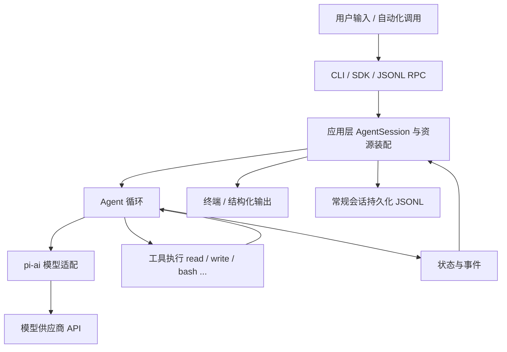
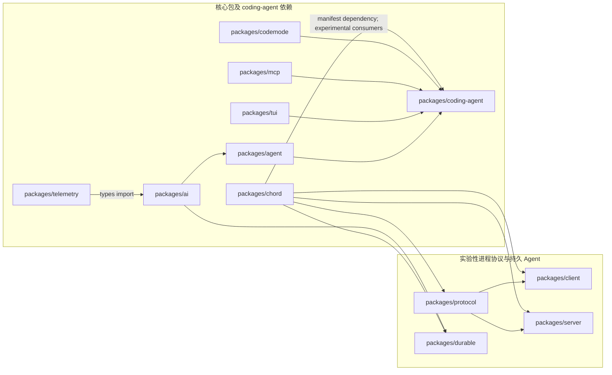
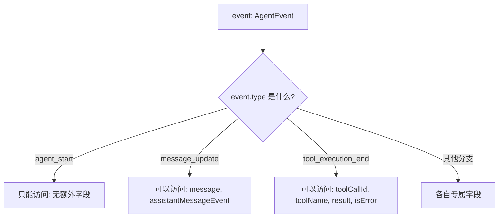

# 01. 仓库地图与运行环境

今天只需要本篇和文中列出的源码路径。任务是从零建立仓库地图，验证源码能运行，并学会沿函数调用定位行为。

本任务约需 2–3 小时。完成后应能解释用户输入如何穿过包边界，并能用真实导入或调用证明每条边。

## 开始前：实验约定

- 需要 Node.js >= 22.19.0、Git 和能跳转 TypeScript 定义的编辑器。下面的命令都在仓库根目录执行。缺少 `node_modules` 时使用 `npm install --ignore-scripts`；本任务不需要模型账号，也不运行 `npm run build` 或 `npm test`。
- 在独立的临时目录保存实验脚本和笔记，使用内存会话或临时会话目录。不要改真实的 `~/.pi/agent` 配置、已有会话文件或本仓库的现成测试；配置实验通过可注入的设置存储或独立测试进程完成。实验后只清理自己创建的文件。
- 本任务不需要模型响应。证据记法统一为“输入与环境 → 观察结果 → 源码位置 → 自己的解释”。源码按文件和符号定位；行号会随版本变化。

## 学习内容

pi 是一个 monorepo，即多个相互依赖的包放在同一个仓库。先把四个常用层次分开：`pi-ai` 把不同模型服务转成统一消息和流；`pi-agent` 决定何时问模型、何时执行工具；`pi-coding-agent` 提供 CLI、应用会话、持久化和扩展；`pi-tui` 负责终端输入与显示。其余包是专项能力，最后一阶段再回看。TypeScript 在这里由 Node 直接运行可擦除语法，类型检查与运行时校验是两件事：类型能帮助开发者，工具参数仍需在运行时验证。还应理解 ESM 的具名导入、`.ts` 相对路径、`async/await`、异步事件和 `AbortSignal`，这些概念会反复出现。

用一个具体问题串起这些层：“读取 README.md，告诉我第一段写了什么”。CLI 接受文字；coding-agent 组装会话与 `read` 工具；agent 决定先请模型选工具、执行工具后再请模型回答；ai 把模型服务的响应变成统一事件；tui 显示增量文字。读源码时遇到 `Promise`，把它理解为将来才完成的结果；遇到 `AbortSignal`，把它理解为向正在运行的操作传递取消请求。

## 核心源码

`package.json` 先看 `workspaces`、`engines`、`scripts`；`packages/agent/src/types.ts` 找 `AgentTool` 和 `AgentEvent`；`packages/ai/src/types.ts` 找 `Message`；`pi-test.ps1` 与 `packages/coding-agent/src/cli.ts` 看脚本怎样到 `main()`；`packages/coding-agent/examples/sdk/01-minimal.ts` 看 `createAgentSession`、`prompt` 与 `dispose`。

## TypeScript 语法小课：类型擦除与异步

TypeScript 的类型用于检查代码，Node 运行时不会保留它们。仓库采用可擦除语法：`type`、`interface` 等可以直接由 Node 去掉；相对导入源码时要写 `.ts` 后缀。读 `packages/coding-agent/examples/sdk/01-minimal.ts` 时，先区分同步创建对象、`await` 等待完成和事件回调异步到达。

```typescript
type Result = { text: string }; // type 只约束开发时的形状，运行时不存在
async function answer(): Promise<Result> { // async 函数总返回 Promise
  return { text: "pi" }; // 返回对象会自动包成已完成的 Promise
}
const result = await answer(); // await 取得 Promise 的最终值
console.assert(result.text === "pi"); // 运行时只检查真实值
```

在临时 `syntax.ts` 中运行 `node syntax.ts`。删去 `await` 再打印结果，观察拿到的是 Promise 而非 `Result`；这正是读 SDK 调用链时要标记的异步边界。


## 完整学习资料

先按下列正文完成学习，再执行本篇的动手任务。正文中原书的实验与验收题先作为案例阅读，实际动手统一放到文末；只运行本篇“今日准备”和动手任务明确指定的离线命令。章节编号保留知识主题的原编号；源码精读、示例、边界条件、常见错误和参考答案均直接收录在本文件中。开头的预计用时仅指核心主线，完整源码精读需另留时间。

### 本篇共同基础

以下运行图和术语均在本文件内。学习正文保留原手册的知识主题编号，但那些编号不构成本任务的阅读前置；实际操作按本篇的动手任务与验收标准执行。学习正文基于原手册注明的 `200387122ca450d6387f033949423114a270b96c` 源码基线，当前工作区若有差异，以当前源码为准。

### 15 分钟主线：pi 怎样完成一件事

假设用户输入“读取 demo.txt，并总结三点”。模型自己不能读取你电脑里的文件。pi 把用户问题和可用工具告诉模型；模型提出 `read` 调用；pi 在本地执行；模型拿到文件内容后才生成总结。这就是全书反复使用的同一个例子。

**先看不带 TypeScript 细节的主流程（教学伪代码）：**

```text
收到用户输入，把它加入当前会话
重复：
    用当前上下文向模型发起请求
    收集模型的回答并把过程通知界面
    如果回答要求执行工具：
        校验参数，在本地执行工具，记录结果
        继续循环，让模型看到工具结果
    否则，检查是否还有排队输入或明确的继续决定
    如果都没有：结束本次运行
```

第一行确定这次任务和已有历史。模型请求只负责生成回答或提出工具调用。工具校验与执行由 pi 负责，结果回到对话后才可能有下一轮模型请求。界面接收运行事件，历史保存完成的消息；它们都与“模型请求”有关，但不是同一种数据。真实实现还处理工具并发、错误、取消、重试和压缩，后面分别讲。

**先分清四对容易混淆的词：**

| 两个词                | 直观区别                                           | 在“读文件并总结”中的例子                   |
| --------------------- | -------------------------------------------------- | -------------------------------------------- |
| 模型请求 / 用户输入   | 用户只说一次话，pi 可以多次询问模型                | 先请模型选择工具，读完文件后再请模型总结     |
| 事件 / 消息           | 事件告诉界面过程；消息承载一次完整的对话内容       | “正在输出第几个字”是事件；完成的总结是消息 |
| 工具调用 / 工具结果   | 调用提出想做什么；结果记录本地执行所得             | `read("demo.txt")` 是调用；文件文字是结果  |
| 会话历史 / 模型上下文 | 历史保留记录；上下文是这一次请求实际送给模型的内容 | 分支 C 仍在文件里，沿分支 D 继续时不必送 C   |


```text
一次用户输入
  → 第一次模型请求：请调用 read("demo.txt")
  → 本地工具执行：读出文件文本
  → 第二次模型请求：根据工具结果总结三点
  → 没有后续工作：结束
```

### 第 0 章：目标、环境与项目全景


**先懂这一章**：把 pi 想成把模型、本地工具、会话记录和终端连接起来的程序。先认清四个主要包分别负责哪一段；这一章只要求画出路线，不需要记住所有文件。

> 学完本章你能回答：
>
> 1. pi 是什么？它和"直接调用大模型 API"有什么区别？
> 2. 这个仓库里十几个包各自负责什么？为什么这样拆分？
> 3. 用户能看到的几种使用方式（交互、print、JSON、RPC、SDK）在哪里汇合？
> 4. 想读源码，应该从哪里开始、按什么顺序读？

**预计学习时间**：第一天 2-3 小时（阅读 + 画图），实验 L01 另需 1 小时。
**本章验证状态**：静态核对通过（所有源码引用已对照基线 commit 检查）；实验 L01 需要你在自己的环境里运行后记录。

---


#### 0.1 先看问题：大模型很聪明，但它什么也做不了

假设你问一个纯聊天式的大模型："帮我读一下 demo.txt 并总结三点。"

纯聊天模型无法知道本地文件内容；它可能说明自己无法访问，也可能给出不可靠的猜测。原因是：

- **在 pi 的调用链里，模型不会自行管理本地会话**。pi 为每次请求组装消息和历史；本地文件、进程与终端的访问也由 pi 的工具完成。
- **模型只能提出意图**。响应可以包含文本或结构化的工具调用请求；请求本身不会读取文件，必须由调用它的程序执行。
- **模型没有权限**。真正的文件读写发生在你运行的进程里，由你的操作系统账号决定权限。

所以，一个能干活的编码助手必须有人来做这些事：

1. 把用户输入、历史记录、系统提示、工具说明组装成一次模型请求；
2. 解析模型返回的"我想调用 read 工具，参数是 demo.txt"；
3. 在本地真正执行读文件，把结果作为新消息再发给模型；
4. 如此循环，直到模型不再要求调用工具，输出最终回答；
5. 运行时发出事件、更新内存状态，并把需要恢复的信息写入会话记录。

**pi 就是做这五件事的框架。** 在 pi 的语境里，这类框架叫 **agent harness**（直译"智能体外壳"，也可以理解为"运行框架"）。harness 本身不"聪明"，它负责组织：模型、工具、状态、界面各就各位。

> 术语约定：本手册中的 **Agent**（智能体）指"模型 + 工具 + 循环"组成的执行体；**harness** 指承载它的运行框架；**turn**（轮次）指一次模型响应加上它引发的工具执行；**run**（运行）指从一次用户输入开始到 Agent 停下来为止的整个过程。第 4、6 章会把这些词落到具体代码上。


#### 0.2 pi 的第一个全景图

下面这张图是全书的地标。现在看不懂每个方框没关系，读完全书再回来，你会发现每个方框你都能指出对应的文件和函数。



用一句话概括这张图：**用户输入从入口进来，由应用会话装配好一切，交给 Agent 循环反复跟模型和工具打交道，过程中产生的事件回流给界面，产生的记录落到磁盘。**


#### 0.3 仓库全景：一个 monorepo，四层结构

这个仓库是一个 **monorepo**（单一仓库多包），用 npm workspaces 管理。所有包放在 `packages/` 下，根 `package.json` 的 `workspaces: ["packages/*", ...]` 把它们组织在一起。每个子目录是一个独立的 npm 包，有各自的 `package.json`、`README.md`、`src/`、`test/`。

先记住四个核心包（后面统称"核心四包"）：

| 包                        | npm 名                              | 一句话职责                                                         | 上游依赖                                                                         |
| ------------------------- | ----------------------------------- | ------------------------------------------------------------------ | -------------------------------------------------------------------------------- |
| `packages/ai`           | `@earendil-works/pi-ai`           | 统一的多供应商 LLM 接口：同一套类型调 OpenAI、Anthropic、Google 等 | `pi-telemetry`（当前源码仅导入类型）                                           |
| `packages/agent`        | `@earendil-works/pi-agent-core`   | Agent 运行时：消息循环、工具调用、状态与事件                       | 依赖`pi-ai`                                                                    |
| `packages/tui`          | `@earendil-works/pi-tui`          | 终端 UI 框架：差分渲染、组件、键盘输入                             | 无 pi 内部依赖                                                                   |
| `packages/coding-agent` | `@earendil-works/pi-coding-agent` | 面向用户的编码助手 CLI：会话、资源、工具、扩展、界面               | `pi-agent-core`、`pi-ai`、`pi-tui`、`pi-mcp`、`pi-codemode`、`chord` |

依赖关系是有方向的：`coding-agent` 依赖 `agent`，`agent` 依赖 `ai`，而 `ai` 的公开类型引用 `telemetry`。反过来不成立——`pi-ai` 不依赖 Agent；`pi-agent-core` 不依赖终端 UI 或 coding-agent 的文件工具。**这是理解整个项目的第一把钥匙：下层包通过接口提供机制，不绑定上层的具体用法。**



**读图方法**：箭头方向是“被依赖包 → 使用它的包”，不是运行时调用方向。图中内部边来自各包 `package.json` 的 `dependencies`；`packages/ai/src/types.ts` 对 `pi-telemetry` 的导入是 `import type`，因此运行时 JavaScript 不会加载 telemetry，但生成的类型声明引用了该类型，类型消费者仍需要解析这项公开依赖。实验性协议包被框在右侧，只表示它们的包依赖关系，不表示常规 CLI 自动通过 client/server 工作。

这张图与上面的全景流程图回答不同问题：依赖图说明“改这个包会受哪些包边界约束”；全景流程图说明“一个用户请求运行时经过哪些组件”。比如 `coding-agent` manifest 依赖 `chord`，而普通 CLI 的 `AgentSession` 主流程仍由第 3、8 章描述；不能只凭存在依赖就推断每条 CLI 请求都会经过 chord。

依赖清单核对范围是所有 `packages/*/package.json` 中 `@earendil-works/*` 的 `dependencies`，并以代表性源码 import 确认关键边：`agent-loop.ts` → `pi-ai`、`ai/src/types.ts` → `pi-telemetry`、`coding-agent` 的 client-tui / MCP / codemode 适配器 → 对应包、`client`/`server` → `protocol` 与 `chord`。不包括 devDependencies、第三方依赖，也不声称这是整个 monorepo 的完整构建图。

> 说明：`coding-agent` 还依赖若干第三方库（如终端颜色、文本差异和 YAML 解析）。本图只显示 pi workspace 包之间 manifest 声明的依赖，不展开第三方依赖。


##### 0.3.1 四个核心包的具体内容

**`packages/ai`（模型层）**：定义模型、消息、事件、流式响应的统一类型；内置多个供应商适配器和模型目录；处理 API Key 解析、用量统计、成本计算。关键文件：

- `packages/ai/src/types.ts` —— 所有对外类型的定义（48KB，是全仓库最重要的类型文件之一）；
- `packages/ai/src/models.ts` —— `createModels()`、模型注册与查找、`streamSimple` 等入口；
- `packages/ai/src/providers/` —— 每个供应商一个适配器，例如 `anthropic.ts`、`openai.ts`、`faux.ts`（假模型，测试用）。

**`packages/agent`（运行时层）**：不关心终端、不关心文件工具，只做"模型 + 工具 + 消息"的循环。关键文件：

- `packages/agent/src/agent-loop.ts` —— 循环本体（29KB）：发请求、收流、执行工具、决定是否继续；
- `packages/agent/src/agent.ts` —— 有状态的 `Agent` 类：持有消息、订阅事件、串行化运行；
- `packages/agent/src/types.ts` —— `AgentEvent`、`AgentTool`、`AgentMessage` 等类型（21KB）。

**`packages/tui`（终端 UI 层）**：一套独立的终端界面库，提供组件模型和差分渲染（只重绘变化的部分，避免闪烁）。它不认识 pi 的业务逻辑，任何 Node 程序都能用。关键文件在 `packages/tui/src/`，第 17 章展开。

**`packages/coding-agent`（应用层）**：用户实际安装的 `pi` 命令就来自这里（`package.json` 的 `bin: { "pi": "dist/bundle/cli.js" }`）。它把前三层组装成完整产品：

- `packages/coding-agent/src/cli.ts` —— 命令行入口（139 字节，只是转发）；
- `packages/coding-agent/src/main.ts` —— 主流程（35KB）：解析参数、装配会话、选择运行模式；
- `packages/coding-agent/src/core/` —— 核心业务：会话（`agent-session.ts`，158KB，全仓库最大文件）、工具、配置、资源加载、扩展等 50 多个模块；
- `packages/coding-agent/src/modes/` —— 交互模式、RPC 模式的实现；
- `packages/coding-agent/src/extensions/` —— 扩展系统的运行时支持。


##### 0.3.2 其他包：知道它们存在，暂时不用深入

| 包                                        | 职责                                                                    | 本手册章节       |
| ----------------------------------------- | ----------------------------------------------------------------------- | ---------------- |
| `packages/chord`                        | 独立的"应用组合运行时"：服务、副本状态、RPC、插件。不依赖任何其他 pi 包 | 第 23 章（选修） |
| `packages/durable`                      | 实验性的"持久执行"harness：先落盘再显示，进程死了能接着跑               | 第 23 章（选修） |
| `packages/mcp`                          | 独立的 Model Context Protocol 客户端（stdio/HTTP 传输）                 | 第 22 章（选修） |
| `packages/codemode`                     | 在 QuickJS 沙箱里执行模型写的 JavaScript，用来组合工具调用              | 第 22 章（选修） |
| `packages/protocol`                     | 实验性 client/server 协议的帧格式与编码（CBOR）                         | 第 24 章（选修） |
| `packages/client` / `packages/server` | 上述协议的客户端与本地服务端实现                                        | 第 24 章（选修） |
| `packages/telemetry`                    | 厂商中立的遥测契约（trace/span）                                        | 第 25 章（选修） |
| `packages/evals`                        | 行为评估：用固定任务集评测 coding agent 的效果                          | 第 25 章（选修） |
| `packages/session-backends`             | 会话存储后端抽象（供实验特性使用）                                      | 用到时再查       |

这些包有一个共同点值得现在记住：**它们通过明确定义的接口与核心四包相连，而不是互相乱引用。** 例如 `mcp` 完全不依赖 `ai` 或 `agent`；`coding-agent` 再把它适配成工具。第 12 章会教你用同样思路判断"一个需求该不该开新包"。


#### 0.4 用户可见的五种入口

pi 有五种主要使用方式，它们都汇聚到同一套 Agent 和会话机制（结论来自 `packages/coding-agent/docs/how-pi-works.md` 的 "Interfaces" 一节）：

| 入口           | 形态                                | 典型场景                 | 实现位置                                        |
| -------------- | ----------------------------------- | ------------------------ | ----------------------------------------------- |
| 交互模式       | 全屏终端 UI                         | 人类日常使用             | `packages/coding-agent/src/modes/interactive` |
| print 模式     | `pi -p "..."` 输出最终回答        | 脚本里一次性提问         | `main.ts` 的 print 分支                       |
| JSON 模式      | 逐行输出 Agent 事件（JSONL）        | 程序消费事件流           | `main.ts` 的 json 分支                        |
| RPC 模式       | stdin 收 JSONL 命令，stdout 回响应  | 编辑器插件、其他语言宿主 | `packages/coding-agent/src/modes/rpc`         |
| TypeScript SDK | `createAgentSession()` 进程内控制 | 自己写 Node 程序嵌入     | `packages/coding-agent/src/core/sdk.ts`       |

各入口共享 Agent 与会话的核心能力，但外层适配器、输入来源和输出格式不同。读代码时先找到模式分流，再顺着共享的会话与 Agent 主线；不要假定五种入口在启动参数、事件输出或生命周期上完全相同。第 3 章走常规 CLI 的主路径，第 15、16 章分别讲 SDK 与进程级集成。


##### 0.4.1 CLI 到底选哪一种模式？

表里的 `print`、`JSON` 和交互 UI 不是只看命令行参数。`main.ts` 把用户指定的 `Mode`（`text | json | rpc`）和 stdin/stdout 是否连接终端（TTY）合并成内部的 `AppMode`（`interactive | print | json | rpc`）：

```typescript
function resolveAppMode(parsed: Args, stdinIsTTY: boolean, stdoutIsTTY: boolean): AppMode {
	if (parsed.mode === "rpc") return "rpc";
	if (parsed.mode === "json") return "json";
	if (parsed.print || !stdinIsTTY || !stdoutIsTTY) return "print";
	return "interactive";
}
```

按分支顺序读这段：

1. 显式 `--mode rpc` 和 `--mode json` 优先，分别进入 RPC 和 JSON 运行模式；
2. 否则，`--print` 或 stdin/stdout 任一不是 TTY，就进入一次性 print 模式；
3. 只有没有上述条件时才进入交互 UI。

这也解释了一个常见误会：`--mode text` 只是选择 print 模式的文本输出格式，**不会单独强制 print**。终端输入输出都连接 TTY 时，`pi --mode text` 仍会启动交互 UI；而 `pi "请总结"` 若 stdin 或 stdout 被重定向，则会自动走 print。自动化脚本若要求 JSONL，明确传 `--mode json`，不要依赖 TTY 推断。

模式确定后，`main()` 仍会创建会话运行时，但最后分到不同适配器：RPC 调 `runRpcMode(runtime)`，交互模式创建 `InteractiveMode`，print/JSON 共用 `runPrintMode`，JSON 通过 `toPrintOutputMode()` 选择事件序列化输出。故意分清两层：`Mode` 是命令行声明的输出偏好，`AppMode` 是进程最后采用的运行形态。可从 `packages/coding-agent/src/main.ts` 的 `resolveAppMode`、`toPrintOutputMode` 和 `main` 末尾分支开始读；`parseArgs` 的字符串校验见 `packages/coding-agent/src/cli/args.ts`。

`--mode rpc` 还禁止 `@file` 参数（在进入会话创建前检查），因为 RPC 的输入由 stdin 上的 JSONL 命令驱动，不消费启动时的文件参数。RPC 协议细节留给第 16 章。


#### 0.5 一个具体例子：读文件并总结（作业预告）

输入："读取 demo.txt 并总结三点。" 高层轨迹如下（细节全部留到第 3、6、7 章）：

```text
用户消息 "读取 demo.txt 并总结三点"
  → 第 1 次模型请求（携带系统提示、历史、可用工具列表）
  → 模型回答：我要调用 read 工具 { path: "demo.txt" }
  → pi 在本地执行 read，得到文件内容
  → 第 2 次模型请求（在上面的历史后追加"工具结果"消息）
  → 模型回答：三点总结（不再调用工具）
  → 运行结束，界面显示总结
```

请现在就用直觉回答两个问题，读完第 3 章回来核对：

1. 为什么需要**两次**模型请求？一次不行吗？
2. 文件不存在时，错误发生在第几步？整个运行会崩溃吗？


#### 0.6 源码阅读路线：从外壳到内核

给新手的一个常见陷阱是"从最大的文件开始读"（比如 158KB 的 `agent-session.ts`），几分钟后就会迷失。正确的路线是按依赖方向、由外向内：

```text
第一步：读入口脚本        pi-test.sh / pi-test.ps1（怎么启动）
第二步：读 main.ts 的参数解析与模式选择（谁在什么时候被创建）
第三步：读 core/sdk.ts 的 createAgentSession（装配了哪些资源）
第四步：读 core/agent-session.ts 的 prompt 方法（应用会话如何驱动 Agent）
第五步：读 agent/src/agent.ts 与 agent-loop.ts（循环本体）
第六步：读 ai/src/models.ts 与 providers/faux.ts（模型层最小实现）
第七步：带着问题读你想要改的模块（工具、配置、扩展……）
```

这条路线与本书章节顺序一一对应（第 3、8、6 章），你现在只需要记住"由外向内、先跑通再深入"这个原则。


#### 0.7 实验 L01：环境记录与职责图

**实验性质**：只读操作，不修改仓库；Node、npm、Git 查询相同，源码启动命令按实际 shell 选择。
**验证状态**：Windows + PowerShell 的环境探查和源码入口 `--version` 已在撰写环境运行；Linux、macOS、Git Bash 未运行。读者仍需记录自己的环境并亲手画职责图，不能把本机结果当作自己的实验记录。


##### 目标

1. 记录你的环境版本和仓库基线；
2. 亲手画出"核心四包 + 依赖方向"的职责图（不要照抄，画完再对比 0.3 节）；
3. 找到 `pi` 命令真正指向的文件。


##### 步骤

先在仓库根目录记录版本和基线（PowerShell、Bash 都可直接运行）：

```bash
node --version
npm --version
git log -1 --format="%H %s"
```

预期：Node 版本 >= 22.19.0；`git log` 输出的哈希应与本手册基线的 `200387122ca450d6387f033949423114a270b96c` 一致（若不一致，说明你读的是更新或更旧的版本，请以你的代码为准）。

接着运行源码入口，只请求版本号；该步骤不创建会话、不调用模型：

```powershell
# Windows PowerShell，在仓库根目录
.\pi-test.ps1 --version
```

```bash
# Linux / macOS / Git Bash，在仓库根目录
./pi-test.sh --version
```

预期输出是当前 coding-agent 版本。启动时若出现 Node Type Stripping 的 `ExperimentalWarning`，它表示 Node 对直接运行可擦除 TypeScript 的实验性提示，不等于命令失败；检查退出码是否为 `0`。源码启动器会导入 `packages/coding-agent/src/cli.ts`，与刚才读取的安装版 `bin` 构建产物路径是两条不同入口。

查看 `pi` 命令的入口声明（读取代码，不执行）：

```bash
node -e "const p=require('./packages/coding-agent/package.json'); console.log(p.name, p.version, JSON.stringify(p.bin))"
```

预期输出形如：`@earendil-works/pi-coding-agent 1.0.2 {"pi":"dist/bundle/cli.js"}`。这说明：**用户装的 `pi` 命令最终执行的是 `packages/coding-agent` 构建产物 `dist/bundle/cli.js` 的入口**。开发时我们用 `pi-test.sh`（第 2 章）从源码直接跑，避免每次构建。


##### 观察与思考

- 用编辑器打开 `packages/coding-agent/src/cli.ts`（只有 139 字节，一行也能读），找到它转发给了谁；
- 打开 `packages/coding-agent/src/main.ts` 的前 50 行，找出 `#!/usr/bin/env node` 这样的 shebang 是否存在，理解 `bin` 的入口约定；
- 打开四个核心包的 `package.json`，对照 0.3 节的依赖方向表，验证 `dependencies` 字段；
- 将你的系统、shell、Node/npm、仓库 commit、实际源码启动命令和退出码写入附录 F 模板；Windows 与 POSIX 环境分别记录，不能互相代填。


##### 清理

本实验只读，无清理项。


#### 0.8 常见错误

| 现象                                                                   | 原因                           | 处理                                                                      |
| ---------------------------------------------------------------------- | ------------------------------ | ------------------------------------------------------------------------- |
| `node --version` 低于 22.19.0                                        | 系统 Node 太旧                 | 安装新版本（第 2 章给出三平台方法）                                       |
| 在子目录里运行`node -e "require('./packages/...')"` 报错找不到包     | 相对路径基于当前目录           | 先`cd` 到仓库根目录                                                     |
| 打开`packages/coding-agent/src/core/agent-session.ts` 觉得完全看不懂 | 158KB 的大文件按顺序读必然迷失 | 先读类型与导出清单，再跳到指定符号；第 3、8 章会给路线                    |
| 分不清`packages/ai` 和 `packages/agent`                            | 名字都像"AI"                   | 记住一句话：`ai` 管"怎么跟模型说话"，`agent` 管"拿到模型回话后干什么" |


#### 0.9 验收题

1. 用一句话解释：为什么模型自己不能读文件？pi 在中间做了什么？
2. `packages/tui` 能不能被一个与 pi 无关的项目使用？依据是什么？
3. 用户用 RPC 模式和 SDK 模式跑同一个任务，内部的 Agent 循环是两套实现吗？
4. 按"由外向内"原则，读 `agent-session.ts` 之前应该先读哪两个文件？


##### 参考答案

1. 模型是无状态、无本地权限的文本函数；pi 在本地执行工具调用，把结果作为新消息回填，并把多轮请求串起来。
2. 能。`packages/tui/package.json` 的依赖只有 `get-east-asian-width` 和 `marked` 等通用库，不依赖任何 pi 包；它提供的是通用终端组件与差分渲染。
3. 不是。所有入口都使用同一套 Agent 与会话机制，入口只决定"输入输出如何呈现"。
4. `packages/coding-agent/src/main.ts`（谁创建它）和 `packages/coding-agent/src/core/sdk.ts`（装配了什么）。


#### 0.10 源码依据

- `README.md`（仓库根）：包的总体介绍与开发命令；
- `packages/coding-agent/docs/how-pi-works.md`：一次请求、会话树、上下文、入口与信任模型的高层说明；
- `packages/ai/README.md`、`packages/agent/README.md`、`packages/tui/README.md`、`packages/coding-agent/package.json`；
- `packages/agent/src/types.ts`、`packages/agent/src/stream-fn.ts`。


---

### 第 1 章：读懂本项目需要的 TypeScript 与 Node.js


**先懂这一章**：读 pi 源码最常遇到的是“这是什么事件”“这个异步操作何时完成”“取消信号传到哪里”。本章只学回答这些问题所需的 TypeScript 和 Node.js，用实际项目代码练习，不需要先学完整语言规范。

> 学完本章你能回答：
>
> 1. 这个仓库里的 `.ts` 文件是怎么被直接执行和构建的？为什么不能用 `enum`？
> 2. `import` / `export`、`import type`、带 `.ts` 后缀的相对导入分别是什么意思？
> 3. 什么是"联合类型"和"类型收窄"？为什么 pi 的事件类型全都长成 `{ type: "...", ... }`？
> 4. 什么是 Promise、`async/await`、异步迭代和 `AbortSignal`？事件订阅函数为什么返回一个函数？

**预计学习时间**：2-3 天（若你已熟悉 TS，做 1.10 的验收题决定是否跳过）。
**本章验证状态**：静态核对通过；其中"用 Node 直接运行 .ts"一节在本机（Windows, Node v23.9.0）实际运行验证。

---


#### 1.1 先解决第一个困惑：为什么没有"编译"也能跑 TypeScript？

传统印象里，TypeScript 必须先编译成 JavaScript 才能运行。但这个仓库（以及现代 Node.js）采用了一种更轻的机制：**类型擦除执行**（type stripping）。


##### 1.1.1 亲手验证

作者在本机实际做了这个实验。建一个文件 `ts-strip-test.ts`：

```typescript
const x: number = 41; // : number 只在类型检查时使用，Node 运行前会擦除
function add(a: number, b: number): number {
	return a + b;
}
console.log(add(x, 1));
```

直接运行，不编译：

```bash
node ts-strip-test.ts
```

输出：

```text
42
(node:35408) ExperimentalWarning: Type Stripping is an experimental feature and might change at any time
```

这个实验说明两件事：

1. **Node 会直接执行 `.ts` 文件**：它把类型注解（`: number`、`: number`、返回类型）当作"注释"删掉，剩下的就是普通 JavaScript。这叫作 *type stripping*（类型剥离）。
2. **它是实验性的**：Node 会打印一条 `ExperimentalWarning`。这不影响功能，但意味着语法支持范围有限。


##### 1.1.2 限制一：只能使用"可擦除语法"

因为 Node 只是"删类型"而不做代码生成，所以**凡是需要生成额外 JavaScript 代码的语法都不能用**。仓库的 `tsconfig.base.json` 通过 `"erasableSyntaxOnly": true` 强制了这个限制，`AGENTS.md` 也把它写成了硬规则。你要避开这些语法：

| 不能用                                                        | 为什么             | 项目里的替代写法                                     |
| ------------------------------------------------------------- | ------------------ | ---------------------------------------------------- |
| `enum Color { Red }`                                        | 会生成一个真实对象 | 用字符串字面量联合：`type Color = "red" \| "green"` |
| `namespace X {}`                                            | 会生成包装对象     | 直接用模块文件组织代码                               |
| `class A { constructor(private x: number) {} }`（参数属性） | 会生成赋值代码     | 显式声明字段并在构造函数里赋值                       |
| `import x = require("y")` / `export =`                    | CommonJS 专用语法  | 用标准 ESM`import` / `export`                    |
| 装饰器（实验性旧语法）                                        | 需要代码生成       | 本项目不用装饰器                                     |

例如第 8 章你会读到的 `Agent` 类、`ModelRuntime` 类，全部采用"显式字段 + 构造函数赋值"的写法，看到时不要觉得啰嗦，那是为了兼容类型擦除执行。

对于 Java 转过来的读者，一句话总结：**没有 `enum`，用"字面量联合"代替；没有注解/装饰器，用普通函数和配置对象代替。**


##### 1.1.3 限制二：相对导入必须写 `.ts` 后缀

打开任意源码文件，比如 `packages/agent/src/stream-fn.ts`：

```typescript
// import type 只引入类型，运行时不会加载这个导入。
import type { StreamFn } from "./types.ts";
```

注意 `"./types.ts"` —— 后缀是 `.ts`，不是 `.js`，也不是省略后缀。这是刻意的：

- **运行时**（Node 直接执行）：Node 必须能找到真实存在的文件。源码树里只有 `types.ts`，所以导入路径写 `.ts`，Node 剥离类型后按原路径找文件，找得到。
- **构建时**（`tsc` 输出 `dist/`）：TypeScript 的 `"rewriteRelativeImportExtensions": true` 会把输出 JavaScript 里的 `./types.ts` 自动改写成 `./types.js`，保证构建产物之间互相引用正确。

所以你在本仓库写相对导入时的规则非常简单：**照着文件真实名字写后缀，`.ts` 就是 `.ts`**。

```typescript
// 对：文件真实存在
import { foo } from "./foo.ts";

// 错：本仓库不接受
import { foo } from "./foo";
import { foo } from "./foo.js";
```


##### 1.1.4 包的导入：`@earendil-works/pi-ai` 和它的子路径

跨包导入用 npm 包名。比如 `packages/agent/src/types.ts` 的第一行：

```typescript
import type {
	Api,
	AssistantMessage,
	// ...
} from "@earendil-works/pi-ai";
```

`"@earendil-works/pi-ai"` 指向 `packages/ai`。有些包还暴露**子路径**（subpath exports），比如：

```typescript
import { anthropicProvider } from "@earendil-works/pi-ai/providers/anthropic";
```

它之所以能解析，是因为 `packages/ai/package.json` 里有这样的 `"exports"` 声明（已核对基线）：

```json
{
	"./providers/*": {
		"types": "./dist/providers/*.d.ts",
		"import": "./dist/providers/*.js"
	}
}
```

读法：`./providers/anthropic` 这个子路径，类型定义在 `dist/providers/anthropic.d.ts`，运行时在 `dist/providers/anthropic.js`。`"types"` 和 `"import"` 的分离是为了让编辑器和运行时各取所需。

> 注意：子路径导入指向的是 **dist（构建产物）**。如果你在源码之间跨包引用，直接用包名即可，npm workspaces 会把它链接到本仓库；但 `dist` 不存在时（还没构建）会报错。第 2 章会讲用 `pi-test.sh` 从源码直接运行的方法。


##### 1.1.5 `tsconfig.base.json` 逐项解读

仓库根目录的 `tsconfig.base.json` 是所有包的共享配置。把它当作"这门语言的方言说明书"来读：

```json
{
	"compilerOptions": {
		"target": "ES2024",
		"module": "Node16",
		"lib": ["ES2024"],
		"strict": true,
		"erasableSyntaxOnly": true,
		"verbatimModuleSyntax": true,
		"esModuleInterop": true,
		"skipLibCheck": true,
		"forceConsistentCasingInFileNames": true,
		"declaration": true,
		"declarationMap": true,
		"sourceMap": true,
		"inlineSources": true,
		"inlineSourceMap": false,
		"moduleResolution": "Node16",
		"resolveJsonModule": true,
		"allowImportingTsExtensions": true,
		"rewriteRelativeImportExtensions": true,
		"types": ["node"]
	}
}
```

| 选项                                                                 | 含义                                       | 对你的影响                                                        |
| -------------------------------------------------------------------- | ------------------------------------------ | ----------------------------------------------------------------- |
| `target: ES2024`                                                   | 输出的 JS 语法级别                         | 可以用很新的语法，不用背老浏览器的兼容性                          |
| `module` / `moduleResolution: Node16`                            | 采用 Node 的 ESM/CJS 解析规则              | 导入路径规则严格，别自作聪明省略后缀或大小写                      |
| `strict: true`                                                     | 打开全部严格检查                           | `null`/`undefined` 必须处理；类型错误会拦住你                 |
| `erasableSyntaxOnly: true`                                         | 只允许"可擦除"语法                         | 见 1.1.2：不能用 enum 等                                          |
| `verbatimModuleSyntax: true`                                       | 导入/导出按你写的原样保留                  | **类型必须用 `import type` 导入**，否则可能有运行时副作用 |
| `resolveJsonModule`                                                | 允许`import data from "./x.json"`        | 配置文件、模型目录会用                                            |
| `allowImportingTsExtensions` + `rewriteRelativeImportExtensions` | 允许源码里写`.ts` 后缀并在构建时改写     | 见 1.1.3                                                          |
| `types: ["node"]`                                                  | 让`process`、`fs` 等 Node 全局类型可用 | 你能直接写`process.cwd()`                                       |

语言版本说明：TypeScript 有一个"**类型在运行时不存在**"的根本事实。后面的章节会反复利用这一点，比如判断"这个接口只是类型还是真实对象"、"这个 import 会不会在运行时被加载"。


#### 1.2 模块系统：ESM 的五个模式

本仓库所有包都是 **ESM**（ECMAScript Modules）。判断依据：每个 `package.json` 都有 `"type": "module"`。对读代码来说，你只需要熟悉五种常见模式。


##### 1.2.1 具名导出与默认导出

**具名导出**（named export）是主流：

```typescript
// packages/agent/src/stream-fn.ts（节选，真实代码）
let defaultStreamFn: StreamFn | undefined;

export function setDefaultStreamFn(streamFn: StreamFn | undefined): void {
	defaultStreamFn = streamFn;
}

export function getDefaultStreamFn(): StreamFn {
	if (!defaultStreamFn) {
		throw new Error("No default stream function configured. Pass streamFn explicitly or call setDefaultStreamFn().");
	}
	return defaultStreamFn;
}
```

导入时用花括号，名字必须与导出名一致：

```typescript
import { setDefaultStreamFn, getDefaultStreamFn } from "@earendil-works/pi-agent-core";
```

**默认导出**（default export）每个模块最多一个：

```typescript
export default function createThing() { /* ... */ }
// 导入时名字随便起：
import createThing from "./thing.ts";
```

读代码时的经验：看到 `import X from "..."` 且没有花括号，说明对方是默认导出；本仓库更偏爱具名导出，因为改名（重构）时更安全。


##### 1.2.2 `import type`：只导入类型，不产生运行时加载

因为开了 `verbatimModuleSyntax`，**类型和值的导入必须区分**：

```typescript
// 这是类型，必须用 import type
import type { AgentEvent } from "./types.ts";

// 这是真实存在的函数/对象，用普通 import
import { getDefaultStreamFn } from "./stream-fn.ts";
```

为什么重要？

- 类型在运行时不存在。如果错把类型写成普通 `import`，代码在 Node 里执行时会真的去加载那个模块（并在找不到导出时报错），或者在"仅类型"的模块上白白付出加载成本。
- 编辑器里，你可以在键盘上对任何标识符"跳转到定义"，看到它是 `interface`/`type`（类型）还是 `function`/`const`（值）。**这是新手最重要的一个动作：分清类型和值。**

一个小技巧：很多文件顶端会出现成片的 `import type { ... }`，读完请把它们当作"目录页"，它告诉你这个文件要与哪些数据结构打交道。


##### 1.2.3 `export *`：模块的公共门面

`packages/agent/src/index.ts` 只有五行：

```typescript
export * from "./agent.ts";
export * from "./agent-loop.ts";
export * from "./proxy.ts";
export { setDefaultStreamFn } from "./stream-fn.ts";
export * from "./types.ts";
```

这是**桶文件**（barrel file）写法：把包内各模块的导出重新导出，形成包的公共接口。外部代码只需要 `import { Agent } from "@earendil-works/pi-agent-core"`，不用关心内部文件结构。

读包时，**先从 `index.ts` 开始读**，它是这个包对外的"目录"。注意 `stream-fn.ts` 只导出了 `setDefaultStreamFn` 一个符号——说明 `getDefaultStreamFn` 是内部实现细节，虽然同文件但也刻意没有公开。这种"公开什么"的选择就是包的 API 设计。


##### 1.2.4 重命名导入与导出

```typescript
import { createModels as createModelCollection } from "@earendil-works/pi-ai";
export { parseConfig as parseSettingsConfig };
```

当同名符号冲突或想让名字更清楚时使用。你在本仓库会偶尔看到，大部分时候名字是直接匹配的。


##### 1.2.5 动态特性：只会看到少数几处

`await import("...")`（动态导入）在本仓库受到限制：`AGENTS.md` 明确要求"顶层导入，禁止 inline import"。你几乎看不到动态导入；个别地方（如 Node strip-only 场景下的可选依赖）例外。看到 `await import(` 时先想一想：为什么这里不能用静态导入？通常是因为该模块是可选的或平台相关。


#### 1.3 类型系统速成：从 Java/Python 到 TypeScript

如果你是 Java 或 Python 背景，Section 1.3 会重点讲"与你想的不一样的地方"。


##### 1.3.1 类型只是"检查期的约束"，不是运行时标签

Java 里 `new ArrayList<String>()` 的泛型信息在运行时还在（可反射）。TypeScript 的类型在运行时**全部消失**。这意味着：

- 不能写 `if (x instanceof MyInterface)` —— `interface` 在运行时不存在；
- 判断对象形状要用**运行时的值**：`typeof x === "string"`、`Array.isArray(x)`、"x.type === ..." 这样的字段检查；
- 后端收到 JSON 时，类型标注**不会自动校验**数据。pi 因此用 `typebox` 在运行时校验工具参数（第 7 章）。


##### 1.3.2 `interface` 与 `type`：两种描述对象的方式

```typescript
// 描述"对象形状"的两种写法，读代码时视为等价
interface Usage {
	input: number;
	output: number;
	totalTokens: number;
}

type StopReason = "pending" | "stop" | "length" | "toolUse" | "error" | "aborted" | "deferred";
```

- `interface` 擅长**对象形状**，可以"扩展"（`extends`）和声明合并；
- `type` 擅长**联合、字面量、工具类型**，不能重复声明。

本仓库混用两者，规则大致是：对象结构用 `interface`，联合/别名用 `type`。你不用纠结取舍，能读即可。

再看一个真实例子（`packages/ai/src/types.ts`）：

```typescript
export interface Usage {
	input: number;
	output: number;
	cacheRead: number;
	cacheWrite: number;
	/** Subset of `cacheWrite` written with 1h retention. Only Anthropic reports this split. */
	cacheWrite1h?: number;
	reasoning?: number;
	totalTokens: number;
	cost: {
		input: number;
		output: number;
		cacheRead: number;
		cacheWrite: number;
		total: number;
	};
}
```

几个记号：

- `?`（`cacheWrite1h?: number`）表示**可选属性**，读取时类型是 `number | undefined`。`strict` 模式下你必须在用它之前处理 `undefined`。
- 注释 `/** ... */` 是"文档注释"，编辑器悬停时会显示。**这个仓库的源文件里注释非常详尽，请把读注释当作读代码的一部分。**
- 嵌套对象直接内联写（`cost: { ... }`），不需要单独命名。


##### 1.3.3 联合类型与字面量类型

`StopReason` 的七个值全部是**字符串字面量类型**。含义是：这个类型的变量只允许取这七个字符串之一。模型响应的结束原因就是其中之一：

```text
"stop"    正常结束（模型说完了）
"length"  达到输出上限被截断
"toolUse" 模型要求调用工具（本轮结束、下一轮继续）
"error"   请求失败
"aborted" 被取消
"pending" 尚未结束（流式过程中）
"deferred" 延迟到后续处理（特殊供应商/长任务场景）
```

以后在代码里看到 `stopReason === "toolUse"` 这类判断，你就知道：**这是"模型想调用工具"的信号，是 Agent 循环继续的关键条件。**（第 6 章展开。）


##### 1.3.4 判别联合与类型收窄（本章最重要的一节）

这是读懂 pi 事件系统的钥匙。

先看问题。Agent 运行过程中会发出很多种事件，它们携带的字段不同：

- "agent 开始" 事件没有额外字段；
- "文本增量" 事件有 `delta` 字符串；
- "工具执行结束" 事件有 `toolName`、`result`、`isError` 等字段。

如果类型系统只有一种"大而全"的事件类型，每个字段都得写成可选，读代码时根本无法确定某个字段什么时候存在。TypeScript 的解决方案是**判别联合**（discriminated union）：每个成员都带一个共同的字面量字段（这里是 `type`），类型系统就能在判断了这个字段后，**自动收窄**（narrow）类型。

真实例子，`packages/agent/src/types.ts` 的 `AgentEvent`（原文节选）：

```typescript
export type AgentEvent =
	// Agent lifecycle
	| { type: "agent_start" }
	| { type: "agent_end"; messages: AgentMessage[] }
	// Turn lifecycle - a turn is one assistant response + any tool calls/results
	| { type: "turn_start" }
	| { type: "turn_end"; message: AgentMessage; toolResults: ToolResultMessage[] }
	// Message lifecycle - emitted for system, user, assistant, and toolResult messages
	| { type: "message_start"; message: AgentMessage }
	// Only emitted for assistant messages during streaming
	| { type: "message_update"; message: AgentMessage; assistantMessageEvent: AssistantMessageEvent }
	| { type: "message_end"; message: AgentMessage }
	// Tool execution lifecycle
	| { type: "tool_execution_start"; toolCallId: string; toolName: string; args: any }
	| { type: "tool_execution_update"; toolCallId: string; toolName: string; args: any; partialResult: any }
	| { type: "tool_execution_end"; toolCallId: string; toolName: string; result: any; isError: boolean };
```

读法：

- 每个 `|` 分支是一个"事件种类"，格式是 `{ type: "名字"; 其他字段 }`；
- `type` 字段是**判别标志**（discriminant）；
- 订阅者写 `if (event.type === "tool_execution_end")` 后，TypeScript 立刻知道 `event` 一定带有 `result`、`isError` 字段，可以安全访问；写在别的分支里访问同样的字段会**编译报错**。

用一张图理解"收窄"：



你会在整个代码库里反复看到：

- `switch (event.type) { case "..." : ... }`；
- `if (assistantMessageEvent.type === "text_delta") { ... }`；
- `if (result.isError)` 等。

**读代码时，把"判断判别字段"当作分支的导航牌。** 每个 case 里能做的事情，都是类型系统精确保证过的。

再补充一个真实第二层例子（`packages/ai/src/types.ts` 的 `AssistantMessageEvent`）：

```typescript
export type AssistantMessageEvent =
	| { type: "start"; partial: AssistantMessage }
	| { type: "text_start"; contentIndex: number; partial: AssistantMessage }
	| { type: "text_delta"; contentIndex: number; delta: string; partial: AssistantMessage }
	| { type: "text_end"; contentIndex: number; content: string; partial: AssistantMessage }
	| { type: "thinking_start"; contentIndex: number; partial: AssistantMessage }
	| { type: "thinking_delta"; contentIndex: number; delta: string; partial: AssistantMessage }
	| { type: "thinking_end"; contentIndex: number; content: string; partial: AssistantMessage }
	| { type: "toolcall_start"; contentIndex: number; partial: AssistantMessage }
	| { type: "toolcall_delta"; contentIndex: number; delta: string; partial: AssistantMessage }
	| { type: "toolcall_end"; contentIndex: number; toolCall: ToolCall; partial: AssistantMessage }
	| {
			type: "done";
			reason: Extract<StopReason, "stop" | "length" | "toolUse" | "deferred">;
			message: AssistantMessage;
	  }
	| { type: "error"; reason: Extract<StopReason, "aborted" | "error">; error: AssistantMessage };
```

这段类型说明一次流式响应会经历这些阶段：

```text
start
  → text_start → text_delta（多次）→ text_end        ← 文本流
  → thinking_start → thinking_delta（多次）→ thinking_end  ← 思考流（部分模型有）
  → toolcall_start → toolcall_delta（多次）→ toolcall_end  ← 工具调用流
  → done（或 error）
```

而 `Extract<StopReason, "stop" | "length" | "toolUse" | "deferred">` 是**类型工具**：从 `StopReason` 里挑出子集，所以 `done` 的 `reason` 永远是四个"正常结束类"的原因，`error` 的 `reason` 永远只可能是 `"aborted"` 或 `"error"`。这种"用类型排除不可能状态"的写法是本仓库的常见风格。


##### 1.3.5 泛型：让同一个结构适配不同数据

Java 的 `List<T>` 你已熟悉；TypeScript 泛型用得更多、更活泼。看三个真实场景。

**场景一：消息数组**。

```typescript
interface AgentContext {
	/** Transcript visible to the model. */
	messages: AgentMessage[];
	/** Tools available for execution in this run. */
	tools?: AgentTool<any>[];
}
```

`AgentMessage[]` 是"AgentMessage 的数组"。

**场景二：工具定义**（`packages/agent/src/types.ts`）：

```typescript
export interface AgentTool<TParameters extends TSchema = TSchema, TDetails = any> extends Tool<TParameters> {
	label: string;
	execute: (
		toolCallId: string,
		params: Static<TParameters>,
		signal?: AbortSignal,
		onUpdate?: AgentToolUpdateCallback<TDetails>,
	) => Promise<AgentToolResult<TDetails>>;
	executionMode?: ToolExecutionMode;
}
```

读法（先建立直觉，细节第 7 章）：

- `AgentTool<参数Schema, 详情类型>` 有两个泛型参数；
- `TParameters extends TSchema = TSchema`：参数必须是"schema 类型"，默认是 `TSchema`；
- `Static<TParameters>` 是关键魔法：它把"运行时 schema"翻译成"编译期的参数类型"。`typebox` 库提供这个工具。也就是说，工具作者写一份参数 schema，运行时用它校验、编译期用它给出 `params` 的字段类型；
- `Promise<AgentToolResult<TDetails>>`：`execute` 是异步函数，返回"结果对象"的 Promise。

**场景三：模型类型**。

```typescript
import type { Model, Api } from "@earendil-works/pi-ai";
// StreamFn 里出现的用法：
(model: Model<Api>, context: TranscriptContext, options?: SimpleStreamOptions) => ...
```

`Model<Api>` 表示"某种 API 类型的模型"。`Api` 本身是一个联合类型（各家协议的标识，如 `"anthropic-messages"`、`"openai-completions"` 等），泛型让"模型 + 适配器"保持类型关联。第 5 章会完整讲解。

**先记住三点即可**：`<...>`是参数列表；`extends` 是约束（必须满足什么）；`=` 是默认值。读懂调用处的类型实参（`AgentTool<ReadParams, ReadDetails>`）比会写泛型更重要。


###### 用 `read` 工具把泛型和运行时 schema 连起来

刚才的 `AgentTool<TParameters>` 看起来抽象，可以用真实的 `read` 工具把它拆开。它在 `packages/coding-agent/src/core/tools/read.ts` 里先定义一个**运行时对象**：

```typescript
const readSchema = Type.Object({
  path: Type.String({ description: "Path to the file to read (relative or absolute)" }),
  offset: Type.Optional(Type.Number({ description: "Line number to start reading from (1-indexed)" })),
  limit: Type.Optional(Type.Number({ description: "Maximum number of lines to read" })),
});

export type ReadToolInput = Static<typeof readSchema>;
```

逐行分开看：

1. `Type.Object(...)` 是 JavaScript 在运行时实际创建的 schema 对象；`Type.String`、`Type.Number` 描述接收值的形状。
2. `typeof readSchema` 是 TypeScript 的类型运算，意思是“取这个变量的类型”。它不是运行时函数 `typeof`，不会产生新对象。
3. `Static<typeof readSchema>` 是 typebox 提供的编译期映射：从 schema 描述推导参数类型，结果近似为 `{ path: string; offset?: number; limit?: number }`。

然后工厂把 schema 类型传给工具泛型：

```typescript
export function createReadTool(cwd: string, options?: ReadToolOptions): AgentTool<typeof readSchema> {
  return wrapToolDefinition(createReadToolDefinition(cwd, options));
}
```

`AgentTool<TParameters>` 的 `execute` 参数使用 `Static<TParameters>`。所以传入 `typeof readSchema` 后，编译器能把执行参数关联到 `ReadToolInput`。写工具实现时，字段名和必选/可选关系能得到编辑器提示；把 `path` 写成数字，或把必需字段标成可选，都会在源码检查阶段出错。

但 schema 类型和运行时验证是两件相连、不能互相替代的事：

```text
schema 对象 Type.Object(...) ──运行时──> 校验模型送来的真实 JSON
             │
             └──Static<typeof ...>──编译期──> 给 execute 参数提供静态类型
```

模型数据来自网络，不会因为 TypeScript 写了 `ReadToolInput` 就自动变安全。Agent 循环实际调用 `validateToolArguments(tool, toolCall)`，用工具的 schema 检查真实参数；校验过程还可能做归一和类型转换，细节见第 7.4 节。反过来，运行时校验也不会替你设计完整业务规则：这个 schema 把 `offset` 约束为 number，但没有声明必须是整数、必须大于零；若工具实现依赖这些限制，还需要显式 schema 约束或运行时业务检查。

**新手改工具时按这个顺序追**：

1. 找到 `const xxxSchema = Type.Object(...)`，确认每个字段的类型与 `Type.Optional`；
2. 找 `type XxxInput = Static<typeof xxxSchema>`，理解编译器会推导什么；
3. 找工厂的返回类型，如 `AgentTool<typeof xxxSchema>`，再跳到 `AgentTool.execute` 的 `params`；
4. 确认运行时入口用 schema 验证了不可信数据，再读具体副作用代码。

不要只改 `execute` 参数旁的手写类型来“修”类型错误。应先判断 schema 是否表达了真正需求，再让静态类型和运行时验证共享同一个 schema 来源。


##### 1.3.6 `any`、`unknown`、`never` 与仓库规则

- `any`：关闭检查，想怎么用都行。**仓库规则是"非必要不用 any"**。源码里看到它时，先确认它出现在哪一层，不要照抄：
  - `AgentContext.tools?: AgentTool<any>[]` 表示“一个数组装着很多种参数 schema 不同的工具”。每个具体工具仍可有精确类型（例如 `AgentTool<typeof readSchema>`），但被放进这个通用集合时，参数类型被擦掉，数组层面的统一访问无法保留每项工具各自的 schema。当前实现选择在集合边界做这个折衷，不代表每个工具实现都不安全。
  - `AgentEvent` 的工具执行事件用 `args: any`、`result: any`，因为同一事件联合要承载不同工具的参数和结果形状。订阅方若要安全使用这些值，应按 `toolName` 找到对应的工具/renderer，并检查它能依赖的结构；不要把事件字段的 `any` 继续扩散到新 API。
  - `AgentTool<TDetails = any>` 的默认值让不关心详情类型的通用调用方仍可使用该接口。能确定具体详情类型时，应显式写 `AgentTool<typeof schema, Details>`。
- `unknown`：安全的"未知值"，任何属性都不能直接访问；先用 `typeof`、`Array.isArray`、`in` 等运行时检查缩小范围，或在有可靠依据时再作类型断言。
- `never`：不可能出现的类型。除抛错函数外，也常用于穷尽性检查：联合类型新增成员后，旧的 `switch` 若没处理它，可以在 `never` 赋值处报错。

一个 `unknown` 的收窄例子：

```typescript
function errorMessage(value: unknown): string {
  if (typeof value === "object" && value !== null && "message" in value) {
    const message = value.message; // 经过 in 检查后，属性仍是 unknown
    if (typeof message === "string") return message;
  }
  return String(value);
}
```

两个检查各自解决一件事：`"message" in value` 证明对象上有这个键；`typeof message === "string"` 才证明属性值能当字符串用。只做前者还不够。**不要为了让红线消失而直接写 `value as Error`**：类型断言不会检查运行时对象是不是 `Error`。

工具参数把这三个概念放在同一条路径上：具体工具用 TypeBox schema 推导 `Static<T>`；通用工具集合会擦掉单项泛型；模型送来的真实参数仍要由 `validateToolArguments()` 在运行时检查。详见本章 1.3.5 的 `read` 例子与第 7.4 节。泛型被擦掉不等于运行时验证也被擦掉。


##### 1.3.7 结构化类型：长得像就算（与 Java 很不同）

TypeScript 是**结构化类型**：只要一个对象的形状满足接口，它就是这个类型，不需要显式 `implements`。

```typescript
interface Point { x: number; y: number }
const p = { x: 1, y: 2, extra: true }; // 赋给 Point 变量是合法的
```

这解释了为什么本仓库大量使用"小而专的接口 + 对象字面量"来组合功能（如各种 `Options`、`Result` 类型），而不是繁杂的类继承体系。读代码时看到函数接受一个对象参数，先去读那个 `interface`，再对调用处传入的字段即可。


#### 1.4 异步编程：Promise、并发与流

pi 的核心几乎全是异步的：模型流式返回、工具执行、文件读写、事件派发。这一节把本仓库会用到的异步模式讲全。


##### 1.4.1 从 Promise 与 async/await 说起

```typescript
// 调用方视角：await 等待异步结果
const { session } = await createAgentSession();
await session.prompt("What files are in the current directory?");
```

- 一个 `async` 函数内部可以 `await` 一个 Promise，语义是"暂停这里，等结果回来再继续"；
- `await` 只在 `async` 函数（或 ES 模块顶层）里可用。注意 `examples/sdk/01-minimal.ts` 直接在顶层用 `await`，这是**顶层 await**，ESM 的特性，CommonJS 里没有。

错误处理用普通的 `try/catch`：

```typescript
try {
	await session.prompt("...");
} finally {
	session.dispose(); // 无论成功、失败还是取消都要释放资源
}
```

`finally`（而不是只在成功分支释放）是仓库里反复出现的安全模式。第 8 章会解释"不 dispose 会泄漏什么"。


##### 1.4.2 并发：`Promise.all` 与"完成顺序"

多个独立异步任务同时进行：

```typescript
const [a, b] = await Promise.all([taskA(), taskB()]);
```

注意两个概念（第 7 章的主角）：

- **完成顺序**：谁先完成谁先结束，可能乱序（耗时 10ms 的 B 先于 100ms 的 A 完成）；
- **结果顺序**：`Promise.all` 返回的数组永远按**传入顺序**排列，与完成顺序无关。

pi 的工具执行同时利用了这两个性质：完成事件按完成顺序发出（界面实时反馈），但工具结果消息按模型声明顺序记录（保持对话历史确定性）。第 7 章会用两个可控的假工具实验验证。

一个重要边界：`Promise.all` 只负责等待并收集结果，**不会因为其中一个 Promise 失败就自动取消其他任务**。它会以第一个拒绝作为 `await Promise.all(...)` 的拒绝原因，但其余任务仍可能继续运行。想让并行任务一起停止，程序还必须共享并触发取消信号，并且每个任务都要配合检查。


##### 1.4.3 异步迭代：`for await...of`

模型响应是一条**事件流**，不是一个单个值。pi 用异步迭代器表示它：

```typescript
for await (const event of stream) {
	if (event.type === "text_delta") {
		process.stdout.write(event.delta);
	}
}
```

细分概念：

- **可迭代**（iterable）：`for...of` 能遍历的对象；
- **异步可迭代**（async iterable）：`for await...of` 能遍历的对象，元素在等待中逐个到来。`for await` 的效果是"每次循环都 await 下一个元素"。

`packages/agent/src/types.ts` 里 `StreamFn` 的返回类型 `AssistantMessageEventStream` 就是一个异步事件流。它的完整定义在 `packages/ai/src/types.ts`，你可以用编辑器跟进去看看它和 `AsyncIterable<AssistantMessageEvent>` 的关系（本节只要求建立直觉）。


##### 1.4.4 `AbortSignal`：如何取消一个正在进行的操作

现实问题：用户按下 Esc / Ctrl+C，正在进行的模型请求或工具执行必须停下来。Node 的标准方案是 `AbortController` / `AbortSignal`：

```typescript
const controller = new AbortController();
// 把信号传给异步操作
someOperation({ signal: controller.signal });
// 需要取消时：
controller.abort();
```

本仓库中的用法：

- 工具执行的签名里有 `signal?: AbortSignal`（见 1.3.5 的 `AgentTool.execute`）——**工具作者有责任检查信号并尽快停止**；
- 取消不代表强杀进程。`AGENTS.md` 提醒过："区分取消信号与强制终止进程"。收到信号后，函数应该自行做清理（关文件、杀子进程）后返回；
- 取消之后的结果：assistant 消息的 `stopReason` 是 `"aborted"`，流会发出 `{ type: "error", reason: "aborted" }` 事件。

你可以用"搬运行李"类比：`abort()` 是"喊停"，不是"把东西扔了"；搬的人（异步函数）听到喊停后自己决定怎么放下手里的东西。


##### 1.4.5 事件订阅：回调函数与"取消订阅"

`packages/agent/README.md` 展示的用法：

```typescript
agent.subscribe((event) => {
	if (event.type === "message_update" && event.assistantMessageEvent.type === "text_delta") {
		// Stream just the new text chunk
		process.stdout.write(event.assistantMessageEvent.delta);
	}
});
```

`subscribe`（订阅）接收一个**回调函数**（callback）：每当发生事件，运行时调用你传入的函数。这个模式在 pi 里到处都是（`session.subscribe`、扩展的 `on(...)` 等）。

两个关键细节：

1. **回调会被调用很多次**：参数 `event` 每次都不同。别在回调里写"只执行一次"的假设。
2. **取消订阅**：本仓库的 `subscribe` 约定通常返回一个"退订函数"：

```typescript
const unsubscribe = agent.subscribe(onEvent);
// 等不需要监听时：
unsubscribe();
```

忘了退订会怎样？旧的回调仍然会被每次事件调用：轻则重复渲染，重则访问已释放的资源。第 13 章（扩展）和第 8 章（会话释放）会反复强调"注册与释放成对出现"。

还有一个行为细节，`packages/agent/src/types.ts` 的文档注释写得很明确：

```text
`agent_end` is the last event emitted for a run, but awaited Agent.subscribe()
listeners for that event are still part of run settlement. The agent becomes
idle only after those listeners finish.
```

翻译：`agent_end` 是运行的最后一个事件，但**如果监听器是异步的，Agent 要等它们全部执行完才算"空闲"**。也就是说 `await agent.prompt(...)` 返回时，所有 `agent_end` 监听器都已经跑完了。这解释了后续章节里"运行结束、事件回调结束、资源释放是三件不同的事"（第 8、15 章）。


##### 1.4.6 异常怎样穿过 `await`：从工具执行看真实调用链

初学时容易把 `async` 当作"自动在后台运行"，把 `await` 当作"只等待、不改变错误处理"。更准确的理解是：

- 调用 `async` 函数会得到 `Promise<T>`；函数里的 `return value` 会让 Promise 成功完成，`throw error` 会让 Promise 以该错误拒绝；
- `await promise` 等待它完成。Promise 成功时，`await` 表达式得到结果；Promise 拒绝时，错误会像当前行同步 `throw` 一样，在这一行抛出；
- 外层 `try/catch/finally` 因而可以处理 `await` 之后的失败。若没有匹配的 `catch`，当前 async 函数返回的 Promise 也会拒绝。

最小例子：

```typescript
async function readAnswer(): Promise<string> {
  try {
    const answer = await loadAnswer();
    return answer;
  } catch (error) {
    return `读取失败：${String(error)}`;
  } finally {
    releaseTemporaryResource();
  }
}
```

逐步读：`loadAnswer()` 先返回 Promise；`await` 等待它；若它拒绝，执行位置跳到 `catch`；无论成功还是失败，`finally` 都会执行；最后 `readAnswer()` 返回的仍是一个 Promise。若 `finally` 自己抛错，最终 Promise 会以 `finally` 的错误拒绝，所以清理代码也应谨慎。

现在看本仓库 `packages/agent/src/agent-loop.ts` 的真实路径：`executePreparedToolCall`。下面保留核心控制结构并省略了类型细节：

```typescript
const updateEvents: Promise<void>[] = [];
let acceptingUpdates = true;

try {
  const result = await prepared.tool.execute(id, args, signal, (partialResult) => {
    if (!acceptingUpdates) return;
    updateEvents.push(Promise.resolve(onUpdate(partialResult)));
  });
  acceptingUpdates = false;
  await Promise.all(updateEvents);
  return { result, isError: result.isError === true };
} catch (error) {
  acceptingUpdates = false;
  await Promise.all(updateEvents);
  return { result: createErrorToolResult(errorMessage(error)), isError: true };
} finally {
  acceptingUpdates = false;
}
```

这是教学节选，真实代码中的参数和错误转文本表达式以源码为准。各部分的责任不同：

1. **工具执行**：`prepared.tool.execute(...)` 返回一个 Promise；`await` 保证先拿到最终工具结果，才开始结算进度回调。
2. **进度回调**：工具可多次调用最后一个参数来报告 partial result。该 callback 本身没有要求工具 `await` 它，所以 Agent 把 `onUpdate(...)` 的返回值包装成 Promise，放入 `updateEvents`。
3. **关门标志**：`acceptingUpdates = false` 后，稍晚到达的 callback 不再排入新更新。它不能取消已经开始的更新。
4. **等待更新**：当更新都成功时，`await Promise.all(updateEvents)` 会等它们全部成功后才返回工具结果。如果任意更新 Promise 拒绝，`Promise.all` 会立刻拒绝；其他更新不会被取消，仍可能在后台完成。最终工具结果消息仍按工具调用原本的顺序发出（第 7 章）。
5. **工具错误转换**：工具本身抛错时进入 `catch`，代码把异常文本做成 `isError: true` 的工具结果。模型可以看见这条错误结果并决定下一步；它不是一次未处理异常。
6. **最外层清理**：`finally` 再关一次更新入口，保证无论成功或异常，都不会继续接收进度。

【重要边界】`Promise.all(updateEvents)` 如果拒绝，也会进入同一个 `catch`。但 catch 里再次等待 `Promise.all(updateEvents)` 时，已拒绝的 Promise 仍会拒绝；这次拒绝会从 catch 向上传播，而不会被这个 catch 自己再次捕获。读源码时要区分"工具 execute 的失败转换为结果"和"进度处理自身失败导致整个工具调度 Promise 拒绝"。不要因为两者都发生在一个 `try` 里，就认为所有错误都会变成工具结果。


##### 1.4.7 异步调用链练习：标记谁等待谁

下面这条线只描述顺序，不代表多线程：

```text
runLoop
  -> await executeToolCalls(...)
  -> 依次发 start 事件并准备工具调用
       -> Promise.all 同时调用已准备好的工具
       -> 每个工具 await executePreparedToolCall(...)
            -> await tool.execute(...)
            -> await Promise.all(progressPromises)
       -> await Promise.all(每个工具的 finalized Promise)
       -> 按声明顺序发出工具结果消息
  -> 处理后续 turn
```

用一张纸把每个 `await` 左右各写一列：

| await 前在做什么              | await 后可以依赖什么                                               |
| ----------------------------- | ------------------------------------------------------------------ |
| 启动工具调用                  | 不代表所有工具已结束                                               |
| 等待单个`tool.execute`      | 该工具的主结果已返回或抛错                                         |
| 等待进度 Promise              | 已收集的进度通知均成功完成；若其中一项拒绝，则当前路径转入异常处理 |
| 等待工具 Promise 集合         | 集合成功时拿到按输入顺序排列的结果数组                             |
| 等待`emitToolResultMessage` | 这个结果消息的异步事件处理已完成                                   |

练习：假设工具 A 用 100ms 完成，工具 B 用 10ms 完成，B 的进度回调又需要 50ms 才结束。并行执行路径会先按声明顺序逐个发 start 事件并完成参数/权限准备，再把准备好的调用交给 `Promise.all` 执行。分别写下：（a）哪个工具的结束事件可能先出现；（b）哪个工具结果消息先写入；（c）`runLoop` 何时能继续。先根据源码推导，再对照第 7 章并行工具实验。不要只回答"用了 Promise.all，所以同时完成"；`Promise.all` 不会让耗时消失，也不规定事件的完成先后。

练习二：把 B 的 `execute` 改成抛错，再把 B 的进度回调改成拒绝，分别追踪错误会变成工具结果还是向上传播。答案的关键是指出每个错误具体在哪一个 `await` 被重新抛出，以及它落在哪个 `try/catch` 的范围里。


#### 1.5 Node.js 必备 API：只学本仓库用到的部分

pi 是 Node 程序。你不需要成为 Node 专家，但这五组 API 会在源码里反复出现。


##### 1.5.1 文件系统：优先用 `node:fs/promises`

```typescript
import { readFile, writeFile } from "node:fs/promises";

const text = await readFile("demo.txt", "utf8");
```

- 导入路径写 `node:fs/promises`（带 `node:` 前缀），这是 Node 官方的 ESM 惯例；
- 异步版本返回 Promise，配合 `await` 使用；
- 同步版本（`readFileSync`）只在启动阶段或测试里偶尔出现，原因是它会阻塞整个进程。


##### 1.5.2 子进程：工具执行 `bash` 的本质

模型要求"运行 `npm test`"，pi 实际做的事就是启动一个子进程。Node 的 `node:child_process` 提供能力；本仓库还用了 `cross-spawn` 来解决 Windows 下 `.cmd`、引号、环境变量等兼容性问题（`packages/coding-agent` 的依赖里有它）。

读代码时看到 `spawn(...)`、`execFile(...)`，先找三样东西：**命令、参数数组、cwd**；再看**stdout/stderr 如何被收集**、**进程何时算结束**。第 7 章和第 17 章会展开。


##### 1.5.3 标准流与进程

| API                  | 作用         | 在 pi 里的用途                           |
| -------------------- | ------------ | ---------------------------------------- |
| `process.stdin`    | 标准输入     | RPC 模式逐行读取命令（第 16 章）         |
| `process.stdout`   | 标准输出     | print 输出、流式文本、JSONL 协议帧       |
| `process.stderr`   | 标准错误     | 日志与诊断（**不能混进协议输出**） |
| `process.cwd()`    | 当前工作目录 | 决定默认会话目录与工具执行目录           |
| `process.env`      | 环境变量     | API Key、代理、平台判断                  |
| `process.exitCode` | 退出码       | 脚本集成判断成败                         |

一个新手常踩的坑：把调试日志写到 `stdout`。在 RPC/JSON 模式下，`stdout` 是机器解析的协议通道，多一行日志就会让宿主解析失败。所以本仓库的协议输出与日志严格分流（第 16 章）。


##### 1.5.4 `process.argv`：命令行参数从哪来

`node script.ts a b` 时，`process.argv` 是 `["node路径", "script路径", "a", "b"]`。`packages/coding-agent/src/main.ts` 里解析 `-p`、`--json` 等参数的起点就在这里（第 3 章读这个文件的开头）。


##### 1.5.5 目录与路径

- `path.join` / `path.resolve` 拼路径；
- `os.homedir()` 拿用户主目录（pi 的全局配置在 `~/.pi/agent`，Windows 上是 `C:\Users\<你>\.pi\agent`）；
- 平台差异：Windows 用反斜杠、盘符，Unix 用正斜杠。跨平台代码一律用 `path` 模块拼接，不手写分隔符。


#### 1.6 本项目特有的工程约束（写代码前必读）

如果你只读不写，1.6 可以快速扫过；毕业项目之前务必回读。

1. **可擦除语法**：不能用 `enum`、`namespace`、参数属性、`import =`、`export =`（1.1.2）。
2. **顶层导入**：不许 `await import()` 或 `import("pkg").Type` 这类内联导入（`AGENTS.md`）。唯一例外是少数特殊场景，需要理解原因再用。
3. **类型与值分离**：提供类型的导入一律 `import type`（1.2.2）。
4. **相对导入带 `.ts`**：`./foo.ts`（1.1.3）。
5. **不用 `any`**：必要时优先 `unknown` + 收窄；确实需要 `any` 要在评审中说得清。
6. **依赖版本固定**：直接外部依赖写精确版本（如 `"typebox": "1.3.27"`，不带 `^`）。这是安全要求，不是你该改的东西。
7. **资源路径**：`packages/coding-agent` 里解析包内资源必须用 `src/config.ts` 的 helper，不许直接 `__dirname`（源码运行、npm 安装、独立二进制的路径布局不同）。
8. **格式**：仓库用 Biome（Tab 缩进、双引号等）；`npm run check` 会自动格式化并检查。

这些规则的目的都同一个：**代码要能在"源码运行 / 构建产物 / 独立二进制"三种形态下一致工作，并且类型能被安全地擦除。**


#### 1.7 实战精读：逐行读 `01-minimal.ts`

现在把本章知识用在一个真实文件上。它是 pi SDK 的最小例子，完整内容如下（`packages/coding-agent/examples/sdk/01-minimal.ts`），我们在代码里插入编号注释，随后逐行解释。

```typescript
/**
 * Minimal SDK Usage
 *
 * Uses all defaults: discovers skills, extensions, tools, context files
 * from cwd and ~/.pi/agent. Model chosen from settings or first available.
 */

import { createAgentSession } from "@earendil-works/pi-coding-agent";

const { session } = await createAgentSession();

try {
	session.subscribe((event) => {
		if (event.type === "message_update" && event.assistantMessageEvent.type === "text_delta") {
			process.stdout.write(event.assistantMessageEvent.delta);
		}
	});

	await session.prompt("What files are in the current directory?");
	session.state.messages.forEach((msg) => {
		console.log(msg);
	});
	console.log();
} finally {
	session.dispose();
}
```


##### 逐行解释

**顶部注释块的三个信息**（新手常跳过，实际非常重要）：

- "Uses all defaults"：不传任何配置，`createAgentSession()` 会自己找技能（skills）、扩展、工具、上下文文件；
- "discovers ... from cwd and ~/.pi/agent"：发现范围是"当前目录 + 用户全局配置目录"；
- "Model chosen from settings or first available"：模型不是你指定的，而是从设置里挑；没有设置则选第一个可用的。

**第 1 行导入**：`import { createAgentSession } from "@earendil-works/pi-coding-agent"`。不是 `import type`，因为它是**真实存在的函数**。包名对应 `packages/coding-agent`。

**`const { session } = await createAgentSession();`**：

- 这是**解构赋值**：函数返回一个对象，我们只取 `session` 字段，等价于 `const result = await createAgentSession(); const session = result.session;`；
- `await` 出现在顶层——这是 ES 模块的顶层 await；
- 函数是异步的，因为它要读取配置文件、扫描资源、初始化模型运行时——这些都需要时间。

**`session.subscribe((event) => { ... })`**：

- 传入箭头函数，参数 `event` 的类型由 `subscribe` 的签名决定（编辑器能提示，这是 `AgentEvent` 或它的应用层扩展类型）；
- 回调里的条件 `event.type === "message_update" && event.assistantMessageEvent.type === "text_delta"` 是**两层收窄**：
  1. 第一层：确认是消息更新事件；
  2. 第二层：确认更新内容是"文本增量"；
- `process.stdout.write(delta)`：只写新增的一小段文字，不换行。这就是"流式输出"的感觉来源。为什么用 `write` 而不是 `console.log`？因为 `console.log` 会自动加换行，而增量文本必须无缝拼接。

**`await session.prompt("...")`**：

- 驱动一次完整的运行：组装上下文、请求模型、执行工具、直到 Agent 空闲；
- "What files are in the current directory?" 会让模型调用 `ls` 类工具，所以这个例子内部实际上发生了**两次模型请求**（第 3 章详解）；
- `await` 期间，`subscribe` 的回调被反复触发，终端上逐步出现文字。

**`session.state.messages.forEach((msg) => { console.log(msg); })`**：运行结束后打印整个消息数组。`state` 是会话的公开状态，`messages` 是当前上下文里的消息（第 4、9 章解释它与磁盘记录的区别）。

**`finally { session.dispose(); }`**：`dispose`（释放）会关闭会话持有的资源（文件句柄、订阅、运行时）。放在 `finally` 里保证异常时也会执行。**读任何使用 `session` 的代码，先找它的 dispose——找不到就要警惕资源泄漏。**


##### 这个例子牵出的问题清单

读完后应该能自己提出这些问题（答不出没关系，它们是后面章节的引子）：

1. `createAgentSession()` 内部到底创建了哪些对象？（第 8 章）
2. `session.prompt()` 怎么把一句话变成两次模型请求？（第 3、6 章）
3. `message_update` 事件是谁发出的，从供应商原始数据到 `text_delta` 中间经过了什么？（第 4、5 章）
4. `dispose()` 具体释放了什么？不调用会怎样？（第 8 章）


#### 1.8 实验 L1-A：读懂并扩展一个监听器

**实验性质**：阅读 + 小改动，不修改仓库源码（把实验代码写到临时目录）。
**验证状态**：设计中。


##### 目标

把 1.7 的事件回调改造成能同时观察**文本增量**和**工具执行**两种事件的监听器。


##### 步骤

1. 重读 `01-minimal.ts` 的回调，回答：现在它关心哪些事件？忽略了哪些事件？
2. 在纸上（或编辑器里）改写回调，在 `tool_execution_start` 时打印 `toolName` 和 `toolCallId`，在 `tool_execution_end` 时打印 `isError`。提示：字段名以 1.3.4 的 `AgentEvent` 原文为准，不要猜。
3. 打开 `packages/agent/README.md`，对照"With Tool Calls"一节的事件序列图，标出你的回调会在第几步被调用。
4. 可选（需要能运行 SDK 的环境，第 2 章会搭好）：把改好的例子复制到临时目录运行，观察事件出现的先后顺序。


##### 观察与思考

- 一次回答过程中 `text_delta` 大概会触发几次？`tool_execution_start/end` 各几次？
- 如果你在回调里打印 `event.message`（在 `message_update` 分支），看到的是**部分消息**还是**完整消息**？为什么。


##### 清理

删除临时目录里的实验文件（或保留在笔记里）。


#### 1.9 常见错误：TS 新手的十个坑

| 现象                                                             | 原因                                  | 修正                                |
| ---------------------------------------------------------------- | ------------------------------------- | ----------------------------------- |
| 写`if (event.delta)` 编译报错                                  | `event` 是联合类型，未收窄          | 先判断`event.type === "..."`      |
| `import { AgentEvent } from "./types.ts"` 报"运行时找不到导出" | 类型用了普通导入                      | 改为`import type { AgentEvent }`  |
| `import { foo } from "./foo"` 报错                             | 本题库要求`.ts` 后缀                | 写成`"./foo.ts"`                  |
| 用了`enum` 报语法错误                                          | 类型擦除不支持                        | 改用字符串字面量联合                |
| 忘记`await`，拿到 `Promise { <pending> }`                    | 异步结果没等待                        | 补`await`，或把函数标记 `async` |
| `Object is possibly 'undefined'`                               | `strict` 模式下可选值未检查         | 用`if` 判空或 `?.`、`??`      |
| 回调里`this` 不对                                              | 普通函数与箭头函数的`this` 语义不同 | 回调一般用箭头函数                  |
| 在 stdin 回调里写同步循环导致卡死                                | 事件驱动模型理解不足                  | 让回调尽快返回，复杂工作异步化      |
| 忘了调用`unsubscribe()`                                        | 订阅未释放                            | 保存退订函数并在 cleanup 中调用     |
| 把日志写到 stdout 导致协议解析失败                               | stdout 可能是协议通道                 | 日志走 stderr                       |


#### 1.10 验收题

1. 为什么本仓库的相对导入要写 `.ts` 后缀？运行和构建两个阶段分别发生了什么？
2. 用自己的话解释：`AgentEvent` 为什么设计成很多小类型的联合，而不是一个大接口加一堆可选字段？
3. 一段代码读到了 `event.assistantMessageEvent.delta`，写出它前面必然存在的至少一个判断。
4. `const unsubscribe = agent.subscribe(fn)` 之后完全不调用 `unsubscribe()`，会发生什么？
5. `AbortSignal` 能"强制杀死"一个不配合的工具吗？为什么？


##### 参考答案

1. 运行时 Node 直接执行源码、按字面路径找文件，源码里只有 `.ts`；构建时 `tsc` 通过 `rewriteRelativeImportExtensions` 把输出里的 `.ts` 改成 `.js`。
2. 为了类型安全与可读性：每种事件只有它真正拥有的字段，收窄后访问不存在的字段会编译报错；维护者也能一眼看出事件的完整清单。
3. `event.type === "message_update"`（且外层 `event` 已收窄），以及 `event.assistantMessageEvent.type === "text_delta"`。
4. 回调仍会在后续每次事件时被调用：可能重复处理、重复渲染，或访问已释放资源。订阅与退订必须成对。
5. 不能。它只是"请求取消"的一个信号，工具作者必须在实现里检查并主动退出；不检查信号的工具会继续运行。


#### 1.11 源码依据

- `tsconfig.base.json`（根目录）、`AGENTS.md`（工程规则）；
- `packages/agent/src/types.ts`（`AgentEvent`、`AgentTool`、`StreamFn`）；
- `packages/ai/src/types.ts`（`AssistantMessageEvent`、`StopReason`、`Usage`、`AssistantMessage`、`Message`）；
- `packages/agent/src/stream-fn.ts`、`packages/agent/src/index.ts`；
- `packages/agent/src/agent-loop.ts`（`executePreparedToolCall`、`executeToolCallsParallel`、工具结果事件派发）；
- `packages/coding-agent/src/core/tools/read.ts`（`readSchema`、`ReadToolInput`、`createReadTool`）；
- `packages/coding-agent/examples/sdk/01-minimal.ts`、`packages/coding-agent/examples/sdk/README.md`；
- 本机实验：Node v23.9.0 运行 `.ts` 类型剥离（实验记录见 1.1.1）。


---

### 第 2 章：开发环境与最小运行闭环


**先懂这一章**：同一台机器上可能有安装版 pi、源码版 pi 和测试进程。先确认你究竟运行了哪一个，再讨论源码是否生效。Windows 的外部 PowerShell 与 pi 使用的工具 shell 也要分别确认。

> 学完本章你能回答：
>
> 1. 安装版、源码运行、测试环境有什么区别？各自适合什么场景？
> 2. `pi-test.sh` / `pi-test.ps1` 到底做了什么？为什么它不切换目录？
> 3. `test.sh` 为什么要在"隔离环境"里跑测试？隔离了什么？
> 4. 遇到"改了源码没生效"时，第一时间应该检查什么？

**预计学习时间**：半天（安装 + 跑通实验 L01）。
**本章验证状态**：静态核对通过；本机（Windows + Node v23.9.0）实际执行了依赖安装状态检查和脚本阅读，启动实验留给读者执行。

---


#### 2.1 三种运行形态：先想清楚"我在跑哪一种"

同一个 pi，在你的机器上可能以三种形态存在。区分它们是排查一切环境问题的前提。

| 形态     | 来源                        | 命令                                 | 代码版本                                       | 适用场景                     |
| -------- | --------------------------- | ------------------------------------ | ---------------------------------------------- | ---------------------------- |
| 安装版   | 官网安装脚本或 npm 全局安装 | `pi`                               | 已发布的构建产物（`dist/`）                  | 日常使用                     |
| 源码运行 | 你 clone 的仓库             | `./pi-test.sh`（三平台的对应脚本） | **工作区源码**（`src/`），改了立刻生效 | 学习、调试、开发             |
| 测试环境 | 仓库 +`test.sh`           | `./test.sh`                        | 源码，但运行在隔离的假 HOME 里                 | 跑测试，避免污染你的真实配置 |

**新手最容易混的点**：安装版的 `pi` 和源码版的 `./pi-test.sh` 是两个进程、两套代码。你改了源码后运行 `pi` 发现没变化——不是改错了，而是你运行的还是安装版。

> 本手册所有实验默认使用**源码运行**。等你能改代码了，再考虑要不要重新安装。


#### 2.2 准备阶段：Node、Git、编辑器


##### 2.2.1 版本要求

仓库根 `package.json` 写明了要求（已核对基线）：

```json
"engines": {
	"node": ">=22.19.0"
}
```

检查你符合条件：

```bash
node --version
npm --version
git --version
```

只要 Node 的 major 版本 >= 22 且完整版本 >= 22.19.0 即可。作者撰写本手册时使用的版本是 Node v23.9.0。

为什么要求这么新的 Node？两个直接原因：

1. **原生类型擦除**（第 1 章 1.1）：源码里的 `.ts` 要能直接执行；
2. **较新的标准库与运行时能力**：仓库使用了较新的 Node API（如 `registerHooks` 模块钩子、`node:test` 等）。

低于要求的版本会出现各种奇怪错误（语法不识别、API 不存在），**遇到无法解释的启动错误，先回去确认 Node 版本**。


##### 2.2.2 三平台安装 Node（如果你还没有）

Windows（推荐使用官方安装包或 winget）：

```powershell
winget install OpenJS.NodeJS.LTS
# 安装后重开终端
node --version
```

如果 winget 不方便，也可以从 nodejs.org 下载 LTS 安装包；或者使用 nvm-windows 管理多版本。

Linux（以 nvm 为例）：

```bash
curl -o- https://raw.githubusercontent.com/nvm-sh/nvm/v0.40.1/install.sh | bash
nvm install 22
nvm use 22
```

macOS（Homebrew）：

```bash
brew install node@22
```

> 说明：以上安装命令指向"至少 22 的大版本"；如果你的发行版仓库提供更新的 LTS，也可以用更新版本。安装命令属于外部环境操作，作者未在本机对三平台逐一执行，请以各官方文档为准。


##### 2.2.3 Git 与编辑器

- Git：用于克隆仓库、查看历史、运行 `git log` 确认基线；
- 编辑器：推荐 VS Code。三个必会操作：**转到定义**（F12 / Ctrl+点击）、**工作区搜索**（Ctrl+Shift+F / Cmd+Shift+F）、**悬停看类型**。本手册大量使用"符号名"引用，靠这几个功能定位。

Windows 用户注意：安装 Git for Windows 会附带 **Git Bash**，pi 的 `bash` 工具和编辑器 `!` 命令默认需要它。


#### 2.3 获取源码与安装依赖


##### 2.3.1 克隆并确认基线

```bash
git clone https://github.com/earendil-works/pi.git
cd pi
git log -1 --format="%H %s"
```

本手册基线是 `200387122ca450d6387f033949423114a270b96c`（提交 `200387122`）。如果你的提交不同，阅读时以你手头的代码为准（方法与第 0 章相同）。


##### 2.3.2 安装依赖：一条带 `--ignore-scripts` 的命令

```bash
npm install --ignore-scripts
```

两个要点：

**要点一：这是 monorepo（多包仓库）**。根 `package.json` 的 `workspaces` 字段声明了所有子包：

```json
"workspaces": [
	"packages/*",
	"packages/coding-agent/examples/extensions/with-deps",
	...
]
```

`npm install` 在根目录执行一次，会把所有工作区包的依赖一起装好，并建立互相链接。验证方法（作者已在本机核对）：

```powershell
Get-Item node_modules\@earendil-works\pi-ai | Select-Object Name, LinkType, Target
```

输出类似：

```text
Name     : pi-ai
LinkType : Junction
Target   : D:\Github\pi\packages\ai
```

也就是说 `node_modules/@earendil-works/pi-ai` 是一个**指向 `packages/ai` 的链接**（Windows 上是 Junction，Unix 上是符号链接）。所以：

- 用包名 `@earendil-works/pi-ai` 导入时，Node 解析到的是链接后的真实目录；
- 子包之间共享同一份根 `node_modules`，没有 N 份重复依赖。

**要点二：`--ignore-scripts` 是刻意加上去的**。npm 的依赖在安装时可能执行"生命周期脚本"（postinstall 等），这是供应链攻击的常见载体。仓库规则（`AGENTS.md`）要求：

- 日常补充安装用 `npm install --ignore-scripts`；
- CI/干净复现用 `npm ci --ignore-scripts`；
- **不主动运行生命周期脚本**（除非用户明确要求）。

如果某个依赖真的必须有安装脚本才能工作，那会体现在"安装锁"（`packages/coding-agent/install-lock/`）的审查清单里——这是维护者的事，新手不用操心。


##### 2.3.3 安装后有什么、没有什么

安装完成后：

- **有**：`node_modules/`（依赖 + 工作区链接）、`package-lock.json` 记录的精确版本；
- **没有**：各包的 `dist/`。`dist` 是构建产物，只有运行 `npm run build` 才会出现。

等等——那没有 `dist`，源码运行能不能跑？能。这正是下一节的主角：**源码解析器**（source resolver）让内部导入直接走 `src/*.ts`，绕开 `dist`。

> 提示：本机（作者环境）此前执行过构建，所以 `packages/coding-agent/dist` 是存在的。你可以用 `Test-Path packages\coding-agent\dist`（PowerShell）或 `ls packages/coding-agent/dist`（Bash）检查自己的状态。


#### 2.4 源码运行：三个脚本逐行读

源码运行的入口不是 `pi`，而是仓库根目录的三个脚本：

```text
pi-test.sh    # Bash（Linux / macOS / Windows 的 Git Bash）
pi-test.ps1   # PowerShell（Windows）
pi-test.bat   # 命令提示符转发器（Windows，转发给 .ps1）
```

以下逐行讲解（这三个脚本都不长，读完整）。先看 `pi-test.sh`：

```bash
#!/usr/bin/env bash
set -euo pipefail

SCRIPT_DIR="$(cd "$(dirname "${BASH_SOURCE[0]}")" && pwd)"
```

- `#!/usr/bin/env bash`：用环境里的 bash 执行；
- `set -euo pipefail`：三件安全设置——出错立刻退出（`-e`）、引用未定义变量报错（`-u`）、管道中任一环失败整体失败（`pipefail`）；
- `SCRIPT_DIR`：根据脚本自身位置算出仓库根目录。这使得**你可以在任何目录调用它**（照抄路径即可）。

接下来的参数预处理：

```bash
NO_ENV=false
ARGS=()
for arg in "$@"; do
  if [[ "$arg" == "--no-env" ]]; then
    NO_ENV=true
  else
    ARGS+=("$arg")
  fi
done
```

它把 `--no-env` 这个自定义参数"吃掉"，其余参数放进 `ARGS` 原样转发。`--no-env` 的作用是**临时清空所有模型供应商的 API Key 环境变量**，让你在"没有凭据"的干净状态下启动（列表见下，来源是 `packages/ai/src/env-api-keys.ts` 对应的变量名）：

```text
ANTHROPIC_API_KEY, ANTHROPIC_OAUTH_TOKEN, OPENAI_API_KEY, GEMINI_API_KEY,
GROQ_API_KEY, CEREBRAS_API_KEY, XAI_API_KEY, OPENROUTER_API_KEY, ZAI_API_KEY,
MISTRAL_API_KEY, MINIMAX_API_KEY, MINIMAX_CN_API_KEY, AI_GATEWAY_API_KEY,
OPENCODE_API_KEY, COPILOT_GITHUB_TOKEN, GH_TOKEN, GITHUB_TOKEN, HF_TOKEN,
GOOGLE_APPLICATION_CREDENTIALS, GOOGLE_CLOUD_PROJECT, GCLOUD_PROJECT,
GOOGLE_CLOUD_LOCATION, AWS_PROFILE, AWS_ACCESS_KEY_ID, AWS_SECRET_ACCESS_KEY,
AWS_SESSION_TOKEN, AWS_REGION, AWS_DEFAULT_REGION, AWS_BEARER_TOKEN_BEDROCK,
AWS_CONTAINER_CREDENTIALS_RELATIVE_URI, AWS_CONTAINER_CREDENTIALS_FULL_URI,
AWS_WEB_IDENTITY_TOKEN_FILE, AZURE_OPENAI_API_KEY, AZURE_OPENAI_BASE_URL,
AZURE_OPENAI_RESOURCE_NAME
```

这个开关对学习非常有用：它让你**确定性的知道"当前没有凭据"**，从而观察 pi 在无凭据时的行为，而不是被某台机器上遗留的环境变量干扰。

最后是真正的启动行：

```bash
RESOLVER_URL="$(node -p 'require("node:url").pathToFileURL(process.argv[1]).href' "$SCRIPT_DIR/packages/coding-agent/src/experimental/source-resolver.ts")"
node --import "$RESOLVER_URL" "$SCRIPT_DIR/packages/coding-agent/src/experimental/cli.ts" ${ARGS[@]+"${ARGS[@]}"}
```

拆开看：

1. **先算解析器的 file:// URL**。注释写明了原因："`--import` 接收模块说明符，原始 Windows 路径在包含 `#`、`?`、`%` 时会出错"。`node -p` 调用 Node 把本地路径转成标准 URL（如 `file:///D:/Github/pi/...`）。这是一个很好的工程细节：**路径里有特殊字符时，拼字符串是错误做法，转成 URL 才安全**。
2. **用 `--import` 预载解析器**：`packages/coding-agent/src/experimental/source-resolver.ts`。它注册 Node 模块解析钩子，把 `@earendil-works/*` 这类包名解析到本仓库的 `src/*.ts`（依据根目录 `tsconfig.json` 的 `paths` 映射）。
3. **启动入口**：`packages/coding-agent/src/experimental/cli.ts`——一个薄壳，先调用 `setupCli()`，再判断是否走实验性命令，否则交给 `main()`（第 3 章细读）。
4. **`${ARGS[@]+"${ARGS[@]}"}`**：bash 的"数组非空才展开"写法。当没有任何参数时避免一个空字符串参数被传进去（配合 `set -u` 使用的小技巧）。


##### 2.4.1 `source-resolver.ts`：为什么要这么麻烦

打开 `packages/coding-agent/src/experimental/source-resolver.ts`，文件顶部的注释直接回答了：

```text
Node strips TypeScript natively, but it does not apply the workspace source
aliases from tsconfig.json. Internal source processes preload this resolver so
they cannot silently fall through to stale package dist files.
```

翻译：Node 能擦除类型，但**不认识 tsconfig 里的路径别名**。如果不管，`import "@earendil-works/pi-ai"` 会走 npm 解析，落在 `packages/ai` 包的 `"exports"` 字段声明的 `dist/index.js` 上——那是**构建产物，可能是旧的**。解析器让内部导入强制走 `src`，保证"你改的源码就是你在跑的代码"。

它的工作方式（读懂这四步就够）：

1. 读取根 `tsconfig.json`，取出所有 `@earendil-works/` 开头的 `paths` 映射；
2. 按模式长度排序（长模式优先匹配，避免短模式抢匹配）；
3. 对每个导入说明符找到映射，再把目标路径解析到真实存在的文件（尝试 `.ts` 等候选后缀）；
4. 如果**匹配上了别名却找不到文件**，直接抛错——注释说得很清楚：不允许"悄悄回退到旧的 dist"。

这句话值得单独记住，它是本项目的一个重要设计原则：

> **宁可大声失败，也不悄悄使用过期产物。**


##### 2.4.2 保留调用者工作目录：为什么脚本不 `cd`

你可能注意到：三个脚本都**没有** `cd "$SCRIPT_DIR"`。它们算出仓库位置后，只用绝对路径调用 Node。为什么？

因为 pi 的行为强依赖"你在哪个目录启动它"。`packages/coding-agent/docs/cli.md` 写道：

```text
Pi resolves @path from the current working directory. The working directory
also controls project configuration, resource discovery, and session grouping.
```

翻译：`@文件` 的解析、项目配置、资源发现、会话归类，全部基于**当前工作目录**。如果脚本擅自 `cd` 到仓库目录：

- 你在 `D:\my-project` 下运行 `D:\Github\pi\pi-test.ps1`，pi 会把 `D:\Github\pi` 当成项目目录；
- 项目配置、AGENTS.md、会话记录全都会认错地方。

所以脚本的设计是："**脚本可以躺在任何地方，但你启动它的目录必须被原样保留。**"这是你验收时要能解释的一个点。


##### 2.4.3 PowerShell 与 BAT 版本

`pi-test.ps1` 与 bash 版逻辑对应：

```powershell
$ErrorActionPreference = "Stop"
$scriptDir = Split-Path -Parent $MyInvocation.MyCommand.Path
```

- `$ErrorActionPreference = "Stop"`：让非终止错误也当异常处理（对应 bash 的 `set -e`）；
- 同样的 `--no-env` 收集逻辑，只是用 PowerShell 的数组语法；
- 用 `[System.Uri]` 把路径转成 URL（原因同 2.4 的注释："Windows 路径不是模块说明符"）；
- 启动命令是 `& node --import $resolverUrl $cliPath @forwardArgs`，其中 `@forwardArgs` 是 PowerShell 的"数组展开成参数"写法；
- 末尾检查 `$LASTEXITCODE` 并传递退出码，保证上层脚本能感知失败。

一个与 bash 版**不同**的细节（读代码时不要被绊倒）：`pi-test.ps1` 启动的是 `packages/coding-agent/src/cli.ts`，而 `pi-test.sh` 启动的是 `packages/coding-agent/src/experimental/cli.ts`。两者的差异只在"是否支持实验性命令"（bash 版额外挂载了 `client` 等实验命令的分发）；日常使用没有区别。

`pi-test.bat` 是最薄的一层：找到 `powershell.exe`，把参数原样转发给 `pi-test.ps1`。它存在的意义是让习惯 `cmd` 或从某些工具（如非交互式任务计划）调用的人也能一键运行。


#### 2.5 实验 L01：第一次把 pi 从源码跑起来

**实验性质**：只读启动实验，不需要任何模型凭据。
**验证状态**：设计中（脚本逻辑已静态核对；请在本地执行并记录结果）。


##### 目标

1. 验证依赖安装正确；
2. 用源码方式启动 pi 并观察启动行为；
3. 记录你的环境信息，作为后续所有实验的基线。


##### 步骤

**第 1 步：确认环境**（三平台通用，在仓库根执行）：

```bash
node --version
git log -1 --format="%H %s"
```

把输出抄到你的学习笔记（或 `appendices/validation.md` 模板）里。

**第 2 步：看版本号（不启动完整界面）**。

Windows PowerShell：

```powershell
.\pi-test.ps1 --version
```

Linux / macOS / Git Bash：

```bash
./pi-test.sh --version
```

预期：打印形如 `1.0.2` 的版本号后退出。源码里的依据：`packages/coding-agent/src/main.ts` 在参数解析后有一行 `if (parsed.version) { console.log(VERSION); ... }`——解析到 `-v` / `--version` 就直接输出并退出，不会连接任何模型。

**第 3 步：看帮助文本**：

```powershell
.\pi-test.ps1 --help
```

预期：打印完整的选项列表，包括五类内容——运行模式（`--print`、`--mode json`、`--mode rpc`）、模型选项（`--model`、`--thinking`）、会话选项（`--continue`、`--session`）、工具选项（`--tools`）、以及内置命令。帮助文本由参数解析器动态生成，**以你本地输出为准**。

**第 4 步：观察"无凭据启动"**：

```powershell
.\pi-test.ps1 --no-env
```

预期：pi 以交互模式启动，但由于没有凭据，会引导你登录或提示没有可用模型。**看到提示后直接退出（Ctrl+C 或 Esc 退出界面）**，不要输入真实凭据。这个观察点的意义：认清"没有凭据时系统停在哪一步"——这是第 11 章排查认证问题的起点。

**第 5 步：验证"改源码立刻生效"**。

这次实验不修改任何文件，改为**观察确认**：用编辑器打开 `packages/coding-agent/src/main.ts`，找到公式化的版本处理分支（搜索 `parsed.version`），对照你第 2 步看到的输出，确认"你运行的确实就是这份源码"。原理就是 2.4.1 的 source-resolver。


##### 观察与思考

- `pi-test.ps1 --version` 的输出与 `packages/coding-agent/package.json` 里的 `"version"` 一致吗？（`main.ts` 的 `VERSION` 来自 `src/config.ts`，第 3 章会读）
- 运行 `--no-env` 时，先出现的提示是什么？据此推断"启动顺序：先加载什么、后加载什么"。
- 如果把 `pi-test.ps1` 复制到别的目录还能运行吗？为什么？（提示：`$scriptDir` 的计算方式与 `Join-Path`）


##### 清理

无需清理。如果你在真实 HOME 里生成了 `~/.pi/agent/` 配置目录，可以保留；它不会影响后续实验（测试用 `test.sh` 会隔离）。


#### 2.6 测试环境：`test.sh` 的隔离哲学

跑测试不能碰你的真实配置，也不能把测试生成的文件留在系统里。根目录的 `test.sh` 用一个很干净的办法实现"隔离"：

```bash
temp_parent="${TMPDIR:-/tmp}"
test_root="$(mktemp -d "$temp_parent/pi-test.XXXXXX")"
```

它在临时目录创建一个全新的测试根，然后**用最小环境变量清单**启动子进程：

```bash
test_env=(
	"PATH=$PATH"
	"PWD=$PWD"
	"HOME=$test_root/home"
	"USERPROFILE=$test_root/home"
	"TMPDIR=$test_root/tmp"
	...
	"NPM_CONFIG_CACHE=$test_root/cache/npm"
	"PI_NO_LOCAL_LLM=1"
	"AWS_EC2_METADATA_DISABLED=true"
)

...

env -i "${test_env[@]}" npm test
```

逐项读：

| 项                                       | 作用                                                                               |
| ---------------------------------------- | ---------------------------------------------------------------------------------- |
| `HOME` / `USERPROFILE`               | 指向测试目录：测试里读写`~/.pi/agent` 都落在测试根里，**不碰你的真实配置** |
| `TMPDIR` / `TMP` / `TEMP`          | 临时文件也隔离                                                                     |
| `XDG_CONFIG_HOME` / `XDG_CACHE_HOME` | Linux 应用的配置/缓存路径隔离                                                      |
| `LANG=C`、`LC_ALL=C`、`TZ=UTC`     | 固定语言与时区，避免本机设置影响断言                                               |
| `GIT_*` 系列                           | 禁用交互式凭据提示（`GIT_TERMINAL_PROMPT=0`）、禁用系统/全局 git 配置            |
| `NPM_CONFIG_*`                         | npm 的配置、缓存隔离                                                               |
| `PI_NO_LOCAL_LLM=1`                    | 禁用本地 LLM 探测（避免测试试图加载本机模型）                                      |
| `AWS_EC2_METADATA_DISABLED=true`       | 禁止 AWS SDK 探测云元数据服务                                                      |
| `env -i`                               | **清空全部环境变量**，只保留上面清单里的                                     |

而 `npm test`（根 `package.json` 的 script）会依次运行 `test:scripts` 和所有工作区的测试。这就是本仓库的标准测试入口。

**待你验证**：在仓库根运行 `./test.sh` 需要 Bash；Windows 上请在 Git Bash 中运行（WSL 也可）。第一次运行时间较长，属正常现象。作者的规划文档要求"不直接运行全量 vitest"（有 e2e 场景会被环境变量激活），一律走 `test.sh`。学习期间你不需要频繁跑全量测试，第 18 章会教你只跑指定测试。


##### 2.6.1 单测定位速查（第 18 章会展开）

先记住"不要全量跑"的原则和两个字面命令（来自 `AGENTS.md`）：

```bash
# Vitest 单文件（在对应 package 目录下执行）
node "$(git rev-parse --show-toplevel)/node_modules/vitest/dist/cli.js" --run test/some.test.ts

# packages/tui 用 Node 自带测试运行器（在 packages/tui 下执行）
node --test test/some.test.ts
```


#### 2.7 三平台差异速查

同样的目标，三个平台的操作差异如下（内容与 `packages/coding-agent/docs/windows.md` 及平台常识核对过；表中"未实测"项请谨慎对待）。

| 主题                        | Windows                                                                                                        | Linux            | macOS                 |
| --------------------------- | -------------------------------------------------------------------------------------------------------------- | ---------------- | --------------------- |
| 源码运行入口                | `.\pi-test.ps1`（或 `pi-test.bat`）；Git Bash 里也可 `./pi-test.sh`                                      | `./pi-test.sh` | `./pi-test.sh`      |
| 模型`bash` 工具用的 shell | 默认**Git Bash**（按 `shellPath` 设置 → Program Files 下的 Git Bash → PATH 上的 bash.exe 顺序查找）  | 系统 Bash        | 系统 Bash             |
| 可选`powershell` 工具     | 有：优先`pwsh.exe`，回退 Windows PowerShell；启动参数 `-NoProfile -NonInteractive -ExecutionPolicy Bypass` | 无               | 无                    |
| 编辑器`!` 命令            | 仍使用 Bash（即使模型工具换成了 powershell）                                                                   | Bash             | Bash                  |
| 全局配置目录                | `C:\Users\<你>\.pi\agent`                                                                                    | `~/.pi/agent`  | `~/.pi/agent`       |
| 路径写法                    | 反斜杠；JSON 里写`\\` 或 `/`                                                                               | 正斜杠           | 正斜杠                |
| 终端建议                    | Windows Terminal；注意`Shift+Enter` 等键位需配置                                                             | 常规终端均可     | Terminal / iTerm 均可 |

两个交叉信息：

- **WSL 用户**：在 WSL 里运行 Linux 版的一切（含 `./pi-test.sh`），pi 使用 WSL 内的 Bash 与工具链；
- **想改用 PowerShell 作为模型工具**（仅原生 Windows）：在 `~/.pi/agent/settings.json` 写：

```json
{
  "defaultTools": ["read", "powershell", "edit", "write"]
}
```

或 `["-bash", "+powershell"]`（保持其他默认工具不变的前提下替换）。改完重启 pi。文档特别提醒：**`!` 和 `!!` 编辑器命令不受此设置影响，仍然使用 Bash。**


#### 2.8 构建与检查命令：什么时候用哪个

根 `package.json` 里与本手册相关的主要命令（已核对）：

| 命令                             | 作用                                              | 什么时候用                                             |
| -------------------------------- | ------------------------------------------------- | ------------------------------------------------------ |
| `npm install --ignore-scripts` | 安装依赖（不跑生命周期脚本）                      | 首次获取、更新依赖                                     |
| `npm run check`                | Biome 检查+格式化+多种仓库级检查+`tsc --noEmit` | **改完代码后**（`AGENTS.md` 要求）             |
| `./test.sh`                    | 隔离环境跑全部非 e2e 测试                         | 需要全量测试时                                         |
| `npm run build`                | 刷新模型数据 + 构建全部包                         | **不要主动运行**（本书读者不需要，除非用户要求） |
| `npm run build:offline`        | 不联网、用现有模型数据构建                        | 同上                                                   |

`npm run check` 的一个关键细节：它的第一个子命令带 `--write`（自动改写格式），也就是说**它是"边修边查"的**。运行之后必须 `git diff` 审查它改了什么，别把无关的格式变更混进你的改动里。这一点在 `AGENTS.md` 和规划文档里都被特别强调，第 20 章再展开。


#### 2.9 常见错误

| 现象                                                         | 可能原因                                  | 定位方式                                                                                               |
| ------------------------------------------------------------ | ----------------------------------------- | ------------------------------------------------------------------------------------------------------ |
| `pi-test.ps1` 报"无法加载文件，因为在此系统上禁止运行脚本" | PowerShell 执行策略限制                   | 用`powershell -ExecutionPolicy Bypass -File .\pi-test.ps1 ...`，或调整执行策略（了解安全影响后再做） |
| 启动时报找不到模块 / 类型错误                                | 依赖没装，或 Node 版本太低                | 重跑`npm install --ignore-scripts`；核对 `node --version`                                          |
| 改了源码没生效                                               | 你跑的是安装版`pi` 而不是 `pi-test`   | 用`.\pi-test.ps1` / `./pi-test.sh` 运行                                                            |
| 运行结果像是旧版本                                           | 有第三方工具在直接加载`dist`            | 确认走的是`pi-test` 脚本（source-resolver 只作用于它启动的进程）                                     |
| Windows 下`bash` 工具不可用                                | 没装 Git for Windows，且 PATH 里没有 bash | 看 pi 报出的"查找过的位置"清单；装 Git for Windows 或设置`shellPath`                                 |
| `./test.sh` 提示 permission denied                         | 没有执行位（Windows 克隆常见）            | `bash test.sh` 直接调用，或在 Git Bash 中 `chmod +x test.sh`                                       |
| `npm test` 触发联网或加载本地模型                          | 直接跑了 npm 脚本而非`test.sh`          | 回到`./test.sh`（它设置了 `PI_NO_LOCAL_LLM=1` 等隔离项）                                           |


#### 2.10 验收题

1. 说出三种运行形态各自"代码从哪来"，以及你日常学习该用哪一种。
2. `pi-test.sh` 为什么特意不 `cd` 到自己所在的目录？如果它 `cd` 了，会发生什么具体问题？
3. `source-resolver.ts` 解决的是什么问题？它宁可抛错也不做什么？
4. `test.sh` 至少隔离了哪三类东西？各自防止了什么后果？
5. 你不小心用 `pi`（安装版）测试自己修改的源码，发现"没变化"，正确的下一步是什么？


##### 参考答案

1. 安装版来自发布产物（dist）；源码运行来自工作区源码（src，经 source-resolver）；测试环境来自源码但运行在隔离 HOME 中。日常学习用源码运行（`pi-test`）。
2. 因为 pi 的一切（`@文件` 解析、项目配置、资源发现、会话归类）都以"启动时的工作目录"为基准。若 `cd` 到仓库目录，会认错项目、读错配置、把会话记到错误的项目分组下。
3. 解决 Node 不认识 tsconfig 路径别名、内部导入可能落到过期 `dist` 的问题。它宁可抛错（匹配到别名却解析不到文件时报错），也不回退到旧产物。
4. 隔离了用户目录（HOME/USERPROFILE，防污染真实配置）、临时目录（TMPDIR 等，防残留）、凭据与网络探测（环境变量清空、云端元数据禁用，防测试意外联网或用真实密钥）。另加语言/时区隔离（防本机设置影响断言）。
5. 换用源码运行入口：`.\pi-test.ps1`（Windows）或 `./pi-test.sh`（Linux/macOS/Git Bash），它跑的是你修改的源码。


#### 2.11 源码依据

- 根目录：`package.json`（engines、workspaces、scripts）、`tsconfig.json`（paths 映射）、`pi-test.sh`、`pi-test.ps1`、`pi-test.bat`、`test.sh`、`README.md`；
- `packages/coding-agent/src/experimental/cli.ts`、`packages/coding-agent/src/experimental/source-resolver.ts`；
- `packages/coding-agent/src/main.ts`（版本分支）、`packages/coding-agent/docs/cli.md`、`packages/coding-agent/docs/windows.md`；
- 本机核对：`node_modules/@earendil-works/pi-ai` 是指向 `packages/ai` 的 Junction。


---

### 附录 A：术语表

> 用法：每个术语给出"一句话解释 + 首次出现的章节"。读代码遇到不认识的词，先查这里；查不到再搜源码（用英文名搜）。


#### A.1 核心概念

| 中文                  | 英文                    | 一句话                                                                                                             | 章节      |
| --------------------- | ----------------------- | ------------------------------------------------------------------------------------------------------------------ | --------- |
| 智能体外壳 / 运行框架 | agent harness           | 组织模型、工具、状态、界面的框架，本身不"聪明"                                                                     | 0.1       |
| 智能体                | agent                   | "模型 + 工具 + 循环"组成的执行体                                                                                   | 0.1       |
| 轮次                  | turn                    | 一次助手响应 + 它引发的工具执行                                                                                    | 3.3.3     |
| 低层运行              | Agent run               | 一次`Agent.prompt()` 或 `Agent.continue()` 调用建立的生命周期；以 `agent_end` 和已等待的 listener 收尾为边界 | 3.3.3、D2 |
| 会话 prompt 编排      | session prompt workflow | `AgentSession.prompt()` 在 `started` 后进入 `_runAgentPrompt()`；可串起 retry、压缩恢复和多个低层 Agent run  | 8、D27    |
| 用户请求              | user request            | 用户提交一次输入；与模型请求不等价                                                                                 | 3.3.3     |
| 模型请求              | model request           | 真正发给供应商 API 的一次请求                                                                                      | 3.3.3     |
| 转录                  | transcript              | 发给模型看/被记录的消息序列                                                                                        | 4.1       |
| 投影                  | projection              | 从会话树/文档到"模型实际看到的内容"的计算过程                                                                      | 9.4       |
| 活动分支              | active branch           | 从根到当前叶子的一条路径                                                                                           | 9.1       |
| 叶子                  | leaf                    | 会话树中的"当前位置"                                                                                               | 4.7.3     |
| 条目                  | entry                   | 会话文件里的一行（JSONL）                                                                                          | 4.7       |
| 会话                  | session                 | 一次对话的全部记录与状态                                                                                           | 8.1       |
| 压缩                  | compaction              | 用摘要替换旧上下文表示的机制                                                                                       | 10        |
| 上下文窗口            | context window          | 模型一次能接受的最大 token 量                                                                                      | 5.3       |
| 思考级别              | thinking level          | off/minimal/low/medium/high/xhigh/max                                                                              | 5.3       |
| 停止原因              | stop reason             | pending/stop/length/toolUse/error/aborted/deferred                                                                 | 4.3.3     |
| 用量                  | usage                   | token 与成本统计                                                                                                   | 4.3.5     |


#### A.2 消息与事件

| 中文           | 英文                | 一句话                                             | 章节        |
| -------------- | ------------------- | -------------------------------------------------- | ----------- |
| Agent 消息     | AgentMessage        | 内部消息（模型消息 + 应用自定义角色）              | 4.4         |
| 模型消息       | Message             | 供应商能理解的四角色联合                           | 4.3         |
| 内容块         | content block       | 消息内容的最小单元（text/image/thinking/toolCall） | 4.2         |
| 判别联合       | discriminated union | 用共同字面量字段区分成员的类型联合                 | 1.3.4       |
| 类型收窄       | narrowing           | 判断判别字段后类型自动缩小                         | 1.3.4       |
| 事件           | event               | 运行时广播（过程），不是消息（结果）               | 3.3.2       |
| 队列更新       | queue update        | 排队消息变化的会话事件                             | 4.5.2       |
| 边界（结算前） | agent_before_settle | 最后一个可行动钩子                                 | 6.2、13.3.5 |
| 已结算         | agent_settled       | "不会再自动继续"的最终信号                         | 4.5.2、16.3 |
| 延迟句柄       | deferred handle     | 异步应答的取回凭据                                 | 4.3.3       |


#### A.3 工具与模型

| 中文                | 英文                            | 一句话                                    | 章节  |
| ------------------- | ------------------------------- | ----------------------------------------- | ----- |
| 工具                | tool                            | 模型可调用的本地操作                      | 7.1   |
| 工具定义            | ToolDefinition                  | 扩展/应用注册工具的"富"形态               | 7.1.2 |
| 参数校验            | argument validation             | 用 typebox schema 在运行时校验调用参数    | 7.4   |
| 前置钩子            | beforeToolCall                  | 执行前可拦截（block）的钩子               | 7.6   |
| 后置钩子            | afterToolCall                   | 结果字段级改写的钩子                      | 7.6   |
| 顺序 / 并行执行     | sequential / parallel execution | 工具批次的两种调度                        | 7.5   |
| 终止提示            | terminate                       | "整批都同意时不因本批继续"的调度提示      | 7.5.4 |
| 模型                | model                           | 模型静态元数据（api/provider/限制/价格）  | 5.2.2 |
| 协议方言            | api                             | 供应商接口族标识（如 anthropic-messages） | 5.2.1 |
| 供应商              | provider                        | 认证 + 模型目录 + 请求实现                | 5.2.3 |
| 简单流式 / 完整流式 | streamSimple / stream           | 供应商无关档位 vs 协议特有选项            | 5.4   |
| 兼容开关            | compat                          | OpenAI 兼容生态的行为微调                 | 5.5.4 |
| 假供应商            | faux provider                   | 脚本化、离线的测试模型                    | 5.7   |


#### A.4 会话与持久化

| 中文       | 英文             | 一句话                             | 章节   |
| ---------- | ---------------- | ---------------------------------- | ------ |
| 会话管理器 | SessionManager   | 会话文件的对象化句柄               | 9.3    |
| 分支会话   | branched session | 只包含"根到叶子"路径的新文件       | 9.5.2  |
| 分支摘要   | branch summary   | 放弃某分支时生成的摘要条目         | 10.6   |
| 上下文编辑 | context edit     | 只改"投影"、不改原始条目的追加编辑 | 9.4.4  |
| 保留边界   | firstKeptEntryId | 压缩后从哪条开始保留               | 10.3.2 |
| 保留预算   | keepRecentTokens | 压缩后至少保留的近期上下文         | 10.3   |
| 预留       | reserveTokens    | 为模型回复预留的窗口               | 10.2.1 |
| 检测点替换 | checkpoint       | 压缩条目携带的提示词/工具检查点    | 9.4.3  |


#### A.5 扩展与集成

| 中文       | 英文            | 一句话                             | 章节       |
| ---------- | --------------- | ---------------------------------- | ---------- |
| 上下文文件 | context files   | AGENTS.md 等纯文本指令             | 11.4.2     |
| 项目信任   | project trust   | 允许加载项目可执行资源前的人工决定 | 11.5       |
| 提示词模板 | prompt template | Markdown 变成`/命令`             | 12.3.2     |
| 技能       | skill           | 目录 + SKILL.md 的按需说明书       | 12.3.3     |
| 扩展       | extension       | 可执行 TypeScript 模块（进程权限） | 12.3.4、13 |
| Pi 包      | Pi package      | 分发多资源的 npm/git 单元          | 12.3.6     |
| 钳制       | clamp           | 按模型能力压低思考级别             | 5.3        |
| 重绑       | rebind          | 会话替换后重新挂订阅/扩展绑定      | 8.6        |


#### A.6 协议与架构（选修）

| 中文     | 英文                   | 一句话                                          | 章节   |
| -------- | ---------------------- | ----------------------------------------------- | ------ |
| MCP      | Model Context Protocol | 外部工具/资源接入协议                           | 22     |
| 暴露方式 | exposure               | codemode/deferred/direct 三种工具到达模型的方式 | 22.3   |
| 工具搜索 | tool_search            | deferred 工具的"发现后再直调"机制               | 22.3   |
| 沙箱     | codemode sandbox       | QuickJS VM + worker 的脚本执行环境              | 22.9   |
| 面片     | facet                  | Chord 插件可独立打包到不同环境的分片            | 23.2   |
| 服务     | service                | Chord 的类型化稳定 token（singleton/keyed）     | 23.2   |
| 复制状态 | replicated state       | 原子发布、完整不可变值消费的状态                | 23.2   |
| 增量跟踪 | delta tracking         | 记录/合并 JSON 操作的机制                       | 23.2   |
| 持久执行 | durable execution      | 意图先提交、崩溃可续的执行模型                  | 23.1   |
| 检查点   | checkpoint             | 任务每一步的持久落点                            | 23.3.1 |
| 附着     | attachment             | 一条表现层连接绑定到一个会话                    | 24.2   |
| 信封     | envelope               | 协议中包裹 payload 的定向记录                   | 24.3   |
| span     | span                   | 一次操作的时间记录（遥测）                      | 25.2   |
| lift     | lift                   | 处理组相对对照组的提升（评估）                  | 25.5   |
| 阻断配对 | blocked pair           | 两臂未各得恰好一个分数，禁止计入头条            | 25.6   |


#### A.7 容易混淆的成对术语

| 对                                              | 区分                                                                                   |
| ----------------------------------------------- | -------------------------------------------------------------------------------------- |
| message vs event                                | 结果 vs 过程（3.3.2）                                                                  |
| turn vs run                                     | 一个轮次 vs 整次运行（3.3.3）                                                          |
| `agent_end` vs `agent_settled`              | 低层 run 结束 vs 自动工作清零（4.5.2）                                                 |
| 声明 vs 可执行                                  | 系统消息里的工具声明 vs 运行时工具集（7.3）                                            |
| details vs content                              | 给界面/程序 vs 给模型（14.2）                                                          |
| 完成顺序 vs 记录顺序                            | 并发完成 vs 声明序记录（7.5.3）                                                        |
| 停止原因`length` vs `stop`                  | 被截断 vs 正常说完（4.3.3）                                                            |
| `AgentSession.prompt()` vs `Agent.prompt()` | 应用层输入分流/会话编排 vs 低层 Agent run 入口（8、D2、D27）                           |
| `handled` vs `queued` vs `started`        | 输入被消费、不创建该输入自己的 run / 放入当前运行队列 / 进入会话 run 编排（8、16.5.3） |
| 提示词模板 vs 技能                              | 一段话 vs 一套流程+文件（12.3.3）                                                      |
| 扩展 vs Pi 包                                   | 可执行单元 vs 分发单元（12.3.6）                                                       |
| compaction 摘要 vs branch summary               | 压缩历史 vs 放弃分支（10.6）                                                           |
| durable cheat sheet：`replay: safe/never`     | 崩溃后重跑 vs 报 interrupted（23.4）                                                   |
| JSONL RPC vs client/server                      | 进程内 stdio 协议 vs 跨进程服务路由（24.1）                                            |
| 单测 vs 评估                                    | 确定性 vs 配对统计（25.1、25.6）                                                       |


#### A.8 输入与运行的层级

不要按“用户按了一次回车”推断低层 run 或模型请求的数量。实际层级是：

| 层级       | 代表符号                                           | 次数关系                                                                                      |
| ---------- | -------------------------------------------------- | --------------------------------------------------------------------------------------------- |
| 输入调用   | `AgentSession.prompt(text)`                      | 一次调用只表达一次输入尝试；结果可能是`handled`、`queued` 或 `started`                  |
| 会话编排   | `_runAgentPrompt(messages)`                      | 只在开始处理输入时进入；在里面管理重试、压缩恢复、边界 continuation 与取消                    |
| Agent run  | `Agent.prompt(messages)` 或 `Agent.continue()` | 一次会话编排可包含多个 run；每个低层 run 都发出自己的`agent_start` / `agent_end` 生命周期 |
| Agent turn | `turn_start` 到 `turn_end`                     | 一个 run 可包含多个 turn；每个 turn 通常包含一次助手响应及其引发的工具执行                    |
| 模型请求   | `streamSimple` / provider stream                 | 通常发生在助手响应阶段；自动重试会再次请求模型，压缩摘要等内部工作也可能有独立请求            |

两个边界例子：

- 扩展命令被消费时，`prompt()` 返回 `handled`，没有为该输入启动 `_runAgentPrompt()`；
- `prompt()` 在 Agent 已运行时以 `steer`/`followUp` 方式排队，返回 `queued`。这条输入会影响现有流程，但它本身不是新的 `Agent.prompt()` 调用。

因此，统计“模型请求次数”不能数 prompt、turn 或 `agent_end`：应按 provider 请求事件/日志，或明确的测试探针计数。章节 21 的自测题也按这个区分评分。


#### A.9 索引方式说明

- 想找"某行为在哪个文件" → 用 source-map；
- 想找"某命令怎么跑" → 用 commands；
- 想找"某现象怎么排" → 用 troubleshooting；
- 想找"哪些练习要做" → 用 exercises-and-answers。

---

### 附录 B：源码地图

> 用法：先在这里找"问题 → 文件 → 符号"，再用编辑器的"转到定义"核对。**行号会漂移，以符号名定位。** 测试列给出可以参考的现有测试（用于学写测试的样例）。


#### B.1 入口与启动

| 问题                                   | 文件                                                                                                                                                                                                      | 符号                                                | 相关测试                                                          |
| -------------------------------------- | --------------------------------------------------------------------------------------------------------------------------------------------------------------------------------------------------------- | --------------------------------------------------- | ----------------------------------------------------------------- |
| workspace 包依赖图（manifest 边）      | 各`packages/*/package.json`；代表性边见 `packages/agent/src/agent-loop.ts`、`packages/ai/src/types.ts`、`packages/coding-agent/src/experimental/client-tui.ts`、`packages/client/src/client.ts` | `dependencies`、`import`                        | 静态核对；第 0.3 节标明范围与类型导入                             |
| `pi` 命令的源码入口                  | `packages/coding-agent/src/cli.ts`                                                                                                                                                                      | （顶层代码）                                        | —                                                                |
| 进程级初始化（标题/环境标记/静默警告） | `packages/coding-agent/src/cli/setup.ts`                                                                                                                                                                | `setupCli`                                        | —                                                                |
| 源码运行脚本与 resolver                | `pi-test.sh` / `pi-test.ps1` / `src/experimental/source-resolver.ts`                                                                                                                                | `registerHooks`（node:module）                    | —                                                                |
| 参数解析与帮助                         | `packages/coding-agent/src/cli/args.ts`                                                                                                                                                                 | `parseArgs`、`printHelp`                        | —                                                                |
| 主流程与模式分发                       | `packages/coding-agent/src/main.ts`                                                                                                                                                                     | `main`、`resolveAppMode`                        | —                                                                |
| CLI 请求模式与 TTY 推断                | 同上                                                                                                                                                                                                      | `resolveAppMode`、`toPrintOutputMode`、`main` | `test/args.test.ts` 覆盖 `--mode` 解析；模式/TTY 组合静态核对 |
| 版本号与全局目录                       | `packages/coding-agent/src/config.ts`                                                                                                                                                                   | `VERSION`、`getAgentDir`、`CONFIG_DIR_NAME`   | —                                                                |
| 启动耗时打点                           | `packages/coding-agent/src/core/timings.ts` + `main.ts`                                                                                                                                               | `time`、`printTimings`                          | —                                                                |


#### B.2 会话装配

| 问题                    | 文件                                                         | 符号                                                                                                                 | 相关测试                                                                                                                |
| ----------------------- | ------------------------------------------------------------ | -------------------------------------------------------------------------------------------------------------------- | ----------------------------------------------------------------------------------------------------------------------- |
| 一步到位创建会话（SDK） | `packages/coding-agent/src/core/sdk.ts`                    | `createAgentSession`                                                                                               | `test/suite/agent-session-*.test.ts`                                                                                  |
| 两步式：cwd 绑定服务    | `packages/coding-agent/src/core/agent-session-services.ts` | `createAgentSessionServices`、`createAgentSessionFromServices`、`AgentSessionServices`                         | —                                                                                                                      |
| 可替换会话运行时        | `packages/coding-agent/src/core/agent-session-runtime.ts`  | `AgentSessionRuntime`、`createAgentSessionRuntime`、`teardownCurrent`、`apply`、`finishSessionReplacement` | `test/suite/agent-session-runtime.test.ts`                                                                            |
| 会话主体（158KB）       | `packages/coding-agent/src/core/agent-session.ts`          | `AgentSession`（按符号跳转读）                                                                                     | 多个 suite 测试                                                                                                         |
| 会话释放                | 同上                                                         | `dispose`                                                                                                          | —                                                                                                                      |
| 取消当前工作并等待 idle | 同上、`packages/agent/src/agent.ts`                        | `AgentSession.abort`、`waitForIdle`、`Agent.abort`                                                             | `test/suite/agent-session-retry-events.test.ts`；runtime 替换先 abort 再 dispose 见 `agent-session-runtime.test.ts` |
| 扩展绑定与重载          | 同上                                                         | `bindExtensions`、`reload`                                                                                       | —                                                                                                                      |
| 会话级事件类型          | 同上                                                         | `AgentSessionEvent`、`AgentSessionEventListener`                                                                 | —                                                                                                                      |


#### B.3 请求旅程（第 3 章的地图）

| 问题                                          | 文件                                 | 符号                                                                           | 相关测试                                                                     |
| --------------------------------------------- | ------------------------------------ | ------------------------------------------------------------------------------ | ---------------------------------------------------------------------------- |
| 提示词进入会话（守卫/扩展命令/排队/压缩检查） | `agent-session.ts`                 | `prompt`                                                                     | `agent-session-prompt.test.ts`                                             |
| 运行循环包装（重试/压缩/边界）                | `agent-session.ts`                 | `_runAgentPrompt`、`_handlePostAgentRun`、`_runBeforeSettleBoundary`     | `agent-session-retry-events.test.ts`、`agent-session-boundaries.test.ts` |
| Agent 串行化与事件归约                        | `packages/agent/src/agent.ts`      | `Agent.prompt`、`runWithLifecycle`、`processEvents`                      | `packages/agent/test/`                                                     |
| 循环本体                                      | `packages/agent/src/agent-loop.ts` | `runAgentLoop`、`runAgentLoopContinue`、`runLoop`                        | 同上                                                                         |
| 一次请求折叠为一条消息                        | 同上                                 | `streamAssistantResponse`                                                    | 同上                                                                         |
| 工具四步流水线                                | 同上                                 | `prepareToolCall`、`executePreparedToolCall`、`finalizeExecutedToolCall` | 同上                                                                         |


#### B.4 工具

| 问题                               | 文件                                                                              | 符号                                                                                  | 相关测试                                                                        |
| ---------------------------------- | --------------------------------------------------------------------------------- | ------------------------------------------------------------------------------------- | ------------------------------------------------------------------------------- |
| 工具运行时契约                     | `packages/agent/src/types.ts`                                                   | `AgentTool`、`BeforeToolCallResult`、`AfterToolCallResult`、`AgentToolResult` | —                                                                              |
| 工具定义（注册形态）               | `packages/coding-agent/src/core/extensions/types.ts`                            | `ToolDefinition`、`defineTool`                                                    | —                                                                              |
| 内置工具工厂                       | `packages/coding-agent/src/core/tools/index.ts`                                 | `createReadTool` 等、`createCodingTools`、`createReadOnlyTools`                 | —                                                                              |
| read 工具                          | `core/tools/read.ts`                                                            | `createReadToolDefinition`、`truncateHead` 用法                                   | —                                                                              |
| write/edit 与文件变更队列          | `core/tools/write.ts`、`file-mutation-queue.ts`                               | `withFileMutationQueue`                                                             | —                                                                              |
| bash 工具                          | `core/tools/bash.ts`                                                            | `createBashToolDefinition`、`BashOperations`                                      | —                                                                              |
| 截断                               | `core/tools/truncate.ts`                                                        | `truncateHead/Tail/Line`、`DEFAULT_MAX_*`                                         | —                                                                              |
| 输出累积（流式）                   | `core/tools/output-accumulator.ts`                                              | `OutputAccumulator`                                                                 | —                                                                              |
| 参数校验                           | `packages/ai/src/utils/validation.ts`                                           | `validateToolArguments`                                                             | —                                                                              |
| 从 TypeBox schema 推导工具参数类型 | `packages/coding-agent/src/core/tools/read.ts`、`packages/agent/src/types.ts` | `readSchema`、`ReadToolInput`、`createReadTool`、`AgentTool.execute`          | `packages/coding-agent/test/tools.test.ts`；第 1.3.5 节解释编译期与运行时边界 |


#### B.5 模型层

| 问题                                        | 文件                                                                                                | 符号                                                                                                                                                | 相关测试                                                                                                                                   |
| ------------------------------------------- | --------------------------------------------------------------------------------------------------- | --------------------------------------------------------------------------------------------------------------------------------------------------- | ------------------------------------------------------------------------------------------------------------------------------------------ |
| 统一类型                                    | `packages/ai/src/types.ts`                                                                        | `Model`、`Api`、`Message`、`AssistantMessageEvent`、`StopReason`、`Usage`                                                               | —                                                                                                                                         |
| Provider/Models 接口与工厂                  | `packages/ai/src/models.ts`                                                                       | `Provider`、`Models`、`createProvider`、`createModels`                                                                                      | —                                                                                                                                         |
| 统一流式入口                                | `packages/ai/src/compat.ts`                                                                       | `stream`、`streamSimple`、`registerFauxProvider`                                                                                              | —                                                                                                                                         |
| 供应商适配器（例子）                        | `packages/ai/src/providers/anthropic.ts`                                                          | `anthropicProvider`                                                                                                                               | —                                                                                                                                         |
| Anthropic provider 懒加载                   | `packages/ai/src/api/anthropic-messages.lazy.ts`、`api/lazy.ts`                                 | `anthropicMessagesApi`、`lazyApi`                                                                                                               | —                                                                                                                                         |
| Anthropic 请求参数与响应事件映射            | `packages/ai/src/api/anthropic-messages.ts`                                                       | `buildParams`、`stream`、`mapStopReason`                                                                                                      | `packages/ai/test/anthropic-sse-parsing.test.ts`                                                                                         |
| Anthropic SSE 字节/行解码                   | 同上                                                                                                | `iterateSseMessages`、`decodeSseLine`、`iterateAnthropicEvents`                                                                               | 同上                                                                                                                                       |
| OpenAI Responses 请求与 wrapper 生命周期    | `packages/ai/src/api/openai-responses.ts`                                                         | `stream`、`createClient`、`buildParams`                                                                                                       | `openai-responses-terminal-event.test.ts`                                                                                                |
| Responses 事件归约、输出槽位与终态          | `packages/ai/src/api/openai-responses-shared.ts`                                                  | `processResponsesStream`、`finalizeResponse`、`mapStopReason`                                                                                 | `openai-responses-terminal-event.test.ts`、`openai-responses-partial-json-cleanup.test.ts`                                             |
| Chat Completions chunk 流与兼容请求         | `packages/ai/src/api/openai-completions.ts`                                                       | `stream`、`buildParams`、`convertMessages`、`mapStopReason`                                                                                 | `openai-completions-provider-stream-event.test.ts`、`openai-completions-raw-stop-reason.test.ts`                                       |
| Bedrock provider auth 与 Converse stream    | `packages/ai/src/providers/amazon-bedrock.ts`、`packages/ai/src/api/bedrock-converse-stream.ts` | `bedrockAuth`、`stream`、`convertMessages`、`mapStopReason`                                                                                 | `bedrock-credentials.test.ts`、`bedrock-convert-messages.test.ts`、`bedrock-raw-stop-reason.test.ts`                                 |
| Bedrock region/endpoint/headers/diagnostics | 同上                                                                                                | `getConfiguredBedrockRegion`、`shouldUseExplicitBedrockEndpoint`、`appendBedrockFailureDiagnostic`                                            | `bedrock-endpoint-resolution.test.ts`、`bedrock-custom-headers.test.ts`、`bedrock-error-metadata.test.ts`                            |
| 应用层模型运行时与请求认证                  | `packages/coding-agent/src/core/model-runtime.ts`                                                 | `ModelRuntime.create`、`prepareRequest`、`getAuth`、`resolveModel`                                                                          | `model-runtime-auth-options.test.ts`；精读 D29                                |
| 凭据提交后的模型/认证快照同步               | 同上、`core/runtime-credentials.ts`                                                               | `enqueueCredentialOperation`、`synchronizeCredentialState`、`RuntimeCredentials`                                                              | `model-runtime-credential-sync.test.ts`；精读 D29                             |
| provider 配置合并与动态模型刷新             | `packages/coding-agent/src/core/provider-composer.ts`、`model-config.ts`、`model-runtime.ts`  | `applyModelsJson`、`applyExtension`、`composeModelProvider`、`ModelConfig.load`                                                             | `model-runtime-modify-models-compat.test.ts`、`model-registry.test.ts`；精读 D30 |
| 假供应商与流式脚本                          | `packages/ai/src/providers/faux.ts`                                                               | `fauxAssistantMessage`、`fauxToolCall`、`createFauxCore`、`streamWithDeltas`                                                                | `coding-agent/test/suite`；精读 D21                                                               |
| 环境变量密钥                                | `packages/ai/src/env-api-keys.ts`                                                                 | 各`*_ENV` 常量                                                                                                                                    | —                                                                                                                                         |
| 新增 provider 的统一流契约                  | `packages/ai/src/types.ts`、`utils/event-stream.ts`                                             | `StreamFunction`、`StreamOptions`、`StopReason`、`AssistantMessageEventStream`                                                              | `packages/ai/test/*provider*`；对照精读 D17–D20 与 D23        |
| 模型类型、能力路由与缺失实现                | `packages/ai/src/types.ts`、`models.ts`                                                         | `ModelTypeMap`、`Provider`、`CreateProviderOptions`、`createProvider`、`ModelsImpl.generateImages/classify/streamDeferred/cancelDeferred` | `images-models.test.ts`、`classifier-models.test.ts`、`providers.test.ts`；第 5.2.5 节                                               |


#### B.6 会话树与压缩

| 问题           | 文件                                                  | 符号                                                                                               | 相关测试                                        |
| -------------- | ----------------------------------------------------- | -------------------------------------------------------------------------------------------------- | ----------------------------------------------- |
| 条目类型与插件 | `packages/coding-agent/src/core/session-manager.ts` | `SessionEntry` 家族、`SessionManager`                                                          | `test/session-manager/`                       |
| 三级投影       | 同上                                                  | `buildSessionPath`、`buildContextEntries`、`buildSessionProjection`、`buildSessionContext` | —                                              |
| 条目录消息     | 同上                                                  | `sessionEntryToContextMessages`                                                                  | —                                              |
| 分支导出       | 同上                                                  | `createBranchedSession`                                                                          | —                                              |
| 会话目录编码   | 同上                                                  | `getDefaultSessionDir`                                                                           | —                                              |
| 压缩设置与判定 | `core/compaction/compaction.ts`                     | `CompactionSettings`、`shouldCompact`、`findCutPoint`、`prepareCompaction`、`compact`    | `test/suite/agent-session-compaction.test.ts` |
| 摘要生成       | 同上                                                  | `generateSummary`、`generateSummaryWithUsage`                                                  | —                                              |
| 序列化         | `core/compaction/utils.ts`                          | `serializeConversation`                                                                          | —                                              |
| 分支摘要       | `core/compaction/branch-summarization.ts`           | `collectEntriesForBranchSummary`、`generateBranchSummary`                                      | —                                              |


#### B.7 配置、资源与信任

| 问题                                    | 文件                                                      | 符号                                                                                    | 相关测试                                                                                                                                                                              |
| --------------------------------------- | --------------------------------------------------------- | --------------------------------------------------------------------------------------- | ------------------------------------------------------------------------------------------------------------------------------------------------------------------------------------- |
| 设置加载/合并/写入                      | `core/settings-manager.ts`                              | `SettingsManager.create`、`loadFromStorage`、`applyOverrides`、各 getter          | —                                                                                                                                                                                    |
| 设置层合并、字段级保存、reload 与信任门 | `core/settings-manager.ts`                              | `deepMergeSettings`、`setProjectTrusted`、`persistScopedSettings`、`reload`     | `test/settings-manager.test.ts`、`test/settings-manager-bug.test.ts`、`regressions/3616-settings-inmemory-reload.test.ts`；精读 D26 |
| 资源发现                                | `core/resource-loader.ts`                               | `DefaultResourceLoader`、`loadProjectContextFiles`、`reload`                      | —                                                                                                                                                                                    |
| 资源来源排序、启用过滤与路径去重        | `core/package-manager.ts`、`core/resource-loader.ts`  | `resolve`、`resourcePrecedenceRank`、`toResolvedPaths`、`loadFinalExtensionSet` | `test/resource-loader.test.ts`、`regressions/2781-skill-collision-precedence.test.ts`；精读 D25                                       |
| reload 时项目授权双阶段                 | `core/resource-loader.ts`、`core/settings-manager.ts` | `loadProjectTrustExtensions`、`reload`、`loadFinalExtensionSet`                   | `test/resource-loader.test.ts`；精读 D25                                                                                                |
| 上下文文件候选                          | 同上                                                      | `candidates`（AGENTS.override.md 等）                                                 | —                                                                                                                                                                                    |
| 信任决策                                | `core/project-trust.ts`                                 | `resolveProjectTrusted`                                                               | —                                                                                                                                                                                    |
| 信任存储与选项                          | `core/trust-manager.ts`                                 | `ProjectTrustStore`、`getProjectTrustOptions`                                       | —                                                                                                                                                                                    |
| 系统提示组装                            | `core/system-prompt.ts`                                 | `buildSystemPromptSections`、`diffSystemPromptSections`                             | —                                                                                                                                                                                    |
| 技能与模板                              | `core/skills.ts`、`core/prompt-templates.ts`          | `formatSkillsForPrompt`、`expandPromptTemplate`                                     | —                                                                                                                                                                                    |


#### B.8 扩展系统

| 问题                       | 文件                                                                                  | 符号                                                                                                                     | 相关测试                                                                                                                            |
| -------------------------- | ------------------------------------------------------------------------------------- | ------------------------------------------------------------------------------------------------------------------------ | ----------------------------------------------------------------------------------------------------------------------------------- |
| 类型总集（82KB）           | `core/extensions/types.ts`                                                          | `ExtensionAPI`、`ExtensionContext`、`ExtensionToolContext`、各事件类型                                             | —                                                                                                                                  |
| 派发实现                   | `core/extensions/runner.ts`                                                         | `ExtensionRunner`、`emit*` 系列                                                                                      | —                                                                                                                                  |
| 加载器与 factory 失败隔离  | `core/extensions/loader.ts`                                                         | `loadExtension`、`initializeExtension`、`createExtensionAPI`、`loadExtensionsInternal`                           | `test/suite/regressions/8423-extension-factory-failure.test.ts`；精读 D22         |
| 扩展缓存与 reload 生命周期 | `core/extensions/loader.ts`、`core/resource-loader.ts`、`core/agent-session.ts` | `clearExtensionCache`、`loadExtensionsCached`、`ExtensionRuntime.invalidate`、`AgentSession.reload`、`dispose` | `extension-factory-cache.test.ts`、`7193-event-bus-lifecycle.test.ts`；精读 D22 |
| 入口导出                   | `core/extensions/index.ts`                                                          | 公共导出                                                                                                                 | —                                                                                                                                  |
| 示例：审批门               | `examples/extensions/permission-gate.ts`                                            | `tool_call` 钩子                                                                                                       | —                                                                                                                                  |
| 示例：输入变换             | `examples/extensions/input-transform.ts`                                            | `input` 钩子                                                                                                           | —                                                                                                                                  |
| 示例：状态持久化           | `examples/extensions/tools.ts`                                                      | `appendEntry` + `getBranch`                                                                                          | —                                                                                                                                  |
| 示例：工具/渲染/终止       | `hello.ts`、`structured-output.ts`、`truncated-tool.ts`                         | `defineTool`、`terminate`、`renderResult`                                                                          | —                                                                                                                                  |


#### B.9 SDK、模式与终端

| 问题                | 文件                                              | 符号                                       | 相关测试                                  |
| ------------------- | ------------------------------------------------- | ------------------------------------------ | ----------------------------------------- |
| SDK 全量控制示例    | `examples/sdk/12-full-control.ts`               | 自定义`ResourceLoader` 接口              | —                                        |
| 运行时重绑示例      | `examples/sdk/13-session-runtime.ts`            | `bindSession`                            | `agent-session-runtime.test.ts`         |
| JSON/RPC 事件序列化 | `src/modes/json-event.ts`                       | `JsonAgentSessionEvent`                  | —                                        |
| RPC 类型与客户端    | `src/modes/rpc/rpc-types.ts`、`rpc-client.ts` | `RpcClient`、`promptAndWait`           | —                                        |
| TUI 组件与工具函数  | `packages/tui/src/index.ts`                     | `Text`、`Editor`、`visibleWidth` 等  | `packages/tui/test/`                    |
| 键位表              | `core/keybindings.ts`                           | `KEYBINDINGS`、`useWindowsKeybindings` | `packages/tui/test/keybindings.test.ts` |


#### B.10 测试基础设施

| 问题                                     | 文件                                                | 符号                                                                                                                          | 说明                                                                                                                                                                   |
| ---------------------------------------- | --------------------------------------------------- | ----------------------------------------------------------------------------------------------------------------------------- | ---------------------------------------------------------------------------------------------------------------------------------------------------------------------- |
| 会话测试 harness                         | `packages/coding-agent/test/suite/harness.ts`     | `createHarness`、`HarnessOptions`、`cleanup`、断言辅助                                                                  | `agent-session-prompt.test.ts`、`agent-session-tool-orchestration.test.ts`；本篇源码精读 D21 |
| 图片输入受当前模型限制                   | `packages/coding-agent/src/core/agent-session.ts` | `AgentSession.prompt`、`_normalizePromptImages`、`_limitsModel`                                                         | `test/suite/agent-session-prompt.test.ts`（issue #9631）；精读 D24                                                         |
| prompt 输入分流与模型前置处理            | `packages/coding-agent/src/core/agent-session.ts` | `AgentSession.prompt`、`_runInputHandlers`、`_normalizePromptImages`                                                    | `test/suite/agent-session-prompt.test.ts`；精读 D27                                                             |
| AgentSession run 收束、重试、取消与 idle | `packages/coding-agent/src/core/agent-session.ts` | `_runAgentPrompt`、`_handlePostAgentRun`、`_runBeforeSettleBoundary`、`_emitAgentSettled`、`abort`、`waitForIdle` | `agent-session-retry-events.test.ts`、`agent-session-boundaries.test.ts`；精读 D27                            |
| 测试别名（源码直跑）                     | `vitest.base.ts`                                  | `workspaceSourcePaths`                                                                                                      | 与 source-resolver 同理                                                                                                                                                |
| 全量非 e2e                               | `test.sh`                                         | ——                                                                                                                          | 隔离 HOME/凭据                                                                                                                                                         |
| 交互测试指引                             | `.pi/skills/interactive-testing.md`               | tmux 流程                                                                                                                     | AGENTS.md 指定先读                                                                                                                                                     |


#### B.11 选修模块

| 问题              | 文件                                                           | 符号                                                  | 章节 |
| ----------------- | -------------------------------------------------------------- | ----------------------------------------------------- | ---- |
| MCP 客户端        | `packages/mcp/src/`                                          | `McpClient`、`StdioTransport`、`toLlmContent`   | 22   |
| MCP 配置与暴露    | `packages/coding-agent/docs/mcp.md`、`core/mcp-servers.ts` | 配置解析与连接                                        | 22   |
| Codemode 沙箱     | `packages/codemode/src/`                                     | `CodemodeSandbox`                                   | 22   |
| Codemode 工具接入 | `packages/coding-agent/src/extensions/codemode/`             | `createCodemodeExtension`                           | 22   |
| Chord 服务/状态   | `packages/chord/src/`                                        | `track`、`replicatedState`、facets                | 23   |
| Durable Harness   | `packages/durable/src/`                                      | `Harness`、`Conversation`、`defineTool`         | 23   |
| 协议帧            | `packages/protocol/src/`                                     | `encodeClientMessage`、`ServerMessageDecoder`     | 24   |
| 服务器路由        | `packages/server/src/`                                       | `ServerHost`、`createUnixServer`                  | 24   |
| 客户端            | `packages/client/src/`                                       | `Client`、`createClientServiceTransport`          | 24   |
| 遥测契约          | `packages/telemetry/src/`                                    | `TelemetryContext`、`InMemoryTelemetryContext`    | 25   |
| 评估 runner       | `packages/evals/src/`                                        | `cli.ts`、`docker.ts`、`plan.ts`、`report.ts` | 25   |


#### B.12 "我要改 X，该动哪"

| 想改什么              | 先看                                                | 注意                                       |
| --------------------- | --------------------------------------------------- | ------------------------------------------ |
| 工具行为/新增内置工具 | `core/tools/*`、`tools/index.ts`                | 声明与可执行两处；截断纪律（第 7 章）      |
| Agent 循环语义        | `packages/agent/src/agent-loop.ts`                | 先看`test/` 里的既有约束；别破坏事件序列 |
| 会话存储格式          | `core/session-manager.ts`                         | 版本迁移（v1→v3）；回放兼容               |
| 系统提示              | `core/system-prompt.ts`                           | 分节补丁；`diffSystemPromptSections`     |
| 设置项                | `core/settings-manager.ts` + `docs/settings.md` | getter 读合并还是全局；迁移函数            |
| 模型适配              | `packages/ai/src/providers/*`                     | 请求/响应两张转换表（第 5.5.3 节）         |
| 扩展钩子              | `core/extensions/types.ts` + `runner.ts`        | 事件语义分"通知/变换/取消"                 |
| SDK 导出面            | `packages/coding-agent/src/index.ts`              | entry-graphs 预算（第 20 章）              |
| 交互界面              | `packages/tui/src/`、`src/modes/interactive/`   | 宽度工具与 IME 规则（第 17 章）            |

---

### 附录 K：三平台命令与验证边界

> 本附录把“有 Windows/Linux/macOS 步骤”和“已在这些系统实测”分开。本文撰写与仓库核对环境是 Windows + PowerShell；Linux/macOS 命令依据脚本与项目文档静态核对，没有声称在这两个系统运行通过。
>
> 读法：先识别你实际所在的操作系统和 shell，再选择命令。Git Bash、WSL 与原生 Windows 各自有不同的 Node、HOME、路径和进程环境。


#### K.1 先分清操作系统、终端和 shell

“我在 Windows Terminal”只说明终端应用，不说明里面跑的是哪一种 shell 或 OS。Windows Terminal 可以运行 PowerShell、Git Bash 或 WSL；它们看到的路径、`HOME` 和可执行文件可能完全不同。

| 运行环境                | Node 看到的平台 | 常见交互 shell | pi`bash` 工具常见目标       | 配置目录是否共用                                      |
| ----------------------- | --------------- | -------------- | ----------------------------- | ----------------------------------------------------- |
| 原生 Windows PowerShell | `win32`       | PowerShell     | Git Bash；可配置`shellPath` | `%USERPROFILE%\.pi\agent`                           |
| 原生 Windows + Git Bash | 仍为`win32`   | Bash           | 默认发现的 Bash               | 与原生 Windows 通常共用用户 profile；工具链路径要检查 |
| WSL 发行版              | `linux`       | Bash 或 zsh    | WSL 的 Bash                   | WSL 内 Linux home，与 Windows profile 分开            |
| Linux                   | `linux`       | Bash 或 zsh    | 系统 Bash                     | `$HOME/.pi/agent`                                   |
| macOS                   | `darwin`      | zsh 或 Bash    | pi 发现的 Bash                | `$HOME/.pi/agent`                                   |

【陷阱】PowerShell 是 shell，不是平台；Git Bash 是 shell 环境，不会把 Node 从 Windows 变成 Linux；WSL 才是在 Linux 用户空间运行另一套进程和 home。


#### K.2 记录基线：先确认自己在哪里

在每个准备验证的平台分别执行下面的命令，并把输出记入实验记录。不要把另一台机器的 Node 版本复制过来。


##### PowerShell（原生 Windows）

```powershell
node --version
npm --version
git --version
git rev-parse --show-toplevel
git rev-parse HEAD
node -p "process.platform + ' ' + process.arch"
$PSVersionTable.PSVersion
```


##### Bash（Linux、macOS、Git Bash、WSL）

```bash
node --version
npm --version
git --version
git rev-parse --show-toplevel
git rev-parse HEAD
node -p "process.platform + ' ' + process.arch"
printf 'shell=%s\n' "$SHELL"
```

Git Bash / WSL 还可以对照：

```bash
uname -a
pwd
printf 'HOME=%s\n' "$HOME"
```

Node 版本必须满足根 `package.json` 当前 `engines.node` 要求（基线要求 `>=22.19.0`）。版本不够时，先换 Node 再分析类型/API 报错；不同 Node 版本会让实验比较失去意义。


#### K.3 源码启动命令

仓库根目录下的源码入口脚本保留调用者当前工作目录。按运行环境选择：

| 环境               | 源码启动          | 版本检查                    |
| ------------------ | ----------------- | --------------------------- |
| Windows PowerShell | `.\pi-test.ps1` | `.\pi-test.ps1 --version` |
| Windows CMD        | `.\pi-test.bat` | `.\pi-test.bat --version` |
| Windows Git Bash   | `./pi-test.sh`  | `./pi-test.sh --version`  |
| WSL、Linux、macOS  | `./pi-test.sh`  | `./pi-test.sh --version`  |

从仓库外的项目目录调用时，要给入口脚本绝对路径，别先 `cd` 到 pi 仓库：项目 cwd 决定资源发现与会话分组。


##### PowerShell 示例

```powershell
$repo = (Get-Location).Path # 先在仓库根目录执行此行
Set-Location 'D:\work\my-project'
& "$repo\pi-test.ps1" --version
```


##### Bash 示例

```bash
repo=$(pwd) # 先在仓库根目录执行此行
cd "/work/my-project"
"$repo/pi-test.sh" --version
```

Git Bash 下路径要使用 Bash 能理解的格式。若 Windows 路径含空格，务必引用完整路径；不要把 PowerShell 的 `&` 调用符号复制进 Bash 命令。


##### `--no-env` 的范围

`--no-env` 让源码启动器清掉已知 provider 凭据环境变量后再启动；它不等同于“整个 OS 没有凭据”，也不会删除 auth 文件或系统级 credential provider。用于学习时，它能排除常见 API key 环境变量干扰；如果需要证明认证存储行为，应另外使用隔离 HOME 或内存存储测试。


#### K.4 原生 Windows 与 WSL 的分界


##### 原生 Windows

- Node 的 `process.platform` 是 `win32`；跨平台条件分支按 Windows 执行；
- pi 的内置 `bash` 工具通常调用 Git Bash；`!` / `!!` 编辑器命令也走 Bash；
- 可选 `powershell` 工具只在原生 Windows 可用；它使用 `pwsh.exe`，否则回退 Windows PowerShell；
- JSON 中的 Windows 路径反斜杠需要转义，例如 `C:\\tools\\bash.exe`；
- Windows Terminal 可能占用或重写部分组合键，应按 `windows.md` 设置，而不能把按键问题先归因于 pi。

项目资料：Windows 运行说明、shell 实现、PowerShell 工具。


##### WSL

- Node 的平台值是 `linux`，命令查找、路径与文件权限按 Linux 环境；
- `HOME` 是 WSL 用户的 Linux home，不自动等于 Windows `%USERPROFILE%`；
- WSL 的 pi 默认 Bash 是发行版内的 Bash，而非 Windows Git Bash；
- 在 `/mnt/c/...` 与 Linux 文件系统内工作，文件权限、大小写和性能可能不同；实验记录要写明实际目录；
- `powershell` 工具不因终端应用是 Windows Terminal 就变成可用；它由 Node 运行平台决定。

先在 WSL 终端运行 `node -p process.platform` 确认，不要依据桌面终端名称猜平台。


#### K.5 安装依赖和测试命令

依赖安装在仓库根执行，并遵守 `--ignore-scripts`：

```text
npm install --ignore-scripts
npm ci --ignore-scripts
```

这两个 npm 命令不需要为 PowerShell 改写。`npm ci` 会按 lockfile 重建依赖树，确认删除/重建 `node_modules` 符合你的本地工作状态后再使用。


##### 单个 Vitest 测试：PowerShell

在对应 package 根目录执行。例：

```powershell
$repo = git rev-parse --show-toplevel
node "$repo/node_modules/vitest/dist/cli.js" --run test/suite/agent-session-prompt.test.ts
```


##### 单个 Vitest 测试：Bash

```bash
node "$(git rev-parse --show-toplevel)/node_modules/vitest/dist/cli.js" --run test/suite/agent-session-prompt.test.ts
```

路径相对当前 package 根目录。若在仓库根误跑 `test/suite/...`，测试文件当然找不到；先 `pwd` 确认工作目录。


##### TUI 的 node:test

在 `packages/tui` 根目录：

```text
node --test test/keys.test.ts
```

仓库级 `./test.sh` 是 Bash 脚本：Linux/macOS/WSL 依照仓库规则运行；原生 Windows 应用 Git Bash，或者使用 WSL。它会创建隔离临时 HOME，并用 `env -i` 控制测试子进程环境。此脚本不是单个测试快捷命令；定位回归时应先按上面的命令跑具体测试。


##### 质量检查

```text
npm run check
```

它从仓库根运行多个检查，包含 `biome --write`（会改写文件）、依赖/入口检查、TypeScript 检查和 browser smoke。执行后审阅 `git diff`，识别格式化写入；该命令不运行测试。若本任务只改 Markdown，不因本附录要求额外运行代码质量命令。

不要用 `npm test` 或直接启动根全量 Vitest 来代替指定测试；按根 `AGENTS.md` 的测试规则操作。


#### K.6 交互式 TUI 的平台边界

仓库的交互测试指引使用 tmux 创建固定尺寸终端、发送按键、抓取屏幕。tmux 是 Unix 风格工具：

- Linux/macOS：可在本机按 `.pi/skills/interactive-testing.md` 执行；
- WSL：在 WSL 内安装并运行 tmux，目标进程也从 WSL 启动；
- 原生 Windows：不要假设存在同样的 tmux 能力；对纯组件布局先跑 `packages/tui` 的 node:test，交互验证使用 WSL 或记录为尚未运行。

启动 UI 后立刻出现提示不代表输入、resize、IME、取消和退出都正确。交互验证记录至少包括终端宽高、输入序列、抓屏、pi/Node 版本与退出清理情况。


#### K.7 协议实验不要跨环境偷换结论

实验性的 client/server Unix transport 有明确的平台判断：`packages/client/src/unix.ts` 在 `process.platform === "win32"` 时抛出“不支持 Unix transport”。因此：

- 原生 Windows 不运行 Unix socket 实验；
- WSL 按 Linux 条件验证，但 server 与 client 都应在相同 WSL 环境；
- Linux/macOS 的 socket 路径、权限与长度限制仍须按具体实现核对；
- 可以在原生 Windows 研究协议编码/分帧纯函数，但这不证明 Unix transport 可工作。

这正是“代码逻辑平台无关”和“传输能力跨平台”两条不同主张。实验 L14 需把它们分别记录。


#### K.8 按实验分组的平台检查点

| 实验                      | 跨平台敏感点                                                | 最低记录                                         |
| ------------------------- | ----------------------------------------------------------- | ------------------------------------------------ |
| L01 环境与入口            | PowerShell/Bash 启动器、Node 版本、当前 cwd                 | OS、shell、Node、入口路径、commit                |
| L02–L09 faux / session   | 测试进程通常可跨平台，但路径 fixture 与环境隔离仍受 OS 影响 | 测试文件、命令 cwd、通过/失败完整摘要            |
| L10 JSONL/RPC             | stdout 编码、换行、子进程关闭与信号                         | 子进程入口、stdin/stdout 样例、退出码            |
| L11 TUI                   | 键位、终端宽度、中文/emoji、IME、resize                     | 终端实现、列宽、输入事件与截图                   |
| L12 毕业项目              | 所选模块决定平台约束                                        | 选题、工具依赖、目标平台                         |
| L13 MCP/Codemode          | 子进程命令行和传输启动方式                                  | server command、cwd、关闭顺序                    |
| L14 durable/client-server | 持久恢复与 Unix transport 支持范围                          | transport 名称、platform、socket/path 与恢复轨迹 |
| L15 evals                 | 模型供应商、认证和费用                                      | 设计可以无网络；实际执行另记预算和授权           |

测试结果只证明运行命令的那个环境。Windows 通过不代表 macOS/Linux 通过；WSL 通过代表 Linux 用户空间路径，不代表原生 Windows transport。


#### K.9 验证记录模板

每个平台、每个重要命令各记一条。不要只写“跨平台通过”。

```markdown
### <行为 / 实验编号>
- 日期：
- OS / 版本：
- 环境：原生 Windows / Git Bash / WSL（发行版）/ Linux（发行版）/ macOS（版本）
- CPU 架构：
- 终端应用：
- shell / 版本：
- Node / npm：
- cwd：
- 仓库 commit：
- 命令：
- 退出码：
- 观察结果：
- 外部条件：无 / faux / tmux / 本地服务 / provider
- 与其他平台的差异：
- 清理情况：
```

粘贴命令输出前先检查有没有 API key、token、用户目录隐私或临时凭据。错误诊断要保留原因，但不要把秘密加入文档。


#### K.10 报告平台问题时的最小对照

当 Windows 可复现而 Linux 不可复现（或相反）时，按顺序排除：

1. `git rev-parse HEAD` 是否相同？
2. Node/npm 版本和架构是否相同？
3. 是否在同一个仓库 package/cwd 运行？
4. 实际 shell 是否相同，子进程工具是否调用同一命令？
5. 输入路径、大小写、空格、Unicode 字符是否相同？
6. 环境变量、HOME、凭据配置是否隔离？
7. 问题是纯转换逻辑、Node API 还是终端/transport？
8. 是否能用纯函数或 fake transport 把平台差异从真实终端中隔离出来？

一次只改变一个变量。若同时换 Node、shell、cwd 和模型，结果变了也很难知道是哪项导致。


#### K.11 本附录能证明什么

- 提供按环境选命令的路线与记录格式；
- 标明原生 Windows、Git Bash、WSL 和 POSIX 系统不是互换概念；
- 把 Unix transport 的平台限制与协议纯逻辑分开；
- 明确哪些检查实际只在当前 Windows/PowerShell 环境做过。

它不能证明用户机器的安装、测试或终端表现，也不能替代 `npm run check`、指定测试、tmux 交互验证或真实外部服务测试。运行后将证据追加到本机验证记录，并注明准确平台。

### 附录 L：读源码速查（惯用法 · 检索 · 动态观察）

本附录配合各章的源码精读（D1–D30），只解决一件事：**把陌生的 TypeScript / Node 代码变成可读的**。读某段源码前扫一眼"高频写法"，卡住时回到"降级顺序"。

#### L.1 定位三步

1. **从符号出发**。手册里所有源码引用都是 `包路径 → 文件 → 符号`，例如 `packages/agent/src/agent-loop.ts → runLoop`。在编辑器搜索这个符号名即可跳转，不必依赖行号。
2. **找调用者**。同一符号往往在多处被调用；先确认"这段代码是谁在什么时机调用的"。用 `Shift+F12`（Find All References）或 `Shift+Alt+H`（Call Hierarchy），或：

```bash
git grep -n "runLoop" -- packages
```

3. **画最小调用链**。只保留你这次要理解的请求真正走过的函数；把不确定的调用先当"黑盒"，后面再展开。

#### L.2 本仓库的高频写法（先认这 10 个）

| 写法 | 长什么样 | 读它时想什么 |
| --- | --- | --- |
| 相对导入带 `.ts` | `import { X } from "./types.ts"` | 仓库用 Node 的类型剥离直接跑 TS，`.ts` 后缀是规定；`npm run check:ts-imports` 会强制 |
| 可擦除语法 | 没有 `enum` / `namespace` / 参数属性 | 用**字符串字面量联合**代替枚举；见到 `role === "user"`、`type: "text" as const` 属正常 |
| `import type` | `import type { AgentEvent } from "./types.ts"` | 只导入类型时加 `type`；同一个 `import {}` 里值和类型常混排 |
| 判别联合 + `switch` | `switch (message.role) { case "toolResult": ... }` | 每种 `case` 里变量被自动收窄成对应形状；先列出有哪几种 `role` / `type` |
| `satisfies T` | `} satisfies Model<any>;` | 检查形状但保留字面量类型；说明这是一个受约束的常量或返回值 |
| TypeBox schema | `Type.Object({ path: Type.Optional(Type.String()) })` | 这不是类型注解，是**运行时**校验用的 schema，并会转成给模型的 JSON Schema（工具参数、配置都用它） |
| `EventStream<T, R>` | `class EventStream<T, R> implements AsyncIterable<T>` | 用 `for await (const event of stream)` 逐条消费，`R` 是结束时的最终结果（第 4、5 章） |
| 异步生成器 | `async function* iterateSseMessages(...)` | 流式解码器常写成"读一块、产出一条"，配 `for await` 使用（第 5 章供应商适配） |
| `AbortSignal` 贯穿调用链 | 签名有 `signal?: AbortSignal`，内部 `if (signal?.aborted) ...` | 取消不是抛异常，而是每一步检查同一个标志后提前返回（第 6 章） |
| 错误折叠成结果 | `{ isError: true, content: [...] }` | 边界处不直接抛，而是产出"错误结果 / 错误消息"，走正常返回路径交给上层决定（第 6、7 章） |

#### L.3 检索模板

```bash
# 找定义
git grep -n "class AgentSession" -- packages/coding-agent/src
# 找所有引用
git grep -n "AgentSession" -- packages/coding-agent/src
# 限定目录，缩小范围
git grep -n "prepareToolCall" -- packages/agent/src
```

```powershell
# Windows PowerShell，仓库根执行（等价写法）
git grep -n "AgentSession" -- packages/coding-agent/src
```

装了 ripgrep 的话，把 `git grep -n "X" -- dir` 换成 `rg -n "X" dir`，更快且默认忽略构建产物。

#### L.4 动态观察：让代码真的跑一次

静态读容易"以为看懂了"。能跑的部分，跑一遍最快：

- **faux provider**（第 5.7 节、第 18 章）：按固定脚本返回响应，离线、确定，适合观察循环与工具调度。
- **事件流是上帝视角**：订阅 `AgentEvent` 并打印事件名序列，对照第 3.12 的时序图，就能看到"循环此刻走到了哪一步"。
- **断点 / 日志**：在 `runLoop`、`streamAssistantResponse`、`executeToolCalls` 等关键函数打断点或打日志，观察真实调用顺序和每次的消息数组变化。
- **测试即文档**：`packages/coding-agent/test/suite/`（第 18 章）用 harness + faux 写断言，测试名直接描述行为，是"这段代码该怎么用"的可靠样例。

#### L.5 读不懂时的降级顺序

1. 只读**导出表 / 函数签名**，先不读函数体。
2. 只读**主分支**：暂时跳过 `try/catch`、`signal?.aborted`、重试与并发。
3. 把不认识的值当**黑盒**：先相信"它返回类型名所示的东西"，需要时再展开。
4. **先读测试**：测试名和断言常常直接说明行为。
5. 回到手册对应小节的"先懂"与教学伪代码，再回来读源码。

#### L.6 每个 D 的固定结构

各章"本章源码精读"里的每个 D 都按同一结构写：

```text
文件地图 / 导出表   → 先懂 + 教学伪代码 → 【源码】/【注解】/【陷阱】 → 【跳转】
```

读任意一个 D 时：先读"文件地图"建立骨架，再按编号顺读；【陷阱】是容易误解的地方，建议必看；【跳转】指向下一站或上层调用点。

## 动手任务 A：建立地图。

从各 `packages/*/package.json` 找依赖边，画出“用户输入 → coding-agent → agent → ai → 模型”以及“agent → 工具”“coding-agent → tui”两条支线。给每条边标注一个真实导入或调用点；不能只凭包名猜职责。再选 `examples/sdk/01-minimal.ts`，用编辑器逐个跳转 `createAgentSession`、`prompt`、`subscribe` 的定义，写下返回值、异步边界和资源释放位置。

## 动手任务 B：验证环境。

记录 `node --version`、`git status --short`。Windows 用 `./pi-test.ps1 --help`，类 Unix 用 `./pi-test.sh --help`；对照脚本与 `src/cli.ts`，找出帮助信息在哪一层产生。不要输入会触发模型请求的 prompt。把“源码脚本、CLI 入口、主流程”写成三行调用链。

## 实验记录

1. 执行 `node --version`、`git status --short`。记录版本和工作区已有改动；不要把别人的改动当作自己的实验产物。
2. Windows 执行 `./pi-test.ps1 --help`，Linux/macOS/Git Bash 执行 `./pi-test.sh --help`。记录退出码及帮助中的两个选项。若脚本失败，检查 Node 版本、依赖是否存在和脚本报错，先解决环境问题。
3. 打开 `packages/*/package.json`，为四个核心包各找一项依赖或导出，再画职责图。每个方框写一组输入/输出；每条箭头至少附一个真实 `import` 或函数调用。
4. 从 `01-minimal.ts` 的 `createAgentSession()` 跳到定义，再从 `session.prompt()` 跳到 Agent 层。把“函数返回”“事件回调”“资源释放”分三列，不要把事件到达误认为函数已返回。
5. 产物是一张至少五条源码边的包图、一张三层调用链和一份环境记录。最后只检查自己创建的笔记，保持源码不变。

## 验收标准

能不看图说出四个核心包各自负责什么；能解释为什么“TypeScript 类型正确”不能保证模型给的工具参数正确；能指出 `--help` 没进入 Agent 循环的证据。
