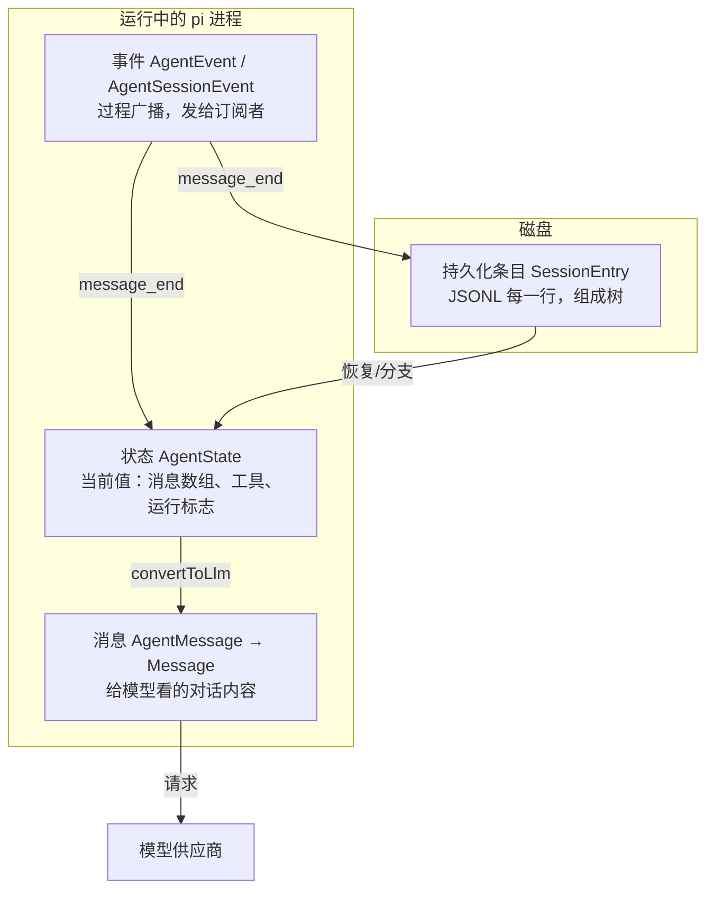
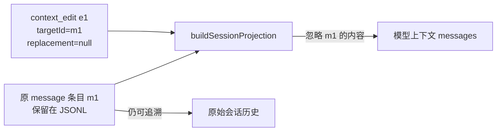
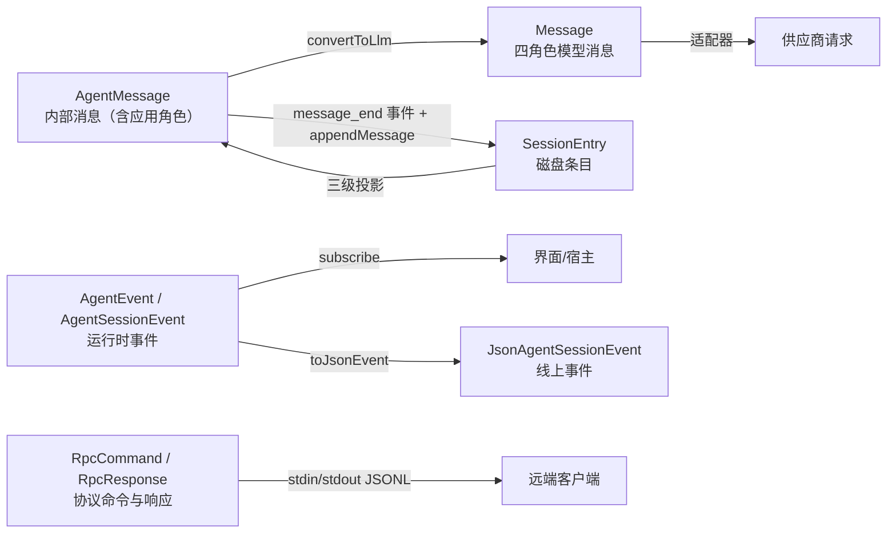

# 03. 消息、事件、状态与持久化条目

今天只用本篇和源码，亲手把一次工具调用拆成消息、事件、内存状态、会话条目四种对象。无需其他任务的产物或真实模型账号，预计 2–3 小时。

## 今日准备

确认 Node.js >= 22.19.0 和 `node_modules`；缺失依赖时在仓库根目录执行 `npm install --ignore-scripts`。在 `packages/coding-agent/test/suite/` 新建 `task-03-learning.test.ts`，用下面的测试步骤收集证据。运行命令（工作目录 `packages/coding-agent`）：

```powershell
node ../../node_modules/vitest/dist/cli.js --run test/suite/task-03-learning.test.ts
```

`createHarness()` 自带 faux 假模型、内存会话和 `events` 数组；每个测试用 `try/finally` 调用 `h.cleanup()`。

## 学习内容

同一个回答会有四种表示。**消息**是对话内容，如用户文字、助手文字、工具结果；**事件**是过程通知，如 `message_update`、`tool_execution_start`，给订阅者实时观察；**状态**是当前 Agent 的模型、工具和消息等内存快照；**会话条目**是可恢复的历史记录。把 `text_delta` 当成完整助手消息，就会过早保存或重复显示；把会话条目当成模型输入，就会误读分支和压缩。`AgentMessage` 允许应用级内容，送到模型前还要经过转换。消息中的 `content` 也并非总是字符串，可能是文本、图片、思考或工具调用块。

## 核心源码

`packages/ai/src/types.ts`找 `Message`、`AssistantMessageEvent`；`packages/agent/src/types.ts`找 `AgentEvent`、`AgentState`；`packages/coding-agent/src/core/messages.ts`找 `convertToLlm`；`packages/coding-agent/src/core/session-manager.ts`找 `SessionEntry`；`packages/coding-agent/src/core/agent-session.ts`找 `AgentSessionEvent`。按“类型定义 → 谁创建 → 谁消费”的顺序读每一个。

## TypeScript 语法小课：判别联合与类型收窄

消息与事件都用 `type` 字段区分形状，这叫判别联合。判断 `event.type` 后，TypeScript 才知道该分支有哪些字段；不能把任何事件都当成完整消息。

```typescript
type Event =
  | { type: "text_delta"; delta: string } // 增量只有片段
  | { type: "message_end"; text: string }; // 结束事件带完整文本
function describe(event: Event): string {
  if (event.type === "text_delta") return event.delta; // 此处自动收窄到第一种形状
  return event.text; // 剩余分支只能是 message_end
}
console.assert(describe({ type: "text_delta", delta: "A" }) === "A");
```

练习：试着在第一个分支读取 `event.text`，观察类型检查为何拒绝；再在 `packages/agent/src/types.ts` 找真实 `AgentEvent` 的判别字段。


## 完整学习资料

先按下列正文完成学习，再执行本篇的动手任务。正文中原书的实验与验收题先作为案例阅读，实际动手统一放到文末；只运行本篇“今日准备”和动手任务明确指定的离线命令。章节编号保留知识主题的原编号；源码精读、示例、边界条件、常见错误和参考答案均直接收录在本文件中。开头的预计用时仅指核心主线，完整源码精读需另留时间。

### 本篇共同基础

以下运行图和术语均在本文件内。学习正文保留原手册的知识主题编号，但那些编号不构成本任务的阅读前置；实际操作按本篇的动手任务与验收标准执行。学习正文基于原手册注明的 `200387122ca450d6387f033949423114a270b96c` 源码基线，当前工作区若有差异，以当前源码为准。

### 15 分钟主线：pi 怎样完成一件事

假设用户输入“读取 demo.txt，并总结三点”。模型自己不能读取你电脑里的文件。pi 把用户问题和可用工具告诉模型；模型提出 `read` 调用；pi 在本地执行；模型拿到文件内容后才生成总结。这就是全书反复使用的同一个例子。

**先看不带 TypeScript 细节的主流程（教学伪代码）：**

```text
收到用户输入，把它加入当前会话
重复：
    用当前上下文向模型发起请求
    收集模型的回答并把过程通知界面
    如果回答要求执行工具：
        校验参数，在本地执行工具，记录结果
        继续循环，让模型看到工具结果
    否则，检查是否还有排队输入或明确的继续决定
    如果都没有：结束本次运行
```

第一行确定这次任务和已有历史。模型请求只负责生成回答或提出工具调用。工具校验与执行由 pi 负责，结果回到对话后才可能有下一轮模型请求。界面接收运行事件，历史保存完成的消息；它们都与“模型请求”有关，但不是同一种数据。真实实现还处理工具并发、错误、取消、重试和压缩，后面分别讲。

**先分清四对容易混淆的词：**

| 两个词                | 直观区别                                           | 在“读文件并总结”中的例子                   |
| --------------------- | -------------------------------------------------- | -------------------------------------------- |
| 模型请求 / 用户输入   | 用户只说一次话，pi 可以多次询问模型                | 先请模型选择工具，读完文件后再请模型总结     |
| 事件 / 消息           | 事件告诉界面过程；消息承载一次完整的对话内容       | “正在输出第几个字”是事件；完成的总结是消息 |
| 工具调用 / 工具结果   | 调用提出想做什么；结果记录本地执行所得             | `read("demo.txt")` 是调用；文件文字是结果  |
| 会话历史 / 模型上下文 | 历史保留记录；上下文是这一次请求实际送给模型的内容 | 分支 C 仍在文件里，沿分支 D 继续时不必送 C   |


```text
一次用户输入
  → 第一次模型请求：请调用 read("demo.txt")
  → 本地工具执行：读出文件文本
  → 第二次模型请求：根据工具结果总结三点
  → 没有后续工作：结束
```

### 附录 A：术语表

> 用法：每个术语给出"一句话解释 + 首次出现的章节"。读代码遇到不认识的词，先查这里；查不到再搜源码（用英文名搜）。


#### A.1 核心概念

| 中文                  | 英文                    | 一句话                                                                                                             | 章节      |
| --------------------- | ----------------------- | ------------------------------------------------------------------------------------------------------------------ | --------- |
| 智能体外壳 / 运行框架 | agent harness           | 组织模型、工具、状态、界面的框架，本身不"聪明"                                                                     | 0.1       |
| 智能体                | agent                   | "模型 + 工具 + 循环"组成的执行体                                                                                   | 0.1       |
| 轮次                  | turn                    | 一次助手响应 + 它引发的工具执行                                                                                    | 3.3.3     |
| 低层运行              | Agent run               | 一次`Agent.prompt()` 或 `Agent.continue()` 调用建立的生命周期；以 `agent_end` 和已等待的 listener 收尾为边界 | 3.3.3、D2 |
| 会话 prompt 编排      | session prompt workflow | `AgentSession.prompt()` 在 `started` 后进入 `_runAgentPrompt()`；可串起 retry、压缩恢复和多个低层 Agent run  | 8、D27    |
| 用户请求              | user request            | 用户提交一次输入；与模型请求不等价                                                                                 | 3.3.3     |
| 模型请求              | model request           | 真正发给供应商 API 的一次请求                                                                                      | 3.3.3     |
| 转录                  | transcript              | 发给模型看/被记录的消息序列                                                                                        | 4.1       |
| 投影                  | projection              | 从会话树/文档到"模型实际看到的内容"的计算过程                                                                      | 9.4       |
| 活动分支              | active branch           | 从根到当前叶子的一条路径                                                                                           | 9.1       |
| 叶子                  | leaf                    | 会话树中的"当前位置"                                                                                               | 4.7.3     |
| 条目                  | entry                   | 会话文件里的一行（JSONL）                                                                                          | 4.7       |
| 会话                  | session                 | 一次对话的全部记录与状态                                                                                           | 8.1       |
| 压缩                  | compaction              | 用摘要替换旧上下文表示的机制                                                                                       | 10        |
| 上下文窗口            | context window          | 模型一次能接受的最大 token 量                                                                                      | 5.3       |
| 思考级别              | thinking level          | off/minimal/low/medium/high/xhigh/max                                                                              | 5.3       |
| 停止原因              | stop reason             | pending/stop/length/toolUse/error/aborted/deferred                                                                 | 4.3.3     |
| 用量                  | usage                   | token 与成本统计                                                                                                   | 4.3.5     |


#### A.2 消息与事件

| 中文           | 英文                | 一句话                                             | 章节        |
| -------------- | ------------------- | -------------------------------------------------- | ----------- |
| Agent 消息     | AgentMessage        | 内部消息（模型消息 + 应用自定义角色）              | 4.4         |
| 模型消息       | Message             | 供应商能理解的四角色联合                           | 4.3         |
| 内容块         | content block       | 消息内容的最小单元（text/image/thinking/toolCall） | 4.2         |
| 判别联合       | discriminated union | 用共同字面量字段区分成员的类型联合                 | 1.3.4       |
| 类型收窄       | narrowing           | 判断判别字段后类型自动缩小                         | 1.3.4       |
| 事件           | event               | 运行时广播（过程），不是消息（结果）               | 3.3.2       |
| 队列更新       | queue update        | 排队消息变化的会话事件                             | 4.5.2       |
| 边界（结算前） | agent_before_settle | 最后一个可行动钩子                                 | 6.2、13.3.5 |
| 已结算         | agent_settled       | "不会再自动继续"的最终信号                         | 4.5.2、16.3 |
| 延迟句柄       | deferred handle     | 异步应答的取回凭据                                 | 4.3.3       |


#### A.3 工具与模型

| 中文                | 英文                            | 一句话                                    | 章节  |
| ------------------- | ------------------------------- | ----------------------------------------- | ----- |
| 工具                | tool                            | 模型可调用的本地操作                      | 7.1   |
| 工具定义            | ToolDefinition                  | 扩展/应用注册工具的"富"形态               | 7.1.2 |
| 参数校验            | argument validation             | 用 typebox schema 在运行时校验调用参数    | 7.4   |
| 前置钩子            | beforeToolCall                  | 执行前可拦截（block）的钩子               | 7.6   |
| 后置钩子            | afterToolCall                   | 结果字段级改写的钩子                      | 7.6   |
| 顺序 / 并行执行     | sequential / parallel execution | 工具批次的两种调度                        | 7.5   |
| 终止提示            | terminate                       | "整批都同意时不因本批继续"的调度提示      | 7.5.4 |
| 模型                | model                           | 模型静态元数据（api/provider/限制/价格）  | 5.2.2 |
| 协议方言            | api                             | 供应商接口族标识（如 anthropic-messages） | 5.2.1 |
| 供应商              | provider                        | 认证 + 模型目录 + 请求实现                | 5.2.3 |
| 简单流式 / 完整流式 | streamSimple / stream           | 供应商无关档位 vs 协议特有选项            | 5.4   |
| 兼容开关            | compat                          | OpenAI 兼容生态的行为微调                 | 5.5.4 |
| 假供应商            | faux provider                   | 脚本化、离线的测试模型                    | 5.7   |


#### A.4 会话与持久化

| 中文       | 英文             | 一句话                             | 章节   |
| ---------- | ---------------- | ---------------------------------- | ------ |
| 会话管理器 | SessionManager   | 会话文件的对象化句柄               | 9.3    |
| 分支会话   | branched session | 只包含"根到叶子"路径的新文件       | 9.5.2  |
| 分支摘要   | branch summary   | 放弃某分支时生成的摘要条目         | 10.6   |
| 上下文编辑 | context edit     | 只改"投影"、不改原始条目的追加编辑 | 9.4.4  |
| 保留边界   | firstKeptEntryId | 压缩后从哪条开始保留               | 10.3.2 |
| 保留预算   | keepRecentTokens | 压缩后至少保留的近期上下文         | 10.3   |
| 预留       | reserveTokens    | 为模型回复预留的窗口               | 10.2.1 |
| 检测点替换 | checkpoint       | 压缩条目携带的提示词/工具检查点    | 9.4.3  |


#### A.5 扩展与集成

| 中文       | 英文            | 一句话                             | 章节       |
| ---------- | --------------- | ---------------------------------- | ---------- |
| 上下文文件 | context files   | AGENTS.md 等纯文本指令             | 11.4.2     |
| 项目信任   | project trust   | 允许加载项目可执行资源前的人工决定 | 11.5       |
| 提示词模板 | prompt template | Markdown 变成`/命令`             | 12.3.2     |
| 技能       | skill           | 目录 + SKILL.md 的按需说明书       | 12.3.3     |
| 扩展       | extension       | 可执行 TypeScript 模块（进程权限） | 12.3.4、13 |
| Pi 包      | Pi package      | 分发多资源的 npm/git 单元          | 12.3.6     |
| 钳制       | clamp           | 按模型能力压低思考级别             | 5.3        |
| 重绑       | rebind          | 会话替换后重新挂订阅/扩展绑定      | 8.6        |


#### A.6 协议与架构（选修）

| 中文     | 英文                   | 一句话                                          | 章节   |
| -------- | ---------------------- | ----------------------------------------------- | ------ |
| MCP      | Model Context Protocol | 外部工具/资源接入协议                           | 22     |
| 暴露方式 | exposure               | codemode/deferred/direct 三种工具到达模型的方式 | 22.3   |
| 工具搜索 | tool_search            | deferred 工具的"发现后再直调"机制               | 22.3   |
| 沙箱     | codemode sandbox       | QuickJS VM + worker 的脚本执行环境              | 22.9   |
| 面片     | facet                  | Chord 插件可独立打包到不同环境的分片            | 23.2   |
| 服务     | service                | Chord 的类型化稳定 token（singleton/keyed）     | 23.2   |
| 复制状态 | replicated state       | 原子发布、完整不可变值消费的状态                | 23.2   |
| 增量跟踪 | delta tracking         | 记录/合并 JSON 操作的机制                       | 23.2   |
| 持久执行 | durable execution      | 意图先提交、崩溃可续的执行模型                  | 23.1   |
| 检查点   | checkpoint             | 任务每一步的持久落点                            | 23.3.1 |
| 附着     | attachment             | 一条表现层连接绑定到一个会话                    | 24.2   |
| 信封     | envelope               | 协议中包裹 payload 的定向记录                   | 24.3   |
| span     | span                   | 一次操作的时间记录（遥测）                      | 25.2   |
| lift     | lift                   | 处理组相对对照组的提升（评估）                  | 25.5   |
| 阻断配对 | blocked pair           | 两臂未各得恰好一个分数，禁止计入头条            | 25.6   |


#### A.7 容易混淆的成对术语

| 对                                              | 区分                                                                                   |
| ----------------------------------------------- | -------------------------------------------------------------------------------------- |
| message vs event                                | 结果 vs 过程（3.3.2）                                                                  |
| turn vs run                                     | 一个轮次 vs 整次运行（3.3.3）                                                          |
| `agent_end` vs `agent_settled`              | 低层 run 结束 vs 自动工作清零（4.5.2）                                                 |
| 声明 vs 可执行                                  | 系统消息里的工具声明 vs 运行时工具集（7.3）                                            |
| details vs content                              | 给界面/程序 vs 给模型（14.2）                                                          |
| 完成顺序 vs 记录顺序                            | 并发完成 vs 声明序记录（7.5.3）                                                        |
| 停止原因`length` vs `stop`                  | 被截断 vs 正常说完（4.3.3）                                                            |
| `AgentSession.prompt()` vs `Agent.prompt()` | 应用层输入分流/会话编排 vs 低层 Agent run 入口（8、D2、D27）                           |
| `handled` vs `queued` vs `started`        | 输入被消费、不创建该输入自己的 run / 放入当前运行队列 / 进入会话 run 编排（8、16.5.3） |
| 提示词模板 vs 技能                              | 一段话 vs 一套流程+文件（12.3.3）                                                      |
| 扩展 vs Pi 包                                   | 可执行单元 vs 分发单元（12.3.6）                                                       |
| compaction 摘要 vs branch summary               | 压缩历史 vs 放弃分支（10.6）                                                           |
| durable cheat sheet：`replay: safe/never`     | 崩溃后重跑 vs 报 interrupted（23.4）                                                   |
| JSONL RPC vs client/server                      | 进程内 stdio 协议 vs 跨进程服务路由（24.1）                                            |
| 单测 vs 评估                                    | 确定性 vs 配对统计（25.1、25.6）                                                       |


#### A.8 输入与运行的层级

不要按“用户按了一次回车”推断低层 run 或模型请求的数量。实际层级是：

| 层级       | 代表符号                                           | 次数关系                                                                                      |
| ---------- | -------------------------------------------------- | --------------------------------------------------------------------------------------------- |
| 输入调用   | `AgentSession.prompt(text)`                      | 一次调用只表达一次输入尝试；结果可能是`handled`、`queued` 或 `started`                  |
| 会话编排   | `_runAgentPrompt(messages)`                      | 只在开始处理输入时进入；在里面管理重试、压缩恢复、边界 continuation 与取消                    |
| Agent run  | `Agent.prompt(messages)` 或 `Agent.continue()` | 一次会话编排可包含多个 run；每个低层 run 都发出自己的`agent_start` / `agent_end` 生命周期 |
| Agent turn | `turn_start` 到 `turn_end`                     | 一个 run 可包含多个 turn；每个 turn 通常包含一次助手响应及其引发的工具执行                    |
| 模型请求   | `streamSimple` / provider stream                 | 通常发生在助手响应阶段；自动重试会再次请求模型，压缩摘要等内部工作也可能有独立请求            |

两个边界例子：

- 扩展命令被消费时，`prompt()` 返回 `handled`，没有为该输入启动 `_runAgentPrompt()`；
- `prompt()` 在 Agent 已运行时以 `steer`/`followUp` 方式排队，返回 `queued`。这条输入会影响现有流程，但它本身不是新的 `Agent.prompt()` 调用。

因此，统计“模型请求次数”不能数 prompt、turn 或 `agent_end`：应按 provider 请求事件/日志，或明确的测试探针计数。章节 21 的自测题也按这个区分评分。


#### A.9 索引方式说明

- 想找"某行为在哪个文件" → 用 source-map；
- 想找"某命令怎么跑" → 用 commands；
- 想找"某现象怎么排" → 用 troubleshooting；
- 想找"哪些练习要做" → 用 exercises-and-answers。

---

### 第 4 章：消息、事件、状态与持久化条目


**先懂这一章**：把“发生过什么”和“现在正在发生什么”分开。消息承载对话内容；事件通知过程；状态记录运行中的当前值；会话条目用于以后恢复。它们可能描述同一件事，但用途和保存时间不同。

```text
教学伪代码：收到模型的文本增量 → 发出更新事件供界面显示
           → 模型完成一条回答 → 形成完整消息
           → 会话层决定把需要保留的内容写入历史
```

这只是文本回答的例子；工具调用、系统消息和特殊条目在后面分别说明。先认清数据的去向，再读类型定义。

第 3 章按时间顺序追“一次请求发生了什么”；本章改按数据类型追“产生的东西分别给谁用”。读完后，第 5 章的供应商事件转换和第 6 章的循环事件就有了共同词汇。

> 学完本章你能回答：
>
> 1. "消息""事件""状态""持久化条目"这四种对象分别是什么？谁产生、给谁用、活多久、存哪里？
> 2. 为什么流式增量（`text_delta`）不是完整消息，而 `message_end` 才标记消息定稿？
> 3. `AgentMessage` 比模型消息多了什么？谁负责"翻译"？
> 4. 磁盘上的会话文件里都有哪些条目类型？为什么它是一棵树而不是一条线？

**预计学习时间**：1-1.5 天。
**本章验证状态**：静态核对通过（对照 `message-types.md`、`session-format.md` 与源码类型定义）；实验为"填表"，不需要运行模型。

---


#### 4.1 四种对象：一张总图

第 3 章里这四种对象反复出现，现在把它们一次讲清。先看总图：



用一句口诀记住职责：

- **消息**：对模型说的事实；
- **事件**：对界面说的"正在发生什么"；
- **状态**：进程里的"现在"；
- **条目**：磁盘上的"曾经"。


##### 4.1.1 四种对象的对照表

| 对象 | 类型名                                | 生产者                                             | 消费者                                   | 生命周期             | 是否落盘               |
| ---- | ------------------------------------- | -------------------------------------------------- | ---------------------------------------- | -------------------- | ---------------------- |
| 消息 | `AgentMessage` → `Message`       | 会话层（用户输入）、模型层（助手）、工具层（结果） | 模型（经转换）、界面（经事件）、会话文件 | 随会话               | 是（`message` 条目） |
| 事件 | `AgentEvent`、`AgentSessionEvent` | Agent 循环、会话层                                 | 界面、扩展、SDK 宿主                     | 瞬间；发完即弃       | 否（但会触发写入）     |
| 状态 | `AgentState`                        | Agent 内部归约                                     | 界面读取、SDK 读取、循环自身             | 运行期内存           | 否（部分派生自消息）   |
| 条目 | `SessionEntry` 家族                 | `SessionManager`                                 | 恢复、分支、导出、界面渲染               | 永久（直到删除会话） | 是（JSONL 文件）       |

一个事件可以同时影响状态与磁盘（`message_end`），这就是"同一事实的三种视角"：过程（事件）、内存（状态）、持久化（条目）。

**暂停预测：** `read("demo.txt")` 已经返回文件内容，界面刚收到 `message_end(toolResult)`。如果现在关闭进程，下次恢复对话时需要重放这个事件，还是读取会话条目？先只按“四种对象”的职责判断。

**对照答案：** 事件已经发完，不能靠它恢复。`AgentState` 中的消息数组是本次进程的当前值；正常启用持久化的会话把完成的工具结果写成消息条目，恢复时再从活动分支构造上下文。一个 `message_end` 可以触发状态更新与保存，但事件本身不是会话文件中的一行。具体的活动分支选择与投影规则留到第 9 章。


#### 4.2 内容块：消息的最小积木

一条消息的内容（content）是一个**内容块数组**，常见的四种。它们定义在 `packages/ai/src/types.ts`：


##### 4.2.1 `TextContent`：文本

```typescript
export interface TextContent {
	type: "text"; // 判别字段：读到 text 就能把联合类型收窄到文本块
	text: string;
	textSignature?: string; // 供应商不透明票据；多轮对话时保留并原样回传
}
```

- `type: "text"` 是判别字段；
- `textSignature` 是**供应商专用元数据**，pi 把它当"不透明字符串"原样带回去，绝不解读内容。新手请把带 `Signature` 的字段一律视为"必须保留、不可修改的票据"——很多供应商要求多轮对话时把这些票据回传，否则报错。


##### 4.2.2 `ImageContent`：图片

```typescript
export interface ImageContent {
	type: "image";
	data: string;     // base64 编码的图片数据
	mimeType: string; // e.g., "image/jpeg", "image/png"
}
```

图片以 base64 内联在消息里。这解释了第 3 章里 `normalizePromptImages` 的存在：大图会显著增加上下文体积，所以发送前要压缩/缩放（第 10 章）。


##### 4.2.3 `ThinkingContent`：思考过程

```typescript
export interface ThinkingContent {
	type: "thinking";
	thinking: string;
	thinkingSignature?: string; // Provider-specific opaque or serialized reasoning replay data
	/** When true, the thinking content was redacted by safety filters. The opaque
	 *  encrypted payload is stored in `thinkingSignature` so it can be passed back
	 *  to the API for multi-turn continuity. */
	redacted?: boolean;
}
```

- 只有支持"思考"的模型会产生；
- `redacted: true`：出于安全/合规，思考正文被抹掉，但加密票据还在——**照原样回传**即可；
- 思考块**会进入下一轮请求**（这是某些模型的要求），但界面可以折叠显示。


##### 4.2.4 `ToolCall`：工具调用

```typescript
export interface ToolCall {
	type: "toolCall";
	id: string;                       // 工具结果用 toolCallId 与本次调用配对
	name: string;                     // 工具名，如 "read"
	arguments: JsonObject;            // 适配器已将 JSON 文本拼好并解析；执行前仍需按工具 schema 校验
	thoughtSignature?: string;        // Google 专用：复用思考上下文的不透明签名
	namespace?: string;               // OpenAI Responses 命名空间工具
}
```

三个关键点：

1. **`id` 是"调用"与"结果"之间的唯一桥梁**。模型可能一次提出多个调用（A、B），工具结果的 `toolCallId` 必须对应返回，否则对话历史不自洽；
2. `arguments` 在 pi 内部已经是**解析好的对象**（供应商原始流里它是 JSON 文本，适配器负责增量解析与拼装）；
3. `arguments` 的类型是 `JsonObject`，具体字段要靠工具自己的 schema 校验——这正是第 3 章 `validateToolArguments` 存在的原因。


#### 4.3 模型消息：`Message` 家族

`packages/ai/src/types.ts` 里：

```typescript
export type Message = SystemMessage | UserMessage | AssistantMessage | ToolResultMessage;
```

四种角色的分工，一张表理清：

| 角色           | 谁产生                      | 模型看到后的意义      |
| -------------- | --------------------------- | --------------------- |
| `system`     | pi（提示词与工具声明）      | 规则、身份、可用工具  |
| `user`       | 用户输入 / 转换后的内部消息 | "人类在说话"          |
| `assistant`  | 模型                        | "我之前说过/做过什么" |
| `toolResult` | 工具执行结果                | "工具的答案"          |


##### 4.3.1 `SystemMessage`：不只是"系统提示词"

```typescript
export interface SystemMessage {
	role: "system";
	/** Instruction text. On the leading message this is the base prompt; later, additional instructions. */
	content: string | TextContent[];
	/**
	 * Named, ordered prompt sections rendered verbatim after `content`. The leading message
	 * declares them; later messages replace sections by name, and `null` removes one.
	 */
	sections?: Record<string, string | null>;
	/** Complete definitions of tools that become available at this point. */
	toolsAdded?: Tool[];
	/** Tools that stop being available at this point. */
	toolsRemoved?: ToolReference[];
	timestamp: number; // Unix timestamp in milliseconds
}
```

这是本仓库最有特色的类型之一。要点：

- **提示词不是一整块，而是分节的**（`sections`：preamble、tools、cwd、skills……）。后续系统消息可以**按名字替换某一节**（值为 `null` 表示删除该节）。这带来两个好处：
  - 中途启用新技能/改变工具时，不用重发整个提示词，只发一个"补丁"；
  - 会话回放时，把历次系统消息依次叠加，就能精确重建"此刻的提示词"——这叫**可重放性**（replayability）。
- **工具声明也在系统消息里**（`toolsAdded` / `toolsRemoved`）。第 3 章 `declareToolChanges()` 生成的就是这种消息；
- 仓库文档（`docs/message-types.md`）还描述了 `replace: true` 的语义：丢弃此前状态、建立全新基线。请在你的本地类型定义里用编辑器确认该字段是否存在（版本间可能有差异）——**"以本地代码为准"是读本仓库的好习惯**。


##### 4.3.2 `UserMessage`

```typescript
export interface UserMessage {
	role: "user";
	content: string | (TextContent | ImageContent)[];
	timestamp: number; // Unix timestamp in milliseconds
}
```

`content` 允许直接是字符串（简写）或内容块数组（需要图片时）。注意 `role: "user"` 不总代表"人类打的字"——第 4.4 节你会看到，bash 执行记录、扩展注入的上下文、压缩摘要都会被**转换成** `user` 消息发给模型（因为多数供应商只接受这四种角色，没有"系统注入"通道）。


##### 4.3.3 `AssistantMessage`：信息最丰富的消息

```typescript
export interface AssistantMessage {
	role: "assistant";
	content: (TextContent | ThinkingContent | ToolCall)[];
	api: Api;
	provider: ProviderId;
	model: string;
	responseModel?: string;   // 供应商实际答复的模型（与请求的不同时记录）
	responseId?: string;      // 供应商侧的响应标识
	providerThinkingLevel?: string;
	thinkingLevel?: ModelThinkingLevel;  // 本次请求的 pi 思考级别
	diagnostics?: AssistantMessageDiagnostic[];
	usage: Usage;
	stopReason: StopReason;
	deferred?: DeferredHandle;
	errorMessage?: string;
	rawStopReason?: string;
	endTurn?: boolean;        // 供应商是否明确表示"我说完了"（仅调试用，不参与控制流）
	timestamp: number;
}
```

逐组理解：

- **身份组**（`api/provider/model/responseModel/responseId`）：这条消息是谁答的。会话恢复、成本统计、多模型切换都靠它；
- **内容组**（`content`）：文本、思考、工具调用的混合数组。**顺序有语义**：模型先思考、再说话、再调工具，数组顺序就是发生顺序；
- **用量组**（`usage`）：token 与成本（见 4.3.5）；
- **状态组**（`stopReason/errorMessage/rawStopReason`）：为什么结束。这是 Agent 循环的核心判据（第 6 章）；
- **调试组**（`diagnostics`）：经过脱敏的诊断信息。

`StopReason` 的七个值（`packages/ai/src/types.ts`）：

```typescript
export type StopReason = "pending" | "stop" | "length" | "toolUse" | "error" | "aborted" | "deferred";
```

| 值           | 含义                       | 循环的反应                               |
| ------------ | -------------------------- | ---------------------------------------- |
| `pending`  | 流式过程中的临时值         | 不会持久化（`message_end` 时已是终态） |
| `stop`     | 正常说完了                 | 看有无工具调用/队列决定是否继续          |
| `length`   | 达到输出上限被截断         | 工具调用全部拒绝执行（第 3.14 节）       |
| `toolUse`  | 模型要求调用工具           | 执行工具 → 继续下一轮                   |
| `error`    | 请求失败                   | 结束 run（可能触发自动重试，第 6 章）    |
| `aborted`  | 被取消                     | 结束 run                                 |
| `deferred` | 延迟应答（供应商异步任务） | 通过`DeferredHandle` 后续取回          |

> 新手最容易漏掉的一点：`stopReason` 为 `"toolUse"` 时，**消息里必然带有 toolCall 内容块**；但反过来，有 toolCall 时 `stopReason` 理论上可能是 `length`（截断场景）。所以循环的判据要"看内容 + 看原因"双重检查（第 3.8 节 ⑥ 的代码正是这么写的）。


##### 4.3.4 `ToolResultMessage`

```typescript
export interface ToolResultMessage<TDetails = any> {
	role: "toolResult";
	toolCallId: string;                    // 对应哪个 ToolCall
	toolName: string;
	content: (TextContent | ImageContent)[]; // 给模型看的结果
	details?: TDetails;                    // 给界面/程序看的结构化细节（不发给模型）
	usage?: Usage;                         // 工具内部做了"嵌套模型调用"时的用量
	isError: boolean;
	timestamp: number;
}
```

两个重要区分：

- `content` 是**面向模型**的，"模型看到什么"由它决定；
- `details` 是**面向界面/代码**的，可以带文件行号、语法高亮信息、原始 JSON 等。它**不会**发给模型（省 token），但会落盘，界面渲染和扩展逻辑可以依赖它。

（另有一个 `structuredContent` 字段存在于工具执行结果 `AgentToolResult` 上，供程序化调用者使用；但它不进 `ToolResultMessage`，所以不具备"跨会话稳定"的保证。第 7 章展开。）


##### 4.3.5 `Usage`：token 与成本

```typescript
export interface Usage {
	input: number;
	output: number;
	cacheRead: number;
	cacheWrite: number;
	cacheWrite1h?: number;   // cacheWrite 中 1 小时保留的部分（仅 Anthropic 上报）
	reasoning?: number;      // 思考 token：已包含在 output 里，不要重复相加
	totalTokens: number;
	cost: { input: number; output: number; cacheRead: number; cacheWrite: number; total: number };
}
```

要点：`reasoning` 是 `output` 的子集；缓存命中（cacheRead）通常比常规输入便宜得多——这解释了 pi 为什么要做"缓存预热"（`cache-warmer.ts`，第 15 章会看到它的调用点）。


#### 4.4 `AgentMessage`：比模型消息更宽的内部类型


##### 4.4.1 基础定义与声明合并

`packages/agent/src/types.ts`：

```typescript
export interface CustomAgentMessages {
	// Empty by default - apps extend via declaration merging
}

export type AgentMessage = Message | CustomAgentMessages[keyof CustomAgentMessages];
```

`CustomAgentMessages` 默认是空的。应用可以用 TypeScript 的**声明合并**（declaration merging）扩展它：

```typescript
// 文档注释里的示例（packages/agent/src/types.ts）
declare module "@earendil-works/pi-agent-core" {
	interface CustomAgentMessages {
		artifact: ArtifactMessage;
		notification: NotificationMessage;
	}
}
```

`coding-agent` 包正是这么做的。`packages/coding-agent/src/core/messages.ts` 里：

```typescript
declare module "@earendil-works/pi-agent-core" {
	interface CustomAgentMessages {
		bashExecution: BashExecutionMessage;
		custom: CustomMessage;
		branchSummary: BranchSummaryMessage;
		compactionSummary: CompactionSummaryMessage;
	}
}
```

所以在 coding-agent 里，`AgentMessage` 等价于八种角色的联合：

```typescript
type AgentMessage =
  | SystemMessage | UserMessage | AssistantMessage | ToolResultMessage   // 模型能懂的四种
  | BashExecutionMessage | CustomMessage | BranchSummaryMessage | CompactionSummaryMessage; // 应用扩展的四种
```

四个扩展角色的用途：

| 角色                  | 何时产生                       | 是否进模型上下文                        |
| --------------------- | ------------------------------ | --------------------------------------- |
| `bashExecution`     | 用户用`!` 直接执行命令       | 默认转成 user 文本（`!!` 前缀则排除） |
| `custom`            | 扩展调用`sendMessage()` 注入 | 转成 user 消息                          |
| `branchSummary`     | 切换分支时对被放弃路径做摘要   | 转成 user 消息（带包装标签）            |
| `compactionSummary` | 上下文压缩后                   | 转成 user 消息（带包装标签）            |


##### 4.4.2 `convertToLlm`：桥梁的完整实现

模型只认识四种角色，扩展消息必须被"翻译"。翻译函数在 `core/messages.ts`（节选 + 注释）：

```typescript
export function convertToLlm(messages: AgentMessage[]): Message[] {
	return messages
		.map((m): Message | undefined => {
			switch (m.role) {
				case "bashExecution":
					if (m.excludeFromContext) return undefined;   // !! 前缀：只显示给用户看
					return { role: "user", content: [{ type: "text", text: bashExecutionToText(m) }], timestamp: m.timestamp };
				case "custom": {
					const content = typeof m.content === "string" ? [{ type: "text" as const, text: m.content }] : m.content;
					return { role: "user", content, timestamp: m.timestamp };
				}
				case "branchSummary":
					return { role: "user", content: [{ type: "text", text: BRANCH_SUMMARY_PREFIX + m.summary + BRANCH_SUMMARY_SUFFIX }], timestamp: m.timestamp };
				case "compactionSummary":
					return { role: "user", content: [{ type: "text", text: COMPACTION_SUMMARY_PREFIX + m.summary + COMPACTION_SUMMARY_SUFFIX }], timestamp: m.timestamp };
				case "system": case "user": case "assistant": case "toolResult":
					return m;   // 已经是模型消息，原样通过
				default: {
					const _exhaustiveCheck: never = m;   // 穷尽检查：将来新增角色时这里会编译报错
					return undefined;
				}
			}
		})
		.filter((m) => m !== undefined);
}
```

值得学的三个细节：

1. **包装标签**（前缀/后缀）。摘要类消息不是裸文本，而是：

```text
The conversation history before this point was compacted into the following summary:

<summary>
……摘要内容……
</summary>
```

   这样模型能分辨"这是历史信息的压缩"，而不是"用户新说了一段话"。

2. **穷尽检查**（`const _exhaustiveCheck: never = m`）。这是判别联合的经典用法：如果某天新增了消息角色而忘了处理，这一行会在**编译期**报错。你在本仓库会经常看到 `never` 出现在 switch 的 default 分支——那不是装饰，是防漏网工具。
3. **过滤型转换**：`bashExecution` 带 `excludeFromContext` 时直接丢弃；map + filter 的组合在类型上是干净的。


##### 4.4.3 转换发生在哪里

回顾第 3 章 3.9 节的 `streamAssistantResponse`：

```typescript
const llmMessages = await config.convertToLlm(messages);
```

`convertToLlm` 是 `Agent` 的**构造参数**：`agent-core` 自带一个"只保留四种标准角色"的默认实现（`agent.ts` 的 `defaultConvertToLlm`）；`coding-agent` 在 `sdk.ts` 里注入完整版本（还包了一层图片屏蔽）。**下层提供默认，上层注入具体**——又一次看到第 0 章的架构原则。

另外一个用途：`convertToLlm` 也被"生成摘要"的压缩流程复用——因为摘要请求本身也是一次模型调用，需要把同一份历史翻译过去（第 10 章）。


#### 4.5 事件：`AgentEvent` 与 `AgentSessionEvent`


##### 4.5.1 `AgentEvent` 十种事件

完整定义在 `packages/agent/src/types.ts`（第 3 章 1.3.4 给过原文）。按生命周期的全景表：

| 事件                      | 载荷                               | 发出时机                   | 典型消费者                          |
| ------------------------- | ---------------------------------- | -------------------------- | ----------------------------------- |
| `agent_start`           | 无                                 | run 开始                   | 界面：进入"忙碌"状态                |
| `agent_end`             | `messages`                       | run 结束（最后一个事件）   | 界面：显示完成/错误；会话层判断重试 |
| `turn_start`            | 无                                 | 每个 turn 开始             | 界面：显示"新一轮"                  |
| `turn_end`              | `message, toolResults`           | 每个 turn 结束             | 界面：收尾渲染；会话层记录失败信息  |
| `message_start`         | `message`                        | 用户/助手/工具结果消息开始 | 界面：创建消息气泡                  |
| `message_update`        | `message, assistantMessageEvent` | 助手消息的每个增量         | 界面：流式文字/思考/工具调用预览    |
| `message_end`           | `message`                        | 消息最终定型               | 状态归约、持久化、界面定稿          |
| `tool_execution_start`  | `toolCallId, toolName, args`     | 工具开始                   | 界面：显示"正在执行"                |
| `tool_execution_update` | `..., partialResult`             | 工具上报进度               | 界面：局部结果（如命令输出滚动）    |
| `tool_execution_end`    | `..., result, isError`           | 工具结束                   | 界面：渲染结果/错误                 |

当前基线里的 `AgentEvent` 联合**正好有 10 个成员**，与上表十行一一对应。读 TypeScript 联合类型时，一个 `|` 分支代表一种可取的对象形状；像 `message_update` 的 `assistantMessageEvent` 字段虽然又有自己的联合类型，但它是**事件载荷里的嵌套事件**，不是额外的 `AgentEvent` 成员。

可以自己打开 `packages/agent/src/types.ts` 数一遍 `AgentEvent` 的 `|` 分支来练习。自动重试和 `agent_settled` 等会话级通知属于后面的 `AgentSessionEvent`，不会因为它们和 Agent 运行有关就自动成为 core 的 `AgentEvent`。


##### 4.5.2 `AgentSessionEvent`：复用并改写 core 事件

`coding-agent` 的 `AgentSession` 对外事件**基于** `AgentEvent`，但不是它的严格超集（`agent-session.ts` 的 `AgentSessionEvent`）：

```typescript
export type AgentSessionEvent =
| WithParentToolCallId<Exclude<AgentEvent, { type: "agent_end" }>>   // 复用其它事件；工具事件可多 parentToolCallId
	| { type: "agent_end"; messages: AgentMessage[]; willRetry: boolean } // 关键差异：多了 willRetry
	| { type: "agent_settled" }
	| { type: "queue_update"; steering: readonly string[]; followUp: readonly string[] }
	| { type: "compaction_start"; reason: "manual" | "threshold" | "overflow" }
	| { type: "entry_appended"; entry: SessionEntry }
	| { type: "session_info_changed"; name: string | undefined }
	| { type: "thinking_level_changed"; level: ThinkingLevel }
	| { type: "compaction_end"; reason; result; aborted; willRetry; errorMessage? }
	| { type: "auto_retry_start"; attempt; maxAttempts; delayMs; errorMessage }
	| { type: "auto_retry_end"; success; attempt; finalError? }
	| { type: "summarization_retry_scheduled"; /* ... */ }
	| { type: "summarization_retry_attempt_start"; /* source: branchSummary | compaction */ }
	| { type: "summarization_retry_finished" }
	| { type: "bash_execution_update"; id?: string; delta: string };
```

几个对读代码很重要的差异：

- **`agent_end` 被替换了，不只是加字段**：先用 `Exclude<AgentEvent, { type: "agent_end" }>` 从 core 联合中移除旧的 `agent_end` 形状，再加入带必需 `willRetry` 的会话版。即使 `willRetry` 为 `false`，这个字段也必须存在；所以一个只有 `type` 和 `messages` 的 core `agent_end` 不能直接当成 `AgentSessionEvent` 使用。
- **其它事件大多复用**：条件类型 `WithParentToolCallId<E>` 只在三种 `tool_execution_*` 事件上加可选的 `parentToolCallId`；其它 core 事件形状保持不变。它标识嵌套工具调用属于哪个外层调用（如 codemode，第 22 章）。
- **`agent_settled`**：整个会话层面的工作（含重试/压缩/边界）全部结束——第 3 章 `_runAgentPrompt` 的 finally 里发的就是它。注意它和 `agent_end` 不是一个东西：一次 `session.prompt()` 期间可能有**多次** `agent_end`（自动重试场景），但只有**一次** `agent_settled`；
- **`entry_appended`**：部分辅助条目写入路径会显式发出，例如扩展追加的自定义条目、提交的 boundary 条目和 context edit。它不是通用的“文件有新行”事件：普通 `message_end` 持久化和压缩条目写入都不会因此自动发出它；
- **`queue_update`**：排队消息变化（界面显示"还有 2 条消息在排队"）；


#### 4.6 状态：`AgentState` 字段全表

`packages/agent/src/types.ts` 的 `AgentState`（结合 `Agent` 实现）：

| 字段                 | 类型                          | 含义                               | 备注                                                                   |
| -------------------- | ----------------------------- | ---------------------------------- | ---------------------------------------------------------------------- |
| `systemPrompt`     | `string`（只读）            | 当前系统提示（从系统消息重放而来） | 想改提示词要**追加系统消息**，不能直接赋值                       |
| `model`            | `Model<any>`                | 下一轮使用的模型                   | 中途切换模型的入口                                                     |
| `thinkingLevel`    | `ThinkingLevel`             | 下一轮的思考级别                   | `off/minimal/low/medium/high/xhigh/max`（按模型能力钳制）            |
| `tools`            | `AgentTool[]`（get/set）    | 可执行的工具                       | 赋值会**复制顶层数组**；与转录中声明不同时，下一轮自动补系统消息 |
| `messages`         | `AgentMessage[]`（get/set） | 对话转录                           | 赋值同样复制顶层数组                                                   |
| `isStreaming`      | `boolean`                   | 是否在处理中                       | **到 `agent_end` 的监听器全部结束才变 false**                  |
| `streamingMessage` | `AgentMessage \| undefined`  | 当前正在形成的部分消息             | `message_start/update` 设置、`message_end` 清空                    |
| `pendingToolCalls` | `ReadonlySet<string>`       | 正在执行中的工具调用 id            | 界面显示"还有工具在跑"                                                 |
| `errorMessage`     | `string \| undefined`        | 最近一次失败/取消的错误文本        | `turn_end` 时从助手消息提取                                          |

两个可访问性细节（`Agent` 实现里的 `createMutableAgentState`）：

- `systemPrompt` 是**推导值**（getter），由 `getCurrentSystemPrompt(messages)` 从系统消息重放而来；
- `tools`/`messages` 的 setter 会 `slice()` 复制数组，避免调用者后续改动外部数组导致状态漂移。

`AgentSession.state` 就是 `this.agent.state` 的直接返回（`agent-session.ts` 第 1396 行）——会话层没有另建一套状态。**"状态"只有一个数据源**，这是排障时的关键：界面显示异常，先看 `session.state`，再看事件有没有漏。


##### 4.6.1 运行态 vs 存储态：同一事实的两种样子

以第一次模型响应为例：

| 时刻                                                             | 状态（内存）                                                            | 磁盘                                           |
| ---------------------------------------------------------------- | ----------------------------------------------------------------------- | ---------------------------------------------- |
| 流式进行中                                                       | `streamingMessage` = 最新部分消息；`messages` 还没有这条未完成消息  | 无记录（`pending` 不落盘）                   |
| `message_end` 到达                                             | `streamingMessage` 清空；终态消息追加到 `messages`                  | listener 尚在处理；还未走到 session 持久化分支 |
| `AgentSession` listener 完成 message-end hooks/public dispatch | `messages` 保持终态消息；hook 若替换内容，会原地改同一个 message 对象 | 追加该最终 message 的`message` 条目          |
| 检查磁盘文件                                                     | ——                                                                    | 只有一条终态消息                               |

注意有两个不同的数组/字段：`streamAssistantResponse` 持有并更新模型请求 context 里的 partial message；公开的 `AgentState` 则通过 `streamingMessage` 暴露当前快照。`Agent.processEvents(message_start/update)` 只更新 `streamingMessage`，不会把尚未完成的消息放入 `state.messages`；等 `message_end` 才清掉它并把 final message 追加到 `state.messages`。随后会话层 hook 可能原地替换这条已追加消息的字段，最终 `SessionManager` 再持久化它。

因此在流式期间观察 `state.messages.length`，通常不会因当前 assistant message 正在输出而先加一；应观察 `state.streamingMessage`。第 3 章 3.12.1 画出了 partial message 从模型流到 Agent state 和 session entry 的完整路径。


##### 4.6.2 `message_end` 时的原地替换：同一个对象要保持一致

`Agent.processEvents` 处理 `message_end` 时，先把事件中的 message 追加进 `agent.state.messages`，然后才按顺序 `await` listeners。`AgentSession` 是其中一个 listener：它运行扩展的 message-end hook。hook 可以返回替代消息；session 会通过 `_replaceMessageInPlace(target, replacement)` 清掉目标对象的字段，再把替代字段复制回**同一个对象**。

```text
streamAssistantResponse 生成 finalMessage
  → Agent.processEvents(message_end)
      → agent.state.messages.push(finalMessage)
      → AgentSession listener 收到同一个 finalMessage 引用
          → message-end 扩展返回替代内容
          → _replaceMessageInPlace(finalMessage, replacement)
          → 公开 session listeners 收到已替换内容
          → SessionManager.appendMessage(finalMessage)
```

为什么要保留对象身份？因为 `agent.state.messages`、同一 run 后续产生的事件和最终写入会话的消息都可能引用它。若只让 `event.message` 指向新对象，Agent 状态数组仍留着旧对象，最终就可能出现“界面看见 A、状态持有 B、磁盘写入 C”的分叉。源码注释明确说原地修改用于同步 Agent state、后续 turn/agent events、listeners 与最终持久化。

```typescript
private _replaceMessageInPlace(target: AgentMessage, replacement: AgentMessage): void {
  if (target === replacement) return;
  const targetRecord = target as unknown as Record<string, unknown>;
  for (const key of Object.keys(targetRecord)) delete targetRecord[key];
  Object.assign(targetRecord, replacement);
}
```

逐行读：

- `target === replacement`：同一个对象无需处理；
- `Record<string, unknown>`：临时把对象看作可按键读写的记录。`unknown` 要求调用方别假定任意值都有特定字段；
- 先删旧键：避免替代对象没有的可选字段仍残留在 target 上；
- `Object.assign` 写回新键值：对象身份没换，内容变成 replacement。

这是一次**运行期对象同步**，发生在这条消息首次写入 transcript 之前。它和下面的 `context_edit` 不同：context edit 不回头改 JSONL 里的原消息，而是追加一条记录，在构造模型投影时应用。


#### 4.7 持久化条目：会话文件的解剖

下面直接给出会话文件的字段和读法。


##### 4.7.1 文件与公共字段

```text
~/.pi/agent/sessions/--<路径编码>--/<时间戳>_<会话ID>.jsonl
```

每行是一个 JSON 对象。除第一行（`SessionHeader`）外，所有条目都有公共字段：

```typescript
interface SessionEntryBase {
	type: string;
	id: string;              // 通常是 8 位十六进制；必要时回退为完整 UUID
	parentId: string | null; // 父条目 ID；根条目为 null
	timestamp: string;       // ISO 8601 字符串（与消息内的毫秒时间戳不同！）
}
```

**两种时间戳**是新手重灾区：

- 条目外层 `timestamp`：ISO 字符串（如 `"2024-12-03T14:00:00.000Z"`）；
- 消息内层 `timestamp`：Unix 毫秒数（如 `1733234400000`）。

读会话文件时别把两者混用。


##### 4.7.2 条目类型总表

| `type`                  | 作用                                            | 进模型上下文？     |
| ------------------------- | ----------------------------------------------- | ------------------ |
| `session`               | 文件头：版本、id、cwd、可选 parentSession       | 否                 |
| `message`               | 一条`AgentMessage`（含系统消息补丁）          | 是                 |
| `model_change`          | 中途切换模型                                    | 否（影响后续解释） |
| `thinking_level_change` | 中途切换思考级别                                | 否                 |
| `usage`                 | 非消息类用量（如缓存预热）                      | 否                 |
| `compaction`            | 压缩摘要 + 系统提示检查点 +`firstKeptEntryId` | 是（替换旧消息）   |
| `context_edit`          | 对早前条目的"仅上下文生效"编辑                  | 间接（改写投影）   |
| `branch_summary`        | 分支切换时对被放弃路径的摘要                    | 是                 |
| `custom`                | 扩展私有状态（不参与上下文）                    | 否                 |
| `custom_message`        | 扩展注入的消息（参与上下文）                    | 是                 |
| `label`                 | 书签/标记（`targetId` 指向被标记条目）        | 否                 |
| `session_info`          | 会话元数据（显示名）                            | 否                 |


##### 4.7.3 为什么是"树"而不是"线"

看 `session-format.md` 的示意图：

```text
[user msg] ─── [assistant] ─── [user msg] ─── [assistant] ─┬─ [user msg] ← current leaf
                                                            │
                                                            └─ [branch_summary] ─── [user msg] ← alternate branch
```

- 每个条目用 `parentId` 指向父节点；**"当前叶子"（leaf）标识你现在所处的分支**；
- 从 B 处分叉：老路径保留，新路径也是同一文件的一部分；
- `buildContextEntries()` 从叶向根回溯，产出"活动分支"的条目列表——这就是下一次请求的历史来源（细节第 9 章）。


##### 4.7.4 系统消息的持久化形态（活例子）

会话文件里的第一条系统消息长这样（`session-format.md` 示例）：

```json
{"type":"message","id":"a0b1c2d3","parentId":null,"timestamp":"2024-12-03T14:00:00.000Z",
 "message":{"role":"system","content":"","sections":{"preamble":"You are an expert coding assistant...","tools":"<tools>\n- read: ...\n</tools>","cwd":"/project"},
 "toolsAdded":[{"name":"read","description":"...","parameters":{}}],"timestamp":1733234400000}}
```

后面某次技能启用时又追加：

```json
{"type":"message","id":"d4e5f6g7","parentId":"c3d4e5f6","timestamp":"...","message":{"role":"system","content":"","sections":{"skills":"<skills>...</skills>"},"toolsRemoved":[{"name":"write"}],"timestamp":1733234640000}}
```

对照 4.3.1：**"提示词分节补丁 + 工具增删"不是概念演示，而是磁盘上的真实格式**。恢复会话时按顺序重放，就得到当前的提示词与工具清单——没有单独的"提示词状态"条目。


##### 4.7.5 原始条目与模型投影：`context_edit` 是追加规则

会话 JSONL 有两个值得区分的视图：

- **原始条目**（`getEntries()`）：文件中追加保存的事实，保留消息、编辑记录和它们的父子关系；
- **模型投影**（`buildSessionProjection()`）：沿当前叶子选出活动路径，应用压缩检查点和 context edits 后，得到这次请求真正使用的消息。

例如，原先有一条 assistant entry：

```json
{"type":"message","id":"m1","parentId":"u1","message":{"role":"assistant","content":[{"type":"text","text":"包含敏感细节的回答"}]}}
```

随后应用需要把它从模型后续上下文中隐藏。系统不会静默删除/改写 `m1`，而是追加一个 context edit：

```json
{"type":"context_edit","id":"e1","parentId":"m1","targetId":"m1","replacement":null}
```

此时：

| 读取方式                              | 结果                                                                       |
| ------------------------------------- | -------------------------------------------------------------------------- |
| `getEntries()` / 原始 JSONL         | 原 assistant entry 仍在，后面多了一条`replacement: null` 的 context edit |
| `buildSessionProjection().entries`  | 包含来源 entry 的投影记录，可追踪来源                                      |
| `buildSessionProjection().messages` | `m1` 不再贡献消息                                                        |
| 当前分支的后续模型请求                | 不会看到被 omission 的回答                                                 |

`appendContextEdit(targetId, replacement)` 会验证目标存在、位于当前分支，而且属于可编辑的模型可见内容。`replacement: null` 表示省略目标；`{ content: ... }` 表示只替换该条目的内容，保留其余消息字段。构造投影时，活动 context entries 中针对同一 target 的后续 edit 会覆盖 Map 中较早的 edit，因此当前分支采用最近一次规则。

图示这条数据关系：



这不是“把用户能看到的历史删除”，而是“保留审计/分支来源，调整后续模型看到的投影”。真实案例可读 `packages/coding-agent/test/suite/agent-session-boundaries.test.ts` 的 `omits a recoverable projected replacement by its source entry ID`：测试保留原 entry，追加 null edit，再断言投影不含替代内容。

【容易混淆】`_replaceMessageInPlace` 与 `context_edit` 的不同：

| 机制                       | 修改对象                  | 是否另追加 entry               | 原始消息是否保留原样             | 目的                                             |
| -------------------------- | ------------------------- | ------------------------------ | -------------------------------- | ------------------------------------------------ |
| `_replaceMessageInPlace` | 当前内存中的 message 对象 | 否；随后首次 append 该 message | 不一定；写入前会采用最终替代内容 | 让 state/listeners/transcript 对这次消息达成一致 |
| `appendContextEdit`      | 不改 target message 对象  | 是，新增`context_edit`       | 是                               | 为活动分支的模型投影追加省略/替换规则            |

读到“replace”时先问三个问题：改的是内存对象还是存储投影？原始 entry 是否仍存在？这次写入是不是新增了一条有 parentId 的记录？这三问能避免把状态更新错当成历史删除。


#### 4.8 一个工具调用的四列清单

拿第 3 章的 `read` 调用填表（本章的核心作业模板）：

| 对象                                     | 产生位置（文件 → 函数）                         | 用途                       | 存储位置         |
| ---------------------------------------- | ------------------------------------------------ | -------------------------- | ---------------- |
| 用户消息`UserMessage`                  | `agent-session.ts` → `prompt()`             | 模型理解任务；历史         | `message` 条目 |
| assistant 消息#1（含 `ToolCall`）      | `agent-loop.ts` → `streamAssistantResponse` | 模型表达"调用 read"；历史  | `message` 条目 |
| `tool_execution_start/update/end` 事件 | `agent-loop.ts` → `emitToolExecutionEnd` 等 | 界面展示执行过程           | 不落盘           |
| `ToolResultMessage`                    | `agent-loop.ts` → `createToolResultMessage` | 让模型看到文件内容；历史   | `message` 条目 |
| 状态`pendingToolCalls` 变化            | `agent.ts` → `processEvents`                | 界面"仍在执行"提示         | 内存，run 后重置 |
| `_entryIdsByMessage` 映射              | `agent-session.ts`（约 1133 行）               | 消息对象 ↔ 条目 id 的关联 | 内存             |


#### 4.9 实验 L04-A：为一次运行填满四列表

**实验性质**：读代码 + 填表；不需要模型。
**验证状态**：设计中。


##### 步骤

1. 复制 4.8 的表，把对象换成"一次 bash 工具调用"（命令 `ls`），补齐六行；
2. 在 `packages/coding-agent/src/core/session-manager.ts` 里找到 `appendMessage` 的实现，写出它干了什么（3-5 行）；
3. 在 `packages/coding-agent/docs/session-format.md` 中找到 `buildContextEntries` 的说明，用三行话说清"恢复时如何把树变成线性历史"；
4. 加分题：找到一条真实会话文件（如果你已经用 pi 聊过天），打开前 5 行，识别每一行的 `type`。


##### 判定标准

- 第 1 题能指出"哪些对象落盘、哪些不落"；
- 第 2 题能说出"写入的是哪一行 JSON、父节点是谁"；
- 第 3 题能指出"从叶子向根回溯、遇压缩检查点截断"两个要点。


#### 4.10 常见错误

| 现象/误解                                    | 纠正                                                           |
| -------------------------------------------- | -------------------------------------------------------------- |
| 把`message_update` 的 partial 当作历史消息 | 历史以`message_end` 的终态消息为准                           |
| 认为所有`role: "user"` 都是人打的          | bash 记录、扩展注入、摘要在模型侧都是 user                     |
| 混淆两种时间戳                               | 条目外层 ISO 字符串；消息内毫秒数                              |
| 以为`stopReason` 只在结束时有意义          | 流式期间是`pending`；循环还看内容块判断                      |
| 认为`details` 会发给模型                   | 只给界面/程序；模型只看`content`                             |
| 修改`systemPrompt` 期待生效                | 它只读；要追加系统消息（sections 补丁）                        |
| 把`agent_end` 当作"会话彻底结束"           | 之后还可能有重试、压缩（看`willRetry` 与 `agent_settled`） |


#### 4.11 验收题

1. 说出四种对象各自"会不会落盘"，并为每种举一个例子。
2. `ToolCall.id` 和 `ToolResultMessage.toolCallId` 的关系是什么？如果不匹配会发生什么？
3. `convertToLlm` 的输入和输出类型分别是什么？为什么压缩摘要要包 `<summary>` 标签？
4. `agent_end` 与 `agent_settled` 的区别？一个会话 run 里哪个只会出现一次？
5. 会话文件里为什么会有"同一父节点的多个子条目"？这对应什么用户操作？


##### 参考答案（要点）

1. 消息：落盘（`message` 条目）；事件：不落盘（但触发写入）；状态：不落盘（内存）；条目：落盘（JSONL）。
2. 一一对应；缺失或不匹配会让历史不自洽——部分供应商会拒绝请求（toolResult 找不到对应 toolCall），或模型无法把结果与请求关联。
3. 输入 `AgentMessage[]`，输出 `Message[]`；摘要包标签是让模型能区分"这是历史压缩"而非用户新发言。
4. `agent_end` = 一次 run 的循环结束（可能因重试多次出现）；`agent_settled` = 会话层全部收尾（重试/压缩/边界）完成后一次，每次 `session.prompt()` 只出现一次（结束阶段）。
5. 从某个历史节点继续对话（分支/fork），或分支摘要后开新路。对应 `/tree` 切换、`--fork` 等操作。


#### 4.12 源码依据

- `packages/ai/src/types.ts`（`TextContent`、`ImageContent`、`ThinkingContent`、`ToolCall`、`Usage`、`StopReason`、`Message` 四角色）；
- `packages/agent/src/types.ts`（`AgentMessage`、`CustomAgentMessages`、`AgentState`、`AgentEvent`）；
- `packages/coding-agent/src/core/messages.ts`（扩展角色与 `convertToLlm`）；
- `packages/coding-agent/src/core/agent-session.ts`（`AgentSessionEvent` 第 190 行、`state` 第 1396 行、持久化分支约 1113 行）；
- `packages/coding-agent/docs/message-types.md`、`docs/session-format.md`。


---

### 附录 H：数据形状对照表

> 用途：排查"某字段在哪个阶段存在/消失"时按表查。**列出的字段以基线 commit 的类型定义为准**（用编辑器转定义复核）；字段的完整语义参见对应章节。

---


#### H.1 六种形状的总关系



一句话：**AgentMessage 是"活的水"，Message 是"发给模型的",SessionEntry 是"冻在磁盘的"，Event 是"流过的浪"，JsonEvent 是"拍成照片的浪"。**

---


#### H.2 内容块（`packages/ai/src/types.ts`）

| 块                  | 判别字段             | 字段                                                                           | 备注                           |
| ------------------- | -------------------- | ------------------------------------------------------------------------------ | ------------------------------ |
| `TextContent`     | `type: "text"`     | `text`、`textSignature?`                                                   | signature 为不透明供应商元数据 |
| `ImageContent`    | `type: "image"`    | `data`（base64）、`mimeType`                                               | 内联图片                       |
| `ThinkingContent` | `type: "thinking"` | `thinking`、`thinkingSignature?`、`redacted?`                            | 思考块；签名照原样回传         |
| `ToolCall`        | `type: "toolCall"` | `id`、`name`、`arguments`（对象）、`thoughtSignature?`、`namespace?` | id 是调用-结果桥梁             |


#### H.3 消息族


##### H.3.1 模型消息（`Message` 四角色）

| 角色                  | 关键字段                                                                                                                                                                                                                                                                                                       | 备注                                     |
| --------------------- | -------------------------------------------------------------------------------------------------------------------------------------------------------------------------------------------------------------------------------------------------------------------------------------------------------------- | ---------------------------------------- |
| `SystemMessage`     | `content`（string 或 TextContent[]）、`sections?`、`toolsAdded?`、`toolsRemoved?`、`timestamp`                                                                                                                                                                                                       | 分节补丁 + 工具声明；可回放              |
| `UserMessage`       | `content`（string 或 (TextContent\|ImageContent)[]）、`timestamp`                                                                                                                                                                                                                                          |                                          |
| `AssistantMessage`  | `content`（TextContent\|ThinkingContent\|ToolCall）[]、`api`、`provider`、`model`、`responseModel?`、`responseId?`、`providerThinkingLevel?`、`thinkingLevel?`、`diagnostics?`、`usage`、`stopReason`、`deferred?`、`errorMessage?`、`rawStopReason?`、`endTurn?`、`timestamp` | `stopReason` 七值（见 H.3.3）          |
| `ToolResultMessage` | `toolCallId`、`toolName`、`content`（TextContent\|ImageContent）[]、`details?`、`usage?`、`isError`、`timestamp`                                                                                                                                                                                 | details 不进模型；usage 计工具内嵌套调用 |


##### H.3.2 编码助手扩展的四角色（`core/messages.ts`）

| 角色                         | 关键字段                                                                                                                         | 转换为                           |
| ---------------------------- | -------------------------------------------------------------------------------------------------------------------------------- | -------------------------------- |
| `BashExecutionMessage`     | `command`、`output`、`exitCode`、`cancelled`、`truncated`、`fullOutputPath?`、`excludeFromContext?`、`timestamp` | user 文本（`!!` 前缀 → 排除） |
| `CustomMessage`            | `customType`、`content`、`display`、`details?`、`timestamp`                                                            | user 消息                        |
| `BranchSummaryMessage`     | `summary`、`fromId`、`timestamp`                                                                                           | user 文本（`<summary>` 包装）  |
| `CompactionSummaryMessage` | `summary`、`tokensBefore`、`timestamp`                                                                                     | user 文本（带前缀）              |


##### H.3.3 `StopReason` 七值速查

| 值           | 含义     | 循环行为                |
| ------------ | -------- | ----------------------- |
| `pending`  | 流式中   | 不持久化                |
| `stop`     | 正常结束 | 看工具/队列             |
| `length`   | 输出截断 | 工具全拒 + 可能溢出恢复 |
| `toolUse`  | 要求工具 | 执行后继续              |
| `error`    | 失败     | 结束 run（可重试）      |
| `aborted`  | 取消     | 结束 run                |
| `deferred` | 延迟应答 | 凭 handle 取回          |


#### H.4 事件族


##### H.4.1 `AgentEvent`（core）

| 事件                      | 载荷                                   |
| ------------------------- | -------------------------------------- |
| `agent_start`           | —                                     |
| `agent_end`             | `messages`                           |
| `turn_start`            | —                                     |
| `turn_end`              | `message`、`toolResults`           |
| `message_start`         | `message`                            |
| `message_update`        | `message`、`assistantMessageEvent` |
| `message_end`           | `message`                            |
| `tool_execution_start`  | `toolCallId`、`toolName`、`args` |
| `tool_execution_update` | 同上 +`partialResult`                |
| `tool_execution_end`    | 同上 +`result`、`isError`          |


##### H.4.2 `AssistantMessageEvent`（嵌套在 message_update）

`start` / `text_start|text_delta|text_end` / `thinking_start|thinking_delta|thinking_end` / `toolcall_start|toolcall_delta|toolcall_end` / `done`（reason+message）/ `error`（reason+error）——各带 `partial`（快照）。


##### H.4.3 `AgentSessionEvent` 相对 `AgentEvent` 的差异

| 差异                                                     | 说明                                                   |
| -------------------------------------------------------- | ------------------------------------------------------ |
| `agent_end` 多 `willRetry`                           | 会话层改写                                             |
| 新增`agent_settled`                                    | 自动工作清零                                           |
| 新增`queue_update`                                     | steering/followUp 队列快照                             |
| 新增`compaction_start/end`                             | 压缩过程                                               |
| 新增`entry_appended`                                   | 部分辅助写入路径主动发布已追加条目；不是通用的落盘通知 |
| 新增`session_info_changed`、`thinking_level_changed` | 元数据变化                                             |
| 新增`auto_retry_start/end`、`summarization_retry_*`  | 两类重试                                               |
| 新增`bash_execution_update`                            | RPC bash 流式输出                                      |
| 事件可带`parentToolCallId`                             | 嵌套调用归属                                           |


##### H.4.4 线上事件（`JsonAgentSessionEvent`）

| 差异点             | 规则                                                                             |
| ------------------ | -------------------------------------------------------------------------------- |
| `message_update` | 去掉累积`partial`；顶层带 `usage`；`toolcall_start` 补 `id`/`toolName` |
| 其余事件           | 原样                                                                             |
| 记录边界           | LF 一行一条；可选前置`\r` 剥离                                                 |


#### H.5 会话条目（`session-manager.ts`）

**公共字段（除 header）**：`type`、`id`、`parentId`（null=根）、`timestamp`（ISO 字符串）。

| 条目 type                             | 独有字段                                                                                                         | 进上下文？       |
| ------------------------------------- | ---------------------------------------------------------------------------------------------------------------- | ---------------- |
| `session`（header，无 id/parentId） | `version`、`id`、`timestamp`、`cwd`、`parentSession?`                                                  | —               |
| `message`                           | `message: AgentMessage`                                                                                        | ✅               |
| `model_change`                      | `provider`、`modelId`                                                                                        | ❌（影响解释）   |
| `thinking_level_change`             | `thinkingLevel`                                                                                                | ❌               |
| `usage`                             | `kind`、`provider`、`model`、`usage`、`note?`                                                          | ❌               |
| `compaction`                        | `summary`、`firstKeptEntryId`、`tokensBefore`、`usage?`、`fromHook?`、`details?`、`systemMessage?` | ✅（替代旧条目） |
| `context_edit`                      | `targetId`、`replacement`（null=省略）                                                                       | 间接             |
| `branch_summary`                    | `summary`、`fromId`、`usage?`、`fromHook?`、`details?`                                                 | ✅               |
| `custom`                            | `customType`、`data?`                                                                                        | ❌               |
| `custom_message`                    | `customType`、`content`、`display`、`details?`                                                           | ✅               |
| `label`                             | `targetId`、`label?`                                                                                         | ❌               |
| `session_info`                      | `name`                                                                                                         | ❌               |

【陷阱】条目时间戳是 ISO；消息内 `timestamp` 是毫秒——**两种时间戳**（第 4.7.1 节）。
-----------------------------------------------------------------------


#### H.6 工具形状


##### H.6.1 运行时契约 `AgentTool`（`agent/src/types.ts`）

| 字段                  | 类型                                                                         | 说明                               |
| --------------------- | ---------------------------------------------------------------------------- | ---------------------------------- |
| `name`              | string                                                                       | 模型调用的名字                     |
| `label`             | string                                                                       | 界面显示名                         |
| `description`       | string                                                                       | 给模型的说明                       |
| `parameters`        | TSchema                                                                      | 参数 schema（typebox/JSON Schema） |
| `prepareArguments?` | (args)=>params                                                               | 校验前垫片                         |
| `outputSchema?`     | TSchema                                                                      | structuredContent 的形状声明       |
| `execute`           | (id, params, signal?, onUpdate?)=>Promise<AgentToolResult></agenttoolresult> | 四参执行                           |
| `replay?`           | `"never"\|"safe"`                                                           | 持久执行重放策略                   |
| `executionMode?`    | `"sequential"\|"parallel"`                                                  | 个体调度约束                       |


##### H.6.2 注册形态 `ToolDefinition`（`core/extensions/types.ts`）额外字段

`promptSnippet?`、`promptGuidelines?`、`constrainedSampling?`、`renderCall?`/`renderResult?`/`renderShell?`（渲染）、`exposure?`（`"direct"|"model-only"|"codemode"|"deferred"|"hidden"`）、`namespace?`。


##### H.6.3 结果与钩子

| 形状                          | 字段                                                                                         |
| ----------------------------- | -------------------------------------------------------------------------------------------- |
| `AgentToolResult<TDetails>` | `content`、`details`、`structuredContent?`、`usage?`、`isError?`、`terminate?`   |
| `BeforeToolCallResult`      | `block?`、`reason?`、`terminate?`                                                      |
| `AfterToolCallResult`       | `content?`、`details?`、`structuredContent?`、`isError?`、`usage?`、`terminate?` |

【陷阱】`content`（模型可见）≠ `details`（界面/程序）≠ `structuredContent`（仅程序化）；后置钩子给 `content` 但不给 `structuredContent` 时，旧结构化数据会被丢弃（第 7.6.2 节）。


#### H.7 实验协议形状（client/server，选修）

| 形状               | 内容                                                                                  |
| ------------------ | ------------------------------------------------------------------------------------- |
| 线帧               | `[4 字节无符号大端长度][definite-length CBOR]`                                      |
| server target      | `{ serverId }`                                                                      |
| session target     | `{ serverId, sessionId, attachmentId }`                                             |
| 附着管理           | `attach()`/`detach()` **不返回路由 ID**；带外 `attachment` 消息发布活路由 |
| 服务信封（不透明） | `{ serviceId, instance?, member, args }`，严格 JSON；Chord 语义                     |
| 限额               | 16 MiB/帧、1,000,000 元素、64 层嵌套                                                  |


#### H.8 CLI-RPC 形状（`rpc-types.ts`）

| 形状                | 内容                                                                                                                                                                                                                          |
| ------------------- | ----------------------------------------------------------------------------------------------------------------------------------------------------------------------------------------------------------------------------- |
| `RpcCommand`      | 约 30 条命令（prompting/state/model/thinking/queue modes/compaction/retry/bash/session/messages/commands），每条带可选`id`                                                                                                  |
| `RpcSessionState` | `model?`、`thinkingLevel`、`isStreaming`、`isCompacting`、`steeringMode`、`followUpMode`、`sessionFile?`、`sessionId`、`sessionName?`、`autoCompactionEnabled`、`messageCount`、`pendingMessageCount` |
| `RpcResponse`     | `{ id?, type:"response", command, success:true, data }` 或 `{ ..., success:false, error }`；解析失败为无 id 的 `command:"parse"`                                                                                        |
| Extension UI        | `extension_ui_request`（含 `id` 与方法/参数）→ `extension_ui_response`（用同一 id）；对话框=请求响应，通知=单向                                                                                                        |


#### H.9 运行状态形状


##### H.9.1 `AgentState`（对外）

`systemPrompt`（只读推导）、`model`、`thinkingLevel`、`tools`（get/set 复制）、`messages`（get/set 复制）、`isStreaming`、`streamingMessage?`、`pendingToolCalls`（只读 Set）、`errorMessage?`。


##### H.9.2 会话侧运行标志（内部，排查用）

| 标志                        | 含义                                        |
| --------------------------- | ------------------------------------------- |
| `_isAgentRunActive`       | 会话层认为 run 进行中                       |
| `_agentRunAbortRequested` | 本 run 被请求取消                           |
| `_retryAttempt`           | 连续重试计数（成功清零）                    |
| `_failedResponse`         | 最近失败响应（重试/报告用）                 |
| `_lastAssistantMessage`   | turn_end 时记录的最近助手消息（收尾循环用） |
| `_entryIdsByMessage`      | 消息对象 → 条目 id 映射                    |
| `_isEmittingAgentSettled` | 收尾事件发送中（延后新 prompt）             |


#### H.10 转换矩阵：谁把谁变成谁

| 从                    | 到                        | 转换函数（位置）                                                      |
| --------------------- | ------------------------- | --------------------------------------------------------------------- |
| `AgentMessage[]`    | `Message[]`             | `convertToLlm`（`core/messages.ts`；agent 默认版在 `agent.ts`） |
| `SessionEntry[]`    | 活动路径                  | `buildSessionPath`（内部）                                          |
| 活动路径              | 折叠条目                  | `buildContextEntries`                                               |
| 折叠条目              | 投影消息                  | `buildSessionProjection`（含 context_edit）                         |
| 条目                  | 消息                      | `sessionEntryToContextMessages`                                     |
| 投影消息              | 请求上下文                | `normalizeContext`（含 `Content` 简写折叠）                       |
| `Message`/`Tool`  | 供应商载荷                | 各 provider 适配器（`providers/*`）                                 |
| 供应商增量            | `AssistantMessageEvent` | 各 API 实现（`api/*`）                                              |
| `AgentToolResult`   | `ToolResultMessage`     | `createToolResultMessage`（`agent-loop.ts`）                      |
| `AgentSessionEvent` | 线上事件                  | `toJsonEvent`（`modes/json-event.ts`）                            |
| 线上事件              | 字节流                    | `serializeJsonLine` + `writeRawStdout`                            |
| `RpcCommand`        | `RpcResponse`           | `handleCommand`（`modes/rpc/rpc-mode.ts`）                        |
| `SessionEntry[]`    | 新会话文件                | `createBranchedSession` / `forkFrom`                              |


#### H.11 高频混淆字段速查

| 易混对                                                     | 区分                          |
| ---------------------------------------------------------- | ----------------------------- |
| `message.timestamp`（毫秒） vs 条目 `timestamp`（ISO） | 两种时间口径                  |
| `ToolCall.arguments`（对象） vs 适配器的分片 JSON 文本   | 内部已解析                    |
| `ToolResultMessage.toolCallId` vs `toolCall.id`        | 必须一一对应                  |
| `SystemMessage.content` vs `SystemMessage.sections`    | 前者基础文本；后者具名分节    |
| `content` vs `details` vs `structuredContent`        | 模型 / 界面与程序 / 仅程序    |
| `sessionId` vs `attachmentId`                          | 会话 vs 一次表现层附着        |
| `stopReason:"length"` vs `"stop"`                      | 截断 vs 正常                  |
| `agent_end` vs `agent_settled`                         | 低层 run 结束 vs 自动工作清零 |
| `replay:"safe"` vs `"never"`                           | 崩溃后重跑 vs 报 interrupted  |


#### H.12 使用建议

- 排查"字段在某阶段为 undefined"：对照 H.10 找**转换点**，再看该函数是否保留字段（如 `withToolChanges` 会重置工具字段、`createToolResultMessage` 不带 `structuredContent`）；
- 排查"事件里没有我需要的字段"：对照 H.4——**线上事件**（H.4.4）比内存事件更瘦（没有 partial）；
- 排查"磁盘上有但模型看不到"：对照 H.5 的"进上下文？"列 + H.10 的投影链。

---

## 动手任务 A：做一张四列表。

独立造一段“用户要求读 README → 模型发出 read → 工具返回 → 模型总结”的轨迹。下面的代码是完整基线，可以直接写进今日准备指定的测试文件：

```typescript
import { writeFileSync } from "node:fs";
import { join } from "node:path";
import { fauxAssistantMessage, fauxToolCall } from "@earendil-works/pi-ai";
import { expect, it } from "vitest";
import { createHarness } from "./harness.ts";

it("shows four views of one tool call", async () => {
  const h = await createHarness();
  try {
    writeFileSync(join(h.tempDir, "README.md"), "# Demo\nA short paragraph.\n");
    h.setResponses([
      fauxAssistantMessage([fauxToolCall("read", { path: "README.md" })], { stopReason: "toolUse" }),
      fauxAssistantMessage("README 已读取"),
    ]);
    await h.session.prompt("读取 README");
    expect(h.session.messages.some((m) => m.role === "toolResult")).toBe(true);
    expect(h.sessionManager.getBranch().some((e) => e.type === "message")).toBe(true);
    console.log("messages", h.session.messages.map((m) => m.role));
    console.log("events", h.events.map((e) => e.type));
    console.log("state", h.session.agent.state.messages.map((m) => m.role));
    console.log("entries", h.sessionManager.getBranch().map((e) => e.type));
  } finally {
    h.cleanup();
  }
});
```

四组输出是四列表的观察口。每行填“模型消息 / 对外事件 / Agent 当前状态 / 会话条目”，至少覆盖用户输入、工具调用增量、完整助手消息、工具结果、最终回答。尚未发生就写“无”，不能用同一个对象替代四列。

## 动手任务 B：事件折叠。

从 `h.events` 提取一组 `message_update` 中的 `text_start → text_delta* → text_end`，按到达顺序手工拼出最终助手 `content`，与 `message_end` 的完成消息比较。再假设丢失 `message_end`：写明界面可能已有文字，但哪一步无法确认完整消息。错误或取消属于另一种终态，在源码中找出对应 `stopReason`。

## 实验记录

1. 先写出 `UserMessage`、`AssistantMessage`、`ToolResultMessage` 各一条最小示例，标出 `role`、`content` 和工具调用 ID 的作用。再对应到一组会话条目。
2. 订阅一次 faux 运行的事件，按时间编号，不按事件名归类。每到 `message_update` 只更新“进行中内容”，到 `message_end` 才更新“完成消息”。
3. 对四列表的每一行问“模型此刻能看到什么”。工具启动事件、TUI 渲染内容和会话磁盘条目都不能自动算作模型输入。
4. 交付一张不少于五行的四列表和一个 100 字左右的说明：为什么事件流可用于显示进度，但不能直接当作恢复会话的唯一数据源。

若看不到工具结果，检查 `README.md` 是否确实写入 `h.tempDir`，以及 read 工具是否处于活动工具集；若只有一次模型调用，检查第一条 faux 响应的 `stopReason` 是否为 `toolUse`。实验后只删除自己新建的测试文件。

## 验收标准

给任意一个 `toolResult`，能指出它是消息而非工具事件；给一条 JSONL 会话记录，能说明它是否一定进入下一轮模型上下文。
