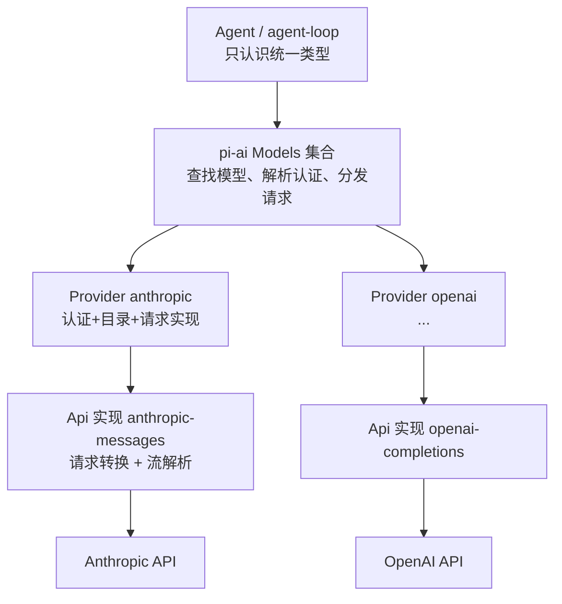
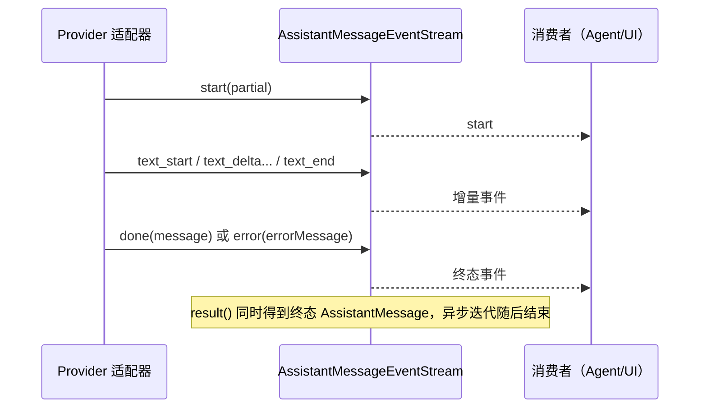
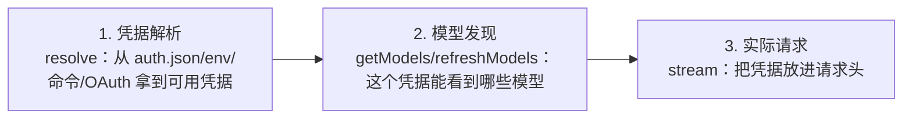
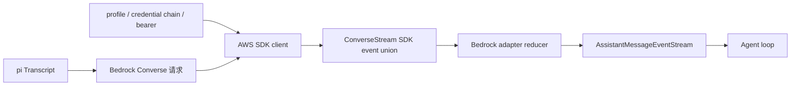
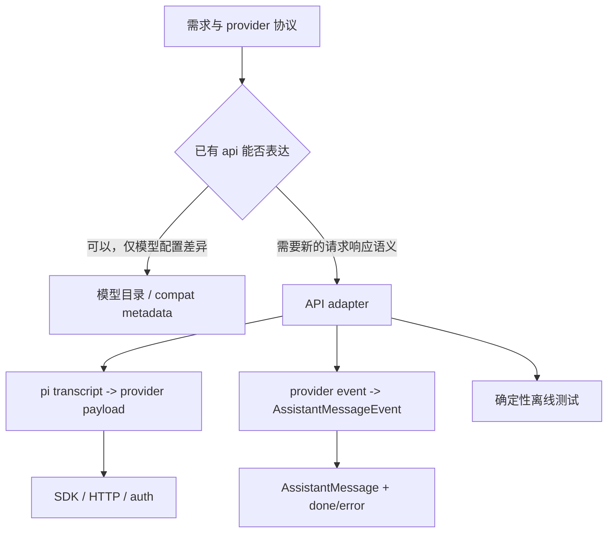

# 04. 模型目录、认证与流式适配

今天研究“同一条 pi 消息如何变成不同供应商请求，以及流怎样还原”。本篇自带概念、源码入口与离线验证步骤；无需其他任务或供应商密钥，预计 2–3 小时。

## 今日准备

确认 Node.js >= 22.19.0、仓库已用 `npm install --ignore-scripts` 安装依赖。在 `packages/ai` 目录可分别运行下面两个离线单文件测试，先确认当前实现的基线：

```powershell
node ../../node_modules/vitest/dist/cli.js --run test/anthropic-sse-parsing.test.ts
node ../../node_modules/vitest/dist/cli.js --run test/openai-responses-terminal-event.test.ts
```

这两个测试使用模拟输入；本任务不发网络请求。若路径或测试名在当前版本变化，先用 `rg --files packages/ai/test | rg 'anthropic|openai-responses'` 找当前文件。

## 学习内容

provider 是某个供应商的能力入口；`Model` 描述具体模型及上下文长度、能力等元数据；adapter 把统一的 pi 消息转成供应商请求，再把对方的流事件转回统一事件。一个 `delta` 只是尚未完成的片段，特别是工具参数 JSON，不能边收到边执行。认证的“凭据来自哪里”、模型目录的“候选来自哪里”、本次请求的“最终选了什么”要分别追踪。不同协议的结束事件名称相似，也要按各自语义映射为 `stopReason`。

例子：模型要调用 `read({"path":"README.md"})`。网络可能先给出 `{"path":`，稍后才给出 `"README.md"}`；第一段到达时工具参数尚不可解析。适配器负责累积并输出统一的工具调用事件；Agent 只在收到可执行的完整调用后调度工具。`message_end` 是 pi 侧的完成事实，不能用某家供应商的单个 `delta` 名称代替。

## 核心源码

`packages/ai/src/models.ts`的 `Provider`、`Models` 定义供应商能力；`packages/ai/src/compat.ts`的 `stream`、`streamSimple` 负责分派；`packages/ai/src/api/anthropic-messages.ts`查请求构造与 SSE 解码；`packages/ai/src/api/openai-responses-shared.ts`查 `processResponsesStream`；`packages/coding-agent/src/core/model-runtime.ts`查 `prepareRequest`；`packages/ai/src/providers/faux.ts`查离线响应怎样注入。阅读顺序是“接口 → 某个具体 adapter → 应用层请求准备”。

## TypeScript 语法小课：泛型与异步迭代

`AsyncIterable<T>` 表示“逐步给出 T”的流，`for await...of` 会等待每个片段。模型适配器的 `delta` 是中间值，不能拿它直接当最终工具参数。泛型 `T` 使每个片段保持同一类型。

```typescript
async function* chunks(): AsyncIterable<string> { // 每次 yield 一个异步可读片段
  yield '{"path":'; // 此刻 JSON 尚不完整
  yield '"README.md"}'; // 第二段补齐
}
async function collect(): Promise<void> {
  let raw = "";
  for await (const part of chunks()) raw += part; // 按到达顺序累计
  const value: unknown = JSON.parse(raw); // 边界输入先用 unknown，不能假定形状
  console.assert(typeof value === "object" && value !== null);
}
void collect(); // 在普通 .ts 脚本中也能运行，不依赖顶层 await
```

练习：删掉第二个 `yield`，观察 `JSON.parse` 报错；将这个边界对应到 `processResponsesStream` 对工具参数分片的处理。


## 完整学习资料

先按下列正文完成学习，再执行本篇的动手任务。正文中原书的实验与验收题先作为案例阅读，实际动手统一放到文末；只运行本篇“今日准备”和动手任务明确指定的离线命令。章节编号保留知识主题的原编号；源码精读、示例、边界条件、常见错误和参考答案均直接收录在本文件中。开头的预计用时仅指核心主线，完整源码精读需另留时间。

### 本篇共同基础

以下运行图和术语均在本文件内。学习正文保留原手册的知识主题编号，但那些编号不构成本任务的阅读前置；实际操作按本篇的动手任务与验收标准执行。学习正文基于原手册注明的 `200387122ca450d6387f033949423114a270b96c` 源码基线，当前工作区若有差异，以当前源码为准。

### 15 分钟主线：pi 怎样完成一件事

假设用户输入“读取 demo.txt，并总结三点”。模型自己不能读取你电脑里的文件。pi 把用户问题和可用工具告诉模型；模型提出 `read` 调用；pi 在本地执行；模型拿到文件内容后才生成总结。这就是全书反复使用的同一个例子。

**先看不带 TypeScript 细节的主流程（教学伪代码）：**

```text
收到用户输入，把它加入当前会话
重复：
    用当前上下文向模型发起请求
    收集模型的回答并把过程通知界面
    如果回答要求执行工具：
        校验参数，在本地执行工具，记录结果
        继续循环，让模型看到工具结果
    否则，检查是否还有排队输入或明确的继续决定
    如果都没有：结束本次运行
```

第一行确定这次任务和已有历史。模型请求只负责生成回答或提出工具调用。工具校验与执行由 pi 负责，结果回到对话后才可能有下一轮模型请求。界面接收运行事件，历史保存完成的消息；它们都与“模型请求”有关，但不是同一种数据。真实实现还处理工具并发、错误、取消、重试和压缩，后面分别讲。

**先分清四对容易混淆的词：**

| 两个词                | 直观区别                                           | 在“读文件并总结”中的例子                   |
| --------------------- | -------------------------------------------------- | -------------------------------------------- |
| 模型请求 / 用户输入   | 用户只说一次话，pi 可以多次询问模型                | 先请模型选择工具，读完文件后再请模型总结     |
| 事件 / 消息           | 事件告诉界面过程；消息承载一次完整的对话内容       | “正在输出第几个字”是事件；完成的总结是消息 |
| 工具调用 / 工具结果   | 调用提出想做什么；结果记录本地执行所得             | `read("demo.txt")` 是调用；文件文字是结果  |
| 会话历史 / 模型上下文 | 历史保留记录；上下文是这一次请求实际送给模型的内容 | 分支 C 仍在文件里，沿分支 D 继续时不必送 C   |


```text
一次用户输入
  → 第一次模型请求：请调用 read("demo.txt")
  → 本地工具执行：读出文件文本
  → 第二次模型请求：根据工具结果总结三点
  → 没有后续工作：结束
```

### 附录 A：术语表

> 用法：每个术语给出"一句话解释 + 首次出现的章节"。读代码遇到不认识的词，先查这里；查不到再搜源码（用英文名搜）。


#### A.1 核心概念

| 中文                  | 英文                    | 一句话                                                                                                             | 章节      |
| --------------------- | ----------------------- | ------------------------------------------------------------------------------------------------------------------ | --------- |
| 智能体外壳 / 运行框架 | agent harness           | 组织模型、工具、状态、界面的框架，本身不"聪明"                                                                     | 0.1       |
| 智能体                | agent                   | "模型 + 工具 + 循环"组成的执行体                                                                                   | 0.1       |
| 轮次                  | turn                    | 一次助手响应 + 它引发的工具执行                                                                                    | 3.3.3     |
| 低层运行              | Agent run               | 一次`Agent.prompt()` 或 `Agent.continue()` 调用建立的生命周期；以 `agent_end` 和已等待的 listener 收尾为边界 | 3.3.3、D2 |
| 会话 prompt 编排      | session prompt workflow | `AgentSession.prompt()` 在 `started` 后进入 `_runAgentPrompt()`；可串起 retry、压缩恢复和多个低层 Agent run  | 8、D27    |
| 用户请求              | user request            | 用户提交一次输入；与模型请求不等价                                                                                 | 3.3.3     |
| 模型请求              | model request           | 真正发给供应商 API 的一次请求                                                                                      | 3.3.3     |
| 转录                  | transcript              | 发给模型看/被记录的消息序列                                                                                        | 4.1       |
| 投影                  | projection              | 从会话树/文档到"模型实际看到的内容"的计算过程                                                                      | 9.4       |
| 活动分支              | active branch           | 从根到当前叶子的一条路径                                                                                           | 9.1       |
| 叶子                  | leaf                    | 会话树中的"当前位置"                                                                                               | 4.7.3     |
| 条目                  | entry                   | 会话文件里的一行（JSONL）                                                                                          | 4.7       |
| 会话                  | session                 | 一次对话的全部记录与状态                                                                                           | 8.1       |
| 压缩                  | compaction              | 用摘要替换旧上下文表示的机制                                                                                       | 10        |
| 上下文窗口            | context window          | 模型一次能接受的最大 token 量                                                                                      | 5.3       |
| 思考级别              | thinking level          | off/minimal/low/medium/high/xhigh/max                                                                              | 5.3       |
| 停止原因              | stop reason             | pending/stop/length/toolUse/error/aborted/deferred                                                                 | 4.3.3     |
| 用量                  | usage                   | token 与成本统计                                                                                                   | 4.3.5     |


#### A.2 消息与事件

| 中文           | 英文                | 一句话                                             | 章节        |
| -------------- | ------------------- | -------------------------------------------------- | ----------- |
| Agent 消息     | AgentMessage        | 内部消息（模型消息 + 应用自定义角色）              | 4.4         |
| 模型消息       | Message             | 供应商能理解的四角色联合                           | 4.3         |
| 内容块         | content block       | 消息内容的最小单元（text/image/thinking/toolCall） | 4.2         |
| 判别联合       | discriminated union | 用共同字面量字段区分成员的类型联合                 | 1.3.4       |
| 类型收窄       | narrowing           | 判断判别字段后类型自动缩小                         | 1.3.4       |
| 事件           | event               | 运行时广播（过程），不是消息（结果）               | 3.3.2       |
| 队列更新       | queue update        | 排队消息变化的会话事件                             | 4.5.2       |
| 边界（结算前） | agent_before_settle | 最后一个可行动钩子                                 | 6.2、13.3.5 |
| 已结算         | agent_settled       | "不会再自动继续"的最终信号                         | 4.5.2、16.3 |
| 延迟句柄       | deferred handle     | 异步应答的取回凭据                                 | 4.3.3       |


#### A.3 工具与模型

| 中文                | 英文                            | 一句话                                    | 章节  |
| ------------------- | ------------------------------- | ----------------------------------------- | ----- |
| 工具                | tool                            | 模型可调用的本地操作                      | 7.1   |
| 工具定义            | ToolDefinition                  | 扩展/应用注册工具的"富"形态               | 7.1.2 |
| 参数校验            | argument validation             | 用 typebox schema 在运行时校验调用参数    | 7.4   |
| 前置钩子            | beforeToolCall                  | 执行前可拦截（block）的钩子               | 7.6   |
| 后置钩子            | afterToolCall                   | 结果字段级改写的钩子                      | 7.6   |
| 顺序 / 并行执行     | sequential / parallel execution | 工具批次的两种调度                        | 7.5   |
| 终止提示            | terminate                       | "整批都同意时不因本批继续"的调度提示      | 7.5.4 |
| 模型                | model                           | 模型静态元数据（api/provider/限制/价格）  | 5.2.2 |
| 协议方言            | api                             | 供应商接口族标识（如 anthropic-messages） | 5.2.1 |
| 供应商              | provider                        | 认证 + 模型目录 + 请求实现                | 5.2.3 |
| 简单流式 / 完整流式 | streamSimple / stream           | 供应商无关档位 vs 协议特有选项            | 5.4   |
| 兼容开关            | compat                          | OpenAI 兼容生态的行为微调                 | 5.5.4 |
| 假供应商            | faux provider                   | 脚本化、离线的测试模型                    | 5.7   |


#### A.4 会话与持久化

| 中文       | 英文             | 一句话                             | 章节   |
| ---------- | ---------------- | ---------------------------------- | ------ |
| 会话管理器 | SessionManager   | 会话文件的对象化句柄               | 9.3    |
| 分支会话   | branched session | 只包含"根到叶子"路径的新文件       | 9.5.2  |
| 分支摘要   | branch summary   | 放弃某分支时生成的摘要条目         | 10.6   |
| 上下文编辑 | context edit     | 只改"投影"、不改原始条目的追加编辑 | 9.4.4  |
| 保留边界   | firstKeptEntryId | 压缩后从哪条开始保留               | 10.3.2 |
| 保留预算   | keepRecentTokens | 压缩后至少保留的近期上下文         | 10.3   |
| 预留       | reserveTokens    | 为模型回复预留的窗口               | 10.2.1 |
| 检测点替换 | checkpoint       | 压缩条目携带的提示词/工具检查点    | 9.4.3  |


#### A.5 扩展与集成

| 中文       | 英文            | 一句话                             | 章节       |
| ---------- | --------------- | ---------------------------------- | ---------- |
| 上下文文件 | context files   | AGENTS.md 等纯文本指令             | 11.4.2     |
| 项目信任   | project trust   | 允许加载项目可执行资源前的人工决定 | 11.5       |
| 提示词模板 | prompt template | Markdown 变成`/命令`             | 12.3.2     |
| 技能       | skill           | 目录 + SKILL.md 的按需说明书       | 12.3.3     |
| 扩展       | extension       | 可执行 TypeScript 模块（进程权限） | 12.3.4、13 |
| Pi 包      | Pi package      | 分发多资源的 npm/git 单元          | 12.3.6     |
| 钳制       | clamp           | 按模型能力压低思考级别             | 5.3        |
| 重绑       | rebind          | 会话替换后重新挂订阅/扩展绑定      | 8.6        |


#### A.6 协议与架构（选修）

| 中文     | 英文                   | 一句话                                          | 章节   |
| -------- | ---------------------- | ----------------------------------------------- | ------ |
| MCP      | Model Context Protocol | 外部工具/资源接入协议                           | 22     |
| 暴露方式 | exposure               | codemode/deferred/direct 三种工具到达模型的方式 | 22.3   |
| 工具搜索 | tool_search            | deferred 工具的"发现后再直调"机制               | 22.3   |
| 沙箱     | codemode sandbox       | QuickJS VM + worker 的脚本执行环境              | 22.9   |
| 面片     | facet                  | Chord 插件可独立打包到不同环境的分片            | 23.2   |
| 服务     | service                | Chord 的类型化稳定 token（singleton/keyed）     | 23.2   |
| 复制状态 | replicated state       | 原子发布、完整不可变值消费的状态                | 23.2   |
| 增量跟踪 | delta tracking         | 记录/合并 JSON 操作的机制                       | 23.2   |
| 持久执行 | durable execution      | 意图先提交、崩溃可续的执行模型                  | 23.1   |
| 检查点   | checkpoint             | 任务每一步的持久落点                            | 23.3.1 |
| 附着     | attachment             | 一条表现层连接绑定到一个会话                    | 24.2   |
| 信封     | envelope               | 协议中包裹 payload 的定向记录                   | 24.3   |
| span     | span                   | 一次操作的时间记录（遥测）                      | 25.2   |
| lift     | lift                   | 处理组相对对照组的提升（评估）                  | 25.5   |
| 阻断配对 | blocked pair           | 两臂未各得恰好一个分数，禁止计入头条            | 25.6   |


#### A.7 容易混淆的成对术语

| 对                                              | 区分                                                                                   |
| ----------------------------------------------- | -------------------------------------------------------------------------------------- |
| message vs event                                | 结果 vs 过程（3.3.2）                                                                  |
| turn vs run                                     | 一个轮次 vs 整次运行（3.3.3）                                                          |
| `agent_end` vs `agent_settled`              | 低层 run 结束 vs 自动工作清零（4.5.2）                                                 |
| 声明 vs 可执行                                  | 系统消息里的工具声明 vs 运行时工具集（7.3）                                            |
| details vs content                              | 给界面/程序 vs 给模型（14.2）                                                          |
| 完成顺序 vs 记录顺序                            | 并发完成 vs 声明序记录（7.5.3）                                                        |
| 停止原因`length` vs `stop`                  | 被截断 vs 正常说完（4.3.3）                                                            |
| `AgentSession.prompt()` vs `Agent.prompt()` | 应用层输入分流/会话编排 vs 低层 Agent run 入口（8、D2、D27）                           |
| `handled` vs `queued` vs `started`        | 输入被消费、不创建该输入自己的 run / 放入当前运行队列 / 进入会话 run 编排（8、16.5.3） |
| 提示词模板 vs 技能                              | 一段话 vs 一套流程+文件（12.3.3）                                                      |
| 扩展 vs Pi 包                                   | 可执行单元 vs 分发单元（12.3.6）                                                       |
| compaction 摘要 vs branch summary               | 压缩历史 vs 放弃分支（10.6）                                                           |
| durable cheat sheet：`replay: safe/never`     | 崩溃后重跑 vs 报 interrupted（23.4）                                                   |
| JSONL RPC vs client/server                      | 进程内 stdio 协议 vs 跨进程服务路由（24.1）                                            |
| 单测 vs 评估                                    | 确定性 vs 配对统计（25.1、25.6）                                                       |


#### A.8 输入与运行的层级

不要按“用户按了一次回车”推断低层 run 或模型请求的数量。实际层级是：

| 层级       | 代表符号                                           | 次数关系                                                                                      |
| ---------- | -------------------------------------------------- | --------------------------------------------------------------------------------------------- |
| 输入调用   | `AgentSession.prompt(text)`                      | 一次调用只表达一次输入尝试；结果可能是`handled`、`queued` 或 `started`                  |
| 会话编排   | `_runAgentPrompt(messages)`                      | 只在开始处理输入时进入；在里面管理重试、压缩恢复、边界 continuation 与取消                    |
| Agent run  | `Agent.prompt(messages)` 或 `Agent.continue()` | 一次会话编排可包含多个 run；每个低层 run 都发出自己的`agent_start` / `agent_end` 生命周期 |
| Agent turn | `turn_start` 到 `turn_end`                     | 一个 run 可包含多个 turn；每个 turn 通常包含一次助手响应及其引发的工具执行                    |
| 模型请求   | `streamSimple` / provider stream                 | 通常发生在助手响应阶段；自动重试会再次请求模型，压缩摘要等内部工作也可能有独立请求            |

两个边界例子：

- 扩展命令被消费时，`prompt()` 返回 `handled`，没有为该输入启动 `_runAgentPrompt()`；
- `prompt()` 在 Agent 已运行时以 `steer`/`followUp` 方式排队，返回 `queued`。这条输入会影响现有流程，但它本身不是新的 `Agent.prompt()` 调用。

因此，统计“模型请求次数”不能数 prompt、turn 或 `agent_end`：应按 provider 请求事件/日志，或明确的测试探针计数。章节 21 的自测题也按这个区分评分。


#### A.9 索引方式说明

- 想找"某行为在哪个文件" → 用 source-map；
- 想找"某命令怎么跑" → 用 commands；
- 想找"某现象怎么排" → 用 troubleshooting；
- 想找"哪些练习要做" → 用 exercises-and-answers。

---

### 第 5 章：pi-ai 与模型供应商适配


**先懂这一章**：pi 的上层只想问“给这个模型发送这些消息，并逐步收到回答”。不同供应商使用不同的请求和事件格式，`pi-ai` 把它们翻译成统一形式。先看翻译的输入与输出，再看某一家服务的字段。

```text
教学伪代码：选择模型与供应商 → 准备认证和请求
           → 把统一消息转换为供应商格式
           → 接收供应商的流式数据
           → 转成 pi 的统一事件和最终消息
```

真实适配器还处理取消、错误、用量和工具参数增量；这些分支在正常流转清楚之后再读。

前四章已经固定了消息和事件的形状。本章只回答模型供应商如何产生这些统一数据；何时再次请求模型由第 6 章决定，工具是否执行由第 7 章决定。先分清职责，再读各家适配器的字段差异。

> 学完本章你能回答：
>
> 1. `pi-ai` 用哪三个抽象（Model / Api / Provider）隔离不同供应商的差异？
> 2. `stream` 与 `streamSimple` 有什么区别？`compat.ts` 在中间做了什么？
> 3. 一个真实供应商适配器（以 Anthropic 为例）由哪些部分组成？请求转换要处理哪些字段？
> 4. 认证解析、模型发现、实际请求是三个不同阶段吗？为什么说"API 兼容不等于能力等价"？
> 5. faux provider 是什么？怎么用它零成本复现固定响应？
> 6. `Model.type`、`model.api` 与 Provider 可选能力分别决定什么？能力不存在时，各入口如何报告失败？

**预计学习时间**：1.5-2 天（适配器细节按需精读）。
**本章验证状态**：静态核对通过（对照基线源码）；faux 实验为本手册设计，需你在本地执行（第 5.8 节）。

---


#### 5.1 问题：同一个 pi，怎么跟几十家模型服务商说话

假设 pi 要支持这些供应商：Anthropic、OpenAI、Google、DeepSeek、Groq、xAI、OpenRouter……它们在至少八个维度上各不相同：

| 差异维度          | 典型的"不一致点"                            |
| ----------------- | ------------------------------------------- |
| 请求结构          | 消息字段名、角色命名、系统提示放哪          |
| 工具声明          | 工具定义的 JSON 结构、JSON Schema 方言      |
| 工具调用流        | 参数是"一次性给出"还是"分片拼装"            |
| 思考（reasoning） | 有的用预算 token、有的用档位名、有的没有    |
| 流式格式          | SSE 事件类型、结束标记、心跳                |
| 结束原因          | 各家的 finish_reason / stop_reason 取值不同 |
| 用量上报          | token 字段名、缓存命中/写入的分账方式       |
| 认证              | API Key、OAuth、云厂商凭据链                |

如果 Agent 层直接写这些分支，`agent-loop.ts` 会变成一座巴别塔。pi 的解法是**三层抽象**：



一句话：**Agent 层永远只看到 `Model`、`Message`、`AssistantMessageEvent` 这套统一类型；供应商的差异全部收敛在 `pi-ai` 内部。**


##### 5.1.1 一个具体对照（概念示意）

同一个 `read` 工具声明，进入不同适配器后要变成不同形状：

```text
pi 内部统一形状（Tool）：
  { name: "read", description: "...", parameters: { ...JSON Schema... } }

→ Anthropic 适配器转成：
  { name: "read", description: "...", input_schema: { ... } }

→ OpenAI 兼容适配器转成：
  { type: "function", function: { name: "read", description: "...", parameters: { ... } } }
```

两个"概念性事实"（读适配器代码时反复出现）：

1. **字段改名、结构包装**是最常见的转换工作；
2. **"兼容"是分级的**：OpenAI 兼容接口之间也有差异（是否支持 `store`、`reasoning_effort`、工具结果是否要求 `name`……），所以 pi 在 `Model` 上留了 `compat` 兼容开关与自动探测。第 5.5.4 节会看到真实的兼容配置类型。


#### 5.2 三个抽象 + 一个集合

打开 `packages/ai/src/types.ts` 和 `models.ts`，先认识四个名字：

| 名字            | 类型/位置     | 一句话                                                                        |
| --------------- | ------------- | ----------------------------------------------------------------------------- |
| `Api`         | `types.ts`  | **协议标识**：一家（或一类）接口的"方言名"，如 `"anthropic-messages"` |
| `Model<TApi>` | `types.ts`  | **模型描述**：静态元数据（谁家的、什么协议、限制、价格）                |
| `Provider`    | `models.ts` | **供应商实现**：认证方式 + 模型目录 + 请求函数                          |
| `Models`      | `models.ts` | **运行时集合**：注册/查找供应商与模型、解析认证、分发请求               |


##### 5.2.1 `Api`：开放式的"方言名"

```typescript
export type Api = KnownApi | (string & {});
```

- `KnownApi` 是内置文档化的取值（如 `"anthropic-messages"`、`"openai-completions"`、`"openai-responses"`、`"bedrock-converse-stream"`……）；
- `(string & {})` 这个技巧表示"也接受任意字符串，但保留字面量自动补全"。第三方扩展可以注册自己的协议名。

`ProviderId` 同理：`KnownProvider | string`，内置清单包含 `anthropic`、`openai`、`google`、`deepseek`、`github-copilot`、`openrouter` 等几十个（完整清单以本地 `types.ts` 为准）。


##### 5.2.2 `Model<TApi>`：一张"身份证"

以 `anthropic` 目录里的模型为例（字段含义见 5.3）。`Agent` 里还有一个"占位模型"的写法值得一读（`packages/agent/src/agent.ts`）：

```typescript
const DEFAULT_MODEL = {
	id: "unknown",
	name: "unknown",
	api: "unknown",
	provider: "unknown",
	baseUrl: "",
	reasoning: false,
	input: [],
	cost: { input: 0, output: 0, cacheRead: 0, cacheWrite: 0 },
	contextWindow: 0,
	maxTokens: 0,
} satisfies Model<any>;
```

`satisfies` 是"检查形状但不改变类型"的写法（第 1 章 1.3 的类型工具在实战里的样子）：它保证这个字面量满足 `Model<any>`，同时保留各字段的字面量类型。**Agent 在没配置模型时用它兜底**——这也是为什么源码里到处要判空。


##### 5.2.3 `Provider` 与 `Models`：接口原文

`Provider`（`models.ts` 第 144 行，删减注释）：

```typescript
export interface Provider<TApi extends Api = Api> {
	readonly id: string;          // 供应商标识，如 "anthropic"
	readonly name: string;        // 展示名
	readonly baseUrl?: string;    // 默认 API 根地址
	readonly headers?: ProviderHeaders;
	readonly auth: ProviderAuth;  // 认证方式集合（至少一个 apiKey；可选 oauth）

	getModels(): readonly Model<TApi>[];                 // 当前已知的聊天模型（同步）
	getAllModels?(): readonly ProviderModel<TApi>[];     // 所有类型模型（含图像/分类）
	refreshModels?(context: RefreshModelsContext): Promise<void>;  // 动态目录刷新（可选）
	filterModels?(models, credential): readonly Model<TApi>[];    // 按凭据过滤可用模型（可选）

	stream<T extends TApi>(model: Model<T>, context: TranscriptContext, options?: ApiStreamOptions<T>): AssistantMessageEventStream;
	streamSimple(model: Model<TApi>, context: TranscriptContext, options?: SimpleStreamOptions): AssistantMessageEventStream;
	fetchDeferred?/cancelDeferred?(): ...;               // 延迟应答（可选）
	generateImages?/classify?(): ...;                    // 专用模型能力（可选）
}
```

记住两点：

- **认证是 Provider 的一等公民**：`auth` 不是"可选功能"，每个供应商都必须声明（哪怕是"本地无认证服务器"，也要用 apiKey 形式报告"是否已配置"）；
- **必须至少实现 stream 与 streamSimple 之一**（实际上都实现）。

`Models` 是门面（façade）：`getProviders()`、`getProvider(id)`、`getModel(provider, id)`、`setProvider(p)`、`getAuth(...)`、`stream/streamSimple(...)`。你已经在第 3 章见过它的实际调用：`modelRuntime.streamSimple(model, context, requestOptions)`。


##### 5.2.4 供应商是怎么"造出来"的

入口是 `createProvider()`（`models.ts` 第 1034 行）。它做了一件很有代表性的工程处理：**支持"单实现"或"按 api 分派"两种形态**。

```typescript
export function createProvider<TApi extends Api = Api>(input: CreateProviderOptions<TApi>): Provider<TApi> {
	const single = input.api && typeof (input.api as ProviderStreams).stream === "function"
		? (input.api as ProviderStreams) : undefined;
	const byApi = single || !input.api ? undefined : (input.api as Partial<Record<string, ProviderStreams>>);
	// ...
	const apiFor = (model: Model<Api>): ProviderStreams | undefined => single ?? byApi?.[model.api];

	const dispatch = (model, run) => {
		const streams = apiFor(model);
		if (!streams) {
			return lazyStream(model, async () => {
				throw new ModelsError("stream", `Provider ${input.id} has no API implementation for "${model.api}"`);
			});
		}
		return run(streams);
	};

	const provider: Provider<TApi> = {
		id: input.id, name: input.name ?? input.id, baseUrl: input.baseUrl, headers: input.headers,
		auth: input.auth,
		getModels: () => currentModels().filter((model) => isModelType(model, "chat")),
		getAllModels: currentModels,
		refreshModels: fetchModels ? async (context) => { /* 恢复 stored → 网络刷新 → publish(persist+update) */ } : undefined,
		filterModels: input.filterModels, filterAllModels: input.filterAllModels,
		stream: (model, context, options) => dispatch(model, (streams) => streams.stream(model, context, options)),
		streamSimple: (model, context, options) => dispatch(model, (streams) => streams.streamSimple(model, context, options)),
	};
	// ... fetchDeferred / cancelDeferred / generateImages / classify 按需挂载
	return provider;
}
```

三个设计点：

1. **模型可以混用不同 api**：一个 Provider 下不同模型可以走不同协议（`byApi[model.api]` 分派）；找不到实现时返回"懒惰失败流"而不是立刻抛错（`lazyStream` 把错误编码进流——符合流契约）；
2. **静态目录 + 动态目录合并**（`currentModels()`）：静态清单来自生成的模型目录，动态刷新（有网络、有凭据时）覆盖同名条目；
3. **动态刷新是事务化的**：`context.publish({ update, persist })` 保证"内存更新"与"持久化"一起生效；`stored` 用于离线启动时恢复上次刷新结果。

内置供应商在 `packages/ai/src/providers/all.ts` 里集中注册，模型目录数据来自 `models.generated.ts`（**生成文件，永不手改**；改目录要走 `packages/ai/scripts/generate-models.ts`，生成脚本是目录变更的入口）。


##### 5.2.5 模型类型与 Provider 能力不是一回事

新手容易把“同一家 Provider”理解为“它列出的每个模型都能做同样的事”。源码把这两个问题分开：**模型的 `type` 决定允许调用哪种操作；Provider 对应的实现 map 决定该 API 是否真的可执行。**

```text
Model<TApi> (type 缺省或 chat) ── stream / complete
ImageModel<ImageApi>            ── generateImages
ClassifierModel<ClassifierApi>  ── classify

模型.provider → 找到 Provider
模型.api      → 找到 Provider 内对应的 API 实现
模型.type     → 校验当前操作是否接受该模型
```

| 模型类型                | 目录读取方式                                                             | 操作入口                                                                      | 实现缺失时的典型结果                                                                          |
| ----------------------- | ------------------------------------------------------------------------ | ----------------------------------------------------------------------------- | --------------------------------------------------------------------------------------------- |
| chat（`type` 可省略） | `getModels()` / `getModel()`                                         | `stream()` 使用 API 特有选项；`streamSimple()` 使用 provider-neutral 选项 | 返回流内的`error` 终态，最终 assistant message 的 `stopReason` 为 `error`               |
| image                   | `getModelsOfType("image")`、`getModelOfType("image", ...)`           | `generateImages()`                                                          | Promise 正常 resolve 为带`stopReason: "error"` 的 `AssistantImages`；该门面契约不 reject  |
| classifier              | `getModelsOfType("classifier")`、`getModelOfType("classifier", ...)` | `classify()`                                                                | Promise 正常 resolve 为带`stopReason: "error"` 的 `ClassifierResult`；该门面契约不 reject |

`getModels()` 和 `getModel()` 是兼容旧调用的 chat-only 入口；需要遍历图像或分类模型，要用带类型的 accessors。`getAllModels()` 则返回所有类型。类型检查器能在正常代码里阻止把 `ImageModel` 传给 `stream()`；`ModelsImpl` 仍会在运行时用 `assertImageModel`、`assertClassifierModel`、`requireChatProvider` 检查边界，因为 JS 调用者、数据文件和 `as SomeType` 类型断言都可能绕过编译期保证。

`createProvider()` 可以把不同能力按 `model.api` 分开注册：`api` 是 chat stream 实现（单个实现或按 API 的 map），`images` 和 `classifiers` 分别是专用操作 map。它只要求这三类 map 至少有一种具体实现，因此 image-only Provider 合法，不必伪造一个 chat stream。即使 Provider 有 `generateImages` 方法，也只说明它至少支持某些图像 API；`images[model.api]` 缺项时仍会得到明确的“不支持该 API”错误结果。相同原则适用于 classifier 和按协议分派的 chat API。

Deferred response 是另一种能力：它附着在 chat Provider 的可选 `fetchDeferred` / `cancelDeferred` 方法上，不是新的 `Model.type`。`streamDeferred()` 对不支持的 provider 把错误编码成 assistant error stream；`cancelDeferred()` 的返回类型是 `Promise<void>`，缺少支持时会 reject。看到“可选方法”时要沿调用方检查错误形态，不能假设每个失败都能从 `AssistantMessage.stopReason` 读取。

这些差异在测试中有明确边界：`packages/ai/test/images-models.test.ts` 覆盖未知 Provider、未配置认证、取消、chat-only Provider 和缺少 API 映射；`classifier-models.test.ts` 检查跨模型类型调用；`providers.test.ts` 覆盖 deferred fetch/cancel。新增能力时，至少要为“正确类型 + 有实现”“正确类型 + 缺实现”“错误模型类型”三种情况找测试或补测试。


#### 5.3 `Model` 字段详解：每个字段都有用途

根据 `types.ts` 与生成的目录条目，划重点的字段：

| 字段                 | 含义                                               | 谁在用它                                       |
| -------------------- | -------------------------------------------------- | ---------------------------------------------- |
| `id`               | 模型标识（如`claude-opus-4-5`）                  | 选择模型、会话恢复、用量记录                   |
| `name`             | 展示名                                             | 模型选择 UI                                    |
| `api`              | 走哪套协议实现                                     | `Provider` 分派、适配器选择                  |
| `provider`         | 供应商标识                                         | 认证解析、请求头归因                           |
| `baseUrl`          | API 根地址                                         | 请求构建、兼容性自动探测                       |
| `reasoning`        | 是否支持思考                                       | 思考级别钳制（`clampThinkingLevel`）         |
| `input`            | 接受的输入类型（`"text"` / `"image"`）         | 发图前检查（防止把图发给纯文本模型）           |
| `cost`             | 每百万 token 价格（输入/输出/缓存读/缓存写）       | 成本统计（`usage.cost` 的计算基准）          |
| `contextWindow`    | 上下文窗口大小                                     | 压缩阈值判断（第 10 章）                       |
| `maxTokens`        | 单次输出上限                                       | 请求参数；截断判定（`stopReason: "length"`） |
| `thinkingLevelMap` | pi 思考级别 → 供应商取值映射；`null` 表示不支持 | `clampThinkingLevel` 与请求转换              |
| `promptCache`      | 缓存能力的元数据                                   | 缓存策略与缓存预热                             |
| `compat`           | 兼容开关（仅部分协议）                             | OpenAI 兼容适配器的行为微调                    |
| `samplingParams`   | 默认采样参数（透传）                               | 高级用户/本地模型（llama.cpp、vLLM 等）        |

三个"隐性用途"值得先知道（后面章节会用到）：

- **`contextWindow` 决定"什么时候该压缩"**：不是硬编码的数字，而是模型元数据；
- **`cost` + `usage` 共同算出会话费用**：`Usage.cost` 的四个分项就是按 `Model.cost` 乘出来的；
- **`reasoning` + `thinkingLevelMap` 决定"思考档位如何降级"**：你在 CLI 传 `--thinking high`，不支持高强度的模型会被钳制到最近的可用档位（`clampThinkingLevel`，`pi-ai/compat` 导出）。


##### 5.3.1 从"一个模型"到"一个模型作用域"

CLI 允许"多个模型循环"（如 `--models`、交互里 Ctrl+P 切换）。第 3 章 `main.ts` 里的 `resolveModelScope(modelPatterns, modelRuntime, ...)` 就是把**模式字符串**（精确 ID、模糊名、glob）解析成模型列表的地方（`core/model-resolver.ts`）。这也是"模型选择"与"模型请求"分离的又一个例子：先解析成 `Model` 对象，再在每次请求时使用。

#### 5.4 `stream` 与 `streamSimple`：两条入口，一个终点

`pi-ai` 对外提供两套调用风格（都在 `compat.ts`）：

- **`stream(model, context, options)`**：完整控制。`options` 的类型随 `model.api` 变化（`ApiStreamOptions<TApi>`），可以直接调供应商特有的参数；
- **`streamSimple(model, context, options)`**：供应商无关的"简单选项"——pi 自己抽象出来的档位（思考级别、工具选择、延迟应答），由适配器负责翻译。

`streamSimple` 的实现（`compat.ts` 第 278 行，原样）：

```typescript
export function streamSimple<TApi extends Api>(
	model: Model<TApi>,
	context: Context,
	options?: SimpleStreamOptions,
): AssistantMessageEventStream {
	const transcript = normalizeContext(context);
	const builtinProvider = getBuiltinProviderForModel(model);
	if (builtinProvider) {
		if (model.provider.startsWith("cloudflare-") && !hasResolvedCloudflareAuth(options)) {
			return compatModels.streamSimple(model, transcript, options);
		}
		return builtinProvider.streamSimple(model, transcript, withEnvApiKey(model, options));
	}
	const provider = resolveApiProvider(model.api);
	return provider.streamSimple(model, transcript, withEnvApiKey(model, options) as StreamOptions);
}
```

四步读法：

1. **`normalizeContext(context)`**：把传进来的 `Context`（可能用 `systemPrompt`/`tools` 简写）折成"系统消息在最前"的规范转录。这也解释了下层循环的约定：*系统提示和工具声明一定在消息数组里*，不在 context 的旁路字段上（第 3 章 `StreamFn` 契约原话）。
2. **`getBuiltinProviderForModel(model)`**：内置目录里的模型（大多数情况）直接找到注册好的 Provider；
3. **Cloudflare 特例**：凭据未解析时改走 `compatModels`（动态模型路径），避免用错误的认证形态建连；
4. **兜底 `resolveApiProvider(model.api)`**：非内置的（扩展注册的自定义供应商）按 `api` 找实现。注册入口：`registerApiProvider()` / `registerBuiltInApiProviders()`（同一文件）。

`stream` 与 `streamSimple` 的差异只体现在**选项翻译**上：`SimpleStreamOptions` 里的 `reasoning`、`toolChoice`、`deferred`、`thinkingBudgets` 都会被适配器翻译成供应商的具体参数。两个包裹函数 `complete` / `completeSimple` 则是"只要最终消息"的便捷版：

```typescript
export async function completeSimple<TApi extends Api>(model, context, options): Promise<AssistantMessage> {
	const s = streamSimple(model, context, options);
	return s.result();   // 异步迭代流的"聚合结果"
}
```


##### 5.4.1 流契约：错误去哪了

这是新手读代码最容易困惑的一点，源码注释写得非常明确（`types.ts` 的 `StreamFunction` 契约）：

- **直接调用 `streamSimple` 可能同步抛错**——当认证明显缺失等"请求之前就能判断"的问题发生时；
- **一旦返回了流，后续的请求/模型/运行时错误都要编码进流**：通过 `error` 事件，以及最终 `AssistantMessage` 的 `stopReason: "error" | "aborted"` 与 `errorMessage` 字段。

所以你会看到两种错误路径：

```text
路径 A（同步抛错）：调用方 try/catch 或直接失败
路径 B（流内错误）：循环层照常收到事件流，只是最后一个事件是 error
```

路径 B 可能在 `start` 前直接以 `error` 结束（例如请求建立阶段失败），也可能已经发出 `start` 和部分内容后再以 `error` 结束。第 3 章循环里 `message.stopReason === "error" || "aborted"` 的分支处理的就是路径 B。**设计动机**：界面和会话层只要处理"一种"结束形态，不用区分"抛错"和"正常返回错误消息"。


##### 5.4.2 流事件协议：增量不是最终答案

`AssistantMessageEventStream` 同时提供两种读取方式：异步迭代逐个消费事件，`result()` 取得最终 `AssistantMessage`。底层 `AssistantMessageEventStream` 把 `done` 和 `error` 定义为完成事件：推入其中一个时，流的最终 Promise 被解析；后续再 `push` 的事件会被忽略。供应商适配器必须真正发出其中一个终态事件，不能只结束迭代器而不提供终态消息。



`AssistantMessageEvent` 是带 `type` 标签的联合类型（discriminated union）。读这类 TS 代码时，先看 `event.type`，再看该分支允许访问的字段：

```typescript
for await (const event of stream) {
  switch (event.type) {
    case "text_delta":
      // 只有此分支保证有 delta 字符串
      renderText(event.delta);
      break;
    case "toolcall_end":
      // 完整调用以 toolCall 字段给出
      scheduleTool(event.toolCall);
      break;
    case "done":
      // 成功终态携带完整 AssistantMessage
      saveFinalMessage(event.message);
      break;
    case "error":
      // 错误终态也携带 AssistantMessage，失败信息在 error.errorMessage
      showFailure(event.error.errorMessage);
      break;
  }
}
```

这里有四条实现规则：

1. **先有 `start`，再有更新，最后 `done`**。类型注释规定 `start` 前不能发增量或 `done`；但 setup 阶段失败可以直接发 `error`，所以消费者不能假定每个错误流都有 `start`。
2. **`partial` 是共享的“当前进展”，不是事件发生时的冻结快照**。后续增量会继续修改消息内容；想保存某个时间点的副本，必须自行复制。仅保存许多 `event.partial` 引用，最后可能看到它们都反映最终内容。
3. **增量和最终块各有职责**：`text_start` 时文本通常为空，后续 `text_delta` 提供增量，`text_end.content` 是该文本块的最终值；thinking 通常类似，但被隐藏/加密的思考块可能在 `thinking_start` 就完整出现而没有 delta。工具参数的 `toolcall_start` 初值由供应商决定，`toolcall_delta` 给后续 JSON 增量，`toolcall_end.toolCall` 才是最终完整调用。
4. **终态消息是权威结果**：`done.message` 或 `error.error` 负责提供完整的最终消息。若需要持久化、决定是否执行工具或判断 `stopReason`，应以终态消息为准，不要从屏幕上已显示的 delta 倒推。

适配器实现者可以按这个顺序检查：是否创建了完整的 assistant partial；是否先发 `start`；每种内容块的 `contentIndex` 是否指向正确块；是否在结束块事件后补齐最终字段；成功是否发 `done`；错误是否发带 `stopReason: "error" | "aborted"` 和 `errorMessage` 的 `error`；取消是否也能抵达终态。现有 `types.ts` 的协议注释是契约来源；`assistant-message-frame.test.ts` 覆盖帧编码边界，`faux-provider.test.ts` 覆盖脚本化事件序列。这里是静态源码/测试定位，不代表本轮运行了这些测试。


#### 5.5 供应商适配器解剖：以 Anthropic 为例

打开 `packages/ai/src/providers/anthropic.ts`（全文只有约 100 行，非常适合当第一个适配器读）。它由三块组成：认证定义、目录引用、适配器装配。


##### 5.5.1 认证定义：`anthropicApiKeyAuth()`

```typescript
function anthropicApiKeyAuth(): ApiKeyAuth {
	return {
		name: "Anthropic API key",
		login: async (interaction) => {
			interaction.signal.throwIfAborted();
			const key = await interaction.prompt({ type: "secret", message: "Enter Anthropic API key" });
			interaction.signal.throwIfAborted();
			return { type: "api_key", key };
		},
		resolve: async ({ ctx, credential, signal }) => {
			signal.throwIfAborted();
			// ① 已保存的凭据最优先
			if (credential?.key) {
				return { auth: { apiKey: credential.key }, env: credential.env, source: "stored credential" };
			}
			// ② 环境变量 ANTHROPIC_AUTH_TOKEN 作为 Bearer
			const authToken = await ctx.env(ANTHROPIC_AUTH_TOKEN_ENV);
			signal.throwIfAborted();
			if (authToken) {
				return { auth: { headers: { Authorization: `Bearer ${authToken}` } }, source: ANTHROPIC_AUTH_TOKEN_ENV };
			}
			// ③ 依次尝试 ANTHROPIC_OAUTH_TOKEN、ANTHROPIC_API_KEY
			for (const envVar of [ANTHROPIC_OAUTH_TOKEN_ENV, ANTHROPIC_API_KEY_ENV]) {
				const apiKey = await ctx.env(envVar);
				signal.throwIfAborted();
				if (apiKey) return { auth: { apiKey }, source: envVar };
			}
			// ④ 最后：工作负载身份联合（云环境里用短期令牌）
			//    ANTHROPIC_FEDERATION_RULE_ID + ANTHROPIC_ORGANIZATION_ID + ANTHROPIC_IDENTITY_TOKEN_FILE
			//    三者齐全才启用；SERVICE_ACCOUNT_ID / WORKSPACE_ID 可选透传
			// ...
			return { auth: {}, env: federation, source: "workload identity federation" };
		},
	};
}
```

请把这四层优先级**背下来**，它是排查"认证为什么不生效"的第一张地图（第 11 章系统展开）：

```text
已保存凭据（auth.json）
  → ANTHROPIC_AUTH_TOKEN（Bearer 形态）
    → ANTHROPIC_OAUTH_TOKEN / ANTHROPIC_API_KEY
      → 工作负载身份联合（K8s/CI 等云环境）
```

三个工程细节：

- **`interaction.signal.throwIfAborted()` 无处不在**：登录提示、环境变量读取都要能被取消。这是"全链路取消"在认证层的体现；
- **登录是交互式的**：`login()` 接收一个 `interaction` 对象（询问、secret 输入、取消信号），由宿主（TUI 或 RPC）实现具体交互——`pi-ai` 不依赖终端；
- **`resolve()` 返回 `source` 字段**：告诉你最终凭据从哪来。排查问题时就靠它。


##### 5.5.2 装配：`anthropicProvider()`

```typescript
export function anthropicProvider(): Provider<"anthropic-messages"> {
	return createProvider({
		id: "anthropic",
		name: "Anthropic",
		baseUrl: "https://api.anthropic.com",
		auth: {
			apiKey: anthropicApiKeyAuth(),
			oauth: lazyOAuth({
				name: "Anthropic (Claude Pro/Max)",
				isSubscription: true,
				load: loadAnthropicOAuth,
			}),
		},
		models: Object.values(ANTHROPIC_MODELS),
		api: anthropicMessagesApi(),
	});
}
```

逐项：

- `models: Object.values(ANTHROPIC_MODELS)`：静态目录来自 `providers/anthropic.models.ts`（内容又是从生成目录里筛出来的）。**目录是数据，不是逻辑**；
- `api: anthropicMessagesApi()`：请求实现。名字里的 `lazy`（`api/anthropic-messages.lazy.ts`）意味着**按需加载**——只有真的要用 Anthropic 时才把适配器和 SDK 拉进内存，否则 CLI 启动要白白加载几十个供应商 SDK。这是启动速度的关键设计；
- `oauth: lazyOAuth({ isSubscription: true, load })`：OAuth 支持同样是懒加载的。`isSubscription: true` 表明这是"订阅账号"模式（和 API 计费不同）。


##### 5.5.3 适配器实现要干什么：一份检查清单

`anthropicMessagesApi()` 的内部（`api/anthropic-messages.ts`）不在本章精读范围，但你要知道**任何适配器都要做这两大类工作**，读其他供应商时按这张清单对照：

**请求方向（统一 → 供应商）**：

| 转换对象               | 典型处理                                                                  |
| ---------------------- | ------------------------------------------------------------------------- |
| 系统消息               | 取出提示文本/分节，放到供应商的 system 位置                               |
| 用户/助手/工具结果消息 | 角色映射；内容块结构转换                                                  |
| 工具声明               | `parameters` JSON Schema → 供应商的工具字段（如 `input_schema`）     |
| 思考级别               | `reasoning: "high"` → 供应商的预算/档位参数（查 `thinkingLevelMap`） |
| 缓存策略               | 按供应商能力加缓存标记                                                    |
| 请求头                 | 认证头 + 归因头（`provider-attribution.ts` 维护）                       |

**响应方向（供应商 → 统一）**：

| 转换对象               | 典型处理                                                                           |
| ---------------------- | ---------------------------------------------------------------------------------- |
| SSE/流式事件           | 逐事件解析 →`AssistantMessageEvent`（start/text/thinking/toolcall/done/error）  |
| **工具参数增量** | 分片 JSON 增量拼装（仓库依赖里有`partial-json`，专门做"不完整 JSON 的容错解析"） |
| 结束原因               | `finish_reason` / `stop_reason` → `StopReason` 枚举                         |
| 用量                   | 供应商字段 →`Usage`（含缓存读写与成本计算）                                     |
| 错误                   | HTTP 错误/流错误 →`error` 事件 + `errorMessage`                               |

**一句话总结适配器的价值：把 N 家供应商的"方言"翻译成一种"普通话"。** 统一的普通话就是第 4 章的类型。


##### 5.5.4 "兼容"不是"等价"：`compat` 开关

OpenAI 兼容生态里，各家服务器对同一协议的支持程度参差不齐。`Model.compat` 就是为这些差异准备的开关（类型定义在 `types.ts`，约 1.3 万字节，节选字段）：

```typescript
export interface OpenAICompletionsCompat {
	supportsStore?: boolean;                    // 是否支持 store 字段
	supportsDeveloperRole?: boolean;            // developer 角色 or system
	supportsReasoningEffort?: boolean;          // reasoning_effort 参数
	supportsUsageInStreaming?: boolean;         // 流式里带 usage
	supportsFinishReason?: boolean;             // 流里带 finish_reason；没有则由 pi 推断
	maxTokensField?: "max_completion_tokens" | "max_tokens";
	requiresToolResultName?: boolean;           // 工具结果是否必须带 name 字段
	requiresAssistantAfterToolResult?: boolean; // 工具结果后是否必须插一条 assistant
	requiresThinkingAsText?: boolean;           // 思考块是否要转成 <thinking> 文本
}
```

读法：每个字段的注释都写了"默认从 baseUrl 自动探测"。所以一个自建 vLLM 服务器接进来的典型流程是：

1. 声明一个 `openai-completions` 协议的 `Model`，`baseUrl` 指向本地；
2. pi 按 URL 猜测默认兼容档；
3. 猜错了 → 在 `Model.compat`/`models.json` 里手动覆盖某个开关。

这背后是一个重要的产品判断：**"支持 OpenAI 协议"只能保证最基础的部分，pi 选择为"差异点"建可配置的开关，而不是假装大家一样。**


#### 5.6 认证解析：三个阶段，别混在一起

结合 5.5.1 和 coding-agent 的用法，把"认证"拆成三个时间点：



为什么必须区分？

- "列表里能看到某个模型" ≠ "你有这个模型的权限"（`filterModels` 按凭据过滤，但供应商侧仍可能拒绝）；
- "认证配置存在" ≠ "认证仍然有效"（OAuth 过期、账号降级）；
- "请求发出去了" ≠ "模型真的被调用了"（延迟应答 deferred）。

coding-agent 侧的对应 API（回顾第 3 章的两处调用）：

```typescript
// AgentSession.prompt 的校验分支
const hasConfiguredAuth = this._modelRuntime.hasConfiguredAuth(this.model.provider)
	|| (await this._modelRuntime.checkAuth(this.model.provider)) !== undefined;
```

- `hasConfiguredAuth`：**本地判断**"这个供应商是否有凭据配置"（快，不访问网络）；
- `checkAuth`：**更严格的检查**（可能需要解析命令型 key、检查 OAuth 有效性）。


##### 5.6.1 凭据的三种来源（provider 文档口径）

1. **交互登录**（`/login`）：OAuth 或 API Key，保存到 `~/.pi/agent/auth.json`（文件私密，会被 pi 读取但不应提交到仓库）；
2. **环境变量**：如表 `ANTHROPIC_API_KEY`、`OPENAI_API_KEY`、`GEMINI_API_KEY` 等（`pi-test.sh --no-env` 会清空模型认证环境变量）；
3. **命令型 key**：`auth.json` 里允许 `"key": "!security find-generic-password -ws 'anthropic'"` 这种写法——**运行时执行命令、缓存 stdout**，适合接密钥管理器，避免把明文写盘。


##### 5.6.2 模型目录：静态与动态

| 形态     | 例子             | 行为                                                                                                                 |
| -------- | ---------------- | -------------------------------------------------------------------------------------------------------------------- |
| 静态目录 | 大多数内置供应商 | `getModels()` 直接返回生成目录中的列表                                                                             |
| 动态目录 | Radius 等网关    | `refreshModels()` 用当前凭据拉取新列表；`context.stored` 恢复上次结果；`publish({persist, update})` 事务式生效 |

对你读代码的意义：**不要假设"模型列表 = 常量"**。看到 `getModel()` 返回 `undefined` 时，先区分是"目录里没有"还是"刷新还没发生/凭据不足被过滤"。


#### 5.7 faux provider：零成本实验的发动机

真实模型实验有成本、不稳定、还要求凭据。仓库为此内置了一个"假供应商"：`providers/faux.ts`（21KB），它**完全兼容真实的流式协议**——返回的是同一套 `AssistantMessageEvent`，只是内容按脚本演出。


##### 5.7.1 它是什么

关键导出（`faux.ts` 与 `compat.ts`）：

```typescript
// 辅助构造器
export function fauxText(text: string): TextContent
export function fauxThinking(thinking: string): ThinkingContent
export function fauxToolCall(name, arguments_, options?): ToolCall
export function fauxAssistantMessage(content, options?): AssistantMessage   // 带 stopReason 等选项

// 注册入口
export function registerFauxProvider(options?: RegisterFauxProviderOptions): FauxProviderRegistration  // compat.ts
export function fauxProvider(options?): FauxProviderHandle                                             // faux.ts
export function createFauxCore(options): ...                                                           // 底层实现
```

`RegisterFauxProviderOptions` 可以定制：api 名、provider 名、模型定义列表、延迟应答行为（`deferred.pendingFetches` / `pollAfterMs`）、**流式速度**（`tokensPerSecond`）与分词粒度（`tokenSize`）——这让你能稳定复现"慢速流式"而不必真的等网络。


##### 5.7.2 怎么"演出"一次对话

核心是**脚本化响应队列**（`faux.ts`）：

```typescript
export type FauxResponseFactory = (
	context: TranscriptContext,
	options: SimpleStreamOptions | undefined,
	state: FauxProviderState,
	model: Model<string>,
) => AssistantMessage | Promise<AssistantMessage>;

export type FauxResponseStep = AssistantMessage | FauxResponseFactory;

export interface FauxProviderRegistration {
	// ...
	state: FauxProviderState;                       // { callCount, deferredFetchCount, cancelledDeferred }
	setResponses: (responses: FauxResponseStep[]) => void;   // 重设整个队列
	appendResponses: (responses: FauxResponseStep[]) => void; // 追加
	getPendingResponseCount: () => number;                   // 还剩几条脚本
	unregister: () => void;
}
```

调度规则：**每次模型请求消费队列里的一项**（`callCount` 自增）。因此第 3 章的"两次模型请求"用例可以这样写：

```typescript
const faux = registerFauxProvider();
faux.setResponses([
	fauxAssistantMessage([fauxToolCall("read", { path: "demo.txt" })], { stopReason: "toolUse" }),
	fauxAssistantMessage("三点总结：……"),
]);

// 跑一次 prompt 后：
// faux.state.callCount === 2
// faux.getPendingResponseCount() === 0
```

（上面是"设计示意"，实际使用时模型注册与认证细节由 SDK/harness 处理；第 5.9 节的实验会给出可运行的完整版本。）


##### 5.7.3 测试里的用法

仓库的测试套件已经把它包好了（`packages/coding-agent/test/suite/harness.ts`）：

```typescript
import { registerFauxProvider, streamSimple } from "@earendil-works/pi-ai/compat";
// ...
import { AgentSession } from "../../src/core/agent-session.ts";
```

这个 harness 会创建一个**真实结构的 AgentSession**，但模型换成 faux、会话换成内存存储——这就是第 18 章要教的"离线模拟"的核心设施。第 6 章的循环实验（steering、并行工具顺序）也全部基于它。


#### 5.8 实验 L02：用 faux 观察两次请求

**实验性质**：本地运行；零模型费用；依赖按本篇“今日准备”安装。
**验证状态**：设计中（步骤已对照源码设计；请在本地运行并记录结果到你的笔记）。


##### 目标

亲手跑通"一次 prompt → 两次模型请求 → 一次工具执行"的完整轨迹，并观察 `callCount`。


##### 步骤（在仓库根目录）

1. 找到测试套件里最近的例子（任选一个用 harness 的 suite 测试文件）：

```bash
ls packages/coding-agent/test/suite
```

2. 选一个包含工具调用的测试，读它的结构：如何注册 faux、如何 `setResponses([...])`、如何断言 `callCount` 与消息数组；
3. 运行它（在 `packages/coding-agent` 目录下；把文件名换成你选中的）：

```bash
node "$(git rev-parse --show-toplevel)/node_modules/vitest/dist/cli.js" --run test/suite/<你选的文件>.test.ts
```

4. 在测试里（临时改）加一行 `console.log(faux.state.callCount)`，确认：带工具的回答是 2，无工具的是 1。**改完记得还原**，或者把日志加到你自己的临时脚本里。


##### 观察与思考

- `callCount` 与 `getPendingResponseCount()` 的关系是什么（脚本耗尽后请求会怎样——看 faux 找不到脚本时的默认行为）；
- 两次请求之间，`context.messages` 里多了哪两条消息？
- 如果把第一个响应改成"纯文本、无工具"，第二次请求还会发生吗？


##### 清理

还原你对测试文件的临时修改；`git status` 应保持干净（除你自己的实验文件外）。


#### 本章源码精读

> **源码精读**：先定位导出与函数签名，再沿调用点核对输入、状态、输出和错误；最后用本篇指定的离线实验验证。

模型层分两步读：D11/D29/D30 先说明模型目录、凭据与配置合成；D17–D20 再逐个观察供应商流式协议如何变成统一事件。最后用 D23 把这些差异整理成新增 Provider 的实现检查表。真实供应商实验仍受本章验证状态限制。


##### D11：模型层精读（`pi-ai` 与 coding-agent 的模型运行时）

**先懂**：通用模型接口负责“如何发请求”；coding-agent 还要解决“从哪里取得模型和凭据”。两层先分开，才能判断一个错误发生在模型选择还是网络请求。

```text
教学伪代码：读取模型目录 → 按选择规则取得 Model
           → 解析本次请求的认证和选项 → 交给统一流接口
           → 接收规范化事件
```

这省略动态刷新、扩展覆盖和供应商差异；D29、D30 分别展开这两类问题。

> 精读对象：`packages/ai/src/models.ts`（Models 实现）、`packages/ai/src/compat.ts`（统一入口与注册表）、`packages/coding-agent/src/core/model-runtime.ts`（ModelRuntime）、`core/model-resolver.ts`（模型解析）。
> 对应主线：第 5 章（pi-ai 与供应商适配）、第 3.5 节（装配时的模型解析）。
> 读法：两层分开读——**通用层**（ai：任何宿主可用）与**应用层**（coding-agent：认证存储、目录刷新、虚拟模型、别名解析）。

---


###### 第一部分：`pi-ai` 的 Models 实现（通用层）


##### 0. 三个文件的角色

```text
models.ts   Models 接口的实现（ModelsImpl）：provider 注册表、模型查询、stream 分发、动态刷新事务
compat.ts   统一入口：stream/streamSimple/complete、API 实现注册表、内置 API 列表、faux 注册
providers/* 具体供应商（每个导出一个工厂；数据在 *.models.ts）
```

【陷阱】`models.ts` 的类名是 **`ModelsImpl`**（不是 `Models`）——`Models` 是接口（D1 第 18 节提过它的字段）。`createModels()` 返回 `MutableModels`（带 `setProvider` 等变更方法）。**接口/实现/Mutable 视图三层命名**在仓库里一致出现（对比 `SessionManager` 只有一个类，但接口面与内部方法也是分开的）。


##### 1. `ModelsImpl` 的字段与构造器

【源码（节选）】

```typescript
	private refreshControllers = new Map<string, AbortController>();
	private publicationChains = new Map<string, Promise<unknown>>();

	constructor(options?: CreateModelsOptions) {
		// credentials：凭据存储（默认内存——通用层不假设文件位置；coding-agent 注入文件版）
		this.credentials = options?.credentials ?? new InMemoryCredentialStore();
		// modelsStore：动态模型目录的持久化存储（刷新结果的落点）
		this.modelsStore = options?.modelsStore ?? new InMemoryModelsStore();
		// authContext：认证交互环境（ctx.env(...) 等——第 5.5.1 节 anthropicApiKeyAuth.resolve 里用的就是它）
		this.authContext = options?.authContext ?? defaultAuthContext();
	}
```

【注解（三件注入的依赖）】

1. `credentials`：凭据存储（默认**内存**——通用层不假设文件位置；coding-agent 注入文件版）；
2. `modelsStore`：动态模型目录的持久化存储（刷新结果的落点）；
3. `authContext`：认证交互环境（`ctx.env(...)` 等——第 5.5.1 节 `anthropicApiKeyAuth.resolve` 里用的就是它）。

- 【陷阱】三个默认值全是**内存/无持久**：`pi-ai` 裸用时"重启即忘"——**持久化由宿主决定**（coding-agent 在 `ModelRuntime.create` 里换成文件/存储实现，见第二部分）。这是"库不越权"的又一例。


##### 2. `setProvider` 与"刷新覆盖"（`supersedeProviderRefresh`）

【源码（节选）】

```typescript
	setProvider(provider: Provider): void {
		this.supersedeProviderRefresh(provider.id);
		this.providers.set(provider.id, provider);
	}

	deleteProvider(id: string): void {
		this.supersedeProviderRefresh(id);
		this.providers.delete(id);
	}

	// clearProviders 的遍历集合是 providers ∪ refreshControllers：有些刷新任务的 provider 已被删（控制器还在）——清空时也要把它们作废
	clearProviders(): void {
		for (const id of new Set([...this.providers.keys(), ...this.refreshControllers.keys()])) {
			this.supersedeProviderRefresh(id);
		}
		this.providers.clear();
	}

	private supersedeProviderRefresh(providerId: string): number {
		// 每次注册/删除都 +1 代（refreshGenerations）：旧的刷新任务拿到的是旧代际号，发布时对不上就不再写入（beginProviderRefresh/publishProviderModels 会比对）
		const generation = (this.refreshGenerations.get(providerId) ?? 0) + 1;
		this.refreshGenerations.set(providerId, generation);
		const previous = this.refreshControllers.get(providerId);
		if (previous) {
			this.refreshControllers.delete(providerId);
			previous.abort();
		}
		return generation;
	}
```

【注解（"代际"模式）】

- **每次注册/删除都 +1 代**（`refreshGenerations`）：旧的刷新任务拿到的是旧代际号，**发布时对不上就不再写入**（`beginProviderRefresh`/`publishProviderModels` 会比对）。
- 旧的刷新**控制器被 abort**（如果还在跑）——"替换 provider"意味着"它的在途刷新作废"。
- 【陷阱】**代际 + abort 双重防护**：abort 让旧任务**尽快停**（省资源）；代际号保证即使它"停不下来/已经跑到发布点"也**写不进去**（正确性）。**"取消是尽力而为、代际是硬保证"**——分布式/异步系统里的经典组合（对比第 6 章的"取消信号"与"循环检查点"的双保险）。
- `clearProviders` 的遍历集合是 **providers ∪ refreshControllers**：有些刷新任务的 provider 已被删（控制器还在）——清空时也要把它们作废。**"清理要覆盖所有持有态的集合"**的实例。


##### 3. 查询：best-effort 与" 线性查找"

【源码（节选）】

```typescript
	getModels(provider?: string): readonly Model<Api>[] {
		if (provider !== undefined) {
			const entry = this.providers.get(provider);
			if (!entry) return [];
			try { return entry.getModels(); } catch { return []; }
		}
		const models: Model<Api>[] = [];
		for (const entry of this.providers.values()) {
			try { models.push(...entry.getModels()); } catch {
				// Best-effort: ill-behaved providers yield no models.
			}
		}
		return models;
	}

	// getModel 每次都在数组里线性找（没有按 id 建索引）——当前模型数量（几百）下无碍；读代码时注意它是 O(模型数) 的（热路径上别反复调用；仓库里的缓存策略见 getAvailableSnapshot 之类的快照 API）
	getModel(provider: string, id: string): Model<Api> | undefined {
		return this.getModels(provider).find((model) => model.id === id);
	}
```

【注解】

- **`Provider.getModels()` 的契约是"不许抛"**（第 5.2.3 节的注释："Must not throw; `Models` treats a throwing implementation as having no models"）——这里的 try/catch 是**对契约的兜底执行**（不信任 provider 的守约）。两层防御：契约写在文档里，代码再包一层。
- 跨 provider 聚合遍历时**单个 provider 抛错不影响其他**（局部 catch）。
- 【陷阱】`getModel` **每次都在数组里线性找**（没有按 id 建索引）——当前模型数量（几百）下无碍；**读代码时注意它是 O(模型数) 的**（热路径上别反复调用；仓库里的缓存策略见 `getAvailableSnapshot` 之类的快照 API）。
- `getAllModels`/`getModelsOfType` 同构（`getAllModels?.() ?? getModels()` 的回退——只提供聊天模型的 provider 不必实现 `getAllModels`）。


##### 4. `streamSimple`：鉴权解析 + 分发的"懒惰"包装

【源码】

```typescript
	streamSimple(model: Model<Api>, context: Context, options?: ModelsSimpleStreamOptions): AssistantMessageEventStream {
		// normalizeContext：同步折规范（第 5.4 节）——在 lazyStream 外调用；如果这一步发生异常，它不会经过 lazyStream 的错误流转换，而是从 streamSimple() 调用处同步抛出
		const transcript = normalizeContext(context);
		// lazyStream(model, async () => ...)：先同步创建并返回外层流，同时立刻调用 setup() 开始异步准备，并不是等消费者第一次读取才开始
		return lazyStream(model, async () => {
			// requireChatProvider：查不到 provider 时抛 ModelsError("provider", ...)；因为它运行在传给 lazyStream 的 async setup 中，外层观察到的是错误流，而不是调用点同步异常
			const provider = this.requireChatProvider(model);
			// applyAuth：解析凭据（可能异步：命令型 key、OAuth 刷新）→ 返回 { requestModel, requestOptions }——auth 被"应用"到请求选项上（apiKey/headers/env），provider 拿到的是"已带凭据形状"的选项
			const { requestModel, requestOptions } = await this.applyAuth(model, options);
			return provider.streamSimple(requestModel, transcript, requestOptions as SimpleStreamOptions);
		});
	}
```

【注解（四步）】

1. `normalizeContext`：**同步**折规范（第 5.4 节）——在 `lazyStream` 外调用；如果这一步发生异常，它不会经过 `lazyStream` 的错误流转换，而是从 `streamSimple()` 调用处同步抛出；
2. `lazyStream(model, async () => ...)`：先同步创建并返回外层流，同时**立刻调用** `setup()` 开始异步准备，并不是等消费者第一次读取才开始。`setup` 回调是 async 函数，因此其中同步抛错（例如找不到 provider）会变成 rejected Promise；`lazyStream` 的 `.catch()` 把它转换成 `{ type: "error", reason: "error", error }` 事件，并以同一条 `stopReason: "error"` 消息结束流。异步认证失败也沿同一 catch 路径处理。调用者可立即拿到流对象；`stream.result()` 最终解析为错误消息，而非因 setup 失败而 reject。
3. `requireChatProvider`：查不到 provider 时抛 `ModelsError("provider", ...)`；因为它运行在传给 `lazyStream` 的 async setup 中，外层观察到的是错误流，而不是调用点同步异常。`models-runtime.test.ts` 的 `produces an error stream for unknown providers instead of throwing` 验证此边界；
4. `applyAuth`：解析凭据（可能异步：命令型 key、OAuth 刷新）→ 返回 `{ requestModel, requestOptions }`——**auth 被"应用"到请求选项上**（apiKey/headers/env），provider 拿到的是"已带凭据形状"的选项。

```text
ModelsImpl.streamSimple(model, context)
  ├─ normalizeContext(context)        同步；失败可直接抛出
  └─ lazyStream(model, setup)
       ├─ new 外层 AssistantMessageEventStream
       ├─ 立即执行 setup()            查 provider → await applyAuth → 建 provider stream
       ├─ setup 成功                  forwardStream 转发事件与终态
       └─ setup 失败                  error 事件 + stopReason="error" 终态
```

注意还有一个不同入口：直接调用低层 `packages/ai/src/api/*` 的 provider `streamSimple()`，不经过 `ModelsImpl` 的 `lazyStream` 包装时，缺少 API key 可能同步抛出。`pre-generation-error.test.ts` 明确对多个 provider API 断言此行为；`types.ts` 的 `StreamFunction` 注释也保留了这个接口契约。因而不要把“直接 API 调用”和“经 `Models` 注册表调用”的错误时机合并成一句话。

- `complete`/`completeSimple`：`.result()` 包装（把流汇聚成消息——第 5.4 节）。
- `streamDeferred`：先查 `provider.fetchDeferred` 是否存在，缺则抛 `ModelsError("provider", ...)`——**能力检测前置**（不做无意义的 auth 解析）。
- 【陷阱】三个流式方法的**结构完全同构**（normalize → lazyStream → require → applyAuth → 委托）——将来加新"流种类"时照抄这套骨架即可；**差异只在委托的方法名与能力检查**。


##### 5. `createProvider` 与注册表（含 faux）

【源码（节选，第 5.2.4 节已读过主体）】

```typescript
export function createProvider<TApi extends Api = Api>(input: CreateProviderOptions<TApi>): Provider<TApi> {
	// single vs byApi 的判定用 typeof ...stream === "function"（鸭子类型）：对象要么"就是一个流实现"、要么"是 api→实现的字典"——类型系统的区分不了这两者时，运行时的形状检查顶上（input.api 的类型是联合，无法单靠类型分流）
	const single = input.api && typeof (input.api as ProviderStreams).stream === "function"
		? (input.api as ProviderStreams) : undefined;
	const byApi = single || !input.api ? undefined : (input.api as Partial<Record<string, ProviderStreams>>);
	// ...（images/classifiers 同款处理）
	if (streams.length === 0 && imageImplementations.length === 0 && classifierImplementations.length === 0) {
		throw new Error(`Provider ${input.id}: at least one of "api", "images", or "classifiers" is required.`);
	}
```

【注解】

- **空实现直接拒绝**（构造期响亮失败——"注册一个什么都干不了的 provider"是调用方 bug）。
- `single` vs `byApi` 的判定用 **`typeof ...stream === "function"`**（鸭子类型）：对象要么"就是一个流实现"、要么"是 api→实现的字典"——**类型系统的区分不了这两者时，运行时的形状检查顶上**（`input.api` 的类型是联合，无法单靠类型分流）。【陷阱】读这类"同字段两种形状"的 API 时，优先找**构造期的校验**（这里就是），它把模糊留给实现、把清晰还给调用错误。

【源码（compat 的 faux 注册）】

```typescript
export function registerFauxProvider(options: RegisterFauxProviderOptions = {}): FauxProviderRegistration {
	const core = createFauxCore(options);
	const sourceId = `faux-provider-${Math.random().toString(36).slice(2, 10)}`;
	// faux 走 registerApiProvider（api 级注册），不走 setProvider（provider 级）——所以它不占用 provider id，而是注册了一批"api 实现"；resolveApiProvider(model.api) 按 api 找它（compat 的 fallback 路径，第 5.4 节）
	registerApiProvider({ api: core.api, stream: core.stream, streamSimple: core.streamSimple }, sourceId);
	return {
		// 返回的注册对象把 core 的八个方法/字段透出（state 句柄是断言 callCount 的关键，第 5.7.2 节）
		api: core.api, models: core.models, getModel: core.getModel, state: core.state,
		setResponses: core.setResponses, appendResponses: core.appendResponses,
		getPendingResponseCount: core.getPendingResponseCount,
		// random sourceId：同一进程可以注册多个 faux（不同测试各自注册/注销互不干扰）——unregisterApiProviders(sourceId) 只删这个 id 注册的那些 api
		unregister() { unregisterApiProviders(sourceId); },
	};
}
```

【注解】

- **random sourceId**：同一进程可以注册**多个 faux**（不同测试各自注册/注销互不干扰）——`unregisterApiProviders(sourceId)` 只删这个 id 注册的那些 api。
- 返回的注册对象把 core 的**八个方法/字段**透出（`state` 句柄是断言 `callCount` 的关键，第 5.7.2 节）。
- 【陷阱】faux 走 `registerApiProvider`（**api 级**注册），不走 `setProvider`（provider 级）——所以它**不占用 provider id**，而是注册了一批"api 实现"；`resolveApiProvider(model.api)` 按 api 找它（compat 的 fallback 路径，第 5.4 节）。**两种注册粒度**（api vs provider）在这里各有用例：内置供应商用 provider（有目录/认证），测试替身用 api（更轻、可多重注册）。

【源码（内置 API 注册的"不覆盖"策略）】

```typescript
// BUILTIN_APIS 在模块顶层就 xxxApi() 创建（10 个实现对象）——这些是轻量工厂产物（真正的 SDK import 在 .lazy.ts 里按需加载，第 5.5.2 节）；"顶层对象 ≠ 顶层重依赖"，阅读时别把它们当重型初始化
const BUILTIN_APIS: [Api, ProviderStreams][] = [
	["anthropic-messages", anthropicMessagesApi()],
	["openai-completions", openAICompletionsApi()],
	// ...（共 10 个）
];

/**
 * Registers the builtin API implementations into the api-registry without
 * clobbering existing entries: compat may load after a test or extension has
 * already registered an override for a builtin api id.
 */
export function registerBuiltInApiProviders(): void {
	for (const [api, streams] of BUILTIN_APIS) {
		// 顺序不敏感的注册：先注过自定义实现的（测试/扩展），内置就让位（if (!getApiProvider(api))）
		if (!getApiProvider(api)) {
			registerApiProvider({ api, stream: streams.stream, streamSimple: streams.streamSimple });
		}
		// builtinApiProviderInstances：记下每个 api 最终生效的实现（可能是覆盖版）——供 resetApiProviders 等操作使用
		builtinApiProviderInstances.set(api, getApiProvider(api));
	}
}
```

【注解】

- **顺序不敏感**的注册：先注过自定义实现的（测试/扩展），内置就**让位**（`if (!getApiProvider(api))`）。注释给出理由："compat 可能在测试或扩展注册覆盖之后才加载"——**模块加载顺序不该决定行为**，这是"幂等注册"的设计。
- `builtinApiProviderInstances`：记下每个 api 最终生效的实现（可能是覆盖版）——供 `resetApiProviders` 等操作使用。
- 【陷阱】`BUILTIN_APIS` 在**模块顶层就 `xxxApi()` 创建**（10 个实现对象）——这些是轻量工厂产物（真正的 SDK import 在 `.lazy.ts` 里按需加载，第 5.5.2 节）；**"顶层对象 ≠ 顶层重依赖"**，阅读时别把它们当重型初始化。

---

> D11 第一部分到此。第二部分：coding-agent 侧——`ModelRuntime.create` 的六件装配、provider 组合（builtins/native/config/extension/virtual）、虚拟模型路由（凭据隔离与 maxTokens 钳制）、认证快照（`hasConfiguredAuth`/`checkAuth`/`getAvailable`）、`model-resolver` 的两条解析链（`parseModelPattern` 与 `findInitialModel`/`restoreModelFromSession`）与总结。

---


###### 第二部分：coding-agent 的模型运行时（应用层）


##### 6. `ModelRuntime.create`：六件装配

【源码】

```typescript
	static async create(options: CreateModelRuntimeOptions = {}): Promise<ModelRuntime> {
		// 凭据：RuntimeCredentials（包装）DefaultAuthStorage.create(options.authPath)——authPath 缺省时由 DefaultAuthStorage 自己找默认位置（又一个"默认知识留在实现里"：调用方只在需要覆盖时传路径）
		// options.modelsPath === null ? undefined : ... 的三态（null=禁用、undefined=默认、字符串=指定）与 authPath 的"缺省即内置"不同——同一函数里两种"默认策略"：modelsPath 有"显式禁用"需求（null），authPath 没有
		const credentials = new RuntimeCredentials(options.credentials ?? DefaultAuthStorage.create(options.authPath));
		// 配置目录文件：modelsPath 三态——null 显式禁用（不加载 models.json，用于"纯内置"场景，如 SDK 全控制示例）；缺省 ~/.pi/agent/models.json；ModelConfig.load(modelsPath) 读它（第 11.2 节的目录）
		const modelsPath =
			options.modelsPath === null ? undefined : (options.modelsPath ?? join(getAgentDir(), "models.json"));
		const config = await ModelConfig.load(modelsPath);
		const modelsStore =
			options.modelsStore ??
			(modelsPath
				// 动态目录存储：有 modelsPath → FileModelsStore(models-store.json)（刷新结果持久化到同目录——第 5.6.2 节的 stored）；没有 → 内存版
				? new FileModelsStore(options.modelsStorePath ?? join(dirname(modelsPath), "models-store.json"))
				: new InMemoryCodingAgentModelsStore());
		const builtinModelDataGeneratedAt = builtinProviderCatalog.getBuiltinModelDataGeneratedAt();
		const providers = builtinProviderCatalog
			.builtinProviders()
			.map((provider) =>
				provider.id === "radius"
					? provider
					: withRemoteCatalog(provider, options.catalogBaseUrl, builtinModelDataGeneratedAt),
			);
		const runtime = new ModelRuntime(
			credentials,
			config,
			modelsPath,
			modelsStore,
			providers,
			process.env.PI_OFFLINE === undefined,
		);
		// 构造 + 两个初始化动作：configureRadiusProviders()（按 settings 里的 oauth: "radius" 配置自定义 gateway 的 radius provider——第 5.6.2 节 Radius 段）与 rebuildProviders()（把内置 + 配置 + 扩展 + 虚拟模型组合进内部 Models）
		runtime.configureRadiusProviders();
		runtime.rebuildProviders();
		// 创建后刷新：refreshFromNetwork = modelNetworkEnabled && allowModelNetwork === true——默认不联网（allowModelNetwork 默认 false；refreshOnCreate !== false 时才跑一次 refresh({ allowNetwork })）；超时如上（AbortController + AbortSignal.any 组合调用方 signal；finally 清定时器）
		const refreshFromNetwork = runtime.modelNetworkEnabled && options.allowModelNetwork === true;
		// ...（超时控制器与 signal 组合）
		try {
			if (options.refreshOnCreate !== false) {
				await runtime.refresh({ allowNetwork: refreshFromNetwork, signal });
			}
		} finally {
			if (timeout) clearTimeout(timeout);
		}
		return runtime;
	}
```

【注解（六件）】

1. **凭据**：`RuntimeCredentials`（包装）`DefaultAuthStorage.create(options.authPath)`——`authPath` 缺省时由 `DefaultAuthStorage` 自己找默认位置（**又一个"默认知识留在实现里"**：调用方只在需要覆盖时传路径）。
2. **配置目录文件**：`modelsPath` 三态——**`null` 显式禁用**（不加载 models.json，用于"纯内置"场景，如 SDK 全控制示例）；缺省 `~/.pi/agent/models.json`；`ModelConfig.load(modelsPath)` 读它（第 11.2 节的目录）。
3. **动态目录存储**：有 modelsPath → `FileModelsStore(models-store.json)`（**刷新结果持久化到同目录**——第 5.6.2 节的 `stored`）；没有 → 内存版。注意 `modelsStorePath` 可单独覆盖（文件与配置可以分家）。
4. **内置 provider 工厂**：`builtinProviderCatalog.builtinProviders()` 拿到全部内置 provider 对象；**除 radius 外**都包一层 `withRemoteCatalog(provider, catalogBaseUrl, generatedAt)`——远程目录覆盖（pi.dev 的模型目录，含时间血缘 `generatedAt`；第 5.6.2 节的"静态 + 远程"）。radius 的目录天生动态（自带 gateway 拉取），不需要包。
5. **构造 + 两个初始化动作**：`configureRadiusProviders()`（按 settings 里的 `oauth: "radius"` 配置**自定义 gateway** 的 radius provider——第 5.6.2 节 Radius 段）与 `rebuildProviders()`（把内置 + 配置 + 扩展 + 虚拟模型**组合进内部 Models**）。
6. **创建后刷新**：`refreshFromNetwork = modelNetworkEnabled && allowModelNetwork === true`——**默认不联网**（`allowModelNetwork` 默认 false；`refreshOnCreate !== false` 时才跑一次 `refresh({ allowNetwork })`）；超时如上（`AbortController` + `AbortSignal.any` 组合调用方 signal；`finally` 清定时器）。【陷阱】离线判定在构造时为 `process.env.PI_OFFLINE === undefined`（存在即离线）——**离线是"创建时快照"**，中途改环境变量不影响本实例。

- 【陷阱】`options.modelsPath === null ? undefined : ...` 的三态（null=禁用、undefined=默认、字符串=指定）与 `authPath` 的"缺省即内置"不同——**同一函数里两种"默认策略"**：modelsPath 有"显式禁用"需求（null），authPath 没有。读参数默认时逐个确认。


##### 7. provider 的组合：五路来源

【源码（节选）】

```typescript
	private providerIds(): Set<string> {
		return new Set([
			...this.builtins.keys(),
			...this.nativeExtensionProviders.keys(),
			...this.config.getProviderIds(),
			...this.extensionProviders.keys(),
			...this.virtualModels.keys(),
		]);
	}

	/** Returns the provider without virtual models, or undefined when only virtual models define it. */
	// recomposeProvider：组合逻辑——先 composeProvider（基础 provider：内置/配置/扩展谁定义了算谁的），再决定向 this.models（内部的 Models 实例）注册什么
	private recomposeProvider(providerId: string): Provider | undefined {
		// 先合并内置、配置与扩展的 provider；模型列表和 baseUrl 的覆盖规则由 composeProvider 决定。
		const provider = this.composeProvider(providerId);
		const virtualModels = [...(this.virtualModels.get(providerId)?.values() ?? [])].map((entry) => entry.model);
		// 有虚拟模型 → 包一层 withVirtualModels（虚拟模型挂在哪个 provider id 上由注册者声明——同 id 的物理 provider 与虚拟模型共存，路由在 streamSimple 里发生）
		if (virtualModels.length > 0) this.models.setProvider(withVirtualModels(providerId, provider, virtualModels));
		else if (provider) this.models.setProvider(provider);
		// 都没有 → deleteProvider（声明退出——组合结果为空时同步删除，避免残留旧 provider）
		else this.models.deleteProvider(providerId);
		return provider;
	}
```

【注解（五路来源）】

| 来源                         | 内容                                                                 | 注册方式        |
| ---------------------------- | -------------------------------------------------------------------- | --------------- |
| `builtins`                 | 内置目录（`builtinProviders()` + radius 定制）                     | 构造时装入      |
| `nativeExtensionProviders` | 扩展注册的**原生 Provider 对象**（`registerNativeProvider`） | 运行时          |
| `config`                   | `models.json` 里声明的兼容端点（第 11.2 节）                       | `ModelConfig` |
| `extensionProviders`       | 扩展注册的**配置对象**（`pi.registerProvider`，第 13.2 节）  | 运行时          |
| `virtualModels`            | 虚拟模型（按请求路由，第 5 章）                                      | 运行时          |

- `recomposeProvider`：**组合逻辑**——先 `composeProvider`（基础 provider：内置/配置/扩展谁定义了算谁的），再决定向 `this.models`（内部的 `Models` 实例）**注册什么**：
  - 有虚拟模型 → 包一层 `withVirtualModels`（**虚拟模型挂在哪个 provider id 上由注册者声明**——同 id 的物理 provider 与虚拟模型共存，路由在 `streamSimple` 里发生）；
  - 只有基础 → 直接注册；
  - 都没有 → `deleteProvider`（**声明退出**——组合结果为空时同步删除，避免残留旧 provider）。
- 【陷阱】"**重建组合**"（recompose/rebuild）是 ModelRuntime 的核心不变式：任何来源变化（扩展注册、配置重载、radius 配置）后都要走一遍——**"派生状态不手改、只重算"**（跟第 4 章的"系统提示重放"是同一种思想：**权威输入 → 重算派生**）。
- 【跳转】`composeProvider` 的具体合并顺序（内置 vs 配置 vs 扩展的覆盖规则）——读它时关注"谁的字段赢"（local provider 覆盖的粒度：整个模型列表替换还是逐字段？`registerProvider` 的文档注释给了语义：`models` 提供=替换全部；只给 `baseUrl`=只改 URL，第 13.2 节）。


##### 8. 虚拟模型路由：凭据隔离与预算钳制

【源码】

```typescript
	streamSimple(model: Model<Api>, context: Context, options?: ModelsSimpleStreamOptions): AssistantMessageEventStream {
		const transcript = normalizeContext(context);
		if (isVirtualModel(model)) {
			// Requests outside the agent loop are routed here. Callers sized them before routing, so
			// cap the output budget to the routed model.
			return lazyStream(model, async () => {
				// 只在"agent 循环之外"的请求到这里（注释："Requests outside the agent loop are routed here"）——循环内的路由走 resolveModel 别的 reason（_prepare/钩子路径）；这里是直接调用者（SDK/codemode）的兜底
				const route = await this.resolveModel(model, transcript.messages, {
					reason: "direct",
					// reasoning 归一：路由出的 "off" → undefined（第 D1/D2 节的"两套词汇表"第三次出现——到这里你应该已经条件反射）
					thinkingLevel: options?.reasoning ?? "off",
					signal: options?.signal,
				});
				// maxTokens 钳制到路由后的模型上限："callers sized them before routing"——调用方按虚拟模型的元数据算了预算，路由到的物理模型可能更小 → 取 min（limit > 0 才钳——0 表示未知，不钳）
				const { maxTokens: limit } = route.model;
				const maxTokens = options?.maxTokens && limit > 0 ? Math.min(options.maxTokens, limit) : options?.maxTokens;
				const reasoning = route.thinkingLevel === "off" ? undefined : route.thinkingLevel;
				// Caller credentials were resolved for the virtual model's provider. Another provider
				// resolves its own, so they are not sent to the wrong vendor.
				const { apiKey, headers, env, ...rest } = options ?? {};
				const auth = route.model.provider === model.provider ? { apiKey, headers, env } : {};
				return this.streamSimple(route.model, context, { ...rest, ...auth, maxTokens, reasoning });
			});
		}
		return lazyStream(model, async () => {
			assertChatModel(model);
			const prepared = await this.prepareRequest(model, options);
			return prepared.provider.streamSimple(prepared.model, transcript, prepared.options as SimpleStreamOptions);
		});
	}
```

【注解（虚拟模型分支的四个决策）】

1. **只在"agent 循环之外"的请求到这里**（注释："Requests outside the agent loop are routed here"）——循环内的路由走 `resolveModel` 别的 reason（`_prepare`/钩子路径）；这里是**直接调用者**（SDK/codemode）的兜底。
2. **`maxTokens` 钳制到路由后的模型上限**："callers sized them before routing"——调用方按**虚拟模型**的元数据算了预算，路由到的物理模型可能更小 → 取 `min`（`limit > 0` 才钳——0 表示未知，不钳）。
3. **`reasoning` 归一**：路由出的 `"off"` → `undefined`（第 D1/D2 节的"两套词汇表"第三次出现——到这里你应该已经条件反射）。
4. **凭据隔离**（最精妙的一行）：

```typescript
				const { apiKey, headers, env, ...rest } = options ?? {};
				const auth = route.model.provider === model.provider ? { apiKey, headers, env } : {};
```

- 调用方传的 `apiKey`/`headers`/`env` 是**为虚拟模型所属 provider 解析的**；
- 如果路由到了**别的 provider**，这些凭据**不带过去**（`auth = {}`）——新 provider 会走自己的 `prepareRequest`/auth 解析；
- 同一 provider 时保留（减少重复解析）。
- 【陷阱】**"凭据不见得是给谁用的"**——多 provider 系统里，凭据与"它属于哪家"必须绑在一起流转；这一行是"凭据泄漏到错误供应商"防御的实现点。**读任何"转发请求"的代码，都要问"转发时哪些凭据/上下文被带过去了、该不该带"**。

5. 递归调用 `this.streamSimple(route.model, context, ...)`——**用物理模型再走一遍**（不是递归死循环：物理模型不是虚拟模型，走 else 分支）。

- else 分支：`assertChatModel`（**能力断言**：图片/分类模型不能从聊天入口调用）+ `prepareRequest`（"准备请求"——auth/路由变换的汇点）+ 委托 `prepared.provider.streamSimple`。**通用层（第一部分）与这里的结构同构**，多了一步"prepareRequest"（应用的请求变换：headers/attribution/配置的头——第 3.5 节的 `buildRequestOptions` 在另一个维度）。


##### 9. 认证状态：快照、可用性与错误

【源码（节选）】

```typescript
	// hasConfiguredAuth 是同步的快照查询（snapshot.configuredProviders）——不访问网络/不跑命令，所以装配期（第 3.5 节）可以频繁调用
	hasConfiguredAuth(providerId: string): boolean {
		return this.snapshot.configuredProviders.has(providerId);
	}

	async getAvailable(providerId?: string, options?: AuthOperationOptions): Promise<readonly Model<Api>[]> {
		if (providerId) {
			// getAvailable(provider)：带序号的错误清理（availabilityErrorSeq）——并发调用的旧结果不覆盖新状态（"代际"模式在小尺度上的复刻）；取消（aborted）不记错误（取消不是故障——第 6 章的语义一致）
			const errorSeq = ++this.availabilityErrorSeq;
			try {
				const available = await this.models.getAvailable(providerId, options);
				if (errorSeq === this.availabilityErrorSeq) this.availabilityError = undefined;
				return available;
			} catch (error) {
				if (errorSeq === this.availabilityErrorSeq && !options?.signal?.aborted) {
					this.availabilityError = error instanceof Error ? error.message : String(error);
				}
				throw error;
			}
		}
		// getAvailable()（无参）：queueAvailabilityRefresh + 返回 snapshot.available（快照读——不阻塞等刷新；"可用性"的最终一致）
		await this.queueAvailabilityRefresh(options?.signal);
		return this.snapshot.available;
	}
```

【注解】

- **`hasConfiguredAuth` 是同步的快照查询**（`snapshot.configuredProviders`）——不访问网络/不跑命令，所以装配期（第 3.5 节）可以频繁调用。**"配置了认证" ≠ "认证有效"**（第 5.6 节的阶段分离）——快照由刷新任务异步更新。
- `getAvailable(provider)`：**带序号的错误清理**（`availabilityErrorSeq`）——并发调用的旧结果不覆盖新状态（"代际"模式在小尺度上的复刻）；取消（aborted）不记错误（**取消不是故障**——第 6 章的语义一致）。
- `getAvailable()`（无参）：`queueAvailabilityRefresh` + 返回 `snapshot.available`（**快照读**——不阻塞等刷新；"可用性"的最终一致）。
- `isUsingOAuth`/`isUsingSubscription`：从快照的凭据类型 + provider 的 oauth 元数据判断（登录引导/订阅区分用——第 5.5.1 节）。
- `getAuth(model, overrides)`：在通用层结果上**再合并"已配置的模型头"**（`resolveConfiguredModelHeaders`——models.json 里 per-model headers 的落点）。
- `getError()`：**错误汇总器**（配置错误 + 组合错误 + 可用性刷新错误）——"诊断收集、调用方裁决"模式在模型层的又一实例（第 8.3.2 节的血统）。


##### 10. `model-resolver`：两条解析链


###### 10.1 `parseModelPattern`：`"provider/model:level"` 的解析

【源码（节选，含递归）】

```typescript
export function parseModelPattern(pattern, availableModels, options?): ParsedModelResult {
	// Try exact match first
	// 先整串精确匹配（tryMatchModel——含别名/模糊逻辑在它内部），再考虑"最后一段冒号后缀是不是思考级别"
	const exactMatch = tryMatchModel(pattern, availableModels);
	if (exactMatch) return { model: exactMatch, thinkingLevel: undefined, warning: undefined };

	// No match - try splitting on last colon if present
	const lastColonIndex = pattern.lastIndexOf(":");
	if (lastColonIndex === -1) return { model: undefined, thinkingLevel: undefined, warning: undefined };

	const prefix = pattern.substring(0, lastColonIndex);
	const suffix = pattern.substring(lastColonIndex + 1);

	if (isValidThinkingLevel(suffix)) {
		const result = parseModelPattern(prefix, availableModels, options);
		if (result.model) {
			// "有效思考级别时也要看内层 warning"：thinkingLevel: result.warning ? undefined : suffix——内层已经警告（比如前缀是模糊匹配）时，不采用本层后缀（避免"模糊匹配 + 级别"的双重不确定叠加）
			return { model: result.model, thinkingLevel: result.warning ? undefined : suffix, warning: result.warning };
		}
		return result;
	} else {
		// 两种模式（allowInvalidThinkingLevelFallback）
		const allowFallback = options?.allowInvalidThinkingLevelFallback ?? true;
		if (!allowFallback) return { model: undefined, thinkingLevel: undefined, warning: undefined };
		const result = parseModelPattern(prefix, availableModels, options);
		if (result.model) {
			return { model: result.model, thinkingLevel: undefined, warning: `Invalid thinking level "${suffix}" in pattern "${pattern}". Using default instead.` };
		}
		return result;
	}
}
```

【注解】

- **先整串精确匹配**（`tryMatchModel`——含别名/模糊逻辑在它内部），再考虑"最后一段冒号后缀是不是思考级别"。
- 递归结构：每次剥掉**最后一段**后缀再试——**支持模型 id 里本身带冒号**（文档注释点名 OpenRouter 的 `model:exacto`）：`a:b:c` 先试整串、再试 `a:b`（suffix=c）、再试 `a`（suffix=b:c？）——【陷阱】每层只剥一段，所以带冒号的 id 需要"整串精确匹配"命中，否则会一层层剥到失败；**注释里的算法描述可以对照这个递归验证**（"tries to match the full pattern first, then progressively strips colon-suffixes"）。
- **两种模式**（`allowInvalidThinkingLevelFallback`）：
  - **严格模式**（CLI `--model` 解析，false）：无效后缀视为 id 的一部分 → 整体不匹配（**避免悄悄解析成另一个模型**——"宁报错不猜"）；
  - **宽容模式**（scope/设置里，默认 true）：递归前缀 + **warning**（"Invalid thinking level ... Using default instead."）——诊断交给调用方（`resolveModelScopeWithDiagnostics` 收集成 `ModelScopeDiagnostic`）。
- 【陷阱】"有效思考级别时也要看内层 warning"：`thinkingLevel: result.warning ? undefined : suffix`——**内层已经警告（比如前缀是模糊匹配）时，不采用本层后缀**（避免"模糊匹配 + 级别"的双重不确定叠加）。**警告传播抑制**的实例。
- 解析结果三件套 `{ model, thinkingLevel, warning }`——第 3 章 `resolveModelScope` 与 CLI 的 `--model` 都消费它。


###### 10.2 `findInitialModel`：五步优先级

【源码（分支目录）】

```typescript
	// 1. CLI args take priority
	// CLI 显式参数最高：cliProvider && cliModel 都给才走；解析失败直接 exit(1)（这个函数在"装配核心"里却会退出进程——它是CLI 专用路径，SDK 调用时不传这两个参数；读函数的副作用时先看调用方）
	if (cliProvider && cliModel) { /* resolveCliModel；error → 打印并 exit(1)；成功直接返回 */ }

	// 2. Use first model from scoped models (skip if continuing/resuming)
	// 作用域的第一个（--models/enabledModels 解析出的列表）：!isContinuing 才用——恢复会话时优先让"会话记录"决定（第 3.5 节的顺序）；这里体现了"作用域只是启动偏好，历史选择优先"
	if (scopedModels.length > 0 && !isContinuing) { /* scoped[0] + 每模型级别 ?? 默认 */ }

	// 3. Try saved default from settings if auth is configured.
	if (defaultProvider && defaultModelId) { /* getModel + hasConfiguredAuth 才用 */ }

	// 4. Try first available model with valid API key
	const availableModels = [...modelRuntime.getAvailableSnapshot()];
	if (availableModels.length > 0) {
		// 可用快照：先按 defaultModelPerProvider 表找"已知好模型"（每个 provider 一个人气默认），找不到用第一个可用；这一步没有任何认证二次校验（快照本身已经过滤过可用性——getAvailableSnapshot 的语义）
		for (const provider of Object.keys(defaultModelPerProvider)) {
			const match = availableModels.find((m) => m.provider === provider && m.id === defaultModelPerProvider[provider]);
			if (match) return { model: match, ... };
		}
		return { model: availableModels[0], ... };
	}

	// 5. No model found
	// 全空 → model: undefined（调用方据此发 formatNoModelsAvailableMessage——第 3.5 节）
	return { model: undefined, ... };
```

【注解（五步各自的"为什么"）】

1. **CLI 显式参数最高**：`cliProvider && cliModel` 都给才走；解析失败**直接 `exit(1)`**（【陷阱】这个函数在"装配核心"里却会退出进程——它是**CLI 专用路径**，SDK 调用时不传这两个参数；读函数的副作用时先看调用方）。
2. **作用域的第一个**（`--models`/`enabledModels` 解析出的列表）：**`!isContinuing` 才用**——恢复会话时优先让"会话记录"决定（第 3.5 节的顺序）；这里体现了"作用域只是启动偏好，历史选择优先"。
3. **设置里的默认**：**双重条件**（模型存在 + 有认证）——否则跳过（与第 3.5 节恢复逻辑同款校验）。
4. **可用快照**：先按 `defaultModelPerProvider` 表找"已知好模型"（每个 provider 一个人气默认），找不到用**第一个可用**；【陷阱】这一步**没有任何认证二次校验**（快照本身已经过滤过可用性——`getAvailableSnapshot` 的语义）。
5. 全空 → `model: undefined`（调用方据此发 `formatNoModelsAvailableMessage`——第 3.5 节）。

【陷阱】五步的**返回对象形状不同**：第 1、4（首分支）、5 步返回 `thinkingLevel: DEFAULT_THINKING_LEVEL`；第 2 步返回"scoped/每模型/默认"三级计算；第 3 步返回"每模型/默认"两级。**同一函数的返回里级别来源不一致**——消费方（`createAgentSession`）在更外层还有自己的恢复链（D5 第 4 节），两级链条叠加时要按实际传参追（`scopedModels` 在 SDK 装配里传空数组——D5 已经点过）。


###### 10.3 `restoreModelFromSession`：恢复的完整决策

【源码（节选）】

```typescript
// shouldPrintMessages 参数：同一函数既能"打日志"也能"静默返回消息"——SDK/RPC 场景传 false（自己渲染 fallbackMessage），CLI 传 true（直接打印）
export async function restoreModelFromSession(savedProvider, savedModelId, currentModel, shouldPrintMessages, modelRuntime) {
	const restoredModel = modelRuntime.getModel(savedProvider, savedModelId);
	const hasConfiguredAuth = restoredModel ? modelRuntime.hasConfiguredAuth(restoredModel.provider) : false;

	if (restoredModel && hasConfiguredAuth) {
		if (shouldPrintMessages) console.log(chalk.dim(`Restored model: ${savedProvider}/${savedModelId}`));
		// 恢复三态原因：模型不存在 / 无认证 / 成功——原因字符串进警告与 fallbackMessage（用户能看到"为什么换了模型"）
		return { model: restoredModel, fallbackMessage: undefined };
	}

	const reason = !restoredModel ? "model no longer exists" : "no auth configured";
	if (shouldPrintMessages) console.error(chalk.yellow(`Warning: Could not restore model ${savedProvider}/${savedModelId} (${reason}).`));

	if (currentModel) { /* 用当前模型兜底 + fallbackMessage */ }
	const availableModels = [...modelRuntime.getAvailableSnapshot()];
	// 它与 findInitialModel 的重叠：两者都会"从可用快照里挑默认"
	if (availableModels.length > 0) { /* 先找 defaultModelPerProvider 的匹配，再取第一个 */ }
	// ...（都失败：返回 undefined + 不适用消息）
}
```

【注解】

- **恢复三态原因**：模型不存在 / 无认证 / 成功——原因字符串进警告与 `fallbackMessage`（用户能看到"为什么换了模型"）。
- 两条兜底顺序：**当前模型**（调用方已经有一个在用的）→ **可用快照的人气默认** → 空。
- 【陷阱】`shouldPrintMessages` 参数：**同一函数既能"打日志"也能"静默返回消息"**——SDK/RPC 场景传 false（自己渲染 `fallbackMessage`），CLI 传 true（直接打印）。**"输出"与"判断"分离**的又一种做法（对比诊断模式）。
- 【陷阱】它与 `findInitialModel` 的重叠：两者都会"从可用快照里挑默认"。差异在**入口条件**（findInitialModel 管"没有恢复值的启动"；restore 管"有恢复值但不可用"）与**输出形态**（`InitialModelResult` vs `{model, fallbackMessage}`）。**改"默认选择"逻辑时两处都要看**——这是潜在的重复源（好读法：grep `defaultModelPerProvider` 找到所有使用点，仓库马上告诉你全部三处）。


##### 11. 总结


###### 11.1 优先级链总表（背这张表，排障时省半小时）

| 场景                     | 优先级（从高到低）                                                                                                 |
| ------------------------ | ------------------------------------------------------------------------------------------------------------------ |
| 模型选择（启动）         | CLI`--provider/--model` → 作用域首个（非恢复时）→ 设置默认（有认证）→ 可用快照的人气默认 → 首个可用 → 无    |
| 模型恢复（有历史）       | 会话记录值（有认证）→ 当前模型 → 可用快照默认 → 无                                                              |
| 模式（pattern）解析      | 整串精确 → 从右到左逐段剥冒号（有效级别才采用）→ 严格模式失败 / 宽容模式警告+前缀结果                            |
| 流式分发（通用层）       | 内置 provider（按 model.provider）→ api 注册表（resolveApiProvider(model.api)）                                   |
| 流式分发（应用层）       | 虚拟模型 →`resolveModel` 路由（凭据按 provider 隔离、maxTokens 钳制）→ 物理模型 `prepareRequest` → provider |
| 认证来源（Anthropic 例） | 已存凭据 → AUTH_TOKEN(Bearer) → OAUTH_TOKEN/API_KEY → 联合身份（第 5.5.1 节）                                   |


###### 11.2 阅读检查清单

- [ ] 我能说出 `ModelsImpl` 三种注入依赖的"默认全内存"策略吗？
- [ ] 我能解释"代际 + abort"双重防护各防什么吗？
- [ ] 我知道 `lazyStream` 把准备工作推迟的原因与代价吗？
- [ ] 我能复述虚拟模型路由的四个决策（尤其是凭据隔离那三行）吗？
- [ ] 我能画出 `findInitialModel` 的五步吗？第 2 步为什么有 `!isContinuing`？
- [ ] 我能说出 `parseModelPattern` 两种模式在"怕什么"上的差别吗？

---

> D11 完。精读篇（D1-D11）覆盖：循环、Agent、会话（投影/本体）、提示与压缩（读/写）、SDK、CLI、工具、扩展、模型层。


##### D29：ModelRuntime 的请求准备与凭据同步

**先懂**：登录、环境变量和一次请求专用的覆盖值可能给出不同的凭据。请求开始时必须得到一组确定的认证参数；凭据变化后，本地可用模型状态也要同步更新。

```text
教学伪代码：取得当前凭据快照 → 按本次请求规则选择凭据
           → 构造请求选项 → 凭据发生变化时刷新可用状态
```

这里不承诺所有供应商使用同一优先级；真实合并规则看后面的对应代码。

> 本篇接着 D11，追踪 coding-agent 应用层的两条路径：一次模型请求如何得到最终认证参数；一次凭据变更如何更新模型目录与可用性快照。
>
> 验证状态：静态核对 `model-runtime.ts`、`runtime-credentials.ts` 与列出的测试源码；未运行测试。


###### 1. 两个时序问题

`ModelRuntime` 不只是把模型交给 `pi-ai`。它还要把应用配置、凭据存储、每请求覆盖值和扩展提供的转换组合起来。凭据变更也不止是写存储：调用方通常紧接着要读 `hasConfiguredAuth()` 或 `getAvailableSnapshot()`，因此返回前需要尽量完成本地状态同步。

```text
请求：模型 + 调用选项 → auth resolve → 头/环境合并 → provider
凭据：同 provider 排队 → 写凭据 → 重组 provider → 本地刷新 → 发布 auth/available 快照
```


###### 2. 请求准备：`prepareRequest`

`stream`、非虚拟模型的 `streamSimple`、deferred 请求、图片生成与分类最终都经过 `prepareRequest`。它是 coding-agent 层的请求准备汇点。

```typescript
const provider = this.models.getProvider(model.provider);
if (!provider) throw new ModelsError("provider", `Unknown provider: ${model.provider}`);
const resolution = await this.getAuth(model, {
  apiKey: options?.apiKey,
  env: options?.env,
  signal: options?.signal,
});
if (!resolution) throw new ModelsError("auth", `Provider is not configured: ${model.provider}`);

const { transformHeaders, ...rawProviderOptions } = options ?? {};
const providerOptions = rawProviderOptions as ProviderRequestOptions<TModel>;
let headers = mergeHeaders(resolution.auth.headers, providerOptions.headers);
if (transformHeaders) headers = await transformHeaders(headers ?? {});
const env = resolution.env || providerOptions.env
  ? { ...(resolution.env ?? {}), ...(providerOptions.env ?? {}) }
  : undefined;
const requestModel = resolution.auth.baseUrl ? { ...model, baseUrl: resolution.auth.baseUrl } : model;
```

执行顺序很关键：

1. **先查 provider**。未知 provider 直接给 `ModelsError("provider")`，不做认证解析。
2. **再解析认证**。`getAuth(model, overrides)` 让 `pi-ai` 按 provider 的认证实现解析凭据；`apiKey`、`env` 和 `signal` 是这次请求的覆盖输入。没有解析结果时抛认证错误。
3. **合并 headers**。认证生成的头是底值，请求显式传入的头覆盖同名项；名称按大小写不敏感替换，因此 `authorization` 可以覆盖 `Authorization`。
4. **最后执行 `transformHeaders`**。转换器看到的是前两层合并后的完整头。它不会继续传给 provider，避免把宿主回调暴露成供应商选项。
5. **合并 env 并生成请求模型**。provider auth 的 env 在前、请求 env 在后；若认证解析返回专用 `baseUrl`，只克隆本次请求模型并覆盖 URL，不改目录中的模型对象。

一个具体例子：provider auth 生成 `Authorization: Bearer generated` 和 `x-provider: p`，模型配置再带 `x-model: m`，调用方给 `authorization: Explicit` 与 `x-call: c`。大小写不敏感合并会保留显式 Authorization，并把其他头一起交给 transform；provider 收到的是 transform 的返回值，而不是 transform 函数本身。


###### 3. 虚拟模型与认证归属

虚拟模型的直接 `streamSimple` 会先调用 `resolveModel`，再递归调用物理模型的 `streamSimple`。D11 已解释路由校验与 `maxTokens` 限制；这里补充认证归属：调用者传来的 `apiKey`、`headers`、`env` 是针对虚拟模型 provider 解析的。目标仍属于同一个 provider 时可复用；跨 provider 时这些字段被剥离，让目标 provider 自己解析认证。

```text
virtual/A + caller auth(A) → route physical/A → 保留 auth(A)
virtual/A + caller auth(A) → route physical/B → 丢弃 auth(A)，改解析 auth(B)
```

这条边界避免把某供应商的密钥或认证头发送给另一供应商。模型调用的完整路径是：虚拟路由（若有）→ 物理模型认证准备 → provider stream。


###### 4. 凭据是覆盖层，不是第二份持久存储

`RuntimeCredentials` 包装传入的 `CredentialStore`，只在内存里保存 runtime API key 覆盖：

- `read(provider)`：有 runtime 覆盖时返回 API key credential，否则委托持久 store。
- `list()`：先读取持久凭据，再按 provider 用 runtime 覆盖替换列表项。
- `modify()`：直接委托持久 store；运行时覆盖不参与持久修改器。
- `delete(provider)`：先等待持久删除成功，再移除 runtime 覆盖。

因此 `setRuntimeApiKey` 的密钥不会因 runtime 覆盖本身写入磁盘；而 logout/delete 需要处理持久值与内存覆盖两处。读取和列举的结果视角不同于只看底层 store，这也是认证状态快照需要分别保留 `configuredProviders` 与 `storedProviders` 的原因。


###### 5. 凭据操作队列与提交边界

`login`、`logout`、`setRuntimeApiKey`、`removeRuntimeApiKey` 都经 `enqueueCredentialOperation(providerId, ...)`。队列按 provider 分开：同一家凭据操作按顺序执行，不同 provider 不相互等待。

```text
provider A: login ── synchronize ── set key ── synchronize
provider B: logout ── synchronize              (可与 A 并行)
```

队列的尾 Promise 会吸收错误，只用于让下一项等前一项结束；原始 operation 仍把自己的成功或失败返回给调用者。排队期间取消会让任务在开始前检查 signal 并退出。operation 开始后，凭据写入和同步使用同一 signal；一旦凭据变更已经提交，取消不能假装回滚它。

同步步骤是：

1. 检查取消信号并重新组合该 provider。
2. 对该 provider 执行 `models.refresh({ allowNetwork: false })`，不会因凭据操作触发目录网络请求。
3. 更新全部模型快照，再只刷新这个 provider 的认证检查、已存凭据和可用模型。
4. 让该 provider 的新快照在操作 Promise 成功前可读。

如果第 2 或第 3 步失败，`CredentialSynchronizationError` 会带上 provider、操作类型、credential 和原始 cause。它的消息明确表示**凭据操作已提交，但本地同步失败**。调用方不能把它当作“凭据没写进去”并盲目重试；应检查实际凭据，再重试同步或刷新。


###### 6. 快照并发：序号决定谁能发布

全量可用性刷新并行收集可用模型、每个 provider 的 `checkAuth` 和凭据列表。开始时递增 `availabilityRefreshSeq`；完成时只有仍是最新序号的任务才能替换整份快照。provider 单项刷新另有 `providerAvailabilitySeq`，只更新该 provider 的部分，并使更早启动的全量刷新失效。

```text
全量刷新 #4 开始
provider A 凭据变更，A 单项刷新开始并使 #4 失效
#4 较晚完成 → 序号不匹配，不发布
A 单项刷新完成 → 合并 A 的结果到当前快照
```

这与 D11 中 `pi-ai Models` 的 provider refresh generation 是类似防线，但作用层不同：`pi-ai` 防止旧目录刷新发布；`ModelRuntime` 防止旧认证/可用性读取覆盖新快照。Abort 用于尽早停止工作，序号检查负责阻止过期结果写入。

`hasConfiguredAuth()` 和 `getAvailableSnapshot()` 是同步快照读取，不会临时执行 auth check。新 provider 注册时 `markProvisionallyConfigured()` 可按已存凭据或显式配置暂时标记，避免异步刷新完成前启动模型选择看不到它；后续 availability pass 会用真实检查结果替换这个临时判断。


###### 7. 静态证据与阅读入口

| 行为                                                 | 实现                                             | 可对照测试                                     |
| ---------------------------------------------------- | ------------------------------------------------ | ---------------------------------------------- |
| 同 provider 排队、不同 provider 并发、提交后同步失败 | `model-runtime.ts`、`runtime-credentials.ts` | `model-runtime-credential-sync.test.ts`      |
| auth/env 覆盖、header 大小写合并与转换器边界         | `prepareRequest`、`getAuth`                  | `model-runtime-auth-options.test.ts`         |
| native provider 注册后的可用性与 overlay             | `registerNativeProvider`、`composeProvider`  | `model-runtime-modify-models-compat.test.ts` |
| 虚拟路由校验、预算与跨 provider 凭据隔离             | `resolveModel`、`streamSimple`               | `virtual-models.test.ts`                     |

以上是源码与测试断言的静态对照，不表示这些测试已经运行通过。若改动认证顺序，先追 `prepareRequest → getAuth → pi-ai auth resolver → provider`；若改动凭据写入，追 operation 是否已提交，再检查同步失败时快照是否仍旧。

---

> D29 完。与 D11 合读：D11 解释模型层构造、解析和路由；本篇解释 coding-agent 如何为单次请求准备认证，以及认证状态如何随凭据操作更新。


##### D30：Provider 组合、模型覆盖与动态刷新

**先懂**：内置目录、`models.json` 和扩展都可能描述同一个 provider。先弄清每个来源能“新增一条、替换一条，还是替换整表”，再看最终发布的模型集合。

```text
教学伪代码：收集内置来源 → 应用配置覆盖 → 应用扩展贡献
           → 建立最终 provider 与模型视图 → 发布刷新结果
```

这是阅读顺序，不是简单对象展开；具体覆盖规则在下文逐层核对。

> 本篇继续 D11/D29 的模型层阅读，聚焦 `models.json`、内置/native provider、extension 配置和动态模型刷新如何合成一个最终 provider。目标是修改某一层时，能判断其他层是否会覆盖它。
>
> 验证状态：静态核对 `provider-composer.ts`、`model-config.ts`、`model-runtime.ts` 与列出的测试源码；未运行测试。


###### 1. 为什么要分清 provider 的几层

一个 provider 可能同时来自内置目录、`models.json` 和 extension。它们不是简单地把三个对象用 `{ ...a, ...b, ...c }` 拼起来：模型列表有“加一条/替换一条/整表替换”三种语义；认证需要保留 provider 自己的 OAuth/API key 行为；流实现还要按 API 类型决定委托给谁。

```text
native 或 builtin Provider
          │
          ▼
  models.json provider 配置
          │
          ▼
  extension provider 配置
          │
          ▼
OAuth modifyModels（旧式投影）
          │
          ▼
models.json modelOverrides（最后应用）
```

这张图表达模型目录处理次序。最终 `Provider` 的名称、认证、stream 和可选能力也各有自己的合并规则，不能从模型列表顺序直接推断。


###### 2. `models.json`：覆盖目录，upsert 自定义模型

`ModelConfig.load(path)` 只负责读、解析、校验并冻结配置。找不到文件按空配置处理；读取、JSON 或 schema 错误记录为可查询的 error，同时返回空 provider map。它不会在加载时半应用一份无效配置。

`applyModelsJson(providerId, baseModels, config)` 的工作分三步：

1. 先从 base provider 的所有模型复制一份。provider `baseUrl` 覆盖每个模型 URL，chat 模型还合并 provider `compat`。
2. 再处理 `config.models`。每个定义都生成一个模型；如果同 ID 已有 chat model 就替换，否则追加。
3. 创建模型时逐字段选值：模型定义优先，其次 provider 配置，最后从已有 chat 模型挑出的默认值。默认值先找同 ID，再找指定 API，再找 `openai-completions`，最后才取首个 chat model。

例如已有目录为 `sonnet`、`haiku`，配置增加 `local-test`，三者都保留；配置重新定义 `sonnet` 则替换同 ID 项。此时 provider 级 `baseUrl` 会成为模型级 URL 的默认值，而模型定义自己的 `baseUrl` 可以覆盖它。

一个易忽略的边界：`modelOverrides` 不在 `applyModelsJson` 的 upsert 循环中应用。它会在整个 provider 组合的最后阶段应用，所以也能改写 extension 新增模型的 chat 元数据。


###### 3. Extension `models` 是整表替换

`applyExtension` 的分支直接决定语义：

```typescript
if (!config) return [...models];
if (!config.models) {
  return config.baseUrl ? models.map((model) => ({ ...model, baseUrl: config.baseUrl! })) : [...models];
}
return config.models.map((definition) => extensionModelFromDefinition(providerId, models, config, definition));
```

- 没有 `models`：保留上一步整个模型列表；若给了 `baseUrl`，只克隆并覆盖每个模型的 URL。
- 给了 `models`（包括空数组）：输出列表由 extension 定义生成，不会隐式把其他模型拼回来。
- extension 定义的 API 与 URL 默认值来自：模型自身 → extension provider 配置 → 上一步模型中匹配的默认模型。

因此，“只想调整 endpoint”时不应顺手加一个 `models` 数组，否则列表语义从“覆盖 URL”变成“替换模型清单”。


###### 4. 总模型列表：最后覆盖与来源顺序

`composeModelProvider` 内部的 `getAllModels()` 每次按这个顺序重新计算：

1. `base.getAllModels()`（若无则 `getModels()`）。
2. 应用 `models.json` provider 设置与自定义模型。
3. 应用 extension 配置；extension 有 `models` 时在此替换列表。
4. 若 OAuth 凭据已由刷新流程提供，运行 extension 的 `oauth.modifyModels`。该旧式钩子只处理 chat 模型，图片和 classifier 模型原样保留。
5. 对最终 chat 模型应用 `modelOverrides`。

同一个模型字段的具体覆盖粒度要看实现：例如 `name`、`reasoning`、`contextWindow` 是给出值才覆盖；`cost`、sampling params、prompt cache 和 compatibility 对象按字段合并；`inputLimits.images.resize` 还有一层嵌套合并。未提供的字段保持基础值。

例子：base 的 `contextWindow=100000`、extension 新模型设 `50000`、`modelOverrides.local.contextWindow=42000`，最终是 `42000`。但若 extension 声明了 models，它不会保留 base 里的其他模型；最后覆盖只针对实际留在列表中的 chat 模型。


###### 5. Provider 本身不是同一个“字段全覆盖表”

`composeModelProvider` 最后创建统一 `Provider` 对象，关键字段规则如下：

| 字段/能力           | 选择规则                                                                                                    |
| ------------------- | ----------------------------------------------------------------------------------------------------------- |
| `name`            | extension →`models.json` → base → extension OAuth name → provider id                                  |
| provider`baseUrl` | extension →`models.json` → base                                                                         |
| API key / OAuth     | 各自单独组合；保留 base auth 的 login/check/resolve 等行为，并注入已配置的 key、headers 或 extension OAuth  |
| stream              | 同 API 时 extension`streamSimple` 优先；否则若 base 声明支持该 API 就交给 base；其余查 pi-ai API registry |
| deferred response   | 只从 base provider 投影`fetchDeferred` / `cancelDeferred`                                               |
| image / classifier  | extension 按 API 的实现优先；没有时才用 base 实现                                                           |

Provider 级 headers 不直接把所有来源拼到 provider 顶层字段；配置 headers 在 auth 解析时注入认证结果，模型级 headers 则在 `resolveConfiguredModelHeaders()` 单独按模型查找。不要只看 `provider.headers` 就判断请求最终会带哪些头；请求实际合并路径见 D29。

认证合成也有值得单独记住的分支：配置 API key 优先使用 extension 的值，否则 `models.json` 的值；若 base 有 API-key auth，就沿用其解析逻辑，并把配置 key 作为 credential 交给它；没有 inherited auth 时才由组合器直接解析 key。OAuth-only provider 不会凭空生成 API key 登录方法。


###### 6. 动态刷新：先计算候选，再发布状态

`ModelRuntime.refresh()` 会重新加载 `models.json`、配置 Radius provider，然后按需重组全部 provider 或指定 provider，接着调用 `pi-ai Models.refresh()`。是否联网由调用参数优先决定，否则回退到 runtime 的 `modelNetworkEnabled`。

对于 extension `refreshModels`，组合器先 await 回调拿到候选模型，再检查 signal；仍有效时通过 `context.publish({ update })` 发布。`update` 回调中会先用 `applyModelsJson` 和新模型列表做结构校验，成功后才替换闭包中的 `refreshedExtensionModels`。后续 `getAllModels()` 因而读到新列表。校验抛错时新值不会写入闭包。

`pi-ai Models.refresh` 管 provider 刷新代际与 ModelsStore 发布；ModelRuntime 刷新后再重算本地模型/auth 可用性快照（详见 D29）。extension 的 `refreshModels` 候选本身不会自动持久化进 ModelsStore；测试 `publishes refreshModels results without forcing ModelsStore persistence` 明确覆盖了这一点。目录快照可在运行时更新，但重启后来源仍是配置/extension 重新生成。


###### 7. 注册和验证边界

`registerProvider()` 先验证新输入能否独立应用，再合并到已注册 extension 配置：输入中 `undefined` 的字段不会抹掉之前值；有效字段才更新。此处使用的是“重注册字段合并”语义，不同于 provider 的 `models` 列表在组合时整表替换。

`composeModelProvider()` 会立即调用一次 `getAllModels()` 做 eager validation，所以模型定义缺 API、缺 baseUrl 或配置非法时，注册/重载阶段就能发现，而不是等到第一次请求。ModelRuntime 捕获组合错误并回退到 base provider（如果存在），将错误放进 composition diagnostics；单纯失败不意味着旧组合自动完整回滚到任意旧 extension 配置，具体输入 map 是否已更新取决于注册/重载入口，排查时要读调用方写入顺序。

```text
extension 输入验证 → 存入 extensionProviders → recomposeProvider
                                      ├─ compose 成功：注册新组合
                                      └─ compose 失败：记录错误，回退 base
```

若要改变失败时保留旧 extension provider 的行为，需要先明确状态契约并为失败重注册写测试；不能仅凭“回退 base”推断之前有效的 extension 组合会保留。


###### 8. 对照源码与测试

| 问题                                        | 入口                                                        | 静态证据                                                                                                                                                        |
| ------------------------------------------- | ----------------------------------------------------------- | --------------------------------------------------------------------------------------------------------------------------------------------------------------- |
| models.json 对 native provider 的覆盖顺序   | `composeModelProvider`、`applyModelsJson`               | `model-runtime-modify-models-compat.test.ts` 的 `applies models.json overrides above native providers`                                                      |
| 动态模型是否写入 ModelsStore                | `composeModelProvider.refreshModels`、`context.publish` | 同文件的`publishes refreshModels results without forcing ModelsStore persistence`                                                                             |
| OAuth modifyModels 是否跟随凭据变化         | `extensionOAuthCredential`、`logout` 后刷新             | 同文件的`applies legacy OAuth modifyModels after async credential initialization`                                                                             |
| models.json 的 baseUrl 覆盖与自定义模型合并 | `applyModelsJson`                                         | `model-registry.test.ts` 的 `overriding baseUrl keeps all built-in models`、`can mix baseUrl override and models merge`；该文件覆盖兼容 registry 对应行为 |

上表为实现与断言的静态核对，不表示测试已执行。动模型字段时先查合并函数；动模型列表时先确定是 upsert 还是 replacement；动刷新时追 `refreshModels → publish → getAllModels → snapshot` 的完整路径。`ModelConfig` 解析错误的当前专门单测入口本轮未确认，因此该错误路径只按实现静态核对。

---

> D30 完。D11 给模型层地图，D29 讲单次请求认证与快照，D30 讲目录/配置如何组合成可运行 provider。


##### D17：Anthropic 流式请求与 SSE 解码

**先懂**：Anthropic 逐块返回数据；pi 需要把这些块拼成“文本增加了多少、工具参数增加了多少、最终消息是什么”。先跟踪同一条文本增量，再扩展到工具和终态。

```text
教学伪代码：构造 Anthropic 请求 → 读取 SSE 消息
           → 根据事件更新当前内容块 → 发出统一增量事件
           → 收尾为一条完整消息
```

网络分片不等于协议事件；解析器会先处理分片边界。异常和取消另按对应路径阅读。

> 精读对象：`packages/ai/src/providers/anthropic.ts`、`packages/ai/src/api/anthropic-messages.lazy.ts`、`packages/ai/src/api/anthropic-messages.ts` 中的 `stream`、`iterateSseMessages`、`iterateAnthropicEvents`、`buildParams`，以及 `packages/ai/src/utils/event-stream.ts` 的 `AssistantMessageEventStream`。
>
> 对应主线：第 4、5、6、7 章。本文把“一次模型请求”从 pi 的统一接口一路追到 Anthropic SSE，再追到 Agent 能消费的统一事件。
>
> 基线：仓库提交 `200387122ca450d6387f033949423114a270b96c`。代码摘录为节选；请以本地源码为准。


###### 0. 先建立一张心智图

“模型流”不是一根直接从 API 传到屏幕的字符串。中间至少有四种不同的数据形状：


可以把它想成翻译流水线：pi 先把自己的对话翻成 Anthropic 的请求格式；网络返回的是按字节分段的数据；SSE 解码器把字节拼成协议帧；provider 适配器再把供应商事件翻译成 pi 的事件；最后 pi 的消息累积器保存完整回答。

| 形状           | 例子                                       | 谁负责产生                  | 主要用途                                      |
| -------------- | ------------------------------------------ | --------------------------- | --------------------------------------------- |
| pi 上下文      | `TranscriptContext`                      | Agent /`normalizeContext` | 统一表达 system、user、assistant、tool result |
| Anthropic 请求 | `MessageCreateParamsStreaming`           | `buildParams`             | 符合 Anthropic Messages API 的 JSON           |
| SSE 帧         | `{ event, data, raw }`                   | `iterateSseMessages`      | 从任意网络分块中还原事件边界                  |
| Anthropic 事件 | `message_start`、`content_block_delta` | JSON 解析                   | 保留供应商协议语义                            |
| pi 事件        | `text_delta`、`toolcall_start`         | `stream`                  | 让上层不依赖 Anthropic 协议                   |
| 最终消息       | `AssistantMessage`                       | 同一个`stream` 累积       | Agent 决定结束、执行工具或报错                |

【陷阱】SSE 是一套文本协议，不是“每个网络 chunk 就是一个完整事件”。TCP、HTTP、ReadableStream 的分块点没有业务语义。一次 chunk 可能只有半个 UTF-8 字符；一个 chunk 可以包含多个 SSE 事件；一个事件也可能分散在很多 chunk 里。


###### 1. 从 provider 定义走到真实实现


##### 1.1 对外 provider 并不直接装载大实现

`providers/anthropic.ts` 的 `anthropicProvider()` 创建 `Provider`，其中 `api` 来自一个 lazy wrapper：

```typescript
// packages/ai/src/api/anthropic-messages.lazy.ts
import type { ProviderStreams } from "../types.ts";
import { lazyApi } from "./lazy.ts";

export const anthropicMessagesApi = (): ProviderStreams => lazyApi(() => import("./anthropic-messages.ts"));
```

逐行理解：

1. `ProviderStreams` 是类型，使用 `import type`，不会成为运行时模块依赖。
2. `lazyApi` 收到一个“需要时才加载实现”的函数。
3. `import("./anthropic-messages.ts")` 是动态导入；这里用它把 provider 实现留到首次使用时加载。它是仓库现有的显式 lazy-loading 实现，不是新代码应随意照抄的导入形式。
4. provider 注册时可以先拿到稳定的接口对象，不必立刻装入 Anthropic SDK 和这个较大的转换模块。

【跳转】读 `packages/ai/src/api/lazy.ts` 的 `lazyApi`，确认首个 `stream` 调用怎样触发模块加载，以及加载失败怎样传回调用方。读 lazy wrapper 时要跟踪所有方法，不要只看 `stream`：同一个 `ProviderStreams` 可能含 `streamSimple`、`fetchDeferred` 等能力。


##### 1.2 provider 文件负责身份与认证，不负责逐事件转换

`anthropicProvider()` 提供 provider id、模型清单、API 实现和 auth 配置。认证 `resolve` 的优先级有存储凭据、环境变量 token/key，以及工作负载身份联合认证。它最后生成调用选项，真正发请求和解码响应的是 `api/anthropic-messages.ts`。

```text
createProvider({
  id: "anthropic",
  auth: { apiKey: ..., oauth: ... },
  models: ...,
  api: anthropicMessagesApi(),
})
```

【陷阱】看到 `anthropic.ts` 不要误以为整个 Anthropic 适配器都在这个文件里。这里是“provider 注册和认证入口”；请求体构造、SSE 解码、消息映射在 `api/anthropic-messages.ts`。


###### 2. 请求方向：pi 的对话如何变成 Anthropic JSON


##### 2.1 `stream` 同时拿到模型、上下文和调用选项

适配器导出的 `stream(model, context, options)` 实现 `StreamFunction<"anthropic-messages", AnthropicOptions>`。返回类型是 `AssistantMessageEventStream`，调用本身立即返回一个流对象；实际网络工作放在内部异步任务里执行。

```typescript
export const stream: StreamFunction<"anthropic-messages", AnthropicOptions> = (
  model,
  context,
  options,
): AssistantMessageEventStream => {
  const stream = new AssistantMessageEventStream();
  const normalizedContext = resolveTranscript(context, getAnthropicCompat(model).supportsMidConvoSystemMessages);
  const currentTools = getCurrentTools(normalizedContext.messages);

  (async () => {
    const output: AssistantMessage = {
      role: "assistant",
      content: [],
      api: model.api as Api,
      provider: model.provider,
      model: model.id,
      usage: /* 各计数先置 0 */,
      stopReason: "pending",
      timestamp: Date.now(),
    };
    try {
      // 创建客户端、构造 params、发请求、消费 SSE……
    } catch (error) {
      // 把异常变成 error 事件
    }
  })();

  return stream;
};
```

这是一个“返回流句柄 + 后台生产事件”的模式。消费者可以先得到流，再用 `for await` 逐事件消费，也可以调用 `.result()` 等待最终结果。

【新手词汇】

- `async` 函数调用返回 `Promise<T>`，不会同步拿到 `T`。
- `AsyncIterable<T>` 是可以用 `for await (const x of value)` 逐项读取的异步序列。
- 这里 `stream` 函数本身不是 `async`，所以它返回的是流句柄，不是 `Promise<流句柄>`。
- 内部 IIFE（立即调用的 async 函数）负责生产数据；它不会改变外层函数的返回类型。


##### 2.2 `buildParams` 是请求翻译的中心

核心步骤包括：

1. 从 pi transcript 找初始 system message 与工具定义。
2. 调用 `transformMessages`，把 pi 的消息转换成 Anthropic 的 `messages`。
3. 将文本、图片、工具调用、工具结果等转换成供应商认可的 content block。
4. 添加 `model`、`max_tokens`、`stream: true`。
5. 按模型能力与选项添加 thinking、effort、tool choice、cache control、beta features。
6. OAuth 请求可能需要 Claude Code 身份 system block；普通 API key 请求不会添加这段身份声明。

简化后的结果形状：

```typescript
const params: MessageCreateParamsStreaming = {
  model: model.id,
  messages: convertedMessages,
  max_tokens: options?.maxTokens ?? model.maxTokens,
  stream: true,
  // 按需增加 system / tools / thinking / betas 等字段
};
```

`??` 是空值合并：只有左侧是 `null` 或 `undefined` 才用右侧。`||` 会把 `0`、空字符串也视为需要回退；读配置默认值时二者不总能互换。

`onPayload` 是发送前的宿主钩子。适配器先生成 params，再允许调用方修改。若钩子返回了新对象，代码会强制重新写入 `stream: true`，保证该入口的流式契约不被覆盖。


##### 2.3 发请求之前还有认证、重试与取消

真实流程的关键顺序如下：

```text
拿到已解析的 apiKey / headers / env
  → 若不是注入 client，创建 Anthropic SDK client
  → buildParams(model, context, options)
  → await onPayload（如果存在）
  → client.beta.messages.create(params, requestOptions).asResponse()
  → retryProviderRequest(...)
  → await onResponse（如果存在）
  → push start 事件
  → 开始读取响应 body
```

`requestOptions` 带 `signal`、timeout，并把 SDK 自己的 `maxRetries` 设为 `0`。重试交由 `retryProviderRequest`，避免 SDK 重试和 pi 重试叠加。`AbortSignal` 是取消协作信号：网络层可据此停止请求；适配器在读流后也会检查取消状态。

【陷阱】`start` 事件是在 HTTP 请求成功并拿到响应后 push 的，不是在函数一进入就 push。连接或鉴权失败时，消费者可能首先只收到最终 `error`，没有 `start`。不要依赖“每次调用都一定有 start”。


###### 3. SSE 解码：网络字节到协议帧

**先懂**：网络字节可能只是一行的一半，也可能含多个事件。解码器先拼出完整 SSE 帧，之后才能理解供应商事件。

```text
教学伪代码：收到字节片段 → 拼接未完成内容
           → 取出完整 SSE 帧 → 留下未完成尾部
```


##### 3.1 SSE 帧最小规则

SSE 以文本行表示。常见形式：

```text
event: content_block_delta
data: {"type":"content_block_delta","index":0,"delta":{"type":"text_delta","text":"Hi"}}

```

空行表示一个事件结束。`event:` 给事件名；一个或多个 `data:` 行拼接为数据文本。以冒号开头的行是注释/心跳，不是消息。行分隔可以是 LF、CRLF，或 CR。

这里的协议事件边界来自空行，不来自 HTTP chunk 边界。比如网络可能这样交付：

```text
chunk 1: "event: content_bl"
chunk 2: "ock_delta\ndata: {\"type\":"
chunk 3: "...}\n\n"
```

因此解析器需要保留尚未完整的尾部 buffer。


##### 3.2 `decodeSseLine` 只解析一行

```typescript
function decodeSseLine(line: string, state: SseDecoderState): ServerSentEvent | null {
  if (line === "") return flushSseEvent(state);

  state.raw.push(line);
  if (line.startsWith(":")) return null;

  const delimiterIndex = line.indexOf(":");
  const fieldName = delimiterIndex === -1 ? line : line.slice(0, delimiterIndex);
  let value = delimiterIndex === -1 ? "" : line.slice(delimiterIndex + 1);
  if (value.startsWith(" ")) value = value.slice(1);

  if (fieldName === "event") state.event = value;
  else if (fieldName === "data") state.data.push(value);
  return null;
}
```

【注解】

- `state` 是跨行、跨 chunk 的累积状态：当前事件名、data 行数组、raw 原始行。
- 遇到空行时 `flushSseEvent` 才产出完整帧。
- `data` 是数组，因为 SSE 允许多行 data；flush 时用换行符合并。
- `raw` 用于报错诊断。解析失败时可以看到服务器实际送来的行，而不是只有一个不透明的 JSON parse 错误。
- 只移除冒号后面的**一个可选空格**，这是 SSE field value 规则的一部分。
- 未识别字段不影响 `event` / `data`；解析器只消费自己需要的字段。

【陷阱】`line.startsWith(":")` 必须在拆字段之前处理。若把 `: heartbeat` 当普通字段，它没有 `event`/`data`，虽最终可能被忽略，但会污染诊断原文或产生错误假设。


##### 3.3 `consumeLine` 处理 CR、LF 与 CRLF

`nextLineBreakIndex` 找最靠前的 `\r` 或 `\n`。`consumeLine` 取出换行符之前的内容，并在 `\r\n` 时一次跳过两个字符。

为什么不能只用 `buffer.split("\n")`？因为：

- SSE 行允许 CR；
- CRLF 由两个字符表示，不应变成一个空行再多解析一次；
- 最后一个片段可能没有换行符，不能提前当成完整行；
- UTF-8 多字节字符可能被拆在相邻的字节 chunk 之间，必须由 `TextDecoder` 的流式模式保留不完整字节。


##### 3.4 `iterateSseMessages` 的缓冲循环

主体逻辑可以缩写成：

```typescript
const reader = body.getReader();
const decoder = new TextDecoder();
let buffer = "";

try {
  while (true) {
    if (signal?.aborted) throw new Error("Request was aborted");
    const { value, done } = await reader.read();
    if (done) break;

    buffer += decoder.decode(value, { stream: true });
    let consumed = consumeLine(buffer);
    while (consumed) {
      buffer = consumed.rest;
      const event = decodeSseLine(consumed.line, state);
      if (event) yield event;
      consumed = consumeLine(buffer);
    }
  }

  buffer += decoder.decode(); // flush TextDecoder 里保留的尾部字节
  // 解析完整尾行，并 flush 未被空行结束的最后一个 SSE 帧
} finally {
  reader.releaseLock();
}
```

【源码推导出的边界问题】当前循环每次读到 chunk 后立刻调用 `consumeLine`。若一块以 `\r` 结束、下一块以 `\n` 开始，解析器会先把 `\r` 当作完整行结束符消费；下一块的开头 `\n` 又会被当作空行：

```text
chunk 1: "event: message_start\\r"
  → 保存 event=message_start
chunk 2: "\\ndata: {...}\\r\\n\\r\\n"
  → 开头的 LF flush 出 { event: message_start, data: "" }
  → 后续 data 行没有 event 名，最终无法还原原来的 message_start 帧
```

`iterateAnthropicEvents` 随后会尝试解析空 data，最终进入 error 终态。SSE 允许 CRLF；ReadableStream 可以在 CR 和 LF 之间分块，因此这是当前实现应重点验证的边界。一个常见修复方向是在 chunk 末尾暂存 `CR`，等下一字符到达后判断它是否与 `LF` 组成 `CRLF`；修复时需要同步处理 EOF 恰好结束在 `CR` 的情况。

【验证边界】在基线 `anthropic-sse-parsing.test.ts` 中没有找到 CRLF 跨 chunk 的针对性测试。上面的失败轨迹是由当前源码控制流推导出的，不是本篇实际运行测试得到的结果。修改前应先为“CRLF 同块 / 跨块、单独 CR、LF、EOF 尾行”分别编写确定性输入测试。

生成器的 `finally` 会释放 reader lock。它不是主动取消底层请求的充分保证；请求取消仍应通过 `AbortSignal` 传到底层 fetch/SDK。释放 lock 的职责是清理当前 reader 对流的独占读取权。


###### 4. SSE 帧到 Anthropic 原始事件

`iterateAnthropicEvents(response, signal)` 是第二层边界：它不再关心字节切分，只负责把 SSE 帧校验、筛选、解析成 Anthropic 事件。

```typescript
const ANTHROPIC_MESSAGE_EVENTS = new Set([
  "message_start", "message_delta", "message_stop",
  "content_block_start", "content_block_delta", "content_block_stop",
]);

for await (const sse of iterateSseMessages(response.body, signal)) {
  if (sse.event === "error") throw new Error(sse.data);
  if (!ANTHROPIC_MESSAGE_EVENTS.has(sse.event ?? "")) continue;

  const event = parseJsonWithRepair<RawMessageStreamEvent>(sse.data);
  // 记录是否见到 message_start / message_stop
  yield event;
}
```

为什么筛选事件名？供应商可能增加非消息事件，适配器不要把不认识的东西强行当作 `RawMessageStreamEvent`。

为什么同时记录 `message_start` 与 `message_stop`？如果服务器已经开始一个消息，却在没有 `message_stop` 的情况下断流，调用方不能把它误认为正常完成。函数在流结束后检查这一不变量并抛错。

解析 JSON 失败时，错误会包含 event 名、原始 data 与原始行。这使问题能区分为“传输帧坏了”或“Anthropic payload 不是预期 JSON”。

【陷阱】SSE 的 `event:` 和 JSON 的 `type` 是两份信息。代码按 `event:` 筛选，再把 data JSON 解析成带 `type` 的对象。服务端两者若不一致，TypeScript 泛型本身不会在运行时替你校验；类型断言不是验证器。


###### 5. 原始供应商事件到 pi 统一事件

**先懂**：Anthropic 的事件名是它自己的协议。这里把文本、工具参数、用量和结束信号转成 pi 上层认识的事件。

```text
教学伪代码：读取供应商事件 → 更新当前消息片段
           → 发相应的 pi 增量或终态事件
```


##### 5.1 一份累积消息配一张活动 block 表

适配器创建一个 `AssistantMessage output`，其 `content` 数组边消费边增长。为了把 Anthropic block index 转回 pi 内容数组下标，临时 block 上保存供应商 index：

```typescript
type Block = (ThinkingContent | TextContent | (ToolCall & { partialJson: string })) & { index: number };
const blocks = output.content as Block[];
```

临时的 `index` 和 `partialJson` 是适配器内部 scratch state，不应该持久化进最终消息。每个 block 结束时移除 `index`；错误收尾也会移除 `index` 与 `partialJson`。


##### 5.2 `message_start`：建立回答身份与 usage 初值

Anthropic 的 `message_start` 更新：

- response id；
- 实际响应模型（供应商可能返回 fallback model）；
- 输入、输出、cache read/write token 初值；
- 按实际模型成本重新计算 usage cost。

初值很重要：即使回答中途被取消，至少已经知道的输入 token 不应丢失。之后 `message_delta` 如果带 usage，只更新不为 `null` 的字段。代理可能省略某些计数，直接覆盖成零会丢失 `message_start` 的有效值。

【新手词汇】`null` 和 `undefined` 不同。这里用 `!= null` 同时排除两者；字段存在但为 `0` 时仍会更新，不能写 `if (value)`，否则零会被当成“没提供”。


##### 5.3 `content_block_start`：先创建块，再发 start

不同供应商 block 映射如下：

| Anthropic content block | pi content                                            | 发出的统一事件     |
| ----------------------- | ----------------------------------------------------- | ------------------ |
| `text`                | `{ type: "text", text }`                            | `text_start`     |
| `thinking`            | `{ type: "thinking", thinking, thinkingSignature }` | `thinking_start` |
| `redacted_thinking`   | thinking，带 redacted 标记                            | `thinking_start` |
| `tool_use`            | `{ type: "toolCall", id, name, arguments }`         | `toolcall_start` |

事件里附带共享的 `partial: output`。消费者收到 start 时，可以从 `partial.content[contentIndex]` 读到刚创建的块。

OAuth 下工具名可能按 Claude Code 的命名规则转换；工具调用参数是部分输入时则先使用 `content_block_start` 提供的 input，后续 JSON delta 再补齐。


##### 5.4 `content_block_delta`：更新累积值并发送增量

文本增量的核心顺序：

```typescript
block.text += event.delta.text;
stream.push({
  type: "text_delta",
  contentIndex: index,
  delta: event.delta.text,
  partial: output,
});
```

顺序不可随便调换。事件的 `partial` 是共享累积对象；先把 delta 加进去，再通知消费者，消费者看到的 `partial` 已包含当前增量。`delta` 则只包含本次新增片段，不是完整文本。

thinking 同理。工具参数比较特别：Anthropic 可能逐片发送 JSON 字符串 `partial_json`。适配器将片段追加到 `partialJson`，调用 `parseStreamingJson` 尝试解析一个暂时不完整的 JSON，再发 `toolcall_delta`。解析器需要允许“前缀还不完整”；真正调用工具前，Agent 会在其自己的参数校验与执行流水线里处理完整参数。

【陷阱】不要把一次 `toolcall_delta` 当成一个合法 JSON 对象。网络片段可能是 `{"path":"src/`，下一个才是 `main.ts"}`。增量用于展示进度，终态参数才是执行输入。


##### 5.5 `content_block_stop`：结束内容块并清理临时字段

适配器根据对应 block 发出 `text_end`、`thinking_end` 或 `toolcall_end`。

工具块结束时重新从完整 `partialJson` 解析参数，删除 `partialJson`，然后把正式 `toolCall` 放进 `toolcall_end`。`toolcall_end` 不是工具已经执行的信号，它只是“模型输出了完整工具调用”。真正工具执行事件由 `packages/agent/src/agent-loop.ts` 在 provider 流结束并确认 stop reason 后产生。


##### 5.6 `message_delta`：确定停止语义与最终计数

`mapStopReason` 把供应商停止原因映射到 pi 的 `StopReason`：

| Anthropic      | pi               | Agent 后续常见行为      |
| -------------- | ---------------- | ----------------------- |
| `end_turn`   | `stop`         | 这一轮结束              |
| `max_tokens` | `length`       | 输出长度受限            |
| `tool_use`   | `toolUse`      | Agent 可执行 tool calls |
| `refusal`    | `error` + 原因 | 作为错误处理            |
| `pause_turn` | `stop`         | 需要时后续重新提交      |
| 未知值         | 抛错             | 进入适配器 error 终态   |

Anthropic 没有统一 `total_tokens` 字段，适配器根据 input/output/cache read/cache write 合计。reasoning token 是 output token 的子集，不能再加一次，否则会重复计数。


###### 6. 正常终态、错误终态与取消

成功路径在完整读取响应后检查三件事：

1. signal 没有被 abort；
2. `stopReason` 已经离开初始的 `pending`；
3. stop reason 不是 `aborted` 或 `error`。

如有 input transformations，会附加诊断记录。最后 push `{ type: "done", reason, message: output }` 并 `end()`。

错误路径做清理，然后 push `{ type: "error", reason, error: output }` 并 `end()`。`output.stopReason` 根据 signal 是否已 abort 选 `aborted` 或 `error`；错误信息保存在 `errorMessage`。

```text
HTTP / SSE / JSON / 回调异常
  → catch
  → 移除临时 index 和 partialJson
  → stopReason = aborted 或 error
  → push error event
  → end stream
```

这就是“适配器把异常转成统一数据”的边界。上层不需要只靠 try/catch 捕获 provider 内部错误，还能通过统一事件流看到终态。


##### 6.1 `.result()` 为什么能结束

`AssistantMessageEventStream` 继承 `EventStream<AssistantMessageEvent, AssistantMessage>`：

```typescript
constructor() {
  super(
    (event) => event.type === "done" || event.type === "error",
    (event) => event.type === "done" ? event.message : event.error,
  );
}
```

`EventStream.push` 检查事件是否终态；如果是，就 resolve 内部 `finalResultPromise`。于是：

- 迭代器消费者逐个处理 `start/delta/end/done/error`；
- `.result()` 消费者等待 `AssistantMessage`；
- 在这个实现里 `error` 的 `.result()` 也 resolve 为携带错误状态的 `AssistantMessage`，不是 reject。

【陷阱】不能凭“函数名叫 error”就推断 Promise reject。必须读 `EventStream` 的 `extractResult` 和 `resolveFinalResult`。这也是 pi 中“错误事件”和“JS 异常”两种通道的差异。

`end()` 负责通知所有等待中的 async iterator：后面不会再有事件。`done/error` 事件本身负责提供最终结果。两者职责不同。


###### 7. 一次工具调用完整轨迹

用户：“读取 `notes.txt` 并总结。”初始请求没有文件内容：

```text
1. Agent 把用户消息和 read 工具定义传给 pi-ai
2. pi-ai 把上下文转为 Anthropic Messages API 请求
3. Anthropic 返回 message_start
4. 返回 content_block_start(type=tool_use)
5. 返回若干 content_block_delta(input_json_delta)
6. 返回 content_block_stop、message_delta(stop_reason=tool_use)、message_stop
7. Anthropic adapter 发出 toolcall_start / toolcall_delta / toolcall_end / done
8. Agent 检查最终 stopReason=toolUse，进入工具调度
9. 本地 read 工具运行并产生 tool result 消息
10. Agent 发起下一次模型请求，新的 transcript 带上 tool result
11. 模型基于读到的内容生成文本，adapter 发 text_* 和 done
```

注意 7 和 8 的责任边界：provider 只报告“模型要求调用这个工具”；Agent 才有能力把 tool call id 与本地工具实现匹配、验证参数、执行工具、记录结果并决定继续请求。

【跳转】回到 `packages/agent/src/agent-loop.ts` 的 `streamAssistantResponse`、`prepareToolCall`、`executePreparedToolCall`、`finalizeExecutedToolCall`，对照本篇第 5.5 节。provider 适配器和 Agent loop 两边都叫 tool call，但前者是模型输出，后者才是本地动作。


###### 8. 常见误读

| 误读                                                   | 正确读法                                                        |
| ------------------------------------------------------ | --------------------------------------------------------------- |
| 一个 HTTP chunk 就是一个 SSE event                     | chunk 是传输分段，事件由 SSE 空行界定                           |
| `text_delta.delta` 是当前完整回答                    | 它只含新增片段；完整文本在`partial` 中持续累积                |
| `toolcall_end` 代表工具已执行                        | 它代表模型的 tool call 参数已经结束                             |
| `message_stop` 就等于 Agent run 结束                 | 它只结束 provider 响应；Agent 可能执行工具并再次请求模型        |
| TS 的`RawMessageStreamEvent` 能验证 JSON             | 泛型只影响编译期；运行时还需要 parse 与形状/协议检查            |
| error 事件会让`.result()` reject                     | 该流把`event.error` resolve 为最终消息，需检查 `stopReason` |
| 收到`message_start` 后没有 `message_stop` 也算成功 | `iterateAnthropicEvents` 将其作为不完整流报错                 |
| reasoning tokens 要加到 total tokens                   | 这里 reasoning 是 output 的子集，不重复相加                     |
| provider 发出了 tool use 就应该由 provider 执行        | provider 只做协议转换；通用 Agent 层负责工具匹配与执行          |


###### 9. 读源码的推荐顺序

按以下顺序逐个打开定义：

1. `packages/ai/src/providers/anthropic.ts` → `anthropicProvider`：provider 身份、认证、模型清单。
2. `packages/ai/src/api/anthropic-messages.lazy.ts` → `anthropicMessagesApi`：懒加载边界。
3. `packages/ai/src/api/lazy.ts` → `lazyApi`：延迟加载的确切语义。
4. `packages/ai/src/api/anthropic-messages.ts` → `stream`：创建累积消息、发请求、转事件、终态。
5. 同文件 → `buildParams`、`convertMessages`、`convertTools`：请求转换。
6. 同文件 → `iterateSseMessages`、`decodeSseLine`、`flushSseEvent`：传输解析。
7. 同文件 → `iterateAnthropicEvents`：帧到 JSON 事件。
8. `packages/ai/src/utils/event-stream.ts` → `AssistantMessageEventStream`、`EventStream`：消费者看到的迭代和最终结果。
9. `packages/ai/test/anthropic-sse-parsing.test.ts`：测试构造出的 SSE 响应与断言。
10. `packages/agent/src/agent-loop.ts`：provider 终态之后的工具循环。

不要从 1,500 行的 provider 实现第一行一路读到最后一行。按“请求转换 → 传输 → 事件映射 → 终态”的行为切片阅读，遇到工具/schema 的细节再跳过去。


###### 10. 测试应该证明什么

现有 `packages/ai/test/anthropic-sse-parsing.test.ts` 用构造出来的 `Response` 与假的 Anthropic client，不需要网络和真实 API key。测试把 SSE 字符串变成 `Response`，再断言统一消息、事件顺序或诊断行为。

读测试时至少找这些类别：

- 正常 `message_start → block → delta → block_stop → message_delta → message_stop`；
- text、thinking、redacted thinking、tool use 各种 block 映射；
- 原始 provider 事件回调是否按顺序等待；
- input/output/cache usage 是否按增量正确合并；
- provider fallback model 是否影响响应元数据与成本；
- SSE 错误、坏 JSON、意外断流是否成为 error 终态；
- 不完整工具 JSON 是否只用于流式预览、结束时再正式解析；
- SSE 行与网络 chunk 的边界是否有覆盖，包括 UTF-8、CRLF 跨块、多个 data 行、尾帧。当前测试中未找到 CRLF 跨块的针对性断言。

最后一项是读测试的审计清单：若看不到相应断言，不要因为 decoder 看起来处理了边界就宣称“全部边界已测试”。测试名字和 helper 只能提示意图，真正证明行为的是断言覆盖的输入与输出。

如果未来修 parser，先添加最小回归测试：固定字节 chunk 序列，说明预期 event 数、data 文本、终止行为。再改实现。不要用时间延迟去模拟网络分块；直接控制 `ReadableStream` 每次 enqueue 的字节即可。


###### 11. 练习


##### 练习 A：画出两条边界

从 `stream(...)` 开始，在纸上画一条箭头链，明确指出：

- `buildParams` 输入什么、输出什么；
- 哪个函数读 `ReadableStream<Uint8Array>`；
- 哪个函数将 SSE `data` 变成 Raw event；
- 哪个函数将 provider event 变成 pi event；
- 哪一层启动本地工具。

参考：本篇第 0、2、3、4、5、7 节。


##### 练习 B：手工追踪文本 delta

供应商依次发送 `"Hel"`、`"lo"` 两个 text delta。写出每一步后的：

- `output.content[0].text`；
- 事件中的 `delta`；
- `contentIndex`；
- 最后 `text_end.content`。

答案：累积值依次是 `Hel`、`Hello`；delta 分别为 `Hel` 与 `lo`；通常同一块的下标为 0；结束内容为 `Hello`。


##### 练习 C：错误在哪一层

分别判断以下错误最先在哪层发现：

1. HTTP 200 body 为 null；
2. `data:` 不是合法 JSON；
3. 看见 `message_start` 后 TCP 断开，没有 `message_stop`；
4. 流最终 `stop_reason` 是不认识的值；
5. 模型返回未知 tool name。

答案：1 在 `iterateAnthropicEvents` 入口；2 在 JSON parse；3 在 `iterateAnthropicEvents` 末尾完整性检查；4 在 `mapStopReason`；5 通常在 Agent 工具调度/校验边界，而不是 SSE 解码器。


##### 练习 D：为什么两个事件流

用一句话分别解释 Anthropic Raw event 和 `AssistantMessageEvent` 的价值。

答案：Raw event 保留供应商协议信息，便于兼容和诊断；统一事件让 Agent 与 UI 不必为每个供应商写一套循环和渲染逻辑。


###### 12. 本篇事实与验证边界

- **静态核对**：本篇引用的符号、请求/事件流转、最终消息处理均以给定基线源码为准。
- **未运行**：本篇撰写时没有运行 `anthropic-sse-parsing.test.ts`；因此不把测试状态标成“本地已运行”。
- **离线实验**：对应测试通过 fake client 与本地 `Response` 构造输入，不要求真实模型账号；运行命令按第 18 章的 package 测试说明执行。
- **平台**：provider 代码使用 Node/Fetch 的跨平台 API；本篇没有声称在 Windows/Linux/macOS 三个平台分别实测。


###### 13. 小结

一条 Anthropic 模型流经过四个容易混淆的边界：

```text
pi transcript
  → Anthropic 请求 JSON
  → HTTP 字节流 / SSE 帧
  → Anthropic Raw event
  → pi AssistantMessageEvent / AssistantMessage
```

请求转换属于 provider；网络分块重组属于 SSE decoder；供应商协议转换属于 adapter；工具执行属于通用 Agent。读源码或定位 bug 时先确定数据卡在哪个边界，再跳对应模块，通常比在整份 provider 文件里全文搜索更快。

> D17 完。下一篇建议精读 OpenAI Responses provider，重点比较“事件类型不同，但输出契约相同”以及 continuation / response id 的恢复路径。


##### D18：OpenAI Responses 事件流与输出槽位

**先懂**：一个响应里可能有多段输出，文本和工具调用交错出现。适配器用位置标记记住“当前增量属于哪一段”，最后把各段组成完整消息。

```text
教学伪代码：建立请求 → 收到新输出段时登记位置
           → 按位置累积文本或工具参数 → 转发统一增量
           → 整轮结束时校验并组装最终消息
```

输出段可能不按简单的一段文本结束；下文的槽位和终态代码解释具体约束。

> 精读对象：`packages/ai/src/api/openai-responses.ts` 的 `stream`、`buildParams`、`createClient`；`packages/ai/src/api/openai-responses-shared.ts` 的 `processResponsesStream`、输出槽位、终态与 stop reason 映射。
>
> 对应主线：第 4、5、6、7 章；与 D17 Anthropic SSE provider 对照阅读。
>
> 基线：`200387122ca450d6387f033949423114a270b96c`。本文围绕关键状态与边界解释，不重复请求参数中每个兼容开关。


###### 0. 与 D17 的关系

Anthropic provider 自己实现了 SSE 行解码；OpenAI Responses provider 使用 OpenAI SDK 的异步事件流。两者传输细节不同，最终都要实现相同的 pi 契约：`AssistantMessageEventStream` 中产生统一事件，并在结束时填好一个 `AssistantMessage`。

| 问题                | Anthropic（D17）                           | OpenAI Responses（本文）                          |
| ------------------- | ------------------------------------------ | ------------------------------------------------- |
| 谁解析 SSE 字节和行 | pi 的`iterateSseMessages`                | OpenAI SDK                                        |
| provider 收到什么   | `{ event, data }` 再 parse JSON          | 已解析的`ResponseStreamEvent`                   |
| 活跃内容定位方式    | provider block`index`                    | `output_index`                                  |
| 整轮终态事件        | `message_stop`，并检查 start/stop 完整性 | `response.completed` 或 `response.incomplete` |
| 工具参数结束信号    | `content_block_stop`                     | `response.output_item.done`                     |
| 统一层职责          | 翻译成 pi 事件、维护累积消息               | 翻译成 pi 事件、维护输出槽位和最终态              |

【术语】这里的“输出槽位”（slot）是一个很小的索引表：Responses API 的事件用数字 `output_index` 指明是哪一项输出；pi 消息则把内容按数组顺序放进 `output.content`。槽位保存二者之间的对应关系。


###### 1. 从 API provider 进入共享处理器


##### 1.1 外层 `stream` 管请求生命周期

`openai-responses.ts` 的 `stream` 和 Anthropic 外层结构相似：同步创建 `AssistantMessageEventStream`，异步创建请求并消费 provider stream，然后返回流对象。

```text
resolveTranscript
  → 初始化 output（stopReason=pending）
  → 解析 key / cache / compatibility
  → createClient
  → buildParams
  → onPayload
  → responses.create(...).withResponse() + retryProviderRequest
  → onResponse
  → push start
  → processResponsesStream(openaiStream, output, stream, model)
  → 检查取消和 stopReason
  → push done；异常则 push error
```

`withResponse()` 同时给出 SDK 的异步事件流和原始 HTTP response metadata，所以 `onResponse` 能先看到 HTTP status/headers，再开始消费 provider 事件。

与 Anthropic 一样，SDK 的重试设为 `maxRetries: 0`，实际重试统一由 `retryProviderRequest` 处理。这样不会把 SDK 内部重试与 pi 层重试叠加。


##### 1.2 API key 占位值不是认证凭据

`getClientApiKey` 的规则是：

1. 有 `apiKey` 就用它；
2. 没 key，但请求 headers 已经带 `authorization` 或 `cf-aig-authorization`，给 SDK 一个占位 key，避免 SDK 在客户端构造时拒绝；
3. 两者都没有则立即抛出 `No API key for provider`。

占位字符串 `"unused"` 不能被解释成真正发给服务器的 credential。调用方显式提供的 headers 才是请求认证来源。

`createClient` 先设置 User-Agent、model headers、Copilot 动态 headers 和 session affinity headers，最后合并调用选项 headers，因此调用选项可覆盖默认值。OpenRouter 与 OpenAI-compatible gateway 使用不同的 session header 格式。


##### 1.3 `buildParams` 翻译 transcript

响应 API 的请求主干很短：

```typescript
// 结构示意：buildParams 还会按兼容能力增加可选字段。
const params: ResponseCreateParamsStreaming = {
  model: model.id,
  input: messages,
  stream: true,
  store: false,
};
```

其余字段根据模型兼容能力和选项添加：tools、reasoning、service tier、max output tokens、sampling 参数等。

几个对读码有帮助的设计点：

- `convertResponsesMessages` 把 pi transcript 转成 Responses 的 `input` 项；它与 D17 的 `convertMessages` 目标结构不同。
- `resolveTranscriptTools` 可能把“当前请求直接提供的工具”和“动态追加/搜索的工具能力”分开处理。
- ChatGPT Sign In 某些调用不接受的字段会被显式省略；这属于 credential/mode 差异，不是一般 OpenAI API 的默认行为。
- `max_output_tokens` 最小值钳制到 16，因为接口拒绝低于该值。钳制是 API 约束的实现，不表示模型一定会输出 16 个 token。
- reasoning effort 通过 `model.thinkingLevelMap` 映射供应商级别；适配器最终要保留统一的调用选项，但线上字段服从 provider 的词表。
- `samplingParams` 最后合并，因此模型定义和显式采样参数可以覆盖之前生成的命名参数。

【陷阱】配置对象的“默认”“兼容默认”“供应商参数”分散在 `getCompat`、`buildParams`、`resolveSamplingParams`。定位字段不生效时，沿这三处追踪最终 `params`，不要只看 CLI option 是否解析到了。


###### 2. 为什么共享处理器需要输出槽位

Responses 事件的 `output_index` 指明事件属于哪个 response output item。文本、reasoning、多个 function call 可以交错到达。pi 侧每个 block 则被追加进 `output.content`，以数组下标作为 `contentIndex`。

```typescript
type ResponsesOutputSlot =
  | { type: "thinking"; block: ThinkingContent; contentIndex: number }
  | { type: "text"; block: TextContent; contentIndex: number }
  | { type: "toolCall"; block: StreamingToolCall; contentIndex: number };

const outputSlots = new Map<number, ResponsesOutputSlot>();
```

例子：

```text
provider output_index 4 -> pi contentIndex 0 -> text block
provider output_index 7 -> pi contentIndex 1 -> toolCall block
provider output_index 9 -> pi contentIndex 2 -> thinking block
```

`getSlot(output_index, "toolCall")` 还会核对槽位类型。若事件类型说“这是工具参数增量”，但该 index 的槽不是工具调用，就忽略不匹配输入，而不是把 delta 塞入错误内容块。

【新手 TS 提示】`ResponsesOutputSlot` 是判别联合类型。`slot.type === "toolCall"` 后，TypeScript 才允许访问工具块需要的字段；`Map<number, ResponsesOutputSlot>` 表示 map 的 key 是数字、value 是上述三种对象之一。


##### 2.1 `response.output_item.added` 建立 pi block

`createSlot(outputIndex, item)` 根据 item 类型做第一次转换：

- `reasoning` 创建空的 `ThinkingContent`，保存槽位，push `thinking_start`；
- `message` 创建空 `TextContent`，push `text_start`；
- `function_call` 创建 `ToolCall`，并保存 `partialJson` scratch string，push `toolcall_start`；
- `custom_tool_call` 创建特殊参数收集状态，并同样映射成统一 `toolCall`。

响应项不是“先完整收完再一次性创建”。start 事件先创建部分 block，随后的 delta 不断更新同一对象，消费者可以实时显示进度。


##### 2.2 为什么工具调用 ID 拼接两部分

函数调用块 id 是 `` `${item.call_id}|${item.id}` ``：`call_id` 标识对话中的调用，`item.id` 标识 Responses 输出项。把二者保留下来，能在同一消息里维持 provider 需要的关联信息；转换回请求时再按协议还原。

后续 `convertResponsesMessages` 会在竖线处分回 `call_id` 与 item id，并按当前模型与工具类型决定是否保留 item id。工具调用 ID 会进入会话记录与后续 message conversion，变化属于跨轮协议行为；不要擅自删除分隔符或只留一半。


###### 3. delta：多个事件名汇入统一消息块


##### 3.1 文本与拒绝文本

`response.output_text.delta` 与 `response.refusal.delta` 都追加到当前 text slot，并发出 `text_delta`。上层 UI 和 Agent 只需要处理统一文本事件，不需要为了拒绝内容增加新的字符串渲染协议。

事件处理顺序通常是：

```text
找 slot → 修改 slot.block.text → push 统一增量（contentIndex + delta + partial）
```

这与 D17 相同：先更新共享 accumulator，再 push 事件，保证监听器读取 `partial` 时看到当前增量。


##### 3.2 Reasoning summary 和 reasoning text

Responses 有 `response.reasoning_summary_text.delta`、`response.reasoning_summary_part.done`、`response.reasoning_text.delta` 等事件。它们都映射成 pi 的 `thinking_delta`。

`reasoning_summary_part.done` 会额外追加两个换行符作为段落分隔。这是把 Responses 的分段语义展平到 pi thinking string 的选择。若移除，会改变 UI/持久化内容的分段可读性。

最终 `response.output_item.done` 会用完整 item 里的 summary 或 content 覆盖累积文本，并保存完整 reasoning item 的 JSON 到 `thinkingSignature`。签名是后续请求重放的重要供应商元数据，不等同于屏幕展示的思考文本。


###### 4. 工具 JSON：delta 不是执行许可


##### 4.1 函数参数的增量与 done

`response.function_call_arguments.delta` 到达时：

1. 通过 `output_index` 找到工具 slot；
2. 把字符串片段追加到 `partialJson`；
3. 调 `parseStreamingJson` 尽量得到当时可解析的 arguments；
4. 发 `toolcall_delta` 给观察者。

`response.function_call_arguments.done` 会收到完整 arguments 字符串。实现先记下以前的前缀，再用完整文本替换 scratch buffer。如果最终文本以已观察前缀开头，只把缺少的尾段作为额外 delta 推出；如果两者不是前缀关系，不伪造一个拼接增量。

但 `function_call_arguments.done` 仍不是整个 output item 的终点。真正 finalize 在 `response.output_item.done`：此时解析最终 item.arguments、去掉 `partialJson`、发 `toolcall_end`、删除该 index 的活动 slot。


##### 4.2 自定义工具 input

Responses custom tool call 的输入是文本，不一定是 JSON object。pi 仍要交给统一 Agent 工具系统一个 arguments 对象，因此处理器使用 `grammarToolInputProperties` 确定承载字段名（默认 `input`），再通过 `appendGrammarToolInputJsonDelta` 生成满足结构的 JSON 增量。

也就是说 `customInput` 是转换过程的 scratch state；它不应出现在最终保存消息中。`output_item.done` 时处理器补齐 input、删除 scratch 字段、发 `toolcall_end`。

【陷阱】不能假定所有 Responses tool call 参数都是一个逐片 JSON object。custom tool 的协议输入与 function call arguments 不同，共享处理器需要两个解析分支。


##### 4.3 为什么必须拒绝未完成的工具调用

provider stream 结束后，如果最终 stop reason 是 `toolUse`，处理器会检查每个工具块：

```typescript
if (toolCall.partialJson !== undefined || toolCall.customInput !== undefined) {
  throw new Error(`... unfinished tool call ...`);
}
```

原因是 Agent 会对最终消息里的每个 toolCall 执行本地工具。若 `output_item.done` 缺失，arguments 可能被截断，或者在缺失 `output_index` 的非合规服务端响应里串到另一调用。把这种调用交给 Agent 就会把不完整协议数据变成真实文件读写/命令执行。

因此这是行为安全边界，不是为了让流“更严格好看”。测试 `openai-responses-terminal-event.test.ts` 覆盖未完成调用与并行调用缺 index 的拒绝行为。


###### 5. 多层终态：item 结束与 response 结束不同

这套协议至少有两种结束：

1. `response.output_item.done`：一个 text/reasoning/tool item 完成。
2. `response.completed` 或 `response.incomplete`：整个 response 进入终态。

还有 `response.failed`，它直接带失败详情并转成异常。整个事件流如果只是 EOF、没有 response terminal event，处理器抛出 `OpenAI Responses stream ended before a terminal response event`。

```text
response.output_item.added
  → ... item delta ...
  → response.output_item.done      # 单项完成
  → 其他 output items...
  → response.completed             # 整个回答完成
```

【陷阱】不能把 SDK async iterator 正常结束等同于 API response 成功。iterator 只是“没有更多事件”，业务协议仍可能缺少终态。处理器用 `sawTerminalResponseEvent` 检查这个差别。


##### 5.1 message phase 会先给临时 stopReason

当 `response.output_item.added/done` 上的 message phase 是 `final_answer`，`applyMessagePhaseStopReason` 会暂时把 `output.stopReason` 设成 `stop`。后续 `response.incomplete` 仍可把它覆盖成 `length` 或 `error`。

这表示增量监听器观察到的 `partial.stopReason` 可能是暂定值；最终决定由 response terminal event 再次裁决。`openai-responses-terminal-event.test.ts` 中有“provisional final answer 被 incomplete 原因替换”的测试。


##### 5.2 `response.completed` / `response.incomplete` 统一结算

`finalizeResponse` 最终处理：

- response id；
- reasoning signature 的 terminal backfill；
- usage 字段与 cache token 拆分；
- 模型成本与 service tier 倍率；
- status 与 incomplete reason 到 pi stop reason 的映射；
- 如果 stop status 是 stop 但内容含 tool call，则更正成 `toolUse`。

OpenAI 的 `input_tokens` 包含 cached 和 cache-write token，因此 pi 的普通 input 要做减法：

```text
pi input = max(0, provider input_tokens - cached_tokens - cache_write_tokens)
pi cacheRead = cached_tokens
pi cacheWrite = cache_write_tokens
```

`reasoning_tokens` 是 output 的子集，不应再叠加到 output 上。`total_tokens` 直接取 provider 的总值。


##### 5.3 stop reason 映射

| Responses status           | incomplete reason     | pi stopReason                       |
| -------------------------- | --------------------- | ----------------------------------- |
| `completed`              | 任意/无               | `stop`                            |
| `incomplete`             | `max_output_tokens` | `length`                          |
| `incomplete`             | 其他已知或未知字符串  | `error`，保留原因                 |
| `failed` / `cancelled` | -                     | `error`                           |
| 无 status                  | -                     | `stop`（函数的 best-effort 缺省） |

这里 `queued`、`in_progress` 也映射为 `stop`，代码注释称其为特殊情况。注意：外层还要求 terminal event，而共享函数中的 status 映射只决定结果字段；不要把这张表误读成这些状态就一定代表整次请求正常完成。


###### 6. reasoning signature 的补齐

Azure OpenAI 可能在 `response.output_item.done` 的 reasoning item 中省略 `encrypted_content`，但在 terminal response 的 `response.output` 中才提供。处理器先按 reasoning item id 保存 thinking block：

```typescript
const reasoningBlocksById = new Map<string, ThinkingContent>();
```

最终 response 到达时，`backfillReasoningSignatures` 遍历 terminal output：

1. 只处理带 `encrypted_content` 的 reasoning item；
2. 按 id 找到此前已经结束的 thinking block；
3. 解析已有 signature；
4. 若已有内容没有 encrypted value，把 terminal value 补入并重新序列化。

为什么要在最终事件修补已结束 block？Responses 请求常用 `store: false`，后续对话不能简单依赖服务器保存上一轮 response；pi 必须保留可重放所需的 reasoning signature。否则界面看到回答结束了，但下一轮发回供应商的 reasoning history 可能不完整。

【陷阱】signature 是 provider replay metadata，不是用户可见的 thinking 文本。改写 `thinkingSignature` 不能只做 UI 层快照测试，还要考虑下一轮 `convertResponsesMessages` 如何重放。


###### 7. 错误清理与终态统一

`processResponsesStream` 抛错后回到外层 `stream` 的 `catch`。外层清理 output 中的 `index`、`partialJson`、`customInput`，设置 `stopReason` 为 `aborted` 或 `error`，格式化 provider error，再 push 统一 error event 并 end。

这与正常 `output_item.done` 路径的清理形成双保险：

- 正常完成：在 item 完成处清理对应 block；
- 请求失败、取消、断流：在外层 catch 清理所有剩余 scratch state。

`normalizeProviderError` 与 `formatProviderError` 负责把 SDK 错误变成可读、相对稳定的错误文本；ChatGPT Sign In 的 subscription usage limit 错误会补充 usage URL。

【陷阱】不要在共享处理器 catch 并静默继续。缺失终态、坏工具参数或 provider failure 应传播到外层统一错误出口；吞掉错误会让 Agent 误以为 response 正常完成。


###### 8. 端到端工具轨迹

```text
OpenAI Responses stream:
  response.created(response id)
  response.output_item.added(output_index=2, function_call)
  response.function_call_arguments.delta(...)
  response.function_call_arguments.done(...)
  response.output_item.done(output_index=2, function_call)
  response.completed(response.status=completed)

pi shared processor:
  保存 response id
  创建 toolCall block 与 slot
  累积 partialJson / arguments
  确认完整 item，清 scratch buffer，发 toolcall_end
  根据 terminal response 填 usage 与 stopReason
  将含 toolCall 的 stop 修正为 toolUse

Agent loop:
  收到最终 assistant message
  匹配本地工具，验证参数，执行工具
  把工具结果加进 transcript
  发起下一次模型请求
```

Responses 的 API 可能把 message 和 tool call 作为不同 output item 并行排列。`contentIndex` 按 pi block 创建顺序分配；`output_index` 负责把后续 delta 路由回正确的 item。


###### 9. 推荐源码阅读路线

1. `packages/ai/src/api/openai-responses.lazy.ts` → `openaiResponsesApi`：provider lazy wrapper。
2. `packages/ai/src/api/openai-responses.ts` → `stream`：认证、client、HTTP、重试、终态出口。
3. 同文件 → `buildParams`：请求消息、tools、reasoning、cache 和 sampling。
4. `packages/ai/src/api/openai-responses-shared.ts` → `processResponsesStream`：事件 reducer 主体。
5. 同文件 → `createSlot`、`getSlot`、`getOrCreateSlot`：output_index 与 contentIndex 对照。
6. 同文件 → `finalizeResponse`、`backfillReasoningSignatures`、`mapStopReason`：终态结算。
7. `packages/ai/test/openai-responses-terminal-event.test.ts`：EOF、未完成工具、终态、phase、usage。
8. `packages/ai/test/openai-responses-partial-json-cleanup.test.ts`：参数增量与 scratch 清理。
9. 回到 `packages/agent/src/agent-loop.ts`：统一 toolcall_end 之后的执行边界。


###### 10. 测试证据怎么读

这组测试直接把 `ResponseStreamEvent` 作为 async iterable 交给 `processResponsesStream`，并用 mock OpenAI SDK 测外层 wrapper。核心覆盖包括：

- provider iterator 结束但没有 terminal response event；
- terminal response 有未结束的 function call；
- 并行工具事件缺少 `output_index`，不应混合或误执行；
- provider callback 按顺序被 await；
- `final_answer` phase 暂时改变 stopReason；
- `response.incomplete` 覆盖 provisional stop；
- completed/incomplete usage 与 cache token 账目；
- failed event 将 provider error 传播到外层 error event；
- `partialJson` 在 output item 完成后被移除。

这些测试不要求真实模型。它们测试的是协议 reducer 与 wrapper 行为；不能据此推断所有真实供应商 gateway 都严格遵守 Responses event order。


###### 11. 练习


##### 练习 A：手算槽位映射

事件依次创建 `output_index=3` 的 reasoning、`output_index=8` 的 function call、`output_index=10` 的 text。假设按此顺序 push 到 pi content：写出各自 `contentIndex`。

答案：3→0、8→1、10→2。provider index 与数组下标不是同一个编号。


##### 练习 B：识别两种终止

若收到 `response.output_item.done`，但没有 `response.completed/incomplete` 后 iterator EOF，结果是什么？

答案：共享处理器看到没有 terminal response event 会抛错，外层将结果转换成统一 error event。item 完成不代表整次 response 完成。


##### 练习 C：为何不运行半截工具参数

一个 function call 有 `toolcall_start` 和多次 delta，却没有 `output_item.done`；最终 response 表明有 tool call。解释为何必须失败。

答案：参数是否完整不可证明；Agent 会把最终 toolCall 交给本地工具执行，继续运行可能把损坏的 provider 流变成错误的文件或命令操作。


##### 练习 D：写出最小新增回归

要修复并行调用缺 index 的问题，测试输入应该包含几个 call？应断言什么？

答案：至少两个 call 共用缺失/冲突的索引条件；断言 reducer 抛出未完成调用错误或外层得到 error 终态，并确认没有构造出可被执行的混合参数。测试应固定 event sequence，不依赖真实网络时序。


###### 12. 本篇事实与验证边界

- **静态核对**：符号、状态流转、参数清理与测试类别均依据当前源码和测试文件阅读。
- **未运行**：本篇没有运行相关 Vitest 文件，因此没有声称测试通过。
- **离线条件**：协议 reducer 测试可使用 async generator 和 SDK mock，不需要 API key 或模型调用。
- **平台**：代码使用 Node/Fetch 与 SDK；本篇没有声称三平台分别实测。


###### 13. 小结

OpenAI Responses provider 的主要难点不是自己拆 SSE 行，而是将 SDK 解码出的异步事件安全地折叠成一条 pi 消息：

```text
ResponseStreamEvent
  → output_index 槽位
  → 增量更新 content block
  → output_item.done 清理单项状态
  → response.completed/incomplete 结算整轮
  → AssistantMessageEventStream done/error
```

与 D17 对照：provider-specific wire protocol 可以完全不同，但 provider adapter 对上层承诺的 pi event/message 契约保持一致。修复这类代码时，先区分传输解析、单项生命周期、整轮终态、Agent 工具执行四层。

> D18 完。下一篇可以转向扩展 loader 的失败隔离和 reload 生命周期，或继续补齐 AI 包中其他 API 的对照表。


##### D19：OpenAI Chat Completions 流式适配器

**先懂**：这里拿到的通常是一个个 chunk，而不是已经完成的消息。适配器要把属于同一文本或工具调用的增量累积起来，并把服务端的结束原因映射到 pi 的统一结果。

```text
教学伪代码：发送统一消息转换后的请求 → 逐个读取 chunk
           → 把增量归到对应内容块 → 完成块与整条消息
           → 映射结束原因和用量
```

先看一个纯文本例子，再看多个工具参数和兼容字段的边界。

> 精读对象：`packages/ai/src/api/openai-completions.ts` 的 `stream`、`buildParams`、流式 block 累积、`finishBlock`、`mapStopReason`；对应消息转换函数 `convertMessages` 与测试。
>
> 对应主线：第 4、5、6、7 章。先读 D17 和 D18，再读本篇，可以比较三种协议如何被统一成 pi 的消息与事件。
>
> 基线：`200387122ca450d6387f033949423114a270b96c`。代码片段均为说明性的节选。


###### 0. Chat Completions 与 Responses 有什么不同

Chat Completions 的历史形状是 `messages`，流中的数据通常是 `ChatCompletionChunk`。每个 chunk 的 `choices[0].delta` 携带当前轮次新来的片段；最后用 choice 的 `finish_reason` 表示完成方式。与 Responses 对照：

| 维度           | Chat Completions（本篇）                                      | Responses（D18）                                 |
| -------------- | ------------------------------------------------------------- | ------------------------------------------------ |
| 请求历史字段   | `messages`                                                  | `input`                                        |
| 流的增量单位   | chunk 中的`choice.delta`                                    | 有明确`type` 的 ResponseStreamEvent            |
| 内容定位       | 单 choice 下的活动 text/thinking block，工具另按 index/id map | 每个 output item 有`output_index`              |
| 正常结束信号   | `choice.finish_reason`                                      | `response.completed` / `response.incomplete` |
| usage 所在位置 | 常见为末尾 chunk 的`usage`，兼容其他位置                    | response terminal event 的 usage                 |
| 接口差异       | 许多 OpenAI-compatible 服务自定义字段较多                     | Responses event 通常更明确地区分 item 生命周期   |

此适配器要支持大量 OpenAI-compatible provider。代码里因此有 `getCompat(model)`、`detectCompat(model)` 等兼容能力，而不只是向 OpenAI 官方发同一种 JSON。


###### 1. 外层 stream：请求生命周期

外层 `stream(model, context, options)` 的骨架与 D17/D18 接近：

```text
resolveTranscript
  → 创建 pending AssistantMessage
  → 创建 OpenAI client（apiKey/baseURL/headers/fetch）
  → buildParams（messages/tools/reasoning/cache 等）
  → onPayload 可修改请求
  → chat.completions.create(...).withResponse()，统一 retry
  → onResponse
  → push start
  → 逐 chunk 处理
  → finalize 所有活动 block
  → 校验 finish_reason / 取消状态
  → push done；catch 时清临时字段并 push error
```

响应流是 `AsyncIterable<ChatCompletionChunk>`，SDK 已经完成 HTTP/SSE framing；本适配器不再解析 SSE 文本，而直接折叠带类型的 chunk 对象。

与 D18 不同，Chat Completions 适配器把单个 provider chunk 通过 `onProviderStreamEvent` 传给观察者。OpenRouter 等 gateway 可以把 usage/cost/router metadata 放在额外字段；观察者可以看到原始 provider chunk，同时普通 UI 仍消费 pi 的统一事件。


###### 2. 请求侧：`buildParams` 与兼容能力

请求主体包含 `model`、`messages`、`stream: true`。再按 provider 能力设置：

- `stream_options.include_usage`；
- `max_completion_tokens` 或旧字段 `max_tokens`；
- tools 与 tool choice；
- cache retention、prompt cache key；
- reasoning/thinking 格式；
- temperature、priority、service-specific fields。


##### 2.1 为什么同一 API 要有兼容矩阵

模型声明的 API 可能都叫 `openai-completions`，但服务端行为并不完全一致。`ResolvedOpenAICompletionsCompat` 会聚合模型显式声明和 provider/baseUrl 自动检测的能力，例如：

- 能否报告 finish reason；
- 能否在流末提供 usage；
- 使用哪种 reasoning 字段/格式；
- max token 参数名；
- 工具 schema 是否支持 strict；
- 是否要求工具结果带 name；
- 是否支持某种 prompt cache/control 格式。

这不是“给每家 provider 写一份复制的 API 实现”，而是保留共享转换路径、用有限能力开关适配差异。坏处是组合会增加复杂度，所以读某项行为时需要确认：显式 compat、自动 detect、最终 resolved compat 三层的优先级。


##### 2.2 tool history 下可能要传空 tools 数组

当本轮没有可用工具定义、但历史消息里存在 assistant tool call 和 tool result，部分代理会要求请求中仍包含 `tools` 字段。`buildParams` 会在特定 compat 下显式传 `tools: []`。

空数组和字段缺席不是一回事：

- 缺席：请求没有提供 tools 字段；
- 空数组：明确声明当前没有工具，但历史里可能出现工具消息。

这类兼容逻辑说明，供应商协议不仅由一条请求独立决定，还可能受 transcript 历史形状影响。


###### 3. 一个 delta chunk 如何累积成完整内容


##### 3.1 text 与 thinking block 是惰性创建的

流开始后 `textBlock`、`thinkingBlock` 都先是 `null`。第一次收到非空文本/推理增量时，`ensureTextBlock` 或 `ensureThinkingBlock` 才：

1. 创建空内容 block；
2. append 到 `output.content`；
3. push 对应 `text_start` / `thinking_start`；
4. 将 block 引用保存在局部变量中。

随后每个 chunk 只做两件事：先追加 delta 到完整 block，再 push 对应 pi `*_delta`。某些 provider 只返回 tool call、没有文字，因此不会产生空的 text block。


##### 3.2 provider 的 reasoning 字段有多个别名

适配器按顺序检查 `reasoning_content`、`reasoning`、`reasoning_text`，使用第一个非空字符串。某些 gateway 会把相同内容同时放在 `reasoning_content` 和 `reasoning`；取第一个避免把相同 reasoning 显示两遍。

选中的字段名放在 `thinkingSignature` 里，用于后续识别如何把该 thinking block 序列化回 provider 对话历史。它是重放元数据，不是用户可见内容。

OpenRouter 的 `reasoning_details` 则是结构化数据：流式期间保存在 `streamedReasoningDetails` 中，块结束时统一 JSON 序列化进 `thinkingSignature`。不要把这些对象拼进 `thinking` 字符串，否则会把协议数据显示给用户，也会破坏回放。


##### 3.3 tool call 的 index 与 id 都可能分块到达

不同 chunk 可能逐步给出工具调用的 index、id、name、arguments。适配器用两张 map 找回相同调用：

```typescript
const toolCallBlocksByIndex = new Map<number, StreamingToolCallBlock>();
const toolCallBlocksById = new Map<string, StreamingToolCallBlock>();
```

优先通过 `index` 查找；若本 chunk 没有 index，则尝试 `id`。第一次遇到时创建 block；之后若 id 或 name 才到，再补到已有 block 上。

这解决“字段并非首个 chunk 同时齐全”的情况。若实现假定 first chunk 必然含完整 id 和 name，就会错误拆出多个 tool call，或者把后续 arguments 放进错误 block。

`function.arguments` 按字符串片段累积到 `partialArgs`，并用 `parseStreamingJson` 更新尽可能可解析的 `arguments`。这是流式快照，不等于 JSON 已完整。


###### 4. 工具参数和 custom tool 的两条路径


##### 4.1 JSON function arguments

收到 function arguments delta 时：

```text
partialArgs = partialArgs + delta
arguments = parseStreamingJson(partialArgs)
push toolcall_delta(delta)
```

`parseStreamingJson` 要容忍 JSON 暂时不完整；真正完成时 `finishBlock` 再按完整 `partialArgs` 解析并赋值。


##### 4.2 custom input 不是普通 function JSON

部分 OpenAI-compatible API 提供 custom tool input 字段。适配器通过 schema/grammar 生成的 `grammarToolInputProperties` 决定输入放在哪个参数属性里，再通过 JSON 增量 helper 构造展示给 pi 的 `toolcall_delta`。

```text
provider custom.input 字符串增量
  → 拼接为完整 input 文本
  → appendGrammarToolInputJsonDelta 维护合法 JSON 外壳
  → toolCall.arguments[property] 持有当前文本
```

`finishBlock` 结束 custom input 时关闭 JSON 增量状态；普通 function call 则 parse 完整 `partialArgs`。两种分支最终都发统一 `toolcall_end`，并清除 `partialArgs`、`customInput`、`streamIndex` 等 scratch 字段。

【陷阱】不要为了减少分支而把 custom tool input 直接当作普通 function.arguments。provider 输入字段、pi 工具 schema 参数、UI 显示的 JSON delta 是三个相关但不同的表示。


###### 5. 消息结束与 finish_reason

流结束时，适配器会对 `output.content` 里尚在活动状态的 block 调 `finishBlock`。然后依次检查：

1. signal 是否取消；
2. stop reason 是否已经变成 `aborted`；
3. provider compat 是否声称会提供 finish reason；
4. stop reason 是否是错误；
5. 在要求 finish reason 的 provider 上是否真的收到它。

映射表：

| Chat Completions`finish_reason`  | pi stop reason                 |
| ---------------------------------- | ------------------------------ |
| `stop` / `end`                 | `stop`                       |
| `length`                         | `length`                     |
| `tool_calls` / `function_call` | `toolUse`                    |
| `content_filter`                 | `error`，含明确 errorMessage |
| `network_error`                  | `error`，含明确 errorMessage |
| 未知字符串                         | `error`，保留原始原因        |

若 provider 明确 `supportsFinishReason: false`，流正常 EOF 时适配器会按是否存在 tool call 推断 `toolUse` 或 `stop`。若 provider 宣称支持 finish reason 却没发，视为协议不完整并报错。

【陷阱】“没有 finish_reason”不能一概报错，也不能一概视为正常完成。要结合 provider compat 声明：这是明确的能力差异，不是同一个 API 所有端点都保证一致。


###### 6. usage 与 response model

每个 chunk 都可能带 completion id、model、usage：

- `responseId` 取流中出现的 completion id；
- 若返回 model 和请求 model 不一致，记录 `responseModel`；
- `chunk.usage` 到达时解析并更新 usage；
- 某些兼容端点把 usage 放在 `choice.usage`，提供 fallback 读取。

chunk 中 usage 可能比普通字段更多，例如 OpenRouter 的 cost、BYOK/router metadata。provider 原始 chunk 通过 hook 暴露给调用方；统一 `Usage` 只记录 pi 约定的 token/cost 字段。


##### 6.1 数值为零时不能用 truthiness 判断

usage 解析需区分“计数为 0”和“字段不存在”。TypeScript/JavaScript 中 `if (0)` 为 false。读 usage parser 时注意它是否按字段存在性读取，不能只看是否有 truthy 值。


##### 6.2 当前只处理第一个 choice

chunk reducer 使用 `chunk.choices[0]`，不会把同一 chunk 中的多个 choices 合并进一个 `AssistantMessage`。这是重要的行为边界：Chat Completions 的 `n > 1` 多候选响应不是此消息 reducer 当前表达的目标形状。不要为了“支持更多输出”简单循环全部 choices 并把文本拼在一起，因为每个 choice 是独立候选回答，应该定义独立消息或明确选择策略。


###### 7. 中断和错误清理

provider stream 在 chunk 中断开时，外层 catch 会：

- 把 reasoning detail 合并进已有 thinking block signature；
- 清除所有 block 上的临时 index、partial args、custom input、stream index；
- 根据 AbortSignal 设 `aborted` 或 `error`；
- 规范化错误文本，并避免重复拼接 gateway raw metadata；
- push 统一 error event 并 end。

这和正常 `finishBlock` 的清理有不同边界：成功时逐 block 完成；失败时扫描所有已创建 block 全局清理。只在成功分支删 scratch field 会让半截流的临时属性进入持久化消息。


###### 8. `convertMessages`：pi 历史如何变回 Chat Completions

`buildParams` 调用 `convertMessages`，它要把 pi 的统一历史重新转换为 chat `messages` 数组。

关键步骤包括：

- system message 转成 system/developer role 或特定兼容格式；
- user 的 text/image block 转成 provider 认可的 content；
- assistant 侧把 text block 合并为标准字符串，避免某些服务将内容块数组再次原样嵌套回输出；
- thinking block 按 `thinkingSignature` 识别来源字段/结构化 reasoning data；
- toolCall 转成 `tool_calls`，arguments 序列化成 JSON string；
- toolResult 转成 tool role 消息，必要时带 tool name；
- 相邻 tool result 的图片在支持时并入 user message。

这就是为什么 provider output 中的 thinking signature、工具 id 和 tool result id 不能只当 UI 元数据。它们参与下一轮请求的重建。

【建议】读 `convertMessages` 时用一段只有 user + assistant toolCall + 两条 toolResult 的 transcript 手动追踪数组顺序。tool result 必须与前面的 call id 对上，否则 server 可能拒绝历史或错误关联结果。


###### 9. 与 Agent loop 的边界

Chat Completions provider 在 `tool_calls` finish reason 时产出 `AssistantMessage`，其中包括完整的 toolCall blocks。它不会在此处执行 `read`、`bash` 等本地工具。

后续由 `packages/agent/src/agent-loop.ts`：

1. 读取 assistant 的 stop reason 与 tool call 列表；
2. 根据 tool name 找到本地 AgentTool；
3. 校验 arguments；
4. 执行并发/顺序策略；
5. 将成功或错误结果写成 tool result 消息；
6. 再请求模型。

同样的分层在 D17 与 D18 都成立。provider 测试不等于 Agent 工具调度测试；反过来，Agent faux provider 测试也不能证明 Chat Completions 某个兼容字段转换正确。


###### 10. 测试如何组织

按行为定位测试，而不是把 1,600 行适配器整体当成一个不可分整体：

| 行为                                    | 可读测试                                                                                               |
| --------------------------------------- | ------------------------------------------------------------------------------------------------------ |
| 原始 chunk hook 与 OpenRouter metadata  | `openai-completions-provider-stream-event.test.ts`                                                   |
| finish reason 保存与错误转换            | `openai-completions-raw-stop-reason.test.ts`                                                         |
| retries 与请求错误                      | `openai-completions-retry.test.ts`                                                                   |
| usage/cost/cache                        | `openai-completions-prompt-cache.test.ts` 与 usage 相关测试                                          |
| tool choice 与空 tools                  | `openai-completions-tool-choice.test.ts`、`openai-completions-empty-tools.test.ts`                 |
| thinking token budget 与 reasoning 格式 | `openai-completions-thinking-token-budget.test.ts`、`openai-completions-reasoning-details.test.ts` |
| tool result image                       | `openai-completions-tool-result-images.test.ts`                                                      |
| response model                          | `openai-completions-response-model.test.ts`                                                          |

这些大多通过 mock SDK chunk 测确定性转换，不需要外网和真实 key。写新测试时先选一个行为边界，固定 chunk 序列，再断言最终 message 和事件。对于 tool streaming，至少覆盖 id/name/index 延迟到达，以及两个并行调用交错追加参数的情况。


###### 11. 三种 provider 路径的总对照

```text
Anthropic Messages:
  HTTP bytes → pi SSE decoder → RawMessageStreamEvent → pi events

OpenAI Responses:
  SDK async ResponseStreamEvent → output_index slot reducer → pi events

OpenAI Chat Completions:
  SDK async ChatCompletionChunk → activity block + tool index/id maps → pi events
```

它们最后都回到 Agent 层同一组概念：assistant text/thinking/tool call、usage、stop reason、done/error。差异被限制在 provider adapter；若某个差异已经影响 Agent loop，就要确认是否应该先在 pi-ai 转换层收敛。


###### 12. 练习


##### 练习 A：拆一组交错 tool chunks

给两个 tool call，chunk 1 只含 index/name，chunk 2 含另一个 call 的 id/index/name，chunk 3 分别含参数 delta。解释两张 map 怎样避免把参数写到同一 block。

参考：每个 index/id 都映射到同一个 block 对象；后到字段补回对象；`getContentIndex` 使用 block 对象在 content array 的位置。


##### 练习 B：兼容 finish reason

provider 未发 finish reason。分别令 compat 的 `supportsFinishReason` 为 true/false，并说明最终行为。

参考：true 时 stream 不完整，产生 error；false 时可按内容中是否有 toolCall 推断 stop 或 toolUse。


##### 练习 C：区分三种数据

解释 `partialArgs`、`arguments`、`toolcall_delta.delta` 的不同。

参考：`partialArgs` 是尚未完成的 JSON 原文 scratch buffer；`arguments` 是当前尽可能解析出的对象快照；事件 delta 是本次新增的原文片段。


##### 练习 D：为什么 catch 清临时字段

构造流在 tool JSON 中途失败的轨迹。说明若 catch 不删 `partialArgs`，可能污染哪两类下游数据。

参考：最终会话序列化数据，以及下一轮 `convertMessages` 产生的 provider 请求。


###### 13. 本篇事实与验证边界

- **静态核对**：主函数、compat 行为、chunk reducer、convertMessages 和测试分工基于当前源码与测试文件阅读。
- **未运行**：本篇没有运行任何 Vitest；不声称测试通过。
- **离线条件**：测试大多 mock OpenAI client 与 chunk stream，不依赖真实模型账号。
- **平台**：本篇没有声称 Windows/Linux/macOS 分别运行验证。


###### 14. 小结

Chat Completions 适配器要把“很多形状不完全一致的 chunk”还原为稳定的一条消息：

```text
ChatCompletionChunk
  → 收集 id/model/usage/finish_reason
  → 累积 text/reasoning/tool-call blocks
  → 清理 scratch buffers
  → 校验 stream completion
  → AssistantMessageEventStream done/error
```

相较 Responses，Chat Completions 兼容面更广、块生命周期信息更弱，因此适配器需要更多基于兼容能力的推断；相较 Anthropic，它不需要自己解 SSE 行，但仍要处理任意字段可能分散到多个 chunk 的事实。

> D19 完。下一篇适合精读 Bedrock Converse：重点看 AWS 事件 union、凭据/region 配置和 Bedrock token usage 如何映射到统一 pi 类型。


##### D20：Amazon Bedrock Converse 流式适配器

**先懂**：Bedrock 需要先确定 AWS 区域与凭据，再用 Converse 协议发送消息。返回的事件也要翻译成 pi 的文本、工具调用、用量和结束原因。

```text
教学伪代码：解析区域与凭据 → 构造 Converse 请求
           → 读取 Bedrock 事件流 → 累积内容块并发统一事件
           → 完成消息或报告分层错误
```

认证错误、网络错误和协议内容错误发生在不同阶段，后文分别定位。

> 精读对象：`packages/ai/src/providers/amazon-bedrock.ts`、`packages/ai/src/api/bedrock-converse-stream.lazy.ts`、`packages/ai/src/api/bedrock-converse-stream.ts` 的 `stream`、区域/凭据解析、`convertMessages`、内容块事件处理与错误诊断。
>
> 对应主线：第 4、5、7、11、18、19 章。本文强调 AWS credential chain 和 Bedrock Converse 协议的边界。
>
> 基线：`200387122ca450d6387f033949423114a270b96c`。代码节选用于解释行为；AWS 身份配置请以本机 AWS 配置为准，不要把示例凭据用于真实账户。


###### 0. Bedrock 和直接调用供应商 API 的区别

Bedrock 是 AWS 的托管模型服务入口。即使底层模型来自 Anthropic、Amazon、Meta 或 OpenAI，pi 调用的也是 AWS Bedrock Converse API；请求格式、身份验证、区域、异常类型和事件结构都属于 AWS SDK/Bedrock。



一个很重要的分层：

- `amazon-bedrock.ts`：注册 provider、模型目录、auth onboarding/resolve；
- `bedrock-converse-stream.lazy.ts`：按需加载 Node 专用 AWS SDK 实现；
- `bedrock-converse-stream.ts`：转换 transcript、建 SDK client、发请求、折叠事件并转换错误；
- `@aws-sdk/client-bedrock-runtime`：实现 AWS 协议、签名、region/credential chain 和 event stream transport。

【新手词汇】AWS credential chain（凭据链）是 AWS SDK 按一组来源寻找可用身份的过程，可能包含环境变量、profile 文件、容器角色或 web identity。它不是 pi 自己读取所有 AWS 身份文件并复制到设置文件中。


###### 1. Provider 注册与 Node-only 延迟加载


##### 1.1 Provider 文件很薄

`amazonBedrockProvider()` 创建一个 provider，注册 id `amazon-bedrock`、模型目录、auth 配置和 lazy API：

```typescript
export function amazonBedrockProvider(): Provider<"bedrock-converse-stream"> {
  return createProvider({
    id: "amazon-bedrock",
    name: "Amazon Bedrock",
    auth: { apiKey: bedrockAuth },
    models: Object.values(AMAZON_BEDROCK_MODELS),
    api: bedrockConverseStreamApi(),
  });
}
```

所以要查“model id 为什么不存在”看 `amazon-bedrock.models.ts`；查“怎么认证”看 `bedrockAuth`；查“API 请求和流处理”看 `api/bedrock-converse-stream.ts`。


##### 1.2 Lazy wrapper 防止浏览器构建追入 AWS SDK

```typescript
const importNodeOnlyApi = (specifier: string): Promise<unknown> => {
  const runtimeSpecifier = import.meta.url.endsWith(".js")
    ? specifier.replace(/\.ts$/, ".js")
    : specifier;
  return import(runtimeSpecifier);
};
```

`bedrock-converse-stream.ts` 静态导入 AWS SDK 和 Node proxy transport。若所有入口都直接静态引用它，某些浏览器 smoke/bundle 或 Bun compile 路径会把 Node-only 模块也纳入依赖图。

当前 wrapper 有两个运行形态：

1. 普通 Node 源码/构建运行时按需动态导入实现，并根据当前 module url 调整 `.ts`/`.js` 后缀；
2. Bun binary build 可调用 `setBedrockProviderModule` 注入静态打包好的模块，绕过变量动态导入。

【陷阱】这是一个有明确构建理由的 dynamic import，不代表新代码可以忽略仓库的顶层 import 规范。遇到此类例外要先找到对应构建链与测试。


###### 2. Auth：登录保存什么，实际请求用什么


##### 2.1 `login` 是选择来源，不一定收集密钥

Bedrock 的 auth UI 提供三种方式：

| 选择             | pi 保存或返回的内容                                          | 实际凭据来源                                       |
| ---------------- | ------------------------------------------------------------ | -------------------------------------------------- |
| Bearer token     | token 作为 API key credential                                | token 直接进入 Bedrock client 的 bearer-token 设置 |
| AWS profile      | 保存`AWS_PROFILE` 名称                                     | AWS SDK 按 profile 读取 AWS 配置与凭据             |
| Credential chain | 不复制长期 AWS secret；完成外部配置提示后存空 key credential | AWS SDK 从当前进程/容器/身份环境解析               |

这避免 pi 把用户已有的 AWS access key 再复制到自己的 auth store。登录阶段提示用户配置外部 AWS identity，并不代表 pi 已验证该 identity 对目标 region/model 有调用权限。


##### 2.2 `resolve` 返回认证上下文

解析顺序在 `bedrockAuth.resolve`：

1. 已存 token credential；
2. `AWS_BEARER_TOKEN_BEDROCK`；
3. credential 内或环境中的 `AWS_PROFILE`；
4. `AWS_ACCESS_KEY_ID` 与 `AWS_SECRET_ACCESS_KEY` 成对存在；
5. ECS task role 的 relative/full URI；
6. `AWS_WEB_IDENTITY_TOKEN_FILE`；
7. 都未发现则返回 `undefined`。

`signal.throwIfAborted()` 在读取环境变量前后执行，确保用户取消认证解析时不会继续访问后续来源。

注意：该 resolve 是“当前看起来有一种凭据配置”的判断，不会代替 AWS SDK 对签名、权限、STS role assume 或 Bedrock model access 的真实验证。


###### 3. region、endpoint 和 credentials 如何组合

这是 Bedrock 最容易被读成“一行默认值”的部分。代码分别处理 region 与 endpoint；两者相关但不是同一个配置。


##### 3.1 配置来源

`getConfiguredBedrockRegion(options)` 的顺序：

```text
options.region
  → options.env.AWS_REGION / process.env.AWS_REGION
  → options.env.AWS_DEFAULT_REGION / process.env.AWS_DEFAULT_REGION
  → undefined
```

模型 id 如果是 Bedrock inference profile ARN，还可以从 ARN 中提取 region；标准 Bedrock endpoint hostname 也可能包含 region，例如 `bedrock-runtime.eu-central-1.amazonaws.com`。


##### 3.2 ARN 优先于显式 region

Node 环境中 region 的主要决定顺序是：

1. 从 model id 的 ARN 提取 region；
2. 使用 pi/AWS env 提供的 configured region；
3. 如果 endpoint 被明确 pin 到标准 Bedrock URL，从 endpoint 提取 region；
4. 没有 ambient `AWS_PROFILE` 时，回退 `us-east-1`；
5. 配置 ambient profile 时可不设 region，让 AWS SDK 自己从该 profile/default chain 决定。

例子：

```text
model id = arn:aws:bedrock:us-west-2:...:application-inference-profile/...
process.env.AWS_REGION = us-east-1
结果 region = us-west-2
```

这是为了避免另一个 AWS service 的全局 `AWS_REGION` 覆盖 inference profile 指定的 Bedrock region。


##### 3.3 Endpoint pinning 的特殊规则

`shouldUseExplicitBedrockEndpoint` 的目的不是“永远使用模型目录中的 baseUrl”。大致规则：

- 非标准 AWS endpoint（例如用户配置的 VPC/proxy endpoint）：传给 SDK 的 `config.endpoint`；
- 标准 AWS Bedrock runtime endpoint：只有未配置 region、也无 ambient AWS_PROFILE 时才 pin endpoint；
- 若用户配置了 region/profile，则尽量让 AWS SDK 根据 region/profile 选择 endpoint，避免模型目录里的默认 `us-east-1` 覆盖用户配置。

这解决两类相反需求：

- 标准 AWS endpoint 要尊重 `AWS_REGION`/profile；
- 自定义网关/VPC endpoint 必须保留用户传入的 host，不能被标准区域 endpoint 替换。


##### 3.4 两种 profile 和静态 access key 的优先关系

`optionsProfile` 是显式 `options.profile` 或 scoped `options.env.AWS_PROFILE`；它要优先于 ambient key 环境变量。若存在这个显式 profile，代码不把直接读取到的 access key pair 放进 `config.credentials`，否则显式 profile 可能被覆盖。

ambient `process.env.AWS_PROFILE` 的处理略不同：测试明确覆盖了“只有 ambient profile + access key 环境变量”时，把 profile 和直接 credentials 都传给 SDK 的情形。读这段逻辑要分清：

- `options.env.AWS_PROFILE`：本次调用的 scoped 设置；
- `process.env.AWS_PROFILE`：进程级 ambient 设置；
- `config.profile`：AWS SDK profile 选择；
- `config.credentials`：pi 检查到的静态 access key pair。

不要把它们粗暴整理成一条“profile 永远胜过 key”的通用结论。


##### 3.5 Bearer token 与 skip-auth proxy

bearer token 的候选来源是显式 `options.bearerToken`、`options.apiKey`、`AWS_BEARER_TOKEN_BEDROCK`。`AWS_BEDROCK_SKIP_AUTH=1` 会关闭 bearer token 使用，并注入 dummy access/secret key，使需要签名形状但由本地 proxy 自己处理认证的场景可工作。

正常 bearer 模式会设置 `config.token` 和 `authSchemePreference: ["httpBearerAuth"]`。这条路径不同于 SigV4 access key credential chain。


###### 4. 组装 `ConverseStreamCommand`

请求建立前会创建 `BedrockRuntimeClient(config)`，再按需装 middleware：

- `onResponse` middleware 捕获 raw Smithy HTTP response headers；
- custom headers middleware 在 build step 插入调用方 headers。

`commandInput` 主要包括：

```text
modelId
messages              # convertMessages 后的 user/assistant/toolResult
system                # 从最初 system prompt 单独转换而来
inferenceConfig       # maxTokens / temperature
toolConfig            # JSON schema tools + tool choice
additionalModelRequestFields  # provider/model reasoning 等特定字段
requestMetadata       # 调用方可选 metadata
```

之后 `onPayload` 可修改这个对象，封装成 `ConverseStreamCommand`，通过 `client.send(command, { abortSignal })` 请求。

【术语】Smithy 是 AWS SDK 使用的协议/中间件抽象。这里不用展开它的所有实现；只要知道 client 的 middleware 有明确阶段，如 build、deserialize，执行阶段决定“改出站请求”还是“读取原始响应”。


##### 4.1 为什么 header middleware 要在 SigV4 签名前

自定义 headers 在 Smithy `build` step 注入。该阶段在序列化之后、SigV4 signing 之前，因此允许的 headers 会计入签名请求。`authorization`、`host`、所有 `x-amz-*` header 都由签名/协议管理，按大小写不敏感方式跳过。

这不是任意过滤：如果用户覆盖已签名的 host 或 `x-amz-*`，SDK 计算出的签名可能和最终请求不一致，服务器会拒绝认证。


##### 4.2 onResponse 为什么有两条实现

优先使用 deserialize middleware，拿到完整的 Smithy raw HTTP response，包括 gateway 自定义 headers。若未安装/未观察到 raw response，则回退使用 `response.$metadata.httpStatusCode` 和 requestId 构造较小的 header set。

SDK 的 `$metadata` 只保留选定信息。只靠它会丢失自定义 response headers；所以 middleware 必须在 event stream 消费前抓到原始 Response。


###### 5. Transcript 到 Bedrock Messages

Bedrock Converse 的 system prompt 不是普通 `messages` 数组中的任意 system role。适配器先 `collapseSystemMessages`，再把初始 system message 从 transcript 移除，交给 `buildSystemPrompt` 单独放到 request 的 `system` 字段。

这也解释了 `resolveTranscript(context, getCompat(...))` 之外的额外折叠步骤：Bedrock API 不支持对话中间插入新 system message，后续 system update 必须折进支持的消息文本表示，不能原样保留在中间。


##### 5.1 User message

- 字符串变为 `ContentBlock.TextMember`；
- text/image 内容逐块转为 Bedrock content union；
- 空白或经过 Unicode surrogate 清理后为空的消息会使用 placeholder，避免 API 收到空 content；
- 不支持的 content block 会被跳过；如果整条 user 消息因此变空，则填 placeholder。

placeholder 不是模型回答内容，而是适配器为满足服务端非空 schema 的兼容文本。


##### 5.2 Assistant message

- text：清理非法 Unicode surrogate，空白文本不放进请求；
- tool call：变为 `{ toolUse: { toolUseId, name, input } }`；
- thinking：区分普通 reasoning text、Anthropic 签名 reasoning、redacted/encrypted reasoning；
- 转换后为空的 assistant 消息整个跳过，Bedrock 不接受空 content array。

tool id 会先用 `normalizeToolCallId` 规范字符并限制到 64 字符；后续 tool result 必须继续引用相同的规范化 id。


##### 5.3 Thinking signature 与模型差异

只有 Anthropic Claude 模型支持 `reasoningContent.reasoningText.signature`。Claude reasoning block 若缺少 signature，代码退回普通 text block，避免重放无效签名结构；其他 Bedrock 模型只发没有 signature 的 reasoningText。

redacted reasoning 是另一种形状：opaque payload 放在 `reasoningContent.redactedContent`，不应被解码成用户可见文本。回放时也必须继续走 redactedContent 分支。


##### 5.4 Tool result 为什么连续合并成一条 user message

Bedrock Converse 要求同一 assistant turn 的多个 tool results 放在一个 user message 中。因此 `convertMessages` 碰到第一个 toolResult 时，向后收集所有相邻 toolResult：

```text
tool result A
tool result B
tool result C
  → 一个 Bedrock USER message
       content: [toolResult(A), toolResult(B), toolResult(C)]
```

每个 result 包括 `toolUseId`、内容以及 success/error status。空文本/空图片结果用 placeholder 保持 content 非空。

这是协议差异而不是 Agent 会话被合并：pi 会话仍可有独立 tool result 消息；只有发给 Bedrock 的 wire representation 合成一条 user message。


###### 6. SDK event union 到统一 pi 事件

`response.stream` 的每个对象是 AWS SDK 事件 union：同一对象通常只带 `messageStart`、`contentBlockDelta`、`messageStop` 或一个异常字段中的一种。适配器按字段存在与否分派。


##### 6.1 `messageStart`

只接受 assistant role。用户 role start 出现在模型响应中属于协议错误。通过检查后 push pi 的 `start`，此时输出消息初值仍是 pending、内容为空。


##### 6.2 Text 没有 `contentBlockStart`

Bedrock text 流不一定先发 text content block start。收到第一段 `delta.text` 时，`handleContentBlockDelta` 查找 AWS contentBlockIndex：

1. 若没有 block，创建 text block，并将其内部 `index` 设为 provider index；
2. 先 push `text_start`；
3. 再把 delta append 到 text；
4. push `text_delta`。

因此不要要求所有 provider 必须有一一匹配的 `*_start` 协议事件。pi 的 start/end 是适配器提供的统一生命周期，供应商线上事件序列可以更松散。


##### 6.3 ToolUse 有显式 start 和 JSON delta

若 `contentBlockStart.start.toolUse` 存在，创建 toolCall block：id、name、空 arguments、`partialJson` 和 provider content index；然后 push `toolcall_start`。

后续 `delta.toolUse.input` 是 JSON 文本片段，适配器累加到 `partialJson`，调用 `parseStreamingJson` 更新当前可解析 arguments，并发出 `toolcall_delta`。结束事件到达时再解析完整 JSON、移除 scratch field、push `toolcall_end`。

Agent 仍不会因为 Bedrock 发了 toolUse 就在此处运行工具。统一消息回到 Agent loop 后才进入工具参数校验与执行。


##### 6.4 Reasoning 与 redacted content

第一次 `reasoningContent` delta 到达时创建 thinking block，push `thinking_start`。之后可能出现：

- `text`：加入用户可显示的 thinking 文本并发 thinking delta；
- `signature`：追加到 `thinkingSignature`，用于 Claude reasoning replay；
- `redactedContent`：切换到 redacted 状态，把统一 placeholder 作为 thinking 文本，仅用于状态展示；真实 opaque bytes 放入 `redactedChunks` 暂存。

redacted payload 可能拆成多片。全部结束时通过 `bytesToBase64` 组成一段 base64 放入 `thinkingSignature`，随后删除 `redactedChunks`。

为什么不能把 `Uint8Array[]` 原样存进 AssistantMessage？JSON 序列化会把 typed array 变成按索引枚举的对象，体积远大于 base64，并且不是下一轮请求期望的 redacted reasoning 格式。


##### 6.5 `contentBlockStop` 和 terminal cleanup

停止某 block 时用 provider index 找 pi `contentIndex`，删除临时 `index`，按类型发 `text_end`、`thinking_end` 或 `toolcall_end`。若整个流没有逐个 stop 每个 block，success 和 catch 两条终态路径仍会调用 `finalizeStreamingBlock` 清理所有 scratch fields；但这个清理函数不会合成 block end event。

关键不变量：

```text
最终 AssistantMessage 不应含临时 index、partialJson、redactedChunks
redacted bytes 必须已转成 thinkingSignature
```

因此，若服务端在 `contentBlockStop` 前结束，终态 cleanup 会清理临时字段、保存 redacted bytes，但不会伪造一个 block end event。上层仍会收到整体 done/error；这个 block 不一定有单独的 `*_end`。


###### 7. Usage 与 stop reason

`metadata.usage` 更新 input/output/cacheRead/cacheWrite/cacheWrite1h，计算 total 与 cost。Cache details 按 TTL 分类，一小时 cache write 只汇总 `CacheTTL.ONE_HOUR` 的条目。

Stop reason 转换：

| Bedrock stop reason                                | pi stop reason                |
| -------------------------------------------------- | ----------------------------- |
| `end_turn` / `stop_sequence`                   | `stop`                      |
| `max_tokens` / `model_context_window_exceeded` | `length`                    |
| `tool_use`                                       | `toolUse`                   |
| 其他非空字符串                                     | `error`，保留 provider 原因 |
| 缺失                                               | `error`                     |

流 EOF 后仍为 `pending` 表示没有 `messageStop`，适配器会报错。随后 signal aborted 或 stop reason error 也走 catch；否则 finalize 所有内容 block，发 done。

`output.rawStopReason` 保存 AWS 原始名称，`output.stopReason` 保存 pi 的统一值。排障时前者帮助辨认 AWS/API 行为，Agent 的控制流则应消费后者。


###### 8. 错误格式化与诊断分层


##### 8.1 errorMessage 有运行时契约

`formatBedrockError` 把 SDK exception 名映射成人类可读前缀，例如 internal server、throttling、validation 和 service unavailable。下游 `agent-session` 会按稳定文本模式分类是否可重试，因此改前缀/正文会影响重试，不只是 CLI 展示。

如果 SDK error body 没有合并进 message、但 status 和 body 可用，适配器会组合成 `status: body`，避免 gateway 403 被压成 `UnknownError`。遇到 data retention mode 相关错误则附 AWS 文档提示。


##### 8.2 structured diagnostic 不改原始 errorMessage

在 error terminal 路径，适配器把安全可用的元数据写入 assistant diagnostic：

- HTTP status；
- AWS error code；
- request id。

request id/错误名长度有上限；未知字段不猜。发生中途 SDK event error、对象可能没有常规 Error metadata 时，可用 stream 已获得的 request id 作为 fallback。

为什么 structured diagnostic 与 message 分开？因为重试判定匹配 `errorMessage`；将额外信息追加到该字符串会改变其字节内容，可能误伤已有 retry classification。结构化字段用于日志/排障，错误文本维持既有契约。


###### 9. 三条完整轨迹


##### 9.1 普通文字

```text
Bedrock messageStart(assistant)
  → pi start
contentBlockDelta(text="Hi")
  → 若无 block 则建 text block、pi text_start
  → 累积文本、pi text_delta
messageStop(end_turn)
  → stopReason=stop
stream end
  → 清理 block index、pi text_end（若 stop event 缺失则 terminal cleanup）
  → pi done
```

`text_end` 只在收到 `contentBlockStop` 时发出。若 AWS stream 在 block stop 前结束，terminal cleanup 仍能清理 scratch state，但不会合成 `text_end`；上层会收到整体终态，而该 block 没有单独 end event。


##### 9.2 模型要求执行工具

```text
ConverseStream command 带 toolConfig
  → contentBlockStart(toolUse) 创建 toolCall
  → contentBlockDelta(toolUse.input) 累积 JSON
  → contentBlockStop 解析并发 toolcall_end
  → messageStop(tool_use) 映射成 pi toolUse
  → provider stream done
  → Agent loop 才开始本地工具执行
```

Bedrock adapter 负责表达模型请求的动作，Agent 才拥有本地工具实例、权限和执行策略。


##### 9.3 中途节流异常

```text
成功收到 response metadata / requestId
  → event stream 发出 throttlingException
  → throw 到外层 catch
  → formatBedrockError 得到 retry 可识别的前缀
  → diagnostic 附 status/errorCode/requestId（若可用）
  → pi error event
  → AgentSession 根据稳定 errorMessage 决定是否重试
```


###### 10. 离线测试能证明什么

Bedrock 测试通过 mock AWS SDK，不调用 AWS 账号：

| 测试                                    | 主要证明                                                           |
| --------------------------------------- | ------------------------------------------------------------------ |
| `bedrock-credentials.test.ts`         | 显式/scoped profile 与 access key 配置优先级                       |
| `bedrock-endpoint-resolution.test.ts` | ARN、标准 endpoint、自定义 endpoint、region/profile 组合           |
| `bedrock-convert-messages.test.ts`    | 空文本、未知 block、tool args、strict schema 的转换边界            |
| `bedrock-raw-stop-reason.test.ts`     | raw stop reason 保留和 provider event callback 顺序                |
| `bedrock-redacted-reasoning.test.ts`  | redacted payload 聚合、终态缺 block stop 的 cleanup、下一轮 replay |
| `bedrock-error-metadata.test.ts`      | status/error code/request id diagnostic，不改变 retry 文本         |
| `bedrock-custom-headers.test.ts`      | 注入普通 header、跳过 SigV4 保留字段                               |
| `bedrock-response-headers.test.ts`    | 原始 HTTP headers 进入`onResponse`                               |
| `bedrock-cache-write-1h-cost.test.ts` | 1h cache write usage/cost 统计                                     |

mock test 证明 pi 对给定输入对象的处理。它不证明真实 AWS IAM policy、模型 entitlement、AWS profile 文件或 endpoint 的线上行为；这些还需在目标 AWS account/region 条件下验证。


###### 11. 推荐阅读路线

1. `packages/ai/src/providers/amazon-bedrock.ts` → `bedrockAuth`、`amazonBedrockProvider`。
2. `packages/ai/src/api/bedrock-converse-stream.lazy.ts` → `bedrockConverseStreamApi`、`setBedrockProviderModule`。
3. `packages/ai/src/api/bedrock-converse-stream.ts` → `stream`：client config、request、event loop、terminal paths。
4. 同文件 → `getConfiguredBedrockRegion`、`getConfiguredBedrockCredentials`、`shouldUseExplicitBedrockEndpoint`。
5. 同文件 → `convertMessages`、`convertToolConfig`、`buildSystemPrompt`。
6. 同文件 → `handleContentBlockStart`、`handleContentBlockDelta`、`handleContentBlockStop`、`finalizeStreamingBlock`。
7. 同文件 → `formatBedrockError`、`appendBedrockFailureDiagnostic`、`mapStopReason`。
8. 配对测试先看 credentials / endpoint，再看 convert messages / redacted reasoning / error metadata。
9. 回到 `packages/agent/src/agent-loop.ts`，确认 provider 产出的 toolCall 在哪一层执行。


###### 12. 练习


##### 练习 A：画区域决策树

给定 ARN region、`AWS_REGION`、endpoint hostname、ambient profile 四个值，画出 Node 下的 region 和 endpoint 决策顺序。分别考虑普通模型 id 与 inference profile ARN。


##### 练习 B：追踪 tool results

手工输入两个连续 pi toolResult 和一个 user 消息。写出 `convertMessages` 会生成几条 Bedrock messages，每条 content 有哪些成员。

参考：两个连续 tool result 合并为一个 USER message；后面的普通 user message 仍是另一条消息。


##### 练习 C：解释 redacted reasoning

把一个 redacted payload 切成两个 Uint8Array delta，写出累积、展示 placeholder、base64 保存、下一轮重新作为 `redactedContent` 发送的链。


##### 练习 D：错误字符串为什么不能随便改

在 `formatBedrockError` 前缀里改名，会影响哪些下游行为？

参考：`isRetryableAssistantError` 等按 errorMessage 文本分类的逻辑；结构化 diagnostic 提供额外事实，应优先放在那里。


###### 13. 本篇验证边界

- **静态核对**：依据 provider、SDK wrapper、adapter 和离线测试源码整理调用路径。
- **未运行**：本篇没有运行测试，也没有向 AWS 发请求。
- **权限限制**：mock 不能证明真实账户有 Bedrock 权限；真实云调用仍依账号、region、IAM 与模型访问配置。
- **平台范围**：已解释 Node 与 browser 分支；没有声称 Windows/Linux/macOS 分别运行过 AWS 调用。


###### 14. 小结

Bedrock adapter 的工作可以概括为：

```text
provider auth intent
  → AWS SDK credential / region / endpoint config
  → pi transcript 转 Converse request
  → ConverseStream SDK union events
  → pi AssistantMessageEventStream
  → 稳定 errorMessage + structured diagnostic
```

与普通 API key provider 相比，Bedrock 的关键复杂度在 AWS 身份解析、区域路由和 AWS event union；与 D17–D19 相比，它还要适配 Bedrock 独有的 tool result message 形状与加密 reasoning replay。阅读时先把这几层分开，遇到“认证失败”不要先去改消息转换，遇到“历史不合法”也不要先去换 region。

> D20 完。接下来可以补充 OpenAI Completions、Responses、Anthropic、Bedrock 的协议对照总表，再转向测试 harness 与源码修改闭环。


##### D23：新增 Provider 的适配器对照与实现路线

**先懂**：新增适配器是把一种外部协议接到 pi 的共同消息与事件契约。先列清外部协议给什么、pi 需要什么，再实现转换和测试；只打通一次网络请求还不够。

```text
教学伪代码：确认统一契约 → 写请求字段对照表
           → 处理流式增量与终态 → 覆盖失败和取消
           → 用离线测试验证每条映射
```

这是开发路线，不是某家 provider 的运行时函数。

> 精读对象：`packages/ai/src/types.ts`、四类现有 provider adapter，以及 D17 Anthropic、D18 OpenAI Responses、D19 Chat Completions、D20 Bedrock 和 D21 faux 的对照。
>
> 目标：读者能从一个协议需求出发，找到正确模块，规划请求转换、流事件归约、错误终态与离线测试；不是照抄某家 API 的实现。
>
> 基线：`200387122ca450d6387f033949423114a270b96c`。本文为静态源码路线，不代表新增了 provider 或运行了 provider 测试。


###### 0. 什么时候需要新增 adapter

需求“支持 Provider X”常常包含多个不同任务：

1. 新增供应商身份、模型目录、认证入口；
2. 将 pi 的统一请求转成 X 的 HTTP/SDK 请求；
3. 将 X 的分块响应转换为 pi 的消息事件；
4. X 特有模型能力、参数、usage 与 stop reason 映射；
5. X 的错误、取消、重试与诊断；
6. 模型发现、文档、示例与测试。

这些任务分属不同层。已有 API 形状兼容时，可能只需配置模型或 provider metadata；否则才需要 adapter。不要从“有新的模型名”直接推导“要新建一个 API 实现”。




###### 1. 统一层的契约先于 provider 文档

适配器不是随意的 JSON 翻译脚本。它接收 pi 已规范化的数据，并必须把异构响应还原成稳定的 pi 契约。


##### 1.1 输入：Model、TranscriptContext、StreamOptions

`StreamFunction` 泛型的基本形状：

```typescript
type StreamFunction<TApi extends Api, TOptions extends StreamOptions> = (
  model: Model<TApi>,
  context: TranscriptContext,
  options?: TOptions,
) => AssistantMessageEventStream;
```

初学者读法：

- `TApi extends Api`：此实现只处理某一个 api id，编译器可据此检查 model 类型；
- `TOptions extends StreamOptions`：通用请求选项之外，可有这个 API 自己的选项；
- `context` 是已归一化的 transcript，不是原始 CLI 输入；
- 返回值是事件流对象，完成结果稍后通过流协议得到。

统一请求选项里有 `signal`、`apiKey`、`fetch`、`env`、`onPayload`、`onResponse`、`headers`、`timeoutMs`、`maxRetries` 等。它们是跨 adapter 的候选能力，不意味着每个 SDK 都支持每一项。某个 adapter 不支持时，需要由公共契约、具体代码和文档共同说明。


##### 1.2 Transcript 里通常已经放了什么

`TranscriptContext` 把 messages 与 tools 作为请求上下文。公共的 `resolveTranscript`、`getCurrentTools`、`getInitialSystemMessage` 和 `resolveTranscriptTools` 帮助 adapter 解释历史，而 `transformMessages` 处理模型之间需要的历史转换。

不要假设：

- system prompt 一定有单独的 `context.system` 字段；
- tools 一定只在当前 `context.tools`；
- 旧 assistant/tool result 一定能原样发给另一个 provider；
- 所有模型支持图片、thinking、严格 schema 或中途新增 tools。

要沿当前 adapter 实际调用的 transcript helper 读，不要重新发明一份近似解析。


##### 1.3 输出：AssistantMessageEventStream 与最终消息

统一 content block 主要包括 text、thinking、image 和 toolCall。AssistantMessage 还包括 `api`、`provider`、`model`、`usage`、`stopReason`、timestamp、可选 error/response metadata。

`StopReason` 是：

```text
pending | stop | length | toolUse | error | aborted | deferred
```

最核心的流契约：

- 创建 stream 后，运行时请求失败应由 stream 表达，不要让一半状态停在 pending；
- 失败终态必须有 `stopReason: "error"` 或 `"aborted"`，以及有意义的错误信息；
- 正常完成要发出终态事件，让 `.result()` resolve；
- 事件中的 partial message 必须随着 delta 同步累积；
- toolCall 最终参数必须完整且可解析，不能把未完成 JSON 当成可执行工具调用。

“构建 request payload 成功”不等于 adapter 完成。最终消息和终态也是实现契约。


###### 2. 四类协议的形状不同

| Adapter            | 输入协议边界               | 流事件边界                              | 常见的归约状态                                          |
| ------------------ | -------------------------- | --------------------------------------- | ------------------------------------------------------- |
| Anthropic Messages | SDK payload + SSE 消息帧   | 原始`message_*` / `content_block_*` | 当前 message、按 index 管理的 block、SSE decoder buffer |
| OpenAI Responses   | SDK 输入项与 output item   | 有类型的 response event union           | output item 槽位、call/item id、response-level terminal |
| Chat Completions   | messages + choices + tools | delta chunk 与 finish_reason            | choices、tool index 累积器、当前 content block          |
| Bedrock Converse   | SDK Converse request       | SDK event union                         | content block index、部分 JSON、reasoning/usage 元数据  |

协议本身决定了需要哪些状态。不能仅因为某 adapter 只有一个 `blocks` 数组，就要求另一个事件乱序或带多种 id 空间的协议也用同一种结构。


##### 2.1 两条分离的转换方向

```text
请求方向：pi transcript/options/model → provider payload/client call
响应方向：provider raw response/events → pi partial message/events/final message
```

请求方向错误会造成模型看错上下文或不支持的参数；响应方向错误会造成 UI 内容错、tool call 错、计费统计错或 Agent loop 错。测试也应分别覆盖这两个方向。


###### 3. 请求侧对照：先画数据转换表

为每个输入 message 和 content block 记录 provider 对应物、丢弃/降级规则、回放要求。

| pi 输入            | provider 可能的表示                                        | 需要明确的问题                               |
| ------------------ | ---------------------------------------------------------- | -------------------------------------------- |
| system message     | 顶层 instruction、system/developer role，或折叠进首条 user | 中途 system 是否允许？顺序如何保留？         |
| user text          | user message 的字符串或 text block                         | 空内容、多个 block、非法字符如何处理？       |
| image              | URL、base64 source、SDK blob 或不支持                      | 模型能力如何声明？不支持时有明确降级吗？     |
| assistant thinking | reasoning item、私有字段、签名内容或省略                   | 是否需要原样回送才能维持多轮？               |
| assistant toolCall | function/tool-use item                                     | call id 怎样回到 toolResult？JSON 如何编码？ |
| toolResult         | tool-role message、user content block 或多个结果归并       | 工具错误和多模态内容怎样表现？               |
| tools/schema       | function tools、toolSpec、内建 server tools                | strict 模式由谁控制？支持哪些 schema 子集？  |

建议实现前先填“发什么、为什么”两张表：

```text
pi 字段 → provider 字段 → 需要的兼容分支 → 对应测试
provider 字段 → pi 字段 → 累积状态 → 缺失/不完整时的语义
```

这一步能揭示 API 的结构差异，减少边写边加临时 if 的机会。


###### 4. Transcript 转换中的常见困难


##### 4.1 供应商对 system 的限制

Bedrock adapter 会折叠 system messages，因为 Converse API 对 system prompt 的位置有限制；OpenAI adapter 依据 compat 决定是否支持中途 system；Anthropic 有自己的 system 参数和消息约束。

折叠不是无损操作。要记录：

- 原顺序是否重要；
- system 变化是否表达了策略边界；
- 工具、延续提示或摘要插入的 marker 是否会被挪动；
- 目标 adapter 是否有 capability flag 可说明限制。

不能悄悄 drop system 消息然后声称支持完整 transcript。


##### 4.2 跨 provider 历史需要转换

Agent session 可以从 provider A 切到 provider B。历史 assistant 内容可能带 A 私有的 thinking signature、tool call id 或 provider metadata。B adapter 不能把这些字段一概视为自己的原生 continuation token。

读 OpenAI Responses 的 `convertResponsesMessages` 时，注意同 provider/API 的 Responses tool call id 可能保留特殊复合结构，foreign call id 会走另一套 normalization。这说明“id 字符串看起来一样”不代表协议语义一样。

转换设计应明确：

1. 哪些标记只有原 provider 能消费；
2. 哪些内容可以变成普通可读文字；
3. 哪些必须丢弃或替换成稳定占位；
4. tool result 仍然能否与原 call 正确配对。


##### 4.3 图片和空工具结果

多模态支持要看 `model.input` 等模型能力，不要只看 SDK 类型能不能接受 image。某些 adapter 会在模型不支持图片时生成文字占位；某些会把纯 image tool result 包成多个 input content item。

空 tool result 也有真实语义。空字符串、无内容块和只有非文本块不能未经检查就 join 成同一种结果；目标 provider 可能要求非空内容。


##### 4.4 Schema 转换是有损边界

pi tool schema 基于 TypeBox/JSON schema。provider 只实现其子集时，adapter 应使用现有的 `constrained-sampling.ts` helper / compat metadata，明确 strict、grammar tool 或 unsupported keyword 的策略。

不建议：

- 把完整 schema 原样发送给 SDK，之后才发现服务端不接受；
- 只把 schema 改成更松的版本，却未测试参数约束是否仍满足；
- 把 tool call 参数从 JSON string 直接 cast 成 `JsonObject`；
- 遇到 invalid JSON 时悄悄提供 `{}`，使 Agent 执行一个与模型输出无关的调用。


###### 5. 流事件 reducer：把增量折叠成一条消息

Provider stream 通常不是一条完整对象，而是事件序列。adapter 需要维护累积消息和当前打开的内容块，再根据 raw event 发统一事件。

常见抽象轨迹：

```text
raw start
  → 创建 AssistantMessage(partial, stopReason=pending)
  → push start
raw content delta
  → 更新累积块
  → push 对应 delta
raw block stop
  → push block end
raw response terminal
  → 更新 usage / stopReason
  → push done
异常或取消
  → 清理临时状态
  → stopReason=error/aborted
  → push error terminal
```


##### 5.1 各类状态分别回答什么问题

| 状态              | 例子                                           | 用途                                             |
| ----------------- | ---------------------------------------------- | ------------------------------------------------ |
| 累积最终消息      | `output` / `partial`                       | `.result()` 返回值和每个 event 的 snapshot     |
| 当前活动 block    | index → content block                         | 把 delta 加入正确块，避免混淆多个并发/交错 block |
| 原始 JSON 缓冲    | `partialJson` / `parseStreamingJson` state | 在完整之前展示 delta，终态时安全解析 arguments   |
| 协议终态状态      | response completed / finish reason             | 区分一个 block 完成与整个模型请求完成            |
| 传输 decoder 状态 | SSE 未完结的 byte/text buffer                  | 把网络分块拼回一行或帧                           |

这几类 buffer 不要混为一个“current response”。它们的边界分别是网络 chunk、协议 frame、provider item、pi content block 和整轮 assistant message。


##### 5.2 partial 必须与事件序列一致

例如 `text_delta` 到达后，partial message 内 text content 也要反映已经累积的文本。下游观察者可能只订阅事件而不调用 `.result()`。

tool JSON delta 更需要保持一致：

```text
累计字符串：{"command":"echo hi"
当前不能 parse 成完整对象
push toolcall_delta（partial JSON）
收到 item/tool terminal
确认完整且合法后，才构造 arguments 并完成 toolCall
```

【陷阱】delta 表示数据正在到达，不代表协议 item 已完成。D18 中“delta 不等于执行许可”是通用安全原则：工具执行发生在 Agent loop 收到完整规范化 toolCall 之后。


##### 5.3 区分 block terminal 和 response terminal

响应协议可能包含：

- message content block 已结束；
- output item 已结束；
- choice 有 finish reason；
- 整个 response 已完成或 incomplete；
- stream transport 正常 EOF。

这些不是同一时刻。OpenAI Responses 的共享处理器会把 item 完结与 response 完结分开，终态阶段统一决定最后 stop reason；Anthropic 有 content block stop 与 message delta/message stop；Chat Completions 常从最后的 finish_reason 结算；Bedrock 则从 Converse 事件流的 metadata/end 边界总结。

新增 adapter 需要写出一条“哪个 raw event 是整轮完成的权威信号”的说明。否则正常 EOF 可能被错当成成功，或者最后 usage/stop reason 永远留在 pending。


###### 6. Stop reason 映射不应由字面相似决定

目标不是找一个看起来同义的字符串，而是还原 Agent loop 需要的控制流：

| 统一 stop reason | Agent 下一步的含义（概念上）                                  |
| ---------------- | ------------------------------------------------------------- |
| `stop`         | assistant 普通完成                                            |
| `toolUse`      | assistant 提供了可执行的 tool call，loop 运行工具后可继续请求 |
| `length`       | 输出预算/长度限制结束                                         |
| `error`        | 请求失败，message 携带错误信息                                |
| `aborted`      | 请求被取消或中止                                              |
| `deferred`     | provider 给了异步继续的句柄/语义                              |
| `pending`      | 仅进行中，不能作为已完成终态返回                              |

危险映射例子：provider 返回 `tool_calls` 字段但所有工具参数 JSON 不完整，不能因为字段存在就无条件映射 `toolUse`；完成协议要求可能未满足。

维护一张映射表，并考虑未知值：

```text
原始值        → 统一值     → errorMessage/diagnostic     → 测试
stop          → stop       → 无                           → 普通文本
tool_use      → toolUse    → 无                           → 完整工具参数
max_tokens    → length     → 无或明确提示                 → 长度终止
cancelled     → aborted    → 可选取消原因                 → AbortSignal
unknown future → 保守策略  → 保留可诊断原值               → 未知 reason
```

具体 provider 的当前映射以对应 adapter 和其测试为准；表里的原始字符串只是示意，不能照搬给别家协议。


###### 7. Usage 和成本：缺省值、零值、未知值

Usage 既用于显示，也参与成本估算和 session 汇总。pi 的统一对象有 input/output/cacheRead/cacheWrite/totalTokens/cost；可选 reasoning 与 Anthropic 1-hour cache write 等扩展字段。

设计要点：

1. **0 与 undefined 不同**：0 代表 provider 明确报告零；undefined 常代表没有报告。不要用 `value || fallback` 覆盖明确的 0。
2. **totalTokens 是否由 provider 给出**：明确选 provider 值或按 input+output 计算；不要混用两种来源。
3. **reasoning 是 output 子集**：不能再加到 output 上，否则 token 总量双计。
4. **cache 字段是分类的一部分**：不同 API 可能提供 read/write 或 TTL 拆分，不要把 cache read 和 input 重复计数。
5. **未知计价要可表达**：缺模型价格不能显示成已知零成本；检查 `calculateCost` 输入与现有模型 metadata 习惯。
6. **stream 增量 usage 与终态 usage**：要确认是累加、替换，还是最终事件覆盖早期 estimate。

Chat Completions 的 D19 特别说明零值 truthiness 的风险；Bedrock 和 Anthropic 的篇章给出各自 usage event 的处理位置。新增 adapter 要测试数值为 0、字段缺失、最终值替换和 total consistency。


###### 8. 错误、取消、重试：请求的终态预算

在 adapter 中区分发生阶段：

```text
同步参数/认证错误
  → stream 尚未返回前的同步错误（仅契约允许的情形）

请求已启动后的认证/HTTP/解析/流中断错误
  → 已返回 stream；写 error message、停止 reason 并结束 stream

AbortSignal 取消
  → 停止 SDK/reader；发 aborted 语义并结束 stream

provider 的业务错误事件
  → 识别协议结构，格式化可诊断文本，结束为 error
```

不要对每种 catch 都只 `console.error`：那会让使用者拿不到统一的 AssistantMessage，也可能令 `.result()` 永远 pending。


##### 8.1 transport retry 与 Agent retry 是不同层

- SDK transport retry：同一个 provider request 可能在 adapter/SDK 内部重新发送；需考虑重复计费和 idempotency。
- AgentSession retry：已经形成一条 error assistant message 后，上层按自己的 retry budget 再发起一轮。
- Tool retry：工具执行另有自己的失败策略。

要在同一处无限 retry 会掩盖可见尝试数，并与更高层 budget 互相乘积。读取 `retryProviderRequest`、SDK `maxRetries` 和 session retry 时，按所有权拆开。


##### 8.2 cancel 要贯穿底层 reader

给 stream 设置 `AbortSignal`，不意味着 SDK 一定立即关掉 socket/response body。检查 adapter 是否把 signal 传进 SDK client/request、异步 reader 是否能观察 signal、异常处理是否把 aborted 与 error 分开。

测试应使用可控的 stream/controller，而不是 `sleep(20)` 猜测“现在刚好读到一半”。明确控制：已收到 start、已收到某 delta、调用 abort、随后不再有新 delta，最终 result 为 aborted。


##### 8.3 错误诊断与用户文案分层

保存原始 error 信息、转换适合用户读的 `errorMessage`、附加结构化 diagnostic 是三个可区分决策。Bedrock 的篇章展示了格式化和 diagnostic 可以并存而不改原始主错误；Anthropic 也对一些特定状态提供额外诊断。

“把一切都包成 `Request failed`”会丢 endpoint、status、provider request id 等排错线索；“把所有原始 headers/body 都显示”又可能泄露秘密。新增 adapter 应沿用公共 sanitizer/diagnostic helper，并测试 key/token 不进入错误文案。


###### 9. SDK wrapper 与动态依赖


##### 9.1 wrapper 生命周期

SDK client 可能持有 keep-alive socket、websocket、event listener 或 transport。检查 adapter 在：

- 请求正常完成；
- HTTP 返回非成功；
- 请求中断；
- stream consumer 停止读取；
- response body 解码错误

时有没有释放资源。若 API 支持 `close()`/`abort()`，它应在正确的 finally/cancel 边界执行，而不是只在 happy path。

Responses 的 D18 聚焦 client 与共享 stream processor；Bedrock 还涉及 Smithy middleware 和 Node HTTP agent；Anthropic/Chat Completions 通过各自 SDK client 配置 timeout、retry、fetch 和 response callback。不能假定所有 SDK 的 `onResponse`、signal 和 close 语义完全一致。


##### 9.2 Node-only SDK 的 lazy boundary

若依赖只支持 Node，避免顶层 import 使 browser bundle 意外加载 Node 内置模块。Bedrock provider 使用 lazy API wrapper，把实际 SDK 实现在运行时需要时再加载。Anthropic provider 也采用 lazy provider/API 结构；具体 bundle 行为要对照 package entrypoints 和 build config。

设计检查：

- 顶层 import 是否会把 Node SDK 拉进不支持的平台 bundle？
- provider catalogue 加载时是否就执行 SDK 初始化？
- lazy promise rejection 后是否可观察、重试语义是否预期？
- tree-shaken 子路径能否只加载需要的 adapter？

这里的“lazy”不是性能装饰：它决定 package 可否在不具备运行时依赖的平台导入。


###### 10. Provider 对照总表

| 关注面          | Anthropic Messages                         | OpenAI Responses                         | Chat Completions                 | Bedrock Converse                                   |
| --------------- | ------------------------------------------ | ---------------------------------------- | -------------------------------- | -------------------------------------------------- |
| 请求主体        | system + Messages API 专属字段             | input item 序列与 Responses 参数         | ChatCompletion messages          | Converse system/messages/toolConfig                |
| 主要流结构      | SSE event name/data                        | Responses event discriminant             | choices[].delta + finish         | SDK event union                                    |
| block identity  | `index`                                  | output/item id 与槽位                    | tool index/choice index          | content block index                                |
| tool JSON       | input_json_delta + block stop              | arguments delta + item/response terminal | function.arguments chunk 聚合    | input JSON delta + block terminal                  |
| request history | role/message 转换与 cache marker           | item 结构、foreign id 规范化             | message/role/tool 兼容转换       | messages/system/tool result regroup                |
| reasoning       | thinking/signature/redacted forms          | reasoning item/text/signature            | compat reasoning aliases/details | reasoning/redacted bytes/signature                 |
| 认证焦点        | API key、OAuth/federation 等 provider auth | SDK key/header 及兼容代理                | OpenAI-compatible key/header     | AWS credential chain、profile/region、bearer/proxy |
| 外部依赖        | Anthropic SDK + SSE parser                 | OpenAI SDK + Responses event types       | OpenAI SDK + completions types   | AWS SDK + Smithy/Node transport                    |
| 读取专题        | D17                                        | D18                                      | D19                              | D20                                                |

这张表是“去哪里继续追”的地图，不是 API 永久规格。模型能力、SDK 版本和 adapter 实现会变化，行为结论仍以当前源码与测试为准。


###### 11. 实现顺序：由类型驱动，而非先写 fetch


##### 阶段 A：确定模块 owner

1. 搜索已有 `KnownApi`、provider、model catalogue 与 `compat` 声明。
2. 判断新协议是否真的需要新 api id，还是已有 API 的参数差异。
3. 检查 exports、lazy entry、browser/node 条件和生成文件规则。
4. 读取同一协议中最接近的 adapter 与它的 tests，不从另一个协议复制状态机。


##### 阶段 B：定义 capability 与 options

1. 将公共选项映射到 API 字段：sampling、reasoning、toolChoice、cache、transport、session affinity。
2. 将模型能力放在 model/compat metadata，不按 `model.id.includes(...)` 在任意函数里散落猜测。
3. 明确 api 专属 options 类型，并验证 `ApiOptionsMap` 等类型入口是否需要扩展。
4. 标出不支持字段：忽略、降级、报错或 diagnostic；每种策略都要有理由。


##### 阶段 C：先设计 transcript 转换

1. 遍历所有 `Message` role 和 content variants；
2. 处理 system prompt / mid-conversation system；
3. 将图片按 `model.input` 能力编码；
4. 处理 tool history、call id、result、error result；
5. 处理 foreign-provider thinking/signature；
6. 处理空消息、空工具结果、未知 extension content。

先写输入输出表和纯转换函数测试，再接 SDK。这样不需要网络就能检查“模型将看到什么”。


##### 阶段 D：设计 reducer 状态

1. 定义 assistant message 初值，检查字段满足 `AssistantMessage`；
2. 定义 block index/id 到 pi content block 的映射；
3. 定义哪些事件只更新状态、哪些事件发 delta；
4. 定义 JSON 参数 accumulator 和最终 parse/repair 策略；
5. 定义 item terminal 与 response terminal；
6. 定义 usage 累加/覆盖；
7. 定义 unknown event、EOF without terminal、duplicate terminal；
8. 定义 abort/error 的唯一收尾出口，避免重复 done/error。


##### 阶段 E：请求和资源生命周期

1. 组装 client 和 provider request；
2. 调 `onPayload` 前后明确类型边界，避免 callback 返回对象绕过必要字段；
3. 传 signal、headers、env、fetch、timeout/retry 配置；
4. 接 `onResponse`；
5. 解析 HTTP/body/SDK 异常；
6. 结束时清理临时 state、reader/client resource；
7. 返回 stream 后所有异步错误必须完成 terminal，而不是变成 unhandled rejection。


##### 阶段 F：模型与 provider 注册

1. provider 声明处理 api id 和认证逻辑；
2. API function 实现 wire protocol；
3. model catalogue 提供 model id/context/pricing/capabilities；
4. model resolver/model runtime 负责配置与选择；
5. examples/config docs 说明 endpoint、headers 和 credential precedence。

这四层不是同一对象；新增 model 不应顺手把 provider registry 做成特殊硬编码。


###### 12. 新 adapter 的测试矩阵


##### 12.1 请求转换测试

| 场景                        | 最低断言                                    |
| --------------------------- | ------------------------------------------- |
| 普通 system + user text     | role、顺序、system 拼接结果                 |
| 多条 assistant/tool history | tool call id 与 tool result 配对            |
| 图片输入                    | mime type/data/detail，或明确的不支持行为   |
| schema/toolChoice           | schema 转换和 tool selection 语义           |
| reasoning/history           | provider signature 保留、降级或 drop 的规则 |
| onPayload override          | 替换后的 payload 仍满足 adapter 约束        |
| provider env/header         | 优先级正确，秘密不会进日志/diagnostic       |


##### 12.2 Reducer 测试

| 场景                | 最低断言                                      |
| ------------------- | --------------------------------------------- |
| 普通文本多个 delta  | 每次 partial 累积正确，最终文本正确           |
| thinking/signature  | block 类型、签名和 replay 形式正确            |
| 多个工具/交错 index | 各 call id/name/arguments 不串线              |
| JSON 跨多个 delta   | 最终 parse 完整，未完成时不提前完成 tool call |
| usage 更新          | 零值、缺失值、最终覆盖规则正确                |
| finish reason       | 每个已知 reason 语义映射正确                  |
| 未知事件/reason     | 不破坏 stream，诊断策略一致                   |
| 缺少终止事件        | 不会成功地把 pending 返回给上游               |


##### 12.3 Failure/cancel/resource 测试

- HTTP 非成功状态；
- SDK 在开始前拒绝；
- stream 中段 throw；
- abort 在首事件前和 delta 中途；
- consumer cancel/提前停止；
- terminal 后额外事件；
- `onResponse`/`onPayload` callback 抛错；
- cleanup 被正常结束和异常结束路径调用；
- error message 包含有用状态码但不泄漏 key/token。

构造可控 async iterable 或 ReadableStream，逐个 `enqueue` 事件；不要通过真实 HTTP 来证明 reducer 的细节。API 协议边缘如 SSE decoder，也应直接用可控 byte chunks 测试。


##### 12.4 测试不变量

```text
start 次数：每次有效流一个
terminal 次数：done/error 只能有一个最终归宿
partial：已发出的 delta 与累积 message 一致
tool call：只有完成且合法的参数才成为最终 ToolCall
usage：字段缺失不伪造为确定零，provider 明确报零则保留零
abort：最终 stopReason=aborted，不被 catch 误报为 error
```

有些协议在错误时发出 error event 而不是 done。不要僵化成“只能有某一个 event type”；测试 adapter 对外满足 `AssistantMessageEventStream` 的实际消费契约即可。


###### 13. 从新增测试到工程检查

仓库 `AGENTS.md` 的限制：

- 修改代码后运行 `npm run check`，查看完整输出并修复错误、warning、info；
- 修改测试文件后运行该测试；
- `packages/ai` 的 Vitest 测试从 package root 执行单个文件；
- 不直接运行全量 Vitest；非 e2e 全量测试使用仓库 `./test.sh`；
- 未经请求不运行 `npm run build` 或 `npm test`；
- 不使用真实模型 API、密钥或付费 token 进行 faux 可覆盖的回归验证。

这本手册没有执行上述命令。学习时执行的验证应另记 commit、OS、Node、shell、命令和结果；读懂旧测试不是测试已通过的证据。


###### 14. 练习：设计一个假想的 SSE provider

以下为设计练习，不要求改仓库。


##### 14.1 假设协议

```text
event: message.start
data: {"id":"r1"}

event: text.delta
data: {"text":"hello"}

event: tool.start
data: {"index":0,"id":"c1","name":"read"}

event: tool.arguments.delta
data: {"index":0,"json":"{\"path\":"}

event: tool.arguments.delta
data: {"index":0,"json":"\"a.txt\"}"}

event: tool.done
data: {"index":0}

event: response.done
data: {"reason":"tool_call","usage":{"input":7,"output":5}}
```


##### 14.2 先写状态表

| 收到            | 更新哪些状态                 | 发哪个 pi event | 是否可最终调用工具                |
| --------------- | ---------------------------- | --------------- | --------------------------------- |
| message.start   | response id / message 初值   | start           | 否                                |
| text.delta      | 当前 text block              | text_delta      | 不适用                            |
| tool.start      | index → tool block，id/name | toolcall_start  | 否                                |
| arguments.delta | partial JSON buffer          | toolcall_delta  | 否                                |
| tool.done       | parse 完整 JSON，关闭 block  | toolcall_end    | 仍等 response terminal 与整体校验 |
| response.done   | usage、stop reason           | done            | 由最终 message 确认               |

再补负例：arguments 不完整、index 不存在、response.done 两次、EOF 前没有 response.done、message.start 丢失、AbortSignal 已触发、reason 未知。每个负例都说明是忽略、修复、发 diagnostic 还是 error terminal。


##### 14.3 对照现有实现

- SSE byte/frame 拆分：参考 D17 的 `iterateSseMessages` 与 decoder 测试；
- item/block reducer 和终态：参考 D18 shared reducer；
- chunk/index 累积：参考 D19 tool chunk map；
- SDK event union 与资源配置：参考 D20；
- 确定性的脚本化完整 assistant message：参考 D21 faux，但 faux 不替代协议 decoder 测试。

同一个协议不需要重用四套实现。只复用抽象责任和测试思路；decoder、block mapping、SDK lifecycle 都要由新协议本身决定。


###### 15. 案例推演：把同一模型回答转换两次

假定统一 transcript 包含：system、user “读文件”、assistant toolCall `{path:"a.txt"}`、toolResult “hello”。


##### 15.1 Provider A 以工具结果角色表达

```text
system: ...
user: 读文件
assistant: tool call id=c1 name=read arguments={path:a.txt}
tool: call_id=c1 content=hello
```

要保证 provider 的 function call id 与结果引用相配。


##### 15.2 Provider B 把工具结果并入 user message

```text
system: ...
user: 读文件
assistant: toolUse block
user: toolResult block(content=hello)
```

这种角色序列对该协议可能是必要的，但它说明为什么 transcript conversion 必须是 provider-specific。若把所有 provider 统一压成 `role: tool`，B 可能请求无效；若把 B 的规约套给 A，A 也可能失去调用关系。


##### 15.3 检查上下文证明

纯转换测试直接断言 payload；provider harness 测 adapter stream/final message；coding-agent faux 测 Agent 收到规范化 `toolCall` 后的行为。三种测试层能组合，但不能互相冒充。


###### 16. 实际改动的 owner 决策树

```text
需求是增加一个模型 id / 价格 / context window？
  └─先检查模型目录与生成脚本，不直接改 adapter

需求是 endpoint/auth/profile/header 解析？
  └─定位 provider auth 或共享 provider-env / headers helper

需求是 pi message 如何变成 wire request？
  └─API adapter 的 convert/buildParams

需求是 response event 如何变成 text/tool/thinking？
  └─adapter reducer / decoder

需求是 Agent 收到 stopReason 后是否继续 tool loop？
  └─packages/agent 的 loop，不在 provider 私自跑工具

需求是错误重试 UI 或 retry budget？
  └─区分 provider SDK retry 与 AgentSession retry owner

需求是模型流式输出怎样显示？
  └─先检查统一事件契约，再检查 TUI consumer；不在 adapter 特判 UI
```

职责边界是行为边界。若 adapter 发现 provider tool call 后直接执行 coding-agent 工具，会绕过 Agent 的校验、审批、事件、持久化和错误处理链。


###### 17. 代码审阅清单


##### 类型与模块

- [ ] `Api` / `Model<Api>` / provider stream 类型约束正确；
- [ ] API options 进入正确映射，不把 provider-specific 参数塞进 `any`；
- [ ] Node-only dependencies 在合适边界 lazy load；
- [ ] export/model/provider registration 与 package entrypoint 同步；
- [ ] 如果模型清单由脚本生成，修改生成输入而非直接改 generated output。


##### 请求

- [ ] system 与 transcript 次序明确；
- [ ] role/content/tool history 都有转换；
- [ ]图片、thinking、signature、schema 的支持和降级明确；
- [ ] model capability 控制行为，不靠任意 substring 猜测；
- [ ] `onPayload` callback 后仍执行必要校验；
- [ ] headers、env、auth precedence 和 secret redaction 有测试。


##### 流

- [ ] partial message 与每条 delta 同步；
- [ ] 多内容块/多工具的 identity 稳定；
- [ ] JSON 参数缓冲不跨工具串线；
- [ ] block/item end 与 response end 分清；
- [ ] 未知 event 和 terminal 缺失不会挂在 pending；
- [ ] usage 保留零值及未知值语义。


##### 终态与资源

- [ ] 正常 stop、toolUse、length、deferred 各自映射正确；
- [ ] error 与 aborted 可区分，错误有诊断信息；
- [ ] stream result 在所有路径都可 settle；
- [ ] reader/client resources 在取消、失败、消费结束时释放；
- [ ] 重试层次清晰，避免 SDK 与 session retry 意外叠乘。


##### 证据

- [ ] 纯转换单测覆盖代表性 transcript；
- [ ] 协议 decoder/reducer 测试使用脚本化 bytes/events；
- [ ] 回归测试断言外部可观察结果；
- [ ] 测试命令按仓库规则执行，输出与环境记录；
- [ ] 结论没有超出该测试实际覆盖范围。


###### 18. 学习路线与验收

推荐闭卷讲一遍后再查源码：

1. `StreamFunction` 收到什么、返回什么？
2. 为什么协议 decoder、provider reducer、Agent loop 是三层？
3. tool call arguments 为什么不能在收到第一片 delta 时就执行？
4. 为什么 response end 和 content block end 不能混为一谈？
5. provider 用量没报告时，为什么不能静默填 0？
6. cancel、error、stop 三个终态对 session/Agent 的后续动作有什么不同？
7. 如何让一条 transcript conversion test 完全离线？
8. 新增模型配置与新增 adapter 的证据分别是什么？

达到能改源码的标准，不是记住四个 SDK 的类型名，而是能把一个 wire protocol 的不确定性定位在明确边界，并写测试固定其转换语义。

> D23 完。建议最后一篇落在源码修改毕业练习：给出一个范围明确的行为缺陷，从复现、选 owner、回归测试、实现、检查到评审摘要完整走通，不预设模型调用。

#### 5.9 常见错误

| 现象                              | 原因                               | 处理                                              |
| --------------------------------- | ---------------------------------- | ------------------------------------------------- |
| `getModel()` 返回 `undefined` | 目录里没有该 ID，或拼写/大小写不对 | 用`--list-models`（CLI）或 `getModels()` 核对 |

| 认证"配置了但不生效" | 看错了来源优先级 | 按 5.5.1 的四层顺序逐层检查（含 `source` 字段） |
| 自定义服务器请求 400 | 兼容开关不匹配 | 在 `Model.compat` 覆盖对应字段（如 `maxTokensField`） |
| 以为 `streamSimple` 永不抛错 | 认证缺失可能在调用时同步抛 | 外层 try/catch（或改用完整流契约处理） |
| 扩展注册的供应商不生效 | 未调用 `registerApiProvider` 或 api 名不匹配 | 检查 `model.api` 与注册名 |
| 把模型元数据当成"运行时可变" | 目录有静态/动态两种 | 先 `refreshModels()` 再查；理解 `stored` 恢复 |


#### 5.10 验收题

1. `Model`、`Api`、`Provider`、`Models` 各负责什么？用一句话分别概括。
2. `stream` 和 `streamSimple` 的差别是什么？为什么适配器要同时实现两套？
3. 以 Anthropic 为例，列出认证解析的四层优先级（从高到低）。
4. 说出至少三个"同一工具定义在不同供应商处需要转换"的字段/结构。
5. faux provider 的响应队列如何与"模型请求次数"对应？`state.callCount` 说明了什么？
6. 为什么说"API 兼容不等于能力等价"？举一个 `compat` 开关的例子。
7. 一个 Provider 列出了 image model，但没有对应 `images[model.api]` 实现，调用 `generateImages()` 会怎样？这和 `cancelDeferred()` 缺少实现的失败形态有何不同？


##### 参考答案（要点）

1. `Api` 是协议方言名；`Model` 是模型静态元数据；`Provider` 是供应商实现（认证+目录+请求）；`Models` 是运行时集合与分发门面。
2. `stream` 提供协议特有选项的完整控制；`streamSimple` 提供供应商无关的档位并负责翻译。同时实现是为了：上层用简单接口（Agent 循环），高级场景/扩展用完整接口。
3. 已保存凭据 → `ANTHROPIC_AUTH_TOKEN`（Bearer）→ `ANTHROPIC_OAUTH_TOKEN`/`ANTHROPIC_API_KEY` → 工作负载身份联合。
4. 工具定义（`parameters`→`input_schema` 或 `function.parameters`）、系统提示位置、思考级别表示（预算/档位）、结束原因取值、用量字段名等（答出三个即可）。
5. 每次请求消费一项脚本；`callCount` 记录实际发生的请求次数——用它可以精确断言"两次请求"的轨迹。
6. 兼容只覆盖协议骨架；细节行为（是否支持 `store`、用法上报、工具结果要求）各家不同，通过 `compat` 显式配置。例如 `requiresAssistantAfterToolResult` 或 `maxTokensField`。
7. 图像能力按 `model.api` 在 Provider 的 `images` map 中分派；缺少对应实现时，`Models.generateImages()` 捕获问题并 resolve 为 `stopReason: "error"` 的结果。`cancelDeferred()` 没有这种结果对象契约，缺少 provider 方法时其 Promise 会 reject。


#### 5.11 源码依据

- `packages/ai/src/types.ts`（`Api`、`ProviderId`、`Model`、`StreamOptions`、`SimpleStreamOptions`、`StreamFunction`、`OpenAICompletionsCompat`）；
- `packages/ai/src/models.ts`（`Provider` 接口第 144 行、`createProvider` 第 1034 行、`createModels` 第 985 行）；
- `packages/ai/src/compat.ts`（`stream` 第 252 行、`streamSimple` 第 278 行、`registerFauxProvider` 第 162 行）；
- `packages/ai/src/providers/anthropic.ts`、`providers/faux.ts`、`providers/all.ts`；
- `packages/coding-agent/docs/providers.md`、`test/suite/harness.ts`。


---

## 动手任务 A：两种协议对照。

选择 Anthropic SSE 与 OpenAI Responses，从源码各找一条“纯文本回复”和一条“工具调用”轨迹。表格列为：pi 输入字段、供应商请求字段、原始流事件、统一事件、最终 `AssistantMessage`。标记“参数还没完整”和“可执行工具”的分界，解释为什么分界不同于收到第一个参数片段。

## 动手任务 B：离线试验。

在 `packages/coding-agent/test/suite/` 新建 `task-04-learning.test.ts`。导入 `createHarness`、`fauxAssistantMessage`、`fauxToolCall` 和 Vitest 的 `it`/`expect`；用 `const h = await createHarness()` 开始，以 `try/finally` 中的 `h.cleanup()` 结束。设置 `[fauxAssistantMessage([fauxToolCall("read", { path: "missing.txt" })], { stopReason: "toolUse" }), fauxAssistantMessage("已处理工具结果")]`，`await h.session.prompt("读取文件")` 后断言 `h.faux.state.callCount === 2`，并确认存在 `toolResult`。即使文件不存在，错误结果也应进入第二轮模型上下文。把脚本改为只有 `fauxAssistantMessage("直接回答")` 后请求数应为 1。运行命令（工作目录 `packages/coding-agent`）：

```powershell
node ../../node_modules/vitest/dist/cli.js --run test/suite/task-04-learning.test.ts
```

最后只读查看`packages/coding-agent/src/core/provider-composer.ts`：`models.json` 改的是候选目录，provider 注册提供能力，请求运行时才选本次的认证与头字段。分别写出一个源码证据。

## 实验记录

1. 两种适配器各找一条“请求构造”路径：用户消息如何变成服务商字段，系统提示放在哪里，工具声明如何传递。把不能直接对应的字段标为“需转换”。
2. 再找一条“回复还原”路径：原始事件怎样累计文本、工具名与参数，哪个事件使这一块内容确定完成，哪个事件表示整轮结束。
3. 给工具参数准备 `{"path":"README.md"}` 的分片输入，以及少一个右花括号的坏输入。说明在坏输入下为什么不能执行 read；用现成适配器测试或 faux 测试确认终态处理。
4. 交付两张协议转换表及离线测试记录。不要把服务商原始事件名称写成 pi 的统一事件名称。

若测试没有第二轮，先检查第一条 faux 响应的 `stopReason`；若适配器测试未通过，保留原始失败输出和当前 commit，不用真实账号复验。实验结束只删除自己新建的测试文件。

## 验收标准

能用两句话解释“provider 定义”“adapter 实现”“ModelRuntime 请求准备”三层各改什么；能指出一次流式失败应生成哪类终态，而不是留下半成品消息。
