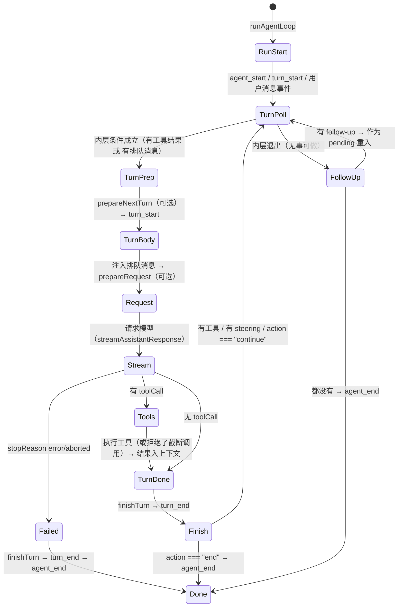
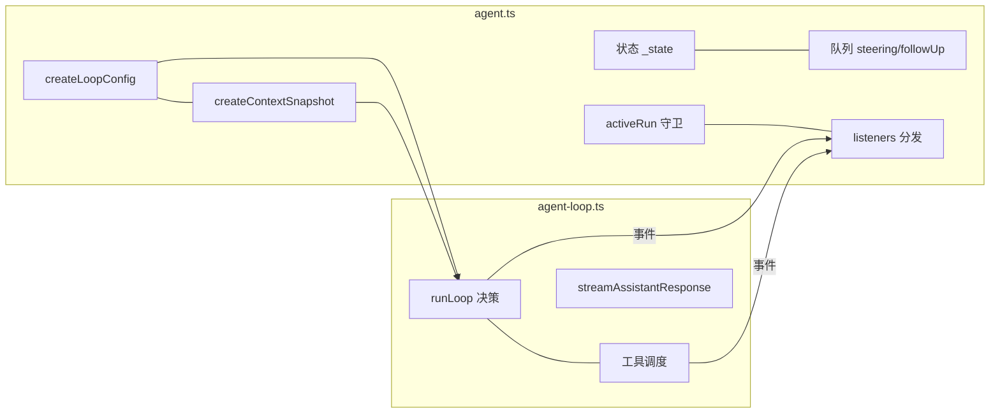
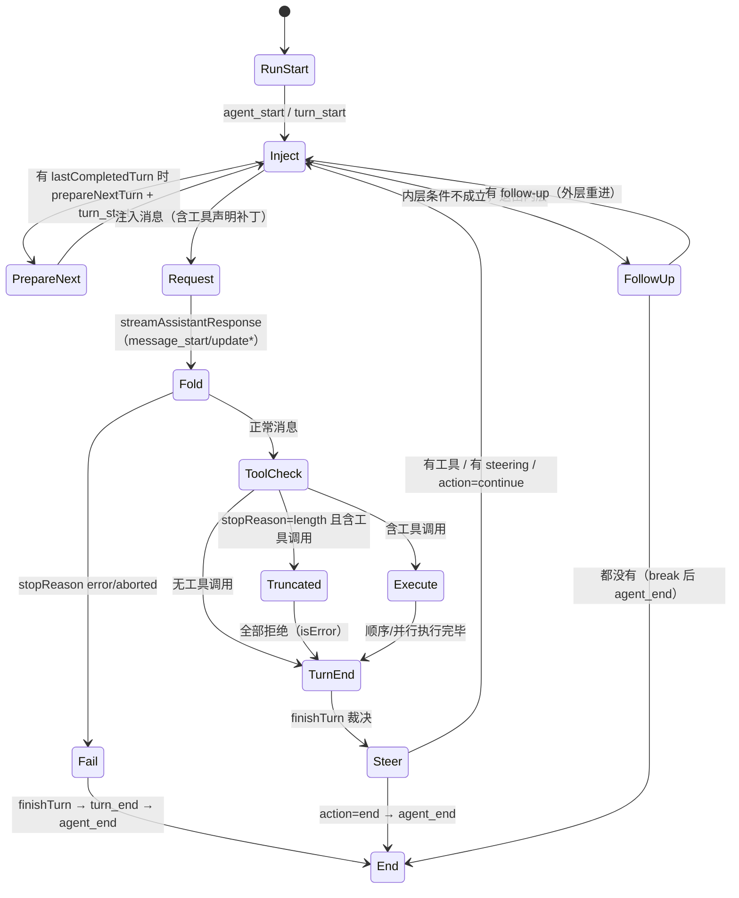

# 05. Agent 循环、轮次、排队与取消

今天独立研究 Agent 怎样继续、排队和结束。你不需要前几天的轨迹；本篇给出三条固定输入和离线实验入口。预计 2–3 小时，不使用真实模型。

## 今日准备

Node.js 需 >= 22.19.0，依赖未安装时在根目录执行 `npm install --ignore-scripts`。`packages/coding-agent/test/suite/harness.ts` 的 `createHarness()` 会给你一个内存会话、faux 假模型、事件数组 `events` 和清理函数 `cleanup()`。在该目录新建 `task-05-learning.test.ts`；工作目录 `packages/coding-agent` 的单文件运行命令是：

```powershell
node ../../node_modules/vitest/dist/cli.js --run test/suite/task-05-learning.test.ts
```

## 学习内容

`Agent.prompt()` 把用户消息加入并启动 run；`continue()` 从现有上下文续跑；`steer` 和 `followUp` 是运行中的新输入队列。循环至少处理三类继续条件：模型要求用工具、队列里出现新输入、钩子要求继续。不要把“模型这轮结束”和“整个 run 结束”混为一谈。取消通过 `AbortSignal` 往模型和工具传递，但工具是否及时停下取决于它是否检查信号；会话层还可能处理重试和压缩后的继续。

具体地说，用户一句“读取文件并总结”是一个 run；模型第一次要求读文件，工具返回后再请求模型，是两个 turn。`turn_end` 说明这一轮结束；只有 `agent_end` 和会话收束事件才能说明整个 run 走到尾部。`steer` 是运行中改变方向，`followUp` 是排队等待后续处理，二者需要在源码中分别找到取数点。

## 核心源码

`packages/agent/src/agent.ts`按 `prompt`、`continue`、`abort` 的顺序读；`packages/agent/src/agent-loop.ts`在 `runLoop` 找外层 run 与内层 turn，在 `streamAssistantResponse` 找一次模型流如何收束；`packages/coding-agent/src/core/agent-session.ts`的 `_runAgentPrompt`、`_handlePostAgentRun` 负责重试与最后的会话处理。每遇一个 `return` 或 `break`，在笔记里写明它结束的是哪一层。

## TypeScript 语法小课：循环、闭包与取消信号

`AbortController` 负责发出取消请求，`AbortSignal` 让被调用方检查它。循环是否继续由状态决定；收到取消信号不代表异步工具已经退出。

```typescript
const controller = new AbortController(); // 创建一次运行的取消控制器
let turns = 0;
while (!controller.signal.aborted) { // 每轮开始前检查取消状态
  turns++;
  if (turns === 2) controller.abort(); // 发出请求，不会杀死任意异步工作
}
console.assert(turns === 2);
```

练习：把取消检查移到循环体末尾，比较轮次数；再在 `runLoop` 中分别标出循环判断、工具收到 `signal` 和最终 `agent_end`。


## 完整学习资料

先按下列正文完成学习，再执行本篇的动手任务。正文中原书的实验与验收题先作为案例阅读，实际动手统一放到文末；只运行本篇“今日准备”和动手任务明确指定的离线命令。章节编号保留知识主题的原编号；源码精读、示例、边界条件、常见错误和参考答案均直接收录在本文件中。开头的预计用时仅指核心主线，完整源码精读需另留时间。

### 本篇共同基础

以下运行图和术语均在本文件内。学习正文保留原手册的知识主题编号，但那些编号不构成本任务的阅读前置；实际操作按本篇的动手任务与验收标准执行。学习正文基于原手册注明的 `200387122ca450d6387f033949423114a270b96c` 源码基线，当前工作区若有差异，以当前源码为准。

### 15 分钟主线：pi 怎样完成一件事

假设用户输入“读取 demo.txt，并总结三点”。模型自己不能读取你电脑里的文件。pi 把用户问题和可用工具告诉模型；模型提出 `read` 调用；pi 在本地执行；模型拿到文件内容后才生成总结。这就是全书反复使用的同一个例子。

**先看不带 TypeScript 细节的主流程（教学伪代码）：**

```text
收到用户输入，把它加入当前会话
重复：
    用当前上下文向模型发起请求
    收集模型的回答并把过程通知界面
    如果回答要求执行工具：
        校验参数，在本地执行工具，记录结果
        继续循环，让模型看到工具结果
    否则，检查是否还有排队输入或明确的继续决定
    如果都没有：结束本次运行
```

第一行确定这次任务和已有历史。模型请求只负责生成回答或提出工具调用。工具校验与执行由 pi 负责，结果回到对话后才可能有下一轮模型请求。界面接收运行事件，历史保存完成的消息；它们都与“模型请求”有关，但不是同一种数据。真实实现还处理工具并发、错误、取消、重试和压缩，后面分别讲。

**先分清四对容易混淆的词：**

| 两个词                | 直观区别                                           | 在“读文件并总结”中的例子                   |
| --------------------- | -------------------------------------------------- | -------------------------------------------- |
| 模型请求 / 用户输入   | 用户只说一次话，pi 可以多次询问模型                | 先请模型选择工具，读完文件后再请模型总结     |
| 事件 / 消息           | 事件告诉界面过程；消息承载一次完整的对话内容       | “正在输出第几个字”是事件；完成的总结是消息 |
| 工具调用 / 工具结果   | 调用提出想做什么；结果记录本地执行所得             | `read("demo.txt")` 是调用；文件文字是结果  |
| 会话历史 / 模型上下文 | 历史保留记录；上下文是这一次请求实际送给模型的内容 | 分支 C 仍在文件里，沿分支 D 继续时不必送 C   |


```text
一次用户输入
  → 第一次模型请求：请调用 read("demo.txt")
  → 本地工具执行：读出文件文本
  → 第二次模型请求：根据工具结果总结三点
  → 没有后续工作：结束
```

### 附录 A：术语表

> 用法：每个术语给出"一句话解释 + 首次出现的章节"。读代码遇到不认识的词，先查这里；查不到再搜源码（用英文名搜）。


#### A.1 核心概念

| 中文                  | 英文                    | 一句话                                                                                                             | 章节      |
| --------------------- | ----------------------- | ------------------------------------------------------------------------------------------------------------------ | --------- |
| 智能体外壳 / 运行框架 | agent harness           | 组织模型、工具、状态、界面的框架，本身不"聪明"                                                                     | 0.1       |
| 智能体                | agent                   | "模型 + 工具 + 循环"组成的执行体                                                                                   | 0.1       |
| 轮次                  | turn                    | 一次助手响应 + 它引发的工具执行                                                                                    | 3.3.3     |
| 低层运行              | Agent run               | 一次`Agent.prompt()` 或 `Agent.continue()` 调用建立的生命周期；以 `agent_end` 和已等待的 listener 收尾为边界 | 3.3.3、D2 |
| 会话 prompt 编排      | session prompt workflow | `AgentSession.prompt()` 在 `started` 后进入 `_runAgentPrompt()`；可串起 retry、压缩恢复和多个低层 Agent run  | 8、D27    |
| 用户请求              | user request            | 用户提交一次输入；与模型请求不等价                                                                                 | 3.3.3     |
| 模型请求              | model request           | 真正发给供应商 API 的一次请求                                                                                      | 3.3.3     |
| 转录                  | transcript              | 发给模型看/被记录的消息序列                                                                                        | 4.1       |
| 投影                  | projection              | 从会话树/文档到"模型实际看到的内容"的计算过程                                                                      | 9.4       |
| 活动分支              | active branch           | 从根到当前叶子的一条路径                                                                                           | 9.1       |
| 叶子                  | leaf                    | 会话树中的"当前位置"                                                                                               | 4.7.3     |
| 条目                  | entry                   | 会话文件里的一行（JSONL）                                                                                          | 4.7       |
| 会话                  | session                 | 一次对话的全部记录与状态                                                                                           | 8.1       |
| 压缩                  | compaction              | 用摘要替换旧上下文表示的机制                                                                                       | 10        |
| 上下文窗口            | context window          | 模型一次能接受的最大 token 量                                                                                      | 5.3       |
| 思考级别              | thinking level          | off/minimal/low/medium/high/xhigh/max                                                                              | 5.3       |
| 停止原因              | stop reason             | pending/stop/length/toolUse/error/aborted/deferred                                                                 | 4.3.3     |
| 用量                  | usage                   | token 与成本统计                                                                                                   | 4.3.5     |


#### A.2 消息与事件

| 中文           | 英文                | 一句话                                             | 章节        |
| -------------- | ------------------- | -------------------------------------------------- | ----------- |
| Agent 消息     | AgentMessage        | 内部消息（模型消息 + 应用自定义角色）              | 4.4         |
| 模型消息       | Message             | 供应商能理解的四角色联合                           | 4.3         |
| 内容块         | content block       | 消息内容的最小单元（text/image/thinking/toolCall） | 4.2         |
| 判别联合       | discriminated union | 用共同字面量字段区分成员的类型联合                 | 1.3.4       |
| 类型收窄       | narrowing           | 判断判别字段后类型自动缩小                         | 1.3.4       |
| 事件           | event               | 运行时广播（过程），不是消息（结果）               | 3.3.2       |
| 队列更新       | queue update        | 排队消息变化的会话事件                             | 4.5.2       |
| 边界（结算前） | agent_before_settle | 最后一个可行动钩子                                 | 6.2、13.3.5 |
| 已结算         | agent_settled       | "不会再自动继续"的最终信号                         | 4.5.2、16.3 |
| 延迟句柄       | deferred handle     | 异步应答的取回凭据                                 | 4.3.3       |


#### A.3 工具与模型

| 中文                | 英文                            | 一句话                                    | 章节  |
| ------------------- | ------------------------------- | ----------------------------------------- | ----- |
| 工具                | tool                            | 模型可调用的本地操作                      | 7.1   |
| 工具定义            | ToolDefinition                  | 扩展/应用注册工具的"富"形态               | 7.1.2 |
| 参数校验            | argument validation             | 用 typebox schema 在运行时校验调用参数    | 7.4   |
| 前置钩子            | beforeToolCall                  | 执行前可拦截（block）的钩子               | 7.6   |
| 后置钩子            | afterToolCall                   | 结果字段级改写的钩子                      | 7.6   |
| 顺序 / 并行执行     | sequential / parallel execution | 工具批次的两种调度                        | 7.5   |
| 终止提示            | terminate                       | "整批都同意时不因本批继续"的调度提示      | 7.5.4 |
| 模型                | model                           | 模型静态元数据（api/provider/限制/价格）  | 5.2.2 |
| 协议方言            | api                             | 供应商接口族标识（如 anthropic-messages） | 5.2.1 |
| 供应商              | provider                        | 认证 + 模型目录 + 请求实现                | 5.2.3 |
| 简单流式 / 完整流式 | streamSimple / stream           | 供应商无关档位 vs 协议特有选项            | 5.4   |
| 兼容开关            | compat                          | OpenAI 兼容生态的行为微调                 | 5.5.4 |
| 假供应商            | faux provider                   | 脚本化、离线的测试模型                    | 5.7   |


#### A.4 会话与持久化

| 中文       | 英文             | 一句话                             | 章节   |
| ---------- | ---------------- | ---------------------------------- | ------ |
| 会话管理器 | SessionManager   | 会话文件的对象化句柄               | 9.3    |
| 分支会话   | branched session | 只包含"根到叶子"路径的新文件       | 9.5.2  |
| 分支摘要   | branch summary   | 放弃某分支时生成的摘要条目         | 10.6   |
| 上下文编辑 | context edit     | 只改"投影"、不改原始条目的追加编辑 | 9.4.4  |
| 保留边界   | firstKeptEntryId | 压缩后从哪条开始保留               | 10.3.2 |
| 保留预算   | keepRecentTokens | 压缩后至少保留的近期上下文         | 10.3   |
| 预留       | reserveTokens    | 为模型回复预留的窗口               | 10.2.1 |
| 检测点替换 | checkpoint       | 压缩条目携带的提示词/工具检查点    | 9.4.3  |


#### A.5 扩展与集成

| 中文       | 英文            | 一句话                             | 章节       |
| ---------- | --------------- | ---------------------------------- | ---------- |
| 上下文文件 | context files   | AGENTS.md 等纯文本指令             | 11.4.2     |
| 项目信任   | project trust   | 允许加载项目可执行资源前的人工决定 | 11.5       |
| 提示词模板 | prompt template | Markdown 变成`/命令`             | 12.3.2     |
| 技能       | skill           | 目录 + SKILL.md 的按需说明书       | 12.3.3     |
| 扩展       | extension       | 可执行 TypeScript 模块（进程权限） | 12.3.4、13 |
| Pi 包      | Pi package      | 分发多资源的 npm/git 单元          | 12.3.6     |
| 钳制       | clamp           | 按模型能力压低思考级别             | 5.3        |
| 重绑       | rebind          | 会话替换后重新挂订阅/扩展绑定      | 8.6        |


#### A.6 协议与架构（选修）

| 中文     | 英文                   | 一句话                                          | 章节   |
| -------- | ---------------------- | ----------------------------------------------- | ------ |
| MCP      | Model Context Protocol | 外部工具/资源接入协议                           | 22     |
| 暴露方式 | exposure               | codemode/deferred/direct 三种工具到达模型的方式 | 22.3   |
| 工具搜索 | tool_search            | deferred 工具的"发现后再直调"机制               | 22.3   |
| 沙箱     | codemode sandbox       | QuickJS VM + worker 的脚本执行环境              | 22.9   |
| 面片     | facet                  | Chord 插件可独立打包到不同环境的分片            | 23.2   |
| 服务     | service                | Chord 的类型化稳定 token（singleton/keyed）     | 23.2   |
| 复制状态 | replicated state       | 原子发布、完整不可变值消费的状态                | 23.2   |
| 增量跟踪 | delta tracking         | 记录/合并 JSON 操作的机制                       | 23.2   |
| 持久执行 | durable execution      | 意图先提交、崩溃可续的执行模型                  | 23.1   |
| 检查点   | checkpoint             | 任务每一步的持久落点                            | 23.3.1 |
| 附着     | attachment             | 一条表现层连接绑定到一个会话                    | 24.2   |
| 信封     | envelope               | 协议中包裹 payload 的定向记录                   | 24.3   |
| span     | span                   | 一次操作的时间记录（遥测）                      | 25.2   |
| lift     | lift                   | 处理组相对对照组的提升（评估）                  | 25.5   |
| 阻断配对 | blocked pair           | 两臂未各得恰好一个分数，禁止计入头条            | 25.6   |


#### A.7 容易混淆的成对术语

| 对                                              | 区分                                                                                   |
| ----------------------------------------------- | -------------------------------------------------------------------------------------- |
| message vs event                                | 结果 vs 过程（3.3.2）                                                                  |
| turn vs run                                     | 一个轮次 vs 整次运行（3.3.3）                                                          |
| `agent_end` vs `agent_settled`              | 低层 run 结束 vs 自动工作清零（4.5.2）                                                 |
| 声明 vs 可执行                                  | 系统消息里的工具声明 vs 运行时工具集（7.3）                                            |
| details vs content                              | 给界面/程序 vs 给模型（14.2）                                                          |
| 完成顺序 vs 记录顺序                            | 并发完成 vs 声明序记录（7.5.3）                                                        |
| 停止原因`length` vs `stop`                  | 被截断 vs 正常说完（4.3.3）                                                            |
| `AgentSession.prompt()` vs `Agent.prompt()` | 应用层输入分流/会话编排 vs 低层 Agent run 入口（8、D2、D27）                           |
| `handled` vs `queued` vs `started`        | 输入被消费、不创建该输入自己的 run / 放入当前运行队列 / 进入会话 run 编排（8、16.5.3） |
| 提示词模板 vs 技能                              | 一段话 vs 一套流程+文件（12.3.3）                                                      |
| 扩展 vs Pi 包                                   | 可执行单元 vs 分发单元（12.3.6）                                                       |
| compaction 摘要 vs branch summary               | 压缩历史 vs 放弃分支（10.6）                                                           |
| durable cheat sheet：`replay: safe/never`     | 崩溃后重跑 vs 报 interrupted（23.4）                                                   |
| JSONL RPC vs client/server                      | 进程内 stdio 协议 vs 跨进程服务路由（24.1）                                            |
| 单测 vs 评估                                    | 确定性 vs 配对统计（25.1、25.6）                                                       |


#### A.8 输入与运行的层级

不要按“用户按了一次回车”推断低层 run 或模型请求的数量。实际层级是：

| 层级       | 代表符号                                           | 次数关系                                                                                      |
| ---------- | -------------------------------------------------- | --------------------------------------------------------------------------------------------- |
| 输入调用   | `AgentSession.prompt(text)`                      | 一次调用只表达一次输入尝试；结果可能是`handled`、`queued` 或 `started`                  |
| 会话编排   | `_runAgentPrompt(messages)`                      | 只在开始处理输入时进入；在里面管理重试、压缩恢复、边界 continuation 与取消                    |
| Agent run  | `Agent.prompt(messages)` 或 `Agent.continue()` | 一次会话编排可包含多个 run；每个低层 run 都发出自己的`agent_start` / `agent_end` 生命周期 |
| Agent turn | `turn_start` 到 `turn_end`                     | 一个 run 可包含多个 turn；每个 turn 通常包含一次助手响应及其引发的工具执行                    |
| 模型请求   | `streamSimple` / provider stream                 | 通常发生在助手响应阶段；自动重试会再次请求模型，压缩摘要等内部工作也可能有独立请求            |

两个边界例子：

- 扩展命令被消费时，`prompt()` 返回 `handled`，没有为该输入启动 `_runAgentPrompt()`；
- `prompt()` 在 Agent 已运行时以 `steer`/`followUp` 方式排队，返回 `queued`。这条输入会影响现有流程，但它本身不是新的 `Agent.prompt()` 调用。

因此，统计“模型请求次数”不能数 prompt、turn 或 `agent_end`：应按 provider 请求事件/日志，或明确的测试探针计数。章节 21 的自测题也按这个区分评分。


#### A.9 索引方式说明

- 想找"某行为在哪个文件" → 用 source-map；
- 想找"某命令怎么跑" → 用 commands；
- 想找"某现象怎么排" → 用 troubleshooting；
- 想找"哪些练习要做" → 用 exercises-and-answers。

---

### 第 6 章：Agent 循环、轮次与结束条件


**先懂这一章**：一次用户输入可能触发多次模型请求。循环负责判断“继续请求模型、先处理排队消息，还是结束”。不要先背所有钩子；先把每轮的输入、结果和退出条件画出来。

```text
教学伪代码：准备当前对话 → 请求模型 → 处理回答和工具结果
           → 如果本轮需要继续，就准备下一轮
           → 否则检查排队输入；有则继续，没有则结束
```

错误、取消和 `finishTurn` 决策会改变这条简化路线。第 6.4–6.5 节单独分析，不能用上面两行推断所有退出情况。

第 5 章解决“模型的一次响应怎样到达 pi”；本章解决“拿到响应后还要不要继续”。工具调用是最常见的继续原因，第 7 章再把它的执行过程拆开。

> 学完本章你能回答：
>
> 1. 循环由哪三种输入驱动（新提示、继续、排队消息）？它们的入口分别在哪？
> 2. `runLoop` 的三个钩子 `prepareNextTurn`、`prepareRequest`、`finishTurn` 各自在什么时刻执行？
> 3. steering 与 follow-up 的区别是什么？分别在什么时机被消费？
> 4. 循环"继续"与"退出"的全部条件有哪些？为什么可能"停不下来"？
> 5. 取消、失败、自动重试在循环里各自走什么路径？

**预计学习时间**：2 天（循环是全书的"心脏"，值得反复读）。
**本章验证状态**：静态核对通过（`runLoop`、`Agent`、`AgentSession` 相关段落逐段核对）；实验 L03 设计中，需用 faux 在本地执行。

---


#### 6.1 三种驱动方式：prompt、continue 与排队

**先懂**：有新用户消息时用 `prompt`；已有上下文需要接着跑时用 `continue`；Agent 正忙时先通过 steering 或 follow-up 排队。三个动作进入循环的时机不同。

```text
教学伪代码：新输入且空闲 → prompt
           → 需要从现有上下文续跑 → continue
           → 正在运行又有新指令 → 按需要排进 steering/follow-up
```

回忆第 3 章：会话层 `_runAgentPrompt` 先调 `agent.prompt(messages)`，然后在 while 循环里反复调 `agent.continue()`。为什么需要两个入口？


##### 6.1.1 `Agent.prompt`：带入新消息

```typescript
async prompt(input: string | AgentMessage | AgentMessage[], images?: ImageContent[]): Promise<void> {
	if (this.activeRun) {
		throw new Error("Agent is already processing a prompt. Use steer() or followUp() to queue messages, or wait for completion.");
	}
	const messages = this.normalizePromptInput(input, images);
	await this.runPromptMessages(messages);
}
```

语义：**开启一次新 run，把一条或多条消息追加到上下文，然后进入循环。** 这就是用户按下回车走的路。


##### 6.1.2 `Agent.continue`：从当前上下文继续

```typescript
async continue(): Promise<void> {
	if (this.activeRun) {
		throw new Error("Agent is already processing. Wait for completion before continuing.");
	}

	const lastMessage = this._state.messages[this._state.messages.length - 1];
	if (!lastMessage || this._state.messages.every((message) => message.role === "system")) {
		throw new Error("No messages to continue from");
	}

	if (lastMessage.role === "assistant") {
		// 特例：最后是 assistant 且队列里有东西 → 转为"用队列消息开新 run"
		const queuedSteering = this.steeringQueue.drain();
		if (queuedSteering.length > 0) {
			await this.runPromptMessages(queuedSteering, { skipInitialSteeringPoll: true });
			return;
		}
		const queuedFollowUps = this.followUpQueue.drain();
		if (queuedFollowUps.length > 0) {
			await this.runPromptMessages(queuedFollowUps);
			return;
		}
		throw new Error("Cannot continue from message role: assistant");
	}

	await this.runContinuation();
}
```

三条规则：

1. **上下文不能为空**（至少一条系统消息之外的记录）；
2. **最后一条不能是 assistant 消息**——否则供应商会拒绝（模型不能连说两句）。这是 `agent/README.md` 与 `agent-loop.ts` 注释里都强调的约束：

```text
**Important:** The last message in context must convert to a `user` or `toolResult` message
via `convertToLlm`. If it doesn't, the LLM provider will reject the request.
```

3. **特例补偿**：如果最后恰好是 assistant，但队列里有排队消息，就让队列消息"接管"，转为一次 `prompt`。

`continue` 的存在价值：**在"不新增用户输入"的前提下再问一次模型**。重试用它、压缩后用续跑用它、扩展想让模型"接着说"也用它。


##### 6.1.3 排队：`steer` 与 `followUp`

运行中还能再输入吗？能，但要排队：

```typescript
/** Queue a message to be injected after the current assistant turn finishes. */
steer(message: AgentMessage): void { this.steeringQueue.enqueue(message); }

/** Queue a message to run only after the agent would otherwise stop. */
followUp(message: AgentMessage): void { this.followUpQueue.enqueue(message); }
```

两者的语义差别（`how-pi-works.md` 原话）：

```text
Steering messages enter after the current assistant turn. Follow-up messages enter after
the agent has finished its pending work. Aborting stops the current run and returns queued
messages to the editor.
```

- **steering（引导）**：模型正在做长任务，"插一句话让它改变方向"。注入点是**当前 turn 结束、下一次模型请求之前**；
- **follow-up（跟进）**：等 Agent"本来就要收工"的时候再说一句（比如"顺手把测试也跑了"）。注入点是**内层循环因无事可做而退出之后**。

配套 API（`Agent`）：

| 方法                                                                       | 作用                                                           |
| -------------------------------------------------------------------------- | -------------------------------------------------------------- |
| `steer(msg)` / `followUp(msg)`                                         | 入队                                                           |
| `clearSteeringQueue()` / `clearFollowUpQueue()` / `clearAllQueues()` | 清空                                                           |
| `hasQueuedMessages()`                                                    | 是否有排队                                                     |
| `peekQueuedMessages()`                                                   | 预览"下一轮会被取走的消息"（不消费）                           |
| `steeringMode` / `followUpMode`                                        | 取用模式：`"all"` 一次全取，`"one-at-a-time"` 一次只取一条 |

取用模式的实现是 `PendingMessageQueue`（`agent.ts`）：

```typescript
class PendingMessageQueue {
	private messages: AgentMessage[] = [];
	public mode: QueueMode;

	enqueue(message: AgentMessage): void { this.messages.push(message); }
	hasItems(): boolean { return this.messages.length > 0; }

	peek(): AgentMessage[] {
		if (this.mode === "all") return this.messages.slice();
		const first = this.messages[0];
		return first ? [first] : [];
	}

	drain(): AgentMessage[] {
		const drained = this.peek();
		this.messages = this.messages.slice(drained.length);
		return drained;
	}

	clear(): void { this.messages = []; }
}
```

`"one-at-a-time"` 的意义：用户连发三条 steering 时，不必让模型一次面对三句话——先处理一条，观察结果，再决定下一条是否还有意义（甚至可以中途清空队列）。

**排队与界面**：会话层把队列状态通过 `queue_update` 事件广播（`AgentSessionEvent`，第 4 章），交互界面据此显示"排队中：2 条"。取消时把未消费的消息**还回编辑器**。


#### 6.2 `runLoop` 状态机：三个钩子与两层循环

**先懂**：把钩子看成三个可插入的时间点：下一轮开始前、模型请求前、本轮结束前。它们可以修改接下来模型看到的内容，也可以决定继续或结束。

```text
教学伪代码：上一轮结束后先准备下一轮
           → 每次请求前准备当前请求 → 等待模型与工具
           → 本轮结束前询问是否继续 → 根据结果和队列决定去向
```

现在把第 3 章读过的 `runLoop` 从"代码走读"升级为"状态机理解"。它是一台**两台嵌套的循环机**，由三个可选钩子定制：


##### 6.2.1 三个钩子的职责与语义（`packages/agent/src/types.ts`）

| 钩子                                           | 执行时刻                                        | 能做什么                                                                         | 典型用途                                               |
| ---------------------------------------------- | ----------------------------------------------- | -------------------------------------------------------------------------------- | ------------------------------------------------------ |
| `prepareNextTurn(lastCompletedTurn, signal)` | 每个 turn 的**开始**（第一轮除外）        | 返回`AgentLoopTurnUpdate`：替换 context、注入 messages、换 model/thinkingLevel | 压缩（上下文太长先摘要）、动态换模型、注入"下一轮提示" |
| `prepareRequest(request, signal)`            | **每次模型请求之前**（含第一次）          | 返回`AgentRequestUpdate`：更新 context/model/thinkingLevel                     | 工具清单变化、按请求切模型、最后时刻裁剪               |
| `finishTurn(turn, signal)`                   | 每个 turn**结束**（发出 `turn_end` 前） | 返回 `{ action: "end"                                                            | "continue" }`                                          |

三个类型的原文（节选）：

```typescript
/** Replacement runtime state used by the agent loop before starting another provider request. */
export interface AgentLoopTurnUpdate {
	context?: AgentContext;      // 替换下一轮上下文
	messages?: AgentMessage[];   // 追加消息（会走正常生命周期事件）
	model?: Model<any>;          // 换模型
	thinkingLevel?: ThinkingLevel;
}

/** Runtime state available immediately before a conversational provider request. */
export interface PrepareRequestContext {
	context: AgentContext;
	model: Model<any>;
	thinkingLevel: ThinkingLevel;
}

export type FinishTurn = (
	turn: AgentTurnContext,
	signal?: AbortSignal,
) => AgentTurnDecision | void | Promise<AgentTurnDecision | undefined> | Promise<void>;
```

三个重要约定：

- **钩子可以返回 `void`（不改任何东西）**，实现方按需返回更新对象；
- `prepareRequest` 的注释写着 "including the first"（包括第一次请求）——所以"每轮循环 → 请求"这条链上，它一定被执行；
- 钩子的**契约写在注释里**：例如 `convertToLlm` 和 `transformContext` 都要求 "must not throw"（不许抛错，出错给安全回退值），因为"抛错会打断低层循环、产生不完整的事件序列"。第 13 章做扩展时你会依赖这条约定。


##### 6.2.2 循环骨架：把事件序列画成状态机

把 3.8 的代码翻译成状态图（事件名加粗）：



对照这张图数一数：一次"读文件并总结"的 run 里，`TurnBody → ... → TurnDone` 走两遍（两次 turn），第二遍之后 `FollowUp → Done`。取消的 run 走 `Stream → Failed → Done`。带 steering 的 run 在 `Finish → TurnPoll` 处再进一次内层。


##### 6.2.3 时序上的三个"容易搞错"的点

1. **`turn_start` 第一次由 `runAgentLoop` 发出**，之后每轮由内层循环发出（`await emit({ type: "turn_start" })`）——所以"事件数 = 轮次数"这条规律成立（每轮恰好一个 `turn_start` / `turn_end`）；
2. **排队消息在 `prepareRequest` 之前注入**：注释写得很明确（"Pending messages have already been appended and emitted when this callback runs"）。所以 `prepareRequest` 里能看到本轮真正会发给模型的消息；
3. **`prepareNextTurn` 可能"耗时很久"**（比如做压缩），而它**执行期间**新排队的 steering 会被补取（代码里那句 "Preparation can be long-running (for example, compaction). Pick up steering queued while it ran."）。这正是"压缩时用户还能打字，消息不会丢"的实现。
   <a id="06-agent-loop-h10"></a>

#### 6.3 队列的精确消费时机：四个取数点

**先懂**：用户在模型思考、工具执行或压缩期间都可能继续输入。队列不会随时插进正在进行的步骤；循环只在固定检查点取消息。先记“什么时候取”，再看“取到后如何排进下一轮”。

```text
教学伪代码：开始时看一次 steering
           → 下一轮准备完成后补看一次
           → 本轮结束后再看一次
           → 主循环空了才检查 follow-up
```

"排队消息什么时候被取走"是本章最需要精确的知识点。在 `runLoop` 里，取队列只发生在**四个固定位置**：

```text
T0：进入内层循环之前（run 开始时先补取一次 steering）
T1：prepareNextTurn 之后、注入消息之前（准备耗时期间用户可能又打字）
T2：finishTurn 之后、决定是否进入下一轮时
T3：内层循环退出之后（检查 follow-up）
```

用源码对准这四个位置：

```typescript
// T0：run 开始前的初始轮询
let pendingMessages: AgentMessage[] = (await config.getSteeringMessages?.()) || [];

while (true) {
	let hasMoreToolCalls = true;
	while (hasMoreToolCalls || pendingMessages.length > 0) {
		if (lastCompletedTurn) {
			const nextTurnSnapshot = await config.prepareNextTurn?.(lastCompletedTurn);
			// ... 应用 snapshot
			// T1：准备可能耗时，期间排队的 steering 要补取（仅当上一轮取到的为空）
			if (pendingMessages.length === 0) {
				pendingMessages = (await config.getSteeringMessages?.()) || [];
			}
			await emit({ type: "turn_start" });
		}
		// 注入 prepared + pending（declareToolChanges 包装）
		// ...
		pendingMessages = [];

		// ... prepareRequest → 请求 → 工具 ...

		// T2：本轮结束，决定是否继续；先取一次 steering
		explicitContinuation = decision?.action === "continue";
		pendingMessages = (await config.getSteeringMessages?.()) || [];
		if (hasMoreToolCalls || pendingMessages.length > 0) explicitContinuation = false;
	}

	// T3：内层退出，检查 follow-up
	const followUpMessages = (await config.getFollowUpMessages?.()) || [];
	if (followUpMessages.length > 0) {
		explicitContinuation = false;
		pendingMessages = followUpMessages;
		continue;   // 回到外层开头，重进内层
	}
	if (explicitContinuation) { explicitContinuation = false; continue; }
	break;
}
```

`Agent` 侧把这两个回调接到队列上（`createLoopConfig`）：

```typescript
getSteeringMessages: async () => {
	if (skipInitialSteeringPoll) {
		skipInitialSteeringPoll = false;
		return [];
	}
	return this.steeringQueue.drain();
},
getFollowUpMessages: async () => this.followUpQueue.drain(),
```

`skipInitialSteeringPoll` 的用途：`continue()` 的特例分支已经把队列消息取出来开新 run 了，所以第一次轮询要**故意返回空**，避免"刚取出的消息又被取一次"。


##### 6.3.1 四种典型时序

| 用户动作                                 | 发生时点    | 消息进入模型请求的时机                 |
| ---------------------------------------- | ----------- | -------------------------------------- |
| 输入后立刻回车（非流式）                 | Agent 空闲  | 立即成为`prompt` 的新消息            |
| 流式输出中按回车（steer）                | turn 进行中 | T2 取到 → 下一轮请求前注入            |
| 流式输出中按 Alt+Enter 之类（follow-up） | turn 进行中 | T3 取到 → 内层退出后作为 pending 重入 |
| 取消（Esc）                              | turn 进行中 | 不注入；队列消息**还给编辑器**   |

至此，"一次用户请求 ≠ 一次模型请求 ≠ 一个 turn"彻底落到代码：**turn 是内层循环的一次迭代，排队消息是让内层多迭代几次的外部输入。**


#### 6.4 终止条件全表与四条状态轨迹

**先懂**：结束不是简单的“模型没调工具”。还要看队列、钩子的继续/结束决定，以及是否出错或被取消。先把正常结束和异常退出分开，再读下面的表。

```text
教学伪代码：模型给出本轮结果 → 先处理工具与 finishTurn 决定
           → 需要继续就启动下一轮
           → 没有后续工作才正常结束
           → 抛错的 hook 另走异常传播路径
```


##### 6.4.1 终止条件总表

| #  | 条件                                                  | 代码位置                                    | 结果                                                               |
| -- | ----------------------------------------------------- | ------------------------------------------- | ------------------------------------------------------------------ |
| 1  | 模型响应`stopReason` 为 `error`                   | ⑤                                          | `finishTurn` → `turn_end` → `agent_end`，结束              |
| 2  | 模型响应`stopReason` 为 `aborted`                 | ⑤                                          | 同上（错误消息为取消）                                             |
| 3  | `finishTurn` 返回 `action: "end"`                 | ⑦                                          | 立即`agent_end`，结束                                            |
| 4  | 本批次所有工具结果`terminate: true`                 | ⑥ 后`hasMoreToolCalls=false`             | 内层不再因工具继续                                                 |
| 5  | 无工具调用、无 steering、无 follow-up、无`continue` | 内层条件 + ⑧                               | `break` → `agent_end`，结束                                   |
| 6  | 内层退出但是有 follow-up                              | ⑧                                          | 继续（不结束）                                                     |
| 7  | `finishTurn` 返回 `action: "continue"`            | ⑦                                          | 空转一轮（context-only turn，仍会发一次请求）                      |
| 8  | 有 steering 消息                                      | ⑦ / T1 / T0                                | 注入后继续                                                         |
| 9  | 运行被取消（`abort()`）                             | 信号检查点                                  | 模型/工具尽快停止，按#2 收尾                                       |
| 10 | 循环中被`await` 的 hook 抛错或 reject               | 例如`prepareRequest` 在 `turn_end` 之前 | 这是异常退出，不走正常终止事件序列；外层入口决定如何处理 rejection |

表中的 #1–#9 描述的是正常调度结果：模型错误会变成 `stopReason: "error"` 的 assistant message，取消会变成 `"aborted"`，因此它们仍走 `turn_end` 和 `agent_end`。不要把这两种消息级失败与 **hook 的 Promise rejection** 混为一谈。后者不是一条“失败的模型回答”：`runLoop` 会直接 reject，尚未执行的后续事件也不会补发。例如 `prepareRequest` 是在注入消息之后、调用 provider 之前被 await；若它 reject，已发出的输入消息事件仍在，但本轮还没有 `turn_end` 或 `agent_end`。

这里还有一条容易漏掉的规则：**error/aborted 是硬退出**。源码仍会 `await finishTurn(...)`，给 hook 看见这条结束消息的机会；但这个分支不读取 hook 返回值。因此 hook 即使返回 `{ action: "continue" }` 或 `{ action: "end" }`，也不能覆盖模型错误或取消。hook 正常完成后，Agent loop 直接发 `turn_end` 和 `agent_end` 并返回，不再轮询 follow-up 队列。

| 响应类型                                              | 是否调用并等待`finishTurn` | 是否采用其决策 | 后续调度                                                         |
| ----------------------------------------------------- | ---------------------------: | -------------: | ---------------------------------------------------------------- |
| 普通回答（`stopReason` 不是 `error`/`aborted`） |                           是 |             是 | 按工具、steering、follow-up 与`continue` 裁决                  |
| error / aborted assistant message                     |                           是 |             否 | 发`turn_end`、`agent_end` 后返回；不消费 follow-up           |
| `finishTurn` 自身 reject                            |   已开始 await，但未正常完成 |   无决策可采用 | Promise reject；这条路径不会补发后续`turn_end` / `agent_end` |

短轨迹：provider 返回 `aborted` → `finishTurn` 返回 `continue` → Agent loop 忽略该决策 → `turn_end` → `agent_end`。这不是“取消后自动再问一次”。现有测试 `runs finishTurn for a %s assistant before turn_end without changing the hard exit` 分别用 `error` 与 `aborted` 验证：provider 只调用一次、steering 只做初始轮询、follow-up 从未轮询。

```text
Agent 类入口：prepareRequest reject
  -> runLoop / runAgentLoop Promise reject
  -> runWithLifecycle catch
  -> handleRunFailure 发失败消息与结束事件
  -> finishRun 清理

低层 agentLoop() 流包装器：runAgentLoop Promise reject
  -> fulfillment-only .then 的成功回调不执行
  -> 不会自动 stream.end()，也不会补 agent_end
```

上图第二条是 D1“低层 Promise 路径”讨论的异常边界；直接调用 `runAgentLoop()` 的宿主也必须自行接 rejection。`AgentLoopConfig` 的类型注释还明确要求 `convertToLlm`、`transformContext`、`getApiKey`、队列读取回调不要 throw/reject；应把可恢复错误转成合适的返回值。其他异步 hook 即使类型允许返回 Promise，也仍应按调用链确认 rejection 的归属与清理责任。

请特别注意两类"看起来该结束但不会结束"的情况：

- **`terminate: true` 只是"不因这批工具继续"**，如果模型在下一轮又调用了别的工具、或者有排队消息，循环照常继续。它不强制结束整个 run；
- **`action: "continue"` 会让循环多跑一轮真实的模型请求**（outer 循环第二轮会把 `hasMoreToolCalls` 重置为 `true`，于是内层再执行一遍完整流程，只是不新增消息）。所以"无条件返回 continue"= 无限请求 → 无限费用。这是第 6.4.4 节的主题。


##### 6.4.2 轨迹 A：无工具的简单请求

```text
agent_start
turn_start
message_start(user) → message_end(user)
message_start(assistant) → message_update × N（text_delta）→ message_end(assistant)
turn_end(message, toolResults: [])
agent_end
```

循环路径：内层第一次迭代 → 无工具、无排队 → 内层条件 false → 无 follow-up → break → `agent_end`。


##### 6.4.3 轨迹 B：带工具（第 3 章的场景）

```text
agent_start
turn_start
user message 事件
assistant 消息（toolCall）事件 = message_start + updates + message_end
tool_execution_start(args) → tool_execution_end(result)
message_start(toolResult) → message_end(toolResult)
turn_end
turn_start                       ← 第二轮
assistant 消息（纯文本总结）事件
turn_end
agent_end
```

关键点：**两个 `turn_start/turn_end` 对**，事件总数与轮次数严格对应；工具结果消息与助手消息一样有完整的 `message_start/message_end`。

**暂停预测：** 用户只输入一次“读 `demo.txt` 并总结”，模型第一轮提出 `read`，工具成功返回，第二轮只给出总结。没有重试、排队消息或额外继续决定时，请数一数 run、turn、模型请求各有几个。

**对照答案：** 一个 run、两个 turn、两次普通模型请求。第一轮模型决定调用工具；工具结果交回后，第二轮模型才能依据内容总结。`tool_execution_start/end` 和工具结果消息是这次运行中的事件与数据，不会各自再增加一个 turn。若出现重试或压缩恢复，请另数外层会话层触发的模型请求，不能把这个最小例子的计数当成通用上限。


##### 6.4.4 轨迹 C：排队消息插队 —— 以及"为什么可能停不下来"

场景：第一轮正在执行工具时，用户插入一条 steering："顺便把 README 也看了。"

```text
turn 1：assistant(toolCall read demo.txt) → 工具执行（此时 steer 入队）
finishTurn → turn_end
T2 取到 steering → 非空 → explicitContinuation 归零
内层条件：hasMoreToolCalls true（因为还有工具结果要回传）→ 继续
turn 2：注入 steering 消息 + toolResult 一起发给模型
   → assistant(再调 read README) → 工具 → finishTurn → T2 无新消息
内层条件：false → 退出内层 → T3 无 follow-up → break → agent_end
```

**"停不下来"的两种情况**（这是本节的验收重点）：

1. **模型行为导致**：模型每一轮都要求调用工具（比如工具总是返回错误、模型不断重试）。循环的设计就是"只要模型要工具就满足它"，**没有内置的最大轮数**。防呆靠：工具实现要给出可恢复的错误信息、扩展可以 `finishTurn` 叫停、用户随时可以取消；
2. **钩子行为导致**：`finishTurn` 无条件返回 `{ action: "continue" }`。由于 outer 循环会重置 `hasMoreToolCalls = true` 并重跑内层，每一轮都产生一次**真实的模型请求**（context-only turn）。这就是"无条件 continue → 无限运行 + 无限费用"的机制。写扩展时的准则：**只有在你确信"再来一轮就能收敛"时才返回 continue，并且要有外部计数/预算兜底。**

（会话层的 `_runAgentPrompt` while 循环同理：如果 `_handlePostAgentRun` 永远返回 true——例如某扩展在每次 `agent_end` 都塞一条新消息——`session.prompt()` 也永远不返回。机制一致：**收敛性由参与者保证，框架不设魔法上限。**）


##### 6.4.5 把三个布尔/数组变量分开追

读嵌套循环时，不要把“是否还要继续”压成一个脑内开关。源码里三个状态分工不同：

| 变量                     | 类型               | 谁更新                                          | 它控制什么                               |
| ------------------------ | ------------------ | ----------------------------------------------- | ---------------------------------------- |
| `hasMoreToolCalls`     | `boolean`        | 当前 assistant 消息的工具结果批次               | 是否因为工具调用尚需下一轮               |
| `pendingMessages`      | `AgentMessage[]` | T0–T3 队列读取或 follow-up 分支                | 下一轮开始前要注入的消息                 |
| `explicitContinuation` | `boolean`        | `finishTurn` 返回值；follow-up/自然工作可清零 | 内层停止后，是否再发一次不带新输入的请求 |

最容易误读的是：`explicitContinuation` **不在内层 while 条件中**。它只在内层退出后决定要不要 `continue` 外层循环。下面逐步代入真实结构：

```typescript
while (true) {
  let hasMoreToolCalls = true;
  while (hasMoreToolCalls || pendingMessages.length > 0) {
    // 注入 pendingMessages，发起一次模型请求并处理工具
    // ...
    explicitContinuation = decision?.action === "continue";
    pendingMessages = await getSteeringMessages();
    if (hasMoreToolCalls || pendingMessages.length > 0) {
      explicitContinuation = false;
    }
  }

  const followUpMessages = await getFollowUpMessages();
  if (followUpMessages.length > 0) {
    explicitContinuation = false;
    pendingMessages = followUpMessages;
    continue;
  }
  if (explicitContinuation) {
    explicitContinuation = false;
    continue;
  }
  break;
}
```

节选省掉请求与事件处理，只保留状态裁决。对照源码时留意 `hasMoreToolCalls` 在每次 outer loop 开始被重置为 `true`；它不是“上一轮是否有工具调用”的永久记忆。


###### 轨迹一：普通回答

模型回答没有工具调用，`finishTurn` 未要求 continuation，也没有排队输入：

| 时刻              | `hasMoreToolCalls` | `pendingMessages.length` | `explicitContinuation` | 发生什么                                                          |
| ----------------- | -------------------: | -------------------------: | -----------------------: | ----------------------------------------------------------------- |
| inner loop 刚进入 |             `true` |                      `0` |                `false` | 初始用户消息已由`Agent.prompt` 放入 context；条件为真，开始本轮 |
| 本轮请求发出      |             `true` |                      `0` |                `false` | 没有 pending 队列消息，直接用现有 context 请求                    |
| assistant 无工具  |            `false` |                      `0` |                `false` | `finishTurn` 不要求继续                                         |
| inner 条件判断    |            `false` |                      `0` |                `false` | inner loop 退出                                                   |
| 读取 follow-up 后 |            `false` |                      `0` |                `false` | 无 follow-up、无 continuation，发`agent_end`                    |

这个例子里，空数组表示“没有新消息”，但不单独决定整个 run 是否结束；后面的 follow-up 与 continuation 裁决仍会执行。


###### 轨迹二：finish hook 单独要求继续

假设无工具、无 steering，但 `finishTurn` 返回 `{ action: "continue" }`：

| 时刻            | `hasMoreToolCalls` | `pendingMessages.length` | `explicitContinuation` | 发生什么                                                      |
| --------------- | -------------------: | -------------------------: | -----------------------: | ------------------------------------------------------------- |
| 本轮完成        |            `false` |                      `0` |                 `true` | inner 条件为假，因此先退出 inner                              |
| 检查 follow-up  |            `false` |                      `0` |                 `true` | 无 follow-up                                                  |
| outer loop 重入 |       重置为`true` |                      `0` |          重置为`false` | inner 因`hasMoreToolCalls` 为真，再做一次 context-only 请求 |

因此 continuation 并不是“原样重复这次请求”：下一轮仍会经过 `prepareNextTurn` / `prepareRequest`，配置可能变化，也可能由钩子注入消息；它只是没有普通 steering/follow-up 消息时，要求 Agent 再向模型请求一次。除非某个钩子改变行为，否则无条件 continue 会不断请求。


###### 轨迹三：follow-up 与 continuation 同时出现

若 `finishTurn` 要求继续，同时队列中有 follow-up，代码先取 follow-up，清除 `explicitContinuation`，将 follow-up 设为 `pendingMessages` 并重入 outer loop。新请求会带着 follow-up；它不是额外再多发一个 context-only 请求。

```text
finishTurn → explicitContinuation = true
检查 follow-up → ["再检查测试"]
follow-up 分支优先 → explicitContinuation = false
pendingMessages = followUpMessages
outer loop 重入 → 注入 follow-up → 正常请求
```

这里的“优先”是代码中的分支顺序和赋值结果，不是队列内部的抽象优先级。若在这段逻辑后加新条件，先回答：它应该清空、保留还是覆盖 `explicitContinuation`？否则很容易意外多打一轮请求或吞掉一次有意的 continuation。


###### 新手阅读法：每次赋值就更新表格

可以在纸上照着做：

1. 找出变量的**声明位置**，记下初始值；
2. 搜索该变量的**所有赋值位置**，不要只看第一次出现；
3. 每次遇到 `await`，标注等待期间哪些变量可能被回调/队列改变；
4. 把变量代入最近的 if/while 条件，写出 true/false；
5. 找到这一分支之后的第一个 `emit`，确认外部观察者会看到什么。

这是阅读命令式 TypeScript 状态机的通用方法：变量不是注释，而是程序真正做分支的输入。读完后，再回到 6.4.1 的终止条件表，应该能从赋值过程推导每一行，而不是死记八种情况。


#### 6.5 取消：`abort()` 的全链路

**先懂**：`abort()` 发出一个取消信号，不能让已经开始的异步代码瞬间消失。模型请求、工具和后续调度在各自检查点观察信号，然后尽量收尾。先追信号从哪里发出，再追谁会检查它。

```text
教学伪代码：用户要求取消 → 当前 run 的 AbortController 发信号
           → 模型/工具在支持的检查点响应
           → 运行按已完成与未完成工作的状态收尾
```

取消是"用户按下 Esc"的代码路径，也是验证一个框架是否"全链路可取消"的试金石。


##### 6.5.1 入口：一个 AbortController

```typescript
/** Abort the current run, if one is active. */
abort(): void {
	this.activeRun?.abortController.abort();
}

/** Active abort signal for the current run, if any. */
get signal(): AbortSignal | undefined {
	return this.activeRun?.abortController.signal;
}
```

`runWithLifecycle` 在 run 开始时创建一个 `AbortController` 并把它存进 `activeRun`。`abort()` 只需触发一次 `abort()`，信号沿三条线传播：

```text
Agent.abort()
  ├─→ streamFn(options.signal)：正在进行的供应商 HTTP 请求被中止
  ├─→ tool.execute(..., signal)：正在执行的工具应尽快退出并清理
  └─→ 循环内的检查点：signal?.aborted 为真时跳过尚未开始的工具
```


##### 6.5.2 工具执行里的检查点（源码事实）

顺序模式（`executeToolCallsSequential`）：每个工具收尾后检查一次——

```typescript
		if (signal?.aborted) {
			break;   // 不再执行批次里剩余的工具
		}
```

并行模式（`executeToolCallsParallel`）有两层：

1. **准备阶段**：`prepareToolCall` 内部在 `beforeToolCall` 前后都检查信号，被取消就产出 `Operation aborted` 错误结果；
2. **执行阶段**：每个待执行闭包开头检查：

```typescript
		finalizedCalls.push(async () => {
			if (signal?.aborted) {
				const finalized = { toolCall, result: createErrorToolResult("Operation aborted"), isError: true };
				await emitToolExecutionEnd(finalized, emit);
				return finalized;
			}
			const executed = await executePreparedToolCall(preparation, signal, emitToolExecutionUpdate(toolCall, emit));
			// ...
		});
```

所以"取消后工具批次会怎样"要按执行模式和调用所处阶段回答：

| 状态                                       | 结果                                                                                            |
| ------------------------------------------ | ----------------------------------------------------------------------------------------------- |
| 顺序批次里尚未轮到的工具                   | 当前工具收尾后循环`break`；后续调用没有 start/end 事件，也没有 Agent 层的 `toolResult` 消息 |
| 并行批次里已准备、但闭包还未开始执行的工具 | 闭包看到已取消信号，生成`Operation aborted` 错误结果、结束事件和结果消息                      |
| 并行准备循环尚未到达的工具                 | 准备循环在当前调用后`break`；这些调用没有 start/end 事件，也没有 Agent 层结果消息             |
| 取消时已经在执行的工具                     | 收到同一个 signal；会否立刻退出取决于工具是否检查并响应取消                                     |

看一条具体轨迹：模型声明 A、B、C；A 已准备好并被放进闭包队列，B 正在异步 `beforeToolCall`，此时收到 abort。

```text
tool_execution_start(A) → A 的执行闭包入队（尚未调用 execute）
tool_execution_start(B) → beforeToolCall 等待期间 signal.aborted = true
tool_execution_end(B)   → prepareToolCall 返回 immediate: Operation aborted
                          准备循环 break，C 没有 start/end 或结果
tool_execution_end(A)   → Promise.all 启动 A 的闭包；闭包看见 aborted，不调用 execute
message_start/end(A)    → message_start/end(B)（结果消息仍按原声明顺序）
```

这里 `tool_execution_end` 的顺序是 B、A，结果消息顺序却是 A、B：B 在准备阶段已结束，A 的取消闭包要等准备循环退出后才运行。A、B 虽然都有错误结果，但这不表示两个工具执行函数都启动过；C 则根本没有进入 Agent 层批次。该轨迹由 `executeToolCallsParallel` 与 `prepareToolCall` 的控制流推导，当前记录的既有测试没有直接覆盖这个精确的取消时序。

因此，**Agent loop 不保证取消时每个模型声明的工具调用都有结果消息**。转录可能暂时包含不完整的工具批次。之后若确实进入 `convertToLlm`，某些 provider 转换器会为孤立调用插入 `No result provided` 合成错误结果；这属于模型消息投影的特定行为，不是调度器生成的真实工具结果，也不能推断所有 provider 的处理相同。D1 第 22–23 节按源码细讲了准备、执行与转换三层。


##### 6.5.3 取消之后：谁在收尾

- `streamAssistantResponse` 里的流如果是被中止结束的，最终消息 `stopReason: "aborted"`，循环走 ⑤ 分支正常收尾（`turn_end`、`agent_end` 一样发出）；
- `waitForIdle()` 在 `agent_end` 的监听器全部结束后 resolve；
- 会话层：`_runAgentPrompt` 的 finally 里调 `_finishCancelledRetry()`（如果在重试等待期被取消，补发 `auto_retry_end(success: false)`）、清请求级状态、`_emitAgentSettled()`；
- **排队消息还给编辑器**（`how-pi-works.md`）：交互层收到取消后把未消费的排队内容填回输入框，避免用户输入被吞。

取消相关 API 汇总（`Agent`/`AgentSession`）：

| API                                                 | 作用                                       |
| --------------------------------------------------- | ------------------------------------------ |
| `agent.abort()` / `session.abort()`             | 取消当前 run                               |
| `agent.signal`                                    | 当前 run 的信号（订阅者可读取）            |
| `agent.waitForIdle()` / `session.waitForIdle()` | 等 run 完全收尾                            |
| `session.abortRetry()`                            | 只取消"重试等待的睡眠"（正在重试倒计时时） |
| `session.isRetrying` / `autoRetryEnabled`       | 重试状态与开关                             |


#### 6.6 自动重试与恢复：会话层的补丁

循环本身不做重试；**重试发生在会话层的"运行后循环"**（第 3.6 节 `_runAgentPrompt` 的 while）。完整决策在 `_handlePostAgentRun`：

```typescript
private async _handlePostAgentRun(): Promise<boolean> {
	const message = this._lastAssistantMessage;      // 最近一次助手消息（turn_end 时记录）
	const toolResults = this._lastAssistantToolResults;
	// ...
	if (this._agentRunAbortRequested) { this._finishCancelledRetry(); return false; }
	if (!message) return this.agent.hasQueuedMessages();

	// ① 可重试错误 → 安排一次重试（退避等待后由调用方 agent.continue()）
	if (this._isRetryableError(message) && (await this._prepareRetry(message))) {
		// ...
		this._failedResponse = message;
		return !this._agentRunAbortRequested;
	}
	// ...（若重试预算耗尽且有重试历史：补发 auto_retry_end 失败事件）

	// ② 上下文问题 → 压缩（第 10 章）
	if (await this._checkCompaction(message, true, toolResults)) {
		return !this._agentRunAbortRequested;
	}

	// ③ 消费者等原因：队列里还有消息
	return !this._agentRunAbortRequested && this.agent.hasQueuedMessages();
}
```


##### 6.6.1 什么错误可重试

```typescript
private _isRetryableError(message: AssistantMessage): boolean {
	// Context overflow is handled by compaction, not retry.
	if (isContextOverflow(message, (this._modelForMessage(message) ?? this.model)?.contextWindow ?? 0)) return false;
	return isRetryableAssistantError(message);
}
```

- **上下文溢出**（输入超窗）**不重试**——重试只会再超一次；它交给压缩（第 10 章）；
- 其余（常见如过载、限流、服务端 5xx）由 `isRetryableAssistantError` 判定可重试。


##### 6.6.2 重试的执行（`_prepareRetry`）

```typescript
private async _prepareRetry(message: AssistantMessage): Promise<boolean> {
	const settings = this.settingsManager.getRetrySettings();
	if (!settings.enabled) return false;

	this._retryAttempt++;
	if (this._retryAttempt > settings.maxRetries) {
		this._retryAttempt--;     // 保留计数，供收尾事件报告
		return false;
	}

	const delayMs = retryDelayMs(settings, this._retryAttempt);   // 指数退避
	this._emit({ type: "auto_retry_start", attempt: this._retryAttempt, maxAttempts: settings.maxRetries, delayMs, errorMessage: message.errorMessage || "Unknown error" });

	// 关键：失败的一次尝试留在"原始历史"里，但持久地从模型投影中剔除
	this._omitRecoveryAttempt(message);

	// 可取消的退避等待
	this._retryAbortController = new AbortController();
	try { await sleep(delayMs, this._retryAbortController.signal); }
	catch { this._finishCancelledRetry(); return false; }
	finally { this._retryAbortController = undefined; }

	return true;   // 调用方随后 agent.continue()
}
```

四个值得理解的设计：

1. **退避等待可取消**：`abortRetry()` 会打断睡眠（用户不想等了）；
2. **`_omitRecoveryAttempt` 的持久化语义**：失败消息（+工具结果）通过追加 `context_edit` 条目（`replacement: null`）标记为"仅在上下文投影中省略"——

```typescript
for (const targetId of targetIds) {
	if (!targetId) continue;
	const editId = this.sessionManager.appendContextEdit(targetId, null);
	// ...
}
this._refreshFinalizedContext();
```

   这样**原始历史不丢**（审计/导出还能看到失败的尝试），但下一次模型请求不再包含它。第 9 章的 `buildSessionProjection` 会解释这条链；
3. **成功后自动复位**：`message_end` 处理里，一旦收到成功的助手消息（`stopReason` 非 `error`/`length`）就 `auto_retry_end(success: true)` 并清零计数——**重试预算是"连续失败预算"，一次成功就重置**；
4. **UI 的提前预告**：`agent_end` 事件在会话层被改写，带上 `willRetry`：

```typescript
private _willRetryAfterAgentEnd(event): boolean {
	if (this._agentRunAbortRequested) return false;
	const settings = this.settingsManager.getRetrySettings();
	if (!settings.enabled || this._retryAttempt >= settings.maxRetries) return false;
	// 从后向前找最近的 assistant 消息，判断是否可重试
	for (let i = event.messages.length - 1; i >= 0; i--) {
		const message = event.messages[i];
		if (message.role === "assistant") return this._isRetryableError(message as AssistantMessage);
	}
	return false;
}
```

   （所以你在界面上看到"agent 已结束但马上又动起来"时，事件流是这样的：`agent_end(willRetry: true)` → `auto_retry_start` → 新一轮 `agent_start`……）


##### 6.6.3 摘要类操作也共享重试预算

压缩、分支摘要这些"内部模型调用"同样可能遇到瞬时错误。它们复用同一套 `settings.retry` 预算与退避策略，但发的是另一组事件（`summarization_retry_scheduled` / `summarization_retry_attempt_start` / `summarization_retry_finished`，见 `AgentSessionEvent`）。**读事件日志时按事件名区分"主对话重试"与"摘要重试"。**


#### 6.7 实验 L03：排队时机与工具顺序（faux）

**实验性质**：本地运行；需要 faux（第 5 章）与测试 harness（第 18 章会系统讲）。
**验证状态**：设计中。本实验是第 6、7 两章共用的证据来源，建议整套做两遍（读完第 7 章后回访一遍）。


##### Part A：steering 的注入时机

1. 准备脚本（伪代码示意）：

```typescript
faux.setResponses([
	fauxAssistantMessage([fauxToolCall("read", { path: "demo.txt" })], { stopReason: "toolUse" }),
	fauxAssistantMessage("已读取。"),
	fauxAssistantMessage("收到引导，继续处理。"),
	fauxAssistantMessage("完成。"),
]);
```

2. 在 `tool_execution_start` 事件触发时调用 `session.steer("顺便看看 README")`（或用 Agent 层的 `agent.steer`）；
3. 断言并记录：
   - `faux.state.callCount` 是 2 还是 3？（取决于 steering 是否在工具结果回传前入队并被 T2 取到）
   - 引导消息在消息数组里出现在哪两条消息之间？
4. 画出事件序列：`tool_execution_*`、`turn_end`、下一条 `turn_start` 的相对位置。


##### Part B：并行工具的"两个顺序"

1. 注册两个假工具：`slow`（100ms 后完成）与 `fast`（10ms 后完成），**用可控 Promise/测试时钟而不是真实定时器**；
2. 脚本让模型一次调用两个工具；
3. 记录两类顺序：
   - `tool_execution_end` 事件顺序（预期：fast 先）；
   - 工具结果消息在 `session.messages` 里的顺序（预期：按模型声明顺序）。


##### 判定标准

- Part A：能解释 steering 是从哪个取数点（T1/T2/T3）被消费的，并给出证据；
- Part B：能说出"完成顺序"与"记录顺序"分别由哪段代码保证（`finalizedCalls` 闭包 vs `Promise.all` + 有序循环）。

（说明：本手册写作时未运行这两个实验；步骤中的预期来自源码静态分析。运行结果若与预期不符，请优先检查你使用的 harness 版本与事件注册时机。）


#### 本章源码精读

> **源码精读**：先定位导出与函数签名，再沿调用点核对输入、状态、输出和错误；最后用本篇指定的离线实验验证。

先读 D2 的 `Agent` 生命周期，再读 D1 的 `runLoop`。这样可以先分清谁维护状态、谁发事件、谁决定下一轮，随后再处理取消和工具批次边界。D1 后半的工具调度也与第 7 章相连。


##### D2：`agent.ts` 逐段精读

**先懂**：`agent-loop.ts` 负责一轮轮处理模型与工具；`Agent` 把它包装成一个有状态对象，保证一次只运行一个任务，并把事件交给订阅者。先读状态怎么变化，再读队列和异常收尾。

```text
教学伪代码：接收输入 → 检查是否正在运行 → 启动循环
           → 依事件更新状态并通知订阅者
           → 处理排队、取消与结束 → 回到空闲
```

这里概括正常对象生命周期；监听器抛错等失败路径在后文单独分析。

> 精读对象：`packages/agent/src/agent.ts`（约 613 行，有状态 `Agent` 类的完整实现）。
> 对应主线：第 3 章（prompt 生命周期）、第 6 章（队列与取消）、第 4 章（状态归约）。
> 关系：`agent-loop.ts` 是"无状态的循环函数"，`agent.ts` 是"把循环包装成对象"——状态、并发守卫、队列、事件订阅都在这里。

---


###### 0. 文件地图

| 部分     | 内容                                                                            |
| -------- | ------------------------------------------------------------------------------- |
| 顶部工具 | `defaultConvertToLlm`、`EMPTY_USAGE`、`DEFAULT_MODEL`（模块级常量与兜底） |
| 类型     | `MutableAgentState`、`AgentInitialState`、`AgentOptions`                  |
| 内部类   | `PendingMessageQueue`（带模式的队列）                                         |
| 主类     | `Agent`（状态 + 公开配置字段 + 生命周期方法）                                 |

导出清单：`Agent`、`AgentOptions`、`AgentInitialState`、`QueueMode`（re-export 自 types）——注意**没有导出** `PendingMessageQueue`（内部实现）。

---


###### 1. 顶部的三个"地基"


##### 1.1 `defaultConvertToLlm`

【源码】

```typescript
function defaultConvertToLlm(messages: AgentMessage[]): Message[] {
	// 这个函数用 filter 返回新数组但元素是原引用——后续流程不应修改消息内容
	return messages.filter(
		(message) =>
			message.role === "system" ||
			message.role === "user" ||
			message.role === "assistant" ||
			message.role === "toolResult",
	);
}
```

【注解】

- "默认实现"只做**过滤**，不做翻译：留下四种标准角色，把自定义角色（第 4.4 节的 `custom`/`bashExecution` 等）**丢掉**。
- 这是给"直接用 agent-core、不引入 coding-agent"的用户的**安全底线**：宁可少发消息，也不把未知类型塞给供应商。
- coding-agent 在装配时用 `convertToLlmWithBlockImages` 覆盖它（第 3.5 节）——那个版本会做真正的翻译（第 4.4.2 节）。
- 【陷阱】这个函数用 `filter` 返回**新数组**但**元素是原引用**——后续流程不应修改消息内容。


##### 1.2 `EMPTY_USAGE` 与 `DEFAULT_MODEL`

【源码】

```typescript
// EMPTY_USAGE：失败消息/占位消息的"零用量"
const EMPTY_USAGE = {
	input: 0,
	output: 0,
	cacheRead: 0,
	cacheWrite: 0,
	totalTokens: 0,
	cost: { input: 0, output: 0, cacheRead: 0, cacheWrite: 0, total: 0 },
};

// DEFAULT_MODEL：没配置模型时的占位
const DEFAULT_MODEL = {
	id: "unknown",
	name: "unknown",
	api: "unknown",
	provider: "unknown",
	baseUrl: "",
	reasoning: false,
	// 空输入类型表示占位模型不接收图片；图片能力检查因此保守地返回 false。
	input: [],
	cost: { input: 0, output: 0, cacheRead: 0, cacheWrite: 0 },
	contextWindow: 0,
	maxTokens: 0,
// satisfies Model<any>（第 1.3.2 节讲过）：检查形状但保留字面量类型——所以 id: "unknown" 的类型仍是字面量 "unknown"，而不是被拓宽成 string
} satisfies Model<any>;
```

【注解】

- `EMPTY_USAGE`：失败消息/占位消息的"零用量"。形状必须与 `Usage` 完全一致（注意**嵌套的 cost 也有五个分项**）——否则统计代码会缺字段。
- `DEFAULT_MODEL`：**没配置模型时的占位**。所有身份字段是 `"unknown"`，限制是 0。
  - 【陷阱】`input: []` 表示"不接受任何输入类型"——工具里的图片判断（第 7.8.5 节的 `model.input.includes("image")`）因此在无模型时为 false，走"不支持图片"分支；这是"占位模型的保守行为"，不是 bug。
  - `satisfies Model<any>`（第 1.3.2 节讲过）：检查形状但保留字面量类型——所以 `id: "unknown"` 的类型仍是字面量 `"unknown"`，而不是被拓宽成 `string`。
- 【陷阱】这个常量**是共享对象**：代码里绝不应该改它（比如给 `DEFAULT_MODEL.id` 赋值）——所有"默认模型"共享同一引用，改一处全局生效。`createMutableAgentState` 里直接引用它。


###### 2. 状态：可变内部形态与创建


##### 2.1 `MutableAgentState`

【源码】

```typescript
// 公开的 AgentState（第 4.6 节）里，tools/messages 是 get/set 访问器、systemPrompt 是只读 getter——那是"对外门面"
// 内部实现需要的却是可变的字段：isStreaming（可写布尔）、pendingToolCalls（可变 Set）、streamingMessage/errorMessage（可赋值）
// 这份类型是"内外有别的桥梁"：读 Agent 的公开方法时看到 this._state.isStreaming = true（第 3 节会看到）——内部直接改字段，但外部拿到的 state getter 返回的是同一个对象（第 4.6 节的"状态只有一个数据源"）
type MutableAgentState = Omit<AgentState, "isStreaming" | "streamingMessage" | "pendingToolCalls" | "errorMessage"> & {
	isStreaming: boolean;
	streamingMessage?: AgentMessage;
	pendingToolCalls: Set<string>;
	errorMessage?: string;
};
```

【注解】

- 公开的 `AgentState`（第 4.6 节）里，`tools`/`messages` 是 get/set 访问器、`systemPrompt` 是只读 getter——那是"对外门面"。
- 内部实现需要的却是**可变的字段**：`isStreaming`（可写布尔）、`pendingToolCalls`（可变 Set）、`streamingMessage`/`errorMessage`（可赋值）。所以用 `Omit` 把四个字段"换成实现版本"，其余字段直接复用。
- 【陷阱】这份类型是"内外有别的桥梁"：读 `Agent` 的公开方法时看到 `this._state.isStreaming = true`（第 3 节会看到）——**内部直接改字段**，但外部拿到的 `state` getter 返回的是同一个对象（第 4.6 节的"状态只有一个数据源"）。所以外部读到的 `isStreaming` 会跟着变；但外部**不应**写它（类型上 `AgentState.isStreaming` 是 `readonly`）。


##### 2.2 `createMutableAgentState`：系统消息的"种子"

【源码】

```typescript
function createMutableAgentState(initialState?: AgentInitialState): MutableAgentState {
	// 两个局部 let 数组（tools/messages）+ 闭包 getter/setter = 私有可变数据 + 对外访问器的经典写法（比 #private 字段更早、更易调试）
	let tools = initialState?.tools?.slice() ?? [];
	let messages = initialState?.messages?.slice() ?? [];
	const initialMessage = createInitialSystemMessage(initialState?.systemPrompt, tools.map(toToolDeclaration));
	if (messages[0]?.role !== "system" && initialMessage) messages.unshift(initialMessage);

	return {
		get systemPrompt() {
			return getCurrentSystemPrompt(messages);
		},
		model: initialState?.model ?? DEFAULT_MODEL,
		thinkingLevel: initialState?.thinkingLevel ?? "off",
		get tools() {
			return tools;
		},
		set tools(nextTools: AgentTool<any>[]) {
			tools = nextTools.slice();
		},
		get messages() {
			return messages;
		},
		set messages(nextMessages: AgentMessage[]) {
			messages = nextMessages.slice();
		},
		isStreaming: false,
		streamingMessage: undefined,
		pendingToolCalls: new Set<string>(),
		errorMessage: undefined,
	};
}
```

【注解（逐块）】

- 两个局部 `let` 数组（`tools`/`messages`）+ 闭包 getter/setter = **私有可变数据 + 对外访问器**的经典写法（比 `#private` 字段更早、更易调试）。setter 里 `slice()`：**赋值总复制顶层数组**（第 4.6 节的行为注释）。
- **系统消息播种**：

```typescript
	const initialMessage = createInitialSystemMessage(initialState?.systemPrompt, tools.map(toToolDeclaration));
	if (messages[0]?.role !== "system" && initialMessage) messages.unshift(initialMessage);
```

- `createInitialSystemMessage`（来自 pi-ai）把 `systemPrompt` + 工具声明**合成为一条系统消息**；
- 只有当消息数组开头不是系统消息、且合成结果非空时才 `unshift`——这就是"传入历史已经带系统消息时不会被播种覆盖"的保护；
- 【陷阱】`systemPrompt` 为空且没有工具时，`initialMessage` 可能是 falsy（空字符串 prompt + 空工具）——所以判断里同时检查了它。
- `get systemPrompt()`：**每次读都重放**（`getCurrentSystemPrompt(messages)`）——不是缓存的字段。所以"追加一条系统消息"后，`state.systemPrompt` 立刻反映新值（第 4.6 节的"读取即重放"）。
- `model: initialState?.model ?? DEFAULT_MODEL`、`thinkingLevel: ... ?? "off"`：默认值兜底。
- 【陷阱】`tools` 的 setter 复制、`messages` 的 setter 复制，但**getter 返回的是内部数组本身**（不是副本）！所以 `agent.state.messages.push(...)` 会真的改到内部数据（类型上数组是可变引用）。仓库代码自己都用内部方法（不通过 state 写入），但外部调用者要自觉：**读可以，改要走 api**。


##### 2.3 `AgentInitialState`

【源码】

```typescript
/** Initial state for {@link Agent}. `systemPrompt` and `tools` become the leading system message unless `messages` already starts with one. */
export type AgentInitialState = Partial<
	// 只暴露"可初始化的子集"：四个运行时字段（工具调用集合、流式标志、部分消息、错误信息）被 Omit 掉——调用方不能"初始化一个正在流式的 Agent"
	Omit<AgentState, "pendingToolCalls" | "isStreaming" | "streamingMessage" | "errorMessage">
>;
```

【注解】

- **只暴露"可初始化的子集"**：四个运行时字段（工具调用集合、流式标志、部分消息、错误信息）被 `Omit` 掉——调用方不能"初始化一个正在流式的 Agent"。
- 文档注释重申播种规则（除非 messages 已以系统消息开头）。


###### 3. `AgentOptions`：构造参数全景

【源码（节选 + 注释）】

```typescript
/** Options for constructing an {@link Agent}. */
export interface AgentOptions {
	// 状态与流：initialState、streamFn
	initialState?: AgentInitialState;
	// 钩子：convertToLlm/transformContext/beforeToolCall/afterToolCall/finishTurn/prepareRequest/prepareNextTurn(+WithContext)——第 6 章表格里的全家桶
	convertToLlm?: (messages: AgentMessage[]) => Message[] | Promise<Message[]>;
	transformContext?: (messages: AgentMessage[], signal?: AbortSignal) => Promise<AgentMessage[]>;
	// streamFn 是唯一必需的选项（类型上无 ?）——"怎么请求模型"必须由调用方给出（或用 setDefaultStreamFn 兜底；构造器里两者都处理了，见下一节）
	streamFn: StreamFn;
	getApiKey?: (provider: string) => Promise<string | undefined> | string | undefined;
	// 请求选项透传：onPayload/onResponse/onProviderStreamEvent/getApiKey——直接来自 SimpleStreamOptions，会被原样放进 AgentLoopConfig（第 5 节）
	onPayload?: SimpleStreamOptions["onPayload"];
	onResponse?: SimpleStreamOptions["onResponse"];
	onProviderStreamEvent?: SimpleStreamOptions["onProviderStreamEvent"];
	beforeToolCall?: (context: BeforeToolCallContext, signal?: AbortSignal) => Promise<BeforeToolCallResult | undefined>;
	afterToolCall?: (context: AfterToolCallContext, signal?: AbortSignal) => Promise<AfterToolCallResult | undefined>;
	finishTurn?: FinishTurn;
	prepareRequest?: PrepareRequest;
	// 两个 prepareNextTurn：prepareNextTurn(signal) 是"不带上下文"的旧形态；prepareNextTurnWithContext(context, signal) 是新形态
	prepareNextTurn?: (signal?: AbortSignal) => Promise<AgentLoopTurnUpdate | undefined> | AgentLoopTurnUpdate | undefined;
	prepareNextTurnWithContext?: (
		context: PrepareNextTurnContext,
		signal?: AbortSignal,
	) => Promise<AgentLoopTurnUpdate | undefined> | AgentLoopTurnUpdate | undefined;
	// 行为参数：steeringMode/followUpMode（队列模式）、sessionId、thinkingBudgets、transport、maxRetryDelayMs、toolExecution
	steeringMode?: QueueMode;
	followUpMode?: QueueMode;
	sessionId?: string;
	thinkingBudgets?: ThinkingBudgets;
	transport?: Transport;
	maxRetryDelayMs?: number;
	toolExecution?: ToolExecutionMode;
}
```

【注解】

- `streamFn` 是**唯一必需**的选项（类型上无 `?`）——"怎么请求模型"必须由调用方给出（或用 `setDefaultStreamFn` 兜底；构造器里两者都处理了，见下一节）。
- 选项分四组：
  1. **状态与流**：`initialState`、`streamFn`；
  2. **请求选项透传**：`onPayload`/`onResponse`/`onProviderStreamEvent`/`getApiKey`——直接来自 `SimpleStreamOptions`，会被原样放进 `AgentLoopConfig`（第 5 节）；
  3. **钩子**：`convertToLlm`/`transformContext`/`beforeToolCall`/`afterToolCall`/`finishTurn`/`prepareRequest`/`prepareNextTurn(+WithContext)`——第 6 章表格里的全家桶；
  4. **行为参数**：`steeringMode`/`followUpMode`（队列模式）、`sessionId`、`thinkingBudgets`、`transport`、`maxRetryDelayMs`、`toolExecution`。
- 【陷阱】**两个 `prepareNextTurn`**：`prepareNextTurn(signal)` 是"不带上下文"的旧形态；`prepareNextTurnWithContext(context, signal)` 是新形态。构造器把它们归一成循环只要的那一个（第 5 节的 `createLoopConfig` 里）。读调用方代码时先确认它在用哪一个。
- 【陷阱】`convertToLlm` 与 `transformContext` 的类型都**允许 Promise**——这是第 3.11 节那条"钩子可以是异步的"的类型依据。


###### 4. `PendingMessageQueue`：14 行核心逻辑

**先懂**：忙碌时的新消息先存在队列里；每次可以取一条或全部。先理解“看一眼”与“真正取走”的差别。

```text
教学伪代码：enqueue 把消息放到尾部
           → peek 按模式查看待处理项但不删除
           → drain 取走本次要处理的项
```

【源码】

```typescript
class PendingMessageQueue {
	private messages: AgentMessage[] = [];
	public mode: QueueMode;

	constructor(mode: QueueMode) {
		this.mode = mode;
	}

	enqueue(message: AgentMessage): void {
		this.messages.push(message);
	}

	hasItems(): boolean {
		return this.messages.length > 0;
	}

	// peek() 不做修改
	peek(): AgentMessage[] {
		// 模式（第 6.1.3 节）："all" 一次全取；"one-at-a-time" 只取最旧一条
		// "all"：slice() 复制整个数组（返回的是新数组，元素引用共享）
		if (this.mode === "all") return this.messages.slice();
		// "one-at-a-time"：取 messages[0]，包成单元素数组；空队列返回 []（first ? ... : [] 处理 undefined）
		const first = this.messages[0];
		return first ? [first] : [];
	}

	// drain()：先 peek 再"按取走的数量切掉前缀"——this.messages = this.messages.slice(drained.length) 同时完成"删除已取部分"与"复制剩余"（新数组，避免外部引用影响内部）
	// drain 的语义是"取出并从队列移除"，而 peekQueuedMessages()（第 6.1.3 节）用 peek 实现"预览不消费"——两个方法都返回数组，别写混
	drain(): AgentMessage[] {
		const drained = this.peek();
		this.messages = this.messages.slice(drained.length);
		return drained;
	}

	clear(): void {
		this.messages = [];
	}
}
```

【注解】

- **模式**（第 6.1.3 节）：`"all"` 一次全取；`"one-at-a-time"` 只取最旧一条。
- `peek()` 不做修改：
  - `"all"`：`slice()` 复制整个数组（返回的是**新数组**，元素引用共享）；
  - `"one-at-a-time"`：取 `messages[0]`，包成单元素数组；空队列返回 `[]`（`first ? ... : []` 处理 undefined）。
- `drain()`：先 peek 再"**按取走的数量切掉前缀**"——`this.messages = this.messages.slice(drained.length)` 同时完成"删除已取部分"与"复制剩余"（新数组，避免外部引用影响内部）。对 `"all"` 模式 `slice(length)` 返回空数组；对 one-at-a-time 模式返回去掉第一条的**新数组**。
- 【陷阱】`drain` 的语义是"取出并从队列移除"，而 `peekQueuedMessages()`（第 6.1.3 节）用 `peek` 实现"预览不消费"——两个方法都返回数组，别写混。
- 【陷阱】队列**不需要锁**：所有操作都在事件循环的单线程里同步完成（没有 `await` 插入 peek 与 slice 之间）——这是"同步小数据结构不需要并发控制"的例子。若未来有人在两者之间加 `await`，就会引入竞态。
- 【跳转】取用时机（四个取数点）在 `agent-loop.ts` 的 `runLoop`（D1 第二部分）。

---

> D2 第一部分到此。第二部分：`Agent` 类的字段与构造器、公开状态 API（subscribe/state/队列控制/prompt/continue/reset/abort/waitForIdle）。

---


###### 第二部分：`Agent` 的字段、构造器与公开状态 API


##### 5. 类字段：五组

【源码】

```typescript
export class Agent {
	// 私有运行时：_state（可变状态）、listeners（订阅集合，Set 保证同一函数只订阅一次、退订 O(1)）、steeringQueue/followUpQueue、activeRun（当前运行句柄）
	private _state: MutableAgentState;
	private readonly listeners = new Set<(event: AgentEvent, signal: AbortSignal) => Promise<void> | void>();
	private readonly steeringQueue: PendingMessageQueue;
	private readonly followUpQueue: PendingMessageQueue;

	// 这些 public 回调可由宿主更新；本次运行何时读取它们还要看 createLoopConfig 的装配时机。
	public convertToLlm: (messages: AgentMessage[]) => Message[] | Promise<Message[]>;
	public transformContext?: (messages: AgentMessage[], signal?: AbortSignal) => Promise<AgentMessage[]>;
	public streamFunction: StreamFn;
	public getApiKey?: (provider: string) => Promise<string | undefined> | string | undefined;
	// 请求透传选项：onPayload/onResponse/onProviderStreamEvent/getApiKey——最终摊进 streamFunction 的选项（D1 第 18 节）
	public onPayload?: SimpleStreamOptions["onPayload"];
	public onResponse?: SimpleStreamOptions["onResponse"];
	public onProviderStreamEvent?: SimpleStreamOptions["onProviderStreamEvent"];
	// 钩子：beforeToolCall/afterToolCall/finishTurn/prepareRequest/prepareNextTurn(+WithContext)——原样进 createLoopConfig（第三部分）
	public beforeToolCall?: (context: BeforeToolCallContext, signal?: AbortSignal) => Promise<BeforeToolCallResult | undefined>;
	public afterToolCall?: (context: AfterToolCallContext, signal?: AbortSignal) => Promise<AfterToolCallResult | undefined>;
	public finishTurn?: FinishTurn;
	public prepareRequest?: PrepareRequest;
	public prepareNextTurn?: (signal?: AbortSignal) => Promise<AgentLoopTurnUpdate | undefined> | AgentLoopTurnUpdate | undefined;
	public prepareNextTurnWithContext?: (
		context: PrepareNextTurnContext,
		signal?: AbortSignal,
	) => Promise<AgentLoopTurnUpdate | undefined> | AgentLoopTurnUpdate | undefined;
	private activeRun?: ActiveRun;
	/** Session identifier forwarded to providers for cache-aware backends. */
	// 行为参数：sessionId/thinkingBudgets/transport/maxRetryDelayMs/toolExecution
	public sessionId?: string;
	/** Optional per-level thinking token budgets forwarded to the stream function. */
	public thinkingBudgets?: ThinkingBudgets;
	/** Preferred transport forwarded to the stream function. */
	public transport: Transport;
	/** Optional cap for provider-requested retry delays. */
	public maxRetryDelayMs?: number;
	/** Tool execution strategy for assistant messages that contain multiple tool calls. */
	public toolExecution: ToolExecutionMode;
```

【注解（五组划分）】

1. **私有运行时**：`_state`（可变状态）、`listeners`（订阅集合，**Set** 保证同一函数只订阅一次、退订 O(1)）、`steeringQueue`/`followUpQueue`、`activeRun`（当前运行句柄）。
2. **可热替换的回调**（`public` 非 readonly）：`convertToLlm`、`transformContext`、`streamFunction`——它们可以在运行中途被外层改写（`AgentSession` 切换模型时会重建 `streamFn` 包装吗？看第 8 章的重建策略；但类型上允许）。
3. **请求透传选项**：`onPayload`/`onResponse`/`onProviderStreamEvent`/`getApiKey`——最终摊进 `streamFunction` 的选项（D1 第 18 节）。
4. **钩子**：`beforeToolCall`/`afterToolCall`/`finishTurn`/`prepareRequest`/`prepareNextTurn(+WithContext)`——原样进 `createLoopConfig`（第三部分）。
5. **行为参数**：`sessionId`/`thinkingBudgets`/`transport`/`maxRetryDelayMs`/`toolExecution`。

【陷阱】`listeners` 是 **Set 而不是数组**：重复订阅同一个函数会被去重（第二次 `add` 无效果），退订就是把函数从 Set 里删掉。这与"数组允许重复"的实现不同——写测试时"订阅两次同一个 handler 期望触发两次"会失败。

【跳转】`ActiveRun` 类型：

```typescript
type ActiveRun = {
	promise: Promise<void>;
	resolve: () => void;
	abortController: AbortController;
};
```

（在文件靠前位置定义，D2 第一部分漏提；`promise` 用于 `waitForIdle`，`resolve` 用于 `finishRun`，`abortController` 用于 `abort`。）


##### 6. 构造器：兼容性子句与默认值

【源码】

```typescript
	constructor(options: AgentOptions) {
		// Older compiled consumers may omit options or streamFn even though the current API requires them.
		// 第一行的兼容注释：options ?? {} 是为了"旧编译产物可能不传 options/streamFn"——虽然当前类型要求 streamFn，但运行时兼容保留
		// runtimeOptions 声明为 Partial<AgentOptions>——类型上把必需字段也变成可选，配合 ?? 兜底
		const runtimeOptions: Partial<AgentOptions> = options ?? {};
		this._state = createMutableAgentState(runtimeOptions.initialState);
		this.convertToLlm = runtimeOptions.convertToLlm ?? defaultConvertToLlm;
		this.transformContext = runtimeOptions.transformContext;
		// streamFunction 的兜底 getDefaultStreamFn()：构造时就调用——如果既没传也没配置默认，构造器直接抛错（异常在构造点爆炸，而不是第一次 prompt 时才炸）
		this.streamFunction = runtimeOptions.streamFn ?? getDefaultStreamFn();
		this.getApiKey = runtimeOptions.getApiKey;
		this.onPayload = runtimeOptions.onPayload;
		this.onResponse = runtimeOptions.onResponse;
		this.onProviderStreamEvent = runtimeOptions.onProviderStreamEvent;
		this.beforeToolCall = runtimeOptions.beforeToolCall;
		this.afterToolCall = runtimeOptions.afterToolCall;
		this.finishTurn = runtimeOptions.finishTurn;
		this.prepareRequest = runtimeOptions.prepareRequest;
		this.prepareNextTurn = runtimeOptions.prepareNextTurn;
		this.prepareNextTurnWithContext = runtimeOptions.prepareNextTurnWithContext;
		// 两个队列的默认模式都是 "one-at-a-time"——与第 6.1.3 节一致；AgentSession 会用设置覆盖（steeringMode/followUpMode 设置，第 8.3 节）
		this.steeringQueue = new PendingMessageQueue(runtimeOptions.steeringMode ?? "one-at-a-time");
		this.followUpQueue = new PendingMessageQueue(runtimeOptions.followUpMode ?? "one-at-a-time");
		this.sessionId = runtimeOptions.sessionId;
		this.thinkingBudgets = runtimeOptions.thinkingBudgets;
		// transport ?? "auto"、toolExecution ?? "parallel"：两个非空默认
		// "auto" 传输的取值逻辑在 pi-ai（Transport 类型）；"parallel" 的调度在 D1 第 23 节
		this.transport = runtimeOptions.transport ?? "auto";
		this.maxRetryDelayMs = runtimeOptions.maxRetryDelayMs;
		this.toolExecution = runtimeOptions.toolExecution ?? "parallel";
	}
```

【注解（逐点）】

- **第一行的兼容注释**：`options ?? {}` 是为了"旧编译产物可能不传 options/streamFn"——虽然当前类型要求 `streamFn`，但**运行时兼容**保留。这是"发布过的库要照顾已编译调用方"的现实约束；写你自己的库时，是否做这种兼容是一个产品决策。
- `streamFunction` 的兜底 `getDefaultStreamFn()`：**构造时就调用**——如果既没传也没配置默认，构造器直接抛错（异常在构造点爆炸，而不是第一次 prompt 时才炸）。这是"尽早失败"的好例子。
- 两个队列的**默认模式都是 `"one-at-a-time"`**——与第 6.1.3 节一致；`AgentSession` 会用设置覆盖（`steeringMode`/`followUpMode` 设置，第 8.3 节）。
- `transport ?? "auto"`、`toolExecution ?? "parallel"`：两个非空默认。
- 【陷阱】`runtimeOptions` 声明为 `Partial<AgentOptions>`——**类型上把必需字段也变成可选**，配合 `??` 兜底。读构造器时注意"哪些字段其实可以缺省"。
- 【跳转】`"auto"` 传输的取值逻辑在 pi-ai（`Transport` 类型）；`"parallel"` 的调度在 D1 第 23 节。


##### 7. 订阅与状态读取


###### 7.1 `subscribe`

【源码】

```typescript
	/**
	 * Subscribe to agent lifecycle events.
	 *
	 * Listener promises are awaited in subscription order and are included in
	 * the current run's settlement. Listeners also receive the active abort
	 * signal for the current run.
	 *
	 * `agent_end` is the final emitted event for a run, but the agent does not
	 * become idle until all awaited listeners for that event have settled.
	 */
	// 监听器签名里的 signal 是运行级信号，与工具/请求各自的 signal 同源（activeRun.abortController.signal）——不是每个事件一个信号
	subscribe(listener: (event: AgentEvent, signal: AbortSignal) => Promise<void> | void): () => void {
		this.listeners.add(listener);
		// 返回"退订函数"：() => this.listeners.delete(listener) ——注意 delete 返回 boolean，但箭头函数把它吞了（函数类型是 () => void，返回值被忽略）——退订幂等（删不存在的也没事）
		return () => this.listeners.delete(listener);
	}
```

【注解】

- 三行实现，但文档注释给出了**三条运行时契约**（第 3.7 节展开过）：按订阅顺序 await、计入本次运行结算、监听器拿得到当前运行的 abort signal。
- 返回"退订函数"：`() => this.listeners.delete(listener)` ——注意 `delete` 返回 boolean，但箭头函数把它吞了（函数类型是 `() => void`，返回值被忽略）——**退订幂等**（删不存在的也没事）。
- 【陷阱】监听器签名里的 `signal` 是**运行级信号**，与工具/请求各自的 signal 同源（`activeRun.abortController.signal`）——不是每个事件一个信号。


###### 7.2 `state`、队列模式与入队 API

【源码（节选）】

```typescript
	// state getter 直接返回内部对象（第 2.2 节的）
	get state(): AgentState {
		return this._state;
	}

	/** Controls how queued steering messages are drained. */
	// 模式是"活的"：steeringMode 的 setter 直接改队列对象的 mode——设置可以在运行中途生效（下一次 drain 就按新模式）
	set steeringMode(mode: QueueMode) {
		this.steeringQueue.mode = mode;
	}
	get steeringMode(): QueueMode {
		return this.steeringQueue.mode;
	}

	/** Queue a message to be injected after the current assistant turn finishes. */
	// steer/followUp 只是入队：没有任何事件在这里发出
	steer(message: AgentMessage): void {
		this.steeringQueue.enqueue(message);
	}

	/** Queue a message to run only after the agent would otherwise stop. */
	followUp(message: AgentMessage): void {
		this.followUpQueue.enqueue(message);
	}

	/** Remove all queued steering messages. */
	clearSteeringQueue(): void {
		this.steeringQueue.clear();
	}

	clearFollowUpQueue(): void { this.followUpQueue.clear(); }
	clearAllQueues(): void { this.clearSteeringQueue(); this.clearFollowUpQueue(); }
	// hasQueuedMessages 与 peekQueuedMessages 的空判定不同：前者是"任一队列非空"，后者"返回下一个会被取走的批次"（可能只返回 steering 的前一条，取决于模式）
	hasQueuedMessages(): boolean { return this.steeringQueue.hasItems() || this.followUpQueue.hasItems(); }
	// peekQueuedMessages 的优先级：先 steering 后 follow-up——与运行时取数顺序一致（steering 在 T2，follow-up 在 T3）
	peekQueuedMessages(): AgentMessage[] {
		const steering = this.steeringQueue.peek();
		return steering.length > 0 ? steering : this.followUpQueue.peek();
	}
```

【注解】

- `state` getter 直接返回内部对象（第 2.2 节的【陷阱】）。
- **模式是"活的"**：`steeringMode` 的 setter 直接改队列对象的 `mode`——设置可以在运行中途生效（下一次 drain 就按新模式）。
- `steer`/`followUp` 只是入队：**没有任何事件**在这里发出。队列变化的通知是**上层**（`AgentSession`）在调用前后 emit `queue_update`（第 4.5.2 节）——这也解释了为什么 `Agent` 自己的事件类型里没有 queue 事件。
- `peekQueuedMessages` 的优先级：**先 steering 后 follow-up**——与运行时取数顺序一致（steering 在 T2，follow-up 在 T3）。
- 【陷阱】`hasQueuedMessages` 与 `peekQueuedMessages` 的空判定不同：前者是"任一队列非空"，后者"返回下一个会被取走的批次"（可能只返回 steering 的前一条，取决于模式）。界面提示用哪个？`hasQueuedMessages` 判断"还有没有"，`peek` 用于预览将要发出的内容。


###### 7.3 `signal`、`abort`、`waitForIdle`

【源码】

```typescript
	/** Active abort signal for the current run, if any. */
	// signal/abort 都是 activeRun?. 可空调用：空闲时是安全的空操作（abort 空闲 Agent 不抛错）
	get signal(): AbortSignal | undefined {
		return this.activeRun?.abortController.signal;
	}

	/** Abort the current run, if one is active. */
	// abort() 只触发信号；真正的收尾（发事件、清状态）由运行中的循环走完（D1 的取消检查点）
	abort(): void {
		this.activeRun?.abortController.abort();
	}

	/**
	 * Resolve when the current run and all awaited event listeners have finished.
	 *
	 * This resolves after `agent_end` listeners settle.
	 */
	// waitForIdle 返回 activeRun.promise——这个 Promise 在 finishRun() 里被 resolve（第三部分）
	// waitForIdle 不等待"下一次运行"——它快照了当前的 activeRun
	waitForIdle(): Promise<void> {
		return this.activeRun?.promise ?? Promise.resolve();
	}
```

【注解】

- `signal`/`abort` 都是 `activeRun?.` 可空调用：**空闲时是安全的空操作**（abort 空闲 Agent 不抛错）。
- `abort()` 只触发信号；真正的收尾（发事件、清状态）由运行中的循环走完（D1 的取消检查点）。
- `waitForIdle` 返回 `activeRun.promise`——这个 Promise 在 `finishRun()` 里被 resolve（第三部分）。**空闲时返回已 resolve 的 Promise**（`?? Promise.resolve()`），调用方不用判空。
- 【陷阱】`waitForIdle` **不等待**"下一次运行"——它快照了**当前**的 activeRun。如果你在空档期（两次 prompt 之间）调用，它立刻 resolve；想等"某个任务完成"要在调用前先确认已在运行（第 16.5.3 节的 RpcClient 纪律："call waitForIdle() only while a run is active"）。


###### 7.4 `reset`：保留"重放基线"的清空

【源码】

```typescript
	/** Clear conversation state and queues while retaining the replayed prompt/tool baseline. */
	// reset 不发任何事件：它是"宿主主动清场"，不是运行的组成部分；UI 要靠调用方自己刷新
	reset(): void {
		if (this.activeRun) {
			throw new Error("Agent is already processing. Wait for completion before resetting.");
		}

		// 保留系统消息：getCurrentSystemMessage(messages) 从消息里重放出当前系统消息（第 1.2.1 节用过同名函数——严格说这里用的是 getCurrentSystemMessage），然后 messages = [baseline]——即"只留系统消息，清空对话"
		const baseline = getCurrentSystemMessage(this._state.messages);
		this._state.messages = baseline ? [baseline] : [];
		this._state.isStreaming = false;
		this._state.streamingMessage = undefined;
		// 重置待执行工具集合时创建新 Set，不在旧集合上原地清空。
		this._state.pendingToolCalls = new Set<string>();
		this._state.errorMessage = undefined;
		this.clearFollowUpQueue();
		this.clearSteeringQueue();
	}
```

【注解】

- 守卫：运行中不许 reset（否则会与循环的 `currentContext` 竞争）。
- **保留系统消息**：`getCurrentSystemMessage(messages)` 从消息里**重放**出当前系统消息（第 1.2.1 节用过同名函数——严格说这里用的是 `getCurrentSystemMessage`），然后 `messages = [baseline]`——即"只留系统消息，清空对话"。这就是"retaining the replayed prompt/tool baseline"：**工具声明也在系统消息里**，所以 reset 后工具集声明不丢。
- 四个运行时字段全部复位（含 `pendingToolCalls` 换新 Set——不是 clear，是**换新实例**：外面若持有旧 Set 的只读引用不会被清空变化影响？看 `pendingToolCalls` 的公开类型是 `ReadonlySet` 且 `processEvents` 每次都换新 Set（第 9 节的代码），所以这里是同一风格）。
- 清空两个队列。
- 【陷阱】`reset` 不发任何事件：它是"宿主主动清场"，不是运行的组成部分；UI 要靠调用方自己刷新。对比 `session_manager` 的"树导航"（第 9 章）——那是换叶子，不是清消息。

---

> D2 第二部分到此。第三部分：`prompt`/`continue`/`normalizePromptInput`、运行执行器（`runPromptMessages`/`runContinuation`）、`createLoopConfig` 归一化、生命周期（`runWithLifecycle`/`handleRunFailure`/`finishRun`）与状态归约（`processEvents`），最后是全文件总结。

---


###### 第三部分：提示、执行器与生命周期


##### 8. `prompt`：三个重载，一条路径

**先懂**：无论调用方给字符串、单条消息还是消息数组，最终都进入同一条运行路径；已有运行时应拒绝新的 prompt。

```text
教学伪代码：检查当前是否空闲 → 统一输入形状
           → 交给运行器 → 等待完成
```

【源码】

```typescript
	/** Start a new prompt from text, a single message, or a batch of messages. */
	// 重载与实现之间没有 async 关键字差异：两个签名写 async ... : Promise<void>，实现也是 async
	async prompt(message: AgentMessage | AgentMessage[]): Promise<void>;
	async prompt(input: string, images?: ImageContent[]): Promise<void>;
	async prompt(input: string | AgentMessage | AgentMessage[], images?: ImageContent[]): Promise<void> {
		// 守卫：activeRun 非空 → 抛错，并在错误文本里教你怎么做（"Use steer() or followUp()"）——错误信息要包含"替代动作"，这是本仓库的风格（第 7.8.4 节的"可继续提示"同理）
		// 守卫检查的是 activeRun（整个运行），不是 isStreaming——isStreaming 在 agent_end 监听器结算完才转 false，activeRun 在 finishRun 里清空；两者几乎同时但理论上 finishRun 先清 activeRun…… 读 §11 的 finishRun 与 runWithLifecycle 的 finally 顺序再下结论
		if (this.activeRun) {
			throw new Error(
				"Agent is already processing a prompt. Use steer() or followUp() to queue messages, or wait for completion.",
			);
		}
		const messages = this.normalizePromptInput(input, images);
		await this.runPromptMessages(messages);
	}
```

【注解】

- **前两行是重载声明（overload signatures）**，第三行才是实现——它们只影响类型提示（方便调用方按字符串或消息数组两种方式调用），**运行时只有一个实现体**。
- 守卫：`activeRun` 非空 → 抛错，并在错误文本里**教你怎么做**（"Use steer() or followUp()"）——错误信息要包含"替代动作"，这是本仓库的风格（第 7.8.4 节的"可继续提示"同理）。
- 【陷阱】重载与实现之间没有 `async` 关键字差异：两个签名写 `async ... : Promise<void>`，实现也是 `async`。TypeScript 的重载声明可以出现在实现前，但只保留最后一个签名的实现体。
- 【陷阱】守卫检查的是 `activeRun`（整个运行），不是 `isStreaming`——`isStreaming` 在 `agent_end` 监听器结算完才转 false，`activeRun` 在 `finishRun` 里清空；两者**几乎同时**但理论上 `finishRun` 先清 `activeRun`…… 读 §11 的 `finishRun` 与 `runWithLifecycle` 的 finally 顺序再下结论。重点是：**一个新的 prompt 只有在前一个 run 的 finally 执行完之后才可能通过守卫**。


##### 9. `normalizePromptInput`：输入的三种形态归一

**先懂**：运行器希望拿到统一的消息数组，这个函数把调用方的不同输入变成那一种形状。

```text
教学伪代码：字符串则构造用户消息
           → 单条消息则包成数组 → 数组直接沿用
           → 返回待注入的消息数组
```

【源码】

```typescript
	private normalizePromptInput(
		input: string | AgentMessage | AgentMessage[],
		images?: ImageContent[],
	): AgentMessage[] {
		if (Array.isArray(input)) {
			return input;
		}

		if (typeof input !== "string") {
			// 单消息分支 return [input] 不做包装：调用方可以传任何角色的 AgentMessage（比如扩展构造的 custom 消息）
			return [input];
		}

		const content: Array<TextContent | ImageContent> = [{ type: "text", text: input }];
		if (images && images.length > 0) {
			content.push(...images);
		}
		// 字符串 + 图片：构造一条 user 消息，内容块 = 文本 + 图片
		// timestamp: Date.now()：消息时间戳（毫秒）——本地生成
		return [{ role: "user", content, timestamp: Date.now() }];
	}
```

【注解】

- 分支顺序：数组 → 单消息 → 字符串。**数组直接原样返回**（同一引用！调用方后续别改它——不过 `runPromptMessages` 把它交给 `runAgentLoop`，而 `runAgentLoop` 会 `[...context.messages, ...initialMessages]` 拼新数组，不会改这份输入）。
- 字符串 + 图片：构造一条 `user` 消息，内容块 = 文本 + 图片。**文本块永远在最前**（`[{text}, ...images]`）——顺序会影响供应商的解析与展示。
- `timestamp: Date.now()`：消息时间戳（毫秒）——本地生成。
- 【陷阱】单消息分支 `return [input]` 不做包装：调用方可以传**任何角色的 `AgentMessage`**（比如扩展构造的 `custom` 消息）。"prompt" 不强制是用户文本——这是低层 API 的灵活性，也是责任：**你传什么，历史里就有什么**。


##### 10. `continue`：特例分支的艺术

**先懂**：续跑没有新的普通 prompt；它要根据历史尾部和队列决定从哪里继续。先判断尾部是否能直接作为下一次请求的输入。

```text
教学伪代码：检查当前是否可继续 → 查看历史尾部
           → 选择原上下文或队列里的输入
           → 进入同一套 Agent 循环
```

【源码】

```typescript
	/** Continue from the current transcript. The last message must be a user or tool-result message. */
	// AgentSession._runAgentPrompt 的 while 循环（第 3.6 节）就是在"重试/压缩之后"反复调 agent.continue()；而 continue() 的这三个分支决定了"当上下文末尾是 assistant 时，续跑如何自愈"
	async continue(): Promise<void> {
		if (this.activeRun) {
			throw new Error("Agent is already processing. Wait for completion before continuing.");
		}

		const lastMessage = this._state.messages[this._state.messages.length - 1];
		if (!lastMessage || this._state.messages.every((message) => message.role === "system")) {
			throw new Error("No messages to continue from");
		}

		if (lastMessage.role === "assistant") {
			// 特例分支里两个队列的消费顺序与 peekQueuedMessages 一致（先 steering 后 follow-up），但语义不同：这里是真的 drain（消费掉）
			const queuedSteering = this.steeringQueue.drain();
			if (queuedSteering.length > 0) {
				// 先试 steering 队列：drain 后非空 → 用这些消息当"新的 prompt"（skipInitialSteeringPoll: true，因为已经取出来了，不能再让循环"开场再取一次"，否则 one-at-a-time 模式会多送一条——这是 D1 第 5/26 节提到的 skipInitialSteeringPoll 的消费方）
				// 再试 follow-up 队列：同样转成 prompt（注意没有 skipInitialSteeringPoll——follow-up 从队列拿出来时，steering 队列可能是空的，让循环正常轮询无妨；这处不对称值得对照测试读）
				await this.runPromptMessages(queuedSteering, { skipInitialSteeringPoll: true });
				return;
			}

			const queuedFollowUps = this.followUpQueue.drain();
			if (queuedFollowUps.length > 0) {
				await this.runPromptMessages(queuedFollowUps);
				return;
			}

			// 都没有 → 才抛 Cannot continue from message role: assistant
			throw new Error("Cannot continue from message role: assistant");
		}

		// 正常路径：runContinuation()（不新增消息的继续）
		await this.runContinuation();
	}
```

【注解（三条校验 → 三个出口）】

- 校验 1：运行中不许 continue。
- 校验 2：`!lastMessage || every(role === "system")`——**空历史 / 只有系统消息**都不行（没有"人的话"可以接）。
- 校验 3（**特例分支**）：最后一条是 assistant 时，**不让供应商拒绝**成为默认结局——而是：
  1. 先试 steering 队列：**drain 后非空** → 用这些消息当"新的 prompt"（`skipInitialSteeringPoll: true`，因为已经取出来了，不能再让循环"开场再取一次"，否则 one-at-a-time 模式会多送一条——这是 D1 第 5/26 节提到的 `skipInitialSteeringPoll` 的消费方）；
  2. 再试 follow-up 队列：同样转成 prompt（注意**没有** `skipInitialSteeringPoll`——follow-up 从队列拿出来时，steering 队列可能是空的，让循环正常轮询无妨；这处不对称值得对照测试读）；
  3. 都没有 → 才抛 `Cannot continue from message role: assistant`。
- 正常路径：`runContinuation()`（不新增消息的继续）。
- 【陷阱】特例分支里两个队列的**消费顺序与 `peekQueuedMessages` 一致**（先 steering 后 follow-up），但语义不同：这里是真的 `drain`（消费掉）。如果两个队列都有消息，**steering 那批先变成一次 prompt 运行，follow-up 留到之后**（外层 `_runAgentPrompt`/循环自然处理）——但注意：这次 `continue()` 调用只处理了 steering 批；follow-up 批还在队列里，等待后续时机。
- 【跳转】`AgentSession._runAgentPrompt` 的 while 循环（第 3.6 节）就是在"重试/压缩之后"反复调 `agent.continue()`；而 `continue()` 的这三个分支决定了"当上下文末尾是 assistant 时，续跑如何自愈"。


##### 11. 执行器：`runPromptMessages` 与 `runContinuation`

**先懂**：新输入和续跑的准备方式不同，但最终都交给一个受生命周期保护的运行过程。

```text
教学伪代码：选择新输入或续跑的起点
           → 建立本次 run 的配置 → 执行并转发事件
```

【源码】

```typescript
	private async runPromptMessages(
		// 注意参数顺序：runAgentLoop(messages, context, config, emit, signal, streamFn) vs runAgentLoopContinue(context, config, emit, signal, streamFn)——continue 少一个 messages 参数，别抄错
		messages: AgentMessage[],
		options: { skipInitialSteeringPoll?: boolean } = {},
	): Promise<void> {
		await this.runWithLifecycle(async (signal) => {
			await runAgentLoop(
				messages,
				// createContextSnapshot() 在每次运行开始时调用一次：拿到 messages/tools 的顶层浅拷贝
				this.createContextSnapshot(),
				this.createLoopConfig(options),
				// 两个执行器结构同构：先做快照、再造配置、然后把"发事件"接到 processEvents
				// (event) => this.processEvents(event)：sink 是"Agent 的归约器"——这就是 D1 开头 AgentEventSink 注释里说的"循环只面对一个 sink；多监听器在 sink 内部"
				(event) => this.processEvents(event),
				signal,
				this.streamFunction,
			);
		});
	}

	private async runContinuation(): Promise<void> {
		await this.runWithLifecycle(async (signal) => {
			await runAgentLoopContinue(
				this.createContextSnapshot(),
				this.createLoopConfig(),
				(event) => this.processEvents(event),
				signal,
				this.streamFunction,
			);
		});
	}
```

【注解】

- 两个执行器结构同构：**先做快照、再造配置、然后把"发事件"接到 `processEvents`**。
- `(event) => this.processEvents(event)`：**sink 是"Agent 的归约器"**——这就是 D1 开头 `AgentEventSink` 注释里说的"循环只面对一个 sink；多监听器在 sink 内部"。
- 【陷阱】注意参数顺序：`runAgentLoop(messages, context, config, emit, signal, streamFn)` vs `runAgentLoopContinue(context, config, emit, signal, streamFn)`——continue 少一个 `messages` 参数，别抄错。
- 【陷阱】`createContextSnapshot()` 在**每次运行开始时**调用一次：拿到 `messages`/`tools` 的**顶层浅拷贝**。运行期间外部对 `state.messages` 的 push（比如另一处代码）**不会**进入本次运行——这是隔离的边界。


##### 12. `createContextSnapshot` 与 `createLoopConfig`

**先懂**：发请求前需要一份当前上下文快照和一组循环回调。把它们装配好，循环才知道用哪个模型、工具和队列。

```text
教学伪代码：读取 Agent 当前状态 → 建上下文快照
           → 把模型、工具、钩子和队列回调装成循环配置
```

【源码（快照）】

```typescript
	private createContextSnapshot(): AgentContext {
		return {
			// 复制数组容器，避免循环运行时的追加操作改变本次上下文快照。
			messages: this._state.messages.slice(),
			tools: this._state.tools.slice(),
		};
	}
```

【源码（配置，完整）】

```typescript
	// 队列回调的闭包状态：skipInitialSteeringPoll 是一个每次 createLoopConfig 调用新建的局部变量（用 let），被 getSteeringMessages 闭包捕获
	private createLoopConfig(options: { skipInitialSteeringPoll?: boolean } = {}): AgentLoopConfig {
		let skipInitialSteeringPoll = options.skipInitialSteeringPoll === true;
		return {
			// 配置是"点快照"：model/reasoning 等字段在创建时读一次 _state——之后运行中改 state.model 不会影响本次运行（模型热切换要等下一次运行，或在钩子里改 config）
			model: this._state.model,
			// reasoning 的"关"表示：thinkingLevel === "off" ? undefined : thinkingLevel——状态层用 "off"，循环层用 undefined，转换发生在这一行（D1 第 9/11 节的 "off" ↔ undefined 转换的源头/对应方）
			reasoning: this._state.thinkingLevel === "off" ? undefined : this._state.thinkingLevel,
			sessionId: this.sessionId,
			onPayload: this.onPayload,
			onResponse: this.onResponse,
			onProviderStreamEvent: this.onProviderStreamEvent,
			transport: this.transport,
			thinkingBudgets: this.thinkingBudgets,
			maxRetryDelayMs: this.maxRetryDelayMs,
			toolExecution: this.toolExecution,
			beforeToolCall: this.beforeToolCall,
			afterToolCall: this.afterToolCall,
			finishTurn: this.finishTurn,
			prepareRequest: this.prepareRequest,
			// 两个 prepareNextTurn 的归一化：优先 prepareNextTurnWithContext；两者的区别是"要不要 lastCompletedTurn 上下文"
			prepareNextTurn:
				this.prepareNextTurnWithContext || this.prepareNextTurn
					? async (context) => {
							if (this.prepareNextTurnWithContext) {
								return await this.prepareNextTurnWithContext(context, this.signal);
							}
							return await this.prepareNextTurn?.(this.signal);
						}
					: undefined,
			convertToLlm: this.convertToLlm,
			transformContext: this.transformContext,
			getApiKey: this.getApiKey,
			getSteeringMessages: async () => {
				if (skipInitialSteeringPoll) {
					skipInitialSteeringPoll = false;
					return [];
				}
				return this.steeringQueue.drain();
			},
			getFollowUpMessages: async () => this.followUpQueue.drain(),
		};
	}
```

【注解（五个重点）】

1. **快照用 slice**：messages 与 tools 都是顶层复制。注释里没写，但这是第 4.6 节的语义（"赋值会复制顶层数组"，这里是读快照也一样）。
2. **`reasoning` 的"关"表示**：`thinkingLevel === "off" ? undefined : thinkingLevel`——状态层用 `"off"`，循环层用 `undefined`，转换发生在**这一行**（D1 第 9/11 节的 `"off" ↔ undefined` 转换的源头/对应方）。
3. **两个 `prepareNextTurn` 的归一化**：优先 `prepareNextTurnWithContext`；两者的区别是"要不要 `lastCompletedTurn` 上下文"。包装闭包用 `this.signal`（当前运行的信号）而不是循环传入的 `signal`——【陷阱】这两者在这个时点其实指向同一个 AbortSignal（都在同一次运行内），但闭包捕获 `this.signal` 意味着**每次调用都会重新读 getter**——如果运行被切换（理论上不可能，因为 activeRun 未变），行为会不同。理解成"用运行级信号"即可。
4. **队列回调的闭包状态**：`skipInitialSteeringPoll` 是一个**每次 `createLoopConfig` 调用新建的局部变量**（用 `let`），被 `getSteeringMessages` 闭包捕获：
   - 第一次轮询（T0）返回 `[]` 并把它置 false；
   - 之后正常 drain。
     这就是"跳过开场轮询"的完整机制（第 6.3 节的 T0 说明）。
5. **配置是"点快照"**：model/reasoning 等字段在创建时读一次 `_state`——之后运行中改 `state.model` 不会影响**本次运行**（模型热切换要等下一次运行，或在钩子里改 `config`）。【陷阱】`AgentSession` 的"中途换模型"因此到底何时生效？——看它换的是 `state.model` 还是 `loopConfig`；这决定了"下一步请求"还是"下一次 prompt"生效。


##### 13. `runWithLifecycle`：一个 Run 的边界

**先懂**：一次运行需要统一的开始、执行和最终清理边界。即使中途出错，也要处理活动状态。

```text
教学伪代码：标记本次运行 → 等待执行器
           → 成功时返回结果，失败时处理异常
           → 最后清理运行状态
```

【源码】

```typescript
	private async runWithLifecycle(executor: (signal: AbortSignal) => Promise<void>): Promise<void> {
		// 守卫再检查一次 activeRun（prompt/continue 已经查过——这是防御性重复：runWithLifecycle 是两类运行的公共入口，将来可能有第三条调用路径）
		// activeRun 三件套就位后立刻设置状态位：isStreaming = true、清 streamingMessage、清 errorMessage——注意清 errorMessage：一次新运行开始，旧的错误记录翻篇
		if (this.activeRun) {
			throw new Error("Agent is already processing.");
		}

		const abortController = new AbortController();
		// 手动 Promise + resolvePromise 外提：这是"可外部 resolve 的 Promise"模式（构造函数里赋值捕获 resolve）
		let resolvePromise = () => {};
		const promise = new Promise<void>((resolve) => {
			resolvePromise = resolve;
		});
		this.activeRun = { promise, resolve: resolvePromise, abortController };

		this._state.isStreaming = true;
		this._state.streamingMessage = undefined;
		this._state.errorMessage = undefined;

		try {
			await executor(abortController.signal);
		// catch → handleRunFailure(error, aborted)：任何从 executor 冒出的异常都被转成"失败消息 + 事件序列"（下一节）
		// catch 里 await this.handleRunFailure(...)：失败处理本身也是异步的（要 await 监听器）；如果它抛错（监听器抛）……finally 仍会执行（finishRun），但异常会继续向上传播到 runPromptMessages 的调用方（prompt() 的调用方）
		} catch (error) {
			await this.handleRunFailure(error, abortController.signal.aborted);
		// finally → finishRun()：无论如何复位状态位、resolve waitForIdle、清 activeRun
		} finally {
			this.finishRun();
		}
	}
```

【注解（逐行）】

- 守卫再检查一次 `activeRun`（`prompt`/`continue` 已经查过——这是**防御性重复**：`runWithLifecycle` 是两类运行的公共入口，将来可能有第三条调用路径）。
- 手动 Promise + `resolvePromise` 外提：这是"**可外部 resolve 的 Promise**"模式（构造函数里赋值捕获 resolve）。`waitForIdle()` 等的就是它。
- `activeRun` 三件套就位后**立刻**设置状态位：`isStreaming = true`、清 `streamingMessage`、清 `errorMessage`——注意清 `errorMessage`：一次新运行开始，旧的错误记录翻篇。
- `try/catch/finally` 三件套：
  - `catch` → `handleRunFailure(error, aborted)`：任何从 executor 冒出的异常都被转成"失败消息 + 事件序列"（下一节）；
  - `finally` → `finishRun()`：**无论如何**复位状态位、resolve waitForIdle、清 activeRun。
- 【陷阱】`catch` 里 `await this.handleRunFailure(...)`：失败处理本身也是异步的（要 await 监听器）；如果它抛错（监听器抛）……`finally` 仍会执行（`finishRun`），但异常会继续向上传播到 `runPromptMessages` 的调用方（`prompt()` 的调用方）。**即：监听器抛错可能让 `await agent.prompt(...)` reject**——而"normal 失败"不会。这是监听器代码必须 try/catch 的真正原因。
- 【陷阱】`isStreaming` 在 `finally` 的 `finishRun` 里转 false——所以**在 `agent_end` 的监听器里读 `state.isStreaming` 还是 true**（文档注释："the agent does not become idle until all awaited listeners ... settled"）。这个观察点是理解"结算"概念的试金石。


##### 14. `handleRunFailure`：异常 → 一次完整的"失败事件序列"

**先懂**：执行器抛错时，调用方需要看到“失败在哪里”，而不是留下一个永远显示运行中的 Agent。该函数把可处理的异常转成失败消息和事件。

```text
教学伪代码：接住运行异常 → 构造失败的助手消息
           → 发相应生命周期事件 → 将失败交给调用方
```

订阅者自己再次抛错会影响这条路径；后文按异常来源说明。

【源码】

```typescript
	private async handleRunFailure(error: unknown, aborted: boolean): Promise<void> {
		const failureMessage = {
			role: "assistant",
			// 合成的失败消息带一个空文本块，以保持 assistant 内容的结构形状。
			content: [{ type: "text", text: "" }],
			// 身份三件套从 _state.model 取（失败的也是这个模型）
			api: this._state.model.api,
			provider: this._state.model.provider,
			model: this._state.model.id,
			// usage: EMPTY_USAGE（第 1.2 节）
			usage: EMPTY_USAGE,
			// stopReason 根据 aborted 标记二选一
			stopReason: aborted ? "aborted" : "error",
			// errorMessage 统一成字符串（非 Error 的未知值 String()）
			errorMessage: error instanceof Error ? error.message : String(error),
			timestamp: Date.now(),
		} satisfies AgentMessage;
		// 然后手动播放一套最小事件序列：message_start → message_end → turn_end → agent_end
		await this.processEvents({ type: "message_start", message: failureMessage });
		await this.processEvents({ type: "message_end", message: failureMessage });
		await this.processEvents({ type: "turn_end", message: failureMessage, toolResults: [] });
		await this.processEvents({ type: "agent_end", messages: [failureMessage] });
	}
```

【注解】

- **合成一条"骨架 assistant 消息"**：
  - `content: [{ text: "" }]`：空文本块（内容块数组不能为空？——这里给一个空串块，满足形状）；
  - 身份三件套从 `_state.model` 取（**失败的也是这个模型**）；
  - `usage: EMPTY_USAGE`（第 1.2 节）；
  - `stopReason` 根据 `aborted` 标记二选一；
  - `errorMessage` 统一成字符串（非 Error 的未知值 `String()`）。
- 然后**手动播放一套最小事件序列**：`message_start` → `message_end` → `turn_end` → `agent_end`。
  - 为什么没有 `turn_start`/`agent_start`？因为这套序列可能发生在**循环已经发过它们之后**（比如循环中途抛错）——补发会重复。这里选择"只补收尾缺的那几个"。
  - 【陷阱】`agent_end.messages` 传的是 `[failureMessage]`（不是完整历史）——与正常路径不同（正常路径传 `newMessages` 全部）。读事件消费代码（比如会话层的持久化/重试判断）时要能容忍这种"最小集合"。
- `errorMessage` 落地到状态：`processEvents` 的 `message_end` 会把它 push 进 `_state.messages`；`turn_end` 分支再把它复制到 `_state.errorMessage`（下一节的 switch）。


##### 15. `finishRun`：复位与唤醒

**先懂**：运行结束后，要清除“正在运行”的标记，并唤醒等待 Agent 空闲的调用方。

```text
教学伪代码：取得当前 run → 清理活动状态
           → 通知等待者：现在可以继续
```

【源码】

```typescript
	private finishRun(): void {
		this._state.isStreaming = false;
		this._state.streamingMessage = undefined;
		// 四个状态位复位：isStreaming=false、清部分消息、pendingToolCalls 换新空 Set、errorMessage 不清——errorMessage 刻意保留（让调用方在运行结束后还能读到"最后失败原因"）；它在下一次运行开始时才被清（§13）
		this._state.pendingToolCalls = new Set<string>();
		// activeRun?.resolve()：唤醒所有 waitForIdle() 的等待者
		// resolve() 在 activeRun = undefined 之前调用——Promise 的 resolve 只是把 then 回调排队（微任务），同步代码会继续执行到 activeRun = undefined；所以等待者被唤醒时通常能观察到"activeRun 已清"的状态
		this.activeRun?.resolve();
		// activeRun = undefined：释放运行句柄；下一次 prompt/continue 可以开始
		this.activeRun = undefined;
	}
```

【注解】

- 四个状态位复位：`isStreaming=false`、清部分消息、`pendingToolCalls` **换新空 Set**、`errorMessage` **不清**——【陷阱】`errorMessage` 刻意保留（让调用方在运行结束后还能读到"最后失败原因"）；它在下一次运行开始时才被清（§13）。
- `activeRun?.resolve()`：唤醒所有 `waitForIdle()` 的等待者。**注意此时 `agent_end` 监听器已经跑完**（因为 `executor` 的 `await` 已经返回，或 `handleRunFailure` 已经 await 过监听器）——所以"idle"的语义=循环结束 + 监听器结算完成（第 3.7 节的契约）。
- `activeRun = undefined`：释放运行句柄；下一次 `prompt`/`continue` 可以开始。
- 【陷阱】`resolve()` 在 `activeRun = undefined` **之前**调用——Promise 的 resolve 只是把 then 回调排队（微任务），同步代码会继续执行到 `activeRun = undefined`；所以等待者被唤醒时通常能观察到"activeRun 已清"的状态。这类"顺序细节"在写并发测试时要意识到。


##### 16. `processEvents`：状态归约 + 监听器分发

**先懂**：事件进来时，Agent 先用它更新自身状态，再通知订阅者。这样订阅者读取状态时看到的是这次事件之后的值。

```text
教学伪代码：接收循环事件 → 按事件类型更新 Agent 状态
           → 按注册顺序通知并等待监听器
```

【源码】

```typescript
	/**
	 * Reduce internal state for a loop event, then await listeners.
	 *
	 * `agent_end` only means no further loop events will be emitted. The run is
	 * considered idle later, after all awaited listeners for `agent_end` finish
	 * and `finishRun()` clears runtime-owned state.
	 */
	// switch 没有 default 分支：AgentEvent 联合只有这些成员（第 4.5.1 节），枚举是完备的——将来加事件时，这里没有编译错误提醒（因为 switch 不强制穷尽），要手动检查这个函数
	private async processEvents(event: AgentEvent): Promise<void> {
		switch (event.type) {
			case "message_start":
				this._state.streamingMessage = event.message;
				break;

			case "message_update":
				this._state.streamingMessage = event.message;
				break;

			case "message_end":
				this._state.streamingMessage = undefined;
				this._state.messages.push(event.message);
				break;

			case "tool_execution_start": {
				const pendingToolCalls = new Set(this._state.pendingToolCalls);
				pendingToolCalls.add(event.toolCallId);
				this._state.pendingToolCalls = pendingToolCalls;
				break;
			}

			case "tool_execution_end": {
				const pendingToolCalls = new Set(this._state.pendingToolCalls);
				// tool_execution_* 用"复制 Set"而不是 add/delete 原地改——为了 ReadonlySet 的对外语义（外面拿到的 Set 快照永远不变）
				pendingToolCalls.delete(event.toolCallId);
				this._state.pendingToolCalls = pendingToolCalls;
				break;
			}

			case "turn_end":
				if (event.message.role === "assistant" && event.message.errorMessage) {
					this._state.errorMessage = event.message.errorMessage;
				}
				break;

			case "agent_end":
				this._state.streamingMessage = undefined;
				break;
		}

		const signal = this.activeRun?.abortController.signal;
		if (!signal) {
			throw new Error("Agent listener invoked outside active run");
		}
		for (const listener of this.listeners) {
			await listener(event, signal);
		}
	}
```

【注解（分两层读）】

**第一层：状态归约（switch）**

| 事件                     | 状态动作                                        | 设计含义                                            |
| ------------------------ | ----------------------------------------------- | --------------------------------------------------- |
| `message_start`        | `streamingMessage = message`                  | 部分消息开始                                        |
| `message_update`       | 同上（每次换成新 partial）                      | 流式推进                                            |
| `message_end`          | 清 streamingMessage +**push 进 messages** | 定稿                                                |
| `tool_execution_start` | 复制 Set → add → 换引用                       | **不可变更新风格**（外部持有旧 Set 不会被改） |
| `tool_execution_end`   | 复制 Set → delete → 换引用                    | 同上                                                |
| `turn_end`             | 助手消息有 errorMessage 时记到状态              | 失败原因上浮                                        |
| `agent_end`            | 清 streamingMessage                             | 收尾                                                |

- 【陷阱】`tool_execution_*` 用"复制 Set"而不是 `add`/`delete` 原地改——为了 `ReadonlySet` 的对外语义（外面拿到的 Set 快照永远不变）。这也是为什么 UI 层可以在渲染时安全遍历。
- 【陷阱】switch **没有 `default` 分支**：`AgentEvent` 联合只有这些成员（第 4.5.1 节），枚举是完备的——将来加事件时，这里没有编译错误提醒（因为 switch 不强制穷尽），要**手动检查**这个函数。可以补 `never` 检查（第 4.4.2 节的写法）作为改进点——注意这会影响编译，是真实可提的小贡献。

**第二层：监听器分发**

```typescript
		const signal = this.activeRun?.abortController.signal;
		if (!signal) {
			throw new Error("Agent listener invoked outside active run");
		}
		for (const listener of this.listeners) {
			await listener(event, signal);
		}
```

- `signal` 来自 activeRun；若拿不到（比如有人在运行外部手动调用了某个 processEvents？内部函数其实不会），抛错——**防御性断言**。
- `for...await`：**顺序 + 串行结算**（第 3.7 节）。Set 的迭代顺序 = 插入顺序（订阅顺序）。
- 【陷阱】监听器**在遍历过程中退订自己/别人**：`for...of` 遍历的是实时 Set——在遍历中 `delete` 一个尚未访问的元素会导致它被跳过；`add` 的元素则**可能**在本轮被访问到。规范说 Set 迭代器会反映删除/新增。写监听器时不要在回调里改订阅集合（除非你读过规范、想利用这个行为）。
- 【陷阱】监听器抛错会**中断后续监听器的派发**并向上冒泡（见 §13 的分析）——**一个坏监听器会让"同一次事件"的其他监听器收不到该事件**。仓库测试里的订阅者都写得很收敛；你自己写扩展时记得包 try/catch。

---


##### 17. 全文件总结


###### 17.1 与 `agent-loop.ts` 的分工



一句话：**loop 决定"做什么"，Agent 决定"谁能做、状态怎么记、消息给谁看"**。


###### 17.2 一次 prompt 的完整调用栈（自上而下）

```text
agent.prompt(input)
  → normalizePromptInput
  → runPromptMessages
    → runWithLifecycle（守卫、activeRun、状态位）
      → runAgentLoop（声明工具变化、发 start 事件）
        → runLoop（D1）
          → streamAssistantResponse → streamFunction → 供应商
          → executeToolCalls（D1 第四部分）
          → 事件 → processEvents → 状态归约 + listeners
      → 失败则 handleRunFailure（骨架消息 + 事件）
      → finally finishRun（复位 + waitForIdle 唤醒）
```


###### 17.3 状态位速查

| 状态                 | 何时变                               | 何时复位                                       |
| -------------------- | ------------------------------------ | ---------------------------------------------- |
| `isStreaming`      | 运行开始（`runWithLifecycle`）     | `finishRun`（含监听器结算后）                |
| `streamingMessage` | `message_start/update`             | `message_end`/`agent_end`                  |
| `pendingToolCalls` | `tool_execution_start`（换新 Set） | `tool_execution_end`；`finishRun` 换空 Set |
| `errorMessage`     | `turn_end`（助手消息带错）         | 下一次运行开始时清                             |
| `activeRun`        | 运行开始                             | `finishRun` 末尾                             |
| 两个队列             | `steer/followUp` 入队              | 四个取数点 drain；`clear*Queue`；`reset`   |


###### 17.4 阅读检查清单

- [ ] 我理解"事件 sink = processEvents = 状态归约 + 监听器"这条链了吗？
- [ ] 我知道 `prompt`/`continue` 的守卫和 `runWithLifecycle` 的守卫**各拦什么**吗？
- [ ] 我能说出"`agent_end` 监听器里读 `isStreaming` 还是 true"的原因吗？
- [ ] 我知道 `skipInitialSteeringPoll` 的消费方与目的吗？（`continue()` 特例 + T0 轮询）
- [ ] 我注意到 `createLoopConfig` 的"配置点快照"语义了吗？（运行中改 state 不影响本次运行）
- [ ] 我知道监听器抛错会怎样吗？（中断派发 + 可能让 prompt reject）
- [ ] 我能指出 `reset` 与"换会话"的区别吗？（前者原地清、保留系统基线；后者整对象替换，第 8 章）

---

> D2 完。下一篇（D3）精读 `session-manager.ts` 的投影与分支：`buildSessionPath`、`buildContextEntries`、`buildSessionProjection`、`sessionEntryToContextMessages`、`createBranchedSession`。


##### D1：`agent-loop.ts` 逐段精读

**先懂**：这一文件决定下一步是问模型、执行工具、处理排队消息，还是结束。先把每一轮看成“取得回答 → 处理回答 → 决定是否再来一轮”，再看具体钩子。

```text
教学伪代码：准备请求 → 等待模型回答
           → 若有工具调用，准备并执行工具、记录结果
           → 完成本轮 → 检查继续条件
           → 继续则进入下一轮，否则结束运行
```

硬错误、取消、顺序/并行工具和 `finishTurn` 可能改变路线；后文分段介绍，不能用这五行推断所有事件都成对出现。

> 精读对象：`packages/agent/src/agent-loop.ts`（约 940 行，Agent 循环的完整实现）。
> 对应主线：第 3 章（请求旅程）、第 6 章（循环语义）、第 7 章（工具调度）。
> 读法：先看本篇导读和伪代码，再按节对照源码与逐行注解；"【跳转】"表示下一站。进入新的复杂分支时，先读该段的作用说明。

---


###### 0. 文件地图（先记骨架）

这个文件只做一件事：**"模型 ↔ 工具"的循环**。全部导出如下：

| 导出                     | 类型       | 用途                                                         |
| ------------------------ | ---------- | ------------------------------------------------------------ |
| `AgentEventSink`       | 类型       | 事件发射器签名：`(event) => Promise<void> \| void`          |
| `agentLoop`            | 函数       | 以"新提示"启动循环，返回`EventStream`                      |
| `agentLoopContinue`    | 函数       | 以"现有上下文"继续（重试用），返回`EventStream`            |
| `runAgentLoop`         | async 函数 | `agentLoop` 的无流版本（直接返回新消息数组）               |
| `runAgentLoopContinue` | async 函数 | 同上（continue 版）                                          |
| `runToolCall`          | async 函数 | 让工具内部**再调用**其他工具（嵌套调用），走同一流水线 |
| `ToolCallHooks`        | 类型       | `beforeToolCall`/`afterToolCall` 的打包类型              |
| `RunToolCallOptions`   | 接口       | `runToolCall` 的选项                                       |

内部（未导出）的关键函数，按出现顺序：

```text
createAgentStream          构造 EventStream（判定 agent_end 为结束）
runLoop                    双层循环本体（本文件的心脏）
declareToolChanges         计算并注入"工具载入变化"的系统消息
withToolChanges            复制系统消息并替换工具字段
streamAssistantResponse    请求模型并把事件流折叠为一条消息
failToolCallsFromTruncatedMessage   截断响应里的工具调用全部拒绝
executeToolCalls           调度器：顺序 or 并行
executeToolCallsSequential / executeToolCallsParallel
prepareToolCallArguments   prepareArguments 垫片
prepareToolCall            查找/校验/前置钩子
emitToolExecutionUpdate    工具进度 → 事件
executePreparedToolCall    真正执行（异常折叠）
finalizeExecutedToolCall   后置钩子合并
createErrorToolResult      构造错误结果
emitToolExecutionEnd       广播结束事件
createToolResultMessage    结果 → 消息
emitToolResultMessage      广播消息开始/结束
```

【陷阱】注意三种"层级"的区别：

```text
流式接口（agentLoop/agentLoopContinue）——给上层 Agent 用，事件边跑边推
运行接口（runAgentLoop/runAgentLoopContinue）——可 await 得到"本次新增的消息"
嵌套接口（runToolCall）——给"工具里的工具调用"用，不发事件、不加消息
```

---


###### 1. 头部注释与 imports

**先懂**：先看这个文件依赖哪些消息类型、流和工具接口，知道循环连接的是哪些模块。这里主要建立地图，不需要记住每个导入。

【源码】

```typescript
/**
 * Agent loop that works with AgentMessage throughout.
 * Transforms to Message[] only at the LLM call boundary.
 */

import {
	type AssistantMessage,
	// import ... from "@earendil-works/pi-ai"：注意有一半是值（EventStream、getCurrentTools、getToolStateChanges、normalizeContext、toToolDeclaration、validateToolArguments），一半是类型（带 type 关键字）
	// EventStream：异步事件流容器（最后构造返回流用）
	EventStream,
	// getCurrentTools / getToolStateChanges / toToolDeclaration：工具声明与"声明差分"（第 7.3 节）
	getCurrentTools,
	getToolStateChanges,
	// normalizeContext：请求前把 Context 折成"系统消息在最前"的规范转录（第 5.4 节）
	normalizeContext,
	type SystemMessage,
	type ToolResultMessage,
	type ToolStateChanges,
	toToolDeclaration,
	// validateToolArguments：工具参数运行时校验（第 7.4 节）
	validateToolArguments,
} from "@earendil-works/pi-ai";
import { getDefaultStreamFn } from "./stream-fn.ts";
import type {
	AgentContext,
	AgentEvent,
	AgentLoopConfig,
	// 两行文档注释是整个文件的设计声明：循环内部全程使用 AgentMessage（第 4 章：可能带应用自定义角色）；只有在"要给 LLM 发请求"的边界（streamAssistantResponse 里）才转成 Message[]
	AgentMessage,
	AgentTool,
	AgentToolCall,
	AgentToolCallOutcome,
	AgentToolResult,
	PrepareNextTurnContext,
	StreamFn,
} from "./types.ts";
```

【注解】

- 两行文档注释是**整个文件的设计声明**：循环内部**全程使用 `AgentMessage`**（第 4 章：可能带应用自定义角色）；只有在"要给 LLM 发请求"的边界（`streamAssistantResponse` 里）才转成 `Message[]`。这条"推迟转换"的规则避免了"在循环里到处处理两套消息类型"。
- `import ... from "@earendil-works/pi-ai"`：注意有一半是**值**（`EventStream`、`getCurrentTools`、`getToolStateChanges`、`normalizeContext`、`toToolDeclaration`、`validateToolArguments`），一半是**类型**（带 `type` 关键字）。这个分包告诉你循环依赖 ai 包的哪些能力：
  - `EventStream`：异步事件流容器（最后构造返回流用）；
  - `getCurrentTools` / `getToolStateChanges` / `toToolDeclaration`：工具声明与"声明差分"（第 7.3 节）；
  - `normalizeContext`：请求前把 `Context` 折成"系统消息在最前"的规范转录（第 5.4 节）；
  - `validateToolArguments`：工具参数运行时校验（第 7.4 节）。
- `import { getDefaultStreamFn } from "./stream-fn.ts"`：**唯一的本包值依赖**。它提供"没传 streamFn 时"的兜底（第 1.2.1 节读过 `stream-fn.ts`：默认实现由宿主通过 `setDefaultStreamFn` 安装——`coding-agent` 在 `sdk.ts` 顶部就装了 `streamSimple`）。
- 类型 imports 里最重要的三个：`AgentContext`（消息 + 工具）、`AgentLoopConfig`（全套回调与模型配置）、`StreamFn`（模型请求函数）。

【跳转】`setDefaultStreamFn` 的安装点：`packages/coding-agent/src/core/sdk.ts` 顶部（第 3.5 节的 `streamFn` 包装）。

---


###### 2. `AgentEventSink`：事件怎么"发出去"

**先懂**：循环只负责发事件，具体由 Agent、会话和界面怎样处理交给订阅者。先看“发出一条事件会不会被等待”。

```text
教学伪代码：构造当前事件 → 交给事件接收器
           → 按约定等待或继续 → 再处理下一步
```

【源码】

```typescript
// 返回值允许 Promise<void> | void 且循环里每次调用都 await（你会在后面看到满屏的 await emit(...)）
export type AgentEventSink = (event: AgentEvent) => Promise<void> | void;
```

【注解】

- 循环不"拥有"事件的目的地——它只拿到一个**函数**：`emit(event)`。谁来发、发给谁，由调用方决定：
  - 流式接口里是 `stream.push(event)`（推给订阅 `EventStream` 的消费者）；
  - `Agent` 的 `runPromptMessages` 里是 `(event) => this.processEvents(event)`（先归约状态，再 await 监听器，第 3.7 节）。
- 返回值允许 `Promise<void> | void` 且循环里**每次调用都 `await`**（你会在后面看到满屏的 `await emit(...)`）。这意味着：**sink 慢，循环就慢**；同时它天然支持"监听器是异步的"语义（第 3.7 节的"agent_end 监听器也计入 run 结算"）。
- 【陷阱】不要把它理解成"广播给多个订阅者"——那是 `Agent.processEvents` 的职责。循环只面向一个 sink；"一个事件 → 多个监听器"发生在 sink 内部。

---


###### 3. `agentLoop`：流式入口

**先懂**：有些调用方想边运行边读取事件，流式入口把底层循环包成可消费的事件流。

```text
教学伪代码：创建事件流 → 启动底层循环
           → 把循环事件写入流 → 交给调用方逐条读取
```

【源码】

```typescript
/**
 * Start an agent loop with a new prompt message.
 * The prompt is added to the context and events are emitted for it.
 */
export function agentLoop(
	// 参数五件套：prompts（新消息）、context（快照）、config（回调与模型）、signal（取消）、streamFn（模型请求实现）
	// 之后 await stream.result() 拿到 AgentMessage[]（第 3.9 节 streamAssistantResponse 里 response.result() 的同款模式）
	prompts: AgentMessage[],
	context: AgentContext,
	config: AgentLoopConfig,
	signal: AbortSignal | undefined,
	streamFn: StreamFn,
): EventStream<AgentEvent, AgentMessage[]> {
	// const stream = createAgentStream();：先建流（见第 7 节：它用"agent_end 是结束事件"作为判定）
	const stream = createAgentStream();

	// .then((messages) => stream.end(messages))：当 runAgentLoop 完成（返回本次新增的消息数组），关闭流并把消息数组作为流的结果
	// runAgentLoop 是 async；运行中抛错会让它返回的 Promise reject
	void runAgentLoop(
		prompts,
		context,
		config,
		async (event) => {
			// void runAgentLoop(...)：void 前缀是故意的语法标记——"我知道这是一个 Promise，但我故意不 await 它"（第 1 章的 no-floating-promises 风格）
			stream.push(event);
		},
		signal,
		streamFn,
	).then((messages) => {
		stream.end(messages);
	});

	return stream;
}
```

【注解】

- 参数五件套：`prompts`（新消息）、`context`（快照）、`config`（回调与模型）、`signal`（取消）、`streamFn`（模型请求实现）。**没有 `await`**——函数是同步返回的，立刻把"未完成的运行"包装成流交出去。
- `const stream = createAgentStream();`：先建流（见第 7 节：它用"agent_end 是结束事件"作为判定）。
- `void runAgentLoop(...)`：`void` 前缀是**故意的语法标记**——"我知道这是一个 Promise，但我故意不 await 它"（第 1 章的 `no-floating-promises` 风格）。运行在后台推进，事件通过闭包 `stream.push` 流入。
- `.then((messages) => stream.end(messages))`：当 `runAgentLoop` 完成（返回本次新增的消息数组），**关闭流并把消息数组作为流的结果**。所以消费者可以：
  - `for await (const event of stream)` 逐事件消费；
  - 之后 `await stream.result()` 拿到 `AgentMessage[]`（第 3.9 节 `streamAssistantResponse` 里 `response.result()` 的同款模式）。
- 【异常边界】`runAgentLoop` 是 async；运行中抛错会让它返回的 Promise reject。`Agent` 类**没有通过这个包装器运行**：`runPromptMessages` 直接 await `runAgentLoop`，外层 `runWithLifecycle` catch 后调用 `handleRunFailure`，把错误转成终态助手消息和 `agent_end`；既有 `agent.test.ts` 的 `provider exploded` 用例验证了这条路径。
- 低层 `agentLoop` 包装器处理方式不同：它的 `.then(...)` 只有成功分支，没有 rejection handler；`EventStream` 也没有 `fail/error` 通道。因此若 `streamFn` 违反其明确的“不抛错/不拒绝”契约，或任一被 `await` 的回调 reject，`.then` 的派生 Promise 会 reject 且未被处理，`stream.end()` 不会执行，消费者可能读完已排队事件后一直等，`stream.result()` 也不会 settle。`void` 只是不使用 Promise 的返回值，不会把 rejection 变成已处理状态。
- `StreamFn` 类型明确要求请求失败编码成事件流终态，而不是 throw/reject；`AgentLoopConfig` 对 `convertToLlm`、`transformContext` 等回调也有相同契约。低层流包装器仍没有异常关闭能力，阅读或改它时要把**类型契约**和**运行时兜底**区分开。现有测试验证了 `Agent` lifecycle 的异常收尾，没有覆盖 `agentLoop` 包装器收到 rejected Promise 的情形。

两条调用路径并排看：

```text
Agent.prompt
  → runWithLifecycle(async () => await runAgentLoop(...))
  → Promise reject 时 catch
  → handleRunFailure 发失败消息与 agent_end

agentLoop（低层流式包装器）
  → runAgentLoop(...).then(onFulfilled)
  → 只在 fulfill 时 stream.end(messages)
  → reject 时没有对应分支；EventStream 不会收到错误
```

读 Promise 链时要追**两条结果分支**：成功时谁结束流，失败时谁捕获异常。函数签名返回 `EventStream` 本身并不代表这个流具有错误通道。

---


###### 4. `agentLoopContinue`：继续（重试）入口

**先懂**：续跑使用已有上下文继续工作，不凭空创建一个新的用户消息。先看它从当前尾部状态怎样进入循环。

```text
教学伪代码：检查已有上下文是否可继续
           → 选择待处理输入或队列消息 → 启动同一套循环
```

【源码】

```typescript
/**
 * Continue an agent loop from the current context without adding a new message.
 * Used for retries - context already has user message or tool results.
 *
 * **Important:** The last message in context must convert to a `user` or `toolResult` message
 * via `convertToLlm`. If it doesn't, the LLM provider will reject the request.
 * This cannot be validated here since `convertToLlm` is only called once per turn.
 */
export function agentLoopContinue(
	context: AgentContext,
	config: AgentLoopConfig,
	signal: AbortSignal | undefined,
	streamFn: StreamFn,
): EventStream<AgentEvent, AgentMessage[]> {
	if (context.messages.length === 0) {
		throw new Error("Cannot continue: no messages in context");
	}

	// 校验一：上下文非空
	if (context.messages[context.messages.length - 1].role === "assistant") {
		// 两个错误的文案是契约的一部分：agent-session.ts 的 continue() 特例分支（第 6.1.2 节）就是围绕 Cannot continue from message role: assistant 这条例外设计的
		throw new Error("Cannot continue from message role: assistant");
	}

	const stream = createAgentStream();

	// 与 agentLoop 的三处差别：没有 prompts 参数；同步前置校验；调用 runAgentLoopContinue
	void runAgentLoopContinue(
		context,
		config,
		async (event) => {
			stream.push(event);
		},
		signal,
		streamFn,
	).then((messages) => {
		stream.end(messages);
	});

	return stream;
}
```

【注解】

- 与 `agentLoop` 的三处差别：没有 `prompts` 参数；**同步前置校验**；调用 `runAgentLoopContinue`。
- 校验一：上下文非空。校验二：最后一条不能是 `assistant`（否则供应商会拒绝"模型连说两句"）。
- 【陷阱】那个加粗的 "Important" 注释值得逐字读：它说的是**更深的一层契约**——"最后一条消息**转换后**必须是 `user` 或 `toolResult`"。因为 `convertToLlm` 只在每轮请求前调用一次，**这里无法验证**（此时还没转换）。于是：
  - 上层（`Agent.continue`）只能检查"原始角色不是 assistant"；
  - 真正的保证来自**调用方喂进来的上下文**（重试场景里，最后一条通常是 `toolResult` 或用户消息）。
- 【陷阱】两个错误的文案是**契约的一部分**：`agent-session.ts` 的 `continue()` 特例分支（第 6.1.2 节）就是围绕 `Cannot continue from message role: assistant` 这条例外设计的。

---


###### 5. `runAgentLoop`：非流式运行入口

**先懂**：不需要逐条消费事件时，这个入口等整次运行结束，拿到新增消息列表。

```text
教学伪代码：建立运行上下文 → 启动底层循环
           → 等待完成 → 返回本次新增消息
```

【源码】

```typescript
export async function runAgentLoop(
	prompts: AgentMessage[],
	context: AgentContext,
	config: AgentLoopConfig,
	emit: AgentEventSink,
	signal: AbortSignal | undefined,
	streamFn: StreamFn,
): Promise<AgentMessage[]> {
	// 第 1 行 declareToolChanges(context, prompts)：把"待注入的提示消息"过一遍工具载入变化声明器（第 7 节详解）
	const initialMessages = declareToolChanges(context, prompts);
	// newMessages 初始化为 [...initialMessages]：本地新消息记账从"实际注入的消息"开始（可能包含那条工具变化 system 消息）
	const newMessages: AgentMessage[] = [...initialMessages];
	// currentContext 用展开 + 新数组构造：不修改调用方传入的 context（函数式不可变习惯）
	const currentContext: AgentContext = {
		...context,
		messages: [...context.messages, ...initialMessages],
	};

	// 事件序列：agent_start → turn_start → 对 initialMessages 逐条 message_start + message_end
	await emit({ type: "agent_start" });
	await emit({ type: "turn_start" });
	for (const message of initialMessages) {
		// 这些 message_start/message_end 是同步连发的（没有流式过程）——因为用户消息/系统补丁在注入时就是"已完成"的消息
		await emit({ type: "message_start", message });
		await emit({ type: "message_end", message });
	}

	// streamFn ?? getDefaultStreamFn()：兜底逻辑只在这里出现一次；getDefaultStreamFn 没配置时抛错（第 1.2.1 节的实现）
	await runLoop(currentContext, newMessages, config, signal, emit, streamFn ?? getDefaultStreamFn());
	return newMessages;
}
```

【注解】

- 第 1 行 `declareToolChanges(context, prompts)`：把"待注入的提示消息"过一遍**工具载入变化声明器**（第 7 节详解）。如果 `context.tools`（可执行集）与转录里已声明的工具集有差异，它会**在合适位置插入一条 system 消息**；返回值是"可能被插入过 system 消息的 prompts"。
- `newMessages` 初始化为 `[...initialMessages]`：**本地新消息记账**从"实际注入的消息"开始（可能包含那条工具变化 system 消息）。这个数组最后作为 `runLoop` 的返回值 → `agentLoop` 里 `stream.end(messages)` 的结果。
- `currentContext` 用**展开 + 新数组**构造：不修改调用方传入的 `context`（函数式不可变习惯）。注意 `messages` 是新数组（拼接 initialMessages），`tools` 等字段是浅拷贝引用。
- 事件序列：`agent_start` → `turn_start` → 对 initialMessages 逐条 `message_start` + `message_end`。**这就是 `Agent` 的 `prompt()` 场景里"用户消息"两个事件的来源**（第 3.8 节轨迹 A/B 里 user 消息的事件对）。
- 【陷阱】这些 `message_start`/`message_end` 是**同步连发**的（没有流式过程）——因为用户消息/系统补丁在注入时就是"已完成"的消息。
- `streamFn ?? getDefaultStreamFn()`：兜底逻辑只在**这里**出现一次；`getDefaultStreamFn` 没配置时抛错（第 1.2.1 节的实现）。
- 【跳转】`declareToolChanges` → 第 7 节（本文件）；`runLoop` → 下一节。

---


###### 6. `runAgentLoopContinue`：非流式继续

**先懂**：这是“继续执行”与“等最终结果”的组合；输入来自已有上下文和队列，而不是新写一条 prompt。

```text
教学伪代码：检查可续跑状态 → 启动继续路径
           → 等待运行结束 → 返回新增消息
```

【源码】

```typescript
// 同样的两条校验再写一遍（而不是抽成一个 helper）：这是边界函数显式防御的风格——runAgentLoopContinue 是公开导出，可能被绕过流式入口直接调用（例如 Agent.runContinuation），所以校验不能只留在 agentLoopContinue 里
export async function runAgentLoopContinue(
	context: AgentContext,
	config: AgentLoopConfig,
	emit: AgentEventSink,
	signal: AbortSignal | undefined,
	streamFn: StreamFn,
): Promise<AgentMessage[]> {
	// currentContext = { ...context }：浅拷贝
	if (context.messages.length === 0) {
		throw new Error("Cannot continue: no messages in context");
	}

	if (context.messages[context.messages.length - 1].role === "assistant") {
		throw new Error("Cannot continue from message role: assistant");
	}

	const newMessages: AgentMessage[] = [];
	const currentContext: AgentContext = { ...context };

	await emit({ type: "agent_start" });
	await emit({ type: "turn_start" });

	await runLoop(currentContext, newMessages, config, signal, emit, streamFn ?? getDefaultStreamFn());
	return newMessages;
}
```

【注解】

- 同样的两条校验**再写一遍**（而不是抽成一个 helper）：这是**边界函数显式防御**的风格——`runAgentLoopContinue` 是公开导出，可能被绕过流式入口直接调用（例如 `Agent.runContinuation`），所以校验不能只留在 `agentLoopContinue` 里。
- `newMessages = []`：没有初始消息（不新增提示），所以这次运行的新消息全部来自后续的 assistant/toolResult。
- `currentContext = { ...context }`：浅拷贝（`messages` 沿用调用方数组——注意与 `runAgentLoop` 里"新建数组"的差别：continue 不注入消息，所以不需要复制数组；后续循环内 push 的是新消息对象，但会**修改这个数组的引用目标**……【陷阱】实际上 `Agent.createContextSnapshot()` 已经给了 `messages: this._state.messages.slice()` 的快照，所以这里沿用的是那份**副本**。读代码时要把"快照从哪来"与"这里怎么处理"连起来看，第 18 章的测试可能正在断言语义）。
- 事件序列与 `runAgentLoop` 相同（除 initialMessages 循环为空）。

---


###### 7. `createAgentStream`：把事件序列包装成流

**先懂**：调用方需要事件流时，底层 Promise 的成功和失败怎样影响流的结束，是本节的核心。先沿成功路径读，再单独看 rejection 边界。

```text
教学伪代码：创建流容器 → 让循环把事件写进去
           → 正常完成时关闭流并保留最终结果
           → 异常路径按源码实际处理
```

【源码】

```typescript
// EventStream 的实现：packages/ai/src/utils/event-stream.ts——建议顺手读一遍 push/end/result/asyncIterator 四个方法，之后看任何"流出事件"的代码都不再神秘
function createAgentStream(): EventStream<AgentEvent, AgentMessage[]> {
	return new EventStream<AgentEvent, AgentMessage[]>(
		// isEnd：哪个事件表示"流结束"——这里是 agent_end（与第 4/6 章的约定一致）；agent_end 之后不应再有事件，stream.end() 也正好在 runAgentLoop resolve 时被调用
		// "流结束"与"会话收尾"仍不是一回事（agent_settled 在会话层，第 6 章）；agentLoop 的流在 agent_end 即结束，重试/压缩会由外层再来一次新的 runAgentLoop（这就是 _runAgentPrompt 的 while 循环存在的意义）
		(event: AgentEvent) => event.type === "agent_end",
		// getResult：结束时取出结果——event.messages（本次新增消息），其他事件返回空数组（其实只会在结束时调用，这里是对称写法）
		(event: AgentEvent) => (event.type === "agent_end" ? event.messages : []),
	);
}
```

【注解】

- `EventStream<事件类型, 结果类型>` 的构造参数是两个函数：
  1. **isEnd**：哪个事件表示"流结束"——这里是 `agent_end`（与第 4/6 章的约定一致）；`agent_end` 之后不应再有事件，`stream.end()` 也正好在 `runAgentLoop` resolve 时被调用；
  2. **getResult**：结束时取出结果——`event.messages`（本次新增消息），其他事件返回空数组（其实只会在结束时调用，这里是对称写法）。
- 【陷阱】"流结束"与"会话收尾"仍不是一回事（`agent_settled` 在会话层，第 6 章）；`agentLoop` 的流在 `agent_end` 即结束，重试/压缩会由**外层再来一次新的 `runAgentLoop`**（这就是 `_runAgentPrompt` 的 while 循环存在的意义）。
- 【跳转】`EventStream` 的实现：`packages/ai/src/utils/event-stream.ts`——建议顺手读一遍 `push/end/result/asyncIterator` 四个方法，之后看任何"流出事件"的代码都不再神秘。

---

> D1 第一部分到此。后续部分（按源码顺序）：
>
> - 第二部分：`runLoop` 内层/外层循环逐行（本文件的心脏）
> - 第三部分：`declareToolChanges` / `withToolChanges` / `streamAssistantResponse`
> - 第四部分：工具调度（两种模式、`prepareToolCall`、钩子、`runToolCall`）
> - 第五部分：收尾函数（错误结果、结果消息、事件广播）

---


###### 第二部分：`runLoop` 逐行精读（本文件的心脏）

> 对应主线：第 6 章（如果只想记结论，去读 6.2-6.4 的决策表；本部分回答"每一行为什么这么写"）。


##### 8. 签名与初始状态

**先懂**：循环开始时建立“本次新增消息”和“当前可见上下文”两份数据，之后每轮在此基础上前进。

```text
教学伪代码：接收输入与旧上下文 → 加入本次消息清单
           → 组成当前上下文 → 发运行开始事件
```

【源码】

```typescript
/**
 * Main loop logic shared by agentLoop and agentLoopContinue.
 */
async function runLoop(
	initialContext: AgentContext,
	// 六个参数：上下文、新消息记账数组、配置、取消信号、事件出口、模型请求函数
	newMessages: AgentMessage[],
	initialConfig: AgentLoopConfig,
	signal: AbortSignal | undefined,
	emit: AgentEventSink,
	streamFunction: StreamFn,
): Promise<void> {
	let currentContext = initialContext;
	let config = initialConfig;
	// PrepareNextTurnContext 的定义在 types.ts（第 6.2.1 节读过）：{ message, toolResults, context, newMessages } 四件套
	let lastCompletedTurn: PrepareNextTurnContext | undefined;
	let explicitContinuation = false;
	// Check for steering messages at start (user may have typed while waiting)
	// 进入循环前的初始轮询（T0）：(await config.getSteeringMessages?.()) || []
	let pendingMessages: AgentMessage[] = (await config.getSteeringMessages?.()) || [];

	// Outer loop: continues when queued follow-up messages arrive after agent would stop
	while (true) {
		// hasMoreToolCalls 在 outer 循环体内部被初始化为 true
		let hasMoreToolCalls = true;
```

【注解】

- 六个参数：上下文、新消息记账数组、配置、取消信号、事件出口、模型请求函数。**注意 `newMessages` 是"外部传入的数组"**——循环往里 push，调用方最后拿到它；这意味着循环不是一个纯函数，而是"在调用方提供的账本上记账"。
- 五个局部变量，每个都有明确职责：

| 变量                     | 作用                      | 为什么需要                                             |
| ------------------------ | ------------------------- | ------------------------------------------------------ |
| `currentContext`       | 可变的工作上下文          | 每轮都会追加消息/可能被钩子替换                        |
| `config`               | 可变配置                  | `prepareNextTurn`/`prepareRequest` 可以换模型/级别 |
| `lastCompletedTurn`    | 最近完成的 turn 快照      | 传给`prepareNextTurn`（只有第二轮起才有值）          |
| `explicitContinuation` | `finishTurn` 的续跑裁决 | 内层退出后兑现"空转一轮"                               |
| `pendingMessages`      | 待注入的 steering 消息    | 四个取数点的载体（第 6.3 节）                          |

- 【陷阱】`hasMoreToolCalls` **在 outer 循环体内部**被初始化为 `true`。位置非常关键（第 6.4.4 节的"无限运行"分析）：**每次 outer 迭代都会重置为 true**，于是"被 follow-up 重新拉起的 outer 循环"会再次进入内层并**真正发一次模型请求**。
- 进入循环前的初始轮询（T0）：`(await config.getSteeringMessages?.()) || []`。可选链 + 兜底空数组：**没有回调 = 没有队列**（低层测试里可以完全不给队列相关回调）。
- 【跳转】`PrepareNextTurnContext` 的定义在 `types.ts`（第 6.2.1 节读过）：`{ message, toolResults, context, newMessages }` 四件套。


##### 9. `prepareNextTurn` 块：每轮开始前的"准备窗口"

**先懂**：上一轮结束后，应用可能需要先压缩历史或换模型，再进入下一轮。

```text
教学伪代码：若已有上一轮 → 等待下一轮准备钩子
           → 应用上下文/模型/消息更新 → 再开始新轮
```

【源码】

```typescript
		// Inner loop: process tool calls and steering messages
		while (hasMoreToolCalls || pendingMessages.length > 0) {
			let preparedMessages: AgentMessage[] = [];
			// lastCompletedTurn 存在 = "这不是本次运行的第一轮"
			if (lastCompletedTurn) {
				const nextTurnSnapshot = await config.prepareNextTurn?.(lastCompletedTurn);
				if (nextTurnSnapshot) {
					// context 整体替换（不合并！）
					currentContext = nextTurnSnapshot.context ?? currentContext;
					// messages 变成 preparedMessages（本轮要注入的消息）
					preparedMessages = nextTurnSnapshot.messages ?? [];
					config = {
						...config,
						// model 换模型；thinkingLevel 三态处理（undefined 保持、"off" 转成 config.reasoning = undefined、其他值直接设）
						model: nextTurnSnapshot.model ?? config.model,
						// reasoning: undefined 与 thinkingLevel: "off" 的编码约定：AgentLoopConfig.reasoning 的类型是"级别或 undefined"，而钩子的入参/返回值用 "off" 表示"关"
						reasoning:
							// 回调返回 AgentLoopTurnUpdate | undefined：undefined = "什么都不改"；返回对象则按字段覆盖
							nextTurnSnapshot.thinkingLevel === undefined
								? config.reasoning
								: nextTurnSnapshot.thinkingLevel === "off"
									? undefined
									: nextTurnSnapshot.thinkingLevel,
					};
				}
				// Preparation can be long-running (for example, compaction). Pick up steering
				// queued while it ran. Only poll again if the earlier poll returned nothing;
				// otherwise one-at-a-time mode would deliver two messages in this turn.
				if (pendingMessages.length === 0) {
					pendingMessages = (await config.getSteeringMessages?.()) || [];
				}
				await emit({ type: "turn_start" });
			}
```

【注解】

- `lastCompletedTurn` 存在 = "这不是本次运行的第一轮"。所以 `prepareNextTurn` 与 `turn_start` 事件**只在第二轮起**触发（第一轮的 `turn_start` 由 `runAgentLoop` 发出，第 5 节）。
- 回调返回 `AgentLoopTurnUpdate | undefined`：`undefined` = "什么都不改"；返回对象则**按字段覆盖**：
  - `context` 整体替换（不合并！）；
  - `messages` 变成 `preparedMessages`（本轮要注入的消息）；
  - `model` 换模型；`thinkingLevel` 三态处理（`undefined` 保持、`"off"` 转成 `config.reasoning = undefined`、其他值直接设）。
- 【陷阱】`reasoning: undefined` 与 `thinkingLevel: "off"` 的**编码约定**：`AgentLoopConfig.reasoning` 的类型是"级别或 undefined"，而钩子的入参/返回值用 `"off"` 表示"关"。中间那个三元表达式就是两种表示之间的桥（`"off" → undefined`）。读别的字段时也要留意这类"两个词汇表"的转换点。
- **压缩插点**：注释点名的 "long-running (for example, compaction)"——`AgentSession` 正是把自动压缩挂在这里（第 10.2.3 节的"轮间检查"）。压缩要读大量消息、调一次模型生成摘要，可能几秒到几十秒；这段时间用户在编辑器里打的字会进 steering 队列。
- 补轮询的**条件与理由**（注释原文）：`pendingMessages.length === 0` 才再取一次。如果上一轮已经取到过消息（待注入），这里再取就会在 **one-at-a-time 模式**下一次交付两条（一次在 `pendingMessages`、一次刚取到）——破坏"一次只取一条"的契约。
- `await emit({ type: "turn_start" })` 放在这里而不是循环开头：保证"有准备窗口的轮次"的事件顺序是 **prepareNextTurn → turn_start → 注入消息 → 请求**。


##### 10. 消息注入块：`declareToolChanges` 包装 + 逐条发事件

**先懂**：待处理消息和工具清单变化进入当前对话；事件让订阅者看到这些消息已经注入。

```text
教学伪代码：检查工具声明变化 → 准备注入的消息
           → 逐条更新上下文并发消息事件
```

【源码】

```typescript
			// Process prepared and queued messages before the next assistant response.
			// [...preparedMessages, ...pendingMessages]：先 prepared 后 pending（准备窗口注入的消息排在排队消息前面）
			// 整个批次先过 declareToolChanges（第 7 节的精读）：返回的数组可能多出/改写过系统消息
			for (const message of declareToolChanges(currentContext, [...preparedMessages, ...pendingMessages])) {
				// 三个动作按顺序：发 message_start → 发 message_end → 同时 push 进 currentContext.messages 与 newMessages
				await emit({ type: "message_start", message });
				await emit({ type: "message_end", message });
				// currentContext.messages：下一轮请求的完整上下文（含历史）
				currentContext.messages.push(message);
				// newMessages：本次运行新增的消息（不含历史）——最终作为 agent_end.messages 与 runAgentLoop 的返回值
				newMessages.push(message);
			}
			// pendingMessages = [] 的清空在 for 之后、而不是在循环体内：整个批次处理完再清；如果中途 emit 抛错（监听器抛错），这个清空不会执行——循环会被异常中断（这也是"监听器不抛错"这条隐性纪律的来源）
			pendingMessages = [];
```

【注解】

- `[...preparedMessages, ...pendingMessages]`：**先 prepared 后 pending**（准备窗口注入的消息排在排队消息前面）。批次序在这里固定。
- 整个批次先过 `declareToolChanges`（第 7 节的精读）：返回的数组可能**多出/改写过系统消息**。所以"你可能注入 N 条，实际写入 N+1 条"——工具变化声明会插在第一条非 system 待注入消息之前。
- 三个动作按顺序：发 `message_start` → 发 `message_end` → **同时** push 进 `currentContext.messages` 与 `newMessages`。两条数组的区别：
  - `currentContext.messages`：下一轮请求的完整上下文（含历史）；
  - `newMessages`：**本次运行**新增的消息（不含历史）——最终作为 `agent_end.messages` 与 `runAgentLoop` 的返回值。
- 【陷阱】`pendingMessages = []` 的清空在 for 之后、而不是在循环体内：**整个批次处理完再清**；如果中途 `emit` 抛错（监听器抛错），这个清空不会执行——循环会被异常中断（这也是"监听器不抛错"这条隐性纪律的来源）。
- 【跳转】`declareToolChanges` 完整代码：第 7 节（第三部分会给全文）。


##### 11. `prepareRequest` 块：请求前最后一次调整

**先懂**：真正发往模型前，宿主还能按当前消息调整请求；本轮待注入的输入此时已经可见。

```text
教学伪代码：取得当前上下文与模型 → 等待请求准备钩子
           → 用返回的更新发起本次请求
```

【源码】

```typescript
			// 谁在用 prepareRequest？Agent.createLoopConfig 把 this.prepareRequest 直接透传；AgentSession 侧的工具载入更新（_preparePromptAndToolLoadout，第 3.6 节）走的不是这里，而是 prompt 消息注入——读代码时注意区分
			const requestUpdate = await config.prepareRequest?.(
				{
					// 入参是"请求三件套"（context/model/thinkingLevel）而不是"上一轮快照"
					// 返回值类型 AgentRequestUpdate 不含 messages（不能在这里注入消息——要注入只能改 context 或走队列）
					context: currentContext,
					model: config.model,
					thinkingLevel: config.reasoning ?? "off",
				},
				signal,
			);
			if (requestUpdate) {
				currentContext = requestUpdate.context ?? currentContext;
				config = {
					...config,
					model: requestUpdate.model ?? config.model,
					reasoning:
						requestUpdate.thinkingLevel === undefined
							? config.reasoning
							: requestUpdate.thinkingLevel === "off"
								? undefined
								: requestUpdate.thinkingLevel,
				};
			}
```

【注解】

- 与 `prepareNextTurn` 的差别（第 6.2.1 节表格）：
  - **每次请求前都执行**（含本次运行的第一轮）——注释原文 "including the first"；
  - 入参是"请求三件套"（`context`/`model`/`thinkingLevel`）而不是"上一轮快照"；
  - 返回值类型 `AgentRequestUpdate` **不含 `messages`**（不能在这里注入消息——要注入只能改 `context` 或走队列）。
- 同样按字段覆盖，`"off" → undefined` 的转换逻辑是复制粘贴的（两次出现，说明这是一个稳定的约定）。
- 【跳转】谁在用 `prepareRequest`？`Agent.createLoopConfig` 把 `this.prepareRequest` 直接透传；`AgentSession` 侧的工具载入更新（`_preparePromptAndToolLoadout`，第 3.6 节）走的不是这里，而是 prompt 消息注入——读代码时注意区分。


##### 12. 请求与"失败早退"

**先懂**：模型可能正常回答，也可能以错误或取消结束。硬失败不继续执行工具调用。

```text
教学伪代码：等待模型回答 → 检查结束原因
           → 若是错误/取消，完成本轮并结束运行
           → 否则继续检查工具
```

【源码】

```typescript
			// Stream assistant response
			// streamAssistantResponse（第三部分精读）返回一条完整消息：它内部完成请求、消费事件流、把流折叠成最终 AssistantMessage
			// streamAssistantResponse 内部也会为失败消息发出 message_end 事件。
			const message = await streamAssistantResponse(currentContext, config, signal, emit, streamFunction);
			// newMessages.push(message) 在失败检查之前：无论成功失败，这条助手消息都算"本次运行新增"（错误消息也要落进历史——第 6.6 节的重试/省略逻辑依赖它）
			newMessages.push(message);

			if (message.stopReason === "error" || message.stopReason === "aborted") {
				lastCompletedTurn = {
					message,
					toolResults: [],
					context: currentContext,
					newMessages,
				};
				// finishTurn 在这里的返回值被忽略（没有像后面那样取 decision）——因为无论如何都要结束 run，没有再"续跑"的余地
				await config.finishTurn?.(lastCompletedTurn, signal);
				// 失败早退块的三步收尾：finishTurn()（给扩展最后看一眼）→ turn_end（工具结果为空数组）→ agent_end → return
				await emit({ type: "turn_end", message, toolResults: [] });
				await emit({ type: "agent_end", messages: newMessages });
				return;
			}
```

【注解】

- `streamAssistantResponse`（第三部分精读）返回**一条完整消息**：它内部完成请求、消费事件流、把流折叠成最终 `AssistantMessage`。到这里为止，事件已经被"流式转发"过（`message_start`/`message_update`），本行只是等最终结果。
- `newMessages.push(message)` 在失败检查**之前**：无论成功失败，这条助手消息都算"本次运行新增"（错误消息也要落进历史——第 6.6 节的重试/省略逻辑依赖它）。
- 失败早退块的三步收尾：`finishTurn()`（给扩展最后看一眼）→ `turn_end`（工具结果为空数组）→ `agent_end` → `return`。**这是唯一"提前 return"的正常路径**（另一处是 `decision.action === "end"`）。
- 【陷阱】`finishTurn` 在这里的返回值被**忽略**（没有像后面那样取 `decision`）——因为无论如何都要结束 run，没有再"续跑"的余地。
- 【陷阱】失败消息也会触发 `message_end` 事件吗？会——在 `streamAssistantResponse` 内部发（第三部分）。这里是"循环看的终态"，不是事件发生点。


##### 13. 工具检查与批次执行

**先懂**：正常回答中可能没有工具、只有一个工具或有一批工具。先判断调用能否执行，再决定整批调度。

```text
教学伪代码：取回答里的工具调用 → 截断响应按规则拒绝
           → 其他调用按顺序或并行执行 → 收集结果
```

【源码】

```typescript
			// Check for tool calls
			// 从内容块里筛 toolCall（一个助手消息可以带多个）
			const toolCalls = message.content.filter((c) => c.type === "toolCall");

			const toolResults: ToolResultMessage[] = [];
			// 默认 hasMoreToolCalls = false（没有工具就准备收尾）；有工具时由批次的 terminate 反向决定
			hasMoreToolCalls = false;
			if (toolCalls.length > 0) {
				// A "length" stop means the output was cut off by the token limit, so
				// every tool call in the message may carry truncated arguments. Fail
				// them all instead of executing potentially borked calls.
				const executedToolBatch =
					// 截断保护：stopReason === "length" 时不执行任何工具调用，改走 failToolCallsFromTruncatedMessage——它给每个调用生成 isError: true 的结果并提示模型"重新发起"（第 3.14 节轨迹 D）
					message.stopReason === "length"
						? await failToolCallsFromTruncatedMessage(toolCalls, emit)
						// 结果的记账顺序：全部结束后才统一 push（对并行调度来说，executeToolCalls 内部已经把结果按声明顺序排好——第 7.5.3 节）
						// executeToolCalls 家族：第四部分；failToolCallsFromTruncatedMessage：第五部分
						: await executeToolCalls(currentContext, message, config, signal, emit);
				toolResults.push(...executedToolBatch.messages);
				// hasMoreToolCalls = !executedToolBatch.terminate：整批都同意 terminate 才停止"因工具继续"
				hasMoreToolCalls = !executedToolBatch.terminate;

				for (const result of toolResults) {
					currentContext.messages.push(result);
					newMessages.push(result);
				}
			}
```

【注解】

- 从**内容块**里筛 `toolCall`（一个助手消息可以带多个）。注意判据是"内容"不是 `stopReason`——虽然正常情况二者一致（第 4.3.3 节的【陷阱】：`length` 时也可能带工具调用）。
- 默认 `hasMoreToolCalls = false`（没有工具就准备收尾）；有工具时由批次的 `terminate` 反向决定。
- **截断保护**：`stopReason === "length"` 时**不执行**任何工具调用，改走 `failToolCallsFromTruncatedMessage`——它给每个调用生成 `isError: true` 的结果并提示模型"重新发起"（第 3.14 节轨迹 D）。注释里的推理值得背下来："流式参数用容错 JSON 解析兜底，可能解析出'看起来合法但不完整'的参数——执行它比拒绝它更危险。"
- 结果的**记账顺序**：全部结束后才统一 push（对并行调度来说，`executeToolCalls` 内部已经把结果按声明顺序排好——第 7.5.3 节）。
- `hasMoreToolCalls = !executedToolBatch.terminate`：**整批**都同意 terminate 才停止"因工具继续"。注意它只影响内层条件，不代表结束 run（还有 steering/follow-up/`"end"` 裁决会否决收尾）。
- 【跳转】`executeToolCalls` 家族：第四部分；`failToolCallsFromTruncatedMessage`：第五部分。


##### 14. 轮次收尾与裁决

**先懂**：工具处理完之后，一轮才算结束。钩子可以提出续跑或终止决定，再通知订阅者本轮结果。

```text
教学伪代码：得到助手消息与工具结果 → 等待收尾钩子
           → 发本轮结束事件 → 判断是否进入下一轮
```

【源码】

```typescript
			// lastCompletedTurn 在 finishTurn 之前更新：所以 finishTurn 看到的是"刚刚结束的这轮"的最新快照（含工具结果与上下文）
			lastCompletedTurn = {
				message,
				toolResults,
				context: currentContext,
				newMessages,
			};
			// decision 三态：undefined（无意见）、{action:"end"}（立刻结束）、{action:"continue"}（要求空转续跑）
			const decision = await config.finishTurn?.(lastCompletedTurn, signal);
			// turn_end 在裁决检查之前发出：无论 end 与否，这一轮的结束事件都要发出——事件序列的完整性优先
			await emit({ type: "turn_end", message, toolResults });

			if (decision?.action === "end") {
				await emit({ type: "agent_end", messages: newMessages });
				return;
			}

			explicitContinuation = decision?.action === "continue";
			pendingMessages = (await config.getSteeringMessages?.()) || [];
			if (hasMoreToolCalls || pendingMessages.length > 0) {
				explicitContinuation = false;
			}
		}
```

【注解】

- `lastCompletedTurn` 在 `finishTurn` **之前**更新：所以 `finishTurn` 看到的是"刚刚结束的这轮"的最新快照（含工具结果与上下文）。
- `decision` 三态：`undefined`（无意见）、`{action:"end"}`（立刻结束）、`{action:"continue"}`（要求空转续跑）。**`end` 优先于一切**：即使有排队消息也不再注入（这是"硬停"契约）。
- `turn_end` 在裁决**检查之前**发出：无论 end 与否，这一轮的结束事件都要发出——事件序列的完整性优先。
- 随后是 **T2 取数点**（第 6.3 节）：`pendingMessages = await getSteeringMessages()`；然后一个"否决"逻辑：

```text
if (hasMoreToolCalls || pendingMessages.length > 0) explicitContinuation = false;
```

  读法：**只要"有工具要回传"或"有排队消息要注入"，就不再需要那个空转的 continuation**——因为内层循环本来就会继续（条件已为真），再来个 explicitContinuation 会导致内层退出后还多空转一轮（逻辑重复）。`explicitContinuation` 只服务于"除此之外无事可做、但上层明确要求再来一轮"的场景。

- 【陷阱】`decision?.action === "continue"` 赋给 `explicitContinuation` 时**不做真值合并**（是覆盖，不是 `||=`）。如果本轮内层因为其它原因还要继续，上面那行会把它清掉——这是刻意的优先级设计：**"自然继续" > "显式续跑"**。


##### 15. 外层循环收尾：follow-up 与空转

**先懂**：本轮没事做时还要检查后续队列。有 follow-up 就进入下一段输入；队列也为空才结束。

```text
教学伪代码：内层不再继续 → 检查 follow-up
           → 有输入则重进循环，没有则发运行结束事件
```

【源码】

```typescript
		// Agent would stop here. Check for follow-up messages.
		const followUpMessages = (await config.getFollowUpMessages?.()) || [];
		if (followUpMessages.length > 0) {
			// Set as pending so inner loop processes them
			// 空转续跑（explicitContinuation）：同样 continue 外层 → 内层条件因重置的 hasMoreToolCalls=true 成立 → 不注入任何消息，走到 prepareRequest → streamAssistantResponse → 一次"context-only turn"（注释原文）
			explicitContinuation = false;
			pendingMessages = followUpMessages;
			// 内层退出后的 T3 取数点：取 follow-up
			// 两次 continue 都会经历 prepareNextTurn（因为 lastCompletedTurn 有值）——扩展在那一侧看到的"下一轮准备"次数会因此增加一次
			continue;
		}

		// No natural request was selected, so fulfill the continuation decision with one context-only turn.
		if (explicitContinuation) {
			explicitContinuation = false;
			continue;
		}

		// No more messages, exit
		// 循环出口只有 break（或提前 return）；出口后统一 await emit({ type: "agent_end", messages: newMessages })
		break;
	}

	await emit({ type: "agent_end", messages: newMessages });
}
```

【注解】

- 内层退出后的 **T3 取数点**：取 follow-up。有的话"降级为 pending"并 `continue` 外层——回到外层开头会**重置 `hasMoreToolCalls = true`**，于是内层再次运行、注入 follow-up 并发起新请求。这就是 follow-up 的完整兑现机制。
- 空转续跑（`explicitContinuation`）：同样 `continue` 外层 → 内层条件因重置的 `hasMoreToolCalls=true` 成立 → **不注入任何消息**，走到 `prepareRequest` → `streamAssistantResponse` → 一次"context-only turn"（注释原文）。所以第 6 章那句"`continue` 换来一次额外的模型请求"就是这么发生的。
- 【陷阱】两次 `continue` 都会经历 `prepareNextTurn`（因为 `lastCompletedTurn` 有值）——扩展在那一侧看到的"下一轮准备"次数会因此增加一次。
- 循环出口只有 `break`（或提前 `return`）；出口后统一 `await emit({ type: "agent_end", messages: newMessages })`。**大多数路径的 `agent_end` 在这里**；两处提前 return 的路径各自手发。
- 【陷阱】把三块拼起来读，可以得到"事件数"的精确公式：

```text
agent_end 恰好 1 次（三条路径之一）
turn_start = 这次运行的轮次数（第一轮由 runAgentLoop 发，之后每轮在 prepareNextTurn 块内发）
turn_end   = 每轮的收尾（失败轮也有）
```

---

> 第二部分到此。第三部分将精读：`declareToolChanges` / `withToolChanges` / `NO_CHANGES`（工具声明差分的完整实现），以及 `streamAssistantResponse`（请求 → 事件的折叠循环）。

---


###### 第三部分：工具声明差分与"一次请求如何折叠成一条消息"


##### 16. `declareToolChanges`：为什么"工具清单"要写进对话历史

**先懂**：可调用工具中途可能变化。把变化写进对话，让后续请求知道目前有哪些工具。

```text
教学伪代码：比较可执行工具与已声明工具
           → 相同则不加消息 → 不同则生成声明变化消息
```

先读完整源码（含文档注释）：

【源码】

```typescript
/**
 * Declare tool loadout changes to the model.
 *
 * `context.tools` is what the runtime can execute; the transcript's system messages declare
 * what the model may call. Before each request the difference becomes `toolsAdded` and
 * `toolsRemoved` on a system message. When a pending system message exists, its tool fields
 * are treated as intent and replaced with the delta between the committed transcript and
 * the executable set, so replay always yields exactly `context.tools`. Otherwise a new
 * system message is inserted before the first non-system pending message.
 */
function declareToolChanges(context: AgentContext, pendingMessages: AgentMessage[]): AgentMessage[] {
	// 从后往前找：最后一条待发送的 system 消息是本次工具声明的写入位置。
	let systemIndex = -1;
	for (let i = pendingMessages.length - 1; i >= 0; i--) {
		if (pendingMessages[i].role === "system") {
			systemIndex = i;
			break;
		}
	}
	const pending = pendingMessages[systemIndex] as SystemMessage | undefined;
	const baseline = pending
		? pendingMessages.map((message, index) =>
				index === systemIndex ? withToolChanges(pending, NO_CHANGES) : message,
			)
		: pendingMessages;
	// 比较已提交转录中的声明与当前可执行工具集，得到增删量。
	const changes = getToolStateChanges(
		getCurrentTools([...context.messages, ...baseline]),
		(context.tools ?? []).map(toToolDeclaration),
	);
	const unchanged = changes.toolsAdded.length === 0 && changes.toolsRemoved.length === 0;

	if (pending) {
		// Keep the caller's message object when it already declares no tool changes.
		if (unchanged && !pending.toolsAdded?.length && !pending.toolsRemoved?.length) return pendingMessages;
		return baseline.map((message, index) => (index === systemIndex ? withToolChanges(pending, changes) : message));
	}
	if (unchanged) return pendingMessages;
	const update = withToolChanges({ role: "system", content: "", timestamp: Date.now() }, changes);
	const insertIndex = pendingMessages.findIndex((message) => message.role !== "system");
	const index = insertIndex === -1 ? pendingMessages.length : insertIndex;
	return [...pendingMessages.slice(0, index), update, ...pendingMessages.slice(index)];
}
```

【注解（逐段）】

**第一步：找"待注入批次里的最后一条 system 消息"**

```typescript
	let systemIndex = -1;
	for (let i = pendingMessages.length - 1; i >= 0; i--) {
		if (pendingMessages[i].role === "system") {
			systemIndex = i;
			break;
		}
	}
```

- **从后往前**找 → 拿到的是"最后一条"（批次里可能有多条 system 消息）。
- 【陷阱】为什么要找"最后一条 system"？因为这条消息就是**本次注入中负责声明运行状态的那条**（比如 `AgentSession._preparePromptAndToolLoadout` 生成的"工具载入更新"）。如果它已经带了工具字段，那些字段要被**视为"意图"重算**——见第 3 步。
- 找不到就是 `-1`（`pending` 为 `undefined`）：本次注入没有系统消息，走"新建一条"的分支。

**第二步：构造"基线"**

```typescript
	const baseline = pending
		? pendingMessages.map((message, index) =>
				index === systemIndex ? withToolChanges(pending, NO_CHANGES) : message,
			)
		: pendingMessages;
```

- 如果有 `pending`：把它的工具字段**清空**（用 `NO_CHANGES` 替换），得到"还没声明任何工具变化"的版本。其余消息原样。
- 为什么清空？因为第 3 步要算"**已提交转录 + 本批次其余消息**"与"可执行集"的差；那条 pending system 消息的工具字段属于"待修正的草稿"，不能参与差分（否则自己和自己较劲）。
- 无 `pending` 时基线就是原数组（引用共享，后面不做修改——都靠返回新数组）。

**第三步：算差分**

```typescript
	const changes = getToolStateChanges(
		getCurrentTools([...context.messages, ...baseline]),
		(context.tools ?? []).map(toToolDeclaration),
	);
```

- `getCurrentTools(...)`：**从消息数组回放**出"此刻模型已被声明可用的工具集"（第 7.3 节：回放一致性）；
- 第二个参数：**运行时真正可执行的工具集**（`context.tools`），经 `toToolDeclaration` 转成声明形状；
- `getToolStateChanges(已声明, 可执行)`：返回 `{ toolsAdded, toolsRemoved }`。之后记住：**转录里声明集 = 可执行集**，模型不会看到"不存在的工具"，回放也能精确重建。
- 【陷阱】`context.tools ?? []` 表示"不传工具 = 显式清空"。如果你希望"保持现有"，应该传 `undefined` 的语义就只能是空——读上层代码（`Agent.createContextSnapshot`）时注意它永远传数组副本，不会传 undefined。

**第四步：三条出口路径**

```typescript
	const unchanged = changes.toolsAdded.length === 0 && changes.toolsRemoved.length === 0;

	if (pending) {
		// Keep the caller's message object when it already declares no tool changes.
		if (unchanged && !pending.toolsAdded?.length && !pending.toolsRemoved?.length) return pendingMessages;
		return baseline.map((message, index) => (index === systemIndex ? withToolChanges(pending, changes) : message));
	}
	if (unchanged) return pendingMessages;
	const update = withToolChanges({ role: "system", content: "", timestamp: Date.now() }, changes);
	const insertIndex = pendingMessages.findIndex((message) => message.role !== "system");
	const index = insertIndex === -1 ? pendingMessages.length : insertIndex;
	return [...pendingMessages.slice(0, index), update, ...pendingMessages.slice(index)];
```

路径 A（有 pending、且无需变化）：

- 返回**原数组原对象**（注释："Keep the caller's message object when it already declares no tool changes."）。
- 【陷阱】"无需变化"的判定含两个条件：差分结果为空 **且** pending 自己没有工具字段。后者保证"上次批次残留的旧声明也被清掉"？不——这里 pending 自己带字段时走路径 B，用**重算后的 changes**（可能为空，即把旧字段清掉）。这条注释强调"没有变化就别复制对象"——**对象身份有意义**：`Agent.processEvents`/持久化用对象身份做映射（第 4.8 节的 `_entryIdsByMessage`），无谓的拷贝可能让"同一条消息"对不上。

路径 B（有 pending、需要修正）：

- 用 `withToolChanges(pending, changes)` 生成**新对象**替换那条 system 消息（其余消息保留原引用）。注意传的是 `pending`（原文，保留其 content/sections/timestamp），只换工具字段。

路径 C（没有 pending）：

- 变化为空 → 原样返回；
- 有变化 → **插入一条新 system 消息**：`{ role:"system", content:"", timestamp: Date.now() }` 加上 changes；
- 插入位置：**第一条非 system 消息之前**（`findIndex(m => m.role !== "system")`）；若全是 system（或空数组）则追加到末尾。
- 【陷阱】为什么插在"第一条非 system 消息之前"？因为系统消息应该在**这一批用户/队列消息之前**生效——模型读消息时按顺序理解"此刻的工具集"，声明必须先于任何可能触发工具调用的内容。


##### 17. `NO_CHANGES` 与 `withToolChanges`

**先懂**：工具声明没变时，不必制造一条多余的消息；有变化时才把它附在正确位置。

```text
教学伪代码：检查差异结果 → 无变化则原样返回
           → 有变化则把工具声明附到待发送消息
```

【源码】

```typescript
// NO_CHANGES 是共享常量：只读用途（只读 length、作为参数传入），不会被修改——所以安全共享，避免每次分配
// ToolStateChanges 与 getCurrentTools/getToolStateChanges 的实现都在 packages/ai/src/utils/（搜符号即可）；它们处理"系统消息按时间顺序叠加"的细节
const NO_CHANGES: ToolStateChanges = { toolsAdded: [], toolsRemoved: [] };

/** Copy a system message with its tool fields replaced by `changes`; empty lists omit the field. */
// withToolChanges 用"解构丢弃 + 条件展开"
// "空列表省略字段"不只是省字节：SystemMessage 的语义是"声明变化量"
function withToolChanges(message: SystemMessage, { toolsAdded, toolsRemoved }: ToolStateChanges): SystemMessage {
	// const { toolsAdded: _added, toolsRemoved: _removed, ...rest } = message; 把两个工具字段"摘出去"，rest 包含剩余全部字段（content、sections、timestamp……）
	const { toolsAdded: _added, toolsRemoved: _removed, ...rest } = message;
	return {
		...rest,
		...(toolsAdded.length > 0 ? { toolsAdded } : {}),
		...(toolsRemoved.length > 0 ? { toolsRemoved } : {}),
	};
}
```

【注解】

- `NO_CHANGES` 是**共享常量**：只读用途（只读 `length`、作为参数传入），不会被修改——所以安全共享，避免每次分配。
- `withToolChanges` 用"**解构丢弃 + 条件展开**"：
  - `const { toolsAdded: _added, toolsRemoved: _removed, ...rest } = message;` 把两个工具字段"摘出去"，`rest` 包含剩余全部字段（content、sections、timestamp……）；
  - 条件展开 `...(x.length > 0 ? { x } : {})`：**空列表就完全不写这个字段**（而不是写 `[]`）。
- 【陷阱】"空列表省略字段"不只是省字节：`SystemMessage` 的语义是"**声明变化量**"。写 `toolsAdded: []` 与"没有这个字段"在**回放器**（`getCurrentTools` 之类的实现）眼里可能都表示"无添加"，但历史里出现两种形态会让"重放是否一致"的排查变麻烦。保持"空即不写"是一种**规范化**（canonical form）——写序列化代码时经常要刻意做这种选择。
- 【跳转】`ToolStateChanges` 与 `getCurrentTools`/`getToolStateChanges` 的实现都在 `packages/ai/src/utils/`（搜符号即可）；它们处理"系统消息按时间顺序叠加"的细节。


##### 18. `streamAssistantResponse`（上）：请求前的四处变换

**先懂**：内部历史要经过整理、类型转换和认证准备，才成为一次可发送的模型请求。

```text
教学伪代码：变换内部上下文 → 转成模型消息
           → 解析本次认证 → 建立流式请求
```

【源码】

```typescript
/**
 * Stream an assistant response from the LLM.
 * This is where AgentMessage[] gets transformed to Message[] for the LLM.
 */
async function streamAssistantResponse(
	context: AgentContext,
	// streamFunction(...) 的选项：{ ...config, apiKey, signal }——整个 config 被摊开传进去（StreamOptions 与 AgentLoopConfig 有大量同名字段，如 temperature、timeout、transport、onPayload……），再用解析结果覆盖 apiKey、signal
	config: AgentLoopConfig,
	signal: AbortSignal | undefined,
	emit: AgentEventSink,
	streamFunction: StreamFn,
): Promise<AssistantMessage> {
	// Apply context transform if configured (AgentMessage[] → AgentMessage[])
	let messages = context.messages;
	// transformContext（可选，AgentMessage → AgentMessage）：扩展在这里裁剪/注入上下文（第 13.3.4 节的 context 钩子）；契约要求"不许抛错"（AgentLoopConfig 注释）
	if (config.transformContext) {
		messages = await config.transformContext(messages, signal);
	}

	// Convert to LLM-compatible messages (AgentMessage[] → Message[])
	// convertToLlm（必需，AgentMessage → Message）：把自定义角色过滤/翻译成四种标准角色（第 4.4.2 节的完整实现）
	const llmMessages = await config.convertToLlm(messages);

	// normalizeContext({ messages })：把消息数组规范成"系统提示/工具声明在最前"的形式（第 5.4 节的 normalizeContext）
	const llmContext = normalizeContext({ messages: llmMessages });

	// Resolve API key (important for expiring tokens)
	const resolvedApiKey =
		// getApiKey：注释 "important for expiring tokens"——OAuth 令牌可能过期，所以每次请求都重新解析（不在循环开始时取一次）；返回 undefined 时回退 config.apiKey（|| 链）
		(config.getApiKey ? await config.getApiKey(config.model.provider) : undefined) || config.apiKey;

	const response = await streamFunction(config.model, llmContext, {
		...config,
		apiKey: resolvedApiKey,
		signal,
	});
	// Record the requested level, whichever stream function answered.
	// result 是一个 thunk（惰性函数）
	const result = async () => Object.assign(await response.result(), { thinkingLevel: config.reasoning ?? "off" });
```

【注解（按注释分组）】

1. **`transformContext`（可选，AgentMessage → AgentMessage）**：扩展在这里裁剪/注入上下文（第 13.3.4 节的 `context` 钩子）；契约要求"不许抛错"（`AgentLoopConfig` 注释）。
2. **`convertToLlm`（必需，AgentMessage → Message）**：把自定义角色过滤/翻译成四种标准角色（第 4.4.2 节的完整实现）。**这是全文件唯一一次"消息类型跨界"**——文件名下那句注释 "Transforms to Message[] only at the LLM call boundary" 就指这里。
3. **`normalizeContext({ messages })`**：把消息数组规范成"系统提示/工具声明在最前"的形式（第 5.4 节的 `normalizeContext`）。注意传入的是**裸 `Context` 对象**——不带 `systemPrompt`/`tools` 旁路字段；因为在本项目里两者都已在消息里（第 5.4 节的四步读法）。
4. **`getApiKey`**：注释 "important for expiring tokens"——OAuth 令牌可能过期，所以**每次请求都重新解析**（不在循环开始时取一次）；返回 `undefined` 时回退 `config.apiKey`（`||` 链）。
5. **`streamFunction(...)` 的选项**：`{ ...config, apiKey, signal }`——**整个 config 被摊开传进去**（`StreamOptions` 与 `AgentLoopConfig` 有大量同名字段，如 temperature、timeout、transport、onPayload……），再用解析结果覆盖 `apiKey`、`signal`。这就是"循环配置"与"流式选项"共用一层的实现方式；读 `config` 类型声明时你能看到它 `extends SimpleStreamOptions`（第 6.2.1 节）。
6. **`result` 是一个 thunk（惰性函数）**：

```typescript
const result = async () => Object.assign(await response.result(), { thinkingLevel: config.reasoning ?? "off" });
```

- 调用它才会真正"结算"流（拿最终 `AssistantMessage`）；
- `Object.assign(..., { thinkingLevel })`：给最终消息**补上"本次请求的思考级别"**——因为不是所有供应商都会回报它；这条记录让会话文件能还原"这条回答是用什么级别问出来的"（第 4.3.3 节的 `AssistantMessage.thinkingLevel` 字段）。
- 【陷阱】`config.reasoning` 是**闭包捕获**的：`result` 在被调用时读的是**当前**的 `config`（如果中途被换过就会有差异）；不过在本函数内 `config` 不会再变，所以没问题——但你自己写类似闭包时要意识到这一点。


##### 19. `streamAssistantResponse`（下）：事件折叠循环

**先懂**：供应商发来的是一串增量事件；循环要逐个转发，同时保留完整回答以便入历史。

```text
教学伪代码：遍历模型事件 → 转发文本/工具增量
           → 维护当前回答 → 收到终态后完成消息
```

【源码（接上）】

```typescript
	// partialMessage：当前"部分消息"引用（start 时取得，之后每个增量事件里被替换为新的 partial）
	// 推入的是原对象引用（partialMessage 本身）而发事件时是拷贝——这两个选择不对称，别记混：上下文要保持"活"的引用以方便就地替换；事件要快照以免被后续状态污染
	// 九种事件 = 三类内容（text/thinking/toolcall）× 三段（start/delta/end）
	let partialMessage: AssistantMessage | null = null;
	// addedPartial：是否已经把部分消息推进过 context.messages（决定最后是"替换最后一个元素"还是"push 一个新元素"）
	let addedPartial = false;

	for await (const event of response) {
		switch (event.type) {
			case "start":
				partialMessage = event.partial;
				// context.messages.push(partialMessage)：部分消息立刻进入上下文数组——为什么？因为循环的其它部分（事件监听器、需要读"当前消息"的逻辑）在流式过程中就要能看到它（第 4.6.1 节的"运行态"解释）
				context.messages.push(partialMessage);
				addedPartial = true;
				// emit 的是浅拷贝 { ...partialMessage }：防止监听器拿到"活的"对象（后续会被替换/更新）
				await emit({ type: "message_start", message: { ...partialMessage } });
				break;

			case "text_start":
			case "text_delta":
			case "text_end":
			case "thinking_start":
			case "thinking_delta":
			case "thinking_end":
			case "toolcall_start":
			case "toolcall_delta":
			case "toolcall_end":
				if (partialMessage) {
					partialMessage = event.partial;
					context.messages[context.messages.length - 1] = partialMessage;
					await emit({
						type: "message_update",
						assistantMessageEvent: event,
						message: { ...partialMessage },
					});
				}
				break;

			case "done":
			case "error": {
				const finalMessage = await result();
				if (addedPartial) {
					context.messages[context.messages.length - 1] = finalMessage;
				} else {
					context.messages.push(finalMessage);
				}
				if (!addedPartial) {
					await emit({ type: "message_start", message: { ...finalMessage } });
				}
				await emit({ type: "message_end", message: finalMessage });
				return finalMessage;
			}
		}
	}

	const finalMessage = await result();
	if (addedPartial) {
		context.messages[context.messages.length - 1] = finalMessage;
	} else {
		context.messages.push(finalMessage);
		await emit({ type: "message_start", message: { ...finalMessage } });
	}
	await emit({ type: "message_end", message: finalMessage });
	return finalMessage;
}
```

【注解】

**状态位**

- `partialMessage`：当前"部分消息"引用（`start` 时取得，之后每个增量事件里被替换为新的 partial）；
- `addedPartial`：**是否已经把部分消息推进过 `context.messages`**（决定最后是"替换最后一个元素"还是"push 一个新元素"）。

**`start` 分支**

- `context.messages.push(partialMessage)`：**部分消息立刻进入上下文数组**——为什么？因为循环的其它部分（事件监听器、需要读"当前消息"的逻辑）在流式过程中就要能看到它（第 4.6.1 节的"运行态"解释）。这就是"运行中消息数不增加但内容在变"的由来。
- `emit` 的是**浅拷贝** `{ ...partialMessage }`：防止监听器拿到"活的"对象（后续会被替换/更新）。注意**浅**拷贝——content 数组仍是共享引用；这是性能与安全性的折中，监听器不应改它。
- 【陷阱】推入的是**原对象引用**（`partialMessage` 本身）而发事件时是拷贝——这两个选择不对称，别记混：**上下文要保持"活"的引用以方便就地替换；事件要快照以免被后续状态污染。**

**增量分支（九种事件共用一个 case）**

- 九种事件 = 三类内容（text/thinking/toolcall）× 三段（start/delta/end）。它们共用一个处理：更新 `partialMessage` → **就地替换** `context.messages` 的最后一个元素 → 发 `message_update`（带事件本体 + 部分消息拷贝）。
- 【陷阱】`context.messages[context.messages.length - 1] = partialMessage`：**假定最后一个元素就是本次的部分消息**。这个不变量由 `start` 建立（push 到末尾）；只要没有其它东西在流式过程中往 `context.messages` 追加，它就成立——**这解释了为什么整个循环在流式期间不会并发注入队列消息**（注入发生在流结束后、下一轮开始时）。
- `if (partialMessage)` 守卫：某些实现可能不发 `start` 直接给增量（防御性代码）；此时静默忽略——比崩溃好，但正常情况下永远不会走到。

**`done`/`error` 分支**

- `await result()`：**结算**——拿到最终消息（此时 `response.result()` 才真正 resolve；它内部就是"等流结束"的 Promise）。
- 替换或追加：`addedPartial ? 就地替换 : push`。**就地替换**保证"部分消息与最终消息是同一个数组位置"（第 4.6.1 节的表格：`message_end` 后末位替换为终态消息）。
- `if (!addedPartial)` 补发 `message_start`：有些流可能完全没有 `start`（或实现选择不发）——此时监听器还没见过这条消息，补一个开始事件，保证"**任何消息都有 start/end 成对事件**"的契约。
- `message_end` 发的是**最终消息本体**（不是拷贝）——这是"权威消息"约定：`Agent.processEvents` 会把它 push 进 `_state.messages`（历史定稿），持久化也用它。
- `return finalMessage`：函数在第一个 `done`/`error` 事件处结束——一个响应流只会有一个终结事件。

**循环外的兜底（流"干净地结束"但没发 done/error）**

- 某些实现可能直接关闭迭代器（没有终结事件）——兜底逻辑与 `done` 分支相同（结算 + 替换/追加 + 事件）。
- 【陷阱】`response.result()` 在被调用前**必须**保证流已结束；兜底路径里 `for await` 自然结束，所以安全；`done` 分支里调用也安全。若未来有人把这个函数改成"提前 break"，就会破坏这个前提——读改这段代码时要小心。

**把三条路径合成一张"消息形态变化表"**

| 时点               | `context.messages` 末位      | 已发事件                              |
| ------------------ | ------------------------------ | ------------------------------------- |
| `start`          | 部分消息对象（活引用）         | `message_start`（拷贝）             |
| 每个增量           | 部分消息（新对象，替换旧引用） | `message_update`（事件 + 拷贝）     |
| `done`/`error` | 最终消息（替换）               | `message_end`（本体）               |
| 无 start 的流      | 最终消息（push）               | 补`message_start` + `message_end` |
| 无终结事件的流     | 最终消息（替换/push）          | 同 done 分支                          |

---

> 第三部分到此。第四部分将精读工具调度：`failToolCallsFromTruncatedMessage`、`executeToolCalls`（顺序/并行两种实现）、`prepareToolCall` 全流程与两个钩子。

---


###### 第四部分：工具调度与准备（四种结局、两种模式）


##### 20. `failToolCallsFromTruncatedMessage`：截断响应的"全拒"策略

**先懂**：响应在工具参数写完前被截断，就不能猜测缺失参数并执行。本节解释如何把这些调用变为可见的失败结果。

```text
教学伪代码：识别截断的工具调用 → 对每个调用产生错误结果
           → 发对应事件与消息 → 不执行工具正文
```

【源码】

```typescript
/**
 * Fail all tool calls from an assistant message that was truncated by the
 * output token limit. Streamed tool-call arguments are finalized with a
 * best-effort JSON salvage parser, so a truncated message can yield tool calls
 * whose arguments parse and validate but are silently incomplete. None of them
 * are safe to execute; report each as an error so the model can re-issue them.
 */
async function failToolCallsFromTruncatedMessage(
	toolCalls: AgentToolCall[],
	emit: AgentEventSink,
): Promise<ExecutedToolCallBatch> {
	const messages: ToolResultMessage[] = [];
	for (const toolCall of toolCalls) {
		await emit({
			// 每个调用发 tool_execution_start（保持事件配对完整——否则界面会卡在"未开始"状态）
			type: "tool_execution_start",
			toolCallId: toolCall.id,
			toolName: toolCall.name,
			args: toolCall.arguments,
		});
		const finalized: FinalizedToolCallOutcome = {
			toolCall,
			// createErrorToolResult / createToolResultMessage / emitToolExecutionEnd / emitToolResultMessage：第五部分（收尾函数族）
			result: createErrorToolResult(
				`Tool call "${toolCall.name}" was not executed: the response hit the output token limit, so its arguments may be truncated. Re-issue the tool call with complete arguments.`,
			),
			isError: true,
		};
		await emitToolExecutionEnd(finalized, emit);
		const toolResultMessage = createToolResultMessage(finalized);
		await emitToolResultMessage(toolResultMessage, emit);
		messages.push(toolResultMessage);
	}
	// 返回 { messages, terminate: false }：terminate 恒为 false——拒绝一批工具之后，恰恰应该继续循环（让模型看到错误、重新发起），而不是收尾
	return { messages, terminate: false };
}
```

【注解（逐点）】

- **文档注释是一段"为什么不能执行"的论证**，值得当作范例学习怎么写工程注释：
  1. 流式的工具参数是"尽力解析"（salvage parser）出来的——**能解析成功 ≠ 完整**；
  2. 参数可能恰好通过 schema 校验（比如被截断的数组只剩前两个元素，依然是合法数组）；
  3. 因此"执行它"比"拒绝它"更危险（可能删除错误的文件、发错请求）；
  4. 拒绝时**必须让模型知道要重发**——错误文本里明确写了 "Re-issue the tool call with complete arguments."
- **它模仿了正常生命周期的三件事**，只是没有"执行"和"钩子"：
  - 每个调用发 `tool_execution_start`（保持事件配对完整——否则界面会卡在"未开始"状态）；
  - 直接构造 finalized 结局（错误结果）；
  - 发 `tool_execution_end` + 工具结果消息的 `message_start/end`。
- 【陷阱】它**不调用** `beforeToolCall`/`afterToolCall`：因为"没执行"本身就不是工具的执行路径；钩子是"执行批准与结果改写"，这里两个语义都不适用。
- 返回 `{ messages, terminate: false }`：`terminate` 恒为 `false`——拒绝一批工具之后，**恰恰应该继续循环**（让模型看到错误、重新发起），而不是收尾。
- 【跳转】`createErrorToolResult` / `createToolResultMessage` / `emitToolExecutionEnd` / `emitToolResultMessage`：第五部分（收尾函数族）。


##### 21. `executeToolCalls`：调度器的分岔口

**先懂**：一批调用中只要有工具要求顺序执行，就不能让它与同批其他工具并发；先做选择，再进入相应实现。

```text
教学伪代码：检查全局模式和每个工具的执行要求
           → 有顺序要求就整批顺序执行 → 否则走并行路径
```

【源码】

```typescript
/**
 * Execute tool calls from an assistant message.
 */
async function executeToolCalls(
	currentContext: AgentContext,
	assistantMessage: AssistantMessage,
	config: AgentLoopConfig,
	signal: AbortSignal | undefined,
	emit: AgentEventSink,
): Promise<ExecutedToolCallBatch> {
	// 函数重新从消息里筛一遍 toolCalls（调用方 runLoop 也筛过；这里重新筛是为了"自包含"，防止直接调用者漏筛——两份筛选必须一致，这是隐性契约）
	const toolCalls = assistantMessage.content.filter((c) => c.type === "toolCall");
	// hasSequentialToolCall：找"批次里任何一个是顺序工具"
	const hasSequentialToolCall = toolCalls.some(
		// 判定："全局配置 sequential 或 批次里有顺序工具" → 整批顺序
		(tc) => currentContext.tools?.find((t) => t.name === tc.name)?.executionMode === "sequential",
	);
	// config.toolExecution 的语义是"全局默认"，工具的 executionMode 是"个体约束"；没有"强制并行"的选项（如果全局 sequential，任何工具都不能把它降回并行）
	if (config.toolExecution === "sequential" || hasSequentialToolCall) {
		return executeToolCallsSequential(currentContext, assistantMessage, toolCalls, config, signal, emit);
	}
	return executeToolCallsParallel(currentContext, assistantMessage, toolCalls, config, signal, emit);
}
```

【注解】

- 函数重新从消息里筛一遍 `toolCalls`（调用方 `runLoop` 也筛过；这里重新筛是为了"自包含"，防止直接调用者漏筛——两份筛选必须一致，这是隐性契约）。
- `hasSequentialToolCall`：**找"批次里任何一个是顺序工具"**。注意查找范围是 `currentContext.tools`（可执行集），不是声明集——**调度看运行时**。
- 判定："全局配置 `sequential` **或** 批次里有顺序工具" → 整批顺序。这就是第 7.5.2 节的保守策略：**一个强约束传染整批**。
- 【陷阱】`config.toolExecution` 的语义是"全局默认"，工具的 `executionMode` 是"个体约束"；**没有"强制并行"的选项**（如果全局 sequential，任何工具都不能把它降回并行）。设计上是"只能更保守，不能更激进"。
- 【跳转】两种实现：第 22、23 节。


##### 22. `executeToolCallsSequential`：一步一个

**先懂**：顺序模式完成一个调用的准备、执行和收尾后，才处理下一个。这样当前调用的结果与副作用先落定。

```text
教学伪代码：对每个调用按顺序：准备 → 执行或取得立即结果
           → 收尾并发事件 → 记录结果消息
```

【源码】

```typescript
async function executeToolCallsSequential(
	currentContext: AgentContext,
	assistantMessage: AssistantMessage,
	toolCalls: AgentToolCall[],
	config: AgentLoopConfig,
	signal: AbortSignal | undefined,
	emit: AgentEventSink,
): Promise<ExecutedToolCallBatch> {
	const finalizedCalls: FinalizedToolCallOutcome[] = [];
	const messages: ToolResultMessage[] = [];

	for (const toolCall of toolCalls) {
		await emit({
			// tool_execution_start（事件，带 args）
			type: "tool_execution_start",
			toolCallId: toolCall.id,
			toolName: toolCall.name,
			args: toolCall.arguments,
		});

		// prepareToolCall → 两种准备结局
		const preparation = await prepareToolCall(currentContext, assistantMessage, toolCall, config, signal);
		let finalized: FinalizedToolCallOutcome;
		// immediate：没准备成功（工具不存在/参数非法/被拦截/已取消），直接拿 { result, isError } 作为终局
		if (preparation.kind === "immediate") {
			finalized = {
				toolCall,
				result: preparation.result,
				isError: preparation.isError,
			};
		} else {
			// prepared：继续执行 → executePreparedToolCall（真正 execute()）→ finalizeExecutedToolCall（后置钩子合并）
			const executed = await executePreparedToolCall(preparation, signal, emitToolExecutionUpdate(toolCall, emit));
			finalized = await finalizeExecutedToolCall(
				currentContext,
				assistantMessage,
				preparation,
				executed,
				config,
				signal,
			);
		}

		// emitToolExecutionEnd：所有结局都要发（界面才会解除"运行中"）
		await emitToolExecutionEnd(finalized, emit);
		// 生成 toolResultMessage 并发 message_start/message_end（消息层面定稿）
		const toolResultMessage = createToolResultMessage(finalized);
		await emitToolResultMessage(toolResultMessage, emit);
		finalizedCalls.push(finalized);
		messages.push(toolResultMessage);

		if (signal?.aborted) {
			break;
		}
	}

	return {
		messages,
		terminate: shouldTerminateToolBatch(finalizedCalls),
	};
}
```

【注解（按块）】

**循环体：一个调用的完整生命周期**

1. `tool_execution_start`（事件，带 args）；
2. `prepareToolCall` → 两种准备结局：
   - `immediate`：**没准备成功**（工具不存在/参数非法/被拦截/已取消），直接拿 `{ result, isError }` 作为终局；
   - `prepared`：继续执行 → `executePreparedToolCall`（真正 `execute()`）→ `finalizeExecutedToolCall`（后置钩子合并）；
3. `emitToolExecutionEnd`：**所有结局**都要发（界面才会解除"运行中"）；
4. 生成 `toolResultMessage` 并发 `message_start`/`message_end`（消息层面定稿）；
5. **双记账**：`finalizedCalls`（给 terminate 判定）与 `messages`（给调用方）；两者顺序一致（顺序执行没有乱序问题）。

**循环尾的取消检查**

```typescript
		if (signal?.aborted) {
			break;
		}
```

- 【陷阱】检查在**每个工具完成后**，而不是"每次开始时"。含义：取消后，**当前已经在跑的工具会跑完**（它自己应该检查 signal 提前退出），但**批次里后续工具直接跳过**（它们不会得到任何结局！）。
- 被跳过的工具没有 `tool_execution_start`，所以也没有对应的 `tool_execution_end` 事件；但这不等于消息历史完整：assistant 原消息仍声明了整个工具调用批次，只有已经处理的调用有 `toolResult`。因此应分别看**事件生命周期**和**转录完整性**，不能用前者推断后者。
- 【陷阱】不能据此说"供应商通常容忍缺少工具结果"。`runLoop` 会把实际返回的结果加入上下文，并按 `executedToolBatch.terminate` 决定是否继续；如果 `finishTurn` 没有要求结束且仍有工具调用，下一轮会进入 `streamAssistantResponse`。随后 `convertToLlm` 负责把 Agent 消息投影成模型消息，已取消的 `signal` 也会传给 `streamFunction`，因此调用路径走到这里不代表一定发出了网络请求。
- 某些 provider 转换会修补未配对调用。例如 `packages/ai/src/api/transform-messages.ts` 会为仍无结果的工具调用插入 `isError: true`、文本为 `No result provided` 的合成结果；`transform-messages-copilot-openai-to-anthropic.test.ts` 覆盖了尾部孤立调用及“只补缺少结果的调用”。这描述的是该转换器的明确行为，不能外推为所有 provider 都会容忍或采用同一修补方式。
- 【读法】复核取消轨迹时，按层追：顺序调度器决定哪些工具已开始；`runLoop` 决定是否再进入请求路径；`convertToLlm`/provider 转换决定孤立调用如何投影；`streamFunction` 与取消信号共同决定底层请求是否继续。手册只对已核实的层作结论。

**返回值**

- `terminate: shouldTerminateToolBatch(finalizedCalls)`——注意用的是 **finalizedCalls**（实际有结局的调用），不是原始 `toolCalls`。如果因取消提前 break，判定范围只覆盖"跑过的那些"。第 24 节细读判定函数。


##### 23. `executeToolCallsParallel`：两个顺序的完整机制

**先懂**：并行模式仍需逐个准备调用，之后可让允许的工具同时运行。完成事件按实际完成顺序出现，结果消息按原调用顺序收集。

```text
教学伪代码：按声明顺序准备调用 → 启动可并行的执行
           → 每个完成时即时发结束事件
           → 全部收尾后按声明顺序写结果消息
```

【源码】

```typescript
async function executeToolCallsParallel(
	currentContext: AgentContext,
	assistantMessage: AssistantMessage,
	toolCalls: AgentToolCall[],
	config: AgentLoopConfig,
	signal: AbortSignal | undefined,
	emit: AgentEventSink,
): Promise<ExecutedToolCallBatch> {
	// finalizedCalls 的类型是 FinalizedToolCallEntry = FinalizedToolCallOutcome | (() => Promise<FinalizedToolCallOutcome>)——一个"结局或结局工厂"的联合
	const finalizedCalls: FinalizedToolCallEntry[] = [];

	for (const toolCall of toolCalls) {
		await emit({
			// 循环按声明顺序逐个：发 tool_execution_start → prepareToolCall（准备本来就是顺序的，因为要读 currentContext 并可能触发钩子）
			type: "tool_execution_start",
			toolCallId: toolCall.id,
			toolName: toolCall.name,
			args: toolCall.arguments,
		});

		// prepared 结局：不执行，而是 push 一个异步闭包（async () => { ... }）进数组
		const preparation = await prepareToolCall(currentContext, assistantMessage, toolCall, config, signal);
		// immediate 结局（未通过准备）：立刻生成 finalized、发 tool_execution_end、放进数组——这些"没得执行"的调用在准备阶段就完结
		if (preparation.kind === "immediate") {
			const finalized = {
				toolCall,
				result: preparation.result,
				isError: preparation.isError,
			} satisfies FinalizedToolCallOutcome;
			await emitToolExecutionEnd(finalized, emit);
			finalizedCalls.push(finalized);
			if (signal?.aborted) {
				break;
			}
			continue;
		}

		finalizedCalls.push(async () => {
			if (signal?.aborted) {
				const finalized = {
					toolCall,
					result: createErrorToolResult("Operation aborted"),
					isError: true,
				} satisfies FinalizedToolCallOutcome;
				await emitToolExecutionEnd(finalized, emit);
				return finalized;
			}
			const executed = await executePreparedToolCall(preparation, signal, emitToolExecutionUpdate(toolCall, emit));
			const finalized = await finalizeExecutedToolCall(
				currentContext,
				assistantMessage,
				preparation,
				executed,
				config,
				signal,
			);
			await emitToolExecutionEnd(finalized, emit);
			return finalized;
		});
		if (signal?.aborted) {
			break;
		}
	}

	const orderedFinalizedCalls = await Promise.all(
		finalizedCalls.map((entry) => (typeof entry === "function" ? entry() : Promise.resolve(entry))),
	);
	const messages: ToolResultMessage[] = [];
	for (const finalized of orderedFinalizedCalls) {
		const toolResultMessage = createToolResultMessage(finalized);
		await emitToolResultMessage(toolResultMessage, emit);
		messages.push(toolResultMessage);
	}

	return {
		messages,
		terminate: shouldTerminateToolBatch(orderedFinalizedCalls),
	};
}
```

【注解（这段是"两个顺序"最集中的体现）】

**第一阶段：顺序准备 + 收集"执行闭包"**

- 循环按**声明顺序**逐个：发 `tool_execution_start` → `prepareToolCall`（准备本来就是顺序的，因为要读 `currentContext` 并可能触发钩子）。
- 结果分两路：
  - `immediate` 结局（未通过准备）：**立刻**生成 finalized、发 `tool_execution_end`、放进数组——这些"没得执行"的调用在准备阶段就完结；
  - `prepared` 结局：**不执行**，而是 push 一个**异步闭包**（`async () => { ... }`）进数组。闭包捕获了 `preparation`/`toolCall` 等局部量——执行推迟到下一阶段。
- 【陷阱】`finalizedCalls` 的类型是 `FinalizedToolCallEntry = FinalizedToolCallOutcome | (() => Promise<FinalizedToolCallOutcome>)`——一个**"结局或结局工厂"的联合**。初读很容易以为数组里都是对象；看到 `Promise.all` 里的 `typeof entry === "function" ? entry() : ...` 才明白它是"惰性执行队列"。
- 每次 push 之后检查 cancel；被取消则 break（此时后面连 start 都没发，同第 22 节的语义）。

**第二阶段：并发执行**

```typescript
	const orderedFinalizedCalls = await Promise.all(
		finalizedCalls.map((entry) => (typeof entry === "function" ? entry() : Promise.resolve(entry))),
	);
```

- `map` 把每一项"启动"：函数就调用（**发起执行**），对象就包成已解决的 Promise。
- `Promise.all` 等**全部完成**，并保证**输出顺序 = 输入顺序**（即声明顺序）。虽然完成顺序可能乱（B 先于 A），这里拿到的数组永远按声明排好。
- 闭包内部的取消守卫：执行**开始前**发现已取消 → 生成 `"Operation aborted"` 错误结果（第 6.5.2 节）。**这就是"并行模式下每个调用都有结局"的原因**：闭包为每个 prepared 调用兜底，即使没真正执行。
- 【陷阱】完成事件（闭包里的 `emitToolExecutionEnd`）按**完成顺序**发出（谁先跑完谁先发）；结果消息（合并后循环）按**声明顺序**发出。**同一次工具批次里，`tool_execution_end` 顺序与随后的 `message_start(toolResult)` 顺序可以不同**——UI 渲染要按 id 关联，不要按位置配对。

**第三阶段：按声明顺序生成结果消息**

- 循环 `orderedFinalizedCalls`（已按声明顺序）→ `createToolResultMessage` → 发消息事件 → push 进 `messages`。
- 【陷阱】这一阶段是**串行 await** 的（每条消息的事件都发完再下一条）。如果监听器很慢，这里会线性变慢——正确性优先的取舍。
- `terminate` 判定用 `orderedFinalizedCalls`（全部 prepared 闭包 + immediate 对象都在里面）。与顺序版的差别：顺序版可能在取消时少了"未开始调用"的条目；并行版通常每个 prepared 调用都会产生条目（取消也会产出 aborted 结果）。

**两个顺序的总表（背下来）**

| 阶段 / 顺序              | 声明顺序             | 完成顺序           |
| ------------------------ | -------------------- | ------------------ |
| `tool_execution_start` | ✅（准备循环）       | —                 |
| 实际执行                 | —                   | ✅（并发，不可控） |
| `tool_execution_end`   | —                   | ✅                 |
| `toolResult` 消息      | ✅（Promise.all 后） | —                 |


##### 24. `shouldTerminateToolBatch`：terminate 的精确条件

**先懂**：单个工具希望停止后续模型请求，并不足以代表整批都已结束。这里在所有结局已确定后统一判断。

```text
教学伪代码：查看本批每个最终结果的 terminate
           → 全部明确终止才停止自动续跑 → 否则继续
```

【源码】

```typescript
function shouldTerminateToolBatch(finalizedCalls: FinalizedToolCallOutcome[]): boolean {
	// 两条件：非空 且 每一项 terminate === true
	// every 在"任意一项不是 true"时短路返回 false——一个不 terminate，整批就不 terminate（第 7.5.4 节）
	// terminate 存在两个层级：工具结果对象上的 result.terminate（工具作者或钩子设置）与 BeforeToolCallResult.terminate（拦截时设置，会被写进错误结果）
	return finalizedCalls.length > 0 && finalizedCalls.every((finalized) => finalized.result.terminate === true);
}
```

【注解】

- **两条件**：非空 **且** 每一项 `terminate === true`。空数组（没有任何调用收尾）返回 false——"没有工具"不是终止信号，只是"无事可做"。
- `every` 在"任意一项不是 true"时短路返回 false——**一个不 terminate，整批就不 terminate**（第 7.5.4 节）。
- 【陷阱】`terminate` 存在两个层级：工具结果对象上的 `result.terminate`（工具作者或钩子设置）与 `BeforeToolCallResult.terminate`（拦截时设置，会被写进错误结果）。两者最终都落在 `finalized.result.terminate` 上被这里读取——读 `prepareToolCall` 时会看到具体转写。


##### 25. `prepareToolCallArguments`：垫片的"无变化不复制"

**先懂**：某些工具会在校验前修正模型参数。没有修正时继续使用原调用，有修正时才创建新调用对象。

```text
教学伪代码：如果没有参数准备函数，返回原调用
           → 执行准备函数 → 参数没变就返回原调用
           → 参数变了就返回带新参数的调用
```

【源码】

```typescript
function prepareToolCallArguments(tool: AgentTool<any>, toolCall: AgentToolCall): AgentToolCall {
	// prepareArguments 的契约是"返回一个满足 TParameters 的对象"（类型定义注释），但它发生在校验之前——所以它不必保证合法（校验器是下一道门）
	// prepareArguments 的真实用例：兼容"老模型/别的客户端把 file_path 传成 path"之类的字段名差异；truncated-tool.ts 等示例没有用，但内置工具之外的项目常见
	if (!tool.prepareArguments) {
		return toolCall;
	}
	const preparedArguments = tool.prepareArguments(toolCall.arguments);
	if (preparedArguments === toolCall.arguments) {
		return toolCall;
	}
	return {
		...toolCall,
		arguments: preparedArguments as Record<string, any>,
	};
}
```

【注解】

- 没垫片 → 原样返回（**同一引用**）。
- 有垫片 → 调用它；**如果返回值与输入是同一个对象引用**，也返回原样（"没改就别复制"——对象身份有意义，见第 16 节的同类讨论）。
- 改了才构造新调用对象（浅拷贝 + 新 arguments）。
- 【陷阱】`prepareArguments` 的契约是"返回一个满足 `TParameters` 的对象"（类型定义注释），但它发生在**校验之前**——所以它**不必**保证合法（校验器是下一道门）。写垫片时不要在这里做重逻辑（它每轮都会跑）。
- 【跳转】`prepareArguments` 的真实用例：兼容"老模型/别的客户端把 `file_path` 传成 `path`"之类的字段名差异；`truncated-tool.ts` 等示例没有用，但内置工具之外的项目常见。


##### 26. `prepareToolCall`：五条出口的完整分支

**先懂**：进入执行前，调用可能因工具不存在、参数错误、取消或拦截而提前结束；只有通过全部检查才真的执行工具。

```text
教学伪代码：找工具 → 修正并校验参数 → 等待前置钩子
           → 若失败/取消/拦截，产生立即错误结果
           → 否则交给执行阶段
```

【源码】

```typescript
async function prepareToolCall(
	currentContext: AgentContext,
	assistantMessage: AssistantMessage,
	// 钩子拿到 toolCall（原始）与 args（校验后）两个不同来源的数据：断言/审计用前者，执行/决策用后者
	toolCall: AgentToolCall,
	config: ToolCallHooks,
	signal: AbortSignal | undefined,
	// tools.find(...)；注意 tools 参数的默认值是 currentContext.tools ?? []——但也允许调用方显式传入（runToolCall 会传 options.tools，第 27 节）
	tools: readonly AgentTool<any>[] = currentContext.tools ?? [],
): Promise<PreparedToolCall | ImmediateToolCallOutcome> {
	const tool = tools.find((t) => t.name === toolCall.name);
	if (!tool) {
		return {
			kind: "immediate",
			result: createErrorToolResult(`Tool ${toolCall.name} not found`),
			isError: true,
		};
	}

	try {
		const preparedToolCall = prepareToolCallArguments(tool, toolCall);
		// validateToolArguments(tool, preparedToolCall)（第 7.4 节：克隆、归一、强转、校验、抛格式化的错误）——注意传的是垫片处理后的调用对象
		const validatedArgs = validateToolArguments(tool, preparedToolCall);
		// beforeToolCall 钩子（可选）：入参包含 assistantMessage（谁发起的）、toolCall（原始调用，不是垫片后的！）、args（校验后的参数）、context（当前上下文）
		if (config.beforeToolCall) {
			const beforeResult = await config.beforeToolCall(
				{
					assistantMessage,
					toolCall,
					args: validatedArgs,
					context: currentContext,
				},
				signal,
			);
			// 钩子返回后检查一次 signal?.aborted → 取消优先于"放行"（即使钩子没拦截，取消也拦住）
			if (signal?.aborted) {
				return {
					kind: "immediate",
					result: createErrorToolResult("Operation aborted"),
					isError: true,
				};
			}
			if (beforeResult?.block) {
				const result = createErrorToolResult(beforeResult.reason || "Tool execution was blocked");
				if (beforeResult.terminate === true) {
					result.terminate = true;
				}
				return {
					kind: "immediate",
					result,
					isError: true,
				};
			}
		}
		if (signal?.aborted) {
			return {
				kind: "immediate",
				result: createErrorToolResult("Operation aborted"),
				isError: true,
			};
		}
		return {
			// 返回 prepared 结局：{ kind:"prepared", toolCall, tool, args }——注意这里携带的 toolCall 是原始对象（不含垫片修改）；垫片只影响参数，不改变"模型发了什么"的历史记录
			kind: "prepared",
			toolCall,
			tool,
			args: validatedArgs,
		};
	} catch (error) {
		return {
			kind: "immediate",
			result: createErrorToolResult(error instanceof Error ? error.message : String(error)),
			isError: true,
		};
	}
}
```

【注解（按顺序）】

**出口 1：工具不存在**

- `tools.find(...)`；注意 `tools` 参数的**默认值**是 `currentContext.tools ?? []`——但也允许调用方显式传入（`runToolCall` 会传 `options.tools`，第 27 节）。
- 找不到 → 错误文本 `Tool <name> not found`。**不抛错**、不中断批次。

**成功路径的四步**

1. `prepareArgumentArguments`（垫片，可能改参数）；
2. `validateToolArguments(tool, preparedToolCall)`（第 7.4 节：克隆、归一、强转、校验、抛格式化的错误）——**注意传的是垫片处理后的调用对象**；
3. `beforeToolCall` 钩子（可选）：入参包含 `assistantMessage`（谁发起的）、`toolCall`（**原始**调用，不是垫片后的！）、`args`（**校验后的**参数）、`context`（当前上下文）；
4. 返回 `prepared` 结局：`{ kind:"prepared", toolCall, tool, args }`——注意这里携带的 `toolCall` 是**原始对象**（不含垫片修改）；**垫片只影响参数**，不改变"模型发了什么"的历史记录。

- 【陷阱】钩子拿到 `toolCall`（原始）与 `args`（校验后）两个不同来源的数据：断言/审计用前者，执行/决策用后者。第 13.7.1 节的 `permission-gate` 从 `event.input` 读参数——扩展层的事件里那是**校验后**的参数（对应这里的 `args`）；写钩子代码时小心"我看到的参数是哪个版本"。

**出口 2/3/4：取消**

- 钩子**返回后**检查一次 `signal?.aborted` → 取消优先于"放行"（即使钩子没拦截，取消也拦住）；
- 钩子**执行前**（调用之前）没有单独检查——进入函数时的取消由"钩子返回后"与"最终返回前"两处兜住；
- 返回 `"Operation aborted"` 错误结果。

**出口 5：拦截（block）**

- `beforeResult?.block` → 错误结果，文本用 `beforeResult.reason || "Tool execution was blocked"`；
- `beforeResult.terminate === true` → **把 terminate 转写到结果上**（这就是第 24 节说的"两层 terminate 的转写点"）；
- 【陷阱】被拦截也算 `isError: true`：模型会看到"工具出错/被阻止"的文本。这是设计——"被拒绝"对模型来说就是一种失败结果，它应当换策略或询问用户。

**兜底 catch**

- 上面任一步抛错（垫片抛、校验抛、钩子抛）→ 同一个 catch → `error.message` 或 `String(error)` 文本的错误结果。
- 【陷阱】catch 是**整个 try 块共享**的：不要在里面依赖"错误一定来自校验"——写错误文本的用户可见文案时，保持中性（这里的做法就是直接透传 message）。

---

> 第四部分到此。第五部分（收尾函数族）：`runToolCall`、`executePreparedToolCall`、`finalizeExecutedToolCall`、`createErrorToolResult`、`emitToolExecutionEnd`、`createToolResultMessage`、`emitToolResultMessage`，以及全文件总结（把 940 行压成一张状态机图）。

---


###### 第五部分：收尾函数族与全文件总结


##### 27. `emitToolExecutionUpdate`：进度回调 → 事件

**先懂**：工具报告的一小段进度，需要带上调用 ID 才能被界面归到正确工具。

```text
教学伪代码：绑定当前工具调用 ID → 收到进度片段
           → 发带 ID、名称和片段的进度事件
```

【源码】

```typescript
// emit 是异步的，但 ToolUpdateSink 的返回被 executePreparedToolCall 收集成 Promise 数组（第 29 节）——更新事件的发送是"尽力而为、结算前补齐"的：工具跑得快、事件还在队列里也没关系，函数返回前会 await Promise.all(updateEvents)
function emitToolExecutionUpdate(toolCall: AgentToolCall, emit: AgentEventSink): ToolUpdateSink {
	return (partialResult) =>
		emit({
			type: "tool_execution_update",
			// 每次 execute() 里调用 onUpdate(...)，都会转成一个带 toolCallId 的事件——id 在这里被闭包固定，工具不用自己传
			toolCallId: toolCall.id,
			toolName: toolCall.name,
			// args 用的是 toolCall.arguments（原始参数，不是校验后的）——事件里展示"模型说了什么"，与第 26 节的取舍一致
			args: toolCall.arguments,
			partialResult,
		});
}
```

【注解】

- **工厂函数**：返回"给某个工具调用用"的 sink。类型 `ToolUpdateSink = (partialResult) => Promise<void> | void`。
- 每次 `execute()` 里调用 `onUpdate(...)`，都会转成一个带 `toolCallId` 的事件——**id 在这里被闭包固定**，工具不用自己传。
- 【陷阱】`emit` 是异步的，但 `ToolUpdateSink` 的返回被 `executePreparedToolCall` 收集成 Promise 数组（第 29 节）——**更新事件的发送是"尽力而为、结算前补齐"的**：工具跑得快、事件还在队列里也没关系，函数返回前会 `await Promise.all(updateEvents)`。
- `args` 用的是 `toolCall.arguments`（**原始参数**，不是校验后的）——事件里展示"模型说了什么"，与第 26 节的取舍一致。


##### 28. `RunToolCallOptions` 与 `runToolCall`：工具内部的工具调用

**先懂**：工具内部再调用其他工具，也需要同样的参数校验和钩子；这个入口复用执行流水线，但不替外层写对话消息。

```text
教学伪代码：准备并校验内部调用 → 执行或取得立即结果
           → 应用后置钩子 → 把结局交回外层工具
```

【源码】

```typescript
/** Options for {@link runToolCall}. */
export interface RunToolCallOptions extends ToolCallHooks {
	/** Tools the call resolves against. */
	tools: readonly AgentTool<any>[];
	/** Passed to the hooks as the message that issued the call. */
	assistantMessage: AssistantMessage;
	/** Passed to the hooks as the current agent context. */
	context: AgentContext;
	signal?: AbortSignal;
	onUpdate?: ToolUpdateSink;
}

/**
 * Run one tool call through the same steps as a model-issued call: argument preparation, schema
 * validation, `beforeToolCall`, execution, and `afterToolCall`. Emits no events and adds no
 * messages. Tools that call other tools use this so the hooks (for example permission checks)
 * apply to those calls too.
 *
 * Never rejects for tool failures: unknown tools, validation errors, blocked calls, and thrown
 * errors come back as `isError: true`.
 */
// options 把"五件套"打包：钩子（继承 ToolCallHooks）、工具集、assistantMessage（钩子上下文用）、context、signal、onUpdate
export async function runToolCall(toolCall: AgentToolCall, options: RunToolCallOptions): Promise<AgentToolCallOutcome> {
	const { assistantMessage, context, signal } = options;
	// 三步实现正好对应流水线的三段：prepareToolCall（含钩子）→ executePreparedToolCall → finalizeExecutedToolCall（含后置钩子）
	// options.tools 是显式传入的（不是 currentContext.tools 的默认值）：嵌套调用可以有自己的可调用工具集（比如 codemode 的 ALL_TOOLS、工具发现自己该用的子集）
	const preparation = await prepareToolCall(context, assistantMessage, toolCall, options, signal, options.tools);
	if (preparation.kind === "immediate") {
		return { toolCall, result: preparation.result, isError: preparation.isError };
	}
	// onUpdate ?? (() => {})：嵌套调用也可以向外面转发进度（mcp-codemode 示例就转发了 MCP 的进度通知）；不传就静默吞掉
	const executed = await executePreparedToolCall(preparation, signal, options.onUpdate ?? (() => {}));
	return finalizeExecutedToolCall(context, assistantMessage, preparation, executed, options, signal);
}
```

【注解】

- **文档注释三句话讲清了它的存在意义**：
  1. 走**完整的同一条流水线**（准备 → 校验 → beforeToolCall → 执行 → afterToolCall）；
  2. **不发事件、不加消息**——嵌套调用（第 14.4 节）只把结果交回外层工具，由外层的结果进入对话；
  3. 绝不因工具失败 reject——四类失败全部变成 `isError: true` 的结局对象。
- `options` 把"五件套"打包：钩子（继承 `ToolCallHooks`）、工具集、`assistantMessage`（钩子上下文用）、`context`、`signal`、`onUpdate`。
- 三步实现正好对应流水线的三段：`prepareToolCall`（含钩子）→ `executePreparedToolCall` → `finalizeExecutedToolCall`（含后置钩子）。**与顺序/并行调度器内部做的事完全相同**——区别只在"调度器负责事件与记账，这里什么都不发"。
- 【陷阱】`options.tools` 是**显式传入**的（不是 `currentContext.tools` 的默认值）：嵌套调用可以有自己的可调用工具集（比如 codemode 的 `ALL_TOOLS`、工具发现自己该用的子集）。传什么，就以什么为准。
- 【陷阱】`onUpdate ?? (() => {})`：嵌套调用也可以向外面转发进度（`mcp-codemode` 示例就转发了 MCP 的进度通知）；不传就静默吞掉。
- 【跳转】调用方：扩展的 `ctx.executeTool`（第 14.4 节）、`codemode` 的嵌套桥、`tools.ts` 示例里的 `run_tools`。测试样例：`test/suite/agent-session-tool-orchestration.test.ts`（第 18.4 节精读过）。


##### 29. `executePreparedToolCall`：真正的执行与"异常折叠"

**先懂**：工具执行可能持续报告进度、正常返回或抛错。执行函数要等已有进度通知处理完，再把结局统一交给下一阶段。

```text
教学伪代码：执行工具并收集进度通知
           → 停止接受迟到的更新 → 等已有更新结束
           → 成功返回结果，异常转成错误结果
```

【源码】

```typescript
async function executePreparedToolCall(
	prepared: PreparedToolCall,
	signal: AbortSignal | undefined,
	// 工具调用 onUpdate 时，把 Promise.resolve(onUpdate(...)) 推进数组（不 await——不在工具线程里等待事件消费）
	onUpdate: ToolUpdateSink,
): Promise<ExecutedToolCallOutcome> {
	// updateEvents 数组 + acceptingUpdates 布尔
	const updateEvents: Promise<void>[] = [];
	let acceptingUpdates = true;

	try {
		const result = await prepared.tool.execute(
			prepared.toolCall.id,
			prepared.args as never,
			signal,
			(partialResult) => {
				if (!acceptingUpdates) return;
				updateEvents.push(Promise.resolve(onUpdate(partialResult)));
			},
		);
		// 工具返回/抛错后，acceptingUpdates = false 封口：此后（延迟到达的）onUpdate 一律忽略（第 7.2 节注释："Calls made after the tool promise settles are ignored"）
		acceptingUpdates = false;
		// await Promise.all(updateEvents)：结算前补齐所有更新事件——这样"工具的进度事件"与"工具结束"的先后顺序稳定（进度一定先于结束）
		await Promise.all(updateEvents);
		// isError 的判定：result.isError === true——只认显式 true（工具返回 isError: undefined/false 都是成功）
		return { result, isError: result.isError === true };
	// 异常折叠：catch 里把异常 message 变成错误结果（第 7.10 节的 read.ts 抛错路径就走这里——实际上 read 是 reject Promise，一样被 catch）
	} catch (error) {
		acceptingUpdates = false;
		await Promise.all(updateEvents);
		return {
			result: createErrorToolResult(error instanceof Error ? error.message : String(error)),
			isError: true,
		};
	} finally {
		acceptingUpdates = false;
	}
}
```

【注解（刀口上的三行）】

- `updateEvents` 数组 + `acceptingUpdates` 布尔：
  - 工具调用 `onUpdate` 时，把 `Promise.resolve(onUpdate(...))` 推进数组（**不 await**——不在工具线程里等待事件消费）；
  - 工具返回/抛错后，`acceptingUpdates = false` **封口**：此后（延迟到达的）`onUpdate` 一律忽略（第 7.2 节注释："Calls made after the tool promise settles are ignored"）；
  - `await Promise.all(updateEvents)`：**结算前补齐所有更新事件**——这样"工具的进度事件"与"工具结束"的先后顺序稳定（进度一定先于结束）。
- `isError` 的判定：`result.isError === true`——**只认显式 true**（工具返回 `isError: undefined/false` 都是成功）。这防止"随便返回个对象就被当错误"。
- 异常折叠：`catch` 里把异常 message 变成错误结果（第 7.10 节的 `read.ts` 抛错路径就走这里——实际上 read 是 reject Promise，一样被 catch）。
- 【陷阱】`finally` 里再设一次 `acceptingUpdates = false` 是**冗余但正确**的防御（两条路径里都已置 false）。这类"看似重复"的写法在多分支异步代码里常见——比"漏一处"便宜。
- 【陷阱】`prepare.args as never`：`execute` 签名的第二参是 `Static<TParameters>`，这里是泛型擦除后的 `unknown`——`as never` 是"类型系统闭嘴"的惯用写法。**读源码时看到 `as never` 不要慌**，它通常只是"我知道这里类型是动态的"。
- 【陷阱】工具**执行中**抛错与**返回 isError:true** 都变成 `isError: true` 的结局，但 `details`/`structuredContent` 不同：抛错走 `createErrorToolResult`（没有详情）；返回对象则保留全部字段。写工具时按"失败要不要带数据"选路径（第 14.2 节）。


##### 30. `finalizeExecutedToolCall`：后置钩子的字段级合并

**先懂**：工具已经给出结果，后置钩子可以改内容或错误标记。只覆盖它明确提供的字段，并保证结构化内容与文本一致。

```text
教学伪代码：取得执行结果 → 等待后置钩子
           → 按字段合并钩子修改 → 处理结构化内容一致性
           → 返回最终结局
```

【源码】

```typescript
async function finalizeExecutedToolCall(
	currentContext: AgentContext,
	// 钩子入参：assistantMessage、toolCall（原始）、args（校验后）、result 与 isError 的当前值（工具的执行结局）——钩子是"看过后再改"
	assistantMessage: AssistantMessage,
	prepared: PreparedToolCall,
	executed: ExecutedToolCallOutcome,
	config: ToolCallHooks,
	signal: AbortSignal | undefined,
): Promise<FinalizedToolCallOutcome> {
	let result = executed.result;
	let isError = executed.isError;

	if (config.afterToolCall) {
		try {
			const afterResult = await config.afterToolCall(
				{
					assistantMessage,
					toolCall: prepared.toolCall,
					args: prepared.args,
					result,
					isError,
					context: currentContext,
				},
				signal,
			);
			if (afterResult) {
				// Structured content not replaced along with the content may no longer match it.
				// structuredContent 的特殊一致性规则（注释+三元）
				const structuredContent =
					afterResult.structuredContent ?? (afterResult.content ? undefined : result.structuredContent);
				result = {
					...result,
					// 后置钩子未提供字段时沿用原结果；空字符串等非 null 值仍可覆盖。
					content: afterResult.content ?? result.content,
					details: afterResult.details ?? result.details,
					usage: afterResult.usage ?? result.usage,
					terminate: afterResult.terminate ?? result.terminate,
				};
				if (structuredContent === undefined) delete result.structuredContent;
				else result.structuredContent = structuredContent;
				isError = afterResult.isError ?? isError;
			}
		} catch (error) {
			result = createErrorToolResult(error instanceof Error ? error.message : String(error));
			isError = true;
		}
	}

	return {
		toolCall: prepared.toolCall,
		result,
		isError,
	};
}
```

【注解（逐条对照 `AfterToolCallResult` 的合并语义）】

- 钩子入参：`assistantMessage`、`toolCall`（原始）、`args`（校验后）、**`result` 与 `isError` 的当前值**（工具的执行结局）——钩子是"看过后再改"。
- 字段合并的**空值语义**：`afterResult.content ?? result.content` 这类写法意味着"**没给就不改**"——注意它用的是 `??`（nullish），所以：
  - 想"把内容清成空"要传 `content: []`（空数组不是 nullish，会生效）；
  - 想"不改"就省略字段。
- **`structuredContent` 的特殊一致性规则**（注释+三元）：

```typescript
const structuredContent =
	afterResult.structuredContent ?? (afterResult.content ? undefined : result.structuredContent);
```

  读法：钩子给了 `structuredContent` 就用它；否则**如果钩子改了 `content`**（说明内容变了），旧的结构化数据可能不再匹配 → 设为 `undefined`（随后被 delete）；如果没改 content，才保留旧值。

- `delete result.structuredContent`：**显式删除字段**而不是设 undefined——因为 `structuredContent` 是可选的 JSON 值，协议里"没有字段"与"字段为 undefined"在序列化时可能不同（第 4 章讲过的规范化习惯）。
- 【陷阱】这里对 `result` 的修改是**展开新对象**（`result = { ...result, ... }`），但 `delete`/赋值是**在最终对象上**做的——顺序是"先建副本、再补/删 structuredContent"。别把两步看成"改了原对象"。
- 钩子抛错：整段被替换为错误结果（`isError: true`）——**钩子出错按工具失败处理**（fail-safe）。
- 返回的 `toolCall` 是 `prepared.toolCall`（原始调用）；`isError` 取最终值。


##### 31. `createErrorToolResult`：错误结果的统一形状

**先懂**：多种失败都需要给模型一段可读说明。这个小函数只构造结果内容，错误标记由外层结局携带。

```text
教学伪代码：收到错误文字 → 建一个文本内容块
           → 附空 details → 返回工具结果
```

【源码】

```typescript
function createErrorToolResult(message: string): AgentToolResult<any> {
	return {
		content: [{ type: "text", text: message }],
		// 形状极简：一个文本块 + 空 details
		// details: {} 而不是 undefined：AgentToolResult 的 details 是必需字段（第 7.1 节），给空对象是为了满足类型与渲染层的"总有个对象可读"
		details: {},
	};
}
```

【注解】

- 形状极简：一个文本块 + 空 `details`。**没有 `isError` 字段**——错误标记由调用方在结局对象里另外携带（`{ result, isError: true }`）。
- 【陷阱】`details: {}` 而不是 `undefined`：`AgentToolResult` 的 `details` 是必需字段（第 7.1 节），给空对象是为了满足类型与渲染层的"总有个对象可读"。要"没有详情"的语义时，工具作者应显式返回 `details: undefined`（那是**工具的**选择）；这里是**框架的兜底**，给 `{}`。
- 【跳转】第 26 节的五个出口里三处用了它（工具不存在/取消/拦截 reason），另加执行异常与钩子异常——**全文件的"错误文本"来源汇总**。


##### 32. `emitToolExecutionEnd`：结束事件的唯一出口

**先懂**：界面需要知道哪个调用结束、最终成功还是失败。把所有路径收敛到一个结束事件形状，便于订阅者处理。

```text
教学伪代码：取得最终调用 ID、名称、结果与错误标记
           → 发一条工具结束事件
```

【源码】

```typescript
async function emitToolExecutionEnd(finalized: FinalizedToolCallOutcome, emit: AgentEventSink): Promise<void> {
	await emit({
		// 所有路径（顺序/并行/截断全拒/嵌套不算）最终都经过它发 tool_execution_end——唯一出口是好设计的标志：要改事件字段只需改一处
		type: "tool_execution_end",
		toolCallId: finalized.toolCall.id,
		toolName: finalized.toolCall.name,
		// 与 tool_execution_start 的载荷配对看：start 带 args（原始参数），end 带 result（最终结果）——没有"最终参数"字段
		result: finalized.result,
		isError: finalized.isError,
	});
}
```

【注解】

- 所有路径（顺序/并行/截断全拒/嵌套不算）最终都经过它发 `tool_execution_end`——**唯一出口**是好设计的标志：要改事件字段只需改一处。
- 载荷：id、name、**最终 result**（钩子合并后的）、最终 isError。UI 据此渲染"成功/失败 + 结果摘要"。
- 【陷阱】与 `tool_execution_start` 的载荷配对看：start 带 `args`（原始参数），end 带 `result`（最终结果）——**没有"最终参数"字段**。想知道"钩子/垫片把参数改成了什么"，要看工具结果里的 details 或自己打日志（这也是个可以贡献的改进点——注意别破坏事件契约）。


##### 33. `createToolResultMessage`：结果 → 消息

**先懂**：运行时的工具结果不等于发给模型的历史消息。这里只选模型后续需要看到的字段，并补上调用 ID 与时间。

```text
教学伪代码：读取最终工具结局 → 归一化文本内容
           → 加入调用身份、错误标记与时间 → 返回消息
```

【源码】

```typescript
// 注意哪些字段没被带走：structuredContent 与 terminate 不进入消息——前者是给程序化调用者的（runToolCall 的返回值里才有），后者是调度信号
function createToolResultMessage(finalized: FinalizedToolCallOutcome): ToolResultMessage {
	return {
		role: "toolResult",
		toolCallId: finalized.toolCall.id,
		toolName: finalized.toolCall.name,
		// Untyped tools (JS extensions) can return results without content; normalize
		// so the null never enters session history or provider payloads.
		// 六个字段的映射与第 7.7 节的表一一对应（content ?? [] 归一化、details/usage/isError 透传）
		content: finalized.result.content ?? [],
		details: finalized.result.details,
		// usage 会进入消息（第 4.3.4 节：工具做嵌套模型调用时把用量带上，计入会话统计）——它是唯一一个从嵌套调用"穿透"到历史里的统计字段
		usage: finalized.result.usage,
		isError: finalized.isError,
		// timestamp: Date.now()：消息时间戳（毫秒），与条目外层的 ISO 字符串时间戳不同（第 4.7.1 节）
		timestamp: Date.now(),
	};
}
```

【注解】

- 六个字段的映射与第 7.7 节的表一一对应（`content ?? []` 归一化、`details`/`usage`/`isError` 透传）。
- **注意哪些字段没被带走**：`structuredContent` 与 `terminate` **不进入消息**——前者是给程序化调用者的（`runToolCall` 的返回值里才有），后者是调度信号。`ToolResultMessage` 是"给模型看的历史"，不是工具结果的完整镜像。
- 【陷阱】`usage` 会进入消息（第 4.3.4 节：工具做嵌套模型调用时把用量带上，计入会话统计）——它是**唯一一个从嵌套调用"穿透"到历史里的统计字段**。
- `timestamp: Date.now()`：消息时间戳（毫秒），与条目外层的 ISO 字符串时间戳不同（第 4.7.1 节）。


##### 34. `emitToolResultMessage`：两事件成对

**先懂**：工具结果消息一次性产生，没有逐字流出过程；仍然用消息开始和结束事件通知订阅者。

```text
教学伪代码：发工具结果消息的开始事件
           → 等待订阅者处理 → 发结束事件
```

【源码】

```typescript
async function emitToolResultMessage(toolResultMessage: ToolResultMessage, emit: AgentEventSink): Promise<void> {
	// 两行都是 await：监听器是异步的，逐条结算——这保证了"消息完全被消费"后再进入下一条/下一个流程（第 3.7 节的 await 语义）
	await emit({ type: "message_start", message: toolResultMessage });
	await emit({ type: "message_end", message: toolResultMessage });
}
```

【注解】

- 工具结果消息**没有流式过程**：一次性 start+end（与用户消息、系统补丁同款）。
- 【陷阱】两行都是 `await`：监听器是异步的，逐条结算——这保证了"消息完全被消费"后再进入下一条/下一个流程（第 3.7 节的 await 语义）。**抱怨"工具结果很多时变慢"的根因往往在这**：慢的是订阅者，不是循环本身。


##### 35. 全文件总结：把 940 行压成四张表


###### 35.1 状态机（事件视角）




###### 35.2 一次工具调用的四种结局

| 结局             | 触发条件                      | 结果形态                   | 事件                                |
| ---------------- | ----------------------------- | -------------------------- | ----------------------------------- |
| prepared 成功    | 全部通过                      | 工具返回值（或钩子改写后） | start → update* → end → 结果消息 |
| immediate 未通过 | 工具不存在/校验失败/拦截/取消 | `isError` 错误结果       | start → end → 结果消息            |
| 截断全拒         | `stopReason === "length"`   | 每调用一条"重新发起"错误   | start → end → 结果消息 ×N        |
| 执行异常         | `execute()` 抛错            | 异常文本错误结果           | start → end → 结果消息            |


###### 35.3 事件序列公式（整文件）

```text
agent_start ×1
turn_start ×1（runAgentLoop/Continue 发）+ ×(轮次-1)（循环内的 prepareNextTurn 块）
每个注入消息：message_start + message_end
助手消息：message_start? + message_update* + message_end
每个工具调用：tool_execution_start + tool_execution_update* + tool_execution_end
每条工具结果消息：message_start + message_end
turn_end ×轮次
agent_end ×1（三处出口之一）
```


###### 35.4 读改本文件的检查清单

改这个文件前，逐条自问：

- [ ] 我改的路径，`await emit` 的语义受影响吗？（监听器变慢/抛错会怎样）
- [ ] 新分支会破坏"`agent_end` 恰好一次"吗？
- [ ] 新分支的事件配对（start/end）完整吗？
- [ ] 失败路径是否仍然"错误变结果、不抛错、不打断事件序列"？
- [ ] 我改动的是"声明集"还是"可执行集"？差分逻辑（`declareToolChanges`）跟上了吗？
- [ ] 并行路径里"完成顺序 vs 声明顺序"是否被我搞混？
- [ ] 取消检查点是否覆盖新路径？（每个 await 边界）
- [ ] 返回值（`newMessages`）与事件（`agent_end.messages`）还是同一份数组吗？

---

> D1 完。下一篇（D2）精读 `packages/agent/src/agent.ts`：状态归约、生命周期守卫、队列实现与事件分发。

#### 6.8 常见错误

| 现象                                                             | 原因                                    | 处理                                                                  |
| ---------------------------------------------------------------- | --------------------------------------- | --------------------------------------------------------------------- |
| 流式输出中调用`prompt()` 报"Agent is already processing"       | 同一 Agent 同时只允许一个 run           | 改用`steer()`/`followUp()`（会话层用 `streamingBehavior` 选项） |
| `continue()` 报 "Cannot continue from message role: assistant" | 最后一条是助手消息                      | 先`prompt()` 新消息，或依赖 `continue()` 的队列特例分支           |
| 以为点了取消就"立刻什么都不跑"                                   | 取消是信号，工具需自行响应              | 工具实现里检查`signal?.aborted` 并清理                              |
| 工具设了`terminate: true` 但循环还在跑                         | terminate 只是"不因本批工具继续"        | 需要硬停就用`finishTurn` 返回 `action: "end"`                     |
| 重试没有发生                                                     | 上下文溢出/不可重试错误/预算耗尽/被取消 | 看`auto_retry_*` 事件与设置里的 `retry` 配置                      |
| 重试后模型"忘了"失败那轮                                         | `_omitRecoveryAttempt` 的预期行为     | 这是设计：失败尝试从上下文剔除但保留原始历史                          |


#### 6.9 验收题

1. 从零写出四条状态轨迹（事件名序列）：无工具、有工具、带 steering、被取消。
2. 为什么 `finishTurn` 无条件返回 `{ action: "continue" }` 可能导致无限运行？给出机制级解释（提示：outer 循环第一行与 `explicitContinuation`）。
3. steering 与 follow-up 分别在哪两个取数点被消费？`"one-at-a-time"` 模式改变了什么？
4. 一次重试的完整事件序列是什么？（从失败消息到重试成功，含 `willRetry` 的位置）
5. 取消发生在"工具批次准备阶段"与"流式请求进行中"，分别以什么错误/结果收场？


##### 参考答案（要点）

1. 无工具：`agent_start, turn_start, user 事件, assistant 事件, turn_end, agent_end`；有工具：在两轮之间插入 `tool_execution_*` 与 toolResult 的 `message_start/end`；steering：在 `turn_end` 前 steer 入队，T2 取出，多一个 `turn_start` 轮次。取消要标明发生位置：请求流取消会得到 `stopReason: "aborted"` 的助手终态并走失败分支收尾；工具批次取消按 6.5.2 的模式/阶段表处理，可能留下没有 Agent 层结果消息的未开始调用。
2. outer 循环每轮开头把 `hasMoreToolCalls` 重置为 `true`，内层会完整执行"prepareNextTurn → 请求 → finishTurn"；若 finishTurn 又返回 continue，内层条件再次成立——每次都是真实模型请求，永不收敛。
3. steering 在 T0/T1/T2 取出（主要 T2：本轮结束、下轮请求前）；follow-up 在 T3（内层退出后）取出。one-at-a-time 让每次只有最旧的一条被取走，其余留到后续取数点。
4. `agent_end(willRetry: true)` → `auto_retry_start`（含 delayMs）→ （上下文投影剔除失败尝试）→ 退避等待 → 新一轮 `agent_start` → … → 成功消息的 `message_end` → `auto_retry_end(success: true)`。
5. 工具批次中：当前已进入准备的调用可能得到 `Operation aborted`；并行模式中已准备但尚未执行的闭包也会生成该结果；准备循环尚未到达的调用没有 start/end 或结果消息，顺序批次则在当前调用收尾后跳过剩余调用。请求流中：底层流以 abort 错误终止，助手消息的 `stopReason` 为 `aborted`，循环走失败分支收尾。详见 6.5.2，不要把工具批次取消与请求流取消合成一条轨迹。


#### 6.10 源码依据

- `packages/agent/src/agent-loop.ts`（`runAgentLoop`、`runAgentLoopContinue`、`runLoop`、工具执行两模式、`runToolCall`）；
- `packages/agent/src/agent.ts`（`prompt`、`continue`、`steer`/`followUp`、`PendingMessageQueue`、`runWithLifecycle`、`abort`、`waitForIdle`）；
- `packages/agent/src/types.ts`（`AgentLoopConfig`、`FinishTurn`、`AgentLoopTurnUpdate`、`PrepareRequest`、`AgentToolCallOutcome`）；
- `packages/coding-agent/src/core/agent-session.ts`（`_runAgentPrompt`、`_handlePostAgentRun`、`_isRetryableError` 第 3660 行、`_prepareRetry` 第 3713 行、`_willRetryAfterAgentEnd` 第 1169 行、`_omitRecoveryAttempt` 第 1208 行）；
- `packages/coding-agent/docs/how-pi-works.md`。


---

## 动手任务 A：画状态轨迹。

用源码给三个输入填逐轮表：直接回答；工具后回答；工具执行时加入 `steer`。每轮填“进入前消息、模型响应、工具结果、队列内容、是否继续、结束事件”。在图上标出取队列的具体代码位置，不用“某处会处理”代替。

## 动手任务 B：验证排队和取消。

先运行下面的完整测试。`wait` 工具由测试控制释放，因此 steering 一定发生在工具尚未结束时；第二次 faux 请求的回调直接检查模型输入，避免仅从最终文字猜测队列时机。

```typescript
import type { AgentTool } from "@earendil-works/pi-agent-core";
import { fauxAssistantMessage, fauxToolCall } from "@earendil-works/pi-ai";
import { Type } from "typebox";
import { expect, it } from "vitest";
import { createHarness, getUserTexts } from "./harness.ts";

it("delivers steering after a tool and before the next model call", async () => {
  let release = () => {};
  const gate = new Promise<void>((resolve) => { release = resolve; });
  const tool: AgentTool = {
    name: "wait", label: "Wait", description: "Wait for test release",
    parameters: Type.Object({}),
    execute: async () => {
      await gate;
      return { content: [{ type: "text", text: "released" }], details: {} };
    },
  };
  const h = await createHarness({ tools: [tool] });
  try {
    let stopListening = () => {};
    const started = new Promise<void>((resolve) => {
      stopListening = h.session.subscribe((event) => {
        if (event.type === "tool_execution_start" && event.toolName === "wait") resolve();
      });
    });
    h.setResponses([
      fauxAssistantMessage(fauxToolCall("wait", {}), { stopReason: "toolUse" }),
      (context) => fauxAssistantMessage(
        context.messages.some((m) => m.role === "user" &&
          JSON.stringify(m.content).includes("改为说明错误原因")) ? "已转向" : "未收到转向",
      ),
    ]);
    const run = h.session.prompt("读文件");
    await started;
    await h.session.steer("改为说明错误原因");
    release();
    await run;
    stopListening();
    expect(h.faux.state.callCount).toBe(2);
    expect(getUserTexts(h)).toEqual(["读文件", "改为说明错误原因"]);
    expect(h.events.some((e) => e.type === "turn_end")).toBe(true);
    expect(h.events.some((e) => e.type === "agent_end")).toBe(true);
    expect(JSON.stringify(h.session.messages)).toContain("已转向");
    expect(h.events.findIndex((e) => e.type === "tool_execution_start"))
      .toBeLessThan(h.events.findIndex((e) => e.type === "agent_end"));
  } finally {
    release();
    h.cleanup();
  }
});
```

取消变体仍用同一个 `wait` 工具，但在 `execute` 中保存传入的第三个参数 `signal`，并用 `signal?.addEventListener("abort", ...)` 记录工具看到取消的时刻。等 `started` 后先执行 `const abortDone = h.session.abort()`，随后 `release()`，最后 `await abortDone` 和 `await run`；不要先等待 `abortDone` 再释放工具，否则工具若不响应取消可能永远等待。记录 faux 请求次数、`signal.aborted`、`agent_end` 与 `agent_settled`，解释哪些是取消请求，哪些是实际收束。再把 `steer` 换成 `followUp`，给 faux 增加一个普通回答，观察它是在当前 run 的最后回答之后才被消费。

## 实验记录

1. 先按源码绘制普通、工具、steering 三条轨迹，不看运行结果。把每条轨迹预期调用 faux 的次数写在图旁。
2. 在同一事件点加入 steering，运行后逐条比对预测。特别记录消息是本轮工具执行后立刻被取走，还是在下一次 turn 前加入。
3. 取消实验里分别记录“调用 `abort()` 的时刻”“工具观察到 signal 的时刻”“会话 idle 的时刻”。三者相同与否由实际轨迹回答。
4. 把一次错误预测留在笔记里并解释原因，这比只记录通过的断言更能证明已弄懂取队列时机。

至少断言一次事件相对顺序，而非只看最后文字。若 steering 测试出现额外模型请求，先查看输入被哪个取队列点消费，再调整 faux 响应数；不要盲目加回答来掩盖状态机问题。完成后只清理自己的测试文件。

## 验收标准

能指出什么时候 `turn_end` 已发生但 run 仍继续；能解释“收到取消请求”与“所有异步工作完成”之间为什么有时间差。
