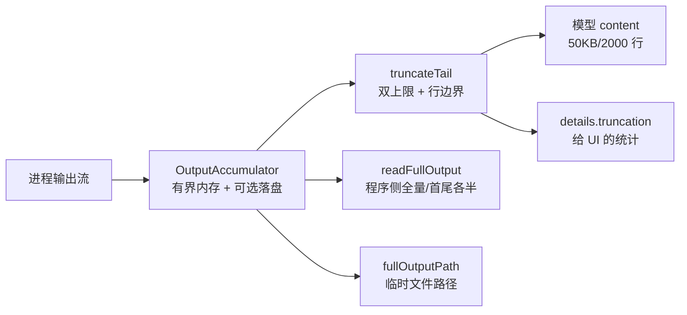

# 06. 工具定义、调度与失败处理

今天从零研究工具流水线，重点是让四类失败留下不同证据。只需要本篇和指向的源码；faux 假模型承担所有模型响应，预计 2–3 小时。

## 今日准备

确认 Node.js >= 22.19.0，仓库已用 `npm install --ignore-scripts` 安装依赖。在 `packages/coding-agent/test/suite/` 新建 `task-06-learning.test.ts`，使用 `createHarness()`、`fauxAssistantMessage()`、`fauxToolCall()`；每个测试 `try/finally` 调用 `h.cleanup()`。工作目录 `packages/coding-agent`：

```powershell
node ../../node_modules/vitest/dist/cli.js --run test/suite/task-06-learning.test.ts
```

最小两轮脚本是“工具调用响应 + 普通文本响应”，例如 `fauxAssistantMessage([fauxToolCall("read", { path: 123 })], { stopReason: "toolUse" })` 后接 `fauxAssistantMessage("收到结果")`。第一项的数字路径用于故意触发 schema 校验失败。

## 学习内容

工具要同时有给模型看的声明和真实可调用的执行函数。模型提交的参数是外部输入，即使 TypeScript 中写了类型，执行前也必须按 schema 校验。调度会找到工具、校验参数、运行前后钩子、执行、把结果转换成 `ToolResultMessage`。读、写、编辑、shell 的风险与输出形态不同；长输出需要截断，文件改动需要排队，取消要贯穿外部进程。工具错误通常转换成模型可见的错误结果，不能简单理解为整个 Agent 崩溃。

例子：模型发出 `{ path: 123 }`。TypeScript 不能约束模型的网络输出，`validateToolArguments` 在真正读取文件前拒绝它；Agent 仍把错误作为 `toolResult` 放回对话，好让模型知道该修正参数。若模型给的是合法路径，但工具自身抛错，结果也可能 `isError: true`，只是故障点已经跨过校验层。

## 核心源码

`packages/agent/src/types.ts`的 `AgentTool`、`AgentToolResult` 描述声明和结果；`packages/agent/src/agent-loop.ts`按 `prepareToolCall`、`executePreparedToolCall`、`finalizeExecutedToolCall` 的顺序读；`packages/ai/src/utils/validation.ts`找 `validateToolArguments`；`packages/coding-agent/src/core/tools/read.ts`看路径与截断，`packages/coding-agent/src/core/tools/bash.ts`看外部进程与取消，`packages/coding-agent/src/core/tools/truncate.ts`和`packages/coding-agent/src/core/tools/file-mutation-queue.ts`解释输出和写入边界。

## TypeScript 语法小课：`unknown` 与运行时校验

模型提交的工具参数是外部数据。即使工具函数的参数写着 `path: string`，网络传来的值仍可能是数字；先把它视为 `unknown`，完成运行时检查后再使用。仓库的 `validateToolArguments` 用 schema 做这一步。

```typescript
function readPath(input: unknown): string {
  if (typeof input !== "object" || input === null) throw new Error("需要对象"); // 排除非对象
  if (!("path" in input) || typeof input.path !== "string") throw new Error("path 必须是字符串"); // 收窄字段
  return input.path; // 检查之后才能安全当作 string
}
console.assert(readPath({ path: "a.txt" }) === "a.txt");
try { readPath({ path: 123 }); } catch (error) { console.assert(error instanceof Error); }
```

练习：把数字 `path` 送进本篇 faux 工具测试，对照“类型检查”和“真实运行时校验”各自发生在哪个阶段。


## 完整学习资料

先按下列正文完成学习，再执行本篇的动手任务。正文中原书的实验与验收题先作为案例阅读，实际动手统一放到文末；只运行本篇“今日准备”和动手任务明确指定的离线命令。章节编号保留知识主题的原编号；源码精读、示例、边界条件、常见错误和参考答案均直接收录在本文件中。开头的预计用时仅指核心主线，完整源码精读需另留时间。

### 本篇共同基础

以下运行图和术语均在本文件内。学习正文保留原手册的知识主题编号，但那些编号不构成本任务的阅读前置；实际操作按本篇的动手任务与验收标准执行。学习正文基于原手册注明的 `200387122ca450d6387f033949423114a270b96c` 源码基线，当前工作区若有差异，以当前源码为准。

### 15 分钟主线：pi 怎样完成一件事

假设用户输入“读取 demo.txt，并总结三点”。模型自己不能读取你电脑里的文件。pi 把用户问题和可用工具告诉模型；模型提出 `read` 调用；pi 在本地执行；模型拿到文件内容后才生成总结。这就是全书反复使用的同一个例子。

**先看不带 TypeScript 细节的主流程（教学伪代码）：**

```text
收到用户输入，把它加入当前会话
重复：
    用当前上下文向模型发起请求
    收集模型的回答并把过程通知界面
    如果回答要求执行工具：
        校验参数，在本地执行工具，记录结果
        继续循环，让模型看到工具结果
    否则，检查是否还有排队输入或明确的继续决定
    如果都没有：结束本次运行
```

第一行确定这次任务和已有历史。模型请求只负责生成回答或提出工具调用。工具校验与执行由 pi 负责，结果回到对话后才可能有下一轮模型请求。界面接收运行事件，历史保存完成的消息；它们都与“模型请求”有关，但不是同一种数据。真实实现还处理工具并发、错误、取消、重试和压缩，后面分别讲。

**先分清四对容易混淆的词：**

| 两个词                | 直观区别                                           | 在“读文件并总结”中的例子                   |
| --------------------- | -------------------------------------------------- | -------------------------------------------- |
| 模型请求 / 用户输入   | 用户只说一次话，pi 可以多次询问模型                | 先请模型选择工具，读完文件后再请模型总结     |
| 事件 / 消息           | 事件告诉界面过程；消息承载一次完整的对话内容       | “正在输出第几个字”是事件；完成的总结是消息 |
| 工具调用 / 工具结果   | 调用提出想做什么；结果记录本地执行所得             | `read("demo.txt")` 是调用；文件文字是结果  |
| 会话历史 / 模型上下文 | 历史保留记录；上下文是这一次请求实际送给模型的内容 | 分支 C 仍在文件里，沿分支 D 继续时不必送 C   |


```text
一次用户输入
  → 第一次模型请求：请调用 read("demo.txt")
  → 本地工具执行：读出文件文本
  → 第二次模型请求：根据工具结果总结三点
  → 没有后续工作：结束
```

### 附录 A：术语表

> 用法：每个术语给出"一句话解释 + 首次出现的章节"。读代码遇到不认识的词，先查这里；查不到再搜源码（用英文名搜）。


#### A.1 核心概念

| 中文                  | 英文                    | 一句话                                                                                                             | 章节      |
| --------------------- | ----------------------- | ------------------------------------------------------------------------------------------------------------------ | --------- |
| 智能体外壳 / 运行框架 | agent harness           | 组织模型、工具、状态、界面的框架，本身不"聪明"                                                                     | 0.1       |
| 智能体                | agent                   | "模型 + 工具 + 循环"组成的执行体                                                                                   | 0.1       |
| 轮次                  | turn                    | 一次助手响应 + 它引发的工具执行                                                                                    | 3.3.3     |
| 低层运行              | Agent run               | 一次`Agent.prompt()` 或 `Agent.continue()` 调用建立的生命周期；以 `agent_end` 和已等待的 listener 收尾为边界 | 3.3.3、D2 |
| 会话 prompt 编排      | session prompt workflow | `AgentSession.prompt()` 在 `started` 后进入 `_runAgentPrompt()`；可串起 retry、压缩恢复和多个低层 Agent run  | 8、D27    |
| 用户请求              | user request            | 用户提交一次输入；与模型请求不等价                                                                                 | 3.3.3     |
| 模型请求              | model request           | 真正发给供应商 API 的一次请求                                                                                      | 3.3.3     |
| 转录                  | transcript              | 发给模型看/被记录的消息序列                                                                                        | 4.1       |
| 投影                  | projection              | 从会话树/文档到"模型实际看到的内容"的计算过程                                                                      | 9.4       |
| 活动分支              | active branch           | 从根到当前叶子的一条路径                                                                                           | 9.1       |
| 叶子                  | leaf                    | 会话树中的"当前位置"                                                                                               | 4.7.3     |
| 条目                  | entry                   | 会话文件里的一行（JSONL）                                                                                          | 4.7       |
| 会话                  | session                 | 一次对话的全部记录与状态                                                                                           | 8.1       |
| 压缩                  | compaction              | 用摘要替换旧上下文表示的机制                                                                                       | 10        |
| 上下文窗口            | context window          | 模型一次能接受的最大 token 量                                                                                      | 5.3       |
| 思考级别              | thinking level          | off/minimal/low/medium/high/xhigh/max                                                                              | 5.3       |
| 停止原因              | stop reason             | pending/stop/length/toolUse/error/aborted/deferred                                                                 | 4.3.3     |
| 用量                  | usage                   | token 与成本统计                                                                                                   | 4.3.5     |


#### A.2 消息与事件

| 中文           | 英文                | 一句话                                             | 章节        |
| -------------- | ------------------- | -------------------------------------------------- | ----------- |
| Agent 消息     | AgentMessage        | 内部消息（模型消息 + 应用自定义角色）              | 4.4         |
| 模型消息       | Message             | 供应商能理解的四角色联合                           | 4.3         |
| 内容块         | content block       | 消息内容的最小单元（text/image/thinking/toolCall） | 4.2         |
| 判别联合       | discriminated union | 用共同字面量字段区分成员的类型联合                 | 1.3.4       |
| 类型收窄       | narrowing           | 判断判别字段后类型自动缩小                         | 1.3.4       |
| 事件           | event               | 运行时广播（过程），不是消息（结果）               | 3.3.2       |
| 队列更新       | queue update        | 排队消息变化的会话事件                             | 4.5.2       |
| 边界（结算前） | agent_before_settle | 最后一个可行动钩子                                 | 6.2、13.3.5 |
| 已结算         | agent_settled       | "不会再自动继续"的最终信号                         | 4.5.2、16.3 |
| 延迟句柄       | deferred handle     | 异步应答的取回凭据                                 | 4.3.3       |


#### A.3 工具与模型

| 中文                | 英文                            | 一句话                                    | 章节  |
| ------------------- | ------------------------------- | ----------------------------------------- | ----- |
| 工具                | tool                            | 模型可调用的本地操作                      | 7.1   |
| 工具定义            | ToolDefinition                  | 扩展/应用注册工具的"富"形态               | 7.1.2 |
| 参数校验            | argument validation             | 用 typebox schema 在运行时校验调用参数    | 7.4   |
| 前置钩子            | beforeToolCall                  | 执行前可拦截（block）的钩子               | 7.6   |
| 后置钩子            | afterToolCall                   | 结果字段级改写的钩子                      | 7.6   |
| 顺序 / 并行执行     | sequential / parallel execution | 工具批次的两种调度                        | 7.5   |
| 终止提示            | terminate                       | "整批都同意时不因本批继续"的调度提示      | 7.5.4 |
| 模型                | model                           | 模型静态元数据（api/provider/限制/价格）  | 5.2.2 |
| 协议方言            | api                             | 供应商接口族标识（如 anthropic-messages） | 5.2.1 |
| 供应商              | provider                        | 认证 + 模型目录 + 请求实现                | 5.2.3 |
| 简单流式 / 完整流式 | streamSimple / stream           | 供应商无关档位 vs 协议特有选项            | 5.4   |
| 兼容开关            | compat                          | OpenAI 兼容生态的行为微调                 | 5.5.4 |
| 假供应商            | faux provider                   | 脚本化、离线的测试模型                    | 5.7   |


#### A.4 会话与持久化

| 中文       | 英文             | 一句话                             | 章节   |
| ---------- | ---------------- | ---------------------------------- | ------ |
| 会话管理器 | SessionManager   | 会话文件的对象化句柄               | 9.3    |
| 分支会话   | branched session | 只包含"根到叶子"路径的新文件       | 9.5.2  |
| 分支摘要   | branch summary   | 放弃某分支时生成的摘要条目         | 10.6   |
| 上下文编辑 | context edit     | 只改"投影"、不改原始条目的追加编辑 | 9.4.4  |
| 保留边界   | firstKeptEntryId | 压缩后从哪条开始保留               | 10.3.2 |
| 保留预算   | keepRecentTokens | 压缩后至少保留的近期上下文         | 10.3   |
| 预留       | reserveTokens    | 为模型回复预留的窗口               | 10.2.1 |
| 检测点替换 | checkpoint       | 压缩条目携带的提示词/工具检查点    | 9.4.3  |


#### A.5 扩展与集成

| 中文       | 英文            | 一句话                             | 章节       |
| ---------- | --------------- | ---------------------------------- | ---------- |
| 上下文文件 | context files   | AGENTS.md 等纯文本指令             | 11.4.2     |
| 项目信任   | project trust   | 允许加载项目可执行资源前的人工决定 | 11.5       |
| 提示词模板 | prompt template | Markdown 变成`/命令`             | 12.3.2     |
| 技能       | skill           | 目录 + SKILL.md 的按需说明书       | 12.3.3     |
| 扩展       | extension       | 可执行 TypeScript 模块（进程权限） | 12.3.4、13 |
| Pi 包      | Pi package      | 分发多资源的 npm/git 单元          | 12.3.6     |
| 钳制       | clamp           | 按模型能力压低思考级别             | 5.3        |
| 重绑       | rebind          | 会话替换后重新挂订阅/扩展绑定      | 8.6        |


#### A.6 协议与架构（选修）

| 中文     | 英文                   | 一句话                                          | 章节   |
| -------- | ---------------------- | ----------------------------------------------- | ------ |
| MCP      | Model Context Protocol | 外部工具/资源接入协议                           | 22     |
| 暴露方式 | exposure               | codemode/deferred/direct 三种工具到达模型的方式 | 22.3   |
| 工具搜索 | tool_search            | deferred 工具的"发现后再直调"机制               | 22.3   |
| 沙箱     | codemode sandbox       | QuickJS VM + worker 的脚本执行环境              | 22.9   |
| 面片     | facet                  | Chord 插件可独立打包到不同环境的分片            | 23.2   |
| 服务     | service                | Chord 的类型化稳定 token（singleton/keyed）     | 23.2   |
| 复制状态 | replicated state       | 原子发布、完整不可变值消费的状态                | 23.2   |
| 增量跟踪 | delta tracking         | 记录/合并 JSON 操作的机制                       | 23.2   |
| 持久执行 | durable execution      | 意图先提交、崩溃可续的执行模型                  | 23.1   |
| 检查点   | checkpoint             | 任务每一步的持久落点                            | 23.3.1 |
| 附着     | attachment             | 一条表现层连接绑定到一个会话                    | 24.2   |
| 信封     | envelope               | 协议中包裹 payload 的定向记录                   | 24.3   |
| span     | span                   | 一次操作的时间记录（遥测）                      | 25.2   |
| lift     | lift                   | 处理组相对对照组的提升（评估）                  | 25.5   |
| 阻断配对 | blocked pair           | 两臂未各得恰好一个分数，禁止计入头条            | 25.6   |


#### A.7 容易混淆的成对术语

| 对                                              | 区分                                                                                   |
| ----------------------------------------------- | -------------------------------------------------------------------------------------- |
| message vs event                                | 结果 vs 过程（3.3.2）                                                                  |
| turn vs run                                     | 一个轮次 vs 整次运行（3.3.3）                                                          |
| `agent_end` vs `agent_settled`              | 低层 run 结束 vs 自动工作清零（4.5.2）                                                 |
| 声明 vs 可执行                                  | 系统消息里的工具声明 vs 运行时工具集（7.3）                                            |
| details vs content                              | 给界面/程序 vs 给模型（14.2）                                                          |
| 完成顺序 vs 记录顺序                            | 并发完成 vs 声明序记录（7.5.3）                                                        |
| 停止原因`length` vs `stop`                  | 被截断 vs 正常说完（4.3.3）                                                            |
| `AgentSession.prompt()` vs `Agent.prompt()` | 应用层输入分流/会话编排 vs 低层 Agent run 入口（8、D2、D27）                           |
| `handled` vs `queued` vs `started`        | 输入被消费、不创建该输入自己的 run / 放入当前运行队列 / 进入会话 run 编排（8、16.5.3） |
| 提示词模板 vs 技能                              | 一段话 vs 一套流程+文件（12.3.3）                                                      |
| 扩展 vs Pi 包                                   | 可执行单元 vs 分发单元（12.3.6）                                                       |
| compaction 摘要 vs branch summary               | 压缩历史 vs 放弃分支（10.6）                                                           |
| durable cheat sheet：`replay: safe/never`     | 崩溃后重跑 vs 报 interrupted（23.4）                                                   |
| JSONL RPC vs client/server                      | 进程内 stdio 协议 vs 跨进程服务路由（24.1）                                            |
| 单测 vs 评估                                    | 确定性 vs 配对统计（25.1、25.6）                                                       |


#### A.8 输入与运行的层级

不要按“用户按了一次回车”推断低层 run 或模型请求的数量。实际层级是：

| 层级       | 代表符号                                           | 次数关系                                                                                      |
| ---------- | -------------------------------------------------- | --------------------------------------------------------------------------------------------- |
| 输入调用   | `AgentSession.prompt(text)`                      | 一次调用只表达一次输入尝试；结果可能是`handled`、`queued` 或 `started`                  |
| 会话编排   | `_runAgentPrompt(messages)`                      | 只在开始处理输入时进入；在里面管理重试、压缩恢复、边界 continuation 与取消                    |
| Agent run  | `Agent.prompt(messages)` 或 `Agent.continue()` | 一次会话编排可包含多个 run；每个低层 run 都发出自己的`agent_start` / `agent_end` 生命周期 |
| Agent turn | `turn_start` 到 `turn_end`                     | 一个 run 可包含多个 turn；每个 turn 通常包含一次助手响应及其引发的工具执行                    |
| 模型请求   | `streamSimple` / provider stream                 | 通常发生在助手响应阶段；自动重试会再次请求模型，压缩摘要等内部工作也可能有独立请求            |

两个边界例子：

- 扩展命令被消费时，`prompt()` 返回 `handled`，没有为该输入启动 `_runAgentPrompt()`；
- `prompt()` 在 Agent 已运行时以 `steer`/`followUp` 方式排队，返回 `queued`。这条输入会影响现有流程，但它本身不是新的 `Agent.prompt()` 调用。

因此，统计“模型请求次数”不能数 prompt、turn 或 `agent_end`：应按 provider 请求事件/日志，或明确的测试探针计数。章节 21 的自测题也按这个区分评分。


#### A.9 索引方式说明

- 想找"某行为在哪个文件" → 用 source-map；
- 想找"某命令怎么跑" → 用 commands；
- 想找"某现象怎么排" → 用 troubleshooting；
- 想找"哪些练习要做" → 用 exercises-and-answers。

---

### 第 7 章：工具定义、调度、结果与失败


**先懂这一章**：模型给的是工具名称和参数，不是已经完成的动作。pi 必须找到工具、校验参数、决定是否允许执行、取得结果，再把结果交回模型。每一步失败时，模型看到的内容可能不同。

```text
教学伪代码：收到工具调用 → 找工具并准备参数 → 校验与前置检查
           → 执行工具 → 后置处理 → 发完成事件和结果消息
```

这是一条单工具的正常路径。多个工具还涉及逐个准备、并行或顺序执行，以及“完成事件”和“结果消息”顺序不同的问题，见第 7.5 节。

循环在第 6 章决定何时调用工具，本章只追工具从声明到结果的路径。看清单次执行与整批调度后，第 8 章再解释这些工具和会话资源从哪里来、何时释放。

> 学完本章你能回答：
>
> 1. 一个工具由哪些字段定义？`AgentTool` 和 `ToolDefinition` 有什么区别？
> 2. 模型怎么知道有哪些工具可用？工具清单中途变化时会发生什么？
> 3. 参数校验是怎么做的？校验失败、工具抛错、被拦截、被取消，各自变成什么？
> 4. 顺序执行与并行执行怎么选？"完成顺序"和"记录顺序"分别由哪段代码保证？
> 5. 内置工具（`read`/`write`/`bash`）是怎么写的？输出截断保护了什么？

**预计学习时间**：2 天（建议把 `read.ts`、`write.ts` 两个小文件完整读一遍）。
**本章验证状态**：静态核对通过；实验 L04 需本地运行（faux 驱动）。

---


#### 7.1 工具的两个形态：`AgentTool` 与 `ToolDefinition`


##### 7.1.1 运行时契约：`AgentTool`

Agent 循环只认识这个接口（`packages/agent/src/types.ts`，第 1 章看过，这次逐字段精读）：

```typescript
export interface AgentTool<TParameters extends TSchema = TSchema, TDetails = any> extends Tool<TParameters> {
	/** Human-readable label for UI display. */
	label: string;
	/**
	 * Optional compatibility shim for raw tool-call arguments before schema validation.
	 * Must return an object that matches `TParameters`.
	 */
	prepareArguments?: (args: unknown) => Static<TParameters>;
	/**
	 * JSON Schema of `structuredContent` in successful results. Tools that declare it should always
	 * set `structuredContent`.
	 */
	outputSchema?: TSchema;
	/**
	 * Execute the tool call. Throw on failure, or return a result with `isError: true`; do not only
	 * describe the failure in `content`.
	 */
	execute: (
		toolCallId: string,
		params: Static<TParameters>,
		signal?: AbortSignal,
		onUpdate?: AgentToolUpdateCallback<TDetails>,
	) => Promise<AgentToolResult<TDetails>>;
	/** Recovery policy for an effect whose durable intent exists but whose outcome is unknown. */
	replay?: "never" | "safe";
	/**
	 * Per-tool execution mode override.
	 * - "sequential": this tool must execute one at a time with other tool calls.
	 * - "parallel": this tool can execute concurrently with other tool calls.
	 */
	executionMode?: ToolExecutionMode;
}
```

要点：

- **四参数执行签名**：调用 id、校验后的参数、取消信号、进度回调。工具作者要处理后三者；
- `replay` 是给"持久执行"场景（第 23 章 durable）用的：打算重放一个"意图已持久化但结果未知"的操作时，`"never"` 表示不要重放（如发邮件），`"safe"` 表示可重放（如纯读）；
- `executionMode` 是**工具自己声明**的并发限制（第 7.5 节展开）。

`execute` 的注释把错误处理规则钉死了：**"抛错，或返回 `isError: true` 的结果；不要把失败只写在 content 里。"** 为什么？因为上层的判断（是否计入失败统计、界面是否标红、重试策略）依赖 `isError` 这个布尔字段，而不是反解文本。


##### 7.1.2 注册形态：`ToolDefinition`

`coding-agent` 内部用更丰富的 `ToolDefinition`（`core/extensions/types.ts`）。它比 `AgentTool` 多了"给模型看的提示元数据"和"给界面看的渲染器"：

```typescript
// 概念节选（真实定义见 extensions/types.ts）
interface ToolDefinition<TParameters, TDetails> {
	name: string;
	label: string;
	description: string;               // 模型读到的工具说明
	parameters: TParameters;           // typebox schema
	promptSnippet?: string;            // 系统提示里的"工具速览"一行
	promptGuidelines?: string[];       // 系统提示里的使用准则
	constrainedSampling?: ...;         // 请求层约束（如 json_schema strict）
	prepareArguments?: ...;
	outputSchema?: ...;
	executionMode?: ...;
	execute: (toolCallId, params, signal, onUpdate, ctx?: ExtensionContext) => ...;
	renderers?: ...;                   // 界面渲染
}
```

两个形态之间可以双向转换（`core/tools/tool-definition-wrapper.ts`）：

```typescript
/** Wrap a ToolDefinition into an AgentTool for the core runtime. */
export function wrapToolDefinition<TDetails = unknown>(
	definition: ToolDefinition<any, TDetails>,
	ctxFactory?: ToolContextFactory,
): AgentTool<any, TDetails> {
	return {
		name: definition.name,
		label: definition.label,
		description: definition.description,
		parameters: definition.parameters,
		outputSchema: definition.outputSchema,
		constrainedSampling: definition.constrainedSampling,
		prepareArguments: definition.prepareArguments,
		executionMode: definition.executionMode,
		execute: (toolCallId, params, signal, onUpdate, ctx?) =>
			definition.execute(toolCallId, params, signal, onUpdate,
				ctx ?? (ctxFactory?.(toolCallId, signal) as ExtensionToolContext)),
	};
}
```

以及反向：

```typescript
export function createToolDefinitionFromAgentTool(tool: AgentTool<any>): ToolDefinition<any, unknown> {
	return { name: tool.name, label: tool.label, description: tool.description, /* ... */ };
}
```

**为什么要两个形态？** 因为"运行时循环需要什么"和"应用注册/渲染需要什么"不同：

| 需求                               | AgentTool                | ToolDefinition |
| ---------------------------------- | ------------------------ | -------------- |
| 循环执行                           | 需要                     | ——           |
| 生成系统提示（速览/准则）          | ——                     | 需要           |
| 终端渲染（不同工具不同样式）       | ——                     | 需要           |
| 扩展上下文（`ctx`：cwd、模型等） | ——                     | 需要           |
| 第三方直接传`AgentTool`          | 兼容（自动合成最小定义） | ——           |

读代码时注意：**`Agent` 只见到 `AgentTool`；`AgentSession` 内部维护"definition 优先"的注册表**，用 `wrapToolDefinition` 往下层喂。

扩展工具的注册、上下文创建和会话刷新之间还有一层生命周期；这里先记住一个边界：`ToolDefinition.execute` 的类型把 `ctx` 写成必填，但直接调用或没有传 `ctxFactory` 的适配路径不会凭空生成上下文，运行时可能收到 `undefined`。扩展通过会话注册并由 `wrapRegisteredTool` 包装时，才会在每次调用时用 `ExtensionRunner.createToolContext()` 提供它。


#### 7.2 工具从哪来：工厂、组合与命名

`packages/coding-agent/src/core/tools/index.ts` 是整个内置工具库的门面。命名约定：

```typescript
export type ToolName = "read" | "bash" | "powershell" | "edit" | "write" | "grep" | "find" | "ls";
export const allToolNames: Set<ToolName> = new Set([...]);
```

工厂分两家：`createXxxTool(cwd, options)` 返回 `AgentTool`；`createXxxToolDefinition(cwd, options)` 返回 `ToolDefinition`。再往上，是**组合函数**：

| 组合                         | 包含                    | 场景                                      |
| ---------------------------- | ----------------------- | ----------------------------------------- |
| `createCodingTools(cwd)`   | read, bash, edit, write | 标准编码模式（默认）                      |
| `createReadOnlyTools(cwd)` | read, grep, find, ls    | 只读审查（`--tools read,grep,find,ls`） |
| `createAllTools(cwd)`      | 全部八个                | 需要完整能力时                            |
| `createTool(name, cwd)`    | 单个                    | 精细控制                                  |

`AGENTS.md` 风格的对应关系：**"默认工具集"由 `DEFAULT_TOOL_NAMES` 与设置 `defaultTools` 决定**（第 3 章 sdk.ts 的 `initialActiveToolNames` 计算）；`--tools` 白名单和 `--exclude-tools` 再叠加。工具的**执行能力**与**声明**是两码事，下一节展开。

（扩展注册自定义工具的路径（`pi.registerTool`）在第 13、14 章；MCP 工具在 22 章。）


#### 7.3 声明与"工具载入变化"：模型怎么知道你能做什么


##### 7.3.1 声明进系统消息

模型不知道"进程里注册了什么"，它只知道**消息里声明了什么**。工具声明被编入系统消息（第 4 章 `SystemMessage.toolsAdded`）；`AgentContext.tools` 则是"当前进程真正可执行的集合"。两者由 `declareToolChanges` 保持同步（`agent-loop.ts`）：

```typescript
/**
 * Declare tool loadout changes to the model.
 *
 * `context.tools` is what the runtime can execute; the transcript's system messages declare
 * what the model may call. Before each request the difference becomes `toolsAdded` and
 * `toolsRemoved` on a system message. ...
 */
function declareToolChanges(context: AgentContext, pendingMessages: AgentMessage[]): AgentMessage[] {
	// 找到待注入消息里的最后一条 system 消息（若有），以它为基线
	// 计算：已声明集合（getCurrentTools）与可执行集合（context.tools）的差
	const changes = getToolStateChanges(
		getCurrentTools([...context.messages, ...baseline]),
		(context.tools ?? []).map(toToolDeclaration),
	);
	const unchanged = changes.toolsAdded.length === 0 && changes.toolsRemoved.length === 0;
	if (unchanged) return pendingMessages;
	// 有变化：在第一条非 system 待注入消息之前插入一条"工具变化"系统消息
	const update = withToolChanges({ role: "system", content: "", timestamp: Date.now() }, changes);
	// ...
}
```

三个可观察的行为：

1. **首次请求**：转录里还没有系统消息声明工具 → 生成一条 `toolsAdded: [全部工具]` 的系统消息（会话文件里你能看到它，第 4.7.4 节示例）；
2. **中途启用/禁用工具**（扩展调用 `setActiveTools`、或 `finishTurn` 改了 `state.tools`）→ 下一次请求前生成一条只含增删差异的系统消息；
3. **不变则不写**：`unchanged` 直接返回，避免历史里塞满无意义的补丁。


##### 7.3.2 为什么"可执行"与"已声明"要分开

因为二者承担不同职责：

- **已声明**：模型可以调用什么（写进对话历史，可回放）；
- **可执行**：运行时真的有什么（可能是动态的、依赖当前的扩展状态）。

如果只保留一份，就不可能做到"会话回放时精确重建当时模型看到的工具清单"。**可回放性是本仓库的底层设计目标之一**，你在第 4、9 章反复看到它的影子。


##### 7.3.3 模型侧的形状：`toToolDeclaration`

`toToolDeclaration`（`pi-ai`）把内部 `Tool` 转成"转录里的声明形状"（name/description/parameters）。再往下，供应商适配器把它转成各家格式（第 5.5.3 节）。所以一个工具定义从代码到模型，走了三站：

```text
ToolDefinition（应用注册，含提示元数据）
  → AgentTool（运行时）
    → toToolDeclaration（转录系统消息里的声明）
      → 供应商格式（input_schema / function.parameters ...）
```


#### 7.4 参数校验：模型给的参数可信吗？

**先懂**：TypeScript 能检查开发者写的代码，不能在运行时保证模型生成的 JSON 正确。pi 先复制参数，做有限的归一化与转换，再按工具 schema 校验。通过后的值才交给工具执行。

```text
教学伪代码：复制模型参数 → 处理可选空值和可转换值
           → 按 schema 检查 → 合法则返回副本
           → 非法则给出字段位置与收到的原值
```

不可信。模型可能传错类型、漏字段、把数字写成字符串。pi 在工具执行前做一层**运行时校验**（`packages/ai/src/utils/validation.ts`）：

```typescript
/**
 * Validates tool call arguments against the tool's TypeBox schema
 * @returns The validated (and potentially coerced) arguments
 * @throws Error with formatted message if validation fails
 */
export function validateToolArguments(tool: Tool, toolCall: ToolCall): any {
	const args = structuredClone(toolCall.arguments);        // ① 克隆：绝不改模型给的原对象
	normalizeOptionalNulls(args, tool.parameters);           // ② 把"可选字段传了 null"归一化
	Value.Convert(tool.parameters, args);                    // ③ 类型强转（如 "42" → 42）

	const validator = getValidator(tool.parameters);
	if (!Object.getOwnPropertySymbols(tool.parameters).includes(TYPEBOX_KIND)) {
		// ④ 非 typebox 的 schema：做一轮 JSON Schema 兼容强转
		const coerced = coerceWithJsonSchema(args, tool.parameters);
		if (coerced !== args) { /* 合并结果 */ }
	}

	if (validator.Check(args)) {
		return args;                                          // ⑤ 通过：返回校验后的参数
	}

	// ⑥ 失败：拼出"路径 + 原因 + 收到的参数"的错误文本
	const errors = validator.Errors(args)
		.map((error) => `  - ${formatValidationPath(error)}: ${error.message}`)
		.join("\n") || "Unknown validation error";
	throw new Error(`Validation failed for tool "${toolCall.name}":\n${errors}\n\nReceived arguments:\n${JSON.stringify(toolCall.arguments, null, 2)}`);
}
```

六个步骤的设计动机，逐个说：

1. **`structuredClone`**：参数对象会被后续强转/归一化**就地修改**，必须先克隆。模型的消息对象要保持原样（历史回放需要原始值）；
2. **`normalizeOptionalNulls`**：模型常把"不填的可选字段"写成 `null`。schema 里 `Type.Optional` 只接受"缺失或正确类型"，这里先把 `null` 处理掉；
3. **`Value.Convert`**：typebox 的类型强转，例如 `"3"` → `3`、`"true"` → `true`。这是对模型小失误的宽容；
4. **非 typebox schema 兼容**：工具可能声明的是纯 JSON Schema（扩展作者手写），用辅助强转兜底；
5. **通过则返回**：返回的是"校验后的副本"，`execute` 收到的一定满足 schema；
6. **失败拼详细错误**：错误里包含**收到的原始参数**（pretty JSON）。这条错误文本会作为工具结果发给模型——模型据此自我纠正（比如"哦，path 不是数组，是字符串"）。


##### 7.4.1 校验失败的完整去向

```text
validateToolArguments 抛错
  → prepareToolCall 的 catch 捕获
    → 返回 { kind: "immediate", result: createErrorToolResult(错误文本), isError: true }
      → 照样走 emitToolExecutionEnd + 生成 ToolResultMessage
        → 模型下一轮看到 "Validation failed for tool ..." 并重新尝试
```

**没有一步会中断整个循环。** "错误是一种结果"在这里第二次出现。


##### 7.4.2 `prepareArguments`：校验前的最后修补

有些工具需要一个"兼容垫片"，在**校验之前**修正原始参数（比如老模型把 `file_path` 写成 `path`）：

```typescript
function prepareToolCallArguments(tool: AgentTool<any>, toolCall: AgentToolCall): AgentToolCall {
	if (!tool.prepareArguments) return toolCall;
	const preparedArguments = tool.prepareArguments(toolCall.arguments);
	if (preparedArguments === toolCall.arguments) return toolCall;   // 未修改则保持原对象
	return { ...toolCall, arguments: preparedArguments as Record<string, any> };
}
```

顺序是：**`prepareArguments`（修补）→ `validateToolArguments`（校验）→ `beforeToolCall`（也许拦截）→ `execute`（执行）**。


##### 7.4.3 `unknown` 与 `as`：类型检查不能替代运行时校验

这一段同时跨过了 TypeScript 类型系统和运行时数据边界。初学者要把三件事拆开：

| 动作                           | 发生时机              | 能保证什么                                           |
| ------------------------------ | --------------------- | ---------------------------------------------------- |
| `Static<typeof schema>`      | TypeScript 检查源码时 | 编辑器知道符合 schema 的对象应有哪些字段/类型        |
| `validateToolArguments(...)` | 程序运行时            | 对模型给出的实际数据做转换和 schema 检查；失败就抛错 |
| `value as SomeType`          | TypeScript 检查源码时 | 告诉编译器“按这个类型看”；不会检查或修改实际值     |

为什么需要运行时校验？模型响应从网络流中解析而来，TypeScript 编译器不会在运行时替你检查 JSON。即使模型供应商声明支持 JSON Schema，仍然需要把本地实际收到的值当作不可信数据。

真实准备路径（`packages/agent/src/agent-loop.ts` → `prepareToolCall`）可缩写为：

```typescript
const preparedToolCall = prepareToolCallArguments(tool, toolCall);
const validatedArgs = validateToolArguments(tool, preparedToolCall);

if (config.beforeToolCall) {
  const beforeResult = await config.beforeToolCall(
    { assistantMessage, toolCall, args: validatedArgs, context: currentContext },
    signal,
  );
  if (beforeResult?.block) {
    return {
      kind: "immediate",
      result: createErrorToolResult(beforeResult.reason || "Tool execution was blocked"),
      isError: true,
    };
  }
}

return { kind: "prepared", toolCall, tool, args: validatedArgs };
```

节选省略 abort 检查和错误分支。按时间读：

1. `toolCall.arguments` 是模型给的原始参数；
2. `prepareToolCallArguments` 可做兼容转换；
3. `validateToolArguments` 克隆、转换并检查；
4. `beforeToolCall` 收到校验后的参数，但上下文类型把 `args` 定义成 `unknown`；
5. 没被拦截就把当前这个参数对象放进 `PreparedToolCall`；
6. 后续 `executePreparedToolCall` 把它传给工具 `execute`。

这里没有第二次 schema validation。hook 收到的是共享的对象引用，可以原地改它。已有回归测试 `packages/agent/test/agent-loop.test.ts` 中的 `should execute mutated beforeToolCall args without revalidation` 正是这样验证的：schema 要求 `value: string`，hook 将 `value` 改成数字 `123`，工具实际收到数字。

```typescript
beforeToolCall: async ({ args }) => {
  const mutableArgs = args as { value: string | number };
  mutableArgs.value = 123;
  return undefined;
}
```

`as { value: string | number }` 只放宽 TypeScript 对这段代码的静态看法；真正改变对象的是下一行赋值。`as` 不会复制对象、不运行 TypeBox，也不会验证这个数字是否仍符合工具 schema。

【改代码时的意义】`execute(params)` 在没有 hook 的常规路径上收到的是已校验对象；启用可修改参数的 hook 后，工具可能收到 schema 不接受的值。若工具的安全性依赖更窄的运行时条件（例如路径必须位于工作目录、数值必须在范围内），不要只依赖入口 schema；在执行副作用之前验证该条件。若需求是让核心在 hook 修改后再次执行通用 schema 校验，那属于行为/API 变化，应先设计如何向模型报告 hook 改坏参数，再补回归测试，不能把当前实现误读成“自动二次校验”。

【关于 `unknown`】在 `BeforeToolCallContext` 里，`args: unknown` 是刻意的边界：hook 是通用的，它可能面对任何工具 schema。使用者需要先检查形状或在确认依据后写类型守卫。直接写 `any` 会让编译器放弃追问“这个值到底是什么”，因此本仓库规则要求尽量不用 `any`。部分旧的通用库类型仍出现 `any`，读者应理解为现有 API 的类型写法，不应照抄到新代码。


#### 7.5 调度：从声明到执行的四步流水线

**先懂**：同一批工具要先决定能否并行，但无论顺序还是并行，每个调用都要经过同样的准备、执行和结果收尾。先看单个工具的四步，再比较整批调度。


##### 7.5.1 四步流水线（快照 + 完整视图）

回忆第 3.10 节，正常执行路径分四步。查无工具、准备校验失败或被 `beforeToolCall` 拦截时会得到 immediate 结果，跳过工具执行和 `afterToolCall`：

```text
① prepareToolCall        找工具 → prepareArguments → 校验 → beforeToolCall 钩子
   任何一步失败 → 直接产出 isError 结果（"immediate" 结局）
② executePreparedToolCall 调用 tool.execute(id, args, signal, onUpdate)
   抛错 → 折叠为 isError 结果；进度回调 → tool_execution_update 事件
③ finalizeExecutedToolCall afterToolCall 钩子做字段级改写
④ 记录与广播             tool_execution_end 事件 + ToolResultMessage 消息
```

用一个真实工具对照（`read` 的 `execute`）：准备阶段校验 `path/offset/limit`；执行阶段读文件；收尾阶段无钩子改动；记录阶段生成含文件内容的 `toolResult`。


##### 7.5.2 顺序还是并行？

```typescript
const hasSequentialToolCall = toolCalls.some(
	(tc) => currentContext.tools?.find((t) => t.name === tc.name)?.executionMode === "sequential",
);
if (config.toolExecution === "sequential" || hasSequentialToolCall) {
	return executeToolCallsSequential(...);
}
return executeToolCallsParallel(...);
```

判定规则：**全局配置为 sequential，或批次里任意一个工具声明 `executionMode: "sequential"`，整批顺序执行。** 这是保守策略——有副作用的工具（如 edit 同一文件）不该和别的并发。

`executionMode` 的两个来源：

- 工具定义里声明（`AgentTool.executionMode` / `ToolDefinition.executionMode`）；
- 全局 `AgentOptions.toolExecution`（会话设置可覆盖）。


##### 7.5.3 并行模式的准备、执行与记录顺序

```typescript
// 准备阶段：按声明顺序逐个发 start 并 await prepareToolCall
for (const toolCall of toolCalls) {
	await emit({ type: "tool_execution_start", ... });
	const preparation = await prepareToolCall(...);
	if (preparation.kind === "immediate") {
		// 查无工具、校验失败、hook 拦截等：准备期间立即发 end
		await emitToolExecutionEnd(...);
		finalizedCalls.push(...);
		continue;
	}
	finalizedCalls.push(async () => {           // ② 执行被推迟为"闭包"，稍后并发调用
		// ... executePreparedToolCall / finalize / emit end
	});
	if (signal?.aborted) break;
}

// 准备循环结束后才启动闭包；各闭包并发，end 在各自收尾后发出
const orderedFinalizedCalls = await Promise.all(
	finalizedCalls.map((entry) => (typeof entry === "function" ? entry() : Promise.resolve(entry))),
);

// 记录阶段：按已收集调用的声明顺序生成结果消息
for (const finalized of orderedFinalizedCalls) {
	const toolResultMessage = createToolResultMessage(finalized);
	await emitToolResultMessage(toolResultMessage, emit);
	messages.push(toolResultMessage);
}
```

这里有三个边界要一起读：所有调用的准备过程仍按声明顺序串行；只有准备成功的调用才会进入后面的并发执行闭包；准备立即失败/被拦截的调用会在准备循环内直接发 `tool_execution_end`。因此 `tool_execution_end` 不能笼统说成“完成顺序”：immediate 结果先于执行闭包发出，成功准备的调用则按各自执行和收尾完成次序发出。若取消信号在准备循环中变为 aborted，循环会停止，尚未准备的后续调用不会进入结果列表；已准备的闭包启动时还会再次检查 signal，已取消的调用会生成 `Operation aborted` 结果。最终结果消息按收集到的调用顺序生成，也就是模型声明顺序的已处理部分，不保证每个声明调用都有结果。

对照第 3.8.1 的结论：

| 顺序                          | 由谁决定                                                   | 代码位置                     |
| ----------------------------- | ---------------------------------------------------------- | ---------------------------- |
| `tool_execution_start` 顺序 | 模型声明顺序（准备是顺序的）                               | for 循环                     |
| `tool_execution_end` 顺序   | immediate 结果在准备循环内发出；执行结果按闭包收尾顺序发出 | 准备循环与每个闭包内部       |
| 工具结果消息顺序              | 收集到调用的声明顺序；取消可使其成为声明序列的前缀         | `Promise.all` 后的有序循环 |
| `terminate` 判定            | 全部结果都`terminate: true` 才生效                       | `shouldTerminateToolBatch` |

**暂停预测：** 模型在同一批中先声明 `read("demo.txt")`，再声明 `read("README.md")`。两次准备都成功，允许并行；前者执行较慢。写下 `tool_execution_start`、成功执行的 `tool_execution_end`、`ToolResultMessage` 三列各自的先后顺序。

**对照答案：** start 是 `demo.txt → README.md`；两个成功执行的 end 可以是 `README.md → demo.txt`；结果消息仍是 `demo.txt → README.md`。准备循环按声明顺序运行，闭包并行完成，`Promise.all` 的结果数组按输入位置排列。这个答案只覆盖“两次都准备成功、没有取消”的条件；校验失败或拦截会在准备时立即发 end，取消也可能让后续调用根本没有结果。


##### 7.5.4 `terminate` 的精确语义

```typescript
function shouldTerminateToolBatch(finalizedCalls: FinalizedToolCallOutcome[]): boolean {
	return finalizedCalls.length > 0 && finalizedCalls.every((finalized) => finalized.result.terminate === true);
}
```

- 它是"**不要因为本批工具继续循环**"的提示，不是"结束 run"；
- 一批里只要有一个结果没设 `terminate`，整批就不触发终止；
- 被 `beforeToolCall` 拦截（block）时也可以带 `terminate: true`（第 3 章代码里见过）。


#### 7.6 前后钩子：beforeToolCall / afterToolCall

**先懂**：前置钩子在执行前检查或阻止调用；后置钩子在执行后检查或改写结果。读两者时先问“现在工具执行了吗”，就不会把阻止结果与工具失败混淆。

```text
教学伪代码：参数通过校验 → beforeToolCall 决定放行或阻止
           → 放行后执行工具 → afterToolCall 处理最终结果
```


##### 7.6.1 `beforeToolCall`：执行前的准入控制

```typescript
export interface BeforeToolCallResult {
	block?: boolean;      // 阻止执行；循环会发出错误工具结果
	reason?: string;      // 阻止原因（作为错误文本给模型）
	terminate?: boolean;  // 提示"本批结束后停止"（仍需整批都 terminate）
}
```

收到的上下文（`BeforeToolCallContext`）：`assistantMessage`（哪条消息提出的调用）、`toolCall`（原始调用块）、`args`（**已校验**的参数）、`context`（当时的 Agent 上下文）。

典型用途：权限确认（"要写文件？先问用户"）、审计日志、危险命令拦截。注意它是**异步**的，可以等待用户输入。


##### 7.6.2 `afterToolCall`：结果的最终改写

字段合并语义（`AfterToolCallResult` 的注释是权威说明）：

| 字段                  | 提供时                     | 不提供时                                                       |
| --------------------- | -------------------------- | -------------------------------------------------------------- |
| `content`           | **整体替换**结果内容 | 保留原值                                                       |
| `details`           | 整体替换                   | 保留                                                           |
| `structuredContent` | 替换                       | 若`content` 被替换而它没给 → **丢弃**（可能不再匹配） |
| `isError`           | 替换                       | 保留                                                           |
| `usage`             | 替换                       | 保留                                                           |
| `terminate`         | 替换                       | 保留                                                           |

"content 换了但 structuredContent 没跟上就丢弃"这条规则很细，但体现了数据一致性优先：**宁可没有结构化数据，也不留互相矛盾的两份。**


#### 7.7 结果归一化：`AgentToolResult` → `ToolResultMessage`

工具返回 `AgentToolResult`，循环把它折成消息：

```typescript
function createToolResultMessage(finalized: FinalizedToolCallOutcome): ToolResultMessage {
	return {
		role: "toolResult",
		toolCallId: finalized.toolCall.id,
		toolName: finalized.toolCall.name,
		// Untyped tools (JS extensions) can return results without content; normalize
		// so the null never enters session history or provider payloads.
		content: finalized.result.content ?? [],
		details: finalized.result.details,
		usage: finalized.result.usage,
		isError: finalized.isError,
		timestamp: Date.now(),
	};
}
```

字段去向表（对照第 4.3.4）：

| 字段                  | 进消息？（发给模型）           | 进会话文件？                   | 给谁用                                 |
| --------------------- | ------------------------------ | ------------------------------ | -------------------------------------- |
| `content`           | 是                             | 是                             | 模型 + 界面                            |
| `details`           | 否                             | 是                             | 界面渲染、扩展逻辑                     |
| `structuredContent` | 否（**不在消息类型里**） | 否（除非工具自己塞进 details） | 程序化调用者（`runToolCall` 返回值） |
| `usage`             | 是（消息字段）                 | 是                             | 统计工具内部模型开销                   |
| `isError`           | 是                             | 是                             | 界面标红、重试策略                     |
| `terminate`         | 否                             | 否                             | 仅循环控制                             |

> `content ?? []` 的兜底是给 JS 扩展的：动态语言写的工具可能忘返回 `content`，直接透传 `null` 会污染历史与供应商请求。**归一化发生在边界上**——这是边界代码该负的责任。
> <a id="07-tools-execution-h23"></a>

#### 7.8 内置工具精读：`read`

`packages/coding-agent/src/core/tools/read.ts` 约 300 行，是"一个成熟工具应该长什么样"的范本。


##### 7.8.1 声明部分

```typescript
const readSchema = Type.Object({
	path: Type.String({ description: "Path to the file to read (relative or absolute)" }),
	offset: Type.Optional(Type.Number({ description: "Line number to start reading from (1-indexed)" })),
	limit: Type.Optional(Type.Number({ description: "Maximum number of lines to read" })),
});

export const readToolSystemPromptContribution = {
	snippet: "Read file contents",
	guidelines: ["Use read to examine files instead of cat or sed."],
} as const;
```

- **schema 的 description 是写给模型看的**。每个字段的说明都会进入供应商请求的工具定义；
- `snippet` 与 `guidelines` 进入系统提示（工具速览与使用准则）。"用 read 而不是 cat/sed" 这种行为引导，靠的就是这一行文本；
- `export const` 让系统提示装配处可以引用同一份文本（单一来源，不会说两套话）。

工具描述里写明了截断规则：

```text
Read the contents of a file. Supports text files and images (jpg, png, gif, webp, bmp).
Images are sent as attachments. For text files, output is truncated to 2000 lines or
50KB (whichever is hit first). Use offset/limit for large files. When you need the full
file, continue with offset until complete.
```

**模型能预判工具行为**（会截断、怎么续读），就不会因为"输出突然断了"而困惑。这是"面向模型写文档"的实践。


##### 7.8.2 可插拔操作（Operations 注入）

```typescript
export interface ReadOperations {
	readFile: (absolutePath: string) => Promise<Buffer>;
	access: (absolutePath: string) => Promise<void>;
	detectImageMimeType?: (absolutePath: string) => Promise<string | null | undefined>;
}

const defaultReadOperations: ReadOperations = {
	readFile: (path) => fsReadFile(path),                       // 本地文件系统
	access: (path) => fsAccess(path, constants.R_OK),
	detectImageMimeType: detectSupportedImageMimeTypeFromFile,
};
```

注释写明动机：**"Override these to delegate file reading to remote systems (for example SSH)."** 工具逻辑与 I/O 实现分离——第 23 章 Gondolin 扩展（把工具执行搬进微虚机）正是靠这层注入实现的。


##### 7.8.3 执行部分：取消 + 文本路径

执行函数用了一个"手动 Promise"结构来精确处理取消：

```typescript
return new Promise((resolve, reject) => {
	if (signal?.aborted) { reject(new Error("Operation aborted")); return; }
	let aborted = false;
	const onAbort = () => { aborted = true; reject(new Error("Operation aborted")); };
	signal?.addEventListener("abort", onAbort, { once: true });

	(async () => {
		try {
			const absolutePath = await resolveReadPathAsync(path, ctx?.cwd || cwd);
			if (aborted) return;                       // 取消后不再继续
			await ops.access(absolutePath);            // 可读性检查（不存在会抛错）
			// ... 读内容 ...
			if (aborted) return;
			signal?.removeEventListener("abort", onAbort);   // 收尾：解除监听
			resolve({ content, details });
		} catch (error) {
			signal?.removeEventListener("abort", onAbort);
			if (!aborted) reject(error);
		}
	})();
});
```

三个模式值得学：

1. **`{ once: true }`**：abort 事件只监听一次，天然防重复；
2. **`aborted` 标志 + 每个 `await` 后检查**：取消后不再做无谓的后续步骤；
3. **收尾时 `removeEventListener`**：不留悬挂监听器（长会话里这是一个真实的泄漏点）。

文本路径的核心逻辑：

```typescript
const textContent = buffer.toString("utf-8");
const allLines = textContent.split("\n");
const totalFileLines = allLines.length;
// 1-indexed 入参 → 0-indexed 访问
const startLine = offset ? Math.max(0, offset - 1) : 0;
if (startLine >= allLines.length) {
	throw new Error(`Offset ${offset} is beyond end of file (${allLines.length} lines total)`);
}
// limit 优先裁剪，再交给 truncateHead 做全局截断
const truncation = truncateHead(selectedContent);
```


##### 7.8.4 "可继续的截断提示"（本节的精华）

截断发生时，工具不是简单地在末尾写"……"了事，而是给出**可操作的续读指令**：

```typescript
if (truncation.firstLineExceedsLimit) {
	// 单行就超过 50KB：告诉模型绕过 read，直接用 bash 精准取一行
	const firstLineSize = formatSize(Buffer.byteLength(allLines[startLine], "utf-8"));
	outputText = `[Line ${startLineDisplay} is ${firstLineSize}, exceeds ${formatSize(DEFAULT_MAX_BYTES)} limit. Use bash: sed -n '${startLineDisplay}p' ${path} | head -c ${DEFAULT_MAX_BYTES}]`;
	details = { truncation };
} else if (truncation.truncated) {
	const endLineDisplay = startLineDisplay + truncation.outputLines - 1;
	const nextOffset = endLineDisplay + 1;
	outputText = truncation.content;
	outputText += `\n\n[Showing lines ${startLineDisplay}-${endLineDisplay} of ${totalFileLines}. Use offset=${nextOffset} to continue.]`;
	details = { truncation };
} else if (userLimitedLines !== undefined && startLine + userLimitedLines < allLines.length) {
	const remaining = allLines.length - (startLine + userLimitedLines);
	const nextOffset = startLine + userLimitedLines + 1;
	outputText = `${truncation.content}\n\n[${remaining} more lines in file. Use offset=${nextOffset} to continue.]`;
}
```

三种提示分别对应三种"截断"：

| 情况                        | 提示                                                      |
| --------------------------- | --------------------------------------------------------- |
| 单行超限（比如压缩过的 JS） | 给出`sed` + `head -c` 的替代命令                      |
| 达到 2000 行/50KB 上限      | `[Showing lines a-b of n. Use offset=b+1 to continue.]` |
| 用户 limit 提前停下         | `[x more lines in file. Use offset=y to continue.]`     |

**这就是"工具输出为模型而设计"**：模型看到提示就能自己继续读，不用人干预。


##### 7.8.5 图片路径

```typescript
const processed = await processImage(buffer, mimeType, {
	autoResizeImages,
	resizeOptions: ctx?.model?.inputLimits?.images?.resize ?? fallbackResizeOptions,
});
```

- 图片按**当前模型的 inputLimits** 缩放（不同模型允许的分辨率/体积不同）；
- 缩放失败时降级为文字说明（`processed.message`）；成功时返回 `[文字说明, {type:"image",...}]` 两个内容块；
- 如果模型不支持图片（`model.input` 不含 `"image"`），附上提示"图片将在本次请求中省略"（`getNonVisionImageNote`）。发送层的 `convertToLlmWithBlockImages`（第 3 章）还会做最终屏蔽——**两道防线。**


#### 7.9 截断系统：保护上下文也保护内存


##### 7.9.1 三个截断函数与两个常量

`core/tools/truncate.ts`：

```typescript
export const DEFAULT_MAX_LINES = 2000;
export const DEFAULT_MAX_BYTES = 50 * 1024; // 50KB

export function truncateHead(content, options): TruncationResult   // 保头（文件阅读）
export function truncateTail(content, options): TruncationResult   // 保尾（命令输出）
export function truncateLine(...)                                  // 单行截断
```

选用哪种取决于"哪里最重要"：

- **`read` 用 `truncateHead`**：文件开头是概述/导入，先看头；
- **命令输出用 `truncateTail`**：报错和结果通常在最后几行。

`TruncationResult` 携带结构化信息（`content`、`truncated`、`truncatedBy: "lines" | "bytes"`、`outputLines`、`firstLineExceedsLimit` 等），所以工具能把"怎么被截的"写进 `details`，给界面用。


##### 7.9.2 流式输出的内存保护：`OutputAccumulator`

`bash` 这类工具的输出可能**持续流出且无限增长**。`core/tools/output-accumulator.ts` 的注释说明了一切：

```typescript
/**
 * Incrementally tracks streaming output with bounded memory.
 *
 * Appends decode chunks with a streaming UTF-8 decoder, keeps only a decoded
 * tail for display snapshots, and opens a temp file when the full output needs
 * to be preserved.
 */
```

机制（读接口即可）：

```typescript
export interface OutputSnapshot {
	content: string;             // 界面上要显示的部分（截断后的尾巴）
	truncation: TruncationResult;
	fullOutputPath?: string;     // 全量输出被写入的临时文件路径（若有）
}
```

- 内存里只保留**受限的尾巴**（`maxLines`/`maxBytes`）；
- 全量输出落到临时文件；`BashExecutionMessage` 的 `fullOutputPath`/`truncated` 字段（第 4.4 节）就是它的消费方；
- 用**流式 UTF-8 解码器**（`TextDecoder`，`stream: true` 语义）——避免多字节字符被块边界切断成乱码。这对中文输出尤其重要。


#### 7.10 写类工具与文件变更队列


##### 7.10.1 `write`：串行化同名文件的修改

`write.ts` 的执行部分：

```typescript
const absolutePath = resolveToCwd(path, ctx?.cwd || cwd);
const dir = dirname(absolutePath);
return withFileMutationQueue(absolutePath, async () => {
	// Do not reject from an abort event listener here: that would release the
	// mutation queue while an in-flight filesystem operation may still finish.
	// Checking signal.aborted after each await observes the same aborts while
	// keeping the queue locked until the current operation has settled.
	const throwIfAborted = (): void => {
		if (signal?.aborted) throw new Error("Operation aborted");
	};

	throwIfAborted();
	await ops.mkdir(dir);          // 自动建父目录
	throwIfAborted();
	await ops.writeFile(absolutePath, content);
	throwIfAborted();

	return { content: [{ type: "text", text: `Successfully wrote to ${path}` }], details: undefined };
});
```

**与 read 的取消模式对比**：write 故意**不用** `signal.addEventListener("abort", reject)`，原因写在注释里——如果在"队列锁内"的一个文件系统操作还没结束时就从 abort 监听器 reject，锁会被提前释放，另一个写操作可能插进来，造成竞态。改成"每个 await 之后检查标志"：取消依然及时（在操作边界生效），但不破坏锁的语义。


##### 7.10.2 `withFileMutationQueue`：按文件键的互斥

`file-mutation-queue.ts` 的目标：**同一个文件的操作串行；不同文件并行。**

```typescript
const fileMutationQueues = new Map<string, Promise<void>>();
let registrationQueue = Promise.resolve();

async function getMutationQueueKey(filePath: string): Promise<string> {
	const resolvedPath = resolve(filePath);
	try {
		return await realpath(resolvedPath);       // 用真实路径做键
	} catch (error) {
		if (isMissingPathError(error)) return resolvedPath;   // 还不存在则用解析路径
		throw error;
	}
}

export async function withFileMutationQueue<T>(filePath: string, fn: () => Promise<T>): Promise<T> {
	// 注册阶段串行（registrationQueue），保证"算键 + 挂链"是原子的
	// 取出当前队列尾 → 挂上自己的"闸门" → await 前驱 → 执行 fn → 放行后继
}
```

用 `realpath` 做键的原因：`./a.txt`、`../dir/a.txt`、符号链接指向同一文件时，路径字符串不同但**真实文件是同一个**。键必须基于真实身份。

这里的保证有边界：现有目标可由 `realpath` 解析时，符号链接别名会归到同一键；目标不存在（或路径组件不存在）时，`ENOENT`/`ENOTDIR` 会回退为 `resolve()` 后的路径字符串。此时不同别名未必归到同一队列，测试只验证了**已存在文件**的符号链接别名。队列也只是当前进程内的协调，不是文件系统锁。

`registrationQueue` 仅串行“解析键并把本次操作接到该键队尾”的注册阶段，避免两个同时到达的调用漏掉彼此；拿到前驱 Promise 后，不同键的 `fn()` 可以并行。测试分别验证同一路径串行、不同路径并行。取消用例进一步验证 `write`/`edit` 在底层写操作尚未 settle 时仍占有队列，待写操作结束、随后检查到 abort 才释放锁；它不代表底层 I/O 能被强制取消。

一个具体场景：模型一轮里提交了"编辑 A 文件"和"重写 A 文件"两个调用（并行批次）。如果没有这个队列，两个操作可能交错读写——有了它，第二个必须等第一个完成后才执行。


#### 7.11 `bash` 工具概览：外部进程是另一类问题

`bash.ts`（15KB）比 read/write 复杂一个量级，因为它面对的是**外部进程**：启动、流式输出、超时、取消（杀进程树）、退出码。要点先建立，细节留给第 17、19 章：

```typescript
export interface BashOperations {
	exec: (
		command: string,
		cwd: string,
		options: { onData: (chunk: Buffer) => void; signal?: AbortSignal; timeout?: number; env?: Record<string, string> },
	) => Promise<{ exitCode: number | null }>;
}

export type BashSpawnHook = (context: BashSpawnContext) => BashSpawnContext;
```

四个设计点：

1. **Operations 注入**：本地执行是默认实现（`createLocalBashOperations`），远程/容器执行可替换（与 read 的注入同理）；
2. **spawn 钩子**：启动前改写命令/环境/cwd（沙箱、前缀命令、环境变量注入都靠它）；
3. **取消 = 杀掉整棵进程树**：源码里明确处理 abort 信号并 kill 子进程；退出码按 shell 惯例映射（被信号杀死 → `128 + signal`）；
4. **输出双轨**：实时块回调（`onData`）驱动界面流式显示；`OutputAccumulator` 负责截断与全量落盘。

**退出码的语义**：工具把退出码与输出一起返回（`BashExecutionMessage.exitCode`）；非零退出通常标记为错误结果（`isError: true`），但**是否终止循环仍由模型/循环决定**——模型看到错误输出可以自行修正命令。

#### 7.12 实验 L04：参数非法、工具抛错、取消、拦截

**实验性质**：本地运行（faux + 测试 harness）；四组对照实验。
**验证状态**：设计中。每组都要求"错误实现会失败、正确实现才通过"的断言（第 18 章展开测试方法论）。


##### 四个用例

| # | 场景     | 构造方式                                                                             | 期望观察                                                                                                    |
| - | -------- | ------------------------------------------------------------------------------------ | ----------------------------------------------------------------------------------------------------------- |
| 1 | 参数非法 | 脚本响应里`fauxToolCall("read", { path: 123 })`（错误类型）                        | 模型收到`Validation failed for tool "read"`；结果 `isError: true`；`callCount` 增加（模型被再问一次） |
| 2 | 工具抛错 | 注册一个必抛错的自定义工具                                                           | 结果`isError: true`，错误文本来自异常 message；循环继续                                                   |
| 3 | 取消     | 注册一个"等待信号"的工具（收到 abort 才退出）                                        | 取消后结果文本`Operation aborted`；run 收尾为 `aborted`                                                 |
| 4 | 钩子拦截 | 注册`beforeToolCall` 对某工具返回 `{ block: true, reason: "blocked by policy" }` | 模型收到`blocked by policy`；工具**未执行**（可用计数验证）                                         |


##### 步骤（以用例 1 为例）

1. 在 suite 测试里注册 faux，脚本第一步返回非法参数的工具调用，第二步返回普通文本；
2. 断言：
   - 转录里存在 `role: "toolResult"` 且 `isError === true`；
   - 其 `content[0].text` 包含 `Validation failed` 与字段路径；
   - 断言"错误文本里有收到的参数"（`Received arguments` 段）。
3. 把 schema 改成宽松类型再跑一遍，确认测试会失败——证明断言有效。


##### 观察与思考

- 四类错误的**结果消息**都进入历史了吗？下一轮模型看到的是哪一种措辞？
- 用例 3 中，如果工具不检查 `signal`，结果会怎样？（提示：工具照常跑完，取消只影响"还能不能发新请求"）


##### 清理

删除临时测试或还原改动；`git status` 干净。


#### 本章源码精读

> **源码精读**：先定位导出与函数签名，再沿调用点核对输入、状态、输出和错误；最后用本篇指定的离线实验验证。

第 7 章已经解释工具的声明、校验与结果；D7 沿内置工具的截断、输出累积和进程调用继续下钻。Agent loop 中的批次调度可在 `packages/agent/src/agent-loop.ts` 的并行工具分支核对。


##### D7：内置工具四件套精读（截断、累积、进程）

**先懂**：工具输出可能太长、持续到来或来自外部进程。这里的三个部件分别限制交给模型的内容、限制进程内缓存、控制命令的运行与收尾。

```text
教学伪代码：启动工具 → 边接收边限制内存占用
           → 生成有限的可读结果 → 必要时告诉模型如何取得完整输出
           → 关闭进程和相关资源
```

三种工具的截断位置不同，下文分别说明；不要把输出截断当成终止子进程。

> 精读对象：`core/tools/truncate.ts`（9.3KB）、`core/tools/output-accumulator.ts`（7.8KB）、`core/tools/bash.ts`（15.7KB）——外加对 `read.ts`/`write.ts` 的复习性对照。
> 对应主线：第 7 章（工具系统）。
> 读法：这三个文件回答同一个问题的三个侧面——**"工具的输出如何安全地穿过上下文与内存边界"**。

---


###### 0. 三者的分工

```text
truncate.ts          纯函数：字符串 → 受限字符串（行数/字节双上限，保头或保尾）
output-accumulator.ts 有状态：流式字节 → 有界内存的"尾巴" + 可选全量落盘
bash.ts              流程：把"外部进程"接进工具契约（Operations 注入、进程树、退出码）
read.ts / write.ts   范例：如何用"检查点式取消"与文件变更队列（第 7.8/7.10 节已精读）
```

【陷阱】它们**互不依赖**（truncate 不知道 accumulator，accumulator 不知道 bash）——组合发生在 bash 的工具定义里。这是"小模块 + 显式组合"的仓库风格又一次出现。

---


###### 第一部分：`truncate.ts`


##### 1. 常量与结果形状

【源码】

```typescript
/**
 * Shared truncation utilities for tool outputs.
 *
 * Truncation is based on two independent limits - whichever is hit first wins:
 * - Line limit (default: 2000 lines)
 * - Byte limit (default: 50KB)
 *
 * Never returns partial lines (except bash tail truncation edge case).
 */

export const DEFAULT_MAX_LINES = 2000;
export const DEFAULT_MAX_BYTES = 50 * 1024; // 50KB
// GREP_MAX_LINE_LENGTH = 500：grep 命中行的单行字符上限（与全局双上限是不同层：先按行截断每条命中，再按整体截断）——第 7 章 grep 工具的行为来源
export const GREP_MAX_LINE_LENGTH = 500; // Max chars per grep match line

export interface TruncationResult {
	/** The truncated content */
	content: string;
	/** Whether truncation occurred */
	truncated: boolean;
	/** Which limit was hit: "lines", "bytes", or null if not truncated */
	// 结果携带"怎么被截的"：truncatedBy（哪个限制先触发）、totalLines/Bytes（原始规模）、outputLines/Bytes（保留规模）——让调用方能拼出"可操作的提示"（第 7.8.4 节的 [Showing lines a-b of n...] 全靠这些数）
	truncatedBy: "lines" | "bytes" | null;
	/** Total number of lines in the original content */
	totalLines: number;
	/** Total number of bytes in the original content */
	totalBytes: number;
	/** Number of complete lines in the truncated output */
	outputLines: number;
	/** Number of bytes in the truncated output */
	outputBytes: number;
	/** Whether the last line was partially truncated (only for tail truncation edge case) */
	lastLinePartial: boolean;
	/** Whether the first line exceeded the byte limit (for head truncation) */
	// 两个布尔给两种边界：firstLineExceedsLimit（head 的极端：第一行就超字节，无法给任何完整行）；lastLinePartial（tail 的极端：最后一行超字节，只能给"行尾的部分"）
	firstLineExceedsLimit: boolean;
	/** The max lines limit that was applied */
	maxLines: number;
	/** The max bytes limit that was applied */
	maxBytes: number;
}
```

【注解（三个设计决策）】

1. **双上限"先到先赢"**（行数 OR 字节）：单看行数会让"一行 10MB"通过；单看字节会让"百万行短行"贡献巨大行数。两个都要。
2. **结果携带"怎么被截的"**：`truncatedBy`（哪个限制先触发）、`totalLines/Bytes`（原始规模）、`outputLines/Bytes`（保留规模）——让**调用方能拼出"可操作的提示"**（第 7.8.4 节的 `[Showing lines a-b of n...]` 全靠这些数）。
3. **两个布尔给两种边界**：`firstLineExceedsLimit`（head 的极端：第一行就超字节，无法给任何完整行）；`lastLinePartial`（tail 的极端：最后一行超字节，只能给"行尾的部分"）。

- 【陷阱】"Never returns partial lines"是**总原则**，注释同时点明唯一例外（tail 的 lastLinePartial）——读这类"总则+例外"注释时把例外记在脑子里，测试用例往往就围绕例外设计。
- `GREP_MAX_LINE_LENGTH = 500`：grep 命中行的**单行字符上限**（与全局双上限是不同层：先按行截断每条命中，再按整体截断）——第 7 章 grep 工具的行为来源。


##### 2. `splitLinesForCounting` 与 `formatSize`

【源码】

```typescript
// splitLinesForCounting：空串 → []（0 行）；结尾换行不算新行（"a\n" 是 1 行而不是 2——pop() 掉 split 产生的末尾空串）
function splitLinesForCounting(content: string): string[] {
	if (content.length === 0) {
		return [];
	}
	const lines = content.split("\n");
	if (content.endsWith("\n")) {
		lines.pop();
	}
	return lines;
}

// formatSize：三段阈值（B/KB/MB），保留一位小数
export function formatSize(bytes: number): string {
	if (bytes < 1024) {
		return `${bytes}B`;
	} else if (bytes < 1024 * 1024) {
		return `${(bytes / 1024).toFixed(1)}KB`;
	} else {
		return `${(bytes / (1024 * 1024)).toFixed(1)}MB`;
	}
}
```

【注解】

- `splitLinesForCounting`：空串 → `[]`（0 行）；**结尾换行不算新行**（`"a\n"` 是 1 行而不是 2——`pop()` 掉 split 产生的末尾空串）。【陷阱】这个"行数口径"与很多编辑器的"最后一行"哲学一致（行尾换行不产生空行），但它与"`content.split("\n")` 的直觉"不同——所有"显示 a-b of n 行"的提示都基于这个口径；如果你的外部工具要复算行数，必须复刻这个函数。
- `formatSize`：三段阈值（B/KB/MB），保留一位小数。【陷阱】它是**二进制单位**（1024）但写作 "KB/MB"（不是 KiB/MiB）——与第 7.8.4 节提示文本里的 `50KB` 一致。不追求严格单位学，追求"与人对话的简洁"。


##### 3. `truncateHead`：保头，三步判定

【源码（完整逻辑，节选分段）】

```typescript
export function truncateHead(content: string, options: TruncationOptions = {}): TruncationResult {
	const maxLines = options.maxLines ?? DEFAULT_MAX_LINES;
	const maxBytes = options.maxBytes ?? DEFAULT_MAX_BYTES;

	// 按 UTF-8 字节计量，不能用 JavaScript 字符串的 length 代替。
	const totalBytes = Buffer.byteLength(content, "utf-8");
	const lines = splitLinesForCounting(content);
	const totalLines = lines.length;

	// Check if no truncation needed
	if (totalLines <= maxLines && totalBytes <= maxBytes) {
		return { content, truncated: false, truncatedBy: null, totalLines, totalBytes,
			outputLines: totalLines, outputBytes: totalBytes,
			lastLinePartial: false, firstLineExceedsLimit: false, maxLines, maxBytes };
	}

	// Check if first line alone exceeds byte limit
	const firstLineBytes = Buffer.byteLength(lines[0], "utf-8");
	if (firstLineBytes > maxBytes) {
		// 不返回残缺行；调用方会根据 firstLineExceedsLimit 给出续读办法。
		return { content: "", truncated: true, truncatedBy: "bytes", totalLines, totalBytes,
			outputLines: 0, outputBytes: 0, lastLinePartial: false, firstLineExceedsLimit: true, maxLines, maxBytes };
	}
```

```typescript
	// Collect complete lines that fit
	const outputLinesArr: string[] = [];
	let outputBytesCount = 0;
	let truncatedBy: "lines" | "bytes" = "lines";

	for (let i = 0; i < lines.length && i < maxLines; i++) {
		const line = lines[i];
		const lineBytes = Buffer.byteLength(line, "utf-8") + (i > 0 ? 1 : 0); // +1 for newline

		if (outputBytesCount + lineBytes > maxBytes) {
			truncatedBy = "bytes";
			break;
		}

		outputLinesArr.push(line);
		outputBytesCount += lineBytes;
	}

	// If we exited due to line limit
	if (outputLinesArr.length >= maxLines && outputBytesCount <= maxBytes) {
		truncatedBy = "lines";
	}

	const outputContent = outputLinesArr.join("\n");
	const finalOutputBytes = Buffer.byteLength(outputContent, "utf-8");
	return { content: outputContent, truncated: true, truncatedBy, ... };
}
```

【注解（逐步）】

- **总字节用 `Buffer.byteLength(content, "utf-8")`**：不是 `content.length`（UTF-16 单元）——**字节口径**贯穿全文件（与"50KB"的字面一致）。
- 第一步"无需截断"：两个上限都没碰 → 原样返回（连字符串都是同一引用）。
- 第二步"第一行就超"：`firstLineBytes > maxBytes` → **返回空内容** + `firstLineExceedsLimit: true`——【陷阱】空内容不是"忘了处理"，而是显式的信号：调用方（`read.ts`）据此**改走 bash 提示**（`sed -n 'Np' | head -c`，第 7.8.4 节），而不是给模型一个错误的"空文件"。
- 第三步逐行累加：
  - **每行字节 = 行内容 + 换行**（`+ (i > 0 ? 1 : 0)`——第一行前面没有换行。注意这里只算"行尾换行"的一字节；末尾行是否带换行由 join 后再算 `finalOutputBytes` 修正）。
  - 超字节 → `break`，`truncatedBy = "bytes"`；
  - 行循环同时受 `i < maxLines` 约束；**循环后**再判断"是不是因为行数满而退出"（`outputLinesArr.length >= maxLines && 字节没超`）→ `truncatedBy = "lines"`。
- 【陷阱】**"两个都要修"的顺序语义**：先按行加到上限或字节先爆——`truncatedBy` 记录**首先**卡住的那个维度。中间的"行满且字节正好没超"判断是必要的：`i < maxLines` 让循环自然结束，此时没有 break，必须显式改写 `truncatedBy`（初始值虽也是 "lines"，但那是"默认"而不是"判定"——代码用显式判断表达意图）。
- `join("\n")` 后再算一次字节（`finalOutputBytes`）——为什么不用累加值？因为**行间的换行加入**会让实际输出与"累加时的估算"差一（尤其最后一行带不带换行）；重算一次得到**真实值**。这类"算两遍"（预览 + 权威）在输出构建里很常见：宁可多一次 O(n) 也要准。


##### 4. `truncateTail`：保尾与"部分行"例外

【源码（节选）】

```typescript
export function truncateTail(content: string, options: TruncationOptions = {}): TruncationResult {
	const maxLines = options.maxLines ?? DEFAULT_MAX_LINES;
	// "没有任何整行能装下"的例外：最后一行自身就超 maxBytes（outputBytesCount === 0 时第一次尝试就爆）→ 调 truncateStringToBytesFromEnd(line, maxBytes) 取该行的末尾部分，标记 lastLinePartial = true
	const maxBytes = options.maxBytes ?? DEFAULT_MAX_BYTES;
	const totalBytes = Buffer.byteLength(content, "utf-8");
	const lines = splitLinesForCounting(content);
	const totalLines = lines.length;

	if (totalLines <= maxLines && totalBytes <= maxBytes) { /* 与 head 相同的"无需截断"返回 */ }

	// Work backwards from the end
	const outputLinesArr: string[] = [];
	let outputBytesCount = 0;
	let truncatedBy: "lines" | "bytes" = "lines";
	let lastLinePartial = false;

	for (let i = lines.length - 1; i >= 0 && outputLinesArr.length < maxLines; i--) {
		const line = lines[i];
		// 换行计数的条件换成 outputLinesArr.length > 0：指"已有行时，新行前要算一个换行"
		const lineBytes = Buffer.byteLength(line, "utf-8") + (outputLinesArr.length > 0 ? 1 : 0); // +1 for newline

		if (outputBytesCount + lineBytes > maxBytes) {
			truncatedBy = "bytes";
			// Edge case: if we haven't added ANY lines yet and this line exceeds maxBytes,
			// take the end of the line (partial)
			if (outputLinesArr.length === 0) {
				// truncateStringToBytesFromEnd（下一节）保证多字节 UTF-8 不被切坏
				const truncatedLine = truncateStringToBytesFromEnd(line, maxBytes);
				// 从最后一行往前遍历（i--），unshift 到数组头——最终数组仍是正序（尾段的正序）
				outputLinesArr.unshift(truncatedLine);
				outputBytesCount = Buffer.byteLength(truncatedLine, "utf-8");
				lastLinePartial = true;
			}
			break;
		}

		outputLinesArr.unshift(line);
		outputBytesCount += lineBytes;
	}
	// ...（行数判定 + join + 返回，与 head 同构，lastLinePartial 回传）
}
```

【注解】

- **从最后一行往前**遍历（`i--`），`unshift` 到数组头——最终数组仍是**正序**（尾段的正序）。这样与 head 的输出格式（正序文本）一致。
- 换行计数的条件换成 `outputLinesArr.length > 0`：指"已有行时，新行前要算一个换行"。仔细看：**从尾部往前看**，"行间换行"属于**前面**那行的尾巴——计数策略与 head 镜像对称，总量正确。
- **"没有任何整行能装下"的例外**：最后一行自身就超 `maxBytes`（`outputBytesCount === 0` 时第一次尝试就爆）→ 调 `truncateStringToBytesFromEnd(line, maxBytes)` **取该行的末尾部分**，标记 `lastLinePartial = true`。
  - 为什么 tail 允许部分行而 head 不允许？场景驱动：**bash 的报错往往就在最后一行**——宁可给半个（尾部），也好过 `firstLineExceedsLimit` 式的"什么都没有"。（对应 head 侧的第一行也可能是"一行 10MB 的压缩 JS"，那时给"半行"毫无意义——所以两边的例外策略不同。）
- `truncateStringToBytesFromEnd`（下一节）保证**多字节 UTF-8 不被切坏**。
- 与 head 相同的"先 break 后显式改写 truncatedBy"结尾逻辑（行满且字节恰好没超）。


##### 5. `truncateStringToBytesFromEnd`：UTF-8 边界的正确处理

【源码】

```typescript
/**
 * Truncate a string to fit within a byte limit (from the end).
 * Handles multi-byte UTF-8 characters correctly.
 */
function truncateStringToBytesFromEnd(str: string, maxBytes: number): string {
	// Buffer.from(str, "utf-8")：转成字节数组再处理——字符串切片（slice）按 UTF-16 单元，切在多字节字符中间会产生"半个代理对/半个汉字"，输出乱码
	const buf = Buffer.from(str, "utf-8");
	if (buf.length <= maxBytes) {
		return str;
	}

	// Start from the end, skip maxBytes back
	// 从"目标起点"（buf.length - maxBytes）向后挪：UTF-8 的续字节（10xxxxxx 格式，(b & 0xc0) === 0x80）不能作为字符开头；只要当前字节是续字节就 start++，直到落在字符边界（或到末尾）
	let start = buf.length - maxBytes;

	// Find a valid UTF-8 boundary (start of a character)
	while (start < buf.length && (buf[start] & 0xc0) === 0x80) {
		start++;
	}

	// 代价：起点右移 = 保留的字节少于 maxBytes（最多让出 3 字节/一个字符）——"宁少勿坏"
	// 返回值 toString("utf-8") 后实际字节数可能小于 maxBytes——调用方（truncateTail）在紧接的 outputBytesCount = Buffer.byteLength(truncatedLine, "utf-8") 里重算，一致性得以保证
	return buf.slice(start).toString("utf-8");
}
```

【注解】

- `Buffer.from(str, "utf-8")`：**转成字节数组**再处理——字符串切片（`slice`）按 UTF-16 单元，切在多字节字符中间会产生"半个代理对/半个汉字"，输出乱码。
- 从"目标起点"（`buf.length - maxBytes`）**向后挪**：UTF-8 的**续字节**（10xxxxxx 格式，`(b & 0xc0) === 0x80`）不能作为字符开头；只要当前字节是续字节就 `start++`，直到落在字符边界（或到末尾）。
- 【陷阱】**代价**：起点右移 = 保留的字节**少于** maxBytes（最多让出 3 字节/一个字符）——"宁少勿坏"。方向选择也重要：**从尾部取**（保留 `buf.slice(start)`），所以左边界修正；如果是"从头部取"，修正的也是左边界但逻辑不同（丢弃不完整的**尾部**）。写自己的字节级截断时，这个"修正哪一端"必须跟着"保留哪一端"走。
- 返回值 `toString("utf-8")` 后**实际字节数可能小于 maxBytes**——调用方（`truncateTail`）在紧接的 `outputBytesCount = Buffer.byteLength(truncatedLine, "utf-8")` 里**重算**，一致性得以保证。
- 【跳转】另一个"UTF-8 跨块"的问题在 `output-accumulator.ts`（`TextDecoder` 的 `{ stream: true }`，第 D7 第二部分）——**字节边界问题在本仓库有三处处理**：截断（本函数）、流式解码（accumulator）、协议分帧（第 24 章）。同一类问题、三个场景，读到位就能举一反三。


##### 6. `truncateLine`：grep 的单行限制

【源码（节选）】

```typescript
/**
 * Truncate a single line to max characters, adding [truncated] suffix.
 * Used for grep match lines.
 */
export function truncateLine(line: string, maxChars: number = GREP_MAX_LINE_LENGTH): { text: string; wasTruncated: boolean } {
	// 这是唯一按"字符数"（line.length）而不是字节的截断——因为 grep 命中是"给人/模型看的代码行"，按字符更符合直觉
	if (line.length <= maxChars) {
		return { text: line, wasTruncated: false };
	}
	// ...（切到 maxChars，追加 [truncated] 后缀）
}
```

【注解】

- **这是唯一按"字符数"（`line.length`）而不是字节的截断**——因为 grep 命中是"给人/模型看的代码行"，按字符更符合直觉。【陷阱】`length` 是 UTF-16 单元：中文 1 字符 = 1 单元，emoji 可能 2 单元——与"可见宽度"（第 17 章）又不是一回事。这里的粗粒度可以接受（有 500 的额度余量）。
- 返回 `{ text, wasTruncated }` 而不是 `TruncationResult`：**按需最小形状**——单行场景不需要十来项统计。仓库里"小函数返回小形状"的倾向一致（对比 `truncateHead/Tail` 的完整结果）。
- 【陷阱】它与前面两个函数**不共享实现**（一个按字节保头、一个按字节保尾、这个是按字符中截）——如果你要统一它们，先想清楚三种场景的语义差异（第 1 节的"三侧面"）。

---

> D7 第一部分到此。第二部分：`output-accumulator.ts`（流式累积、临时文件阈值、快照与全量读）与 `bash.ts`（Operations 契约、本地执行、进程树杀灭、退出码映射），以及对 `read.ts`/`write.ts` 的复习对照与总结。

---


###### 第二部分：`output-accumulator.ts` 与 `bash.ts`


##### 7. `OutputAccumulator`：内存有界，全量可选

【源码（头部与常量）】

```typescript
import { randomBytes } from "node:crypto";
import { createWriteStream, type WriteStream } from "node:fs";
import { open } from "node:fs/promises";
import { tmpdir } from "node:os";
import { join } from "node:path";
// truncateTail 在本文件的 import 里——accumulator 与 truncate 的组合点在"快照"：内存里留尾巴，快照时再按双上限截
import { DEFAULT_MAX_BYTES, DEFAULT_MAX_LINES, type TruncationResult, truncateTail } from "./truncate.ts";

export interface OutputAccumulatorOptions {
	maxLines?: number;
	maxBytes?: number;
	tempFilePrefix?: string;
}

export interface OutputSnapshot {
	content: string;
	truncation: TruncationResult;
	fullOutputPath?: string;
}

export interface FullOutput {
	content: string;
	/** Whether `content` omits part of the output. */
	truncated: boolean;
}

function defaultTempFilePath(prefix: string): string {
	// 临时文件命名：随机 16 个十六进制字符（randomBytes(8)）+ 前缀——防止并发工具写同一文件互相覆盖（第 7.10 节的"并发安全"在另一个尺度的体现）
	const id = randomBytes(8).toString("hex");
	return join(tmpdir(), `${prefix}-${id}.log`);
}
```

【注解】

- 三个接口就是它的三个出口：选项、**显示快照**（给模型/UI 的截断版本）、**全量输出**（给能吞下更多的调用者——如 codemode 脚本，第 22.6 节的 bash 解析值）。
- 临时文件命名：**随机 16 个十六进制字符**（`randomBytes(8)`）+ 前缀——防止并发工具写同一文件互相覆盖（第 7.10 节的"并发安全"在另一个尺度的体现）。
- 【陷阱】`truncateTail` 在**本文件的 import 里**——accumulator 与 truncate 的组合点在"快照"：**内存里留尾巴，快照时再按双上限截**。两层限制叠加（"尾巴"是策略、"截断"是终点），读代码时别把它们当同一个机制。

【源码（类字段与构造器）】

```typescript
export class OutputAccumulator {
	// 限制：maxLines/maxBytes（与 truncate 同源）+ maxRollingBytes（maxBytes*2——"滚动窗口"的两倍，给"判定是否值得开临时文件"留余量）
	private readonly maxLines: number;
	private readonly maxBytes: number;
	private readonly maxRollingBytes: number;
	private readonly tempFilePrefix: string;
	// 解码：decoder（TextDecoder 实例，流式 {stream:true} 用）
	private readonly decoder = new TextDecoder();

	// 内存侧：rawChunks（未截断的原始字节，直到决定开临时文件）、tailText/tailBytes（解码后的尾巴）、tailStartsAtLineBoundary（尾巴是否从行边界开始——决定要不要丢弃"半个开头的行"）
	private rawChunks: Buffer[] = [];
	private tailText = "";
	private tailBytes = 0;
	private tailStartsAtLineBoundary = true;
	// 统计：totalRawBytes（原始字节累计）、totalDecodedBytes（解码后字节累计——注意命名）、completedLines/totalLines/currentLineBytes/hasOpenLine（行维度统计，含"最后一行还没结束"状态）
	private totalRawBytes = 0;
	private totalDecodedBytes = 0;
	private completedLines = 0;
	private totalLines = 0;
	private currentLineBytes = 0;
	private hasOpenLine = false;
	// 生命周期：finished、临时文件两件套（路径 + 流）
	private finished = false;

	private tempFilePath: string | undefined;
	private tempFileStream: WriteStream | undefined;

	constructor(options: OutputAccumulatorOptions = {}) {
		this.maxLines = options.maxLines ?? DEFAULT_MAX_LINES;
		this.maxBytes = options.maxBytes ?? DEFAULT_MAX_BYTES;
		this.maxRollingBytes = Math.max(this.maxBytes * 2, 1);
		this.tempFilePrefix = options.tempFilePrefix ?? "pi-output";
	}
```

【注解（字段分组）】

- **限制**：`maxLines`/`maxBytes`（与 truncate 同源）+ `maxRollingBytes`（`maxBytes*2`——"滚动窗口"的两倍，给"判定是否值得开临时文件"留余量）。
- **解码**：`decoder`（`TextDecoder` 实例，流式 `{stream:true}` 用）。
- **内存侧**：`rawChunks`（**未截断的原始字节**，直到决定开临时文件）、`tailText`/`tailBytes`（解码后的尾巴）、`tailStartsAtLineBoundary`（尾巴是否从行边界开始——决定要不要丢弃"半个开头的行"）。
- **统计**：`totalRawBytes`（原始字节累计）、`totalDecodedBytes`（解码后**字节**累计——注意命名）、`completedLines`/`totalLines`/`currentLineBytes`/`hasOpenLine`（行维度统计，含"最后一行还没结束"状态）。
- **生命周期**：`finished`、临时文件两件套（路径 + 流）。
- 【陷阱】字段多但职责清晰——**同一个流的四种投影**（原始字节、解码尾巴、行统计、全量文件）。读这种类先画"数据流经过哪些字段"，再进入方法。

【源码（append / finish）】

```typescript
	// append 三分支（存储策略的决策点）
	append(data: Buffer): void {
		if (this.finished) {
			throw new Error("Cannot append to a finished output accumulator");
		}

		this.totalRawBytes += data.length;
		// decoder.decode(data, { stream: true })：流式解码——跨块的半个 UTF-8 字符会被解码器缓住，等下一块补齐再吐出
		this.appendDecodedText(this.decoder.decode(data, { stream: true }));

		// 还没开但"该开了"（shouldUseTempFile()，基于 maxRollingBytes 等判定）→ 开（ensureTempFile 内部会把 rawChunks 里攒的先补写进文件）再写当前块
		if (this.tempFileStream || this.shouldUseTempFile()) {
			this.ensureTempFile();
			this.tempFileStream?.write(data);
		} else if (data.length > 0) {
			// 否则 → 攒进 rawChunks（内存）
			this.rawChunks.push(data);
		}
	}

	// finish 幂等（finished 双检查）；必须调用（它做两件事）
	finish(): void {
		if (this.finished) {
			return;
		}
		this.finished = true;
		// this.decoder.decode()（无 stream）→ 冲刷解码器里最后残留的字节/不完整序列
		this.appendDecodedText(this.decoder.decode());
		if (this.shouldUseTempFile()) {
			this.ensureTempFile();
		}
	}
```

【注解】

- `append` 三分支（**存储策略的决策点**）：
  1. 已经开临时文件 → 直接写文件（原始字节）；
  2. 还没开但"该开了"（`shouldUseTempFile()`，基于 `maxRollingBytes` 等判定）→ 开（`ensureTempFile` 内部会把 `rawChunks` 里攒的**先补写**进文件）再写当前块；
  3. 否则 → 攒进 `rawChunks`（内存）。
- 【陷阱】`decoder.decode(data, { stream: true })`：**流式解码**——跨块的半个 UTF-8 字符会被解码器**缓住**，等下一块补齐再吐出。这就是"增量处理也不能出乱码"的机制（对比第 24 章的"帧重组"：协议层按字节长度切，这一层按 UTF-8 边界切——**两层各自处理自己的边界**）。
- `finish` **幂等**（`finished` 双检查）；**必须调用**（它做两件事）：
  1. `this.decoder.decode()`（**无 `stream`**）→ 冲刷解码器里最后残留的字节/不完整序列；
  2. 收尾的"该开文件就开"判定（可能有定稿时才达到阈值的输出）。
- 【陷阱】`append` 对 `finished` 之后的追加**抛错**（而不是忽略）——语义是"生命周期错误"，调用方 bug；而 `finish` 重复调用是**允许**的（收尾天然可能被多次触发：进程退出、取消、正常结束多条路径汇聚——第 13.4 节的"清理幂等"思想在数据结构的体现）。

【源码（snapshot）】

```typescript
	// persistIfTruncated：惰性开文件的额外入口（调用方可以"只在真的要展示截断时才落全量"）；返回的 fullOutputPath 读的是当前字段（可能 undefined——文件还没开）
	snapshot(options: { persistIfTruncated?: boolean } = {}): OutputSnapshot {
		// 为什么快照还要再 truncate 一次？（与"内存里已只留尾巴"重复吗？）——truncateTail 在这里的职责是把尾巴修成"合法形状"：确保双上限、确保行边界、算出 totalLines/Bytes 之外的 outputLines/Bytes 等统计
		const tailTruncation = truncateTail(this.getSnapshotText(), {
			maxLines: this.maxLines,
			maxBytes: this.maxBytes,
		});
		// truncated 的判定用的是全量统计（totalLines/totalDecodedBytes）而不是 tailTruncation.truncated——因为尾巴可能"恰好没有超出双上限"（比如超出的内容已被滚动丢弃，但全量确实超了）
		const truncated = this.totalLines > this.maxLines || this.totalDecodedBytes > this.maxBytes;
		// truncatedBy 的三级兜底：tailTruncation.truncatedBy ?? (全量字节超了 ? "bytes" : "lines")——修正在"tail 内没触发截断但全量超了"的情况
		const truncatedBy = truncated
			? (tailTruncation.truncatedBy ?? (this.totalDecodedBytes > this.maxBytes ? "bytes" : "lines"))
			: null;
		// OutputSnapshot.fullOutputPath 与 TruncationResult 都不承诺"文件一定存在"：路径的语义是"如果你要全量，看这里（可能为空）"
		const truncation: TruncationResult = {
			...tailTruncation,
			truncated,
			truncatedBy,
			totalLines: this.totalLines,
			totalBytes: this.totalDecodedBytes,
			maxLines: this.maxLines,
			maxBytes: this.maxBytes,
		};

		if (options.persistIfTruncated && truncation.truncated) {
			this.ensureTempFile();
		}

		return {
			content: truncation.content,
			truncation,
			fullOutputPath: this.tempFilePath,
		};
	}
```

【注解】

- **为什么快照还要再 truncate 一次？**（与"内存里已只留尾巴"重复吗？）——`truncateTail` 在这里的职责是**把尾巴修成"合法形状"**：确保双上限、确保行边界、算出 `totalLines/Bytes` 之外的 `outputLines/Bytes` 等统计。accumulator 的"留尾巴"是为了**内存**；snapshot 的 truncate 是为了**结果的规范性**。两者目标不同。
- 【陷阱】`truncated` 的判定用的是**全量统计**（`totalLines`/`totalDecodedBytes`）而不是 `tailTruncation.truncated`——因为尾巴可能"恰好没有超出双上限"（比如超出的内容已被滚动丢弃，但全量确实超了）。**"显示的内容是否截断"必须看全量**。
- `truncatedBy` 的三级兜底：`tailTruncation.truncatedBy ?? (全量字节超了 ? "bytes" : "lines")`——修正在"tail 内没触发截断但全量超了"的情况。
- `persistIfTruncated`：**惰性开文件**的额外入口（调用方可以"只在真的要展示截断时才落全量"）；返回的 `fullOutputPath` 读的是当前字段（可能 undefined——文件还没开）。
- 【陷阱】`OutputSnapshot.fullOutputPath` 与 `TruncationResult` **都不承诺"文件一定存在"**：路径的语义是"如果你要全量，看这里（可能为空）"。消费方（`bash.ts` 的 details）要按"可选"处理。读 `BashToolDetails.fullOutputPath?: string` 的 `?` 就是它。

【源码（closeTempFile 与 readFullOutput 开头）】

```typescript
	// closeTempFile：手动 Promise 包裹流结束（finish/error 两个 once 监听 + 互相摘除）——这是 Node 流"等它真的关完"的标准写法（stream.end() 只是请求关闭，完成要等事件）
	// closeTempFile 不在 finish() 里自动做：写入是流式的、可能还没 flush；把"关文件"拆成独立异步步骤，调用方显式 await（bash 工具在工具结束前会做）
	async closeTempFile(): Promise<void> {
		if (!this.tempFileStream) return;
		const stream = this.tempFileStream;
		this.tempFileStream = undefined;
		await new Promise<void>((resolve, reject) => {
			const onError = (error: Error) => { stream.off("finish", onFinish); reject(error); };
			const onFinish = () => { stream.off("error", onError); resolve(); };
			stream.once("error", onError);
			stream.once("finish", onFinish);
			stream.end();
		});
	}

	/**
	 * The complete output, for callers that can take more than the display snapshot. Call after
	 * `finish()` and `closeTempFile()`. Output longer than `maxBytes` raw bytes keeps its first and
	 * last `maxBytes / 2` bytes around an omission marker.
	 */
	// readFullOutput：两条路径——没文件 → 解 rawChunks（内存全量，未截断）；有文件 → 读文件并按 maxBytes 决定"全给/给首尾各半 + 省略标记"
	// 注意参数 maxBytes 与实例字段 maxBytes 不是一回事：前者是这次读取调用者愿意吞的量（如 codemode 的 1MiB 上限，第 22.6 节），后者是显示快照的上限（50KB）
	async readFullOutput(maxBytes: number): Promise<FullOutput> {
		if (!this.tempFilePath) {
			return { content: new TextDecoder().decode(Buffer.concat(this.rawChunks)), truncated: false };
		}
		const file = await open(this.tempFilePath, "r");
		try {
			const size = (await file.stat()).size;
			if (size <= maxBytes) return { content: new TextDecoder().decode(await file.readFile()), truncated: false };
			// ...（首尾各半 + 省略标记，见文档注释）
		}
	}
```

【注解】

- `closeTempFile`：**手动 Promise 包裹流结束**（`finish`/`error` 两个 once 监听 + 互相摘除）——这是 Node 流"等它真的关完"的标准写法（`stream.end()` 只是请求关闭，完成要等事件）。
- 【陷阱】`closeTempFile` 不在 `finish()` 里自动做：**写入是流式的、可能还没 flush**；把"关文件"拆成独立异步步骤，调用方显式 await（bash 工具在工具结束前会做）。命名"call after finish() and closeTempFile()"（`readFullOutput` 的注释）把调用顺序写成了契约。
- `readFullOutput`：两条路径——没文件 → 解 `rawChunks`（内存全量，未截断）；有文件 → 读文件并按 `maxBytes` 决定"全给/给首尾各半 + 省略标记"。
  - 【陷阱】注意参数 `maxBytes` 与实例字段 `maxBytes` **不是一回事**：前者是**这次读取调用者愿意吞的量**（如 codemode 的 1MiB 上限，第 22.6 节），后者是**显示快照的上限**（50KB）。同名不同义，"读某方法时先看参数表"的又一示例。
- 【跳转】bash 工具在工具结束处的组合（从第 7.11 节与 bash.ts 的结构）：`snapshot({ persistIfTruncated: true })` 拿"给模型的内容 + 截断详情 + 全量路径"，写进 `BashToolDetails`；codemode 路径则调 `readFullOutput(1MiB)` 拿"程序侧全量"。


##### 8. `bash.ts`：Operations 契约与本地执行

【源码（tool schema 与两个 output 形状）】

```typescript
const bashSchema = Type.Object({
	// 输入三个字段：command、可选 timeout（秒；注释点明"没有默认超时"——不设默认让长命令能跑，超时由模型/用户显式给）
	command: Type.String({ description: "Shell command to execute" }),
	timeout: Type.Optional(Type.Number({ description: "Timeout in seconds (optional, no default timeout)" })),
});

export const bashToolSystemPromptContribution = {
	snippet: "Execute bash commands (ls, grep, find, etc.)",
	// 面向模型：content 文本（拼接 stdout+stderr 的截断版）+ details（BashToolDetails：截断结果 + 全量路径）
	// promptGuidelines 里那句 "You can inspect PI_* environment variables"——提示词教模型用环境变量（PI_* 提供当前模型/会话信息，第 11.7 节）；一个"把运行时能力写进提示"的实例
	guidelines: ["You can inspect PI_* environment variables for current model and session details."],
} as const;

/**
 * Result for programmatic callers such as codemode scripts. A non-zero exit code is an error result for the model, but scripts still resolve to this value.
 * `output` is not limited like the model-facing output: callers decide how much of it reaches the model.
 */
// 面向程序（bashOutputSchema，装配到 outputSchema，第 14.3 节）：结构化五字段
const bashOutputSchema = Type.Object({
	output: Type.String({ description: "Combined stdout and stderr, possibly truncated" }),
	truncated: Type.Boolean(),
	full_output_path: Type.Optional(Type.String({ description: "Full output, when truncated" })),
	// 同一工具"两种消费者两套输出"在本仓库的第一次完整登场（第 14.2 节的矩阵在这里最具体）
	exit_code: Type.Number(),
	wall_time_seconds: Type.Number(),
});
```

【注解】

- **输入三个字段**：`command`、可选 `timeout`（秒；注释点明"没有默认超时"——**不设默认让长命令能跑**，超时由模型/用户显式给）。【陷阱】"没有默认"是安全与实用的取舍：默认超时会杀长任务（构建/下载），不设则可能挂住——选择交给调用场景（工具层另有取消信号兜底）。
- **两个输出形状**：
  - **面向模型**：`content` 文本（拼接 stdout+stderr 的截断版）+ `details`（`BashToolDetails`：截断结果 + 全量路径）。
  - **面向程序**（`bashOutputSchema`，装配到 `outputSchema`，第 14.3 节）：结构化五字段。注释把两条契约写得很清楚：**非零退出码对模型是错误结果，但脚本仍然 resolve 到这个值**；`output` 的上限比模型侧宽（"callers decide"）。
- 【陷阱】同一工具"两种消费者两套输出"在本仓库的第一次完整登场（第 14.2 节的矩阵在这里最具体）。注意 `exit_code` 是 **Number** 而不是 `Number | null`——`null` 退出码（见 Operations 注释"null 视为失败"）在组装结构化输出时会被映射成某个数字（失败约定），读 bash.ts 的执行段能确认具体值（`?? 1`）。**类型是契约：schema 说 Number，就意味着 null 在进入输出前已被消解。**
- `promptGuidelines` 里那句 "You can inspect PI_* environment variables"——**提示词教模型用环境变量**（`PI_*` 提供当前模型/会话信息，第 11.7 节）；一个"把运行时能力写进提示"的实例。

【源码（Operations 契约）】

```typescript
/**
 * Pluggable operations for the bash tool.
 * Override these to delegate command execution to remote systems (for example SSH).
 */
export interface BashOperations {
	/**
	 * Execute a command and stream output.
	 * @param command The command to execute
	 * @param cwd Working directory
	 * @param options Execution options
	 * @returns Promise resolving to the exit code. Report signal terminations as 128 + signal number;
	 * a null exit code is treated as a failed command.
	 */
	exec: (
		command: string,
		cwd: string,
		options: {
			// onData 是流式回调（Buffer）——accumulator 的 append 直接接它（这就是"流到有界内存"的接口点）
			onData: (data: Buffer) => void;
			signal?: AbortSignal;
			timeout?: number;
			// env?: NodeJS.ProcessEnv 的可选注入与"默认 getShellEnv()"（本地实现里 env ?? getShellEnv()）——不同 Operations 实现（SSH/容器）可以有完全不同的环境策略；接口只规定形状
			env?: NodeJS.ProcessEnv;
		},
	// null 退出码 = 失败命令（调用方见到 null 要当失败处理，不要让"null"漏进模型层）
	) => Promise<{ exitCode: number | null }>;
}
```

【注解】

- 三个"契约句子"背下来：
  1. **信号终止 → 128 + 信号号**（shell 惯例，第 7.11 节）；
  2. **`null` 退出码 = 失败命令**（调用方见到 null 要当失败处理，不要让"null"漏进模型层）；
  3. `onData` 是**流式回调**（Buffer）——accumulator 的 `append` 直接接它（这就是"流到有界内存"的接口点）。
- 【陷阱】`env?: NodeJS.ProcessEnv` 的**可选注入**与"默认 `getShellEnv()`"（本地实现里 `env ?? getShellEnv()`）——不同 Operations 实现（SSH/容器）可以有完全不同的环境策略；接口只规定形状。**扩展作者实现自己的 Operations 时，从这份契约抄起。**

【源码（本地执行：前置检查与 spawn）】

```typescript
export function createLocalShellOperations(shellName: string, resolveShellConfig: () => ShellConfig): BashOperations {
	return {
		// env: env ?? getShellEnv()（各自函数提供）
		exec: async (command, cwd, { onData, signal, timeout, env }) => {
			const timeoutMs = resolveTimeoutMs(timeout);
			// 执行前依次确定超时、检查取消信号与工作目录；失败时尽早返回。
			// 两处取消文案不同：本文件是 "aborted"，工具层其他处是 "Operation aborted"
			if (signal?.aborted) throw new Error("aborted");
			const shellConfig = resolveShellConfig();
			try {
				await fsAccess(cwd, constants.F_OK);
			} catch {
				throw new Error(`Working directory does not exist: ${cwd}\nCannot execute ${shellName} commands.`);
			}

			// stdin 传输模式：命令可能太长（超 argv 上限）时用 shellConfig.commandTransport === "stdin" 的策略（shell 参数里带 -s 之类 + 命令从 stdin 灌入）；child.stdin?.end(command) 写完后关流（EOF 让 shell 开始执行）
			const commandFromStdin = shellConfig.commandTransport === "stdin";
			const child = spawn(shellConfig.shell, commandFromStdin ? shellConfig.args : [...shellConfig.args, command], {
				cwd,
				// detached: process.platform !== "win32"——非 Windows 上建独立进程组（这样 killProcessTree 能对整组发信号；Windows 用别的机制，第 7.11 节）；windowsHide: true（不弹控制台窗口——shell 工具在后台跑的体验）
				detached: process.platform !== "win32",
				env: env ?? getShellEnv(),
				// stdio 的第一个流：commandFromStdin ? "pipe" : "ignore"——命令走 stdin 时开管道，否则第一个流直接 ignore（命令在 argv 里，不需要 stdin；这也避免子进程从终端偷读输入！"ignore"防"命令等待输入挂住"这类事故，配合第 16 章"没有默认超时"的取舍形成防御）
				stdio: [commandFromStdin ? "pipe" : "ignore", "pipe", "pipe"],
				windowsHide: true,
			});
			if (commandFromStdin) {
				child.stdin?.on("error", () => {});
				child.stdin?.end(command);
			}
			if (child.pid) trackDetachedChildPid(child.pid);
```

【注解（每行都有信息）】

- 前置三步：算超时；**预先的取消检查**（`throw new Error("aborted")`——与工具契约里其他地方的 `"Operation aborted"` 文案不同，见【陷阱】）；**cwd 存在性检查**（错误文本给 cwd 与 shell 名——"Working directory does not exist: ... Cannot execute bash commands." 正是第 9 章排障项的来源）。
- 【陷阱】两处取消文案不同：本文件是 `"aborted"`，工具层其他处是 `"Operation aborted"`。**不要写断言时假定统一文案**——各自是各自模块的选择（这也是"文案漂移"风险的例子；改统一时要跨越多个测试）。
- **spawn 五参数**六个字段的实际选择：
  - `detached: process.platform !== "win32"`——**非 Windows 上建独立进程组**（这样 `killProcessTree` 能对**整组**发信号；Windows 用别的机制，第 7.11 节）；`windowsHide: true`（不弹控制台窗口——shell 工具在后台跑的体验）；
  - `env: env ?? getShellEnv()`（各自函数提供）；
  - **stdio 的第一个流**：`commandFromStdin ? "pipe" : "ignore"`——命令走 stdin 时开管道，否则第一个流**直接 ignore**（命令在 argv 里，不需要 stdin；这也避免子进程从终端偷读输入！【陷阱】"ignore"防"命令等待输入挂住"这类事故，配合第 16 章"没有默认超时"的取舍形成防御）。
- **stdin 传输模式**：命令可能太长（超 argv 上限）时用 `shellConfig.commandTransport === "stdin"` 的策略（shell 参数里带 `-s` 之类 + 命令从 stdin 灌入）；`child.stdin?.end(command)` 写完后**关流**（EOF 让 shell 开始执行）。错误监听吞掉（`() => {}`）是为了**避免 EPIPE 崩溃**（命令秒退时写 stdin 会报错——这类"预期内错误"不该炸工具）。
- `trackDetachedChildPid(child.pid)`：**登记进程**——供"进程退出清理"时统一杀灭（孤儿进程防护：工具提前返回/进程退出时别留下还在跑的 shell）。

【源码（超时、流、杀灭与退出码）】

```typescript
			// timedOut 被设置但最终返回值没直接用到（从给出的片段看）——它可能用于后续的错误文案/细节（如 details 里标注"超时"）
			let timedOut = false;
			let timeoutHandle: NodeJS.Timeout | undefined;
			// 取消线：onAbort → 杀树；注册用 { once: true }，finally 里摘除（跑完的监听不留）
			const onAbort = () => { if (child.pid) killProcessTree(child.pid); };

			try {
				if (timeoutMs !== undefined) {
					// 超时线：setTimeout → 标 timedOut + 杀进程树（不是只 kill 直接子进程——shell 里起的后代也要清）
					timeoutHandle = setTimeout(() => {
						timedOut = true;
						if (child.pid) killProcessTree(child.pid);
					}, timeoutMs);
				}
				// 输出线：stdout 与 stderr 都接同一个 onData（合并流——"Combined stdout and stderr"的 schema 描述）；合流顺序天然按到达时间（不保序保证，工具契约也不承诺）
				child.stdout?.on("data", onData);
				child.stderr?.on("data", onData);
				if (signal) {
					if (signal.aborted) onAbort();
					else signal.addEventListener("abort", onAbort, { once: true });
				}
				const exitCode = await waitForChildProcess(child);
				if (signal?.aborted) {
					// ...（按信号终止处理）
				}
				// ...
				const signalCode = child.signalCode;
				// 退出码最终映射：exitCode ?? (signalCode ? 128 + (osConstants.signals[signalCode] ?? 0) : 1)——三级：正常退出码 → 信号惯例（128+N，信号名查表失败按 0 → 128）→ 都没有按 1
				return { exitCode: exitCode ?? (signalCode ? 128 + (osConstants.signals[signalCode] ?? 0) : 1) };
			// finally 的双清理（摘监听、清定时器）：资源释放的成对出现——本仓库从第 1 章的 read.ts 到第 24 章的连接管理，一致的模式
			} finally {
				if (signal) signal.removeEventListener("abort", onAbort);
				// ...（清定时器等）
			}
```

【注解（三条线）】

1. **超时线**：`setTimeout` → 标 `timedOut` + **杀进程树**（不是只 kill 直接子进程——shell 里起的后代也要清）；
2. **取消线**：`onAbort` → 杀树；注册用 `{ once: true }`，**finally 里摘除**（跑完的监听不留）；
3. **输出线**：stdout 与 stderr **都接同一个 `onData`**（合并流——"Combined stdout and stderr"的 schema 描述）；合流顺序天然按到达时间（不保序保证，工具契约也不承诺）。

- 退出码最终映射：`exitCode ?? (signalCode ? 128 + (osConstants.signals[signalCode] ?? 0) : 1)`——**三级**：正常退出码 → 信号惯例（128+N，信号名查表失败按 0 → 128）→ 都没有按 1。对照 Operations 注释的"128 + signal number"与"null 视为失败"：**这里永不返回 null**（本地实现把 null 消解掉），null 是给"别的实现（如远程执行框架）表达失败"的通道。
- 【陷阱】`timedOut` 被设置但最终返回值没直接用到（从给出的片段看）——它可能用于**后续的错误文案/细节**（如 details 里标注"超时"）。读完整函数尾部的组装段确认；这也是"字段/标志先声明、在别处消费"的常见模式——**读一个变量要追踪它的全部读写点**。
- `finally` 的双清理（摘监听、清定时器）：**资源释放的成对出现**——本仓库从第 1 章的 read.ts 到第 24 章的连接管理，一致的模式。


##### 9. 复习对照：read.ts 与 write.ts 的取消策略

（详细精读在第 7.8、7.10 节；这里把它与 D7 的三个文件连成一张"取消策略"表。）

| 工具/模块              | 取消机制                                                                                                                 | 关键理由                                                                             |
| ---------------------- | ------------------------------------------------------------------------------------------------------------------------ | ------------------------------------------------------------------------------------ |
| `read.ts`            | `signal.addEventListener("abort", reject)` + `aborted` 标志 + 每个 await 后检查 + **收尾 removeEventListener** | 读操作无写入锁；立即 reject 无副作用                                                 |
| `write.ts`           | **不用** abort 监听；`throwIfAborted()` 在**每个 await 后**检查                                            | 在文件变更队列的锁内——从监听器 reject 会**提前释放锁**（第 7.10 节注释原文） |
| `bash.ts`（本地）    | 监听 →`killProcessTree`（**杀**而不是 reject）；执行段的 await 结束后统一处理                                   | 子进程需要主动杀；"取消信号 ≠ 强杀"在本文件里被**翻译**成强杀动作             |
| `output-accumulator` | 无取消概念（纯粹的数据结构）；`finished` 状态防误用                                                                    | 状态机只认生命周期                                                                   |

队列时序的测试边界见 `packages/coding-agent/test/file-mutation-queue.test.ts`：其中两个取消用例让注入的 `writeFile` 暂停，触发 abort 后确认第二个同文件操作尚未开始；释放暂停后，第一个工具在 await 后观察到 abort 并拒绝，第二个操作才开始。这里证明的是**锁等到底层 Promise settle**，不是文件系统写入可被中断，也没有测试缺失路径的符号链接别名。

【陷阱】四行四种策略——**"取消"没有统一实现，只有统一**契约**（尽快停止、保持状态自洽）**。判断一个模块的取消写法是否"正确"，要看它**持有什么资源**与**并发关系**（锁、进程、监听）。


##### 10. 总结


###### 10.1 输出穿越边界的三层防线




###### 10.2 五个值得记住的细节

1. **双上限判定要求"行满且字节未超"显式改写 `truncatedBy`**（两处截断函数同构）。
2. **tail 的"部分行"是唯一例外**，且用 `truncateStringToBytesFromEnd` 修正 UTF-8 边界（宁少勿坏）。
3. **`decoder.decode(data, {stream:true})` 与 `finish()` 的无参 `decode()`** 是一对（冲刷残留）。
4. **`snapshot` 的 `truncated` 看全量统计**，不是尾巴自身的截断结果。
5. **退出码三级映射 + 128+N 惯例 + null 语义**——Operations 契约的硬约定。


###### 10.3 阅读检查清单

- [ ] 我能说出 `truncateHead` 与 `truncateTail` 各自的"极端例外"吗？（空内容 vs 部分行）
- [ ] 我知道 `readFullOutput` 的参数 `maxBytes` 与实例字段 `maxBytes` 的区别吗？
- [ ] 我能解释 `append` 的三分支存储策略吗？
- [ ] 我知道 `finish()` 为什么必须调用、且为什么幂等吗？
- [ ] 我能背出 Operations 契约的三句约定（128+N、null、onData）吗？
- [ ] 我能说出"取消"四种实现策略的分歧理由吗？

---

> D7 完。下一篇（D8）精读扩展系统：`extensions/types.ts` 的关键类型与 `runner.ts` 的派发实现（选段）。

#### 7.13 常见错误

| 现象                               | 原因                                     | 处理                                                                         |
| ---------------------------------- | ---------------------------------------- | ---------------------------------------------------------------------------- |
| 工具没被调用，模型说"没有这个工具" | 声明与可执行不一致（第 7.3 节）          | 检查`state.tools` 与白名单设置；看系统消息里的 `toolsAdded/toolsRemoved` |
| 校验明明该失败却通过               | schema 过宽（如`Type.Any`）或强转兜底  | 收紧 schema；用测试确证失败路径                                              |
| 工具报错但界面不标红               | 失败只写进`content`，没设 `isError`  | 按契约返回`isError: true` 或抛错                                           |
| 大输出把上下文撑爆                 | 自己拼输出时没截断                       | 用`truncate.ts` 的默认常量与函数                                           |
| `details` 被模型看到了           | 误以为`details` 会发送                 | `details` 只给界面/程序；模型只看 `content`                              |
| 同一文件两个写操作互相覆盖         | 绕过`withFileMutationQueue`            | 写工具统一走队列；相同 realpath 串行                                         |
| 取消后队列锁没有释放（或提前释放） | 在 abort 监听器里直接 reject             | 学习 write.ts 的`throwIfAborted` 模式                                      |
| 并行工具顺序不符合预期             | 混淆准备顺序、end 事件顺序与结果消息顺序 | 按 7.5.3 分别追踪 immediate 结果、执行闭包与有序消息                         |


#### 7.14 验收题

1. `AgentTool` 与 `ToolDefinition` 的差异是什么？谁向谁转换？
2. 模型是怎么"知道"有哪些工具的？工具清单变化时会发生什么？
3. 参数校验的六个步骤分别解决什么问题？校验失败后错误文本去哪里？
4. 一批工具里有一个声明 `executionMode: "sequential"`，会发生什么？`terminate: true` 与"结束 run"的区别？
5. `read` 的单行超限情况如何处理？为什么给出 bash 的 `sed` 提示而不是直接报错？
6. `withFileMutationQueue` 为什么用 `realpath` 做键？它保证了什么、不保证什么？
7. 写出四个用例（非法参数/抛错/取消/拦截）的预期结果字段（`isError`、结果文本来源、循环是否继续）。


##### 参考答案（要点）

1. `AgentTool` 是运行时契约（循环执行用）；`ToolDefinition` 是注册形态（含提示元数据/渲染器/扩展上下文）。`wrapToolDefinition` 向下转换；`createToolDefinitionFromAgentTool` 反向兼容。
2. 工具定义被编进系统消息（`toolsAdded`/`toolsRemoved`），转录里的声明与 `context.tools` 的差异在每次请求前生成补丁系统消息；不变则不写。
3. 克隆（不可变）、可选 null 归一化、类型强转、非 typebox 兼容、检查、格式化错误。错误文本作为 `isError` 工具结果发给模型。
4. 整批顺序执行；`terminate` 只在"整批结果都为 true"时阻止"因本批工具继续"，不结束 run。
5. 提示模型改用 `bash: sed -n 'Np' file | head -c 50KB` 精准取行——因为 read 的 50KB 硬上限无法容纳这一行，报错做不到"让模型继续干活"。
6. 现有文件的不同路径写法/符号链接别名通过 `realpath` 归一；同一队列键串行、不同键可并行。目标缺失时退回解析路径，别名归一不保证；也不保证跨进程互斥或事务性（中途失败可能留下部分结果）。
7. 非法参数：`isError: true`、文本来自校验器（含路径与接收参数）、循环继续；抛错：同上但文本来自异常；取消：`isError: true`、文本 `Operation aborted`、run 以 aborted 收尾；拦截：`isError: true`、文本为 block reason、工具未执行、循环继续。


#### 7.15 源码依据

- `packages/agent/src/types.ts`（`AgentTool`、`BeforeToolCallResult`、`AfterToolCallResult`、`AgentToolResult`）；
- `packages/agent/src/agent-loop.ts`（`prepareToolCall`、`executePreparedToolCall`、`finalizeExecutedToolCall`、两种调度、`runToolCall`）；
- `packages/ai/src/utils/validation.ts`（`validateToolArguments`）；
- `packages/coding-agent/src/core/tools/`（`index.ts`、`tool-definition-wrapper.ts`、`read.ts`、`write.ts`、`truncate.ts`、`output-accumulator.ts`、`file-mutation-queue.ts`、`bash.ts`）。


---

## 动手任务 A：四个可区分的失败样例。

先把以下三条用例直接写入今日测试文件。它们分别停在校验、执行和扩展拦截三个位置，因而失败结果与执行计数不同。`tool_call` 是 Extension 层的拦截事件，它最终接入 Agent 的 `beforeToolCall` 钩子。

```typescript
import type { AgentTool } from "@earendil-works/pi-agent-core";
import { fauxAssistantMessage, fauxToolCall } from "@earendil-works/pi-ai";
import { Type } from "typebox";
import { expect, it } from "vitest";
import { createHarness, getToolResult } from "./harness.ts";

it("rejects malformed read arguments before execution", async () => {
  const h = await createHarness();
  try {
    h.setResponses([
      fauxAssistantMessage(fauxToolCall("read", { path: 123 }), { stopReason: "toolUse" }),
      fauxAssistantMessage("参数有误"),
    ]);
    await h.session.prompt("读取文件");
    expect(getToolResult(h, "read").isError).toBe(true);
    expect(h.faux.state.callCount).toBe(2);
  } finally { h.cleanup(); }
});

it("returns an execution exception to the model", async () => {
  let executions = 0;
  const tool: AgentTool = {
    name: "boom", label: "Boom", description: "Fail deliberately",
    parameters: Type.Object({}),
    execute: async () => { executions++; throw new Error("boom failed"); },
  };
  const h = await createHarness({ tools: [tool] });
  try {
    h.setResponses([
      fauxAssistantMessage(fauxToolCall("boom", {}), { stopReason: "toolUse" }),
      fauxAssistantMessage("看到了失败"),
    ]);
    await h.session.prompt("运行 boom");
    expect(executions).toBe(1);
    expect(getToolResult(h, "boom").isError).toBe(true);
    expect(JSON.stringify(getToolResult(h, "boom").content)).toContain("boom failed");
    expect(h.faux.state.callCount).toBe(2);
  } finally { h.cleanup(); }
});

it("blocks a tool before its execute function", async () => {
  let executions = 0;
  const tool: AgentTool = {
    name: "blocked", label: "Blocked", description: "Should not execute",
    parameters: Type.Object({}),
    execute: async () => {
      executions++;
      return { content: [{ type: "text", text: "unexpected" }], details: {} };
    },
  };
  const h = await createHarness({
    tools: [tool],
    extensionFactories: [(pi) => pi.on("tool_call", async () => ({
      block: true, reason: "blocked by exercise",
    }))],
  });
  try {
    h.setResponses([
      fauxAssistantMessage(fauxToolCall("blocked", {}), { stopReason: "toolUse" }),
      fauxAssistantMessage("被拦截"),
    ]);
    await h.session.prompt("运行 blocked");
    expect(executions).toBe(0);
    expect(getToolResult(h, "blocked").isError).toBe(true);
    expect(JSON.stringify(getToolResult(h, "blocked").content)).toContain("blocked by exercise");
    expect(h.faux.state.callCount).toBe(2);
  } finally { h.cleanup(); }
});
```

第四个取消用例从 `boom` 改造：让 `execute` 等待一个由测试持有 `release()` 的 Promise，同时记录第三个参数 `signal`；模型脚本先调用该工具。在 `tool_execution_start` 事件到达后调用 `const abortDone = h.session.abort()`，再 `release()`、`await abortDone`、`await run`。断言工具确实收到了取消信号，并比较取消前后的 faux 调用次数。这里不预设取消后一定还有第二轮模型请求，因为取消会改变循环终止条件。

## 动手任务 B：输出预算。

用一个返回超长文本的假工具，记录原始字节数、模型实际看到的长度、截断元数据。再读 `read` 与 `bash` 的处理，写明“文件内容过长”和“进程持续输出”分别在哪一层限制，为什么不能只在 UI 上裁剪。

## 实验记录

1. 为四个失败样例使用同一张表：模型给的 `toolCall`、参数校验结果、钩子结果、`execute` 是否进入、`ToolResultMessage`、下一轮请求次数。
2. 对“工具抛错”额外比较 `throw new Error` 与正常返回 `{ isError: true }` 的代码路径。它们在模型侧可能相似，但定位问题时来源不同。
3. 让 `slow` 和 `fast` 两个假工具用可控 Promise 逆序完成，分别记录完成事件与历史中的工具结果顺序，指出保持原声明顺序的代码。
4. 输出预算实验交付“原始长度、截断后长度、可用的完整输出位置或元数据”三项，解释为什么长输出若直接进入模型上下文会影响后续推理。

先使非法参数用例通过，再逐个增加变体；任一变体失败时保留该次的事件与 `toolResult`，不要只记最终回答。结束时删除或保留自己的测试文件并记录命令结果，不改仓库已有测试。

## 验收标准

能区分“参数校验失败”“工具异常”“取消”“钩子拦截”的来源与模型可见结果；能说明完成顺序与消息记录顺序为什么可能不同。
