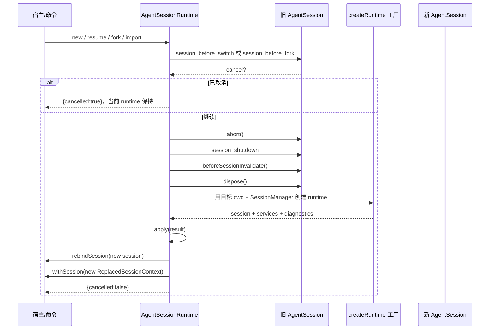

# 07. AgentSession 与资源生命周期

今天研究会话由谁创建、谁持有、谁释放，以及替换会话时监听器为何必须重绑。本篇从空白内存会话开始，不依赖其他任务或真实模型，预计 2–3 小时。

## 今日准备

需要 Node.js >= 22.19.0 和依赖目录 `node_modules`；缺失时在仓库根目录执行 `npm install --ignore-scripts`。在 `packages/coding-agent/test/suite/` 新建 `task-07-learning.test.ts`，从 `packages/coding-agent` 运行：

```powershell
node ../../node_modules/vitest/dist/cli.js --run test/suite/task-07-learning.test.ts
```

测试中的 `createHarness()` 创建独立临时目录和内存会话，`h.setResponses([fauxAssistantMessage("...")])` 提供一次无网络回答；每个 harness 最后必须调用 `cleanup()`。

## 学习内容

`Agent` 管一次运行，`AgentSession` 还要管理模型选择、设置、资源、扩展、会话历史、重试和事件。一个宿主可能切换新会话、恢复旧会话、fork 或导入；`AgentSessionRuntime` 负责把旧资源收束并建立新资源。监听器绑定到旧 session，切换后如果没有重绑，就会出现“界面在，消息不更新”的问题。`abort`、等待 idle、取消订阅、`dispose` 有先后关系，不能把释放当成自动取消一切。

把 `AgentSession` 想成一次工作会话的“控制台”：它持有当前 Agent 和资源，并向 UI 发事件。`AgentSessionRuntime` 则持有“当前控制台”的指针。当用户新建或恢复会话，指针会换成新对象；原来订阅旧对象的回调不会自动跳到新对象。这就是宿主需要重新调用 `subscribe()` 的原因。

## 核心源码

按以下顺序定位核心源码：`packages/coding-agent/src/core/sdk.ts` 的 `createAgentSession` 负责装配；`core/agent-session-services.ts` 区分与工作目录绑定的服务；`core/agent-session.ts` 的 `prompt`、`abort`、`waitForIdle`、`dispose` 是单次会话的操作；`core/agent-session-runtime.ts` 的 `apply`、`teardownCurrent` 负责替换；`examples/sdk/13-session-runtime.ts` 展示调用者如何先取消旧订阅，再给新 session 绑定监听器。每个符号都写下创建/释放者。

## TypeScript 语法小课：闭包、访问器和资源所有权

闭包让函数记住创建时的局部变量；`get` 暴露读取接口，`set` 控制替换。读 `AgentSessionRuntime` 时，要区分“变量指向新的 session”与“旧 session 的订阅仍存在”。

```typescript
function createHolder() {
  let values = ["old"]; // 私有数组由闭包持有
  return {
    get values() { return values.slice(); }, // 读出副本，避免外部直接改内部数组
    set values(next: string[]) { values = next.slice(); }, // 替换时也复制
  };
}
const holder = createHolder();
const seen = holder.values; // seen 保持旧快照
holder.values = ["new"];
console.assert(seen[0] === "old" && holder.values[0] === "new");
```

练习：指出真实 `AgentState` getter 与这里返回副本的差别；再解释为什么替换 session 后必须取消旧订阅并重新绑定。


## 完整学习资料

先按下列正文完成学习，再执行本篇的动手任务。正文中原书的实验与验收题先作为案例阅读，实际动手统一放到文末；只运行本篇“今日准备”和动手任务明确指定的离线命令。章节编号保留知识主题的原编号；源码精读、示例、边界条件、常见错误和参考答案均直接收录在本文件中。开头的预计用时仅指核心主线，完整源码精读需另留时间。

### 本篇共同基础

以下运行图和术语均在本文件内。学习正文保留原手册的知识主题编号，但那些编号不构成本任务的阅读前置；实际操作按本篇的动手任务与验收标准执行。学习正文基于原手册注明的 `200387122ca450d6387f033949423114a270b96c` 源码基线，当前工作区若有差异，以当前源码为准。

### 15 分钟主线：pi 怎样完成一件事

假设用户输入“读取 demo.txt，并总结三点”。模型自己不能读取你电脑里的文件。pi 把用户问题和可用工具告诉模型；模型提出 `read` 调用；pi 在本地执行；模型拿到文件内容后才生成总结。这就是全书反复使用的同一个例子。

**先看不带 TypeScript 细节的主流程（教学伪代码）：**

```text
收到用户输入，把它加入当前会话
重复：
    用当前上下文向模型发起请求
    收集模型的回答并把过程通知界面
    如果回答要求执行工具：
        校验参数，在本地执行工具，记录结果
        继续循环，让模型看到工具结果
    否则，检查是否还有排队输入或明确的继续决定
    如果都没有：结束本次运行
```

第一行确定这次任务和已有历史。模型请求只负责生成回答或提出工具调用。工具校验与执行由 pi 负责，结果回到对话后才可能有下一轮模型请求。界面接收运行事件，历史保存完成的消息；它们都与“模型请求”有关，但不是同一种数据。真实实现还处理工具并发、错误、取消、重试和压缩，后面分别讲。

**先分清四对容易混淆的词：**

| 两个词                | 直观区别                                           | 在“读文件并总结”中的例子                   |
| --------------------- | -------------------------------------------------- | -------------------------------------------- |
| 模型请求 / 用户输入   | 用户只说一次话，pi 可以多次询问模型                | 先请模型选择工具，读完文件后再请模型总结     |
| 事件 / 消息           | 事件告诉界面过程；消息承载一次完整的对话内容       | “正在输出第几个字”是事件；完成的总结是消息 |
| 工具调用 / 工具结果   | 调用提出想做什么；结果记录本地执行所得             | `read("demo.txt")` 是调用；文件文字是结果  |
| 会话历史 / 模型上下文 | 历史保留记录；上下文是这一次请求实际送给模型的内容 | 分支 C 仍在文件里，沿分支 D 继续时不必送 C   |


```text
一次用户输入
  → 第一次模型请求：请调用 read("demo.txt")
  → 本地工具执行：读出文件文本
  → 第二次模型请求：根据工具结果总结三点
  → 没有后续工作：结束
```

### 附录 A：术语表

> 用法：每个术语给出"一句话解释 + 首次出现的章节"。读代码遇到不认识的词，先查这里；查不到再搜源码（用英文名搜）。


#### A.1 核心概念

| 中文                  | 英文                    | 一句话                                                                                                             | 章节      |
| --------------------- | ----------------------- | ------------------------------------------------------------------------------------------------------------------ | --------- |
| 智能体外壳 / 运行框架 | agent harness           | 组织模型、工具、状态、界面的框架，本身不"聪明"                                                                     | 0.1       |
| 智能体                | agent                   | "模型 + 工具 + 循环"组成的执行体                                                                                   | 0.1       |
| 轮次                  | turn                    | 一次助手响应 + 它引发的工具执行                                                                                    | 3.3.3     |
| 低层运行              | Agent run               | 一次`Agent.prompt()` 或 `Agent.continue()` 调用建立的生命周期；以 `agent_end` 和已等待的 listener 收尾为边界 | 3.3.3、D2 |
| 会话 prompt 编排      | session prompt workflow | `AgentSession.prompt()` 在 `started` 后进入 `_runAgentPrompt()`；可串起 retry、压缩恢复和多个低层 Agent run  | 8、D27    |
| 用户请求              | user request            | 用户提交一次输入；与模型请求不等价                                                                                 | 3.3.3     |
| 模型请求              | model request           | 真正发给供应商 API 的一次请求                                                                                      | 3.3.3     |
| 转录                  | transcript              | 发给模型看/被记录的消息序列                                                                                        | 4.1       |
| 投影                  | projection              | 从会话树/文档到"模型实际看到的内容"的计算过程                                                                      | 9.4       |
| 活动分支              | active branch           | 从根到当前叶子的一条路径                                                                                           | 9.1       |
| 叶子                  | leaf                    | 会话树中的"当前位置"                                                                                               | 4.7.3     |
| 条目                  | entry                   | 会话文件里的一行（JSONL）                                                                                          | 4.7       |
| 会话                  | session                 | 一次对话的全部记录与状态                                                                                           | 8.1       |
| 压缩                  | compaction              | 用摘要替换旧上下文表示的机制                                                                                       | 10        |
| 上下文窗口            | context window          | 模型一次能接受的最大 token 量                                                                                      | 5.3       |
| 思考级别              | thinking level          | off/minimal/low/medium/high/xhigh/max                                                                              | 5.3       |
| 停止原因              | stop reason             | pending/stop/length/toolUse/error/aborted/deferred                                                                 | 4.3.3     |
| 用量                  | usage                   | token 与成本统计                                                                                                   | 4.3.5     |


#### A.2 消息与事件

| 中文           | 英文                | 一句话                                             | 章节        |
| -------------- | ------------------- | -------------------------------------------------- | ----------- |
| Agent 消息     | AgentMessage        | 内部消息（模型消息 + 应用自定义角色）              | 4.4         |
| 模型消息       | Message             | 供应商能理解的四角色联合                           | 4.3         |
| 内容块         | content block       | 消息内容的最小单元（text/image/thinking/toolCall） | 4.2         |
| 判别联合       | discriminated union | 用共同字面量字段区分成员的类型联合                 | 1.3.4       |
| 类型收窄       | narrowing           | 判断判别字段后类型自动缩小                         | 1.3.4       |
| 事件           | event               | 运行时广播（过程），不是消息（结果）               | 3.3.2       |
| 队列更新       | queue update        | 排队消息变化的会话事件                             | 4.5.2       |
| 边界（结算前） | agent_before_settle | 最后一个可行动钩子                                 | 6.2、13.3.5 |
| 已结算         | agent_settled       | "不会再自动继续"的最终信号                         | 4.5.2、16.3 |
| 延迟句柄       | deferred handle     | 异步应答的取回凭据                                 | 4.3.3       |


#### A.3 工具与模型

| 中文                | 英文                            | 一句话                                    | 章节  |
| ------------------- | ------------------------------- | ----------------------------------------- | ----- |
| 工具                | tool                            | 模型可调用的本地操作                      | 7.1   |
| 工具定义            | ToolDefinition                  | 扩展/应用注册工具的"富"形态               | 7.1.2 |
| 参数校验            | argument validation             | 用 typebox schema 在运行时校验调用参数    | 7.4   |
| 前置钩子            | beforeToolCall                  | 执行前可拦截（block）的钩子               | 7.6   |
| 后置钩子            | afterToolCall                   | 结果字段级改写的钩子                      | 7.6   |
| 顺序 / 并行执行     | sequential / parallel execution | 工具批次的两种调度                        | 7.5   |
| 终止提示            | terminate                       | "整批都同意时不因本批继续"的调度提示      | 7.5.4 |
| 模型                | model                           | 模型静态元数据（api/provider/限制/价格）  | 5.2.2 |
| 协议方言            | api                             | 供应商接口族标识（如 anthropic-messages） | 5.2.1 |
| 供应商              | provider                        | 认证 + 模型目录 + 请求实现                | 5.2.3 |
| 简单流式 / 完整流式 | streamSimple / stream           | 供应商无关档位 vs 协议特有选项            | 5.4   |
| 兼容开关            | compat                          | OpenAI 兼容生态的行为微调                 | 5.5.4 |
| 假供应商            | faux provider                   | 脚本化、离线的测试模型                    | 5.7   |


#### A.4 会话与持久化

| 中文       | 英文             | 一句话                             | 章节   |
| ---------- | ---------------- | ---------------------------------- | ------ |
| 会话管理器 | SessionManager   | 会话文件的对象化句柄               | 9.3    |
| 分支会话   | branched session | 只包含"根到叶子"路径的新文件       | 9.5.2  |
| 分支摘要   | branch summary   | 放弃某分支时生成的摘要条目         | 10.6   |
| 上下文编辑 | context edit     | 只改"投影"、不改原始条目的追加编辑 | 9.4.4  |
| 保留边界   | firstKeptEntryId | 压缩后从哪条开始保留               | 10.3.2 |
| 保留预算   | keepRecentTokens | 压缩后至少保留的近期上下文         | 10.3   |
| 预留       | reserveTokens    | 为模型回复预留的窗口               | 10.2.1 |
| 检测点替换 | checkpoint       | 压缩条目携带的提示词/工具检查点    | 9.4.3  |


#### A.5 扩展与集成

| 中文       | 英文            | 一句话                             | 章节       |
| ---------- | --------------- | ---------------------------------- | ---------- |
| 上下文文件 | context files   | AGENTS.md 等纯文本指令             | 11.4.2     |
| 项目信任   | project trust   | 允许加载项目可执行资源前的人工决定 | 11.5       |
| 提示词模板 | prompt template | Markdown 变成`/命令`             | 12.3.2     |
| 技能       | skill           | 目录 + SKILL.md 的按需说明书       | 12.3.3     |
| 扩展       | extension       | 可执行 TypeScript 模块（进程权限） | 12.3.4、13 |
| Pi 包      | Pi package      | 分发多资源的 npm/git 单元          | 12.3.6     |
| 钳制       | clamp           | 按模型能力压低思考级别             | 5.3        |
| 重绑       | rebind          | 会话替换后重新挂订阅/扩展绑定      | 8.6        |


#### A.6 协议与架构（选修）

| 中文     | 英文                   | 一句话                                          | 章节   |
| -------- | ---------------------- | ----------------------------------------------- | ------ |
| MCP      | Model Context Protocol | 外部工具/资源接入协议                           | 22     |
| 暴露方式 | exposure               | codemode/deferred/direct 三种工具到达模型的方式 | 22.3   |
| 工具搜索 | tool_search            | deferred 工具的"发现后再直调"机制               | 22.3   |
| 沙箱     | codemode sandbox       | QuickJS VM + worker 的脚本执行环境              | 22.9   |
| 面片     | facet                  | Chord 插件可独立打包到不同环境的分片            | 23.2   |
| 服务     | service                | Chord 的类型化稳定 token（singleton/keyed）     | 23.2   |
| 复制状态 | replicated state       | 原子发布、完整不可变值消费的状态                | 23.2   |
| 增量跟踪 | delta tracking         | 记录/合并 JSON 操作的机制                       | 23.2   |
| 持久执行 | durable execution      | 意图先提交、崩溃可续的执行模型                  | 23.1   |
| 检查点   | checkpoint             | 任务每一步的持久落点                            | 23.3.1 |
| 附着     | attachment             | 一条表现层连接绑定到一个会话                    | 24.2   |
| 信封     | envelope               | 协议中包裹 payload 的定向记录                   | 24.3   |
| span     | span                   | 一次操作的时间记录（遥测）                      | 25.2   |
| lift     | lift                   | 处理组相对对照组的提升（评估）                  | 25.5   |
| 阻断配对 | blocked pair           | 两臂未各得恰好一个分数，禁止计入头条            | 25.6   |


#### A.7 容易混淆的成对术语

| 对                                              | 区分                                                                                   |
| ----------------------------------------------- | -------------------------------------------------------------------------------------- |
| message vs event                                | 结果 vs 过程（3.3.2）                                                                  |
| turn vs run                                     | 一个轮次 vs 整次运行（3.3.3）                                                          |
| `agent_end` vs `agent_settled`              | 低层 run 结束 vs 自动工作清零（4.5.2）                                                 |
| 声明 vs 可执行                                  | 系统消息里的工具声明 vs 运行时工具集（7.3）                                            |
| details vs content                              | 给界面/程序 vs 给模型（14.2）                                                          |
| 完成顺序 vs 记录顺序                            | 并发完成 vs 声明序记录（7.5.3）                                                        |
| 停止原因`length` vs `stop`                  | 被截断 vs 正常说完（4.3.3）                                                            |
| `AgentSession.prompt()` vs `Agent.prompt()` | 应用层输入分流/会话编排 vs 低层 Agent run 入口（8、D2、D27）                           |
| `handled` vs `queued` vs `started`        | 输入被消费、不创建该输入自己的 run / 放入当前运行队列 / 进入会话 run 编排（8、16.5.3） |
| 提示词模板 vs 技能                              | 一段话 vs 一套流程+文件（12.3.3）                                                      |
| 扩展 vs Pi 包                                   | 可执行单元 vs 分发单元（12.3.6）                                                       |
| compaction 摘要 vs branch summary               | 压缩历史 vs 放弃分支（10.6）                                                           |
| durable cheat sheet：`replay: safe/never`     | 崩溃后重跑 vs 报 interrupted（23.4）                                                   |
| JSONL RPC vs client/server                      | 进程内 stdio 协议 vs 跨进程服务路由（24.1）                                            |
| 单测 vs 评估                                    | 确定性 vs 配对统计（25.1、25.6）                                                       |


#### A.8 输入与运行的层级

不要按“用户按了一次回车”推断低层 run 或模型请求的数量。实际层级是：

| 层级       | 代表符号                                           | 次数关系                                                                                      |
| ---------- | -------------------------------------------------- | --------------------------------------------------------------------------------------------- |
| 输入调用   | `AgentSession.prompt(text)`                      | 一次调用只表达一次输入尝试；结果可能是`handled`、`queued` 或 `started`                  |
| 会话编排   | `_runAgentPrompt(messages)`                      | 只在开始处理输入时进入；在里面管理重试、压缩恢复、边界 continuation 与取消                    |
| Agent run  | `Agent.prompt(messages)` 或 `Agent.continue()` | 一次会话编排可包含多个 run；每个低层 run 都发出自己的`agent_start` / `agent_end` 生命周期 |
| Agent turn | `turn_start` 到 `turn_end`                     | 一个 run 可包含多个 turn；每个 turn 通常包含一次助手响应及其引发的工具执行                    |
| 模型请求   | `streamSimple` / provider stream                 | 通常发生在助手响应阶段；自动重试会再次请求模型，压缩摘要等内部工作也可能有独立请求            |

两个边界例子：

- 扩展命令被消费时，`prompt()` 返回 `handled`，没有为该输入启动 `_runAgentPrompt()`；
- `prompt()` 在 Agent 已运行时以 `steer`/`followUp` 方式排队，返回 `queued`。这条输入会影响现有流程，但它本身不是新的 `Agent.prompt()` 调用。

因此，统计“模型请求次数”不能数 prompt、turn 或 `agent_end`：应按 provider 请求事件/日志，或明确的测试探针计数。章节 21 的自测题也按这个区分评分。


#### A.9 索引方式说明

- 想找"某行为在哪个文件" → 用 source-map；
- 想找"某命令怎么跑" → 用 commands；
- 想找"某现象怎么排" → 用 troubleshooting；
- 想找"哪些练习要做" → 用 exercises-and-answers。

---

### 第 8 章：AgentSession 与资源生命周期


**先懂这一章**：底层 Agent 负责运行循环；应用会话还要选择模型、加载资源、保存历史、管理订阅并在结束时释放它们。先列清楚谁创建、谁持有、谁释放，再读会话替换的代码。

```text
教学伪代码：确定工作目录与会话 → 准备模型、设置和资源
           → 创建 AgentSession → 处理输入并观察事件
           → 切换会话时重建与目录绑定的部分 → 最后释放资源
```

切换失败时并非每一步都能自动回滚；第 8.5 节和 D28 按阶段说明。

前面读的是一次运行中的模型与工具；本章把它们放进长期存在的应用会话。会话一旦能切换和恢复，第 9 章就需要解释磁盘上的历史到底如何变成下一次模型请求。

> 学完本章你能回答：
>
> 1. `AgentSession` 比 `Agent` 多了什么？为什么它有 158KB？
> 2. `createAgentSession` 与 `createAgentSessionServices` + `createAgentSessionFromServices` 两条路径有什么区别？
> 3. `AgentSessionRuntime` 解决什么问题？"替换会话"的完整流程经过哪些步骤？
> 4. `dispose()` 释放了什么、按什么顺序？不调用会怎样？
> 5. 工作目录变化时，哪些资源必须重建、哪些可以复用？

**预计学习时间**：1.5 天。
**本章验证状态**：静态核对通过（`agent-session-runtime.ts`、`agent-session-services.ts`、`dispose` 逐段核对）。

---


#### 8.1 为什么需要"应用会话"这一层

回顾对比：

| 维度       | `Agent`（packages/agent）                   | `AgentSession`（coding-agent）                           |
| ---------- | --------------------------------------------- | ---------------------------------------------------------- |
| 定位       | **运行时**：消息、工具、循环、事件      | **应用会话**：把运行时接上真实的文件、配置、扩展     |
| 认识什么   | `AgentMessage`、`AgentTool`、`streamFn` | 会话文件、设置、资源发现、扩展、压缩、重试、模型切换、权限 |
| 不认识什么 | 文件系统、终端、扩展系统、设置                | ——（它认识全部，所以大）                                 |
| 代码量     | 约 20KB + 29KB（agent.ts + agent-loop.ts）    | `agent-session.ts` 约 158KB                              |
| 可复用性   | 任何"模型+工具"应用都能用                     | 面向编码助手这一具体产品                                   |

一个类比：`Agent` 是发动机与传动轴；`AgentSession` 是**整辆车的电控系统**——油量检测（token 统计）、自动换挡（模型切换）、行车记录仪（会话文件）、安全气囊（权限钩子）全在这里。"158KB"不是设计缺陷，而是它真的统筹着几十个关注点。**读它的正确姿势是"按符号跳转"**（第 0 章阅读路线），而不是从头读。

本章聚焦其中一条主线：**资源的创建、替换与释放**。其它主线（压缩、重试、扩展）分别在 10、6、13 章。

**暂停预测：** 用 `read("demo.txt")` 做例子：模型说“调用 read”之后，谁决定这次调用能不能在当前项目目录执行？之后用户切换到另一个会话，谁负责重新接上历史与扩展？

**对照答案：** `Agent` 执行被交给它的工具并运行循环；工具及其工作目录、会话管理器、资源和扩展由应用层装配。切换会话涉及 `AgentSessionRuntime` 的替换与重绑，不是让一个旧 `Agent` 自行读取新会话文件。记住职责即可；第 8.4–8.6 节再看哪些对象被重建、哪些由宿主继续持有。


#### 8.2 资源清单：谁创建、谁拥有、谁使用、谁释放

`createAgentSession` 会创建会话对象及部分默认依赖；若调用方通过 options 注入 `modelRuntime`、`resourceLoader`、`settingsManager` 或 `sessionManager`，这些对象可能由调用方创建并与别处共享。读资源表时，把“本函数使用它”与“本对象拥有它的完整生命周期”分开：

> **API 所有权规则**：选项允许注入一个对象，只能证明会话会使用它，不能据此推断 `session.dispose()` 会销毁它。当前 `CreateAgentSessionOptions` 没有一般性的“关闭所有依赖”契约；自建宿主应分别阅读被注入类型的清理 API，并显式管理自己创建的长生命周期资源。

| 资源                          | 默认创建位置                                | 注入时的边界           | 会话结束时实际做什么                                                              |  |
| ----------------------------- | ------------------------------------------- | ---------------------- | --------------------------------------------------------------------------------- | - |
| `Agent`                     | `sdk.ts` 新建                             | SDK 不接收现成 Agent   | `AgentSession.dispose()` 发出 abort，并断开事件连接；不会销毁 JS 对象           |  |
| `SessionManager`            | `sdk.ts` 按默认配置新建                   | 可由调用方传入         | 不关闭/删除；会话记录仍由它持有并写在原位置                                       |  |
| `SettingsManager`           | `sdk.ts` 按默认配置新建                   | 可由调用方传入         | 不执行 dispose；文件变化由设置管理器自己的写入方法处理                            |  |
| `ModelRuntime`              | `sdk.ts` 默认创建                         | 可由调用方传入并复用   | `AgentSession.dispose()` 不释放它；当前类没有 `dispose()` 方法                |  |
| `ResourceLoader`            | 默认创建`DefaultResourceLoader` 并 reload | 可由调用方传入         | 不统一关闭 loader；session 会 invalidate 当前 extension runner/context            |  |
| `CacheWarmer`               | 每个 SDK session 在`sdk.ts` 创建          | 不作为 SDK 参数注入    | 清除`onWarmed` 回调并调用 `cancel()`                                          |  |
| 扩展运行时`ExtensionRunner` | 会话绑定/重载时                             | 由加载结果进入 session | `invalidate()` 使旧扩展上下文失效；扩展持有的外部资源应由扩展自己的清理逻辑处理 |  |

加上会话自身的**请求级状态**（无需外部释放，但要知道它们存在）：

`_agentRunAbortRequested`、`_isAgentRunActive`、`_retryAttempt`、`_failedResponse`、`_lastAssistantMessage`、`_entryIdsByMessage`（消息对象 ↔ 会话条目 id 的映射，第 4.8 节）、`_deferredSettledActions`……

**读代码时的实用结论**：看到"这个字段是干什么的"，先问"它是请求级、会话级还是进程级？"——生命周期不同，创建/释放位置就不同。


#### 8.3 两条创建路径：一步到位 vs 两步式


##### 8.3.1 路径一：`createAgentSession`（SDK 用户常用）

第 3.5 节逐行读过：解析 cwd/agentDir → 建 ModelRuntime/SettingsManager/SessionManager → 资源发现 → 恢复模型与思考级别 → 计算工具白名单 → `new Agent` → `new AgentSession`。特点：**一步到位，适合进程内一次创建**（`01-minimal.ts`）。


##### 8.3.2 路径二：services + session 两步式（CLI/运行时用）

`core/agent-session-services.ts` 把"与 cwd 绑定的服务"独立出来：

```typescript
export interface AgentSessionServices {
	cwd: string;
	agentDir: string;
	modelRuntime: ModelRuntime;
	settingsManager: SettingsManager;
	resourceLoader: ResourceLoader;
	diagnostics: AgentSessionRuntimeDiagnostic[];
}

export async function createAgentSessionServices(options): Promise<AgentSessionServices> {
	const cwd = resolvePath(options.cwd);
	const agentDir = options.agentDir ? resolvePath(options.agentDir) : getAgentDir();
	const modelRuntime = options.modelRuntime ?? (await ModelRuntime.create({ authPath, modelsPath, signal }));
	const settingsManager = options.settingsManager ?? SettingsManager.create(cwd, agentDir);
	const resourceLoader = new DefaultResourceLoader({ ...options.resourceLoaderOptions, cwd, agentDir, settingsManager });
	await resourceLoader.reload(options.resourceLoaderReloadOptions);

	// 把扩展"待注册"的供应商/虚拟模型真正注册进 modelRuntime
	for (const { name, config, extensionPath } of extensionsResult.runtime.pendingProviderRegistrations) {
		try { modelRuntime.registerProvider(name, config); }
		catch (error) { diagnostics.push({ type: "error", message: `Extension "${extensionPath}" error: ${message}` }); }
	}
	// ...（native provider、virtual model 同理）
	await modelRuntime.refresh({ allowNetwork: false });
	diagnostics.push(...applyExtensionFlagValues(resourceLoader, options.extensionFlagValues));

	return { cwd, agentDir, modelRuntime, settingsManager, resourceLoader, diagnostics };
}

export async function createAgentSessionFromServices(options): Promise<CreateAgentSessionResult> {
	return createAgentSession({ /* 把 services 的成员原样注入 */ });
}
```

对比一步式，多了三件"应用层的事"：

1. **扩展供应商注册**：扩展可以在加载时声明新供应商，这里统一注册；失败不抛出，转成**诊断**；
2. **离线刷新**：`refresh({ allowNetwork: false })`——启动阶段不联网（联网刷新由调用方在合适时机另行发起，见第 3.4.4 节 RPC 分支）；
3. **扩展 flag 校验**：`--some-ext-flag` 不认识就报 error 诊断。

**诊断（diagnostics）模式**是本仓库反复出现的边界设计：核心层**只收集、不打印**；界面/CLI 决定怎么呈现、是否致命：

```typescript
const hasRuntimeErrors = runtime.diagnostics.some((diagnostic) => diagnostic.type === "error");
if (hasRuntimeErrors) { /* 打印并退出（main.ts 的做法） */ }
```


##### 8.3.3 为什么要有两步式

调用处的注释给出了答案：

```text
This keeps session creation separate from service creation so callers can
resolve model, thinking, tools, and other session inputs against the target
cwd before constructing the session.
```

**因为会话选项（模型作用域、工具白名单、设置）是 cwd 相关的**，而 CLI 可能在启动后切换会话（连带切换 cwd）。先建服务、解析选项、再建会话，才能保证"这一组服务 + 这个会话"是一致的快照。

#### 8.4 `AgentSessionRuntime`：会"重生"的会话


##### 8.4.1 问题：`/new`、`/resume`、`/fork` 之后，原来的对象还能用吗

CLI 支持这些操作：

- `/new`：开一个全新会话；
- `/resume`（`--continue`、`--resume`）：打开历史会话；
- `/fork`、`/clone`：从历史节点分叉；
- `/import`：导入一个会话 JSONL 文件。

这些操作的共同点：**工作目录可能变化**（历史会话属于别的项目）。而第 8.3 节说过，服务与选项是 cwd 绑定的。所以不能"在旧会话对象上打补丁"，必须**重建**。

`AgentSessionRuntime` 就是"拥有当前会话 + 负责替换"的容器。类的文档注释：

```text
Owns the current AgentSession plus its cwd-bound services.

Session replacement methods tear down the current runtime first, then create
and apply the next runtime. If creation fails, the error is propagated to the
caller. The caller is responsible for user-facing error handling.
```


##### 8.4.2 工厂契约：什么叫"可重建"

替换时不能靠魔法——得有人把"如何从零建出一个会话"写下来。这就是工厂函数：

```typescript
/**
 * Creates a full runtime for a target cwd and session manager.
 *
 * The factory closes over process-global fixed inputs, recreates cwd-bound
 * services for the effective cwd, resolves session options against those
 * services, and finally creates the AgentSession.
 */
export type CreateAgentSessionRuntimeFactory = (options: {
	cwd: string;
	agentDir: string;
	sessionManager: SessionManager;
	sessionStartEvent?: SessionStartEvent;
	projectTrustContext?: ProjectTrustContext;
}) => Promise<CreateAgentSessionRuntimeResult>;

export interface CreateAgentSessionRuntimeResult extends CreateAgentSessionResult {
	services: AgentSessionServices;
	diagnostics: AgentSessionRuntimeDiagnostic[];
}
```

三个关键词：

- **"closes over process-global fixed inputs"**：模型运行时之外的进程级常量（比如 `--tools` 白名单、`--no-extensions` 等 CLI 决定）**闭包捕获**，不随 cwd 变化；
- **"recreates cwd-bound services"**：设置、资源发现、工具、会话管理**按新的 cwd 重建**；
- **"resolves session options against those services"**：模型作用域、思考级别等在新服务上解析（不能拿旧 cwd 的解析结果用）。

第 3.4.3 节看到的 `main.ts` 里的 `createRuntime` 就是这个类型的实现；SDK 例子 `13-session-runtime.ts` 给了一个最小版本（第 8.6 节读它）。


##### 8.4.3 类结构：持有、重绑、收尾

```typescript
export class AgentSessionRuntime {
	private rebindSession?: (session: AgentSession) => Promise<void>;
	private beforeSessionInvalidate?: () => void;
	private _session: AgentSession;
	private _services: AgentSessionServices;
	private readonly createRuntime: CreateAgentSessionRuntimeFactory;
	private _diagnostics: AgentSessionRuntimeDiagnostic[];
	private _modelFallbackMessage?: string;

	get services() / get session() / get cwd() / get diagnostics() / get modelFallbackMessage()

	setRebindSession(fn)                     // 宿主声明"会话换了之后如何重新绑定"
	setBeforeSessionInvalidate(fn)            // 旧会话失效前的同步清理
}
```

两个 setter 都是给**宿主**（比如交互模式 TUI）用的：

- `setRebindSession`：替换完成后，runtime 会调用它，让宿主把订阅、扩展绑定、UI 组件挂到新会话上（第 8.6 节）；
- `setBeforeSessionInvalidate`：注释解释了为什么必须**同步**：

```text
This is for host-owned UI teardown that must not yield to the event loop,
such as detaching extension-provided TUI components before the old extension
context becomes stale.
```

   ——不能 `await`，因为一让出事件循环，旧扩展上下文就可能先被作废，清理逻辑再访问就晚了。


##### 8.4.4 三个私有生命周期原语（替换流程的零件）

```typescript
private async teardownCurrent(reason: SessionShutdownEvent["reason"], targetSessionFile?: string): Promise<void> {
	// Settle any active response first so the aborted turn (including tool
	// results) is persisted to the outgoing session before it is replaced.
	await this.session.abort();
	await emitSessionShutdownEvent(this.session.extensionRunner, {
		type: "session_shutdown",
		reason,
		targetSessionFile,
	});
	this.beforeSessionInvalidate?.();
	this.session.dispose();
}

private apply(result: CreateAgentSessionRuntimeResult): void {
	this._session = result.session;
	this._services = result.services;
	this._diagnostics = result.diagnostics;
	this._modelFallbackMessage = result.modelFallbackMessage;
}

private async finishSessionReplacement(withSession?: (ctx: ReplacedSessionContext) => Promise<void>): Promise<void> {
	if (this.rebindSession) {
		await this.rebindSession(this.session);
	}
	if (withSession) {
		await withSession(this.session.createReplacedSessionContext());
	}
}
```

`teardownCurrent` 的**第一步是 `abort()`**，注释说明了原因：先把进行中的响应"落定"（连同工具结果写进**旧会话**文件），再替换。否则用户最后一条消息可能丢在内存里。

顺序设计（替换的完整节奏）：

```text
abort（落定进行中的工作，持久化到旧会话）
  → session_shutdown 扩展事件（reason: new/resume/fork/quit，带目标文件）
    → beforeSessionInvalidate（宿主同步清理 UI）
      → session.dispose()（旧会话释放）
        → createRuntime（新 cwd 重建服务+会话）
          → apply（切换引用）
            → finishSessionReplacement（rebindSession 重绑 + withSession 回调）
```


#### 8.5 替换流程精读：四种用户操作

四种操作的代码骨架完全同构，先记口诀：

```text
① 发"即将切换"扩展事件（可取消） → ② 解析目标 SessionManager → ③ 校验目标 cwd 存在
  → ④ teardownCurrent（旧） → ⑤ createRuntime（新） → ⑥ apply + finishSessionReplacement
```


##### 8.5.1 `switchSession`（/resume、--session）

```typescript
async switchSession(sessionPath: string, options?): Promise<{ cancelled: boolean }> {
	const beforeResult = await this.emitBeforeSwitch("resume", sessionPath);
	if (beforeResult.cancelled) return beforeResult;          // 扩展可以说"别切"

	const previousSessionFile = this.session.sessionFile;
	const sessionManager = SessionManager.open(sessionPath, undefined, options?.cwdOverride);
	assertSessionCwdExists(sessionManager, this.cwd);         // 会话记录的 cwd 必须还能访问

	await this.teardownCurrent("resume", sessionManager.getSessionFile());
	this.apply(await this.createRuntime({
		cwd: sessionManager.getCwd(),
		agentDir: this.services.agentDir,
		sessionManager,
		sessionStartEvent: { type: "session_start", reason: "resume", previousSessionFile },
		projectTrustContext: options?.projectTrustContextFactory?.(sessionManager.getCwd()),
	}));
	await this.finishSessionReplacement(options?.withSession);
	return { cancelled: false };
}
```

注意 `createRuntime` 收到的是**新会话的 cwd**（`sessionManager.getCwd()`），不是当前 cwd——因此 `--resume` 一个别的项目的会话时，设置、资源、工具全部按那个项目重建（第 3 章注释里 "may select a session from another project" 的落地）。


##### 8.5.2 `newSession`（/new）

```typescript
async newSession(options?): Promise<{ cancelled: boolean }> {
	const beforeResult = await this.emitBeforeSwitch("new");
	if (beforeResult.cancelled) return beforeResult;

	const previousSessionFile = this.session.sessionFile;
	const sessionDir = this.session.sessionManager.getSessionDir();
	const sessionManager = this.session.sessionManager.isPersisted()
		? SessionManager.create(this.cwd, sessionDir)     // 磁盘会话
		: SessionManager.inMemory(this.cwd);              // 内存会话保持内存
	if (options?.parentSession) sessionManager.newSession({ parentSession: options.parentSession });

	await this.teardownCurrent("new", sessionManager.getSessionFile());
	this.apply(await this.createRuntime({ cwd: this.cwd, agentDir, sessionManager,
		sessionStartEvent: { type: "session_start", reason: "new", previousSessionFile } }));
	if (options?.setup) {                                  // 会话初始化钩子（SDK/RPC 用）
		await options.setup(this.session.sessionManager);
		this.session.refreshContext();
	}
	await this.finishSessionReplacement(options?.withSession);
	return { cancelled: false };
}
```

细节：**内存/磁盘形态保持不变**（你用的是 `--no-session` 或 `SessionManager.inMemory()` 开的会话，新建也还是内存的）。


##### 8.5.3 `fork`（/tree 分叉、/clone）

```typescript
async fork(entryId, options?: { position?: "before" | "at"; withSession? }): Promise<{ cancelled; selectedText? }> {
	const position = options?.position ?? "before";
	const beforeResult = await this.emitBeforeFork(entryId, { position });   // session_before_fork 可取消
	if (beforeResult.cancelled) return { cancelled: true };

	const selectedEntry = this.session.sessionManager.getEntry(entryId);
	if (!selectedEntry) throw new Error("Invalid entry ID for forking");
	let targetLeafId: string | null;
	if (position === "at") targetLeafId = selectedEntry.id;
	else {
		if (selectedEntry.type !== "message" || selectedEntry.message.role !== "user")
			throw new Error("Invalid entry ID for forking");
		targetLeafId = selectedEntry.parentId;                               // 在该消息"之前"分叉
		selectedText = extractUserMessageText(selectedEntry.message.content); // 把用户原文还回编辑器
	}
	// ...（磁盘会话：createBranchedSession(targetLeafId) 生成新文件；内存会话：直接 newSession/分叉）
	await this.teardownCurrent("fork", sessionManager.getSessionFile());
	this.apply(await this.createRuntime({ cwd, agentDir, sessionManager,
		sessionStartEvent: { type: "session_start", reason: "fork", previousSessionFile } }));
	await this.finishSessionReplacement(options?.withSession);
	return { cancelled: false, selectedText };
}
```

`position` 的两种语义值得注意：

- `"at"`：以选中条目为叶子继续（保留它）；
- `"before"`：**回到那条用户消息之前**重新开始——所以要求选中条目必须是**用户消息**，并把它的文本 `selectedText` 返回给宿主（交互模式会把它填回输入框，用户改一改再发）。


##### 8.5.4 `importFromJsonl`（/import）

流程多了"把外部文件收进会话目录"的一步：

```typescript
async importFromJsonl(inputPath, cwdOverride?): Promise<{ cancelled: boolean }> {
	const resolvedPath = resolvePath(inputPath);
	if (!existsSync(resolvedPath)) throw new SessionImportFileNotFoundError(resolvedPath);

	const sessionDir = this.session.sessionManager.getSessionDir();
	// 目标名冲突时追加 -1、-2……后缀；若源文件本来就在会话目录，则原地使用
	const beforeResult = await this.emitBeforeSwitch("resume", destinationPath);
	if (beforeResult.cancelled) return beforeResult;
	if (!sourceAlreadyStored) copyFileSync(resolvedPath, destinationPath, constants.COPYFILE_EXCL);
	const sessionManager = SessionManager.open(destinationPath, sessionDir, cwdOverride);
	assertSessionCwdExists(sessionManager, this.cwd);
	await this.teardownCurrent("resume", sessionManager.getSessionFile());
	this.apply(await this.createRuntime({ /* reason: "resume" */ }));
	await this.finishSessionReplacement();
	return { cancelled: false };
}
```


#### 8.6 `withSession` 与重绑：宿主怎么"跟上"新会话

替换之后，**旧会话上的一切订阅都失效了**（扩展上下文被 invalidation，见 8.7）。宿主必须重新绑定。这正是 SDK 例子 `13-session-runtime.ts` 演示的模式：

```typescript
const runtime = await createAgentSessionRuntime(createRuntime, { cwd, agentDir, sessionManager });

let unsubscribe: (() => void) | undefined;

async function bindSession() {
	unsubscribe?.();                              // 先退订旧的
	const session = runtime.session;              // 再绑新的
	await session.bindExtensions({});
	unsubscribe = session.subscribe((event) => {
		if (event.type === "queue_update") {
			console.log("Queued:", event.steering.length + event.followUp.length);
		}
	});
	return session;
}

let session = await bindSession();
await runtime.newSession();
session = await bindSession();                    // 换会话 → 重新绑定
if (originalSessionFile) {
	await runtime.switchSession(originalSessionFile);
	session = await bindSession();
}
unsubscribe?.();
await runtime.dispose();
```

三种绑定出口，用途区分：

| 机制                              | 谁用                         | 时机                                               |
| --------------------------------- | ---------------------------- | -------------------------------------------------- |
| 手动重绑（示例的`bindSession`） | SDK 用户自己管理             | 每次替换后自己记得调用                             |
| `runtime.setRebindSession(fn)`  | 宿主（交互模式）             | runtime 在`finishSessionReplacement` 里自动调用  |
| `withSession` 回调              | 某一次替换的"一次性后续动作" | 替换完成后执行一次，拿到`ReplacedSessionContext` |

`withSession` 与 `rebindSession` 的差别：前者是**这一次操作**的收尾（比如"fork 后立刻把选中的文本发给模型"），后者是**长期绑定**（每次替换都要做）。RPC 模式的 `newSession` 命令会把"替换后的首条消息"放进 `withSession` 里执行——这正是它存在的意义。

#### 8.7 `dispose()`：释放的顺序与语义


##### 8.7.1 会话级：先"止血"，再"销户"

`AgentSession.dispose`（`agent-session.ts` 第 1363 行，原样）：

```typescript
dispose(): void {
	try {
		this.abortRetry();
		this.abortCompaction();
		this.abortBranchSummary();
		this.abortBash();
		this.agent.abort();
	} catch {
		// Dispose must succeed even if an abort hook throws.
	}

	this._extensionRunner.invalidate(
		"This extension ctx is stale after session replacement or reload. Do not use a captured pi or command ctx after " +
		"ctx.newSession(), ctx.fork(), ctx.switchSession(), or ctx.reload(). For newSession, fork, and switchSession, " +
		"move post-replacement work into withSession and use the ctx passed to withSession. For reload, do not use the old ctx after await ctx.reload().",
	);
	this._disconnectFromAgent();
	this._eventListeners = [];
	if (this._cacheWarmer) {
		this._cacheWarmer.onWarmed = undefined;
		this._cacheWarmer.cancel();
	}
	cleanupSessionResources(this.sessionId);
}
```

五段结构，各有讲究：

1. **发出取消信号**：重试等待、压缩、分支摘要、bash 子进程、Agent run。此处的 `dispose()` 是同步方法，不等待 Agent run 收尾；若需要等待，先 `await session.abort()`，它会调用 Agent abort 并等待 `waitForIdle()`。runtime 的替换路径就是先 `await this.session.abort()`，再通知 shutdown 并 dispose；
2. **`try/catch` 包住但吞掉异常**：注释一句话道破——"**释放必须成功，哪怕某个 abort 钩子抛错**"。资源释放代码的可靠性优先级高于错误透明性（一个泄漏的下午比一条被吞的异常更糟）；
3. **`invalidate` 扩展上下文**：把"旧 ctx 已失效"从一句口头约定变成**强制失败**——旧扩展上下文后续任何使用都会报错，并且错误信息本身就是一份使用说明（该用 `withSession` 的就用 `withSession`）；
4. **断开与 Agent 的连接、清空监听器列表**：此后事件不再流向这个会话；
5. **停掉缓存预热器**（清回调 + cancel）、清理会话级资源（`cleanupSessionResources(sessionId)`）。


##### 8.7.2 运行时级：先告别，再释放

```typescript
async dispose(): Promise<void> {
	await emitSessionShutdownEvent(this.session.extensionRunner, {
		type: "session_shutdown",
		reason: "quit",
	});
	this.beforeSessionInvalidate?.();
	this.session.dispose();
}
```

- **退出也是一种 `session_shutdown` 事件**（reason: `"quit"`），与替换（new/resume/fork）共用同一套扩展协议——扩展只需实现一种清理逻辑；
- 先给宿主同步清理机会（`beforeSessionInvalidate`），再真正 dispose。

有一条容易漏掉的差异：`AgentSessionRuntime.dispose()` 的顺序是**先等 `session_shutdown` handlers 完成，再调用 `session.dispose()` 发取消信号**；它本身没有先 `abort()`、也没有等待 Agent idle。内置的会话替换会走 `teardownCurrent()`，其中明确先 `await session.abort()`，所以替换路径和最终退出路径的等待保证不同。

自建宿主若可能在 prompt 仍运行时关闭 runtime，应显式等待：

```typescript
await runtime.session.abort(); // 发出取消并等 Agent run / end listeners 收尾
unsubscribe?.();               // 解除宿主自己的订阅
await runtime.dispose();       // 再发 session_shutdown 并让上下文失效
```

若程序结构已经保证所有 `prompt()` 都 await 完成，才可以直接 `await runtime.dispose()`。SDK 示例 `13-session-runtime.ts` 没有启动 prompt，因此它的直接 dispose 示例不覆盖“活动请求时关闭”的情形。当前实现没有对应的直接测试；此结论来自两个方法的源码顺序。


##### 8.7.3 "忘记 dispose"会发生什么

| 忘记释放           | 后果                                         |
| ------------------ | -------------------------------------------- |
| `agent` 还在运行 | 事件继续流向旧回调（很多指向已卸载的 UI）    |
| 缓存预热器         | 后台继续发请求（真实费用）                   |
| 扩展上下文         | 扩展持有的资源不清（文件监视器等，第 13 章） |
| 事件监听器数组     | 内存与回调泄漏                               |

对 SDK 用户的最低要求：**照抄 `01-minimal.ts` 的 `try/finally` 结构**，保证普通异常也会释放订阅、缓存预热与扩展上下文。该例在 `finally` 执行时已 await 完 `session.prompt()`；如果需要从外部停止仍在运行的 prompt 并等它收尾，顺序应为 `await session.abort(); session.dispose();`。对用运行时的宿主：只有确认会话已 idle 时才直接 `await runtime.dispose()`；活动运行先 `await runtime.session.abort()`。替换会话则由 `teardownCurrent()` 自动先 abort 并等待。


#### 8.8 工作目录变化时，什么必须重建

把资源按"绑定对象"分类，这张表是本章的最终结论：

| 资源                                      | 绑定级别       | 换 cwd 时的行为      | 依据                                                                  |
| ----------------------------------------- | -------------- | -------------------- | --------------------------------------------------------------------- |
| `agentDir`（全局配置目录）              | 进程级         | 复用                 | `getAgentDir()` 不依赖 cwd                                          |
| CLI 参数解析结果、`extensionFactories`  | 进程级         | 闭包捕获复用         | `createRuntime` 工厂注释："closes over process-global fixed inputs" |
| 全局设置（用户级）                        | 进程级（存在） | 复用（同一文件）     | `SettingsManager.create(cwd, agentDir)` 读两个来源；用户级部分不变  |
| 项目设置、项目信任                        | cwd            | **重建**       | bootstrap 时`projectTrusted: false`，切换后需按新 cwd 判定          |
| 资源发现（扩展/技能/模板/主题/AGENTS.md） | cwd            | **重建**       | `DefaultResourceLoader` 以 cwd 为根                                 |
| 内置工具（read/edit/...）                 | cwd            | **重建**       | 工厂函数都接收`cwd` 参数                                            |
| 会话目录归类                              | cwd            | **重新计算**   | 会话路径包含 cwd 编码（第 4.7.1 节）                                  |
| `SessionManager`                        | 目标会话       | **替换**       | 每个会话一个管理器                                                    |
| `ModelRuntime`（认证）                  | agentDir       | 复用（同一实例传入） | services 里显式传入                                                   |
| `CacheWarmer` / `ExtensionRunner`     | 会话           | **随会话重建** | 与会话强相关                                                          |

一个自测方法：**"如果 cwd 从 A 变成 B，这个对象的含义会变吗？会 → cwd 绑定 → 必须重建。"**


#### 8.9 实验 L05：生命周期审计

**实验性质**：代码阅读 + 可选本地运行。
**验证状态**：设计中。


##### 步骤

1. 重读 `packages/coding-agent/examples/sdk/01-minimal.ts`，画出 `try { ... } finally { session.dispose(); }` 的保护范围：哪些代码在 try 内、为什么 `dispose` 放 finally；
2. 打开 `13-session-runtime.ts`，回答：
   - `createRuntime` 工厂闭包捕获了哪些"进程级固定输入"？（对照例子里的参数与注释）
   - 每次 `bindSession()` 都重新做了哪两件事？不做的后果是什么？
   - 结尾为什么先 `unsubscribe?.()` 再 `await runtime.dispose()`？
3. 制作一张"资源 × 生命周期"表：对 8.2 节清单里的每个资源，标注它由谁创建、在 `newSession()` 后是"重建"还是"复用"；
4. （可选）本地运行 `node examples/sdk/13-session-runtime.ts`（需要能启动的环境；faux/默认模型行为可能不同），观察每个 `console.log` 的顺序。


##### 判定标准

- 能解释 `createRuntime` 为什么是"函数"而不是"对象"；
- 能说出至少两种"忘记重绑"的故障现象；
- 资源表与 8.8 节的一致（可能有下列几行不同，以你的代码为准）。


#### 本章源码精读

> **源码精读**：先定位导出与函数签名，再沿调用点核对输入、状态、输出和错误；最后用本篇指定的离线实验验证。

先看 D5 如何创建 `AgentSession`，再用 D27 跟完一次 `prompt()` 到 settled，最后看 D28 的 new/resume/fork/import 如何替换运行时。三篇依次回答“从哪里来、怎样运行、如何换会话”。


##### D5：`sdk.ts` 装配与 `agent-session.ts` 主路径精读

**先懂**：SDK 入口做的是“把若干可以替换的零件组装成一个会话”。`AgentSession.prompt()` 才开始处理某条输入。先分清创建对象和使用对象，再看每个默认值。

```text
教学伪代码：确定 cwd 与配置目录 → 创建/复用模型、设置、历史、资源
           → 选择工具与模型 → 建立 AgentSession
           → 收到 prompt 后启动运行
```

显式传入的零件会覆盖相应默认值；释放责任与错误路径见后文。

> 精读对象：`packages/coding-agent/src/core/sdk.ts` 的 `createAgentSession`（约 300 行，全书的"装配总装线"）与 `core/agent-session.ts` 中 `prompt` 主路径的关键段。
> 对应主线：第 3 章（请求旅程）、第 8 章（生命周期）。
> 说明：`agent-session.ts` 有 158KB，本篇不复读它的一切——只译注与装配直接相接的入径段（完整行为已在第 3、8 章讲清）。

---


###### 第一部分：`createAgentSession` 的八个阶段


##### 0. 函数签名与选项

【源码】

```typescript
// 返回 CreateAgentSessionResult：{ session, extensionsResult, modelFallbackMessage }（第三个在恢复模型失败时给出提示）
export async function createAgentSession(options: CreateAgentSessionOptions = {}): Promise<CreateAgentSessionResult> {
```

【注解】

- `options = {}` 默认空对象：**全部可选**——一切未给都可发现/默认（第 15.2 节的"uses all defaults"由此而来）。
- 返回 `CreateAgentSessionResult`：`{ session, extensionsResult, modelFallbackMessage }`（第三个在恢复模型失败时给出提示）。


##### 1. 路径与核心服务（前 20 行）

【源码】

```typescript
	// cwd 三级回落：显式 options.cwd → 会话管理器已有的 cwd → process.cwd()
	const cwd = resolvePath(options.cwd ?? options.sessionManager?.getCwd() ?? process.cwd());
	// agentDir：显式给了才 resolvePath，否则用 getDefaultAgentDir()（默认 ~/.pi/agent，第 11.2 节）
	const agentDir = options.agentDir ? resolvePath(options.agentDir) : getDefaultAgentDir();
	let resourceLoader = options.resourceLoader;

	// authPath/modelsPath 的"仅在显式 agentDir 时构造"：这两个路径是给"自定义 agentDir"场景的显式指向；没有显式 agentDir 时传 undefined，让 ModelRuntime.create 走它自己的默认解析（避免这里替它做主）
	const authPath = options.agentDir ? join(agentDir, "auth.json") : undefined;
	const modelsPath = options.agentDir ? join(agentDir, "models.json") : undefined;
	// modelRuntime：ModelRuntime.create({ authPath, modelsPath }) 异步（要读凭据/目录）
	const modelRuntime = options.modelRuntime ?? (await ModelRuntime.create({ authPath, modelsPath }));

	// settingsManager：SettingsManager.create(cwd, agentDir)（第 11.3 节）
	const settingsManager = options.settingsManager ?? SettingsManager.create(cwd, agentDir);
	// 会话目录由 cwd 编码；注入已有 manager 时沿用调用方的实例。
	const sessionManager = options.sessionManager ?? SessionManager.create(cwd, getDefaultSessionDir(cwd, agentDir));

	if (!resourceLoader) {
		resourceLoader = new DefaultResourceLoader({ cwd, agentDir, settingsManager });
		await resourceLoader.reload();
		time("resourceLoader.reload");
	}
```

【注解（逐行）】

- **cwd 三级回落**：显式 `options.cwd` → 会话管理器已有的 cwd → `process.cwd()`。**为什么会话管理器优先于进程目录？** 因为恢复的会话可能属于别的目录（第 8.5.1 节），此时"会话的 cwd"才是正确目标。【陷阱】注意这里用的是**空值合并**（`??`）：空字符串 cwd 会继续回落——而不是"用空字符串"。
- `agentDir`：显式给了才 `resolvePath`，否则用 `getDefaultAgentDir()`（默认 `~/.pi/agent`，第 11.2 节）。
- **authPath/modelsPath 的"仅在显式 agentDir 时构造"**：这两个路径是给"自定义 agentDir"场景的显式指向；没有显式 agentDir 时传 `undefined`，让 `ModelRuntime.create` 走它自己的默认解析（避免这里替它做主）。【陷阱】这是个微妙的"不越权"设计——默认路径的知识留在 ModelRuntime 内，装配层只在需要覆盖时出手。
- 四个"`options.X ?? 默认`"：
  - `modelRuntime`：`ModelRuntime.create({ authPath, modelsPath })` **异步**（要读凭据/目录）；
  - `settingsManager`：`SettingsManager.create(cwd, agentDir)`（第 11.3 节）；
  - `sessionManager`：`SessionManager.create(cwd, getDefaultSessionDir(cwd, agentDir))`——**会话目录由 cwd 编码而来**（第 9.2.1 节）；
  - `resourceLoader`：仅当没给时才**构造 + reload**（发现扩展/技能/模板/主题）。
- `time("resourceLoader.reload")`：启动打点（第 19.2.2 节的 `printTimings` 会读它）。
- 【陷阱】注意 `resourceLoader` 声明为 `let` 且先取 `options.resourceLoader`——**"没给才创建"** 意味着注入的 loader 由调用方负责 reload（对比 `03-custom-prompt.ts`：构造 `new DefaultResourceLoader(...)` 后显式 `await loader1.reload()` 再传入。如果忘性 reload，扩展/技能不会在会话里出现——这是 SDK 新手最常见的坑之一）。


##### 2. 会话恢复的前置读取

【源码】

```typescript
	// Check if session has existing data to restore
	// buildSessionContext()：三级投影的最终产物（D3 精读）——恢复要用的消息与设置都在这里
	const existingSession = sessionManager.buildSessionContext();
	// hasExistingSession：判断"是否有历史"（消息数 > 0）
	const hasExistingSession = existingSession.messages.length > 0;
	// hasThinkingEntry：单独扫原始条目（getBranch()）找"思考级别变更"——为什么不像模型那样用投影的设置？因为需要区分"真的是 off"与"什么都没记录（老会话）"
	const hasThinkingEntry = sessionManager.getBranch().some((entry) => entry.type === "thinking_level_change");
```

【注解】

- `buildSessionContext()`：**三级投影的最终产物**（D3 精读）——恢复要用的消息与设置都在这里。
- `hasExistingSession`：判断"是否有历史"（消息数 > 0）。【陷阱】这里的 `messages` 是**投影**结果：如果历史全被上下文编辑省略，可能"有条目但消息为 0"——此时按"无历史"处理（有意的：对模型而言确实没内容可恢复）。
- `hasThinkingEntry`：单独扫**原始条目**（`getBranch()`）找"思考级别变更"——为什么不像模型那样用投影的设置？因为需要区分"**真的是 off**"与"**什么都没记录（老会话）**"。第 11 章的同类问题（`hasThinkingEntry` 在 sdk 和会话里被用两次：装配时与追加元数据时）。【陷阱】`buildSessionContext()` 里的 `thinkingLevel` 默认就是 `"off"`——无法表达"未记录"；所以查原始条目是唯一可靠的办法。


##### 3. 模型解析：四步降级

【源码】

```typescript
	// 显式 options.model：调用方说了算（最高）
	let model = options.model;
	// modelFallbackMessage 是字符串拼接的：先可能写"恢复失败"，再在找到替代模型时追加 ". Using provider/id"——所以最终提示是"原模型没恢复，改用 X"的完整信息
	let modelFallbackMessage: string | undefined;

	// Assistant messages name the physical model that answered, so a virtual selection is only in
	// model_change entries.
	const sessionModel = getBranchSelection(sessionManager.getBranch(), (provider, modelId) =>
		// 恢复还要双重校验：模型仍在目录中（getModel）且该供应商有配置好的认证（hasConfiguredAuth）
		modelRuntime.getModel(provider, modelId),
	);

	// If session has data, try to restore model from it
	if (!model && hasExistingSession && sessionModel) {
		const restoredModel = modelRuntime.getModel(sessionModel.provider, sessionModel.modelId);
		if (restoredModel && modelRuntime.hasConfiguredAuth(restoredModel.provider)) {
			model = restoredModel;
		}
		if (!model) {
			modelFallbackMessage = `Could not restore model ${sessionModel.provider}/${sessionModel.modelId}`;
		}
	}

	// If still no model, use findInitialModel (checks settings default, then provider defaults)
	if (!model) {
		// findInitialModel：按"设置里的默认 provider/model → 各供应商默认"找第一个可用（model-resolver.ts，第 3.5 节）
		const result = await findInitialModel({
			// scopedModels: [] 硬编码空数组：装配阶段不做模型作用域（那是 CLI/buildSessionOptions 的事，第 3.4 章）；SDK 调用者要作用域就通过 options.scopedModels 在别处处理……等等，options.scopedModels 在下面 new AgentSession 时才用（第 8 节）——这里传空数组表示"找初始模型时不考虑作用域"
			scopedModels: [],
			isContinuing: hasExistingSession,
			defaultProvider: settingsManager.getDefaultProvider(),
			defaultModelId: settingsManager.getDefaultModel(),
			defaultThinkingLevel: settingsManager.getDefaultThinkingLevel(),
			modelThinkingLevels: settingsManager.getAllModelThinkingLevels(),
			modelRuntime,
		});
		model = result.model;
		if (!model) {
			// 都没有：modelFallbackMessage = formatNoModelsAvailableMessage()
			modelFallbackMessage = formatNoModelsAvailableMessage();
		} else if (modelFallbackMessage) {
			modelFallbackMessage += `. Using ${model.provider}/${model.id}`;
		}
	}
```

【注解（四步优先级）】

1. **显式 `options.model`**：调用方说了算（最高）。
2. **会话恢复**（仅当"有历史且没显式给"）：`getBranchSelection(branch, lookup)` 从条目里找出"该会话应恢复的模型选择"（虚拟模型路由/`model_change`/物理模型的后手——注释说明"虚拟选择只在 `model_change` 里，助手消息写的是物理模型"）。
   - 恢复还要**双重校验**：模型仍在目录中（`getModel`）**且**该供应商有配置好的认证（`hasConfiguredAuth`）。【陷阱】两个条件缺一不可——目录里有但没凭据时会走"恢复失败"分支，给出 `Could not restore model ...` 提示，然后继续降级。
3. **`findInitialModel`**：按"设置里的默认 provider/model → 各供应商默认"找第一个可用（`model-resolver.ts`，第 3.5 节）。
4. 都没有：`modelFallbackMessage = formatNoModelsAvailableMessage()`。

- 【陷阱】`modelFallbackMessage` 是**字符串拼接**的：先可能写"恢复失败"，再在找到替代模型时追加 `". Using provider/id"`——所以最终提示是"原模型没恢复，改用 X"的完整信息。**拼接式提示**在仓库里常见，读消息文案要按整句理解。
- 【陷阱】`scopedModels: []` 硬编码空数组：装配阶段不做模型作用域（那是 CLI/`buildSessionOptions` 的事，第 3.4 章）；SDK 调用者要作用域就通过 `options.scopedModels` 在别处处理……等等，`options.scopedModels` 在下面 `new AgentSession` 时才用（第 8 节）——这里传空数组表示"找初始模型时不考虑作用域"。**同一个选项在流程的不同阶段有不同消费点**。


##### 4. 思考级别：五级降级与钳制

【源码】

```typescript
	// 显式 options.thinkingLevel
	let thinkingLevel = options.thinkingLevel;

	// If session has data, restore thinking level from it
	if (thinkingLevel === undefined && hasExistingSession) {
		thinkingLevel = hasThinkingEntry
			// as ThinkingLevel 断言：clampThinkingLevel 的返回类型可能更宽（含 "off" 的联合），这里收窄——执行时它返回的确实是合法级别（含 off）
			? (existingSession.thinkingLevel as ThinkingLevel)
			// 全局默认（?? DEFAULT_THINKING_LEVEL）
			: (settingsManager.getDefaultThinkingLevel() ?? DEFAULT_THINKING_LEVEL);
	}

	// Fall back to per-model override, then global default
	if (thinkingLevel === undefined && model) {
		const perModel = settingsManager.getModelThinkingLevel(model.provider, model.id);
		if (perModel) thinkingLevel = perModel;
	}
	if (thinkingLevel === undefined) {
		thinkingLevel = settingsManager.getDefaultThinkingLevel() ?? DEFAULT_THINKING_LEVEL;
	}

	// Clamp to model capabilities
	if (!model) {
		// 会话恢复：有"思考级别条目"→ 用投影里的值；没有条目但已存在会话（老会话）→ 用设置默认（而不是 "off"）——这就是 hasThinkingEntry 的第二处用途：老会话补一个"合理默认"而不是"最低级"
		// 最后一步 clamp：没有模型 → 强制 "off"；有模型 → clampThinkingLevel(model, level)（第 5.3 节的"按能力钳制"）
		thinkingLevel = "off";
	} else {
		thinkingLevel = clampThinkingLevel(model, thinkingLevel) as ThinkingLevel;
	}
```

【注解（优先级链）】

1. 显式 `options.thinkingLevel`；
2. 会话恢复：有"思考级别条目"→ 用投影里的值；**没有条目但已存在会话**（老会话）→ 用设置默认（而不是 `"off"`）——【陷阱】这就是 `hasThinkingEntry` 的第二处用途：老会话补一个"合理默认"而不是"最低级"；
3. 每模型覆盖（`getModelThinkingLevel(provider, id)`）；
4. 全局默认（`?? DEFAULT_THINKING_LEVEL`）。

- 最后一步 **clamp**：没有模型 → 强制 `"off"`；有模型 → `clampThinkingLevel(model, level)`（第 5.3 节的"按能力钳制"）。
- 【陷阱】`as ThinkingLevel` 断言：`clampThinkingLevel` 的返回类型可能更宽（含 `"off"` 的联合），这里收窄——执行时它返回的确实是合法级别（含 off）。理解这一类断言要看函数契约，不要只信 `as`。
- 【陷阱】四级降级的顺序不能看错：**"每模型覆盖"在"全局默认"之前**，但**"会话恢复"在两者之前**。也就是说：恢复一个老会话时，即便设置里后来改了默认，也优先用该会话记录值（会话一致性 > 全局新偏好）。


##### 5. 工具集计算：allowlist / denylist / 默认

【源码】

```typescript
	const configuredDefaultToolNames = settingsManager.getDefaultTools();
	// allowedToolNames（最终白名单的"上限"语义）
	// 传了 options.tools → 就是它
	// noTools === "all" → []（空数组=全禁）
	// 否则 undefined（"没有上限"——由默认集决定）
	const allowedToolNames = options.tools ?? (options.noTools === "all" ? [] : undefined);
	// excludedToolNames / Set：黑名单（在初始激活集里过滤掉）
	const excludedToolNames = options.excludeTools;
	const excludedToolNameSet = excludedToolNames ? new Set(excludedToolNames) : undefined;
	// initialActiveToolNames（初始激活）
	const initialActiveToolNames = (
		options.tools ?? (options.noTools ? [] : (configuredDefaultToolNames ?? DEFAULT_TOOL_NAMES))
	).filter((name) => !excludedToolNameSet?.has(name));
```

【注解（三个变量的分工）】

- `allowedToolNames`（**最终白名单的"上限"语义**）：
  - 传了 `options.tools` → 就是它；
  - `noTools === "all"` → `[]`（空数组=全禁）；
  - 否则 `undefined`（"没有上限"——由默认集决定）。
- `excludedToolNames` / Set：**黑名单**（在初始激活集里过滤掉）。
- `initialActiveToolNames`（**初始激活**）：
  - 优先级：显式 tools → `noTools`（任何值都变空）→ 设置里的 `defaultTools` → 内置 `DEFAULT_TOOL_NAMES`；
  - 最后 `.filter` 掉黑名单。
- 【陷阱】三个概念不同：**上限**（allowed，用于"能启用什么"）、**初始激活**（initialActive，会话开始时开哪些）、**黑名单**（exclude，任何情况下都不开）。扩展注册的工具可以"存在于注册表但不在激活集"（第 7.3 节的声明 vs 可执行；第 14.7 节的 `tools.ts` 动态开关）。
- 【陷阱】`options.noTools` 的取值语义（类型是 `"all" | "builtin"`）："all" 全禁（包括扩展工具）；"builtin" 只禁内置（保留扩展工具）——但**这段代码里两者都变成 `[]`**？看仔细：`options.noTools ? [] : ...` 对任何真值都取空——**"builtin" 的差异不在这里处理**，而是通过 `usesDefaultTools: options.tools === undefined && !options.noTools`（第 8 节传入会话）与 ResourceLoader 里的扩展加载策略实现（扩展工具仍注册，但初始激活为空的区别由会话侧逻辑决定）。【陷阱】读装配代码时要意识到"选项的完整语义可能分散在多个消费点"——这正是"只读一个函数会误判行为"的典型。


##### 6. 图像屏蔽包装（防御纵深）

【源码（节选）】

```typescript
	const convertToLlmWithBlockImages = (messages: AgentMessage[]): Message[] => {
		// 包装而非替换：先调真实 convertToLlm（第 4.4.2 节的翻译），再按设置做图片屏蔽
		const converted = convertToLlm(messages);
		// Check setting dynamically so mid-session changes take effect
		// 动态读设置：注释 "Check setting dynamically so mid-session changes take effect"——闭包每次调用都 getBlockImages()，所以用户在会话中途改设置、下一请求即生效
		if (!settingsManager.getBlockImages()) {
			return converted;
		}
		// Filter out ImageContent from all messages, replacing with text placeholder
		return converted.map((msg) => {
			if (msg.role === "user" || msg.role === "toolResult") {
				const content = msg.content;
				if (Array.isArray(content)) {
					const hasImages = content.some((c) => c.type === "image");
					if (hasImages) {
						const filteredContent = content
							// 占位符 "Image reading is disabled." + 去重连续重复（同一消息里多张图被换成多段相同文本时，只留一段）——细节见被省略的 filter（条件比较 i > 0 && arr[i-1] 是相同文本块）
							.map((c) => (c.type === "image" ? { type: "text" as const, text: "Image reading is disabled." } : c))
							.filter(/* 去掉连续重复的占位文本 */);
						return { ...msg, content: filteredContent };
					}
				}
			}
			return msg;
		});
	};
```

【注解】

- **包装而非替换**：先调真实 `convertToLlm`（第 4.4.2 节的翻译），再按设置做**图片屏蔽**。
- **动态读设置**：注释 "Check setting dynamically so mid-session changes take effect"——闭包每次调用都 `getBlockImages()`，所以用户在会话中途改设置、下一请求即生效。**这是"设置读取点"的教科书案例**：能动态读就别在装配时快照。
- 屏蔽范围：user 与 toolResult 两类消息（模型与工具结果都可能带图）；assistant 内容里的图？——助手消息没有 ImageContent（类型里是 text/thinking/toolCall），所以不用处理。
- 占位符 `"Image reading is disabled."` + **去重连续重复**（同一消息里多张图被换成多段相同文本时，只留一段）——细节见被省略的 filter（条件比较 `i > 0 && arr[i-1]` 是相同文本块）。【陷阱】这是"用户体验细节"进入内核转换层的例子：为什么不让下游 UI 去重？因为**占位文本会发给模型**，重复浪费 token；所以去重必须在**消息构建时**完成。
- 返回**新消息对象**（`{ ...msg, content: ... }`）只对有图的消息；无图消息原样（保持对象身份——第 4.8 节的映射依赖）。

---

> D5 第一部分到此。第二部分：扩展管线（`extensionRunnerRef` 与三处 provider 钩子）、缓存预热与请求选项、`Agent` 装配、会话元数据、`AgentSession` 装配与返回，以及对 `agent-session.ts` prompt 主路径的对照注。

---


###### 第二部分：扩展管线、缓存预热与两层装配


##### 7. `extensionRunnerRef`：一个"空盒子"和它的填装时机

【源码】

```typescript
	// ExtensionRunner 的创建在会话层（AgentSession 构造/绑定时，第 13 章），但 Agent 的 streamFn/钩子在装配当下就需要能"转发给扩展"——于是用一个可变盒子（{ current?: ExtensionRunner }）先占位
	// 这是一个典型的"打破创建顺序依赖"手法（别名"holder/ref pattern"）
	const extensionRunnerRef: { current?: ExtensionRunner } = {};
	// CacheWarmer 构造参数四件套：modelRuntime（谁来预热）、sessionManager（读会话 id/条目）、模式 getter（() => settingsManager.getCacheWarmingMode()——动态读）、决策回调（先问扩展、扩展无意见就用 event.action）
	const cacheWarmer = new CacheWarmer(
		modelRuntime,
		sessionManager,
		() => settingsManager.getCacheWarmingMode(),
		// 所有钩子通过 extensionRunnerRef.current?. 可空访问——runner 未装时静默跳过
		// 第四参的 ?? event.action：emitCacheWarmingDecision 返回 undefined（没扩展处理/没给出动作）时用事件里建议的动作
		async (event) => extensionRunnerRef.current?.emitCacheWarmingDecision(event) ?? event.action,
	);
```

【注解（顺序问题）】

- `ExtensionRunner` 的**创建在会话层**（`AgentSession` 构造/绑定时，第 13 章），但 `Agent` 的 `streamFn`/钩子在**装配当下**就需要能"转发给扩展"——于是用一个**可变盒子**（`{ current?: ExtensionRunner }`）先占位：
  - 装配阶段创建盒子并闭包捕获；
  - 会话创建/绑定后把 runner 填进去（`extensionRunnerRef.current = runner`）；
  - 所有钩子通过 `extensionRunnerRef.current?.` 可空访问——**runner 未装时静默跳过**。
- 【陷阱】这是一个典型的"**打破创建顺序依赖**"手法（别名"holder/ref pattern"）。读代码时看到 `xxxRef.current` 就要找"谁给它赋值"；这里赋值方是 `AgentSession`（构造参数 `extensionRunnerRef`，见第 9 节）。
- `CacheWarmer` 构造参数四件套：`modelRuntime`（谁来预热）、`sessionManager`（读会话 id/条目）、**模式 getter**（`() => settingsManager.getCacheWarmingMode()`——动态读）、**决策回调**（先问扩展、扩展无意见就用 `event.action`）。
- 【陷阱】第四参的 `?? event.action`：`emitCacheWarmingDecision` 返回 undefined（没扩展处理/没给出动作）时用事件里建议的动作。这里就是第 13.3.6 节 `cache_warming_decision` 的消费方。


##### 8. `buildRequestOptions`：每次请求的"选项拼装"

【源码】

```typescript
	const buildRequestOptions = (
		requestModel: Model<any>,
		options: ModelsSimpleStreamOptions = {},
	): ModelsSimpleStreamOptions => {
		const providerRetrySettings = settingsManager.getProviderRetrySettings();
		const httpIdleTimeoutMs = settingsManager.getHttpIdleTimeoutMs();
		const effectiveTimeoutMs = httpIdleTimeoutMs === 0 ? 2147483647 : httpIdleTimeoutMs;
		// headerRunner 在调用 buildRequestOptions 时快照（const headerRunner = extensionRunnerRef.current），而 transformHeaders 闭包引用它——如果请求发出前 runner 被替换？这个函数是每次请求前调用的（streamFn 包装里），所以快照新鲜度是"每次请求"级别，够用
		const headerRunner = extensionRunnerRef.current;
		return {
			...options,
			timeoutMs: options.timeoutMs ?? providerRetrySettings.timeoutMs ?? effectiveTimeoutMs,
			websocketConnectTimeoutMs: options.websocketConnectTimeoutMs ?? settingsManager.getWebSocketConnectTimeoutMs(),
			maxRetries: options.maxRetries ?? providerRetrySettings.maxRetries,
			maxRetryDelayMs: options.maxRetryDelayMs ?? providerRetrySettings.maxRetryDelayMs,
			// transformHeaders：函数式选项——先合并供应商归因头（mergeProviderAttributionHeaders：第 5 章"请求头归因"），再（若有扩展）过 before_provider_headers 钩子
			transformHeaders: async (requestHeaders) => {
				const headers = mergeProviderAttributionHeaders(
					requestModel,
					settingsManager,
					options.sessionId,
					requestHeaders,
				);
				return headerRunner?.hasHandlers("before_provider_headers")
					? headerRunner.emitBeforeProviderHeaders(headers ?? {})
					: (headers ?? {});
			},
		};
	};
```

【注解（四层选项合并）】

- 合并顺序（每项各自）：**调用方传入的 options**（来自循环的 config 摊开，D1 第 18 节）→ `?? providerRetrySettings.X`（设置）→ `?? 生效兜底`。
- `httpIdleTimeoutMs === 0 → 2147483647`：把"0 = 永不超时"翻译成**int32 最大值**（约 24.8 天）——因为下游（undici/供应商 SDK）要求一个具体数字而不是 0/Infinity。【陷阱】这是"设置语义 → 传输层语义"的桥，读"0 是什么含义"要看这类转换点（第 11.3.4 节 getter 的语义在消费处才有完整定义）。
- `transformHeaders`：**函数式选项**——先合并供应商归因头（`mergeProviderAttributionHeaders`：第 5 章"请求头归因"），再（若有扩展）过 `before_provider_headers` 钩子。【陷阱】它每次请求**被调用时才执行**（不是装配时算好），所以 headers 是"请求时点"的——这是供应商 SDK 提供的钩子能力。
- 【陷阱】`headerRunner` 在**调用 buildRequestOptions 时**快照（`const headerRunner = extensionRunnerRef.current`），而 `transformHeaders` 闭包引用它——如果请求发出前 runner 被替换？这个函数是**每次请求前**调用的（`streamFn` 包装里），所以快照新鲜度是"每次请求"级别，够用。读闭包变量时永远问"它捕获的是哪个时点的值"。


##### 9. `cacheContextIsCurrent`：预热结果的"过期判定"

【源码】

```typescript
	// Warm only requests for the selected model. Requests a virtual selection routed, or that an
	// extension redirected, may not be repeated by the next request, so warming them could be wasted.
	const cacheContextIsCurrent = (requestModel: Model<any>) => {
		// const messages = agent.state.messages 在工厂调用时读取（不是判定时）——所以闭包里的 messages 是"发起预热那一刻"的数组；判定时再取 currentMessages 比较
		const messages = agent.state.messages;
		return () => {
			const currentModel = agent.state.model;
			const currentMessages = agent.state.messages;
			return (
				// 引用相等（===）：只比较每个位置的对象身份
				currentModel.provider === requestModel.provider &&
				currentModel.id === requestModel.id &&
				// 预热时的消息数组是当前数组的前缀（messages.length <= currentMessages.length 且逐项引用相等 ===）
				messages.length <= currentMessages.length &&
				messages.every((message, index) => currentMessages[index] === message)
			);
		};
	};
```

【注解】

- 返回一个**判定闭包**给 `cacheWarmer.start(..., cacheContextIsCurrent(model))`（第 7 节的 streamFn 包装里用）。
- 判定逻辑（"这次预热的上下文还有效吗"）：
  1. 模型未变（provider + id）；
  2. 预热时的消息数组是当前数组的**前缀**（`messages.length <= currentMessages.length` 且逐项**引用相等** `===`）。
- 【陷阱】**引用相等**（`===`）：只比较每个位置的**对象身份**。为什么不用深比较？因为预热条件本来就是"同一条消息序列的前缀一致"——对象被替换（哪怕内容相同）就意味着上下文变过，预热可能不命中（宁可不命中也不误判）。注释原文也讲了"Agent state may shallow-copy the messages array or refresh the model object ... so top-level object identity is not a valid cache key"——**数组/模型的顶层身份不可靠，但消息元素的身份可靠**（消息对象在定稿后不再被替换，除 D1 第 19 节的"部分消息→最终消息"替换点——替换发生在 `message_end`，预热发起时用的是定稿后快照，安全）。
- 【陷阱】`const messages = agent.state.messages` 在**工厂调用时**读取（不是判定时）——所以闭包里的 `messages` 是"发起预热那一刻"的数组；判定时再取 `currentMessages` 比较。两个时点的对照就是这道检查的全部意义。


##### 10. 三处 provider 钩子

【源码】

```typescript
	// transformProviderPayload（onPayload）：可以改 payload（return runner.emitBeforeProviderRequest(payload)——返回的是变换后的对象）——注意前两个是"通知"（无返回值消费），这个是"变换"
	const transformProviderPayload = async (payload: unknown) => {
		const runner = extensionRunnerRef.current;
		if (!runner?.hasHandlers("before_provider_request")) return payload;
		return runner.emitBeforeProviderRequest(payload);
	};
	// handleProviderResponse 里 return;（早退）而不是 return 某个值——它是通知型钩子；类型 NonNullable<...["onResponse"]> 提醒我们它的签名来自 pi-ai 的选项类型（返回 void | Promise<void>），装配层必须匹配那个契约
	const handleProviderResponse: NonNullable<ModelsSimpleStreamOptions["onResponse"]> = async (response) => {
		const runner = extensionRunnerRef.current;
		if (!runner?.hasHandlers("after_provider_response")) return;
		await runner.emit({ type: "after_provider_response", status: response.status, headers: response.headers });
	};
	const handleProviderStreamEvent: NonNullable<ModelsSimpleStreamOptions["onProviderStreamEvent"]> = async (data, model) => {
		const runner = extensionRunnerRef.current;
		// provider_stream_event 把自己的身份信息（provider/api/model）打包进事件——扩展能据此区分来源（第 13.3.6 节的 read-only 通知）
		if (!runner?.hasHandlers("provider_stream_event")) return;
		await runner.emit({ data, type: "provider_stream_event", provider: model.provider, api: model.api, model: model.id });
	};
```

【注解】

- 三个都是"**先查有没有处理器，再发**"：`hasHandlers(name)` 是快速门（避免空转），没处理器就直接返回/透传。
- `transformProviderPayload`（`onPayload`）：**可以改 payload**（`return runner.emitBeforeProviderRequest(payload)`——返回的是变换后的对象）——注意前两个是"通知"（无返回值消费），这个是"变换"。【陷阱】三处语义不同，看钩子名与返回值：`before_provider_request`（变换）vs `after_provider_response`/`provider_stream_event`（通知）。
- 【陷阱】`handleProviderResponse` 里 `return;`（早退）而不是 `return 某个值`——它是通知型钩子；类型 `NonNullable<...["onResponse"]>` 提醒我们它的签名来自 pi-ai 的选项类型（返回 `void | Promise<void>`），**装配层必须匹配那个契约**。
- `provider_stream_event` 把自己的身份信息（provider/api/model）打包进事件——扩展能据此区分来源（第 13.3.6 节的 read-only 通知）。


##### 11. `Agent` 装配：把一切接起来

【源码】

```typescript
	const agent = new Agent({
		initialState: {
			// systemPrompt: ""：空字符串——真正的系统提示由会话层在每次 prompt 前组装（第 10 章）
			systemPrompt: "",
			model,
			thinkingLevel,
			// tools: []：初始空——工具注册由 AgentSession/扩展系统后填（第 13.2 节）
			tools: [],
			// messages: existingSession.messages：直接引用投影消息数组——createMutableAgentState 里会 slice() 复制顶层（第 D2 节 §2.2）
			messages: existingSession.messages,
		},
		convertToLlm: convertToLlmWithBlockImages,
		streamFn: async (model, context, options) => {
			const requestOptions = buildRequestOptions(model, options);
			// Compaction and summaries use their own routing ids; only session requests
			// replace the cache entry, so warming restarts from them. Keep warming while
			// the current transcript still extends the request's prefix. ...
			// 预热条件 options?.sessionId === sessionManager.getSessionId()：只有"会话请求"才预热（压缩/摘要用自己的 id——注释原文："Compaction and summaries use their own routing ids; only session requests replace the cache entry"）
			if (options?.sessionId === sessionManager.getSessionId()) {
				cacheWarmer.start({ model, context, options: requestOptions }, cacheContextIsCurrent(model));
			}
			// 三步：构造请求选项 → 条件性启动缓存预热 → 调 modelRuntime.streamSimple
			return modelRuntime.streamSimple(model, context, requestOptions);
		},
		onPayload: transformProviderPayload,
		onResponse: handleProviderResponse,
		onProviderStreamEvent: handleProviderStreamEvent,
		sessionId: sessionManager.getSessionId(),
		transformContext: async (messages) => {
			const runner = extensionRunnerRef.current;
			if (!runner) return messages;
			return runner.emitContext(messages);
		},
		steeringMode: settingsManager.getSteeringMode(),
		followUpMode: settingsManager.getFollowUpMode(),
		transport: settingsManager.getTransport(),
		thinkingBudgets: settingsManager.getThinkingBudgets(),
		maxRetryDelayMs: settingsManager.getProviderRetrySettings().maxRetryDelayMs,
	});
```

【注解（四组）】

**initialState（第 D2 节精读过 Agent 构造）**

- `systemPrompt: ""`：**空字符串**——真正的系统提示由会话层在每次 prompt 前组装（第 10 章）。为什么是空而不是默认文本？因为真实提示依赖"当次请求的上下文"（工具集、技能、项目文件），装配期没有这些。
- `tools: []`：初始空——工具注册由 `AgentSession`/扩展系统后填（第 13.2 节）。这是一个"先造空壳、后注入内容"的两段式装配。
- `messages: existingSession.messages`：**直接引用**投影消息数组——`createMutableAgentState` 里会 `slice()` 复制顶层（第 D2 节 §2.2）。

**streamFn（本书最重要的一个包装函数）**

- 三步：构造请求选项 → **条件性**启动缓存预热 → 调 `modelRuntime.streamSimple`。
- 预热条件 `options?.sessionId === sessionManager.getSessionId()`：只有"**会话请求**"才预热（压缩/摘要用自己的 id——注释原文："Compaction and summaries use their own routing ids; only session requests replace the cache entry"）。【陷阱】比较的两个 id 来源不同：`options.sessionId` 是**循环 config 里传下来的**（`Agent.sessionId` = `sessionManager.getSessionId()`，第 11 节下面）；但压缩路径构造的 `SimpleStreamOptions` 里可能有别的 id（D4 第 9 节：`options.sessionId ?? uuidv7()`）——所以这个条件实际是"**是不是主会话那条链**"的判定。
- 【陷阱】`cacheWarmer.start(...)` 不 await（它只是启动后台预热）；错误在预热器内部处理（不阻塞主请求）。

**透传钩子**：`onPayload`/`onResponse`/`onProviderStreamEvent` 三个 + `sessionId`（供应商会话亲和/缓存） + `transformContext`（扩展的 `context` 钩子——runner 未装时透传原消息）。

**行为参数**：steeringMode/followUpMode/transport/thinkingBudgets/maxRetryDelayMs——从设置动态读（注意这些是**装配时快照**：会话中途改设置对它们**本轮会话不生效**？【陷阱】不对——`steeringMode` 等进入 `Agent` 字段，而 `Agent.createLoopConfig` 每次运行时读字段（D2 第 12 节）；`AgentSession` 有 setter 会同步改 `agent.steeringMode`（第 13 章）。装配时的读取只是"初始值"）。


##### 12. 会话元数据：为恢复写"铭牌"

【源码】

```typescript
	// Restore missing settings metadata for older sessions.
	if (hasExistingSession) {
		// 老会话补"思考级别条目"（因为第 4 节给它算了一个默认值，现在把这个决定持久化，下次恢复就有据可依——hasThinkingEntry 的第三处用途）
		if (!hasThinkingEntry) {
			// 这些追加发生在Agent 创建之后、会话创建之前——sessionManager 的写与 AgentSession 无关；即使后续构造抛错，元数据已经写进文件（"追加即持久"的语义）
			sessionManager.appendThinkingLevelChange(thinkingLevel);
		}
	} else {
		// Save initial model and thinking level for new sessions so they can be restored on resume
		if (model) {
			sessionManager.appendModelChange(model.provider, model.id);
		}
		sessionManager.appendThinkingLevelChange(thinkingLevel);
	}
```

【注解】

- 老会话补"思考级别条目"（因为第 4 节给它算了一个默认值，现在把这个决定**持久化**，下次恢复就有据可依——`hasThinkingEntry` 的第三处用途）。
- 新会话：写 `model_change`（有模型时）与 `thinking_level_change`——这就是第 9.4.5 节"沿路径取设置"的数据来源。**【陷阱】注意写的是 `model.provider/id`（选择的模型），而不是物理回复模型——与 D3 的"物理模型优先"形成配合：选择记录用 `model_change`，实际回答用助手消息。**
- 【陷阱】这些追加发生在**Agent 创建之后、会话创建之前**——`sessionManager` 的写与 `AgentSession` 无关；即使后续构造抛错，元数据已经写进文件（"追加即持久"的语义）。这种"写顺序"对崩溃分析有意义（老手会检查"为什么文件里有 model_change 但没有像样的会话"）。


##### 13. `AgentSession` 装配与返回

【源码】

```typescript
	// 返回三件套：session、extensionsResult、modelFallbackMessage
	const session = new AgentSession({
		agent,
		sessionManager,
		settingsManager,
		cwd,
		scopedModels: options.scopedModels,
		resourceLoader,
		customTools: options.customTools,
		modelRuntime,
		cacheWarmer,
		initialActiveToolNames,
		// usesDefaultTools: options.tools === undefined && !options.noTools：把"是否使用默认工具集"的判定下推给会话（第 5 节的——noTools: "builtin" 与 "all" 的区别由会话侧消费这个布尔来区分扩展工具与内置工具）
		usesDefaultTools: options.tools === undefined && !options.noTools,
		allowedToolNames,
		excludedToolNames,
		extensionRunnerRef,
		sessionStartEvent: options.sessionStartEvent,
	});

	// extensionsResult = resourceLoader.getExtensions()：返回值里带上扩展加载结果（供 UI 初始化用——交互模式需要扩展的 flags/命令清单，第 3.4.4 节）
	const extensionsResult = resourceLoader.getExtensions();

	return {
		session,
		extensionsResult,
		modelFallbackMessage,
	};
}
```

【注解】

- 传入的 15 项正是第 8.2 节"资源清单"的实例化：agent、三个 manager、cwd、模型作用域、资源加载器、自定义工具、模型运行时、缓存预热器、三个工具集变量、**扩展盒子**（第 7 节的赋值方在这里）、会话启动事件。
- `usesDefaultTools: options.tools === undefined && !options.noTools`：把"是否使用默认工具集"的判定**下推给会话**（第 5 节的【陷阱】——`noTools: "builtin"` 与 `"all"` 的区别由会话侧消费这个布尔来区分扩展工具与内置工具）。
- `extensionsResult = resourceLoader.getExtensions()`：返回值里带上扩展加载结果（供 UI 初始化用——交互模式需要扩展的 flags/命令清单，第 3.4.4 节）。
- 返回三件套：`session`、`extensionsResult`、`modelFallbackMessage`。


##### 14. 对照：`agent-session.ts` 的 prompt 主路径（选段）

`sdk.ts` 装配完成后，日常行为从 `AgentSession.prompt` 开始（完整走查见第 3.6 节）。这里只标出与装配**直接相接**的四个点：

**（1）`_preparePromptAndToolLoadout` 的产物就是"系统补丁"**

第 3.6 节节选过：

```typescript
	const updateMessage = this._preparePromptAndToolLoadout(result.systemPromptOptions);
	this._runSystemPromptOptions = result.systemPromptOptions;
	if (updateMessage) messages.unshift(updateMessage);
```

- `updateMessage` 是**要注入的消息列表**（可能含一条系统消息——由 `diffSystemPromptSections` 与工具差分生成，D4 第 5 节 / D1 第 16 节）。
- 它在**用户消息之前** `unshift`——所以模型读到的顺序是"先声明状态变化，再读用户输入"。

**（2）`_runAgentPrompt` 的双层循环**

```typescript
	private async _runAgentPrompt(messages: AgentMessage | AgentMessage[]): Promise<void> {
		this._agentRunAbortRequested = false;
		this._failedResponse = undefined;
		this._recordSelection();
		this._pendingToolNames.clear();
		this._isAgentRunActive = true;
		try {
			await this.agent.prompt(messages);
			while (!this._agentRunAbortRequested) {
				if (await this._handlePostAgentRun()) {
					if (this._agentRunAbortRequested) break;
					await this.agent.continue();
					continue;
				}
				if (this._agentRunAbortRequested || !(await this._runBeforeSettleBoundary())) break;
				if (this._agentRunAbortRequested) break;
				await this.agent.continue();
			}
		} finally { /* ... 收尾 ... */ }
	}
```

- 与 D2 的 `Agent` 层对照：**`agent.prompt` 管"一次运行"，`_runAgentPrompt` 的 while 管"一组运行"**（重试/压缩后继续/边界续跑）。两层各自的守卫也要分清：`Agent.activeRun` 防并发；`_agentRunAbortRequested`/`_isAgentRunActive` 是会话级状态位。
- 【陷阱】两次 `agent.continue()` 所在的路径含义不同：第一次是 `_handlePostAgentRun` **要求**继续（重试/压缩/队列）；第二次是**边界钩子**要求继续（`_runBeforeSettleBoundary`）。同一动作出现在两处，别以为是重复代码。

**（3）流式守卫的时机**（第 7.8 节 `read.ts` 同款）

```typescript
		if (this.isStreaming) {
			if (!options?.streamingBehavior) throw new Error("Agent is already processing. Specify streamingBehavior ...");
			...
		}
```

- `isStreaming` 读的是 `Agent` 的状态（D2 第 17 节）；「必须显式选 steer/followUp」的契约因此是**跨两层的**：D2 的类型/错误 + D5 的装配 + 第 6 章的队列语义。
- 【陷阱】这个守卫在 `prompt` 里、`agent.prompt` 之前——所以"运行中调用"根本到不了 `Agent` 的守卫（那里还有一道，D2 §8）。**两道守卫，各自面向不同调用路径**（SDK 直接调 `agent.prompt` 绕过会话层）。

**（4）`command`/模板展开的输入管线**

第 3.6 节的 ④⑤：`_runInputHandlers`（扩展 input 事件）→ 扩展命令 → `_expandSkillCommand` → `expandPromptTemplate`。这四步产出最终 `expandedText`——对照 D2 的 `normalizePromptInput`：**会话层的人物是"文本加工"，Agent 层的人物是"文本→消息"**。分工明确，改输入行为不要写错层。


##### 15. 总结


###### 15.1 装配的依赖顺序（改了谁要先想清）

```text
cwd/agentDir → ModelRuntime → SettingsManager → SessionManager → ResourceLoader.reload
  → 恢复读取（buildSessionContext / getBranch）
  → model 四步降级 → thinkingLevel 四级降级+钳制
  → 工具集三变量
  → convertToLlm 包装（动态设置）
  → 扩展盒子 + CacheWarmer + buildRequestOptions（动态设置）
  → Agent（streamFn 包装 = 选项 + 预热 + modelRuntime）
  → 会话元数据追加（model_change / thinking_level_change）
  → AgentSession（15 项注入）→ 返回三件套
```


###### 15.2 五个"读 sdk.ts 容易错"的点

1. **cwd 优先级**：options → 会话管理器 → 进程目录（不是简单的 options ?? process.cwd()）。
2. **恢复的双重校验**：模型在目录 **且** 有认证，缺一走 fallback。
3. **两级"noTools"**：装配层只算初始集；"builtin vs all"的差异由会话消费 `usesDefaultTools`。
4. **动态 vs 快照**：`getBlockImages()` 动态读；`steeringMode` 等装配时读初始值（后续由会话同步）。
5. **扩展盒子**：所有 provider 钩子都经 `extensionRunnerRef.current`，注入了 runner 才生效——"钩子没被调用"常因 runner 未装/未绑（第 13 章）。


###### 15.3 阅读检查清单

- [ ] 我能画出"四步模型降级"与"四级思考级别降级"的链条吗？
- [ ] 我知道 `hasThinkingEntry` 的三处用途吗？（恢复、追加元数据、会话侧判断）
- [ ] 我能解释 streamFn 里"预热条件"比较的两个 sessionId 各来自哪里吗？
- [ ] 我知道 `2035 天`（2147483647）的转换点吗？
- [ ] 我能说出 `cacheContextIsCurrent` 为什么用引用相等而不是深比较吗？
- [ ] 我能分清 `_runAgentPrompt` 两处 `agent.continue()` 的不同触发源吗？

---

> D5 完。下一篇（D6）精读 `main.ts` 的启动与装配选段：参数解析、运行时工厂、模式分发。


##### D27：AgentSession.prompt() 与 run 收束边界

**先懂**：模型的一次回答结束，不代表会话的这次任务已经结束。工具、排队输入、重试和扩展的收束动作可能继续工作。读这一篇时，每遇到一个“结束”就问它结束的是哪一层。

```text
教学伪代码：接收输入并决定立即运行或排队
           → 驱动 Agent，必要时重试或压缩后续跑
           → 让扩展提交收束前的动作 → 发 settled 通知
           → 等待相关工作结束后进入空闲
```

这是正常收束的路线；异常可能影响通知与等待者，后文按抛错位置解释。

> 本篇沿一条输入追踪到会话变为空闲，重点看 `prompt()` 的分流、重试/压缩后的续跑、扩展收束钩子和取消。它补充 D5 的 SDK 装配、D15 的压缩编排、D24 的图片归一化，不重复讲这些机制本身。
>
> 验证状态：静态核对 `agent-session.ts` 与列出的测试源码；没有运行测试。


###### 1. 先区分三个“结束”

读 `AgentSession` 时容易把一次模型响应、Agent 一轮和整个 prompt 操作当成同一件事。实际上：

| 名称               | 发生点                | 意义                                                               |
| ------------------ | --------------------- | ------------------------------------------------------------------ |
| assistant 消息结束 | `message_end`       | 一条消息完成并写入会话记录；后续仍可能有工具或新请求               |
| Agent run 结束     | 底层`agent_end`     | 当前低层循环结束；session 包装层还可能 retry、压缩或继续           |
| session settled    | `_emitAgentSettled` | 包装层决定不再继续，发出`agent_settled` 并处理收束期间延迟的动作 |

因此 `await session.prompt(...)` 等待的并非“第一个回答 token”，也不是单次 `streamSimple()`。它会等 `_runAgentPrompt()` 所管理的循环收束。


###### 2. 总体路线

```mermaid
flowchart TD
  A[prompt(text, options)] --> B{正在发 agent_settled?}
  B -- 是 --> B1[延迟 action，立即返回]
  B -- 否 --> C{扩展命令命中?}
  C -- 是 --> C1[执行命令并返回]
  C -- 否 --> D[输入 hooks 与文本展开]
  D --> E{当前 streaming?}
  E -- 是 --> E1[按 steer/followUp 入队并返回]
  E -- 否 --> F[flush、校验 model/auth、压缩检查]
  F --> G[before_agent_start、图片归一化、组装消息]
  G --> H[_runAgentPrompt]
  H --> I[agent.prompt]
  I --> J[处理 run 结束: retry / compaction / queued work]
  J --> K{需要继续?}
  K -- 是 --> I
  K -- 否 --> L[agent_before_settle 边界]
  L --> M{继续或队列非空?}
  M -- 是 --> I
  M -- 否 --> N[finally: flush 并 agent_settled]
```

图中的“立即返回”是 `prompt()` 这个调用不启动自己的 Agent run；例如流式期间它只安排输入。原先那个 run 仍在进行。


###### 3. `prompt()` 前半段：输入可能被消费、转换或排队

阅读入口：`packages/coding-agent/src/core/agent-session.ts` → `AgentSession.prompt`。

【源码节选】

```ts
if (this._isEmittingAgentSettled) {
  // settled 通知尚未派发完，把新输入延后，避免重入当前收尾流程。
  this._deferredSettledActions.push(async () => await this.prompt(text, options));
  return;
}
const expandPromptTemplates = options?.expandPromptTemplates ?? true; // 仅 null/undefined 使用默认值
const preflightResult = options?.preflightResult;
```

【注解】扩展收到 `agent_settled` 时，`isStreaming` 已可能是 false，但收束事件尚未派发完。这里将新 prompt 延后，避免它插进“正在通知 settled”的过程中。`?? true` 表示只有选项为 `undefined` 或 `null` 时才采用默认展开。

入口接下来按顺序处理：

1. 默认允许展开时，先检查 `/...` 是否是扩展命令。命中就由命令处理器执行，标记 `preflightResult("handled")` 后返回。
2. 正在手动压缩时拒绝新 prompt，避免输入与压缩改写的上下文竞争。
3. `_runInputHandlers` 可返回 `handled`（消费输入）、`transform`（替换文本/图片）或继续原输入。
4. 展开 `/skill:name` 与 prompt template。未知 skill 会原样通过。
5. 如果仍在 streaming，必须显式给 `streamingBehavior`；`followUp` 等当前工作自然结束后再处理，`steer` 尽快进入循环下一次模型调用。两者均入队后返回。

`preflightResult` 是调用方观察入口处理结果的回调：可能是 `handled`、`queued` 或 `started`。不要把它当成模型结果回调。

【陷阱】扩展命令检测发生在 input handler 之前，只有 `expandPromptTemplates` 为真才尝试；输入 handler 返回 handled 则不会进入模型路径。


###### 4. 空闲时组装输入，再启动 run

没有排队返回时，入口先 flush 延迟的 bash/custom 消息，再验证 model 与认证。失败会在 `_runAgentPrompt` 前抛出，所以不会进入该 run 的 `finally`，也不会由这次调用发出 `agent_settled`。

后续顺序有意安排：

1. `_checkCompaction(lastAssistant, false)` 检查之前留下的回答是否需要压缩；`false` 表示新 prompt 将马上发送，不在这里额外调用 `agent.continue()`。
2. `emitBeforeAgentStart` 让扩展调整系统提示选项、工具集或模型相关状态。
3. `_normalizePromptImages` 按当前限制模型处理图片；因此先执行 hook，hook 所选模型可以决定图片缩放配置。
4. 组装 user message、pending next-turn custom messages、hook 返回的 custom messages，以及可能更新过的 system message。
5. `preflightResult("started")`，调用 `_runAgentPrompt(messages)`。

消息数组是底层 Agent 的输入，而不是会话文件的一行。消息在后续 `message_end` 事件中持久化；pending next-turn 队列此处被取出并清空。


###### 5. run 包装循环：底层结束不等于 settled

【源码节选】

```ts
this._isAgentRunActive = true;
try {
  await this.agent.prompt(messages);
  while (!this._agentRunAbortRequested) {
    if (await this._handlePostAgentRun()) {
      await this.agent.continue();
      continue;
    }
    if (!(await this._runBeforeSettleBoundary())) break;
    await this.agent.continue();
  }
} finally {
  // 清理与 settled 派发
}
```

【注解】为便于初学者阅读，节选省略了每个 await 后的 abort 再检查。实际代码会在续跑前检查取消标志。`await` 表示暂停当前 async 函数，等待这一阶段完成；不是创建一个新的线程。

`_handlePostAgentRun()` 依次消费最近的 assistant 与工具结果：

- 遇到可重试错误时，按配置退避，持久化 context omission，再让 Agent 续跑。重试记录保留在原始历史中，但从模型投影中排除。
- 遇到适合恢复的长度/上下文问题时，可以执行压缩恢复；压缩具体策略见 D15。
- 最后检查底层 Agent 是否仍有队列消息。队列不空就继续，follow-up 不会被错误重试抢先处理。

`_handleAgentEvent` 在 `message_end` 时追加 session entry，并记录最后 assistant；在 `turn_end` 保存工具结果、flush pending custom messages。扩展事件先于公开订阅者派发，这让扩展能在公开观察者读取前完成它的同步影响。


###### 6. `agent_before_settle` 是可提交的边界

当 post-run 阶段无需继续时，session 才调用 `_runBeforeSettleBoundary()`。没有对应扩展处理器时，只看 Agent 是否有队列。

有处理器时，扩展可返回 boundary entries，并通过 `continue: true` 请求继续。entries 提交后，代码重新构造 context 检查是否允许继续：例如只有 system message 的上下文不能执行 continuation。扩展请求不合法时会报告错误；已有的自然工具/排队续跑不应被这个错误请求抑制。

示例轨迹：

```text
assistant 回答 first
  -> agent_before_settle 扩展提交 custom_message("continue now") + continue=true
  -> 新上下文包含该 custom message
  -> agent.continue()
  -> assistant 回答 second
  -> 下次边界不再要求继续
  -> agent_settled
```

边界 handler 执行期间若收到 abort，`_abortDuringBeforeSettle` 会抑制续跑。已提交的 drafts 仍按边界逻辑处理；取消的含义是不要继续生成，不是回滚已提交会话记录。


###### 7. `finally`、取消与 idle

无论 Agent 正常结束还是 run 内抛错，`_runAgentPrompt` 的 `finally` 都会清理 retry 状态、临时 system prompt options，并 flush pending bash/custom messages，然后 await `_emitAgentSettled()`。

`abort()` 设置 run abort 标志（若 run active），取消 retry sleep 与压缩/分支摘要，并调用底层 `agent.abort()`，最后等待 `waitForIdle()`。因此取消是协作式的：当前 await 的 handler/IO 需要返回或响应 signal，包装层才能走到清理边界。

`_emitAgentSettled()` 的关键次序：

1. 先把 `_isAgentRunActive` 设为 false，并标记正在派发 settled。
2. 扩展先收到 `agent_settled`，再通知公开 listeners。
3. 派发期间产生的新 prompt/custom run 放进 deferred actions。
4. 两类 settled listener 都完成后，顺序执行延迟动作；有新 run 时 idle waiter 不会过早醒来。
5. 没有延迟动作，或延迟动作也结束后，检查 idle 并唤醒 `waitForIdle()`。

这解释了为什么 `_isEmittingAgentSettled` 单独存在：仅看 `isStreaming` 不够，它表示 run 已停止但生命周期通知仍在进行。


##### 7.1 异常在哪一层发生，决定 Promise 怎么结束

`prompt()` 返回 `Promise<void>`，但不是所有失败都会以同一种方式结束。读调用方的错误处理时，要先找出失败发生在启动前、Agent run 内，还是 session 收束事件中：

| 失败位置                                                  | `prompt()` 的结果 | 收尾行为                                                                                                               |
| --------------------------------------------------------- | ------------------- | ---------------------------------------------------------------------------------------------------------------------- |
| 模型/认证校验、输入处理等`_runAgentPrompt()` 之前的步骤 | reject              | 本次调用未进入`_runAgentPrompt()`，因此没有对应的 `agent_settled`                                                  |
| provider/Agent loop 的普通异常，失败事件监听器正常返回    | 通常 resolve        | `Agent` 把异常转成错误消息和事件；session 随后执行 `_runAgentPrompt()` 的 `finally` 并派发 `agent_settled`     |
| `Agent` 正在派发失败事件时，Agent listener 再次同步抛错 | reject              | `Agent.runWithLifecycle()` 的 `finally` 仍执行；session 的 `finally` 仍尝试清理并派发 `agent_settled`          |
| `agent_settled` 的公开 session listener 同步抛错        | reject              | `_emitAgentSettled()` 会重置 `_isEmittingAgentSettled`，但抛错会跳过后面的 deferred actions 和 idle waiter resolve |

第三行是 D2 §13–14 的异常边界：`runWithLifecycle` 捕获 executor 的 rejection，但不会再捕获 `handleRunFailure` 自身的 rejection。第四行则发生在另一层：`AgentSession._emit()` 同步逐个调用公开 listener，`_emitAgentSettled()` 的 `finally` 只复位标志；listener 抛错后，后续唤醒逻辑不会执行。若此前已有 `waitForIdle()` 调用在等待，源码轨迹显示该 Promise 可能无法由这条收尾路径解除。另一个 Promise 规则也在这里生效：若 `_runAgentPrompt()` 原本因 Agent 异常而 reject，但 `finally` 中的 settled listener 又抛错，调用方观察到的是后抛出的收尾异常，原始异常会被它遮住。

```text
provider / Agent loop 出错
  -> Agent 转成失败事件
  -> 失败事件的 Agent listener 再抛错？
     -> 是：Agent.prompt reject；Agent finally 仍 finishRun
     -> 否：Agent.prompt resolve
  -> AgentSession._runAgentPrompt finally
  -> 发 agent_settled
  -> session listener 同步抛错？
     -> 是：session.prompt reject；本次 idle waiter resolve 被跳过
     -> 否：处理 deferred actions，再检查并唤醒 idle waiter
```

因此，“运行异常已变成失败消息”不等于“整个 `session.prompt()` 不会 reject”。作为扩展作者，`agent_settled` 的同步订阅回调应自行捕获预期错误；不要把返回 Promise 的异步函数当成受支持的等待式 listener，公开 listener 类型是 `(event) => void`，`_emit()` 也不会 await 它。


###### 容易混淆的两个 `subscribe`

名字一样不代表回调契约一样。读类型签名时，重点看回调的返回类型；再追到调用点，看调用者有没有 `await`：

| API                        | listener 返回类型        | 调用时是否等待       | `async` listener 的含义                                                 |
| -------------------------- | ------------------------ | -------------------- | ------------------------------------------------------------------------- |
| `Agent.subscribe`        | `void \| Promise<void>` | 是，按订阅顺序 await | Agent run 会等 listener 完成；listener rejection 会进入 Agent 的失败路径  |
| `AgentSession.subscribe` | `void`                 | 否，同步调用         | 返回的 Promise 不会纳入`session.prompt()`；拒绝可能成为未处理 rejection |

所以 `Agent.subscribe(async (...) => { await save(...); })` 是受等待的；把相同写法传给 `session.subscribe`，并不会让 session 等 `save()`。需要在 session listener 中启动异步工作时，应显式处理它自己的失败：

```typescript
session.subscribe((event) => {
	if (event.type !== "agent_settled") return;
	void saveDiagnostics().catch((error: unknown) => {
		console.error("Could not save diagnostics", error);
	});
});
```

这里 `.catch(...)` 负责接住保存失败；`void` 只是告诉读者“有意不等待这个 Promise”，**它本身不会处理 rejection**。如果诊断写入必须在 prompt 完成前结束，不能把它藏在这个同步通知里；应在宿主自己的 async 流程中显式 `await`。

【验证边界】`agent.test.ts` 的 `emits full lifecycle events for thrown run failures` 覆盖普通 run 异常和 listener 正常返回；D27 列出的 settled 测试覆盖 deferred action 的正常顺序。没有找到 Agent listener 在失败事件中二次抛错、也没有找到公开 session listener 在 `agent_settled` 同步抛错的专门测试。上表后两条及 idle waiter 被跳过的结论是按 `try/catch/finally` 和同步调用顺序作的源码推导，不是运行实验结果。


###### 8. 常见轨迹速查

| 情形                                 | 入口结果               | run 收束行为                                         |
| ------------------------------------ | ---------------------- | ---------------------------------------------------- |
| 普通回答                             | `started`            | 一次底层 prompt → post-run → 边界 → settled       |
| 工具调用                             | `started`            | 工具结果入历史 → Agent 自然继续 → 最终边界/settled |
| 流式时`followUp`                   | `queued`             | 当前回复/工具循环完后再消费队列                      |
| 可重试错误                           | 已`started`          | `agent_end` 后 retry；成功/耗尽/取消后才收束       |
| `agent_before_settle` continuation | 已`started`          | 提交边界记录后再`agent.continue()`                 |
| settled handler 中 prompt            | 新调用立即排 deferred  | 当前 settled 派发完成后启动下一 run                  |
| abort                                | 已启动操作完成取消传播 | 不再继续，清理、settled、idle waiter 收尾            |


###### 9. 对照测试

以下是测试源码中可定位的断言场景；本篇没有运行这些测试。

| 文件                                              | 测试名称                                                                                   | 它验证什么                          |
| ------------------------------------------------- | ------------------------------------------------------------------------------------------ | ----------------------------------- |
| `test/suite/agent-session-prompt.test.ts`       | `uses the model selected by before_agent_start for image normalization`                  | hook 发生在图片处理之前             |
| 同上                                              | `throws when prompted during streaming without a streamingBehavior`                      | streaming 输入必须明确队列语义      |
| 同上                                              | `dispatches extension commands without consuming a provider response`                    | 扩展命令可短路模型调用              |
| `test/suite/agent-session-retry-events.test.ts` | `emits the expected event order for a single prompt`                                     | 普通 prompt 的事件次序              |
| 同上                                              | `prompt waits for retry completion even when assistant message_end handling is delayed`  | prompt 等待完整异步事件处理与 retry |
| 同上                                              | `keeps follow-up work behind an automatic error retry`（在 boundaries 文件）             | retry 成功前不消费后续输入          |
| `test/suite/agent-session-boundaries.test.ts`   | `continues from an agent_before_settle custom message before final settlement`           | boundary entries 能进入下一次上下文 |
| 同上                                              | `defers runs started by agent_settled handlers until every settled handler completes`    | settled 通知期间新 run 延后         |
| 同上                                              | `commits pre-settlement drafts but suppresses continuation when aborted during the hook` | hook 内取消阻止 continuation        |


###### 10. 阅读路线与修改练习

按下面顺序在编辑器搜索符号：

1. `AgentSession.prompt` → 画出短路、队列和 started 三类出口。
2. `_runAgentPrompt` → 标记每个 `await` 前后哪些状态可能变化。
3. `_handleAgentEvent` → 找出事件派发与 session 持久化发生的先后。
4. `_handlePostAgentRun` → 对 retry、compaction、queued messages 分支分别画轨迹。
5. `_runBeforeSettleBoundary` → 找 continue 决策与取消守卫。
6. `_emitAgentSettled`、`abort`、`waitForIdle` → 验证延迟 run 是否会让 idle waiter 过早返回。

修改练习：若要增加一个“run 收束前记录诊断消息”的行为，先确定它是普通扩展事件、boundary draft 还是 custom message；再追踪它应在哪个阶段写入 transcript。用 `agent-session-boundaries.test.ts` 的 faux harness 固定模型回应，并断言消息顺序、公开事件顺序及最终 idle。不要只断言一个 handler 被调用。


###### 11. 小结

`prompt()` 负责从输入入口分流并构造消息；`_runAgentPrompt()` 负责把多个低层 Agent run、重试、压缩和扩展边界串成一次完整操作；`agent_settled` 则是该操作进入空闲通知阶段的边界。修改其中任一处，都要同时检查事件顺序、session 投影和取消后的收尾。


##### D28：AgentSessionRuntime 的会话替换生命周期

**先懂**：切换会话时，要换的不只是消息数组。设置、工具和扩展可能依赖旧目录；宿主界面也需要重新绑定新会话。先看旧对象如何停下，再看新对象如何建立。

```text
教学伪代码：确定目标会话 → 完成或中止旧运行
           → 释放旧会话相关资源 → 创建新目录绑定服务
           → 让宿主与扩展接入新会话
```

不同操作创建目标的顺序不同，失败也不保证回到原状态；后文逐种操作分析。

> 本篇追踪 `/new`、恢复会话、fork 和 JSONL 导入如何替换一个运行时。重点不是命令长什么样，而是旧 `AgentSession`、会话文件、cwd 绑定服务、扩展上下文和宿主 UI 如何交接。
>
> 验证状态：静态核对 `agent-session-runtime.ts`、`agent-session-services.ts`、`session-manager.ts` 及列出的测试源码；未运行测试。


###### 1. 先看问题：换会话不只是换一组消息

如果一个进程只持有消息数组，恢复会话似乎只需把数组替换掉。但 `AgentSession` 还持有 Agent、工具、扩展 runner、设置、模型运行时、资源加载器和事件订阅。部分对象依赖工作目录（cwd）；切到另一个项目后，旧的工具和扩展上下文不能继续使用。

因此宿主需要同时更换一组相互关联的对象：

```text
旧 runtime                         新 runtime
  AgentSession                       AgentSession
  SessionManager                     SessionManager
  cwd-bound services                 cwd-bound services
  扩展 API / command context          新扩展 API / command context
  UI 对旧 session 的订阅              UI 重新绑定新 session
```

`AgentSessionRuntime` 是这组对象的协调者。它不亲自实现 Agent 循环，也不解析每一种资源；它保存当前 session/services 和一个可重复调用的工厂，并编排“准备目标 → 收尾旧对象 → 创建并应用新对象 → 让宿主重绑”。


###### 2. 类型先读懂：工厂为何保存在 runtime 里

源码：`packages/coding-agent/src/core/agent-session-runtime.ts`。

```typescript
export type CreateAgentSessionRuntimeFactory = (options: {
  cwd: string;
  agentDir: string;
  sessionManager: SessionManager;
  sessionStartEvent?: SessionStartEvent;
  projectTrustContext?: ProjectTrustContext;
}) => Promise<CreateAgentSessionRuntimeResult>;
```

`CreateAgentSessionRuntimeFactory` 是“函数的类型”：调用时给它目标 cwd、目标会话管理器等输入，它异步返回一套完整 runtime 创建结果。工厂由 `createAgentSessionRuntime(...)` 收到，然后存入实例字段 `private readonly createRuntime`，以便以后 `/new`、resume、fork、import 都能用同一套装配规则。

返回值包含三块：

| 字段                                       | 作用                                                                      |
| ------------------------------------------ | ------------------------------------------------------------------------- |
| `session`                                | 已装配好的`AgentSession`                                                |
| `services`                               | cwd、`ModelRuntime`、`SettingsManager`、`ResourceLoader` 等协作服务 |
| `diagnostics` / `modelFallbackMessage` | 创建期间收集的诊断和模型回退说明                                          |

这让“实例”与“制造实例的规则”同时存在。替换 cwd 时不能只把 `session.cwd` 改成新路径；要调用工厂，重建与目标 cwd 对应的设置和资源，再构造 AgentSession。

`agent-session-services.ts` 中的 `createAgentSessionServices()` 先规范化 cwd 和 agentDir，创建或复用 `ModelRuntime`、`SettingsManager`，建立 `DefaultResourceLoader` 并执行 `reload()`，处理扩展注册的 provider、刷新模型清单，最后返回 services。`createAgentSessionFromServices()` 才把这些 services 和 `SessionManager` 传给 `createAgentSession()`。此拆分允许宿主在创建 AgentSession 之前先基于 services 解析模型、工具等会话选项。


###### 3. 替换总时序



这张图是成功替换路径。工厂或回调若抛错，异常会向调用者传播；该流程没有一个统一的事务回滚步骤。


###### 4. 前置钩子：允许扩展阻止替换

`emitBeforeSwitch(reason, targetSessionFile?)` 和 `emitBeforeFork(entryId, {position})` 先检查 runner 是否注册了 handler。没有 handler 就直接返回 `{ cancelled: false }`，不创建一个多余事件。

存在 handler 时，runner 派发事件，并把结果中的 `cancel === true` 归一化为 `{cancelled: true}`。调用者紧接着返回。因此取消发生在 `abort()`、`session_shutdown` 和 dispose 之前：旧 session 仍然有效，当前文件和 UI 绑定都还未换掉。

源码节选：

```typescript
const beforeResult = await this.emitBeforeSwitch("new");
if (beforeResult.cancelled) {
  return beforeResult;
}
// 直到这里之后，才准备新会话并拆除旧 runtime。
```

这是一个真正的“替换前否决点”，不是回滚机制。扩展可在确认框中取消，不必重建旧 runtime。


###### 5. 停机顺序：先完成正在发生的工作

```typescript
private async teardownCurrent(reason, targetSessionFile?): Promise<void> {
  await this.session.abort();
  await emitSessionShutdownEvent(this.session.extensionRunner, {
    type: "session_shutdown",
    reason,
    targetSessionFile,
  });
  this.beforeSessionInvalidate?.();
  this.session.dispose();
}
```

按顺序读：

1. `abort()` 请求当前操作取消，并等待 session 收束。注释指出，已中止 turn 的结果（包括工具结果）应先持久化到即将离开的会话。
2. 发 `session_shutdown`，让旧扩展在旧上下文仍可用时清理资源。`reason` 说明离开的原因，`targetSessionFile` 是将前往的目标文件（若有）。
3. 同步调用 `beforeSessionInvalidate`。这是宿主给 UI 的窄回调，例如在旧扩展上下文失效前，立即摘除扩展提供的 TUI 组件；此处刻意不 `await`，避免让事件循环插入其他操作。
4. `dispose()` 释放旧 session 持有的资源。

不要把顺序改成“先 dispose，再发 shutdown”：扩展清理可能要访问其 runner/context。也不要把 abort 当作简单设置布尔值；这里 `await` 它是为了让退出中的工作先到达可交接边界。


###### 6. `apply` 与 `finishSessionReplacement`：替换分成两个阶段

```typescript
private apply(result: CreateAgentSessionRuntimeResult): void {
  this._session = result.session;
  this._services = result.services;
  this._diagnostics = result.diagnostics;
  this._modelFallbackMessage = result.modelFallbackMessage;
}

private async finishSessionReplacement(withSession?): Promise<void> {
  if (this.rebindSession) await this.rebindSession(this.session);
  if (withSession) await withSession(this.session.createReplacedSessionContext());
}
```

`apply` 更新 runtime 对外可见的当前状态；`finishSessionReplacement` 再把新 session 交给宿主重绑，最后调用可选的 `withSession`。先 rebind 的保证很实用：`withSession` 中可以通过新上下文发送消息、注册 listener 或操作新会话，宿主早已把命令/API 路由绑定到新 session。

`ReplacedSessionContext` 是新 session 的上下文，不是旧 extension command handler 捕获的 `ctx`。会话替换后旧 context/API 会失效；扩展若在 `await ctx.newSession()` 之后继续使用旧 `ctx`，会触发 stale-context 错误。替换后的工作应放进 `withSession`，并只使用传入的新 context。

现有回归测试 `test/suite/regressions/2860-replaced-session-context.test.ts` 证明这点：测试记录 `shutdown:旧实例 → start:新实例 → with:旧命令的替换回调`，确认回调收到不同的新 session file，旧 `ctx`/`pi` 不能再操作，并让新 context 发消息后检查消息落在新会话中。


###### 7. `/new`：先创建目标 SessionManager，再关旧会话

`newSession()` 的核心顺序：

1. `session_before_switch(reason: "new")`，允许取消。
2. 记录旧 session file；沿用当前 session directory。旧会话持久化时用 `SessionManager.create(this.cwd, sessionDir)` 建新管理器，否则用 `SessionManager.inMemory(this.cwd)`。
3. 若传入 `parentSession`，先给新 SessionManager 写入新 session header/血缘。
4. `teardownCurrent("new", newFile)` 收尾旧 session。
5. 工厂创建新 runtime，`apply` 切换当前对象。
6. 可选的 `setup(sessionManager)` 在新 runtime 上执行；之后 `refreshContext()` 使 Agent 消息上下文反映 setup 写入。
7. rebind，然后执行 `withSession`。

注意 setup 位于新 session 已 apply 之后，因此它不是“只读校验目标”的回调。如果 setup 抛错，会留下已经切换到新 runtime、但还没完成 rebind/withSession 的状态；调用方负责处理错误。


###### 8. Resume 与 JSONL import：相似入口，不同文件语义


##### 8.1 `switchSession(path)`

`switchSession()` 先发 `session_before_switch("resume", path)`。获准后 `SessionManager.open()` 读取目标会话，再调用 `assertSessionCwdExists(sessionManager, this.cwd)`，以目标会话 cwd（或显式 override）作为运行目录；cwd 不存在会在 teardown 之前失败，旧 runtime 仍在。

随后 teardown 旧会话，调用工厂创建新 runtime，传入 `session_start`（`reason: "resume"`、`previousSessionFile`）与可选的 `projectTrustContext`，再 apply/rebind/withSession。工厂创建的服务会读取目标 cwd 的配置和资源；目标会话保存的模型与 thinking 状态也由 AgentSession/session 初始化逻辑恢复。


##### 8.2 `importFromJsonl(inputPath)`

import 的目标是先把外部 JSONL 放入当前 session directory，再按新路径打开：

1. `resolvePath(inputPath)`；不存在时抛 `SessionImportFileNotFoundError`。
2. 确保 session directory 存在；以源文件 basename 作为目标名，若冲突则加 `-1`、`-2` 等后缀。
3. 对目标路径派发 `session_before_switch("resume", destinationPath)`；取消就返回，不复制、不 teardown。
4. 若源文件本来就在目标位置则不复制；否则用 `copyFileSync(..., COPYFILE_EXCL)`，防止覆盖已有文件。
5. 打开新副本、校验 cwd，再 teardown 旧会话并创建新 runtime。

由此可见，导入与 switch 的差异不仅是入口名称：import 会复制外部文件，且复制发生在 cwd 校验之前。如果复制后 cwd 校验失败，导入副本可能已留在目标目录；代码没有在失败分支删除它。阅读错误处理时要追踪副作用发生点，不能只看最后的 `throw`。


###### 9. Fork：选择“从哪里继续”与“选中内容”

`fork(entryId, {position})` 默认 position 为 `"before"`。它先发 `session_before_fork`，然后读取 entry 并决定 `targetLeafId`：

| 位置         | 要求                 | 新分支起点           | 返回给编辑器的内容                    |
| ------------ | -------------------- | -------------------- | ------------------------------------- |
| `"at"`     | 选中任意存在的 entry | entry 自身           | 无                                    |
| `"before"` | 选中 user message    | 该消息的`parentId` | 把选中的文本作为`selectedText` 返回 |

“before”适合重写一条用户输入：新分支停在该 user message 之前，原文交还 UI 编辑。多模态内容的 `extractUserMessageText()` 只串接 text part；图片等非文本 part 不会出现在这个返回字符串里。

持久化 session 的一般路径会先确认旧文件存在，打开它并调用 `createBranchedSession(targetLeafId)` 生成只含目标路径的新文件；到目标为空（在第一个消息前 fork）的特殊路径，则建立新的 session 文件并记录 parentSession。内存 session 则在 teardown 后直接在原 SessionManager 上裁剪/重建目标路径。三条路径最后都创建新 runtime 并 rebind。

这里连接第 9 章的会话树：`fork` 不等于把当前消息数组浅拷贝一份。持久化路径会把树上的目标路径写成一份新会话，并让 fork 文件记录来源；具体 label 重串联与 compaction ID 调整见 D3/D9。


###### 10. 失败不是事务回滚：按阶段看当前状态

替换代码没有统一的 try/catch 回滚。读代码或新增错误处理时，应画出每一步可能产生的持久化副作用：

| 失败阶段                                   | 旧 session 是否已拆除 | 可能留下的影响                                              |
| ------------------------------------------ | --------------------- | ----------------------------------------------------------- |
| before hook 抛错或返回 cancel              | 否                    | cancel 正常返回；抛错向上传播                               |
| 打开目标 / cwd 校验失败（switch）          | 否                    | 旧 runtime 仍在；目标文件未修改                             |
| import 复制之后 cwd 校验失败               | 否                    | 导入副本可能已存在于目标 session directory                  |
| `teardownCurrent` 内 abort/shutdown 抛错 | 不确定                | 取决于失败发生在 abort、扩展 shutdown 或 dispose 的哪一步   |
| teardown 完成后 runtime factory 失败       | 是                    | runtime 字段仍指向已 dispose 的旧 session；新对象没有 apply |
| apply 后 rebind 或 withSession 失败        | 是                    | runtime 已指向新对象，但宿主绑定或后续动作可能未完成        |

最容易漏掉的是工厂失败：顺序是 `await teardownCurrent()`，接着 `this.apply(await this.createRuntime(...))`。JavaScript 会先等待工厂；只有工厂成功返回才执行 `apply`。所以失败时 runtime 容器仍存着旧引用，但那个 session 已经 dispose。它不是“旧会话自动恢复”。

这也说明取消钩子和失败回滚作用不同：前者保证在破坏性替换前可拒绝；后者没有承诺把已经 teardown 的运行时复原。新增替换阶段时，先决定失败应传播、保留副本、清理目标文件还是提供恢复 UI，再用测试固定行为，不要暗中假设事务语义。


###### 11. 事件与测试如何读

`agent-session-runtime.test.ts` 覆盖：

- new/resume 的 `session_before_switch → session_shutdown → session_start` 顺序及取消后 session file 不变；
- fork 的 `session_before_fork`、`session_shutdown`、`session_start` 顺序，返回 selectedText，以及取消时只发生 before 事件；
- 从另一个 cwd 恢复时 runtime cwd 跟随目标；
- 目标会话的 model/thinking 设置被恢复；
- 未 flush 的持久化会话不能被 fork。

`regressions/2860-replaced-session-context.test.ts` 覆盖替换回调拿到新上下文、旧 `pi` 与 `ctx` 失效，以及 fork/switch 的 `withSession` 能在新会话中继续工作。

测试所断言的事件顺序，是公开生命周期契约的一部分。若修改 teardown 和 factory 的相对位置，即使最终消息列表相同，也可能让扩展在错误的生命周期里读写资源。


###### 12. 动手追踪练习

不用真实模型。先读 `test/suite/agent-session-runtime.test.ts` 的 `createRuntimeForTest`，再结合 faux provider 理解 fixture；本篇本身不声称已运行实验。

1. 给普通 `newSession()` 画状态轨迹：旧文件、新文件、旧 session 对象、新 session 对象、事件顺序各写一栏。
2. 找出 `switchSession()` 中 cwd 缺失的失败点。解释为什么它发生在旧 session abort 之前。
3. 以“JSONL 已复制、但目标 cwd 不存在”为例，分别写出磁盘和内存状态；指出哪个方法负责 copy，哪个方法负责 cwd assertion。
4. 在纸上追踪工厂 reject：`_session`、`_services` 是否已经更新？旧 session 是否仍可用？答案必须按 await/apply 顺序推导。
5. 解释为什么 `withSession` 必须在 rebind 之后执行；引用回归测试中“新 context 发送消息落到新 session”的断言。
6. 设计一个“目标资源加载失败时，旧会话仍可继续”的需求。当前顺序是否满足？若不满足，先写出期望状态和副作用，再提出改造方案与测试，不要先直接搬动 teardown。


###### 13. 一张表记住替换边界

| 阶段               | 主要对象                  | 可以取消吗                    | 已有副作用                              |
| ------------------ | ------------------------- | ----------------------------- | --------------------------------------- |
| 前置事件           | 旧 ExtensionRunner        | 可以                          | 通常无目标 runtime 副作用               |
| 目标准备           | SessionManager / 导入文件 | hook 后继续；具体校验可能抛错 | import 可能先复制文件                   |
| 旧运行时 teardown  | 旧 AgentSession           | 此后不再走 before cancel      | abort、shutdown、UI invalidate、dispose |
| 创建并 apply       | 工厂结果                  | 不提供自动回滚                | 新服务可能已读配置、加载扩展            |
| 重绑与 withSession | 宿主 + 新 context         | 异常传播                      | runtime 已指向新对象                    |

修改 `AgentSessionRuntime` 时，至少同时检查：新旧对象的所有权、事件时序、会话文件副作用、cwd 绑定服务、扩展 context 失效，以及 factory/rebind 失败时调用者看到的状态。

#### 8.10 常见错误

| 现象                                               | 原因                                                | 处理                                                |
| -------------------------------------------------- | --------------------------------------------------- | --------------------------------------------------- |
| 替换会话后事件不再触发                             | 旧订阅指向旧会话                                    | 重绑（`setRebindSession` 或手动 `bindSession`） |
| 操作旧 ctx 报 "This extension ctx is stale..."     | `dispose()` 的 invalidate 生效                    | 改用`withSession` 回调里传入的新 ctx              |
| `dispose()` 后仍在发请求                         | 某在途操作未取消、预热器未停                        | 用 runtime/会话提供的 dispose，别只断订阅           |
| 切换到一个"别的项目"的会话后配置不对               | 用了旧 cwd 的解析结果                               | 让`createRuntime` 接手新 cwd（不要自己拼选项）    |
| fork 后用户输入丢了                                | `position: "before"` 的 `selectedText` 没被使用 | 把`selectedText` 填回编辑器/传给 `withSession`  |
| 以为`newSession()` 会保留内存/磁盘形态之外的设置 | 重建会走完整工厂                                    | 一次性初始化放`options.setup` 回调                |
| 直接改`runtime.session` 的字段                   | 运行时值由 apply/replace 管理                       | 通过替换流程改变；只读取`runtime.session`         |


#### 8.11 验收题

1. 用一句话说明 `AgentSessionRuntime` 解决的问题，并给出一个它必须存在（不能靠打补丁）的场景。
2. 按顺序写出 `switchSession` 的六个阶段（含可取消点）。
3. `dispose()` 第一段为什么用 `try/catch` 吞掉异常？`invalidate` 的错误信息为什么写得像使用文档？
4. 把下列资源分类为"进程级 / cwd 绑定 / 会话级"：`agentDir`、项目设置、内置工具、`SessionManager`、`extensionFactories`、缓存预热器。
5. SDK 用户与交互模式宿主在"重绑"上各自的义务是什么？


##### 参考答案（要点）

1. 解决"会话及其 cwd 绑定服务需要整体替换"的问题；场景如 `--resume` 一个属于其他项目的历史会话（cwd 变化 → 设置/资源/工具全部要换）。
2. ① `session_before_switch`（可取消）→ ② `SessionManager.open` 目标文件 → ③ 校验目标 cwd → ④ `teardownCurrent`（abort → session_shutdown → beforeSessionInvalidate → dispose）→ ⑤ `createRuntime`（新 cwd）→ ⑥ `apply` + `finishSessionReplacement`（重绑 + withSession）。
3. 释放路径必须绝对可靠（杀进程前的最后机会）；invalidate 的文本在"错误发生处"直接告诉调用者正确迁移路径（用 withSession、别用旧 ctx）。
4. 进程级：`agentDir`、`extensionFactories`；cwd 绑定：项目设置、内置工具；会话级：`SessionManager`、缓存预热器。
5. SDK 用户：自己保证重绑（或显式 `setRebindSession`）；宿主：应通过 `setRebindSession`/`withSession` 声明重绑与一次性收尾，runtime 会在替换时自动调用。


#### 8.12 源码依据

- `packages/coding-agent/src/core/agent-session-runtime.ts`（工厂契约、`teardownCurrent`/`apply`/`finishSessionReplacement`、`switchSession`/`newSession`/`fork`/`importFromJsonl`/`dispose`、`createAgentSessionRuntime`）；
- `packages/coding-agent/src/core/agent-session-services.ts`（services 定义与两步式创建）；
- `packages/coding-agent/src/core/agent-session.ts`（`dispose` 第 1363 行、`state` 第 1396 行）；
- `packages/coding-agent/examples/sdk/01-minimal.ts`、`13-session-runtime.ts`、`examples/sdk/README.md`。


---

## 动手任务 A：资源所有权表。

列出 Agent、SessionManager、SettingsManager、ResourceLoader、ExtensionRunner、订阅器、模型运行时和 TUI。每行填创建者、持有者、`newSession` 后复用或重建、退出时释放者；逐项用源码佐证。

## 动手任务 B：模拟替换。

下面的测试在同一天创建两个独立会话。`oldEvents`、`newEvents` 模拟宿主 UI 自己的监听器；harness 内部仍会收集事件，所以即便故意不重绑，模型回答也可以通过 `h2.session.messages` 查到。

```typescript
import { fauxAssistantMessage } from "@earendil-works/pi-ai";
import { expect, it } from "vitest";
import { createHarness } from "./harness.ts";

it("requires a fresh subscription when the session object changes", async () => {
  const h1 = await createHarness();
  const h2 = await createHarness();
  const oldEvents: string[] = [];
  const newEvents: string[] = [];
  let unsubscribeOld = () => {};
  let unsubscribeNew = () => {};
  try {
    h1.setResponses([fauxAssistantMessage("old")]);
    unsubscribeOld = h1.session.subscribe((event) => oldEvents.push(event.type));
    await h1.session.prompt("first");
    expect(oldEvents).toContain("agent_end");
    const oldCount = oldEvents.length;
    unsubscribeOld();
    unsubscribeOld = () => {};

    h2.setResponses([fauxAssistantMessage("new")]);
    await h2.session.prompt("second");
    expect(oldEvents).toHaveLength(oldCount);
    expect(newEvents).toHaveLength(0);
    expect(JSON.stringify(h2.session.messages)).toContain("new");

    h2.setResponses([fauxAssistantMessage("after rebinding")]);
    unsubscribeNew = h2.session.subscribe((event) => newEvents.push(event.type));
    await h2.session.prompt("third");
    expect(newEvents).toContain("agent_end");
    expect(oldEvents).toHaveLength(oldCount);
  } finally {
    unsubscribeOld();
    unsubscribeNew();
    h1.cleanup();
    h2.cleanup();
  }
});
```

随后对照 `AgentSessionRuntime.apply`：把“旧会话正在运行时切换”加到时序图，明确何时阻止旧事件进入界面、何时等待它 idle、何时释放旧对象，以及何时给新对象绑定监听器。上面的两个 harness 只验证监听器归属；运行时的真实切换策略要从 `apply` 和 `teardownCurrent` 的分支判断，不能把两个独立 harness 误当成同一个 runtime。

## 实验记录

1. 沿着 `createAgentSession` 的返回值追踪三个对象：谁提供 Agent、谁管理历史、谁持有扩展。不要把“构造时传入”和“运行时拥有”当成同一件事。
2. 为 `new`、`resume`、`fork`、`import` 各列一行，填旧 session 的收尾操作与新 session 的装配操作。先根据 `AgentSessionRuntime` 写预测，再对照示例与测试修正。
3. 给两位监听器命名 old/new，记录切换前后收到的事件数量。故意不重绑时，描述用户实际会看到的症状，而不只写“事件丢失”。
4. 交付资源所有权表和替换时序图。图中必须把 `abort`、等待 idle、取消订阅、`dispose` 区分为独立动作。

若实验中 `oldEvents` 仍变化，检查是否把新监听器误绑到 h1；若两个计数都不变，检查 `setResponses` 是否在 `prompt` 前调用。最后保留测试运行结果，删除或保留自己新建的文件，不操作已有会话目录。

## 验收标准

能解释 `createRuntime` 为什么接收工厂函数；能给出一次 session 替换的收束顺序，以及“旧事件进入新界面”会发生在哪个错误绑定上。
