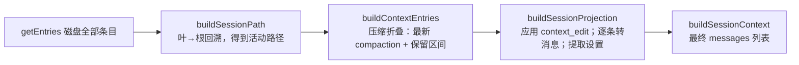
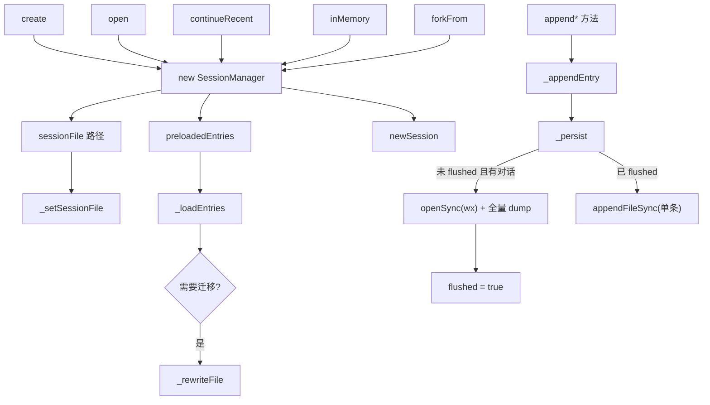

# 08. 会话树、活动分支与恢复

今天独立构造一棵会话树，观察“文件里有哪些条目”与“当前模型看到什么”之间的差别。只用内存会话，不触碰真实聊天记录；预计 2 小时。

## 今日准备

需要 Node.js >= 22.19.0；缺少依赖时在根目录执行 `npm install --ignore-scripts`。在 `packages/coding-agent/test/session-manager/` 新建 `task-08-learning.test.ts`，从 `packages/coding-agent` 运行：

```powershell
node ../../node_modules/vitest/dist/cli.js --run test/session-manager/task-08-learning.test.ts
```

测试文件可使用这三个顶部导入：`import { expect, it } from "vitest"`；`import { SessionManager } from "../../src/core/session-manager.ts"`；`import { userMsg, assistantMsg } from "../utilities.ts"`。`userMsg("A")`/`assistantMsg("B")` 会生成符合真实消息类型的测试对象。

## 学习内容

会话 JSONL 保存的是带父子关系的条目树。文件里存在某条消息，不代表它属于当前活动分支；属于活动分支，也不代表会原样送给模型。可以把读取过程理解为三级：全部原始条目、当前叶子到根的路径、经过 `context_edit` 和压缩规则处理后的模型上下文。分支不删除旧路，恢复依赖历史条目和当前叶子指针。`context_edit` 是追加一条投影规则，压缩也是追加摘要记录，不是直接改写过去的对话。

例如先有 A→B→C，把活动叶子移回 B 再追加 D，文件仍保存 A、B、C、D，活动分支却是 A→B→D。`buildSessionContext()` 还会应用编辑和压缩规则，所得列表才是下一轮模型可用的消息。理解这三级后，才能解释“明明文件里有 C，模型却没看到 C”。

## 核心源码

核心都在 `packages/coding-agent/src/core/session-manager.ts`：`appendMessage` 生成 ID 与 parent ID；`branch` 移动活动叶子；`getBranch` 取当前祖先链；`buildContextEntries`、`buildSessionProjection`、`buildSessionContext` 逐级形成模型输入；`appendContextEdit` 与 `appendCompaction` 追加投影规则。先读这些符号的签名，再沿返回值看具体过滤条件。

## TypeScript 语法小课：递归与可选父节点

会话条目有 `parentId`，根条目没有父节点。递归沿父节点走到根，可得到当前活动分支；其他分支仍在原始条目集合中。

```typescript
type Entry = { id: string; parentId?: string }; // ? 表示根节点可省略父 ID
const entries: Entry[] = [{ id: "A" }, { id: "B", parentId: "A" }, { id: "C", parentId: "B" }];
function branch(id: string): string[] {
  const entry = entries.find((item) => item.id === id); // 查当前节点
  if (!entry) throw new Error("未知节点");
  return entry.parentId ? [...branch(entry.parentId), entry.id] : [entry.id]; // 先祖先，后当前节点
}
console.assert(branch("C").join("→") === "A→B→C");
```

练习：新增 `D` 并让它的父节点为 B，对照 `getEntries()` 和 `getBranch()` 的区别。


## 完整学习资料

先按下列正文完成学习，再执行本篇的动手任务。正文中原书的实验与验收题先作为案例阅读，实际动手统一放到文末；只运行本篇“今日准备”和动手任务明确指定的离线命令。章节编号保留知识主题的原编号；源码精读、示例、边界条件、常见错误和参考答案均直接收录在本文件中。开头的预计用时仅指核心主线，完整源码精读需另留时间。

### 本篇共同基础

以下运行图和术语均在本文件内。学习正文保留原手册的知识主题编号，但那些编号不构成本任务的阅读前置；实际操作按本篇的动手任务与验收标准执行。学习正文基于原手册注明的 `200387122ca450d6387f033949423114a270b96c` 源码基线，当前工作区若有差异，以当前源码为准。

### 15 分钟主线：pi 怎样完成一件事

假设用户输入“读取 demo.txt，并总结三点”。模型自己不能读取你电脑里的文件。pi 把用户问题和可用工具告诉模型；模型提出 `read` 调用；pi 在本地执行；模型拿到文件内容后才生成总结。这就是全书反复使用的同一个例子。

**先看不带 TypeScript 细节的主流程（教学伪代码）：**

```text
收到用户输入，把它加入当前会话
重复：
    用当前上下文向模型发起请求
    收集模型的回答并把过程通知界面
    如果回答要求执行工具：
        校验参数，在本地执行工具，记录结果
        继续循环，让模型看到工具结果
    否则，检查是否还有排队输入或明确的继续决定
    如果都没有：结束本次运行
```

第一行确定这次任务和已有历史。模型请求只负责生成回答或提出工具调用。工具校验与执行由 pi 负责，结果回到对话后才可能有下一轮模型请求。界面接收运行事件，历史保存完成的消息；它们都与“模型请求”有关，但不是同一种数据。真实实现还处理工具并发、错误、取消、重试和压缩，后面分别讲。

**先分清四对容易混淆的词：**

| 两个词                | 直观区别                                           | 在“读文件并总结”中的例子                   |
| --------------------- | -------------------------------------------------- | -------------------------------------------- |
| 模型请求 / 用户输入   | 用户只说一次话，pi 可以多次询问模型                | 先请模型选择工具，读完文件后再请模型总结     |
| 事件 / 消息           | 事件告诉界面过程；消息承载一次完整的对话内容       | “正在输出第几个字”是事件；完成的总结是消息 |
| 工具调用 / 工具结果   | 调用提出想做什么；结果记录本地执行所得             | `read("demo.txt")` 是调用；文件文字是结果  |
| 会话历史 / 模型上下文 | 历史保留记录；上下文是这一次请求实际送给模型的内容 | 分支 C 仍在文件里，沿分支 D 继续时不必送 C   |


```text
一次用户输入
  → 第一次模型请求：请调用 read("demo.txt")
  → 本地工具执行：读出文件文本
  → 第二次模型请求：根据工具结果总结三点
  → 没有后续工作：结束
```

### 附录 A：术语表

> 用法：每个术语给出"一句话解释 + 首次出现的章节"。读代码遇到不认识的词，先查这里；查不到再搜源码（用英文名搜）。


#### A.1 核心概念

| 中文                  | 英文                    | 一句话                                                                                                             | 章节      |
| --------------------- | ----------------------- | ------------------------------------------------------------------------------------------------------------------ | --------- |
| 智能体外壳 / 运行框架 | agent harness           | 组织模型、工具、状态、界面的框架，本身不"聪明"                                                                     | 0.1       |
| 智能体                | agent                   | "模型 + 工具 + 循环"组成的执行体                                                                                   | 0.1       |
| 轮次                  | turn                    | 一次助手响应 + 它引发的工具执行                                                                                    | 3.3.3     |
| 低层运行              | Agent run               | 一次`Agent.prompt()` 或 `Agent.continue()` 调用建立的生命周期；以 `agent_end` 和已等待的 listener 收尾为边界 | 3.3.3、D2 |
| 会话 prompt 编排      | session prompt workflow | `AgentSession.prompt()` 在 `started` 后进入 `_runAgentPrompt()`；可串起 retry、压缩恢复和多个低层 Agent run  | 8、D27    |
| 用户请求              | user request            | 用户提交一次输入；与模型请求不等价                                                                                 | 3.3.3     |
| 模型请求              | model request           | 真正发给供应商 API 的一次请求                                                                                      | 3.3.3     |
| 转录                  | transcript              | 发给模型看/被记录的消息序列                                                                                        | 4.1       |
| 投影                  | projection              | 从会话树/文档到"模型实际看到的内容"的计算过程                                                                      | 9.4       |
| 活动分支              | active branch           | 从根到当前叶子的一条路径                                                                                           | 9.1       |
| 叶子                  | leaf                    | 会话树中的"当前位置"                                                                                               | 4.7.3     |
| 条目                  | entry                   | 会话文件里的一行（JSONL）                                                                                          | 4.7       |
| 会话                  | session                 | 一次对话的全部记录与状态                                                                                           | 8.1       |
| 压缩                  | compaction              | 用摘要替换旧上下文表示的机制                                                                                       | 10        |
| 上下文窗口            | context window          | 模型一次能接受的最大 token 量                                                                                      | 5.3       |
| 思考级别              | thinking level          | off/minimal/low/medium/high/xhigh/max                                                                              | 5.3       |
| 停止原因              | stop reason             | pending/stop/length/toolUse/error/aborted/deferred                                                                 | 4.3.3     |
| 用量                  | usage                   | token 与成本统计                                                                                                   | 4.3.5     |


#### A.2 消息与事件

| 中文           | 英文                | 一句话                                             | 章节        |
| -------------- | ------------------- | -------------------------------------------------- | ----------- |
| Agent 消息     | AgentMessage        | 内部消息（模型消息 + 应用自定义角色）              | 4.4         |
| 模型消息       | Message             | 供应商能理解的四角色联合                           | 4.3         |
| 内容块         | content block       | 消息内容的最小单元（text/image/thinking/toolCall） | 4.2         |
| 判别联合       | discriminated union | 用共同字面量字段区分成员的类型联合                 | 1.3.4       |
| 类型收窄       | narrowing           | 判断判别字段后类型自动缩小                         | 1.3.4       |
| 事件           | event               | 运行时广播（过程），不是消息（结果）               | 3.3.2       |
| 队列更新       | queue update        | 排队消息变化的会话事件                             | 4.5.2       |
| 边界（结算前） | agent_before_settle | 最后一个可行动钩子                                 | 6.2、13.3.5 |
| 已结算         | agent_settled       | "不会再自动继续"的最终信号                         | 4.5.2、16.3 |
| 延迟句柄       | deferred handle     | 异步应答的取回凭据                                 | 4.3.3       |


#### A.3 工具与模型

| 中文                | 英文                            | 一句话                                    | 章节  |
| ------------------- | ------------------------------- | ----------------------------------------- | ----- |
| 工具                | tool                            | 模型可调用的本地操作                      | 7.1   |
| 工具定义            | ToolDefinition                  | 扩展/应用注册工具的"富"形态               | 7.1.2 |
| 参数校验            | argument validation             | 用 typebox schema 在运行时校验调用参数    | 7.4   |
| 前置钩子            | beforeToolCall                  | 执行前可拦截（block）的钩子               | 7.6   |
| 后置钩子            | afterToolCall                   | 结果字段级改写的钩子                      | 7.6   |
| 顺序 / 并行执行     | sequential / parallel execution | 工具批次的两种调度                        | 7.5   |
| 终止提示            | terminate                       | "整批都同意时不因本批继续"的调度提示      | 7.5.4 |
| 模型                | model                           | 模型静态元数据（api/provider/限制/价格）  | 5.2.2 |
| 协议方言            | api                             | 供应商接口族标识（如 anthropic-messages） | 5.2.1 |
| 供应商              | provider                        | 认证 + 模型目录 + 请求实现                | 5.2.3 |
| 简单流式 / 完整流式 | streamSimple / stream           | 供应商无关档位 vs 协议特有选项            | 5.4   |
| 兼容开关            | compat                          | OpenAI 兼容生态的行为微调                 | 5.5.4 |
| 假供应商            | faux provider                   | 脚本化、离线的测试模型                    | 5.7   |


#### A.4 会话与持久化

| 中文       | 英文             | 一句话                             | 章节   |
| ---------- | ---------------- | ---------------------------------- | ------ |
| 会话管理器 | SessionManager   | 会话文件的对象化句柄               | 9.3    |
| 分支会话   | branched session | 只包含"根到叶子"路径的新文件       | 9.5.2  |
| 分支摘要   | branch summary   | 放弃某分支时生成的摘要条目         | 10.6   |
| 上下文编辑 | context edit     | 只改"投影"、不改原始条目的追加编辑 | 9.4.4  |
| 保留边界   | firstKeptEntryId | 压缩后从哪条开始保留               | 10.3.2 |
| 保留预算   | keepRecentTokens | 压缩后至少保留的近期上下文         | 10.3   |
| 预留       | reserveTokens    | 为模型回复预留的窗口               | 10.2.1 |
| 检测点替换 | checkpoint       | 压缩条目携带的提示词/工具检查点    | 9.4.3  |


#### A.5 扩展与集成

| 中文       | 英文            | 一句话                             | 章节       |
| ---------- | --------------- | ---------------------------------- | ---------- |
| 上下文文件 | context files   | AGENTS.md 等纯文本指令             | 11.4.2     |
| 项目信任   | project trust   | 允许加载项目可执行资源前的人工决定 | 11.5       |
| 提示词模板 | prompt template | Markdown 变成`/命令`             | 12.3.2     |
| 技能       | skill           | 目录 + SKILL.md 的按需说明书       | 12.3.3     |
| 扩展       | extension       | 可执行 TypeScript 模块（进程权限） | 12.3.4、13 |
| Pi 包      | Pi package      | 分发多资源的 npm/git 单元          | 12.3.6     |
| 钳制       | clamp           | 按模型能力压低思考级别             | 5.3        |
| 重绑       | rebind          | 会话替换后重新挂订阅/扩展绑定      | 8.6        |


#### A.6 协议与架构（选修）

| 中文     | 英文                   | 一句话                                          | 章节   |
| -------- | ---------------------- | ----------------------------------------------- | ------ |
| MCP      | Model Context Protocol | 外部工具/资源接入协议                           | 22     |
| 暴露方式 | exposure               | codemode/deferred/direct 三种工具到达模型的方式 | 22.3   |
| 工具搜索 | tool_search            | deferred 工具的"发现后再直调"机制               | 22.3   |
| 沙箱     | codemode sandbox       | QuickJS VM + worker 的脚本执行环境              | 22.9   |
| 面片     | facet                  | Chord 插件可独立打包到不同环境的分片            | 23.2   |
| 服务     | service                | Chord 的类型化稳定 token（singleton/keyed）     | 23.2   |
| 复制状态 | replicated state       | 原子发布、完整不可变值消费的状态                | 23.2   |
| 增量跟踪 | delta tracking         | 记录/合并 JSON 操作的机制                       | 23.2   |
| 持久执行 | durable execution      | 意图先提交、崩溃可续的执行模型                  | 23.1   |
| 检查点   | checkpoint             | 任务每一步的持久落点                            | 23.3.1 |
| 附着     | attachment             | 一条表现层连接绑定到一个会话                    | 24.2   |
| 信封     | envelope               | 协议中包裹 payload 的定向记录                   | 24.3   |
| span     | span                   | 一次操作的时间记录（遥测）                      | 25.2   |
| lift     | lift                   | 处理组相对对照组的提升（评估）                  | 25.5   |
| 阻断配对 | blocked pair           | 两臂未各得恰好一个分数，禁止计入头条            | 25.6   |


#### A.7 容易混淆的成对术语

| 对                                              | 区分                                                                                   |
| ----------------------------------------------- | -------------------------------------------------------------------------------------- |
| message vs event                                | 结果 vs 过程（3.3.2）                                                                  |
| turn vs run                                     | 一个轮次 vs 整次运行（3.3.3）                                                          |
| `agent_end` vs `agent_settled`              | 低层 run 结束 vs 自动工作清零（4.5.2）                                                 |
| 声明 vs 可执行                                  | 系统消息里的工具声明 vs 运行时工具集（7.3）                                            |
| details vs content                              | 给界面/程序 vs 给模型（14.2）                                                          |
| 完成顺序 vs 记录顺序                            | 并发完成 vs 声明序记录（7.5.3）                                                        |
| 停止原因`length` vs `stop`                  | 被截断 vs 正常说完（4.3.3）                                                            |
| `AgentSession.prompt()` vs `Agent.prompt()` | 应用层输入分流/会话编排 vs 低层 Agent run 入口（8、D2、D27）                           |
| `handled` vs `queued` vs `started`        | 输入被消费、不创建该输入自己的 run / 放入当前运行队列 / 进入会话 run 编排（8、16.5.3） |
| 提示词模板 vs 技能                              | 一段话 vs 一套流程+文件（12.3.3）                                                      |
| 扩展 vs Pi 包                                   | 可执行单元 vs 分发单元（12.3.6）                                                       |
| compaction 摘要 vs branch summary               | 压缩历史 vs 放弃分支（10.6）                                                           |
| durable cheat sheet：`replay: safe/never`     | 崩溃后重跑 vs 报 interrupted（23.4）                                                   |
| JSONL RPC vs client/server                      | 进程内 stdio 协议 vs 跨进程服务路由（24.1）                                            |
| 单测 vs 评估                                    | 确定性 vs 配对统计（25.1、25.6）                                                       |


#### A.8 输入与运行的层级

不要按“用户按了一次回车”推断低层 run 或模型请求的数量。实际层级是：

| 层级       | 代表符号                                           | 次数关系                                                                                      |
| ---------- | -------------------------------------------------- | --------------------------------------------------------------------------------------------- |
| 输入调用   | `AgentSession.prompt(text)`                      | 一次调用只表达一次输入尝试；结果可能是`handled`、`queued` 或 `started`                  |
| 会话编排   | `_runAgentPrompt(messages)`                      | 只在开始处理输入时进入；在里面管理重试、压缩恢复、边界 continuation 与取消                    |
| Agent run  | `Agent.prompt(messages)` 或 `Agent.continue()` | 一次会话编排可包含多个 run；每个低层 run 都发出自己的`agent_start` / `agent_end` 生命周期 |
| Agent turn | `turn_start` 到 `turn_end`                     | 一个 run 可包含多个 turn；每个 turn 通常包含一次助手响应及其引发的工具执行                    |
| 模型请求   | `streamSimple` / provider stream                 | 通常发生在助手响应阶段；自动重试会再次请求模型，压缩摘要等内部工作也可能有独立请求            |

两个边界例子：

- 扩展命令被消费时，`prompt()` 返回 `handled`，没有为该输入启动 `_runAgentPrompt()`；
- `prompt()` 在 Agent 已运行时以 `steer`/`followUp` 方式排队，返回 `queued`。这条输入会影响现有流程，但它本身不是新的 `Agent.prompt()` 调用。

因此，统计“模型请求次数”不能数 prompt、turn 或 `agent_end`：应按 provider 请求事件/日志，或明确的测试探针计数。章节 21 的自测题也按这个区分评分。


#### A.9 索引方式说明

- 想找"某行为在哪个文件" → 用 source-map；
- 想找"某命令怎么跑" → 用 commands；
- 想找"某现象怎么排" → 用 troubleshooting；
- 想找"哪些练习要做" → 用 exercises-and-answers。

---

### 第 9 章：常规会话树、恢复与分支


**先懂这一章**：会话文件保留很多历史条目，包括另一条分支的内容。当前模型请求只需要沿“正在继续的这条路”重建历史。先理解父子关系，再读索引、投影和压缩折叠。

```text
教学伪代码：读取条目 → 从当前叶节点沿 parentId 找到根
           → 还原活动分支顺序 → 按规则转换为上下文消息
```

“活动分支”并非把磁盘里其他分支删除；后续投影还会处理摘要、编辑和设置条目。

第 8 章说明谁持有会话；本章说明会话持有什么、恢复时选哪条历史。第 10 章再解释历史太长时如何生成摘要，并在这里的投影路径上使用它。

> 学完本章你能回答：
>
> 1. 会话文件为什么是一棵树？"活动分支"是哪个概念？
> 2. 从磁盘条目到下一次模型请求的消息列表，中间经过哪三级投影？
> 3. 压缩（compaction）在恢复时如何"折叠"历史？`firstKeptEntryId` 精确指什么？
> 4. `context_edit` 是什么？为什么"编辑历史"却不修改原始条目？
> 5. `/tree` 切分支、`/fork` 分叉、`createBranchedSession` 各做了什么？

**预计学习时间**：1.5 天（本章代码集中在 `session-manager.ts`，可以按符号精读）。
**本章验证状态**：静态核对通过（`session-manager.ts` 的投影流水线与分支创建逐段核对）；实验 L05 设计中。

---


#### 9.1 问题：为什么不是"一行一条消息"的线性日志

先看一个真实使用场景：

```text
第 1 轮：用户 A → 助手 B
第 2 轮：用户 C → 助手 D
第 3 轮：用户 E（不满意，想回到第 1 轮之后换个方向）
```

线性日志有三条路：

1. **覆盖**：删掉 C/D，写入新分支——**历史不可逆**，用户后悔就完了；
2. **新文件**：把 A/B 复制出去开新会话——文件会指数增殖，元数据（标签、用量）各存一份；
3. **同一文件、树形记录**：B 之后挂两个孩子（C 与 E），"当前走哪条"由一个"叶子指针"决定——**历史保留、切换 O(1)**。

pi 选第 3 种。`how-pi-works.md` 的原话：

```text
Messages and events in a session form a tree. Each path through that tree is a branch.
The branch ending at the current entry is the active branch and supplies the history for
the next model request.
```

"活动分支"（active branch）就是**从根到当前叶子**的那条路径。你下一轮的模型上下文，永远只来自它——**磁盘上有多少条目，与模型看到多少内容，是两件事**。


#### 9.2 文件格式：字段、版本与两种时间戳


##### 9.2.1 文件与公共字段（回顾）

```text
~/.pi/agent/sessions/--<路径编码>--/<时间戳>_<会话ID>.jsonl
```

路径编码的实现在 `session-manager.ts`：

```typescript
function getDefaultSessionDirPath(cwd: string, agentDir: string = getDefaultAgentDir()): string {
	const resolvedCwd = resolvePath(cwd);
	const resolvedAgentDir = resolvePath(agentDir);
	const safePath = `--${resolvedCwd.replace(/^[/\\]/, "").replace(/[/\\:]/g, "-")}--`;
	return join(resolvedAgentDir, "sessions", safePath);
}
```

`D:\my-project` 会变成 `--D-my-project--` 这样的目录名（去掉开头分隔符、把 `/`、`\`、`:` 替换为 `-`）。所以**同一个项目目录的会话总在一个文件夹里**；这也是 `/resume` 能按项目筛选会话的原因。

每行一个 JSON 对象，公共字段（第 4 章）：`type`、`id`、`parentId`、`timestamp`（ISO 字符串）。**消息内的 `timestamp` 是 Unix 毫秒数**——两种时间戳并存是格式的一部分，读文件时不要混。


##### 9.2.2 版本演进：v1 → v2 → v3

`session-format.md`：

| 版本 | 变化                                                  |
| ---- | ----------------------------------------------------- |
| v1   | 线性条目序列（legacy）                                |
| v2   | 引入`id`/`parentId` 树结构                        |
| v3   | `hookMessage` 角色更名为 `custom`（扩展体系统一） |

**旧版本在加载时自动迁移到当前版本**。这解释了你可能在代码里看到的一些兼容字段与迁移逻辑（`migrations.ts` 也有会话相关迁移）。


##### 9.2.3 容错读取：坏行不致命

会话文件的读取（`loadEntriesFromFile`）做了两层保护：

```typescript
function parseSessionEntryLine(line: string): FileEntry | null {
	if (!line.trim()) return null;
	try {
		return JSON.parse(line) as FileEntry;
	} catch {
		// Skip malformed lines
		return null;
	}
}
```

- **坏行直接跳过**：会话文件是追加写的，中途断电可能留下半行；一个半行不该让整个会话打不开；
- **头扫描有上限**：`MAX_SESSION_HEADER_SCAN_BYTES = 1MB`——防止构造一个超大 Header 卡死启动扫描；
- 读取用 1MB 缓冲 + `StringDecoder` 流式解码：大文件不会一次性全进内存，且多字节字符不会被缓冲边界切断。


#### 9.3 `SessionManager`：树的"句柄"

`SessionManager` 是会话文件的对象化包装。创建方式（三个静态工厂，第 9.4 节前先认识）：

| 工厂                                                     | 用途                              | 是否落盘      |
| -------------------------------------------------------- | --------------------------------- | ------------- |
| `SessionManager.create(cwd, sessionDir?)`              | 新会话（也给`sdk.ts` 默认用）   | 是            |
| `SessionManager.open(path, sessionDir?, cwdOverride?)` | 打开已有文件                      | 是（读+追加） |
| `SessionManager.inMemory(cwd, options?, entries?)`     | 内存会话（测试/`--no-session`） | 否            |

常用方法分组（第 250 行附近的表格列出了"可恢复钩子"等内部映射，这里按用途归类）：

**查询**：

| 方法                                                                          | 返回                                                                  |
| ----------------------------------------------------------------------------- | --------------------------------------------------------------------- |
| `getLeafId()` / `getLeafEntry()`                                          | 当前叶子                                                              |
| `getBranch(fromId?)`                                                        | 从根到该节点的**原始条目**（含 model_change、label 等所有类型） |
| `getEntry(id)`                                                              | 单条                                                                  |
| `getSessionFile()` / `isPersisted()` / `getSessionDir()` / `getCwd()` | 文件信息                                                              |

**追加**（全部是"追加一行"的语义）：

| 方法                                                                            | 写入的条目                          |
| ------------------------------------------------------------------------------- | ----------------------------------- |
| `appendMessage(message)`                                                      | `message`                         |
| `appendCustomMessageEntry(...)`                                               | `custom_message`                  |
| `appendModelChange(provider, modelId)` / `appendThinkingLevelChange(level)` | 设置变化                            |
| `appendContextEdit(targetId, replacement)`                                    | `context_edit`                    |
| `appendLabelChange(targetId, label)`                                          | `label`（`undefined` 表示清除） |
| `appendSessionInfo(name)`                                                     | `session_info`                    |
| `appendBashMessage?` 等                                                       | 各专用条目                          |

**投影**（下一节的主角）：

```typescript
buildContextEntries(): SessionEntry[] {
	return buildContextEntries(this.getEntries(), this.leafId, this.byId);
}
buildSessionProjection(): SessionProjection { /* ... */ }
buildSessionContext(): SessionContext { /* ... */ }
```

**分支**：`createBranchedSession(leafId)`（9.6 节）。

一个模型层面的提醒：`getBranch` 返回的是**原始条目**（树路径），不是消息列表。模型要的是消息——中间隔着三级投影。

#### 9.4 三级投影流水线：从磁盘到模型上下文

**先懂**：会话文件是完整档案，模型请求只需要当前分支里的有效内容。三级投影依次回答“选哪条路、哪些旧内容被摘要替代、每条怎样变成模型消息”。

```text
教学伪代码：从当前叶节点回溯活动分支
           → 按压缩规则决定保留的条目
           → 应用编辑并转换消息 → 得到本次请求上下文
```

**暂停预测：** 只看历史对话消息。原先的链是 A（问 `demo.txt`）→ B（总结）→ C（要求改写）→ D（改写结果）。现在从 B 分叉，新增 E（问另一种分析）→ F（回答），当前叶是 F。下一次请求会同时带上 C、D 和 E、F 吗？

**对照答案：** 不会。第一级沿 F 的父链只选 A、B、E、F；C、D 仍在会话文件中。假定这条路径还没有压缩或 `context_edit`，第二级不折叠，第三级把可见消息转成模型上下文。真实请求还可能带系统提示与工具声明，这里只比较历史对话消息。读下面三个函数时，先在纸上画这条父链，别把“文件里存在”和“本次送给模型”画成同一条线。

这是本章的核心。模型请求需要的消息列表，由三级函数接力产生：



对应三个导出函数（`session-manager.ts` 第 476、543、576 行）。逐级精读。


##### 9.4.1 第一级：`buildSessionPath` —— 找到"活动路径"

```typescript
function buildSessionPath(entries, leafId?, byId?): SessionEntry[] {
	const index = buildEntryIndex(entries, byId);
	let leaf: SessionEntry | undefined;
	if (leafId === null) return [];
	if (leafId) leaf = index.get(leafId);
	leaf ??= entries[entries.length - 1];      // 默认取文件最后一条
	if (!leaf) return [];

	const path: SessionEntry[] = [];
	let current: SessionEntry | undefined = leaf;
	while (current) {                            // 从叶一路走到根
		path.push(current);
		current = current.parentId ? index.get(current.parentId) : undefined;
	}
	path.reverse();                              // 反转为根→叶顺序
	return path;
}
```

语义：

- **`leafId === null` → 空路径**（"没有活动分支"的显式表达，`resetLeaf` 之后会这样）；
- **`leafId` 未给 → 用文件最后一条**（打开会话的默认行为）；
- 输出顺序是**根→叶**（时间顺序），后续函数都假设这个顺序。


##### 9.4.2 第二级：`buildContextEntries` —— 压缩折叠

```typescript
export function buildContextEntries(entries, leafId?, byId?): SessionEntry[] {
	const path = buildSessionPath(entries, leafId, byId);
	let compaction: CompactionEntry | null = null;

	for (const entry of path) {
		if (entry.type === "compaction") compaction = entry;   // 路径上"最新"的一次压缩
	}
	if (!compaction) return path;                              // 没压缩过：原样

	const compactionIdx = path.findIndex((entry) => entry.id === compaction.id);
	const contextEntries: SessionEntry[] = [compaction];
	let foundFirstKept = false;
	for (let i = 0; i < compactionIdx; i++) {
		const entry = path[i];
		if (entry.id === compaction.firstKeptEntryId) foundFirstKept = true;
		if (foundFirstKept && !(entry.type === "message" && entry.message.role === "system")) {
			contextEntries.push(entry);                        // 保留区间：跳过 system 消息
		}
	}
	contextEntries.push(...path.slice(compactionIdx + 1));     // 压缩之后的新条目
	return contextEntries;
}
```

三条精确规则：

1. **只认路径上最新的压缩**：更早的压缩若也在路径上，会被更晚的压缩"吞并"（它的结果早已在保留区间或摘要里）；
2. **保留区间的起点是 `firstKeptEntryId`**：压缩条目自己记录"从哪条开始保留"。注意 `session-format.md` 的边界说明——**retain-none 的压缩会把 `firstKeptEntryId` 指向自己**，于是前面全部被摘要替代；
3. **保留区间里的系统消息被丢弃**：压缩条目的 `systemMessage` 字段是"压缩边界处的完整提示词检查点"，它会成为压缩后上下文的**首个系统消息**；保留区间里的旧系统消息若还留着，会和检查点重复/冲突，所以这里跳过它们。

用图看一次折叠：

```text
磁盘路径（根→叶）：
  [a1 user] [a2 assistant] [a3 user] [a4 assistant] [c compaction] [a5 user]
                                            firstKeptEntryId = a3

buildContextEntries 输出：
  [c compaction] [a3 user] [a4 assistant] [a5 user]
  （a1、a2 被摘要替代；不再出现）
```


##### 9.4.3 条目的"转消息"规则

`sessionEntryToContextMessages`（第 439 行）是条目到消息的翻译表：

```typescript
export function sessionEntryToContextMessages(entry: SessionEntry): AgentMessage[] {
	if (entry.type === "message") {
		const message = entry.message;
		// 会话文件不做校验解析；老版本/手改文件可能 content 为 null
		if (message.role === "system" && message.content == null) return [{ ...message, content: "" }];
		if ((message.role === "user" || message.role === "assistant" || message.role === "toolResult")
			&& message.content == null) {
			return [{ ...message, content: [] }];
		}
		return [message];
	}
	if (entry.type === "custom_message") {
		return [createCustomMessage(entry.customType, entry.content ?? [], entry.display, entry.details, entry.timestamp)];
	}
	if (entry.type === "branch_summary" && entry.summary) {
		return [createBranchSummaryMessage(entry.summary, entry.fromId, entry.timestamp)];
	}
	if (entry.type === "compaction") {
		const summary = createCompactionSummaryMessage(entry.summary, entry.tokensBefore, entry.timestamp);
		return entry.systemMessage ? [entry.systemMessage, summary] : [summary];
	}
	return [];   // model_change、thinking_level_change、usage、custom、label、session_info、context_edit 不产生消息
}
```

四类产消息、其余全部"静默跳过"。两个新细节：

- **空内容归一化**：再次强调"文件是不可信输入"——老版本或手改文件可能缺 `content`，这里兜底成 `""` 或 `[]`，防止下游崩溃；
- **压缩产生两条消息**：系统提示检查点（`systemMessage`，如果有）+ 压缩摘要消息（`compactionSummary`，模型会看到带 `<summary>` 包装的 user 消息，第 4.4.2 节）。


##### 9.4.4 第三级：`buildSessionProjection` —— 编辑与来源

```typescript
export function buildSessionProjection(entries, leafId?, byId?): SessionProjection {
	const path = buildSessionPath(entries, leafId, byId);
	const { thinkingLevel, model } = getSessionContextSettings(path);   // 从整条路径取设置
	const contextEntries = buildContextEntries(entries, leafId, byId);
	const edits = new Map<string, ContextEditEntry>();
	for (const entry of contextEntries) {
		if (entry.type === "context_edit") edits.set(entry.targetId, entry);  // 后者覆盖前者
	}
	const projectedEntries = contextEntries.map((sourceEntry, index): ProjectedSessionEntry => ({
		sourceEntry,
		messages: sourceEntry.type === "compaction" && index > 0 ? [] : projectContextEntry(sourceEntry, edits.get(sourceEntry.id)),
	}));
	return { entries: projectedEntries, messages: projectedEntries.flatMap((entry) => entry.messages), thinkingLevel, model };
}
```

三个要点：

1. **`context_edit` 只影响"投影"，不改原始条目**。`edits` 用 Map 收集，**同一目标多条编辑时，靠后的（更新的）获胜**；而且"编辑是分支相对的"——切到编辑之前的分支点时，原内容又回来了（`session-format.md` 的说法）；
2. **`ProjectedSessionEntry` 保留"来源"**：每条投影消息都带 `sourceEntry`（消息来自哪个条目）。按活动投影渲染和重试时的 `_omitRecoveryAttempt`（第 6.6.2 节）会用到这份"消息 ↔ 条目"对应关系；`entry_appended` 则直接携带新写入的 `SessionEntry`，不依赖投影反查，而且它只由部分写入路径发出（见第 4.5.2 节）；
3. **`compaction` 在 index > 0 时不产消息**：`buildContextEntries` 可能保留一条"旧的压缩条目"（它的 id 落在新保留区间里），但只有 index 0 的最新压缩才贡献检查点与摘要——注释原话："Only the newest compaction at index zero contributes a checkpoint and summary."

`projectContextEntry` 是"编辑应用器"：

```typescript
function projectContextEntry(entry: SessionEntry, edit: ContextEditEntry | undefined): AgentMessage[] {
	const messages = sessionEntryToContextMessages(entry);
	if (!edit) return messages;
	const replacement = edit.replacement;
	if (replacement === null) return [];      // 从投影中整体省略

	return messages.map((message) => {
		if (message.role !== "user" && message.role !== "assistant" && message.role !== "toolResult" && message.role !== "custom") {
			return message;                    // 只允许编辑这四种角色的内容
		}
		const content =
			(message.role === "assistant" || message.role === "toolResult") && typeof replacement.content === "string"
				? [{ type: "text" as const, text: replacement.content }]     // 结构化角色：字符串归一为单个文本块
				: replacement.content;
		return { ...message, content } as AgentMessage;
	});
}
```


##### 9.4.5 设置提取：`getSessionContextSettings`

```typescript
function getSessionContextSettings(path: SessionEntry[]): Pick<SessionContext, "thinkingLevel" | "model"> {
	let thinkingLevel = "off";
	let model: { provider: string; modelId: string } | null = null;

	for (const entry of path) {
		if (entry.type === "thinking_level_change") thinkingLevel = entry.thinkingLevel;
		else if (entry.type === "model_change") model = { provider: entry.provider, modelId: entry.modelId };
		else if (entry.type === "message" && entry.message.role === "assistant") {
			model = { provider: entry.message.provider, modelId: entry.message.model };   // 实物模型优先
		}
	}
	return { thinkingLevel, model };
}
```

"沿路径最后一次赋值获胜"，且**助手消息里的物理模型覆盖 `model_change` 的（可能是虚拟的）选择**——因为那条消息就是物理模型答的（第 3.5 节恢复逻辑 `getBranchSelection` 与这里呼应）。


##### 9.4.6 完整走查：一次"继续对话"都发生了什么

把三级流水线放进第 3 章的恢复入口（`sdk.ts`）：

```typescript
const existingSession = sessionManager.buildSessionContext();   // ← 三级流水线
const hasExistingSession = existingSession.messages.length > 0;
// ...
const agent = new Agent({ initialState: { messages: existingSession.messages, /* ... */ } });
```

所以"恢复会话"不是"把文件读成数组"，而是**在树上求一次投影**：回溯路径 → 折叠压缩 → 应用编辑 → 翻译消息 → 提取设置。


#### 9.5 分支操作：从 `/tree` 到新文件


##### 9.5.1 同文件分支：`/tree` 导航

对话中执行 `/tree` 跳到历史某个条目（或标记），效果是：

- **设置新的叶子**（`leafId` 指向该条目）；
- 之后的新消息以它为父节点追加——**同一文件里长出新分支**；
- 从旧叶子"离开"时，pi 可生成 `branch_summary` 条目（可选）：`parentId` 指向"从哪继续"，`fromId` 指向被放弃的旧叶子，`summary` 是 LLM 生成的该分支摘要（`session-format.md`）。这样新分支的模型上下文里会带上"我刚才探索过什么"的用户消息（`BRANCH_SUMMARY_PREFIX` 包装，第 4.4.2 节）。

实现入口在 `AgentSession.navigateTree`（`agent-session.ts` 第 3915 行），细节留到需要改这块代码时再精读。


##### 9.5.2 独立文件分支：`createBranchedSession`

`/fork`、`/clone` 会**另存一个文件**，只包含"根到目标叶子"的路径。这由 `SessionManager.createBranchedSession(leafId)` 完成：

```typescript
/**
 * Create a new session file containing only the path from root to the specified leaf.
 * Useful for extracting a single conversation path from a branched session.
 * Returns the new session file path, or undefined if not persisting.
 */
createBranchedSession(leafId: string): string | undefined {
	const previousSessionFile = this.sessionFile;
	const path = this.getBranch(leafId);
	if (path.length === 0) throw new Error(`Entry ${leafId} not found`);

	// Filter out LabelEntry from path - we'll recreate them from the resolved map.
	// Because labels are real tree entries, later entries can be children of labels;
	// removing labels requires re-chaining the retained path to avoid orphaned subtrees.
	// ...
}
```

注意注释里的两个"坑"与解法（这段代码是整个文件里最精细的部分之一）：

1. **label 也是树节点**：后续条目可能是 label 的子节点。导出路径时若简单地删掉 label，路径就断了。所以代码**重新串联 `parentId`**（保留路径上的实际条目直接挂到彼此），把 label 从树结构里"摘除"，再在文件末尾**重建 label 条目**（`labelsToWrite` 收集、`generateId` 分配新 id）；
2. **压缩条目的 `firstKeptEntryId` 要重映射**：如果它原本指向一个被摘除的 label，就替换为 label 之后的下一个保留条目（`replacementByLabelId`）。

新文件头写明血缘：`parentSession: previousSessionFile`（第 4.7 节的 SessionHeader 示例）——所以 fork 出来的会话**知道自己从哪来**。


##### 9.5.3 `/fork` 的两种位置（回顾第 8.5.3 节）

| position     | 含义                                   | 目标叶子                                                     |
| ------------ | -------------------------------------- | ------------------------------------------------------------ |
| `"at"`     | 以选中条目为叶子继续                   | 该条目本身                                                   |
| `"before"` | 回到某条**用户消息之前**重新开始 | 该消息的`parentId`（并把原文 `selectedText` 还给编辑器） |

`"before"` 只允许选用户消息；`"at"` 任意条目。分叉后的完整流程（teardown → createRuntime → apply → rebind）见第 8.5 节。


#### 9.6 导出、命名、标记与删除

| 功能      | 机制                                                                                         | 位置                             |
| --------- | -------------------------------------------------------------------------------------------- | -------------------------------- |
| 导出 HTML | `AgentSession.exportToHtml`；CLI `--export <input> [output]`                             | `agent-session.ts` 第 4239 行  |
| 会话命名  | `session_info` 条目（`appendSessionInfo`）；`/name`、`--name`                        | 第 1304 行                       |
| 书签/标记 | `label` 条目（`targetId` + `label`；`undefined` 清除）                               | `appendLabelChange` 第 1441 行 |
| 删除会话  | 直接删`.jsonl` 文件；交互式 `/resume` 里 `Ctrl+D`（优先用 `trash` CLI 而非永久删除） | `session-format.md`            |

`session_info` 的用途在文档里说得很具体：设置后，会话选择器（`/resume`）用**名字**而不是第一条消息来显示该会话——写测试或做工具时会经常碰到它。


#### 9.7 实验 L05：构造一个分支会话

**实验性质**：本地运行一个临时脚本（不碰你的真实会话文件）；零模型费用。
**验证状态**：设计中。


##### 目标

亲手构造 `A → B → C` 再从 B 分叉出 `D` 的树，观察“全部原始条目”与“活动分支消息”的差异。


##### 步骤（临时目录里写脚本；用完删除）

```typescript
import { SessionManager } from "D:/Github/pi/packages/coding-agent/src/core/session-manager.ts";
```

（在仓库内跑时也可以用包名 `@earendil-works/pi-coding-agent` 的导出；第 15 章会讲 SDK 的正确导入方式。）

1. 用 `SessionManager.inMemory(cwd)` 建一个内存会话；
2. 依次追加：用户消息 A、助手消息 B（`appendMessage`），保存两次返回的 entry id；
3. 追加用户消息 C 作为 B 的孩子，保存 C 的 id；
4. 调用 `session.branch(bId)` 把叶子移回 B，再追加用户消息 D。`branch(id)` 是 `SessionManager` 的真实方法：它只移动叶子指针，不改写或删除条目；
5. 打印 `getBranch()` 与 `buildSessionContext().messages`，对照：

```text
期望：
  原始条目（getEntries）: [A, B, C, D]
  getBranch()（叶为 D）:  [A, B, D]
  buildSessionContext().messages: A'、B'、D' 三条模型消息（C 不在内）
```

6. 分支编辑实验：调用 `session.branch(cId)`，然后 `appendContextEdit(cId, null)`；打印原始 entries 与模型 projection，确认 C 仍在原始历史中、但不在该分支的模型 messages 中；
7. 返回 D 分支后尝试 `appendContextEdit(cId, null)`，确认会抛错，因为 C 不在当前 branch；再调用 `appendContextEdit(bId, { content: "edited B" })`，检查只有 D 分支的 projection 把 B 替换，C 分支内容仍按自己的 context edit 决定；
8. 独立的压缩变化实验：先调用 `session.branch(dId)` 回到尚未追加分支编辑的 D 叶子，再追加压缩记录 `appendCompaction("summary", dId, 1000)`，令 `firstKeptEntryId` 指向 D，观察 A/B 如何由 summary 取代、D 如何保留。再看 `buildContextEntries()` 与 `buildSessionProjection()`；这样压缩结果不会继承前一步追加的 B 编辑。


##### 观察与思考

- `buildContextEntries()` 与 `getBranch()` 的输出在什么情况下第一次出现差异？
- 同一 target 先后追加两条 `context_edit` 时，哪条应用到当前 projection？切换叶子会不会改变答案？
- 为什么在 D 分支调用 `appendContextEdit(cId, null)` 会失败，但在 C 分支调用就能成功？
- 为什么实验要求"不手工修改用户真实会话"？（理解"文件是事实来源，手改易破坏树结构"）


##### 清理

删除临时脚本/临时会话目录，并确认实验没有改动真实会话文件。


#### 本章源码精读

> **源码精读**：先定位导出与函数签名，再沿调用点核对输入、状态、输出和错误；最后用本篇指定的离线实验验证。

D9 先解释 `SessionManager` 的记录与生命周期；D3 再把持久化条目投影为活动分支；D16 最后说明导出、分享和报告如何使用这些数据。磁盘记录与模型上下文仍须区分。


##### D9：`SessionManager` 类内部机制精读

**先懂**：这个类保存“当前会话是哪一个、当前走到树的哪个节点”，并负责把新条目写到正确位置。先理解它持有的状态，再看写入和加载怎样更新索引。

```text
教学伪代码：打开会话 → 读取条目并建立索引
           → 选择活动叶节点 → 追加新条目并更新索引
           → 按当前叶节点读取活动分支
```

文件锁、容错和迁移是这条主线的边界，后文分开解释。

> 精读对象：`core/session-manager.ts` 的 `SessionManager` **类本体**（字段、生命周期、持久化、append 家族、静态工厂）。
> 对应主线：第 9 章（会话树、恢复与分支）。
> 与 D3 的关系：D3 精读**模块级投影函数**（读怎么算）；D9 精读**类怎么存与怎么变**（写怎么落）。两者合起来才是完整的 session-manager。

---


###### 0. 类的自我描述（文档注释）

【源码】

```typescript
/**
 * Manages conversation sessions as append-only trees stored in JSONL files.
 *
 * Each session entry has an id and parentId forming a tree structure. The "leaf"
 * pointer tracks the current position. Appending creates a child of the current leaf.
 * Branching moves the leaf to an earlier entry, allowing new branches without
 * modifying history.
 *
 * Use buildSessionContext() to get the resolved message list for the LLM, which
 * handles compaction summaries and follows the path from root to current leaf.
 */
// 日常写入只追加；分支通过移动 leaf 实现，不删除旧条目。
export class SessionManager {
```

【注解】

- 四句话 = 四个核心机制：**append-only 树**（写只追加）、**leaf 指针**（当前位置）、**分支 = 移 leaf**（不改历史）、**`buildSessionContext()` 才是模型视图**（投影与存储分离）。
- 【陷阱】"append-only"是**文件层面**的承诺（新的内容只追加）；但类内部有 `_rewriteFile()`（重写整个文件）——用于迁移、fork 等"结构性变化"。**承诺的粒度**：日常对话只追加；版本迁移/分支导出这类"一次性手术"允许重写。"append-only"不要理解成"文件永不重写"。


###### 1. 九个私有字段：状态的完整清单

【源码】

```typescript
export class SessionManager {
	// 身份与位置：sessionId、sessionFile、sessionDir、cwd、persist（是否落盘——内存会话为 false）
	private sessionId: string = "";
	private sessionFile: string | undefined;
	private sessionDir: string;
	private cwd: string;
	private persist: boolean;
	// flushed（是否已把"内存中的结构"写进文件）是惰性建文件的核心状态位（第 4 节详解）
	private flushed: boolean = false;
	// 数据：fileEntries（全量条目数组，含 header）、byId（索引）、leafId（当前位置；null 表示"无叶子"——与第 D3 节的三态呼应）
	// fileEntries 里包含 header（session 条目）——遍历条目时要么跳过它（_buildIndex 里 if (entry.type === "session") continue），要么处理它；这是"首个元素特殊"的又一例
	private fileEntries: FileEntry[] = [];
	private byId: Map<string, SessionEntry> = new Map();
	// 标签的两张表：labelsById（targetId → label）与 labelTimestampsById（targetId → 时间戳）——成对维护（D3 第 9 节曾依赖这个不变量做非空断言）
	private labelsById: Map<string, string> = new Map();
	private labelTimestampsById: Map<string, string> = new Map();
	private leafId: string | null = null;
```

【注解（三组）】

1. **身份与位置**：`sessionId`、`sessionFile`、`sessionDir`、`cwd`、`persist`（是否落盘——内存会话为 false）。
2. **数据**：`fileEntries`（**全量条目数组**，含 header）、`byId`（索引）、`leafId`（当前位置；`null` 表示"无叶子"——与第 D3 节的三态呼应）。
3. **标签的两张表**：`labelsById`（targetId → label）与 `labelTimestampsById`（targetId → 时间戳）——**成对维护**（D3 第 9 节曾依赖这个不变量做非空断言）。

- 【陷阱】`flushed`（是否已把"内存中的结构"写进文件）是**惰性建文件**的核心状态位（第 4 节详解）。名字字面是"已冲洗"，语义是"文件已存在且内容同步"。
- 【陷阱】`fileEntries` 里**包含 header**（`session` 条目）——遍历条目时要么跳过它（`_buildIndex` 里 `if (entry.type === "session") continue`），要么处理它；这是"首个元素特殊"的又一例。


###### 2. 构造器与"三条初始化路径"

【源码】

```typescript
	// 构造函数是私有的（private constructor）：实例只能通过静态工厂（create/open/continueRecent/inMemory/forkFrom）产生——受控构造（保证进入时的状态一致，比如目录已建）
	private constructor(
		cwd: string,
		sessionDir: string,
		// sessionFile 给了 → _setSessionFile（打开已有/创建指定路径）
		sessionFile: string | undefined,
		persist: boolean,
		newSessionOptions?: NewSessionOptions,
		// preloadedFileEntries 有（且没有文件）→ _loadEntries（预加载条目——open() 的 header-scan-limit 回退路径与 inMemory(entries) 用它）
		preloadedFileEntries?: FileEntry[],
	) {
		this.cwd = resolvePath(cwd);
		this.sessionDir = normalizePath(sessionDir);
		this.persist = persist;
		if (persist && this.sessionDir && !existsSync(this.sessionDir)) {
			mkdirSync(this.sessionDir, { recursive: true });
		}

		if (sessionFile) {
			this._setSessionFile(sessionFile, preloadedFileEntries);
		} else if (preloadedFileEntries?.length) {
			this._loadEntries(preloadedFileEntries, newSessionOptions);
		} else {
			this.newSession(newSessionOptions);
		}
	}
```

【注解】

- **构造函数是私有的**（`private constructor`）：实例只能通过静态工厂（`create/open/continueRecent/inMemory/forkFrom`）产生——**受控构造**（保证进入时的状态一致，比如目录已建）。
- 目录准备：`persist && sessionDir 非空 && 不存在` → `mkdirSync(recursive: true)`——**先建目录**再谈文件；内存会话（persist false）或自定义 sessionDir 为空时跳过。
- 三条初始化路径（对应三种来源）：
  1. `sessionFile` 给了 → `_setSessionFile`（打开已有/创建指定路径）；
  2. `preloadedFileEntries` 有（且没有文件）→ `_loadEntries`（**预加载条目**——`open()` 的 header-scan-limit 回退路径与 `inMemory(entries)` 用它）；
  3. 都没有 → `newSession()`（全新会话）。
- 【陷阱】路径 2 与路径 1 的区别：路径 1 从**文件**读；路径 2 用**调用方给的条目数组**（可能来自内存或外部解析）。`inMemory(cwd, options, entries)` 走的正是路径 2——"从已有条目建内存会话"的 API（第 15.3 节的"恢复外部历史"。）


###### 3. `_setSessionFile`：打开一个文件的三种结局

【源码（节选）】

```typescript
	private _setSessionFile(sessionFile: string, preloadedFileEntries?: FileEntry[]): void {
		this.sessionFile = resolvePath(sessionFile);
		if (existsSync(this.sessionFile)) {
			// "解析不出条目"怎么发生？loadEntriesFromFile 会跳过坏行（第 9.2.3 节）；如果所有行都坏（或整个文件不是 JSONL），条目为空但 size > 0——命中第二种
			const entries = preloadedFileEntries ?? loadEntriesFromFile(this.sessionFile);

			// If file was empty, initialize it with a valid session header. If it was
			// non-empty but did not parse as a pi session, fail without modifying it.
			if (entries.length === 0) {
				const explicitPath = this.sessionFile;
				if (statSync(explicitPath).size > 0) {
					throw new Error(`Session file is not a valid ${APP_NAME} session: ${explicitPath}`);
				}
				// 真·空文件（size 为 0）→ 就地初始化一个新会话头，重写到该路径（newSession 会生成新 id/文件名的字段，但这里把 sessionFile 恢复成调用方指定的显式路径——注释 preserve explicit path 的意图）；flushed = true
				// 文件不存在 → newSession() 初始化内存态；然后把 sessionFile 覆盖回显式路径（否则 newSession 会按默认规则生成随机文件名）——"--session path 指定未来文件位置"的语义
				this.newSession();
				this.sessionFile = explicitPath;
				// 注意此处不 _rewriteFile()：文件要等"真有对话"才创建（flushed 仍是 false，第 4 节）
				this._rewriteFile();
				this.flushed = true;
				return;
			}

			// 文件存在且有条目 → _loadEntries + flushed = true（文件与内存同步——刚读的）
			this._loadEntries(entries);
			this.flushed = true;
		} else {
			const explicitPath = this.sessionFile;
			this.newSession();
			this.sessionFile = explicitPath; // preserve explicit path from --session flag
		}
	}
```

【注解（三种结局）】

1. **文件存在且有条目** → `_loadEntries` + `flushed = true`（文件与内存同步——刚读的）。
2. **文件存在但零条目**：
   - **真·空文件**（size 为 0）→ 就地初始化一个新会话头，**重写**到该路径（`newSession` 会生成新 id/文件名的字段，但这里把 `sessionFile` 恢复成调用方指定的显式路径——注释 `preserve explicit path` 的意图）；`flushed = true`；
   - **文件非空但解析不出条目**（坏文件/不是 pi 会话）→ **抛错且不修改文件**（注释原文："fail without modifying it"）——**数据安全优先**：宁可拒绝打开，也不毁掉用户的文件。
   - 【陷阱】"解析不出条目"怎么发生？`loadEntriesFromFile` 会**跳过坏行**（第 9.2.3 节）；如果**所有行都坏**（或整个文件不是 JSONL），条目为空但 size > 0——命中第二种。**容错读取 + 严格判定**的组合。
3. **文件不存在** → `newSession()` 初始化内存态；然后**把 `sessionFile` 覆盖回显式路径**（否则 `newSession` 会按默认规则生成随机文件名）——"`--session path` 指定未来文件位置"的语义。
   - 【陷阱】注意此处**不 `_rewriteFile()`**：文件要等"真有对话"才创建（`flushed` 仍是 false，第 4 节）。


###### 4. `newSession` 与 `_loadEntries`：初始化与迁移

【源码（newSession）】

```typescript
	// newSession 是 public 方法（不是内部）：第 8.5 节的 newSession 流程与扩展的会话替换都可能直接调它（SessionManager 的 API 面包含"换新会话"）
	newSession(options?: NewSessionOptions): string | undefined {
		if (options?.id !== undefined) {
			// id 校验（assertValidSessionId——第 16 章 CLI 的"字母数字点下划线连字符"约束的落点）+ 生成（createSessionId，默认 UUID）
			assertValidSessionId(options.id);
		}
		this.sessionId = options?.id ?? createSessionId();
		const timestamp = new Date().toISOString();
		const header: SessionHeader = {
			type: "session",
			version: CURRENT_SESSION_VERSION,
			id: this.sessionId,
			timestamp,
			cwd: this.cwd,
			// Header 六字段全在这里组装（含 parentSession——fork/子会话血缘）
			parentSession: options?.parentSession,
		};
		this.fileEntries = [header];
		this.byId.clear();
		this.labelsById.clear();
		this.labelTimestampsById.clear();
		// 五个状态全部复位（含三张 Map 与 leafId = null、flushed = false）——"新会话"= 彻底重置
		this.leafId = null;
		this.flushed = false;

		if (this.persist) {
			const fileTimestamp = timestamp.replace(/[:.]/g, "-");
			this.sessionFile = join(this.getSessionDir(), `${fileTimestamp}_${this.sessionId}.jsonl`);
		}
		return this.sessionFile;
	}
```

【注解】

- id 校验（`assertValidSessionId`——第 16 章 CLI 的"字母数字点下划线连字符"约束的落点）+ 生成（`createSessionId`，默认 UUID）。
- Header 六字段全在这里组装（含 `parentSession`——fork/子会话血缘）。
- **五个状态全部复位**（含三张 Map 与 `leafId = null`、`flushed = false`）——"新会话"= 彻底重置。**注意 `leafId = null`**：空会话没有叶子（第一个 append 时 `parentId` 就是 null——`_buildIndex` 之后才会指向第一条）。
- 文件名 = `时间戳（去冒号点）_id.jsonl`，join 会话目录；**返回文件路径**（未落盘时也返回"将使用的路径"——调用方可以展示）。
- 【陷阱】`newSession` 是 **public** 方法（不是内部）：第 8.5 节的 `newSession` 流程与扩展的会话替换都可能直接调它（`SessionManager` 的 API 面包含"换新会话"）。

【源码（_loadEntries，节选）】

```typescript
	private _loadEntries(entries: FileEntry[], options?: NewSessionOptions): void {
		// 找 header（不一定在第一条？用 find 而不是 [0]——防御；正常文件第一行是 header）
		const header = entries.find((e) => e.type === "session") as SessionHeader | undefined;

		if (header) {
			this.fileEntries = entries;
			this.sessionId = header.id;

			// 有 header：采用条目、恢复 id；版本迁移（migrateToCurrentVersion）返回 true（真的迁移了）→ 立即重写文件（把迁移结果落盘——"加载即升级"）
			// 迁移函数 migrateToCurrentVersion 与 CURRENT_SESSION_VERSION：v1→v2→v3 的演变（第 9.2.2 节的表）
			if (migrateToCurrentVersion(this.fileEntries)) {
				this._rewriteFile();
			}
		} else {
			// 无 header：把这个文件当"裸条目序列"——先 newSession(options) 造一个新头，再 concat(entries) 拼上去
			this.newSession(options);
			this.fileEntries = this.fileEntries.concat(entries);
		}

		// ...（继续：恢复标签、重建索引等）
```

【注解】

- **找 header**（不一定在第一条？用 `find` 而不是 `[0]`——防御；正常文件第一行是 header）。
- 有 header：采用条目、恢复 id；**版本迁移**（`migrateToCurrentVersion`）返回 true（真的迁移了）→ **立即重写文件**（把迁移结果落盘——"加载即升级"）。
- **无 header**：把这个文件当"裸条目序列"——先 `newSession(options)` 造一个新头，再 `concat(entries)` 拼上去。（对"老版本/实验格式"的兼容路径；与 D3 的"v1 线性日志"迁移相关。）
- 【跳转】迁移函数 `migrateToCurrentVersion` 与 `CURRENT_SESSION_VERSION`：v1→v2→v3 的演变（第 9.2.2 节的表）。


###### 5. `_buildIndex`：一次遍历，五件事

【源码】

```typescript
	// _buildIndex 不恢复"当前叶子到某一分支点"——它永远选最后一条
	private _buildIndex(): void {
		this.byId.clear();
		this.labelsById.clear();
		this.labelTimestampsById.clear();
		this.leafId = null;
		for (const entry of this.fileEntries) {
			if (entry.type === "session") continue;
			// byId.set
			this.byId.set(entry.id, entry);
			// leafId = entry.id 每步覆盖 → 循环结束后 leafId 是最后一条条目的 id——"文件最后一条 = 当前叶子"的默认假设（打开一个分支文件时的正确性：文件是按追加顺序写的，所以最后一条确实是当时的叶子）
			this.leafId = entry.id;
			// label 条目：设置或清除（entry.label 为空/undefined 时从两张表删除）——标签的"最后写入生效"在这里实现（第 9.5.2 节的 label 语义）
			if (entry.type === "label") {
				if (entry.label) {
					this.labelsById.set(entry.targetId, entry.label);
					this.labelTimestampsById.set(entry.targetId, entry.timestamp);
				} else {
					this.labelsById.delete(entry.targetId);
					this.labelTimestampsById.delete(entry.targetId);
				}
			}
		}
	}
```

【注解】

- 三清（索引 + 两标签表）一复位（leafId）。
- 顺序遍历 fileEntries：
  - 跳过 header；
  - `byId.set`；
  - **`leafId = entry.id` 每步覆盖** → 循环结束后 leafId 是**最后一条条目的 id**——【陷阱】"文件最后一条 = 当前叶子"的默认假设（打开一个分支文件时的正确性：文件是按追加顺序写的，所以最后一条确实是当时的叶子）。
  - `label` 条目：**设置或清除**（`entry.label` 为空/undefined 时从两张表删除）——标签的"最后写入生效"在这里实现（第 9.5.2 节的 label 语义）。
- 【陷阱】`_buildIndex` **不恢复"当前叶子到某一分支点"**——它永远选最后一条。要"打开在特定叶子"（第 9 章的 `navigateTree` 场景），调用方在加载后**显式设置 leafId**（找到对应 API：`setLeaf`/导航方法——搜索类方法清单确认）。读代码时发现"打开总是落在最后"，不要以为分支功能坏了——是加载与导航的职责分离。

---

> D9 第一部分到此。第二部分：持久化三件套（`_rewriteFile`/`_hasConversation`/`_persist`/`_appendEntry`）、append 家族逐个读（含 `#10000` 注释与标签维护）、查询方法、静态工厂（`create/open/continueRecent/inMemory/forkFrom`），最后是总结。

---


###### 第二部分：持久化三件套与 append 家族


##### 6. `_rewriteFile`：全量重写（结构性手术）

【源码】

```typescript
	private _rewriteFile(): void {
		if (!this.persist || !this.sessionFile) return;
		// 打开模式 "w"：截断重写（会覆盖已有内容）——所以它只用于"内存态已经权威"的时刻：版本迁移刚完成、分支文件刚生成、指定路径的空文件初始化
		const fd = openSync(this.sessionFile, "w");
		try {
			for (const entry of this.fileEntries) {
				// 逐行 JSON.stringify + \n——与 append 的写格式完全一致（JSONL 一行一条）；读它时可以复刻行格式
				writeFileSync(fd, `${JSON.stringify(entry)}\n`);
			}
		} finally {
			closeSync(fd);
		}
	}
```

【注解】

- 打开模式 `"w"`：**截断重写**（会覆盖已有内容）——所以它只用于"内存态已经权威"的时刻：版本迁移刚完成、分支文件刚生成、指定路径的空文件初始化。
- 逐行 `JSON.stringify` + `\n`——**与 append 的写格式完全一致**（`JSONL` 一行一条）；读它时可以复刻行格式。
- `try/finally` 关 fd：**同步 I/O 的异常安全**（第 7.8 节的异步版用 removeEventListener，这里用 finally 关句柄——同一个"释放成对"原则）。
- 【陷阱】为什么不用 `writeFileSync(path, bigString)`？因为这里**逐条写**（避免拼接一个超大字符串的内存峰值，也保持"一行一条"的显式结构）；对特别大的会话文件，内存里只有逐条的序列化结果。
- 【陷阱】它**不做原子写**（没有临时文件 + rename）：重写中途崩溃可能留下半个文件。这与"append-only 是常态"的设计一致——重写只发生在低风险的"手术"时刻；真正的日常写入走 `_persist` 的追加（追加的中间崩溃最多丢半行，而坏行会被**读取容错**跳过——第 9.2.3 节）。**两套写入策略各有对应的容错假设**——这是读持久化代码时要建立的"风险模型"。


##### 7. 只读访问器与 `usesDefaultSessionDir`

【源码（节选）】

```typescript
	isPersisted(): boolean { return this.persist; }
	getCwd(): string { return this.cwd; }
	// 跨平台路径比较用 ===：sessionDir 与 getDefaultSessionDirPath(cwd) 都经过 normalizePath（大小写/分隔符规范化）——所以在 Windows 上也成立（对比第 1 章关于"路径字符串不可靠"的提醒：这里的前提是都规范化过）
	getSessionDir(): string { return this.sessionDir; }
	// 六个平凡 getter——但 usesDefaultSessionDir 有一个隐性用途：continueRecent 的"是否按 cwd 过滤"判定（第 12 节）依赖"当前目录是不是默认目录"——自定义 sessionDir 意味着会话可能来自别的项目，需要按 cwd 过滤
	usesDefaultSessionDir(): boolean { return this.sessionDir === getDefaultSessionDirPath(this.cwd); }
	getSessionId(): string { return this.sessionId; }
	getSessionFile(): string | undefined { return this.sessionFile; }
```

【注解】

- 六个平凡 getter——**但 `usesDefaultSessionDir` 有一个隐性用途**：`continueRecent` 的"是否按 cwd 过滤"判定（第 12 节）依赖"当前目录是不是默认目录"——**自定义 sessionDir 意味着会话可能来自别的项目**，需要按 cwd 过滤。
- 【陷阱】跨平台路径比较用 `===`：`sessionDir` 与 `getDefaultSessionDirPath(cwd)` 都经过 `normalizePath`（大小写/分隔符规范化）——所以在 Windows 上也成立（对比第 1 章关于"路径字符串不可靠"的提醒：这里的前提是**都规范化过**）。


##### 8. `_hasConversation`：惰性建文件的判定（含 #10000）

【源码】

```typescript
	/**
	 * A new session file is created only once the session contains a user or assistant message.
	 * Setup entries alone (model, thinking level, system prompt) stay in memory so opening and
	 * closing pi without chatting leaves no file behind. Starting at the user message (not the
	 * first assistant reply) keeps the prompt on disk if the first turn never completes (#10000).
	 */
	private _hasConversation(): boolean {
		return this.fileEntries.some(
			// 规则：只有当存在 user 或 assistant 的消息条目时，文件才值得创建
			(e) => e.type === "message" && (e.message.role === "user" || e.message.role === "assistant"),
		);
	}
```

【注解（四层信息）】

1. **规则**：只有当存在 `user` 或 `assistant` 的**消息条目**时，文件才值得创建。
2. **理由一**：只写设置类条目（model_change/thinking_level_change/系统提示）就开文件，会让"打开又关闭、一句话没说"留下**空会话垃圾文件**。
3. **理由二（#10000）**：边界选在**用户消息**（而不是第一条助手回复）——因为"第一轮还没完成就进程崩溃/退出"时，磁盘上已存有**用户的 prompt**——有了它，崩溃恢复/用户回来时至少能看到"我提过什么"。【陷阱】这是"issue 号写进注释"的范例（`AGENTS.md` 对回归测试的同样要求）：**行为看起来奇怪（为什么用户消息就能开文件？）时，注释里的 issue 号就是考古入口**。
4. 实现：`.some(...)` 线性扫描——调用频率不高（`_persist` 内部），可以接受；**不要**优化成缓存（会话条目会变，缓存的失效逻辑比扫描更贵）。


##### 9. `_persist`：惰性创建 + 追加

**先懂**：空会话不一定立刻建文件；有值得保存的条目时才创建并追加。

```text
教学伪代码：收到待保存条目 → 必要时创建会话文件
           → 追加条目
```

【源码】

```typescript
	_persist(entry: SessionEntry): void {
		if (!this.persist || !this.sessionFile) return;

		// 阶段一（首次 flush）：还没 flushed 时
		if (!this.flushed) {
			// 若 _hasConversation() 为假 → 直接返回（什么都不写，连文件都不建）
			if (!this._hasConversation()) return;
			// 条件满足 → 用 "wx"（独占创建，文件已存在会抛错——防止意外覆盖）+ 全量 dump 当前 fileEntries——为什么是全量？因为此前可能有若干条"内存里的设置条目"从未写过（惰性策略下它们是攒着的）；首次建立文件必须把已有的全部状态一次写全
			const fd = openSync(this.sessionFile, "wx");
			try {
				// 首次 dump 写的是"全部 fileEntries"而不是"只有当前 entry"——这是"惰性攒批"的关键：从"newSession"到"第一条用户消息"之间可能积累 model_change、thinking_level_change、system 消息等；它们此刻一起兑现
				for (const e of this.fileEntries) {
					writeFileSync(fd, `${JSON.stringify(e)}\n`);
				}
			} finally {
				closeSync(fd);
			}
			// flushed = true
			this.flushed = true;
		} else {
			// 阶段二（追加）：文件已建立 → appendFileSync 只追加当前这一条（O(1)）
			appendFileSync(this.sessionFile, `${JSON.stringify(entry)}\n`);
		}
	}
```

【注解（两个阶段）】

- **阶段一（首次 flush）**：还没 `flushed` 时：
  1. 若 `_hasConversation()` 为假 → **直接返回**（什么都不写，连文件都不建）；
  2. 条件满足 → 用 `"wx"`（**独占创建**，文件已存在会抛错——防止意外覆盖）+ **全量 dump 当前 fileEntries**——为什么是全量？因为此前可能有若干条"内存里的设置条目"从未写过（惰性策略下它们是攒着的）；首次建立文件必须把**已有的全部状态**一次写全。
  3. `flushed = true`。
- **阶段二（追加）**：文件已建立 → `appendFileSync` **只追加当前这一条**（O(1)）。
- 【陷阱】**首次 dump 写的是"全部 fileEntries"而不是"只有当前 entry"**——这是"惰性攒批"的关键：从"newSession"到"第一条用户消息"之间可能积累 model_change、thinking_level_change、system 消息等；它们此刻**一起兑现**。顺序由 `fileEntries` 数组保证（与内存一致）。
- 【陷阱】`openSync(path, "wx")` 的失败（文件已存在）会**抛出**——什么时候会撞上？既然 `flushed` 为 false 且路径已存在……`_setSessionFile` 的空文件路径已经手动处理过（第 3 节）；正常流程不会撞。这个 `"wx"` 更多是**不变量守卫**（宁抛错也不覆盖已有文件）。读到异常处理缺失时（这里没有 catch），想"什么情况下会到这里"比"加个 try"更重要。
- 【陷阱】方法名 `_persist` **没有 `private`**（对比 `_rewriteFile` 是 private）——它是**半公开**的：`createBranchedSession` 等内部调用，也可能被测试直接驱动；命名前缀 `_` 表示"内部约定"（第 13 章会看到同款：`_` 前缀 = 内部但同包可见）。**TypeScript 的可见性修饰符与命名约定在这里是两套并行制度**——读老代码时注意区分。
- 【跳转】`_persist` 与 `_rewriteFile` 的关系：前者"追加/首次全量"，后者"无条件全量"（迁移场景）；`_setSessionFile` 与 `createBranchedSession` 会直接调 `_rewriteFile` + 手动设 `flushed`（第 D3 节第 9 节）——**绕开 `_persist` 的路径要自己负责 `flushed` 的正确性**。


##### 10. `_appendEntry`：唯一写入口

**先懂**：不同类型条目都要确定 ID、父节点和写入顺序，统一入口减少分散写入造成的不一致。

```text
教学伪代码：准备公共字段 → 连接当前父节点
           → 更新内存索引与当前位置 → 按规则持久化
```

【源码】

```typescript
	private _appendEntry(entry: SessionEntry): void {
		// fileEntries.push（真相序列追加）
		this.fileEntries.push(entry);
		// byId.set（索引同步）
		this.byId.set(entry.id, entry);
		// leafId = entry.id（"追加即推进叶子"——D3 第 9 节分支语义的运行时保证）
		this.leafId = entry.id;
		// _persist(entry)（落盘策略）
		// 四步没有回滚：若 _persist 抛错（如磁盘满/权限），内存状态已改而磁盘没写——调用方拿到异常，但 manager 的内存/磁盘不一致
		this._persist(entry);
	}
```

【注解（四步 = 不变量）】

1. `fileEntries.push`（真相序列追加）；
2. `byId.set`（索引同步）；
3. **`leafId = entry.id`**（"追加即推进叶子"——D3 第 9 节分支语义的运行时保证）；
4. `_persist(entry)`（落盘策略）。

- 【陷阱】四步**没有回滚**：若 `_persist` 抛错（如磁盘满/权限），内存状态已改而磁盘没写——调用方拿到异常，但 manager 的内存/磁盘**不一致**。这种"先改内存后写盘、失败不回滚"的取舍在本仓库常见（交互式工具里"报错让用户重试"比"复杂的事务回滚"实际）。**读任何 `_appendEntry` 的调用链时，把"持久化失败"当作可能的异常出口**。
- 【陷阱】所有 append 方法最终都经过这**唯一入口**——所以"叶子推进/索引维护/落盘"三件事不可能被某条 append 路径漏掉。**单一写入口是好设计的信号**（对比 D1 的 `emitToolExecutionEnd`）。


##### 11. append 家族：十种条目，一个形状


###### 11.1 `appendMessage`：消息条目（附重要禁令）

【源码（节选）】

```typescript
	/** Append a message as child of current leaf, then advance leaf. Returns entry id.
	 * Does not allow writing CompactionSummaryMessage and BranchSummaryMessage directly.
	 * Reason: we want these to be top-level entries in the session, not message session entries,
	 * so it is easier to find them.
	 * These need to be appended via appendCompaction() and appendBranchSummary() methods.
	 */
	// 参数类型禁止了两种"摘要消息"（CompactionSummaryMessage/BranchSummaryMessage 不在联合里）——它们必须走 appendCompaction/appendBranchSummary 成为顶层条目（compaction/branch_summary 类型），而不是包在 message 条目里
	// 为什么要"顶层"？注释给了理由："更容易找到"——还记 D3 的翻译表吗？两种摘要的消息形态是从它们的条目形态生成的（sessionEntryToContextMessages）；如果允许重复以 message 条目存在，投影时会双份摘要（一个来自顶层条目、一个来自消息条目），且"回放设置/找压缩边界"的逻辑也要处理两种藏法
	appendMessage(message: Message | CustomMessage | BashExecutionMessage): string {
		const entry: SessionMessageEntry = {
			type: "message",
			// id: generateId(this.byId)：id 生成看现有索引避免碰撞（第 9.2.1 节的"通常 8 位十六进制"——generateId 的实现细节值得一读：通常基于随机短 id + 碰撞重试）
			id: generateId(this.byId),
			// parentId: this.leafId：取当前叶子作为父——这一行是"树如何生长"的全部秘密
			parentId: this.leafId,
			timestamp: new Date().toISOString(),
			message,
		};
		this._appendEntry(entry);
		return entry.id;
	}
```

【注解】

- **参数类型禁止了两种"摘要消息"**（`CompactionSummaryMessage`/`BranchSummaryMessage` 不在联合里）——它们必须走 `appendCompaction`/`appendBranchSummary` 成为**顶层条目**（`compaction`/`branch_summary` 类型），而不是包在 `message` 条目里。
  - 【陷阱】为什么要"顶层"？注释给了理由："更容易找到"——还记 D3 的翻译表吗？两种摘要的**消息形态**是从它们的**条目形态**生成的（`sessionEntryToContextMessages`）；如果允许重复以 `message` 条目存在，投影时会**双份摘要**（一个来自顶层条目、一个来自消息条目），且"回放设置/找压缩边界"的逻辑也要处理两种藏法。**类型系统直接把非法写入关在门外**——这是"让错误不可表达"的实例。
- `id: generateId(this.byId)`：id 生成**看现有索引**避免碰撞（第 9.2.1 节的"通常 8 位十六进制"——`generateId` 的实现细节值得一读：通常基于随机短 id + 碰撞重试）。
- 四个公共字段（type/id/parentId/timestamp）+ 载荷（message）——**所有 append 方法同构**（下表）。
- `parentId: this.leafId`：**取当前叶子作为父**——这一行是"树如何生长"的全部秘密。


###### 11.2 家族总表（按源码顺序）

| 方法                              | 条目 type                 | 载荷                                                                           | 备注                                |
| --------------------------------- | ------------------------- | ------------------------------------------------------------------------------ | ----------------------------------- |
| `appendMessage`                 | `message`               | `message`                                                                    | 禁止两种摘要（见上）                |
| `appendThinkingLevelChange`     | `thinking_level_change` | `thinkingLevel`                                                              |                                     |
| `appendModelChange`             | `model_change`          | `provider`/`modelId`                                                       |                                     |
| `appendUsage`                   | `usage`                 | `kind`/`provider`/`model`/`usage`/`note?`                            | 不进上下文；计入统计；`note` 可选 |
| `appendCompaction`              | `compaction`            | summary/firstKeptEntryId/tokensBefore/details?/usage?/fromHook?/systemMessage? | 见 11.3                             |
| `appendCustomEntry`             | `custom`                | `customType`/`data?`                                                       | 扩展状态；不进上下文                |
| `appendSessionInfo`             | `session_info`          | `name`（**清洗过**）                                                   | 见 11.4                             |
| `appendCustomMessageEntry`      | `custom_message`        | customType/content/display/details?                                            | 进上下文（转 user）                 |
| `appendLabelChange`             | `label`                 | `targetId`/`label?`                                                        | 见 11.5                             |
| `appendContextEdit`             | `context_edit`          | targetId/replacement                                                           | 第 9.4.4 节                         |
| `appendBranchSummary`（同名族） | `branch_summary`        | summary/fromId/...                                                             | 分支摘要（第 10.6 节）              |


###### 11.3 `appendCompaction`：写入时就算好检查点

【源码（节选）】

```typescript
	appendCompaction<T = unknown>(
		summary: string,
		firstKeptEntryId: string | null,
		tokensBefore: number,
		details?: T,
		fromHook?: boolean,
		usage?: Usage,
	): string {
		const timestamp = new Date().toISOString();
		// 检查点在写入时计算：getCurrentSystemMessage(this.buildSessionProjection().messages)——调用投影（D3 的流水线）取"此刻的系统提示"（含所有分节补丁与工具声明），把它冻结进 systemMessage 字段
		const systemMessage = getCurrentSystemMessage(this.buildSessionProjection().messages);
		const id = generateId(this.byId);
		const entry: CompactionEntry<T> = {
			type: "compaction",
			id,
			parentId: this.leafId,
			timestamp,
			summary,
			// firstKeptEntryId ?? id：参数传 null 时自指（retain-none 的压缩——第 10.3.2 节；调用方也可以显式传自己的 id？不行，此时 id 还没生成——所以"null → 自指"是唯一正确写法）
			firstKeptEntryId: firstKeptEntryId ?? id,
			tokensBefore,
			details,
			usage,
			fromHook,
			// 时间戳双形态：条目外层 ISO 字符串；检查点（消息）内层毫秒数——new Date(timestamp).getTime() 就是"同一时刻的两种表示"的转换点（第 4.7.1 节的坑在这里有代码级对照）
			...(systemMessage ? { systemMessage: { ...systemMessage, timestamp: new Date(timestamp).getTime() } } : {}),
		};
		this._appendEntry(entry);
		return entry.id;
	}
```

【注解（三个"写入时"决策）】

1. **检查点在写入时计算**：`getCurrentSystemMessage(this.buildSessionProjection().messages)`——**调用投影**（D3 的流水线）取"此刻的系统提示"（含所有分节补丁与工具声明），把它冻结进 `systemMessage` 字段。为什么不在读取时现算？因为**回放语义**：压缩条目必须保存"该边界时的提示词快照"（第 9.4.2 节的检查点概念），事后系统提示变了也不影响历史解释。
2. **`firstKeptEntryId ?? id`**：参数传 null 时**自指**（retain-none 的压缩——第 10.3.2 节；调用方也可以显式传自己的 id？不行，此时 id 还没生成——所以"null → 自指"是唯一正确写法）。【陷阱】注意时序：id 在 systemMessage 计算**之后**生成，然后 `firstKeptEntryId` 用 `?? id` 引用它——**读这段要按执行顺序看**（先读依赖再看赋值）。
3. **时间戳双形态**：条目外层 ISO 字符串；检查点（消息）内层毫秒数——`new Date(timestamp).getTime()` 就是"同一时刻的两种表示"的转换点（第 4.7.1 节的坑在这里有代码级对照）。


###### 11.4 `appendSessionInfo` 与 `getSessionName`：小函数里的两个讲究

【源码（节选）】

```typescript
	/** Append a session info entry (e.g., display name). Returns entry id. */
	appendSessionInfo(name: string): string {
		const sanitizedName = name.replace(/[\r\n]+/g, " ").trim();
		const entry: SessionInfoEntry = { type: "session_info", id: generateId(this.byId), parentId: this.leafId, timestamp: new Date().toISOString(), name: sanitizedName };
		this._appendEntry(entry);
		return entry.id;
	}

	/** Get the current session name from the latest session_info entry, if any. */
	getSessionName(): string | undefined {
		// Walk entries in reverse to find the latest session_info entry.
		// Empty names explicitly clear the session title. Reads fileEntries directly: the footer
		// calls this on every frame, and getEntries() copies the whole session.
		// 直接读 fileEntries（不走 getEntries()——后者会复制整个会话）：因为 UI 的 footer 每帧都调它
		for (let i = this.fileEntries.length - 1; i >= 0; i--) {
			const entry = this.fileEntries[i];
			// 空名（entry.name?.trim() 为假）→ 返回 undefined（"显式清除"的消费语义）
			if (entry.type === "session_info") return entry.name?.trim() || undefined;
		}
		return undefined;
	}
```

【注解】

- **写入侧**清洗：换行折叠成空格 + trim（显示名不能破坏列表布局；空名 = 清除标题——**用条目表达"清除"**而不是删旧条目）。
- **读取侧**注释给了两个**性能/语义**要点：
  1. **逆序找最后一条**（最新名字生效——"最后写入赢"的又一实例）；
  2. **直接读 `fileEntries`**（不走 `getEntries()`——后者会**复制整个会话**）：因为 **UI 的 footer 每帧都调它**。【陷阱】性能需求**写在注释里**（"footer calls this on every frame"）——读这种注释能理解"为什么这里不用公共 getter 的优雅写法"。**"优雅"要为调用频率让路**。
- 空名（`entry.name?.trim()` 为假）→ 返回 undefined（"显式清除"的消费语义）。


###### 11.5 `appendLabelChange`：校验 + 双表维护

【源码】

```typescript
	// 写入后同步两张表（设置或删除）——这就是 _buildIndex 的"单条版"（增量维护 vs 全量重建的一致逻辑）；两处逻辑必须保持同步，将来加字段（比如标签颜色）时要记得改三处（_buildIndex、appendLabelChange、createBranchedSession 的收集/重建）
	// label 为 undefined/空串 → 从表中删（"清除"语义，与 getSessionName 的空名清除对齐）
	appendLabelChange(targetId: string, label: string | undefined): string {
		// 前置校验：目标条目必须存在（byId.has）——label 是"指向别的条目"的条目，悬空指向必须当场报错（对比 getBranch 的"找不到就空数组"的宽松——写操作严格、读操作宽松）
		if (!this.byId.has(targetId)) {
			throw new Error(`Entry ${targetId} not found`);
		}
		const entry: LabelEntry = {
			type: "label",
			id: generateId(this.byId),
			parentId: this.leafId,
			timestamp: new Date().toISOString(),
			targetId,
			label,
		};
		this._appendEntry(entry);
		if (label) {
			this.labelsById.set(targetId, label);
			this.labelTimestampsById.set(targetId, entry.timestamp);
		} else {
			this.labelsById.delete(targetId);
			this.labelTimestampsById.delete(targetId);
		}
		return entry.id;
	}
```

【注解】

- **前置校验**：目标条目必须存在（`byId.has`）——`label` 是"指向别的条目"的条目，悬空指向必须**当场报错**（对比 `getBranch` 的"找不到就空数组"的宽松——**写操作严格、读操作宽松**）。
- 写入后**同步两张表**（设置或删除）——这就是 `_buildIndex` 的"单条版"（增量维护 vs 全量重建的一致逻辑）；【陷阱】两处逻辑必须保持同步，将来加字段（比如标签颜色）时要记得改三处（`_buildIndex`、`appendLabelChange`、`createBranchedSession` 的收集/重建）。
- `label` 为 undefined/空串 → 从表中删（"清除"语义，与 `getSessionName` 的空名清除对齐）。


##### 12. 查询方法与静态工厂


###### 12.1 查询（树遍历族）

【源码（节选）】

```typescript
	getLeafId(): string | null { return this.leafId; }
	// getLeafEntry 的三元：leafId ? ... : undefined——空会话（leafId null）时返回 undefined（不查索引）
	getLeafEntry(): SessionEntry | undefined { return this.leafId ? this.byId.get(this.leafId) : undefined; }
	// getEntry 返回的是条目对象引用（非拷贝）——调用方别改它（改了会与文件不一致）
	getEntry(id: string): SessionEntry | undefined { return this.byId.get(id); }

	/** Get all direct children of an entry. */
	// getChildren：线性扫全部（O(n)）——没有"父→子"的反向索引
	getChildren(parentId: string): SessionEntry[] {
		const children: SessionEntry[] = [];
		for (const entry of this.byId.values()) {
			if (entry.parentId === parentId) children.push(entry);
		}
		return children;
	}

	getLabel(id: string): string | undefined { return this.labelsById.get(id); }
```

【注解】

- `getLeafEntry` 的三元：`leafId ? ... : undefined`——空会话（leafId null）时返回 undefined（不查索引）。
- `getChildren`：**线性扫全部**（O(n)）——没有"父→子"的反向索引。【陷阱】谁在调它？`/tree` 类 UI（浏览分支）——低频、且要一次拿全子树信息，O(n) 可接受；**如果将来做"高频渲染的树视图"，这里是第一个要加索引的点**（读代码时留意这类"目前够用的算法"）。
- 【陷阱】`getEntry` 返回的是**条目对象引用**（非拷贝）——调用方别改它（改了会与文件不一致）。


###### 12.2 静态工厂五连

【源码（create / inMemory）】

```typescript
	// create：目录缺省时惰性创建（getDefaultSessionDir 内部 mkdirSync recursive，第 9.2.1 节）——"新会话时确保目录存在"
	// sessionDir 传空字符串（内存会话没有目录——所以 D9 第 7 节的路径 getter 会返回 ""）
	static create(cwd: string, sessionDir?: string, options?: NewSessionOptions): SessionManager {
		const dir = sessionDir ? normalizePath(sessionDir) : getDefaultSessionDir(cwd);
		return new SessionManager(cwd, dir, undefined, true, options);
	}

	/** Create an in-memory session (no file persistence), optionally from entries held outside the filesystem. */
	// inMemory：三个细节
	// cwd 默认 process.cwd()（可省）
	// persist = false + 可选 entries（从给定条目建会话——第 15.3 节的"外部历史注入"与测试用）
	static inMemory(cwd: string = process.cwd(), options?: NewSessionOptions, entries?: FileEntry[]): SessionManager {
		return new SessionManager(cwd, "", undefined, false, options, entries);
	}
```

【注解】

- `create`：目录缺省时**惰性创建**（`getDefaultSessionDir` 内部 `mkdirSync recursive`，第 9.2.1 节）——"新会话时确保目录存在"。
- `inMemory`：**三个细节**：
  1. `cwd` 默认 `process.cwd()`（可省）；
  2. `sessionDir` 传**空字符串**（内存会话没有目录——所以 D9 第 7 节的路径 getter 会返回 ""）；
  3. `persist = false` + 可选 `entries`（**从给定条目建会话**——第 15.3 节的"外部历史注入"与测试用）。
- 【陷阱】`inMemory(entries)` 的路径：构造器里 `sessionFile` 为空 → 走 `preloadedFileEntries?.length` 分支 → `_loadEntries(entries)`——**没有 header 也能建**（`_loadEntries` 的"无 header"分支会补一个）。所以你可以只给一批消息条目。**读 `_loadEntries` 的无 header 分支时（第 4 节）要把它和这个工厂连起来理解**。

【源码（open：header 扫描与回退）】

```typescript
	// cwdOverride 会跳过 header 扫描（if (cwdOverride === undefined ...)）：既然调用方已经说了 cwd，就不必读文件头找它——跳过不必要的 I/O
	static open(path: string, sessionDir?: string, cwdOverride?: string): SessionManager {
		const resolvedPath = resolvePath(path);
		let header: SessionHeader | null = null;
		// 最后一个参数 preloadedFileEntries：回退路径里已经把文件读了一遍——把它传给构造器避免二次读取（构造器的路径 2 用预加载条目）
		let preloadedFileEntries: FileEntry[] | undefined;
		if (cwdOverride === undefined && existsSync(resolvedPath)) {
			try {
				// 有界 header 扫描（readSessionHeader——第 9.2.3 节的 1MB 上限优化）
				header = readSessionHeader(resolvedPath);
			} catch (error) {
				// 超过扫描上限（SessionHeaderScanLimitError）→ 回退全量加载（注释原文："有界扫描只是发现优化；对超大 header/前缀的旧文件，全量加载仍是权威"）
				if (!(error instanceof SessionHeaderScanLimitError)) throw error;
				// The bounded scan is only a discovery optimization. A full load remains
				// authoritative for legacy files with very large headers or prefixes.
				preloadedFileEntries = loadEntriesFromFile(resolvedPath);
				const firstEntry = preloadedFileEntries[0];
				header = firstEntry?.type === "session" ? firstEntry : null;
			}
		}
		// cwd 三级：显式覆盖 → header 记录 → 进程目录；getSessionHeaderCwd(header) 读 header（可能在 scan-limit 回退后为 null → 落进程目录）
		const cwd = cwdOverride ?? (header ? getSessionHeaderCwd(header) : undefined) ?? process.cwd();
		// dir 缺省 = 文件所在目录（resolve(resolvedPath, "..")）——"打开别处的会话时，它的 /new、/branch 也默认落在那边的目录"
		const dir = sessionDir ? normalizePath(sessionDir) : resolve(resolvedPath, "..");
		return new SessionManager(cwd, dir, resolvedPath, true, undefined, preloadedFileEntries);
	}
```

【注解（四步）】

1. **有界 header 扫描**（`readSessionHeader`——第 9.2.3 节的 1MB 上限优化）：
   - 一般文件：直接读 header（快，不必加载全文）；
   - **超过扫描上限**（`SessionHeaderScanLimitError`）→ 回退**全量加载**（注释原文："有界扫描只是发现优化；对超大 header/前缀的旧文件，全量加载仍是权威"）。【陷阱】这是"优化路径 + 权威路径"的双轨设计：优化可以失败，但**必须能回退**——写性能优化时的标准形态。
2. **`cwdOverride` 会跳过 header 扫描**（`if (cwdOverride === undefined ...)`）：既然调用方已经说了 cwd，就不必读文件头找它——**跳过不必要的 I/O**。
3. **cwd 三级**：显式覆盖 → header 记录 → 进程目录；`getSessionHeaderCwd(header)` 读 header（可能在 scan-limit 回退后为 null → 落进程目录）。
4. `dir` 缺省 = **文件所在目录**（`resolve(resolvedPath, "..")`）——"打开别处的会话时，它的 /new、/branch 也默认落在那边的目录"。【陷阱】与 `create` 的"cwd 编码目录"不同——因为打开的是**已知文件**，就地取材更直觉。

- 【陷阱】最后一个参数 `preloadedFileEntries`：回退路径里已经**把文件读了一遍**——把它传给构造器**避免二次读取**（构造器的路径 2 用预加载条目）。**"已经算过的别重算"贯穿整个函数**。

【源码（continueRecent 与 forkFrom 的要点）】

```typescript
	static continueRecent(cwd: string, sessionDir?: string): SessionManager {
		const dir = sessionDir ? normalizePath(sessionDir) : getDefaultSessionDir(cwd);
		// 自定义共享目录可能包含别的项目会话，此时按 cwd 过滤。
		const filterCwd = sessionDir !== undefined && dir !== getDefaultSessionDirPath(cwd);
		const mostRecent = findMostRecentSession(dir, filterCwd ? cwd : undefined);
		if (mostRecent) return new SessionManager(cwd, dir, mostRecent, true);
		return new SessionManager(cwd, dir, undefined, true);
	}
```

```typescript
	static forkFrom(sourcePath, targetCwd, sessionDir?, options?): SessionManager {
		// 读到 sourceEntries；要求有 header（否则抛）；
		// 目标目录（缺省按 targetCwd 编码）；新 id（options.id 校验）；
		// 写新 header（parentSession = 源文件路径、cwd = 目标 cwd，"wx"）；
		// 复制源的全部非 header 条目……
	}
```

【注解】

- `continueRecent`：`filterCwd` 的判定 = "**显式给了 sessionDir 且它不是该 cwd 的默认目录**"——此时该目录可能混着多个项目的会话，**必须按 cwd 过滤**；默认目录天然按 cwd 编码，无需过滤。【陷阱】布尔表达式里的两个条件都有用：`sessionDir !== undefined`（用户指定了）**且** `dir !== 默认路径`（指定的不是默认）——如果用户指定 == 默认（相同字符串），过滤就是多余的。这类"精确到冗余检查"的写法，读时多花十秒、写时少一个 bug。
- `forkFrom`：**跨项目 fork**（第 8.5.3 节 `--fork` 的底层）：新 header 的 `parentSession` 指向**源文件绝对路径**（血缘）+ **cwd 换成目标**（新家）；正文条目原样复制（含全部历史与分支——与 D3 的 `createBranchedSession`"只取路径"不同！【陷阱】**两个"fork"语义不同**：`createBranchedSession` 是同会话内"取一条路径"另存；`forkFrom` 是"整体搬到另一个项目"。读第 8 章 fork 流程时把两者分清——第 8.5.3 节的 runtime.fork 用的是前者）。


##### 13. 总结


###### 13.1 生命周期与写入路径




###### 13.2 五个不变量（改类时要检查的）

1. **`_appendEntry` 是唯一写入口**（push + 索引 + 叶子 + 持久化四件套不可分割）；
2. **leafId 永远指向"最后写入的条目"**（除非有显式导航 API 移动它）；
3. **`flushed` 的语义 = "文件与内存同步"**；绕过 `_persist` 的代码要自己维护它；
4. **两张标签表成对更新**（`_buildIndex` 与 `appendLabelChange` 与 `createBranchedSession` 三处逻辑一致）；
5. **摘要类消息只能以顶层条目存在**（`appendMessage` 的类型禁令）。


###### 13.3 阅读检查清单

- [ ] 我能说出构造器的三条初始化路径与各自的来源吗？
- [ ] 我知道 `_persist` "首次全量、之后追加"的原因吗？
- [ ] 我能解释 `#10000` 注释里的边界选择吗？（用户消息 vs 助手回复）
- [ ] 我知道 `_buildIndex` 为什么把 leafId 设成"最后一条"吗？显式导航从哪里进来？
- [ ] 我能分辨 `createBranchedSession` 与 `forkFrom` 两种 fork 的差别吗？
- [ ] 我能在 `appendCompaction` 里指出"检查点快照"的计算时机吗？

---

> D9 完。精读篇现已覆盖：循环、Agent、会话投影、提示与压缩、SDK、CLI、工具、扩展、SessionManager 本体。


##### D3：`session-manager.ts` 投影与分支精读

**先懂**：磁盘里的条目不是可以直接发给模型的消息。要先找出活动分支，再应用压缩和编辑规则，最后转换为模型上下文。把“找哪条路”和“怎样翻译这条路”分开读。

```text
教学伪代码：以当前叶节点回溯父链 → 得到活动条目
           → 应用压缩与编辑规则 → 转为上下文消息
           → 同时保留来源信息供会话继续使用
```

投影不会修改原始条目；摘要和设置条目按自己的规则处理。

> 精读对象：`packages/coding-agent/src/core/session-manager.ts`（63KB）中"**从磁盘条目到模型上下文**"与"**导出分支**"两部分。
> 对应主线：第 9 章（会话树、恢复与分支）。
> 范围说明：`SessionManager` 类还有大量文件 I/O、锁、索引、标签管理等代码；本篇只精读与"投影/分支"直接相关的函数——它们决定了"模型看到什么"。

---


###### 0. 精读对象的清单

```text
buildEntryIndex              条目 id → 条目 的索引（可复用传入的）
buildSessionPath             从叶子回溯到根（根→叶顺序输出）
getSessionContextSettings    沿路径取最新的 thinkingLevel / model
sessionEntryToContextMessages 单条目 → 消息数组（翻译表）
buildContextEntries          压缩折叠：最新压缩 + 保留区间
projectContextEntry          应用 context_edit 的"投影器"
buildSessionProjection       投影总装（entries + messages + settings）
buildSessionContext          投影的最终形态（messages + settings）
getBranch(fromId?)           SessionManager 方法：原始条目路径
createBranchedSession(leafId) 导出"根→叶"为新会话文件
```

【陷阱】文件中还有**同名不同物**的两个层次：

- 模块级**纯函数**（`buildContextEntries(entries, leafId, byId)` 等）——输入全是参数，易于单测；
- 类上的**方法**（`buildContextEntries()` 无参）——把 `this.getEntries()`/`this.leafId`/`this.byId` 喂给纯函数。
  读代码时先看清楚在调哪一层；改逻辑优先改纯函数（可测试性更好）。

---


###### 1. `buildEntryIndex`：索引的"可注入"设计

【源码】

```typescript
// 可注入 byId：SessionManager 内部维护常驻索引（this.byId），投影函数接受它以免每次重建（O(n) 变 O(1)）
// 如果你自己调用纯函数（比如写测试）只传 entries 不传 byId，会现场建索引——但如果你传了一个过期的 byId，函数会按旧索引解析 parentId（可能找到错误条目或找不到）
function buildEntryIndex(entries: SessionEntry[], byId?: Map<string, SessionEntry>): Map<string, SessionEntry> {
	if (byId) return byId;
	const index = new Map<string, SessionEntry>();
	for (const entry of entries) {
		index.set(entry.id, entry);
	}
	return index;
}
```

【注解】

- **可注入 `byId`**：`SessionManager` 内部维护常驻索引（`this.byId`），投影函数接受它以免每次重建（O(n) 变 O(1)）。
- 传入的索引**直接返回**（不复制、不校验）——纯函数信任调用方给的索引与数组一致。类方法那一层保证了这个不变量（`_buildIndex()` 在加载/追加后维护）。
- 【陷阱】如果你自己调用纯函数（比如写测试）只传 `entries` 不传 `byId`，会现场建索引——**但如果你传了一个过期的 `byId`，函数会按旧索引解析 parentId**（可能找到错误条目或找不到）。索引的"新鲜度"是调用方的责任。
- 【跳转】`this._buildIndex()` 的调用时机：`SessionManager` 的加载、追加、`createBranchedSession`（本篇第 7 节）等——读类代码时把这些点连起来看。


###### 2. `buildSessionPath`：叶子回溯到根

**先懂**：当前叶节点指出“正在走哪条对话”。沿父 ID 往前找，再反转，就得到从最早到现在的活动分支。

```text
教学伪代码：从叶节点开始 → 反复沿 parentId 找父条目
           → 把倒序结果反转 → 得到根到叶的路径
```

【源码】

```typescript
function buildSessionPath(
	entries: SessionEntry[],
	// leafId 给了但索引里找不到 → leaf 仍是 undefined → 回落到最后一条（leaf ??= entries[entries.length - 1]）
	leafId?: string | null,
	byId?: Map<string, SessionEntry>,
): SessionEntry[] {
	const index = buildEntryIndex(entries, byId);
	let leaf: SessionEntry | undefined;
	// leafId === null → 显式空路径：这是"没有活动叶子"的表达（resetLeaf 之后的状态）；与"没传 leafId"（undefined，走默认）语义不同
	if (leafId === null) {
		return [];
	}
	if (leafId) {
		leaf = index.get(leafId);
	}
	leaf ??= entries[entries.length - 1];
	if (!leaf) {
		return [];
	}

	const path: SessionEntry[] = [];
	let current: SessionEntry | undefined = leaf;
	while (current) {
		path.push(current);
		// 回溯循环：current.parentId ? index.get(...) : undefined——parentId 为 null（根）时结束循环
		current = current.parentId ? index.get(current.parentId) : undefined;
	}
	// path.reverse()：内部是"叶→根"，输出统一为"根→叶"
	path.reverse();
	return path;
}
```

【注解（逐分支）】

- `leafId === null` → **显式空路径**：这是"没有活动叶子"的表达（`resetLeaf` 之后的状态）；与"没传 leafId"（undefined，走默认）语义不同。三态（null/undefined/具体 id）在这个仓库里很常见——**读参数时先看类型里的 `| null`**。
- `leafId` 给了但索引里找不到 → `leaf` 仍是 undefined → **回落到最后一条**（`leaf ??= entries[entries.length - 1]`）。【陷阱】这等于"悄悄忽略无效的 leafId"；调试点在于"为什么我传的 id 没生效"——答案往往是 id 拼错/条目已被删。
- 回溯循环：`current.parentId ? index.get(...) : undefined`——`parentId` 为 `null`（根）时结束循环。
- `path.reverse()`：内部是"叶→根"，**输出统一为"根→叶"**。之后所有函数（投影、压缩、分支导出）都假设时间顺序。
- 【陷阱】如果索引中**存在环**（手改文件造成的 A→B→A），这个 while 会**死循环**（没有 visited 集合）。会话文件是追加写入的正常情况下不可能成环，但"文件是不可信输入"的教训（第 9 章）在这里有一个真实的边界——阅读时意识到它即可。


###### 3. `getSessionContextSettings`：设置也是"最后一笔赢"

【源码】

```typescript
function getSessionContextSettings(path: SessionEntry[]): Pick<SessionContext, "thinkingLevel" | "model"> {
	// 没有任何设置条目时：thinkingLevel = "off"、model = null——注意"off"是默认值而不是"条目里的值"；消费方（createAgentSession）要用"会话里有值才恢复，否则走默认设置"的逻辑（第 3.5 节 hasThinkingEntry 的存在就是为了区分"真的是 off"与"什么都没记录"）
	let thinkingLevel = "off";
	let model: { provider: string; modelId: string } | null = null;

	for (const entry of path) {
		if (entry.type === "thinking_level_change") {
			thinkingLevel = entry.thinkingLevel;
		// model_change（用户显式切换）：记录选择（可能是虚拟模型，第 5 章）
		// 因此最终值通常是"最后一条助手消息的物理模型"——因为助手消息一般出现在 model_change 之后
		} else if (entry.type === "model_change") {
			model = { provider: entry.provider, modelId: entry.modelId };
		} else if (entry.type === "message" && entry.message.role === "assistant") {
			// 助手消息：记录实际回答的物理模型（message.provider/message.model）
			model = { provider: entry.message.provider, modelId: entry.message.model };
		}
	}

	return { thinkingLevel, model };
}
```

【注解】

- 沿**根→叶**顺序遍历，"后来的覆盖先前的"。
- 三种条目影响 model：
  1. `model_change`（用户显式切换）：记录**选择**（可能是虚拟模型，第 5 章）；
  2. **助手消息**：记录**实际回答的物理模型**（`message.provider`/`message.model`）。
- 因此最终值通常是"**最后一条助手消息的物理模型**"——因为助手消息一般出现在 `model_change` 之后。为什么以物理模型优先？因为恢复会话时要用"真的能用的模型"（第 3.5 节的 `getBranchSelection` 逻辑：先取会话模型，再核对认证）。
- 【陷阱】没有任何设置条目时：`thinkingLevel = "off"`、`model = null`——注意"off"是**默认值**而不是"条目里的值"；消费方（`createAgentSession`）要用"会话里有值才恢复，否则走默认设置"的逻辑（第 3.5 节 `hasThinkingEntry` 的存在就是为了区分"真的是 off"与"什么都没记录"）。
- 【陷阱】这个函数**只读消息里的两个字段**，不关心内容——所以即使助手消息是错误消息（`stopReason: "error"`，model 字段仍是失败的模型），也会被当作"最后使用的模型"。这在恢复失败会话时是有意为之（继续用刚才那个模型重试），但也解释了某些"恢复后用的模型和我最后选的虚拟模型不一样"的现象。


###### 4. `sessionEntryToContextMessages`：翻译表

**先懂**：会话条目不一定是模型消息；这里按条目类型决定哪些能进入模型上下文。

```text
教学伪代码：查看条目类型 → 可投影内容转成模型消息
           → 控制类条目按自己的规则处理
```

【源码】

```typescript
export function sessionEntryToContextMessages(entry: SessionEntry): AgentMessage[] {
	if (entry.type === "message") {
		const message = entry.message;
		// Session files are parsed without validation; old versions, forks, or
		// hand-edited files can contain messages with null/missing content.
		// 两个 content == null 兜底：文件是不可信输入（注释原文：老版本、fork、手改都可能缺字段）
		if (message.role === "system" && message.content == null) return [{ ...message, content: "" }];
		if (
			// 其余 roles（toolResult 之外的 custom 等）——注意 message 条目里的角色如果不在四种里（比如 bashExecution 作为消息存进 message 条目）会原样返回，由下游 convertToLlm 处理（第 4.4.2 节的扩展角色）
			(message.role === "user" || message.role === "assistant" || message.role === "toolResult") &&
			message.content == null
		) {
			return [{ ...message, content: [] }];
		}
		// 正常情况下原样返回 [message]（引用同一个消息对象）——投影不会为每条消息复制内容（性能）
		return [message];
	}
	if (entry.type === "custom_message") {
		return [
			// 转成 CustomMessage（构造器 createCustomMessage 在 core/messages.ts）——恢复时间戳从 ISO 字符串解析回毫秒（构造器里 new Date(timestamp).getTime()）
			// entry.content ?? []：与 message 条目同样防御空内容
			createCustomMessage(entry.customType, entry.content ?? [], entry.display, entry.details, entry.timestamp),
		];
	}
	// entry.summary 非空才产出（entry.summary &&——摘要为空就跳过，不产半成品消息）
	if (entry.type === "branch_summary" && entry.summary) {
		return [createBranchSummaryMessage(entry.summary, entry.fromId, entry.timestamp)];
	}
	if (entry.type === "compaction") {
		const summary = createCompactionSummaryMessage(entry.summary, entry.tokensBefore, entry.timestamp);
		return entry.systemMessage ? [entry.systemMessage, summary] : [summary];
	}
	return [];
}
```

【注解（按 entry.type）】

**`message`（普通消息）**

- 正常情况下**原样返回 `[message]`**（引用同一个消息对象）——投影不会为每条消息复制内容（性能）。
- 两个 `content == null` 兜底：**文件是不可信输入**（注释原文：老版本、fork、手改都可能缺字段）：
  - system → `""`；
  - user/assistant/toolResult → `[]`；
  - 返回**新对象**（`{ ...message, content: ... }`）而不是改原对象——【陷阱】这意味着"坏数据条目"在投影里得到修复后的副本，但**磁盘上的条目没有变**；如果你用对象身份去比对"投影消息 vs 条目消息"，坏数据条目会匹配不上（仓库的 `_entryIdsByMessage` 映射不依赖坏数据场景，但写测试时要知道这个差异）。
- 其余 roles（`toolResult` 之外的 `custom` 等）——注意 `message` 条目里的角色如果不在四种里（比如 `bashExecution` 作为消息存进 `message` 条目）会**原样返回**，由下游 `convertToLlm` 处理（第 4.4.2 节的扩展角色）。这个函数的任务只是"条目→消息"，不做 LLM 适配。

**`custom_message`（扩展注入）**

- 转成 `CustomMessage`（构造器 `createCustomMessage` 在 `core/messages.ts`）——**恢复时间戳**从 ISO 字符串解析回毫秒（构造器里 `new Date(timestamp).getTime()`）。
- `entry.content ?? []`：与 message 条目同样防御空内容。

**`branch_summary`（分支摘要）**

- `entry.summary` 非空才产出（`entry.summary &&`——摘要为空就跳过，不产半成品消息）。
- 转成 `BranchSummaryMessage`（`fromId` 也带上）——具体转 user 文本发生在 `convertToLlm` 阶段（第 4.4.2 节，带 `<summary>` 包装）。

**`compaction`（压缩）**

- 产**两条**（有系统检查点时）：`[entry.systemMessage, summary]`——顺序很重要：系统消息（检查点）在前，摘要（user 文本）在后。
- `entry.systemMessage` 就是压缩时保存的"完整提示词/工具声明检查点"（第 9.4.2/10.3 节）。
- 没有检查点（老版本）时只产摘要一条。

**其余条目**（`model_change`、`thinking_level_change`、`usage`、`context_edit`、`custom`、`label`、`session_info`、`session` 头部）：

- `return []`——**静默跳过**。这是"投影"的关键：设置/元数据/扩展私有数据**不产生上下文消息**（它们或以其他方式被消费，如设置提取；或完全不进模型）。

---

> D3 第一部分到此。第二部分：`buildContextEntries`（压缩折叠的完整算法）、`projectContextEntry`（编辑应用）、`buildSessionProjection`/`buildSessionContext`（总装）、`getBranch`、`createBranchedSession`（分支导出，含标签重连与内存分支）与总结。

---


###### 第二部分：压缩折叠、编辑应用与分支导出


##### 5. `buildContextEntries`：压缩折叠的完整算法

**先懂**：模型应看到摘要和其后的保留消息，不应无条件重放所有旧内容。

```text
教学伪代码：检查活动路径的压缩边界
           → 用适用摘要替代旧消息段 → 保留边界后的条目
```

【源码】

```typescript
/**
 * Build the active, compaction-aware session entry list.
 *
 * This follows the current leaf path. If the path contains compaction entries,
 * the latest compaction is represented by the compaction entry itself, followed
 * by the kept entries starting at firstKeptEntryId and all entries after the
 * compaction entry. Older summarized entries are omitted.
 */
export function buildContextEntries(
	entries: SessionEntry[],
	leafId?: string | null,
	byId?: Map<string, SessionEntry>,
): SessionEntry[] {
	// 只沿当前 leaf 的祖先路径构造模型视图，不把其他分支送入上下文。
	const path = buildSessionPath(entries, leafId, byId);
	let compaction: CompactionEntry | null = null;

	for (const entry of path) {
		if (entry.type === "compaction") {
			compaction = entry;
		}
	}

	if (!compaction) {
		return path;
	}

	const compactionIdx = path.findIndex((entry) => entry.id === compaction.id);
	if (compactionIdx < 0) {
		return path;
	}

	const contextEntries: SessionEntry[] = [compaction];
	let foundFirstKept = false;
	for (let i = 0; i < compactionIdx; i++) {
		const entry = path[i];
		if (entry.id === compaction.firstKeptEntryId) {
			foundFirstKept = true;
		}
		if (foundFirstKept && !(entry.type === "message" && entry.message.role === "system")) {
			contextEntries.push(entry);
		}
	}
	contextEntries.push(...path.slice(compactionIdx + 1));
	return contextEntries;
}
```

【注解（分四步）】

**第一步：找"最新压缩"**

```typescript
	let compaction: CompactionEntry | null = null;
	for (const entry of path) {
		if (entry.type === "compaction") {
			compaction = entry;
		}
	}
```

- 正序遍历、持续覆盖 → 得到**路径上最后一条**压缩。路径是"根→叶"，所以这就是时间上最新的。
- 【陷阱】为什么"只要最新"？之前的压缩结果已经体现在最新压缩的"保留区间"与摘要里了（第 10.3.4 节的"重复压缩从上一个保留边界开始"）；把更早的压缩条目也带上会造成双重折叠的错觉。

**第二步：无压缩 → 原样返回**

```typescript
	if (!compaction) return path;
```

- 没有压缩时，`buildContextEntries` 就是 `buildSessionPath` 的转手——**投影的"折叠"部分对未压缩会话是零成本的**。

**第三步：从压缩位置分两段**

```typescript
	const compactionIdx = path.findIndex((entry) => entry.id === compaction.id);
	if (compactionIdx < 0) return path;   // 理论不可达（compaction 来自 path），防御

	const contextEntries: SessionEntry[] = [compaction];
	let foundFirstKept = false;
	for (let i = 0; i < compactionIdx; i++) {
		const entry = path[i];
		if (entry.id === compaction.firstKeptEntryId) {
			foundFirstKept = true;
		}
		if (foundFirstKept && !(entry.type === "message" && entry.message.role === "system")) {
			contextEntries.push(entry);
		}
	}
```

- 输出的**第一项是压缩条目本身**（它会贡献"检查点系统消息 + 摘要消息"，见第 4 节）。
- 循环"压缩之前的路径"：在遇到 `firstKeptEntryId` 之前**全部丢弃**（被摘要替代）；从它开始（含自己）才保留。
- **保留区间里跳过 system 消息**：`!(entry.type === "message" && entry.message.role === "system")`——因为压缩条目自带 `systemMessage` 检查点（它是该边界的完整提示词/工具声明），保留旧系统消息会重复/矛盾（第 9.4.2 节的三条规则之一）。
- 【陷阱】跳过只针对"保留区间"（`i < compactionIdx` 的部分）；**压缩之后**的系统消息（`path.slice(compactionIdx + 1)`）不跳过——因为它们是压缩之后新增的（新的提示词补丁），必须保留。
- 【陷阱】`foundFirstKept` 用一个布尔量做"区间开关"：如果 `firstKeptEntryId` **不在路径上**（条目被删/指向别的分支），循环从头到尾 `foundFirstKept` 都是 false → **前面的所有条目全被丢弃**，只剩压缩条目 + 之后的条目。这是"保留边界丢失"时的保守行为（宁少不多）；而 retain-none 的压缩会把 `firstKeptEntryId` 指向自己（第 10.3.2 节的边界情况），此时"压缩条目自己"在第二段里本来就会被处理，前面同样全丢——语义一致。

**第四步：接上压缩之后的路径**

```typescript
	contextEntries.push(...path.slice(compactionIdx + 1));
```

- 压缩条目**之后**的所有条目照单全收（它们没被摘要覆盖）。
- 输出顺序 = 时间顺序（压缩条目虚拟地"站在"被摘要的位置上）。

**走查示例**

```text
磁盘路径（根→叶）：
  a1(user) a2(assistant) a3(user) a4(assistant) c(compaction) a5(user)
                                    firstKeptEntryId = a3

输出：
  [c, a3, a4, a5]
  （a1、a2 被摘要替代；保留区间里的 system 消息若有则跳过）

随后 sessionEntryToContextMessages 展开为：
  [检查点 system?, 压缩摘要] + [a3 消息, a4 消息, a5 消息]
```


##### 6. `projectContextEntry`：编辑应用器的四条规则

【源码】

```typescript
function projectContextEntry(entry: SessionEntry, edit: ContextEditEntry | undefined): AgentMessage[] {
	const messages = sessionEntryToContextMessages(entry);
	if (!edit) return messages;
	const replacement = edit.replacement;
	// replacement === null → 整体省略（返回空数组，即"从投影里删掉这条"）
	if (replacement === null) return [];

	return messages.map((message) => {
		if (
			message.role !== "user" &&
			message.role !== "assistant" &&
			message.role !== "toolResult" &&
			message.role !== "custom"
		) {
			return message;
		}
		// assistant/toolResult 的字符串替换被归一为单个文本块：这两类角色的 content 在类型上是数组（ToolResultMessage.content 必须数组；AssistantMessage.content 必须数组）——JSON 里写字符串会类型不符，所以归一化
		const content =
			// replacement.content 的类型是"字符串或块数组"，这里对"对象但非字符串"的情况直接赋值给 content——如果 JSON 里写了个数字/对象，类型上就被信任了（会话文件是"未校验解析"，第 4 节）
			(message.role === "assistant" || message.role === "toolResult") && typeof replacement.content === "string"
				? [{ type: "text" as const, text: replacement.content }]
				: replacement.content;
		return { ...message, content } as AgentMessage;
	});
}
```

【注解（四条规则）】

1. **无编辑 → 直通**：不与翻译层纠缠（性能与对象身份都保持）。
2. **`replacement === null` → 整体省略**（返回空数组，即"从投影里删掉这条"）。这是重试省略（`_omitRecoveryAttempt`，第 6.6.2 节）的机制落点。
3. **只有四种角色的内容可被替换**：user/assistant/toolResult/custom。system 消息**不受** context_edit 影响——【陷阱】为什么？因为系统消息在压缩后由检查点管；允许单独编辑某条系统消息会破坏"提示词可回放"的不变量。想改提示词要用系统补丁（第 10 章），不是 context_edit。
4. **assistant/toolResult 的字符串替换被归一为单个文本块**：这两类角色的 `content` 在类型上是**数组**（`ToolResultMessage.content` 必须数组；`AssistantMessage.content` 必须数组）——JSON 里写字符串会类型不符，所以归一化。user/custom 则允许字符串与数组两种形态（它们的类型本来就允许 `string | 数组`）。

- 返回**新对象**（展开拷贝）：原消息/原条目不变——"编辑只改投影"的又一体现。
- 【陷阱】`replacement.content` 的类型是"字符串或块数组"，这里对"对象但非字符串"的情况直接赋值给 `content`——如果 JSON 里写了个数字/对象，**类型上就被信任了**（会话文件是"未校验解析"，第 4 节）。这类信任边界在仓库里普遍存在：**内部生成的数据可信，外部/手改数据靠防御性代码兜**，但不可能兜住所有形状错误。读代码时要能分辨"哪些是契约、哪些是兜底"。


##### 7. `buildSessionProjection` 与 `buildSessionContext`：总装

**先懂**：前几步选好了有效条目，这里把编辑、消息转换和设置汇合成一次请求需要的结果。

```text
教学伪代码：取得有效条目 → 应用编辑与来源规则
           → 转成消息并提取设置 → 返回上下文
```

【源码】

```typescript
/** Build provenance-preserving, compaction-aware model context. */
export function buildSessionProjection(
	entries: SessionEntry[],
	leafId?: string | null,
	byId?: Map<string, SessionEntry>,
): SessionProjection {
	const path = buildSessionPath(entries, leafId, byId);
	// 设置沿完整活动路径重放；压缩只折叠送给模型的消息，不抹掉先前的模型和思考级别选择。
	const { thinkingLevel, model } = getSessionContextSettings(path);
	// 消息从折叠结果取（buildContextEntries）——两套输入，正是 SessionContext 接口同时含 messages 与 settings 的原因
	const contextEntries = buildContextEntries(entries, leafId, byId);
	const edits = new Map<string, ContextEditEntry>();
	for (const entry of contextEntries) {
		if (entry.type === "context_edit") edits.set(entry.targetId, entry);
	}
	const projectedEntries = contextEntries.map(
		(sourceEntry, index): ProjectedSessionEntry => ({
			sourceEntry,
			// buildContextEntries() may retain an older compaction entry because its
			// raw ID lies inside the newest retained range. Only the newest compaction
			// at index zero contributes a checkpoint and summary.
			messages:
				sourceEntry.type === "compaction" && index > 0
					? []
					: projectContextEntry(sourceEntry, edits.get(sourceEntry.id)),
		}),
	);
	return {
		entries: projectedEntries,
		messages: projectedEntries.flatMap((entry) => entry.messages),
		thinkingLevel,
		model,
	};
}

/** Build the finalized model context from the canonical session projection. */
export function buildSessionContext(
	entries: SessionEntry[],
	leafId?: string | null,
	byId?: Map<string, SessionEntry>,
): SessionContext {
	const { messages, thinkingLevel, model } = buildSessionProjection(entries, leafId, byId);
	return { messages, thinkingLevel, model };
}
```

【注解（六步）】

1. **设置从完整路径取**（`getSessionContextSettings(path)`）——注意用的是 `path`（未折叠），所以"被摘要掉的设置条目"也会被尊重？【陷阱】实际上设置条目只能出现在路径上、且通常不被摘要掉（compaction 的保留区间会从 firstKeptEntryId 起保留一切非 system 条目，包括设置）——但**被摘要掉的旧 `model_change` 对新上下文仍有影响**（因为它影响"当前用什么模型"这一**全局会话状态**，而不是某条消息）。这就是"折叠用于消息、设置看全路径"的分工。
2. **消息从折叠结果取**（`buildContextEntries`）——两套输入，正是 `SessionContext` 接口同时含 messages 与 settings 的原因。
3. **收集编辑**：

```typescript
	const edits = new Map<string, ContextEditEntry>();
	for (const entry of contextEntries) {
		if (entry.type === "context_edit") edits.set(entry.targetId, entry);
	}
```

- 只收集**在折叠结果里**的编辑条目——【陷阱】这意味着"编辑必须与目标在同一个可见区间"。如果编辑条目本身被压缩摘要掉了，它的效果也就不在了（符合"摘要替代一切旧表示"的直觉）。
- `Map.set` 的覆盖语义：**同一目标多条编辑，后面的（更新的）赢**（第 9.4.4 节的规则）。

4. **逐条投影并保留来源**：

```typescript
		({
			sourceEntry,
			messages: sourceEntry.type === "compaction" && index > 0
				? []
				: projectContextEntry(sourceEntry, edits.get(sourceEntry.id)),
		}),
```

- `ProjectedSessionEntry` = `{ sourceEntry, messages }`——**provenance（来源）保留**：每条投影消息都能回溯到磁盘条目。这是沿活动投影理解界面消息、以及重试省略（`_findPersistedMessageEntryId`）的基础。`entry_appended` 则直接携带新条目，不通过投影反查；它也只由部分写入路径发出（第 4.5.2 节）。
- `compaction && index > 0 → []`：**旧的压缩条目不再产消息**（注释给了原因：折叠结果里可能保留一条较早的压缩条目，因为它的 id 落在最新保留区间里；但只有 index 0 的最新压缩贡献检查点+摘要）。【陷阱】这是投影里唯一"按位置"而不是"按类型"判定的规则——读它时不要以为"所有 compaction 都不产消息"。

5. **扁平化 messages**：`flatMap`——`SessionProjection` 同时提供"逐条带来源"与"扁平消息数组"两种视图。
6. `buildSessionContext` 只是投影的**浅层再包装**：`{ messages, thinkingLevel, model }`。它存在的意义是给"只想要最终消息列表"的调用者一个更窄的返回类型（`SessionContext`），避免他们依赖 `entries` 的细节。


##### 8. `getBranch`（类方法）：原始条目 vs 投影

【源码】

```typescript
	/**
	 * Includes all entry types (messages, compaction, model changes, etc.).
	 * Use buildSessionContext() to get the resolved messages for the LLM.
	 */
	// fromId 给了但不存在 → current undefined → 返回 []（空路径），而不是回落到默认叶子
	getBranch(fromId?: string): SessionEntry[] {
		const path: SessionEntry[] = [];
		// 与 buildSessionPath 同构，但：起点默认 this.leafId（类的当前叶子）；用 this.byId（常驻索引）；不做压缩折叠、不做编辑应用、不做翻译
		const startId = fromId ?? this.leafId;
		let current = startId ? this.byId.get(startId) : undefined;
		while (current) {
			path.push(current);
			current = current.parentId ? this.byId.get(current.parentId) : undefined;
		}
		path.reverse();
		return path;
	}
```

【注解】

- 与 `buildSessionPath` 同构，但：起点默认 `this.leafId`（类的当前叶子）；用 `this.byId`（常驻索引）；**不做压缩折叠、不做编辑应用、不做翻译**。
- 文档注释一句话划清了它与投影的界限："Includes all entry types. Use buildSessionContext() to get the resolved messages."
- 【陷阱】扩展在 `session_start` 里重建状态时用的就是它（第 13.5/14.7 节）：比如 `tools.ts` 逆序找最后一条 `custom` 条目。**别用 `buildSessionContext` 干这事**——它已经把 `custom` 条目过滤掉了（翻译表里 return []）。
- 【陷阱】`fromId` 给了但不存在 → `current` undefined → 返回 `[]`（空路径），而不是回落到默认叶子。与 `buildSessionPath` 的"回落最后一条"行为**不同**——同一个仓库里两种风格，读调用点时注意。


##### 9. `createBranchedSession`：把"根→叶"导成一个新会话

【源码（完整，分两段）】

```typescript
	/**
	 * Create a new session file containing only the path from root to the specified leaf.
	 * Useful for extracting a single conversation path from a branched session.
	 * Returns the new session file path, or undefined if not persisting.
	 */
	createBranchedSession(leafId: string): string | undefined {
		const previousSessionFile = this.sessionFile;
		// 只导出指定叶子的根到叶路径，不复制其他分支。
		const path = this.getBranch(leafId);
		if (path.length === 0) {
			throw new Error(`Entry ${leafId} not found`);
		}

		// Filter out LabelEntry from path - we'll recreate them from the resolved map.
		// Because labels are real tree entries, later entries can be children of labels;
		// removing labels requires re-chaining the retained path to avoid orphaned subtrees.
		const pathWithoutLabels: SessionEntry[] = [];
		const replacementByLabelId = new Map<string, string>();
		const pendingLabelIds: string[] = [];
		let pathParentId: string | null = null;
		for (const entry of path) {
			if (entry.type === "label") {
				pendingLabelIds.push(entry.id);
				continue;
			}
			for (const labelId of pendingLabelIds) {
				replacementByLabelId.set(labelId, entry.id);
			}
			pendingLabelIds.length = 0;
			pathWithoutLabels.push(
				entry.type === "compaction"
					? {
							...entry,
							parentId: pathParentId,
							firstKeptEntryId:
								entry.firstKeptEntryId === entry.id
									? entry.id
									: (replacementByLabelId.get(entry.firstKeptEntryId) ?? entry.firstKeptEntryId),
						}
					: { ...entry, parentId: pathParentId },
			);
			pathParentId = entry.id;
		}

		const newSessionId = createSessionId();
		const timestamp = new Date().toISOString();
		const fileTimestamp = timestamp.replace(/[:.]/g, "-");
		const newSessionFile = join(this.getSessionDir(), `${fileTimestamp}_${newSessionId}.jsonl`);

		const header: SessionHeader = {
			type: "session",
			version: CURRENT_SESSION_VERSION,
			id: newSessionId,
			timestamp,
			cwd: this.cwd,
			parentSession: this.persist ? previousSessionFile : undefined,
		};

		// Collect labels for entries in the path
		const pathEntryIds = new Set(pathWithoutLabels.map((e) => e.id));
		const labelsToWrite: Array<{ targetId: string; label: string; timestamp: string }> = [];
		for (const [targetId, label] of this.labelsById) {
			if (pathEntryIds.has(targetId)) {
				labelsToWrite.push({ targetId, label, timestamp: this.labelTimestampsById.get(targetId)! });
			}
		}
```

```typescript
		if (this.persist) {
			// Build label entries
			const lastEntryId = pathWithoutLabels[pathWithoutLabels.length - 1]?.id || null;
			let parentId = lastEntryId;
			const labelEntries: LabelEntry[] = [];
			for (const { targetId, label, timestamp: labelTimestamp } of labelsToWrite) {
				const labelEntry: LabelEntry = {
					type: "label",
					id: generateId(new Set(pathEntryIds)),
					parentId,
					timestamp: labelTimestamp,
					targetId,
					label,
				};
				pathEntryIds.add(labelEntry.id);
				labelEntries.push(labelEntry);
				parentId = labelEntry.id;
			}

			this.fileEntries = [header, ...pathWithoutLabels, ...labelEntries];
			this.sessionId = newSessionId;
			this.sessionFile = newSessionFile;
			this._buildIndex();

			// Use the same rule as _persist(): write now if the branched path already
			// has a conversation, otherwise let _persist() create the file later.
			if (this._hasConversation()) {
				this._rewriteFile();
				this.flushed = true;
			} else {
				this.flushed = false;
			}

			return newSessionFile;
		}

		// In-memory mode: replace current session with the path + labels
		const labelEntries: LabelEntry[] = [];
		let parentId = pathWithoutLabels[pathWithoutLabels.length - 1]?.id || null;
		for (const { targetId, label, timestamp: labelTimestamp } of labelsToWrite) {
			const labelEntry: LabelEntry = {
				type: "label",
				id: generateId(new Set([...pathEntryIds, ...labelEntries.map((e) => e.id)])),
				parentId,
				timestamp: labelTimestamp,
				targetId,
				label,
			};
			labelEntries.push(labelEntry);
			parentId = labelEntry.id;
		}
		this.fileEntries = [header, ...pathWithoutLabels, ...labelEntries];
		this.sessionId = newSessionId;
		this._buildIndex();
		return undefined;
	}
```

【注解（分五个主题）】

**主题 A：取路径与前置校验**

- `this.getBranch(leafId)` 拿原始路径（含标签、含设置等一切类型）。
- 路径空 → 抛 `Entry ${leafId} not found`（与 `getBranch` 的"静默空数组"不同——这里是**写操作**，必须响亮失败）。

**主题 B：标签的"摘除与重连"（本函数最精妙的部分）**

- **问题**：标签（`label`）是**真实树节点**（第 9.5.2 节）。路径上可能有 `[a1, label1, a2, ...]` 这样的形状——`a2` 的 `parentId` 是 `label1`。如果直接删掉标签，`a2` 就指向了不存在的父节点。
- **解法**：重建 `parentId` 链：
  - 遍历路径，遇到标签先记进 `pendingLabelIds`（不写入输出）；
  - 遇到下一个**非标签**条目时，把之前攒下的所有标签 id 都映射到**这个条目**（`replacementByLabelId.set(labelId, entry.id)`）——语义："原来指向标签后面的位置，现在直接指向这个条目"；
  - 输出条目时把 `parentId` 换成**上一个非标签条目**（`pathParentId`）——重连链条。
  - 【陷阱】`pendingLabelIds` 在每次遇到非标签条目时清空（`length = 0`）——如果标签出现在路径**末尾**（最后一条就是标签），它们永远等不到"下一个非标签条目"，于是**不会**被映射、也必然不在 `pathWithoutLabels` 里——这些标签被丢弃（合理：新文件的叶子不可能是标签本身，`getBranch` 以标签为叶子的情况在导航语义下不太出现；即使出现，丢弃标签也不破坏路径连通性）。
- **压缩条目的 `firstKeptEntryId` 重映射**：

```typescript
			entry.type === "compaction"
				? {
						...entry,
						parentId: pathParentId,
						firstKeptEntryId:
							entry.firstKeptEntryId === entry.id
								? entry.id
								: (replacementByLabelId.get(entry.firstKeptEntryId) ?? entry.firstKeptEntryId),
					}
				: { ...entry, parentId: pathParentId },
```

- `firstKeptEntryId === entry.id`（retain-none 的自指）保持自指；
- 否则尝试通过 `replacementByLabelId` 重映射（保留边界原本落在某个被摘除的标签上时，改指其后第一个非标签条目）；映射不到就原样保留。
- 【陷阱】普通条目（非压缩）**只改 `parentId`**，其余字段（`timestamp`、`message` 内容等）原样——这是"复制路径"而不是"重新生成历史"。

**主题 C：新会话的身份与文件头**

- 新 id（`createSessionId()`）、新时间戳、文件名 = `join(会话目录, <时间戳去冒号点>_<id>.jsonl)`。
- Header：版本、id、timestamp、`cwd: this.cwd`、`parentSession: this.persist ? previousSessionFile : undefined`——**血缘只在持久模式写**（内存会话没有文件路径可指）。
- 【陷阱】`this.cwd` 是**当前** SessionManager 的 cwd——分支会话继承当前目录，而不是"某个历史条目的目录"（目录从来不是条目字段）。

**主题 D：标签的"收集与重建"**

- 收集：遍历 `this.labelsById`（类维护的"目标条目 → 标签文本"映射），**只保留目标在新路径上的标签**（`pathEntryIds.has(targetId)`）——路径外的标签不带进新会话（它们的目标没被导出）。
- 重建（持久模式）：新标签条目**挂在路径末尾**（`parentId = 最后一个非标签条目`），依次链接彼此；id 用 `generateId(new Set(pathEntryIds))` 生成（避开已用 id）。
- 【陷阱】重建的标签与原来的标签**不是同一批对象**：时间戳沿用（`labelTimestampsById`），但 id 全新、位置从"路径中间"变成"路径末尾"。语义上（"某条目的书签"）保持，结构上（树位置）重组。理解这一点才能解释"fork 后 `/tree` 里标签的位置看起来变了"。
- 【陷阱】`this.labelTimestampsById.get(targetId)!` 的**非空断言**：收集循环保证该 target 有标签（`labelsById` 与 `labelTimestampsById` 应该同键）——这是对"两个 Map 同步维护"的信任。读类里标签相关方法（`appendLabelChange` 等）时验证这个不变量。

**主题 E：两种模式的收尾（持久 vs 内存）**

- 持久模式：
  - `this.fileEntries = [header, ...pathWithoutLabels, ...labelEntries]`——**整个 SessionManager 被"改造成"新会话**（注意：不是"另开一个 manager"，而是**当前对象原地变身**！）；
  - 更新 `sessionId`/`sessionFile`、重建索引；
  - **写盘策略**：`this._hasConversation()`（分支路径里有没有"真正的对话内容"）决定：
    - 有 → `_rewriteFile()` 立即写、`flushed = true`；
    - 无 → 不写、`flushed = false`（让后续的 `_persist()` 在第一次真正追加时创建文件）。
    - 注释点名了"与 `_persist()` 同一规则"——这种"延迟创建空文件"的细节是为了避免"fork 出空对话留下垃圾文件"。
  - 返回**新文件路径**（调用方——`AgentSessionRuntime.fork`——据此打开新会话，第 8.5.3 节）。
- 内存模式：结构与持久模式相同（header + 路径 + 重建标签），但**不落盘、返回 `undefined`**；注意内存模式的标签 id 生成用了 `[...pathEntryIds, ...labelEntries.map(e => e.id)]`（把已生成的标签 id 也纳入避让集合）——【陷阱】持久模式的 `generateId(new Set(pathEntryIds))` 里也**在循环内 `pathEntryIds.add(labelEntry.id)`**（下一轮自然避开）；两种模式殊途同归，但写法略有差异。
- 【陷阱】"当前对象原地变身"是理解 `fork` 流程的关键：`runtime.fork()` 在内存分支里其实是**同一个 SessionManager 换了一棵树**（第 8.5.3 节读过它调用 `sessionManager.open(...)` 或直接用当前对象）。这也解释了为什么 `createBranchedSession` 需要 `previousSessionFile`（变身前的文件路径）来写 `parentSession`。


##### 10. 总结


###### 10.1 三级流水线的输入输出（精确版）

| 阶段                       | 输入                  | 输出                                                                       | 做了什么                                     | 不做什么                                    |
| -------------------------- | --------------------- | -------------------------------------------------------------------------- | -------------------------------------------- | ------------------------------------------- |
| `buildSessionPath`       | entries、leafId、索引 | 条目数组（根→叶）                                                         | 回溯 + 反转                                  | 不折叠、不翻译                              |
| `buildContextEntries`    | 同上                  | 条目数组（含压缩折叠）                                                     | 找最新压缩、切保留区间、跳 system            | 不应用编辑、不翻译                          |
| `buildSessionProjection` | 同上                  | `{ entries: {sourceEntry, messages}[], messages, thinkingLevel, model }` | 收集编辑、逐条翻译、跳旧压缩、扁平化、取设置 | 不产出最终 LLM 形态（那要`convertToLlm`） |
| `buildSessionContext`    | 同上                  | `{ messages, thinkingLevel, model }`                                     | 投影的窄包装                                 | 同上                                        |

【陷阱】`SessionProjection` 里的 messages 仍是 **`AgentMessage[]`**（自定义角色还在）——真正的 `Message[]` 转换发生在请求前的 `convertToLlm`（D1 第 18 节）。**三级流水线 ≠ 全部翻译**。


###### 10.2 一个分支场景的完整走查

```text
磁盘条目（乱序展示，实际追加顺序在文件里）：
  a1 user "做 A"        a2 assistant "B"        a3 user "C（旧方向）"
  a4 user "D（新方向）"  a4.parentId = a2       （从 B 分叉）
  c1 compaction（c1.parentId = a4，firstKeptEntryId = a1）
  a5 user "E"（a5.parentId = c1）
  leaf = a5

getBranch()        → [a1, a2, a4, c1, a5]（含全部类型）
buildSessionPath() → 同上（本例 leaf 与前同）
buildContextEntries() → [c1, a1, a2, a4, a5]（保留 a1 起；假设无 system 消息可跳）
buildSessionProjection().messages
  → [c1 的检查点 system?, c1 摘要, a1 消息, a2 消息, a4 消息, a5 消息]
  →（若 a3 不在路径上，它从不出现在任何结果里）
```


###### 10.3 阅读检查清单

- [ ] 我能说出三态 leafId（null / undefined / 具体值）在 `buildSessionPath` 里的三种行为吗？
- [ ] 我知道"保留区间跳过 system 消息"的原因吗？（检查点优先）
- [ ] 我能解释"旧压缩条目 index>0 不产消息"吗？
- [ ] 我知道 `context_edit` 的收集范围（折叠结果内）与"后者覆盖"规则吗？
- [ ] 我能区分 `getBranch` 与 `buildSessionContext` 的用途吗？（原始 vs 投影）
- [ ] 我能复述标签重连的两个映射（`replacementByLabelId` 与 `pathParentId`）吗？
- [ ] 我知道 `createBranchedSession` 是"当前对象原地变身"而不是"新开对象"吗？
- [ ] 我知道 `flushed` 的两种取值分别意味着什么吗？

---

> D3 完。下一篇（D4）精读系统提示与压缩：`buildSystemPromptSections`、`diffSystemPromptSections`、`shouldCompact`、`findCutPoint`、`serializeConversation`。


##### D16：导出、分享与报告精读

**先懂**：同一份会话可以导出给机器读、给人浏览，或者用于故障报告。先问目标读者是谁，再决定保留什么、怎样呈现和需要脱敏什么。

```text
教学伪代码：选定会话与活动分支 → 提取所需条目
           → 按目标格式转换 → 检查分享/报告的敏感信息
           → 输出 JSONL、HTML 或报告
```

三种输出的具体过滤和父链重建规则不同，后文分别核对。

> 精读对象：`core/session-export.ts`、`core/export-html/`（生成器与模板）、`modes/interactive/session-share.ts`、`core/bug-report.ts` 与 `/bug` 流程。
> 对应主线：第 9 章（会话导出）、第 16 章（`--export`）、第 19 章（故障报告）。
> 读法：按"三种输出"读——**JSONL（给机器）**、**HTML（给人看）**、**报告（给维护者）**；三者都建立在同一份会话数据上，但**脱敏与呈现策略完全不同**。

---


###### 0. 三种输出的对照组

| 输出       | 入口                                                             | 数据源                     | 关键处理                                | 敏感度                       |
| ---------- | ---------------------------------------------------------------- | -------------------------- | --------------------------------------- | ---------------------------- |
| JSONL 导出 | `exportSessionToJsonl`（/export、--export 的底层之一）         | 活动分支条目               | **重链 parentId** + 补尾条目      | 原样（含工具输出/文件内容）  |
| HTML 导出  | `AgentSession.exportToHtml`；CLI `--export <input> [output]` | 同上 + 主题                | ANSI→HTML、主题色推导、自包含模板      | 原样（**分享前自查**） |
| Bug 报告   | `/bug`（交互）/ `summarizeForBugReport`（会话层）            | 会话摘录 + 崩溃记录 + 环境 | **递归脱敏**（凭据/URL 查询参数） | 经脱敏                       |

【陷阱】JSONL/HTML 的敏感度是"**原样**"——安全文档的提醒适用：**分享会话前先审阅**（第 11 章的安全节）。Bug 报告是唯一带脱敏的输出（下一部分）。

---


###### 第一部分：JSONL 导出与 HTML 导出


##### 1. `session-export.ts`：把"活动分支"导成一个新 JSONL

【源码（完整）】

```typescript
// 重链 parentId：entries.push({ ...entry, parentId }); parentId = entry.id;——导出器按 getBranch() 返回的根→叶顺序，把每条记录的父节点规范成前一条记录；第一条从 null 开始
type TrailingEntries = (parentId: string | null, timestamp: string) => readonly object[];

/** Serialize the current branch and optional export-only entries as JSONL. */
export function serializeSessionBranch(
	sessionManager: SessionManager,
	// 可选"尾条目"（createTrailingEntries）：传 (parentId, timestamp) 回调，把额外条目接到链尾——pi.share 的分享元数据用它（第 3 节）
	createTrailingEntries?: TrailingEntries,
): string {
	const timestamp = new Date().toISOString();
	const header: SessionHeader = {
		type: "session",
		version: CURRENT_SESSION_VERSION,
		// 新 header，旧 id：id 沿用 sessionManager.getSessionId()（同一次会话的身份），timestamp 用导出时刻（新文件的诞生时间），cwd 原样——导出文件"看起来是同一个会话，但血缘起点是现在"
		id: sessionManager.getSessionId(),
		timestamp,
		cwd: sessionManager.getCwd(),
	};
	const entries: object[] = [header];
	let parentId: string | null = null;
	// 遍历的是 getBranch()（活动分支，根→叶——第 D3 第 8 节）；也就是只导出当前这条线，其他分支不带走（对比 forkFrom 的"全部复制"与 createBranchedSession 的"路径复制到新文件"——这是第三种"分支导出"形态：纯序列化，不碰 SessionManager 自身）
	for (const entry of sessionManager.getBranch()) {
		entries.push({ ...entry, parentId });
		parentId = entry.id;
	}
	entries.push(...(createTrailingEntries?.(parentId, timestamp) ?? []));
	return `${entries.map((entry) => JSON.stringify(entry)).join("\n")}\n`;
}
```

【注解（四个动作）】

1. **新 header，旧 id**：`id` 沿用 `sessionManager.getSessionId()`（**同一次会话的身份**），`timestamp` 用**导出时刻**（新文件的诞生时间），`cwd` 原样——**导出文件"看起来是同一个会话，但血缘起点是现在"**。
2. **遍历的是 `getBranch()`**（活动分支，**根→叶**——第 D3 第 8 节）；也就是**只导出当前这条线**，其他分支不带走（对比 `forkFrom` 的"全部复制"与 `createBranchedSession` 的"路径复制到新文件"——这是第三种"分支导出"形态：**纯序列化**，不碰 SessionManager 自身）。
3. **重链 `parentId`**：`entries.push({ ...entry, parentId }); parentId = entry.id;`——导出器按 `getBranch()` 返回的根→叶顺序，把每条记录的父节点规范成前一条记录；第一条从 `null` 开始。这样导出的当前分支成为一份**独立的线性 JSONL 链**，后续的分享元数据也能接在当前叶子后面。`getBranch()` 自己是沿原始 `parentId` 从叶回溯到根，所以这一步**不是损坏树结构的修复器**：若原始父链断裂，断点上游的条目不会进入 `getBranch()`，导出时也无从恢复。`export-jsonl-share.test.ts` 断言会话记录 ID 不变、父 ID 形成线性链，且附加的 `pi.share` 记录指向原叶子。
4. **可选"尾条目"**（`createTrailingEntries`）：传 `(parentId, timestamp)` 回调，把额外条目接到链尾——`pi.share` 的分享元数据用它（第 3 节）。**"导出格式可扩展"的钩子**（不污染核心导出逻辑）。

【源码（写盘）】

```typescript
export function exportSessionToJsonl(sessionManager, outputPath?, createTrailingEntries?): string {
	const filePath = resolvePath(
		outputPath ?? `session-${new Date().toISOString().replace(/[:.]/g, "-")}.jsonl`,
		// 相对路径基于 process.cwd()（用户在哪个目录运行 /export，文件落在哪）；父目录不存在则创建
		process.cwd(),
	);
	const dir = dirname(filePath);
	if (!existsSync(dir)) mkdirSync(dir, { recursive: true });
	// 同步写（writeFileSync）：导出是显式的一次性动作，同步更简单（错误直接抛给调用方——CLI 会 catch 并 exit(1)，D6 第 3 节）
	writeFileSync(filePath, serializeSessionBranch(sessionManager, createTrailingEntries));
	return filePath;
}
```

【注解】

- 缺省文件名 = `session-<时间戳>.jsonl`（冒号点替换为连字符——**跨平台文件名安全**，与 D9 的会话文件命名同款）。
- **相对路径基于 `process.cwd()`**（用户在哪个目录运行 `/export`，文件落在哪）；父目录不存在则创建。
- **同步写**（`writeFileSync`）：导出是显式的一次性动作，同步更简单（错误直接抛给调用方——CLI 会 catch 并 `exit(1)`，D6 第 3 节）。


##### 2. `export-html/`：自包含 HTML 的生成器


###### 2.1 目录结构与"自包含"策略

```text
core/export-html/
├── index.ts        生成器（读模板 + 序列化会话 + 注入数据）
├── ansi-to-html.ts 把终端 ANSI 颜色序列转换为 HTML（导出里的彩色代码/输出还原）
├── tool-renderer.ts 工具调用的 HTML 渲染适配（对接扩展的自定义渲染器）
├── template.html   页面骨架（占位符）
├── template.css    样式（22KB——暗/亮主题变量、消息卡片、工具块……）
└── template.js     80KB 前端逻辑（渲染转录、折叠、搜索等；导出是"可交互文档"）
```

【注解】

- **自包含**：一个 `.html` = 模板 + 样式 + 脚本 + 数据（会话 JSON 内联）——**双击即看、离线可用、方便发送**。
- 【陷阱】`template.js` 有 80KB——导出不是"静态快照"，而是一个小的前端应用（折叠工具输出、切换展开状态等）。读导出相关问题时（"导出的文件里为什么这段看不到"）**要同时怀疑模板 JS 的渲染逻辑**，而不只是后端生成逻辑。


###### 2.2 主题 → CSS 变量的推导

【源码（节选）】

```typescript
function parseColor(color: string): { r; g; b } | undefined { /* #RRGGBB 与 rgb(r,g,b) 两种格式 */ }

function getLuminance(r, g, b): number {
	const toLinear = (c: number) => {
		const s = c / 255;
		return s <= 0.03928 ? s / 12.92 : ((s + 0.055) / 1.055) ** 2.4;
	};
	return 0.2126 * toLinear(r) + 0.7152 * toLinear(g) + 0.0722 * toLinear(b);
}

// adjustBrightness：每通道乘以系数再夹到 [0,255]——快速明暗调整（不是 OKLab 之类的感知均匀空间；够用即可，第 17 章的 mixColors 是更讲究的工具，这里是导出的一次性推导）
function adjustBrightness(color: string, factor: number): string { /* 每通道乘法 + 夹取 0-255 */ }

/** Derive export background colors from a base color (e.g., userMessageBg). */
function deriveExportColors(baseColor: string): { pageBg; cardBg; infoBg } {
	const parsed = parseColor(baseColor);
	if (!parsed) return { pageBg: "rgb(24, 24, 30)", cardBg: "rgb(30, 30, 36)", infoBg: "rgb(60, 55, 40)" };
	const luminance = getLuminance(parsed.r, parsed.g, parsed.b);
	const isLight = luminance > 0.5;
	// 亮色主题：页面比卡片略亮；暗色主题：页面比卡片更暗
	// ...
}
```

【注解（三个知识点）】

1. **相对亮度公式**（WCAG 的 `L = 0.2126R + 0.7152G + 0.0722B`，通道先做 sRGB→线性的转换）——判断"这个主题色算亮还是暗"。
2. **`adjustBrightness`**：每通道乘以系数再夹到 [0,255]——**快速明暗调整**（不是 OKLab 之类的感知均匀空间；够用即可，第 17 章的 `mixColors` 是更讲究的工具，这里是导出的一次性推导）。
3. **两种主题各推三个背景色**（page/card/info）：亮色主题"页面比卡片亮一档"、暗色"页面比卡片暗一档"——**可读性规则写成了代码**（导出页面不要求与终端完全一致，要求"在任何主题下都可读"）。

- 【陷阱】这是"**主题色到网页配色的桥**"：导出复用的是**终端主题的语义色**（`getResolvedThemeColors`/`getThemeExportColors`），再推导出网页需要的衍生色。读这段时你会看到"一个设计系统如何跨媒介复用语义 token"的微型案例。


###### 2.3 自定义工具的 HTML 渲染

【源码（接口）】

```typescript
/** Interface for rendering custom tools to HTML. Used by agent-session to pre-render extension tool output. */
export interface ToolHtmlRenderer {
	renderCall(toolCallId: string, toolName: string, args: unknown): string | undefined;
	// renderResult 返回 { collapsed, expanded } 两版——对应前端模板里的"折叠/展开"交互（第 2.1 节的 template.js）
	renderResult(
		toolCallId: string, toolName: string,
		result: Array<{ type: string; text?: string; data?: string; mimeType?: string }>,
		details: unknown, isError: boolean,
	): { collapsed?: string; expanded?: string } | undefined;
}

export interface ExportOptions {
	outputPath?: string;
	themeName?: string;
	/** Optional tool renderer for custom tools */
	toolRenderer?: ToolHtmlRenderer;
}
```

【注解】

- **"预渲染"模式**：扩展的工具渲染器（第 14.5 节，终端里画 tool 的同一批函数）在导出时**把 HTML 片段提前算好**，交给生成器**内联**进模板——导出的 HTML 不需要运行扩展代码（**导出是静态化**）。
- `renderResult` 返回 `{ collapsed, expanded }` 两版——对应前端模板里的"折叠/展开"交互（第 2.1 节的 template.js）。
- 【陷阱】渲染失败的约定是 **返回 undefined**（"没有自定义渲染器/渲染不了"）→ 生成器回退到默认渲染——**"可选能力"的接口设计**（对比第 13 章 `hasHandlers` 的快速门）。


###### 2.4 导出入口与 CLI

- 会话层：`AgentSession.exportToHtml(outputPath?, { themeName? })`（第 8 章提过它的位置：`agent-session.ts` 第 4239 行）。
- CLI：`pi --export <input> [output]`（D6 第 3 节的快速路径——**不建会话**，直接读文件导出？）；主流程里 `exportFromFile` 走的具体链路（读会话 → 生成 HTML）——**排障时记住"两条导出路径"**（会话内 `/export` 与 CLI `--export`）。
- 【陷阱】`themeName` 的传递（第 8.5 节 `/share` 用 `theme.name`）：导出会**沿用当前主题**（导出时刻的语义色快照）——主题变了要重新导出才反映。

---

> D16 第一部分到此。第二部分：`session-share.ts` 的分享链路（temp 导出 → Radius → gh gist → 清理）、`bug-report.ts` 的脱敏与报告形态、`/bug` 流程与总结。

---


###### 第二部分：分享链路与故障报告


##### 3. `session-share.ts`：`/share` 的完整链路


###### 3.1 上下文与"尾条目"：给查看器补元数据

【源码（节选）】

```typescript
// SessionShareContext：分享是交互功能的实现，需要 UI 句柄（TUI/编辑器容器）来"用加载器替换编辑器"（下一节）——依赖都是注入的（测试可替）
interface SessionShareContext {
	session: AgentSession;
	ui: TUI;
	editorContainer: Container;
	editor: EditorComponent;
	showStatus: (message: string) => void;
	showError: (message: string) => void;
}

/** Trailing `pi.share` entry carrying the system prompt and tool schemas for the session viewer. */
export function createShareTrailingEntries(session, parentId, timestamp): object[] {
	return [{
		type: "custom",
		// pi.share 尾条目（custom 类型——第 4.7.2 节的"扩展私有数据"，不进模型上下文）：带系统提示与工具 schema——查看器（Radius 的 session viewer）需要它们才能完整还原"这次会话当时的工作环境"
		customType: "pi.share",
		// id: crypto.randomUUID().slice(0, 8)——只用前 8 位（与仓库的 8 位短 id 惯例一致）；碰撞概率低且仅在文件内要求唯一
		id: crypto.randomUUID().slice(0, 8),
		parentId,
		timestamp,
		data: {
			systemPrompt: session.state.systemPrompt,
			tools: session.state.tools.map((tool) => ({ name: tool.name, description: tool.description, parameters: tool.parameters })),
		},
	}];
}

/** Export the current branch with presentation metadata for Radius. */
// exportSessionForShare 就是对第 1 节 exportSessionToJsonl 的用法示范：尾条目回调把 session 元数据封进导出
export function exportSessionForShare(filePath: string, session: AgentSession): void {
	exportSessionToJsonl(session.sessionManager, filePath, (parentId, timestamp) =>
		createShareTrailingEntries(session, parentId, timestamp));
}
```

【注解】

- `SessionShareContext`：分享是**交互功能的实现**，需要 UI 句柄（TUI/编辑器容器）来"用加载器替换编辑器"（下一节）——**依赖都是注入的**（测试可替）。
- **`pi.share` 尾条目**（`custom` 类型——第 4.7.2 节的"扩展私有数据"，**不进模型上下文**）：带**系统提示与工具 schema**——查看器（Radius 的 session viewer）需要它们才能完整还原"这次会话当时的工作环境"。**这是"导出不只是消息，还要带上下文元数据"的实例**。
- 【陷阱】`id: crypto.randomUUID().slice(0, 8)`——只用前 8 位（与仓库的 8 位短 id 惯例一致）；碰撞概率低且仅在文件内要求唯一。
- `exportSessionForShare` 就是对第 1 节 `exportSessionToJsonl` 的**用法示范**：尾条目回调把 session 元数据封进导出。


###### 3.2 `shareSession` 主流程：三段落 + 兜底

【源码（节选）】

```typescript
export async function shareSession(context: SessionShareContext): Promise<void> {
	const tempDir = fs.mkdtempSync(path.join(os.tmpdir(), "pi-share-"));
	const jsonlFile = path.join(tempDir, "session.jsonl");
	const htmlFile = path.join(tempDir, "session.html");

	try {
		try {
			exportSessionForShare(jsonlFile, context.session);
		} catch (error) {
			context.showError(`Failed to export session: ...`);
			return;
		}
		// 优先 Radius（tryShareViaRadius 返回 true 表示"这条路已经处理完"——无论成功失败；返回 false 表示"没有 Radius 条件，走兜底"——"优先级 + 是否已处理"的布尔约定）
		if (await tryShareViaRadius(jsonlFile, context)) return;

		try {
			// spawnSync（同步）用于快速能力探测（等待时间可忽略）；真正的长操作（上传/gist）用异步 spawn + 事件（下一节）——同步/异步的选择按操作时长
			const authResult = spawnSync("gh", ["auth", "status"], { encoding: "utf-8" });
			if (authResult.status !== 0) {
				context.showError("GitHub CLI is not logged in. Run 'gh auth login' first.");
				return;
			}
		} catch {
			context.showError("GitHub CLI (gh) is not installed. ...");
			return;
		}

		try {
			await context.session.exportToHtml(htmlFile, { themeName: theme.name });
		} catch (error) { context.showError(`Failed to export session: ...`); return; }

		// 导出 HTML → shareViaGist——兜底路径分享的是HTML 文件（给人看的），而 Radius 分享的是 JSONL（给查看器渲染的）——两条路线的产物不同（同一份会话，两种介质）
		await shareViaGist(htmlFile, context);
	} finally {
		// 临时目录（mkdtempSync(os.tmpdir() + "pi-share-")）——分享的中间产物（JSONL/HTML）都放临时目录，最后统一清理（finally 里的 rmSync；清理失败吞掉——导出文件不该因清理失败而报错）
		try { fs.rmSync(tempDir, { recursive: true, force: true }); } catch { /* Ignore cleanup errors */ }
	}
}
```

【注解（主链路五步）】

1. **临时目录**（`mkdtempSync(os.tmpdir() + "pi-share-")`）——分享的中间产物（JSONL/HTML）都放临时目录，**最后统一清理**（finally 里的 `rmSync`；清理失败吞掉——**导出文件不该因清理失败而报错**）。
2. **先导 JSONL**（Radius 的格式——带 `pi.share` 元数据）；失败 → 显示错误并结束。
3. **优先 Radius**（`tryShareViaRadius` 返回 true 表示"这条路已经处理完"——无论成功失败；返回 false 表示"没有 Radius 条件，走兜底"——**"优先级 + 是否已处理"的布尔约定**）。
4. **兜底前先检查 `gh`**：`spawnSync("gh", ["auth", "status"])`——**命令不存在会抛**（catch → "not installed"）；**存在但未登录**（status ≠ 0）→ "not logged in" 提示。**两种失败两种文案**——用户能立刻对症。
5. **导出 HTML → `shareViaGist`**——兜底路径分享的是**HTML 文件**（给人看的），而 Radius 分享的是 **JSONL**（给查看器渲染的）——【陷阱】**两条路线的产物不同**（同一份会话，两种介质）。

- 【陷阱】`spawnSync`（同步）用于**快速能力探测**（等待时间可忽略）；真正的长操作（上传/gist）用**异步 `spawn` + 事件**（下一节）——**同步/异步的选择按操作时长**。


###### 3.3 `tryShareViaRadius`：带加载器的上传

【源码（节选）】

```typescript
async function tryShareViaRadius(tmpFile: string, context: SessionShareContext): Promise<boolean> {
	const provider = context.session.modelRuntime.getProvider("radius");
	if (!provider) return false;

	// 前置条件（两查）：provider 是否存在（未登录 Radius 的人没有它）→ 返回 false 走兜底；token 是否可得（getAuth("radius", { minOAuthValidityMs: 5*60_000 })——至少还要 5 分钟有效期的 OAuth 令牌；getAuthCredential 抽取出凭据）→ 无则兜底
	const token = getAuthCredential(
		await context.session.modelRuntime.getAuth("radius", { minOAuthValidityMs: 5 * 60_000 }),
	);
	if (!token) return false;

	const loader = new BorderedLoader(context.ui, theme, "Uploading to Radius...");
	// 编辑器换装：editorContainer.clear() → addChild(new BorderedLoader(...)) → setFocus → requestRender——用加载器临时顶替输入框（第 13.6 节的 ctx.ui 之外，这是内部 UI 的直接操作——应用内部代码可以绕扩展层）
	context.editorContainer.clear();
	context.editorContainer.addChild(loader);
	context.ui.setFocus(loader);
	context.ui.requestRender();
	// loader.onAbort：取消的语义——恢复编辑器 + 状态"Share cancelled"（上传用 loader.signal 传入 fetch——取消信号直达网络请求）
	loader.onAbort = () => { restoreEditor(loader, context); context.showStatus("Share cancelled"); };

	try {
		const body = fs.readFileSync(tmpFile);
		const url = new URL("/v1/artifacts", DEFAULT_RADIUS_GATEWAY);
		url.searchParams.set("visibility", "organization");
		url.searchParams.set("title", "Pi session");
		const response = await fetch(url, {
			method: "POST",
			headers: { Authorization: `Bearer ${token}`, "Content-Type": "application/x-ndjson", "Content-Length": String(body.byteLength) },
			body,
			// 上传：POST /v1/artifacts?visibility=organization&title=Pi session，Content-Type: application/x-ndjson（JSONL 是 ndjson——"newline-delimited"，第 9 章的会话格式在 HTTP 上传里的 MIME 名），signal: loader.signal
			signal: loader.signal,
		});
		// 取消则静默结束；失败显示错误；成功展示可点击的分享地址。
		if (loader.signal.aborted) return true;
		const json = await response.json().catch(() => null);
		if (loader.signal.aborted) return true;
		restoreEditor(loader, context);
		if (!response.ok || !json?.artifact) { context.showError(`Failed to upload Radius artifact: ...`); return true; }
		const shareUrl = json.artifact.canonical_url;
		context.showStatus(`Share URL: ${hyperlink(shareUrl, shareUrl)}`);
		return true;
	} catch (error) {
		// catch 里的 if (!loader.signal.aborted) 条件：取消导致的异常静默（不弹错误）——"取消是结果"（第 D12 第 6 节同款语义在网络的复刻）
		if (!loader.signal.aborted) { restoreEditor(loader, context); context.showError(`Failed to upload Radius artifact: ...`); }
		return true;
	}
}
```

【注解（五个模式）】

1. **前置条件**（两查）：provider 是否存在（未登录 Radius 的人没有它）→ 返回 false 走兜底；token 是否可得（`getAuth("radius", { minOAuthValidityMs: 5*60_000 })`——**至少还要 5 分钟有效期**的 OAuth 令牌；`getAuthCredential` 抽取出凭据）→ 无则兜底。**"选择路线"在发出任何 UI 之前完成**（用户不会看到"上传中"才发现没登录）。
2. **编辑器换装**：`editorContainer.clear()` → `addChild(new BorderedLoader(...))` → `setFocus` → `requestRender`——**用加载器临时顶替输入框**（第 13.6 节的 `ctx.ui` 之外，这是内部 UI 的直接操作——**应用内部代码可以绕扩展层**）。
3. **`loader.onAbort`**：**取消的语义**——恢复编辑器 + 状态"Share cancelled"（上传用 `loader.signal` 传入 fetch——**取消信号直达网络请求**）。
4. **上传**：`POST /v1/artifacts?visibility=organization&title=Pi session`，`Content-Type: application/x-ndjson`（**JSONL 是 ndjson**——"newline-delimited"，第 9 章的会话格式在 HTTP 上传里的 MIME 名），`signal: loader.signal`。
5. **响应处理的三态**：中止（检查两处 `signal.aborted` 后**静默返回**——取消不是错误）；不 OK/无 artifact → `showError`（但**返回 true**——"已处理，别再走兜底"？【陷阱】失败也返回 true：**用户选了 Radius、凭据也有，就不该悄悄改用 gist 上传**——错误要呈现给用户，而不是另找一个可能也不合适的通道）；成功 → `showStatus("Share URL: ...")` + `hyperlink` 可点击链接。

- 【陷阱】catch 里的 `if (!loader.signal.aborted)` 条件：**取消导致的异常静默**（不弹错误）——"取消是结果"（第 D12 第 6 节同款语义在网络的复刻）。


###### 3.4 `shareViaGist`：异步子进程 + 取消杀进程

【源码（节选）】

```typescript
async function shareViaGist(tmpFile: string, context: SessionShareContext): Promise<void> {
	const loader = new BorderedLoader(context.ui, theme, "Creating gist...");
	context.editorContainer.clear();
	context.editorContainer.addChild(loader);
	context.ui.setFocus(loader);
	context.ui.requestRender();

	// 异步 spawn + 手动 Promise：收集 stdout/stderr，close 时 resolve { code }——"子进程三件套"的又一次出现（对比 D7 的 bash：这里是短命令、无超时要求，所以实现更简单）
	let proc: ReturnType<typeof spawn> | null = null;
	loader.onAbort = () => { proc?.kill(); restoreEditor(loader, context); context.showStatus("Share cancelled"); };

	try {
		// 输出解析：stdout 是 gist URL；split("/").pop() 取 id；解析失败显式报错（不猜）
		const result = await new Promise<{ stdout: string; stderr: string; code: number | null }>((resolve) => {
			// --public=false：私有 gist（跨两层的隐私默认：报告/分享的默认都是"不公开"）
			proc = spawn("gh", ["gist", "create", "--public=false", tmpFile]);
			let stdout = "", stderr = "";
			proc.stdout?.on("data", (data) => { stdout += data.toString(); });
			proc.stderr?.on("data", (data) => { stderr += data.toString(); });
			proc.on("close", (code) => resolve({ stdout, stderr, code }));
		});
		if (loader.signal.aborted) return;
		restoreEditor(loader, context);
		if (result.code !== 0) { context.showError(`Failed to create gist: ...`); return; }
		const gistUrl = result.stdout?.trim();
		const gistId = gistUrl?.split("/").pop();
		if (!gistId) { context.showError("Failed to parse gist ID from gh output"); return; }
		// ...（后续：用 gistId 组织展示/访问信息——以剩余实现为准）
```

【注解】

- **异步 `spawn` + 手动 Promise**：收集 stdout/stderr，`close` 时 resolve `{ code }`——**"子进程三件套"的又一次出现**（对比 D7 的 bash：这里是短命令、无超时要求，所以实现更简单）。
- **取消 → `proc.kill()`**（杀掉 gh 进程）——**取消要作用到子进程**（第 7.11 节的"取消不是强杀、由实现翻译"在这里的应用侧翻译）。
- `--public=false`：**私有 gist**（跨两层的隐私默认：报告/分享的默认都是"不公开"）。
- 输出解析：`stdout` 是 gist URL；`split("/").pop()` 取 id；解析失败显式报错（**不猜**）。
- 【陷阱】与 Radius 分支对称的三处：加载器换装、onAbort、aborted 静默——**两条分享路线共享同一套交互骨架**（读一份就懂另一份）。


##### 4. `bug-report.ts`：脱敏是核心功能


###### 4.1 三个脱敏工具（第 19.2.6 节见过，这里给全）

【源码（节选）】

```typescript
export const BUG_REPORT_CUSTOM_ENTRY_TYPE = "pi.bug-report";
const BUG_REPORT_SCHEMA_VERSION = 1;
const REDACTED = "<redacted>";
// 键名匹配（SENSITIVE_KEY）：先做 camelCase → snake_case 归一
const SENSITIVE_KEY = /(?:^|[-_])(api[-_]?key|secret|token|password|passwd|credential|authorization|cookie)(?:$|[-_])/i;

function isSensitiveKey(key: string): boolean {
	return SENSITIVE_KEY.test(key.replace(/([a-z0-9])([A-Z])/g, "$1_$2"));
}

/** Strip credentials and secret-looking query parameters from a URL. */
// URL 脱敏（redactUrl）：剥 basic-auth 的用户名/密码；遍历查询参数把敏感键的值置为 <redacted>；nested 正则处理"双层 scheme"（比如 git+https://... 或 proxy:http://...——先剥外层）
export function redactUrl(value: string): string {
	const nested = /^([a-z][a-z0-9+.-]*:)([a-z][a-z0-9+.-]*:\/\/.*)$/i.exec(value);
	if (nested) return `${nested[1]}${redactUrl(nested[2])}`;   // 处理 "scheme:" 前缀包裹的 URL
	try {
		const url = new URL(value);
		let changed = false;
		if (url.username || url.password) { url.username = ""; url.password = ""; changed = true; }
		for (const key of url.searchParams.keys()) {
			if (isSensitiveKey(key)) { url.searchParams.set(key, REDACTED); changed = true; }
		}
		return changed ? url.toString() : value;
	} catch { return value; }
}

/** Copy a JSON value while removing values that may contain credentials. */
// JSON 递归脱敏（redactJsonValue）：JSON.stringify 的 replacer 按键名替换值、按字符串内容做 URL 脱敏（字符串可能是完整 URL/内嵌 URL 的片段），再 JSON.parse 回来——纯函数、不改原对象
export function redactJsonValue(value: unknown): unknown {
	if (value === undefined) return undefined;
	return JSON.parse(JSON.stringify(value, (key, child: unknown) => {
		if (child !== null && child !== undefined && isSensitiveKey(key)) return REDACTED;
		return typeof child === "string" ? redactUrl(child) : child;
	}));
}
```

【注解（三个层次）】

1. **键名匹配**（`SENSITIVE_KEY`）：**先做 camelCase → snake_case 归一**（`key.replace(/([a-z0-9])([A-Z])/g, "$1_$2")`——把 `apiKey` 变成 `api_Key`？准确说 `apiKey` → `api_Key` 再被 `[-_]` 匹配……读正则：`(?:^|[-_])` + `api[-_]?key` —— 归一后 `api_Key` 里的 `_K` 大写——不匹配 `api[-_]?key`（大小写不敏感 `/i`，`_Key` vs `_key` 匹配！）。**结论：归一化让"驼峰/蛇形/中划线"三种命名都能命中同一张敏感词表**——写法上有点绕（可以简化），但目的清楚）。
2. **URL 脱敏**（`redactUrl`）：剥 basic-auth 的用户名/密码；遍历查询参数把敏感键的值置为 `<redacted>`；`nested` 正则处理"双层 scheme"（比如 `git+https://...` 或 `proxy:http://...`——先剥外层）。
3. **JSON 递归脱敏**（`redactJsonValue`）：`JSON.stringify` 的 **replacer** 按**键名**替换值、按**字符串内容**做 URL 脱敏（字符串可能是完整 URL/内嵌 URL 的片段），再 `JSON.parse` 回来——**纯函数、不改原对象**。

- 【陷阱】脱敏是**尽力而为**（best-effort）：只覆盖"已知敏感模式"（键名表 + URL 参数）；**自由文本里的密钥不会被发现**（比如模型在回答里复述了密钥）。所以文档口径是"报告可能仍含敏感信息，提交前自查"——**不要把它当合规级脱敏**。


###### 4.2 报告的组装与上传（结构）

【说明（结合已见片段与文件结构）】

- `core/bug-report.ts`（13KB）：组装报告工件——**收集**会话摘录（`summarizeForBugReport` 在会话层，第 8 章文件里的第 4273 行）、崩溃记录（`CrashRecord`）、扩展清单、环境与版本（`VERSION`/`getPiUserAgent`）；**打包**成 zip（`writeZipArchive`——`utils/zip.ts`）；**摘要**用 `completeSummarization`/`serializeConversation`（与压缩共享的摘要链，D4/D10——**报告也请模型写摘要**）。
- `modes/interactive/bug-report.ts`（10.5KB）+ `core/bug-report-upload.ts`（1.4KB）：`/bug [描述]` 的交互流程（收集描述、确认、上传）——**以这两个文件的实现为准**（本篇未逐行读）。
- 报告在会话里以 `custom` 条目（`customType: "pi.bug-report"`）+ schema 版本号携带——**条目是报告的结构化载体**（第 4.7.2 节的 custom 用例）。


##### 5. 总结


###### 5.1 四个可以带走的模式

| 模式                               | 出处                                       | 一句话               |
| ---------------------------------- | ------------------------------------------ | -------------------- |
| 导出器产出"合法文件"而非"输入回显" | `serializeSessionBranch` 重链 parentId   | 责任边界在导出器     |
| 尾条目钩子                         | `createTrailingEntries`                  | 扩展导出格式不动核心 |
| 取消贯穿到 I/O                     | `loader.signal` → fetch/`proc.kill()` | 取消不是 UI 层的表演 |
| 脱敏 = 键名表 + URL 规则 + 递归    | `redact*` 三件                           | 尽力而为，不承诺完美 |


###### 5.2 阅读检查清单

- [ ] 我能说出 JSONL 导出与 forkFrom/createBranchedSession 的三种"分支导出"差别吗？
- [ ] 我知道导出 HTML "自包含"的含义与代价吗？（模板 JS 也是真相的一部分）
- [ ] 我能复述 `/share` 的优先级与两种失败文案吗？
- [ ] 我能解释"失败也返回 true"的分享路由语义吗？
- [ ] 我知道脱敏三层各覆盖什么、漏什么吗？
- [ ] 我能说出 `pi.share` 与 `pi.bug-report` 两个 customType 各自的作用吗？

---

> D16 完。精读篇 D1-D16 覆盖：循环、Agent、会话（投影/本体/压缩触发/导出分享）、提示与压缩（读/写/触发）、SDK、CLI、工具、扩展（类型/派发/加载）、模型层、协议模式、交互模式、报告链路。D17 继续精读 Anthropic provider 的请求与流式响应路径。

#### 9.8 常见错误

| 现象                                 | 原因                                         | 处理                                         |
| ------------------------------------ | -------------------------------------------- | -------------------------------------------- |
| 以为模型能看到磁盘上所有消息         | 只有活动分支 + 投影                          | 用`buildSessionContext()` 的心智模型读代码 |
| 手改会话 JSONL 后打不开/行为怪       | 树结构（id/parentId）被破坏                  | 用 API 改；备份后再实验                      |
| `context_edit` "没生效"            | 它不在活动分支上，或目标不在投影条目里       | 检查编辑条目与目标是否都在当前路径           |
| 压缩后"系统提示重复/丢失"            | 保留区间里的 system 消息会被跳过，检查点优先 | 这正是设计；别手工往保留区间塞 system 消息   |
| `getBranch()` 结果里混着非消息条目 | 它返回原始条目                               | 要消息列表用`buildSessionContext()`        |
| fork 出来"少了东西"                  | 只复制根→叶路径；label 被重建、旧压缩被折叠 | 属预期；需要完整历史用 clone/复制文件        |
| 恢复旧会话报 cwd 不存在              | `assertSessionCwdExists` 拦截              | 换`--session-dir` 或先恢复该目录           |


#### 9.9 验收题

1. 画出三级流水线的数据形状（每一级的输入输出类型）。
2. `firstKeptEntryId` 的三个使用场景（正常压缩、retain-none、fork 重映射）分别是什么？
3. 为什么 `buildContextEntries` 在保留区间里跳过 system 消息？跳过之后系统提示从哪来？
4. `context_edit` 与"直接改 message 条目"的本质区别是什么（考虑分支与审计）？
5. `createBranchedSession` 为什么必须处理 label 条目？不处理会发生什么？
6. 给一个具体树（A→B→C，B→D，叶在 D），写出 `getBranch()` 与 `buildSessionContext().messages` 的元素。


##### 参考答案（要点）

1. 条目数组（盘）→ 活动路径（根→叶）→ 压缩折叠后的条目 → `{entries: ProjectedSessionEntry[], messages, thinkingLevel, model}` → `{messages, thinkingLevel, model}`。
2. 正常压缩：保留区间起点；retain-none：指向自身（表示不保留旧条目）；fork：若原值是被摘除的 label，重映射到其后第一个保留条目。
3. 因为压缩条目的 `systemMessage` 是该边界的完整提示词检查点，若再保留旧 system 消息会重复/冲突；系统提示来自检查点（`entry.systemMessage`，作为首个系统消息）。
4. `context_edit` 是**追加条目**：不改原条目（原始事实、UI、导出、审计都保留），只改变"未来投影"；且是分支相对的（切到编辑前的分支点即恢复原样）。
5. 因为 label 是真实树节点，路径上后续条目可能以它为父；直接删除会造成孤儿子树；所以代码重连 `parentId` 并重建 label 条目。
6. `getBranch()` = [A, B, D]（原始条目，含非消息类型则一并列出）；`messages` = A、B、D 对应的模型消息（C 不在活动分支）。


#### 9.10 源码依据

- `packages/coding-agent/src/core/session-manager.ts`（`buildSessionPath` 第 390 行、`getSessionContextSettings` 第 418 行、`sessionEntryToContextMessages` 第 439 行、`buildContextEntries` 第 476 行、`buildSessionProjection` 第 543 行、`buildSessionContext` 第 576 行、`getBranch` 第 1469 行、`createBranchedSession` 第 1632 行、静态工厂第 1755-1804 行）；
- `packages/coding-agent/docs/session-format.md`、`docs/sessions.md`、`docs/how-pi-works.md`；
- `packages/coding-agent/src/core/agent-session-runtime.ts`（fork/switch 流程，第 8 章）。


---

## 动手任务 A：造一棵树。

使用下面的完整基线，先验证分叉行为；随后再在同一测试内扩展对模型上下文的断言。

```typescript
it("keeps both branches", () => {
  const s = SessionManager.inMemory();
  const a = s.appendMessage(userMsg("A"));
  const b = s.appendMessage(assistantMsg("B"));
  const c = s.appendMessage(userMsg("C"));
  s.branch(b);
  const d = s.appendMessage(userMsg("D"));
  expect(s.getEntries().map((entry) => entry.id)).toEqual([a, b, c, d]);
  expect(s.getBranch().map((entry) => entry.id)).toEqual([a, b, d]);
  expect(s.buildSessionContext().messages).toHaveLength(3);
  s.branch(c);
  expect(s.getBranch().map((entry) => entry.id)).toEqual([a, b, c]);
});
```

## 动手任务 B：改变投影。

在 C 分支对 B 调用 `appendContextEdit(b, { content: "B edited" })`，比较追加前后的 `getEntries()` 与 `buildSessionContext().messages`：原 B 条目未被覆盖，模型视图发生变化。切回 D 比较两个分支的差别。再新建一个独立 `SessionManager.inMemory()`，追加若干消息，调用 `appendCompaction("早期摘要", firstKeptId, 1000)`；分别打印原始条目和压缩后的模型输入，不要把这一步混进前一个 context edit 实验。画“文件树”和“模型列表”两张图。

## 实验记录

1. 每次 `appendMessage` 后立即记录返回的 entry ID、parent ID 和当前 leaf ID。后续 `branch()` 一律用保存的 ID，避免用数组索引误指向别的条目。
2. 在 A→B→C、A→B→D、追加 context edit、追加 compaction 四个检查点，都打印相同三列：`getEntries()`、`getBranch()`、`buildSessionContext().messages`。
3. 对每次差异写一句规则：是“切换叶子导致路径变化”，还是“投影规则导致模型输入变化”。不符合预期时先检查活动叶子，再检查 edit/compaction 的作用范围。
4. 交付两张树图和四行对照。树图保留 C 与 D 两个叶子，不能把未激活分支从图上删掉。

若分支长度与预期不同，先打印每个条目的 ID、parent ID 和当前 leaf；若 `context_edit` 抛错，确认目标 ID 位于活动分支。实验只使用内存，不需要手工删除任何真实会话文件。

## 验收标准

能回答“切分支是否删除旧消息”“同一文件为何能恢复不同上下文”“为什么不能把 `getEntries()` 直接发送给模型”。
