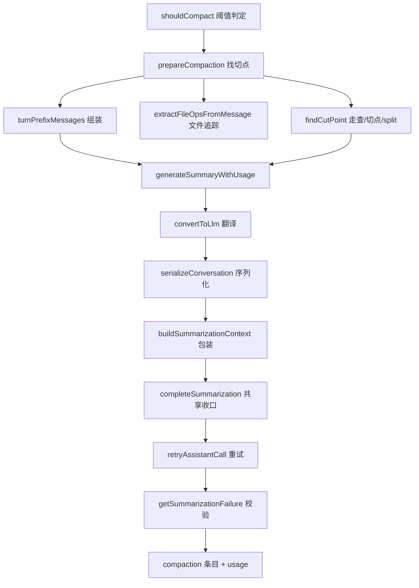

# 09. 系统提示、上下文预算与压缩

今天独立研究系统提示与压缩。先用纯函数验证触发条件，再用离线 faux 会话观察摘要怎样改变模型输入。无需其他任务和模型账号；预计 2–3 小时。

## 今日准备

需要 Node.js >= 22.19.0、已安装依赖。缺失时在根目录执行 `npm install --ignore-scripts`。在 `packages/coding-agent/test/suite/` 新建 `task-09-learning.test.ts`；单文件命令（工作目录 `packages/coding-agent`）：

```powershell
node ../../node_modules/vitest/dist/cli.js --run test/suite/task-09-learning.test.ts
```

测试用 `createHarness()` 获得内存会话与 faux 假模型，最后调用 `h.cleanup()`。为了稳定触发压缩，要同时控制模型的 `contextWindow`、预留量和实际响应长度，不能只写一句短 prompt。

## 学习内容

模型每次收到的是当前系统提示加上会话投影，而系统提示由多段内容组成，包括工具、项目上下文和技能等。上下文窗口是模型可处理的输入上限；长会话需要保留近期消息，把较早消息压成摘要。压缩要选切点，确保工具调用与结果不被拆成不完整片段。摘要调用本身也会用模型；压缩记录写入会话树，原始历史仍保留。自动压缩的失败与普通回答的失败，恢复策略并不完全相同。

先算一个例子：窗口 1000 token，预留 200，当前上下文估算 850；`shouldCompact` 判断 850 > 800，应触发。若 `enabled: false` 则不触发。触发后保留近期消息、用摘要替代较早消息；这改变下一次给模型的投影，但不删除会话文件里的原始条目。

## 核心源码

`packages/coding-agent/src/core/system-prompt.ts` 的 `buildSystemPromptSections` 说明提示由哪些 section 构成；`core/compaction/compaction.ts` 的 `shouldCompact` 判阈值，`findCutPoint` 选择边界，`compact` 生成摘要；`core/compaction/utils.ts` 的 `serializeConversation` 把历史给摘要请求；`core/agent-session.ts` 负责把压缩事件、存储和续跑连起来。按此顺序阅读，分别记下输入、输出、失败分支。

## TypeScript 语法小课：可选链与空值合并

`?.` 在左侧为空时停止读取，`??` 只在值为 `null` 或 `undefined` 时使用默认值。压缩配置里 `0` 可能是有效数值，不能用 `||` 把它误当成“未设置”。

```typescript
type Config = { compaction?: { reserveTokens?: number } };
const config: Config = { compaction: { reserveTokens: 0 } };
const reserve = config.compaction?.reserveTokens ?? 200; // 保留明确设置的 0
const wrong = config.compaction?.reserveTokens || 200; // 0 被错误替换成 200
console.assert(reserve === 0 && wrong === 200);
```

练习：把配置改为 `{}`，观察两个表达式都得到 200；再在 `shouldCompact` 的输入中区分默认值与显式值。


## 完整学习资料

先按下列正文完成学习，再执行本篇的动手任务。正文中原书的实验与验收题先作为案例阅读，实际动手统一放到文末；只运行本篇“今日准备”和动手任务明确指定的离线命令。章节编号保留知识主题的原编号；源码精读、示例、边界条件、常见错误和参考答案均直接收录在本文件中。开头的预计用时仅指核心主线，完整源码精读需另留时间。

### 本篇共同基础

以下运行图和术语均在本文件内。学习正文保留原手册的知识主题编号，但那些编号不构成本任务的阅读前置；实际操作按本篇的动手任务与验收标准执行。学习正文基于原手册注明的 `200387122ca450d6387f033949423114a270b96c` 源码基线，当前工作区若有差异，以当前源码为准。

### 15 分钟主线：pi 怎样完成一件事

假设用户输入“读取 demo.txt，并总结三点”。模型自己不能读取你电脑里的文件。pi 把用户问题和可用工具告诉模型；模型提出 `read` 调用；pi 在本地执行；模型拿到文件内容后才生成总结。这就是全书反复使用的同一个例子。

**先看不带 TypeScript 细节的主流程（教学伪代码）：**

```text
收到用户输入，把它加入当前会话
重复：
    用当前上下文向模型发起请求
    收集模型的回答并把过程通知界面
    如果回答要求执行工具：
        校验参数，在本地执行工具，记录结果
        继续循环，让模型看到工具结果
    否则，检查是否还有排队输入或明确的继续决定
    如果都没有：结束本次运行
```

第一行确定这次任务和已有历史。模型请求只负责生成回答或提出工具调用。工具校验与执行由 pi 负责，结果回到对话后才可能有下一轮模型请求。界面接收运行事件，历史保存完成的消息；它们都与“模型请求”有关，但不是同一种数据。真实实现还处理工具并发、错误、取消、重试和压缩，后面分别讲。

**先分清四对容易混淆的词：**

| 两个词                | 直观区别                                           | 在“读文件并总结”中的例子                   |
| --------------------- | -------------------------------------------------- | -------------------------------------------- |
| 模型请求 / 用户输入   | 用户只说一次话，pi 可以多次询问模型                | 先请模型选择工具，读完文件后再请模型总结     |
| 事件 / 消息           | 事件告诉界面过程；消息承载一次完整的对话内容       | “正在输出第几个字”是事件；完成的总结是消息 |
| 工具调用 / 工具结果   | 调用提出想做什么；结果记录本地执行所得             | `read("demo.txt")` 是调用；文件文字是结果  |
| 会话历史 / 模型上下文 | 历史保留记录；上下文是这一次请求实际送给模型的内容 | 分支 C 仍在文件里，沿分支 D 继续时不必送 C   |


```text
一次用户输入
  → 第一次模型请求：请调用 read("demo.txt")
  → 本地工具执行：读出文件文本
  → 第二次模型请求：根据工具结果总结三点
  → 没有后续工作：结束
```

### 附录 A：术语表

> 用法：每个术语给出"一句话解释 + 首次出现的章节"。读代码遇到不认识的词，先查这里；查不到再搜源码（用英文名搜）。


#### A.1 核心概念

| 中文                  | 英文                    | 一句话                                                                                                             | 章节      |
| --------------------- | ----------------------- | ------------------------------------------------------------------------------------------------------------------ | --------- |
| 智能体外壳 / 运行框架 | agent harness           | 组织模型、工具、状态、界面的框架，本身不"聪明"                                                                     | 0.1       |
| 智能体                | agent                   | "模型 + 工具 + 循环"组成的执行体                                                                                   | 0.1       |
| 轮次                  | turn                    | 一次助手响应 + 它引发的工具执行                                                                                    | 3.3.3     |
| 低层运行              | Agent run               | 一次`Agent.prompt()` 或 `Agent.continue()` 调用建立的生命周期；以 `agent_end` 和已等待的 listener 收尾为边界 | 3.3.3、D2 |
| 会话 prompt 编排      | session prompt workflow | `AgentSession.prompt()` 在 `started` 后进入 `_runAgentPrompt()`；可串起 retry、压缩恢复和多个低层 Agent run  | 8、D27    |
| 用户请求              | user request            | 用户提交一次输入；与模型请求不等价                                                                                 | 3.3.3     |
| 模型请求              | model request           | 真正发给供应商 API 的一次请求                                                                                      | 3.3.3     |
| 转录                  | transcript              | 发给模型看/被记录的消息序列                                                                                        | 4.1       |
| 投影                  | projection              | 从会话树/文档到"模型实际看到的内容"的计算过程                                                                      | 9.4       |
| 活动分支              | active branch           | 从根到当前叶子的一条路径                                                                                           | 9.1       |
| 叶子                  | leaf                    | 会话树中的"当前位置"                                                                                               | 4.7.3     |
| 条目                  | entry                   | 会话文件里的一行（JSONL）                                                                                          | 4.7       |
| 会话                  | session                 | 一次对话的全部记录与状态                                                                                           | 8.1       |
| 压缩                  | compaction              | 用摘要替换旧上下文表示的机制                                                                                       | 10        |
| 上下文窗口            | context window          | 模型一次能接受的最大 token 量                                                                                      | 5.3       |
| 思考级别              | thinking level          | off/minimal/low/medium/high/xhigh/max                                                                              | 5.3       |
| 停止原因              | stop reason             | pending/stop/length/toolUse/error/aborted/deferred                                                                 | 4.3.3     |
| 用量                  | usage                   | token 与成本统计                                                                                                   | 4.3.5     |


#### A.2 消息与事件

| 中文           | 英文                | 一句话                                             | 章节        |
| -------------- | ------------------- | -------------------------------------------------- | ----------- |
| Agent 消息     | AgentMessage        | 内部消息（模型消息 + 应用自定义角色）              | 4.4         |
| 模型消息       | Message             | 供应商能理解的四角色联合                           | 4.3         |
| 内容块         | content block       | 消息内容的最小单元（text/image/thinking/toolCall） | 4.2         |
| 判别联合       | discriminated union | 用共同字面量字段区分成员的类型联合                 | 1.3.4       |
| 类型收窄       | narrowing           | 判断判别字段后类型自动缩小                         | 1.3.4       |
| 事件           | event               | 运行时广播（过程），不是消息（结果）               | 3.3.2       |
| 队列更新       | queue update        | 排队消息变化的会话事件                             | 4.5.2       |
| 边界（结算前） | agent_before_settle | 最后一个可行动钩子                                 | 6.2、13.3.5 |
| 已结算         | agent_settled       | "不会再自动继续"的最终信号                         | 4.5.2、16.3 |
| 延迟句柄       | deferred handle     | 异步应答的取回凭据                                 | 4.3.3       |


#### A.3 工具与模型

| 中文                | 英文                            | 一句话                                    | 章节  |
| ------------------- | ------------------------------- | ----------------------------------------- | ----- |
| 工具                | tool                            | 模型可调用的本地操作                      | 7.1   |
| 工具定义            | ToolDefinition                  | 扩展/应用注册工具的"富"形态               | 7.1.2 |
| 参数校验            | argument validation             | 用 typebox schema 在运行时校验调用参数    | 7.4   |
| 前置钩子            | beforeToolCall                  | 执行前可拦截（block）的钩子               | 7.6   |
| 后置钩子            | afterToolCall                   | 结果字段级改写的钩子                      | 7.6   |
| 顺序 / 并行执行     | sequential / parallel execution | 工具批次的两种调度                        | 7.5   |
| 终止提示            | terminate                       | "整批都同意时不因本批继续"的调度提示      | 7.5.4 |
| 模型                | model                           | 模型静态元数据（api/provider/限制/价格）  | 5.2.2 |
| 协议方言            | api                             | 供应商接口族标识（如 anthropic-messages） | 5.2.1 |
| 供应商              | provider                        | 认证 + 模型目录 + 请求实现                | 5.2.3 |
| 简单流式 / 完整流式 | streamSimple / stream           | 供应商无关档位 vs 协议特有选项            | 5.4   |
| 兼容开关            | compat                          | OpenAI 兼容生态的行为微调                 | 5.5.4 |
| 假供应商            | faux provider                   | 脚本化、离线的测试模型                    | 5.7   |


#### A.4 会话与持久化

| 中文       | 英文             | 一句话                             | 章节   |
| ---------- | ---------------- | ---------------------------------- | ------ |
| 会话管理器 | SessionManager   | 会话文件的对象化句柄               | 9.3    |
| 分支会话   | branched session | 只包含"根到叶子"路径的新文件       | 9.5.2  |
| 分支摘要   | branch summary   | 放弃某分支时生成的摘要条目         | 10.6   |
| 上下文编辑 | context edit     | 只改"投影"、不改原始条目的追加编辑 | 9.4.4  |
| 保留边界   | firstKeptEntryId | 压缩后从哪条开始保留               | 10.3.2 |
| 保留预算   | keepRecentTokens | 压缩后至少保留的近期上下文         | 10.3   |
| 预留       | reserveTokens    | 为模型回复预留的窗口               | 10.2.1 |
| 检测点替换 | checkpoint       | 压缩条目携带的提示词/工具检查点    | 9.4.3  |


#### A.5 扩展与集成

| 中文       | 英文            | 一句话                             | 章节       |
| ---------- | --------------- | ---------------------------------- | ---------- |
| 上下文文件 | context files   | AGENTS.md 等纯文本指令             | 11.4.2     |
| 项目信任   | project trust   | 允许加载项目可执行资源前的人工决定 | 11.5       |
| 提示词模板 | prompt template | Markdown 变成`/命令`             | 12.3.2     |
| 技能       | skill           | 目录 + SKILL.md 的按需说明书       | 12.3.3     |
| 扩展       | extension       | 可执行 TypeScript 模块（进程权限） | 12.3.4、13 |
| Pi 包      | Pi package      | 分发多资源的 npm/git 单元          | 12.3.6     |
| 钳制       | clamp           | 按模型能力压低思考级别             | 5.3        |
| 重绑       | rebind          | 会话替换后重新挂订阅/扩展绑定      | 8.6        |


#### A.6 协议与架构（选修）

| 中文     | 英文                   | 一句话                                          | 章节   |
| -------- | ---------------------- | ----------------------------------------------- | ------ |
| MCP      | Model Context Protocol | 外部工具/资源接入协议                           | 22     |
| 暴露方式 | exposure               | codemode/deferred/direct 三种工具到达模型的方式 | 22.3   |
| 工具搜索 | tool_search            | deferred 工具的"发现后再直调"机制               | 22.3   |
| 沙箱     | codemode sandbox       | QuickJS VM + worker 的脚本执行环境              | 22.9   |
| 面片     | facet                  | Chord 插件可独立打包到不同环境的分片            | 23.2   |
| 服务     | service                | Chord 的类型化稳定 token（singleton/keyed）     | 23.2   |
| 复制状态 | replicated state       | 原子发布、完整不可变值消费的状态                | 23.2   |
| 增量跟踪 | delta tracking         | 记录/合并 JSON 操作的机制                       | 23.2   |
| 持久执行 | durable execution      | 意图先提交、崩溃可续的执行模型                  | 23.1   |
| 检查点   | checkpoint             | 任务每一步的持久落点                            | 23.3.1 |
| 附着     | attachment             | 一条表现层连接绑定到一个会话                    | 24.2   |
| 信封     | envelope               | 协议中包裹 payload 的定向记录                   | 24.3   |
| span     | span                   | 一次操作的时间记录（遥测）                      | 25.2   |
| lift     | lift                   | 处理组相对对照组的提升（评估）                  | 25.5   |
| 阻断配对 | blocked pair           | 两臂未各得恰好一个分数，禁止计入头条            | 25.6   |


#### A.7 容易混淆的成对术语

| 对                                              | 区分                                                                                   |
| ----------------------------------------------- | -------------------------------------------------------------------------------------- |
| message vs event                                | 结果 vs 过程（3.3.2）                                                                  |
| turn vs run                                     | 一个轮次 vs 整次运行（3.3.3）                                                          |
| `agent_end` vs `agent_settled`              | 低层 run 结束 vs 自动工作清零（4.5.2）                                                 |
| 声明 vs 可执行                                  | 系统消息里的工具声明 vs 运行时工具集（7.3）                                            |
| details vs content                              | 给界面/程序 vs 给模型（14.2）                                                          |
| 完成顺序 vs 记录顺序                            | 并发完成 vs 声明序记录（7.5.3）                                                        |
| 停止原因`length` vs `stop`                  | 被截断 vs 正常说完（4.3.3）                                                            |
| `AgentSession.prompt()` vs `Agent.prompt()` | 应用层输入分流/会话编排 vs 低层 Agent run 入口（8、D2、D27）                           |
| `handled` vs `queued` vs `started`        | 输入被消费、不创建该输入自己的 run / 放入当前运行队列 / 进入会话 run 编排（8、16.5.3） |
| 提示词模板 vs 技能                              | 一段话 vs 一套流程+文件（12.3.3）                                                      |
| 扩展 vs Pi 包                                   | 可执行单元 vs 分发单元（12.3.6）                                                       |
| compaction 摘要 vs branch summary               | 压缩历史 vs 放弃分支（10.6）                                                           |
| durable cheat sheet：`replay: safe/never`     | 崩溃后重跑 vs 报 interrupted（23.4）                                                   |
| JSONL RPC vs client/server                      | 进程内 stdio 协议 vs 跨进程服务路由（24.1）                                            |
| 单测 vs 评估                                    | 确定性 vs 配对统计（25.1、25.6）                                                       |


#### A.8 输入与运行的层级

不要按“用户按了一次回车”推断低层 run 或模型请求的数量。实际层级是：

| 层级       | 代表符号                                           | 次数关系                                                                                      |
| ---------- | -------------------------------------------------- | --------------------------------------------------------------------------------------------- |
| 输入调用   | `AgentSession.prompt(text)`                      | 一次调用只表达一次输入尝试；结果可能是`handled`、`queued` 或 `started`                  |
| 会话编排   | `_runAgentPrompt(messages)`                      | 只在开始处理输入时进入；在里面管理重试、压缩恢复、边界 continuation 与取消                    |
| Agent run  | `Agent.prompt(messages)` 或 `Agent.continue()` | 一次会话编排可包含多个 run；每个低层 run 都发出自己的`agent_start` / `agent_end` 生命周期 |
| Agent turn | `turn_start` 到 `turn_end`                     | 一个 run 可包含多个 turn；每个 turn 通常包含一次助手响应及其引发的工具执行                    |
| 模型请求   | `streamSimple` / provider stream                 | 通常发生在助手响应阶段；自动重试会再次请求模型，压缩摘要等内部工作也可能有独立请求            |

两个边界例子：

- 扩展命令被消费时，`prompt()` 返回 `handled`，没有为该输入启动 `_runAgentPrompt()`；
- `prompt()` 在 Agent 已运行时以 `steer`/`followUp` 方式排队，返回 `queued`。这条输入会影响现有流程，但它本身不是新的 `Agent.prompt()` 调用。

因此，统计“模型请求次数”不能数 prompt、turn 或 `agent_end`：应按 provider 请求事件/日志，或明确的测试探针计数。章节 21 的自测题也按这个区分评分。


#### A.9 索引方式说明

- 想找"某行为在哪个文件" → 用 source-map；
- 想找"某命令怎么跑" → 用 commands；
- 想找"某现象怎么排" → 用 troubleshooting；
- 想找"哪些练习要做" → 用 exercises-and-answers。

---

### 第 10 章：上下文构造、系统提示与压缩


**先懂这一章**：模型能接收的上下文有限。pi 要决定本次请求放入哪些指令和历史；历史过长时生成摘要，让后续请求仍能继续。摘要改变模型接下来看到的内容，原始会话记录仍可保留。

```text
教学伪代码：组装系统提示与活动历史 → 估算可用空间
           → 空间足够则正常请求模型
           → 空间紧张则选取旧历史、生成摘要、写入压缩条目
           → 用新的上下文继续
```

“何时检查”“切点怎样选择”“失败后怎样恢复”各有条件，正文逐段解释，不能把伪代码当作精确算法。

第 9 章解决“从会话树取哪条历史”；本章解决“这条历史怎样装进有限的模型上下文”。两章都在构造请求输入，但压缩增加了摘要和保留边界，不改变原始条目的存在。

> 学完本章你能回答：
>
> 1. 系统提示是怎么"分节组装"的？为什么它能被增量补丁修改？
> 2. 上下文什么时候算"告急"？触发条件用哪个公式、哪个默认值？
> 3. 一次压缩的完整流程是什么？"切点"如何选、`firstKeptEntryId` 如何定？
> 4. 摘要请求长什么样？为什么它不会被模型当成"对话继续"？
> 5. 溢出恢复与自动重试的顺序是什么？失败了会怎样？

**预计学习时间**：2 天（压缩是"长会话可用性"的核心机制，值得精读）。
**本章验证状态**：静态核对通过（`system-prompt.ts`、`compaction/compaction.ts` 关键函数与 `compaction.md` 核对）；实验 L06 设计中。

---


#### 10.1 系统提示：分节组装，而不是"一个大字符串"

模型请求里的系统提示不是常量，而是每次按"输入状态"现算的**分节结构**。入口在 `packages/coding-agent/src/core/system-prompt.ts`。


##### 10.1.1 输入：`BuildSystemPromptOptions`

```typescript
export interface BuildSystemPromptOptions {
	/** Custom system prompt (replaces the default prefix). */
	customPrompt?: string;
	/** Exact full prompt replacement set by a before_agent_start handler. */
	forceSystemPrompt?: string;
	/** Tools to include in prompt. Default: [read, bash, edit, write]. */
	selectedTools?: string[];
	/** Optional one-line tool snippets keyed by tool name. */
	toolSnippets?: Record<string, string>;
	/** Guideline bullets contributed by each tool, keyed by tool name. */
	toolGuidelines?: Record<string, string[]>;
	/** Additional guideline bullets appended to the default system prompt rules. */
	promptGuidelines?: string[];
	/** Text appended from user configuration before project context, skills, and cwd. */
	appendSystemPrompt?: string;
	/** Additional XML-wrapped prompt sections keyed by tag name. */
	sections?: Record<string, string>;
	/** Working directory. */
	cwd: string;
	/** Pre-loaded context files. */
	contextFiles?: Array<{ path: string; content: string }>;
	/** Pre-loaded skills. */
	skills?: Skill[];
}
```

注意 `toolSnippets` 与 `toolGuidelines`**按工具名索引**——第 7 章 `read.ts` 里的 `readToolSystemPromptContribution` 就是数据来源。**提示词是工具定义的投影**：工具写得好，提示词自然到位；这是"单一来源"的又一例。


##### 10.1.2 组装：`buildSystemPromptSections`

核心函数逐段读（节选 + 注释）：

```typescript
const SYSTEM_PROMPT_SECTION_NAME = /^[a-z][a-z0-9_-]*$/;

export function buildSystemPromptSections(input: BuildSystemPromptOptions): SystemPromptSections {
	const options = normalizeBuildSystemPromptOptions(input);
	// ... 解构 ...

	// ① 自定义 section 名必须合法（小写字母开头，字母数字下划线连字符）；preamble 是保留名
	for (const name of Object.keys(customSections)) {
		if (!SYSTEM_PROMPT_SECTION_NAME.test(name) || name === "preamble") {
			throw new Error(`Invalid system prompt section name: ${name}`);
		}
	}

	const promptSections: Record<string, string> = {};
	if (customPrompt) {
		promptSections.preamble = customPrompt;      // 用户完全替换开头段
	} else {
		// ② 默认 preamble：身份与总体职责
		promptSections.preamble =
			"You are an expert coding assistant operating inside pi, a coding agent harness. You help users by reading files, executing commands, editing code, and writing new files.";
		// ③ 工具速览：只列出"有 snippet"的工具
		const visibleTools = selectedTools.filter((name) => !!toolSnippets[name]);
		const tools = visibleTools.length > 0
			? visibleTools.map((name) => `- ${name}: ${toolSnippets[name]}`).join("\n")
			: "(none)";
		promptSections.tools = `${tools}\n\nIn addition to the tools above, you may have access to other custom tools depending on the project.`;
		// ④ 规则：按已选工具生成（含一些"没有 grep 时用 bash 找文件"的条件规则）
		promptSections.rules = buildRules(selectedTools, toolGuidelines, promptGuidelines);
		// ⑤ pi 自身文档的索引（让模型能回答"pi 怎么用"）
		promptSections.docs = `Pi documentation (read only when the user asks about pi itself, ...): ...`;
	}

	if (appendSystemPrompt) promptSections.addendum = appendSystemPrompt;
	// ⑥ 项目上下文文件（AGENTS.md 等）包在 <project_instructions path="..."> 标签里
	if (contextFiles.length > 0) promptSections.project_context = renderProjectContext(contextFiles);
	// ⑦ 技能：按"有 read 或 bash 可读技能文件"为条件生成
	const skillFileReadTool = (["read", "bash"] as const).find((tool) => selectedTools.includes(tool));
	if (skillFileReadTool && skills.length > 0) {
		const skillsPrompt = formatSkillsForPrompt(skills, skillFileReadTool).trim();
		if (skillsPrompt) promptSections.skills = skillsPrompt;
	}
	// ⑧ 工作目录（统一用正斜杠）
	promptSections.cwd = cwd.replace(/\\/g, "/");
	// ⑨ 自定义 sections 最后覆盖
	for (const [name, content] of Object.entries(customSections)) {
		if (content) promptSections[name] = content;
	}

	// ⑩ 除 preamble 外，每个 section 都包一层与名字相同的标签
	const sections: SystemPromptSections = { preamble: promptSections.preamble };
	for (const [name, content] of Object.entries(promptSections)) {
		if (name !== "preamble") sections[name] = `<${name}>\n${content}\n</${name}>`;
	}
	return sections;
}
```

七种内置 section 一览：

| section             | 内容                 | 关键点                                       |
| ------------------- | -------------------- | -------------------------------------------- |
| `preamble`        | 身份与总职责         | **唯一不加标签**的 section             |
| `tools`           | 工具速览             | 只列有 snippet 的；提示"可能还有自定义工具"  |
| `rules`           | 行为准则             | 由工具 guidelines + 通用规则去重生成         |
| `docs`            | pi 文档索引          | 让模型知道去哪里读 pi 自己的文档             |
| `addendum`        | 用户追加文本         | 来自设置                                     |
| `project_context` | AGENTS.md 等项目指令 | 包`<project_instructions path="...">` 标签 |
| `skills`          | 技能清单             | 条件：已选 read 或 bash 工具                 |
| `cwd`             | 工作目录             | 反斜杠统一转正斜杠                           |

**为什么每个 section 都包标签？** 因为第 4 章的补丁机制靠"按名字替换"工作：`<skills>...</skills>` 这样的自定界标签让模型能把"后来的更新"与"原来的内容"对应起来（`message-types.md` 的注释也提醒过：section 要自定界，避免用纯数字名）。


##### 10.1.3 两种形态：结构化 vs 强制覆盖

```typescript
export function buildSystemPromptState(input: BuildSystemPromptOptions): { content: string; sections?: SystemPromptSections } {
	if (input.forceSystemPrompt !== undefined) return { content: input.forceSystemPrompt };  // 整体覆盖，无 sections
	return { content: "", sections: buildSystemPromptSections(input) };
}
```

- **普通形态**：`content` 为空，prompt 全部在 `sections` 里 → 可以增量打补丁；
- **强制形态**（`forceSystemPrompt`，扩展在 `before_agent_start` 里设置）：`content` 是完整提示词、没有 sections → **不可分节补丁**，每次变化都是整段替换。这是"扩展想要完全控制"的逃生门。

`buildSystemPrompt` 则把状态渲染成与转录回放完全一致的文本（`getSystemMessageText`）——保证"你看到的就是模型看到的"。


##### 10.1.4 增量演化：`diffSystemPromptSections`

系统提示随会话演化（技能启用、工具变化、追加指令……）。会话不需要重发全部，而是算补丁：

```typescript
export function diffSystemPromptSections(
	previous: Record<string, string | null>,
	current: SystemPromptSections,
): Record<string, string | null> | undefined {
	const patch: Record<string, string | null> = {};
	for (const [name, text] of Object.entries(current)) {
		if (previous[name] !== text) patch[name] = text;          // 变了的：新内容
	}
	for (const name of Object.keys(previous)) {
		if (current[name] === undefined) patch[name] = null;      // 消失的：null 表示删除
	}
	return Object.keys(patch).length > 0 ? patch : undefined;      // 没变：undefined（不写历史）
}
```

这与第 3 章 `declareToolChanges` 对工具做的是同一件事，只是对象换成提示词分节。**"可回放 + 增量补丁"是本仓库贯穿一致的模式。**


#### 10.2 上下文什么时候"告急"


##### 10.2.1 判定公式与默认值

`core/compaction/compaction.ts`：

```typescript
export interface CompactionSettings {
	enabled: boolean;
	reserveTokens: number;
	keepRecentTokens: number;
}

export const DEFAULT_COMPACTION_SETTINGS: CompactionSettings = {
	enabled: true,
	reserveTokens: 16384,     // 给模型回复预留的空间
	keepRecentTokens: 20000,  // 压缩后至少保留的近期上下文
};

export function shouldCompact(contextTokens: number, contextWindow: number, settings: CompactionSettings): boolean {
	if (!settings.enabled) return false;
	return contextTokens > contextWindow - settings.reserveTokens;
}
```

记住这个不等式：

```text
上下文 token 数 > 模型上下文窗口 - 16384  → 触发自动压缩
```

`contextWindow` 来自 `Model` 元数据（第 5.3 节），`reserveTokens`/`keepRecentTokens` 可在设置里覆盖（全局或项目级，`settings.json`）。


##### 10.2.2 token 数怎么估

两个来源，优先级不同：

1. **真实用量**（`calculateContextTokens`）：

```typescript
export function calculateContextTokens(usage: Usage): number {
	return usage.totalTokens || usage.input + usage.output + usage.cacheRead + usage.cacheWrite;
}
```

   来自**上一次助手消息的 `usage`**——这是供应商报的真实数字，最可信；

2. **字符估算**（`estimateTokens`，注释明确说 "conservative (overestimates tokens)"）：按 `chars / 4` 的启发式；图片按固定字符数（`ESTIMATED_IMAGE_CHARS = 4800`）折算。

对新手的重要提醒：**压缩判定是"估算 + 真实值"的混合**，所以你会看到"明明感觉没超也触发了"。要精调就调设置，而不是怀疑代码。


##### 10.2.3 四个检查时机（`compaction.md` 官方口径）

```text
1. 每次新用户 prompt 之前
2. 多轮运行的轮间：工具结果追加后、下一次模型请求前（发生在 prepareNextTurn）
3. 低层 run 结束后的"最后补救"（overflow recovery）
4. 手动：/compact [instructions]
```

第 2 条有个细节**值得画星号**：轮间检查发生在 `prepareNextTurn` 里（第 6.2 节读过这个钩子），而且"这批工具结果将终止 run 且没有排队消息"时**跳过**——因为不会再发请求，压缩纯属浪费。

还有两类"事后补救"：

- **供应商报上下文溢出错误**：可以选择"压缩一次再重试"的单次恢复；
- **`stopReason: "length"`（截断）**：同样可能触发恢复；带工具调用的 length 响应保留"合成的失败工具结果"，然后按普通调度继续（第 3.14 节的轨迹 D）。


#### 10.3 压缩流水线：五个步骤与"切点"算法

**先懂**：旧历史太长时，不能任意砍掉一半。pi 先决定最近哪些消息必须原样保留，再把更早的内容提炼成摘要；下一次请求把摘要和保留段接起来。

```text
教学伪代码：估算当前历史 → 找到最近消息的保留边界
           → 提取更早的摘要素材 → 生成摘要
           → 记录摘要和首个保留条目 → 重建上下文
```

“切点”是保留和摘要之间的边界，不能随意切断一组有关联的工具消息；具体约束由后文的源码决定。

`compaction.md` 给出的五步流程：

```text
1. Find cut point       在"最终投影"上从最新往回走，累计 token 估算，直到 keepRecentTokens
2. Extract messages     收集"上一个保留边界（或会话开头）→ 切点"之间的投影消息
3. Generate summary     调 LLM 生成结构化摘要（有旧摘要时作为迭代上下文传入）
4. Append entry         写入 CompactionEntry（含 summary 与 firstKeptEntryId）
5. Rebuilds context     下一次请求用"摘要 + firstKeptEntryId 起的消息"重建
```

第 5 步的视觉效果（官方示意图翻译）：

```text
压缩前（条目序）：
  hdr  usr  ass  tool | usr  ass  tool  tool  ass  tool
      └── 将被摘要 ──┘ └──────── 保留 ────────┘
                          ↑ firstKeptEntryId

压缩后（追加 cmp 条目）：
  ...                                       cmp

模型看到：
  system  summary  usr  ass  tool  tool  ass  tool
     ↑       ↑      └──────── firstKeptEntryId 起 ────────┘
   提示词   压缩摘要
```

**暂停预测：** `demo.txt` 的旧问答已经很长，最近一轮助手刚调用 `read` 并收到工具结果。压缩完成后，原始会话文件里的旧问答是否被删？如果要保留这次工具调用，能只保留工具结果、把对应的助手调用放进摘要吗？

**对照答案：** 压缩是追加 `CompactionEntry`，旧条目仍在文件里；下一次模型请求才通过投影用摘要替代较早的内容。工具结果不能成为孤立的保留起点，否则模型只看见“文件内容”，看不见它回应了哪个调用。切点只能落在合法条目上，必要时会多保留一点；下面的 `findCutPoint` 就是在确定这个边界。这里不假定具体切在哪条消息，实际位置还取决于 token 估算和 `keepRecentTokens`。


##### 10.3.1 切点（cut point）规则

**合法切点**（从 `compaction.md` 的 "Cut Point Rules"）：

- 用户消息；
- 助手消息；
- `bashExecution` 消息；
- 自定义消息（`custom_message`、`branch_summary`）。

**永不切在工具结果上**——工具结果必须跟它的工具调用在一起（否则模型看到"孤儿结果"）。从"投影后"而非"原始文件"上找切点也很关键：**被 `context_edit` 省略的条目不影响切点与摘要**（`compaction.md` 原话："Omitted raw entries remain stored but do not affect cut selection, summaries, checkpoints, or token estimates."）。


##### 10.3.2 `findCutPoint` 精读

```typescript
export function findCutPoint(entries, startIndex, endIndex, keepRecentTokens): CutPointResult {
	const cutPoints = findValidCutPoints(entries, startIndex, endIndex);
	if (cutPoints.length === 0) {
		return { firstKeptEntryIndex: startIndex, turnStartIndex: -1, isSplitTurn: false };
	}

	// 从最新往回走，累计"投影消息"的 token 估算
	let accumulatedTokens = 0;
	let cutIndex = cutPoints[0];      // 默认：从最早的消息保留
	for (let i = endIndex - 1; i >= startIndex; i--) {
		const entry = entries[i];
		const messageTokens = sessionEntryToContextMessages(entry).reduce(
			(sum, message) => sum + estimateTokens(message), 0);
		if (messageTokens === 0) continue;
		accumulatedTokens += messageTokens;

		if (accumulatedTokens >= keepRecentTokens) {
			// 取"不早于当前位置"的最近合法切点；若尾部工具结果自身就超预算，
			// 就保留它们前面的助手工具调用，而不是退回到第一条消息
			cutIndex = cutPoints.find((candidate) => candidate >= i) ?? cutPoints[cutPoints.length - 1];
			break;
		}
	}

	// 再往前吞掉"不产生上下文"的元数据条目（model_change 等）
	while (cutIndex > startIndex) {
		const prevEntry = entries[cutIndex - 1];
		if (prevEntry.type === "compaction" || sessionEntryToContextMessages(prevEntry).length > 0) break;
		cutIndex--;
	}

	// 判断是否"切进了用户消息跨度"（split turn）
	const cutEntry = entries[cutIndex];
	const startsTurn = isTurnStartEntry(cutEntry);
	const turnStartIndex = startsTurn ? -1 : findTurnStartIndex(entries, cutIndex, startIndex);
	return { firstKeptEntryIndex: cutIndex, turnStartIndex, isSplitTurn: !startsTurn && turnStartIndex !== -1 };
}
```

三个设计细节：

1. **"从新往旧"累计**：保证保留的是**最近** `keepRecentTokens` 量级的内容——最新上下文最重要；
2. **倾向合法切点**：宁可多保留一点，也不切出"半截工具对"；
3. **元数据前吞**：`model_change` 这类不产生消息的条目会被并入保留区间（它影响解释但不占 token），避免"保留区从一条设置变更开始"的怪异边界。


##### 10.3.3 切进用户消息跨度（split user-message span）

用户的一个请求可能引发很多轮工具往返（一次"跨度"）。如果**单个跨度本身就超过 `keepRecentTokens`**，切点只能落在跨度中间——此时生成**两份摘要再合并**（官方文档）：

1. **历史摘要**：更早的上下文（如果有）；
2. **跨度前缀摘要**：这个跨度前半段（从它的用户消息到切点之前）。

图解（`compaction.md` 示意）：

```text
usr │ ass tool ass tool tool ass tool
 ↑                                    ↑
turnStartIndex = 切点所在跨度的起点    firstKeptEntryId
 └──── turnPrefixMessages（前缀）────┘ └── kept ──┘
```


##### 10.3.4 重复压缩与 `tokensBefore` 的"重算"

会话被压缩多次时，第二次摘要的起点是**上一次压缩的保留边界**（`firstKeptEntryId`），而不是压缩条目本身——注释原话：

```text
On repeated compactions, the summarized span starts at the previous compaction's kept boundary
(firstKeptEntryId), not at the compaction entry itself ... This preserves messages that survived
the earlier compaction by including them in the next summarization pass as well.
```

并且 `tokensBefore` 会**在写入前重算**：从"重建后的、应用过 context_edit 的投影"计算，而不是照抄某个旧数字——保证"本次替换掉的上下文规模"是真实的。


#### 10.4 摘要请求：一次"特殊的模型调用"


##### 10.4.1 结构化格式

摘要不是自由发挥，而是固定骨架（`compaction.md`）。压缩摘要：

```markdown
## Goal
[用户想达成什么]

## Constraints & Preferences
- [用户提出的要求]

## Progress
### Done
- [x] [已完成]
### In Progress
- [ ] [进行中]
### Blocked
- [阻塞项]

## Key Decisions
- **[决策]**：[理由]

## Next Steps
1. [接下来该做什么]

## Critical Context
- [继续工作所需的数据]

<read-files>
path/to/file1.ts
</read-files>

<modified-files>
path/to/changed.ts
</modified-files>
```

分支摘要同骨架，但**停在 Next Steps**（没有 Critical Context）。文件列表在需要时附加。

为什么要有固定骨架？因为摘要要给**后续的模型**看：结构化让"目标、决策、进度"不随叙述风格丢失；`<read-files>`/`<modified-files>` 标签让文件轨迹可机读、可累计。


##### 10.4.2 文件跟踪是"累积"的

默认压缩与分支摘要都会从被摘要消息的**工具调用**中提取文件操作，并且：

- 压缩会**继承上一次 pi 生成压缩**的文件列表；
- 分支摘要会继承被摘要条目里**pi 生成的分支摘要**的列表；
- 因此列表跨多轮压缩不断累计；
- **扩展生成的摘要（`fromHook: true`）不自动继承**——扩展自己管理 `details`（`compaction.md` 明确说明）。

文件列表的消费方：`details: { readFiles, modifiedFiles }`（`CompactionDetails` / `BranchSummaryDetails`）——界面、扩展、以及"摘要质量"的调试都靠它。


##### 10.4.3 序列化：让模型"看访谈记录"，而不是"接着聊"

生成摘要前，消息被 `serializeConversation`（`compaction/utils.ts`）转成一种**第三人称速记文本**：

```text
[User]: What they said
[Assistant thinking]: Internal reasoning
[Assistant]: Response text
[Assistant tool calls]: read(path="foo.ts"); edit(path="bar.ts", ...)
[Tool result]: Output from tool
```

两个设计点：

1. **防止"对话惯性"**：如果直接把历史原样发给模型并要求总结，模型可能把总结任务当作"继续聊天"。加 `[User]:` 这类前缀，明确这是**待处理的材料**；
2. **工具结果截断到 2000 字符**（超出部分替换为截断标记）——因为 `read`/`bash` 的输出通常是上下文体积的最大来源，摘要请求本身也要控制成本。

另外 `compaction.md` 提到：**摘要请求会禁用 prompt 缓存写入**——这种一次性请求不太可能被复用，写缓存纯属浪费。


#### 10.5 溢出恢复的执行顺序

把第 6 章的"重试"与本章的"压缩"拼接起来，官方给出的完整顺序（`compaction.md`）：

```text
persist final assistant response          # 最终助手响应先落盘
→ extension/public turn_end               # 对外事件照常
→ extension/public agent_end
→ append context_edit omissions for the selected attempt   # 把失败的尝试从投影中剔除
→ for overflow/length: run session_before_compact and append compaction on success
→ start the retry as a fresh run          # 以"全新 run"重试
```

对照代码（第 6.6 节）：`_handlePostAgentRun` 里先试重试（`_prepareRetry` → `_omitRecoveryAttempt` 追加省略编辑），再试压缩（`_checkCompaction(message, true, toolResults)`）。两类恢复共享同一套"先修上下文、再重跑"的骨架。

**失败时的语义**（重要）：

```text
If recovery compaction fails or is cancelled, Pi keeps the omission edits, appends no
compaction, and schedules no internal retry.
```

- 省略编辑**保留**（坏的那次尝试仍不进上下文）；
- 不写压缩条目、不再自动重试；
- `agent_before_settle`（第 6.2 节的边界钩子）看到的是**修复后的投影**；
- 但**原始历史、导出、计费、历史检索仍能看到被省略的尝试**——"修上下文"不等于"抹掉事实"。


#### 10.6 分支摘要：切换分支时的"访客报告"

`/tree` 导航到另一条分支时，pi 会**询问用户是否总结**被放弃的路径。选择总结则：

```text
① 找共同祖先（old 与 new 位置的最深公共节点）
② 从旧叶子往回收集到共同祖先的条目
③ 按 token 预算准备（从新到旧纳入）
④ 调 LLM 生成结构化摘要
⑤ 在导航点追加 BranchSummaryEntry
```

官方示意图：

```text
导航前：
         ┌─ B ─ C ─ D（旧叶子，将放弃）
    A ───┤
         └─ E ─ F（目标）

导航后（带摘要）：
         ┌─ B ─ C ─ D
    A ───┤
         └─ E ─ F ─ [B、C、D 的摘要]（新叶子）
```

`BranchSummaryEntry` 的字段（`session-format.md`）：

```typescript
interface BranchSummaryEntry<T = unknown> {
	type: "branch_summary";
	id: string; parentId: string | null; timestamp: string;
	summary: string;
	fromId: string;        // 从哪个旧叶子离开
	usage?: Usage;         // 生成摘要的用量（计入会话总计）
	fromHook?: boolean;    // 是否扩展提供
	details?: T;           // 默认：{ readFiles, modifiedFiles }
}
```

在投影里，它变成一条带包装前缀的 **user 消息**（第 4.4.2 节的 `BRANCH_SUMMARY_PREFIX`）——新分支的模型因此知道"刚才在另一条路上试过什么"。


#### 10.7 扩展钩子：把压缩"接管"过来

三个事件（`core/extensions/types.ts`）：


##### 10.7.1 `session_before_compact`

每次自动压缩或 `/compact` 前触发，可以取消或提供自定义摘要：

```typescript
pi.on("session_before_compact", async (event, ctx) => {
	const { preparation, branchEntries, customInstructions, reason, willRetry, signal } = event;

	// preparation.messagesToSummarize  待摘要消息
	// preparation.turnPrefixMessages   分裂跨度的前缀（isSplitTurn 时）
	// preparation.previousSummary      上一次压缩摘要（迭代上下文）
	// preparation.fileOps              提取出的文件操作
	// preparation.tokensBefore         压缩前上下文 token 数
	// preparation.firstKeptEntryId     保留边界
	// preparation.settings             有效设置（含模型覆盖）
	// reason - "manual" | "threshold" | "overflow"
	// willRetry - 溢出恢复是否会重试（决定摘要要不要"接得上"）

	return { cancel: true };                       // 取消

	return {                                       // 自定义摘要
		compaction: {
			summary: "Your summary...",
			firstKeptEntryId: preparation.firstKeptEntryId,
			tokensBefore: preparation.tokensBefore,
			// usage: ...,  // 可选：计入会话总计
			details: { /* 自定义数据 */ },
		},
	};
});
```

想用**自己的模型**做摘要时，文档给出的标准路径是：`convertToLlm(preparation.messagesToSummarize)` → `serializeConversation(...)` → 自己的模型 → 返回 `compaction` 对象。仓库里有完整示例 `examples/extensions/custom-compaction.ts`。


##### 10.7.2 `session_compact_failed`

压缩失败或被取消时触发（给遥测/重试逻辑配对用）：载荷含 `reason`、`errorMessage`、`aborted`、`willRetry`、`fromExtension`。


##### 10.7.3 `session_before_tree`

`/tree` 导航前**总是**触发（无论用户选不选摘要）：可以取消导航，或在 `preparation.userWantsSummary` 为真时提供自定义摘要。

三个钩子合起来意味着：**压缩策略是一个开放的扩展点**，而不只是硬编码逻辑。读 `compaction.ts` 时你会看到默认实现与扩展覆盖如何合并（`fromHook` 字段、"preparation" 对象就是给钩子用的数据协议）。


#### 10.8 实验 L06：压缩前后对照

**实验性质**：本地运行（faux 驱动）；零模型费用。
**验证状态**：设计中。


##### 目标

用可控的假数据触发一次自动压缩，对照"压缩前后模型上下文"与"磁盘条目"，验证本章结论。


##### 步骤

1. **调小阈值**：在测试 harness 的 settings 里覆盖压缩设置（等价于在 `settings.json` 里写）：

```json
{
  "compaction": {
    "enabled": true,
    "reserveTokens": 200,
    "keepRecentTokens": 100
  }
}
```

   （字段名以 `CompactionSettings` 与设置的读取实现为准；测试里通常用 `settings: { ... }` 直接注入。）

2. **编脚本**：让 faux 返回若干条长文本响应（每次响应几百字，迅速推高估算 token），随后到达阈值；
3. **观察会话事件与磁盘分开看**：会话事件主线是 `compaction_start`（reason: `"threshold"`）→ `compaction_end`（result / aborted / willRetry）；扩展钩子另有自己的派发。成功时源码会调用 `appendCompaction()` 写入新 `compaction` 条目，但不会为它发 `entry_appended`。用 `sessionManager.getEntries()` 检查磁盘条目，不要把 `entry_appended` 当成所有写入的日志；
4. **对照上下文**：

```text
压缩前：buildSessionContext().messages 的长度与首元素
压缩后：同一次调用的结果
期望：首部被替换为“检查点系统消息 + 压缩摘要消息”，随后是 firstKeptEntryId 起的消息
```

5. **验证"事实不删"**：读 `sessionManager.getEntries()`，确认被摘要的原始条目**仍在文件里**（只是不再投影）；
6. **变体实验**：把摘要脚本改成"模型抛错"（faux 返回 `{ stopReason: "error" }`），观察 `session_compact_failed` 与"不重试"的行为（对照 10.5 节）。


##### 观察与思考

- 压缩的 `tokensBefore` 与你自己估算的值差多少？（体会"估算 + 真实值"的混合）
- 摘要请求在 faux 的 `callCount` 里占几次？（提示：`generateSummary` 走的是同一条 streamSimple 链路）
- 若压缩后上下文仍超阈值，下一次检查会发生什么？（重复压缩，起点是上一个保留边界）


##### 清理

还原测试文件；删除临时脚本；`git status` 干净。


#### 本章源码精读

> **源码精读**：先定位导出与函数签名，再沿调用点核对输入、状态、输出和错误；最后用本篇指定的离线实验验证。

先用 D4 理解系统提示与压缩所需的上下文，再读 D15 的会话侧触发，最后读 D10 的压缩准备与写入。按“输入是什么 → 何时触发 → 写了什么”的顺序读，避免把摘要误认为原始记录被删除。


##### D4：系统提示与压缩逐段精读

**先懂**：系统提示由多类指令组成，长会话还要为模型腾出空间。先看“这次模型请求的指令从哪来”，再看“历史过长时哪些内容被摘要、哪些被保留”。

```text
教学伪代码：收集基础与项目指令 → 组成系统提示
           → 估算上下文空间 → 选择历史切点
           → 用旧历史生成摘要 → 把摘要用于后续请求
```

这两个过程相关但不是同一函数；后文分成提示组装和压缩两部分。

> 精读对象：`packages/coding-agent/src/core/system-prompt.ts`（约 200 行）与 `core/compaction/compaction.ts`、`core/compaction/utils.ts` 的关键函数。
> 对应主线：第 10 章（上下文构造、系统提示与压缩）。
> 读法：先读第一部分（提示如何分节），再读第二部分（何时压缩、如何切分与摘要）。

---


###### 第一部分：`system-prompt.ts` 精读


##### 0. 文件地图

```text
常量    SYSTEM_PROMPT_SECTION_NAME   合法 section 名正则
函数    normalizeBuildSystemPromptOptions  归一化输入（防御性拷贝 + 默认值）
        renderProjectContext               上下文文件 → <project_instructions> 文本
        buildRules                         生成"规则"分节（去重 + 条件规则）
        buildSystemPromptSections          十步组装（本文件主体）
        buildSystemPromptState             force 覆盖 vs 结构化两态
        buildSystemPrompt                  渲染成与转录回放一致的文本
        diffSystemPromptSections           计算分节补丁（增量更新）
类型    BuildSystemPromptOptions / Normalized... / SystemPromptSections
```


##### 1. 输入类型与与归一化

【源码（节选）】

```typescript
export interface BuildSystemPromptOptions {
	/** Custom system prompt (replaces the default prefix). */
	// 字段分五类：替换类（customPrompt/forceSystemPrompt）、工具相关（selectedTools/toolSnippets/toolGuidelines）、追加类（promptGuidelines/appendSystemPrompt/sections）、环境（cwd）、已加载资源（contextFiles/skills）
	customPrompt?: string;
	/** Exact full prompt replacement set by a before_agent_start handler. */
	forceSystemPrompt?: string;
	/** Tools to include in prompt. Default: [read, bash, edit, write]. */
	selectedTools?: string[];
	/** Optional one-line tool snippets keyed by tool name. */
	// toolSnippets/toolGuidelines 是"按工具名索引"的字典——调用方负责从工具定义里提取（第 10.1.1 节：提示词是工具定义的投影）
	toolSnippets?: Record<string, string>;
	/** Guideline bullets contributed by each tool, keyed by tool name. */
	toolGuidelines?: Record<string, string[]>;
	/** Additional guideline bullets appended to the default system prompt rules. */
	promptGuidelines?: string[];
	/** Text appended from user configuration before project context, skills, and cwd. */
	appendSystemPrompt?: string;
	/** Additional XML-wrapped prompt sections keyed by tag name. */
	sections?: Record<string, string>;
	/** Working directory. */
	cwd: string;
	/** Pre-loaded context files. */
	// contextFiles 与 skills 是已加载的（"Pre-loaded"）——本文件不做磁盘发现（那是 resource-loader.ts 的事，第 11 章）
	contextFiles?: Array<{ path: string; content: string }>;
	/** Pre-loaded skills. */
	skills?: Skill[];
}
```

【注解】

- 字段分五类：**替换类**（`customPrompt`/`forceSystemPrompt`）、**工具相关**（`selectedTools`/`toolSnippets`/`toolGuidelines`）、**追加类**（`promptGuidelines`/`appendSystemPrompt`/`sections`）、**环境**（`cwd`）、**已加载资源**（`contextFiles`/`skills`）。
- 【陷阱】`toolSnippets`/`toolGuidelines` 是"按工具名索引"的字典——**调用方负责从工具定义里提取**（第 10.1.1 节：提示词是工具定义的投影）。`read.ts` 的 `readToolSystemPromptContribution` 就是提取源。
- `contextFiles` 与 `skills` 是**已加载**的（"Pre-loaded"）——本文件不做磁盘发现（那是 `resource-loader.ts` 的事，第 11 章）。**分层清晰：发现归发现，组装归组装。**

【源码（归一化）】

```typescript
export function normalizeBuildSystemPromptOptions(input: BuildSystemPromptOptions): NormalizedBuildSystemPromptOptions {
	return {
		customPrompt: input.customPrompt,
		forceSystemPrompt: input.forceSystemPrompt,
		// selectedTools: [...default]——默认工具列表在这里硬编码 ["read","bash","edit","write"]
		selectedTools: [...(input.selectedTools ?? ["read", "bash", "edit", "write"])],
		toolSnippets: { ...(input.toolSnippets ?? {}) },
		// toolGuidelines 的二级拷贝（[...guidelines]）——值数组里的字符串本身不可变，够用
		toolGuidelines: Object.fromEntries(
			// 每个数组/对象都做拷贝（展开、map 到新对象、二级数组也拷贝）：这是"交给扩展的可变形状"（类型注释原文："mutable, collection-complete shape exposed to extensions"）——before_agent_start 的处理器可以改这些集合，不能影响调用方传进来的原对象
			Object.entries(input.toolGuidelines ?? {}).map(([name, guidelines]) => [name, [...guidelines]]),
		),
		promptGuidelines: [...(input.promptGuidelines ?? [])],
		// appendSystemPrompt ?? ""、cwd 直通
		appendSystemPrompt: input.appendSystemPrompt ?? "",
		sections: { ...(input.sections ?? {}) },
		cwd: input.cwd,
		// contextFiles/skills 的浅拷贝元素（{ ...file }）——内容字段（字符串）共享引用
		contextFiles: (input.contextFiles ?? []).map((file) => ({ ...file })),
		skills: (input.skills ?? []).map((skill) => ({ ...skill })),
	};
}
```

【注解】

- **每个数组/对象都做拷贝**（展开、`map` 到新对象、二级数组也拷贝）：这是"交给扩展的可变形状"（类型注释原文："mutable, collection-complete shape exposed to extensions"）——`before_agent_start` 的处理器可以改这些集合，**不能**影响调用方传进来的原对象。
- 三级拷贝的差异要看清：
  - `selectedTools: [...default]`——默认工具列表**在这里硬编码** `["read","bash","edit","write"]`（与 `DEFAULT_TOOL_NAMES` 的关系？第 3 章的 sdk 用 `DEFAULT_TOOL_NAMES` 计算工具集；这里是**提示词侧**的默认。两处默认若不同步会怎样？【陷阱】读代码时留意这个"双默认"——正常流程里 `selectedTools` 总是被显式传入（第 10.1 节的装配），默认值只是低层调用的兜底）；
  - `toolGuidelines` 的**二级拷贝**（`[...guidelines]`）——值数组里的字符串本身不可变，够用；
  - `contextFiles`/`skills` 的**浅拷贝元素**（`{ ...file }`）——内容字段（字符串）共享引用。
- `appendSystemPrompt ?? ""`、`cwd` 直通。


##### 2. `renderProjectContext` 与 `buildRules`

【源码（上下文文件渲染）】

```typescript
// content 原样嵌入，不做转义——若文件内容里写了 </project_instructions>，标签会被"提前闭合"
function renderProjectContext(contextFiles: Array<{ path: string; content: string }>): string {
	return [
		"Project-specific instructions and guidelines:",
		...contextFiles.map(
			({ path, content }) => `<project_instructions path="${path}">\n${content}\n</project_instructions>`,
		),
	].join("\n\n");
}
```

【注解】

- 固定开场句 + 每个文件一个 `<project_instructions path="...">` 标签块，块间空行分隔。
- **path 放在属性里**：模型能区分不同来源文件的指令（多目录 AGENTS.md 累加时很重要，第 11.4.2 节）。
- 【陷阱】`content` 原样嵌入，不做转义——若文件内容里写了 `</project_instructions>`，标签会被"提前闭合"。这是文本注入的经典面；对**项目文件**的信任等级适用于此（它们本来就能写任意指令，加标签只是组织手段，不是安全边界）。理解这一点能帮你回答"为什么这不是漏洞"——**标签不是防护，是提示结构**。

【源码（规则生成）】

```typescript
function buildRules(
	// 规则来源的三段合并：条件规则 → 各工具的 guidelines（按 selectedTools 顺序）→ 调用方 promptGuidelines；最后两条通用规则（简洁、路径清晰）总是追加
	selectedTools: string[],
	toolGuidelines: Record<string, string[]>,
	promptGuidelines: string[],
): string {
	const rules: string[] = [];
	const seen = new Set<string>();
	// 去重器：addRule 用 Set 保证同一条规则只加一次（对比原文 seen.has(normalized)——注意是 trim 后比较，前后空白的重复也会被去重）
	// "总是追加"的通用规则也可能被去重（如果某工具 guideline 恰好写了同样一句）——addRule 对它们同样生效
	const addRule = (rule: string): void => {
		const normalized = rule.trim();
		if (!normalized || seen.has(normalized)) return;
		seen.add(normalized);
		rules.push(normalized);
	};

	const hasBash = selectedTools.includes("bash");
	const hasPowerShell = selectedTools.includes("powershell");
	// 规则里同时点名 grep/find/ls 三个工具——也就是说只要有其中任何一个，这条条件规则就不再添加
	const hasGrep = selectedTools.includes("grep");
	const hasFind = selectedTools.includes("find");
	const hasLs = selectedTools.includes("ls");

	if ((hasBash || hasPowerShell) && !hasGrep && !hasFind && !hasLs) {
		if (hasBash && hasPowerShell) {
			addRule("Use bash or PowerShell for file operations like listing, searching, and finding files");
		} else if (hasPowerShell) {
			addRule("Use PowerShell for file operations like listing, searching, and finding files");
		} else {
			addRule("Use bash for file operations like ls, rg, find");
		}
	}

	for (const name of selectedTools) {
		for (const rule of toolGuidelines[name] ?? []) addRule(rule);
	}
	for (const rule of promptGuidelines) addRule(rule);
	addRule("Be concise in your responses");
	addRule("Show file paths clearly when working with files");
	return rules.map((rule) => `- ${rule}`).join("\n");
}
```

【注解】

- **去重器**：`addRule` 用 `Set` 保证同一条规则只加一次（对比原文 `seen.has(normalized)`——注意是 **trim 后**比较，前后空白的重复也会被去重）。空字符串直接跳过。
- **条件规则**：当有 shell 工具（bash/powershell）但**没有**专用文件工具（grep/find/ls）时，提示"用 shell 做文件操作"——并按具体可用的 shell 分三种措辞（both/PowerShell-only/bash-only）。
  - 【陷阱】规则里同时点名 `grep`/`find`/`ls` 三个工具——也就是说只要**有其中任何一个**，这条条件规则就不再添加。工具集与提示的耦合在这里具体可见（第 7.3 节的"声明投影"）。这解释了"为什么禁用 grep 后提示词变了"——**是规则组合变了，不是 bug**。
- **规则来源的三段合并**：条件规则 → 各工具的 guidelines（按 `selectedTools` 顺序）→ 调用方 promptGuidelines；最后两条通用规则（简洁、路径清晰）总是追加。
- 【陷阱】"总是追加"的通用规则也可能被去重（如果某工具 guideline 恰好写了同样一句）——`addRule` 对它们同样生效。**顺序决定保留哪一种写法**（先到先得）。
- 输出带 `- ` 前缀、换行连接——markdown 列表。


##### 3. `buildSystemPromptSections`：十步组装（主体）

【源码（完整，含上一章引用的十步）】

```typescript
/** Build the ordered, independently replaceable sections of the structured system prompt. */
export function buildSystemPromptSections(input: BuildSystemPromptOptions): SystemPromptSections {
	const options = normalizeBuildSystemPromptOptions(input);
	const {
		// preamble 二选一：有 customPrompt 就整体替换 preamble（仍是分节形态）；否则用内置开场白
		customPrompt, selectedTools, toolSnippets, toolGuidelines, promptGuidelines,
		appendSystemPrompt, sections: customSections, cwd, contextFiles, skills,
	} = options;

	for (const name of Object.keys(customSections)) {
		// 校验自定义 section 名：必须匹配 SYSTEM_PROMPT_SECTION_NAME（/^[a-z][a-z0-9_-]*$/）且不能叫 preamble（保留名）
		if (!SYSTEM_PROMPT_SECTION_NAME.test(name) || name === "preamble") {
			throw new Error(`Invalid system prompt section name: ${name}`);
		}
	}

	const promptSections: Record<string, string> = {};
	if (customPrompt) {
		promptSections.preamble = customPrompt;
	} else {
		promptSections.preamble =
			"You are an expert coding assistant operating inside pi, a coding agent harness. ...";
		// tools 分节：只列有 snippet 的工具（visibleTools）；没有则 (none)；末尾固定加一句"可能还有自定义工具"——为扩展工具留预期
		const visibleTools = selectedTools.filter((name) => !!toolSnippets[name]);
		const tools = visibleTools.length > 0
			? visibleTools.map((name) => `- ${name}: ${toolSnippets[name]}`).join("\n")
			: "(none)";
		promptSections.tools = `${tools}\n\nIn addition to the tools above, you may have access to other custom tools depending on the project.`;
		// rules 分节：调用第 2 节的 buildRules
		promptSections.rules = buildRules(selectedTools, toolGuidelines, promptGuidelines);
		promptSections.docs = `Pi documentation (read only when the user asks about pi itself, its SDK, extensions, themes, skills, or TUI): ...`;
	}

	// addendum：appendSystemPrompt 非空才加
	if (appendSystemPrompt) promptSections.addendum = appendSystemPrompt;
	// project_context：有上下文文件才加（第 2 节渲染器）
	if (contextFiles.length > 0) promptSections.project_context = renderProjectContext(contextFiles);
	const skillFileReadTool = (["read", "bash"] as const).find((tool) => selectedTools.includes(tool));
	if (skillFileReadTool && skills.length > 0) {
		const skillsPrompt = formatSkillsForPrompt(skills, skillFileReadTool).trim();
		if (skillsPrompt) promptSections.skills = skillsPrompt;
	}
	promptSections.cwd = cwd.replace(/\\/g, "/");
	for (const [name, content] of Object.entries(customSections)) {
		if (content) promptSections[name] = content;
	}

	const sections: SystemPromptSections = { preamble: promptSections.preamble };
	for (const [name, content] of Object.entries(promptSections)) {
		if (name !== "preamble") sections[name] = `<${name}>\n${content}\n</${name}>`;
	}
	return sections;
}
```

【注解（按十步标注）】

1. **归一化**（第 1 节）。
2. **校验自定义 section 名**：必须匹配 `SYSTEM_PROMPT_SECTION_NAME`（`/^[a-z][a-z0-9_-]*$/`）且**不能叫 `preamble`**（保留名）。【陷阱】校验只针对**调用方传入的 `customSections`**，不看内置名；内置名（tools/rules/docs/...）由代码保证合法。
3. **preamble 二选一**：有 `customPrompt` 就整体替换 preamble（仍是**分节形态**）；否则用内置开场白。注意"替换 preamble"≠"force 覆盖"（后者在 `buildSystemPromptState` 处理，第 4 节）。
4. **tools 分节**：只列**有 snippet 的工具**（`visibleTools`）；没有则 `(none)`；末尾固定加一句"可能还有自定义工具"——**为扩展工具留预期**。`.map(...).join("\n")` 每行 `- name: snippet`。
5. **rules 分节**：调用第 2 节的 `buildRules`。
6. **docs 分节**：pi 自身文档的定位说明（路径来自 `config.ts` 的 `getReadmePath`/`getDocsPath`/`getExamplesPath`）——**提示模型"去哪里读 pi 文档"**，并给出"按主题找哪个文件"的对照表。这是"让模型回答 pi 自身问题"的关键上下文（第 12 章提过"pi 的自我文档"）。
7. **addendum**：`appendSystemPrompt` 非空才加。
8. **project_context**：有上下文文件才加（第 2 节渲染器）。
9. **skills 分节**：**条件 = 已选工具里有 `read` 或 `bash`**（`skillFileReadTool` 二选一，按 `["read","bash"]` 先后）——因为技能"按需加载"要靠文件读取；没有读取工具时列了也读不到。【陷阱】这个选择逻辑决定了"技能提示里写的是 read 还是 bash 的用法"（`formatSkillsForPrompt(skills, skillFileReadTool)` 的第二个参数）；参数变了，技能说明里的加载命令也变。
10. **cwd**：反斜杠统一转正斜杠（跨平台一致性——模型看到的路径风格统一）。
11. **自定义 sections 覆盖**：非空才设置；可以**覆盖内置名**（比如传 `{ rules: "..." }` 就替换掉规则分节）——【陷阱】这是"扩展点"也是"风险点"：自定义内容能顶掉内置分节。`buildSystemPromptSections` 不做保护，靠调用方自律。
12. **包装标签**：`preamble` 唯一不加标签；其余全部 `<name>\n...\n</name>`——**自定界**（第 10.1.2 节的原因：按名字打补丁 + 模型能对应更新）。

【陷阱】输出对象 `sections` 的**键顺序**：先 `preamble`，然后按 `promptSections` 的插入顺序（preamble/tools/rules/docs/addendum/project_context/skills/cwd/自定义）。顺序影响模型阅读与"分节补丁 diff"的遍历顺序——插入顺序在这里是**有意义的契约**。


##### 4. 两态输出：`buildSystemPromptState` 与 `buildSystemPrompt`

【源码】

```typescript
/**
 * The complete prompt state for `input`. A forced prompt is opaque and lives in `content`
 * with no sections; otherwise `content` is empty and the structured sections carry the prompt.
 */
export function buildSystemPromptState(input: BuildSystemPromptOptions): {
	// force 态：content = 完整文本、无 sections（不可补丁，第 10.1.3 节）
	content: string;
	sections?: SystemPromptSections;
} {
	// forceSystemPrompt !== undefined 用严格判等 undefined（而不是 if (input.forceSystemPrompt)）：空字符串 force 也算"强制覆盖为空提示词"——一个极端但有意义的区别
	if (input.forceSystemPrompt !== undefined) return { content: input.forceSystemPrompt };
	return { content: "", sections: buildSystemPromptSections(input) };
}

/** Build the system prompt text, rendered exactly as the transcript's system message replays it. */
// buildSystemPrompt：把状态渲染成与转录回放一致的文本（getSystemMessageText 是 pi-ai 里"把 SystemMessage 按回放规则铺开"的函数：content + 各分节按序拼接）
export function buildSystemPrompt(input: BuildSystemPromptOptions): string {
	// timestamp: 0 的占位对象——getSystemMessageText 只读内容字段，时间戳无关；给 0 是为了满足类型
	return getSystemMessageText({ role: "system", ...buildSystemPromptState(input), timestamp: 0 });
}
```

【注解】

- **两态互斥**：
  - force 态：`content` = 完整文本、**无 sections**（不可补丁，第 10.1.3 节）；
  - 普通态：`content = ""`、全部在 sections。
- 【陷阱】`forceSystemPrompt !== undefined` 用**严格判等 undefined**（而不是 `if (input.forceSystemPrompt)`）：空字符串 force 也算"强制覆盖为空提示词"——一个极端但有意义的区别。写自己的判断时注意这种"falsy vs undefined"的选择。
- `buildSystemPrompt`：把状态**渲染成与转录回放一致的文本**（`getSystemMessageText` 是 pi-ai 里"把 SystemMessage 按回放规则铺开"的函数：content + 各分节按序拼接）。"exactly as the transcript replays it" 是契约：**这个函数产出的字符串 = 模型最终看到的系统提示**（当没有 force 时）。
- 【陷阱】`timestamp: 0` 的占位对象——`getSystemMessageText` 只读内容字段，时间戳无关；给 0 是为了满足类型。渲染函数不该依赖时间戳（否则"同一输入不同输出"）。


##### 5. `diffSystemPromptSections`：增量补丁

【源码】

```typescript
export function diffSystemPromptSections(
	// 入参 previous 的类型是 Record<string, string | null>——模型当前持有的分节
	// 遍历 previous 的键：current 里没有 → 进补丁值 null（删除标记）
	previous: Record<string, string | null>,
	current: SystemPromptSections,
// 空补丁返回 undefined（"没变化就别写历史"——与 D1 的 declareToolChanges 的 unchanged 返回同款）
): Record<string, string | null> | undefined {
	const patch: Record<string, string | null> = {};
	for (const [name, text] of Object.entries(current)) {
		if (previous[name] !== text) patch[name] = text;
	}
	for (const name of Object.keys(previous)) {
		if (current[name] === undefined) patch[name] = null;
	}
	return Object.keys(patch).length > 0 ? patch : undefined;
}
```

【注解】

- 入参 `previous` 的类型是 `Record<string, string | null>`——**模型当前持有的分节**（从转录回放得来；注释说 "replayed from the transcript, so never null"——那是说"值不会是 null"？类型上的 `| null` 是给"删除标记"的兼容？【陷阱】按签名与实现读：`previous[name] !== text` 的比较里若 previous 值是 null，则任何文本都算"变化"（会进补丁）——正常流程不会出现 null 值（回放保证），类型的 null 是防御/历史兼容。读这段时不要被类型误导）。
- 两个循环：
  1. 遍历 current：与 previous 不同 → 进补丁（包括"previous 没有"的情况，`undefined !== text`）；
  2. 遍历 previous 的键：current 里没有 → 进补丁值 `null`（**删除标记**）。
- 空补丁返回 `undefined`（"没变化就别写历史"——与 D1 的 `declareToolChanges` 的 `unchanged` 返回同款）。
- 【陷阱】比较是**字符串全等**——分节内容里任何一个字符变化都会产生整节的替换补丁（没有 diff 到行）。这是"分节粒度"的设计选择：分节应该足够小（所以内置分节按功能切分），内容大的分节（如 project_context）会整块重发。扩展写动态分节（如"当前时间"）时要注意：**每次都变 = 每次整节重发**（`extensions.md` 提醒过这会破坏提示缓存）。
- 【跳转】消费方：`AgentSession` 的 prompt 准备（`_preparePromptAndToolLoadout`，第 3.6 节）把补丁变成系统消息追加进转录（第 10.2 节）。

---

> D4 第一部分到此。第二部分：`compaction.ts` 与 `compaction/utils.ts` 精读（阈值、估算、切点、文件追踪、序列化、摘要调用链）与总结。

---


###### 第二部分：`compaction` 与 `utils` 精读


##### 6. 阈值与估算：什么时候"该压了"

【源码（设置）】

```typescript
export interface CompactionSettings {
	enabled: boolean;
	reserveTokens: number;
	keepRecentTokens: number;
}

export const DEFAULT_COMPACTION_SETTINGS: CompactionSettings = {
	enabled: true,
	reserveTokens: 16384,
	keepRecentTokens: 20000,
};

/**
 * Check if compaction should trigger based on context usage.
 */
// shouldCompact 把"读设置"与"算差值"结合，但不读模型元数据——contextWindow 由调用方传入（来自 Model.contextWindow，第 5.3 节）
export function shouldCompact(contextTokens: number, contextWindow: number, settings: CompactionSettings): boolean {
	if (!settings.enabled) return false;
	return contextTokens > contextWindow - settings.reserveTokens;
}
```

【注解】

- 三个字段的职责：开关、给回复预留的窗口、压缩后仍保留的近期上下文（第 10.2.1 节的不等式）。
- 【陷阱】判定是**严格大于**（`>`）而不是 `>=`：恰好等于阈值**不**触发。写边界测试时要注意；差异看似无关紧要，但当上游计算是估算时，"等号归谁"可能影响"这一轮压不压"的确定性。改这里要谨慎（会改变触发时机）。
- `shouldCompact` 把"读设置"与"算差值"结合，但**不读模型元数据**——`contextWindow` 由调用方传入（来自 `Model.contextWindow`，第 5.3 节）。

【源码（用量）】

```typescript
/**
 * Calculate total context tokens from usage.
 * Uses the native totalTokens field when available, falls back to computing from components.
 */
export function calculateContextTokens(usage: Usage): number {
	// 优先 totalTokens；为 0/缺失时用四个分项相加
	// || 的语义：totalTokens === 0 也会走 fallback（不是"仅 undefined"）——对"真实的 0 用量"来说 fallback 结果也是 0（四分量都 0），所以无害；但如果某供应商只报分项、totalTokens 报了 0 而分项非 0，fallback 就正确生效
	return usage.totalTokens || usage.input + usage.output + usage.cacheRead + usage.cacheWrite;
}
```

【注解】

- 优先 `totalTokens`；为 0/缺失时用四个分项相加。
- 【陷阱】`||` 的语义：`totalTokens === 0` 也会走 fallback（不是"仅 undefined"）——对"真实的 0 用量"来说 fallback 结果也是 0（四分量都 0），所以无害；但如果某供应商只报分项、`totalTokens` 报了 0 而分项非 0，fallback 就正确生效。这种"用 `||` 处理 0 与缺失"的写法在本仓库常见——读数值逻辑时留意。

【源码（估算器，节选）】

```typescript
const ESTIMATED_IMAGE_CHARS = 4800;

// estimateTextAndImageContentChars 对字符串内容直接用 .length（UTF-16 代码单元数；中文、emoji 的计数与"字符数"又有差异）——估算层的精度到此为止，够粗用即可
function estimateTextAndImageContentChars(content: string | Array<{ type: string; text?: string }>): number {
	if (typeof content === "string") {
		return content.length;
	}

	let chars = 0;
	for (const block of content) {
		if (block.type === "text" && block.text) {
			chars += block.text.length;
		} else if (block.type === "image") {
			chars += ESTIMATED_IMAGE_CHARS;
		}
	}
	return chars;
}

/**
 * Estimate token count for a message using chars/4 heuristic.
 * This is conservative (overestimates tokens).
 */
export function estimateTokens(message: AgentMessage): number {
	// ...（按角色分别估算；详情见源码）
}
```

【注解】

- **图片按固定字符数折算**（4800 字符 ≈ 1200 token）：无法知道真实图片 token（取决于供应商），取一个保守的常量。
- `chars/4` 是保守启发式（英文约 4 字符/token；中文会低估 token？——【陷阱】注释说 "conservative (overestimates tokens)"，但严格说对 CJK 文本 chars/4 是**低估**（一个汉字可能 1-2 token，而 4 字符换 1 token 的假设不成立）。这条注释反映的是作者对英文语料的经验；对我们中文用户，**估算可能偏乐观**——所以更要留足 `reserveTokens`。这也是一个"文档与直觉的差异"示例：读注释要结合实际语料验证。
- `estimateTextAndImageContentChars` 对**字符串内容**直接用 `.length`（UTF-16 代码单元数；中文、emoji 的计数与"字符数"又有差异）——估算层的精度到此为止，够粗用即可。


##### 7. `findCutPoint`：切点算法逐段

【源码（完整）】

```typescript
export function findCutPoint(
	entries: SessionEntry[],
	startIndex: number,
	endIndex: number,
	keepRecentTokens: number,
): CutPointResult {
	// 只能在合法消息边界截断，避免孤立的工具结果。
	const cutPoints = findValidCutPoints(entries, startIndex, endIndex);

	if (cutPoints.length === 0) {
		return { firstKeptEntryIndex: startIndex, turnStartIndex: -1, isSplitTurn: false };
	}

	// Walk backwards from newest, accumulating estimated message sizes
	let accumulatedTokens = 0;
	let cutIndex = cutPoints[0]; // Default: keep from first message (not header)

	for (let i = endIndex - 1; i >= startIndex; i--) {
		const entry = entries[i];
		const messageTokens = sessionEntryToContextMessages(entry).reduce(
			(sum, message) => sum + estimateTokens(message),
			0,
		);
		if (messageTokens === 0) continue;
		accumulatedTokens += messageTokens;

		// Check if we've exceeded the budget
		if (accumulatedTokens >= keepRecentTokens) {
			// Prefer the closest valid cut point at or after this entry. If trailing
			// tool results exceed the budget by themselves, keep their preceding
			// assistant tool call instead of falling back to the first message.
			cutIndex = cutPoints.find((candidate) => candidate >= i) ?? cutPoints[cutPoints.length - 1];
			break;
		}
	}

	// Scan backwards from cutIndex to include adjacent metadata entries that do not affect context.
	while (cutIndex > startIndex) {
		const prevEntry = entries[cutIndex - 1];
		// Stop at compaction boundaries or context-visible entries.
		if (prevEntry.type === "compaction" || sessionEntryToContextMessages(prevEntry).length > 0) {
			break;
		}
		cutIndex--;
	}

	// Determine if this is a split turn
	const cutEntry = entries[cutIndex];
	const startsTurn = isTurnStartEntry(cutEntry);
	const turnStartIndex = startsTurn ? -1 : findTurnStartIndex(entries, cutIndex, startIndex);

	return {
		firstKeptEntryIndex: cutIndex,
		turnStartIndex,
		isSplitTurn: !startsTurn && turnStartIndex !== -1,
	};
}
```

【注解（按块）】

**前置：`findValidCutPoints`**

- 未展开（只给概念）：返回"合法切点的**索引数组**"（升序），合法 = 用户/助手/bashExecution/自定义消息（第 10.3.1 节），且**永不切在工具结果上**。
- 【陷阱】它接收 `[startIndex, endIndex)` 的**范围**：切点只在"待摘要区间"里找；每轮的起点由上一轮的保留边界决定（`prepareCompaction` 里计算，第 8 节）。
- 无合法切点 → 返回 `{ firstKeptEntryIndex: startIndex, ... }`：**保持从区间起点开始保留**（即"这次不切/保住全部"，让调用方决定后续）——注意这不是"报错"，而是"保守结果"。

**累加循环：从新往旧**

```typescript
	let accumulatedTokens = 0;
	let cutIndex = cutPoints[0]; // Default: keep from first message (not header)
	for (let i = endIndex - 1; i >= startIndex; i--) {
		const entry = entries[i];
		const messageTokens = sessionEntryToContextMessages(entry).reduce(
			(sum, message) => sum + estimateTokens(message), 0);
		if (messageTokens === 0) continue;      // ← 不产消息的条目直接跳过（不累加、不切）
		accumulatedTokens += messageTokens;
		if (accumulatedTokens >= keepRecentTokens) {
			cutIndex = cutPoints.find((candidate) => candidate >= i) ?? cutPoints[cutPoints.length - 1];
			break;
		}
	}
```

- 超预算的**第一次**出现就停止累加（累加到"至少 keepRecentTokens"为止）——保留的会是"从 cutIndex 到末尾"的部分，其规模≈预算或略多。
- `cutPoints.find((candidate) => candidate >= i)`：在**合法切点**里找"不早于当前位置"的第一个——即找"离 i 最近（在 i 或其后）的合法切点"。
  - **方向直觉**：i 是"超预算的那条"；我们想在这里附近切；但必须在合法切点；`>= i` 从 i 往新区方向找——【陷阱】为什么不是往旧区方向（`<= i`）找更近的？注释给了理由："尾部工具结果自身超预算时，保留它们前面的助手工具调用"——即宁可切点落在 i **之后**（多保留一条助手调用），也不要落到 i **之前**把工具结果后面留下"孤儿参数"的缺口。用 `>= i` 保证"保留区间包含 i 处的这个触发条目"（比如那条超预算的工具结果）。
  - 找不到（i 大于所有切点）→ `?? cutPoints[cutPoints.length - 1]`：落到最后一个切点——保底"仍然保留一部分"，而不是回退到第一条消息。
- `cutIndex = cutPoints[0]` 的初始默认："从第一条可切消息开始保留"（如果整个区间都没到预算）——即"不切"的形态（切点=区间内第一条合法点，之后所有内容都保留）。
- 【陷阱】`continue` 跳过 `messageTokens === 0` 的条目：那是"不产消息"的条目（设置、元数据、被编辑为空的内容）——它们**不算预算**但也**不成为切点候选**；它们会被下面的"元数据吞并"处理。

**元数据吞并**

```typescript
	while (cutIndex > startIndex) {
		const prevEntry = entries[cutIndex - 1];
		if (prevEntry.type === "compaction" || sessionEntryToContextMessages(prevEntry).length > 0) {
			break;
		}
		cutIndex--;
	}
```

- 向前看一条：如果它是**压缩条目**或"产消息"的条目 → 停；否则（不产消息的元数据）`cutIndex--` 把它并入保留区间。
- 【陷阱】为什么"压缩条目要停"：压缩条目虽产消息（检查点+摘要），但它是边界标记——再往前吞会跨过压缩边界（逻辑上属于更早的折叠段），所以显式排除（类型判断放在"产消息"判断**之前**）。
- 结果：保留区不会以"一串 setting/label"开头，而是尽量从"有语义的条目"开始。

**切点半判定：split turn**

```typescript
	const cutEntry = entries[cutIndex];
	const startsTurn = isTurnStartEntry(cutEntry);
	const turnStartIndex = startsTurn ? -1 : findTurnStartIndex(entries, cutIndex, startIndex);
	return {
		firstKeptEntryIndex: cutIndex,
		turnStartIndex,
		isSplitTurn: !startsTurn && turnStartIndex !== -1,
	};
```

- `startsTurn`：切点处恰好是"turn 起点"（用户消息/bash/自定义消息这类"跨度的开始"）→ 不需要 split 处理（`turnStartIndex = -1`）。
- 否则（切在跨度中间，比如一条助手消息上）：`findTurnStartIndex(entries, cutIndex, startIndex)` **向前找到该跨度的起点**（第 10.3.3 节的 `turnStartIndex`）。
- 【陷阱】`isSplitTurn = !startsTurn && turnStartIndex !== -1`：只有"不是起点 **且** 找得到起点"才算 split；找不到（-1）时为 false（防御性：数据怪时不制造伪 split）。
- 【跳转】`prepareCompaction` 消费这个结果，把"切点之前开头的部分"变成 `turnPrefixMessages`（第 10.3.3 节的两份摘要合并逻辑就在那里）。


##### 8. `utils.ts`：文件追踪与序列化

**文件追踪的操作提取（两种来源）**

【源码（节选）】

```typescript
export interface FileOperations {
	read: Set<string>;
	written: Set<string>;
	edited: Set<string>;
}

export function createFileOps(): FileOperations { /* 三个空 Set */ }

export function extractFileOpsFromMessage(message: AgentMessage, fileOps: FileOperations): void {
	// 两种来源的返回路径不同：toolResult 分支处理完直接 return（不会再去扫 assistant 逻辑，角色本来就不同）；assistant 分支有四层结构守卫（typeof object、非 null、有 type、type 是 toolCall、有 arguments/name）——因为 content 是"未校验解析"的数据（第 4 节 D3 的同类防御）
	if (message.role === "toolResult") {
		// Calls made from codemode scripts are recorded on the script's result.
		// addFileOp
		for (const call of message.nestedCalls?.calls ?? []) addFileOp(call.name, call.arguments, fileOps);
		return;
	}
	if (message.role !== "assistant") return;
	if (!("content" in message) || !Array.isArray(message.content)) return;

	for (const block of message.content) {
		if (typeof block !== "object" || block === null) continue;
		// 助手消息的 toolCall 块（模型发起的调用，正常路径）
		if (!("type" in block) || block.type !== "toolCall") continue;
		if (!("arguments" in block) || !("name" in block)) continue;
		addFileOp(block.name, block.arguments as Record<string, unknown> | undefined, fileOps);
	}
}

function addFileOp(toolName: string, args: Record<string, unknown> | undefined, fileOps: FileOperations): void {
	// 只认参数里有字符串 path 的调用（其它参数名/形态忽略——比如 bash 的 command 不追踪）
	const path = typeof args?.path === "string" ? args.path : undefined;
	if (!path) return;
	switch (toolName) {
		case "read": fileOps.read.add(path); break;
		// 只认 read/write/edit 三个工具名；这是按名字硬编码：自定义工具的 read（比如 MCP 读取类）不会被追踪，名字改写（edit 改名）会失去追踪
		case "write": fileOps.written.add(path); break;
		case "edit": fileOps.edited.add(path); break;
	}
}
```

【注解】

- **两类扫描对象**：
  1. **助手消息的 `toolCall` 块**（模型发起的调用，正常路径）；
  2. **`toolResult.nestedCalls`**（脚本/嵌套调用产生——第 14.4 节、第 22 章 codemode；这些调用没有自己的助手消息，只记录在外层结果上）。
- 【陷阱】两种来源的返回路径不同：`toolResult` 分支处理完**直接 return**（不会再去扫 assistant 逻辑，角色本来就不同）；assistant 分支有**四层结构守卫**（typeof object、非 null、有 type、type 是 toolCall、有 arguments/name）——因为 `content` 是"未校验解析"的数据（第 4 节 D3 的同类防御）。**逐字段检查代替类型断言**。
- `addFileOp`：
  - 只认参数里有**字符串 `path`** 的调用（其它参数名/形态忽略——比如 `bash` 的 `command` 不追踪）；
  - 只认 `read`/`write`/`edit` 三个工具名；【陷阱】这是**按名字硬编码**：自定义工具的 `read`（比如 MCP 读取类）不会被追踪，名字改写（`edit` 改名）会失去追踪。这是"内置工具语义"的假设，扩展想参与追踪需要自己维护（或未来加钩子）。
  - 同一路径多次操作：Set 去重（只关心"是否发生过"）。

**汇总与格式化**

【源码】

```typescript
// 互斥分类：readOnly = read ∩ ¬modified——被读过又被改过的文件只出现在 modifiedFiles
// readFiles 的语义是"只读文件"（read-only），不是"所有被读的文件"
export function computeFileLists(fileOps: FileOperations): { readFiles: string[]; modifiedFiles: string[] } {
	const modified = new Set([...fileOps.edited, ...fileOps.written]);
	// 两个列表都排序（sort()）：输出确定性（同一批操作产生同一摘要文本）——便于测试与缓存
	const readOnly = [...fileOps.read].filter((f) => !modified.has(f)).sort();
	const modifiedFiles = [...modified].sort();
	return { readFiles: readOnly, modifiedFiles };
}

// formatFileOperations：标签块 + 空行分隔；都为空时返回空字符串（调用方据此决定"不加文件列表"）
export function formatFileOperations(readFiles: string[], modifiedFiles: string[]): string {
	const sections: string[] = [];
	if (readFiles.length > 0) {
		sections.push(`<read-files>\n${readFiles.join("\n")}\n</read-files>`);
	}
	if (modifiedFiles.length > 0) {
		sections.push(`<modified-files>\n${modifiedFiles.join("\n")}\n</modified-files>`);
	}
	if (sections.length === 0) return "";
	return `\n\n${sections.join("\n\n")}`;
}
```

【注解】

- **互斥分类**：`readOnly = read ∩ ¬modified`——被读过又被改过的文件只出现在 `modifiedFiles`。【陷阱】为什么？因为摘要的用途是"告诉下一个模型：哪些文件有最新内容、哪些文件只是看过"。改过的文件内容已变，列在"读过的文件"里会误导（模型以为文件里是它读到的旧内容）。这个**信息设计**值得学习。
- 两个列表都**排序**（`sort()`）：输出确定性（同一批操作产生同一摘要文本）——便于测试与缓存。
- `formatFileOperations`：标签块 + 空行分隔；**都为空时返回空字符串**（调用方据此决定"不加文件列表"）。注意它返回时**前置两个换行**（`\n\n${...}`）——方便直接拼接在摘要正文后面。
- 【陷阱】`readFiles` 的语义是"**只读文件**"（read-only），不是"所有被读的文件"。字段命名与实现的差异容易被误读——读任何 `readFiles` 消费方时记住这点。

**序列化**

【源码（完整）】

```typescript
/** Maximum characters for a tool result in serialized summaries. */
const TOOL_RESULT_MAX_CHARS = 2000;

/**
 * Truncate text to a maximum character length for summarization.
 * Keeps the beginning and appends a truncation marker.
 */
function truncateForSummary(text: string, maxChars: number): string {
	if (text.length <= maxChars) return text;
	const truncatedChars = text.length - maxChars;
	return `${text.slice(0, maxChars)}\n\n[... ${truncatedChars} more characters truncated]`;
}

// 这打乱了内容块的原始交错顺序（模型原本可能"思考→文本→工具→思考→文本"）
export function serializeConversation(messages: Message[]): string {
	const parts: string[] = [];

	for (const msg of messages) {
		// user：contentText(msg.content, "") 把内容块拼成文本（contentText 来自 pi-ai；第二个参数是"没有内容时的默认值"）；空内容跳过
		if (msg.role === "user") {
			// 文本块 → 用 contentText（它会拼接所有 text 块）
			const content = contentText(msg.content, "");
			if (content) parts.push(`[User]: ${content}`);
		// assistant：按内容块分类收集（不按原顺序输出！）
		} else if (msg.role === "assistant") {
			const thinkingParts: string[] = [];
			const toolCalls: string[] = [];

			for (const block of msg.content) {
				if (block.type === "thinking") {
					thinkingParts.push(block.thinking);
				} else if (block.type === "toolCall") {
					const args = block.arguments as Record<string, unknown>;
					const argsStr = Object.entries(args)
						.map(([k, v]) => `${k}=${JSON.stringify(v)}`)
						.join(", ");
					toolCalls.push(`${block.name}(${argsStr})`);
				}
			}

			if (thinkingParts.length > 0) {
				// 输出顺序固定：[Assistant thinking]: → [Assistant]: → [Assistant tool calls]:（各部分非空才输出）
				parts.push(`[Assistant thinking]: ${thinkingParts.join("\n")}`);
			}
			if (msg.content.some((block) => block.type === "text")) {
				// [Assistant]: 的条件用 msg.content.some(text) 判断——用"是否存在文本块"而不是"拼出的字符串非空"（空字符串的文本块也会命中）——一个空的 text 块会输出 [Assistant]: （冒号后空）——小瑕疵，影响可以忽略；但读代码时这种"判断依据与被判断内容不完全一致"的地方值得留意
				parts.push(`[Assistant]: ${contentText(msg.content)}`);
			}
			if (toolCalls.length > 0) {
				parts.push(`[Assistant tool calls]: ${toolCalls.join("; ")}`);
			}
		} else if (msg.role === "toolResult") {
			const content = contentText(msg.content, "");
			if (content) {
				parts.push(`[Tool result]: ${truncateForSummary(content, TOOL_RESULT_MAX_CHARS)}`);
			}
		}
	}

	return parts.join("\n\n");
}
```

【注解（按角色）】

- **user**：`contentText(msg.content, "")` 把内容块拼成文本（`contentText` 来自 pi-ai；第二个参数是"没有内容时的默认值"）；空内容跳过。**前缀 `[User]:`**。
- **assistant**：按内容块**分类收集**（不按原顺序输出！）：
  - thinking 块 → 收集 thinking 文本；
  - toolCall 块 → 序列化为 `name(k=v, k2="v2")` 形式（参数的**每个值 JSON.stringify**——字符串带引号、对象带结构；键用 `=`）；
  - 文本块 → 用 `contentText`（它会拼接所有 text 块）。
  - 输出顺序固定：`[Assistant thinking]:` → `[Assistant]:` → `[Assistant tool calls]:`（各部分非空才输出）。
  - 【陷阱】**这打乱了内容块的原始交错顺序**（模型原本可能"思考→文本→工具→思考→文本"）。对**摘要**任务来说，"归类概要"比"逐步重放"更有用——这是有意的取舍（也提醒我们：`serializeConversation` 不是"忠实转写"，是"喂给摘要模型的加工文本"）。
  - `[Assistant]:` 的条件用 `msg.content.some(text)` 判断——用"是否存在文本块"而不是"拼出的字符串非空"（空字符串的文本块也会命中）——【陷阱】一个空的 text 块会输出 `[Assistant]: `（冒号后空）——小瑕疵，影响可以忽略；但读代码时这种"判断依据与被判断内容不完全一致"的地方值得留意。
- **toolResult**：`contentText` + **截断到 2000 字符** + `[Tool result]:` 前缀。截断**保留开头**并附 `[... N more characters truncated]` 标记。
- 段落间用 `\n\n` 连接——所有部分汇成一个大字符串。
- 【陷阱】函数头的注释解释了最关键的意图："This prevents the model from treating it as a conversation to continue."——**前缀格式就是防"对话惯性"的机制**（第 10.4.3 节）。如果你自己写摘要功能，别忘了这一步。
- 【陷阱】入参是 `Message[]`（已经是 LLM 形态）——调用方要先 `convertToLlm`（`generateSummaryWithUsage` 里就是先转换，见第 10 节）。**序列化不管自定义消息**。


##### 9. 摘要提示词与调用链

【源码（哨兵与模板）】

```typescript
// 系统提示限定摘要任务，禁止把历史对话当成当前用户请求继续回答。
export const SUMMARIZATION_SYSTEM_PROMPT = `You are a context summarization assistant. Your task is to read a conversation between a user and an AI assistant, then produce a structured summary following the exact format specified.

Do NOT continue the conversation. Do NOT respond to any questions in the conversation. ONLY output the structured summary.`;
```

```typescript
const SUMMARIZATION_PROMPT = `The messages above are a conversation to summarize. Create a structured context checkpoint summary that another LLM will use to continue the work.
// ...（省略其余格式说明）
`;

const UPDATE_SUMMARIZATION_PROMPT = `The messages above are NEW conversation messages to incorporate into the existing summary provided in <previous-summary> tags.
// ...（省略其余格式说明）
`;
```

【注解】

- **系统提示**：限定角色 + 两条禁令（不要继续对话、不要回答问题）——与序列化格式是双重保险。
- **两条模板**：初次摘要（`SUMMARIZATION_PROMPT`）与增量更新（`UPDATE_SUMMARIZATION_PROMPT`，把新消息**合并进**已有摘要）。`generateSummaryWithUsage` 按 `previousSummary` 是否存在二选一。
- 【陷阱】字符串前缀"**The messages above**"——模板假设对话文本放在它**前面**（`<conversation>` 块）。读模板时要把"它在 prompt 里的位置"一起读（第 10 节组装顺序），不然会疑惑"messages above"指什么。

【源码（上下文与选项）】

```typescript
// buildSummarizationContext：用 systemPrompt 字段（旁路形态）+ 单条 user 消息，然后 normalizeContext 折成"系统消息在最前"的标准转录（第 5.4 节）——这就是"旁路字段只在入口用一次"的实例
function buildSummarizationContext(promptText: string): TranscriptContext {
	return normalizeContext({
		systemPrompt: SUMMARIZATION_SYSTEM_PROMPT,
		messages: [
			{
				role: "user",
				content: [{ type: "text", text: promptText }],
				timestamp: Date.now(),
			},
		],
	});
}

function createSummarizationOptions(
	model: Model<any>, maxTokens: number, apiKey: string | undefined,
	headers: Record<string, string> | undefined, env: Record<string, string> | undefined,
	signal: AbortSignal | undefined, thinkingLevel: ThinkingLevel | undefined,
	sessionId: string | undefined,
): SimpleStreamOptions {
	const options: SimpleStreamOptions = { maxTokens, signal, apiKey, headers, env, sessionId };
	if (model.reasoning && thinkingLevel && thinkingLevel !== "off") {
		options.reasoning = thinkingLevel;
	}
	return options;
}
```

【注解】

- `buildSummarizationContext`：用 **`systemPrompt` 字段**（旁路形态）+ 单条 user 消息，然后 `normalizeContext` **折成"系统消息在最前"的标准转录**（第 5.4 节）——这就是"旁路字段只在入口用一次"的实例。
- 【陷阱】整个对话被塞进**一条 user 消息**（promptText），而不是作为多轮消息——刻意为之：摘要请求要的是"材料+指令"，不是"对话继续"（与序列化格式同一目的）。
- `createSummarizationOptions`：把选项打包；思考级别的映射是**条件**的：`model.reasoning && thinkingLevel && !== "off"` 才带 `reasoning`——【陷阱】`"off"` 的判断在这里也与循环层的 `undefined` 表示不同（第 D1/D2 节反复出现的"两套词汇表"）：这个函数接受 `ThinkingLevel | undefined`（**不含 off**？——类型上 `ThinkingLevel` 是 pi-ai 的级别联合，`"off"` 不在其中；但调用方可能传 `"off"` 字符串，所以这里仍防御）。读同一字段在不同函数的类型/命名，是理解这套代码库的关键习惯。

【源码（分享的调用汇点）】

```typescript
/**
 * Shared choke point for every compaction/branch-summary summarization call. Wraps the
 * single LLM call in {@link retryAssistantCall} so transient stream drops (e.g.
 * `terminated`, socket close) honor the configured retry policy instead of failing
 * the whole compaction on the first attempt. Deterministic errors and aborts return
 * immediately (see {@link retryAssistantCall}).
 */
export async function completeSummarization(
	model: Model<any>,
	context: TranscriptContext,
	options: SimpleStreamOptions,
	// (await streamFn(...)).result()：先拿到流，再等结果——两步都在这一个表达式里
	streamFn?: StreamFn,
	retry?: RetryPolicy,
	callbacks?: RetryCallbacks,
): Promise<AssistantMessage> {
	// Avoid cache writes for one-off summaries. Reuse caller-supplied routing when available;
	// callers without a session ID, including branch summaries, receive a fresh routing ID.
	const requestOptions: SimpleStreamOptions = {
		...options,
		// cacheRetention: "none"——一次性摘要不值得写提示缓存（第 10.4.3 节）
		cacheRetention: "none",
		// sessionId: options.sessionId ?? uuidv7()——没有会话 id 就给一个新的（独立路由），注释点名"branch summaries"这种情况
		sessionId: options.sessionId ?? uuidv7(),
	};
	// produce 里二选一：注入的 streamFn（测试/faux 路径）或 completeSimple（真实路径）——可注入的又一次体现
	const produce = async (): Promise<AssistantMessage> =>
		streamFn
			? (await streamFn(model, context, requestOptions)).result()
			: completeSimple(model, context, requestOptions);
	return retryAssistantCall(produce, retry, requestOptions.signal, callbacks);
}
```

【注解】

- "**共享收口点**"（choke point）：压缩与分支摘要都经过它——所以"重试策略、缓存关闭、路由 id"只需在这里维护一份。
- **两个关键设置**：
  1. `cacheRetention: "none"`——一次性摘要不值得写提示缓存（第 10.4.3 节）；
  2. `sessionId: options.sessionId ?? uuidv7()`——**没有会话 id 就给一个新的**（独立路由），注释点名"branch summaries"这种情况。为什么不用同一个？摘要请求与主对话的缓存/亲和互不干扰（也避免主会话的缓存被摘要请求污染）。
- `produce` 里二选一：注入的 `streamFn`（测试/faux 路径）或 `completeSimple`（真实路径）——**可注入**的又一次体现。
- `retryAssistantCall(produce, retry, ...)`：把"引导一次的调用"包上重试策略（第 6.6.3 节的"摘要重试共享同一套预算"）；注释说明"瞬态流断开会被重试，确定性错误与取消立即返回"。
- 【陷阱】`(await streamFn(...)).result()`：先拿到**流**，再等**结果**——两步都在这一个表达式里。读别的 `streamFn` 调用点（D1 第 18 节的 `streamFunction(...)` 后 `response.result()`）是同一模式。

【源码（generateSummaryWithUsage 的组装段，完整）】

```typescript
/** Generate or update a conversation summary and return its provider usage. */
export async function generateSummaryWithUsage(...): Promise<{ text: string; usage: Usage }> {
	const maxTokens = Math.min(
		Math.floor(0.8 * reserveTokens),
		model.maxTokens > 0 ? model.maxTokens : Number.POSITIVE_INFINITY,
	);

	// Use update prompt if we have a previous summary, otherwise initial prompt
	let basePrompt = previousSummary ? UPDATE_SUMMARIZATION_PROMPT : SUMMARIZATION_PROMPT;
	if (customInstructions) {
		basePrompt = `${basePrompt}\n\nAdditional focus: ${customInstructions}`;
	}

	// Serialize conversation to text so model doesn't try to continue it
	// Convert to LLM messages first (handles custom types like bashExecution, custom, etc.)
	// 先 convertToLlm 再 serializeConversation：注释明确说"handles custom types like bashExecution, custom, etc."——自定义角色先翻译成四种标准角色（第 4.4.2 节），再进入序列化器（后者只认 Message[]）
	const llmMessages = convertToLlm(currentMessages);
	const conversationText = serializeConversation(llmMessages);

	// Build the prompt with conversation wrapped in tags
	let promptText = `<conversation>\n${conversationText}\n</conversation>\n\n`;
	if (previousSummary) {
		promptText += `<previous-summary>\n${previousSummary}\n</previous-summary>\n\n`;
	}
	promptText += basePrompt;

	const completionOptions = createSummarizationOptions(model, maxTokens, apiKey, headers, env, signal, thinkingLevel, sessionId);

	const response = await completeSummarization(model, buildSummarizationContext(promptText), completionOptions, streamFn, retry, callbacks);

	const failure = getSummarizationFailure(response, "Summarization");
	if (failure) {
		throw new Error(failure);
	}
	if (response.content.some((block) => block.type === "toolCall")) {
		throw new Error("Summarization attempted to call a tool");
	}

	const textContent = contentText(response.content);

	return { text: textContent, usage: response.usage };
}
```

【注解（六步）】

1. **maxTokens 双上限**：`min(80% 的 reserveTokens, 模型上限)`——摘要本身就占用上下文，所以比 reserve 再保守 20%；模型上限为 0（未知）时用 `Infinity`（只受 reserve 限制）。
2. **模板选择 + 自定义聚焦**：`Additional focus: ...` 追加在模板后（`/compact [[instructions]]` 的用户指令从这条路径进来）。
3. **先 `convertToLlm` 再 `serializeConversation`**：注释明确说"handles custom types like bashExecution, custom, etc."——自定义角色先翻译成四种标准角色（第 4.4.2 节），再进入序列化器（后者只认 `Message[]`）。**两个函数的调用顺序是硬性依赖。**
4. **prompt 组装顺序**（重要，模板里的 "above" 指的就是它）：

```text
<conversation>
（序列化文本）
</conversation>

<previous-summary>
（旧摘要，若有）
</previous-summary>

（basePrompt：初次或更新模板 + 自定义聚焦）
```

5. **调用与失败检查**：
   - `getSummarizationFailure(response, "Summarization")`：把 `error`/`length` 两种停止原因翻译成人话错误（`stopReason` 是 `"length"` 时的文案："generation hit the token cap and the summary is incomplete"——**截断的摘要视为失败**，宁可不压缩）；
   - **拒绝工具调用**：`response.content.some(block.type === "toolCall")` → 抛 "Summarization attempted to call a tool"——【陷阱】为什么？摘要请求**没有声明任何工具**（上下文里只有系统提示+一条 user 消息），模型要是"幻觉出"工具调用，说明输出不可信；而且工具调用会打乱"文本摘要"的预期。这是一条**输出形状校验**。
6. **取文本与用量**：`contentText(response.content)` 拼接文本块；返回 `{ text, usage }`——`usage` 让上层把摘要消耗计入会话统计（第 10.4.1 节的"摘要用量"落点）。


##### 10. 总结


###### 10.1 压缩的完整函数调用图




###### 10.2 五个最值得记的点

1. **压缩 = 表示替换**：原条目不动，投影折叠（D3）+ 检查点（本节）。
2. **切点只落在合法边界**：用户/助手/bash/自定义消息；工具结果永不单独切。
3. **"能解析 ≠ 完整"**：截断的场景宁可全部拒绝（D1）——摘要侧同理，"截断的摘要=失败"。
4. **序列化是加工不是转录**：分类收集、`[User]:` 前缀、工具结果 2000 字符截断。
5. **摘要请求是受控调用**：无工具、关缓存、独立路由 id、可重试、可注入 streamFn。


###### 10.3 阅读检查清单

- [ ] 我能说出 `shouldCompact` 的三个默认值与严格大于的边界吗？
- [ ] 我能解释 `findCutPoint` 为什么用 `candidate >= i` 吗？（孤儿工具结果的防护）
- [ ] 我知道 `readFiles` 其实是"只读文件（排除已修改）"吗？
- [ ] 我能背出摘要 prompt 的三段组装顺序吗？
- [ ] 我知道 `cacheRetention: "none"` 与独立 `sessionId` 的原因吗？
- [ ] 我能说出"摘要截断视为失败"的位置与文案吗？

---

> D4 完。下一篇（D5）精读 `sdk.ts` 的 `createAgentSession` 与 `agent-session.ts` 的 prompt 主路径（选段）。


##### D15：压缩的"触发端"精读（`_checkCompaction` + `_runAutoCompaction`）

**先懂**：会话层先判断是否需要压缩，再安排执行。它还要处理扩展是否接管、压缩失败和接下来是否重试。先看“是否触发”，再看“触发后如何收尾”。

```text
教学伪代码：检查当前上下文与本次结果 → 判断是否达到压缩条件
           → 通知相关扩展 → 执行压缩或采用扩展结果
           → 记录成功/失败 → 决定是否继续运行
```

自动压缩和手动压缩的入口不同；完整判断条件以后面的决策树为准。

> 精读对象：`core/agent-session.ts` 的压缩触发与编排段（`_checkCompaction` 第 2900 行、`_runAutoCompaction` 第 3050 行、`_runDefaultCompaction` 与手动 `compact()` 的共享点）。
> 对应主线：第 10 章；与 D4/D10 的关系：D4 精读"读侧素材"（阈值/估算/切点/序列化），D10 精读"纯函数写路径"（prepare → compact），**D15 精读"会话侧的触发与编排"**（何时查、查什么、失败怎么记）。
> 读法：先读 `_checkCompaction` 的**决策树**（这是一份"什么时候压、什么时候不压"的判例集），再读 `_runAutoCompaction` 的**执行事务**（事件、扩展拦截、写盘、重试信号）。

---


###### 0. 三段职责的分工图

```mermaid
flowchart TD
  T1[prompt 前检查<br/>_checkCompaction(lastAssistant, false)] --> C
  T2[turn 后检查<br/>_handlePostAgentRun → _checkCompaction(message, true, toolResults)] --> C
  T3[手动 /compact<br/>AgentSession.compact] --> M[手动路径]
  C[_checkCompaction 决策树] -->|overflow / recoverableLength| A1[_runAutoCompaction 'overflow']
  C -->|threshold| A2[_runAutoCompaction 'threshold']
  A1 --> P[prepareCompaction D10]
  A2 --> P
  M --> P2[prepareCompaction 同款 + _runDefaultCompaction]
  P --> X{session_before_compact 扩展钩子}
  P2 --> X
  X -->|cancel| F
  X -->|自定义 compaction| W[appendCompaction]
  X -->|默认| D[_runDefaultCompaction → compact D10] --> W
  W --> E[compaction_end / session_compact 事件]
  F[compaction_end aborted + session_compact_failed]
```

【陷阱】**同一个 `prepareCompaction`/`compact` 被三条路径复用**（自动-阈值、自动-溢出、手动）——会话侧只决定"何时触发、失败如何记账、要不要续跑"；**纯函数边界（D10）是三条路径的公因子**。

---


###### 第一部分：`_checkCompaction` 决策树（十二个判定）


##### 1. 函数签名与两道前置门

【源码（节选）】

```typescript
	private async _checkCompaction(
		// 参数三件套：assistantMessage（要检查的那条助手消息）、skipAbortedCheck（默认 true）、toolResults（溢出恢复时要一起省略的证据）
		assistantMessage: AssistantMessage,
		// skipAbortedCheck 的两种调用点语义（第 0 节的 T1/T2）
		// turn 后检查（1837 行）：true——刚被取消的消息不触发压缩（取消是用户意图，不要顺手压缩）
		skipAbortedCheck = true,
		toolResults: AgentMessage[] = [],
	): Promise<boolean> {
		// getCompactionSettings(this.model)：按当前模型取设置（可能含 per-model 覆盖——reserveTokens/keepRecentTokens 可因模型而异）
		const settings = this.settingsManager.getCompactionSettings(this.model);
		// prompt 前检查（2009 行）：false——"上一次响应被取消后留下的历史"仍可能超限；新输入即将发出，必须检查（否则下一条请求直接撞溢出）
		// settings.enabled 是第一道门（关掉自动压缩就什么都不查）
		if (!settings.enabled) return false;

		// Skip if message was aborted (user cancelled) - unless skipAbortedCheck is false
		if (skipAbortedCheck && assistantMessage.stopReason === "aborted") return false;
```

【注解】

- **参数三件套**：`assistantMessage`（要检查的那条助手消息）、`skipAbortedCheck`（**默认 true**）、`toolResults`（溢出恢复时要一起省略的证据）。
- 【陷阱】`skipAbortedCheck` 的**两种调用点语义**（第 0 节的 T1/T2）：
  - **turn 后检查**（1837 行）：`true`——刚被取消的消息不触发压缩（取消是用户意图，不要顺手压缩）；
  - **prompt 前检查**（2009 行）：`false`——"上一次响应被取消后留下的历史"仍可能超限；**新输入即将发出，必须检查**（否则下一条请求直接撞溢出）。**同一个布尔在两个场景的默认值相反**——这是读调用点时最容易看漏的地方。
- `getCompactionSettings(this.model)`：**按当前模型取设置**（可能含 per-model 覆盖——`reserveTokens`/`keepRecentTokens` 可因模型而异）。
- `settings.enabled` 是**第一道门**（关掉自动压缩就什么都不查）。


##### 2. 三道"数据一致性"守卫

【源码（节选）】

```typescript
		// Skip overflow check if the message came from a different model. ...
		// _modelForMessage(assistantMessage)：从消息里解析出实际回答的物理模型（虚拟选择下"物理模型提供限制"——注释原文）——与 D3 的 getSessionContextSettings"物理模型优先"同源
		const messageModel = this._modelForMessage(assistantMessage);
		// 同模型守卫（sameModel）：把"哪条消息、哪个模型的窗口"绑在一起——注释举的例子极具体：从 opus（小窗口）切到 codex（大窗口）后，旧模型留下的溢出错误不该触发新模型的压缩（新窗口大得多，那个错误过时了）
		const sameModel = messageModel !== undefined;
		const contextWindow = (messageModel ?? this.model)?.contextWindow ?? 0;

		// Skip compaction checks if this assistant message is older than the latest
		// compaction boundary. ...
		const compactionEntry = getLatestCompactionEntry(this.sessionManager.getBranch());
		// 压缩边界守卫（assistantIsFromBeforeCompaction）：时间戳比较（消息毫秒 vs 条目 ISO → new Date(...).getTime() 转换——第 4.7.1 节的两种时间戳在此相遇）
		const assistantIsFromBeforeCompaction =
			compactionEntry !== null && assistantMessage.timestamp <= new Date(compactionEntry.timestamp).getTime();
		if (assistantIsFromBeforeCompaction) {
			return false;
		}
```

【注解】

1. **同模型守卫**（`sameModel`）：把"哪条消息、哪个模型的窗口"绑在一起——注释举的例子极具体：从 opus（小窗口）切到 codex（大窗口）后，**旧模型留下的溢出错误不该触发新模型的压缩**（新窗口大得多，那个错误过时了）。
   - `_modelForMessage(assistantMessage)`：从消息里解析出**实际回答的物理模型**（虚拟选择下"物理模型提供限制"——注释原文）——与 D3 的 `getSessionContextSettings`"物理模型优先"同源。
2. **压缩边界守卫**（`assistantIsFromBeforeCompaction`）：**时间戳比较**（消息毫秒 vs 条目 ISO → `new Date(...).getTime()` 转换——第 4.7.1 节的两种时间戳在此相遇）。作用：**压缩刚完成时，第一条"旧消息"不该把压缩再触发一遍**（老 usage 反映的是压缩前的更大上下文）。
   - 【陷阱】用时间戳而不是 id/引用——因为调用方拿到的可能是**同一条消息的不同副本**（状态与投影的对象身份不完全稳定，第 D5 的引用比较教训）；时间戳是"语义相同"的可行代理。


##### 3. 投影与分支上的一串布尔判定

【源码（完整）】

```typescript
		// Automatic cases 1 and 2: context overflow.
		// A length stop is recoverable when output ended below the model's original desired limit,
		// independent of the configured context size or any context-clamped provider request limit.
		// currentProjection（D3 的投影）与 assistantEntryId（消息对象 → 条目 id 的反查，_entryIdsByMessage 那条链）——先建立"这条消息在磁盘与投影中的落点"
		const currentProjection = this.sessionManager.buildSessionProjection();
		const assistantEntryId = this._findPersistedMessageEntryId(assistantMessage);
		// assistantIsProjected：消息仍在模型可见投影里（条目 id 找不到时按可见处理——undefined || 的宽松分支：非持久化消息（测试/内存）不该被排除）
		const assistantIsProjected =
			assistantEntryId === undefined ||
			currentProjection.entries.some(
				(entry) =>
					entry.sourceEntry.id === assistantEntryId &&
					entry.messages.some((message) => message.role === "assistant"),
			);
		const branch = this.sessionManager.getBranch();
		// assistantIndex/entriesAfterAssistant：在原始分支上找位置与后续条目——为下面两个"事后状态"判定提供范围
		const assistantIndex = assistantEntryId ? branch.findIndex((entry) => entry.id === assistantEntryId) : -1;
		const entriesAfterAssistant = assistantIndex >= 0 ? branch.slice(assistantIndex + 1) : [];
		// hasPostAssistantContextEdit：这条消息产生之后发生过任何上下文编辑——若有，usage 与投影可能不一致（usage 是"编辑前"的）→ 相关的溢出判定要降级
		const hasPostAssistantContextEdit = entriesAfterAssistant.some((entry) => entry.type === "context_edit");
		// latestAssistantEdit：针对这条消息本身的最后一条编辑——replacement !== null 表示"没被省略"（被替换或原样）
		const latestAssistantEdit = entriesAfterAssistant
			.filter(
				(entry): entry is ContextEditEntry => entry.type === "context_edit" && entry.targetId === assistantEntryId,
			)
			.at(-1);
		// assistantRetainedForExplicitRecovery：显式溢出恢复的保留判定——有后续压缩 → 不保留；被编辑省略（replacement === null）→ 不保留；否则保留
		const assistantRetainedForExplicitRecovery =
			assistantEntryId === undefined ||
			(!entriesAfterAssistant.some((entry) => entry.type === "compaction") &&
				latestAssistantEdit?.replacement !== null);
		const assistantUsageMatchesProjection = assistantIsProjected && !hasPostAssistantContextEdit;
		const explicitOverflow = assistantMessage.stopReason === "error" && isContextOverflow(assistantMessage);
		const contextOverflow =
			sameModel &&
			((explicitOverflow && assistantRetainedForExplicitRecovery) ||
				(assistantUsageMatchesProjection && isContextOverflow(assistantMessage, contextWindow)));
		const recoverableLength =
			sameModel && assistantIsProjected && isRecoverableLength(assistantMessage, messageModel.maxTokens);
```

【注解（按依赖顺序）】

1. **`currentProjection`**（D3 的投影）与 **`assistantEntryId`**（消息对象 → 条目 id 的反查，`_entryIdsByMessage` 那条链）——先建立"这条消息在磁盘与投影中的落点"。
2. **`assistantIsProjected`**：消息**仍在模型可见投影里**（条目 id 找不到时**按可见处理**——`undefined ||` 的宽松分支：非持久化消息（测试/内存）不该被排除）。作用：**已被 `context_edit` 省略的消息不该再触发压缩**（它不在上下文里，没有"上下文超限"可言）。
3. **`assistantIndex`/`entriesAfterAssistant`**：在**原始分支**上找位置与后续条目——为下面两个"事后状态"判定提供范围。
4. **`hasPostAssistantContextEdit`**：这条消息产生**之后**发生过任何上下文编辑——若有，**usage 与投影可能不一致**（usage 是"编辑前"的）→ 相关的溢出判定要降级。
5. **`latestAssistantEdit`**：针对**这条消息本身**的最后一条编辑——`replacement !== null` 表示"没被省略"（被替换或原样）。
6. **`assistantRetainedForExplicitRecovery`**：显式溢出恢复的**保留判定**——`有后续压缩 → 不保留`；`被编辑省略（replacement === null）→ 不保留`；否则保留。用途：**显式报错的溢出**只有在"这条失败消息还会进入下一轮"时才值得压缩重试（否则压缩对象都不在上下文里）。
7. **`assistantUsageMatchesProjection`**：投影可见 **且** 无事后编辑——usage 数字与当前投影匹配（估计才可信）。
8. **`explicitOverflow`**：`stopReason === "error"` 且 `isContextOverflow(assistantMessage)`——**供应商明确报的溢出错误**。
9. **`contextOverflow`** 的**双分支**：
   - 显式溢出 **且** 消息会被保留（`assistantRetainedForExplicitRecovery`）→ 算溢出；
   - 或者 usage 与投影匹配 **且** `isContextOverflow(assistantMessage, contextWindow)`（用窗口数字做**推断溢出**——messages 本身没报错，但用量已超窗）。
   - 两者都要求 `sameModel`。
10. **`recoverableLength`**：`stopReason === "length"` 且 `isRecoverableLength(assistantMessage, model.maxTokens)`——**"可恢复的截断"**：注释给了定义（"output ended below the model's original desired limit"**独立于**配置的上下文大小与供应商的钳制请求限制——即**截断不是因为我们要求的 maxTokens 小，而是撞了别的壁**）。**这是 D4/D10 里 `"length"` 场景在触发端的入口**。

- 【陷阱】这一串布尔的**共同主题是"防误判"**：模型不对别压、消息被编辑/省略别压、过期 usage 别信、明确截断但可恢复才压。**任何一条读错，压缩就会在错误的时机触发或漏触发**——第 10 章的"反复压缩/不压缩"类故障大多落在这几行。


##### 4. 溢出/可恢复截断分支：一击制（compact-and-retry 一次）

【源码（节选）】

```typescript
		if (contextOverflow || recoverableLength) {
			// willRetry 的判定 = stopReason !== "stop"
			// 正常完成（stop）但已超窗 → 只压缩、不重试（注释原文："agent.continue() cannot continue from a completed assistant response"——上下文末尾是完成态助手消息，continue() 的守卫会拒（第 6.1.2 节））
			const willRetry = assistantMessage.stopReason !== "stop";

			// Case 2: the response completed successfully. Compact, but do not retry because
			// agent.continue() cannot continue from a completed assistant response.
			if (!willRetry) {
				return await this._runAutoCompaction("overflow", false);
			}

			// _overflowRecoveryAttempted 一击制：整个会话只允许一次溢出恢复
			if (this._overflowRecoveryAttempted) {
				const errorMessage = contextOverflow
					? "Context overflow recovery failed after one compact-and-retry attempt. ..."
					: "Truncated response recovery failed after one compact-and-retry attempt.";
				// 第二次溢出 → 双事件（compaction_end 失败版 + session_compact_failed）并返回 false——明确放弃（错误文案给出行动建议："reduce context or switch to a larger-context model"）
				this._emit({ type: "compaction_end", reason: "overflow", result: undefined, aborted: false, willRetry: false, errorMessage });
				await this._emitSessionCompactFailed({ reason: "overflow", errorMessage, aborted: false, willRetry: false, fromExtension: false });
				return false;
			}

			this._overflowRecoveryAttempted = true;
			// 先省略、再压缩：_omitRecoveryAttempt(assistantMessage, toolResults)（第 6.6.2 节）——把失败的尝试从投影剔除（连同工具结果）；然后才压缩（prepareCompaction 基于修好的投影）
			this._omitRecoveryAttempt(assistantMessage, toolResults);
			const retry = await this._runAutoCompaction("overflow", willRetry);
			// _failedResponse = assistantMessage：重试成功后供上报/展示（失败响应引用）；retry 返回 true → 调用方的收尾循环会 agent.continue()（第 6.6 节）
			if (retry) this._failedResponse = assistantMessage;
			return retry;
		}
```

【注解（四步）】

1. **`willRetry` 的判定** = `stopReason !== "stop"`：
   - **正常完成**（`stop`）但已超窗 → **只压缩、不重试**（注释原文："agent.continue() cannot continue from a completed assistant response"——上下文末尾是完成态助手消息，`continue()` 的守卫会拒（第 6.1.2 节））；
   - 出错（`error`/`length`）→ 压缩后**重试**（失败消息会被省略，续跑从更前面的合法位置开始）。
2. **`_overflowRecoveryAttempted` 一击制**：**整个会话只允许一次溢出恢复**（不是"每次溢出一次"——标志位没有按轮重置？【陷阱】读它的重置点：成功响应后清零（message_end 处理里 `stopReason !== "error" && !== "length"` 时 `_overflowRecoveryAttempted = false`——第 3.13 节的读段）。所以是"**连续溢出**只救一次；一旦有正常响应，资格恢复"。）
   - 第二次溢出 → **双事件**（`compaction_end` 失败版 + `session_compact_failed`）并返回 false——**明确放弃**（错误文案给出行动建议："reduce context or switch to a larger-context model"）。
3. **先省略、再压缩**：`_omitRecoveryAttempt(assistantMessage, toolResults)`（第 6.6.2 节）——把失败的尝试从投影剔除（连同工具结果）；**然后**才压缩（`prepareCompaction` 基于修好的投影）。
4. **`_failedResponse = assistantMessage`**：重试成功后供上报/展示（失败响应引用）；`retry` 返回 true → 调用方的收尾循环会 `agent.continue()`（第 6.6 节）。


##### 5. 阈值分支：三种 token 口径

【源码（节选）】

```typescript
		let contextTokens: number;
		const projection = currentProjection;
		const hasContextEdits = projection.entries.some((entry) => entry.sourceEntry.type === "context_edit");
		const directContextTokens = assistantMessage.usage ? calculateContextTokens(assistantMessage.usage) : 0;
		if (hasContextEdits) {
			// 有 context_edit → 用投影估算（estimateProjectedContextTokens——D10 同款；编辑改变了实际输入，只有投影估算反映"编辑后"）
			contextTokens = estimateProjectedContextTokens(projection, branch).tokens;
		} else if (assistantMessage.stopReason === "error" || directContextTokens === 0) {
			const messages = this.agent.state.messages;
			// 出错或零用量 → 用 estimateContextTokens(messages)（纯消息估算），并且
			const estimate = estimateContextTokens(messages);
			if (estimate.lastUsageIndex !== null) {
				// Verify the usage source is post-compaction. ...
				const usageMsg = messages[estimate.lastUsageIndex];
				if (compactionEntry && usageMsg.role === "assistant" && (usageMsg as AssistantMessage).timestamp <= new Date(compactionEntry.timestamp).getTime()) {
					return false;
				}
			}
			contextTokens = estimate.tokens;
		} else {
			contextTokens = directContextTokens;
		}
		// 最后统一进 shouldCompact(contextTokens, contextWindow, settings)（第 10.2.1 节的不等式）
		if (shouldCompact(contextTokens, contextWindow, settings)) {
			return await this._runAutoCompaction("threshold", false);
		}
		return false;
	}
```

【注解（三级选择）】

1. **有 context_edit** → 用**投影估算**（`estimateProjectedContextTokens`——D10 同款；编辑改变了实际输入，只有投影估算反映"编辑后"）。
2. **出错或零用量** → 用 `estimateContextTokens(messages)`（纯消息估算），并且：
   - 若估算找到了"最后一次有效 usage"的来源消息，**校验它不是压缩前的旧消息**（同样的 stale 时间戳检查）——旧 usage 会给出过大的数字（压缩前的上下文），导致**刚压完又压**（注释原文）。**不满足就直接返回 false**（这轮不压——下次有新鲜数据再说）。
3. **其余** → 直接用 `calculateContextTokens(usage)`（供应商报的真实数字，最可信）。

- 最后统一进 `shouldCompact(contextTokens, contextWindow, settings)`（第 10.2.1 节的不等式）。
- 【陷阱】三个口径的**选择条件**要背下来：**编辑 → 投影估；错误/零用量 → 消息估（带 stale 校验）；正常 → usage 实数**。

---

> D15 第一部分到此。第二部分：`_runAutoCompaction` 的执行事务（abortController、扩展拦截、默认/自定义摘要、写盘与事件、重试信号、失败记账）、触发点总表与总结。

---


###### 第二部分：`_runAutoCompaction` 的执行事务


##### 6. 签名与文档注释（先看契约）

【源码（节选）】

```typescript
	/**
	 * Execute threshold or overflow compaction. Manual compaction uses
	 * `AgentSession.compact()` instead. Both paths call the lower-level `compact()`
	 * function imported from `./compaction/index.ts` after preparation and extension
	 * interception.
	 *
	 * @param reason Automatic trigger selected by `_checkCompaction()`
	 * @param willRetry Whether to continue the interrupted turn after overflow compaction
	 * @returns Whether the post-run loop should call `agent.continue()`
	 */
	// 两个 reason："overflow"（溢出恢复）与 "threshold"（常规阈值）；手动路径不走这里（走 AgentSession.compact()）——但两者都经过扩展拦截与同一个默认摘要器（注释原文）
	private async _runAutoCompaction(reason: "overflow" | "threshold", willRetry: boolean): Promise<boolean> {
```

【注解】

- **返回值是一个"要不要续跑"的信号**（`@returns Whether the post-run loop should call agent.continue()`）——调用方（`_handlePostAgentRun`）据此决定 `agent.continue()`（第 6.6 节）。**压缩函数不只是"做完事"，还承担"调度建议"**。
- 两个 reason：`"overflow"`（溢出恢复）与 `"threshold"`（常规阈值）；手动路径不走这里（走 `AgentSession.compact()`）——**但两者都经过扩展拦截与同一个默认摘要器**（注释原文）。


##### 7. 准备段：守卫、控制器、起始事件

【源码（节选）】

```typescript
		const model = this.model;
		const settings = this.settingsManager.getCompactionSettings(model);
		// abortController：本次压缩的取消信号（与全局的 _autoCompactionAbortController 同一对象——abortCompaction() 方法据此取消）
		let abortController: AbortController | undefined;
		// started："已经发过 compaction_start"——失败路径据此决定是否补发 compaction_end（没开始过就别说结束）
		// 准备失败不算"开始"（started 仍 false）：prepareCompaction 返回 undefined（幂等守卫/无事可做）→ 直接 false 返回、零事件——"没有可压的东西"不是失败，别报事件
		let started = false;
		// fromExtension：最终摘要是否来自扩展（进 appendCompaction 的字段 + session_compact 事件）
		let fromExtension = false;
		// cancelledByExtension：钩子取消的标记（最后在 catch 里并入 aborted 判定）
		let cancelledByExtension = false;

		try {
			if (!model) return false;

			const pathEntries = this.sessionManager.getBranch();
			const preparation = prepareCompaction(pathEntries, settings);
			if (!preparation) return false;

			abortController = new AbortController();
			this._autoCompactionAbortController = abortController;
			started = true;
			this._emit({ type: "compaction_start", reason });
			// throwIfAborted() 在发事件之后立刻检查——取消优先于一切后续（包括扩展钩子）
			abortController.signal.throwIfAborted();
```

【注解（四个状态位各司其职）】

- `abortController`：本次压缩的取消信号（与全局的 `_autoCompactionAbortController` 同一对象——`abortCompaction()` 方法据此取消）。
- `started`：**"已经发过 `compaction_start`"**——失败路径据此决定是否补发 `compaction_end`（没开始过就别说结束）。
- `fromExtension`：最终摘要是否来自扩展（进 `appendCompaction` 的字段 + `session_compact` 事件）。
- `cancelledByExtension`：钩子取消的标记（最后在 catch 里并入 `aborted` 判定）。
- 【陷阱】**准备失败不算"开始"**（`started` 仍 false）：`prepareCompaction` 返回 undefined（幂等守卫/无事可做）→ 直接 false 返回、**零事件**——"没有可压的东西"不是失败，别报事件。
- `throwIfAborted()` 在**发事件之后**立刻检查——**取消优先于一切后续**（包括扩展钩子）。


##### 8. 扩展拦截：可取消点与自定义摘要

【源码（节选）】

```typescript
			let extensionCompaction: CompactionResult | undefined;

			// hasHandlers 前置检查：没有扩展处理时连事件对象都不构造（第 D8 第 7 节的快速门）；构造 emit 的载荷本身要读 pathEntries 等——省掉
			if (this._extensionRunner.hasHandlers("session_before_compact")) {
				const extensionResult = (await this._extensionRunner.emit({
					type: "session_before_compact",
					// 事件载荷六件套：preparation（D10 的施工图——扩展拿得到待摘要消息/保留边界/文件操作/设置）、branchEntries（原始分支——自定义逻辑可能要全量看）、customInstructions（自动路径为 undefined；手动路径才有）、reason、willRetry、signal（扩展的模型调用也要可取消——第 10.7.1 节的示例里显式把 signal 传给了自己的调用）
					preparation,
					branchEntries: pathEntries,
					customInstructions: undefined,
					reason,
					willRetry,
					signal: abortController.signal,
				})) as SessionBeforeCompactResult | undefined;

				if (extensionResult?.cancel) {
					cancelledByExtension = true;
					throw new Error("Compaction cancelled");
				}

				if (extensionResult?.compaction) {
					// 自定义摘要（extensionResult.compaction）：直接给出 CompactionResult——跳过默认摘要器（不花 token），但保留边界的 firstKeptEntryId/tokensBefore 由扩展负责正确（契约在 SessionBeforeCompactResult 类型与 compaction.md 的示例里）
					extensionCompaction = extensionResult.compaction;
					fromExtension = true;
				}
			}
			abortController.signal.throwIfAborted();
```

【注解】

- 事件载荷**六件套**：`preparation`（D10 的施工图——扩展拿得到待摘要消息/保留边界/文件操作/设置）、`branchEntries`（原始分支——自定义逻辑可能要全量看）、`customInstructions`（自动路径为 undefined；手动路径才有）、`reason`、`willRetry`、`signal`（**扩展的模型调用也要可取消**——第 10.7.1 节的示例里显式把 signal 传给了自己的调用）。
- **cancel 用"标记 + throw"**（而不是 return false）：统一的 catch 处理会做"aborted 记账"（事件 + `session_compact_failed`）——**取消与失败共用收尾通道，但结果字段不同**（`aborted: true` vs `errorMessage`）。
- 自定义摘要（`extensionResult.compaction`）：直接给出 `CompactionResult`——**跳过默认摘要器**（不花 token），但保留边界的 `firstKeptEntryId`/`tokensBefore` **由扩展负责正确**（契约在 `SessionBeforeCompactResult` 类型与 compaction.md 的示例里）。
- 【陷阱】`hasHandlers` 前置检查：没有扩展处理时**连事件对象都不构造**（第 D8 第 7 节的快速门）；构造 `emit` 的载荷本身要读 `pathEntries` 等——省掉。


##### 9. 生成与写盘：默认摘要器与"共享收口"

【源码（节选）】

```typescript
			if (extensionCompaction) {
				summary = extensionCompaction.summary;
				firstKeptEntryId = extensionCompaction.firstKeptEntryId;
				tokensBefore = extensionCompaction.tokensBefore;
				usage = extensionCompaction.usage;
				details = extensionCompaction.details;
			} else {
				// Shared default summary generator, also used by manual compaction.
				const compactResult = await this._runDefaultCompaction(preparation, model, undefined, abortController.signal, reason);
				summary = compactResult.summary;
				firstKeptEntryId = compactResult.firstKeptEntryId;
				tokensBefore = compactResult.tokensBefore;
				usage = compactResult.usage;
				details = compactResult.details;
			}
			abortController.signal.throwIfAborted();

			// 写盘：appendCompaction（D9 第 11.3 节）——一次性事务的"提交点"
			// 回找条目：find(e => e.type === "compaction" && e.summary === summary)——按 summary 匹配
			this.sessionManager.appendCompaction(summary, firstKeptEntryId, tokensBefore, details, fromExtension, usage);
			// 刷新与估算：getEntries + _refreshFinalizedContext()（把投影刷给 state.messages 等消费方）+ estimateMessagesTokens(projection.messages)（压缩后的估算——进 compaction_end 的 estimatedTokensAfter，事件消费者能看到"省了多少"）
			const newEntries = this.sessionManager.getEntries();
			this._refreshFinalizedContext();
			const estimatedTokensAfter = estimateMessagesTokens(this.sessionManager.buildSessionProjection().messages);

			// Get the saved compaction entry for the extension event
			const savedCompactionEntry = newEntries.find((e) => e.type === "compaction" && e.summary === summary) as CompactionEntry | undefined;

			if (this._extensionRunner && savedCompactionEntry) {
				// 两个事件的顺序：先 session_compact（扩展视角——带条目对象）→ 后 compaction_end（UI/通用视角——带 result 摘要）
				// willRetry → true（溢出恢复：调用方续跑）
				await this._extensionRunner.emit({ type: "session_compact", compactionEntry: savedCompactionEntry, fromExtension, reason, willRetry });
			}

			const result: CompactionResult = { summary, firstKeptEntryId, tokensBefore, estimatedTokensAfter, usage, details };
			this._emit({ type: "compaction_end", reason, result, aborted: false, willRetry });

			if (willRetry) return true;
			// Auto-compaction can complete while follow-up/steering/custom messages are waiting.
			// Continue once so queued messages are delivered.
			// 否则 agent.hasQueuedMessages()——注释原文解释：压缩期间可能有 follow-up/steering/自定义消息在排队，续跑一次把队列交付（第 6.3 节的取数点语义——压缩占住运行，队列攒着）
			return this.agent.hasQueuedMessages();
```

【注解（六个动作）】

1. **两条摘要来源归一**成五个局部量（summary/firstKeptEntryId/tokensBefore/usage/details）——**下游代码不关心摘要从哪来**（扩展 or 默认）。
2. `_runDefaultCompaction(...)`：**共享默认摘要器**（注释点名"also used by manual compaction"）——把 D10 的 `compact()` 包成"会话语境版"（注入 key/headers/retry/streamFn 之类的会话资产——具体参数以函数实现为准）。**找到它就读懂了"手动与自动的唯一差异"**。
3. **写盘**：`appendCompaction`（D9 第 11.3 节）——一次性事务的"提交点"。
4. **刷新与估算**：`getEntries` + `_refreshFinalizedContext()`（把投影刷给 `state.messages` 等消费方）+ `estimateMessagesTokens(projection.messages)`（压缩**后**的估算——进 `compaction_end` 的 `estimatedTokensAfter`，事件消费者能看到"省了多少"）。
5. **回找条目**：`find(e => e.type === "compaction" && e.summary === summary)`——**按 summary 匹配**（【陷阱】没有更稳的关联？`appendCompaction` 返回 id，但这里用 summary 匹配——如果两条摘要文本完全相同会匹配到第一条；实践里摘要几乎不可能同文，但这是一个"可改进点"式的观察。读代码时识别这类"概率上没问题"的写法，是审阅能力的一部分）。
6. **两个事件的顺序**：先 `session_compact`（**扩展视角**——带条目对象）→ 后 `compaction_end`（**UI/通用视角**——带 result 摘要）。【陷阱】顺序有含义：扩展可以**在界面前**看到/改后处理？不——事件都是通知；但"谁先收到"仍影响扩展的数据可见性（比如扩展在 `session_compact` 里又 append 了条目——会排在 `compaction_end` 之前被观察）。
7. **返回信号**（两条）：
   - `willRetry` → true（溢出恢复：调用方续跑）；
   - 否则 **`agent.hasQueuedMessages()`**——注释原文解释：压缩期间可能有 follow-up/steering/自定义消息在排队，**续跑一次把队列交付**（第 6.3 节的取数点语义——压缩占住运行，队列攒着）。
   - 【陷阱】这条返回值回答了"**压缩自身为什么可能带来一次额外模型请求**"——不只是恢复，也可能是"把排队消息送出去"。


##### 10. 失败记账：`catch` 与 `finally`

【源码（节选）】

```typescript
		} catch (error) {
			const message = error instanceof Error ? error.message : "compaction failed";
			// aborted 的双来源：signal.aborted（用户取消/abortCompaction()）或 cancelledByExtension（钩子取消）——两者语义合并（"不是失败，是被中止"）；取消时 errorMessage 为 undefined（aborted 分支）——事件消费者据此区分"取消"与"失败"
			const aborted = abortController?.signal.aborted === true || cancelledByExtension;
			if (started) {
				const errorMessage = aborted
					? undefined
					: reason === "overflow"
						? `Context overflow recovery failed: ${message}`
						: `Auto-compaction failed: ${message}`;
				// 双事件（compaction_end + session_compact_failed）——与成功路径的"两视角"对称
				this._emit({ type: "compaction_end", reason, result: undefined, aborted, willRetry: false, errorMessage });
				await this._emitSessionCompactFailed({ reason, errorMessage, aborted, willRetry: false, fromExtension });
			}
			return false;
		} finally {
			// 清 _autoCompactionAbortController（身份比对：只有还是"我"的控制器才清——防更晚的压缩覆盖时的错清；第 D11/D12 的"代际"守卫在单字段版）
			if (this._autoCompactionAbortController === abortController) {
				this._autoCompactionAbortController = undefined;
			}
			// _resolveIdleWaitIfIdle()：如果一切空闲，唤醒 waitForIdle 的等待者——压缩也是"工作"，压缩期间"会话不空闲"（isCompacting 状态、get_state 的字段——H.8）
			this._resolveIdleWaitIfIdle();
		}
```

【注解】

- **aborted 的双来源**：`signal.aborted`（用户取消/`abortCompaction()`）**或** `cancelledByExtension`（钩子取消）——两者语义合并（"不是失败，是被中止"）；**取消时 `errorMessage` 为 undefined**（`aborted` 分支）——事件消费者据此区分"取消"与"失败"。
- **失败文案按 reason 分流**（"Context overflow recovery failed" vs "Auto-compaction failed"）——排障时按文案定位触发路径。
- 双事件（`compaction_end` + `session_compact_failed`）——与成功路径的"两视角"对称。
- **finally 两件事**：
  - 清 `_autoCompactionAbortController`（**身份比对**：只有还是"我"的控制器才清——防更晚的压缩覆盖时的错清；第 D11/D12 的"代际"守卫在单字段版）；
  - `_resolveIdleWaitIfIdle()`：**如果一切空闲，唤醒 `waitForIdle` 的等待者**——压缩也是"工作"，压缩期间"会话不空闲"（`isCompacting` 状态、`get_state` 的字段——H.8）。**收尾的统一"重新判定空闲"**。


##### 11. 三条路径的对照总结

| 维度     | 自动-阈值                                                   | 自动-溢出                                      | 手动`/compact`                         |
| -------- | ----------------------------------------------------------- | ---------------------------------------------- | ---------------------------------------- |
| 触发     | `shouldCompact` 判定                                      | 溢出错误/可恢复截断                            | 用户命令                                 |
| 入口     | `_checkCompaction` → `_runAutoCompaction("threshold")` | 同上（"overflow"）+ 先`_omitRecoveryAttempt` | `AgentSession.compact()`               |
| 重试     | 否（除非有队列消息）                                        | 是（一击制；`willRetry`）                    | 否                                       |
| 扩展钩子 | `session_before_compact`（reason/threshold）              | 同（reason/overflow）                          | 同（reason/manual + customInstructions） |
| 摘要器   | `_runDefaultCompaction`                                   | 同                                             | 同（共享）                               |
| 写盘     | `appendCompaction`                                        | 同                                             | 同                                       |
| 事件     | `compaction_start/end` + `session_compact`              | 同                                             | 同                                       |

【陷阱】"共享"是理解这段代码的钥匙：**五件事（钩子、摘要、写盘、事件、空闲唤醒）在三条路径上完全一致**；差异集中在"触发条件、重试信号、自定义指令"。**读会话侧压缩不要重读三遍——读一遍共享段 + 三条触发段即可。**


##### 12. 阅读检查清单

- [ ] 我能说出 `skipAbortedCheck` 在 T1/T2 两个调用点的相反语义吗？
- [ ] 我能解释三道一致性守卫（同模型/压缩边界/投影与编辑）各自防的误判吗？
- [ ] 我知道 `contextOverflow` 的两个分支与 `recoverableLength` 的定义吗？
- [ ] 我能复述溢出恢复的"一击制"与标志位重置点吗？
- [ ] 我能背出阈值分支的三种 token 口径与选择条件吗？
- [ ] 我知道 `_runAutoCompaction` 返回值两种 `true` 的含义吗？（恢复续跑 vs 队列交付）
- [ ] 我能说出成功/取消/失败三种收尾的事件组合吗？

---

> D15 完。精读篇（D1-D15）覆盖：循环、Agent、会话（投影/本体/压缩触发）、提示与压缩（读/写/触发）、SDK、CLI、工具、扩展（类型/派发/加载）、模型层、协议模式、交互模式。


##### D10：压缩的"写入路径"精读（`prepareCompaction` + `compact`）

**先懂**：决定压缩之后，还要选择保留哪些最近消息、用哪些旧消息生成摘要，并把新的摘要条目写入会话。先跟踪一段短历史的切分，再读计算细节。

```text
教学伪代码：读取活动历史 → 选保留区间与摘要区间
           → 序列化摘要素材并请求模型生成摘要
           → 合并需要保留的信息 → 写入压缩结果
```

system 消息与历史摘要素材不完全相同；后文说明哪些条目被过滤、哪些状态要重建。

> 精读对象：`core/compaction/compaction.ts` 的**后半段**——`CompactionPreparation`、`findProjectedCutPoint`、`prepareCompaction`、`compact`（生成摘要并产出结果）。
> 对应主线：第 10 章；与 D4 的关系：D4 精读"阈值/估算/切点/序列化/摘要调用"（读侧素材），D10 精读"从当前会话到 `CompactionEntry` 的完整写路径"。
> 读法：先读 `prepareCompaction`（决定"摘要什么、保留什么"），再读 `compact`（决定"怎么摘要、怎么合并"）。

---


###### 0. 写路径全景

```text
AgentSession._checkCompaction（触发端：阈值/溢出/手动）
  → prepareCompaction(pathEntries, settings)          ← 本篇第一部分：算出"预备方案"
      · buildSessionProjection（D3 的投影）
      · findProjectedCutPoint（投影版切点算法）
      · messagesToSummarize / turnPrefixMessages / firstKeptEntryId / fileOps
  → compact(preparation, ...)                          ← 本篇第二部分：真正生成摘要
      · generateSummaryWithUsage（历史摘要；D4 第 9 节）
      · generateTurnPrefixSummary（分裂跨度前缀摘要）
      · 合并 + 文件列表 + 用量
      · 返回 CompactionResult
  → sessionManager.appendCompaction(...)（D9 第 11.3 节：写检查点条目）
```

【陷阱】三层职责**不要混**：`prepareCompaction` 不调模型（纯计算）；`compact` 调模型但**不写会话**（只返回结果）；写入由 `SessionManager.appendCompaction` 完成（D9）。**"算 → 生成 → 落盘"三段分离**——哪段失败、哪段可重试、哪段是纯函数，一目了然。

---


###### 第一部分：`prepareCompaction`（预备方案）


##### 1. `CompactionPreparation`：一份"施工图"

【源码】

```typescript
export interface CompactionPreparation {
	/** UUID of first entry to keep */
	// firstKeptEntryId：保留边界（D3 折叠算法的输入，也是最终写入 CompactionEntry 的字段）
	firstKeptEntryId: string;
	/** Messages that will be summarized and discarded */
	// messagesToSummarize：要被摘要替代的历史消息（投影后）
	messagesToSummarize: AgentMessage[];
	/** Messages that will be turned into turn prefix summary (if splitting) */
	// turnPrefixMessages：分裂跨度的前缀消息（可能要第二份摘要）
	turnPrefixMessages: AgentMessage[];
	/** Whether this is a split turn (cut point in middle of turn) */
	// isSplitTurn：是否分裂（决定走不走两段摘要路径）
	isSplitTurn: boolean;
	// tokensBefore：压缩前的 token 数（用于 CompactionEntry 与报告）
	tokensBefore: number;
	/** Summary from previous compaction, for iterative update */
	// previousSummary：上一次压缩的摘要（作为迭代更新的输入——第 10.3.4 节）
	previousSummary?: string;
	/** File operations extracted from messagesToSummarize */
	fileOps: FileOperations;
	/** Compaction settions from settings.jsonl	*/
	settings: CompactionSettings;
}
```

【注解（八个字段就是全部决策）】

1. `firstKeptEntryId`：**保留边界**（D3 折叠算法的输入，也是最终写入 `CompactionEntry` 的字段）；
2. `messagesToSummarize`：要**被摘要替代**的历史消息（投影后）；
3. `turnPrefixMessages`：分裂跨度的前缀消息（可能要**第二份摘要**）；
4. `isSplitTurn`：是否分裂（决定走不走两段摘要路径）；
5. `tokensBefore`：压缩前的 token 数（用于 `CompactionEntry` 与报告）；
6. `previousSummary`：上一次压缩的摘要（作为**迭代更新的输入**——第 10.3.4 节）；
7. `fileOps`：从被摘要消息里提取的文件操作（第 D4 第 8 节的追踪器）；
8. `settings`：生效的设置（`reserveTokens`/`keepRecentTokens`——可能含模型覆盖）。

- 【陷阱】注释里有个拼写错误（"Compaction settions from settings.jsonl"——`settings.json` 拼成 `jsonl`、`settions` 拼成 `sections` 的兄弟？）。**读注释不要被笔误带偏**；以字段名与实现为准。


##### 2. `findProjectedCutPoint`：投影版切点（与 D4 的差别）

**先懂**：切点针对模型实际看到的投影历史查找；原始条目中可能有控制信息，不适合直接按条目数切。

```text
教学伪代码：从投影历史末尾往前估算保留量
           → 遵守相关消息的边界 → 返回摘要与保留分界
```

【源码（核心段）】

```typescript
function findProjectedCutPoint(
	entries: ProjectedSessionEntry[],
	startIndex: number,
	endIndex: number,
	keepRecentTokens: number,
): CutPointResult {
	const cutPoints: number[] = [];
	for (let i = startIndex; i < endIndex; i++) {
		const entry = entries[i];
		if (entry.sourceEntry.type !== "compaction" && entry.messages.some(isCutPointMessage)) cutPoints.push(i);
	}
	if (cutPoints.length === 0) {
		return { firstKeptEntryIndex: startIndex, turnStartIndex: -1, isSplitTurn: false };
	}

	let accumulatedTokens = 0;
	let exceededBudget = false;
	let cutIndex = cutPoints[0];
	for (let i = endIndex - 1; i >= startIndex; i--) {
		const messageTokens = entries[i].messages.reduce((sum, message) => sum + estimateTokens(message), 0);
		if (messageTokens === 0) continue;
		accumulatedTokens += messageTokens;
		if (accumulatedTokens >= keepRecentTokens) {
			exceededBudget = true;
			cutIndex = cutPoints.find((candidate) => candidate >= i) ?? cutPoints[cutPoints.length - 1];
			break;
		}
	}

	// A recovery attempt and its omission edits are context-invisible after the last
	// visible input. Advance only for a closed suffix containing an omitted assistant
	// attempt; ...
	const suffix = entries.slice(cutIndex + 1, endIndex);
	const isIntrinsicallyVisible = (entry: ProjectedSessionEntry): boolean =>
		// 场景：溢出恢复把失败的尝试用 context_edit（replacement=null）抹掉后，投影里那些条目 messages 为空——它们"在上下文里不可见"，但仍占 entries 的位置
		entry.sourceEntry.type !== "context_edit" && sessionEntryToContextMessages(entry.sourceEntry).length > 0;
	const isOmitted = (entry: ProjectedSessionEntry): boolean =>
		isIntrinsicallyVisible(entry) && entry.messages.length === 0;
	const omittedSuffixIds = new Set(suffix.filter(isOmitted).map((entry) => entry.sourceEntry.id));
	const hasExternalReplacement = suffix.some(
		(entry) =>
			entry.sourceEntry.type === "context_edit" &&
			entry.sourceEntry.replacement !== null &&
			!omittedSuffixIds.has(entry.sourceEntry.targetId),
	);
	const isRecoveryOmissionSuffix =
		exceededBudget &&
		!hasExternalReplacement &&
		suffix.some(
			(entry) =>
				entry.sourceEntry.type === "message" && entry.sourceEntry.message.role === "assistant" && isOmitted(entry),
		) &&
		suffix.every(
			(entry) => entry.sourceEntry.type !== "compaction" && (!isIntrinsicallyVisible(entry) || isOmitted(entry)),
		);
	if (isRecoveryOmissionSuffix) cutIndex++;

	while (cutIndex > startIndex) {
		const previous = entries[cutIndex - 1];
		if (previous.sourceEntry.type === "compaction" || previous.messages.length > 0) break;
		cutIndex--;
	}
	const startsTurn = isProjectedTurnStart(entries[cutIndex]);
	const turnStartIndex = startsTurn ? -1 : findProjectedTurnStartIndex(entries, cutIndex, startIndex);
	return {
		firstKeptEntryIndex: cutIndex,
		turnStartIndex,
		isSplitTurn: !startsTurn && turnStartIndex !== -1,
	};
}
```

【注解（与 D4 的 `findCutPoint` 逐点对照）】

| 维度                    | D4 的`findCutPoint`（原始条目）               | 本函数（投影条目）                                                                                                                               |
| ----------------------- | ----------------------------------------------- | ------------------------------------------------------------------------------------------------------------------------------------------------ |
| 输入                    | `SessionEntry[]` + 索引起止                   | `ProjectedSessionEntry[]`（每项含 `sourceEntry` 与 `messages`）                                                                            |
| 切点判定                | `findValidCutPoints`（内部实现）              | 内联：`sourceEntry.type !== "compaction" && messages.some(isCutPointMessage)`（**注意 `isCutPointMessage` 判的是"消息"而不是"条目"**） |
| 预算累加                | `sessionEntryToContextMessages(entry)` 再估算 | 直接用`entry.messages`（投影已经翻译好——**不再重复翻译**）                                                                             |
| 恢复省略的特殊处理      | 无                                              | **有**（见下）                                                                                                                             |
| 元数据吞并 / split 判定 | 同构                                            | 同构（用投影版判定函数）                                                                                                                         |

**核心差异：recursive 省略后缀的处理**（注释与那段五连逻辑）：

- 场景：**溢出恢复**把失败的尝试用 `context_edit`（replacement=null）抹掉后，投影里那些条目 **`messages` 为空**——它们"在上下文里不可见"，但仍占 `entries` 的位置。
- 问题：切点如果落在"最后一个可见输入"之后（即后缀全是"不可见条目"），会白保留一段"什么都看不见"的尾巴，让下一次压缩早触发/晚触发得莫名其妙。
- 解法（**只在严格条件下**前进一位）：

```text
isIntrinsicallyVisible(entry) = 不是 context_edit 且 原始条目能转出消息
isOmitted(entry)              = 本来可见（源条目有消息）但投影后 messages 为空（被省略）

isRecoveryOmissionSuffix =
  exceededBudget                                  ← 确实超预算了
  && !hasExternalReplacement                      ← 后缀里的 context_edit 不是"替换内容"（可能改变语义）
  && 后缀里至少有一条"被省略的 assistant 消息"        ← 是"恢复省略"而不是别的删除
  && 后缀里没有 compaction 且每条都"不可见或本来就不可见" ← 后缀是"闭合的不可见段"

满足 → cutIndex++（把切点前移一格，把这段不可见尾巴留在"待摘要"侧）
```

- 【陷阱】四个条件的**防守对象**不同：`exceededBudget` 防"没超预算也乱切"；`!hasExternalReplacement` 防"把用户主动的编辑（替换文本）当垃圾吞掉"；"含被省略的 assistant"防"误判无关的隐身条目"；"后缀闭合"防"跨过还有可见内容的条目"。**注释原文**（"Advance only for a closed suffix containing an omitted assistant attempt; arbitrary metadata must not move the cut past unsent input."）就是这四条的白话版——这种"复杂判定只前进一位"的保守设计，是"宁可不优化也不能切错"的又一次体现。
- 【陷阱】`cutPoints` 收集时**排除 compaction 源条目**：不能拿压缩条目当切点（它是边界标记，D3 同款处理）。
- 【陷阱】`estimateTokens`/`isCutPointMessage` 等判定**只传消息**——如果未来加"条目级"的切点规则（比如"设置条目也可以切"），这些内联条件要改；D4 的版本有独立的 `findValidCutPoints` 函数（更易扩展），版本之间**没有共享**（两套算法各自演化——读时别以为一个改另一个也变）。


##### 3. `prepareCompaction`：从路径到施工图

**先懂**：生成摘要前先算好素材、保留段和旧摘要，形成一份后续可用的准备数据。

```text
教学伪代码：读取活动路径和投影 → 算切点
           → 分出摘要素材与保留消息 → 返回准备结果
```

【源码（完整，分段注解）】

```typescript
export function prepareCompaction(
	pathEntries: SessionEntry[],
	settings: CompactionSettings,
): CompactionPreparation | undefined {
	// 幂等守卫：路径的最后一条已经是 compaction → 返回 undefined（"刚压过就别再压"——防止连续触发重复压缩；对应第 10.2.3 节的检查时机）
	if (pathEntries.length > 0 && pathEntries[pathEntries.length - 1].type === "compaction") {
		return undefined;
	}

	// 构建投影（D3 的 buildSessionProjection）——一切基于投影而非原始条目（被省略/被编辑的内容不参与摘要；这正是第 10.3.1 节"从投影找切点"的依据）
	const projection = buildSessionProjection(pathEntries);
	const projectedEntries = projection.entries;
	const sourceEntries = projectedEntries.map((entry) => entry.sourceEntry);
	// The newest compaction is projected first. Older compaction entries can still
	// occur in its retained raw range, but their projected contribution is empty.
	// 投影里只有最新压缩贡献消息（D3 的 index > 0 → [] 规则），所以"messages 非空的 compaction"就是最新那次；findIndex 找它
	const prevCompactionIndex = projectedEntries.findIndex(
		(entry) => entry.sourceEntry.type === "compaction" && entry.messages.length > 0,
	);

	// previousSummary 取它的 summary——用于迭代更新（第 10.3.4 节）
	let previousSummary: string | undefined;
	let boundaryStart = 0;
	if (prevCompactionIndex >= 0) {
		previousSummary = (projectedEntries[prevCompactionIndex].sourceEntry as CompactionEntry).summary;
		// The canonical projection has already selected the previous compaction's retained tail.
		// boundaryStart = prevCompactionIndex + 1——注释点明："投影已经选好了上一次压缩的保留尾巴"，所以本轮摘要的起点是它的下一个条目（不是从会话开头！）——这就是"重复压缩从上一个保留边界开始"的实现位置（第 10.3.4 节的另一处表述）
		boundaryStart = prevCompactionIndex + 1;
	}
	// boundaryEnd = 投影长度；tokensBefore 用 estimateProjectedContextTokens(projection, pathEntries)（投影后的估算——第 10.3.4 节的"重算 tokensBefore"）；切点用 findProjectedCutPoint(projectedEntries, boundaryStart, boundaryEnd, keepRecentTokens)
	const boundaryEnd = projectedEntries.length;
	const tokensBefore = estimateProjectedContextTokens(projection, pathEntries).tokens;
	const cutPoint = findProjectedCutPoint(projectedEntries, boundaryStart, boundaryEnd, settings.keepRecentTokens);

	const firstKeptEntry = projectedEntries[cutPoint.firstKeptEntryIndex]?.sourceEntry;
	if (!firstKeptEntry?.id) return undefined;
	const firstKeptEntryId = firstKeptEntry.id;
	const historyEnd = cutPoint.isSplitTurn ? cutPoint.turnStartIndex : cutPoint.firstKeptEntryIndex;

	const messagesToSummarize = projectedEntries
		.slice(boundaryStart, historyEnd)
		.flatMap(getMessagesFromProjectedEntryForCompaction);
	const turnPrefixMessages = cutPoint.isSplitTurn
		? projectedEntries
				.slice(cutPoint.turnStartIndex, cutPoint.firstKeptEntryIndex)
				.flatMap(getMessagesFromProjectedEntryForCompaction)
		: [];

	if (messagesToSummarize.length === 0 && turnPrefixMessages.length === 0) return undefined;

	// Extract file operations from edited model-visible messages and the previous compaction.
	const fileOps = extractFileOperations(messagesToSummarize, sourceEntries, prevCompactionIndex);

	if (cutPoint.isSplitTurn) {
		for (const msg of turnPrefixMessages) extractFileOpsFromMessage(msg, fileOps);
	}

	return {
		firstKeptEntryId, messagesToSummarize, turnPrefixMessages,
		isSplitTurn: cutPoint.isSplitTurn, tokensBefore, previousSummary, fileOps, settings,
	};
}
```

【注解（七步）】

1. **幂等守卫**：路径的最后一条已经是 `compaction` → 返回 undefined（"刚压过就别再压"——防止连续触发重复压缩；对应第 10.2.3 节的检查时机）。
2. **构建投影**（D3 的 `buildSessionProjection`）——**一切基于投影而非原始条目**（被省略/被编辑的内容不参与摘要；这正是第 10.3.1 节"从投影找切点"的依据）。
3. **找上一次压缩**：
   - 投影里**只有最新压缩**贡献消息（D3 的 `index > 0 → []` 规则），所以"messages 非空的 compaction"就是**最新那次**；`findIndex` 找它；
   - `previousSummary` 取它的 `summary`——**用于迭代更新**（第 10.3.4 节）；
   - `boundaryStart = prevCompactionIndex + 1`——【陷阱】注释点明："投影已经选好了上一次压缩的保留尾巴"，所以**本轮摘要的起点是它的下一个条目**（不是从会话开头！）——这就是"重复压缩从上一个保留边界开始"的实现位置（第 10.3.4 节的另一处表述）。
4. **`boundaryEnd`** = 投影长度；`tokensBefore` 用 `estimateProjectedContextTokens(projection, pathEntries)`（**投影后的估算**——第 10.3.4 节的"重算 tokensBefore"）；切点用 `findProjectedCutPoint(projectedEntries, boundaryStart, boundaryEnd, keepRecentTokens)`。
5. **取保留边界与历史终点**：
   - `firstKeptEntry` 必须存在且有 id，否则返回 undefined（防御）；
   - `historyEnd`：分裂时是 **turnStartIndex**（跨度的起点——"历史"只到前缀之前），否则是切点本身。
6. **切出两段消息**：
   - `messagesToSummarize = [boundaryStart, historyEnd)`（历史摘要素材）；
   - `turnPrefixMessages = 分裂时 [turnStartIndex, firstKeptEntryIndex)`（前缀摘要素材）；
   - 都空 → undefined（**无事可做**，不生成空压缩）。
7. **文件追踪**：`extractFileOperations(messagesToSummarize, sourceEntries, prevCompactionIndex)`（注意三个参数：被摘要消息、**源条目数组**、上一次压缩的位置——说明这个提取器还会从"源条目"和"旧压缩的文件列表"里累计，第 10.4.2 节的"累积"）；分裂时**再**从 `turnPrefixMessages` 提取一遍（两段都要计入）。

- 【陷阱】`projectedEntries.slice(...).flatMap(getMessagesFromProjectedEntryForCompaction)`：不能直接沿用投影的扁平 `messages`，因为压缩切点定义在**条目索引**上；先切条目区间，才能保持 `firstKeptEntryId` 与摘要边界一致。提取函数还有两条明确过滤规则：源条目是 `compaction` 时返回空数组，避免把旧 checkpoint/summary 再摘要；投影消息中的 `system` 消息也被排除，因为它们表示 prompt 状态，不是对话历史。压缩后，会话投影用最新 compaction checkpoint 加上保留区间内的 system patch 重建模型所需的 system state。`packages/coding-agent/test/compaction.test.ts` 的 `does not treat system messages as conversation history` 验证 system 消息不进入 `messagesToSummarize`；`test/suite/agent-session-compaction.test.ts` 的 `checkpoints the replayed system state and folds summarized and retained system patches into it` 验证 checkpoint 与两侧 patch 的重建结果。所以“投影给模型看的消息”与“交给摘要模型的消息”不是同一集合。
- 【陷阱】`sourceEntries` 是 `projectedEntries` 的映射——条目数一致，索引可对齐（第 7 步的 `prevCompactionIndex` 同时用于两个数组）。

---

> D10 第一部分到此。第二部分：`findProjectedCutPoint` 的姊妹函数（`isProjectedTurnStart`/`findProjectedTurnStartIndex`）、`TURN_PREFIX_SUMMARIZATION_PROMPT`、`compact()` 的完整流程（两段摘要合并、用量合并、文件列表追加、结果形状），以及与"触发端"的衔接、总结。

---


###### 第二部分：`compact()` 与结果组装


##### 4. 两个投影版 turn 判定（切点算法的零件）

【源码】

```typescript
// isProjectedTurnStart
function isProjectedTurnStart(entry: ProjectedSessionEntry): boolean {
	if (entry.sourceEntry.type === "compaction") return false;
	// 其余条目看投影消息里有没有 isTurnStartMessage（turn 起点消息的定义——用户消息/bash/自定义消息一族，与 D4 的 isTurnStartEntry 对应但作用于消息层）
	return entry.messages.some(isTurnStartMessage);
}

// findProjectedTurnStartIndex：从切点往前找最近的 turn 起点；返回 -1 表示"找不到"（isSplitTurn 据此为 false——防御性）
function findProjectedTurnStartIndex(entries: ProjectedSessionEntry[], entryIndex: number, startIndex: number): number {
	for (let i = entryIndex; i >= startIndex; i--) {
		if (isProjectedTurnStart(entries[i])) return i;
	}
	return -1;
}
```

【注解】

- `isProjectedTurnStart`：
  - **压缩条目永远不是 turn 起点**（第一行显式排除）——即便它的投影消息（检查点+摘要）里可能含"看起来像"的消息；这是语义规则，不是内容推断。
  - 其余条目看**投影消息**里有没有 `isTurnStartMessage`（turn 起点消息的定义——用户消息/bash/自定义消息一族，与 D4 的 `isTurnStartEntry` 对应但作用于**消息**层）。
- `findProjectedTurnStartIndex`：从切点往前**找最近的 turn 起点**；返回 -1 表示"找不到"（`isSplitTurn` 据此为 false——防御性）。
- 【陷阱】与 D4 的函数关系：**同一个概念的两套实现**（原始条目版 vs 投影版）。D4 的 `findTurnStartIndex(entries, cutIndex, startIndex)`（条目数组）与这里的 `findProjectedTurnStartIndex(entries /*投影*/, ...)` 参数形状不同、包在不同函数里。**读压缩两段代码时，先看函数名里的 `Projected` 前缀**——这是本文件区分两套算法的唯一标记。


##### 5. `TURN_PREFIX_SUMMARIZATION_PROMPT`：前缀摘要的专用提示

【源码】

```typescript
// 前缀摘要只概括切点前的消息；后段消息会原样保留，不能在摘要中重造。
const TURN_PREFIX_SUMMARIZATION_PROMPT = `The messages above are earlier context from an ongoing conversation. Later messages are stored separately and do not need to be reconstructed.

Create a concise checkpoint of the user's request and the progress shown above. This checkpoint will be placed before the later messages so the conversation can continue with the necessary context.

## Original Request
[What did the user ask for?]

## Progress So Far
- [Key decisions and work completed in these messages]

## Context Needed to Continue
- [Information from these messages needed to understand the later work]

Only summarize information explicitly present above. Do not infer or recreate later messages.`;
```

【注解】

- **与主摘要模板的三处差别**（对照 D4 第 9 节的两条模板）：
  1. 开场强调"**后面还有消息，且它们被单独存放**"——防止模型"把后面的补出来"；
  2. 模板更短（三节：Original Request / Progress So Far / Context Needed）——因为它的目标是"**让后段能被理解**"，不是完整复盘；
  3. 结尾双重禁令："**只总结上面明确出现的信息；不要推断或重造后面的消息**"。
- 【陷阱】为什么这么强调"不要重造"？因为前缀摘要会**插在后段消息之前**（合并摘要的前半段）——如果模型凭"对话直觉"补出后段内容，恢复后的上下文会出现**幻觉重复**（摘要里说了一遍、真实消息里又有一遍）。**提示词的每一句都在防一个具体的失效模式**——读压缩/摘要这类提示词模板时，把"这句话要防什么"问出来，才算真的读懂。
- 【陷阱】它没有 `UPDATE_` 版本（不像主摘要）：前缀摘要不做"迭代更新"（前缀是即时切出来的、一次性的）。


##### 6. `compact()`：生成与合并的完整流程

**先懂**：准备阶段选好素材，`compact()` 再生成摘要，并按规则合并旧摘要中的重要信息。

```text
教学伪代码：取得准备数据 → 生成新摘要
           → 与旧摘要合并 → 产出压缩结果
```

【源码（按分支）】

```typescript
export async function compact(
	preparation: CompactionPreparation,
	model: Model<any>,
	apiKey: string | undefined,
	headers?: Record<string, string>,
	customInstructions?: string,
	signal?: AbortSignal,
	thinkingLevel?: ThinkingLevel,
	streamFn?: StreamFn,
	env?: Record<string, string>,
	retry?: RetryPolicy,
	callbacks?: RetryCallbacks,
	sessionId?: string,
): Promise<CompactionResult> {
	const {
		firstKeptEntryId, messagesToSummarize, turnPrefixMessages, isSplitTurn,
		tokensBefore, previousSummary, fileOps, settings,
	} = preparation;

	let summary: string;
	let summaryUsage: Usage;

	// 前缀摘要总是生成（前置条件 turnPrefixMessages.length > 0）
	if (isSplitTurn && turnPrefixMessages.length > 0) {
		// historyText 的默认值是 "No prior history."——不是空串！这个默认值会在"没有更早历史"时显式写进合并摘要（告诉未来的模型"这段是新的"）
		let historyText = previousSummary ?? "No prior history.";
		let historyUsage: Usage | undefined;
		// messagesToSummarize.length > 0 才调历史摘要——空历史跳过模型调用（省一次请求）；此时 historyText 保持"No prior history."或 previousSummary（有旧摘要时用旧的整段——它也属于"历史"）
		if (messagesToSummarize.length > 0) {
			const historyResult = await generateSummaryWithUsage(
				messagesToSummarize, model, settings.reserveTokens, apiKey, headers, signal,
				customInstructions, previousSummary, thinkingLevel, streamFn, env, retry, callbacks, sessionId,
			);
			historyText = historyResult.text;
			historyUsage = historyResult.usage;
		}
		const turnPrefixResult = await generateTurnPrefixSummary(
			turnPrefixMessages, model, settings.reserveTokens, apiKey, headers, env, signal,
			thinkingLevel, streamFn, retry, callbacks, sessionId,
		);
		// Merge into single summary
		summary = `${historyText}\n\n---\n\n**Turn Context (split turn):**\n\n${turnPrefixResult.text}`;
		summaryUsage = historyUsage ? combineUsage(historyUsage, turnPrefixResult.usage) : turnPrefixResult.usage;
	} else {
		const result = await generateSummaryWithUsage(
			messagesToSummarize, model, settings.reserveTokens, apiKey, headers, signal,
			customInstructions, previousSummary, thinkingLevel, streamFn, env, retry, callbacks, sessionId,
		);
		summary = result.text;
		summaryUsage = result.usage;
	}

	// Compute file lists and append to summary
	const { readFiles, modifiedFiles } = computeFileLists(fileOps);
	summary += formatFileOperations(readFiles, modifiedFiles);

	if (!firstKeptEntryId) {
		throw new Error("First kept entry has no UUID - session may need migration");
	}

	return { summary, firstKeptEntryId, tokensBefore, usage: summaryUsage, /* ... */ };
}
```

【注解（六个决策点）】

1. **分裂分支的两段逻辑**：
   - `historyText` 的默认值是 **`"No prior history."`**——不是空串！这个默认值会在"没有更早历史"时**显式写进合并摘要**（告诉未来的模型"这段是新的"）。
   - `messagesToSummarize.length > 0` 才调历史摘要——**空历史跳过模型调用**（省一次请求）；此时 `historyText` 保持"No prior history."或 `previousSummary`（**有旧摘要时用旧的整段**——它也属于"历史"）。
   - 前缀摘要**总是生成**（前置条件 `turnPrefixMessages.length > 0`）。
2. **合并格式固定**：

```text
{historyText}

---

**Turn Context (split turn):**

{turnPrefixResult.text}
```

- 分隔线 + 粗体标题——**结构标记让未来的模型/人**能看出"这前半段是分裂跨度的前缀摘要"（`**Turn Context (split turn):**` 同时也是给"读摘要的人"的信号）。

3. **用量合并**：`historyUsage ? combineUsage(historyUsage, turnPrefixResult.usage) : turnPrefixResult.usage`——两次模型调用的用量相加（哪个分支没有就取另一个）。`combineUsage` 来自 pi-ai（用量分项相加的正确实现——不要手写，避免漏字段）。
4. **非分裂分支**：单次 `generateSummaryWithUsage`（**必须成功**——`messagesToSummarize` 一定非空，因为 `prepareCompaction` 的空守卫）。
5. **文件列表追加**（`computeFileLists` + `formatFileOperations`，D4 第 8 节的两个函数）：
   - 【陷阱】**追加发生在摘要文本的最后**——说明格式化函数返回的"前置换行"（`\n\n...`）就是为这种直接拼接设计的（D4 里看到的那个细节在这里闭环）。
   - 【陷阱】即使两个列表都空（`formatFileOperations` 返回 `""`），拼接也无害（`summary += ""`）——不需要分支。
6. **`firstKeptEntryId` 非空断言**（否则抛"session may need migration"——**指针缺失指向老会话**）：这是"结果完整性"的最后一道闸（类型上 `CompactionPreparation.firstKeptEntryId` 是 string，理论上不该为空——这个 throw 防的是类型系统管不到的历史数据路径）。

【陷阱】`customInstructions`（用户 `/compact 指令`）**只在两处透传给 `generateSummaryWithUsage`**：分裂分支的历史摘要、非分裂分支的单次摘要——**前缀摘要的 `generateTurnPrefixSummary` 调用里没有它**（前缀的性质决定"聚焦指令"不适用）。读参数流动时要逐调用点核对，不要假设"一个参数全程都在"。

【陷阱】`sessionId` 同样只透传主摘要路径（前缀摘要的调用里也传了……看代码：`generateTurnPrefixSummary(..., sessionId)` 有传）。等等——两处确认：历史摘要传了 `sessionId`；前缀摘要的调用末尾也有 `sessionId`。所以差异**只在 `customInstructions`**。（这类"读到一半觉得有差异、再核对发现只差一个参数"的反复，正是逐调用点核对的必要性。）


##### 7. 与触发端的衔接（会话侧）

`compact()` 的输入全部来自 `prepareCompaction`，而**触发时机**由会话层决定（第 10.2.3 节的四个检查点）。会话侧的基本流程（以主线第 10 章与第 8.3.2 节为准，具体函数以 `agent-session.ts` 的实现为准）：

```text
检查点触发（阈值/溢出/手动）
  → session_before_compact 扩展钩子（可 cancel 或提供自定义 compaction）
      · 取消 → 不写条目、不重试（区分"失败"与"拒绝"）
      · 自定义 → 直接得到 CompactionEntry 草稿（fromHook）
  → prepareCompaction + compact（本 D10）
  → sessionManager.appendCompaction(summary, firstKeptEntryId, tokensBefore, details?, usage?)
      · details 默认是 { readFiles, modifiedFiles }——但注意 compact() 已经把列表拼进 summary 文本；
        details 的来源见会话侧对 fileOps 的消费（以实现为准，别凭文档猜）
  → compaction 事件（start/end、failed）+ 可能的重试（willRetry）
```

【陷阱】**不要把 `details` 与"摘要里的文件标签"混为一谈**：两者都源自 `fileOps`，但一个是**给界面/扩展的结构化数据**、一个是**给模型的文本**（第 10.4.2 节的 `CompactionDetails`）。会话侧如何填充 `details`（是否复用 preparation.fileOps、是否加别的字段）**以 `agent-session.ts` 的 `_checkCompaction` 实现为准**——本 D10 只负责 `prepareCompaction`/`compact` 两个纯函数边界的准确性。


##### 8. 总结


###### 8.1 三阶段职责再强调

| 阶段 | 函数                       | 是否调用模型              | 是否写磁盘   | 纯函数？                               |
| ---- | -------------------------- | ------------------------- | ------------ | -------------------------------------- |
| 预备 | `prepareCompaction`      | 否                        | 否           | **是**（给定输入必得同输出）     |
| 生成 | `compact`                | **是**（1 或 2 次） | 否           | 否（但无副作用：不写会话，仅返回结果） |
| 落盘 | `appendCompaction`（D9） | 否                        | **是** | 否                                     |

- 【陷阱】"`compact` 不写盘"这个事实让**失败重试**变得简单：失败就重跑（幂等安全，因为还没写）；而 `appendCompaction` 是单次写（重复调用会写两条压缩条目——**所以重试逻辑必须挂在 `compact` 而非它之后**）。**副作用的边界决定重试策略**——这是本 D10 最实用的一个结论。


###### 8.2 阅读检查清单

- [ ] 我能说出 `prepareCompaction` 的七步，以及 `boundaryStart` 为什么从"上一次压缩之后"开始吗？
- [ ] 我能解释恢复省略后缀的四个守卫条件各防什么吗？
- [ ] 我知道前缀摘要提示词的"三节 + 双重禁令"吗？
- [ ] 我能背出分裂合并的文本格式吗？（`---` + `**Turn Context (split turn):**`）
- [ ] 我知道 `combineUsage` 在哪个分支被用吗？为什么不手动相加？
- [ ] 我能说清"三阶段"哪个可重跑、哪个必须只跑一次吗？

---

> D10 完。精读篇（D1-D10）至此覆盖：循环、Agent、会话投影与类本体、提示与压缩（读侧 + 写侧）、SDK、CLI、工具、扩展。

#### 10.9 常见错误

| 现象                                                                           | 原因                          | 处理                                                              |
| ------------------------------------------------------------------------------ | ----------------------------- | ----------------------------------------------------------------- |
| "没超窗口也压缩了"                                                             | 估算保守 + reserveTokens 预留 | 调`reserveTokens`/`keepRecentTokens`；不要改判定代码          |
| 压缩后模型"失忆"                                                               | 摘要信息损失是压缩的固有属性  | 在摘要格式里加"必须保留"的栏目；重要事实落在文件/文档里而非对话里 |
| 摘要响应被当成对话继续                                                         | 序列化没加`[User]:` 前缀    | 用仓库的`serializeConversation`，别自己拼                       |
| 工具结果孤零零出现                                                             | 切点切在工具结果上            | 只允许在合法切点切（用户/助手/bash/自定义消息）                   |
| `session_before_compact` 里直接用 `preparation.messagesToSummarize` 发模型 | 忘了转文本                    | 先`convertToLlm` + `serializeConversation`                    |
| 溢出恢复失败后系统还在循环                                                     | 期望"自动重试"                | 按 10.5 节：失败时不排重试；队列消息仍按 steer/follow-up 规则处理 |
| 扩展摘要的文件列表没有累计                                                     | 扩展摘要不自动继承列表        | 在自定义`details` 里自行管理                                    |


#### 10.10 验收题

1. 写出触发自动压缩的不等式与三个默认值（enabled/reserve/keepRecent）。
2. 系统提示分节模型解决了什么问题？`forceSystemPrompt` 与 `customPrompt` 的差别？
3. `findCutPoint` 为什么"从新往旧"累计？遇到"尾部工具结果自身超预算"时它做了什么特殊处理？
4. 压缩中的 split turn 是什么？为什么要生成两份摘要？
5. 给定一段历史（含一次读文件、一次改文件、一个关键决策），写出压缩摘要里"必须保留"的信息，并指出它们分别落在模板的哪一节。
6. 溢出恢复的完整顺序是什么？压缩失败时保留了什么、不保留什么？


##### 参考答案（要点）

1. `contextTokens > contextWindow - reserveTokens`；默认 `enabled: true`、`reserveTokens: 16384`、`keepRecentTokens: 20000`。
2. 分节让系统提示可以"按名字增量打补丁 + 可回放"；`customPrompt` 替换默认 preamble 但仍分节；`forceSystemPrompt` 整体覆盖且不分节（不可补丁）。
3. 最新上下文最重要，从新往旧累计保证保留"最近的 keepRecentTokens"；尾部工具结果自身超预算时，倾向保留其前面的助手工具调用（合法切点），而不是退回第一条。
4. 单个用户消息跨度超过保留预算时，切点落在跨度中间；前半段生成"跨度前缀摘要"，加上更早的"历史摘要"，两者合并。
5. 读过的文件 → `<read-files>`；改过的文件 → `<modified-files>`；关键决策 → `## Key Decisions`（含理由）；用户约束 → `## Constraints & Preferences`；下一步 → `## Next Steps`；继续所需数据 → `## Critical Context`。目标 → `## Goal`。
6. 顺序：落盘最终响应 → `turn_end` → `agent_end` → 追加省略编辑 → `session_before_compact`（溢出/长度场景）→ 成功则写压缩条目 → 以全新 run 重试。失败/取消时：保留省略编辑；不写压缩条目；不安排内部重试；`agent_before_settle` 看到修复后的投影；原始历史与导出不受影响。


#### 10.11 源码依据

- `packages/coding-agent/src/core/system-prompt.ts`（`buildSystemPromptSections`、`buildSystemPromptState`、`buildSystemPrompt`、`diffSystemPromptSections`、`normalizeBuildSystemPromptOptions`）；
- `packages/coding-agent/src/core/compaction/compaction.ts`（`CompactionSettings`、`DEFAULT_COMPACTION_SETTINGS`、`shouldCompact`、`estimateTokens`、`calculateContextTokens`、`findCutPoint`、`prepareCompaction`、`compact`）、`compaction/branch-summarization.ts`、`compaction/utils.ts`；
- `packages/coding-agent/docs/compaction.md`、`docs/settings.md`、`docs/sessions.md`；
- `packages/coding-agent/src/core/extensions/types.ts`（`session_before_compact`、`session_compact_failed`、`session_before_tree` 事件）。


---

## 动手任务 A：观察提示来源。

先用一个纯函数测试 `shouldCompact(850, 1000, { enabled: true, reserveTokens: 200, keepRecentTokens: 100 }) === true`，再把 `enabled` 改成 `false` 验证返回值。然后读 `buildSystemPromptSections` 的输入结构，写一张“工具、项目上下文、技能 → 对应 section”的来源表。项目上下文示例固定为临时 `AGENTS.md` 文本“请只读当前目录”，不要改变仓库根的真实指令文件。解释为什么字符长度不能直接当 token 数。

## 动手任务 B：压缩前后对照。

先做一个完全可控的“压缩记录改变投影”测试，写入今日准备指定的测试文件。它不调用模型，所以结果不会受 token 估算波动影响：

```typescript
import { expect, it } from "vitest";
import { SessionManager } from "../../src/core/session-manager.ts";
import { userMsg } from "../utilities.ts";
import { shouldCompact } from "../../src/core/compaction/compaction.ts";

it("keeps history while replacing old context with a summary", () => {
  const s = SessionManager.inMemory();
  s.appendMessage(userMsg("early A"));
  s.appendMessage(userMsg("early B"));
  const kept = s.appendMessage(userMsg("recent C"));
  const before = s.buildSessionContext().messages;
  expect(shouldCompact(850, 1000, {
    enabled: true, reserveTokens: 200, keepRecentTokens: 100,
  })).toBe(true);
  s.appendCompaction("summary of A and B", kept, 850);
  const after = s.buildSessionContext().messages;
  expect(s.getEntries()).toHaveLength(4);
  expect(before).toHaveLength(3);
  expect(JSON.stringify(after)).toContain("summary of A and B");
  expect(JSON.stringify(after)).toContain("recent C");
});
```

随后单独验证自动路径：用 `createHarness({ models: [{ id: "faux-1", contextWindow: 2600, maxTokens: 100 }], settings: { compaction: { enabled: true, reserveTokens: 400, keepRecentTokens: 1750 } } })` 建一个新会话；用三次 prompt 和长 faux 响应跨过阈值，并预留一次 faux 响应用于摘要。记录 `compaction_start/end`、faux 请求次数、原始条目与压缩后投影。若自动触发条件不稳定，保留上面确定性的投影测试作为本任务的动手证据，并用 `shouldCompact` 与真实 usage 找出未触发原因，不把“没有触发”写成“压缩无效”。

## 实验记录

1. 压缩前记下系统提示 sections、当前模型窗口、估算 token 数与实际 usage；把“触发阈值”和“要保留的近期内容”分别标在时间轴上。
2. 调用 `findCutPoint` 对照每个候选切点，特别检查工具调用和对应结果是否成组留下。若切点落在错误位置，写出模型下一轮会缺失什么。
3. 压缩成功后同时观察事件和 session entries。记录摘要使用了多少次 faux 请求、压缩条目指向哪个 `firstKeptEntryId`、旧条目为何仍在原始树里。
4. 失败变体中对比事件、条目数、模型上下文，说明“压缩失败”是否会把旧历史破坏；用具体断言替代主观观察。

若未触发压缩，先记录真实 `usage` 与估算 token、模型窗口和预留量，不要无限追加文本碰运气。若 faux 响应队列耗尽，按事件序列数清普通回答、工具后的续跑和摘要各消耗几次请求。实验结束只清理自己的测试文件。

## 验收标准

能指出摘要替代的是哪段模型输入，以及哪段原始历史仍可恢复；能解释切点为什么不能落在工具调用和结果之间。
