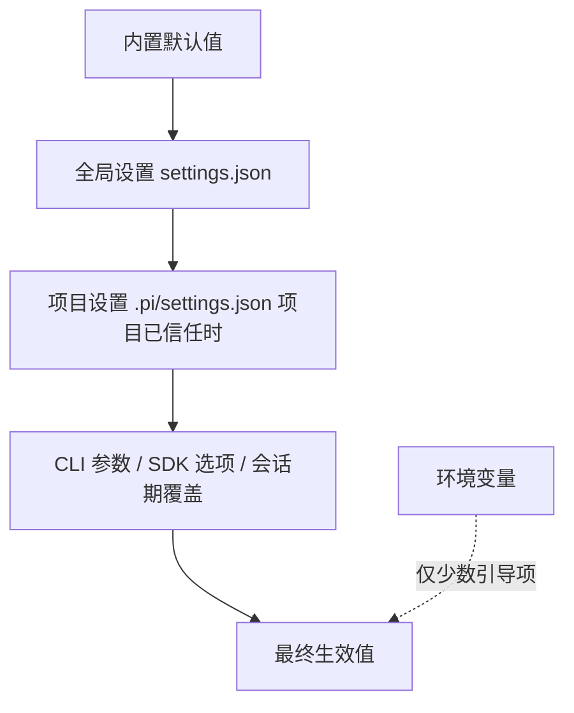

# 10. 设置来源、资源发现与项目信任

今天独立验证设置覆盖、资源发现和项目信任。所有配置写到测试临时目录，不修改用户的真实 `~/.pi/agent`；预计 2–3 小时。

## 今日准备

需要 Node.js >= 22.19.0 和依赖；缺失时在仓库根目录执行 `npm install --ignore-scripts`。在 `packages/coding-agent/test/` 新建 `task-10-learning.test.ts`，每个用例用 `mkdtempSync` 在系统临时目录造独立的 `agentDir` 和 `projectDir`，在 `finally` 中只删除该用例创建的目录。工作目录 `packages/coding-agent` 的运行命令：

```powershell
node ../../node_modules/vitest/dist/cli.js --run test/task-10-learning.test.ts
```

本任务选择 `sessionDir` 作为观察字段：它的 getter 是 `SettingsManager.getSessionDir()`；测试直接读取生效值，不启动真实 pi，也不会写真实会话。

## 学习内容

同一个设置可能有默认值、全局配置、项目配置和命令行覆盖。先定位“值从哪里来”，再排查“为什么没生效”。项目资源还受信任状态、启用规则、来源优先级和 reload 影响；不可信项目的设置与扩展不能按可信项目的路径加载。扩展、模板、技能等资源可能同名，最终选中的文件需要追溯来源。设置写回是异步的，修改内存对象不等于磁盘已经更新。

例如全局 `sessionDir` 为 A，项目 `sessionDir` 为 B，调用方又覆盖为 C：可信项目下先合并到 B，再应用覆盖得到 C；若不信任项目，B 根本不应参与。`applyOverrides()` 只改当前生效快照，并不写入配置文件。`reload()` 重新从磁盘合并全局和可信的项目设置，所以覆盖值 C 会消失；若宿主希望 C 持续生效，必须在 reload 后重新应用覆盖。

## 核心源码

`packages/coding-agent/src/core/settings-manager.ts` 的 `create`、`getSessionDir`、`setProjectTrusted`、`applyOverrides`、`reload` 负责值的读取与覆盖；`core/resource-loader.ts` 的 `DefaultResourceLoader.reload` 负责资源；`core/package-manager.ts` 的来源排序负责同名资源优先级；`core/project-trust.ts` 负责项目是否可信。先追设置，再追资源，不把两条链混成一条。

## TypeScript 语法小课：`Partial<T>` 与对象覆盖

`Partial<T>` 把每个字段变成可选，适合表示一次只改少数字段的覆盖。对象展开 `{ ...base, ...override }` 让后者同名字段生效；这只是示意，真实 `SettingsManager` 还要处理嵌套设置、信任和重载。

```typescript
type Settings = { sessionDir: string; theme: string };
const globalSettings: Settings = { sessionDir: "A", theme: "dark" };
const projectSettings: Partial<Settings> = { sessionDir: "B" }; // 只覆盖一个字段
const effective = { ...globalSettings, ...projectSettings }; // 右侧 B 胜出
console.assert(effective.sessionDir === "B" && effective.theme === "dark");
```

练习：再展开 `{ sessionDir: "C" }`，预测结果；然后用本篇 `reload()` 实验观察覆盖值是否持久。


## 完整学习资料

先按下列正文完成学习，再执行本篇的动手任务。正文中原书的实验与验收题先作为案例阅读，实际动手统一放到文末；只运行本篇“今日准备”和动手任务明确指定的离线命令。章节编号保留知识主题的原编号；源码精读、示例、边界条件、常见错误和参考答案均直接收录在本文件中。开头的预计用时仅指核心主线，完整源码精读需另留时间。

### 本篇共同基础

以下运行图和术语均在本文件内。学习正文保留原手册的知识主题编号，但那些编号不构成本任务的阅读前置；实际操作按本篇的动手任务与验收标准执行。学习正文基于原手册注明的 `200387122ca450d6387f033949423114a270b96c` 源码基线，当前工作区若有差异，以当前源码为准。

### 15 分钟主线：pi 怎样完成一件事

假设用户输入“读取 demo.txt，并总结三点”。模型自己不能读取你电脑里的文件。pi 把用户问题和可用工具告诉模型；模型提出 `read` 调用；pi 在本地执行；模型拿到文件内容后才生成总结。这就是全书反复使用的同一个例子。

**先看不带 TypeScript 细节的主流程（教学伪代码）：**

```text
收到用户输入，把它加入当前会话
重复：
    用当前上下文向模型发起请求
    收集模型的回答并把过程通知界面
    如果回答要求执行工具：
        校验参数，在本地执行工具，记录结果
        继续循环，让模型看到工具结果
    否则，检查是否还有排队输入或明确的继续决定
    如果都没有：结束本次运行
```

第一行确定这次任务和已有历史。模型请求只负责生成回答或提出工具调用。工具校验与执行由 pi 负责，结果回到对话后才可能有下一轮模型请求。界面接收运行事件，历史保存完成的消息；它们都与“模型请求”有关，但不是同一种数据。真实实现还处理工具并发、错误、取消、重试和压缩，后面分别讲。

**先分清四对容易混淆的词：**

| 两个词                | 直观区别                                           | 在“读文件并总结”中的例子                   |
| --------------------- | -------------------------------------------------- | -------------------------------------------- |
| 模型请求 / 用户输入   | 用户只说一次话，pi 可以多次询问模型                | 先请模型选择工具，读完文件后再请模型总结     |
| 事件 / 消息           | 事件告诉界面过程；消息承载一次完整的对话内容       | “正在输出第几个字”是事件；完成的总结是消息 |
| 工具调用 / 工具结果   | 调用提出想做什么；结果记录本地执行所得             | `read("demo.txt")` 是调用；文件文字是结果  |
| 会话历史 / 模型上下文 | 历史保留记录；上下文是这一次请求实际送给模型的内容 | 分支 C 仍在文件里，沿分支 D 继续时不必送 C   |


```text
一次用户输入
  → 第一次模型请求：请调用 read("demo.txt")
  → 本地工具执行：读出文件文本
  → 第二次模型请求：根据工具结果总结三点
  → 没有后续工作：结束
```

### 附录 A：术语表

> 用法：每个术语给出"一句话解释 + 首次出现的章节"。读代码遇到不认识的词，先查这里；查不到再搜源码（用英文名搜）。


#### A.1 核心概念

| 中文                  | 英文                    | 一句话                                                                                                             | 章节      |
| --------------------- | ----------------------- | ------------------------------------------------------------------------------------------------------------------ | --------- |
| 智能体外壳 / 运行框架 | agent harness           | 组织模型、工具、状态、界面的框架，本身不"聪明"                                                                     | 0.1       |
| 智能体                | agent                   | "模型 + 工具 + 循环"组成的执行体                                                                                   | 0.1       |
| 轮次                  | turn                    | 一次助手响应 + 它引发的工具执行                                                                                    | 3.3.3     |
| 低层运行              | Agent run               | 一次`Agent.prompt()` 或 `Agent.continue()` 调用建立的生命周期；以 `agent_end` 和已等待的 listener 收尾为边界 | 3.3.3、D2 |
| 会话 prompt 编排      | session prompt workflow | `AgentSession.prompt()` 在 `started` 后进入 `_runAgentPrompt()`；可串起 retry、压缩恢复和多个低层 Agent run  | 8、D27    |
| 用户请求              | user request            | 用户提交一次输入；与模型请求不等价                                                                                 | 3.3.3     |
| 模型请求              | model request           | 真正发给供应商 API 的一次请求                                                                                      | 3.3.3     |
| 转录                  | transcript              | 发给模型看/被记录的消息序列                                                                                        | 4.1       |
| 投影                  | projection              | 从会话树/文档到"模型实际看到的内容"的计算过程                                                                      | 9.4       |
| 活动分支              | active branch           | 从根到当前叶子的一条路径                                                                                           | 9.1       |
| 叶子                  | leaf                    | 会话树中的"当前位置"                                                                                               | 4.7.3     |
| 条目                  | entry                   | 会话文件里的一行（JSONL）                                                                                          | 4.7       |
| 会话                  | session                 | 一次对话的全部记录与状态                                                                                           | 8.1       |
| 压缩                  | compaction              | 用摘要替换旧上下文表示的机制                                                                                       | 10        |
| 上下文窗口            | context window          | 模型一次能接受的最大 token 量                                                                                      | 5.3       |
| 思考级别              | thinking level          | off/minimal/low/medium/high/xhigh/max                                                                              | 5.3       |
| 停止原因              | stop reason             | pending/stop/length/toolUse/error/aborted/deferred                                                                 | 4.3.3     |
| 用量                  | usage                   | token 与成本统计                                                                                                   | 4.3.5     |


#### A.2 消息与事件

| 中文           | 英文                | 一句话                                             | 章节        |
| -------------- | ------------------- | -------------------------------------------------- | ----------- |
| Agent 消息     | AgentMessage        | 内部消息（模型消息 + 应用自定义角色）              | 4.4         |
| 模型消息       | Message             | 供应商能理解的四角色联合                           | 4.3         |
| 内容块         | content block       | 消息内容的最小单元（text/image/thinking/toolCall） | 4.2         |
| 判别联合       | discriminated union | 用共同字面量字段区分成员的类型联合                 | 1.3.4       |
| 类型收窄       | narrowing           | 判断判别字段后类型自动缩小                         | 1.3.4       |
| 事件           | event               | 运行时广播（过程），不是消息（结果）               | 3.3.2       |
| 队列更新       | queue update        | 排队消息变化的会话事件                             | 4.5.2       |
| 边界（结算前） | agent_before_settle | 最后一个可行动钩子                                 | 6.2、13.3.5 |
| 已结算         | agent_settled       | "不会再自动继续"的最终信号                         | 4.5.2、16.3 |
| 延迟句柄       | deferred handle     | 异步应答的取回凭据                                 | 4.3.3       |


#### A.3 工具与模型

| 中文                | 英文                            | 一句话                                    | 章节  |
| ------------------- | ------------------------------- | ----------------------------------------- | ----- |
| 工具                | tool                            | 模型可调用的本地操作                      | 7.1   |
| 工具定义            | ToolDefinition                  | 扩展/应用注册工具的"富"形态               | 7.1.2 |
| 参数校验            | argument validation             | 用 typebox schema 在运行时校验调用参数    | 7.4   |
| 前置钩子            | beforeToolCall                  | 执行前可拦截（block）的钩子               | 7.6   |
| 后置钩子            | afterToolCall                   | 结果字段级改写的钩子                      | 7.6   |
| 顺序 / 并行执行     | sequential / parallel execution | 工具批次的两种调度                        | 7.5   |
| 终止提示            | terminate                       | "整批都同意时不因本批继续"的调度提示      | 7.5.4 |
| 模型                | model                           | 模型静态元数据（api/provider/限制/价格）  | 5.2.2 |
| 协议方言            | api                             | 供应商接口族标识（如 anthropic-messages） | 5.2.1 |
| 供应商              | provider                        | 认证 + 模型目录 + 请求实现                | 5.2.3 |
| 简单流式 / 完整流式 | streamSimple / stream           | 供应商无关档位 vs 协议特有选项            | 5.4   |
| 兼容开关            | compat                          | OpenAI 兼容生态的行为微调                 | 5.5.4 |
| 假供应商            | faux provider                   | 脚本化、离线的测试模型                    | 5.7   |


#### A.4 会话与持久化

| 中文       | 英文             | 一句话                             | 章节   |
| ---------- | ---------------- | ---------------------------------- | ------ |
| 会话管理器 | SessionManager   | 会话文件的对象化句柄               | 9.3    |
| 分支会话   | branched session | 只包含"根到叶子"路径的新文件       | 9.5.2  |
| 分支摘要   | branch summary   | 放弃某分支时生成的摘要条目         | 10.6   |
| 上下文编辑 | context edit     | 只改"投影"、不改原始条目的追加编辑 | 9.4.4  |
| 保留边界   | firstKeptEntryId | 压缩后从哪条开始保留               | 10.3.2 |
| 保留预算   | keepRecentTokens | 压缩后至少保留的近期上下文         | 10.3   |
| 预留       | reserveTokens    | 为模型回复预留的窗口               | 10.2.1 |
| 检测点替换 | checkpoint       | 压缩条目携带的提示词/工具检查点    | 9.4.3  |


#### A.5 扩展与集成

| 中文       | 英文            | 一句话                             | 章节       |
| ---------- | --------------- | ---------------------------------- | ---------- |
| 上下文文件 | context files   | AGENTS.md 等纯文本指令             | 11.4.2     |
| 项目信任   | project trust   | 允许加载项目可执行资源前的人工决定 | 11.5       |
| 提示词模板 | prompt template | Markdown 变成`/命令`             | 12.3.2     |
| 技能       | skill           | 目录 + SKILL.md 的按需说明书       | 12.3.3     |
| 扩展       | extension       | 可执行 TypeScript 模块（进程权限） | 12.3.4、13 |
| Pi 包      | Pi package      | 分发多资源的 npm/git 单元          | 12.3.6     |
| 钳制       | clamp           | 按模型能力压低思考级别             | 5.3        |
| 重绑       | rebind          | 会话替换后重新挂订阅/扩展绑定      | 8.6        |


#### A.6 协议与架构（选修）

| 中文     | 英文                   | 一句话                                          | 章节   |
| -------- | ---------------------- | ----------------------------------------------- | ------ |
| MCP      | Model Context Protocol | 外部工具/资源接入协议                           | 22     |
| 暴露方式 | exposure               | codemode/deferred/direct 三种工具到达模型的方式 | 22.3   |
| 工具搜索 | tool_search            | deferred 工具的"发现后再直调"机制               | 22.3   |
| 沙箱     | codemode sandbox       | QuickJS VM + worker 的脚本执行环境              | 22.9   |
| 面片     | facet                  | Chord 插件可独立打包到不同环境的分片            | 23.2   |
| 服务     | service                | Chord 的类型化稳定 token（singleton/keyed）     | 23.2   |
| 复制状态 | replicated state       | 原子发布、完整不可变值消费的状态                | 23.2   |
| 增量跟踪 | delta tracking         | 记录/合并 JSON 操作的机制                       | 23.2   |
| 持久执行 | durable execution      | 意图先提交、崩溃可续的执行模型                  | 23.1   |
| 检查点   | checkpoint             | 任务每一步的持久落点                            | 23.3.1 |
| 附着     | attachment             | 一条表现层连接绑定到一个会话                    | 24.2   |
| 信封     | envelope               | 协议中包裹 payload 的定向记录                   | 24.3   |
| span     | span                   | 一次操作的时间记录（遥测）                      | 25.2   |
| lift     | lift                   | 处理组相对对照组的提升（评估）                  | 25.5   |
| 阻断配对 | blocked pair           | 两臂未各得恰好一个分数，禁止计入头条            | 25.6   |


#### A.7 容易混淆的成对术语

| 对                                              | 区分                                                                                   |
| ----------------------------------------------- | -------------------------------------------------------------------------------------- |
| message vs event                                | 结果 vs 过程（3.3.2）                                                                  |
| turn vs run                                     | 一个轮次 vs 整次运行（3.3.3）                                                          |
| `agent_end` vs `agent_settled`              | 低层 run 结束 vs 自动工作清零（4.5.2）                                                 |
| 声明 vs 可执行                                  | 系统消息里的工具声明 vs 运行时工具集（7.3）                                            |
| details vs content                              | 给界面/程序 vs 给模型（14.2）                                                          |
| 完成顺序 vs 记录顺序                            | 并发完成 vs 声明序记录（7.5.3）                                                        |
| 停止原因`length` vs `stop`                  | 被截断 vs 正常说完（4.3.3）                                                            |
| `AgentSession.prompt()` vs `Agent.prompt()` | 应用层输入分流/会话编排 vs 低层 Agent run 入口（8、D2、D27）                           |
| `handled` vs `queued` vs `started`        | 输入被消费、不创建该输入自己的 run / 放入当前运行队列 / 进入会话 run 编排（8、16.5.3） |
| 提示词模板 vs 技能                              | 一段话 vs 一套流程+文件（12.3.3）                                                      |
| 扩展 vs Pi 包                                   | 可执行单元 vs 分发单元（12.3.6）                                                       |
| compaction 摘要 vs branch summary               | 压缩历史 vs 放弃分支（10.6）                                                           |
| durable cheat sheet：`replay: safe/never`     | 崩溃后重跑 vs 报 interrupted（23.4）                                                   |
| JSONL RPC vs client/server                      | 进程内 stdio 协议 vs 跨进程服务路由（24.1）                                            |
| 单测 vs 评估                                    | 确定性 vs 配对统计（25.1、25.6）                                                       |


#### A.8 输入与运行的层级

不要按“用户按了一次回车”推断低层 run 或模型请求的数量。实际层级是：

| 层级       | 代表符号                                           | 次数关系                                                                                      |
| ---------- | -------------------------------------------------- | --------------------------------------------------------------------------------------------- |
| 输入调用   | `AgentSession.prompt(text)`                      | 一次调用只表达一次输入尝试；结果可能是`handled`、`queued` 或 `started`                  |
| 会话编排   | `_runAgentPrompt(messages)`                      | 只在开始处理输入时进入；在里面管理重试、压缩恢复、边界 continuation 与取消                    |
| Agent run  | `Agent.prompt(messages)` 或 `Agent.continue()` | 一次会话编排可包含多个 run；每个低层 run 都发出自己的`agent_start` / `agent_end` 生命周期 |
| Agent turn | `turn_start` 到 `turn_end`                     | 一个 run 可包含多个 turn；每个 turn 通常包含一次助手响应及其引发的工具执行                    |
| 模型请求   | `streamSimple` / provider stream                 | 通常发生在助手响应阶段；自动重试会再次请求模型，压缩摘要等内部工作也可能有独立请求            |

两个边界例子：

- 扩展命令被消费时，`prompt()` 返回 `handled`，没有为该输入启动 `_runAgentPrompt()`；
- `prompt()` 在 Agent 已运行时以 `steer`/`followUp` 方式排队，返回 `queued`。这条输入会影响现有流程，但它本身不是新的 `Agent.prompt()` 调用。

因此，统计“模型请求次数”不能数 prompt、turn 或 `agent_end`：应按 provider 请求事件/日志，或明确的测试探针计数。章节 21 的自测题也按这个区分评分。


#### A.9 索引方式说明

- 想找"某行为在哪个文件" → 用 source-map；
- 想找"某命令怎么跑" → 用 commands；
- 想找"某现象怎么排" → 用 troubleshooting；
- 想找"哪些练习要做" → 用 exercises-and-answers。

---

### 第 11 章：配置、资源发现与信任边界

**先懂这一章**：同一个设置可能来自命令行、全局配置或项目配置。项目扩展又可能执行代码，所以加载前还要判断项目是否可信。先追一个设置的来源，再看资源加载顺序。

```text
教学伪代码：读全局设置 → 判断项目资源能否加载
           → 合并被允许的项目设置 → 应用命令行选择
           → 加载技能、扩展、主题和上下文文件
```

具体优先级取决于设置项和实现，不用这段总览推断所有字段；本章会用真实 getter 验证。

到第 10 章为止，主线已经能解释一次运行和一次恢复。本章转向“行为由什么配置决定”；第 12–14 章再讨论在这些配置与信任边界内如何扩展 pi。

> 学完本章你能回答：
>
> 1. 一个设置可能来自哪些地方？合并顺序是什么？
> 2. `SettingsManager` 怎么加载、合并、写回？为什么"项目未信任"时写项目设置会报错？
> 3. 资源发现都发现什么？上下文文件（AGENTS.md）和 `.pi` 资源有什么区别？
> 4. 项目信任保护什么、不保护什么？没有交互界面时怎么决策？
> 5. "配置没生效"的排查流程是什么？

**预计学习时间**：1.5 天。
**本章验证状态**：静态核对通过（`settings-manager.ts`、`resource-loader.ts`、`project-trust.ts` 与 `configuration.md`/`security.md` 核对）。

---


#### 11.1 问题：同一个设置，可能来自五个地方

假设你要设置"默认工具"。它可能出现在：

1. **代码默认值**（`DEFAULT_TOOL_NAMES`、`DEFAULTS`）
2. **全局设置** `~/.pi/agent/settings.json`
3. **项目设置** `<项目>/.pi/settings.json`
4. **环境变量**（少数专用：如 `PI_CODING_AGENT_DIR`、`PI_CODING_AGENT_SESSION_DIR`）
5. **CLI 参数 / SDK 选项**（如 `--tools`、`createAgentSession({ tools })`）

pi 的合并规则（`settings-manager.ts` 构造函数）：

```typescript
// 合并顺序决定优先级：仅当项目已信任时，项目值覆盖全局值。
this.settings = deepMergeSettings(this.globalSettings, this.projectSettings);
```

即：**项目覆盖全局**；CLI/SDK 的显式选项再覆盖上面合并的结果（各子系统在读取点处理，如第 3 章 `initialActiveToolNames` 的计算）；环境变量只在少数"引导级"路径上使用（目录定位等）。用一张图表示：



两个例外要单独记：

- **`defaultTools` 有加减语法**：`["-bash", "+powershell"]` 表示"禁用 bash、启用 powershell、其余保持"（`mergeDefaultTools` 专门处理它，第 2.7 节见过用法）；
- **项目设置只有在"项目已信任"时才加载**（本章 11.5），`sessionDir` 是唯一的引导期例外。


#### 11.2 两个配置目录：全局与项目

`configuration.md` 的官方清单（`<agent-dir>` 默认为 `~/.pi/agent`，可用环境变量 `PI_CODING_AGENT_DIR` 或 SDK 的 `agentDir` 选项覆盖）：

| 路径（全局）                                                                                       | 职责                                                |
| -------------------------------------------------------------------------------------------------- | --------------------------------------------------- |
| `<agent-dir>/settings.json`                                                                      | 用户级设置：偏好、默认值、资源路径、Pi package 声明 |
| `<agent-dir>/keybindings.json`                                                                   | 键位                                                |
| `<agent-dir>/mcp.json`                                                                           | 所有项目可用的 MCP 服务器                           |
| `<agent-dir>/models.json`                                                                        | 自定义端点、模型、模型覆盖                          |
| `<agent-dir>/auth.json`                                                                          | 保存的 API Key / OAuth 凭据（**私密文件**）   |
| `<agent-dir>/AGENTS.override.md` / `AGENTS.md` / `AGENTS.MD` / `CLAUDE.md` / `CLAUDE.MD` | 跨目录生效的用户指令                                |
| `<agent-dir>/SYSTEM.md`                                                                          | 替换默认系统提示                                    |
| `<agent-dir>/APPEND_SYSTEM.md`                                                                   | 追加系统提示                                        |
| `<agent-dir>/extensions/` `skills/` `prompts/` `themes/`                                   | 用户资源                                            |

| 路径（项目`.pi/`）                                     | 职责                                                      |
| -------------------------------------------------------- | --------------------------------------------------------- |
| `.pi/settings.json`                                    | 项目设置、资源路径、Pi package 声明（**需要信任**） |
| `.pi/mcp.json`                                         | 项目 MCP 服务器（需要信任）                               |
| `.pi/SYSTEM.md`、`.pi/APPEND_SYSTEM.md`              | 项目级系统提示文件（需要信任）                            |
| `.pi/extensions/` `skills/` `prompts/` `themes/` | 项目资源（需要信任）                                      |

`CONFIG_DIR_NAME` 并不硬编码为 `.pi`——它来自包的元数据（`pkg.piConfig?.configDir || ".pi"`，`config.ts` 第 542 行）。**读代码时用常量，不要假设目录名。**

优先级细节（`configuration.md`）：`SYSTEM.md`/`APPEND_SYSTEM.md` 若项目与全局同名，**已信任的项目文件优先，且不合并**。


#### 11.3 `SettingsManager` 精读


##### 11.3.1 对象结构与加载

```typescript
export class SettingsManager {
	private storage: SettingsStorage;
	private globalSettings: Settings;
	private projectSettings: Settings;
	private settings: Settings;                 // 合并后的"生效设置"
	private projectTrusted: boolean;
	// ... modifiedFields / writeQueue / errors / settingsPaths ...

	private constructor(/* ... */ projectTrusted = true /* ... */) {
		// ...
		this.settings = deepMergeSettings(this.globalSettings, this.projectSettings);
	}

	static create(cwd: string, agentDir: string = getAgentDir(), options: SettingsManagerCreateOptions = {}): SettingsManager {
		const resolvedCwd = resolvePath(cwd);
		const resolvedAgentDir = resolvePath(agentDir);
		// 文件存储可替换为内存存储，便于隔离测试。
		const storage = new FileSettingsStorage(resolvedCwd, resolvedAgentDir);
		return SettingsManager.fromStorageWithPaths(storage, options, {
			global: join(resolvedAgentDir, "settings.json"),
			project: join(resolvedCwd, CONFIG_DIR_NAME, "settings.json"),   // "<cwd>/.pi/settings.json"
		});
	}
}
```

三个设计点：

1. **存储抽象**（`SettingsStorage`）：`FileSettingsStorage` 是文件实现，`InMemorySettingsStorage` 供测试；写入通过 `withLock` 串行化（避免并发写坏文件）；
2. **两份来源分开保存**（`globalSettings` / `projectSettings`），合并结果单独存 `settings`——这样"某个值来自哪一层"是可追溯的；
3. **写入有守卫**：

```typescript
private assertProjectTrustedForWrite(): void {
	if (!this.projectTrusted) {
		throw new Error(/* 项目未信任，不能写项目设置 */);
	}
}
```

   未信任项目不仅"不读"，也**不允许写**——防止一个未授权项目通过"诱导 pi 保存设置"落地持久化副作用。


##### 11.3.2 加载：容错 + 迁移

```typescript
private static loadFromStorage(storage: SettingsStorage, scope: SettingsScope, projectTrusted = true): Settings {
	if (scope === "project" && !projectTrusted) {
		return {};      // 未信任：项目设置直接视为空
	}
	// 读取（withLock 内取内容）→ 空则 {} → stripBom → JSON.parse → migrateSettings
}
```

- **BOM 容错**：`stripBom` 剥掉 UTF-8 BOM（Windows 手工编辑常见）；
- **加载错误不崩溃**：`tryLoadFromStorage` 把异常变成 `{ settings: {}, error }`，错误进入 `errors` 诊断列表（与第 8 章的诊断模式一致）；
- **自动迁移**（`migrateSettings`）：例如 `queueMode → steeringMode`、旧的 `websockets: true → transport: "websocket"`。**读设置代码时看到的"奇怪兼容分支"，大多在这里。**


##### 11.3.3 写入：字段级记账

`modifiedFields` / `modifiedProjectFields` 记录"本会话改过哪些字段"，保存时只回写这些字段（`markModified` + `save()` + `writeQueue` 串行写）。这避免了"把程序里默认值也写进用户文件"的污染。`applyOverrides(overrides)` 则用于**会话期覆盖**（例如启动参数 `--theme` 临时覆盖设置）——它们不落盘。


##### 11.3.4 读取：一组有代表性的 getter

| getter                                                                                           | 含义                                   | 备注                                                      |
| ------------------------------------------------------------------------------------------------ | -------------------------------------- | --------------------------------------------------------- |
| `getSessionDir()`                                                                              | 会话目录设置                           | **唯一在信任前被读取的项目项**（11.5 节）           |
| `getDefaultTools()`                                                                            | 工具默认选择                           | 由`mergeDefaultTools` 应用 `+/-` 语法                 |
| `getEnabledModels()`                                                                           | 模型作用域                             | 第 5 章模型循环                                           |
| `getRetrySettings()`                                                                           | 重试预算与退避参数                     | `{ enabled, maxRetries, baseDelayMs, maxAgentDelayMs }` |
| `getTransport()`                                                                               | 传输方式（sse/websocket...）           | 迁移自旧字段                                              |
| `getDefaultProjectTrust()`                                                                     | `"ask"` / `"always"` / `"never"` | 11.5 节决策链的一环                                       |
| `getProviderRetrySettings()` / `getHttpIdleTimeoutMs()` / `getWebSocketConnectTimeoutMs()` | 网络行为                               | 第 3 章`buildRequestOptions` 消费                       |

**读代码经验**：想知道"这个设置从哪来、减到几层"，先看它的 getter 读的是 `this.settings`（合并后）还是 `this.globalSettings`（仅全局）。两者语义不同——例如 `save()` 系列通常写全局，`getDefaultProjectTrust` 属于"信任决策输入"。


#### 11.4 资源发现：`DefaultResourceLoader`

第 3 章装配时我们见过一句 `await resourceLoader.reload()`；现在看它发现什么、按什么顺序。


##### 11.4.1 发现清单

| 资源                           | 访问器                   | 用途                                         |
| ------------------------------ | ------------------------ | -------------------------------------------- |
| 扩展（extensions）             | `getExtensions()`      | 可执行代码：工具、命令、钩子（第 13 章）     |
| 技能（skills）                 | `getSkills()`          | 按需加载的指令与文件（第 12 章）             |
| 提示词模板（prompt templates） | `getPromptTemplates()` | `/模板名` 展开                             |
| 主题（themes）                 | `getThemes()`          | 终端配色（第 17 章）                         |
| 上下文文件（context files）    | `getAgentsFiles()`     | AGENTS.md 一类的**指令文本**（无执行） |

每个发现器都返回"条目 + 诊断"（`ResourceDiagnostic[]`）：坏文件不炸启动，只记录警告——又一次诊断模式。


##### 11.4.2 上下文文件：与 `.pi` 资源不同的加载规则

```typescript
const candidates = ["AGENTS.override.md", "AGENTS.md", "AGENTS.MD", "CLAUDE.md", "CLAUDE.MD"];
```

- 从**全局 agent 目录 + 当前目录 + 各级祖先目录**收集；祖先的在前（根→近），当前目录的在后；
- 每个目录内**只取第一个命中的候选**（`AGENTS.override.md` 替换同目录的 `AGENTS.md`/`CLAUDE.md`，但**不**影响其他目录）；
- **不需要项目信任**（`configuration.md` 明确写着 "Context-file discovery does not require project trust"）。所以安全文档提醒：即使拒绝信任，也要把目录里的指令当**不可信输入**。


##### 11.4.3 `reload()` 的两阶段与信任钩子

`reload` 的信任处理是一个"鸡与蛋"问题的解法：

```typescript
async reload(options?: ResourceLoaderReloadOptions): Promise<void> {
	// 阶段一：先加载"可用于信任决策"的扩展（用户级 + CLI 指定的）
	if (options?.resolveProjectTrust) {
		const preTrustExtensions = /* 只加载用户/全局与显式路径的扩展结果 */;
		const projectTrusted = await options.resolveProjectTrust({ extensionsResult: preTrustExtensions });
		// 阶段二：按信任结论加载全部（或跳过受保护资源）
	}
	// cliExtensionPaths / extensionPaths 组装（noExtensions 开关在此生效）
}
```

- **为什么先加载一部分扩展？** 因为信任决策本身需要扩展参与（`project_trust` 事件，见 11.5）——但只能让"用户级/CLI 指定"的扩展参与，**项目里的扩展在被信任前绝不能执行**；
- `additionalExtensionPaths` 等 CLI 路径在进入前已被 `resolveCliPaths` 转成**绝对路径**（`agent-session-services.ts` 的注释："so later cwd switches do not reinterpret them"）——防止切目录后相对路径指向别处；
- `noExtensions` / `noContextFiles` 等开关对应 CLI 的 `--no-extensions` 等参数。
  <a id="11-config-resources-trust-h13"></a>

#### 11.5 项目信任：边界的三条规则


##### 11.5.1 规则一：什么触发信任要求

`security.md` 列出的"受保护资源"——发现它们才需要信任决策：

```text
.pi/settings.json
.pi/mcp.json
.pi/extensions、.pi/skills、.pi/prompts、.pi/themes
.pi/SYSTEM.md、.pi/APPEND_SYSTEM.md
当前目录或祖先目录的 .agents/skills
```

**空 `.pi` 目录不触发**（没有实际资源）。这条清单的判定函数是 `hasTrustRequiringProjectResources(cwd)`（`trust-manager.ts`），第 3.4.3 节的 `shouldResolveProjectTrust` 计算用的就是它。


##### 11.5.2 规则二：信任"给什么"与"不给什么"

**授予信任后允许加载**（`security.md`）：项目设置、项目 MCP 服务器、`.pi` 下的扩展/技能/模板/主题/系统提示文件、项目设置里声明的缺失包安装、项目本地与项目包扩展。

**信任不保证**（同样来自 `security.md`，这一条最容易被误解）：

- 它**不是完整的启动边界**：`sessionDir` 在信任前就会被读取（为了找到会话）；
- 它**不限制工具能访问什么**：启动之后，启用的工具用 Pi 进程的操作系统权限运行；
- 它**不阻止目录里的指令影响模型**（AGENTS.md 不需要信任也会加载）——安全文档的定性："即使拒绝信任，也要把文件夹里的指令当作不可信输入"。

用一句工程结论概括：**项目信任保护的是"执行"（扩展代码、MCP、包安装），不是"内容"与"权限"。**


##### 11.5.3 规则三：决策链的顺序

`resolveProjectTrusted`（`project-trust.ts`）完整实现（节选 + 注释）：

```typescript
export async function resolveProjectTrusted(options): Promise<boolean> {
	if (options.trustOverride !== undefined) return options.trustOverride;   // ① --approve / --no-approve
	if (!hasTrustRequiringProjectResources(options.cwd)) return true;        // ② 没有受保护资源 → 无需信任

	// ③ 让"用户级/CLI 扩展"处理 project_trust 事件（第一个给出 yes/no 的扩展拥有决定权）
	if (options.extensionsResult) {
		const { result, errors } = await emitProjectTrustEvent(options.extensionsResult,
			{ type: "project_trust", cwd: options.cwd }, options.projectTrustContext);
		// ...错误上报...
		if (result) {
			const trusted = result.trusted === "yes";
			if (result.remember === true) options.trustStore.set(options.cwd, trusted);   // 记住决定
			return trusted;
		}
	}

	// ④ 已保存的决定（规范路径；最近的祖先决定生效）
	const decision = options.trustStore.get(options.cwd);
	if (decision !== null) return decision;

	// ⑤ 全局默认：always / never / ask
	switch (options.defaultProjectTrust ?? "ask") {
		case "always": return true;
		case "never": return false;
		case "ask": break;
	}

	// ⑥ ask 且没有交互界面 → 拒绝；有界面 → 弹选择框并保存
	if (!options.projectTrustContext.hasUI) return false;
	const selected = await selectProjectTrustOption(options.cwd, options.projectTrustContext);
	if (selected !== undefined) { saveProjectTrustPromptResult(options.trustStore, selected); return selected.trusted; }
	return false;
}
```

关键点：

- **扩展优先于保存的决定**：自动化场景（CI）可以用用户级扩展"声明式地"决定信任，而不是依赖每个人的本地记录；
- **保存的决定用规范路径**（`trust.json`，`~/.pi/agent/trust.json`）——所以符号链接、相对路径不会绕过它；"最近的祖先决定生效"意味着信任一个父目录即可覆盖其子目录（到最近记录为止）；
- **非交互模式的降级**（`security.md`）：print/json/rpc 没有内置信任弹窗——`defaultProjectTrust: "always"` 则加载，`"ask"`/`"never"` 则跳过；自动化要用 `--approve`/`--no-approve` 做一次显式决定；
- **`sessionDir` 的引导例外**：CLI 在创建 `startupSettingsManager` 时用默认值（信任）先读一次设置以定位会话目录；随后 `runtimeSettingsManager` 才按真实信任结论重建（第 3.4.3 节的 `createRuntime`）。读 `main.ts` 时看到两个 SettingsManager，不要以为重复。


#### 11.6 排查工作流：设置为什么没生效

按这个顺序逐层排除（每步都能给出证据）：

```text
1. 定位：这个设置由哪个 getter 读取？读的是合并结果还是仅全局？
2. 找文件：你的 agentDir 真是 ~/.pi/agent 吗？（PI_CODING_AGENT_DIR / SDK agentDir 可能改了它）
3. 验语法：settings.json 是否是合法 JSON（注释、尾逗号都会解析失败）？
   看诊断列表（/settings 界面或启动报告）里的 settings 错误条目
4. 查信任：改的是项目 .pi/settings.json 吗？项目信任了吗？（/trust）
5. 查覆盖：CLI 参数（--tools 等）或 applyOverrides 是否覆盖了它？
6. 刷新：手工改文件后要 /reload（配置文件不会热监听）
7. 子系统特例：模型目录（refresh/stored）、缓存、传输升级等有自己的生效时机
```

一个具体案例：**"我把主题写在 `.pi/settings.json` 里但不生效"**。

可能的原因链：

- 项目未信任 → 项目设置整体没加载（换全局文件或先 `/trust`）；
- JSON 里有注释 → 解析错误 → 该文件被当作空（诊断里能查到）；
- 会话启动参数 `--theme` 覆盖了它（`applyOverrides` 在会话期生效）；
- 主题需要重启/重新初始化才应用（读第 17 章的加载时机）。

再一个案例：**"改了 `defaultTools` 但工具没变化"**。

- `defaultTools` 只在**新建会话**或重新计算 `initialActiveToolNames` 时生效（第 3 章装配流程）；
- 会话里已经运行过的工具状态由转录系统消息决定（第 7.3 节），中途改设置不会自动改当前会话的工具集；
- 用 `+/-` 语法时要确认没写错（`["-bash", "+powershell"]`）。


#### 11.7 环境变量速查（引导类）

| 变量                                            | 作用                                            | 定义处                            |
| ----------------------------------------------- | ----------------------------------------------- | --------------------------------- |
| `PI_CODING_AGENT_DIR`                         | 覆盖全局配置目录                                | `config.ts` `ENV_AGENT_DIR`   |
| `PI_CODING_AGENT_SESSION_DIR`                 | 覆盖会话目录（低于`--session-dir`，高于设置） | `config.ts` `ENV_SESSION_DIR` |
| `PI_PACKAGE_DIR`                              | 覆盖包资源目录（Nix/Guix 等打包环境）           | `getPackageDir()`               |
| `PI_OFFLINE` / `--offline`                  | 离线模式（跳过版本检查与联网刷新）              | `main.ts`                       |
| `PI_SKIP_VERSION_CHECK`                       | 跳过版本检查                                    | `main.ts`                       |
| `PI_NO_LOCAL_LLM`                             | 禁本地 LLM 探测（测试隔离用）                   | `test.sh`                       |
| `PI_CODING_AGENT` / `AI_AGENT`              | 标记"运行在 Pi 内"（供工具/扩展识别）           | `cli/setup.ts`                  |
| 供应商 API Key 变量（`ANTHROPIC_API_KEY` 等） | 认证（第 5 章）                                 | `env-api-keys.ts`               |

不要猜环境变量名；从 `packages/coding-agent/src/config.ts` 和具体读取点核对。


#### 11.8 实验 L07：配置来源链

**实验性质**：只读 + 修改你自己的配置目录（不动仓库）；无需模型。
**验证状态**：设计中。


##### 目标

给同一个设置（推荐 `sessionDir` 或 `defaultTools`）造出"全局 + 项目"两层不同的值，观察实际生效者与排查路径。


##### 步骤

1. 在全局 `~/.pi/agent/settings.json` 写入一个显眼的值（如 `"sessionDir": "<你的临时目录 A>"`）；
2. 在某个临时项目目录 `<tmp>/proj/.pi/settings.json` 写入不同的值（目录 B）；在该目录启动 `pi-test`；
3. 观察会话文件实际落在哪个目录（A 还是 B），记录结论：**项目覆盖全局**（前提：信任了该项目）；
4. 重复实验但**拒绝信任**：观察回退到 A；
5. 再加一个 CLI 覆盖：`--session-dir <目录 C>`，观察 C 胜出；
6. 故意把项目 JSON 写坏（加注释），观察启动诊断里出现设置错误条目而 pi 照常启动。


##### 判定标准

- 能画出"默认值 → 全局 → 项目 → CLI"的覆盖链并在每一步给出证据；
- 能解释第 4 步的机制（未信任 → 项目设置不加载）与第 6 步的机制（错误进诊断、不崩溃）。


##### 清理

删除 A/B/C 实验目录与两处实验设置；恢复你的真实配置（如有改动）。


#### 本章源码精读

> **源码精读**：先定位导出与函数签名，再沿调用点核对输入、状态、输出和错误；最后用本篇指定的离线实验验证。

D26 从设置的来源与写入讲起；D25 接着解释资源发现、信任判断和 reload。排查“配置没生效”时，先确认设置合并，再确认资源是否进入最终加载集合。


##### D26：`SettingsManager` 的配置状态与写入生命周期

**先懂**：配置不只是“读一个 JSON”。它可能来自全局、项目和运行中覆盖值；写入又可能排队，随后从磁盘重新加载。先分清几份状态各归谁管。

```text
教学伪代码：读取全局配置 → 在允许时读取项目配置
           → 合并为当前有效值 → setter 修改目标层
           → 排队写盘并在 reload 时重新计算
```

不同字段可能有不同保存位置；项目未信任时的读写边界在后面逐项解释。

> 精读对象：`packages/coding-agent/src/core/settings-manager.ts` 中的 `deepMergeSettings`、`FileSettingsStorage`、`InMemorySettingsStorage`、`SettingsManager`。
>
> D25 追踪的是配置如何变成资源路径并被加载；本文向上游追一层：设置值如何进入内存、项目不信任时如何被隔离、setter 怎样排队写回，以及 reload 为什么不一定等于“丢弃旧状态再读文件”。
>
> 基线：`200387122ca450d6387f033949423114a270b96c`。本文按源码和既有测试作静态核对；未运行设置测试。


###### D26.1 先画出五份状态

`SettingsManager` 里至少要分清这几类数据：

```text
SettingsStorage     持久化后端（文件 / 内存）
globalSettings      已解析的用户级设置
projectSettings     已解析的项目级设置（未信任时为空对象）
settings            合并后的当前有效设置
modifiedFields      当前会话里明确改过、需要保存的字段集合
```

构造函数建立前四者的关系：

```text
globalSettings + projectSettings
             │
             └─ deepMergeSettings(global, project)
                    ↓
                 settings
```

`settings` 是读 getter 时通常看到的快照；两个来源对象则保留来源边界，供指定作用域 setter 和写盘逻辑使用。把它们都叫“配置”会让问题难定位：文件里有值，不代表当前 `settings` 一定已经读到；当前有效值存在，也不代表它已写回文件。


###### D26.2 TypeScript 类型与运行时 JSON

`Settings` 是 TypeScript 类型，帮助源码调用者理解字段；`settings.json` 则是运行时文本，来自用户编辑，不能因为类型声明就假设内容有效。加载过程大致是：

```text
storage.withLock(scope, read)
  → 空内容映射成 {}
  → stripBom(text)
  → JSON.parse(text)
  → migrateSettings(parsedObject)
  → 交给 SettingsManager
```

这条路径里有两个容易混淆的概念：

- **JSON 语法正确**：`JSON.parse` 能把文本转成 JavaScript 值；
- **设置值语义正确**：例如 `transport` 是否是支持的选项，要由具体 getter/使用点进一步处理。

当前 `migrateSettings` 明确做格式迁移，例如 `queueMode → steeringMode`、旧 `websockets` 布尔值转成 `transport`、旧 `retry.maxDelayMs` 移到 `retry.provider.maxRetryDelayMs`。迁移是在内存对象上进行；只有后续 setter/save 将字段写回时，才会把迁移后的内容持久化。

若 `JSON.parse` 或迁移抛错，`tryLoadFromStorage` 返回空设置和错误对象，而不是让创建 manager 直接崩溃。创建路径会把 `{scope, path, error}` 放进 `errors`；调用方可用 `drainErrors()` 一次取走并清空。**默认值、空配置、读取失败后的空对象是三种不同情况**，诊断存在与否能帮助区分。


###### D26.3 全局和项目设置怎样合并

`deepMergeObjects(base, overrides)` 递归处理双方都是普通对象的字段；其他值直接由右侧覆盖。数组不属于可递归合并对象，因此通常由项目数组整体替换全局数组。

```text
global.retry.provider = { timeoutMs: 30000, maxRetryDelayMs: 45000 }
project.retry.provider = { maxRetries: 2 }

merged.retry.provider = {
  timeoutMs: 30000,
  maxRetryDelayMs: 45000,
  maxRetries: 2
}
```

但不要把“数组整体替换”套用到所有字段：`defaultTools` 有单独规则。`mergeDefaultTools` 判断覆盖列表是否全由 `+name` / `-name` 组成；如果是，就把操作追加到继承列表；如果含普通名称，就把它当作新的工具选择列表。

随后 `resolveDefaultTools` 从普通名称或内置默认工具集合开始，按列表顺序应用加减操作：

```text
起始内置值：read, bash, edit, write
项目覆盖：-write, +grep
结果：read, bash, edit, grep
```

特殊边界要按它所在的层理解：最终有效列表为空时表示明确禁用所有默认内置工具；字段不存在表示“没有覆盖意见”。但当前 `mergeDefaultTools` 把项目层 `[]` 当成“全是 modifier 的列表”（空数组的 `every(...)` 为真），所以当全局层已有列表时，项目空数组追加零个操作，结果仍继承全局列表。例子：全局 `['read', 'bash']` + 项目 `[]` 得到 `['read', 'bash']`；单独的 `defaultTools: []`（例如仅全局配置）得到空选择。不要只凭配置文件的空数组外观推断合并结果，要看它覆盖哪一层。测试 `settings-manager.test.ts` 的 `defaultTools` 组覆盖空有效列表、全局替换、项目增量和默认集合，但没有把“项目空数组 + 非空全局列表”单独列成用例；上面这个组合由当前实现的条件推导。

还有一条重要分流：资源数组 `extensions`、`skills`、`prompts`、`themes` 最终不是简单读取合并后数组。`PackageManager.resolve()` 分别读取 global/project settings，并结合包资源与自动发现。也就是说，`SettingsManager` 的对象合并规则不能单独说明资源最终顺序；完整路径见 D25。


###### D26.4 三种构造方式代表不同边界

| 创建方法                                           | 后端                        | 路径/用途                                          |
| -------------------------------------------------- | --------------------------- | -------------------------------------------------- |
| `SettingsManager.create(cwd, agentDir, options)` | `FileSettingsStorage`     | 正常应用设置；错误诊断能附文件路径                 |
| `SettingsManager.fromStorage(storage, options)`  | 调用者提供                  | 可替换后端；常用于测试或集成                       |
| `SettingsManager.inMemory(settings, options)`    | `InMemorySettingsStorage` | 无文件 I/O；把初始对象迁移后序列化进内存后端再构造 |

`InMemorySettingsStorage` 不是“manager 只在 RAM 里保存一次”。它仍有一个遵循 `SettingsStorage` 接口的存储值，所以 `reload()` 可以重新从这个内存后端读取。这个细节解释了回归 #3616：若 `inMemory()` 只把字段放在 manager 属性里、没有放进 backend，reload 就会把初始设置读成空对象。


###### D26.5 项目不信任时的读写状态

构造 manager 时，`options.projectTrusted` 默认 `true`。若为 `false`，`loadFromStorage` 对 project scope 直接返回 `{}`，不读取 `.pi/settings.json`；全局设置仍然照常加载。有效状态因此是：

```text
trusted=false:
  globalSettings = read(global)
  projectSettings = {}
  settings = merge(globalSettings, {})
```

`setProjectTrusted(false)` 会将当前项目对象清空、清除项目修改记账，并重新计算有效设置。改为 `true` 时会重新从 project storage 加载，然后再合并。这个 setter 是同步状态切换；调用者不应以为它会触发资源 loader 也完成 reload。资源的最终重解析仍由 `DefaultResourceLoader.reload()` 负责。

写入方向有对称守卫：`updateProjectSettings` 和 `saveProjectSettings` 会同步调用 `assertProjectTrustedForWrite`；排队任务执行时还会再次检查，避免状态在 setter 与异步队列执行之间改变后仍写入项目配置。项目未信任时，尝试写项目设置会抛出明确错误，磁盘文件应保持原样。

现有 `settings-manager.test.ts` 的 `project trust` 组检查：未信任时项目覆盖不生效、变为信任后重新加载项目设置、未信任写入失败，以及 `defaultProjectTrust` 只能来自全局设置。请把这个边界和 D25 的资源 bootstrap 一起理解：设置 manager 管值的读写门，resource loader 管哪些资源最终被加载。


###### D26.6 普通 setter 如何变成文件更新

以 `setTheme("light")` 为例，它并不是直接把当前生效值 JSON.stringify 后覆盖整个文件：

```text
globalSettings.theme = "light"
  → markModified("theme")
  → save()
      ├─ 重算有效 settings
      ├─ structuredClone(globalSettings) 形成快照
      ├─ 复制 modifiedFields / nested-field 记账
      └─ enqueueWrite("global", task)
            → persistScopedSettings()
            → storage.withLock("global", read-modify-write)
```

setter 先同步更新内存，所以紧随其后的 getter 通常立刻看到新值；文件 I/O 在写队列中稍后发生。`flush()` 的职责是 `await this.writeQueue`，也就是等已排入的写任务处理完。它不是“强制写成功”的同义词：`enqueueWrite` 捕获写错误并记入 `errors`，因此调用 `flush()` 后还应按调用场景检查诊断。

写入时，`persistScopedSettings` 会在锁内重新读取文件当前内容，再把**本次明确修改的字段**覆盖上去。这样有两种并发变化时的预期：

```text
Pi 启动时内存：{ theme: "dark", packages: ["old"] }
用户外部编辑：{ theme: "dark", packages: [] }
Pi 只改 theme：setTheme("light")
保存结果：{ theme: "light", packages: [] }
```

如果不是字段级记账，而是把旧的整个 `globalSettings` 快照覆盖到文件，外部刚改的 `packages: []` 会被旧数组改回 `["old"]`。`settings-manager-bug.test.ts` 专门覆盖“外部改数组、应用只改无关字段”这一回归。若 Pi 和用户都改了同一个字段，则本次 manager 显式 setter 的值胜出；`settings-manager.test.ts` 对这条规则也有断言。

嵌套字段还会记录子字段，例如 `compaction.enabled`。落盘时保留磁盘对象中未被修改的兄弟字段，只替换明确改过的 nested key。这避免“切换 compaction.enabled 顺便清掉 modelOverrides”。


###### D26.7 异步写队列与错误不是一回事

`writeQueue` 初始为已完成的 `Promise<void>`。每次写操作都接到前一个 promise 后面，因此同一 manager 的写入按排队顺序执行：

```text
writeQueue₀
  → 写 theme
  → 写 modelThinkingLevels
  → 写 defaultTools
```

把它想成单车道队列：同一时间只有前面的任务先走完，后一个才开始。`Promise.then` 链让同步 `SettingsStorage.withLock` 拥有统一的异步调用接口，也让 `flush()` 能等待整条队列。

注意 `.catch(...)` 把失败转换成“记录错误后继续完成的队列 promise”。因此：

- `await flush()` 表示之前的队列已经处理到尾；
- 不表示每个任务都成功；
- 检查 `drainErrors()` 才能看到是否有写入失败；
- manager 不会自动重试任意写错误，避免不明确的重复副作用。

文件 backend 的 `withLock` 负责同一 scope 的锁内读-改-写；global 与 project 是不同 scope。当前内容不存在时，读取不会为了“看一眼”就创建目录；只有回调返回要写入的文本时才创建目录并取锁。这也是测试会分别断言“单纯读取不创建 `.pi`”与“写项目设置创建目录”的原因。


###### D26.8 `reload()` 的真实语义

`reload()` 首先等待已排队写操作，再读 global 和 project storage。对每个 scope：

- 读取成功：用新对象替换对应内存状态，并清除该 scope 的 load error；
- 读取失败：保留该 scope 上次成功的对象，记录新的错误；
- 完成后清掉 modified-field 记账，再按当前 `projectTrusted` 重算有效设置。

```text
外部改文件 → manager.reload() → getter 看到新设置
坏 JSON    → manager.reload() → getter 保留上次有效设置 + drainErrors 有错误
```

因此 reload 的错误恢复是“last known good”：坏文件不会把当前运行中设置整体变成空，也不会被当作空文件覆盖掉。测试 `settings-manager.test.ts` 的 reload 组检查外部修改刷新和非法 JSON 保留旧值。

对 `inMemory()`，reload 的来源是内存 storage，所以初始配置应保留；若已排队 setter，reload 会先等它们写入 backend，再把更新后的值读回。回归 #3616 覆盖 manager 单独 reload、ResourceLoader 间接 reload，以及 setter + flush + reload 三条轨迹。

`applyOverrides()` 则只是对当前 `settings` 再做一次内存合并，不改 `globalSettings` 或 `projectSettings`，也不把 override 放入持久化字段账本。调用者应把它视为当前 manager 生命周期内的临时覆盖；之后 `reload()` 从两份存储重建有效值时不会保留这层临时覆盖。CLI 的 `--theme` 示例见 `packages/coding-agent/src/main.ts` 启动装配。


###### D26.9 用测试定位常见误读

| 你要确认的行为                       | 测试                                                               | 测试如何区分正确与错误实现                                                 |
| ------------------------------------ | ------------------------------------------------------------------ | -------------------------------------------------------------------------- |
| 嵌套对象保留未覆盖字段               | `regressions/7572-provider-retry-settings-merge.test.ts`         | 项目只覆盖`maxRetries`，断言全局 `timeoutMs`、`maxRetryDelayMs` 还在 |
| 外部数组编辑不被旧内存回写           | `settings-manager-bug.test.ts`                                   | Pi 改 theme 后，断言外部新数组仍保留                                       |
| 相同字段的内存 setter 有优先权       | `settings-manager.test.ts` 的 preserve externally added settings | 外部与 setter 改同 key，断言 setter 值落盘                                 |
| 非法文件 reload 保留 last known good | 同文件的 reload 组                                                 | 文件损坏后 getter 仍是旧值，且错误带路径                                   |
| 不可信项目设置不读/不写              | 同文件的 project trust 组                                          | 检查有效值、project getter、抛错与磁盘原文                                 |
| in-memory backend 可 reload          | `regressions/3616-settings-inmemory-reload.test.ts`              | 检查初始设置和更新 setter 跨 reload 保留                                   |
| `defaultTools` 的增量语义          | `settings-manager.test.ts` 的 `defaultTools` 组                | 检查列表替换、空列表与`+/-` 操作                                         |

测试阅读时分三步：先读 `it(...)` 名称找行为，再读 setup 找状态，再读 assertion 判断什么坏实现会失败。只看测试名字不能证明覆盖了内部原因；要找到能区分预期与错误实现的断言。


###### D26.10 故障定位清单

当“改了设置但没生效”时，用下面的检查顺序：

1. 先看 JSON 是否能解析；加载诊断是否在 `drainErrors()` 里；
2. 看值在哪个 scope：`getGlobalSettings()`、`getProjectSettings()`、还是有效值 `getSettings()`；
3. 项目设置是否在 `projectTrusted=false` 时被有意屏蔽；
4. getter 是否给了代码默认值，或在具体使用点做了验证/转换；
5. 数组是直接替换、特殊 `defaultTools` 修饰，还是资源路径由 PackageManager 分层组合；
6. setter 是否写到你预期的 scope，`flush()` 后是否还有写错误；
7. 是不是 CLI/SDK `applyOverrides()` 覆盖了设置；
8. 最后才追最终消费者，例如 `DefaultResourceLoader.reload()` 或 `createAgentSession`。

这个次序从原始文本到最终行为逐层缩小问题，不会把“文件里有值”误当成“下游一定消费了这个值”。


###### D26.11 阅读路线与练习

建议按这一顺序实际跳源码：

1. `deepMergeObjects`：指出数组为什么不会递归合并；
2. `mergeDefaultTools`、`resolveDefaultTools`：手算全局 `['read','bash']`、项目 `['-bash','+grep']` 的结果；
3. `fromStorageWithPaths`、`tryLoadFromStorage`：画“成功/坏 JSON/未信任”三条初始化轨迹；
4. `setProjectTrusted`：对照 getter 说明 false → true 时 project settings 何时进入有效值；
5. `setTheme`、`save`、`enqueueWrite`、`persistScopedSettings`：画出同步更新、异步写入、磁盘再读和字段覆盖的时序；
6. `reload`：解释为什么错误时保留旧对象，以及为什么 `applyOverrides` 不属于两个存储层。

练习答案检查：

- 若你的工具列表算出 `read, grep`，必须能说明 `-bash` 是对继承列表操作；
- 若你认为 `flush()` 保证文件写成功，回到 `.catch(recordError)` 并指出错误最终存在哪里；
- 若你认为项目未信任时只是“不显示扩展”，回到 `loadFromStorage` 和 `assertProjectTrustedForWrite`，分别说明读门与写门；
- 若你认为 reload 失败会清空设置，找出 `if (!load.error)` 的条件赋值，并指出失败分支只记录 error。


###### D26.12 验证边界

本篇静态核对的主要测试是 `settings-manager.test.ts`、`settings-manager-bug.test.ts`、`settings-manager-compaction.test.ts`、`default-tools-setting.test.ts`、`regressions/7572-provider-retry-settings-merge.test.ts` 与 `regressions/3616-settings-inmemory-reload.test.ts`。本轮没有运行这些测试，也没有宣称读者实验已完成。

若实际修改 `SettingsManager`：优先添加能证明错误实现会失败的测试；修改代码后依仓库要求运行 `npm run check`，修改测试后运行对应测试。若改资源设置到 loader 的连接，还要对照 D25 和 `resource-loader.test.ts`，因为 SettingsManager 合并正确不代表资源最终加载正确。


##### D25：资源解析与 `reload()` 生命周期

**先懂**：设置中写了一个资源路径，不等于资源已经被加载并启用。它还要经过路径解析、信任检查、同名资源选择和运行时刷新。按阶段找“丢在哪一步”，比从最终列表猜原因更快。

```text
教学伪代码：读取资源配置 → 解析本地与包路径
           → 应用信任与优先级规则 → 加载对应资源
           → 更新会话可见的资源状态
```

扩展、Skill、主题的细节不同；这段只表示共同的排查路径。

> 对照源码：`packages/coding-agent/src/core/resource-loader.ts` 的 `DefaultResourceLoader.reload`、`loadFinalExtensionSet`、`update*FromPaths`；`packages/coding-agent/src/core/package-manager.ts` 的 `resolve`、`resourcePrecedenceRank`、`toResolvedPaths`。
>
> 本篇解释一条常见故障链：配置里明明写了资源，为什么没加载、被别的资源盖过、项目扩展没出现在信任提示里，或者 reload 后行为没变？先分清设置读取、路径解析、信任过滤、具体资源解析和最终公开状态这几个阶段。


###### D25.1 先有一张状态图

```text
ResourceLoader.reload(options)
  ├─ 已加载过？清 extension factory cache
  ├─ 要询问项目信任？
  │    ├─ projectTrusted=false；reload settings
  │    ├─ 解析当前可用资源，排除 builtin，加载预信任扩展
  │    └─ callback 决定 projectTrusted
  ├─ 按最终信任状态 reload settings
  ├─ PackageManager.resolve()
  │    ├─ package resources
  │    ├─ 项目/用户显式资源
  │    ├─ 自动发现资源
  │    └─ builtin extensions
  ├─ 合并临时 CLI 资源，记录 PathMetadata，过滤 enabled=false
  ├─ 加载最终扩展集合（复用预加载项、装载剩余项、处理 inline factory）
  ├─ 加载 Skills → Prompts → Themes，并附加来源信息/诊断
  ├─ 加载上下文文件、system prompt、append system prompt
  └─ loaded=true
```

【注解】`reload` 是 `async` 函数。每个 `await` 都表示当前步骤可能等待 I/O 或扩展初始化；后一步只有在前一步完成后才开始。不要把整条流程理解成“读一次 settings.json”。它会协调设置、包管理、扩展运行时以及四类资源状态。

【陷阱】`loaded=true` 在正常流程末尾设置。若中途抛错，不能假定 loader 已完成本轮更新；排查时同时看调用方是否捕获错误、界面是否仍在展示上一次状态。


###### D25.2 两种路径解析：预信任与最终加载

如果 `reload` 收到 `resolveProjectTrust`，它先调用 `loadProjectTrustExtensions()`。这个方法显式执行 `setProjectTrusted(false)`，重新载入设置，再调用 `loadCurrentExtensionSet()`。因此项目设置中的资源不会因为项目还没获信任就先执行。

预信任阶段只用来呈现可供决策的扩展集合。`loadCurrentExtensionSet` 把 `builtin:` 路径留到最终阶段，因为项目设置仍可能禁用内置扩展；它也把 inline factory 纳入预信任结果。`resolveProjectTrust` 回调拿到 `extensionsResult` 后返回布尔值，随后 loader 保存决定。

之后 `reload` 再执行 `settingsManager.reload()`，这次保留刚确定的信任状态；然后重新解析完整路径。最终扩展集合中，预信任 pass 已成功加载且最终仍启用的磁盘扩展按 `resolvedPath` 复用，不会初始化第二次。预加载失败的路径也不会在同一轮最终 pass 里盲目重试；错误会进入最终结果。内置扩展这时才加载。

```text
项目不可信时：
  bootstrap: user/global + temporary CLI extensions
  trust callback: 读取这些扩展提供的 project_trust 决策
  final pass: 按决策重新读 settings，再决定是否包含 project resources
```

现有测试 `test/resource-loader.test.ts` 检查了回调阶段只看到用户扩展，以及批准后项目扩展进入最终集合；还检查预信任扩展初始化计数为 1。可用它理解“复用”而非“加载两次”的语义。


###### D25.3 包管理器如何收集资源

`PackageManager.resolve()` 先读全局和项目 settings。包源先按项目、再按用户加入候选，并按包身份去重，项目来源胜出。之后解析包资源，再分别处理每种资源类型的项目显式条目、用户显式条目，最后执行自动发现。内置扩展在末尾加入，并应用项目对 builtin 的覆盖规则。

包资源的发现方式取决于包配置：

- 有用户 package filter 时，`autoload: false` 表示不默认加载；其资源类型 pattern 是增量启停规则；否则明确列出的 pattern 筛选文件，空数组会禁用该类型全部资源。
- 没有用户 filter 时，优先采用 `package.json` 中 `pi` manifest 的资源条目。
- 无 manifest 时，从 `extensions/`、`skills/`、`prompts/`、`themes/` 目录收集符合资源类型的文件。

这里的“自动发现”指项目 `.pi` 或用户 agent 目录下的资源目录扫描；它和 package manager 对包内部目录的发现是两条来源不同的路径。排查时查看 `PathMetadata.source`、`scope`、`origin`，不要只看文件名。


###### D25.4 优先级排序和去重不是同一件事

`resourcePrecedenceRank` 对资源排序，顺序是：

| rank | 来源             | 例子                                      |
| ---: | ---------------- | ----------------------------------------- |
|    0 | 项目显式本地配置 | 项目 settings 中列出的 Skill              |
|    1 | 项目自动发现     | 项目`.pi/skills/` 中扫描出的 Skill      |
|    2 | 用户显式本地配置 | 用户 settings 中列出的 Skill              |
|    3 | 用户自动发现     | 用户 agent 目录自动发现的 Skill           |
|    4 | package 资源     | 安装包提供的 Skill/Prompt/Theme/Extension |
|    5 | builtin          | `builtin:mcp` 等内置扩展                |

`toResolvedPaths` 先按 rank 稳定排序，再按 `canonicalizePath(path)` 去重。路径去重只会删除同一实际路径的重复引用，不会因为两个文件名字相同就删掉其中一个。

不同资源类型之后还会应用自己的语义：Skill loader 按 Skill 名称解决冲突并产生 collision diagnostic；Prompt 和 Theme 分别经过自己的 dedupe 逻辑；Extension 同名工具/命令冲突会被报告，但扩展仍都保留，具体注册顺序影响最终命令或工具映射。因此不要把“路径排序”“Skill 名称冲突”和“扩展工具名冲突”叫成同一种覆盖。

例如用户自动发现的 `web-fetch/SKILL.md` 与 package 内同名 Skill 同时存在：两者 canonical path 不同，所以 PackageManager 都交给 loader；用户来源 rank 更靠前，Skill loader 选用户版本，并把 package 版本作为 collision loser 报告。回归测试 `regressions/2781-skill-collision-precedence.test.ts` 明确断言了这一行为。


###### D25.5 `enabled`、路径合并和 `no*` 选项

PackageManager 返回的是 `{ path, enabled, metadata }`，路径存在不等于资源启用。`reload` 会先为解析到的每个路径保存 metadata，再只把 `enabled` 为真的资源放进加载列表；这样禁用项仍可参与配置诊断，但不会被加载。

临时 CLI 源由 `resolveExtensionSources(..., { temporary: true })` 单独解析，metadata 标为 `source: "cli"`、`scope: "temporary"`。`mergePaths` 保留输入顺序并按路径去重。扩展通常将 CLI 路径放在设置解析路径之前；Skills、Prompts、Themes 则将额外显式路径放在列表末尾。这些顺序是后续加载器优先级的重要输入，不能从命令行参数名推断最终胜者。

`noExtensions`、`noSkills`、`noPromptTemplates`、`noThemes` 只改变对应类别的最终路径选择；在这些选项下仍保留明确的 CLI 或 additional 路径。`noContextFiles` 则直接让 `agentsFiles` 为空。它们是不同开关，不是一个总的“禁止所有资源”标志。


###### D25.6 四类资源如何进入 loader 状态

扩展由 `loadFinalExtensionSet` 产生 `extensionsResult`，之后 `applyExtensionSourceInfo` 把来源信息附到扩展以及其命令、工具。扩展加载错误和冲突诊断留在 `extensionsResult` 中。

Skills、Prompts、Themes 分别经过 `updateSkillsFromPaths`、`updatePromptsFromPaths`、`updateThemesFromPaths`：

1. 调用对应的加载函数，且 `includeDefaults: false`，因为默认目录已由 PackageManager 路径解析提供；
2. Prompt 与 Theme 还会执行各自 dedupe；
3. 可选 override hook 可以替换结果；
4. 以路径和 metadata 查找来源，把 `sourceInfo` 加回结果对象；
5. 将诊断存入 loader 对应的诊断字段。

目录资源可能需要到内部文件才有来源信息。例如自动发现或 package 来源的 Skill 若路径是目录且有 `SKILL.md`，`mapSkillPath` 会把目录映射到文件，并把同一 metadata 记录到文件路径。否则之后只拿到 `SKILL.md` 文件名时，无法判断它来自项目、用户还是 package。


###### D25.7 system prompt 和上下文文件是另一条支路

扩展和资源更新完成后，reload 还会重新载入 `AGENTS.md` 等项目上下文文件（除非 `noContextFiles`），解析 system prompt 输入，并解析 append system prompt 输入。显式传入的 source 优先；未传入时才发现约定文件。路径存在时 loader 会保留其绝对来源路径，便于 UI/诊断展示。

这说明“Skill 没进入模型提示”可能发生在多个位置：路径没解析到、资源被禁用、文件解析失败、名称冲突输掉，或最终 prompt 组装没有引用它。先看 `getSkills()` 与诊断，再看 `formatSkillsForPrompt` 和系统提示组装，不要直接修改 system prompt 文本。


###### D25.8 按现象定位

| 现象                                | 先检查                                                              | 证据/测试                                               |
| ----------------------------------- | ------------------------------------------------------------------- | ------------------------------------------------------- |
| 项目扩展没出现在信任询问中          | 是否处于 pre-trust pass；项目是否仍不可信                           | `resource-loader.test.ts` 的 project trust 测试       |
| trust callback 批准后扩展没有运行   | 最终 project settings 是否启用；扩展是否预加载失败；最终结果 errors | 同文件的 trust resolution 测试                          |
| 同名 Skill 选错版本                 | 每条资源的 source/scope/origin 和 rank；loader collision diagnostic | `regressions/2781-skill-collision-precedence.test.ts` |
| 禁用的资源仍可见于配置诊断          | 区分解析列表和 enabled 加载列表                                     | `ResolvedResource.enabled` 与 `reload` 的筛选       |
| reload 后 inline factory 状态像旧的 | 是否`loaded`；cache 是否清除；factory 是不是通过最终 pass 注册    | `regressions/extension-factory-cache.test.ts`         |
| 内存 settings reload 后值丢失       | `SettingsManager.reload` 是否保留 in-memory 初始值                | `regressions/3616-settings-inmemory-reload.test.ts`   |
| 资源存在但找不到来源                | metadata 是否在目录路径与实际文件路径之间传递                       | `mapSkillPath`、`findSourceInfoForPath`             |

建议调试时按这条链逐项记值：

```text
raw settings
  → PackageManager ResolvedResource[] (path, enabled, metadata)
  → reload 选出的路径数组
  → loader 解析结果与 diagnostics
  → sourceInfo / UI 可见状态
```

每一步都能回答“输入是什么、过滤掉什么、输出是什么”，问题通常就会落在一个明确边界上。


###### D25.9 修改时的验证边界

若只修改说明文字或索引，不需要代码测试。若改资源优先级、信任阶段、路径过滤、缓存或冲突处理，先选最近的具体测试：

- `packages/coding-agent/test/resource-loader.test.ts`：trust、builtin、extension 顺序与 loader 行为；
- `packages/coding-agent/test/suite/regressions/2781-skill-collision-precedence.test.ts`：Skill 同名胜者；
- `packages/coding-agent/test/suite/regressions/3616-settings-inmemory-reload.test.ts`：内存设置 reload；
- `packages/coding-agent/test/suite/regressions/extension-factory-cache.test.ts`：扩展 factory 缓存。

按仓库根 `AGENTS.md`，代码变更后还要执行 `npm run check`；修改测试后必须运行对应测试。本文只做静态源码和既有测试核对，没有声称这些测试在本轮重新运行通过。


###### D25.10 阅读路线

1. 读 `resource-loader.ts` 的 `reload`，把每个局部变量的来源标在纸上：`resolvedPaths`、`metadataByPath`、`enabledExtensions`、`extensionPaths`。
2. 跳到 `PackageManager.resolve`，核对资源收集顺序以及 project/user 两份设置的作用域。
3. 跳到 `resourcePrecedenceRank` 和 `toResolvedPaths`，区分排序与 canonical path 去重。
4. 对照 Skill collision 测试，确认“两个路径都在”和“最终只选一个 Skill”可以同时成立。
5. 对照 trust 测试，追踪同一个扩展从 bootstrap 到 final pass 的加载次数。

读完后应能解释：资源为什么没被执行、哪个来源胜出、loader 是否复用预加载扩展，以及诊断应该从哪个 getter 取。

#### 11.9 常见错误

| 现象                           | 原因                                               | 处理                                                                          |
| ------------------------------ | -------------------------------------------------- | ----------------------------------------------------------------------------- |
| 项目设置不生效                 | 未授予信任                                         | `/trust` 或 `--approve`；或移到全局设置                                   |
| 全局设置"没生效"               | agentDir 被环境变量/SDK 改了                       | 检查`PI_CODING_AGENT_DIR` 与实际路径                                        |
| 手改设置后无变化               | 没执行`/reload`；或该设置在启动期只读一次        | `/reload`；必要时重启                                                       |
| JSON 报错导致整文件被忽略      | 注释/尾逗号/拼写                                   | 用合法 JSON；看诊断                                                           |
| 以为"信任=沙箱"                | 混淆两类边界                                       | 记住 11.5.2：信任保护执行，不保护权限与内容                                   |
| 未信任时写设置报错             | `assertProjectTrustedForWrite`                   | 属预期；改用全局设置                                                          |
| AGENTS.md 明明存在却没进提示词 | 禁用上下文（`--no-context-files`）或不在目录层级 | 检查发现路径与开关                                                            |
| 扩展加载顺序/来源不明          | 用户级、CLI、项目三类来源混合                      | 看`getExtensions()` 的诊断与路径；`additionalExtensionPaths` 已是绝对路径 |


#### 11.10 验收题

1. 画出一个设置从"文件"到"生效值"的完整优先级链；哪一层有 `+/-` 特例？
2. `SettingsManager` 为什么要分开保存 global/project，而不是只留合并结果？
3. 项目信任保护哪些资源？说出三类"不保护"的东西。
4. `resolveProjectTrusted` 的决策顺序是什么？扩展在其中扮演什么角色？
5. 上下文文件为什么**不需要**信任？这带来了什么安全提醒？
6. 用排查工作流解释："项目里的 SYSTEM.md 没生效"可能有哪些原因（至少三个）。


##### 参考答案（要点）

1. 内置默认 → 全局 → 项目（可信时）→ CLI/SDK/会话覆盖；`defaultTools` 有 `+/-` 语法特例。
2. 可追溯（值来自哪层）、可安全写入（只回写被修改的那层）、可诊断（每层各自的加载错误）。
3. 保护：`.pi` 下设置/MCP/可执行资源与系统提示文件、项目 `.agents/skills`。不保护：工具运行的操作系统权限、无需信任的上下文指令（AGENTS.md）、以及 sessionDir 引导读取。
4. `--approve/--no-approve` → 无受保护资源则直接信任 → 扩展 `project_trust` 事件（可记住）→ 已保存决定（最近祖先）→ `defaultProjectTrust` → 交互弹窗。扩展可以让信任决策变成"可编程策略"。
5. 它们是纯文本指令、不执行代码；提醒：文本仍可能通过提示注入影响模型，所以要把目录内容当作不可信输入。
6. 项目未信任；文件在未信任时被跳过；SYSTEM.md 与全局同名时项目优先但要信任；`--no-context-files`/相关开关；文件路径/读取权限问题；需要 `/reload` 或重启。


#### 11.11 源码依据

- `packages/coding-agent/src/core/settings-manager.ts`（类结构第 379 行、`create` 第 417 行、`loadFromStorage` 第 473 行、`applyOverrides` 第 636 行、`assertProjectTrustedForWrite` 第 662 行、`getSessionDir` 第 797 行、`getRetrySettings` 第 1000 行、`getDefaultProjectTrust` 第 1100 行、`getDefaultTools` 第 1434 行）；
- `packages/coding-agent/src/core/resource-loader.ts`（上下文文件候选第 185 行、`loadProjectContextFiles` 第 232 行、`DefaultResourceLoader` 第 309 行、`reload` 第 505 行）；
- `packages/coding-agent/src/core/project-trust.ts`、`trust-manager.ts`；
- `packages/coding-agent/src/config.ts`（`CONFIG_DIR_NAME` 第 542 行、`ENV_AGENT_DIR`、`getAgentDir` 第 566 行、`getPackageDir` 第 393 行）；
- `packages/coding-agent/docs/configuration.md`、`docs/security.md`、`docs/settings.md`、`docs/environment-variables.md`。


---

## 动手任务 A：来源覆盖实验。

在临时 `agentDir/settings.json` 写 `{ "sessionDir": "A" }`，在临时 `projectDir/.pi/settings.json` 写 `{ "sessionDir": "B" }`；用 `SettingsManager.create(projectDir, agentDir)` 创建对象。可信项目应为 B；`setProjectTrusted(false)` 后为 A；重新信任后为 B；`applyOverrides({ sessionDir: "C" })` 后为 C。把项目文件改为 D，reload 前仍为 C，reload 后变为 D。CLI 覆盖在真实程序里发生在装配层，本实验用 `applyOverrides` 模拟。下面是完整的离线测试，可直接写入今日测试文件：

```typescript
import { mkdirSync, mkdtempSync, rmSync, writeFileSync } from "node:fs";
import { tmpdir } from "node:os";
import { join } from "node:path";
import { expect, it } from "vitest";
import { DefaultResourceLoader } from "../src/core/resource-loader.ts";
import { SettingsManager } from "../src/core/settings-manager.ts";

it("separates settings, trust, overrides and reload", async () => {
  const root = mkdtempSync(join(tmpdir(), "pi-task-10-"));
  try {
    const agentDir = join(root, "agent");
    const projectDir = join(root, "project");
    mkdirSync(agentDir, { recursive: true });
    mkdirSync(join(projectDir, ".pi"), { recursive: true });
    writeFileSync(join(agentDir, "settings.json"), JSON.stringify({ sessionDir: "A" }));
    const projectSettings = join(projectDir, ".pi", "settings.json");
    writeFileSync(projectSettings, JSON.stringify({ sessionDir: "B" }));
    const manager = SettingsManager.create(projectDir, agentDir);
    expect(manager.getSessionDir()).toBe("B");
    manager.setProjectTrusted(false);
    expect(manager.getSessionDir()).toBe("A");
    manager.setProjectTrusted(true);
    expect(manager.getSessionDir()).toBe("B");
    manager.applyOverrides({ sessionDir: "C" });
    expect(manager.getSessionDir()).toBe("C");
    writeFileSync(projectSettings, JSON.stringify({ sessionDir: "D" }));
    expect(manager.getSessionDir()).toBe("C");
    await manager.reload();
    expect(manager.getSessionDir()).toBe("D");
    manager.applyOverrides({ sessionDir: "C" });
    expect(manager.getSessionDir()).toBe("C");
  } finally {
    rmSync(root, { recursive: true, force: true });
  }
});

it("resolves same-name prompts and excludes untrusted project prompts", async () => {
  const root = mkdtempSync(join(tmpdir(), "pi-task-10-prompts-"));
  try {
    const agentDir = join(root, "agent");
    const projectDir = join(root, "project");
    const globalDir = join(agentDir, "prompts");
    const projectPromptDir = join(projectDir, ".pi", "prompts");
    mkdirSync(globalDir, { recursive: true });
    mkdirSync(projectPromptDir, { recursive: true });
    const frontmatter = "---\ndescription: Inspect source\n---\n";
    const globalPath = join(globalDir, "inspect.md");
    const projectPath = join(projectPromptDir, "inspect.md");
    writeFileSync(globalPath, frontmatter + "GLOBAL\n");
    writeFileSync(projectPath, frontmatter + "PROJECT\n");
    const manager = SettingsManager.create(projectDir, agentDir);
    const loader = new DefaultResourceLoader({ cwd: projectDir, agentDir, settingsManager: manager });
    await loader.reload();
    expect(loader.getPrompts().prompts.find((p) => p.name === "inspect")?.filePath).toBe(projectPath);
    expect(loader.getPrompts().diagnostics.some((d) => d.type === "collision")).toBe(true);
    manager.setProjectTrusted(false);
    await loader.reload();
    expect(loader.getPrompts().prompts.find((p) => p.name === "inspect")?.filePath).toBe(globalPath);
    writeFileSync(join(projectDir, ".pi", "settings.json"), "{broken");
    manager.setProjectTrusted(true);
    expect(manager.drainErrors().some((e) => e.scope === "project")).toBe(true);
  } finally {
    rmSync(root, { recursive: true, force: true });
  }
});
```

## 动手任务 B：资源冲突排查。

上面第二个用例先用 `filePath` 证明项目模板胜出，再观察 `collision` 诊断中的胜出和落选路径；撤销项目信任后，只有全局模板能胜出。最后的坏 JSON 通过 `drainErrors()` 观察解析错误。再沿 `resourcePrecedenceRank`、`dedupePrompts` 和最终 resolved paths 解释结果。扩展练习：在 reload 前后分别检查 `content`，证明内存中的资源列表不会因磁盘修改而自动更新。

## 实验记录

1. 实验前写下四层候选值的预测：默认、全局、项目、CLI。每改变一个条件，只修改一层，再读取最终值；不要同时移动文件和切换信任状态。
2. 记录 `SettingsManager` 返回的生效值与 `DefaultResourceLoader` 找到的资源来源。设置与资源遵守不同路径，不能因为前者被覆盖就推断后者也相同。
3. 做一次“修改文件但不 reload”与“执行 reload 后”的对照，观察内存快照何时更新；再检查项目被拒绝信任时哪些候选根本没有进入加载流程。
4. 交付一张来源优先级表和一张故障排查流程图，至少包含“配置解析错误”“信任拒绝”“同名资源被覆盖”“忘记 reload”四个分支。

如果 B 未生效，先打印 `isProjectTrusted()` 和项目 JSON 的解析诊断。若 reload 后仍看到旧值，核查写入的是当前测试的项目文件，以及是否确实等待了 `reload()`。测试只清理本用例由 `mkdtempSync` 创建的临时绝对路径，严禁删真实配置目录。

## 验收标准

给出一个“项目设置不生效”的例子，能按配置读取、信任、覆盖、资源发现、reload 的顺序定位；能证明自己观察的是生效值而非文件表面值。
