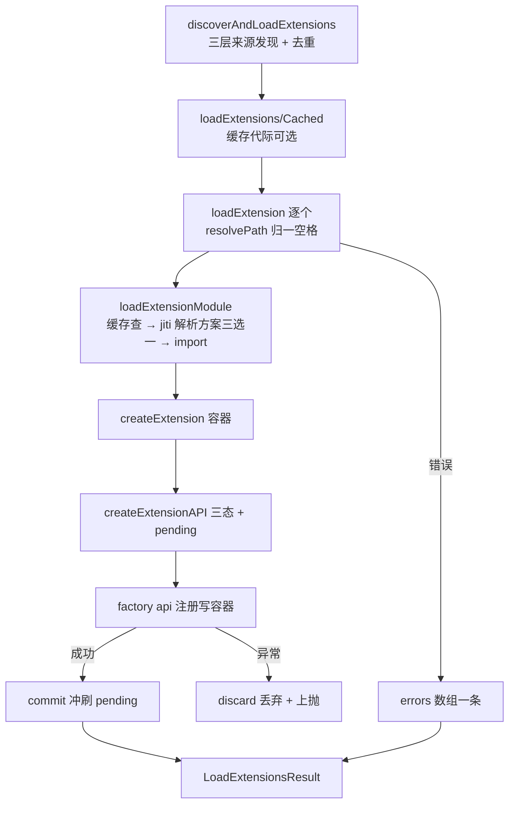
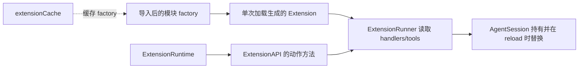
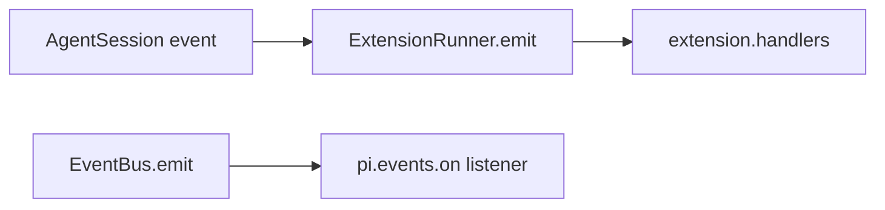
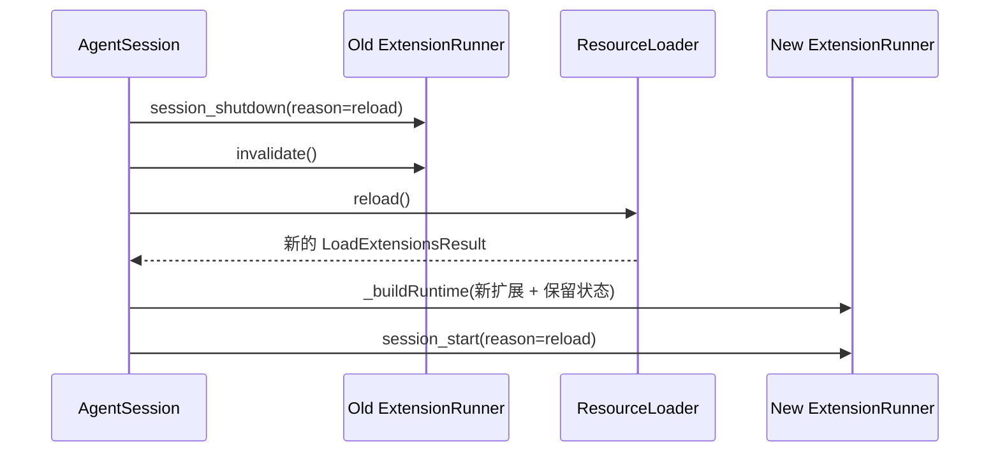

# 11. 技能、模板、Extension 与自定义工具

今天从零做一个只读扩展，并亲自比较模板、Skill 和 Extension。这里给出三种机制的最小格式和工具代码；不需要完成其他任务，预计 3–4 小时。

## 今日准备

需要 Node.js >= 22.19.0、仓库依赖；缺少时在根目录执行 `npm install --ignore-scripts`。实验文件只放在 `packages/coding-agent/test/suite/` 内自己命名的 `task-11-extension.ts`、`task-11-learning.test.ts`；测试用 faux 假模型和内存会话，不用真实账号。单文件运行命令（工作目录 `packages/coding-agent`）：

```powershell
node ../../node_modules/vitest/dist/cli.js --run test/suite/task-11-learning.test.ts
```

`createHarness({ extensionFactories: [...] })` 加载测试扩展；调用 `await h.session.bindExtensions({})` 后工具才进入会话。每个用例最后 `h.cleanup()`。

## 学习内容

需求不同，扩展点也不同。只需固定输入格式时用 prompt template；需要一组可按需加载的操作说明时用 Skill；需要运行时代码、事件钩子、命令或工具时用 Extension。扩展工厂注册能力，运行时负责触发、取消、重载和释放。工具型扩展要给模型写清名称、参数、返回结构和错误语义；返回过长仍要遵守输出预算。会话状态要考虑活动分支和恢复，不能只放在模块变量里。

最小模板是在 `prompts/review.md` 中写 frontmatter 与正文，例如 `description: Review a change`，正文写“检查当前改动，按风险、证据、建议输出”；它只是一次输入展开。最小 Skill 是 `skills/review/SKILL.md`，frontmatter 含 `name: review`、`description: Review source changes`，正文是可重复使用的步骤说明；它被发现后可按需加载。Extension 是 TypeScript 工厂，能注册命令、工具与事件处理器；只有它能真正读取文件或拦截工具。三个文件的语义不同，即使都能影响模型输出也不能互相替代。

## 核心源码

核心源码按职责读：`packages/coding-agent/src/core/prompt-templates.ts` 负责模板展开；`core/skills.ts` 负责技能发现和提示内容；`core/extensions/types.ts` 的 `ExtensionAPI`、`ToolDefinition` 定义注册与执行参数；`core/extensions/loader.ts` 实例化扩展；`core/extensions/runner.ts` 派发事件；`examples/extensions/hello.ts` 展示最小工具。特别留意工具的 `parameters` 用于运行时校验，`execute` 返回的 `content` 给模型看，`details` 留给扩展或测试读取。

## TypeScript 语法小课：泛型回调与取消订阅

扩展事件 API 用泛型连接事件形状与处理器。`T` 表示本次订阅的事件类型；`on` 返回的函数用于解除订阅。真实 `ExtensionAPI.on` 还按事件名提供重载，让不同事件有不同的参数和返回规则。

```typescript
function createEmitter<T>() {
  const handlers = new Set<(value: T) => void>(); // T 约束每个处理器的参数
  return {
    on(handler: (value: T) => void): () => void {
      handlers.add(handler);
      return () => { handlers.delete(handler); }; // 返回取消订阅函数
    },
    emit(value: T): void {
      for (const handler of handlers) handler(value);
    },
  };
}
const emitter = createEmitter<{ type: "text"; text: string }>();
const unsubscribe = emitter.on((event) => {
  console.assert(event.type === "text"); // 字面量类型可用于分支判断
  console.log(event.text); // 已知当前事件有 text 字段
});
emitter.emit({ type: "text", text: "ready" });
unsubscribe(); // 后续 emit 不再调用上面的处理器
```

练习：尝试给 `emitter.emit` 传入数字 `text`，观察类型错误；再阅读 `ExtensionAPI.on("tool_call", ...)` 的重载，找出阻止工具的返回形状。


## 完整学习资料

先按下列正文完成学习，再执行本篇的动手任务。正文中原书的实验与验收题先作为案例阅读，实际动手统一放到文末；只运行本篇“今日准备”和动手任务明确指定的离线命令。章节编号保留知识主题的原编号；源码精读、示例、边界条件、常见错误和参考答案均直接收录在本文件中。开头的预计用时仅指核心主线，完整源码精读需另留时间。

### 本篇共同基础

以下运行图和术语均在本文件内。学习正文保留原手册的知识主题编号，但那些编号不构成本任务的阅读前置；实际操作按本篇的动手任务与验收标准执行。学习正文基于原手册注明的 `200387122ca450d6387f033949423114a270b96c` 源码基线，当前工作区若有差异，以当前源码为准。

### 15 分钟主线：pi 怎样完成一件事

假设用户输入“读取 demo.txt，并总结三点”。模型自己不能读取你电脑里的文件。pi 把用户问题和可用工具告诉模型；模型提出 `read` 调用；pi 在本地执行；模型拿到文件内容后才生成总结。这就是全书反复使用的同一个例子。

**先看不带 TypeScript 细节的主流程（教学伪代码）：**

```text
收到用户输入，把它加入当前会话
重复：
    用当前上下文向模型发起请求
    收集模型的回答并把过程通知界面
    如果回答要求执行工具：
        校验参数，在本地执行工具，记录结果
        继续循环，让模型看到工具结果
    否则，检查是否还有排队输入或明确的继续决定
    如果都没有：结束本次运行
```

第一行确定这次任务和已有历史。模型请求只负责生成回答或提出工具调用。工具校验与执行由 pi 负责，结果回到对话后才可能有下一轮模型请求。界面接收运行事件，历史保存完成的消息；它们都与“模型请求”有关，但不是同一种数据。真实实现还处理工具并发、错误、取消、重试和压缩，后面分别讲。

**先分清四对容易混淆的词：**

| 两个词                | 直观区别                                           | 在“读文件并总结”中的例子                   |
| --------------------- | -------------------------------------------------- | -------------------------------------------- |
| 模型请求 / 用户输入   | 用户只说一次话，pi 可以多次询问模型                | 先请模型选择工具，读完文件后再请模型总结     |
| 事件 / 消息           | 事件告诉界面过程；消息承载一次完整的对话内容       | “正在输出第几个字”是事件；完成的总结是消息 |
| 工具调用 / 工具结果   | 调用提出想做什么；结果记录本地执行所得             | `read("demo.txt")` 是调用；文件文字是结果  |
| 会话历史 / 模型上下文 | 历史保留记录；上下文是这一次请求实际送给模型的内容 | 分支 C 仍在文件里，沿分支 D 继续时不必送 C   |


```text
一次用户输入
  → 第一次模型请求：请调用 read("demo.txt")
  → 本地工具执行：读出文件文本
  → 第二次模型请求：根据工具结果总结三点
  → 没有后续工作：结束
```

### 附录 A：术语表

> 用法：每个术语给出"一句话解释 + 首次出现的章节"。读代码遇到不认识的词，先查这里；查不到再搜源码（用英文名搜）。


#### A.1 核心概念

| 中文                  | 英文                    | 一句话                                                                                                             | 章节      |
| --------------------- | ----------------------- | ------------------------------------------------------------------------------------------------------------------ | --------- |
| 智能体外壳 / 运行框架 | agent harness           | 组织模型、工具、状态、界面的框架，本身不"聪明"                                                                     | 0.1       |
| 智能体                | agent                   | "模型 + 工具 + 循环"组成的执行体                                                                                   | 0.1       |
| 轮次                  | turn                    | 一次助手响应 + 它引发的工具执行                                                                                    | 3.3.3     |
| 低层运行              | Agent run               | 一次`Agent.prompt()` 或 `Agent.continue()` 调用建立的生命周期；以 `agent_end` 和已等待的 listener 收尾为边界 | 3.3.3、D2 |
| 会话 prompt 编排      | session prompt workflow | `AgentSession.prompt()` 在 `started` 后进入 `_runAgentPrompt()`；可串起 retry、压缩恢复和多个低层 Agent run  | 8、D27    |
| 用户请求              | user request            | 用户提交一次输入；与模型请求不等价                                                                                 | 3.3.3     |
| 模型请求              | model request           | 真正发给供应商 API 的一次请求                                                                                      | 3.3.3     |
| 转录                  | transcript              | 发给模型看/被记录的消息序列                                                                                        | 4.1       |
| 投影                  | projection              | 从会话树/文档到"模型实际看到的内容"的计算过程                                                                      | 9.4       |
| 活动分支              | active branch           | 从根到当前叶子的一条路径                                                                                           | 9.1       |
| 叶子                  | leaf                    | 会话树中的"当前位置"                                                                                               | 4.7.3     |
| 条目                  | entry                   | 会话文件里的一行（JSONL）                                                                                          | 4.7       |
| 会话                  | session                 | 一次对话的全部记录与状态                                                                                           | 8.1       |
| 压缩                  | compaction              | 用摘要替换旧上下文表示的机制                                                                                       | 10        |
| 上下文窗口            | context window          | 模型一次能接受的最大 token 量                                                                                      | 5.3       |
| 思考级别              | thinking level          | off/minimal/low/medium/high/xhigh/max                                                                              | 5.3       |
| 停止原因              | stop reason             | pending/stop/length/toolUse/error/aborted/deferred                                                                 | 4.3.3     |
| 用量                  | usage                   | token 与成本统计                                                                                                   | 4.3.5     |


#### A.2 消息与事件

| 中文           | 英文                | 一句话                                             | 章节        |
| -------------- | ------------------- | -------------------------------------------------- | ----------- |
| Agent 消息     | AgentMessage        | 内部消息（模型消息 + 应用自定义角色）              | 4.4         |
| 模型消息       | Message             | 供应商能理解的四角色联合                           | 4.3         |
| 内容块         | content block       | 消息内容的最小单元（text/image/thinking/toolCall） | 4.2         |
| 判别联合       | discriminated union | 用共同字面量字段区分成员的类型联合                 | 1.3.4       |
| 类型收窄       | narrowing           | 判断判别字段后类型自动缩小                         | 1.3.4       |
| 事件           | event               | 运行时广播（过程），不是消息（结果）               | 3.3.2       |
| 队列更新       | queue update        | 排队消息变化的会话事件                             | 4.5.2       |
| 边界（结算前） | agent_before_settle | 最后一个可行动钩子                                 | 6.2、13.3.5 |
| 已结算         | agent_settled       | "不会再自动继续"的最终信号                         | 4.5.2、16.3 |
| 延迟句柄       | deferred handle     | 异步应答的取回凭据                                 | 4.3.3       |


#### A.3 工具与模型

| 中文                | 英文                            | 一句话                                    | 章节  |
| ------------------- | ------------------------------- | ----------------------------------------- | ----- |
| 工具                | tool                            | 模型可调用的本地操作                      | 7.1   |
| 工具定义            | ToolDefinition                  | 扩展/应用注册工具的"富"形态               | 7.1.2 |
| 参数校验            | argument validation             | 用 typebox schema 在运行时校验调用参数    | 7.4   |
| 前置钩子            | beforeToolCall                  | 执行前可拦截（block）的钩子               | 7.6   |
| 后置钩子            | afterToolCall                   | 结果字段级改写的钩子                      | 7.6   |
| 顺序 / 并行执行     | sequential / parallel execution | 工具批次的两种调度                        | 7.5   |
| 终止提示            | terminate                       | "整批都同意时不因本批继续"的调度提示      | 7.5.4 |
| 模型                | model                           | 模型静态元数据（api/provider/限制/价格）  | 5.2.2 |
| 协议方言            | api                             | 供应商接口族标识（如 anthropic-messages） | 5.2.1 |
| 供应商              | provider                        | 认证 + 模型目录 + 请求实现                | 5.2.3 |
| 简单流式 / 完整流式 | streamSimple / stream           | 供应商无关档位 vs 协议特有选项            | 5.4   |
| 兼容开关            | compat                          | OpenAI 兼容生态的行为微调                 | 5.5.4 |
| 假供应商            | faux provider                   | 脚本化、离线的测试模型                    | 5.7   |


#### A.4 会话与持久化

| 中文       | 英文             | 一句话                             | 章节   |
| ---------- | ---------------- | ---------------------------------- | ------ |
| 会话管理器 | SessionManager   | 会话文件的对象化句柄               | 9.3    |
| 分支会话   | branched session | 只包含"根到叶子"路径的新文件       | 9.5.2  |
| 分支摘要   | branch summary   | 放弃某分支时生成的摘要条目         | 10.6   |
| 上下文编辑 | context edit     | 只改"投影"、不改原始条目的追加编辑 | 9.4.4  |
| 保留边界   | firstKeptEntryId | 压缩后从哪条开始保留               | 10.3.2 |
| 保留预算   | keepRecentTokens | 压缩后至少保留的近期上下文         | 10.3   |
| 预留       | reserveTokens    | 为模型回复预留的窗口               | 10.2.1 |
| 检测点替换 | checkpoint       | 压缩条目携带的提示词/工具检查点    | 9.4.3  |


#### A.5 扩展与集成

| 中文       | 英文            | 一句话                             | 章节       |
| ---------- | --------------- | ---------------------------------- | ---------- |
| 上下文文件 | context files   | AGENTS.md 等纯文本指令             | 11.4.2     |
| 项目信任   | project trust   | 允许加载项目可执行资源前的人工决定 | 11.5       |
| 提示词模板 | prompt template | Markdown 变成`/命令`             | 12.3.2     |
| 技能       | skill           | 目录 + SKILL.md 的按需说明书       | 12.3.3     |
| 扩展       | extension       | 可执行 TypeScript 模块（进程权限） | 12.3.4、13 |
| Pi 包      | Pi package      | 分发多资源的 npm/git 单元          | 12.3.6     |
| 钳制       | clamp           | 按模型能力压低思考级别             | 5.3        |
| 重绑       | rebind          | 会话替换后重新挂订阅/扩展绑定      | 8.6        |


#### A.6 协议与架构（选修）

| 中文     | 英文                   | 一句话                                          | 章节   |
| -------- | ---------------------- | ----------------------------------------------- | ------ |
| MCP      | Model Context Protocol | 外部工具/资源接入协议                           | 22     |
| 暴露方式 | exposure               | codemode/deferred/direct 三种工具到达模型的方式 | 22.3   |
| 工具搜索 | tool_search            | deferred 工具的"发现后再直调"机制               | 22.3   |
| 沙箱     | codemode sandbox       | QuickJS VM + worker 的脚本执行环境              | 22.9   |
| 面片     | facet                  | Chord 插件可独立打包到不同环境的分片            | 23.2   |
| 服务     | service                | Chord 的类型化稳定 token（singleton/keyed）     | 23.2   |
| 复制状态 | replicated state       | 原子发布、完整不可变值消费的状态                | 23.2   |
| 增量跟踪 | delta tracking         | 记录/合并 JSON 操作的机制                       | 23.2   |
| 持久执行 | durable execution      | 意图先提交、崩溃可续的执行模型                  | 23.1   |
| 检查点   | checkpoint             | 任务每一步的持久落点                            | 23.3.1 |
| 附着     | attachment             | 一条表现层连接绑定到一个会话                    | 24.2   |
| 信封     | envelope               | 协议中包裹 payload 的定向记录                   | 24.3   |
| span     | span                   | 一次操作的时间记录（遥测）                      | 25.2   |
| lift     | lift                   | 处理组相对对照组的提升（评估）                  | 25.5   |
| 阻断配对 | blocked pair           | 两臂未各得恰好一个分数，禁止计入头条            | 25.6   |


#### A.7 容易混淆的成对术语

| 对                                              | 区分                                                                                   |
| ----------------------------------------------- | -------------------------------------------------------------------------------------- |
| message vs event                                | 结果 vs 过程（3.3.2）                                                                  |
| turn vs run                                     | 一个轮次 vs 整次运行（3.3.3）                                                          |
| `agent_end` vs `agent_settled`              | 低层 run 结束 vs 自动工作清零（4.5.2）                                                 |
| 声明 vs 可执行                                  | 系统消息里的工具声明 vs 运行时工具集（7.3）                                            |
| details vs content                              | 给界面/程序 vs 给模型（14.2）                                                          |
| 完成顺序 vs 记录顺序                            | 并发完成 vs 声明序记录（7.5.3）                                                        |
| 停止原因`length` vs `stop`                  | 被截断 vs 正常说完（4.3.3）                                                            |
| `AgentSession.prompt()` vs `Agent.prompt()` | 应用层输入分流/会话编排 vs 低层 Agent run 入口（8、D2、D27）                           |
| `handled` vs `queued` vs `started`        | 输入被消费、不创建该输入自己的 run / 放入当前运行队列 / 进入会话 run 编排（8、16.5.3） |
| 提示词模板 vs 技能                              | 一段话 vs 一套流程+文件（12.3.3）                                                      |
| 扩展 vs Pi 包                                   | 可执行单元 vs 分发单元（12.3.6）                                                       |
| compaction 摘要 vs branch summary               | 压缩历史 vs 放弃分支（10.6）                                                           |
| durable cheat sheet：`replay: safe/never`     | 崩溃后重跑 vs 报 interrupted（23.4）                                                   |
| JSONL RPC vs client/server                      | 进程内 stdio 协议 vs 跨进程服务路由（24.1）                                            |
| 单测 vs 评估                                    | 确定性 vs 配对统计（25.1、25.6）                                                       |


#### A.8 输入与运行的层级

不要按“用户按了一次回车”推断低层 run 或模型请求的数量。实际层级是：

| 层级       | 代表符号                                           | 次数关系                                                                                      |
| ---------- | -------------------------------------------------- | --------------------------------------------------------------------------------------------- |
| 输入调用   | `AgentSession.prompt(text)`                      | 一次调用只表达一次输入尝试；结果可能是`handled`、`queued` 或 `started`                  |
| 会话编排   | `_runAgentPrompt(messages)`                      | 只在开始处理输入时进入；在里面管理重试、压缩恢复、边界 continuation 与取消                    |
| Agent run  | `Agent.prompt(messages)` 或 `Agent.continue()` | 一次会话编排可包含多个 run；每个低层 run 都发出自己的`agent_start` / `agent_end` 生命周期 |
| Agent turn | `turn_start` 到 `turn_end`                     | 一个 run 可包含多个 turn；每个 turn 通常包含一次助手响应及其引发的工具执行                    |
| 模型请求   | `streamSimple` / provider stream                 | 通常发生在助手响应阶段；自动重试会再次请求模型，压缩摘要等内部工作也可能有独立请求            |

两个边界例子：

- 扩展命令被消费时，`prompt()` 返回 `handled`，没有为该输入启动 `_runAgentPrompt()`；
- `prompt()` 在 Agent 已运行时以 `steer`/`followUp` 方式排队，返回 `queued`。这条输入会影响现有流程，但它本身不是新的 `Agent.prompt()` 调用。

因此，统计“模型请求次数”不能数 prompt、turn 或 `agent_end`：应按 provider 请求事件/日志，或明确的测试探针计数。章节 21 的自测题也按这个区分评分。


#### A.9 索引方式说明

- 想找"某行为在哪个文件" → 用 source-map；
- 想找"某命令怎么跑" → 用 commands；
- 想找"某现象怎么排" → 用 troubleshooting；
- 想找"哪些练习要做" → 用 exercises-and-answers。

---

### 第 12 章：选择最小合适的扩展机制

**先懂这一章**：先把需求说成一个具体行为。例如“每次代码评审按固定格式输出”需要文字约束；“读取外部系统数据”需要可执行工具。先根据行为选机制，再看文件格式与加载位置。

第 11 章说明资源从哪里加载、何时可信。本章先做机制选择；选定 Extension 后，再到第 13 章学习事件与生命周期、第 14 章完成一个工具型扩展。

> 学完本章你能回答：
>
> 1. 给 pi 加能力有哪几种机制？从"最轻"到"最重"怎么排序？
> 2. 上下文指令、Prompt Template、Skill、Extension、主题、Pi package 各自解决什么问题？
> 3. 一个具体需求该选哪一种？判断标准是什么？
> 4. 这些机制的文件放哪里、什么时候被发现、要不要项目信任？

**预计学习时间**：1 天（重实践：每个机制都动手试一次）。
**本章验证状态**：静态核对通过（对照 `quickstart.md`、`prompt-templates.md`、`skills.md`、`extensions.md`、`packages.md`）；实验为本地操作。

---


#### 12.1 核心原则：从最轻的机制开始

`quickstart.md` 里有一张 "Choose how to customize Pi" 表，它就是这个原则的官方版本：

| 需求                               | 先用什么                              |
| ---------------------------------- | ------------------------------------- |
| 给某个文件夹设定长期生效的指令     | `AGENTS.md`（上下文文件）           |
| 复用一段提示词                     | Prompt Template                       |
| 添加"某类任务"的专项指令与配套文件 | Skill                                 |
| 加可执行工具、命令或事件处理器     | Extension                             |
| 构建自定义终端组件                 | Terminal UI（扩展的一部分，第 17 章） |
| 接入不支持的模型服务               | Custom Provider（第 5、13 章）        |
| 安装/分发多个资源                  | Pi package                            |

为什么强调"最轻"？因为每往上一级，代价都在增加：

```text
指令 < 模板 < 技能 < 扩展 < 内核修改
轻 ──────────────────────────────────────→ 重
影响面小                                 影响面大
无代码                                   可执行代码（进程权限）
易改易删                                 需要测试与评审
```

**"能用指令解决的，别写代码；能用模板解决的，别做技能；能用技能解决的，别写扩展；能写扩展解决的，别改内核。"** 这条链是本章的骨架，也是毕业项目选题（第 21 章）的判断标准。


##### 12.1.1 决策树

```mermaid
flowchart TD
  N[需求] --> Q1{需要模型"自己决定何时执行"吗?}
  Q1 -->|否，一段文本就够| A1[AGENTS.md 指令]
  Q1 -->|是我手动触发的一段提示| A2[Prompt Template]
  Q1 -->|否，但需要配套文件/多步流程说明| A3[Skill]
  Q1 -->|是，需要执行代码| Q2{需要读/写外部系统或拦截事件吗?}
  Q2 -->|是| A4[Extension]
  Q2 -->|只是换配色| A5[Theme]
  N --> Q3{要分发给别人/多个资源成套?}
  Q3 -->|是| A6[Pi package（打包上述任一）]
```


#### 12.2 六种机制总览

| 机制            | 形态                    | 能执行代码？               | 发现位置（用户/项目）                                                                     | 信任要求         | 生效时机                             |
| --------------- | ----------------------- | -------------------------- | ----------------------------------------------------------------------------------------- | ---------------- | ------------------------------------ |
| 上下文指令      | Markdown 文本           | 否                         | `~/.pi/agent/AGENTS.md` 等；项目 `<dir>/AGENTS.md`（各级祖先）                        | **不要求** | 启动/`/reload`；每次请求进系统提示 |
| Prompt Template | Markdown（frontmatter） | 否                         | `~/.pi/agent/prompts/`；`<项目>/.pi/prompts/`                                         | 项目模板需信任   | `/reload` 或重启                   |
| Skill           | 目录 +`SKILL.md`      | 否（但可指导模型执行脚本） | `~/.pi/agent/skills/`、`~/.agents/skills/`、项目 `.pi/skills/`、`.agents/skills/` | 项目技能需信任   | 名称进提示词；正文按需加载           |
| Extension       | TypeScript/JS 模块      | **是**（进程权限）   | `~/.pi/agent/extensions/`、`<项目>/.pi/extensions/`、CLI `--extension`              | 项目扩展需信任   | 启动时加载 factory                   |
| Theme           | JSON                    | 否                         | `~/.pi/agent/themes/`、项目 `.pi/themes/`                                             | 项目主题需信任   | 主题初始化/`/reload`               |
| Pi package      | npm/git/本地包          | 视内容而定                 | 由设置声明                                                                                | 项目声明需信任   | `pi install` 后加载                |

注意几个反直觉点：

- **上下文指令不要求信任**：它是文本不是代码——但正因如此，它也是提示注入的载体（第 11 章的安全提醒）；
- **Skill 可以"有脚本"但不执行脚本**：脚本只有被模型（或你）通过工具调用时才会跑；Skill 本身只是"给模型的说明书 + 附带文件"；
- **Extension 是唯一"加载即执行"的机制**：所以它也是信任机制存在的理由。


#### 12.3 逐机制精讲


##### 12.3.1 上下文指令：文件夹里的"长期原则"

**是什么**：放在 agent 目录或工作目录（及其祖先）里的 Markdown 指令文件，每次请求都会进入系统提示的 `project_context` 分节（第 10 章）。

**文件与优先级**（`configuration.md`）：

```text
<agent-dir>/AGENTS.override.md > AGENTS.md > AGENTS.MD > CLAUDE.md > CLAUDE.MD
（每个目录内只取第一个命中；AGENTS.override.md 只替换同目录的其它候选）
```

发现范围：agent 目录 + 工作目录 + 各级祖先目录；祖先在前、当前在后（第 11.4.2 节）。

**与其它的区别**：它没有 frontmatter、没有命令、没有按需加载——**每次请求都在**。所以：

- 适合：编码规范、项目约定、常用命令、目录结构说明；
- 不适合：长流程（放 Skill）、偶尔才用的知识（放 Skill）、需要参数化的文本（放模板）。

**写法建议**（结合第 10 章的渲染方式）：

- 它是被包进 `<project_instructions path="...">` 的文本——**写得像给新同事的交接文档**：短句、可执行、有例子；
- 目录层级会累加：根目录放"全仓库通用"，子目录放"本模块特有"；
- 修改后 `/reload`（或重启）才生效。


##### 12.3.2 Prompt Template：一个人人可用的"快捷键提示词"

**是什么**：一个 Markdown 文件变成 `/命令`。适合"我经常要说同一段话，只是参数不同"。

**创建**（`prompt-templates.md` 的原例）：

```markdown
---
description: Review staged git changes
argument-hint: "[focus]"
---
Review the staged changes. Focus on ${1:-correctness, security, and error handling}.
```

放到 `~/.pi/agent/prompts/review.md` 后即成为 `/review`；`description` 显示在补全菜单（省略时取第一行非空文本）。

**替换语法**：

| 语法                    | 结果                       |
| ----------------------- | -------------------------- |
| `$1`、`$2`…        | 第 N 个位置参数            |
| `$@` / `$ARGUMENTS` | 全部参数（空格连接）       |
| `${1:-default}`       | 第一个参数，缺省则用默认值 |
| `${@:-default}`       | 全部参数或默认值           |
| `${@:N}`              | 从第 N 个开始的参数        |
| `${@:N:L}`            | 从第 N 个开始的 L 个参数   |

参数遵循类 shell 的引号规则：`/review "API compatibility"` 是一个含空格的参数。

**展开时机**（读代码时的顺序）：

```text
编辑器输入 "/review xxx"
  → 扩展的 input 事件先看到"原始输入"（可拦截/改写）
    → 模板展开（skill 命令同层）
      → 结果作为用户消息进入 Agent（第 3 章的 prompt 流程）
```

`prompt-templates.md` 原文："Extensions receive the raw input first through the `input` event unless an extension command with the same name handles it."——**扩展命令 > 模板展开**的优先级要记住。

**位置**：用户/项目的 `prompts/` 目录（只加载**直接子文件** `.md`；嵌套文件要靠设置或 Pi package 声明）。项目模板**需要信任**。改完 `/reload`。


##### 12.3.3 Skill：按需加载的"专项说明书"

**是什么**：一个目录 + `SKILL.md`，可以带脚本、参考资料、资产。pi 把"名称 + 描述 + 路径"放进系统提示；**只有任务匹配时，模型才去读 `SKILL.md` 全文**。

**创建**（`skills.md` 原例）：

```text
pdf-tools/
├── SKILL.md
├── scripts/extract.sh
├── references/formats.md
└── assets/template.json
```

```markdown
---
name: pdf-tools
description: Extract text and tables from PDF files. Use when reading, converting, or inspecting PDFs.
---

# PDF tools

Read `references/formats.md` before converting a document. Run scripts relative to this skill directory.
```

**描述怎么写**（决定模型能否"路由"到它）：

- 说清**做什么 + 什么时候用**；
- 反例："Helps with PDFs."（信息不足）；
- 正例见上（动作 + 触发场景都有）。

**加载机制**（源码层面的三步）：

1. 启动扫描：每个技能取 `name/description/path` → 系统提示的 `skills` 分节（第 10 章 `formatSkillsForPrompt`）；
2. 任务匹配：模型读 `SKILL.md`（通过 read 工具）并照做；
3. 强制加载：`/skill:命令名 参数`——参数会作为用户请求追加到加载的指令后。

失败模式：模型可能"没想到"该用某个技能——这是设计取舍（省 token vs 保证加载）；需要确定性时用 `/skill:name`；也可以设置 `disable-model-invocation: true` 让它**只能**被显式命令触发。

**frontmatter 字段**（Agent Skills 规范，`skills.md` 表格）：

| 字段                         | 用途                                                                 |
| ---------------------------- | -------------------------------------------------------------------- |
| `name`                     | 命令名与显示名（小写字母/数字/连字符；≤64 字符；无首尾/连续连字符） |
| `description`              | 给模型的路由描述（≤1024 字符）                                      |
| `license`                  | 许可证                                                               |
| `compatibility`            | 环境要求                                                             |
| `metadata`                 | 附加键值                                                             |
| `allowed-tools`            | 实验性预批准工具清单                                                 |
| `disable-model-invocation` | 禁止模型自动触发                                                     |

**位置与规则**：

- `~/.pi/agent/skills/`、`~/.agents/skills/`、项目 `.pi/skills/`、项目 `.agents/skills/`（后者从工作目录向上到仓库根）；
- 含 `SKILL.md` 的目录递归发现；也接受个别独立 Markdown，但"目录 + SKILL.md"是**可移植形态**；
- 语法坏的 `SKILL.md` 与无描述的技能**不加载**；重名保留先发现的并告警（诊断里查）；
- 项目技能可以指导模型运行脚本——**给信任前先审查内容**；
- 改完 `/reload`。

**与模板的分界**：模板是"一段话"；技能是"一套流程 + 附带文件 + 按需加载"。当提示词超过一屏、或需要引用脚本/参考文档时，升级为技能。


##### 12.3.4 Extension：唯一能"执行"的机制

**是什么**：TypeScript 模块，导出默认工厂函数，接收 `ExtensionAPI`：

```typescript
import type { ExtensionAPI } from "@earendil-works/pi-coding-agent";

export default function (pi: ExtensionAPI) {
	pi.registerCommand("hello", {
		description: "Show a greeting",
		handler: async (name, ctx) => {
			ctx.ui.notify(`Hello, ${name || "world"}!`, "info");
		},
	});
}
```

**能力清单**（`extensions.md` 的集成点表，读全它）：

| 能力                      | 主要 API                                          |
| ------------------------- | ------------------------------------------------- |
| 观察/修改生命周期行为     | `pi.on()`                                       |
| 增加模型可调用的操作      | `pi.registerTool()`                             |
| 增加`/` 命令            | `pi.registerCommand()`                          |
| 快捷键 / CLI flag         | `pi.registerShortcut()` / `pi.registerFlag()` |
| 发送用户消息 / 自定义消息 | `pi.sendUserMessage()` / `pi.sendMessage()`   |
| 持久化非上下文数据        | `pi.appendEntry()`                              |
| 改工具集/模型/思考级别    | `pi` 上的会话控制方法                           |
| 注册模型供应商            | `pi.registerProvider()`                         |
| 注册 MCP 服务器           | `pi.registerMcpServer()`                        |
| 按请求路由到模型          | `pi.registerVirtualModel()`                     |
| 终端渲染                  | renderer +`ctx.ui`                              |
| 扩展之间通信              | `pi.events`                                     |

**生命周期规则**（原文照抄，极其重要）：

```text
Do not start processes, sockets, watchers, or timers in the factory because some invocations
load extensions without starting a session.
Start long-lived resources from `session_start` or from the command or tool that needs them.
Close session-scoped resources from an idempotent `session_shutdown` handler.
```

翻译：**工厂函数只做"注册"**；重资源在 `session_start`（或用到时）创建；`session_shutdown` 里幂等地清理。否则 `--version` 这类"只加载不建会话"的调用会白白启动一堆进程。

另外两条：

- `ctx.reload()` 会**替换整个扩展运行时**——reload 之后的代码不能再碰旧运行时的状态；
- 只有**用户级与 CLI 显式加载**的扩展能参与 `project_trust` 事件（第 11.4.3 节的"先加载一部分"就是它们）。

**位置**：用户/项目的 `extensions/` 目录（直接文件或含 `index.ts` 的子目录）；开发时用 `pi --extension ./hello.ts` 直接加载（基于 `jiti`，本地 TS 无需编译）。项目的扩展**需要信任**。

（第 13 章系统讲 Extension API 与事件；第 14 章讲工具型扩展与打包。）


##### 12.3.5 主题：限定范围的定制

JSON 主题文件放在用户/项目的 `themes/` 目录，控制终端配色（`themes.md`，第 17 章细读）。`quickstart` 把它与 TUI 组件分开列：换配色=主题；改**组件结构**=扩展里的渲染器/TUI 能力。


##### 12.3.6 Pi package：分发单元

**是什么**：一个普通目录或 npm 包，按约定目录或 `pi` manifest 暴露资源：

```text
my-pi-package/
├── package.json
├── extensions/
├── skills/
├── prompts/
└── themes/
```

```json
{
  "name": "my-pi-package",
  "keywords": ["pi-package"],
  "pi": {
    "extensions": ["./src/extension.ts"],
    "skills": ["./resources/skills"],
    "prompts": ["./resources/prompts/*.md"],
    "themes": ["./resources/themes/*.json"]
  }
}
```

**安装与管理**：

```bash
pi install npm:@example/pi-tools@1.0.0
pi install git:github.com/example/pi-tools@v1
pi install ./local-package
pi list
pi remove <source>
pi update --extensions
```

`--local`/`-l` 写入项目 `.pi/settings.json`（未信任不读）；`-e`/`--extension` 单次试用不写设置。

**依赖规则**（`packages.md` 的硬要求）：

- 扩展 import 的运行时依赖放 `dependencies`；
- **host 提供的包**（`@earendil-works/pi-ai`、`pi-agent-core`、`pi-coding-agent`、`pi-tui`、`typebox`）放 `peerDependencies`（`"*"`）且**不要打包**——打包会造成重复的类/注册表实例；
- 版本固定的 npm 规格、git tag/commit 会被"钉住"，更新只重放不改 ref。

**过滤与身份**：设置里可用对象形式筛选资源（`[]` 全不加载、`!pattern` 排除、`+path`/`-path` 精确增删）；同一包在个人与项目设置同时出现时，项目条目通常整体替换个人条目（`autoload: false` 时变成"过滤增量"）；身份识别分别用包名/仓库 URL（不含 ref）/绝对路径——**防止同一个包被加载两次**。

#### 12.4 五个需求，五次选择

练习方式：先自己想"用哪个"，再看答案与理由。核心不是背结论，而是**判断"是否需要执行 / 是否需要按需 / 是否需要分发"**。


##### 需求 1：团队要求"代码评审按固定格式输出"

**选择：Prompt Template**。理由：

- 需求本质是一段**参数化的固定文本**（标题结构、检查项、输出格式）；
- 没有执行逻辑、没有外部系统、不需要模型自动触发（人来发 `/review`）；
- 放 `prompts/review.md`，全团队各自安装或随项目模板分发即可。

**为什么不用更重的**：写扩展=为一段文本付出可执行代码的信任与维护成本；做 Skill=它的价值在按需加载长内容，这里文本很短、每次都用。


##### 需求 2："给仓库加一套'发布前检查'的完整流程（含脚本、清单、参考文档）"

**选择：Skill**。理由：

- 内容是**一套多步流程 + 配套文件**（`scripts/check.sh`、`references/checklist.md`）；
- 只在"发布"场景用——按需加载正合适（平时不占上下文）；
- 描述里写清"什么时候用"，模型能自动路由；也可以 `/skill:release-check` 强制触发。

**为什么不用更重的**：脚本由模型用 bash/read 执行，Skill 本身**不需要**是扩展；写扩展会把"说明书"和"执行逻辑"耦合，且失去按需加载的优势。


##### 需求 3："读取内部工单系统，提供一个查询工具"

**选择：Extension**。理由：

- 需要**执行代码**（HTTP 调用内部系统）、**注册工具**（`pi.registerTool()`）、处理凭据与错误；
- 可能还要缓存、限流、进度上报——这些都是扩展的领域。

**为什么必须更重**：模板/技能只能"指导模型去做"，而"做一个新工具"是能力扩展，只有扩展 API 能完成（第 14 章实战）。


##### 需求 4："把配色换成公司品牌色"

**选择：Theme**。理由：纯 JSON 数据，改颜色不碰逻辑。

**为什么不用扩展**：除非要**自定义组件结构**（那是 TUI 渲染器，属于扩展能力），单改配色用主题最合适；主题还能进 package 一起分发。


##### 需求 5："把需求 1 和 2 打包分享给全公司"

**选择：Pi package**。理由：

- 分发是独立关注点：`npm`/`git` 安装、版本钉住、资源过滤、依赖规则；
- 一个 package 可以同时含 prompts + skills（+ extensions/themes）；
- 推送更新后，同事 `pi update --extensions` 即可。


##### 12.4.1 反例集：常见"过度设计"

| 需求               | 常见错误选择         | 更轻的正确答案                       | 教训                                 |
| ------------------ | -------------------- | ------------------------------------ | ------------------------------------ |
| 统一回答语气       | 写扩展改提示词       | AGENTS.md 里一句话                   | 文本能解决的别写代码                 |
| 固定格式的日报     | 写工具               | Prompt Template                      | 工具是给模型"能力"，不是给模板"文本" |
| 偶尔用的长检查清单 | 每次都塞进 AGENTS.md | Skill                                | 长内容按需加载，别占常规上下文       |
| 换配色             | 改内核渲染代码       | Theme                                | 数据问题用数据解决                   |
| 单人用一个扩展     | 直接发 npm 包        | `--extension ./my.ts` 或放本地目录 | 分发是最后一步，不是第一步           |


#### 12.5 实验 L07（第二部分）：创建模板与 Skill

**实验性质**：本地操作（改你自己的配置目录）；无需模型（验证发现与展开即可）。
**验证状态**：设计中。实验与第 11 章 L07 配套，合起来覆盖"配置 + 模板/Skill 样例"。


##### 步骤

1. **模板**：

```text
~/.pi/agent/prompts/check.md
---
description: Run a structured self-check
argument-hint: "<area>"
---
请对 ${1:-当前改动} 做一次自查，按以下格式输出：
1. 结论（一句话）
2. 依据（3 条以内）
3. 风险与未验证项
```

   启动 pi（源码运行），输入 `/` 看补全里是否出现 `check`；运行 `/check API 层`，观察展开文本里的 `${1:-...}` 被替换为什么。

2. **技能**：

```text
~/.pi/agent/skills/team-report/SKILL.md
---
name: team-report
description: Generate the team weekly report template. Use when the user asks for a weekly or status report.
---
# Team report
按以下小节输出：本周进展 / 风险 / 下周计划。读取 references/format.md 了解详细格式。
```

   再放一个 `references/format.md`。重启/`/reload` 后：

- 在系统提示的 `skills` 分节里找到它（用第 10 章的方法验证：读会话文件里的系统消息，或看扩展诊断）；
- 用 `/skill:team-report` 强制加载，观察参数如何追加。

3. **验证规则**：故意把 `description` 删掉，重启后确认它**不被加载**（并出现在诊断里）——这就是 12.3.3 的"无描述不加载"。


##### 观察与思考

- 模板展开发生在扩展 `input` 事件**之后**还是之前？用第 13 章的日志扩展验证（TEMPLATE 先记下这个问题）；
- Skill 的 `description` 出现在系统提示的哪个 section？`name` 与目录名不一致会怎样（本仓库不告警，别的实现可能要求一致）？


##### 清理

删除两个实验资源，`/reload`；确认不再出现在命令列表与提示里。


#### 12.6 常见错误

| 现象                        | 原因                                        | 处理                                                    |
| --------------------------- | ------------------------------------------- | ------------------------------------------------------- |
| 模板在补全里不出现          | 放错目录 / 非直接子文件`.md` / 项目未信任 | 对照 12.3.2 的位置与信任规则；`/reload`               |
| `/review` 被扩展命令抢走  | 扩展命令优先于模板                          | 改名或检查扩展；见`prompt-templates.md` 的顺序说明    |
| Skill 不触发                | description 太模糊 / 被模型忽略             | 改写 description"做什么+何时用"；或`/skill:name` 强制 |
| Skill 改了没反应            | 没`/reload`                               | 重载后重新验证                                          |
| 项目资源全都不生效          | 未信任项目                                  | `/trust` 或 `--approve`（第 11 章）                 |
| 扩展"启动就崩"或拖慢启动    | 在 factory 里起了长驻资源                   | 移到`session_start`；工厂只注册                       |
| 打包后类实例重复/报重复注册 | 把 host 提供的包打进了 dependencies         | 改为`peerDependencies`（12.3.6）                      |
| 同一个包被加载两次          | 用了不同来源声明同一包                      | 用`pi list` 检查；按包名/URL/路径的身份规则理解       |


#### 12.7 验收题

1. 按"最轻到最重"排出六种机制，并各用一句话说明它们的适用边界。
2. 什么机制**不需要**项目信任？为什么？它带来的风险是什么？
3. 模板展开与扩展命令的优先级？从代码流程角度说明为什么。
4. 给出三个需求，分别选模板、技能、扩展，并说明"更重的方案为什么没必要"。
5. Pi package 为什么要求 host 提供的包放 `peerDependencies` 且不能打包？
6. Skill 的"两段式加载"是什么？它省了什么、放弃了什么？


##### 参考答案（要点）

1. 指令（长期文本）< 模板（参数化提示）< 技能（按需流程+文件）< 扩展（可执行）< 主题（数据配置，可轻可中）< package（分发容器）。准确排序可按"是否有代码/是否影响全局"讨论，只要理由成立。
2. 上下文指令（AGENTS.md 等）。它是纯文本、不执行代码，所以无需审批；风险是提示注入——内容可能影响模型行为。
3. 扩展命令优先。流程：编辑器输入 → 扩展 `input` 事件（可拦截）→ 若扩展命令同名则先执行；否则才进入模板/技能展开 → 形成用户消息。
4. 示例：统一格式输出→模板（纯文本）；发布检查流程→技能（按需+文件，无需代码）；内部工单查询工具→扩展（需要执行+注册工具）。更重的方案各自引入信任/维护/耦合成本。
5. 打包会造成多个副本：类身份、注册表、初始化都会重复；宿主模块映射失效（`packages.md` 明确警告并会报扩展警告）。
6. 启动只把 name/description/path 放进系统提示；任务匹配时才加载全文。省 token/上下文；放弃的是"保证模型一定会加载"（因此有 `/skill:name` 强制通道）。


#### 12.8 源码依据

- `packages/coding-agent/docs/quickstart.md`（"Choose how to customize Pi" 表）、`docs/prompt-templates.md`、`docs/skills.md`、`docs/extensions.md`、`docs/packages.md`、`docs/themes.md`、`docs/configuration.md`；
- `packages/coding-agent/src/core/skills.ts`（`formatSkillsForPrompt`）、`core/prompt-templates.ts`（`expandPromptTemplate`）、`core/resource-loader.ts`（发现与诊断）。


---

### 第 13 章：Extension API、加载与事件

**先懂这一章**：扩展是装入 pi 进程的一段 TypeScript。它先注册工具和事件处理器；运行中 pi 在相应时机调用它们。读扩展源码时先分清注册期、执行期和释放期。

```text
教学伪代码：发现扩展 → 调用工厂并收集注册项
           → 有事件或工具调用时执行相应处理器
           → 重载或退出时清理旧运行时持有的资源
```

失败隔离、加载顺序和缓存代际是进阶边界，先完成一个只读扩展，再读 D14、D22。


> 学完本章你能回答：
>
> 1. 扩展的加载过程是怎样的？`ExtensionAPI` 提供哪些能力？
> 2. 事件处理器怎么注册、按什么顺序执行？`pi.on()` 的返回值有什么用？
> 3. `before_agent_start`、`tool_call`、`input`、`turn_end` 等关键钩子的返回语义是什么？
> 4. 扩展的资源（进程、定时器、订阅）应该在哪创建、哪里释放？
> 5. 交互/print/json/rpc 四种模式下，扩展的行为有什么差异？

**预计学习时间**：2 天（边读边写：本章实验要求你完成第一个扩展）。
**本章验证状态**：静态核对通过（`extensions.md` 全文与 4 个官方示例核对）；实验 L08 前半部分设计中。

---


#### 13.1 扩展的形态与加载


##### 13.1.1 最小扩展

一个扩展就是一个模块，**默认导出工厂函数**：

```typescript
import type { ExtensionAPI } from "@earendil-works/pi-coding-agent";

export default function (pi: ExtensionAPI) {
	pi.registerCommand("hello", {
		description: "Show a greeting",
		handler: async (name, ctx) => {
			ctx.ui.notify(`Hello, ${name || "world"}!`, "info");
		},
	});
}
```

配套的事实（`extensions.md`）：

- **工厂可同步可异步**：异步工厂会被 **await**——启动流程等它完成（这是"启动期注册 provider/配置"能工作的原因）；
- **本地 TS 无需编译**：pi 用 `jiti` 即时加载（`jiti-loader.ts` 只有 177 字节——薄包装）；
- **开发期直接加载**：`pi --extension ./hello.ts` 或 `-e`；
- **位置**：用户 `extensions/` / 项目 `.pi/extensions/`（直接文件，或含 `index.ts`/`index.js` 的子目录）；项目扩展**需要信任**（第 11 章）。


##### 13.1.2 加载顺序与"谁先执行"

`extensions.md` 的一句话是很多调试问题的答案：

```text
Handlers run in extension load and registration order.
```

- 扩展按**加载顺序**排列（用户级、CLI、项目的先后由资源加载决定，第 11.4 节）；
- 同一扩展内按**注册顺序**；
- 多处理器事件里"后一个能看到前一个的修改"（如 `tool_result` 是**组合式**的），但"最后一个返回动作的生效"（如 `cache_warming_decision`）。


##### 13.1.3 重载语义：`ctx.reload()`

`reload-runtime.ts` 示例展示了正确姿势：

```typescript
pi.registerCommand("reload-runtime", {
	description: "Reload extensions, skills, prompts, themes, and context files",
	handler: async (_args, ctx) => {
		await ctx.reload();
		return;      // reload 之后不要再碰旧运行时状态
	},
});
```

三条规则：

1. **`ctx.reload()` 之后旧运行时整体作废**：`extensions.md` 原话 "Reload replaces the extension runtime, so code after `await ctx.reload()` must not reuse state from the old runtime."；
2. **工具里不能直接 reload**（工具拿到的是 `ExtensionContext`，不是命令专用的 `ExtensionCommandContext`）——示例用了一个巧妙办法：工具 `sendUserMessage("/reload-runtime", { deliverAs: "followUp" })` 把命令排成跟进消息；
3. **命令上下文多出来的能力**（`waitForIdle`、`reload`、`navigateTree`、会话替换类操作）**只能在命令里用**——从生命周期钩子里调用可能死锁运行时（`extensions.md` 的警告）。


#### 13.2 `ExtensionAPI` 能力全景

`extensions.md` 的集成点表（照着读 `types.ts` 能一一对应）：

| 能力                             | API                                               |
| -------------------------------- | ------------------------------------------------- |
| 观察/修改生命周期                | `pi.on(eventName, handler)`                     |
| 注册模型可调用工具               | `pi.registerTool(definition)`                   |
| 注册`/` 命令                   | `pi.registerCommand(name, options)`             |
| 注册快捷键 / CLI flag            | `pi.registerShortcut()` / `pi.registerFlag()` |
| 发送用户消息 / 自定义消息        | `pi.sendUserMessage()` / `pi.sendMessage()`   |
| 持久化非上下文数据               | `pi.appendEntry(customType, data)`              |
| 会话控制（工具集/模型/思考级别） | `pi` 上的控制方法（setActiveTools 等）          |
| 注册模型供应商                   | `pi.registerProvider()`                         |
| 注册 MCP 服务器                  | `pi.registerMcpServer(name, config)`            |
| 请求级模型路由                   | `pi.registerVirtualModel()`                     |
| 终端渲染                         | renderer 注册 +`ctx.ui`                         |
| 扩展间通信                       | `pi.events`                                     |

先建立三组概念，细节章节分配如下：

- **工具**：第 14 章（`defineTool`、结果与渲染、`ctx.executeTool` 嵌套调用）；
- **事件**：本章 13.3；
- **UI/模式**：本章 13.6 + 第 17 章。


##### 13.2.1 注册工具的两行版

官方最小示例 `examples/extensions/hello.ts`：

```typescript
const helloTool = defineTool({
	name: "hello",
	label: "Hello",
	description: "A simple greeting tool",
	parameters: Type.Object({ name: Type.String({ description: "Name to greet" }) }),
	async execute(_toolCallId, params, _signal, _onUpdate, _ctx) {
		return {
			content: [{ type: "text", text: `Hello, ${params.name}!` }],
			details: { greeted: params.name },
		};
	},
});

export default function (pi: ExtensionAPI) {
	pi.registerTool(helloTool);
}
```

对照第 7 章：`defineTool` = 第 7 章 `ToolDefinition` 的工厂；`registerTool` 把它接入会话的工具注册表。


##### 13.2.2 ExtensionContext：钩子里的"世界入口"

事件处理器的第二个参数是 `ctx`（`ExtensionContext`），提供：

| 字段/方法                            | 作用                                                         |
| ------------------------------------ | ------------------------------------------------------------ |
| `ctx.cwd`                          | 当前工作目录                                                 |
| `ctx.mode`                         | `"tui"` / `"rpc"` / `"json"` / `"print"`（模式判断） |
| `ctx.hasUI`                        | 交互模式或支持 UI 转发时可用                                 |
| `ctx.ui`                           | 弹窗、通知、状态、组件（13.6）                               |
| `ctx.sessionManager`               | 会话读取（状态重建用）                                       |
| `ctx.modelRegistry.streamSimple()` | **供应商中立的嵌套模型调用**                           |
| `ctx.signal`                       | 当前操作信号（有活动 turn 时）                               |
| `ctx.contextUsage()` 等            | 上下文用量与控制（压缩、shutdown）                           |

`CommandContext` 在此基础上加命令专属操作（前面 13.1.3 的三条规则）。**读扩展代码第一步：看它拿到的 ctx 是哪种、在哪个钩子里。**

#### 13.3 事件系统精读

**先懂**：扩展通过事件在特定时刻介入 Agent；有些事件只通知，有些允许改写结果。先看事件发生的时机与返回值是否生效，再讨论处理器顺序和退订。

```text
教学伪代码：注册处理器 → 事件发生时按顺序调用
           → 按该事件的契约使用或忽略返回值
           → 不再需要时取消订阅
```


##### 13.3.1 三条全局规则

`extensions.md` 的 "Events and concurrency" 开篇就给了三条规则，先记它们：

1. **顺序**：处理器按"扩展加载顺序 + 注册顺序"执行；
2. **可退订**：`pi.on()` 返回一个函数，调用它取消注册；**已经在派发中的事件不受影响**（改的是下一次派发）；
3. **语义按事件区分**：有的只是"通知"（返回值无效），有的能"变换数据 / 替换结果 / 取消操作"。**不要假设返回值都有用——以每个事件的类型声明为准。**

一个写法示例（读别人扩展时最常见不过的模式）：

```typescript
const unsubscribe = pi.on("tool_call", async (event, ctx) => { /* ... */ });

export function dispose() {
	unsubscribe();     // 会话结束/重载前的清理
}
```


##### 13.3.2 `before_agent_start`：改提示词的正确姿势

> `before_agent_start` exposes both the current prompt and its structured `systemPromptOptions`.
> Prefer changing prompt sections, selected tools, or guidelines so Pi can append a transcript
> delta. Returning `systemPrompt`, or setting `forceSystemPrompt`, replaces the whole prompt
> for that run while the transcript continues recording the structured sections. Providers
> receive the forced text as their leading system prompt.

翻译成两个选项：

| 做法                                                               | 后果                                                                                            |
| ------------------------------------------------------------------ | ----------------------------------------------------------------------------------------------- |
| 改`systemPromptOptions`（sections / selectedTools / guidelines） | **增量补丁**：转录里追加"系统消息分节更新"，可回放、缓存友好                              |
| 返回`systemPrompt` / 设置 `forceSystemPrompt`                  | **整体替换**（本次 run 内）：不可补丁；转录里记录的结构分节继续存在，但供应商收到强制文本 |

选择标准与第 10 章一致：**能分节就分节**。仓库示例 `prompt-customizer.ts`、`system-prompt-header.ts` 可以对照读。


##### 13.3.3 消息与工具钩子：`message_end`、`tool_call`、`tool_result`

- **`message_end`**：可以**替换已定稿的消息**（保持 role 不变）。典型用途：脱敏、注入签名、改写文本；
- **`tool_call`**：在工具执行前的拦截点——**可以修改 `event.input`（参数）或返回 `{ block: true, reason }` 阻止执行**。这是权限系统的挂载点（13.7 的两个官方示例都在这）；
- **`tool_result`**：**组合式**——多个处理器依次执行，**后一个看到前一个的修改**。典型用途：结果脱敏、补充 `details`。

**暂停预测：** 扩展 A 的 `tool_result` 处理器把 `read("demo.txt")` 的结果脱敏，扩展 B 随后给结果添加说明。B 读到的是原始文件内容，还是脱敏后的内容？如果把 A 改成仅监听的事件，返回修改还会生效吗？

**对照答案：** 在 `tool_result` 这类组合式事件里，B 看到 A 已改过的结果；处理器的顺序由加载和注册顺序决定。换成别的事件不能照搬这个结论：是否接受返回值、怎样合并都由那个事件自己的契约决定。先查第 13.3.1 节的三条规则，再查具体事件类型，避免把“收到了通知”误读成“修改已生效”。

与第 7 章对照：`tool_call` 钩子对应 `beforeToolCall` 的语义（`block`/`reason`），`tool_result` 对应 `afterToolCall`。扩展系统把它们暴露成事件，同时支持"多扩展接力"。


##### 13.3.4 `context` 与 `context_with_system`：变换对话的两种强度

> `context` transforms conversation messages without prompt and tool system messages;
> Pi restores that state afterward. Use `context_with_system` only when a request-local
> transformation must own the complete transcript, and keep a system message at index zero.

- **`context`（推荐）**：只能动"对话消息"，不能动系统提示/工具声明部分——Pi 事后会恢复状态，所以它是**请求局部**变换（典型的"给模型补充临时材料"场景）；
- **`context_with_system`（慎用）**：拿整个转录（含系统消息），你负责保持"索引 0 是系统消息"这个不变量。用它的人通常是深度定制上下文的扩展。


##### 13.3.5 两个"可行动边界"：`turn_end` 与 `agent_before_settle`

> `turn_end` and `agent_before_settle` are actionable boundaries. Their handlers can chain
> proposed `custom`, `custom_message`, `context_edit`, or `compaction` entries and return
> `continue: true` for one next model request. Guard continuation conditions because an
> unconditional continuation can loop.

对照第 6 章：这就是 `finishTurn` 与"settle 前边界"的扩展接口。两个细节：

- 可以"链式提议条目"：自定义消息、上下文编辑、压缩——它们会**按提议顺序**进入下一轮；
- **`continue: true` 只换来"一次"额外的模型请求**；而且**必须自带收敛条件**——无条件 continue 会无限循环（第 6.4.4 节已经证明过这一点）。


##### 13.3.6 其它高频钩子速览

| 事件                                                                              | 语义                                                                                                                                                                           |
| --------------------------------------------------------------------------------- | ------------------------------------------------------------------------------------------------------------------------------------------------------------------------------ |
| `input`                                                                         | 用户输入进入系统前的第一站：可`transform`（改写）、`handled`（接管，不发给模型）、`continue`（放行）。**扩展命令优先于模板展开**的原因就在这                       |
| `provider_stream_event`                                                         | 每个供应商流事件（归一化前）的**只读通知**：给调试/观测用；**被 await**，慢处理器会拖慢流；错误不影响供应商响应；**不持久化**（示例：`debug-provider.ts`） |
| `cache_warming_decision`                                                        | 覆盖空闲缓存预热：`{ action: "warm" / "stop" }`；**最后一个返回动作的处理器获胜**                                                                                      |
| `user_bash`                                                                     | 拦截用户`!` 命令：返回 `undefined` 放行（下一个处理器→本地执行）；返回 `operations` 或 `result` 停止传播；**处理器抛错会直接阻止命令**（不会回落本地执行）      |
| `session_start` / `session_shutdown`                                          | 会话生命周期（13.4）                                                                                                                                                           |
| `session_before_switch` / `session_before_fork`                               | 替换/分叉前的可取消点（第 8 章）                                                                                                                                               |
| `project_trust`                                                                 | 信任决策（第 11 章；仅用户级/CLI 扩展可参与）                                                                                                                                  |
| `session_before_compact` / `session_compact_failed` / `session_before_tree` | 摘要系统（第 10 章）                                                                                                                                                           |


##### 13.3.7 并发下的两条纪律

> Tool calls from one assistant message can run in parallel. Do not assume a sibling call or
> result exists when another tool event runs.

也就是说：在 `tool_call` A 的处理器里，**不要假设**同批次的 B 已经/尚未执行——只能依赖你自己维护的状态与锁。第二条：

> Use `ctx.signal` for nested work owned by an active turn; commands and idle session events often have no operation signal.

嵌套模型调用/子任务要传 `ctx.signal`（可取消）；但**命令与空闲期事件往往没有信号**——这类代码要自己处理"无法取消"的情况。


#### 13.4 生命周期与资源：工厂只注册，资源随会话

`extensions.md` 的 "Respect the runtime lifecycle" 是本节的权威来源，原文照抄 + 解读：

```text
Do not start processes, sockets, watchers, or timers in the factory because some invocations
load extensions without starting a session.
```

**为什么？** `pi --version` / `--list-models` 这类调用也会加载扩展（第 3.4.2 节：版本检查发生在建会话之前），但并不进入会话。工厂里启动的资源没有任何"会话"可依附，只会白占。

```text
Start long-lived resources from `session_start` or from the command or tool that needs them.
Close session-scoped resources from an idempotent `session_shutdown` handler.
```

正确模式（心智模板）：

```typescript
export default function (pi: ExtensionAPI) {
	let watcher: FSWatcher | undefined;       // 会话级资源
	let unsubscribe: (() => void) | undefined;

	pi.on("session_start", async (_event, ctx) => {
		watcher = fs.watch(ctx.cwd, () => { /* ... */ });
		unsubscribe = someEventBus.subscribe(/* ... */);
	});

	pi.on("session_shutdown", async () => {
		watcher?.close(); watcher = undefined;      // 幂等：重复调用无害
		unsubscribe?.(); unsubscribe = undefined;
	});
}
```

最后两条纪律（"Errors and cleanup"）：

- **清理必须幂等**：取消、重载、会话替换、进程退出可能**汇聚到同一路径**——`session_shutdown` 可能被多次以不同原因触发（第 8 章：`why` 有 `new`/`resume`/`fork`/`quit`）；
- `ctx.shutdown()` 请求**有序退出进程**（用于"扩展决定该退出"的场景，如 CLI 交互收尾）。


##### 13.4.1 run 的事件全景（放进第 4、6 章的图里）

```text
input → before_agent_start
  → agent_start
    → turn_start → message_*（user/assistant）→ tool_call → tool 执行 → tool_result
      → turn_end
    （retry / recovery / compaction / 排队可能在期间或之后发生）
  → agent_end →（agent_before_settle → agent_settled）
```

`agent_before_settle` 是**最后一个可行动点**（能追加条目、请求一次继续）；`agent_settled` 是**最终通知**（只读）——集成方靠它判断"pi 真的不会再自动继续了"。

#### 13.5 状态管理：四种存储，四种语义

`extensions.md` 的 "State" 表格是"状态该放哪"的决策表：

| 状态类型                       | 存储方式                             | 特点                                         |
| ------------------------------ | ------------------------------------ | -------------------------------------------- |
| 跟随活动分支的工具状态         | 工具结果的`details`                | 随树走：切分支即切换状态（第 9 章）          |
| 持久但不进模型上下文的扩展数据 | `pi.appendEntry(customType, data)` | 写`custom` 条目；UI/导出可见，模型不见     |
| 要保存且要发给模型的自定义内容 | `pi.sendMessage(...)`              | 写`custom_message`；转成 user 消息进上下文 |
| 跨会话/跨机器的数据            | 外部存储（文件、数据库、服务）       | 扩展自己管理                                 |

与之配对的两条实现纪律：

- **重建分支敏感状态，从 `ctx.sessionManager.getBranch()` 开始**（在 `session_start` 里）；

> Reconstruct branch-sensitive state from `ctx.sessionManager.getBranch()` during `session_start`.
> Do not rebuild it from every file entry because abandoned branches represent alternative histories.

  最后一句话是本仓库的核心世界观之一：**磁盘上的被放弃分支不是"历史"而是"另一条时间线"**。全量重放会把它们错误地合并进来。

- **自定义条目要能渲染**：注册 entry/message renderer，否则界面里看不见（第 17 章的渲染机制）。


#### 13.6 UI 与模式：扩展要在四种模式下都活着

扩展会加载到**四种模式**：interactive（完整终端 UI）、RPC、JSON、print（后两者**没有 UI**）。能力矩阵（`extensions.md`）：

| 能力                                  | interactive | RPC                                               | JSON / print |
| ------------------------------------- | ----------- | ------------------------------------------------- | ------------ |
| 弹窗/通知                             | 完整        | 可转发支持的对话框与通知（RPC Extension UI 协议） | 无           |
| 自定义终端组件（`ctx.ui.custom()`） | 有          | **不**支持                                  | 无           |
| 事件/工具逻辑                         | 有          | 有                                                | 有           |

写扩展的两条纪律：

```typescript
// 1. 终端专属行为要显式设防
if (ctx.mode === "tui") { /* 自定义组件 */ }

// 2. 交互与 RPC 都支持的交互用 hasUI 判断
if (ctx.hasUI) { const ok = await ctx.ui.select(...); }
else { /* 非交互：默认拒绝/跳过 */ }
```

`permission-gate.ts` 的处理是标准答案：

```typescript
if (isDangerous) {
	if (!ctx.hasUI) {
		// In non-interactive mode, block by default
		return { block: true, reason: "Dangerous command blocked (no UI for confirmation)" };
	}
	const choice = await ctx.ui.select(`⚠️ Dangerous command:\n\n  ${command}\n\nAllow?`, ["Yes", "No"]);
	if (choice !== "Yes") return { block: true, reason: "Blocked by user" };
}
```

**没有 UI 时"默认阻止"（fail-safe）**——安全功能在无交互环境不能降级成"默认放行"。

最后一条设计准则（"Keep tool and event behavior independent from rendering so non-interactive modes remain functional."）：**把逻辑与渲染分开**——工具在 print 模式下也要能跑。


#### 13.7 官方示例精读（挑四个最能说明问题的）


##### 13.7.1 `permission-gate.ts`：危险命令确认

- 危险模式用正则枚举（`rm -rf`、`sudo`、`chmod/chown 777`）；
- 挂 `tool_call`、只关心 `bash`；
- 无 UI → 阻止并给出原因；有 UI → 询问；用户拒绝 → 阻止；
- 放行时返回 `undefined`（下一个处理器继续）。

对照第 7 章：返回值最终落到 `BeforeToolCallResult`（`block`/`reason`），模型会收到"被阻止"的错误结果——**整条链闭合**。


##### 13.7.2 `protected-paths.ts`：写保护

- 需要保护的是 `.env`、`.git/`、`node_modules/`；
- 挂 `tool_call`、只关心 `write`/`edit`；
- 命中即阻止（顺带 `notify` 提醒）；
- 简单直接，无需任何 UI。

这两个示例合起来就是"权限门"的最小实现——你毕业项目的候选 A（只读扩展）可以先从它们的模式里抄。


##### 13.7.3 `input-transform.ts`：输入拦截的三种动作

```typescript
pi.on("input", async (event, ctx) => {
	// 扩展自己注入的消息不再处理（防止递归）
	if (event.source === "extension") return { action: "continue" };

	// ① 变换：?quick 前缀 → 改写为"简短回答"的指令
	if (event.text.startsWith("?quick ")) {
		return { action: "transform", text: `Respond briefly in 1-2 sentences: ${event.text.slice(7).trim()}` };
	}
	// ② 接管：ping/time 直接本地响应，不调用模型
	if (event.text.toLowerCase() === "ping") {
		ctx.ui.notify("pong", "info");
		return { action: "handled" };
	}
	// ③ 放行
	return { action: "continue" };
});
```

三种动作对应三种语义：**transform（改写后继续走流程）/ handled（到此为止）/ continue（放行给后面的处理器）**。这也是"扩展命令优先于模板"的实现处——输入先经过这里，才轮到技能/模板展开（第 12.3.2 节）。


##### 13.7.4 `reload-runtime.ts`：命令才能 reload

```typescript
export default function (pi: ExtensionAPI) {
	pi.registerCommand("reload-runtime", {
		description: "Reload extensions, skills, prompts, themes, and context files",
		handler: async (_args, ctx) => {
			await ctx.reload();
			return;                      // reload 之后视作终止
		},
	});

	pi.registerTool({
		name: "reload_runtime",
		label: "Reload Runtime",
		description: "Reload extensions, skills, prompts, themes, and context files",
		parameters: Type.Object({}),
		async execute() {
			// 工具拿不到 CommandContext：把命令排成 follow-up
			pi.sendUserMessage("/reload-runtime", { deliverAs: "followUp" });
			return { content: [{ type: "text", text: "Queued /reload-runtime as a follow-up command." }], details: {} };
		},
	});
}
```

它同时演示了三件事：**命令上下文的特权**（`ctx.reload()` 只能从命令调）、**工具上下文的限制**、以及**用 `sendUserMessage(deliverAs: "followUp")` 做"回合间调度"**（第 6 章的队列语义）。


#### 13.8 实验 L08（第一部分）：完成第一个扩展

**实验性质**：本地运行；用 faux 或纯命令路径验证（不需要真实模型）。
**验证状态**：设计中。第 14 章会做下半部分（工具型扩展 + 打包）。


##### 目标

做一个 `practice-status` 扩展：一个命令 + 一个只读工具 + 会话状态，并验证加载、失败提示与重载行为。


##### 步骤

1. 建文件（临时目录）`practice-status.ts`，先照抄 hello 结构：
   - 命令 `/practice-status`：`ctx.ui.notify` 输出"当前计数 + 提示"；
   - 工具 `practice_note`：参数 `{ note: string }`，把 note 存入 `pi.appendEntry("practice-note", { note })`，并返回文本结果；
   - `session_start`：从 `ctx.sessionManager.getBranch()` 读出所有 `custom` 条目里 `customType === "practice-note"` 的 note，恢复计数；顺便演示"不用全量 entries、只看活动分支"。
2. 用源码方式加载：`pi-test.ps1 -e ./practice-status.ts`（或 `pi --extension`）；
3. 触发失败：让工具在 `note` 为空时 `throw new Error("empty note")`，观察模型侧收到的是 `isError` 结果（用 faux 测试或直接肉眼观察界面）；
4. 重载验证：改一下命令输出文案，执行 `/reload`（或第 13.7.4 的 `/reload-runtime`），确认行为更新；
5. 泄漏验证：在事件处理器里打计数日志，**连续 reload 两次**再触发一次事件，确认每次事件只打印一次（而不是叠加三次）。


##### 观察与思考

- 两次 reload 后旧订阅如果没有退订，日志会怎样异常？
- `session_shutdown` 在该实验里需要清理什么？为什么要求幂等？
- 非交互模式（`pi -p "..."`）里执行你的命令会发生什么？（提示：命令只在交互/RPC 有入口，但工具在任何模式都会加载）


##### 清理

删除实验扩展文件；确认没有把 `custom` 数据写进你重要的会话（实验会话可删除）。


#### 本章源码精读

> **源码精读**：先定位导出与函数签名，再沿调用点核对输入、状态、输出和错误；最后用本篇指定的离线实验验证。

D8 讲扩展事件与 API，D14 讲加载过程，D22 讲失败隔离、缓存和重载。按照“扩展能做什么 → 怎样加载 → 失败或重载时怎样收尾”的顺序读。工具型扩展的可运行骨架仍见第 14 章。


##### D8：扩展系统逐段精读

**先懂**：扩展先声明它能提供什么，运行中才在事件发生时被调用。先看作者能注册的几类能力，再看 runner 如何找到并执行处理器。

```text
教学伪代码：工厂注册工具/命令/事件处理器
           → runner 按事件找到处理器 → 逐个执行并处理返回值
           → 把最终变化交回 AgentSession
```

并非所有事件都能改写结果；具体返回语义以后面的类型和派发代码为准。

> 精读对象：`core/extensions/types.ts`（82KB，类型总集）与 `core/extensions/runner.ts`（51KB，派发实现）的**关键段**。
> 对应主线：第 13 章（Extension API、加载与事件）、第 14 章（工具型扩展）。
> 说明：`types.ts` 有几百个类型——本篇不复述全部，只精读"扩展作者每天用的那一圈"与"runner 的派发语义"。查全量定义请直接搜 `types.ts` 的符号。

---


###### 第一部分：类型总集（扩展作者视角）


##### 0. 文件地图

```text
types.ts 里的五圈东西：
① 上下文       ExtensionContext / ExtensionToolContext / ExtensionCommandContext / ReplacedSessionContext
② 能力面       ExtensionAPI（50+ 个 on() 重载 + 注册方法 + 会话控制动作）
③ 工具与渲染   ToolDefinition / defineTool / ToolExposure / ToolLoadout / 各 renderer 类型
④ 事件族       每个事件一个 interface（Session*/Context*/Provider*/Agent*/Message*/Tool*/Input 等）
⑤ 结果类型     与事件配对的 *Result（改数据/拦截/续跑的形状）
runner.ts 里的四件事：
构造与绑定（bindCore）→ 查表（hasHandlers/getXxx）→ 派发（emit/emitXxx 家族）→ 错误与诊断
```

【陷阱】类型文件名"types"，但它同时导出**值**（`defineTool`、若干 type guard、`normalizeBuildSystemPromptOptions` 的 re-export）——**这个仓库不以文件名区分"类型文件/值文件"**，以导出内容为准（第 1.2.2 节的 `import type` 判断法在这里最有用）。


##### 1. 四个"上下文"


###### 1.1 `ExtensionContext`：钩子里的世界入口

【源码（完整）】

```typescript
export interface ExtensionContext {
	/** UI methods for user interaction */
	ui: ExtensionUIContext;
	/** Current run mode. Use "tui" to guard terminal-only UI such as custom components. */
	mode: ExtensionMode;
	/** Whether dialog-capable UI is available (true in TUI and RPC modes) */
	// UI：ui（第 13.6 节的能力集）、mode（"tui" | "rpc" | "json" | "print"）、hasUI（TUI/RPC 为真）——三者的关系：能用什么看 ui 的实现与 hasUI，能不能用终端组件看 mode === "tui"
	hasUI: boolean;
	/** Current working directory */
	cwd: string;
	/** Session manager (read-only) */
	// 会话数据（只读）：sessionManager（ReadonlySessionManager 类型——类型层面禁止你写会话）、cwd
	sessionManager: ReadonlySessionManager;
	/** Model registry for API key resolution */
	// 模型元信息（只读快照）：modelRegistry（解析 key 用）、model（可 undefined）、scopedModels（本会话的模型作用域快照）、thinkingLevel?
	modelRegistry: ModelRegistry;
	/** Current model (may be undefined) */
	model: Model<any> | undefined;
	/** Models scoped to this session (...). Read-only snapshot. */
	scopedModels: readonly ScopedModel[];
	/** Current thinking level, when provided by the session runtime. */
	thinkingLevel?: ThinkingLevel;
	/** Whether the agent is idle (not streaming) */
	// 状态查询（函数形式）：isIdle()、isProjectTrusted()、hasPendingMessages()、getContextUsage()、getSystemPrompt()、signal——为什么是函数而不是字段？因为要读取当下值：字段快照会把"钩子捕获时"的状态冻结；函数调用保证"你调用那一刻"的状态
	isIdle(): boolean;
	/** Whether project-local trust is active for this context. */
	isProjectTrusted(): boolean;
	/** The current abort signal, or undefined when the agent is not streaming. */
	signal: AbortSignal | undefined;
	/** Abort the current agent operation */
	// 动作（有副作用）：abort()、shutdown()、compact()（注释："Trigger compaction without awaiting completion"——不 await，想等结果就监听 compaction_end 事件）
	abort(): void;
	/** Whether there are queued messages waiting */
	hasPendingMessages(): boolean;
	/** Gracefully shutdown pi and exit. Available in all contexts. */
	shutdown(): void;
	/** Get current context usage for the active model. */
	getContextUsage(): ContextUsage | undefined;
	/** Trigger compaction without awaiting completion. */
	compact(options?: CompactOptions): void;
	/** Get the current effective system prompt. */
	getSystemPrompt(): string;
}
```

【注解（五组）】

1. **UI**：`ui`（第 13.6 节的能力集）、`mode`（`"tui" | "rpc" | "json" | "print"`）、`hasUI`（TUI/RPC 为真）——三者的关系：**能用什么**看 `ui` 的实现与 `hasUI`，**能不能用终端组件**看 `mode === "tui"`。
2. **会话数据（只读）**：`sessionManager`（`ReadonlySessionManager` 类型——**类型层面禁止你写会话**）、`cwd`。
3. **模型元信息（只读快照）**：`modelRegistry`（解析 key 用）、`model`（可 undefined）、`scopedModels`（本会话的模型作用域快照）、`thinkingLevel?`。注释点名"Read-only snapshot"——**不要把它当作能随会话变化的实时列表**（要变更走 `pi.setModel` 等动作）。
4. **状态查询（函数形式）**：`isIdle()`、`isProjectTrusted()`、`hasPendingMessages()`、`getContextUsage()`、`getSystemPrompt()`、`signal`——【陷阱】为什么是**函数**而不是字段？因为要**读取当下值**：字段快照会把"钩子捕获时"的状态冻结；函数调用保证"你调用那一刻"的状态。这与 D2 的"配置点快照 vs 动态读设置"是同一权衡的两端。
5. **动作（有副作用）**：`abort()`、`shutdown()`、`compact()`（注释："Trigger compaction without awaiting completion"——**不 await**，想等结果就监听 `compaction_end` 事件）。


###### 1.2 三个派生上下文

【源码（节选）】

```typescript
export interface ExtensionToolContext extends ExtensionContext {
	/** Tools {@link executeTool} can call. */
	readonly tools: readonly AgentTool[];
	/**
	 * Run another tool. The call gets the id `<calling id>/<n>`, and the `tool_call`, `tool_result`,
	 * and `tool_execution_*` events carry `parentToolCallId`. It does not appear in the transcript;
	 * a bounded record of it is kept as `nestedCalls` on the calling tool's result message.
	 * Never rejects for tool failures: ...
	 */
	// 嵌套工具失败以 outcome 返回；嵌套记录挂在外层结果，不单独进入转录。
	executeTool(name: string, args: unknown, options?: ExecuteToolOptions): Promise<AgentToolCallOutcome>;
}
```

【注解】

- **工具上下文 = 基础上下文 + 嵌套调用能力**（第 14.4 节精读过 `runToolCall`——这里是它的暴露面）。
- 文档注释把嵌套调用的四条事实一次说全：**id 规则**（`<calling id>/<n>`）、**事件带 `parentToolCallId`**、**不进转录**（"It does not appear in the transcript"）、**`nestedCalls` 有界记录**（第 18.4.2 节的断言对象）。
- 【陷阱】"不进转录"与"nestedCalls 在结果消息上"不矛盾：转录里只有**外层工具的结果消息**；嵌套记录**挂在它的字段里**（所以恢复会话也能看到嵌套调用史）。
- `ExtensionCommandContext`（命令专用）：在基础上下文上**加命令专属动作**（`waitForIdle`、`reload`、树导航、会话替换——第 13.1.3 节的"特权"）；`ReplacedSessionContext` 是"替换完成回调"里给的新上下文（第 8.6 节）。


##### 2. `ExtensionHandler` 与 `ExtensionAPI`


###### 2.1 处理器的统一签名

【源码】

```typescript
// 泛型两参：事件类型 E 与返回值类型 R
// R 的默认值是 undefined——不是所有事件都能改东西（第 13.3.1 节的三分法：通知/变换/拦截）
export type ExtensionHandler<E, R = undefined> = (event: E, ctx: ExtensionContext) => Promise<R | void> | R | void;
```

【注解】

- 泛型两参：**事件类型 `E` 与返回值类型 `R`**。返回 `R | void`——"可以改数据（R），也可以只是看看（void）"；同步或异步均可。
- 【陷阱】`R` 的默认值是 `undefined`——**不是所有事件都能改东西**（第 13.3.1 节的三分法：通知/变换/拦截）。读 `on()` 重载时，**看第二个泛型参数**就知道该事件"有没有返回值效果"：
  - `ExtensionHandler<SessionStartEvent>`（无 R）→ 纯通知；
  - `ExtensionHandler<SessionBeforeSwitchEvent, SessionBeforeSwitchResult>` → 有 `{cancel}` 结果；
  - `ExtensionHandler<ToolCallEvent, ToolCallEventResult>` → 有拦截/改参结果。


###### 2.2 `on()` 重载清单：一页纸看全事件面

【源码（重载的"目录"，按族整理）】

```typescript
// 资源与信任
// on() 的返回类型永远是 () => void（退订函数）——因为 registerTool 等注册类方法返回 void（一次性），而 on 是订阅（可撤销）
// project_trust 用专门的 ProjectTrustHandler（不是泛型 ExtensionHandler）——因为它的上下文参数不同（ProjectTrustContext，第 11.5 节：只有受限 UI/模式字段）
on(event: "project_trust", handler: ProjectTrustHandler): () => void;
on(event: "resources_discover", handler: ExtensionHandler<ResourcesDiscoverEvent, ResourcesDiscoverResult>): () => void;

// 会话生命周期
on(event: "session_start", ...): () => void;
on(event: "session_info_changed", ...): () => void;
on(event: "session_before_switch", ... SessionBeforeSwitchResult): () => void;
on(event: "session_before_fork", ... SessionBeforeForkResult): () => void;
on(event: "session_before_compact", ... SessionBeforeCompactResult): () => void;
on(event: "session_compact", ...): () => void;
on(event: "session_compact_failed", ...): () => void;
on(event: "session_shutdown", ...): () => void;
on(event: "mcp_servers_change", ...): () => void;
on(event: "session_before_tree", ... SessionBeforeTreeResult): () => void;
on(event: "session_tree", ...): () => void;

// 上下文变换
on(event: "context", ... ContextEventResult): () => void;
on(event: "context_with_system", ... ContextEventResult): () => void;
on(event: "cache_warming_decision", ... CacheWarmingDecisionEventResult): () => void;

// 供应商
on(event: "before_provider_request", ... BeforeProviderRequestEventResult): () => void;
on(event: "before_provider_headers", ...): () => void;
on(event: "after_provider_response", ...): () => void;
on(event: "provider_stream_event", ...): () => void;

// Agent / 轮次 / 消息
on(event: "before_agent_start", ... BeforeAgentStartEventResult): () => void;
on(event: "agent_start" / "agent_end" / "agent_settled", ...): () => void;
on(event: "agent_before_settle", ... AgentBeforeSettleEventResult): () => void;
on(event: "ui_prompt_start" / "ui_prompt_end", ...): () => void;
on(event: "turn_start", ...): () => void;
on(event: "turn_end", ... TurnEndEventResult): () => void;
on(event: "message_start" / "message_update", ...): () => void;
on(event: "message_end", ... MessageEndEventResult): () => void;

// 工具
on(event: "tool_execution_start" / "tool_execution_update" / "tool_execution_end", ...): () => void;
on(event: "model_select" / "thinking_level_select", ...): () => void;
on(event: "tool_call", ... ToolCallEventResult): () => void;
on(event: "tool_result", ... ToolResultEventResult): () => void;

// 用户输入
on(event: "user_bash", ... UserBashEventResult): () => void;
on(event: "input", ... InputEventResult): () => void;
```

【注解（按族对照前文）】

- **带 `Result` 的都是"可行动"事件**（变换/拦截/续跑）；不带的是通知。这是本文件最有信息量的"元规律"。
- 族与章节的对应：资源/信任（第 11 章）、会话生命周期（第 8 章）、上下文（第 10、13 章）、供应商（第 5 章）、Agent/轮次/消息（第 4、6 章）、工具（第 7、14 章）、输入（第 13.7.3 节）。
- 【陷阱】`on()` 的**返回类型永远是 `() => void`**（退订函数）——因为 `registerTool` 等**注册**类方法返回 void（一次性），而 `on` 是**订阅**（可撤销）。**"注册 vs 订阅"的差别只看返回值**。
- `project_trust` 用专门的 `ProjectTrustHandler`（不是泛型 `ExtensionHandler`）——因为它的**上下文参数不同**（`ProjectTrustContext`，第 11.5 节：只有受限 UI/模式字段）。**参数类型也是契约的一部分**。


###### 2.3 注册与动作：`ExtensionAPI` 的其余能力（速览表）

| 方法                                                               | 返回               | 关键语义                                                                                                                                                                     |
| ------------------------------------------------------------------ | ------------------ | ---------------------------------------------------------------------------------------------------------------------------------------------------------------------------- |
| `registerTool(tool)`                                             | void               | 注册工具（第 14 章）                                                                                                                                                         |
| `registerCommand(name, {description, handler})`                  | void               | 注册`/` 命令（`sourceInfo` 由 runner 填）                                                                                                                                |
| `registerShortcut(keyId, {description, handler})`                | void               | 注册快捷键（`KeyId`——与第 17.9 节的键位系统衔接）                                                                                                                        |
| `registerFlag(name, {type, default})`                            | void               | 注册 CLI 选项（`getFlag` 读值；帮助里出现）                                                                                                                                |
| `registerMessageRenderer(customType, renderer)`                  | void               | 给自定义消息条目渲染                                                                                                                                                         |
| `registerMarkdownTransformer(transformer)`                       | void               | 渲染前改写 Markdown（终端展示用，**不改发给模型的内容**）                                                                                                              |
| `registerEntryRenderer(customType, renderer)`                    | void               | 自定义条目（`custom` 条目）的渲染                                                                                                                                          |
| `registerToolRenderer(resolver)`                                 | void               | 工具渲染决议器（第 14.5.1 节的`next()` 链）                                                                                                                                |
| `sendMessage(msg, {triggerTurn?, deliverAs?})`                   | void               | 注入自定义消息（`nextTurn` 是第三种排队语义！）                                                                                                                            |
| `sendUserMessage(content, {deliverAs?, expandPromptTemplates?})` | void               | 注入用户消息；`expandPromptTemplates: true` 会走命令/技能/模板展开（第 13.7.4 节的 reload 工具就靠它）                                                                     |
| `appendEntry(customType, data?)`                                 | void               | 追加`custom` 条目（不进上下文，第 13.5 节）                                                                                                                                |
| `setSessionName(name)` / `getSessionName()`                    | void / string?     | 会话命名（`session_info` 条目）                                                                                                                                            |
| `setLabel(entryId, label?)`                                      | void               | 书签（`label` 条目）                                                                                                                                                       |
| `exec(command, args, options?)`                                  | Promise            | 执行外部命令（`ExecOptions`/`ExecResult` 在 `core/exec.ts`）                                                                                                           |
| `getActiveTools()` / `setActiveTools(names)`                   | string[] / void    | 活动工具集（声明侧）；`hidden` 工具被忽略、codemode/deferred 工具照样可从脚本调用（注释原文）                                                                              |
| `getAllTools()`                                                  | ToolInfo[]         | 全部工具元信息（含参数 schema/指引/exposure/来源）                                                                                                                           |
| `getSettings()`                                                  | Settings           | 合并后的设置**副本**                                                                                                                                                   |
| `getCommands()`                                                  | SlashCommandInfo[] | 当前会话的斜杠命令清单                                                                                                                                                       |
| `setModel(model)`                                                | Promise\<boolean\> | 会话模型（**不动默认**；认证缺失返回 false）                                                                                                                           |
| `getThinkingLevel()` / `setThinkingLevel(level)`               | ……               | 会话思考级别（钳制到模型能力）                                                                                                                                               |
| `registerProvider(name, config)`                                 | void               | 注册供应商（注释讲清了`models`/`baseUrl`/`oauth`/`streamSimple` 的四种用法；**初始加载期排队、绑定后即时生效**——第 8.3.2 节的 pendingProviderRegistrations） |
| `registerMcpServer(name, config)` / `unregisterMcpServer`      | void               | MCP 服务器注册（第 22.2 节）                                                                                                                                                 |
| `registerVirtualModel(definition)`                               | void               | 虚拟模型（按请求路由，第 5 章）                                                                                                                                              |

【陷阱】表格里藏着三个"排队语义"的扩展点：

1. `sendMessage` 的 `deliverAs: "nextTurn"`——**第三种**入队行为（不同于 steer/followUp；读第 6 章时没讲过它，因为它只从扩展侧产生）；
2. `sendUserMessage` 的 `expandPromptTemplates`——**把文本再走一遍输入管线**（命令/技能/模板）；
3. `registerProvider` 的"初始加载期排队"——**加载器与 runner 的时序协商**（下面的 runner 段会看到 queue 的实现）。


###### 2.4 `defineTool` 的类型视角（第 14 章已精读实现）

【源码（签名）】

```typescript
// 泛型三参：TParams（参数 schema）、TDetails（结果的 details 类型）、TState（渲染状态——第 14.5 节 ToolRenderContext.TState；渲染器可以在多次渲染间保存状态）
// defineTool 是恒等函数（运行时不做任何事，可能仅返回原对象）——它的全部价值在类型推断
export function defineTool<TParams extends TSchema, TDetails = unknown, TState = any>(
	tool: ToolDefinition<TParams, TDetails, TState>,
// 返回 ToolDefinition & AnyToolDefinition——"保留精确类型 + 满足通配注册形状"的交叉：注册表按 AnyToolDefinition 收，作者拿到精确类型（execute 的 params/details 都有类型）
): ToolDefinition<TParams, TDetails, TState> & AnyToolDefinition;
```

【注解】

- **泛型三参**：`TParams`（参数 schema）、`TDetails`（结果的 details 类型）、`TState`（**渲染状态**——第 14.5 节 `ToolRenderContext.TState`；渲染器可以在多次渲染间保存状态）。
- 返回 `ToolDefinition & AnyToolDefinition`——**"保留精确类型 + 满足通配注册形状"的交叉**：注册表按 `AnyToolDefinition` 收，作者拿到精确类型（`execute` 的 params/details 都有类型）。
- 【陷阱】`defineTool` 是**恒等函数**（运行时不做任何事，可能仅返回原对象）——它的全部价值在类型推断。这类"类型工具函数"在本仓库还有 `defineTelemetrySchema`（D4/第 25 章）——**读到时不要找运行时代码，它不存在**。


##### 3. 事件族与结果类型：命名规律

```text
事件名                 → 事件接口                        → 结果接口（若有）
session_before_*       → SessionBefore*Event            → SessionBefore*Result（[]含 cancel/自定义）
session_start/...      → SessionStartEvent ...          → （无）
context/context_with_system → ContextEvent/...          → ContextEventResult
before_provider_request→ BeforeProviderRequestEvent     → BeforeProviderRequestEventResult
tool_call              → ToolCallEvent                   → ToolCallEventResult
tool_result            → ToolResultEvent                 → ToolResultEventResult
message_end            → MessageEndEvent                 → MessageEndEventResult
input                  → InputEvent                      → InputEventResult
```

【注解】

- **命名三件套**（`XxxEvent` / `XxxEventResult` / `XxxHandler`）= 事件协议的标准形状。找任何一个事件的语义，就去看它的**文档注释 + 结果类型字段**（比读实现快）。
- 【跳转】结果类型的字段语义已在第 13.3 节逐条讲过（`block`/`reason`、`content` 替换、`continue`、`action`、`cancel` 等）；这里只提醒**查阅路径**：`types.ts` 搜事件名 → 读接口注释。

---

> D8 第一部分到此。第二部分：`runner.ts`——类的依赖注入（`bindCore`）、`hasHandlers`、`snapshotEventHandlers`、`emit`（错误隔离与 cancel 短路）、`emitCacheWarmingDecision`（last-wins）、`emitMessageEnd`（角色保持校验）、`resolveToolRenderers`（next 链）与总结。

---


###### 第二部分：`runner.ts` 的派发实现


##### 4. 类字段：默认值是"全空操作"

【源码（节选）】

```typescript
export class ExtensionRunner {
	// 直接持有的依赖：extensions（扩展数组）、runtime（运行时状态：flag 值、注册队列等）、uiContext/mode/cwd/sessionManager/modelRegistry——构造器里从参数赋值
	private extensions: Extension[];
	private runtime: ExtensionRuntime;
	private uiContext: ExtensionUIContext;
	private mode: ExtensionMode = "print";
	private cwd: string;
	private sessionManager: SessionManager;
	private modelRegistry: ModelRegistry;
	private errorListeners: Set<ExtensionErrorListener> = new Set();
	private getModel: () => Model<any> | undefined = () => undefined;
	private getScopedModels: () => readonly ScopedModel[] = () => [];
	private isIdleFn: () => boolean = () => true;
	private isProjectTrustedFn: () => boolean = () => true;
	private getSignalFn: () => AbortSignal | undefined = () => undefined;
	private waitForIdleFn: () => Promise<void> = async () => {};
	private abortFn: () => void = () => {};
	private hasPendingMessagesFn: () => boolean = () => false;
	private getContextUsageFn: () => ContextUsage | undefined = () => undefined;
	private compactFn: (options?: CompactOptions) => void = () => {};
	private getSystemPromptFn: () => string = () => "";
	// getSystemPromptOptionsFn 的默认就地构造一个"只有 cwd 的归一化选项"——比返回 undefined 更友好（调用方能拿到一个合法形状）
	private getSystemPromptOptionsFn: () => BuildSystemPromptOptions = () => normalizeBuildSystemPromptOptions({ cwd: this.cwd });
	private executeToolFn: ExtensionContextActions["executeTool"];
	private getCallableToolsFn: () => readonly AgentTool[] = () => [];
	/** Registered MCP servers already reported as unhandled. */
	// reportedMcpServers：去重集合（同一 MCP 没被任何扩展接管的警告只报一次——第 22.2 节的"报告一次"语义的小实现）
	private readonly reportedMcpServers = new Set<string>();
	// 会话替换类默认"未取消的空结果"：async () => ({ cancelled: false })——"没绑定 = 操作成功但没做事"？——这防止"未绑定时调用替换会崩"，但语义上是有争议的；实际流程里绑定总是先于这些调用（读 AgentSession 的初始化和 bindExtensions 时序时验证）
	private newSessionHandler: NewSessionHandler = async () => ({ cancelled: false });
	private forkHandler: ForkHandler = async () => ({ cancelled: false });
	private navigateTreeHandler: NavigateTreeHandler = async () => ({ cancelled: false });
	private switchSessionHandler: SwitchSessionHandler = async () => ({ cancelled: false });
	private reloadHandler: ReloadHandler = async () => {};
	private shutdownHandler: ShutdownHandler = () => {};
	// ...（诊断、stale 消息、UI 提示计数等）
```

【注解（两类字段）】

- **直接持有的依赖**：`extensions`（扩展数组）、`runtime`（运行时状态：flag 值、注册队列等）、`uiContext`/`mode`/`cwd`/`sessionManager`/`modelRegistry`——构造器里从参数赋值。
- **"待注入"的函数指针**（`bindCore` 填）：注意**每个都有安全的默认值**：
  - 查询类默认"最保守诚实"：`getModel → undefined`、`getScopedModels → []`、`isIdleFn → true`、`isProjectTrustedFn → true`（未绑定时"视为已信任"？【陷阱】这是"绑定前没有人会问它"的假设——绑定前的调用是内部错误，但用宽松默认避免崩）、`getSignalFn → undefined`；
  - 动作类默认全空：`abortFn → () => {}`、`compactFn → () => {}`、`shutdownHandler → () => {}`；
  - 会话替换类默认"未取消的空结果"：`async () => ({ cancelled: false })`——**"没绑定 = 操作成功但没做事"**？——这防止"未绑定时调用替换会崩"，但语义上是有争议的；实际流程里绑定总是先于这些调用（读 `AgentSession` 的初始化和 `bindExtensions` 时序时验证）。
  - `getSystemPromptOptionsFn` 的默认**就地构造**一个"只有 cwd 的归一化选项"——比返回 undefined 更友好（调用方能拿到一个合法形状）。
- 【陷阱】**"默认全空操作 + 启动时统一绑定"**是本仓库的另一个高频模式（对比 `stream-fn.ts` 的 defaultStreamFn、缓存预热器的回调）。读到 `xxxFn` 字段时，找 `bindCore` 看它被换成什么，以及**绑定发生在哪个生命周期点**（太早/太晚会读出"钩子不生效"的 bug）。
- `reportedMcpServers`：去重集合（同一 MCP 没被任何扩展接管的警告只报一次——第 22.2 节的"报告一次"语义的小实现）。


##### 5. `bindCore`：把"动作"注入进来

【源码（签名）】

```typescript
	bindCore(
		// actions（ExtensionActions）——会话级动作（发送消息、设置模型、append 条目等，第 2.3 节的表）
		actions: ExtensionActions,
		// contextActions（ExtensionContextActions）——上下文级动作（executeTool、getCallableTools、会话替换等）
		contextActions: ExtensionContextActions,
		// providerActions（可选）——供应商注册（第 5 章；作为可选组是因为"不带模型运行时的宿主"不需要它）
		providerActions?: {
			registerProvider?: (name: string, config: ProviderConfig) => void;
			registerNativeProvider?: (provider: Provider) => void;
			unregisterProvider?: (name: string) => void;
			registerVirtualModel?: (definition: VirtualModelDefinition) => void;
			unregisterVirtualModel?: (provider: string, id: string) => void;
		},
	): void {
```

【注解】

- **三组动作**：
  1. `actions`（`ExtensionActions`）——会话级动作（发送消息、设置模型、append 条目等，第 2.3 节的表）；
  2. `contextActions`（`ExtensionContextActions`）——上下文级动作（`executeTool`、`getCallableTools`、会话替换等）；
  3. `providerActions`（**可选**）——供应商注册（第 5 章；作为可选组是因为"不带模型运行时的宿主"不需要它）。
- 【陷阱】把"谁需要谁"变成**分组参数**：runner 本身不 import 会话/模型实现（避免循环依赖，第 0 章的分层原则——`extensions` 目录被 `agent-session` 用，不能让 extensions 反向依赖会话）。**依赖注入在这里是解环的手段，不只是测试性**。
- 绑定后，`pi.registerProvider(...)` 的"加载期排队"被 flush（第 2.3 节注释说的 `pendingProviderRegistrations`——`createAgentSessionServices` 里消费它，第 8.3.2 节）。


##### 6. `snapshotEventHandlers`：派发前先拍快照

【源码】

```typescript
function snapshotEventHandlers(extensions: Extension[], event: ExtensionEvent["type"]) {
	// 每次派发时构造 [{ext, handlers}] 数组：扩展顺序保持（load 顺序）；每个扩展的 handler 列表 slice() 复制
	return extensions.map((ext) => ({ ext, handlers: ext.handlers.get(event)?.slice() ?? [] }));
}
```

【注解】

- 每次派发时构造 `[{ext, handlers}]` 数组：**扩展顺序保持**（load 顺序）；每个扩展的 handler 列表 `slice()` 复制。
- 复制解决两件事（第 13.3.1 节的契约）：
  1. 派发中途的注册/退订**不影响本轮**（遍历的是快照）；
  2. 循环里不担心迭代器失效（对比 D2 的"Set 实时遍历"【陷阱】——那里我们说过 Set 遍历能反映改动；**两个系统两种选择**，读代码时要分别记住）。
- 【陷阱】复制的只是**数组**（handler 函数的引用不变）——它不能保护"handler 内部状态被并发改"这类问题；快照解决的是**集合结构**的一致。


##### 7. `hasHandlers`：快速门

【源码】

```typescript
	// eventType: string（不是事件名联合）——运行时字符串；这与 on() 重载的强类型形成对比：注册端强类型，查询端宽松（内部实现不想被类型系统拖慢/复杂化）
	hasHandlers(eventType: string): boolean {
		for (const ext of this.extensions) {
			const handlers = ext.handlers.get(eventType);
			if (handlers && handlers.length > 0) {
				return true;
			}
		}
		return false;
	}
```

【注解】

- 线性扫描（扩展数×Map 查找），在**每个钩子点**被调用（比如 D5 的 `transformProviderPayload`：`runner?.hasHandlers("before_provider_request")`）——先用它短路，避免为"没人监听的事件"构造事件对象/上下文。
- 【陷阱】`eventType: string`（不是事件名联合）——运行时字符串；这与 `on()` 重载的强类型形成对比：**注册端强类型，查询端宽松**（内部实现不想被类型系统拖慢/复杂化）。这类"边界宽松、入口严格"的组合在性能敏感处常见。


##### 8. `emit`：通用派发（含取消短路与错误隔离）

【源码】

```typescript
	// 错误隔离：handler 抛错 → emitError({extensionPath, event, error, stack})（第 13.4 节的"报告并继续"）→ 循环继续（不会让一个坏扩展阻断大家）
	async emit<TEvent extends RunnerEmitEvent>(event: TEvent): Promise<RunnerEmitResult<TEvent>> {
		// 上下文只创建一次（const ctx = this.createContext()）——该事件的所有 handler 共享一个 ctx 实例
		const ctx = this.createContext();
		let result: SessionBeforeEventResult | undefined;

		for (const { ext, handlers } of snapshotEventHandlers(this.extensions, event.type)) {
			for (const handler of handlers) {
				try {
					// 逐 handler await（顺序 = 扩展加载顺序 + 注册顺序）；同步 handler 的返回值直接拿到（await 一个非 Promise 立刻返回）
					const handlerResult = await handler(event, ctx);

					// session_before_* 的取消短路（isSessionBeforeEvent 列表：switch/fork/compact/tree 四种）：只要某个 handler 返回 {cancel: true}，立即 return——后面的 handler 不再跑
					if (this.isSessionBeforeEvent(event) && handlerResult) {
						result = handlerResult as SessionBeforeEventResult;
						if (result.cancel) {
							return result as RunnerEmitResult<TEvent>;
						}
					}
				} catch (err) {
					const message = err instanceof Error ? err.message : String(err);
					const stack = err instanceof Error ? err.stack : undefined;
					this.emitError({ extensionPath: ext.path, event: event.type, error: message, stack });
				}
			}
		}

		return result as RunnerEmitResult<TEvent>;
	}
```

【注解（四件事）】

1. **上下文只创建一次**（`const ctx = this.createContext()`）——该事件的所有 handler 共享一个 ctx 实例。这与 `ExtensionContext.isIdle()` 等**函数形式**呼应：ctx 可复用，因为查询走函数读"当下值"。
2. **逐 handler `await`**（顺序 = 扩展加载顺序 + 注册顺序）；同步 handler 的返回值直接拿到（await 一个非 Promise 立刻返回）。
3. **session_before_* 的取消短路**（`isSessionBeforeEvent` 列表：switch/fork/compact/tree 四种）：只要某个 handler 返回 `{cancel: true}`，**立即 return**——后面的 handler 不再跑。【陷阱】`result` 会被**后来的 handler 覆盖**（`result = handlerResult`），但 `cancel` 立即短路；如果没人 cancel，返回的是**最后一个**返回结果的 handler 的 result（"last-wins"合并）。这两条要分开记。
4. **错误隔离**：handler 抛错 → `emitError({extensionPath, event, error, stack})`（第 13.4 节的"报告并继续"）→ **循环继续**（不会让一个坏扩展阻断大家）。对照第 13.3.3 节：`tool_call` 的失败会阻止工具（在更专门的 emit 里处理），而通用 `emit` 只是"记录并继续"。


##### 9. 三个专门 emitter：合并语义各不同


###### 9.1 `emitCacheWarmingDecision`：最后一个动作获胜

【源码（节选）】

```typescript
	/** Returns the event's own action unless a handler overrides it; the last override wins. */
	async emitCacheWarmingDecision(event: CacheWarmingDecisionEvent): Promise<CacheWarmingAction> {
		const ctx = this.createContext();
		// 初始值 = 事件自带的建议动作（event.action——第 5 章缓存预热器的建议）；每个返回 action 的 handler 覆盖它（last-wins，注释原文）
		let action = event.action;

		for (const { ext, handlers } of snapshotEventHandlers(this.extensions, event.type)) {
			for (const handler of handlers) {
				try {
					const result = (await handler(event, ctx)) as CacheWarmingDecisionEventResult | undefined;
					// 判定用 result?.action !== undefined（而不是 falsy）——动作值是 "warm" | "stop"，都 truthy，但显式判 undefined 更稳（防未来加入空串/0 类值）；且"没返回动作"与"返回未定义动作"被正确区分
					if (result?.action !== undefined) action = result.action;
				} catch (err) { this.emitError({ ... }); }
			}
		}
		return action;
	}
```

【注解】

- 初始值 = **事件自带的建议动作**（`event.action`——第 5 章缓存预热器的建议）；每个返回 `action` 的 handler **覆盖**它（last-wins，注释原文）。
- 【陷阱】判定用 `result?.action !== undefined`（而不是 falsy）——动作值是 `"warm" | "stop"`，**都 truthy**，但显式判 undefined 更稳（防未来加入空串/0 类值）；且"没返回动作"与"返回未定义动作"被正确区分。


###### 9.2 `emitMessageEnd`：替换消息 + 角色校验

【源码（节选）】

```typescript
	// 角色校验失败的精确行为：若某 handler 返回的 message.role 与当前消息不同，runner 调用 emitError() 报告错误，然后 continue 到下一个 handler；非法替换不采纳，也不会抛出中断派发
	// 返回值 AgentMessage | undefined：无 handler/无人修改时返回 undefined（调用方保持原消息）；有修改时返回新消息
	async emitMessageEnd(event: MessageEndEvent): Promise<AgentMessage | undefined> {
		const ctx = this.createContext();
		// ...
		for (const { ext, handlers } of snapshotEventHandlers(this.extensions, "message_end")) {
			for (const handler of handlers) {
				try {
					const handlerResult = await handler(currentEvent, ctx);
					// ...
				} catch (err) {
					this.emitError({ extensionPath: ext.path, event: "message_end", error: err.message });
				}
			}
		}
		// ... validation error path:
		this.emitError({ ..., error: "message_end handlers must return a message with the same role" });
	}
```

【注解（要点与陷阱）】

- **组合语义**：每个 handler 看到的是**上一位已接受修改后的消息**（第 13.3.3 节）。实现是在内层循环每次迭代时重建 `currentEvent = { ...event, message: currentMessage }`；handler 返回同角色的新 message 后更新 `currentMessage`，下一位 handler 因此读到更新后的对象。抛错或角色不匹配的返回值不会覆盖它。
- **角色校验失败的精确行为**：若某 handler 返回的 message.role 与当前消息不同，runner 调用 `emitError()` 报告错误，然后 `continue` 到下一个 handler；非法替换不采纳，也不会抛出中断派发。若前面已有合法替换，`currentMessage` 保持那份最新合法消息；若没有，最后 `modified` 仍为 false，runner 返回 `undefined`，会话保留 Agent 原消息。有效替换则由 `AgentSession._handleAgentEvent` 归一化缺失 content 后，原地写回 Agent 状态，再由既有 `message_end` 持久化路径保存。现有 `agent-session-runtime.test.ts` 的 `persists message_end assistant replacements to the session manager` 覆盖合法替换；本仓库未定位到专门断言“角色不一致后继续派发”的用例，因此该错误路径是源码静态核对结论。
- 返回值 `AgentMessage | undefined`：**无 handler/无人修改时返回 undefined**（调用方保持原消息）；有修改时返回新消息。第 3.7 节的 `Agent.processEvents` 并不直接调它——`message_end` 的消费在**会话层**（`_handleAgentEvent`，第 4 章的点表），因为"替换定稿消息"是应用行为。


###### 9.3 `resolveToolRenderers`：`next()` 链

【源码】

```typescript
	/** Renderers of calls to `toolName`: extension resolvers in load order, then `base`. */
	resolveToolRenderers(toolName: string, base: () => ToolRenderers | undefined): ToolRenderers | undefined {
		const resolvers = this.extensions.flatMap((ext) => ext.toolRenderers ?? []);
		const resolve = (index: number): ToolRenderers | undefined =>
			// 把"决议器数组"变成递归链：第 0 个 resolver 收到 next = () => resolve(1)，第 1 个收到 next = () => resolve(2)……最后一个之后是 base()（工具自身/注册表）
			index < resolvers.length ? resolversindex => resolve(index + 1)) : base();
		return resolve(0);
	}
```

【注解】

- 把"决议器数组"变成**递归链**：第 0 个 resolver 收到 `next = () => resolve(1)`，第 1 个收到 `next = () => resolve(2)`……最后一个之后是 `base()`（工具自身/注册表）。
- 这就是第 14.5.1 节 `next() ?? mine` 的运行时本体：**填充式**渲染（只在没人提供时用你的），而不是覆盖式。
- 【陷阱】递归而非循环：`next()` 必须能**被调用多次/被延迟调用**（resolver 内部可以选择先调 next 再决定包装与否）——递归闭包天然支持"调用方决定何时继续链条"；循环实现做不到这种"延续式"语义。读高阶函数进阶例子时（第 1 章的"回调返回回调"），这就是现实版。


##### 10. 总结


###### 10.1 派发语义速查表

| 事件族                     | 顺序                | 结果合并                                  | 短路                      | 错误                                              |
| -------------------------- | ------------------- | ----------------------------------------- | ------------------------- | ------------------------------------------------- |
| 通用`emit`（通知类）     | load+注册序         | 无                                        | 无                        | 记录并继续                                        |
| `session_before_*`       | load+注册序         | last-wins（兜底）                         | **cancel 立即返回** | 记录并继续                                        |
| `cache_warming_decision` | load+注册序         | **last action wins**                | 无                        | 记录并继续                                        |
| `message_end`            | load+注册序         | **组合（后见前者结果）** + 角色校验 | 无                        | 记录并继续（非法替换被拒/报告）                   |
| `tool_result`            | load+注册序         | **组合（compose）**                 | 无                        | 记录并继续                                        |
| `tool_call`              | load+注册序         | 可改参数/block（专门实现）                | block 生效于该工具        | **失败阻止工具**（fail-safe，第 13.3.3 节） |
| `resolveToolRenderers`   | load 序 + base 兜底 | **填充式（next() ?? mine）**        | 无                        | —                                                |

**一句总结**：`on()` 是同一个入口，但每个事件的**结果语义**（通知/变换/替换/取消/组合）由各自的 emit 实现决定——**"名字像"不代表"行为像"**（本表就是防呆）。


###### 10.2 阅读检查清单

- [ ] 我能说出 `ExtensionHandler` 的两个泛型参数如何提示"事件是否有返回值效果"吗？
- [ ] 我知道 `on()` 与 `registerTool()` 在返回值上的区别（订阅 vs 注册）吗？
- [ ] 我能列出四个 `session_before_*` 事件与它们的取消语义吗？
- [ ] 我知道 `snapshotEventHandlers` 防的是什么、不防什么吗？
- [ ] 我能复述 `resolveToolRenderers` 的递归链与 `next() ?? mine` 的关系吗？
- [ ] 我能在 `bindCore` 的三组动作里找到"会话动作 / 上下文动作 / 供应商动作"的分界吗？

---

> D8 完。至此精读篇覆盖了：循环、Agent 对象、会话投影、提示与压缩、SDK 装配、CLI 启动、工具三件套、扩展系统——所有"核心代码流程"都至少有一处逐段注解。


##### D14：扩展加载器（`extensions/loader.ts`）精读

**先懂**：扩展可能是本地文件、包或不同运行时中的模块。加载器先把它变成可调用工厂，再收集注册项。加载失败时应能指出是哪个阶段失败，且不把旧实例和新实例混淆。

```text
教学伪代码：解析扩展来源 → 选择加载方式并取得工厂
           → 执行工厂、收集注册项 → 接受或丢弃本次加载结果
           → 交给运行时使用
```

“接受”并不意味着所有副作用都能回滚；后文精确解释提交和失败边界。

> 精读对象：`core/extensions/loader.ts`（28KB）与四个支持文件（`jiti-loader.ts`、`jiti-static-loader.ts`、`virtual-modules.ts`、`wrapper.ts`）。
> 对应主线：第 13 章（加载与生命周期）、第 12.3.4/14.9 节（扩展的形态与分发）。
> 读法：先读"四种运行时形态"（本文件最独特的地方），再读缓存/API/加载/发现四段。

---


###### 0. 支持文件四件套


##### 0.1 两个 jiti 入口：一段注释说明一切

【源码（完整）】

```typescript
// jiti-loader.ts
// Normal Node runtimes use jiti's lazy transform so Babel is loaded only when
// native loading fails and an extension needs transformation.
// 同一个 createJiti 的两个入口：普通 Node 用 jiti（lazy transform——Babel 只在"原生加载失败且需要转换"时才被拉起）；编译产物（Bun/SEA）必须用 jiti/static（让打包器把 Babel 嵌入产物——否则运行时没有文件系统可加载 Babel）
export { createJiti } from "jiti";

// jiti-static-loader.ts
// Compiled binaries need jiti's static entry so Bun and SEA bundlers embed the
// Babel transform. The module itself remains lazy until an extension is loaded.
export { createJiti } from "jiti/static";
```

【注解】

- **同一个 `createJiti` 的两个入口**：普通 Node 用 `jiti`（lazy transform——Babel 只在"原生加载失败且需要转换"时才被拉起）；**编译产物**（Bun/SEA）必须用 `jiti/static`（让打包器把 Babel **嵌入产物**——否则运行时没有文件系统可加载 Babel）。
- 【陷阱】这是"**源码形态与产物形态差异**"的典型处理：不是运行时代码分支，而是**模块解析分支**（两个十行文件，各自固定依赖）；loader 用 `import()` 动态选（第 1 节）。**读本仓库看到"xxx-loader 双子文件"时，先想"是不是在解决打包/运行形态差异"**。


##### 0.2 `virtual-modules.ts`：给扩展的"宿主模块表"

【源码（节选）】

```typescript
import * as bundledPiAgentCore from "@earendil-works/pi-agent-core";
// pi-ai 根入口映射到 compat（注释原文："a strict superset of the core entrypoint"）——兼容策略：老扩展从 @earendil-works/pi-ai 导入的是旧的全局 API（compat 层提供）；新核心入口是 pi-ai/models 等子路径
import * as bundledPiAiCompat from "@earendil-works/pi-ai/compat";
import * as bundledPiAiOauth from "@earendil-works/pi-ai/oauth";
import * as bundledPiAiProviders from "@earendil-works/pi-ai/providers/all";
import * as bundledPiTui from "@earendil-works/pi-tui";
import * as bundledTypebox from "typebox";
// ...
// This import is safe because loader.ts exports are not re-exported from index.ts.
// Extensions can therefore import from @earendil-works/pi-coding-agent.
import * as bundledPiCodingAgent from "../../index.ts";

/** Modules available to extensions in source and compiled binary runtimes. */
export const VIRTUAL_MODULES: Record<string, unknown> = {
	typebox: bundledTypebox,
	"@sinclair/typebox": bundledTypebox,
	// ...
	"@earendil-works/pi-agent-core": bundledPiAgentCore,
	"@earendil-works/pi-tui": bundledPiTui,
	// Extensions resolve the pi-ai root to the compat entrypoint (a strict
	// superset of the core entrypoint): existing extensions using the old
	// global API keep working at runtime until compat is removed.
	"@earendil-works/pi-ai": bundledPiAiCompat,
	"@earendil-works/pi-ai/compat": bundledPiAiCompat,
	// ...
	"@mariozechner/pi-agent-core": bundledPiAgentCore,
	// ...（@mariozechner/* 全套旧名映射）
};
```

【注解（四个要点）】

1. **虚拟模块 = "宿主替扩展解析的依赖"**：扩展代码里的 `import { ... } from "@earendil-works/pi-ai"` 会被 jiti 解析到**宿主进程里已加载的那份模块对象**（而不是扩展自己的 node_modules）。
   - 【陷阱】为什么必须这样？——第 12.3.6 节的"重复类/注册表"问题：如果扩展打进自己的一份 pi-ai，就会出现**两个 Registry、两个类身份**；虚拟模块保证"全世界只有一份"。**这也是 packages.md 要求 host 包放 `peerDependencies` 的运行时对应物**。
2. **`pi-ai` 根入口映射到 `compat`**（注释原文："a strict superset of the core entrypoint"）——**兼容策略**：老扩展从 `@earendil-works/pi-ai` 导入的是旧的全局 API（compat 层提供）；新核心入口是 `pi-ai/models` 等子路径。**"运行时兼容、直到 compat 移除"** 是一句有明确生命周期的承诺（读 changelog 时留意 compat 的移除）。
3. **旧包名 `@mariozechner/*`** 全套映射到同一批模块——**改名后的兼容层**（迁移完成的标志就是这组映射的删除；`legacy-api-aliases.ts` 在 ai 包也有同款）。
4. **`@earendil-works/pi-coding-agent` 能安全映射**的原因写在注释里："loader.ts exports are not re-exported from index.ts"——**循环依赖的预防靠导出纪律**（扩展 import 宿主包 → 宿主包 import loader？→ 若 loader 被 index 再导出就成环；设计上切断了它）。【陷阱】看到"为什么注释要解释 import 安全"时，说明作者在防一个具体的环——读 `packages/coding-agent/src/index.ts` 的导出清单可以验证。


##### 0.3 `wrapper.ts`：扩展工具 → AgentTool 的最后一步

【源码（完整）】

```typescript
/**
 * Tool wrappers for extension-registered tools.
 *
 * These wrappers only adapt tool execution so extension tools receive the runner context.
 * Tool call and tool result interception is handled by AgentSession via agent-core hooks.
 */
import type { AgentTool } from "@earendil-works/pi-agent-core";
// 复用第 7.1.2 节的 wrapToolDefinition（ToolDefinition → AgentTool），多传一个 ctxFactory：运行时用 runner.createToolContext(toolCallId, signal) 造出扩展工具上下文（第 13.1.2 节的 ctx）
import { wrapToolDefinition } from "../tools/tool-definition-wrapper.ts";
import type { ExtensionRunner } from "./runner.ts";
import type { RegisteredTool } from "./types.ts";

/** Wrap a RegisteredTool into an AgentTool. Uses the runner's createToolContext(). */
export function wrapRegisteredTool(registeredTool: RegisteredTool, runner: ExtensionRunner): AgentTool {
	return wrapToolDefinition(registeredTool.definition, (toolCallId, signal) =>
		// createToolContext 需要 toolCallId 与 signal（每次调用新建）——ctx 是"调用域"对象而非长活对象；对比 createExtensionAPI 里 on() 的 handler 收到的 ctx（每次派发新建，第 D8 第 8 节）
		runner.createToolContext(toolCallId, signal),
	);
}

export function wrapRegisteredTools(registeredTools: RegisteredTool[], runner: ExtensionRunner): AgentTool[] {
	return registeredTools.map((tool) => wrapRegisteredTool(tool, runner));
}
```

【注解】

- 复用第 7.1.2 节的 `wrapToolDefinition`（ToolDefinition → AgentTool），**多传一个 `ctxFactory`**：运行时用 `runner.createToolContext(toolCallId, signal)` 造出扩展工具上下文（第 13.1.2 节的 `ctx`）。
- 文档注释划清职责：**wrapper 只做"上下文适配"**；拦截（tool_call/tool_result）由 `AgentSession` 经 agent-core 钩子处理（第 1 部分的 `beforeToolCall`/`afterToolCall` 与 runner 事件的组合点）。
- 【陷阱】`createToolContext` 需要 `toolCallId` 与 `signal`（**每次调用新建**）——ctx 是"调用域"对象而非长活对象；对比 `createExtensionAPI` 里 `on()` 的 handler 收到的 ctx（**每次派发新建**，第 D8 第 8 节）。**两种 ctx 都遵循"一次使用"原则**。

---


###### 第一部分：环境检测、懒加载与缓存


##### 1. 四种运行时形态

【源码（节选）】

```typescript
// 根据运行形态选择解析方式：源码运行、SEA 和打包产物的模块来源不同。
const isNodeSeaBinary =
	("sea" in process.features && process.features.sea === true) ||
	process.getBuiltinModule("node:sea")?.isSea() === true;
const isTypeScriptSourceRuntime = !isBunBinary && path.extname(fileURLToPath(import.meta.url)) === ".ts";
const usesEmbeddedModules = isBunBinary || isNodeSeaBinary || isBundledNode;
```

【注解（四个判定）】

| 判定         | 方法                                                                              | 含义                               |
| ------------ | --------------------------------------------------------------------------------- | ---------------------------------- |
| Bun 二进制   | `isBunBinary`（来自 `config.ts`：`import.meta.url` 含 `$bunfs`/`~BUN`） | Bun 编译产物                       |
| Node SEA     | `process.features.sea` 或 `node:sea` 的 `isSea()`                           | Node 单可执行应用                  |
| 源码 TS 运行 | `!isBunBinary && 本文件扩展名 === ".ts"`                                        | `pi-test.sh` 的源码直跑          |
| 嵌入模块     | Bun 二进制 或 SEA 或`isBundledNode`                                             | 三种"没有 node_modules 可翻"的形态 |

- 【陷阱】**判定"当前处于哪种形态"用的是运行时的物理特征**（Babel 在不在、本文件是 .ts 还是 .js、进程特性），不是环境变量——**可靠性来自事实而非配置**。


##### 2. 三份"解析方案"：`loadExtensionModule` 的核心分支

**先懂**：扩展来源和运行时不同，加载方式也不同。先选解析路径，最终都要取得可调用工厂。

```text
教学伪代码：检查扩展来源与运行时条件
           → 选择模块解析方法 → 返回工厂或加载错误
```

【源码（节选）】

```typescript
async function loadExtensionModule(extensionPath: string, cacheToken?: ExtensionCacheToken) {
	// 缓存双查：进入时查（isCurrentCacheToken + extensionCache.get）返回时写（再次校验 token——加载可能耗时，期间代际可能已变，第 D11 的"代际"思想）
	if (isCurrentCacheToken(cacheToken)) {
		const cachedFactory = extensionCache.get(extensionPath);
		if (cachedFactory) return cachedFactory;
	}

	const createJitiImpl = await getCreateJiti();
	// Compiled binaries and the bundled Node distribution use embedded modules.
	// Source TypeScript reuses host modules and root tsconfig paths. Unbundled
	// Node builds use dist aliases and do not need the bundled virtual modules.
	const resolutionOptions = usesEmbeddedModules
		// 嵌入形态（编译产物）：virtualModules + tryNative: false——为什么不试原生加载？因为编译产物里没有真实的 node_modules 依赖树（宿主模块都被嵌入了）；"试原生"必然失败还拖慢启动——直接走虚拟模块表
		// 源码 TS 形态：virtualModules + tsconfigPaths: true——源码环境复用宿主模块（同一份进程内模块）并启用 tsconfig 路径映射（第 2 章的 source-resolver 让内部导入走 src/；这里让扩展也能用同样的路径解析——比如扩展 import 宿主包的源码路径）
		? { virtualModules: await getVirtualModules(), tryNative: false }
		: isTypeScriptSourceRuntime
			? { virtualModules: await getVirtualModules(), tsconfigPaths: true }
			// 未打包的 Node 产物（正常 dist/ 安装）：alias: getAliases()——此时不能用虚拟模块（那些 import 指向源码/嵌入模块，构建产物里不存在）；用别名表把包名映射到构建后的入口文件路径（getAliases 里就是 agent/dist/index.js、ai/dist/compat.js 等——第 0 节的辅助）
			// getAliases 的 resolveWorkspaceOrImport：先找仓库内工作区路径（packages/xxx/dist/...）——存在就用；否则退回 import.meta.resolve(specifier)（安装形态——从真实 node_modules 解析）
			: { alias: getAliases() };
	// moduleCache: false：jiti 自己的缓存关闭——为什么？ 因为扩展有自己的缓存机制（extensionCache + 代际校验）；两份缓存会打架（jiti 的缓存无法按 cwd 代际失效）
	const jiti = createJitiImpl(import.meta.url, { moduleCache: false, ...resolutionOptions });

	const module = await jiti.import(extensionPath, { default: true });
	const factory = module as ExtensionFactory;
	if (typeof factory !== "function") return undefined;
	if (isCurrentCacheToken(cacheToken)) extensionCache.set(extensionPath, factory);
	return factory;
}
```

【注解（三种解析方案 + 三个细节）】

1. **嵌入形态**（编译产物）：`virtualModules` + **`tryNative: false`**——【陷阱】为什么不试原生加载？因为编译产物里**没有真实的 node_modules 依赖树**（宿主模块都被嵌入了）；"试原生"必然失败还拖慢启动——直接走虚拟模块表。
2. **源码 TS 形态**：`virtualModules` + **`tsconfigPaths: true`**——源码环境复用宿主模块（同一份进程内模块）**并启用 tsconfig 路径映射**（第 2 章的 `source-resolver` 让内部导入走 `src/`；这里让**扩展**也能用同样的路径解析——比如扩展 import 宿主包的源码路径）。
3. **未打包的 Node 产物**（正常 `dist/` 安装）：`alias: getAliases()`——【陷阱】此时**不能用虚拟模块**（那些 import 指向源码/嵌入模块，构建产物里不存在）；用**别名表**把包名映射到**构建后的入口文件路径**（`getAliases` 里就是 `agent/dist/index.js`、`ai/dist/compat.js` 等——第 0 节的辅助）。
   - `getAliases` 的 `resolveWorkspaceOrImport`：**先找仓库内工作区路径**（`packages/xxx/dist/...`）——存在就用；否则退回 `import.meta.resolve(specifier)`（**安装形态**——从真实 node_modules 解析）。**"同一份代码在仓库里跑和从 npm 跑"** 的双路径解析。
4. **`moduleCache: false`**：jiti 自己的缓存关闭——**为什么？** 因为扩展有**自己的缓存机制**（`extensionCache` + 代际校验）；两份缓存会打架（jiti 的缓存无法按 cwd 代际失效）。**统一缓存入口**。
5. **缓存双查**：**进入时查**（`isCurrentCacheToken` + `extensionCache.get`）**返回时写**（再次校验 token——**加载可能耗时**，期间代际可能已变，第 D11 的"代际"思想）。【陷阱】`isCurrentCacheToken` 同时比 `cwd` 与 `generation`——**generation 变化（`clearExtensionCache`）或 cwd 变化都会命中失效**。
6. `jiti.import(extensionPath, { default: true })`：**只要默认导出**（`default: true`）；拿到的不是函数 → 返回 undefined → 上层报"does not export a valid factory function"（第 5 节）。


##### 3. 缓存与代际：`clearExtensionCache` / `useExtensionCacheCwd`

【源码（完整）】

```typescript
let extensionCacheCwd: string | undefined;
let extensionCacheGeneration = 0;
const extensionCache = new Map<string, ExtensionFactory>();

interface ExtensionCacheToken {
	cwd: string;
	generation: number;
}

// clearExtensionCache 既清表又 generation++：代际号给"进行中的加载"一个失效信号（第 2 节的返回时校验）
export function clearExtensionCache(): void {
	extensionCache.clear();
	extensionCacheCwd = undefined;
	extensionCacheGeneration++;
}

// cwd 变化即清空（useExtensionCacheCwd）：为什么？因为同一个相对路径在不同 cwd 下指向不同文件（resolvePath(extensionPath, cwd)）；跨 cwd 复用工厂会把 A 项目的扩展带到 B 项目——缓存键必须包含解析上下文；这里的实现选择"整个缓存按 cwd 代际失效"（简单、正确）
// useExtensionCacheCwd 只在启用缓存的路径（loadExtensionsCached）里调用——普通 loadExtensions 不走缓存（每次真加载）
function useExtensionCacheCwd(cwd: string): ExtensionCacheToken {
	const resolvedCwd = resolvePath(cwd);
	if (extensionCacheCwd !== undefined && extensionCacheCwd !== resolvedCwd) {
		clearExtensionCache();
	}
	extensionCacheCwd = resolvedCwd;
	return { cwd: resolvedCwd, generation: extensionCacheGeneration };
}
```

【注解】

- 缓存是**模块级全局**（一个进程一份）；键是**扩展路径**，值是**工厂函数**。
- **cwd 变化即清空**（`useExtensionCacheCwd`）：为什么？因为**同一个相对路径在不同 cwd 下指向不同文件**（`resolvePath(extensionPath, cwd)`）；跨 cwd 复用工厂会把 A 项目的扩展带到 B 项目——**缓存键必须包含解析上下文**；这里的实现选择"**整个缓存按 cwd 代际失效**"（简单、正确）。
- `clearExtensionCache` 既清表又 `generation++`：**代际号给"进行中的加载"一个失效信号**（第 2 节的返回时校验）。
- 【陷阱】`useExtensionCacheCwd` 只在**启用缓存的路径**（`loadExtensionsCached`）里调用——普通 `loadExtensions` 不走缓存（每次真加载）。**两档 API 的动机**：启动路径/重载（缓存安全）、一次性加载（如测试，求新鲜）。

---

> D14 第一部分到此。第二部分：`createExtensionRuntime` 的 throwing stubs、`createExtensionAPI` 的三态与注册面、加载流程四函数（module/extension/initialize/load）、`discoverAndLoadExtensions` 的发现顺序与去重、总结与检查清单。

---


###### 第二部分：API 构造、加载流程与发现


##### 4. `createExtensionRuntime`：先"占位"，后绑定

【源码（头部，节选）】

```typescript
/**
 * Create a runtime with throwing stubs for action methods.
 * Runner.bindCore() replaces these with real implementations.
 */
export function createExtensionRuntime(): ExtensionRuntime {
	const notInitialized = () => {
		throw new Error("Extension runtime not initialized. Action methods cannot be called during extension loading.");
	};
	const state: { staleMessage?: string } = {};
	// eventBusUnsubscribers：扩展间通信（pi.events）的订阅集合——随运行时销毁统一退订（第 13.4 节清理纪律的又一处）
	const eventBusUnsubscribers = new Set<() => void>();
	const assertActive = () => {
		// state.staleMessage：失效后的一切调用抛"过期"错误（第 8 章的 invalidate 语义——runtime 面）
		if (state.staleMessage) {
			// ...（stale 时抛错）
```

【注解】

- **throwing stubs**：加载阶段（工厂执行前）调"动作方法"会**响亮报错**并说明原因（"cannot be called during extension loading"）——【陷阱】对比 D8 的 `ExtensionRunner` 字段默认值（**空操作**）：两层防御不同——runner 的字段是"绑定前不崩"，runtime 的 stub 是"加载期调用=明确错误"。**宽严的差异因为调用语义不同**（加载期不该有动作调用，出现即 bug）。
- `state.staleMessage`：失效后的一切调用抛"过期"错误（第 8 章的 invalidate 语义——runtime 面）。
- `eventBusUnsubscribers`：扩展间通信（`pi.events`）的订阅集合——**随运行时销毁统一退订**（第 13.4 节清理纪律的又一处）。


##### 5. `createExtensionAPI`：三态生命周期

**先懂**：扩展 API 在加载、激活和失效阶段允许的操作不同。先记当前是哪一态，再理解被拒绝的调用。

```text
教学伪代码：创建待注册 API → 加载时收集声明
           → 激活后处理运行期调用 → 失效后拒绝旧引用
```

【源码（节选）】

```typescript
function createExtensionAPI(
	extension: Extension,
	runtime: ExtensionRuntime,
	cwd: string,
	eventBus: EventBus,
): { api: ExtensionAPI; commit: () => void; discard: () => void } {
	// pendingFlagValues（flag 默认值——避免加载半途就把值写进 runtime）
	const pendingFlagValues = new Map<string, boolean | string>();
	// pendingRuntimeChanges（注册 provider 之类的动作——闭包排队）
	const pendingRuntimeChanges: Array<() => void> = [];
	// loadingUnsubscribers（加载期建立的订阅——失败时要能全部退掉！）
	const loadingUnsubscribers: Array<() => void> = [];
	// 三态：loading（工厂正在执行）→ active（commit() 后）或 failed（discard() 后）
	// commit 的实际顺序是：确认 runtime 有效 → 把尚不存在的 flag 默认值写入 runtime.flagValues → 按注册顺序逐个执行 pending runtime change → 状态切为 active → 清空暂存容器
	let state: "loading" | "active" | "failed" = "loading";
	// assertActive 双检查：本扩展 failed → 抛专属错误（带扩展路径，便于定位）；未 failed → 还要过 runtime.assertActive()（整个运行时被失效/替换的层面）
	const assertActive = () => {
		if (state === "failed") {
			throw new Error(`Extension "${extension.path}" failed to load and its API is no longer active.`);
		}
		runtime.assertActive();
	};
	const applyRuntimeChange = (change: () => void) => {
		if (state === "loading") pendingRuntimeChanges.push(change);
		else change();
	};
	const clearPending = () => {
		pendingFlagValues.clear();
		pendingRuntimeChanges.length = 0;
		loadingUnsubscribers.length = 0;
	};
```

【注解（"延迟应用"模式）】

- **三态**：`loading`（工厂正在执行）→ `active`（`commit()` 后）或 `failed`（`discard()` 后）。
- **`assertActive` 双检查**：本扩展 failed → 抛专属错误（带扩展路径，便于定位）；未 failed → 还要过 `runtime.assertActive()`（**整个运行时**被失效/替换的层面）。
- **延迟应用**：加载期把"需要改运行时/宿主的操作"攒在三个容器里：
  - `pendingFlagValues`（flag 默认值——避免加载半途就把值写进 runtime）；
  - `pendingRuntimeChanges`（注册 provider 之类的**动作**——闭包排队）；
  - `loadingUnsubscribers`（加载期建立的订阅——失败时要能全部退掉！）。
- **`commit()`/`discard()`**（返回给 `initializeExtension` 调用，第 6 节）：
  - commit 的实际顺序是：确认 runtime 有效 → 把尚不存在的 flag 默认值写入 `runtime.flagValues` → 按注册顺序逐个执行 pending runtime change → 状态切为 `active` → 清空暂存容器。flag 默认值先于 provider/MCP/virtual model 等 change 生效；这些 change 是依次应用，不是并行提交；
  - discard = 转 failed + `clearPending()`（**丢弃排队的一切**，包括加载期订阅的退订）。
- 【重要边界】pending 队列隔离的是 **factory 执行阶段**：factory 抛错时尚未执行的 runtime changes 会被丢弃，局部 extension 对象也不会返回；加载期 `pi.events.on` 的订阅会退订。但这不是 ACID 事务：commit 按顺序执行变更，如果某个 change 抛错，前面已经应用的变更没有通用回滚；外层会调用 `discard()`，它只能清空剩余 pending 并清理加载期订阅，无法自动撤销已生效的副作用。普通声明注册与宿主副作用也不是同一个容器。精细边界和失败案例见 D22 第 3 节。


##### 6. 注册面：每个方法都校验，然后写进"扩展对象"

【源码（节选，注册方法逐个）】

```typescript
		on(event: string, handler: HandlerFn): () => void {
			assertActive();
			// const registeredHandler = (...args) => handler(...args)——包一层（registeredHandler 是"用于注销的稳定引用"：同一个函数可被 indexOf 找到；直接把原 handler 放进去在"同一函数注册多次"时会出错）
			const registeredHandler: HandlerFn = (...args) => handler(...args);
			// extension.handlers 是 Map<event, HandlerFn[]>（D8 的 runner hasHandlers/snapshotEventHandlers 读的就是它）——加载器负责写、runner 负责读（两个文件共同定义同一数据结构；读一侧时要回来看另一侧的写入约定）
			const list = extension.handlers.get(event) ?? [];
			list.push(registeredHandler);
			extension.handlers.set(event, list);

			return () => {
				const handlers = extension.handlers.get(event);
				if (!handlers) return;
				const handlerIndex = handlers.indexOf(registeredHandler);
				if (handlerIndex === -1) return;
				handlers.splice(handlerIndex, 1);
				if (handlers.length === 0) extension.handlers.delete(event);
			};
		},

		// registerTool：形状校验 + sourceInfo + 通知 runtime
		registerTool(tool: ToolDefinition): void {
			assertActive();
			if (typeof tool.parameters !== "object" || tool.parameters === null || Array.isArray(tool.parameters)) {
				throw new Error(`Tool "${tool.name}" registered by extension "${extension.path}" must define an object parameter schema.`);
			}
			extension.tools.set(tool.name, { definition: tool, sourceInfo: extension.sourceInfo });
			// runtime.refreshTools()：通知运行时"工具集变了"（触发后续的声明刷新/可用集重算——第 7.3 节的工具载入变化链的起点之一）
			runtime.refreshTools();
		},

		// registerCommand/registerFlags 的校验哲学：能用类型表达的交给类型；类型管不到的（运行时值）当场检查——command 名非空、handler 是函数、flag 默认值类型匹配（typeof default !== options.type 的反向检查——type: "boolean" 对应 typeof "boolean"，字符串匹配的巧妙写法）
		registerCommand(name: string, options: Omit<RegisteredCommand, "name" | "sourceInfo">): void {
			assertActive();
			if (typeof name !== "string" || name.length === 0) { /* 抛：必须非空字符串名 */ }
			if (typeof options?.handler !== "function") { /* 抛：必须定义 handler() */ }
			extension.commands.set(name, { name, sourceInfo: extension.sourceInfo, ...options });
		},

		registerFlag(name: string, options: { description?: string; type: "boolean" | "string"; default?: boolean | string }): void {
			assertActive();
			if (options.default !== undefined && typeof options.default !== options.type) {
				throw new Error(`Invalid default for flag "${name}": expected ${options.type}, got ${typeof options.default}`);
			}
			extension.flags.set(name, { name, extensionPath: extension.path, ...options });
			// flag 默认值的"不覆盖已有"（!runtime.flagValues.has(name)）：已有值优先（命令行/设置里给过的值不被默认值覆盖）；加载期挂起（pending）→ commit 时落
			if (options.default !== undefined && !runtime.flagValues.has(name)) {
				if (state === "loading") {
					if (!pendingFlagValues.has(name)) pendingFlagValues.set(name, options.default);
				} else {
					runtime.flagValues.set(name, options.default);
				}
			}
		},
```

【注解（注册面的三段式）】

1. **`on()`：包装 + 打标 + 可撤销**
   - `const registeredHandler = (...args) => handler(...args)`——**包一层**（`registeredHandler` 是"用于注销的稳定引用"：同一个函数可被 indexOf 找到；直接把原 handler 放进去在"同一函数注册多次"时会出错）。
   - 返回的退订器做了**三级清理**（找不到就返回；splice 一次；空表删键）——第 13.3.1 节的"可退订 + 不影响进行中的派发"在**注册数据结构**上的实现（D8 的 `snapshotEventHandlers` 是另一个侧面）。
   - 【陷阱】`extension.handlers` 是 **Map<event, HandlerFn[]>**（D8 的 runner `hasHandlers`/`snapshotEventHandlers` 读的就是它）——**加载器负责写、runner 负责读**（两个文件共同定义同一数据结构；读一侧时要回来看另一侧的写入约定）。
2. **`registerTool`：形状校验 + sourceInfo + 通知 runtime**
   - **参数 schema 必须是对象**（拒 null/数组）——**注册期就拦**（比"模型调用时才发现参数不是对象"早得多；错误信息带扩展路径与用法提示）。
   - 存成 `{ definition, sourceInfo }`（`RegisteredTool`）——**定义 + 来源**（诊断/`pi config` 展示用）。
   - `runtime.refreshTools()`：通知运行时"工具集变了"（触发后续的声明刷新/可用集重算——第 7.3 节的工具载入变化链的起点之一）。
3. **`registerCommand`/`registerFlags` 的校验哲学**：**能用类型表达的交给类型；类型管不到的（运行时值）当场检查**——command 名非空、handler 是函数、flag 默认值类型匹配（`typeof default !== options.type` 的**反向检查**——`type: "boolean"` 对应 `typeof "boolean"`，字符串匹配的巧妙写法）。
4. **flag 默认值的"不覆盖已有"**（`!runtime.flagValues.has(name)`）：**已有值优先**（命令行/设置里给过的值不被默认值覆盖）；加载期挂起（pending）→ commit 时落。

- 【陷阱】注册方法**不返回任何句柄**（除 `on()`）——**注册不可撤销**（除了运行时整体替换/失效）。对比 `on()` 的退订：**订阅可退、声明不可退**。设计含义：工具/命令/flag 是扩展的"身份构成"；运行中撤销它们需要更重的机制（就地替换整扩展——第 13.1.3 节的重载）。**读 API 时"返回值有无"直接告诉你可撤销性**。


##### 7. 加载流程：四层函数

**先懂**：加载由定位来源、导入模块、执行工厂和提交注册项组成。失败位置决定哪些待提交内容要丢弃。

```text
教学伪代码：定位扩展 → 导入工厂 → 收集注册项
           → 成功则提交；失败则记录诊断并丢弃待提交项
```


###### 7.1 `createExtension` 与 `initializeExtension`

【源码（节选）】

```typescript
// createExtension：八个空集合（handlers/tools/messageRenderers/entryRenderers/commands/flags/shortcuts + …）——扩展对象 = 注册结果的容器；sourceInfo 由路径推导（source-info.ts 的合成器；"synthetic path"= <inline> 之类的非真实路径——baseDir 取 undefined）
function createExtension(extensionPath: string, resolvedPath: string): Extension {
	const source = getSyntheticPathSource(extensionPath) ?? "local";
	const baseDir = isSyntheticPath(extensionPath) ? undefined : path.dirname(resolvedPath);
	return {
		path: extensionPath,
		resolvedPath,
		sourceInfo: createSyntheticSourceInfo(extensionPath, { source, baseDir }),
		handlers: new Map(), tools: new Map(), messageRenderers: new Map(), entryRenderers: new Map(),
		commands: new Map(), flags: new Map(), shortcuts: new Map(),
	};
}

// initializeExtension：先建容器、再建 API（把容器包进注册面）、再跑工厂——工厂的所有注册写进容器；commit/discard 二选一（异常时 discard 后 rethrow——错误上抛给 loadExtension 统一转文本）
async function initializeExtension(factory, extensionPath, resolvedPath, cwd, eventBus, runtime): Promise<Extension> {
	const extension = createExtension(extensionPath, resolvedPath);
	const load = createExtensionAPI(extension, runtime, cwd, eventBus);
	try {
		await factory(load.api);
		load.commit();
	} catch (error) {
		load.discard();
		throw error;
	}
	time(`${extensionPath} factory`, "extensions");
	return extension;
}
```

【注解】

- `createExtension`：**八个空集合**（handlers/tools/messageRenderers/entryRenderers/commands/flags/shortcuts + …）——**扩展对象 = 注册结果的容器**；`sourceInfo` 由路径推导（`source-info.ts` 的合成器；"synthetic path"= `<inline>` 之类的非真实路径——`baseDir` 取 undefined）。
- `initializeExtension`：**先建容器、再建 API（把容器包进注册面）、再跑工厂**——工厂的所有注册写进容器；**commit/discard 二选一**（异常时 discard 后 rethrow——**错误上抛给 `loadExtension` 统一转文本**）。
- `time(..., "extensions")`：耗时打点（第 19.2.2 节的打点体系，分类 "extensions"——`printTimings` 会把这组单独报）。


###### 7.2 `loadExtension`：永不抛错的边界

【源码（节选）】

```typescript
async function loadExtension(extensionPath, cwd, eventBus, runtime, cacheToken?): Promise<{ extension: Extension | null; error: string | null }> {
	const resolvedPath = resolvePath(extensionPath, cwd, { normalizeUnicodeSpaces: true });

	// 将单个扩展的加载失败转成错误记录，避免整个启动流程抛出。
	try {
		const factory = await loadExtensionModule(resolvedPath, cacheToken);
		time(`${extensionPath} module import`, "extensions");
		if (!factory) {
			return { extension: null, error: `Extension does not export a valid factory function: ${extensionPath}` };
		}
		const extension = await initializeExtension(factory, extensionPath, resolvedPath, cwd, eventBus, runtime);
		return { extension, error: null };
	} catch (err) {
		const message = err instanceof Error ? err.message : String(err);
		return { extension: null, error: `Failed to load extension: ${message}` };
	}
}
```

【注解】

- **返回值而非抛错**（`{ extension, error }`）——**"坏扩展不炸启动"的实现边界**（第 13.1.1 节）：单个扩展的任何错误（找不到文件/语法错/工厂抛错）都变成**一条错误记录**，由调用方聚合进 `LoadExtensionsResult.errors`（第 7.3 节）。
- `resolvePath(..., { normalizeUnicodeSpaces: true })`：**路径里的"异体空格"归一**（Unicode 空格在路径/命令行里极难排查——比如从网页复制的命令带 NBSP；这个选项就是给这种坑的保险）。**读到这里可以回答"为什么有的路径要这么解析"**。
- 【陷阱】两种失败文案的区别：**"does not export a valid factory"**（模块加载成功但形状不对——最常见：忘了 `export default`）与 **"Failed to load extension: ..."**（加载/初始化抛错——带原始 message）。**排障时按文案分流**（第 19 章）。


###### 7.3 `loadExtensionsInternal` 与两档公开 API

【源码（节选）】

```typescript
// 可选注入 eventBus/runtime：不传则新建（共享运行时给"同一批加载"用——同一次加载的所有扩展共用 eventBus/runtime，保证它们能互相通信/共享 flag 值）
// 结果 { extensions, errors, warnings, runtime }：loadExtensionsInternal 自己只写入 errors，并把 warnings 初始化为空数组；这是低层 loader 的结果形状
async function loadExtensionsInternal(paths, cwd, eventBus?, runtime?, useCache = false): Promise<LoadExtensionsResult> {
	// 串行加载（for+await）：每个扩展完整初始化并 commit 后才开始下一个；这会稳定 extensions 数组及后续 handler/资源遍历顺序
	const extensions: Extension[] = [];
	const errors: Array<{ path: string; error: string }> = [];
	const warnings: Array<{ path: string; warning: string }> = [];
	const cacheToken = useCache ? useExtensionCacheCwd(cwd) : undefined;
	const resolvedCwd = cacheToken?.cwd ?? resolvePath(cwd);
	const resolvedEventBus = eventBus ?? createEventBus();
	const resolvedRuntime = runtime ?? createExtensionRuntime();

	for (const extPath of paths) {
		const { extension, error } = await loadExtension(extPath, resolvedCwd, resolvedEventBus, resolvedRuntime, cacheToken);
		if (error) { errors.push({ path: extPath, error }); continue; }
		if (extension) extensions.push(extension);
	}
	return { extensions, errors, warnings, runtime: resolvedRuntime };
}

export async function loadExtensions(...) { return loadExtensionsInternal(paths, cwd, eventBus, runtime); }
export async function loadExtensionsCached(...) { return loadExtensionsInternal(paths, cwd, eventBus, runtime, true); }
```

【注解】

- **串行加载**（for+await）：每个扩展完整初始化并 commit 后才开始下一个；这会稳定 `extensions` 数组及后续 handler/资源遍历顺序。可观察的例子是同名工具冲突：`ExtensionRunner.getAllRegisteredTools()` 按扩展数组顺序遍历，并保留第一个注册；`extensions-runner.test.ts` 的 `keeps first tool when two extensions register the same name` 验证结果。因此顺序是行为契约，不能随意改成并行加载。加载期间的 provider API 操作先排队，runner 绑定后才进入模型注册表；不要把它描述成后一个工厂能立即使用前一个工厂刚注册的 provider。
- **可选注入** `eventBus`/`runtime`：不传则新建（**共享运行时**给"同一批加载"用——同一次加载的所有扩展共用 eventBus/runtime，保证它们能互相通信/共享 flag 值）。
- **结果 `{ extensions, errors, warnings, runtime }`**：`loadExtensionsInternal` 自己只写入 `errors`，并把 `warnings` 初始化为空数组；这是低层 loader 的结果形状。`DefaultResourceLoader` 会在其上合并两类 warning：扩展包把宿主提供的 pi 包错误地放在 `dependencies` 中（`collectExtensionPackageWarnings`），以及 replaceable 内置扩展被同名扩展替代（`omitReplacedExtensions`）。所以 warning 是否为空取决于调用层与资源，不应把低层实现外推到 SDK/CLI 最终结果。`extensions-discovery.test.ts` 验证直接发现加载的 warnings 为空；`resource-loader.test.ts` 验证资源加载阶段产生 package warning。


##### 8. 发现：三段规则与三层来源


###### 8.1 `resolveExtensionEntries`：目录 → 入口文件

【源码（节选）】

```typescript
/**
 * Resolve extension entry points from a directory.
 *
 * Checks for:
 * 1. package.json with "pi.extensions" field -> returns declared paths
 * 2. index.ts or index.js -> returns the index file
 *
 * Returns resolved paths or null if no entry points found.
 */
function resolveExtensionEntries(dir: string): string[] | null {
	const packageJsonPath = path.join(dir, "package.json");
	if (fs.existsSync(packageJsonPath)) {
		// readPiManifest（core/pi-manifest.ts）：只读 pi 字段的轻量解析（manifest 的完整校验不在发现阶段——加载失败由后续环节报）
		const manifest = readPiManifest(packageJsonPath);
		if (manifest?.extensions?.length) {
			const entries: string[] = [];
			for (const extPath of manifest.extensions) {
				const resolvedExtPath = path.resolve(dir, extPath);
				if (fs.existsSync(resolvedExtPath)) entries.push(resolvedExtPath);
			}
			if (entries.length > 0) return entries;
		}
	}
	// 优先级：pi.extensions（清单声明——第 12.3.6 节的 manifest）→ index.ts → index.js → null
	const indexTs = path.join(dir, "index.ts");
	if (fs.existsSync(indexTs)) return [indexTs];
	const indexJs = path.join(dir, "index.js");
	if (fs.existsSync(indexJs)) return [indexJs];
	return null;
}
```

【注解】

- **优先级**：`pi.extensions`（清单声明——第 12.3.6 节的 manifest）→ `index.ts` → `index.js` → null。
- 【陷阱】**清单里声明的路径不存在时会被静默跳过**；若**全部**不存在（`entries.length === 0`）则**继续往 index 回退**——**"声明失败回退约定"**的顺序。想"只认声明"的场景（避免意外加载目录里别的文件）要依赖清单的有效性（或者等那句"清单为空报错"的改进——注意别把当前行为说错）。
- `readPiManifest`（`core/pi-manifest.ts`）：只读 `pi` 字段的轻量解析（manifest 的完整校验不在发现阶段——加载失败由后续环节报）。


###### 8.2 `discoverExtensionsInDir`：三条规则，一层深度

【源码（节选）】

```typescript
/**
 * Discovery rules:
 * 1. Direct files: `extensions/*.ts` or `*.js` → load
 * 2. Subdirectory with index: `extensions/* /index.ts` or `index.js` → load
 * 3. Subdirectory with package.json: `extensions/* /package.json` with "pi" field → load what it declares
 *
 * No recursion beyond one level. Complex packages must use package.json manifest.
 */
function discoverExtensionsInDir(dir: string): string[] {
	if (!fs.existsSync(dir)) return [];
	const discovered: string[] = [];
	try {
		const entries = fs.readdirSync(dir, { withFileTypes: true });
		for (const entry of entries) {
			const entryPath = path.join(dir, entry.name);
			// 1. Direct files
			// 符号链接被当作"文件或目录"（isSymbolicLink() 与各自判断并列）——支持 symlink 安装（pnpm/开发时 link 扩展）
			// isExtensionFile 只认 .ts/.js 后缀——.mjs/.cjs/.tsx 不在此列？（看实现：name.endsWith(".ts") || name.endsWith(".js")——.mts/.cts 也不会命中）
			if ((entry.isFile() || entry.isSymbolicLink()) && isExtensionFile(entry.name)) {
				discovered.push(entryPath);
				continue;
			}
			// 2 & 3. Subdirectories
			if (entry.isDirectory() || entry.isSymbolicLink()) {
				const entries = resolveExtensionEntries(entryPath);
				if (entries) discovered.push(...entries);
			}
		}
	} catch { return []; }
	return discovered;
}
```

【注解】

- **恰好一层**（注释点明 "No recursion beyond one level"——复杂结构必须用清单声明）——**发现规则的可预测性**：用户能对"哪些文件会被加载"做心算。
- **符号链接被当作"文件或目录"**（`isSymbolicLink()` 与各自判断并列）——**支持 symlink 安装**（pnpm/开发时 link 扩展）。
- **整体 try/catch**（读目录失败 → 空数组 + 继续）——"发现不致命"（权限/竞态问题不会炸启动）。
- 【陷阱】`isExtensionFile` 只认 `.ts`/`.js` 后缀——**`.mjs`/`.cjs`/`.tsx` 不在此列？**（看实现：`name.endsWith(".ts") || name.endsWith(".js")`——**`.mts`/`.cts` 也不会命中**）。【陷阱】这是"约定边界"的实际形态；要加新后缀就改这一行（并补测试）。


###### 8.3 `discoverAndLoadExtensions`：三层来源与去重

【源码（节选）】

```typescript
export async function discoverAndLoadExtensions(configuredPaths, cwd, agentDir = getAgentDir(), eventBus?): Promise<LoadExtensionsResult> {
	const resolvedCwd = resolvePath(cwd);
	const resolvedAgentDir = resolvePath(agentDir);
	const allPaths: string[] = [];
	const seen = new Set<string>();

	// 去重按绝对路径（seen Set）——同一扩展从两个来源都被发现时只加载一次（第一次出现的顺序保留——addPaths 不改变已有项）
	const addPaths = (paths: string[]) => {
		for (const p of paths) {
			const resolved = path.resolve(p);
			if (!seen.has(resolved)) { seen.add(resolved); allPaths.push(p); }
		}
	};

	// 1. Project-local extensions: cwd/${CONFIG_DIR_NAME}/extensions/
	addPaths(discoverExtensionsInDir(path.join(resolvedCwd, CONFIG_DIR_NAME, "extensions")));

	// 2. Global extensions: agentDir/extensions/
	addPaths(discoverExtensionsInDir(path.join(resolvedAgentDir, "extensions")));

	// 3. Explicitly configured paths
	for (const p of configuredPaths) {
		const resolved = resolvePath(p, resolvedCwd, { normalizeUnicodeSpaces: true });
		if (fs.existsSync(resolved) && fs.statSync(resolved).isDirectory()) {
			const entries = resolveExtensionEntries(resolved);
			if (entries) { addPaths(entries); continue; }
			addPaths(discoverExtensionsInDir(resolved));
			continue;
		}
		addPaths([resolved]);
	}

	return loadExtensions(allPaths, resolvedCwd, eventBus);
}
```

【注解（顺序即优先级）】

1. **项目本地**（`<cwd>/.pi/extensions/`——第 11.2 节的目录表；需要项目信任）。
2. **全局**（`<agentDir>/extensions/`——用户级）。
3. **显式配置**（设置/CLI 传入的路径——后面追加）。

- 【陷阱】**加载顺序 = 这个顺序**（先项目后全局再显式）——**后面加载的扩展在 handlers 列表更靠后**（D8 的"后注册后执行"）；**"谁覆盖谁"取决于具体机制**（工具同名=后者替换前者，第 14.1 节；事件=全部执行）。**别用笼统的"优先级"理解，按机制看**。
- **去重按绝对路径**（`seen` Set）——同一扩展从两个来源都被发现时只加载一次（第一次出现的顺序保留——`addPaths` 不改变已有项）。
- 【陷阱】**项目/全局目录的信任问题**：本函数**不做信任判定**（它只发现）；"未信任则不加载项目资源"由 **ResourceLoader 的调用方**（reload 的 `resolveProjectTrust` 流程，第 11.4.3 节）保证——**职责分层：发现者按需被发现，加载者按信任取用**。（读这段时不要以为漏了安全检查——它在上游。）


##### 9. 总结


###### 9.1 加载的一次完整旅程




###### 9.2 五个设计要点

1. **四种运行时形态三种解析方案**（嵌入/源码/产物）——差异被压进一个三元表达式 + 两个十行 loader 文件。
2. **虚拟模块 = 宿主模块的"单例桥"**——防重复类/注册表（与 peerDependencies 规则配对）。
3. **三态 + pending/commit**：扩展加载是一个**小事务**（全成或全败）。
4. **`loadExtension` 永不抛错**——错误变成数据（坏扩展不炸启动）。
5. **发现只做发现**（信任/禁用在别处）——单层规则、路径去重、按绝对路径判重。


###### 9.3 阅读检查清单

- [ ] 我能说出三种解析方案各自的适用形态与关键选项吗？
- [ ] 我知道两个 jiti 入口分别给谁用吗？（lazy vs static）
- [ ] 我能解释"虚拟模块"防的是什么具体问题吗？
- [ ] 我能复述 `createExtensionAPI` 的三态与 commit/discard 的语义吗？
- [ ] 我知道 `loadExtension` 两种错误文案的分流含义吗？
- [ ] 我能说出发现的三层顺序与"信任判定不在这一层"吗？

---

> D14 完。精读篇（D1-D14）覆盖：循环、Agent、会话（投影/本体）、提示与压缩（读/写）、SDK、CLI、工具、扩展（类型/派发/加载）、模型层、协议模式、交互模式。


##### D22：扩展加载失败、缓存与运行时生命周期

**先懂**：重载扩展会产生“旧实例是否还活着、新实例是否已经生效”的问题。按加载、激活、失效和清理四个阶段追踪，比只看缓存命中更容易判断故障。

```text
教学伪代码：加载候选扩展 → 成功则注册并激活
           → 失败则记录诊断并清理候选
           → 重载时使旧运行时失效，再接入新一代
```

缓存的是哪些工厂、何时执行旧订阅者，必须对照下文代码，不能只凭“reload”一词推断。

> 精读对象：`packages/coding-agent/src/core/extensions/loader.ts`、`runner.ts`、`resource-loader.ts`、`agent-session.ts` 中相连的错误与清理路径。
>
> 对应主线：第 11、12、13、18、19、20 章。D14 解释 loader 如何发现并装配扩展；本文回答“某一步失败了怎么办、旧扩展何时失效、缓存是否等于运行实例”。
>
> 基线：`200387122ca450d6387f033949423114a270b96c`。本文依据源码和现有测试静态核对，本轮未执行测试。


###### 0. 为什么要单独读失败路径

一个扩展不是单一函数调用。它可能先被找到，再被模块加载器导入，运行默认工厂，注册工具和 provider，绑定到 session，收到事件，最后在 reload 或 dispose 时被替换。

```text
发现路径
  → 导入模块
  → 执行扩展工厂
  → 注册扩展资源与运行时能力
  → ExtensionRunner 派发事件
  → session reload / dispose
  → 旧上下文失效，旧监听器释放
```

若只看成功路径，容易误以为：

- 一个坏扩展会让整个启动失败；
- 工厂只要调用了注册 API，注册就已经不可逆地生效；
- loader 缓存的是完整的扩展运行实例；
- reload 只是再跑一次工厂；
- `session.dispose()` 只是解除 Agent 监听；
- 捕获旧 `pi` 对象的异步回调仍然可以安全操作当前 session。

这些理解都不准确。下面把每个结论落到状态、代码和可观察行为。


###### 1. 先画清楚四个对象



| 对象                 | 生命周期                                | 里面主要是什么                                                 | 会不会被模块缓存复用                |
| -------------------- | --------------------------------------- | -------------------------------------------------------------- | ----------------------------------- |
| 模块 factory         | 导入缓存的一个代际                      | 扩展导出的函数                                                 | 会，`loadExtensionsCached` 命中时 |
| `Extension`        | 每次工厂初始化单独创建                  | handlers、tools、commands、flags、renderers 等注册集合         | 不会，命中 factory 后仍重新创建     |
| `ExtensionRuntime` | 一次加载结果 / runner 装配周期          | action method、provider 注册队列、MCP registry、context 有效性 | 不会，按调用参数传入或新建          |
| `ExtensionRunner`  | 与当前绑定的 session extension set 一致 | 事件分发、运行时绑定、扩展错误路由                             | reload 时旧实例失效，新实例重建     |

初学者可以把它类比成：模块 factory 是“配方”，`Extension` 是按配方新做的一份“实例”，runtime 是这份实例能使用的“当前宿主服务”。缓存配方并不意味着把旧实例搬到新 session。


###### 2. 错误在哪个边界变成数据

`loadExtension` 把路径解析、导入和工厂初始化包在 `try/catch` 里，返回 `{ extension, error }`。其调用方 `loadExtensionsInternal` 逐个处理路径，把失败追加到 `errors`，然后继续下一条。

```typescript
for (const extPath of paths) {
  const { extension, error } = await loadExtension(
    extPath,
    resolvedCwd,
    resolvedEventBus,
    resolvedRuntime,
    cacheToken,
  );

  if (error) {
    errors.push({ path: extPath, error });
    continue;
  }

  if (extension) {
    extensions.push(extension);
  }
}
```


##### 2.1 `try/catch` 的含义

```text
扩展 A 成功 → extensions = [A]
扩展 B 抛错 → errors = [{ path: B, error: ... }]，继续
扩展 C 成功 → extensions = [A, C]
最终返回 A、C 和 B 的错误诊断
```

这是一种**按扩展隔离**：边界是一条路径，不是整批路径。返回 `LoadExtensionsResult` 的调用方可以把错误显示给用户，同时仍使用其他成功扩展。

它不代表所有错误都能安全吞掉。错误如果发生在 `loadExtensionsInternal` 外层的目录资源解析、设置读取或 session 重载流程，仍可能向上抛出。判断是否隔离，必须追到具体的 `try/catch` 包围范围。


##### 2.2 两种失败文字不是两种恢复策略

`loadExtension` 中：

- 模块成功导入，但 default export 不是函数：返回 `Extension does not export a valid factory function: ...`；
- import、factory、API commit 等路径抛错：捕获并返回 `Failed to load extension: ...`。

这两种情况最后都作为一项 `{ path, error }` 进入 `LoadExtensionsResult.errors`。错误字符串分类有助于诊断，但不会自动重试，也不会自动禁用扩展目录中的其他条目。


##### 2.3 注意 API 不同，抛错边界也不同

| 入口                               | 调用者能观察到的失败形式                                                         |
| ---------------------------------- | -------------------------------------------------------------------------------- |
| `loadExtensions(paths, ...)`     | 单路径错误通常进入结果的`errors` 数组                                          |
| `discoverAndLoadExtensions(...)` | 发现路径后走`loadExtensions`，单扩展失败仍在结果数组里                         |
| `loadExtensionFromFactory(...)`  | 工厂失败向调用者抛出；它不经过逐路径的`loadExtension` 包装                     |
| `DefaultResourceLoader.reload()` | 包含更多设置、包解析、信任和资源装配步骤；并非每步异常都被`loadExtension` 捕获 |

【陷阱】不能因为 `loadExtension`“永不抛出”就推断“扩展系统不会抛错”。这个性质只适用于该函数包裹的路径加载操作；inline factory 的 API 明确会拒绝 Promise，resource reload 也有自身失败边界。


###### 3. 工厂初始化是一个小事务

`initializeExtension` 的流程可以简化成：

```typescript
const extension = createExtension(extensionPath, resolvedPath);
const load = createExtensionAPI(extension, runtime, cwd, eventBus);
try {
  await factory(load.api);
  load.commit();
} catch (error) {
  load.discard();
  throw error;
}
return extension;
```

这里的 `try` 覆盖了整个异步 factory。也就是说，工厂在 `await` 前后的同步异常和 rejected Promise 都进入 `discard()`。


##### 3.1 API 注册分成“实例内写入”和“宿主运行时变更”

`createExtensionAPI` 里不是所有 API 都用同一种存储方式：

- `registerTool`、`registerCommand`、`registerShortcut`、renderer 等先写到新建的 `extension` 对象；
- `registerFlag` 把默认值暂存到 `pendingFlagValues`；
- provider、MCP server、virtual model 变更在 factory 执行期暂存到 `pendingRuntimeChanges`；
- `pi.events.on` 立即向 event bus 订阅，但订阅释放函数暂存在 `loadingUnsubscribers`。

因此“事务”是一个帮助理解的模型，不是数据库事务，也不是把所有副作用都延迟到 commit。它有明确边界和特殊情况。

| 副作用                                           | factory 执行时                 | 成功`commit`                  | 失败`discard`                  |
| ------------------------------------------------ | ------------------------------ | ------------------------------- | -------------------------------- |
| extension 自有 tools/commands/handlers/renderers | 写入尚未对外返回的新对象       | 返回该 extension 供 runner 使用 | extension 不返回，局部对象不可达 |
| flag 默认值                                      | 暂存在局部 Map                 | 若 runtime 尚无同名值则写入     | 丢弃 pending 值                  |
| provider/MCP/virtual model                       | 先排入 pending change          | 逐个应用                        | 清空队列，不应用                 |
| event bus 订阅                                   | 立即建立，同时记录 unsubscribe | 保留订阅，转入 runtime 追踪     | 逐个 unsubscribe                 |
| 外部任意副作用                                   | factory 自己直接执行           | loader 不额外处理               | loader 无法自动回滚              |

【陷阱】若 factory 自己在文件系统写文件、启动不受 runtime 管理的 timer，或向任意全局对象写值，`discard()` 不知道这些动作。扩展作者应避免在 factory 中做不可逆的外部工作；需要收尾的资源，应使用相应生命周期事件和显式 cleanup 设计。


##### 3.2 pending 的作用：隔离失败工厂对共享 runtime 的影响

考虑一个失败工厂：

```typescript
async (pi) => {
  pi.registerProvider("temporary", config);
  await prepareSomething();
  throw new Error("initialization failed");
}
```

若 `registerProvider` 立即改共享模型 registry，后续加载的扩展可能已经看见 `temporary`；失败时想要恢复就必须准确撤销，而且不能误删另一个并发扩展刚注册的同名或相关状态。

现在 factory 执行期间 provider 操作进入当前 API 自己的队列。失败时只清理自己的队列；成功后才 commit。因此并发加载中，失败扩展清理不会误删另一扩展的 provider。

`8423-extension-factory-failure.test.ts` 覆盖了两个重要事实：

1. 同步失败会丢弃 flag 默认值、provider 变更与 event subscription，捕获的 API 被标为 failed；
2. 一个 factory 等待时另一个 factory 注册 provider，之后前者失败，不应把后者注册删除。

这里说的“并发”是两个 `loadExtensionFromFactory` 的 Promise 生命周期交错，不表示 `loadExtensionsInternal` 会并行加载路径；后者当前使用 `for...of` 加 `await` 顺序加载。


##### 3.3 `commit()` 的顺序

成功工厂返回后，`commit()`：

1. 检查 API 仍处于 loading；
2. 调用 `runtime.assertActive()`，防止宿主已使 runtime 失效；
3. 写入尚不存在的 flag 默认值；
4. 按注册顺序应用 pending runtime changes；
5. 将 API 状态从 `loading` 改成 `active`；
6. 清空暂存容器。

如果 factory 成功，但 pending change 应用过程中抛错，`initializeExtension` 的外层 catch 会调用 `discard()` 并重新抛错。注意已应用的前几个 change 不一定能被通用地逆转；代码这里提供的是对“factory 执行阶段”主要共享变更的暂存隔离，不是 ACID 式原子提交。需要判断具体注册方法本身是否可失败、是否有补偿路径。


###### 4. loading / active / failed 三态

每个 `createExtensionAPI` 都保存一个局部 `state`：

```text
loading --commit--> active
loading --discard-> failed
```

没有从 `failed` 恢复到 `active` 的迁移，也没有在 `commit()` 后调用 `discard()` 的效果。


##### 4.1 为什么动作 API 在 loading 时会抛错

创建 extension runtime 时，大部分“对 session 做事”的方法是 throwing stub：

```typescript
const notInitialized = () => {
  throw new Error("Extension runtime not initialized. Action methods cannot be called during extension loading.");
};
```

factory 阶段可以注册声明，但没有已经绑定到具体 `AgentSession` 的 `sendMessage`、`getSettings` 等宿主动作。这样的分离可以避免“扩展刚开始装载，就向一个还没创建完成的 session 发消息”。

接口大致分两组：

```text
声明 / 注册：建立 extension 自身的能力描述，加载期可以调用
动作 / 查询：依赖已绑定 runtime，加载期由 stub 阻止
```

`refreshTools` 是特殊的 no-op：工具可以在 loading 阶段注册，runner 后续 bind 时会统一整理工具，因此此刻无需刷新尚未就绪的工具视图。


##### 4.2 failed API 被禁用

`discard()` 将状态设成 `failed`。后续再使用捕获的 API 时，`assertActive()` 会优先抛出带 extension path 的错误：

```text
Extension "<failing>" failed to load and its API is no longer active.
```

这样 factory 失败后，某个延迟回调即使还握有 `pi`，也不能继续向 runtime 注册资源或发动作。

一个边界：`pi.on()` 返回的 handler closure 本身不在每次派发时调用该 `assertActive`。失败时不会把 `Extension` 放进成功结果，而 event bus 订阅则通过 unsubscribe 清理。对已经成功加载的 handler，runner 的整体失效边界负责阻止旧运行时操作。


###### 5. EventBus 订阅与 runner 事件是两条路径

扩展里有两种看起来相似、实际 owner 不同的“事件”：

1. `pi.on("input", handler)`：注册在某个 `Extension.handlers` map，之后由 `ExtensionRunner` 按扩展顺序派发。
2. `pi.events.on(channel, handler)`：直接订阅 `EventBus`，返回 unsubscribe；属于 event bus 订阅资源。



【陷阱】`pi.on` 注册的扩展生命周期 handler 不是 `pi.events.on` 的同一套 listener 集合。排查“reload 后仍然收到事件”，先确认事件从哪个入口发出，再查看相应 owner 如何失效。


##### 5.1 loading 阶段的 EventBus 订阅为何提前发生

`pi.events.on` 必须返回一个真实 unsubscribe，调用者可能在 factory 里立刻保存它；因此 listener 当场挂到 event bus。为了防止 factory 失败后泄漏，API 同时把 unsubscribe 加到 `loadingUnsubscribers`。

- factory 成功：`commit()` 清空 loading 阶段的待清理表；订阅此前已由 runtime `trackEventBusSubscription` 登记，未来 runtime invalidate 时统一退订。
- factory 失败：`discard()` 逐个 unsubscribe，之后清空暂存表。
- 扩展代码主动调用 unsubscribe：wrapper 会幂等化，后续 cleanup 不会重复执行底层 unsubscribe。

这条 ownership 链是：

```text
EventBus.on 返回底层 unsubscribe
  → runtime.trackEventBusSubscription 包一层幂等 unsubscribe
  → API 持有 loading 阶段的 unsubscribe
  → commit 后由 runtime 持有
  → runtime.invalidate 时统一调用
```

`7193-event-bus-lifecycle.test.ts` 以 host listener 作为对照：session 连续 reload 后 extension listener 每次只触发一次；dispose 后 extension listener 不触发，但 host listener 仍触发。它证明的是 extension runtime 的订阅被释放，而不是整个 EventBus 被销毁。


###### 6. Runtime invalidate：使旧 API 与旧订阅失效

`createExtensionRuntime()` 里的 `invalidate(message)` 做两件关键事：

1. 第一次调用时保存 stale message；后续调用不覆盖；
2. 调用已登记的 event bus unsubscribe 并清空集合。

runtime 的 `assertActive()` 会在保存 stale message 后抛错。`createExtensionAPI` 每个公开 API 入口都会先检查自己的 failed 状态，再调用 `runtime.assertActive()`。

```text
扩展 API 原本可用
  → runner/runtime invalidate("stale ...")
  → 捕获的 API 再被调用
  → assertActive() 抛 stale 错误
```

这不是把 JavaScript 对象从调用者内存中删除。用户代码仍可能保存旧的 `pi` 或 context；系统通过“使用时校验”使其失效。


##### 6.1 `ExtensionRunner.invalidate()` 是入口

`ExtensionRunner.invalidate()` 只在第一次调用时保存 stale message，并把 invalidate 传递给 runtime。后面旧 runner 的方法会经过 `assertActive()`。

runner 是 session 运行时的一部分，所以应从 session 的替换 / reload / dispose 路径理解它，而不是只看 loader：

```text
AgentSession.reload
  → session_shutdown handler
  → oldRunner.invalidate
  → settings/resource reload
  → _buildRuntime 创建新绑定

AgentSession.dispose
  → 尽力 abort 活动任务
  → runner.invalidate
  → 断开 Agent listeners，清除 session-owned resources
```

`dispose()` 对 abort 包了 `try/catch`，因为释放流程不能被一个抛错的 abort hook 卡住；然后即使 abort hook 出错也继续 invalidate 和断开连接。


###### 7. Reload 不是单一“重新导入”动作

session reload 横跨多个 owner：

1. 保存旧 runner 的 flag values；
2. 向旧 runner 发 `session_shutdown`，reason 为 `reload`；
3. 使旧 runner 失效；
4. 重载 SettingsManager；
5. 重置 API provider 注册状态；
6. 调用 ResourceLoader.reload；
7. 重建 runtime，恢复 flags 并纳入新默认工具；
8. 若已绑定扩展宿主能力，调用 session_start、报告未处理 MCP server 并扩展资源。



【陷阱】shutdown handler 是否真的释放某个扩展自己创建的 timer、socket 或 child process，取决于扩展实现和事件是否被调用；loader 的 invalidate 只会管自己追踪的 API 与 event bus subscriptions，不会自动找到任意进程资源。


##### 7.1 stale context 的使用规则

session reload 后，旧 context 不再代表当前 runtime。扩展文档错误信息明确要求不要在 `await ctx.reload()` 后继续用旧 `ctx`；session replacement 也应通过 `withSession` 获取新 context。

错误写法：

```typescript
const oldContext = ctx;
await oldContext.reload();
oldContext.ui.notify("done"); // old context 已 stale
```

正确思路：把 reload 之后的动作放在宿主提供的新 session/context 路径里。具体可用 API 要以相应 context 类型为准，不能把示意片段直接当成可运行扩展。


###### 8. 缓存：缓存 factory，不缓存本次运行状态

loader 的可选缓存是模块 factory map：

```typescript
const extensionCache = new Map<string, ExtensionFactory>();
```

`loadExtensionModule` 只有拿到有效的 cache token 才会查写该 map。`loadExtensionsCached` 会生成 token；普通 `loadExtensions` 不传 token，所以不查也不写这一缓存。


##### 8.1 命中缓存仍重新执行 factory

命中步骤返回 `cachedFactory`，随后 `loadExtension` 仍然调用 `initializeExtension(...)`。因此：

```text
第 1 次：导入模块 + factory #1 + Extension #1 + Runtime #1
第 2 次：复用 factory + factory #2 + Extension #2 + Runtime #2
```

现有 `extension-factory-cache.test.ts` 断言：同 cwd 的两个 cached load 中，模块加载计数为 1，factory 计数为 2，两个 extension/runtime 均非同一对象。


##### 8.2 cwd 与 generation token

缓存带两层有效性检查：

- `extensionCacheCwd` 与经过 `resolvePath` 的 cwd 一致；
- `extensionCacheGeneration` 与 token generation 一致。

切换 cwd 时，`useExtensionCacheCwd` 调 `clearExtensionCache()`；显式清理也会 generation 自增。某个并发导入即使之后完成，若它拿着旧 token，`isCurrentCacheToken` 会阻止其把旧 factory 写回新代缓存。

简化状态图：

```text
cwd=A, generation=7
  cached load 创建 token(A,7)
  import 异步等待……
clearExtensionCache()
  map 清空，cwd=undefined, generation=8
旧 import 完成
  token(A,7) 不再 current，不写回 cache
```

这是典型的 generation token（代际编号）：异步工作完成时，先比较“我开始时的代际”和“现在的代际”，避免过期结果污染新状态。


##### 8.3 ResourceLoader.reload 会主动清缓存

`DefaultResourceLoader.reload()` 若此前已经 loaded，会先调用 `clearExtensionCache()`。这让后续加载可以重新读取扩展模块变更。之后 loader 使用 `loadExtensionsCached`，因此单次加载集中的重复 factory 导入仍可复用，但跨 resource reload 会换代。

缓存作用范围要区分：

| 机制                       | 生命周期/作用                                                         |
| -------------------------- | --------------------------------------------------------------------- |
| 本文件的`extensionCache` | extension path → factory，受 cwd 与 generation 控制                  |
| Node/Jiti 自身模块加载语义 | 由 jiti 配置和运行形态控制；loader 为 jiti 设置`moduleCache: false` |
| Extension 对象             | 一次 factory 初始化产生的新注册集合                                   |
| session/runtime            | 当前 session 装配产生，不由 factory cache 复用                        |

【陷阱】不要把 `loadExtensionsCached` 误解为“extension factory 只执行一次”。测试已经明确证明它每次执行 factory。


###### 9. 跨扩展顺序与失败隔离

`loadExtensionsInternal` 用 `for...of` 顺序加载 paths，所以后一个 factory 开始前，前一个已经成功 commit 或失败返回。顺序会影响：

- 事件 handler 的扩展顺序；
- 同名资源按注册规则覆盖或冲突时的诊断；
- 哪些 runtime registrations 已先成功提交。

如果路径数组是 `[A, B, C]`，B 失败不会把 A 回滚，也不会阻止 C 加载：

```text
A commit
B discard，记录 error
C commit
result.extensions = [A, C]
result.errors = [B error]
```

所以“单个 factory 的 pending 变更”与“整批加载的成功结果”是两个事务层级：

- 单个工厂：对自己的一部分共享 runtime 变更暂存/丢弃；
- 整批路径：尽量收集每个路径的结果，不在某个扩展失败时回滚已成功扩展。


###### 10. 从症状定位正确层

| 症状                             | 先看                                                            | 可验证的问题                                                      |
| -------------------------------- | --------------------------------------------------------------- | ----------------------------------------------------------------- |
| 扩展没有出现                     | `discoverExtensionsInDir`、manifest、resource resolution      | path 是否被发现、enabled、信任检查允许？                          |
| 找得到但加载失败                 | `loadExtensionModule`、`loadExtension`                      | 是 import 失败、export 形状错误还是 factory 拒绝？                |
| 一半注册生效后抛错               | `createExtensionAPI.commit/discard`                           | 注册是否 pending？是不是 factory 自己做了 loader 不管理的副作用？ |
| 失败扩展影响下一扩展             | factory runtime 队列、并发边界                                  | 是否有全局副作用绕过了 pending？                                  |
| 修改文件后 reload 仍跑旧代码     | `DefaultResourceLoader.reload`、cache generation、jiti import | cache 是否清除？路径是否同一规范化路径？运行形态加载了哪个模块？  |
| 旧 callback 在 reload 后报 stale | `ExtensionRuntime.invalidate`、runner/context capture         | callback 是否闭包捕获旧`pi`/context？                           |
| reload 后事件处理重复            | `pi.events.on` ownership 与 invalidate                        | extension listener 是否释放？host listener 是否应该保留？         |
| dispose 后仍有外部进程           | 扩展自己的 shutdown handler                                     | 该外部资源是否由扩展显式保存并释放？loader 不会自动杀任意进程     |

诊断时应保留完整 error message 和 extension path。不要先在 loader 里加“吞错”来消除日志；应先证明错误位于哪一层，以及用户实际希望继续还是中止。


###### 11. 现有测试怎样构成证据

以下都是源码中现存的测试，不表示本轮执行过：

| 测试                                                              | 覆盖的行为边界                                                           |
| ----------------------------------------------------------------- | ------------------------------------------------------------------------ |
| `test/suite/regressions/8423-extension-factory-failure.test.ts` | 失败 factory 的 pending 注册丢弃、API 失效、交错 factory 不互相误清理    |
| `test/suite/regressions/7193-event-bus-lifecycle.test.ts`       | reload/dispose 时释放扩展 event bus listener，保留 host listener         |
| `test/suite/regressions/extension-factory-cache.test.ts`        | factory 缓存与 factory 重新执行的区别、cwd scope、resource reload 清缓存 |
| `test/suite/regressions/9540-extension-loader-lazy.test.ts`     | 初始 import 不提前加载 jiti/virtual modules；加载扩展时再 lazy import    |

若改动上述路径，按仓库规则在对应 package root 用 Vitest 跑受影响的单个测试文件；修改测试时必须执行该测试。不要用真实 provider/API，也不要直接跑完整 Vitest suite。

测试并不能自动覆盖所有承诺。例如 8423 能证明被断言的 provider 队列隔离，不代表任意第三方全局副作用都能回滚；7193 能证明 event bus 的对应 listener 生命周期，不代表任意 timer/socket 自动关闭。


###### 12. 可复用的读码练习


##### 练习 A：画出错误的边界

给定“模块 default export 是对象”与“factory 注册 MCP server 后 throw”两种输入：

1. 分别追踪是否创建 `Extension`；
2. 错误最终是 thrown Promise 还是 `LoadExtensionsResult.errors`；
3. 已注册 MCP server 会不会留在 runtime；
4. 调用方可否继续加载下一条路径。

检查答案时要区分 `loadExtension` 和 `loadExtensionFromFactory` 两个入口。


##### 练习 B：找一个不会自动回滚的副作用

在扩展 factory 中写入全局计数器，再故意 throw。追踪 `discard()` 能访问哪些容器，解释为什么它不能恢复这个全局值。不要为练习实际改 repo 文件；可在纸上或临时测试 fixture 推演。


##### 练习 C：用缓存测试反证误解

读 `extension-factory-cache.test.ts`，把 `moduleLoads`、`factoryRuns`、Extension identity、Runtime identity 做成两行表。若某次 reload 仍加载旧代码，依次检查 resource loader 是否 loaded、何时清缓存、路径是否一致、factory cache token generation 是否有效。


##### 练习 D：闭包捕获旧 API

画出定时 callback 捕获 `pi`、session reload、callback 之后运行的顺序。指出 API 失效会在哪里抛错；再说明为什么 loader 不能替扩展取消任意 timer，以及扩展应把 cleanup 放在哪里。


###### 13. 改源码时的闭环

把一个 lifecycle 缺陷改成可验证工作，按下面顺序：

1. 写明可观察的旧行为和期望行为，例如“reload 后旧扩展 listener 仍被调用”。
2. 找到 owner：factory pending state、runtime subscription registry、ExtensionRunner，或 AgentSession reload/dispose。
3. 复现时隔离模型网络；这些路径通常可由 inline factory、event bus 和 session harness 覆盖。
4. 先写针对用户可观察结果的回归测试，不依赖私有字段，除非私有状态就是契约。
5. 明确并发与失败位置：factory 在 `await` 前失败、`await` 后失败、commit 期间失败，语义可能不同。
6. 实现最小 owner 修复，检查幂等性；cleanup 可能被显式调用后又由 invalidate 再调用。
7. 按 `AGENTS.md` 运行目标测试；若动了源码，还运行 `npm run check` 并处理完整输出。
8. 审查测试范围：是否只证明该 listener/registration，而没有把证据扩大成“任意副作用都会回滚”。

本篇只说明源码与测试设计，没有执行这些命令。实际验证必须保存本次环境和命令输出，不能从测试名推导结果。


###### 14. 阅读路线与结论

推荐从资源层往底层读一次，再从底层往宿主层回读：

1. `DefaultResourceLoader.reload`：为什么清 cache、何时决定 extension path；
2. `loadExtensionsInternal`：逐路径结果如何隔离；
3. `loadExtension` 与 `initializeExtension`：异常如何进入 error data、factory 如何 commit/discard；
4. `createExtensionAPI`：三态、pending 变更、subscription ownership；
5. `ExtensionRuntime.invalidate`：旧 API 如何 stale、EventBus listener 如何释放；
6. `ExtensionRunner.invalidate`；
7. `AgentSession.reload` 与 `dispose`：谁先 shutdown、谁后失效、何时重建；
8. 回读四个回归测试，给每条断言标注其覆盖的边界。

最重要的五点：

1. **错误隔离按单条扩展路径工作**；loader 会收集错误，不等于整个应用所有错误都被吞掉。
2. **factory 初始化有 loading/active/failed 状态**；provider/MCP/virtual model 等 runtime 变化先 pending，失败时丢弃。
3. **这不是通用事务系统**；扩展自己创建的外部副作用不受 loader 控制。
4. **缓存的是 factory**；每次 load 仍创建新的 Extension 和 runtime 运行状态并执行 factory。
5. **reload/dispose 通过 invalidate 让旧 API stale 并释放被追踪的 EventBus 订阅**；任意 timer/socket/process 仍需扩展自己管理。


##### 验收题

- 哪个函数把单路径失败变成 `{ path, error }`？哪个入口会直接抛 factory error？
- factory 已注册 provider，等待后 throw，为什么不会清掉另一个 factory 在等待期间成功注册的 provider？
- `loadExtensionsCached` 第二次调用，哪些对象可复用，哪些必须重新创建？
- 为什么 `discard()` 可以退订 `pi.events.on`，但不能撤销扩展 factory 任意写的文件？
- session reload 后保存在 closure 的旧 `pi` 为什么会报 stale？
- dispose 后 host EventBus listener 还触发，为什么不表示 extension cleanup 失败？
- 改动“reload 仍重复触发扩展 listener”时，哪个测试边界最贴近问题？它不能证明什么？

> D22 完。下一步适合把跨 provider 的请求、流事件、错误与终态对照整理成一张可用于新增 provider 的实现检查表，再补毕业项目的改源码练习与逐步验收。

#### 13.9 常见错误

| 现象                               | 原因                                                 | 处理                                                             |
| ---------------------------------- | ---------------------------------------------------- | ---------------------------------------------------------------- |
| 启动变慢/莫名多出后台进程          | 工厂里启动了长驻资源                                 | 移到`session_start` 或首次使用处                               |
| 重载后事件处理两次/三次            | 旧订阅没退订                                         | 保存`pi.on()` 返回值，在 shutdown/reload 时调用                |
| 工具里调`ctx.reload()` 报错      | 工具只有`ExtensionContext`                         | 用命令，或`sendUserMessage` 排 follow-up（13.7.4）             |
| `tool_result` 的修改"丢了"       | 处理器顺序理解错/前一个覆盖后一个                    | 记住组合语义：按注册顺序传递，最后一个改动生效                   |
| 全体阻塞：`tool_call` 处理器抛错 | 失败按 fail-safe 阻止工具                            | 处理器内部 try/catch；把"拒绝"用`{ block: true, reason }` 表达 |
| continue 后无限循环                | `turn_end`/`agent_before_settle` 无条件 continue | 加收敛条件/计数上限                                              |
| print 模式下扩展行为异常           | 依赖了 UI 或终端能力                                 | `ctx.mode`/`ctx.hasUI` 分支；逻辑与渲染分离                  |
| 缓存预热莫名触发/不触发            | `cache_warming_decision` 是"最后一个动作获胜"      | 明确返回值语义；不处理就返回 undefined                           |
| 并行工具下状态竞态                 | 假设同批 sibling 已执行                              | 用自维护状态与显式队列（`withFileMutationQueue` 同理）         |
| 扩展注入的消息被自己再次拦截       | 没检查`event.source === "extension"`               | 参见`input-transform.ts` 的防递归写法                          |


#### 13.10 验收题

1. `pi.on()` 的返回值是什么？"改动不影响进行中的派发"意味着什么？
2. 同样是改系统提示，`before_agent_start` 里"改 sections"与"forceSystemPrompt"有什么区别与代价？
3. `tool_call` 与 `tool_result` 的语义差异？各自能做什么、不能做什么？
4. `context` 与 `context_with_system` 的使用边界？后者的硬性不变量是什么？
5. `turn_end` 里返回 `continue: true` 的行为边界是什么？为什么必须自带收敛条件？
6. 一个扩展要读一个文件监视器（fs.watch），应在哪创建、哪里释放？为什么清理必须幂等？
7. 四种模式里，扩展的哪些能力可用性不同？用哪两个字段判断？


##### 参考答案（要点）

1. 返回"退订函数"；正在进行的派发使用"派发开始时的处理器快照"，因此新增/移除处理器只影响后续事件。
2. 改 sections：增量补丁（可回放、缓存友好）；forceSystemPrompt/systemPrompt 返回：本次 run 整体替换（不可补丁，供应商直接收到强制文本）。
3. `tool_call` 在**执行前**：可改参数、可 `block`（fail-safe）；`tool_result` 在**执行后**：组合式改写，后处理者看到前处理者的修改。取消/重写结果不适用于执行前，阻止执行不适用于执行后。
4. `context`：只动对话消息（系统部分由 Pi 保护，事后恢复）；`context_with_system`：必须自己保证完整转录且 index 0 是系统消息。
5. 只换来**一次**额外的模型请求；无条件 continue 会形成"每次请求又要求继续"的循环（第 6 章已论证）。
6. `session_start` 创建（或首次使用处惰性创建）；`session_shutdown` 释放；因为 `session_shutdown` 可能因取消/重载/替换/退出以不同原因多次到达同一路径。
7. 差异在 UI：interactive 完整；RPC 可转发支持的对话框/通知但不能自定义组件；JSON/print 无 UI。用 `ctx.mode`（终端专属）与 `ctx.hasUI`（交互可用性）判断。


#### 13.11 源码依据

- `packages/coding-agent/docs/extensions.md`（创建、位置、生命周期、事件与并发、工具、渲染、MCP、上下文、状态、UI、错误清理）；
- 示例：`examples/extensions/hello.ts`、`permission-gate.ts`、`protected-paths.ts`、`input-transform.ts`、`reload-runtime.ts`、`debug-provider.ts`、`prompt-customizer.ts`；
- 源码：`packages/coding-agent/src/core/extensions/`（`types.ts` 82KB 类型、`runner.ts` 派发实现、`loader.ts` 加载、`jiti-loader.ts`）；
- 相关章节：第 6 章（finishTurn/settle）、第 7 章（工具钩子）、第 10 章（压缩钩子）、第 11 章（信任钩子）。


---

### 第 14 章：工具型扩展与资源分发

**先懂这一章**：一个好的工具要让模型知道何时调用，让程序知道怎么处理结果，也让用户看懂执行情况。先把输入、成功结果和三种失败结果写成例子，再设计字段与渲染。

第 13 章回答“扩展在什么时候被调用”；本章回答“一个工具调用应该返回什么、怎样让人看懂”。完成工具型扩展后，第 15 章把 pi 作为库接入你自己的 Node 程序。

> 学完本章你能回答：
>
> 1. `defineTool` / `registerTool` 的完整字段有哪些？各自面向谁（模型/界面/程序）？
> 2. 工具结果的 `content`、`details`、`structuredContent`、`usage` 分别给谁用？
> 3. 工具怎么调用另一个工具（嵌套调用）？它和模型发起的调用有何异同？
> 4. 渲染器怎么写？为什么截断与"告诉模型完整输出在哪"是强制纪律？
> 5. 一个工具型扩展怎么打包、分发、复用？

**预计学习时间**：1.5 天（含动手：完成 `inspect_package`）。
**本章验证状态**：静态核对通过（对照 `extensions.md` 的 Tools/Rendering 章节与四个官方示例）；实验 L08 下半部分设计中。

---


#### 14.1 `defineTool`：工具型扩展的字段全景

`hello.ts` 已经给了最小形态；把字段展开成完整地图（对照 `core/extensions/types.ts` 的 `ToolDefinition`）：

```typescript
const myTool = defineTool({
	// ① 身份
	name: "inspect_package",
	label: "Inspect Package",

	// ② 面向模型的说明（进供应商请求的工具定义）
	description: "Read a package.json and report name, scripts, and dependencies.",

	// ③ 进系统提示的元数据（第 10 章 tools/rules 分节）
	promptSnippet: "Inspect package.json metadata",
	promptGuidelines: ["Use inspect_package before suggesting npm scripts."],

	// ④ 参数 schema（运行时校验 + 编译期类型来源）
	parameters: Type.Object({
		path: Type.Optional(Type.String({ description: "Directory or package.json path" })),
	}),

	// ⑤ 结构化输出的声明（14.3）
	outputSchema: Type.Object({ /* ... */ }),

	// ⑥ 调度与兼容
	executionMode: "sequential",          // 有共享状态时
	prepareArguments: (args) => args,     // 老模型参数兼容垫片

	// ⑦ 执行：注意第五个参数 ctx
	async execute(toolCallId, params, signal, onUpdate, ctx) { /* ... */ },

	// ⑧ 渲染（14.5）
	renderCall(args, theme, context) { /* ... */ },
	renderResult(result, options, theme, context) { /* ... */ },
});

export default function (pi: ExtensionAPI) {
	pi.registerTool(myTool);
}
```

三组字段对应三个受众，这是本章的主线：

| 组   | 字段                                                     | 受众                             |
| ---- | -------------------------------------------------------- | -------------------------------- |
| 说明 | `description`、`promptSnippet`、`promptGuidelines` | 模型（请求定义 + 系统提示）      |
| 契约 | `parameters`、`outputSchema`、`executionMode`      | 运行时（校验、调度、程序化调用） |
| 呈现 | `renderCall`、`renderResult`                         | 终端与 HTML 导出                 |

`execute` 的第五参 `ctx` 是 `ExtensionContext`（第 13 章）：能读 `ctx.cwd`、`ctx.mode`、`ctx.sessionManager`，也能做嵌套模型调用（`ctx.modelRegistry.streamSimple`）。


##### 14.1.1 从注册到执行的端到端轨迹

只看 `pi.registerTool(tool)` 容易误以为它会直接把定义放进 Agent。实际有两个阶段：扩展加载时先把定义存入扩展对象；会话把 runner 绑定到核心后，再把定义整理成注册表并包装为 `AgentTool`。工具执行时 wrapper 才创建本次调用的 `ctx`。

```text
扩展工厂调用 pi.registerTool(definition)
  → loader 校验 parameters 是对象 schema，写入 extension.tools
  → 加载阶段调用 runtime.refreshTools，但此时它是 no-op
  → AgentSession 绑定核心操作，refreshTools 接到 _refreshToolRegistry
  → 刷新 definition registry，并用 wrapRegisteredTools 生成 AgentTool
  → Agent 循环调用 AgentTool.execute(toolCallId, params, signal, onUpdate)
  → wrapToolDefinition 调用 ctxFactory(toolCallId, signal)
  → ExtensionRunner.createToolContext 创建本次调用的上下文
  → 原始 ToolDefinition.execute(..., ctx)
```

这里的刷新并不表示工具必然已经暴露给模型。`_refreshToolRegistry` 先重建完整定义/执行注册表，再依据 allowlist、`exposure`、活动工具集和默认激活规则决定哪些工具进入 Agent 当前 loadout；第 7.3 节继续解释运行时可执行集合与模型声明集合的差别。

这条顺序解释了两个看似矛盾的事实：加载扩展期间注册工具时 `refreshTools` 可以暂时不做事，因为稍后的会话绑定会建立完整注册表；而会话启动后（例如 `session_start` 处理器中）再注册工具时，已经绑定的回调会立即刷新注册表。`agent-session-dynamic-tools.test.ts` 的动态注册用例覆盖了后一个路径。

**`ctx` 的类型与运行时边界**：`ToolDefinition.execute` 把第五参声明为必填，但 TypeScript 签名不能保证每个调用方都经过同一个 wrapper。`wrapToolDefinition` 的工厂参数可选；没有 `ctx` 且没有工厂时，实际传入值就是 `undefined`。因此直接测试 `definition.execute(...)` 的调用者应传入假的上下文，或让工具逻辑不依赖上下文。扩展注册工具的标准会话路径由 `wrapRegisteredTool` 提供工厂，`createToolContext` 每次新建上下文，并把该工具的调用 id 与 abort signal 绑定到 `executeTool()` 嵌套调用。

与 ctx 生命周期有关的源码定位：`extensions/loader.ts` 的 `registerTool`、`agent-session.ts` 的 `_bindExtensionCore` / `_refreshToolRegistry`、`extensions/wrapper.ts` 的 `wrapRegisteredTool`、`tools/tool-definition-wrapper.ts` 的 `wrapToolDefinition`、`extensions/runner.ts` 的 `createToolContext`。类型注释也明确说，缺少 context factory 的普通 `Agent` 或直接调用可能没有 ctx（`extensions/types.ts` 的 `ExtensionToolContext`）。


#### 14.2 结果设计：四个字段，四种用途

`extensions.md` 的 Tools 一节把"结果怎么设计"讲成了纪律（原文要点 + 对照第 4、7 章）：

```text
Its result requires model-facing `content` and a `details` field for rendering or state reconstruction.
Use `details: undefined` when there are no structured details.
If the tool makes nested model calls, include their `usage` in the result so session totals remain accurate.

Throw from `execute()` to produce a failed tool result.
Returning an object does not mark it as an error.
Return `terminate: true` only when the agent should skip its automatic follow-up after every
completed tool in that batch agrees to terminate.
```

四个字段的去向（综合第 4、7 章的表格）：

| 字段                  | 模型看到   | 界面/状态 | 程序化调用者                        | 备注                                   |
| --------------------- | ---------- | --------- | ----------------------------------- | -------------------------------------- |
| `content`           | ✅         | ✅        | （没有 structuredContent 时退化用） | **必须**给模型看的内容           |
| `details`           | ❌         | ✅        | ✅                                  | 渲染与"状态重建"；可以`undefined`    |
| `structuredContent` | ❌         | ❌        | ✅（codemode 脚本等）               | 需与`outputSchema` 配套              |
| `usage`             | 进消息统计 | ✅        | ✅                                  | 嵌套模型调用必须带上，否则会话计费失真 |

失败的两条通道，语义不同：

```typescript
// 通道一：抛错 → 模型收到 isError 工具结果（details 拿不到）
throw new Error("package.json not found");

// 通道二：带数据的失败 → 模型看到错误，同时程序化调用者拿到结构化数据
return { content: [{ type: "text", text: "not found" }], details: {}, structuredContent: {...}, isError: true };
```

第二条正是 `extensions.md` 强调的场景："To report a failure that still carries data, return the result with `isError: true` instead of throwing: the model sees an error, and scripts still receive `structuredContent`."

`terminate: true` 的规则与第 7 章完全一致：**整批工具都同意终止**才免除自动跟进；不要用它表达"这个工具有错"。


#### 14.3 结构化输出：`structured-output.ts` 精读

官方示例展示了一个"**终结型工具**"模式：

```typescript
const structuredOutputTool = defineTool({
	name: "structured_output",
	label: "Structured Output",
	description: "Return a final structured answer. Use this as your last action when the user asks for structured output or a machine-readable summary.",
	promptSnippet: "Emit a final structured answer as a terminating tool result",
	promptGuidelines: [
		"Use structured_output as your final action when the user asks for structured output, JSON-like output, or a machine-readable summary.",
		"After calling structured_output, do not emit another assistant response in the same turn.",
	],
	parameters: Type.Object({
		headline: Type.String({ description: "Short title for the result" }),
		summary: Type.String({ description: "One-paragraph summary" }),
		actionItems: Type.Array(Type.String(), { description: "Concrete next steps or key bullets" }),
	}),
	async execute(_toolCallId, params) {
		return {
			content: [{ type: "text", text: `Saved structured output: ${params.headline}` }],
			details: { headline: params.headline, summary: params.summary, actionItems: params.actionItems },
			terminate: true,
		};
	},
	renderResult(result, _options, theme) { /* 用 details 画出标题/摘要/清单 */ },
});
```

三个教学点：

1. **`terminate: true` 省一轮模型请求**：工具已经给出了"最终答案"，不需要模型再总结一次——**省钱也省时**；
2. **`promptGuidelines` 是行为约束**：告诉模型"这是最后一步、之后不要再产出"；
3. **`renderResult` 用 `details` 渲染**：模型侧只看到一行"Saved..."，用户在终端看到完整的结构化展示——**两个受众，两种呈现**（14.5 展开）。


#### 14.4 嵌套工具调用：工具内部再调工具

`extensions.md` Tools 一节的原文（节选）：

```text
A tool can run other tools with `ctx.executeTool(name, args, { signal, onUpdate })`.
Nested calls go through argument validation and the `tool_call` and `tool_result` handlers
like model-issued calls, and emit `tool_...`（事件携带 parentToolCallId）
```

与第 7 章的 `runToolCall` 对照：嵌套调用**复用同一条流水线**（prepare → beforeToolCall → execute → afterToolCall），所以：

- 权限扩展（`permission-gate`）对嵌套调用同样生效；
- 审计/日志扩展能看到它们；
- 会话事件里通过 `parentToolCallId` 标明"我属于哪个外层调用"（`AgentSessionEvent` 的 `WithParentToolCallId`，第 4.5.2 节）。

**什么时候用**：组合型工具（"先 grep 再 read 指定行"）、批处理工具（对多个目标执行同一动作）、以及 codemode 这类"程序化编排"场景（第 22 章）。**注意**：嵌套调用会上报事件但**不会**生成新的模型消息——只有最外层工具的结果进入对话。


#### 14.5 渲染定制：`renderCall` / `renderResult`

工具在终端里的样子，由这对函数决定（HTML 导出复用同一套渲染，`extensions.md`）：

```typescript
	renderCall(args, theme, _context) {
		let text = theme.fg("toolTitle", theme.bold("rg "));
		text += theme.fg("accent", `"${args.pattern}"`);
		if (args.path) text += theme.fg("muted", ` in ${args.path}`);
		return new Text(text, 0, 0);
	},

	renderResult(result, { expanded, isPartial }, theme, _context) {
		if (isPartial) return new Text(theme.fg("warning", "Searching..."), 0, 0);
		const details = result.details as RgDetails | undefined;
		if (!details || details.matchCount === 0) return new Text(theme.fg("dim", "No matches found"), 0, 0);
		/* ...用 details 拼出多行展示... */
	},
```

要点：

- **`isPartial`**：流式执行中的中间态（配合 `onUpdate` 上报的 partial result）；给"正在执行"的视觉反馈；
- **`expanded`**：用户是否展开了结果（折叠/展开两种布局）；
- **渲染的输入是 `details`，不是 `content`**：所以"给模型的内容"和"给人看的内容"可以完全不同（14.2 的表）；
- 不写渲染器也有默认渲染（按内容文本显示）——**渲染是增强，不是必需**。


##### 14.5.1 `registerToolRenderer`：给"别人的工具"换皮

```text
`pi.registerToolRenderer((toolName, next) => renderers)` chooses renderers for calls to any tool,
including tools that are not registered yet, such as MCP tools in a resumed session before their
server connected. `next()` returns what the remaining resolvers (in extension load order), then
the registered tool, would use, so `next() ?? mine` only fills in.
```

两个使用场景：

- **还没注册的工具**：恢复的会话里有 MCP 工具调用，但服务器还没连上——此刻没有工具定义，渲染器依然能工作；
- **"只是补缺"**：`next() ?? mine` 表示"如果别人（或工具自己）已经提供了渲染器就用别人的，否则用我的"——**尊重既有定义，做叠加而不是覆盖**。


#### 14.6 输出截断纪律：`truncated-tool.ts` 精读

自定义工具**必须**控制面向模型的输出大小（为什么：第 7.9 节的上下文与内存保护）。官方示例把完整套路拆给读者：

**第一步：把限制写进 description**（让模型提前知道）：

```typescript
	description: `Search file contents using ripgrep. Output is truncated to ${DEFAULT_MAX_LINES} lines or ${formatSize(DEFAULT_MAX_BYTES)} (whichever is hit first). If truncated, full output is saved to a temp file.`,
```

**第二步：用内置工具截断**：

```typescript
	const truncation = truncateHead(output, { maxLines: DEFAULT_MAX_LINES, maxBytes: DEFAULT_MAX_BYTES });
```

注释把选择讲清了："truncateHead keeps the first N lines/bytes (good for search results)；truncateTail keeps the last N (good for logs/command output)."

**第三步：全量输出落盘 + 把路径告诉模型**：

```typescript
	if (truncation.truncated) {
		const tempDir = await mkdtemp(join(tmpdir(), "pi-rg-"));
		const tempFile = join(tempDir, "output.txt");
		await withFileMutationQueue(tempFile, async () => { await writeFile(tempFile, output, "utf8"); });

		details.truncation = truncation;
		details.fullOutputPath = tempFile;

		resultText += `\n\n[Output truncated: showing ${truncation.outputLines} of ${truncation.totalLines} lines`;
		resultText += ` (${formatSize(truncation.outputBytes)} of ${formatSize(truncation.totalBytes)}).`;
		resultText += ` ${truncatedLines} lines (${formatSize(truncatedBytes)}) omitted.`;
		resultText += ` Full output saved to: ${tempFile}]`;
	}
```

**第四步（隐含）：`details` 里保留 `truncation` 与 `fullOutputPath`**——界面可以显示"已截断"，用户/扩展能顺着路径拿到全部。

这四步与内置 `read` 的"可继续提示"是同一哲学（第 7.8.4 节）：**截断不是丢数据，而是换一种访问方式。**


#### 14.7 会话状态的持久化：`tools.ts` 精读

`tools.ts` 示例把"扩展状态"的完整生命周期演示了一遍：

```typescript
interface ToolsState { enabledTools: string[]; }

export default function toolsExtension(pi: ExtensionAPI) {
	let enabledTools: Set<string> = new Set();
	let allTools: ToolInfo[] = [];

	function persistState() {
		pi.appendEntry<ToolsState>("tools-config", { enabledTools: Array.from(enabledTools) });
	}
	function applyTools() { pi.setActiveTools(Array.from(enabledTools)); }

	function restoreFromBranch(ctx: ExtensionContext) {
		allTools = pi.getAllTools();
		const branchEntries = ctx.sessionManager.getBranch();     // 只读活动分支
		let savedTools: string[] | undefined;
		for (const entry of branchEntries) {
			if (entry.type === "custom" && entry.customType === "tools-config") {
				const data = entry.data as ToolsState | undefined;
				if (data?.enabledTools) savedTools = data.enabledTools;
			}
		}
		if (savedTools) {
			const allToolNames = allTools.map((t) => t.name);
			enabledTools = new Set(savedTools.filter((t: string) => allToolNames.includes(t)));
			applyTools();
		} else {
			enabledTools = new Set(pi.getActiveTools());
		}
	}

	pi.registerCommand("tools", { /* TUI 选择器：ctx.ui.custom + SettingsList；改动即 applyTools + persistState */ });
	pi.on("session_start", async (_event, ctx) => { restoreFromBranch(ctx); });
	pi.on("session_tree", async (_event, ctx) => { restoreFromBranch(ctx); });   // 树导航后重新恢复
}
```

记住这个骨架，因为它是**所有"带状态的扩展"的通用模式**：

```text
状态变化 → appendEntry（只追加，不改写）
会话开始/树导航 → 从 getBranch() 逆序找最后一个 custom 条目 → 恢复
过滤已不存在的工具/资源 → 应用
```

对照第 9 章：`getBranch()` 沿活动分支回溯，所以"工具状态"天然是**分支相对**的——在分支 A 禁用了某工具，切到分支 B 时按 B 的历史恢复。这正是 `extensions.md` 表格里"Tool state that follows the active branch"的含义。

#### 14.8 实验 L08（下半部分）：`inspect_package` 工具

**实验性质**：本地运行；先直测工具（无模型），再用 faux 走一遍模型调用。
**验证状态**：设计中。这是规划文档里 L08 的正题：一个"读取练习目录 package.json，给出项目概览和脚本清单"的只读工具。


##### 14.8.1 规格（先写验收条件，再写代码）

- 参数：`{ path?: string }`——目录路径，默认当前工作目录；
- 成功输出（给模型）：包名与版本、脚本**数量与名称**、依赖计数——**保持小体积**；
- 失败必须明确：文件不存在 / JSON 非法 / 内容不是对象，分别给出可定位的错误文本；
- 支持取消：`signal` 在关键等待点前后检查；
- 只读：不做任何写操作（毕业项目的安全边界）。


##### 14.8.2 参考实现（可运行骨架，含逐行注释）

```typescript
/**
 * inspect_package - read-only tool that summarizes a package.json.
 * 实验用工具；教学目录里的 package.json 是唯一输入。
 */
import { readFile } from "node:fs/promises";
import { join, resolve } from "node:path";
import { defineTool, type ExtensionAPI } from "@earendil-works/pi-coding-agent";
import { Type } from "typebox";

const parameters = Type.Object({
	path: Type.Optional(Type.String({ description: "Directory containing package.json (default: current directory)" })),
});

export default function (pi: ExtensionAPI) {
	pi.registerTool(
		defineTool({
			name: "inspect_package",
			label: "Inspect Package",
			description:
				"Read a package.json from a directory and report the package name, version, script names, and dependency counts. Read-only.",
			parameters,

			async execute(_toolCallId, params, signal, _onUpdate, ctx) {
				// 1. 路径解析：一律相对 ctx.cwd（当前会话工作目录），而不是进程启动目录或作者机器
				const dir = resolve(ctx.cwd, params.path ?? ".");
				const file = join(dir, "package.json");

				// 2. 取消检查点（模式同第 7 章 read.ts：每个 await 之间检查）
				if (signal?.aborted) throw new Error("Operation aborted");

				let text: string;
				try {
					text = await readFile(file, "utf8");
				} catch (error) {
					// 3. 缺失文件：错误信息里带上完整路径，模型/用户能直接定位
					throw new Error(
						`package.json not found in ${dir}: ${error instanceof Error ? error.message : String(error)}`,
					);
				}
				if (signal?.aborted) throw new Error("Operation aborted");

				// 4. JSON 解析：独立捕获，错误文本带文件路径
				let data: unknown;
				try {
					data = JSON.parse(text);
				} catch {
					throw new Error(`Invalid JSON in ${file}`);
				}
				if (typeof data !== "object" || data === null || Array.isArray(data)) {
					throw new Error(`Unexpected package.json content in ${file}: expected a JSON object`);
				}

				// 5. 汇总：只输出摘要（小体积），细节放 details
				const pkg = data as {
					name?: string;
					version?: string;
					scripts?: Record<string, string>;
					dependencies?: Record<string, string>;
					devDependencies?: Record<string, string>;
				};
				const scripts = Object.keys(pkg.scripts ?? {});
				const deps = Object.keys(pkg.dependencies ?? {});
				const devDeps = Object.keys(pkg.devDependencies ?? {});

				return {
					content: [
						{
							type: "text",
							text: [
								`package: ${pkg.name ?? "(unnamed)"}${pkg.version ? `@${pkg.version}` : ""}`,
								`scripts (${scripts.length}): ${scripts.join(", ") || "(none)"}`,
								`dependencies: ${deps.length}, devDependencies: ${devDeps.length}`,
							].join("\n"),
						},
					],
					details: { file, scripts, deps, devDeps },
				};
			},
		}),
	);
}
```


##### 14.8.3 用例表（"错误实现会失败"的断言）

| 用例       | 构造                        | 断言                                                                |
| ---------- | --------------------------- | ------------------------------------------------------------------- |
| 正常       | 教学目录放合法 package.json | 文本含包名、脚本数；`details.file` 是绝对路径                     |
| 文件缺失   | 指向空目录                  | 抛出`package.json not found in <dir>`；模型侧是 `isError: true` |
| JSON 非法  | 写入`{ bad`               | 抛出`Invalid JSON in <file>`                                      |
| 内容非对象 | 写入`[1,2]`               | 抛出`expected a JSON object`                                      |
| 取消       | 在`readFile` 前 abort     | 抛`Operation aborted`；run 以 aborted 收尾                        |
| 路径默认值 | 不传`path`                | 使用`ctx.cwd`（换工作目录后结果跟着变）                           |


##### 14.8.4 为什么"路径不能依赖作者机器"

分发之后，别人的机器上不存在你写代码时的绝对路径（比如 `D:\tutorial\demo`）。正确做法：

- 参数用**相对路径**语义，基准是 `ctx.cwd`（会话工作目录）；
- 需要包内资源时走包自身解析（`import.meta.url` 或 Pi 的资源路径 helper），而不是硬编码；
- 测试用例覆盖"默认路径"与"相对路径"两种输入——它们证明工具**不依赖运行环境**。


##### 14.8.5 从直测到模型调用

1. **直测**（无模型）：写临时脚本直接 `import` 你的实现并调用 `execute`（或写 vitest）；断言四类错误文本；
2. **模型链路**（faux）：注册 faux，第一步脚本返回 `fauxToolCall("inspect_package", {})`，第二步返回文本；断言 `callCount === 2` 且工具结果进入消息数组（第 5、18 章的设施）；
3. **打包（可选）**：把目录放到 `extensions/inspect-package/`，加 `package.json`（`pi` manifest 或约定目录），用 `pi --extension ./extensions/inspect-package` 验证加载。


#### 14.9 分发之前：打包与依赖（回顾 + 落地）

第 12.3.6 节讲过 Pi package 的规则；做工具型扩展时，把这三条当成**发布前检查**：

1. **host 提供的包放 `peerDependencies`**（`@earendil-works/pi-ai`、`pi-agent-core`、`pi-coding-agent`、`pi-tui`、`typebox`，`"*"` 范围）——**绝不放进 `dependencies`、绝不打包**（会导致类/注册表重复与初始化冲突；`packages.md` 明确警告，pi 也会报扩展警告）；
2. **自己的运行时依赖**（如你用的 HTTP 客户端）放 `dependencies`；npm 规格钉版本；
3. **资源路径**：扩展里引用自带文件一律相对"扩展/包自身"解析；用 Pi 包的 manifest 声明资源（`pi.extensions`/`pi.skills`/...），支持 glob 与排除。

分发流程速查：

```bash
pi install ./my-package            # 本地开发：不复制、直接加载
pi install npm:@you/my-package@1.0.0
pi -e npm:@you/my-package          # 单次试用，不写设置
pi list / pi remove <source> / pi update --extensions
```


#### 14.10 常见错误

| 现象                              | 原因                                                     | 处理                                                                |
| --------------------------------- | -------------------------------------------------------- | ------------------------------------------------------------------- |
| 模型看不到工具/报"not found"      | 没`registerTool`、加载失败（诊断里有错）、或工具被禁用 | 查`getAllTools()`/活动工具集与启动诊断                            |
| `details` 渲染不出来            | 忘了`renderResult` 或 details 结构不符                 | 对照`structured-output.ts`；渲染只读 details                      |
| 大输出把上下文撑爆                | 没截断                                                   | 用`truncateHead/Tail` + 临时文件 + 提示（14.6）                   |
| 嵌套调用绕过权限检查              | 以为工具内部调用不触发钩子                               | 记忆：`ctx.executeTool` 走同一流水线；用 `runToolCall` 语义理解 |
| 运行别人的机器上路径全错          | 硬编码绝对路径                                           | 相对`ctx.cwd`；包内资源相对自身解析                               |
| 失败时"只写文本不算错"            | 没抛错也没`isError: true`                              | 按 14.2 两条通道处理；要带数据用`isError: true`                   |
| `structuredContent` 缺失/不匹配 | 声明了`outputSchema` 却没给或形状不符                  | 让二者同源（同一 schema 生成/校验）                                 |
| 打包后宿主模块重复                | host 包进了 dependencies                                 | 改 peerDependencies（14.9）                                         |
| 工具状态跨分支串了                | 全量读 entries 而不是活动分支                            | 学`tools.ts`：`getBranch()` + 逆序找最后一条 custom             |


#### 14.11 验收题

1. `defineTool` 的字段分哪三组？各组字段的受众是谁？
2. `content`/`details`/`structuredContent` 的可见性矩阵？`usage` 为什么必须带回嵌套调用？
3. "失败但带数据"与"直接抛错"的差异？各自的接收方分别看到什么？
4. `terminate: true` 生效的完整条件？为什么不能拿它表达错误？
5. 写一个"给尚未注册的工具补渲染器"的场景，并说明 `next() ?? mine` 的含义。
6. `inspect_package` 的四类失败用例，错误文本各自应包含什么（为了可定位）？
7. 为什么扩展的包内资源不能用作者机器的绝对路径引用？给出两条可行替代。


##### 参考答案（要点）

1. 说明（description/promptSnippet/promptGuidelines）→模型；契约（parameters/outputSchema/executionMode）→运行时；呈现（renderCall/renderResult）→终端与导出。
2. content：模型+界面；details：界面/程序（模型不可见）；structuredContent：仅程序化调用者；usage 计入会话统计，缺了会让计费与用量失真。
3. 抛错：模型收到错误结果，程序化调用者拿不到结构化数据；`isError: true` + `structuredContent`：模型看到错误文本，脚本仍拿到数据。
4. 整批工具的结果都为 `terminate: true`，且没有排队消息/显式续跑等其它继续理由；它是"调度建议"，不是错误标记。
5. 恢复的会话里出现 MCP 工具调用但服务器未连接；`next()` 给出"后续解析器或工具自身"的渲染器，`next() ?? mine` 表示仅在无人提供时使用你的渲染器。
6. 缺失：完整路径 + 底层原因；非法 JSON：文件路径；非对象：路径 + "expected a JSON object"；取消：`Operation aborted`。
7. 分发后路径不存在/不同。替代：相对 `ctx.cwd` 解析输入；包内资源相对包自身（manifest/`import.meta.url`）解析。


#### 14.12 源码依据

- `packages/coding-agent/docs/extensions.md`（Tools、Tool rendering 章节）；
- 示例：`examples/extensions/hello.ts`、`structured-output.ts`、`truncated-tool.ts`、`tools.ts`、`tool-override.ts`、`todo.ts`、`qna.ts`；
- 源码：`packages/coding-agent/src/core/extensions/types.ts`（`defineTool`、`ToolDefinition`、`ExtensionToolContext`）、`core/tools/truncate.ts`、`core/tools/file-mutation-queue.ts`；
- `packages/coding-agent/docs/packages.md`（分发规则）。


---

### 附录 J：API 速查（按包）

> 用途：写 SDL/扩展时"该从哪个包 import 什么"。**完整清单以各包 `src/index.ts` 为准**（本表按组列"最常用"的，不是全量导出）。查找方法见 J.7。

---


#### J.1 四个包的导入原则

| 你要做什么                            | 从哪导入                                    | 备注                                    |
| ------------------------------------- | ------------------------------------------- | --------------------------------------- |
| 直接跟模型交互（自建 agent/工具循环） | `@earendil-works/pi-ai`（核心，无副作用） | 供应商工厂在子路径`pi-ai/providers/*` |
| 自建"模型+工具+事件"运行时            | `@earendil-works/pi-agent-core`           | 不认识文件/终端/扩展                    |
| 画终端界面                            | `@earendil-works/pi-tui`                  | 与业务无关的独立库                      |
| 嵌入完整编码助手 / 写扩展             | `@earendil-works/pi-coding-agent`         | 含 SDK、扩展类型、工具、组件            |

`pi-ai` 的根入口刻意"无副作用"（源码注释原文）：

```text
Core only, side-effect free: no generated catalogs, no provider factories,
no api-registry, no OAuth implementations, no compat. Provider factories live under
"@earendil-works/pi-ai/providers/*", API implementations under "@earendil-works/pi-ai/api/*",
the old global API under "@earendil-works/pi-ai/compat".
```

——意思是：**只想用类型/工具函数的人，`import ... from "pi-ai"` 不会把几十个供应商 SDK 拖进内存**（入口成本预算，第 20.2.4 节）。


#### J.2 `pi-ai` 速查

| 组             | 常用导出                                                                                                                                 | 说明                                               |
| -------------- | ---------------------------------------------------------------------------------------------------------------------------------------- | -------------------------------------------------- |
| typebox 再导出 | `Type`（值）、`Static`/`TSchema`（类型）                                                                                           | 工具 schema 的唯一推荐来源（不用直接依赖 typebox） |
| 核心类型       | `Model`、`Api`、`Message` 四角色、内容块、`AssistantMessageEvent`、`Usage`、`StopReason`、`Context`、`TranscriptContext` | 第 4、5 章                                         |
| 模型集合       | `createModels`、`Provider`/`Models` 接口、`createProvider`                                                                       | 第 5.2 节                                          |
| 事件流         | `EventStream`                                                                                                                          | 第 3.8 节的"流出事件"容器                          |
| 转录工具       | `normalizeContext`、`getCurrentSystemMessage`、`getCurrentTools`、`getToolStateChanges`、`toToolDeclaration`                   | 第 4、7.3 节                                       |
| 校验           | `validateToolArguments`                                                                                                                | 第 7.4 节                                          |
| 文本工具       | `contentText`、`getSystemMessageText`、`renderSystemMessageUpdate`                                                                 | 消息文本提取                                       |
| 判定工具       | `isContextOverflow`、`isRecoverableLength`、重试辅助（`utils/retry`）                                                              | 第 6、10 章                                        |
| 错误分类/诊断  | `utils/diagnostics`                                                                                                                    |                                                    |
| 其他           | `uuidv7`（`utils/uuid`）、`json-parse` 工具、`session-resources`                                                                 |                                                    |
| faux           | `fauxAssistantMessage`、`fauxToolCall`、`fauxText`、`fauxThinking`、`createFauxCore`、`fauxProvider`                         | 第 5.7 节（测试）                                  |
| 认证类型       | `auth/context`、`auth/credential-store`、`auth/types` 的导出、OAuth 类型                                                           | 第 5.6 节                                          |

子路径（`package.json` 的 exports）：`./models`、`./compat`、`./providers/*`、`./api/*`、`./utils/*`、`./oauth`、`./bedrock-provider`、`./bun-oauth`。

- **要流式入口/假供应商注册**：`pi-ai/compat` 的 `stream`/`streamSimple`/`complete`/`completeSimple`/`registerFauxProvider`/`registerApiProvider`（第 5.4 节）。
- **要具体供应商**：`pi-ai/providers/anthropic` 的 `anthropicProvider()` 等（目录见 `providers/*.ts`）。


#### J.3 `pi-agent-core` 速查

| 组           | 导出                                                                                                                                        | 说明                           |
| ------------ | ------------------------------------------------------------------------------------------------------------------------------------------- | ------------------------------ |
| 有状态运行时 | `Agent`、`AgentOptions`、`AgentInitialState`                                                                                          | 第 3.7、D2 章                  |
| 循环函数     | `agentLoop`、`agentLoopContinue`、`runAgentLoop`、`runAgentLoopContinue`、`runToolCall`                                           | D1                             |
| 默认流函数   | `setDefaultStreamFn`                                                                                                                      | 只导出 setter（getter 是内部） |
| 类型         | `AgentMessage`、`AgentEvent`、`AgentTool`、`AgentToolResult`、`AgentState`、`AgentLoopConfig`、`FinishTurn`、`QueueMode` 等 | 第 4、6、7 章                  |
| 代理         | `proxy.ts` 的导出（Agent 的事件/状态代理）                                                                                                | 少见用途                       |

【陷阱】`Agent` 需要一个 `streamFn`（或用 `setDefaultStreamFn` 安装宿主提供的实现——`pi-coding-agent` 的 `sdk.ts` 顶部就干了这件事，第 3.5 节）。

#### J.4 `pi-tui` 速查

| 组           | 常用导出                                                                                                                                                                                                                                                                                                                                                                                                                | 说明                 |
| ------------ | ----------------------------------------------------------------------------------------------------------------------------------------------------------------------------------------------------------------------------------------------------------------------------------------------------------------------------------------------------------------------------------------------------------------------- | -------------------- |
| 渲染器       | `TuiMainScreen`（含 `TuiMainScreenRenderState`）、`TuiAltScreen`（含 `TuiAltScreenOptions`）、`TUI` 接口                                                                                                                                                                                                                                                                                                      | 第 17.1、D13 第 1 节 |
| 终端         | `ProcessTerminal`、`Terminal`、`StdinBuffer`、`WheelScrollLines`、`isAppleTerminalSession`                                                                                                                                                                                                                                                                                                                    | 输入与能力探测       |
| 组件         | `Text`、`TruncatedText`、`Markdown`（`MarkdownTheme`/`MarkdownOptions`）、`Image`（`ImageTranscoder`/`setImageTranscoder`）、`Box`、`Container`、`VStack`、`HStack`、`Spacer`、`Input`、`Editor`（`EditorTheme`/`EditorOptions`）、`SelectList`、`SettingsList`（`SettingItem`）、`ScrollView`（`ScrollViewScrollbar`）、`Loader`、`CancellableLoader`、`MouseRegion` | 第 17.3 节           |
| 自定义编辑器 | `EditorComponent`、`CustomEditor`（在 coding-agent 侧导出，见 J.5）                                                                                                                                                                                                                                                                                                                                                 | 第 17.4.3 节         |
| 输入         | `Key`、`parseKey`、`matchesKey`                                                                                                                                                                                                                                                                                                                                                                                   | 第 17.4.1 节         |
| 宽度/文本    | `visibleWidth`、`truncateToWidth`、`sliceByColumn`、`wrapTextWithAnsi`（以 index.ts 为准）                                                                                                                                                                                                                                                                                                                      | 第 17.2/17.10 节     |
| 模糊匹配     | `fuzzyFilter`、`fuzzyMatch`、`FuzzyMatch`                                                                                                                                                                                                                                                                                                                                                                         | 选择器搜索           |
| 其他工具     | `renderLatex`、`oklabToOkhslLightness`、`getNativeClipboard`、图片协议辅助（`allocateImageId`/`calculateImageRows`/`deleteAllKittyImages` 等）                                                                                                                                                                                                                                                              | 按需                 |

【陷阱】终端光标与 IME 相关常量（`CURSOR_MARKER`、`Focusable`）也在本包——写自定义光标组件时查它们（第 17.4.2 节）。


#### J.5 `pi-coding-agent` 速查（按组）


##### J.5.1 装配与 SDK（第 15 章）

| 导出                                                                                                                                | 说明                     |
| ----------------------------------------------------------------------------------------------------------------------------------- | ------------------------ |
| `createAgentSession`、`CreateAgentSessionOptions`、`CreateAgentSessionResult`                                                 | 一步式会话创建           |
| `createAgentSessionServices`、`createAgentSessionFromServices`、`AgentSessionServices`                                        | 两步式（cwd 绑定服务）   |
| `createAgentSessionRuntime`、`AgentSessionRuntime`、`CreateAgentSessionRuntimeFactory`                                        | 可替换运行时（第 8 章）  |
| `AgentSession`（+ `AgentSessionConfig`/`AgentSessionEvent`/`AgentSessionEventListener`/`PromptOptions`/`SessionStats`） | 会话本体                 |
| `ModelRuntime`、`ModelRegistry`（视导出）、`findInitialModel`、`restoreModelFromSession`                                    | 模型解析（第 D11）       |
| `SessionManager`、`getDefaultSessionDir`（视导出）                                                                              | 会话存储（第 9 章）      |
| `SettingsManager`                                                                                                                 | 设置（第 11 章）         |
| `DefaultResourceLoader`、`ResourceLoader`                                                                                       | 资源发现（第 11 章）     |
| `parseArgs`、`Args`                                                                                                             | CLI 参数解析             |
| `VERSION`、`getAgentDir`、`getPackageDir`、`getDocsPath`、`getReadmePath`、`getExamplesPath`、`CONFIG_DIR_NAME`       | 路径与版本（第 11.2 节） |

【陷阱】名字里带 `types` 的接口一般与对应函数配对导出（如 `CreateAgentSessionOptions`）；写代码时优先让编辑器补全而不是背名单。


##### J.5.2 扩展系统（第 13、14 章）

| 组                 | 导出                                                                                                                                                                                                                                                                                                                                                                         |
| ------------------ | ---------------------------------------------------------------------------------------------------------------------------------------------------------------------------------------------------------------------------------------------------------------------------------------------------------------------------------------------------------------------------- |
| 注册/定义          | `defineTool`、`ToolDefinition`、`ExtensionAPI`、`ExtensionFactory`、`InlineExtension`、`Extension`、`RegisteredTool`、`RegisteredCommand`                                                                                                                                                                                                                    |
| 运行时             | `ExtensionRunner`、`createExtensionRuntime`、`discoverAndLoadExtensions`、`LoadExtensionsResult`、`createEventBus`、`EventBus`                                                                                                                                                                                                                                   |
| 上下文             | `ExtensionContext`、`ExtensionToolContext`、`ExtensionCommandContext`、`ExecuteToolOptions`、`ExtensionUIContext`、`ExtensionUIDialogOptions`                                                                                                                                                                                                                    |
| 事件与结果（按族） | `BeforeAgentStartEvent(Result)`、`ToolCallEvent(Result)`、`ToolResultEvent(Result)`、`MessageEndEvent(Result)`、`InputEvent(Result)`、`SessionBefore*Event(Result)`、`Session*Event`、`TurnEndEvent(Result)`、`UserBashEvent(Result)`、`Provider*Event`、`CacheWarmingDecisionEvent(Result)`、`ProjectTrust*`、`AgentBeforeSettleEvent(Result)` 等 |
| 工具渲染           | `ToolRenderers`、`ToolRendererResolver`、`ToolRenderResultOptions`、各类 `*ToolCallEvent/*ToolResultEvent`、`is*ToolResult` 类型守卫                                                                                                                                                                                                                               |
| 工具实现工厂       | `createReadToolDefinition`、`createBashToolDefinition`、`createEditToolDefinition`、`createWriteToolDefinition`、`createGrepToolDefinition`、`createFindToolDefinition`、`createLsToolDefinition`、`createPowerShellToolDefinition`、`createLocalBashOperations`、`withFileMutationQueue`                                                                |
| 截断工具           | `truncateHead`、`truncateTail`、`truncateLine`、`formatSize`、`DEFAULT_MAX_LINES`、`DEFAULT_MAX_BYTES`                                                                                                                                                                                                                                                           |
| 压缩工具           | `compact`、`prepareBranchEntries`、`collectEntriesForBranchSummary`、`generateBranchSummary`、`generateSummary(WithUsage)`、`serializeConversation`、`shouldCompact`、`findCutPoint`、`findTurnStartIndex`、`estimateTokens`、`calculateContextTokens`、`getLastAssistantUsage`、`DEFAULT_COMPACTION_SETTINGS`                                     |
| 自带扩展           | `createCodemodeExtension`、`createMcpExtension`、`createToolSearchExtension`（SDK 需显式加入，第 15.4.8 节）                                                                                                                                                                                                                                                           |
| 信任               | `ProjectTrustStore`、`hasTrustRequiringProjectResources`                                                                                                                                                                                                                                                                                                                 |
| 虚拟模型           | `VirtualModelDefinition`、`ModelRoute*`、`VIRTUAL_MODEL_STATE_ENTRY`                                                                                                                                                                                                                                                                                                   |
| 技能/模板          | `loadSkills`、`loadSkillsFromDir`、`Skill`、`SkillFrontmatter`、`PromptTemplate`、`parseSkillBlock`、`parseFrontmatter`、`stripFrontmatter`                                                                                                                                                                                                                  |


##### J.5.3 运行模式与 UI（第 16、17 章）

| 组               | 导出                                                                                                                                                                                                                                                                                                                                                                                      |
| ---------------- | ----------------------------------------------------------------------------------------------------------------------------------------------------------------------------------------------------------------------------------------------------------------------------------------------------------------------------------------------------------------------------------------- |
| 模式             | `main`、`MainOptions`、`InteractiveMode`、`InteractiveModeOptions`、`runPrintMode`、`PrintModeOptions`、`runRpcMode`                                                                                                                                                                                                                                                        |
| RPC 客户端       | `RpcClient`、`RpcClientOptions`、`RpcEventListener`、`RpcCommand/RpcResponse/RpcSessionState/RpcExtensionUIRequest/RpcExtensionUIResponse`、`JsonAgentSessionEvent`                                                                                                                                                                                                             |
| 组件（扩展可用） | `AssistantMessageComponent`、`ToolExecutionComponent`、`FooterComponent`、`CustomEditor`、`ModelSelectorComponent`、`SessionSelectorComponent`、`SettingsSelectorComponent`、`TreeSelectorComponent`、`LoginDialogComponent`、`OAuthSelectorComponent`、`UserMessageComponent`、`BorderedLoader`、`DynamicBorder`、`renderDiff`、`truncateToVisualLines` 等 |
| 键位辅助         | `keyHint`、`keyText`、`rawKeyHint`                                                                                                                                                                                                                                                                                                                                                  |
| 主题             | `Theme`、`getMarkdownTheme`、`getSelectListTheme`、`getSettingsListTheme`、`highlightCode`、`initTheme`、`ThemeToken` 等                                                                                                                                                                                                                                                    |
| 系统工具         | `copyToClipboard`、`convertToPng`、`resizeImage`、`formatDimensionNote`、`detectSupportedImageMimeTypeFromFile`、`getShellConfig`、`getPowerShellConfig`、`generateDiffString`、`generateUnifiedPatch`                                                                                                                                                                  |

子路径：`./rpc-entry`（RPC 子进程入口）、`./client`（实验客户端，source 条件）、`./experimental/plugin`。


#### J.6 常用 import 组合（照抄起步）

**SDK 最小**（第 15 章）：

```typescript
import { createAgentSession, SessionManager } from "@earendil-works/pi-coding-agent";
```

**扩展**（第 13、14 章）：

```typescript
import { defineTool, type ExtensionAPI } from "@earendil-works/pi-coding-agent";
import { Type } from "typebox";
import { Text } from "@earendil-works/pi-tui";        // 自定义渲染时
```

**直接调模型（pi-ai 核心 + 供应商）**：

```typescript
import { createModels } from "@earendil-works/pi-ai/models";
import { anthropicProvider } from "@earendil-works/pi-ai/providers/anthropic";
import { streamSimple } from "@earendil-works/pi-ai/compat";
```

**自建 Agent**（agent README 的写法）：

```typescript
import { Agent } from "@earendil-works/pi-agent-core";
import { createModels } from "@earendil-works/pi-ai";
```

**测试（faux + harness）**：

```typescript
import { fauxAssistantMessage, fauxToolCall } from "@earendil-works/pi-ai";
import { createHarness } from "./harness.ts";          // 仓库内相对路径
import { registerFauxProvider, streamSimple } from "@earendil-works/pi-ai/compat";
```

**RPC 客户端**：

```typescript
import { RpcClient } from "@earendil-works/pi-coding-agent";
```


#### J.7 怎么查"到底导出了什么"

1. **读 `src/index.ts`**（四个包各一个）——权威、最快；
2. **编辑器转定义**：对任意符号 F12；悬停看签名与文档注释；
3. **`dist/*.d.ts`**：安装形态下的类型入口（与 src 对应）；
4. **docs**：`packages/coding-agent/docs/sdk.md`（SDK 面）、`docs/extensions.md`（扩展面）、各包 README；
5. **本手册**：H（数据形状）、I（配方）、source-map（问题→文件→符号）。

【陷阱】不要凭记忆猜导出名：**本仓库同名概念多、子路径多**（`pi-ai` vs `pi-ai/compat`、`toolDefinition` vs `AgentTool`）。查一下的成本远低于改错的成本。

---

## 动手任务 A：先选择机制。

为“固定周报格式”“团队排障流程”“请求前拦截危险工具”“读取 package.json 并返回名称/脚本”“定制工具显示”五个需求选机制，并各写一句原因。随后在独立临时项目的 `.pi/prompts/review.md` 写模板，在 `.pi/skills/review/SKILL.md` 写 Skill；两者都写合法 frontmatter 和正文。在临时项目中验证发现、输入展开、删除后的 reload 变化，不能改真实全局配置。若不运行交互界面，就调用资源加载器并断言找到的模板和技能名称；这仍是完整的离线验证。

## 动手任务 B：实现 `inspect_package`。

建立 `task-11-extension.ts`，完整最小版本如下。它始终在当前工作目录内找 `package.json`，读取失败或 JSON 无效会形成可观察的工具错误。成功后再扩展可选 `directory` 参数，并用 `resolve`、`relative` 验证目标仍位于 `ctx.cwd` 内。

```typescript
import { readFile } from "node:fs/promises";
import { join } from "node:path";
import { Type } from "@earendil-works/pi-ai";
import { defineTool, type ExtensionAPI } from "@earendil-works/pi-coding-agent";

const inspectPackage = defineTool({
  name: "inspect_package",
  label: "Inspect package",
  description: "Read the current package name and script names",
  parameters: Type.Object({}),
  async execute(_id, _params, _signal, _onUpdate, ctx) {
    const raw = await readFile(join(ctx.cwd, "package.json"), "utf8");
    const parsed: unknown = JSON.parse(raw);
    if (!parsed || typeof parsed !== "object") throw new Error("package.json must be an object");
    const pkg = parsed as Record<string, unknown>;
    const scripts = pkg.scripts && typeof pkg.scripts === "object"
      ? Object.keys(pkg.scripts).slice(0, 20) : [];
    const name = typeof pkg.name === "string" ? pkg.name : "(unnamed)";
    return {
      content: [{ type: "text", text: `${name}: ${scripts.join(", ")}` }],
      details: { name, scripts },
    };
  },
});

export default function (pi: ExtensionAPI) {
  pi.registerTool(inspectPackage);
  pi.registerCommand("inspect-package", {
    description: "Inspect the current package",
    handler: async (_args, ctx) => ctx.ui.notify("Use the inspect_package tool", "info"),
  });
}
```

测试文件导入默认扩展工厂、`createHarness`、`fauxAssistantMessage`、`fauxToolCall`。在 `h.tempDir` 写一份固定的 `package.json`：`{"name":"demo","scripts":{"check":"echo ok"}}`。用 `createHarness({ extensionFactories: [extension] })`、`bindExtensions({})`，设置“调用 `inspect_package` → 最终回答”两步 faux 响应，断言工具结果包含 `demo` 和 `check`，请求数为 2。再分别移走文件、写坏 JSON，断言 `isError`；最后检查返回文本最多列 20 个脚本。重载验证可在测试里调用 session 的 `reload` 并比较命令/事件数量，不依赖手工打开界面。

## 实验记录

1. 先写机制选择表，列出五个需求是否需要“模型提示、可复用说明、运行时代码、界面渲染、会话状态”。只给确实需要执行代码的需求使用 Extension。
2. 工具的输入设计从最小 schema 开始：目录字段可选；解析路径后验证仍在允许根目录；读取前区分“不存在”与“存在但 JSON 无效”。为正常响应给出一个固定样例 `package.json` 和预期结果。
3. 返回结果分开设计：`content` 供模型阅读，`details` 供扩展/测试读取。给出截断前后的例子，确认模型不会看到无限长的脚本列表。
4. 用 faux 分别触发成功和至少两种失败；对 `/reload` 前后的注册数量或事件次数做断言。交付源文件、测试、机制选择表和一段恢复/分支行为说明。

如果工具未出现，先检查 `bindExtensions({})` 是否完成以及活动工具名；如果错误路径没有进入模型历史，检查 faux 第一轮是否是 `toolUse`。保留单文件测试输出；只清理自己创建的测试与临时项目目录。

## 验收标准

能解释模板、Skill、Extension 各自的加载时机；工具测试覆盖正常、缺失、非法与边界路径；重载没有重复注册的行为。
