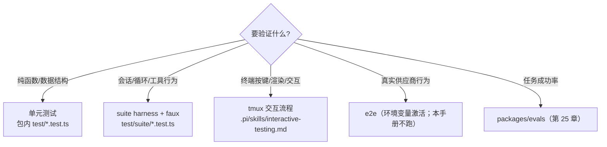
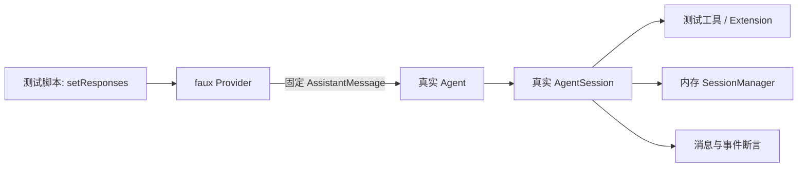

# 14. 测试、调试与可评审改动

今天从零写一条工具错误回归测试，并把失败转成可复现的故障记录。无需先做其他任务；测试只用 faux 假模型，预计 2–3 小时。

## 今日准备

需要 Node.js >= 22.19.0、已安装依赖；缺少时在根目录执行 `npm install --ignore-scripts`。在 `packages/coding-agent/test/suite/` 新建 `task-14-learning.test.ts`。只运行自己的单文件测试（工作目录 `packages/coding-agent`）：

```powershell
node ../../node_modules/vitest/dist/cli.js --run test/suite/task-14-learning.test.ts
```

此目录的测试必须用 `createHarness()` 和 faux；不能调用真实 provider、真实密钥或外部网络。若测试只新增在学习目录，按需要保留或删除；若改动产品代码，则在仓库根目录执行 `npm run check` 并检查它可能写回的格式变更。不要运行 `npm test` 或全量 Vitest。

## 学习内容

单元测试验证函数边界；faux + harness 验证完整会话；TUI 测试验证终端行为。一个好回归测试要让坏实现失败，而不是把当前实现再写一遍。排障按启动、资源、模型、工具、持久化、UI 六段找“最后一条正确事件”，从那里向下一层查。改代码还要遵守仓库规则：先读目标文件和相关测试；仅改自己的文件；代码改动后执行 `npm run check`；不要自行运行全量 Vitest、`npm test` 或构建。`npm run check` 会自动格式化，运行前后都要看 diff。

具体例子：模型调用一个会抛出 `Error("boom")` 的工具。正确行为是工具错误转为 `toolResult.isError === true`，模型还能看到它并给最终回答。只断言“最终有回答”太宽松，因为错误可能被吞掉；同时断言错误文本、工具执行次数、faux 请求次数，才区分得出坏实现。

## 核心源码

核心源码：`packages/coding-agent/test/suite/harness.ts` 的 `createHarness` 提供假模型、临时目录、事件数组和清理；`packages/ai/src/providers/faux.ts` 的 `fauxAssistantMessage`、`fauxToolCall` 构造模型脚本；`packages/agent/src/agent-loop.ts` 的工具错误路径决定 `isError`；`packages/coding-agent/src/core/agent-session.ts` 决定最终事件；根 `package.json` 的 `check` 脚本是代码改动后的质量门。按“构造输入 → 运行 → 断言 → 清理”的顺序定位。

## TypeScript 语法小课：类型谓词与有效断言

测试要检查可区分的行为。类型谓词 `value is X` 告诉 TypeScript：条件成立后可以安全读取 X 的字段；运行时仍靠真实判断与 `assert`/`expect` 证明结果。

```typescript
type Result = { role: "toolResult"; isError: boolean } | { role: "assistant" };
const messages: Result[] = [{ role: "assistant" }, { role: "toolResult", isError: true }];
const errors = messages.filter((message): message is Extract<Result, { role: "toolResult" }> =>
  message.role === "toolResult", // 谓词把过滤结果收窄为工具结果
);
console.assert(errors.length === 1 && errors[0]?.isError === true); // 错误路径的明确断言
```

练习：只断言消息数组非空，想一想哪种坏实现也能通过；再给本篇 faux 用例添加执行次数和错误文本断言。


## 完整学习资料

先按下列正文完成学习，再执行本篇的动手任务。正文中原书的实验与验收题先作为案例阅读，实际动手统一放到文末；只运行本篇“今日准备”和动手任务明确指定的离线命令。章节编号保留知识主题的原编号；源码精读、示例、边界条件、常见错误和参考答案均直接收录在本文件中。开头的预计用时仅指核心主线，完整源码精读需另留时间。

### 本篇共同基础

以下运行图和术语均在本文件内。学习正文保留原手册的知识主题编号，但那些编号不构成本任务的阅读前置；实际操作按本篇的动手任务与验收标准执行。学习正文基于原手册注明的 `200387122ca450d6387f033949423114a270b96c` 源码基线，当前工作区若有差异，以当前源码为准。

### 15 分钟主线：pi 怎样完成一件事

假设用户输入“读取 demo.txt，并总结三点”。模型自己不能读取你电脑里的文件。pi 把用户问题和可用工具告诉模型；模型提出 `read` 调用；pi 在本地执行；模型拿到文件内容后才生成总结。这就是全书反复使用的同一个例子。

**先看不带 TypeScript 细节的主流程（教学伪代码）：**

```text
收到用户输入，把它加入当前会话
重复：
    用当前上下文向模型发起请求
    收集模型的回答并把过程通知界面
    如果回答要求执行工具：
        校验参数，在本地执行工具，记录结果
        继续循环，让模型看到工具结果
    否则，检查是否还有排队输入或明确的继续决定
    如果都没有：结束本次运行
```

第一行确定这次任务和已有历史。模型请求只负责生成回答或提出工具调用。工具校验与执行由 pi 负责，结果回到对话后才可能有下一轮模型请求。界面接收运行事件，历史保存完成的消息；它们都与“模型请求”有关，但不是同一种数据。真实实现还处理工具并发、错误、取消、重试和压缩，后面分别讲。

**先分清四对容易混淆的词：**

| 两个词                | 直观区别                                           | 在“读文件并总结”中的例子                   |
| --------------------- | -------------------------------------------------- | -------------------------------------------- |
| 模型请求 / 用户输入   | 用户只说一次话，pi 可以多次询问模型                | 先请模型选择工具，读完文件后再请模型总结     |
| 事件 / 消息           | 事件告诉界面过程；消息承载一次完整的对话内容       | “正在输出第几个字”是事件；完成的总结是消息 |
| 工具调用 / 工具结果   | 调用提出想做什么；结果记录本地执行所得             | `read("demo.txt")` 是调用；文件文字是结果  |
| 会话历史 / 模型上下文 | 历史保留记录；上下文是这一次请求实际送给模型的内容 | 分支 C 仍在文件里，沿分支 D 继续时不必送 C   |


```text
一次用户输入
  → 第一次模型请求：请调用 read("demo.txt")
  → 本地工具执行：读出文件文本
  → 第二次模型请求：根据工具结果总结三点
  → 没有后续工作：结束
```

### 附录 A：术语表

> 用法：每个术语给出"一句话解释 + 首次出现的章节"。读代码遇到不认识的词，先查这里；查不到再搜源码（用英文名搜）。


#### A.1 核心概念

| 中文                  | 英文                    | 一句话                                                                                                             | 章节      |
| --------------------- | ----------------------- | ------------------------------------------------------------------------------------------------------------------ | --------- |
| 智能体外壳 / 运行框架 | agent harness           | 组织模型、工具、状态、界面的框架，本身不"聪明"                                                                     | 0.1       |
| 智能体                | agent                   | "模型 + 工具 + 循环"组成的执行体                                                                                   | 0.1       |
| 轮次                  | turn                    | 一次助手响应 + 它引发的工具执行                                                                                    | 3.3.3     |
| 低层运行              | Agent run               | 一次`Agent.prompt()` 或 `Agent.continue()` 调用建立的生命周期；以 `agent_end` 和已等待的 listener 收尾为边界 | 3.3.3、D2 |
| 会话 prompt 编排      | session prompt workflow | `AgentSession.prompt()` 在 `started` 后进入 `_runAgentPrompt()`；可串起 retry、压缩恢复和多个低层 Agent run  | 8、D27    |
| 用户请求              | user request            | 用户提交一次输入；与模型请求不等价                                                                                 | 3.3.3     |
| 模型请求              | model request           | 真正发给供应商 API 的一次请求                                                                                      | 3.3.3     |
| 转录                  | transcript              | 发给模型看/被记录的消息序列                                                                                        | 4.1       |
| 投影                  | projection              | 从会话树/文档到"模型实际看到的内容"的计算过程                                                                      | 9.4       |
| 活动分支              | active branch           | 从根到当前叶子的一条路径                                                                                           | 9.1       |
| 叶子                  | leaf                    | 会话树中的"当前位置"                                                                                               | 4.7.3     |
| 条目                  | entry                   | 会话文件里的一行（JSONL）                                                                                          | 4.7       |
| 会话                  | session                 | 一次对话的全部记录与状态                                                                                           | 8.1       |
| 压缩                  | compaction              | 用摘要替换旧上下文表示的机制                                                                                       | 10        |
| 上下文窗口            | context window          | 模型一次能接受的最大 token 量                                                                                      | 5.3       |
| 思考级别              | thinking level          | off/minimal/low/medium/high/xhigh/max                                                                              | 5.3       |
| 停止原因              | stop reason             | pending/stop/length/toolUse/error/aborted/deferred                                                                 | 4.3.3     |
| 用量                  | usage                   | token 与成本统计                                                                                                   | 4.3.5     |


#### A.2 消息与事件

| 中文           | 英文                | 一句话                                             | 章节        |
| -------------- | ------------------- | -------------------------------------------------- | ----------- |
| Agent 消息     | AgentMessage        | 内部消息（模型消息 + 应用自定义角色）              | 4.4         |
| 模型消息       | Message             | 供应商能理解的四角色联合                           | 4.3         |
| 内容块         | content block       | 消息内容的最小单元（text/image/thinking/toolCall） | 4.2         |
| 判别联合       | discriminated union | 用共同字面量字段区分成员的类型联合                 | 1.3.4       |
| 类型收窄       | narrowing           | 判断判别字段后类型自动缩小                         | 1.3.4       |
| 事件           | event               | 运行时广播（过程），不是消息（结果）               | 3.3.2       |
| 队列更新       | queue update        | 排队消息变化的会话事件                             | 4.5.2       |
| 边界（结算前） | agent_before_settle | 最后一个可行动钩子                                 | 6.2、13.3.5 |
| 已结算         | agent_settled       | "不会再自动继续"的最终信号                         | 4.5.2、16.3 |
| 延迟句柄       | deferred handle     | 异步应答的取回凭据                                 | 4.3.3       |


#### A.3 工具与模型

| 中文                | 英文                            | 一句话                                    | 章节  |
| ------------------- | ------------------------------- | ----------------------------------------- | ----- |
| 工具                | tool                            | 模型可调用的本地操作                      | 7.1   |
| 工具定义            | ToolDefinition                  | 扩展/应用注册工具的"富"形态               | 7.1.2 |
| 参数校验            | argument validation             | 用 typebox schema 在运行时校验调用参数    | 7.4   |
| 前置钩子            | beforeToolCall                  | 执行前可拦截（block）的钩子               | 7.6   |
| 后置钩子            | afterToolCall                   | 结果字段级改写的钩子                      | 7.6   |
| 顺序 / 并行执行     | sequential / parallel execution | 工具批次的两种调度                        | 7.5   |
| 终止提示            | terminate                       | "整批都同意时不因本批继续"的调度提示      | 7.5.4 |
| 模型                | model                           | 模型静态元数据（api/provider/限制/价格）  | 5.2.2 |
| 协议方言            | api                             | 供应商接口族标识（如 anthropic-messages） | 5.2.1 |
| 供应商              | provider                        | 认证 + 模型目录 + 请求实现                | 5.2.3 |
| 简单流式 / 完整流式 | streamSimple / stream           | 供应商无关档位 vs 协议特有选项            | 5.4   |
| 兼容开关            | compat                          | OpenAI 兼容生态的行为微调                 | 5.5.4 |
| 假供应商            | faux provider                   | 脚本化、离线的测试模型                    | 5.7   |


#### A.4 会话与持久化

| 中文       | 英文             | 一句话                             | 章节   |
| ---------- | ---------------- | ---------------------------------- | ------ |
| 会话管理器 | SessionManager   | 会话文件的对象化句柄               | 9.3    |
| 分支会话   | branched session | 只包含"根到叶子"路径的新文件       | 9.5.2  |
| 分支摘要   | branch summary   | 放弃某分支时生成的摘要条目         | 10.6   |
| 上下文编辑 | context edit     | 只改"投影"、不改原始条目的追加编辑 | 9.4.4  |
| 保留边界   | firstKeptEntryId | 压缩后从哪条开始保留               | 10.3.2 |
| 保留预算   | keepRecentTokens | 压缩后至少保留的近期上下文         | 10.3   |
| 预留       | reserveTokens    | 为模型回复预留的窗口               | 10.2.1 |
| 检测点替换 | checkpoint       | 压缩条目携带的提示词/工具检查点    | 9.4.3  |


#### A.5 扩展与集成

| 中文       | 英文            | 一句话                             | 章节       |
| ---------- | --------------- | ---------------------------------- | ---------- |
| 上下文文件 | context files   | AGENTS.md 等纯文本指令             | 11.4.2     |
| 项目信任   | project trust   | 允许加载项目可执行资源前的人工决定 | 11.5       |
| 提示词模板 | prompt template | Markdown 变成`/命令`             | 12.3.2     |
| 技能       | skill           | 目录 + SKILL.md 的按需说明书       | 12.3.3     |
| 扩展       | extension       | 可执行 TypeScript 模块（进程权限） | 12.3.4、13 |
| Pi 包      | Pi package      | 分发多资源的 npm/git 单元          | 12.3.6     |
| 钳制       | clamp           | 按模型能力压低思考级别             | 5.3        |
| 重绑       | rebind          | 会话替换后重新挂订阅/扩展绑定      | 8.6        |


#### A.6 协议与架构（选修）

| 中文     | 英文                   | 一句话                                          | 章节   |
| -------- | ---------------------- | ----------------------------------------------- | ------ |
| MCP      | Model Context Protocol | 外部工具/资源接入协议                           | 22     |
| 暴露方式 | exposure               | codemode/deferred/direct 三种工具到达模型的方式 | 22.3   |
| 工具搜索 | tool_search            | deferred 工具的"发现后再直调"机制               | 22.3   |
| 沙箱     | codemode sandbox       | QuickJS VM + worker 的脚本执行环境              | 22.9   |
| 面片     | facet                  | Chord 插件可独立打包到不同环境的分片            | 23.2   |
| 服务     | service                | Chord 的类型化稳定 token（singleton/keyed）     | 23.2   |
| 复制状态 | replicated state       | 原子发布、完整不可变值消费的状态                | 23.2   |
| 增量跟踪 | delta tracking         | 记录/合并 JSON 操作的机制                       | 23.2   |
| 持久执行 | durable execution      | 意图先提交、崩溃可续的执行模型                  | 23.1   |
| 检查点   | checkpoint             | 任务每一步的持久落点                            | 23.3.1 |
| 附着     | attachment             | 一条表现层连接绑定到一个会话                    | 24.2   |
| 信封     | envelope               | 协议中包裹 payload 的定向记录                   | 24.3   |
| span     | span                   | 一次操作的时间记录（遥测）                      | 25.2   |
| lift     | lift                   | 处理组相对对照组的提升（评估）                  | 25.5   |
| 阻断配对 | blocked pair           | 两臂未各得恰好一个分数，禁止计入头条            | 25.6   |


#### A.7 容易混淆的成对术语

| 对                                              | 区分                                                                                   |
| ----------------------------------------------- | -------------------------------------------------------------------------------------- |
| message vs event                                | 结果 vs 过程（3.3.2）                                                                  |
| turn vs run                                     | 一个轮次 vs 整次运行（3.3.3）                                                          |
| `agent_end` vs `agent_settled`              | 低层 run 结束 vs 自动工作清零（4.5.2）                                                 |
| 声明 vs 可执行                                  | 系统消息里的工具声明 vs 运行时工具集（7.3）                                            |
| details vs content                              | 给界面/程序 vs 给模型（14.2）                                                          |
| 完成顺序 vs 记录顺序                            | 并发完成 vs 声明序记录（7.5.3）                                                        |
| 停止原因`length` vs `stop`                  | 被截断 vs 正常说完（4.3.3）                                                            |
| `AgentSession.prompt()` vs `Agent.prompt()` | 应用层输入分流/会话编排 vs 低层 Agent run 入口（8、D2、D27）                           |
| `handled` vs `queued` vs `started`        | 输入被消费、不创建该输入自己的 run / 放入当前运行队列 / 进入会话 run 编排（8、16.5.3） |
| 提示词模板 vs 技能                              | 一段话 vs 一套流程+文件（12.3.3）                                                      |
| 扩展 vs Pi 包                                   | 可执行单元 vs 分发单元（12.3.6）                                                       |
| compaction 摘要 vs branch summary               | 压缩历史 vs 放弃分支（10.6）                                                           |
| durable cheat sheet：`replay: safe/never`     | 崩溃后重跑 vs 报 interrupted（23.4）                                                   |
| JSONL RPC vs client/server                      | 进程内 stdio 协议 vs 跨进程服务路由（24.1）                                            |
| 单测 vs 评估                                    | 确定性 vs 配对统计（25.1、25.6）                                                       |


#### A.8 输入与运行的层级

不要按“用户按了一次回车”推断低层 run 或模型请求的数量。实际层级是：

| 层级       | 代表符号                                           | 次数关系                                                                                      |
| ---------- | -------------------------------------------------- | --------------------------------------------------------------------------------------------- |
| 输入调用   | `AgentSession.prompt(text)`                      | 一次调用只表达一次输入尝试；结果可能是`handled`、`queued` 或 `started`                  |
| 会话编排   | `_runAgentPrompt(messages)`                      | 只在开始处理输入时进入；在里面管理重试、压缩恢复、边界 continuation 与取消                    |
| Agent run  | `Agent.prompt(messages)` 或 `Agent.continue()` | 一次会话编排可包含多个 run；每个低层 run 都发出自己的`agent_start` / `agent_end` 生命周期 |
| Agent turn | `turn_start` 到 `turn_end`                     | 一个 run 可包含多个 turn；每个 turn 通常包含一次助手响应及其引发的工具执行                    |
| 模型请求   | `streamSimple` / provider stream                 | 通常发生在助手响应阶段；自动重试会再次请求模型，压缩摘要等内部工作也可能有独立请求            |

两个边界例子：

- 扩展命令被消费时，`prompt()` 返回 `handled`，没有为该输入启动 `_runAgentPrompt()`；
- `prompt()` 在 Agent 已运行时以 `steer`/`followUp` 方式排队，返回 `queued`。这条输入会影响现有流程，但它本身不是新的 `Agent.prompt()` 调用。

因此，统计“模型请求次数”不能数 prompt、turn 或 `agent_end`：应按 provider 请求事件/日志，或明确的测试探针计数。章节 21 的自测题也按这个区分评分。


#### A.9 索引方式说明

- 想找"某行为在哪个文件" → 用 source-map；
- 想找"某命令怎么跑" → 用 commands；
- 想找"某现象怎么排" → 用 troubleshooting；
- 想找"哪些练习要做" → 用 exercises-and-answers。

---

### 第 18 章：测试分层与离线模拟

**先懂这一章**：测试 Agent 行为不必每次调用真实模型。faux provider 按预先写好的响应工作；测试可以确定下一轮会出现什么。先写一个能在错误实现上失败的观察点，再选择合适的测试层。

```text
教学伪代码：安排固定模型响应 → 创建隔离的会话
           → 提交输入 → 观察事件、结果和历史
           → 断言预期行为 → 清理资源
```

这只验证在固定响应下的程序行为；供应商兼容性需要另有证据。

前 17 章说明系统怎样运行和扩展。从本章开始换成开发者视角：先证明一个行为，再在第 19 章定位失败，最后按第 20 章规则组织改动。

> 学完本章你能回答：
>
> 1. 这个仓库有哪些测试层？每一层适合验证什么、不适合验证什么？
> 2. `test/suite/` 的 harness 提供了什么？怎么用 faux 写确定性的会话测试？
> 3. 怎么让测试"在坏实现上失败、在好实现上通过"？
> 4. 运行测试的正确命令是什么（为什么不能直接跑全量 vitest）？
> 5. 交互测试（tmux）什么时候用、怎么写？

**预计学习时间**：1.5 天（本章要求你亲手写并跑通一个测试）。
**本章验证状态**：静态核对通过（`test/suite/README.md`、`harness.ts`、`agent-session-tool-orchestration.test.ts` 等逐项核对）；实验 L12-A 设计中。

---


#### 18.1 测试分层：每一层"配得上"的验证

从下到上分四层（外加行为评估）：

| 层        | 测什么                                          | 成本              | 稳定性             | 在本仓库的位置                                               |
| --------- | ----------------------------------------------- | ----------------- | ------------------ | ------------------------------------------------------------ |
| 单元      | 纯函数/小模块（token 估算、路径拼接、键位解析） | 极低              | 高                 | 各包`test/*.test.ts`（如 `packages/tui/test/*.test.ts`） |
| 组件/集成 | 会话装配、循环行为、工具编排（faux 驱动）       | 中                | 高                 | `packages/coding-agent/test/suite/`（harness + faux）      |
| 交互      | 终端键位、渲染、真实按键序列                    | 中高              | 中（涉及终端模拟） | tmux 流程（`.pi/skills/interactive-testing.md`）           |
| 端到端    | 真模型、真供应商                                | 最高（费用/凭据） | 低（模型随机性）   | e2e 测试（有环境变量才激活；本手册不跑）                     |
| 行为评估  | "任务成功率"这类统计指标                        | 高                | 低                 | `packages/evals`（第 25 章）                               |

选择原则（与第 12 章同构）：**能在低层测的，不要上高层**。判断"多轮工具调度的顺序"用 suite harness（faux 可控）；判断"终端里中文有没有错位"才需要交互层；判断"供应商真实行为"才轮到 e2e。


#### 18.2 运行器与命令：先记"正确入口"

| 包                                    | 运行器                                                              | 依据                                  |
| ------------------------------------- | ------------------------------------------------------------------- | ------------------------------------- |
| `agent` / `ai` / `coding-agent` | Vitest（`vitest --run`）                                          | 各包`package.json` 的 `test` 脚本 |
| `tui`                               | Node 内置测试（`node --test --test-reporter=dot test/*.test.ts`） | 同上                                  |
| 全部（非 e2e）                        | `./test.sh`（隔离 HOME、无 API Key）                              | 第 2.6 节                             |

**单文件测试**（仓库规则，从包根目录执行）：

```powershell
# PowerShell：先在对应 package 根目录
$repo = git rev-parse --show-toplevel
node "$repo/node_modules/vitest/dist/cli.js" --run test/specific.test.ts

# packages/tui 使用 node:test；命令在 packages/tui 根目录执行
node --test test/specific.test.ts
```

```bash
# Bash（Linux/macOS/WSL/Git Bash），在对应 package 根目录
node "$(git rev-parse --show-toplevel)/node_modules/vitest/dist/cli.js" --run test/specific.test.ts

# packages/tui 使用 node:test；命令在 packages/tui 根目录执行
node --test test/specific.test.ts
```

`./test.sh` 是仓库级 Bash 脚本，不是 PowerShell 脚本；Windows 原生环境应在 Git Bash 或 WSL 中运行。各平台的 cwd、命令和隔离范围见平台验证附录 K.5。

两条禁令（`AGENTS.md`）：

```text
Never run the full vitest suite directly: it includes e2e tests that activate when endpoint/auth
env vars are present. For all non-e2e tests, run ./test.sh from the repo root.
```

还有一个"隐形基础设施"值得一提：根目录的 `vitest.base.ts` 用**源码别名**把 `@earendil-works/*` 指到各包 `src/`——与第 2 章的 `source-resolver.ts` 是同一思路：**测试跑的是源码，不是构建产物**。所以你改了源码，测试立刻测到最新版本。


#### 18.3 `test/suite/`：会话级测试的官方设施

`packages/coding-agent/test/suite/README.md` 的规则（照着念）：

```text
- Use `test/suite/harness.ts`
- Use the faux provider from `packages/ai/src/providers/faux.ts`
- Do not use real provider APIs, real API keys, network calls, or paid tokens
- Keep these tests CI-safe and deterministic
- Do not use or extend the legacy `test/test-harness.ts` path unless a missing capability forces it
```


##### 18.3.1 harness 提供什么

`harness.ts` 导出 `createHarness` 与类型 `Harness`，并内置一批断言辅助。核心能力（对照源码）：

| 能力                                             | 说明                                                                                                                                                                                |
| ------------------------------------------------ | ----------------------------------------------------------------------------------------------------------------------------------------------------------------------------------- |
| `createHarness(options)`                       | 组装一个**真实结构的 `AgentSession`**，但模型换 faux、会话可换内存/落盘、资源可用最小集                                                                                     |
| `HarnessOptions`                               | `models`、`settings`、`tools`、`initialActiveToolNames`、`allowedToolNames`、`excludedToolNames`、`resourceLoader`、`extensionFactories`、`withConfiguredAuth` 等 |
| `harness.setResponses([...])`                  | 直接设置 faux 的脚本序列（第 5 章）                                                                                                                                                 |
| `harness.session` / `harness.sessionManager` | 断言对象（消息、条目、工具集）                                                                                                                                                      |
| `harness.cleanup()`                            | 清理（测试的`afterEach` 里统一调用）                                                                                                                                              |
| 辅助函数                                         | `getMessageText`、`getUserTexts`、`getAssistantTexts`、`getToolResult(harness, toolName)`、`createTestUiContext(overrides)`                                               |
| 扩展注入                                         | 直接传工厂函数（内联扩展），无需落盘文件                                                                                                                                            |

它把"测试基础设施"与"断言辅助"分开：**基础设施**在 harness 里，**断言写法**用 Vitest 的 `expect`。


##### 18.3.2 骨架（从官方测试抄结构）

```typescript
import { describe, expect, it, afterEach } from "vitest";
import { fauxAssistantMessage, fauxToolCall } from "@earendil-works/pi-ai";
import { createHarness, type Harness } from "./harness.ts";

describe("我的行为", () => {
	const harnesses: Harness[] = [];
	afterEach(() => {
		while (harnesses.length > 0) harnesses.pop()?.cleanup();   // 每个测试都清理
	});

	it("描述外部行为，而不是实现细节", async () => {
		const harness = await createHarness({ initialActiveToolNames: ["read"] });
		harnesses.push(harness);

		harness.setResponses([
			// 第一轮模型请求工具，工具结果写回后再消费第二轮响应。
			fauxAssistantMessage([fauxToolCall("read", { path: "demo.txt" })], { stopReason: "toolUse" }),
			fauxAssistantMessage("总结完毕"),
		]);

		await harness.session.prompt("读取 demo.txt");
		expect(harness.session.messages.filter((m) => m.role === "assistant")).toHaveLength(2);
	});
});
```


#### 18.4 精读官方测试：`agent-session-tool-orchestration.test.ts`

这个测试把"工具编排 + 嵌套调用 + 持久化"一次测全，是本章的样板。抽三段读。


##### 18.4.1 用扩展注册"会调用其他工具的"工具

```typescript
function orchestratorExtension(pi: ExtensionAPI): void {
	pi.registerTool({ name: "echo", /* ... */ });
	pi.registerTool({ name: "helper", /* ... */, exposure: "codemode" });       // 只给脚本/嵌套调用
	pi.registerTool({
		name: "run_tools", /* ... */, exposure: "model-only",
		prepareLoadout: (loadout) => ({
			descriptions: { run_tools: `Runs tools: ${loadout.callable.map((t) => t.name).join(", ")}` },
			hiddenDeclarations: ["echo"],
		}),
		execute: async (_id, _params, _signal, _onUpdate, ctx) => {
			const helper = await ctx.executeTool("helper", {});
			const echo = await ctx.executeTool("echo", { text: "hi" });
			const self = await ctx.executeTool("run_tools", {});      // 递归调用自己 → 预期 error
			// ...
		},
	});
}
```

注意 `prepareLoadout`：**工具可以按"当前可调用集"动态改自己的描述与"隐藏声明"**——模型看到的声明被定制，而可执行集不变（第 7.3 节的"声明 vs 可执行"在扩展层的体现）。


##### 18.4.2 断言"请求里看到的工具"与"嵌套调用记录"

```typescript
const requestTools: string[][] = [];
harness.setResponses([
	(context: TranscriptContext) => {
		// 在模型请求发出时取快照，检查模型当时实际看到了哪些工具。
		requestTools.push(getCurrentTools(context.messages).map((t) => t.name));   // 在"请求时点"取声明
		return fauxAssistantMessage([fauxToolCall("run_tools", {})], { stopReason: "toolUse" });
	},
	fauxAssistantMessage("done"),
]);
await harness.session.prompt("go");

expect(requestTools[0]).toEqual(["run_tools"]);        // echo 被 hiddenDeclarations 隐藏
const result = harness.session.messages.find((m): m is ToolResultMessage => m.role === "toolResult");
// 同时断言结果内容和嵌套调用链，避免只验证执行次数。
expect(result.content).toEqual([{ type: "text", text: "helped | echo: hi | Tool run_tools not found" }]);
expect(toolCalls).toEqual(["run_tools:top", `helper:${parent}`, `echo:${parent}`]);
expect(result.nestedCalls?.calls.map((c) => [c.id, c.name, c.status])).toEqual([
	[`${parent}/1`, "helper", "ok"],
	[`${parent}/2`, "echo", "ok"],
	[`${parent}/3`, "run_tools", "error"],
]);
```

这段代码示范了三种高级断言技巧：

1. **faux 的 `FauxResponseFactory` 当"探针"**：在"即将发请求"时点读取 `getCurrentTools(context.messages)`——精确断言"模型当时看到的声明"；
2. **事件侧断言**：`pi.on("tool_call")` 收集 `toolName:parentToolCallId`，验证嵌套调用的父子关系与顺序；
3. **`nestedCalls` 记录**：嵌套调用会以结构化记录挂在工具结果上（第 14.4 节），可直接断言 id/名称/状态。


##### 18.4.3 断言"持久化形态"

```typescript
const persisted = harness.sessionManager
	.getBranch()
	.find((entry) => entry.type === "message" && entry.message.role === "toolResult");
expect(persisted?.type === "message" && persisted.message).toMatchObject({ nestedCalls: result.nestedCalls });
```

这体现第 9 章的"投影 vs 持久化"：**内存里的结果与落盘条目要一致**——测试两处都断言。

#### 18.5 怎么做到"坏实现会失败"

测试的价值 = **区分力**（mutation sensitivity）。一个永远通过的测试是负资产。三条做法：


##### 18.5.1 对着"外部行为"写断言

对比：

```typescript
// 弱：只断言当前重试计数，没有证明调用方收到正确的生命周期事件
expect(harness.session.retryAttempt).toBe(1);

// 强：断言调用方可观察到的生命周期行为
expect(events.map((e) => e.type)).toEqual(["auto_retry_start", "auto_retry_end"]);
```

这里使用的 `retryAttempt` 是 `AgentSession` 明确公开的 getter；它避免了通过 `as any` 绕过类型检查去读私有字段。即使能读到这个计数，它仍只说明内部进度值为 1；如果契约要求通知订阅者重试何时开始和结束，事件断言才直接覆盖该契约。`events` 代表测试预先收集的事件数组。

本仓库的测试偏第二种：事件序列、消息形状、条目内容、错误文本——这些是"契约"，改了要有人察觉。


##### 18.5.2 用"探针 + 对照"锚定关键时刻

样板测试在 **faux 工厂里读请求上下文**（18.4.2）就是"探针"：它把断言点精确放在"请求将发未发"的瞬间。同类技巧：

- 在 `pi.on("tool_call")` 里记录参数（断言"钩子看到什么"）；
- 在 `message_end` 时快照消息（断言"终态长什么样"）；
- 同一行为写两个用例（有工具/无工具、单条/批量），**差异本身就是断言**。


##### 18.5.3 错误路径必须有专属用例

第 7 章的实验表已经示范了四类：**非法参数、抛错、取消、拦截**。每类的断言点：

| 用例     | 必须断言                                                              |
| -------- | --------------------------------------------------------------------- |
| 非法参数 | `isError: true` + 错误文本包含关键字段名/路径                       |
| 工具抛错 | 错误文本来自异常 message；循环继续（`callCount` 增加）              |
| 取消     | `stopReason: "aborted"`（run 层）或 `Operation aborted`（工具层） |
| 钩子拦截 | 工具**未执行**（调用计数为 0）+ 模型收到 reason                 |

写完后做一次"自证测试"：**手动把实现改坏一小处**（删掉一个判断、换个字段名），确认测试真的红。红不了就重写断言——这是第 21 章毕业项目的验收习惯。


#### 18.6 测试选择决策树



补充经验：

- **测试放对包**：tui 的按键解析放 `packages/tui/test/`（node:test）；会话行为放 `coding-agent/test/suite/`（vitest + harness）；
- **能用 harness 就别 tmux**：tmux 适合"只有真终端才能暴露"的问题（键位、IME、宽字符、渲染时序）；
- **e2e 只补"协议契约"**：比如"扁平 JSON 转供应商格式"这类**必须真请求**才能验证的东西——本手册默认不跑。


#### 18.7 交互测试与 tmux

`AGENTS.md` 指定：交互测试前先读 `.pi/skills/interactive-testing.md`。核心流程（第 17.11 节已用过）：

```bash
tmux new-session -d -s pi-test -x 80 -y 24
tmux send-keys -t pi-test "./pi-test.sh" Enter
sleep 3 && tmux capture-pane -t pi-test -p     # 截屏（文本形式）
tmux send-keys -t pi-test "your prompt here" Enter
tmux send-keys -t pi-test Escape               # 特殊键：Escape、C-o（ctrl+o）等
tmux kill-session -t pi-test
```

写法的建议：

- **先断言启动态**（截屏里有编辑器/状态栏）再发输入；
- **等一个可观察条件**再截屏（如等待回复出现），而不是纯 sleep 猜时长；
- 特殊键映射：`Escape`、`C-o`（Ctrl+O）、`C-c` 等（见 skill 文档）；
- **release 冒烟**用 `-c /tmp` + 绝对路径二进制，且必须"发一条 prompt 并等到回复"才算通过——启动成功不算。


#### 18.8 运行命令与 CI 纪律（速查）

```bash
./test.sh                                   # 全部非 e2e（隔离环境，仓库根）
# 单文件（在包根目录）：
node "$(git rev-parse --show-toplevel)/node_modules/vitest/dist/cli.js" --run test/suite/xxx.test.ts
node --test test/keys.test.ts               # packages/tui 专用
npm run check                               # 类型+lint（不跑测试，见第 20 章）
```

PowerShell 单文件命令：

```powershell
# 在 packages/coding-agent 根目录；Vitest 路径相对当前 package
$repo = git rev-parse --show-toplevel
node "$repo/node_modules/vitest/dist/cli.js" --run test/suite/xxx.test.ts

# 在 packages/tui 根目录
node --test test/keys.test.ts
```

全量隔离测试 `test.sh` 和单文件测试的 shell 要求不同：前者需要 Git Bash/WSL；后者可以直接从 PowerShell 调 `node`。不要为了方便在 PowerShell 里用 `npm test` 替代隔离脚本。

CI 纪律（`test/suite/README.md` + `AGENTS.md`）：

- suite 测试**禁止**真实 API/Key/网络/付费 token；
- 保持**确定性**：不依赖真实计时器（用可控 Promise）、不依赖网络、不依赖本机时区/语言（`test.sh` 已隔离 LANG/TZ）；
- **不要**为了让测试通过而绕过隔离（比如自己跑 `npm test`）。


#### 18.9 实验 L12-A：写一个 faux 回归测试

**实验性质**：本地运行；题材任选其一（建议与毕业项目相关）。
**验证状态**：设计中。目标：亲手完成"写测试 → 自证失败 → 修实现 → 通过"闭环。


##### 候选题材（挑一个）

1. **工具错误路径**：注册一个必抛错工具，断言 `isError: true` 且循环继续（`callCount === 2`）；
2. **队列语义**：运行中 `steer()`，断言注入点位于两次 `turn_start` 之间（第 6 章的 T2 取数点）；
3. **取消语义**：在 `tool_execution_start` 后 `abort()`，断言最终 `stopReason: "aborted"` 与工具结果文本 `Operation aborted`；
4. **截断语义**：工具返回 3MB 文本，断言结果被截断且 `details.truncation` 存在（或按你的工具设计断言 fullOutputPath）。


##### 步骤（以题材 1 为例）

```typescript
import { describe, expect, it, afterEach } from "vitest";
import { fauxAssistantMessage, fauxToolCall } from "@earendil-works/pi-ai";
import { Type } from "typebox";
import { createHarness, type Harness } from "./harness.ts";

describe("工具错误路径（回归 #<issue>）", () => {
	const harnesses: Harness[] = [];
	afterEach(() => { while (harnesses.length) harnesses.pop()?.cleanup(); });

	it("工具抛错转为 isError 结果并继续循环", async () => {
		const harness = await createHarness({
			initialActiveToolNames: ["boom"],
			extensionFactories: [(pi) => pi.registerTool({
				name: "boom", label: "boom", description: "throws",
				parameters: Type.Object({}),
				execute: async () => { throw new Error("boom failed"); },
			})],
		});
		harnesses.push(harness);

		harness.setResponses([
			fauxAssistantMessage([fauxToolCall("boom", {})], { stopReason: "toolUse" }),
			fauxAssistantMessage("已收到错误"),
		]);
		await harness.session.prompt("go");

		const result = harness.session.messages.find((m) => m.role === "toolResult");
		expect(result?.isError).toBe(true);
		expect(JSON.stringify(result?.content)).toContain("boom failed");
		expect(harness.faux.state.callCount).toBe(2);       // 循环继续，模型被再问一次
	});
});
```

当前 `Harness` 明确暴露 `faux: FauxProviderRegistration`，所以示例中的 `harness.faux.state.callCount` 是可用的计数器；也可用 `harness.getPendingResponseCount()` 断言脚本队列是否清空。真实测试已采用前一种方式（如 `agent-session-retry-events.test.ts`）。如果后续 harness 改变，应以 `Harness` 接口和同目录测试为准，不要额外注册第二个 faux provider。


##### 自证与运行

1. 从 `packages/coding-agent` 根目录跑单文件命令（PowerShell 与 Bash 版本见 18.2 和附录 K.5）；
2. 把实现改坏（比如让进程吃掉异常不产生结果）→ 测试必须失败；
3. 还原 → 通过；记录到你的学习笔记（第 20 章的变更说明会用上）。


##### 清理

`git status` 只包含你新增的测试文件（不要动别人文件）；实验完成后按需要保留或删除。


#### 本章源码精读

> **源码精读**：先定位导出与函数签名，再沿调用点核对输入、状态、输出和错误；最后用本篇指定的离线实验验证。

D21 把 faux Provider 的脚本化响应与 `AgentSession` 测试 harness 连起来。先观察固定事件，再编写能区分正确与错误实现的断言；本篇的历史验证状态不代表此次重新运行了测试。


##### D21：faux Provider 与 AgentSession 测试 Harness

**先懂**：faux provider 按预定脚本扮演模型；harness 仍创建真实的会话和工具装配。这样能稳定复现“模型要求调工具后又回答”的行为，避免依赖真实模型的随机输出。

```text
教学伪代码：写好模型的两次响应 → 创建隔离 harness
           → 启动 AgentSession 并提交输入
           → 检查请求、事件与会话历史
           → 释放 harness
```

脚本响应可证明程序在这些输入下的行为，不能证明真实服务的兼容性或质量。

> 精读对象：`packages/ai/src/providers/faux.ts` 的 response 工厂与流式实现、`packages/ai/src/compat.ts` 的 `registerFauxProvider`、`packages/coding-agent/test/suite/harness.ts` 的 `createHarness`，以及使用它们的 suite 测试。
>
> 对应主线：第 5、6、7、8、18、19、20、21 章。第 18 章告诉你怎样选测试层；本文拆开 session harness 的装配与清理。
>
> 基线：`200387122ca450d6387f033949423114a270b96c`。测试源码用于说明测试边界，不表示本篇已经执行测试。


###### 0. 这类测试到底在测什么

目标通常是验证：一条输入经过真实 `AgentSession`、真实 Agent loop、真实工具调度与真实会话记录后，能不能产生正确的消息、事件和持久化条目。为了不依赖模型，它把最外面的模型服务替换成 faux provider：模型响应由测试脚本明确指定。



测试因此不是“把整个程序 mock 掉”，而是替换不可控的外部模型响应，保留要验证的应用代码路径。

| 保留为真实实现                                                     | 通常由测试替代或隔离                   |
| ------------------------------------------------------------------ | -------------------------------------- |
| `Agent`、`AgentSession`、工具调度、扩展 runner、事件与消息归约 | 模型服务随机输出与网络                 |
| 工具参数校验与工具执行管线                                         | 用户级设置/凭据文件                    |
| 会话投影逻辑，默认使用内存 session manager                         | 工作目录使用临时目录                   |
| 需要测试的扩展和 fake 工具                                         | 不相关资源加载改用轻量 resource loader |

【陷阱】faux 测试不能证明某个供应商真的会按脚本返回结果，也不能证明 HTTP/SSE 转换正确。它证明的是“pi 应用层收到这一条已规范化 assistant message 后，会怎样运行”。provider 协议转换要在 `packages/ai/test` 测；Agent/Session 行为才在这里测。


###### 1. 四个层级，不要混成一个对象

先建立对象关系：

```text
registerFauxProvider
  ├─ 注册一个 api -> stream/streamSimple 实现
  ├─ 创建模型目录
  └─ 返回 faux handle（脚本队列、状态计数、unregister）

createHarness
  ├─ 创建 temp cwd、临时文件、内存设置和认证
  ├─ 取 faux model 与注册到测试 ModelRuntime
  ├─ 创建真实 Agent（streamFn=streamSimple）
  ├─ 创建真实 AgentSession
  ├─ 监听并缓存 AgentSessionEvent
  └─ 返回 session / faux / 断言辅助 / cleanup

测试用例
  ├─ 设置 response script
  ├─ 调 session.prompt()
  └─ 观察 messages / tool result / events / entries / faux state
```

四层各自的“真实程度”不同：faux 是假的模型，但不是假的 Agent；harness 是测试装配，不是正式 SDK 工厂；session manager 默认在内存中，但保存/投影算法仍是真实类；测试工具由用例提供，执行 pipeline 仍是真实实现。


###### 2. faux provider：脚本化一次模型响应

**先懂**：测试预先写好“模型第几次请求答什么”，再让真实 Agent 消费这组固定回答。

```text
教学伪代码：第 1 次请求安排工具调用
           → 第 2 次请求安排文本回答 → 按请求顺序交出
```


##### 2.1 关键类型

`FauxResponseStep` 是一个 assistant message，或者一个根据请求上下文动态返回 assistant message 的 factory：

```typescript
export type FauxResponseFactory = (
  context: TranscriptContext,
  options: SimpleStreamOptions | undefined,
  state: FauxProviderState,
  model: Model<string>,
) => AssistantMessage | Promise<AssistantMessage>;

export type FauxResponseStep = AssistantMessage | FauxResponseFactory;
```

初学者读法：

- 第一参数 `context`：这次请求准备发给模型的规范化 transcript；
- 第二参数 `options`：本次请求的 stream/simple options；
- 第三参数 `state`：faux 自己的调用计数等观测状态；
- 第四参数 `model`：这轮实际选中的模型；
- 返回值可同步也可异步，所以测试可以在工厂里检查上下文，再决定回答什么。

固定响应适合回答“拿到某种模型输出时会发生什么”；工厂响应适合回答“发请求那一刻上下文里到底有什么”。


##### 2.2 常用消息构造器

```typescript
fauxAssistantMessage("hello")
fauxAssistantMessage([fauxThinking("reasoning"), fauxText("answer")])
fauxAssistantMessage(fauxToolCall("echo", { text: "hi" }), { stopReason: "toolUse" })
```

这些函数产生的是 pi-ai `AssistantMessage` 数据。`fauxAssistantMessage` 默认 stop reason 为 `stop`；若消息包含工具调用，脚本必须显式设置 `stopReason: "toolUse"`，否则 Agent 不会把它解释成要求执行工具的完成。


##### 2.3 response 队列是 FIFO

`setResponses(responses)` 用新数组替换待处理队列；`appendResponses(responses)` 把步骤追加到末尾；`getPendingResponseCount()` 返回尚未消费的脚本数。

每次 faux `stream` 被调用时，会先同步执行：

```text
step = pendingResponses.shift()
state.callCount += 1
```

然后用 `queueMicrotask` 异步处理 response。结果是：

- response 队列顺序就是请求顺序；
- 若 Agent 工具循环会发两次模型请求，测试要提供两个 response step；
- response script 提前耗尽不会偷偷复用上一答案，而会产生 `No more faux responses queued` 错误；
- 调用数统计在 response 计算之前递增，可作为请求次数探针。

【陷阱】单个 `session.prompt()` 可能发出多轮请求。包含一个 tool call 的典型脚本需要“toolUse assistant message + 工具执行后的 follow-up assistant message”；只给一个 step 时，第二次请求会得到 faux exhaustion error。


##### 2.4 工厂是“发请求前探针”

```typescript
harness.setResponses([
  (context) => {
    const user = context.messages.find((message) => message.role === "user");
    return fauxAssistantMessage(user ? "saw user input" : "missing user");
  },
]);
```

这段 factory 在 faux 收到 pi-ai 请求 context 后运行，适合断言：

- 当前有效分支里有哪些消息；
- system prompt 是否包含某个 section；
- 模型看到的是哪个工具清单；
- 工具结果是否已经进入下一轮上下文；
- extension context transform 是否生效。

它不是“模型内部在思考时的上下文”，而是 provider stream 函数实际收到的 transcript。要测更早的输入转换，需要在 `AgentSession.prompt`/extension hook 边界观察；要测供应商 JSON，则在具体 provider 的 `onPayload`/adapter test 观察。


###### 3. faux 怎样把完整消息变成流事件

faux stream 不直接把最终 message 一次性返给 Agent。它调用 `streamWithDeltas`，把固定内容拆成 start/delta/end/done 事件。


##### 3.1 部分 AssistantMessage

最初 partial message 会将 content 清空，`stopReason` 设为 `pending`，然后 push `start`。每个 content block 被顺序处理：

- thinking：`thinking_start → 一个或多个 thinking_delta → thinking_end`；
- text：`text_start → 一个或多个 text_delta → text_end`；
- tool call：`toolcall_start → 一个或多个 toolcall_delta → toolcall_end`。

累积器每次 delta 都会更新 partial content，因此测试可以订阅 AgentEvent，观察进行中的消息，而不用真实 provider。


##### 3.2 token size 与时序

文本按估算 token size 分块：每个字符约折算 1/4 token；`tokenSize.min/max` 控制伪 token 长度；`tokensPerSecond` 大于零时每块按长度等待，缺省或小于等于零时通过 `queueMicrotask` 让出当前同步栈再继续。

这个模拟不是 tokenizer，也不模拟某家 provider 的 chunk 算法。默认 min/max 区间可使 delta 边界随机；若测试检查精确 delta 次数或事件序列，应将两者设成同一个固定值，或者只断言最终拼接文本。

示例：

```typescript
const faux = registerFauxProvider({
  tokenSize: { min: 1, max: 1 },
});
```

固定 chunk 大小控制形状；默认不加人工速度延时则避免测试等待长时间。测试 abort 时，若要保证中途取消发生在内容仍在发送，需要配置可控速率/等待，而不是依赖机器调度碰巧命中某个时刻。


##### 3.3 终态语义

若脚本 message 的 stop reason 仍是 `pending`，faux 抛出错误；`error`/`aborted` 会 push error event；其他 stop reason push done event。异常会转成具有 `stopReason: "error"` 的 assistant message，流 `.result()` 得到终态 message。

所以 response factory 抛异常和 factory 返回 `fauxAssistantMessage(..., { stopReason: "error" })` 并不完全相同：前者走 faux 异步任务的 catch；后者由 `streamWithDeltas` 在输出内容之后按终态分支发 error。写测试时先确定自己要模拟“响应生成失败”还是“模型响应本身报告 error”。


###### 4. `registerFauxProvider`：如何接入统一 pi-ai API

`registerFauxProvider` 把 `createFauxCore` 的 `api`、`stream`、`streamSimple` 注册到 `compat` 的 API provider registry，并返回：

- api id 与模型 tuple；
- `getModel()` / `getModel(id)`；
- 状态、响应队列操作；
- `unregister()`。

注册不是全局永久配置。测试结束必须 unregister，否则后续测试可能遇到冲突 API、误用旧 response queue，或受测试执行顺序影响。

有另一种 `fauxProvider()`：它返回一个正常的 `Provider` 对象，需要测试显式创建 `Models` 并调用 `models.setProvider(faux.provider)`。两种入口的用途不同：

| 工厂                     | 注册位置                                 | 常见用途                               |
| ------------------------ | ---------------------------------------- | -------------------------------------- |
| `registerFauxProvider` | 全局 api provider registry               | compat/getModel 一类标准 API 路径      |
| `fauxProvider`         | 返回`Provider` 对象，由测试装入 Models | 测 Models/provider registry 的显式装配 |

不要在需要验证 `Models` registry 的单元测试里使用会绕过该层的入口。


###### 5. `createHarness` 装了哪些真实部件

**先懂**：harness 保留真实会话、工具和事件路径，只把模型响应换成可控制输入。

```text
教学伪代码：创建隔离目录与配置 → 注册 faux 模型
           → 建立 AgentSession 与观察句柄 → 返回 harness
```


##### 5.1 隔离文件系统与设置

每个 harness 创建唯一 temp directory，作为 session 的 cwd。默认 `SessionManager.inMemory()`、`SettingsManager.inMemory(...)` 与 `AuthStorage.inMemory()` 避免读写用户真实会话、设置和凭据。

若传入 `modelsJson`，harness 会把它序列化到 tempDir 下的 `models.json`，创建 disk-backed model registry；这让测试可覆盖 models.json 加载，而无需碰用户目录。


##### 5.2 创建真实模型运行时

harness 先 register faux，再拿到 faux model。默认 `withConfiguredAuth=true` 时：

1. 向内存 `AuthStorage` 写入一个假的 `faux-key`；
2. 在 model registry 里注册同 provider/baseURL/API/model metadata；
3. 创建 `Agent`，`getApiKey` 返回该 fake key；
4. `streamFn` 使用 pi-ai `streamSimple` 路由到注册过的 faux API。

这使会话运行时走正常的 model/provider lookup 和 stream adapter，只把响应来源替换成脚本。`faux-key` 只是本地注册路径满足“存在认证”的测试值；fake provider 不会把它送到网络。

若设置 `withConfiguredAuth: false`，harness 不把 faux provider 注册进有 auth 的 model runtime 且 Agent 不返回 key，适合测试缺认证行为。


##### 5.3 创建真实 Agent 和 AgentSession

`new Agent(...)` 传入：

- fake stream function；
- 初始 model、空 system prompt、空初始工具；
- coding-agent 的 `convertToLlm`；
- extensions 接入点：`onPayload`、`onResponse`、`transformContext` 经 `extensionRunnerRef.current` 转发。

随后 `new AgentSession(...)` 注入 Agent、session/settings managers、temp cwd、ModelRuntime、resource loader、工具覆盖与扩展引用。

这保留了真实 session→Agent→provider 调用方向。比如 `session.prompt()` 中的队列、session event、消息追加与 tool execution 都不是 harness 假实现。


##### 5.4 工具和 extension factories

`tools` 选项先建成 name→tool map，再作为 `baseToolsOverride` 注入；在场景需要时也可用 `extensionFactories` 创建测试扩展。选择依据：

- 要测普通 AgentTool 的 schema 校验/执行，传 `tools`；
- 要测扩展注册、extension event、动态 loadout 或 `ctx.executeTool`，传 `extensionFactories`；
- 要测 CLI 资源扫描/真实文件发现，不应假设默认 test resource loader 覆盖了生产扫描行为。

`initialActiveToolNames`、`allowedToolNames`、`excludedToolNames` 分别控制初始活动集合、允许集合和排除集合，具体组合行为由 AgentSession 工具 loadout 实现。


##### 5.5 测试事件缓存与辅助函数

harness 对 session 订阅，把事件保存进 `events`；`eventsOfType(type)` 使用 TypeScript `Extract` 把筛选结果收窄成该事件种类。

```typescript
eventsOfType<T extends AgentSessionEvent["type"]>(type: T) {
  return events.filter(
    (event): event is Extract<AgentSessionEvent, { type: T }> => event.type === type,
  );
}
```

泛型读法：`T` 必须是一个合法的事件 type 字面量；返回数组的元素类型被缩小为“type 等于 T 的那种 event”，所以调用者读字段时有正确提示。

`getMessageText` 先判断未知输入是不是对象、有无 content，再区分字符串和 block array；这是一种 `unknown` 类型的逐步收窄示例。对初学者来说，读这个 helper 比把数据强转成 `any` 更值得模仿。


###### 6. cleanup 是测试隔离的一部分

`harness.cleanup()` 按顺序：

1. `session.dispose()` 释放会话持有的订阅、扩展与 runtime 资源；
2. `fauxProvider.unregister()` 从 compat registry 移除这个 provider registration；
3. 若 temp directory 仍存在，递归删除它。

测试通常在 `afterEach` 中循环所有已创建 harness 并调用 cleanup。一个测试创建多个 harness 时，需要登记每一个；中途断言失败也要能清理，不能只在成功路径手动 dispose。

【陷阱】`vi.clearAllMocks()` 不会帮你 unregister faux provider，不会 dispose AgentSession，也不会删除 temp directory。不同资源由不同 owner 清理。


###### 7. 一个完整测试：一次工具调用，再跟进一轮回答

**先懂**：这个测试串起模型请求、工具执行、第二轮回答和历史；断言观察结果，不只检查是否返回。

```text
教学伪代码：安排两次响应 → 提交输入并等待完成
           → 检查工具、回答和历史 → 清理测试环境
```

下面代码按当前 `test/suite/harness.ts` 的接口编写，结构对照 `agent-session-prompt.test.ts`：

```typescript
import { afterEach, describe, expect, it } from "vitest";
import { fauxAssistantMessage, fauxToolCall } from "@earendil-works/pi-ai";
import type { AgentTool } from "@earendil-works/pi-agent-core";
import { Type } from "typebox";
import { createHarness, type Harness } from "./harness.ts";

describe("工具运行后写入结果并继续请求", () => {
  const harnesses: Harness[] = [];

  afterEach(() => {
    while (harnesses.length > 0) harnesses.pop()?.cleanup();
  });

  it("把模型工具调用转换成 toolResult，再带结果继续", async () => {
    const calls: string[] = [];
    const echo: AgentTool = {
      name: "echo",
      label: "Echo",
      description: "Echo one string",
      parameters: Type.Object({ text: Type.String() }),
      execute: async (_id, params) => {
        const text =
          typeof params === "object" && params !== null && "text" in params
            ? String(params.text)
            : "";
        calls.push(text);
        return { content: [{ type: "text", text: `echo:${text}` }], details: {} };
      },
    };

    const harness = await createHarness({
      tools: [echo],
      initialActiveToolNames: ["echo"],
    });
    harnesses.push(harness);
    harness.setResponses([
      fauxAssistantMessage(fauxToolCall("echo", { text: "hello" }), { stopReason: "toolUse" }),
      (context) => {
        const result = context.messages.find((message) => message.role === "toolResult");
        return fauxAssistantMessage(result ? "tool result reached model" : "missing tool result");
      },
    ]);

    await harness.session.prompt("run echo");

    expect(calls).toEqual(["hello"]);
    expect(harness.session.messages.map((message) => message.role)).toEqual([
      "system", "user", "assistant", "toolResult", "assistant",
    ]);
    expect(harness.getPendingResponseCount()).toBe(0);
  });
});
```


##### 逐段读测试

1. `AgentTool` 的 `parameters` 使用 TypeBox schema；运行时校验不依赖 TypeScript 编译器。
2. `execute` 的 `params` 是工具输入。示例先做 `typeof`/`in` 检查，再转成 string，没有用 `any`。
3. `initialActiveToolNames` 让 `echo` 出现在模型可用工具集合里；只把工具传进 `tools` 不一定等价于它已激活。
4. 第一 response 是模型请求工具；第二 response factory 检查下一次请求 transcript 是否已经包含 toolResult。
5. `session.messages` 断言用户可观察的会话顺序；响应队列 count 断言没有少用/多用脚本。
6. `afterEach` 负责无论测试通过或失败都释放 session、registry provider 和临时目录。

这一个测试同时跨了应用流程多个边界，但不测 OpenAI/Anthropic/Bedrock 的 tool-call JSON 协议。它收到的是已经构造好的 pi `ToolCall`。


###### 8. 探针断言的三种位置


##### 8.1 Provider 入参探针

用 faux factory 观察 `TranscriptContext`：适合断言“模型请求将要看到什么”。例如在有 tool result 后的第二个 factory 中检查结果消息。


##### 8.2 AgentSession 事件探针

通过 `harness.eventsOfType("tool_execution_start")`、扩展 callback 或 `session.subscribe` 观察生命周期。适合断言事件次序、事件字段、session 边界和 extension hook 输入。


##### 8.3 持久化/上下文双断言

`harness.session.messages` 是当前模型/会话上下文投影；`sessionManager.getBranch()` 是持久化条目。某些行为要求两者一致，另一些则故意不同（比如省略的历史、branch summary、custom metadata）。测试前要先回答需求约束的是哪一种。

```text
纯 UI 展示内容     → 查 event 或 session.messages
模型下一轮能看到的 → 在 faux factory 检查 context.messages
磁盘/会话树记录    → 查 sessionManager branch/entries
```

不要只断言内部私有字段。优先选择下游可观察值：模型请求、消息形状、事件序列、工具副作用计数、持久化条目。


###### 9. 隔离与可重复性边界


##### 9.1 测试内存对象不等于全局状态不存在

每个 `registerFauxProvider` 都向 compat registry 注册全局 API provider；它是唯一化 API id，并要求 cleanup unregister。测试并行、漏 cleanup 或手工复用 provider id 都可能引入全局冲突。


##### 9.2 response 队列是有状态资源

`setResponses` 重置队列，`appendResponses` 在现有尾部追加。一个 case 内不要让两个并发 prompt 竞争同一个按顺序消费的队列，除非测试目的就是验证并发消费顺序，并且响应步骤本身足以区分两个请求。


##### 9.3 Chunk 尺寸可能不固定

faux 默认 `tokenSize.min/max` 是一个区间，会随机切文本。最终 content 稳定，delta 列表长度/边界不一定稳定。

适合稳定断言：

- 所有 delta 拼接等于目标文本；
- 最终 assistant content 等于目标结构；
- tool start/end 各出现一次；
- response script 按预期消耗。

避免断言：

- 默认 tokenSize 下恰好有 N 次 `text_delta`；
- delta 恰好在某个自然语言词边界切开。

若确实测试 chunk sequencing，设置固定范围并验证该固定策略的意义。


##### 9.4 微任务与真实计时器

无延迟 faux 也会用 `queueMicrotask` 让事件异步推进。不要把调用栈同步完成当作契约。若测试取消/steer 的竞态，用可控 Promise barrier 或受控速率明确暂停位置；别依赖“睡 20ms 应该刚好停在工具中间”。


###### 10. Faux 测试不能证明什么

| 需求                                                   | faux/session harness 能否证明 | 合适的测试层                                |
| ------------------------------------------------------ | ----------------------------- | ------------------------------------------- |
| Agent 遇到 toolUse 是否调用工具                        | 能                            | `coding-agent/test/suite`                 |
| 工具输入 schema 错误是否变 error tool result           | 能                            | harness + faux                              |
| 某 provider 把 raw finish reason 映射成哪个 StopReason | 不能直接证明                  | provider adapter test                       |
| SSE CRLF 跨网络 chunk 是否能正确解析                   | 不能                          | SSE decoder test，受控 ReadableStream chunk |
| TUI 宽字符布局/IME/按键                                | 不能                          | `packages/tui` unit 或 tmux interactive   |
| 真实 AWS IAM 是否有 invoke 权限                        | 不能                          | 账户/region 下的专门验证                    |
| 某任务在多个模型上的成功率                             | 不能                          | evals 或明确授权的模型实验                  |

这是测试层选择的核心：把被测代码范围画出来，避免把“一个集成用例通过”扩大成“整个模型链都正确”。


###### 11. 源码修改的最小测试闭环

把一个需求变成可审核行为，按这条路径走：

1. **描述前后行为**：输入是什么，旧实现产出什么，新实现要改变哪一点。
2. **找 owner**：Agent loop、AgentSession、provider adapter、TUI 或 extension loader；不要把断言写进错误层。
3. **选测试设施**：纯转换用 package unit test；跨 session/工具路径用 suite harness + faux；真终端问题才用 tmux。
4. **添加失败测试**：先让测试展示旧行为或缺陷，确认断言确实覆盖用户可观察的差别。
5. **修改最少的实现边界**：不要为了通过测试 mock 被测核心路径，也不要把故意错误的实现隐藏在 harness fixture 里。
6. **验证相关测试与工程检查**：按照仓库 AGENTS.md 规定命令；修改测试文件后运行该测试。不得为了方便直接启动完整 Vitest suite。
7. **检查变更集**：确认只包含本任务的源码/测试/文档，不提交其他工作区内容。

本手册不在这一章替读者执行测试；这里只说明如何形成证据。某个具体改动的测试结果必须来自当次命令输出，不能从测试名字或旧记录推断。


###### 12. 阅读现有测试的路线

1. `packages/ai/src/providers/faux.ts` → `fauxAssistantMessage`、`fauxToolCall`、`createFauxCore`、`streamWithDeltas`。
2. `packages/ai/src/compat.ts` → `registerFauxProvider`，注意 registry 注册/注销。
3. `packages/coding-agent/test/suite/harness.ts` → `HarnessOptions`、`createHarness`、返回对象与 `cleanup`。
4. `packages/coding-agent/test/suite/README.md` → suite 的硬规则。
5. `agent-session-prompt.test.ts` → 单轮、工具调用、并发工具与 session role 序列。
6. `agent-session-tool-orchestration.test.ts` → extension tool loadout、nested calls、持久化记录。
7. `packages/agent/test/e2e.test.ts` → 不经过 AgentSession、直接测试底层 Agent 的 faux 集成。
8. `vitest.base.ts` → 测试 import alias 如何把 workspace package 指向 `src/`。
9. 根 `test.sh` → CI 跑非 e2e 测试前如何隔离凭据、HOME、locale 与 temp。

有一个命名陷阱：`packages/agent/test/e2e.test.ts` 名叫 e2e，但它使用 faux provider、没有真实模型请求；文件名描述该包的集成场景，不表示它等同于 coding-agent 中受环境变量激活的真实供应商 e2e 测试。判断测试风险要看 setup 与环境条件，不要只看文件名。


###### 13. 练习


##### 练习 A：列出 response 消费数量

脚本是 `[toolUse assistant, final assistant]`，tool function 执行一次。成功结束时预期：

- faux `callCount` 增量是多少？
- pending response 数是多少？
- session 中 assistant message 与 toolResult 数量是多少？

参考：通常 2 次 faux stream 调用、pending 0、assistant 两条、toolResult 一条；还要考虑 system/user 等其他消息，不要用 messages 总数代替角色计数。


##### 练习 B：找错测试层

需求：“Bedrock 的 raw `tool_use` stop reason 必须变成 pi 的 `toolUse`。”为什么只写 `createHarness()` 测试不够？

参考：harness 的 faux 直接产生 pi `AssistantMessage`，绕过 Bedrock `mapStopReason`；应在 `packages/ai/test/bedrock-raw-stop-reason.test.ts` 覆盖 adapter，session harness 可另测映射结果对 Agent loop 的影响。


##### 练习 C：写上下文探针

写一个 factory：首轮返回 tool call；第二轮确认 transcript 包含对应 tool result，然后返回 final text。列出你会断言的消息角色和 toolCallId 关联。


##### 练习 D：让测试不受 delta 随机切分影响

一个断言检查 `text_delta` 次数等于 4，但默认 faux 偶尔有 3 次或 5 次。列出两种修正：测试最终文本/拼接值；或者将 token size 固定并明确该测试验证固定 chunk 行为。


###### 14. 本篇验证边界

- **静态核对**：harness、faux、真实 session/agent 装配及引用测试已对照基线源码阅读。
- **未运行**：本篇没有执行 Vitest，也没有生成测试文件。
- **网络与凭据**：faux 没有真实模型 endpoint；`test.sh` 的环境隔离规则仍是独立保护层，不能因为 faux 而随意绕过。
- **范围**：本篇说明 coding-agent suite 的 AgentSession 集成 harness，也对比底层 Agent package 的 faux 测试；不声称覆盖所有测试层。


###### 15. 小结

Harness 的价值不是“隐藏复杂性”，而是把每个测试需要的可变部分显式暴露：response 脚本、工具、extension、设置、会话 manager 和资源 loader。其余的 AgentSession/Agent 行为尽量保留真实实现。

```text
脚本化 provider 输出
  → 真实 streamSimple 与 Agent
  → 真实 AgentSession prompt / tools / events
  → 可观察的 message / entries / tool side effects
  → cleanup 移除全局注册和临时资源
```

当测试失败，先问三个问题：faux 是否脚本不足或 stopReason 写错？实际执行是否进入预期工具/session 分支？断言是否观察了正确层的结果？这比先加 mock 或延时更容易定位原因。

> D21 完。下一篇建议精读 ExtensionLoader 的发现、导入失败隔离、热重载和 dispose 生命周期，再继续整理可执行的源码修改练习。

#### 18.10 常见错误

| 现象                    | 原因                     | 处理                                         |
| ----------------------- | ------------------------ | -------------------------------------------- |
| 测试偶尔失败            | 真实计时器/网络/顺序依赖 | 可控 Promise；faux；确定的事件序断言         |
| 测试永远通过            | 断言太弱或断言了常量     | 18.5 的"自证失败"流程                        |
| suite 里用了真实 API    | 违反 README 规则         | 改用 faux；检查环境变量（test.sh 会清空）    |
| 直接`npx vitest` 全量 | 激活 e2e、可能花真钱     | 用`./test.sh` 或单文件命令                 |
| tui 测试用了 vitest     | tui 是 node:test         | 按包脚本运行                                 |
| 改完源码测试没变化      | 走了 dist                | 确认 vitest 别名（`vitest.base.ts`）在生效 |
| tmux 测试靠 sleep 猜    | 时序不稳定               | 等可观察条件再截屏                           |
| 测试动了真实会话/配置   | 没隔离                   | 用 harness 内存会话；tmux 用`-c /tmp`      |


#### 18.11 验收题

1. 四层测试（单元/集成/交互/e2e）各适合验证什么？给各自一个本仓库的真实例子。
2. suite 测试的五条硬规则是什么？为什么它们能保证 CI 安全？
3. `vitest.base.ts` 的别名起什么作用？与 `pi-test.sh` 的 resolver 有何共同点？
4. 写"探索点断言"的两种手段（faux 工厂探针 / 事件钩子），各举一例。
5. 如何证明你的新测试有区分力？步骤是什么？
6. `test.sh` 与直接 `npm test` 的区别？为什么必须走前者？


##### 参考答案（要点）

1. 单元：纯函数（tui 键位解析、token 估算）；集成：suite harness 的会话/循环/工具编排；交互：tmux 的键位/渲染/IME；e2e：真实供应商协议行为（受环境变量控制，默认不跑）。
2. harness + faux；禁真实 API/Key/网络/付费；CI 安全且确定；不要碰旧 test-harness。因为模型是脚本化的、无外部依赖，所以确定且无成本。
3. 把包名解析到各包 `src/`，让测试直接跑源码；与 `source-resolver.ts` 一样避免"悄悄用旧 dist"。
4. 探针：在 `setResponses` 工厂里读 `getCurrentTools(context.messages)`；钩子：`pi.on("tool_call"/"message_end")` 收集数据后断言。
5. 先跑通过 → 人为破坏实现（或断言常量）→ 必须失败 → 还原后通过；记录证据。
6. `test.sh` 清空环境（无 API Key）、隔离 HOME/TMP、固定语言时区后跑 `npm test`；直接 `npm test` 可能激活 e2e、读到真实凭据/配置。


#### 18.12 源码依据

- `packages/coding-agent/test/suite/README.md`（五条规则）、`test/suite/harness.ts`（`createHarness`、`HarnessOptions`、辅助断言函数）；
- 样例：`test/suite/agent-session-tool-orchestration.test.ts`（本章精读）、`agent-session-queue.test.ts`、`agent-session-retry-events.test.ts`、`agent-session-runtime.test.ts`；
- `vitest.base.ts`（源码别名）、各包 `package.json` 的测试脚本、根 `test.sh`；
- `AGENTS.md`（运行纪律）、`.pi/skills/interactive-testing.md`（tmux 流程）；
- `packages/ai/src/providers/faux.ts` 与 `compat.ts` 的 `registerFauxProvider`（第 5 章）。


---

### 第 19 章：调试、故障定位与回归修复

**先懂这一章**：先找“最后一个还正确的阶段”，再看下一个阶段的入口。例如工具已发结束事件，但界面仍显示运行中，应依次检查 Agent 收束、会话事件和 UI 状态，不从截图猜根因。

第 18 章教你写能观察行为的离线测试；本章把测试和事件证据用于缩小故障范围。定位后的最小改动，还要经过第 20 章的检查与贡献规则。

> 学完本章你能回答：
>
> 1. "pi 不工作"应该按什么顺序缩小范围？六个阶段的检查点分别是什么？
> 2. 仓库里有哪些排障设施（事件流、耗时打点、渲染日志、崩溃记录、报告脱敏）？
> 3. 一份合格的"最小复现说明"包含什么？
> 4. "工具完成了但界面还在转圈"这类问题怎么逐层定位？
> 5. 修复一个问题的最小闭环是什么？回归测试怎么带 issue 号？

**预计学习时间**：1 天（配一次真实排障练习）。
**本章验证状态**：静态核对通过（`slash-commands.md`、`crash-log.ts`、`bug-report.ts`、`main.ts` 打点；方法论部分按各章结论整合）。

---


#### 19.1 总原则：分层缩小，而不是猜

排障的目标不是"改到好为止"，而是：**把"pi 不工作"缩小成一个有明确期望、可重复、能断言的最小问题**。

规划文档给出的定位顺序是有道理的（从外到内、从静到动）：

```text
启动 → 配置/资源 → 模型请求 → 工具 → 持久化 → UI
```

每一步都问同一个问题：**"到这一步为止，哪些东西已经被证明是好的？"** 用排除法推进，而不是"凭最后那条报错文本改代码"（`AGENTS.md` 对排障的态度）。

一个实用心法：**先复现、再定位、后修复**。定位之前不要动任何实现。


#### 19.2 内置排障设施一览


##### 19.2.1 事件流：飞行记录仪

第 4、16 章建立的直觉在这里变成工具：

- **交互模式**：界面本身就是事件流的渲染（但会聚合）；
- **JSON 模式**：`pi --mode json ... > events.jsonl`——把轨迹落盘，事后 `jq` 分析：

```bash
pi --mode json "复现步骤" > events.jsonl 2> stderr.log
jq -c 'select(.type | test("agent_|turn_|message_end|tool_execution_(start|end)|error"))' events.jsonl
```

仓库源码运行时，显式使用对应平台的源码入口，避免误把已安装版本当成本次 checkout：

```powershell
# Windows PowerShell；命令会按当前模型配置发送真实请求
& .\pi-test.ps1 --mode json "复现步骤" 1> events.jsonl 2> stderr.log
Get-Content events.jsonl | ForEach-Object { $_ | ConvertFrom-Json }
```

```bash
# Linux / macOS / Git Bash
./pi-test.sh --mode json "复现步骤" > events.jsonl 2> stderr.log
jq -c 'select(.type | test("agent_|turn_|message_end|tool_execution_(start|end)|error"))' events.jsonl
```

JSONL 通常包含用户输入、assistant 内容、工具参数和结果；在分享前检查两个文件并脱敏。不要为了排障把带凭据的 prompt 或文件内容发到 issue。

- **SDK 宿主**：`session.subscribe` 里打点（第 15 章的 L09 宿主就是为排障设计的）。

**判断"完成到哪一步"的铁律**（第 6、16 章）：`agent_end` ≠ 结束，`agent_settled` 才是"不会再自动继续"。


##### 19.2.2 启动与耗时：`--verbose` 与打点

- `main.ts` 用 `time("...")` 给各启动阶段打点（parseArgs、resourceLoader.reload、createAgentSession 等），由 `printTimings()` 输出；
- `PI_STARTUP_BENCHMARK=1`（仅交互模式）会初始化后立刻退出并打印耗时——**一条命令定位"启动慢在哪一步"**；
- `--verbose` 让启动过程更啰嗦（诊断信息更多）。


##### 19.2.3 渲染层：`PI_TUI_WRITE_LOG`

第 17.8 节的"原始 ANSI 流捕获"。UI 显示类问题的第一步：**看发出去的字节**，而不是盯着屏幕猜。


##### 19.2.4 崩溃记录：`crashes.json`

`core/crash-log.ts` 把未捕获异常/致命错误写进**agent 目录**下的 `crashes.json`：

```typescript
export interface CrashRecord {
	timestamp: string;
	version: string;
	kind: "uncaught_exception" | "fatal_error";
	message: string;
	stack: string | null;
	sessionFile: string | null;
	cwd: string;
	notified?: boolean;
}
```

保留策略（源码常量）：**最多 5 条、最长 7 天**。它是"进程直接死了"这类问题的第一现场。


##### 19.2.5 会话与设置类命令

| 命令          | 用途                                                                    |
| ------------- | ----------------------------------------------------------------------- |
| `/session`  | 当前会话信息与统计（session id、文件、用量）                            |
| `/tree`     | 查看/切换会话树（第 9 章）——判断"活动分支是不是你想的"                |
| `/export`   | 导出会话（HTML/JSONL）用于分析（注意隐私）                              |
| `/settings` | 查看/修改设置（第 11 章）                                               |
| `/reload`   | 重载键位/扩展/技能/模板/主题/上下文文件——**资源类问题的第一步** |
| `/hotkeys`  | 确认键位实际生效值                                                      |
| `/trust`    | 项目信任决定（第 11 章）                                                |


##### 19.2.6 上报设施：`/bug` 与脱敏

交互模式可以 `/bug [描述]` 准备一份**给 pi 开发者**的报告。`core/bug-report.ts` 的工程细节值得学习：

- 敏感键名匹配（`SENSITIVE_KEY` 正则覆盖 api key、secret、token、password、credential、authorization、cookie 等）→ 值替换为 `<redacted>`；
- `redactUrl()`：剥掉 URL 里的用户名/密码与敏感查询参数；
- `redactJsonValue()`：递归脱敏 JSON；
- 报告以 `custom` 条目（`customType: "pi.bug-report"`）随会话携带。

**给你自己的排障用**：贴日志/贴会话前，先做同样的自查——**密钥、内部地址、文件内容都可能在事件流里**（安全文档的提醒同样适用）。


#### 19.3 六阶段定位手册


##### 阶段 1：启动

| 检查点          | 方法                                                      | 常见根因                                 |
| --------------- | --------------------------------------------------------- | ---------------------------------------- |
| Node 版本与依赖 | `node --version`、重跑 `npm install --ignore-scripts` | 版本过低（<22.19）、依赖缺失             |
| 看的是哪份代码  | 用`pi-test`（源码）还是 `pi`（安装版）？              | 改了源码但跑安装版（第 2.9 节）          |
| 工作目录        | 启动时的 cwd 是否正确                                     | 项目配置/会话认错目录（第 2.4.2 节）     |
| 崩溃现场        | 读`crashes.json`                                        | 未捕获异常、扩展加载崩溃                 |
| 启动慢          | `PI_STARTUP_BENCHMARK=1`                                | 某阶段耗时异常（资源扫描、模型目录刷新） |


##### 阶段 2：配置与资源

按第 11.6 节的顺序：定位 getter → 找文件 → 验 JSON → 查信任 → 查覆盖 → `/reload` → 子系统特例。**别忘了启动诊断列表**：坏配置不会崩启动，只会出现在诊断里。


##### 阶段 3：模型请求

| 检查点           | 方法                                         | 对应章节     |
| ---------------- | -------------------------------------------- | ------------ |
| 认证优先级       | 逐层核对（已存凭据 → 环境变量 → 联合身份） | 第 5.5.1 节  |
| 模型可用性       | `--list-models`、`getAvailable()`        | 第 5.2 节    |
| 请求有没有发出去 | 事件流里有没有`message_start(assistant)`   | 第 3、16 章  |
| 失败了在重试吗   | `auto_retry_*` 事件                        | 第 6.6 节    |
| 超时/代理        | `getHttpIdleTimeoutMs`、`httpProxy` 设置 | 第 11.3.4 节 |


##### 19.3.1 用“最后一条正确事件”定位模型/工具轨迹

不要只看最后一个错误字符串。把事件按到达顺序读，找**预期轨迹中最后一条确实出现的记录**，然后检查紧接着应该发生的下一层：

| 最后观察到的内容                                               | 它能证明什么                                                   | 下一步读哪里                                                                                                                     |
| -------------------------------------------------------------- | -------------------------------------------------------------- | -------------------------------------------------------------------------------------------------------------------------------- |
| 没有`agent_start`                                            | 低层 Agent run 尚未开始，或模式/订阅没有捕获事件               | `AgentSession.prompt()` 的命令短路、input handler、model/auth preflight；RPC 看 prompt `response.disposition` 与 `success` |
| `agent_start`，但没有 assistant `message_start`            | run 已进入 Agent，尚无可见的 assistant 消息开始                | `agent-loop.ts` 的模型调用与 provider stream 创建；检查 `agent_end` 的结束消息及 retry 事件                                  |
| assistant`message_start`，没有 `message_update`            | 有 assistant 消息开始，但没有 JSON 可见增量                    | 适配器是否发出事件、流是否立即终止/报错；对照 SDK 里的`assistantMessageEvent` 与 JSON 瘦事件格式                               |
| `tool_execution_start`，没有同 id 的 `tool_execution_end`  | Agent 已决定调用工具，执行生命周期未观察到结束                 | `executePreparedToolCall`、工具的 abort signal/进度 Promise，以及输出背压是否阻塞事件派发                                      |
| `tool_execution_end`，但没有后续 assistant `message_start` | 工具已结束，下一轮模型请求尚未可见                             | `hasMoreToolCalls`、工具结果写回和 `runLoop` 的下一轮条件；若这是 abort/错误，查对应结束事件                                 |
| `agent_end` 且 `willRetry: true`，暂时没有 settled         | 一个低层 run 结束，session 层准备 retry/恢复                   | `AgentSession._handlePostAgentRun()` 的 retry/compaction 分支；此时不能判定挂死                                                |
| 有`agent_settled`，界面仍显示忙碌                            | session 生命周期已发出 settled，问题在监听器、状态归约或渲染层 | UI 是否绑定了替换后的 session、settled listener 是否完成、组件是否 invalidate/requestRender                                      |

`message_update` 的线上形状不带 SDK 的累积 `message`/`partial` 快照（第 16.3.2 节）。所以“没有找到 `.message` 字段”不能说明模型没输出；JSON 客户端要看 `assistantMessageEvent` 的 delta，并以 `message_end.message` 为最终事实。

最小定位记录可以写成：

```text
预期：tool_execution_start(id=call-7) 后应有 tool_execution_end(id=call-7)
实际：start 出现；后续只有 assistant message_end(stopReason=aborted)，没有 end
当前证明：模型已选中工具；异常位于工具执行/取消/事件派发区间，不是工具未注册
下一步：从同一个 toolCallId 检查执行 Promise、abort signal 与工具 finally 清理
```

示例中的 id 与事件只是说明记录格式；实际排障必须填写从当前版本日志里观察到的值，不能把示例值当作系统行为。


##### 阶段 4：工具

按第 7 章的链路逐点检查：

```text
声明在不在？（系统消息 toolsAdded / state.tools / 白名单设置）
→ 调用到了吗？（tool_execution_start 事件）
→ 参数合法吗？（Validation failed 文本）
→ 被钩子拦截了吗？（block 结果与 reason）
→ 工具抛错了吗？（isError 结果文本）
→ 取消了还是超时了？（Operation aborted / 信号）
```

**声明 vs 可执行**（第 7.3 节）是工具类问题最高频的根因。


##### 阶段 5：持久化

| 症状         | 检查                                                                             |
| ------------ | -------------------------------------------------------------------------------- |
| 历史"丢"了   | 是不是在另一条分支？（`/tree`、活动叶子）                                      |
| 恢复报错     | 会话的 cwd 不存在（`assertSessionCwdExists`）；用 `--session-dir` 或恢复目录 |
| 压缩后"失忆" | 压缩是表示替换不是删除；看压缩条目与`firstKeptEntryId`（第 9、10 章）          |
| 文件打不开   | 坏行会被跳过（容错读取）；严重损坏时用导出/手工修复副本                          |


##### 阶段 6：UI

顺序：**状态对不对 → 事件到没到 → 组件刷没刷**。

1. `session.state` / 事件流：数据层是否正确（第 4.6 节）；
2. 订阅链：回调是否被调用（第 3.7 节的 await 语义、重绑问题见第 8.6 节）；
3. 渲染层：`invalidate()`/`requestRender` 是否触发；宽度/主题/IME（第 17 章）；`PI_TUI_WRITE_LOG` 看字节。
   <a id="19-debugging-h18"></a>

#### 19.4 最小复现（MRE）：把问题变成一份"可断言"的说明


##### 19.4.1 模板

一份合格的复现说明包含（规划文档的要求 + 本章的格式建议）：

```markdown
## 环境
- 仓库基线：<commit>
- 运行方式：pi-test（源码）/ 安装版 / SDK / RPC
- OS 与 shell：<Windows + PowerShell 7 / macOS + zsh ...>
- Node 版本：<v23.9.0>

## 预期
（一句话，可观察）

## 实际
（含原始输出/事件片段；必要时附 events.jsonl 片段）

## 最小步骤
1. ...
2. ...
（每一步都能独立重复；不掺杂无关操作）

## 失败断言
（如果写成测试，断言什么？—— 这句话逼你把"感觉不对"翻译成"可验证差异"）

## 已排除项
（试过什么、结果如何——避免别人重走弯路）
```

模板里最关键的是**"失败断言"**：写不出断言，往往说明还没定位到"到底哪里不对"。


##### 19.4.2 缩小手段工具箱

| 手段       | 做法                                                     | 适用                             |
| ---------- | -------------------------------------------------------- | -------------------------------- |
| 二分回退   | 禁用一半扩展/设置，看问题是否消失                        | 资源类问题（扩展冲突、配置覆盖） |
| 事件断点   | 在 JSON 流里找"最后一个符合预期的记录"与"第一个不符合的" | 流程类问题（循环、工具、重试）   |
| 确定性替换 | 把"偶发"换成"必现"：固定输入、faux 模型、fake 计时器     | 竞态与顺序问题                   |
| 分层隔离   | 用 SDK/harness 复现原本在 TUI 里的问题                   | 渲染无关的会话/循环问题          |
| git bisect | 已知"某版本开始坏"时按提交二分                           | 回归类问题（配合 issue 号）      |
| 对照实验   | 同一输入跑"有工具/无工具""A 模型/B 模型"                 | 差异定位                         |

一个反直觉但重要的提醒（来自本仓库的测试纪律）：**"偶发"往往是"你还没找到触发条件"**。与其 rerun 十次等它出现，不如把时序条件显式构造出来（可控 Promise、先排队的消息、特定的完成顺序）。


##### 19.4.3 什么时候停

当你满足以下三条，就停止缩小、进入修复：

1. 有一份**别人照着能复现**的步骤；
2. 有一个**写得出来的断言**（期望 vs 实际）；
3. 能指出**修改点所在的那一层**（哪怕函数还没最终确定）。


#### 19.5 回归修复闭环：测试先行

本仓库的标准闭环（结合 `AGENTS.md`）：

```text
① 用本篇介绍的 faux/harness 写一个当前会失败的回归测试
    └─ 修复 GitHub issue 时：在测试旁加注释写明 issue 号
② 修最小实现（只改必要范围；不做无关重构）
③ 跑该测试 → 通过；再跑相关邻近测试
④ 改完必须 npm run check（第 20 章）并保留完整输出
⑤ 组织变更说明：问题、行为变化、测试证据、影响边界
```

为什么不"先修再补测试"？因为**先失败的测试本身就是复现说明**——它把"我以为的问题"固化成可执行的证据；而且能防止"改 A 坏 B"。

两条纪律：

- **回归测试要带 issue 号注释**（`AGENTS.md` 原文："When regressions tests for fixing a github issue, add a comment with the github issue number next to the test."）；
- **不要顺手清理**：修复 PR 里混入无关重构是评审大忌（第 20 章展开）。


#### 19.6 案例走查


##### 案例 A："工具已经完成，界面还显示运行中"

按第 19.3 的"状态 → 事件 → 渲染"顺序逐层问：

| 问题                       | 验证方法                                          | 结论指向                                                                                    |
| -------------------------- | ------------------------------------------------- | ------------------------------------------------------------------------------------------- |
| 循环真的结束了吗？         | 事件流里有没有该有的`turn_end`/`agent_end`？  | 没有 → 循环层（第 6 章）：还有工具在跑？还有排队消息？`finishTurn` 是否返回了 continue？ |
| `agent_end` 发了吗？     | JSON 流/SDK 订阅检查                              | 发了但界面没收 → 订阅链（第 8.6 节重绑？第 3.7 节监听器 await？）                          |
| `agent_settled` 发了吗？ | 同上                                              | 没发 → 会话收尾循环未结束（重试/压缩/边界钩子在忙）                                        |
| 状态归约对了吗？           | `session.state.pendingToolCalls` 是否已删干净？ | 有残留 →`tool_execution_end` 没配对（工具名/id 变了？事件漏发？）                        |
| UI 刷了吗？                | 界面组件的`invalidate`/`requestRender` 日志   | 没刷 → 渲染层（第 17 章）                                                                  |

**这个顺序的价值**：任何答案都能被"某一层的事件/状态"证伪，而不是靠读界面猜。


##### 案例 B："改了配置但不生效"

直接套用第 11.6 节工作流（定位 getter → 文件 → JSON → 信任 → 覆盖 → `/reload` → 子系统）。特别提醒两个高频陷阱：

- 改的是**项目设置**但**未信任**（整体被跳过）；
- 改完没 `/reload`，或该值只在启动期读一次（如模型目录刷新）。


##### 案例 C："中文输入法候选框位置不对"

按第 17.4.2 节三条要求核查：`Focusable` + `CURSOR_MARKER` + 容器**传递 focused**。用第 17.11 的 tmux 最小复现（80/40 列两档）拿到稳定证据；若仍对不上，用 `PI_TUI_WRITE_LOG` 对比"光标标记发出的字节"与终端实际行为。


#### 19.7 常见错误

| 反模式                     | 后果                   | 正确做法                           |
| -------------------------- | ---------------------- | ---------------------------------- |
| 看到报错文本就改代码       | 改错层、反复回滚       | 先分层定位（19.3）                 |
| 没有复现就"顺手修"         | 无法验证、可能引入回归 | MRE → 失败测试 → 修              |
| rerun 等偶发复现           | 浪费时间、证据不可靠   | 显式构造时序条件                   |
| 一次改多处                 | 不知道是哪处生效       | 最小改动；一次一个变量             |
| 测试断言了常量/内部字段    | 永远通过或一重构就碎   | 断言外部行为（第 18.5 节）         |
| 贴日志不脱敏               | 泄漏密钥/内部信息      | 学`bug-report.ts` 的 redact 思路 |
| 拿`agent_end` 当完成     | 误判"卡住"             | 等`agent_settled`（第 6 章）     |
| 忘了`crashes.json`       | 与崩溃现场擦肩而过     | 启动失败先读它                     |
| 修改与问题无关的"顺手清理" | 评审被拒/掩盖根因      | 独立提交、最小 diff                |


#### 19.8 实验 L12-B：写一份合格的复现说明

**实验性质**：写作 + 本地验证；题材自选。
**验证状态**：设计中。规划文档对本阶段的验收就是"写复现说明，包含预期/实际结果、基线、必要输入与失败断言"。


##### 步骤

1. 从以下题材选一个（或换你自己的）：

   - 用当前仓库复现一个**已知的边界行为**（如"length 截断时工具全部拒绝执行"，第 3.14 节）；
   - 故意制造一个小故障（改坏本地分支的一行、坏配置、错键位），走完整定位流程；
   - 从 GitHub issue（若你已关注）挑一个**不需要真模型**的问题尝试复现。
2. 按 19.4.1 模板写说明，**必须包含失败断言**；
3. 按 19.4.2 至少使用两种缩小手段，并把过程写进"已排除项"；
4. 如果该问题适合测试化：按第 18 章写成 suite 测试（当时应失败），保留为实验产物（不算入仓库提交）。


##### 判定标准

- 他人照步骤能复现（或明确指出需要的外部条件）；
- 断言具体（字段/事件/退出码级），不含"看起来不对"这类描述；
- 定位结论指向某一层的**具体机制**（引用本手册的对应章节）。


##### 清理

实验改动全部还原；`git status` 干净；删除临时脚本与实验会话。


#### 19.9 源码依据

- `packages/coding-agent/src/core/crash-log.ts`（`CrashRecord`、`crashes.json`、保留策略）、`core/bug-report.ts`（脱敏与报告形态）、`core/timings.ts` 与 `main.ts` 的打点（`time`/`printTimings`、`PI_STARTUP_BENCHMARK`、`--verbose`）；
- `packages/coding-agent/docs/slash-commands.md`（`/session`、`/tree`、`/export`、`/bug`、`/reload`、`/trust`、`/hotkeys`）；
- 第 11.6 节（配置排查）、第 17.8 节（`PI_TUI_WRITE_LOG`）、第 18.5 节（可区分的测试）；
- `AGENTS.md`（回归测试 issue 注释、`npm run check`、最小改动）。


---

### 第 20 章：仓库规范、依赖与上游贡献

**先懂这一章**：能修改源码还不够；别人要能重复你的问题、看懂改动、运行检查。本章把仓库规则放进一次小改动的实际流程中，命令和限制以当前 `AGENTS.md` 为准。

前两章分别准备了测试和定位方法。本章说明怎样把修复整理成可检查的仓库改动；第 21 章会用一个完整的小项目串起这三步。

> 学完本章你能回答：
>
> 1. `npm run check` 到底跑了哪些检查？为什么它"会改写文件"？
> 2. 五个检查脚本各自防止什么问题？
> 3. 依赖为什么必须"精确版本"、为什么默认 `--ignore-scripts`、lockfile 什么时候才能提交？
> 4. 本仓库的 Git 纪律（多会话共享工作区）是什么？提交信息怎么写？
> 5. 上游贡献的准入规则（auto-close、`lgtm`/`lgtmi`、质量门槛）是什么？

**预计学习时间**：1 天（建议实操一遍 check 与 diff 审查）。
**本章验证状态**：静态核对通过（`AGENTS.md`、`CONTRIBUTING.md`、`package.json` 脚本与 5 个检查脚本源码核对）。

---


#### 20.1 `npm run check`：一次跑完的"质量门"

根 `package.json` 的 `check` 脚本（已核对）：

```json
"check": "biome check --write --error-on-warnings . && npm run check:pinned-deps && npm run check:runtime-deps && npm run check:ts-imports && npm run check:entry-graphs && npm run check:install-lock:coding-agent && tsc --noEmit && npm run check:browser-smoke"
```

逐项解释：

| 步骤 | 命令                                          | 检查什么                                    |
| ---- | --------------------------------------------- | ------------------------------------------- |
| 1    | `biome check --write --error-on-warnings .` | 格式 + lint，**自动修复**；警告也算错 |
| 2    | `check:pinned-deps`                         | 外部依赖必须是精确版本                      |
| 3    | `check:runtime-deps`                        | 源码 import 的包必须已声明在依赖里          |
| 4    | `check:ts-imports`                          | 相对导入必须是`.ts` 后缀（不是 `.js`）  |
| 5    | `check:entry-graphs`                        | 包入口（exports）的**模块图成本预算** |
| 6    | `check:install-lock:coding-agent`           | 独立安装锁与生成脚本一致                    |
| 7    | `tsc --noEmit`                              | 全仓库类型检查                              |
| 8    | `check:browser-smoke`                       | 浏览器环境 smoke 检查                       |

**最重要的使用细节**：第 1 步带 `--write`——check **会改你的文件**（格式化、可自动修的 lint）。所以：

```text
跑完 check 后必须 git diff 审查它改了什么；不要把无关的格式变更混进你的改动。
```

`AGENTS.md` 的措辞是"Fix all errors, warnings, and infos before committing"（连 info 都要处理完）。


#### 20.2 五个检查脚本：每个都在防一类"慢性病"


##### 20.2.1 `check-pinned-deps`：供应链卫生

脚本遍历所有 `package.json`，对 `dependencies`/`devDependencies`/`optionalDependencies` 要求**精确 semver**（`1.2.3` 这种，不允许 `^`/`~`）。规则细节（源码）：

- 内部工作区包（`@earendil-works/pi-*` 与 `@earendil-works/chord`）**豁免**；
- 非 registry 形式（`workspace:`、`file:`、`git+`、`https:` 等）豁免；
- `npm:` 别名会剥出真实版本再检查。

为什么？**浮动版本意味着"今天 CI 通过、明天装出不一样的东西"**。精确版本让安装可复现，也让"升级"成为一个显式的、可审查的提交。


##### 20.2.2 `check-runtime-deps`：依赖声明完整性

用 TypeScript 的 parser 扫源码里的 import/export/动态 import 说明符：

- 跳过相对路径、绝对路径、Node 内置模块；
- 其余（包名，含 scoped 的 `@scope/name`）必须出现在 `dependencies` / `optionalDependencies` / `peerDependencies` 或包自身名里。

它防的是"**幽灵依赖**"：本地 `node_modules` 恰好有这个包（别人的传递依赖），于是能 import 成功；发布后用户装不到就炸。


##### 20.2.3 `check-ts-imports`：`.ts` 后缀纪律

只抓一种坏味道：**相对导入写成 `.js`**（`./foo.js`）。回顾第 1.1.3 节：本仓库源码里相对导入必须写真实存在的 `.ts`，构建时由 `rewriteRelativeImportExtensions` 改写。


##### 20.2.4 `check-entry-graphs`：入口是"成本契约"

这个脚本的头部注释是一篇小论文，值得全文摘录：

```text
Entry points are cost contracts.

A package's `exports` map is the only place that says which modules are public, and one stray
`export *` can silently make a narrow entry drag an entire barrel: importing a 1-file pure
function through a barrel costs ~37 MB of evaluated module graph, and nothing fails until
someone measures a process. This walks the value-import graph of every declared entry point
and enforces a budget per entry, so that regression fails at commit time instead.

Only value imports count. `import type` / `export type` are erased before Node sees them.
```

三个要点：

1. **`exports` 是成本契约**：子路径入口（如 `./models`）承诺"小而专"；
2. **`export *` 是隐形放大器**：一个桶文件可能把整个进程的模块图拖进来；
3. **预算逐入口写死**（源码 `BUDGETS`），例如 `packages/ai` 的 `./models`：`maxFiles: 15`，且禁止触达 `providers/`、`models.generated.ts`、`index.ts` 等——**防止"改一行 import 让冷启动变重"**。

这解释了为什么本仓库反复强调"`import type` 不算成本"（第 1.2.2 节）：类型在运行时被擦除。


##### 20.2.5 `check:install-lock:coding-agent`：独立安装的免脚本承诺

`packages/coding-agent/install-lock/` 是一份"安装锁"：记录独立安装（不跑生命周期脚本）时全部依赖与完整性。`generate-coding-agent-install-lock.mjs --check` 验证它与当前依赖图一致；更新方式：

```bash
node scripts/generate-coding-agent-install-lock.mjs          # 重新生成
node scripts/generate-coding-agent-install-lock.mjs --check  # 验证
```

规则（`AGENTS.md`）：**新增带生命周期脚本的依赖需要审查，并且必须在该脚本里显式加白名单——不许悄悄加**。


#### 20.3 编码规范清单（来自 `AGENTS.md`，逐条给你"为什么"）

| 规则                                                                          | 为什么                                                                            |
| ----------------------------------------------------------------------------- | --------------------------------------------------------------------------------- |
| 用**可擦除 TS 语法**（无 `enum`/`namespace`/参数属性/`import =`） | Node 原生类型擦除（第 1.1 节）                                                    |
| **顶层导入**，禁止 inline/dynamic import                                | 依赖图可静态分析（entry-graphs 预算依赖它）                                       |
| 类型导入一律`import type`                                                   | 运行时零成本、语义清晰（第 1.2.2 节）                                             |
| 相对导入写`.ts` 后缀                                                        | 源码直接跑（第 1.1.3 节）                                                         |
| 不用`any`（除非必要）                                                       | 类型安全；边界用`unknown` + 收窄                                                |
| 改动前**完整读文件**；广泛改动前读完相关文件                            | 避免基于搜索片段的错误结论                                                        |
| 单调用点的小 helper 内联掉                                                    | 减少无谓抽象                                                                      |
| 查外部 API 类型要看`node_modules`，别猜                                     | 防止拍脑袋的错误用法                                                              |
| `packages/coding-agent` 内解析资源必须用 `src/config.ts` 的 helper        | 源码运行/安装/独立二进制三种布局不同（本章 20.2 的"成本契约"同理：路径也是契约）  |
| 快捷键加入默认键位表，不硬编码按键判断                                        | 保持可配置（第 17.9 节）                                                          |
| **不手改** `packages/ai/src/models.generated.ts`                      | 生成文件；改`generate-models.ts` 后重新生成（含再生成带来的无关 diff 是允许的） |
| 不主动做"向后兼容"（除非用户要求）                                            | 避免无需求的复杂度                                                                |
| 疑似有意为之的功能要**先问再删**                                        | 尊重既有设计                                                                      |
| 改完代码跑`npm run check`（完整输出）                                       | 质量门（20.1）                                                                    |
| 不主动跑`npm run build` / `npm test`（除用户要求）                        | 避免误触 e2e/长构建；用`./test.sh`                                              |
| 测试遵循`AGENTS.md` 的运行方式（suite/harness/faux）                        | CI 安全（第 18 章）                                                               |
| 临时脚本写到`/tmp` 再跑，用完删除                                           | 不污染仓库                                                                        |

这些规则的共同点：**每一条都对应一种在真实维护中踩过的坑**。读它们时想"不这么做会怎样"，比背条文有用。


#### 20.4 依赖与安装安全：把"装包"当成代码评审

`AGENTS.md` 的 "Dependency and Install Security" 一节（加上 `README` 与脚本）可以整理成五条：

1. **直接外部依赖钉精确版本**（20.2.1 的机器检查）；lockfile 与依赖改动**按代码评审对待**；
2. **默认 `--ignore-scripts`**：

```bash
npm install --ignore-scripts    # 日常补充
npm ci --ignore-scripts         # 干净/CI 复现
```

   生命周期脚本是供应链攻击常见载体；除非用户明确要求，不跑；

3. **lockfile 的刷新姿势**：依赖元数据变了用

```bash
npm install --package-lock-only --ignore-scripts
```

   **pre-commit 会拦截 lockfile 提交**，除非设置 `PI_ALLOW_LOCKFILE_CHANGE=1`——不要为"顺手提交"绕过它（除非用户就是要提交这个变更）；

4. **`undici` 的特殊规则**：升级 `undici` 前**必须**读目标版本的 changelog/发行说明，评估对功能的影响，再更新；
5. **install-lock 与白名单**（20.2.5）：新增带 lifecycle 脚本的依赖要走显式审查。
   <a id="20-repo-rules-contributing-h11"></a>

#### 20.5 Git 规程：这个工作区可能同时有多个"你"

`AGENTS.md` 开头就写明了一个特殊前提：**可能同时有多个 pi 会话在同一个工作目录里改不同文件**。因此 Git 操作有一条红线：

```text
Git operations that touch unstaged, staged, or untracked files outside your own changes
will stomp on other sessions' work.
```


##### 20.5.1 提交纪律（只在用户要求时才提交）

| 规则                               | 做法                                                                                    |
| ---------------------------------- | --------------------------------------------------------------------------------------- |
| 只提交**本次会话你改的文件** | 提交前`git status` 核对；`packages/ai/src/models.generated.ts` 可随你的文件一并包含 |
| **显式路径**暂存             | `git add <path1> <path2>`；**禁止** `git add -A` / `git add .`              |
| 提交信息格式                       | `{feat,fix,docs}[(ai,tui,agent,coding-agent)]: <说明>`（可多行；信息要具体、简短）    |


##### 20.5.2 禁止清单（会破坏别人工作的命令）

```text
git reset --hard
git checkout .
git clean -fd
git stash
git add -A / git add .
git commit --no-verify
```

遇到 rebase 冲突：**只解决你改过的文件**；如果冲突出现在你没动过的文件里——**中止并询问用户**（不要自作主张）。永远不要 force push。


##### 20.5.3 评审 PR 时的纪律

- **不要** `gh pr checkout`、`git switch` 或把工作区切到 PR 分支（除非用户明确要求）；
- 用 `gh pr view`、`gh pr diff`、`gh api`，加上本地 `git show`/`git diff` 对已抓取的 ref 做检查；
- 需要 PR 文件内容时：抓到临时文件，或 `git show <ref>:<path>`——**不切分支**。

这套纪律的核心是：**工作区是共享资源，任何"清理式"操作都可能删除他人的未保存成果。**


#### 20.6 Changelog：条目写给"升级的人"看

位置：`packages/*/CHANGELOG.md`（每包一份）。规则（`AGENTS.md`）：

- 所有新条目进 `## [Unreleased]`；子标题固定为 `### Breaking Changes`、`### Added`、`### Changed`、`### Fixed`、`### Removed`；
- **先读完整的 Unreleased 段**，追加到已有小节；**绝不重复创建同名小节**；
- **已发布版本段不可变**（`## [0.12.2]` 之类永远不改）；
- 在非 `main` 分支或 PR 上工作时**不创建** changelog 条目。

归因格式：

```markdown
Fixed foo bar (#123)
Added feature X (#456 by @username)
```

- 内部（来自 issue）：用 issue 链接；
- 外部贡献：用 PR 链接 + 作者署名。

与 `CONTRIBUTING.md` 的关系要分清：**外部贡献者的 PR 不要改 CHANGELOG**（"Changelog entries are added by maintainers"）；`AGENTS.md` 的 changelog 规则是给在 `main` 上工作的维护者/本仓库用户用的。两者不矛盾——**以你当前的角色为准**。


#### 20.7 上游贡献准入：`CONTRIBUTING.md` 的六个要点

1. **核心要小**：不属于核心的功能应该做成扩展；"让核心变胖"的 PR 会被拒。甚至**扩展钩子点**也要先讨论——避免不可维护的交互复杂度；
2. **唯一铁律**："**You must understand your code.**"——用 AI 写代码没问题，**提交自己不理解的东西**不行；用 agent 时要从 pi 根目录启动（自动读取 `AGENTS.md`）；
3. **贡献闸门**：新贡献者的 issue 与 PR **默认自动关闭**；周五到周日的 issue 不保证被审；维护者每天复查自动关闭的 issue，把值得的重新打开；
4. **批准机制**：维护者在回复中用命令位置的关键词批准——`lgtmi`（以后 issue 不自动关）、`lgtm`（issue 与 PR 都不自动关）。命令要在回复的**开头**（可前缀 @用户名）或**结尾**；**`lgtmi` 只给 issue 权，PR 必须 `lgtm`**；
5. **issue 质量门槛**：必须用两个官方模板之一；**一屏以内**；用自己的话写（不要 LLM 代写；如果必须，跟一条明确标注 AI 的补充评论）；说清问题、为什么重要；如果你想自己实现，说出来；
6. **滥用后果**：两次无视该文档、或用 agent 批量灌 issue——**永久拉黑**。提交 PR 前必须已有 `lgtm`，且 `npm run check` 与 `./test.sh` **双通过**；新供应商要按 `AGENTS.md` 补测试。

FAQ 里最有意思的一条是"为什么不让人工智能分流一切"：AI 可以帮忙分组、摘要、找缺失信息，但**最终决定权在人类维护者**——"打磨过的 AI 生成 issue 仍然可能是错的、误导的、昂贵的"。

大改动走 RFC：`rfc.earendil.com/keyword/pi/`。


#### 20.8 issue / PR 操作规范（写给用 agent 操作的你）

`AGENTS.md` 的 "Issues and PRs" 一节（已在第 19 章用过一部分）：

| 场景           | 规范                                                                                                                                                                                                            |
| -------------- | --------------------------------------------------------------------------------------------------------------------------------------------------------------------------------------------------------------- |
| 建 issue       | 加`pkg:*` 标签（`pkg:agent`、`pkg:ai`、`pkg:coding-agent`、`pkg:tui`），适用就都加                                                                                                                    |
| 发评论         | 先写进**临时文件**，再 `gh issue/pr comment --body-file`；**不要**用 `--body` 传多行 markdown；语气简洁、技术化；结尾附上来源提示指定的 AI 声明行（如 `This comment is AI-generated by ...`） |
| 用提交关 issue | 消息里写`fixes #N` / `closes #N`；**多个 issue 要逐个重复关键词**（`closes #1, closes #2`）——共享关键词只关第一个                                                                                 |
| 评审 PR        | 不切分支（20.5.3）；用`gh` 与 `git show` 检查                                                                                                                                                               |

这些规则和 20.5 的 Git 纪律合在一起，构成"**在共享仓库里安全协作**"的完整动作集。


#### 20.9 实验 L12-C：一次"可评审改动"的完整演练

**实验性质**：本地实操（不提交；除非用户明确要求）。
**验证状态**：设计中。它是 L12 的收尾：把 18-20 章的能力合成一次完整流程。


##### 步骤

1. **选题**：一个小而真实的改动。建议候选：
   - 给一个新动作补默认键位（第 17.9.4 节的流程；改 `packages/coding-agent/src/core/keybindings.ts` 与（如需）`packages/tui` 的键位表）；
   - 修一处文档与实现不一致（改 `docs/*.md`，纯文档改动不触发构建要求）；
   - 给某工具补一个**错误路径**的测试（第 18 章）。
2. **读全**：把要改的文件完整读一遍（规则要求）；
3. **最小实现**：只改必要范围；
4. **验证**：

```bash
# 相关测试（按第 18 章的方式单跑）
node "$(git rev-parse --show-toplevel)/node_modules/vitest/dist/cli.js" --run test/<你的测试>.test.ts
# 质量门（完整输出）
npm run check
```

5. **审查 check 的副作用**：`git diff` 里逐块确认——有没有被 biome 格式化出的无关变更？
6. **写变更说明草稿**（模拟 PR 描述）：

```markdown
### 问题
（用户/开发者能观察到的现象或缺口）

### 行为变化
（改动后"什么变了"；明确"什么没变"）

### 测试证据
（跑了哪个测试、结果；check 通过的结论）

### 影响边界
（哪些包/入口受影响；是否触及 exports/入口成本；兼容性说明）
```

7. （可选）按格式预写 commit message（**不执行**）：`feat(coding-agent): ...`。


##### 判定标准

- `npm run check` 通过，且你能指出它改了哪些文件；
- `git status` 只包含你的改动；
- 变更说明第一段就能让评审者判断"该不该合并"。


##### 清理

若本实验是练习而非真实任务：还原所有改动，保持工作区干净。


#### 20.10 常见错误

| 现象                           | 原因                                    | 处理                                               |
| ------------------------------ | --------------------------------------- | -------------------------------------------------- |
| check 之后 diff 里全是格式噪音 | 没审查`--write` 的副作用              | 先跑 check 再决定改动；把格式化单独处理            |
| 依赖检查失败                   | 写了`^1.2.3` 或用了未声明的包         | 改精确版本；把缺失依赖加进对应 section             |
| `check:ts-imports` 失败      | 相对导入写了`.js`                     | 改成`.ts`（第 1.1.3 节）                         |
| `check:entry-graphs` 失败    | 入口新增了重依赖（`export *` 牵连）   | 拆子路径/用`import type`/调整导出                |
| lockfile 被 pre-commit 拦下    | 未设置允许变更                          | 确认用户是否真的要提交 lockfile；不要擅自绕过      |
| 提交里混入他人文件             | 用了`git add -A`                      | 还原暂存，改按显式路径                             |
| PR 被 auto-close               | 未获`lgtm` 或未过质量门槛             | 按`CONTRIBUTING.md` 先过 issue 流程              |
| CI 上才挂                      | 本地没跑`./test.sh`/`npm run check` | PR 前双跑（CONTRIBUTING 明文要求）                 |
| 在 PR 分支上工作               | 违反了"不动工作区"纪律                  | 用`gh pr view/diff/api` + `git show`（20.5.3） |


#### 20.11 验收题

1. 写出 `npm run check` 的八个步骤；哪一步会改写文件？为什么要审 diff？
2. 五个检查脚本各自防什么？（用一句话概括，并说出对应的"慢性病"）
3. 为什么直接依赖要精确版本？`undici` 有什么额外要求？
4. lockfile 的正确刷新命令与提交限制？
5. 本仓库的 commit message 格式？为什么要"显式路径"暂存？
6. `lgtmi` 与 `lgtm` 的区别与命令位置要求？
7. new contributor 的 PR 前提与双通过命令是什么？


##### 参考答案（要点）

1. biome --write → pinned-deps → runtime-deps → ts-imports → entry-graphs → install-lock → tsc → browser-smoke；第 1 步自动改写；因为格式/自动修复可能带来无关 diff。
2. pinned-deps：可复现安装（防版本漂移）；runtime-deps：幽灵依赖；ts-imports：相对导入后缀纪律；entry-graphs：入口模块图膨胀；install-lock：独立安装免脚本的一致性与白名单。
3. 浮动版本导致不可复现与隐性升级；undici 升级前必须读 changelog/发行说明并评估影响。
4. `npm install --package-lock-only --ignore-scripts`；pre-commit 默认拦截，除非 `PI_ALLOW_LOCKFILE_CHANGE=1`（需用户明确要提交）。
5. `{feat,fix,docs}[(ai,tui,agent,coding-agent)]: ...`；共享工作区里显式路径才能保证不碰别人的暂存/未暂存改动。
6. `lgtmi` 只放行 issue；`lgtm` 放行 issue 与 PR；命令需在回复开头（可带 @前缀）或结尾。
7. 先获得维护者的 `lgtm`；PR 前 `npm run check` 与 `./test.sh` 都必须通过（且外部 PR 不改 CHANGELOG）。


#### 20.12 源码依据

- `AGENTS.md`（开发规则、命令、依赖安全、Git、Issue/PR、Changelog、发布）；
- `CONTRIBUTING.md`（核心最小化、One Rule、贡献闸门、质量门槛、PR 前提、FAQ）；
- `package.json`（`check` 及子脚本）、`scripts/check-pinned-deps.mjs`、`check-runtime-deps.mjs`、`check-ts-relative-imports.mjs`、`check-entry-graphs.mjs`、`generate-coding-agent-install-lock.mjs`；
- `.husky`（pre-commit 行为）与根 `test.sh`（第 2、18 章）。


---

### 附录 C：命令速查

> 约定：`bash` 表示 Bash 类 shell（Linux/macOS/Git Bash），`powershell` 表示 Windows PowerShell；未标注的命令跨平台通用。所有 `git rev-parse --show-toplevel` 指仓库根。


#### C.1 环境准备

```bash
node --version        # 需要 >= 22.19.0
npm --version
git --version
git log -1 --format="%H %s"   # 记录你的基线
```


#### C.2 安装与依赖（工作目录：仓库根）

```bash
npm install --ignore-scripts           # 日常；不跑生命周期脚本
npm ci --ignore-scripts                # CI/干净复现
npm install --package-lock-only --ignore-scripts   # 仅刷新 lockfile（元数据变化时）
```

注意：提交 lockfile 会被 pre-commit 拦截（除非 `PI_ALLOW_LOCKFILE_CHANGE=1`，见第 20.4 节）。


#### C.3 源码运行 pi（工作目录：仓库根或任意目录）

```powershell
# Windows PowerShell
.\pi-test.ps1                       # 交互
.\pi-test.ps1 --version             # 版本
.\pi-test.ps1 --help                # 帮助
.\pi-test.ps1 --no-env              # 清空 API Key 环境后启动
.\pi-test.ps1 -e .\my-extension.ts  # 加载单个扩展
.\pi-test.ps1 --mode rpc --no-session
```

```bash
# Linux / macOS / Git Bash
./pi-test.sh
./pi-test.sh --no-env
./pi-test.sh -e ./my-extension.ts
./pi-test.sh --mode json "任务描述" > events.jsonl
```

```cmd
REM Windows CMD（转发给 PowerShell 脚本）
pi-test.bat --version
```

要点：

- 脚本**保留你的工作目录**（第 2.4.2 节）；在哪个项目目录启动，pi 就以它为项目根；
- `--no-env` 清空供应商密钥（列表见第 2.4 节）。


#### C.4 一次性与协议模式（与安装版 `pi` 用法相同）

```bash
pi --print "Summarize this repository"          # print：只要最终文本（错误走 stderr）
git diff | pi "review this change"              # 管道输入自动降级为 print
pi --mode json "Review this repository" > events.jsonl   # JSON 事件流
pi --mode rpc --no-session                      # RPC：stdin/stdout JSONL
pi --model sonnet:high -p "hello"               # 模型与思考级别
pi --tools read,grep,find,ls --print "review"   # 工具白名单
pi --continue  /  pi --resume  /  pi --session <path|id>   # 会话
pi --export <input> [output]                    # 导出 HTML
pi --list-models [search]                       # 列模型
```


#### C.5 测试（工作目录：仓库根 / 对应包）

```bash
./test.sh                       # 全部非 e2e（隔离 HOME/凭据；仓库根）
```

```bash
# 单文件测试（在对应 package 目录下执行）
node "$(git rev-parse --show-toplevel)/node_modules/vitest/dist/cli.js" --run test/suite/xxx.test.ts
```

```bash
# packages/tui 专用（node:test）
cd packages/tui
node --test test/keys.test.ts
```

禁止：直接跑全量 vitest（会激活 e2e，第 18.2 节）。


#### C.6 质量门（工作目录：仓库根）

```bash
npm run check        # biome --write + 5 个脚本 + tsc + browser smoke（会改写文件！）
```

子项单独跑：

```bash
npm run check:pinned-deps
npm run check:runtime-deps
npm run check:ts-imports
npm run check:entry-graphs
npm run check:install-lock:coding-agent
npm run check:browser-smoke
```


#### C.7 构建与生成（默认不要跑，见 AGENTS.md）

```bash
npm run build                # 刷新模型数据 + 全部构建
npm run build:offline        # 离线构建
npm run build:native:win32   # 原生终端模块（平台对应）
npm run generate:models      # 模型目录生成（改 ai 生成脚本后）
npm run generate:model-catalog
npm run update:model-catalog-pin
node scripts/generate-coding-agent-install-lock.mjs [--check]
```


#### C.8 性能剖析（仓库根）

```bash
npm run profile:tui
npm run profile:rpc
```

```powershell
$env:PI_STARTUP_BENCHMARK="1"; .\pi-test.ps1      # 交互模式启动基准（初始化后退出）
```


#### C.9 包与子命令（安装版 pi）

```bash
pi install npm:@example/pi-tools@1.0.0
pi install git:github.com/example/pi-tools@v1
pi install ./local-package [--local]
pi list / pi remove <source> / pi update [--extensions]
pi config [--local]
pi auth check / pi auth print-api-key / pi auth print-bearer-token
pi mcp add <name> -- <command...> | pi mcp add <name> --url <url>
pi mcp list | pi mcp login <name> | pi mcp logout <name>
```


#### C.10 交互内命令（常用）

```text
/settings /model /thinking /login /logout
/new /resume /name /session /tree /fork /clone /compact /import
/export /share /bug
/trust /reload /hotkeys /changelog /quit
/mcp（状态/登录/重连/暴露方式） /skill:<name> <args> /<template>
```


#### C.11 交互测试（tmux；先读 `.pi/skills/interactive-testing.md`）

```bash
tmux new-session -d -s pi-test -x 80 -y 24
tmux send-keys -t pi-test "./pi-test.sh" Enter
sleep 3 && tmux capture-pane -t pi-test -p
tmux send-keys -t pi-test "你的输入" Enter
tmux send-keys -t pi-test Escape          # 特殊键：C-o=ctrl+o 等
tmux resize-window -t pi-test -x 40 -y 24
tmux kill-session -t pi-test
```


#### C.12 评估（**真实模型调用，需预算确认**）

```bash
PI_PROVIDER=... PI_MODEL=... npm run eval -w packages/evals
PI_PROVIDER=... PI_MODEL=... npm run eval:host -w packages/evals [-- evals/xxx.eval.ts]
npm run eval:docs -w packages/evals -- --provider <p> --model <m> [--runs-per-variant 5]
```


#### C.13 环境变量速查

| 变量                            | 用途                                |
| ------------------------------- | ----------------------------------- |
| `PI_CODING_AGENT_DIR`         | 全局配置目录（默认`~/.pi/agent`） |
| `PI_CODING_AGENT_SESSION_DIR` | 会话目录                            |
| `PI_PACKAGE_DIR`              | 包资源目录覆盖（打包环境）          |
| `PI_OFFLINE` / `--offline`  | 离线模式                            |
| `PI_SKIP_VERSION_CHECK`       | 跳过版本检查                        |
| `PI_NO_LOCAL_LLM`             | 禁本地 LLM 探测（测试）             |
| `PI_STARTUP_BENCHMARK`        | 启动基准（仅交互）                  |
| `PI_TUI_WRITE_LOG`            | 捕获原始 ANSI 流                    |
| `PI_ALLOW_LOCKFILE_CHANGE`    | 允许提交 lockfile（谨慎）           |
| `PI_PROVIDER` / `PI_MODEL`  | 评估的模型                          |
| `PI_EVAL_RUNS_PER_VARIANT`    | 评估重复次数                        |
| `ANTHROPIC_API_KEY` 等        | 供应商密钥（第 5 章）               |


#### C.14 路径速查

```text
全局配置      ~/.pi/agent/            （Windows: C:\Users\<你>\.pi\agent）
  settings.json / keybindings.json / mcp.json / models.json / auth.json / trust.json / crashes.json / mcp.log / mcp-auth.json
用户资源      ~/.pi/agent/{extensions,skills,prompts,themes}/
项目配置      <项目>/.pi/{settings.json,mcp.json,SYSTEM.md,APPEND_SYSTEM.md,extensions/,skills/,prompts/,themes/}
上下文文件    <agent-dir 或 各级目录>/AGENTS.override.md|AGENTS.md|AGENTS.MD|CLAUDE.md|CLAUDE.MD
会话          <agent-dir>/sessions/--<cwd编码>--/<timestamp>_<id>.jsonl
评估产物      packages/evals/.eval/<timestamp>_<id>/
```

---

### 附录 D：故障索引

> 用法：按"现象"找到行，按"定位步骤"逐条验证。每一步都尽量给出可观察证据；不要跳过"先确认你跑的是哪份代码"。


#### D.0 通用前三条（先问自己）

1. **我跑的是源码版还是安装版？** 排障一律先用 `pi-test`（第 2.9 节）。
2. **我的 Node 版本对吗？** `node --version` ≥ 22.19.0。
3. **有事件轨迹吗？** 能用 JSON 模式就 `--mode json > events.jsonl`；UI 问题先开 `PI_TUI_WRITE_LOG`。


#### D.1 启动类

| 现象                                  | 定位步骤                                                                       | 章节     |
| ------------------------------------- | ------------------------------------------------------------------------------ | -------- |
| 启动即报语法/模块错误                 | 查 Node 版本 → 重装依赖`npm install --ignore-scripts` → 确认用 `pi-test` | 2.2、2.9 |
| PowerShell 拒绝执行脚本               | 用`powershell -ExecutionPolicy Bypass -File .\pi-test.ps1`                   | 2.9      |
| 启动很慢                              | `PI_STARTUP_BENCHMARK=1` 看各阶段耗时；检查资源扫描/模型目录                 | 19.2.2   |
| 进程直接退出/崩溃                     | 读`<agent-dir>/crashes.json`（最多 5 条、7 天内）                            | 19.2.4   |
| 启动后没有可用模型                    | 认证与目录：`/login`、`--list-models`、`modelFallbackMessage`            | 3.5、5.6 |
| `--version` 也执行扩展导致变慢/报错 | 扩展在 factory 里起了重资源                                                    | 13.4     |


#### D.2 配置与资源类

| 现象                   | 定位步骤                                                                                      | 章节         |
| ---------------------- | --------------------------------------------------------------------------------------------- | ------------ |
| 改了设置不生效         | 11.6 工作流：定位 getter → 文件路径 → JSON 合法性 → 项目信任 → CLI/会话覆盖 →`/reload` | 11.6         |
| 项目级资源全部不生效   | 项目是否已信任（`/trust` 或 `--approve`）                                                 | 11.5         |
| AGENTS.md 没进提示词   | 检查目录层级与`--no-context-files`；注意上下文文件**不需要**信任                      | 11.4.2       |
| 模板/Skill 不出现      | 位置是否"直接子文件/含 SKILL.md"；`/reload`；description 是否缺失                           | 12.3         |
| 扩展没加载/报重复      | 看启动诊断的扩展错误；同名工具冲突（replaceable/builtin）                                     | 13.1、15.4.7 |
| `--some-flag` 不认识 | 扩展 flag 未注册时报诊断                                                                      | 8.3.2        |


#### D.3 模型与认证类

| 现象                        | 定位步骤                                                            | 章节         |
| --------------------------- | ------------------------------------------------------------------- | ------------ |
| 提示没有 API Key            | 核对四层优先级（已存凭据→环境→OAuth→联合身份）；`source` 字段  | 5.5.1        |
| OAuth 过期/重复登录         | `auth.json`、重新 `/login`；MCP 侧是 `mcp-auth.json`          | 5.6、22.4    |
| `getModel` 返回 undefined | `--list-models`；目录动态刷新（stored/权限过滤）                  | 5.2.4、5.6.2 |
| 请求发出后长时间无响应      | 检查超时/代理设置；事件流是否停在`message_start(assistant)`       | 11.3.4、16   |
| 频繁自动重试                | 看`auto_retry_*` 事件与错误文本（限流/过载）；检查 `retry` 设置 | 6.6          |
| 上下文溢出反复发生          | 看`compaction_*` 事件；调 `reserveTokens`/`keepRecentTokens`  | 10.2、10.5   |


#### D.4 工具类

| 现象                 | 定位步骤                                                                     | 章节      |
| -------------------- | ---------------------------------------------------------------------------- | --------- |
| 模型说"没有这个工具" | 声明 vs 可执行：系统消息`toolsAdded/toolsRemoved`、白名单、`state.tools` | 7.3       |
| 工具参数错误         | 错误文本含字段路径与收到的参数；收紧 schema                                  | 7.4       |
| 工具被静默拒绝       | `tool_call` 钩子/`beforeToolCall` 的 `block`；看错误结果 reason        | 7.6       |
| 工具一直"运行中"     | 工具是否检查`signal`；看 `tool_execution_*` 事件配对                     | 6.5       |
| 大输出把上下文撑爆   | 用`truncateHead/Tail` + 临时文件 + 提示模型                                | 7.9、14.6 |
| 同一文件并发写坏     | 是否绕过`withFileMutationQueue`                                            | 7.10      |
| 工具结果顺序"不对"   | 区分完成顺序/记录顺序                                                        | 7.5.3     |


#### D.5 会话与上下文类

| 现象                    | 定位步骤                                       | 章节       |
| ----------------------- | ---------------------------------------------- | ---------- |
| 恢复会话报 cwd 不存在   | `--session-dir`、切回原目录、`cwdOverride` | 9.5        |
| 历史"丢失"              | 是否在另一条分支：`/tree`、活动叶子          | 9.1        |
| 压缩后模型失忆          | 固有属性；重要信息落文件；检查摘要模板栏目     | 10.4、10.9 |
| `context_edit` 不生效 | 编辑与目标是否都在活动分支的投影条目里         | 9.4.4      |
| fork 后内容变少         | fork 只复制根→叶路径；label 会被重建          | 9.5.2      |
| 会话文件手改后打不开    | 树结构/id 被破坏；用导出副本修                 | 9.8        |


#### D.6 协议与集成类（JSON/RPC/SDK）

| 现象                 | 定位步骤                                                               | 章节   |
| -------------------- | ---------------------------------------------------------------------- | ------ |
| JSON 解析偶尔失败    | 别用 readline；字节流 + 只在 LF 切分；退出时 flush 残留                | 16.7   |
| 最后一条事件丢了     | 同上（残帧）                                                           | 16.7   |
| RPC 响应配错         | 用`id` 关联（异步处理，顺序无保证）                                  | 16.5.2 |
| 等不到"完成"         | 等`agent_settled`；`disposition: handled` 时不要等                 | 16.5.3 |
| 子进程卡住           | 客户端是否停止读 stdout（背压）                                        | 16.3.1 |
| `RpcClient` 起不来 | `cliPath` 指向未构建的 `dist/cli.js`                               | 16.6   |
| SDK 恢复历史无效     | 用含条目的`SessionManager` 构造会话；别赋值 `agent.state.messages` | 15.3   |
| 替换会话后事件断了   | 重绑订阅（`setRebindSession`/手动）                                  | 8.6    |


#### D.7 终端与 UI 类

| 现象               | 定位步骤                                                 | 章节   |
| ------------------ | -------------------------------------------------------- | ------ |
| 中文/emoji 行错位  | 用`visibleWidth/truncateToWidth`；检查是否按字符数处理 | 17.10  |
| 输入法候选框位置飘 | 容器传递`focused`；`Focusable` + `CURSOR_MARKER`   | 17.4.2 |
| 界面闪烁/撕裂      | 是否绕开差分渲染自绘 ANSI                                | 17.1   |
| UI 不刷新          | 组件状态变化后`invalidate()` + `requestRender`       | 17.2   |
| 切主题旧色残留     | 状态里存了带色字符串                                     | 17.7.2 |
| 快捷键没生效       | 键位文件语法/平台差异/`/reload`；别硬编码按键          | 17.9   |
| 常规模式鼠标不响应 | 常规模式鼠标归终端（设计如此）                           | 17.5   |
| 渲染问题需原始证据 | `PI_TUI_WRITE_LOG` 抓 ANSI 流                          | 17.8.2 |


#### D.8 选修模块

| 现象                 | 定位步骤                                                                               | 章节       |
| -------------------- | -------------------------------------------------------------------------------------- | ---------- |
| MCP 服务器连不上     | `pi mcp list`/`/mcp`/`mcp.log`；动态端口/权限                                    | 22.2.5     |
| MCP 工具"看不见"     | exposure 默认 codemode（不进模型声明）                                                 | 22.3       |
| codemode 脚本报错    | `result.error.kind`（script/timeout/aborted/sandbox）；`tools.<name>` 名称替换规则 | 22.5、22.6 |
| codemode 输出超限    | 16Mi 字符/100000 项硬上限；用工具写文件                                                | 22.5.1     |
| durable 重启后没继续 | 调`resume()`；重复提交用 `requestId`                                               | 23.3.3     |
| 工具崩溃后重跑       | `replay: "safe"` 的语义；有副作用改 `"never"`                                      | 23.4       |
| 客户端断连后请求失败 | 不自动重放；`reconnect()` + 重新 attach + 只重放安全操作                             | 24.5.1     |
| 请求被拒（陈旧路由） | 用新的`attachmentId`                                                                 | 24.2       |
| 评估结果"变差"       | 看是否阻断配对/饱和/波动；缺失不能当零                                                 | 25.6       |


#### D.9 排障工具位置速查

```text
事件轨迹     pi --mode json ... > events.jsonl     （第 16 章）
启动耗时     PI_STARTUP_BENCHMARK=1、printTimings  （第 19 章）
渲染字节     PI_TUI_WRITE_LOG                      （第 17 章）
崩溃记录     <agent-dir>/crashes.json              （第 19 章）
MCP 日志     <agent-dir>/mcp.log                   （第 22 章）
会话文件     <agent-dir>/sessions/...              （第 9 章）
评估产物     packages/evals/.eval/...              （第 25 章）
```

---

### 附录 E：练习与参考答案索引

> 全书有三类练习：**实验（L01-L15）**、**每章验收题**、**结业自测卷**。本附录给出统一索引与"完成后应该能拿出的东西"；详细步骤在各章内，参考答案在各章的"验收题"小节。


#### E.1 实验总表（L01-L15）

| 编号      | 章节       | 目标                                 | 应产出的东西                                                 | 需要的条件               | 状态   |
| --------- | ---------- | ------------------------------------ | ------------------------------------------------------------ | ------------------------ | ------ |
| L01       | 0、2       | 环境记录与职责图；把 pi 从源码跑起来 | 环境记录（Node/commit/系统）、四包职责图、`--version` 输出 | 无模型                   | 设计中 |
| L02       | 3、5       | 用 faux 观察"两次请求"轨迹           | `callCount`、两次请求的消息对照、事件序列图                | faux                     | 设计中 |
| L03       | 6          | steering 注入时机 + 并行工具两个顺序 | 时序图 ×2、T2 取数点证据                                    | faux/可控 Promise        | 设计中 |
| L04       | 7          | 参数非法/抛错/取消/拦截四用例        | 四个`isError` 断言与错误文本                               | faux 或 harness          | 设计中 |
| L05       | 9          | 构造分支会话（A→B→C，B→D）        | `getBranch` 与 `buildSessionContext` 对照                | 无                       | 设计中 |
| L06       | 10         | 压缩前后上下文对照                   | `compaction_*` 事件、条目对照、失败变体                    | faux                     | 设计中 |
| L07       | 11、12     | 配置来源链 + 模板/Skill 样例         | 覆盖链证据；两个资源的发现与触发记录                         | 无                       | 设计中 |
| L08       | 13、14     | 第一个扩展 +`inspect_package` 工具 | 可加载扩展、四类错误用例、打包（可选）                       | 本地                     | 设计中 |
| L09       | 15         | SDK 宿主（流式/事件/取消/释放）      | 宿主程序 + 事件日志 + 三种退出路径                           | faux                     | 设计中 |
| L10       | 16         | 分片 JSONL 与子进程结束              | 自写解析器（缓冲+LF 切分）+ 轨迹                             | 本地                     | 设计中 |
| L11       | 17         | 中文/长行/缩放的宽度复现             | 最小复现说明 + 组件级对照实验                                | tmux                     | 设计中 |
| L12-A/B/C | 18、19、20 | 回归测试；复现说明；可评审改动演练   | 失败→通过的测试、复现说明、变更说明草稿                     | faux                     | 设计中 |
| L13       | 22         | 本地 MCP + codemode 组合             | 组合脚本与调用次数/体积对照                                  | 本地（内存传输优先）     | 设计中 |
| L14       | 23、24     | 中断恢复；断连重附着                 | 持久化时序图；att 重附着轨迹                                 | 本地                     | 设计中 |
| L15       | 25         | 评估设计（不执行）                   | 含基线/样本/次数/预算/指标/失败分类的计划书                  | 无（真实运行需确认预算） | 设计中 |

> 状态含义见 validation.md 的状态图例。当前整册实验均为"设计中"；跑完一个就把该行改成"本地已运行"并记录环境。


#### E.2 每章验收题位置

| 章 | 验收题                    | 答案           |
| -- | ------------------------- | -------------- |
| 0  | 0.9                       | 0.9 节内       |
| 1  | 1.10                      | 1.10 节内      |
| 2  | 2.10                      | 2.10 节内      |
| 3  | 3.17                      | 3.17 节内      |
| 4  | 4.11                      | 4.11 节内      |
| 5  | 5.10                      | 5.10 节内      |
| 6  | 6.9                       | 6.9 节内       |
| 7  | 7.14                      | 7.14 节内      |
| 8  | 8.11                      | 8.11 节内      |
| 9  | 9.9                       | 9.9 节内       |
| 10 | 10.10                     | 10.10 节内     |
| 11 | 11.10                     | 11.10 节内     |
| 12 | 12.7                      | 12.7 节内      |
| 13 | 13.10                     | 13.10 节内     |
| 14 | 14.11                     | 14.11 节内     |
| 15 | 15.9                      | 15.9 节内      |
| 16 | 16.10                     | 16.10 节内     |
| 17 | 17.13                     | 17.13 节内     |
| 18 | 18.11                     | 18.11 节内     |
| 19 | 19.8（写复现说明）        | 判定标准在节内 |
| 20 | 20.11                     | 20.11 节内     |
| 21 | 21.11 结业自测卷（25 题） | 21.11 节内     |
| 22 | 22.13                     | 22.13 节内     |
| 23 | 23.11                     | 23.11 节内     |
| 24 | 24.10                     | 24.10 节内     |
| 25 | 25.11                     | 25.11 节内     |


#### E.3 每题"过关"的最低标准（速查）

无论哪一章，答案至少要满足三条：

1. **能定位**：答案里出现"文件 + 符号"（不是"大概在某个模块"）；
2. **能区分**：涉及成对概念时（如 `agent_end`/`agent_settled`），说清差异与各自计数；
3. **能举反例/失败路径**：说得出"如果没有这个机制/如果这里改坏会发生什么"。


#### E.4 结业自测卷（第 21.11 节）评分建议

- 25 题满分折算 100；≥80 视为达标；
- 低于 60：按错题来源章节补课一天后重考；
- 60-79：只补错题章节，重做该章验收题。


#### E.5 学习成果记录模板（复制到你的笔记）

```markdown
## 第 X 章
- 日期：
- 用时：
- 实验：L__（状态：设计中/本地已运行；环境：___；结果：___）
- 自查：验收题第 __ 题答错 → 回读 __ 节
- 遗留问题：
```

---

### 附录 F：验证记录

> 本手册遵循"结论 → 文件与符号 → 验证状态"的写作规则。本页记录**撰写期间实际执行的验证**，以及读者实验的记录模板。


#### F.1 状态图例

| 状态       | 含义                                            |
| ---------- | ----------------------------------------------- |
| 设计中     | 步骤仅经过设计，尚未对照源码核对或运行          |
| 静态核对   | 已对照基线 commit 的源码/文档验证结论，但未运行 |
| 本地已运行 | 在撰写时实际运行过，记录了系统、Node 版本与结果 |
| 需外部条件 | 需要真实模型、账号或特定系统才能完成            |


#### F.2 撰写期间实际执行的验证（本地已运行）

环境：Windows + PowerShell；Node `v23.9.0`；仓库基线 `200387122ca450d6387f033949423114a270b96c`（`@earendil-works/pi-coding-agent` 1.0.2）。

| 验证项                 | 命令/操作                                                                                                | 结果                                                                                                                                                                                                                                                           |
| ---------------------- | -------------------------------------------------------------------------------------------------------- | -------------------------------------------------------------------------------------------------------------------------------------------------------------------------------------------------------------------------------------------------------------- |
| Node 直接执行可擦除 TS | 写`ts-strip-test.ts`（类型注解 + 函数）后 `node ts-strip-test.ts`                                    | 输出`42`；出现 `ExperimentalWarning: Type Stripping...`（第 1.1.1 节）                                                                                                                                                                                     |
| npm 工作区链接         | `Get-Item node_modules\@earendil-works\pi-ai`                                                          | `LinkType: Junction` → `packages\ai`（第 2.3.2 节）                                                                                                                                                                                                       |
| 仓库基线               | `git rev-parse HEAD`                                                                                   | 与手册基线一致                                                                                                                                                                                                                                                 |
| 入口声明               | `node -e "require('./packages/coding-agent/package.json')..."`                                         | `@earendil-works/pi-coding-agent 1.0.2 {"pi":"dist/bundle/cli.js"}`（第 0.7 节）                                                                                                                                                                             |
| L01 Windows 源码入口   | PowerShell：`.\pi-test.ps1 --version`；并记录 Node/npm、平台、架构、PowerShell 版本、repo root 与 HEAD | Windows + PowerShell 7.6.6；Node`v23.9.0`、npm `10.9.2`、`win32 x64`；版本输出 `1.0.2`，退出码 0；显示预期的 Node Type Stripping `ExperimentalWarning`。项目树与 commit 与手册基线一致。此项不验证读者自行画图，也不代表 Linux/macOS/Git Bash 已运行 |
| workspace 依赖图       | 遍历`packages/*/package.json` 的 `dependencies` 并抽查源码 imports                                   | 第 0.3 节图按 manifest 边标方向；包括`pi-ai → pi-telemetry` 类型依赖与实验协议包边界；不含 devDependencies                                                                                                                                                  |
| 源码阅读与引用核对     | 逐章对照源码/文档（见每章"验证状态"行）                                                                  | 主线 0–25 章以静态核对为主；精读专题分列于下表，不表示所有代码示例都运行过                                                                                                                                                                                    |
| UTF-8 无 BOM 写入      | PowerShell`[System.IO.File]::WriteAllText` + `UTF8Encoding($false)` 往返读取中文                     | 无 BOM、中文往返一致                                                                                                                                                                                                                                           |

**未执行**（保持"设计中/需外部条件"）：读者完成 L01（包括自行绘图和记录）；L02-L15 的读者侧运行（含 faux 实验的具体断言、tmux 交互、MCP 本地服务器、durable 恢复、评估运行）；任何真实模型调用。本机只实际运行了 L01 的 Windows 环境探查和源码 `--version` 命令，未完成读者的整套实验产物。


#### F.2.1 后续专题的静态核对

以下专题在之后的文档编写中依据当前 checkout 对照了实现和测试源码；这属于静态阅读，不是测试通过证据：

| 专题                                                       | 核对对象                                                                                                                                                                                                                                                                                           | 静态证据                                                                                                                                                                                                                                                                                                  | 未执行                                                                                   |
| ---------------------------------------------------------- | -------------------------------------------------------------------------------------------------------------------------------------------------------------------------------------------------------------------------------------------------------------------------------------------------- | --------------------------------------------------------------------------------------------------------------------------------------------------------------------------------------------------------------------------------------------------------------------------------------------------------- | ---------------------------------------------------------------------------------------- |
| D21 faux/harness                                           | `packages/ai/src/providers/faux.ts`、`packages/coding-agent/test/suite/harness.ts`                                                                                                                                                                                                             | response queue、事件流、session 装配和 cleanup 对照                                                                                                                                                                                                                                                       | 未运行 D21 代码示例或 suite 测试                                                         |
| D22 extension lifecycle                                    | `extensions/loader.ts`、`runner.ts`、`resource-loader.ts`、`agent-session.ts` 与四个 regression tests                                                                                                                                                                                      | pending/commit/discard、cache token、invalidate 和 reload 顺序对照                                                                                                                                                                                                                                        | 未运行 extension tests                                                                   |
| D23 provider guide                                         | `packages/ai/src/types.ts`、Anthropic/OpenAI/Bedrock adapter 与 D17–D20                                                                                                                                                                                                                         | 统一流契约和四种协议边界对照                                                                                                                                                                                                                                                                              | 未新增 adapter、未运行 provider tests                                                    |
| D24 source-change walkthrough                              | 当前`agent-session.ts` / `test/suite/agent-session-prompt.test.ts` 与历史 commit `f5c946480`                                                                                                                                                                                                 | issue#9631 行为契约、提交前后 prompt 顺序、归一化结果接入 user message 及 assertion 区分力                                                                                                                                                                                                                | 静态核对现有源码、测试和历史 diff；未运行 regression test                                |
| D25 resource loader                                        | `resource-loader.ts`、`package-manager.ts` 与 trust/precedence/reload tests                                                                                                                                                                                                                    | reload 阶段、project trust 双阶段、资源 rank 与 path dedupe 对照                                                                                                                                                                                                                                          | 未运行 resource-loader 或 regression tests                                               |
| D26 settings manager                                       | `settings-manager.ts` 与 merge/reload/trust/write tests                                                                                                                                                                                                                                          | 配置合并、字段级写入、trust 状态、写队列与 reload 错误分支对照                                                                                                                                                                                                                                            | 未运行 settings-manager 或 regression tests                                              |
| D27 AgentSession prompt/settlement                         | `agent-session.ts` 与 `agent-session-prompt.test.ts`、`agent-session-retry-events.test.ts`、`agent-session-boundaries.test.ts`                                                                                                                                                             | 输入短路/排队/启动、run 后处理、重试/压缩、pre-settle continuation、settled deferred action 与 abort/idle 次序对照                                                                                                                                                                                        | 未运行相关测试；文中测试表是源码定位，不是通过证据                                       |
| D28 AgentSessionRuntime replacement                        | `agent-session-runtime.ts`、`agent-session-services.ts`、`session-manager.ts` 与 `agent-session-runtime.test.ts`、regression #2860                                                                                                                                                         | before-hook cancel、teardown 顺序、cwd 服务重建、fork/import 文件副作用、rebind 与 stale context 顺序对照                                                                                                                                                                                                 | 未运行 runtime 或 regression tests；工厂/rebind 失败表是按源码顺序推导                   |
| D12 RpcClient request lifecycle supplement                 | `modes/rpc/rpc-client.ts`、`rpc.test.ts`、`rpc-client-process-exit.test.ts`、`rpc-prompt-response-semantics.test.ts`                                                                                                                                                                       | `handleLine` 分流、request Map/timer 清理、stdin.write 背压边界、promptAndWait handled/reject 路径及 stop 退出顺序                                                                                                                                                                                      | 静态核对；未运行客户端或 RPC 测试。集成测试需 Anthropic credential 才启用                |
| 第 19 章事件轨迹排障补充                                   | `agent-loop.ts`、`agent-session.ts`、`json-event.ts`、第 3/6/16/17 章调用链                                                                                                                                                                                                                  | 从最后观察事件推断已证明的层、下一条预期边界及对应源码入口；新增 PowerShell 与 Bash 采集说明                                                                                                                                                                                                              | 源码/章节静态核对；命令示例未运行，不代表三平台已实测                                    |
| 第 21 章 run 术语答案修正                                  | `agent-session.ts` 的 `_runAgentPrompt` / `_emitAgentSettled`、`agent.ts` 的 `prompt` / `continue`                                                                                                                                                                                     | 修正“一次用户输入等于一次 Agent run”与“每个 prompt 都有一次 settled”的错误简化，补充 handled 和 deferred prompt 边界                                                                                                                                                                                  | 源码静态核对；未运行测试                                                                 |
| 附录 A 输入/run 层级表                                     | `AgentSession.prompt`、`_runAgentPrompt`、`Agent.prompt`、`Agent.continue` 与 D27                                                                                                                                                                                                          | 统一输入 disposition、session 编排、低层 run、turn 和 provider 请求的术语层级                                                                                                                                                                                                                             | 源码/章节静态核对；未运行测试                                                            |
| 第 1 章 async 追踪补充                                     | `packages/agent/src/agent-loop.ts` 的 `executePreparedToolCall`、`executeToolCallsParallel`；第 1 章示例                                                                                                                                                                                     | 工具执行 Promise、进度回调 Promise、`Promise.all` 与错误转换的等待/拒绝范围对照                                                                                                                                                                                                                         | 静态核对；未运行示例或测试                                                               |
| 第 3 章 text_delta 数据流补充                              | `agent-loop.ts` 的 `streamAssistantResponse`、`agent.ts` 的 `processEvents`、`agent-session.ts` 的 `_handleAgentEvent` / `_emitExtensionEvent`                                                                                                                                       | provider partial → Agent`message_update` → 状态归约 → listener 顺序 → `message_end` 扩展替换、公开通知与持久化的对象/时序对照                                                                                                                                                                     | 静态核对；未运行相关测试                                                                 |
| 第 6 章循环变量轨迹补充                                    | `packages/agent/src/agent-loop.ts` 的 `runLoop`                                                                                                                                                                                                                                                | `hasMoreToolCalls`、`pendingMessages` 与 `explicitContinuation` 的赋值位置、inner/outer loop 边界及 follow-up 优先分支                                                                                                                                                                              | 静态核对；未运行 Agent loop 测试                                                         |
| 第 7 章运行时参数信任边界补充                              | `agent-loop.ts` 的 `prepareToolCall` / `executePreparedToolCall`、`types.ts` 的 `BeforeToolCallContext`、`agent-loop.test.ts`                                                                                                                                                          | schema 校验发生在`beforeToolCall` 之前，hook 可变更共享 args，执行前不二次校验；对应测试明确断言该行为                                                                                                                                                                                                  | 源码与既有测试静态核对；未运行测试                                                       |
| 第 7 章文件变更队列边界补充                                | `file-mutation-queue.ts`、`write.ts`、`edit.ts`、`test/file-mutation-queue.test.ts`                                                                                                                                                                                                        | 已核对相同路径串行、不同路径并行、存在文件 symlink 共键、edit/write 共队列及 abort 时等待底层写 Promise settle；缺失路径别名未覆盖，`realpath` 对 `ENOENT`/`ENOTDIR` 回退到解析路径                                                                                                                 | 源码和既有测试静态核对；未运行测试                                                       |
| 第 7 章并行工具调度顺序补充                                | `packages/agent/src/agent-loop.ts` 的 `executeToolCallsParallel`、`executeToolCallsSequential`、`prepareToolCall`、`executePreparedToolCall`、`finalizeExecutedToolCall`                                                                                                               | 核对并行路径的串行准备、immediate 结果在准备期间发 end、准备成功的闭包并发执行、`Promise.all` 保持结果数组顺序，以及 abort 截断后续准备和取消前已准备调用的结果行为；修正 end 顺序并非单一完成顺序的表述                                                                                                | 源码静态核对；未运行测试；取消顺序依据控制流推导                                         |
| 第 6 章硬退出与`finishTurn` 决策                         | `packages/agent/src/agent-loop.ts` 的 `runLoop`；`packages/agent/src/types.ts` 的 `FinishTurn` 文档；`packages/agent/test/agent-loop.test.ts` 的 `runs finishTurn for a %s assistant before turn_end without changing the hard exit`                                                   | 对照 error/aborted 分支确认仍 await hook，但忽略已成功返回的 action，直接发送`turn_end`/`agent_end` 且不消费 follow-up；hook rejection 则在后续结束事件前向外传播                                                                                                                                     | 源码与既有测试静态核对；未运行测试                                                       |
| 第 5 章 assistant 流事件协议                               | `packages/ai/src/types.ts` 的 `AssistantMessageEvent` / `StreamFunction`；`utils/event-stream.ts` 的 `AssistantMessageEventStream`；`test/assistant-message-frame.test.ts`、`test/faux-provider.test.ts`                                                                             | 补充`start`、增量事件与 `done`/`error` 终态契约；区分共享可变 `partial`、事件 delta 与最终消息，并说明 setup 失败可在 start 前发 error                                                                                                                                                            | 类型与实现、既有测试源码静态核对；未运行测试                                             |
| 第 5 章模型类型与 Provider capability 路由                 | `packages/ai/src/types.ts` 的 `ModelTypeMap` / `Provider`；`models.ts` 的 `createProvider`、`ModelsImpl` 操作入口；图像/分类/deferred tests                                                                                                                                            | 核对 chat/image/classifier 的模型类型、操作入口、API map 分发、运行时类型检查及 unsupported 时不同的失败形态；补充新增 capability 的三类测试边界                                                                                                                                                          | 源码与既有测试静态核对；未运行测试                                                       |
| 第 0 章 CLI 模式选择补充                                   | `main.ts` 的 `resolveAppMode`、`toPrintOutputMode`、最终分支；`cli/args.ts` 的 `Mode` 与 `parseArgs`；`test/args.test.ts`                                                                                                                                                            | 区分 CLI`Mode` 与运行时 `AppMode`；按分支顺序核对 RPC/JSON 优先、print 参数与 TTY 回退、最终 handler；args 测试仅覆盖 mode 值解析                                                                                                                                                                     | 源码/既有参数测试静态核对；未运行测试，mode 与 TTY 组合没有对应的直接单元测试            |
| 第 8 章 SDK 资源所有权与 abort/dispose 区别                | `sdk.ts` 的 `CreateAgentSessionOptions` / `createAgentSession`；`agent-session.ts` 的 `abort` / `dispose`；`agent-session-runtime.ts` 的 `teardownCurrent` / `dispose`；`examples/sdk/01-minimal.ts` / `13-session-runtime.ts`                                               | 注入对象与 SDK 默认创建对象分开；`session.dispose()` 同步发 abort 且不 await idle，`session.abort()` 等待 idle；replacement 先 abort，runtime 最终 dispose 则不等待活动 run                                                                                                                           | 源码/示例静态核对；未运行测试；活动 run 时 runtime 最终 dispose 的组合顺序没有直接测试   |
| 第 4 章内存对象与会话投影补充                              | `agent.ts` 的 `processEvents`、`agent-session.ts` 的 `_replaceMessageInPlace` / `_handleAgentEvent`、`session-manager.ts` 的 `appendContextEdit` / `buildSessionProjection`                                                                                                        | 首次 message-end hook 对同一对象的替换，与保留原 entry 并对模型投影应用 context_edit 的差异；对照 boundary regression test                                                                                                                                                                                | 源码与既有测试静态核对；未运行测试                                                       |
| 第 4 章 AgentState 流式消息说明修正                        | `packages/agent/src/agent.ts` 的 `processEvents`                                                                                                                                                                                                                                               | `message_start/update` 写 `streamingMessage`，只有 `message_end` 才向 `state.messages` 追加最终消息                                                                                                                                                                                               | 源码静态核对；未运行测试                                                                 |
| 第 9 章分支/context_edit 实验修订                          | `session-manager.ts` 的 `branch` / `appendContextEdit` / `appendCompaction` 与 `session-manager/tree-traversal.test.ts`、`session-context-edit.test.ts`                                                                                                                                | 实验先切换叶子再编辑目标；活动分支校验会拒绝编辑另一分支的条目                                                                                                                                                                                                                                            | 源码与既有测试静态核对；未运行测试                                                       |
| D29 ModelRuntime 请求准备与凭据同步                        | `model-runtime.ts`、`runtime-credentials.ts`；`model-runtime-credential-sync.test.ts`、`model-runtime-auth-options.test.ts`、`model-runtime-modify-models-compat.test.ts`、`virtual-models.test.ts`                                                                                    | 对照 auth/header/env 合并、按 provider 操作队列、提交后本地刷新、快照序号保护及虚拟模型凭据隔离                                                                                                                                                                                                           | 源码与测试断言静态核对；未运行测试                                                       |
| D30 provider 组合与刷新                                    | `provider-composer.ts`、`model-config.ts`、`model-runtime.ts`；`model-runtime-modify-models-compat.test.ts`、`model-registry.test.ts`                                                                                                                                                    | 对照 models.json upsert、extension list replacement、最终 modelOverrides、provider 能力分发与刷新候选发布                                                                                                                                                                                                 | 源码与既有测试断言静态核对；未运行测试；ModelConfig 解析错误的专门单测入口未确认         |
| 第 1 章 TypeBox 泛型贯穿例子                               | `core/tools/read.ts` 的 `readSchema` / `ReadToolInput` / `createReadTool`、`packages/agent/src/types.ts` 的 `AgentTool.execute`、`packages/ai/src/utils/validation.ts`                                                                                                               | 追踪同一 schema 怎样提供静态参数类型并在 Agent 执行前验证网络数据；补充 schema 未声明业务限制的例子                                                                                                                                                                                                       | 源码静态核对并对照第 7.4 节既有校验讲解；未运行示例或测试                                |
| 第 1 章`any` / `unknown` / `never` 修订              | `packages/agent/src/types.ts` 的 `AgentContext`、`AgentTool`、`AgentEvent`；第 1 章 1.3.6                                                                                                                                                                                                  | 更正异构工具数组、动态工具事件载荷与具体工具泛型的差别；示例验证属性存在检查后仍需检查属性值类型                                                                                                                                                                                                          | 对照类型声明静态核对；代码片段未执行                                                     |
| 第 18 章 L12-A harness 句柄说明                            | `test/suite/harness.ts` 的 `Harness` / `createHarness`；`agent-session-retry-events.test.ts`                                                                                                                                                                                               | 核实`harness.faux.state.callCount` 和 `getPendingResponseCount()` 均为当前公开的测试句柄，删除“可能未暴露、需自行接出”的过期保留说明                                                                                                                                                                | 源码和既有测试静态核对；未运行测试                                                       |
| 第 18 章单文件测试的 PowerShell 命令                       | 第 18.2 / 18.8 / 18.9 节与附录 K.5                                                                                                                                                                                                                                                                 | 补齐原生 Windows 用户可复制的 Vitest/node:test 命令，区分单文件 Node 命令与需要 Bash 的仓库级`test.sh`                                                                                                                                                                                                  | 按 PowerShell 语法和仓库命令规则静态核对；未执行测试                                     |
| 第 7、14 章扩展工具适配与 ctx 生命周期                     | `extensions/loader.ts` 的 `registerTool`、`agent-session.ts` 的 `_bindExtensionCore` / `_refreshToolRegistry`、`extensions/wrapper.ts`、`tool-definition-wrapper.ts`、`runner.ts` 的 `createToolContext`；`agent-session-dynamic-tools.test.ts`、`extensions-runner.test.ts` | 串起加载期注册（refresh no-op）、核心绑定后的工具注册表重建、`AgentTool` 包装、逐次调用创建 `ExtensionToolContext`；说明工具并非注册后必然进入模型 loadout，及无 context factory 的直接调用边界                                                                                                       | 源码与既有测试断言静态核对；未运行测试                                                   |
| D10 压缩摘要素材过滤                                       | `compaction.ts` 的 `getMessagesFromProjectedEntryForCompaction`；`compaction.test.ts` 的 `does not treat system messages as conversation history`；`test/suite/agent-session-compaction.test.ts` 的 checkpoint/system patch 用例                                                         | 校正摘要素材规则：按 entry 索引切分后，再排除 compaction 源条目与 system 消息；投影用 compaction checkpoint 与保留区间的 system patch 重建 system state；区分模型上下文投影和摘要输入                                                                                                                     | 源码注释/实现与既有测试断言静态核对；未运行测试                                          |
| D11 Models 流与 provider 直调的错误时机                    | `models.ts` 的 `ModelsImpl.streamSimple`、`api/lazy.ts` 的 `lazyStream`、`types.ts` 的 `StreamFunction`；`models-runtime.test.ts`、`pre-generation-error.test.ts`                                                                                                                  | 更正准备工作在流创建时即启动；Models 层 setup/provider/auth 失败转为 error event 与终态消息，底层 provider API 缺少 key 可同步抛出；区分上下文规范化的同步异常                                                                                                                                            | 源码与既有测试断言静态核对；未运行测试                                                   |
| D8`message_end` 非法角色替换                             | `extensions/runner.ts` 的 `emitMessageEnd`、`agent-session.ts` 的 `_handleAgentEvent`；`agent-session-runtime.test.ts` 的合法 assistant 替换用例                                                                                                                                         | 明确 role mismatch 会报告错误并跳过当前替换，继续后续 handler；已有合法替换会保留，否则返回`undefined`；现有测试只覆盖合法替换，非法分支仅静态核对                                                                                                                                                      | 实现与正向测试断言静态核对；未运行测试，未发现非法角色分支的专门测试                     |
| D14 扩展加载事务与 warnings 来源                           | `extensions/loader.ts` 的 `commit` / `discard` / `loadExtensionsInternal`；`resource-loader.ts` 的 `collectExtensionPackageWarnings` / `omitReplacedExtensions`；`extensions-discovery.test.ts`、`resource-loader.test.ts`                                                       | 将 commit 明确为 flag defaults 先写、pending changes 依序应用；修正“全有或全无”的过度承诺，说明 discard 不回滚已执行 change；区分底层 warnings 初始为空与 ResourceLoader 后续补入的来源                                                                                                                 | 源码与既有测试断言静态核对；未运行测试                                                   |
| D16 JSONL 导出父链重建                                     | `session-export.ts` 的 `serializeSessionBranch`、`session-manager.ts` 的 `getBranch`；`export-jsonl-share.test.ts`                                                                                                                                                                       | 更正重写`parentId` 的作用：把已回溯得到的活动分支转成独立线性链并为分享尾记录提供挂接点；不承诺修复原始断链，因为 `getBranch` 已沿父指针决定可达条目                                                                                                                                                  | 源码与既有测试断言静态核对；未运行测试                                                   |
| D8/D14 handler 与扩展加载顺序                              | `extensions/runner.ts` 的 `emitMessageEnd`、`extensions/loader.ts` 的 `loadExtensionsInternal`、`ExtensionRunner.getAllRegisteredTools`；`extensions-runner.test.ts`                                                                                                                   | 删除仅凭变量名推断`message_end` 滚动事件的说法；以源码确认每个 handler 看见先前接受的替换。确认串行加载的可见效果：扩展顺序决定同名工具“首个注册胜出”                                                                                                                                                 | 源码与既有测试断言静态核对；未运行测试                                                   |
| D12 JSONL 的 Node readline 说法                            | `packages/coding-agent/src/modes/rpc/jsonl.ts`、`packages/coding-agent/docs/json.md`；Node v23.9.0 官方 readline 文档                                                                                                                                                                          | 仓库注释称 readline 额外识别 U+2028/U+2029；官方文档列出的行结束符为`\n`、`\r`、`\r\n`，未证实额外行为。手册改为标注证据差异，同时保留协议只按 LF 分帧的要求                                                                                                                                        | 仓库源码和官方文档静态核对；readline 实现源码未取得，具体行为未独立核实；未运行测试      |
| 第 18 章弱断言示例                                         | `AgentSession.retryAttempt` getter；`agent-session-retry-events.test.ts` 的事件断言                                                                                                                                                                                                            | 将私有字段`as any` 示例改为真实公开 getter，并说明内部计数与调用方可观察的重试事件是不同断言目标                                                                                                                                                                                                        | 源码和既有测试静态核对；未运行测试                                                       |
| 第 6 章与 D1 工具批次取消边界                              | `agent-loop.ts` 的 `executeToolCallsSequential` / `executeToolCallsParallel` / `runLoop`；`transform-messages.ts`；`transform-messages-copilot-openai-to-anthropic.test.ts`                                                                                                            | 按顺序/并行模式及“未开始、已准备、已执行”状态区分结果消息；修正 Agent loop 一定补全取消结果的说法；同步修正第 6 章验收答案；增加 A/B/C 并行准备取消轨迹，说明结束事件与结果消息顺序不同；合成结果限定为特定 provider 转换行为                                                                           | 源码与既有转换测试断言静态核对；该精确取消时序无专门测试；未运行测试或真实 provider 请求 |
| D1 流式包装器异常边界                                      | `agent-loop.ts` 的 `agentLoop` / `runAgentLoop`；`event-stream.ts`；`agent.ts` 的 `runPromptMessages` / `runWithLifecycle`；`agent.test.ts` 的 thrown run failure 用例；`types.ts` 的 `StreamFn` 契约                                                                          | 更正异常归因：Agent 类直接 await Promise 并由 lifecycle 转成失败事件；低层`agentLoop` fulfillment-only `.then` 没有异常通道，rejection 时不会 end 流；新增两条调用路径图；注明该包装路径无专门 rejection 测试                                                                                         | 源码、类型契约和既有 Agent lifecycle 测试静态核对；未运行测试                            |
| 第 3 章 Agent lifecycle 异常传播                           | `agent.ts` 的 `runWithLifecycle` / `handleRunFailure` / `processEvents`；`agent.test.ts` 的 `emits full lifecycle events for thrown run failures`                                                                                                                                      | 限定“运行异常转失败事件”的条件：若失败事件的 listener 再次抛错，`handleRunFailure` reject，异常传到 `prompt()` 调用方；`finally` 仍执行 `finishRun`。现有测试覆盖普通运行异常和正常 listener，不覆盖 listener 在失败事件中抛错                                                                  | 源码与既有测试静态核对；listener 二次抛错路径未运行、未发现专门测试                      |
| D27 AgentSession 异常传播到 settled/idle                   | `agent-session.ts` 的 `prompt` / `_runAgentPrompt` / `_emitAgentSettled` / `_emit`；`agent.ts` 的 `runWithLifecycle`；`agent.test.ts` 的普通 thrown run failure；`agent-session-boundaries.test.ts` 的 settled deferred action 用例                                              | 按 preflight、Agent 普通失败、Agent listener 二次抛错、session`agent_settled` listener 同步抛错区分 Promise 结果；指出 `_emitAgentSettled` 的同步 listener 抛错会跳过 deferred actions 与 idle waiter resolve，并可能覆盖 `_runAgentPrompt` 原先待传播的异常。测试只覆盖正常失败和正常 settled 顺序 | 源码及既有测试源码静态核对；两类 listener 抛错路径未运行，未发现专门测试                 |
| `Agent.subscribe` 与 `AgentSession.subscribe` 回调契约 | `agent.ts` 的 `subscribe` 文档注释 / `processEvents`；`agent-session.ts` 的 `AgentSessionEventListener` / `subscribe` / `_emit`；第 15 章与 D27 §7.1                                                                                                                                | 对照两种 listener 返回类型、是否 await、rejection 如何传播；增加 session 同步 listener 启动异步副作用时显式`.catch()` 的示例，并澄清 `void` 不会处理 rejection                                                                                                                                        | 类型声明和调用点源码静态核对；示例未执行，未运行测试                                     |
| 第 4 章`AgentEvent` 联合成员数                           | `packages/agent/src/types.ts` 的 `AgentEvent`；第 4.5.1 节事件表                                                                                                                                                                                                                               | 删除“12 个成员”及要求读者寻找不存在成员的说法；按当前 union 确认为 10 个成员，并区分嵌套的`AssistantMessageEvent` 与顶层 `AgentEvent`                                                                                                                                                               | 当前类型定义静态核对；未运行测试                                                         |
| 第 4 章`AgentSessionEvent` 与 `AgentEvent` 类型关系    | `agent-session.ts` 的 `WithParentToolCallId` / `AgentSessionEvent`；第 4.5.2 节                                                                                                                                                                                                              | 更正“严格超集”说法：session 类型排除 core`agent_end` 后用必需 `willRetry` 版本替换；解释其余事件复用及工具事件的可选父调用字段                                                                                                                                                                      | 类型定义静态核对；未运行测试                                                             |
| `entry_appended` 事件与条目写入覆盖范围                  | `agent-session.ts` 的全部 `entry_appended` 发出点、`_handleAgentEvent` 的 `message_end` 持久化与 compaction 写入；`session-manager.ts` 的 `appendMessage` / `appendCompaction`；`agent-session-codemode.test.ts` 的 store entry 用例                                               | 修正“每次写入都发`entry_appended`”的说法；明确普通消息与压缩条目写入不会发该事件，事件只出现在部分辅助写入路径；修正第 9 章和 D3 把事件通知与 projection provenance 混为一谈及第 10 章压缩时序                                                                                                        | 源码静态核对；既有测试只覆盖 codemode store 自定义条目通知；未运行测试                   |
| 第 6 章 loop hook rejection 出口                           | `agent-loop.ts` 的 `runLoop` / `streamAssistantResponse`；`agent.ts` 的 `runWithLifecycle`；D1 的低层 `agentLoop()` 异常路径；`agent-loop.test.ts` 的队列时序用例                                                                                                                    | 区分模型`error`/`aborted` 终态消息与 awaited hook rejection；补充 Agent lifecycle 会转失败事件、低层流包装器没有 rejection end handler 的两条路径，说明事件可能在 `turn_end` 前不完整                                                                                                               | 源码与现有测试覆盖范围静态核对；未找到 hook rejection 专门测试；未运行测试               |

2026-10-05 文档维护检查：`docs/` 下 70 个 Markdown 文件共 32,768 行（含学习计划；按 Markdown 行统计）。本轮变更文件无 UTF-8 BOM、无尾随空白；第 7 → 第 14 章和 D14 → D22 精读链接存在。全库简单正则链接扫描在 D8 的代码示例 `toolName, (` 产生误报，因此不据此声称全库链接扫描通过。当前 `git rev-parse HEAD` 为 `200387122ca450d6387f033949423114a270b96c`，coding-agent 版本为 `1.0.2`，与手册基线一致。此检查不等同于 markdown lint、外部网页可用性、跨平台运行或代码测试。

本轮第 7 章工具调度复核：对照 `executeToolCallsParallel` 与 `executeToolCallsSequential` 修正并行模式事件顺序说明，区分逐个准备、immediate 收尾、并发执行闭包和有序结果消息；取消下未开始调用缺少结果的结论按源码静态推导。未运行测试。

本轮第 6 章硬退出复核：对照 `runLoop` 的 error/aborted 分支、`FinishTurn` 类型注释及既有 loop 测试，补充 `finishTurn` 决策不覆盖硬退出、hook reject 会中断后续结束事件的说明。静态核对，未运行测试。

本轮第 5 章流协议补充：对照 `AssistantMessageEvent` 类型、`AssistantMessageEventStream` 实现及帧/faux 测试，补充终态、共享 `partial` 与分块事件语义，定位适配器维护检查项。静态核对，未运行测试。

本轮第 5 章能力路由补充：对照 `ModelTypeMap`、`Provider`、`createProvider` 和 `ModelsImpl` 的图像/分类/deferred 入口及既有测试，区分 model type、API 实现映射和各操作的错误返回契约，并为章节验收题补充具体失败场景。静态核对，未运行测试。

三平台命令选择与限制另见 platform-validation.md。本文档中的平台说明是操作指引；未附对应环境和命令输出的系统不算“本地已运行”。


#### F.3 读者实验记录模板

每完成一个实验，按下面格式记录（建议每个实验一条，追加在本文档副本或你的笔记里）：

```markdown
### L__（<章节>）
- 日期与设备：
- OS / shell：
- Node 版本：
- 仓库 commit：
- 运行方式：pi-test（源码）/ SDK / harness 测试
- 前置条件：无 / faux / tmux / 本地服务 / <其他>
- 结果：通过 / 部分通过 / 失败
- 关键输出（摘要）：
- 与手册预期的差异：
- 清理情况：
```


#### F.4 已知的"预期差异"清单（跑实验前先读）

| 实验            | 可能与手册不同的点                                          | 原因                                                |
| --------------- | ----------------------------------------------------------- | --------------------------------------------------- |
| L02/L03/L04/L06 | faux 的默认行为、harness 的访问路径（如 faux 句柄暴露方式） | 版本迭代；以你本地的`harness.ts`/`faux.ts` 为准 |
| L07             | 设置字段名与合并顺序                                        | 以实现与`settings.md` 为准                        |
| L10/L14         | 子进程/套接字的平台差异（Windows 路径、权限）               | 平台差异；必要时在 WSL/Git Bash 复验                |
| L15             | 任何真实运行                                                | 需先确认预算与供应商；本手册未执行                  |


#### F.5 更新规则

- 每次只追加/修改受影响的实验条目；
- "本地已运行"必须给出环境与关键输出，不能只写"通过"；
- 发现手册与代码不一致时：以代码为准 → 修正正文 → 在 version-notes 记录差异。

---

### 附录 G：版本与维护


#### G.1 基线信息

| 项                                  | 值                                                            |
| ----------------------------------- | ------------------------------------------------------------- |
| 仓库                                | `github.com/earendil-works/pi`（本地 `D:\Github\pi`）     |
| 分支                                | `main`                                                      |
| 提交                                | `200387122ca450d6387f033949423114a270b96c`（`200387122`） |
| `@earendil-works/pi-coding-agent` | `1.0.2`                                                     |
| Node 要求                           | `>= 22.19.0`（编写时验证环境：Node v23.9.0，Windows）       |
| 计划文档基线与本手册一致            | `docs/learning-plan.zh-CN.md`                               |

**写作约定**：用"包路径 → 文件 → 符号名"定位，不依赖行号；行号会随版本漂移。个别处给出的行号仅作撰写时的导航提示。


#### G.2 升级仓库后，哪些章节要重读

| 变化类型               | 先读                                                                                                              | 通常影响       |
| ---------------------- | ----------------------------------------------------------------------------------------------------------------- | -------------- |
| 包名/导出变化          | 各包`package.json`、`src/index.ts`                                                                            | 0、5、7、15 章 |
| 入口/启动流程          | `src/cli.ts`、`src/main.ts`、`src/cli/setup.ts`                                                             | 2、3 章        |
| 消息/事件类型          | `packages/ai/src/types.ts`、`packages/agent/src/types.ts`、`core/agent-session.ts`（`AgentSessionEvent`） | 3、4、6、16 章 |
| 会话格式/条目          | `core/session-manager.ts`、`docs/session-format.md`                                                           | 4、9、10 章    |
| 工具调度               | `packages/agent/src/agent-loop.ts`、`core/tools/*`                                                            | 3、6、7、14 章 |
| 配置解析               | `core/settings-manager.ts`、`core/resource-loader.ts`、`docs/settings.md`                                   | 11、12 章      |
| 扩展系统               | `core/extensions/types.ts`、`runner.ts`、`docs/extensions.md`                                               | 13、14 章      |
| SDK 面                 | `core/sdk.ts`、`examples/sdk/*`、`docs/sdk.md`                                                              | 15 章          |
| JSON/RPC               | `docs/json.md`、`docs/rpc*.md`、`src/modes/rpc/*`                                                           | 16 章          |
| TUI                    | `packages/tui/src/index.ts`、`docs/tui.md`、`core/keybindings.ts`                                           | 17 章          |
| 测试设施               | `test/suite/harness.ts`、`vitest.base.ts`                                                                     | 18 章          |
| 检查脚本               | `scripts/check-*.mjs`、`package.json`                                                                         | 20 章          |
| MCP/Codemode           | `packages/mcp`、`packages/codemode`、`docs/mcp.md`、`docs/codemode.md`                                    | 22 章          |
| Chord/durable          | `packages/chord`、`packages/durable`（含 `docs/spec.md`）                                                   | 23 章          |
| client/server/protocol | 三个包的 README                                                                                                   | 24 章          |
| telemetry/evals        | 两个包的 README                                                                                                   | 25 章          |


#### G.3 更新流程（照做即可）

```text
① 记录新基线：git log -1 --format="%H %s" + 相关包版本
② 按 G.2 的表格找出受影响章节
③ 重读对应源码与文档（以符号定位）
④ 重跑受影响的实验（能在离线条件下进行的），更新 validation.md
⑤ 修正正文中所有"验证状态"行与示例；检查链接
⑥ 在本页"手册变更记录"追加一条
```

**不需要**因一个局部变化重写全书；也**不要**保留与新代码冲突的旧结论（宁可删除并指向新符号）。


#### G.4 撰写期间发现的"文档与实现差异"（已按"以代码为准"处理）

| 位置                      | 差异                                                                                                                                                                         | 手册处理                                                     |
| ------------------------- | ---------------------------------------------------------------------------------------------------------------------------------------------------------------------------- | ------------------------------------------------------------ |
| 键位规则                  | `AGENTS.md` 提到 `DEFAULT_EDITOR_KEYBINDINGS`/`DEFAULT_APP_KEYBINDINGS`；当前源码实际是 `packages/tui` 的 `TUI_KEYBINDINGS` 与 `coding-agent` 的 `KEYBINDINGS` | 第 17.9 节按实际结构写，并说明原则不变（新增快捷键进默认表） |
| `SystemMessage.replace` | `docs/message-types.md` 描述了 `replace` 语义；本地 `packages/ai/src/types.ts` 的 `SystemMessage` 未见该字段                                                         | 第 4.3.1 节以本地类型为准并提示读者用编辑器自行确认          |
| 行号                      | 手册个别处给出行号（撰写时导航用）                                                                                                                                           | 版本升级后会漂移；一律以符号名定位                           |


#### G.5 手册变更记录

| 版本  | 日期          | 变化                                                                                                                                                                               |
| ----- | ------------- | ---------------------------------------------------------------------------------------------------------------------------------------------------------------------------------- |
| v0.1  | 2026-10-04/05 | 初版：README + 0-25 章 + 附录；对基线 commit 做静态核对；本地执行了极少量只读验证（见`validation.md`）                                                                           |
| v0.2  | 2026-10-05    | 增补 D25 资源解析与 reload 生命周期；更新精读篇索引、源码地图、验证记录及学习计划进度；当前手册含 11 个附录与 D1–D25 精读篇                                                       |
| v0.3  | 2026-10-05    | 增补 D26 SettingsManager 配置状态、来源合并、项目授权、字段级写入与 reload；更新源码地图、验证记录和索引；当前手册含 11 个附录与 D1–D26 精读篇                                    |
| v0.4  | 2026-10-05    | 按 workspace manifests 与代表性 imports 核实第 0 章包依赖图；补出 pi-ai 对 pi-telemetry 的类型依赖，并区分 manifest 依赖和运行时调用关系                                           |
| v0.5  | 2026-10-05    | 在 Windows PowerShell 实际运行 L01 的源码`--version` 路径；记录 Node/npm/PowerShell、平台、commit、退出码及实验警告，并明确未实测平台                                            |
| v0.6  | 2026-10-05    | 增补 D27 AgentSession 输入分流与 run 收束边界；更新 README、精读索引、源码地图、验证记录及学习计划                                                                                 |
| v0.7  | 2026-10-05    | 扩写第 1 章异步入门：await 的错误传播、Promise.all 失败边界及 Agent 工具进度回调的源码追踪；更新验证记录与学习计划进度锚点                                                         |
| v0.8  | 2026-10-05    | 扩写第 3 章`text_delta` 到最终消息的四层数据流，解释 Agent 状态归约、异步 listener 顺序、message-end 扩展替换和 transcript 持久化时序                                            |
| v0.9  | 2026-10-05    | 扩写第 6 章`runLoop` 三个关键变量的逐步轨迹，解释 inner/outer loop 裁决与 follow-up 对显式 continuation 的优先处理                                                               |
| v1.0  | 2026-10-05    | 扩写第 7 章模型参数的运行时信任边界：区分 schema 校验、TypeScript`unknown`/`as` 与 `beforeToolCall` 可变参数行为，并引用现有回归测试                                         |
| v1.1  | 2026-10-05    | 扩写第 4 章内存 message 原地替换与持久化`context_edit` 的区别，追踪原始 JSONL、活动分支与模型投影三种视图                                                                        |
| v1.2  | 2026-10-05    | 修正第 4 章对流式状态的说明：partial message 位于`streamingMessage`，最终 `message_end` 才追加到 `AgentState.messages`；补充 session hook 替换和 `context_edit` 的独立时序 |
| v1.3  | 2026-10-05    | 修订第 9 章 L05 分支编辑步骤，使用真实`SessionManager.branch` API，并把“跨分支编辑应拒绝”列为观察项，避免实验尝试编辑不在活动分支上的目标                                      |
| v1.4  | 2026-10-05    | 新增 D29：补充 ModelRuntime 请求认证参数的合并顺序、runtime 凭据覆盖、按 provider 串行操作、提交后同步错误与快照并发保护；更新精读索引、源码地图和验证记录                         |
| v1.5  | 2026-10-05    | 新增 D30：补充 provider 组合层次、模型 upsert/replacement 差异、provider 能力委托和动态刷新发布；更新精读索引、源码地图、验证记录与学习计划进度                                    |
| v1.6  | 2026-10-05    | 扩写第 1.3.5 节：以`read` 工具串起 TypeBox 运行时 schema、`Static<T>` 泛型推导、`AgentTool.execute` 参数和 Agent 执行前校验，补足 TS 新手理解静态类型与真实输入验证的桥接    |
| v1.7  | 2026-10-05    | 修订第 1.3.6 节`any` / `unknown` / `never` 说明：区分异构工具集合、动态工具事件载荷和具体工具的精确泛型，并演示 unknown 属性存在与属性值类型的两阶段收窄                     |
| v1.8  | 2026-10-05    | 校准第 18 章 faux/harness 示例：确认`Harness.faux.state.callCount` 和 `getPendingResponseCount()` 是当前显式公开的测试句柄，移除要求读者自行接出 faux 的过时提示               |
| v1.9  | 2026-10-05    | 补全第 18 章 PowerShell 单文件 Vitest/node:test 命令，明确隔离全量`test.sh` 仍需 Git Bash/WSL，并链接到附录 K.5 的平台命令说明                                                   |
| v2.0  | 2026-10-05    | 补充第 7、14 章扩展工具从加载期注册、核心绑定、AgentTool 包装到逐次 ctx 创建的端到端轨迹，明确 loadout 暴露条件与无 ctx factory 的直接调用边界；更新验证记录                       |
| v2.1  | 2026-10-05    | 修正 D10 对`getMessagesFromProjectedEntryForCompaction` 的未确认猜测，依据实现与既有测试说明 compaction/system 消息过滤及 checkpoint 回放边界；更新验证记录                      |
| v2.2  | 2026-10-05    | 修正 D11 对`lazyStream` 启动时机和错误传播的描述，区分 Models 层 error stream、直接 provider API 同步认证异常与上下文规范化异常；补充调用轨迹及验证记录                          |
| v2.3  | 2026-10-05    | 补全 D8`message_end` 角色不匹配时的处理结果：报告错误、跳过非法替换并继续派发，保留先前合法替换或回退原消息；注明当前未发现该非法分支的专门测试                                  |
| v2.4  | 2026-10-05    | 校正 D14 扩展加载事务边界与 commit 顺序；解释低层 loader 的空 warnings 如何由 ResourceLoader 根据包依赖和内置扩展替代情况补充                                                      |
| v2.5  | 2026-10-05    | 修正 D16`parentId` 重写的理由与能力边界：导出把可达活动分支规范成独立线性链，不负责修复原始父链断裂；引用分享导出测试                                                            |
| v2.6  | 2026-10-05    | 将 D8`message_end` handler 滚动事件语义改为源码确认；修正 D14 对扩展间 provider 顺序依赖的猜测，改为文档化顺序对同名工具首个注册胜出的影响                                       |
| v2.7  | 2026-10-05    | 修订第 16 章与 D12 对 Node`readline` 识别 U+2028/U+2029 的确定性表述；对照 Node v23.9.0 官方文档标注证据不一致和未核实边界                                                       |
| v2.8  | 2026-10-05    | 修正第 18 章弱断言示例：改用`AgentSession.retryAttempt` 公开 getter，区分内部计数与重试事件契约                                                                                  |
| v2.9  | 2026-10-05    | 修正 D1 顺序工具批次取消后的转录描述：区分事件与消息完整性、Agent loop 与模型转换层，并限定孤立调用合成结果的适用范围                                                              |
| v3.0  | 2026-10-05    | 同步修正第 6 章取消说明：区分顺序与并行批次中未开始、已准备和已执行的工具；明确 Agent loop 不保证每个声明调用都有结果消息                                                          |
| v3.1  | 2026-10-05    | 修正第 6 章取消验收答案，使工具准备阶段与模型流取消分别按源码轨迹回答                                                                                                              |
| v3.2  | 2026-10-05    | 为第 6 章并行工具取消增加 A/B/C 时序轨迹，展示准备阶段取消如何改变结束事件与结果消息顺序，并标注缺少直接测试                                                                       |
| v3.3  | 2026-10-05    | 修正 D1 对`agentLoop` rejected Promise 的异常归因；区分低层流包装器缺少失败通道与 `Agent.runWithLifecycle` 的正常失败收尾                                                      |
| v3.4  | 2026-10-05    | 为 D1 增加`Agent.prompt` 与低层 `agentLoop` 的 Promise 异常路径对照图                                                                                                          |
| v3.5  | 2026-10-05    | 修正第 3 章`runWithLifecycle` 异常说明：普通运行异常转失败事件，但失败事件监听器再抛错时 `prompt()` 仍会 reject；补充验证边界                                                  |
| v3.6  | 2026-10-05    | 扩写 D27：区分 AgentSession 启动前、Agent run 与`agent_settled` listener 的异常传播，并追踪同步 listener 抛错对原始异常、deferred actions 和 idle waiter 的影响                  |
| v3.7  | 2026-10-05    | 对照`Agent.subscribe` 与 `AgentSession.subscribe` 的 await 契约；更正第 15 章表述并补充 SDK listener 异步错误处理示例                                                          |
| v3.8  | 2026-10-05    | 更正第 4 章`AgentEvent` 成员数为 10；说明嵌套 `AssistantMessageEvent` 不属于顶层事件联合                                                                                       |
| v3.9  | 2026-10-05    | 更正第 4 章`AgentSessionEvent` 并非 `AgentEvent` 严格超集；注释 `Exclude` 替换 `agent_end` 及工具事件父调用字段                                                            |
| v3.10 | 2026-10-05    | 更正`entry_appended` 覆盖范围；同步第 4、9、10、16 章、D3 与数据形状表，区分事件通知和完整条目持久化                                                                             |
| v3.11 | 2026-10-05    | 为第 6 章正常 loop 终止表补充 hook rejection 的异常出口，并对照 Agent lifecycle 与低层流包装器的收尾差异                                                                           |
| v3.12 | 2026-10-05    | 校准第 7 章并行工具调度顺序：准备阶段串行，immediate 结果在准备期间发 end，执行结果按闭包收尾次序发 end，结果消息保持已处理调用的声明顺序；补充取消边界与验证记录                  |
| v3.13 | 2026-10-05    | 补充第 6 章 error/aborted 响应下`finishTurn` 仍 await 但其 action 被忽略的硬退出语义，并说明 hook rejection 会中断后续结束事件；依据源码与既有测试静态核对                       |
| v3.14 | 2026-10-05    | 扩写第 5 章`AssistantMessageEventStream` 事件协议：补充 `start`/增量/终态顺序、共享可变 `partial`、最终消息权威性及适配器检查项；依据类型、实现和既有测试静态核对            |
| v3.15 | 2026-10-05    | 补充第 5 章模型类型与 Provider 能力路由及验收题：对比 chat/image/classifier 与 deferred 能力，说明 API map 分派、运行时类型检查和不同错误形态；更新源码地图与验证记录              |


#### G.6 反馈与勘误

发现手册与代码不一致时，按 G.3 更新；若你愿意上交流程建议（不是必须），最小改动 + 说明即可（第 20 章的四段式）。**本手册是学习材料，不是本仓库的权威文档——权威永远是代码与本仓库自带的 docs/。**

---

## 动手任务 A：写有区分力的测试。

新建测试时直接使用下面的完整骨架。`extensionFactories` 注册一个故意失败的工具；`bindExtensions({})` 让它进入当前会话；两条 faux 响应分别是工具调用和最终回答。

```typescript
import { fauxAssistantMessage, fauxToolCall } from "@earendil-works/pi-ai";
import { Type } from "typebox";
import { expect, it } from "vitest";
import { createHarness } from "./harness.ts";

it("turns a thrown tool error into a model-visible result", async () => {
  let executions = 0;
  const h = await createHarness({
    initialActiveToolNames: ["boom"],
    extensionFactories: [(pi) => pi.registerTool({
      name: "boom", label: "Boom", description: "Fail on purpose",
      parameters: Type.Object({}),
      execute: async () => { executions++; throw new Error("boom failed"); },
    })],
  });
  try {
    await h.session.bindExtensions({});
    h.setResponses([
      fauxAssistantMessage([fauxToolCall("boom", {})], { stopReason: "toolUse" }),
      fauxAssistantMessage("The tool failed"),
    ]);
    await h.session.prompt("call boom");
    const result = h.session.messages.find((m) => m.role === "toolResult");
    expect(result?.isError).toBe(true);
    expect(JSON.stringify(result?.content)).toContain("boom failed");
    expect(executions).toBe(1);
    expect(h.faux.state.callCount).toBe(2);
  } finally {
    h.cleanup();
  }
});
```

先运行使它通过，再临时把错误文本断言改为不可能出现的文字，确认测试按预期失败，随后还原并重跑。这个“自证失败”步骤证明断言真正检查目标行为。

## 动手任务 B：写复现记录。

再构造非法参数变体：把工具参数定义改成 `{ path: Type.String() }`，让 faux 提交 `{ path: 123 }`；记录工具执行计数是否仍为零、错误结果在哪里生成。按“固定输入 → 最后一条正确事件 → 预期 → 实际 → 最小源码函数 → 可区分断言”写一页复现。这个变体与工具抛错有相似的 `isError`，但一条停在参数验证前，另一条已经进入 `execute`，必须在报告里分开。

## 实验记录

1. 为测试明确写出“如果把哪一处判断改错，这个测试会失败”。在动实现前先运行用例并观察失败信息是否指向预期行为。
2. 分别核查测试的三类断言：结果内容、事件/消息顺序、调用次数。只断言最终文字很容易漏掉中间轮次的回归。
3. 故障记录沿六层逐层写“已排除的证据”，例如 provider 已发出 `message_end`，而会话未出现条目；这样下一个读者能从最小范围继续查。
4. 交付测试路径、单文件运行命令与结果、最小复现和源码定位。若是实际代码改动，还要记录 `npm run check` 与 `git diff` 的结果。

若测试卡住，先查 faux 是否只设置了一个响应却需要第二轮；若结果不见，检查工具是否被激活并完成扩展绑定。实验结束只清理自己的测试文件，不碰其他会话留下的改动。

## 验收标准

把关键断言删除或改宽松时测试会失去区分力；复现记录能让另一个人独立定位问题；工作区没有混入别人的改动。
