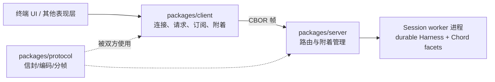

# 15. 进阶系统与毕业项目

今天独立建立 pi 外围模块的边界图，并完成一个从零开始的只读工具毕业项目。本篇给出术语、源码位置、离线观察命令、项目规格和验收；不用其他任务的成果。建议分两次完成，共 4–6 小时。

## 今日准备

需要 Node.js >= 22.19.0 和仓库依赖；缺少时在根目录执行 `npm install --ignore-scripts`。本任务的模型部分只用 `packages/coding-agent/test/suite/harness.ts` 创建的 faux 假模型，不能调用真实密钥或付费 API。毕业项目实验文件使用自己的 `packages/coding-agent/test/suite/task-15-extension.ts` 和 `task-15-learning.test.ts`；从 `packages/coding-agent` 运行：

```powershell
node ../../node_modules/vitest/dist/cli.js --run test/suite/task-15-learning.test.ts
```

其他模块只跑本篇指定的单文件离线测试。Unix socket 相关行为在 Windows 上可以用源码与测试输入做静态推演，不必启动不受当前系统支持的传输。

## 学习内容

常规主线是“用户输入 → Agent 请求模型 → 工具执行 → 会话记录 → 输出”。MCP 在工具入口接入外部服务：先建立连接、发现工具，再把调用与结果转成模型可理解的形状。Codemode 让模型提交一段受控程序，在一个脚本内组合多个工具调用；它要限制执行环境并处理尚未完成的异步调用。Chord 负责跨环境提供服务与状态；durable 在关键步骤保存检查点，中断后决定安全重放还是报告中断。实验性 client/server 把会话放到另一进程，通过连接和 attachment ID 寻址；断线后不能把旧请求错误路由到新连接。Telemetry 记录带类型的运行事实；evals 用固定任务、重复运行和评分比较方案。

用同一个例子区分它们：用户要读取远端仓库的两个文件并汇总。MCP 负责取得两个读取工具；Codemode 可以在一个脚本里并发读取并只返回摘要；durable 决定读到一半崩溃后是否重跑；client/server 决定重连后请求去哪个会话；telemetry 记耗时与错误；evals 比较改动前后完成率。每个模块解决的是不同位置的问题。

## 核心源码

源码按以下问题阅读，路径都从仓库根目录起算：

| 问题 | 核心源码 | 读完要回答 |
| --- | --- | --- |
| 外部工具如何接入 | `packages/mcp/src/client.ts`、`packages/coding-agent/src/core/mcp-servers.ts` | 连接失败和工具失败在哪里区分？ |
| 脚本怎样组合工具 | `packages/codemode/src/runtime/host.ts`、`packages/coding-agent/src/extensions/codemode/` | 受控程序与工具调用由谁执行、谁取消？ |
| 中断后怎样恢复 | `packages/chord/src/services/state.ts`、`packages/durable/src/harness/harness.ts` | 检查点在副作用前还是后？重放策略由谁决定？ |
| 断线后怎样路由 | `packages/protocol/src/`、`packages/client/src/client.ts`、`packages/server/src/` | 旧 attachment ID 为什么不能代表新附着？ |
| 怎样观察与评价 | `packages/telemetry/src/`、`packages/evals/src/harness.ts`、`plan.ts`、`report.ts` | 缺失指标能否当零？比较需要什么基线？ |

读代码时不要求一次读完整个目录。先找到表中的入口符号，沿一个具体请求追到输出或错误，再回到表里写答案。

## TypeScript 语法小课：路径解析与边界判断

`resolve` 生成绝对路径，`relative(root, target)` 给出相对位置。以 `..` 开头或仍是绝对路径意味着目标越界。这个例子只处理字面路径；毕业项目还必须对根目录、目标目录与 `package.json` 分别调用 `realpath`，防止符号链接绕过检查。

```typescript
import { isAbsolute, relative, resolve, sep } from "node:path";
const root = resolve("workspace"); // 统一基准目录
function inside(candidate: string): boolean {
  const rel = relative(root, resolve(candidate)); // 计算候选相对根的位置
  return rel !== ".." && !rel.startsWith(`..${sep}`) && !isAbsolute(rel); // 三种越界形状
}
console.assert(inside(resolve(root, "package.json")));
console.assert(!inside(resolve(root, "..", "outside")));
```

练习：造一个指向根目录外的符号链接，解释为什么上面的字面路径检查还不够；按本篇项目规格加入 `realpath` 后再断言拒绝。


## 完整学习资料

先按下列正文完成学习，再执行本篇的动手任务。正文中原书的实验与验收题先作为案例阅读，实际动手统一放到文末；只运行本篇“今日准备”和动手任务明确指定的离线命令。章节编号保留知识主题的原编号；源码精读、示例、边界条件、常见错误和参考答案均直接收录在本文件中。开头的预计用时仅指核心主线，完整源码精读需另留时间。

### 本篇共同基础

以下运行图和术语均在本文件内。学习正文保留原手册的知识主题编号，但那些编号不构成本任务的阅读前置；实际操作按本篇的动手任务与验收标准执行。学习正文基于原手册注明的 `200387122ca450d6387f033949423114a270b96c` 源码基线，当前工作区若有差异，以当前源码为准。

### 15 分钟主线：pi 怎样完成一件事

假设用户输入“读取 demo.txt，并总结三点”。模型自己不能读取你电脑里的文件。pi 把用户问题和可用工具告诉模型；模型提出 `read` 调用；pi 在本地执行；模型拿到文件内容后才生成总结。这就是全书反复使用的同一个例子。

**先看不带 TypeScript 细节的主流程（教学伪代码）：**

```text
收到用户输入，把它加入当前会话
重复：
    用当前上下文向模型发起请求
    收集模型的回答并把过程通知界面
    如果回答要求执行工具：
        校验参数，在本地执行工具，记录结果
        继续循环，让模型看到工具结果
    否则，检查是否还有排队输入或明确的继续决定
    如果都没有：结束本次运行
```

第一行确定这次任务和已有历史。模型请求只负责生成回答或提出工具调用。工具校验与执行由 pi 负责，结果回到对话后才可能有下一轮模型请求。界面接收运行事件，历史保存完成的消息；它们都与“模型请求”有关，但不是同一种数据。真实实现还处理工具并发、错误、取消、重试和压缩，后面分别讲。

**先分清四对容易混淆的词：**

| 两个词                | 直观区别                                           | 在“读文件并总结”中的例子                   |
| --------------------- | -------------------------------------------------- | -------------------------------------------- |
| 模型请求 / 用户输入   | 用户只说一次话，pi 可以多次询问模型                | 先请模型选择工具，读完文件后再请模型总结     |
| 事件 / 消息           | 事件告诉界面过程；消息承载一次完整的对话内容       | “正在输出第几个字”是事件；完成的总结是消息 |
| 工具调用 / 工具结果   | 调用提出想做什么；结果记录本地执行所得             | `read("demo.txt")` 是调用；文件文字是结果  |
| 会话历史 / 模型上下文 | 历史保留记录；上下文是这一次请求实际送给模型的内容 | 分支 C 仍在文件里，沿分支 D 继续时不必送 C   |


```text
一次用户输入
  → 第一次模型请求：请调用 read("demo.txt")
  → 本地工具执行：读出文件文本
  → 第二次模型请求：根据工具结果总结三点
  → 没有后续工作：结束
```

### 附录 A：术语表

> 用法：每个术语给出"一句话解释 + 首次出现的章节"。读代码遇到不认识的词，先查这里；查不到再搜源码（用英文名搜）。


#### A.1 核心概念

| 中文                  | 英文                    | 一句话                                                                                                             | 章节      |
| --------------------- | ----------------------- | ------------------------------------------------------------------------------------------------------------------ | --------- |
| 智能体外壳 / 运行框架 | agent harness           | 组织模型、工具、状态、界面的框架，本身不"聪明"                                                                     | 0.1       |
| 智能体                | agent                   | "模型 + 工具 + 循环"组成的执行体                                                                                   | 0.1       |
| 轮次                  | turn                    | 一次助手响应 + 它引发的工具执行                                                                                    | 3.3.3     |
| 低层运行              | Agent run               | 一次`Agent.prompt()` 或 `Agent.continue()` 调用建立的生命周期；以 `agent_end` 和已等待的 listener 收尾为边界 | 3.3.3、D2 |
| 会话 prompt 编排      | session prompt workflow | `AgentSession.prompt()` 在 `started` 后进入 `_runAgentPrompt()`；可串起 retry、压缩恢复和多个低层 Agent run  | 8、D27    |
| 用户请求              | user request            | 用户提交一次输入；与模型请求不等价                                                                                 | 3.3.3     |
| 模型请求              | model request           | 真正发给供应商 API 的一次请求                                                                                      | 3.3.3     |
| 转录                  | transcript              | 发给模型看/被记录的消息序列                                                                                        | 4.1       |
| 投影                  | projection              | 从会话树/文档到"模型实际看到的内容"的计算过程                                                                      | 9.4       |
| 活动分支              | active branch           | 从根到当前叶子的一条路径                                                                                           | 9.1       |
| 叶子                  | leaf                    | 会话树中的"当前位置"                                                                                               | 4.7.3     |
| 条目                  | entry                   | 会话文件里的一行（JSONL）                                                                                          | 4.7       |
| 会话                  | session                 | 一次对话的全部记录与状态                                                                                           | 8.1       |
| 压缩                  | compaction              | 用摘要替换旧上下文表示的机制                                                                                       | 10        |
| 上下文窗口            | context window          | 模型一次能接受的最大 token 量                                                                                      | 5.3       |
| 思考级别              | thinking level          | off/minimal/low/medium/high/xhigh/max                                                                              | 5.3       |
| 停止原因              | stop reason             | pending/stop/length/toolUse/error/aborted/deferred                                                                 | 4.3.3     |
| 用量                  | usage                   | token 与成本统计                                                                                                   | 4.3.5     |


#### A.2 消息与事件

| 中文           | 英文                | 一句话                                             | 章节        |
| -------------- | ------------------- | -------------------------------------------------- | ----------- |
| Agent 消息     | AgentMessage        | 内部消息（模型消息 + 应用自定义角色）              | 4.4         |
| 模型消息       | Message             | 供应商能理解的四角色联合                           | 4.3         |
| 内容块         | content block       | 消息内容的最小单元（text/image/thinking/toolCall） | 4.2         |
| 判别联合       | discriminated union | 用共同字面量字段区分成员的类型联合                 | 1.3.4       |
| 类型收窄       | narrowing           | 判断判别字段后类型自动缩小                         | 1.3.4       |
| 事件           | event               | 运行时广播（过程），不是消息（结果）               | 3.3.2       |
| 队列更新       | queue update        | 排队消息变化的会话事件                             | 4.5.2       |
| 边界（结算前） | agent_before_settle | 最后一个可行动钩子                                 | 6.2、13.3.5 |
| 已结算         | agent_settled       | "不会再自动继续"的最终信号                         | 4.5.2、16.3 |
| 延迟句柄       | deferred handle     | 异步应答的取回凭据                                 | 4.3.3       |


#### A.3 工具与模型

| 中文                | 英文                            | 一句话                                    | 章节  |
| ------------------- | ------------------------------- | ----------------------------------------- | ----- |
| 工具                | tool                            | 模型可调用的本地操作                      | 7.1   |
| 工具定义            | ToolDefinition                  | 扩展/应用注册工具的"富"形态               | 7.1.2 |
| 参数校验            | argument validation             | 用 typebox schema 在运行时校验调用参数    | 7.4   |
| 前置钩子            | beforeToolCall                  | 执行前可拦截（block）的钩子               | 7.6   |
| 后置钩子            | afterToolCall                   | 结果字段级改写的钩子                      | 7.6   |
| 顺序 / 并行执行     | sequential / parallel execution | 工具批次的两种调度                        | 7.5   |
| 终止提示            | terminate                       | "整批都同意时不因本批继续"的调度提示      | 7.5.4 |
| 模型                | model                           | 模型静态元数据（api/provider/限制/价格）  | 5.2.2 |
| 协议方言            | api                             | 供应商接口族标识（如 anthropic-messages） | 5.2.1 |
| 供应商              | provider                        | 认证 + 模型目录 + 请求实现                | 5.2.3 |
| 简单流式 / 完整流式 | streamSimple / stream           | 供应商无关档位 vs 协议特有选项            | 5.4   |
| 兼容开关            | compat                          | OpenAI 兼容生态的行为微调                 | 5.5.4 |
| 假供应商            | faux provider                   | 脚本化、离线的测试模型                    | 5.7   |


#### A.4 会话与持久化

| 中文       | 英文             | 一句话                             | 章节   |
| ---------- | ---------------- | ---------------------------------- | ------ |
| 会话管理器 | SessionManager   | 会话文件的对象化句柄               | 9.3    |
| 分支会话   | branched session | 只包含"根到叶子"路径的新文件       | 9.5.2  |
| 分支摘要   | branch summary   | 放弃某分支时生成的摘要条目         | 10.6   |
| 上下文编辑 | context edit     | 只改"投影"、不改原始条目的追加编辑 | 9.4.4  |
| 保留边界   | firstKeptEntryId | 压缩后从哪条开始保留               | 10.3.2 |
| 保留预算   | keepRecentTokens | 压缩后至少保留的近期上下文         | 10.3   |
| 预留       | reserveTokens    | 为模型回复预留的窗口               | 10.2.1 |
| 检测点替换 | checkpoint       | 压缩条目携带的提示词/工具检查点    | 9.4.3  |


#### A.5 扩展与集成

| 中文       | 英文            | 一句话                             | 章节       |
| ---------- | --------------- | ---------------------------------- | ---------- |
| 上下文文件 | context files   | AGENTS.md 等纯文本指令             | 11.4.2     |
| 项目信任   | project trust   | 允许加载项目可执行资源前的人工决定 | 11.5       |
| 提示词模板 | prompt template | Markdown 变成`/命令`             | 12.3.2     |
| 技能       | skill           | 目录 + SKILL.md 的按需说明书       | 12.3.3     |
| 扩展       | extension       | 可执行 TypeScript 模块（进程权限） | 12.3.4、13 |
| Pi 包      | Pi package      | 分发多资源的 npm/git 单元          | 12.3.6     |
| 钳制       | clamp           | 按模型能力压低思考级别             | 5.3        |
| 重绑       | rebind          | 会话替换后重新挂订阅/扩展绑定      | 8.6        |


#### A.6 协议与架构（选修）

| 中文     | 英文                   | 一句话                                          | 章节   |
| -------- | ---------------------- | ----------------------------------------------- | ------ |
| MCP      | Model Context Protocol | 外部工具/资源接入协议                           | 22     |
| 暴露方式 | exposure               | codemode/deferred/direct 三种工具到达模型的方式 | 22.3   |
| 工具搜索 | tool_search            | deferred 工具的"发现后再直调"机制               | 22.3   |
| 沙箱     | codemode sandbox       | QuickJS VM + worker 的脚本执行环境              | 22.9   |
| 面片     | facet                  | Chord 插件可独立打包到不同环境的分片            | 23.2   |
| 服务     | service                | Chord 的类型化稳定 token（singleton/keyed）     | 23.2   |
| 复制状态 | replicated state       | 原子发布、完整不可变值消费的状态                | 23.2   |
| 增量跟踪 | delta tracking         | 记录/合并 JSON 操作的机制                       | 23.2   |
| 持久执行 | durable execution      | 意图先提交、崩溃可续的执行模型                  | 23.1   |
| 检查点   | checkpoint             | 任务每一步的持久落点                            | 23.3.1 |
| 附着     | attachment             | 一条表现层连接绑定到一个会话                    | 24.2   |
| 信封     | envelope               | 协议中包裹 payload 的定向记录                   | 24.3   |
| span     | span                   | 一次操作的时间记录（遥测）                      | 25.2   |
| lift     | lift                   | 处理组相对对照组的提升（评估）                  | 25.5   |
| 阻断配对 | blocked pair           | 两臂未各得恰好一个分数，禁止计入头条            | 25.6   |


#### A.7 容易混淆的成对术语

| 对                                              | 区分                                                                                   |
| ----------------------------------------------- | -------------------------------------------------------------------------------------- |
| message vs event                                | 结果 vs 过程（3.3.2）                                                                  |
| turn vs run                                     | 一个轮次 vs 整次运行（3.3.3）                                                          |
| `agent_end` vs `agent_settled`              | 低层 run 结束 vs 自动工作清零（4.5.2）                                                 |
| 声明 vs 可执行                                  | 系统消息里的工具声明 vs 运行时工具集（7.3）                                            |
| details vs content                              | 给界面/程序 vs 给模型（14.2）                                                          |
| 完成顺序 vs 记录顺序                            | 并发完成 vs 声明序记录（7.5.3）                                                        |
| 停止原因`length` vs `stop`                  | 被截断 vs 正常说完（4.3.3）                                                            |
| `AgentSession.prompt()` vs `Agent.prompt()` | 应用层输入分流/会话编排 vs 低层 Agent run 入口（8、D2、D27）                           |
| `handled` vs `queued` vs `started`        | 输入被消费、不创建该输入自己的 run / 放入当前运行队列 / 进入会话 run 编排（8、16.5.3） |
| 提示词模板 vs 技能                              | 一段话 vs 一套流程+文件（12.3.3）                                                      |
| 扩展 vs Pi 包                                   | 可执行单元 vs 分发单元（12.3.6）                                                       |
| compaction 摘要 vs branch summary               | 压缩历史 vs 放弃分支（10.6）                                                           |
| durable cheat sheet：`replay: safe/never`     | 崩溃后重跑 vs 报 interrupted（23.4）                                                   |
| JSONL RPC vs client/server                      | 进程内 stdio 协议 vs 跨进程服务路由（24.1）                                            |
| 单测 vs 评估                                    | 确定性 vs 配对统计（25.1、25.6）                                                       |


#### A.8 输入与运行的层级

不要按“用户按了一次回车”推断低层 run 或模型请求的数量。实际层级是：

| 层级       | 代表符号                                           | 次数关系                                                                                      |
| ---------- | -------------------------------------------------- | --------------------------------------------------------------------------------------------- |
| 输入调用   | `AgentSession.prompt(text)`                      | 一次调用只表达一次输入尝试；结果可能是`handled`、`queued` 或 `started`                  |
| 会话编排   | `_runAgentPrompt(messages)`                      | 只在开始处理输入时进入；在里面管理重试、压缩恢复、边界 continuation 与取消                    |
| Agent run  | `Agent.prompt(messages)` 或 `Agent.continue()` | 一次会话编排可包含多个 run；每个低层 run 都发出自己的`agent_start` / `agent_end` 生命周期 |
| Agent turn | `turn_start` 到 `turn_end`                     | 一个 run 可包含多个 turn；每个 turn 通常包含一次助手响应及其引发的工具执行                    |
| 模型请求   | `streamSimple` / provider stream                 | 通常发生在助手响应阶段；自动重试会再次请求模型，压缩摘要等内部工作也可能有独立请求            |

两个边界例子：

- 扩展命令被消费时，`prompt()` 返回 `handled`，没有为该输入启动 `_runAgentPrompt()`；
- `prompt()` 在 Agent 已运行时以 `steer`/`followUp` 方式排队，返回 `queued`。这条输入会影响现有流程，但它本身不是新的 `Agent.prompt()` 调用。

因此，统计“模型请求次数”不能数 prompt、turn 或 `agent_end`：应按 provider 请求事件/日志，或明确的测试探针计数。章节 21 的自测题也按这个区分评分。


#### A.9 索引方式说明

- 想找"某行为在哪个文件" → 用 source-map；
- 想找"某命令怎么跑" → 用 commands；
- 想找"某现象怎么排" → 用 troubleshooting；
- 想找"哪些练习要做" → 用 exercises-and-answers。

---

### 第 21 章：毕业项目——一个可评审的小改动

**先懂这一章**：选一个范围小、能离线验证的行为。先写清楚输入、旧行为、期望行为和失败测试；再改源码，最后解释为什么测试能证明结果。

这是主线的收束：从第 3 章的请求轨迹出发，调用第 6–10 章的源码理解、第 18 章的测试和第 20 章的仓库规则。选修篇可在完成这个小改动后按需阅读。

> 学完本章你能做到：
>
> 1. 独立完成"需求理解 → 定位 → 实现 → 测试 → 验证 → 说明"的完整闭环；
> 2. 从四个候选课题中选一个与你的方向匹配的项目；
> 3. 用仓库规范组织证据，写出一份评审者一眼能判断的变更说明；
> 4. 用结业自测卷检验"是否真的掌握"。

**预计学习时间**：第 4 周（约 5 天）。
**本章验证状态**：方法论与检查清单为静态拟定；课题验收需要你在本地实际完成并记录。

---


#### 21.1 目标：不是"改成功"，而是"能解释、能定位、能验证"

规划文档给出的最终标准（原文要点）：

```text
学习者能不用照读手册，解释入口、数据流、失败路径和测试为什么有效；
提交/推送/创建 PR 是后续独立行动，规划不自动执行它们。
```

把这句话拆成四个可检验的能力：

| 能力                       | 检验方式                                       |
| -------------------------- | ---------------------------------------------- |
| **解释入口**         | 随机指一个行为，你能说出它从哪个文件/函数进入  |
| **解释数据流**       | 画出一条输入到输出的对象流转（消息/事件/条目） |
| **解释失败路径**     | 说出至少两条失败/取消路径与它们的最终状态      |
| **解释测试为何有效** | 证明测试"在坏实现上会失败"，而不是"碰巧通过"   |

毕业项目就是产出这四样东西的载体。


#### 21.2 选题指南

四个候选（来自规划文档），按方向与难度排列：

| 课题                                  | 方向                 | 涉及章节   | 产物                         |
| ------------------------------------- | -------------------- | ---------- | ---------------------------- |
| **A：只读仓库检查扩展**         | Agent/工具行为、扩展 | 7、12-14   | 一个可加载的扩展 + 测试      |
| **B：边界行为的回归修复**       | 核心行为/会话        | 3、6-9、18 | 失败测试 → 最小修复 → 说明 |
| **C：SDK 宿主（含取消与释放）** | SDK/集成             | 8、15      | 宿主程序 + 事件日志          |
| **D：终端宽度问题最小复现**     | TUI                  | 17、18     | 组件级测试 + 复现说明        |

选择标准（对应规划里的 Q6 方向问题）：

1. **你愿意把它讲给别人听**——兴趣决定质量；
2. **它能被离线验证**——全部可用 faux/harness/组件测试完成，不依赖真模型；
3. **它有明确的边界**——一周内能做完；"顺手重构一万行"是反例。


#### 21.3 通用工作流（七步）


每一步的"完成标志"：

| 步骤     | 完成标志                                           | 主要参考章节   |
| -------- | -------------------------------------------------- | -------------- |
| 需求     | 用一句话写出"谁在什么场景需要什么"                 | —             |
| 行为契约 | 写出"输入 → 可观察输出"与"失败时怎样"             | 第 3、7 章     |
| 设计     | 明确选型（扩展/harness/TUI）与改动清单（文件名级） | 第 12 章决策树 |
| 实现     | 最小 diff；`AGENTS.md` 规则全满足                | 第 1、7、20 章 |
| 测试     | 覆盖正常+失败路径；自证"坏实现会失败"              | 第 18 章       |
| 验证     | `npm run check` 完整通过 + 相关测试通过          | 第 20 章       |
| 说明     | 问题/行为变化/测试证据/影响边界 四段式             | 第 20.9 节     |


#### 21.4 候选 A：只读仓库检查扩展（推荐入门）


##### 21.4.1 需求与契约

```text
需求：给团队一个"仓库体检"工具：读取工作目录的 package.json（可指定子目录），
     返回包名、脚本清单、依赖计数；对缺失/损坏文件给出可定位错误。
契约：只读；输出小体积；错误文本含路径；不依赖作者机器的绝对路径。
```


##### 21.4.2 设计（文件级）

```text
extensions/repo-check/index.ts        # 扩展入口：注册工具（可含一个 /repo-check 命令）
extensions/repo-check/package.json    # 若走 Pi package 形态（host 包放 peerDependencies）
packages/coding-agent/test/suite/...  # 如需入仓测试（按第 18 章）
```

参考实现的基础就是第 14.8 节的 `inspect_package`——**把那个骨架放进扩展目录、补一个命令、补两个测试**，即可达到"可评审"。


##### 21.4.3 测试与验收清单

| 用例       | 断言                                              |
| ---------- | ------------------------------------------------- |
| 正常目录   | 输出含包名/版本/脚本数；`details.file` 绝对路径 |
| 缺文件     | 错误文本含完整路径                                |
| JSON 非法  | 错误文本含`Invalid JSON`                        |
| 取消       | `Operation aborted`；run 以 aborted 收尾        |
| 路径默认值 | 与`ctx.cwd` 一致（换 cwd 会变）                 |


##### 21.4.4 加分项（不强制）

- 用 `structuredContent` + `outputSchema` 让 codemode 脚本可直接取结构化结果（第 14.3 节）；
- 注册 `renderResult`，在终端里用 `details` 画出更漂亮的结果；
- 打包成 Pi package（第 12.3.6、14.9 节）并在 `pi list` 里验证。


#### 21.5 候选 B：边界行为的回归修复


##### 21.5.1 怎么找课题

从三个"矿脉"里挖：

1. **已有测试的空白**：读 `test/suite/` 里的断言，找"应该有但没有"的行为。例如：
   - `terminate` 在"批次内只有一个结果 terminate"时不应终止（第 7.5.4 节的规则）有没有测试？
   - `queue_mode: "one-at-a-time"` 的"一次只取一条"有没有测试（第 6.3 节）？
   - `context_edit` 的"分支相对"语义（第 9.4.4 节）有没有测试？
2. **本手册各章的"决策表"**：任何"边界组合"都是候选（错误+取消、重试+压缩、steering+工具批次……）；
3. **真实使用中遇到的怪事**：按第 19 章的流程定位后，把复现固化成测试。


##### 21.5.2 步骤模板

```text
① 选定行为，写出"当前会失败"的测试（若行为已正确，测试应先通过，
   然后你再人为破坏实现验证它有区分力——也算合格课题）
② 若确有缺陷：最小修复（只改必要行）
③ 单测通过 + 邻近测试通过 + npm run check 通过
④ 说明四段式；若对应 GitHub issue，在测试旁注明 issue 号（AGENTS.md）
```


##### 21.5.3 验收清单

- 测试能在坏实现上失败（演示给评审者看）；
- 修复 diff 小到可以逐行讲；
- 说明里写清"影响边界"（是否改 exports/入口成本/会话格式）。


#### 21.6 候选 C：SDK 宿主（含取消与释放）


##### 21.6.1 需求与契约

```text
需求：一个把 pi 嵌进自动化脚本的宿主：
     - 输入一个任务（CLI 参数）
     - 流式打印文本增量与工具生命周期
     - 把结构化事件日志写到文件（JSONL）
     - 支持 Ctrl+C 取消（转发为 session.abort）
     - 退出码：成功 0；模型错误/取消 非 0
契约：所有路径（成功/失败/取消）都必须正确释放（第 15 章的 L09 已给骨架）。
```


##### 21.6.2 设计要点

- 事件日志直接复用第 16 章的 JSONL 形状（客户端可复用同一套解析器）；
- 取消路径用 `session.abort()` + `waitForIdle()`（第 15.5.3 节）；
- 资源释放顺序照第 15.6 节的矩阵；
- 测试策略：用 faux 驱动（第 18 章），断言"事件日志行数/顺序""取消后退出码非 0"。


##### 21.6.3 验收清单

| 场景                        | 断言                                                     |
| --------------------------- | -------------------------------------------------------- |
| 正常任务                    | 日志含`agent_end` 与 `agent_settled`；退出码 0       |
| 模型错误（faux 返回 error） | 退出码非 0；日志含错误消息                               |
| 取消                        | `stopReason: "aborted"` 出现；退出码非 0；无悬挂定时器 |
| 释放                        | 脚本正常结束（无 process 挂起）                          |


#### 21.7 候选 D：终端宽度问题最小复现与测试


##### 21.7.1 课题方向

三选一：

1. **复现**一个真实渲染问题（中文/emoji/长行/缩放），产出第 19.4 节格式的说明（配合第 17.11 节的实验步骤）；
2. **补一个组件级测试**：对 `visibleWidth`/`truncateToWidth`/`wrapTextWithAnsi` 的边界输入（CJK、ZWJ emoji、ANSI、混合）断言"列数"而非"字符数"；
3. **写一个最小组件**：带边框的输入区，验证 focused 传递与 `CURSOR_MARKER` 的 IME 行为（第 17.4.2 节）。


##### 21.7.2 测试环境

- 组件级：`packages/tui/test/` 用 `node --test`（第 18.2 节）；
- 交互级：`.pi/skills/interactive-testing.md` 的 tmux 流程；
- 诊断：`PI_TUI_WRITE_LOG`（第 17.8 节）。


##### 21.7.3 验收清单

- 输入矩阵（宽字符/组合/ANSI/窄宽度）全覆盖；
- 断言点放在"可见列数"与"组件输出的行数组"；
- 复现说明包含"失败断言"。
  <a id="21-capstone-h22"></a>

#### 21.8 评审准备清单

交作业前，对每个问题给出"一句话 + 指向一个文件/符号"的答案。答不上来的题，回到对应章节补，不要背答案。


##### 21.8.1 "解释入口"

1. 用户敲下的回车，走到哪个函数才开始组装请求？
2. 模型要求调用工具的"意图"在哪一步被解析成可执行调用？
3. 一次 run 的结束判定在哪两层各判一次（循环层/会话层）？


##### 21.8.2 "解释数据流"

4. 从 `session.prompt` 到供应商请求，`AgentMessage` 在哪一步变成 `Message`？
5. 工具结果从"结果对象"到"进入下一轮请求"经过哪两种形态？
6. steering 消息在事件序列里的注入点落在哪两个事件之间？


##### 21.8.3 "解释失败路径"

7. `stopReason: "error"` 与工具 `isError: true` 分别在哪一层被处理、后果各是什么？
8. 取消信号传到工具后，工具"不配合"会发生什么？
9. 压缩失败后，溢出恢复的"遗留状态"是什么？


##### 21.8.4 "解释测试为何有效"

10. 你的回归测试如果换回旧实现，失败在哪一行断言？为什么？
11. 为什么 suite 测试不允许真实 API，而这不影响它验证行为？


##### 21.8.5 演示脚本（建议）

准备一个 5 分钟的现场演示（离线）：

```text
1. 展示你的改动（文件级）
2. 跑指定测试：先红后绿（如果是修复类）
3. 展示 npm run check 通过
4. 打开会话文件/事件日志，指出一条完整轨迹
5. 回答上述 11 个问题中的任意 3 个
```


#### 21.9 第 4 周时间安排（参考）

| 天 | 任务                               | 产出                 |
| -- | ---------------------------------- | -------------------- |
| 1  | 选题 + 需求与契约；读全相关文件    | 一页设计（文件清单） |
| 2  | 实现最小版本                       | 可运行的改动         |
| 3  | 测试（正常+失败+自证失败）         | 测试文件 + 证据记录  |
| 4  | `npm run check`；修问题；审 diff | 干净的质量门输出     |
| 5  | 写四段式说明；准备演示；回顾自测卷 | 变更说明 + 演示脚本  |

> 如果一天内无法完成某一步，说明课题选大了——**缩到"最小可演示"**，而不是加班硬堆。


#### 本章源码精读

> **源码精读**：先定位导出与函数签名，再沿调用点核对输入、状态、输出和错误；最后用本篇指定的离线实验验证。

D24 用现有 issue 和测试展示一次完整的源码改动推理。它是阅读演练，不会自动替你完成毕业项目；做自己的改动时，沿用“行为契约 → 调用路径 → 断言 → 影响范围”的顺序。


##### D24：真实 issue 的源码改动演练

**先懂**：先从一个可复现的旧行为开始，看测试希望哪些输入产生哪些结果，再沿调用链找修改点。最后对照历史补丁，判断测试有没有真正锁住这个行为。

```text
教学伪代码：读问题与失败测试 → 重建输入和预期
           → 沿调用链找负责转换的位置
           → 对照历史改动 → 检查测试覆盖与遗漏
```

这是读码演练；当前仓库已包含该历史改动，不把练习写成待修复的新问题。

> 本篇用仓库已有的 issue #9631 测试与历史实现提交，演示怎样从行为契约走到真实源码改动，再判断回归测试覆盖了什么。
>
> 历史提交 `f5c946480` 是增加模型图片输入限制的功能提交，提交信息为 `feat(ai,coding-agent): add image input limits (closes #9631)`；当前 checkout 已包含该实现。本篇不重放提交、不修改测试。当前源码与测试引用来自基线 `200387122ca450d6387f033949423114a270b96c`；本轮未执行测试。
>
> 前置：第 8、13、18、19、20、21 章和 D21 faux harness。


###### 0. 练习目标

读完后，你应该能：

1. 从一个测试标题抽出可观察契约；
2. 解释测试中的闭包、可选类型收窄和 mock；
3. 顺着 `session.prompt` → extension hook → 当前 model → image process → history 的路径定位行为；
4. 说出测试能证明什么、不证明什么；
5. 改一个相邻行为时选择正确测试层并遵守仓库质量门。

本例的关键时序是：

```text
session 最初选中 wide 模型
  → before_agent_start 扩展选择 strict 模型
  → 当前模型带有图片 resize 限制
  → 本次 prompt 的图片归一化使用 strict 模型限制
  → 处理后的图片进入 session history
```


###### 1. 先读测试，而不是从大文件开头读

测试位于：

```text
packages/coding-agent/test/suite/agent-session-prompt.test.ts
```

关注测试名：

```typescript
it("uses the model selected by before_agent_start for image normalization", async () => {
```

把句子改写成契约：

> `before_agent_start` 改变当前模型后，同一个 prompt 的图片处理必须采用新选模型的 input limits。

这句话里至少有四个要核实的点：

- hook 的修改是否已经提交到 session/Agent 当前 model；
- 图片归一化在 hook 前还是 hook 后；
- resize 配置究竟从哪个 model 读取；
- 是否不仅调用了 processor，还把处理结果写进 user message。

测试名是索引，不是实现说明。后面的 setup 和 assertions 才把契约具体化。


###### 2. 拆解测试 setup

缩小后的核心代码：

```typescript
let strictModel: Model<string> | undefined;
const harness = await createHarness({
	models: [{ id: "wide" }, { id: "strict" }],
	extensionFactories: [
		(pi) => {
			// hook 执行时读取闭包中的当前模型，先收窄 undefined 分支。
			pi.on("before_agent_start", async () => {
				if (!strictModel) throw new Error("Expected strict model");
				// 等模型切换完成后，后续图片归一化才会使用新模型的限制。
				await pi.setModel(strictModel);
      });
    },
  ],
});
```


##### 2.1 `Model<string> | undefined` 的读法

```typescript
let strictModel: Model<string> | undefined;
```

- `Model<string>`：某个 API/provider 的模型描述；这里 `string` 表示 api 名类型比较宽；
- `| undefined`：变量初始化时还没有模型对象；
- `let`：之后会给变量赋值。

扩展 factory 创建时，模型还需要通过 harness 的 getter 获得。hook 执行时再读取这个闭包变量，所以代码用显式检查来把 `undefined` 分支转成可诊断失败：

```typescript
if (!strictModel) throw new Error("Expected strict model");
await pi.setModel(strictModel);
```

检查之后，TypeScript 能把 `strictModel` 收窄为 `Model<string>`。这比 `strictModel!` 非空断言更可靠：前者在运行时真的检测，后者只是告诉编译器“相信我”。


##### 2.2 为什么 hook 读到闭包变量

`extensionFactories` 中的箭头函数捕获了外层 `strictModel` 变量。随后测试执行：

```typescript
strictModel = harness.getModel("strict");
```

当 `session.prompt()` 发出 hook 时，闭包读取的是变量当前值，而不是 factory 创建时的 `undefined` 快照。

时间线：

```text
t0: 声明 strictModel = undefined
t1: createHarness 保存 factory
t2: strictModel = getModel("strict")
t3: session.prompt -> 运行 factory/hook
t4: hook 读取当前 strictModel
```

如果工厂在 `t1` 就执行 hook，检查会失败；实际 hook 是 prompt 生命周期事件，因此这个 setup 有意把引用先存起来、后填入。


##### 2.3 `await pi.setModel(...)` 为什么不是装饰

hook 声明为 `async`，并 `await` 模型切换操作。这表达了后续逻辑必须等设置完成。若不等待，代码可能在 setter 完成前就开始图片处理或继续 prompt 流程。

TypeScript 的 `async` 函数总返回 Promise。`await` 会暂停当前 async 函数，等 Promise settle 后再继续；它不会阻塞整个 Node 事件循环。


###### 3. harness 提供的观测面

测试创建两个模型：

```typescript
models: [{ id: "wide" }, { id: "strict" }]
```

随后通过 harness 拿到严格模型并添加 input limit：

```typescript
strictModel = harness.getModel("strict");
if (!strictModel) throw new Error("Expected strict model");
const resizeOptions = { maxWidth: 1000, maxHeight: 1000, maxBytes: 500000, jpegQuality: 70 };
strictModel.inputLimits = { images: { resize: resizeOptions } };
```

这种测试安排把两个变量隔开：

- 初始模型 `wide` 没有这个 resize 配置；
- hook 选择的 `strict` 明确带配置。

若生产代码错误地在 hook 前读取 model limit，`processImage` 会收到 `undefined`；若读当前 model，spy 会观察到 `resizeOptions`。

【陷阱】测试动态给 fake model 写 `inputLimits`，这是 harness 允许的 test setup，不代表所有生产 model 都在运行时可任意变更。新增代码仍需遵守 `Model` 类型和 provider registry 的所有权。


###### 4. Faux 响应与图片处理 mock 各自替换什么


##### 4.1 faux 让模型回答固定结果

```typescript
harness.setResponses([fauxAssistantMessage("done")]);
```

这保证 agent/session 流程不调用真实模型。faux 不是本例的图片处理器；它只替换最外层 provider response。


##### 4.2 spy/mock 隔离图片处理实现

测试文件顶部使用 `vi.mock` 替换 `processImage`，mock 版本返回固定数据：

```typescript
const processImage = vi.hoisted(() =>
  vi.fn(async (_bytes: Uint8Array, mimeType: string) => ({
    ok: true as const,
    data: Buffer.from("normalized").toString("base64"),
    mimeType,
    hints: [],
  })),
);
```

本例不验证图像缩放算法本身。它验证 AgentSession 调用 processor 时给了正确配置，以及 processor 返回的图片被接进 history。

类型细节：

- `vi.fn(...)` 创建可观察调用记录的 mock function；
- `async` 令结果为 Promise；
- `as const` 把 `ok: true` 保留为字面量类型，便于匹配结果联合类型中的成功分支；
- `_bytes` 里的下划线惯例表示参数在 mock 中不使用。

这个 mock 边界很清楚：图片 processor 的真实实现有单独责任，session 的调度参数和消息组装由本测试负责。


###### 5. assertions：分开检查选择、调用和持久化结果


##### 5.1 当前 session model

```typescript
expect(harness.session.model?.id).toBe("strict");
```

`?.` 是可选链：model 存在时读 `id`，不存在时表达式为 `undefined`。断言确保 hook 真的改变当前 model。

它单独还不够：model 选对了，不代表图片代码用了它。


##### 5.2 processor 收到的 options

```typescript
expect(processImage).toHaveBeenCalledWith(expect.any(Uint8Array), "image/png", {
  autoResizeImages: true,
  resizeOptions,
});
```

该断言检查调用参数：

- 图片数据先转为 `Uint8Array`；
- mime type 仍为 `image/png`；
- 设置层的自动 resize 值为 true；
- model 的 `inputLimits.images.resize` 成为 resize options。

这比只断言“mock 被调用一次”强，因为它钉住本例要修复的配置来源。


##### 5.3 归一化输出进入 session history

```typescript
const userMessage = harness.session.messages.find((message) => message.role === "user");
expect(userMessage?.content).toContainEqual({
  type: "image",
  data: Buffer.from("normalized").toString("base64"),
  mimeType: "image/png",
});
```

这个断言证明处理结果并未只被计算，而是作为 image block 写进用户消息。它覆盖了从 processor 返回值到 transcript 的连接。

因此测试从三面夹住行为：

```text
最终选择 strict model
       ↓
processor 调用拿到 strict model 的配置
       ↓
规范化输出成为 session user message 的图片
```


###### 6. 从测试反向追源码

现在开始读实现，不必从 `agent-session.ts` 第一行顺序读到底。


##### 6.1 找 prompt 生命周期的 hook 发射点

在 `AgentSession.prompt` 中找到：

```typescript
const result = await this._extensionRunner.emitBeforeAgentStart(
  expandedText,
  currentImages,
  this._baseSystemPromptOptions,
);
```

这一步把扩展 hook 放在用户输入完成预处理之后、Agent 正常接收本次消息之前。应继续追 `emitBeforeAgentStart`，确定 handler 是否按顺序运行以及 `pi.setModel` 是否等到实际完成。


##### 6.2 观察 hook 与 image normalization 的先后

生产代码中的注释直接记录了设计理由：

```typescript
// Emit before_agent_start before normalizing images so extension-driven model
// selection determines the resize profile used for the request and history.
```

接下来是：

```typescript
const normalized = await this._normalizePromptImages(currentImages);
```

顺序是关键。若改成先 normalize 再发 hook，resize 会基于旧 model；之后即使当前模型变成 strict，已经处理的 image 也不会自动重做。


##### 6.3 `_normalizePromptImages` 如何取限制

方法对每个输入 image：

1. base64 解码为 `Buffer`；
2. 调 `processImage`；
3. 从 SettingsManager 读取全局 `autoResizeImages`；
4. 从 `this._limitsModel()?.inputLimits?.images?.resize` 取当前限制；
5. 失败时记录 hint 并跳过该图片；成功时创建新的规范化 `ImageContent`；
6. 汇总 images 与 hints 返回调用者。

`?.` 链让“当前没有可用于限制判断的 model”自然得到 `undefined`，processor 按自己的参数约定处理缺省值。不要把这个可选链简化成强制非空断言，除非能证明整个调用路径有更强不变量。


##### 6.4 规范化结果如何进入 user message

`prompt` 收到 `normalized` 后生成 user text（若有 hint 会附加提示），构造 `userContent`，先加入 text，再追加规范化图片，最后 push 到 messages。

再继续沿 session message 保存路径读，才能说明测试观察的是哪种投影。此处的 `session.messages` 是 AgentSession 面向当前上下文的消息视图；若要证明磁盘持久化细节，还需要额外检查 SessionManager entries。


###### 7. 旧实现会如何失败

一个可能的缺陷形态：

```text
prompt() 进入
→ 先用 this.model 读 resize options
→ 图片以 wide 模型配置 normalize
→ 再 emit before_agent_start
→ hook 设置 strict
→ 发模型请求
```

此时 test assertions 的结果：

- `session.model.id === "strict"`：可能通过；
- processor 收到 strict resize options：失败，参数是旧配置或 undefined；
- 规范化图片进入 history：可能仍通过，因为 mock 无论如何都返回 normalized。

这解释了为什么只看最终模型和最终消息还不够：若 processor mock 忽略 options，就需要 spy 参数断言来证明 resize profile 来源正确。

另一个错误实现可能在 hook 后仍读取一个之前缓存的 `modelForPrompt` 局部变量。于是事件顺序看似正确，实际参数仍 stale。追代码时同时检查“调用先后”和“读取哪个可变对象”。


###### 8. 历史补丁：把测试契约落实为源码变化

使用只读命令查看当时的提交，不切换工作树：

```bash
git show --format=fuller f5c946480 -- packages/coding-agent/src/core/agent-session.ts packages/coding-agent/test/suite/agent-session-prompt.test.ts
```

提交前，prompt 路径先建 user message，并把未经归一化的输入图像放进去；之后才调用 `emitBeforeAgentStart(...)`。新提交引入 `_normalizePromptImages(...)`，并把顺序改为：

```text
原来：构造 user message（带原始 images）→ before_agent_start → 运行 Agent
改后：before_agent_start（扩展可换 model）→ 按当前 model limits 归一化图片
    → 构造 user message（带归一化 images）→ 运行 Agent
```

关键不是“把一段代码搬到另一处”，而是建立新的数据依赖：

```typescript
const result = await this._extensionRunner.emitBeforeAgentStart(...);
const normalized = await this._normalizePromptImages(currentImages);
const userText = normalized.hints.length > 0
  ? `${expandedText}\n\n${normalized.hints.join("\n")}`
  : expandedText;

messages = [];
const userContent: (TextContent | ImageContent)[] = [{ type: "text", text: userText }];
userContent.push(...normalized.images);
messages.push({ role: "user", content: userContent, timestamp: Date.now() });
```

逐行看这个补丁：

1. 先 `await` hook，保证异步 `pi.setModel(...)` 完成后才继续；
2. 再调用归一化方法，使它读取到 hook 更新后的 model input limits；
3. processor 返回 hints 时，把提示并入 user text；失败图片不会进入 `normalized.images`；
4. 最后才创建 user message，所以发给 Agent 的内容与会话记录使用同一批归一化图片。

测试也在同一个提交里增加：`wide` 初始模型不带 resize 限制，hook 切到带限制的 `strict`；spy 检查 `processImage` 确实收到该 `resizeOptions`；再检查规范化输出出现在 session 的 user message。它同时防住“模型切换成功但处理器仍用旧 profile”和“处理结果没有接入消息”两类断裂。

【读历史的陷阱】提交标题是 feature，不是声称旧代码已经有完整图片限制功能、后来只修了一个 bug。这里借它学习的是一个真实 issue 驱动的实现过程：类型/模型能力、处理函数、调用时机、工具结果路径和回归测试一起变化。历史 diff 说明变更范围；当前 checkout 才是写新代码时的事实来源。


###### 9. 测试证据分层

| 断言                              | 能证明                       | 不能单独证明                        |
| --------------------------------- | ---------------------------- | ----------------------------------- |
| `session.model?.id`             | session 当前 model 是 strict | image normalizer 采用 strict 的限制 |
| `processImage` 参数匹配         | 调用传入了 resize options    | 真实图像算法一定按这些 options 缩放 |
| session user content 含 mock 输出 | 调用结果进入消息             | 该消息已写到磁盘 session file       |
| faux response 消耗完成            | 请求用固定结果正常跑完       | 某个线上 provider 接受该 transcript |

一个集成测试覆盖多个边界是有价值的，但报告结论要受断言范围约束。


###### 10. 用这个结构设计一个相邻用例

不要改现有 issue 回归测试的意图。可在练习分支中为相邻行为单独设计测试，例如：

> 图片处理失败时，不能把失败图片伪装成正常 image block；应产生可见 hint，并继续保持 user prompt 本身可处理。

写之前先检查当前 `processImage` union 和 `_normalizePromptImages` 实现，确认确切行为。不要把这句需求直接当作现状事实。

设计思路：

1. 用 `vi.mock` 让 processor 返回明确 failure branch；
2. 使用 faux 接收下一次 provider context；
3. 观察 user text 是否携带可诊断 hint；
4. 观察 failed image 是否未进入 content；
5. 断言整个 session 是正常回答、部分处理，还是按当前契约报错；
6. 先读代码、现有 tests 与 image processor docs，定下正确预期。

如果发现预期行为本身未定义，先提出一个清晰契约再实现，而不是依测试作者第一反应塑造行为。


###### 11. TypeScript 初学者读测试的逐步方法


##### 11.1 从测试声明看到真实类型

`createHarness` 接受 options，测试中 `models` 是精简模型配置；harness 返回 `session`、模型 getter 和 faux response control。IDE 转到类型定义比猜类型准确。

读每个表达式时问：

- 这里是值还是类型？
- Promise 是否被 `await`？
- union 哪个分支被 `if` 收窄？
- 对象属性是可选还是必有？
- mock 返回值是否仍符合 production function 的返回类型？


##### 11.2 区分 `as const`、类型注解和断言

- `const x: Model<string> = ...` 是类型注解；
- `{ ok: true as const }` 把属性缩窄成 literal type；
- `x as SomeType` 是编译期断言，不会运行时验证。

测试里出现 `as` 不代表输入已经校验。若是外部数据，应找 runtime validator，而不是相信类型断言。


##### 11.3 闭包和异步顺序

扩展 factory 把 hook 函数传给 runner；之后 prompt 才调用 hook。变量被 closure 捕获，异步事件发生的时间晚于定义时间。通过画 t0/t1/t2 能避免把“定义了 callback”当成“callback 当场运行”。


##### 11.4 `find` 和 `?.`

```typescript
const user = messages.find((message) => message.role === "user");
```

`find` 可能找不到，类型通常包含 `undefined`。`user?.content` 不会在 user 缺失时崩溃，但测试断言也可能因 `undefined` 而失败。这比 `messages[1]!.content` 更明确表达“我在按角色找，而不是赌索引”。


###### 12. 如果真的要修改这个行为


##### 12.1 先确认目标不是已经满足

当前测试和实现已表达 hook 先于 normalize。不要仅因读到一个 issue 编号就假设本地代码尚未修复。先在当前 checkout 检查测试、实现、git history（只读）和工作树状态。


##### 12.2 变更前的证据

在工作说明中记录：

```text
行为目标：
当前观察：
期望观察：
责任函数：
测试 owner：
已确认不改的边界：
```

读完准备修改的完整源码文件与测试文件，尤其是 `AgentSession.prompt` 与 `_normalizePromptImages` 的邻近逻辑。这个文件很大，按符号定位后仍要读完相关函数及其上下游。


##### 12.3 写出区分新旧行为的测试

测试要能回答：如果把正确实现换回有缺陷版本，哪个 assertion 会失败？

在本例中，关键区分断言是 processor 收到 `resizeOptions`；只断言 model id 或 processImage called 都不足以区分旧行为。


##### 12.4 选择最小 owner

如果问题是 normalize 时取错 model limits，通常责任在 AgentSession 提取 resize options 的时机/来源，不在：

- `processImage` 算法内部；
- provider adapter；
- TUI；
- Agent loop。

如果问题其实是图像压缩参数被忽略，则应转读 `image-process.ts`，并给该模块添加算法级测试。判断 owner 由失败 assertion 的输入输出契约决定。


##### 12.5 按项目规则验证

若实际修改代码：

1. 修改测试文件后必须执行该测试；
2. 按 `AGENTS.md` 在 coding-agent package root 用 Vitest CLI 跑单个测试文件；
3. 再运行 `npm run check`，阅读完整输出；
4. 不运行 `npm run build` 或 `npm test`，除非用户明确要求；
5. 如果是修复 GitHub issue 的回归测试，在测试附近按仓库规则加 issue 注释；
6. 检查 `git status`，不暂存、不提交，除非用户要求。

这份学习手册不替读者执行这些命令。本篇引用的是存在的测试源码，不是本轮运行证据。


###### 13. 评审练习：找出测试可能留下的空白

以 #9631 现有测试为基础，逐项判断是否需要另一个 case：

1. hook 选择 strict 后，图片 data 是否改变？mock 对固定输出只测试管线，不测算法。
2. 输入两张图时是否每张都使用相同 resize profile？当前测试只有一张。
3. 图片处理返回 failure 时，hint 和剩余图片怎样处理？当前测试只 mock success。
4. hook 没改 model 时，使用默认 model 限制吗？需读 `_limitsModel` 语义后决定。
5. hook 抛错时，processor 是否应该完全不调用？需读 extension error policy。
6. prompt 中断/取消会不会中止 processor？processor 的 signal 支持要单独查。
7. 规范化图片是否只是当前模型输入，还是持久化 message 本身也使用归一化内容？沿 SessionManager 写路径验证。

不是所有空白都必须补进这个测试文件。每个 case 要对应一个具体契约和回归风险；不能为了表格全勾而制造无意义测试。


###### 14. 可迁移的回归阅读模板

读任何测试，可以复制这个表：

| 问题                   | 本例答案                                           |
| ---------------------- | -------------------------------------------------- |
| 测试名宣告什么行为？   | hook 选出的模型控制图片 normalization              |
| 输入如何被控制？       | 两个 faux models，一个图片，faux response          |
| 外部副作用如何隔离？   | `processImage` mock；无真实模型网络              |
| 哪一处模拟时间顺序？   | extension`before_agent_start` 在 prompt 中运行   |
| 最关键区分断言是什么？ | processor 收到 strict model resizeOptions          |
| 结果如何观察？         | session 当前 model 和 user message content         |
| 已知不覆盖什么？       | 真实 resize 算法、磁盘序列化、线上 provider 接受度 |
| 测试文件 owner？       | coding-agent suite；harness + faux                 |
| 若改实现需要跑什么？   | 目标 Vitest 测试 +`npm run check`                |

这个模板可用于 issue 调查、扩展行为测试、provider reducer 测试和 TUI 组件测试；具体替身与断言应随 owner 改变。


###### 15. 小结

本例最值得记住的是顺序和状态来源：`before_agent_start` 先更新当前模型，随后 `_normalizePromptImages` 再从当前 limits model 读取 resize 配置，处理结果进入本次 user message。

好的回归测试不会只说“跑完了”，而是分别观察状态已更新、关键依赖收到正确输入、结果通过公开消息面可见。它也明确不覆盖图像算法、磁盘保存和真实 provider 协议。

> D24 完。把这个读法用于自己的改动：先从观察断言反推契约，再由责任函数定位 owner，最后用失败测试和工程检查给出证据。

#### 21.10 常见陷阱

| 陷阱                            | 症状                     | 纠正                                      |
| ------------------------------- | ------------------------ | ----------------------------------------- |
| 课题过大                        | 一周后还在"重构"         | 砍到单一行为；先能演示再扩展              |
| 没有失败路径                    | 评审问"取消会怎样"答不上 | 第 7.12、15.7 的用例表照抄一份            |
| 测试只测 happy path             | 坏实现照样过             | 18.5 自证失败                             |
| 改核心为了"顺手"                | diff 膨胀、风险高        | 扩展能做的回扩展层（第 12 章）            |
| 用真实模型验证                  | 费用/不稳定              | faux/harness；真实验证单独申请（规划 Q4） |
| 忘记 check 的`--write` 副作用 | 混入格式噪音             | 逐块审 diff                               |
| 说明没有"影响边界"              | 评审者不知道风险面       | 四段式模板照写                            |


#### 21.11 结业自测卷

闭卷作答；每题先写"一句话答案 + 来源位置（章节或文件）"。建议 60 分钟。答案要点附后。

**一、概念（每题 2 分）**

1. 一次用户请求、一个 run、一个 turn、一次模型请求，四者的关系？
2. `agent_end` 与 `agent_settled` 的区别？谁可能一次 prompt 出现多次？
3. `AgentMessage` 与 `Message` 的关系；翻译发生在哪个函数？
4. 判别联合（discriminated union）给出两个仓库里的实例。
5. `EventStream` / 异步迭代在本仓库的两处典型用法。

**二、装配与配置（每题 2 分）**

6. `createAgentSession` 默认创建的六类资源？
7. `SettingsManager` 的"全局 + 项目"两层如何合并？哪个字段有 `+/-` 特例？
8. 项目信任保护什么、不保护什么（各三条）？
9. 上下文文件（AGENTS.md）为什么不需要信任？风险是什么？
10. `AgentSessionRuntime` 的四个替换操作与"必须重绑"的后果。

**三、循环与工具（每题 3 分）**

11. `runLoop` 两层循环各自的继续条件？
12. steering 与 follow-up 的四个取数点（T0-T3）？
13. 工具执行"四步流水线"；参数校验失败后的完整去向。
14. 并行工具的"两个顺序"分别由哪段代码保证？
15. `terminate: true` 的生效条件；与"结束 run"的区别。

**四、会话与上下文（每题 3 分）**

16. `buildContextEntries`、`buildSessionProjection`、`buildSessionContext` 三级流水线各做什么？
17. `firstKeptEntryId` 在正常压缩/retain-none/fork 三种场景的含义。
18. `context_edit` 与直接改条目的区别；"分支相对"指什么？
19. 压缩触发不等式与三个默认值；溢出恢复的完整顺序。
20. 系统提示分节模型的"可回放 + 增量补丁"如何实现？

**五、扩展与集成（每题 3 分）**

21. 从轻到重的六种扩展机制；各自"什么时候必须升级"的分界。
22. `before_agent_start` 改 sections 与 `forceSystemPrompt` 的差异。
23. 工具结果 `content`/`details`/`structuredContent` 的可见性矩阵。
24. `ctx.ui.custom` overlay 的结束方式与焦点规则。
25. JSONL 协议四类错误做法；正确重组循环的四步。


##### 答案要点

1. 用户输入先由 `AgentSession.prompt()` 分流：可能被处理器消费（`handled`）、排队（`queued`）或启动（`started`）。启动后进入一个 `_runAgentPrompt()` 包装流程；它至少调用一次低层 `agent.prompt()`，并可能因 retry、压缩恢复或继续工作而多次调用 `agent.continue()`。每个低层调用都有自己的 Agent run 生命周期；run 内含一个或多个 turn，turn 通常对应一次助手模型响应及其工具处理。不要把输入调用、session 包装流程、Agent run 和模型请求按数量一一对应。
2. `agent_end` 是一个低层 Agent run 的结束事件；一个 `_runAgentPrompt()` 包装流程可能因多次 `agent.continue()` 发出多个 `agent_end`。`agent_settled` 是包装流程完成自动工作后发出的会话级收束事件。被 `handled` 的 prompt 没有启动包装流程，因此不会因为这次调用产生 `agent_settled`；收束期间的 deferred prompt 还可能开启后续包装流程。用事件类型和 `prompt` disposition 判断阶段，不要根据 prompt 调用次数猜事件数。
3. `AgentMessage` = `Message | CustomAgentMessages[...]`（第 4.4 节）；`convertToLlm`（`core/messages.ts` / `Agent` 配置）翻译。
4. `AgentEvent`；`AssistantMessageEvent`（第 1.3.4 节）。
5. `agentLoop` 的 `EventStream` 返回（第 3.8 节）；`for await (const event of response)`（第 3.9 节）。
6. Agent、SessionManager、SettingsManager、ModelRuntime、DefaultResourceLoader、CacheWarmer（第 8.2 节）。
7. `deepMergeSettings(global, project)`（项目覆盖）；`defaultTools` 的 `+/-`（第 11.1、11.3 节）。
8. 保护：`.pi` 设置/MCP/可执行资源/系统提示文件、项目 `.agents/skills`；不保护：工具 OS 权限、上下文指令、sessionDir 引导读取（第 11.5 节）。
9. 是文本不执行代码；风险是提示注入（第 11.4.2 节）。
10. newSession/switchSession/fork/importFromJsonl；旧订阅指向旧会话导致事件不再到达（第 8.5、8.6 节）。
11. 内层：`hasMoreToolCalls || pendingMessages.length>0`；外层：follow-up 或 explicitContinuation（第 6.2、6.4 节）。
12. T0 起始、T1 prepareNextTurn 后、T2 finishTurn 后、T3 内层退出（follow-up）（第 6.3 节）。
13. prepare（查找/垫片/校验/beforeToolCall）→ execute（onUpdate/异常折叠）→ finalize（afterToolCall）→ emit+结果消息；失败变成 `isError` 结果发给模型（第 3.10、7.4 节）。
14. 完成事件顺序：并发闭包内 emit；结果消息顺序：`Promise.all` 后按声明序循环（第 7.5.3 节）。
15. 整批结果全部 terminate 且无其它继续理由；它只阻止"因本批工具继续"，不结束 run（第 7.5.4 节）。
16. 路径回溯 → 压缩折叠 → 编辑应用+转消息+提取设置（第 9.4 节）。
17. 保留区间起点；指向自身表示不保留旧条目；fork 时对 label 重映射（第 9.4.2、9.5.2 节）。
18. 追加条目、只改投影、不改原始事实；切到编辑前分支恢复原样（第 9.4.4 节）。
19. `contextTokens > contextWindow - reserveTokens`；16384/20000/enabled；顺序：落盘→turn_end→agent_end→省略编辑→压缩→新 run 重试（第 10.2、10.5 节）。
20. 每节包同名标签；`diffSystemPromptSections` 生成补丁；`SystemMessage.sections` 按名替换/`null` 删除（第 10.1 节）。
21. 指令→模板→技能→扩展→主题→package；分界：需要参数化提示/按需长内容/执行代码/分发（第 12 章）。
22. sections=增量补丁可回放；force=本次 run 整体替换、不可补丁（第 13.3.2 节）。
23. content：模型+界面；details：界面/程序；structuredContent：仅程序化（第 14.2 节）。
24. 完成回调（resolve）；`hide()` 是临时隐藏；聚焦的 overlay 保持输入所有权，需显式释放（第 17.6 节）。
25. 按 chunk 解析、readline、丢弃残留、文本模式换行；循环=读 chunk→流式解码入缓冲→LF 切分→剥 CR→JSON.parse（第 16.7 节）。

**评分建议**：≥80 分（折算）视为达标；低于 60 分时，按错题来源章节安排一天补课再重考。


#### 21.12 源码依据

- `docs/learning-plan.zh-CN.md`（第 21 章候选课题与验收标准）；
- 第 7、12-14 章（扩展与工具）、第 15 章（SDK 宿主）、第 17 章（终端）、第 18 章（测试）、第 20 章（说明与规范）；
- 仓库示例与测试：`examples/extensions/`、`examples/sdk/`、`packages/coding-agent/test/suite/`。

至此主线（0-21 章）完成。接下来是选修篇（22-25 章）：MCP 与 Codemode、Chord 与 durable、client/server 协议、Telemetry 与评估——按你的方向选读，实验按需展开。

---

### 第 22 章：MCP 与 Codemode（选修）

**先懂这一章**：MCP 帮 pi 连接外部工具；Codemode 让模型用一段程序组织工具调用。先单独理解连接和调用，再看两者如何组合。这里是选修，不影响你先学会核心 Agent 循环。

主线已经在第 21 章结束。第 22–25 章各回答一种额外需求，不构成日常 CLI 的必经路径；本章先看外部工具接入，第 23 章再看进程中断后的执行恢复。

> 学完本章你能回答：
>
> 1. MCP 的配置放在哪、怎么连接、失败怎么排查？
> 2. `mcp__<server>__<tool>` 的命名规则与三种暴露方式（codemode / deferred / direct）是什么？
> 3. Codemode 是什么？脚本能做什么、不能做什么？
> 4. "脚本沙箱"的边界在哪——为什么它不能被笼统地称为"完整安全沙箱"？
> 5. 两者组合能解决什么问题？（大量工具、结果过滤、并行调用）

**预计学习时间**：1.5 天（选修）。
**本章验证状态**：静态核对通过（`packages/mcp/README.md`、`packages/codemode/README.md`、`docs/mcp.md`、`docs/codemode.md` 逐项核对）；实验 L13 设计中。

---


#### 22.1 两个独立包，一个组合故事

| 包                    | 是什么                                                                                                                                     | 依赖       |
| --------------------- | ------------------------------------------------------------------------------------------------------------------------------------------ | ---------- |
| `packages/mcp`      | 一个**独立的 MCP 客户端**：传输无关的 client core + stdio/HTTP 传输 + 内存测试传输；**不依赖官方 MCP SDK，也不依赖其他 pi 包** | 无 pi 依赖 |
| `packages/codemode` | 一个**代码执行沙箱**：让模型写 JavaScript 调用工具（QuickJS 编译为 wasm，跑在 worker 线程）                                          | 无 pi 依赖 |

两者的关系由 `coding-agent` 在应用层组合：MCP 把外部服务器的工具接进来；codemode 让模型**写一段程序**去调这些工具（以及 pi 自己的工具、非 LLM 模型），只把程序输出交给模型。

为什么要有 codemode？（第 1.3 节"为什么要 harness"的延续）**当工具数量多、单个结果大时，"一个个调用再逐条阅读"又贵又慢**；写成脚本可以：并行调用、过滤/聚合结果、只返回摘要。


#### 22.2 MCP：配置、连接与排查


##### 22.2.1 快速使用

```bash
pi mcp add filesystem -- npx -y @modelcontextprotocol/server-filesystem .
pi mcp list          # 连接每个启用的服务器，打印状态/工具/错误；有错时退出码 1
pi
```

远程服务器：

```bash
pi mcp add docs --url https://example.com/mcp --bearer-token-env-var DOCS_TOKEN
```

`--local`/`-l` 写项目配置；交互模式里用 `/mcp` 检查连接、登录、重连、改暴露方式、启停服务器；`/reload` 应用外部改动。


##### 22.2.2 配置文件与信任

- 用户级：`~/.pi/agent/mcp.json`；项目级：`.pi/mcp.json`（**需项目信任**）；
- 同名条目：**项目覆盖用户级**；
- **只写 `enabled`/`exposure`/`toolExposure` 的项目条目**是对用户级服务器的"局部覆盖"——其余字段（env/headers/auth）保留。这让你可以"只在这个项目里关掉某个用户级服务器"：

```json
{ "mcpServers": { "internal-tools": { "enabled": false } } }
```

条目格式（与主流 MCP 客户端一致）：

```json
{
  "mcpServers": {
    "filesystem": { "command": "npx", "args": ["-y", "@modelcontextprotocol/server-filesystem", "."] },
    "docs": { "url": "https://example.com/mcp", "headers": { "Authorization": "Bearer ${DOCS_TOKEN}" } }
  }
}
```

要点：

- **stdio**：`command` 是**一个可执行文件**，参数放 `args`（不是 shell 字符串）；支持 `env`、`cwd`；相对 `cwd` 按会话目录解析；`~/` 前缀展开主目录；
- **HTTP**：`url` + `headers` + `oauth`；**不支持旧的 SSE 传输**（多数服务器在 `/mcp` 提供 streamable HTTP）；
- 两种都支持：`timeout`（秒，默认 60，进度通知会重置它）、`enabled: false`、`exposure`/`toolExposure`、`description`（会进系统提示、用于工具搜索排序与 `describeNamespace()`）；
- 值支持环境变量 `${VAR}`；也支持 `!command` **整值命令**（如 `"Authorization": "!echo Bearer $(gh auth token)"`）；
- **无效条目不阻塞其他服务器**（报告并跳过）。


##### 22.2.3 命名与冲突规则

- 服务器名只允许字母、数字、`_`、`-`；
- 工具命名为 `mcp__<server>__<tool>`；非法字符替换为 `_`；替换后仍冲突的工具加**哈希后缀**；
- 名字仅差 `-`/`_` 的服务器视为同一个（第二个会被拒绝）；`mcp.json` 的服务器覆盖扩展注册的同名服务器。


##### 22.2.4 连接生命周期（读代码/排障的关键）

```text
会话启动 → 后台连接所有启用服务器（工具连上才出现）
第一次 prompt → 只对"direct 工具"最多等 10 秒（因为它们必须出现在请求里）
其他服务器 → 需要时才等：codemode 脚本等到它命名的服务器；
            searchTools()/ALL_TOOLS/tool_search/资源工具会等全部
HTTP 错误 → 408/429/5xx 重试两次；连接掉了显示 disconnected，下次调用重连
工具列表变化 → 新工具加入；被撤下的工具变为不可达
停止 stdio → 关 stdin → SIGTERM → 对进程组 SIGKILL（npx/uvx 包一层也能杀干净）
```


##### 22.2.5 排查入口

| 手段                    | 给出什么                                                                                  |
| ----------------------- | ----------------------------------------------------------------------------------------- |
| `pi mcp list`         | 每个服务器的状态、工具、错误（含退出码）                                                  |
| `/mcp`                | 完整连接错误 + stdio 服务器 stderr 的尾部                                                 |
| `~/.pi/agent/mcp.log` | 服务器日志通知（`<time> [server] <level> <logger>: <message>`；5MB 轮转 `mcp.log.1`） |
| 启动报告                | 配置错误/连接失败/需要登录各报一次                                                        |


#### 22.3 三种暴露方式：工具怎么到达模型

每个服务器工具有 `exposure`（服务器级）与可覆盖的 `toolExposure`（工具级）：

| 暴露                 | 行为                                                                                                                                   | 典型场景                               |
| -------------------- | -------------------------------------------------------------------------------------------------------------------------------------- | -------------------------------------- |
| `codemode`（默认） | 可从 codemode 脚本调用；**不声明给模型、也不列进 codemode 描述**（脚本用 `searchTools()`/`describeTool()`/`ALL_TOOLS` 找） | 通用 MCP 服务器；希望脚本组合/过滤调用 |
| `deferred`         | 通过`tool_search` 匹配到后，**下一次模型调用前**加载为可直接调用的工具                                                         | 大服务器：先发现、再直调               |
| `direct`           | 像内置工具一样**直接声明**给模型，同时也能从 codemode 调用                                                                       | 小而常用的工具集                       |

配套事实：

- `tool_search` 加载的工具**记录在转录里**，在该分支上保持声明；
- codemode 调用**不依赖活动工具集**（`/tree`、恢复、fork 后仍可用）；
- 想让 codemode 常驻：设置 `"defaultTools": ["+codemode"]`；想禁自动激活：`"autoEnableCodemode": false`；
- **大结果截断**：文本超过 20KB 时，模型看到的是"中间被挖掉、替换为 `…N chars truncated…`"的版本，**全文写进临时文件**并在结果里给出路径——而 codemode 脚本拿到的是**完整结果**，可以自己先"削"再给模型。


#### 22.4 MCP OAuth：交给标准的浏览器流程

- 没有 `Authorization` 头的 HTTP 服务器可走 OAuth：`/mcp` 或 `/mcp login <server>` 发起；浏览器授权；回调 URL 在 SSH 等场景可手工粘贴；
- 令牌存 `~/.pi/agent/mcp-auth.json`；过期或被拒时自动刷新；追加 scope 会再次要求登录；登出删除凭据；
- **凭据身份 = 服务器名 + URL**：同 URL 不同名分别登录；不同文件里同名同 URL 共享一次登录；
- 服务器不支持动态客户端注册时，手工配置注册信息（`clientId`/`clientSecret`/`callbackPort`/`callbackUrl`；`clientSecret` 支持环境变量或命令）；
- 需要特定 client 名（有些服务器只认已知客户端）可设 `clientName`；`clientRegistration: "cimd"` 走 Client ID Metadata Document（pi.dev 上的文档）；
- 服务器发现不正确时，可显式给 `authServerMetadataUrl`（**只指向你信任的元数据文档**，除本地回环外必须 HTTPS）。

安全提醒（结合第 11 章）：**MCP 服务器=外部代码/数据源**。项目条目的 `!command` 凭证、`headers`、"信任的元数据 URL"都是敏感面；给项目信任前先审查 `mcp.json`。

#### 22.5 Codemode：让模型写一段程序去用工具


##### 22.5.1 脚本形态

- 工具输入是**裸 JavaScript 源码**（不是 JSON，不要 Markdown 代码围栏）；
- 在 QuickJS 沙箱里作为 **async 函数体**执行——顶层 `await` 与 `return` 可用；
- 沙箱里**没有 Node API、文件系统、网络、定时器**；脚本只能通过 `tools` 与 `models` 与外界交互；
- 脚本开头可写选项行：

```js
// @options: {"max_output_tokens": 2000, "timeout_ms": 60000}
```

- `max_output_tokens`（默认 10000）限制输出；超长输出保留**头尾**，全文写临时文件并给出路径；
- 硬上限：**16 Mi 字符**的文本/图片数据，或 **100000 次** `text()`/`image()`/`console` 调用——超过直接 `RangeError`（**即使脚本 catch 了也失败**）。大数据应该"用工具写文件"，而不是往输出里灌；
- `timeout_ms` 是整段脚本的硬期限（默认不设）。**图像生成可能几分钟**，别给它短期限。


##### 22.5.2 结果格式与失败语义

```text
Script completed
（wall time）
（输出内容）
```

失败时保留**部分输出**，再附 `Script error:` 与错误。三条必须记住的语义：

1. **工具调用是真实副作用**：失败前已发生的调用**不会撤销**（"回滚"是你的事——比如用 `git` 或文件队列）；
2. 脚本结束时仍在跑的调用**被取消**（未 await 的 Promise 被丢弃）；
3. 失败是"结果"，不是"拒绝"：`execute()` 对脚本失败不 reject，错误在 `result.error` 里（`kind`: `script` / `timeout` / `aborted` / `sandbox`）。


#### 22.6 全局对象与调用语义


##### 22.6.1 全局速查表（`codemode.md`）

| 全局                                         | 用途                                                                                                      |
| -------------------------------------------- | --------------------------------------------------------------------------------------------------------- |
| `tools.<name>(args)`                       | 调用工具（见下）                                                                                          |
| `text(value)`                              | 输出文本项（字符串原样；其他值 JSON）                                                                     |
| `image(value)`                             | 输出图片（base64`data:` URL、`{ image_url }`、或图片块；**不支持远程 URL**；PNG/JPEG/GIF/WebP） |
| `console.log/info/warn/error/debug`        | 同`text()`                                                                                              |
| `return value`                             | 顶层 return 把值作为输出                                                                                  |
| `exit()`                                   | 成功结束脚本                                                                                              |
| `store(key, value)` / `load(key)`        | 跨调用保存小 JSON 值（22.7）                                                                              |
| `ALL_TOOLS`                                | 全部可调用工具的`{ name, description }`                                                                 |
| `searchTools(query, {limit?, namespace?})` | BM25 排序（默认 8 条）                                                                                    |
| `describeTool(name)`                       | 工具的说明 + TypeScript 声明                                                                              |
| `describeNamespace(name)`                  | 命名空间（如 MCP 服务器）的说明/instructions/工具列表                                                     |
| `models`                                   | 非 LLM 模型（分类器/图像模型，22.8）                                                                      |


##### 22.6.2 `tools.<name>` 的命名与返回

- 工具标识里**非 JS 标识符字符会变成 `_`**：MCP 工具 `mcp__dev-radius__search` 在脚本里是 `tools.mcp__dev_radius__search`；
- 每个方法接收一个参数对象；
- **返回什么取决于工具**：

| 工具类型                              | 解析为                                                                                                                                                               |
| ------------------------------------- | -------------------------------------------------------------------------------------------------------------------------------------------------------------------- |
| 有`outputSchema` 的工具             | 结构化值（`structuredContent`）                                                                                                                                    |
| `bash`                              | `{ output, truncated, full_output_path?, exit_code, wall_time_seconds }`（**非零退出也正常解析**）；`output` 上限 1 MiB，超长保留首尾各 512 KiB + 省略标记 |
| MCP 工具                              | 完整`CallToolResult`（含 `isError` 与 `structuredContent`）                                                                                                    |
| 其他（`read`/`edit`/`write`…） | 文本输出                                                                                                                                                             |

- 失败/被拦截/参数非法的调用**reject**，错误携带工具错误文本；用 `Promise.allSettled()` 保留成功的部分；
- `codemode` 的 description 里会列出一部分工具的 TypeScript 声明（**共享 3000 估算 token 的预算**，设置项 `codemode.inlineBudget`）；`deferred` 暴露的工具不列出（所以 MCP 服务器连接后描述不变）；其余靠 `searchTools()`/`describeTool()`/`ALL_TOOLS` 找；
- `codemode.mode: "on"|"only"`：`on`（默认）其他工具保持声明，描述里写明"如何从脚本调用"；`only` 则把它们从模型视图隐藏、只在 codemode 描述里列出（模型必须走脚本）。


#### 22.7 Store：跨脚本的小状态，且"随分支"

- `store(key, value)` 保存（`undefined` 删除），`load(key)` 读取；
- **写入只在脚本成功时保留**：每个存过值的成功脚本会向会话追加一条 `codemode-store` custom 条目——所以恢复会话后值还在，**且每条分支只看到自己路径上写过的值**（第 9 章的分支世界观再次出现）；
- 限额：单值 ≤262144 字符 JSON，总和 ≤1048576；**不要存图片数据**（用 `image()` 输出或写文件）。


#### 22.8 `models`：脚本里的分类器与图像模型

```ts
declare const models: {
	getModelsOfType(type, provider?): Promise<ModelInfo[]>;
	getAvailableOfType(type, provider?): Promise<ModelInfo[]>;   // 凭据可用的
	getModelOfType(type, provider, id): Promise<ModelInfo | undefined>;
	classify(model, context): Promise<ClassifierResult>;          // 对 state 回答 questions
	generateImages(model, context): Promise<ImagesResult>;        // 可能耗时数分钟
};
```

- `type` 为 `chat | image | classifier`；**chat 模型只可列举，不能在脚本里运行**；
- `classify()`/`generateImages()` 只用到 `model.provider` 与 `id`（所以 `{provider, id}` 也可）；
- **不抛供应商错误**：检查 `stopReason` 与 `errorMessage`；
- 并发上限 **4** 个此类调用/脚本（多余的排队——`Promise.all()` 大批量没问题）；
- 其**用量会加到 `codemode` 的工具结果**并计入会话成本（第 4.2 节 `Usage` 的子集概念）。
- 模型 ID 因供应商而异（如 `typesafe/jev-latest` vs `openrouter/typesafe/jev-1.13`）；用 `getAvailableOfType` 找当前凭据可用的。


#### 22.9 沙箱边界：它隔离什么、不隔离什么

`codemode` README 的 "How it works" 给了精确的实现事实：

- 每次 `execute()` 起一个 **worker 线程**（含 VM 创建约 20ms），从 wasm 模块实例化**全新 QuickJS VM**（独立线性内存）；
- VM 的 import 只有两类：**WASI 垫片**（时钟、随机数、被丢弃的 stdout/stderr）与**一个宿主调用入口**——脚本无法以其他方式触达宿主；
- worker 在 VM 内先求值一段 prelude：把唯一的宿主桥收进闭包，在其上构建 `tools`、`console` 与全局变量；脚本被编译为 async 函数体；
- 工具调用以**消息**转发到宿主线程；宿主执行、把 JSON 结果投回；**期限与取消信号由宿主掌握**：任一触发 → 设置共享中断标志（VM 轮询）→ `worker.terminate()`。（中断标志是必需的：在 Bun 上 `terminate()` 停不住"在 wasm 里空转"的线程。）worker 线程保证同步的 QuickJS 不会阻塞宿主事件循环。

**正确表述它的边界**（这也是验收题之一）：

| 问题                    | 答案                                                                                                |
| ----------------------- | --------------------------------------------------------------------------------------------------- |
| 脚本能读文件/联网吗？   | 不能直接：无 fs/net/Node API                                                                        |
| 脚本能影响外界吗？      | **能**——通过工具调用（工具是宿主注入的能力）与非 LLM 模型调用                               |
| 那它是"安全沙箱"吗？    | 它是**VM/宿主隔离**，不是"无害环境"；能做什么由**注入的工具与权限钩子**决定             |
| 权限钩子管脚本吗？      | 管：MCP 调用与嵌套调用都走工具流水线；脚本发起的调用带`parentToolCallId`（第 13-14 章的钩子适用） |
| 输出/副作用会被撤销吗？ | 不会：工具调用真实发生；失败不回滚；未完成的被取消                                                  |

一句话：**沙箱把"执行环境"关小了，"能力"却仍由你批准的工具集界定**——这正是第 12 章"最小机制"思想在安全层面的映射。


#### 22.10 组合实战：一段聚合脚本

场景：两个大 MCP 服务器（各几十个工具），你要"查所有与 issue 相关的信息并给摘要"。不开 codemode 时模型要多次调用、逐条阅读；开 codemode 后：

```js
// 1) 找工具（server A 的 search_issues、server B 的 get_issue、本地 grep）
const [a, b] = await Promise.all([
  tools.search_issues({ query: "login bug" }),
  tools.mcp__tracker__search({ q: "login" }),
]);

// 2) 并行取详情（失败的不影响其他）
const details = await Promise.allSettled(
  b.issues.slice(0, 5).map((i) => tools.mcp__tracker__get_issue({ id: i.id })),
);

// 3) 只把"结论"交给模型：过滤 + 摘要
const failed = details.filter((d) => d.status === "rejected").length;
text(`serverA 命中 ${a.hits.length}，tracker 命中 ${b.issues.length}，详情失败 ${failed}`);
for (const d of details.slice(0, 3)) {
  if (d.status === "fulfilled") text(`- ${d.value.title}: ${d.value.state}`);
}
```

模型最终看到的只是这几行文本（以及 20KB 截断规则下的结果）——**原始大结果留在脚本里被消化**。这就是 codemode 的核心价值：**把"阅读成本"从模型转移到程序**。


#### 22.11 实验 L13：本地 MCP + codemode 组合

**实验性质**：本地（优先用内存传输或本地 stdio 演示服务器，避免外部依赖）；选修。
**验证状态**：设计中。目标（规划文档 L13）："本地演示 MCP 工具，对比直接逐个调用与一段程序组合结果"。


##### 步骤（两条路线任选）

1. **纯本地路线（无模型、无网络）**：直接使用 `@earendil-works/pi-mcp` 的**内存测试传输**写一个小脚本：注册两个只读工具 → `listTools()` → `callTool()`；断言 `toLlmContent()` 的输出形状；再写 `@earendil-works/pi-codemode` 的 `CodemodeSandbox` 脚本，组合两个调用并断言只返回摘要；
2. **完整链路路线（可选）**：`pi mcp add` 一个本地 stdio 服务器（如 filesystem 演示），在 pi 里对比：
   - 不开 codemode：让模型逐个调用（观察工具调用次数与上下文体积）；
   - 开 codemode（`"defaultTools": ["+codemode"]`）：让模型写脚本组合调用。


##### 观察与思考

- 连接失败、参数错误、取消分别发生在哪一层？（MCP 客户端 / 工具流水线 / 沙箱）
- codemode 调用为什么不受 `/tree`、恢复、fork 影响？（提示：仓库规则"codemode 调用不依赖活动工具集"）
- 脚本里未 await 的调用结束时是什么状态？（提示：被取消并记为 `cancelled`）


##### 清理

删除演示服务器配置与实验脚本；`/reload`；确认 `/mcp` 列表回到原状。


#### 22.12 常见错误

| 现象                         | 原因                                    | 处理                                                              |
| ---------------------------- | --------------------------------------- | ----------------------------------------------------------------- |
| 工具列表里没有 MCP 工具      | exposure 是`codemode`（默认）不进声明 | 用 codemode 脚本调用，或把暴露改成`direct`/`deferred`         |
| `/mcp` 显示需要登录        | 服务器要 OAuth                          | `/mcp login <server>`；SSH 场景手工贴回调 URL                   |
| 第一次 prompt 等了 10 秒     | 有`direct` 工具在等连接               | 属预期；减少 direct 或等服务器更快的网络                          |
| stdio 服务器杀不干净         | 通过 npx/uvx 包装                       | pi 会杀**进程组**（规范路径）；自定义启动器要自行处理子进程 |
| 脚本输出太大而失败           | 超过 16Mi 字符/100000 项硬上限          | 用工具写文件；`max_output_tokens` 只控制给模型的输出            |
| 脚本里`tools.x-y()` 语法错 | 标识符被替换为`_`                     | 用替换后的名字（`tools.x_y()`）或 `searchTools` 查            |
| 以为脚本失败会回滚           | 工具调用真实发生                        | 设计"幂等/可恢复"的工具（第 7 章的`replay`/队列思想）           |
| 在脚本里存大对象             | store 限额（单值 256Ki 字符/总 1Mi）    | 存 ID/游标；大对象用文件                                          |
| 沙箱当"绝对安全"依赖         | 混淆"环境隔离"与"能力边界"              | 用权限钩子（`tool_call`）控工具；审查 MCP 来源                  |


#### 22.13 验收题

1. MCP 的命名/冲突规则；`-` 与 `_` 为什么算同一个服务器？
2. 三种 exposure 的差异与适用场景；`tool_search` 加载的工具为什么"留在分支上"？
3. codemode 脚本里工具调用的三种返回形态（结构化/`bash`/文本）与失败语义？
4. store 的持久化与分支语义；限额是多少？
5. 沙箱"隔离什么、不隔离什么"？权限钩子如何覆盖脚本调用？
6. 组合脚本如何降低"上下文成本"？举出你实验里的数字/观察。


##### 参考答案（要点）

1. `mcp__<server>__<tool>`，非法字符→`_`，冲突加哈希；名仅差 `-`/`_` 视为同一，因为归一化后相同，防止"同一服务器双注册"的歧义。
2. codemode（默认，脚本可见、模型不可见）/deferred（搜索后加载）/direct（直接声明+脚本可用）；`tool_search` 的加载结果**持久进转录**，所以切分支/恢复仍在该分支声明。
3. 有 outputSchema→结构化；`bash`→对象（含 exit_code 等，非零不 reject）；MCP→CallToolResult；其他→文本。失败 reject 带错误文本；脚本级失败不回滚、不 reject（在 result.error 里）。
4. 成功脚本追加 `codemode-store` custom 条目；分支相对；单值 ≤262144 字符、总计 ≤1048576。
5. 隔离执行环境（无 fs/net/Node）；不隔离"通过工具触达的能力"；脚本调用带 `parentToolCallId`，`tool_call`/`tool_result` 钩子照常生效。
6. 示例：多个大结果在脚本内被过滤/聚合，只有摘要进模型；观察点包括模型侧工具调用次数下降、发给模型的文本体积下降（对照 20KB 截断与 inline 预算）。


#### 22.14 源码依据

- `packages/mcp/README.md`（客户端核心、传输、`toLlmContent`、OAuth 子集、协议面）；
- `packages/codemode/README.md`（脚本、全局对象、调用语义、store、models、沙箱实现）；
- `packages/coding-agent/docs/mcp.md`（配置、命名、暴露、连接生命周期、资源、权限、SDK/扩展集成）；
- `packages/coding-agent/docs/codemode.md`（选项行、输出限额、`describeNamespace`、`codemode.mode` 等）；
- 示例：`packages/agent/examples/mcp-codemode`。


---

### 第 23 章：Chord 与 durable 持久执行（选修）

**先懂这一章**：普通会话可以找回聊天记录；持久执行还需要在进程中断后知道工作进行到哪一步。先看一个“工具做到一半进程退出”的例子，再读提交、任务和恢复规则。

第 9 章的常规会话恢复解决“接着哪段对话聊”；本章的 durable 研究“中断后哪项工作已经完成、哪项还要做”。两种恢复目标不同，不要把常规 JSONL 会话当成持久执行日志。

> 学完本章你能回答：
>
> 1. "存了聊天记录"和"能恢复执行"的本质差别是什么？
> 2. Chord 解决什么问题？facets、services、replicated state、delta tracking 各是什么？
> 3. durable 的 Harness / Conversation / Entry / Commit / Document / Task / Submission 各是什么？
> 4. 崩溃恢复靠什么保证？"意图先落盘、结果可重放"如何落地？
> 5. durable 与常规 pi 会话（第 3、9 章）在概念上如何一一对应？

**预计学习时间**：1.5 天（选修）。
**本章验证状态**：静态核对通过（`packages/chord/README.md`、`packages/durable/README.md`、`packages/durable/docs/spec.md` 目录与关键段落）。

---


#### 23.1 问题：崩溃发生在"一半"的时候

常规会话（第 9 章）解决的是"**记录**"问题：消息、工具结果、压缩都盖进了 JSONL。但它对"**执行**"的保证有限：

```text
场景：用户提交任务 → 模型要求执行工具 → 工具改了文件 → 进程崩溃
问：重启后，这个任务是"未完成"还是"完成"？工具要不要重跑？
    重跑会不会把"已经删过的目录再删一次"？
```

常规 pi 的答案大体是："会话记录还在，用户自己看着办"——因为它的定位是交互式助手。而**durable** 的答案是一个工程声明：

> **Conversations, model turns, tool calls, and your own state are committed to storage before anything is shown. If the process dies mid-turn, reopening the storage picks the work up where it stopped.**

关键词：**先提交、再显示**；**恢复时从"最后检查点"继续**。这就是"持久执行"（durable execution）。


#### 23.2 Chord：为"同一功能、多个环境"而生的组合运行时

`packages/chord` 是仓库里最"独立"的包——**不依赖任何其他 pi 包**，甚至可以给无关应用用。它解决的问题是（README 原话）：

```text
A single application feature may need to run in several environments:
for example, an agent worker, a terminal UI, and a remote WebUI.
Chord provides the generic machinery to write such extensions...
```

六个核心构件（每个都有精确的工程含义）：

| 构件                             | 一句话                                                                                                 | 关键约束                                                                                                            |
| -------------------------------- | ------------------------------------------------------------------------------------------------------ | ------------------------------------------------------------------------------------------------------------------- |
| **Plugins / Facets**       | 插件是同步的"装配单元"；facet 是插件的**分片**，可以被打包到不同进程/环境（worker、浏览器、TUI） | 宿主校验依赖图；provider 先于 consumer 激活；释放按依赖逆序                                                         |
| **Services**               | 类型化、稳定的 token；单例（singleton）或按 key 的动态实例（keyed）                                    | 进程内可有"不受限 JS 契约"；远程暴露时只允许严格 JSON；**consumer 的 facade 在 provider 断开/替换时保持稳定** |
| **Replicated state**       | 权威状态以**原子变更事务**发布：`change(context, callback)`                                    | 草稿代理只在回调期间存在；consumer 收到完整不可变值；断开/替换后副本变为 unready，直到重新水合                      |
| **Delta tracking**         | 记录/合并 JSON 操作（字符串/数组操作、set、delete…）                                                  | 批**保证收敛**但不必最小/规范；应用无信任操作时做校验                                                         |
| **Remote service sources** | 声明"我这个 facet 之外有哪些服务可用"，并为所需服务开绑定                                              | 逻辑调用/订阅经应用提供的适配器；**不规定分帧/路由/传输**                                                     |
| **Context**                | 类似 Go 的 context：取消 + 调用域值                                                                    | 应用可携带权限/遥测，但 Chord 不依赖它们                                                                            |

从"学 pi"的角度，你不需要掌握 Chord 的全部实现；需要记住的是**durable 建在它上面**：文档状态（documents）、订阅、远端传送都是 Chord 能力。


##### 23.2.1 两个必须理解的设计点

**（1）replicated state 的所有权模型**（README 的 delta 一节）：

- `track(initial)` / `replicatedState(initial)` **接管**一个"无别名、严格 JSON"根值，不做防御性拷贝、不冻结；
- 通过草稿写入的值**已经拷贝**；准备（prepare）不改变权威，**采纳（adopt）**才切换根指针；
- **发布的不可变值不要改**——进程内回环 consumer 可能共享容器；改了就破坏权威（"mutating a consumed value violates the contract and can corrupt authority"）。

**（2）订阅的"帧数策略"**（背压的另一种解法）：

- 每个订阅最多保留 **100 个待交付的完整值**（不含正在回调的那个）；
- 溢出时**只保留最新值**（外加未开始的首次水合）；因此**交付序列允许跳号**；
- provider 侧订阅：最多 100 个待发更新，第 101 个到来时用 `{ type: "reset", snapshot }` **整体重置**——客户端必须处理"重置"这条元操作（早于后续普通 delta）。
- 内部"精确操作订阅"仍是同步的、不丢帧；慢的是**公共完整值回调**。

这套设计对应第 16 章的背压思想：**宁可发"最新快照"，也不让慢读者拖垮系统。**


##### 23.2.2 Facet 打包与加载（与第 12 章的呼应）

`@earendil-works/chord/bundler` 用 esbuild 把入口打成**内容寻址的独立 CJS**：

- 插件在 `package.json` 的 `chord.facets` 里声明各分片入口；peerDependencies 外置（由宿主解析）；
- 输出目录含各 `.cjs` 与 `chord-facets.json` 清单；
- Node 装载器每次 `load()` **校验 SHA-256 完整性**，用 `node:vm` 直接编译 CJS（不进 Node 模块缓存）；外部依赖经受限 `require`；
- **热替换**：先加载候选 → `FacetHost.reload()` → 成功后再释放旧代（"没有不可用窗口"——稳定服务句柄不断开）。

对照第 13 章的扩展重载：思想相同（候选—切换—退役），只是粒度更重（进程/环境级）。


#### 23.3 durable：把 agent 变成"可恢复的状态机"


##### 23.3.1 概念表（`durable/README.md`）

| 概念                           | 定义                                                                                                                                                                                                         |
| ------------------------------ | ------------------------------------------------------------------------------------------------------------------------------------------------------------------------------------------------------------ |
| **Harness**              | 一个打开的存储 + 在其上跑 agent 的全部机械；**所有变更经一条原子提交线**；"没提交就不显示"                                                                                                             |
| **Conversation**         | 一份转录（transcript）；`root()` 首次使用即创建根会话；句柄无状态，按 `id` 比较                                                                                                                          |
| **Entry**                | 不可变转录记录：`pi.user`、`pi.assistant`、`pi.tool-result`、`pi.system`、`pi.reset`……以及你自定义的 kind；**模型只看"最近一次 reset 之后"的条目**                                         |
| **Commit**               | 原子写：`commit((tx) => ...)` 可以同时追加条目、编辑文档、创建任务——**要么全存，要么全不存**                                                                                                       |
| **Document**             | 转录旁的**类型化 JSON 状态**，随提交变更；内置文档：`pi.agent`（agent 选择）、`pi.provider`（供应商侧会话身份）、`pi.live`（运行中的生成与工具）、`pi.inbox`（排队提交）、`pi.usage`（花费） |
| **Task**                 | **持久状态机**：每步保存检查点，重启后从最后检查点继续；每个任务有属主（其会话或另一个任务）                                                                                                           |
| **Submission**           | 交给会话的东西（用户输入或一条要写的条目），可等待其结果                                                                                                                                                     |
| **Turn / run**           | turn = 一次模型响应 + 它的工具调用；run = 从一条输入到最终答案的全部 turn                                                                                                                                    |
| **Extension / Registry** | 扩展 = 工具/系统提示分节/钩子/包装器/任务的命名包；registry = 本进程安装的扩展集合，**运行中可变**（新工作用新状态）                                                                                   |
| **Agent**                | 一个会话运行所需的：模型、思考级别、所选扩展、工具、指令、工作目录；**按名字存储**，每次使用时在 registry 上解析                                                                                       |


##### 23.3.2 一次"回答输入"的完整轨迹（官方示例）

```text
submit(input) → pi.user
  pi.generation → pi.system（仅当提示或工具变化）、pi.assistant（含工具调用）
    pi.tool × n → pi.tool-result × n   （属于该 generation，被它等待）
  pi.generation → pi.assistant（最终答案）→ submission done
```

对照第 6 章：

| 常规 pi                 | durable                                                |
| ----------------------- | ------------------------------------------------------ |
| `AgentSession.prompt` | `conversation.submit`                                |
| turn 循环               | `pi.generation` / `pi.tool` 任务（每次一个检查点） |
| 工具结果消息            | `pi.tool-result` 条目                                |
| 系统提示补丁            | `pi.system` 位置性条目（只重发变化，保温供应商缓存） |
| 排队（steer/followUp）  | `pi.inbox` + `whenBusy` 语义                       |
| 用量统计                | `pi.usage` 文档                                      |


##### 23.3.3 持久化、恢复与幂等

```typescript
import { openNodeSqliteStorage } from "@earendil-works/pi-durable/storage/sqlite/node";

const harness = await Harness.open(await openNodeSqliteStorage("./session.sqlite"), { models, registry }, context);
const root = await harness.root(context);   // 与上次相同的根会话
harness.resume();                            // 继续上次进程未完成的工作
```

四条关键事实：

1. **崩溃/关闭后，未完成的工作保持 pending**；`resume()` 启动任务调度器（submit/wait 也会启动）；
2. **供应商会话身份**（UUIDv7）持久在 `pi.provider`，作为 `sessionId` 传给 pi-ai——跨重开、重试、reset、压缩、换模型都存活；**子会话/fork 获得全新身份**；
3. **重复提交幂等**：带同一 `requestId` 的提交返回既有 submission（示例中重启后用同一 `requestId` 找到同一条）；`harness.submission(id)` 可按 id 重新取得；
4. **恢复的是"任务"，不是"请求"**：任务在每一步有检查点，恢复从最后检查点继续——这正是与"只存消息"的本质差别。
   <a id="23-chord-durable-h10"></a>

#### 23.4 工具即任务：`replay` 与"中断"的精确语义

durable 里**每个工具调用都是自己的持久任务**（`pi.tool`），关键规则（README原文要点）：

```text
Each call runs as its own durable task. Its intent is committed before `execute()` runs.
If the process dies mid-call, the tool reruns on reopen only when it is declared
`replay: "safe"`; otherwise the model gets an `interrupted` error result with the output
committed so far.
```

对照第 7 章的 `AgentTool.replay`（`"never" | "safe"`，当时是"持久执行恢复策略"）——这里就是它的消费方：

| 崩溃时工具状态         | `replay: "safe"`（如纯读） | `replay: "never"`（如发邮件、扣款）                                  |
| ---------------------- | ---------------------------- | ---------------------------------------------------------------------- |
| 意图已提交、执行未完成 | 重开后**重跑**         | **不重跑**；模型收到 `interrupted` 错误结果 + 已提交的部分输出 |

三条配套语义：

1. **`api.output()` 是流式输出**：`execute()` 没有返回 `content` 时，之前流出的内容成为结果；
2. **抛错 = 错误结果**（与第 7 章一致）；结果可带 `usage`（计入会话用量）、可返回 `control: { terminate: true }`——**整轮所有结果都要求 terminate 时，run 结束且不再请求模型**（与第 7.5.4 节的批次语义一致）；
3. **同名工具后装覆盖先装**；`wrapTool()` 给"最终获胜的那个"做装饰（Venv/Timing 示例）。

定义工具（durable 风格）：

```typescript
const count = defineTool({
	name: "count",
	description: "Count from 1 to n",
	parameters: Type.Object({ n: Type.Number() }),
	execute: async (args, api) => {
		for (let i = 1; i <= args.n; i++) api.output(`${i}\n`);
		return {};
	},
});
registry.install(defineExtension({ name: "count", tools: [count] }));
```


#### 23.5 Agent 配置、扩展与运行环境


##### 23.5.1 每个会话一个 `pi.agent`

`configure()` 一次提交改完；**未设置的字段跟随宿主默认**：

```typescript
await root.configure({
	model: { provider: "openai", modelId: "gpt-6-sol" },
	thinkingLevel: "high",
	extensions: { remove: [Coding] },   // 也可传数组=精确选择（按顺序）
	tools: [readTool, bashTool],        // 数组=精确提供；{ remove: [...] }=去掉某些
	instructions: "Only read; never edit files.",
	cwd: "/work/repo",
}, context);
await root.configure({ tools: null }, context);   // null = 清回宿主默认
const agent = await root.agent(context);          // 解析后的模型/扩展/工具/分节/cwd
```

两个"超出常规 pi"的设计：

- **扩展与工具按名字存储**："存下来的名字比代码活得久"——扩展卸载后，选择它的会话只是暂时拿不到它，装回来就恢复；
- **请求的定型时点**：模型、提示、提供的工具在**请求被准备时**固定；改动从下一次请求生效——但**工具调用与钩子按任务阶段解析**、环境按每次使用时的 `cwd` 构建，所以"cwd/扩展的变化能触达模型已发出的调用"。


##### 23.5.2 扩展、重载与设置

- 扩展 = `{ tools, sections, hooks, wraps, tasks }` 的命名包；`defineExtension()` 声明；默认"每个已安装扩展都被每个会话选中（按安装顺序）"；
- **重载**：同名安装**原地替换**；已开始的工作用旧代码跑完（每个任务阶段开始时解析一次钩子与 agent）；重启后重新安装同名扩展，其 `tasks` 的待办继续；
- **设置是活的**：`settings` 每次使用都读取、从不存储（getter 可接设置文件）——`extensions` 默认选择、`stream.timeoutMs`、`retry.maxRetries`、`compaction.reserveTokens`、`toolExecution` 等；
- **环境**（`env`）：为每次工具调用/分节渲染构建执行环境（`NodeExecutionEnv({ cwd })`）；`env` 抛错 = 该调用的错误结果；没有环境时内置工具报错。`ExecutionEnv.id` 决定"哪些调用共享文件系统"——**文件变更按 `id + 路径` 串行**（与第 7.10 节同名思路）。


#### 23.6 监视：UI 看到的一切都是"已提交状态"

```typescript
const view = await root.viewState(context);
view.subscribe((value) => {
	// value.entries              活动转录
	// value.docs["pi.live"]      运行中的生成（流式部分/重试/延迟）与工具（输出、details）
	// value.docs["pi.inbox"] / "pi.usage" / "pi.agent" / "pi.provider"
	render(value);
});
```

- `watch()` 给出"与提交精确对应的 Chord 操作"（可转发给远端客户端应用）；
- **慢订阅者的帧策略**：最多 100 个未交付帧，溢出后用**最新整帧**替换；迟到/重连的客户端从当前视图开始（**不重放历史**）；
- **部分输出最多每 100ms 提交一次**——所以"崩溃最多丢这一个窗口"（这是"先提交再显示"的可量化保证）。


#### 23.7 Busy 会话与队列语义

会话在 run 中是 busy；此时提交由 `whenBusy` 决定：

```typescript
await root.submit({ type: "input", content: "Also run the tests" }, context);                  // follow-up（默认）
await root.submit({ type: "input", content: "Use pnpm, not npm", whenBusy: "steer" }, context);
await root.submit({ type: "input", content: "Only if idle", whenBusy: "reject" }, context);   // 抛 ConversationBusy
await root.submit({ type: "write", entry: { kind: "app.note", data: "user opened a file" } }, context);
```

对照第 6 章：**语义命名刻意与 steer/follow-up 一致**；差别在于队列是**持久文档**（`pi.inbox`），崩溃后还在。"reject" 则把"忙时拒绝"变成显式契约。


#### 23.8 常规 pi 与 durable 的对照总结

| 维度         | 常规 pi（第 3、9 章）                | durable                                              |
| ------------ | ------------------------------------ | ---------------------------------------------------- |
| 存储单元     | 树形条目（JSONL）                    | 转录条目 + 文档 + 任务（可换 SQLite/JSONL）          |
| 追加方式     | `appendMessage` 等（append-only）  | `commit(tx)`（多对象原子事务）                     |
| 执行保证     | "记录"（尽力）                       | "检查点"（每步提交，崩溃可续）                       |
| 工具崩溃恢复 | 无内建重放语义（靠会话记录人工处理） | `replay: "safe"` 自动重跑；否则 `interrupted`    |
| 排队         | 内存队列（第 6 章）                  | `pi.inbox` 持久文档                                |
| 扩展         | 进程内注册（第 13 章）               | registry +**按名选择**、原地热替换             |
| 会话身份     | `sessionId`（第 3 章）             | `pi.provider` 持久 UUIDv7（跨重试/reset/压缩存活） |
| 视图         | 事件订阅（第 4 章）                  | 已提交状态的 Chord 订阅（帧策略/重置）               |
| 成熟度       | 主线产品                             | **实验性**（API 随时变）                       |

一句话：**durable 把"事件驱动的尽力记录"升级为"事务驱动的前置提交"**——代价是更多约束（所有异步调用带 Context、值所有权严格、扩展按名解析），收益是"崩溃不丢工作"。


#### 23.9 选修实验 L14：中断恢复轨迹

**实验性质**：本地运行（离线优先）；选修。
**验证状态**：设计中。规划文档 L14 的目标是"中断恢复、断连重附着 → 持久化与路由时序图"；本章先做"中断恢复"的一半（"断连重附着"在第 24 章）。


##### 步骤

1. **起一个内存/SQLite 的 Harness**（`MemoryStorage` 或 `openNodeSqliteStorage("./exp.sqlite")`）；
2. **让模型可离线**：把 faux provider 注册进 `createModels()`（`models.setProvider(...)`），用脚本化响应驱动一次"输入 → 工具 → 答案"；
3. **模拟崩溃**：任务进行到工具阶段时**不 close、直接丢弃 harness 引用**（进程内模拟"忘记清理"）；或写到脚本里在 `pi.tool` 意图提交后 `process.exit()`（真崩）；
4. **恢复**：重新 `Harness.open(同一 storage)` → `harness.resume()`；
5. **断言与观察**：
   - `pi.live` 里是否重新出现运行中的 generation/tool？
   - 工具是重跑了（safe）还是得到 `interrupted`（never）？
   - 重复提交同一 `requestId` 是否返回同一条 submission？
   - `pi.provider` 的会话身份是否保持不变？fork/子会话是否换新？
6. **画图**：按规划要求输出"持久化时序图"（提交点标在"显示"之前）。


##### 判定标准

- 能指出"最后一个检查点"具体是哪条记录；
- 能解释一次真实副作用（写文件）在两种 `replay` 下的不同结局；
- 恢复过程中未出现"重复答案"（同一 submission 只有一条最终答案）。


##### 清理

删除实验用的 sqlite/临时脚本。


#### 23.10 常见错误

| 现象                     | 原因                                      | 处理                                                          |
| ------------------------ | ----------------------------------------- | ------------------------------------------------------------- |
| 重启后工作没继续         | 没调`resume()`（或没重新 submit/wait）  | `harness.resume()` 启动调度器                               |
| 重复提交产生两份工作     | 没传`requestId`                         | 用稳定的`requestId`；`harness.submission(id)` 找回        |
| 工具"莫名被重跑"         | 声明了`replay: "safe"` 但幂等性不成立   | 有副作用的工具用`"never"`（或自己做幂等键）                 |
| 改扩展没生效             | 已开始的任务阶段仍用旧代码                | 等下一阶段/下一次请求；重载按设计是"原地替换、新工作用新代码" |
| 会话改为`null` 不生效  | `null` 是"清回宿主默认"而非"什么都不选" | 精确选择传数组；去掉某些用`{ remove: [...] }`               |
| 慢客户端导致跳帧/重置    | 100 帧策略 +`reset` 语义                | 客户端必须实现"reset 先于后续 delta"（第 23.2.1 节）          |
| 崩溃窗口内输出丢失       | 部分输出最多每 100ms 提交一次             | 这是设计上限；需要更细粒度就改架构而非"运气提交"              |
| 把 durable 当稳定 API 用 | 包自述 Experimental                       | 版本升级前读 README/spec 变更                                 |


#### 23.11 验收题

1. 用一段话解释"存了聊天记录"与"持久执行"的区别（提示：检查点、前置提交、重放策略）。
2. Chord 的六大构件各解决什么？`change()` 的所有权/草稿/采纳规则是什么？
3. durable 的 Commit 为什么要求"原子"？举一个需要"多对象同事务"的例子。
4. `replay: "safe"` 与 `"never"` 在崩溃时分别发生什么？分别适合什么工具？
5. `pi.provider` 的作用？什么情况下会换新身份？
6. 慢订阅者为什么允许跳帧？客户端必须处理哪一条特殊操作？
7. 列出常规 pi 第 6 章的队列语义与 durable `whenBusy` 的对应关系。


##### 参考答案（要点）

1. 记录只追加事实，恢复时由人或上层推断；持久执行把"意图"先事务性提交、每步有检查点，重启后从最后检查点继续，并用重放策略决定副作用是否重做。
2. Plugins/Facets（跨环境分片）、Services（稳定 token/facade）、Replicated state（原子发布）、Delta tracking（操作批）、Remote sources（远程边界）、Context（取消/调用域值）。change()：草稿仅在回调中存在；成功发布恰好一个原子版本；失败原值不动；采纳才切换权威。
3. 因为"转录条目 + 文档 + 任务"必须共同推进，例如"追加用户输入 + 记账 + 创建生成任务"不能只发生一部分。
4. safe：重跑；never：不重跑，模型收到 interrupted（含已提交输出）。safe 适合读操作/幂等操作；never 适合有真实副作用的非幂等操作。
5. 传给 pi-ai 的会话身份（缓存/亲和）；重开、重试、reset、压缩、换模型不变；fork/子会话获得新身份。
6. 因为背压策略是"最新值优先"（100 帧上限）；客户端必须处理 `{ type: "reset", snapshot }`（重置早于后续 delta，路径字典重启）。
7. followUp（默认）↔ follow-up；steer ↔ steering；reject ↔ ConversationBusy（常规 pi 是"必须显式给 streamingBehavior，否则拒绝"——同为显式契约）。


#### 23.12 源码依据

- `packages/chord/README.md`（facets、services、replicated state、delta、远端适配、打包/加载/热替换、订阅帧策略）；
- `packages/durable/README.md`（概念表、快速开始、持久与恢复、扩展/工具/环境/重载、监视、busy、用量、存储）；
- `packages/durable/docs/spec.md`（规格目录：术语与不变量、核心记录、文档、事务与存储所有权、任务与"effect sandwich"、提交与收件箱、扩展与钩子、内置任务、观察、存储契约、后端、footguns、non-goals）。


---

### 第 24 章：实验性 client/server 与服务协议（选修）

**先懂这一章**：这个实验架构把界面、服务和会话工作进程分开。一次请求要知道发给哪个服务、哪个会话，以及当前连接附着的是哪一个实例。先画路由图，再看字节帧和编码。

第 16 章的 CLI RPC 是通过子进程收发 JSONL；本章研究另一套实验性 client/server 结构。第 23 章的 durable 又是执行恢复问题。先分别画清进程边界和恢复边界，再比较它们。

> 学完本章你能回答：
>
> 1. 这套 client/server 与第 16 章的 JSONL RPC 有什么本质区别？
> 2. `serverId` / `sessionId` / `attachmentId` 三个标识各解决什么问题？
> 3. 协议帧长什么样？分片/聚合如何处理？限制有哪些？
> 4. 连接断了，已经受理的请求会怎样？为什么客户端"从不自动重连/重放"？
> 5. 这套东西的边界：谁负责认证？谁负责会话生命周期？

**预计学习时间**：1 天（选修）。**本组模块全部是实验性的，无兼容性保证**——以当前源码为准。
**本章验证状态**：静态核对通过（`packages/protocol/README.md`、`packages/client/README.md`、`packages/server/README.md`、`coding-agent/src/experimental/services/README.md`）。

---


#### 24.1 先定位：它不是"另一个 RPC 模式"

| 维度   | 第 16 章的 RPC 模式                            | 本章的 client/server                                       |
| ------ | ---------------------------------------------- | ---------------------------------------------------------- |
| 形态   | **同一个进程的 stdin/stdout** 上的 JSONL | 跨进程的**字节传输**（Unix socket/WebSocket…）      |
| 语义   | 命令/响应 + 会话事件                           | **服务路由**（service/member 调用）+ 订阅 + 附着管理 |
| 会话   | 进程内的`AgentSession`                       | **应用托管的 durable Session**（worker 进程）        |
| 表现层 | 一个客户端                                     | **多个表现层（presentation）可同时附着**一个会话     |
| 成熟度 | 产品功能                                       | **实验性**（协议无兼容保证、无认证）                 |

它在仓库中的位置是三包协作：



- **`protocol`**：帧、信封、握手、校验——**不知道业务**；
- **`server`**：把"连接 + 附着"路由到应用托管的会话；
- **`client`**：连接、请求、订阅、附着与断开语义；
- **服务语义（payload 语法）归 Chord**：`{ serviceId, instance?, member, args }`、`$chord.service` 控制词汇、目录、快照/更新、错误码、每个订阅的 Delta 路径编解码。


#### 24.2 路由模型：三个标识定一次"调用该去哪"

| 标识             | 谁生成                                         | 作用                                                                       |
| ---------------- | ---------------------------------------------- | -------------------------------------------------------------------------- |
| `serverId`     | 启动器（逻辑身份，**不是 socket 地址**） | 把调用围栏到一个**逻辑服务器**；客户端校验物理端点报告的 ID 是否匹配 |
| `sessionId`    | 应用（会话元数据）                             | 选定一个**durable 会话**                                             |
| `attachmentId` | **服务器生成**                           | 选定一条**活的"表现层附着"**；只作为路由控制数据下发                 |

两种目标信封（`protocol` README）：

```text
server target : { serverId }
session target: { serverId, sessionId, attachmentId }
```

关键规则：

- **`attach()`/`detach()` 不返回任何路由标识**——服务器在**带外**（out-of-band）的 `attachment` 消息里发布"当前活路由"；
- 一个会话**可以有多个表现层附着**；同一条连接重复 `attach` 是**幂等**的；
- **陈旧的 attachmentId 会被拒绝**：切换/重新附着后，迟到的帧带旧 ID → 服务器拒绝。这就是为什么"重连后不能用旧 attachment 继续发请求"；
- 断开连接**只释放该表现层的附着**，而且是在**已受理的服务调用 settle 之后**（见 24.4）。


#### 24.3 `protocol`：帧、CBOR 与校验


##### 24.3.1 版本与语义（v8）

```text
- 版本握手，标识逻辑 serverId；
- 显式的 server 与 Session 请求目标；
- 带相关 ID 的请求/响应，载荷是不透明 strict-JSON；
- 请求取消、不透明订阅更新、带外的附着变化；
- 非空的不透明错误码与有界的传输消息。
```


##### 24.3.2 帧格式

```text
[4 字节无符号大端 payload 长度][一个 definite-length CBOR 项]
```

- `encodeClientMessage()` / `encodeServerMessage()` 校验并编码完整帧；
- `ClientMessageDecoder` / `ServerMessageDecoder` **接受任意流式分片与合并**（与第 16 章"按行重组"同思想，只是换成"按长度重组 + CBOR 解码"）：

```ts
const decoder = new ServerMessageDecoder({ maxFrameLength: 1024 * 1024 });
for (const message of decoder.push(incomingChunk)) handleServerMessage(message);
decoder.end();   // 结束时若仍有残帧会报错
```


##### 24.3.3 校验与限制（安全相关）

- 所有信封 schema **拒绝未知对象属性**；
- 编解码器**递归拒绝非严格 JSON 的不透明载荷**：非有限数、字节数组、`undefined`、原型、循环引用；
- 信封违规、坏 CBOR、坏分帧 → `ProtocolValidationError`；
- **载荷的语义校验是适配器自己的责任**（协议只验证"是严格 JSON"，不导出 Chord 语法）；
- 默认限制：**每帧/载荷 16 MiB、数组/映射最多 1,000,000 项、最多 64 层嵌套**；
- **无兼容保证、无认证**（"Peer authentication and authenticated service contexts are not implemented"）。


#### 24.4 `server`：路由与附着管理

服务器的职责可以概括成一句话（README）：

```text
Experimental local server that routes clients to application-hosted durable Sessions.
```


##### 24.4.1 应用供三个东西，服务器只做路由

```ts
const host: ServerHost<StoredSession> = {
	serverServices,                                  // 服务器级服务宿主（RoutedServerServiceHost）
	async resolveSession(sessionId) { /* 从应用目录取元数据，找不到抛 SessionNotFoundError */ },
	openSession: (metadata) => openRoutedSession(metadata),   // 拿到 RoutedSessionHandle
};
const server = createUnixServer(host, { serverId, path: getUnixSocketPath(serverId, "/run/user/1000/pi") });
await server.start();
```

- **`SessionMetadata` 只要求 `id`**，应用可扩展自己的存储字段；
- **会话发现与管理是应用自己的服务**（`SessionDirectory` 把私有目录投影成"表现层安全"的复制状态；`SessionManagement` 负责创建/删除/附着/分离，**业务结果里不暴露 route ID**）；
- **服务器不加载 facet 契约**：`invokeService()` 把不透明的 `{serviceId, instance?, member, args}` 信封转发给目标会话端点，服务器只**校验附着路由**；
- **一个 JS `Session` 或 `Harness` 永远不会跨进程边界**——它们停在 worker 进程里。


##### 24.4.2 附着的生命周期（时序）

```text
attach 请求 → 服务器安装活路由 → 带外发布 attachment 消息（含新 attachmentId）
业务调用（带 {serverId, sessionId, attachmentId}）→ 服务器验证路由 → 转发到会话 provider
连接断开 → 该连接的本地响应全部 reject
         → 但"已受理（admitted）的调用"先 settle，之后才释放附着
零表现需求 + worker 无本地 Harness 活动 → 由宿主决定 worker 是否退休
服务器关闭 → 释放所有 routed Session handle（含 worker 与 Session writer 所有权）
```

三个容易误解的点：

1. **"断开"不等于"远程工作停止"**：已受理的调用可能继续完成（这也决定了客户端的重连契约，24.5）；
2. **释放是"宽限式"的**：先等已受理调用 settle，避免半路砍掉正在写存储的操作；
3. **worker 退休是宿主决策**：协议层不替应用做"何时回收进程"的决定。


#### 24.5 `client`：连接、请求与"不自动重放"

```ts
const client = await Client.connect({ serverId, transportFactory });
const result = await client.request(
	{ serverId: client.hello.serverId },
	{ serviceId: "example.service", member: "read", args: [] },
);
```

- **握手校验**：客户端确认物理端点报告的 `serverId` 与期望一致；
- **两个 API 层**：`request()` 与 `subscribeService()` 是低层原语；类型化的服务/会话 API 由**应用的 Chord 服务绑定**提供（`createClientServiceTransport()` 把惰性解析的 server/session 路由适配成 Chord 传输）；
- **订阅水合**：订阅先返回**完整 provider 快照**；绑定安装快照后调 `start()`，才释放"水合期间缓冲的更新"（与第 23.2.1 节的"快照/重置/更新顺序"呼应）；
- **客户端不解释应用契约**：像 coding agent 的 `Transcript` 这样的观察 API 只是普通 Chord 服务，客户端只搬运。


##### 24.5.1 断连契约（本章最重要的一段）

```text
On disconnect or disposal, pending requests reject locally, but accepted work may still
complete remotely before the attachment is released. The client clears its live attachment route.
It never reconnects or replays requests automatically. After disconnection, call `reconnect()`,
attach through the application's management service again, and explicitly repeat only operations
known to be safe.
```

翻译成行动准则：

| 你观察到         | 正确反应                                                                                                   |
| ---------------- | ---------------------------------------------------------------------------------------------------------- |
| 请求 reject 了   | 加在**本地**的失败；远端可能已经完成                                                                 |
| 想继续用         | `reconnect()` → **通过管理服务重新 attach**（拿新 attachmentId）→ 只重发**确认安全**的操作 |
| 想"自动重试一切" | 不行：协议**故意不提供**自动重放（副作用可能已发生）                                                 |

这条设计与第 23 章的 `replay: "safe" | "never"` 是同一哲学的两个层面：**框架从不替你决定"重放是否安全"。**


##### 24.5.2 Unix 传输与发现

- Node/Bun 用独立子模块：`createUnixTransportFactory({ path })`；
- **发现**：`discoverUnixServers({ directory })` 扫描物理目录，**从文件名推 serverId 并通过握手验证**；坏文件/非 socket/陈旧/无响应/ID 不匹配都忽略；**只读**、最多 16 个并发探测；`timeoutMs` 可覆盖默认探测超时；
- 传输实现要遵守三回调：`handlers.onData(chunk)`（入站字节）、`onClose()`（有序关闭）、`onError(error)`（传输失败）；工厂每次尝试创建**全新的已认证连接**（认证由应用实现）；
- 限额两侧都要配：`maxFrameLength`（协议载荷上界）与 Unix 的 `maxPendingBytes`（排队输出上界）——**必须与对端匹配**。
  <a id="24-client-server-h14"></a>

#### 24.6 coding-agent 的实验服务层：worker、facets 与 `/reload`

`packages/coding-agent/src/experimental/services/README.md` 描述了这套协议在 coding agent 里的落地形态（同样是实验性的）：


##### 24.6.1 目录与所有权

```text
会话目录/
├── meta.json      # ID、创建时间、工作目录（服务器"只"从它列表/创建会话）
└── session.sqlite # @earendil-works/pi-durable 存储
```

- **Session worker 锁住目录**、打开存储，并拥有它直到退休；只要 Harness 任务图里还有活任务，worker 就活着；
- 服务器列出/创建会话**只看 `meta.json`**——业务数据的打开是 worker 的事。


##### 24.6.2 插件与 facet 构建

- 前台服务器用可重复的 `-e` 选项建立"默认 Session 与 TUI facets"；本地客户端也可以**只为一个会话分支**选择插件包——该选择**随会话持久化**，不影响其他 worker 或服务器默认；
- 附着前，服务器请求 Chord 把约定的 `src/session.ts` 与 `src/tui.ts` 入口**分别构建**到 `plugin-builds/` 目录，把清单路径交给 Session worker，并把匹配的 TUI 产物返回给表现层；
- Session worker 加载内置 facets 与"独立拥有的插件代"，建立一个**活动的 `FacetHost`**；
- **`/reload` 是原子切换**：重建包 → 加载新候选 → `FacetHost.reload()` 切换 → 释放退休代（对应第 23.2.2 节的"候选—切换—退役"）。


##### 24.6.3 依赖装配（Chord 的服务图）

- **Host-created 的实现依赖**（durable `Harness`、根 `Conversation`、`ModelRuntime`、`SettingsManager`）**直接传给内置 facet 工厂**——不作为服务暴露；
- 装配期用同步的 `env.provide()/provideMany()/use()/observe()` 构建依赖图；**声明不重复列依赖**；图完整校验前服务句柄保持未连接；provider 先于 consumer 激活；观察随消费它的 facet 连接；替换/关闭按依赖逆序释放；
- **server 与 session 的服务 token 是非本地的**，由提供宿主自动发布；**纯表现层的钩子点（如 `SlashCommands`）显式本地**，绝不进入 RPC 目录；
- facet 一律调**无限定的** `env.use()/observe()`，由宿主在"facet 提供的 + 连接的"服务里解析。


##### 24.6.4 已知边界（README 的 TODO，读它会明白"实验性"意味着什么）

| 被推迟的能力                           | 原因                                                                                                         |
| -------------------------------------- | ------------------------------------------------------------------------------------------------------------ |
| 树导航（`AgentController.navigate`） | durable 用 fork 新会话分支；需要"fork + 摘要条目 + 指向新会话的指针"三件套                                   |
| `nextRun()` / `resume()`           | durable 只排队 steering/follow-up；worker 在打开会话时自动恢复中断工作                                       |
| 子代理                                 | 目前只覆盖根会话；需要"每会话一个 keyed 服务实例"                                                            |
| 转录历史分页                           | `Transcript` 只持有"最近 reset/压缩以来"的活动上下文；更早条目需要 `Conversation.entries()` 上的分页方法 |

**这四行就是"实验性 API"的诚实声明**：不是"藏着不完善"，而是明确写出"哪几块还没接上"。


#### 24.7 安全边界与运维注意

| 事项     | 现状/要求                                                                                                                           |
| -------- | ----------------------------------------------------------------------------------------------------------------------------------- |
| 认证     | **实验性 Unix 传输不实现**——对端认证是应用策略（客户端 README 也说 transport factory 每次创建"已认证连接"，认证由应用提供） |
| 传输     | Unix socket：用一个**短小、私有的运行时目录**（别用无界的主目录路径派生）；文件权限就是第一道防线                             |
| 校验     | 信封拒绝未知属性；不透明载荷必须是严格 JSON（拒非有限数、字节数组、`undefined`、原型、环）                                        |
| 限额     | 16 MiB/帧、1M 元素、64 层嵌套；客户端`maxFrameLength` 与 `maxPendingBytes` **两侧匹配**                                   |
| 生命周期 | 服务器/worker 生命周期**在公共协议之外**：协调器只提供稳定端点与中继；可替换的服务器进程自己管私有生命周期协议                |
| 数据面   | 目录状态、管理结果、转录、模型、插件……都是**不透明服务数据**；`pi-protocol` 不解释它们                                    |


#### 24.8 选修实验 L14（后半）：断连重附着

**实验性质**：本地运行（Unix socket）；选修。前半（中断恢复）在第 23.9 节。
**验证状态**：设计中。规划文档 L14 的验收："连接 A 附着某会话后重连，旧 attachment 的迟到请求为何不能路由到新附着"。


##### 步骤

1. 在**临时目录**起一个 server（`createUnixServer`，`path` 用短私有目录），注册一个**慢服务**（例如 2 秒后才 settle 的 member）；
2. 客户端 A `Client.connect` → 通过管理服务 `attach` 一个会话 → 记录服务器带外下发的 `attachmentId`；
3. 发一个慢请求后**立刻断开连接**：
   - 观察客户端：挂起请求**本地 reject**；
   - 观察服务器：该调用**继续 settle**（在释放附着之前）——用服务端日志或第二个客户端观察结果；
4. **重连**（`reconnect()`）→ 重新 attach（获得**新 attachmentId**）；
5. **用旧 attachmentId 构造请求**（若客户端不给你旧路由，就直接走低层 `request()` 手工带旧值）→ 断言服务器**拒绝陈旧路由**；
6. 画时序图：attach → 请求 → 断开 → settle → 释放 → 重连 → 新 attach → 旧路由被拒。


##### 判定标准

- 能解释"为什么旧 attachment 的迟到请求不能路由到新附着"（路由围栏 + 代际隔离）；
- 能说出"断开时哪些请求本地失败、哪些远端仍可能完成"；
- 知道"重连后只重放**确认安全**的操作"的原因（24.5.1）。


##### 清理

关闭 server 与所有 client；删除临时 socket 目录。


#### 24.9 常见错误

| 现象                       | 原因                                      | 处理                                           |
| -------------------------- | ----------------------------------------- | ---------------------------------------------- |
| 连接成功但请求被拒         | `serverId` 不匹配/陈旧 `attachmentId` | 校验握手 ID；重连后重新 attach，用新 ID        |
| 断线后"丢结果"             | 本地 reject、远端可能完成——没有自动重放 | `reconnect()` + 重新 attach + 只重放安全操作 |
| 重连后旧代码继续发旧路由   | 客户端清了活路由，但你的缓存没清          | 重新走管理服务拿新 attachmentId                |
| socket 起不来/路径过长     | 用了长路径（如完整主目录拼接）            | 用短、私有的运行时目录（README 明确建议）      |
| 大消息被拒                 | 超过 16 MiB/帧或元素/嵌套限制             | 拆分或改走资源/文件类服务                      |
| 服务订阅收到更新但状态不对 | 没按"快照 →`start()` → 增量"的顺序接  | 先装快照，再 start 释放缓冲更新                |
| 把实验层当稳定 API         | 无兼容保证                                | 升级前读 README/变更；pinning 版本             |
| 指望协议做认证             | 未实现                                    | 在应用层做对端认证（传输工厂/文件权限/网关）   |


#### 24.10 验收题

1. 三包（protocol/client/server）与 Chord 各自负责哪部分语义？一句话各自概括。
2. 三个路由标识的作用；`attach()` 为什么不返回路由 ID？带外 `attachment` 消息解决什么？
3. 帧的物理结构与解码器契约（分片/聚合/结束）。
4. 连接断开时的完整时序（本地响应、已受理调用、附着释放、worker 退休的决策方）。
5. 为什么客户端"从不自动重连/重放"？这与 durable 的 `replay` 策略如何呼应？
6. 列出 `coding-agent` 实验服务层的四个"TODO 边界"。


##### 参考答案（要点）

1. protocol：帧/信封/校验（不知业务）；server：路由与附着管理；client：连接/请求/订阅/断开语义；Chord：服务 payload 语法（调用、目录、快照/更新、错误码、Delta 编解码）。
2. serverId=逻辑服务器围栏；sessionId=durable 会话；attachmentId=一次表现层附着（服务器生成）。attach/detach 不返回 ID，由带外 attachment 消息发布活路由——让"路由控制"与"业务结果"分离，避免业务层泄露路由细节。
3. 4 字节大端长度 + definite-length CBOR；解码器接受任意分片/合并，`end()` 校验无残帧。
4. 断开 → 本地挂起请求 reject → 已受理调用 settle（完成后）→ 释放该附着 → 宿主结合"零表现需求 + worker 本地活动"决定 retire。
5. 因为远端副作用可能已完成，重放要由"知道语义"的一方决定；durable 的 `replay: "safe"/"never"` 就是同一决策的表单化。
6. 树导航（需 fork+摘要+指针）、`nextRun`/`resume`（durable 自动恢复）、子代理（keyed 实例）、转录历史分页（`Conversation.entries()`）。


#### 24.11 源码依据

- `packages/protocol/README.md`（版本、目标、帧、解码器、校验、限制）；
- `packages/client/README.md`（连接、请求/订阅、断连契约、Unix 传输与发现、限额）；
- `packages/server/README.md`（`ServerHost`、会话解析/打开、附着与带外变更、释放时序、serverId/path）；
- `packages/coding-agent/src/experimental/services/README.md`（worker/tui、`meta.json` + `session.sqlite`、facet 构建与 `/reload`、服务图装配、TODO 边界）。


---

### 第 25 章：Telemetry、行为评估与性能（选修）

**先懂这一章**：测试通过说明某个程序行为符合断言；评估关心任务完成得怎样；性能关心花了多少时间和资源。先区分这三个问题，再选择要收集的事件与指标。

前面的选修章分别扩展工具、执行和进程架构；本章换成观测视角。代码测试回答“实现是否符合断言”，评估回答“完成任务的质量如何”，遥测和性能数据帮助解释耗时与成本。

> 学完本章你能回答：
>
> 1. "代码正确性""任务成功率""运行效率"三种问题分别用什么证据回答？
> 2. `pi-telemetry` 的 span/attribute/event/status 模型是什么？为什么没有公共 `end()`？
> 3. 类型化 schema 解决什么问题？pi 各包如何分工？
> 4. 行为评估（evals）怎么做到"可比较"？为什么"缺失测量不能当零值"？
> 5. 一次评估最少需要哪些设计要素才能得出可信结论？

**预计学习时间**：1 天（选修）。
**本章验证状态**：静态核对通过（`packages/telemetry/README.md`、`packages/evals/README.md` 逐节核对）；实验 L15 设计中。

---


#### 25.1 先分清三类问题

| 问题                 | 例子                                             | 证据来源                                         |
| -------------------- | ------------------------------------------------ | ------------------------------------------------ |
| **代码正确性** | "`queue_mode: one-at-a-time` 真的只取一条吗？" | 单元/集成测试（第 18 章）                        |
| **任务成功率** | "带文档的 agent 是不是更能完成某类任务？"        | 行为评估（本章 25.6）                            |
| **运行效率**   | "启动慢在哪一步？缓存命中有多少？成本多少？"     | 耗时打点、`usage`/成本、遥测（本章 25.2-25.8） |

三者的纪律不同：单测要"确定"；评估要"成对、可重复、按预算"；性能要"先测量再优化"。**最常见的错误是用一种证据回答另一种问题**——比如"我手动跑了一次成功"就宣布任务成功率提升（第 25.6 节会说清为什么不行）。


#### 25.2 Telemetry：span 模型

`packages/telemetry` 提供**厂商中立**的遥测契约：只有"契约 + no-op + 内存参考实现 + schema 工具 + 一致性套件"，**没有导出器、没有全局 current-span、不依赖任何后端**。


##### 25.2.1 概念表（README 原文翻译）

| 概念                | 含义                                                                                             |
| ------------------- | ------------------------------------------------------------------------------------------------ |
| **Span**      | 一次操作的时间记录（如"加载账户""发一次 AI 请求"）；开始于工作之前，结束于工作完成               |
| **父子 span** | 操作可以嵌套（请求 span 里有缓存查询与数据库查询），形成"时间都花在哪"的树                       |
| **Attribute** | 挂在 span 上的命名事实（`provider: "openai"`、`cache.hit: true`、`item_count: 12`）        |
| **Event**     | span 内某个时点的命名事件（`retry.scheduled`、`cache.lookup`）；**没有时长**，可带属性 |
| **Status**    | 结果：`ok` 或 `error`（错误可带 name/message）                                               |
| **Context**   | "新工作挂在哪"的句柄：从某 context 开 span，它就成其为子                                         |

官方示例轨迹：

```text
example.account.load                         span
├─ attributes: account.id=123, found=true   facts about the span
├─ event: example.cache.lookup              occurrence during the span
│  └─ attribute: cache.hit=false            fact about the event
└─ status: ok                               final outcome
```

一条不可违背的原则：

```text
A span is diagnostic data, not business state. Recording it must not change whether
the account load runs, succeeds, fails, or is persisted.
```

**遥测只负责观察，不参与业务结果**——这与第 7 章"错误是结果"、第 23 章"先提交再显示"一样，都是把"不变量"说清楚的设计。


##### 25.2.2 核心 API：回调管理生命周期

```typescript
return telemetryContext.startSpan(
	{ name: "example.account.load", attributes: { "example.account.id": accountId } },
	async (span) => {
		const account = await readAccount(accountId);
		span.setAttributes({ "example.account.found": account !== undefined });
		return account;
	},
);
```

- **没有公共 `end()`**：`startSpan()` 拥有"结算"——回调返回或 reject 之前 span 一直开着；这消灭了"忘记 end / 重复 end"的经典错误；
- **嵌套**：把回调里的 span 当 context，继续 `span.startSpan(...)`；
- **预期失败也要显式**：正常返回但业务失败时，手动 `span.setStatus({ status: "error", error: { name, message } })`；
- 特性语义（no-op 版）：同步调用回调；保留返回值与异步拒绝；同步抛错转成 reject 的 Promise（同值）；共享一个冻结的惰性 span；**不检查、不保留**名称/属性/事件/状态。


##### 25.2.3 内存参考实现与一致性套件

```typescript
const telemetry = new InMemoryTelemetryContext();
await telemetry.startSpan({ name: "example.operation", attributes: { input: "demo" } }, async (span) => {
	span.addEvent("example.started");
	span.setAttributes({ output_count: 3 });
});
console.log(telemetry.getSpans());
```

- `getSpans()` 返回**分离快照**（按开始顺序）：确定性数字 ID、父 ID、合并属性、有序事件、最终状态、结算状态、确定的结束序号；**不记录时间戳**（日期无关、可逐字节比对）；
- 存储**无界且进程本地**：每个测试/记录域新建实例；
- **适配器一致性套件**（`@earendil-works/pi-telemetry/testing`）：以"分组用例"的形式提供与运行器无关的一致性检查；fixture 提供新 context 并把后端 finished spans 归一化成 `RecordedTelemetrySpan`。检查清单（README 原文）覆盖：同步单次准入、结果与拒绝恒等、自动与显式状态、属性合并、事件顺序、**结算后调用是惰性的**、嵌套与并发的父子关系、以及"不可读 payload 的失败被抑制"。


#### 25.3 类型化 Schema：让遥测"可编译期检查"

低层 API 故意开放（任意名字与属性袋）以保持适配器通用；**领域包**再定义"封闭、可序列化"的 schema，并**推断出精确类型**：

```typescript
export const EXAMPLE_TELEMETRY_SCHEMA = defineTelemetrySchema({
	version: 1,
	spans: {
		"example.read": {
			description: "Read one resource",
			parents: { kind: "any" },
			startAttributes: {
				"example.resource": { type: "string", required: true, values: ["account", "project"], description: "Resource kind" },
			},
			endAttributes: { "example.item_count": { type: "number", description: "Number of returned items" } },
			events: {
				"example.cache": {
					description: "Cache lookup result",
					attributes: { "example.cache.hit": { type: "boolean", required: true, description: "..." } },
				},
			},
			status: { default: "ok", errorWhen: "The read throws or returns an error result" },
		},
	},
} as const);

const startSpan = createTypedSpanStarter(telemetryContext, [EXAMPLE_TELEMETRY_SCHEMA]);
await startSpan("example.read", { "example.resource": "account" }, async (span, startChildSpan) => {
	span.addEvent("example.cache", { "example.cache.hit": true });
	const accounts = await readAccounts();
	// 子 span 用同一个 starter（已绑定到回调 span）
});
```

- 每个 span 暴露一个重载：**名字与属性在编译期检查**；
- 联合类型名字必须先收窄（保持"运行时名字 ↔ 属性 schema"的对应）；
- 回调收到"已绑定回调 span"的子 starter——**类型系统替你保证父子关系**。


##### 25.3.1 pi 各包的分工（读源码时的路标）

```text
@earendil-works/pi-telemetry   拥有厂商中立契约、no-op/内存参考、schema 工具、适配器一致性套件
@earendil-works/pi-ai          接受并传播 provider 请求选项里的 telemetryContext；不拥有任何遥测 schema
@earendil-works/pi-agent-core  拥有并导出 AI 请求与 harness 的 schema、组合只读 schema 元组、类型化 span 助手
```

```typescript
import {
	AGENT_TELEMETRY_SCHEMAS, AI_TELEMETRY_SCHEMA, HARNESS_TELEMETRY_SCHEMA,
	startAiSpan, startHarnessSpan,
} from "@earendil-works/pi-agent-core";
```

命名空间：`pi.ai.*`、`pi.harness.*`、`pi.session.*`——适配器可以翻译成后端惯例，但**pi 自己的词汇不变**。


#### 25.4 安全与可移植性：遥测里不许有什么

README 的 "Security and Portability" 一节可直接当检查表：

- **遥测是进程本地诊断，不是持久状态**：`TelemetryContext`/`TelemetrySpan`/后端 trace 对象**不得**写入记录、消息、快照、延迟句柄；
- **属性值限原始标量与数组**；
- 领域插桩**应避免**：prompt、completion、工具参数/输出、文件内容、供应商载荷、请求头、凭据、自由格式错误细节——除非你的 schema 与数据政策明确允许；
- **不使用 `AsyncLocalStorage` 或任何运行时环境上下文 API**：Node/Bun/浏览器/worker 都可用（后端适配器自负兼容）。

一句话：**遥测的默认姿态是"少收集"，收集什么要写进 schema 与数据政策**。

#### 25.5 行为评估：两种形态

`packages/evals` 是"用真实模型跑固定任务集"的评估设施（基于 `vitest-evals`）。文件约定（README 原文）：

| 形态                   | 文件               | 运行方式                                                                                                      | 对比结构               |
| ---------------------- | ------------------ | ------------------------------------------------------------------------------------------------------------- | ---------------------- |
| **文档提升评估** | `*.docs.eval.ts` | `eval:docs`：每个用例在隔离的 `without_docs` 与 `with_docs` 容器里各跑一次，报告 **lift**（提升） | 成对比较               |
| **宿主评估**     | 其它`*.eval.ts`  | `eval:host`：本机 Vitest 跑，普通 vitest-evals 套件                                                         | **不是**成对比较 |

Runner 代码在 `src/` 各司其职：`cli.ts`（编排比较）、`docker.ts`（构建两个镜像、发现用例、跑一条隔离臂）、`plan.ts`（展开 `(case, variant, repetition)` 任务）、`report.ts`（读 Vitest JSON、配对、算 lift）、`harness.ts`（vitest-evals 适配器）。


##### 25.5.1 运行命令与前提

```bash
# 入口（宿主评估 + 文档比较）；需要模型环境变量
PI_PROVIDER=openai-codex PI_MODEL=gpt-5.6-sol npm run eval -w packages/evals

# 只跑宿主评估
PI_PROVIDER=openai-codex PI_MODEL=gpt-5.6-sol npm run eval:host -w packages/evals

# 只跑一个宿主套件
PI_PROVIDER=... PI_MODEL=... npm run eval:host -w packages/evals -- evals/documentation-audit.eval.ts

# 文档比较（仓库根）
npm run eval:docs -w packages/evals -- --provider openai-codex --model gpt-5.6-sol

# 提高重复次数（测量稳定性）
npm run eval:docs -w packages/evals -- evals/extensions.docs.eval.ts --runs-per-variant 5
# 等价：PI_EVAL_RUNS_PER_VARIANT=5；也可用 vitest 过滤： -t "adds the model"
```

（本手册的读者注意：**这些命令会产生真实模型调用与费用**。按规划 Q4 的原则：跑之前单独确认预算与供应商。）


##### 25.5.2 Runner 管线（六步）

```text
1. 临时挂载仓库做 Docker 构建，用仓库的 consumer-install 机制打包当前工作区包，
   然后从暂存运行时分别创建 without_docs 与 with_docs 两个镜像；
2. 在两个镜像里发现所选用例，并要求两组队列一致（identical cohorts）；
3. 执行前先规划每一条 (case, variant, model, runNumber) 臂；
4. 每条臂在全新容器里运行；失败/缺失的臂被记录，计划队列继续；
5. 有报告时用 @vitest-evals/core/node 读原生 Vitest JSON；
6. 配对精确的臂并写比较报告；被阻断的配对**扣留头条 lift**，进程非零退出。
```

一个低调但重要的细节：**重复顺序按 runNumber 交替**，降低顺序偏差（order bias）。


##### 25.5.3 两个变体的隔离细节（可信度从哪来）

`without_docs` 变体：**移除** coding-agent 的 `README.md`、`CHANGELOG.md`、`docs/`、`examples/`，并从默认系统提示里**去掉 Pi 文档路由一节**；`with_docs` 保留、提示不变。

两者共同的隔离纪律：

- 都安装**同一批本地工作区 tarball**（npm overrides 保证 coding-agent 的内部 pi 依赖也来自当前仓库，而不是 registry）；
- **内部依赖包的文档/源码被对称移除**（防止它们变成"另一份指令"）；
- 启动时校验镜像允许清单，并验证安装后的 coding-agent 从 `dist/` 解析；
- 评估定义、评测助手、fixtures、Vitest 配置**root 所有**，harness 永久降权到非特权 UID 后**不可读**；
- 每次运行获得全新的 home、agent 目录、工作区、会话目录与容器文件系统；
- 文档评估**默认只允许** `read`/`write`/`edit`/`grep`/`find`/`ls`——**不暴露 shell 与 web 搜索**；
- 诚实声明：供应商流量仍需要容器网络，所以 **Docker 本身不能证明** agent 写的任意代码"从不使用网络"。

**读到这里你应该明白：评估的可信度是"隔离 + 配对 + 记录"堆出来的，不是"跑一下看起来更好"。**


#### 25.6 结果的解释规则：为什么"缺失不能当零值"

每次调用创建被忽略的 `.eval/<timestamp>_<id>/` 目录，包含：

```text
protocol.json          模型、镜像 ID、用例、任务、协议摘要
expected-runs.json     完整计划队列
observations.jsonl     归一化结果与遥测
tasks/*/vitest.json    每条隔离臂的原生 JSON
<variant>/sessions/*/session.jsonl   原生 Pi 会话
report.json / report.txt            配对比较
```

判分规则（README 原文要点）：

- **一条配对只有"两臂各恰好一个分数"时才计入 pass-rate lift**；
- 缺失/重复/跳过/pending/未评分/报错的臂**阻断该配对**；
- 评估集里**任一配对被子阻断 → 扣留头条通过率**（不只算"能算的"）；
- **缺失的遥测保持不可用，而不是被当作零**；
- 报告会标出：无提升（no lift）、负增量、**饱和的对照组/处理组**（全对或全错——区分力可疑）、以及观察到的 flakiness；
- **一次重复不能证明稳定性**；
- 产物可能包含 prompt、回答、生成的代码与工具输出（敏感，别乱分享）。

把这套规则与第 18 章的测试纪律对照：测试追求"确定"，评估承认"随机但可度量"——**不是把随机洗掉，而是把随机写进协议**。


#### 25.7 写一个评估：文件里只放"场景 + 任务 + 评分"

```ts
import { describeEval, StructuredOutputJudge } from "vitest-evals";
import { createPiDocumentationEvalHarness } from "../src/harness.ts";

const harness = createPiDocumentationEvalHarness();
const judge = StructuredOutputJudge({ expected: { ok: true }, match: "strict", allowExtras: false });

describeEval("Target workflow", { harness, judges: [judge], judgeThreshold: null }, (it) => {
	it("completes the task", async ({ run }) => {
		await run("Complete the target task.");
	});
});
```

三条纪律：

1. **外层 runner 拥有**变体、重复、隔离、身份、持久化与报告——评估文件**只写**场景搭建、模型任务与确定性评分；
2. 比较评分用 `judgeThreshold: null`：**低分是数据，不是基础设施故障**；
3. Vitest 断言只用来守护"套件不变量"（坏了才用断言），不要拿它当评分器。


#### 25.8 性能与成本：先测量，再优化

三类可测量（回到 25.1）：

| 测量            | 工具/来源                                                                                                            | 注意                                                          |
| --------------- | -------------------------------------------------------------------------------------------------------------------- | ------------------------------------------------------------- |
| 启动/初始化耗时 | `main.ts` 的 `time()` 打点 + `printTimings()`；`PI_STARTUP_BENCHMARK=1`（仅交互模式，初始化后退出并打印）    | 别用"感觉"定位启动慢（第 19.2.2 节）                          |
| 会话用量与成本  | 助手消息的`usage`（第 4.3.5 节）；`Model.cost`（第 5.3 节）；摘要/工具内部的嵌套用量也会累计（第 10.4、14.2 节） | 缓存命中（`cacheRead`）显著便宜——这也是缓存预热存在的理由 |
| 运行时剖析      | 根脚本`profile:tui` / `profile:rpc`（`node scripts/profile-coding-agent-node.mjs --mode ...`）                 | 剖析的是**当前仓库源码**                                |
| 遥测 span       | 本章 25.2-25.3 的契约（模型请求/harness 的 schema 在 agent-core）                                                    | 属性里**不要**放 prompt/文件内容/凭据                   |

延伸到评估：**缺失测量 ≠ 零值**（25.6）；**显著变慢也是结果**——评估报告要区分"成功率变化"与"耗时/成本变化"，两者可能方向相反（更稳但更贵）。


#### 25.9 选修实验 L15：设计一次可信的评估（不执行）

**实验性质**：**设计文档**（规划文档明确：真实评估运行前需确认预算与供应商）。**本实验不发起真实模型调用**。
**验证状态**：设计中。


##### 目标

产出一份完整的评估计划，包含：**基线、样本、次数、预算、指标、失败分类**（规划文档的验收标准）。


##### 模板（填完即产物）

```markdown
## 假设
（例：安装某扩展后，agent 完成"读取并汇总 package.json"任务的成功率提升）

## 任务集（样本）
- 例：5 个固定任务，每个任务给相同的起始仓库快照；任务文本与验收标准固化在评估文件里
- 说明样本为什么有代表性；列出你**不**覆盖的场景

## 变体与基线
- 对照组：不带扩展 / without_docs
- 处理组：带扩展 / with_docs（除变量外一切相同）

## 次数与顺序
- runs-per-variant ≥ 5（说明：一次重复不能证明稳定性）
- 记录顺序交替策略（参考 runner 的 runNumber 交替）

## 指标
- 主指标：pass-rate lift（仅在配对完整时报告）
- 护栏指标：耗时、成本、阻断配对数、flakiness

## 预算
- 模型：____；每条任务大致 token：____；总预算估算：____
- 明确"超预算时停止并记录部分结果"

## 失败分类
- 模型错误（答案错）/ 工具错误 / 评分器错误 / 基础设施错误（容器、网络）
- 每类的处置：重跑、记为阻断、还是人工审阅

## 解释规则（预先写死）
- 任一对被阻断 → 不报告头条通过率
- 缺失遥测按"不可用"，不按 0
- 出现饱和（全对/全错）时先质疑区分力
```


##### 判定标准

- 计划里的每个数字都有来源或估算依据；
- "预注册"解释规则（先写规则、后看数据），避免事后挑选结论；
- 明确不执行的理由与将来执行的确认点。


##### 清理

无（纯文档）。


#### 25.10 常见错误

| 现象                     | 原因               | 处理                                              |
| ------------------------ | ------------------ | ------------------------------------------------- |
| "跑了一次成功"当结论     | 单次不能证明稳定性 | 重复 ≥5 + 配对报告                               |
| 把缺失数据当 0           | 违反评估语义       | 缺失=不可用；阻断相关配对                         |
| 只报能算的配对           | 选择性报告         | 规则要求：任一阻断则扣留头条                      |
| 用单测断言给模型打分     | 混淆证据类型       | 评分归 judge；Vitest 断言守不变量                 |
| 遥测里塞 prompt/文件内容 | 数据政策           | 属性保持标量/数组；敏感字段需 schema+政策明确允许 |
| 持久化 span/context      | 契约禁止           | 遥测是进程本地诊断                                |
| 拿 Docker 当"无网络证明" | README 明确说不能  | 需要网络策略层面另行隔离                          |
| 启动慢靠猜               | 没测量             | `PI_STARTUP_BENCHMARK`/打点/剖析脚本            |


#### 25.11 验收题

1. 三类问题（正确性/成功率/效率）各用什么证据？混淆会怎样？
2. span/attribute/event/status/context 的定义？为什么没有公共 `end()`？"预期失败"怎么标记？
3. no-op 与内存参考实现的行为差异？一致性套件检查哪几类性质？
4. 类型化 schema 解决什么？pi 三个包（telemetry/ai/agent-core）如何分工？
5. 评估的两种文件形态；runner 六步；`without_docs`/`with_docs` 的隔离细节（至少四条）。
6. 报告规则：什么阻断配对？"缺失不能当零值"的意义？饱和意味着什么？
7. 一次评估计划至少包含哪些要素？为什么"解释规则要预先写死"？


##### 参考答案（要点）

1. 正确性→确定性测试；成功率→配对评估；效率→耗时/用量/遥测。混用会把"一次成功"当稳定性、把"低分"当故障、把"感觉慢"当瓶颈。
2. span=一次操作的时长记录（可嵌套成树）；attribute=命名事实；event=时点事件；status=ok/error；context=挂载点。无 end() 是因为生命周期由 startSpan 的回调结算拥有（防漏/防重）。预期失败用 setStatus 显式标记。
3. no-op：同步调用、保留返回值/拒绝、共享惰性 span、不记录；内存版：确定性快照（无时间戳）、有界？——**无界**存储、进程本地。一致性：单次准入、结果/拒绝恒等、自动/显式状态、属性合并、事件顺序、结算后惰性、嵌套/并发父子、payload 失败抑制。
4. 让"名字/属性/事件/层级"在编译期检查，且运行时可序列化。分工：telemetry=契约与工具；ai=传播 telemetryContext（无 schema）；agent-core=拥有 pi.ai/pi.harness schema 与类型化 starter。
5. `*.docs.eval.ts`（成对 lift）/其它 `*.eval.ts`（宿主）。六步见 25.5.2。隔离：同 tarball/overrides、对称移除内部包文档、root 所有不可读、全新 home/工作区/会话、默认工具受限（无 shell/web）、dist 解析校验（任举四条）。
6. 两臂非"恰好一个分数"即阻断；任一阻断扣留头条；缺失≠0 防止把基础设施问题误读为能力下降；饱和=没有区分力，先质疑问卷设计与难度。
7. 假设、任务集、变体/基线、次数与顺序、指标（含护栏）、预算、失败分类、预先写死的解释规则。


#### 25.12 源码依据

- `packages/telemetry/README.md`（概念、核心 API、no-op/内存参考、一致性套件、类型化 schema、pi 集成、安全与可移植性、API 表）；
- `packages/evals/README.md`（文件约定、runner 管线、变体隔离、结果与报告规则、编写评估）；
- 第 19.2 节（启动打点与基准）、第 4.3.5/5.3 节（用量与成本）、根 `package.json`（`profile:tui`/`profile:rpc`）。


---

### 附录 · 速查与参考

### 附录 I：任务配方（动手改源码的常用流程）

> 用法：每个配方是"目标 → 步骤 → 验证 → 常见坑"。每个配方的文件、符号、步骤、验证和常见坑均写在本篇；先理解输入与输出，再动手验证。

---


#### I.0 配方的通用纪律（先读三条）

1. **读全要改的文件**（`AGENTS.md` 要求）——不靠搜索片段下结论；
2. **改完必跑** `npm run check`（第 20.1 节；它会改写文件，跑完审 diff）；
3. **新增/修改测试必跑对应测试**（第 18.2 节的单文件命令）。

---


#### I.1 加一个只读工具（扩展）

**目标**：给 pi 增加一个"读取某数据并返回摘要"的工具，模型可调用。

步骤：

1. 建文件（从 `examples/extensions/hello.ts` 抄骨架）：`defineTool({ name, label, description, parameters: Type.Object({...}), execute })`；
2. 路径解析用 `ctx.cwd` 为基（**不要**作者机器绝对路径，第 14.8.4 节）；
3. 错误用 `throw new Error("...路径与原因...")`（会变成 `isError` 结果——第 7.4.1 节）；
4. 输出保持小体积；可能大的话用 `truncate.ts` 的工具函数（第 7.9 节）；
5. 用 `pi --extension ./my-ext.ts`（或 `pi-test` 加 `-e`）加载，跑一次对话验证；再按第 18 章写 faux 测试（缺文件/坏 JSON/取消）。

验证：模型能调用；错误路径返回 `isError`；`/reload` 后不重复注册（第 13.8 节）。
常见坑：忘了 `registerTool`（工具只定义不注册）；`parameters` 不是对象 schema（`registerTool` 会抛，第 D14 第 6 节）。


#### I.2 加一个 `/命令`（扩展）

**目标**：注册一个用户可输入的命令。

步骤：

1. `pi.registerCommand("name", { description, handler: async (args, ctx) => { ... } })`；
2. 交互能力用 `ctx.ui.notify/select/confirm`（按 `ctx.hasUI`/`ctx.mode` 分支，第 13.6 节）；
3. 想触发一次模型运行：用 `pi.sendUserMessage("...")`（第 13.2 节）；
4. 命令内**不要**调死锁操作（生命周期钩子专用的动作会死锁——第 13.1.3 节）。

验证：`/name` 出现在补全；非交互模式下行为安全（无 UI 分支）。
常见坑：handler 里用了 `ctx.reload()` 后继续访问旧 ctx（reload 视为终止——第 13.1.3 节）。


#### I.3 加一个快捷键

**目标**：新增一个可配置快捷键。

步骤：

1. 在**默认键位表**里加条目（`packages/coding-agent/src/core/keybindings.ts` 的 `KEYBINDINGS`，或 `packages/tui` 的 `TUI_KEYBINDINGS`——看动作属于哪层）；
2. 平台差异（如需）用 `useWindowsKeybindings()` 模式（第 17.9.3 节）；
3. 在**消费处**通过键位系统查询（`keybindings.getKeys("app.x")` / 键位管理器）——**绝不硬编码 `matchesKey` 字符串**；
4. 帮助/提示文案用 `keyHint`/`keyDisplayText` 辅助（第 D13 第 4 节）。

验证：`/hotkeys` 显示；修改 `keybindings.json` 可覆盖（第 17.9.1 节）。
常见坑：只加了 handler 没进默认表（会被评审要求改）。


#### I.4 加一个设置项

**目标**：新增一个用户可配置的选项，且能被正确读取。

步骤：

1. 在 `core/settings-manager.ts` 的 `Settings` 类型/默认值中加入字段；
2. 加 getter（**想清楚读合并设置还是仅全局**——第 11.3.4 节）；
3. 在**消费点**决定动态读还是装配时快照（第 D5 第 5 节的取舍）；
4. 需要迁移的话在 `migrateSettings` 里加分支（第 11.3.2 节）；
5. 补 `docs/settings.md`；补测试（若有 verify 逻辑）。

验证：设置文件生效；非法值有诊断而不崩（第 11.3.2 节的容错）。
常见坑：getter 读错层（项目设置未信任时行为不同）。


#### I.5 加一个供应商适配器（pi-ai）


步骤（以"OpenAI 兼容端点"为例，走 models.json 而非新代码）：

1. 在 `~/.pi/agent/models.json` 声明端点与模型（`baseUrl`、`api: "openai-completions"`、模型上限/价格/兼容开关——第 5.5.4 节）；
2. 认证走环境变量/`auth.json`（第 5.6 节）；
3. `--list-models` 验证出现；发一次请求验证流式。

若要**内置**新供应商：加 `providers/<name>.ts`（照抄 `anthropic.ts` 的 `createProvider` 结构）+ `providers/<name>.models.ts` 目录 + `providers/all.ts` 注册；模型数据大改走生成脚本（`packages/ai/scripts/generate-models.ts`，不手改 `models.generated.ts`——`AGENTS.md` 规则）。
常见坑：忘记子路径导出（`package.json` 的 `exports`）或入口成本预算（第 20.2.4 节）。


#### I.6 做一个主题


步骤：复制一份现有主题 JSON（`dark.json`/`light.json`）→ 改语义色 token → 放 `~/.pi/agent/themes/` 或项目 `.pi/themes/` → 在设置里选择（或 `/theme`）→ `/reload`。

验证：`/settings` 或主题选择器里出现；切换后界面即时变化（`invalidate` 机制，第 17.7.2 节）。
常见坑：给的是"具体色"而 schema 要语义 token（或反之）——对照 schema 校验错误（主题 JSON 会被全量校验，第 D6 第 10 节）。


#### I.7 写一个 Prompt Template 或 Skill


Template：`prompts/<name>.md` + frontmatter（`description`/`argument-hint`）+ 正文用 `${1:-default}` 等替换；`/reload` 后 `/name` 可用。
Skill：目录 + `SKILL.md`（`name`/`description` 必填 —— 描述写"做什么+何时用"）；配套文件用**相对技能目录**的路径引用；`/skill:name` 强制加载验证；模型自动路由看 description 质量。
常见坑：技能无描述不加载；模板放在嵌套目录（约定只加载直接子文件——第 12.3.2 节）。


#### I.8 写一个 SDK 宿主


步骤：

1. `createAgentSession({ sessionManager: SessionManager.inMemory() })`（或完整注入——第 15.4 节）；
2. 订阅事件打印流式文本与工具生命周期（`message_update`/`tool_execution_*`）；
3. `try { await session.prompt(...) } finally { unsubscribe(); session.dispose(); }`；
4. 异常/取消路径也走同一 finally（第 15.6 节的释放矩阵）。

验证：日志顺序 `agent_end` → `agent_settled` → disposed；进程能自然退出。
常见坑：忘 dispose（进程不退出）；流式中直接再 `prompt`（必须给 `streamingBehavior`——第 15.5.2 节）。
----------------------------------------------------------------------------


#### I.9 写一个 RPC 客户端


步骤：

1. 用 `RpcClient`（`@earendil-works/pi-coding-agent` 导出）或手写子进程 + JSONL 解析（第 16.7 节的"按行重组"循环）；
2. **订阅先于发送**（避免快速完成丢事件；`promptAndWait` 已内建该顺序——第 16.5.3 节）；
3. 完成判定等 `agent_settled`；`prompt` 响应只是"已接受"（看 `disposition`）；
4. 错误处理三来源分开：命令失败（`success:false`）/ 解析失败（无 id 的 `parse` 响应）/ 运行错误（事件流）。

验证：分片到达也能正确解析（用 64 字节读实验，第 16.8 节）；关停走"关 stdin"。
常见坑：用 `readline`；把日志写进 stdout 污染协议；按响应顺序配命令（必须按 `id`）。


#### I.10 写一个回归测试（faux + harness）


步骤：

1. 在 `packages/coding-agent/test/suite/` 建 `<行为>.test.ts`；
2. `createHarness({...})` 组装（可注入内联扩展、工具白名单、内存会话——第 18.3.1 节）；
3. `harness.setResponses([...])` 脚本化模型（`fauxAssistantMessage`/`fauxToolCall`——第 5.7 节）；
4. 断言**外部行为**（事件序列、消息形状、条目内容——第 18.5 节）；
5. **自证失败**：把实现改坏 → 必须红 → 还原（第 18.5.3 节）；
6. `afterEach` 里统一 `harness.cleanup()`。

运行（在 `packages/coding-agent`）：`node "$(git rev-parse --show-toplevel)/node_modules/vitest/dist/cli.js" --run test/suite/<file>.test.ts`。
常见坑：依赖真实计时器（用可控 Promise）；断言内部私有字段。


#### I.11 调查"工具没被调用"


排查顺序：

1. 工具是否注册且激活？（`getActiveToolNames`/`getAllTools`——声明 vs 可执行，第 7.3 节）
2. 系统消息里有没有它的 `toolsAdded` 声明？（读会话文件或事件）
3. `tool_call` 钩子是否拦截？（`isError` 结果里的 reason——第 7.6.1 节）
4. 模型是否"看不见"（exposure/hidden——第 14 章；MCP 默认 codemode 暴露——第 22.3 节）
5. 事件流里有没有 `tool_execution_start`？（有 start 无 end = 执行中/取消路径——第 6.5 节）


#### I.12 调查"配置没生效"


一句话版：定位 getter → 确认 agentDir/文件 → JSON 合法性（看诊断）→ 项目信任 → CLI/会话覆盖 → `/reload` → 子系统刷新时机。


#### I.13 调查"上下文爆炸/压缩太频繁"


排查顺序：

1. 看 `usage`（第 4.3.5 节）的输入构成——是不是工具输出过大？（用 `truncate` 工具函数——第 7.9 节）
2. 看压缩事件（`compaction_start/end` 与 reason：threshold/overflow——第 16.4.3 节）；
3. 调整 `reserveTokens`/`keepRecentTokens`（第 10.2.1 节）；
4. 检查重试遗漏：失败尝试是否被 `context_edit` 省略（`_omitRecoveryAttempt`——第 6.6.2 节）——省略会让"看到的"小于"算的"。


#### I.14 调查"会话恢复异常"


排查顺序：

1. 目标会话的 cwd 是否存在（`assertSessionCwdExists` 报错——第 8.5.1 节）；
2. 用 `/tree` 看活动叶子是不是你想的分支（第 9.1 节）；
3. 文件是否有坏行（容错读取会跳过——第 9.2.3 节）；手工修复前先备份；
4. 版本迁移是否发生（v1-v3——第 9.2.2 节）；
5. 模型恢复失败看 `modelFallbackMessage`（第 3.5 节）。


#### I.15 调查"终端显示问题"


排查顺序：

1. 复现条件：宽度/字符（中文/emoji）/模式（regular vs fullscreen）——第 17.11 节的最小复现法；
2. 组件层验证：`visibleWidth`/`truncateToWidth` 的边界（第 17.10 节）；
3. 原始字节：`PI_TUI_WRITE_LOG`（第 17.8.2 节）；
4. 交互键位/IME：`Focusable`/`CURSOR_MARKER`/focused 传递（第 17.4.2 节）。


#### I.16 提交一个可评审改动（清单）


1. 读全文件 → 最小实现 → 测试（红→绿）→ `npm run check`（完整输出）→ 审 diff（`--write` 的副作用！）；
2. 写四段式说明：问题/行为变化/测试证据/影响边界；
3. Git：只暂存自己的文件（显式路径）、消息格式 `{feat,fix,docs}[(ai,tui,agent,coding-agent)]: ...`；
4. **不提交**除非用户要求；**不** `git add -A`/`--no-verify`（第 20.5 节）。


#### I.17 打包分发（Pi package）


1. 目录约定（`extensions/`/`skills/`/`prompts/`/`themes/`）或用 `package.json` 的 `pi` manifest 声明（支持 glob/排除）；
2. host 提供的包放 `peerDependencies`（`"*"`）**且不打包**；自己的运行时依赖放 `dependencies` 并钉版本；
3. 本地验证：`pi install ./my-package`（不复制、直接加载）与 `pi -e ./my-package`（单次试用）；
4. 发布后：`pi list`/`pi update --extensions` 验证安装与更新。

---


#### I.18 配方索引（按场景找）

| 场景                 | 配方                            |
| -------------------- | ------------------------------- |
| 我要给模型加能力     | I.1（工具）/ I.5（供应商）      |
| 我要给用户加快捷入口 | I.2（命令）/ I.3（快捷键）      |
| 我要调行为参数       | I.4（设置）/ I.6（主题）        |
| 我要喂流程知识       | I.7（模板/技能）                |
| 我要嵌入或远程驱动   | I.8（SDK）/ I.9（RPC）          |
| 我要写测试/修 bug    | I.10（测试）/ I.11-I.15（调查） |
| 我要交付改动         | I.16（提交）/ I.17（分发）      |

**最后提醒**：每个配方都只有"骨架级"步骤；真正的细节在对应章节——**配方帮你找到入口，章节帮你理解为什么**。

---

## 动手任务 A：四张边界卡。

独立制作四张“输入/输出、状态归谁、失败如何暴露、怎样验证”的边界卡。每张卡都从本篇给出的固定情景出发：

1. **MCP + Codemode。** 假设本地 MCP 服务有 `read_a`、`read_b` 两个只读工具，各返回一行文本。先画两次单独调用的轨迹，再画 Codemode 脚本并发调用后只把两行摘要交给模型的轨迹。指出连接错误、工具参数错误、沙箱执行错误分别在哪层出现。可在 `packages/mcp` 运行 `node ../../node_modules/vitest/dist/cli.js --run test/client.test.ts`，在 `packages/codemode` 运行同格式的 `test/sandbox.test.ts`，记录一个对应断言。
2. **Durable + Chord。** 假设 `write_marker` 工具把 `X` 写到临时文件，进程在“工具已执行、最终回答未记录”时中断。分别推演“允许安全重放”和“不可重放”的结果：会不会重复写、如何报告中断、最后一个可恢复检查点是什么。用 `packages/durable/test/harness-tools-recovery.test.ts` 的单文件运行结果核对你的推演；不要让练习写真实业务文件。
3. **Client/server。** 客户端 A 附着会话取得 attachment 1，发出慢请求后断线；客户端 B 重新附着取得 attachment 2。画出“旧请求本地失败、远端可能完成、旧 attachment 请求被拒”的时序。到 `packages/client/src/client.ts` 与 `packages/server/src/` 指出拒绝旧路由的判断。Windows 上只做静态对照即可。
4. **Telemetry + evals。** 为“加一个只读工具是否提升读取 package.json 的正确率”写评估计划：5 个固定任务、基线/新方案、每组至少 5 次、主指标、耗时/成本、预算上限、失败分类。缺失遥测标“不可用”，不要填 0。可分别运行 `packages/telemetry/test/telemetry.test.ts` 与 `packages/evals/test/plan.test.ts` 的单文件测试来核对字段与计划结构；本任务不执行付费评估。

四张卡都要填一个源码函数或类型、一个观测值或测试断言；只有概念描述而没有证据不算完成。

## 动手任务 B：完成毕业项目。

从零实现一个 `inspect_package` 只读扩展，不借用别的任务文件。新建 `task-15-extension.ts`，顶部导入 `readFile`、`realpath`、`resolve`、`relative`、`isAbsolute`、`sep`（Node 标准库）以及 `Type`、`defineTool`、`ExtensionAPI`。默认导出一个 `(pi: ExtensionAPI) => void` 工厂，通过 `pi.registerTool(defineTool({...}))` 注册工具。工具规格固定如下：

| 项目 | 要求 |
| --- | --- |
| 名称和参数 | `inspect_package`；TypeBox schema 为 `directory?: string` |
| 工作目录 | 基准 `ctx.cwd`；空参数读取当前目录 |
| 边界 | `target = resolve(ctx.cwd, directory ?? ".")`；对 `ctx.cwd`、`target` 及 `target/package.json` 分别 `await realpath(...)`，再用 `relative` 验证目标目录和文件的真实路径都在根目录内；结果为 `..`、以 `..${sep}` 开头或为绝对路径时拒绝，防止目录或文件符号链接越界 |
| 输入 | 读取 `target/package.json`，`JSON.parse` 后确认顶层是对象 |
| 输出 | `content` 用最多 20 个脚本名的短文本；`details` 保存 `name`、脚本名和依赖数量 |
| 错误 | 文件不存在、非法 JSON、目录越界用不同错误文字；不要把任意文件内容原样回传 |

测试用 `createHarness({ extensionFactories: [extension] })`，先 `await h.session.bindExtensions({})`；在 `h.tempDir` 放 `{"name":"demo","scripts":{"check":"echo ok"},"dependencies":{"x":"1"}}`，然后用 `fauxAssistantMessage([fauxToolCall("inspect_package", {})], { stopReason: "toolUse" })` 加一条普通最终响应驱动一次完整工具循环。断言：工具执行一次、faux 请求两次、`toolResult.isError === false`、文本含 `demo`/`check`、`details` 的依赖数为 1。再分别测试缺失文件、坏 JSON、`directory: ".."`、超过 20 个脚本；坏输入要得到可辨别的错误结果，且不能读出工作目录之外的内容。每例用 `try/finally` 调用 `h.cleanup()`。

毕业项目交付：扩展源码、单文件测试命令与结果、一张“输入 → 模型 → Agent → 工具 → 会话 → 输出”时序图、一页说明“问题、固定输入、处理规则、失败路径、尚未覆盖的情况”。若确实修改了产品代码，按仓库规则在根目录执行 `npm run check`；只写学习测试与文档则运行新增单文件测试即可。

## 实验记录

1. MCP/Codemode 卡：本地工具列出和调用各一次，再写出脚本内聚合调用产生的最终模型可见结果。指出错误来自连接、工具执行还是脚本沙箱。
2. Durable 卡：画出“提交意图 → 工具执行 → 写检查点 → 恢复”的时间线，分别推演可安全重放与不可重放的副作用。
3. Client/server 卡：用连接 A、连接 B 和两个 attachment ID 画断线后的请求轨迹，说明旧 ID 为什么不能指向新附着。
4. Telemetry/evals 卡：写五个固定任务、对照组/处理组、重复次数、预算上限、主指标和失败分类；没有真实运行时只报告计划，不报告通过率。
5. 毕业项目的最终自查按“需求覆盖、坏输入、取消/释放、离线测试、源码解释”五项进行。每项都给出证据路径，缺少证据的项写成未完成，不用主观的“应该没问题”代替。

若进阶包的单文件测试因当前平台不可用，记录具体测试名与平台限制，完成静态调用轨迹；不要用真实云服务替代本地验证。项目测试结束只清理本任务创建的文件和临时目录。

## 验收标准

不借助手册，能够给新问题选择包和入口，沿事件与消息找到故障层；能说明外围模块在何处接入主线，哪些行为已有离线证据，哪些只做了设计分析。

## 最终自测

合上手册，独立回答下面六题；每题用一个具体事件、类型或函数证明答案。

1. 模型分片输出一段工具参数时，什么时候允许执行工具？如果 JSON 始终不完整会怎样？
2. 一次 run 中工具执行失败、模型重试、用户 steer 各自怎样影响下一轮消息与结束事件？
3. 会话文件有 A、B、C、D 四条记录，为什么当前模型输入可能只有 A、B、D，或者只有摘要与 D？
4. 同一个配置在全局、项目和 CLI 各有一个值，项目信任与 reload 怎样改变最终结果？
5. SDK 宿主在 `agent_end`、`agent_settled`、`dispose` 三个节点分别可以做什么？RPC 宿主怎样知道子进程已退出？
6. 发现中文终端错位或模型回答异常时，怎样在不消耗真实模型额度的前提下写出会失败的最小测试？

六题都能给出源码位置与本任务或自己的实验记录，且毕业项目的单文件测试通过，才算完成本篇。
